#### Load required packages


```r
library(tidyverse)
library(phyloseq)
library(speedyseq)
library(ggrepel)
library(ampvis2)
library(plotly)
library(microbiome)
options(getClass.msg=FALSE) # https://github.com/epurdom/clusterExperiment/issues/66
#this fixes an error message that pops up because the class 'Annotated' is defined in two different packages
```

#### Load functions from Github


```r
'%!in%' <- function(x,y)!('%in%'(x,y))

source("https://raw.githubusercontent.com/fconstancias/DivComAnalyses/master/R/phyloseq_taxa_tests.R")
source("https://raw.githubusercontent.com/fconstancias/DivComAnalyses/master/R/phyloseq_normalisation.R")
```

```
## Loading required package: scales
```

```
## 
## Attaching package: 'scales'
```

```
## The following object is masked from 'package:microbiome':
## 
##     alpha
```

```
## The following object is masked from 'package:purrr':
## 
##     discard
```

```
## The following object is masked from 'package:readr':
## 
##     col_factor
```

```
## Loading required package: reshape2
```

```
## 
## Attaching package: 'reshape2'
```

```
## The following object is masked from 'package:tidyr':
## 
##     smiths
```

```r
source("https://raw.githubusercontent.com/fconstancias/DivComAnalyses/master/R/phyloseq_alpha.R")
source("https://raw.githubusercontent.com/fconstancias/DivComAnalyses/master/R/phyloseq_beta.R")
source("https://raw.githubusercontent.com/fconstancias/DivComAnalyses/master/R/phyloseq_heatmap.R")
```


#### Load physeq object


```r
ps = "data/processed/physeq_update_11_1_21.RDS"

ps %>% 
  here::here() %>%
  readRDS() %>%
  phyloseq_get_strains_fast() %>%
  phyloseq_remove_chloro_mitho() -> physeq
```

```
## Joining, by = "ASV"
```

```r
physeq %>% 
  subset_samples(Experiment == "Continuous") %>% 
  subset_samples(Paul %!in% c("Paul")) %>%
  subset_samples(Reactor != "IR2") -> ps_PolyFermS
```

 

We will be analysing only the PolyFermS samples here so take a subset of the physeq object.  

```r
physeq %>% 
  subset_samples(Experiment == "Continuous") %>% 
  subset_samples(Paul %!in% c("Paul")) %>%
  subset_samples(Reactor != "IR2") -> ps_polyFermS

sample_data(ps_polyFermS)$Reactor <- fct_relevel(sample_data(ps_polyFermS)$Reactor, "IR1", "CR", "TR1", "TR2","TR3", "TR4", "TR5", "TR6") 

sample_data(ps_polyFermS)$Treatment <- fct_relevel(sample_data(ps_polyFermS)$Treatment, "UNTREATED",  "CTX+HV292.1", "CTX","HV292.1","VAN+CCUG59168", "VAN",  "CCUG59168") 

sample_data(ps_polyFermS)$Reactor_Treatment <- fct_relevel(sample_data(ps_polyFermS)$Reactor_Treatment, "IR1_UNTREATED","CR_UNTREATED", "CR_CTX", "CR_VAN", "TR1_CTX+HV292.1","TR2_CTX", "TR3_HV292.1", "TR5_VAN+CCUG59168", "TR4_VAN", "TR6_CCUG59168") 

ps_polyFermS %>% 
  rarefy_even_depth(sample.size = 4576,
                    rngseed = 123) -> ps_rare
```

```
## `set.seed(123)` was used to initialize repeatable random subsampling.
```

```
## Please record this for your records so others can reproduce.
```

```
## Try `set.seed(123); .Random.seed` for the full vector
```

```
## ...
```

```
## 16 samples removedbecause they contained fewer reads than `sample.size`.
```

```
## Up to first five removed samples are:
```

```
## CR-40-S166ETR1-30-S178ETR1-42-S194ETR2-30-S195IR1-40-S197
```

```
## ...
```

```
## 50OTUs were removed because they are no longer 
## present in any sample after random subsampling
```

```
## ...
```

```r
ps_rare %>%
  subset_samples(Enrichment == "NotEnriched") %>%
  subset_samples(Sample_description %!in% c("TR5-15", "TR4-1")) %>% # heatmap reavels they might be comming from VAN treated or enrichments
  subset_samples(Day_from_Inoculum >= 30 & Day_from_Inoculum <= 38) -> ps_polyFermS_rare
```
# Metabolites


```r
"data/raw/hplc Fermentation (Salvato automaticamente).xlsx" %>%
      readxl::read_xlsx(sheet = "All total") -> metabolites
```


```r
ps_polyFermS_rare@sam_data %>%
  data.frame() %>%
  rownames_to_column('id') %>%
  left_join(
    metabolites,
    by = c("Sample_description" = "Sample_Id"),
    suffix = c(".x", "")) %>%
  column_to_rownames('id') %>% 
  sample_data() -> ps_polyFermS_rare@sam_data

ps_polyFermS_rare
```

```
## phyloseq-class experiment-level object
## otu_table()   OTU Table:          [ 296 taxa and 51 samples ]:
## sample_data() Sample Data:        [ 51 samples by 63 sample variables ]:
## tax_table()   Taxonomy Table:     [ 296 taxa by 8 taxonomic ranks ]:
## phy_tree()    Phylogenetic Tree:  [ 296 tips and 294 internal nodes ]:
## refseq()      DNAStringSet:       [ 296 reference sequences ]
## taxa are rows
```


```r
ps_polyFermS_rare %>%
  sample_data() %>%
  data.frame() -> df
```


```r
measures = df %>% dplyr::select(ends_with("mM")) %>% colnames()
```


```r
df %>%
  plot_alphas(measure = measures,
             x_group = "Reactor_Treatment",
             colour_group = "Reactor",
             fill_group = "Reactor",
              shape_group = NULL,
              facet_group = "Reactor_Treatment",
            test_group = "Reactor_Treatment",
            test_group_2 = NULL) -> out
```


```r
out$plot + 
  facet_null() + 
  facet_grid(alphadiversiy ~ ., scales = "free") + 
  ggpubr::rotate_x_text(60) +
  scale_fill_viridis_d() +
  scale_color_viridis_d() +
  ylab("SCFA concentration [mM]")
```

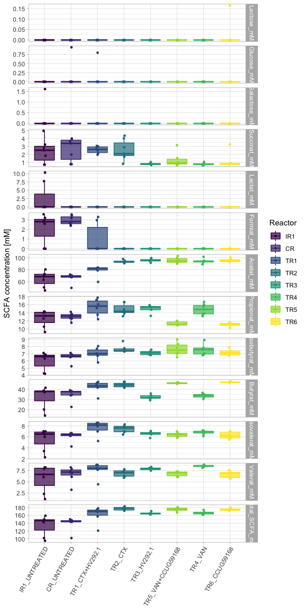<!-- -->

```r
out$stat %>%
  # dplyr::filter(signif == "SIGN") %>%
  DT::datatable()
```

```{=html}
<div id="htmlwidget-a2952420076c7a3445d3" style="width:100%;height:auto;" class="datatables html-widget"></div>
<script type="application/json" data-for="htmlwidget-a2952420076c7a3445d3">{"x":{"filter":"none","data":[["1","2","3","4","5","6","7","8","9","10","11","12","13","14","15","16","17","18","19","20","21","22","23","24","25","26","27","28","29","30","31","32","33","34","35","36","37","38","39","40","41","42","43","44","45","46","47","48","49","50","51","52","53","54","55","56","57","58","59","60","61","62","63","64","65","66","67","68","69","70","71","72","73","74","75","76","77","78","79","80","81","82","83","84","85","86","87","88","89","90","91","92","93","94","95","96","97","98","99","100","101","102","103","104","105","106","107","108","109","110","111","112","113","114","115","116","117","118","119","120","121","122","123","124","125","126","127","128","129","130","131","132","133","134","135","136","137","138","139","140","141","142","143","144","145","146","147","148","149","150","151","152","153","154","155","156","157","158","159","160","161","162","163","164","165","166","167","168","169","170","171","172","173","174","175","176","177","178","179","180","181","182","183","184","185","186","187","188","189","190","191","192","193","194","195","196","197","198","199","200","201","202","203","204","205","206","207","208","209","210","211","212","213","214","215","216","217","218","219","220","221","222","223","224","225","226","227","228","229","230","231","232","233","234","235","236","237","238","239","240","241","242","243","244","245","246","247","248","249","250","251","252","253","254","255","256","257","258","259","260","261","262","263","264","265","266","267","268","269","270","271","272","273","274","275","276"],["Acetat_mM","Acetat_mM","Acetat_mM","Acetat_mM","Isobutyrat_mM","Isobutyrat_mM","Butyrat_mM","Butyrat_mM","Butyrat_mM","Valerat_mM","Total_SCFA_mM","Total_SCFA_mM","Total_SCFA_mM","Total_SCFA_mM","Formiat_mM","Formiat_mM","Succinat_mM","Acetat_mM","Acetat_mM","Acetat_mM","Acetat_mM","Acetat_mM","Acetat_mM","Propionat_mM","Propionat_mM","Propionat_mM","Propionat_mM","Butyrat_mM","Butyrat_mM","Butyrat_mM","Butyrat_mM","Butyrat_mM","Butyrat_mM","Valerat_mM","Valerat_mM","Valerat_mM","Total_SCFA_mM","Total_SCFA_mM","Total_SCFA_mM","Total_SCFA_mM","Formiat_mM","Formiat_mM","Acetat_mM","Acetat_mM","Propionat_mM","Propionat_mM","Succinat_mM","Propionat_mM","Valerat_mM","Total_SCFA_mM","Acetat_mM","Acetat_mM","Butyrat_mM","Total_SCFA_mM","Total_SCFA_mM","Total_SCFA_mM","Formiat_mM","Succinat_mM","Acetat_mM","Propionat_mM","Propionat_mM","Butyrat_mM","Butyrat_mM","Valerat_mM","Total_SCFA_mM","Propionat_mM","Valerat_mM","Isobutyrat_mM","Isovalerat_mM","Total_SCFA_mM","Valerat_mM","Total_SCFA_mM","Propionat_mM","Formiat_mM","Formiat_mM","Isovalerat_mM","Total_SCFA_mM","Isobutyrat_mM","Succinat_mM","Propionat_mM","Valerat_mM","Formiat_mM","Formiat_mM","Isobutyrat_mM","Isobutyrat_mM","Butyrat_mM","Isovalerat_mM","Total_SCFA_mM","Butyrat_mM","Propionat_mM","Formiat_mM","Propionat_mM","Isobutyrat_mM","Isobutyrat_mM","Acetat_mM","Acetat_mM","Butyrat_mM","Butyrat_mM","Isovalerat_mM","Isovalerat_mM","Total_SCFA_mM","Total_SCFA_mM","Propionat_mM","Isovalerat_mM","Isovalerat_mM","Butyrat_mM","Succinat_mM","Isobutyrat_mM","Succinat_mM","Succinat_mM","Isobutyrat_mM","Butyrat_mM","Succinat_mM","Succinat_mM","Isovalerat_mM","Valerat_mM","Valerat_mM","Succinat_mM","Propionat_mM","Succinat_mM","Isovalerat_mM","Valerat_mM","Succinat_mM","Acetat_mM","Propionat_mM","Propionat_mM","Isobutyrat_mM","Valerat_mM","Isovalerat_mM","Formiat_mM","Isobutyrat_mM","Isobutyrat_mM","Isovalerat_mM","Butyrat_mM","Succinat_mM","Isovalerat_mM","Isovalerat_mM","Total_SCFA_mM","Total_SCFA_mM","Butyrat_mM","Isovalerat_mM","Valerat_mM","Formiat_mM","Formiat_mM","Succinat_mM","Isovalerat_mM","Butyrat_mM","Isovalerat_mM","Lactat_mM","Lactat_mM","Lactat_mM","Formiat_mM","Formiat_mM","Propionat_mM","Isobutyrat_mM","Isobutyrat_mM","Isovalerat_mM","Butyrat_mM","Lactat_mM","Lactat_mM","Lactat_mM","Formiat_mM","Propionat_mM","Butyrat_mM","Isovalerat_mM","Valerat_mM","Butyrat_mM","Succinat_mM","Lactat_mM","Acetat_mM","Butyrat_mM","Valerat_mM","Succinat_mM","Isobutyrat_mM","Valerat_mM","Isobutyrat_mM","Acetat_mM","Isobutyrat_mM","Butyrat_mM","Isovalerat_mM","Lactose_mM","Lactose_mM","Lactose_mM","Lactose_mM","Glucose_mM","Glucose_mM","Glucose_mM","Glucose_mM","Galactose_mM","Galactose_mM","Galactose_mM","Lactose_mM","Lactose_mM","Glucose_mM","Glucose_mM","Glucose_mM","Formiat_mM","Succinat_mM","Isobutyrat_mM","Isovalerat_mM","Glucose_mM","Glucose_mM","Glucose_mM","Galactose_mM","Galactose_mM","Galactose_mM","Acetat_mM","Isobutyrat_mM","Valerat_mM","Valerat_mM","Total_SCFA_mM","Succinat_mM","Lactose_mM","Glucose_mM","Isobutyrat_mM","Glucose_mM","Galactose_mM","Succinat_mM","Total_SCFA_mM","Total_SCFA_mM","Acetat_mM","Succinat_mM","Isovalerat_mM","Isobutyrat_mM","Propionat_mM","Succinat_mM","Acetat_mM","Propionat_mM","Propionat_mM","Valerat_mM","Succinat_mM","Isovalerat_mM","Propionat_mM","Valerat_mM","Total_SCFA_mM","Acetat_mM","Isovalerat_mM","Valerat_mM","Formiat_mM","Succinat_mM","Succinat_mM","Isobutyrat_mM","Valerat_mM","Succinat_mM","Propionat_mM","Total_SCFA_mM","Succinat_mM","Succinat_mM","Acetat_mM","Isovalerat_mM","Valerat_mM","Valerat_mM","Total_SCFA_mM","Succinat_mM","Acetat_mM","Isobutyrat_mM","Butyrat_mM","Isobutyrat_mM","Butyrat_mM","Acetat_mM","Acetat_mM","Isobutyrat_mM","Isobutyrat_mM","Isovalerat_mM","Valerat_mM","Isovalerat_mM","Valerat_mM","Glucose_mM","Propionat_mM","Propionat_mM","Propionat_mM","Isobutyrat_mM","Isovalerat_mM","Isovalerat_mM","Valerat_mM","Total_SCFA_mM"],["IR1_UNTREATED","IR1_UNTREATED","CR_UNTREATED","CR_UNTREATED","IR1_UNTREATED","CR_UNTREATED","IR1_UNTREATED","CR_UNTREATED","TR2_CTX","TR2_CTX","IR1_UNTREATED","IR1_UNTREATED","CR_UNTREATED","CR_UNTREATED","CR_UNTREATED","CR_UNTREATED","TR1_CTX+HV292.1","IR1_UNTREATED","IR1_UNTREATED","CR_UNTREATED","CR_UNTREATED","TR1_CTX+HV292.1","TR1_CTX+HV292.1","TR2_CTX","TR2_CTX","TR5_VAN+CCUG59168","TR4_VAN","IR1_UNTREATED","IR1_UNTREATED","CR_UNTREATED","CR_UNTREATED","TR5_VAN+CCUG59168","TR4_VAN","CR_UNTREATED","TR5_VAN+CCUG59168","TR4_VAN","IR1_UNTREATED","IR1_UNTREATED","CR_UNTREATED","CR_UNTREATED","CR_UNTREATED","CR_UNTREATED","TR1_CTX+HV292.1","TR1_CTX+HV292.1","TR1_CTX+HV292.1","TR1_CTX+HV292.1","TR2_CTX","CR_UNTREATED","IR1_UNTREATED","TR2_CTX","IR1_UNTREATED","CR_UNTREATED","TR2_CTX","IR1_UNTREATED","CR_UNTREATED","TR2_CTX","CR_UNTREATED","TR1_CTX+HV292.1","TR1_CTX+HV292.1","TR3_HV292.1","TR3_HV292.1","TR3_HV292.1","TR3_HV292.1","TR3_HV292.1","TR3_HV292.1","CR_UNTREATED","TR3_HV292.1","IR1_UNTREATED","CR_UNTREATED","TR4_VAN","TR3_HV292.1","TR3_HV292.1","CR_UNTREATED","IR1_UNTREATED","IR1_UNTREATED","TR2_CTX","TR5_VAN+CCUG59168","CR_UNTREATED","TR2_CTX","CR_UNTREATED","TR2_CTX","IR1_UNTREATED","IR1_UNTREATED","IR1_UNTREATED","IR1_UNTREATED","IR1_UNTREATED","TR2_CTX","TR1_CTX+HV292.1","TR5_VAN+CCUG59168","CR_UNTREATED","IR1_UNTREATED","IR1_UNTREATED","IR1_UNTREATED","TR2_CTX","IR1_UNTREATED","CR_UNTREATED","CR_UNTREATED","TR1_CTX+HV292.1","IR1_UNTREATED","CR_UNTREATED","IR1_UNTREATED","CR_UNTREATED","IR1_UNTREATED","IR1_UNTREATED","CR_UNTREATED","TR1_CTX+HV292.1","CR_UNTREATED","CR_UNTREATED","CR_UNTREATED","TR2_CTX","CR_UNTREATED","TR1_CTX+HV292.1","TR1_CTX+HV292.1","TR1_CTX+HV292.1","TR1_CTX+HV292.1","TR1_CTX+HV292.1","TR1_CTX+HV292.1","IR1_UNTREATED","IR1_UNTREATED","CR_UNTREATED","TR2_CTX","CR_UNTREATED","TR2_CTX","TR2_CTX","IR1_UNTREATED","CR_UNTREATED","CR_UNTREATED","TR1_CTX+HV292.1","TR1_CTX+HV292.1","CR_UNTREATED","IR1_UNTREATED","TR2_CTX","TR1_CTX+HV292.1","CR_UNTREATED","CR_UNTREATED","TR1_CTX+HV292.1","TR2_CTX","TR1_CTX+HV292.1","TR1_CTX+HV292.1","TR2_CTX","TR5_VAN+CCUG59168","CR_UNTREATED","TR1_CTX+HV292.1","TR1_CTX+HV292.1","IR1_UNTREATED","CR_UNTREATED","CR_UNTREATED","IR1_UNTREATED","IR1_UNTREATED","IR1_UNTREATED","IR1_UNTREATED","TR1_CTX+HV292.1","TR1_CTX+HV292.1","IR1_UNTREATED","CR_UNTREATED","TR1_CTX+HV292.1","TR4_VAN","IR1_UNTREATED","IR1_UNTREATED","IR1_UNTREATED","IR1_UNTREATED","TR1_CTX+HV292.1","IR1_UNTREATED","TR2_CTX","TR1_CTX+HV292.1","IR1_UNTREATED","TR1_CTX+HV292.1","TR5_VAN+CCUG59168","IR1_UNTREATED","TR2_CTX","IR1_UNTREATED","IR1_UNTREATED","IR1_UNTREATED","TR4_VAN","TR1_CTX+HV292.1","TR1_CTX+HV292.1","TR3_HV292.1","TR3_HV292.1","TR3_HV292.1","TR3_HV292.1","IR1_UNTREATED","CR_UNTREATED","TR2_CTX","TR4_VAN","TR1_CTX+HV292.1","TR1_CTX+HV292.1","CR_UNTREATED","CR_UNTREATED","IR1_UNTREATED","IR1_UNTREATED","IR1_UNTREATED","TR1_CTX+HV292.1","TR5_VAN+CCUG59168","IR1_UNTREATED","TR1_CTX+HV292.1","TR1_CTX+HV292.1","IR1_UNTREATED","TR3_HV292.1","TR3_HV292.1","TR3_HV292.1","IR1_UNTREATED","CR_UNTREATED","CR_UNTREATED","IR1_UNTREATED","IR1_UNTREATED","IR1_UNTREATED","TR4_VAN","TR1_CTX+HV292.1","CR_UNTREATED","TR2_CTX","TR2_CTX","IR1_UNTREATED","TR3_HV292.1","TR1_CTX+HV292.1","TR5_VAN+CCUG59168","CR_UNTREATED","IR1_UNTREATED","IR1_UNTREATED","TR1_CTX+HV292.1","TR2_CTX","TR2_CTX","TR3_HV292.1","TR3_HV292.1","IR1_UNTREATED","TR5_VAN+CCUG59168","CR_UNTREATED","TR2_CTX","TR1_CTX+HV292.1","TR1_CTX+HV292.1","CR_UNTREATED","TR5_VAN+CCUG59168","IR1_UNTREATED","TR1_CTX+HV292.1","TR1_CTX+HV292.1","TR1_CTX+HV292.1","TR5_VAN+CCUG59168","TR5_VAN+CCUG59168","TR5_VAN+CCUG59168","IR1_UNTREATED","TR1_CTX+HV292.1","TR4_VAN","TR5_VAN+CCUG59168","TR2_CTX","TR3_HV292.1","TR2_CTX","TR3_HV292.1","IR1_UNTREATED","CR_UNTREATED","IR1_UNTREATED","IR1_UNTREATED","IR1_UNTREATED","CR_UNTREATED","TR5_VAN+CCUG59168","IR1_UNTREATED","TR5_VAN+CCUG59168","TR2_CTX","TR1_CTX+HV292.1","TR2_CTX","IR1_UNTREATED","TR3_HV292.1","TR3_HV292.1","TR1_CTX+HV292.1","TR1_CTX+HV292.1","CR_UNTREATED","IR1_UNTREATED","CR_UNTREATED","IR1_UNTREATED","CR_UNTREATED","IR1_UNTREATED","TR2_CTX","TR3_HV292.1","TR3_HV292.1","IR1_UNTREATED","IR1_UNTREATED","IR1_UNTREATED","IR1_UNTREATED"],["TR2_CTX","TR4_VAN","TR2_CTX","TR4_VAN","TR2_CTX","TR2_CTX","TR2_CTX","TR2_CTX","TR4_VAN","TR4_VAN","TR2_CTX","TR4_VAN","TR2_CTX","TR4_VAN","TR2_CTX","TR4_VAN","TR4_VAN","TR5_VAN+CCUG59168","TR6_CCUG59168","TR5_VAN+CCUG59168","TR6_CCUG59168","TR2_CTX","TR4_VAN","TR5_VAN+CCUG59168","TR6_CCUG59168","TR4_VAN","TR6_CCUG59168","TR5_VAN+CCUG59168","TR6_CCUG59168","TR5_VAN+CCUG59168","TR6_CCUG59168","TR4_VAN","TR6_CCUG59168","TR4_VAN","TR4_VAN","TR6_CCUG59168","TR5_VAN+CCUG59168","TR6_CCUG59168","TR5_VAN+CCUG59168","TR6_CCUG59168","TR5_VAN+CCUG59168","TR6_CCUG59168","TR5_VAN+CCUG59168","TR6_CCUG59168","TR5_VAN+CCUG59168","TR6_CCUG59168","TR4_VAN","TR6_CCUG59168","TR4_VAN","TR4_VAN","TR3_HV292.1","TR3_HV292.1","TR3_HV292.1","TR3_HV292.1","TR3_HV292.1","TR3_HV292.1","TR3_HV292.1","TR3_HV292.1","TR3_HV292.1","TR5_VAN+CCUG59168","TR6_CCUG59168","TR5_VAN+CCUG59168","TR6_CCUG59168","TR5_VAN+CCUG59168","TR6_CCUG59168","TR5_VAN+CCUG59168","TR4_VAN","TR4_VAN","TR2_CTX","TR6_CCUG59168","TR6_CCUG59168","TR5_VAN+CCUG59168","TR2_CTX","TR2_CTX","TR4_VAN","TR5_VAN+CCUG59168","TR4_VAN","TR4_VAN","TR3_HV292.1","TR3_HV292.1","TR3_HV292.1","TR5_VAN+CCUG59168","TR6_CCUG59168","TR5_VAN+CCUG59168","TR6_CCUG59168","TR1_CTX+HV292.1","TR6_CCUG59168","TR2_CTX","TR6_CCUG59168","TR4_VAN","TR3_HV292.1","TR3_HV292.1","TR3_HV292.1","TR3_HV292.1","TR1_CTX+HV292.1","TR1_CTX+HV292.1","TR1_CTX+HV292.1","TR4_VAN","TR1_CTX+HV292.1","TR1_CTX+HV292.1","TR1_CTX+HV292.1","TR1_CTX+HV292.1","TR2_CTX","TR2_CTX","TR4_VAN","TR6_CCUG59168","TR4_VAN","TR3_HV292.1","TR6_CCUG59168","TR6_CCUG59168","TR5_VAN+CCUG59168","TR3_HV292.1","TR5_VAN+CCUG59168","TR6_CCUG59168","TR5_VAN+CCUG59168","TR5_VAN+CCUG59168","TR6_CCUG59168","TR4_VAN","TR4_VAN","TR3_HV292.1","TR3_HV292.1","TR3_HV292.1","TR5_VAN+CCUG59168","TR6_CCUG59168","TR1_CTX+HV292.1","TR1_CTX+HV292.1","TR6_CCUG59168","TR2_CTX","TR6_CCUG59168","TR1_CTX+HV292.1","TR1_CTX+HV292.1","TR6_CCUG59168","TR4_VAN","TR3_HV292.1","TR5_VAN+CCUG59168","TR3_HV292.1","TR4_VAN","TR5_VAN+CCUG59168","TR6_CCUG59168","TR6_CCUG59168","TR4_VAN","TR1_CTX+HV292.1","TR2_CTX","TR4_VAN","TR3_HV292.1","TR3_HV292.1","TR4_VAN","TR4_VAN","CR_UNTREATED","TR2_CTX","TR4_VAN","TR5_VAN+CCUG59168","TR6_CCUG59168","TR6_CCUG59168","TR1_CTX+HV292.1","TR2_CTX","TR6_CCUG59168","TR4_VAN","TR1_CTX+HV292.1","TR5_VAN+CCUG59168","TR6_CCUG59168","TR3_HV292.1","TR5_VAN+CCUG59168","TR5_VAN+CCUG59168","TR2_CTX","TR1_CTX+HV292.1","TR5_VAN+CCUG59168","TR4_VAN","TR3_HV292.1","TR3_HV292.1","TR3_HV292.1","TR3_HV292.1","TR5_VAN+CCUG59168","TR6_CCUG59168","TR4_VAN","TR5_VAN+CCUG59168","TR4_VAN","TR4_VAN","TR4_VAN","TR4_VAN","TR6_CCUG59168","TR6_CCUG59168","TR6_CCUG59168","TR6_CCUG59168","TR2_CTX","TR4_VAN","TR2_CTX","TR4_VAN","CR_UNTREATED","TR2_CTX","TR4_VAN","TR6_CCUG59168","TR6_CCUG59168","TR1_CTX+HV292.1","TR5_VAN+CCUG59168","TR6_CCUG59168","TR1_CTX+HV292.1","TR5_VAN+CCUG59168","TR5_VAN+CCUG59168","TR6_CCUG59168","CR_UNTREATED","TR5_VAN+CCUG59168","TR6_CCUG59168","TR1_CTX+HV292.1","TR5_VAN+CCUG59168","TR6_CCUG59168","TR6_CCUG59168","TR4_VAN","TR6_CCUG59168","TR6_CCUG59168","TR6_CCUG59168","CR_UNTREATED","TR6_CCUG59168","TR3_HV292.1","TR6_CCUG59168","TR3_HV292.1","TR3_HV292.1","TR6_CCUG59168","TR4_VAN","TR5_VAN+CCUG59168","TR4_VAN","TR6_CCUG59168","TR5_VAN+CCUG59168","CR_UNTREATED","TR6_CCUG59168","TR1_CTX+HV292.1","TR5_VAN+CCUG59168","TR2_CTX","TR4_VAN","TR5_VAN+CCUG59168","TR6_CCUG59168","TR3_HV292.1","TR3_HV292.1","TR3_HV292.1","TR3_HV292.1","TR6_CCUG59168","TR6_CCUG59168","TR6_CCUG59168","CR_UNTREATED","TR2_CTX","TR6_CCUG59168","TR4_VAN","TR5_VAN+CCUG59168","TR4_VAN","TR3_HV292.1","TR4_VAN","TR2_CTX","TR2_CTX","CR_UNTREATED","CR_UNTREATED","CR_UNTREATED","TR2_CTX","TR6_CCUG59168","TR1_CTX+HV292.1","TR4_VAN","TR5_VAN+CCUG59168","TR2_CTX","TR4_VAN","CR_UNTREATED","TR5_VAN+CCUG59168","TR6_CCUG59168","TR3_HV292.1","TR6_CCUG59168","TR6_CCUG59168","TR6_CCUG59168","TR5_VAN+CCUG59168","TR5_VAN+CCUG59168","TR1_CTX+HV292.1","CR_UNTREATED","TR4_VAN","TR4_VAN","TR6_CCUG59168","TR5_VAN+CCUG59168","TR6_CCUG59168","TR2_CTX","CR_UNTREATED"],[0.000582750582750583,0.000582750582750583,0.000582750582750583,0.000582750582750583,0.000582750582750583,0.000582750582750583,0.000582750582750583,0.000582750582750583,0.000582750582750583,0.000582750582750583,0.000582750582750583,0.000582750582750583,0.000582750582750583,0.000582750582750583,0.00105757508393252,0.00105757508393252,0.00116550116550117,0.00116550116550117,0.00116550116550117,0.00116550116550117,0.00116550116550117,0.00116550116550117,0.00116550116550117,0.00116550116550117,0.00116550116550117,0.00116550116550117,0.00116550116550117,0.00116550116550117,0.00116550116550117,0.00116550116550117,0.00116550116550117,0.00116550116550117,0.00116550116550117,0.00116550116550117,0.00116550116550117,0.00116550116550117,0.00116550116550117,0.00116550116550117,0.00116550116550117,0.00116550116550117,0.00206715624926564,0.00206715624926564,0.00216450216450216,0.00216450216450216,0.00216450216450216,0.00216450216450216,0.00233100233100233,0.00233100233100233,0.00233100233100233,0.00233100233100233,0.00252525252525253,0.00252525252525253,0.00252525252525253,0.00252525252525253,0.00252525252525253,0.00252525252525253,0.00420046265106426,0.00432900432900433,0.00432900432900433,0.00432900432900433,0.00432900432900433,0.00432900432900433,0.00432900432900433,0.00432900432900433,0.00432900432900433,0.00466200466200466,0.00505050505050505,0.00699300699300699,0.00699300699300699,0.00815850815850816,0.00865800865800866,0.00865800865800866,0.0110722610722611,0.01135734805108,0.01135734805108,0.013986013986014,0.013986013986014,0.0174825174825175,0.0176767676767677,0.0176767676767677,0.0176767676767677,0.018186845401354,0.018186845401354,0.0221445221445221,0.0221445221445221,0.0221445221445221,0.0221445221445221,0.0221445221445221,0.025974025974026,0.0262237762237762,0.0297706992660188,0.0303030303030303,0.0303030303030303,0.0303030303030303,0.034965034965035,0.034965034965035,0.034965034965035,0.034965034965035,0.034965034965035,0.034965034965035,0.034965034965035,0.034965034965035,0.0378787878787879,0.0378787878787879,0.0378787878787879,0.0411255411255411,0.0474012470967823,0.047979797979798,0.0512820512820513,0.0512820512820513,0.0512820512820513,0.051948051948052,0.0649350649350649,0.0649350649350649,0.0649350649350649,0.0649350649350649,0.0649350649350649,0.0728438228438228,0.0728438228438228,0.0732323232323232,0.0732323232323232,0.0732323232323232,0.0734265734265734,0.0734265734265734,0.0734265734265734,0.0734265734265734,0.0734265734265734,0.0734265734265734,0.0930735930735931,0.0957333848646337,0.101398601398601,0.101398601398601,0.101398601398601,0.106060606060606,0.115581899951383,0.125541125541126,0.128205128205128,0.132034632034632,0.132034632034632,0.137529137529138,0.137529137529138,0.137529137529138,0.139854122662014,0.139854122662014,0.148989898989899,0.148989898989899,0.164918414918415,0.164918414918415,0.172954917988421,0.172954917988421,0.172954917988421,0.175734335644225,0.175734335644225,0.180652680652681,0.180652680652681,0.180652680652681,0.180652680652681,0.208624708624709,0.211589702530811,0.211589702530811,0.211589702530811,0.222993861534394,0.234265734265734,0.234265734265734,0.234265734265734,0.234265734265734,0.24025974025974,0.252445251654586,0.261209066425939,0.267676767676768,0.267676767676768,0.267676767676768,0.294871794871795,0.294871794871795,0.294871794871795,0.30952380952381,0.343434343434343,0.343434343434343,0.343434343434343,0.343434343434343,0.354539479773501,0.354539479773501,0.354539479773501,0.354539479773501,0.354539479773501,0.354539479773501,0.391365938307552,0.391365938307552,0.391365938307552,0.391365938307552,0.391365938307552,0.404656761927286,0.404656761927286,0.404656761927286,0.404656761927286,0.404656761927286,0.408547997911908,0.428571428571429,0.428571428571429,0.428571428571429,0.440400698139003,0.440400698139003,0.440400698139003,0.440400698139003,0.440400698139003,0.440400698139003,0.445221445221445,0.445221445221445,0.445221445221445,0.445221445221445,0.445221445221445,0.455710955710956,0.465208818452142,0.465208818452142,0.484848484848485,0.498962298603761,0.498962298603761,0.533799533799534,0.533799533799534,0.533799533799534,0.534965034965035,0.536796536796537,0.536796536796537,0.564870837359607,0.588744588744589,0.628205128205128,0.628205128205128,0.628205128205128,0.628205128205128,0.628205128205128,0.630355526361864,0.638888888888889,0.662337662337662,0.662337662337662,0.662337662337662,0.699134199134199,0.699134199134199,0.699134199134199,0.701165327418155,0.730769230769231,0.730769230769231,0.730769230769231,0.730769230769231,0.755050505050505,0.755050505050505,0.755050505050505,0.804778554778555,0.804778554778555,0.804778554778555,0.804778554778555,0.804778554778555,0.804778554778555,0.818181818181818,0.835664335664336,0.835664335664336,0.835664335664336,0.835664335664336,0.901515151515152,0.901515151515152,0.930735930735931,0.930735930735931,0.930735930735931,0.937229437229437,0.945221445221445,0.945221445221445,0.945221445221445,0.945221445221445,1,1,1,1,1,1,1,1,1],[0.008,0.008,0.008,0.008,0.008,0.008,0.008,0.008,0.008,0.008,0.008,0.008,0.008,0.008,0.008,0.008,0.008,0.008,0.008,0.008,0.008,0.008,0.008,0.008,0.008,0.008,0.008,0.008,0.008,0.008,0.008,0.008,0.008,0.008,0.008,0.008,0.008,0.008,0.008,0.008,0.012,0.012,0.012,0.012,0.012,0.012,0.012,0.012,0.012,0.012,0.012,0.012,0.012,0.012,0.012,0.012,0.018,0.018,0.018,0.018,0.018,0.018,0.018,0.018,0.018,0.019,0.021,0.028,0.028,0.032,0.033,0.033,0.042,0.042,0.042,0.05,0.05,0.06,0.06,0.06,0.06,0.06,0.06,0.069,0.069,0.069,0.069,0.069,0.08,0.08,0.089,0.089,0.089,0.089,0.095,0.095,0.095,0.095,0.095,0.095,0.095,0.095,0.1,0.1,0.1,0.11,0.12,0.12,0.13,0.13,0.13,0.13,0.15,0.15,0.15,0.15,0.15,0.16,0.16,0.16,0.16,0.16,0.16,0.16,0.16,0.16,0.16,0.16,0.2,0.2,0.21,0.21,0.21,0.22,0.24,0.25,0.26,0.26,0.26,0.27,0.27,0.27,0.27,0.27,0.28,0.28,0.31,0.31,0.32,0.32,0.32,0.32,0.32,0.32,0.32,0.32,0.32,0.36,0.36,0.36,0.36,0.38,0.39,0.39,0.39,0.39,0.4,0.41,0.43,0.43,0.43,0.43,0.47,0.47,0.47,0.49,0.53,0.53,0.53,0.53,0.53,0.53,0.53,0.53,0.53,0.53,0.57,0.57,0.57,0.57,0.57,0.57,0.57,0.57,0.57,0.57,0.57,0.58,0.58,0.58,0.58,0.58,0.58,0.58,0.58,0.58,0.58,0.58,0.58,0.58,0.58,0.59,0.6,0.6,0.62,0.63,0.63,0.66,0.66,0.66,0.66,0.66,0.66,0.7,0.72,0.75,0.75,0.75,0.75,0.75,0.75,0.76,0.78,0.78,0.78,0.81,0.81,0.81,0.81,0.83,0.83,0.83,0.83,0.85,0.85,0.85,0.88,0.88,0.88,0.88,0.88,0.88,0.89,0.9,0.9,0.9,0.9,0.96,0.96,0.98,0.98,0.98,0.98,0.98,0.98,0.98,0.98,1,1,1,1,1,1,1,1,1],["Wilcoxon","Wilcoxon","Wilcoxon","Wilcoxon","Wilcoxon","Wilcoxon","Wilcoxon","Wilcoxon","Wilcoxon","Wilcoxon","Wilcoxon","Wilcoxon","Wilcoxon","Wilcoxon","Wilcoxon","Wilcoxon","Wilcoxon","Wilcoxon","Wilcoxon","Wilcoxon","Wilcoxon","Wilcoxon","Wilcoxon","Wilcoxon","Wilcoxon","Wilcoxon","Wilcoxon","Wilcoxon","Wilcoxon","Wilcoxon","Wilcoxon","Wilcoxon","Wilcoxon","Wilcoxon","Wilcoxon","Wilcoxon","Wilcoxon","Wilcoxon","Wilcoxon","Wilcoxon","Wilcoxon","Wilcoxon","Wilcoxon","Wilcoxon","Wilcoxon","Wilcoxon","Wilcoxon","Wilcoxon","Wilcoxon","Wilcoxon","Wilcoxon","Wilcoxon","Wilcoxon","Wilcoxon","Wilcoxon","Wilcoxon","Wilcoxon","Wilcoxon","Wilcoxon","Wilcoxon","Wilcoxon","Wilcoxon","Wilcoxon","Wilcoxon","Wilcoxon","Wilcoxon","Wilcoxon","Wilcoxon","Wilcoxon","Wilcoxon","Wilcoxon","Wilcoxon","Wilcoxon","Wilcoxon","Wilcoxon","Wilcoxon","Wilcoxon","Wilcoxon","Wilcoxon","Wilcoxon","Wilcoxon","Wilcoxon","Wilcoxon","Wilcoxon","Wilcoxon","Wilcoxon","Wilcoxon","Wilcoxon","Wilcoxon","Wilcoxon","Wilcoxon","Wilcoxon","Wilcoxon","Wilcoxon","Wilcoxon","Wilcoxon","Wilcoxon","Wilcoxon","Wilcoxon","Wilcoxon","Wilcoxon","Wilcoxon","Wilcoxon","Wilcoxon","Wilcoxon","Wilcoxon","Wilcoxon","Wilcoxon","Wilcoxon","Wilcoxon","Wilcoxon","Wilcoxon","Wilcoxon","Wilcoxon","Wilcoxon","Wilcoxon","Wilcoxon","Wilcoxon","Wilcoxon","Wilcoxon","Wilcoxon","Wilcoxon","Wilcoxon","Wilcoxon","Wilcoxon","Wilcoxon","Wilcoxon","Wilcoxon","Wilcoxon","Wilcoxon","Wilcoxon","Wilcoxon","Wilcoxon","Wilcoxon","Wilcoxon","Wilcoxon","Wilcoxon","Wilcoxon","Wilcoxon","Wilcoxon","Wilcoxon","Wilcoxon","Wilcoxon","Wilcoxon","Wilcoxon","Wilcoxon","Wilcoxon","Wilcoxon","Wilcoxon","Wilcoxon","Wilcoxon","Wilcoxon","Wilcoxon","Wilcoxon","Wilcoxon","Wilcoxon","Wilcoxon","Wilcoxon","Wilcoxon","Wilcoxon","Wilcoxon","Wilcoxon","Wilcoxon","Wilcoxon","Wilcoxon","Wilcoxon","Wilcoxon","Wilcoxon","Wilcoxon","Wilcoxon","Wilcoxon","Wilcoxon","Wilcoxon","Wilcoxon","Wilcoxon","Wilcoxon","Wilcoxon","Wilcoxon","Wilcoxon","Wilcoxon","Wilcoxon","Wilcoxon","Wilcoxon","Wilcoxon","Wilcoxon","Wilcoxon","Wilcoxon","Wilcoxon","Wilcoxon","Wilcoxon","Wilcoxon","Wilcoxon","Wilcoxon","Wilcoxon","Wilcoxon","Wilcoxon","Wilcoxon","Wilcoxon","Wilcoxon","Wilcoxon","Wilcoxon","Wilcoxon","Wilcoxon","Wilcoxon","Wilcoxon","Wilcoxon","Wilcoxon","Wilcoxon","Wilcoxon","Wilcoxon","Wilcoxon","Wilcoxon","Wilcoxon","Wilcoxon","Wilcoxon","Wilcoxon","Wilcoxon","Wilcoxon","Wilcoxon","Wilcoxon","Wilcoxon","Wilcoxon","Wilcoxon","Wilcoxon","Wilcoxon","Wilcoxon","Wilcoxon","Wilcoxon","Wilcoxon","Wilcoxon","Wilcoxon","Wilcoxon","Wilcoxon","Wilcoxon","Wilcoxon","Wilcoxon","Wilcoxon","Wilcoxon","Wilcoxon","Wilcoxon","Wilcoxon","Wilcoxon","Wilcoxon","Wilcoxon","Wilcoxon","Wilcoxon","Wilcoxon","Wilcoxon","Wilcoxon","Wilcoxon","Wilcoxon","Wilcoxon","Wilcoxon","Wilcoxon","Wilcoxon","Wilcoxon","Wilcoxon","Wilcoxon","Wilcoxon","Wilcoxon","Wilcoxon","Wilcoxon","Wilcoxon","Wilcoxon","Wilcoxon","Wilcoxon","Wilcoxon","Wilcoxon","Wilcoxon","Wilcoxon","Wilcoxon","Wilcoxon","Wilcoxon","Wilcoxon","Wilcoxon","Wilcoxon"],["SIGN","SIGN","SIGN","SIGN","SIGN","SIGN","SIGN","SIGN","SIGN","SIGN","SIGN","SIGN","SIGN","SIGN","SIGN","SIGN","SIGN","SIGN","SIGN","SIGN","SIGN","SIGN","SIGN","SIGN","SIGN","SIGN","SIGN","SIGN","SIGN","SIGN","SIGN","SIGN","SIGN","SIGN","SIGN","SIGN","SIGN","SIGN","SIGN","SIGN","SIGN","SIGN","SIGN","SIGN","SIGN","SIGN","SIGN","SIGN","SIGN","SIGN","SIGN","SIGN","SIGN","SIGN","SIGN","SIGN","SIGN","SIGN","SIGN","SIGN","SIGN","SIGN","SIGN","SIGN","SIGN","SIGN","SIGN","SIGN","SIGN","SIGN","SIGN","SIGN","SIGN","SIGN","SIGN","SIGN","SIGN","NS","NS","NS","NS","NS","NS","NS","NS","NS","NS","NS","NS","NS","NS","NS","NS","NS","NS","NS","NS","NS","NS","NS","NS","NS","NS","NS","NS","NS","NS","NS","NS","NS","NS","NS","NS","NS","NS","NS","NS","NS","NS","NS","NS","NS","NS","NS","NS","NS","NS","NS","NS","NS","NS","NS","NS","NS","NS","NS","NS","NS","NS","NS","NS","NS","NS","NS","NS","NS","NS","NS","NS","NS","NS","NS","NS","NS","NS","NS","NS","NS","NS","NS","NS","NS","NS","NS","NS","NS","NS","NS","NS","NS","NS","NS","NS","NS","NS","NS","NS","NS","NS","NS","NS","NS","NS","NS","NS","NS","NS","NS","NS","NS","NS","NS","NS","NS","NS","NS","NS","NS","NS","NS","NS","NS","NS","NS","NS","NS","NS","NS","NS","NS","NS","NS","NS","NS","NS","NS","NS","NS","NS","NS","NS","NS","NS","NS","NS","NS","NS","NS","NS","NS","NS","NS","NS","NS","NS","NS","NS","NS","NS","NS","NS","NS","NS","NS","NS","NS","NS","NS","NS","NS","NS","NS","NS","NS","NS","NS","NS","NS","NS","NS","NS","NS","NS","NS","NS","NS","NS","NS","NS","NS","NS","NS","NS","NS","NS","NS"]],"container":"<table class=\"display\">\n  <thead>\n    <tr>\n      <th> <\/th>\n      <th>alphadiversiy<\/th>\n      <th>group1<\/th>\n      <th>group2<\/th>\n      <th>p<\/th>\n      <th>p.adj<\/th>\n      <th>method<\/th>\n      <th>signif<\/th>\n    <\/tr>\n  <\/thead>\n<\/table>","options":{"columnDefs":[{"className":"dt-right","targets":[4,5]},{"orderable":false,"targets":0}],"order":[],"autoWidth":false,"orderClasses":false}},"evals":[],"jsHooks":[]}</script>
```


```r
plot_time <- function(df, 
                      measure,
                      x = "Day_from_Inoculum", 
                      y = "value", 
                      shape = "neg",
                      fill = "Reactor_Treatment",
                      group = "Reactor_Treatment", 
                      facet)
{
  df %>%
  dplyr::filter(alphadiversiy %in% measure) %>%
  dplyr::mutate(alphadiversiy = fct_reorder(alphadiversiy, value, .desc = TRUE)) %>%
  dplyr::mutate(neg = ifelse(value == 0, "neg", "pos")) %>%
  arrange(Day_from_Inoculum) %>%
  ggplot(aes_string(x = x,
                    y = y)) +
  geom_jitter(size=0.5, alpha=0.9, aes_string(color = fill, fill = fill, shape = shape),  show.legend = TRUE) + 
  geom_path(inherit.aes = TRUE, aes_string(fill = fill, color = fill, show.legend = FALSE),
            size = 0.005,
            linetype = "dashed") +
  facet_grid(as.formula(facet), scales = "free") +
  # geom_vline(xintercept = c(23,39), 
             # color="black", alpha=0.4) + 
  geom_smooth(show.legend = FALSE, level = 0.95, alpha=0.05, size = 0.5 ,aes_string(color = fill, fill = fill)) +
  # scale_x_continuous(breaks=seq(0,90,10)) +
  # scale_y_continuous(labels = scientific,
  #                    limits=c(1e+10, 1e+11), breaks = seq(1e+10, 1e+11, by = 1e+10),
  #                    trans = "log10") +
  theme_light() +
  scale_color_viridis_d(na.value = "black") +
  scale_fill_viridis_d(na.value = "black") -> plot

  return(plot + theme(legend.position = "bottom"))
}
```


```r
out$plot$data %>%
  plot_time(measure = c("Total_SCFA_mM", "Acetat_mM", "Butyrat_mM", "Propionat_mM", "Isobutyrat_mM", "Valerat_mM", "Isovalerat_mM", "Succinat_mM"),
            facet = c("alphadiversiy ~ ."),  shape = NULL) + 
  labs(x="Day (from Inoculum)", y= "SCFA concentration [mM]",  
       col=NULL, fill = NULL, shape = NULL) + 
  scale_shape_manual(values=c(4, 19)) +
 geom_vline(xintercept = c(39)) -> p4

p4
```

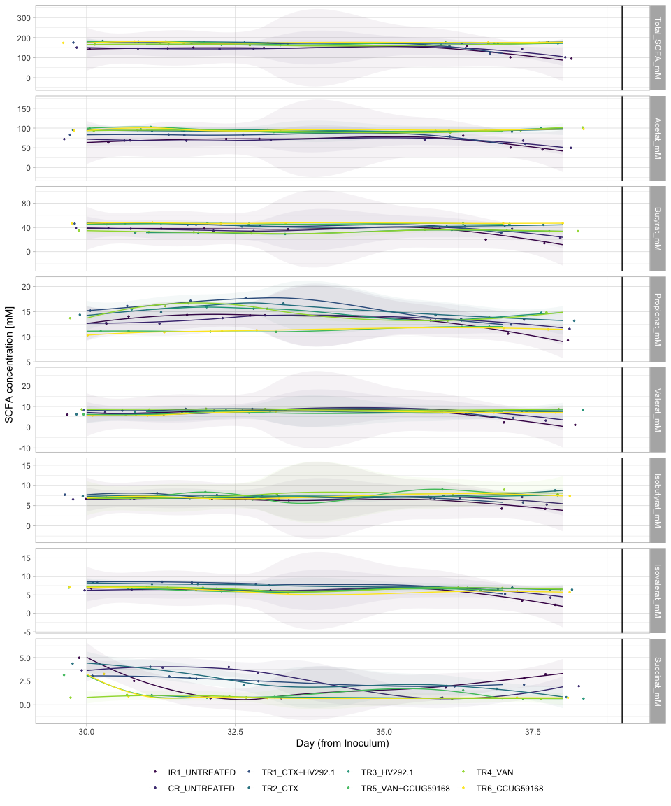


```r
p4 %>% ggplotly()
```

```
## `geom_smooth()` using method = 'loess' and formula 'y ~ x'
```

```
## Warning in simpleLoess(y, x, w, span, degree = degree, parametric =
## parametric, : Chernobyl! trL>n 6

## Warning in simpleLoess(y, x, w, span, degree = degree, parametric =
## parametric, : Chernobyl! trL>n 6
```

```
## Warning in sqrt(sum.squares/one.delta): NaNs produced
```

```
## Warning in stats::qt(level/2 + 0.5, pred$df): NaNs produced
```

```
## Warning in simpleLoess(y, x, w, span, degree = degree, parametric =
## parametric, : span too small. fewer data values than degrees of freedom.
```

```
## Warning in simpleLoess(y, x, w, span, degree = degree, parametric =
## parametric, : pseudoinverse used at 30.965
```

```
## Warning in simpleLoess(y, x, w, span, degree = degree, parametric =
## parametric, : neighborhood radius 2.035
```

```
## Warning in simpleLoess(y, x, w, span, degree = degree, parametric =
## parametric, : reciprocal condition number 0
```

```
## Warning in simpleLoess(y, x, w, span, degree = degree, parametric =
## parametric, : There are other near singularities as well. 25.351
```

```
## Warning in predLoess(object$y, object$x, newx = if
## (is.null(newdata)) object$x else if (is.data.frame(newdata))
## as.matrix(model.frame(delete.response(terms(object)), : span too small. fewer
## data values than degrees of freedom.
```

```
## Warning in predLoess(object$y, object$x, newx = if
## (is.null(newdata)) object$x else if (is.data.frame(newdata))
## as.matrix(model.frame(delete.response(terms(object)), : pseudoinverse used at
## 30.965
```

```
## Warning in predLoess(object$y, object$x, newx = if
## (is.null(newdata)) object$x else if (is.data.frame(newdata))
## as.matrix(model.frame(delete.response(terms(object)), : neighborhood radius
## 2.035
```

```
## Warning in predLoess(object$y, object$x, newx = if
## (is.null(newdata)) object$x else if (is.data.frame(newdata))
## as.matrix(model.frame(delete.response(terms(object)), : reciprocal condition
## number 0
```

```
## Warning in predLoess(object$y, object$x, newx = if
## (is.null(newdata)) object$x else if (is.data.frame(newdata))
## as.matrix(model.frame(delete.response(terms(object)), : There are other near
## singularities as well. 25.351
```

```
## Warning in simpleLoess(y, x, w, span, degree = degree, parametric =
## parametric, : Chernobyl! trL>n 6

## Warning in simpleLoess(y, x, w, span, degree = degree, parametric =
## parametric, : Chernobyl! trL>n 6
```

```
## Warning in sqrt(sum.squares/one.delta): NaNs produced
```

```
## Warning in stats::qt(level/2 + 0.5, pred$df): NaNs produced
```

```
## Warning in simpleLoess(y, x, w, span, degree = degree, parametric =
## parametric, : Chernobyl! trL>n 6

## Warning in simpleLoess(y, x, w, span, degree = degree, parametric =
## parametric, : Chernobyl! trL>n 6
```

```
## Warning in sqrt(sum.squares/one.delta): NaNs produced
```

```
## Warning in stats::qt(level/2 + 0.5, pred$df): NaNs produced
```

```
## Warning in simpleLoess(y, x, w, span, degree = degree, parametric =
## parametric, : Chernobyl! trL>n 6

## Warning in simpleLoess(y, x, w, span, degree = degree, parametric =
## parametric, : Chernobyl! trL>n 6
```

```
## Warning in sqrt(sum.squares/one.delta): NaNs produced
```

```
## Warning in stats::qt(level/2 + 0.5, pred$df): NaNs produced
```

```
## Warning in simpleLoess(y, x, w, span, degree = degree, parametric =
## parametric, : span too small. fewer data values than degrees of freedom.
```

```
## Warning in simpleLoess(y, x, w, span, degree = degree, parametric =
## parametric, : pseudoinverse used at 30.965
```

```
## Warning in simpleLoess(y, x, w, span, degree = degree, parametric =
## parametric, : neighborhood radius 2.035
```

```
## Warning in simpleLoess(y, x, w, span, degree = degree, parametric =
## parametric, : reciprocal condition number 0
```

```
## Warning in simpleLoess(y, x, w, span, degree = degree, parametric =
## parametric, : There are other near singularities as well. 25.351
```

```
## Warning in predLoess(object$y, object$x, newx = if
## (is.null(newdata)) object$x else if (is.data.frame(newdata))
## as.matrix(model.frame(delete.response(terms(object)), : span too small. fewer
## data values than degrees of freedom.
```

```
## Warning in predLoess(object$y, object$x, newx = if
## (is.null(newdata)) object$x else if (is.data.frame(newdata))
## as.matrix(model.frame(delete.response(terms(object)), : pseudoinverse used at
## 30.965
```

```
## Warning in predLoess(object$y, object$x, newx = if
## (is.null(newdata)) object$x else if (is.data.frame(newdata))
## as.matrix(model.frame(delete.response(terms(object)), : neighborhood radius
## 2.035
```

```
## Warning in predLoess(object$y, object$x, newx = if
## (is.null(newdata)) object$x else if (is.data.frame(newdata))
## as.matrix(model.frame(delete.response(terms(object)), : reciprocal condition
## number 0
```

```
## Warning in predLoess(object$y, object$x, newx = if
## (is.null(newdata)) object$x else if (is.data.frame(newdata))
## as.matrix(model.frame(delete.response(terms(object)), : There are other near
## singularities as well. 25.351
```

```
## Warning in simpleLoess(y, x, w, span, degree = degree, parametric =
## parametric, : Chernobyl! trL>n 6

## Warning in simpleLoess(y, x, w, span, degree = degree, parametric =
## parametric, : Chernobyl! trL>n 6
```

```
## Warning in sqrt(sum.squares/one.delta): NaNs produced
```

```
## Warning in stats::qt(level/2 + 0.5, pred$df): NaNs produced
```

```
## Warning in simpleLoess(y, x, w, span, degree = degree, parametric =
## parametric, : Chernobyl! trL>n 6

## Warning in simpleLoess(y, x, w, span, degree = degree, parametric =
## parametric, : Chernobyl! trL>n 6
```

```
## Warning in sqrt(sum.squares/one.delta): NaNs produced
```

```
## Warning in stats::qt(level/2 + 0.5, pred$df): NaNs produced
```

```
## Warning in simpleLoess(y, x, w, span, degree = degree, parametric =
## parametric, : Chernobyl! trL>n 6

## Warning in simpleLoess(y, x, w, span, degree = degree, parametric =
## parametric, : Chernobyl! trL>n 6
```

```
## Warning in sqrt(sum.squares/one.delta): NaNs produced
```

```
## Warning in stats::qt(level/2 + 0.5, pred$df): NaNs produced
```

```
## Warning in simpleLoess(y, x, w, span, degree = degree, parametric =
## parametric, : span too small. fewer data values than degrees of freedom.
```

```
## Warning in simpleLoess(y, x, w, span, degree = degree, parametric =
## parametric, : pseudoinverse used at 30.965
```

```
## Warning in simpleLoess(y, x, w, span, degree = degree, parametric =
## parametric, : neighborhood radius 2.035
```

```
## Warning in simpleLoess(y, x, w, span, degree = degree, parametric =
## parametric, : reciprocal condition number 0
```

```
## Warning in simpleLoess(y, x, w, span, degree = degree, parametric =
## parametric, : There are other near singularities as well. 25.351
```

```
## Warning in predLoess(object$y, object$x, newx = if
## (is.null(newdata)) object$x else if (is.data.frame(newdata))
## as.matrix(model.frame(delete.response(terms(object)), : span too small. fewer
## data values than degrees of freedom.
```

```
## Warning in predLoess(object$y, object$x, newx = if
## (is.null(newdata)) object$x else if (is.data.frame(newdata))
## as.matrix(model.frame(delete.response(terms(object)), : pseudoinverse used at
## 30.965
```

```
## Warning in predLoess(object$y, object$x, newx = if
## (is.null(newdata)) object$x else if (is.data.frame(newdata))
## as.matrix(model.frame(delete.response(terms(object)), : neighborhood radius
## 2.035
```

```
## Warning in predLoess(object$y, object$x, newx = if
## (is.null(newdata)) object$x else if (is.data.frame(newdata))
## as.matrix(model.frame(delete.response(terms(object)), : reciprocal condition
## number 0
```

```
## Warning in predLoess(object$y, object$x, newx = if
## (is.null(newdata)) object$x else if (is.data.frame(newdata))
## as.matrix(model.frame(delete.response(terms(object)), : There are other near
## singularities as well. 25.351
```

```
## Warning in simpleLoess(y, x, w, span, degree = degree, parametric =
## parametric, : Chernobyl! trL>n 6

## Warning in simpleLoess(y, x, w, span, degree = degree, parametric =
## parametric, : Chernobyl! trL>n 6
```

```
## Warning in sqrt(sum.squares/one.delta): NaNs produced
```

```
## Warning in stats::qt(level/2 + 0.5, pred$df): NaNs produced
```

```
## Warning in simpleLoess(y, x, w, span, degree = degree, parametric =
## parametric, : Chernobyl! trL>n 6

## Warning in simpleLoess(y, x, w, span, degree = degree, parametric =
## parametric, : Chernobyl! trL>n 6
```

```
## Warning in sqrt(sum.squares/one.delta): NaNs produced
```

```
## Warning in stats::qt(level/2 + 0.5, pred$df): NaNs produced
```

```
## Warning in simpleLoess(y, x, w, span, degree = degree, parametric =
## parametric, : Chernobyl! trL>n 6

## Warning in simpleLoess(y, x, w, span, degree = degree, parametric =
## parametric, : Chernobyl! trL>n 6
```

```
## Warning in sqrt(sum.squares/one.delta): NaNs produced
```

```
## Warning in stats::qt(level/2 + 0.5, pred$df): NaNs produced
```

```
## Warning in simpleLoess(y, x, w, span, degree = degree, parametric =
## parametric, : span too small. fewer data values than degrees of freedom.
```

```
## Warning in simpleLoess(y, x, w, span, degree = degree, parametric =
## parametric, : pseudoinverse used at 30.965
```

```
## Warning in simpleLoess(y, x, w, span, degree = degree, parametric =
## parametric, : neighborhood radius 2.035
```

```
## Warning in simpleLoess(y, x, w, span, degree = degree, parametric =
## parametric, : reciprocal condition number 0
```

```
## Warning in simpleLoess(y, x, w, span, degree = degree, parametric =
## parametric, : There are other near singularities as well. 25.351
```

```
## Warning in predLoess(object$y, object$x, newx = if
## (is.null(newdata)) object$x else if (is.data.frame(newdata))
## as.matrix(model.frame(delete.response(terms(object)), : span too small. fewer
## data values than degrees of freedom.
```

```
## Warning in predLoess(object$y, object$x, newx = if
## (is.null(newdata)) object$x else if (is.data.frame(newdata))
## as.matrix(model.frame(delete.response(terms(object)), : pseudoinverse used at
## 30.965
```

```
## Warning in predLoess(object$y, object$x, newx = if
## (is.null(newdata)) object$x else if (is.data.frame(newdata))
## as.matrix(model.frame(delete.response(terms(object)), : neighborhood radius
## 2.035
```

```
## Warning in predLoess(object$y, object$x, newx = if
## (is.null(newdata)) object$x else if (is.data.frame(newdata))
## as.matrix(model.frame(delete.response(terms(object)), : reciprocal condition
## number 0
```

```
## Warning in predLoess(object$y, object$x, newx = if
## (is.null(newdata)) object$x else if (is.data.frame(newdata))
## as.matrix(model.frame(delete.response(terms(object)), : There are other near
## singularities as well. 25.351
```

```
## Warning in simpleLoess(y, x, w, span, degree = degree, parametric =
## parametric, : Chernobyl! trL>n 6

## Warning in simpleLoess(y, x, w, span, degree = degree, parametric =
## parametric, : Chernobyl! trL>n 6
```

```
## Warning in sqrt(sum.squares/one.delta): NaNs produced
```

```
## Warning in stats::qt(level/2 + 0.5, pred$df): NaNs produced
```

```
## Warning in simpleLoess(y, x, w, span, degree = degree, parametric =
## parametric, : Chernobyl! trL>n 6

## Warning in simpleLoess(y, x, w, span, degree = degree, parametric =
## parametric, : Chernobyl! trL>n 6
```

```
## Warning in sqrt(sum.squares/one.delta): NaNs produced
```

```
## Warning in stats::qt(level/2 + 0.5, pred$df): NaNs produced
```

```
## Warning in simpleLoess(y, x, w, span, degree = degree, parametric =
## parametric, : Chernobyl! trL>n 6

## Warning in simpleLoess(y, x, w, span, degree = degree, parametric =
## parametric, : Chernobyl! trL>n 6
```

```
## Warning in sqrt(sum.squares/one.delta): NaNs produced
```

```
## Warning in stats::qt(level/2 + 0.5, pred$df): NaNs produced
```

```
## Warning in simpleLoess(y, x, w, span, degree = degree, parametric =
## parametric, : span too small. fewer data values than degrees of freedom.
```

```
## Warning in simpleLoess(y, x, w, span, degree = degree, parametric =
## parametric, : pseudoinverse used at 30.965
```

```
## Warning in simpleLoess(y, x, w, span, degree = degree, parametric =
## parametric, : neighborhood radius 2.035
```

```
## Warning in simpleLoess(y, x, w, span, degree = degree, parametric =
## parametric, : reciprocal condition number 0
```

```
## Warning in simpleLoess(y, x, w, span, degree = degree, parametric =
## parametric, : There are other near singularities as well. 25.351
```

```
## Warning in predLoess(object$y, object$x, newx = if
## (is.null(newdata)) object$x else if (is.data.frame(newdata))
## as.matrix(model.frame(delete.response(terms(object)), : span too small. fewer
## data values than degrees of freedom.
```

```
## Warning in predLoess(object$y, object$x, newx = if
## (is.null(newdata)) object$x else if (is.data.frame(newdata))
## as.matrix(model.frame(delete.response(terms(object)), : pseudoinverse used at
## 30.965
```

```
## Warning in predLoess(object$y, object$x, newx = if
## (is.null(newdata)) object$x else if (is.data.frame(newdata))
## as.matrix(model.frame(delete.response(terms(object)), : neighborhood radius
## 2.035
```

```
## Warning in predLoess(object$y, object$x, newx = if
## (is.null(newdata)) object$x else if (is.data.frame(newdata))
## as.matrix(model.frame(delete.response(terms(object)), : reciprocal condition
## number 0
```

```
## Warning in predLoess(object$y, object$x, newx = if
## (is.null(newdata)) object$x else if (is.data.frame(newdata))
## as.matrix(model.frame(delete.response(terms(object)), : There are other near
## singularities as well. 25.351
```

```
## Warning in simpleLoess(y, x, w, span, degree = degree, parametric =
## parametric, : Chernobyl! trL>n 6

## Warning in simpleLoess(y, x, w, span, degree = degree, parametric =
## parametric, : Chernobyl! trL>n 6
```

```
## Warning in sqrt(sum.squares/one.delta): NaNs produced
```

```
## Warning in stats::qt(level/2 + 0.5, pred$df): NaNs produced
```

```
## Warning in simpleLoess(y, x, w, span, degree = degree, parametric =
## parametric, : Chernobyl! trL>n 6

## Warning in simpleLoess(y, x, w, span, degree = degree, parametric =
## parametric, : Chernobyl! trL>n 6
```

```
## Warning in sqrt(sum.squares/one.delta): NaNs produced
```

```
## Warning in stats::qt(level/2 + 0.5, pred$df): NaNs produced
```

```
## Warning in simpleLoess(y, x, w, span, degree = degree, parametric =
## parametric, : Chernobyl! trL>n 6

## Warning in simpleLoess(y, x, w, span, degree = degree, parametric =
## parametric, : Chernobyl! trL>n 6
```

```
## Warning in sqrt(sum.squares/one.delta): NaNs produced
```

```
## Warning in stats::qt(level/2 + 0.5, pred$df): NaNs produced
```

```
## Warning in simpleLoess(y, x, w, span, degree = degree, parametric =
## parametric, : span too small. fewer data values than degrees of freedom.
```

```
## Warning in simpleLoess(y, x, w, span, degree = degree, parametric =
## parametric, : pseudoinverse used at 30.965
```

```
## Warning in simpleLoess(y, x, w, span, degree = degree, parametric =
## parametric, : neighborhood radius 2.035
```

```
## Warning in simpleLoess(y, x, w, span, degree = degree, parametric =
## parametric, : reciprocal condition number 0
```

```
## Warning in simpleLoess(y, x, w, span, degree = degree, parametric =
## parametric, : There are other near singularities as well. 25.351
```

```
## Warning in predLoess(object$y, object$x, newx = if
## (is.null(newdata)) object$x else if (is.data.frame(newdata))
## as.matrix(model.frame(delete.response(terms(object)), : span too small. fewer
## data values than degrees of freedom.
```

```
## Warning in predLoess(object$y, object$x, newx = if
## (is.null(newdata)) object$x else if (is.data.frame(newdata))
## as.matrix(model.frame(delete.response(terms(object)), : pseudoinverse used at
## 30.965
```

```
## Warning in predLoess(object$y, object$x, newx = if
## (is.null(newdata)) object$x else if (is.data.frame(newdata))
## as.matrix(model.frame(delete.response(terms(object)), : neighborhood radius
## 2.035
```

```
## Warning in predLoess(object$y, object$x, newx = if
## (is.null(newdata)) object$x else if (is.data.frame(newdata))
## as.matrix(model.frame(delete.response(terms(object)), : reciprocal condition
## number 0
```

```
## Warning in predLoess(object$y, object$x, newx = if
## (is.null(newdata)) object$x else if (is.data.frame(newdata))
## as.matrix(model.frame(delete.response(terms(object)), : There are other near
## singularities as well. 25.351
```

```
## Warning in simpleLoess(y, x, w, span, degree = degree, parametric =
## parametric, : Chernobyl! trL>n 6

## Warning in simpleLoess(y, x, w, span, degree = degree, parametric =
## parametric, : Chernobyl! trL>n 6
```

```
## Warning in sqrt(sum.squares/one.delta): NaNs produced
```

```
## Warning in stats::qt(level/2 + 0.5, pred$df): NaNs produced
```

```
## Warning in simpleLoess(y, x, w, span, degree = degree, parametric =
## parametric, : Chernobyl! trL>n 6

## Warning in simpleLoess(y, x, w, span, degree = degree, parametric =
## parametric, : Chernobyl! trL>n 6
```

```
## Warning in sqrt(sum.squares/one.delta): NaNs produced
```

```
## Warning in stats::qt(level/2 + 0.5, pred$df): NaNs produced
```

```
## Warning in simpleLoess(y, x, w, span, degree = degree, parametric =
## parametric, : Chernobyl! trL>n 6

## Warning in simpleLoess(y, x, w, span, degree = degree, parametric =
## parametric, : Chernobyl! trL>n 6
```

```
## Warning in sqrt(sum.squares/one.delta): NaNs produced
```

```
## Warning in stats::qt(level/2 + 0.5, pred$df): NaNs produced
```

```
## Warning in simpleLoess(y, x, w, span, degree = degree, parametric =
## parametric, : span too small. fewer data values than degrees of freedom.
```

```
## Warning in simpleLoess(y, x, w, span, degree = degree, parametric =
## parametric, : pseudoinverse used at 30.965
```

```
## Warning in simpleLoess(y, x, w, span, degree = degree, parametric =
## parametric, : neighborhood radius 2.035
```

```
## Warning in simpleLoess(y, x, w, span, degree = degree, parametric =
## parametric, : reciprocal condition number 0
```

```
## Warning in simpleLoess(y, x, w, span, degree = degree, parametric =
## parametric, : There are other near singularities as well. 25.351
```

```
## Warning in predLoess(object$y, object$x, newx = if
## (is.null(newdata)) object$x else if (is.data.frame(newdata))
## as.matrix(model.frame(delete.response(terms(object)), : span too small. fewer
## data values than degrees of freedom.
```

```
## Warning in predLoess(object$y, object$x, newx = if
## (is.null(newdata)) object$x else if (is.data.frame(newdata))
## as.matrix(model.frame(delete.response(terms(object)), : pseudoinverse used at
## 30.965
```

```
## Warning in predLoess(object$y, object$x, newx = if
## (is.null(newdata)) object$x else if (is.data.frame(newdata))
## as.matrix(model.frame(delete.response(terms(object)), : neighborhood radius
## 2.035
```

```
## Warning in predLoess(object$y, object$x, newx = if
## (is.null(newdata)) object$x else if (is.data.frame(newdata))
## as.matrix(model.frame(delete.response(terms(object)), : reciprocal condition
## number 0
```

```
## Warning in predLoess(object$y, object$x, newx = if
## (is.null(newdata)) object$x else if (is.data.frame(newdata))
## as.matrix(model.frame(delete.response(terms(object)), : There are other near
## singularities as well. 25.351
```

```
## Warning in simpleLoess(y, x, w, span, degree = degree, parametric =
## parametric, : Chernobyl! trL>n 6

## Warning in simpleLoess(y, x, w, span, degree = degree, parametric =
## parametric, : Chernobyl! trL>n 6
```

```
## Warning in sqrt(sum.squares/one.delta): NaNs produced
```

```
## Warning in stats::qt(level/2 + 0.5, pred$df): NaNs produced
```

```
## Warning in simpleLoess(y, x, w, span, degree = degree, parametric =
## parametric, : Chernobyl! trL>n 6

## Warning in simpleLoess(y, x, w, span, degree = degree, parametric =
## parametric, : Chernobyl! trL>n 6
```

```
## Warning in sqrt(sum.squares/one.delta): NaNs produced
```

```
## Warning in stats::qt(level/2 + 0.5, pred$df): NaNs produced
```

```
## Warning in simpleLoess(y, x, w, span, degree = degree, parametric =
## parametric, : Chernobyl! trL>n 6

## Warning in simpleLoess(y, x, w, span, degree = degree, parametric =
## parametric, : Chernobyl! trL>n 6
```

```
## Warning in sqrt(sum.squares/one.delta): NaNs produced
```

```
## Warning in stats::qt(level/2 + 0.5, pred$df): NaNs produced
```

```
## Warning in simpleLoess(y, x, w, span, degree = degree, parametric =
## parametric, : span too small. fewer data values than degrees of freedom.
```

```
## Warning in simpleLoess(y, x, w, span, degree = degree, parametric =
## parametric, : pseudoinverse used at 30.965
```

```
## Warning in simpleLoess(y, x, w, span, degree = degree, parametric =
## parametric, : neighborhood radius 2.035
```

```
## Warning in simpleLoess(y, x, w, span, degree = degree, parametric =
## parametric, : reciprocal condition number 0
```

```
## Warning in simpleLoess(y, x, w, span, degree = degree, parametric =
## parametric, : There are other near singularities as well. 25.351
```

```
## Warning in predLoess(object$y, object$x, newx = if
## (is.null(newdata)) object$x else if (is.data.frame(newdata))
## as.matrix(model.frame(delete.response(terms(object)), : span too small. fewer
## data values than degrees of freedom.
```

```
## Warning in predLoess(object$y, object$x, newx = if
## (is.null(newdata)) object$x else if (is.data.frame(newdata))
## as.matrix(model.frame(delete.response(terms(object)), : pseudoinverse used at
## 30.965
```

```
## Warning in predLoess(object$y, object$x, newx = if
## (is.null(newdata)) object$x else if (is.data.frame(newdata))
## as.matrix(model.frame(delete.response(terms(object)), : neighborhood radius
## 2.035
```

```
## Warning in predLoess(object$y, object$x, newx = if
## (is.null(newdata)) object$x else if (is.data.frame(newdata))
## as.matrix(model.frame(delete.response(terms(object)), : reciprocal condition
## number 0
```

```
## Warning in predLoess(object$y, object$x, newx = if
## (is.null(newdata)) object$x else if (is.data.frame(newdata))
## as.matrix(model.frame(delete.response(terms(object)), : There are other near
## singularities as well. 25.351
```

```
## Warning in simpleLoess(y, x, w, span, degree = degree, parametric =
## parametric, : Chernobyl! trL>n 6

## Warning in simpleLoess(y, x, w, span, degree = degree, parametric =
## parametric, : Chernobyl! trL>n 6
```

```
## Warning in sqrt(sum.squares/one.delta): NaNs produced
```

```
## Warning in stats::qt(level/2 + 0.5, pred$df): NaNs produced
```

```
## Warning in simpleLoess(y, x, w, span, degree = degree, parametric =
## parametric, : Chernobyl! trL>n 6

## Warning in simpleLoess(y, x, w, span, degree = degree, parametric =
## parametric, : Chernobyl! trL>n 6
```

```
## Warning in sqrt(sum.squares/one.delta): NaNs produced
```

```
## Warning in stats::qt(level/2 + 0.5, pred$df): NaNs produced
```

```{=html}
<div id="htmlwidget-32aa63dc8b2020fcf497" style="width:672px;height:480px;" class="plotly html-widget"></div>
<script type="application/json" data-for="htmlwidget-32aa63dc8b2020fcf497">{"x":{"data":[{"x":[29.6674280418083,30.9239630613476,31.6914177149534,32.9443457145244,35.7519370049238,36.7120280599222,38.107387540862],"y":[142.603951118669,146.665763789702,149.77304283461,147.895860262001,159.325224545589,101.803787227695,94.8759976398136],"text":["Reactor_Treatment: IR1_UNTREATED<br />Reactor_Treatment: IR1_UNTREATED<br />shape: 19<br />Day_from_Inoculum: 30<br />value: 142.604","Reactor_Treatment: IR1_UNTREATED<br />Reactor_Treatment: IR1_UNTREATED<br />shape: 19<br />Day_from_Inoculum: 31<br />value: 146.666","Reactor_Treatment: IR1_UNTREATED<br />Reactor_Treatment: IR1_UNTREATED<br />shape: 19<br />Day_from_Inoculum: 32<br />value: 149.773","Reactor_Treatment: IR1_UNTREATED<br />Reactor_Treatment: IR1_UNTREATED<br />shape: 19<br />Day_from_Inoculum: 33<br />value: 147.896","Reactor_Treatment: IR1_UNTREATED<br />Reactor_Treatment: IR1_UNTREATED<br />shape: 19<br />Day_from_Inoculum: 36<br />value: 159.325","Reactor_Treatment: IR1_UNTREATED<br />Reactor_Treatment: IR1_UNTREATED<br />shape: 19<br />Day_from_Inoculum: 37<br />value: 101.804","Reactor_Treatment: IR1_UNTREATED<br />Reactor_Treatment: IR1_UNTREATED<br />shape: 19<br />Day_from_Inoculum: 38<br />value:  94.876"],"type":"scatter","mode":"markers","marker":{"autocolorscale":false,"color":"rgba(68,1,84,1)","opacity":0.9,"size":1.88976377952756,"symbol":"circle","line":{"width":1.88976377952756,"color":"rgba(68,1,84,1)"}},"hoveron":"points","name":"(IR1_UNTREATED,1)","legendgroup":"(IR1_UNTREATED,1)","showlegend":true,"xaxis":"x","yaxis":"y","hoverinfo":"text","frame":null},{"x":[29.7523442076519,30.7525244215503,32.3340264709666,32.7117119517177,36.0435146909207,37.3799815010279,37.8555992010981],"y":[63.4268294799581,68.6037702197097,72.4066809636338,72.5492803471508,80.5816114200812,50.5947603209857,45.5817368003026],"text":["Reactor_Treatment: IR1_UNTREATED<br />Reactor_Treatment: IR1_UNTREATED<br />shape: 19<br />Day_from_Inoculum: 30<br />value:  63.427","Reactor_Treatment: IR1_UNTREATED<br />Reactor_Treatment: IR1_UNTREATED<br />shape: 19<br />Day_from_Inoculum: 31<br />value:  68.604","Reactor_Treatment: IR1_UNTREATED<br />Reactor_Treatment: IR1_UNTREATED<br />shape: 19<br />Day_from_Inoculum: 32<br />value:  72.407","Reactor_Treatment: IR1_UNTREATED<br />Reactor_Treatment: IR1_UNTREATED<br />shape: 19<br />Day_from_Inoculum: 33<br />value:  72.549","Reactor_Treatment: IR1_UNTREATED<br />Reactor_Treatment: IR1_UNTREATED<br />shape: 19<br />Day_from_Inoculum: 36<br />value:  80.582","Reactor_Treatment: IR1_UNTREATED<br />Reactor_Treatment: IR1_UNTREATED<br />shape: 19<br />Day_from_Inoculum: 37<br />value:  50.595","Reactor_Treatment: IR1_UNTREATED<br />Reactor_Treatment: IR1_UNTREATED<br />shape: 19<br />Day_from_Inoculum: 38<br />value:  45.582"],"type":"scatter","mode":"markers","marker":{"autocolorscale":false,"color":"rgba(68,1,84,1)","opacity":0.9,"size":1.88976377952756,"symbol":"circle","line":{"width":1.88976377952756,"color":"rgba(68,1,84,1)"}},"hoveron":"points","name":"(IR1_UNTREATED,2)","legendgroup":"(IR1_UNTREATED,2)","showlegend":true,"xaxis":"x","yaxis":"y2","hoverinfo":"text","frame":null},{"x":[29.8547027941793,31.3834323201329,31.8755502065644,33.0571873899549,36.1542570607737,37.1270441569388,38.3671781420708],"y":[38.569290565541,37.8800825472951,38.2612280506382,37.172764803453,41.5249817609098,20.0758933655975,14.0282478847928],"text":["Reactor_Treatment: IR1_UNTREATED<br />Reactor_Treatment: IR1_UNTREATED<br />shape: 19<br />Day_from_Inoculum: 30<br />value:  38.569","Reactor_Treatment: IR1_UNTREATED<br />Reactor_Treatment: IR1_UNTREATED<br />shape: 19<br />Day_from_Inoculum: 31<br />value:  37.880","Reactor_Treatment: IR1_UNTREATED<br />Reactor_Treatment: IR1_UNTREATED<br />shape: 19<br />Day_from_Inoculum: 32<br />value:  38.261","Reactor_Treatment: IR1_UNTREATED<br />Reactor_Treatment: IR1_UNTREATED<br />shape: 19<br />Day_from_Inoculum: 33<br />value:  37.173","Reactor_Treatment: IR1_UNTREATED<br />Reactor_Treatment: IR1_UNTREATED<br />shape: 19<br />Day_from_Inoculum: 36<br />value:  41.525","Reactor_Treatment: IR1_UNTREATED<br />Reactor_Treatment: IR1_UNTREATED<br />shape: 19<br />Day_from_Inoculum: 37<br />value:  20.076","Reactor_Treatment: IR1_UNTREATED<br />Reactor_Treatment: IR1_UNTREATED<br />shape: 19<br />Day_from_Inoculum: 38<br />value:  14.028"],"type":"scatter","mode":"markers","marker":{"autocolorscale":false,"color":"rgba(68,1,84,1)","opacity":0.9,"size":1.88976377952756,"symbol":"circle","line":{"width":1.88976377952756,"color":"rgba(68,1,84,1)"}},"hoveron":"points","name":"(IR1_UNTREATED,3)","legendgroup":"(IR1_UNTREATED,3)","showlegend":true,"xaxis":"x","yaxis":"y3","hoverinfo":"text","frame":null},{"x":[30.3281438961625,30.7297252248973,32.0830567713827,33.3857202606276,36.2558643491939,36.8932567737997,37.7727612288669],"y":[12.6028412447706,14.0379815363027,14.3372095779488,14.2599860750167,13.2613480962174,10.6020985793117,9.26934792513549],"text":["Reactor_Treatment: IR1_UNTREATED<br />Reactor_Treatment: IR1_UNTREATED<br />shape: 19<br />Day_from_Inoculum: 30<br />value:  12.603","Reactor_Treatment: IR1_UNTREATED<br />Reactor_Treatment: IR1_UNTREATED<br />shape: 19<br />Day_from_Inoculum: 31<br />value:  14.038","Reactor_Treatment: IR1_UNTREATED<br />Reactor_Treatment: IR1_UNTREATED<br />shape: 19<br />Day_from_Inoculum: 32<br />value:  14.337","Reactor_Treatment: IR1_UNTREATED<br />Reactor_Treatment: IR1_UNTREATED<br />shape: 19<br />Day_from_Inoculum: 33<br />value:  14.260","Reactor_Treatment: IR1_UNTREATED<br />Reactor_Treatment: IR1_UNTREATED<br />shape: 19<br />Day_from_Inoculum: 36<br />value:  13.261","Reactor_Treatment: IR1_UNTREATED<br />Reactor_Treatment: IR1_UNTREATED<br />shape: 19<br />Day_from_Inoculum: 37<br />value:  10.602","Reactor_Treatment: IR1_UNTREATED<br />Reactor_Treatment: IR1_UNTREATED<br />shape: 19<br />Day_from_Inoculum: 38<br />value:   9.269"],"type":"scatter","mode":"markers","marker":{"autocolorscale":false,"color":"rgba(68,1,84,1)","opacity":0.9,"size":1.88976377952756,"symbol":"circle","line":{"width":1.88976377952756,"color":"rgba(68,1,84,1)"}},"hoveron":"points","name":"(IR1_UNTREATED,4)","legendgroup":"(IR1_UNTREATED,4)","showlegend":true,"xaxis":"x","yaxis":"y4","hoverinfo":"text","frame":null},{"x":[29.8182143142447,30.6541635751724,31.7076297381893,32.8255853291601,35.7162218287587,36.834265723452,37.9538605287671],"y":[6.05820080450978,6.68920192279872,7.92484617980476,8.28612139388733,8.25484179505948,2.28805335102174,1.12233620827831],"text":["Reactor_Treatment: IR1_UNTREATED<br />Reactor_Treatment: IR1_UNTREATED<br />shape: 19<br />Day_from_Inoculum: 30<br />value:   6.058","Reactor_Treatment: IR1_UNTREATED<br />Reactor_Treatment: IR1_UNTREATED<br />shape: 19<br />Day_from_Inoculum: 31<br />value:   6.689","Reactor_Treatment: IR1_UNTREATED<br />Reactor_Treatment: IR1_UNTREATED<br />shape: 19<br />Day_from_Inoculum: 32<br />value:   7.925","Reactor_Treatment: IR1_UNTREATED<br />Reactor_Treatment: IR1_UNTREATED<br />shape: 19<br />Day_from_Inoculum: 33<br />value:   8.286","Reactor_Treatment: IR1_UNTREATED<br />Reactor_Treatment: IR1_UNTREATED<br />shape: 19<br />Day_from_Inoculum: 36<br />value:   8.255","Reactor_Treatment: IR1_UNTREATED<br />Reactor_Treatment: IR1_UNTREATED<br />shape: 19<br />Day_from_Inoculum: 37<br />value:   2.288","Reactor_Treatment: IR1_UNTREATED<br />Reactor_Treatment: IR1_UNTREATED<br />shape: 19<br />Day_from_Inoculum: 38<br />value:   1.122"],"type":"scatter","mode":"markers","marker":{"autocolorscale":false,"color":"rgba(68,1,84,1)","opacity":0.9,"size":1.88976377952756,"symbol":"circle","line":{"width":1.88976377952756,"color":"rgba(68,1,84,1)"}},"hoveron":"points","name":"(IR1_UNTREATED,5)","legendgroup":"(IR1_UNTREATED,5)","showlegend":true,"xaxis":"x","yaxis":"y5","hoverinfo":"text","frame":null},{"x":[30.0878970157355,30.9913217172027,31.8911281030625,32.6063794914633,35.8563922217116,36.6806464880705,37.7326389778405],"y":[6.62380820353441,7.11926693820152,6.73625101752859,6.33267418562658,6.89169034047574,4.27274631334692,4.21039312448148],"text":["Reactor_Treatment: IR1_UNTREATED<br />Reactor_Treatment: IR1_UNTREATED<br />shape: 19<br />Day_from_Inoculum: 30<br />value:   6.624","Reactor_Treatment: IR1_UNTREATED<br />Reactor_Treatment: IR1_UNTREATED<br />shape: 19<br />Day_from_Inoculum: 31<br />value:   7.119","Reactor_Treatment: IR1_UNTREATED<br />Reactor_Treatment: IR1_UNTREATED<br />shape: 19<br />Day_from_Inoculum: 32<br />value:   6.736","Reactor_Treatment: IR1_UNTREATED<br />Reactor_Treatment: IR1_UNTREATED<br />shape: 19<br />Day_from_Inoculum: 33<br />value:   6.333","Reactor_Treatment: IR1_UNTREATED<br />Reactor_Treatment: IR1_UNTREATED<br />shape: 19<br />Day_from_Inoculum: 36<br />value:   6.892","Reactor_Treatment: IR1_UNTREATED<br />Reactor_Treatment: IR1_UNTREATED<br />shape: 19<br />Day_from_Inoculum: 37<br />value:   4.273","Reactor_Treatment: IR1_UNTREATED<br />Reactor_Treatment: IR1_UNTREATED<br />shape: 19<br />Day_from_Inoculum: 38<br />value:   4.210"],"type":"scatter","mode":"markers","marker":{"autocolorscale":false,"color":"rgba(68,1,84,1)","opacity":0.9,"size":1.88976377952756,"symbol":"circle","line":{"width":1.88976377952756,"color":"rgba(68,1,84,1)"}},"hoveron":"points","name":"(IR1_UNTREATED,6)","legendgroup":"(IR1_UNTREATED,6)","showlegend":true,"xaxis":"x","yaxis":"y6","hoverinfo":"text","frame":null},{"x":[30.3782809482887,31.1761169165373,31.6415329042822,32.9333091162145,36.2946499409154,36.9959490323439,37.6293573414907],"y":[6.76216963478699,7.00982550609205,6.50532497505471,6.01715337331854,6.99166292995438,3.43739182514213,2.30630459830351],"text":["Reactor_Treatment: IR1_UNTREATED<br />Reactor_Treatment: IR1_UNTREATED<br />shape: 19<br />Day_from_Inoculum: 30<br />value:   6.762","Reactor_Treatment: IR1_UNTREATED<br />Reactor_Treatment: IR1_UNTREATED<br />shape: 19<br />Day_from_Inoculum: 31<br />value:   7.010","Reactor_Treatment: IR1_UNTREATED<br />Reactor_Treatment: IR1_UNTREATED<br />shape: 19<br />Day_from_Inoculum: 32<br />value:   6.505","Reactor_Treatment: IR1_UNTREATED<br />Reactor_Treatment: IR1_UNTREATED<br />shape: 19<br />Day_from_Inoculum: 33<br />value:   6.017","Reactor_Treatment: IR1_UNTREATED<br />Reactor_Treatment: IR1_UNTREATED<br />shape: 19<br />Day_from_Inoculum: 36<br />value:   6.992","Reactor_Treatment: IR1_UNTREATED<br />Reactor_Treatment: IR1_UNTREATED<br />shape: 19<br />Day_from_Inoculum: 37<br />value:   3.437","Reactor_Treatment: IR1_UNTREATED<br />Reactor_Treatment: IR1_UNTREATED<br />shape: 19<br />Day_from_Inoculum: 38<br />value:   2.306"],"type":"scatter","mode":"markers","marker":{"autocolorscale":false,"color":"rgba(68,1,84,1)","opacity":0.9,"size":1.88976377952756,"symbol":"circle","line":{"width":1.88976377952756,"color":"rgba(68,1,84,1)"}},"hoveron":"points","name":"(IR1_UNTREATED,7)","legendgroup":"(IR1_UNTREATED,7)","showlegend":true,"xaxis":"x","yaxis":"y7","hoverinfo":"text","frame":null},{"x":[30.3255180215463,31.0538469593972,31.8145222840831,33.3248795352876,36.2507208310068,36.9122607052326,38.2656289508566],"y":[4.97706152075473,2.51597703958638,0.695766190364398,0.694099281460233,1.8183996736208,2.80073031412922,3.23262385964245],"text":["Reactor_Treatment: IR1_UNTREATED<br />Reactor_Treatment: IR1_UNTREATED<br />shape: 19<br />Day_from_Inoculum: 30<br />value:   4.977","Reactor_Treatment: IR1_UNTREATED<br />Reactor_Treatment: IR1_UNTREATED<br />shape: 19<br />Day_from_Inoculum: 31<br />value:   2.516","Reactor_Treatment: IR1_UNTREATED<br />Reactor_Treatment: IR1_UNTREATED<br />shape: 19<br />Day_from_Inoculum: 32<br />value:   0.696","Reactor_Treatment: IR1_UNTREATED<br />Reactor_Treatment: IR1_UNTREATED<br />shape: 19<br />Day_from_Inoculum: 33<br />value:   0.694","Reactor_Treatment: IR1_UNTREATED<br />Reactor_Treatment: IR1_UNTREATED<br />shape: 19<br />Day_from_Inoculum: 36<br />value:   1.818","Reactor_Treatment: IR1_UNTREATED<br />Reactor_Treatment: IR1_UNTREATED<br />shape: 19<br />Day_from_Inoculum: 37<br />value:   2.801","Reactor_Treatment: IR1_UNTREATED<br />Reactor_Treatment: IR1_UNTREATED<br />shape: 19<br />Day_from_Inoculum: 38<br />value:   3.233"],"type":"scatter","mode":"markers","marker":{"autocolorscale":false,"color":"rgba(68,1,84,1)","opacity":0.9,"size":1.88976377952756,"symbol":"circle","line":{"width":1.88976377952756,"color":"rgba(68,1,84,1)"}},"hoveron":"points","name":"(IR1_UNTREATED,8)","legendgroup":"(IR1_UNTREATED,8)","showlegend":true,"xaxis":"x","yaxis":"y8","hoverinfo":"text","frame":null},{"x":[29.6950137883425,30.9169404158369,31.7739929562435,33.1989239567891,36.1005314312875,36.8574653064832,38.1290279803798],"y":[150.119118980638,145.40794164277,143.258967529524,144.926945855718,147.635270799707,143.669311779195,101.838076284293],"text":["Reactor_Treatment: CR_UNTREATED<br />Reactor_Treatment: CR_UNTREATED<br />shape: 19<br />Day_from_Inoculum: 30<br />value: 150.119","Reactor_Treatment: CR_UNTREATED<br />Reactor_Treatment: CR_UNTREATED<br />shape: 19<br />Day_from_Inoculum: 31<br />value: 145.408","Reactor_Treatment: CR_UNTREATED<br />Reactor_Treatment: CR_UNTREATED<br />shape: 19<br />Day_from_Inoculum: 32<br />value: 143.259","Reactor_Treatment: CR_UNTREATED<br />Reactor_Treatment: CR_UNTREATED<br />shape: 19<br />Day_from_Inoculum: 33<br />value: 144.927","Reactor_Treatment: CR_UNTREATED<br />Reactor_Treatment: CR_UNTREATED<br />shape: 19<br />Day_from_Inoculum: 36<br />value: 147.635","Reactor_Treatment: CR_UNTREATED<br />Reactor_Treatment: CR_UNTREATED<br />shape: 19<br />Day_from_Inoculum: 37<br />value: 143.669","Reactor_Treatment: CR_UNTREATED<br />Reactor_Treatment: CR_UNTREATED<br />shape: 19<br />Day_from_Inoculum: 38<br />value: 101.838"],"type":"scatter","mode":"markers","marker":{"autocolorscale":false,"color":"rgba(70,51,126,1)","opacity":0.9,"size":1.88976377952756,"symbol":"circle","line":{"width":1.88976377952756,"color":"rgba(70,51,126,1)"}},"hoveron":"points","name":"(CR_UNTREATED,1)","legendgroup":"(CR_UNTREATED,1)","showlegend":true,"xaxis":"x","yaxis":"y","hoverinfo":"text","frame":null},{"x":[29.6861613091081,30.972179999575,32.1760048476979,32.7203137228265,35.6994070479646,36.7079258624464,38.3729809224606],"y":[71.9633197996624,68.132723172171,67.8418592728106,69.8222570760282,70.6448714615609,68.1020659005946,49.7752473378504],"text":["Reactor_Treatment: CR_UNTREATED<br />Reactor_Treatment: CR_UNTREATED<br />shape: 19<br />Day_from_Inoculum: 30<br />value:  71.963","Reactor_Treatment: CR_UNTREATED<br />Reactor_Treatment: CR_UNTREATED<br />shape: 19<br />Day_from_Inoculum: 31<br />value:  68.133","Reactor_Treatment: CR_UNTREATED<br />Reactor_Treatment: CR_UNTREATED<br />shape: 19<br />Day_from_Inoculum: 32<br />value:  67.842","Reactor_Treatment: CR_UNTREATED<br />Reactor_Treatment: CR_UNTREATED<br />shape: 19<br />Day_from_Inoculum: 33<br />value:  69.822","Reactor_Treatment: CR_UNTREATED<br />Reactor_Treatment: CR_UNTREATED<br />shape: 19<br />Day_from_Inoculum: 36<br />value:  70.645","Reactor_Treatment: CR_UNTREATED<br />Reactor_Treatment: CR_UNTREATED<br />shape: 19<br />Day_from_Inoculum: 37<br />value:  68.102","Reactor_Treatment: CR_UNTREATED<br />Reactor_Treatment: CR_UNTREATED<br />shape: 19<br />Day_from_Inoculum: 38<br />value:  49.775"],"type":"scatter","mode":"markers","marker":{"autocolorscale":false,"color":"rgba(70,51,126,1)","opacity":0.9,"size":1.88976377952756,"symbol":"circle","line":{"width":1.88976377952756,"color":"rgba(70,51,126,1)"}},"hoveron":"points","name":"(CR_UNTREATED,2)","legendgroup":"(CR_UNTREATED,2)","showlegend":true,"xaxis":"x","yaxis":"y2","hoverinfo":"text","frame":null},{"x":[30.3789875006303,31.1717272220179,32.0347590466961,33.0233610052615,36.0047937473282,36.678235402517,37.7715287612751],"y":[39.0641280934319,38.0456508702168,34.592061848544,34.0571976057338,38.0328453766095,37.6732540620107,22.5998526564326],"text":["Reactor_Treatment: CR_UNTREATED<br />Reactor_Treatment: CR_UNTREATED<br />shape: 19<br />Day_from_Inoculum: 30<br />value:  39.064","Reactor_Treatment: CR_UNTREATED<br />Reactor_Treatment: CR_UNTREATED<br />shape: 19<br />Day_from_Inoculum: 31<br />value:  38.046","Reactor_Treatment: CR_UNTREATED<br />Reactor_Treatment: CR_UNTREATED<br />shape: 19<br />Day_from_Inoculum: 32<br />value:  34.592","Reactor_Treatment: CR_UNTREATED<br />Reactor_Treatment: CR_UNTREATED<br />shape: 19<br />Day_from_Inoculum: 33<br />value:  34.057","Reactor_Treatment: CR_UNTREATED<br />Reactor_Treatment: CR_UNTREATED<br />shape: 19<br />Day_from_Inoculum: 36<br />value:  38.033","Reactor_Treatment: CR_UNTREATED<br />Reactor_Treatment: CR_UNTREATED<br />shape: 19<br />Day_from_Inoculum: 37<br />value:  37.673","Reactor_Treatment: CR_UNTREATED<br />Reactor_Treatment: CR_UNTREATED<br />shape: 19<br />Day_from_Inoculum: 38<br />value:  22.600"],"type":"scatter","mode":"markers","marker":{"autocolorscale":false,"color":"rgba(70,51,126,1)","opacity":0.9,"size":1.88976377952756,"symbol":"circle","line":{"width":1.88976377952756,"color":"rgba(70,51,126,1)"}},"hoveron":"points","name":"(CR_UNTREATED,3)","legendgroup":"(CR_UNTREATED,3)","showlegend":true,"xaxis":"x","yaxis":"y3","hoverinfo":"text","frame":null},{"x":[30.1159796055406,31.2258080143482,31.6685915505514,33.0788788625971,36.3533177351579,37.1789801001549,38.0365614851937],"y":[12.7589688401025,12.6038951282965,13.7147113003198,14.231997071743,13.2049893687624,13.3946517124282,11.5602945517028],"text":["Reactor_Treatment: CR_UNTREATED<br />Reactor_Treatment: CR_UNTREATED<br />shape: 19<br />Day_from_Inoculum: 30<br />value:  12.759","Reactor_Treatment: CR_UNTREATED<br />Reactor_Treatment: CR_UNTREATED<br />shape: 19<br />Day_from_Inoculum: 31<br />value:  12.604","Reactor_Treatment: CR_UNTREATED<br />Reactor_Treatment: CR_UNTREATED<br />shape: 19<br />Day_from_Inoculum: 32<br />value:  13.715","Reactor_Treatment: CR_UNTREATED<br />Reactor_Treatment: CR_UNTREATED<br />shape: 19<br />Day_from_Inoculum: 33<br />value:  14.232","Reactor_Treatment: CR_UNTREATED<br />Reactor_Treatment: CR_UNTREATED<br />shape: 19<br />Day_from_Inoculum: 36<br />value:  13.205","Reactor_Treatment: CR_UNTREATED<br />Reactor_Treatment: CR_UNTREATED<br />shape: 19<br />Day_from_Inoculum: 37<br />value:  13.395","Reactor_Treatment: CR_UNTREATED<br />Reactor_Treatment: CR_UNTREATED<br />shape: 19<br />Day_from_Inoculum: 38<br />value:  11.560"],"type":"scatter","mode":"markers","marker":{"autocolorscale":false,"color":"rgba(70,51,126,1)","opacity":0.9,"size":1.88976377952756,"symbol":"circle","line":{"width":1.88976377952756,"color":"rgba(70,51,126,1)"}},"hoveron":"points","name":"(CR_UNTREATED,4)","legendgroup":"(CR_UNTREATED,4)","showlegend":true,"xaxis":"x","yaxis":"y4","hoverinfo":"text","frame":null},{"x":[30.3640477135777,31.3454629002139,32.2575512643904,33.1742711002007,36.0381244365126,37.1027481906116,37.6714858457446],"y":[7.20183727698997,6.11976473547015,6.95508963183183,8.26963127517626,7.90575040564258,7.46598464486841,3.21798160713017],"text":["Reactor_Treatment: CR_UNTREATED<br />Reactor_Treatment: CR_UNTREATED<br />shape: 19<br />Day_from_Inoculum: 30<br />value:   7.202","Reactor_Treatment: CR_UNTREATED<br />Reactor_Treatment: CR_UNTREATED<br />shape: 19<br />Day_from_Inoculum: 31<br />value:   6.120","Reactor_Treatment: CR_UNTREATED<br />Reactor_Treatment: CR_UNTREATED<br />shape: 19<br />Day_from_Inoculum: 32<br />value:   6.955","Reactor_Treatment: CR_UNTREATED<br />Reactor_Treatment: CR_UNTREATED<br />shape: 19<br />Day_from_Inoculum: 33<br />value:   8.270","Reactor_Treatment: CR_UNTREATED<br />Reactor_Treatment: CR_UNTREATED<br />shape: 19<br />Day_from_Inoculum: 36<br />value:   7.906","Reactor_Treatment: CR_UNTREATED<br />Reactor_Treatment: CR_UNTREATED<br />shape: 19<br />Day_from_Inoculum: 37<br />value:   7.466","Reactor_Treatment: CR_UNTREATED<br />Reactor_Treatment: CR_UNTREATED<br />shape: 19<br />Day_from_Inoculum: 38<br />value:   3.218"],"type":"scatter","mode":"markers","marker":{"autocolorscale":false,"color":"rgba(70,51,126,1)","opacity":0.9,"size":1.88976377952756,"symbol":"circle","line":{"width":1.88976377952756,"color":"rgba(70,51,126,1)"}},"hoveron":"points","name":"(CR_UNTREATED,5)","legendgroup":"(CR_UNTREATED,5)","showlegend":true,"xaxis":"x","yaxis":"y5","hoverinfo":"text","frame":null},{"x":[30.0744132401422,30.7325934436172,32.1213965572417,33.1682967463508,36.3382372135296,36.6872140975669,38.0613932127133],"y":[6.54901561332587,6.67002054361347,6.91012349863332,6.56501159938518,6.86537755205669,7.1191421262119,5.27030933278445],"text":["Reactor_Treatment: CR_UNTREATED<br />Reactor_Treatment: CR_UNTREATED<br />shape: 19<br />Day_from_Inoculum: 30<br />value:   6.549","Reactor_Treatment: CR_UNTREATED<br />Reactor_Treatment: CR_UNTREATED<br />shape: 19<br />Day_from_Inoculum: 31<br />value:   6.670","Reactor_Treatment: CR_UNTREATED<br />Reactor_Treatment: CR_UNTREATED<br />shape: 19<br />Day_from_Inoculum: 32<br />value:   6.910","Reactor_Treatment: CR_UNTREATED<br />Reactor_Treatment: CR_UNTREATED<br />shape: 19<br />Day_from_Inoculum: 33<br />value:   6.565","Reactor_Treatment: CR_UNTREATED<br />Reactor_Treatment: CR_UNTREATED<br />shape: 19<br />Day_from_Inoculum: 36<br />value:   6.865","Reactor_Treatment: CR_UNTREATED<br />Reactor_Treatment: CR_UNTREATED<br />shape: 19<br />Day_from_Inoculum: 37<br />value:   7.119","Reactor_Treatment: CR_UNTREATED<br />Reactor_Treatment: CR_UNTREATED<br />shape: 19<br />Day_from_Inoculum: 38<br />value:   5.270"],"type":"scatter","mode":"markers","marker":{"autocolorscale":false,"color":"rgba(70,51,126,1)","opacity":0.9,"size":1.88976377952756,"symbol":"circle","line":{"width":1.88976377952756,"color":"rgba(70,51,126,1)"}},"hoveron":"points","name":"(CR_UNTREATED,6)","legendgroup":"(CR_UNTREATED,6)","showlegend":true,"xaxis":"x","yaxis":"y6","hoverinfo":"text","frame":null},{"x":[30.2697593975812,30.7654025958851,32.2713083516806,32.9412527747452,36.3462883725762,37.1351148445159,37.9746009331197],"y":[6.23362993757334,6.45722797433957,6.42874965924025,6.21025353301503,6.67322684110403,6.65630314942803,4.26660522577688],"text":["Reactor_Treatment: CR_UNTREATED<br />Reactor_Treatment: CR_UNTREATED<br />shape: 19<br />Day_from_Inoculum: 30<br />value:   6.234","Reactor_Treatment: CR_UNTREATED<br />Reactor_Treatment: CR_UNTREATED<br />shape: 19<br />Day_from_Inoculum: 31<br />value:   6.457","Reactor_Treatment: CR_UNTREATED<br />Reactor_Treatment: CR_UNTREATED<br />shape: 19<br />Day_from_Inoculum: 32<br />value:   6.429","Reactor_Treatment: CR_UNTREATED<br />Reactor_Treatment: CR_UNTREATED<br />shape: 19<br />Day_from_Inoculum: 33<br />value:   6.210","Reactor_Treatment: CR_UNTREATED<br />Reactor_Treatment: CR_UNTREATED<br />shape: 19<br />Day_from_Inoculum: 36<br />value:   6.673","Reactor_Treatment: CR_UNTREATED<br />Reactor_Treatment: CR_UNTREATED<br />shape: 19<br />Day_from_Inoculum: 37<br />value:   6.656","Reactor_Treatment: CR_UNTREATED<br />Reactor_Treatment: CR_UNTREATED<br />shape: 19<br />Day_from_Inoculum: 38<br />value:   4.267"],"type":"scatter","mode":"markers","marker":{"autocolorscale":false,"color":"rgba(70,51,126,1)","opacity":0.9,"size":1.88976377952756,"symbol":"circle","line":{"width":1.88976377952756,"color":"rgba(70,51,126,1)"}},"hoveron":"points","name":"(CR_UNTREATED,7)","legendgroup":"(CR_UNTREATED,7)","showlegend":true,"xaxis":"x","yaxis":"y7","hoverinfo":"text","frame":null},{"x":[29.6414343593642,30.7116022678092,32.000852377899,32.864486612007,35.8481527227908,37.3868972558528,37.6967449106276],"y":[3.6457810442917,3.93277398732528,3.9981540487295,3.38339530781489,0.750826513258368,0.74812452448979,1.96939545896556],"text":["Reactor_Treatment: CR_UNTREATED<br />Reactor_Treatment: CR_UNTREATED<br />shape: 19<br />Day_from_Inoculum: 30<br />value:   3.646","Reactor_Treatment: CR_UNTREATED<br />Reactor_Treatment: CR_UNTREATED<br />shape: 19<br />Day_from_Inoculum: 31<br />value:   3.933","Reactor_Treatment: CR_UNTREATED<br />Reactor_Treatment: CR_UNTREATED<br />shape: 19<br />Day_from_Inoculum: 32<br />value:   3.998","Reactor_Treatment: CR_UNTREATED<br />Reactor_Treatment: CR_UNTREATED<br />shape: 19<br />Day_from_Inoculum: 33<br />value:   3.383","Reactor_Treatment: CR_UNTREATED<br />Reactor_Treatment: CR_UNTREATED<br />shape: 19<br />Day_from_Inoculum: 36<br />value:   0.751","Reactor_Treatment: CR_UNTREATED<br />Reactor_Treatment: CR_UNTREATED<br />shape: 19<br />Day_from_Inoculum: 37<br />value:   0.748","Reactor_Treatment: CR_UNTREATED<br />Reactor_Treatment: CR_UNTREATED<br />shape: 19<br />Day_from_Inoculum: 38<br />value:   1.969"],"type":"scatter","mode":"markers","marker":{"autocolorscale":false,"color":"rgba(70,51,126,1)","opacity":0.9,"size":1.88976377952756,"symbol":"circle","line":{"width":1.88976377952756,"color":"rgba(70,51,126,1)"}},"hoveron":"points","name":"(CR_UNTREATED,8)","legendgroup":"(CR_UNTREATED,8)","showlegend":true,"xaxis":"x","yaxis":"y8","hoverinfo":"text","frame":null},{"x":[29.8769163886085,30.6011104995385,31.9844931330532,33.0906943330541,36.1232722006738,37.2391242999583],"y":[174.812366373406,178.021827347898,170.646637131949,169.420275746477,157.392039547624,120.791351010526],"text":["Reactor_Treatment: TR1_CTX+HV292.1<br />Reactor_Treatment: TR1_CTX+HV292.1<br />shape: 19<br />Day_from_Inoculum: 30<br />value: 174.812","Reactor_Treatment: TR1_CTX+HV292.1<br />Reactor_Treatment: TR1_CTX+HV292.1<br />shape: 19<br />Day_from_Inoculum: 31<br />value: 178.022","Reactor_Treatment: TR1_CTX+HV292.1<br />Reactor_Treatment: TR1_CTX+HV292.1<br />shape: 19<br />Day_from_Inoculum: 32<br />value: 170.647","Reactor_Treatment: TR1_CTX+HV292.1<br />Reactor_Treatment: TR1_CTX+HV292.1<br />shape: 19<br />Day_from_Inoculum: 33<br />value: 169.420","Reactor_Treatment: TR1_CTX+HV292.1<br />Reactor_Treatment: TR1_CTX+HV292.1<br />shape: 19<br />Day_from_Inoculum: 36<br />value: 157.392","Reactor_Treatment: TR1_CTX+HV292.1<br />Reactor_Treatment: TR1_CTX+HV292.1<br />shape: 19<br />Day_from_Inoculum: 37<br />value: 120.791"],"type":"scatter","mode":"markers","marker":{"autocolorscale":false,"color":"rgba(54,92,141,1)","opacity":0.9,"size":1.88976377952756,"symbol":"circle","line":{"width":1.88976377952756,"color":"rgba(54,92,141,1)"}},"hoveron":"points","name":"(TR1_CTX+HV292.1,1)","legendgroup":"(TR1_CTX+HV292.1,1)","showlegend":true,"xaxis":"x","yaxis":"y","hoverinfo":"text","frame":null},{"x":[29.6850044703111,30.9844171278179,31.7184640770778,33.22226625029,36.0193756647408,36.6764771267772],"y":[82.925121693567,83.5631431931015,81.9019250372289,83.3706970287148,78.7768002909126,59.7880101334989],"text":["Reactor_Treatment: TR1_CTX+HV292.1<br />Reactor_Treatment: TR1_CTX+HV292.1<br />shape: 19<br />Day_from_Inoculum: 30<br />value:  82.925","Reactor_Treatment: TR1_CTX+HV292.1<br />Reactor_Treatment: TR1_CTX+HV292.1<br />shape: 19<br />Day_from_Inoculum: 31<br />value:  83.563","Reactor_Treatment: TR1_CTX+HV292.1<br />Reactor_Treatment: TR1_CTX+HV292.1<br />shape: 19<br />Day_from_Inoculum: 32<br />value:  81.902","Reactor_Treatment: TR1_CTX+HV292.1<br />Reactor_Treatment: TR1_CTX+HV292.1<br />shape: 19<br />Day_from_Inoculum: 33<br />value:  83.371","Reactor_Treatment: TR1_CTX+HV292.1<br />Reactor_Treatment: TR1_CTX+HV292.1<br />shape: 19<br />Day_from_Inoculum: 36<br />value:  78.777","Reactor_Treatment: TR1_CTX+HV292.1<br />Reactor_Treatment: TR1_CTX+HV292.1<br />shape: 19<br />Day_from_Inoculum: 37<br />value:  59.788"],"type":"scatter","mode":"markers","marker":{"autocolorscale":false,"color":"rgba(54,92,141,1)","opacity":0.9,"size":1.88976377952756,"symbol":"circle","line":{"width":1.88976377952756,"color":"rgba(54,92,141,1)"}},"hoveron":"points","name":"(TR1_CTX+HV292.1,2)","legendgroup":"(TR1_CTX+HV292.1,2)","showlegend":true,"xaxis":"x","yaxis":"y2","hoverinfo":"text","frame":null},{"x":[30.3581968134269,30.7686231102794,31.9818504834548,33.1179554557428,36.2773589817807,36.9206973595545],"y":[46.2932749369612,47.4260313539432,44.6197088439897,42.1056408945167,41.6783861036364,30.9499755973978],"text":["Reactor_Treatment: TR1_CTX+HV292.1<br />Reactor_Treatment: TR1_CTX+HV292.1<br />shape: 19<br />Day_from_Inoculum: 30<br />value:  46.293","Reactor_Treatment: TR1_CTX+HV292.1<br />Reactor_Treatment: TR1_CTX+HV292.1<br />shape: 19<br />Day_from_Inoculum: 31<br />value:  47.426","Reactor_Treatment: TR1_CTX+HV292.1<br />Reactor_Treatment: TR1_CTX+HV292.1<br />shape: 19<br />Day_from_Inoculum: 32<br />value:  44.620","Reactor_Treatment: TR1_CTX+HV292.1<br />Reactor_Treatment: TR1_CTX+HV292.1<br />shape: 19<br />Day_from_Inoculum: 33<br />value:  42.106","Reactor_Treatment: TR1_CTX+HV292.1<br />Reactor_Treatment: TR1_CTX+HV292.1<br />shape: 19<br />Day_from_Inoculum: 36<br />value:  41.678","Reactor_Treatment: TR1_CTX+HV292.1<br />Reactor_Treatment: TR1_CTX+HV292.1<br />shape: 19<br />Day_from_Inoculum: 37<br />value:  30.950"],"type":"scatter","mode":"markers","marker":{"autocolorscale":false,"color":"rgba(54,92,141,1)","opacity":0.9,"size":1.88976377952756,"symbol":"circle","line":{"width":1.88976377952756,"color":"rgba(54,92,141,1)"}},"hoveron":"points","name":"(TR1_CTX+HV292.1,3)","legendgroup":"(TR1_CTX+HV292.1,3)","showlegend":true,"xaxis":"x","yaxis":"y3","hoverinfo":"text","frame":null},{"x":[29.9997132809833,30.9493224285543,31.7630538795143,32.8634214550257,35.8626517804339,37.0589131636545],"y":[15.1797916506648,16.1128988557657,17.1552528275093,17.7180420810426,13.5178268331753,12.4266439733261],"text":["Reactor_Treatment: TR1_CTX+HV292.1<br />Reactor_Treatment: TR1_CTX+HV292.1<br />shape: 19<br />Day_from_Inoculum: 30<br />value:  15.180","Reactor_Treatment: TR1_CTX+HV292.1<br />Reactor_Treatment: TR1_CTX+HV292.1<br />shape: 19<br />Day_from_Inoculum: 31<br />value:  16.113","Reactor_Treatment: TR1_CTX+HV292.1<br />Reactor_Treatment: TR1_CTX+HV292.1<br />shape: 19<br />Day_from_Inoculum: 32<br />value:  17.155","Reactor_Treatment: TR1_CTX+HV292.1<br />Reactor_Treatment: TR1_CTX+HV292.1<br />shape: 19<br />Day_from_Inoculum: 33<br />value:  17.718","Reactor_Treatment: TR1_CTX+HV292.1<br />Reactor_Treatment: TR1_CTX+HV292.1<br />shape: 19<br />Day_from_Inoculum: 36<br />value:  13.518","Reactor_Treatment: TR1_CTX+HV292.1<br />Reactor_Treatment: TR1_CTX+HV292.1<br />shape: 19<br />Day_from_Inoculum: 37<br />value:  12.427"],"type":"scatter","mode":"markers","marker":{"autocolorscale":false,"color":"rgba(54,92,141,1)","opacity":0.9,"size":1.88976377952756,"symbol":"circle","line":{"width":1.88976377952756,"color":"rgba(54,92,141,1)"}},"hoveron":"points","name":"(TR1_CTX+HV292.1,4)","legendgroup":"(TR1_CTX+HV292.1,4)","showlegend":true,"xaxis":"x","yaxis":"y4","hoverinfo":"text","frame":null},{"x":[29.8898109337315,30.9531477604061,32.3746791105717,33.0920776106417,36.3607933152467,37.0852137900889],"y":[8.17515078009088,8.01476821288336,8.82795653465874,8.81084977497291,7.73724947778303,4.45426271677185],"text":["Reactor_Treatment: TR1_CTX+HV292.1<br />Reactor_Treatment: TR1_CTX+HV292.1<br />shape: 19<br />Day_from_Inoculum: 30<br />value:   8.175","Reactor_Treatment: TR1_CTX+HV292.1<br />Reactor_Treatment: TR1_CTX+HV292.1<br />shape: 19<br />Day_from_Inoculum: 31<br />value:   8.015","Reactor_Treatment: TR1_CTX+HV292.1<br />Reactor_Treatment: TR1_CTX+HV292.1<br />shape: 19<br />Day_from_Inoculum: 32<br />value:   8.828","Reactor_Treatment: TR1_CTX+HV292.1<br />Reactor_Treatment: TR1_CTX+HV292.1<br />shape: 19<br />Day_from_Inoculum: 33<br />value:   8.811","Reactor_Treatment: TR1_CTX+HV292.1<br />Reactor_Treatment: TR1_CTX+HV292.1<br />shape: 19<br />Day_from_Inoculum: 36<br />value:   7.737","Reactor_Treatment: TR1_CTX+HV292.1<br />Reactor_Treatment: TR1_CTX+HV292.1<br />shape: 19<br />Day_from_Inoculum: 37<br />value:   4.454"],"type":"scatter","mode":"markers","marker":{"autocolorscale":false,"color":"rgba(54,92,141,1)","opacity":0.9,"size":1.88976377952756,"symbol":"circle","line":{"width":1.88976377952756,"color":"rgba(54,92,141,1)"}},"hoveron":"points","name":"(TR1_CTX+HV292.1,5)","legendgroup":"(TR1_CTX+HV292.1,5)","showlegend":true,"xaxis":"x","yaxis":"y5","hoverinfo":"text","frame":null},{"x":[30.2831375459209,30.741833097674,31.839491615817,32.8983475802466,35.9258488830179,36.9667109088972],"y":[7.69832406330351,8.07580973711945,7.0630490327416,6.98532686516698,6.73680184988584,5.7963608337149],"text":["Reactor_Treatment: TR1_CTX+HV292.1<br />Reactor_Treatment: TR1_CTX+HV292.1<br />shape: 19<br />Day_from_Inoculum: 30<br />value:   7.698","Reactor_Treatment: TR1_CTX+HV292.1<br />Reactor_Treatment: TR1_CTX+HV292.1<br />shape: 19<br />Day_from_Inoculum: 31<br />value:   8.076","Reactor_Treatment: TR1_CTX+HV292.1<br />Reactor_Treatment: TR1_CTX+HV292.1<br />shape: 19<br />Day_from_Inoculum: 32<br />value:   7.063","Reactor_Treatment: TR1_CTX+HV292.1<br />Reactor_Treatment: TR1_CTX+HV292.1<br />shape: 19<br />Day_from_Inoculum: 33<br />value:   6.985","Reactor_Treatment: TR1_CTX+HV292.1<br />Reactor_Treatment: TR1_CTX+HV292.1<br />shape: 19<br />Day_from_Inoculum: 36<br />value:   6.737","Reactor_Treatment: TR1_CTX+HV292.1<br />Reactor_Treatment: TR1_CTX+HV292.1<br />shape: 19<br />Day_from_Inoculum: 37<br />value:   5.796"],"type":"scatter","mode":"markers","marker":{"autocolorscale":false,"color":"rgba(54,92,141,1)","opacity":0.9,"size":1.88976377952756,"symbol":"circle","line":{"width":1.88976377952756,"color":"rgba(54,92,141,1)"}},"hoveron":"points","name":"(TR1_CTX+HV292.1,6)","legendgroup":"(TR1_CTX+HV292.1,6)","showlegend":true,"xaxis":"x","yaxis":"y6","hoverinfo":"text","frame":null},{"x":[29.8604284256697,31.0451732829213,31.7743063572794,33.350443305634,35.9929655611515,37.0202432142571],"y":[8.52324901853241,8.53309933481198,8.32828513189629,7.94237084574662,6.99317149269432,5.24277336893007],"text":["Reactor_Treatment: TR1_CTX+HV292.1<br />Reactor_Treatment: TR1_CTX+HV292.1<br />shape: 19<br />Day_from_Inoculum: 30<br />value:   8.523","Reactor_Treatment: TR1_CTX+HV292.1<br />Reactor_Treatment: TR1_CTX+HV292.1<br />shape: 19<br />Day_from_Inoculum: 31<br />value:   8.533","Reactor_Treatment: TR1_CTX+HV292.1<br />Reactor_Treatment: TR1_CTX+HV292.1<br />shape: 19<br />Day_from_Inoculum: 32<br />value:   8.328","Reactor_Treatment: TR1_CTX+HV292.1<br />Reactor_Treatment: TR1_CTX+HV292.1<br />shape: 19<br />Day_from_Inoculum: 33<br />value:   7.942","Reactor_Treatment: TR1_CTX+HV292.1<br />Reactor_Treatment: TR1_CTX+HV292.1<br />shape: 19<br />Day_from_Inoculum: 36<br />value:   6.993","Reactor_Treatment: TR1_CTX+HV292.1<br />Reactor_Treatment: TR1_CTX+HV292.1<br />shape: 19<br />Day_from_Inoculum: 37<br />value:   5.243"],"type":"scatter","mode":"markers","marker":{"autocolorscale":false,"color":"rgba(54,92,141,1)","opacity":0.9,"size":1.88976377952756,"symbol":"circle","line":{"width":1.88976377952756,"color":"rgba(54,92,141,1)"}},"hoveron":"points","name":"(TR1_CTX+HV292.1,7)","legendgroup":"(TR1_CTX+HV292.1,7)","showlegend":true,"xaxis":"x","yaxis":"y7","hoverinfo":"text","frame":null},{"x":[29.8721505371854,31.0464109614491,32.3881523156539,32.614367906563,36.2233969047666,36.960457149893],"y":[3.05870791322365,2.99472863779105,2.75122100071702,2.48723748484403,1.95177996806689,2.13297102568131],"text":["Reactor_Treatment: TR1_CTX+HV292.1<br />Reactor_Treatment: TR1_CTX+HV292.1<br />shape: 19<br />Day_from_Inoculum: 30<br />value:   3.059","Reactor_Treatment: TR1_CTX+HV292.1<br />Reactor_Treatment: TR1_CTX+HV292.1<br />shape: 19<br />Day_from_Inoculum: 31<br />value:   2.995","Reactor_Treatment: TR1_CTX+HV292.1<br />Reactor_Treatment: TR1_CTX+HV292.1<br />shape: 19<br />Day_from_Inoculum: 32<br />value:   2.751","Reactor_Treatment: TR1_CTX+HV292.1<br />Reactor_Treatment: TR1_CTX+HV292.1<br />shape: 19<br />Day_from_Inoculum: 33<br />value:   2.487","Reactor_Treatment: TR1_CTX+HV292.1<br />Reactor_Treatment: TR1_CTX+HV292.1<br />shape: 19<br />Day_from_Inoculum: 36<br />value:   1.952","Reactor_Treatment: TR1_CTX+HV292.1<br />Reactor_Treatment: TR1_CTX+HV292.1<br />shape: 19<br />Day_from_Inoculum: 37<br />value:   2.133"],"type":"scatter","mode":"markers","marker":{"autocolorscale":false,"color":"rgba(54,92,141,1)","opacity":0.9,"size":1.88976377952756,"symbol":"circle","line":{"width":1.88976377952756,"color":"rgba(54,92,141,1)"}},"hoveron":"points","name":"(TR1_CTX+HV292.1,8)","legendgroup":"(TR1_CTX+HV292.1,8)","showlegend":true,"xaxis":"x","yaxis":"y8","hoverinfo":"text","frame":null},{"x":[29.7681803483516,31.3567533684894,31.7579216465354,33.2400361202657,36.1748655153438,36.8379511268809,37.8965486286208],"y":[183.221928375923,180.645002601703,179.252091858198,175.083081173007,172.1697954098,172.179295289631,178.886046684827],"text":["Reactor_Treatment: TR2_CTX<br />Reactor_Treatment: TR2_CTX<br />shape: 19<br />Day_from_Inoculum: 30<br />value: 183.222","Reactor_Treatment: TR2_CTX<br />Reactor_Treatment: TR2_CTX<br />shape: 19<br />Day_from_Inoculum: 31<br />value: 180.645","Reactor_Treatment: TR2_CTX<br />Reactor_Treatment: TR2_CTX<br />shape: 19<br />Day_from_Inoculum: 32<br />value: 179.252","Reactor_Treatment: TR2_CTX<br />Reactor_Treatment: TR2_CTX<br />shape: 19<br />Day_from_Inoculum: 33<br />value: 175.083","Reactor_Treatment: TR2_CTX<br />Reactor_Treatment: TR2_CTX<br />shape: 19<br />Day_from_Inoculum: 36<br />value: 172.170","Reactor_Treatment: TR2_CTX<br />Reactor_Treatment: TR2_CTX<br />shape: 19<br />Day_from_Inoculum: 37<br />value: 172.179","Reactor_Treatment: TR2_CTX<br />Reactor_Treatment: TR2_CTX<br />shape: 19<br />Day_from_Inoculum: 38<br />value: 178.886"],"type":"scatter","mode":"markers","marker":{"autocolorscale":false,"color":"rgba(39,127,142,1)","opacity":0.9,"size":1.88976377952756,"symbol":"circle","line":{"width":1.88976377952756,"color":"rgba(39,127,142,1)"}},"hoveron":"points","name":"(TR2_CTX,1)","legendgroup":"(TR2_CTX,1)","showlegend":true,"xaxis":"x","yaxis":"y","hoverinfo":"text","frame":null},{"x":[30.0193401901051,30.6639747379348,31.6553469106555,33.291064639762,35.6958978192881,36.8825779689476,37.6995570817962],"y":[95.1903383620158,93.2357395686615,92.5486586875118,92.1681605674788,93.559815621883,90.8560687035672,98.0700924930375],"text":["Reactor_Treatment: TR2_CTX<br />Reactor_Treatment: TR2_CTX<br />shape: 19<br />Day_from_Inoculum: 30<br />value:  95.190","Reactor_Treatment: TR2_CTX<br />Reactor_Treatment: TR2_CTX<br />shape: 19<br />Day_from_Inoculum: 31<br />value:  93.236","Reactor_Treatment: TR2_CTX<br />Reactor_Treatment: TR2_CTX<br />shape: 19<br />Day_from_Inoculum: 32<br />value:  92.549","Reactor_Treatment: TR2_CTX<br />Reactor_Treatment: TR2_CTX<br />shape: 19<br />Day_from_Inoculum: 33<br />value:  92.168","Reactor_Treatment: TR2_CTX<br />Reactor_Treatment: TR2_CTX<br />shape: 19<br />Day_from_Inoculum: 36<br />value:  93.560","Reactor_Treatment: TR2_CTX<br />Reactor_Treatment: TR2_CTX<br />shape: 19<br />Day_from_Inoculum: 37<br />value:  90.856","Reactor_Treatment: TR2_CTX<br />Reactor_Treatment: TR2_CTX<br />shape: 19<br />Day_from_Inoculum: 38<br />value:  98.070"],"type":"scatter","mode":"markers","marker":{"autocolorscale":false,"color":"rgba(39,127,142,1)","opacity":0.9,"size":1.88976377952756,"symbol":"circle","line":{"width":1.88976377952756,"color":"rgba(39,127,142,1)"}},"hoveron":"points","name":"(TR2_CTX,2)","legendgroup":"(TR2_CTX,2)","showlegend":true,"xaxis":"x","yaxis":"y2","hoverinfo":"text","frame":null},{"x":[30.395939229615,30.8879690831527,31.6205374546349,33.0122680604458,36.0320800246671,37.2775968914852,37.7818080477416],"y":[47.5116552798018,47.2858550601726,44.5658547644133,41.5851630065171,41.7191440014916,43.1570047978366,44.3331334102649],"text":["Reactor_Treatment: TR2_CTX<br />Reactor_Treatment: TR2_CTX<br />shape: 19<br />Day_from_Inoculum: 30<br />value:  47.512","Reactor_Treatment: TR2_CTX<br />Reactor_Treatment: TR2_CTX<br />shape: 19<br />Day_from_Inoculum: 31<br />value:  47.286","Reactor_Treatment: TR2_CTX<br />Reactor_Treatment: TR2_CTX<br />shape: 19<br />Day_from_Inoculum: 32<br />value:  44.566","Reactor_Treatment: TR2_CTX<br />Reactor_Treatment: TR2_CTX<br />shape: 19<br />Day_from_Inoculum: 33<br />value:  41.585","Reactor_Treatment: TR2_CTX<br />Reactor_Treatment: TR2_CTX<br />shape: 19<br />Day_from_Inoculum: 36<br />value:  41.719","Reactor_Treatment: TR2_CTX<br />Reactor_Treatment: TR2_CTX<br />shape: 19<br />Day_from_Inoculum: 37<br />value:  43.157","Reactor_Treatment: TR2_CTX<br />Reactor_Treatment: TR2_CTX<br />shape: 19<br />Day_from_Inoculum: 38<br />value:  44.333"],"type":"scatter","mode":"markers","marker":{"autocolorscale":false,"color":"rgba(39,127,142,1)","opacity":0.9,"size":1.88976377952756,"symbol":"circle","line":{"width":1.88976377952756,"color":"rgba(39,127,142,1)"}},"hoveron":"points","name":"(TR2_CTX,3)","legendgroup":"(TR2_CTX,3)","showlegend":true,"xaxis":"x","yaxis":"y3","hoverinfo":"text","frame":null},{"x":[29.7404217544943,30.6766633931547,32.1006426488981,32.6056303080171,35.9177386267111,36.9792686961591,37.9152304841205],"y":[14.3749410031538,14.8740715857968,16.646849031736,16.6289851340191,14.2828472242223,13.8701060511502,13.1801319796994],"text":["Reactor_Treatment: TR2_CTX<br />Reactor_Treatment: TR2_CTX<br />shape: 19<br />Day_from_Inoculum: 30<br />value:  14.375","Reactor_Treatment: TR2_CTX<br />Reactor_Treatment: TR2_CTX<br />shape: 19<br />Day_from_Inoculum: 31<br />value:  14.874","Reactor_Treatment: TR2_CTX<br />Reactor_Treatment: TR2_CTX<br />shape: 19<br />Day_from_Inoculum: 32<br />value:  16.647","Reactor_Treatment: TR2_CTX<br />Reactor_Treatment: TR2_CTX<br />shape: 19<br />Day_from_Inoculum: 33<br />value:  16.629","Reactor_Treatment: TR2_CTX<br />Reactor_Treatment: TR2_CTX<br />shape: 19<br />Day_from_Inoculum: 36<br />value:  14.283","Reactor_Treatment: TR2_CTX<br />Reactor_Treatment: TR2_CTX<br />shape: 19<br />Day_from_Inoculum: 37<br />value:  13.870","Reactor_Treatment: TR2_CTX<br />Reactor_Treatment: TR2_CTX<br />shape: 19<br />Day_from_Inoculum: 38<br />value:  13.180"],"type":"scatter","mode":"markers","marker":{"autocolorscale":false,"color":"rgba(39,127,142,1)","opacity":0.9,"size":1.88976377952756,"symbol":"circle","line":{"width":1.88976377952756,"color":"rgba(39,127,142,1)"}},"hoveron":"points","name":"(TR2_CTX,4)","legendgroup":"(TR2_CTX,4)","showlegend":true,"xaxis":"x","yaxis":"y4","hoverinfo":"text","frame":null},{"x":[30.3021083921194,31.2952836794779,32.2434179008007,33.1064024683088,35.7509867353365,37.0610846607015,38.1676238762215],"y":[6.18820004471485,5.92727066488098,7.07132183425222,7.68491027189158,6.37564228275046,7.84684588238746,7.31277640020065],"text":["Reactor_Treatment: TR2_CTX<br />Reactor_Treatment: TR2_CTX<br />shape: 19<br />Day_from_Inoculum: 30<br />value:   6.188","Reactor_Treatment: TR2_CTX<br />Reactor_Treatment: TR2_CTX<br />shape: 19<br />Day_from_Inoculum: 31<br />value:   5.927","Reactor_Treatment: TR2_CTX<br />Reactor_Treatment: TR2_CTX<br />shape: 19<br />Day_from_Inoculum: 32<br />value:   7.071","Reactor_Treatment: TR2_CTX<br />Reactor_Treatment: TR2_CTX<br />shape: 19<br />Day_from_Inoculum: 33<br />value:   7.685","Reactor_Treatment: TR2_CTX<br />Reactor_Treatment: TR2_CTX<br />shape: 19<br />Day_from_Inoculum: 36<br />value:   6.376","Reactor_Treatment: TR2_CTX<br />Reactor_Treatment: TR2_CTX<br />shape: 19<br />Day_from_Inoculum: 37<br />value:   7.847","Reactor_Treatment: TR2_CTX<br />Reactor_Treatment: TR2_CTX<br />shape: 19<br />Day_from_Inoculum: 38<br />value:   7.313"],"type":"scatter","mode":"markers","marker":{"autocolorscale":false,"color":"rgba(39,127,142,1)","opacity":0.9,"size":1.88976377952756,"symbol":"circle","line":{"width":1.88976377952756,"color":"rgba(39,127,142,1)"}},"hoveron":"points","name":"(TR2_CTX,5)","legendgroup":"(TR2_CTX,5)","showlegend":true,"xaxis":"x","yaxis":"y5","hoverinfo":"text","frame":null},{"x":[29.6012791629881,30.7000735351816,31.6709026398137,33.2484426472336,35.7508666297421,37.1501304550096,37.7305190147832],"y":[7.33305672180969,7.41093903404586,7.62092837188803,7.32907830557339,7.36675715195015,7.782272528084,8.77584908638019],"text":["Reactor_Treatment: TR2_CTX<br />Reactor_Treatment: TR2_CTX<br />shape: 19<br />Day_from_Inoculum: 30<br />value:   7.333","Reactor_Treatment: TR2_CTX<br />Reactor_Treatment: TR2_CTX<br />shape: 19<br />Day_from_Inoculum: 31<br />value:   7.411","Reactor_Treatment: TR2_CTX<br />Reactor_Treatment: TR2_CTX<br />shape: 19<br />Day_from_Inoculum: 32<br />value:   7.621","Reactor_Treatment: TR2_CTX<br />Reactor_Treatment: TR2_CTX<br />shape: 19<br />Day_from_Inoculum: 33<br />value:   7.329","Reactor_Treatment: TR2_CTX<br />Reactor_Treatment: TR2_CTX<br />shape: 19<br />Day_from_Inoculum: 36<br />value:   7.367","Reactor_Treatment: TR2_CTX<br />Reactor_Treatment: TR2_CTX<br />shape: 19<br />Day_from_Inoculum: 37<br />value:   7.782","Reactor_Treatment: TR2_CTX<br />Reactor_Treatment: TR2_CTX<br />shape: 19<br />Day_from_Inoculum: 38<br />value:   8.776"],"type":"scatter","mode":"markers","marker":{"autocolorscale":false,"color":"rgba(39,127,142,1)","opacity":0.9,"size":1.88976377952756,"symbol":"circle","line":{"width":1.88976377952756,"color":"rgba(39,127,142,1)"}},"hoveron":"points","name":"(TR2_CTX,6)","legendgroup":"(TR2_CTX,6)","showlegend":true,"xaxis":"x","yaxis":"y6","hoverinfo":"text","frame":null},{"x":[30.0924563851207,31.1893977707252,31.8205588804558,33.0391291243956,35.7791128277779,37.1753119450062,38.1803769309074],"y":[8.26335436988994,7.89571063634399,7.92973492141347,7.61311866500229,6.8747314495096,6.9803557066191,6.42220160284154],"text":["Reactor_Treatment: TR2_CTX<br />Reactor_Treatment: TR2_CTX<br />shape: 19<br />Day_from_Inoculum: 30<br />value:   8.263","Reactor_Treatment: TR2_CTX<br />Reactor_Treatment: TR2_CTX<br />shape: 19<br />Day_from_Inoculum: 31<br />value:   7.896","Reactor_Treatment: TR2_CTX<br />Reactor_Treatment: TR2_CTX<br />shape: 19<br />Day_from_Inoculum: 32<br />value:   7.930","Reactor_Treatment: TR2_CTX<br />Reactor_Treatment: TR2_CTX<br />shape: 19<br />Day_from_Inoculum: 33<br />value:   7.613","Reactor_Treatment: TR2_CTX<br />Reactor_Treatment: TR2_CTX<br />shape: 19<br />Day_from_Inoculum: 36<br />value:   6.875","Reactor_Treatment: TR2_CTX<br />Reactor_Treatment: TR2_CTX<br />shape: 19<br />Day_from_Inoculum: 37<br />value:   6.980","Reactor_Treatment: TR2_CTX<br />Reactor_Treatment: TR2_CTX<br />shape: 19<br />Day_from_Inoculum: 38<br />value:   6.422"],"type":"scatter","mode":"markers","marker":{"autocolorscale":false,"color":"rgba(39,127,142,1)","opacity":0.9,"size":1.88976377952756,"symbol":"circle","line":{"width":1.88976377952756,"color":"rgba(39,127,142,1)"}},"hoveron":"points","name":"(TR2_CTX,7)","legendgroup":"(TR2_CTX,7)","showlegend":true,"xaxis":"x","yaxis":"y7","hoverinfo":"text","frame":null},{"x":[30.1076592471451,31.0946336651221,31.9844910345972,33.0121026357636,35.6574896138161,36.8180712975562,38.2214753797278],"y":[4.36065507385526,4.01534829612058,2.86828511253763,2.07365635943133,1.99026515871491,1.68668927129097,0.791973986828327],"text":["Reactor_Treatment: TR2_CTX<br />Reactor_Treatment: TR2_CTX<br />shape: 19<br />Day_from_Inoculum: 30<br />value:   4.361","Reactor_Treatment: TR2_CTX<br />Reactor_Treatment: TR2_CTX<br />shape: 19<br />Day_from_Inoculum: 31<br />value:   4.015","Reactor_Treatment: TR2_CTX<br />Reactor_Treatment: TR2_CTX<br />shape: 19<br />Day_from_Inoculum: 32<br />value:   2.868","Reactor_Treatment: TR2_CTX<br />Reactor_Treatment: TR2_CTX<br />shape: 19<br />Day_from_Inoculum: 33<br />value:   2.074","Reactor_Treatment: TR2_CTX<br />Reactor_Treatment: TR2_CTX<br />shape: 19<br />Day_from_Inoculum: 36<br />value:   1.990","Reactor_Treatment: TR2_CTX<br />Reactor_Treatment: TR2_CTX<br />shape: 19<br />Day_from_Inoculum: 37<br />value:   1.687","Reactor_Treatment: TR2_CTX<br />Reactor_Treatment: TR2_CTX<br />shape: 19<br />Day_from_Inoculum: 38<br />value:   0.792"],"type":"scatter","mode":"markers","marker":{"autocolorscale":false,"color":"rgba(39,127,142,1)","opacity":0.9,"size":1.88976377952756,"symbol":"circle","line":{"width":1.88976377952756,"color":"rgba(39,127,142,1)"}},"hoveron":"points","name":"(TR2_CTX,8)","legendgroup":"(TR2_CTX,8)","showlegend":true,"xaxis":"x","yaxis":"y8","hoverinfo":"text","frame":null},{"x":[31.274275839515,32.2661714050919,32.6424812955782,36.1176505431533,38.1864543015137],"y":[166.053248910177,164.623206125193,162.313312021175,163.405874842408,171.112808637541],"text":["Reactor_Treatment: TR3_HV292.1<br />Reactor_Treatment: TR3_HV292.1<br />shape: 19<br />Day_from_Inoculum: 31<br />value: 166.053","Reactor_Treatment: TR3_HV292.1<br />Reactor_Treatment: TR3_HV292.1<br />shape: 19<br />Day_from_Inoculum: 32<br />value: 164.623","Reactor_Treatment: TR3_HV292.1<br />Reactor_Treatment: TR3_HV292.1<br />shape: 19<br />Day_from_Inoculum: 33<br />value: 162.313","Reactor_Treatment: TR3_HV292.1<br />Reactor_Treatment: TR3_HV292.1<br />shape: 19<br />Day_from_Inoculum: 36<br />value: 163.406","Reactor_Treatment: TR3_HV292.1<br />Reactor_Treatment: TR3_HV292.1<br />shape: 19<br />Day_from_Inoculum: 38<br />value: 171.113"],"type":"scatter","mode":"markers","marker":{"autocolorscale":false,"color":"rgba(31,161,135,1)","opacity":0.9,"size":1.88976377952756,"symbol":"circle","line":{"width":1.88976377952756,"color":"rgba(31,161,135,1)"}},"hoveron":"points","name":"(TR3_HV292.1,1)","legendgroup":"(TR3_HV292.1,1)","showlegend":true,"xaxis":"x","yaxis":"y","hoverinfo":"text","frame":null},{"x":[30.6534761687741,31.6651288751513,32.6841354791075,36.2661515120417,38.3096636490896],"y":[96.991941339735,94.7477129970415,95.5798448550172,91.5753022339111,99.5681994629346],"text":["Reactor_Treatment: TR3_HV292.1<br />Reactor_Treatment: TR3_HV292.1<br />shape: 19<br />Day_from_Inoculum: 31<br />value:  96.992","Reactor_Treatment: TR3_HV292.1<br />Reactor_Treatment: TR3_HV292.1<br />shape: 19<br />Day_from_Inoculum: 32<br />value:  94.748","Reactor_Treatment: TR3_HV292.1<br />Reactor_Treatment: TR3_HV292.1<br />shape: 19<br />Day_from_Inoculum: 33<br />value:  95.580","Reactor_Treatment: TR3_HV292.1<br />Reactor_Treatment: TR3_HV292.1<br />shape: 19<br />Day_from_Inoculum: 36<br />value:  91.575","Reactor_Treatment: TR3_HV292.1<br />Reactor_Treatment: TR3_HV292.1<br />shape: 19<br />Day_from_Inoculum: 38<br />value:  99.568"],"type":"scatter","mode":"markers","marker":{"autocolorscale":false,"color":"rgba(31,161,135,1)","opacity":0.9,"size":1.88976377952756,"symbol":"circle","line":{"width":1.88976377952756,"color":"rgba(31,161,135,1)"}},"hoveron":"points","name":"(TR3_HV292.1,2)","legendgroup":"(TR3_HV292.1,2)","showlegend":true,"xaxis":"x","yaxis":"y2","hoverinfo":"text","frame":null},{"x":[30.628945668973,32.2483649725094,32.9779012741521,35.7259281067178,38.2467530021444],"y":[31.4890327201456,31.5011834147867,29.2736961109655,35.9203469889529,33.7210896858526],"text":["Reactor_Treatment: TR3_HV292.1<br />Reactor_Treatment: TR3_HV292.1<br />shape: 19<br />Day_from_Inoculum: 31<br />value:  31.489","Reactor_Treatment: TR3_HV292.1<br />Reactor_Treatment: TR3_HV292.1<br />shape: 19<br />Day_from_Inoculum: 32<br />value:  31.501","Reactor_Treatment: TR3_HV292.1<br />Reactor_Treatment: TR3_HV292.1<br />shape: 19<br />Day_from_Inoculum: 33<br />value:  29.274","Reactor_Treatment: TR3_HV292.1<br />Reactor_Treatment: TR3_HV292.1<br />shape: 19<br />Day_from_Inoculum: 36<br />value:  35.920","Reactor_Treatment: TR3_HV292.1<br />Reactor_Treatment: TR3_HV292.1<br />shape: 19<br />Day_from_Inoculum: 38<br />value:  33.721"],"type":"scatter","mode":"markers","marker":{"autocolorscale":false,"color":"rgba(31,161,135,1)","opacity":0.9,"size":1.88976377952756,"symbol":"circle","line":{"width":1.88976377952756,"color":"rgba(31,161,135,1)"}},"hoveron":"points","name":"(TR3_HV292.1,3)","legendgroup":"(TR3_HV292.1,3)","showlegend":true,"xaxis":"x","yaxis":"y3","hoverinfo":"text","frame":null},{"x":[30.7416050318629,31.8975359831005,33.3971288025379,35.8170169530436,37.6135800052434],"y":[15.4170966085641,15.8857940839157,15.567665109656,13.2518936082754,14.7599484337538],"text":["Reactor_Treatment: TR3_HV292.1<br />Reactor_Treatment: TR3_HV292.1<br />shape: 19<br />Day_from_Inoculum: 31<br />value:  15.417","Reactor_Treatment: TR3_HV292.1<br />Reactor_Treatment: TR3_HV292.1<br />shape: 19<br />Day_from_Inoculum: 32<br />value:  15.886","Reactor_Treatment: TR3_HV292.1<br />Reactor_Treatment: TR3_HV292.1<br />shape: 19<br />Day_from_Inoculum: 33<br />value:  15.568","Reactor_Treatment: TR3_HV292.1<br />Reactor_Treatment: TR3_HV292.1<br />shape: 19<br />Day_from_Inoculum: 36<br />value:  13.252","Reactor_Treatment: TR3_HV292.1<br />Reactor_Treatment: TR3_HV292.1<br />shape: 19<br />Day_from_Inoculum: 38<br />value:  14.760"],"type":"scatter","mode":"markers","marker":{"autocolorscale":false,"color":"rgba(31,161,135,1)","opacity":0.9,"size":1.88976377952756,"symbol":"circle","line":{"width":1.88976377952756,"color":"rgba(31,161,135,1)"}},"hoveron":"points","name":"(TR3_HV292.1,4)","legendgroup":"(TR3_HV292.1,4)","showlegend":true,"xaxis":"x","yaxis":"y4","hoverinfo":"text","frame":null},{"x":[30.7742066111416,31.7471169216558,33.3995169904083,36.3486810635775,38.3560482827947],"y":[7.528299970337,8.11897986986544,7.97220688266866,7.74875238367412,8.36288671277333],"text":["Reactor_Treatment: TR3_HV292.1<br />Reactor_Treatment: TR3_HV292.1<br />shape: 19<br />Day_from_Inoculum: 31<br />value:   7.528","Reactor_Treatment: TR3_HV292.1<br />Reactor_Treatment: TR3_HV292.1<br />shape: 19<br />Day_from_Inoculum: 32<br />value:   8.119","Reactor_Treatment: TR3_HV292.1<br />Reactor_Treatment: TR3_HV292.1<br />shape: 19<br />Day_from_Inoculum: 33<br />value:   7.972","Reactor_Treatment: TR3_HV292.1<br />Reactor_Treatment: TR3_HV292.1<br />shape: 19<br />Day_from_Inoculum: 36<br />value:   7.749","Reactor_Treatment: TR3_HV292.1<br />Reactor_Treatment: TR3_HV292.1<br />shape: 19<br />Day_from_Inoculum: 38<br />value:   8.363"],"type":"scatter","mode":"markers","marker":{"autocolorscale":false,"color":"rgba(31,161,135,1)","opacity":0.9,"size":1.88976377952756,"symbol":"circle","line":{"width":1.88976377952756,"color":"rgba(31,161,135,1)"}},"hoveron":"points","name":"(TR3_HV292.1,5)","legendgroup":"(TR3_HV292.1,5)","showlegend":true,"xaxis":"x","yaxis":"y5","hoverinfo":"text","frame":null},{"x":[31.3765577385202,31.6249769926071,33.0887417860329,36.3499950725585,37.7392801666632],"y":[6.83196289431211,6.88266518418509,7.32406908002924,7.14373316236548,7.58403155124802],"text":["Reactor_Treatment: TR3_HV292.1<br />Reactor_Treatment: TR3_HV292.1<br />shape: 19<br />Day_from_Inoculum: 31<br />value:   6.832","Reactor_Treatment: TR3_HV292.1<br />Reactor_Treatment: TR3_HV292.1<br />shape: 19<br />Day_from_Inoculum: 32<br />value:   6.883","Reactor_Treatment: TR3_HV292.1<br />Reactor_Treatment: TR3_HV292.1<br />shape: 19<br />Day_from_Inoculum: 33<br />value:   7.324","Reactor_Treatment: TR3_HV292.1<br />Reactor_Treatment: TR3_HV292.1<br />shape: 19<br />Day_from_Inoculum: 36<br />value:   7.144","Reactor_Treatment: TR3_HV292.1<br />Reactor_Treatment: TR3_HV292.1<br />shape: 19<br />Day_from_Inoculum: 38<br />value:   7.584"],"type":"scatter","mode":"markers","marker":{"autocolorscale":false,"color":"rgba(31,161,135,1)","opacity":0.9,"size":1.88976377952756,"symbol":"circle","line":{"width":1.88976377952756,"color":"rgba(31,161,135,1)"}},"hoveron":"points","name":"(TR3_HV292.1,6)","legendgroup":"(TR3_HV292.1,6)","showlegend":true,"xaxis":"x","yaxis":"y6","hoverinfo":"text","frame":null},{"x":[30.7573190223426,31.7901625446975,33.251213128306,36.2547372605652,38.1311888791621],"y":[6.78112127646543,6.69261033549514,5.79869276983086,7.06491680518948,6.46689131507799],"text":["Reactor_Treatment: TR3_HV292.1<br />Reactor_Treatment: TR3_HV292.1<br />shape: 19<br />Day_from_Inoculum: 31<br />value:   6.781","Reactor_Treatment: TR3_HV292.1<br />Reactor_Treatment: TR3_HV292.1<br />shape: 19<br />Day_from_Inoculum: 32<br />value:   6.693","Reactor_Treatment: TR3_HV292.1<br />Reactor_Treatment: TR3_HV292.1<br />shape: 19<br />Day_from_Inoculum: 33<br />value:   5.799","Reactor_Treatment: TR3_HV292.1<br />Reactor_Treatment: TR3_HV292.1<br />shape: 19<br />Day_from_Inoculum: 36<br />value:   7.065","Reactor_Treatment: TR3_HV292.1<br />Reactor_Treatment: TR3_HV292.1<br />shape: 19<br />Day_from_Inoculum: 38<br />value:   6.467"],"type":"scatter","mode":"markers","marker":{"autocolorscale":false,"color":"rgba(31,161,135,1)","opacity":0.9,"size":1.88976377952756,"symbol":"circle","line":{"width":1.88976377952756,"color":"rgba(31,161,135,1)"}},"hoveron":"points","name":"(TR3_HV292.1,7)","legendgroup":"(TR3_HV292.1,7)","showlegend":true,"xaxis":"x","yaxis":"y7","hoverinfo":"text","frame":null},{"x":[30.9838721804321,31.6552183547989,33.2862305162474,35.7212591728196,38.1181045567617],"y":[1.01439158087429,0.792964710469544,0.796198194815591,0.700996205851622,0.650102468508854],"text":["Reactor_Treatment: TR3_HV292.1<br />Reactor_Treatment: TR3_HV292.1<br />shape: 19<br />Day_from_Inoculum: 31<br />value:   1.014","Reactor_Treatment: TR3_HV292.1<br />Reactor_Treatment: TR3_HV292.1<br />shape: 19<br />Day_from_Inoculum: 32<br />value:   0.793","Reactor_Treatment: TR3_HV292.1<br />Reactor_Treatment: TR3_HV292.1<br />shape: 19<br />Day_from_Inoculum: 33<br />value:   0.796","Reactor_Treatment: TR3_HV292.1<br />Reactor_Treatment: TR3_HV292.1<br />shape: 19<br />Day_from_Inoculum: 36<br />value:   0.701","Reactor_Treatment: TR3_HV292.1<br />Reactor_Treatment: TR3_HV292.1<br />shape: 19<br />Day_from_Inoculum: 38<br />value:   0.650"],"type":"scatter","mode":"markers","marker":{"autocolorscale":false,"color":"rgba(31,161,135,1)","opacity":0.9,"size":1.88976377952756,"symbol":"circle","line":{"width":1.88976377952756,"color":"rgba(31,161,135,1)"}},"hoveron":"points","name":"(TR3_HV292.1,8)","legendgroup":"(TR3_HV292.1,8)","showlegend":true,"xaxis":"x","yaxis":"y8","hoverinfo":"text","frame":null},{"x":[29.9698677631095,31.1034667776898,31.847130137682,32.6130996236578,36.3088881712407,37.1365668319166],"y":[179.250303337215,181.01207444808,176.481613604208,167.147721035915,175.691791850084,172.159123017792],"text":["Reactor_Treatment: TR5_VAN+CCUG59168<br />Reactor_Treatment: TR5_VAN+CCUG59168<br />shape: 19<br />Day_from_Inoculum: 30<br />value: 179.250","Reactor_Treatment: TR5_VAN+CCUG59168<br />Reactor_Treatment: TR5_VAN+CCUG59168<br />shape: 19<br />Day_from_Inoculum: 31<br />value: 181.012","Reactor_Treatment: TR5_VAN+CCUG59168<br />Reactor_Treatment: TR5_VAN+CCUG59168<br />shape: 19<br />Day_from_Inoculum: 32<br />value: 176.482","Reactor_Treatment: TR5_VAN+CCUG59168<br />Reactor_Treatment: TR5_VAN+CCUG59168<br />shape: 19<br />Day_from_Inoculum: 33<br />value: 167.148","Reactor_Treatment: TR5_VAN+CCUG59168<br />Reactor_Treatment: TR5_VAN+CCUG59168<br />shape: 19<br />Day_from_Inoculum: 36<br />value: 175.692","Reactor_Treatment: TR5_VAN+CCUG59168<br />Reactor_Treatment: TR5_VAN+CCUG59168<br />shape: 19<br />Day_from_Inoculum: 37<br />value: 172.159"],"type":"scatter","mode":"markers","marker":{"autocolorscale":false,"color":"rgba(74,193,109,1)","opacity":0.9,"size":1.88976377952756,"symbol":"circle","line":{"width":1.88976377952756,"color":"rgba(74,193,109,1)"}},"hoveron":"points","name":"(TR5_VAN+CCUG59168,1)","legendgroup":"(TR5_VAN+CCUG59168,1)","showlegend":true,"xaxis":"x","yaxis":"y","hoverinfo":"text","frame":null},{"x":[30.0095030669123,30.827709857747,31.6674630118534,33.3843515694141,36.0217612726614,37.0932037111372],"y":[99.4369559742322,102.9843213379,96.2528195341252,90.0497823723786,92.6962887453355,92.2836557729224],"text":["Reactor_Treatment: TR5_VAN+CCUG59168<br />Reactor_Treatment: TR5_VAN+CCUG59168<br />shape: 19<br />Day_from_Inoculum: 30<br />value:  99.437","Reactor_Treatment: TR5_VAN+CCUG59168<br />Reactor_Treatment: TR5_VAN+CCUG59168<br />shape: 19<br />Day_from_Inoculum: 31<br />value: 102.984","Reactor_Treatment: TR5_VAN+CCUG59168<br />Reactor_Treatment: TR5_VAN+CCUG59168<br />shape: 19<br />Day_from_Inoculum: 32<br />value:  96.253","Reactor_Treatment: TR5_VAN+CCUG59168<br />Reactor_Treatment: TR5_VAN+CCUG59168<br />shape: 19<br />Day_from_Inoculum: 33<br />value:  90.050","Reactor_Treatment: TR5_VAN+CCUG59168<br />Reactor_Treatment: TR5_VAN+CCUG59168<br />shape: 19<br />Day_from_Inoculum: 36<br />value:  92.696","Reactor_Treatment: TR5_VAN+CCUG59168<br />Reactor_Treatment: TR5_VAN+CCUG59168<br />shape: 19<br />Day_from_Inoculum: 37<br />value:  92.284"],"type":"scatter","mode":"markers","marker":{"autocolorscale":false,"color":"rgba(74,193,109,1)","opacity":0.9,"size":1.88976377952756,"symbol":"circle","line":{"width":1.88976377952756,"color":"rgba(74,193,109,1)"}},"hoveron":"points","name":"(TR5_VAN+CCUG59168,2)","legendgroup":"(TR5_VAN+CCUG59168,2)","showlegend":true,"xaxis":"x","yaxis":"y2","hoverinfo":"text","frame":null},{"x":[29.6831167308614,30.6011477485299,31.7033151177689,32.812134879455,35.9027869591489,36.9791776554659],"y":[45.3983900868524,46.052113582382,46.8390121237069,45.9013964020725,46.7553066039233,45.6948385879377],"text":["Reactor_Treatment: TR5_VAN+CCUG59168<br />Reactor_Treatment: TR5_VAN+CCUG59168<br />shape: 19<br />Day_from_Inoculum: 30<br />value:  45.398","Reactor_Treatment: TR5_VAN+CCUG59168<br />Reactor_Treatment: TR5_VAN+CCUG59168<br />shape: 19<br />Day_from_Inoculum: 31<br />value:  46.052","Reactor_Treatment: TR5_VAN+CCUG59168<br />Reactor_Treatment: TR5_VAN+CCUG59168<br />shape: 19<br />Day_from_Inoculum: 32<br />value:  46.839","Reactor_Treatment: TR5_VAN+CCUG59168<br />Reactor_Treatment: TR5_VAN+CCUG59168<br />shape: 19<br />Day_from_Inoculum: 33<br />value:  45.901","Reactor_Treatment: TR5_VAN+CCUG59168<br />Reactor_Treatment: TR5_VAN+CCUG59168<br />shape: 19<br />Day_from_Inoculum: 36<br />value:  46.755","Reactor_Treatment: TR5_VAN+CCUG59168<br />Reactor_Treatment: TR5_VAN+CCUG59168<br />shape: 19<br />Day_from_Inoculum: 37<br />value:  45.695"],"type":"scatter","mode":"markers","marker":{"autocolorscale":false,"color":"rgba(74,193,109,1)","opacity":0.9,"size":1.88976377952756,"symbol":"circle","line":{"width":1.88976377952756,"color":"rgba(74,193,109,1)"}},"hoveron":"points","name":"(TR5_VAN+CCUG59168,3)","legendgroup":"(TR5_VAN+CCUG59168,3)","showlegend":true,"xaxis":"x","yaxis":"y3","hoverinfo":"text","frame":null},{"x":[30.1563741816208,31.0813502268866,31.8443977622315,33.2347583446652,36.1889299066737,36.7730477260426],"y":[11.1049914518325,11.1281406570641,11.0052350716196,10.9711726117179,11.9578764453575,12.0271236696856],"text":["Reactor_Treatment: TR5_VAN+CCUG59168<br />Reactor_Treatment: TR5_VAN+CCUG59168<br />shape: 19<br />Day_from_Inoculum: 30<br />value:  11.105","Reactor_Treatment: TR5_VAN+CCUG59168<br />Reactor_Treatment: TR5_VAN+CCUG59168<br />shape: 19<br />Day_from_Inoculum: 31<br />value:  11.128","Reactor_Treatment: TR5_VAN+CCUG59168<br />Reactor_Treatment: TR5_VAN+CCUG59168<br />shape: 19<br />Day_from_Inoculum: 32<br />value:  11.005","Reactor_Treatment: TR5_VAN+CCUG59168<br />Reactor_Treatment: TR5_VAN+CCUG59168<br />shape: 19<br />Day_from_Inoculum: 33<br />value:  10.971","Reactor_Treatment: TR5_VAN+CCUG59168<br />Reactor_Treatment: TR5_VAN+CCUG59168<br />shape: 19<br />Day_from_Inoculum: 36<br />value:  11.958","Reactor_Treatment: TR5_VAN+CCUG59168<br />Reactor_Treatment: TR5_VAN+CCUG59168<br />shape: 19<br />Day_from_Inoculum: 37<br />value:  12.027"],"type":"scatter","mode":"markers","marker":{"autocolorscale":false,"color":"rgba(74,193,109,1)","opacity":0.9,"size":1.88976377952756,"symbol":"circle","line":{"width":1.88976377952756,"color":"rgba(74,193,109,1)"}},"hoveron":"points","name":"(TR5_VAN+CCUG59168,4)","legendgroup":"(TR5_VAN+CCUG59168,4)","showlegend":true,"xaxis":"x","yaxis":"y4","hoverinfo":"text","frame":null},{"x":[29.6060698356479,31.0485832007602,32.1842144478112,32.7310342159122,35.9783016219735,36.9676877828315],"y":[6.16991734879501,6.09729221001994,7.25788859838825,7.02581455155853,7.11170976767745,7.34538607119713],"text":["Reactor_Treatment: TR5_VAN+CCUG59168<br />Reactor_Treatment: TR5_VAN+CCUG59168<br />shape: 19<br />Day_from_Inoculum: 30<br />value:   6.170","Reactor_Treatment: TR5_VAN+CCUG59168<br />Reactor_Treatment: TR5_VAN+CCUG59168<br />shape: 19<br />Day_from_Inoculum: 31<br />value:   6.097","Reactor_Treatment: TR5_VAN+CCUG59168<br />Reactor_Treatment: TR5_VAN+CCUG59168<br />shape: 19<br />Day_from_Inoculum: 32<br />value:   7.258","Reactor_Treatment: TR5_VAN+CCUG59168<br />Reactor_Treatment: TR5_VAN+CCUG59168<br />shape: 19<br />Day_from_Inoculum: 33<br />value:   7.026","Reactor_Treatment: TR5_VAN+CCUG59168<br />Reactor_Treatment: TR5_VAN+CCUG59168<br />shape: 19<br />Day_from_Inoculum: 36<br />value:   7.112","Reactor_Treatment: TR5_VAN+CCUG59168<br />Reactor_Treatment: TR5_VAN+CCUG59168<br />shape: 19<br />Day_from_Inoculum: 37<br />value:   7.345"],"type":"scatter","mode":"markers","marker":{"autocolorscale":false,"color":"rgba(74,193,109,1)","opacity":0.9,"size":1.88976377952756,"symbol":"circle","line":{"width":1.88976377952756,"color":"rgba(74,193,109,1)"}},"hoveron":"points","name":"(TR5_VAN+CCUG59168,5)","legendgroup":"(TR5_VAN+CCUG59168,5)","showlegend":true,"xaxis":"x","yaxis":"y5","hoverinfo":"text","frame":null},{"x":[30.1452931815758,31.1384352039546,32.13376889918,33.2798993550241,35.9247367296368,36.7027260575444],"y":[7.02082751464508,7.16592436487079,8.35899024016391,6.53607950627953,9.00872652524319,7.86837181105427],"text":["Reactor_Treatment: TR5_VAN+CCUG59168<br />Reactor_Treatment: TR5_VAN+CCUG59168<br />shape: 19<br />Day_from_Inoculum: 30<br />value:   7.021","Reactor_Treatment: TR5_VAN+CCUG59168<br />Reactor_Treatment: TR5_VAN+CCUG59168<br />shape: 19<br />Day_from_Inoculum: 31<br />value:   7.166","Reactor_Treatment: TR5_VAN+CCUG59168<br />Reactor_Treatment: TR5_VAN+CCUG59168<br />shape: 19<br />Day_from_Inoculum: 32<br />value:   8.359","Reactor_Treatment: TR5_VAN+CCUG59168<br />Reactor_Treatment: TR5_VAN+CCUG59168<br />shape: 19<br />Day_from_Inoculum: 33<br />value:   6.536","Reactor_Treatment: TR5_VAN+CCUG59168<br />Reactor_Treatment: TR5_VAN+CCUG59168<br />shape: 19<br />Day_from_Inoculum: 36<br />value:   9.009","Reactor_Treatment: TR5_VAN+CCUG59168<br />Reactor_Treatment: TR5_VAN+CCUG59168<br />shape: 19<br />Day_from_Inoculum: 37<br />value:   7.868"],"type":"scatter","mode":"markers","marker":{"autocolorscale":false,"color":"rgba(74,193,109,1)","opacity":0.9,"size":1.88976377952756,"symbol":"circle","line":{"width":1.88976377952756,"color":"rgba(74,193,109,1)"}},"hoveron":"points","name":"(TR5_VAN+CCUG59168,6)","legendgroup":"(TR5_VAN+CCUG59168,6)","showlegend":true,"xaxis":"x","yaxis":"y6","hoverinfo":"text","frame":null},{"x":[29.9146057548001,31.3445713048801,32.3508883370087,32.7161553705111,36.1864727076143,37.0873889857903],"y":[6.97438371597566,6.63889254501238,6.0196683815321,5.84814159435723,6.63729428083971,6.30965175150372],"text":["Reactor_Treatment: TR5_VAN+CCUG59168<br />Reactor_Treatment: TR5_VAN+CCUG59168<br />shape: 19<br />Day_from_Inoculum: 30<br />value:   6.974","Reactor_Treatment: TR5_VAN+CCUG59168<br />Reactor_Treatment: TR5_VAN+CCUG59168<br />shape: 19<br />Day_from_Inoculum: 31<br />value:   6.639","Reactor_Treatment: TR5_VAN+CCUG59168<br />Reactor_Treatment: TR5_VAN+CCUG59168<br />shape: 19<br />Day_from_Inoculum: 32<br />value:   6.020","Reactor_Treatment: TR5_VAN+CCUG59168<br />Reactor_Treatment: TR5_VAN+CCUG59168<br />shape: 19<br />Day_from_Inoculum: 33<br />value:   5.848","Reactor_Treatment: TR5_VAN+CCUG59168<br />Reactor_Treatment: TR5_VAN+CCUG59168<br />shape: 19<br />Day_from_Inoculum: 36<br />value:   6.637","Reactor_Treatment: TR5_VAN+CCUG59168<br />Reactor_Treatment: TR5_VAN+CCUG59168<br />shape: 19<br />Day_from_Inoculum: 37<br />value:   6.310"],"type":"scatter","mode":"markers","marker":{"autocolorscale":false,"color":"rgba(74,193,109,1)","opacity":0.9,"size":1.88976377952756,"symbol":"circle","line":{"width":1.88976377952756,"color":"rgba(74,193,109,1)"}},"hoveron":"points","name":"(TR5_VAN+CCUG59168,7)","legendgroup":"(TR5_VAN+CCUG59168,7)","showlegend":true,"xaxis":"x","yaxis":"y7","hoverinfo":"text","frame":null},{"x":[30.3642474764958,31.0608661804348,31.8854628242552,33.2546630507335,36.2103323720396,36.997743062675],"y":[3.14496205999982,0.945800294924714,0.747679229597747,0.816391985452734,1.52516768507287,0.630017116973549],"text":["Reactor_Treatment: TR5_VAN+CCUG59168<br />Reactor_Treatment: TR5_VAN+CCUG59168<br />shape: 19<br />Day_from_Inoculum: 30<br />value:   3.145","Reactor_Treatment: TR5_VAN+CCUG59168<br />Reactor_Treatment: TR5_VAN+CCUG59168<br />shape: 19<br />Day_from_Inoculum: 31<br />value:   0.946","Reactor_Treatment: TR5_VAN+CCUG59168<br />Reactor_Treatment: TR5_VAN+CCUG59168<br />shape: 19<br />Day_from_Inoculum: 32<br />value:   0.748","Reactor_Treatment: TR5_VAN+CCUG59168<br />Reactor_Treatment: TR5_VAN+CCUG59168<br />shape: 19<br />Day_from_Inoculum: 33<br />value:   0.816","Reactor_Treatment: TR5_VAN+CCUG59168<br />Reactor_Treatment: TR5_VAN+CCUG59168<br />shape: 19<br />Day_from_Inoculum: 36<br />value:   1.525","Reactor_Treatment: TR5_VAN+CCUG59168<br />Reactor_Treatment: TR5_VAN+CCUG59168<br />shape: 19<br />Day_from_Inoculum: 37<br />value:   0.630"],"type":"scatter","mode":"markers","marker":{"autocolorscale":false,"color":"rgba(74,193,109,1)","opacity":0.9,"size":1.88976377952756,"symbol":"circle","line":{"width":1.88976377952756,"color":"rgba(74,193,109,1)"}},"hoveron":"points","name":"(TR5_VAN+CCUG59168,8)","legendgroup":"(TR5_VAN+CCUG59168,8)","showlegend":true,"xaxis":"x","yaxis":"y8","hoverinfo":"text","frame":null},{"x":[30.2784712357447,31.3624590562657,32.1454358207062,33.1561851883307,35.7031752308831,37.1055779227987,37.7805226402357],"y":[165.244331427339,167.211909763579,166.930114859092,161.985034980731,162.031875041256,167.824373850015,173.890755625601],"text":["Reactor_Treatment: TR4_VAN<br />Reactor_Treatment: TR4_VAN<br />shape: 19<br />Day_from_Inoculum: 30<br />value: 165.244","Reactor_Treatment: TR4_VAN<br />Reactor_Treatment: TR4_VAN<br />shape: 19<br />Day_from_Inoculum: 31<br />value: 167.212","Reactor_Treatment: TR4_VAN<br />Reactor_Treatment: TR4_VAN<br />shape: 19<br />Day_from_Inoculum: 32<br />value: 166.930","Reactor_Treatment: TR4_VAN<br />Reactor_Treatment: TR4_VAN<br />shape: 19<br />Day_from_Inoculum: 33<br />value: 161.985","Reactor_Treatment: TR4_VAN<br />Reactor_Treatment: TR4_VAN<br />shape: 19<br />Day_from_Inoculum: 36<br />value: 162.032","Reactor_Treatment: TR4_VAN<br />Reactor_Treatment: TR4_VAN<br />shape: 19<br />Day_from_Inoculum: 37<br />value: 167.824","Reactor_Treatment: TR4_VAN<br />Reactor_Treatment: TR4_VAN<br />shape: 19<br />Day_from_Inoculum: 38<br />value: 173.891"],"type":"scatter","mode":"markers","marker":{"autocolorscale":false,"color":"rgba(159,218,58,1)","opacity":0.9,"size":1.88976377952756,"symbol":"circle","line":{"width":1.88976377952756,"color":"rgba(159,218,58,1)"}},"hoveron":"points","name":"(TR4_VAN,1)","legendgroup":"(TR4_VAN,1)","showlegend":true,"xaxis":"x","yaxis":"y","hoverinfo":"text","frame":null},{"x":[30.1151591366157,30.9585293477401,31.8118318103254,32.6741406008601,35.7965492116287,37.2411023218185,37.8769460864365],"y":[93.2747660883501,95.2320420275344,94.2008609380128,92.6819019982919,89.0361882612362,94.1322394701943,101.440876091069],"text":["Reactor_Treatment: TR4_VAN<br />Reactor_Treatment: TR4_VAN<br />shape: 19<br />Day_from_Inoculum: 30<br />value:  93.275","Reactor_Treatment: TR4_VAN<br />Reactor_Treatment: TR4_VAN<br />shape: 19<br />Day_from_Inoculum: 31<br />value:  95.232","Reactor_Treatment: TR4_VAN<br />Reactor_Treatment: TR4_VAN<br />shape: 19<br />Day_from_Inoculum: 32<br />value:  94.201","Reactor_Treatment: TR4_VAN<br />Reactor_Treatment: TR4_VAN<br />shape: 19<br />Day_from_Inoculum: 33<br />value:  92.682","Reactor_Treatment: TR4_VAN<br />Reactor_Treatment: TR4_VAN<br />shape: 19<br />Day_from_Inoculum: 36<br />value:  89.036","Reactor_Treatment: TR4_VAN<br />Reactor_Treatment: TR4_VAN<br />shape: 19<br />Day_from_Inoculum: 37<br />value:  94.132","Reactor_Treatment: TR4_VAN<br />Reactor_Treatment: TR4_VAN<br />shape: 19<br />Day_from_Inoculum: 38<br />value: 101.441"],"type":"scatter","mode":"markers","marker":{"autocolorscale":false,"color":"rgba(159,218,58,1)","opacity":0.9,"size":1.88976377952756,"symbol":"circle","line":{"width":1.88976377952756,"color":"rgba(159,218,58,1)"}},"hoveron":"points","name":"(TR4_VAN,2)","legendgroup":"(TR4_VAN,2)","showlegend":true,"xaxis":"x","yaxis":"y2","hoverinfo":"text","frame":null},{"x":[29.7839076992124,31.206930116564,31.7216402487829,32.6076675780117,35.7715921061113,36.9084839368239,38.1094286184758],"y":[34.9142426548107,32.4113535976615,32.2680072070014,30.3359912413614,36.4778728209963,34.8973154656693,33.8717410074828],"text":["Reactor_Treatment: TR4_VAN<br />Reactor_Treatment: TR4_VAN<br />shape: 19<br />Day_from_Inoculum: 30<br />value:  34.914","Reactor_Treatment: TR4_VAN<br />Reactor_Treatment: TR4_VAN<br />shape: 19<br />Day_from_Inoculum: 31<br />value:  32.411","Reactor_Treatment: TR4_VAN<br />Reactor_Treatment: TR4_VAN<br />shape: 19<br />Day_from_Inoculum: 32<br />value:  32.268","Reactor_Treatment: TR4_VAN<br />Reactor_Treatment: TR4_VAN<br />shape: 19<br />Day_from_Inoculum: 33<br />value:  30.336","Reactor_Treatment: TR4_VAN<br />Reactor_Treatment: TR4_VAN<br />shape: 19<br />Day_from_Inoculum: 36<br />value:  36.478","Reactor_Treatment: TR4_VAN<br />Reactor_Treatment: TR4_VAN<br />shape: 19<br />Day_from_Inoculum: 37<br />value:  34.897","Reactor_Treatment: TR4_VAN<br />Reactor_Treatment: TR4_VAN<br />shape: 19<br />Day_from_Inoculum: 38<br />value:  33.872"],"type":"scatter","mode":"markers","marker":{"autocolorscale":false,"color":"rgba(159,218,58,1)","opacity":0.9,"size":1.88976377952756,"symbol":"circle","line":{"width":1.88976377952756,"color":"rgba(159,218,58,1)"}},"hoveron":"points","name":"(TR4_VAN,3)","legendgroup":"(TR4_VAN,3)","showlegend":true,"xaxis":"x","yaxis":"y3","hoverinfo":"text","frame":null},{"x":[30.3858124885708,31.0699684431776,31.9092439072207,33.0206216318533,35.7603370483965,36.6576960850507,37.9103152761236],"y":[13.692634985359,16.0703479681516,16.7061880737459,15.564747197471,13.196329554845,13.8311530126506,14.8500231528655],"text":["Reactor_Treatment: TR4_VAN<br />Reactor_Treatment: TR4_VAN<br />shape: 19<br />Day_from_Inoculum: 30<br />value:  13.693","Reactor_Treatment: TR4_VAN<br />Reactor_Treatment: TR4_VAN<br />shape: 19<br />Day_from_Inoculum: 31<br />value:  16.070","Reactor_Treatment: TR4_VAN<br />Reactor_Treatment: TR4_VAN<br />shape: 19<br />Day_from_Inoculum: 32<br />value:  16.706","Reactor_Treatment: TR4_VAN<br />Reactor_Treatment: TR4_VAN<br />shape: 19<br />Day_from_Inoculum: 33<br />value:  15.565","Reactor_Treatment: TR4_VAN<br />Reactor_Treatment: TR4_VAN<br />shape: 19<br />Day_from_Inoculum: 36<br />value:  13.196","Reactor_Treatment: TR4_VAN<br />Reactor_Treatment: TR4_VAN<br />shape: 19<br />Day_from_Inoculum: 37<br />value:  13.831","Reactor_Treatment: TR4_VAN<br />Reactor_Treatment: TR4_VAN<br />shape: 19<br />Day_from_Inoculum: 38<br />value:  14.850"],"type":"scatter","mode":"markers","marker":{"autocolorscale":false,"color":"rgba(159,218,58,1)","opacity":0.9,"size":1.88976377952756,"symbol":"circle","line":{"width":1.88976377952756,"color":"rgba(159,218,58,1)"}},"hoveron":"points","name":"(TR4_VAN,4)","legendgroup":"(TR4_VAN,4)","showlegend":true,"xaxis":"x","yaxis":"y4","hoverinfo":"text","frame":null},{"x":[29.6123985661194,30.6127125293016,31.8790569726378,32.859311817959,36.3392365945503,37.3457079095766,38.3405324876308],"y":[8.61587418832388,8.48662264518868,8.88880891829561,8.68599676158987,8.16380494205039,8.44262665296514,8.75160637559518],"text":["Reactor_Treatment: TR4_VAN<br />Reactor_Treatment: TR4_VAN<br />shape: 19<br />Day_from_Inoculum: 30<br />value:   8.616","Reactor_Treatment: TR4_VAN<br />Reactor_Treatment: TR4_VAN<br />shape: 19<br />Day_from_Inoculum: 31<br />value:   8.487","Reactor_Treatment: TR4_VAN<br />Reactor_Treatment: TR4_VAN<br />shape: 19<br />Day_from_Inoculum: 32<br />value:   8.889","Reactor_Treatment: TR4_VAN<br />Reactor_Treatment: TR4_VAN<br />shape: 19<br />Day_from_Inoculum: 33<br />value:   8.686","Reactor_Treatment: TR4_VAN<br />Reactor_Treatment: TR4_VAN<br />shape: 19<br />Day_from_Inoculum: 36<br />value:   8.164","Reactor_Treatment: TR4_VAN<br />Reactor_Treatment: TR4_VAN<br />shape: 19<br />Day_from_Inoculum: 37<br />value:   8.443","Reactor_Treatment: TR4_VAN<br />Reactor_Treatment: TR4_VAN<br />shape: 19<br />Day_from_Inoculum: 38<br />value:   8.752"],"type":"scatter","mode":"markers","marker":{"autocolorscale":false,"color":"rgba(159,218,58,1)","opacity":0.9,"size":1.88976377952756,"symbol":"circle","line":{"width":1.88976377952756,"color":"rgba(159,218,58,1)"}},"hoveron":"points","name":"(TR4_VAN,5)","legendgroup":"(TR4_VAN,5)","showlegend":true,"xaxis":"x","yaxis":"y5","hoverinfo":"text","frame":null},{"x":[29.8288142157719,30.7131638718769,32.1181199816987,33.1573735171929,36.3753125680611,36.9663594897836,37.8784840909764],"y":[6.81177413371932,6.90874776930511,7.04377357555013,7.81110885360613,7.59479236288965,8.93312290783431,7.81334217524249],"text":["Reactor_Treatment: TR4_VAN<br />Reactor_Treatment: TR4_VAN<br />shape: 19<br />Day_from_Inoculum: 30<br />value:   6.812","Reactor_Treatment: TR4_VAN<br />Reactor_Treatment: TR4_VAN<br />shape: 19<br />Day_from_Inoculum: 31<br />value:   6.909","Reactor_Treatment: TR4_VAN<br />Reactor_Treatment: TR4_VAN<br />shape: 19<br />Day_from_Inoculum: 32<br />value:   7.044","Reactor_Treatment: TR4_VAN<br />Reactor_Treatment: TR4_VAN<br />shape: 19<br />Day_from_Inoculum: 33<br />value:   7.811","Reactor_Treatment: TR4_VAN<br />Reactor_Treatment: TR4_VAN<br />shape: 19<br />Day_from_Inoculum: 36<br />value:   7.595","Reactor_Treatment: TR4_VAN<br />Reactor_Treatment: TR4_VAN<br />shape: 19<br />Day_from_Inoculum: 37<br />value:   8.933","Reactor_Treatment: TR4_VAN<br />Reactor_Treatment: TR4_VAN<br />shape: 19<br />Day_from_Inoculum: 38<br />value:   7.813"],"type":"scatter","mode":"markers","marker":{"autocolorscale":false,"color":"rgba(159,218,58,1)","opacity":0.9,"size":1.88976377952756,"symbol":"circle","line":{"width":1.88976377952756,"color":"rgba(159,218,58,1)"}},"hoveron":"points","name":"(TR4_VAN,6)","legendgroup":"(TR4_VAN,6)","showlegend":true,"xaxis":"x","yaxis":"y6","hoverinfo":"text","frame":null},{"x":[29.7650881597772,30.7363246109337,32.3569959957153,33.2632584303617,36.1765109987929,36.7174670532346,38.0296069238335],"y":[7.18023469835706,7.05494050468616,6.94935108635388,6.15014074315038,6.93996537873782,6.83970653239023,6.54211710797008],"text":["Reactor_Treatment: TR4_VAN<br />Reactor_Treatment: TR4_VAN<br />shape: 19<br />Day_from_Inoculum: 30<br />value:   7.180","Reactor_Treatment: TR4_VAN<br />Reactor_Treatment: TR4_VAN<br />shape: 19<br />Day_from_Inoculum: 31<br />value:   7.055","Reactor_Treatment: TR4_VAN<br />Reactor_Treatment: TR4_VAN<br />shape: 19<br />Day_from_Inoculum: 32<br />value:   6.949","Reactor_Treatment: TR4_VAN<br />Reactor_Treatment: TR4_VAN<br />shape: 19<br />Day_from_Inoculum: 33<br />value:   6.150","Reactor_Treatment: TR4_VAN<br />Reactor_Treatment: TR4_VAN<br />shape: 19<br />Day_from_Inoculum: 36<br />value:   6.940","Reactor_Treatment: TR4_VAN<br />Reactor_Treatment: TR4_VAN<br />shape: 19<br />Day_from_Inoculum: 37<br />value:   6.840","Reactor_Treatment: TR4_VAN<br />Reactor_Treatment: TR4_VAN<br />shape: 19<br />Day_from_Inoculum: 38<br />value:   6.542"],"type":"scatter","mode":"markers","marker":{"autocolorscale":false,"color":"rgba(159,218,58,1)","opacity":0.9,"size":1.88976377952756,"symbol":"circle","line":{"width":1.88976377952756,"color":"rgba(159,218,58,1)"}},"hoveron":"points","name":"(TR4_VAN,7)","legendgroup":"(TR4_VAN,7)","showlegend":true,"xaxis":"x","yaxis":"y7","hoverinfo":"text","frame":null},{"x":[29.7396223338321,30.7590845664963,32.0671157581732,32.9411608047783,35.7948740759864,36.8504096902907,38.3517337366939],"y":[0.753903528506868,1.04771110141445,0.872630124121905,0.754684565141797,0.623080827711709,0.74825602934882,0.62112347388193],"text":["Reactor_Treatment: TR4_VAN<br />Reactor_Treatment: TR4_VAN<br />shape: 19<br />Day_from_Inoculum: 30<br />value:   0.754","Reactor_Treatment: TR4_VAN<br />Reactor_Treatment: TR4_VAN<br />shape: 19<br />Day_from_Inoculum: 31<br />value:   1.048","Reactor_Treatment: TR4_VAN<br />Reactor_Treatment: TR4_VAN<br />shape: 19<br />Day_from_Inoculum: 32<br />value:   0.873","Reactor_Treatment: TR4_VAN<br />Reactor_Treatment: TR4_VAN<br />shape: 19<br />Day_from_Inoculum: 33<br />value:   0.755","Reactor_Treatment: TR4_VAN<br />Reactor_Treatment: TR4_VAN<br />shape: 19<br />Day_from_Inoculum: 36<br />value:   0.623","Reactor_Treatment: TR4_VAN<br />Reactor_Treatment: TR4_VAN<br />shape: 19<br />Day_from_Inoculum: 37<br />value:   0.748","Reactor_Treatment: TR4_VAN<br />Reactor_Treatment: TR4_VAN<br />shape: 19<br />Day_from_Inoculum: 38<br />value:   0.621"],"type":"scatter","mode":"markers","marker":{"autocolorscale":false,"color":"rgba(159,218,58,1)","opacity":0.9,"size":1.88976377952756,"symbol":"circle","line":{"width":1.88976377952756,"color":"rgba(159,218,58,1)"}},"hoveron":"points","name":"(TR4_VAN,8)","legendgroup":"(TR4_VAN,8)","showlegend":true,"xaxis":"x","yaxis":"y8","hoverinfo":"text","frame":null},{"x":[30.239042949304,31.0347447106615,32.0605565657839,32.8114864721894,37.2903077965602,38.026212426275],"y":[173.568270899198,180.513245864845,172.092970225095,172.96009833478,175.443609942443,177.039843840044],"text":["Reactor_Treatment: TR6_CCUG59168<br />Reactor_Treatment: TR6_CCUG59168<br />shape: 19<br />Day_from_Inoculum: 30<br />value: 173.568","Reactor_Treatment: TR6_CCUG59168<br />Reactor_Treatment: TR6_CCUG59168<br />shape: 19<br />Day_from_Inoculum: 31<br />value: 180.513","Reactor_Treatment: TR6_CCUG59168<br />Reactor_Treatment: TR6_CCUG59168<br />shape: 19<br />Day_from_Inoculum: 32<br />value: 172.093","Reactor_Treatment: TR6_CCUG59168<br />Reactor_Treatment: TR6_CCUG59168<br />shape: 19<br />Day_from_Inoculum: 33<br />value: 172.960","Reactor_Treatment: TR6_CCUG59168<br />Reactor_Treatment: TR6_CCUG59168<br />shape: 19<br />Day_from_Inoculum: 37<br />value: 175.444","Reactor_Treatment: TR6_CCUG59168<br />Reactor_Treatment: TR6_CCUG59168<br />shape: 19<br />Day_from_Inoculum: 38<br />value: 177.040"],"type":"scatter","mode":"markers","marker":{"autocolorscale":false,"color":"rgba(253,231,37,1)","opacity":0.9,"size":1.88976377952756,"symbol":"circle","line":{"width":1.88976377952756,"color":"rgba(253,231,37,1)"}},"hoveron":"points","name":"(TR6_CCUG59168,1)","legendgroup":"(TR6_CCUG59168,1)","showlegend":true,"xaxis":"x","yaxis":"y","hoverinfo":"text","frame":null},{"x":[29.7645993554965,30.7419760974124,31.6914454778656,32.8113901885226,37.339409631677,38.183185878396],"y":[93.5728585898271,100.7250294144,93.5852983698068,93.8881815125039,95.2382079598108,97.4976439537259],"text":["Reactor_Treatment: TR6_CCUG59168<br />Reactor_Treatment: TR6_CCUG59168<br />shape: 19<br />Day_from_Inoculum: 30<br />value:  93.573","Reactor_Treatment: TR6_CCUG59168<br />Reactor_Treatment: TR6_CCUG59168<br />shape: 19<br />Day_from_Inoculum: 31<br />value: 100.725","Reactor_Treatment: TR6_CCUG59168<br />Reactor_Treatment: TR6_CCUG59168<br />shape: 19<br />Day_from_Inoculum: 32<br />value:  93.585","Reactor_Treatment: TR6_CCUG59168<br />Reactor_Treatment: TR6_CCUG59168<br />shape: 19<br />Day_from_Inoculum: 33<br />value:  93.888","Reactor_Treatment: TR6_CCUG59168<br />Reactor_Treatment: TR6_CCUG59168<br />shape: 19<br />Day_from_Inoculum: 37<br />value:  95.238","Reactor_Treatment: TR6_CCUG59168<br />Reactor_Treatment: TR6_CCUG59168<br />shape: 19<br />Day_from_Inoculum: 38<br />value:  97.498"],"type":"scatter","mode":"markers","marker":{"autocolorscale":false,"color":"rgba(253,231,37,1)","opacity":0.9,"size":1.88976377952756,"symbol":"circle","line":{"width":1.88976377952756,"color":"rgba(253,231,37,1)"}},"hoveron":"points","name":"(TR6_CCUG59168,2)","legendgroup":"(TR6_CCUG59168,2)","showlegend":true,"xaxis":"x","yaxis":"y2","hoverinfo":"text","frame":null},{"x":[29.9869340704754,30.8408192653209,31.7507515575737,33.3557914970443,36.865967265144,38.3577349057421],"y":[46.8068662294058,48.0582281685725,46.5240998745453,47.1206651656918,46.7901671009308,47.0833514135616],"text":["Reactor_Treatment: TR6_CCUG59168<br />Reactor_Treatment: TR6_CCUG59168<br />shape: 19<br />Day_from_Inoculum: 30<br />value:  46.807","Reactor_Treatment: TR6_CCUG59168<br />Reactor_Treatment: TR6_CCUG59168<br />shape: 19<br />Day_from_Inoculum: 31<br />value:  48.058","Reactor_Treatment: TR6_CCUG59168<br />Reactor_Treatment: TR6_CCUG59168<br />shape: 19<br />Day_from_Inoculum: 32<br />value:  46.524","Reactor_Treatment: TR6_CCUG59168<br />Reactor_Treatment: TR6_CCUG59168<br />shape: 19<br />Day_from_Inoculum: 33<br />value:  47.121","Reactor_Treatment: TR6_CCUG59168<br />Reactor_Treatment: TR6_CCUG59168<br />shape: 19<br />Day_from_Inoculum: 37<br />value:  46.790","Reactor_Treatment: TR6_CCUG59168<br />Reactor_Treatment: TR6_CCUG59168<br />shape: 19<br />Day_from_Inoculum: 38<br />value:  47.083"],"type":"scatter","mode":"markers","marker":{"autocolorscale":false,"color":"rgba(253,231,37,1)","opacity":0.9,"size":1.88976377952756,"symbol":"circle","line":{"width":1.88976377952756,"color":"rgba(253,231,37,1)"}},"hoveron":"points","name":"(TR6_CCUG59168,3)","legendgroup":"(TR6_CCUG59168,3)","showlegend":true,"xaxis":"x","yaxis":"y3","hoverinfo":"text","frame":null},{"x":[29.9664594680071,30.7347181709483,32.0197365246713,32.931950041838,37.2292167779058,37.6401612732559],"y":[10.3187577274205,10.8852629747897,11.0952992996419,11.296962444138,11.7220938553646,11.4548717844125],"text":["Reactor_Treatment: TR6_CCUG59168<br />Reactor_Treatment: TR6_CCUG59168<br />shape: 19<br />Day_from_Inoculum: 30<br />value:  10.319","Reactor_Treatment: TR6_CCUG59168<br />Reactor_Treatment: TR6_CCUG59168<br />shape: 19<br />Day_from_Inoculum: 31<br />value:  10.885","Reactor_Treatment: TR6_CCUG59168<br />Reactor_Treatment: TR6_CCUG59168<br />shape: 19<br />Day_from_Inoculum: 32<br />value:  11.095","Reactor_Treatment: TR6_CCUG59168<br />Reactor_Treatment: TR6_CCUG59168<br />shape: 19<br />Day_from_Inoculum: 33<br />value:  11.297","Reactor_Treatment: TR6_CCUG59168<br />Reactor_Treatment: TR6_CCUG59168<br />shape: 19<br />Day_from_Inoculum: 37<br />value:  11.722","Reactor_Treatment: TR6_CCUG59168<br />Reactor_Treatment: TR6_CCUG59168<br />shape: 19<br />Day_from_Inoculum: 38<br />value:  11.455"],"type":"scatter","mode":"markers","marker":{"autocolorscale":false,"color":"rgba(253,231,37,1)","opacity":0.9,"size":1.88976377952756,"symbol":"circle","line":{"width":1.88976377952756,"color":"rgba(253,231,37,1)"}},"hoveron":"points","name":"(TR6_CCUG59168,4)","legendgroup":"(TR6_CCUG59168,4)","showlegend":true,"xaxis":"x","yaxis":"y4","hoverinfo":"text","frame":null},{"x":[30.2999573709443,31.3881229545921,32.2225925179198,32.7189230855554,37.1069411143661,38.0970134656876],"y":[5.67830354054198,5.66812608828861,6.90515998505,7.65909271384422,7.06772598879337,7.1139912092803],"text":["Reactor_Treatment: TR6_CCUG59168<br />Reactor_Treatment: TR6_CCUG59168<br />shape: 19<br />Day_from_Inoculum: 30<br />value:   5.678","Reactor_Treatment: TR6_CCUG59168<br />Reactor_Treatment: TR6_CCUG59168<br />shape: 19<br />Day_from_Inoculum: 31<br />value:   5.668","Reactor_Treatment: TR6_CCUG59168<br />Reactor_Treatment: TR6_CCUG59168<br />shape: 19<br />Day_from_Inoculum: 32<br />value:   6.905","Reactor_Treatment: TR6_CCUG59168<br />Reactor_Treatment: TR6_CCUG59168<br />shape: 19<br />Day_from_Inoculum: 33<br />value:   7.659","Reactor_Treatment: TR6_CCUG59168<br />Reactor_Treatment: TR6_CCUG59168<br />shape: 19<br />Day_from_Inoculum: 37<br />value:   7.068","Reactor_Treatment: TR6_CCUG59168<br />Reactor_Treatment: TR6_CCUG59168<br />shape: 19<br />Day_from_Inoculum: 38<br />value:   7.114"],"type":"scatter","mode":"markers","marker":{"autocolorscale":false,"color":"rgba(253,231,37,1)","opacity":0.9,"size":1.88976377952756,"symbol":"circle","line":{"width":1.88976377952756,"color":"rgba(253,231,37,1)"}},"hoveron":"points","name":"(TR6_CCUG59168,5)","legendgroup":"(TR6_CCUG59168,5)","showlegend":true,"xaxis":"x","yaxis":"y5","hoverinfo":"text","frame":null},{"x":[29.9127955455333,30.8949495775625,31.7172153336927,32.9090269407257,37.2944980956614,38.2803735077381],"y":[6.8951227872001,7.32724038104825,6.78397276847586,6.77391544369031,7.88623597936314,7.40814549175929],"text":["Reactor_Treatment: TR6_CCUG59168<br />Reactor_Treatment: TR6_CCUG59168<br />shape: 19<br />Day_from_Inoculum: 30<br />value:   6.895","Reactor_Treatment: TR6_CCUG59168<br />Reactor_Treatment: TR6_CCUG59168<br />shape: 19<br />Day_from_Inoculum: 31<br />value:   7.327","Reactor_Treatment: TR6_CCUG59168<br />Reactor_Treatment: TR6_CCUG59168<br />shape: 19<br />Day_from_Inoculum: 32<br />value:   6.784","Reactor_Treatment: TR6_CCUG59168<br />Reactor_Treatment: TR6_CCUG59168<br />shape: 19<br />Day_from_Inoculum: 33<br />value:   6.774","Reactor_Treatment: TR6_CCUG59168<br />Reactor_Treatment: TR6_CCUG59168<br />shape: 19<br />Day_from_Inoculum: 37<br />value:   7.886","Reactor_Treatment: TR6_CCUG59168<br />Reactor_Treatment: TR6_CCUG59168<br />shape: 19<br />Day_from_Inoculum: 38<br />value:   7.408"],"type":"scatter","mode":"markers","marker":{"autocolorscale":false,"color":"rgba(253,231,37,1)","opacity":0.9,"size":1.88976377952756,"symbol":"circle","line":{"width":1.88976377952756,"color":"rgba(253,231,37,1)"}},"hoveron":"points","name":"(TR6_CCUG59168,6)","legendgroup":"(TR6_CCUG59168,6)","showlegend":true,"xaxis":"x","yaxis":"y6","hoverinfo":"text","frame":null},{"x":[29.6027059894055,30.7608233360574,32.1286261590198,32.9265896273777,37.0354494340718,37.8838880643249],"y":[7.03699198608305,6.96480036928952,6.38439818565939,5.50316212882567,6.00228009197973,5.74815198163595],"text":["Reactor_Treatment: TR6_CCUG59168<br />Reactor_Treatment: TR6_CCUG59168<br />shape: 19<br />Day_from_Inoculum: 30<br />value:   7.037","Reactor_Treatment: TR6_CCUG59168<br />Reactor_Treatment: TR6_CCUG59168<br />shape: 19<br />Day_from_Inoculum: 31<br />value:   6.965","Reactor_Treatment: TR6_CCUG59168<br />Reactor_Treatment: TR6_CCUG59168<br />shape: 19<br />Day_from_Inoculum: 32<br />value:   6.384","Reactor_Treatment: TR6_CCUG59168<br />Reactor_Treatment: TR6_CCUG59168<br />shape: 19<br />Day_from_Inoculum: 33<br />value:   5.503","Reactor_Treatment: TR6_CCUG59168<br />Reactor_Treatment: TR6_CCUG59168<br />shape: 19<br />Day_from_Inoculum: 37<br />value:   6.002","Reactor_Treatment: TR6_CCUG59168<br />Reactor_Treatment: TR6_CCUG59168<br />shape: 19<br />Day_from_Inoculum: 38<br />value:   5.748"],"type":"scatter","mode":"markers","marker":{"autocolorscale":false,"color":"rgba(253,231,37,1)","opacity":0.9,"size":1.88976377952756,"symbol":"circle","line":{"width":1.88976377952756,"color":"rgba(253,231,37,1)"}},"hoveron":"points","name":"(TR6_CCUG59168,7)","legendgroup":"(TR6_CCUG59168,7)","showlegend":true,"xaxis":"x","yaxis":"y7","hoverinfo":"text","frame":null},{"x":[30.3686019197106,30.9904226919636,32.1480829590932,33.1298820171505,37.2696154547855,38.1530998986214],"y":[3.2591884465212,0.884652807609737,0.816381609462388,0.718208465943299,0.737990994280949,0.734181726423092],"text":["Reactor_Treatment: TR6_CCUG59168<br />Reactor_Treatment: TR6_CCUG59168<br />shape: 19<br />Day_from_Inoculum: 30<br />value:   3.259","Reactor_Treatment: TR6_CCUG59168<br />Reactor_Treatment: TR6_CCUG59168<br />shape: 19<br />Day_from_Inoculum: 31<br />value:   0.885","Reactor_Treatment: TR6_CCUG59168<br />Reactor_Treatment: TR6_CCUG59168<br />shape: 19<br />Day_from_Inoculum: 32<br />value:   0.816","Reactor_Treatment: TR6_CCUG59168<br />Reactor_Treatment: TR6_CCUG59168<br />shape: 19<br />Day_from_Inoculum: 33<br />value:   0.718","Reactor_Treatment: TR6_CCUG59168<br />Reactor_Treatment: TR6_CCUG59168<br />shape: 19<br />Day_from_Inoculum: 37<br />value:   0.738","Reactor_Treatment: TR6_CCUG59168<br />Reactor_Treatment: TR6_CCUG59168<br />shape: 19<br />Day_from_Inoculum: 38<br />value:   0.734"],"type":"scatter","mode":"markers","marker":{"autocolorscale":false,"color":"rgba(253,231,37,1)","opacity":0.9,"size":1.88976377952756,"symbol":"circle","line":{"width":1.88976377952756,"color":"rgba(253,231,37,1)"}},"hoveron":"points","name":"(TR6_CCUG59168,8)","legendgroup":"(TR6_CCUG59168,8)","showlegend":true,"xaxis":"x","yaxis":"y8","hoverinfo":"text","frame":null},{"x":[30,31,32,33,36,37,38],"y":[142.604,146.666,149.773,147.896,159.325,101.804,94.876],"text":["Reactor_Treatment: IR1_UNTREATED<br />Reactor_Treatment: IR1_UNTREATED<br />show.legend: FALSE<br />Day_from_Inoculum: 30<br />value: 142.604","Reactor_Treatment: IR1_UNTREATED<br />Reactor_Treatment: IR1_UNTREATED<br />show.legend: FALSE<br />Day_from_Inoculum: 31<br />value: 146.666","Reactor_Treatment: IR1_UNTREATED<br />Reactor_Treatment: IR1_UNTREATED<br />show.legend: FALSE<br />Day_from_Inoculum: 32<br />value: 149.773","Reactor_Treatment: IR1_UNTREATED<br />Reactor_Treatment: IR1_UNTREATED<br />show.legend: FALSE<br />Day_from_Inoculum: 33<br />value: 147.896","Reactor_Treatment: IR1_UNTREATED<br />Reactor_Treatment: IR1_UNTREATED<br />show.legend: FALSE<br />Day_from_Inoculum: 36<br />value: 159.325","Reactor_Treatment: IR1_UNTREATED<br />Reactor_Treatment: IR1_UNTREATED<br />show.legend: FALSE<br />Day_from_Inoculum: 37<br />value: 101.804","Reactor_Treatment: IR1_UNTREATED<br />Reactor_Treatment: IR1_UNTREATED<br />show.legend: FALSE<br />Day_from_Inoculum: 38<br />value:  94.876"],"type":"scatter","mode":"lines","line":{"width":0.0188976377952756,"color":"rgba(68,1,84,1)","dash":"dash"},"hoveron":"points","name":"(IR1_UNTREATED,1)","legendgroup":"(IR1_UNTREATED,1)","showlegend":false,"xaxis":"x","yaxis":"y","hoverinfo":"text","frame":null},{"x":[30,31,32,33,36,37,38],"y":[63.427,68.604,72.407,72.549,80.582,50.595,45.582],"text":["Reactor_Treatment: IR1_UNTREATED<br />Reactor_Treatment: IR1_UNTREATED<br />show.legend: FALSE<br />Day_from_Inoculum: 30<br />value:  63.427","Reactor_Treatment: IR1_UNTREATED<br />Reactor_Treatment: IR1_UNTREATED<br />show.legend: FALSE<br />Day_from_Inoculum: 31<br />value:  68.604","Reactor_Treatment: IR1_UNTREATED<br />Reactor_Treatment: IR1_UNTREATED<br />show.legend: FALSE<br />Day_from_Inoculum: 32<br />value:  72.407","Reactor_Treatment: IR1_UNTREATED<br />Reactor_Treatment: IR1_UNTREATED<br />show.legend: FALSE<br />Day_from_Inoculum: 33<br />value:  72.549","Reactor_Treatment: IR1_UNTREATED<br />Reactor_Treatment: IR1_UNTREATED<br />show.legend: FALSE<br />Day_from_Inoculum: 36<br />value:  80.582","Reactor_Treatment: IR1_UNTREATED<br />Reactor_Treatment: IR1_UNTREATED<br />show.legend: FALSE<br />Day_from_Inoculum: 37<br />value:  50.595","Reactor_Treatment: IR1_UNTREATED<br />Reactor_Treatment: IR1_UNTREATED<br />show.legend: FALSE<br />Day_from_Inoculum: 38<br />value:  45.582"],"type":"scatter","mode":"lines","line":{"width":0.0188976377952756,"color":"rgba(68,1,84,1)","dash":"dash"},"hoveron":"points","name":"(IR1_UNTREATED,2)","legendgroup":"(IR1_UNTREATED,2)","showlegend":false,"xaxis":"x","yaxis":"y2","hoverinfo":"text","frame":null},{"x":[30,31,32,33,36,37,38],"y":[38.569,37.88,38.261,37.173,41.525,20.076,14.028],"text":["Reactor_Treatment: IR1_UNTREATED<br />Reactor_Treatment: IR1_UNTREATED<br />show.legend: FALSE<br />Day_from_Inoculum: 30<br />value:  38.569","Reactor_Treatment: IR1_UNTREATED<br />Reactor_Treatment: IR1_UNTREATED<br />show.legend: FALSE<br />Day_from_Inoculum: 31<br />value:  37.880","Reactor_Treatment: IR1_UNTREATED<br />Reactor_Treatment: IR1_UNTREATED<br />show.legend: FALSE<br />Day_from_Inoculum: 32<br />value:  38.261","Reactor_Treatment: IR1_UNTREATED<br />Reactor_Treatment: IR1_UNTREATED<br />show.legend: FALSE<br />Day_from_Inoculum: 33<br />value:  37.173","Reactor_Treatment: IR1_UNTREATED<br />Reactor_Treatment: IR1_UNTREATED<br />show.legend: FALSE<br />Day_from_Inoculum: 36<br />value:  41.525","Reactor_Treatment: IR1_UNTREATED<br />Reactor_Treatment: IR1_UNTREATED<br />show.legend: FALSE<br />Day_from_Inoculum: 37<br />value:  20.076","Reactor_Treatment: IR1_UNTREATED<br />Reactor_Treatment: IR1_UNTREATED<br />show.legend: FALSE<br />Day_from_Inoculum: 38<br />value:  14.028"],"type":"scatter","mode":"lines","line":{"width":0.0188976377952756,"color":"rgba(68,1,84,1)","dash":"dash"},"hoveron":"points","name":"(IR1_UNTREATED,3)","legendgroup":"(IR1_UNTREATED,3)","showlegend":false,"xaxis":"x","yaxis":"y3","hoverinfo":"text","frame":null},{"x":[30,31,32,33,36,37,38],"y":[12.603,14.038,14.337,14.26,13.261,10.602,9.269],"text":["Reactor_Treatment: IR1_UNTREATED<br />Reactor_Treatment: IR1_UNTREATED<br />show.legend: FALSE<br />Day_from_Inoculum: 30<br />value:  12.603","Reactor_Treatment: IR1_UNTREATED<br />Reactor_Treatment: IR1_UNTREATED<br />show.legend: FALSE<br />Day_from_Inoculum: 31<br />value:  14.038","Reactor_Treatment: IR1_UNTREATED<br />Reactor_Treatment: IR1_UNTREATED<br />show.legend: FALSE<br />Day_from_Inoculum: 32<br />value:  14.337","Reactor_Treatment: IR1_UNTREATED<br />Reactor_Treatment: IR1_UNTREATED<br />show.legend: FALSE<br />Day_from_Inoculum: 33<br />value:  14.260","Reactor_Treatment: IR1_UNTREATED<br />Reactor_Treatment: IR1_UNTREATED<br />show.legend: FALSE<br />Day_from_Inoculum: 36<br />value:  13.261","Reactor_Treatment: IR1_UNTREATED<br />Reactor_Treatment: IR1_UNTREATED<br />show.legend: FALSE<br />Day_from_Inoculum: 37<br />value:  10.602","Reactor_Treatment: IR1_UNTREATED<br />Reactor_Treatment: IR1_UNTREATED<br />show.legend: FALSE<br />Day_from_Inoculum: 38<br />value:   9.269"],"type":"scatter","mode":"lines","line":{"width":0.0188976377952756,"color":"rgba(68,1,84,1)","dash":"dash"},"hoveron":"points","name":"(IR1_UNTREATED,4)","legendgroup":"(IR1_UNTREATED,4)","showlegend":false,"xaxis":"x","yaxis":"y4","hoverinfo":"text","frame":null},{"x":[30,31,32,33,36,37,38],"y":[6.058,6.689,7.925,8.286,8.255,2.288,1.122],"text":["Reactor_Treatment: IR1_UNTREATED<br />Reactor_Treatment: IR1_UNTREATED<br />show.legend: FALSE<br />Day_from_Inoculum: 30<br />value:   6.058","Reactor_Treatment: IR1_UNTREATED<br />Reactor_Treatment: IR1_UNTREATED<br />show.legend: FALSE<br />Day_from_Inoculum: 31<br />value:   6.689","Reactor_Treatment: IR1_UNTREATED<br />Reactor_Treatment: IR1_UNTREATED<br />show.legend: FALSE<br />Day_from_Inoculum: 32<br />value:   7.925","Reactor_Treatment: IR1_UNTREATED<br />Reactor_Treatment: IR1_UNTREATED<br />show.legend: FALSE<br />Day_from_Inoculum: 33<br />value:   8.286","Reactor_Treatment: IR1_UNTREATED<br />Reactor_Treatment: IR1_UNTREATED<br />show.legend: FALSE<br />Day_from_Inoculum: 36<br />value:   8.255","Reactor_Treatment: IR1_UNTREATED<br />Reactor_Treatment: IR1_UNTREATED<br />show.legend: FALSE<br />Day_from_Inoculum: 37<br />value:   2.288","Reactor_Treatment: IR1_UNTREATED<br />Reactor_Treatment: IR1_UNTREATED<br />show.legend: FALSE<br />Day_from_Inoculum: 38<br />value:   1.122"],"type":"scatter","mode":"lines","line":{"width":0.0188976377952756,"color":"rgba(68,1,84,1)","dash":"dash"},"hoveron":"points","name":"(IR1_UNTREATED,5)","legendgroup":"(IR1_UNTREATED,5)","showlegend":false,"xaxis":"x","yaxis":"y5","hoverinfo":"text","frame":null},{"x":[30,31,32,33,36,37,38],"y":[6.624,7.119,6.736,6.333,6.892,4.273,4.21],"text":["Reactor_Treatment: IR1_UNTREATED<br />Reactor_Treatment: IR1_UNTREATED<br />show.legend: FALSE<br />Day_from_Inoculum: 30<br />value:   6.624","Reactor_Treatment: IR1_UNTREATED<br />Reactor_Treatment: IR1_UNTREATED<br />show.legend: FALSE<br />Day_from_Inoculum: 31<br />value:   7.119","Reactor_Treatment: IR1_UNTREATED<br />Reactor_Treatment: IR1_UNTREATED<br />show.legend: FALSE<br />Day_from_Inoculum: 32<br />value:   6.736","Reactor_Treatment: IR1_UNTREATED<br />Reactor_Treatment: IR1_UNTREATED<br />show.legend: FALSE<br />Day_from_Inoculum: 33<br />value:   6.333","Reactor_Treatment: IR1_UNTREATED<br />Reactor_Treatment: IR1_UNTREATED<br />show.legend: FALSE<br />Day_from_Inoculum: 36<br />value:   6.892","Reactor_Treatment: IR1_UNTREATED<br />Reactor_Treatment: IR1_UNTREATED<br />show.legend: FALSE<br />Day_from_Inoculum: 37<br />value:   4.273","Reactor_Treatment: IR1_UNTREATED<br />Reactor_Treatment: IR1_UNTREATED<br />show.legend: FALSE<br />Day_from_Inoculum: 38<br />value:   4.210"],"type":"scatter","mode":"lines","line":{"width":0.0188976377952756,"color":"rgba(68,1,84,1)","dash":"dash"},"hoveron":"points","name":"(IR1_UNTREATED,6)","legendgroup":"(IR1_UNTREATED,6)","showlegend":false,"xaxis":"x","yaxis":"y6","hoverinfo":"text","frame":null},{"x":[30,31,32,33,36,37,38],"y":[6.762,7.01,6.505,6.017,6.992,3.437,2.306],"text":["Reactor_Treatment: IR1_UNTREATED<br />Reactor_Treatment: IR1_UNTREATED<br />show.legend: FALSE<br />Day_from_Inoculum: 30<br />value:   6.762","Reactor_Treatment: IR1_UNTREATED<br />Reactor_Treatment: IR1_UNTREATED<br />show.legend: FALSE<br />Day_from_Inoculum: 31<br />value:   7.010","Reactor_Treatment: IR1_UNTREATED<br />Reactor_Treatment: IR1_UNTREATED<br />show.legend: FALSE<br />Day_from_Inoculum: 32<br />value:   6.505","Reactor_Treatment: IR1_UNTREATED<br />Reactor_Treatment: IR1_UNTREATED<br />show.legend: FALSE<br />Day_from_Inoculum: 33<br />value:   6.017","Reactor_Treatment: IR1_UNTREATED<br />Reactor_Treatment: IR1_UNTREATED<br />show.legend: FALSE<br />Day_from_Inoculum: 36<br />value:   6.992","Reactor_Treatment: IR1_UNTREATED<br />Reactor_Treatment: IR1_UNTREATED<br />show.legend: FALSE<br />Day_from_Inoculum: 37<br />value:   3.437","Reactor_Treatment: IR1_UNTREATED<br />Reactor_Treatment: IR1_UNTREATED<br />show.legend: FALSE<br />Day_from_Inoculum: 38<br />value:   2.306"],"type":"scatter","mode":"lines","line":{"width":0.0188976377952756,"color":"rgba(68,1,84,1)","dash":"dash"},"hoveron":"points","name":"(IR1_UNTREATED,7)","legendgroup":"(IR1_UNTREATED,7)","showlegend":false,"xaxis":"x","yaxis":"y7","hoverinfo":"text","frame":null},{"x":[30,31,32,33,36,37,38],"y":[4.977,2.516,0.696,0.694,1.818,2.801,3.233],"text":["Reactor_Treatment: IR1_UNTREATED<br />Reactor_Treatment: IR1_UNTREATED<br />show.legend: FALSE<br />Day_from_Inoculum: 30<br />value:   4.977","Reactor_Treatment: IR1_UNTREATED<br />Reactor_Treatment: IR1_UNTREATED<br />show.legend: FALSE<br />Day_from_Inoculum: 31<br />value:   2.516","Reactor_Treatment: IR1_UNTREATED<br />Reactor_Treatment: IR1_UNTREATED<br />show.legend: FALSE<br />Day_from_Inoculum: 32<br />value:   0.696","Reactor_Treatment: IR1_UNTREATED<br />Reactor_Treatment: IR1_UNTREATED<br />show.legend: FALSE<br />Day_from_Inoculum: 33<br />value:   0.694","Reactor_Treatment: IR1_UNTREATED<br />Reactor_Treatment: IR1_UNTREATED<br />show.legend: FALSE<br />Day_from_Inoculum: 36<br />value:   1.818","Reactor_Treatment: IR1_UNTREATED<br />Reactor_Treatment: IR1_UNTREATED<br />show.legend: FALSE<br />Day_from_Inoculum: 37<br />value:   2.801","Reactor_Treatment: IR1_UNTREATED<br />Reactor_Treatment: IR1_UNTREATED<br />show.legend: FALSE<br />Day_from_Inoculum: 38<br />value:   3.233"],"type":"scatter","mode":"lines","line":{"width":0.0188976377952756,"color":"rgba(68,1,84,1)","dash":"dash"},"hoveron":"points","name":"(IR1_UNTREATED,8)","legendgroup":"(IR1_UNTREATED,8)","showlegend":false,"xaxis":"x","yaxis":"y8","hoverinfo":"text","frame":null},{"x":[30,31,32,33,36,37,38],"y":[150.119,145.408,143.259,144.927,147.635,143.669,101.838],"text":["Reactor_Treatment: CR_UNTREATED<br />Reactor_Treatment: CR_UNTREATED<br />show.legend: FALSE<br />Day_from_Inoculum: 30<br />value: 150.119","Reactor_Treatment: CR_UNTREATED<br />Reactor_Treatment: CR_UNTREATED<br />show.legend: FALSE<br />Day_from_Inoculum: 31<br />value: 145.408","Reactor_Treatment: CR_UNTREATED<br />Reactor_Treatment: CR_UNTREATED<br />show.legend: FALSE<br />Day_from_Inoculum: 32<br />value: 143.259","Reactor_Treatment: CR_UNTREATED<br />Reactor_Treatment: CR_UNTREATED<br />show.legend: FALSE<br />Day_from_Inoculum: 33<br />value: 144.927","Reactor_Treatment: CR_UNTREATED<br />Reactor_Treatment: CR_UNTREATED<br />show.legend: FALSE<br />Day_from_Inoculum: 36<br />value: 147.635","Reactor_Treatment: CR_UNTREATED<br />Reactor_Treatment: CR_UNTREATED<br />show.legend: FALSE<br />Day_from_Inoculum: 37<br />value: 143.669","Reactor_Treatment: CR_UNTREATED<br />Reactor_Treatment: CR_UNTREATED<br />show.legend: FALSE<br />Day_from_Inoculum: 38<br />value: 101.838"],"type":"scatter","mode":"lines","line":{"width":0.0188976377952756,"color":"rgba(70,51,126,1)","dash":"dash"},"hoveron":"points","name":"(CR_UNTREATED,1)","legendgroup":"(CR_UNTREATED,1)","showlegend":false,"xaxis":"x","yaxis":"y","hoverinfo":"text","frame":null},{"x":[30,31,32,33,36,37,38],"y":[71.963,68.133,67.842,69.822,70.645,68.102,49.775],"text":["Reactor_Treatment: CR_UNTREATED<br />Reactor_Treatment: CR_UNTREATED<br />show.legend: FALSE<br />Day_from_Inoculum: 30<br />value:  71.963","Reactor_Treatment: CR_UNTREATED<br />Reactor_Treatment: CR_UNTREATED<br />show.legend: FALSE<br />Day_from_Inoculum: 31<br />value:  68.133","Reactor_Treatment: CR_UNTREATED<br />Reactor_Treatment: CR_UNTREATED<br />show.legend: FALSE<br />Day_from_Inoculum: 32<br />value:  67.842","Reactor_Treatment: CR_UNTREATED<br />Reactor_Treatment: CR_UNTREATED<br />show.legend: FALSE<br />Day_from_Inoculum: 33<br />value:  69.822","Reactor_Treatment: CR_UNTREATED<br />Reactor_Treatment: CR_UNTREATED<br />show.legend: FALSE<br />Day_from_Inoculum: 36<br />value:  70.645","Reactor_Treatment: CR_UNTREATED<br />Reactor_Treatment: CR_UNTREATED<br />show.legend: FALSE<br />Day_from_Inoculum: 37<br />value:  68.102","Reactor_Treatment: CR_UNTREATED<br />Reactor_Treatment: CR_UNTREATED<br />show.legend: FALSE<br />Day_from_Inoculum: 38<br />value:  49.775"],"type":"scatter","mode":"lines","line":{"width":0.0188976377952756,"color":"rgba(70,51,126,1)","dash":"dash"},"hoveron":"points","name":"(CR_UNTREATED,2)","legendgroup":"(CR_UNTREATED,2)","showlegend":false,"xaxis":"x","yaxis":"y2","hoverinfo":"text","frame":null},{"x":[30,31,32,33,36,37,38],"y":[39.064,38.046,34.592,34.057,38.033,37.673,22.6],"text":["Reactor_Treatment: CR_UNTREATED<br />Reactor_Treatment: CR_UNTREATED<br />show.legend: FALSE<br />Day_from_Inoculum: 30<br />value:  39.064","Reactor_Treatment: CR_UNTREATED<br />Reactor_Treatment: CR_UNTREATED<br />show.legend: FALSE<br />Day_from_Inoculum: 31<br />value:  38.046","Reactor_Treatment: CR_UNTREATED<br />Reactor_Treatment: CR_UNTREATED<br />show.legend: FALSE<br />Day_from_Inoculum: 32<br />value:  34.592","Reactor_Treatment: CR_UNTREATED<br />Reactor_Treatment: CR_UNTREATED<br />show.legend: FALSE<br />Day_from_Inoculum: 33<br />value:  34.057","Reactor_Treatment: CR_UNTREATED<br />Reactor_Treatment: CR_UNTREATED<br />show.legend: FALSE<br />Day_from_Inoculum: 36<br />value:  38.033","Reactor_Treatment: CR_UNTREATED<br />Reactor_Treatment: CR_UNTREATED<br />show.legend: FALSE<br />Day_from_Inoculum: 37<br />value:  37.673","Reactor_Treatment: CR_UNTREATED<br />Reactor_Treatment: CR_UNTREATED<br />show.legend: FALSE<br />Day_from_Inoculum: 38<br />value:  22.600"],"type":"scatter","mode":"lines","line":{"width":0.0188976377952756,"color":"rgba(70,51,126,1)","dash":"dash"},"hoveron":"points","name":"(CR_UNTREATED,3)","legendgroup":"(CR_UNTREATED,3)","showlegend":false,"xaxis":"x","yaxis":"y3","hoverinfo":"text","frame":null},{"x":[30,31,32,33,36,37,38],"y":[12.759,12.604,13.715,14.232,13.205,13.395,11.56],"text":["Reactor_Treatment: CR_UNTREATED<br />Reactor_Treatment: CR_UNTREATED<br />show.legend: FALSE<br />Day_from_Inoculum: 30<br />value:  12.759","Reactor_Treatment: CR_UNTREATED<br />Reactor_Treatment: CR_UNTREATED<br />show.legend: FALSE<br />Day_from_Inoculum: 31<br />value:  12.604","Reactor_Treatment: CR_UNTREATED<br />Reactor_Treatment: CR_UNTREATED<br />show.legend: FALSE<br />Day_from_Inoculum: 32<br />value:  13.715","Reactor_Treatment: CR_UNTREATED<br />Reactor_Treatment: CR_UNTREATED<br />show.legend: FALSE<br />Day_from_Inoculum: 33<br />value:  14.232","Reactor_Treatment: CR_UNTREATED<br />Reactor_Treatment: CR_UNTREATED<br />show.legend: FALSE<br />Day_from_Inoculum: 36<br />value:  13.205","Reactor_Treatment: CR_UNTREATED<br />Reactor_Treatment: CR_UNTREATED<br />show.legend: FALSE<br />Day_from_Inoculum: 37<br />value:  13.395","Reactor_Treatment: CR_UNTREATED<br />Reactor_Treatment: CR_UNTREATED<br />show.legend: FALSE<br />Day_from_Inoculum: 38<br />value:  11.560"],"type":"scatter","mode":"lines","line":{"width":0.0188976377952756,"color":"rgba(70,51,126,1)","dash":"dash"},"hoveron":"points","name":"(CR_UNTREATED,4)","legendgroup":"(CR_UNTREATED,4)","showlegend":false,"xaxis":"x","yaxis":"y4","hoverinfo":"text","frame":null},{"x":[30,31,32,33,36,37,38],"y":[7.202,6.12,6.955,8.27,7.906,7.466,3.218],"text":["Reactor_Treatment: CR_UNTREATED<br />Reactor_Treatment: CR_UNTREATED<br />show.legend: FALSE<br />Day_from_Inoculum: 30<br />value:   7.202","Reactor_Treatment: CR_UNTREATED<br />Reactor_Treatment: CR_UNTREATED<br />show.legend: FALSE<br />Day_from_Inoculum: 31<br />value:   6.120","Reactor_Treatment: CR_UNTREATED<br />Reactor_Treatment: CR_UNTREATED<br />show.legend: FALSE<br />Day_from_Inoculum: 32<br />value:   6.955","Reactor_Treatment: CR_UNTREATED<br />Reactor_Treatment: CR_UNTREATED<br />show.legend: FALSE<br />Day_from_Inoculum: 33<br />value:   8.270","Reactor_Treatment: CR_UNTREATED<br />Reactor_Treatment: CR_UNTREATED<br />show.legend: FALSE<br />Day_from_Inoculum: 36<br />value:   7.906","Reactor_Treatment: CR_UNTREATED<br />Reactor_Treatment: CR_UNTREATED<br />show.legend: FALSE<br />Day_from_Inoculum: 37<br />value:   7.466","Reactor_Treatment: CR_UNTREATED<br />Reactor_Treatment: CR_UNTREATED<br />show.legend: FALSE<br />Day_from_Inoculum: 38<br />value:   3.218"],"type":"scatter","mode":"lines","line":{"width":0.0188976377952756,"color":"rgba(70,51,126,1)","dash":"dash"},"hoveron":"points","name":"(CR_UNTREATED,5)","legendgroup":"(CR_UNTREATED,5)","showlegend":false,"xaxis":"x","yaxis":"y5","hoverinfo":"text","frame":null},{"x":[30,31,32,33,36,37,38],"y":[6.549,6.67,6.91,6.565,6.865,7.119,5.27],"text":["Reactor_Treatment: CR_UNTREATED<br />Reactor_Treatment: CR_UNTREATED<br />show.legend: FALSE<br />Day_from_Inoculum: 30<br />value:   6.549","Reactor_Treatment: CR_UNTREATED<br />Reactor_Treatment: CR_UNTREATED<br />show.legend: FALSE<br />Day_from_Inoculum: 31<br />value:   6.670","Reactor_Treatment: CR_UNTREATED<br />Reactor_Treatment: CR_UNTREATED<br />show.legend: FALSE<br />Day_from_Inoculum: 32<br />value:   6.910","Reactor_Treatment: CR_UNTREATED<br />Reactor_Treatment: CR_UNTREATED<br />show.legend: FALSE<br />Day_from_Inoculum: 33<br />value:   6.565","Reactor_Treatment: CR_UNTREATED<br />Reactor_Treatment: CR_UNTREATED<br />show.legend: FALSE<br />Day_from_Inoculum: 36<br />value:   6.865","Reactor_Treatment: CR_UNTREATED<br />Reactor_Treatment: CR_UNTREATED<br />show.legend: FALSE<br />Day_from_Inoculum: 37<br />value:   7.119","Reactor_Treatment: CR_UNTREATED<br />Reactor_Treatment: CR_UNTREATED<br />show.legend: FALSE<br />Day_from_Inoculum: 38<br />value:   5.270"],"type":"scatter","mode":"lines","line":{"width":0.0188976377952756,"color":"rgba(70,51,126,1)","dash":"dash"},"hoveron":"points","name":"(CR_UNTREATED,6)","legendgroup":"(CR_UNTREATED,6)","showlegend":false,"xaxis":"x","yaxis":"y6","hoverinfo":"text","frame":null},{"x":[30,31,32,33,36,37,38],"y":[6.234,6.457,6.429,6.21,6.673,6.656,4.267],"text":["Reactor_Treatment: CR_UNTREATED<br />Reactor_Treatment: CR_UNTREATED<br />show.legend: FALSE<br />Day_from_Inoculum: 30<br />value:   6.234","Reactor_Treatment: CR_UNTREATED<br />Reactor_Treatment: CR_UNTREATED<br />show.legend: FALSE<br />Day_from_Inoculum: 31<br />value:   6.457","Reactor_Treatment: CR_UNTREATED<br />Reactor_Treatment: CR_UNTREATED<br />show.legend: FALSE<br />Day_from_Inoculum: 32<br />value:   6.429","Reactor_Treatment: CR_UNTREATED<br />Reactor_Treatment: CR_UNTREATED<br />show.legend: FALSE<br />Day_from_Inoculum: 33<br />value:   6.210","Reactor_Treatment: CR_UNTREATED<br />Reactor_Treatment: CR_UNTREATED<br />show.legend: FALSE<br />Day_from_Inoculum: 36<br />value:   6.673","Reactor_Treatment: CR_UNTREATED<br />Reactor_Treatment: CR_UNTREATED<br />show.legend: FALSE<br />Day_from_Inoculum: 37<br />value:   6.656","Reactor_Treatment: CR_UNTREATED<br />Reactor_Treatment: CR_UNTREATED<br />show.legend: FALSE<br />Day_from_Inoculum: 38<br />value:   4.267"],"type":"scatter","mode":"lines","line":{"width":0.0188976377952756,"color":"rgba(70,51,126,1)","dash":"dash"},"hoveron":"points","name":"(CR_UNTREATED,7)","legendgroup":"(CR_UNTREATED,7)","showlegend":false,"xaxis":"x","yaxis":"y7","hoverinfo":"text","frame":null},{"x":[30,31,32,33,36,37,38],"y":[3.646,3.933,3.998,3.383,0.751,0.748,1.969],"text":["Reactor_Treatment: CR_UNTREATED<br />Reactor_Treatment: CR_UNTREATED<br />show.legend: FALSE<br />Day_from_Inoculum: 30<br />value:   3.646","Reactor_Treatment: CR_UNTREATED<br />Reactor_Treatment: CR_UNTREATED<br />show.legend: FALSE<br />Day_from_Inoculum: 31<br />value:   3.933","Reactor_Treatment: CR_UNTREATED<br />Reactor_Treatment: CR_UNTREATED<br />show.legend: FALSE<br />Day_from_Inoculum: 32<br />value:   3.998","Reactor_Treatment: CR_UNTREATED<br />Reactor_Treatment: CR_UNTREATED<br />show.legend: FALSE<br />Day_from_Inoculum: 33<br />value:   3.383","Reactor_Treatment: CR_UNTREATED<br />Reactor_Treatment: CR_UNTREATED<br />show.legend: FALSE<br />Day_from_Inoculum: 36<br />value:   0.751","Reactor_Treatment: CR_UNTREATED<br />Reactor_Treatment: CR_UNTREATED<br />show.legend: FALSE<br />Day_from_Inoculum: 37<br />value:   0.748","Reactor_Treatment: CR_UNTREATED<br />Reactor_Treatment: CR_UNTREATED<br />show.legend: FALSE<br />Day_from_Inoculum: 38<br />value:   1.969"],"type":"scatter","mode":"lines","line":{"width":0.0188976377952756,"color":"rgba(70,51,126,1)","dash":"dash"},"hoveron":"points","name":"(CR_UNTREATED,8)","legendgroup":"(CR_UNTREATED,8)","showlegend":false,"xaxis":"x","yaxis":"y8","hoverinfo":"text","frame":null},{"x":[30,31,32,33,36,37],"y":[174.812,178.022,170.647,169.42,157.392,120.791],"text":["Reactor_Treatment: TR1_CTX+HV292.1<br />Reactor_Treatment: TR1_CTX+HV292.1<br />show.legend: FALSE<br />Day_from_Inoculum: 30<br />value: 174.812","Reactor_Treatment: TR1_CTX+HV292.1<br />Reactor_Treatment: TR1_CTX+HV292.1<br />show.legend: FALSE<br />Day_from_Inoculum: 31<br />value: 178.022","Reactor_Treatment: TR1_CTX+HV292.1<br />Reactor_Treatment: TR1_CTX+HV292.1<br />show.legend: FALSE<br />Day_from_Inoculum: 32<br />value: 170.647","Reactor_Treatment: TR1_CTX+HV292.1<br />Reactor_Treatment: TR1_CTX+HV292.1<br />show.legend: FALSE<br />Day_from_Inoculum: 33<br />value: 169.420","Reactor_Treatment: TR1_CTX+HV292.1<br />Reactor_Treatment: TR1_CTX+HV292.1<br />show.legend: FALSE<br />Day_from_Inoculum: 36<br />value: 157.392","Reactor_Treatment: TR1_CTX+HV292.1<br />Reactor_Treatment: TR1_CTX+HV292.1<br />show.legend: FALSE<br />Day_from_Inoculum: 37<br />value: 120.791"],"type":"scatter","mode":"lines","line":{"width":0.0188976377952756,"color":"rgba(54,92,141,1)","dash":"dash"},"hoveron":"points","name":"(TR1_CTX+HV292.1,1)","legendgroup":"(TR1_CTX+HV292.1,1)","showlegend":false,"xaxis":"x","yaxis":"y","hoverinfo":"text","frame":null},{"x":[30,31,32,33,36,37],"y":[82.925,83.563,81.902,83.371,78.777,59.788],"text":["Reactor_Treatment: TR1_CTX+HV292.1<br />Reactor_Treatment: TR1_CTX+HV292.1<br />show.legend: FALSE<br />Day_from_Inoculum: 30<br />value:  82.925","Reactor_Treatment: TR1_CTX+HV292.1<br />Reactor_Treatment: TR1_CTX+HV292.1<br />show.legend: FALSE<br />Day_from_Inoculum: 31<br />value:  83.563","Reactor_Treatment: TR1_CTX+HV292.1<br />Reactor_Treatment: TR1_CTX+HV292.1<br />show.legend: FALSE<br />Day_from_Inoculum: 32<br />value:  81.902","Reactor_Treatment: TR1_CTX+HV292.1<br />Reactor_Treatment: TR1_CTX+HV292.1<br />show.legend: FALSE<br />Day_from_Inoculum: 33<br />value:  83.371","Reactor_Treatment: TR1_CTX+HV292.1<br />Reactor_Treatment: TR1_CTX+HV292.1<br />show.legend: FALSE<br />Day_from_Inoculum: 36<br />value:  78.777","Reactor_Treatment: TR1_CTX+HV292.1<br />Reactor_Treatment: TR1_CTX+HV292.1<br />show.legend: FALSE<br />Day_from_Inoculum: 37<br />value:  59.788"],"type":"scatter","mode":"lines","line":{"width":0.0188976377952756,"color":"rgba(54,92,141,1)","dash":"dash"},"hoveron":"points","name":"(TR1_CTX+HV292.1,2)","legendgroup":"(TR1_CTX+HV292.1,2)","showlegend":false,"xaxis":"x","yaxis":"y2","hoverinfo":"text","frame":null},{"x":[30,31,32,33,36,37],"y":[46.293,47.426,44.62,42.106,41.678,30.95],"text":["Reactor_Treatment: TR1_CTX+HV292.1<br />Reactor_Treatment: TR1_CTX+HV292.1<br />show.legend: FALSE<br />Day_from_Inoculum: 30<br />value:  46.293","Reactor_Treatment: TR1_CTX+HV292.1<br />Reactor_Treatment: TR1_CTX+HV292.1<br />show.legend: FALSE<br />Day_from_Inoculum: 31<br />value:  47.426","Reactor_Treatment: TR1_CTX+HV292.1<br />Reactor_Treatment: TR1_CTX+HV292.1<br />show.legend: FALSE<br />Day_from_Inoculum: 32<br />value:  44.620","Reactor_Treatment: TR1_CTX+HV292.1<br />Reactor_Treatment: TR1_CTX+HV292.1<br />show.legend: FALSE<br />Day_from_Inoculum: 33<br />value:  42.106","Reactor_Treatment: TR1_CTX+HV292.1<br />Reactor_Treatment: TR1_CTX+HV292.1<br />show.legend: FALSE<br />Day_from_Inoculum: 36<br />value:  41.678","Reactor_Treatment: TR1_CTX+HV292.1<br />Reactor_Treatment: TR1_CTX+HV292.1<br />show.legend: FALSE<br />Day_from_Inoculum: 37<br />value:  30.950"],"type":"scatter","mode":"lines","line":{"width":0.0188976377952756,"color":"rgba(54,92,141,1)","dash":"dash"},"hoveron":"points","name":"(TR1_CTX+HV292.1,3)","legendgroup":"(TR1_CTX+HV292.1,3)","showlegend":false,"xaxis":"x","yaxis":"y3","hoverinfo":"text","frame":null},{"x":[30,31,32,33,36,37],"y":[15.18,16.113,17.155,17.718,13.518,12.427],"text":["Reactor_Treatment: TR1_CTX+HV292.1<br />Reactor_Treatment: TR1_CTX+HV292.1<br />show.legend: FALSE<br />Day_from_Inoculum: 30<br />value:  15.180","Reactor_Treatment: TR1_CTX+HV292.1<br />Reactor_Treatment: TR1_CTX+HV292.1<br />show.legend: FALSE<br />Day_from_Inoculum: 31<br />value:  16.113","Reactor_Treatment: TR1_CTX+HV292.1<br />Reactor_Treatment: TR1_CTX+HV292.1<br />show.legend: FALSE<br />Day_from_Inoculum: 32<br />value:  17.155","Reactor_Treatment: TR1_CTX+HV292.1<br />Reactor_Treatment: TR1_CTX+HV292.1<br />show.legend: FALSE<br />Day_from_Inoculum: 33<br />value:  17.718","Reactor_Treatment: TR1_CTX+HV292.1<br />Reactor_Treatment: TR1_CTX+HV292.1<br />show.legend: FALSE<br />Day_from_Inoculum: 36<br />value:  13.518","Reactor_Treatment: TR1_CTX+HV292.1<br />Reactor_Treatment: TR1_CTX+HV292.1<br />show.legend: FALSE<br />Day_from_Inoculum: 37<br />value:  12.427"],"type":"scatter","mode":"lines","line":{"width":0.0188976377952756,"color":"rgba(54,92,141,1)","dash":"dash"},"hoveron":"points","name":"(TR1_CTX+HV292.1,4)","legendgroup":"(TR1_CTX+HV292.1,4)","showlegend":false,"xaxis":"x","yaxis":"y4","hoverinfo":"text","frame":null},{"x":[30,31,32,33,36,37],"y":[8.175,8.015,8.828,8.811,7.737,4.454],"text":["Reactor_Treatment: TR1_CTX+HV292.1<br />Reactor_Treatment: TR1_CTX+HV292.1<br />show.legend: FALSE<br />Day_from_Inoculum: 30<br />value:   8.175","Reactor_Treatment: TR1_CTX+HV292.1<br />Reactor_Treatment: TR1_CTX+HV292.1<br />show.legend: FALSE<br />Day_from_Inoculum: 31<br />value:   8.015","Reactor_Treatment: TR1_CTX+HV292.1<br />Reactor_Treatment: TR1_CTX+HV292.1<br />show.legend: FALSE<br />Day_from_Inoculum: 32<br />value:   8.828","Reactor_Treatment: TR1_CTX+HV292.1<br />Reactor_Treatment: TR1_CTX+HV292.1<br />show.legend: FALSE<br />Day_from_Inoculum: 33<br />value:   8.811","Reactor_Treatment: TR1_CTX+HV292.1<br />Reactor_Treatment: TR1_CTX+HV292.1<br />show.legend: FALSE<br />Day_from_Inoculum: 36<br />value:   7.737","Reactor_Treatment: TR1_CTX+HV292.1<br />Reactor_Treatment: TR1_CTX+HV292.1<br />show.legend: FALSE<br />Day_from_Inoculum: 37<br />value:   4.454"],"type":"scatter","mode":"lines","line":{"width":0.0188976377952756,"color":"rgba(54,92,141,1)","dash":"dash"},"hoveron":"points","name":"(TR1_CTX+HV292.1,5)","legendgroup":"(TR1_CTX+HV292.1,5)","showlegend":false,"xaxis":"x","yaxis":"y5","hoverinfo":"text","frame":null},{"x":[30,31,32,33,36,37],"y":[7.698,8.076,7.063,6.985,6.737,5.796],"text":["Reactor_Treatment: TR1_CTX+HV292.1<br />Reactor_Treatment: TR1_CTX+HV292.1<br />show.legend: FALSE<br />Day_from_Inoculum: 30<br />value:   7.698","Reactor_Treatment: TR1_CTX+HV292.1<br />Reactor_Treatment: TR1_CTX+HV292.1<br />show.legend: FALSE<br />Day_from_Inoculum: 31<br />value:   8.076","Reactor_Treatment: TR1_CTX+HV292.1<br />Reactor_Treatment: TR1_CTX+HV292.1<br />show.legend: FALSE<br />Day_from_Inoculum: 32<br />value:   7.063","Reactor_Treatment: TR1_CTX+HV292.1<br />Reactor_Treatment: TR1_CTX+HV292.1<br />show.legend: FALSE<br />Day_from_Inoculum: 33<br />value:   6.985","Reactor_Treatment: TR1_CTX+HV292.1<br />Reactor_Treatment: TR1_CTX+HV292.1<br />show.legend: FALSE<br />Day_from_Inoculum: 36<br />value:   6.737","Reactor_Treatment: TR1_CTX+HV292.1<br />Reactor_Treatment: TR1_CTX+HV292.1<br />show.legend: FALSE<br />Day_from_Inoculum: 37<br />value:   5.796"],"type":"scatter","mode":"lines","line":{"width":0.0188976377952756,"color":"rgba(54,92,141,1)","dash":"dash"},"hoveron":"points","name":"(TR1_CTX+HV292.1,6)","legendgroup":"(TR1_CTX+HV292.1,6)","showlegend":false,"xaxis":"x","yaxis":"y6","hoverinfo":"text","frame":null},{"x":[30,31,32,33,36,37],"y":[8.523,8.533,8.328,7.942,6.993,5.243],"text":["Reactor_Treatment: TR1_CTX+HV292.1<br />Reactor_Treatment: TR1_CTX+HV292.1<br />show.legend: FALSE<br />Day_from_Inoculum: 30<br />value:   8.523","Reactor_Treatment: TR1_CTX+HV292.1<br />Reactor_Treatment: TR1_CTX+HV292.1<br />show.legend: FALSE<br />Day_from_Inoculum: 31<br />value:   8.533","Reactor_Treatment: TR1_CTX+HV292.1<br />Reactor_Treatment: TR1_CTX+HV292.1<br />show.legend: FALSE<br />Day_from_Inoculum: 32<br />value:   8.328","Reactor_Treatment: TR1_CTX+HV292.1<br />Reactor_Treatment: TR1_CTX+HV292.1<br />show.legend: FALSE<br />Day_from_Inoculum: 33<br />value:   7.942","Reactor_Treatment: TR1_CTX+HV292.1<br />Reactor_Treatment: TR1_CTX+HV292.1<br />show.legend: FALSE<br />Day_from_Inoculum: 36<br />value:   6.993","Reactor_Treatment: TR1_CTX+HV292.1<br />Reactor_Treatment: TR1_CTX+HV292.1<br />show.legend: FALSE<br />Day_from_Inoculum: 37<br />value:   5.243"],"type":"scatter","mode":"lines","line":{"width":0.0188976377952756,"color":"rgba(54,92,141,1)","dash":"dash"},"hoveron":"points","name":"(TR1_CTX+HV292.1,7)","legendgroup":"(TR1_CTX+HV292.1,7)","showlegend":false,"xaxis":"x","yaxis":"y7","hoverinfo":"text","frame":null},{"x":[30,31,32,33,36,37],"y":[3.059,2.995,2.751,2.487,1.952,2.133],"text":["Reactor_Treatment: TR1_CTX+HV292.1<br />Reactor_Treatment: TR1_CTX+HV292.1<br />show.legend: FALSE<br />Day_from_Inoculum: 30<br />value:   3.059","Reactor_Treatment: TR1_CTX+HV292.1<br />Reactor_Treatment: TR1_CTX+HV292.1<br />show.legend: FALSE<br />Day_from_Inoculum: 31<br />value:   2.995","Reactor_Treatment: TR1_CTX+HV292.1<br />Reactor_Treatment: TR1_CTX+HV292.1<br />show.legend: FALSE<br />Day_from_Inoculum: 32<br />value:   2.751","Reactor_Treatment: TR1_CTX+HV292.1<br />Reactor_Treatment: TR1_CTX+HV292.1<br />show.legend: FALSE<br />Day_from_Inoculum: 33<br />value:   2.487","Reactor_Treatment: TR1_CTX+HV292.1<br />Reactor_Treatment: TR1_CTX+HV292.1<br />show.legend: FALSE<br />Day_from_Inoculum: 36<br />value:   1.952","Reactor_Treatment: TR1_CTX+HV292.1<br />Reactor_Treatment: TR1_CTX+HV292.1<br />show.legend: FALSE<br />Day_from_Inoculum: 37<br />value:   2.133"],"type":"scatter","mode":"lines","line":{"width":0.0188976377952756,"color":"rgba(54,92,141,1)","dash":"dash"},"hoveron":"points","name":"(TR1_CTX+HV292.1,8)","legendgroup":"(TR1_CTX+HV292.1,8)","showlegend":false,"xaxis":"x","yaxis":"y8","hoverinfo":"text","frame":null},{"x":[30,31,32,33,36,37,38],"y":[183.222,180.645,179.252,175.083,172.17,172.179,178.886],"text":["Reactor_Treatment: TR2_CTX<br />Reactor_Treatment: TR2_CTX<br />show.legend: FALSE<br />Day_from_Inoculum: 30<br />value: 183.222","Reactor_Treatment: TR2_CTX<br />Reactor_Treatment: TR2_CTX<br />show.legend: FALSE<br />Day_from_Inoculum: 31<br />value: 180.645","Reactor_Treatment: TR2_CTX<br />Reactor_Treatment: TR2_CTX<br />show.legend: FALSE<br />Day_from_Inoculum: 32<br />value: 179.252","Reactor_Treatment: TR2_CTX<br />Reactor_Treatment: TR2_CTX<br />show.legend: FALSE<br />Day_from_Inoculum: 33<br />value: 175.083","Reactor_Treatment: TR2_CTX<br />Reactor_Treatment: TR2_CTX<br />show.legend: FALSE<br />Day_from_Inoculum: 36<br />value: 172.170","Reactor_Treatment: TR2_CTX<br />Reactor_Treatment: TR2_CTX<br />show.legend: FALSE<br />Day_from_Inoculum: 37<br />value: 172.179","Reactor_Treatment: TR2_CTX<br />Reactor_Treatment: TR2_CTX<br />show.legend: FALSE<br />Day_from_Inoculum: 38<br />value: 178.886"],"type":"scatter","mode":"lines","line":{"width":0.0188976377952756,"color":"rgba(39,127,142,1)","dash":"dash"},"hoveron":"points","name":"(TR2_CTX,1)","legendgroup":"(TR2_CTX,1)","showlegend":false,"xaxis":"x","yaxis":"y","hoverinfo":"text","frame":null},{"x":[30,31,32,33,36,37,38],"y":[95.19,93.236,92.549,92.168,93.56,90.856,98.07],"text":["Reactor_Treatment: TR2_CTX<br />Reactor_Treatment: TR2_CTX<br />show.legend: FALSE<br />Day_from_Inoculum: 30<br />value:  95.190","Reactor_Treatment: TR2_CTX<br />Reactor_Treatment: TR2_CTX<br />show.legend: FALSE<br />Day_from_Inoculum: 31<br />value:  93.236","Reactor_Treatment: TR2_CTX<br />Reactor_Treatment: TR2_CTX<br />show.legend: FALSE<br />Day_from_Inoculum: 32<br />value:  92.549","Reactor_Treatment: TR2_CTX<br />Reactor_Treatment: TR2_CTX<br />show.legend: FALSE<br />Day_from_Inoculum: 33<br />value:  92.168","Reactor_Treatment: TR2_CTX<br />Reactor_Treatment: TR2_CTX<br />show.legend: FALSE<br />Day_from_Inoculum: 36<br />value:  93.560","Reactor_Treatment: TR2_CTX<br />Reactor_Treatment: TR2_CTX<br />show.legend: FALSE<br />Day_from_Inoculum: 37<br />value:  90.856","Reactor_Treatment: TR2_CTX<br />Reactor_Treatment: TR2_CTX<br />show.legend: FALSE<br />Day_from_Inoculum: 38<br />value:  98.070"],"type":"scatter","mode":"lines","line":{"width":0.0188976377952756,"color":"rgba(39,127,142,1)","dash":"dash"},"hoveron":"points","name":"(TR2_CTX,2)","legendgroup":"(TR2_CTX,2)","showlegend":false,"xaxis":"x","yaxis":"y2","hoverinfo":"text","frame":null},{"x":[30,31,32,33,36,37,38],"y":[47.512,47.286,44.566,41.585,41.719,43.157,44.333],"text":["Reactor_Treatment: TR2_CTX<br />Reactor_Treatment: TR2_CTX<br />show.legend: FALSE<br />Day_from_Inoculum: 30<br />value:  47.512","Reactor_Treatment: TR2_CTX<br />Reactor_Treatment: TR2_CTX<br />show.legend: FALSE<br />Day_from_Inoculum: 31<br />value:  47.286","Reactor_Treatment: TR2_CTX<br />Reactor_Treatment: TR2_CTX<br />show.legend: FALSE<br />Day_from_Inoculum: 32<br />value:  44.566","Reactor_Treatment: TR2_CTX<br />Reactor_Treatment: TR2_CTX<br />show.legend: FALSE<br />Day_from_Inoculum: 33<br />value:  41.585","Reactor_Treatment: TR2_CTX<br />Reactor_Treatment: TR2_CTX<br />show.legend: FALSE<br />Day_from_Inoculum: 36<br />value:  41.719","Reactor_Treatment: TR2_CTX<br />Reactor_Treatment: TR2_CTX<br />show.legend: FALSE<br />Day_from_Inoculum: 37<br />value:  43.157","Reactor_Treatment: TR2_CTX<br />Reactor_Treatment: TR2_CTX<br />show.legend: FALSE<br />Day_from_Inoculum: 38<br />value:  44.333"],"type":"scatter","mode":"lines","line":{"width":0.0188976377952756,"color":"rgba(39,127,142,1)","dash":"dash"},"hoveron":"points","name":"(TR2_CTX,3)","legendgroup":"(TR2_CTX,3)","showlegend":false,"xaxis":"x","yaxis":"y3","hoverinfo":"text","frame":null},{"x":[30,31,32,33,36,37,38],"y":[14.375,14.874,16.647,16.629,14.283,13.87,13.18],"text":["Reactor_Treatment: TR2_CTX<br />Reactor_Treatment: TR2_CTX<br />show.legend: FALSE<br />Day_from_Inoculum: 30<br />value:  14.375","Reactor_Treatment: TR2_CTX<br />Reactor_Treatment: TR2_CTX<br />show.legend: FALSE<br />Day_from_Inoculum: 31<br />value:  14.874","Reactor_Treatment: TR2_CTX<br />Reactor_Treatment: TR2_CTX<br />show.legend: FALSE<br />Day_from_Inoculum: 32<br />value:  16.647","Reactor_Treatment: TR2_CTX<br />Reactor_Treatment: TR2_CTX<br />show.legend: FALSE<br />Day_from_Inoculum: 33<br />value:  16.629","Reactor_Treatment: TR2_CTX<br />Reactor_Treatment: TR2_CTX<br />show.legend: FALSE<br />Day_from_Inoculum: 36<br />value:  14.283","Reactor_Treatment: TR2_CTX<br />Reactor_Treatment: TR2_CTX<br />show.legend: FALSE<br />Day_from_Inoculum: 37<br />value:  13.870","Reactor_Treatment: TR2_CTX<br />Reactor_Treatment: TR2_CTX<br />show.legend: FALSE<br />Day_from_Inoculum: 38<br />value:  13.180"],"type":"scatter","mode":"lines","line":{"width":0.0188976377952756,"color":"rgba(39,127,142,1)","dash":"dash"},"hoveron":"points","name":"(TR2_CTX,4)","legendgroup":"(TR2_CTX,4)","showlegend":false,"xaxis":"x","yaxis":"y4","hoverinfo":"text","frame":null},{"x":[30,31,32,33,36,37,38],"y":[6.188,5.927,7.071,7.685,6.376,7.847,7.313],"text":["Reactor_Treatment: TR2_CTX<br />Reactor_Treatment: TR2_CTX<br />show.legend: FALSE<br />Day_from_Inoculum: 30<br />value:   6.188","Reactor_Treatment: TR2_CTX<br />Reactor_Treatment: TR2_CTX<br />show.legend: FALSE<br />Day_from_Inoculum: 31<br />value:   5.927","Reactor_Treatment: TR2_CTX<br />Reactor_Treatment: TR2_CTX<br />show.legend: FALSE<br />Day_from_Inoculum: 32<br />value:   7.071","Reactor_Treatment: TR2_CTX<br />Reactor_Treatment: TR2_CTX<br />show.legend: FALSE<br />Day_from_Inoculum: 33<br />value:   7.685","Reactor_Treatment: TR2_CTX<br />Reactor_Treatment: TR2_CTX<br />show.legend: FALSE<br />Day_from_Inoculum: 36<br />value:   6.376","Reactor_Treatment: TR2_CTX<br />Reactor_Treatment: TR2_CTX<br />show.legend: FALSE<br />Day_from_Inoculum: 37<br />value:   7.847","Reactor_Treatment: TR2_CTX<br />Reactor_Treatment: TR2_CTX<br />show.legend: FALSE<br />Day_from_Inoculum: 38<br />value:   7.313"],"type":"scatter","mode":"lines","line":{"width":0.0188976377952756,"color":"rgba(39,127,142,1)","dash":"dash"},"hoveron":"points","name":"(TR2_CTX,5)","legendgroup":"(TR2_CTX,5)","showlegend":false,"xaxis":"x","yaxis":"y5","hoverinfo":"text","frame":null},{"x":[30,31,32,33,36,37,38],"y":[7.333,7.411,7.621,7.329,7.367,7.782,8.776],"text":["Reactor_Treatment: TR2_CTX<br />Reactor_Treatment: TR2_CTX<br />show.legend: FALSE<br />Day_from_Inoculum: 30<br />value:   7.333","Reactor_Treatment: TR2_CTX<br />Reactor_Treatment: TR2_CTX<br />show.legend: FALSE<br />Day_from_Inoculum: 31<br />value:   7.411","Reactor_Treatment: TR2_CTX<br />Reactor_Treatment: TR2_CTX<br />show.legend: FALSE<br />Day_from_Inoculum: 32<br />value:   7.621","Reactor_Treatment: TR2_CTX<br />Reactor_Treatment: TR2_CTX<br />show.legend: FALSE<br />Day_from_Inoculum: 33<br />value:   7.329","Reactor_Treatment: TR2_CTX<br />Reactor_Treatment: TR2_CTX<br />show.legend: FALSE<br />Day_from_Inoculum: 36<br />value:   7.367","Reactor_Treatment: TR2_CTX<br />Reactor_Treatment: TR2_CTX<br />show.legend: FALSE<br />Day_from_Inoculum: 37<br />value:   7.782","Reactor_Treatment: TR2_CTX<br />Reactor_Treatment: TR2_CTX<br />show.legend: FALSE<br />Day_from_Inoculum: 38<br />value:   8.776"],"type":"scatter","mode":"lines","line":{"width":0.0188976377952756,"color":"rgba(39,127,142,1)","dash":"dash"},"hoveron":"points","name":"(TR2_CTX,6)","legendgroup":"(TR2_CTX,6)","showlegend":false,"xaxis":"x","yaxis":"y6","hoverinfo":"text","frame":null},{"x":[30,31,32,33,36,37,38],"y":[8.263,7.896,7.93,7.613,6.875,6.98,6.422],"text":["Reactor_Treatment: TR2_CTX<br />Reactor_Treatment: TR2_CTX<br />show.legend: FALSE<br />Day_from_Inoculum: 30<br />value:   8.263","Reactor_Treatment: TR2_CTX<br />Reactor_Treatment: TR2_CTX<br />show.legend: FALSE<br />Day_from_Inoculum: 31<br />value:   7.896","Reactor_Treatment: TR2_CTX<br />Reactor_Treatment: TR2_CTX<br />show.legend: FALSE<br />Day_from_Inoculum: 32<br />value:   7.930","Reactor_Treatment: TR2_CTX<br />Reactor_Treatment: TR2_CTX<br />show.legend: FALSE<br />Day_from_Inoculum: 33<br />value:   7.613","Reactor_Treatment: TR2_CTX<br />Reactor_Treatment: TR2_CTX<br />show.legend: FALSE<br />Day_from_Inoculum: 36<br />value:   6.875","Reactor_Treatment: TR2_CTX<br />Reactor_Treatment: TR2_CTX<br />show.legend: FALSE<br />Day_from_Inoculum: 37<br />value:   6.980","Reactor_Treatment: TR2_CTX<br />Reactor_Treatment: TR2_CTX<br />show.legend: FALSE<br />Day_from_Inoculum: 38<br />value:   6.422"],"type":"scatter","mode":"lines","line":{"width":0.0188976377952756,"color":"rgba(39,127,142,1)","dash":"dash"},"hoveron":"points","name":"(TR2_CTX,7)","legendgroup":"(TR2_CTX,7)","showlegend":false,"xaxis":"x","yaxis":"y7","hoverinfo":"text","frame":null},{"x":[30,31,32,33,36,37,38],"y":[4.361,4.015,2.868,2.074,1.99,1.687,0.792],"text":["Reactor_Treatment: TR2_CTX<br />Reactor_Treatment: TR2_CTX<br />show.legend: FALSE<br />Day_from_Inoculum: 30<br />value:   4.361","Reactor_Treatment: TR2_CTX<br />Reactor_Treatment: TR2_CTX<br />show.legend: FALSE<br />Day_from_Inoculum: 31<br />value:   4.015","Reactor_Treatment: TR2_CTX<br />Reactor_Treatment: TR2_CTX<br />show.legend: FALSE<br />Day_from_Inoculum: 32<br />value:   2.868","Reactor_Treatment: TR2_CTX<br />Reactor_Treatment: TR2_CTX<br />show.legend: FALSE<br />Day_from_Inoculum: 33<br />value:   2.074","Reactor_Treatment: TR2_CTX<br />Reactor_Treatment: TR2_CTX<br />show.legend: FALSE<br />Day_from_Inoculum: 36<br />value:   1.990","Reactor_Treatment: TR2_CTX<br />Reactor_Treatment: TR2_CTX<br />show.legend: FALSE<br />Day_from_Inoculum: 37<br />value:   1.687","Reactor_Treatment: TR2_CTX<br />Reactor_Treatment: TR2_CTX<br />show.legend: FALSE<br />Day_from_Inoculum: 38<br />value:   0.792"],"type":"scatter","mode":"lines","line":{"width":0.0188976377952756,"color":"rgba(39,127,142,1)","dash":"dash"},"hoveron":"points","name":"(TR2_CTX,8)","legendgroup":"(TR2_CTX,8)","showlegend":false,"xaxis":"x","yaxis":"y8","hoverinfo":"text","frame":null},{"x":[31,32,33,36,38],"y":[166.053,164.623,162.313,163.406,171.113],"text":["Reactor_Treatment: TR3_HV292.1<br />Reactor_Treatment: TR3_HV292.1<br />show.legend: FALSE<br />Day_from_Inoculum: 31<br />value: 166.053","Reactor_Treatment: TR3_HV292.1<br />Reactor_Treatment: TR3_HV292.1<br />show.legend: FALSE<br />Day_from_Inoculum: 32<br />value: 164.623","Reactor_Treatment: TR3_HV292.1<br />Reactor_Treatment: TR3_HV292.1<br />show.legend: FALSE<br />Day_from_Inoculum: 33<br />value: 162.313","Reactor_Treatment: TR3_HV292.1<br />Reactor_Treatment: TR3_HV292.1<br />show.legend: FALSE<br />Day_from_Inoculum: 36<br />value: 163.406","Reactor_Treatment: TR3_HV292.1<br />Reactor_Treatment: TR3_HV292.1<br />show.legend: FALSE<br />Day_from_Inoculum: 38<br />value: 171.113"],"type":"scatter","mode":"lines","line":{"width":0.0188976377952756,"color":"rgba(31,161,135,1)","dash":"dash"},"hoveron":"points","name":"(TR3_HV292.1,1)","legendgroup":"(TR3_HV292.1,1)","showlegend":false,"xaxis":"x","yaxis":"y","hoverinfo":"text","frame":null},{"x":[31,32,33,36,38],"y":[96.992,94.748,95.58,91.575,99.568],"text":["Reactor_Treatment: TR3_HV292.1<br />Reactor_Treatment: TR3_HV292.1<br />show.legend: FALSE<br />Day_from_Inoculum: 31<br />value:  96.992","Reactor_Treatment: TR3_HV292.1<br />Reactor_Treatment: TR3_HV292.1<br />show.legend: FALSE<br />Day_from_Inoculum: 32<br />value:  94.748","Reactor_Treatment: TR3_HV292.1<br />Reactor_Treatment: TR3_HV292.1<br />show.legend: FALSE<br />Day_from_Inoculum: 33<br />value:  95.580","Reactor_Treatment: TR3_HV292.1<br />Reactor_Treatment: TR3_HV292.1<br />show.legend: FALSE<br />Day_from_Inoculum: 36<br />value:  91.575","Reactor_Treatment: TR3_HV292.1<br />Reactor_Treatment: TR3_HV292.1<br />show.legend: FALSE<br />Day_from_Inoculum: 38<br />value:  99.568"],"type":"scatter","mode":"lines","line":{"width":0.0188976377952756,"color":"rgba(31,161,135,1)","dash":"dash"},"hoveron":"points","name":"(TR3_HV292.1,2)","legendgroup":"(TR3_HV292.1,2)","showlegend":false,"xaxis":"x","yaxis":"y2","hoverinfo":"text","frame":null},{"x":[31,32,33,36,38],"y":[31.489,31.501,29.274,35.92,33.721],"text":["Reactor_Treatment: TR3_HV292.1<br />Reactor_Treatment: TR3_HV292.1<br />show.legend: FALSE<br />Day_from_Inoculum: 31<br />value:  31.489","Reactor_Treatment: TR3_HV292.1<br />Reactor_Treatment: TR3_HV292.1<br />show.legend: FALSE<br />Day_from_Inoculum: 32<br />value:  31.501","Reactor_Treatment: TR3_HV292.1<br />Reactor_Treatment: TR3_HV292.1<br />show.legend: FALSE<br />Day_from_Inoculum: 33<br />value:  29.274","Reactor_Treatment: TR3_HV292.1<br />Reactor_Treatment: TR3_HV292.1<br />show.legend: FALSE<br />Day_from_Inoculum: 36<br />value:  35.920","Reactor_Treatment: TR3_HV292.1<br />Reactor_Treatment: TR3_HV292.1<br />show.legend: FALSE<br />Day_from_Inoculum: 38<br />value:  33.721"],"type":"scatter","mode":"lines","line":{"width":0.0188976377952756,"color":"rgba(31,161,135,1)","dash":"dash"},"hoveron":"points","name":"(TR3_HV292.1,3)","legendgroup":"(TR3_HV292.1,3)","showlegend":false,"xaxis":"x","yaxis":"y3","hoverinfo":"text","frame":null},{"x":[31,32,33,36,38],"y":[15.417,15.886,15.568,13.252,14.76],"text":["Reactor_Treatment: TR3_HV292.1<br />Reactor_Treatment: TR3_HV292.1<br />show.legend: FALSE<br />Day_from_Inoculum: 31<br />value:  15.417","Reactor_Treatment: TR3_HV292.1<br />Reactor_Treatment: TR3_HV292.1<br />show.legend: FALSE<br />Day_from_Inoculum: 32<br />value:  15.886","Reactor_Treatment: TR3_HV292.1<br />Reactor_Treatment: TR3_HV292.1<br />show.legend: FALSE<br />Day_from_Inoculum: 33<br />value:  15.568","Reactor_Treatment: TR3_HV292.1<br />Reactor_Treatment: TR3_HV292.1<br />show.legend: FALSE<br />Day_from_Inoculum: 36<br />value:  13.252","Reactor_Treatment: TR3_HV292.1<br />Reactor_Treatment: TR3_HV292.1<br />show.legend: FALSE<br />Day_from_Inoculum: 38<br />value:  14.760"],"type":"scatter","mode":"lines","line":{"width":0.0188976377952756,"color":"rgba(31,161,135,1)","dash":"dash"},"hoveron":"points","name":"(TR3_HV292.1,4)","legendgroup":"(TR3_HV292.1,4)","showlegend":false,"xaxis":"x","yaxis":"y4","hoverinfo":"text","frame":null},{"x":[31,32,33,36,38],"y":[7.528,8.119,7.972,7.749,8.363],"text":["Reactor_Treatment: TR3_HV292.1<br />Reactor_Treatment: TR3_HV292.1<br />show.legend: FALSE<br />Day_from_Inoculum: 31<br />value:   7.528","Reactor_Treatment: TR3_HV292.1<br />Reactor_Treatment: TR3_HV292.1<br />show.legend: FALSE<br />Day_from_Inoculum: 32<br />value:   8.119","Reactor_Treatment: TR3_HV292.1<br />Reactor_Treatment: TR3_HV292.1<br />show.legend: FALSE<br />Day_from_Inoculum: 33<br />value:   7.972","Reactor_Treatment: TR3_HV292.1<br />Reactor_Treatment: TR3_HV292.1<br />show.legend: FALSE<br />Day_from_Inoculum: 36<br />value:   7.749","Reactor_Treatment: TR3_HV292.1<br />Reactor_Treatment: TR3_HV292.1<br />show.legend: FALSE<br />Day_from_Inoculum: 38<br />value:   8.363"],"type":"scatter","mode":"lines","line":{"width":0.0188976377952756,"color":"rgba(31,161,135,1)","dash":"dash"},"hoveron":"points","name":"(TR3_HV292.1,5)","legendgroup":"(TR3_HV292.1,5)","showlegend":false,"xaxis":"x","yaxis":"y5","hoverinfo":"text","frame":null},{"x":[31,32,33,36,38],"y":[6.832,6.883,7.324,7.144,7.584],"text":["Reactor_Treatment: TR3_HV292.1<br />Reactor_Treatment: TR3_HV292.1<br />show.legend: FALSE<br />Day_from_Inoculum: 31<br />value:   6.832","Reactor_Treatment: TR3_HV292.1<br />Reactor_Treatment: TR3_HV292.1<br />show.legend: FALSE<br />Day_from_Inoculum: 32<br />value:   6.883","Reactor_Treatment: TR3_HV292.1<br />Reactor_Treatment: TR3_HV292.1<br />show.legend: FALSE<br />Day_from_Inoculum: 33<br />value:   7.324","Reactor_Treatment: TR3_HV292.1<br />Reactor_Treatment: TR3_HV292.1<br />show.legend: FALSE<br />Day_from_Inoculum: 36<br />value:   7.144","Reactor_Treatment: TR3_HV292.1<br />Reactor_Treatment: TR3_HV292.1<br />show.legend: FALSE<br />Day_from_Inoculum: 38<br />value:   7.584"],"type":"scatter","mode":"lines","line":{"width":0.0188976377952756,"color":"rgba(31,161,135,1)","dash":"dash"},"hoveron":"points","name":"(TR3_HV292.1,6)","legendgroup":"(TR3_HV292.1,6)","showlegend":false,"xaxis":"x","yaxis":"y6","hoverinfo":"text","frame":null},{"x":[31,32,33,36,38],"y":[6.781,6.693,5.799,7.065,6.467],"text":["Reactor_Treatment: TR3_HV292.1<br />Reactor_Treatment: TR3_HV292.1<br />show.legend: FALSE<br />Day_from_Inoculum: 31<br />value:   6.781","Reactor_Treatment: TR3_HV292.1<br />Reactor_Treatment: TR3_HV292.1<br />show.legend: FALSE<br />Day_from_Inoculum: 32<br />value:   6.693","Reactor_Treatment: TR3_HV292.1<br />Reactor_Treatment: TR3_HV292.1<br />show.legend: FALSE<br />Day_from_Inoculum: 33<br />value:   5.799","Reactor_Treatment: TR3_HV292.1<br />Reactor_Treatment: TR3_HV292.1<br />show.legend: FALSE<br />Day_from_Inoculum: 36<br />value:   7.065","Reactor_Treatment: TR3_HV292.1<br />Reactor_Treatment: TR3_HV292.1<br />show.legend: FALSE<br />Day_from_Inoculum: 38<br />value:   6.467"],"type":"scatter","mode":"lines","line":{"width":0.0188976377952756,"color":"rgba(31,161,135,1)","dash":"dash"},"hoveron":"points","name":"(TR3_HV292.1,7)","legendgroup":"(TR3_HV292.1,7)","showlegend":false,"xaxis":"x","yaxis":"y7","hoverinfo":"text","frame":null},{"x":[31,32,33,36,38],"y":[1.014,0.793,0.796,0.701,0.65],"text":["Reactor_Treatment: TR3_HV292.1<br />Reactor_Treatment: TR3_HV292.1<br />show.legend: FALSE<br />Day_from_Inoculum: 31<br />value:   1.014","Reactor_Treatment: TR3_HV292.1<br />Reactor_Treatment: TR3_HV292.1<br />show.legend: FALSE<br />Day_from_Inoculum: 32<br />value:   0.793","Reactor_Treatment: TR3_HV292.1<br />Reactor_Treatment: TR3_HV292.1<br />show.legend: FALSE<br />Day_from_Inoculum: 33<br />value:   0.796","Reactor_Treatment: TR3_HV292.1<br />Reactor_Treatment: TR3_HV292.1<br />show.legend: FALSE<br />Day_from_Inoculum: 36<br />value:   0.701","Reactor_Treatment: TR3_HV292.1<br />Reactor_Treatment: TR3_HV292.1<br />show.legend: FALSE<br />Day_from_Inoculum: 38<br />value:   0.650"],"type":"scatter","mode":"lines","line":{"width":0.0188976377952756,"color":"rgba(31,161,135,1)","dash":"dash"},"hoveron":"points","name":"(TR3_HV292.1,8)","legendgroup":"(TR3_HV292.1,8)","showlegend":false,"xaxis":"x","yaxis":"y8","hoverinfo":"text","frame":null},{"x":[30,31,32,33,36,37],"y":[179.25,181.012,176.482,167.148,175.692,172.159],"text":["Reactor_Treatment: TR5_VAN+CCUG59168<br />Reactor_Treatment: TR5_VAN+CCUG59168<br />show.legend: FALSE<br />Day_from_Inoculum: 30<br />value: 179.250","Reactor_Treatment: TR5_VAN+CCUG59168<br />Reactor_Treatment: TR5_VAN+CCUG59168<br />show.legend: FALSE<br />Day_from_Inoculum: 31<br />value: 181.012","Reactor_Treatment: TR5_VAN+CCUG59168<br />Reactor_Treatment: TR5_VAN+CCUG59168<br />show.legend: FALSE<br />Day_from_Inoculum: 32<br />value: 176.482","Reactor_Treatment: TR5_VAN+CCUG59168<br />Reactor_Treatment: TR5_VAN+CCUG59168<br />show.legend: FALSE<br />Day_from_Inoculum: 33<br />value: 167.148","Reactor_Treatment: TR5_VAN+CCUG59168<br />Reactor_Treatment: TR5_VAN+CCUG59168<br />show.legend: FALSE<br />Day_from_Inoculum: 36<br />value: 175.692","Reactor_Treatment: TR5_VAN+CCUG59168<br />Reactor_Treatment: TR5_VAN+CCUG59168<br />show.legend: FALSE<br />Day_from_Inoculum: 37<br />value: 172.159"],"type":"scatter","mode":"lines","line":{"width":0.0188976377952756,"color":"rgba(74,193,109,1)","dash":"dash"},"hoveron":"points","name":"(TR5_VAN+CCUG59168,1)","legendgroup":"(TR5_VAN+CCUG59168,1)","showlegend":false,"xaxis":"x","yaxis":"y","hoverinfo":"text","frame":null},{"x":[30,31,32,33,36,37],"y":[99.437,102.984,96.253,90.05,92.696,92.284],"text":["Reactor_Treatment: TR5_VAN+CCUG59168<br />Reactor_Treatment: TR5_VAN+CCUG59168<br />show.legend: FALSE<br />Day_from_Inoculum: 30<br />value:  99.437","Reactor_Treatment: TR5_VAN+CCUG59168<br />Reactor_Treatment: TR5_VAN+CCUG59168<br />show.legend: FALSE<br />Day_from_Inoculum: 31<br />value: 102.984","Reactor_Treatment: TR5_VAN+CCUG59168<br />Reactor_Treatment: TR5_VAN+CCUG59168<br />show.legend: FALSE<br />Day_from_Inoculum: 32<br />value:  96.253","Reactor_Treatment: TR5_VAN+CCUG59168<br />Reactor_Treatment: TR5_VAN+CCUG59168<br />show.legend: FALSE<br />Day_from_Inoculum: 33<br />value:  90.050","Reactor_Treatment: TR5_VAN+CCUG59168<br />Reactor_Treatment: TR5_VAN+CCUG59168<br />show.legend: FALSE<br />Day_from_Inoculum: 36<br />value:  92.696","Reactor_Treatment: TR5_VAN+CCUG59168<br />Reactor_Treatment: TR5_VAN+CCUG59168<br />show.legend: FALSE<br />Day_from_Inoculum: 37<br />value:  92.284"],"type":"scatter","mode":"lines","line":{"width":0.0188976377952756,"color":"rgba(74,193,109,1)","dash":"dash"},"hoveron":"points","name":"(TR5_VAN+CCUG59168,2)","legendgroup":"(TR5_VAN+CCUG59168,2)","showlegend":false,"xaxis":"x","yaxis":"y2","hoverinfo":"text","frame":null},{"x":[30,31,32,33,36,37],"y":[45.398,46.052,46.839,45.901,46.755,45.695],"text":["Reactor_Treatment: TR5_VAN+CCUG59168<br />Reactor_Treatment: TR5_VAN+CCUG59168<br />show.legend: FALSE<br />Day_from_Inoculum: 30<br />value:  45.398","Reactor_Treatment: TR5_VAN+CCUG59168<br />Reactor_Treatment: TR5_VAN+CCUG59168<br />show.legend: FALSE<br />Day_from_Inoculum: 31<br />value:  46.052","Reactor_Treatment: TR5_VAN+CCUG59168<br />Reactor_Treatment: TR5_VAN+CCUG59168<br />show.legend: FALSE<br />Day_from_Inoculum: 32<br />value:  46.839","Reactor_Treatment: TR5_VAN+CCUG59168<br />Reactor_Treatment: TR5_VAN+CCUG59168<br />show.legend: FALSE<br />Day_from_Inoculum: 33<br />value:  45.901","Reactor_Treatment: TR5_VAN+CCUG59168<br />Reactor_Treatment: TR5_VAN+CCUG59168<br />show.legend: FALSE<br />Day_from_Inoculum: 36<br />value:  46.755","Reactor_Treatment: TR5_VAN+CCUG59168<br />Reactor_Treatment: TR5_VAN+CCUG59168<br />show.legend: FALSE<br />Day_from_Inoculum: 37<br />value:  45.695"],"type":"scatter","mode":"lines","line":{"width":0.0188976377952756,"color":"rgba(74,193,109,1)","dash":"dash"},"hoveron":"points","name":"(TR5_VAN+CCUG59168,3)","legendgroup":"(TR5_VAN+CCUG59168,3)","showlegend":false,"xaxis":"x","yaxis":"y3","hoverinfo":"text","frame":null},{"x":[30,31,32,33,36,37],"y":[11.105,11.128,11.005,10.971,11.958,12.027],"text":["Reactor_Treatment: TR5_VAN+CCUG59168<br />Reactor_Treatment: TR5_VAN+CCUG59168<br />show.legend: FALSE<br />Day_from_Inoculum: 30<br />value:  11.105","Reactor_Treatment: TR5_VAN+CCUG59168<br />Reactor_Treatment: TR5_VAN+CCUG59168<br />show.legend: FALSE<br />Day_from_Inoculum: 31<br />value:  11.128","Reactor_Treatment: TR5_VAN+CCUG59168<br />Reactor_Treatment: TR5_VAN+CCUG59168<br />show.legend: FALSE<br />Day_from_Inoculum: 32<br />value:  11.005","Reactor_Treatment: TR5_VAN+CCUG59168<br />Reactor_Treatment: TR5_VAN+CCUG59168<br />show.legend: FALSE<br />Day_from_Inoculum: 33<br />value:  10.971","Reactor_Treatment: TR5_VAN+CCUG59168<br />Reactor_Treatment: TR5_VAN+CCUG59168<br />show.legend: FALSE<br />Day_from_Inoculum: 36<br />value:  11.958","Reactor_Treatment: TR5_VAN+CCUG59168<br />Reactor_Treatment: TR5_VAN+CCUG59168<br />show.legend: FALSE<br />Day_from_Inoculum: 37<br />value:  12.027"],"type":"scatter","mode":"lines","line":{"width":0.0188976377952756,"color":"rgba(74,193,109,1)","dash":"dash"},"hoveron":"points","name":"(TR5_VAN+CCUG59168,4)","legendgroup":"(TR5_VAN+CCUG59168,4)","showlegend":false,"xaxis":"x","yaxis":"y4","hoverinfo":"text","frame":null},{"x":[30,31,32,33,36,37],"y":[6.17,6.097,7.258,7.026,7.112,7.345],"text":["Reactor_Treatment: TR5_VAN+CCUG59168<br />Reactor_Treatment: TR5_VAN+CCUG59168<br />show.legend: FALSE<br />Day_from_Inoculum: 30<br />value:   6.170","Reactor_Treatment: TR5_VAN+CCUG59168<br />Reactor_Treatment: TR5_VAN+CCUG59168<br />show.legend: FALSE<br />Day_from_Inoculum: 31<br />value:   6.097","Reactor_Treatment: TR5_VAN+CCUG59168<br />Reactor_Treatment: TR5_VAN+CCUG59168<br />show.legend: FALSE<br />Day_from_Inoculum: 32<br />value:   7.258","Reactor_Treatment: TR5_VAN+CCUG59168<br />Reactor_Treatment: TR5_VAN+CCUG59168<br />show.legend: FALSE<br />Day_from_Inoculum: 33<br />value:   7.026","Reactor_Treatment: TR5_VAN+CCUG59168<br />Reactor_Treatment: TR5_VAN+CCUG59168<br />show.legend: FALSE<br />Day_from_Inoculum: 36<br />value:   7.112","Reactor_Treatment: TR5_VAN+CCUG59168<br />Reactor_Treatment: TR5_VAN+CCUG59168<br />show.legend: FALSE<br />Day_from_Inoculum: 37<br />value:   7.345"],"type":"scatter","mode":"lines","line":{"width":0.0188976377952756,"color":"rgba(74,193,109,1)","dash":"dash"},"hoveron":"points","name":"(TR5_VAN+CCUG59168,5)","legendgroup":"(TR5_VAN+CCUG59168,5)","showlegend":false,"xaxis":"x","yaxis":"y5","hoverinfo":"text","frame":null},{"x":[30,31,32,33,36,37],"y":[7.021,7.166,8.359,6.536,9.009,7.868],"text":["Reactor_Treatment: TR5_VAN+CCUG59168<br />Reactor_Treatment: TR5_VAN+CCUG59168<br />show.legend: FALSE<br />Day_from_Inoculum: 30<br />value:   7.021","Reactor_Treatment: TR5_VAN+CCUG59168<br />Reactor_Treatment: TR5_VAN+CCUG59168<br />show.legend: FALSE<br />Day_from_Inoculum: 31<br />value:   7.166","Reactor_Treatment: TR5_VAN+CCUG59168<br />Reactor_Treatment: TR5_VAN+CCUG59168<br />show.legend: FALSE<br />Day_from_Inoculum: 32<br />value:   8.359","Reactor_Treatment: TR5_VAN+CCUG59168<br />Reactor_Treatment: TR5_VAN+CCUG59168<br />show.legend: FALSE<br />Day_from_Inoculum: 33<br />value:   6.536","Reactor_Treatment: TR5_VAN+CCUG59168<br />Reactor_Treatment: TR5_VAN+CCUG59168<br />show.legend: FALSE<br />Day_from_Inoculum: 36<br />value:   9.009","Reactor_Treatment: TR5_VAN+CCUG59168<br />Reactor_Treatment: TR5_VAN+CCUG59168<br />show.legend: FALSE<br />Day_from_Inoculum: 37<br />value:   7.868"],"type":"scatter","mode":"lines","line":{"width":0.0188976377952756,"color":"rgba(74,193,109,1)","dash":"dash"},"hoveron":"points","name":"(TR5_VAN+CCUG59168,6)","legendgroup":"(TR5_VAN+CCUG59168,6)","showlegend":false,"xaxis":"x","yaxis":"y6","hoverinfo":"text","frame":null},{"x":[30,31,32,33,36,37],"y":[6.974,6.639,6.02,5.848,6.637,6.31],"text":["Reactor_Treatment: TR5_VAN+CCUG59168<br />Reactor_Treatment: TR5_VAN+CCUG59168<br />show.legend: FALSE<br />Day_from_Inoculum: 30<br />value:   6.974","Reactor_Treatment: TR5_VAN+CCUG59168<br />Reactor_Treatment: TR5_VAN+CCUG59168<br />show.legend: FALSE<br />Day_from_Inoculum: 31<br />value:   6.639","Reactor_Treatment: TR5_VAN+CCUG59168<br />Reactor_Treatment: TR5_VAN+CCUG59168<br />show.legend: FALSE<br />Day_from_Inoculum: 32<br />value:   6.020","Reactor_Treatment: TR5_VAN+CCUG59168<br />Reactor_Treatment: TR5_VAN+CCUG59168<br />show.legend: FALSE<br />Day_from_Inoculum: 33<br />value:   5.848","Reactor_Treatment: TR5_VAN+CCUG59168<br />Reactor_Treatment: TR5_VAN+CCUG59168<br />show.legend: FALSE<br />Day_from_Inoculum: 36<br />value:   6.637","Reactor_Treatment: TR5_VAN+CCUG59168<br />Reactor_Treatment: TR5_VAN+CCUG59168<br />show.legend: FALSE<br />Day_from_Inoculum: 37<br />value:   6.310"],"type":"scatter","mode":"lines","line":{"width":0.0188976377952756,"color":"rgba(74,193,109,1)","dash":"dash"},"hoveron":"points","name":"(TR5_VAN+CCUG59168,7)","legendgroup":"(TR5_VAN+CCUG59168,7)","showlegend":false,"xaxis":"x","yaxis":"y7","hoverinfo":"text","frame":null},{"x":[30,31,32,33,36,37],"y":[3.145,0.946,0.748,0.816,1.525,0.63],"text":["Reactor_Treatment: TR5_VAN+CCUG59168<br />Reactor_Treatment: TR5_VAN+CCUG59168<br />show.legend: FALSE<br />Day_from_Inoculum: 30<br />value:   3.145","Reactor_Treatment: TR5_VAN+CCUG59168<br />Reactor_Treatment: TR5_VAN+CCUG59168<br />show.legend: FALSE<br />Day_from_Inoculum: 31<br />value:   0.946","Reactor_Treatment: TR5_VAN+CCUG59168<br />Reactor_Treatment: TR5_VAN+CCUG59168<br />show.legend: FALSE<br />Day_from_Inoculum: 32<br />value:   0.748","Reactor_Treatment: TR5_VAN+CCUG59168<br />Reactor_Treatment: TR5_VAN+CCUG59168<br />show.legend: FALSE<br />Day_from_Inoculum: 33<br />value:   0.816","Reactor_Treatment: TR5_VAN+CCUG59168<br />Reactor_Treatment: TR5_VAN+CCUG59168<br />show.legend: FALSE<br />Day_from_Inoculum: 36<br />value:   1.525","Reactor_Treatment: TR5_VAN+CCUG59168<br />Reactor_Treatment: TR5_VAN+CCUG59168<br />show.legend: FALSE<br />Day_from_Inoculum: 37<br />value:   0.630"],"type":"scatter","mode":"lines","line":{"width":0.0188976377952756,"color":"rgba(74,193,109,1)","dash":"dash"},"hoveron":"points","name":"(TR5_VAN+CCUG59168,8)","legendgroup":"(TR5_VAN+CCUG59168,8)","showlegend":false,"xaxis":"x","yaxis":"y8","hoverinfo":"text","frame":null},{"x":[30,31,32,33,36,37,38],"y":[165.244,167.212,166.93,161.985,162.032,167.824,173.891],"text":["Reactor_Treatment: TR4_VAN<br />Reactor_Treatment: TR4_VAN<br />show.legend: FALSE<br />Day_from_Inoculum: 30<br />value: 165.244","Reactor_Treatment: TR4_VAN<br />Reactor_Treatment: TR4_VAN<br />show.legend: FALSE<br />Day_from_Inoculum: 31<br />value: 167.212","Reactor_Treatment: TR4_VAN<br />Reactor_Treatment: TR4_VAN<br />show.legend: FALSE<br />Day_from_Inoculum: 32<br />value: 166.930","Reactor_Treatment: TR4_VAN<br />Reactor_Treatment: TR4_VAN<br />show.legend: FALSE<br />Day_from_Inoculum: 33<br />value: 161.985","Reactor_Treatment: TR4_VAN<br />Reactor_Treatment: TR4_VAN<br />show.legend: FALSE<br />Day_from_Inoculum: 36<br />value: 162.032","Reactor_Treatment: TR4_VAN<br />Reactor_Treatment: TR4_VAN<br />show.legend: FALSE<br />Day_from_Inoculum: 37<br />value: 167.824","Reactor_Treatment: TR4_VAN<br />Reactor_Treatment: TR4_VAN<br />show.legend: FALSE<br />Day_from_Inoculum: 38<br />value: 173.891"],"type":"scatter","mode":"lines","line":{"width":0.0188976377952756,"color":"rgba(159,218,58,1)","dash":"dash"},"hoveron":"points","name":"(TR4_VAN,1)","legendgroup":"(TR4_VAN,1)","showlegend":false,"xaxis":"x","yaxis":"y","hoverinfo":"text","frame":null},{"x":[30,31,32,33,36,37,38],"y":[93.275,95.232,94.201,92.682,89.036,94.132,101.441],"text":["Reactor_Treatment: TR4_VAN<br />Reactor_Treatment: TR4_VAN<br />show.legend: FALSE<br />Day_from_Inoculum: 30<br />value:  93.275","Reactor_Treatment: TR4_VAN<br />Reactor_Treatment: TR4_VAN<br />show.legend: FALSE<br />Day_from_Inoculum: 31<br />value:  95.232","Reactor_Treatment: TR4_VAN<br />Reactor_Treatment: TR4_VAN<br />show.legend: FALSE<br />Day_from_Inoculum: 32<br />value:  94.201","Reactor_Treatment: TR4_VAN<br />Reactor_Treatment: TR4_VAN<br />show.legend: FALSE<br />Day_from_Inoculum: 33<br />value:  92.682","Reactor_Treatment: TR4_VAN<br />Reactor_Treatment: TR4_VAN<br />show.legend: FALSE<br />Day_from_Inoculum: 36<br />value:  89.036","Reactor_Treatment: TR4_VAN<br />Reactor_Treatment: TR4_VAN<br />show.legend: FALSE<br />Day_from_Inoculum: 37<br />value:  94.132","Reactor_Treatment: TR4_VAN<br />Reactor_Treatment: TR4_VAN<br />show.legend: FALSE<br />Day_from_Inoculum: 38<br />value: 101.441"],"type":"scatter","mode":"lines","line":{"width":0.0188976377952756,"color":"rgba(159,218,58,1)","dash":"dash"},"hoveron":"points","name":"(TR4_VAN,2)","legendgroup":"(TR4_VAN,2)","showlegend":false,"xaxis":"x","yaxis":"y2","hoverinfo":"text","frame":null},{"x":[30,31,32,33,36,37,38],"y":[34.914,32.411,32.268,30.336,36.478,34.897,33.872],"text":["Reactor_Treatment: TR4_VAN<br />Reactor_Treatment: TR4_VAN<br />show.legend: FALSE<br />Day_from_Inoculum: 30<br />value:  34.914","Reactor_Treatment: TR4_VAN<br />Reactor_Treatment: TR4_VAN<br />show.legend: FALSE<br />Day_from_Inoculum: 31<br />value:  32.411","Reactor_Treatment: TR4_VAN<br />Reactor_Treatment: TR4_VAN<br />show.legend: FALSE<br />Day_from_Inoculum: 32<br />value:  32.268","Reactor_Treatment: TR4_VAN<br />Reactor_Treatment: TR4_VAN<br />show.legend: FALSE<br />Day_from_Inoculum: 33<br />value:  30.336","Reactor_Treatment: TR4_VAN<br />Reactor_Treatment: TR4_VAN<br />show.legend: FALSE<br />Day_from_Inoculum: 36<br />value:  36.478","Reactor_Treatment: TR4_VAN<br />Reactor_Treatment: TR4_VAN<br />show.legend: FALSE<br />Day_from_Inoculum: 37<br />value:  34.897","Reactor_Treatment: TR4_VAN<br />Reactor_Treatment: TR4_VAN<br />show.legend: FALSE<br />Day_from_Inoculum: 38<br />value:  33.872"],"type":"scatter","mode":"lines","line":{"width":0.0188976377952756,"color":"rgba(159,218,58,1)","dash":"dash"},"hoveron":"points","name":"(TR4_VAN,3)","legendgroup":"(TR4_VAN,3)","showlegend":false,"xaxis":"x","yaxis":"y3","hoverinfo":"text","frame":null},{"x":[30,31,32,33,36,37,38],"y":[13.693,16.07,16.706,15.565,13.196,13.831,14.85],"text":["Reactor_Treatment: TR4_VAN<br />Reactor_Treatment: TR4_VAN<br />show.legend: FALSE<br />Day_from_Inoculum: 30<br />value:  13.693","Reactor_Treatment: TR4_VAN<br />Reactor_Treatment: TR4_VAN<br />show.legend: FALSE<br />Day_from_Inoculum: 31<br />value:  16.070","Reactor_Treatment: TR4_VAN<br />Reactor_Treatment: TR4_VAN<br />show.legend: FALSE<br />Day_from_Inoculum: 32<br />value:  16.706","Reactor_Treatment: TR4_VAN<br />Reactor_Treatment: TR4_VAN<br />show.legend: FALSE<br />Day_from_Inoculum: 33<br />value:  15.565","Reactor_Treatment: TR4_VAN<br />Reactor_Treatment: TR4_VAN<br />show.legend: FALSE<br />Day_from_Inoculum: 36<br />value:  13.196","Reactor_Treatment: TR4_VAN<br />Reactor_Treatment: TR4_VAN<br />show.legend: FALSE<br />Day_from_Inoculum: 37<br />value:  13.831","Reactor_Treatment: TR4_VAN<br />Reactor_Treatment: TR4_VAN<br />show.legend: FALSE<br />Day_from_Inoculum: 38<br />value:  14.850"],"type":"scatter","mode":"lines","line":{"width":0.0188976377952756,"color":"rgba(159,218,58,1)","dash":"dash"},"hoveron":"points","name":"(TR4_VAN,4)","legendgroup":"(TR4_VAN,4)","showlegend":false,"xaxis":"x","yaxis":"y4","hoverinfo":"text","frame":null},{"x":[30,31,32,33,36,37,38],"y":[8.616,8.487,8.889,8.686,8.164,8.443,8.752],"text":["Reactor_Treatment: TR4_VAN<br />Reactor_Treatment: TR4_VAN<br />show.legend: FALSE<br />Day_from_Inoculum: 30<br />value:   8.616","Reactor_Treatment: TR4_VAN<br />Reactor_Treatment: TR4_VAN<br />show.legend: FALSE<br />Day_from_Inoculum: 31<br />value:   8.487","Reactor_Treatment: TR4_VAN<br />Reactor_Treatment: TR4_VAN<br />show.legend: FALSE<br />Day_from_Inoculum: 32<br />value:   8.889","Reactor_Treatment: TR4_VAN<br />Reactor_Treatment: TR4_VAN<br />show.legend: FALSE<br />Day_from_Inoculum: 33<br />value:   8.686","Reactor_Treatment: TR4_VAN<br />Reactor_Treatment: TR4_VAN<br />show.legend: FALSE<br />Day_from_Inoculum: 36<br />value:   8.164","Reactor_Treatment: TR4_VAN<br />Reactor_Treatment: TR4_VAN<br />show.legend: FALSE<br />Day_from_Inoculum: 37<br />value:   8.443","Reactor_Treatment: TR4_VAN<br />Reactor_Treatment: TR4_VAN<br />show.legend: FALSE<br />Day_from_Inoculum: 38<br />value:   8.752"],"type":"scatter","mode":"lines","line":{"width":0.0188976377952756,"color":"rgba(159,218,58,1)","dash":"dash"},"hoveron":"points","name":"(TR4_VAN,5)","legendgroup":"(TR4_VAN,5)","showlegend":false,"xaxis":"x","yaxis":"y5","hoverinfo":"text","frame":null},{"x":[30,31,32,33,36,37,38],"y":[6.812,6.909,7.044,7.811,7.595,8.933,7.813],"text":["Reactor_Treatment: TR4_VAN<br />Reactor_Treatment: TR4_VAN<br />show.legend: FALSE<br />Day_from_Inoculum: 30<br />value:   6.812","Reactor_Treatment: TR4_VAN<br />Reactor_Treatment: TR4_VAN<br />show.legend: FALSE<br />Day_from_Inoculum: 31<br />value:   6.909","Reactor_Treatment: TR4_VAN<br />Reactor_Treatment: TR4_VAN<br />show.legend: FALSE<br />Day_from_Inoculum: 32<br />value:   7.044","Reactor_Treatment: TR4_VAN<br />Reactor_Treatment: TR4_VAN<br />show.legend: FALSE<br />Day_from_Inoculum: 33<br />value:   7.811","Reactor_Treatment: TR4_VAN<br />Reactor_Treatment: TR4_VAN<br />show.legend: FALSE<br />Day_from_Inoculum: 36<br />value:   7.595","Reactor_Treatment: TR4_VAN<br />Reactor_Treatment: TR4_VAN<br />show.legend: FALSE<br />Day_from_Inoculum: 37<br />value:   8.933","Reactor_Treatment: TR4_VAN<br />Reactor_Treatment: TR4_VAN<br />show.legend: FALSE<br />Day_from_Inoculum: 38<br />value:   7.813"],"type":"scatter","mode":"lines","line":{"width":0.0188976377952756,"color":"rgba(159,218,58,1)","dash":"dash"},"hoveron":"points","name":"(TR4_VAN,6)","legendgroup":"(TR4_VAN,6)","showlegend":false,"xaxis":"x","yaxis":"y6","hoverinfo":"text","frame":null},{"x":[30,31,32,33,36,37,38],"y":[7.18,7.055,6.949,6.15,6.94,6.84,6.542],"text":["Reactor_Treatment: TR4_VAN<br />Reactor_Treatment: TR4_VAN<br />show.legend: FALSE<br />Day_from_Inoculum: 30<br />value:   7.180","Reactor_Treatment: TR4_VAN<br />Reactor_Treatment: TR4_VAN<br />show.legend: FALSE<br />Day_from_Inoculum: 31<br />value:   7.055","Reactor_Treatment: TR4_VAN<br />Reactor_Treatment: TR4_VAN<br />show.legend: FALSE<br />Day_from_Inoculum: 32<br />value:   6.949","Reactor_Treatment: TR4_VAN<br />Reactor_Treatment: TR4_VAN<br />show.legend: FALSE<br />Day_from_Inoculum: 33<br />value:   6.150","Reactor_Treatment: TR4_VAN<br />Reactor_Treatment: TR4_VAN<br />show.legend: FALSE<br />Day_from_Inoculum: 36<br />value:   6.940","Reactor_Treatment: TR4_VAN<br />Reactor_Treatment: TR4_VAN<br />show.legend: FALSE<br />Day_from_Inoculum: 37<br />value:   6.840","Reactor_Treatment: TR4_VAN<br />Reactor_Treatment: TR4_VAN<br />show.legend: FALSE<br />Day_from_Inoculum: 38<br />value:   6.542"],"type":"scatter","mode":"lines","line":{"width":0.0188976377952756,"color":"rgba(159,218,58,1)","dash":"dash"},"hoveron":"points","name":"(TR4_VAN,7)","legendgroup":"(TR4_VAN,7)","showlegend":false,"xaxis":"x","yaxis":"y7","hoverinfo":"text","frame":null},{"x":[30,31,32,33,36,37,38],"y":[0.754,1.048,0.873,0.755,0.623,0.748,0.621],"text":["Reactor_Treatment: TR4_VAN<br />Reactor_Treatment: TR4_VAN<br />show.legend: FALSE<br />Day_from_Inoculum: 30<br />value:   0.754","Reactor_Treatment: TR4_VAN<br />Reactor_Treatment: TR4_VAN<br />show.legend: FALSE<br />Day_from_Inoculum: 31<br />value:   1.048","Reactor_Treatment: TR4_VAN<br />Reactor_Treatment: TR4_VAN<br />show.legend: FALSE<br />Day_from_Inoculum: 32<br />value:   0.873","Reactor_Treatment: TR4_VAN<br />Reactor_Treatment: TR4_VAN<br />show.legend: FALSE<br />Day_from_Inoculum: 33<br />value:   0.755","Reactor_Treatment: TR4_VAN<br />Reactor_Treatment: TR4_VAN<br />show.legend: FALSE<br />Day_from_Inoculum: 36<br />value:   0.623","Reactor_Treatment: TR4_VAN<br />Reactor_Treatment: TR4_VAN<br />show.legend: FALSE<br />Day_from_Inoculum: 37<br />value:   0.748","Reactor_Treatment: TR4_VAN<br />Reactor_Treatment: TR4_VAN<br />show.legend: FALSE<br />Day_from_Inoculum: 38<br />value:   0.621"],"type":"scatter","mode":"lines","line":{"width":0.0188976377952756,"color":"rgba(159,218,58,1)","dash":"dash"},"hoveron":"points","name":"(TR4_VAN,8)","legendgroup":"(TR4_VAN,8)","showlegend":false,"xaxis":"x","yaxis":"y8","hoverinfo":"text","frame":null},{"x":[30,31,32,33,37,38],"y":[173.568,180.513,172.093,172.96,175.444,177.04],"text":["Reactor_Treatment: TR6_CCUG59168<br />Reactor_Treatment: TR6_CCUG59168<br />show.legend: FALSE<br />Day_from_Inoculum: 30<br />value: 173.568","Reactor_Treatment: TR6_CCUG59168<br />Reactor_Treatment: TR6_CCUG59168<br />show.legend: FALSE<br />Day_from_Inoculum: 31<br />value: 180.513","Reactor_Treatment: TR6_CCUG59168<br />Reactor_Treatment: TR6_CCUG59168<br />show.legend: FALSE<br />Day_from_Inoculum: 32<br />value: 172.093","Reactor_Treatment: TR6_CCUG59168<br />Reactor_Treatment: TR6_CCUG59168<br />show.legend: FALSE<br />Day_from_Inoculum: 33<br />value: 172.960","Reactor_Treatment: TR6_CCUG59168<br />Reactor_Treatment: TR6_CCUG59168<br />show.legend: FALSE<br />Day_from_Inoculum: 37<br />value: 175.444","Reactor_Treatment: TR6_CCUG59168<br />Reactor_Treatment: TR6_CCUG59168<br />show.legend: FALSE<br />Day_from_Inoculum: 38<br />value: 177.040"],"type":"scatter","mode":"lines","line":{"width":0.0188976377952756,"color":"rgba(253,231,37,1)","dash":"dash"},"hoveron":"points","name":"(TR6_CCUG59168,1)","legendgroup":"(TR6_CCUG59168,1)","showlegend":false,"xaxis":"x","yaxis":"y","hoverinfo":"text","frame":null},{"x":[30,31,32,33,37,38],"y":[93.573,100.725,93.585,93.888,95.238,97.498],"text":["Reactor_Treatment: TR6_CCUG59168<br />Reactor_Treatment: TR6_CCUG59168<br />show.legend: FALSE<br />Day_from_Inoculum: 30<br />value:  93.573","Reactor_Treatment: TR6_CCUG59168<br />Reactor_Treatment: TR6_CCUG59168<br />show.legend: FALSE<br />Day_from_Inoculum: 31<br />value: 100.725","Reactor_Treatment: TR6_CCUG59168<br />Reactor_Treatment: TR6_CCUG59168<br />show.legend: FALSE<br />Day_from_Inoculum: 32<br />value:  93.585","Reactor_Treatment: TR6_CCUG59168<br />Reactor_Treatment: TR6_CCUG59168<br />show.legend: FALSE<br />Day_from_Inoculum: 33<br />value:  93.888","Reactor_Treatment: TR6_CCUG59168<br />Reactor_Treatment: TR6_CCUG59168<br />show.legend: FALSE<br />Day_from_Inoculum: 37<br />value:  95.238","Reactor_Treatment: TR6_CCUG59168<br />Reactor_Treatment: TR6_CCUG59168<br />show.legend: FALSE<br />Day_from_Inoculum: 38<br />value:  97.498"],"type":"scatter","mode":"lines","line":{"width":0.0188976377952756,"color":"rgba(253,231,37,1)","dash":"dash"},"hoveron":"points","name":"(TR6_CCUG59168,2)","legendgroup":"(TR6_CCUG59168,2)","showlegend":false,"xaxis":"x","yaxis":"y2","hoverinfo":"text","frame":null},{"x":[30,31,32,33,37,38],"y":[46.807,48.058,46.524,47.121,46.79,47.083],"text":["Reactor_Treatment: TR6_CCUG59168<br />Reactor_Treatment: TR6_CCUG59168<br />show.legend: FALSE<br />Day_from_Inoculum: 30<br />value:  46.807","Reactor_Treatment: TR6_CCUG59168<br />Reactor_Treatment: TR6_CCUG59168<br />show.legend: FALSE<br />Day_from_Inoculum: 31<br />value:  48.058","Reactor_Treatment: TR6_CCUG59168<br />Reactor_Treatment: TR6_CCUG59168<br />show.legend: FALSE<br />Day_from_Inoculum: 32<br />value:  46.524","Reactor_Treatment: TR6_CCUG59168<br />Reactor_Treatment: TR6_CCUG59168<br />show.legend: FALSE<br />Day_from_Inoculum: 33<br />value:  47.121","Reactor_Treatment: TR6_CCUG59168<br />Reactor_Treatment: TR6_CCUG59168<br />show.legend: FALSE<br />Day_from_Inoculum: 37<br />value:  46.790","Reactor_Treatment: TR6_CCUG59168<br />Reactor_Treatment: TR6_CCUG59168<br />show.legend: FALSE<br />Day_from_Inoculum: 38<br />value:  47.083"],"type":"scatter","mode":"lines","line":{"width":0.0188976377952756,"color":"rgba(253,231,37,1)","dash":"dash"},"hoveron":"points","name":"(TR6_CCUG59168,3)","legendgroup":"(TR6_CCUG59168,3)","showlegend":false,"xaxis":"x","yaxis":"y3","hoverinfo":"text","frame":null},{"x":[30,31,32,33,37,38],"y":[10.319,10.885,11.095,11.297,11.722,11.455],"text":["Reactor_Treatment: TR6_CCUG59168<br />Reactor_Treatment: TR6_CCUG59168<br />show.legend: FALSE<br />Day_from_Inoculum: 30<br />value:  10.319","Reactor_Treatment: TR6_CCUG59168<br />Reactor_Treatment: TR6_CCUG59168<br />show.legend: FALSE<br />Day_from_Inoculum: 31<br />value:  10.885","Reactor_Treatment: TR6_CCUG59168<br />Reactor_Treatment: TR6_CCUG59168<br />show.legend: FALSE<br />Day_from_Inoculum: 32<br />value:  11.095","Reactor_Treatment: TR6_CCUG59168<br />Reactor_Treatment: TR6_CCUG59168<br />show.legend: FALSE<br />Day_from_Inoculum: 33<br />value:  11.297","Reactor_Treatment: TR6_CCUG59168<br />Reactor_Treatment: TR6_CCUG59168<br />show.legend: FALSE<br />Day_from_Inoculum: 37<br />value:  11.722","Reactor_Treatment: TR6_CCUG59168<br />Reactor_Treatment: TR6_CCUG59168<br />show.legend: FALSE<br />Day_from_Inoculum: 38<br />value:  11.455"],"type":"scatter","mode":"lines","line":{"width":0.0188976377952756,"color":"rgba(253,231,37,1)","dash":"dash"},"hoveron":"points","name":"(TR6_CCUG59168,4)","legendgroup":"(TR6_CCUG59168,4)","showlegend":false,"xaxis":"x","yaxis":"y4","hoverinfo":"text","frame":null},{"x":[30,31,32,33,37,38],"y":[5.678,5.668,6.905,7.659,7.068,7.114],"text":["Reactor_Treatment: TR6_CCUG59168<br />Reactor_Treatment: TR6_CCUG59168<br />show.legend: FALSE<br />Day_from_Inoculum: 30<br />value:   5.678","Reactor_Treatment: TR6_CCUG59168<br />Reactor_Treatment: TR6_CCUG59168<br />show.legend: FALSE<br />Day_from_Inoculum: 31<br />value:   5.668","Reactor_Treatment: TR6_CCUG59168<br />Reactor_Treatment: TR6_CCUG59168<br />show.legend: FALSE<br />Day_from_Inoculum: 32<br />value:   6.905","Reactor_Treatment: TR6_CCUG59168<br />Reactor_Treatment: TR6_CCUG59168<br />show.legend: FALSE<br />Day_from_Inoculum: 33<br />value:   7.659","Reactor_Treatment: TR6_CCUG59168<br />Reactor_Treatment: TR6_CCUG59168<br />show.legend: FALSE<br />Day_from_Inoculum: 37<br />value:   7.068","Reactor_Treatment: TR6_CCUG59168<br />Reactor_Treatment: TR6_CCUG59168<br />show.legend: FALSE<br />Day_from_Inoculum: 38<br />value:   7.114"],"type":"scatter","mode":"lines","line":{"width":0.0188976377952756,"color":"rgba(253,231,37,1)","dash":"dash"},"hoveron":"points","name":"(TR6_CCUG59168,5)","legendgroup":"(TR6_CCUG59168,5)","showlegend":false,"xaxis":"x","yaxis":"y5","hoverinfo":"text","frame":null},{"x":[30,31,32,33,37,38],"y":[6.895,7.327,6.784,6.774,7.886,7.408],"text":["Reactor_Treatment: TR6_CCUG59168<br />Reactor_Treatment: TR6_CCUG59168<br />show.legend: FALSE<br />Day_from_Inoculum: 30<br />value:   6.895","Reactor_Treatment: TR6_CCUG59168<br />Reactor_Treatment: TR6_CCUG59168<br />show.legend: FALSE<br />Day_from_Inoculum: 31<br />value:   7.327","Reactor_Treatment: TR6_CCUG59168<br />Reactor_Treatment: TR6_CCUG59168<br />show.legend: FALSE<br />Day_from_Inoculum: 32<br />value:   6.784","Reactor_Treatment: TR6_CCUG59168<br />Reactor_Treatment: TR6_CCUG59168<br />show.legend: FALSE<br />Day_from_Inoculum: 33<br />value:   6.774","Reactor_Treatment: TR6_CCUG59168<br />Reactor_Treatment: TR6_CCUG59168<br />show.legend: FALSE<br />Day_from_Inoculum: 37<br />value:   7.886","Reactor_Treatment: TR6_CCUG59168<br />Reactor_Treatment: TR6_CCUG59168<br />show.legend: FALSE<br />Day_from_Inoculum: 38<br />value:   7.408"],"type":"scatter","mode":"lines","line":{"width":0.0188976377952756,"color":"rgba(253,231,37,1)","dash":"dash"},"hoveron":"points","name":"(TR6_CCUG59168,6)","legendgroup":"(TR6_CCUG59168,6)","showlegend":false,"xaxis":"x","yaxis":"y6","hoverinfo":"text","frame":null},{"x":[30,31,32,33,37,38],"y":[7.037,6.965,6.384,5.503,6.002,5.748],"text":["Reactor_Treatment: TR6_CCUG59168<br />Reactor_Treatment: TR6_CCUG59168<br />show.legend: FALSE<br />Day_from_Inoculum: 30<br />value:   7.037","Reactor_Treatment: TR6_CCUG59168<br />Reactor_Treatment: TR6_CCUG59168<br />show.legend: FALSE<br />Day_from_Inoculum: 31<br />value:   6.965","Reactor_Treatment: TR6_CCUG59168<br />Reactor_Treatment: TR6_CCUG59168<br />show.legend: FALSE<br />Day_from_Inoculum: 32<br />value:   6.384","Reactor_Treatment: TR6_CCUG59168<br />Reactor_Treatment: TR6_CCUG59168<br />show.legend: FALSE<br />Day_from_Inoculum: 33<br />value:   5.503","Reactor_Treatment: TR6_CCUG59168<br />Reactor_Treatment: TR6_CCUG59168<br />show.legend: FALSE<br />Day_from_Inoculum: 37<br />value:   6.002","Reactor_Treatment: TR6_CCUG59168<br />Reactor_Treatment: TR6_CCUG59168<br />show.legend: FALSE<br />Day_from_Inoculum: 38<br />value:   5.748"],"type":"scatter","mode":"lines","line":{"width":0.0188976377952756,"color":"rgba(253,231,37,1)","dash":"dash"},"hoveron":"points","name":"(TR6_CCUG59168,7)","legendgroup":"(TR6_CCUG59168,7)","showlegend":false,"xaxis":"x","yaxis":"y7","hoverinfo":"text","frame":null},{"x":[30,31,32,33,37,38],"y":[3.259,0.885,0.816,0.718,0.738,0.734],"text":["Reactor_Treatment: TR6_CCUG59168<br />Reactor_Treatment: TR6_CCUG59168<br />show.legend: FALSE<br />Day_from_Inoculum: 30<br />value:   3.259","Reactor_Treatment: TR6_CCUG59168<br />Reactor_Treatment: TR6_CCUG59168<br />show.legend: FALSE<br />Day_from_Inoculum: 31<br />value:   0.885","Reactor_Treatment: TR6_CCUG59168<br />Reactor_Treatment: TR6_CCUG59168<br />show.legend: FALSE<br />Day_from_Inoculum: 32<br />value:   0.816","Reactor_Treatment: TR6_CCUG59168<br />Reactor_Treatment: TR6_CCUG59168<br />show.legend: FALSE<br />Day_from_Inoculum: 33<br />value:   0.718","Reactor_Treatment: TR6_CCUG59168<br />Reactor_Treatment: TR6_CCUG59168<br />show.legend: FALSE<br />Day_from_Inoculum: 37<br />value:   0.738","Reactor_Treatment: TR6_CCUG59168<br />Reactor_Treatment: TR6_CCUG59168<br />show.legend: FALSE<br />Day_from_Inoculum: 38<br />value:   0.734"],"type":"scatter","mode":"lines","line":{"width":0.0188976377952756,"color":"rgba(253,231,37,1)","dash":"dash"},"hoveron":"points","name":"(TR6_CCUG59168,8)","legendgroup":"(TR6_CCUG59168,8)","showlegend":false,"xaxis":"x","yaxis":"y8","hoverinfo":"text","frame":null},{"x":[30,30.1012658227848,30.2025316455696,30.3037974683544,30.4050632911392,30.506329113924,30.6075949367089,30.7088607594937,30.8101265822785,30.9113924050633,31.0126582278481,31.1139240506329,31.2151898734177,31.3164556962025,31.4177215189873,31.5189873417722,31.620253164557,31.7215189873418,31.8227848101266,31.9240506329114,32.0253164556962,32.126582278481,32.2278481012658,32.3291139240506,32.4303797468354,32.5316455696203,32.6329113924051,32.7341772151899,32.8354430379747,32.9367088607595,33.0379746835443,33.1392405063291,33.2405063291139,33.3417721518987,33.4430379746835,33.5443037974684,33.6455696202532,33.746835443038,33.8481012658228,33.9493670886076,34.0506329113924,34.1518987341772,34.253164556962,34.3544303797468,34.4556962025316,34.5569620253165,34.6582278481013,34.7594936708861,34.8607594936709,34.9620253164557,35.0632911392405,35.1645569620253,35.2658227848101,35.3670886075949,35.4683544303797,35.5696202531646,35.6708860759494,35.7721518987342,35.873417721519,35.9746835443038,36.0759493670886,36.1772151898734,36.2784810126582,36.379746835443,36.4810126582278,36.5822784810127,36.6835443037975,36.7848101265823,36.8860759493671,36.9873417721519,37.0886075949367,37.1898734177215,37.2911392405063,37.3924050632911,37.4936708860759,37.5949367088608,37.6962025316456,37.7974683544304,37.8987341772152,38],"y":[142.418312905066,143.037945507086,143.628915467807,144.191009677542,144.724015026605,145.22771840531,145.70190670397,146.1463668129,146.560885622414,146.945250022824,147.299267769449,147.624288048454,147.920850587154,148.188433301315,148.426514106702,148.63457091908,148.812081654216,148.958524227874,149.07337655582,149.15611655382,149.207002461113,149.240618612649,149.256294609008,149.245595288485,149.200085489377,149.111330049978,148.970893808586,148.770341603496,148.501238273003,148.155148655404,147.743279190713,147.459832908002,147.343495258985,147.377873627139,147.546575395942,147.833207948871,148.221378669402,148.694694941014,149.236764147183,149.831193671387,150.461590897102,151.111563207806,151.764717986976,152.404662618088,153.015004484622,153.579350970052,154.081309457857,154.504487331514,154.8324919745,155.048930770292,155.137411102367,155.081540354203,154.864925909276,154.471175151064,153.883895463044,153.086694228693,152.063178831488,150.796956654907,149.271635082426,147.470821497523,145.421187587082,143.225233350594,140.897765589759,138.449084230999,135.889489200734,133.229280425388,130.47875783138,127.648221345133,124.747970893068,121.788306401608,118.757871567092,115.628313513985,112.40237556384,109.083224426,105.674026809811,102.177949424617,98.598158979765,94.9378221845984,91.2001057484627,87.3881763807028],"text":["Reactor_Treatment: IR1_UNTREATED<br />Reactor_Treatment: IR1_UNTREATED<br />Day_from_Inoculum: 30.00000<br />value: 142.4183129","Reactor_Treatment: IR1_UNTREATED<br />Reactor_Treatment: IR1_UNTREATED<br />Day_from_Inoculum: 30.10127<br />value: 143.0379455","Reactor_Treatment: IR1_UNTREATED<br />Reactor_Treatment: IR1_UNTREATED<br />Day_from_Inoculum: 30.20253<br />value: 143.6289155","Reactor_Treatment: IR1_UNTREATED<br />Reactor_Treatment: IR1_UNTREATED<br />Day_from_Inoculum: 30.30380<br />value: 144.1910097","Reactor_Treatment: IR1_UNTREATED<br />Reactor_Treatment: IR1_UNTREATED<br />Day_from_Inoculum: 30.40506<br />value: 144.7240150","Reactor_Treatment: IR1_UNTREATED<br />Reactor_Treatment: IR1_UNTREATED<br />Day_from_Inoculum: 30.50633<br />value: 145.2277184","Reactor_Treatment: IR1_UNTREATED<br />Reactor_Treatment: IR1_UNTREATED<br />Day_from_Inoculum: 30.60759<br />value: 145.7019067","Reactor_Treatment: IR1_UNTREATED<br />Reactor_Treatment: IR1_UNTREATED<br />Day_from_Inoculum: 30.70886<br />value: 146.1463668","Reactor_Treatment: IR1_UNTREATED<br />Reactor_Treatment: IR1_UNTREATED<br />Day_from_Inoculum: 30.81013<br />value: 146.5608856","Reactor_Treatment: IR1_UNTREATED<br />Reactor_Treatment: IR1_UNTREATED<br />Day_from_Inoculum: 30.91139<br />value: 146.9452500","Reactor_Treatment: IR1_UNTREATED<br />Reactor_Treatment: IR1_UNTREATED<br />Day_from_Inoculum: 31.01266<br />value: 147.2992678","Reactor_Treatment: IR1_UNTREATED<br />Reactor_Treatment: IR1_UNTREATED<br />Day_from_Inoculum: 31.11392<br />value: 147.6242880","Reactor_Treatment: IR1_UNTREATED<br />Reactor_Treatment: IR1_UNTREATED<br />Day_from_Inoculum: 31.21519<br />value: 147.9208506","Reactor_Treatment: IR1_UNTREATED<br />Reactor_Treatment: IR1_UNTREATED<br />Day_from_Inoculum: 31.31646<br />value: 148.1884333","Reactor_Treatment: IR1_UNTREATED<br />Reactor_Treatment: IR1_UNTREATED<br />Day_from_Inoculum: 31.41772<br />value: 148.4265141","Reactor_Treatment: IR1_UNTREATED<br />Reactor_Treatment: IR1_UNTREATED<br />Day_from_Inoculum: 31.51899<br />value: 148.6345709","Reactor_Treatment: IR1_UNTREATED<br />Reactor_Treatment: IR1_UNTREATED<br />Day_from_Inoculum: 31.62025<br />value: 148.8120817","Reactor_Treatment: IR1_UNTREATED<br />Reactor_Treatment: IR1_UNTREATED<br />Day_from_Inoculum: 31.72152<br />value: 148.9585242","Reactor_Treatment: IR1_UNTREATED<br />Reactor_Treatment: IR1_UNTREATED<br />Day_from_Inoculum: 31.82278<br />value: 149.0733766","Reactor_Treatment: IR1_UNTREATED<br />Reactor_Treatment: IR1_UNTREATED<br />Day_from_Inoculum: 31.92405<br />value: 149.1561166","Reactor_Treatment: IR1_UNTREATED<br />Reactor_Treatment: IR1_UNTREATED<br />Day_from_Inoculum: 32.02532<br />value: 149.2070025","Reactor_Treatment: IR1_UNTREATED<br />Reactor_Treatment: IR1_UNTREATED<br />Day_from_Inoculum: 32.12658<br />value: 149.2406186","Reactor_Treatment: IR1_UNTREATED<br />Reactor_Treatment: IR1_UNTREATED<br />Day_from_Inoculum: 32.22785<br />value: 149.2562946","Reactor_Treatment: IR1_UNTREATED<br />Reactor_Treatment: IR1_UNTREATED<br />Day_from_Inoculum: 32.32911<br />value: 149.2455953","Reactor_Treatment: IR1_UNTREATED<br />Reactor_Treatment: IR1_UNTREATED<br />Day_from_Inoculum: 32.43038<br />value: 149.2000855","Reactor_Treatment: IR1_UNTREATED<br />Reactor_Treatment: IR1_UNTREATED<br />Day_from_Inoculum: 32.53165<br />value: 149.1113300","Reactor_Treatment: IR1_UNTREATED<br />Reactor_Treatment: IR1_UNTREATED<br />Day_from_Inoculum: 32.63291<br />value: 148.9708938","Reactor_Treatment: IR1_UNTREATED<br />Reactor_Treatment: IR1_UNTREATED<br />Day_from_Inoculum: 32.73418<br />value: 148.7703416","Reactor_Treatment: IR1_UNTREATED<br />Reactor_Treatment: IR1_UNTREATED<br />Day_from_Inoculum: 32.83544<br />value: 148.5012383","Reactor_Treatment: IR1_UNTREATED<br />Reactor_Treatment: IR1_UNTREATED<br />Day_from_Inoculum: 32.93671<br />value: 148.1551487","Reactor_Treatment: IR1_UNTREATED<br />Reactor_Treatment: IR1_UNTREATED<br />Day_from_Inoculum: 33.03797<br />value: 147.7432792","Reactor_Treatment: IR1_UNTREATED<br />Reactor_Treatment: IR1_UNTREATED<br />Day_from_Inoculum: 33.13924<br />value: 147.4598329","Reactor_Treatment: IR1_UNTREATED<br />Reactor_Treatment: IR1_UNTREATED<br />Day_from_Inoculum: 33.24051<br />value: 147.3434953","Reactor_Treatment: IR1_UNTREATED<br />Reactor_Treatment: IR1_UNTREATED<br />Day_from_Inoculum: 33.34177<br />value: 147.3778736","Reactor_Treatment: IR1_UNTREATED<br />Reactor_Treatment: IR1_UNTREATED<br />Day_from_Inoculum: 33.44304<br />value: 147.5465754","Reactor_Treatment: IR1_UNTREATED<br />Reactor_Treatment: IR1_UNTREATED<br />Day_from_Inoculum: 33.54430<br />value: 147.8332079","Reactor_Treatment: IR1_UNTREATED<br />Reactor_Treatment: IR1_UNTREATED<br />Day_from_Inoculum: 33.64557<br />value: 148.2213787","Reactor_Treatment: IR1_UNTREATED<br />Reactor_Treatment: IR1_UNTREATED<br />Day_from_Inoculum: 33.74684<br />value: 148.6946949","Reactor_Treatment: IR1_UNTREATED<br />Reactor_Treatment: IR1_UNTREATED<br />Day_from_Inoculum: 33.84810<br />value: 149.2367641","Reactor_Treatment: IR1_UNTREATED<br />Reactor_Treatment: IR1_UNTREATED<br />Day_from_Inoculum: 33.94937<br />value: 149.8311937","Reactor_Treatment: IR1_UNTREATED<br />Reactor_Treatment: IR1_UNTREATED<br />Day_from_Inoculum: 34.05063<br />value: 150.4615909","Reactor_Treatment: IR1_UNTREATED<br />Reactor_Treatment: IR1_UNTREATED<br />Day_from_Inoculum: 34.15190<br />value: 151.1115632","Reactor_Treatment: IR1_UNTREATED<br />Reactor_Treatment: IR1_UNTREATED<br />Day_from_Inoculum: 34.25316<br />value: 151.7647180","Reactor_Treatment: IR1_UNTREATED<br />Reactor_Treatment: IR1_UNTREATED<br />Day_from_Inoculum: 34.35443<br />value: 152.4046626","Reactor_Treatment: IR1_UNTREATED<br />Reactor_Treatment: IR1_UNTREATED<br />Day_from_Inoculum: 34.45570<br />value: 153.0150045","Reactor_Treatment: IR1_UNTREATED<br />Reactor_Treatment: IR1_UNTREATED<br />Day_from_Inoculum: 34.55696<br />value: 153.5793510","Reactor_Treatment: IR1_UNTREATED<br />Reactor_Treatment: IR1_UNTREATED<br />Day_from_Inoculum: 34.65823<br />value: 154.0813095","Reactor_Treatment: IR1_UNTREATED<br />Reactor_Treatment: IR1_UNTREATED<br />Day_from_Inoculum: 34.75949<br />value: 154.5044873","Reactor_Treatment: IR1_UNTREATED<br />Reactor_Treatment: IR1_UNTREATED<br />Day_from_Inoculum: 34.86076<br />value: 154.8324920","Reactor_Treatment: IR1_UNTREATED<br />Reactor_Treatment: IR1_UNTREATED<br />Day_from_Inoculum: 34.96203<br />value: 155.0489308","Reactor_Treatment: IR1_UNTREATED<br />Reactor_Treatment: IR1_UNTREATED<br />Day_from_Inoculum: 35.06329<br />value: 155.1374111","Reactor_Treatment: IR1_UNTREATED<br />Reactor_Treatment: IR1_UNTREATED<br />Day_from_Inoculum: 35.16456<br />value: 155.0815404","Reactor_Treatment: IR1_UNTREATED<br />Reactor_Treatment: IR1_UNTREATED<br />Day_from_Inoculum: 35.26582<br />value: 154.8649259","Reactor_Treatment: IR1_UNTREATED<br />Reactor_Treatment: IR1_UNTREATED<br />Day_from_Inoculum: 35.36709<br />value: 154.4711752","Reactor_Treatment: IR1_UNTREATED<br />Reactor_Treatment: IR1_UNTREATED<br />Day_from_Inoculum: 35.46835<br />value: 153.8838955","Reactor_Treatment: IR1_UNTREATED<br />Reactor_Treatment: IR1_UNTREATED<br />Day_from_Inoculum: 35.56962<br />value: 153.0866942","Reactor_Treatment: IR1_UNTREATED<br />Reactor_Treatment: IR1_UNTREATED<br />Day_from_Inoculum: 35.67089<br />value: 152.0631788","Reactor_Treatment: IR1_UNTREATED<br />Reactor_Treatment: IR1_UNTREATED<br />Day_from_Inoculum: 35.77215<br />value: 150.7969567","Reactor_Treatment: IR1_UNTREATED<br />Reactor_Treatment: IR1_UNTREATED<br />Day_from_Inoculum: 35.87342<br />value: 149.2716351","Reactor_Treatment: IR1_UNTREATED<br />Reactor_Treatment: IR1_UNTREATED<br />Day_from_Inoculum: 35.97468<br />value: 147.4708215","Reactor_Treatment: IR1_UNTREATED<br />Reactor_Treatment: IR1_UNTREATED<br />Day_from_Inoculum: 36.07595<br />value: 145.4211876","Reactor_Treatment: IR1_UNTREATED<br />Reactor_Treatment: IR1_UNTREATED<br />Day_from_Inoculum: 36.17722<br />value: 143.2252334","Reactor_Treatment: IR1_UNTREATED<br />Reactor_Treatment: IR1_UNTREATED<br />Day_from_Inoculum: 36.27848<br />value: 140.8977656","Reactor_Treatment: IR1_UNTREATED<br />Reactor_Treatment: IR1_UNTREATED<br />Day_from_Inoculum: 36.37975<br />value: 138.4490842","Reactor_Treatment: IR1_UNTREATED<br />Reactor_Treatment: IR1_UNTREATED<br />Day_from_Inoculum: 36.48101<br />value: 135.8894892","Reactor_Treatment: IR1_UNTREATED<br />Reactor_Treatment: IR1_UNTREATED<br />Day_from_Inoculum: 36.58228<br />value: 133.2292804","Reactor_Treatment: IR1_UNTREATED<br />Reactor_Treatment: IR1_UNTREATED<br />Day_from_Inoculum: 36.68354<br />value: 130.4787578","Reactor_Treatment: IR1_UNTREATED<br />Reactor_Treatment: IR1_UNTREATED<br />Day_from_Inoculum: 36.78481<br />value: 127.6482213","Reactor_Treatment: IR1_UNTREATED<br />Reactor_Treatment: IR1_UNTREATED<br />Day_from_Inoculum: 36.88608<br />value: 124.7479709","Reactor_Treatment: IR1_UNTREATED<br />Reactor_Treatment: IR1_UNTREATED<br />Day_from_Inoculum: 36.98734<br />value: 121.7883064","Reactor_Treatment: IR1_UNTREATED<br />Reactor_Treatment: IR1_UNTREATED<br />Day_from_Inoculum: 37.08861<br />value: 118.7578716","Reactor_Treatment: IR1_UNTREATED<br />Reactor_Treatment: IR1_UNTREATED<br />Day_from_Inoculum: 37.18987<br />value: 115.6283135","Reactor_Treatment: IR1_UNTREATED<br />Reactor_Treatment: IR1_UNTREATED<br />Day_from_Inoculum: 37.29114<br />value: 112.4023756","Reactor_Treatment: IR1_UNTREATED<br />Reactor_Treatment: IR1_UNTREATED<br />Day_from_Inoculum: 37.39241<br />value: 109.0832244","Reactor_Treatment: IR1_UNTREATED<br />Reactor_Treatment: IR1_UNTREATED<br />Day_from_Inoculum: 37.49367<br />value: 105.6740268","Reactor_Treatment: IR1_UNTREATED<br />Reactor_Treatment: IR1_UNTREATED<br />Day_from_Inoculum: 37.59494<br />value: 102.1779494","Reactor_Treatment: IR1_UNTREATED<br />Reactor_Treatment: IR1_UNTREATED<br />Day_from_Inoculum: 37.69620<br />value:  98.5981590","Reactor_Treatment: IR1_UNTREATED<br />Reactor_Treatment: IR1_UNTREATED<br />Day_from_Inoculum: 37.79747<br />value:  94.9378222","Reactor_Treatment: IR1_UNTREATED<br />Reactor_Treatment: IR1_UNTREATED<br />Day_from_Inoculum: 37.89873<br />value:  91.2001057","Reactor_Treatment: IR1_UNTREATED<br />Reactor_Treatment: IR1_UNTREATED<br />Day_from_Inoculum: 38.00000<br />value:  87.3881764"],"type":"scatter","mode":"lines","name":"(IR1_UNTREATED,1)","line":{"width":1.88976377952756,"color":"rgba(68,1,84,1)","dash":"solid"},"hoveron":"points","legendgroup":"(IR1_UNTREATED,1)","showlegend":false,"xaxis":"x","yaxis":"y","hoverinfo":"text","frame":null},{"x":[30,30.1012658227848,30.2025316455696,30.3037974683544,30.4050632911392,30.506329113924,30.6075949367089,30.7088607594937,30.8101265822785,30.9113924050633,31.0126582278481,31.1139240506329,31.2151898734177,31.3164556962025,31.4177215189873,31.5189873417722,31.620253164557,31.7215189873418,31.8227848101266,31.9240506329114,32.0253164556962,32.126582278481,32.2278481012658,32.3291139240506,32.4303797468354,32.5316455696203,32.6329113924051,32.7341772151899,32.8354430379747,32.9367088607595,33.0379746835443,33.1392405063291,33.2405063291139,33.3417721518987,33.4430379746835,33.5443037974684,33.6455696202532,33.746835443038,33.8481012658228,33.9493670886076,34.0506329113924,34.1518987341772,34.253164556962,34.3544303797468,34.4556962025316,34.5569620253165,34.6582278481013,34.7594936708861,34.8607594936709,34.9620253164557,35.0632911392405,35.1645569620253,35.2658227848101,35.3670886075949,35.4683544303797,35.5696202531646,35.6708860759494,35.7721518987342,35.873417721519,35.9746835443038,36.0759493670886,36.1772151898734,36.2784810126582,36.379746835443,36.4810126582278,36.5822784810127,36.6835443037975,36.7848101265823,36.8860759493671,36.9873417721519,37.0886075949367,37.1898734177215,37.2911392405063,37.3924050632911,37.4936708860759,37.5949367088608,37.6962025316456,37.7974683544304,37.8987341772152,38],"y":[63.3215975710812,64.0019402818806,64.6574820524237,65.2881019142689,65.8936788989742,66.4740920380978,67.0292203631978,67.5589429058323,68.0631386975596,68.5416867699377,68.9944779982229,69.4222782272319,69.8253938248889,70.2035284380928,70.5563857137425,70.883669298737,71.1850828399751,71.4603299843557,71.7091143787777,71.9311396701401,72.1265524439833,72.3036312741538,72.4619956187124,72.5968573876075,72.7034284907878,72.7769208382018,72.812546339798,72.805516905525,72.7510444453312,72.6443408691653,72.4923140558882,72.410927809483,72.4237113113977,72.5214144439554,72.6947870894791,72.934579130292,73.2315404487171,73.5764209270774,73.959970447696,74.3729388928959,74.8060761450003,75.2501320863322,75.6958565992146,76.1339995659706,76.5553108689234,76.9505403903959,77.3104380127111,77.6257536181922,77.8872370891623,78.0856383079443,78.2117071568614,78.2561935182366,78.209847274393,78.0634183076536,77.8076565003415,77.4333117347797,76.9311338932914,76.2918728581996,75.5062785118273,74.5651007364977,73.4835923173088,72.3197929737808,71.0815101534064,69.7739796538769,68.4024372728837,66.9721188081185,65.4882600572725,63.9560968180373,62.3808648881044,60.7678000651651,59.1111295595853,57.3964406547878,55.6251278730307,53.7988009587719,51.9190696564699,49.9875437105829,48.0058328655694,45.9755468658875,43.8982954559956,41.775688380352],"text":["Reactor_Treatment: IR1_UNTREATED<br />Reactor_Treatment: IR1_UNTREATED<br />Day_from_Inoculum: 30.00000<br />value:  63.3215976","Reactor_Treatment: IR1_UNTREATED<br />Reactor_Treatment: IR1_UNTREATED<br />Day_from_Inoculum: 30.10127<br />value:  64.0019403","Reactor_Treatment: IR1_UNTREATED<br />Reactor_Treatment: IR1_UNTREATED<br />Day_from_Inoculum: 30.20253<br />value:  64.6574821","Reactor_Treatment: IR1_UNTREATED<br />Reactor_Treatment: IR1_UNTREATED<br />Day_from_Inoculum: 30.30380<br />value:  65.2881019","Reactor_Treatment: IR1_UNTREATED<br />Reactor_Treatment: IR1_UNTREATED<br />Day_from_Inoculum: 30.40506<br />value:  65.8936789","Reactor_Treatment: IR1_UNTREATED<br />Reactor_Treatment: IR1_UNTREATED<br />Day_from_Inoculum: 30.50633<br />value:  66.4740920","Reactor_Treatment: IR1_UNTREATED<br />Reactor_Treatment: IR1_UNTREATED<br />Day_from_Inoculum: 30.60759<br />value:  67.0292204","Reactor_Treatment: IR1_UNTREATED<br />Reactor_Treatment: IR1_UNTREATED<br />Day_from_Inoculum: 30.70886<br />value:  67.5589429","Reactor_Treatment: IR1_UNTREATED<br />Reactor_Treatment: IR1_UNTREATED<br />Day_from_Inoculum: 30.81013<br />value:  68.0631387","Reactor_Treatment: IR1_UNTREATED<br />Reactor_Treatment: IR1_UNTREATED<br />Day_from_Inoculum: 30.91139<br />value:  68.5416868","Reactor_Treatment: IR1_UNTREATED<br />Reactor_Treatment: IR1_UNTREATED<br />Day_from_Inoculum: 31.01266<br />value:  68.9944780","Reactor_Treatment: IR1_UNTREATED<br />Reactor_Treatment: IR1_UNTREATED<br />Day_from_Inoculum: 31.11392<br />value:  69.4222782","Reactor_Treatment: IR1_UNTREATED<br />Reactor_Treatment: IR1_UNTREATED<br />Day_from_Inoculum: 31.21519<br />value:  69.8253938","Reactor_Treatment: IR1_UNTREATED<br />Reactor_Treatment: IR1_UNTREATED<br />Day_from_Inoculum: 31.31646<br />value:  70.2035284","Reactor_Treatment: IR1_UNTREATED<br />Reactor_Treatment: IR1_UNTREATED<br />Day_from_Inoculum: 31.41772<br />value:  70.5563857","Reactor_Treatment: IR1_UNTREATED<br />Reactor_Treatment: IR1_UNTREATED<br />Day_from_Inoculum: 31.51899<br />value:  70.8836693","Reactor_Treatment: IR1_UNTREATED<br />Reactor_Treatment: IR1_UNTREATED<br />Day_from_Inoculum: 31.62025<br />value:  71.1850828","Reactor_Treatment: IR1_UNTREATED<br />Reactor_Treatment: IR1_UNTREATED<br />Day_from_Inoculum: 31.72152<br />value:  71.4603300","Reactor_Treatment: IR1_UNTREATED<br />Reactor_Treatment: IR1_UNTREATED<br />Day_from_Inoculum: 31.82278<br />value:  71.7091144","Reactor_Treatment: IR1_UNTREATED<br />Reactor_Treatment: IR1_UNTREATED<br />Day_from_Inoculum: 31.92405<br />value:  71.9311397","Reactor_Treatment: IR1_UNTREATED<br />Reactor_Treatment: IR1_UNTREATED<br />Day_from_Inoculum: 32.02532<br />value:  72.1265524","Reactor_Treatment: IR1_UNTREATED<br />Reactor_Treatment: IR1_UNTREATED<br />Day_from_Inoculum: 32.12658<br />value:  72.3036313","Reactor_Treatment: IR1_UNTREATED<br />Reactor_Treatment: IR1_UNTREATED<br />Day_from_Inoculum: 32.22785<br />value:  72.4619956","Reactor_Treatment: IR1_UNTREATED<br />Reactor_Treatment: IR1_UNTREATED<br />Day_from_Inoculum: 32.32911<br />value:  72.5968574","Reactor_Treatment: IR1_UNTREATED<br />Reactor_Treatment: IR1_UNTREATED<br />Day_from_Inoculum: 32.43038<br />value:  72.7034285","Reactor_Treatment: IR1_UNTREATED<br />Reactor_Treatment: IR1_UNTREATED<br />Day_from_Inoculum: 32.53165<br />value:  72.7769208","Reactor_Treatment: IR1_UNTREATED<br />Reactor_Treatment: IR1_UNTREATED<br />Day_from_Inoculum: 32.63291<br />value:  72.8125463","Reactor_Treatment: IR1_UNTREATED<br />Reactor_Treatment: IR1_UNTREATED<br />Day_from_Inoculum: 32.73418<br />value:  72.8055169","Reactor_Treatment: IR1_UNTREATED<br />Reactor_Treatment: IR1_UNTREATED<br />Day_from_Inoculum: 32.83544<br />value:  72.7510444","Reactor_Treatment: IR1_UNTREATED<br />Reactor_Treatment: IR1_UNTREATED<br />Day_from_Inoculum: 32.93671<br />value:  72.6443409","Reactor_Treatment: IR1_UNTREATED<br />Reactor_Treatment: IR1_UNTREATED<br />Day_from_Inoculum: 33.03797<br />value:  72.4923141","Reactor_Treatment: IR1_UNTREATED<br />Reactor_Treatment: IR1_UNTREATED<br />Day_from_Inoculum: 33.13924<br />value:  72.4109278","Reactor_Treatment: IR1_UNTREATED<br />Reactor_Treatment: IR1_UNTREATED<br />Day_from_Inoculum: 33.24051<br />value:  72.4237113","Reactor_Treatment: IR1_UNTREATED<br />Reactor_Treatment: IR1_UNTREATED<br />Day_from_Inoculum: 33.34177<br />value:  72.5214144","Reactor_Treatment: IR1_UNTREATED<br />Reactor_Treatment: IR1_UNTREATED<br />Day_from_Inoculum: 33.44304<br />value:  72.6947871","Reactor_Treatment: IR1_UNTREATED<br />Reactor_Treatment: IR1_UNTREATED<br />Day_from_Inoculum: 33.54430<br />value:  72.9345791","Reactor_Treatment: IR1_UNTREATED<br />Reactor_Treatment: IR1_UNTREATED<br />Day_from_Inoculum: 33.64557<br />value:  73.2315404","Reactor_Treatment: IR1_UNTREATED<br />Reactor_Treatment: IR1_UNTREATED<br />Day_from_Inoculum: 33.74684<br />value:  73.5764209","Reactor_Treatment: IR1_UNTREATED<br />Reactor_Treatment: IR1_UNTREATED<br />Day_from_Inoculum: 33.84810<br />value:  73.9599704","Reactor_Treatment: IR1_UNTREATED<br />Reactor_Treatment: IR1_UNTREATED<br />Day_from_Inoculum: 33.94937<br />value:  74.3729389","Reactor_Treatment: IR1_UNTREATED<br />Reactor_Treatment: IR1_UNTREATED<br />Day_from_Inoculum: 34.05063<br />value:  74.8060761","Reactor_Treatment: IR1_UNTREATED<br />Reactor_Treatment: IR1_UNTREATED<br />Day_from_Inoculum: 34.15190<br />value:  75.2501321","Reactor_Treatment: IR1_UNTREATED<br />Reactor_Treatment: IR1_UNTREATED<br />Day_from_Inoculum: 34.25316<br />value:  75.6958566","Reactor_Treatment: IR1_UNTREATED<br />Reactor_Treatment: IR1_UNTREATED<br />Day_from_Inoculum: 34.35443<br />value:  76.1339996","Reactor_Treatment: IR1_UNTREATED<br />Reactor_Treatment: IR1_UNTREATED<br />Day_from_Inoculum: 34.45570<br />value:  76.5553109","Reactor_Treatment: IR1_UNTREATED<br />Reactor_Treatment: IR1_UNTREATED<br />Day_from_Inoculum: 34.55696<br />value:  76.9505404","Reactor_Treatment: IR1_UNTREATED<br />Reactor_Treatment: IR1_UNTREATED<br />Day_from_Inoculum: 34.65823<br />value:  77.3104380","Reactor_Treatment: IR1_UNTREATED<br />Reactor_Treatment: IR1_UNTREATED<br />Day_from_Inoculum: 34.75949<br />value:  77.6257536","Reactor_Treatment: IR1_UNTREATED<br />Reactor_Treatment: IR1_UNTREATED<br />Day_from_Inoculum: 34.86076<br />value:  77.8872371","Reactor_Treatment: IR1_UNTREATED<br />Reactor_Treatment: IR1_UNTREATED<br />Day_from_Inoculum: 34.96203<br />value:  78.0856383","Reactor_Treatment: IR1_UNTREATED<br />Reactor_Treatment: IR1_UNTREATED<br />Day_from_Inoculum: 35.06329<br />value:  78.2117072","Reactor_Treatment: IR1_UNTREATED<br />Reactor_Treatment: IR1_UNTREATED<br />Day_from_Inoculum: 35.16456<br />value:  78.2561935","Reactor_Treatment: IR1_UNTREATED<br />Reactor_Treatment: IR1_UNTREATED<br />Day_from_Inoculum: 35.26582<br />value:  78.2098473","Reactor_Treatment: IR1_UNTREATED<br />Reactor_Treatment: IR1_UNTREATED<br />Day_from_Inoculum: 35.36709<br />value:  78.0634183","Reactor_Treatment: IR1_UNTREATED<br />Reactor_Treatment: IR1_UNTREATED<br />Day_from_Inoculum: 35.46835<br />value:  77.8076565","Reactor_Treatment: IR1_UNTREATED<br />Reactor_Treatment: IR1_UNTREATED<br />Day_from_Inoculum: 35.56962<br />value:  77.4333117","Reactor_Treatment: IR1_UNTREATED<br />Reactor_Treatment: IR1_UNTREATED<br />Day_from_Inoculum: 35.67089<br />value:  76.9311339","Reactor_Treatment: IR1_UNTREATED<br />Reactor_Treatment: IR1_UNTREATED<br />Day_from_Inoculum: 35.77215<br />value:  76.2918729","Reactor_Treatment: IR1_UNTREATED<br />Reactor_Treatment: IR1_UNTREATED<br />Day_from_Inoculum: 35.87342<br />value:  75.5062785","Reactor_Treatment: IR1_UNTREATED<br />Reactor_Treatment: IR1_UNTREATED<br />Day_from_Inoculum: 35.97468<br />value:  74.5651007","Reactor_Treatment: IR1_UNTREATED<br />Reactor_Treatment: IR1_UNTREATED<br />Day_from_Inoculum: 36.07595<br />value:  73.4835923","Reactor_Treatment: IR1_UNTREATED<br />Reactor_Treatment: IR1_UNTREATED<br />Day_from_Inoculum: 36.17722<br />value:  72.3197930","Reactor_Treatment: IR1_UNTREATED<br />Reactor_Treatment: IR1_UNTREATED<br />Day_from_Inoculum: 36.27848<br />value:  71.0815102","Reactor_Treatment: IR1_UNTREATED<br />Reactor_Treatment: IR1_UNTREATED<br />Day_from_Inoculum: 36.37975<br />value:  69.7739797","Reactor_Treatment: IR1_UNTREATED<br />Reactor_Treatment: IR1_UNTREATED<br />Day_from_Inoculum: 36.48101<br />value:  68.4024373","Reactor_Treatment: IR1_UNTREATED<br />Reactor_Treatment: IR1_UNTREATED<br />Day_from_Inoculum: 36.58228<br />value:  66.9721188","Reactor_Treatment: IR1_UNTREATED<br />Reactor_Treatment: IR1_UNTREATED<br />Day_from_Inoculum: 36.68354<br />value:  65.4882601","Reactor_Treatment: IR1_UNTREATED<br />Reactor_Treatment: IR1_UNTREATED<br />Day_from_Inoculum: 36.78481<br />value:  63.9560968","Reactor_Treatment: IR1_UNTREATED<br />Reactor_Treatment: IR1_UNTREATED<br />Day_from_Inoculum: 36.88608<br />value:  62.3808649","Reactor_Treatment: IR1_UNTREATED<br />Reactor_Treatment: IR1_UNTREATED<br />Day_from_Inoculum: 36.98734<br />value:  60.7678001","Reactor_Treatment: IR1_UNTREATED<br />Reactor_Treatment: IR1_UNTREATED<br />Day_from_Inoculum: 37.08861<br />value:  59.1111296","Reactor_Treatment: IR1_UNTREATED<br />Reactor_Treatment: IR1_UNTREATED<br />Day_from_Inoculum: 37.18987<br />value:  57.3964407","Reactor_Treatment: IR1_UNTREATED<br />Reactor_Treatment: IR1_UNTREATED<br />Day_from_Inoculum: 37.29114<br />value:  55.6251279","Reactor_Treatment: IR1_UNTREATED<br />Reactor_Treatment: IR1_UNTREATED<br />Day_from_Inoculum: 37.39241<br />value:  53.7988010","Reactor_Treatment: IR1_UNTREATED<br />Reactor_Treatment: IR1_UNTREATED<br />Day_from_Inoculum: 37.49367<br />value:  51.9190697","Reactor_Treatment: IR1_UNTREATED<br />Reactor_Treatment: IR1_UNTREATED<br />Day_from_Inoculum: 37.59494<br />value:  49.9875437","Reactor_Treatment: IR1_UNTREATED<br />Reactor_Treatment: IR1_UNTREATED<br />Day_from_Inoculum: 37.69620<br />value:  48.0058329","Reactor_Treatment: IR1_UNTREATED<br />Reactor_Treatment: IR1_UNTREATED<br />Day_from_Inoculum: 37.79747<br />value:  45.9755469","Reactor_Treatment: IR1_UNTREATED<br />Reactor_Treatment: IR1_UNTREATED<br />Day_from_Inoculum: 37.89873<br />value:  43.8982955","Reactor_Treatment: IR1_UNTREATED<br />Reactor_Treatment: IR1_UNTREATED<br />Day_from_Inoculum: 38.00000<br />value:  41.7756884"],"type":"scatter","mode":"lines","name":"(IR1_UNTREATED,2)","line":{"width":1.88976377952756,"color":"rgba(68,1,84,1)","dash":"solid"},"hoveron":"points","legendgroup":"(IR1_UNTREATED,2)","showlegend":false,"xaxis":"x","yaxis":"y2","hoverinfo":"text","frame":null},{"x":[30,30.1012658227848,30.2025316455696,30.3037974683544,30.4050632911392,30.506329113924,30.6075949367089,30.7088607594937,30.8101265822785,30.9113924050633,31.0126582278481,31.1139240506329,31.2151898734177,31.3164556962025,31.4177215189873,31.5189873417722,31.620253164557,31.7215189873418,31.8227848101266,31.9240506329114,32.0253164556962,32.126582278481,32.2278481012658,32.3291139240506,32.4303797468354,32.5316455696203,32.6329113924051,32.7341772151899,32.8354430379747,32.9367088607595,33.0379746835443,33.1392405063291,33.2405063291139,33.3417721518987,33.4430379746835,33.5443037974684,33.6455696202532,33.746835443038,33.8481012658228,33.9493670886076,34.0506329113924,34.1518987341772,34.253164556962,34.3544303797468,34.4556962025316,34.5569620253165,34.6582278481013,34.7594936708861,34.8607594936709,34.9620253164557,35.0632911392405,35.1645569620253,35.2658227848101,35.3670886075949,35.4683544303797,35.5696202531646,35.6708860759494,35.7721518987342,35.873417721519,35.9746835443038,36.0759493670886,36.1772151898734,36.2784810126582,36.379746835443,36.4810126582278,36.5822784810127,36.6835443037975,36.7848101265823,36.8860759493671,36.9873417721519,37.0886075949367,37.1898734177215,37.2911392405063,37.3924050632911,37.4936708860759,37.5949367088608,37.6962025316456,37.7974683544304,37.8987341772152,38],"y":[38.4519834862157,38.437395106826,38.4218882255787,38.405328544759,38.3875817666518,38.3685135935425,38.347989727716,38.3258758714577,38.3020377270525,38.2763409967857,38.2486645316742,38.219858563458,38.1902632181361,38.1595494880461,38.1273883655258,38.0934508429129,38.0574079125451,38.0189305667601,37.9776897978955,37.9333565982892,37.8860937054518,37.8450918928842,37.8099286874846,37.7752884090428,37.7358553773487,37.6863139121921,37.6213483333628,37.5356429606506,37.4238821138454,37.280750112737,37.1096324025925,36.9955044981221,36.9554782443704,36.9823743655526,37.0690135858842,37.2082166295804,37.3928042208566,37.6155970839281,37.8694159430101,38.1470815223182,38.4414145460674,38.7452357384733,39.051365823751,39.352625526116,39.6418355697835,39.9118166789689,40.1553895778875,40.3653749907546,40.5345936417856,40.6558662551957,40.7220135552003,40.7258562660147,40.6602151118543,40.5179108169343,40.2917641054702,39.9745957016771,39.5592263297705,39.0384767139656,38.4051675784778,37.6521196475224,36.7914028142602,35.8682929450385,34.8882220854002,33.8545937214411,32.7708113392576,31.6402784249455,30.4663984646011,29.2525749443204,28.0022113501995,26.7187111683345,25.3983218455494,24.0316745170852,22.619675680365,21.1633717361867,19.6638090853481,18.1220341286473,16.5390932668822,14.9160329008506,13.2538994313505,11.5537392591798],"text":["Reactor_Treatment: IR1_UNTREATED<br />Reactor_Treatment: IR1_UNTREATED<br />Day_from_Inoculum: 30.00000<br />value:  38.4519835","Reactor_Treatment: IR1_UNTREATED<br />Reactor_Treatment: IR1_UNTREATED<br />Day_from_Inoculum: 30.10127<br />value:  38.4373951","Reactor_Treatment: IR1_UNTREATED<br />Reactor_Treatment: IR1_UNTREATED<br />Day_from_Inoculum: 30.20253<br />value:  38.4218882","Reactor_Treatment: IR1_UNTREATED<br />Reactor_Treatment: IR1_UNTREATED<br />Day_from_Inoculum: 30.30380<br />value:  38.4053285","Reactor_Treatment: IR1_UNTREATED<br />Reactor_Treatment: IR1_UNTREATED<br />Day_from_Inoculum: 30.40506<br />value:  38.3875818","Reactor_Treatment: IR1_UNTREATED<br />Reactor_Treatment: IR1_UNTREATED<br />Day_from_Inoculum: 30.50633<br />value:  38.3685136","Reactor_Treatment: IR1_UNTREATED<br />Reactor_Treatment: IR1_UNTREATED<br />Day_from_Inoculum: 30.60759<br />value:  38.3479897","Reactor_Treatment: IR1_UNTREATED<br />Reactor_Treatment: IR1_UNTREATED<br />Day_from_Inoculum: 30.70886<br />value:  38.3258759","Reactor_Treatment: IR1_UNTREATED<br />Reactor_Treatment: IR1_UNTREATED<br />Day_from_Inoculum: 30.81013<br />value:  38.3020377","Reactor_Treatment: IR1_UNTREATED<br />Reactor_Treatment: IR1_UNTREATED<br />Day_from_Inoculum: 30.91139<br />value:  38.2763410","Reactor_Treatment: IR1_UNTREATED<br />Reactor_Treatment: IR1_UNTREATED<br />Day_from_Inoculum: 31.01266<br />value:  38.2486645","Reactor_Treatment: IR1_UNTREATED<br />Reactor_Treatment: IR1_UNTREATED<br />Day_from_Inoculum: 31.11392<br />value:  38.2198586","Reactor_Treatment: IR1_UNTREATED<br />Reactor_Treatment: IR1_UNTREATED<br />Day_from_Inoculum: 31.21519<br />value:  38.1902632","Reactor_Treatment: IR1_UNTREATED<br />Reactor_Treatment: IR1_UNTREATED<br />Day_from_Inoculum: 31.31646<br />value:  38.1595495","Reactor_Treatment: IR1_UNTREATED<br />Reactor_Treatment: IR1_UNTREATED<br />Day_from_Inoculum: 31.41772<br />value:  38.1273884","Reactor_Treatment: IR1_UNTREATED<br />Reactor_Treatment: IR1_UNTREATED<br />Day_from_Inoculum: 31.51899<br />value:  38.0934508","Reactor_Treatment: IR1_UNTREATED<br />Reactor_Treatment: IR1_UNTREATED<br />Day_from_Inoculum: 31.62025<br />value:  38.0574079","Reactor_Treatment: IR1_UNTREATED<br />Reactor_Treatment: IR1_UNTREATED<br />Day_from_Inoculum: 31.72152<br />value:  38.0189306","Reactor_Treatment: IR1_UNTREATED<br />Reactor_Treatment: IR1_UNTREATED<br />Day_from_Inoculum: 31.82278<br />value:  37.9776898","Reactor_Treatment: IR1_UNTREATED<br />Reactor_Treatment: IR1_UNTREATED<br />Day_from_Inoculum: 31.92405<br />value:  37.9333566","Reactor_Treatment: IR1_UNTREATED<br />Reactor_Treatment: IR1_UNTREATED<br />Day_from_Inoculum: 32.02532<br />value:  37.8860937","Reactor_Treatment: IR1_UNTREATED<br />Reactor_Treatment: IR1_UNTREATED<br />Day_from_Inoculum: 32.12658<br />value:  37.8450919","Reactor_Treatment: IR1_UNTREATED<br />Reactor_Treatment: IR1_UNTREATED<br />Day_from_Inoculum: 32.22785<br />value:  37.8099287","Reactor_Treatment: IR1_UNTREATED<br />Reactor_Treatment: IR1_UNTREATED<br />Day_from_Inoculum: 32.32911<br />value:  37.7752884","Reactor_Treatment: IR1_UNTREATED<br />Reactor_Treatment: IR1_UNTREATED<br />Day_from_Inoculum: 32.43038<br />value:  37.7358554","Reactor_Treatment: IR1_UNTREATED<br />Reactor_Treatment: IR1_UNTREATED<br />Day_from_Inoculum: 32.53165<br />value:  37.6863139","Reactor_Treatment: IR1_UNTREATED<br />Reactor_Treatment: IR1_UNTREATED<br />Day_from_Inoculum: 32.63291<br />value:  37.6213483","Reactor_Treatment: IR1_UNTREATED<br />Reactor_Treatment: IR1_UNTREATED<br />Day_from_Inoculum: 32.73418<br />value:  37.5356430","Reactor_Treatment: IR1_UNTREATED<br />Reactor_Treatment: IR1_UNTREATED<br />Day_from_Inoculum: 32.83544<br />value:  37.4238821","Reactor_Treatment: IR1_UNTREATED<br />Reactor_Treatment: IR1_UNTREATED<br />Day_from_Inoculum: 32.93671<br />value:  37.2807501","Reactor_Treatment: IR1_UNTREATED<br />Reactor_Treatment: IR1_UNTREATED<br />Day_from_Inoculum: 33.03797<br />value:  37.1096324","Reactor_Treatment: IR1_UNTREATED<br />Reactor_Treatment: IR1_UNTREATED<br />Day_from_Inoculum: 33.13924<br />value:  36.9955045","Reactor_Treatment: IR1_UNTREATED<br />Reactor_Treatment: IR1_UNTREATED<br />Day_from_Inoculum: 33.24051<br />value:  36.9554782","Reactor_Treatment: IR1_UNTREATED<br />Reactor_Treatment: IR1_UNTREATED<br />Day_from_Inoculum: 33.34177<br />value:  36.9823744","Reactor_Treatment: IR1_UNTREATED<br />Reactor_Treatment: IR1_UNTREATED<br />Day_from_Inoculum: 33.44304<br />value:  37.0690136","Reactor_Treatment: IR1_UNTREATED<br />Reactor_Treatment: IR1_UNTREATED<br />Day_from_Inoculum: 33.54430<br />value:  37.2082166","Reactor_Treatment: IR1_UNTREATED<br />Reactor_Treatment: IR1_UNTREATED<br />Day_from_Inoculum: 33.64557<br />value:  37.3928042","Reactor_Treatment: IR1_UNTREATED<br />Reactor_Treatment: IR1_UNTREATED<br />Day_from_Inoculum: 33.74684<br />value:  37.6155971","Reactor_Treatment: IR1_UNTREATED<br />Reactor_Treatment: IR1_UNTREATED<br />Day_from_Inoculum: 33.84810<br />value:  37.8694159","Reactor_Treatment: IR1_UNTREATED<br />Reactor_Treatment: IR1_UNTREATED<br />Day_from_Inoculum: 33.94937<br />value:  38.1470815","Reactor_Treatment: IR1_UNTREATED<br />Reactor_Treatment: IR1_UNTREATED<br />Day_from_Inoculum: 34.05063<br />value:  38.4414145","Reactor_Treatment: IR1_UNTREATED<br />Reactor_Treatment: IR1_UNTREATED<br />Day_from_Inoculum: 34.15190<br />value:  38.7452357","Reactor_Treatment: IR1_UNTREATED<br />Reactor_Treatment: IR1_UNTREATED<br />Day_from_Inoculum: 34.25316<br />value:  39.0513658","Reactor_Treatment: IR1_UNTREATED<br />Reactor_Treatment: IR1_UNTREATED<br />Day_from_Inoculum: 34.35443<br />value:  39.3526255","Reactor_Treatment: IR1_UNTREATED<br />Reactor_Treatment: IR1_UNTREATED<br />Day_from_Inoculum: 34.45570<br />value:  39.6418356","Reactor_Treatment: IR1_UNTREATED<br />Reactor_Treatment: IR1_UNTREATED<br />Day_from_Inoculum: 34.55696<br />value:  39.9118167","Reactor_Treatment: IR1_UNTREATED<br />Reactor_Treatment: IR1_UNTREATED<br />Day_from_Inoculum: 34.65823<br />value:  40.1553896","Reactor_Treatment: IR1_UNTREATED<br />Reactor_Treatment: IR1_UNTREATED<br />Day_from_Inoculum: 34.75949<br />value:  40.3653750","Reactor_Treatment: IR1_UNTREATED<br />Reactor_Treatment: IR1_UNTREATED<br />Day_from_Inoculum: 34.86076<br />value:  40.5345936","Reactor_Treatment: IR1_UNTREATED<br />Reactor_Treatment: IR1_UNTREATED<br />Day_from_Inoculum: 34.96203<br />value:  40.6558663","Reactor_Treatment: IR1_UNTREATED<br />Reactor_Treatment: IR1_UNTREATED<br />Day_from_Inoculum: 35.06329<br />value:  40.7220136","Reactor_Treatment: IR1_UNTREATED<br />Reactor_Treatment: IR1_UNTREATED<br />Day_from_Inoculum: 35.16456<br />value:  40.7258563","Reactor_Treatment: IR1_UNTREATED<br />Reactor_Treatment: IR1_UNTREATED<br />Day_from_Inoculum: 35.26582<br />value:  40.6602151","Reactor_Treatment: IR1_UNTREATED<br />Reactor_Treatment: IR1_UNTREATED<br />Day_from_Inoculum: 35.36709<br />value:  40.5179108","Reactor_Treatment: IR1_UNTREATED<br />Reactor_Treatment: IR1_UNTREATED<br />Day_from_Inoculum: 35.46835<br />value:  40.2917641","Reactor_Treatment: IR1_UNTREATED<br />Reactor_Treatment: IR1_UNTREATED<br />Day_from_Inoculum: 35.56962<br />value:  39.9745957","Reactor_Treatment: IR1_UNTREATED<br />Reactor_Treatment: IR1_UNTREATED<br />Day_from_Inoculum: 35.67089<br />value:  39.5592263","Reactor_Treatment: IR1_UNTREATED<br />Reactor_Treatment: IR1_UNTREATED<br />Day_from_Inoculum: 35.77215<br />value:  39.0384767","Reactor_Treatment: IR1_UNTREATED<br />Reactor_Treatment: IR1_UNTREATED<br />Day_from_Inoculum: 35.87342<br />value:  38.4051676","Reactor_Treatment: IR1_UNTREATED<br />Reactor_Treatment: IR1_UNTREATED<br />Day_from_Inoculum: 35.97468<br />value:  37.6521196","Reactor_Treatment: IR1_UNTREATED<br />Reactor_Treatment: IR1_UNTREATED<br />Day_from_Inoculum: 36.07595<br />value:  36.7914028","Reactor_Treatment: IR1_UNTREATED<br />Reactor_Treatment: IR1_UNTREATED<br />Day_from_Inoculum: 36.17722<br />value:  35.8682929","Reactor_Treatment: IR1_UNTREATED<br />Reactor_Treatment: IR1_UNTREATED<br />Day_from_Inoculum: 36.27848<br />value:  34.8882221","Reactor_Treatment: IR1_UNTREATED<br />Reactor_Treatment: IR1_UNTREATED<br />Day_from_Inoculum: 36.37975<br />value:  33.8545937","Reactor_Treatment: IR1_UNTREATED<br />Reactor_Treatment: IR1_UNTREATED<br />Day_from_Inoculum: 36.48101<br />value:  32.7708113","Reactor_Treatment: IR1_UNTREATED<br />Reactor_Treatment: IR1_UNTREATED<br />Day_from_Inoculum: 36.58228<br />value:  31.6402784","Reactor_Treatment: IR1_UNTREATED<br />Reactor_Treatment: IR1_UNTREATED<br />Day_from_Inoculum: 36.68354<br />value:  30.4663985","Reactor_Treatment: IR1_UNTREATED<br />Reactor_Treatment: IR1_UNTREATED<br />Day_from_Inoculum: 36.78481<br />value:  29.2525749","Reactor_Treatment: IR1_UNTREATED<br />Reactor_Treatment: IR1_UNTREATED<br />Day_from_Inoculum: 36.88608<br />value:  28.0022114","Reactor_Treatment: IR1_UNTREATED<br />Reactor_Treatment: IR1_UNTREATED<br />Day_from_Inoculum: 36.98734<br />value:  26.7187112","Reactor_Treatment: IR1_UNTREATED<br />Reactor_Treatment: IR1_UNTREATED<br />Day_from_Inoculum: 37.08861<br />value:  25.3983218","Reactor_Treatment: IR1_UNTREATED<br />Reactor_Treatment: IR1_UNTREATED<br />Day_from_Inoculum: 37.18987<br />value:  24.0316745","Reactor_Treatment: IR1_UNTREATED<br />Reactor_Treatment: IR1_UNTREATED<br />Day_from_Inoculum: 37.29114<br />value:  22.6196757","Reactor_Treatment: IR1_UNTREATED<br />Reactor_Treatment: IR1_UNTREATED<br />Day_from_Inoculum: 37.39241<br />value:  21.1633717","Reactor_Treatment: IR1_UNTREATED<br />Reactor_Treatment: IR1_UNTREATED<br />Day_from_Inoculum: 37.49367<br />value:  19.6638091","Reactor_Treatment: IR1_UNTREATED<br />Reactor_Treatment: IR1_UNTREATED<br />Day_from_Inoculum: 37.59494<br />value:  18.1220341","Reactor_Treatment: IR1_UNTREATED<br />Reactor_Treatment: IR1_UNTREATED<br />Day_from_Inoculum: 37.69620<br />value:  16.5390933","Reactor_Treatment: IR1_UNTREATED<br />Reactor_Treatment: IR1_UNTREATED<br />Day_from_Inoculum: 37.79747<br />value:  14.9160329","Reactor_Treatment: IR1_UNTREATED<br />Reactor_Treatment: IR1_UNTREATED<br />Day_from_Inoculum: 37.89873<br />value:  13.2538994","Reactor_Treatment: IR1_UNTREATED<br />Reactor_Treatment: IR1_UNTREATED<br />Day_from_Inoculum: 38.00000<br />value:  11.5537393"],"type":"scatter","mode":"lines","name":"(IR1_UNTREATED,3)","line":{"width":1.88976377952756,"color":"rgba(68,1,84,1)","dash":"solid"},"hoveron":"points","legendgroup":"(IR1_UNTREATED,3)","showlegend":false,"xaxis":"x","yaxis":"y3","hoverinfo":"text","frame":null},{"x":[30,30.1012658227848,30.2025316455696,30.3037974683544,30.4050632911392,30.506329113924,30.6075949367089,30.7088607594937,30.8101265822785,30.9113924050633,31.0126582278481,31.1139240506329,31.2151898734177,31.3164556962025,31.4177215189873,31.5189873417722,31.620253164557,31.7215189873418,31.8227848101266,31.9240506329114,32.0253164556962,32.126582278481,32.2278481012658,32.3291139240506,32.4303797468354,32.5316455696203,32.6329113924051,32.7341772151899,32.8354430379747,32.9367088607595,33.0379746835443,33.1392405063291,33.2405063291139,33.3417721518987,33.4430379746835,33.5443037974684,33.6455696202532,33.746835443038,33.8481012658228,33.9493670886076,34.0506329113924,34.1518987341772,34.253164556962,34.3544303797468,34.4556962025316,34.5569620253165,34.6582278481013,34.7594936708861,34.8607594936709,34.9620253164557,35.0632911392405,35.1645569620253,35.2658227848101,35.3670886075949,35.4683544303797,35.5696202531646,35.6708860759494,35.7721518987342,35.873417721519,35.9746835443038,36.0759493670886,36.1772151898734,36.2784810126582,36.379746835443,36.4810126582278,36.5822784810127,36.6835443037975,36.7848101265823,36.8860759493671,36.9873417721519,37.0886075949367,37.1898734177215,37.2911392405063,37.3924050632911,37.4936708860759,37.5949367088608,37.6962025316456,37.7974683544304,37.8987341772152,38],"y":[12.6380266051501,12.8039444841916,12.9617723170496,13.1115503031189,13.2533186417942,13.3871175324703,13.5129871745419,13.6309677674038,13.7410995104509,13.8434226030777,13.9379733088633,14.0244971275627,14.1028922491091,14.1732571555126,14.235690328783,14.2902902509305,14.3371554039649,14.3763842698964,14.4080753307347,14.43232706849,14.4490907708707,14.4556153595544,14.4520272936027,14.4399177179386,14.4208777774852,14.3964986171657,14.3683713819031,14.3380872166206,14.3072372662411,14.2774126756879,14.2501957192601,14.2264215822855,14.2056887641262,14.1874833570688,14.1712914533997,14.1565991454055,14.1428925253726,14.1296576855875,14.1163807183366,14.1025477159065,14.0876447705836,14.0711579746544,14.0525734204054,14.031377200123,14.0070554060938,13.9790941306042,13.9469794659407,13.9101975043897,13.8682343382378,13.8205760597715,13.7667087612771,13.7061185350413,13.6382914733504,13.562713668491,13.4788712127495,13.3862501984124,13.2843367177662,13.1726168630974,13.0505767266924,12.9177024008377,12.7748326425526,12.6251833983745,12.4692118187865,12.3072333977918,12.1395636293932,11.966518007594,11.788412026397,11.6055611798054,11.4182809618221,11.2268868664503,11.0310310421078,10.8298450202411,10.6234128307222,10.4118314720894,10.195197942881,9.97360924163535,9.74716236689071,9.51595431718544,9.28008209105786,9.03964268704628],"text":["Reactor_Treatment: IR1_UNTREATED<br />Reactor_Treatment: IR1_UNTREATED<br />Day_from_Inoculum: 30.00000<br />value:  12.6380266","Reactor_Treatment: IR1_UNTREATED<br />Reactor_Treatment: IR1_UNTREATED<br />Day_from_Inoculum: 30.10127<br />value:  12.8039445","Reactor_Treatment: IR1_UNTREATED<br />Reactor_Treatment: IR1_UNTREATED<br />Day_from_Inoculum: 30.20253<br />value:  12.9617723","Reactor_Treatment: IR1_UNTREATED<br />Reactor_Treatment: IR1_UNTREATED<br />Day_from_Inoculum: 30.30380<br />value:  13.1115503","Reactor_Treatment: IR1_UNTREATED<br />Reactor_Treatment: IR1_UNTREATED<br />Day_from_Inoculum: 30.40506<br />value:  13.2533186","Reactor_Treatment: IR1_UNTREATED<br />Reactor_Treatment: IR1_UNTREATED<br />Day_from_Inoculum: 30.50633<br />value:  13.3871175","Reactor_Treatment: IR1_UNTREATED<br />Reactor_Treatment: IR1_UNTREATED<br />Day_from_Inoculum: 30.60759<br />value:  13.5129872","Reactor_Treatment: IR1_UNTREATED<br />Reactor_Treatment: IR1_UNTREATED<br />Day_from_Inoculum: 30.70886<br />value:  13.6309678","Reactor_Treatment: IR1_UNTREATED<br />Reactor_Treatment: IR1_UNTREATED<br />Day_from_Inoculum: 30.81013<br />value:  13.7410995","Reactor_Treatment: IR1_UNTREATED<br />Reactor_Treatment: IR1_UNTREATED<br />Day_from_Inoculum: 30.91139<br />value:  13.8434226","Reactor_Treatment: IR1_UNTREATED<br />Reactor_Treatment: IR1_UNTREATED<br />Day_from_Inoculum: 31.01266<br />value:  13.9379733","Reactor_Treatment: IR1_UNTREATED<br />Reactor_Treatment: IR1_UNTREATED<br />Day_from_Inoculum: 31.11392<br />value:  14.0244971","Reactor_Treatment: IR1_UNTREATED<br />Reactor_Treatment: IR1_UNTREATED<br />Day_from_Inoculum: 31.21519<br />value:  14.1028922","Reactor_Treatment: IR1_UNTREATED<br />Reactor_Treatment: IR1_UNTREATED<br />Day_from_Inoculum: 31.31646<br />value:  14.1732572","Reactor_Treatment: IR1_UNTREATED<br />Reactor_Treatment: IR1_UNTREATED<br />Day_from_Inoculum: 31.41772<br />value:  14.2356903","Reactor_Treatment: IR1_UNTREATED<br />Reactor_Treatment: IR1_UNTREATED<br />Day_from_Inoculum: 31.51899<br />value:  14.2902903","Reactor_Treatment: IR1_UNTREATED<br />Reactor_Treatment: IR1_UNTREATED<br />Day_from_Inoculum: 31.62025<br />value:  14.3371554","Reactor_Treatment: IR1_UNTREATED<br />Reactor_Treatment: IR1_UNTREATED<br />Day_from_Inoculum: 31.72152<br />value:  14.3763843","Reactor_Treatment: IR1_UNTREATED<br />Reactor_Treatment: IR1_UNTREATED<br />Day_from_Inoculum: 31.82278<br />value:  14.4080753","Reactor_Treatment: IR1_UNTREATED<br />Reactor_Treatment: IR1_UNTREATED<br />Day_from_Inoculum: 31.92405<br />value:  14.4323271","Reactor_Treatment: IR1_UNTREATED<br />Reactor_Treatment: IR1_UNTREATED<br />Day_from_Inoculum: 32.02532<br />value:  14.4490908","Reactor_Treatment: IR1_UNTREATED<br />Reactor_Treatment: IR1_UNTREATED<br />Day_from_Inoculum: 32.12658<br />value:  14.4556154","Reactor_Treatment: IR1_UNTREATED<br />Reactor_Treatment: IR1_UNTREATED<br />Day_from_Inoculum: 32.22785<br />value:  14.4520273","Reactor_Treatment: IR1_UNTREATED<br />Reactor_Treatment: IR1_UNTREATED<br />Day_from_Inoculum: 32.32911<br />value:  14.4399177","Reactor_Treatment: IR1_UNTREATED<br />Reactor_Treatment: IR1_UNTREATED<br />Day_from_Inoculum: 32.43038<br />value:  14.4208778","Reactor_Treatment: IR1_UNTREATED<br />Reactor_Treatment: IR1_UNTREATED<br />Day_from_Inoculum: 32.53165<br />value:  14.3964986","Reactor_Treatment: IR1_UNTREATED<br />Reactor_Treatment: IR1_UNTREATED<br />Day_from_Inoculum: 32.63291<br />value:  14.3683714","Reactor_Treatment: IR1_UNTREATED<br />Reactor_Treatment: IR1_UNTREATED<br />Day_from_Inoculum: 32.73418<br />value:  14.3380872","Reactor_Treatment: IR1_UNTREATED<br />Reactor_Treatment: IR1_UNTREATED<br />Day_from_Inoculum: 32.83544<br />value:  14.3072373","Reactor_Treatment: IR1_UNTREATED<br />Reactor_Treatment: IR1_UNTREATED<br />Day_from_Inoculum: 32.93671<br />value:  14.2774127","Reactor_Treatment: IR1_UNTREATED<br />Reactor_Treatment: IR1_UNTREATED<br />Day_from_Inoculum: 33.03797<br />value:  14.2501957","Reactor_Treatment: IR1_UNTREATED<br />Reactor_Treatment: IR1_UNTREATED<br />Day_from_Inoculum: 33.13924<br />value:  14.2264216","Reactor_Treatment: IR1_UNTREATED<br />Reactor_Treatment: IR1_UNTREATED<br />Day_from_Inoculum: 33.24051<br />value:  14.2056888","Reactor_Treatment: IR1_UNTREATED<br />Reactor_Treatment: IR1_UNTREATED<br />Day_from_Inoculum: 33.34177<br />value:  14.1874834","Reactor_Treatment: IR1_UNTREATED<br />Reactor_Treatment: IR1_UNTREATED<br />Day_from_Inoculum: 33.44304<br />value:  14.1712915","Reactor_Treatment: IR1_UNTREATED<br />Reactor_Treatment: IR1_UNTREATED<br />Day_from_Inoculum: 33.54430<br />value:  14.1565991","Reactor_Treatment: IR1_UNTREATED<br />Reactor_Treatment: IR1_UNTREATED<br />Day_from_Inoculum: 33.64557<br />value:  14.1428925","Reactor_Treatment: IR1_UNTREATED<br />Reactor_Treatment: IR1_UNTREATED<br />Day_from_Inoculum: 33.74684<br />value:  14.1296577","Reactor_Treatment: IR1_UNTREATED<br />Reactor_Treatment: IR1_UNTREATED<br />Day_from_Inoculum: 33.84810<br />value:  14.1163807","Reactor_Treatment: IR1_UNTREATED<br />Reactor_Treatment: IR1_UNTREATED<br />Day_from_Inoculum: 33.94937<br />value:  14.1025477","Reactor_Treatment: IR1_UNTREATED<br />Reactor_Treatment: IR1_UNTREATED<br />Day_from_Inoculum: 34.05063<br />value:  14.0876448","Reactor_Treatment: IR1_UNTREATED<br />Reactor_Treatment: IR1_UNTREATED<br />Day_from_Inoculum: 34.15190<br />value:  14.0711580","Reactor_Treatment: IR1_UNTREATED<br />Reactor_Treatment: IR1_UNTREATED<br />Day_from_Inoculum: 34.25316<br />value:  14.0525734","Reactor_Treatment: IR1_UNTREATED<br />Reactor_Treatment: IR1_UNTREATED<br />Day_from_Inoculum: 34.35443<br />value:  14.0313772","Reactor_Treatment: IR1_UNTREATED<br />Reactor_Treatment: IR1_UNTREATED<br />Day_from_Inoculum: 34.45570<br />value:  14.0070554","Reactor_Treatment: IR1_UNTREATED<br />Reactor_Treatment: IR1_UNTREATED<br />Day_from_Inoculum: 34.55696<br />value:  13.9790941","Reactor_Treatment: IR1_UNTREATED<br />Reactor_Treatment: IR1_UNTREATED<br />Day_from_Inoculum: 34.65823<br />value:  13.9469795","Reactor_Treatment: IR1_UNTREATED<br />Reactor_Treatment: IR1_UNTREATED<br />Day_from_Inoculum: 34.75949<br />value:  13.9101975","Reactor_Treatment: IR1_UNTREATED<br />Reactor_Treatment: IR1_UNTREATED<br />Day_from_Inoculum: 34.86076<br />value:  13.8682343","Reactor_Treatment: IR1_UNTREATED<br />Reactor_Treatment: IR1_UNTREATED<br />Day_from_Inoculum: 34.96203<br />value:  13.8205761","Reactor_Treatment: IR1_UNTREATED<br />Reactor_Treatment: IR1_UNTREATED<br />Day_from_Inoculum: 35.06329<br />value:  13.7667088","Reactor_Treatment: IR1_UNTREATED<br />Reactor_Treatment: IR1_UNTREATED<br />Day_from_Inoculum: 35.16456<br />value:  13.7061185","Reactor_Treatment: IR1_UNTREATED<br />Reactor_Treatment: IR1_UNTREATED<br />Day_from_Inoculum: 35.26582<br />value:  13.6382915","Reactor_Treatment: IR1_UNTREATED<br />Reactor_Treatment: IR1_UNTREATED<br />Day_from_Inoculum: 35.36709<br />value:  13.5627137","Reactor_Treatment: IR1_UNTREATED<br />Reactor_Treatment: IR1_UNTREATED<br />Day_from_Inoculum: 35.46835<br />value:  13.4788712","Reactor_Treatment: IR1_UNTREATED<br />Reactor_Treatment: IR1_UNTREATED<br />Day_from_Inoculum: 35.56962<br />value:  13.3862502","Reactor_Treatment: IR1_UNTREATED<br />Reactor_Treatment: IR1_UNTREATED<br />Day_from_Inoculum: 35.67089<br />value:  13.2843367","Reactor_Treatment: IR1_UNTREATED<br />Reactor_Treatment: IR1_UNTREATED<br />Day_from_Inoculum: 35.77215<br />value:  13.1726169","Reactor_Treatment: IR1_UNTREATED<br />Reactor_Treatment: IR1_UNTREATED<br />Day_from_Inoculum: 35.87342<br />value:  13.0505767","Reactor_Treatment: IR1_UNTREATED<br />Reactor_Treatment: IR1_UNTREATED<br />Day_from_Inoculum: 35.97468<br />value:  12.9177024","Reactor_Treatment: IR1_UNTREATED<br />Reactor_Treatment: IR1_UNTREATED<br />Day_from_Inoculum: 36.07595<br />value:  12.7748326","Reactor_Treatment: IR1_UNTREATED<br />Reactor_Treatment: IR1_UNTREATED<br />Day_from_Inoculum: 36.17722<br />value:  12.6251834","Reactor_Treatment: IR1_UNTREATED<br />Reactor_Treatment: IR1_UNTREATED<br />Day_from_Inoculum: 36.27848<br />value:  12.4692118","Reactor_Treatment: IR1_UNTREATED<br />Reactor_Treatment: IR1_UNTREATED<br />Day_from_Inoculum: 36.37975<br />value:  12.3072334","Reactor_Treatment: IR1_UNTREATED<br />Reactor_Treatment: IR1_UNTREATED<br />Day_from_Inoculum: 36.48101<br />value:  12.1395636","Reactor_Treatment: IR1_UNTREATED<br />Reactor_Treatment: IR1_UNTREATED<br />Day_from_Inoculum: 36.58228<br />value:  11.9665180","Reactor_Treatment: IR1_UNTREATED<br />Reactor_Treatment: IR1_UNTREATED<br />Day_from_Inoculum: 36.68354<br />value:  11.7884120","Reactor_Treatment: IR1_UNTREATED<br />Reactor_Treatment: IR1_UNTREATED<br />Day_from_Inoculum: 36.78481<br />value:  11.6055612","Reactor_Treatment: IR1_UNTREATED<br />Reactor_Treatment: IR1_UNTREATED<br />Day_from_Inoculum: 36.88608<br />value:  11.4182810","Reactor_Treatment: IR1_UNTREATED<br />Reactor_Treatment: IR1_UNTREATED<br />Day_from_Inoculum: 36.98734<br />value:  11.2268869","Reactor_Treatment: IR1_UNTREATED<br />Reactor_Treatment: IR1_UNTREATED<br />Day_from_Inoculum: 37.08861<br />value:  11.0310310","Reactor_Treatment: IR1_UNTREATED<br />Reactor_Treatment: IR1_UNTREATED<br />Day_from_Inoculum: 37.18987<br />value:  10.8298450","Reactor_Treatment: IR1_UNTREATED<br />Reactor_Treatment: IR1_UNTREATED<br />Day_from_Inoculum: 37.29114<br />value:  10.6234128","Reactor_Treatment: IR1_UNTREATED<br />Reactor_Treatment: IR1_UNTREATED<br />Day_from_Inoculum: 37.39241<br />value:  10.4118315","Reactor_Treatment: IR1_UNTREATED<br />Reactor_Treatment: IR1_UNTREATED<br />Day_from_Inoculum: 37.49367<br />value:  10.1951979","Reactor_Treatment: IR1_UNTREATED<br />Reactor_Treatment: IR1_UNTREATED<br />Day_from_Inoculum: 37.59494<br />value:   9.9736092","Reactor_Treatment: IR1_UNTREATED<br />Reactor_Treatment: IR1_UNTREATED<br />Day_from_Inoculum: 37.69620<br />value:   9.7471624","Reactor_Treatment: IR1_UNTREATED<br />Reactor_Treatment: IR1_UNTREATED<br />Day_from_Inoculum: 37.79747<br />value:   9.5159543","Reactor_Treatment: IR1_UNTREATED<br />Reactor_Treatment: IR1_UNTREATED<br />Day_from_Inoculum: 37.89873<br />value:   9.2800821","Reactor_Treatment: IR1_UNTREATED<br />Reactor_Treatment: IR1_UNTREATED<br />Day_from_Inoculum: 38.00000<br />value:   9.0396427"],"type":"scatter","mode":"lines","name":"(IR1_UNTREATED,4)","line":{"width":1.88976377952756,"color":"rgba(68,1,84,1)","dash":"solid"},"hoveron":"points","legendgroup":"(IR1_UNTREATED,4)","showlegend":false,"xaxis":"x","yaxis":"y4","hoverinfo":"text","frame":null},{"x":[30,30.1012658227848,30.2025316455696,30.3037974683544,30.4050632911392,30.506329113924,30.6075949367089,30.7088607594937,30.8101265822785,30.9113924050633,31.0126582278481,31.1139240506329,31.2151898734177,31.3164556962025,31.4177215189873,31.5189873417722,31.620253164557,31.7215189873418,31.8227848101266,31.9240506329114,32.0253164556962,32.126582278481,32.2278481012658,32.3291139240506,32.4303797468354,32.5316455696203,32.6329113924051,32.7341772151899,32.8354430379747,32.9367088607595,33.0379746835443,33.1392405063291,33.2405063291139,33.3417721518987,33.4430379746835,33.5443037974684,33.6455696202532,33.746835443038,33.8481012658228,33.9493670886076,34.0506329113924,34.1518987341772,34.253164556962,34.3544303797468,34.4556962025316,34.5569620253165,34.6582278481013,34.7594936708861,34.8607594936709,34.9620253164557,35.0632911392405,35.1645569620253,35.2658227848101,35.3670886075949,35.4683544303797,35.5696202531646,35.6708860759494,35.7721518987342,35.873417721519,35.9746835443038,36.0759493670886,36.1772151898734,36.2784810126582,36.379746835443,36.4810126582278,36.5822784810127,36.6835443037975,36.7848101265823,36.8860759493671,36.9873417721519,37.0886075949367,37.1898734177215,37.2911392405063,37.3924050632911,37.4936708860759,37.5949367088608,37.6962025316456,37.7974683544304,37.8987341772152,38],"y":[5.989790295234,6.08670743170315,6.18289729938569,6.27828161524973,6.37278209626336,6.46632045939468,6.55881842161181,6.65019769988282,6.74038001117584,6.82928707245896,6.91684826518358,7.00355919509023,7.08961812388763,7.17483327081951,7.25901285512958,7.34196509606156,7.42349821285917,7.50342042476613,7.58153995102617,7.65766501088299,7.73189046511478,7.80957367677057,7.89046838346722,7.97147603982818,8.04949810047692,8.12143602003688,8.18419125313151,8.23466525438426,8.26975947841859,8.28637537985794,8.28370326628847,8.28317468905386,8.28990128701677,8.30276576156288,8.3206508140779,8.34243914594753,8.36701345855747,8.39325645329342,8.42005083154107,8.44627929468613,8.4708245441143,8.49256928121128,8.51039620736276,8.52318802395445,8.52982743237205,8.52919713400126,8.52017983022777,8.50165822243729,8.47251501201552,8.43163290034814,8.37789458882088,8.31018277881942,8.22738017172947,8.12836946893673,8.01203337182689,7.87725458178565,7.72291580019872,7.5478997284518,7.35108906793058,7.13136652002076,6.89045026540484,6.63522777246083,6.36697825625634,6.08668778871354,5.79534244175462,5.49392828730173,5.18343139727704,4.86483784360272,4.53913369820095,4.20730503299389,3.86826464291626,3.51929814212348,3.16066816475925,2.79267787834562,2.41563045040468,2.02982904845849,1.63557684002914,1.2331769926387,0.822932673809239,0.405147051062833],"text":["Reactor_Treatment: IR1_UNTREATED<br />Reactor_Treatment: IR1_UNTREATED<br />Day_from_Inoculum: 30.00000<br />value:   5.9897903","Reactor_Treatment: IR1_UNTREATED<br />Reactor_Treatment: IR1_UNTREATED<br />Day_from_Inoculum: 30.10127<br />value:   6.0867074","Reactor_Treatment: IR1_UNTREATED<br />Reactor_Treatment: IR1_UNTREATED<br />Day_from_Inoculum: 30.20253<br />value:   6.1828973","Reactor_Treatment: IR1_UNTREATED<br />Reactor_Treatment: IR1_UNTREATED<br />Day_from_Inoculum: 30.30380<br />value:   6.2782816","Reactor_Treatment: IR1_UNTREATED<br />Reactor_Treatment: IR1_UNTREATED<br />Day_from_Inoculum: 30.40506<br />value:   6.3727821","Reactor_Treatment: IR1_UNTREATED<br />Reactor_Treatment: IR1_UNTREATED<br />Day_from_Inoculum: 30.50633<br />value:   6.4663205","Reactor_Treatment: IR1_UNTREATED<br />Reactor_Treatment: IR1_UNTREATED<br />Day_from_Inoculum: 30.60759<br />value:   6.5588184","Reactor_Treatment: IR1_UNTREATED<br />Reactor_Treatment: IR1_UNTREATED<br />Day_from_Inoculum: 30.70886<br />value:   6.6501977","Reactor_Treatment: IR1_UNTREATED<br />Reactor_Treatment: IR1_UNTREATED<br />Day_from_Inoculum: 30.81013<br />value:   6.7403800","Reactor_Treatment: IR1_UNTREATED<br />Reactor_Treatment: IR1_UNTREATED<br />Day_from_Inoculum: 30.91139<br />value:   6.8292871","Reactor_Treatment: IR1_UNTREATED<br />Reactor_Treatment: IR1_UNTREATED<br />Day_from_Inoculum: 31.01266<br />value:   6.9168483","Reactor_Treatment: IR1_UNTREATED<br />Reactor_Treatment: IR1_UNTREATED<br />Day_from_Inoculum: 31.11392<br />value:   7.0035592","Reactor_Treatment: IR1_UNTREATED<br />Reactor_Treatment: IR1_UNTREATED<br />Day_from_Inoculum: 31.21519<br />value:   7.0896181","Reactor_Treatment: IR1_UNTREATED<br />Reactor_Treatment: IR1_UNTREATED<br />Day_from_Inoculum: 31.31646<br />value:   7.1748333","Reactor_Treatment: IR1_UNTREATED<br />Reactor_Treatment: IR1_UNTREATED<br />Day_from_Inoculum: 31.41772<br />value:   7.2590129","Reactor_Treatment: IR1_UNTREATED<br />Reactor_Treatment: IR1_UNTREATED<br />Day_from_Inoculum: 31.51899<br />value:   7.3419651","Reactor_Treatment: IR1_UNTREATED<br />Reactor_Treatment: IR1_UNTREATED<br />Day_from_Inoculum: 31.62025<br />value:   7.4234982","Reactor_Treatment: IR1_UNTREATED<br />Reactor_Treatment: IR1_UNTREATED<br />Day_from_Inoculum: 31.72152<br />value:   7.5034204","Reactor_Treatment: IR1_UNTREATED<br />Reactor_Treatment: IR1_UNTREATED<br />Day_from_Inoculum: 31.82278<br />value:   7.5815400","Reactor_Treatment: IR1_UNTREATED<br />Reactor_Treatment: IR1_UNTREATED<br />Day_from_Inoculum: 31.92405<br />value:   7.6576650","Reactor_Treatment: IR1_UNTREATED<br />Reactor_Treatment: IR1_UNTREATED<br />Day_from_Inoculum: 32.02532<br />value:   7.7318905","Reactor_Treatment: IR1_UNTREATED<br />Reactor_Treatment: IR1_UNTREATED<br />Day_from_Inoculum: 32.12658<br />value:   7.8095737","Reactor_Treatment: IR1_UNTREATED<br />Reactor_Treatment: IR1_UNTREATED<br />Day_from_Inoculum: 32.22785<br />value:   7.8904684","Reactor_Treatment: IR1_UNTREATED<br />Reactor_Treatment: IR1_UNTREATED<br />Day_from_Inoculum: 32.32911<br />value:   7.9714760","Reactor_Treatment: IR1_UNTREATED<br />Reactor_Treatment: IR1_UNTREATED<br />Day_from_Inoculum: 32.43038<br />value:   8.0494981","Reactor_Treatment: IR1_UNTREATED<br />Reactor_Treatment: IR1_UNTREATED<br />Day_from_Inoculum: 32.53165<br />value:   8.1214360","Reactor_Treatment: IR1_UNTREATED<br />Reactor_Treatment: IR1_UNTREATED<br />Day_from_Inoculum: 32.63291<br />value:   8.1841913","Reactor_Treatment: IR1_UNTREATED<br />Reactor_Treatment: IR1_UNTREATED<br />Day_from_Inoculum: 32.73418<br />value:   8.2346653","Reactor_Treatment: IR1_UNTREATED<br />Reactor_Treatment: IR1_UNTREATED<br />Day_from_Inoculum: 32.83544<br />value:   8.2697595","Reactor_Treatment: IR1_UNTREATED<br />Reactor_Treatment: IR1_UNTREATED<br />Day_from_Inoculum: 32.93671<br />value:   8.2863754","Reactor_Treatment: IR1_UNTREATED<br />Reactor_Treatment: IR1_UNTREATED<br />Day_from_Inoculum: 33.03797<br />value:   8.2837033","Reactor_Treatment: IR1_UNTREATED<br />Reactor_Treatment: IR1_UNTREATED<br />Day_from_Inoculum: 33.13924<br />value:   8.2831747","Reactor_Treatment: IR1_UNTREATED<br />Reactor_Treatment: IR1_UNTREATED<br />Day_from_Inoculum: 33.24051<br />value:   8.2899013","Reactor_Treatment: IR1_UNTREATED<br />Reactor_Treatment: IR1_UNTREATED<br />Day_from_Inoculum: 33.34177<br />value:   8.3027658","Reactor_Treatment: IR1_UNTREATED<br />Reactor_Treatment: IR1_UNTREATED<br />Day_from_Inoculum: 33.44304<br />value:   8.3206508","Reactor_Treatment: IR1_UNTREATED<br />Reactor_Treatment: IR1_UNTREATED<br />Day_from_Inoculum: 33.54430<br />value:   8.3424391","Reactor_Treatment: IR1_UNTREATED<br />Reactor_Treatment: IR1_UNTREATED<br />Day_from_Inoculum: 33.64557<br />value:   8.3670135","Reactor_Treatment: IR1_UNTREATED<br />Reactor_Treatment: IR1_UNTREATED<br />Day_from_Inoculum: 33.74684<br />value:   8.3932565","Reactor_Treatment: IR1_UNTREATED<br />Reactor_Treatment: IR1_UNTREATED<br />Day_from_Inoculum: 33.84810<br />value:   8.4200508","Reactor_Treatment: IR1_UNTREATED<br />Reactor_Treatment: IR1_UNTREATED<br />Day_from_Inoculum: 33.94937<br />value:   8.4462793","Reactor_Treatment: IR1_UNTREATED<br />Reactor_Treatment: IR1_UNTREATED<br />Day_from_Inoculum: 34.05063<br />value:   8.4708245","Reactor_Treatment: IR1_UNTREATED<br />Reactor_Treatment: IR1_UNTREATED<br />Day_from_Inoculum: 34.15190<br />value:   8.4925693","Reactor_Treatment: IR1_UNTREATED<br />Reactor_Treatment: IR1_UNTREATED<br />Day_from_Inoculum: 34.25316<br />value:   8.5103962","Reactor_Treatment: IR1_UNTREATED<br />Reactor_Treatment: IR1_UNTREATED<br />Day_from_Inoculum: 34.35443<br />value:   8.5231880","Reactor_Treatment: IR1_UNTREATED<br />Reactor_Treatment: IR1_UNTREATED<br />Day_from_Inoculum: 34.45570<br />value:   8.5298274","Reactor_Treatment: IR1_UNTREATED<br />Reactor_Treatment: IR1_UNTREATED<br />Day_from_Inoculum: 34.55696<br />value:   8.5291971","Reactor_Treatment: IR1_UNTREATED<br />Reactor_Treatment: IR1_UNTREATED<br />Day_from_Inoculum: 34.65823<br />value:   8.5201798","Reactor_Treatment: IR1_UNTREATED<br />Reactor_Treatment: IR1_UNTREATED<br />Day_from_Inoculum: 34.75949<br />value:   8.5016582","Reactor_Treatment: IR1_UNTREATED<br />Reactor_Treatment: IR1_UNTREATED<br />Day_from_Inoculum: 34.86076<br />value:   8.4725150","Reactor_Treatment: IR1_UNTREATED<br />Reactor_Treatment: IR1_UNTREATED<br />Day_from_Inoculum: 34.96203<br />value:   8.4316329","Reactor_Treatment: IR1_UNTREATED<br />Reactor_Treatment: IR1_UNTREATED<br />Day_from_Inoculum: 35.06329<br />value:   8.3778946","Reactor_Treatment: IR1_UNTREATED<br />Reactor_Treatment: IR1_UNTREATED<br />Day_from_Inoculum: 35.16456<br />value:   8.3101828","Reactor_Treatment: IR1_UNTREATED<br />Reactor_Treatment: IR1_UNTREATED<br />Day_from_Inoculum: 35.26582<br />value:   8.2273802","Reactor_Treatment: IR1_UNTREATED<br />Reactor_Treatment: IR1_UNTREATED<br />Day_from_Inoculum: 35.36709<br />value:   8.1283695","Reactor_Treatment: IR1_UNTREATED<br />Reactor_Treatment: IR1_UNTREATED<br />Day_from_Inoculum: 35.46835<br />value:   8.0120334","Reactor_Treatment: IR1_UNTREATED<br />Reactor_Treatment: IR1_UNTREATED<br />Day_from_Inoculum: 35.56962<br />value:   7.8772546","Reactor_Treatment: IR1_UNTREATED<br />Reactor_Treatment: IR1_UNTREATED<br />Day_from_Inoculum: 35.67089<br />value:   7.7229158","Reactor_Treatment: IR1_UNTREATED<br />Reactor_Treatment: IR1_UNTREATED<br />Day_from_Inoculum: 35.77215<br />value:   7.5478997","Reactor_Treatment: IR1_UNTREATED<br />Reactor_Treatment: IR1_UNTREATED<br />Day_from_Inoculum: 35.87342<br />value:   7.3510891","Reactor_Treatment: IR1_UNTREATED<br />Reactor_Treatment: IR1_UNTREATED<br />Day_from_Inoculum: 35.97468<br />value:   7.1313665","Reactor_Treatment: IR1_UNTREATED<br />Reactor_Treatment: IR1_UNTREATED<br />Day_from_Inoculum: 36.07595<br />value:   6.8904503","Reactor_Treatment: IR1_UNTREATED<br />Reactor_Treatment: IR1_UNTREATED<br />Day_from_Inoculum: 36.17722<br />value:   6.6352278","Reactor_Treatment: IR1_UNTREATED<br />Reactor_Treatment: IR1_UNTREATED<br />Day_from_Inoculum: 36.27848<br />value:   6.3669783","Reactor_Treatment: IR1_UNTREATED<br />Reactor_Treatment: IR1_UNTREATED<br />Day_from_Inoculum: 36.37975<br />value:   6.0866878","Reactor_Treatment: IR1_UNTREATED<br />Reactor_Treatment: IR1_UNTREATED<br />Day_from_Inoculum: 36.48101<br />value:   5.7953424","Reactor_Treatment: IR1_UNTREATED<br />Reactor_Treatment: IR1_UNTREATED<br />Day_from_Inoculum: 36.58228<br />value:   5.4939283","Reactor_Treatment: IR1_UNTREATED<br />Reactor_Treatment: IR1_UNTREATED<br />Day_from_Inoculum: 36.68354<br />value:   5.1834314","Reactor_Treatment: IR1_UNTREATED<br />Reactor_Treatment: IR1_UNTREATED<br />Day_from_Inoculum: 36.78481<br />value:   4.8648378","Reactor_Treatment: IR1_UNTREATED<br />Reactor_Treatment: IR1_UNTREATED<br />Day_from_Inoculum: 36.88608<br />value:   4.5391337","Reactor_Treatment: IR1_UNTREATED<br />Reactor_Treatment: IR1_UNTREATED<br />Day_from_Inoculum: 36.98734<br />value:   4.2073050","Reactor_Treatment: IR1_UNTREATED<br />Reactor_Treatment: IR1_UNTREATED<br />Day_from_Inoculum: 37.08861<br />value:   3.8682646","Reactor_Treatment: IR1_UNTREATED<br />Reactor_Treatment: IR1_UNTREATED<br />Day_from_Inoculum: 37.18987<br />value:   3.5192981","Reactor_Treatment: IR1_UNTREATED<br />Reactor_Treatment: IR1_UNTREATED<br />Day_from_Inoculum: 37.29114<br />value:   3.1606682","Reactor_Treatment: IR1_UNTREATED<br />Reactor_Treatment: IR1_UNTREATED<br />Day_from_Inoculum: 37.39241<br />value:   2.7926779","Reactor_Treatment: IR1_UNTREATED<br />Reactor_Treatment: IR1_UNTREATED<br />Day_from_Inoculum: 37.49367<br />value:   2.4156305","Reactor_Treatment: IR1_UNTREATED<br />Reactor_Treatment: IR1_UNTREATED<br />Day_from_Inoculum: 37.59494<br />value:   2.0298290","Reactor_Treatment: IR1_UNTREATED<br />Reactor_Treatment: IR1_UNTREATED<br />Day_from_Inoculum: 37.69620<br />value:   1.6355768","Reactor_Treatment: IR1_UNTREATED<br />Reactor_Treatment: IR1_UNTREATED<br />Day_from_Inoculum: 37.79747<br />value:   1.2331770","Reactor_Treatment: IR1_UNTREATED<br />Reactor_Treatment: IR1_UNTREATED<br />Day_from_Inoculum: 37.89873<br />value:   0.8229327","Reactor_Treatment: IR1_UNTREATED<br />Reactor_Treatment: IR1_UNTREATED<br />Day_from_Inoculum: 38.00000<br />value:   0.4051471"],"type":"scatter","mode":"lines","name":"(IR1_UNTREATED,5)","line":{"width":1.88976377952756,"color":"rgba(68,1,84,1)","dash":"solid"},"hoveron":"points","legendgroup":"(IR1_UNTREATED,5)","showlegend":false,"xaxis":"x","yaxis":"y5","hoverinfo":"text","frame":null},{"x":[30,30.1012658227848,30.2025316455696,30.3037974683544,30.4050632911392,30.506329113924,30.6075949367089,30.7088607594937,30.8101265822785,30.9113924050633,31.0126582278481,31.1139240506329,31.2151898734177,31.3164556962025,31.4177215189873,31.5189873417722,31.620253164557,31.7215189873418,31.8227848101266,31.9240506329114,32.0253164556962,32.126582278481,32.2278481012658,32.3291139240506,32.4303797468354,32.5316455696203,32.6329113924051,32.7341772151899,32.8354430379747,32.9367088607595,33.0379746835443,33.1392405063291,33.2405063291139,33.3417721518987,33.4430379746835,33.5443037974684,33.6455696202532,33.746835443038,33.8481012658228,33.9493670886076,34.0506329113924,34.1518987341772,34.253164556962,34.3544303797468,34.4556962025316,34.5569620253165,34.6582278481013,34.7594936708861,34.8607594936709,34.9620253164557,35.0632911392405,35.1645569620253,35.2658227848101,35.3670886075949,35.4683544303797,35.5696202531646,35.6708860759494,35.7721518987342,35.873417721519,35.9746835443038,36.0759493670886,36.1772151898734,36.2784810126582,36.379746835443,36.4810126582278,36.5822784810127,36.6835443037975,36.7848101265823,36.8860759493671,36.9873417721519,37.0886075949367,37.1898734177215,37.2911392405063,37.3924050632911,37.4936708860759,37.5949367088608,37.6962025316456,37.7974683544304,37.8987341772152,38],"y":[6.66354319370894,6.71852143110723,6.76851432343549,6.81356725369465,6.85372560488564,6.88903476000938,6.9195401020668,6.94528701405882,6.96632087898637,6.98268707985038,6.99442655632292,7.001251991022,7.00304844574081,6.99992710148534,6.99199913926161,6.97937574007562,6.96216808493338,6.94048735484088,6.91444473080415,6.88415139382918,6.84955235030267,6.80754177759216,6.75826244132245,6.70351066036725,6.64508275360026,6.58477503989518,6.52438383812572,6.46570546716556,6.41053624588843,6.36067249316801,6.31808600723308,6.28557425885802,6.26295360412864,6.24938113158633,6.24401392977252,6.24600908722861,6.254523692496,6.2687148341161,6.28773960063033,6.31075508058008,6.33691836250677,6.3653865349518,6.39531668645659,6.42586590556254,6.45619128081105,6.48544990074354,6.51279885390141,6.53739522882607,6.55839611405894,6.5749585981414,6.58623976961489,6.59139671702079,6.58958652890052,6.5799662937955,6.56169310024711,6.53392403679678,6.49581619198591,6.44652665435591,6.38521251244819,6.31103085480415,6.22536291980398,6.13348896069899,6.03614388010318,5.93382946009503,5.82704748275303,5.71629973015567,5.60208798438144,5.4849140275088,5.36527964161626,5.24368660878229,5.11958168334081,4.99158359670451,4.85982599541941,4.72446315223774,4.58564933991176,4.44353883119374,4.29828589883593,4.15004481559059,3.99896985420997,3.84521528744632],"text":["Reactor_Treatment: IR1_UNTREATED<br />Reactor_Treatment: IR1_UNTREATED<br />Day_from_Inoculum: 30.00000<br />value:   6.6635432","Reactor_Treatment: IR1_UNTREATED<br />Reactor_Treatment: IR1_UNTREATED<br />Day_from_Inoculum: 30.10127<br />value:   6.7185214","Reactor_Treatment: IR1_UNTREATED<br />Reactor_Treatment: IR1_UNTREATED<br />Day_from_Inoculum: 30.20253<br />value:   6.7685143","Reactor_Treatment: IR1_UNTREATED<br />Reactor_Treatment: IR1_UNTREATED<br />Day_from_Inoculum: 30.30380<br />value:   6.8135673","Reactor_Treatment: IR1_UNTREATED<br />Reactor_Treatment: IR1_UNTREATED<br />Day_from_Inoculum: 30.40506<br />value:   6.8537256","Reactor_Treatment: IR1_UNTREATED<br />Reactor_Treatment: IR1_UNTREATED<br />Day_from_Inoculum: 30.50633<br />value:   6.8890348","Reactor_Treatment: IR1_UNTREATED<br />Reactor_Treatment: IR1_UNTREATED<br />Day_from_Inoculum: 30.60759<br />value:   6.9195401","Reactor_Treatment: IR1_UNTREATED<br />Reactor_Treatment: IR1_UNTREATED<br />Day_from_Inoculum: 30.70886<br />value:   6.9452870","Reactor_Treatment: IR1_UNTREATED<br />Reactor_Treatment: IR1_UNTREATED<br />Day_from_Inoculum: 30.81013<br />value:   6.9663209","Reactor_Treatment: IR1_UNTREATED<br />Reactor_Treatment: IR1_UNTREATED<br />Day_from_Inoculum: 30.91139<br />value:   6.9826871","Reactor_Treatment: IR1_UNTREATED<br />Reactor_Treatment: IR1_UNTREATED<br />Day_from_Inoculum: 31.01266<br />value:   6.9944266","Reactor_Treatment: IR1_UNTREATED<br />Reactor_Treatment: IR1_UNTREATED<br />Day_from_Inoculum: 31.11392<br />value:   7.0012520","Reactor_Treatment: IR1_UNTREATED<br />Reactor_Treatment: IR1_UNTREATED<br />Day_from_Inoculum: 31.21519<br />value:   7.0030484","Reactor_Treatment: IR1_UNTREATED<br />Reactor_Treatment: IR1_UNTREATED<br />Day_from_Inoculum: 31.31646<br />value:   6.9999271","Reactor_Treatment: IR1_UNTREATED<br />Reactor_Treatment: IR1_UNTREATED<br />Day_from_Inoculum: 31.41772<br />value:   6.9919991","Reactor_Treatment: IR1_UNTREATED<br />Reactor_Treatment: IR1_UNTREATED<br />Day_from_Inoculum: 31.51899<br />value:   6.9793757","Reactor_Treatment: IR1_UNTREATED<br />Reactor_Treatment: IR1_UNTREATED<br />Day_from_Inoculum: 31.62025<br />value:   6.9621681","Reactor_Treatment: IR1_UNTREATED<br />Reactor_Treatment: IR1_UNTREATED<br />Day_from_Inoculum: 31.72152<br />value:   6.9404874","Reactor_Treatment: IR1_UNTREATED<br />Reactor_Treatment: IR1_UNTREATED<br />Day_from_Inoculum: 31.82278<br />value:   6.9144447","Reactor_Treatment: IR1_UNTREATED<br />Reactor_Treatment: IR1_UNTREATED<br />Day_from_Inoculum: 31.92405<br />value:   6.8841514","Reactor_Treatment: IR1_UNTREATED<br />Reactor_Treatment: IR1_UNTREATED<br />Day_from_Inoculum: 32.02532<br />value:   6.8495524","Reactor_Treatment: IR1_UNTREATED<br />Reactor_Treatment: IR1_UNTREATED<br />Day_from_Inoculum: 32.12658<br />value:   6.8075418","Reactor_Treatment: IR1_UNTREATED<br />Reactor_Treatment: IR1_UNTREATED<br />Day_from_Inoculum: 32.22785<br />value:   6.7582624","Reactor_Treatment: IR1_UNTREATED<br />Reactor_Treatment: IR1_UNTREATED<br />Day_from_Inoculum: 32.32911<br />value:   6.7035107","Reactor_Treatment: IR1_UNTREATED<br />Reactor_Treatment: IR1_UNTREATED<br />Day_from_Inoculum: 32.43038<br />value:   6.6450828","Reactor_Treatment: IR1_UNTREATED<br />Reactor_Treatment: IR1_UNTREATED<br />Day_from_Inoculum: 32.53165<br />value:   6.5847750","Reactor_Treatment: IR1_UNTREATED<br />Reactor_Treatment: IR1_UNTREATED<br />Day_from_Inoculum: 32.63291<br />value:   6.5243838","Reactor_Treatment: IR1_UNTREATED<br />Reactor_Treatment: IR1_UNTREATED<br />Day_from_Inoculum: 32.73418<br />value:   6.4657055","Reactor_Treatment: IR1_UNTREATED<br />Reactor_Treatment: IR1_UNTREATED<br />Day_from_Inoculum: 32.83544<br />value:   6.4105362","Reactor_Treatment: IR1_UNTREATED<br />Reactor_Treatment: IR1_UNTREATED<br />Day_from_Inoculum: 32.93671<br />value:   6.3606725","Reactor_Treatment: IR1_UNTREATED<br />Reactor_Treatment: IR1_UNTREATED<br />Day_from_Inoculum: 33.03797<br />value:   6.3180860","Reactor_Treatment: IR1_UNTREATED<br />Reactor_Treatment: IR1_UNTREATED<br />Day_from_Inoculum: 33.13924<br />value:   6.2855743","Reactor_Treatment: IR1_UNTREATED<br />Reactor_Treatment: IR1_UNTREATED<br />Day_from_Inoculum: 33.24051<br />value:   6.2629536","Reactor_Treatment: IR1_UNTREATED<br />Reactor_Treatment: IR1_UNTREATED<br />Day_from_Inoculum: 33.34177<br />value:   6.2493811","Reactor_Treatment: IR1_UNTREATED<br />Reactor_Treatment: IR1_UNTREATED<br />Day_from_Inoculum: 33.44304<br />value:   6.2440139","Reactor_Treatment: IR1_UNTREATED<br />Reactor_Treatment: IR1_UNTREATED<br />Day_from_Inoculum: 33.54430<br />value:   6.2460091","Reactor_Treatment: IR1_UNTREATED<br />Reactor_Treatment: IR1_UNTREATED<br />Day_from_Inoculum: 33.64557<br />value:   6.2545237","Reactor_Treatment: IR1_UNTREATED<br />Reactor_Treatment: IR1_UNTREATED<br />Day_from_Inoculum: 33.74684<br />value:   6.2687148","Reactor_Treatment: IR1_UNTREATED<br />Reactor_Treatment: IR1_UNTREATED<br />Day_from_Inoculum: 33.84810<br />value:   6.2877396","Reactor_Treatment: IR1_UNTREATED<br />Reactor_Treatment: IR1_UNTREATED<br />Day_from_Inoculum: 33.94937<br />value:   6.3107551","Reactor_Treatment: IR1_UNTREATED<br />Reactor_Treatment: IR1_UNTREATED<br />Day_from_Inoculum: 34.05063<br />value:   6.3369184","Reactor_Treatment: IR1_UNTREATED<br />Reactor_Treatment: IR1_UNTREATED<br />Day_from_Inoculum: 34.15190<br />value:   6.3653865","Reactor_Treatment: IR1_UNTREATED<br />Reactor_Treatment: IR1_UNTREATED<br />Day_from_Inoculum: 34.25316<br />value:   6.3953167","Reactor_Treatment: IR1_UNTREATED<br />Reactor_Treatment: IR1_UNTREATED<br />Day_from_Inoculum: 34.35443<br />value:   6.4258659","Reactor_Treatment: IR1_UNTREATED<br />Reactor_Treatment: IR1_UNTREATED<br />Day_from_Inoculum: 34.45570<br />value:   6.4561913","Reactor_Treatment: IR1_UNTREATED<br />Reactor_Treatment: IR1_UNTREATED<br />Day_from_Inoculum: 34.55696<br />value:   6.4854499","Reactor_Treatment: IR1_UNTREATED<br />Reactor_Treatment: IR1_UNTREATED<br />Day_from_Inoculum: 34.65823<br />value:   6.5127989","Reactor_Treatment: IR1_UNTREATED<br />Reactor_Treatment: IR1_UNTREATED<br />Day_from_Inoculum: 34.75949<br />value:   6.5373952","Reactor_Treatment: IR1_UNTREATED<br />Reactor_Treatment: IR1_UNTREATED<br />Day_from_Inoculum: 34.86076<br />value:   6.5583961","Reactor_Treatment: IR1_UNTREATED<br />Reactor_Treatment: IR1_UNTREATED<br />Day_from_Inoculum: 34.96203<br />value:   6.5749586","Reactor_Treatment: IR1_UNTREATED<br />Reactor_Treatment: IR1_UNTREATED<br />Day_from_Inoculum: 35.06329<br />value:   6.5862398","Reactor_Treatment: IR1_UNTREATED<br />Reactor_Treatment: IR1_UNTREATED<br />Day_from_Inoculum: 35.16456<br />value:   6.5913967","Reactor_Treatment: IR1_UNTREATED<br />Reactor_Treatment: IR1_UNTREATED<br />Day_from_Inoculum: 35.26582<br />value:   6.5895865","Reactor_Treatment: IR1_UNTREATED<br />Reactor_Treatment: IR1_UNTREATED<br />Day_from_Inoculum: 35.36709<br />value:   6.5799663","Reactor_Treatment: IR1_UNTREATED<br />Reactor_Treatment: IR1_UNTREATED<br />Day_from_Inoculum: 35.46835<br />value:   6.5616931","Reactor_Treatment: IR1_UNTREATED<br />Reactor_Treatment: IR1_UNTREATED<br />Day_from_Inoculum: 35.56962<br />value:   6.5339240","Reactor_Treatment: IR1_UNTREATED<br />Reactor_Treatment: IR1_UNTREATED<br />Day_from_Inoculum: 35.67089<br />value:   6.4958162","Reactor_Treatment: IR1_UNTREATED<br />Reactor_Treatment: IR1_UNTREATED<br />Day_from_Inoculum: 35.77215<br />value:   6.4465267","Reactor_Treatment: IR1_UNTREATED<br />Reactor_Treatment: IR1_UNTREATED<br />Day_from_Inoculum: 35.87342<br />value:   6.3852125","Reactor_Treatment: IR1_UNTREATED<br />Reactor_Treatment: IR1_UNTREATED<br />Day_from_Inoculum: 35.97468<br />value:   6.3110309","Reactor_Treatment: IR1_UNTREATED<br />Reactor_Treatment: IR1_UNTREATED<br />Day_from_Inoculum: 36.07595<br />value:   6.2253629","Reactor_Treatment: IR1_UNTREATED<br />Reactor_Treatment: IR1_UNTREATED<br />Day_from_Inoculum: 36.17722<br />value:   6.1334890","Reactor_Treatment: IR1_UNTREATED<br />Reactor_Treatment: IR1_UNTREATED<br />Day_from_Inoculum: 36.27848<br />value:   6.0361439","Reactor_Treatment: IR1_UNTREATED<br />Reactor_Treatment: IR1_UNTREATED<br />Day_from_Inoculum: 36.37975<br />value:   5.9338295","Reactor_Treatment: IR1_UNTREATED<br />Reactor_Treatment: IR1_UNTREATED<br />Day_from_Inoculum: 36.48101<br />value:   5.8270475","Reactor_Treatment: IR1_UNTREATED<br />Reactor_Treatment: IR1_UNTREATED<br />Day_from_Inoculum: 36.58228<br />value:   5.7162997","Reactor_Treatment: IR1_UNTREATED<br />Reactor_Treatment: IR1_UNTREATED<br />Day_from_Inoculum: 36.68354<br />value:   5.6020880","Reactor_Treatment: IR1_UNTREATED<br />Reactor_Treatment: IR1_UNTREATED<br />Day_from_Inoculum: 36.78481<br />value:   5.4849140","Reactor_Treatment: IR1_UNTREATED<br />Reactor_Treatment: IR1_UNTREATED<br />Day_from_Inoculum: 36.88608<br />value:   5.3652796","Reactor_Treatment: IR1_UNTREATED<br />Reactor_Treatment: IR1_UNTREATED<br />Day_from_Inoculum: 36.98734<br />value:   5.2436866","Reactor_Treatment: IR1_UNTREATED<br />Reactor_Treatment: IR1_UNTREATED<br />Day_from_Inoculum: 37.08861<br />value:   5.1195817","Reactor_Treatment: IR1_UNTREATED<br />Reactor_Treatment: IR1_UNTREATED<br />Day_from_Inoculum: 37.18987<br />value:   4.9915836","Reactor_Treatment: IR1_UNTREATED<br />Reactor_Treatment: IR1_UNTREATED<br />Day_from_Inoculum: 37.29114<br />value:   4.8598260","Reactor_Treatment: IR1_UNTREATED<br />Reactor_Treatment: IR1_UNTREATED<br />Day_from_Inoculum: 37.39241<br />value:   4.7244632","Reactor_Treatment: IR1_UNTREATED<br />Reactor_Treatment: IR1_UNTREATED<br />Day_from_Inoculum: 37.49367<br />value:   4.5856493","Reactor_Treatment: IR1_UNTREATED<br />Reactor_Treatment: IR1_UNTREATED<br />Day_from_Inoculum: 37.59494<br />value:   4.4435388","Reactor_Treatment: IR1_UNTREATED<br />Reactor_Treatment: IR1_UNTREATED<br />Day_from_Inoculum: 37.69620<br />value:   4.2982859","Reactor_Treatment: IR1_UNTREATED<br />Reactor_Treatment: IR1_UNTREATED<br />Day_from_Inoculum: 37.79747<br />value:   4.1500448","Reactor_Treatment: IR1_UNTREATED<br />Reactor_Treatment: IR1_UNTREATED<br />Day_from_Inoculum: 37.89873<br />value:   3.9989699","Reactor_Treatment: IR1_UNTREATED<br />Reactor_Treatment: IR1_UNTREATED<br />Day_from_Inoculum: 38.00000<br />value:   3.8452153"],"type":"scatter","mode":"lines","name":"(IR1_UNTREATED,6)","line":{"width":1.88976377952756,"color":"rgba(68,1,84,1)","dash":"solid"},"hoveron":"points","legendgroup":"(IR1_UNTREATED,6)","showlegend":false,"xaxis":"x","yaxis":"y6","hoverinfo":"text","frame":null},{"x":[30,30.1012658227848,30.2025316455696,30.3037974683544,30.4050632911392,30.506329113924,30.6075949367089,30.7088607594937,30.8101265822785,30.9113924050633,31.0126582278481,31.1139240506329,31.2151898734177,31.3164556962025,31.4177215189873,31.5189873417722,31.620253164557,31.7215189873418,31.8227848101266,31.9240506329114,32.0253164556962,32.126582278481,32.2278481012658,32.3291139240506,32.4303797468354,32.5316455696203,32.6329113924051,32.7341772151899,32.8354430379747,32.9367088607595,33.0379746835443,33.1392405063291,33.2405063291139,33.3417721518987,33.4430379746835,33.5443037974684,33.6455696202532,33.746835443038,33.8481012658228,33.9493670886076,34.0506329113924,34.1518987341772,34.253164556962,34.3544303797468,34.4556962025316,34.5569620253165,34.6582278481013,34.7594936708861,34.8607594936709,34.9620253164557,35.0632911392405,35.1645569620253,35.2658227848101,35.3670886075949,35.4683544303797,35.5696202531646,35.6708860759494,35.7721518987342,35.873417721519,35.9746835443038,36.0759493670886,36.1772151898734,36.2784810126582,36.379746835443,36.4810126582278,36.5822784810127,36.6835443037975,36.7848101265823,36.8860759493671,36.9873417721519,37.0886075949367,37.1898734177215,37.2911392405063,37.3924050632911,37.4936708860759,37.5949367088608,37.6962025316456,37.7974683544304,37.8987341772152,38],"y":[6.79748748153367,6.825365095189,6.84912707217216,6.86881414081731,6.8844670294586,6.89612646643022,6.90383318006632,6.90762789870106,6.90755135066861,6.90364426430313,6.89594338033598,6.8841908498346,6.8682835231262,6.84832117803669,6.82440359239196,6.79663054401792,6.76510181074048,6.72991717038553,6.69117640077898,6.64897927974674,6.60327645404608,6.55128064695558,6.49311998147186,6.43040653863541,6.36475239948674,6.29776964506635,6.23107035641474,6.16626661457241,6.10497050057987,6.04879409547761,6.00005714666067,5.96680194190073,5.94975514430515,5.94747912851377,5.95853626916648,5.98148894090312,6.01489951836357,6.05733037618767,6.1073438890153,6.16350243148632,6.22436837824057,6.28850410391794,6.35447198315827,6.42083439060143,6.48615370088729,6.5489922886557,6.60791252854651,6.66147679519961,6.70824746325485,6.74678690735208,6.77565750213117,6.79342162223199,6.79864164229438,6.78987993695822,6.76569888086337,6.72466084864968,6.66532821495703,6.58626335442526,6.48602864169424,6.36318645140384,6.22019881027259,6.06617670594775,5.9020858559915,5.72847942064058,5.54591056013174,5.3549324347017,5.15609820458722,4.94996103002503,4.73707407125186,4.51799048850447,4.29210038853088,4.05788107275033,3.81547987196281,3.56506685512016,3.30681209117427,3.04088564907703,2.76745759778031,2.486698006236,2.19877694339598,1.90386447821213],"text":["Reactor_Treatment: IR1_UNTREATED<br />Reactor_Treatment: IR1_UNTREATED<br />Day_from_Inoculum: 30.00000<br />value:   6.7974875","Reactor_Treatment: IR1_UNTREATED<br />Reactor_Treatment: IR1_UNTREATED<br />Day_from_Inoculum: 30.10127<br />value:   6.8253651","Reactor_Treatment: IR1_UNTREATED<br />Reactor_Treatment: IR1_UNTREATED<br />Day_from_Inoculum: 30.20253<br />value:   6.8491271","Reactor_Treatment: IR1_UNTREATED<br />Reactor_Treatment: IR1_UNTREATED<br />Day_from_Inoculum: 30.30380<br />value:   6.8688141","Reactor_Treatment: IR1_UNTREATED<br />Reactor_Treatment: IR1_UNTREATED<br />Day_from_Inoculum: 30.40506<br />value:   6.8844670","Reactor_Treatment: IR1_UNTREATED<br />Reactor_Treatment: IR1_UNTREATED<br />Day_from_Inoculum: 30.50633<br />value:   6.8961265","Reactor_Treatment: IR1_UNTREATED<br />Reactor_Treatment: IR1_UNTREATED<br />Day_from_Inoculum: 30.60759<br />value:   6.9038332","Reactor_Treatment: IR1_UNTREATED<br />Reactor_Treatment: IR1_UNTREATED<br />Day_from_Inoculum: 30.70886<br />value:   6.9076279","Reactor_Treatment: IR1_UNTREATED<br />Reactor_Treatment: IR1_UNTREATED<br />Day_from_Inoculum: 30.81013<br />value:   6.9075514","Reactor_Treatment: IR1_UNTREATED<br />Reactor_Treatment: IR1_UNTREATED<br />Day_from_Inoculum: 30.91139<br />value:   6.9036443","Reactor_Treatment: IR1_UNTREATED<br />Reactor_Treatment: IR1_UNTREATED<br />Day_from_Inoculum: 31.01266<br />value:   6.8959434","Reactor_Treatment: IR1_UNTREATED<br />Reactor_Treatment: IR1_UNTREATED<br />Day_from_Inoculum: 31.11392<br />value:   6.8841908","Reactor_Treatment: IR1_UNTREATED<br />Reactor_Treatment: IR1_UNTREATED<br />Day_from_Inoculum: 31.21519<br />value:   6.8682835","Reactor_Treatment: IR1_UNTREATED<br />Reactor_Treatment: IR1_UNTREATED<br />Day_from_Inoculum: 31.31646<br />value:   6.8483212","Reactor_Treatment: IR1_UNTREATED<br />Reactor_Treatment: IR1_UNTREATED<br />Day_from_Inoculum: 31.41772<br />value:   6.8244036","Reactor_Treatment: IR1_UNTREATED<br />Reactor_Treatment: IR1_UNTREATED<br />Day_from_Inoculum: 31.51899<br />value:   6.7966305","Reactor_Treatment: IR1_UNTREATED<br />Reactor_Treatment: IR1_UNTREATED<br />Day_from_Inoculum: 31.62025<br />value:   6.7651018","Reactor_Treatment: IR1_UNTREATED<br />Reactor_Treatment: IR1_UNTREATED<br />Day_from_Inoculum: 31.72152<br />value:   6.7299172","Reactor_Treatment: IR1_UNTREATED<br />Reactor_Treatment: IR1_UNTREATED<br />Day_from_Inoculum: 31.82278<br />value:   6.6911764","Reactor_Treatment: IR1_UNTREATED<br />Reactor_Treatment: IR1_UNTREATED<br />Day_from_Inoculum: 31.92405<br />value:   6.6489793","Reactor_Treatment: IR1_UNTREATED<br />Reactor_Treatment: IR1_UNTREATED<br />Day_from_Inoculum: 32.02532<br />value:   6.6032765","Reactor_Treatment: IR1_UNTREATED<br />Reactor_Treatment: IR1_UNTREATED<br />Day_from_Inoculum: 32.12658<br />value:   6.5512806","Reactor_Treatment: IR1_UNTREATED<br />Reactor_Treatment: IR1_UNTREATED<br />Day_from_Inoculum: 32.22785<br />value:   6.4931200","Reactor_Treatment: IR1_UNTREATED<br />Reactor_Treatment: IR1_UNTREATED<br />Day_from_Inoculum: 32.32911<br />value:   6.4304065","Reactor_Treatment: IR1_UNTREATED<br />Reactor_Treatment: IR1_UNTREATED<br />Day_from_Inoculum: 32.43038<br />value:   6.3647524","Reactor_Treatment: IR1_UNTREATED<br />Reactor_Treatment: IR1_UNTREATED<br />Day_from_Inoculum: 32.53165<br />value:   6.2977696","Reactor_Treatment: IR1_UNTREATED<br />Reactor_Treatment: IR1_UNTREATED<br />Day_from_Inoculum: 32.63291<br />value:   6.2310704","Reactor_Treatment: IR1_UNTREATED<br />Reactor_Treatment: IR1_UNTREATED<br />Day_from_Inoculum: 32.73418<br />value:   6.1662666","Reactor_Treatment: IR1_UNTREATED<br />Reactor_Treatment: IR1_UNTREATED<br />Day_from_Inoculum: 32.83544<br />value:   6.1049705","Reactor_Treatment: IR1_UNTREATED<br />Reactor_Treatment: IR1_UNTREATED<br />Day_from_Inoculum: 32.93671<br />value:   6.0487941","Reactor_Treatment: IR1_UNTREATED<br />Reactor_Treatment: IR1_UNTREATED<br />Day_from_Inoculum: 33.03797<br />value:   6.0000571","Reactor_Treatment: IR1_UNTREATED<br />Reactor_Treatment: IR1_UNTREATED<br />Day_from_Inoculum: 33.13924<br />value:   5.9668019","Reactor_Treatment: IR1_UNTREATED<br />Reactor_Treatment: IR1_UNTREATED<br />Day_from_Inoculum: 33.24051<br />value:   5.9497551","Reactor_Treatment: IR1_UNTREATED<br />Reactor_Treatment: IR1_UNTREATED<br />Day_from_Inoculum: 33.34177<br />value:   5.9474791","Reactor_Treatment: IR1_UNTREATED<br />Reactor_Treatment: IR1_UNTREATED<br />Day_from_Inoculum: 33.44304<br />value:   5.9585363","Reactor_Treatment: IR1_UNTREATED<br />Reactor_Treatment: IR1_UNTREATED<br />Day_from_Inoculum: 33.54430<br />value:   5.9814889","Reactor_Treatment: IR1_UNTREATED<br />Reactor_Treatment: IR1_UNTREATED<br />Day_from_Inoculum: 33.64557<br />value:   6.0148995","Reactor_Treatment: IR1_UNTREATED<br />Reactor_Treatment: IR1_UNTREATED<br />Day_from_Inoculum: 33.74684<br />value:   6.0573304","Reactor_Treatment: IR1_UNTREATED<br />Reactor_Treatment: IR1_UNTREATED<br />Day_from_Inoculum: 33.84810<br />value:   6.1073439","Reactor_Treatment: IR1_UNTREATED<br />Reactor_Treatment: IR1_UNTREATED<br />Day_from_Inoculum: 33.94937<br />value:   6.1635024","Reactor_Treatment: IR1_UNTREATED<br />Reactor_Treatment: IR1_UNTREATED<br />Day_from_Inoculum: 34.05063<br />value:   6.2243684","Reactor_Treatment: IR1_UNTREATED<br />Reactor_Treatment: IR1_UNTREATED<br />Day_from_Inoculum: 34.15190<br />value:   6.2885041","Reactor_Treatment: IR1_UNTREATED<br />Reactor_Treatment: IR1_UNTREATED<br />Day_from_Inoculum: 34.25316<br />value:   6.3544720","Reactor_Treatment: IR1_UNTREATED<br />Reactor_Treatment: IR1_UNTREATED<br />Day_from_Inoculum: 34.35443<br />value:   6.4208344","Reactor_Treatment: IR1_UNTREATED<br />Reactor_Treatment: IR1_UNTREATED<br />Day_from_Inoculum: 34.45570<br />value:   6.4861537","Reactor_Treatment: IR1_UNTREATED<br />Reactor_Treatment: IR1_UNTREATED<br />Day_from_Inoculum: 34.55696<br />value:   6.5489923","Reactor_Treatment: IR1_UNTREATED<br />Reactor_Treatment: IR1_UNTREATED<br />Day_from_Inoculum: 34.65823<br />value:   6.6079125","Reactor_Treatment: IR1_UNTREATED<br />Reactor_Treatment: IR1_UNTREATED<br />Day_from_Inoculum: 34.75949<br />value:   6.6614768","Reactor_Treatment: IR1_UNTREATED<br />Reactor_Treatment: IR1_UNTREATED<br />Day_from_Inoculum: 34.86076<br />value:   6.7082475","Reactor_Treatment: IR1_UNTREATED<br />Reactor_Treatment: IR1_UNTREATED<br />Day_from_Inoculum: 34.96203<br />value:   6.7467869","Reactor_Treatment: IR1_UNTREATED<br />Reactor_Treatment: IR1_UNTREATED<br />Day_from_Inoculum: 35.06329<br />value:   6.7756575","Reactor_Treatment: IR1_UNTREATED<br />Reactor_Treatment: IR1_UNTREATED<br />Day_from_Inoculum: 35.16456<br />value:   6.7934216","Reactor_Treatment: IR1_UNTREATED<br />Reactor_Treatment: IR1_UNTREATED<br />Day_from_Inoculum: 35.26582<br />value:   6.7986416","Reactor_Treatment: IR1_UNTREATED<br />Reactor_Treatment: IR1_UNTREATED<br />Day_from_Inoculum: 35.36709<br />value:   6.7898799","Reactor_Treatment: IR1_UNTREATED<br />Reactor_Treatment: IR1_UNTREATED<br />Day_from_Inoculum: 35.46835<br />value:   6.7656989","Reactor_Treatment: IR1_UNTREATED<br />Reactor_Treatment: IR1_UNTREATED<br />Day_from_Inoculum: 35.56962<br />value:   6.7246608","Reactor_Treatment: IR1_UNTREATED<br />Reactor_Treatment: IR1_UNTREATED<br />Day_from_Inoculum: 35.67089<br />value:   6.6653282","Reactor_Treatment: IR1_UNTREATED<br />Reactor_Treatment: IR1_UNTREATED<br />Day_from_Inoculum: 35.77215<br />value:   6.5862634","Reactor_Treatment: IR1_UNTREATED<br />Reactor_Treatment: IR1_UNTREATED<br />Day_from_Inoculum: 35.87342<br />value:   6.4860286","Reactor_Treatment: IR1_UNTREATED<br />Reactor_Treatment: IR1_UNTREATED<br />Day_from_Inoculum: 35.97468<br />value:   6.3631865","Reactor_Treatment: IR1_UNTREATED<br />Reactor_Treatment: IR1_UNTREATED<br />Day_from_Inoculum: 36.07595<br />value:   6.2201988","Reactor_Treatment: IR1_UNTREATED<br />Reactor_Treatment: IR1_UNTREATED<br />Day_from_Inoculum: 36.17722<br />value:   6.0661767","Reactor_Treatment: IR1_UNTREATED<br />Reactor_Treatment: IR1_UNTREATED<br />Day_from_Inoculum: 36.27848<br />value:   5.9020859","Reactor_Treatment: IR1_UNTREATED<br />Reactor_Treatment: IR1_UNTREATED<br />Day_from_Inoculum: 36.37975<br />value:   5.7284794","Reactor_Treatment: IR1_UNTREATED<br />Reactor_Treatment: IR1_UNTREATED<br />Day_from_Inoculum: 36.48101<br />value:   5.5459106","Reactor_Treatment: IR1_UNTREATED<br />Reactor_Treatment: IR1_UNTREATED<br />Day_from_Inoculum: 36.58228<br />value:   5.3549324","Reactor_Treatment: IR1_UNTREATED<br />Reactor_Treatment: IR1_UNTREATED<br />Day_from_Inoculum: 36.68354<br />value:   5.1560982","Reactor_Treatment: IR1_UNTREATED<br />Reactor_Treatment: IR1_UNTREATED<br />Day_from_Inoculum: 36.78481<br />value:   4.9499610","Reactor_Treatment: IR1_UNTREATED<br />Reactor_Treatment: IR1_UNTREATED<br />Day_from_Inoculum: 36.88608<br />value:   4.7370741","Reactor_Treatment: IR1_UNTREATED<br />Reactor_Treatment: IR1_UNTREATED<br />Day_from_Inoculum: 36.98734<br />value:   4.5179905","Reactor_Treatment: IR1_UNTREATED<br />Reactor_Treatment: IR1_UNTREATED<br />Day_from_Inoculum: 37.08861<br />value:   4.2921004","Reactor_Treatment: IR1_UNTREATED<br />Reactor_Treatment: IR1_UNTREATED<br />Day_from_Inoculum: 37.18987<br />value:   4.0578811","Reactor_Treatment: IR1_UNTREATED<br />Reactor_Treatment: IR1_UNTREATED<br />Day_from_Inoculum: 37.29114<br />value:   3.8154799","Reactor_Treatment: IR1_UNTREATED<br />Reactor_Treatment: IR1_UNTREATED<br />Day_from_Inoculum: 37.39241<br />value:   3.5650669","Reactor_Treatment: IR1_UNTREATED<br />Reactor_Treatment: IR1_UNTREATED<br />Day_from_Inoculum: 37.49367<br />value:   3.3068121","Reactor_Treatment: IR1_UNTREATED<br />Reactor_Treatment: IR1_UNTREATED<br />Day_from_Inoculum: 37.59494<br />value:   3.0408856","Reactor_Treatment: IR1_UNTREATED<br />Reactor_Treatment: IR1_UNTREATED<br />Day_from_Inoculum: 37.69620<br />value:   2.7674576","Reactor_Treatment: IR1_UNTREATED<br />Reactor_Treatment: IR1_UNTREATED<br />Day_from_Inoculum: 37.79747<br />value:   2.4866980","Reactor_Treatment: IR1_UNTREATED<br />Reactor_Treatment: IR1_UNTREATED<br />Day_from_Inoculum: 37.89873<br />value:   2.1987769","Reactor_Treatment: IR1_UNTREATED<br />Reactor_Treatment: IR1_UNTREATED<br />Day_from_Inoculum: 38.00000<br />value:   1.9038645"],"type":"scatter","mode":"lines","name":"(IR1_UNTREATED,7)","line":{"width":1.88976377952756,"color":"rgba(68,1,84,1)","dash":"solid"},"hoveron":"points","legendgroup":"(IR1_UNTREATED,7)","showlegend":false,"xaxis":"x","yaxis":"y7","hoverinfo":"text","frame":null},{"x":[30,30.1012658227848,30.2025316455696,30.3037974683544,30.4050632911392,30.506329113924,30.6075949367089,30.7088607594937,30.8101265822785,30.9113924050633,31.0126582278481,31.1139240506329,31.2151898734177,31.3164556962025,31.4177215189873,31.5189873417722,31.620253164557,31.7215189873418,31.8227848101266,31.9240506329114,32.0253164556962,32.126582278481,32.2278481012658,32.3291139240506,32.4303797468354,32.5316455696203,32.6329113924051,32.7341772151899,32.8354430379747,32.9367088607595,33.0379746835443,33.1392405063291,33.2405063291139,33.3417721518987,33.4430379746835,33.5443037974684,33.6455696202532,33.746835443038,33.8481012658228,33.9493670886076,34.0506329113924,34.1518987341772,34.253164556962,34.3544303797468,34.4556962025316,34.5569620253165,34.6582278481013,34.7594936708861,34.8607594936709,34.9620253164557,35.0632911392405,35.1645569620253,35.2658227848101,35.3670886075949,35.4683544303797,35.5696202531646,35.6708860759494,35.7721518987342,35.873417721519,35.9746835443038,36.0759493670886,36.1772151898734,36.2784810126582,36.379746835443,36.4810126582278,36.5822784810127,36.6835443037975,36.7848101265823,36.8860759493671,36.9873417721519,37.0886075949367,37.1898734177215,37.2911392405063,37.3924050632911,37.4936708860759,37.5949367088608,37.6962025316456,37.7974683544304,37.8987341772152,38],"y":[5.03124515034431,4.70470790125432,4.39025629625432,4.08795259151226,3.79785904319609,3.52003790747371,3.25455144051307,3.00146189848212,2.76083153754878,2.532722613881,2.31719128831099,2.11384342032755,1.922521338288,1.7433775597262,1.57656460217604,1.42223498317141,1.28054122024618,1.15163583093424,1.03567133276946,0.93280024328572,0.842947122526314,0.761851418931323,0.689708977652727,0.628983979709577,0.582140606120927,0.551643037905829,0.539955456083336,0.549542041672498,0.58286697569237,0.642394439162004,0.727891117773721,0.813016518236644,0.890870130327465,0.961914148746141,1.02661076819263,1.08542218336689,1.13881058896888,1.18723817969855,1.23116715025587,1.27105969534079,1.30737800965327,1.34058428789327,1.37114072476075,1.39950951495565,1.42615285317795,1.45153293412759,1.47611195250454,1.50035210300875,1.52471558034019,1.5496645791988,1.57566129428455,1.60316792029739,1.63264665193729,1.66455968390419,1.69936921089806,1.73753742761886,1.77952652876654,1.82579870904106,1.87681616314238,1.93304108577045,1.99365755741693,2.05571225412894,2.118960709951,2.18329452795465,2.24860531121143,2.31478466279289,2.38172418577058,2.44931548321603,2.51745015820079,2.5860198137964,2.65514396429693,2.72512099674859,2.79592204030143,2.86751376835174,2.93986285429579,3.01293597152983,3.08669979345014,3.16112099345299,3.23616624493465,3.31180222129138],"text":["Reactor_Treatment: IR1_UNTREATED<br />Reactor_Treatment: IR1_UNTREATED<br />Day_from_Inoculum: 30.00000<br />value:   5.0312452","Reactor_Treatment: IR1_UNTREATED<br />Reactor_Treatment: IR1_UNTREATED<br />Day_from_Inoculum: 30.10127<br />value:   4.7047079","Reactor_Treatment: IR1_UNTREATED<br />Reactor_Treatment: IR1_UNTREATED<br />Day_from_Inoculum: 30.20253<br />value:   4.3902563","Reactor_Treatment: IR1_UNTREATED<br />Reactor_Treatment: IR1_UNTREATED<br />Day_from_Inoculum: 30.30380<br />value:   4.0879526","Reactor_Treatment: IR1_UNTREATED<br />Reactor_Treatment: IR1_UNTREATED<br />Day_from_Inoculum: 30.40506<br />value:   3.7978590","Reactor_Treatment: IR1_UNTREATED<br />Reactor_Treatment: IR1_UNTREATED<br />Day_from_Inoculum: 30.50633<br />value:   3.5200379","Reactor_Treatment: IR1_UNTREATED<br />Reactor_Treatment: IR1_UNTREATED<br />Day_from_Inoculum: 30.60759<br />value:   3.2545514","Reactor_Treatment: IR1_UNTREATED<br />Reactor_Treatment: IR1_UNTREATED<br />Day_from_Inoculum: 30.70886<br />value:   3.0014619","Reactor_Treatment: IR1_UNTREATED<br />Reactor_Treatment: IR1_UNTREATED<br />Day_from_Inoculum: 30.81013<br />value:   2.7608315","Reactor_Treatment: IR1_UNTREATED<br />Reactor_Treatment: IR1_UNTREATED<br />Day_from_Inoculum: 30.91139<br />value:   2.5327226","Reactor_Treatment: IR1_UNTREATED<br />Reactor_Treatment: IR1_UNTREATED<br />Day_from_Inoculum: 31.01266<br />value:   2.3171913","Reactor_Treatment: IR1_UNTREATED<br />Reactor_Treatment: IR1_UNTREATED<br />Day_from_Inoculum: 31.11392<br />value:   2.1138434","Reactor_Treatment: IR1_UNTREATED<br />Reactor_Treatment: IR1_UNTREATED<br />Day_from_Inoculum: 31.21519<br />value:   1.9225213","Reactor_Treatment: IR1_UNTREATED<br />Reactor_Treatment: IR1_UNTREATED<br />Day_from_Inoculum: 31.31646<br />value:   1.7433776","Reactor_Treatment: IR1_UNTREATED<br />Reactor_Treatment: IR1_UNTREATED<br />Day_from_Inoculum: 31.41772<br />value:   1.5765646","Reactor_Treatment: IR1_UNTREATED<br />Reactor_Treatment: IR1_UNTREATED<br />Day_from_Inoculum: 31.51899<br />value:   1.4222350","Reactor_Treatment: IR1_UNTREATED<br />Reactor_Treatment: IR1_UNTREATED<br />Day_from_Inoculum: 31.62025<br />value:   1.2805412","Reactor_Treatment: IR1_UNTREATED<br />Reactor_Treatment: IR1_UNTREATED<br />Day_from_Inoculum: 31.72152<br />value:   1.1516358","Reactor_Treatment: IR1_UNTREATED<br />Reactor_Treatment: IR1_UNTREATED<br />Day_from_Inoculum: 31.82278<br />value:   1.0356713","Reactor_Treatment: IR1_UNTREATED<br />Reactor_Treatment: IR1_UNTREATED<br />Day_from_Inoculum: 31.92405<br />value:   0.9328002","Reactor_Treatment: IR1_UNTREATED<br />Reactor_Treatment: IR1_UNTREATED<br />Day_from_Inoculum: 32.02532<br />value:   0.8429471","Reactor_Treatment: IR1_UNTREATED<br />Reactor_Treatment: IR1_UNTREATED<br />Day_from_Inoculum: 32.12658<br />value:   0.7618514","Reactor_Treatment: IR1_UNTREATED<br />Reactor_Treatment: IR1_UNTREATED<br />Day_from_Inoculum: 32.22785<br />value:   0.6897090","Reactor_Treatment: IR1_UNTREATED<br />Reactor_Treatment: IR1_UNTREATED<br />Day_from_Inoculum: 32.32911<br />value:   0.6289840","Reactor_Treatment: IR1_UNTREATED<br />Reactor_Treatment: IR1_UNTREATED<br />Day_from_Inoculum: 32.43038<br />value:   0.5821406","Reactor_Treatment: IR1_UNTREATED<br />Reactor_Treatment: IR1_UNTREATED<br />Day_from_Inoculum: 32.53165<br />value:   0.5516430","Reactor_Treatment: IR1_UNTREATED<br />Reactor_Treatment: IR1_UNTREATED<br />Day_from_Inoculum: 32.63291<br />value:   0.5399555","Reactor_Treatment: IR1_UNTREATED<br />Reactor_Treatment: IR1_UNTREATED<br />Day_from_Inoculum: 32.73418<br />value:   0.5495420","Reactor_Treatment: IR1_UNTREATED<br />Reactor_Treatment: IR1_UNTREATED<br />Day_from_Inoculum: 32.83544<br />value:   0.5828670","Reactor_Treatment: IR1_UNTREATED<br />Reactor_Treatment: IR1_UNTREATED<br />Day_from_Inoculum: 32.93671<br />value:   0.6423944","Reactor_Treatment: IR1_UNTREATED<br />Reactor_Treatment: IR1_UNTREATED<br />Day_from_Inoculum: 33.03797<br />value:   0.7278911","Reactor_Treatment: IR1_UNTREATED<br />Reactor_Treatment: IR1_UNTREATED<br />Day_from_Inoculum: 33.13924<br />value:   0.8130165","Reactor_Treatment: IR1_UNTREATED<br />Reactor_Treatment: IR1_UNTREATED<br />Day_from_Inoculum: 33.24051<br />value:   0.8908701","Reactor_Treatment: IR1_UNTREATED<br />Reactor_Treatment: IR1_UNTREATED<br />Day_from_Inoculum: 33.34177<br />value:   0.9619141","Reactor_Treatment: IR1_UNTREATED<br />Reactor_Treatment: IR1_UNTREATED<br />Day_from_Inoculum: 33.44304<br />value:   1.0266108","Reactor_Treatment: IR1_UNTREATED<br />Reactor_Treatment: IR1_UNTREATED<br />Day_from_Inoculum: 33.54430<br />value:   1.0854222","Reactor_Treatment: IR1_UNTREATED<br />Reactor_Treatment: IR1_UNTREATED<br />Day_from_Inoculum: 33.64557<br />value:   1.1388106","Reactor_Treatment: IR1_UNTREATED<br />Reactor_Treatment: IR1_UNTREATED<br />Day_from_Inoculum: 33.74684<br />value:   1.1872382","Reactor_Treatment: IR1_UNTREATED<br />Reactor_Treatment: IR1_UNTREATED<br />Day_from_Inoculum: 33.84810<br />value:   1.2311672","Reactor_Treatment: IR1_UNTREATED<br />Reactor_Treatment: IR1_UNTREATED<br />Day_from_Inoculum: 33.94937<br />value:   1.2710597","Reactor_Treatment: IR1_UNTREATED<br />Reactor_Treatment: IR1_UNTREATED<br />Day_from_Inoculum: 34.05063<br />value:   1.3073780","Reactor_Treatment: IR1_UNTREATED<br />Reactor_Treatment: IR1_UNTREATED<br />Day_from_Inoculum: 34.15190<br />value:   1.3405843","Reactor_Treatment: IR1_UNTREATED<br />Reactor_Treatment: IR1_UNTREATED<br />Day_from_Inoculum: 34.25316<br />value:   1.3711407","Reactor_Treatment: IR1_UNTREATED<br />Reactor_Treatment: IR1_UNTREATED<br />Day_from_Inoculum: 34.35443<br />value:   1.3995095","Reactor_Treatment: IR1_UNTREATED<br />Reactor_Treatment: IR1_UNTREATED<br />Day_from_Inoculum: 34.45570<br />value:   1.4261529","Reactor_Treatment: IR1_UNTREATED<br />Reactor_Treatment: IR1_UNTREATED<br />Day_from_Inoculum: 34.55696<br />value:   1.4515329","Reactor_Treatment: IR1_UNTREATED<br />Reactor_Treatment: IR1_UNTREATED<br />Day_from_Inoculum: 34.65823<br />value:   1.4761120","Reactor_Treatment: IR1_UNTREATED<br />Reactor_Treatment: IR1_UNTREATED<br />Day_from_Inoculum: 34.75949<br />value:   1.5003521","Reactor_Treatment: IR1_UNTREATED<br />Reactor_Treatment: IR1_UNTREATED<br />Day_from_Inoculum: 34.86076<br />value:   1.5247156","Reactor_Treatment: IR1_UNTREATED<br />Reactor_Treatment: IR1_UNTREATED<br />Day_from_Inoculum: 34.96203<br />value:   1.5496646","Reactor_Treatment: IR1_UNTREATED<br />Reactor_Treatment: IR1_UNTREATED<br />Day_from_Inoculum: 35.06329<br />value:   1.5756613","Reactor_Treatment: IR1_UNTREATED<br />Reactor_Treatment: IR1_UNTREATED<br />Day_from_Inoculum: 35.16456<br />value:   1.6031679","Reactor_Treatment: IR1_UNTREATED<br />Reactor_Treatment: IR1_UNTREATED<br />Day_from_Inoculum: 35.26582<br />value:   1.6326467","Reactor_Treatment: IR1_UNTREATED<br />Reactor_Treatment: IR1_UNTREATED<br />Day_from_Inoculum: 35.36709<br />value:   1.6645597","Reactor_Treatment: IR1_UNTREATED<br />Reactor_Treatment: IR1_UNTREATED<br />Day_from_Inoculum: 35.46835<br />value:   1.6993692","Reactor_Treatment: IR1_UNTREATED<br />Reactor_Treatment: IR1_UNTREATED<br />Day_from_Inoculum: 35.56962<br />value:   1.7375374","Reactor_Treatment: IR1_UNTREATED<br />Reactor_Treatment: IR1_UNTREATED<br />Day_from_Inoculum: 35.67089<br />value:   1.7795265","Reactor_Treatment: IR1_UNTREATED<br />Reactor_Treatment: IR1_UNTREATED<br />Day_from_Inoculum: 35.77215<br />value:   1.8257987","Reactor_Treatment: IR1_UNTREATED<br />Reactor_Treatment: IR1_UNTREATED<br />Day_from_Inoculum: 35.87342<br />value:   1.8768162","Reactor_Treatment: IR1_UNTREATED<br />Reactor_Treatment: IR1_UNTREATED<br />Day_from_Inoculum: 35.97468<br />value:   1.9330411","Reactor_Treatment: IR1_UNTREATED<br />Reactor_Treatment: IR1_UNTREATED<br />Day_from_Inoculum: 36.07595<br />value:   1.9936576","Reactor_Treatment: IR1_UNTREATED<br />Reactor_Treatment: IR1_UNTREATED<br />Day_from_Inoculum: 36.17722<br />value:   2.0557123","Reactor_Treatment: IR1_UNTREATED<br />Reactor_Treatment: IR1_UNTREATED<br />Day_from_Inoculum: 36.27848<br />value:   2.1189607","Reactor_Treatment: IR1_UNTREATED<br />Reactor_Treatment: IR1_UNTREATED<br />Day_from_Inoculum: 36.37975<br />value:   2.1832945","Reactor_Treatment: IR1_UNTREATED<br />Reactor_Treatment: IR1_UNTREATED<br />Day_from_Inoculum: 36.48101<br />value:   2.2486053","Reactor_Treatment: IR1_UNTREATED<br />Reactor_Treatment: IR1_UNTREATED<br />Day_from_Inoculum: 36.58228<br />value:   2.3147847","Reactor_Treatment: IR1_UNTREATED<br />Reactor_Treatment: IR1_UNTREATED<br />Day_from_Inoculum: 36.68354<br />value:   2.3817242","Reactor_Treatment: IR1_UNTREATED<br />Reactor_Treatment: IR1_UNTREATED<br />Day_from_Inoculum: 36.78481<br />value:   2.4493155","Reactor_Treatment: IR1_UNTREATED<br />Reactor_Treatment: IR1_UNTREATED<br />Day_from_Inoculum: 36.88608<br />value:   2.5174502","Reactor_Treatment: IR1_UNTREATED<br />Reactor_Treatment: IR1_UNTREATED<br />Day_from_Inoculum: 36.98734<br />value:   2.5860198","Reactor_Treatment: IR1_UNTREATED<br />Reactor_Treatment: IR1_UNTREATED<br />Day_from_Inoculum: 37.08861<br />value:   2.6551440","Reactor_Treatment: IR1_UNTREATED<br />Reactor_Treatment: IR1_UNTREATED<br />Day_from_Inoculum: 37.18987<br />value:   2.7251210","Reactor_Treatment: IR1_UNTREATED<br />Reactor_Treatment: IR1_UNTREATED<br />Day_from_Inoculum: 37.29114<br />value:   2.7959220","Reactor_Treatment: IR1_UNTREATED<br />Reactor_Treatment: IR1_UNTREATED<br />Day_from_Inoculum: 37.39241<br />value:   2.8675138","Reactor_Treatment: IR1_UNTREATED<br />Reactor_Treatment: IR1_UNTREATED<br />Day_from_Inoculum: 37.49367<br />value:   2.9398629","Reactor_Treatment: IR1_UNTREATED<br />Reactor_Treatment: IR1_UNTREATED<br />Day_from_Inoculum: 37.59494<br />value:   3.0129360","Reactor_Treatment: IR1_UNTREATED<br />Reactor_Treatment: IR1_UNTREATED<br />Day_from_Inoculum: 37.69620<br />value:   3.0866998","Reactor_Treatment: IR1_UNTREATED<br />Reactor_Treatment: IR1_UNTREATED<br />Day_from_Inoculum: 37.79747<br />value:   3.1611210","Reactor_Treatment: IR1_UNTREATED<br />Reactor_Treatment: IR1_UNTREATED<br />Day_from_Inoculum: 37.89873<br />value:   3.2361662","Reactor_Treatment: IR1_UNTREATED<br />Reactor_Treatment: IR1_UNTREATED<br />Day_from_Inoculum: 38.00000<br />value:   3.3118022"],"type":"scatter","mode":"lines","name":"(IR1_UNTREATED,8)","line":{"width":1.88976377952756,"color":"rgba(68,1,84,1)","dash":"solid"},"hoveron":"points","legendgroup":"(IR1_UNTREATED,8)","showlegend":false,"xaxis":"x","yaxis":"y8","hoverinfo":"text","frame":null},{"x":[30,30.1012658227848,30.2025316455696,30.3037974683544,30.4050632911392,30.506329113924,30.6075949367089,30.7088607594937,30.8101265822785,30.9113924050633,31.0126582278481,31.1139240506329,31.2151898734177,31.3164556962025,31.4177215189873,31.5189873417722,31.620253164557,31.7215189873418,31.8227848101266,31.9240506329114,32.0253164556962,32.126582278481,32.2278481012658,32.3291139240506,32.4303797468354,32.5316455696203,32.6329113924051,32.7341772151899,32.8354430379747,32.9367088607595,33.0379746835443,33.1392405063291,33.2405063291139,33.3417721518987,33.4430379746835,33.5443037974684,33.6455696202532,33.746835443038,33.8481012658228,33.9493670886076,34.0506329113924,34.1518987341772,34.253164556962,34.3544303797468,34.4556962025316,34.5569620253165,34.6582278481013,34.7594936708861,34.8607594936709,34.9620253164557,35.0632911392405,35.1645569620253,35.2658227848101,35.3670886075949,35.4683544303797,35.5696202531646,35.6708860759494,35.7721518987342,35.873417721519,35.9746835443038,36.0759493670886,36.1772151898734,36.2784810126582,36.379746835443,36.4810126582278,36.5822784810127,36.6835443037975,36.7848101265823,36.8860759493671,36.9873417721519,37.0886075949367,37.1898734177215,37.2911392405063,37.3924050632911,37.4936708860759,37.5949367088608,37.6962025316456,37.7974683544304,37.8987341772152,38],"y":[150.176839986136,149.53184740762,148.919005183999,148.338379697167,147.79003732902,147.274044461453,146.790467476361,146.33937275564,145.920826681185,145.534895634891,145.181639499379,144.860638014375,144.57172305931,144.31505725908,144.090803238585,143.899123622722,143.74018103639,143.614138104485,143.521157451908,143.461401703554,143.434790420049,143.436780702321,143.467581374214,143.529819918463,143.626123817804,143.75912055497,143.931437612698,144.145702473721,144.404542620775,144.710585536595,145.069169306006,145.507289993971,146.023408400343,146.607641380772,147.250105790907,147.940918486397,148.670196322891,149.42805615604,150.204614841492,150.989989234897,151.774296191904,152.547652568163,153.300175219322,154.021981001032,154.703186768941,155.333909378699,155.904265685956,156.40437254636,156.824346815561,157.154305349209,157.384365002952,157.504642632441,157.505255093324,157.376319241251,157.107951931872,156.690270020835,156.11339036379,155.367429816386,154.442505234273,153.3287334731,152.045951954587,150.659680034246,149.16867280364,147.568439237111,145.854488309004,144.022328993665,142.067470265436,139.985421098663,137.771690467689,135.42178734686,132.94066336874,130.340681096538,127.620644373413,124.779172434848,121.814884516329,118.72639985334,115.512337681366,112.171317235892,108.701957752402,105.102878466382],"text":["Reactor_Treatment: CR_UNTREATED<br />Reactor_Treatment: CR_UNTREATED<br />Day_from_Inoculum: 30.00000<br />value: 150.1768400","Reactor_Treatment: CR_UNTREATED<br />Reactor_Treatment: CR_UNTREATED<br />Day_from_Inoculum: 30.10127<br />value: 149.5318474","Reactor_Treatment: CR_UNTREATED<br />Reactor_Treatment: CR_UNTREATED<br />Day_from_Inoculum: 30.20253<br />value: 148.9190052","Reactor_Treatment: CR_UNTREATED<br />Reactor_Treatment: CR_UNTREATED<br />Day_from_Inoculum: 30.30380<br />value: 148.3383797","Reactor_Treatment: CR_UNTREATED<br />Reactor_Treatment: CR_UNTREATED<br />Day_from_Inoculum: 30.40506<br />value: 147.7900373","Reactor_Treatment: CR_UNTREATED<br />Reactor_Treatment: CR_UNTREATED<br />Day_from_Inoculum: 30.50633<br />value: 147.2740445","Reactor_Treatment: CR_UNTREATED<br />Reactor_Treatment: CR_UNTREATED<br />Day_from_Inoculum: 30.60759<br />value: 146.7904675","Reactor_Treatment: CR_UNTREATED<br />Reactor_Treatment: CR_UNTREATED<br />Day_from_Inoculum: 30.70886<br />value: 146.3393728","Reactor_Treatment: CR_UNTREATED<br />Reactor_Treatment: CR_UNTREATED<br />Day_from_Inoculum: 30.81013<br />value: 145.9208267","Reactor_Treatment: CR_UNTREATED<br />Reactor_Treatment: CR_UNTREATED<br />Day_from_Inoculum: 30.91139<br />value: 145.5348956","Reactor_Treatment: CR_UNTREATED<br />Reactor_Treatment: CR_UNTREATED<br />Day_from_Inoculum: 31.01266<br />value: 145.1816395","Reactor_Treatment: CR_UNTREATED<br />Reactor_Treatment: CR_UNTREATED<br />Day_from_Inoculum: 31.11392<br />value: 144.8606380","Reactor_Treatment: CR_UNTREATED<br />Reactor_Treatment: CR_UNTREATED<br />Day_from_Inoculum: 31.21519<br />value: 144.5717231","Reactor_Treatment: CR_UNTREATED<br />Reactor_Treatment: CR_UNTREATED<br />Day_from_Inoculum: 31.31646<br />value: 144.3150573","Reactor_Treatment: CR_UNTREATED<br />Reactor_Treatment: CR_UNTREATED<br />Day_from_Inoculum: 31.41772<br />value: 144.0908032","Reactor_Treatment: CR_UNTREATED<br />Reactor_Treatment: CR_UNTREATED<br />Day_from_Inoculum: 31.51899<br />value: 143.8991236","Reactor_Treatment: CR_UNTREATED<br />Reactor_Treatment: CR_UNTREATED<br />Day_from_Inoculum: 31.62025<br />value: 143.7401810","Reactor_Treatment: CR_UNTREATED<br />Reactor_Treatment: CR_UNTREATED<br />Day_from_Inoculum: 31.72152<br />value: 143.6141381","Reactor_Treatment: CR_UNTREATED<br />Reactor_Treatment: CR_UNTREATED<br />Day_from_Inoculum: 31.82278<br />value: 143.5211575","Reactor_Treatment: CR_UNTREATED<br />Reactor_Treatment: CR_UNTREATED<br />Day_from_Inoculum: 31.92405<br />value: 143.4614017","Reactor_Treatment: CR_UNTREATED<br />Reactor_Treatment: CR_UNTREATED<br />Day_from_Inoculum: 32.02532<br />value: 143.4347904","Reactor_Treatment: CR_UNTREATED<br />Reactor_Treatment: CR_UNTREATED<br />Day_from_Inoculum: 32.12658<br />value: 143.4367807","Reactor_Treatment: CR_UNTREATED<br />Reactor_Treatment: CR_UNTREATED<br />Day_from_Inoculum: 32.22785<br />value: 143.4675814","Reactor_Treatment: CR_UNTREATED<br />Reactor_Treatment: CR_UNTREATED<br />Day_from_Inoculum: 32.32911<br />value: 143.5298199","Reactor_Treatment: CR_UNTREATED<br />Reactor_Treatment: CR_UNTREATED<br />Day_from_Inoculum: 32.43038<br />value: 143.6261238","Reactor_Treatment: CR_UNTREATED<br />Reactor_Treatment: CR_UNTREATED<br />Day_from_Inoculum: 32.53165<br />value: 143.7591206","Reactor_Treatment: CR_UNTREATED<br />Reactor_Treatment: CR_UNTREATED<br />Day_from_Inoculum: 32.63291<br />value: 143.9314376","Reactor_Treatment: CR_UNTREATED<br />Reactor_Treatment: CR_UNTREATED<br />Day_from_Inoculum: 32.73418<br />value: 144.1457025","Reactor_Treatment: CR_UNTREATED<br />Reactor_Treatment: CR_UNTREATED<br />Day_from_Inoculum: 32.83544<br />value: 144.4045426","Reactor_Treatment: CR_UNTREATED<br />Reactor_Treatment: CR_UNTREATED<br />Day_from_Inoculum: 32.93671<br />value: 144.7105855","Reactor_Treatment: CR_UNTREATED<br />Reactor_Treatment: CR_UNTREATED<br />Day_from_Inoculum: 33.03797<br />value: 145.0691693","Reactor_Treatment: CR_UNTREATED<br />Reactor_Treatment: CR_UNTREATED<br />Day_from_Inoculum: 33.13924<br />value: 145.5072900","Reactor_Treatment: CR_UNTREATED<br />Reactor_Treatment: CR_UNTREATED<br />Day_from_Inoculum: 33.24051<br />value: 146.0234084","Reactor_Treatment: CR_UNTREATED<br />Reactor_Treatment: CR_UNTREATED<br />Day_from_Inoculum: 33.34177<br />value: 146.6076414","Reactor_Treatment: CR_UNTREATED<br />Reactor_Treatment: CR_UNTREATED<br />Day_from_Inoculum: 33.44304<br />value: 147.2501058","Reactor_Treatment: CR_UNTREATED<br />Reactor_Treatment: CR_UNTREATED<br />Day_from_Inoculum: 33.54430<br />value: 147.9409185","Reactor_Treatment: CR_UNTREATED<br />Reactor_Treatment: CR_UNTREATED<br />Day_from_Inoculum: 33.64557<br />value: 148.6701963","Reactor_Treatment: CR_UNTREATED<br />Reactor_Treatment: CR_UNTREATED<br />Day_from_Inoculum: 33.74684<br />value: 149.4280562","Reactor_Treatment: CR_UNTREATED<br />Reactor_Treatment: CR_UNTREATED<br />Day_from_Inoculum: 33.84810<br />value: 150.2046148","Reactor_Treatment: CR_UNTREATED<br />Reactor_Treatment: CR_UNTREATED<br />Day_from_Inoculum: 33.94937<br />value: 150.9899892","Reactor_Treatment: CR_UNTREATED<br />Reactor_Treatment: CR_UNTREATED<br />Day_from_Inoculum: 34.05063<br />value: 151.7742962","Reactor_Treatment: CR_UNTREATED<br />Reactor_Treatment: CR_UNTREATED<br />Day_from_Inoculum: 34.15190<br />value: 152.5476526","Reactor_Treatment: CR_UNTREATED<br />Reactor_Treatment: CR_UNTREATED<br />Day_from_Inoculum: 34.25316<br />value: 153.3001752","Reactor_Treatment: CR_UNTREATED<br />Reactor_Treatment: CR_UNTREATED<br />Day_from_Inoculum: 34.35443<br />value: 154.0219810","Reactor_Treatment: CR_UNTREATED<br />Reactor_Treatment: CR_UNTREATED<br />Day_from_Inoculum: 34.45570<br />value: 154.7031868","Reactor_Treatment: CR_UNTREATED<br />Reactor_Treatment: CR_UNTREATED<br />Day_from_Inoculum: 34.55696<br />value: 155.3339094","Reactor_Treatment: CR_UNTREATED<br />Reactor_Treatment: CR_UNTREATED<br />Day_from_Inoculum: 34.65823<br />value: 155.9042657","Reactor_Treatment: CR_UNTREATED<br />Reactor_Treatment: CR_UNTREATED<br />Day_from_Inoculum: 34.75949<br />value: 156.4043725","Reactor_Treatment: CR_UNTREATED<br />Reactor_Treatment: CR_UNTREATED<br />Day_from_Inoculum: 34.86076<br />value: 156.8243468","Reactor_Treatment: CR_UNTREATED<br />Reactor_Treatment: CR_UNTREATED<br />Day_from_Inoculum: 34.96203<br />value: 157.1543053","Reactor_Treatment: CR_UNTREATED<br />Reactor_Treatment: CR_UNTREATED<br />Day_from_Inoculum: 35.06329<br />value: 157.3843650","Reactor_Treatment: CR_UNTREATED<br />Reactor_Treatment: CR_UNTREATED<br />Day_from_Inoculum: 35.16456<br />value: 157.5046426","Reactor_Treatment: CR_UNTREATED<br />Reactor_Treatment: CR_UNTREATED<br />Day_from_Inoculum: 35.26582<br />value: 157.5052551","Reactor_Treatment: CR_UNTREATED<br />Reactor_Treatment: CR_UNTREATED<br />Day_from_Inoculum: 35.36709<br />value: 157.3763192","Reactor_Treatment: CR_UNTREATED<br />Reactor_Treatment: CR_UNTREATED<br />Day_from_Inoculum: 35.46835<br />value: 157.1079519","Reactor_Treatment: CR_UNTREATED<br />Reactor_Treatment: CR_UNTREATED<br />Day_from_Inoculum: 35.56962<br />value: 156.6902700","Reactor_Treatment: CR_UNTREATED<br />Reactor_Treatment: CR_UNTREATED<br />Day_from_Inoculum: 35.67089<br />value: 156.1133904","Reactor_Treatment: CR_UNTREATED<br />Reactor_Treatment: CR_UNTREATED<br />Day_from_Inoculum: 35.77215<br />value: 155.3674298","Reactor_Treatment: CR_UNTREATED<br />Reactor_Treatment: CR_UNTREATED<br />Day_from_Inoculum: 35.87342<br />value: 154.4425052","Reactor_Treatment: CR_UNTREATED<br />Reactor_Treatment: CR_UNTREATED<br />Day_from_Inoculum: 35.97468<br />value: 153.3287335","Reactor_Treatment: CR_UNTREATED<br />Reactor_Treatment: CR_UNTREATED<br />Day_from_Inoculum: 36.07595<br />value: 152.0459520","Reactor_Treatment: CR_UNTREATED<br />Reactor_Treatment: CR_UNTREATED<br />Day_from_Inoculum: 36.17722<br />value: 150.6596800","Reactor_Treatment: CR_UNTREATED<br />Reactor_Treatment: CR_UNTREATED<br />Day_from_Inoculum: 36.27848<br />value: 149.1686728","Reactor_Treatment: CR_UNTREATED<br />Reactor_Treatment: CR_UNTREATED<br />Day_from_Inoculum: 36.37975<br />value: 147.5684392","Reactor_Treatment: CR_UNTREATED<br />Reactor_Treatment: CR_UNTREATED<br />Day_from_Inoculum: 36.48101<br />value: 145.8544883","Reactor_Treatment: CR_UNTREATED<br />Reactor_Treatment: CR_UNTREATED<br />Day_from_Inoculum: 36.58228<br />value: 144.0223290","Reactor_Treatment: CR_UNTREATED<br />Reactor_Treatment: CR_UNTREATED<br />Day_from_Inoculum: 36.68354<br />value: 142.0674703","Reactor_Treatment: CR_UNTREATED<br />Reactor_Treatment: CR_UNTREATED<br />Day_from_Inoculum: 36.78481<br />value: 139.9854211","Reactor_Treatment: CR_UNTREATED<br />Reactor_Treatment: CR_UNTREATED<br />Day_from_Inoculum: 36.88608<br />value: 137.7716905","Reactor_Treatment: CR_UNTREATED<br />Reactor_Treatment: CR_UNTREATED<br />Day_from_Inoculum: 36.98734<br />value: 135.4217873","Reactor_Treatment: CR_UNTREATED<br />Reactor_Treatment: CR_UNTREATED<br />Day_from_Inoculum: 37.08861<br />value: 132.9406634","Reactor_Treatment: CR_UNTREATED<br />Reactor_Treatment: CR_UNTREATED<br />Day_from_Inoculum: 37.18987<br />value: 130.3406811","Reactor_Treatment: CR_UNTREATED<br />Reactor_Treatment: CR_UNTREATED<br />Day_from_Inoculum: 37.29114<br />value: 127.6206444","Reactor_Treatment: CR_UNTREATED<br />Reactor_Treatment: CR_UNTREATED<br />Day_from_Inoculum: 37.39241<br />value: 124.7791724","Reactor_Treatment: CR_UNTREATED<br />Reactor_Treatment: CR_UNTREATED<br />Day_from_Inoculum: 37.49367<br />value: 121.8148845","Reactor_Treatment: CR_UNTREATED<br />Reactor_Treatment: CR_UNTREATED<br />Day_from_Inoculum: 37.59494<br />value: 118.7263999","Reactor_Treatment: CR_UNTREATED<br />Reactor_Treatment: CR_UNTREATED<br />Day_from_Inoculum: 37.69620<br />value: 115.5123377","Reactor_Treatment: CR_UNTREATED<br />Reactor_Treatment: CR_UNTREATED<br />Day_from_Inoculum: 37.79747<br />value: 112.1713172","Reactor_Treatment: CR_UNTREATED<br />Reactor_Treatment: CR_UNTREATED<br />Day_from_Inoculum: 37.89873<br />value: 108.7019578","Reactor_Treatment: CR_UNTREATED<br />Reactor_Treatment: CR_UNTREATED<br />Day_from_Inoculum: 38.00000<br />value: 105.1028785"],"type":"scatter","mode":"lines","name":"(CR_UNTREATED,1)","line":{"width":1.88976377952756,"color":"rgba(70,51,126,1)","dash":"solid"},"hoveron":"points","legendgroup":"(CR_UNTREATED,1)","showlegend":false,"xaxis":"x","yaxis":"y","hoverinfo":"text","frame":null},{"x":[30,30.1012658227848,30.2025316455696,30.3037974683544,30.4050632911392,30.506329113924,30.6075949367089,30.7088607594937,30.8101265822785,30.9113924050633,31.0126582278481,31.1139240506329,31.2151898734177,31.3164556962025,31.4177215189873,31.5189873417722,31.620253164557,31.7215189873418,31.8227848101266,31.9240506329114,32.0253164556962,32.126582278481,32.2278481012658,32.3291139240506,32.4303797468354,32.5316455696203,32.6329113924051,32.7341772151899,32.8354430379747,32.9367088607595,33.0379746835443,33.1392405063291,33.2405063291139,33.3417721518987,33.4430379746835,33.5443037974684,33.6455696202532,33.746835443038,33.8481012658228,33.9493670886076,34.0506329113924,34.1518987341772,34.253164556962,34.3544303797468,34.4556962025316,34.5569620253165,34.6582278481013,34.7594936708861,34.8607594936709,34.9620253164557,35.0632911392405,35.1645569620253,35.2658227848101,35.3670886075949,35.4683544303797,35.5696202531646,35.6708860759494,35.7721518987342,35.873417721519,35.9746835443038,36.0759493670886,36.1772151898734,36.2784810126582,36.379746835443,36.4810126582278,36.5822784810127,36.6835443037975,36.7848101265823,36.8860759493671,36.9873417721519,37.0886075949367,37.1898734177215,37.2911392405063,37.3924050632911,37.4936708860759,37.5949367088608,37.6962025316456,37.7974683544304,37.8987341772152,38],"y":[71.9045608745654,71.4075446860817,70.9408815913999,70.5045045210034,70.0983464053756,69.7223401750002,69.3764187603605,69.06051509194,68.7745621002223,68.5184927156908,68.2922464354268,68.0962478729972,67.9306668904606,67.7953391783582,67.6901004272314,67.6147863276212,67.5692325700689,67.5532748451158,67.5667488433032,67.6094902551722,67.6815803533355,67.7876090947838,67.9273654925564,68.0981948469658,68.2974424583246,68.5224536269452,68.7705736531402,69.0391478372221,69.3255214795035,69.6270398802968,69.9415095775635,70.2709115938511,70.613333503786,70.9655441355667,71.3243123173919,71.68640687746,72.0485966439697,72.4076504451193,72.7603371091075,73.1034254641327,73.4336843383934,73.7478825600884,74.0427889574159,74.3151723585746,74.561801591763,74.7794454851796,74.964872867023,75.1148525654916,75.226153408784,75.2955442250988,75.3197938426344,75.2956710895894,75.2199447941623,75.0893837845517,74.900756888956,74.6508329355737,74.3363807526036,73.9541691682439,73.5009670106933,72.9735431081504,72.3785072997653,71.7374034064745,71.0494880465857,70.3129390700555,69.5259343268403,68.6866516668966,67.7932689401808,66.8439639966496,65.8369146862594,64.7702988589666,63.6461255474924,62.4694106316866,61.2396687931808,59.9563398124806,58.6188634700919,57.2266795465204,55.7792278222718,54.2759480778519,52.7162800937664,51.0996636505212],"text":["Reactor_Treatment: CR_UNTREATED<br />Reactor_Treatment: CR_UNTREATED<br />Day_from_Inoculum: 30.00000<br />value:  71.9045609","Reactor_Treatment: CR_UNTREATED<br />Reactor_Treatment: CR_UNTREATED<br />Day_from_Inoculum: 30.10127<br />value:  71.4075447","Reactor_Treatment: CR_UNTREATED<br />Reactor_Treatment: CR_UNTREATED<br />Day_from_Inoculum: 30.20253<br />value:  70.9408816","Reactor_Treatment: CR_UNTREATED<br />Reactor_Treatment: CR_UNTREATED<br />Day_from_Inoculum: 30.30380<br />value:  70.5045045","Reactor_Treatment: CR_UNTREATED<br />Reactor_Treatment: CR_UNTREATED<br />Day_from_Inoculum: 30.40506<br />value:  70.0983464","Reactor_Treatment: CR_UNTREATED<br />Reactor_Treatment: CR_UNTREATED<br />Day_from_Inoculum: 30.50633<br />value:  69.7223402","Reactor_Treatment: CR_UNTREATED<br />Reactor_Treatment: CR_UNTREATED<br />Day_from_Inoculum: 30.60759<br />value:  69.3764188","Reactor_Treatment: CR_UNTREATED<br />Reactor_Treatment: CR_UNTREATED<br />Day_from_Inoculum: 30.70886<br />value:  69.0605151","Reactor_Treatment: CR_UNTREATED<br />Reactor_Treatment: CR_UNTREATED<br />Day_from_Inoculum: 30.81013<br />value:  68.7745621","Reactor_Treatment: CR_UNTREATED<br />Reactor_Treatment: CR_UNTREATED<br />Day_from_Inoculum: 30.91139<br />value:  68.5184927","Reactor_Treatment: CR_UNTREATED<br />Reactor_Treatment: CR_UNTREATED<br />Day_from_Inoculum: 31.01266<br />value:  68.2922464","Reactor_Treatment: CR_UNTREATED<br />Reactor_Treatment: CR_UNTREATED<br />Day_from_Inoculum: 31.11392<br />value:  68.0962479","Reactor_Treatment: CR_UNTREATED<br />Reactor_Treatment: CR_UNTREATED<br />Day_from_Inoculum: 31.21519<br />value:  67.9306669","Reactor_Treatment: CR_UNTREATED<br />Reactor_Treatment: CR_UNTREATED<br />Day_from_Inoculum: 31.31646<br />value:  67.7953392","Reactor_Treatment: CR_UNTREATED<br />Reactor_Treatment: CR_UNTREATED<br />Day_from_Inoculum: 31.41772<br />value:  67.6901004","Reactor_Treatment: CR_UNTREATED<br />Reactor_Treatment: CR_UNTREATED<br />Day_from_Inoculum: 31.51899<br />value:  67.6147863","Reactor_Treatment: CR_UNTREATED<br />Reactor_Treatment: CR_UNTREATED<br />Day_from_Inoculum: 31.62025<br />value:  67.5692326","Reactor_Treatment: CR_UNTREATED<br />Reactor_Treatment: CR_UNTREATED<br />Day_from_Inoculum: 31.72152<br />value:  67.5532748","Reactor_Treatment: CR_UNTREATED<br />Reactor_Treatment: CR_UNTREATED<br />Day_from_Inoculum: 31.82278<br />value:  67.5667488","Reactor_Treatment: CR_UNTREATED<br />Reactor_Treatment: CR_UNTREATED<br />Day_from_Inoculum: 31.92405<br />value:  67.6094903","Reactor_Treatment: CR_UNTREATED<br />Reactor_Treatment: CR_UNTREATED<br />Day_from_Inoculum: 32.02532<br />value:  67.6815804","Reactor_Treatment: CR_UNTREATED<br />Reactor_Treatment: CR_UNTREATED<br />Day_from_Inoculum: 32.12658<br />value:  67.7876091","Reactor_Treatment: CR_UNTREATED<br />Reactor_Treatment: CR_UNTREATED<br />Day_from_Inoculum: 32.22785<br />value:  67.9273655","Reactor_Treatment: CR_UNTREATED<br />Reactor_Treatment: CR_UNTREATED<br />Day_from_Inoculum: 32.32911<br />value:  68.0981948","Reactor_Treatment: CR_UNTREATED<br />Reactor_Treatment: CR_UNTREATED<br />Day_from_Inoculum: 32.43038<br />value:  68.2974425","Reactor_Treatment: CR_UNTREATED<br />Reactor_Treatment: CR_UNTREATED<br />Day_from_Inoculum: 32.53165<br />value:  68.5224536","Reactor_Treatment: CR_UNTREATED<br />Reactor_Treatment: CR_UNTREATED<br />Day_from_Inoculum: 32.63291<br />value:  68.7705737","Reactor_Treatment: CR_UNTREATED<br />Reactor_Treatment: CR_UNTREATED<br />Day_from_Inoculum: 32.73418<br />value:  69.0391478","Reactor_Treatment: CR_UNTREATED<br />Reactor_Treatment: CR_UNTREATED<br />Day_from_Inoculum: 32.83544<br />value:  69.3255215","Reactor_Treatment: CR_UNTREATED<br />Reactor_Treatment: CR_UNTREATED<br />Day_from_Inoculum: 32.93671<br />value:  69.6270399","Reactor_Treatment: CR_UNTREATED<br />Reactor_Treatment: CR_UNTREATED<br />Day_from_Inoculum: 33.03797<br />value:  69.9415096","Reactor_Treatment: CR_UNTREATED<br />Reactor_Treatment: CR_UNTREATED<br />Day_from_Inoculum: 33.13924<br />value:  70.2709116","Reactor_Treatment: CR_UNTREATED<br />Reactor_Treatment: CR_UNTREATED<br />Day_from_Inoculum: 33.24051<br />value:  70.6133335","Reactor_Treatment: CR_UNTREATED<br />Reactor_Treatment: CR_UNTREATED<br />Day_from_Inoculum: 33.34177<br />value:  70.9655441","Reactor_Treatment: CR_UNTREATED<br />Reactor_Treatment: CR_UNTREATED<br />Day_from_Inoculum: 33.44304<br />value:  71.3243123","Reactor_Treatment: CR_UNTREATED<br />Reactor_Treatment: CR_UNTREATED<br />Day_from_Inoculum: 33.54430<br />value:  71.6864069","Reactor_Treatment: CR_UNTREATED<br />Reactor_Treatment: CR_UNTREATED<br />Day_from_Inoculum: 33.64557<br />value:  72.0485966","Reactor_Treatment: CR_UNTREATED<br />Reactor_Treatment: CR_UNTREATED<br />Day_from_Inoculum: 33.74684<br />value:  72.4076504","Reactor_Treatment: CR_UNTREATED<br />Reactor_Treatment: CR_UNTREATED<br />Day_from_Inoculum: 33.84810<br />value:  72.7603371","Reactor_Treatment: CR_UNTREATED<br />Reactor_Treatment: CR_UNTREATED<br />Day_from_Inoculum: 33.94937<br />value:  73.1034255","Reactor_Treatment: CR_UNTREATED<br />Reactor_Treatment: CR_UNTREATED<br />Day_from_Inoculum: 34.05063<br />value:  73.4336843","Reactor_Treatment: CR_UNTREATED<br />Reactor_Treatment: CR_UNTREATED<br />Day_from_Inoculum: 34.15190<br />value:  73.7478826","Reactor_Treatment: CR_UNTREATED<br />Reactor_Treatment: CR_UNTREATED<br />Day_from_Inoculum: 34.25316<br />value:  74.0427890","Reactor_Treatment: CR_UNTREATED<br />Reactor_Treatment: CR_UNTREATED<br />Day_from_Inoculum: 34.35443<br />value:  74.3151724","Reactor_Treatment: CR_UNTREATED<br />Reactor_Treatment: CR_UNTREATED<br />Day_from_Inoculum: 34.45570<br />value:  74.5618016","Reactor_Treatment: CR_UNTREATED<br />Reactor_Treatment: CR_UNTREATED<br />Day_from_Inoculum: 34.55696<br />value:  74.7794455","Reactor_Treatment: CR_UNTREATED<br />Reactor_Treatment: CR_UNTREATED<br />Day_from_Inoculum: 34.65823<br />value:  74.9648729","Reactor_Treatment: CR_UNTREATED<br />Reactor_Treatment: CR_UNTREATED<br />Day_from_Inoculum: 34.75949<br />value:  75.1148526","Reactor_Treatment: CR_UNTREATED<br />Reactor_Treatment: CR_UNTREATED<br />Day_from_Inoculum: 34.86076<br />value:  75.2261534","Reactor_Treatment: CR_UNTREATED<br />Reactor_Treatment: CR_UNTREATED<br />Day_from_Inoculum: 34.96203<br />value:  75.2955442","Reactor_Treatment: CR_UNTREATED<br />Reactor_Treatment: CR_UNTREATED<br />Day_from_Inoculum: 35.06329<br />value:  75.3197938","Reactor_Treatment: CR_UNTREATED<br />Reactor_Treatment: CR_UNTREATED<br />Day_from_Inoculum: 35.16456<br />value:  75.2956711","Reactor_Treatment: CR_UNTREATED<br />Reactor_Treatment: CR_UNTREATED<br />Day_from_Inoculum: 35.26582<br />value:  75.2199448","Reactor_Treatment: CR_UNTREATED<br />Reactor_Treatment: CR_UNTREATED<br />Day_from_Inoculum: 35.36709<br />value:  75.0893838","Reactor_Treatment: CR_UNTREATED<br />Reactor_Treatment: CR_UNTREATED<br />Day_from_Inoculum: 35.46835<br />value:  74.9007569","Reactor_Treatment: CR_UNTREATED<br />Reactor_Treatment: CR_UNTREATED<br />Day_from_Inoculum: 35.56962<br />value:  74.6508329","Reactor_Treatment: CR_UNTREATED<br />Reactor_Treatment: CR_UNTREATED<br />Day_from_Inoculum: 35.67089<br />value:  74.3363808","Reactor_Treatment: CR_UNTREATED<br />Reactor_Treatment: CR_UNTREATED<br />Day_from_Inoculum: 35.77215<br />value:  73.9541692","Reactor_Treatment: CR_UNTREATED<br />Reactor_Treatment: CR_UNTREATED<br />Day_from_Inoculum: 35.87342<br />value:  73.5009670","Reactor_Treatment: CR_UNTREATED<br />Reactor_Treatment: CR_UNTREATED<br />Day_from_Inoculum: 35.97468<br />value:  72.9735431","Reactor_Treatment: CR_UNTREATED<br />Reactor_Treatment: CR_UNTREATED<br />Day_from_Inoculum: 36.07595<br />value:  72.3785073","Reactor_Treatment: CR_UNTREATED<br />Reactor_Treatment: CR_UNTREATED<br />Day_from_Inoculum: 36.17722<br />value:  71.7374034","Reactor_Treatment: CR_UNTREATED<br />Reactor_Treatment: CR_UNTREATED<br />Day_from_Inoculum: 36.27848<br />value:  71.0494880","Reactor_Treatment: CR_UNTREATED<br />Reactor_Treatment: CR_UNTREATED<br />Day_from_Inoculum: 36.37975<br />value:  70.3129391","Reactor_Treatment: CR_UNTREATED<br />Reactor_Treatment: CR_UNTREATED<br />Day_from_Inoculum: 36.48101<br />value:  69.5259343","Reactor_Treatment: CR_UNTREATED<br />Reactor_Treatment: CR_UNTREATED<br />Day_from_Inoculum: 36.58228<br />value:  68.6866517","Reactor_Treatment: CR_UNTREATED<br />Reactor_Treatment: CR_UNTREATED<br />Day_from_Inoculum: 36.68354<br />value:  67.7932689","Reactor_Treatment: CR_UNTREATED<br />Reactor_Treatment: CR_UNTREATED<br />Day_from_Inoculum: 36.78481<br />value:  66.8439640","Reactor_Treatment: CR_UNTREATED<br />Reactor_Treatment: CR_UNTREATED<br />Day_from_Inoculum: 36.88608<br />value:  65.8369147","Reactor_Treatment: CR_UNTREATED<br />Reactor_Treatment: CR_UNTREATED<br />Day_from_Inoculum: 36.98734<br />value:  64.7702989","Reactor_Treatment: CR_UNTREATED<br />Reactor_Treatment: CR_UNTREATED<br />Day_from_Inoculum: 37.08861<br />value:  63.6461255","Reactor_Treatment: CR_UNTREATED<br />Reactor_Treatment: CR_UNTREATED<br />Day_from_Inoculum: 37.18987<br />value:  62.4694106","Reactor_Treatment: CR_UNTREATED<br />Reactor_Treatment: CR_UNTREATED<br />Day_from_Inoculum: 37.29114<br />value:  61.2396688","Reactor_Treatment: CR_UNTREATED<br />Reactor_Treatment: CR_UNTREATED<br />Day_from_Inoculum: 37.39241<br />value:  59.9563398","Reactor_Treatment: CR_UNTREATED<br />Reactor_Treatment: CR_UNTREATED<br />Day_from_Inoculum: 37.49367<br />value:  58.6188635","Reactor_Treatment: CR_UNTREATED<br />Reactor_Treatment: CR_UNTREATED<br />Day_from_Inoculum: 37.59494<br />value:  57.2266795","Reactor_Treatment: CR_UNTREATED<br />Reactor_Treatment: CR_UNTREATED<br />Day_from_Inoculum: 37.69620<br />value:  55.7792278","Reactor_Treatment: CR_UNTREATED<br />Reactor_Treatment: CR_UNTREATED<br />Day_from_Inoculum: 37.79747<br />value:  54.2759481","Reactor_Treatment: CR_UNTREATED<br />Reactor_Treatment: CR_UNTREATED<br />Day_from_Inoculum: 37.89873<br />value:  52.7162801","Reactor_Treatment: CR_UNTREATED<br />Reactor_Treatment: CR_UNTREATED<br />Day_from_Inoculum: 38.00000<br />value:  51.0996637"],"type":"scatter","mode":"lines","name":"(CR_UNTREATED,2)","line":{"width":1.88976377952756,"color":"rgba(70,51,126,1)","dash":"solid"},"hoveron":"points","legendgroup":"(CR_UNTREATED,2)","showlegend":false,"xaxis":"x","yaxis":"y2","hoverinfo":"text","frame":null},{"x":[30,30.1012658227848,30.2025316455696,30.3037974683544,30.4050632911392,30.506329113924,30.6075949367089,30.7088607594937,30.8101265822785,30.9113924050633,31.0126582278481,31.1139240506329,31.2151898734177,31.3164556962025,31.4177215189873,31.5189873417722,31.620253164557,31.7215189873418,31.8227848101266,31.9240506329114,32.0253164556962,32.126582278481,32.2278481012658,32.3291139240506,32.4303797468354,32.5316455696203,32.6329113924051,32.7341772151899,32.8354430379747,32.9367088607595,33.0379746835443,33.1392405063291,33.2405063291139,33.3417721518987,33.4430379746835,33.5443037974684,33.6455696202532,33.746835443038,33.8481012658228,33.9493670886076,34.0506329113924,34.1518987341772,34.253164556962,34.3544303797468,34.4556962025316,34.5569620253165,34.6582278481013,34.7594936708861,34.8607594936709,34.9620253164557,35.0632911392405,35.1645569620253,35.2658227848101,35.3670886075949,35.4683544303797,35.5696202531646,35.6708860759494,35.7721518987342,35.873417721519,35.9746835443038,36.0759493670886,36.1772151898734,36.2784810126582,36.379746835443,36.4810126582278,36.5822784810127,36.6835443037975,36.7848101265823,36.8860759493671,36.9873417721519,37.0886075949367,37.1898734177215,37.2911392405063,37.3924050632911,37.4936708860759,37.5949367088608,37.6962025316456,37.7974683544304,37.8987341772152,38],"y":[39.3107993033932,39.0994802591252,38.8882601039041,38.6774220847813,38.4672494488079,38.2580254430352,38.0500333145145,37.8435563102968,37.6388776774336,37.4362806629759,37.2360207820101,37.0363048124143,36.8364153951005,36.6370464394941,36.438891855021,36.2426455511065,36.0490014371764,35.8586534226562,35.6722954169716,35.490621329548,35.3132879310159,35.1209109787215,34.9143815098686,34.7049108153298,34.5037101859776,34.3219909126847,34.1709642863237,34.061841597767,34.0058341378873,34.0141531975571,34.0958989314535,34.2352014247037,34.4224793504604,34.6529760703597,34.9219349460381,35.2245993391319,35.5562126112774,35.912018124111,36.2872592392689,36.6771793183876,37.0770217231032,37.4820298150522,37.8874469558709,38.2885165071956,38.6804818306626,39.0585862879083,39.4180732405689,39.7541860502809,40.0621680786806,40.3372626874042,40.5747132380881,40.7697630923686,40.9176556118821,41.0136341582648,41.0529420931532,41.0308227781835,40.9425195749921,40.7832758452152,40.5483349504893,40.2329402524506,39.8464976541003,39.4204005468853,38.9544331735358,38.4468373954471,37.8958550740148,37.2997280706342,36.6566982467008,35.9650074636099,35.2228975827572,34.4286104655379,33.5840845681168,32.6941595643895,31.7583671850379,30.7761668908655,29.7470181426761,28.6703804012736,27.5457131274619,26.3724757820445,25.1501278258255,23.8781287196085],"text":["Reactor_Treatment: CR_UNTREATED<br />Reactor_Treatment: CR_UNTREATED<br />Day_from_Inoculum: 30.00000<br />value:  39.3107993","Reactor_Treatment: CR_UNTREATED<br />Reactor_Treatment: CR_UNTREATED<br />Day_from_Inoculum: 30.10127<br />value:  39.0994803","Reactor_Treatment: CR_UNTREATED<br />Reactor_Treatment: CR_UNTREATED<br />Day_from_Inoculum: 30.20253<br />value:  38.8882601","Reactor_Treatment: CR_UNTREATED<br />Reactor_Treatment: CR_UNTREATED<br />Day_from_Inoculum: 30.30380<br />value:  38.6774221","Reactor_Treatment: CR_UNTREATED<br />Reactor_Treatment: CR_UNTREATED<br />Day_from_Inoculum: 30.40506<br />value:  38.4672494","Reactor_Treatment: CR_UNTREATED<br />Reactor_Treatment: CR_UNTREATED<br />Day_from_Inoculum: 30.50633<br />value:  38.2580254","Reactor_Treatment: CR_UNTREATED<br />Reactor_Treatment: CR_UNTREATED<br />Day_from_Inoculum: 30.60759<br />value:  38.0500333","Reactor_Treatment: CR_UNTREATED<br />Reactor_Treatment: CR_UNTREATED<br />Day_from_Inoculum: 30.70886<br />value:  37.8435563","Reactor_Treatment: CR_UNTREATED<br />Reactor_Treatment: CR_UNTREATED<br />Day_from_Inoculum: 30.81013<br />value:  37.6388777","Reactor_Treatment: CR_UNTREATED<br />Reactor_Treatment: CR_UNTREATED<br />Day_from_Inoculum: 30.91139<br />value:  37.4362807","Reactor_Treatment: CR_UNTREATED<br />Reactor_Treatment: CR_UNTREATED<br />Day_from_Inoculum: 31.01266<br />value:  37.2360208","Reactor_Treatment: CR_UNTREATED<br />Reactor_Treatment: CR_UNTREATED<br />Day_from_Inoculum: 31.11392<br />value:  37.0363048","Reactor_Treatment: CR_UNTREATED<br />Reactor_Treatment: CR_UNTREATED<br />Day_from_Inoculum: 31.21519<br />value:  36.8364154","Reactor_Treatment: CR_UNTREATED<br />Reactor_Treatment: CR_UNTREATED<br />Day_from_Inoculum: 31.31646<br />value:  36.6370464","Reactor_Treatment: CR_UNTREATED<br />Reactor_Treatment: CR_UNTREATED<br />Day_from_Inoculum: 31.41772<br />value:  36.4388919","Reactor_Treatment: CR_UNTREATED<br />Reactor_Treatment: CR_UNTREATED<br />Day_from_Inoculum: 31.51899<br />value:  36.2426456","Reactor_Treatment: CR_UNTREATED<br />Reactor_Treatment: CR_UNTREATED<br />Day_from_Inoculum: 31.62025<br />value:  36.0490014","Reactor_Treatment: CR_UNTREATED<br />Reactor_Treatment: CR_UNTREATED<br />Day_from_Inoculum: 31.72152<br />value:  35.8586534","Reactor_Treatment: CR_UNTREATED<br />Reactor_Treatment: CR_UNTREATED<br />Day_from_Inoculum: 31.82278<br />value:  35.6722954","Reactor_Treatment: CR_UNTREATED<br />Reactor_Treatment: CR_UNTREATED<br />Day_from_Inoculum: 31.92405<br />value:  35.4906213","Reactor_Treatment: CR_UNTREATED<br />Reactor_Treatment: CR_UNTREATED<br />Day_from_Inoculum: 32.02532<br />value:  35.3132879","Reactor_Treatment: CR_UNTREATED<br />Reactor_Treatment: CR_UNTREATED<br />Day_from_Inoculum: 32.12658<br />value:  35.1209110","Reactor_Treatment: CR_UNTREATED<br />Reactor_Treatment: CR_UNTREATED<br />Day_from_Inoculum: 32.22785<br />value:  34.9143815","Reactor_Treatment: CR_UNTREATED<br />Reactor_Treatment: CR_UNTREATED<br />Day_from_Inoculum: 32.32911<br />value:  34.7049108","Reactor_Treatment: CR_UNTREATED<br />Reactor_Treatment: CR_UNTREATED<br />Day_from_Inoculum: 32.43038<br />value:  34.5037102","Reactor_Treatment: CR_UNTREATED<br />Reactor_Treatment: CR_UNTREATED<br />Day_from_Inoculum: 32.53165<br />value:  34.3219909","Reactor_Treatment: CR_UNTREATED<br />Reactor_Treatment: CR_UNTREATED<br />Day_from_Inoculum: 32.63291<br />value:  34.1709643","Reactor_Treatment: CR_UNTREATED<br />Reactor_Treatment: CR_UNTREATED<br />Day_from_Inoculum: 32.73418<br />value:  34.0618416","Reactor_Treatment: CR_UNTREATED<br />Reactor_Treatment: CR_UNTREATED<br />Day_from_Inoculum: 32.83544<br />value:  34.0058341","Reactor_Treatment: CR_UNTREATED<br />Reactor_Treatment: CR_UNTREATED<br />Day_from_Inoculum: 32.93671<br />value:  34.0141532","Reactor_Treatment: CR_UNTREATED<br />Reactor_Treatment: CR_UNTREATED<br />Day_from_Inoculum: 33.03797<br />value:  34.0958989","Reactor_Treatment: CR_UNTREATED<br />Reactor_Treatment: CR_UNTREATED<br />Day_from_Inoculum: 33.13924<br />value:  34.2352014","Reactor_Treatment: CR_UNTREATED<br />Reactor_Treatment: CR_UNTREATED<br />Day_from_Inoculum: 33.24051<br />value:  34.4224794","Reactor_Treatment: CR_UNTREATED<br />Reactor_Treatment: CR_UNTREATED<br />Day_from_Inoculum: 33.34177<br />value:  34.6529761","Reactor_Treatment: CR_UNTREATED<br />Reactor_Treatment: CR_UNTREATED<br />Day_from_Inoculum: 33.44304<br />value:  34.9219349","Reactor_Treatment: CR_UNTREATED<br />Reactor_Treatment: CR_UNTREATED<br />Day_from_Inoculum: 33.54430<br />value:  35.2245993","Reactor_Treatment: CR_UNTREATED<br />Reactor_Treatment: CR_UNTREATED<br />Day_from_Inoculum: 33.64557<br />value:  35.5562126","Reactor_Treatment: CR_UNTREATED<br />Reactor_Treatment: CR_UNTREATED<br />Day_from_Inoculum: 33.74684<br />value:  35.9120181","Reactor_Treatment: CR_UNTREATED<br />Reactor_Treatment: CR_UNTREATED<br />Day_from_Inoculum: 33.84810<br />value:  36.2872592","Reactor_Treatment: CR_UNTREATED<br />Reactor_Treatment: CR_UNTREATED<br />Day_from_Inoculum: 33.94937<br />value:  36.6771793","Reactor_Treatment: CR_UNTREATED<br />Reactor_Treatment: CR_UNTREATED<br />Day_from_Inoculum: 34.05063<br />value:  37.0770217","Reactor_Treatment: CR_UNTREATED<br />Reactor_Treatment: CR_UNTREATED<br />Day_from_Inoculum: 34.15190<br />value:  37.4820298","Reactor_Treatment: CR_UNTREATED<br />Reactor_Treatment: CR_UNTREATED<br />Day_from_Inoculum: 34.25316<br />value:  37.8874470","Reactor_Treatment: CR_UNTREATED<br />Reactor_Treatment: CR_UNTREATED<br />Day_from_Inoculum: 34.35443<br />value:  38.2885165","Reactor_Treatment: CR_UNTREATED<br />Reactor_Treatment: CR_UNTREATED<br />Day_from_Inoculum: 34.45570<br />value:  38.6804818","Reactor_Treatment: CR_UNTREATED<br />Reactor_Treatment: CR_UNTREATED<br />Day_from_Inoculum: 34.55696<br />value:  39.0585863","Reactor_Treatment: CR_UNTREATED<br />Reactor_Treatment: CR_UNTREATED<br />Day_from_Inoculum: 34.65823<br />value:  39.4180732","Reactor_Treatment: CR_UNTREATED<br />Reactor_Treatment: CR_UNTREATED<br />Day_from_Inoculum: 34.75949<br />value:  39.7541861","Reactor_Treatment: CR_UNTREATED<br />Reactor_Treatment: CR_UNTREATED<br />Day_from_Inoculum: 34.86076<br />value:  40.0621681","Reactor_Treatment: CR_UNTREATED<br />Reactor_Treatment: CR_UNTREATED<br />Day_from_Inoculum: 34.96203<br />value:  40.3372627","Reactor_Treatment: CR_UNTREATED<br />Reactor_Treatment: CR_UNTREATED<br />Day_from_Inoculum: 35.06329<br />value:  40.5747132","Reactor_Treatment: CR_UNTREATED<br />Reactor_Treatment: CR_UNTREATED<br />Day_from_Inoculum: 35.16456<br />value:  40.7697631","Reactor_Treatment: CR_UNTREATED<br />Reactor_Treatment: CR_UNTREATED<br />Day_from_Inoculum: 35.26582<br />value:  40.9176556","Reactor_Treatment: CR_UNTREATED<br />Reactor_Treatment: CR_UNTREATED<br />Day_from_Inoculum: 35.36709<br />value:  41.0136342","Reactor_Treatment: CR_UNTREATED<br />Reactor_Treatment: CR_UNTREATED<br />Day_from_Inoculum: 35.46835<br />value:  41.0529421","Reactor_Treatment: CR_UNTREATED<br />Reactor_Treatment: CR_UNTREATED<br />Day_from_Inoculum: 35.56962<br />value:  41.0308228","Reactor_Treatment: CR_UNTREATED<br />Reactor_Treatment: CR_UNTREATED<br />Day_from_Inoculum: 35.67089<br />value:  40.9425196","Reactor_Treatment: CR_UNTREATED<br />Reactor_Treatment: CR_UNTREATED<br />Day_from_Inoculum: 35.77215<br />value:  40.7832758","Reactor_Treatment: CR_UNTREATED<br />Reactor_Treatment: CR_UNTREATED<br />Day_from_Inoculum: 35.87342<br />value:  40.5483350","Reactor_Treatment: CR_UNTREATED<br />Reactor_Treatment: CR_UNTREATED<br />Day_from_Inoculum: 35.97468<br />value:  40.2329403","Reactor_Treatment: CR_UNTREATED<br />Reactor_Treatment: CR_UNTREATED<br />Day_from_Inoculum: 36.07595<br />value:  39.8464977","Reactor_Treatment: CR_UNTREATED<br />Reactor_Treatment: CR_UNTREATED<br />Day_from_Inoculum: 36.17722<br />value:  39.4204005","Reactor_Treatment: CR_UNTREATED<br />Reactor_Treatment: CR_UNTREATED<br />Day_from_Inoculum: 36.27848<br />value:  38.9544332","Reactor_Treatment: CR_UNTREATED<br />Reactor_Treatment: CR_UNTREATED<br />Day_from_Inoculum: 36.37975<br />value:  38.4468374","Reactor_Treatment: CR_UNTREATED<br />Reactor_Treatment: CR_UNTREATED<br />Day_from_Inoculum: 36.48101<br />value:  37.8958551","Reactor_Treatment: CR_UNTREATED<br />Reactor_Treatment: CR_UNTREATED<br />Day_from_Inoculum: 36.58228<br />value:  37.2997281","Reactor_Treatment: CR_UNTREATED<br />Reactor_Treatment: CR_UNTREATED<br />Day_from_Inoculum: 36.68354<br />value:  36.6566982","Reactor_Treatment: CR_UNTREATED<br />Reactor_Treatment: CR_UNTREATED<br />Day_from_Inoculum: 36.78481<br />value:  35.9650075","Reactor_Treatment: CR_UNTREATED<br />Reactor_Treatment: CR_UNTREATED<br />Day_from_Inoculum: 36.88608<br />value:  35.2228976","Reactor_Treatment: CR_UNTREATED<br />Reactor_Treatment: CR_UNTREATED<br />Day_from_Inoculum: 36.98734<br />value:  34.4286105","Reactor_Treatment: CR_UNTREATED<br />Reactor_Treatment: CR_UNTREATED<br />Day_from_Inoculum: 37.08861<br />value:  33.5840846","Reactor_Treatment: CR_UNTREATED<br />Reactor_Treatment: CR_UNTREATED<br />Day_from_Inoculum: 37.18987<br />value:  32.6941596","Reactor_Treatment: CR_UNTREATED<br />Reactor_Treatment: CR_UNTREATED<br />Day_from_Inoculum: 37.29114<br />value:  31.7583672","Reactor_Treatment: CR_UNTREATED<br />Reactor_Treatment: CR_UNTREATED<br />Day_from_Inoculum: 37.39241<br />value:  30.7761669","Reactor_Treatment: CR_UNTREATED<br />Reactor_Treatment: CR_UNTREATED<br />Day_from_Inoculum: 37.49367<br />value:  29.7470181","Reactor_Treatment: CR_UNTREATED<br />Reactor_Treatment: CR_UNTREATED<br />Day_from_Inoculum: 37.59494<br />value:  28.6703804","Reactor_Treatment: CR_UNTREATED<br />Reactor_Treatment: CR_UNTREATED<br />Day_from_Inoculum: 37.69620<br />value:  27.5457131","Reactor_Treatment: CR_UNTREATED<br />Reactor_Treatment: CR_UNTREATED<br />Day_from_Inoculum: 37.79747<br />value:  26.3724758","Reactor_Treatment: CR_UNTREATED<br />Reactor_Treatment: CR_UNTREATED<br />Day_from_Inoculum: 37.89873<br />value:  25.1501278","Reactor_Treatment: CR_UNTREATED<br />Reactor_Treatment: CR_UNTREATED<br />Day_from_Inoculum: 38.00000<br />value:  23.8781287"],"type":"scatter","mode":"lines","name":"(CR_UNTREATED,3)","line":{"width":1.88976377952756,"color":"rgba(70,51,126,1)","dash":"solid"},"hoveron":"points","legendgroup":"(CR_UNTREATED,3)","showlegend":false,"xaxis":"x","yaxis":"y3","hoverinfo":"text","frame":null},{"x":[30,30.1012658227848,30.2025316455696,30.3037974683544,30.4050632911392,30.506329113924,30.6075949367089,30.7088607594937,30.8101265822785,30.9113924050633,31.0126582278481,31.1139240506329,31.2151898734177,31.3164556962025,31.4177215189873,31.5189873417722,31.620253164557,31.7215189873418,31.8227848101266,31.9240506329114,32.0253164556962,32.126582278481,32.2278481012658,32.3291139240506,32.4303797468354,32.5316455696203,32.6329113924051,32.7341772151899,32.8354430379747,32.9367088607595,33.0379746835443,33.1392405063291,33.2405063291139,33.3417721518987,33.4430379746835,33.5443037974684,33.6455696202532,33.746835443038,33.8481012658228,33.9493670886076,34.0506329113924,34.1518987341772,34.253164556962,34.3544303797468,34.4556962025316,34.5569620253165,34.6582278481013,34.7594936708861,34.8607594936709,34.9620253164557,35.0632911392405,35.1645569620253,35.2658227848101,35.3670886075949,35.4683544303797,35.5696202531646,35.6708860759494,35.7721518987342,35.873417721519,35.9746835443038,36.0759493670886,36.1772151898734,36.2784810126582,36.379746835443,36.4810126582278,36.5822784810127,36.6835443037975,36.7848101265823,36.8860759493671,36.9873417721519,37.0886075949367,37.1898734177215,37.2911392405063,37.3924050632911,37.4936708860759,37.5949367088608,37.6962025316456,37.7974683544304,37.8987341772152,38],"y":[12.673276992659,12.6760664666463,12.6831273882571,12.6943613747622,12.7096700434323,12.728955011538,12.7521178963501,12.7790603151394,12.8096838851765,12.8438902237322,12.8815905804683,12.923407811248,12.9695910828133,13.0198993734029,13.0740916612556,13.1319269246101,13.1931641417051,13.2575622907793,13.3248803500716,13.3948772978205,13.4676723509501,13.5499984116705,13.6415459880679,13.7384209623042,13.8367292165413,13.932576632941,14.0220690936653,14.1013124808761,14.1664126767353,14.2134755634048,14.2400916704378,14.2591224245772,14.2745041138932,14.2863071107556,14.2946017875345,14.2994585165998,14.3009476703215,14.2991396210695,14.2941047412138,14.2859134031243,14.2746359791711,14.2603428417241,14.2431043631532,14.2229909158284,14.2000728721198,14.1744206043971,14.1461044850305,14.1151948863898,14.0817621808451,14.0458767407663,14.0076089385233,13.9670291464862,13.9242077370248,13.8792150825093,13.8321215553094,13.7829975277952,13.7319133723366,13.6789394613037,13.6241461670663,13.5676038619945,13.5092844857566,13.4488336442512,13.3859537411654,13.3203543589246,13.251745079954,13.1798354866791,13.1043351615253,13.0249536869178,12.9414006452821,12.8533856190434,12.7612288114762,12.6657296625968,12.5668108214845,12.4643829993416,12.3583569073702,12.2486432567726,12.135152758751,12.0177961245075,11.8964840652444,11.7711272921638],"text":["Reactor_Treatment: CR_UNTREATED<br />Reactor_Treatment: CR_UNTREATED<br />Day_from_Inoculum: 30.00000<br />value:  12.6732770","Reactor_Treatment: CR_UNTREATED<br />Reactor_Treatment: CR_UNTREATED<br />Day_from_Inoculum: 30.10127<br />value:  12.6760665","Reactor_Treatment: CR_UNTREATED<br />Reactor_Treatment: CR_UNTREATED<br />Day_from_Inoculum: 30.20253<br />value:  12.6831274","Reactor_Treatment: CR_UNTREATED<br />Reactor_Treatment: CR_UNTREATED<br />Day_from_Inoculum: 30.30380<br />value:  12.6943614","Reactor_Treatment: CR_UNTREATED<br />Reactor_Treatment: CR_UNTREATED<br />Day_from_Inoculum: 30.40506<br />value:  12.7096700","Reactor_Treatment: CR_UNTREATED<br />Reactor_Treatment: CR_UNTREATED<br />Day_from_Inoculum: 30.50633<br />value:  12.7289550","Reactor_Treatment: CR_UNTREATED<br />Reactor_Treatment: CR_UNTREATED<br />Day_from_Inoculum: 30.60759<br />value:  12.7521179","Reactor_Treatment: CR_UNTREATED<br />Reactor_Treatment: CR_UNTREATED<br />Day_from_Inoculum: 30.70886<br />value:  12.7790603","Reactor_Treatment: CR_UNTREATED<br />Reactor_Treatment: CR_UNTREATED<br />Day_from_Inoculum: 30.81013<br />value:  12.8096839","Reactor_Treatment: CR_UNTREATED<br />Reactor_Treatment: CR_UNTREATED<br />Day_from_Inoculum: 30.91139<br />value:  12.8438902","Reactor_Treatment: CR_UNTREATED<br />Reactor_Treatment: CR_UNTREATED<br />Day_from_Inoculum: 31.01266<br />value:  12.8815906","Reactor_Treatment: CR_UNTREATED<br />Reactor_Treatment: CR_UNTREATED<br />Day_from_Inoculum: 31.11392<br />value:  12.9234078","Reactor_Treatment: CR_UNTREATED<br />Reactor_Treatment: CR_UNTREATED<br />Day_from_Inoculum: 31.21519<br />value:  12.9695911","Reactor_Treatment: CR_UNTREATED<br />Reactor_Treatment: CR_UNTREATED<br />Day_from_Inoculum: 31.31646<br />value:  13.0198994","Reactor_Treatment: CR_UNTREATED<br />Reactor_Treatment: CR_UNTREATED<br />Day_from_Inoculum: 31.41772<br />value:  13.0740917","Reactor_Treatment: CR_UNTREATED<br />Reactor_Treatment: CR_UNTREATED<br />Day_from_Inoculum: 31.51899<br />value:  13.1319269","Reactor_Treatment: CR_UNTREATED<br />Reactor_Treatment: CR_UNTREATED<br />Day_from_Inoculum: 31.62025<br />value:  13.1931641","Reactor_Treatment: CR_UNTREATED<br />Reactor_Treatment: CR_UNTREATED<br />Day_from_Inoculum: 31.72152<br />value:  13.2575623","Reactor_Treatment: CR_UNTREATED<br />Reactor_Treatment: CR_UNTREATED<br />Day_from_Inoculum: 31.82278<br />value:  13.3248804","Reactor_Treatment: CR_UNTREATED<br />Reactor_Treatment: CR_UNTREATED<br />Day_from_Inoculum: 31.92405<br />value:  13.3948773","Reactor_Treatment: CR_UNTREATED<br />Reactor_Treatment: CR_UNTREATED<br />Day_from_Inoculum: 32.02532<br />value:  13.4676724","Reactor_Treatment: CR_UNTREATED<br />Reactor_Treatment: CR_UNTREATED<br />Day_from_Inoculum: 32.12658<br />value:  13.5499984","Reactor_Treatment: CR_UNTREATED<br />Reactor_Treatment: CR_UNTREATED<br />Day_from_Inoculum: 32.22785<br />value:  13.6415460","Reactor_Treatment: CR_UNTREATED<br />Reactor_Treatment: CR_UNTREATED<br />Day_from_Inoculum: 32.32911<br />value:  13.7384210","Reactor_Treatment: CR_UNTREATED<br />Reactor_Treatment: CR_UNTREATED<br />Day_from_Inoculum: 32.43038<br />value:  13.8367292","Reactor_Treatment: CR_UNTREATED<br />Reactor_Treatment: CR_UNTREATED<br />Day_from_Inoculum: 32.53165<br />value:  13.9325766","Reactor_Treatment: CR_UNTREATED<br />Reactor_Treatment: CR_UNTREATED<br />Day_from_Inoculum: 32.63291<br />value:  14.0220691","Reactor_Treatment: CR_UNTREATED<br />Reactor_Treatment: CR_UNTREATED<br />Day_from_Inoculum: 32.73418<br />value:  14.1013125","Reactor_Treatment: CR_UNTREATED<br />Reactor_Treatment: CR_UNTREATED<br />Day_from_Inoculum: 32.83544<br />value:  14.1664127","Reactor_Treatment: CR_UNTREATED<br />Reactor_Treatment: CR_UNTREATED<br />Day_from_Inoculum: 32.93671<br />value:  14.2134756","Reactor_Treatment: CR_UNTREATED<br />Reactor_Treatment: CR_UNTREATED<br />Day_from_Inoculum: 33.03797<br />value:  14.2400917","Reactor_Treatment: CR_UNTREATED<br />Reactor_Treatment: CR_UNTREATED<br />Day_from_Inoculum: 33.13924<br />value:  14.2591224","Reactor_Treatment: CR_UNTREATED<br />Reactor_Treatment: CR_UNTREATED<br />Day_from_Inoculum: 33.24051<br />value:  14.2745041","Reactor_Treatment: CR_UNTREATED<br />Reactor_Treatment: CR_UNTREATED<br />Day_from_Inoculum: 33.34177<br />value:  14.2863071","Reactor_Treatment: CR_UNTREATED<br />Reactor_Treatment: CR_UNTREATED<br />Day_from_Inoculum: 33.44304<br />value:  14.2946018","Reactor_Treatment: CR_UNTREATED<br />Reactor_Treatment: CR_UNTREATED<br />Day_from_Inoculum: 33.54430<br />value:  14.2994585","Reactor_Treatment: CR_UNTREATED<br />Reactor_Treatment: CR_UNTREATED<br />Day_from_Inoculum: 33.64557<br />value:  14.3009477","Reactor_Treatment: CR_UNTREATED<br />Reactor_Treatment: CR_UNTREATED<br />Day_from_Inoculum: 33.74684<br />value:  14.2991396","Reactor_Treatment: CR_UNTREATED<br />Reactor_Treatment: CR_UNTREATED<br />Day_from_Inoculum: 33.84810<br />value:  14.2941047","Reactor_Treatment: CR_UNTREATED<br />Reactor_Treatment: CR_UNTREATED<br />Day_from_Inoculum: 33.94937<br />value:  14.2859134","Reactor_Treatment: CR_UNTREATED<br />Reactor_Treatment: CR_UNTREATED<br />Day_from_Inoculum: 34.05063<br />value:  14.2746360","Reactor_Treatment: CR_UNTREATED<br />Reactor_Treatment: CR_UNTREATED<br />Day_from_Inoculum: 34.15190<br />value:  14.2603428","Reactor_Treatment: CR_UNTREATED<br />Reactor_Treatment: CR_UNTREATED<br />Day_from_Inoculum: 34.25316<br />value:  14.2431044","Reactor_Treatment: CR_UNTREATED<br />Reactor_Treatment: CR_UNTREATED<br />Day_from_Inoculum: 34.35443<br />value:  14.2229909","Reactor_Treatment: CR_UNTREATED<br />Reactor_Treatment: CR_UNTREATED<br />Day_from_Inoculum: 34.45570<br />value:  14.2000729","Reactor_Treatment: CR_UNTREATED<br />Reactor_Treatment: CR_UNTREATED<br />Day_from_Inoculum: 34.55696<br />value:  14.1744206","Reactor_Treatment: CR_UNTREATED<br />Reactor_Treatment: CR_UNTREATED<br />Day_from_Inoculum: 34.65823<br />value:  14.1461045","Reactor_Treatment: CR_UNTREATED<br />Reactor_Treatment: CR_UNTREATED<br />Day_from_Inoculum: 34.75949<br />value:  14.1151949","Reactor_Treatment: CR_UNTREATED<br />Reactor_Treatment: CR_UNTREATED<br />Day_from_Inoculum: 34.86076<br />value:  14.0817622","Reactor_Treatment: CR_UNTREATED<br />Reactor_Treatment: CR_UNTREATED<br />Day_from_Inoculum: 34.96203<br />value:  14.0458767","Reactor_Treatment: CR_UNTREATED<br />Reactor_Treatment: CR_UNTREATED<br />Day_from_Inoculum: 35.06329<br />value:  14.0076089","Reactor_Treatment: CR_UNTREATED<br />Reactor_Treatment: CR_UNTREATED<br />Day_from_Inoculum: 35.16456<br />value:  13.9670291","Reactor_Treatment: CR_UNTREATED<br />Reactor_Treatment: CR_UNTREATED<br />Day_from_Inoculum: 35.26582<br />value:  13.9242077","Reactor_Treatment: CR_UNTREATED<br />Reactor_Treatment: CR_UNTREATED<br />Day_from_Inoculum: 35.36709<br />value:  13.8792151","Reactor_Treatment: CR_UNTREATED<br />Reactor_Treatment: CR_UNTREATED<br />Day_from_Inoculum: 35.46835<br />value:  13.8321216","Reactor_Treatment: CR_UNTREATED<br />Reactor_Treatment: CR_UNTREATED<br />Day_from_Inoculum: 35.56962<br />value:  13.7829975","Reactor_Treatment: CR_UNTREATED<br />Reactor_Treatment: CR_UNTREATED<br />Day_from_Inoculum: 35.67089<br />value:  13.7319134","Reactor_Treatment: CR_UNTREATED<br />Reactor_Treatment: CR_UNTREATED<br />Day_from_Inoculum: 35.77215<br />value:  13.6789395","Reactor_Treatment: CR_UNTREATED<br />Reactor_Treatment: CR_UNTREATED<br />Day_from_Inoculum: 35.87342<br />value:  13.6241462","Reactor_Treatment: CR_UNTREATED<br />Reactor_Treatment: CR_UNTREATED<br />Day_from_Inoculum: 35.97468<br />value:  13.5676039","Reactor_Treatment: CR_UNTREATED<br />Reactor_Treatment: CR_UNTREATED<br />Day_from_Inoculum: 36.07595<br />value:  13.5092845","Reactor_Treatment: CR_UNTREATED<br />Reactor_Treatment: CR_UNTREATED<br />Day_from_Inoculum: 36.17722<br />value:  13.4488336","Reactor_Treatment: CR_UNTREATED<br />Reactor_Treatment: CR_UNTREATED<br />Day_from_Inoculum: 36.27848<br />value:  13.3859537","Reactor_Treatment: CR_UNTREATED<br />Reactor_Treatment: CR_UNTREATED<br />Day_from_Inoculum: 36.37975<br />value:  13.3203544","Reactor_Treatment: CR_UNTREATED<br />Reactor_Treatment: CR_UNTREATED<br />Day_from_Inoculum: 36.48101<br />value:  13.2517451","Reactor_Treatment: CR_UNTREATED<br />Reactor_Treatment: CR_UNTREATED<br />Day_from_Inoculum: 36.58228<br />value:  13.1798355","Reactor_Treatment: CR_UNTREATED<br />Reactor_Treatment: CR_UNTREATED<br />Day_from_Inoculum: 36.68354<br />value:  13.1043352","Reactor_Treatment: CR_UNTREATED<br />Reactor_Treatment: CR_UNTREATED<br />Day_from_Inoculum: 36.78481<br />value:  13.0249537","Reactor_Treatment: CR_UNTREATED<br />Reactor_Treatment: CR_UNTREATED<br />Day_from_Inoculum: 36.88608<br />value:  12.9414006","Reactor_Treatment: CR_UNTREATED<br />Reactor_Treatment: CR_UNTREATED<br />Day_from_Inoculum: 36.98734<br />value:  12.8533856","Reactor_Treatment: CR_UNTREATED<br />Reactor_Treatment: CR_UNTREATED<br />Day_from_Inoculum: 37.08861<br />value:  12.7612288","Reactor_Treatment: CR_UNTREATED<br />Reactor_Treatment: CR_UNTREATED<br />Day_from_Inoculum: 37.18987<br />value:  12.6657297","Reactor_Treatment: CR_UNTREATED<br />Reactor_Treatment: CR_UNTREATED<br />Day_from_Inoculum: 37.29114<br />value:  12.5668108","Reactor_Treatment: CR_UNTREATED<br />Reactor_Treatment: CR_UNTREATED<br />Day_from_Inoculum: 37.39241<br />value:  12.4643830","Reactor_Treatment: CR_UNTREATED<br />Reactor_Treatment: CR_UNTREATED<br />Day_from_Inoculum: 37.49367<br />value:  12.3583569","Reactor_Treatment: CR_UNTREATED<br />Reactor_Treatment: CR_UNTREATED<br />Day_from_Inoculum: 37.59494<br />value:  12.2486433","Reactor_Treatment: CR_UNTREATED<br />Reactor_Treatment: CR_UNTREATED<br />Day_from_Inoculum: 37.69620<br />value:  12.1351528","Reactor_Treatment: CR_UNTREATED<br />Reactor_Treatment: CR_UNTREATED<br />Day_from_Inoculum: 37.79747<br />value:  12.0177961","Reactor_Treatment: CR_UNTREATED<br />Reactor_Treatment: CR_UNTREATED<br />Day_from_Inoculum: 37.89873<br />value:  11.8964841","Reactor_Treatment: CR_UNTREATED<br />Reactor_Treatment: CR_UNTREATED<br />Day_from_Inoculum: 38.00000<br />value:  11.7711273"],"type":"scatter","mode":"lines","name":"(CR_UNTREATED,4)","line":{"width":1.88976377952756,"color":"rgba(70,51,126,1)","dash":"solid"},"hoveron":"points","legendgroup":"(CR_UNTREATED,4)","showlegend":false,"xaxis":"x","yaxis":"y4","hoverinfo":"text","frame":null},{"x":[30,30.1012658227848,30.2025316455696,30.3037974683544,30.4050632911392,30.506329113924,30.6075949367089,30.7088607594937,30.8101265822785,30.9113924050633,31.0126582278481,31.1139240506329,31.2151898734177,31.3164556962025,31.4177215189873,31.5189873417722,31.620253164557,31.7215189873418,31.8227848101266,31.9240506329114,32.0253164556962,32.126582278481,32.2278481012658,32.3291139240506,32.4303797468354,32.5316455696203,32.6329113924051,32.7341772151899,32.8354430379747,32.9367088607595,33.0379746835443,33.1392405063291,33.2405063291139,33.3417721518987,33.4430379746835,33.5443037974684,33.6455696202532,33.746835443038,33.8481012658228,33.9493670886076,34.0506329113924,34.1518987341772,34.253164556962,34.3544303797468,34.4556962025316,34.5569620253165,34.6582278481013,34.7594936708861,34.8607594936709,34.9620253164557,35.0632911392405,35.1645569620253,35.2658227848101,35.3670886075949,35.4683544303797,35.5696202531646,35.6708860759494,35.7721518987342,35.873417721519,35.9746835443038,36.0759493670886,36.1772151898734,36.2784810126582,36.379746835443,36.4810126582278,36.5822784810127,36.6835443037975,36.7848101265823,36.8860759493671,36.9873417721519,37.0886075949367,37.1898734177215,37.2911392405063,37.3924050632911,37.4936708860759,37.5949367088608,37.6962025316456,37.7974683544304,37.8987341772152,38],"y":[7.13577206368328,6.9977583919514,6.87267309090872,6.76044015196278,6.66098356652112,6.57422732599128,6.50009542178081,6.43851184529723,6.3894005879481,6.35268564114096,6.32829843808234,6.31672018515679,6.31814338376663,6.33238182516404,6.35924930060121,6.3985596013303,6.4501265186035,6.51376384367298,6.58928536779093,6.67650488220953,6.77551449161678,6.89151590594608,7.0242700177349,7.17076830691155,7.32800225340435,7.4929633371416,7.66264303805161,7.83403283606271,8.00412421110318,8.16990864310136,8.32830145900175,8.47646157142085,8.61402552073725,8.74104031072967,8.8575529451768,8.96361042785737,9.05925976255007,9.14454795303361,9.21952200308668,9.284228916488,9.33871569701626,9.38302934845017,9.41721687456844,9.44132527914977,9.45540156597286,9.45949273881642,9.45364580145915,9.43790775767976,9.41232561125696,9.37694636596943,9.3318170255959,9.27698459391505,9.21249607470561,9.13839847174627,9.05473878881573,8.96156402969271,8.8589211981559,8.74685729798401,8.62541933295574,8.49465430684979,8.35463774917852,8.20522634023315,8.04596606881706,7.87639444700242,7.69604898686138,7.5044672004661,7.30118659988873,7.08574469720142,6.85767900447634,6.61652703378562,6.36279870657262,6.09776712539344,5.82130910945556,5.53328246698171,5.2335450061947,4.92195453531731,4.59836886257234,4.26264579618257,3.91464314437078,3.55421871535976],"text":["Reactor_Treatment: CR_UNTREATED<br />Reactor_Treatment: CR_UNTREATED<br />Day_from_Inoculum: 30.00000<br />value:   7.1357721","Reactor_Treatment: CR_UNTREATED<br />Reactor_Treatment: CR_UNTREATED<br />Day_from_Inoculum: 30.10127<br />value:   6.9977584","Reactor_Treatment: CR_UNTREATED<br />Reactor_Treatment: CR_UNTREATED<br />Day_from_Inoculum: 30.20253<br />value:   6.8726731","Reactor_Treatment: CR_UNTREATED<br />Reactor_Treatment: CR_UNTREATED<br />Day_from_Inoculum: 30.30380<br />value:   6.7604402","Reactor_Treatment: CR_UNTREATED<br />Reactor_Treatment: CR_UNTREATED<br />Day_from_Inoculum: 30.40506<br />value:   6.6609836","Reactor_Treatment: CR_UNTREATED<br />Reactor_Treatment: CR_UNTREATED<br />Day_from_Inoculum: 30.50633<br />value:   6.5742273","Reactor_Treatment: CR_UNTREATED<br />Reactor_Treatment: CR_UNTREATED<br />Day_from_Inoculum: 30.60759<br />value:   6.5000954","Reactor_Treatment: CR_UNTREATED<br />Reactor_Treatment: CR_UNTREATED<br />Day_from_Inoculum: 30.70886<br />value:   6.4385118","Reactor_Treatment: CR_UNTREATED<br />Reactor_Treatment: CR_UNTREATED<br />Day_from_Inoculum: 30.81013<br />value:   6.3894006","Reactor_Treatment: CR_UNTREATED<br />Reactor_Treatment: CR_UNTREATED<br />Day_from_Inoculum: 30.91139<br />value:   6.3526856","Reactor_Treatment: CR_UNTREATED<br />Reactor_Treatment: CR_UNTREATED<br />Day_from_Inoculum: 31.01266<br />value:   6.3282984","Reactor_Treatment: CR_UNTREATED<br />Reactor_Treatment: CR_UNTREATED<br />Day_from_Inoculum: 31.11392<br />value:   6.3167202","Reactor_Treatment: CR_UNTREATED<br />Reactor_Treatment: CR_UNTREATED<br />Day_from_Inoculum: 31.21519<br />value:   6.3181434","Reactor_Treatment: CR_UNTREATED<br />Reactor_Treatment: CR_UNTREATED<br />Day_from_Inoculum: 31.31646<br />value:   6.3323818","Reactor_Treatment: CR_UNTREATED<br />Reactor_Treatment: CR_UNTREATED<br />Day_from_Inoculum: 31.41772<br />value:   6.3592493","Reactor_Treatment: CR_UNTREATED<br />Reactor_Treatment: CR_UNTREATED<br />Day_from_Inoculum: 31.51899<br />value:   6.3985596","Reactor_Treatment: CR_UNTREATED<br />Reactor_Treatment: CR_UNTREATED<br />Day_from_Inoculum: 31.62025<br />value:   6.4501265","Reactor_Treatment: CR_UNTREATED<br />Reactor_Treatment: CR_UNTREATED<br />Day_from_Inoculum: 31.72152<br />value:   6.5137638","Reactor_Treatment: CR_UNTREATED<br />Reactor_Treatment: CR_UNTREATED<br />Day_from_Inoculum: 31.82278<br />value:   6.5892854","Reactor_Treatment: CR_UNTREATED<br />Reactor_Treatment: CR_UNTREATED<br />Day_from_Inoculum: 31.92405<br />value:   6.6765049","Reactor_Treatment: CR_UNTREATED<br />Reactor_Treatment: CR_UNTREATED<br />Day_from_Inoculum: 32.02532<br />value:   6.7755145","Reactor_Treatment: CR_UNTREATED<br />Reactor_Treatment: CR_UNTREATED<br />Day_from_Inoculum: 32.12658<br />value:   6.8915159","Reactor_Treatment: CR_UNTREATED<br />Reactor_Treatment: CR_UNTREATED<br />Day_from_Inoculum: 32.22785<br />value:   7.0242700","Reactor_Treatment: CR_UNTREATED<br />Reactor_Treatment: CR_UNTREATED<br />Day_from_Inoculum: 32.32911<br />value:   7.1707683","Reactor_Treatment: CR_UNTREATED<br />Reactor_Treatment: CR_UNTREATED<br />Day_from_Inoculum: 32.43038<br />value:   7.3280023","Reactor_Treatment: CR_UNTREATED<br />Reactor_Treatment: CR_UNTREATED<br />Day_from_Inoculum: 32.53165<br />value:   7.4929633","Reactor_Treatment: CR_UNTREATED<br />Reactor_Treatment: CR_UNTREATED<br />Day_from_Inoculum: 32.63291<br />value:   7.6626430","Reactor_Treatment: CR_UNTREATED<br />Reactor_Treatment: CR_UNTREATED<br />Day_from_Inoculum: 32.73418<br />value:   7.8340328","Reactor_Treatment: CR_UNTREATED<br />Reactor_Treatment: CR_UNTREATED<br />Day_from_Inoculum: 32.83544<br />value:   8.0041242","Reactor_Treatment: CR_UNTREATED<br />Reactor_Treatment: CR_UNTREATED<br />Day_from_Inoculum: 32.93671<br />value:   8.1699086","Reactor_Treatment: CR_UNTREATED<br />Reactor_Treatment: CR_UNTREATED<br />Day_from_Inoculum: 33.03797<br />value:   8.3283015","Reactor_Treatment: CR_UNTREATED<br />Reactor_Treatment: CR_UNTREATED<br />Day_from_Inoculum: 33.13924<br />value:   8.4764616","Reactor_Treatment: CR_UNTREATED<br />Reactor_Treatment: CR_UNTREATED<br />Day_from_Inoculum: 33.24051<br />value:   8.6140255","Reactor_Treatment: CR_UNTREATED<br />Reactor_Treatment: CR_UNTREATED<br />Day_from_Inoculum: 33.34177<br />value:   8.7410403","Reactor_Treatment: CR_UNTREATED<br />Reactor_Treatment: CR_UNTREATED<br />Day_from_Inoculum: 33.44304<br />value:   8.8575529","Reactor_Treatment: CR_UNTREATED<br />Reactor_Treatment: CR_UNTREATED<br />Day_from_Inoculum: 33.54430<br />value:   8.9636104","Reactor_Treatment: CR_UNTREATED<br />Reactor_Treatment: CR_UNTREATED<br />Day_from_Inoculum: 33.64557<br />value:   9.0592598","Reactor_Treatment: CR_UNTREATED<br />Reactor_Treatment: CR_UNTREATED<br />Day_from_Inoculum: 33.74684<br />value:   9.1445480","Reactor_Treatment: CR_UNTREATED<br />Reactor_Treatment: CR_UNTREATED<br />Day_from_Inoculum: 33.84810<br />value:   9.2195220","Reactor_Treatment: CR_UNTREATED<br />Reactor_Treatment: CR_UNTREATED<br />Day_from_Inoculum: 33.94937<br />value:   9.2842289","Reactor_Treatment: CR_UNTREATED<br />Reactor_Treatment: CR_UNTREATED<br />Day_from_Inoculum: 34.05063<br />value:   9.3387157","Reactor_Treatment: CR_UNTREATED<br />Reactor_Treatment: CR_UNTREATED<br />Day_from_Inoculum: 34.15190<br />value:   9.3830293","Reactor_Treatment: CR_UNTREATED<br />Reactor_Treatment: CR_UNTREATED<br />Day_from_Inoculum: 34.25316<br />value:   9.4172169","Reactor_Treatment: CR_UNTREATED<br />Reactor_Treatment: CR_UNTREATED<br />Day_from_Inoculum: 34.35443<br />value:   9.4413253","Reactor_Treatment: CR_UNTREATED<br />Reactor_Treatment: CR_UNTREATED<br />Day_from_Inoculum: 34.45570<br />value:   9.4554016","Reactor_Treatment: CR_UNTREATED<br />Reactor_Treatment: CR_UNTREATED<br />Day_from_Inoculum: 34.55696<br />value:   9.4594927","Reactor_Treatment: CR_UNTREATED<br />Reactor_Treatment: CR_UNTREATED<br />Day_from_Inoculum: 34.65823<br />value:   9.4536458","Reactor_Treatment: CR_UNTREATED<br />Reactor_Treatment: CR_UNTREATED<br />Day_from_Inoculum: 34.75949<br />value:   9.4379078","Reactor_Treatment: CR_UNTREATED<br />Reactor_Treatment: CR_UNTREATED<br />Day_from_Inoculum: 34.86076<br />value:   9.4123256","Reactor_Treatment: CR_UNTREATED<br />Reactor_Treatment: CR_UNTREATED<br />Day_from_Inoculum: 34.96203<br />value:   9.3769464","Reactor_Treatment: CR_UNTREATED<br />Reactor_Treatment: CR_UNTREATED<br />Day_from_Inoculum: 35.06329<br />value:   9.3318170","Reactor_Treatment: CR_UNTREATED<br />Reactor_Treatment: CR_UNTREATED<br />Day_from_Inoculum: 35.16456<br />value:   9.2769846","Reactor_Treatment: CR_UNTREATED<br />Reactor_Treatment: CR_UNTREATED<br />Day_from_Inoculum: 35.26582<br />value:   9.2124961","Reactor_Treatment: CR_UNTREATED<br />Reactor_Treatment: CR_UNTREATED<br />Day_from_Inoculum: 35.36709<br />value:   9.1383985","Reactor_Treatment: CR_UNTREATED<br />Reactor_Treatment: CR_UNTREATED<br />Day_from_Inoculum: 35.46835<br />value:   9.0547388","Reactor_Treatment: CR_UNTREATED<br />Reactor_Treatment: CR_UNTREATED<br />Day_from_Inoculum: 35.56962<br />value:   8.9615640","Reactor_Treatment: CR_UNTREATED<br />Reactor_Treatment: CR_UNTREATED<br />Day_from_Inoculum: 35.67089<br />value:   8.8589212","Reactor_Treatment: CR_UNTREATED<br />Reactor_Treatment: CR_UNTREATED<br />Day_from_Inoculum: 35.77215<br />value:   8.7468573","Reactor_Treatment: CR_UNTREATED<br />Reactor_Treatment: CR_UNTREATED<br />Day_from_Inoculum: 35.87342<br />value:   8.6254193","Reactor_Treatment: CR_UNTREATED<br />Reactor_Treatment: CR_UNTREATED<br />Day_from_Inoculum: 35.97468<br />value:   8.4946543","Reactor_Treatment: CR_UNTREATED<br />Reactor_Treatment: CR_UNTREATED<br />Day_from_Inoculum: 36.07595<br />value:   8.3546377","Reactor_Treatment: CR_UNTREATED<br />Reactor_Treatment: CR_UNTREATED<br />Day_from_Inoculum: 36.17722<br />value:   8.2052263","Reactor_Treatment: CR_UNTREATED<br />Reactor_Treatment: CR_UNTREATED<br />Day_from_Inoculum: 36.27848<br />value:   8.0459661","Reactor_Treatment: CR_UNTREATED<br />Reactor_Treatment: CR_UNTREATED<br />Day_from_Inoculum: 36.37975<br />value:   7.8763944","Reactor_Treatment: CR_UNTREATED<br />Reactor_Treatment: CR_UNTREATED<br />Day_from_Inoculum: 36.48101<br />value:   7.6960490","Reactor_Treatment: CR_UNTREATED<br />Reactor_Treatment: CR_UNTREATED<br />Day_from_Inoculum: 36.58228<br />value:   7.5044672","Reactor_Treatment: CR_UNTREATED<br />Reactor_Treatment: CR_UNTREATED<br />Day_from_Inoculum: 36.68354<br />value:   7.3011866","Reactor_Treatment: CR_UNTREATED<br />Reactor_Treatment: CR_UNTREATED<br />Day_from_Inoculum: 36.78481<br />value:   7.0857447","Reactor_Treatment: CR_UNTREATED<br />Reactor_Treatment: CR_UNTREATED<br />Day_from_Inoculum: 36.88608<br />value:   6.8576790","Reactor_Treatment: CR_UNTREATED<br />Reactor_Treatment: CR_UNTREATED<br />Day_from_Inoculum: 36.98734<br />value:   6.6165270","Reactor_Treatment: CR_UNTREATED<br />Reactor_Treatment: CR_UNTREATED<br />Day_from_Inoculum: 37.08861<br />value:   6.3627987","Reactor_Treatment: CR_UNTREATED<br />Reactor_Treatment: CR_UNTREATED<br />Day_from_Inoculum: 37.18987<br />value:   6.0977671","Reactor_Treatment: CR_UNTREATED<br />Reactor_Treatment: CR_UNTREATED<br />Day_from_Inoculum: 37.29114<br />value:   5.8213091","Reactor_Treatment: CR_UNTREATED<br />Reactor_Treatment: CR_UNTREATED<br />Day_from_Inoculum: 37.39241<br />value:   5.5332825","Reactor_Treatment: CR_UNTREATED<br />Reactor_Treatment: CR_UNTREATED<br />Day_from_Inoculum: 37.49367<br />value:   5.2335450","Reactor_Treatment: CR_UNTREATED<br />Reactor_Treatment: CR_UNTREATED<br />Day_from_Inoculum: 37.59494<br />value:   4.9219545","Reactor_Treatment: CR_UNTREATED<br />Reactor_Treatment: CR_UNTREATED<br />Day_from_Inoculum: 37.69620<br />value:   4.5983689","Reactor_Treatment: CR_UNTREATED<br />Reactor_Treatment: CR_UNTREATED<br />Day_from_Inoculum: 37.79747<br />value:   4.2626458","Reactor_Treatment: CR_UNTREATED<br />Reactor_Treatment: CR_UNTREATED<br />Day_from_Inoculum: 37.89873<br />value:   3.9146431","Reactor_Treatment: CR_UNTREATED<br />Reactor_Treatment: CR_UNTREATED<br />Day_from_Inoculum: 38.00000<br />value:   3.5542187"],"type":"scatter","mode":"lines","name":"(CR_UNTREATED,5)","line":{"width":1.88976377952756,"color":"rgba(70,51,126,1)","dash":"solid"},"hoveron":"points","legendgroup":"(CR_UNTREATED,5)","showlegend":false,"xaxis":"x","yaxis":"y5","hoverinfo":"text","frame":null},{"x":[30,30.1012658227848,30.2025316455696,30.3037974683544,30.4050632911392,30.506329113924,30.6075949367089,30.7088607594937,30.8101265822785,30.9113924050633,31.0126582278481,31.1139240506329,31.2151898734177,31.3164556962025,31.4177215189873,31.5189873417722,31.620253164557,31.7215189873418,31.8227848101266,31.9240506329114,32.0253164556962,32.126582278481,32.2278481012658,32.3291139240506,32.4303797468354,32.5316455696203,32.6329113924051,32.7341772151899,32.8354430379747,32.9367088607595,33.0379746835443,33.1392405063291,33.2405063291139,33.3417721518987,33.4430379746835,33.5443037974684,33.6455696202532,33.746835443038,33.8481012658228,33.9493670886076,34.0506329113924,34.1518987341772,34.253164556962,34.3544303797468,34.4556962025316,34.5569620253165,34.6582278481013,34.7594936708861,34.8607594936709,34.9620253164557,35.0632911392405,35.1645569620253,35.2658227848101,35.3670886075949,35.4683544303797,35.5696202531646,35.6708860759494,35.7721518987342,35.873417721519,35.9746835443038,36.0759493670886,36.1772151898734,36.2784810126582,36.379746835443,36.4810126582278,36.5822784810127,36.6835443037975,36.7848101265823,36.8860759493671,36.9873417721519,37.0886075949367,37.1898734177215,37.2911392405063,37.3924050632911,37.4936708860759,37.5949367088608,37.6962025316456,37.7974683544304,37.8987341772152,38],"y":[6.5165543025978,6.55219411316692,6.5857571413114,6.61720614969714,6.64650390099006,6.67361315785606,6.69849668296104,6.72111723897093,6.74143758855161,6.75942049436901,6.7750323648973,6.78850894773197,6.79994455114528,6.80924794969642,6.81632791794455,6.82109323044884,6.82345266176848,6.82331498646264,6.82058897909048,6.81518341421119,6.80714341478953,6.79901734811366,6.79068807315812,6.78068168725729,6.76752428774558,6.74974197195738,6.7258608372271,6.69440698088913,6.65390650027786,6.60288549272771,6.54188227010246,6.49058964624376,6.45356899716134,6.42982325820253,6.41835536471467,6.41816825204507,6.42826485554107,6.44764811054999,6.47532095241916,6.51028631649591,6.55154713812757,6.59810635266146,6.64896689544491,6.70313170182525,6.75960370714982,6.81738584676592,6.87548105602089,6.93289227026207,6.98862242483678,7.04167445509235,7.0910512963761,7.13575588403536,7.17479115341746,7.20716003986973,7.23186547873949,7.24791040537408,7.25429775512081,7.25003046332703,7.23411146534005,7.20554369650721,7.16626640594146,7.1228280615721,7.07527108618851,7.02331915318297,6.96669593594776,6.90512510787516,6.83833034235746,6.76603531278691,6.68796369255582,6.60383915505646,6.5139663674037,6.41910598104254,6.31918439809402,6.21411666202395,6.10381781629816,5.98820290438251,5.86718696974282,5.74068505584492,5.60861220615465,5.47088346413784],"text":["Reactor_Treatment: CR_UNTREATED<br />Reactor_Treatment: CR_UNTREATED<br />Day_from_Inoculum: 30.00000<br />value:   6.5165543","Reactor_Treatment: CR_UNTREATED<br />Reactor_Treatment: CR_UNTREATED<br />Day_from_Inoculum: 30.10127<br />value:   6.5521941","Reactor_Treatment: CR_UNTREATED<br />Reactor_Treatment: CR_UNTREATED<br />Day_from_Inoculum: 30.20253<br />value:   6.5857571","Reactor_Treatment: CR_UNTREATED<br />Reactor_Treatment: CR_UNTREATED<br />Day_from_Inoculum: 30.30380<br />value:   6.6172061","Reactor_Treatment: CR_UNTREATED<br />Reactor_Treatment: CR_UNTREATED<br />Day_from_Inoculum: 30.40506<br />value:   6.6465039","Reactor_Treatment: CR_UNTREATED<br />Reactor_Treatment: CR_UNTREATED<br />Day_from_Inoculum: 30.50633<br />value:   6.6736132","Reactor_Treatment: CR_UNTREATED<br />Reactor_Treatment: CR_UNTREATED<br />Day_from_Inoculum: 30.60759<br />value:   6.6984967","Reactor_Treatment: CR_UNTREATED<br />Reactor_Treatment: CR_UNTREATED<br />Day_from_Inoculum: 30.70886<br />value:   6.7211172","Reactor_Treatment: CR_UNTREATED<br />Reactor_Treatment: CR_UNTREATED<br />Day_from_Inoculum: 30.81013<br />value:   6.7414376","Reactor_Treatment: CR_UNTREATED<br />Reactor_Treatment: CR_UNTREATED<br />Day_from_Inoculum: 30.91139<br />value:   6.7594205","Reactor_Treatment: CR_UNTREATED<br />Reactor_Treatment: CR_UNTREATED<br />Day_from_Inoculum: 31.01266<br />value:   6.7750324","Reactor_Treatment: CR_UNTREATED<br />Reactor_Treatment: CR_UNTREATED<br />Day_from_Inoculum: 31.11392<br />value:   6.7885089","Reactor_Treatment: CR_UNTREATED<br />Reactor_Treatment: CR_UNTREATED<br />Day_from_Inoculum: 31.21519<br />value:   6.7999446","Reactor_Treatment: CR_UNTREATED<br />Reactor_Treatment: CR_UNTREATED<br />Day_from_Inoculum: 31.31646<br />value:   6.8092479","Reactor_Treatment: CR_UNTREATED<br />Reactor_Treatment: CR_UNTREATED<br />Day_from_Inoculum: 31.41772<br />value:   6.8163279","Reactor_Treatment: CR_UNTREATED<br />Reactor_Treatment: CR_UNTREATED<br />Day_from_Inoculum: 31.51899<br />value:   6.8210932","Reactor_Treatment: CR_UNTREATED<br />Reactor_Treatment: CR_UNTREATED<br />Day_from_Inoculum: 31.62025<br />value:   6.8234527","Reactor_Treatment: CR_UNTREATED<br />Reactor_Treatment: CR_UNTREATED<br />Day_from_Inoculum: 31.72152<br />value:   6.8233150","Reactor_Treatment: CR_UNTREATED<br />Reactor_Treatment: CR_UNTREATED<br />Day_from_Inoculum: 31.82278<br />value:   6.8205890","Reactor_Treatment: CR_UNTREATED<br />Reactor_Treatment: CR_UNTREATED<br />Day_from_Inoculum: 31.92405<br />value:   6.8151834","Reactor_Treatment: CR_UNTREATED<br />Reactor_Treatment: CR_UNTREATED<br />Day_from_Inoculum: 32.02532<br />value:   6.8071434","Reactor_Treatment: CR_UNTREATED<br />Reactor_Treatment: CR_UNTREATED<br />Day_from_Inoculum: 32.12658<br />value:   6.7990173","Reactor_Treatment: CR_UNTREATED<br />Reactor_Treatment: CR_UNTREATED<br />Day_from_Inoculum: 32.22785<br />value:   6.7906881","Reactor_Treatment: CR_UNTREATED<br />Reactor_Treatment: CR_UNTREATED<br />Day_from_Inoculum: 32.32911<br />value:   6.7806817","Reactor_Treatment: CR_UNTREATED<br />Reactor_Treatment: CR_UNTREATED<br />Day_from_Inoculum: 32.43038<br />value:   6.7675243","Reactor_Treatment: CR_UNTREATED<br />Reactor_Treatment: CR_UNTREATED<br />Day_from_Inoculum: 32.53165<br />value:   6.7497420","Reactor_Treatment: CR_UNTREATED<br />Reactor_Treatment: CR_UNTREATED<br />Day_from_Inoculum: 32.63291<br />value:   6.7258608","Reactor_Treatment: CR_UNTREATED<br />Reactor_Treatment: CR_UNTREATED<br />Day_from_Inoculum: 32.73418<br />value:   6.6944070","Reactor_Treatment: CR_UNTREATED<br />Reactor_Treatment: CR_UNTREATED<br />Day_from_Inoculum: 32.83544<br />value:   6.6539065","Reactor_Treatment: CR_UNTREATED<br />Reactor_Treatment: CR_UNTREATED<br />Day_from_Inoculum: 32.93671<br />value:   6.6028855","Reactor_Treatment: CR_UNTREATED<br />Reactor_Treatment: CR_UNTREATED<br />Day_from_Inoculum: 33.03797<br />value:   6.5418823","Reactor_Treatment: CR_UNTREATED<br />Reactor_Treatment: CR_UNTREATED<br />Day_from_Inoculum: 33.13924<br />value:   6.4905896","Reactor_Treatment: CR_UNTREATED<br />Reactor_Treatment: CR_UNTREATED<br />Day_from_Inoculum: 33.24051<br />value:   6.4535690","Reactor_Treatment: CR_UNTREATED<br />Reactor_Treatment: CR_UNTREATED<br />Day_from_Inoculum: 33.34177<br />value:   6.4298233","Reactor_Treatment: CR_UNTREATED<br />Reactor_Treatment: CR_UNTREATED<br />Day_from_Inoculum: 33.44304<br />value:   6.4183554","Reactor_Treatment: CR_UNTREATED<br />Reactor_Treatment: CR_UNTREATED<br />Day_from_Inoculum: 33.54430<br />value:   6.4181683","Reactor_Treatment: CR_UNTREATED<br />Reactor_Treatment: CR_UNTREATED<br />Day_from_Inoculum: 33.64557<br />value:   6.4282649","Reactor_Treatment: CR_UNTREATED<br />Reactor_Treatment: CR_UNTREATED<br />Day_from_Inoculum: 33.74684<br />value:   6.4476481","Reactor_Treatment: CR_UNTREATED<br />Reactor_Treatment: CR_UNTREATED<br />Day_from_Inoculum: 33.84810<br />value:   6.4753210","Reactor_Treatment: CR_UNTREATED<br />Reactor_Treatment: CR_UNTREATED<br />Day_from_Inoculum: 33.94937<br />value:   6.5102863","Reactor_Treatment: CR_UNTREATED<br />Reactor_Treatment: CR_UNTREATED<br />Day_from_Inoculum: 34.05063<br />value:   6.5515471","Reactor_Treatment: CR_UNTREATED<br />Reactor_Treatment: CR_UNTREATED<br />Day_from_Inoculum: 34.15190<br />value:   6.5981064","Reactor_Treatment: CR_UNTREATED<br />Reactor_Treatment: CR_UNTREATED<br />Day_from_Inoculum: 34.25316<br />value:   6.6489669","Reactor_Treatment: CR_UNTREATED<br />Reactor_Treatment: CR_UNTREATED<br />Day_from_Inoculum: 34.35443<br />value:   6.7031317","Reactor_Treatment: CR_UNTREATED<br />Reactor_Treatment: CR_UNTREATED<br />Day_from_Inoculum: 34.45570<br />value:   6.7596037","Reactor_Treatment: CR_UNTREATED<br />Reactor_Treatment: CR_UNTREATED<br />Day_from_Inoculum: 34.55696<br />value:   6.8173858","Reactor_Treatment: CR_UNTREATED<br />Reactor_Treatment: CR_UNTREATED<br />Day_from_Inoculum: 34.65823<br />value:   6.8754811","Reactor_Treatment: CR_UNTREATED<br />Reactor_Treatment: CR_UNTREATED<br />Day_from_Inoculum: 34.75949<br />value:   6.9328923","Reactor_Treatment: CR_UNTREATED<br />Reactor_Treatment: CR_UNTREATED<br />Day_from_Inoculum: 34.86076<br />value:   6.9886224","Reactor_Treatment: CR_UNTREATED<br />Reactor_Treatment: CR_UNTREATED<br />Day_from_Inoculum: 34.96203<br />value:   7.0416745","Reactor_Treatment: CR_UNTREATED<br />Reactor_Treatment: CR_UNTREATED<br />Day_from_Inoculum: 35.06329<br />value:   7.0910513","Reactor_Treatment: CR_UNTREATED<br />Reactor_Treatment: CR_UNTREATED<br />Day_from_Inoculum: 35.16456<br />value:   7.1357559","Reactor_Treatment: CR_UNTREATED<br />Reactor_Treatment: CR_UNTREATED<br />Day_from_Inoculum: 35.26582<br />value:   7.1747912","Reactor_Treatment: CR_UNTREATED<br />Reactor_Treatment: CR_UNTREATED<br />Day_from_Inoculum: 35.36709<br />value:   7.2071600","Reactor_Treatment: CR_UNTREATED<br />Reactor_Treatment: CR_UNTREATED<br />Day_from_Inoculum: 35.46835<br />value:   7.2318655","Reactor_Treatment: CR_UNTREATED<br />Reactor_Treatment: CR_UNTREATED<br />Day_from_Inoculum: 35.56962<br />value:   7.2479104","Reactor_Treatment: CR_UNTREATED<br />Reactor_Treatment: CR_UNTREATED<br />Day_from_Inoculum: 35.67089<br />value:   7.2542978","Reactor_Treatment: CR_UNTREATED<br />Reactor_Treatment: CR_UNTREATED<br />Day_from_Inoculum: 35.77215<br />value:   7.2500305","Reactor_Treatment: CR_UNTREATED<br />Reactor_Treatment: CR_UNTREATED<br />Day_from_Inoculum: 35.87342<br />value:   7.2341115","Reactor_Treatment: CR_UNTREATED<br />Reactor_Treatment: CR_UNTREATED<br />Day_from_Inoculum: 35.97468<br />value:   7.2055437","Reactor_Treatment: CR_UNTREATED<br />Reactor_Treatment: CR_UNTREATED<br />Day_from_Inoculum: 36.07595<br />value:   7.1662664","Reactor_Treatment: CR_UNTREATED<br />Reactor_Treatment: CR_UNTREATED<br />Day_from_Inoculum: 36.17722<br />value:   7.1228281","Reactor_Treatment: CR_UNTREATED<br />Reactor_Treatment: CR_UNTREATED<br />Day_from_Inoculum: 36.27848<br />value:   7.0752711","Reactor_Treatment: CR_UNTREATED<br />Reactor_Treatment: CR_UNTREATED<br />Day_from_Inoculum: 36.37975<br />value:   7.0233192","Reactor_Treatment: CR_UNTREATED<br />Reactor_Treatment: CR_UNTREATED<br />Day_from_Inoculum: 36.48101<br />value:   6.9666959","Reactor_Treatment: CR_UNTREATED<br />Reactor_Treatment: CR_UNTREATED<br />Day_from_Inoculum: 36.58228<br />value:   6.9051251","Reactor_Treatment: CR_UNTREATED<br />Reactor_Treatment: CR_UNTREATED<br />Day_from_Inoculum: 36.68354<br />value:   6.8383303","Reactor_Treatment: CR_UNTREATED<br />Reactor_Treatment: CR_UNTREATED<br />Day_from_Inoculum: 36.78481<br />value:   6.7660353","Reactor_Treatment: CR_UNTREATED<br />Reactor_Treatment: CR_UNTREATED<br />Day_from_Inoculum: 36.88608<br />value:   6.6879637","Reactor_Treatment: CR_UNTREATED<br />Reactor_Treatment: CR_UNTREATED<br />Day_from_Inoculum: 36.98734<br />value:   6.6038392","Reactor_Treatment: CR_UNTREATED<br />Reactor_Treatment: CR_UNTREATED<br />Day_from_Inoculum: 37.08861<br />value:   6.5139664","Reactor_Treatment: CR_UNTREATED<br />Reactor_Treatment: CR_UNTREATED<br />Day_from_Inoculum: 37.18987<br />value:   6.4191060","Reactor_Treatment: CR_UNTREATED<br />Reactor_Treatment: CR_UNTREATED<br />Day_from_Inoculum: 37.29114<br />value:   6.3191844","Reactor_Treatment: CR_UNTREATED<br />Reactor_Treatment: CR_UNTREATED<br />Day_from_Inoculum: 37.39241<br />value:   6.2141167","Reactor_Treatment: CR_UNTREATED<br />Reactor_Treatment: CR_UNTREATED<br />Day_from_Inoculum: 37.49367<br />value:   6.1038178","Reactor_Treatment: CR_UNTREATED<br />Reactor_Treatment: CR_UNTREATED<br />Day_from_Inoculum: 37.59494<br />value:   5.9882029","Reactor_Treatment: CR_UNTREATED<br />Reactor_Treatment: CR_UNTREATED<br />Day_from_Inoculum: 37.69620<br />value:   5.8671870","Reactor_Treatment: CR_UNTREATED<br />Reactor_Treatment: CR_UNTREATED<br />Day_from_Inoculum: 37.79747<br />value:   5.7406851","Reactor_Treatment: CR_UNTREATED<br />Reactor_Treatment: CR_UNTREATED<br />Day_from_Inoculum: 37.89873<br />value:   5.6086122","Reactor_Treatment: CR_UNTREATED<br />Reactor_Treatment: CR_UNTREATED<br />Day_from_Inoculum: 38.00000<br />value:   5.4708835"],"type":"scatter","mode":"lines","name":"(CR_UNTREATED,6)","line":{"width":1.88976377952756,"color":"rgba(70,51,126,1)","dash":"solid"},"hoveron":"points","legendgroup":"(CR_UNTREATED,6)","showlegend":false,"xaxis":"x","yaxis":"y6","hoverinfo":"text","frame":null},{"x":[30,30.1012658227848,30.2025316455696,30.3037974683544,30.4050632911392,30.506329113924,30.6075949367089,30.7088607594937,30.8101265822785,30.9113924050633,31.0126582278481,31.1139240506329,31.2151898734177,31.3164556962025,31.4177215189873,31.5189873417722,31.620253164557,31.7215189873418,31.8227848101266,31.9240506329114,32.0253164556962,32.126582278481,32.2278481012658,32.3291139240506,32.4303797468354,32.5316455696203,32.6329113924051,32.7341772151899,32.8354430379747,32.9367088607595,33.0379746835443,33.1392405063291,33.2405063291139,33.3417721518987,33.4430379746835,33.5443037974684,33.6455696202532,33.746835443038,33.8481012658228,33.9493670886076,34.0506329113924,34.1518987341772,34.253164556962,34.3544303797468,34.4556962025316,34.5569620253165,34.6582278481013,34.7594936708861,34.8607594936709,34.9620253164557,35.0632911392405,35.1645569620253,35.2658227848101,35.3670886075949,35.4683544303797,35.5696202531646,35.6708860759494,35.7721518987342,35.873417721519,35.9746835443038,36.0759493670886,36.1772151898734,36.2784810126582,36.379746835443,36.4810126582278,36.5822784810127,36.6835443037975,36.7848101265823,36.8860759493671,36.9873417721519,37.0886075949367,37.1898734177215,37.2911392405063,37.3924050632911,37.4936708860759,37.5949367088608,37.6962025316456,37.7974683544304,37.8987341772152,38],"y":[6.23676525830133,6.26831472510951,6.29757124824851,6.32453800135477,6.34921815806472,6.37161489201478,6.39173137684138,6.40957078618095,6.42513629366992,6.43843107294472,6.44945798691947,6.45819694346957,6.46463990495817,6.4687946462808,6.47066894233298,6.47027056801024,6.4676072982081,6.46268690782209,6.45551717174772,6.44610586488054,6.43444914151331,6.42032981125215,6.4037578577072,6.3848588975829,6.36375854758371,6.34058242441408,6.31545614477847,6.28850532538134,6.25985558292714,6.22963253412032,6.19902877070139,6.17895678406165,6.17144655457002,6.1754904647862,6.19008089726987,6.21421023458072,6.24687085927845,6.28705515392274,6.3337555010733,6.38596428328981,6.44267388313196,6.50287668315944,6.56556506593195,6.62973141400917,6.69436810995081,6.75846753631655,6.82102207566607,6.88102411055908,6.93746602355527,6.98934019721432,7.03563901409593,7.07535485675979,7.10748010776559,7.13100714967302,7.14492836504178,7.14823613643155,7.13992284640203,7.11898087751292,7.08440261232389,7.03518043339464,6.97327781990649,6.90531621852165,6.83132846894935,6.75102476626568,6.66411530554675,6.57031028186862,6.46931989030742,6.36085432593921,6.2446237838401,6.12033845908618,5.98831787946658,5.84935979853807,5.70338702855572,5.550310469081,5.39004101967541,5.22248957990044,5.04756704931758,4.86518432748833,4.67525231397418,4.47768190833662],"text":["Reactor_Treatment: CR_UNTREATED<br />Reactor_Treatment: CR_UNTREATED<br />Day_from_Inoculum: 30.00000<br />value:   6.2367653","Reactor_Treatment: CR_UNTREATED<br />Reactor_Treatment: CR_UNTREATED<br />Day_from_Inoculum: 30.10127<br />value:   6.2683147","Reactor_Treatment: CR_UNTREATED<br />Reactor_Treatment: CR_UNTREATED<br />Day_from_Inoculum: 30.20253<br />value:   6.2975712","Reactor_Treatment: CR_UNTREATED<br />Reactor_Treatment: CR_UNTREATED<br />Day_from_Inoculum: 30.30380<br />value:   6.3245380","Reactor_Treatment: CR_UNTREATED<br />Reactor_Treatment: CR_UNTREATED<br />Day_from_Inoculum: 30.40506<br />value:   6.3492182","Reactor_Treatment: CR_UNTREATED<br />Reactor_Treatment: CR_UNTREATED<br />Day_from_Inoculum: 30.50633<br />value:   6.3716149","Reactor_Treatment: CR_UNTREATED<br />Reactor_Treatment: CR_UNTREATED<br />Day_from_Inoculum: 30.60759<br />value:   6.3917314","Reactor_Treatment: CR_UNTREATED<br />Reactor_Treatment: CR_UNTREATED<br />Day_from_Inoculum: 30.70886<br />value:   6.4095708","Reactor_Treatment: CR_UNTREATED<br />Reactor_Treatment: CR_UNTREATED<br />Day_from_Inoculum: 30.81013<br />value:   6.4251363","Reactor_Treatment: CR_UNTREATED<br />Reactor_Treatment: CR_UNTREATED<br />Day_from_Inoculum: 30.91139<br />value:   6.4384311","Reactor_Treatment: CR_UNTREATED<br />Reactor_Treatment: CR_UNTREATED<br />Day_from_Inoculum: 31.01266<br />value:   6.4494580","Reactor_Treatment: CR_UNTREATED<br />Reactor_Treatment: CR_UNTREATED<br />Day_from_Inoculum: 31.11392<br />value:   6.4581969","Reactor_Treatment: CR_UNTREATED<br />Reactor_Treatment: CR_UNTREATED<br />Day_from_Inoculum: 31.21519<br />value:   6.4646399","Reactor_Treatment: CR_UNTREATED<br />Reactor_Treatment: CR_UNTREATED<br />Day_from_Inoculum: 31.31646<br />value:   6.4687946","Reactor_Treatment: CR_UNTREATED<br />Reactor_Treatment: CR_UNTREATED<br />Day_from_Inoculum: 31.41772<br />value:   6.4706689","Reactor_Treatment: CR_UNTREATED<br />Reactor_Treatment: CR_UNTREATED<br />Day_from_Inoculum: 31.51899<br />value:   6.4702706","Reactor_Treatment: CR_UNTREATED<br />Reactor_Treatment: CR_UNTREATED<br />Day_from_Inoculum: 31.62025<br />value:   6.4676073","Reactor_Treatment: CR_UNTREATED<br />Reactor_Treatment: CR_UNTREATED<br />Day_from_Inoculum: 31.72152<br />value:   6.4626869","Reactor_Treatment: CR_UNTREATED<br />Reactor_Treatment: CR_UNTREATED<br />Day_from_Inoculum: 31.82278<br />value:   6.4555172","Reactor_Treatment: CR_UNTREATED<br />Reactor_Treatment: CR_UNTREATED<br />Day_from_Inoculum: 31.92405<br />value:   6.4461059","Reactor_Treatment: CR_UNTREATED<br />Reactor_Treatment: CR_UNTREATED<br />Day_from_Inoculum: 32.02532<br />value:   6.4344491","Reactor_Treatment: CR_UNTREATED<br />Reactor_Treatment: CR_UNTREATED<br />Day_from_Inoculum: 32.12658<br />value:   6.4203298","Reactor_Treatment: CR_UNTREATED<br />Reactor_Treatment: CR_UNTREATED<br />Day_from_Inoculum: 32.22785<br />value:   6.4037579","Reactor_Treatment: CR_UNTREATED<br />Reactor_Treatment: CR_UNTREATED<br />Day_from_Inoculum: 32.32911<br />value:   6.3848589","Reactor_Treatment: CR_UNTREATED<br />Reactor_Treatment: CR_UNTREATED<br />Day_from_Inoculum: 32.43038<br />value:   6.3637585","Reactor_Treatment: CR_UNTREATED<br />Reactor_Treatment: CR_UNTREATED<br />Day_from_Inoculum: 32.53165<br />value:   6.3405824","Reactor_Treatment: CR_UNTREATED<br />Reactor_Treatment: CR_UNTREATED<br />Day_from_Inoculum: 32.63291<br />value:   6.3154561","Reactor_Treatment: CR_UNTREATED<br />Reactor_Treatment: CR_UNTREATED<br />Day_from_Inoculum: 32.73418<br />value:   6.2885053","Reactor_Treatment: CR_UNTREATED<br />Reactor_Treatment: CR_UNTREATED<br />Day_from_Inoculum: 32.83544<br />value:   6.2598556","Reactor_Treatment: CR_UNTREATED<br />Reactor_Treatment: CR_UNTREATED<br />Day_from_Inoculum: 32.93671<br />value:   6.2296325","Reactor_Treatment: CR_UNTREATED<br />Reactor_Treatment: CR_UNTREATED<br />Day_from_Inoculum: 33.03797<br />value:   6.1990288","Reactor_Treatment: CR_UNTREATED<br />Reactor_Treatment: CR_UNTREATED<br />Day_from_Inoculum: 33.13924<br />value:   6.1789568","Reactor_Treatment: CR_UNTREATED<br />Reactor_Treatment: CR_UNTREATED<br />Day_from_Inoculum: 33.24051<br />value:   6.1714466","Reactor_Treatment: CR_UNTREATED<br />Reactor_Treatment: CR_UNTREATED<br />Day_from_Inoculum: 33.34177<br />value:   6.1754905","Reactor_Treatment: CR_UNTREATED<br />Reactor_Treatment: CR_UNTREATED<br />Day_from_Inoculum: 33.44304<br />value:   6.1900809","Reactor_Treatment: CR_UNTREATED<br />Reactor_Treatment: CR_UNTREATED<br />Day_from_Inoculum: 33.54430<br />value:   6.2142102","Reactor_Treatment: CR_UNTREATED<br />Reactor_Treatment: CR_UNTREATED<br />Day_from_Inoculum: 33.64557<br />value:   6.2468709","Reactor_Treatment: CR_UNTREATED<br />Reactor_Treatment: CR_UNTREATED<br />Day_from_Inoculum: 33.74684<br />value:   6.2870552","Reactor_Treatment: CR_UNTREATED<br />Reactor_Treatment: CR_UNTREATED<br />Day_from_Inoculum: 33.84810<br />value:   6.3337555","Reactor_Treatment: CR_UNTREATED<br />Reactor_Treatment: CR_UNTREATED<br />Day_from_Inoculum: 33.94937<br />value:   6.3859643","Reactor_Treatment: CR_UNTREATED<br />Reactor_Treatment: CR_UNTREATED<br />Day_from_Inoculum: 34.05063<br />value:   6.4426739","Reactor_Treatment: CR_UNTREATED<br />Reactor_Treatment: CR_UNTREATED<br />Day_from_Inoculum: 34.15190<br />value:   6.5028767","Reactor_Treatment: CR_UNTREATED<br />Reactor_Treatment: CR_UNTREATED<br />Day_from_Inoculum: 34.25316<br />value:   6.5655651","Reactor_Treatment: CR_UNTREATED<br />Reactor_Treatment: CR_UNTREATED<br />Day_from_Inoculum: 34.35443<br />value:   6.6297314","Reactor_Treatment: CR_UNTREATED<br />Reactor_Treatment: CR_UNTREATED<br />Day_from_Inoculum: 34.45570<br />value:   6.6943681","Reactor_Treatment: CR_UNTREATED<br />Reactor_Treatment: CR_UNTREATED<br />Day_from_Inoculum: 34.55696<br />value:   6.7584675","Reactor_Treatment: CR_UNTREATED<br />Reactor_Treatment: CR_UNTREATED<br />Day_from_Inoculum: 34.65823<br />value:   6.8210221","Reactor_Treatment: CR_UNTREATED<br />Reactor_Treatment: CR_UNTREATED<br />Day_from_Inoculum: 34.75949<br />value:   6.8810241","Reactor_Treatment: CR_UNTREATED<br />Reactor_Treatment: CR_UNTREATED<br />Day_from_Inoculum: 34.86076<br />value:   6.9374660","Reactor_Treatment: CR_UNTREATED<br />Reactor_Treatment: CR_UNTREATED<br />Day_from_Inoculum: 34.96203<br />value:   6.9893402","Reactor_Treatment: CR_UNTREATED<br />Reactor_Treatment: CR_UNTREATED<br />Day_from_Inoculum: 35.06329<br />value:   7.0356390","Reactor_Treatment: CR_UNTREATED<br />Reactor_Treatment: CR_UNTREATED<br />Day_from_Inoculum: 35.16456<br />value:   7.0753549","Reactor_Treatment: CR_UNTREATED<br />Reactor_Treatment: CR_UNTREATED<br />Day_from_Inoculum: 35.26582<br />value:   7.1074801","Reactor_Treatment: CR_UNTREATED<br />Reactor_Treatment: CR_UNTREATED<br />Day_from_Inoculum: 35.36709<br />value:   7.1310071","Reactor_Treatment: CR_UNTREATED<br />Reactor_Treatment: CR_UNTREATED<br />Day_from_Inoculum: 35.46835<br />value:   7.1449284","Reactor_Treatment: CR_UNTREATED<br />Reactor_Treatment: CR_UNTREATED<br />Day_from_Inoculum: 35.56962<br />value:   7.1482361","Reactor_Treatment: CR_UNTREATED<br />Reactor_Treatment: CR_UNTREATED<br />Day_from_Inoculum: 35.67089<br />value:   7.1399228","Reactor_Treatment: CR_UNTREATED<br />Reactor_Treatment: CR_UNTREATED<br />Day_from_Inoculum: 35.77215<br />value:   7.1189809","Reactor_Treatment: CR_UNTREATED<br />Reactor_Treatment: CR_UNTREATED<br />Day_from_Inoculum: 35.87342<br />value:   7.0844026","Reactor_Treatment: CR_UNTREATED<br />Reactor_Treatment: CR_UNTREATED<br />Day_from_Inoculum: 35.97468<br />value:   7.0351804","Reactor_Treatment: CR_UNTREATED<br />Reactor_Treatment: CR_UNTREATED<br />Day_from_Inoculum: 36.07595<br />value:   6.9732778","Reactor_Treatment: CR_UNTREATED<br />Reactor_Treatment: CR_UNTREATED<br />Day_from_Inoculum: 36.17722<br />value:   6.9053162","Reactor_Treatment: CR_UNTREATED<br />Reactor_Treatment: CR_UNTREATED<br />Day_from_Inoculum: 36.27848<br />value:   6.8313285","Reactor_Treatment: CR_UNTREATED<br />Reactor_Treatment: CR_UNTREATED<br />Day_from_Inoculum: 36.37975<br />value:   6.7510248","Reactor_Treatment: CR_UNTREATED<br />Reactor_Treatment: CR_UNTREATED<br />Day_from_Inoculum: 36.48101<br />value:   6.6641153","Reactor_Treatment: CR_UNTREATED<br />Reactor_Treatment: CR_UNTREATED<br />Day_from_Inoculum: 36.58228<br />value:   6.5703103","Reactor_Treatment: CR_UNTREATED<br />Reactor_Treatment: CR_UNTREATED<br />Day_from_Inoculum: 36.68354<br />value:   6.4693199","Reactor_Treatment: CR_UNTREATED<br />Reactor_Treatment: CR_UNTREATED<br />Day_from_Inoculum: 36.78481<br />value:   6.3608543","Reactor_Treatment: CR_UNTREATED<br />Reactor_Treatment: CR_UNTREATED<br />Day_from_Inoculum: 36.88608<br />value:   6.2446238","Reactor_Treatment: CR_UNTREATED<br />Reactor_Treatment: CR_UNTREATED<br />Day_from_Inoculum: 36.98734<br />value:   6.1203385","Reactor_Treatment: CR_UNTREATED<br />Reactor_Treatment: CR_UNTREATED<br />Day_from_Inoculum: 37.08861<br />value:   5.9883179","Reactor_Treatment: CR_UNTREATED<br />Reactor_Treatment: CR_UNTREATED<br />Day_from_Inoculum: 37.18987<br />value:   5.8493598","Reactor_Treatment: CR_UNTREATED<br />Reactor_Treatment: CR_UNTREATED<br />Day_from_Inoculum: 37.29114<br />value:   5.7033870","Reactor_Treatment: CR_UNTREATED<br />Reactor_Treatment: CR_UNTREATED<br />Day_from_Inoculum: 37.39241<br />value:   5.5503105","Reactor_Treatment: CR_UNTREATED<br />Reactor_Treatment: CR_UNTREATED<br />Day_from_Inoculum: 37.49367<br />value:   5.3900410","Reactor_Treatment: CR_UNTREATED<br />Reactor_Treatment: CR_UNTREATED<br />Day_from_Inoculum: 37.59494<br />value:   5.2224896","Reactor_Treatment: CR_UNTREATED<br />Reactor_Treatment: CR_UNTREATED<br />Day_from_Inoculum: 37.69620<br />value:   5.0475670","Reactor_Treatment: CR_UNTREATED<br />Reactor_Treatment: CR_UNTREATED<br />Day_from_Inoculum: 37.79747<br />value:   4.8651843","Reactor_Treatment: CR_UNTREATED<br />Reactor_Treatment: CR_UNTREATED<br />Day_from_Inoculum: 37.89873<br />value:   4.6752523","Reactor_Treatment: CR_UNTREATED<br />Reactor_Treatment: CR_UNTREATED<br />Day_from_Inoculum: 38.00000<br />value:   4.4776819"],"type":"scatter","mode":"lines","name":"(CR_UNTREATED,7)","line":{"width":1.88976377952756,"color":"rgba(70,51,126,1)","dash":"solid"},"hoveron":"points","legendgroup":"(CR_UNTREATED,7)","showlegend":false,"xaxis":"x","yaxis":"y7","hoverinfo":"text","frame":null},{"x":[30,30.1012658227848,30.2025316455696,30.3037974683544,30.4050632911392,30.506329113924,30.6075949367089,30.7088607594937,30.8101265822785,30.9113924050633,31.0126582278481,31.1139240506329,31.2151898734177,31.3164556962025,31.4177215189873,31.5189873417722,31.620253164557,31.7215189873418,31.8227848101266,31.9240506329114,32.0253164556962,32.126582278481,32.2278481012658,32.3291139240506,32.4303797468354,32.5316455696203,32.6329113924051,32.7341772151899,32.8354430379747,32.9367088607595,33.0379746835443,33.1392405063291,33.2405063291139,33.3417721518987,33.4430379746835,33.5443037974684,33.6455696202532,33.746835443038,33.8481012658228,33.9493670886076,34.0506329113924,34.1518987341772,34.253164556962,34.3544303797468,34.4556962025316,34.5569620253165,34.6582278481013,34.7594936708861,34.8607594936709,34.9620253164557,35.0632911392405,35.1645569620253,35.2658227848101,35.3670886075949,35.4683544303797,35.5696202531646,35.6708860759494,35.7721518987342,35.873417721519,35.9746835443038,36.0759493670886,36.1772151898734,36.2784810126582,36.379746835443,36.4810126582278,36.5822784810127,36.6835443037975,36.7848101265823,36.8860759493671,36.9873417721519,37.0886075949367,37.1898734177215,37.2911392405063,37.3924050632911,37.4936708860759,37.5949367088608,37.6962025316456,37.7974683544304,37.8987341772152,38],"y":[3.62489186163323,3.68279491713655,3.73627642625094,3.78531216355166,3.82987790361397,3.86994942101314,3.90550249032444,3.93651288612312,3.96295638298445,3.98480875548369,4.00204815004297,4.01482793654686,4.02320946895656,4.02713339890291,4.02654037801673,4.02137105792885,4.0115660902701,3.99706612667129,3.97781181876327,3.95374381817685,3.92489148047717,3.89291269233752,3.85773124553392,3.81838826588905,3.77392487922555,3.72338221136609,3.66580138813335,3.60022353534997,3.52568977883863,3.44124124442198,3.34633782735779,3.24488714390435,3.13855531050108,3.02794698778787,2.91366683640466,2.79631951699131,2.67650969018775,2.55484201663388,2.4319211569696,2.30835177183482,2.18473852186943,2.06168606771336,1.93979907000649,1.81968218938874,1.7019400865,1.58717742198018,1.4759988564692,1.36900905060694,1.26681266503332,1.17001436038823,1.07921879731159,0.995030636443294,0.918054538423249,0.84889516389136,0.78815717348753,0.736445227851663,0.694363987623665,0.662518113443439,0.641512265950889,0.631951105785919,0.632682411553517,0.639758521062336,0.653089220150797,0.672774244133505,0.698913328325068,0.731606208040092,0.770952618593182,0.817052295298945,0.870004973471987,0.929910388426915,0.99665857583274,1.06997499169314,1.14988619989089,1.23642286401909,1.32961564767086,1.42949521443928,1.53609222791748,1.64943735169854,1.76956124937557,1.89649458454169],"text":["Reactor_Treatment: CR_UNTREATED<br />Reactor_Treatment: CR_UNTREATED<br />Day_from_Inoculum: 30.00000<br />value:   3.6248919","Reactor_Treatment: CR_UNTREATED<br />Reactor_Treatment: CR_UNTREATED<br />Day_from_Inoculum: 30.10127<br />value:   3.6827949","Reactor_Treatment: CR_UNTREATED<br />Reactor_Treatment: CR_UNTREATED<br />Day_from_Inoculum: 30.20253<br />value:   3.7362764","Reactor_Treatment: CR_UNTREATED<br />Reactor_Treatment: CR_UNTREATED<br />Day_from_Inoculum: 30.30380<br />value:   3.7853122","Reactor_Treatment: CR_UNTREATED<br />Reactor_Treatment: CR_UNTREATED<br />Day_from_Inoculum: 30.40506<br />value:   3.8298779","Reactor_Treatment: CR_UNTREATED<br />Reactor_Treatment: CR_UNTREATED<br />Day_from_Inoculum: 30.50633<br />value:   3.8699494","Reactor_Treatment: CR_UNTREATED<br />Reactor_Treatment: CR_UNTREATED<br />Day_from_Inoculum: 30.60759<br />value:   3.9055025","Reactor_Treatment: CR_UNTREATED<br />Reactor_Treatment: CR_UNTREATED<br />Day_from_Inoculum: 30.70886<br />value:   3.9365129","Reactor_Treatment: CR_UNTREATED<br />Reactor_Treatment: CR_UNTREATED<br />Day_from_Inoculum: 30.81013<br />value:   3.9629564","Reactor_Treatment: CR_UNTREATED<br />Reactor_Treatment: CR_UNTREATED<br />Day_from_Inoculum: 30.91139<br />value:   3.9848088","Reactor_Treatment: CR_UNTREATED<br />Reactor_Treatment: CR_UNTREATED<br />Day_from_Inoculum: 31.01266<br />value:   4.0020482","Reactor_Treatment: CR_UNTREATED<br />Reactor_Treatment: CR_UNTREATED<br />Day_from_Inoculum: 31.11392<br />value:   4.0148279","Reactor_Treatment: CR_UNTREATED<br />Reactor_Treatment: CR_UNTREATED<br />Day_from_Inoculum: 31.21519<br />value:   4.0232095","Reactor_Treatment: CR_UNTREATED<br />Reactor_Treatment: CR_UNTREATED<br />Day_from_Inoculum: 31.31646<br />value:   4.0271334","Reactor_Treatment: CR_UNTREATED<br />Reactor_Treatment: CR_UNTREATED<br />Day_from_Inoculum: 31.41772<br />value:   4.0265404","Reactor_Treatment: CR_UNTREATED<br />Reactor_Treatment: CR_UNTREATED<br />Day_from_Inoculum: 31.51899<br />value:   4.0213711","Reactor_Treatment: CR_UNTREATED<br />Reactor_Treatment: CR_UNTREATED<br />Day_from_Inoculum: 31.62025<br />value:   4.0115661","Reactor_Treatment: CR_UNTREATED<br />Reactor_Treatment: CR_UNTREATED<br />Day_from_Inoculum: 31.72152<br />value:   3.9970661","Reactor_Treatment: CR_UNTREATED<br />Reactor_Treatment: CR_UNTREATED<br />Day_from_Inoculum: 31.82278<br />value:   3.9778118","Reactor_Treatment: CR_UNTREATED<br />Reactor_Treatment: CR_UNTREATED<br />Day_from_Inoculum: 31.92405<br />value:   3.9537438","Reactor_Treatment: CR_UNTREATED<br />Reactor_Treatment: CR_UNTREATED<br />Day_from_Inoculum: 32.02532<br />value:   3.9248915","Reactor_Treatment: CR_UNTREATED<br />Reactor_Treatment: CR_UNTREATED<br />Day_from_Inoculum: 32.12658<br />value:   3.8929127","Reactor_Treatment: CR_UNTREATED<br />Reactor_Treatment: CR_UNTREATED<br />Day_from_Inoculum: 32.22785<br />value:   3.8577312","Reactor_Treatment: CR_UNTREATED<br />Reactor_Treatment: CR_UNTREATED<br />Day_from_Inoculum: 32.32911<br />value:   3.8183883","Reactor_Treatment: CR_UNTREATED<br />Reactor_Treatment: CR_UNTREATED<br />Day_from_Inoculum: 32.43038<br />value:   3.7739249","Reactor_Treatment: CR_UNTREATED<br />Reactor_Treatment: CR_UNTREATED<br />Day_from_Inoculum: 32.53165<br />value:   3.7233822","Reactor_Treatment: CR_UNTREATED<br />Reactor_Treatment: CR_UNTREATED<br />Day_from_Inoculum: 32.63291<br />value:   3.6658014","Reactor_Treatment: CR_UNTREATED<br />Reactor_Treatment: CR_UNTREATED<br />Day_from_Inoculum: 32.73418<br />value:   3.6002235","Reactor_Treatment: CR_UNTREATED<br />Reactor_Treatment: CR_UNTREATED<br />Day_from_Inoculum: 32.83544<br />value:   3.5256898","Reactor_Treatment: CR_UNTREATED<br />Reactor_Treatment: CR_UNTREATED<br />Day_from_Inoculum: 32.93671<br />value:   3.4412412","Reactor_Treatment: CR_UNTREATED<br />Reactor_Treatment: CR_UNTREATED<br />Day_from_Inoculum: 33.03797<br />value:   3.3463378","Reactor_Treatment: CR_UNTREATED<br />Reactor_Treatment: CR_UNTREATED<br />Day_from_Inoculum: 33.13924<br />value:   3.2448871","Reactor_Treatment: CR_UNTREATED<br />Reactor_Treatment: CR_UNTREATED<br />Day_from_Inoculum: 33.24051<br />value:   3.1385553","Reactor_Treatment: CR_UNTREATED<br />Reactor_Treatment: CR_UNTREATED<br />Day_from_Inoculum: 33.34177<br />value:   3.0279470","Reactor_Treatment: CR_UNTREATED<br />Reactor_Treatment: CR_UNTREATED<br />Day_from_Inoculum: 33.44304<br />value:   2.9136668","Reactor_Treatment: CR_UNTREATED<br />Reactor_Treatment: CR_UNTREATED<br />Day_from_Inoculum: 33.54430<br />value:   2.7963195","Reactor_Treatment: CR_UNTREATED<br />Reactor_Treatment: CR_UNTREATED<br />Day_from_Inoculum: 33.64557<br />value:   2.6765097","Reactor_Treatment: CR_UNTREATED<br />Reactor_Treatment: CR_UNTREATED<br />Day_from_Inoculum: 33.74684<br />value:   2.5548420","Reactor_Treatment: CR_UNTREATED<br />Reactor_Treatment: CR_UNTREATED<br />Day_from_Inoculum: 33.84810<br />value:   2.4319212","Reactor_Treatment: CR_UNTREATED<br />Reactor_Treatment: CR_UNTREATED<br />Day_from_Inoculum: 33.94937<br />value:   2.3083518","Reactor_Treatment: CR_UNTREATED<br />Reactor_Treatment: CR_UNTREATED<br />Day_from_Inoculum: 34.05063<br />value:   2.1847385","Reactor_Treatment: CR_UNTREATED<br />Reactor_Treatment: CR_UNTREATED<br />Day_from_Inoculum: 34.15190<br />value:   2.0616861","Reactor_Treatment: CR_UNTREATED<br />Reactor_Treatment: CR_UNTREATED<br />Day_from_Inoculum: 34.25316<br />value:   1.9397991","Reactor_Treatment: CR_UNTREATED<br />Reactor_Treatment: CR_UNTREATED<br />Day_from_Inoculum: 34.35443<br />value:   1.8196822","Reactor_Treatment: CR_UNTREATED<br />Reactor_Treatment: CR_UNTREATED<br />Day_from_Inoculum: 34.45570<br />value:   1.7019401","Reactor_Treatment: CR_UNTREATED<br />Reactor_Treatment: CR_UNTREATED<br />Day_from_Inoculum: 34.55696<br />value:   1.5871774","Reactor_Treatment: CR_UNTREATED<br />Reactor_Treatment: CR_UNTREATED<br />Day_from_Inoculum: 34.65823<br />value:   1.4759989","Reactor_Treatment: CR_UNTREATED<br />Reactor_Treatment: CR_UNTREATED<br />Day_from_Inoculum: 34.75949<br />value:   1.3690091","Reactor_Treatment: CR_UNTREATED<br />Reactor_Treatment: CR_UNTREATED<br />Day_from_Inoculum: 34.86076<br />value:   1.2668127","Reactor_Treatment: CR_UNTREATED<br />Reactor_Treatment: CR_UNTREATED<br />Day_from_Inoculum: 34.96203<br />value:   1.1700144","Reactor_Treatment: CR_UNTREATED<br />Reactor_Treatment: CR_UNTREATED<br />Day_from_Inoculum: 35.06329<br />value:   1.0792188","Reactor_Treatment: CR_UNTREATED<br />Reactor_Treatment: CR_UNTREATED<br />Day_from_Inoculum: 35.16456<br />value:   0.9950306","Reactor_Treatment: CR_UNTREATED<br />Reactor_Treatment: CR_UNTREATED<br />Day_from_Inoculum: 35.26582<br />value:   0.9180545","Reactor_Treatment: CR_UNTREATED<br />Reactor_Treatment: CR_UNTREATED<br />Day_from_Inoculum: 35.36709<br />value:   0.8488952","Reactor_Treatment: CR_UNTREATED<br />Reactor_Treatment: CR_UNTREATED<br />Day_from_Inoculum: 35.46835<br />value:   0.7881572","Reactor_Treatment: CR_UNTREATED<br />Reactor_Treatment: CR_UNTREATED<br />Day_from_Inoculum: 35.56962<br />value:   0.7364452","Reactor_Treatment: CR_UNTREATED<br />Reactor_Treatment: CR_UNTREATED<br />Day_from_Inoculum: 35.67089<br />value:   0.6943640","Reactor_Treatment: CR_UNTREATED<br />Reactor_Treatment: CR_UNTREATED<br />Day_from_Inoculum: 35.77215<br />value:   0.6625181","Reactor_Treatment: CR_UNTREATED<br />Reactor_Treatment: CR_UNTREATED<br />Day_from_Inoculum: 35.87342<br />value:   0.6415123","Reactor_Treatment: CR_UNTREATED<br />Reactor_Treatment: CR_UNTREATED<br />Day_from_Inoculum: 35.97468<br />value:   0.6319511","Reactor_Treatment: CR_UNTREATED<br />Reactor_Treatment: CR_UNTREATED<br />Day_from_Inoculum: 36.07595<br />value:   0.6326824","Reactor_Treatment: CR_UNTREATED<br />Reactor_Treatment: CR_UNTREATED<br />Day_from_Inoculum: 36.17722<br />value:   0.6397585","Reactor_Treatment: CR_UNTREATED<br />Reactor_Treatment: CR_UNTREATED<br />Day_from_Inoculum: 36.27848<br />value:   0.6530892","Reactor_Treatment: CR_UNTREATED<br />Reactor_Treatment: CR_UNTREATED<br />Day_from_Inoculum: 36.37975<br />value:   0.6727742","Reactor_Treatment: CR_UNTREATED<br />Reactor_Treatment: CR_UNTREATED<br />Day_from_Inoculum: 36.48101<br />value:   0.6989133","Reactor_Treatment: CR_UNTREATED<br />Reactor_Treatment: CR_UNTREATED<br />Day_from_Inoculum: 36.58228<br />value:   0.7316062","Reactor_Treatment: CR_UNTREATED<br />Reactor_Treatment: CR_UNTREATED<br />Day_from_Inoculum: 36.68354<br />value:   0.7709526","Reactor_Treatment: CR_UNTREATED<br />Reactor_Treatment: CR_UNTREATED<br />Day_from_Inoculum: 36.78481<br />value:   0.8170523","Reactor_Treatment: CR_UNTREATED<br />Reactor_Treatment: CR_UNTREATED<br />Day_from_Inoculum: 36.88608<br />value:   0.8700050","Reactor_Treatment: CR_UNTREATED<br />Reactor_Treatment: CR_UNTREATED<br />Day_from_Inoculum: 36.98734<br />value:   0.9299104","Reactor_Treatment: CR_UNTREATED<br />Reactor_Treatment: CR_UNTREATED<br />Day_from_Inoculum: 37.08861<br />value:   0.9966586","Reactor_Treatment: CR_UNTREATED<br />Reactor_Treatment: CR_UNTREATED<br />Day_from_Inoculum: 37.18987<br />value:   1.0699750","Reactor_Treatment: CR_UNTREATED<br />Reactor_Treatment: CR_UNTREATED<br />Day_from_Inoculum: 37.29114<br />value:   1.1498862","Reactor_Treatment: CR_UNTREATED<br />Reactor_Treatment: CR_UNTREATED<br />Day_from_Inoculum: 37.39241<br />value:   1.2364229","Reactor_Treatment: CR_UNTREATED<br />Reactor_Treatment: CR_UNTREATED<br />Day_from_Inoculum: 37.49367<br />value:   1.3296156","Reactor_Treatment: CR_UNTREATED<br />Reactor_Treatment: CR_UNTREATED<br />Day_from_Inoculum: 37.59494<br />value:   1.4294952","Reactor_Treatment: CR_UNTREATED<br />Reactor_Treatment: CR_UNTREATED<br />Day_from_Inoculum: 37.69620<br />value:   1.5360922","Reactor_Treatment: CR_UNTREATED<br />Reactor_Treatment: CR_UNTREATED<br />Day_from_Inoculum: 37.79747<br />value:   1.6494374","Reactor_Treatment: CR_UNTREATED<br />Reactor_Treatment: CR_UNTREATED<br />Day_from_Inoculum: 37.89873<br />value:   1.7695612","Reactor_Treatment: CR_UNTREATED<br />Reactor_Treatment: CR_UNTREATED<br />Day_from_Inoculum: 38.00000<br />value:   1.8964946"],"type":"scatter","mode":"lines","name":"(CR_UNTREATED,8)","line":{"width":1.88976377952756,"color":"rgba(70,51,126,1)","dash":"solid"},"hoveron":"points","legendgroup":"(CR_UNTREATED,8)","showlegend":false,"xaxis":"x","yaxis":"y8","hoverinfo":"text","frame":null},{"x":[30,30.0886075949367,30.1772151898734,30.2658227848101,30.3544303797468,30.4430379746835,30.5316455696203,30.620253164557,30.7088607594937,30.7974683544304,30.8860759493671,30.9746835443038,31.0632911392405,31.1518987341772,31.2405063291139,31.3291139240506,31.4177215189873,31.506329113924,31.5949367088608,31.6835443037975,31.7721518987342,31.8607594936709,31.9493670886076,32.0379746835443,32.126582278481,32.2151898734177,32.3037974683544,32.3924050632911,32.4810126582278,32.5696202531646,32.6582278481013,32.746835443038,32.8354430379747,32.9240506329114,33.0126582278481,33.1012658227848,33.1898734177215,33.2784810126582,33.3670886075949,33.4556962025316,33.5443037974684,33.6329113924051,33.7215189873418,33.8101265822785,33.8987341772152,33.9873417721519,34.0759493670886,34.1645569620253,34.253164556962,34.3417721518987,34.4303797468354,34.5189873417722,34.6075949367089,34.6962025316456,34.7848101265823,34.873417721519,34.9620253164557,35.0506329113924,35.1392405063291,35.2278481012658,35.3164556962025,35.4050632911392,35.4936708860759,35.5822784810127,35.6708860759494,35.7594936708861,35.8481012658228,35.9367088607595,36.0253164556962,36.1139240506329,36.2025316455696,36.2911392405063,36.379746835443,36.4683544303797,36.5569620253165,36.6455696202532,36.7341772151899,36.8227848101266,36.9113924050633,37],"y":[174.812,175.523833039577,176.152560006409,176.698180900497,177.16069572184,177.540104470438,177.836407146291,178.049603749399,178.179694279763,178.226678737382,178.190557122256,178.071329434386,177.837602568965,177.41983655654,176.847456069398,176.155383815479,175.378542502723,174.55185483907,173.710243532459,172.888631290831,172.121940822126,171.445094834283,170.893016035243,170.488103829515,170.151824547348,169.863815093735,169.624075468675,169.432605672168,169.289405704214,169.194475564813,169.147815253966,169.149424771671,169.19930411793,169.297453292742,169.44405552825,169.64841137847,169.909552129751,170.21885712001,170.56770568717,170.947477169149,171.349550903869,171.76530622925,172.186122483211,172.603379003674,173.008455128559,173.392730195786,173.747583543275,174.064394508946,174.334542430721,174.549406646518,174.700366494259,174.778801311864,174.776090437253,174.683613208346,174.492748963064,174.194877039327,173.781376775055,173.243627508169,172.573008576589,171.760899318235,170.798679071027,169.677727172886,168.389422961733,166.925145775486,165.276274952068,163.434189829398,161.390269745396,159.135894037982,156.666446589756,154.044760214709,151.295130267585,148.417556748384,145.412039657106,142.278578993751,139.017174758319,135.627826950809,132.110535571223,128.465300619559,124.692122095818,120.791],"text":["Reactor_Treatment: TR1_CTX+HV292.1<br />Reactor_Treatment: TR1_CTX+HV292.1<br />Day_from_Inoculum: 30.00000<br />value: 174.8120000","Reactor_Treatment: TR1_CTX+HV292.1<br />Reactor_Treatment: TR1_CTX+HV292.1<br />Day_from_Inoculum: 30.08861<br />value: 175.5238330","Reactor_Treatment: TR1_CTX+HV292.1<br />Reactor_Treatment: TR1_CTX+HV292.1<br />Day_from_Inoculum: 30.17722<br />value: 176.1525600","Reactor_Treatment: TR1_CTX+HV292.1<br />Reactor_Treatment: TR1_CTX+HV292.1<br />Day_from_Inoculum: 30.26582<br />value: 176.6981809","Reactor_Treatment: TR1_CTX+HV292.1<br />Reactor_Treatment: TR1_CTX+HV292.1<br />Day_from_Inoculum: 30.35443<br />value: 177.1606957","Reactor_Treatment: TR1_CTX+HV292.1<br />Reactor_Treatment: TR1_CTX+HV292.1<br />Day_from_Inoculum: 30.44304<br />value: 177.5401045","Reactor_Treatment: TR1_CTX+HV292.1<br />Reactor_Treatment: TR1_CTX+HV292.1<br />Day_from_Inoculum: 30.53165<br />value: 177.8364071","Reactor_Treatment: TR1_CTX+HV292.1<br />Reactor_Treatment: TR1_CTX+HV292.1<br />Day_from_Inoculum: 30.62025<br />value: 178.0496037","Reactor_Treatment: TR1_CTX+HV292.1<br />Reactor_Treatment: TR1_CTX+HV292.1<br />Day_from_Inoculum: 30.70886<br />value: 178.1796943","Reactor_Treatment: TR1_CTX+HV292.1<br />Reactor_Treatment: TR1_CTX+HV292.1<br />Day_from_Inoculum: 30.79747<br />value: 178.2266787","Reactor_Treatment: TR1_CTX+HV292.1<br />Reactor_Treatment: TR1_CTX+HV292.1<br />Day_from_Inoculum: 30.88608<br />value: 178.1905571","Reactor_Treatment: TR1_CTX+HV292.1<br />Reactor_Treatment: TR1_CTX+HV292.1<br />Day_from_Inoculum: 30.97468<br />value: 178.0713294","Reactor_Treatment: TR1_CTX+HV292.1<br />Reactor_Treatment: TR1_CTX+HV292.1<br />Day_from_Inoculum: 31.06329<br />value: 177.8376026","Reactor_Treatment: TR1_CTX+HV292.1<br />Reactor_Treatment: TR1_CTX+HV292.1<br />Day_from_Inoculum: 31.15190<br />value: 177.4198366","Reactor_Treatment: TR1_CTX+HV292.1<br />Reactor_Treatment: TR1_CTX+HV292.1<br />Day_from_Inoculum: 31.24051<br />value: 176.8474561","Reactor_Treatment: TR1_CTX+HV292.1<br />Reactor_Treatment: TR1_CTX+HV292.1<br />Day_from_Inoculum: 31.32911<br />value: 176.1553838","Reactor_Treatment: TR1_CTX+HV292.1<br />Reactor_Treatment: TR1_CTX+HV292.1<br />Day_from_Inoculum: 31.41772<br />value: 175.3785425","Reactor_Treatment: TR1_CTX+HV292.1<br />Reactor_Treatment: TR1_CTX+HV292.1<br />Day_from_Inoculum: 31.50633<br />value: 174.5518548","Reactor_Treatment: TR1_CTX+HV292.1<br />Reactor_Treatment: TR1_CTX+HV292.1<br />Day_from_Inoculum: 31.59494<br />value: 173.7102435","Reactor_Treatment: TR1_CTX+HV292.1<br />Reactor_Treatment: TR1_CTX+HV292.1<br />Day_from_Inoculum: 31.68354<br />value: 172.8886313","Reactor_Treatment: TR1_CTX+HV292.1<br />Reactor_Treatment: TR1_CTX+HV292.1<br />Day_from_Inoculum: 31.77215<br />value: 172.1219408","Reactor_Treatment: TR1_CTX+HV292.1<br />Reactor_Treatment: TR1_CTX+HV292.1<br />Day_from_Inoculum: 31.86076<br />value: 171.4450948","Reactor_Treatment: TR1_CTX+HV292.1<br />Reactor_Treatment: TR1_CTX+HV292.1<br />Day_from_Inoculum: 31.94937<br />value: 170.8930160","Reactor_Treatment: TR1_CTX+HV292.1<br />Reactor_Treatment: TR1_CTX+HV292.1<br />Day_from_Inoculum: 32.03797<br />value: 170.4881038","Reactor_Treatment: TR1_CTX+HV292.1<br />Reactor_Treatment: TR1_CTX+HV292.1<br />Day_from_Inoculum: 32.12658<br />value: 170.1518245","Reactor_Treatment: TR1_CTX+HV292.1<br />Reactor_Treatment: TR1_CTX+HV292.1<br />Day_from_Inoculum: 32.21519<br />value: 169.8638151","Reactor_Treatment: TR1_CTX+HV292.1<br />Reactor_Treatment: TR1_CTX+HV292.1<br />Day_from_Inoculum: 32.30380<br />value: 169.6240755","Reactor_Treatment: TR1_CTX+HV292.1<br />Reactor_Treatment: TR1_CTX+HV292.1<br />Day_from_Inoculum: 32.39241<br />value: 169.4326057","Reactor_Treatment: TR1_CTX+HV292.1<br />Reactor_Treatment: TR1_CTX+HV292.1<br />Day_from_Inoculum: 32.48101<br />value: 169.2894057","Reactor_Treatment: TR1_CTX+HV292.1<br />Reactor_Treatment: TR1_CTX+HV292.1<br />Day_from_Inoculum: 32.56962<br />value: 169.1944756","Reactor_Treatment: TR1_CTX+HV292.1<br />Reactor_Treatment: TR1_CTX+HV292.1<br />Day_from_Inoculum: 32.65823<br />value: 169.1478153","Reactor_Treatment: TR1_CTX+HV292.1<br />Reactor_Treatment: TR1_CTX+HV292.1<br />Day_from_Inoculum: 32.74684<br />value: 169.1494248","Reactor_Treatment: TR1_CTX+HV292.1<br />Reactor_Treatment: TR1_CTX+HV292.1<br />Day_from_Inoculum: 32.83544<br />value: 169.1993041","Reactor_Treatment: TR1_CTX+HV292.1<br />Reactor_Treatment: TR1_CTX+HV292.1<br />Day_from_Inoculum: 32.92405<br />value: 169.2974533","Reactor_Treatment: TR1_CTX+HV292.1<br />Reactor_Treatment: TR1_CTX+HV292.1<br />Day_from_Inoculum: 33.01266<br />value: 169.4440555","Reactor_Treatment: TR1_CTX+HV292.1<br />Reactor_Treatment: TR1_CTX+HV292.1<br />Day_from_Inoculum: 33.10127<br />value: 169.6484114","Reactor_Treatment: TR1_CTX+HV292.1<br />Reactor_Treatment: TR1_CTX+HV292.1<br />Day_from_Inoculum: 33.18987<br />value: 169.9095521","Reactor_Treatment: TR1_CTX+HV292.1<br />Reactor_Treatment: TR1_CTX+HV292.1<br />Day_from_Inoculum: 33.27848<br />value: 170.2188571","Reactor_Treatment: TR1_CTX+HV292.1<br />Reactor_Treatment: TR1_CTX+HV292.1<br />Day_from_Inoculum: 33.36709<br />value: 170.5677057","Reactor_Treatment: TR1_CTX+HV292.1<br />Reactor_Treatment: TR1_CTX+HV292.1<br />Day_from_Inoculum: 33.45570<br />value: 170.9474772","Reactor_Treatment: TR1_CTX+HV292.1<br />Reactor_Treatment: TR1_CTX+HV292.1<br />Day_from_Inoculum: 33.54430<br />value: 171.3495509","Reactor_Treatment: TR1_CTX+HV292.1<br />Reactor_Treatment: TR1_CTX+HV292.1<br />Day_from_Inoculum: 33.63291<br />value: 171.7653062","Reactor_Treatment: TR1_CTX+HV292.1<br />Reactor_Treatment: TR1_CTX+HV292.1<br />Day_from_Inoculum: 33.72152<br />value: 172.1861225","Reactor_Treatment: TR1_CTX+HV292.1<br />Reactor_Treatment: TR1_CTX+HV292.1<br />Day_from_Inoculum: 33.81013<br />value: 172.6033790","Reactor_Treatment: TR1_CTX+HV292.1<br />Reactor_Treatment: TR1_CTX+HV292.1<br />Day_from_Inoculum: 33.89873<br />value: 173.0084551","Reactor_Treatment: TR1_CTX+HV292.1<br />Reactor_Treatment: TR1_CTX+HV292.1<br />Day_from_Inoculum: 33.98734<br />value: 173.3927302","Reactor_Treatment: TR1_CTX+HV292.1<br />Reactor_Treatment: TR1_CTX+HV292.1<br />Day_from_Inoculum: 34.07595<br />value: 173.7475835","Reactor_Treatment: TR1_CTX+HV292.1<br />Reactor_Treatment: TR1_CTX+HV292.1<br />Day_from_Inoculum: 34.16456<br />value: 174.0643945","Reactor_Treatment: TR1_CTX+HV292.1<br />Reactor_Treatment: TR1_CTX+HV292.1<br />Day_from_Inoculum: 34.25316<br />value: 174.3345424","Reactor_Treatment: TR1_CTX+HV292.1<br />Reactor_Treatment: TR1_CTX+HV292.1<br />Day_from_Inoculum: 34.34177<br />value: 174.5494066","Reactor_Treatment: TR1_CTX+HV292.1<br />Reactor_Treatment: TR1_CTX+HV292.1<br />Day_from_Inoculum: 34.43038<br />value: 174.7003665","Reactor_Treatment: TR1_CTX+HV292.1<br />Reactor_Treatment: TR1_CTX+HV292.1<br />Day_from_Inoculum: 34.51899<br />value: 174.7788013","Reactor_Treatment: TR1_CTX+HV292.1<br />Reactor_Treatment: TR1_CTX+HV292.1<br />Day_from_Inoculum: 34.60759<br />value: 174.7760904","Reactor_Treatment: TR1_CTX+HV292.1<br />Reactor_Treatment: TR1_CTX+HV292.1<br />Day_from_Inoculum: 34.69620<br />value: 174.6836132","Reactor_Treatment: TR1_CTX+HV292.1<br />Reactor_Treatment: TR1_CTX+HV292.1<br />Day_from_Inoculum: 34.78481<br />value: 174.4927490","Reactor_Treatment: TR1_CTX+HV292.1<br />Reactor_Treatment: TR1_CTX+HV292.1<br />Day_from_Inoculum: 34.87342<br />value: 174.1948770","Reactor_Treatment: TR1_CTX+HV292.1<br />Reactor_Treatment: TR1_CTX+HV292.1<br />Day_from_Inoculum: 34.96203<br />value: 173.7813768","Reactor_Treatment: TR1_CTX+HV292.1<br />Reactor_Treatment: TR1_CTX+HV292.1<br />Day_from_Inoculum: 35.05063<br />value: 173.2436275","Reactor_Treatment: TR1_CTX+HV292.1<br />Reactor_Treatment: TR1_CTX+HV292.1<br />Day_from_Inoculum: 35.13924<br />value: 172.5730086","Reactor_Treatment: TR1_CTX+HV292.1<br />Reactor_Treatment: TR1_CTX+HV292.1<br />Day_from_Inoculum: 35.22785<br />value: 171.7608993","Reactor_Treatment: TR1_CTX+HV292.1<br />Reactor_Treatment: TR1_CTX+HV292.1<br />Day_from_Inoculum: 35.31646<br />value: 170.7986791","Reactor_Treatment: TR1_CTX+HV292.1<br />Reactor_Treatment: TR1_CTX+HV292.1<br />Day_from_Inoculum: 35.40506<br />value: 169.6777272","Reactor_Treatment: TR1_CTX+HV292.1<br />Reactor_Treatment: TR1_CTX+HV292.1<br />Day_from_Inoculum: 35.49367<br />value: 168.3894230","Reactor_Treatment: TR1_CTX+HV292.1<br />Reactor_Treatment: TR1_CTX+HV292.1<br />Day_from_Inoculum: 35.58228<br />value: 166.9251458","Reactor_Treatment: TR1_CTX+HV292.1<br />Reactor_Treatment: TR1_CTX+HV292.1<br />Day_from_Inoculum: 35.67089<br />value: 165.2762750","Reactor_Treatment: TR1_CTX+HV292.1<br />Reactor_Treatment: TR1_CTX+HV292.1<br />Day_from_Inoculum: 35.75949<br />value: 163.4341898","Reactor_Treatment: TR1_CTX+HV292.1<br />Reactor_Treatment: TR1_CTX+HV292.1<br />Day_from_Inoculum: 35.84810<br />value: 161.3902697","Reactor_Treatment: TR1_CTX+HV292.1<br />Reactor_Treatment: TR1_CTX+HV292.1<br />Day_from_Inoculum: 35.93671<br />value: 159.1358940","Reactor_Treatment: TR1_CTX+HV292.1<br />Reactor_Treatment: TR1_CTX+HV292.1<br />Day_from_Inoculum: 36.02532<br />value: 156.6664466","Reactor_Treatment: TR1_CTX+HV292.1<br />Reactor_Treatment: TR1_CTX+HV292.1<br />Day_from_Inoculum: 36.11392<br />value: 154.0447602","Reactor_Treatment: TR1_CTX+HV292.1<br />Reactor_Treatment: TR1_CTX+HV292.1<br />Day_from_Inoculum: 36.20253<br />value: 151.2951303","Reactor_Treatment: TR1_CTX+HV292.1<br />Reactor_Treatment: TR1_CTX+HV292.1<br />Day_from_Inoculum: 36.29114<br />value: 148.4175567","Reactor_Treatment: TR1_CTX+HV292.1<br />Reactor_Treatment: TR1_CTX+HV292.1<br />Day_from_Inoculum: 36.37975<br />value: 145.4120397","Reactor_Treatment: TR1_CTX+HV292.1<br />Reactor_Treatment: TR1_CTX+HV292.1<br />Day_from_Inoculum: 36.46835<br />value: 142.2785790","Reactor_Treatment: TR1_CTX+HV292.1<br />Reactor_Treatment: TR1_CTX+HV292.1<br />Day_from_Inoculum: 36.55696<br />value: 139.0171748","Reactor_Treatment: TR1_CTX+HV292.1<br />Reactor_Treatment: TR1_CTX+HV292.1<br />Day_from_Inoculum: 36.64557<br />value: 135.6278270","Reactor_Treatment: TR1_CTX+HV292.1<br />Reactor_Treatment: TR1_CTX+HV292.1<br />Day_from_Inoculum: 36.73418<br />value: 132.1105356","Reactor_Treatment: TR1_CTX+HV292.1<br />Reactor_Treatment: TR1_CTX+HV292.1<br />Day_from_Inoculum: 36.82278<br />value: 128.4653006","Reactor_Treatment: TR1_CTX+HV292.1<br />Reactor_Treatment: TR1_CTX+HV292.1<br />Day_from_Inoculum: 36.91139<br />value: 124.6921221","Reactor_Treatment: TR1_CTX+HV292.1<br />Reactor_Treatment: TR1_CTX+HV292.1<br />Day_from_Inoculum: 37.00000<br />value: 120.7910000"],"type":"scatter","mode":"lines","name":"(TR1_CTX+HV292.1,1)","line":{"width":1.88976377952756,"color":"rgba(54,92,141,1)","dash":"solid"},"hoveron":"points","legendgroup":"(TR1_CTX+HV292.1,1)","showlegend":false,"xaxis":"x","yaxis":"y","hoverinfo":"text","frame":null},{"x":[30,30.0886075949367,30.1772151898734,30.2658227848101,30.3544303797468,30.4430379746835,30.5316455696203,30.620253164557,30.7088607594937,30.7974683544304,30.8860759493671,30.9746835443038,31.0632911392405,31.1518987341772,31.2405063291139,31.3291139240506,31.4177215189873,31.506329113924,31.5949367088608,31.6835443037975,31.7721518987342,31.8607594936709,31.9493670886076,32.0379746835443,32.126582278481,32.2151898734177,32.3037974683544,32.3924050632911,32.4810126582278,32.5696202531646,32.6582278481013,32.746835443038,32.8354430379747,32.9240506329114,33.0126582278481,33.1012658227848,33.1898734177215,33.2784810126582,33.3670886075949,33.4556962025316,33.5443037974684,33.6329113924051,33.7215189873418,33.8101265822785,33.8987341772152,33.9873417721519,34.0759493670886,34.1645569620253,34.253164556962,34.3417721518987,34.4303797468354,34.5189873417722,34.6075949367089,34.6962025316456,34.7848101265823,34.873417721519,34.9620253164557,35.0506329113924,35.1392405063291,35.2278481012658,35.3164556962025,35.4050632911392,35.4936708860759,35.5822784810127,35.6708860759494,35.7594936708861,35.8481012658228,35.9367088607595,36.0253164556962,36.1139240506329,36.2025316455696,36.2911392405063,36.379746835443,36.4683544303797,36.5569620253165,36.6455696202532,36.7341772151899,36.8227848101266,36.9113924050633,37],"y":[82.9250000000001,83.0743609998398,83.2056718474604,83.3189325428618,83.414143086044,83.491303477007,83.5504137157507,83.5914738022753,83.6144837365807,83.6194435186669,83.6063531485339,83.5752126261818,83.5158364997496,83.4056626169533,83.2542377742938,83.07289259876,82.8729577173409,82.6657637570253,82.4626413448024,82.2749211076609,82.1139336725898,81.9910096665782,81.9174797166148,81.9006112802436,81.9149242108637,81.9538117288896,82.0172738343215,82.1053105271592,82.2179218074027,82.3551076750521,82.5168681301074,82.7032031725686,82.9141128024356,83.1495970197085,83.4096147839857,83.6908016426167,83.9882092826329,84.2978825396805,84.6158662494058,84.9382052474552,85.2609443694749,85.5801284511113,85.8918023280107,86.1920108358193,86.4767988101836,86.7422110867498,86.9842925011642,87.1990878890732,87.3826420861231,87.5309999279601,87.6402062502306,87.7063058885809,87.7253436786573,87.6933644561061,87.6064130565737,87.4605343157063,87.2517730691502,86.9761741525519,86.6297824015575,86.2086426518134,85.7087997389659,85.1262984986613,84.4571837665461,83.6975003782663,82.8432931694683,81.8906069757986,80.8354866329033,79.6739769764288,78.4039601292529,77.0542638199007,75.6360347700689,74.1492729797576,72.5939784489666,70.9701511776959,69.2777911659456,67.5168984137158,65.6874729210063,63.7895146878171,61.8230237141485,59.788],"text":["Reactor_Treatment: TR1_CTX+HV292.1<br />Reactor_Treatment: TR1_CTX+HV292.1<br />Day_from_Inoculum: 30.00000<br />value:  82.9250000","Reactor_Treatment: TR1_CTX+HV292.1<br />Reactor_Treatment: TR1_CTX+HV292.1<br />Day_from_Inoculum: 30.08861<br />value:  83.0743610","Reactor_Treatment: TR1_CTX+HV292.1<br />Reactor_Treatment: TR1_CTX+HV292.1<br />Day_from_Inoculum: 30.17722<br />value:  83.2056718","Reactor_Treatment: TR1_CTX+HV292.1<br />Reactor_Treatment: TR1_CTX+HV292.1<br />Day_from_Inoculum: 30.26582<br />value:  83.3189325","Reactor_Treatment: TR1_CTX+HV292.1<br />Reactor_Treatment: TR1_CTX+HV292.1<br />Day_from_Inoculum: 30.35443<br />value:  83.4141431","Reactor_Treatment: TR1_CTX+HV292.1<br />Reactor_Treatment: TR1_CTX+HV292.1<br />Day_from_Inoculum: 30.44304<br />value:  83.4913035","Reactor_Treatment: TR1_CTX+HV292.1<br />Reactor_Treatment: TR1_CTX+HV292.1<br />Day_from_Inoculum: 30.53165<br />value:  83.5504137","Reactor_Treatment: TR1_CTX+HV292.1<br />Reactor_Treatment: TR1_CTX+HV292.1<br />Day_from_Inoculum: 30.62025<br />value:  83.5914738","Reactor_Treatment: TR1_CTX+HV292.1<br />Reactor_Treatment: TR1_CTX+HV292.1<br />Day_from_Inoculum: 30.70886<br />value:  83.6144837","Reactor_Treatment: TR1_CTX+HV292.1<br />Reactor_Treatment: TR1_CTX+HV292.1<br />Day_from_Inoculum: 30.79747<br />value:  83.6194435","Reactor_Treatment: TR1_CTX+HV292.1<br />Reactor_Treatment: TR1_CTX+HV292.1<br />Day_from_Inoculum: 30.88608<br />value:  83.6063531","Reactor_Treatment: TR1_CTX+HV292.1<br />Reactor_Treatment: TR1_CTX+HV292.1<br />Day_from_Inoculum: 30.97468<br />value:  83.5752126","Reactor_Treatment: TR1_CTX+HV292.1<br />Reactor_Treatment: TR1_CTX+HV292.1<br />Day_from_Inoculum: 31.06329<br />value:  83.5158365","Reactor_Treatment: TR1_CTX+HV292.1<br />Reactor_Treatment: TR1_CTX+HV292.1<br />Day_from_Inoculum: 31.15190<br />value:  83.4056626","Reactor_Treatment: TR1_CTX+HV292.1<br />Reactor_Treatment: TR1_CTX+HV292.1<br />Day_from_Inoculum: 31.24051<br />value:  83.2542378","Reactor_Treatment: TR1_CTX+HV292.1<br />Reactor_Treatment: TR1_CTX+HV292.1<br />Day_from_Inoculum: 31.32911<br />value:  83.0728926","Reactor_Treatment: TR1_CTX+HV292.1<br />Reactor_Treatment: TR1_CTX+HV292.1<br />Day_from_Inoculum: 31.41772<br />value:  82.8729577","Reactor_Treatment: TR1_CTX+HV292.1<br />Reactor_Treatment: TR1_CTX+HV292.1<br />Day_from_Inoculum: 31.50633<br />value:  82.6657638","Reactor_Treatment: TR1_CTX+HV292.1<br />Reactor_Treatment: TR1_CTX+HV292.1<br />Day_from_Inoculum: 31.59494<br />value:  82.4626413","Reactor_Treatment: TR1_CTX+HV292.1<br />Reactor_Treatment: TR1_CTX+HV292.1<br />Day_from_Inoculum: 31.68354<br />value:  82.2749211","Reactor_Treatment: TR1_CTX+HV292.1<br />Reactor_Treatment: TR1_CTX+HV292.1<br />Day_from_Inoculum: 31.77215<br />value:  82.1139337","Reactor_Treatment: TR1_CTX+HV292.1<br />Reactor_Treatment: TR1_CTX+HV292.1<br />Day_from_Inoculum: 31.86076<br />value:  81.9910097","Reactor_Treatment: TR1_CTX+HV292.1<br />Reactor_Treatment: TR1_CTX+HV292.1<br />Day_from_Inoculum: 31.94937<br />value:  81.9174797","Reactor_Treatment: TR1_CTX+HV292.1<br />Reactor_Treatment: TR1_CTX+HV292.1<br />Day_from_Inoculum: 32.03797<br />value:  81.9006113","Reactor_Treatment: TR1_CTX+HV292.1<br />Reactor_Treatment: TR1_CTX+HV292.1<br />Day_from_Inoculum: 32.12658<br />value:  81.9149242","Reactor_Treatment: TR1_CTX+HV292.1<br />Reactor_Treatment: TR1_CTX+HV292.1<br />Day_from_Inoculum: 32.21519<br />value:  81.9538117","Reactor_Treatment: TR1_CTX+HV292.1<br />Reactor_Treatment: TR1_CTX+HV292.1<br />Day_from_Inoculum: 32.30380<br />value:  82.0172738","Reactor_Treatment: TR1_CTX+HV292.1<br />Reactor_Treatment: TR1_CTX+HV292.1<br />Day_from_Inoculum: 32.39241<br />value:  82.1053105","Reactor_Treatment: TR1_CTX+HV292.1<br />Reactor_Treatment: TR1_CTX+HV292.1<br />Day_from_Inoculum: 32.48101<br />value:  82.2179218","Reactor_Treatment: TR1_CTX+HV292.1<br />Reactor_Treatment: TR1_CTX+HV292.1<br />Day_from_Inoculum: 32.56962<br />value:  82.3551077","Reactor_Treatment: TR1_CTX+HV292.1<br />Reactor_Treatment: TR1_CTX+HV292.1<br />Day_from_Inoculum: 32.65823<br />value:  82.5168681","Reactor_Treatment: TR1_CTX+HV292.1<br />Reactor_Treatment: TR1_CTX+HV292.1<br />Day_from_Inoculum: 32.74684<br />value:  82.7032032","Reactor_Treatment: TR1_CTX+HV292.1<br />Reactor_Treatment: TR1_CTX+HV292.1<br />Day_from_Inoculum: 32.83544<br />value:  82.9141128","Reactor_Treatment: TR1_CTX+HV292.1<br />Reactor_Treatment: TR1_CTX+HV292.1<br />Day_from_Inoculum: 32.92405<br />value:  83.1495970","Reactor_Treatment: TR1_CTX+HV292.1<br />Reactor_Treatment: TR1_CTX+HV292.1<br />Day_from_Inoculum: 33.01266<br />value:  83.4096148","Reactor_Treatment: TR1_CTX+HV292.1<br />Reactor_Treatment: TR1_CTX+HV292.1<br />Day_from_Inoculum: 33.10127<br />value:  83.6908016","Reactor_Treatment: TR1_CTX+HV292.1<br />Reactor_Treatment: TR1_CTX+HV292.1<br />Day_from_Inoculum: 33.18987<br />value:  83.9882093","Reactor_Treatment: TR1_CTX+HV292.1<br />Reactor_Treatment: TR1_CTX+HV292.1<br />Day_from_Inoculum: 33.27848<br />value:  84.2978825","Reactor_Treatment: TR1_CTX+HV292.1<br />Reactor_Treatment: TR1_CTX+HV292.1<br />Day_from_Inoculum: 33.36709<br />value:  84.6158662","Reactor_Treatment: TR1_CTX+HV292.1<br />Reactor_Treatment: TR1_CTX+HV292.1<br />Day_from_Inoculum: 33.45570<br />value:  84.9382052","Reactor_Treatment: TR1_CTX+HV292.1<br />Reactor_Treatment: TR1_CTX+HV292.1<br />Day_from_Inoculum: 33.54430<br />value:  85.2609444","Reactor_Treatment: TR1_CTX+HV292.1<br />Reactor_Treatment: TR1_CTX+HV292.1<br />Day_from_Inoculum: 33.63291<br />value:  85.5801285","Reactor_Treatment: TR1_CTX+HV292.1<br />Reactor_Treatment: TR1_CTX+HV292.1<br />Day_from_Inoculum: 33.72152<br />value:  85.8918023","Reactor_Treatment: TR1_CTX+HV292.1<br />Reactor_Treatment: TR1_CTX+HV292.1<br />Day_from_Inoculum: 33.81013<br />value:  86.1920108","Reactor_Treatment: TR1_CTX+HV292.1<br />Reactor_Treatment: TR1_CTX+HV292.1<br />Day_from_Inoculum: 33.89873<br />value:  86.4767988","Reactor_Treatment: TR1_CTX+HV292.1<br />Reactor_Treatment: TR1_CTX+HV292.1<br />Day_from_Inoculum: 33.98734<br />value:  86.7422111","Reactor_Treatment: TR1_CTX+HV292.1<br />Reactor_Treatment: TR1_CTX+HV292.1<br />Day_from_Inoculum: 34.07595<br />value:  86.9842925","Reactor_Treatment: TR1_CTX+HV292.1<br />Reactor_Treatment: TR1_CTX+HV292.1<br />Day_from_Inoculum: 34.16456<br />value:  87.1990879","Reactor_Treatment: TR1_CTX+HV292.1<br />Reactor_Treatment: TR1_CTX+HV292.1<br />Day_from_Inoculum: 34.25316<br />value:  87.3826421","Reactor_Treatment: TR1_CTX+HV292.1<br />Reactor_Treatment: TR1_CTX+HV292.1<br />Day_from_Inoculum: 34.34177<br />value:  87.5309999","Reactor_Treatment: TR1_CTX+HV292.1<br />Reactor_Treatment: TR1_CTX+HV292.1<br />Day_from_Inoculum: 34.43038<br />value:  87.6402063","Reactor_Treatment: TR1_CTX+HV292.1<br />Reactor_Treatment: TR1_CTX+HV292.1<br />Day_from_Inoculum: 34.51899<br />value:  87.7063059","Reactor_Treatment: TR1_CTX+HV292.1<br />Reactor_Treatment: TR1_CTX+HV292.1<br />Day_from_Inoculum: 34.60759<br />value:  87.7253437","Reactor_Treatment: TR1_CTX+HV292.1<br />Reactor_Treatment: TR1_CTX+HV292.1<br />Day_from_Inoculum: 34.69620<br />value:  87.6933645","Reactor_Treatment: TR1_CTX+HV292.1<br />Reactor_Treatment: TR1_CTX+HV292.1<br />Day_from_Inoculum: 34.78481<br />value:  87.6064131","Reactor_Treatment: TR1_CTX+HV292.1<br />Reactor_Treatment: TR1_CTX+HV292.1<br />Day_from_Inoculum: 34.87342<br />value:  87.4605343","Reactor_Treatment: TR1_CTX+HV292.1<br />Reactor_Treatment: TR1_CTX+HV292.1<br />Day_from_Inoculum: 34.96203<br />value:  87.2517731","Reactor_Treatment: TR1_CTX+HV292.1<br />Reactor_Treatment: TR1_CTX+HV292.1<br />Day_from_Inoculum: 35.05063<br />value:  86.9761742","Reactor_Treatment: TR1_CTX+HV292.1<br />Reactor_Treatment: TR1_CTX+HV292.1<br />Day_from_Inoculum: 35.13924<br />value:  86.6297824","Reactor_Treatment: TR1_CTX+HV292.1<br />Reactor_Treatment: TR1_CTX+HV292.1<br />Day_from_Inoculum: 35.22785<br />value:  86.2086427","Reactor_Treatment: TR1_CTX+HV292.1<br />Reactor_Treatment: TR1_CTX+HV292.1<br />Day_from_Inoculum: 35.31646<br />value:  85.7087997","Reactor_Treatment: TR1_CTX+HV292.1<br />Reactor_Treatment: TR1_CTX+HV292.1<br />Day_from_Inoculum: 35.40506<br />value:  85.1262985","Reactor_Treatment: TR1_CTX+HV292.1<br />Reactor_Treatment: TR1_CTX+HV292.1<br />Day_from_Inoculum: 35.49367<br />value:  84.4571838","Reactor_Treatment: TR1_CTX+HV292.1<br />Reactor_Treatment: TR1_CTX+HV292.1<br />Day_from_Inoculum: 35.58228<br />value:  83.6975004","Reactor_Treatment: TR1_CTX+HV292.1<br />Reactor_Treatment: TR1_CTX+HV292.1<br />Day_from_Inoculum: 35.67089<br />value:  82.8432932","Reactor_Treatment: TR1_CTX+HV292.1<br />Reactor_Treatment: TR1_CTX+HV292.1<br />Day_from_Inoculum: 35.75949<br />value:  81.8906070","Reactor_Treatment: TR1_CTX+HV292.1<br />Reactor_Treatment: TR1_CTX+HV292.1<br />Day_from_Inoculum: 35.84810<br />value:  80.8354866","Reactor_Treatment: TR1_CTX+HV292.1<br />Reactor_Treatment: TR1_CTX+HV292.1<br />Day_from_Inoculum: 35.93671<br />value:  79.6739770","Reactor_Treatment: TR1_CTX+HV292.1<br />Reactor_Treatment: TR1_CTX+HV292.1<br />Day_from_Inoculum: 36.02532<br />value:  78.4039601","Reactor_Treatment: TR1_CTX+HV292.1<br />Reactor_Treatment: TR1_CTX+HV292.1<br />Day_from_Inoculum: 36.11392<br />value:  77.0542638","Reactor_Treatment: TR1_CTX+HV292.1<br />Reactor_Treatment: TR1_CTX+HV292.1<br />Day_from_Inoculum: 36.20253<br />value:  75.6360348","Reactor_Treatment: TR1_CTX+HV292.1<br />Reactor_Treatment: TR1_CTX+HV292.1<br />Day_from_Inoculum: 36.29114<br />value:  74.1492730","Reactor_Treatment: TR1_CTX+HV292.1<br />Reactor_Treatment: TR1_CTX+HV292.1<br />Day_from_Inoculum: 36.37975<br />value:  72.5939784","Reactor_Treatment: TR1_CTX+HV292.1<br />Reactor_Treatment: TR1_CTX+HV292.1<br />Day_from_Inoculum: 36.46835<br />value:  70.9701512","Reactor_Treatment: TR1_CTX+HV292.1<br />Reactor_Treatment: TR1_CTX+HV292.1<br />Day_from_Inoculum: 36.55696<br />value:  69.2777912","Reactor_Treatment: TR1_CTX+HV292.1<br />Reactor_Treatment: TR1_CTX+HV292.1<br />Day_from_Inoculum: 36.64557<br />value:  67.5168984","Reactor_Treatment: TR1_CTX+HV292.1<br />Reactor_Treatment: TR1_CTX+HV292.1<br />Day_from_Inoculum: 36.73418<br />value:  65.6874729","Reactor_Treatment: TR1_CTX+HV292.1<br />Reactor_Treatment: TR1_CTX+HV292.1<br />Day_from_Inoculum: 36.82278<br />value:  63.7895147","Reactor_Treatment: TR1_CTX+HV292.1<br />Reactor_Treatment: TR1_CTX+HV292.1<br />Day_from_Inoculum: 36.91139<br />value:  61.8230237","Reactor_Treatment: TR1_CTX+HV292.1<br />Reactor_Treatment: TR1_CTX+HV292.1<br />Day_from_Inoculum: 37.00000<br />value:  59.7880000"],"type":"scatter","mode":"lines","name":"(TR1_CTX+HV292.1,2)","line":{"width":1.88976377952756,"color":"rgba(54,92,141,1)","dash":"solid"},"hoveron":"points","legendgroup":"(TR1_CTX+HV292.1,2)","showlegend":false,"xaxis":"x","yaxis":"y2","hoverinfo":"text","frame":null},{"x":[30,30.0886075949367,30.1772151898734,30.2658227848101,30.3544303797468,30.4430379746835,30.5316455696203,30.620253164557,30.7088607594937,30.7974683544304,30.8860759493671,30.9746835443038,31.0632911392405,31.1518987341772,31.2405063291139,31.3291139240506,31.4177215189873,31.506329113924,31.5949367088608,31.6835443037975,31.7721518987342,31.8607594936709,31.9493670886076,32.0379746835443,32.126582278481,32.2151898734177,32.3037974683544,32.3924050632911,32.4810126582278,32.5696202531646,32.6582278481013,32.746835443038,32.8354430379747,32.9240506329114,33.0126582278481,33.1012658227848,33.1898734177215,33.2784810126582,33.3670886075949,33.4556962025316,33.5443037974684,33.6329113924051,33.7215189873418,33.8101265822785,33.8987341772152,33.9873417721519,34.0759493670886,34.1645569620253,34.253164556962,34.3417721518987,34.4303797468354,34.5189873417722,34.6075949367089,34.6962025316456,34.7848101265823,34.873417721519,34.9620253164557,35.0506329113924,35.1392405063291,35.2278481012658,35.3164556962025,35.4050632911392,35.4936708860759,35.5822784810127,35.6708860759494,35.7594936708861,35.8481012658228,35.9367088607595,36.0253164556962,36.1139240506329,36.2025316455696,36.2911392405063,36.379746835443,36.4683544303797,36.5569620253165,36.6455696202532,36.7341772151899,36.8227848101266,36.9113924050633,37],"y":[46.2930000000001,46.5524419163596,46.780957538856,46.9785468674892,47.1452099022593,47.2809466431662,47.3857570902099,47.4596412433905,47.5025991027079,47.5146306681621,47.4957359397533,47.4459149174812,47.3572297404465,47.212096974073,47.0179567539282,46.7836394139206,46.517975287959,46.229794709952,45.9279280138082,45.6212055334365,45.3184576027454,45.0285145556437,44.7602067260399,44.5191978849544,44.2856305079315,44.0543557122256,43.8253734978369,43.5986838647653,43.3742868130108,43.1521823425733,42.932370453453,42.7148511456498,42.4996244191636,42.2866902739946,42.0766847609456,41.9073807763536,41.797539269713,41.7424461226229,41.7373872166825,41.7776484334911,41.8585156546477,41.9752747617517,42.123211636402,42.297612160198,42.4937622147388,42.7069476816236,42.9324544424516,43.1655683788218,43.4015753723337,43.6357613045862,43.8634120571786,44.0798135117101,44.2802515497798,44.4600120529869,44.6143809029306,44.7386439812101,44.8280871694246,44.8779963491732,44.8836574020551,44.8403562096696,44.7433786536157,44.5880106154926,44.3695379768996,44.0832466194358,43.7244224247004,43.2883512742926,42.7703190498115,42.1656116328563,41.4717047481707,40.7229578593174,39.9326566255408,39.1008010468408,38.2273911232175,37.3124268546707,36.3559082412007,35.3578352828073,34.3182079794905,33.2370263312503,32.1142903380869,30.95],"text":["Reactor_Treatment: TR1_CTX+HV292.1<br />Reactor_Treatment: TR1_CTX+HV292.1<br />Day_from_Inoculum: 30.00000<br />value:  46.2930000","Reactor_Treatment: TR1_CTX+HV292.1<br />Reactor_Treatment: TR1_CTX+HV292.1<br />Day_from_Inoculum: 30.08861<br />value:  46.5524419","Reactor_Treatment: TR1_CTX+HV292.1<br />Reactor_Treatment: TR1_CTX+HV292.1<br />Day_from_Inoculum: 30.17722<br />value:  46.7809575","Reactor_Treatment: TR1_CTX+HV292.1<br />Reactor_Treatment: TR1_CTX+HV292.1<br />Day_from_Inoculum: 30.26582<br />value:  46.9785469","Reactor_Treatment: TR1_CTX+HV292.1<br />Reactor_Treatment: TR1_CTX+HV292.1<br />Day_from_Inoculum: 30.35443<br />value:  47.1452099","Reactor_Treatment: TR1_CTX+HV292.1<br />Reactor_Treatment: TR1_CTX+HV292.1<br />Day_from_Inoculum: 30.44304<br />value:  47.2809466","Reactor_Treatment: TR1_CTX+HV292.1<br />Reactor_Treatment: TR1_CTX+HV292.1<br />Day_from_Inoculum: 30.53165<br />value:  47.3857571","Reactor_Treatment: TR1_CTX+HV292.1<br />Reactor_Treatment: TR1_CTX+HV292.1<br />Day_from_Inoculum: 30.62025<br />value:  47.4596412","Reactor_Treatment: TR1_CTX+HV292.1<br />Reactor_Treatment: TR1_CTX+HV292.1<br />Day_from_Inoculum: 30.70886<br />value:  47.5025991","Reactor_Treatment: TR1_CTX+HV292.1<br />Reactor_Treatment: TR1_CTX+HV292.1<br />Day_from_Inoculum: 30.79747<br />value:  47.5146307","Reactor_Treatment: TR1_CTX+HV292.1<br />Reactor_Treatment: TR1_CTX+HV292.1<br />Day_from_Inoculum: 30.88608<br />value:  47.4957359","Reactor_Treatment: TR1_CTX+HV292.1<br />Reactor_Treatment: TR1_CTX+HV292.1<br />Day_from_Inoculum: 30.97468<br />value:  47.4459149","Reactor_Treatment: TR1_CTX+HV292.1<br />Reactor_Treatment: TR1_CTX+HV292.1<br />Day_from_Inoculum: 31.06329<br />value:  47.3572297","Reactor_Treatment: TR1_CTX+HV292.1<br />Reactor_Treatment: TR1_CTX+HV292.1<br />Day_from_Inoculum: 31.15190<br />value:  47.2120970","Reactor_Treatment: TR1_CTX+HV292.1<br />Reactor_Treatment: TR1_CTX+HV292.1<br />Day_from_Inoculum: 31.24051<br />value:  47.0179568","Reactor_Treatment: TR1_CTX+HV292.1<br />Reactor_Treatment: TR1_CTX+HV292.1<br />Day_from_Inoculum: 31.32911<br />value:  46.7836394","Reactor_Treatment: TR1_CTX+HV292.1<br />Reactor_Treatment: TR1_CTX+HV292.1<br />Day_from_Inoculum: 31.41772<br />value:  46.5179753","Reactor_Treatment: TR1_CTX+HV292.1<br />Reactor_Treatment: TR1_CTX+HV292.1<br />Day_from_Inoculum: 31.50633<br />value:  46.2297947","Reactor_Treatment: TR1_CTX+HV292.1<br />Reactor_Treatment: TR1_CTX+HV292.1<br />Day_from_Inoculum: 31.59494<br />value:  45.9279280","Reactor_Treatment: TR1_CTX+HV292.1<br />Reactor_Treatment: TR1_CTX+HV292.1<br />Day_from_Inoculum: 31.68354<br />value:  45.6212055","Reactor_Treatment: TR1_CTX+HV292.1<br />Reactor_Treatment: TR1_CTX+HV292.1<br />Day_from_Inoculum: 31.77215<br />value:  45.3184576","Reactor_Treatment: TR1_CTX+HV292.1<br />Reactor_Treatment: TR1_CTX+HV292.1<br />Day_from_Inoculum: 31.86076<br />value:  45.0285146","Reactor_Treatment: TR1_CTX+HV292.1<br />Reactor_Treatment: TR1_CTX+HV292.1<br />Day_from_Inoculum: 31.94937<br />value:  44.7602067","Reactor_Treatment: TR1_CTX+HV292.1<br />Reactor_Treatment: TR1_CTX+HV292.1<br />Day_from_Inoculum: 32.03797<br />value:  44.5191979","Reactor_Treatment: TR1_CTX+HV292.1<br />Reactor_Treatment: TR1_CTX+HV292.1<br />Day_from_Inoculum: 32.12658<br />value:  44.2856305","Reactor_Treatment: TR1_CTX+HV292.1<br />Reactor_Treatment: TR1_CTX+HV292.1<br />Day_from_Inoculum: 32.21519<br />value:  44.0543557","Reactor_Treatment: TR1_CTX+HV292.1<br />Reactor_Treatment: TR1_CTX+HV292.1<br />Day_from_Inoculum: 32.30380<br />value:  43.8253735","Reactor_Treatment: TR1_CTX+HV292.1<br />Reactor_Treatment: TR1_CTX+HV292.1<br />Day_from_Inoculum: 32.39241<br />value:  43.5986839","Reactor_Treatment: TR1_CTX+HV292.1<br />Reactor_Treatment: TR1_CTX+HV292.1<br />Day_from_Inoculum: 32.48101<br />value:  43.3742868","Reactor_Treatment: TR1_CTX+HV292.1<br />Reactor_Treatment: TR1_CTX+HV292.1<br />Day_from_Inoculum: 32.56962<br />value:  43.1521823","Reactor_Treatment: TR1_CTX+HV292.1<br />Reactor_Treatment: TR1_CTX+HV292.1<br />Day_from_Inoculum: 32.65823<br />value:  42.9323705","Reactor_Treatment: TR1_CTX+HV292.1<br />Reactor_Treatment: TR1_CTX+HV292.1<br />Day_from_Inoculum: 32.74684<br />value:  42.7148511","Reactor_Treatment: TR1_CTX+HV292.1<br />Reactor_Treatment: TR1_CTX+HV292.1<br />Day_from_Inoculum: 32.83544<br />value:  42.4996244","Reactor_Treatment: TR1_CTX+HV292.1<br />Reactor_Treatment: TR1_CTX+HV292.1<br />Day_from_Inoculum: 32.92405<br />value:  42.2866903","Reactor_Treatment: TR1_CTX+HV292.1<br />Reactor_Treatment: TR1_CTX+HV292.1<br />Day_from_Inoculum: 33.01266<br />value:  42.0766848","Reactor_Treatment: TR1_CTX+HV292.1<br />Reactor_Treatment: TR1_CTX+HV292.1<br />Day_from_Inoculum: 33.10127<br />value:  41.9073808","Reactor_Treatment: TR1_CTX+HV292.1<br />Reactor_Treatment: TR1_CTX+HV292.1<br />Day_from_Inoculum: 33.18987<br />value:  41.7975393","Reactor_Treatment: TR1_CTX+HV292.1<br />Reactor_Treatment: TR1_CTX+HV292.1<br />Day_from_Inoculum: 33.27848<br />value:  41.7424461","Reactor_Treatment: TR1_CTX+HV292.1<br />Reactor_Treatment: TR1_CTX+HV292.1<br />Day_from_Inoculum: 33.36709<br />value:  41.7373872","Reactor_Treatment: TR1_CTX+HV292.1<br />Reactor_Treatment: TR1_CTX+HV292.1<br />Day_from_Inoculum: 33.45570<br />value:  41.7776484","Reactor_Treatment: TR1_CTX+HV292.1<br />Reactor_Treatment: TR1_CTX+HV292.1<br />Day_from_Inoculum: 33.54430<br />value:  41.8585157","Reactor_Treatment: TR1_CTX+HV292.1<br />Reactor_Treatment: TR1_CTX+HV292.1<br />Day_from_Inoculum: 33.63291<br />value:  41.9752748","Reactor_Treatment: TR1_CTX+HV292.1<br />Reactor_Treatment: TR1_CTX+HV292.1<br />Day_from_Inoculum: 33.72152<br />value:  42.1232116","Reactor_Treatment: TR1_CTX+HV292.1<br />Reactor_Treatment: TR1_CTX+HV292.1<br />Day_from_Inoculum: 33.81013<br />value:  42.2976122","Reactor_Treatment: TR1_CTX+HV292.1<br />Reactor_Treatment: TR1_CTX+HV292.1<br />Day_from_Inoculum: 33.89873<br />value:  42.4937622","Reactor_Treatment: TR1_CTX+HV292.1<br />Reactor_Treatment: TR1_CTX+HV292.1<br />Day_from_Inoculum: 33.98734<br />value:  42.7069477","Reactor_Treatment: TR1_CTX+HV292.1<br />Reactor_Treatment: TR1_CTX+HV292.1<br />Day_from_Inoculum: 34.07595<br />value:  42.9324544","Reactor_Treatment: TR1_CTX+HV292.1<br />Reactor_Treatment: TR1_CTX+HV292.1<br />Day_from_Inoculum: 34.16456<br />value:  43.1655684","Reactor_Treatment: TR1_CTX+HV292.1<br />Reactor_Treatment: TR1_CTX+HV292.1<br />Day_from_Inoculum: 34.25316<br />value:  43.4015754","Reactor_Treatment: TR1_CTX+HV292.1<br />Reactor_Treatment: TR1_CTX+HV292.1<br />Day_from_Inoculum: 34.34177<br />value:  43.6357613","Reactor_Treatment: TR1_CTX+HV292.1<br />Reactor_Treatment: TR1_CTX+HV292.1<br />Day_from_Inoculum: 34.43038<br />value:  43.8634121","Reactor_Treatment: TR1_CTX+HV292.1<br />Reactor_Treatment: TR1_CTX+HV292.1<br />Day_from_Inoculum: 34.51899<br />value:  44.0798135","Reactor_Treatment: TR1_CTX+HV292.1<br />Reactor_Treatment: TR1_CTX+HV292.1<br />Day_from_Inoculum: 34.60759<br />value:  44.2802515","Reactor_Treatment: TR1_CTX+HV292.1<br />Reactor_Treatment: TR1_CTX+HV292.1<br />Day_from_Inoculum: 34.69620<br />value:  44.4600121","Reactor_Treatment: TR1_CTX+HV292.1<br />Reactor_Treatment: TR1_CTX+HV292.1<br />Day_from_Inoculum: 34.78481<br />value:  44.6143809","Reactor_Treatment: TR1_CTX+HV292.1<br />Reactor_Treatment: TR1_CTX+HV292.1<br />Day_from_Inoculum: 34.87342<br />value:  44.7386440","Reactor_Treatment: TR1_CTX+HV292.1<br />Reactor_Treatment: TR1_CTX+HV292.1<br />Day_from_Inoculum: 34.96203<br />value:  44.8280872","Reactor_Treatment: TR1_CTX+HV292.1<br />Reactor_Treatment: TR1_CTX+HV292.1<br />Day_from_Inoculum: 35.05063<br />value:  44.8779963","Reactor_Treatment: TR1_CTX+HV292.1<br />Reactor_Treatment: TR1_CTX+HV292.1<br />Day_from_Inoculum: 35.13924<br />value:  44.8836574","Reactor_Treatment: TR1_CTX+HV292.1<br />Reactor_Treatment: TR1_CTX+HV292.1<br />Day_from_Inoculum: 35.22785<br />value:  44.8403562","Reactor_Treatment: TR1_CTX+HV292.1<br />Reactor_Treatment: TR1_CTX+HV292.1<br />Day_from_Inoculum: 35.31646<br />value:  44.7433787","Reactor_Treatment: TR1_CTX+HV292.1<br />Reactor_Treatment: TR1_CTX+HV292.1<br />Day_from_Inoculum: 35.40506<br />value:  44.5880106","Reactor_Treatment: TR1_CTX+HV292.1<br />Reactor_Treatment: TR1_CTX+HV292.1<br />Day_from_Inoculum: 35.49367<br />value:  44.3695380","Reactor_Treatment: TR1_CTX+HV292.1<br />Reactor_Treatment: TR1_CTX+HV292.1<br />Day_from_Inoculum: 35.58228<br />value:  44.0832466","Reactor_Treatment: TR1_CTX+HV292.1<br />Reactor_Treatment: TR1_CTX+HV292.1<br />Day_from_Inoculum: 35.67089<br />value:  43.7244224","Reactor_Treatment: TR1_CTX+HV292.1<br />Reactor_Treatment: TR1_CTX+HV292.1<br />Day_from_Inoculum: 35.75949<br />value:  43.2883513","Reactor_Treatment: TR1_CTX+HV292.1<br />Reactor_Treatment: TR1_CTX+HV292.1<br />Day_from_Inoculum: 35.84810<br />value:  42.7703190","Reactor_Treatment: TR1_CTX+HV292.1<br />Reactor_Treatment: TR1_CTX+HV292.1<br />Day_from_Inoculum: 35.93671<br />value:  42.1656116","Reactor_Treatment: TR1_CTX+HV292.1<br />Reactor_Treatment: TR1_CTX+HV292.1<br />Day_from_Inoculum: 36.02532<br />value:  41.4717047","Reactor_Treatment: TR1_CTX+HV292.1<br />Reactor_Treatment: TR1_CTX+HV292.1<br />Day_from_Inoculum: 36.11392<br />value:  40.7229579","Reactor_Treatment: TR1_CTX+HV292.1<br />Reactor_Treatment: TR1_CTX+HV292.1<br />Day_from_Inoculum: 36.20253<br />value:  39.9326566","Reactor_Treatment: TR1_CTX+HV292.1<br />Reactor_Treatment: TR1_CTX+HV292.1<br />Day_from_Inoculum: 36.29114<br />value:  39.1008010","Reactor_Treatment: TR1_CTX+HV292.1<br />Reactor_Treatment: TR1_CTX+HV292.1<br />Day_from_Inoculum: 36.37975<br />value:  38.2273911","Reactor_Treatment: TR1_CTX+HV292.1<br />Reactor_Treatment: TR1_CTX+HV292.1<br />Day_from_Inoculum: 36.46835<br />value:  37.3124269","Reactor_Treatment: TR1_CTX+HV292.1<br />Reactor_Treatment: TR1_CTX+HV292.1<br />Day_from_Inoculum: 36.55696<br />value:  36.3559082","Reactor_Treatment: TR1_CTX+HV292.1<br />Reactor_Treatment: TR1_CTX+HV292.1<br />Day_from_Inoculum: 36.64557<br />value:  35.3578353","Reactor_Treatment: TR1_CTX+HV292.1<br />Reactor_Treatment: TR1_CTX+HV292.1<br />Day_from_Inoculum: 36.73418<br />value:  34.3182080","Reactor_Treatment: TR1_CTX+HV292.1<br />Reactor_Treatment: TR1_CTX+HV292.1<br />Day_from_Inoculum: 36.82278<br />value:  33.2370263","Reactor_Treatment: TR1_CTX+HV292.1<br />Reactor_Treatment: TR1_CTX+HV292.1<br />Day_from_Inoculum: 36.91139<br />value:  32.1142903","Reactor_Treatment: TR1_CTX+HV292.1<br />Reactor_Treatment: TR1_CTX+HV292.1<br />Day_from_Inoculum: 37.00000<br />value:  30.9500000"],"type":"scatter","mode":"lines","name":"(TR1_CTX+HV292.1,3)","line":{"width":1.88976377952756,"color":"rgba(54,92,141,1)","dash":"solid"},"hoveron":"points","legendgroup":"(TR1_CTX+HV292.1,3)","showlegend":false,"xaxis":"x","yaxis":"y3","hoverinfo":"text","frame":null},{"x":[30,30.0886075949367,30.1772151898734,30.2658227848101,30.3544303797468,30.4430379746835,30.5316455696203,30.620253164557,30.7088607594937,30.7974683544304,30.8860759493671,30.9746835443038,31.0632911392405,31.1518987341772,31.2405063291139,31.3291139240506,31.4177215189873,31.506329113924,31.5949367088608,31.6835443037975,31.7721518987342,31.8607594936709,31.9493670886076,32.0379746835443,32.126582278481,32.2151898734177,32.3037974683544,32.3924050632911,32.4810126582278,32.5696202531646,32.6582278481013,32.746835443038,32.8354430379747,32.9240506329114,33.0126582278481,33.1012658227848,33.1898734177215,33.2784810126582,33.3670886075949,33.4556962025316,33.5443037974684,33.6329113924051,33.7215189873418,33.8101265822785,33.8987341772152,33.9873417721519,34.0759493670886,34.1645569620253,34.253164556962,34.3417721518987,34.4303797468354,34.5189873417722,34.6075949367089,34.6962025316456,34.7848101265823,34.873417721519,34.9620253164557,35.0506329113924,35.1392405063291,35.2278481012658,35.3164556962025,35.4050632911392,35.4936708860759,35.5822784810127,35.6708860759494,35.7594936708861,35.8481012658228,35.9367088607595,36.0253164556962,36.1139240506329,36.2025316455696,36.2911392405063,36.379746835443,36.4683544303797,36.5569620253165,36.6455696202532,36.7341772151899,36.8227848101266,36.9113924050633,37],"y":[15.18,15.2582696683224,15.3373951289858,15.4173763819901,15.4982134273354,15.5799062650216,15.6624548950489,15.7458593174171,15.8301195321263,15.9152355391764,16.0012073385675,16.0880349302996,16.1768214725407,16.2700106097084,16.3665683546332,16.465267518391,16.5648809120577,16.6641813467089,16.7619416334205,16.8569345832683,16.947933007328,17.0337097166756,17.1130375223867,17.1851293062009,17.2527447524435,17.3165994231694,17.3766933183785,17.4330264380708,17.4855987822464,17.5344103509053,17.5794611440474,17.6207511616728,17.6582804037815,17.6920488703734,17.721898894408,17.7384101906746,17.7367025316456,17.7176827431502,17.6822576510175,17.6313340810768,17.5658188591572,17.486618811088,17.3946407626983,17.2907915398174,17.1759779682743,17.0511068738984,16.9170850825188,16.7748194199648,16.6252167120654,16.4691837846499,16.3076274635475,16.1414545745874,15.9715719435988,15.7988863964108,15.6243047588528,15.4487338567537,15.273080515943,15.0982515622497,14.925153821503,14.7546941195321,14.5877792821663,14.4253161352347,14.2682115045666,14.117372215991,13.9737050953373,13.8381169684346,13.711514661112,13.5948049991989,13.4884735619292,13.3859108315975,13.2845611280244,13.1844244512098,13.0855008011537,12.9877901778561,12.8912925813171,12.7960080115366,12.7019364685147,12.6090779522512,12.5174324627464,12.427],"text":["Reactor_Treatment: TR1_CTX+HV292.1<br />Reactor_Treatment: TR1_CTX+HV292.1<br />Day_from_Inoculum: 30.00000<br />value:  15.1800000","Reactor_Treatment: TR1_CTX+HV292.1<br />Reactor_Treatment: TR1_CTX+HV292.1<br />Day_from_Inoculum: 30.08861<br />value:  15.2582697","Reactor_Treatment: TR1_CTX+HV292.1<br />Reactor_Treatment: TR1_CTX+HV292.1<br />Day_from_Inoculum: 30.17722<br />value:  15.3373951","Reactor_Treatment: TR1_CTX+HV292.1<br />Reactor_Treatment: TR1_CTX+HV292.1<br />Day_from_Inoculum: 30.26582<br />value:  15.4173764","Reactor_Treatment: TR1_CTX+HV292.1<br />Reactor_Treatment: TR1_CTX+HV292.1<br />Day_from_Inoculum: 30.35443<br />value:  15.4982134","Reactor_Treatment: TR1_CTX+HV292.1<br />Reactor_Treatment: TR1_CTX+HV292.1<br />Day_from_Inoculum: 30.44304<br />value:  15.5799063","Reactor_Treatment: TR1_CTX+HV292.1<br />Reactor_Treatment: TR1_CTX+HV292.1<br />Day_from_Inoculum: 30.53165<br />value:  15.6624549","Reactor_Treatment: TR1_CTX+HV292.1<br />Reactor_Treatment: TR1_CTX+HV292.1<br />Day_from_Inoculum: 30.62025<br />value:  15.7458593","Reactor_Treatment: TR1_CTX+HV292.1<br />Reactor_Treatment: TR1_CTX+HV292.1<br />Day_from_Inoculum: 30.70886<br />value:  15.8301195","Reactor_Treatment: TR1_CTX+HV292.1<br />Reactor_Treatment: TR1_CTX+HV292.1<br />Day_from_Inoculum: 30.79747<br />value:  15.9152355","Reactor_Treatment: TR1_CTX+HV292.1<br />Reactor_Treatment: TR1_CTX+HV292.1<br />Day_from_Inoculum: 30.88608<br />value:  16.0012073","Reactor_Treatment: TR1_CTX+HV292.1<br />Reactor_Treatment: TR1_CTX+HV292.1<br />Day_from_Inoculum: 30.97468<br />value:  16.0880349","Reactor_Treatment: TR1_CTX+HV292.1<br />Reactor_Treatment: TR1_CTX+HV292.1<br />Day_from_Inoculum: 31.06329<br />value:  16.1768215","Reactor_Treatment: TR1_CTX+HV292.1<br />Reactor_Treatment: TR1_CTX+HV292.1<br />Day_from_Inoculum: 31.15190<br />value:  16.2700106","Reactor_Treatment: TR1_CTX+HV292.1<br />Reactor_Treatment: TR1_CTX+HV292.1<br />Day_from_Inoculum: 31.24051<br />value:  16.3665684","Reactor_Treatment: TR1_CTX+HV292.1<br />Reactor_Treatment: TR1_CTX+HV292.1<br />Day_from_Inoculum: 31.32911<br />value:  16.4652675","Reactor_Treatment: TR1_CTX+HV292.1<br />Reactor_Treatment: TR1_CTX+HV292.1<br />Day_from_Inoculum: 31.41772<br />value:  16.5648809","Reactor_Treatment: TR1_CTX+HV292.1<br />Reactor_Treatment: TR1_CTX+HV292.1<br />Day_from_Inoculum: 31.50633<br />value:  16.6641813","Reactor_Treatment: TR1_CTX+HV292.1<br />Reactor_Treatment: TR1_CTX+HV292.1<br />Day_from_Inoculum: 31.59494<br />value:  16.7619416","Reactor_Treatment: TR1_CTX+HV292.1<br />Reactor_Treatment: TR1_CTX+HV292.1<br />Day_from_Inoculum: 31.68354<br />value:  16.8569346","Reactor_Treatment: TR1_CTX+HV292.1<br />Reactor_Treatment: TR1_CTX+HV292.1<br />Day_from_Inoculum: 31.77215<br />value:  16.9479330","Reactor_Treatment: TR1_CTX+HV292.1<br />Reactor_Treatment: TR1_CTX+HV292.1<br />Day_from_Inoculum: 31.86076<br />value:  17.0337097","Reactor_Treatment: TR1_CTX+HV292.1<br />Reactor_Treatment: TR1_CTX+HV292.1<br />Day_from_Inoculum: 31.94937<br />value:  17.1130375","Reactor_Treatment: TR1_CTX+HV292.1<br />Reactor_Treatment: TR1_CTX+HV292.1<br />Day_from_Inoculum: 32.03797<br />value:  17.1851293","Reactor_Treatment: TR1_CTX+HV292.1<br />Reactor_Treatment: TR1_CTX+HV292.1<br />Day_from_Inoculum: 32.12658<br />value:  17.2527448","Reactor_Treatment: TR1_CTX+HV292.1<br />Reactor_Treatment: TR1_CTX+HV292.1<br />Day_from_Inoculum: 32.21519<br />value:  17.3165994","Reactor_Treatment: TR1_CTX+HV292.1<br />Reactor_Treatment: TR1_CTX+HV292.1<br />Day_from_Inoculum: 32.30380<br />value:  17.3766933","Reactor_Treatment: TR1_CTX+HV292.1<br />Reactor_Treatment: TR1_CTX+HV292.1<br />Day_from_Inoculum: 32.39241<br />value:  17.4330264","Reactor_Treatment: TR1_CTX+HV292.1<br />Reactor_Treatment: TR1_CTX+HV292.1<br />Day_from_Inoculum: 32.48101<br />value:  17.4855988","Reactor_Treatment: TR1_CTX+HV292.1<br />Reactor_Treatment: TR1_CTX+HV292.1<br />Day_from_Inoculum: 32.56962<br />value:  17.5344104","Reactor_Treatment: TR1_CTX+HV292.1<br />Reactor_Treatment: TR1_CTX+HV292.1<br />Day_from_Inoculum: 32.65823<br />value:  17.5794611","Reactor_Treatment: TR1_CTX+HV292.1<br />Reactor_Treatment: TR1_CTX+HV292.1<br />Day_from_Inoculum: 32.74684<br />value:  17.6207512","Reactor_Treatment: TR1_CTX+HV292.1<br />Reactor_Treatment: TR1_CTX+HV292.1<br />Day_from_Inoculum: 32.83544<br />value:  17.6582804","Reactor_Treatment: TR1_CTX+HV292.1<br />Reactor_Treatment: TR1_CTX+HV292.1<br />Day_from_Inoculum: 32.92405<br />value:  17.6920489","Reactor_Treatment: TR1_CTX+HV292.1<br />Reactor_Treatment: TR1_CTX+HV292.1<br />Day_from_Inoculum: 33.01266<br />value:  17.7218989","Reactor_Treatment: TR1_CTX+HV292.1<br />Reactor_Treatment: TR1_CTX+HV292.1<br />Day_from_Inoculum: 33.10127<br />value:  17.7384102","Reactor_Treatment: TR1_CTX+HV292.1<br />Reactor_Treatment: TR1_CTX+HV292.1<br />Day_from_Inoculum: 33.18987<br />value:  17.7367025","Reactor_Treatment: TR1_CTX+HV292.1<br />Reactor_Treatment: TR1_CTX+HV292.1<br />Day_from_Inoculum: 33.27848<br />value:  17.7176827","Reactor_Treatment: TR1_CTX+HV292.1<br />Reactor_Treatment: TR1_CTX+HV292.1<br />Day_from_Inoculum: 33.36709<br />value:  17.6822577","Reactor_Treatment: TR1_CTX+HV292.1<br />Reactor_Treatment: TR1_CTX+HV292.1<br />Day_from_Inoculum: 33.45570<br />value:  17.6313341","Reactor_Treatment: TR1_CTX+HV292.1<br />Reactor_Treatment: TR1_CTX+HV292.1<br />Day_from_Inoculum: 33.54430<br />value:  17.5658189","Reactor_Treatment: TR1_CTX+HV292.1<br />Reactor_Treatment: TR1_CTX+HV292.1<br />Day_from_Inoculum: 33.63291<br />value:  17.4866188","Reactor_Treatment: TR1_CTX+HV292.1<br />Reactor_Treatment: TR1_CTX+HV292.1<br />Day_from_Inoculum: 33.72152<br />value:  17.3946408","Reactor_Treatment: TR1_CTX+HV292.1<br />Reactor_Treatment: TR1_CTX+HV292.1<br />Day_from_Inoculum: 33.81013<br />value:  17.2907915","Reactor_Treatment: TR1_CTX+HV292.1<br />Reactor_Treatment: TR1_CTX+HV292.1<br />Day_from_Inoculum: 33.89873<br />value:  17.1759780","Reactor_Treatment: TR1_CTX+HV292.1<br />Reactor_Treatment: TR1_CTX+HV292.1<br />Day_from_Inoculum: 33.98734<br />value:  17.0511069","Reactor_Treatment: TR1_CTX+HV292.1<br />Reactor_Treatment: TR1_CTX+HV292.1<br />Day_from_Inoculum: 34.07595<br />value:  16.9170851","Reactor_Treatment: TR1_CTX+HV292.1<br />Reactor_Treatment: TR1_CTX+HV292.1<br />Day_from_Inoculum: 34.16456<br />value:  16.7748194","Reactor_Treatment: TR1_CTX+HV292.1<br />Reactor_Treatment: TR1_CTX+HV292.1<br />Day_from_Inoculum: 34.25316<br />value:  16.6252167","Reactor_Treatment: TR1_CTX+HV292.1<br />Reactor_Treatment: TR1_CTX+HV292.1<br />Day_from_Inoculum: 34.34177<br />value:  16.4691838","Reactor_Treatment: TR1_CTX+HV292.1<br />Reactor_Treatment: TR1_CTX+HV292.1<br />Day_from_Inoculum: 34.43038<br />value:  16.3076275","Reactor_Treatment: TR1_CTX+HV292.1<br />Reactor_Treatment: TR1_CTX+HV292.1<br />Day_from_Inoculum: 34.51899<br />value:  16.1414546","Reactor_Treatment: TR1_CTX+HV292.1<br />Reactor_Treatment: TR1_CTX+HV292.1<br />Day_from_Inoculum: 34.60759<br />value:  15.9715719","Reactor_Treatment: TR1_CTX+HV292.1<br />Reactor_Treatment: TR1_CTX+HV292.1<br />Day_from_Inoculum: 34.69620<br />value:  15.7988864","Reactor_Treatment: TR1_CTX+HV292.1<br />Reactor_Treatment: TR1_CTX+HV292.1<br />Day_from_Inoculum: 34.78481<br />value:  15.6243048","Reactor_Treatment: TR1_CTX+HV292.1<br />Reactor_Treatment: TR1_CTX+HV292.1<br />Day_from_Inoculum: 34.87342<br />value:  15.4487339","Reactor_Treatment: TR1_CTX+HV292.1<br />Reactor_Treatment: TR1_CTX+HV292.1<br />Day_from_Inoculum: 34.96203<br />value:  15.2730805","Reactor_Treatment: TR1_CTX+HV292.1<br />Reactor_Treatment: TR1_CTX+HV292.1<br />Day_from_Inoculum: 35.05063<br />value:  15.0982516","Reactor_Treatment: TR1_CTX+HV292.1<br />Reactor_Treatment: TR1_CTX+HV292.1<br />Day_from_Inoculum: 35.13924<br />value:  14.9251538","Reactor_Treatment: TR1_CTX+HV292.1<br />Reactor_Treatment: TR1_CTX+HV292.1<br />Day_from_Inoculum: 35.22785<br />value:  14.7546941","Reactor_Treatment: TR1_CTX+HV292.1<br />Reactor_Treatment: TR1_CTX+HV292.1<br />Day_from_Inoculum: 35.31646<br />value:  14.5877793","Reactor_Treatment: TR1_CTX+HV292.1<br />Reactor_Treatment: TR1_CTX+HV292.1<br />Day_from_Inoculum: 35.40506<br />value:  14.4253161","Reactor_Treatment: TR1_CTX+HV292.1<br />Reactor_Treatment: TR1_CTX+HV292.1<br />Day_from_Inoculum: 35.49367<br />value:  14.2682115","Reactor_Treatment: TR1_CTX+HV292.1<br />Reactor_Treatment: TR1_CTX+HV292.1<br />Day_from_Inoculum: 35.58228<br />value:  14.1173722","Reactor_Treatment: TR1_CTX+HV292.1<br />Reactor_Treatment: TR1_CTX+HV292.1<br />Day_from_Inoculum: 35.67089<br />value:  13.9737051","Reactor_Treatment: TR1_CTX+HV292.1<br />Reactor_Treatment: TR1_CTX+HV292.1<br />Day_from_Inoculum: 35.75949<br />value:  13.8381170","Reactor_Treatment: TR1_CTX+HV292.1<br />Reactor_Treatment: TR1_CTX+HV292.1<br />Day_from_Inoculum: 35.84810<br />value:  13.7115147","Reactor_Treatment: TR1_CTX+HV292.1<br />Reactor_Treatment: TR1_CTX+HV292.1<br />Day_from_Inoculum: 35.93671<br />value:  13.5948050","Reactor_Treatment: TR1_CTX+HV292.1<br />Reactor_Treatment: TR1_CTX+HV292.1<br />Day_from_Inoculum: 36.02532<br />value:  13.4884736","Reactor_Treatment: TR1_CTX+HV292.1<br />Reactor_Treatment: TR1_CTX+HV292.1<br />Day_from_Inoculum: 36.11392<br />value:  13.3859108","Reactor_Treatment: TR1_CTX+HV292.1<br />Reactor_Treatment: TR1_CTX+HV292.1<br />Day_from_Inoculum: 36.20253<br />value:  13.2845611","Reactor_Treatment: TR1_CTX+HV292.1<br />Reactor_Treatment: TR1_CTX+HV292.1<br />Day_from_Inoculum: 36.29114<br />value:  13.1844245","Reactor_Treatment: TR1_CTX+HV292.1<br />Reactor_Treatment: TR1_CTX+HV292.1<br />Day_from_Inoculum: 36.37975<br />value:  13.0855008","Reactor_Treatment: TR1_CTX+HV292.1<br />Reactor_Treatment: TR1_CTX+HV292.1<br />Day_from_Inoculum: 36.46835<br />value:  12.9877902","Reactor_Treatment: TR1_CTX+HV292.1<br />Reactor_Treatment: TR1_CTX+HV292.1<br />Day_from_Inoculum: 36.55696<br />value:  12.8912926","Reactor_Treatment: TR1_CTX+HV292.1<br />Reactor_Treatment: TR1_CTX+HV292.1<br />Day_from_Inoculum: 36.64557<br />value:  12.7960080","Reactor_Treatment: TR1_CTX+HV292.1<br />Reactor_Treatment: TR1_CTX+HV292.1<br />Day_from_Inoculum: 36.73418<br />value:  12.7019365","Reactor_Treatment: TR1_CTX+HV292.1<br />Reactor_Treatment: TR1_CTX+HV292.1<br />Day_from_Inoculum: 36.82278<br />value:  12.6090780","Reactor_Treatment: TR1_CTX+HV292.1<br />Reactor_Treatment: TR1_CTX+HV292.1<br />Day_from_Inoculum: 36.91139<br />value:  12.5174325","Reactor_Treatment: TR1_CTX+HV292.1<br />Reactor_Treatment: TR1_CTX+HV292.1<br />Day_from_Inoculum: 37.00000<br />value:  12.4270000"],"type":"scatter","mode":"lines","name":"(TR1_CTX+HV292.1,4)","line":{"width":1.88976377952756,"color":"rgba(54,92,141,1)","dash":"solid"},"hoveron":"points","legendgroup":"(TR1_CTX+HV292.1,4)","showlegend":false,"xaxis":"x","yaxis":"y4","hoverinfo":"text","frame":null},{"x":[30,30.0886075949367,30.1772151898734,30.2658227848101,30.3544303797468,30.4430379746835,30.5316455696203,30.620253164557,30.7088607594937,30.7974683544304,30.8860759493671,30.9746835443038,31.0632911392405,31.1518987341772,31.2405063291139,31.3291139240506,31.4177215189873,31.506329113924,31.5949367088608,31.6835443037975,31.7721518987342,31.8607594936709,31.9493670886076,32.0379746835443,32.126582278481,32.2151898734177,32.3037974683544,32.3924050632911,32.4810126582278,32.5696202531646,32.6582278481013,32.746835443038,32.8354430379747,32.9240506329114,33.0126582278481,33.1012658227848,33.1898734177215,33.2784810126582,33.3670886075949,33.4556962025316,33.5443037974684,33.6329113924051,33.7215189873418,33.8101265822785,33.8987341772152,33.9873417721519,34.0759493670886,34.1645569620253,34.253164556962,34.3417721518987,34.4303797468354,34.5189873417722,34.6075949367089,34.6962025316456,34.7848101265823,34.873417721519,34.9620253164557,35.0506329113924,35.1392405063291,35.2278481012658,35.3164556962025,35.4050632911392,35.4936708860759,35.5822784810127,35.6708860759494,35.7594936708861,35.8481012658228,35.9367088607595,36.0253164556962,36.1139240506329,36.2025316455696,36.2911392405063,36.379746835443,36.4683544303797,36.5569620253165,36.6455696202532,36.7341772151899,36.8227848101266,36.9113924050633,37],"y":[8.17500000000001,8.12153485018428,8.07570902099023,8.03752251241789,8.00697532446724,7.98406745713829,7.96879891043103,7.96116968434546,7.96117977888159,7.96882919403942,7.98411792981894,8.00704598622016,8.04099600640112,8.09346100207083,8.16127043093954,8.24066133105089,8.32787074044853,8.41913569717609,8.51069323927722,8.59878040479557,8.67963423177477,8.74949175825848,8.80459002229033,8.84251546226567,8.87173017144688,8.89442829674732,8.91060983816696,8.92027479570582,8.92342316936389,8.92005495914117,8.91017016503766,8.89376878705336,8.87085082518828,8.8414162794424,8.8056562079493,8.77499620223869,8.75539138181767,8.74578998641307,8.7451402557517,8.75239042956035,8.76648874756584,8.78638344949499,8.8110227750746,8.83935496403148,8.87032825609244,8.90289089098429,8.93599110843385,8.96857714816792,8.9995972499133,9.02799965339682,9.05273259834528,9.0727443244855,9.08698307154427,9.09439707924842,9.09393458732474,9.08454383550006,9.06517306350118,9.03477051105491,8.99228441788806,8.93666302372745,8.86685456829988,8.78180729133215,8.6804694325511,8.5617892316835,8.42471492845619,8.26819476259598,8.09117697382966,7.89260980188405,7.67193005928538,7.43680363723763,7.19019468033969,6.93210318859158,6.66252916199328,6.38147260054478,6.08893350424611,5.78491187309727,5.46940770709822,5.14242100624899,4.8039517705496,4.454],"text":["Reactor_Treatment: TR1_CTX+HV292.1<br />Reactor_Treatment: TR1_CTX+HV292.1<br />Day_from_Inoculum: 30.00000<br />value:   8.1750000","Reactor_Treatment: TR1_CTX+HV292.1<br />Reactor_Treatment: TR1_CTX+HV292.1<br />Day_from_Inoculum: 30.08861<br />value:   8.1215349","Reactor_Treatment: TR1_CTX+HV292.1<br />Reactor_Treatment: TR1_CTX+HV292.1<br />Day_from_Inoculum: 30.17722<br />value:   8.0757090","Reactor_Treatment: TR1_CTX+HV292.1<br />Reactor_Treatment: TR1_CTX+HV292.1<br />Day_from_Inoculum: 30.26582<br />value:   8.0375225","Reactor_Treatment: TR1_CTX+HV292.1<br />Reactor_Treatment: TR1_CTX+HV292.1<br />Day_from_Inoculum: 30.35443<br />value:   8.0069753","Reactor_Treatment: TR1_CTX+HV292.1<br />Reactor_Treatment: TR1_CTX+HV292.1<br />Day_from_Inoculum: 30.44304<br />value:   7.9840675","Reactor_Treatment: TR1_CTX+HV292.1<br />Reactor_Treatment: TR1_CTX+HV292.1<br />Day_from_Inoculum: 30.53165<br />value:   7.9687989","Reactor_Treatment: TR1_CTX+HV292.1<br />Reactor_Treatment: TR1_CTX+HV292.1<br />Day_from_Inoculum: 30.62025<br />value:   7.9611697","Reactor_Treatment: TR1_CTX+HV292.1<br />Reactor_Treatment: TR1_CTX+HV292.1<br />Day_from_Inoculum: 30.70886<br />value:   7.9611798","Reactor_Treatment: TR1_CTX+HV292.1<br />Reactor_Treatment: TR1_CTX+HV292.1<br />Day_from_Inoculum: 30.79747<br />value:   7.9688292","Reactor_Treatment: TR1_CTX+HV292.1<br />Reactor_Treatment: TR1_CTX+HV292.1<br />Day_from_Inoculum: 30.88608<br />value:   7.9841179","Reactor_Treatment: TR1_CTX+HV292.1<br />Reactor_Treatment: TR1_CTX+HV292.1<br />Day_from_Inoculum: 30.97468<br />value:   8.0070460","Reactor_Treatment: TR1_CTX+HV292.1<br />Reactor_Treatment: TR1_CTX+HV292.1<br />Day_from_Inoculum: 31.06329<br />value:   8.0409960","Reactor_Treatment: TR1_CTX+HV292.1<br />Reactor_Treatment: TR1_CTX+HV292.1<br />Day_from_Inoculum: 31.15190<br />value:   8.0934610","Reactor_Treatment: TR1_CTX+HV292.1<br />Reactor_Treatment: TR1_CTX+HV292.1<br />Day_from_Inoculum: 31.24051<br />value:   8.1612704","Reactor_Treatment: TR1_CTX+HV292.1<br />Reactor_Treatment: TR1_CTX+HV292.1<br />Day_from_Inoculum: 31.32911<br />value:   8.2406613","Reactor_Treatment: TR1_CTX+HV292.1<br />Reactor_Treatment: TR1_CTX+HV292.1<br />Day_from_Inoculum: 31.41772<br />value:   8.3278707","Reactor_Treatment: TR1_CTX+HV292.1<br />Reactor_Treatment: TR1_CTX+HV292.1<br />Day_from_Inoculum: 31.50633<br />value:   8.4191357","Reactor_Treatment: TR1_CTX+HV292.1<br />Reactor_Treatment: TR1_CTX+HV292.1<br />Day_from_Inoculum: 31.59494<br />value:   8.5106932","Reactor_Treatment: TR1_CTX+HV292.1<br />Reactor_Treatment: TR1_CTX+HV292.1<br />Day_from_Inoculum: 31.68354<br />value:   8.5987804","Reactor_Treatment: TR1_CTX+HV292.1<br />Reactor_Treatment: TR1_CTX+HV292.1<br />Day_from_Inoculum: 31.77215<br />value:   8.6796342","Reactor_Treatment: TR1_CTX+HV292.1<br />Reactor_Treatment: TR1_CTX+HV292.1<br />Day_from_Inoculum: 31.86076<br />value:   8.7494918","Reactor_Treatment: TR1_CTX+HV292.1<br />Reactor_Treatment: TR1_CTX+HV292.1<br />Day_from_Inoculum: 31.94937<br />value:   8.8045900","Reactor_Treatment: TR1_CTX+HV292.1<br />Reactor_Treatment: TR1_CTX+HV292.1<br />Day_from_Inoculum: 32.03797<br />value:   8.8425155","Reactor_Treatment: TR1_CTX+HV292.1<br />Reactor_Treatment: TR1_CTX+HV292.1<br />Day_from_Inoculum: 32.12658<br />value:   8.8717302","Reactor_Treatment: TR1_CTX+HV292.1<br />Reactor_Treatment: TR1_CTX+HV292.1<br />Day_from_Inoculum: 32.21519<br />value:   8.8944283","Reactor_Treatment: TR1_CTX+HV292.1<br />Reactor_Treatment: TR1_CTX+HV292.1<br />Day_from_Inoculum: 32.30380<br />value:   8.9106098","Reactor_Treatment: TR1_CTX+HV292.1<br />Reactor_Treatment: TR1_CTX+HV292.1<br />Day_from_Inoculum: 32.39241<br />value:   8.9202748","Reactor_Treatment: TR1_CTX+HV292.1<br />Reactor_Treatment: TR1_CTX+HV292.1<br />Day_from_Inoculum: 32.48101<br />value:   8.9234232","Reactor_Treatment: TR1_CTX+HV292.1<br />Reactor_Treatment: TR1_CTX+HV292.1<br />Day_from_Inoculum: 32.56962<br />value:   8.9200550","Reactor_Treatment: TR1_CTX+HV292.1<br />Reactor_Treatment: TR1_CTX+HV292.1<br />Day_from_Inoculum: 32.65823<br />value:   8.9101702","Reactor_Treatment: TR1_CTX+HV292.1<br />Reactor_Treatment: TR1_CTX+HV292.1<br />Day_from_Inoculum: 32.74684<br />value:   8.8937688","Reactor_Treatment: TR1_CTX+HV292.1<br />Reactor_Treatment: TR1_CTX+HV292.1<br />Day_from_Inoculum: 32.83544<br />value:   8.8708508","Reactor_Treatment: TR1_CTX+HV292.1<br />Reactor_Treatment: TR1_CTX+HV292.1<br />Day_from_Inoculum: 32.92405<br />value:   8.8414163","Reactor_Treatment: TR1_CTX+HV292.1<br />Reactor_Treatment: TR1_CTX+HV292.1<br />Day_from_Inoculum: 33.01266<br />value:   8.8056562","Reactor_Treatment: TR1_CTX+HV292.1<br />Reactor_Treatment: TR1_CTX+HV292.1<br />Day_from_Inoculum: 33.10127<br />value:   8.7749962","Reactor_Treatment: TR1_CTX+HV292.1<br />Reactor_Treatment: TR1_CTX+HV292.1<br />Day_from_Inoculum: 33.18987<br />value:   8.7553914","Reactor_Treatment: TR1_CTX+HV292.1<br />Reactor_Treatment: TR1_CTX+HV292.1<br />Day_from_Inoculum: 33.27848<br />value:   8.7457900","Reactor_Treatment: TR1_CTX+HV292.1<br />Reactor_Treatment: TR1_CTX+HV292.1<br />Day_from_Inoculum: 33.36709<br />value:   8.7451403","Reactor_Treatment: TR1_CTX+HV292.1<br />Reactor_Treatment: TR1_CTX+HV292.1<br />Day_from_Inoculum: 33.45570<br />value:   8.7523904","Reactor_Treatment: TR1_CTX+HV292.1<br />Reactor_Treatment: TR1_CTX+HV292.1<br />Day_from_Inoculum: 33.54430<br />value:   8.7664887","Reactor_Treatment: TR1_CTX+HV292.1<br />Reactor_Treatment: TR1_CTX+HV292.1<br />Day_from_Inoculum: 33.63291<br />value:   8.7863834","Reactor_Treatment: TR1_CTX+HV292.1<br />Reactor_Treatment: TR1_CTX+HV292.1<br />Day_from_Inoculum: 33.72152<br />value:   8.8110228","Reactor_Treatment: TR1_CTX+HV292.1<br />Reactor_Treatment: TR1_CTX+HV292.1<br />Day_from_Inoculum: 33.81013<br />value:   8.8393550","Reactor_Treatment: TR1_CTX+HV292.1<br />Reactor_Treatment: TR1_CTX+HV292.1<br />Day_from_Inoculum: 33.89873<br />value:   8.8703283","Reactor_Treatment: TR1_CTX+HV292.1<br />Reactor_Treatment: TR1_CTX+HV292.1<br />Day_from_Inoculum: 33.98734<br />value:   8.9028909","Reactor_Treatment: TR1_CTX+HV292.1<br />Reactor_Treatment: TR1_CTX+HV292.1<br />Day_from_Inoculum: 34.07595<br />value:   8.9359911","Reactor_Treatment: TR1_CTX+HV292.1<br />Reactor_Treatment: TR1_CTX+HV292.1<br />Day_from_Inoculum: 34.16456<br />value:   8.9685771","Reactor_Treatment: TR1_CTX+HV292.1<br />Reactor_Treatment: TR1_CTX+HV292.1<br />Day_from_Inoculum: 34.25316<br />value:   8.9995972","Reactor_Treatment: TR1_CTX+HV292.1<br />Reactor_Treatment: TR1_CTX+HV292.1<br />Day_from_Inoculum: 34.34177<br />value:   9.0279997","Reactor_Treatment: TR1_CTX+HV292.1<br />Reactor_Treatment: TR1_CTX+HV292.1<br />Day_from_Inoculum: 34.43038<br />value:   9.0527326","Reactor_Treatment: TR1_CTX+HV292.1<br />Reactor_Treatment: TR1_CTX+HV292.1<br />Day_from_Inoculum: 34.51899<br />value:   9.0727443","Reactor_Treatment: TR1_CTX+HV292.1<br />Reactor_Treatment: TR1_CTX+HV292.1<br />Day_from_Inoculum: 34.60759<br />value:   9.0869831","Reactor_Treatment: TR1_CTX+HV292.1<br />Reactor_Treatment: TR1_CTX+HV292.1<br />Day_from_Inoculum: 34.69620<br />value:   9.0943971","Reactor_Treatment: TR1_CTX+HV292.1<br />Reactor_Treatment: TR1_CTX+HV292.1<br />Day_from_Inoculum: 34.78481<br />value:   9.0939346","Reactor_Treatment: TR1_CTX+HV292.1<br />Reactor_Treatment: TR1_CTX+HV292.1<br />Day_from_Inoculum: 34.87342<br />value:   9.0845438","Reactor_Treatment: TR1_CTX+HV292.1<br />Reactor_Treatment: TR1_CTX+HV292.1<br />Day_from_Inoculum: 34.96203<br />value:   9.0651731","Reactor_Treatment: TR1_CTX+HV292.1<br />Reactor_Treatment: TR1_CTX+HV292.1<br />Day_from_Inoculum: 35.05063<br />value:   9.0347705","Reactor_Treatment: TR1_CTX+HV292.1<br />Reactor_Treatment: TR1_CTX+HV292.1<br />Day_from_Inoculum: 35.13924<br />value:   8.9922844","Reactor_Treatment: TR1_CTX+HV292.1<br />Reactor_Treatment: TR1_CTX+HV292.1<br />Day_from_Inoculum: 35.22785<br />value:   8.9366630","Reactor_Treatment: TR1_CTX+HV292.1<br />Reactor_Treatment: TR1_CTX+HV292.1<br />Day_from_Inoculum: 35.31646<br />value:   8.8668546","Reactor_Treatment: TR1_CTX+HV292.1<br />Reactor_Treatment: TR1_CTX+HV292.1<br />Day_from_Inoculum: 35.40506<br />value:   8.7818073","Reactor_Treatment: TR1_CTX+HV292.1<br />Reactor_Treatment: TR1_CTX+HV292.1<br />Day_from_Inoculum: 35.49367<br />value:   8.6804694","Reactor_Treatment: TR1_CTX+HV292.1<br />Reactor_Treatment: TR1_CTX+HV292.1<br />Day_from_Inoculum: 35.58228<br />value:   8.5617892","Reactor_Treatment: TR1_CTX+HV292.1<br />Reactor_Treatment: TR1_CTX+HV292.1<br />Day_from_Inoculum: 35.67089<br />value:   8.4247149","Reactor_Treatment: TR1_CTX+HV292.1<br />Reactor_Treatment: TR1_CTX+HV292.1<br />Day_from_Inoculum: 35.75949<br />value:   8.2681948","Reactor_Treatment: TR1_CTX+HV292.1<br />Reactor_Treatment: TR1_CTX+HV292.1<br />Day_from_Inoculum: 35.84810<br />value:   8.0911770","Reactor_Treatment: TR1_CTX+HV292.1<br />Reactor_Treatment: TR1_CTX+HV292.1<br />Day_from_Inoculum: 35.93671<br />value:   7.8926098","Reactor_Treatment: TR1_CTX+HV292.1<br />Reactor_Treatment: TR1_CTX+HV292.1<br />Day_from_Inoculum: 36.02532<br />value:   7.6719301","Reactor_Treatment: TR1_CTX+HV292.1<br />Reactor_Treatment: TR1_CTX+HV292.1<br />Day_from_Inoculum: 36.11392<br />value:   7.4368036","Reactor_Treatment: TR1_CTX+HV292.1<br />Reactor_Treatment: TR1_CTX+HV292.1<br />Day_from_Inoculum: 36.20253<br />value:   7.1901947","Reactor_Treatment: TR1_CTX+HV292.1<br />Reactor_Treatment: TR1_CTX+HV292.1<br />Day_from_Inoculum: 36.29114<br />value:   6.9321032","Reactor_Treatment: TR1_CTX+HV292.1<br />Reactor_Treatment: TR1_CTX+HV292.1<br />Day_from_Inoculum: 36.37975<br />value:   6.6625292","Reactor_Treatment: TR1_CTX+HV292.1<br />Reactor_Treatment: TR1_CTX+HV292.1<br />Day_from_Inoculum: 36.46835<br />value:   6.3814726","Reactor_Treatment: TR1_CTX+HV292.1<br />Reactor_Treatment: TR1_CTX+HV292.1<br />Day_from_Inoculum: 36.55696<br />value:   6.0889335","Reactor_Treatment: TR1_CTX+HV292.1<br />Reactor_Treatment: TR1_CTX+HV292.1<br />Day_from_Inoculum: 36.64557<br />value:   5.7849119","Reactor_Treatment: TR1_CTX+HV292.1<br />Reactor_Treatment: TR1_CTX+HV292.1<br />Day_from_Inoculum: 36.73418<br />value:   5.4694077","Reactor_Treatment: TR1_CTX+HV292.1<br />Reactor_Treatment: TR1_CTX+HV292.1<br />Day_from_Inoculum: 36.82278<br />value:   5.1424210","Reactor_Treatment: TR1_CTX+HV292.1<br />Reactor_Treatment: TR1_CTX+HV292.1<br />Day_from_Inoculum: 36.91139<br />value:   4.8039518","Reactor_Treatment: TR1_CTX+HV292.1<br />Reactor_Treatment: TR1_CTX+HV292.1<br />Day_from_Inoculum: 37.00000<br />value:   4.4540000"],"type":"scatter","mode":"lines","name":"(TR1_CTX+HV292.1,5)","line":{"width":1.88976377952756,"color":"rgba(54,92,141,1)","dash":"solid"},"hoveron":"points","legendgroup":"(TR1_CTX+HV292.1,5)","showlegend":false,"xaxis":"x","yaxis":"y5","hoverinfo":"text","frame":null},{"x":[30,30.0886075949367,30.1772151898734,30.2658227848101,30.3544303797468,30.4430379746835,30.5316455696203,30.620253164557,30.7088607594937,30.7974683544304,30.8860759493671,30.9746835443038,31.0632911392405,31.1518987341772,31.2405063291139,31.3291139240506,31.4177215189873,31.506329113924,31.5949367088608,31.6835443037975,31.7721518987342,31.8607594936709,31.9493670886076,32.0379746835443,32.126582278481,32.2151898734177,32.3037974683544,32.3924050632911,32.4810126582278,32.5696202531646,32.6582278481013,32.746835443038,32.8354430379747,32.9240506329114,33.0126582278481,33.1012658227848,33.1898734177215,33.2784810126582,33.3670886075949,33.4556962025316,33.5443037974684,33.6329113924051,33.7215189873418,33.8101265822785,33.8987341772152,33.9873417721519,34.0759493670886,34.1645569620253,34.253164556962,34.3417721518987,34.4303797468354,34.5189873417722,34.6075949367089,34.6962025316456,34.7848101265823,34.873417721519,34.9620253164557,35.0506329113924,35.1392405063291,35.2278481012658,35.3164556962025,35.4050632911392,35.4936708860759,35.5822784810127,35.6708860759494,35.7594936708861,35.8481012658228,35.9367088607595,36.0253164556962,36.1139240506329,36.2025316455696,36.2911392405063,36.379746835443,36.4683544303797,36.5569620253165,36.6455696202532,36.7341772151899,36.8227848101266,36.9113924050633,37],"y":[7.69800000000001,7.7876596699247,7.86639817336966,7.93421551033489,7.99111168082039,8.03708668482616,8.07214052235219,8.0962731933985,8.10948469796507,8.11177503605192,8.10314420765903,8.08359221278642,8.04875519786468,7.98896663752766,7.90831675993178,7.81166005731799,7.70385102192727,7.58974414600062,7.47419392177901,7.36205484150341,7.25818139741481,7.16742808175418,7.09464938676251,7.04295898093254,7.00144015382151,6.9672622977087,6.94042541259414,6.92092949847781,6.90877455535972,6.90396058323987,6.90648758211826,6.91635555199488,6.93356449286974,6.95811440474284,6.98991428684968,7.02339576930772,7.05521299025027,7.08528637100529,7.11353633290073,7.13988329726453,7.16424768542464,7.18654991870902,7.20671041844561,7.22464960596236,7.24028790258723,7.25354572964817,7.26434350847312,7.27260166039003,7.27824060672686,7.28118076881155,7.28134256797206,7.27864642553632,7.27301276283231,7.26436200118795,7.25261456193121,7.23769086639003,7.21951133589237,7.19799639176617,7.17306645533939,7.14464194793997,7.11264329089586,7.07699090553501,7.03760521318538,6.99440663517491,6.94731559283155,6.89625250748326,6.84113780045798,6.78189189308366,6.71847217326284,6.65145866047108,6.58107562890562,6.50732307856647,6.43020100945362,6.34970942156706,6.2658483149068,6.17861768947284,6.08801754526518,5.99404788228382,5.89670870052877,5.796],"text":["Reactor_Treatment: TR1_CTX+HV292.1<br />Reactor_Treatment: TR1_CTX+HV292.1<br />Day_from_Inoculum: 30.00000<br />value:   7.6980000","Reactor_Treatment: TR1_CTX+HV292.1<br />Reactor_Treatment: TR1_CTX+HV292.1<br />Day_from_Inoculum: 30.08861<br />value:   7.7876597","Reactor_Treatment: TR1_CTX+HV292.1<br />Reactor_Treatment: TR1_CTX+HV292.1<br />Day_from_Inoculum: 30.17722<br />value:   7.8663982","Reactor_Treatment: TR1_CTX+HV292.1<br />Reactor_Treatment: TR1_CTX+HV292.1<br />Day_from_Inoculum: 30.26582<br />value:   7.9342155","Reactor_Treatment: TR1_CTX+HV292.1<br />Reactor_Treatment: TR1_CTX+HV292.1<br />Day_from_Inoculum: 30.35443<br />value:   7.9911117","Reactor_Treatment: TR1_CTX+HV292.1<br />Reactor_Treatment: TR1_CTX+HV292.1<br />Day_from_Inoculum: 30.44304<br />value:   8.0370867","Reactor_Treatment: TR1_CTX+HV292.1<br />Reactor_Treatment: TR1_CTX+HV292.1<br />Day_from_Inoculum: 30.53165<br />value:   8.0721405","Reactor_Treatment: TR1_CTX+HV292.1<br />Reactor_Treatment: TR1_CTX+HV292.1<br />Day_from_Inoculum: 30.62025<br />value:   8.0962732","Reactor_Treatment: TR1_CTX+HV292.1<br />Reactor_Treatment: TR1_CTX+HV292.1<br />Day_from_Inoculum: 30.70886<br />value:   8.1094847","Reactor_Treatment: TR1_CTX+HV292.1<br />Reactor_Treatment: TR1_CTX+HV292.1<br />Day_from_Inoculum: 30.79747<br />value:   8.1117750","Reactor_Treatment: TR1_CTX+HV292.1<br />Reactor_Treatment: TR1_CTX+HV292.1<br />Day_from_Inoculum: 30.88608<br />value:   8.1031442","Reactor_Treatment: TR1_CTX+HV292.1<br />Reactor_Treatment: TR1_CTX+HV292.1<br />Day_from_Inoculum: 30.97468<br />value:   8.0835922","Reactor_Treatment: TR1_CTX+HV292.1<br />Reactor_Treatment: TR1_CTX+HV292.1<br />Day_from_Inoculum: 31.06329<br />value:   8.0487552","Reactor_Treatment: TR1_CTX+HV292.1<br />Reactor_Treatment: TR1_CTX+HV292.1<br />Day_from_Inoculum: 31.15190<br />value:   7.9889666","Reactor_Treatment: TR1_CTX+HV292.1<br />Reactor_Treatment: TR1_CTX+HV292.1<br />Day_from_Inoculum: 31.24051<br />value:   7.9083168","Reactor_Treatment: TR1_CTX+HV292.1<br />Reactor_Treatment: TR1_CTX+HV292.1<br />Day_from_Inoculum: 31.32911<br />value:   7.8116601","Reactor_Treatment: TR1_CTX+HV292.1<br />Reactor_Treatment: TR1_CTX+HV292.1<br />Day_from_Inoculum: 31.41772<br />value:   7.7038510","Reactor_Treatment: TR1_CTX+HV292.1<br />Reactor_Treatment: TR1_CTX+HV292.1<br />Day_from_Inoculum: 31.50633<br />value:   7.5897441","Reactor_Treatment: TR1_CTX+HV292.1<br />Reactor_Treatment: TR1_CTX+HV292.1<br />Day_from_Inoculum: 31.59494<br />value:   7.4741939","Reactor_Treatment: TR1_CTX+HV292.1<br />Reactor_Treatment: TR1_CTX+HV292.1<br />Day_from_Inoculum: 31.68354<br />value:   7.3620548","Reactor_Treatment: TR1_CTX+HV292.1<br />Reactor_Treatment: TR1_CTX+HV292.1<br />Day_from_Inoculum: 31.77215<br />value:   7.2581814","Reactor_Treatment: TR1_CTX+HV292.1<br />Reactor_Treatment: TR1_CTX+HV292.1<br />Day_from_Inoculum: 31.86076<br />value:   7.1674281","Reactor_Treatment: TR1_CTX+HV292.1<br />Reactor_Treatment: TR1_CTX+HV292.1<br />Day_from_Inoculum: 31.94937<br />value:   7.0946494","Reactor_Treatment: TR1_CTX+HV292.1<br />Reactor_Treatment: TR1_CTX+HV292.1<br />Day_from_Inoculum: 32.03797<br />value:   7.0429590","Reactor_Treatment: TR1_CTX+HV292.1<br />Reactor_Treatment: TR1_CTX+HV292.1<br />Day_from_Inoculum: 32.12658<br />value:   7.0014402","Reactor_Treatment: TR1_CTX+HV292.1<br />Reactor_Treatment: TR1_CTX+HV292.1<br />Day_from_Inoculum: 32.21519<br />value:   6.9672623","Reactor_Treatment: TR1_CTX+HV292.1<br />Reactor_Treatment: TR1_CTX+HV292.1<br />Day_from_Inoculum: 32.30380<br />value:   6.9404254","Reactor_Treatment: TR1_CTX+HV292.1<br />Reactor_Treatment: TR1_CTX+HV292.1<br />Day_from_Inoculum: 32.39241<br />value:   6.9209295","Reactor_Treatment: TR1_CTX+HV292.1<br />Reactor_Treatment: TR1_CTX+HV292.1<br />Day_from_Inoculum: 32.48101<br />value:   6.9087746","Reactor_Treatment: TR1_CTX+HV292.1<br />Reactor_Treatment: TR1_CTX+HV292.1<br />Day_from_Inoculum: 32.56962<br />value:   6.9039606","Reactor_Treatment: TR1_CTX+HV292.1<br />Reactor_Treatment: TR1_CTX+HV292.1<br />Day_from_Inoculum: 32.65823<br />value:   6.9064876","Reactor_Treatment: TR1_CTX+HV292.1<br />Reactor_Treatment: TR1_CTX+HV292.1<br />Day_from_Inoculum: 32.74684<br />value:   6.9163556","Reactor_Treatment: TR1_CTX+HV292.1<br />Reactor_Treatment: TR1_CTX+HV292.1<br />Day_from_Inoculum: 32.83544<br />value:   6.9335645","Reactor_Treatment: TR1_CTX+HV292.1<br />Reactor_Treatment: TR1_CTX+HV292.1<br />Day_from_Inoculum: 32.92405<br />value:   6.9581144","Reactor_Treatment: TR1_CTX+HV292.1<br />Reactor_Treatment: TR1_CTX+HV292.1<br />Day_from_Inoculum: 33.01266<br />value:   6.9899143","Reactor_Treatment: TR1_CTX+HV292.1<br />Reactor_Treatment: TR1_CTX+HV292.1<br />Day_from_Inoculum: 33.10127<br />value:   7.0233958","Reactor_Treatment: TR1_CTX+HV292.1<br />Reactor_Treatment: TR1_CTX+HV292.1<br />Day_from_Inoculum: 33.18987<br />value:   7.0552130","Reactor_Treatment: TR1_CTX+HV292.1<br />Reactor_Treatment: TR1_CTX+HV292.1<br />Day_from_Inoculum: 33.27848<br />value:   7.0852864","Reactor_Treatment: TR1_CTX+HV292.1<br />Reactor_Treatment: TR1_CTX+HV292.1<br />Day_from_Inoculum: 33.36709<br />value:   7.1135363","Reactor_Treatment: TR1_CTX+HV292.1<br />Reactor_Treatment: TR1_CTX+HV292.1<br />Day_from_Inoculum: 33.45570<br />value:   7.1398833","Reactor_Treatment: TR1_CTX+HV292.1<br />Reactor_Treatment: TR1_CTX+HV292.1<br />Day_from_Inoculum: 33.54430<br />value:   7.1642477","Reactor_Treatment: TR1_CTX+HV292.1<br />Reactor_Treatment: TR1_CTX+HV292.1<br />Day_from_Inoculum: 33.63291<br />value:   7.1865499","Reactor_Treatment: TR1_CTX+HV292.1<br />Reactor_Treatment: TR1_CTX+HV292.1<br />Day_from_Inoculum: 33.72152<br />value:   7.2067104","Reactor_Treatment: TR1_CTX+HV292.1<br />Reactor_Treatment: TR1_CTX+HV292.1<br />Day_from_Inoculum: 33.81013<br />value:   7.2246496","Reactor_Treatment: TR1_CTX+HV292.1<br />Reactor_Treatment: TR1_CTX+HV292.1<br />Day_from_Inoculum: 33.89873<br />value:   7.2402879","Reactor_Treatment: TR1_CTX+HV292.1<br />Reactor_Treatment: TR1_CTX+HV292.1<br />Day_from_Inoculum: 33.98734<br />value:   7.2535457","Reactor_Treatment: TR1_CTX+HV292.1<br />Reactor_Treatment: TR1_CTX+HV292.1<br />Day_from_Inoculum: 34.07595<br />value:   7.2643435","Reactor_Treatment: TR1_CTX+HV292.1<br />Reactor_Treatment: TR1_CTX+HV292.1<br />Day_from_Inoculum: 34.16456<br />value:   7.2726017","Reactor_Treatment: TR1_CTX+HV292.1<br />Reactor_Treatment: TR1_CTX+HV292.1<br />Day_from_Inoculum: 34.25316<br />value:   7.2782406","Reactor_Treatment: TR1_CTX+HV292.1<br />Reactor_Treatment: TR1_CTX+HV292.1<br />Day_from_Inoculum: 34.34177<br />value:   7.2811808","Reactor_Treatment: TR1_CTX+HV292.1<br />Reactor_Treatment: TR1_CTX+HV292.1<br />Day_from_Inoculum: 34.43038<br />value:   7.2813426","Reactor_Treatment: TR1_CTX+HV292.1<br />Reactor_Treatment: TR1_CTX+HV292.1<br />Day_from_Inoculum: 34.51899<br />value:   7.2786464","Reactor_Treatment: TR1_CTX+HV292.1<br />Reactor_Treatment: TR1_CTX+HV292.1<br />Day_from_Inoculum: 34.60759<br />value:   7.2730128","Reactor_Treatment: TR1_CTX+HV292.1<br />Reactor_Treatment: TR1_CTX+HV292.1<br />Day_from_Inoculum: 34.69620<br />value:   7.2643620","Reactor_Treatment: TR1_CTX+HV292.1<br />Reactor_Treatment: TR1_CTX+HV292.1<br />Day_from_Inoculum: 34.78481<br />value:   7.2526146","Reactor_Treatment: TR1_CTX+HV292.1<br />Reactor_Treatment: TR1_CTX+HV292.1<br />Day_from_Inoculum: 34.87342<br />value:   7.2376909","Reactor_Treatment: TR1_CTX+HV292.1<br />Reactor_Treatment: TR1_CTX+HV292.1<br />Day_from_Inoculum: 34.96203<br />value:   7.2195113","Reactor_Treatment: TR1_CTX+HV292.1<br />Reactor_Treatment: TR1_CTX+HV292.1<br />Day_from_Inoculum: 35.05063<br />value:   7.1979964","Reactor_Treatment: TR1_CTX+HV292.1<br />Reactor_Treatment: TR1_CTX+HV292.1<br />Day_from_Inoculum: 35.13924<br />value:   7.1730665","Reactor_Treatment: TR1_CTX+HV292.1<br />Reactor_Treatment: TR1_CTX+HV292.1<br />Day_from_Inoculum: 35.22785<br />value:   7.1446419","Reactor_Treatment: TR1_CTX+HV292.1<br />Reactor_Treatment: TR1_CTX+HV292.1<br />Day_from_Inoculum: 35.31646<br />value:   7.1126433","Reactor_Treatment: TR1_CTX+HV292.1<br />Reactor_Treatment: TR1_CTX+HV292.1<br />Day_from_Inoculum: 35.40506<br />value:   7.0769909","Reactor_Treatment: TR1_CTX+HV292.1<br />Reactor_Treatment: TR1_CTX+HV292.1<br />Day_from_Inoculum: 35.49367<br />value:   7.0376052","Reactor_Treatment: TR1_CTX+HV292.1<br />Reactor_Treatment: TR1_CTX+HV292.1<br />Day_from_Inoculum: 35.58228<br />value:   6.9944066","Reactor_Treatment: TR1_CTX+HV292.1<br />Reactor_Treatment: TR1_CTX+HV292.1<br />Day_from_Inoculum: 35.67089<br />value:   6.9473156","Reactor_Treatment: TR1_CTX+HV292.1<br />Reactor_Treatment: TR1_CTX+HV292.1<br />Day_from_Inoculum: 35.75949<br />value:   6.8962525","Reactor_Treatment: TR1_CTX+HV292.1<br />Reactor_Treatment: TR1_CTX+HV292.1<br />Day_from_Inoculum: 35.84810<br />value:   6.8411378","Reactor_Treatment: TR1_CTX+HV292.1<br />Reactor_Treatment: TR1_CTX+HV292.1<br />Day_from_Inoculum: 35.93671<br />value:   6.7818919","Reactor_Treatment: TR1_CTX+HV292.1<br />Reactor_Treatment: TR1_CTX+HV292.1<br />Day_from_Inoculum: 36.02532<br />value:   6.7184722","Reactor_Treatment: TR1_CTX+HV292.1<br />Reactor_Treatment: TR1_CTX+HV292.1<br />Day_from_Inoculum: 36.11392<br />value:   6.6514587","Reactor_Treatment: TR1_CTX+HV292.1<br />Reactor_Treatment: TR1_CTX+HV292.1<br />Day_from_Inoculum: 36.20253<br />value:   6.5810756","Reactor_Treatment: TR1_CTX+HV292.1<br />Reactor_Treatment: TR1_CTX+HV292.1<br />Day_from_Inoculum: 36.29114<br />value:   6.5073231","Reactor_Treatment: TR1_CTX+HV292.1<br />Reactor_Treatment: TR1_CTX+HV292.1<br />Day_from_Inoculum: 36.37975<br />value:   6.4302010","Reactor_Treatment: TR1_CTX+HV292.1<br />Reactor_Treatment: TR1_CTX+HV292.1<br />Day_from_Inoculum: 36.46835<br />value:   6.3497094","Reactor_Treatment: TR1_CTX+HV292.1<br />Reactor_Treatment: TR1_CTX+HV292.1<br />Day_from_Inoculum: 36.55696<br />value:   6.2658483","Reactor_Treatment: TR1_CTX+HV292.1<br />Reactor_Treatment: TR1_CTX+HV292.1<br />Day_from_Inoculum: 36.64557<br />value:   6.1786177","Reactor_Treatment: TR1_CTX+HV292.1<br />Reactor_Treatment: TR1_CTX+HV292.1<br />Day_from_Inoculum: 36.73418<br />value:   6.0880175","Reactor_Treatment: TR1_CTX+HV292.1<br />Reactor_Treatment: TR1_CTX+HV292.1<br />Day_from_Inoculum: 36.82278<br />value:   5.9940479","Reactor_Treatment: TR1_CTX+HV292.1<br />Reactor_Treatment: TR1_CTX+HV292.1<br />Day_from_Inoculum: 36.91139<br />value:   5.8967087","Reactor_Treatment: TR1_CTX+HV292.1<br />Reactor_Treatment: TR1_CTX+HV292.1<br />Day_from_Inoculum: 37.00000<br />value:   5.7960000"],"type":"scatter","mode":"lines","name":"(TR1_CTX+HV292.1,6)","line":{"width":1.88976377952756,"color":"rgba(54,92,141,1)","dash":"solid"},"hoveron":"points","legendgroup":"(TR1_CTX+HV292.1,6)","showlegend":false,"xaxis":"x","yaxis":"y6","hoverinfo":"text","frame":null},{"x":[30,30.0886075949367,30.1772151898734,30.2658227848101,30.3544303797468,30.4430379746835,30.5316455696203,30.620253164557,30.7088607594937,30.7974683544304,30.8860759493671,30.9746835443038,31.0632911392405,31.1518987341772,31.2405063291139,31.3291139240506,31.4177215189873,31.506329113924,31.5949367088608,31.6835443037975,31.7721518987342,31.8607594936709,31.9493670886076,32.0379746835443,32.126582278481,32.2151898734177,32.3037974683544,32.3924050632911,32.4810126582278,32.5696202531646,32.6582278481013,32.746835443038,32.8354430379747,32.9240506329114,33.0126582278481,33.1012658227848,33.1898734177215,33.2784810126582,33.3670886075949,33.4556962025316,33.5443037974684,33.6329113924051,33.7215189873418,33.8101265822785,33.8987341772152,33.9873417721519,34.0759493670886,34.1645569620253,34.253164556962,34.3417721518987,34.4303797468354,34.5189873417722,34.6075949367089,34.6962025316456,34.7848101265823,34.873417721519,34.9620253164557,35.0506329113924,35.1392405063291,35.2278481012658,35.3164556962025,35.4050632911392,35.4936708860759,35.5822784810127,35.6708860759494,35.7594936708861,35.8481012658228,35.9367088607595,36.0253164556962,36.1139240506329,36.2025316455696,36.2911392405063,36.379746835443,36.4683544303797,36.5569620253165,36.6455696202532,36.7341772151899,36.8227848101266,36.9113924050633,37],"y":[8.52300000000001,8.53256737702292,8.54044672328153,8.54663803877584,8.55114132350585,8.55395657747156,8.55508380067297,8.55452299311008,8.55227415478289,8.54833728569139,8.5427123858356,8.53539945521551,8.52633470577378,8.51537683834342,8.50258564129815,8.48803207454177,8.47178709797805,8.45392167151077,8.43450675504372,8.41361330848067,8.3913122917254,8.3676746646817,8.34277138725334,8.31664797308123,8.28914484858196,8.26022063771831,8.22987534049031,8.19810895689794,8.1649214869412,8.1303129306201,8.09428328793463,8.0568325588848,8.0179607434706,7.97766784169204,7.93604261446376,7.89837474850799,7.86735682268544,7.84241586282748,7.82297889476553,7.80847294433099,7.79832503735526,7.79196219966974,7.78881145710584,7.78829983549496,7.7898543606685,7.79290205845786,7.79686995469445,7.80118507520967,7.80527444583492,7.80856509240161,7.81048404074113,7.8104583166849,7.8079149460643,7.80228095471075,7.79298336845565,7.77944921313039,7.76110551456639,7.73737929859505,7.70769759104776,7.67148741775593,7.62817580455096,7.57718977726426,7.51795636172723,7.44990258377127,7.37245546922778,7.28504204392817,7.18708933370383,7.07802436438617,6.95754032473429,6.82981341131229,6.69645842012498,6.55747535117236,6.41286420445442,6.26262497997116,6.10675767772258,5.94526229770871,5.7781388399295,5.60538730438498,5.42700769107516,5.243],"text":["Reactor_Treatment: TR1_CTX+HV292.1<br />Reactor_Treatment: TR1_CTX+HV292.1<br />Day_from_Inoculum: 30.00000<br />value:   8.5230000","Reactor_Treatment: TR1_CTX+HV292.1<br />Reactor_Treatment: TR1_CTX+HV292.1<br />Day_from_Inoculum: 30.08861<br />value:   8.5325674","Reactor_Treatment: TR1_CTX+HV292.1<br />Reactor_Treatment: TR1_CTX+HV292.1<br />Day_from_Inoculum: 30.17722<br />value:   8.5404467","Reactor_Treatment: TR1_CTX+HV292.1<br />Reactor_Treatment: TR1_CTX+HV292.1<br />Day_from_Inoculum: 30.26582<br />value:   8.5466380","Reactor_Treatment: TR1_CTX+HV292.1<br />Reactor_Treatment: TR1_CTX+HV292.1<br />Day_from_Inoculum: 30.35443<br />value:   8.5511413","Reactor_Treatment: TR1_CTX+HV292.1<br />Reactor_Treatment: TR1_CTX+HV292.1<br />Day_from_Inoculum: 30.44304<br />value:   8.5539566","Reactor_Treatment: TR1_CTX+HV292.1<br />Reactor_Treatment: TR1_CTX+HV292.1<br />Day_from_Inoculum: 30.53165<br />value:   8.5550838","Reactor_Treatment: TR1_CTX+HV292.1<br />Reactor_Treatment: TR1_CTX+HV292.1<br />Day_from_Inoculum: 30.62025<br />value:   8.5545230","Reactor_Treatment: TR1_CTX+HV292.1<br />Reactor_Treatment: TR1_CTX+HV292.1<br />Day_from_Inoculum: 30.70886<br />value:   8.5522742","Reactor_Treatment: TR1_CTX+HV292.1<br />Reactor_Treatment: TR1_CTX+HV292.1<br />Day_from_Inoculum: 30.79747<br />value:   8.5483373","Reactor_Treatment: TR1_CTX+HV292.1<br />Reactor_Treatment: TR1_CTX+HV292.1<br />Day_from_Inoculum: 30.88608<br />value:   8.5427124","Reactor_Treatment: TR1_CTX+HV292.1<br />Reactor_Treatment: TR1_CTX+HV292.1<br />Day_from_Inoculum: 30.97468<br />value:   8.5353995","Reactor_Treatment: TR1_CTX+HV292.1<br />Reactor_Treatment: TR1_CTX+HV292.1<br />Day_from_Inoculum: 31.06329<br />value:   8.5263347","Reactor_Treatment: TR1_CTX+HV292.1<br />Reactor_Treatment: TR1_CTX+HV292.1<br />Day_from_Inoculum: 31.15190<br />value:   8.5153768","Reactor_Treatment: TR1_CTX+HV292.1<br />Reactor_Treatment: TR1_CTX+HV292.1<br />Day_from_Inoculum: 31.24051<br />value:   8.5025856","Reactor_Treatment: TR1_CTX+HV292.1<br />Reactor_Treatment: TR1_CTX+HV292.1<br />Day_from_Inoculum: 31.32911<br />value:   8.4880321","Reactor_Treatment: TR1_CTX+HV292.1<br />Reactor_Treatment: TR1_CTX+HV292.1<br />Day_from_Inoculum: 31.41772<br />value:   8.4717871","Reactor_Treatment: TR1_CTX+HV292.1<br />Reactor_Treatment: TR1_CTX+HV292.1<br />Day_from_Inoculum: 31.50633<br />value:   8.4539217","Reactor_Treatment: TR1_CTX+HV292.1<br />Reactor_Treatment: TR1_CTX+HV292.1<br />Day_from_Inoculum: 31.59494<br />value:   8.4345068","Reactor_Treatment: TR1_CTX+HV292.1<br />Reactor_Treatment: TR1_CTX+HV292.1<br />Day_from_Inoculum: 31.68354<br />value:   8.4136133","Reactor_Treatment: TR1_CTX+HV292.1<br />Reactor_Treatment: TR1_CTX+HV292.1<br />Day_from_Inoculum: 31.77215<br />value:   8.3913123","Reactor_Treatment: TR1_CTX+HV292.1<br />Reactor_Treatment: TR1_CTX+HV292.1<br />Day_from_Inoculum: 31.86076<br />value:   8.3676747","Reactor_Treatment: TR1_CTX+HV292.1<br />Reactor_Treatment: TR1_CTX+HV292.1<br />Day_from_Inoculum: 31.94937<br />value:   8.3427714","Reactor_Treatment: TR1_CTX+HV292.1<br />Reactor_Treatment: TR1_CTX+HV292.1<br />Day_from_Inoculum: 32.03797<br />value:   8.3166480","Reactor_Treatment: TR1_CTX+HV292.1<br />Reactor_Treatment: TR1_CTX+HV292.1<br />Day_from_Inoculum: 32.12658<br />value:   8.2891448","Reactor_Treatment: TR1_CTX+HV292.1<br />Reactor_Treatment: TR1_CTX+HV292.1<br />Day_from_Inoculum: 32.21519<br />value:   8.2602206","Reactor_Treatment: TR1_CTX+HV292.1<br />Reactor_Treatment: TR1_CTX+HV292.1<br />Day_from_Inoculum: 32.30380<br />value:   8.2298753","Reactor_Treatment: TR1_CTX+HV292.1<br />Reactor_Treatment: TR1_CTX+HV292.1<br />Day_from_Inoculum: 32.39241<br />value:   8.1981090","Reactor_Treatment: TR1_CTX+HV292.1<br />Reactor_Treatment: TR1_CTX+HV292.1<br />Day_from_Inoculum: 32.48101<br />value:   8.1649215","Reactor_Treatment: TR1_CTX+HV292.1<br />Reactor_Treatment: TR1_CTX+HV292.1<br />Day_from_Inoculum: 32.56962<br />value:   8.1303129","Reactor_Treatment: TR1_CTX+HV292.1<br />Reactor_Treatment: TR1_CTX+HV292.1<br />Day_from_Inoculum: 32.65823<br />value:   8.0942833","Reactor_Treatment: TR1_CTX+HV292.1<br />Reactor_Treatment: TR1_CTX+HV292.1<br />Day_from_Inoculum: 32.74684<br />value:   8.0568326","Reactor_Treatment: TR1_CTX+HV292.1<br />Reactor_Treatment: TR1_CTX+HV292.1<br />Day_from_Inoculum: 32.83544<br />value:   8.0179607","Reactor_Treatment: TR1_CTX+HV292.1<br />Reactor_Treatment: TR1_CTX+HV292.1<br />Day_from_Inoculum: 32.92405<br />value:   7.9776678","Reactor_Treatment: TR1_CTX+HV292.1<br />Reactor_Treatment: TR1_CTX+HV292.1<br />Day_from_Inoculum: 33.01266<br />value:   7.9360426","Reactor_Treatment: TR1_CTX+HV292.1<br />Reactor_Treatment: TR1_CTX+HV292.1<br />Day_from_Inoculum: 33.10127<br />value:   7.8983747","Reactor_Treatment: TR1_CTX+HV292.1<br />Reactor_Treatment: TR1_CTX+HV292.1<br />Day_from_Inoculum: 33.18987<br />value:   7.8673568","Reactor_Treatment: TR1_CTX+HV292.1<br />Reactor_Treatment: TR1_CTX+HV292.1<br />Day_from_Inoculum: 33.27848<br />value:   7.8424159","Reactor_Treatment: TR1_CTX+HV292.1<br />Reactor_Treatment: TR1_CTX+HV292.1<br />Day_from_Inoculum: 33.36709<br />value:   7.8229789","Reactor_Treatment: TR1_CTX+HV292.1<br />Reactor_Treatment: TR1_CTX+HV292.1<br />Day_from_Inoculum: 33.45570<br />value:   7.8084729","Reactor_Treatment: TR1_CTX+HV292.1<br />Reactor_Treatment: TR1_CTX+HV292.1<br />Day_from_Inoculum: 33.54430<br />value:   7.7983250","Reactor_Treatment: TR1_CTX+HV292.1<br />Reactor_Treatment: TR1_CTX+HV292.1<br />Day_from_Inoculum: 33.63291<br />value:   7.7919622","Reactor_Treatment: TR1_CTX+HV292.1<br />Reactor_Treatment: TR1_CTX+HV292.1<br />Day_from_Inoculum: 33.72152<br />value:   7.7888115","Reactor_Treatment: TR1_CTX+HV292.1<br />Reactor_Treatment: TR1_CTX+HV292.1<br />Day_from_Inoculum: 33.81013<br />value:   7.7882998","Reactor_Treatment: TR1_CTX+HV292.1<br />Reactor_Treatment: TR1_CTX+HV292.1<br />Day_from_Inoculum: 33.89873<br />value:   7.7898544","Reactor_Treatment: TR1_CTX+HV292.1<br />Reactor_Treatment: TR1_CTX+HV292.1<br />Day_from_Inoculum: 33.98734<br />value:   7.7929021","Reactor_Treatment: TR1_CTX+HV292.1<br />Reactor_Treatment: TR1_CTX+HV292.1<br />Day_from_Inoculum: 34.07595<br />value:   7.7968700","Reactor_Treatment: TR1_CTX+HV292.1<br />Reactor_Treatment: TR1_CTX+HV292.1<br />Day_from_Inoculum: 34.16456<br />value:   7.8011851","Reactor_Treatment: TR1_CTX+HV292.1<br />Reactor_Treatment: TR1_CTX+HV292.1<br />Day_from_Inoculum: 34.25316<br />value:   7.8052744","Reactor_Treatment: TR1_CTX+HV292.1<br />Reactor_Treatment: TR1_CTX+HV292.1<br />Day_from_Inoculum: 34.34177<br />value:   7.8085651","Reactor_Treatment: TR1_CTX+HV292.1<br />Reactor_Treatment: TR1_CTX+HV292.1<br />Day_from_Inoculum: 34.43038<br />value:   7.8104840","Reactor_Treatment: TR1_CTX+HV292.1<br />Reactor_Treatment: TR1_CTX+HV292.1<br />Day_from_Inoculum: 34.51899<br />value:   7.8104583","Reactor_Treatment: TR1_CTX+HV292.1<br />Reactor_Treatment: TR1_CTX+HV292.1<br />Day_from_Inoculum: 34.60759<br />value:   7.8079149","Reactor_Treatment: TR1_CTX+HV292.1<br />Reactor_Treatment: TR1_CTX+HV292.1<br />Day_from_Inoculum: 34.69620<br />value:   7.8022810","Reactor_Treatment: TR1_CTX+HV292.1<br />Reactor_Treatment: TR1_CTX+HV292.1<br />Day_from_Inoculum: 34.78481<br />value:   7.7929834","Reactor_Treatment: TR1_CTX+HV292.1<br />Reactor_Treatment: TR1_CTX+HV292.1<br />Day_from_Inoculum: 34.87342<br />value:   7.7794492","Reactor_Treatment: TR1_CTX+HV292.1<br />Reactor_Treatment: TR1_CTX+HV292.1<br />Day_from_Inoculum: 34.96203<br />value:   7.7611055","Reactor_Treatment: TR1_CTX+HV292.1<br />Reactor_Treatment: TR1_CTX+HV292.1<br />Day_from_Inoculum: 35.05063<br />value:   7.7373793","Reactor_Treatment: TR1_CTX+HV292.1<br />Reactor_Treatment: TR1_CTX+HV292.1<br />Day_from_Inoculum: 35.13924<br />value:   7.7076976","Reactor_Treatment: TR1_CTX+HV292.1<br />Reactor_Treatment: TR1_CTX+HV292.1<br />Day_from_Inoculum: 35.22785<br />value:   7.6714874","Reactor_Treatment: TR1_CTX+HV292.1<br />Reactor_Treatment: TR1_CTX+HV292.1<br />Day_from_Inoculum: 35.31646<br />value:   7.6281758","Reactor_Treatment: TR1_CTX+HV292.1<br />Reactor_Treatment: TR1_CTX+HV292.1<br />Day_from_Inoculum: 35.40506<br />value:   7.5771898","Reactor_Treatment: TR1_CTX+HV292.1<br />Reactor_Treatment: TR1_CTX+HV292.1<br />Day_from_Inoculum: 35.49367<br />value:   7.5179564","Reactor_Treatment: TR1_CTX+HV292.1<br />Reactor_Treatment: TR1_CTX+HV292.1<br />Day_from_Inoculum: 35.58228<br />value:   7.4499026","Reactor_Treatment: TR1_CTX+HV292.1<br />Reactor_Treatment: TR1_CTX+HV292.1<br />Day_from_Inoculum: 35.67089<br />value:   7.3724555","Reactor_Treatment: TR1_CTX+HV292.1<br />Reactor_Treatment: TR1_CTX+HV292.1<br />Day_from_Inoculum: 35.75949<br />value:   7.2850420","Reactor_Treatment: TR1_CTX+HV292.1<br />Reactor_Treatment: TR1_CTX+HV292.1<br />Day_from_Inoculum: 35.84810<br />value:   7.1870893","Reactor_Treatment: TR1_CTX+HV292.1<br />Reactor_Treatment: TR1_CTX+HV292.1<br />Day_from_Inoculum: 35.93671<br />value:   7.0780244","Reactor_Treatment: TR1_CTX+HV292.1<br />Reactor_Treatment: TR1_CTX+HV292.1<br />Day_from_Inoculum: 36.02532<br />value:   6.9575403","Reactor_Treatment: TR1_CTX+HV292.1<br />Reactor_Treatment: TR1_CTX+HV292.1<br />Day_from_Inoculum: 36.11392<br />value:   6.8298134","Reactor_Treatment: TR1_CTX+HV292.1<br />Reactor_Treatment: TR1_CTX+HV292.1<br />Day_from_Inoculum: 36.20253<br />value:   6.6964584","Reactor_Treatment: TR1_CTX+HV292.1<br />Reactor_Treatment: TR1_CTX+HV292.1<br />Day_from_Inoculum: 36.29114<br />value:   6.5574754","Reactor_Treatment: TR1_CTX+HV292.1<br />Reactor_Treatment: TR1_CTX+HV292.1<br />Day_from_Inoculum: 36.37975<br />value:   6.4128642","Reactor_Treatment: TR1_CTX+HV292.1<br />Reactor_Treatment: TR1_CTX+HV292.1<br />Day_from_Inoculum: 36.46835<br />value:   6.2626250","Reactor_Treatment: TR1_CTX+HV292.1<br />Reactor_Treatment: TR1_CTX+HV292.1<br />Day_from_Inoculum: 36.55696<br />value:   6.1067577","Reactor_Treatment: TR1_CTX+HV292.1<br />Reactor_Treatment: TR1_CTX+HV292.1<br />Day_from_Inoculum: 36.64557<br />value:   5.9452623","Reactor_Treatment: TR1_CTX+HV292.1<br />Reactor_Treatment: TR1_CTX+HV292.1<br />Day_from_Inoculum: 36.73418<br />value:   5.7781388","Reactor_Treatment: TR1_CTX+HV292.1<br />Reactor_Treatment: TR1_CTX+HV292.1<br />Day_from_Inoculum: 36.82278<br />value:   5.6053873","Reactor_Treatment: TR1_CTX+HV292.1<br />Reactor_Treatment: TR1_CTX+HV292.1<br />Day_from_Inoculum: 36.91139<br />value:   5.4270077","Reactor_Treatment: TR1_CTX+HV292.1<br />Reactor_Treatment: TR1_CTX+HV292.1<br />Day_from_Inoculum: 37.00000<br />value:   5.2430000"],"type":"scatter","mode":"lines","name":"(TR1_CTX+HV292.1,7)","line":{"width":1.88976377952756,"color":"rgba(54,92,141,1)","dash":"solid"},"hoveron":"points","legendgroup":"(TR1_CTX+HV292.1,7)","showlegend":false,"xaxis":"x","yaxis":"y7","hoverinfo":"text","frame":null},{"x":[30,30.0886075949367,30.1772151898734,30.2658227848101,30.3544303797468,30.4430379746835,30.5316455696203,30.620253164557,30.7088607594937,30.7974683544304,30.8860759493671,30.9746835443038,31.0632911392405,31.1518987341772,31.2405063291139,31.3291139240506,31.4177215189873,31.506329113924,31.5949367088608,31.6835443037975,31.7721518987342,31.8607594936709,31.9493670886076,32.0379746835443,32.126582278481,32.2151898734177,32.3037974683544,32.3924050632911,32.4810126582278,32.5696202531646,32.6582278481013,32.746835443038,32.8354430379747,32.9240506329114,33.0126582278481,33.1012658227848,33.1898734177215,33.2784810126582,33.3670886075949,33.4556962025316,33.5443037974684,33.6329113924051,33.7215189873418,33.8101265822785,33.8987341772152,33.9873417721519,34.0759493670886,34.1645569620253,34.253164556962,34.3417721518987,34.4303797468354,34.5189873417722,34.6075949367089,34.6962025316456,34.7848101265823,34.873417721519,34.9620253164557,35.0506329113924,35.1392405063291,35.2278481012658,35.3164556962025,35.4050632911392,35.4936708860759,35.5822784810127,35.6708860759494,35.7594936708861,35.8481012658228,35.9367088607595,36.0253164556962,36.1139240506329,36.2025316455696,36.2911392405063,36.379746835443,36.4683544303797,36.5569620253165,36.6455696202532,36.7341772151899,36.8227848101266,36.9113924050633,37],"y":[3.059,3.06059717993911,3.06078112481974,3.05955183464189,3.05690930940555,3.05285354911072,3.04738455375741,3.04050232334562,3.03220685787534,3.02249815734658,3.01137622175934,2.99884105111361,2.98459246631605,2.9679655301102,2.94924159954892,2.9287546035912,2.90683847119599,2.88382713132227,2.860054512929,2.83585454497514,2.81156115641968,2.78750827622156,2.76402983333976,2.74134000961384,2.71868787053357,2.69587870533568,2.67291251402019,2.64978929658709,2.62650905303637,2.60307178336805,2.57947748758212,2.55572616567858,2.53181781765743,2.50775244351867,2.4835275098439,2.45900602852167,2.43416754658354,2.40909268622954,2.38386206965973,2.35855631907415,2.33325605667285,2.30804190465588,2.28299448522328,2.2581944205751,2.23372233291139,2.20965884443219,2.18608457733755,2.16308015382752,2.14072619610214,2.11910332636146,2.09829216680553,2.07837333963439,2.0594274670481,2.04153517124669,2.02477707443022,2.00923379879873,1.99498596655227,1.98211419989088,1.97069912101462,1.96082135212352,1.95256151541765,1.94600023309703,1.94121812736172,1.93829582041177,1.93731393444723,1.93835309166813,1.94149391427453,1.94681702446647,1.95436559312076,1.96355199487262,1.974149014581,1.9861566522459,1.99957490786733,2.01440378144528,2.03064327297976,2.04829338247076,2.06735410991828,2.08782545532233,2.1097074186829,2.133],"text":["Reactor_Treatment: TR1_CTX+HV292.1<br />Reactor_Treatment: TR1_CTX+HV292.1<br />Day_from_Inoculum: 30.00000<br />value:   3.0590000","Reactor_Treatment: TR1_CTX+HV292.1<br />Reactor_Treatment: TR1_CTX+HV292.1<br />Day_from_Inoculum: 30.08861<br />value:   3.0605972","Reactor_Treatment: TR1_CTX+HV292.1<br />Reactor_Treatment: TR1_CTX+HV292.1<br />Day_from_Inoculum: 30.17722<br />value:   3.0607811","Reactor_Treatment: TR1_CTX+HV292.1<br />Reactor_Treatment: TR1_CTX+HV292.1<br />Day_from_Inoculum: 30.26582<br />value:   3.0595518","Reactor_Treatment: TR1_CTX+HV292.1<br />Reactor_Treatment: TR1_CTX+HV292.1<br />Day_from_Inoculum: 30.35443<br />value:   3.0569093","Reactor_Treatment: TR1_CTX+HV292.1<br />Reactor_Treatment: TR1_CTX+HV292.1<br />Day_from_Inoculum: 30.44304<br />value:   3.0528535","Reactor_Treatment: TR1_CTX+HV292.1<br />Reactor_Treatment: TR1_CTX+HV292.1<br />Day_from_Inoculum: 30.53165<br />value:   3.0473846","Reactor_Treatment: TR1_CTX+HV292.1<br />Reactor_Treatment: TR1_CTX+HV292.1<br />Day_from_Inoculum: 30.62025<br />value:   3.0405023","Reactor_Treatment: TR1_CTX+HV292.1<br />Reactor_Treatment: TR1_CTX+HV292.1<br />Day_from_Inoculum: 30.70886<br />value:   3.0322069","Reactor_Treatment: TR1_CTX+HV292.1<br />Reactor_Treatment: TR1_CTX+HV292.1<br />Day_from_Inoculum: 30.79747<br />value:   3.0224982","Reactor_Treatment: TR1_CTX+HV292.1<br />Reactor_Treatment: TR1_CTX+HV292.1<br />Day_from_Inoculum: 30.88608<br />value:   3.0113762","Reactor_Treatment: TR1_CTX+HV292.1<br />Reactor_Treatment: TR1_CTX+HV292.1<br />Day_from_Inoculum: 30.97468<br />value:   2.9988411","Reactor_Treatment: TR1_CTX+HV292.1<br />Reactor_Treatment: TR1_CTX+HV292.1<br />Day_from_Inoculum: 31.06329<br />value:   2.9845925","Reactor_Treatment: TR1_CTX+HV292.1<br />Reactor_Treatment: TR1_CTX+HV292.1<br />Day_from_Inoculum: 31.15190<br />value:   2.9679655","Reactor_Treatment: TR1_CTX+HV292.1<br />Reactor_Treatment: TR1_CTX+HV292.1<br />Day_from_Inoculum: 31.24051<br />value:   2.9492416","Reactor_Treatment: TR1_CTX+HV292.1<br />Reactor_Treatment: TR1_CTX+HV292.1<br />Day_from_Inoculum: 31.32911<br />value:   2.9287546","Reactor_Treatment: TR1_CTX+HV292.1<br />Reactor_Treatment: TR1_CTX+HV292.1<br />Day_from_Inoculum: 31.41772<br />value:   2.9068385","Reactor_Treatment: TR1_CTX+HV292.1<br />Reactor_Treatment: TR1_CTX+HV292.1<br />Day_from_Inoculum: 31.50633<br />value:   2.8838271","Reactor_Treatment: TR1_CTX+HV292.1<br />Reactor_Treatment: TR1_CTX+HV292.1<br />Day_from_Inoculum: 31.59494<br />value:   2.8600545","Reactor_Treatment: TR1_CTX+HV292.1<br />Reactor_Treatment: TR1_CTX+HV292.1<br />Day_from_Inoculum: 31.68354<br />value:   2.8358545","Reactor_Treatment: TR1_CTX+HV292.1<br />Reactor_Treatment: TR1_CTX+HV292.1<br />Day_from_Inoculum: 31.77215<br />value:   2.8115612","Reactor_Treatment: TR1_CTX+HV292.1<br />Reactor_Treatment: TR1_CTX+HV292.1<br />Day_from_Inoculum: 31.86076<br />value:   2.7875083","Reactor_Treatment: TR1_CTX+HV292.1<br />Reactor_Treatment: TR1_CTX+HV292.1<br />Day_from_Inoculum: 31.94937<br />value:   2.7640298","Reactor_Treatment: TR1_CTX+HV292.1<br />Reactor_Treatment: TR1_CTX+HV292.1<br />Day_from_Inoculum: 32.03797<br />value:   2.7413400","Reactor_Treatment: TR1_CTX+HV292.1<br />Reactor_Treatment: TR1_CTX+HV292.1<br />Day_from_Inoculum: 32.12658<br />value:   2.7186879","Reactor_Treatment: TR1_CTX+HV292.1<br />Reactor_Treatment: TR1_CTX+HV292.1<br />Day_from_Inoculum: 32.21519<br />value:   2.6958787","Reactor_Treatment: TR1_CTX+HV292.1<br />Reactor_Treatment: TR1_CTX+HV292.1<br />Day_from_Inoculum: 32.30380<br />value:   2.6729125","Reactor_Treatment: TR1_CTX+HV292.1<br />Reactor_Treatment: TR1_CTX+HV292.1<br />Day_from_Inoculum: 32.39241<br />value:   2.6497893","Reactor_Treatment: TR1_CTX+HV292.1<br />Reactor_Treatment: TR1_CTX+HV292.1<br />Day_from_Inoculum: 32.48101<br />value:   2.6265091","Reactor_Treatment: TR1_CTX+HV292.1<br />Reactor_Treatment: TR1_CTX+HV292.1<br />Day_from_Inoculum: 32.56962<br />value:   2.6030718","Reactor_Treatment: TR1_CTX+HV292.1<br />Reactor_Treatment: TR1_CTX+HV292.1<br />Day_from_Inoculum: 32.65823<br />value:   2.5794775","Reactor_Treatment: TR1_CTX+HV292.1<br />Reactor_Treatment: TR1_CTX+HV292.1<br />Day_from_Inoculum: 32.74684<br />value:   2.5557262","Reactor_Treatment: TR1_CTX+HV292.1<br />Reactor_Treatment: TR1_CTX+HV292.1<br />Day_from_Inoculum: 32.83544<br />value:   2.5318178","Reactor_Treatment: TR1_CTX+HV292.1<br />Reactor_Treatment: TR1_CTX+HV292.1<br />Day_from_Inoculum: 32.92405<br />value:   2.5077524","Reactor_Treatment: TR1_CTX+HV292.1<br />Reactor_Treatment: TR1_CTX+HV292.1<br />Day_from_Inoculum: 33.01266<br />value:   2.4835275","Reactor_Treatment: TR1_CTX+HV292.1<br />Reactor_Treatment: TR1_CTX+HV292.1<br />Day_from_Inoculum: 33.10127<br />value:   2.4590060","Reactor_Treatment: TR1_CTX+HV292.1<br />Reactor_Treatment: TR1_CTX+HV292.1<br />Day_from_Inoculum: 33.18987<br />value:   2.4341675","Reactor_Treatment: TR1_CTX+HV292.1<br />Reactor_Treatment: TR1_CTX+HV292.1<br />Day_from_Inoculum: 33.27848<br />value:   2.4090927","Reactor_Treatment: TR1_CTX+HV292.1<br />Reactor_Treatment: TR1_CTX+HV292.1<br />Day_from_Inoculum: 33.36709<br />value:   2.3838621","Reactor_Treatment: TR1_CTX+HV292.1<br />Reactor_Treatment: TR1_CTX+HV292.1<br />Day_from_Inoculum: 33.45570<br />value:   2.3585563","Reactor_Treatment: TR1_CTX+HV292.1<br />Reactor_Treatment: TR1_CTX+HV292.1<br />Day_from_Inoculum: 33.54430<br />value:   2.3332561","Reactor_Treatment: TR1_CTX+HV292.1<br />Reactor_Treatment: TR1_CTX+HV292.1<br />Day_from_Inoculum: 33.63291<br />value:   2.3080419","Reactor_Treatment: TR1_CTX+HV292.1<br />Reactor_Treatment: TR1_CTX+HV292.1<br />Day_from_Inoculum: 33.72152<br />value:   2.2829945","Reactor_Treatment: TR1_CTX+HV292.1<br />Reactor_Treatment: TR1_CTX+HV292.1<br />Day_from_Inoculum: 33.81013<br />value:   2.2581944","Reactor_Treatment: TR1_CTX+HV292.1<br />Reactor_Treatment: TR1_CTX+HV292.1<br />Day_from_Inoculum: 33.89873<br />value:   2.2337223","Reactor_Treatment: TR1_CTX+HV292.1<br />Reactor_Treatment: TR1_CTX+HV292.1<br />Day_from_Inoculum: 33.98734<br />value:   2.2096588","Reactor_Treatment: TR1_CTX+HV292.1<br />Reactor_Treatment: TR1_CTX+HV292.1<br />Day_from_Inoculum: 34.07595<br />value:   2.1860846","Reactor_Treatment: TR1_CTX+HV292.1<br />Reactor_Treatment: TR1_CTX+HV292.1<br />Day_from_Inoculum: 34.16456<br />value:   2.1630802","Reactor_Treatment: TR1_CTX+HV292.1<br />Reactor_Treatment: TR1_CTX+HV292.1<br />Day_from_Inoculum: 34.25316<br />value:   2.1407262","Reactor_Treatment: TR1_CTX+HV292.1<br />Reactor_Treatment: TR1_CTX+HV292.1<br />Day_from_Inoculum: 34.34177<br />value:   2.1191033","Reactor_Treatment: TR1_CTX+HV292.1<br />Reactor_Treatment: TR1_CTX+HV292.1<br />Day_from_Inoculum: 34.43038<br />value:   2.0982922","Reactor_Treatment: TR1_CTX+HV292.1<br />Reactor_Treatment: TR1_CTX+HV292.1<br />Day_from_Inoculum: 34.51899<br />value:   2.0783733","Reactor_Treatment: TR1_CTX+HV292.1<br />Reactor_Treatment: TR1_CTX+HV292.1<br />Day_from_Inoculum: 34.60759<br />value:   2.0594275","Reactor_Treatment: TR1_CTX+HV292.1<br />Reactor_Treatment: TR1_CTX+HV292.1<br />Day_from_Inoculum: 34.69620<br />value:   2.0415352","Reactor_Treatment: TR1_CTX+HV292.1<br />Reactor_Treatment: TR1_CTX+HV292.1<br />Day_from_Inoculum: 34.78481<br />value:   2.0247771","Reactor_Treatment: TR1_CTX+HV292.1<br />Reactor_Treatment: TR1_CTX+HV292.1<br />Day_from_Inoculum: 34.87342<br />value:   2.0092338","Reactor_Treatment: TR1_CTX+HV292.1<br />Reactor_Treatment: TR1_CTX+HV292.1<br />Day_from_Inoculum: 34.96203<br />value:   1.9949860","Reactor_Treatment: TR1_CTX+HV292.1<br />Reactor_Treatment: TR1_CTX+HV292.1<br />Day_from_Inoculum: 35.05063<br />value:   1.9821142","Reactor_Treatment: TR1_CTX+HV292.1<br />Reactor_Treatment: TR1_CTX+HV292.1<br />Day_from_Inoculum: 35.13924<br />value:   1.9706991","Reactor_Treatment: TR1_CTX+HV292.1<br />Reactor_Treatment: TR1_CTX+HV292.1<br />Day_from_Inoculum: 35.22785<br />value:   1.9608214","Reactor_Treatment: TR1_CTX+HV292.1<br />Reactor_Treatment: TR1_CTX+HV292.1<br />Day_from_Inoculum: 35.31646<br />value:   1.9525615","Reactor_Treatment: TR1_CTX+HV292.1<br />Reactor_Treatment: TR1_CTX+HV292.1<br />Day_from_Inoculum: 35.40506<br />value:   1.9460002","Reactor_Treatment: TR1_CTX+HV292.1<br />Reactor_Treatment: TR1_CTX+HV292.1<br />Day_from_Inoculum: 35.49367<br />value:   1.9412181","Reactor_Treatment: TR1_CTX+HV292.1<br />Reactor_Treatment: TR1_CTX+HV292.1<br />Day_from_Inoculum: 35.58228<br />value:   1.9382958","Reactor_Treatment: TR1_CTX+HV292.1<br />Reactor_Treatment: TR1_CTX+HV292.1<br />Day_from_Inoculum: 35.67089<br />value:   1.9373139","Reactor_Treatment: TR1_CTX+HV292.1<br />Reactor_Treatment: TR1_CTX+HV292.1<br />Day_from_Inoculum: 35.75949<br />value:   1.9383531","Reactor_Treatment: TR1_CTX+HV292.1<br />Reactor_Treatment: TR1_CTX+HV292.1<br />Day_from_Inoculum: 35.84810<br />value:   1.9414939","Reactor_Treatment: TR1_CTX+HV292.1<br />Reactor_Treatment: TR1_CTX+HV292.1<br />Day_from_Inoculum: 35.93671<br />value:   1.9468170","Reactor_Treatment: TR1_CTX+HV292.1<br />Reactor_Treatment: TR1_CTX+HV292.1<br />Day_from_Inoculum: 36.02532<br />value:   1.9543656","Reactor_Treatment: TR1_CTX+HV292.1<br />Reactor_Treatment: TR1_CTX+HV292.1<br />Day_from_Inoculum: 36.11392<br />value:   1.9635520","Reactor_Treatment: TR1_CTX+HV292.1<br />Reactor_Treatment: TR1_CTX+HV292.1<br />Day_from_Inoculum: 36.20253<br />value:   1.9741490","Reactor_Treatment: TR1_CTX+HV292.1<br />Reactor_Treatment: TR1_CTX+HV292.1<br />Day_from_Inoculum: 36.29114<br />value:   1.9861567","Reactor_Treatment: TR1_CTX+HV292.1<br />Reactor_Treatment: TR1_CTX+HV292.1<br />Day_from_Inoculum: 36.37975<br />value:   1.9995749","Reactor_Treatment: TR1_CTX+HV292.1<br />Reactor_Treatment: TR1_CTX+HV292.1<br />Day_from_Inoculum: 36.46835<br />value:   2.0144038","Reactor_Treatment: TR1_CTX+HV292.1<br />Reactor_Treatment: TR1_CTX+HV292.1<br />Day_from_Inoculum: 36.55696<br />value:   2.0306433","Reactor_Treatment: TR1_CTX+HV292.1<br />Reactor_Treatment: TR1_CTX+HV292.1<br />Day_from_Inoculum: 36.64557<br />value:   2.0482934","Reactor_Treatment: TR1_CTX+HV292.1<br />Reactor_Treatment: TR1_CTX+HV292.1<br />Day_from_Inoculum: 36.73418<br />value:   2.0673541","Reactor_Treatment: TR1_CTX+HV292.1<br />Reactor_Treatment: TR1_CTX+HV292.1<br />Day_from_Inoculum: 36.82278<br />value:   2.0878255","Reactor_Treatment: TR1_CTX+HV292.1<br />Reactor_Treatment: TR1_CTX+HV292.1<br />Day_from_Inoculum: 36.91139<br />value:   2.1097074","Reactor_Treatment: TR1_CTX+HV292.1<br />Reactor_Treatment: TR1_CTX+HV292.1<br />Day_from_Inoculum: 37.00000<br />value:   2.1330000"],"type":"scatter","mode":"lines","name":"(TR1_CTX+HV292.1,8)","line":{"width":1.88976377952756,"color":"rgba(54,92,141,1)","dash":"solid"},"hoveron":"points","legendgroup":"(TR1_CTX+HV292.1,8)","showlegend":false,"xaxis":"x","yaxis":"y8","hoverinfo":"text","frame":null},{"x":[30,30.1012658227848,30.2025316455696,30.3037974683544,30.4050632911392,30.506329113924,30.6075949367089,30.7088607594937,30.8101265822785,30.9113924050633,31.0126582278481,31.1139240506329,31.2151898734177,31.3164556962025,31.4177215189873,31.5189873417722,31.620253164557,31.7215189873418,31.8227848101266,31.9240506329114,32.0253164556962,32.126582278481,32.2278481012658,32.3291139240506,32.4303797468354,32.5316455696203,32.6329113924051,32.7341772151899,32.8354430379747,32.9367088607595,33.0379746835443,33.1392405063291,33.2405063291139,33.3417721518987,33.4430379746835,33.5443037974684,33.6455696202532,33.746835443038,33.8481012658228,33.9493670886076,34.0506329113924,34.1518987341772,34.253164556962,34.3544303797468,34.4556962025316,34.5569620253165,34.6582278481013,34.7594936708861,34.8607594936709,34.9620253164557,35.0632911392405,35.1645569620253,35.2658227848101,35.3670886075949,35.4683544303797,35.5696202531646,35.6708860759494,35.7721518987342,35.873417721519,35.9746835443038,36.0759493670886,36.1772151898734,36.2784810126582,36.379746835443,36.4810126582278,36.5822784810127,36.6835443037975,36.7848101265823,36.8860759493671,36.9873417721519,37.0886075949367,37.1898734177215,37.2911392405063,37.3924050632911,37.4936708860759,37.5949367088608,37.6962025316456,37.7974683544304,37.8987341772152,38],"y":[183.039492952113,182.886662528288,182.727427562722,182.561578595411,182.388906166351,182.209200815536,182.022253082963,181.827853508628,181.625792632526,181.415860994654,181.197869642677,180.973144656822,180.742216521118,180.504572092463,180.259698227751,180.007081783877,179.746209617737,179.476568586226,179.19764554624,178.908927354674,178.610667828204,178.317201532827,178.027869550274,177.734381178052,177.428445713666,177.101772454622,176.746070698427,176.353049742586,175.914418884605,175.42188742199,174.874749832448,174.346219043132,173.855840812958,173.402562161717,172.985330109202,172.603091675204,172.254793879516,171.939383741929,171.655808282236,171.403014520229,171.179949475701,170.985560168442,170.818793618246,170.678596844904,170.563916868208,170.473700707951,170.406895383925,170.362447915922,170.339305323734,170.336414627152,170.35272284597,170.387176999979,170.438724108972,170.50631119274,170.588885271076,170.685393363772,170.794782490619,170.915999671411,171.047991925938,171.189706273994,171.342811986884,171.513849581008,171.703889260426,171.913717922192,172.144122463361,172.395889780989,172.669806772131,172.966660333843,173.28723736318,173.632324757198,174.001054913396,174.39126171977,174.803154761472,175.236975969772,175.692967275935,176.171370611231,176.672427906927,177.196381094292,177.743472104593,178.313942869097],"text":["Reactor_Treatment: TR2_CTX<br />Reactor_Treatment: TR2_CTX<br />Day_from_Inoculum: 30.00000<br />value: 183.0394930","Reactor_Treatment: TR2_CTX<br />Reactor_Treatment: TR2_CTX<br />Day_from_Inoculum: 30.10127<br />value: 182.8866625","Reactor_Treatment: TR2_CTX<br />Reactor_Treatment: TR2_CTX<br />Day_from_Inoculum: 30.20253<br />value: 182.7274276","Reactor_Treatment: TR2_CTX<br />Reactor_Treatment: TR2_CTX<br />Day_from_Inoculum: 30.30380<br />value: 182.5615786","Reactor_Treatment: TR2_CTX<br />Reactor_Treatment: TR2_CTX<br />Day_from_Inoculum: 30.40506<br />value: 182.3889062","Reactor_Treatment: TR2_CTX<br />Reactor_Treatment: TR2_CTX<br />Day_from_Inoculum: 30.50633<br />value: 182.2092008","Reactor_Treatment: TR2_CTX<br />Reactor_Treatment: TR2_CTX<br />Day_from_Inoculum: 30.60759<br />value: 182.0222531","Reactor_Treatment: TR2_CTX<br />Reactor_Treatment: TR2_CTX<br />Day_from_Inoculum: 30.70886<br />value: 181.8278535","Reactor_Treatment: TR2_CTX<br />Reactor_Treatment: TR2_CTX<br />Day_from_Inoculum: 30.81013<br />value: 181.6257926","Reactor_Treatment: TR2_CTX<br />Reactor_Treatment: TR2_CTX<br />Day_from_Inoculum: 30.91139<br />value: 181.4158610","Reactor_Treatment: TR2_CTX<br />Reactor_Treatment: TR2_CTX<br />Day_from_Inoculum: 31.01266<br />value: 181.1978696","Reactor_Treatment: TR2_CTX<br />Reactor_Treatment: TR2_CTX<br />Day_from_Inoculum: 31.11392<br />value: 180.9731447","Reactor_Treatment: TR2_CTX<br />Reactor_Treatment: TR2_CTX<br />Day_from_Inoculum: 31.21519<br />value: 180.7422165","Reactor_Treatment: TR2_CTX<br />Reactor_Treatment: TR2_CTX<br />Day_from_Inoculum: 31.31646<br />value: 180.5045721","Reactor_Treatment: TR2_CTX<br />Reactor_Treatment: TR2_CTX<br />Day_from_Inoculum: 31.41772<br />value: 180.2596982","Reactor_Treatment: TR2_CTX<br />Reactor_Treatment: TR2_CTX<br />Day_from_Inoculum: 31.51899<br />value: 180.0070818","Reactor_Treatment: TR2_CTX<br />Reactor_Treatment: TR2_CTX<br />Day_from_Inoculum: 31.62025<br />value: 179.7462096","Reactor_Treatment: TR2_CTX<br />Reactor_Treatment: TR2_CTX<br />Day_from_Inoculum: 31.72152<br />value: 179.4765686","Reactor_Treatment: TR2_CTX<br />Reactor_Treatment: TR2_CTX<br />Day_from_Inoculum: 31.82278<br />value: 179.1976455","Reactor_Treatment: TR2_CTX<br />Reactor_Treatment: TR2_CTX<br />Day_from_Inoculum: 31.92405<br />value: 178.9089274","Reactor_Treatment: TR2_CTX<br />Reactor_Treatment: TR2_CTX<br />Day_from_Inoculum: 32.02532<br />value: 178.6106678","Reactor_Treatment: TR2_CTX<br />Reactor_Treatment: TR2_CTX<br />Day_from_Inoculum: 32.12658<br />value: 178.3172015","Reactor_Treatment: TR2_CTX<br />Reactor_Treatment: TR2_CTX<br />Day_from_Inoculum: 32.22785<br />value: 178.0278696","Reactor_Treatment: TR2_CTX<br />Reactor_Treatment: TR2_CTX<br />Day_from_Inoculum: 32.32911<br />value: 177.7343812","Reactor_Treatment: TR2_CTX<br />Reactor_Treatment: TR2_CTX<br />Day_from_Inoculum: 32.43038<br />value: 177.4284457","Reactor_Treatment: TR2_CTX<br />Reactor_Treatment: TR2_CTX<br />Day_from_Inoculum: 32.53165<br />value: 177.1017725","Reactor_Treatment: TR2_CTX<br />Reactor_Treatment: TR2_CTX<br />Day_from_Inoculum: 32.63291<br />value: 176.7460707","Reactor_Treatment: TR2_CTX<br />Reactor_Treatment: TR2_CTX<br />Day_from_Inoculum: 32.73418<br />value: 176.3530497","Reactor_Treatment: TR2_CTX<br />Reactor_Treatment: TR2_CTX<br />Day_from_Inoculum: 32.83544<br />value: 175.9144189","Reactor_Treatment: TR2_CTX<br />Reactor_Treatment: TR2_CTX<br />Day_from_Inoculum: 32.93671<br />value: 175.4218874","Reactor_Treatment: TR2_CTX<br />Reactor_Treatment: TR2_CTX<br />Day_from_Inoculum: 33.03797<br />value: 174.8747498","Reactor_Treatment: TR2_CTX<br />Reactor_Treatment: TR2_CTX<br />Day_from_Inoculum: 33.13924<br />value: 174.3462190","Reactor_Treatment: TR2_CTX<br />Reactor_Treatment: TR2_CTX<br />Day_from_Inoculum: 33.24051<br />value: 173.8558408","Reactor_Treatment: TR2_CTX<br />Reactor_Treatment: TR2_CTX<br />Day_from_Inoculum: 33.34177<br />value: 173.4025622","Reactor_Treatment: TR2_CTX<br />Reactor_Treatment: TR2_CTX<br />Day_from_Inoculum: 33.44304<br />value: 172.9853301","Reactor_Treatment: TR2_CTX<br />Reactor_Treatment: TR2_CTX<br />Day_from_Inoculum: 33.54430<br />value: 172.6030917","Reactor_Treatment: TR2_CTX<br />Reactor_Treatment: TR2_CTX<br />Day_from_Inoculum: 33.64557<br />value: 172.2547939","Reactor_Treatment: TR2_CTX<br />Reactor_Treatment: TR2_CTX<br />Day_from_Inoculum: 33.74684<br />value: 171.9393837","Reactor_Treatment: TR2_CTX<br />Reactor_Treatment: TR2_CTX<br />Day_from_Inoculum: 33.84810<br />value: 171.6558083","Reactor_Treatment: TR2_CTX<br />Reactor_Treatment: TR2_CTX<br />Day_from_Inoculum: 33.94937<br />value: 171.4030145","Reactor_Treatment: TR2_CTX<br />Reactor_Treatment: TR2_CTX<br />Day_from_Inoculum: 34.05063<br />value: 171.1799495","Reactor_Treatment: TR2_CTX<br />Reactor_Treatment: TR2_CTX<br />Day_from_Inoculum: 34.15190<br />value: 170.9855602","Reactor_Treatment: TR2_CTX<br />Reactor_Treatment: TR2_CTX<br />Day_from_Inoculum: 34.25316<br />value: 170.8187936","Reactor_Treatment: TR2_CTX<br />Reactor_Treatment: TR2_CTX<br />Day_from_Inoculum: 34.35443<br />value: 170.6785968","Reactor_Treatment: TR2_CTX<br />Reactor_Treatment: TR2_CTX<br />Day_from_Inoculum: 34.45570<br />value: 170.5639169","Reactor_Treatment: TR2_CTX<br />Reactor_Treatment: TR2_CTX<br />Day_from_Inoculum: 34.55696<br />value: 170.4737007","Reactor_Treatment: TR2_CTX<br />Reactor_Treatment: TR2_CTX<br />Day_from_Inoculum: 34.65823<br />value: 170.4068954","Reactor_Treatment: TR2_CTX<br />Reactor_Treatment: TR2_CTX<br />Day_from_Inoculum: 34.75949<br />value: 170.3624479","Reactor_Treatment: TR2_CTX<br />Reactor_Treatment: TR2_CTX<br />Day_from_Inoculum: 34.86076<br />value: 170.3393053","Reactor_Treatment: TR2_CTX<br />Reactor_Treatment: TR2_CTX<br />Day_from_Inoculum: 34.96203<br />value: 170.3364146","Reactor_Treatment: TR2_CTX<br />Reactor_Treatment: TR2_CTX<br />Day_from_Inoculum: 35.06329<br />value: 170.3527228","Reactor_Treatment: TR2_CTX<br />Reactor_Treatment: TR2_CTX<br />Day_from_Inoculum: 35.16456<br />value: 170.3871770","Reactor_Treatment: TR2_CTX<br />Reactor_Treatment: TR2_CTX<br />Day_from_Inoculum: 35.26582<br />value: 170.4387241","Reactor_Treatment: TR2_CTX<br />Reactor_Treatment: TR2_CTX<br />Day_from_Inoculum: 35.36709<br />value: 170.5063112","Reactor_Treatment: TR2_CTX<br />Reactor_Treatment: TR2_CTX<br />Day_from_Inoculum: 35.46835<br />value: 170.5888853","Reactor_Treatment: TR2_CTX<br />Reactor_Treatment: TR2_CTX<br />Day_from_Inoculum: 35.56962<br />value: 170.6853934","Reactor_Treatment: TR2_CTX<br />Reactor_Treatment: TR2_CTX<br />Day_from_Inoculum: 35.67089<br />value: 170.7947825","Reactor_Treatment: TR2_CTX<br />Reactor_Treatment: TR2_CTX<br />Day_from_Inoculum: 35.77215<br />value: 170.9159997","Reactor_Treatment: TR2_CTX<br />Reactor_Treatment: TR2_CTX<br />Day_from_Inoculum: 35.87342<br />value: 171.0479919","Reactor_Treatment: TR2_CTX<br />Reactor_Treatment: TR2_CTX<br />Day_from_Inoculum: 35.97468<br />value: 171.1897063","Reactor_Treatment: TR2_CTX<br />Reactor_Treatment: TR2_CTX<br />Day_from_Inoculum: 36.07595<br />value: 171.3428120","Reactor_Treatment: TR2_CTX<br />Reactor_Treatment: TR2_CTX<br />Day_from_Inoculum: 36.17722<br />value: 171.5138496","Reactor_Treatment: TR2_CTX<br />Reactor_Treatment: TR2_CTX<br />Day_from_Inoculum: 36.27848<br />value: 171.7038893","Reactor_Treatment: TR2_CTX<br />Reactor_Treatment: TR2_CTX<br />Day_from_Inoculum: 36.37975<br />value: 171.9137179","Reactor_Treatment: TR2_CTX<br />Reactor_Treatment: TR2_CTX<br />Day_from_Inoculum: 36.48101<br />value: 172.1441225","Reactor_Treatment: TR2_CTX<br />Reactor_Treatment: TR2_CTX<br />Day_from_Inoculum: 36.58228<br />value: 172.3958898","Reactor_Treatment: TR2_CTX<br />Reactor_Treatment: TR2_CTX<br />Day_from_Inoculum: 36.68354<br />value: 172.6698068","Reactor_Treatment: TR2_CTX<br />Reactor_Treatment: TR2_CTX<br />Day_from_Inoculum: 36.78481<br />value: 172.9666603","Reactor_Treatment: TR2_CTX<br />Reactor_Treatment: TR2_CTX<br />Day_from_Inoculum: 36.88608<br />value: 173.2872374","Reactor_Treatment: TR2_CTX<br />Reactor_Treatment: TR2_CTX<br />Day_from_Inoculum: 36.98734<br />value: 173.6323248","Reactor_Treatment: TR2_CTX<br />Reactor_Treatment: TR2_CTX<br />Day_from_Inoculum: 37.08861<br />value: 174.0010549","Reactor_Treatment: TR2_CTX<br />Reactor_Treatment: TR2_CTX<br />Day_from_Inoculum: 37.18987<br />value: 174.3912617","Reactor_Treatment: TR2_CTX<br />Reactor_Treatment: TR2_CTX<br />Day_from_Inoculum: 37.29114<br />value: 174.8031548","Reactor_Treatment: TR2_CTX<br />Reactor_Treatment: TR2_CTX<br />Day_from_Inoculum: 37.39241<br />value: 175.2369760","Reactor_Treatment: TR2_CTX<br />Reactor_Treatment: TR2_CTX<br />Day_from_Inoculum: 37.49367<br />value: 175.6929673","Reactor_Treatment: TR2_CTX<br />Reactor_Treatment: TR2_CTX<br />Day_from_Inoculum: 37.59494<br />value: 176.1713706","Reactor_Treatment: TR2_CTX<br />Reactor_Treatment: TR2_CTX<br />Day_from_Inoculum: 37.69620<br />value: 176.6724279","Reactor_Treatment: TR2_CTX<br />Reactor_Treatment: TR2_CTX<br />Day_from_Inoculum: 37.79747<br />value: 177.1963811","Reactor_Treatment: TR2_CTX<br />Reactor_Treatment: TR2_CTX<br />Day_from_Inoculum: 37.89873<br />value: 177.7434721","Reactor_Treatment: TR2_CTX<br />Reactor_Treatment: TR2_CTX<br />Day_from_Inoculum: 38.00000<br />value: 178.3139429"],"type":"scatter","mode":"lines","name":"(TR2_CTX,1)","line":{"width":1.88976377952756,"color":"rgba(39,127,142,1)","dash":"solid"},"hoveron":"points","legendgroup":"(TR2_CTX,1)","showlegend":false,"xaxis":"x","yaxis":"y","hoverinfo":"text","frame":null},{"x":[30,30.1012658227848,30.2025316455696,30.3037974683544,30.4050632911392,30.506329113924,30.6075949367089,30.7088607594937,30.8101265822785,30.9113924050633,31.0126582278481,31.1139240506329,31.2151898734177,31.3164556962025,31.4177215189873,31.5189873417722,31.620253164557,31.7215189873418,31.8227848101266,31.9240506329114,32.0253164556962,32.126582278481,32.2278481012658,32.3291139240506,32.4303797468354,32.5316455696203,32.6329113924051,32.7341772151899,32.8354430379747,32.9367088607595,33.0379746835443,33.1392405063291,33.2405063291139,33.3417721518987,33.4430379746835,33.5443037974684,33.6455696202532,33.746835443038,33.8481012658228,33.9493670886076,34.0506329113924,34.1518987341772,34.253164556962,34.3544303797468,34.4556962025316,34.5569620253165,34.6582278481013,34.7594936708861,34.8607594936709,34.9620253164557,35.0632911392405,35.1645569620253,35.2658227848101,35.3670886075949,35.4683544303797,35.5696202531646,35.6708860759494,35.7721518987342,35.873417721519,35.9746835443038,36.0759493670886,36.1772151898734,36.2784810126582,36.379746835443,36.4810126582278,36.5822784810127,36.6835443037975,36.7848101265823,36.8860759493671,36.9873417721519,37.0886075949367,37.1898734177215,37.2911392405063,37.3924050632911,37.4936708860759,37.5949367088608,37.6962025316456,37.7974683544304,37.8987341772152,38],"y":[95.1457097795405,94.9294969566003,94.7217761948767,94.5224966632929,94.3316075307721,94.1490579662375,93.9747971386123,93.8087742168198,93.6509383697831,93.5012387664255,93.3596295524056,93.2264325365859,93.1017764551166,92.9855367800877,92.8775889835892,92.777808537711,92.6860709145432,92.6022515861758,92.5262260246988,92.4578697022022,92.3972442140968,92.3478282265244,92.3094618353296,92.2801330796293,92.2578299985405,92.2405406311802,92.2262530166654,92.2129551941131,92.1986352026403,92.1812810813639,92.158801539163,92.1292624986233,92.0931210031992,92.0512417398794,92.0044893956528,91.9537286575082,91.8998242124342,91.8436407474197,91.7860429494535,91.7278955055244,91.6700631026211,91.6134104277324,91.558802167847,91.5071030099538,91.4591776410416,91.4158907480991,91.378107018115,91.3466911380783,91.3225077949776,91.3064216758017,91.2992974675394,91.3019998571795,91.3153935317108,91.340343178122,91.3777134834019,91.4283691345393,91.493174818523,91.5729952223418,91.6686950329843,91.7811389374396,91.9082174187486,92.0438276936781,92.1890910551506,92.34546544291,92.5144087967005,92.6973790562661,92.8958341613508,93.1112320516987,93.3450306670537,93.59868794716,93.8705964235977,94.1567427876877,94.4575153526427,94.7733623616079,95.1047320577281,95.4520726841483,95.8158324840134,96.1964597004684,96.5944025766582,97.0101093557277],"text":["Reactor_Treatment: TR2_CTX<br />Reactor_Treatment: TR2_CTX<br />Day_from_Inoculum: 30.00000<br />value:  95.1457098","Reactor_Treatment: TR2_CTX<br />Reactor_Treatment: TR2_CTX<br />Day_from_Inoculum: 30.10127<br />value:  94.9294970","Reactor_Treatment: TR2_CTX<br />Reactor_Treatment: TR2_CTX<br />Day_from_Inoculum: 30.20253<br />value:  94.7217762","Reactor_Treatment: TR2_CTX<br />Reactor_Treatment: TR2_CTX<br />Day_from_Inoculum: 30.30380<br />value:  94.5224967","Reactor_Treatment: TR2_CTX<br />Reactor_Treatment: TR2_CTX<br />Day_from_Inoculum: 30.40506<br />value:  94.3316075","Reactor_Treatment: TR2_CTX<br />Reactor_Treatment: TR2_CTX<br />Day_from_Inoculum: 30.50633<br />value:  94.1490580","Reactor_Treatment: TR2_CTX<br />Reactor_Treatment: TR2_CTX<br />Day_from_Inoculum: 30.60759<br />value:  93.9747971","Reactor_Treatment: TR2_CTX<br />Reactor_Treatment: TR2_CTX<br />Day_from_Inoculum: 30.70886<br />value:  93.8087742","Reactor_Treatment: TR2_CTX<br />Reactor_Treatment: TR2_CTX<br />Day_from_Inoculum: 30.81013<br />value:  93.6509384","Reactor_Treatment: TR2_CTX<br />Reactor_Treatment: TR2_CTX<br />Day_from_Inoculum: 30.91139<br />value:  93.5012388","Reactor_Treatment: TR2_CTX<br />Reactor_Treatment: TR2_CTX<br />Day_from_Inoculum: 31.01266<br />value:  93.3596296","Reactor_Treatment: TR2_CTX<br />Reactor_Treatment: TR2_CTX<br />Day_from_Inoculum: 31.11392<br />value:  93.2264325","Reactor_Treatment: TR2_CTX<br />Reactor_Treatment: TR2_CTX<br />Day_from_Inoculum: 31.21519<br />value:  93.1017765","Reactor_Treatment: TR2_CTX<br />Reactor_Treatment: TR2_CTX<br />Day_from_Inoculum: 31.31646<br />value:  92.9855368","Reactor_Treatment: TR2_CTX<br />Reactor_Treatment: TR2_CTX<br />Day_from_Inoculum: 31.41772<br />value:  92.8775890","Reactor_Treatment: TR2_CTX<br />Reactor_Treatment: TR2_CTX<br />Day_from_Inoculum: 31.51899<br />value:  92.7778085","Reactor_Treatment: TR2_CTX<br />Reactor_Treatment: TR2_CTX<br />Day_from_Inoculum: 31.62025<br />value:  92.6860709","Reactor_Treatment: TR2_CTX<br />Reactor_Treatment: TR2_CTX<br />Day_from_Inoculum: 31.72152<br />value:  92.6022516","Reactor_Treatment: TR2_CTX<br />Reactor_Treatment: TR2_CTX<br />Day_from_Inoculum: 31.82278<br />value:  92.5262260","Reactor_Treatment: TR2_CTX<br />Reactor_Treatment: TR2_CTX<br />Day_from_Inoculum: 31.92405<br />value:  92.4578697","Reactor_Treatment: TR2_CTX<br />Reactor_Treatment: TR2_CTX<br />Day_from_Inoculum: 32.02532<br />value:  92.3972442","Reactor_Treatment: TR2_CTX<br />Reactor_Treatment: TR2_CTX<br />Day_from_Inoculum: 32.12658<br />value:  92.3478282","Reactor_Treatment: TR2_CTX<br />Reactor_Treatment: TR2_CTX<br />Day_from_Inoculum: 32.22785<br />value:  92.3094618","Reactor_Treatment: TR2_CTX<br />Reactor_Treatment: TR2_CTX<br />Day_from_Inoculum: 32.32911<br />value:  92.2801331","Reactor_Treatment: TR2_CTX<br />Reactor_Treatment: TR2_CTX<br />Day_from_Inoculum: 32.43038<br />value:  92.2578300","Reactor_Treatment: TR2_CTX<br />Reactor_Treatment: TR2_CTX<br />Day_from_Inoculum: 32.53165<br />value:  92.2405406","Reactor_Treatment: TR2_CTX<br />Reactor_Treatment: TR2_CTX<br />Day_from_Inoculum: 32.63291<br />value:  92.2262530","Reactor_Treatment: TR2_CTX<br />Reactor_Treatment: TR2_CTX<br />Day_from_Inoculum: 32.73418<br />value:  92.2129552","Reactor_Treatment: TR2_CTX<br />Reactor_Treatment: TR2_CTX<br />Day_from_Inoculum: 32.83544<br />value:  92.1986352","Reactor_Treatment: TR2_CTX<br />Reactor_Treatment: TR2_CTX<br />Day_from_Inoculum: 32.93671<br />value:  92.1812811","Reactor_Treatment: TR2_CTX<br />Reactor_Treatment: TR2_CTX<br />Day_from_Inoculum: 33.03797<br />value:  92.1588015","Reactor_Treatment: TR2_CTX<br />Reactor_Treatment: TR2_CTX<br />Day_from_Inoculum: 33.13924<br />value:  92.1292625","Reactor_Treatment: TR2_CTX<br />Reactor_Treatment: TR2_CTX<br />Day_from_Inoculum: 33.24051<br />value:  92.0931210","Reactor_Treatment: TR2_CTX<br />Reactor_Treatment: TR2_CTX<br />Day_from_Inoculum: 33.34177<br />value:  92.0512417","Reactor_Treatment: TR2_CTX<br />Reactor_Treatment: TR2_CTX<br />Day_from_Inoculum: 33.44304<br />value:  92.0044894","Reactor_Treatment: TR2_CTX<br />Reactor_Treatment: TR2_CTX<br />Day_from_Inoculum: 33.54430<br />value:  91.9537287","Reactor_Treatment: TR2_CTX<br />Reactor_Treatment: TR2_CTX<br />Day_from_Inoculum: 33.64557<br />value:  91.8998242","Reactor_Treatment: TR2_CTX<br />Reactor_Treatment: TR2_CTX<br />Day_from_Inoculum: 33.74684<br />value:  91.8436407","Reactor_Treatment: TR2_CTX<br />Reactor_Treatment: TR2_CTX<br />Day_from_Inoculum: 33.84810<br />value:  91.7860429","Reactor_Treatment: TR2_CTX<br />Reactor_Treatment: TR2_CTX<br />Day_from_Inoculum: 33.94937<br />value:  91.7278955","Reactor_Treatment: TR2_CTX<br />Reactor_Treatment: TR2_CTX<br />Day_from_Inoculum: 34.05063<br />value:  91.6700631","Reactor_Treatment: TR2_CTX<br />Reactor_Treatment: TR2_CTX<br />Day_from_Inoculum: 34.15190<br />value:  91.6134104","Reactor_Treatment: TR2_CTX<br />Reactor_Treatment: TR2_CTX<br />Day_from_Inoculum: 34.25316<br />value:  91.5588022","Reactor_Treatment: TR2_CTX<br />Reactor_Treatment: TR2_CTX<br />Day_from_Inoculum: 34.35443<br />value:  91.5071030","Reactor_Treatment: TR2_CTX<br />Reactor_Treatment: TR2_CTX<br />Day_from_Inoculum: 34.45570<br />value:  91.4591776","Reactor_Treatment: TR2_CTX<br />Reactor_Treatment: TR2_CTX<br />Day_from_Inoculum: 34.55696<br />value:  91.4158907","Reactor_Treatment: TR2_CTX<br />Reactor_Treatment: TR2_CTX<br />Day_from_Inoculum: 34.65823<br />value:  91.3781070","Reactor_Treatment: TR2_CTX<br />Reactor_Treatment: TR2_CTX<br />Day_from_Inoculum: 34.75949<br />value:  91.3466911","Reactor_Treatment: TR2_CTX<br />Reactor_Treatment: TR2_CTX<br />Day_from_Inoculum: 34.86076<br />value:  91.3225078","Reactor_Treatment: TR2_CTX<br />Reactor_Treatment: TR2_CTX<br />Day_from_Inoculum: 34.96203<br />value:  91.3064217","Reactor_Treatment: TR2_CTX<br />Reactor_Treatment: TR2_CTX<br />Day_from_Inoculum: 35.06329<br />value:  91.2992975","Reactor_Treatment: TR2_CTX<br />Reactor_Treatment: TR2_CTX<br />Day_from_Inoculum: 35.16456<br />value:  91.3019999","Reactor_Treatment: TR2_CTX<br />Reactor_Treatment: TR2_CTX<br />Day_from_Inoculum: 35.26582<br />value:  91.3153935","Reactor_Treatment: TR2_CTX<br />Reactor_Treatment: TR2_CTX<br />Day_from_Inoculum: 35.36709<br />value:  91.3403432","Reactor_Treatment: TR2_CTX<br />Reactor_Treatment: TR2_CTX<br />Day_from_Inoculum: 35.46835<br />value:  91.3777135","Reactor_Treatment: TR2_CTX<br />Reactor_Treatment: TR2_CTX<br />Day_from_Inoculum: 35.56962<br />value:  91.4283691","Reactor_Treatment: TR2_CTX<br />Reactor_Treatment: TR2_CTX<br />Day_from_Inoculum: 35.67089<br />value:  91.4931748","Reactor_Treatment: TR2_CTX<br />Reactor_Treatment: TR2_CTX<br />Day_from_Inoculum: 35.77215<br />value:  91.5729952","Reactor_Treatment: TR2_CTX<br />Reactor_Treatment: TR2_CTX<br />Day_from_Inoculum: 35.87342<br />value:  91.6686950","Reactor_Treatment: TR2_CTX<br />Reactor_Treatment: TR2_CTX<br />Day_from_Inoculum: 35.97468<br />value:  91.7811389","Reactor_Treatment: TR2_CTX<br />Reactor_Treatment: TR2_CTX<br />Day_from_Inoculum: 36.07595<br />value:  91.9082174","Reactor_Treatment: TR2_CTX<br />Reactor_Treatment: TR2_CTX<br />Day_from_Inoculum: 36.17722<br />value:  92.0438277","Reactor_Treatment: TR2_CTX<br />Reactor_Treatment: TR2_CTX<br />Day_from_Inoculum: 36.27848<br />value:  92.1890911","Reactor_Treatment: TR2_CTX<br />Reactor_Treatment: TR2_CTX<br />Day_from_Inoculum: 36.37975<br />value:  92.3454654","Reactor_Treatment: TR2_CTX<br />Reactor_Treatment: TR2_CTX<br />Day_from_Inoculum: 36.48101<br />value:  92.5144088","Reactor_Treatment: TR2_CTX<br />Reactor_Treatment: TR2_CTX<br />Day_from_Inoculum: 36.58228<br />value:  92.6973791","Reactor_Treatment: TR2_CTX<br />Reactor_Treatment: TR2_CTX<br />Day_from_Inoculum: 36.68354<br />value:  92.8958342","Reactor_Treatment: TR2_CTX<br />Reactor_Treatment: TR2_CTX<br />Day_from_Inoculum: 36.78481<br />value:  93.1112321","Reactor_Treatment: TR2_CTX<br />Reactor_Treatment: TR2_CTX<br />Day_from_Inoculum: 36.88608<br />value:  93.3450307","Reactor_Treatment: TR2_CTX<br />Reactor_Treatment: TR2_CTX<br />Day_from_Inoculum: 36.98734<br />value:  93.5986879","Reactor_Treatment: TR2_CTX<br />Reactor_Treatment: TR2_CTX<br />Day_from_Inoculum: 37.08861<br />value:  93.8705964","Reactor_Treatment: TR2_CTX<br />Reactor_Treatment: TR2_CTX<br />Day_from_Inoculum: 37.18987<br />value:  94.1567428","Reactor_Treatment: TR2_CTX<br />Reactor_Treatment: TR2_CTX<br />Day_from_Inoculum: 37.29114<br />value:  94.4575154","Reactor_Treatment: TR2_CTX<br />Reactor_Treatment: TR2_CTX<br />Day_from_Inoculum: 37.39241<br />value:  94.7733624","Reactor_Treatment: TR2_CTX<br />Reactor_Treatment: TR2_CTX<br />Day_from_Inoculum: 37.49367<br />value:  95.1047321","Reactor_Treatment: TR2_CTX<br />Reactor_Treatment: TR2_CTX<br />Day_from_Inoculum: 37.59494<br />value:  95.4520727","Reactor_Treatment: TR2_CTX<br />Reactor_Treatment: TR2_CTX<br />Day_from_Inoculum: 37.69620<br />value:  95.8158325","Reactor_Treatment: TR2_CTX<br />Reactor_Treatment: TR2_CTX<br />Day_from_Inoculum: 37.79747<br />value:  96.1964597","Reactor_Treatment: TR2_CTX<br />Reactor_Treatment: TR2_CTX<br />Day_from_Inoculum: 37.89873<br />value:  96.5944026","Reactor_Treatment: TR2_CTX<br />Reactor_Treatment: TR2_CTX<br />Day_from_Inoculum: 38.00000<br />value:  97.0101094"],"type":"scatter","mode":"lines","name":"(TR2_CTX,2)","line":{"width":1.88976377952756,"color":"rgba(39,127,142,1)","dash":"solid"},"hoveron":"points","legendgroup":"(TR2_CTX,2)","showlegend":false,"xaxis":"x","yaxis":"y2","hoverinfo":"text","frame":null},{"x":[30,30.1012658227848,30.2025316455696,30.3037974683544,30.4050632911392,30.506329113924,30.6075949367089,30.7088607594937,30.8101265822785,30.9113924050633,31.0126582278481,31.1139240506329,31.2151898734177,31.3164556962025,31.4177215189873,31.5189873417722,31.620253164557,31.7215189873418,31.8227848101266,31.9240506329114,32.0253164556962,32.126582278481,32.2278481012658,32.3291139240506,32.4303797468354,32.5316455696203,32.6329113924051,32.7341772151899,32.8354430379747,32.9367088607595,33.0379746835443,33.1392405063291,33.2405063291139,33.3417721518987,33.4430379746835,33.5443037974684,33.6455696202532,33.746835443038,33.8481012658228,33.9493670886076,34.0506329113924,34.1518987341772,34.253164556962,34.3544303797468,34.4556962025316,34.5569620253165,34.6582278481013,34.7594936708861,34.8607594936709,34.9620253164557,35.0632911392405,35.1645569620253,35.2658227848101,35.3670886075949,35.4683544303797,35.5696202531646,35.6708860759494,35.7721518987342,35.873417721519,35.9746835443038,36.0759493670886,36.1772151898734,36.2784810126582,36.379746835443,36.4810126582278,36.5822784810127,36.6835443037975,36.7848101265823,36.8860759493671,36.9873417721519,37.0886075949367,37.1898734177215,37.2911392405063,37.3924050632911,37.4936708860759,37.5949367088608,37.6962025316456,37.7974683544304,37.8987341772152,38],"y":[47.6149136964477,47.614162685678,47.598294274401,47.5674265747858,47.5216776990015,47.4611657592171,47.3860088676017,47.2963251363244,47.1922326775543,47.0738496034603,46.9412824621636,46.7937834917596,46.6310535581972,46.4533820171716,46.261058224378,46.0543715355113,45.8336113062668,45.5990668923395,45.3510276494246,45.0897829332172,44.8151896193134,44.5191646052211,44.2020794476304,43.8686091815588,43.5234288420238,43.1712134640429,42.8166380826334,42.4643777328128,42.1191074495987,41.7855022680083,41.4695550067367,41.1876920566512,40.9422789930776,40.7316051450611,40.5539598416465,40.4076324118789,40.2909121848031,40.2020884894642,40.1394506549071,40.1012880101768,40.0858898843182,40.0915456063763,40.1165445053961,40.1591759104225,40.2177291505005,40.2904935546751,40.3757584519912,40.4718131714937,40.5769470422278,40.6894493932382,40.80760955357,40.9297168522682,41.0540606183777,41.1789301809434,41.3026148690103,41.4234040116235,41.5395869378278,41.6494529766682,41.7512914571898,41.8433917084373,41.9289571257632,42.0191003314182,42.1142292629691,42.2142224043112,42.31895823934,42.4283152519509,42.5421719260394,42.6604067455009,42.7828981942309,42.9095247561247,43.0404204101767,43.1759196569305,43.315990131325,43.4605944732697,43.6096953226739,43.7632553194471,43.9212371034988,44.0836033147384,44.2503165930753,44.421339578419],"text":["Reactor_Treatment: TR2_CTX<br />Reactor_Treatment: TR2_CTX<br />Day_from_Inoculum: 30.00000<br />value:  47.6149137","Reactor_Treatment: TR2_CTX<br />Reactor_Treatment: TR2_CTX<br />Day_from_Inoculum: 30.10127<br />value:  47.6141627","Reactor_Treatment: TR2_CTX<br />Reactor_Treatment: TR2_CTX<br />Day_from_Inoculum: 30.20253<br />value:  47.5982943","Reactor_Treatment: TR2_CTX<br />Reactor_Treatment: TR2_CTX<br />Day_from_Inoculum: 30.30380<br />value:  47.5674266","Reactor_Treatment: TR2_CTX<br />Reactor_Treatment: TR2_CTX<br />Day_from_Inoculum: 30.40506<br />value:  47.5216777","Reactor_Treatment: TR2_CTX<br />Reactor_Treatment: TR2_CTX<br />Day_from_Inoculum: 30.50633<br />value:  47.4611658","Reactor_Treatment: TR2_CTX<br />Reactor_Treatment: TR2_CTX<br />Day_from_Inoculum: 30.60759<br />value:  47.3860089","Reactor_Treatment: TR2_CTX<br />Reactor_Treatment: TR2_CTX<br />Day_from_Inoculum: 30.70886<br />value:  47.2963251","Reactor_Treatment: TR2_CTX<br />Reactor_Treatment: TR2_CTX<br />Day_from_Inoculum: 30.81013<br />value:  47.1922327","Reactor_Treatment: TR2_CTX<br />Reactor_Treatment: TR2_CTX<br />Day_from_Inoculum: 30.91139<br />value:  47.0738496","Reactor_Treatment: TR2_CTX<br />Reactor_Treatment: TR2_CTX<br />Day_from_Inoculum: 31.01266<br />value:  46.9412825","Reactor_Treatment: TR2_CTX<br />Reactor_Treatment: TR2_CTX<br />Day_from_Inoculum: 31.11392<br />value:  46.7937835","Reactor_Treatment: TR2_CTX<br />Reactor_Treatment: TR2_CTX<br />Day_from_Inoculum: 31.21519<br />value:  46.6310536","Reactor_Treatment: TR2_CTX<br />Reactor_Treatment: TR2_CTX<br />Day_from_Inoculum: 31.31646<br />value:  46.4533820","Reactor_Treatment: TR2_CTX<br />Reactor_Treatment: TR2_CTX<br />Day_from_Inoculum: 31.41772<br />value:  46.2610582","Reactor_Treatment: TR2_CTX<br />Reactor_Treatment: TR2_CTX<br />Day_from_Inoculum: 31.51899<br />value:  46.0543715","Reactor_Treatment: TR2_CTX<br />Reactor_Treatment: TR2_CTX<br />Day_from_Inoculum: 31.62025<br />value:  45.8336113","Reactor_Treatment: TR2_CTX<br />Reactor_Treatment: TR2_CTX<br />Day_from_Inoculum: 31.72152<br />value:  45.5990669","Reactor_Treatment: TR2_CTX<br />Reactor_Treatment: TR2_CTX<br />Day_from_Inoculum: 31.82278<br />value:  45.3510276","Reactor_Treatment: TR2_CTX<br />Reactor_Treatment: TR2_CTX<br />Day_from_Inoculum: 31.92405<br />value:  45.0897829","Reactor_Treatment: TR2_CTX<br />Reactor_Treatment: TR2_CTX<br />Day_from_Inoculum: 32.02532<br />value:  44.8151896","Reactor_Treatment: TR2_CTX<br />Reactor_Treatment: TR2_CTX<br />Day_from_Inoculum: 32.12658<br />value:  44.5191646","Reactor_Treatment: TR2_CTX<br />Reactor_Treatment: TR2_CTX<br />Day_from_Inoculum: 32.22785<br />value:  44.2020794","Reactor_Treatment: TR2_CTX<br />Reactor_Treatment: TR2_CTX<br />Day_from_Inoculum: 32.32911<br />value:  43.8686092","Reactor_Treatment: TR2_CTX<br />Reactor_Treatment: TR2_CTX<br />Day_from_Inoculum: 32.43038<br />value:  43.5234288","Reactor_Treatment: TR2_CTX<br />Reactor_Treatment: TR2_CTX<br />Day_from_Inoculum: 32.53165<br />value:  43.1712135","Reactor_Treatment: TR2_CTX<br />Reactor_Treatment: TR2_CTX<br />Day_from_Inoculum: 32.63291<br />value:  42.8166381","Reactor_Treatment: TR2_CTX<br />Reactor_Treatment: TR2_CTX<br />Day_from_Inoculum: 32.73418<br />value:  42.4643777","Reactor_Treatment: TR2_CTX<br />Reactor_Treatment: TR2_CTX<br />Day_from_Inoculum: 32.83544<br />value:  42.1191074","Reactor_Treatment: TR2_CTX<br />Reactor_Treatment: TR2_CTX<br />Day_from_Inoculum: 32.93671<br />value:  41.7855023","Reactor_Treatment: TR2_CTX<br />Reactor_Treatment: TR2_CTX<br />Day_from_Inoculum: 33.03797<br />value:  41.4695550","Reactor_Treatment: TR2_CTX<br />Reactor_Treatment: TR2_CTX<br />Day_from_Inoculum: 33.13924<br />value:  41.1876921","Reactor_Treatment: TR2_CTX<br />Reactor_Treatment: TR2_CTX<br />Day_from_Inoculum: 33.24051<br />value:  40.9422790","Reactor_Treatment: TR2_CTX<br />Reactor_Treatment: TR2_CTX<br />Day_from_Inoculum: 33.34177<br />value:  40.7316051","Reactor_Treatment: TR2_CTX<br />Reactor_Treatment: TR2_CTX<br />Day_from_Inoculum: 33.44304<br />value:  40.5539598","Reactor_Treatment: TR2_CTX<br />Reactor_Treatment: TR2_CTX<br />Day_from_Inoculum: 33.54430<br />value:  40.4076324","Reactor_Treatment: TR2_CTX<br />Reactor_Treatment: TR2_CTX<br />Day_from_Inoculum: 33.64557<br />value:  40.2909122","Reactor_Treatment: TR2_CTX<br />Reactor_Treatment: TR2_CTX<br />Day_from_Inoculum: 33.74684<br />value:  40.2020885","Reactor_Treatment: TR2_CTX<br />Reactor_Treatment: TR2_CTX<br />Day_from_Inoculum: 33.84810<br />value:  40.1394507","Reactor_Treatment: TR2_CTX<br />Reactor_Treatment: TR2_CTX<br />Day_from_Inoculum: 33.94937<br />value:  40.1012880","Reactor_Treatment: TR2_CTX<br />Reactor_Treatment: TR2_CTX<br />Day_from_Inoculum: 34.05063<br />value:  40.0858899","Reactor_Treatment: TR2_CTX<br />Reactor_Treatment: TR2_CTX<br />Day_from_Inoculum: 34.15190<br />value:  40.0915456","Reactor_Treatment: TR2_CTX<br />Reactor_Treatment: TR2_CTX<br />Day_from_Inoculum: 34.25316<br />value:  40.1165445","Reactor_Treatment: TR2_CTX<br />Reactor_Treatment: TR2_CTX<br />Day_from_Inoculum: 34.35443<br />value:  40.1591759","Reactor_Treatment: TR2_CTX<br />Reactor_Treatment: TR2_CTX<br />Day_from_Inoculum: 34.45570<br />value:  40.2177292","Reactor_Treatment: TR2_CTX<br />Reactor_Treatment: TR2_CTX<br />Day_from_Inoculum: 34.55696<br />value:  40.2904936","Reactor_Treatment: TR2_CTX<br />Reactor_Treatment: TR2_CTX<br />Day_from_Inoculum: 34.65823<br />value:  40.3757585","Reactor_Treatment: TR2_CTX<br />Reactor_Treatment: TR2_CTX<br />Day_from_Inoculum: 34.75949<br />value:  40.4718132","Reactor_Treatment: TR2_CTX<br />Reactor_Treatment: TR2_CTX<br />Day_from_Inoculum: 34.86076<br />value:  40.5769470","Reactor_Treatment: TR2_CTX<br />Reactor_Treatment: TR2_CTX<br />Day_from_Inoculum: 34.96203<br />value:  40.6894494","Reactor_Treatment: TR2_CTX<br />Reactor_Treatment: TR2_CTX<br />Day_from_Inoculum: 35.06329<br />value:  40.8076096","Reactor_Treatment: TR2_CTX<br />Reactor_Treatment: TR2_CTX<br />Day_from_Inoculum: 35.16456<br />value:  40.9297169","Reactor_Treatment: TR2_CTX<br />Reactor_Treatment: TR2_CTX<br />Day_from_Inoculum: 35.26582<br />value:  41.0540606","Reactor_Treatment: TR2_CTX<br />Reactor_Treatment: TR2_CTX<br />Day_from_Inoculum: 35.36709<br />value:  41.1789302","Reactor_Treatment: TR2_CTX<br />Reactor_Treatment: TR2_CTX<br />Day_from_Inoculum: 35.46835<br />value:  41.3026149","Reactor_Treatment: TR2_CTX<br />Reactor_Treatment: TR2_CTX<br />Day_from_Inoculum: 35.56962<br />value:  41.4234040","Reactor_Treatment: TR2_CTX<br />Reactor_Treatment: TR2_CTX<br />Day_from_Inoculum: 35.67089<br />value:  41.5395869","Reactor_Treatment: TR2_CTX<br />Reactor_Treatment: TR2_CTX<br />Day_from_Inoculum: 35.77215<br />value:  41.6494530","Reactor_Treatment: TR2_CTX<br />Reactor_Treatment: TR2_CTX<br />Day_from_Inoculum: 35.87342<br />value:  41.7512915","Reactor_Treatment: TR2_CTX<br />Reactor_Treatment: TR2_CTX<br />Day_from_Inoculum: 35.97468<br />value:  41.8433917","Reactor_Treatment: TR2_CTX<br />Reactor_Treatment: TR2_CTX<br />Day_from_Inoculum: 36.07595<br />value:  41.9289571","Reactor_Treatment: TR2_CTX<br />Reactor_Treatment: TR2_CTX<br />Day_from_Inoculum: 36.17722<br />value:  42.0191003","Reactor_Treatment: TR2_CTX<br />Reactor_Treatment: TR2_CTX<br />Day_from_Inoculum: 36.27848<br />value:  42.1142293","Reactor_Treatment: TR2_CTX<br />Reactor_Treatment: TR2_CTX<br />Day_from_Inoculum: 36.37975<br />value:  42.2142224","Reactor_Treatment: TR2_CTX<br />Reactor_Treatment: TR2_CTX<br />Day_from_Inoculum: 36.48101<br />value:  42.3189582","Reactor_Treatment: TR2_CTX<br />Reactor_Treatment: TR2_CTX<br />Day_from_Inoculum: 36.58228<br />value:  42.4283153","Reactor_Treatment: TR2_CTX<br />Reactor_Treatment: TR2_CTX<br />Day_from_Inoculum: 36.68354<br />value:  42.5421719","Reactor_Treatment: TR2_CTX<br />Reactor_Treatment: TR2_CTX<br />Day_from_Inoculum: 36.78481<br />value:  42.6604067","Reactor_Treatment: TR2_CTX<br />Reactor_Treatment: TR2_CTX<br />Day_from_Inoculum: 36.88608<br />value:  42.7828982","Reactor_Treatment: TR2_CTX<br />Reactor_Treatment: TR2_CTX<br />Day_from_Inoculum: 36.98734<br />value:  42.9095248","Reactor_Treatment: TR2_CTX<br />Reactor_Treatment: TR2_CTX<br />Day_from_Inoculum: 37.08861<br />value:  43.0404204","Reactor_Treatment: TR2_CTX<br />Reactor_Treatment: TR2_CTX<br />Day_from_Inoculum: 37.18987<br />value:  43.1759197","Reactor_Treatment: TR2_CTX<br />Reactor_Treatment: TR2_CTX<br />Day_from_Inoculum: 37.29114<br />value:  43.3159901","Reactor_Treatment: TR2_CTX<br />Reactor_Treatment: TR2_CTX<br />Day_from_Inoculum: 37.39241<br />value:  43.4605945","Reactor_Treatment: TR2_CTX<br />Reactor_Treatment: TR2_CTX<br />Day_from_Inoculum: 37.49367<br />value:  43.6096953","Reactor_Treatment: TR2_CTX<br />Reactor_Treatment: TR2_CTX<br />Day_from_Inoculum: 37.59494<br />value:  43.7632553","Reactor_Treatment: TR2_CTX<br />Reactor_Treatment: TR2_CTX<br />Day_from_Inoculum: 37.69620<br />value:  43.9212371","Reactor_Treatment: TR2_CTX<br />Reactor_Treatment: TR2_CTX<br />Day_from_Inoculum: 37.79747<br />value:  44.0836033","Reactor_Treatment: TR2_CTX<br />Reactor_Treatment: TR2_CTX<br />Day_from_Inoculum: 37.89873<br />value:  44.2503166","Reactor_Treatment: TR2_CTX<br />Reactor_Treatment: TR2_CTX<br />Day_from_Inoculum: 38.00000<br />value:  44.4213396"],"type":"scatter","mode":"lines","name":"(TR2_CTX,3)","line":{"width":1.88976377952756,"color":"rgba(39,127,142,1)","dash":"solid"},"hoveron":"points","legendgroup":"(TR2_CTX,3)","showlegend":false,"xaxis":"x","yaxis":"y3","hoverinfo":"text","frame":null},{"x":[30,30.1012658227848,30.2025316455696,30.3037974683544,30.4050632911392,30.506329113924,30.6075949367089,30.7088607594937,30.8101265822785,30.9113924050633,31.0126582278481,31.1139240506329,31.2151898734177,31.3164556962025,31.4177215189873,31.5189873417722,31.620253164557,31.7215189873418,31.8227848101266,31.9240506329114,32.0253164556962,32.126582278481,32.2278481012658,32.3291139240506,32.4303797468354,32.5316455696203,32.6329113924051,32.7341772151899,32.8354430379747,32.9367088607595,33.0379746835443,33.1392405063291,33.2405063291139,33.3417721518987,33.4430379746835,33.5443037974684,33.6455696202532,33.746835443038,33.8481012658228,33.9493670886076,34.0506329113924,34.1518987341772,34.253164556962,34.3544303797468,34.4556962025316,34.5569620253165,34.6582278481013,34.7594936708861,34.8607594936709,34.9620253164557,35.0632911392405,35.1645569620253,35.2658227848101,35.3670886075949,35.4683544303797,35.5696202531646,35.6708860759494,35.7721518987342,35.873417721519,35.9746835443038,36.0759493670886,36.1772151898734,36.2784810126582,36.379746835443,36.4810126582278,36.5822784810127,36.6835443037975,36.7848101265823,36.8860759493671,36.9873417721519,37.0886075949367,37.1898734177215,37.2911392405063,37.3924050632911,37.4936708860759,37.5949367088608,37.6962025316456,37.7974683544304,37.8987341772152,38],"y":[14.2337413884407,14.3516932083887,14.4683550409188,14.5835647661033,14.6971602640147,14.8089794147255,14.9188600983082,15.0266401948351,15.1321575843787,15.2352501470115,15.3357716355366,15.434748422653,15.5325910976428,15.6289024929261,15.7232854409233,15.8153427740546,15.9046773247403,15.9908919254006,16.0735894084558,16.1523726063263,16.227437970556,16.3098803104322,16.3991896298709,16.4889490088863,16.5727415274925,16.6441502657036,16.6967583035336,16.7241487209967,16.7199045981071,16.6776090148788,16.594397847106,16.5029770511301,16.4127796374078,16.3237862471173,16.2359775214363,16.1493341015431,16.0638366286154,15.9794657438314,15.8962020883691,15.8140263034064,15.7329190301213,15.6528609096919,15.5738325832961,15.4958146921119,15.4187878773174,15.3427327800905,15.2676300416092,15.1934603030516,15.1202042055956,15.0478423904192,14.9763554987005,14.9057241716173,14.8359290503478,14.7669507760699,14.6987699899616,14.6313673332009,14.5647234469659,14.4988189724344,14.4336345507846,14.3691508231944,14.305424096212,14.2425999937336,14.1806288331358,14.1194521168361,14.0590113472523,13.999248026802,13.940103657903,13.8815197429729,13.8234377844293,13.76579928469,13.7086687409446,13.6522071810106,13.5963990244194,13.5412262861066,13.4866709810079,13.4327151240586,13.3793407301945,13.3265298143509,13.2742643914635,13.2225264764677],"text":["Reactor_Treatment: TR2_CTX<br />Reactor_Treatment: TR2_CTX<br />Day_from_Inoculum: 30.00000<br />value:  14.2337414","Reactor_Treatment: TR2_CTX<br />Reactor_Treatment: TR2_CTX<br />Day_from_Inoculum: 30.10127<br />value:  14.3516932","Reactor_Treatment: TR2_CTX<br />Reactor_Treatment: TR2_CTX<br />Day_from_Inoculum: 30.20253<br />value:  14.4683550","Reactor_Treatment: TR2_CTX<br />Reactor_Treatment: TR2_CTX<br />Day_from_Inoculum: 30.30380<br />value:  14.5835648","Reactor_Treatment: TR2_CTX<br />Reactor_Treatment: TR2_CTX<br />Day_from_Inoculum: 30.40506<br />value:  14.6971603","Reactor_Treatment: TR2_CTX<br />Reactor_Treatment: TR2_CTX<br />Day_from_Inoculum: 30.50633<br />value:  14.8089794","Reactor_Treatment: TR2_CTX<br />Reactor_Treatment: TR2_CTX<br />Day_from_Inoculum: 30.60759<br />value:  14.9188601","Reactor_Treatment: TR2_CTX<br />Reactor_Treatment: TR2_CTX<br />Day_from_Inoculum: 30.70886<br />value:  15.0266402","Reactor_Treatment: TR2_CTX<br />Reactor_Treatment: TR2_CTX<br />Day_from_Inoculum: 30.81013<br />value:  15.1321576","Reactor_Treatment: TR2_CTX<br />Reactor_Treatment: TR2_CTX<br />Day_from_Inoculum: 30.91139<br />value:  15.2352501","Reactor_Treatment: TR2_CTX<br />Reactor_Treatment: TR2_CTX<br />Day_from_Inoculum: 31.01266<br />value:  15.3357716","Reactor_Treatment: TR2_CTX<br />Reactor_Treatment: TR2_CTX<br />Day_from_Inoculum: 31.11392<br />value:  15.4347484","Reactor_Treatment: TR2_CTX<br />Reactor_Treatment: TR2_CTX<br />Day_from_Inoculum: 31.21519<br />value:  15.5325911","Reactor_Treatment: TR2_CTX<br />Reactor_Treatment: TR2_CTX<br />Day_from_Inoculum: 31.31646<br />value:  15.6289025","Reactor_Treatment: TR2_CTX<br />Reactor_Treatment: TR2_CTX<br />Day_from_Inoculum: 31.41772<br />value:  15.7232854","Reactor_Treatment: TR2_CTX<br />Reactor_Treatment: TR2_CTX<br />Day_from_Inoculum: 31.51899<br />value:  15.8153428","Reactor_Treatment: TR2_CTX<br />Reactor_Treatment: TR2_CTX<br />Day_from_Inoculum: 31.62025<br />value:  15.9046773","Reactor_Treatment: TR2_CTX<br />Reactor_Treatment: TR2_CTX<br />Day_from_Inoculum: 31.72152<br />value:  15.9908919","Reactor_Treatment: TR2_CTX<br />Reactor_Treatment: TR2_CTX<br />Day_from_Inoculum: 31.82278<br />value:  16.0735894","Reactor_Treatment: TR2_CTX<br />Reactor_Treatment: TR2_CTX<br />Day_from_Inoculum: 31.92405<br />value:  16.1523726","Reactor_Treatment: TR2_CTX<br />Reactor_Treatment: TR2_CTX<br />Day_from_Inoculum: 32.02532<br />value:  16.2274380","Reactor_Treatment: TR2_CTX<br />Reactor_Treatment: TR2_CTX<br />Day_from_Inoculum: 32.12658<br />value:  16.3098803","Reactor_Treatment: TR2_CTX<br />Reactor_Treatment: TR2_CTX<br />Day_from_Inoculum: 32.22785<br />value:  16.3991896","Reactor_Treatment: TR2_CTX<br />Reactor_Treatment: TR2_CTX<br />Day_from_Inoculum: 32.32911<br />value:  16.4889490","Reactor_Treatment: TR2_CTX<br />Reactor_Treatment: TR2_CTX<br />Day_from_Inoculum: 32.43038<br />value:  16.5727415","Reactor_Treatment: TR2_CTX<br />Reactor_Treatment: TR2_CTX<br />Day_from_Inoculum: 32.53165<br />value:  16.6441503","Reactor_Treatment: TR2_CTX<br />Reactor_Treatment: TR2_CTX<br />Day_from_Inoculum: 32.63291<br />value:  16.6967583","Reactor_Treatment: TR2_CTX<br />Reactor_Treatment: TR2_CTX<br />Day_from_Inoculum: 32.73418<br />value:  16.7241487","Reactor_Treatment: TR2_CTX<br />Reactor_Treatment: TR2_CTX<br />Day_from_Inoculum: 32.83544<br />value:  16.7199046","Reactor_Treatment: TR2_CTX<br />Reactor_Treatment: TR2_CTX<br />Day_from_Inoculum: 32.93671<br />value:  16.6776090","Reactor_Treatment: TR2_CTX<br />Reactor_Treatment: TR2_CTX<br />Day_from_Inoculum: 33.03797<br />value:  16.5943978","Reactor_Treatment: TR2_CTX<br />Reactor_Treatment: TR2_CTX<br />Day_from_Inoculum: 33.13924<br />value:  16.5029771","Reactor_Treatment: TR2_CTX<br />Reactor_Treatment: TR2_CTX<br />Day_from_Inoculum: 33.24051<br />value:  16.4127796","Reactor_Treatment: TR2_CTX<br />Reactor_Treatment: TR2_CTX<br />Day_from_Inoculum: 33.34177<br />value:  16.3237862","Reactor_Treatment: TR2_CTX<br />Reactor_Treatment: TR2_CTX<br />Day_from_Inoculum: 33.44304<br />value:  16.2359775","Reactor_Treatment: TR2_CTX<br />Reactor_Treatment: TR2_CTX<br />Day_from_Inoculum: 33.54430<br />value:  16.1493341","Reactor_Treatment: TR2_CTX<br />Reactor_Treatment: TR2_CTX<br />Day_from_Inoculum: 33.64557<br />value:  16.0638366","Reactor_Treatment: TR2_CTX<br />Reactor_Treatment: TR2_CTX<br />Day_from_Inoculum: 33.74684<br />value:  15.9794657","Reactor_Treatment: TR2_CTX<br />Reactor_Treatment: TR2_CTX<br />Day_from_Inoculum: 33.84810<br />value:  15.8962021","Reactor_Treatment: TR2_CTX<br />Reactor_Treatment: TR2_CTX<br />Day_from_Inoculum: 33.94937<br />value:  15.8140263","Reactor_Treatment: TR2_CTX<br />Reactor_Treatment: TR2_CTX<br />Day_from_Inoculum: 34.05063<br />value:  15.7329190","Reactor_Treatment: TR2_CTX<br />Reactor_Treatment: TR2_CTX<br />Day_from_Inoculum: 34.15190<br />value:  15.6528609","Reactor_Treatment: TR2_CTX<br />Reactor_Treatment: TR2_CTX<br />Day_from_Inoculum: 34.25316<br />value:  15.5738326","Reactor_Treatment: TR2_CTX<br />Reactor_Treatment: TR2_CTX<br />Day_from_Inoculum: 34.35443<br />value:  15.4958147","Reactor_Treatment: TR2_CTX<br />Reactor_Treatment: TR2_CTX<br />Day_from_Inoculum: 34.45570<br />value:  15.4187879","Reactor_Treatment: TR2_CTX<br />Reactor_Treatment: TR2_CTX<br />Day_from_Inoculum: 34.55696<br />value:  15.3427328","Reactor_Treatment: TR2_CTX<br />Reactor_Treatment: TR2_CTX<br />Day_from_Inoculum: 34.65823<br />value:  15.2676300","Reactor_Treatment: TR2_CTX<br />Reactor_Treatment: TR2_CTX<br />Day_from_Inoculum: 34.75949<br />value:  15.1934603","Reactor_Treatment: TR2_CTX<br />Reactor_Treatment: TR2_CTX<br />Day_from_Inoculum: 34.86076<br />value:  15.1202042","Reactor_Treatment: TR2_CTX<br />Reactor_Treatment: TR2_CTX<br />Day_from_Inoculum: 34.96203<br />value:  15.0478424","Reactor_Treatment: TR2_CTX<br />Reactor_Treatment: TR2_CTX<br />Day_from_Inoculum: 35.06329<br />value:  14.9763555","Reactor_Treatment: TR2_CTX<br />Reactor_Treatment: TR2_CTX<br />Day_from_Inoculum: 35.16456<br />value:  14.9057242","Reactor_Treatment: TR2_CTX<br />Reactor_Treatment: TR2_CTX<br />Day_from_Inoculum: 35.26582<br />value:  14.8359291","Reactor_Treatment: TR2_CTX<br />Reactor_Treatment: TR2_CTX<br />Day_from_Inoculum: 35.36709<br />value:  14.7669508","Reactor_Treatment: TR2_CTX<br />Reactor_Treatment: TR2_CTX<br />Day_from_Inoculum: 35.46835<br />value:  14.6987700","Reactor_Treatment: TR2_CTX<br />Reactor_Treatment: TR2_CTX<br />Day_from_Inoculum: 35.56962<br />value:  14.6313673","Reactor_Treatment: TR2_CTX<br />Reactor_Treatment: TR2_CTX<br />Day_from_Inoculum: 35.67089<br />value:  14.5647234","Reactor_Treatment: TR2_CTX<br />Reactor_Treatment: TR2_CTX<br />Day_from_Inoculum: 35.77215<br />value:  14.4988190","Reactor_Treatment: TR2_CTX<br />Reactor_Treatment: TR2_CTX<br />Day_from_Inoculum: 35.87342<br />value:  14.4336346","Reactor_Treatment: TR2_CTX<br />Reactor_Treatment: TR2_CTX<br />Day_from_Inoculum: 35.97468<br />value:  14.3691508","Reactor_Treatment: TR2_CTX<br />Reactor_Treatment: TR2_CTX<br />Day_from_Inoculum: 36.07595<br />value:  14.3054241","Reactor_Treatment: TR2_CTX<br />Reactor_Treatment: TR2_CTX<br />Day_from_Inoculum: 36.17722<br />value:  14.2426000","Reactor_Treatment: TR2_CTX<br />Reactor_Treatment: TR2_CTX<br />Day_from_Inoculum: 36.27848<br />value:  14.1806288","Reactor_Treatment: TR2_CTX<br />Reactor_Treatment: TR2_CTX<br />Day_from_Inoculum: 36.37975<br />value:  14.1194521","Reactor_Treatment: TR2_CTX<br />Reactor_Treatment: TR2_CTX<br />Day_from_Inoculum: 36.48101<br />value:  14.0590113","Reactor_Treatment: TR2_CTX<br />Reactor_Treatment: TR2_CTX<br />Day_from_Inoculum: 36.58228<br />value:  13.9992480","Reactor_Treatment: TR2_CTX<br />Reactor_Treatment: TR2_CTX<br />Day_from_Inoculum: 36.68354<br />value:  13.9401037","Reactor_Treatment: TR2_CTX<br />Reactor_Treatment: TR2_CTX<br />Day_from_Inoculum: 36.78481<br />value:  13.8815197","Reactor_Treatment: TR2_CTX<br />Reactor_Treatment: TR2_CTX<br />Day_from_Inoculum: 36.88608<br />value:  13.8234378","Reactor_Treatment: TR2_CTX<br />Reactor_Treatment: TR2_CTX<br />Day_from_Inoculum: 36.98734<br />value:  13.7657993","Reactor_Treatment: TR2_CTX<br />Reactor_Treatment: TR2_CTX<br />Day_from_Inoculum: 37.08861<br />value:  13.7086687","Reactor_Treatment: TR2_CTX<br />Reactor_Treatment: TR2_CTX<br />Day_from_Inoculum: 37.18987<br />value:  13.6522072","Reactor_Treatment: TR2_CTX<br />Reactor_Treatment: TR2_CTX<br />Day_from_Inoculum: 37.29114<br />value:  13.5963990","Reactor_Treatment: TR2_CTX<br />Reactor_Treatment: TR2_CTX<br />Day_from_Inoculum: 37.39241<br />value:  13.5412263","Reactor_Treatment: TR2_CTX<br />Reactor_Treatment: TR2_CTX<br />Day_from_Inoculum: 37.49367<br />value:  13.4866710","Reactor_Treatment: TR2_CTX<br />Reactor_Treatment: TR2_CTX<br />Day_from_Inoculum: 37.59494<br />value:  13.4327151","Reactor_Treatment: TR2_CTX<br />Reactor_Treatment: TR2_CTX<br />Day_from_Inoculum: 37.69620<br />value:  13.3793407","Reactor_Treatment: TR2_CTX<br />Reactor_Treatment: TR2_CTX<br />Day_from_Inoculum: 37.79747<br />value:  13.3265298","Reactor_Treatment: TR2_CTX<br />Reactor_Treatment: TR2_CTX<br />Day_from_Inoculum: 37.89873<br />value:  13.2742644","Reactor_Treatment: TR2_CTX<br />Reactor_Treatment: TR2_CTX<br />Day_from_Inoculum: 38.00000<br />value:  13.2225265"],"type":"scatter","mode":"lines","name":"(TR2_CTX,4)","line":{"width":1.88976377952756,"color":"rgba(39,127,142,1)","dash":"solid"},"hoveron":"points","legendgroup":"(TR2_CTX,4)","showlegend":false,"xaxis":"x","yaxis":"y4","hoverinfo":"text","frame":null},{"x":[30,30.1012658227848,30.2025316455696,30.3037974683544,30.4050632911392,30.506329113924,30.6075949367089,30.7088607594937,30.8101265822785,30.9113924050633,31.0126582278481,31.1139240506329,31.2151898734177,31.3164556962025,31.4177215189873,31.5189873417722,31.620253164557,31.7215189873418,31.8227848101266,31.9240506329114,32.0253164556962,32.126582278481,32.2278481012658,32.3291139240506,32.4303797468354,32.5316455696203,32.6329113924051,32.7341772151899,32.8354430379747,32.9367088607595,33.0379746835443,33.1392405063291,33.2405063291139,33.3417721518987,33.4430379746835,33.5443037974684,33.6455696202532,33.746835443038,33.8481012658228,33.9493670886076,34.0506329113924,34.1518987341772,34.253164556962,34.3544303797468,34.4556962025316,34.5569620253165,34.6582278481013,34.7594936708861,34.8607594936709,34.9620253164557,35.0632911392405,35.1645569620253,35.2658227848101,35.3670886075949,35.4683544303797,35.5696202531646,35.6708860759494,35.7721518987342,35.873417721519,35.9746835443038,36.0759493670886,36.1772151898734,36.2784810126582,36.379746835443,36.4810126582278,36.5822784810127,36.6835443037975,36.7848101265823,36.8860759493671,36.9873417721519,37.0886075949367,37.1898734177215,37.2911392405063,37.3924050632911,37.4936708860759,37.5949367088608,37.6962025316456,37.7974683544304,37.8987341772152,38],"y":[6.09882041978229,6.08761882215654,6.08176283123124,6.08115009723156,6.08567827038271,6.09524500090986,6.10974793903821,6.12908473499293,6.15315303899921,6.18185050128224,6.21508479286126,6.25350388475512,6.29736699075193,6.346423370471,6.40042228353166,6.45911298955324,6.52224474815504,6.58956681895639,6.66082846157662,6.73577893563505,6.81454226518965,6.90412284044301,7.00419868996853,7.11071867504758,7.21963165696148,7.32688649699156,7.42843205641917,7.52021719652565,7.59819077859232,7.65830166390053,7.69742309170003,7.72267620261407,7.73708039877428,7.74140093288318,7.73640305764331,7.72285202575719,7.70151308992734,7.67315150285628,7.63853251724654,7.59842138580064,7.5535833612211,7.50478369621045,7.45278764347122,7.39836045570592,7.34226738561708,7.28527368590723,7.22814460927889,7.17164540843457,7.11654133607681,7.06359764490813,7.01357958763105,6.9672524169481,6.9253813855618,6.88873174617467,6.85806875148924,6.83415765420803,6.81776370703357,6.80965216266838,6.81058827381497,6.82133729317589,6.84061696613228,6.8636055098508,6.88971227467512,6.91856223385142,6.94978036062584,6.98299162824454,7.01782100995369,7.05389347899943,7.09083400862792,7.12826757208532,7.16660765948046,7.20688661671941,7.24900455775113,7.2928461807106,7.33829618373279,7.38523926495269,7.43356012250526,7.48314345452548,7.53387395914833,7.58563633450879],"text":["Reactor_Treatment: TR2_CTX<br />Reactor_Treatment: TR2_CTX<br />Day_from_Inoculum: 30.00000<br />value:   6.0988204","Reactor_Treatment: TR2_CTX<br />Reactor_Treatment: TR2_CTX<br />Day_from_Inoculum: 30.10127<br />value:   6.0876188","Reactor_Treatment: TR2_CTX<br />Reactor_Treatment: TR2_CTX<br />Day_from_Inoculum: 30.20253<br />value:   6.0817628","Reactor_Treatment: TR2_CTX<br />Reactor_Treatment: TR2_CTX<br />Day_from_Inoculum: 30.30380<br />value:   6.0811501","Reactor_Treatment: TR2_CTX<br />Reactor_Treatment: TR2_CTX<br />Day_from_Inoculum: 30.40506<br />value:   6.0856783","Reactor_Treatment: TR2_CTX<br />Reactor_Treatment: TR2_CTX<br />Day_from_Inoculum: 30.50633<br />value:   6.0952450","Reactor_Treatment: TR2_CTX<br />Reactor_Treatment: TR2_CTX<br />Day_from_Inoculum: 30.60759<br />value:   6.1097479","Reactor_Treatment: TR2_CTX<br />Reactor_Treatment: TR2_CTX<br />Day_from_Inoculum: 30.70886<br />value:   6.1290847","Reactor_Treatment: TR2_CTX<br />Reactor_Treatment: TR2_CTX<br />Day_from_Inoculum: 30.81013<br />value:   6.1531530","Reactor_Treatment: TR2_CTX<br />Reactor_Treatment: TR2_CTX<br />Day_from_Inoculum: 30.91139<br />value:   6.1818505","Reactor_Treatment: TR2_CTX<br />Reactor_Treatment: TR2_CTX<br />Day_from_Inoculum: 31.01266<br />value:   6.2150848","Reactor_Treatment: TR2_CTX<br />Reactor_Treatment: TR2_CTX<br />Day_from_Inoculum: 31.11392<br />value:   6.2535039","Reactor_Treatment: TR2_CTX<br />Reactor_Treatment: TR2_CTX<br />Day_from_Inoculum: 31.21519<br />value:   6.2973670","Reactor_Treatment: TR2_CTX<br />Reactor_Treatment: TR2_CTX<br />Day_from_Inoculum: 31.31646<br />value:   6.3464234","Reactor_Treatment: TR2_CTX<br />Reactor_Treatment: TR2_CTX<br />Day_from_Inoculum: 31.41772<br />value:   6.4004223","Reactor_Treatment: TR2_CTX<br />Reactor_Treatment: TR2_CTX<br />Day_from_Inoculum: 31.51899<br />value:   6.4591130","Reactor_Treatment: TR2_CTX<br />Reactor_Treatment: TR2_CTX<br />Day_from_Inoculum: 31.62025<br />value:   6.5222447","Reactor_Treatment: TR2_CTX<br />Reactor_Treatment: TR2_CTX<br />Day_from_Inoculum: 31.72152<br />value:   6.5895668","Reactor_Treatment: TR2_CTX<br />Reactor_Treatment: TR2_CTX<br />Day_from_Inoculum: 31.82278<br />value:   6.6608285","Reactor_Treatment: TR2_CTX<br />Reactor_Treatment: TR2_CTX<br />Day_from_Inoculum: 31.92405<br />value:   6.7357789","Reactor_Treatment: TR2_CTX<br />Reactor_Treatment: TR2_CTX<br />Day_from_Inoculum: 32.02532<br />value:   6.8145423","Reactor_Treatment: TR2_CTX<br />Reactor_Treatment: TR2_CTX<br />Day_from_Inoculum: 32.12658<br />value:   6.9041228","Reactor_Treatment: TR2_CTX<br />Reactor_Treatment: TR2_CTX<br />Day_from_Inoculum: 32.22785<br />value:   7.0041987","Reactor_Treatment: TR2_CTX<br />Reactor_Treatment: TR2_CTX<br />Day_from_Inoculum: 32.32911<br />value:   7.1107187","Reactor_Treatment: TR2_CTX<br />Reactor_Treatment: TR2_CTX<br />Day_from_Inoculum: 32.43038<br />value:   7.2196317","Reactor_Treatment: TR2_CTX<br />Reactor_Treatment: TR2_CTX<br />Day_from_Inoculum: 32.53165<br />value:   7.3268865","Reactor_Treatment: TR2_CTX<br />Reactor_Treatment: TR2_CTX<br />Day_from_Inoculum: 32.63291<br />value:   7.4284321","Reactor_Treatment: TR2_CTX<br />Reactor_Treatment: TR2_CTX<br />Day_from_Inoculum: 32.73418<br />value:   7.5202172","Reactor_Treatment: TR2_CTX<br />Reactor_Treatment: TR2_CTX<br />Day_from_Inoculum: 32.83544<br />value:   7.5981908","Reactor_Treatment: TR2_CTX<br />Reactor_Treatment: TR2_CTX<br />Day_from_Inoculum: 32.93671<br />value:   7.6583017","Reactor_Treatment: TR2_CTX<br />Reactor_Treatment: TR2_CTX<br />Day_from_Inoculum: 33.03797<br />value:   7.6974231","Reactor_Treatment: TR2_CTX<br />Reactor_Treatment: TR2_CTX<br />Day_from_Inoculum: 33.13924<br />value:   7.7226762","Reactor_Treatment: TR2_CTX<br />Reactor_Treatment: TR2_CTX<br />Day_from_Inoculum: 33.24051<br />value:   7.7370804","Reactor_Treatment: TR2_CTX<br />Reactor_Treatment: TR2_CTX<br />Day_from_Inoculum: 33.34177<br />value:   7.7414009","Reactor_Treatment: TR2_CTX<br />Reactor_Treatment: TR2_CTX<br />Day_from_Inoculum: 33.44304<br />value:   7.7364031","Reactor_Treatment: TR2_CTX<br />Reactor_Treatment: TR2_CTX<br />Day_from_Inoculum: 33.54430<br />value:   7.7228520","Reactor_Treatment: TR2_CTX<br />Reactor_Treatment: TR2_CTX<br />Day_from_Inoculum: 33.64557<br />value:   7.7015131","Reactor_Treatment: TR2_CTX<br />Reactor_Treatment: TR2_CTX<br />Day_from_Inoculum: 33.74684<br />value:   7.6731515","Reactor_Treatment: TR2_CTX<br />Reactor_Treatment: TR2_CTX<br />Day_from_Inoculum: 33.84810<br />value:   7.6385325","Reactor_Treatment: TR2_CTX<br />Reactor_Treatment: TR2_CTX<br />Day_from_Inoculum: 33.94937<br />value:   7.5984214","Reactor_Treatment: TR2_CTX<br />Reactor_Treatment: TR2_CTX<br />Day_from_Inoculum: 34.05063<br />value:   7.5535834","Reactor_Treatment: TR2_CTX<br />Reactor_Treatment: TR2_CTX<br />Day_from_Inoculum: 34.15190<br />value:   7.5047837","Reactor_Treatment: TR2_CTX<br />Reactor_Treatment: TR2_CTX<br />Day_from_Inoculum: 34.25316<br />value:   7.4527876","Reactor_Treatment: TR2_CTX<br />Reactor_Treatment: TR2_CTX<br />Day_from_Inoculum: 34.35443<br />value:   7.3983605","Reactor_Treatment: TR2_CTX<br />Reactor_Treatment: TR2_CTX<br />Day_from_Inoculum: 34.45570<br />value:   7.3422674","Reactor_Treatment: TR2_CTX<br />Reactor_Treatment: TR2_CTX<br />Day_from_Inoculum: 34.55696<br />value:   7.2852737","Reactor_Treatment: TR2_CTX<br />Reactor_Treatment: TR2_CTX<br />Day_from_Inoculum: 34.65823<br />value:   7.2281446","Reactor_Treatment: TR2_CTX<br />Reactor_Treatment: TR2_CTX<br />Day_from_Inoculum: 34.75949<br />value:   7.1716454","Reactor_Treatment: TR2_CTX<br />Reactor_Treatment: TR2_CTX<br />Day_from_Inoculum: 34.86076<br />value:   7.1165413","Reactor_Treatment: TR2_CTX<br />Reactor_Treatment: TR2_CTX<br />Day_from_Inoculum: 34.96203<br />value:   7.0635976","Reactor_Treatment: TR2_CTX<br />Reactor_Treatment: TR2_CTX<br />Day_from_Inoculum: 35.06329<br />value:   7.0135796","Reactor_Treatment: TR2_CTX<br />Reactor_Treatment: TR2_CTX<br />Day_from_Inoculum: 35.16456<br />value:   6.9672524","Reactor_Treatment: TR2_CTX<br />Reactor_Treatment: TR2_CTX<br />Day_from_Inoculum: 35.26582<br />value:   6.9253814","Reactor_Treatment: TR2_CTX<br />Reactor_Treatment: TR2_CTX<br />Day_from_Inoculum: 35.36709<br />value:   6.8887317","Reactor_Treatment: TR2_CTX<br />Reactor_Treatment: TR2_CTX<br />Day_from_Inoculum: 35.46835<br />value:   6.8580688","Reactor_Treatment: TR2_CTX<br />Reactor_Treatment: TR2_CTX<br />Day_from_Inoculum: 35.56962<br />value:   6.8341577","Reactor_Treatment: TR2_CTX<br />Reactor_Treatment: TR2_CTX<br />Day_from_Inoculum: 35.67089<br />value:   6.8177637","Reactor_Treatment: TR2_CTX<br />Reactor_Treatment: TR2_CTX<br />Day_from_Inoculum: 35.77215<br />value:   6.8096522","Reactor_Treatment: TR2_CTX<br />Reactor_Treatment: TR2_CTX<br />Day_from_Inoculum: 35.87342<br />value:   6.8105883","Reactor_Treatment: TR2_CTX<br />Reactor_Treatment: TR2_CTX<br />Day_from_Inoculum: 35.97468<br />value:   6.8213373","Reactor_Treatment: TR2_CTX<br />Reactor_Treatment: TR2_CTX<br />Day_from_Inoculum: 36.07595<br />value:   6.8406170","Reactor_Treatment: TR2_CTX<br />Reactor_Treatment: TR2_CTX<br />Day_from_Inoculum: 36.17722<br />value:   6.8636055","Reactor_Treatment: TR2_CTX<br />Reactor_Treatment: TR2_CTX<br />Day_from_Inoculum: 36.27848<br />value:   6.8897123","Reactor_Treatment: TR2_CTX<br />Reactor_Treatment: TR2_CTX<br />Day_from_Inoculum: 36.37975<br />value:   6.9185622","Reactor_Treatment: TR2_CTX<br />Reactor_Treatment: TR2_CTX<br />Day_from_Inoculum: 36.48101<br />value:   6.9497804","Reactor_Treatment: TR2_CTX<br />Reactor_Treatment: TR2_CTX<br />Day_from_Inoculum: 36.58228<br />value:   6.9829916","Reactor_Treatment: TR2_CTX<br />Reactor_Treatment: TR2_CTX<br />Day_from_Inoculum: 36.68354<br />value:   7.0178210","Reactor_Treatment: TR2_CTX<br />Reactor_Treatment: TR2_CTX<br />Day_from_Inoculum: 36.78481<br />value:   7.0538935","Reactor_Treatment: TR2_CTX<br />Reactor_Treatment: TR2_CTX<br />Day_from_Inoculum: 36.88608<br />value:   7.0908340","Reactor_Treatment: TR2_CTX<br />Reactor_Treatment: TR2_CTX<br />Day_from_Inoculum: 36.98734<br />value:   7.1282676","Reactor_Treatment: TR2_CTX<br />Reactor_Treatment: TR2_CTX<br />Day_from_Inoculum: 37.08861<br />value:   7.1666077","Reactor_Treatment: TR2_CTX<br />Reactor_Treatment: TR2_CTX<br />Day_from_Inoculum: 37.18987<br />value:   7.2068866","Reactor_Treatment: TR2_CTX<br />Reactor_Treatment: TR2_CTX<br />Day_from_Inoculum: 37.29114<br />value:   7.2490046","Reactor_Treatment: TR2_CTX<br />Reactor_Treatment: TR2_CTX<br />Day_from_Inoculum: 37.39241<br />value:   7.2928462","Reactor_Treatment: TR2_CTX<br />Reactor_Treatment: TR2_CTX<br />Day_from_Inoculum: 37.49367<br />value:   7.3382962","Reactor_Treatment: TR2_CTX<br />Reactor_Treatment: TR2_CTX<br />Day_from_Inoculum: 37.59494<br />value:   7.3852393","Reactor_Treatment: TR2_CTX<br />Reactor_Treatment: TR2_CTX<br />Day_from_Inoculum: 37.69620<br />value:   7.4335601","Reactor_Treatment: TR2_CTX<br />Reactor_Treatment: TR2_CTX<br />Day_from_Inoculum: 37.79747<br />value:   7.4831435","Reactor_Treatment: TR2_CTX<br />Reactor_Treatment: TR2_CTX<br />Day_from_Inoculum: 37.89873<br />value:   7.5338740","Reactor_Treatment: TR2_CTX<br />Reactor_Treatment: TR2_CTX<br />Day_from_Inoculum: 38.00000<br />value:   7.5856363"],"type":"scatter","mode":"lines","name":"(TR2_CTX,5)","line":{"width":1.88976377952756,"color":"rgba(39,127,142,1)","dash":"solid"},"hoveron":"points","legendgroup":"(TR2_CTX,5)","showlegend":false,"xaxis":"x","yaxis":"y5","hoverinfo":"text","frame":null},{"x":[30,30.1012658227848,30.2025316455696,30.3037974683544,30.4050632911392,30.506329113924,30.6075949367089,30.7088607594937,30.8101265822785,30.9113924050633,31.0126582278481,31.1139240506329,31.2151898734177,31.3164556962025,31.4177215189873,31.5189873417722,31.620253164557,31.7215189873418,31.8227848101266,31.9240506329114,32.0253164556962,32.126582278481,32.2278481012658,32.3291139240506,32.4303797468354,32.5316455696203,32.6329113924051,32.7341772151899,32.8354430379747,32.9367088607595,33.0379746835443,33.1392405063291,33.2405063291139,33.3417721518987,33.4430379746835,33.5443037974684,33.6455696202532,33.746835443038,33.8481012658228,33.9493670886076,34.0506329113924,34.1518987341772,34.253164556962,34.3544303797468,34.4556962025316,34.5569620253165,34.6582278481013,34.7594936708861,34.8607594936709,34.9620253164557,35.0632911392405,35.1645569620253,35.2658227848101,35.3670886075949,35.4683544303797,35.5696202531646,35.6708860759494,35.7721518987342,35.873417721519,35.9746835443038,36.0759493670886,36.1772151898734,36.2784810126582,36.379746835443,36.4810126582278,36.5822784810127,36.6835443037975,36.7848101265823,36.8860759493671,36.9873417721519,37.0886075949367,37.1898734177215,37.2911392405063,37.3924050632911,37.4936708860759,37.5949367088608,37.6962025316456,37.7974683544304,37.8987341772152,38],"y":[7.30378043728268,7.3316104298859,7.35782478864977,7.38238997881603,7.40527246562643,7.4264387143227,7.44585519014658,7.46348835833981,7.47930468414414,7.49327063280131,7.50535595285198,7.51577295107959,7.52460655851343,7.53177462042412,7.53719498208226,7.5407854887585,7.54246398572343,7.5421483182477,7.5397563316019,7.53520587105668,7.52853757291835,7.52204641568223,7.515626905868,7.50795169363191,7.49769342913022,7.4835247625192,7.46411834395511,7.43814682359421,7.40428285159276,7.36119907810703,7.30869085711769,7.25755065423482,7.21073811643904,7.16817563214432,7.12978558976463,7.09549037771395,7.06521238440625,7.0388739982555,7.01639760767567,6.99770560108074,6.98272036688468,6.97136429350146,6.96355976934505,6.95922918282943,6.95829492236857,6.96067937637644,6.96630493326701,6.97509398145426,6.98696890935215,7.00185210537467,7.01966595793578,7.04033285544946,7.06377518632968,7.08991533899041,7.11867570184562,7.14997866330928,7.18374661179538,7.21990193571788,7.25836702349075,7.29906426352796,7.34212024067315,7.38802054948779,7.43683446351784,7.48860987515014,7.54339467677151,7.60123676076878,7.66218401952877,7.72628434543832,7.79358563088424,7.86413576825338,7.93788195323766,8.01469235121738,8.09457971803286,8.17755877818436,8.26364425617208,8.35285087649626,8.44519336365712,8.54068644215488,8.63934483648978,8.74118327116204],"text":["Reactor_Treatment: TR2_CTX<br />Reactor_Treatment: TR2_CTX<br />Day_from_Inoculum: 30.00000<br />value:   7.3037804","Reactor_Treatment: TR2_CTX<br />Reactor_Treatment: TR2_CTX<br />Day_from_Inoculum: 30.10127<br />value:   7.3316104","Reactor_Treatment: TR2_CTX<br />Reactor_Treatment: TR2_CTX<br />Day_from_Inoculum: 30.20253<br />value:   7.3578248","Reactor_Treatment: TR2_CTX<br />Reactor_Treatment: TR2_CTX<br />Day_from_Inoculum: 30.30380<br />value:   7.3823900","Reactor_Treatment: TR2_CTX<br />Reactor_Treatment: TR2_CTX<br />Day_from_Inoculum: 30.40506<br />value:   7.4052725","Reactor_Treatment: TR2_CTX<br />Reactor_Treatment: TR2_CTX<br />Day_from_Inoculum: 30.50633<br />value:   7.4264387","Reactor_Treatment: TR2_CTX<br />Reactor_Treatment: TR2_CTX<br />Day_from_Inoculum: 30.60759<br />value:   7.4458552","Reactor_Treatment: TR2_CTX<br />Reactor_Treatment: TR2_CTX<br />Day_from_Inoculum: 30.70886<br />value:   7.4634884","Reactor_Treatment: TR2_CTX<br />Reactor_Treatment: TR2_CTX<br />Day_from_Inoculum: 30.81013<br />value:   7.4793047","Reactor_Treatment: TR2_CTX<br />Reactor_Treatment: TR2_CTX<br />Day_from_Inoculum: 30.91139<br />value:   7.4932706","Reactor_Treatment: TR2_CTX<br />Reactor_Treatment: TR2_CTX<br />Day_from_Inoculum: 31.01266<br />value:   7.5053560","Reactor_Treatment: TR2_CTX<br />Reactor_Treatment: TR2_CTX<br />Day_from_Inoculum: 31.11392<br />value:   7.5157730","Reactor_Treatment: TR2_CTX<br />Reactor_Treatment: TR2_CTX<br />Day_from_Inoculum: 31.21519<br />value:   7.5246066","Reactor_Treatment: TR2_CTX<br />Reactor_Treatment: TR2_CTX<br />Day_from_Inoculum: 31.31646<br />value:   7.5317746","Reactor_Treatment: TR2_CTX<br />Reactor_Treatment: TR2_CTX<br />Day_from_Inoculum: 31.41772<br />value:   7.5371950","Reactor_Treatment: TR2_CTX<br />Reactor_Treatment: TR2_CTX<br />Day_from_Inoculum: 31.51899<br />value:   7.5407855","Reactor_Treatment: TR2_CTX<br />Reactor_Treatment: TR2_CTX<br />Day_from_Inoculum: 31.62025<br />value:   7.5424640","Reactor_Treatment: TR2_CTX<br />Reactor_Treatment: TR2_CTX<br />Day_from_Inoculum: 31.72152<br />value:   7.5421483","Reactor_Treatment: TR2_CTX<br />Reactor_Treatment: TR2_CTX<br />Day_from_Inoculum: 31.82278<br />value:   7.5397563","Reactor_Treatment: TR2_CTX<br />Reactor_Treatment: TR2_CTX<br />Day_from_Inoculum: 31.92405<br />value:   7.5352059","Reactor_Treatment: TR2_CTX<br />Reactor_Treatment: TR2_CTX<br />Day_from_Inoculum: 32.02532<br />value:   7.5285376","Reactor_Treatment: TR2_CTX<br />Reactor_Treatment: TR2_CTX<br />Day_from_Inoculum: 32.12658<br />value:   7.5220464","Reactor_Treatment: TR2_CTX<br />Reactor_Treatment: TR2_CTX<br />Day_from_Inoculum: 32.22785<br />value:   7.5156269","Reactor_Treatment: TR2_CTX<br />Reactor_Treatment: TR2_CTX<br />Day_from_Inoculum: 32.32911<br />value:   7.5079517","Reactor_Treatment: TR2_CTX<br />Reactor_Treatment: TR2_CTX<br />Day_from_Inoculum: 32.43038<br />value:   7.4976934","Reactor_Treatment: TR2_CTX<br />Reactor_Treatment: TR2_CTX<br />Day_from_Inoculum: 32.53165<br />value:   7.4835248","Reactor_Treatment: TR2_CTX<br />Reactor_Treatment: TR2_CTX<br />Day_from_Inoculum: 32.63291<br />value:   7.4641183","Reactor_Treatment: TR2_CTX<br />Reactor_Treatment: TR2_CTX<br />Day_from_Inoculum: 32.73418<br />value:   7.4381468","Reactor_Treatment: TR2_CTX<br />Reactor_Treatment: TR2_CTX<br />Day_from_Inoculum: 32.83544<br />value:   7.4042829","Reactor_Treatment: TR2_CTX<br />Reactor_Treatment: TR2_CTX<br />Day_from_Inoculum: 32.93671<br />value:   7.3611991","Reactor_Treatment: TR2_CTX<br />Reactor_Treatment: TR2_CTX<br />Day_from_Inoculum: 33.03797<br />value:   7.3086909","Reactor_Treatment: TR2_CTX<br />Reactor_Treatment: TR2_CTX<br />Day_from_Inoculum: 33.13924<br />value:   7.2575507","Reactor_Treatment: TR2_CTX<br />Reactor_Treatment: TR2_CTX<br />Day_from_Inoculum: 33.24051<br />value:   7.2107381","Reactor_Treatment: TR2_CTX<br />Reactor_Treatment: TR2_CTX<br />Day_from_Inoculum: 33.34177<br />value:   7.1681756","Reactor_Treatment: TR2_CTX<br />Reactor_Treatment: TR2_CTX<br />Day_from_Inoculum: 33.44304<br />value:   7.1297856","Reactor_Treatment: TR2_CTX<br />Reactor_Treatment: TR2_CTX<br />Day_from_Inoculum: 33.54430<br />value:   7.0954904","Reactor_Treatment: TR2_CTX<br />Reactor_Treatment: TR2_CTX<br />Day_from_Inoculum: 33.64557<br />value:   7.0652124","Reactor_Treatment: TR2_CTX<br />Reactor_Treatment: TR2_CTX<br />Day_from_Inoculum: 33.74684<br />value:   7.0388740","Reactor_Treatment: TR2_CTX<br />Reactor_Treatment: TR2_CTX<br />Day_from_Inoculum: 33.84810<br />value:   7.0163976","Reactor_Treatment: TR2_CTX<br />Reactor_Treatment: TR2_CTX<br />Day_from_Inoculum: 33.94937<br />value:   6.9977056","Reactor_Treatment: TR2_CTX<br />Reactor_Treatment: TR2_CTX<br />Day_from_Inoculum: 34.05063<br />value:   6.9827204","Reactor_Treatment: TR2_CTX<br />Reactor_Treatment: TR2_CTX<br />Day_from_Inoculum: 34.15190<br />value:   6.9713643","Reactor_Treatment: TR2_CTX<br />Reactor_Treatment: TR2_CTX<br />Day_from_Inoculum: 34.25316<br />value:   6.9635598","Reactor_Treatment: TR2_CTX<br />Reactor_Treatment: TR2_CTX<br />Day_from_Inoculum: 34.35443<br />value:   6.9592292","Reactor_Treatment: TR2_CTX<br />Reactor_Treatment: TR2_CTX<br />Day_from_Inoculum: 34.45570<br />value:   6.9582949","Reactor_Treatment: TR2_CTX<br />Reactor_Treatment: TR2_CTX<br />Day_from_Inoculum: 34.55696<br />value:   6.9606794","Reactor_Treatment: TR2_CTX<br />Reactor_Treatment: TR2_CTX<br />Day_from_Inoculum: 34.65823<br />value:   6.9663049","Reactor_Treatment: TR2_CTX<br />Reactor_Treatment: TR2_CTX<br />Day_from_Inoculum: 34.75949<br />value:   6.9750940","Reactor_Treatment: TR2_CTX<br />Reactor_Treatment: TR2_CTX<br />Day_from_Inoculum: 34.86076<br />value:   6.9869689","Reactor_Treatment: TR2_CTX<br />Reactor_Treatment: TR2_CTX<br />Day_from_Inoculum: 34.96203<br />value:   7.0018521","Reactor_Treatment: TR2_CTX<br />Reactor_Treatment: TR2_CTX<br />Day_from_Inoculum: 35.06329<br />value:   7.0196660","Reactor_Treatment: TR2_CTX<br />Reactor_Treatment: TR2_CTX<br />Day_from_Inoculum: 35.16456<br />value:   7.0403329","Reactor_Treatment: TR2_CTX<br />Reactor_Treatment: TR2_CTX<br />Day_from_Inoculum: 35.26582<br />value:   7.0637752","Reactor_Treatment: TR2_CTX<br />Reactor_Treatment: TR2_CTX<br />Day_from_Inoculum: 35.36709<br />value:   7.0899153","Reactor_Treatment: TR2_CTX<br />Reactor_Treatment: TR2_CTX<br />Day_from_Inoculum: 35.46835<br />value:   7.1186757","Reactor_Treatment: TR2_CTX<br />Reactor_Treatment: TR2_CTX<br />Day_from_Inoculum: 35.56962<br />value:   7.1499787","Reactor_Treatment: TR2_CTX<br />Reactor_Treatment: TR2_CTX<br />Day_from_Inoculum: 35.67089<br />value:   7.1837466","Reactor_Treatment: TR2_CTX<br />Reactor_Treatment: TR2_CTX<br />Day_from_Inoculum: 35.77215<br />value:   7.2199019","Reactor_Treatment: TR2_CTX<br />Reactor_Treatment: TR2_CTX<br />Day_from_Inoculum: 35.87342<br />value:   7.2583670","Reactor_Treatment: TR2_CTX<br />Reactor_Treatment: TR2_CTX<br />Day_from_Inoculum: 35.97468<br />value:   7.2990643","Reactor_Treatment: TR2_CTX<br />Reactor_Treatment: TR2_CTX<br />Day_from_Inoculum: 36.07595<br />value:   7.3421202","Reactor_Treatment: TR2_CTX<br />Reactor_Treatment: TR2_CTX<br />Day_from_Inoculum: 36.17722<br />value:   7.3880205","Reactor_Treatment: TR2_CTX<br />Reactor_Treatment: TR2_CTX<br />Day_from_Inoculum: 36.27848<br />value:   7.4368345","Reactor_Treatment: TR2_CTX<br />Reactor_Treatment: TR2_CTX<br />Day_from_Inoculum: 36.37975<br />value:   7.4886099","Reactor_Treatment: TR2_CTX<br />Reactor_Treatment: TR2_CTX<br />Day_from_Inoculum: 36.48101<br />value:   7.5433947","Reactor_Treatment: TR2_CTX<br />Reactor_Treatment: TR2_CTX<br />Day_from_Inoculum: 36.58228<br />value:   7.6012368","Reactor_Treatment: TR2_CTX<br />Reactor_Treatment: TR2_CTX<br />Day_from_Inoculum: 36.68354<br />value:   7.6621840","Reactor_Treatment: TR2_CTX<br />Reactor_Treatment: TR2_CTX<br />Day_from_Inoculum: 36.78481<br />value:   7.7262843","Reactor_Treatment: TR2_CTX<br />Reactor_Treatment: TR2_CTX<br />Day_from_Inoculum: 36.88608<br />value:   7.7935856","Reactor_Treatment: TR2_CTX<br />Reactor_Treatment: TR2_CTX<br />Day_from_Inoculum: 36.98734<br />value:   7.8641358","Reactor_Treatment: TR2_CTX<br />Reactor_Treatment: TR2_CTX<br />Day_from_Inoculum: 37.08861<br />value:   7.9378820","Reactor_Treatment: TR2_CTX<br />Reactor_Treatment: TR2_CTX<br />Day_from_Inoculum: 37.18987<br />value:   8.0146924","Reactor_Treatment: TR2_CTX<br />Reactor_Treatment: TR2_CTX<br />Day_from_Inoculum: 37.29114<br />value:   8.0945797","Reactor_Treatment: TR2_CTX<br />Reactor_Treatment: TR2_CTX<br />Day_from_Inoculum: 37.39241<br />value:   8.1775588","Reactor_Treatment: TR2_CTX<br />Reactor_Treatment: TR2_CTX<br />Day_from_Inoculum: 37.49367<br />value:   8.2636443","Reactor_Treatment: TR2_CTX<br />Reactor_Treatment: TR2_CTX<br />Day_from_Inoculum: 37.59494<br />value:   8.3528509","Reactor_Treatment: TR2_CTX<br />Reactor_Treatment: TR2_CTX<br />Day_from_Inoculum: 37.69620<br />value:   8.4451934","Reactor_Treatment: TR2_CTX<br />Reactor_Treatment: TR2_CTX<br />Day_from_Inoculum: 37.79747<br />value:   8.5406864","Reactor_Treatment: TR2_CTX<br />Reactor_Treatment: TR2_CTX<br />Day_from_Inoculum: 37.89873<br />value:   8.6393448","Reactor_Treatment: TR2_CTX<br />Reactor_Treatment: TR2_CTX<br />Day_from_Inoculum: 38.00000<br />value:   8.7411833"],"type":"scatter","mode":"lines","name":"(TR2_CTX,6)","line":{"width":1.88976377952756,"color":"rgba(39,127,142,1)","dash":"solid"},"hoveron":"points","legendgroup":"(TR2_CTX,6)","showlegend":false,"xaxis":"x","yaxis":"y6","hoverinfo":"text","frame":null},{"x":[30,30.1012658227848,30.2025316455696,30.3037974683544,30.4050632911392,30.506329113924,30.6075949367089,30.7088607594937,30.8101265822785,30.9113924050633,31.0126582278481,31.1139240506329,31.2151898734177,31.3164556962025,31.4177215189873,31.5189873417722,31.620253164557,31.7215189873418,31.8227848101266,31.9240506329114,32.0253164556962,32.126582278481,32.2278481012658,32.3291139240506,32.4303797468354,32.5316455696203,32.6329113924051,32.7341772151899,32.8354430379747,32.9367088607595,33.0379746835443,33.1392405063291,33.2405063291139,33.3417721518987,33.4430379746835,33.5443037974684,33.6455696202532,33.746835443038,33.8481012658228,33.9493670886076,34.0506329113924,34.1518987341772,34.253164556962,34.3544303797468,34.4556962025316,34.5569620253165,34.6582278481013,34.7594936708861,34.8607594936709,34.9620253164557,35.0632911392405,35.1645569620253,35.2658227848101,35.3670886075949,35.4683544303797,35.5696202531646,35.6708860759494,35.7721518987342,35.873417721519,35.9746835443038,36.0759493670886,36.1772151898734,36.2784810126582,36.379746835443,36.4810126582278,36.5822784810127,36.6835443037975,36.7848101265823,36.8860759493671,36.9873417721519,37.0886075949367,37.1898734177215,37.2911392405063,37.3924050632911,37.4936708860759,37.5949367088608,37.6962025316456,37.7974683544304,37.8987341772152,38],"y":[8.22834209595674,8.20369538547477,8.17963893457287,8.15613296700781,8.13313770653636,8.11061337691528,8.08852020190134,8.06681840525129,8.04546821072191,8.02442984206995,8.00366741743831,7.98343275812215,7.96382660250322,7.94475150522426,7.92611002092803,7.90780470425729,7.88973810985479,7.87181279236328,7.85393130642552,7.83599620668426,7.81805569267005,7.80283188398617,7.79019965271901,7.77858460283943,7.76641233831826,7.75210846312633,7.73409858123448,7.71080829661354,7.68066321323435,7.64208893506774,7.59457779190528,7.54812784546192,7.50540687329197,7.46620859574676,7.43032673317763,7.39755500593592,7.36768713437298,7.34051683884014,7.31583783968873,7.29344385727011,7.27312861193561,7.25468582403657,7.23790921392433,7.22259250195023,7.20852940846561,7.19551365382181,7.18333895837016,7.17179904246201,7.1606876264487,7.14979843068156,7.13892517551194,7.12786158129118,7.11640136837061,7.10433825710158,7.09146596783542,7.07757822092348,7.06246873671709,7.04593123556759,7.02775943782633,7.00774706384463,6.98631256320695,6.96482781144001,6.94325489694553,6.9214875353838,6.89941944241511,6.87694433369974,6.85395592489798,6.83034793167012,6.80601406967644,6.78084805457724,6.7549670714073,6.72866369183479,6.7019096076847,6.67467214186809,6.64691861729602,6.61861635687953,6.5897326835297,6.56023492015757,6.53009038967419,6.49926641499063],"text":["Reactor_Treatment: TR2_CTX<br />Reactor_Treatment: TR2_CTX<br />Day_from_Inoculum: 30.00000<br />value:   8.2283421","Reactor_Treatment: TR2_CTX<br />Reactor_Treatment: TR2_CTX<br />Day_from_Inoculum: 30.10127<br />value:   8.2036954","Reactor_Treatment: TR2_CTX<br />Reactor_Treatment: TR2_CTX<br />Day_from_Inoculum: 30.20253<br />value:   8.1796389","Reactor_Treatment: TR2_CTX<br />Reactor_Treatment: TR2_CTX<br />Day_from_Inoculum: 30.30380<br />value:   8.1561330","Reactor_Treatment: TR2_CTX<br />Reactor_Treatment: TR2_CTX<br />Day_from_Inoculum: 30.40506<br />value:   8.1331377","Reactor_Treatment: TR2_CTX<br />Reactor_Treatment: TR2_CTX<br />Day_from_Inoculum: 30.50633<br />value:   8.1106134","Reactor_Treatment: TR2_CTX<br />Reactor_Treatment: TR2_CTX<br />Day_from_Inoculum: 30.60759<br />value:   8.0885202","Reactor_Treatment: TR2_CTX<br />Reactor_Treatment: TR2_CTX<br />Day_from_Inoculum: 30.70886<br />value:   8.0668184","Reactor_Treatment: TR2_CTX<br />Reactor_Treatment: TR2_CTX<br />Day_from_Inoculum: 30.81013<br />value:   8.0454682","Reactor_Treatment: TR2_CTX<br />Reactor_Treatment: TR2_CTX<br />Day_from_Inoculum: 30.91139<br />value:   8.0244298","Reactor_Treatment: TR2_CTX<br />Reactor_Treatment: TR2_CTX<br />Day_from_Inoculum: 31.01266<br />value:   8.0036674","Reactor_Treatment: TR2_CTX<br />Reactor_Treatment: TR2_CTX<br />Day_from_Inoculum: 31.11392<br />value:   7.9834328","Reactor_Treatment: TR2_CTX<br />Reactor_Treatment: TR2_CTX<br />Day_from_Inoculum: 31.21519<br />value:   7.9638266","Reactor_Treatment: TR2_CTX<br />Reactor_Treatment: TR2_CTX<br />Day_from_Inoculum: 31.31646<br />value:   7.9447515","Reactor_Treatment: TR2_CTX<br />Reactor_Treatment: TR2_CTX<br />Day_from_Inoculum: 31.41772<br />value:   7.9261100","Reactor_Treatment: TR2_CTX<br />Reactor_Treatment: TR2_CTX<br />Day_from_Inoculum: 31.51899<br />value:   7.9078047","Reactor_Treatment: TR2_CTX<br />Reactor_Treatment: TR2_CTX<br />Day_from_Inoculum: 31.62025<br />value:   7.8897381","Reactor_Treatment: TR2_CTX<br />Reactor_Treatment: TR2_CTX<br />Day_from_Inoculum: 31.72152<br />value:   7.8718128","Reactor_Treatment: TR2_CTX<br />Reactor_Treatment: TR2_CTX<br />Day_from_Inoculum: 31.82278<br />value:   7.8539313","Reactor_Treatment: TR2_CTX<br />Reactor_Treatment: TR2_CTX<br />Day_from_Inoculum: 31.92405<br />value:   7.8359962","Reactor_Treatment: TR2_CTX<br />Reactor_Treatment: TR2_CTX<br />Day_from_Inoculum: 32.02532<br />value:   7.8180557","Reactor_Treatment: TR2_CTX<br />Reactor_Treatment: TR2_CTX<br />Day_from_Inoculum: 32.12658<br />value:   7.8028319","Reactor_Treatment: TR2_CTX<br />Reactor_Treatment: TR2_CTX<br />Day_from_Inoculum: 32.22785<br />value:   7.7901997","Reactor_Treatment: TR2_CTX<br />Reactor_Treatment: TR2_CTX<br />Day_from_Inoculum: 32.32911<br />value:   7.7785846","Reactor_Treatment: TR2_CTX<br />Reactor_Treatment: TR2_CTX<br />Day_from_Inoculum: 32.43038<br />value:   7.7664123","Reactor_Treatment: TR2_CTX<br />Reactor_Treatment: TR2_CTX<br />Day_from_Inoculum: 32.53165<br />value:   7.7521085","Reactor_Treatment: TR2_CTX<br />Reactor_Treatment: TR2_CTX<br />Day_from_Inoculum: 32.63291<br />value:   7.7340986","Reactor_Treatment: TR2_CTX<br />Reactor_Treatment: TR2_CTX<br />Day_from_Inoculum: 32.73418<br />value:   7.7108083","Reactor_Treatment: TR2_CTX<br />Reactor_Treatment: TR2_CTX<br />Day_from_Inoculum: 32.83544<br />value:   7.6806632","Reactor_Treatment: TR2_CTX<br />Reactor_Treatment: TR2_CTX<br />Day_from_Inoculum: 32.93671<br />value:   7.6420889","Reactor_Treatment: TR2_CTX<br />Reactor_Treatment: TR2_CTX<br />Day_from_Inoculum: 33.03797<br />value:   7.5945778","Reactor_Treatment: TR2_CTX<br />Reactor_Treatment: TR2_CTX<br />Day_from_Inoculum: 33.13924<br />value:   7.5481278","Reactor_Treatment: TR2_CTX<br />Reactor_Treatment: TR2_CTX<br />Day_from_Inoculum: 33.24051<br />value:   7.5054069","Reactor_Treatment: TR2_CTX<br />Reactor_Treatment: TR2_CTX<br />Day_from_Inoculum: 33.34177<br />value:   7.4662086","Reactor_Treatment: TR2_CTX<br />Reactor_Treatment: TR2_CTX<br />Day_from_Inoculum: 33.44304<br />value:   7.4303267","Reactor_Treatment: TR2_CTX<br />Reactor_Treatment: TR2_CTX<br />Day_from_Inoculum: 33.54430<br />value:   7.3975550","Reactor_Treatment: TR2_CTX<br />Reactor_Treatment: TR2_CTX<br />Day_from_Inoculum: 33.64557<br />value:   7.3676871","Reactor_Treatment: TR2_CTX<br />Reactor_Treatment: TR2_CTX<br />Day_from_Inoculum: 33.74684<br />value:   7.3405168","Reactor_Treatment: TR2_CTX<br />Reactor_Treatment: TR2_CTX<br />Day_from_Inoculum: 33.84810<br />value:   7.3158378","Reactor_Treatment: TR2_CTX<br />Reactor_Treatment: TR2_CTX<br />Day_from_Inoculum: 33.94937<br />value:   7.2934439","Reactor_Treatment: TR2_CTX<br />Reactor_Treatment: TR2_CTX<br />Day_from_Inoculum: 34.05063<br />value:   7.2731286","Reactor_Treatment: TR2_CTX<br />Reactor_Treatment: TR2_CTX<br />Day_from_Inoculum: 34.15190<br />value:   7.2546858","Reactor_Treatment: TR2_CTX<br />Reactor_Treatment: TR2_CTX<br />Day_from_Inoculum: 34.25316<br />value:   7.2379092","Reactor_Treatment: TR2_CTX<br />Reactor_Treatment: TR2_CTX<br />Day_from_Inoculum: 34.35443<br />value:   7.2225925","Reactor_Treatment: TR2_CTX<br />Reactor_Treatment: TR2_CTX<br />Day_from_Inoculum: 34.45570<br />value:   7.2085294","Reactor_Treatment: TR2_CTX<br />Reactor_Treatment: TR2_CTX<br />Day_from_Inoculum: 34.55696<br />value:   7.1955137","Reactor_Treatment: TR2_CTX<br />Reactor_Treatment: TR2_CTX<br />Day_from_Inoculum: 34.65823<br />value:   7.1833390","Reactor_Treatment: TR2_CTX<br />Reactor_Treatment: TR2_CTX<br />Day_from_Inoculum: 34.75949<br />value:   7.1717990","Reactor_Treatment: TR2_CTX<br />Reactor_Treatment: TR2_CTX<br />Day_from_Inoculum: 34.86076<br />value:   7.1606876","Reactor_Treatment: TR2_CTX<br />Reactor_Treatment: TR2_CTX<br />Day_from_Inoculum: 34.96203<br />value:   7.1497984","Reactor_Treatment: TR2_CTX<br />Reactor_Treatment: TR2_CTX<br />Day_from_Inoculum: 35.06329<br />value:   7.1389252","Reactor_Treatment: TR2_CTX<br />Reactor_Treatment: TR2_CTX<br />Day_from_Inoculum: 35.16456<br />value:   7.1278616","Reactor_Treatment: TR2_CTX<br />Reactor_Treatment: TR2_CTX<br />Day_from_Inoculum: 35.26582<br />value:   7.1164014","Reactor_Treatment: TR2_CTX<br />Reactor_Treatment: TR2_CTX<br />Day_from_Inoculum: 35.36709<br />value:   7.1043383","Reactor_Treatment: TR2_CTX<br />Reactor_Treatment: TR2_CTX<br />Day_from_Inoculum: 35.46835<br />value:   7.0914660","Reactor_Treatment: TR2_CTX<br />Reactor_Treatment: TR2_CTX<br />Day_from_Inoculum: 35.56962<br />value:   7.0775782","Reactor_Treatment: TR2_CTX<br />Reactor_Treatment: TR2_CTX<br />Day_from_Inoculum: 35.67089<br />value:   7.0624687","Reactor_Treatment: TR2_CTX<br />Reactor_Treatment: TR2_CTX<br />Day_from_Inoculum: 35.77215<br />value:   7.0459312","Reactor_Treatment: TR2_CTX<br />Reactor_Treatment: TR2_CTX<br />Day_from_Inoculum: 35.87342<br />value:   7.0277594","Reactor_Treatment: TR2_CTX<br />Reactor_Treatment: TR2_CTX<br />Day_from_Inoculum: 35.97468<br />value:   7.0077471","Reactor_Treatment: TR2_CTX<br />Reactor_Treatment: TR2_CTX<br />Day_from_Inoculum: 36.07595<br />value:   6.9863126","Reactor_Treatment: TR2_CTX<br />Reactor_Treatment: TR2_CTX<br />Day_from_Inoculum: 36.17722<br />value:   6.9648278","Reactor_Treatment: TR2_CTX<br />Reactor_Treatment: TR2_CTX<br />Day_from_Inoculum: 36.27848<br />value:   6.9432549","Reactor_Treatment: TR2_CTX<br />Reactor_Treatment: TR2_CTX<br />Day_from_Inoculum: 36.37975<br />value:   6.9214875","Reactor_Treatment: TR2_CTX<br />Reactor_Treatment: TR2_CTX<br />Day_from_Inoculum: 36.48101<br />value:   6.8994194","Reactor_Treatment: TR2_CTX<br />Reactor_Treatment: TR2_CTX<br />Day_from_Inoculum: 36.58228<br />value:   6.8769443","Reactor_Treatment: TR2_CTX<br />Reactor_Treatment: TR2_CTX<br />Day_from_Inoculum: 36.68354<br />value:   6.8539559","Reactor_Treatment: TR2_CTX<br />Reactor_Treatment: TR2_CTX<br />Day_from_Inoculum: 36.78481<br />value:   6.8303479","Reactor_Treatment: TR2_CTX<br />Reactor_Treatment: TR2_CTX<br />Day_from_Inoculum: 36.88608<br />value:   6.8060141","Reactor_Treatment: TR2_CTX<br />Reactor_Treatment: TR2_CTX<br />Day_from_Inoculum: 36.98734<br />value:   6.7808481","Reactor_Treatment: TR2_CTX<br />Reactor_Treatment: TR2_CTX<br />Day_from_Inoculum: 37.08861<br />value:   6.7549671","Reactor_Treatment: TR2_CTX<br />Reactor_Treatment: TR2_CTX<br />Day_from_Inoculum: 37.18987<br />value:   6.7286637","Reactor_Treatment: TR2_CTX<br />Reactor_Treatment: TR2_CTX<br />Day_from_Inoculum: 37.29114<br />value:   6.7019096","Reactor_Treatment: TR2_CTX<br />Reactor_Treatment: TR2_CTX<br />Day_from_Inoculum: 37.39241<br />value:   6.6746721","Reactor_Treatment: TR2_CTX<br />Reactor_Treatment: TR2_CTX<br />Day_from_Inoculum: 37.49367<br />value:   6.6469186","Reactor_Treatment: TR2_CTX<br />Reactor_Treatment: TR2_CTX<br />Day_from_Inoculum: 37.59494<br />value:   6.6186164","Reactor_Treatment: TR2_CTX<br />Reactor_Treatment: TR2_CTX<br />Day_from_Inoculum: 37.69620<br />value:   6.5897327","Reactor_Treatment: TR2_CTX<br />Reactor_Treatment: TR2_CTX<br />Day_from_Inoculum: 37.79747<br />value:   6.5602349","Reactor_Treatment: TR2_CTX<br />Reactor_Treatment: TR2_CTX<br />Day_from_Inoculum: 37.89873<br />value:   6.5300904","Reactor_Treatment: TR2_CTX<br />Reactor_Treatment: TR2_CTX<br />Day_from_Inoculum: 38.00000<br />value:   6.4992664"],"type":"scatter","mode":"lines","name":"(TR2_CTX,7)","line":{"width":1.88976377952756,"color":"rgba(39,127,142,1)","dash":"solid"},"hoveron":"points","legendgroup":"(TR2_CTX,7)","showlegend":false,"xaxis":"x","yaxis":"y7","hoverinfo":"text","frame":null},{"x":[30,30.1012658227848,30.2025316455696,30.3037974683544,30.4050632911392,30.506329113924,30.6075949367089,30.7088607594937,30.8101265822785,30.9113924050633,31.0126582278481,31.1139240506329,31.2151898734177,31.3164556962025,31.4177215189873,31.5189873417722,31.620253164557,31.7215189873418,31.8227848101266,31.9240506329114,32.0253164556962,32.126582278481,32.2278481012658,32.3291139240506,32.4303797468354,32.5316455696203,32.6329113924051,32.7341772151899,32.8354430379747,32.9367088607595,33.0379746835443,33.1392405063291,33.2405063291139,33.3417721518987,33.4430379746835,33.5443037974684,33.6455696202532,33.746835443038,33.8481012658228,33.9493670886076,34.0506329113924,34.1518987341772,34.253164556962,34.3544303797468,34.4556962025316,34.5569620253165,34.6582278481013,34.7594936708861,34.8607594936709,34.9620253164557,35.0632911392405,35.1645569620253,35.2658227848101,35.3670886075949,35.4683544303797,35.5696202531646,35.6708860759494,35.7721518987342,35.873417721519,35.9746835443038,36.0759493670886,36.1772151898734,36.2784810126582,36.379746835443,36.4810126582278,36.5822784810127,36.6835443037975,36.7848101265823,36.8860759493671,36.9873417721519,37.0886075949367,37.1898734177215,37.2911392405063,37.3924050632911,37.4936708860759,37.5949367088608,37.6962025316456,37.7974683544304,37.8987341772152,38],"y":[4.41418513466214,4.36838504010388,4.31977549807205,4.26841754817395,4.21437223001688,4.15770058320816,4.09846364735508,4.03672246206495,3.97253806694508,3.90597150160278,3.83707782941984,3.76547061186616,3.69099525839318,3.61380130615817,3.53403829231838,3.45185575403107,3.36740322845351,3.28083025274297,3.19228636405669,3.10192109955195,3.00966049345981,2.91132725053799,2.80711338888794,2.69943493645866,2.59070792119916,2.48334837105845,2.37977231398555,2.28239577792947,2.19363479083922,2.11590538066381,2.05130369871891,1.99793273441706,1.95443579076841,1.92014386888548,1.89438796988083,1.87649909486698,1.86580824495647,1.86164642126184,1.86334462489563,1.87023385697038,1.88164511859862,1.8969094108929,1.91535773496574,1.93632109192969,1.95913048289728,1.98311690898105,2.00761137129354,2.03194487094729,2.05544840905484,2.07745298672871,2.09728960508146,2.11428926522561,2.1277829682737,2.13710171533828,2.14157650753188,2.14053834596703,2.13331823175629,2.11924716601217,2.09765614984722,2.06787618437398,2.03116357614738,1.99186769139983,1.95013847403205,1.90591831374899,1.85914960025561,1.80977472325684,1.75773607245764,1.70297603756296,1.64543700827775,1.58506137430696,1.52191265455138,1.4561494343696,1.38775636961668,1.31671574802437,1.24300985732441,1.16662098524857,1.0875314195286,1.00572344789624,0.921179358083257,0.833881437821399],"text":["Reactor_Treatment: TR2_CTX<br />Reactor_Treatment: TR2_CTX<br />Day_from_Inoculum: 30.00000<br />value:   4.4141851","Reactor_Treatment: TR2_CTX<br />Reactor_Treatment: TR2_CTX<br />Day_from_Inoculum: 30.10127<br />value:   4.3683850","Reactor_Treatment: TR2_CTX<br />Reactor_Treatment: TR2_CTX<br />Day_from_Inoculum: 30.20253<br />value:   4.3197755","Reactor_Treatment: TR2_CTX<br />Reactor_Treatment: TR2_CTX<br />Day_from_Inoculum: 30.30380<br />value:   4.2684175","Reactor_Treatment: TR2_CTX<br />Reactor_Treatment: TR2_CTX<br />Day_from_Inoculum: 30.40506<br />value:   4.2143722","Reactor_Treatment: TR2_CTX<br />Reactor_Treatment: TR2_CTX<br />Day_from_Inoculum: 30.50633<br />value:   4.1577006","Reactor_Treatment: TR2_CTX<br />Reactor_Treatment: TR2_CTX<br />Day_from_Inoculum: 30.60759<br />value:   4.0984636","Reactor_Treatment: TR2_CTX<br />Reactor_Treatment: TR2_CTX<br />Day_from_Inoculum: 30.70886<br />value:   4.0367225","Reactor_Treatment: TR2_CTX<br />Reactor_Treatment: TR2_CTX<br />Day_from_Inoculum: 30.81013<br />value:   3.9725381","Reactor_Treatment: TR2_CTX<br />Reactor_Treatment: TR2_CTX<br />Day_from_Inoculum: 30.91139<br />value:   3.9059715","Reactor_Treatment: TR2_CTX<br />Reactor_Treatment: TR2_CTX<br />Day_from_Inoculum: 31.01266<br />value:   3.8370778","Reactor_Treatment: TR2_CTX<br />Reactor_Treatment: TR2_CTX<br />Day_from_Inoculum: 31.11392<br />value:   3.7654706","Reactor_Treatment: TR2_CTX<br />Reactor_Treatment: TR2_CTX<br />Day_from_Inoculum: 31.21519<br />value:   3.6909953","Reactor_Treatment: TR2_CTX<br />Reactor_Treatment: TR2_CTX<br />Day_from_Inoculum: 31.31646<br />value:   3.6138013","Reactor_Treatment: TR2_CTX<br />Reactor_Treatment: TR2_CTX<br />Day_from_Inoculum: 31.41772<br />value:   3.5340383","Reactor_Treatment: TR2_CTX<br />Reactor_Treatment: TR2_CTX<br />Day_from_Inoculum: 31.51899<br />value:   3.4518558","Reactor_Treatment: TR2_CTX<br />Reactor_Treatment: TR2_CTX<br />Day_from_Inoculum: 31.62025<br />value:   3.3674032","Reactor_Treatment: TR2_CTX<br />Reactor_Treatment: TR2_CTX<br />Day_from_Inoculum: 31.72152<br />value:   3.2808303","Reactor_Treatment: TR2_CTX<br />Reactor_Treatment: TR2_CTX<br />Day_from_Inoculum: 31.82278<br />value:   3.1922864","Reactor_Treatment: TR2_CTX<br />Reactor_Treatment: TR2_CTX<br />Day_from_Inoculum: 31.92405<br />value:   3.1019211","Reactor_Treatment: TR2_CTX<br />Reactor_Treatment: TR2_CTX<br />Day_from_Inoculum: 32.02532<br />value:   3.0096605","Reactor_Treatment: TR2_CTX<br />Reactor_Treatment: TR2_CTX<br />Day_from_Inoculum: 32.12658<br />value:   2.9113273","Reactor_Treatment: TR2_CTX<br />Reactor_Treatment: TR2_CTX<br />Day_from_Inoculum: 32.22785<br />value:   2.8071134","Reactor_Treatment: TR2_CTX<br />Reactor_Treatment: TR2_CTX<br />Day_from_Inoculum: 32.32911<br />value:   2.6994349","Reactor_Treatment: TR2_CTX<br />Reactor_Treatment: TR2_CTX<br />Day_from_Inoculum: 32.43038<br />value:   2.5907079","Reactor_Treatment: TR2_CTX<br />Reactor_Treatment: TR2_CTX<br />Day_from_Inoculum: 32.53165<br />value:   2.4833484","Reactor_Treatment: TR2_CTX<br />Reactor_Treatment: TR2_CTX<br />Day_from_Inoculum: 32.63291<br />value:   2.3797723","Reactor_Treatment: TR2_CTX<br />Reactor_Treatment: TR2_CTX<br />Day_from_Inoculum: 32.73418<br />value:   2.2823958","Reactor_Treatment: TR2_CTX<br />Reactor_Treatment: TR2_CTX<br />Day_from_Inoculum: 32.83544<br />value:   2.1936348","Reactor_Treatment: TR2_CTX<br />Reactor_Treatment: TR2_CTX<br />Day_from_Inoculum: 32.93671<br />value:   2.1159054","Reactor_Treatment: TR2_CTX<br />Reactor_Treatment: TR2_CTX<br />Day_from_Inoculum: 33.03797<br />value:   2.0513037","Reactor_Treatment: TR2_CTX<br />Reactor_Treatment: TR2_CTX<br />Day_from_Inoculum: 33.13924<br />value:   1.9979327","Reactor_Treatment: TR2_CTX<br />Reactor_Treatment: TR2_CTX<br />Day_from_Inoculum: 33.24051<br />value:   1.9544358","Reactor_Treatment: TR2_CTX<br />Reactor_Treatment: TR2_CTX<br />Day_from_Inoculum: 33.34177<br />value:   1.9201439","Reactor_Treatment: TR2_CTX<br />Reactor_Treatment: TR2_CTX<br />Day_from_Inoculum: 33.44304<br />value:   1.8943880","Reactor_Treatment: TR2_CTX<br />Reactor_Treatment: TR2_CTX<br />Day_from_Inoculum: 33.54430<br />value:   1.8764991","Reactor_Treatment: TR2_CTX<br />Reactor_Treatment: TR2_CTX<br />Day_from_Inoculum: 33.64557<br />value:   1.8658082","Reactor_Treatment: TR2_CTX<br />Reactor_Treatment: TR2_CTX<br />Day_from_Inoculum: 33.74684<br />value:   1.8616464","Reactor_Treatment: TR2_CTX<br />Reactor_Treatment: TR2_CTX<br />Day_from_Inoculum: 33.84810<br />value:   1.8633446","Reactor_Treatment: TR2_CTX<br />Reactor_Treatment: TR2_CTX<br />Day_from_Inoculum: 33.94937<br />value:   1.8702339","Reactor_Treatment: TR2_CTX<br />Reactor_Treatment: TR2_CTX<br />Day_from_Inoculum: 34.05063<br />value:   1.8816451","Reactor_Treatment: TR2_CTX<br />Reactor_Treatment: TR2_CTX<br />Day_from_Inoculum: 34.15190<br />value:   1.8969094","Reactor_Treatment: TR2_CTX<br />Reactor_Treatment: TR2_CTX<br />Day_from_Inoculum: 34.25316<br />value:   1.9153577","Reactor_Treatment: TR2_CTX<br />Reactor_Treatment: TR2_CTX<br />Day_from_Inoculum: 34.35443<br />value:   1.9363211","Reactor_Treatment: TR2_CTX<br />Reactor_Treatment: TR2_CTX<br />Day_from_Inoculum: 34.45570<br />value:   1.9591305","Reactor_Treatment: TR2_CTX<br />Reactor_Treatment: TR2_CTX<br />Day_from_Inoculum: 34.55696<br />value:   1.9831169","Reactor_Treatment: TR2_CTX<br />Reactor_Treatment: TR2_CTX<br />Day_from_Inoculum: 34.65823<br />value:   2.0076114","Reactor_Treatment: TR2_CTX<br />Reactor_Treatment: TR2_CTX<br />Day_from_Inoculum: 34.75949<br />value:   2.0319449","Reactor_Treatment: TR2_CTX<br />Reactor_Treatment: TR2_CTX<br />Day_from_Inoculum: 34.86076<br />value:   2.0554484","Reactor_Treatment: TR2_CTX<br />Reactor_Treatment: TR2_CTX<br />Day_from_Inoculum: 34.96203<br />value:   2.0774530","Reactor_Treatment: TR2_CTX<br />Reactor_Treatment: TR2_CTX<br />Day_from_Inoculum: 35.06329<br />value:   2.0972896","Reactor_Treatment: TR2_CTX<br />Reactor_Treatment: TR2_CTX<br />Day_from_Inoculum: 35.16456<br />value:   2.1142893","Reactor_Treatment: TR2_CTX<br />Reactor_Treatment: TR2_CTX<br />Day_from_Inoculum: 35.26582<br />value:   2.1277830","Reactor_Treatment: TR2_CTX<br />Reactor_Treatment: TR2_CTX<br />Day_from_Inoculum: 35.36709<br />value:   2.1371017","Reactor_Treatment: TR2_CTX<br />Reactor_Treatment: TR2_CTX<br />Day_from_Inoculum: 35.46835<br />value:   2.1415765","Reactor_Treatment: TR2_CTX<br />Reactor_Treatment: TR2_CTX<br />Day_from_Inoculum: 35.56962<br />value:   2.1405383","Reactor_Treatment: TR2_CTX<br />Reactor_Treatment: TR2_CTX<br />Day_from_Inoculum: 35.67089<br />value:   2.1333182","Reactor_Treatment: TR2_CTX<br />Reactor_Treatment: TR2_CTX<br />Day_from_Inoculum: 35.77215<br />value:   2.1192472","Reactor_Treatment: TR2_CTX<br />Reactor_Treatment: TR2_CTX<br />Day_from_Inoculum: 35.87342<br />value:   2.0976561","Reactor_Treatment: TR2_CTX<br />Reactor_Treatment: TR2_CTX<br />Day_from_Inoculum: 35.97468<br />value:   2.0678762","Reactor_Treatment: TR2_CTX<br />Reactor_Treatment: TR2_CTX<br />Day_from_Inoculum: 36.07595<br />value:   2.0311636","Reactor_Treatment: TR2_CTX<br />Reactor_Treatment: TR2_CTX<br />Day_from_Inoculum: 36.17722<br />value:   1.9918677","Reactor_Treatment: TR2_CTX<br />Reactor_Treatment: TR2_CTX<br />Day_from_Inoculum: 36.27848<br />value:   1.9501385","Reactor_Treatment: TR2_CTX<br />Reactor_Treatment: TR2_CTX<br />Day_from_Inoculum: 36.37975<br />value:   1.9059183","Reactor_Treatment: TR2_CTX<br />Reactor_Treatment: TR2_CTX<br />Day_from_Inoculum: 36.48101<br />value:   1.8591496","Reactor_Treatment: TR2_CTX<br />Reactor_Treatment: TR2_CTX<br />Day_from_Inoculum: 36.58228<br />value:   1.8097747","Reactor_Treatment: TR2_CTX<br />Reactor_Treatment: TR2_CTX<br />Day_from_Inoculum: 36.68354<br />value:   1.7577361","Reactor_Treatment: TR2_CTX<br />Reactor_Treatment: TR2_CTX<br />Day_from_Inoculum: 36.78481<br />value:   1.7029760","Reactor_Treatment: TR2_CTX<br />Reactor_Treatment: TR2_CTX<br />Day_from_Inoculum: 36.88608<br />value:   1.6454370","Reactor_Treatment: TR2_CTX<br />Reactor_Treatment: TR2_CTX<br />Day_from_Inoculum: 36.98734<br />value:   1.5850614","Reactor_Treatment: TR2_CTX<br />Reactor_Treatment: TR2_CTX<br />Day_from_Inoculum: 37.08861<br />value:   1.5219127","Reactor_Treatment: TR2_CTX<br />Reactor_Treatment: TR2_CTX<br />Day_from_Inoculum: 37.18987<br />value:   1.4561494","Reactor_Treatment: TR2_CTX<br />Reactor_Treatment: TR2_CTX<br />Day_from_Inoculum: 37.29114<br />value:   1.3877564","Reactor_Treatment: TR2_CTX<br />Reactor_Treatment: TR2_CTX<br />Day_from_Inoculum: 37.39241<br />value:   1.3167157","Reactor_Treatment: TR2_CTX<br />Reactor_Treatment: TR2_CTX<br />Day_from_Inoculum: 37.49367<br />value:   1.2430099","Reactor_Treatment: TR2_CTX<br />Reactor_Treatment: TR2_CTX<br />Day_from_Inoculum: 37.59494<br />value:   1.1666210","Reactor_Treatment: TR2_CTX<br />Reactor_Treatment: TR2_CTX<br />Day_from_Inoculum: 37.69620<br />value:   1.0875314","Reactor_Treatment: TR2_CTX<br />Reactor_Treatment: TR2_CTX<br />Day_from_Inoculum: 37.79747<br />value:   1.0057234","Reactor_Treatment: TR2_CTX<br />Reactor_Treatment: TR2_CTX<br />Day_from_Inoculum: 37.89873<br />value:   0.9211794","Reactor_Treatment: TR2_CTX<br />Reactor_Treatment: TR2_CTX<br />Day_from_Inoculum: 38.00000<br />value:   0.8338814"],"type":"scatter","mode":"lines","name":"(TR2_CTX,8)","line":{"width":1.88976377952756,"color":"rgba(39,127,142,1)","dash":"solid"},"hoveron":"points","legendgroup":"(TR2_CTX,8)","showlegend":false,"xaxis":"x","yaxis":"y8","hoverinfo":"text","frame":null},{"x":[31,31.0886075949367,31.1772151898734,31.2658227848101,31.3544303797468,31.4430379746835,31.5316455696203,31.620253164557,31.7088607594937,31.7974683544304,31.8860759493671,31.9746835443038,32.0632911392405,32.1518987341772,32.2405063291139,32.3291139240506,32.4177215189873,32.5063291139241,32.5949367088608,32.6835443037975,32.7721518987342,32.8607594936709,32.9493670886076,33.0379746835443,33.126582278481,33.2151898734177,33.3037974683544,33.3924050632911,33.4810126582278,33.5696202531646,33.6582278481013,33.746835443038,33.8354430379747,33.9240506329114,34.0126582278481,34.1012658227848,34.1898734177215,34.2784810126582,34.3670886075949,34.4556962025316,34.5443037974684,34.6329113924051,34.7215189873418,34.8101265822785,34.8987341772152,34.9873417721519,35.0759493670886,35.1645569620253,35.253164556962,35.3417721518987,35.4303797468354,35.5189873417722,35.6075949367089,35.6962025316456,35.7848101265823,35.873417721519,35.9620253164557,36.0506329113924,36.1392405063291,36.2278481012658,36.3164556962025,36.4050632911392,36.4936708860759,36.5822784810127,36.6708860759494,36.7594936708861,36.8481012658228,36.9367088607595,37.0253164556962,37.1139240506329,37.2025316455696,37.2911392405063,37.379746835443,37.4683544303797,37.5569620253165,37.6455696202532,37.7341772151899,37.8227848101266,37.9113924050633,38],"y":[166.053,165.968683079837,165.848410160251,165.701134711453,165.535810203655,165.361390107071,165.186827891911,165.021077028389,164.873090986717,164.751823237107,164.666227249771,164.625256494922,164.600745168232,164.501896233361,164.337158940773,164.120996588505,163.867872474591,163.592249897067,163.308592153968,163.031362543328,162.775024363184,162.554040911571,162.382875486523,162.269849124511,162.174691864884,162.087290143977,162.00766394342,161.935833244842,161.871818029871,161.815638280136,161.767313977266,161.726865102888,161.694311638633,161.669673566128,161.652970867003,161.644223522886,161.643451515405,161.650674826189,161.665913436868,161.689187329069,161.720516484422,161.759920884555,161.807420511096,161.863035345675,161.92678536992,161.99869056546,162.078770913923,162.167046396938,162.263536996134,162.36826269314,162.481243469584,162.602499307094,162.7320501873,162.869916091831,163.016117002314,163.170672900378,163.333603767653,163.510841298559,163.727714442468,163.983651013409,164.274629776245,164.596629495841,164.945628937062,165.317606864771,165.708542043834,166.114413239115,166.531199215478,166.954878737787,167.381430570908,167.806833479704,168.227066229041,168.638107583781,169.035936308791,169.416531168934,169.775870929075,170.109934354077,170.414700208807,170.686147258128,170.920254266904,171.113],"text":["Reactor_Treatment: TR3_HV292.1<br />Reactor_Treatment: TR3_HV292.1<br />Day_from_Inoculum: 31.00000<br />value: 166.0530000","Reactor_Treatment: TR3_HV292.1<br />Reactor_Treatment: TR3_HV292.1<br />Day_from_Inoculum: 31.08861<br />value: 165.9686831","Reactor_Treatment: TR3_HV292.1<br />Reactor_Treatment: TR3_HV292.1<br />Day_from_Inoculum: 31.17722<br />value: 165.8484102","Reactor_Treatment: TR3_HV292.1<br />Reactor_Treatment: TR3_HV292.1<br />Day_from_Inoculum: 31.26582<br />value: 165.7011347","Reactor_Treatment: TR3_HV292.1<br />Reactor_Treatment: TR3_HV292.1<br />Day_from_Inoculum: 31.35443<br />value: 165.5358102","Reactor_Treatment: TR3_HV292.1<br />Reactor_Treatment: TR3_HV292.1<br />Day_from_Inoculum: 31.44304<br />value: 165.3613901","Reactor_Treatment: TR3_HV292.1<br />Reactor_Treatment: TR3_HV292.1<br />Day_from_Inoculum: 31.53165<br />value: 165.1868279","Reactor_Treatment: TR3_HV292.1<br />Reactor_Treatment: TR3_HV292.1<br />Day_from_Inoculum: 31.62025<br />value: 165.0210770","Reactor_Treatment: TR3_HV292.1<br />Reactor_Treatment: TR3_HV292.1<br />Day_from_Inoculum: 31.70886<br />value: 164.8730910","Reactor_Treatment: TR3_HV292.1<br />Reactor_Treatment: TR3_HV292.1<br />Day_from_Inoculum: 31.79747<br />value: 164.7518232","Reactor_Treatment: TR3_HV292.1<br />Reactor_Treatment: TR3_HV292.1<br />Day_from_Inoculum: 31.88608<br />value: 164.6662272","Reactor_Treatment: TR3_HV292.1<br />Reactor_Treatment: TR3_HV292.1<br />Day_from_Inoculum: 31.97468<br />value: 164.6252565","Reactor_Treatment: TR3_HV292.1<br />Reactor_Treatment: TR3_HV292.1<br />Day_from_Inoculum: 32.06329<br />value: 164.6007452","Reactor_Treatment: TR3_HV292.1<br />Reactor_Treatment: TR3_HV292.1<br />Day_from_Inoculum: 32.15190<br />value: 164.5018962","Reactor_Treatment: TR3_HV292.1<br />Reactor_Treatment: TR3_HV292.1<br />Day_from_Inoculum: 32.24051<br />value: 164.3371589","Reactor_Treatment: TR3_HV292.1<br />Reactor_Treatment: TR3_HV292.1<br />Day_from_Inoculum: 32.32911<br />value: 164.1209966","Reactor_Treatment: TR3_HV292.1<br />Reactor_Treatment: TR3_HV292.1<br />Day_from_Inoculum: 32.41772<br />value: 163.8678725","Reactor_Treatment: TR3_HV292.1<br />Reactor_Treatment: TR3_HV292.1<br />Day_from_Inoculum: 32.50633<br />value: 163.5922499","Reactor_Treatment: TR3_HV292.1<br />Reactor_Treatment: TR3_HV292.1<br />Day_from_Inoculum: 32.59494<br />value: 163.3085922","Reactor_Treatment: TR3_HV292.1<br />Reactor_Treatment: TR3_HV292.1<br />Day_from_Inoculum: 32.68354<br />value: 163.0313625","Reactor_Treatment: TR3_HV292.1<br />Reactor_Treatment: TR3_HV292.1<br />Day_from_Inoculum: 32.77215<br />value: 162.7750244","Reactor_Treatment: TR3_HV292.1<br />Reactor_Treatment: TR3_HV292.1<br />Day_from_Inoculum: 32.86076<br />value: 162.5540409","Reactor_Treatment: TR3_HV292.1<br />Reactor_Treatment: TR3_HV292.1<br />Day_from_Inoculum: 32.94937<br />value: 162.3828755","Reactor_Treatment: TR3_HV292.1<br />Reactor_Treatment: TR3_HV292.1<br />Day_from_Inoculum: 33.03797<br />value: 162.2698491","Reactor_Treatment: TR3_HV292.1<br />Reactor_Treatment: TR3_HV292.1<br />Day_from_Inoculum: 33.12658<br />value: 162.1746919","Reactor_Treatment: TR3_HV292.1<br />Reactor_Treatment: TR3_HV292.1<br />Day_from_Inoculum: 33.21519<br />value: 162.0872901","Reactor_Treatment: TR3_HV292.1<br />Reactor_Treatment: TR3_HV292.1<br />Day_from_Inoculum: 33.30380<br />value: 162.0076639","Reactor_Treatment: TR3_HV292.1<br />Reactor_Treatment: TR3_HV292.1<br />Day_from_Inoculum: 33.39241<br />value: 161.9358332","Reactor_Treatment: TR3_HV292.1<br />Reactor_Treatment: TR3_HV292.1<br />Day_from_Inoculum: 33.48101<br />value: 161.8718180","Reactor_Treatment: TR3_HV292.1<br />Reactor_Treatment: TR3_HV292.1<br />Day_from_Inoculum: 33.56962<br />value: 161.8156383","Reactor_Treatment: TR3_HV292.1<br />Reactor_Treatment: TR3_HV292.1<br />Day_from_Inoculum: 33.65823<br />value: 161.7673140","Reactor_Treatment: TR3_HV292.1<br />Reactor_Treatment: TR3_HV292.1<br />Day_from_Inoculum: 33.74684<br />value: 161.7268651","Reactor_Treatment: TR3_HV292.1<br />Reactor_Treatment: TR3_HV292.1<br />Day_from_Inoculum: 33.83544<br />value: 161.6943116","Reactor_Treatment: TR3_HV292.1<br />Reactor_Treatment: TR3_HV292.1<br />Day_from_Inoculum: 33.92405<br />value: 161.6696736","Reactor_Treatment: TR3_HV292.1<br />Reactor_Treatment: TR3_HV292.1<br />Day_from_Inoculum: 34.01266<br />value: 161.6529709","Reactor_Treatment: TR3_HV292.1<br />Reactor_Treatment: TR3_HV292.1<br />Day_from_Inoculum: 34.10127<br />value: 161.6442235","Reactor_Treatment: TR3_HV292.1<br />Reactor_Treatment: TR3_HV292.1<br />Day_from_Inoculum: 34.18987<br />value: 161.6434515","Reactor_Treatment: TR3_HV292.1<br />Reactor_Treatment: TR3_HV292.1<br />Day_from_Inoculum: 34.27848<br />value: 161.6506748","Reactor_Treatment: TR3_HV292.1<br />Reactor_Treatment: TR3_HV292.1<br />Day_from_Inoculum: 34.36709<br />value: 161.6659134","Reactor_Treatment: TR3_HV292.1<br />Reactor_Treatment: TR3_HV292.1<br />Day_from_Inoculum: 34.45570<br />value: 161.6891873","Reactor_Treatment: TR3_HV292.1<br />Reactor_Treatment: TR3_HV292.1<br />Day_from_Inoculum: 34.54430<br />value: 161.7205165","Reactor_Treatment: TR3_HV292.1<br />Reactor_Treatment: TR3_HV292.1<br />Day_from_Inoculum: 34.63291<br />value: 161.7599209","Reactor_Treatment: TR3_HV292.1<br />Reactor_Treatment: TR3_HV292.1<br />Day_from_Inoculum: 34.72152<br />value: 161.8074205","Reactor_Treatment: TR3_HV292.1<br />Reactor_Treatment: TR3_HV292.1<br />Day_from_Inoculum: 34.81013<br />value: 161.8630353","Reactor_Treatment: TR3_HV292.1<br />Reactor_Treatment: TR3_HV292.1<br />Day_from_Inoculum: 34.89873<br />value: 161.9267854","Reactor_Treatment: TR3_HV292.1<br />Reactor_Treatment: TR3_HV292.1<br />Day_from_Inoculum: 34.98734<br />value: 161.9986906","Reactor_Treatment: TR3_HV292.1<br />Reactor_Treatment: TR3_HV292.1<br />Day_from_Inoculum: 35.07595<br />value: 162.0787709","Reactor_Treatment: TR3_HV292.1<br />Reactor_Treatment: TR3_HV292.1<br />Day_from_Inoculum: 35.16456<br />value: 162.1670464","Reactor_Treatment: TR3_HV292.1<br />Reactor_Treatment: TR3_HV292.1<br />Day_from_Inoculum: 35.25316<br />value: 162.2635370","Reactor_Treatment: TR3_HV292.1<br />Reactor_Treatment: TR3_HV292.1<br />Day_from_Inoculum: 35.34177<br />value: 162.3682627","Reactor_Treatment: TR3_HV292.1<br />Reactor_Treatment: TR3_HV292.1<br />Day_from_Inoculum: 35.43038<br />value: 162.4812435","Reactor_Treatment: TR3_HV292.1<br />Reactor_Treatment: TR3_HV292.1<br />Day_from_Inoculum: 35.51899<br />value: 162.6024993","Reactor_Treatment: TR3_HV292.1<br />Reactor_Treatment: TR3_HV292.1<br />Day_from_Inoculum: 35.60759<br />value: 162.7320502","Reactor_Treatment: TR3_HV292.1<br />Reactor_Treatment: TR3_HV292.1<br />Day_from_Inoculum: 35.69620<br />value: 162.8699161","Reactor_Treatment: TR3_HV292.1<br />Reactor_Treatment: TR3_HV292.1<br />Day_from_Inoculum: 35.78481<br />value: 163.0161170","Reactor_Treatment: TR3_HV292.1<br />Reactor_Treatment: TR3_HV292.1<br />Day_from_Inoculum: 35.87342<br />value: 163.1706729","Reactor_Treatment: TR3_HV292.1<br />Reactor_Treatment: TR3_HV292.1<br />Day_from_Inoculum: 35.96203<br />value: 163.3336038","Reactor_Treatment: TR3_HV292.1<br />Reactor_Treatment: TR3_HV292.1<br />Day_from_Inoculum: 36.05063<br />value: 163.5108413","Reactor_Treatment: TR3_HV292.1<br />Reactor_Treatment: TR3_HV292.1<br />Day_from_Inoculum: 36.13924<br />value: 163.7277144","Reactor_Treatment: TR3_HV292.1<br />Reactor_Treatment: TR3_HV292.1<br />Day_from_Inoculum: 36.22785<br />value: 163.9836510","Reactor_Treatment: TR3_HV292.1<br />Reactor_Treatment: TR3_HV292.1<br />Day_from_Inoculum: 36.31646<br />value: 164.2746298","Reactor_Treatment: TR3_HV292.1<br />Reactor_Treatment: TR3_HV292.1<br />Day_from_Inoculum: 36.40506<br />value: 164.5966295","Reactor_Treatment: TR3_HV292.1<br />Reactor_Treatment: TR3_HV292.1<br />Day_from_Inoculum: 36.49367<br />value: 164.9456289","Reactor_Treatment: TR3_HV292.1<br />Reactor_Treatment: TR3_HV292.1<br />Day_from_Inoculum: 36.58228<br />value: 165.3176069","Reactor_Treatment: TR3_HV292.1<br />Reactor_Treatment: TR3_HV292.1<br />Day_from_Inoculum: 36.67089<br />value: 165.7085420","Reactor_Treatment: TR3_HV292.1<br />Reactor_Treatment: TR3_HV292.1<br />Day_from_Inoculum: 36.75949<br />value: 166.1144132","Reactor_Treatment: TR3_HV292.1<br />Reactor_Treatment: TR3_HV292.1<br />Day_from_Inoculum: 36.84810<br />value: 166.5311992","Reactor_Treatment: TR3_HV292.1<br />Reactor_Treatment: TR3_HV292.1<br />Day_from_Inoculum: 36.93671<br />value: 166.9548787","Reactor_Treatment: TR3_HV292.1<br />Reactor_Treatment: TR3_HV292.1<br />Day_from_Inoculum: 37.02532<br />value: 167.3814306","Reactor_Treatment: TR3_HV292.1<br />Reactor_Treatment: TR3_HV292.1<br />Day_from_Inoculum: 37.11392<br />value: 167.8068335","Reactor_Treatment: TR3_HV292.1<br />Reactor_Treatment: TR3_HV292.1<br />Day_from_Inoculum: 37.20253<br />value: 168.2270662","Reactor_Treatment: TR3_HV292.1<br />Reactor_Treatment: TR3_HV292.1<br />Day_from_Inoculum: 37.29114<br />value: 168.6381076","Reactor_Treatment: TR3_HV292.1<br />Reactor_Treatment: TR3_HV292.1<br />Day_from_Inoculum: 37.37975<br />value: 169.0359363","Reactor_Treatment: TR3_HV292.1<br />Reactor_Treatment: TR3_HV292.1<br />Day_from_Inoculum: 37.46835<br />value: 169.4165312","Reactor_Treatment: TR3_HV292.1<br />Reactor_Treatment: TR3_HV292.1<br />Day_from_Inoculum: 37.55696<br />value: 169.7758709","Reactor_Treatment: TR3_HV292.1<br />Reactor_Treatment: TR3_HV292.1<br />Day_from_Inoculum: 37.64557<br />value: 170.1099344","Reactor_Treatment: TR3_HV292.1<br />Reactor_Treatment: TR3_HV292.1<br />Day_from_Inoculum: 37.73418<br />value: 170.4147002","Reactor_Treatment: TR3_HV292.1<br />Reactor_Treatment: TR3_HV292.1<br />Day_from_Inoculum: 37.82278<br />value: 170.6861473","Reactor_Treatment: TR3_HV292.1<br />Reactor_Treatment: TR3_HV292.1<br />Day_from_Inoculum: 37.91139<br />value: 170.9202543","Reactor_Treatment: TR3_HV292.1<br />Reactor_Treatment: TR3_HV292.1<br />Day_from_Inoculum: 38.00000<br />value: 171.1130000"],"type":"scatter","mode":"lines","name":"(TR3_HV292.1,1)","line":{"width":1.88976377952756,"color":"rgba(31,161,135,1)","dash":"solid"},"hoveron":"points","legendgroup":"(TR3_HV292.1,1)","showlegend":false,"xaxis":"x","yaxis":"y","hoverinfo":"text","frame":null},{"x":[31,31.0886075949367,31.1772151898734,31.2658227848101,31.3544303797468,31.4430379746835,31.5316455696203,31.620253164557,31.7088607594937,31.7974683544304,31.8860759493671,31.9746835443038,32.0632911392405,32.1518987341772,32.2405063291139,32.3291139240506,32.4177215189873,32.5063291139241,32.5949367088608,32.6835443037975,32.7721518987342,32.8607594936709,32.9493670886076,33.0379746835443,33.126582278481,33.2151898734177,33.3037974683544,33.3924050632911,33.4810126582278,33.5696202531646,33.6582278481013,33.746835443038,33.8354430379747,33.9240506329114,34.0126582278481,34.1012658227848,34.1898734177215,34.2784810126582,34.3670886075949,34.4556962025316,34.5443037974684,34.6329113924051,34.7215189873418,34.8101265822785,34.8987341772152,34.9873417721519,35.0759493670886,35.1645569620253,35.253164556962,35.3417721518987,35.4303797468354,35.5189873417722,35.6075949367089,35.6962025316456,35.7848101265823,35.873417721519,35.9620253164557,36.0506329113924,36.1392405063291,36.2278481012658,36.3164556962025,36.4050632911392,36.4936708860759,36.5822784810127,36.6708860759494,36.7594936708861,36.8481012658228,36.9367088607595,37.0253164556962,37.1139240506329,37.2025316455696,37.2911392405063,37.379746835443,37.4683544303797,37.5569620253165,37.6455696202532,37.7341772151899,37.8227848101266,37.9113924050633,38],"y":[96.992,96.8596872945142,96.6709513283939,96.4398421625875,96.1804098580437,95.9067044757108,95.6327760765376,95.3726747214723,95.1404504714637,94.9501533874602,94.8158335304104,94.7515409612627,94.756015593087,94.7916183263393,94.8509522776089,94.9288081551358,95.0199766671602,95.1192485219222,95.2214144276619,95.3212650926194,95.4135912250349,95.4931835331485,95.5548327252002,95.5925427532102,95.5972967757114,95.5696423136236,95.5119373923767,95.4265400374007,95.3158082741257,95.1821001279818,95.0277736243989,94.8551867888071,94.6666976466365,94.464664223317,94.2514445442788,94.0293966349518,93.8008785207661,93.5682482271518,93.3338637795388,93.1000832033571,92.869264524037,92.6437657670083,92.4259449577011,92.2181601215455,92.0227692839715,91.8421304704091,91.6786017062883,91.5345410170392,91.4123064280919,91.3142559648764,91.2427476528226,91.2001395173607,91.1887895839207,91.2110558779326,91.2692964248265,91.3658692500323,91.5031323789802,91.6837318670531,91.908652982827,92.1740871350948,92.4758638642177,92.8098127105564,93.1717632144719,93.5575449163251,93.9629873564769,94.3839200752882,94.8161726131199,95.2555745103329,95.697955307288,96.1391445443464,96.5749717618687,97.001266500216,97.4138582997491,97.8085767008289,98.1812512438164,98.5277114690724,98.8437869169579,99.1253071278337,99.3681016420607,99.568],"text":["Reactor_Treatment: TR3_HV292.1<br />Reactor_Treatment: TR3_HV292.1<br />Day_from_Inoculum: 31.00000<br />value:  96.9920000","Reactor_Treatment: TR3_HV292.1<br />Reactor_Treatment: TR3_HV292.1<br />Day_from_Inoculum: 31.08861<br />value:  96.8596873","Reactor_Treatment: TR3_HV292.1<br />Reactor_Treatment: TR3_HV292.1<br />Day_from_Inoculum: 31.17722<br />value:  96.6709513","Reactor_Treatment: TR3_HV292.1<br />Reactor_Treatment: TR3_HV292.1<br />Day_from_Inoculum: 31.26582<br />value:  96.4398422","Reactor_Treatment: TR3_HV292.1<br />Reactor_Treatment: TR3_HV292.1<br />Day_from_Inoculum: 31.35443<br />value:  96.1804099","Reactor_Treatment: TR3_HV292.1<br />Reactor_Treatment: TR3_HV292.1<br />Day_from_Inoculum: 31.44304<br />value:  95.9067045","Reactor_Treatment: TR3_HV292.1<br />Reactor_Treatment: TR3_HV292.1<br />Day_from_Inoculum: 31.53165<br />value:  95.6327761","Reactor_Treatment: TR3_HV292.1<br />Reactor_Treatment: TR3_HV292.1<br />Day_from_Inoculum: 31.62025<br />value:  95.3726747","Reactor_Treatment: TR3_HV292.1<br />Reactor_Treatment: TR3_HV292.1<br />Day_from_Inoculum: 31.70886<br />value:  95.1404505","Reactor_Treatment: TR3_HV292.1<br />Reactor_Treatment: TR3_HV292.1<br />Day_from_Inoculum: 31.79747<br />value:  94.9501534","Reactor_Treatment: TR3_HV292.1<br />Reactor_Treatment: TR3_HV292.1<br />Day_from_Inoculum: 31.88608<br />value:  94.8158335","Reactor_Treatment: TR3_HV292.1<br />Reactor_Treatment: TR3_HV292.1<br />Day_from_Inoculum: 31.97468<br />value:  94.7515410","Reactor_Treatment: TR3_HV292.1<br />Reactor_Treatment: TR3_HV292.1<br />Day_from_Inoculum: 32.06329<br />value:  94.7560156","Reactor_Treatment: TR3_HV292.1<br />Reactor_Treatment: TR3_HV292.1<br />Day_from_Inoculum: 32.15190<br />value:  94.7916183","Reactor_Treatment: TR3_HV292.1<br />Reactor_Treatment: TR3_HV292.1<br />Day_from_Inoculum: 32.24051<br />value:  94.8509523","Reactor_Treatment: TR3_HV292.1<br />Reactor_Treatment: TR3_HV292.1<br />Day_from_Inoculum: 32.32911<br />value:  94.9288082","Reactor_Treatment: TR3_HV292.1<br />Reactor_Treatment: TR3_HV292.1<br />Day_from_Inoculum: 32.41772<br />value:  95.0199767","Reactor_Treatment: TR3_HV292.1<br />Reactor_Treatment: TR3_HV292.1<br />Day_from_Inoculum: 32.50633<br />value:  95.1192485","Reactor_Treatment: TR3_HV292.1<br />Reactor_Treatment: TR3_HV292.1<br />Day_from_Inoculum: 32.59494<br />value:  95.2214144","Reactor_Treatment: TR3_HV292.1<br />Reactor_Treatment: TR3_HV292.1<br />Day_from_Inoculum: 32.68354<br />value:  95.3212651","Reactor_Treatment: TR3_HV292.1<br />Reactor_Treatment: TR3_HV292.1<br />Day_from_Inoculum: 32.77215<br />value:  95.4135912","Reactor_Treatment: TR3_HV292.1<br />Reactor_Treatment: TR3_HV292.1<br />Day_from_Inoculum: 32.86076<br />value:  95.4931835","Reactor_Treatment: TR3_HV292.1<br />Reactor_Treatment: TR3_HV292.1<br />Day_from_Inoculum: 32.94937<br />value:  95.5548327","Reactor_Treatment: TR3_HV292.1<br />Reactor_Treatment: TR3_HV292.1<br />Day_from_Inoculum: 33.03797<br />value:  95.5925428","Reactor_Treatment: TR3_HV292.1<br />Reactor_Treatment: TR3_HV292.1<br />Day_from_Inoculum: 33.12658<br />value:  95.5972968","Reactor_Treatment: TR3_HV292.1<br />Reactor_Treatment: TR3_HV292.1<br />Day_from_Inoculum: 33.21519<br />value:  95.5696423","Reactor_Treatment: TR3_HV292.1<br />Reactor_Treatment: TR3_HV292.1<br />Day_from_Inoculum: 33.30380<br />value:  95.5119374","Reactor_Treatment: TR3_HV292.1<br />Reactor_Treatment: TR3_HV292.1<br />Day_from_Inoculum: 33.39241<br />value:  95.4265400","Reactor_Treatment: TR3_HV292.1<br />Reactor_Treatment: TR3_HV292.1<br />Day_from_Inoculum: 33.48101<br />value:  95.3158083","Reactor_Treatment: TR3_HV292.1<br />Reactor_Treatment: TR3_HV292.1<br />Day_from_Inoculum: 33.56962<br />value:  95.1821001","Reactor_Treatment: TR3_HV292.1<br />Reactor_Treatment: TR3_HV292.1<br />Day_from_Inoculum: 33.65823<br />value:  95.0277736","Reactor_Treatment: TR3_HV292.1<br />Reactor_Treatment: TR3_HV292.1<br />Day_from_Inoculum: 33.74684<br />value:  94.8551868","Reactor_Treatment: TR3_HV292.1<br />Reactor_Treatment: TR3_HV292.1<br />Day_from_Inoculum: 33.83544<br />value:  94.6666976","Reactor_Treatment: TR3_HV292.1<br />Reactor_Treatment: TR3_HV292.1<br />Day_from_Inoculum: 33.92405<br />value:  94.4646642","Reactor_Treatment: TR3_HV292.1<br />Reactor_Treatment: TR3_HV292.1<br />Day_from_Inoculum: 34.01266<br />value:  94.2514445","Reactor_Treatment: TR3_HV292.1<br />Reactor_Treatment: TR3_HV292.1<br />Day_from_Inoculum: 34.10127<br />value:  94.0293966","Reactor_Treatment: TR3_HV292.1<br />Reactor_Treatment: TR3_HV292.1<br />Day_from_Inoculum: 34.18987<br />value:  93.8008785","Reactor_Treatment: TR3_HV292.1<br />Reactor_Treatment: TR3_HV292.1<br />Day_from_Inoculum: 34.27848<br />value:  93.5682482","Reactor_Treatment: TR3_HV292.1<br />Reactor_Treatment: TR3_HV292.1<br />Day_from_Inoculum: 34.36709<br />value:  93.3338638","Reactor_Treatment: TR3_HV292.1<br />Reactor_Treatment: TR3_HV292.1<br />Day_from_Inoculum: 34.45570<br />value:  93.1000832","Reactor_Treatment: TR3_HV292.1<br />Reactor_Treatment: TR3_HV292.1<br />Day_from_Inoculum: 34.54430<br />value:  92.8692645","Reactor_Treatment: TR3_HV292.1<br />Reactor_Treatment: TR3_HV292.1<br />Day_from_Inoculum: 34.63291<br />value:  92.6437658","Reactor_Treatment: TR3_HV292.1<br />Reactor_Treatment: TR3_HV292.1<br />Day_from_Inoculum: 34.72152<br />value:  92.4259450","Reactor_Treatment: TR3_HV292.1<br />Reactor_Treatment: TR3_HV292.1<br />Day_from_Inoculum: 34.81013<br />value:  92.2181601","Reactor_Treatment: TR3_HV292.1<br />Reactor_Treatment: TR3_HV292.1<br />Day_from_Inoculum: 34.89873<br />value:  92.0227693","Reactor_Treatment: TR3_HV292.1<br />Reactor_Treatment: TR3_HV292.1<br />Day_from_Inoculum: 34.98734<br />value:  91.8421305","Reactor_Treatment: TR3_HV292.1<br />Reactor_Treatment: TR3_HV292.1<br />Day_from_Inoculum: 35.07595<br />value:  91.6786017","Reactor_Treatment: TR3_HV292.1<br />Reactor_Treatment: TR3_HV292.1<br />Day_from_Inoculum: 35.16456<br />value:  91.5345410","Reactor_Treatment: TR3_HV292.1<br />Reactor_Treatment: TR3_HV292.1<br />Day_from_Inoculum: 35.25316<br />value:  91.4123064","Reactor_Treatment: TR3_HV292.1<br />Reactor_Treatment: TR3_HV292.1<br />Day_from_Inoculum: 35.34177<br />value:  91.3142560","Reactor_Treatment: TR3_HV292.1<br />Reactor_Treatment: TR3_HV292.1<br />Day_from_Inoculum: 35.43038<br />value:  91.2427477","Reactor_Treatment: TR3_HV292.1<br />Reactor_Treatment: TR3_HV292.1<br />Day_from_Inoculum: 35.51899<br />value:  91.2001395","Reactor_Treatment: TR3_HV292.1<br />Reactor_Treatment: TR3_HV292.1<br />Day_from_Inoculum: 35.60759<br />value:  91.1887896","Reactor_Treatment: TR3_HV292.1<br />Reactor_Treatment: TR3_HV292.1<br />Day_from_Inoculum: 35.69620<br />value:  91.2110559","Reactor_Treatment: TR3_HV292.1<br />Reactor_Treatment: TR3_HV292.1<br />Day_from_Inoculum: 35.78481<br />value:  91.2692964","Reactor_Treatment: TR3_HV292.1<br />Reactor_Treatment: TR3_HV292.1<br />Day_from_Inoculum: 35.87342<br />value:  91.3658693","Reactor_Treatment: TR3_HV292.1<br />Reactor_Treatment: TR3_HV292.1<br />Day_from_Inoculum: 35.96203<br />value:  91.5031324","Reactor_Treatment: TR3_HV292.1<br />Reactor_Treatment: TR3_HV292.1<br />Day_from_Inoculum: 36.05063<br />value:  91.6837319","Reactor_Treatment: TR3_HV292.1<br />Reactor_Treatment: TR3_HV292.1<br />Day_from_Inoculum: 36.13924<br />value:  91.9086530","Reactor_Treatment: TR3_HV292.1<br />Reactor_Treatment: TR3_HV292.1<br />Day_from_Inoculum: 36.22785<br />value:  92.1740871","Reactor_Treatment: TR3_HV292.1<br />Reactor_Treatment: TR3_HV292.1<br />Day_from_Inoculum: 36.31646<br />value:  92.4758639","Reactor_Treatment: TR3_HV292.1<br />Reactor_Treatment: TR3_HV292.1<br />Day_from_Inoculum: 36.40506<br />value:  92.8098127","Reactor_Treatment: TR3_HV292.1<br />Reactor_Treatment: TR3_HV292.1<br />Day_from_Inoculum: 36.49367<br />value:  93.1717632","Reactor_Treatment: TR3_HV292.1<br />Reactor_Treatment: TR3_HV292.1<br />Day_from_Inoculum: 36.58228<br />value:  93.5575449","Reactor_Treatment: TR3_HV292.1<br />Reactor_Treatment: TR3_HV292.1<br />Day_from_Inoculum: 36.67089<br />value:  93.9629874","Reactor_Treatment: TR3_HV292.1<br />Reactor_Treatment: TR3_HV292.1<br />Day_from_Inoculum: 36.75949<br />value:  94.3839201","Reactor_Treatment: TR3_HV292.1<br />Reactor_Treatment: TR3_HV292.1<br />Day_from_Inoculum: 36.84810<br />value:  94.8161726","Reactor_Treatment: TR3_HV292.1<br />Reactor_Treatment: TR3_HV292.1<br />Day_from_Inoculum: 36.93671<br />value:  95.2555745","Reactor_Treatment: TR3_HV292.1<br />Reactor_Treatment: TR3_HV292.1<br />Day_from_Inoculum: 37.02532<br />value:  95.6979553","Reactor_Treatment: TR3_HV292.1<br />Reactor_Treatment: TR3_HV292.1<br />Day_from_Inoculum: 37.11392<br />value:  96.1391445","Reactor_Treatment: TR3_HV292.1<br />Reactor_Treatment: TR3_HV292.1<br />Day_from_Inoculum: 37.20253<br />value:  96.5749718","Reactor_Treatment: TR3_HV292.1<br />Reactor_Treatment: TR3_HV292.1<br />Day_from_Inoculum: 37.29114<br />value:  97.0012665","Reactor_Treatment: TR3_HV292.1<br />Reactor_Treatment: TR3_HV292.1<br />Day_from_Inoculum: 37.37975<br />value:  97.4138583","Reactor_Treatment: TR3_HV292.1<br />Reactor_Treatment: TR3_HV292.1<br />Day_from_Inoculum: 37.46835<br />value:  97.8085767","Reactor_Treatment: TR3_HV292.1<br />Reactor_Treatment: TR3_HV292.1<br />Day_from_Inoculum: 37.55696<br />value:  98.1812512","Reactor_Treatment: TR3_HV292.1<br />Reactor_Treatment: TR3_HV292.1<br />Day_from_Inoculum: 37.64557<br />value:  98.5277115","Reactor_Treatment: TR3_HV292.1<br />Reactor_Treatment: TR3_HV292.1<br />Day_from_Inoculum: 37.73418<br />value:  98.8437869","Reactor_Treatment: TR3_HV292.1<br />Reactor_Treatment: TR3_HV292.1<br />Day_from_Inoculum: 37.82278<br />value:  99.1253071","Reactor_Treatment: TR3_HV292.1<br />Reactor_Treatment: TR3_HV292.1<br />Day_from_Inoculum: 37.91139<br />value:  99.3681016","Reactor_Treatment: TR3_HV292.1<br />Reactor_Treatment: TR3_HV292.1<br />Day_from_Inoculum: 38.00000<br />value:  99.5680000"],"type":"scatter","mode":"lines","name":"(TR3_HV292.1,2)","line":{"width":1.88976377952756,"color":"rgba(31,161,135,1)","dash":"solid"},"hoveron":"points","legendgroup":"(TR3_HV292.1,2)","showlegend":false,"xaxis":"x","yaxis":"y2","hoverinfo":"text","frame":null},{"x":[31,31.0886075949367,31.1772151898734,31.2658227848101,31.3544303797468,31.4430379746835,31.5316455696203,31.620253164557,31.7088607594937,31.7974683544304,31.8860759493671,31.9746835443038,32.0632911392405,32.1518987341772,32.2405063291139,32.3291139240506,32.4177215189873,32.5063291139241,32.5949367088608,32.6835443037975,32.7721518987342,32.8607594936709,32.9493670886076,33.0379746835443,33.126582278481,33.2151898734177,33.3037974683544,33.3924050632911,33.4810126582278,33.5696202531646,33.6582278481013,33.746835443038,33.8354430379747,33.9240506329114,34.0126582278481,34.1012658227848,34.1898734177215,34.2784810126582,34.3670886075949,34.4556962025316,34.5443037974684,34.6329113924051,34.7215189873418,34.8101265822785,34.8987341772152,34.9873417721519,35.0759493670886,35.1645569620253,35.253164556962,35.3417721518987,35.4303797468354,35.5189873417722,35.6075949367089,35.6962025316456,35.7848101265823,35.873417721519,35.9620253164557,36.0506329113924,36.1392405063291,36.2278481012658,36.3164556962025,36.4050632911392,36.4936708860759,36.5822784810127,36.6708860759494,36.7594936708861,36.8481012658228,36.9367088607595,37.0253164556962,37.1139240506329,37.2025316455696,37.2911392405063,37.379746835443,37.4683544303797,37.5569620253165,37.6455696202532,37.7341772151899,37.8227848101266,37.9113924050633,38],"y":[31.489,31.4897075545748,31.4907168378161,31.4919527157081,31.4933400542351,31.4948037193812,31.4962685771308,31.4976594934681,31.4989013343772,31.4999189658425,31.5006372538481,31.5009810643783,31.4795448007156,31.3842475808202,31.2254294203907,31.0170339405199,30.7730047623008,30.507285506826,30.2338197951886,29.9665512484814,29.7194234877971,29.5063801342287,29.3413648088691,29.2362075525466,29.1820044475484,29.1730843676028,29.2066210137535,29.2797880870441,29.3897592885185,29.5337083192202,29.708808880193,29.9122346724806,30.1411593971268,30.3927567551752,30.6642004476695,30.9526641756534,31.2553216401708,31.5693465422651,31.8919125829803,32.2201934633599,32.5513628844476,32.8825945472873,33.2110621529226,33.5339394023972,33.8483999967548,34.1516176370392,34.4407660242939,34.7130188595628,34.9655498438896,35.1955326783179,35.4001410638915,35.5765487016541,35.7219292926493,35.8334565379209,35.9083041385127,35.9436457954682,35.9366552098313,35.890086153428,35.8282068173106,35.7551817077351,35.672158183734,35.5802836043396,35.4807053285846,35.3745707155012,35.263027124122,35.1472219134795,35.028302442606,34.907416070534,34.785710156296,34.6643320589243,34.5444291374516,34.4271487509102,34.3136382583325,34.205045018751,34.1025163911983,34.0071997347066,33.9202424083085,33.8427917710364,33.7759951819227,33.721],"text":["Reactor_Treatment: TR3_HV292.1<br />Reactor_Treatment: TR3_HV292.1<br />Day_from_Inoculum: 31.00000<br />value:  31.4890000","Reactor_Treatment: TR3_HV292.1<br />Reactor_Treatment: TR3_HV292.1<br />Day_from_Inoculum: 31.08861<br />value:  31.4897076","Reactor_Treatment: TR3_HV292.1<br />Reactor_Treatment: TR3_HV292.1<br />Day_from_Inoculum: 31.17722<br />value:  31.4907168","Reactor_Treatment: TR3_HV292.1<br />Reactor_Treatment: TR3_HV292.1<br />Day_from_Inoculum: 31.26582<br />value:  31.4919527","Reactor_Treatment: TR3_HV292.1<br />Reactor_Treatment: TR3_HV292.1<br />Day_from_Inoculum: 31.35443<br />value:  31.4933401","Reactor_Treatment: TR3_HV292.1<br />Reactor_Treatment: TR3_HV292.1<br />Day_from_Inoculum: 31.44304<br />value:  31.4948037","Reactor_Treatment: TR3_HV292.1<br />Reactor_Treatment: TR3_HV292.1<br />Day_from_Inoculum: 31.53165<br />value:  31.4962686","Reactor_Treatment: TR3_HV292.1<br />Reactor_Treatment: TR3_HV292.1<br />Day_from_Inoculum: 31.62025<br />value:  31.4976595","Reactor_Treatment: TR3_HV292.1<br />Reactor_Treatment: TR3_HV292.1<br />Day_from_Inoculum: 31.70886<br />value:  31.4989013","Reactor_Treatment: TR3_HV292.1<br />Reactor_Treatment: TR3_HV292.1<br />Day_from_Inoculum: 31.79747<br />value:  31.4999190","Reactor_Treatment: TR3_HV292.1<br />Reactor_Treatment: TR3_HV292.1<br />Day_from_Inoculum: 31.88608<br />value:  31.5006373","Reactor_Treatment: TR3_HV292.1<br />Reactor_Treatment: TR3_HV292.1<br />Day_from_Inoculum: 31.97468<br />value:  31.5009811","Reactor_Treatment: TR3_HV292.1<br />Reactor_Treatment: TR3_HV292.1<br />Day_from_Inoculum: 32.06329<br />value:  31.4795448","Reactor_Treatment: TR3_HV292.1<br />Reactor_Treatment: TR3_HV292.1<br />Day_from_Inoculum: 32.15190<br />value:  31.3842476","Reactor_Treatment: TR3_HV292.1<br />Reactor_Treatment: TR3_HV292.1<br />Day_from_Inoculum: 32.24051<br />value:  31.2254294","Reactor_Treatment: TR3_HV292.1<br />Reactor_Treatment: TR3_HV292.1<br />Day_from_Inoculum: 32.32911<br />value:  31.0170339","Reactor_Treatment: TR3_HV292.1<br />Reactor_Treatment: TR3_HV292.1<br />Day_from_Inoculum: 32.41772<br />value:  30.7730048","Reactor_Treatment: TR3_HV292.1<br />Reactor_Treatment: TR3_HV292.1<br />Day_from_Inoculum: 32.50633<br />value:  30.5072855","Reactor_Treatment: TR3_HV292.1<br />Reactor_Treatment: TR3_HV292.1<br />Day_from_Inoculum: 32.59494<br />value:  30.2338198","Reactor_Treatment: TR3_HV292.1<br />Reactor_Treatment: TR3_HV292.1<br />Day_from_Inoculum: 32.68354<br />value:  29.9665512","Reactor_Treatment: TR3_HV292.1<br />Reactor_Treatment: TR3_HV292.1<br />Day_from_Inoculum: 32.77215<br />value:  29.7194235","Reactor_Treatment: TR3_HV292.1<br />Reactor_Treatment: TR3_HV292.1<br />Day_from_Inoculum: 32.86076<br />value:  29.5063801","Reactor_Treatment: TR3_HV292.1<br />Reactor_Treatment: TR3_HV292.1<br />Day_from_Inoculum: 32.94937<br />value:  29.3413648","Reactor_Treatment: TR3_HV292.1<br />Reactor_Treatment: TR3_HV292.1<br />Day_from_Inoculum: 33.03797<br />value:  29.2362076","Reactor_Treatment: TR3_HV292.1<br />Reactor_Treatment: TR3_HV292.1<br />Day_from_Inoculum: 33.12658<br />value:  29.1820044","Reactor_Treatment: TR3_HV292.1<br />Reactor_Treatment: TR3_HV292.1<br />Day_from_Inoculum: 33.21519<br />value:  29.1730844","Reactor_Treatment: TR3_HV292.1<br />Reactor_Treatment: TR3_HV292.1<br />Day_from_Inoculum: 33.30380<br />value:  29.2066210","Reactor_Treatment: TR3_HV292.1<br />Reactor_Treatment: TR3_HV292.1<br />Day_from_Inoculum: 33.39241<br />value:  29.2797881","Reactor_Treatment: TR3_HV292.1<br />Reactor_Treatment: TR3_HV292.1<br />Day_from_Inoculum: 33.48101<br />value:  29.3897593","Reactor_Treatment: TR3_HV292.1<br />Reactor_Treatment: TR3_HV292.1<br />Day_from_Inoculum: 33.56962<br />value:  29.5337083","Reactor_Treatment: TR3_HV292.1<br />Reactor_Treatment: TR3_HV292.1<br />Day_from_Inoculum: 33.65823<br />value:  29.7088089","Reactor_Treatment: TR3_HV292.1<br />Reactor_Treatment: TR3_HV292.1<br />Day_from_Inoculum: 33.74684<br />value:  29.9122347","Reactor_Treatment: TR3_HV292.1<br />Reactor_Treatment: TR3_HV292.1<br />Day_from_Inoculum: 33.83544<br />value:  30.1411594","Reactor_Treatment: TR3_HV292.1<br />Reactor_Treatment: TR3_HV292.1<br />Day_from_Inoculum: 33.92405<br />value:  30.3927568","Reactor_Treatment: TR3_HV292.1<br />Reactor_Treatment: TR3_HV292.1<br />Day_from_Inoculum: 34.01266<br />value:  30.6642004","Reactor_Treatment: TR3_HV292.1<br />Reactor_Treatment: TR3_HV292.1<br />Day_from_Inoculum: 34.10127<br />value:  30.9526642","Reactor_Treatment: TR3_HV292.1<br />Reactor_Treatment: TR3_HV292.1<br />Day_from_Inoculum: 34.18987<br />value:  31.2553216","Reactor_Treatment: TR3_HV292.1<br />Reactor_Treatment: TR3_HV292.1<br />Day_from_Inoculum: 34.27848<br />value:  31.5693465","Reactor_Treatment: TR3_HV292.1<br />Reactor_Treatment: TR3_HV292.1<br />Day_from_Inoculum: 34.36709<br />value:  31.8919126","Reactor_Treatment: TR3_HV292.1<br />Reactor_Treatment: TR3_HV292.1<br />Day_from_Inoculum: 34.45570<br />value:  32.2201935","Reactor_Treatment: TR3_HV292.1<br />Reactor_Treatment: TR3_HV292.1<br />Day_from_Inoculum: 34.54430<br />value:  32.5513629","Reactor_Treatment: TR3_HV292.1<br />Reactor_Treatment: TR3_HV292.1<br />Day_from_Inoculum: 34.63291<br />value:  32.8825945","Reactor_Treatment: TR3_HV292.1<br />Reactor_Treatment: TR3_HV292.1<br />Day_from_Inoculum: 34.72152<br />value:  33.2110622","Reactor_Treatment: TR3_HV292.1<br />Reactor_Treatment: TR3_HV292.1<br />Day_from_Inoculum: 34.81013<br />value:  33.5339394","Reactor_Treatment: TR3_HV292.1<br />Reactor_Treatment: TR3_HV292.1<br />Day_from_Inoculum: 34.89873<br />value:  33.8484000","Reactor_Treatment: TR3_HV292.1<br />Reactor_Treatment: TR3_HV292.1<br />Day_from_Inoculum: 34.98734<br />value:  34.1516176","Reactor_Treatment: TR3_HV292.1<br />Reactor_Treatment: TR3_HV292.1<br />Day_from_Inoculum: 35.07595<br />value:  34.4407660","Reactor_Treatment: TR3_HV292.1<br />Reactor_Treatment: TR3_HV292.1<br />Day_from_Inoculum: 35.16456<br />value:  34.7130189","Reactor_Treatment: TR3_HV292.1<br />Reactor_Treatment: TR3_HV292.1<br />Day_from_Inoculum: 35.25316<br />value:  34.9655498","Reactor_Treatment: TR3_HV292.1<br />Reactor_Treatment: TR3_HV292.1<br />Day_from_Inoculum: 35.34177<br />value:  35.1955327","Reactor_Treatment: TR3_HV292.1<br />Reactor_Treatment: TR3_HV292.1<br />Day_from_Inoculum: 35.43038<br />value:  35.4001411","Reactor_Treatment: TR3_HV292.1<br />Reactor_Treatment: TR3_HV292.1<br />Day_from_Inoculum: 35.51899<br />value:  35.5765487","Reactor_Treatment: TR3_HV292.1<br />Reactor_Treatment: TR3_HV292.1<br />Day_from_Inoculum: 35.60759<br />value:  35.7219293","Reactor_Treatment: TR3_HV292.1<br />Reactor_Treatment: TR3_HV292.1<br />Day_from_Inoculum: 35.69620<br />value:  35.8334565","Reactor_Treatment: TR3_HV292.1<br />Reactor_Treatment: TR3_HV292.1<br />Day_from_Inoculum: 35.78481<br />value:  35.9083041","Reactor_Treatment: TR3_HV292.1<br />Reactor_Treatment: TR3_HV292.1<br />Day_from_Inoculum: 35.87342<br />value:  35.9436458","Reactor_Treatment: TR3_HV292.1<br />Reactor_Treatment: TR3_HV292.1<br />Day_from_Inoculum: 35.96203<br />value:  35.9366552","Reactor_Treatment: TR3_HV292.1<br />Reactor_Treatment: TR3_HV292.1<br />Day_from_Inoculum: 36.05063<br />value:  35.8900862","Reactor_Treatment: TR3_HV292.1<br />Reactor_Treatment: TR3_HV292.1<br />Day_from_Inoculum: 36.13924<br />value:  35.8282068","Reactor_Treatment: TR3_HV292.1<br />Reactor_Treatment: TR3_HV292.1<br />Day_from_Inoculum: 36.22785<br />value:  35.7551817","Reactor_Treatment: TR3_HV292.1<br />Reactor_Treatment: TR3_HV292.1<br />Day_from_Inoculum: 36.31646<br />value:  35.6721582","Reactor_Treatment: TR3_HV292.1<br />Reactor_Treatment: TR3_HV292.1<br />Day_from_Inoculum: 36.40506<br />value:  35.5802836","Reactor_Treatment: TR3_HV292.1<br />Reactor_Treatment: TR3_HV292.1<br />Day_from_Inoculum: 36.49367<br />value:  35.4807053","Reactor_Treatment: TR3_HV292.1<br />Reactor_Treatment: TR3_HV292.1<br />Day_from_Inoculum: 36.58228<br />value:  35.3745707","Reactor_Treatment: TR3_HV292.1<br />Reactor_Treatment: TR3_HV292.1<br />Day_from_Inoculum: 36.67089<br />value:  35.2630271","Reactor_Treatment: TR3_HV292.1<br />Reactor_Treatment: TR3_HV292.1<br />Day_from_Inoculum: 36.75949<br />value:  35.1472219","Reactor_Treatment: TR3_HV292.1<br />Reactor_Treatment: TR3_HV292.1<br />Day_from_Inoculum: 36.84810<br />value:  35.0283024","Reactor_Treatment: TR3_HV292.1<br />Reactor_Treatment: TR3_HV292.1<br />Day_from_Inoculum: 36.93671<br />value:  34.9074161","Reactor_Treatment: TR3_HV292.1<br />Reactor_Treatment: TR3_HV292.1<br />Day_from_Inoculum: 37.02532<br />value:  34.7857102","Reactor_Treatment: TR3_HV292.1<br />Reactor_Treatment: TR3_HV292.1<br />Day_from_Inoculum: 37.11392<br />value:  34.6643321","Reactor_Treatment: TR3_HV292.1<br />Reactor_Treatment: TR3_HV292.1<br />Day_from_Inoculum: 37.20253<br />value:  34.5444291","Reactor_Treatment: TR3_HV292.1<br />Reactor_Treatment: TR3_HV292.1<br />Day_from_Inoculum: 37.29114<br />value:  34.4271488","Reactor_Treatment: TR3_HV292.1<br />Reactor_Treatment: TR3_HV292.1<br />Day_from_Inoculum: 37.37975<br />value:  34.3136383","Reactor_Treatment: TR3_HV292.1<br />Reactor_Treatment: TR3_HV292.1<br />Day_from_Inoculum: 37.46835<br />value:  34.2050450","Reactor_Treatment: TR3_HV292.1<br />Reactor_Treatment: TR3_HV292.1<br />Day_from_Inoculum: 37.55696<br />value:  34.1025164","Reactor_Treatment: TR3_HV292.1<br />Reactor_Treatment: TR3_HV292.1<br />Day_from_Inoculum: 37.64557<br />value:  34.0071997","Reactor_Treatment: TR3_HV292.1<br />Reactor_Treatment: TR3_HV292.1<br />Day_from_Inoculum: 37.73418<br />value:  33.9202424","Reactor_Treatment: TR3_HV292.1<br />Reactor_Treatment: TR3_HV292.1<br />Day_from_Inoculum: 37.82278<br />value:  33.8427918","Reactor_Treatment: TR3_HV292.1<br />Reactor_Treatment: TR3_HV292.1<br />Day_from_Inoculum: 37.91139<br />value:  33.7759952","Reactor_Treatment: TR3_HV292.1<br />Reactor_Treatment: TR3_HV292.1<br />Day_from_Inoculum: 38.00000<br />value:  33.7210000"],"type":"scatter","mode":"lines","name":"(TR3_HV292.1,3)","line":{"width":1.88976377952756,"color":"rgba(31,161,135,1)","dash":"solid"},"hoveron":"points","legendgroup":"(TR3_HV292.1,3)","showlegend":false,"xaxis":"x","yaxis":"y3","hoverinfo":"text","frame":null},{"x":[31,31.0886075949367,31.1772151898734,31.2658227848101,31.3544303797468,31.4430379746835,31.5316455696203,31.620253164557,31.7088607594937,31.7974683544304,31.8860759493671,31.9746835443038,32.0632911392405,32.1518987341772,32.2405063291139,32.3291139240506,32.4177215189873,32.5063291139241,32.5949367088608,32.6835443037975,32.7721518987342,32.8607594936709,32.9493670886076,33.0379746835443,33.126582278481,33.2151898734177,33.3037974683544,33.3924050632911,33.4810126582278,33.5696202531646,33.6582278481013,33.746835443038,33.8354430379747,33.9240506329114,34.0126582278481,34.1012658227848,34.1898734177215,34.2784810126582,34.3670886075949,34.4556962025316,34.5443037974684,34.6329113924051,34.7215189873418,34.8101265822785,34.8987341772152,34.9873417721519,35.0759493670886,35.1645569620253,35.253164556962,35.3417721518987,35.4303797468354,35.5189873417722,35.6075949367089,35.6962025316456,35.7848101265823,35.873417721519,35.9620253164557,36.0506329113924,36.1392405063291,36.2278481012658,36.3164556962025,36.4050632911392,36.4936708860759,36.5822784810127,36.6708860759494,36.7594936708861,36.8481012658228,36.9367088607595,37.0253164556962,37.1139240506329,37.2025316455696,37.2911392405063,37.379746835443,37.4683544303797,37.5569620253165,37.6455696202532,37.7341772151899,37.8227848101266,37.9113924050633,38],"y":[15.417,15.4446535912981,15.4840997446449,15.5324019722578,15.5866237863536,15.6438286991496,15.7010802228627,15.7554418697101,15.8039771519089,15.8437495816761,15.8718226712288,15.8852599327842,15.8829363478346,15.8693285723847,15.846650451587,15.8168930368592,15.7820473796191,15.7441045312845,15.7050555432735,15.6668914670036,15.6316033538929,15.6011822553591,15.5776192228201,15.5608311026105,15.535585568507,15.4990762263341,15.4521202744611,15.3955349112567,15.3301373350902,15.2567447443306,15.1761743373468,15.0892433125079,14.9967688681828,14.8995682027408,14.7984585145507,14.6942570019816,14.5877808634025,14.4798472971825,14.3712735016905,14.2628766752957,14.155474016367,14.0498827232734,13.946919994384,13.8474030280679,13.7521490226939,13.6619751766313,13.5776986882489,13.5001367559159,13.4301065780012,13.3684253528738,13.3159102789029,13.2733785544574,13.2416473779063,13.2215339476188,13.2138554619637,13.2194291193102,13.2390721180272,13.2725139066078,13.3149486673468,13.3650268234359,13.4219615547654,13.484966041226,13.5532534627078,13.6260369991015,13.7025298302974,13.781945136186,13.8634960966577,13.9463958916029,14.0298577009121,14.1130947044757,14.1953200821842,14.2757470139279,14.3535886795974,14.428058259083,14.4983689322751,14.5637338790643,14.623366279341,14.6764793129955,14.7222861599184,14.76],"text":["Reactor_Treatment: TR3_HV292.1<br />Reactor_Treatment: TR3_HV292.1<br />Day_from_Inoculum: 31.00000<br />value:  15.4170000","Reactor_Treatment: TR3_HV292.1<br />Reactor_Treatment: TR3_HV292.1<br />Day_from_Inoculum: 31.08861<br />value:  15.4446536","Reactor_Treatment: TR3_HV292.1<br />Reactor_Treatment: TR3_HV292.1<br />Day_from_Inoculum: 31.17722<br />value:  15.4840997","Reactor_Treatment: TR3_HV292.1<br />Reactor_Treatment: TR3_HV292.1<br />Day_from_Inoculum: 31.26582<br />value:  15.5324020","Reactor_Treatment: TR3_HV292.1<br />Reactor_Treatment: TR3_HV292.1<br />Day_from_Inoculum: 31.35443<br />value:  15.5866238","Reactor_Treatment: TR3_HV292.1<br />Reactor_Treatment: TR3_HV292.1<br />Day_from_Inoculum: 31.44304<br />value:  15.6438287","Reactor_Treatment: TR3_HV292.1<br />Reactor_Treatment: TR3_HV292.1<br />Day_from_Inoculum: 31.53165<br />value:  15.7010802","Reactor_Treatment: TR3_HV292.1<br />Reactor_Treatment: TR3_HV292.1<br />Day_from_Inoculum: 31.62025<br />value:  15.7554419","Reactor_Treatment: TR3_HV292.1<br />Reactor_Treatment: TR3_HV292.1<br />Day_from_Inoculum: 31.70886<br />value:  15.8039772","Reactor_Treatment: TR3_HV292.1<br />Reactor_Treatment: TR3_HV292.1<br />Day_from_Inoculum: 31.79747<br />value:  15.8437496","Reactor_Treatment: TR3_HV292.1<br />Reactor_Treatment: TR3_HV292.1<br />Day_from_Inoculum: 31.88608<br />value:  15.8718227","Reactor_Treatment: TR3_HV292.1<br />Reactor_Treatment: TR3_HV292.1<br />Day_from_Inoculum: 31.97468<br />value:  15.8852599","Reactor_Treatment: TR3_HV292.1<br />Reactor_Treatment: TR3_HV292.1<br />Day_from_Inoculum: 32.06329<br />value:  15.8829363","Reactor_Treatment: TR3_HV292.1<br />Reactor_Treatment: TR3_HV292.1<br />Day_from_Inoculum: 32.15190<br />value:  15.8693286","Reactor_Treatment: TR3_HV292.1<br />Reactor_Treatment: TR3_HV292.1<br />Day_from_Inoculum: 32.24051<br />value:  15.8466505","Reactor_Treatment: TR3_HV292.1<br />Reactor_Treatment: TR3_HV292.1<br />Day_from_Inoculum: 32.32911<br />value:  15.8168930","Reactor_Treatment: TR3_HV292.1<br />Reactor_Treatment: TR3_HV292.1<br />Day_from_Inoculum: 32.41772<br />value:  15.7820474","Reactor_Treatment: TR3_HV292.1<br />Reactor_Treatment: TR3_HV292.1<br />Day_from_Inoculum: 32.50633<br />value:  15.7441045","Reactor_Treatment: TR3_HV292.1<br />Reactor_Treatment: TR3_HV292.1<br />Day_from_Inoculum: 32.59494<br />value:  15.7050555","Reactor_Treatment: TR3_HV292.1<br />Reactor_Treatment: TR3_HV292.1<br />Day_from_Inoculum: 32.68354<br />value:  15.6668915","Reactor_Treatment: TR3_HV292.1<br />Reactor_Treatment: TR3_HV292.1<br />Day_from_Inoculum: 32.77215<br />value:  15.6316034","Reactor_Treatment: TR3_HV292.1<br />Reactor_Treatment: TR3_HV292.1<br />Day_from_Inoculum: 32.86076<br />value:  15.6011823","Reactor_Treatment: TR3_HV292.1<br />Reactor_Treatment: TR3_HV292.1<br />Day_from_Inoculum: 32.94937<br />value:  15.5776192","Reactor_Treatment: TR3_HV292.1<br />Reactor_Treatment: TR3_HV292.1<br />Day_from_Inoculum: 33.03797<br />value:  15.5608311","Reactor_Treatment: TR3_HV292.1<br />Reactor_Treatment: TR3_HV292.1<br />Day_from_Inoculum: 33.12658<br />value:  15.5355856","Reactor_Treatment: TR3_HV292.1<br />Reactor_Treatment: TR3_HV292.1<br />Day_from_Inoculum: 33.21519<br />value:  15.4990762","Reactor_Treatment: TR3_HV292.1<br />Reactor_Treatment: TR3_HV292.1<br />Day_from_Inoculum: 33.30380<br />value:  15.4521203","Reactor_Treatment: TR3_HV292.1<br />Reactor_Treatment: TR3_HV292.1<br />Day_from_Inoculum: 33.39241<br />value:  15.3955349","Reactor_Treatment: TR3_HV292.1<br />Reactor_Treatment: TR3_HV292.1<br />Day_from_Inoculum: 33.48101<br />value:  15.3301373","Reactor_Treatment: TR3_HV292.1<br />Reactor_Treatment: TR3_HV292.1<br />Day_from_Inoculum: 33.56962<br />value:  15.2567447","Reactor_Treatment: TR3_HV292.1<br />Reactor_Treatment: TR3_HV292.1<br />Day_from_Inoculum: 33.65823<br />value:  15.1761743","Reactor_Treatment: TR3_HV292.1<br />Reactor_Treatment: TR3_HV292.1<br />Day_from_Inoculum: 33.74684<br />value:  15.0892433","Reactor_Treatment: TR3_HV292.1<br />Reactor_Treatment: TR3_HV292.1<br />Day_from_Inoculum: 33.83544<br />value:  14.9967689","Reactor_Treatment: TR3_HV292.1<br />Reactor_Treatment: TR3_HV292.1<br />Day_from_Inoculum: 33.92405<br />value:  14.8995682","Reactor_Treatment: TR3_HV292.1<br />Reactor_Treatment: TR3_HV292.1<br />Day_from_Inoculum: 34.01266<br />value:  14.7984585","Reactor_Treatment: TR3_HV292.1<br />Reactor_Treatment: TR3_HV292.1<br />Day_from_Inoculum: 34.10127<br />value:  14.6942570","Reactor_Treatment: TR3_HV292.1<br />Reactor_Treatment: TR3_HV292.1<br />Day_from_Inoculum: 34.18987<br />value:  14.5877809","Reactor_Treatment: TR3_HV292.1<br />Reactor_Treatment: TR3_HV292.1<br />Day_from_Inoculum: 34.27848<br />value:  14.4798473","Reactor_Treatment: TR3_HV292.1<br />Reactor_Treatment: TR3_HV292.1<br />Day_from_Inoculum: 34.36709<br />value:  14.3712735","Reactor_Treatment: TR3_HV292.1<br />Reactor_Treatment: TR3_HV292.1<br />Day_from_Inoculum: 34.45570<br />value:  14.2628767","Reactor_Treatment: TR3_HV292.1<br />Reactor_Treatment: TR3_HV292.1<br />Day_from_Inoculum: 34.54430<br />value:  14.1554740","Reactor_Treatment: TR3_HV292.1<br />Reactor_Treatment: TR3_HV292.1<br />Day_from_Inoculum: 34.63291<br />value:  14.0498827","Reactor_Treatment: TR3_HV292.1<br />Reactor_Treatment: TR3_HV292.1<br />Day_from_Inoculum: 34.72152<br />value:  13.9469200","Reactor_Treatment: TR3_HV292.1<br />Reactor_Treatment: TR3_HV292.1<br />Day_from_Inoculum: 34.81013<br />value:  13.8474030","Reactor_Treatment: TR3_HV292.1<br />Reactor_Treatment: TR3_HV292.1<br />Day_from_Inoculum: 34.89873<br />value:  13.7521490","Reactor_Treatment: TR3_HV292.1<br />Reactor_Treatment: TR3_HV292.1<br />Day_from_Inoculum: 34.98734<br />value:  13.6619752","Reactor_Treatment: TR3_HV292.1<br />Reactor_Treatment: TR3_HV292.1<br />Day_from_Inoculum: 35.07595<br />value:  13.5776987","Reactor_Treatment: TR3_HV292.1<br />Reactor_Treatment: TR3_HV292.1<br />Day_from_Inoculum: 35.16456<br />value:  13.5001368","Reactor_Treatment: TR3_HV292.1<br />Reactor_Treatment: TR3_HV292.1<br />Day_from_Inoculum: 35.25316<br />value:  13.4301066","Reactor_Treatment: TR3_HV292.1<br />Reactor_Treatment: TR3_HV292.1<br />Day_from_Inoculum: 35.34177<br />value:  13.3684254","Reactor_Treatment: TR3_HV292.1<br />Reactor_Treatment: TR3_HV292.1<br />Day_from_Inoculum: 35.43038<br />value:  13.3159103","Reactor_Treatment: TR3_HV292.1<br />Reactor_Treatment: TR3_HV292.1<br />Day_from_Inoculum: 35.51899<br />value:  13.2733786","Reactor_Treatment: TR3_HV292.1<br />Reactor_Treatment: TR3_HV292.1<br />Day_from_Inoculum: 35.60759<br />value:  13.2416474","Reactor_Treatment: TR3_HV292.1<br />Reactor_Treatment: TR3_HV292.1<br />Day_from_Inoculum: 35.69620<br />value:  13.2215339","Reactor_Treatment: TR3_HV292.1<br />Reactor_Treatment: TR3_HV292.1<br />Day_from_Inoculum: 35.78481<br />value:  13.2138555","Reactor_Treatment: TR3_HV292.1<br />Reactor_Treatment: TR3_HV292.1<br />Day_from_Inoculum: 35.87342<br />value:  13.2194291","Reactor_Treatment: TR3_HV292.1<br />Reactor_Treatment: TR3_HV292.1<br />Day_from_Inoculum: 35.96203<br />value:  13.2390721","Reactor_Treatment: TR3_HV292.1<br />Reactor_Treatment: TR3_HV292.1<br />Day_from_Inoculum: 36.05063<br />value:  13.2725139","Reactor_Treatment: TR3_HV292.1<br />Reactor_Treatment: TR3_HV292.1<br />Day_from_Inoculum: 36.13924<br />value:  13.3149487","Reactor_Treatment: TR3_HV292.1<br />Reactor_Treatment: TR3_HV292.1<br />Day_from_Inoculum: 36.22785<br />value:  13.3650268","Reactor_Treatment: TR3_HV292.1<br />Reactor_Treatment: TR3_HV292.1<br />Day_from_Inoculum: 36.31646<br />value:  13.4219616","Reactor_Treatment: TR3_HV292.1<br />Reactor_Treatment: TR3_HV292.1<br />Day_from_Inoculum: 36.40506<br />value:  13.4849660","Reactor_Treatment: TR3_HV292.1<br />Reactor_Treatment: TR3_HV292.1<br />Day_from_Inoculum: 36.49367<br />value:  13.5532535","Reactor_Treatment: TR3_HV292.1<br />Reactor_Treatment: TR3_HV292.1<br />Day_from_Inoculum: 36.58228<br />value:  13.6260370","Reactor_Treatment: TR3_HV292.1<br />Reactor_Treatment: TR3_HV292.1<br />Day_from_Inoculum: 36.67089<br />value:  13.7025298","Reactor_Treatment: TR3_HV292.1<br />Reactor_Treatment: TR3_HV292.1<br />Day_from_Inoculum: 36.75949<br />value:  13.7819451","Reactor_Treatment: TR3_HV292.1<br />Reactor_Treatment: TR3_HV292.1<br />Day_from_Inoculum: 36.84810<br />value:  13.8634961","Reactor_Treatment: TR3_HV292.1<br />Reactor_Treatment: TR3_HV292.1<br />Day_from_Inoculum: 36.93671<br />value:  13.9463959","Reactor_Treatment: TR3_HV292.1<br />Reactor_Treatment: TR3_HV292.1<br />Day_from_Inoculum: 37.02532<br />value:  14.0298577","Reactor_Treatment: TR3_HV292.1<br />Reactor_Treatment: TR3_HV292.1<br />Day_from_Inoculum: 37.11392<br />value:  14.1130947","Reactor_Treatment: TR3_HV292.1<br />Reactor_Treatment: TR3_HV292.1<br />Day_from_Inoculum: 37.20253<br />value:  14.1953201","Reactor_Treatment: TR3_HV292.1<br />Reactor_Treatment: TR3_HV292.1<br />Day_from_Inoculum: 37.29114<br />value:  14.2757470","Reactor_Treatment: TR3_HV292.1<br />Reactor_Treatment: TR3_HV292.1<br />Day_from_Inoculum: 37.37975<br />value:  14.3535887","Reactor_Treatment: TR3_HV292.1<br />Reactor_Treatment: TR3_HV292.1<br />Day_from_Inoculum: 37.46835<br />value:  14.4280583","Reactor_Treatment: TR3_HV292.1<br />Reactor_Treatment: TR3_HV292.1<br />Day_from_Inoculum: 37.55696<br />value:  14.4983689","Reactor_Treatment: TR3_HV292.1<br />Reactor_Treatment: TR3_HV292.1<br />Day_from_Inoculum: 37.64557<br />value:  14.5637339","Reactor_Treatment: TR3_HV292.1<br />Reactor_Treatment: TR3_HV292.1<br />Day_from_Inoculum: 37.73418<br />value:  14.6233663","Reactor_Treatment: TR3_HV292.1<br />Reactor_Treatment: TR3_HV292.1<br />Day_from_Inoculum: 37.82278<br />value:  14.6764793","Reactor_Treatment: TR3_HV292.1<br />Reactor_Treatment: TR3_HV292.1<br />Day_from_Inoculum: 37.91139<br />value:  14.7222862","Reactor_Treatment: TR3_HV292.1<br />Reactor_Treatment: TR3_HV292.1<br />Day_from_Inoculum: 38.00000<br />value:  14.7600000"],"type":"scatter","mode":"lines","name":"(TR3_HV292.1,4)","line":{"width":1.88976377952756,"color":"rgba(31,161,135,1)","dash":"solid"},"hoveron":"points","legendgroup":"(TR3_HV292.1,4)","showlegend":false,"xaxis":"x","yaxis":"y4","hoverinfo":"text","frame":null},{"x":[31,31.0886075949367,31.1772151898734,31.2658227848101,31.3544303797468,31.4430379746835,31.5316455696203,31.620253164557,31.7088607594937,31.7974683544304,31.8860759493671,31.9746835443038,32.0632911392405,32.1518987341772,32.2405063291139,32.3291139240506,32.4177215189873,32.5063291139241,32.5949367088608,32.6835443037975,32.7721518987342,32.8607594936709,32.9493670886076,33.0379746835443,33.126582278481,33.2151898734177,33.3037974683544,33.3924050632911,33.4810126582278,33.5696202531646,33.6582278481013,33.746835443038,33.8354430379747,33.9240506329114,34.0126582278481,34.1012658227848,34.1898734177215,34.2784810126582,34.3670886075949,34.4556962025316,34.5443037974684,34.6329113924051,34.7215189873418,34.8101265822785,34.8987341772152,34.9873417721519,35.0759493670886,35.1645569620253,35.253164556962,35.3417721518987,35.4303797468354,35.5189873417722,35.6075949367089,35.6962025316456,35.7848101265823,35.873417721519,35.9620253164557,36.0506329113924,36.1392405063291,36.2278481012658,36.3164556962025,36.4050632911392,36.4936708860759,36.5822784810127,36.6708860759494,36.7594936708861,36.8481012658228,36.9367088607595,37.0253164556962,37.1139240506329,37.2025316455696,37.2911392405063,37.379746835443,37.4683544303797,37.5569620253165,37.6455696202532,37.7341772151899,37.8227848101266,37.9113924050633,38],"y":[7.528,7.56284706280842,7.61255426244171,7.67342124862333,7.74174767107673,7.81383317952535,7.88597742369265,7.95448005330207,8.01564071807707,8.06575906774109,8.10113475201759,8.11806742063001,8.11758378343295,8.11129339666842,8.10081011441286,8.08705432835942,8.07094643020126,8.05340681163153,8.03535586434339,8.01771398002998,8.00140155038445,7.98733896709997,7.97644662186967,7.969099933271,7.96152196967665,7.95289426108805,7.94332286086902,7.93291382238337,7.92177319899493,7.91000704406751,7.89772141096493,7.88502235305103,7.87201592368961,7.85880817624449,7.8455051640795,7.83221294055845,7.81903755904517,7.80608507290348,7.79346153549719,7.78127300019013,7.76962552034611,7.75862514932896,7.74837794050249,7.73898994723053,7.73056722287689,7.7232158208054,7.71704179437988,7.71215119696414,7.708650081922,7.70664450261729,7.70624051241383,7.70754416467543,7.71066151276591,7.71569861004911,7.72276150988882,7.73195626564888,7.74338893069311,7.75735247921564,7.77463029293829,7.79502020529816,7.81820185320026,7.84385487354956,7.87165890325106,7.90129357920976,7.93243853833064,7.9647734175187,7.99797785367892,8.0317314837163,8.06571394453583,8.0996048730425,8.1330839061413,8.16583068073722,8.19752483373527,8.22784600204041,8.25647382255765,8.28308793219198,8.30736796784839,8.32899356643187,8.34764436484741,8.363],"text":["Reactor_Treatment: TR3_HV292.1<br />Reactor_Treatment: TR3_HV292.1<br />Day_from_Inoculum: 31.00000<br />value:   7.5280000","Reactor_Treatment: TR3_HV292.1<br />Reactor_Treatment: TR3_HV292.1<br />Day_from_Inoculum: 31.08861<br />value:   7.5628471","Reactor_Treatment: TR3_HV292.1<br />Reactor_Treatment: TR3_HV292.1<br />Day_from_Inoculum: 31.17722<br />value:   7.6125543","Reactor_Treatment: TR3_HV292.1<br />Reactor_Treatment: TR3_HV292.1<br />Day_from_Inoculum: 31.26582<br />value:   7.6734212","Reactor_Treatment: TR3_HV292.1<br />Reactor_Treatment: TR3_HV292.1<br />Day_from_Inoculum: 31.35443<br />value:   7.7417477","Reactor_Treatment: TR3_HV292.1<br />Reactor_Treatment: TR3_HV292.1<br />Day_from_Inoculum: 31.44304<br />value:   7.8138332","Reactor_Treatment: TR3_HV292.1<br />Reactor_Treatment: TR3_HV292.1<br />Day_from_Inoculum: 31.53165<br />value:   7.8859774","Reactor_Treatment: TR3_HV292.1<br />Reactor_Treatment: TR3_HV292.1<br />Day_from_Inoculum: 31.62025<br />value:   7.9544801","Reactor_Treatment: TR3_HV292.1<br />Reactor_Treatment: TR3_HV292.1<br />Day_from_Inoculum: 31.70886<br />value:   8.0156407","Reactor_Treatment: TR3_HV292.1<br />Reactor_Treatment: TR3_HV292.1<br />Day_from_Inoculum: 31.79747<br />value:   8.0657591","Reactor_Treatment: TR3_HV292.1<br />Reactor_Treatment: TR3_HV292.1<br />Day_from_Inoculum: 31.88608<br />value:   8.1011348","Reactor_Treatment: TR3_HV292.1<br />Reactor_Treatment: TR3_HV292.1<br />Day_from_Inoculum: 31.97468<br />value:   8.1180674","Reactor_Treatment: TR3_HV292.1<br />Reactor_Treatment: TR3_HV292.1<br />Day_from_Inoculum: 32.06329<br />value:   8.1175838","Reactor_Treatment: TR3_HV292.1<br />Reactor_Treatment: TR3_HV292.1<br />Day_from_Inoculum: 32.15190<br />value:   8.1112934","Reactor_Treatment: TR3_HV292.1<br />Reactor_Treatment: TR3_HV292.1<br />Day_from_Inoculum: 32.24051<br />value:   8.1008101","Reactor_Treatment: TR3_HV292.1<br />Reactor_Treatment: TR3_HV292.1<br />Day_from_Inoculum: 32.32911<br />value:   8.0870543","Reactor_Treatment: TR3_HV292.1<br />Reactor_Treatment: TR3_HV292.1<br />Day_from_Inoculum: 32.41772<br />value:   8.0709464","Reactor_Treatment: TR3_HV292.1<br />Reactor_Treatment: TR3_HV292.1<br />Day_from_Inoculum: 32.50633<br />value:   8.0534068","Reactor_Treatment: TR3_HV292.1<br />Reactor_Treatment: TR3_HV292.1<br />Day_from_Inoculum: 32.59494<br />value:   8.0353559","Reactor_Treatment: TR3_HV292.1<br />Reactor_Treatment: TR3_HV292.1<br />Day_from_Inoculum: 32.68354<br />value:   8.0177140","Reactor_Treatment: TR3_HV292.1<br />Reactor_Treatment: TR3_HV292.1<br />Day_from_Inoculum: 32.77215<br />value:   8.0014016","Reactor_Treatment: TR3_HV292.1<br />Reactor_Treatment: TR3_HV292.1<br />Day_from_Inoculum: 32.86076<br />value:   7.9873390","Reactor_Treatment: TR3_HV292.1<br />Reactor_Treatment: TR3_HV292.1<br />Day_from_Inoculum: 32.94937<br />value:   7.9764466","Reactor_Treatment: TR3_HV292.1<br />Reactor_Treatment: TR3_HV292.1<br />Day_from_Inoculum: 33.03797<br />value:   7.9690999","Reactor_Treatment: TR3_HV292.1<br />Reactor_Treatment: TR3_HV292.1<br />Day_from_Inoculum: 33.12658<br />value:   7.9615220","Reactor_Treatment: TR3_HV292.1<br />Reactor_Treatment: TR3_HV292.1<br />Day_from_Inoculum: 33.21519<br />value:   7.9528943","Reactor_Treatment: TR3_HV292.1<br />Reactor_Treatment: TR3_HV292.1<br />Day_from_Inoculum: 33.30380<br />value:   7.9433229","Reactor_Treatment: TR3_HV292.1<br />Reactor_Treatment: TR3_HV292.1<br />Day_from_Inoculum: 33.39241<br />value:   7.9329138","Reactor_Treatment: TR3_HV292.1<br />Reactor_Treatment: TR3_HV292.1<br />Day_from_Inoculum: 33.48101<br />value:   7.9217732","Reactor_Treatment: TR3_HV292.1<br />Reactor_Treatment: TR3_HV292.1<br />Day_from_Inoculum: 33.56962<br />value:   7.9100070","Reactor_Treatment: TR3_HV292.1<br />Reactor_Treatment: TR3_HV292.1<br />Day_from_Inoculum: 33.65823<br />value:   7.8977214","Reactor_Treatment: TR3_HV292.1<br />Reactor_Treatment: TR3_HV292.1<br />Day_from_Inoculum: 33.74684<br />value:   7.8850224","Reactor_Treatment: TR3_HV292.1<br />Reactor_Treatment: TR3_HV292.1<br />Day_from_Inoculum: 33.83544<br />value:   7.8720159","Reactor_Treatment: TR3_HV292.1<br />Reactor_Treatment: TR3_HV292.1<br />Day_from_Inoculum: 33.92405<br />value:   7.8588082","Reactor_Treatment: TR3_HV292.1<br />Reactor_Treatment: TR3_HV292.1<br />Day_from_Inoculum: 34.01266<br />value:   7.8455052","Reactor_Treatment: TR3_HV292.1<br />Reactor_Treatment: TR3_HV292.1<br />Day_from_Inoculum: 34.10127<br />value:   7.8322129","Reactor_Treatment: TR3_HV292.1<br />Reactor_Treatment: TR3_HV292.1<br />Day_from_Inoculum: 34.18987<br />value:   7.8190376","Reactor_Treatment: TR3_HV292.1<br />Reactor_Treatment: TR3_HV292.1<br />Day_from_Inoculum: 34.27848<br />value:   7.8060851","Reactor_Treatment: TR3_HV292.1<br />Reactor_Treatment: TR3_HV292.1<br />Day_from_Inoculum: 34.36709<br />value:   7.7934615","Reactor_Treatment: TR3_HV292.1<br />Reactor_Treatment: TR3_HV292.1<br />Day_from_Inoculum: 34.45570<br />value:   7.7812730","Reactor_Treatment: TR3_HV292.1<br />Reactor_Treatment: TR3_HV292.1<br />Day_from_Inoculum: 34.54430<br />value:   7.7696255","Reactor_Treatment: TR3_HV292.1<br />Reactor_Treatment: TR3_HV292.1<br />Day_from_Inoculum: 34.63291<br />value:   7.7586251","Reactor_Treatment: TR3_HV292.1<br />Reactor_Treatment: TR3_HV292.1<br />Day_from_Inoculum: 34.72152<br />value:   7.7483779","Reactor_Treatment: TR3_HV292.1<br />Reactor_Treatment: TR3_HV292.1<br />Day_from_Inoculum: 34.81013<br />value:   7.7389899","Reactor_Treatment: TR3_HV292.1<br />Reactor_Treatment: TR3_HV292.1<br />Day_from_Inoculum: 34.89873<br />value:   7.7305672","Reactor_Treatment: TR3_HV292.1<br />Reactor_Treatment: TR3_HV292.1<br />Day_from_Inoculum: 34.98734<br />value:   7.7232158","Reactor_Treatment: TR3_HV292.1<br />Reactor_Treatment: TR3_HV292.1<br />Day_from_Inoculum: 35.07595<br />value:   7.7170418","Reactor_Treatment: TR3_HV292.1<br />Reactor_Treatment: TR3_HV292.1<br />Day_from_Inoculum: 35.16456<br />value:   7.7121512","Reactor_Treatment: TR3_HV292.1<br />Reactor_Treatment: TR3_HV292.1<br />Day_from_Inoculum: 35.25316<br />value:   7.7086501","Reactor_Treatment: TR3_HV292.1<br />Reactor_Treatment: TR3_HV292.1<br />Day_from_Inoculum: 35.34177<br />value:   7.7066445","Reactor_Treatment: TR3_HV292.1<br />Reactor_Treatment: TR3_HV292.1<br />Day_from_Inoculum: 35.43038<br />value:   7.7062405","Reactor_Treatment: TR3_HV292.1<br />Reactor_Treatment: TR3_HV292.1<br />Day_from_Inoculum: 35.51899<br />value:   7.7075442","Reactor_Treatment: TR3_HV292.1<br />Reactor_Treatment: TR3_HV292.1<br />Day_from_Inoculum: 35.60759<br />value:   7.7106615","Reactor_Treatment: TR3_HV292.1<br />Reactor_Treatment: TR3_HV292.1<br />Day_from_Inoculum: 35.69620<br />value:   7.7156986","Reactor_Treatment: TR3_HV292.1<br />Reactor_Treatment: TR3_HV292.1<br />Day_from_Inoculum: 35.78481<br />value:   7.7227615","Reactor_Treatment: TR3_HV292.1<br />Reactor_Treatment: TR3_HV292.1<br />Day_from_Inoculum: 35.87342<br />value:   7.7319563","Reactor_Treatment: TR3_HV292.1<br />Reactor_Treatment: TR3_HV292.1<br />Day_from_Inoculum: 35.96203<br />value:   7.7433889","Reactor_Treatment: TR3_HV292.1<br />Reactor_Treatment: TR3_HV292.1<br />Day_from_Inoculum: 36.05063<br />value:   7.7573525","Reactor_Treatment: TR3_HV292.1<br />Reactor_Treatment: TR3_HV292.1<br />Day_from_Inoculum: 36.13924<br />value:   7.7746303","Reactor_Treatment: TR3_HV292.1<br />Reactor_Treatment: TR3_HV292.1<br />Day_from_Inoculum: 36.22785<br />value:   7.7950202","Reactor_Treatment: TR3_HV292.1<br />Reactor_Treatment: TR3_HV292.1<br />Day_from_Inoculum: 36.31646<br />value:   7.8182019","Reactor_Treatment: TR3_HV292.1<br />Reactor_Treatment: TR3_HV292.1<br />Day_from_Inoculum: 36.40506<br />value:   7.8438549","Reactor_Treatment: TR3_HV292.1<br />Reactor_Treatment: TR3_HV292.1<br />Day_from_Inoculum: 36.49367<br />value:   7.8716589","Reactor_Treatment: TR3_HV292.1<br />Reactor_Treatment: TR3_HV292.1<br />Day_from_Inoculum: 36.58228<br />value:   7.9012936","Reactor_Treatment: TR3_HV292.1<br />Reactor_Treatment: TR3_HV292.1<br />Day_from_Inoculum: 36.67089<br />value:   7.9324385","Reactor_Treatment: TR3_HV292.1<br />Reactor_Treatment: TR3_HV292.1<br />Day_from_Inoculum: 36.75949<br />value:   7.9647734","Reactor_Treatment: TR3_HV292.1<br />Reactor_Treatment: TR3_HV292.1<br />Day_from_Inoculum: 36.84810<br />value:   7.9979779","Reactor_Treatment: TR3_HV292.1<br />Reactor_Treatment: TR3_HV292.1<br />Day_from_Inoculum: 36.93671<br />value:   8.0317315","Reactor_Treatment: TR3_HV292.1<br />Reactor_Treatment: TR3_HV292.1<br />Day_from_Inoculum: 37.02532<br />value:   8.0657139","Reactor_Treatment: TR3_HV292.1<br />Reactor_Treatment: TR3_HV292.1<br />Day_from_Inoculum: 37.11392<br />value:   8.0996049","Reactor_Treatment: TR3_HV292.1<br />Reactor_Treatment: TR3_HV292.1<br />Day_from_Inoculum: 37.20253<br />value:   8.1330839","Reactor_Treatment: TR3_HV292.1<br />Reactor_Treatment: TR3_HV292.1<br />Day_from_Inoculum: 37.29114<br />value:   8.1658307","Reactor_Treatment: TR3_HV292.1<br />Reactor_Treatment: TR3_HV292.1<br />Day_from_Inoculum: 37.37975<br />value:   8.1975248","Reactor_Treatment: TR3_HV292.1<br />Reactor_Treatment: TR3_HV292.1<br />Day_from_Inoculum: 37.46835<br />value:   8.2278460","Reactor_Treatment: TR3_HV292.1<br />Reactor_Treatment: TR3_HV292.1<br />Day_from_Inoculum: 37.55696<br />value:   8.2564738","Reactor_Treatment: TR3_HV292.1<br />Reactor_Treatment: TR3_HV292.1<br />Day_from_Inoculum: 37.64557<br />value:   8.2830879","Reactor_Treatment: TR3_HV292.1<br />Reactor_Treatment: TR3_HV292.1<br />Day_from_Inoculum: 37.73418<br />value:   8.3073680","Reactor_Treatment: TR3_HV292.1<br />Reactor_Treatment: TR3_HV292.1<br />Day_from_Inoculum: 37.82278<br />value:   8.3289936","Reactor_Treatment: TR3_HV292.1<br />Reactor_Treatment: TR3_HV292.1<br />Day_from_Inoculum: 37.91139<br />value:   8.3476444","Reactor_Treatment: TR3_HV292.1<br />Reactor_Treatment: TR3_HV292.1<br />Day_from_Inoculum: 38.00000<br />value:   8.3630000"],"type":"scatter","mode":"lines","name":"(TR3_HV292.1,5)","line":{"width":1.88976377952756,"color":"rgba(31,161,135,1)","dash":"solid"},"hoveron":"points","legendgroup":"(TR3_HV292.1,5)","showlegend":false,"xaxis":"x","yaxis":"y5","hoverinfo":"text","frame":null},{"x":[31,31.0886075949367,31.1772151898734,31.2658227848101,31.3544303797468,31.4430379746835,31.5316455696203,31.620253164557,31.7088607594937,31.7974683544304,31.8860759493671,31.9746835443038,32.0632911392405,32.1518987341772,32.2405063291139,32.3291139240506,32.4177215189873,32.5063291139241,32.5949367088608,32.6835443037975,32.7721518987342,32.8607594936709,32.9493670886076,33.0379746835443,33.126582278481,33.2151898734177,33.3037974683544,33.3924050632911,33.4810126582278,33.5696202531646,33.6582278481013,33.746835443038,33.8354430379747,33.9240506329114,34.0126582278481,34.1012658227848,34.1898734177215,34.2784810126582,34.3670886075949,34.4556962025316,34.5443037974684,34.6329113924051,34.7215189873418,34.8101265822785,34.8987341772152,34.9873417721519,35.0759493670886,35.1645569620253,35.253164556962,35.3417721518987,35.4303797468354,35.5189873417722,35.6075949367089,35.6962025316456,35.7848101265823,35.873417721519,35.9620253164557,36.0506329113924,36.1392405063291,36.2278481012658,36.3164556962025,36.4050632911392,36.4936708860759,36.5822784810127,36.6708860759494,36.7594936708861,36.8481012658228,36.9367088607595,37.0253164556962,37.1139240506329,37.2025316455696,37.2911392405063,37.379746835443,37.4683544303797,37.5569620253165,37.6455696202532,37.7341772151899,37.8227848101266,37.9113924050633,38],"y":[6.832,6.83500710694286,6.83929656071832,6.84454904175937,6.85044523049901,6.85666580737021,6.86289145280596,6.86880284723927,6.8740806711031,6.87840560483045,6.88145832885431,6.88291952360767,6.88724864970114,6.90611980999475,6.93756965676143,6.97883701492174,7.02716070939621,7.0797795651054,7.13393240696983,7.18685805991007,7.23579534884664,7.2779830987001,7.31066013439099,7.33202477288815,7.34810862809816,7.36066476237737,7.36990211322025,7.37602961812126,7.37925621457487,7.37979084007553,7.37784243211772,7.3736199281959,7.36733226580453,7.35918838243808,7.34939721559101,7.33816770275779,7.32570878143289,7.31222938911076,7.29793846328587,7.28304494145268,7.26775776110567,7.25228585973929,7.23683817484801,7.2216236439263,7.20685120446861,7.19272979396942,7.17946834992319,7.16727580982438,7.15636111116745,7.14693319144688,7.13920098815712,7.13337343879265,7.12965948084792,7.1282680518174,7.12940808919556,7.13328853047685,7.14011831315575,7.14998548999166,7.1623669851675,7.17697864874787,7.19359090457347,7.21197417648502,7.23189888832323,7.25313546392882,7.27545432714248,7.29862590180493,7.32242061175688,7.34660888083904,7.37096113289212,7.39524779175684,7.41923928127389,7.442706025284,7.46541844762788,7.48714697214622,7.50766202267975,7.52673402306917,7.5441333971552,7.55963056877854,7.5729959617799,7.584],"text":["Reactor_Treatment: TR3_HV292.1<br />Reactor_Treatment: TR3_HV292.1<br />Day_from_Inoculum: 31.00000<br />value:   6.8320000","Reactor_Treatment: TR3_HV292.1<br />Reactor_Treatment: TR3_HV292.1<br />Day_from_Inoculum: 31.08861<br />value:   6.8350071","Reactor_Treatment: TR3_HV292.1<br />Reactor_Treatment: TR3_HV292.1<br />Day_from_Inoculum: 31.17722<br />value:   6.8392966","Reactor_Treatment: TR3_HV292.1<br />Reactor_Treatment: TR3_HV292.1<br />Day_from_Inoculum: 31.26582<br />value:   6.8445490","Reactor_Treatment: TR3_HV292.1<br />Reactor_Treatment: TR3_HV292.1<br />Day_from_Inoculum: 31.35443<br />value:   6.8504452","Reactor_Treatment: TR3_HV292.1<br />Reactor_Treatment: TR3_HV292.1<br />Day_from_Inoculum: 31.44304<br />value:   6.8566658","Reactor_Treatment: TR3_HV292.1<br />Reactor_Treatment: TR3_HV292.1<br />Day_from_Inoculum: 31.53165<br />value:   6.8628915","Reactor_Treatment: TR3_HV292.1<br />Reactor_Treatment: TR3_HV292.1<br />Day_from_Inoculum: 31.62025<br />value:   6.8688028","Reactor_Treatment: TR3_HV292.1<br />Reactor_Treatment: TR3_HV292.1<br />Day_from_Inoculum: 31.70886<br />value:   6.8740807","Reactor_Treatment: TR3_HV292.1<br />Reactor_Treatment: TR3_HV292.1<br />Day_from_Inoculum: 31.79747<br />value:   6.8784056","Reactor_Treatment: TR3_HV292.1<br />Reactor_Treatment: TR3_HV292.1<br />Day_from_Inoculum: 31.88608<br />value:   6.8814583","Reactor_Treatment: TR3_HV292.1<br />Reactor_Treatment: TR3_HV292.1<br />Day_from_Inoculum: 31.97468<br />value:   6.8829195","Reactor_Treatment: TR3_HV292.1<br />Reactor_Treatment: TR3_HV292.1<br />Day_from_Inoculum: 32.06329<br />value:   6.8872486","Reactor_Treatment: TR3_HV292.1<br />Reactor_Treatment: TR3_HV292.1<br />Day_from_Inoculum: 32.15190<br />value:   6.9061198","Reactor_Treatment: TR3_HV292.1<br />Reactor_Treatment: TR3_HV292.1<br />Day_from_Inoculum: 32.24051<br />value:   6.9375697","Reactor_Treatment: TR3_HV292.1<br />Reactor_Treatment: TR3_HV292.1<br />Day_from_Inoculum: 32.32911<br />value:   6.9788370","Reactor_Treatment: TR3_HV292.1<br />Reactor_Treatment: TR3_HV292.1<br />Day_from_Inoculum: 32.41772<br />value:   7.0271607","Reactor_Treatment: TR3_HV292.1<br />Reactor_Treatment: TR3_HV292.1<br />Day_from_Inoculum: 32.50633<br />value:   7.0797796","Reactor_Treatment: TR3_HV292.1<br />Reactor_Treatment: TR3_HV292.1<br />Day_from_Inoculum: 32.59494<br />value:   7.1339324","Reactor_Treatment: TR3_HV292.1<br />Reactor_Treatment: TR3_HV292.1<br />Day_from_Inoculum: 32.68354<br />value:   7.1868581","Reactor_Treatment: TR3_HV292.1<br />Reactor_Treatment: TR3_HV292.1<br />Day_from_Inoculum: 32.77215<br />value:   7.2357953","Reactor_Treatment: TR3_HV292.1<br />Reactor_Treatment: TR3_HV292.1<br />Day_from_Inoculum: 32.86076<br />value:   7.2779831","Reactor_Treatment: TR3_HV292.1<br />Reactor_Treatment: TR3_HV292.1<br />Day_from_Inoculum: 32.94937<br />value:   7.3106601","Reactor_Treatment: TR3_HV292.1<br />Reactor_Treatment: TR3_HV292.1<br />Day_from_Inoculum: 33.03797<br />value:   7.3320248","Reactor_Treatment: TR3_HV292.1<br />Reactor_Treatment: TR3_HV292.1<br />Day_from_Inoculum: 33.12658<br />value:   7.3481086","Reactor_Treatment: TR3_HV292.1<br />Reactor_Treatment: TR3_HV292.1<br />Day_from_Inoculum: 33.21519<br />value:   7.3606648","Reactor_Treatment: TR3_HV292.1<br />Reactor_Treatment: TR3_HV292.1<br />Day_from_Inoculum: 33.30380<br />value:   7.3699021","Reactor_Treatment: TR3_HV292.1<br />Reactor_Treatment: TR3_HV292.1<br />Day_from_Inoculum: 33.39241<br />value:   7.3760296","Reactor_Treatment: TR3_HV292.1<br />Reactor_Treatment: TR3_HV292.1<br />Day_from_Inoculum: 33.48101<br />value:   7.3792562","Reactor_Treatment: TR3_HV292.1<br />Reactor_Treatment: TR3_HV292.1<br />Day_from_Inoculum: 33.56962<br />value:   7.3797908","Reactor_Treatment: TR3_HV292.1<br />Reactor_Treatment: TR3_HV292.1<br />Day_from_Inoculum: 33.65823<br />value:   7.3778424","Reactor_Treatment: TR3_HV292.1<br />Reactor_Treatment: TR3_HV292.1<br />Day_from_Inoculum: 33.74684<br />value:   7.3736199","Reactor_Treatment: TR3_HV292.1<br />Reactor_Treatment: TR3_HV292.1<br />Day_from_Inoculum: 33.83544<br />value:   7.3673323","Reactor_Treatment: TR3_HV292.1<br />Reactor_Treatment: TR3_HV292.1<br />Day_from_Inoculum: 33.92405<br />value:   7.3591884","Reactor_Treatment: TR3_HV292.1<br />Reactor_Treatment: TR3_HV292.1<br />Day_from_Inoculum: 34.01266<br />value:   7.3493972","Reactor_Treatment: TR3_HV292.1<br />Reactor_Treatment: TR3_HV292.1<br />Day_from_Inoculum: 34.10127<br />value:   7.3381677","Reactor_Treatment: TR3_HV292.1<br />Reactor_Treatment: TR3_HV292.1<br />Day_from_Inoculum: 34.18987<br />value:   7.3257088","Reactor_Treatment: TR3_HV292.1<br />Reactor_Treatment: TR3_HV292.1<br />Day_from_Inoculum: 34.27848<br />value:   7.3122294","Reactor_Treatment: TR3_HV292.1<br />Reactor_Treatment: TR3_HV292.1<br />Day_from_Inoculum: 34.36709<br />value:   7.2979385","Reactor_Treatment: TR3_HV292.1<br />Reactor_Treatment: TR3_HV292.1<br />Day_from_Inoculum: 34.45570<br />value:   7.2830449","Reactor_Treatment: TR3_HV292.1<br />Reactor_Treatment: TR3_HV292.1<br />Day_from_Inoculum: 34.54430<br />value:   7.2677578","Reactor_Treatment: TR3_HV292.1<br />Reactor_Treatment: TR3_HV292.1<br />Day_from_Inoculum: 34.63291<br />value:   7.2522859","Reactor_Treatment: TR3_HV292.1<br />Reactor_Treatment: TR3_HV292.1<br />Day_from_Inoculum: 34.72152<br />value:   7.2368382","Reactor_Treatment: TR3_HV292.1<br />Reactor_Treatment: TR3_HV292.1<br />Day_from_Inoculum: 34.81013<br />value:   7.2216236","Reactor_Treatment: TR3_HV292.1<br />Reactor_Treatment: TR3_HV292.1<br />Day_from_Inoculum: 34.89873<br />value:   7.2068512","Reactor_Treatment: TR3_HV292.1<br />Reactor_Treatment: TR3_HV292.1<br />Day_from_Inoculum: 34.98734<br />value:   7.1927298","Reactor_Treatment: TR3_HV292.1<br />Reactor_Treatment: TR3_HV292.1<br />Day_from_Inoculum: 35.07595<br />value:   7.1794683","Reactor_Treatment: TR3_HV292.1<br />Reactor_Treatment: TR3_HV292.1<br />Day_from_Inoculum: 35.16456<br />value:   7.1672758","Reactor_Treatment: TR3_HV292.1<br />Reactor_Treatment: TR3_HV292.1<br />Day_from_Inoculum: 35.25316<br />value:   7.1563611","Reactor_Treatment: TR3_HV292.1<br />Reactor_Treatment: TR3_HV292.1<br />Day_from_Inoculum: 35.34177<br />value:   7.1469332","Reactor_Treatment: TR3_HV292.1<br />Reactor_Treatment: TR3_HV292.1<br />Day_from_Inoculum: 35.43038<br />value:   7.1392010","Reactor_Treatment: TR3_HV292.1<br />Reactor_Treatment: TR3_HV292.1<br />Day_from_Inoculum: 35.51899<br />value:   7.1333734","Reactor_Treatment: TR3_HV292.1<br />Reactor_Treatment: TR3_HV292.1<br />Day_from_Inoculum: 35.60759<br />value:   7.1296595","Reactor_Treatment: TR3_HV292.1<br />Reactor_Treatment: TR3_HV292.1<br />Day_from_Inoculum: 35.69620<br />value:   7.1282681","Reactor_Treatment: TR3_HV292.1<br />Reactor_Treatment: TR3_HV292.1<br />Day_from_Inoculum: 35.78481<br />value:   7.1294081","Reactor_Treatment: TR3_HV292.1<br />Reactor_Treatment: TR3_HV292.1<br />Day_from_Inoculum: 35.87342<br />value:   7.1332885","Reactor_Treatment: TR3_HV292.1<br />Reactor_Treatment: TR3_HV292.1<br />Day_from_Inoculum: 35.96203<br />value:   7.1401183","Reactor_Treatment: TR3_HV292.1<br />Reactor_Treatment: TR3_HV292.1<br />Day_from_Inoculum: 36.05063<br />value:   7.1499855","Reactor_Treatment: TR3_HV292.1<br />Reactor_Treatment: TR3_HV292.1<br />Day_from_Inoculum: 36.13924<br />value:   7.1623670","Reactor_Treatment: TR3_HV292.1<br />Reactor_Treatment: TR3_HV292.1<br />Day_from_Inoculum: 36.22785<br />value:   7.1769786","Reactor_Treatment: TR3_HV292.1<br />Reactor_Treatment: TR3_HV292.1<br />Day_from_Inoculum: 36.31646<br />value:   7.1935909","Reactor_Treatment: TR3_HV292.1<br />Reactor_Treatment: TR3_HV292.1<br />Day_from_Inoculum: 36.40506<br />value:   7.2119742","Reactor_Treatment: TR3_HV292.1<br />Reactor_Treatment: TR3_HV292.1<br />Day_from_Inoculum: 36.49367<br />value:   7.2318989","Reactor_Treatment: TR3_HV292.1<br />Reactor_Treatment: TR3_HV292.1<br />Day_from_Inoculum: 36.58228<br />value:   7.2531355","Reactor_Treatment: TR3_HV292.1<br />Reactor_Treatment: TR3_HV292.1<br />Day_from_Inoculum: 36.67089<br />value:   7.2754543","Reactor_Treatment: TR3_HV292.1<br />Reactor_Treatment: TR3_HV292.1<br />Day_from_Inoculum: 36.75949<br />value:   7.2986259","Reactor_Treatment: TR3_HV292.1<br />Reactor_Treatment: TR3_HV292.1<br />Day_from_Inoculum: 36.84810<br />value:   7.3224206","Reactor_Treatment: TR3_HV292.1<br />Reactor_Treatment: TR3_HV292.1<br />Day_from_Inoculum: 36.93671<br />value:   7.3466089","Reactor_Treatment: TR3_HV292.1<br />Reactor_Treatment: TR3_HV292.1<br />Day_from_Inoculum: 37.02532<br />value:   7.3709611","Reactor_Treatment: TR3_HV292.1<br />Reactor_Treatment: TR3_HV292.1<br />Day_from_Inoculum: 37.11392<br />value:   7.3952478","Reactor_Treatment: TR3_HV292.1<br />Reactor_Treatment: TR3_HV292.1<br />Day_from_Inoculum: 37.20253<br />value:   7.4192393","Reactor_Treatment: TR3_HV292.1<br />Reactor_Treatment: TR3_HV292.1<br />Day_from_Inoculum: 37.29114<br />value:   7.4427060","Reactor_Treatment: TR3_HV292.1<br />Reactor_Treatment: TR3_HV292.1<br />Day_from_Inoculum: 37.37975<br />value:   7.4654184","Reactor_Treatment: TR3_HV292.1<br />Reactor_Treatment: TR3_HV292.1<br />Day_from_Inoculum: 37.46835<br />value:   7.4871470","Reactor_Treatment: TR3_HV292.1<br />Reactor_Treatment: TR3_HV292.1<br />Day_from_Inoculum: 37.55696<br />value:   7.5076620","Reactor_Treatment: TR3_HV292.1<br />Reactor_Treatment: TR3_HV292.1<br />Day_from_Inoculum: 37.64557<br />value:   7.5267340","Reactor_Treatment: TR3_HV292.1<br />Reactor_Treatment: TR3_HV292.1<br />Day_from_Inoculum: 37.73418<br />value:   7.5441334","Reactor_Treatment: TR3_HV292.1<br />Reactor_Treatment: TR3_HV292.1<br />Day_from_Inoculum: 37.82278<br />value:   7.5596306","Reactor_Treatment: TR3_HV292.1<br />Reactor_Treatment: TR3_HV292.1<br />Day_from_Inoculum: 37.91139<br />value:   7.5729960","Reactor_Treatment: TR3_HV292.1<br />Reactor_Treatment: TR3_HV292.1<br />Day_from_Inoculum: 38.00000<br />value:   7.5840000"],"type":"scatter","mode":"lines","name":"(TR3_HV292.1,6)","line":{"width":1.88976377952756,"color":"rgba(31,161,135,1)","dash":"solid"},"hoveron":"points","legendgroup":"(TR3_HV292.1,6)","showlegend":false,"xaxis":"x","yaxis":"y6","hoverinfo":"text","frame":null},{"x":[31,31.0886075949367,31.1772151898734,31.2658227848101,31.3544303797468,31.4430379746835,31.5316455696203,31.620253164557,31.7088607594937,31.7974683544304,31.8860759493671,31.9746835443038,32.0632911392405,32.1518987341772,32.2405063291139,32.3291139240506,32.4177215189873,32.5063291139241,32.5949367088608,32.6835443037975,32.7721518987342,32.8607594936709,32.9493670886076,33.0379746835443,33.126582278481,33.2151898734177,33.3037974683544,33.3924050632911,33.4810126582278,33.5696202531646,33.6582278481013,33.746835443038,33.8354430379747,33.9240506329114,34.0126582278481,34.1012658227848,34.1898734177215,34.2784810126582,34.3670886075949,34.4556962025316,34.5443037974684,34.6329113924051,34.7215189873418,34.8101265822785,34.8987341772152,34.9873417721519,35.0759493670886,35.1645569620253,35.253164556962,35.3417721518987,35.4303797468354,35.5189873417722,35.6075949367089,35.6962025316456,35.7848101265823,35.873417721519,35.9620253164557,36.0506329113924,36.1392405063291,36.2278481012658,36.3164556962025,36.4050632911392,36.4936708860759,36.5822784810127,36.6708860759494,36.7594936708861,36.8481012658228,36.9367088607595,37.0253164556962,37.1139240506329,37.2025316455696,37.2911392405063,37.379746835443,37.4683544303797,37.5569620253165,37.6455696202532,37.7341772151899,37.8227848101266,37.9113924050633,38],"y":[6.781,6.77581126645154,6.76840985601545,6.75934675147402,6.74917293560955,6.73843939120435,6.72769710104069,6.71749704790088,6.7083902145672,6.70092758382197,6.69566013844747,6.69313886122599,6.68438709108204,6.64613126953446,6.58237579785777,6.49871816022668,6.40075584081584,6.29408632379994,6.18430709335367,6.0770156336517,5.97780942886871,5.89228596317939,5.8260427207584,5.78312671005742,5.75442818677179,5.73686364342149,5.72976499019347,5.73246413727469,5.74429299485211,5.76458347311268,5.79266748224335,5.82787693243108,5.86954373386284,5.91699979672557,5.96957703120623,6.02660734749178,6.08742265576918,6.15135486622537,6.21773588904732,6.28589763442198,6.35517201253631,6.42489093357726,6.4943863077318,6.56299004518687,6.63003405612943,6.69485025074645,6.75677053922487,6.81512683175165,6.86925103851374,6.91847506969812,6.96213083549172,6.9995502460815,7.03006521165443,7.05300764239746,7.06770944849754,7.07350254014163,7.06971882751669,7.05686517496587,7.04003759743144,7.02017901829267,6.9976014524206,6.97261691468626,6.94553741996069,6.91667498311493,6.88634161901999,6.85484934254694,6.82251016856679,6.78963611195057,6.75653918756934,6.72353141029411,6.69092479499593,6.65903135654583,6.62816310981484,6.598632069674,6.57075025099434,6.5448296686469,6.52118233750271,6.50012027243281,6.48195548830823,6.467],"text":["Reactor_Treatment: TR3_HV292.1<br />Reactor_Treatment: TR3_HV292.1<br />Day_from_Inoculum: 31.00000<br />value:   6.7810000","Reactor_Treatment: TR3_HV292.1<br />Reactor_Treatment: TR3_HV292.1<br />Day_from_Inoculum: 31.08861<br />value:   6.7758113","Reactor_Treatment: TR3_HV292.1<br />Reactor_Treatment: TR3_HV292.1<br />Day_from_Inoculum: 31.17722<br />value:   6.7684099","Reactor_Treatment: TR3_HV292.1<br />Reactor_Treatment: TR3_HV292.1<br />Day_from_Inoculum: 31.26582<br />value:   6.7593468","Reactor_Treatment: TR3_HV292.1<br />Reactor_Treatment: TR3_HV292.1<br />Day_from_Inoculum: 31.35443<br />value:   6.7491729","Reactor_Treatment: TR3_HV292.1<br />Reactor_Treatment: TR3_HV292.1<br />Day_from_Inoculum: 31.44304<br />value:   6.7384394","Reactor_Treatment: TR3_HV292.1<br />Reactor_Treatment: TR3_HV292.1<br />Day_from_Inoculum: 31.53165<br />value:   6.7276971","Reactor_Treatment: TR3_HV292.1<br />Reactor_Treatment: TR3_HV292.1<br />Day_from_Inoculum: 31.62025<br />value:   6.7174970","Reactor_Treatment: TR3_HV292.1<br />Reactor_Treatment: TR3_HV292.1<br />Day_from_Inoculum: 31.70886<br />value:   6.7083902","Reactor_Treatment: TR3_HV292.1<br />Reactor_Treatment: TR3_HV292.1<br />Day_from_Inoculum: 31.79747<br />value:   6.7009276","Reactor_Treatment: TR3_HV292.1<br />Reactor_Treatment: TR3_HV292.1<br />Day_from_Inoculum: 31.88608<br />value:   6.6956601","Reactor_Treatment: TR3_HV292.1<br />Reactor_Treatment: TR3_HV292.1<br />Day_from_Inoculum: 31.97468<br />value:   6.6931389","Reactor_Treatment: TR3_HV292.1<br />Reactor_Treatment: TR3_HV292.1<br />Day_from_Inoculum: 32.06329<br />value:   6.6843871","Reactor_Treatment: TR3_HV292.1<br />Reactor_Treatment: TR3_HV292.1<br />Day_from_Inoculum: 32.15190<br />value:   6.6461313","Reactor_Treatment: TR3_HV292.1<br />Reactor_Treatment: TR3_HV292.1<br />Day_from_Inoculum: 32.24051<br />value:   6.5823758","Reactor_Treatment: TR3_HV292.1<br />Reactor_Treatment: TR3_HV292.1<br />Day_from_Inoculum: 32.32911<br />value:   6.4987182","Reactor_Treatment: TR3_HV292.1<br />Reactor_Treatment: TR3_HV292.1<br />Day_from_Inoculum: 32.41772<br />value:   6.4007558","Reactor_Treatment: TR3_HV292.1<br />Reactor_Treatment: TR3_HV292.1<br />Day_from_Inoculum: 32.50633<br />value:   6.2940863","Reactor_Treatment: TR3_HV292.1<br />Reactor_Treatment: TR3_HV292.1<br />Day_from_Inoculum: 32.59494<br />value:   6.1843071","Reactor_Treatment: TR3_HV292.1<br />Reactor_Treatment: TR3_HV292.1<br />Day_from_Inoculum: 32.68354<br />value:   6.0770156","Reactor_Treatment: TR3_HV292.1<br />Reactor_Treatment: TR3_HV292.1<br />Day_from_Inoculum: 32.77215<br />value:   5.9778094","Reactor_Treatment: TR3_HV292.1<br />Reactor_Treatment: TR3_HV292.1<br />Day_from_Inoculum: 32.86076<br />value:   5.8922860","Reactor_Treatment: TR3_HV292.1<br />Reactor_Treatment: TR3_HV292.1<br />Day_from_Inoculum: 32.94937<br />value:   5.8260427","Reactor_Treatment: TR3_HV292.1<br />Reactor_Treatment: TR3_HV292.1<br />Day_from_Inoculum: 33.03797<br />value:   5.7831267","Reactor_Treatment: TR3_HV292.1<br />Reactor_Treatment: TR3_HV292.1<br />Day_from_Inoculum: 33.12658<br />value:   5.7544282","Reactor_Treatment: TR3_HV292.1<br />Reactor_Treatment: TR3_HV292.1<br />Day_from_Inoculum: 33.21519<br />value:   5.7368636","Reactor_Treatment: TR3_HV292.1<br />Reactor_Treatment: TR3_HV292.1<br />Day_from_Inoculum: 33.30380<br />value:   5.7297650","Reactor_Treatment: TR3_HV292.1<br />Reactor_Treatment: TR3_HV292.1<br />Day_from_Inoculum: 33.39241<br />value:   5.7324641","Reactor_Treatment: TR3_HV292.1<br />Reactor_Treatment: TR3_HV292.1<br />Day_from_Inoculum: 33.48101<br />value:   5.7442930","Reactor_Treatment: TR3_HV292.1<br />Reactor_Treatment: TR3_HV292.1<br />Day_from_Inoculum: 33.56962<br />value:   5.7645835","Reactor_Treatment: TR3_HV292.1<br />Reactor_Treatment: TR3_HV292.1<br />Day_from_Inoculum: 33.65823<br />value:   5.7926675","Reactor_Treatment: TR3_HV292.1<br />Reactor_Treatment: TR3_HV292.1<br />Day_from_Inoculum: 33.74684<br />value:   5.8278769","Reactor_Treatment: TR3_HV292.1<br />Reactor_Treatment: TR3_HV292.1<br />Day_from_Inoculum: 33.83544<br />value:   5.8695437","Reactor_Treatment: TR3_HV292.1<br />Reactor_Treatment: TR3_HV292.1<br />Day_from_Inoculum: 33.92405<br />value:   5.9169998","Reactor_Treatment: TR3_HV292.1<br />Reactor_Treatment: TR3_HV292.1<br />Day_from_Inoculum: 34.01266<br />value:   5.9695770","Reactor_Treatment: TR3_HV292.1<br />Reactor_Treatment: TR3_HV292.1<br />Day_from_Inoculum: 34.10127<br />value:   6.0266073","Reactor_Treatment: TR3_HV292.1<br />Reactor_Treatment: TR3_HV292.1<br />Day_from_Inoculum: 34.18987<br />value:   6.0874227","Reactor_Treatment: TR3_HV292.1<br />Reactor_Treatment: TR3_HV292.1<br />Day_from_Inoculum: 34.27848<br />value:   6.1513549","Reactor_Treatment: TR3_HV292.1<br />Reactor_Treatment: TR3_HV292.1<br />Day_from_Inoculum: 34.36709<br />value:   6.2177359","Reactor_Treatment: TR3_HV292.1<br />Reactor_Treatment: TR3_HV292.1<br />Day_from_Inoculum: 34.45570<br />value:   6.2858976","Reactor_Treatment: TR3_HV292.1<br />Reactor_Treatment: TR3_HV292.1<br />Day_from_Inoculum: 34.54430<br />value:   6.3551720","Reactor_Treatment: TR3_HV292.1<br />Reactor_Treatment: TR3_HV292.1<br />Day_from_Inoculum: 34.63291<br />value:   6.4248909","Reactor_Treatment: TR3_HV292.1<br />Reactor_Treatment: TR3_HV292.1<br />Day_from_Inoculum: 34.72152<br />value:   6.4943863","Reactor_Treatment: TR3_HV292.1<br />Reactor_Treatment: TR3_HV292.1<br />Day_from_Inoculum: 34.81013<br />value:   6.5629900","Reactor_Treatment: TR3_HV292.1<br />Reactor_Treatment: TR3_HV292.1<br />Day_from_Inoculum: 34.89873<br />value:   6.6300341","Reactor_Treatment: TR3_HV292.1<br />Reactor_Treatment: TR3_HV292.1<br />Day_from_Inoculum: 34.98734<br />value:   6.6948503","Reactor_Treatment: TR3_HV292.1<br />Reactor_Treatment: TR3_HV292.1<br />Day_from_Inoculum: 35.07595<br />value:   6.7567705","Reactor_Treatment: TR3_HV292.1<br />Reactor_Treatment: TR3_HV292.1<br />Day_from_Inoculum: 35.16456<br />value:   6.8151268","Reactor_Treatment: TR3_HV292.1<br />Reactor_Treatment: TR3_HV292.1<br />Day_from_Inoculum: 35.25316<br />value:   6.8692510","Reactor_Treatment: TR3_HV292.1<br />Reactor_Treatment: TR3_HV292.1<br />Day_from_Inoculum: 35.34177<br />value:   6.9184751","Reactor_Treatment: TR3_HV292.1<br />Reactor_Treatment: TR3_HV292.1<br />Day_from_Inoculum: 35.43038<br />value:   6.9621308","Reactor_Treatment: TR3_HV292.1<br />Reactor_Treatment: TR3_HV292.1<br />Day_from_Inoculum: 35.51899<br />value:   6.9995502","Reactor_Treatment: TR3_HV292.1<br />Reactor_Treatment: TR3_HV292.1<br />Day_from_Inoculum: 35.60759<br />value:   7.0300652","Reactor_Treatment: TR3_HV292.1<br />Reactor_Treatment: TR3_HV292.1<br />Day_from_Inoculum: 35.69620<br />value:   7.0530076","Reactor_Treatment: TR3_HV292.1<br />Reactor_Treatment: TR3_HV292.1<br />Day_from_Inoculum: 35.78481<br />value:   7.0677094","Reactor_Treatment: TR3_HV292.1<br />Reactor_Treatment: TR3_HV292.1<br />Day_from_Inoculum: 35.87342<br />value:   7.0735025","Reactor_Treatment: TR3_HV292.1<br />Reactor_Treatment: TR3_HV292.1<br />Day_from_Inoculum: 35.96203<br />value:   7.0697188","Reactor_Treatment: TR3_HV292.1<br />Reactor_Treatment: TR3_HV292.1<br />Day_from_Inoculum: 36.05063<br />value:   7.0568652","Reactor_Treatment: TR3_HV292.1<br />Reactor_Treatment: TR3_HV292.1<br />Day_from_Inoculum: 36.13924<br />value:   7.0400376","Reactor_Treatment: TR3_HV292.1<br />Reactor_Treatment: TR3_HV292.1<br />Day_from_Inoculum: 36.22785<br />value:   7.0201790","Reactor_Treatment: TR3_HV292.1<br />Reactor_Treatment: TR3_HV292.1<br />Day_from_Inoculum: 36.31646<br />value:   6.9976015","Reactor_Treatment: TR3_HV292.1<br />Reactor_Treatment: TR3_HV292.1<br />Day_from_Inoculum: 36.40506<br />value:   6.9726169","Reactor_Treatment: TR3_HV292.1<br />Reactor_Treatment: TR3_HV292.1<br />Day_from_Inoculum: 36.49367<br />value:   6.9455374","Reactor_Treatment: TR3_HV292.1<br />Reactor_Treatment: TR3_HV292.1<br />Day_from_Inoculum: 36.58228<br />value:   6.9166750","Reactor_Treatment: TR3_HV292.1<br />Reactor_Treatment: TR3_HV292.1<br />Day_from_Inoculum: 36.67089<br />value:   6.8863416","Reactor_Treatment: TR3_HV292.1<br />Reactor_Treatment: TR3_HV292.1<br />Day_from_Inoculum: 36.75949<br />value:   6.8548493","Reactor_Treatment: TR3_HV292.1<br />Reactor_Treatment: TR3_HV292.1<br />Day_from_Inoculum: 36.84810<br />value:   6.8225102","Reactor_Treatment: TR3_HV292.1<br />Reactor_Treatment: TR3_HV292.1<br />Day_from_Inoculum: 36.93671<br />value:   6.7896361","Reactor_Treatment: TR3_HV292.1<br />Reactor_Treatment: TR3_HV292.1<br />Day_from_Inoculum: 37.02532<br />value:   6.7565392","Reactor_Treatment: TR3_HV292.1<br />Reactor_Treatment: TR3_HV292.1<br />Day_from_Inoculum: 37.11392<br />value:   6.7235314","Reactor_Treatment: TR3_HV292.1<br />Reactor_Treatment: TR3_HV292.1<br />Day_from_Inoculum: 37.20253<br />value:   6.6909248","Reactor_Treatment: TR3_HV292.1<br />Reactor_Treatment: TR3_HV292.1<br />Day_from_Inoculum: 37.29114<br />value:   6.6590314","Reactor_Treatment: TR3_HV292.1<br />Reactor_Treatment: TR3_HV292.1<br />Day_from_Inoculum: 37.37975<br />value:   6.6281631","Reactor_Treatment: TR3_HV292.1<br />Reactor_Treatment: TR3_HV292.1<br />Day_from_Inoculum: 37.46835<br />value:   6.5986321","Reactor_Treatment: TR3_HV292.1<br />Reactor_Treatment: TR3_HV292.1<br />Day_from_Inoculum: 37.55696<br />value:   6.5707503","Reactor_Treatment: TR3_HV292.1<br />Reactor_Treatment: TR3_HV292.1<br />Day_from_Inoculum: 37.64557<br />value:   6.5448297","Reactor_Treatment: TR3_HV292.1<br />Reactor_Treatment: TR3_HV292.1<br />Day_from_Inoculum: 37.73418<br />value:   6.5211823","Reactor_Treatment: TR3_HV292.1<br />Reactor_Treatment: TR3_HV292.1<br />Day_from_Inoculum: 37.82278<br />value:   6.5001203","Reactor_Treatment: TR3_HV292.1<br />Reactor_Treatment: TR3_HV292.1<br />Day_from_Inoculum: 37.91139<br />value:   6.4819555","Reactor_Treatment: TR3_HV292.1<br />Reactor_Treatment: TR3_HV292.1<br />Day_from_Inoculum: 38.00000<br />value:   6.4670000"],"type":"scatter","mode":"lines","name":"(TR3_HV292.1,7)","line":{"width":1.88976377952756,"color":"rgba(31,161,135,1)","dash":"solid"},"hoveron":"points","legendgroup":"(TR3_HV292.1,7)","showlegend":false,"xaxis":"x","yaxis":"y7","hoverinfo":"text","frame":null},{"x":[31,31.0886075949367,31.1772151898734,31.2658227848101,31.3544303797468,31.4430379746835,31.5316455696203,31.620253164557,31.7088607594937,31.7974683544304,31.8860759493671,31.9746835443038,32.0632911392405,32.1518987341772,32.2405063291139,32.3291139240506,32.4177215189873,32.5063291139241,32.5949367088608,32.6835443037975,32.7721518987342,32.8607594936709,32.9493670886076,33.0379746835443,33.126582278481,33.2151898734177,33.3037974683544,33.3924050632911,33.4810126582278,33.5696202531646,33.6582278481013,33.746835443038,33.8354430379747,33.9240506329114,34.0126582278481,34.1012658227848,34.1898734177215,34.2784810126582,34.3670886075949,34.4556962025316,34.5443037974684,34.6329113924051,34.7215189873418,34.8101265822785,34.8987341772152,34.9873417721519,35.0759493670886,35.1645569620253,35.253164556962,35.3417721518987,35.4303797468354,35.5189873417722,35.6075949367089,35.6962025316456,35.7848101265823,35.873417721519,35.9620253164557,36.0506329113924,36.1392405063291,36.2278481012658,36.3164556962025,36.4050632911392,36.4936708860759,36.5822784810127,36.6708860759494,36.7594936708861,36.8481012658228,36.9367088607595,37.0253164556962,37.1139240506329,37.2025316455696,37.2911392405063,37.379746835443,37.4683544303797,37.5569620253165,37.6455696202532,37.7341772151899,37.8227848101266,37.9113924050633,38],"y":[1.014,1.00096920324761,0.982381570220611,0.959620819042713,0.934070667837636,0.907114834729098,0.88013703784082,0.854520995296518,0.831650425219912,0.812909045734719,0.799680574964658,0.793348731033448,0.793028902378919,0.793157277619012,0.79337122215484,0.793651952482461,0.793980685097933,0.794338636497316,0.794707023176666,0.795067061632041,0.795399968359501,0.795686959855103,0.795909252614905,0.796016299927592,0.795746288570215,0.795064569529583,0.793995298546362,0.792562631361218,0.790790723714817,0.788703731347824,0.786325810000907,0.78368111541473,0.78079380332996,0.777688029487262,0.774387949627304,0.77091771949075,0.767301494818267,0.763563431350521,0.759727684828178,0.755818410991903,0.751859765582364,0.747875904340224,0.743890983006152,0.739929157320813,0.736014583024872,0.732171415858996,0.728423811563851,0.724795925880103,0.721311914548417,0.71799593330946,0.714872137903898,0.711964684072396,0.709297727555622,0.70689542409424,0.704781929428917,0.702981399300318,0.70151798944911,0.700306227296421,0.698871099446494,0.697177474804224,0.695251963333529,0.693121174998326,0.690811719762534,0.688350207590069,0.685763248444849,0.683077452290792,0.680319429091816,0.677515788811838,0.674693141414777,0.671878096864548,0.669097265125071,0.666377256160263,0.663744679934042,0.661226146410325,0.658848265553029,0.656637647326074,0.654620901693375,0.652824638618852,0.651275468066421,0.65],"text":["Reactor_Treatment: TR3_HV292.1<br />Reactor_Treatment: TR3_HV292.1<br />Day_from_Inoculum: 31.00000<br />value:   1.0140000","Reactor_Treatment: TR3_HV292.1<br />Reactor_Treatment: TR3_HV292.1<br />Day_from_Inoculum: 31.08861<br />value:   1.0009692","Reactor_Treatment: TR3_HV292.1<br />Reactor_Treatment: TR3_HV292.1<br />Day_from_Inoculum: 31.17722<br />value:   0.9823816","Reactor_Treatment: TR3_HV292.1<br />Reactor_Treatment: TR3_HV292.1<br />Day_from_Inoculum: 31.26582<br />value:   0.9596208","Reactor_Treatment: TR3_HV292.1<br />Reactor_Treatment: TR3_HV292.1<br />Day_from_Inoculum: 31.35443<br />value:   0.9340707","Reactor_Treatment: TR3_HV292.1<br />Reactor_Treatment: TR3_HV292.1<br />Day_from_Inoculum: 31.44304<br />value:   0.9071148","Reactor_Treatment: TR3_HV292.1<br />Reactor_Treatment: TR3_HV292.1<br />Day_from_Inoculum: 31.53165<br />value:   0.8801370","Reactor_Treatment: TR3_HV292.1<br />Reactor_Treatment: TR3_HV292.1<br />Day_from_Inoculum: 31.62025<br />value:   0.8545210","Reactor_Treatment: TR3_HV292.1<br />Reactor_Treatment: TR3_HV292.1<br />Day_from_Inoculum: 31.70886<br />value:   0.8316504","Reactor_Treatment: TR3_HV292.1<br />Reactor_Treatment: TR3_HV292.1<br />Day_from_Inoculum: 31.79747<br />value:   0.8129090","Reactor_Treatment: TR3_HV292.1<br />Reactor_Treatment: TR3_HV292.1<br />Day_from_Inoculum: 31.88608<br />value:   0.7996806","Reactor_Treatment: TR3_HV292.1<br />Reactor_Treatment: TR3_HV292.1<br />Day_from_Inoculum: 31.97468<br />value:   0.7933487","Reactor_Treatment: TR3_HV292.1<br />Reactor_Treatment: TR3_HV292.1<br />Day_from_Inoculum: 32.06329<br />value:   0.7930289","Reactor_Treatment: TR3_HV292.1<br />Reactor_Treatment: TR3_HV292.1<br />Day_from_Inoculum: 32.15190<br />value:   0.7931573","Reactor_Treatment: TR3_HV292.1<br />Reactor_Treatment: TR3_HV292.1<br />Day_from_Inoculum: 32.24051<br />value:   0.7933712","Reactor_Treatment: TR3_HV292.1<br />Reactor_Treatment: TR3_HV292.1<br />Day_from_Inoculum: 32.32911<br />value:   0.7936520","Reactor_Treatment: TR3_HV292.1<br />Reactor_Treatment: TR3_HV292.1<br />Day_from_Inoculum: 32.41772<br />value:   0.7939807","Reactor_Treatment: TR3_HV292.1<br />Reactor_Treatment: TR3_HV292.1<br />Day_from_Inoculum: 32.50633<br />value:   0.7943386","Reactor_Treatment: TR3_HV292.1<br />Reactor_Treatment: TR3_HV292.1<br />Day_from_Inoculum: 32.59494<br />value:   0.7947070","Reactor_Treatment: TR3_HV292.1<br />Reactor_Treatment: TR3_HV292.1<br />Day_from_Inoculum: 32.68354<br />value:   0.7950671","Reactor_Treatment: TR3_HV292.1<br />Reactor_Treatment: TR3_HV292.1<br />Day_from_Inoculum: 32.77215<br />value:   0.7954000","Reactor_Treatment: TR3_HV292.1<br />Reactor_Treatment: TR3_HV292.1<br />Day_from_Inoculum: 32.86076<br />value:   0.7956870","Reactor_Treatment: TR3_HV292.1<br />Reactor_Treatment: TR3_HV292.1<br />Day_from_Inoculum: 32.94937<br />value:   0.7959093","Reactor_Treatment: TR3_HV292.1<br />Reactor_Treatment: TR3_HV292.1<br />Day_from_Inoculum: 33.03797<br />value:   0.7960163","Reactor_Treatment: TR3_HV292.1<br />Reactor_Treatment: TR3_HV292.1<br />Day_from_Inoculum: 33.12658<br />value:   0.7957463","Reactor_Treatment: TR3_HV292.1<br />Reactor_Treatment: TR3_HV292.1<br />Day_from_Inoculum: 33.21519<br />value:   0.7950646","Reactor_Treatment: TR3_HV292.1<br />Reactor_Treatment: TR3_HV292.1<br />Day_from_Inoculum: 33.30380<br />value:   0.7939953","Reactor_Treatment: TR3_HV292.1<br />Reactor_Treatment: TR3_HV292.1<br />Day_from_Inoculum: 33.39241<br />value:   0.7925626","Reactor_Treatment: TR3_HV292.1<br />Reactor_Treatment: TR3_HV292.1<br />Day_from_Inoculum: 33.48101<br />value:   0.7907907","Reactor_Treatment: TR3_HV292.1<br />Reactor_Treatment: TR3_HV292.1<br />Day_from_Inoculum: 33.56962<br />value:   0.7887037","Reactor_Treatment: TR3_HV292.1<br />Reactor_Treatment: TR3_HV292.1<br />Day_from_Inoculum: 33.65823<br />value:   0.7863258","Reactor_Treatment: TR3_HV292.1<br />Reactor_Treatment: TR3_HV292.1<br />Day_from_Inoculum: 33.74684<br />value:   0.7836811","Reactor_Treatment: TR3_HV292.1<br />Reactor_Treatment: TR3_HV292.1<br />Day_from_Inoculum: 33.83544<br />value:   0.7807938","Reactor_Treatment: TR3_HV292.1<br />Reactor_Treatment: TR3_HV292.1<br />Day_from_Inoculum: 33.92405<br />value:   0.7776880","Reactor_Treatment: TR3_HV292.1<br />Reactor_Treatment: TR3_HV292.1<br />Day_from_Inoculum: 34.01266<br />value:   0.7743879","Reactor_Treatment: TR3_HV292.1<br />Reactor_Treatment: TR3_HV292.1<br />Day_from_Inoculum: 34.10127<br />value:   0.7709177","Reactor_Treatment: TR3_HV292.1<br />Reactor_Treatment: TR3_HV292.1<br />Day_from_Inoculum: 34.18987<br />value:   0.7673015","Reactor_Treatment: TR3_HV292.1<br />Reactor_Treatment: TR3_HV292.1<br />Day_from_Inoculum: 34.27848<br />value:   0.7635634","Reactor_Treatment: TR3_HV292.1<br />Reactor_Treatment: TR3_HV292.1<br />Day_from_Inoculum: 34.36709<br />value:   0.7597277","Reactor_Treatment: TR3_HV292.1<br />Reactor_Treatment: TR3_HV292.1<br />Day_from_Inoculum: 34.45570<br />value:   0.7558184","Reactor_Treatment: TR3_HV292.1<br />Reactor_Treatment: TR3_HV292.1<br />Day_from_Inoculum: 34.54430<br />value:   0.7518598","Reactor_Treatment: TR3_HV292.1<br />Reactor_Treatment: TR3_HV292.1<br />Day_from_Inoculum: 34.63291<br />value:   0.7478759","Reactor_Treatment: TR3_HV292.1<br />Reactor_Treatment: TR3_HV292.1<br />Day_from_Inoculum: 34.72152<br />value:   0.7438910","Reactor_Treatment: TR3_HV292.1<br />Reactor_Treatment: TR3_HV292.1<br />Day_from_Inoculum: 34.81013<br />value:   0.7399292","Reactor_Treatment: TR3_HV292.1<br />Reactor_Treatment: TR3_HV292.1<br />Day_from_Inoculum: 34.89873<br />value:   0.7360146","Reactor_Treatment: TR3_HV292.1<br />Reactor_Treatment: TR3_HV292.1<br />Day_from_Inoculum: 34.98734<br />value:   0.7321714","Reactor_Treatment: TR3_HV292.1<br />Reactor_Treatment: TR3_HV292.1<br />Day_from_Inoculum: 35.07595<br />value:   0.7284238","Reactor_Treatment: TR3_HV292.1<br />Reactor_Treatment: TR3_HV292.1<br />Day_from_Inoculum: 35.16456<br />value:   0.7247959","Reactor_Treatment: TR3_HV292.1<br />Reactor_Treatment: TR3_HV292.1<br />Day_from_Inoculum: 35.25316<br />value:   0.7213119","Reactor_Treatment: TR3_HV292.1<br />Reactor_Treatment: TR3_HV292.1<br />Day_from_Inoculum: 35.34177<br />value:   0.7179959","Reactor_Treatment: TR3_HV292.1<br />Reactor_Treatment: TR3_HV292.1<br />Day_from_Inoculum: 35.43038<br />value:   0.7148721","Reactor_Treatment: TR3_HV292.1<br />Reactor_Treatment: TR3_HV292.1<br />Day_from_Inoculum: 35.51899<br />value:   0.7119647","Reactor_Treatment: TR3_HV292.1<br />Reactor_Treatment: TR3_HV292.1<br />Day_from_Inoculum: 35.60759<br />value:   0.7092977","Reactor_Treatment: TR3_HV292.1<br />Reactor_Treatment: TR3_HV292.1<br />Day_from_Inoculum: 35.69620<br />value:   0.7068954","Reactor_Treatment: TR3_HV292.1<br />Reactor_Treatment: TR3_HV292.1<br />Day_from_Inoculum: 35.78481<br />value:   0.7047819","Reactor_Treatment: TR3_HV292.1<br />Reactor_Treatment: TR3_HV292.1<br />Day_from_Inoculum: 35.87342<br />value:   0.7029814","Reactor_Treatment: TR3_HV292.1<br />Reactor_Treatment: TR3_HV292.1<br />Day_from_Inoculum: 35.96203<br />value:   0.7015180","Reactor_Treatment: TR3_HV292.1<br />Reactor_Treatment: TR3_HV292.1<br />Day_from_Inoculum: 36.05063<br />value:   0.7003062","Reactor_Treatment: TR3_HV292.1<br />Reactor_Treatment: TR3_HV292.1<br />Day_from_Inoculum: 36.13924<br />value:   0.6988711","Reactor_Treatment: TR3_HV292.1<br />Reactor_Treatment: TR3_HV292.1<br />Day_from_Inoculum: 36.22785<br />value:   0.6971775","Reactor_Treatment: TR3_HV292.1<br />Reactor_Treatment: TR3_HV292.1<br />Day_from_Inoculum: 36.31646<br />value:   0.6952520","Reactor_Treatment: TR3_HV292.1<br />Reactor_Treatment: TR3_HV292.1<br />Day_from_Inoculum: 36.40506<br />value:   0.6931212","Reactor_Treatment: TR3_HV292.1<br />Reactor_Treatment: TR3_HV292.1<br />Day_from_Inoculum: 36.49367<br />value:   0.6908117","Reactor_Treatment: TR3_HV292.1<br />Reactor_Treatment: TR3_HV292.1<br />Day_from_Inoculum: 36.58228<br />value:   0.6883502","Reactor_Treatment: TR3_HV292.1<br />Reactor_Treatment: TR3_HV292.1<br />Day_from_Inoculum: 36.67089<br />value:   0.6857632","Reactor_Treatment: TR3_HV292.1<br />Reactor_Treatment: TR3_HV292.1<br />Day_from_Inoculum: 36.75949<br />value:   0.6830775","Reactor_Treatment: TR3_HV292.1<br />Reactor_Treatment: TR3_HV292.1<br />Day_from_Inoculum: 36.84810<br />value:   0.6803194","Reactor_Treatment: TR3_HV292.1<br />Reactor_Treatment: TR3_HV292.1<br />Day_from_Inoculum: 36.93671<br />value:   0.6775158","Reactor_Treatment: TR3_HV292.1<br />Reactor_Treatment: TR3_HV292.1<br />Day_from_Inoculum: 37.02532<br />value:   0.6746931","Reactor_Treatment: TR3_HV292.1<br />Reactor_Treatment: TR3_HV292.1<br />Day_from_Inoculum: 37.11392<br />value:   0.6718781","Reactor_Treatment: TR3_HV292.1<br />Reactor_Treatment: TR3_HV292.1<br />Day_from_Inoculum: 37.20253<br />value:   0.6690973","Reactor_Treatment: TR3_HV292.1<br />Reactor_Treatment: TR3_HV292.1<br />Day_from_Inoculum: 37.29114<br />value:   0.6663773","Reactor_Treatment: TR3_HV292.1<br />Reactor_Treatment: TR3_HV292.1<br />Day_from_Inoculum: 37.37975<br />value:   0.6637447","Reactor_Treatment: TR3_HV292.1<br />Reactor_Treatment: TR3_HV292.1<br />Day_from_Inoculum: 37.46835<br />value:   0.6612261","Reactor_Treatment: TR3_HV292.1<br />Reactor_Treatment: TR3_HV292.1<br />Day_from_Inoculum: 37.55696<br />value:   0.6588483","Reactor_Treatment: TR3_HV292.1<br />Reactor_Treatment: TR3_HV292.1<br />Day_from_Inoculum: 37.64557<br />value:   0.6566376","Reactor_Treatment: TR3_HV292.1<br />Reactor_Treatment: TR3_HV292.1<br />Day_from_Inoculum: 37.73418<br />value:   0.6546209","Reactor_Treatment: TR3_HV292.1<br />Reactor_Treatment: TR3_HV292.1<br />Day_from_Inoculum: 37.82278<br />value:   0.6528246","Reactor_Treatment: TR3_HV292.1<br />Reactor_Treatment: TR3_HV292.1<br />Day_from_Inoculum: 37.91139<br />value:   0.6512755","Reactor_Treatment: TR3_HV292.1<br />Reactor_Treatment: TR3_HV292.1<br />Day_from_Inoculum: 38.00000<br />value:   0.6500000"],"type":"scatter","mode":"lines","name":"(TR3_HV292.1,8)","line":{"width":1.88976377952756,"color":"rgba(31,161,135,1)","dash":"solid"},"hoveron":"points","legendgroup":"(TR3_HV292.1,8)","showlegend":false,"xaxis":"x","yaxis":"y8","hoverinfo":"text","frame":null},{"x":[30,30.0886075949367,30.1772151898734,30.2658227848101,30.3544303797468,30.4430379746835,30.5316455696203,30.620253164557,30.7088607594937,30.7974683544304,30.8860759493671,30.9746835443038,31.0632911392405,31.1518987341772,31.2405063291139,31.3291139240506,31.4177215189873,31.506329113924,31.5949367088608,31.6835443037975,31.7721518987342,31.8607594936709,31.9493670886076,32.0379746835443,32.126582278481,32.2151898734177,32.3037974683544,32.3924050632911,32.4810126582278,32.5696202531646,32.6582278481013,32.746835443038,32.8354430379747,32.9240506329114,33.0126582278481,33.1012658227848,33.1898734177215,33.2784810126582,33.3670886075949,33.4556962025316,33.5443037974684,33.6329113924051,33.7215189873418,33.8101265822785,33.8987341772152,33.9873417721519,34.0759493670886,34.1645569620253,34.253164556962,34.3417721518987,34.4303797468354,34.5189873417722,34.6075949367089,34.6962025316456,34.7848101265823,34.873417721519,34.9620253164557,35.0506329113924,35.1392405063291,35.2278481012658,35.3164556962025,35.4050632911392,35.4936708860759,35.5822784810127,35.6708860759494,35.7594936708861,35.8481012658228,35.9367088607595,36.0253164556962,36.1139240506329,36.2025316455696,36.2911392405063,36.379746835443,36.4683544303797,36.5569620253165,36.6455696202532,36.7341772151899,36.8227848101266,36.9113924050633,37],"y":[179.25,179.660185867649,180.020971318699,180.332356353149,180.594340970998,180.806925172248,180.970108956898,181.083892324948,181.148275276398,181.163257811248,181.128839929499,181.045021631149,180.909011250631,180.714624871461,180.464479114228,180.161679518253,179.809331622853,179.410540967347,178.968413091054,178.486053533291,177.966567833376,177.41306153063,176.828640164368,176.215295625701,175.566044223682,174.879075148214,174.154388399295,173.391983976927,172.591861881109,171.754022111841,170.878464669124,169.965189552956,169.014196763339,168.025486300273,167.001252150889,166.073371938348,165.312945719304,164.710989993129,164.258521259193,163.946556016867,163.766110765522,163.708202004529,163.76384623326,163.924059951084,164.179859657372,164.522261851497,164.942283032828,165.430939700736,165.979248354593,166.578225493769,167.218887617635,167.892251225562,168.589332816922,169.301148891084,170.01871594742,170.733050485301,171.435169004097,172.11608800318,172.766823981921,173.37839343969,173.941812875858,174.448098789796,174.888267680875,175.253336048467,175.534320391941,175.722237210669,175.808103004022,175.782934271371,175.641920605672,175.45053941676,175.234108636437,174.992628264701,174.726098301554,174.434518746996,174.117889601025,173.776210863644,173.40948253485,173.017704614645,172.600877103028,172.159],"text":["Reactor_Treatment: TR5_VAN+CCUG59168<br />Reactor_Treatment: TR5_VAN+CCUG59168<br />Day_from_Inoculum: 30.00000<br />value: 179.2500000","Reactor_Treatment: TR5_VAN+CCUG59168<br />Reactor_Treatment: TR5_VAN+CCUG59168<br />Day_from_Inoculum: 30.08861<br />value: 179.6601859","Reactor_Treatment: TR5_VAN+CCUG59168<br />Reactor_Treatment: TR5_VAN+CCUG59168<br />Day_from_Inoculum: 30.17722<br />value: 180.0209713","Reactor_Treatment: TR5_VAN+CCUG59168<br />Reactor_Treatment: TR5_VAN+CCUG59168<br />Day_from_Inoculum: 30.26582<br />value: 180.3323564","Reactor_Treatment: TR5_VAN+CCUG59168<br />Reactor_Treatment: TR5_VAN+CCUG59168<br />Day_from_Inoculum: 30.35443<br />value: 180.5943410","Reactor_Treatment: TR5_VAN+CCUG59168<br />Reactor_Treatment: TR5_VAN+CCUG59168<br />Day_from_Inoculum: 30.44304<br />value: 180.8069252","Reactor_Treatment: TR5_VAN+CCUG59168<br />Reactor_Treatment: TR5_VAN+CCUG59168<br />Day_from_Inoculum: 30.53165<br />value: 180.9701090","Reactor_Treatment: TR5_VAN+CCUG59168<br />Reactor_Treatment: TR5_VAN+CCUG59168<br />Day_from_Inoculum: 30.62025<br />value: 181.0838923","Reactor_Treatment: TR5_VAN+CCUG59168<br />Reactor_Treatment: TR5_VAN+CCUG59168<br />Day_from_Inoculum: 30.70886<br />value: 181.1482753","Reactor_Treatment: TR5_VAN+CCUG59168<br />Reactor_Treatment: TR5_VAN+CCUG59168<br />Day_from_Inoculum: 30.79747<br />value: 181.1632578","Reactor_Treatment: TR5_VAN+CCUG59168<br />Reactor_Treatment: TR5_VAN+CCUG59168<br />Day_from_Inoculum: 30.88608<br />value: 181.1288399","Reactor_Treatment: TR5_VAN+CCUG59168<br />Reactor_Treatment: TR5_VAN+CCUG59168<br />Day_from_Inoculum: 30.97468<br />value: 181.0450216","Reactor_Treatment: TR5_VAN+CCUG59168<br />Reactor_Treatment: TR5_VAN+CCUG59168<br />Day_from_Inoculum: 31.06329<br />value: 180.9090113","Reactor_Treatment: TR5_VAN+CCUG59168<br />Reactor_Treatment: TR5_VAN+CCUG59168<br />Day_from_Inoculum: 31.15190<br />value: 180.7146249","Reactor_Treatment: TR5_VAN+CCUG59168<br />Reactor_Treatment: TR5_VAN+CCUG59168<br />Day_from_Inoculum: 31.24051<br />value: 180.4644791","Reactor_Treatment: TR5_VAN+CCUG59168<br />Reactor_Treatment: TR5_VAN+CCUG59168<br />Day_from_Inoculum: 31.32911<br />value: 180.1616795","Reactor_Treatment: TR5_VAN+CCUG59168<br />Reactor_Treatment: TR5_VAN+CCUG59168<br />Day_from_Inoculum: 31.41772<br />value: 179.8093316","Reactor_Treatment: TR5_VAN+CCUG59168<br />Reactor_Treatment: TR5_VAN+CCUG59168<br />Day_from_Inoculum: 31.50633<br />value: 179.4105410","Reactor_Treatment: TR5_VAN+CCUG59168<br />Reactor_Treatment: TR5_VAN+CCUG59168<br />Day_from_Inoculum: 31.59494<br />value: 178.9684131","Reactor_Treatment: TR5_VAN+CCUG59168<br />Reactor_Treatment: TR5_VAN+CCUG59168<br />Day_from_Inoculum: 31.68354<br />value: 178.4860535","Reactor_Treatment: TR5_VAN+CCUG59168<br />Reactor_Treatment: TR5_VAN+CCUG59168<br />Day_from_Inoculum: 31.77215<br />value: 177.9665678","Reactor_Treatment: TR5_VAN+CCUG59168<br />Reactor_Treatment: TR5_VAN+CCUG59168<br />Day_from_Inoculum: 31.86076<br />value: 177.4130615","Reactor_Treatment: TR5_VAN+CCUG59168<br />Reactor_Treatment: TR5_VAN+CCUG59168<br />Day_from_Inoculum: 31.94937<br />value: 176.8286402","Reactor_Treatment: TR5_VAN+CCUG59168<br />Reactor_Treatment: TR5_VAN+CCUG59168<br />Day_from_Inoculum: 32.03797<br />value: 176.2152956","Reactor_Treatment: TR5_VAN+CCUG59168<br />Reactor_Treatment: TR5_VAN+CCUG59168<br />Day_from_Inoculum: 32.12658<br />value: 175.5660442","Reactor_Treatment: TR5_VAN+CCUG59168<br />Reactor_Treatment: TR5_VAN+CCUG59168<br />Day_from_Inoculum: 32.21519<br />value: 174.8790751","Reactor_Treatment: TR5_VAN+CCUG59168<br />Reactor_Treatment: TR5_VAN+CCUG59168<br />Day_from_Inoculum: 32.30380<br />value: 174.1543884","Reactor_Treatment: TR5_VAN+CCUG59168<br />Reactor_Treatment: TR5_VAN+CCUG59168<br />Day_from_Inoculum: 32.39241<br />value: 173.3919840","Reactor_Treatment: TR5_VAN+CCUG59168<br />Reactor_Treatment: TR5_VAN+CCUG59168<br />Day_from_Inoculum: 32.48101<br />value: 172.5918619","Reactor_Treatment: TR5_VAN+CCUG59168<br />Reactor_Treatment: TR5_VAN+CCUG59168<br />Day_from_Inoculum: 32.56962<br />value: 171.7540221","Reactor_Treatment: TR5_VAN+CCUG59168<br />Reactor_Treatment: TR5_VAN+CCUG59168<br />Day_from_Inoculum: 32.65823<br />value: 170.8784647","Reactor_Treatment: TR5_VAN+CCUG59168<br />Reactor_Treatment: TR5_VAN+CCUG59168<br />Day_from_Inoculum: 32.74684<br />value: 169.9651896","Reactor_Treatment: TR5_VAN+CCUG59168<br />Reactor_Treatment: TR5_VAN+CCUG59168<br />Day_from_Inoculum: 32.83544<br />value: 169.0141968","Reactor_Treatment: TR5_VAN+CCUG59168<br />Reactor_Treatment: TR5_VAN+CCUG59168<br />Day_from_Inoculum: 32.92405<br />value: 168.0254863","Reactor_Treatment: TR5_VAN+CCUG59168<br />Reactor_Treatment: TR5_VAN+CCUG59168<br />Day_from_Inoculum: 33.01266<br />value: 167.0012522","Reactor_Treatment: TR5_VAN+CCUG59168<br />Reactor_Treatment: TR5_VAN+CCUG59168<br />Day_from_Inoculum: 33.10127<br />value: 166.0733719","Reactor_Treatment: TR5_VAN+CCUG59168<br />Reactor_Treatment: TR5_VAN+CCUG59168<br />Day_from_Inoculum: 33.18987<br />value: 165.3129457","Reactor_Treatment: TR5_VAN+CCUG59168<br />Reactor_Treatment: TR5_VAN+CCUG59168<br />Day_from_Inoculum: 33.27848<br />value: 164.7109900","Reactor_Treatment: TR5_VAN+CCUG59168<br />Reactor_Treatment: TR5_VAN+CCUG59168<br />Day_from_Inoculum: 33.36709<br />value: 164.2585213","Reactor_Treatment: TR5_VAN+CCUG59168<br />Reactor_Treatment: TR5_VAN+CCUG59168<br />Day_from_Inoculum: 33.45570<br />value: 163.9465560","Reactor_Treatment: TR5_VAN+CCUG59168<br />Reactor_Treatment: TR5_VAN+CCUG59168<br />Day_from_Inoculum: 33.54430<br />value: 163.7661108","Reactor_Treatment: TR5_VAN+CCUG59168<br />Reactor_Treatment: TR5_VAN+CCUG59168<br />Day_from_Inoculum: 33.63291<br />value: 163.7082020","Reactor_Treatment: TR5_VAN+CCUG59168<br />Reactor_Treatment: TR5_VAN+CCUG59168<br />Day_from_Inoculum: 33.72152<br />value: 163.7638462","Reactor_Treatment: TR5_VAN+CCUG59168<br />Reactor_Treatment: TR5_VAN+CCUG59168<br />Day_from_Inoculum: 33.81013<br />value: 163.9240600","Reactor_Treatment: TR5_VAN+CCUG59168<br />Reactor_Treatment: TR5_VAN+CCUG59168<br />Day_from_Inoculum: 33.89873<br />value: 164.1798597","Reactor_Treatment: TR5_VAN+CCUG59168<br />Reactor_Treatment: TR5_VAN+CCUG59168<br />Day_from_Inoculum: 33.98734<br />value: 164.5222619","Reactor_Treatment: TR5_VAN+CCUG59168<br />Reactor_Treatment: TR5_VAN+CCUG59168<br />Day_from_Inoculum: 34.07595<br />value: 164.9422830","Reactor_Treatment: TR5_VAN+CCUG59168<br />Reactor_Treatment: TR5_VAN+CCUG59168<br />Day_from_Inoculum: 34.16456<br />value: 165.4309397","Reactor_Treatment: TR5_VAN+CCUG59168<br />Reactor_Treatment: TR5_VAN+CCUG59168<br />Day_from_Inoculum: 34.25316<br />value: 165.9792484","Reactor_Treatment: TR5_VAN+CCUG59168<br />Reactor_Treatment: TR5_VAN+CCUG59168<br />Day_from_Inoculum: 34.34177<br />value: 166.5782255","Reactor_Treatment: TR5_VAN+CCUG59168<br />Reactor_Treatment: TR5_VAN+CCUG59168<br />Day_from_Inoculum: 34.43038<br />value: 167.2188876","Reactor_Treatment: TR5_VAN+CCUG59168<br />Reactor_Treatment: TR5_VAN+CCUG59168<br />Day_from_Inoculum: 34.51899<br />value: 167.8922512","Reactor_Treatment: TR5_VAN+CCUG59168<br />Reactor_Treatment: TR5_VAN+CCUG59168<br />Day_from_Inoculum: 34.60759<br />value: 168.5893328","Reactor_Treatment: TR5_VAN+CCUG59168<br />Reactor_Treatment: TR5_VAN+CCUG59168<br />Day_from_Inoculum: 34.69620<br />value: 169.3011489","Reactor_Treatment: TR5_VAN+CCUG59168<br />Reactor_Treatment: TR5_VAN+CCUG59168<br />Day_from_Inoculum: 34.78481<br />value: 170.0187159","Reactor_Treatment: TR5_VAN+CCUG59168<br />Reactor_Treatment: TR5_VAN+CCUG59168<br />Day_from_Inoculum: 34.87342<br />value: 170.7330505","Reactor_Treatment: TR5_VAN+CCUG59168<br />Reactor_Treatment: TR5_VAN+CCUG59168<br />Day_from_Inoculum: 34.96203<br />value: 171.4351690","Reactor_Treatment: TR5_VAN+CCUG59168<br />Reactor_Treatment: TR5_VAN+CCUG59168<br />Day_from_Inoculum: 35.05063<br />value: 172.1160880","Reactor_Treatment: TR5_VAN+CCUG59168<br />Reactor_Treatment: TR5_VAN+CCUG59168<br />Day_from_Inoculum: 35.13924<br />value: 172.7668240","Reactor_Treatment: TR5_VAN+CCUG59168<br />Reactor_Treatment: TR5_VAN+CCUG59168<br />Day_from_Inoculum: 35.22785<br />value: 173.3783934","Reactor_Treatment: TR5_VAN+CCUG59168<br />Reactor_Treatment: TR5_VAN+CCUG59168<br />Day_from_Inoculum: 35.31646<br />value: 173.9418129","Reactor_Treatment: TR5_VAN+CCUG59168<br />Reactor_Treatment: TR5_VAN+CCUG59168<br />Day_from_Inoculum: 35.40506<br />value: 174.4480988","Reactor_Treatment: TR5_VAN+CCUG59168<br />Reactor_Treatment: TR5_VAN+CCUG59168<br />Day_from_Inoculum: 35.49367<br />value: 174.8882677","Reactor_Treatment: TR5_VAN+CCUG59168<br />Reactor_Treatment: TR5_VAN+CCUG59168<br />Day_from_Inoculum: 35.58228<br />value: 175.2533360","Reactor_Treatment: TR5_VAN+CCUG59168<br />Reactor_Treatment: TR5_VAN+CCUG59168<br />Day_from_Inoculum: 35.67089<br />value: 175.5343204","Reactor_Treatment: TR5_VAN+CCUG59168<br />Reactor_Treatment: TR5_VAN+CCUG59168<br />Day_from_Inoculum: 35.75949<br />value: 175.7222372","Reactor_Treatment: TR5_VAN+CCUG59168<br />Reactor_Treatment: TR5_VAN+CCUG59168<br />Day_from_Inoculum: 35.84810<br />value: 175.8081030","Reactor_Treatment: TR5_VAN+CCUG59168<br />Reactor_Treatment: TR5_VAN+CCUG59168<br />Day_from_Inoculum: 35.93671<br />value: 175.7829343","Reactor_Treatment: TR5_VAN+CCUG59168<br />Reactor_Treatment: TR5_VAN+CCUG59168<br />Day_from_Inoculum: 36.02532<br />value: 175.6419206","Reactor_Treatment: TR5_VAN+CCUG59168<br />Reactor_Treatment: TR5_VAN+CCUG59168<br />Day_from_Inoculum: 36.11392<br />value: 175.4505394","Reactor_Treatment: TR5_VAN+CCUG59168<br />Reactor_Treatment: TR5_VAN+CCUG59168<br />Day_from_Inoculum: 36.20253<br />value: 175.2341086","Reactor_Treatment: TR5_VAN+CCUG59168<br />Reactor_Treatment: TR5_VAN+CCUG59168<br />Day_from_Inoculum: 36.29114<br />value: 174.9926283","Reactor_Treatment: TR5_VAN+CCUG59168<br />Reactor_Treatment: TR5_VAN+CCUG59168<br />Day_from_Inoculum: 36.37975<br />value: 174.7260983","Reactor_Treatment: TR5_VAN+CCUG59168<br />Reactor_Treatment: TR5_VAN+CCUG59168<br />Day_from_Inoculum: 36.46835<br />value: 174.4345187","Reactor_Treatment: TR5_VAN+CCUG59168<br />Reactor_Treatment: TR5_VAN+CCUG59168<br />Day_from_Inoculum: 36.55696<br />value: 174.1178896","Reactor_Treatment: TR5_VAN+CCUG59168<br />Reactor_Treatment: TR5_VAN+CCUG59168<br />Day_from_Inoculum: 36.64557<br />value: 173.7762109","Reactor_Treatment: TR5_VAN+CCUG59168<br />Reactor_Treatment: TR5_VAN+CCUG59168<br />Day_from_Inoculum: 36.73418<br />value: 173.4094825","Reactor_Treatment: TR5_VAN+CCUG59168<br />Reactor_Treatment: TR5_VAN+CCUG59168<br />Day_from_Inoculum: 36.82278<br />value: 173.0177046","Reactor_Treatment: TR5_VAN+CCUG59168<br />Reactor_Treatment: TR5_VAN+CCUG59168<br />Day_from_Inoculum: 36.91139<br />value: 172.6008771","Reactor_Treatment: TR5_VAN+CCUG59168<br />Reactor_Treatment: TR5_VAN+CCUG59168<br />Day_from_Inoculum: 37.00000<br />value: 172.1590000"],"type":"scatter","mode":"lines","name":"(TR5_VAN+CCUG59168,1)","line":{"width":1.88976377952756,"color":"rgba(74,193,109,1)","dash":"solid"},"hoveron":"points","legendgroup":"(TR5_VAN+CCUG59168,1)","showlegend":false,"xaxis":"x","yaxis":"y","hoverinfo":"text","frame":null},{"x":[30,30.0886075949367,30.1772151898734,30.2658227848101,30.3544303797468,30.4430379746835,30.5316455696203,30.620253164557,30.7088607594937,30.7974683544304,30.8860759493671,30.9746835443038,31.0632911392405,31.1518987341772,31.2405063291139,31.3291139240506,31.4177215189873,31.506329113924,31.5949367088608,31.6835443037975,31.7721518987342,31.8607594936709,31.9493670886076,32.0379746835443,32.126582278481,32.2151898734177,32.3037974683544,32.3924050632911,32.4810126582278,32.5696202531646,32.6582278481013,32.746835443038,32.8354430379747,32.9240506329114,33.0126582278481,33.1012658227848,33.1898734177215,33.2784810126582,33.3670886075949,33.4556962025316,33.5443037974684,33.6329113924051,33.7215189873418,33.8101265822785,33.8987341772152,33.9873417721519,34.0759493670886,34.1645569620253,34.253164556962,34.3417721518987,34.4303797468354,34.5189873417722,34.6075949367089,34.6962025316456,34.7848101265823,34.873417721519,34.9620253164557,35.0506329113924,35.1392405063291,35.2278481012658,35.3164556962025,35.4050632911392,35.4936708860759,35.5822784810127,35.6708860759494,35.7594936708861,35.8481012658228,35.9367088607595,36.0253164556962,36.1139240506329,36.2025316455696,36.2911392405063,36.379746835443,36.4683544303797,36.5569620253165,36.6455696202532,36.7341772151899,36.8227848101266,36.9113924050633,37],"y":[99.4370000000001,100.166297708701,100.814899695562,101.382805960583,101.870016503765,102.276531325108,102.602350424611,102.847473802275,103.0119014581,103.095633392085,103.09866960423,103.021010094536,102.842381517486,102.517875673121,102.0664947134,101.510791365389,100.873318356154,100.176628412762,99.4432742622794,98.6958086317715,97.9567842483049,97.2487538389458,96.5942701307604,96.0077984297388,95.4386224963948,94.8735920525557,94.3127070982214,93.7559676333921,93.2033736580677,92.6549251722481,92.1106221759334,91.5704646691236,91.0344526518187,90.5025861240186,89.975601486112,89.4976325230978,89.0920185117203,88.7551458304742,88.4834008578543,88.2731699723552,88.1208395524718,88.0227959766988,87.9754256235309,87.9751148714628,88.0182500989893,88.1012176846052,88.2204040068051,88.3721954440837,88.5529783749359,88.7591391778564,88.9870642313399,89.2331399138811,89.4937526039748,89.7652886801157,90.0441345207986,90.3266765045182,90.6093010097692,90.8883944150463,91.1603430988444,91.421533439658,91.6683518159821,91.8971846063113,92.1044181891403,92.286438942964,92.4396332462769,92.5603874775739,92.6450880153497,92.6901212380991,92.6935521551034,92.6817191155264,92.6648062810447,92.6428136516584,92.6157412273674,92.5835890081718,92.5463569940715,92.5040451850665,92.4566535811569,92.4041821823426,92.3466309886237,92.284],"text":["Reactor_Treatment: TR5_VAN+CCUG59168<br />Reactor_Treatment: TR5_VAN+CCUG59168<br />Day_from_Inoculum: 30.00000<br />value:  99.4370000","Reactor_Treatment: TR5_VAN+CCUG59168<br />Reactor_Treatment: TR5_VAN+CCUG59168<br />Day_from_Inoculum: 30.08861<br />value: 100.1662977","Reactor_Treatment: TR5_VAN+CCUG59168<br />Reactor_Treatment: TR5_VAN+CCUG59168<br />Day_from_Inoculum: 30.17722<br />value: 100.8148997","Reactor_Treatment: TR5_VAN+CCUG59168<br />Reactor_Treatment: TR5_VAN+CCUG59168<br />Day_from_Inoculum: 30.26582<br />value: 101.3828060","Reactor_Treatment: TR5_VAN+CCUG59168<br />Reactor_Treatment: TR5_VAN+CCUG59168<br />Day_from_Inoculum: 30.35443<br />value: 101.8700165","Reactor_Treatment: TR5_VAN+CCUG59168<br />Reactor_Treatment: TR5_VAN+CCUG59168<br />Day_from_Inoculum: 30.44304<br />value: 102.2765313","Reactor_Treatment: TR5_VAN+CCUG59168<br />Reactor_Treatment: TR5_VAN+CCUG59168<br />Day_from_Inoculum: 30.53165<br />value: 102.6023504","Reactor_Treatment: TR5_VAN+CCUG59168<br />Reactor_Treatment: TR5_VAN+CCUG59168<br />Day_from_Inoculum: 30.62025<br />value: 102.8474738","Reactor_Treatment: TR5_VAN+CCUG59168<br />Reactor_Treatment: TR5_VAN+CCUG59168<br />Day_from_Inoculum: 30.70886<br />value: 103.0119015","Reactor_Treatment: TR5_VAN+CCUG59168<br />Reactor_Treatment: TR5_VAN+CCUG59168<br />Day_from_Inoculum: 30.79747<br />value: 103.0956334","Reactor_Treatment: TR5_VAN+CCUG59168<br />Reactor_Treatment: TR5_VAN+CCUG59168<br />Day_from_Inoculum: 30.88608<br />value: 103.0986696","Reactor_Treatment: TR5_VAN+CCUG59168<br />Reactor_Treatment: TR5_VAN+CCUG59168<br />Day_from_Inoculum: 30.97468<br />value: 103.0210101","Reactor_Treatment: TR5_VAN+CCUG59168<br />Reactor_Treatment: TR5_VAN+CCUG59168<br />Day_from_Inoculum: 31.06329<br />value: 102.8423815","Reactor_Treatment: TR5_VAN+CCUG59168<br />Reactor_Treatment: TR5_VAN+CCUG59168<br />Day_from_Inoculum: 31.15190<br />value: 102.5178757","Reactor_Treatment: TR5_VAN+CCUG59168<br />Reactor_Treatment: TR5_VAN+CCUG59168<br />Day_from_Inoculum: 31.24051<br />value: 102.0664947","Reactor_Treatment: TR5_VAN+CCUG59168<br />Reactor_Treatment: TR5_VAN+CCUG59168<br />Day_from_Inoculum: 31.32911<br />value: 101.5107914","Reactor_Treatment: TR5_VAN+CCUG59168<br />Reactor_Treatment: TR5_VAN+CCUG59168<br />Day_from_Inoculum: 31.41772<br />value: 100.8733184","Reactor_Treatment: TR5_VAN+CCUG59168<br />Reactor_Treatment: TR5_VAN+CCUG59168<br />Day_from_Inoculum: 31.50633<br />value: 100.1766284","Reactor_Treatment: TR5_VAN+CCUG59168<br />Reactor_Treatment: TR5_VAN+CCUG59168<br />Day_from_Inoculum: 31.59494<br />value:  99.4432743","Reactor_Treatment: TR5_VAN+CCUG59168<br />Reactor_Treatment: TR5_VAN+CCUG59168<br />Day_from_Inoculum: 31.68354<br />value:  98.6958086","Reactor_Treatment: TR5_VAN+CCUG59168<br />Reactor_Treatment: TR5_VAN+CCUG59168<br />Day_from_Inoculum: 31.77215<br />value:  97.9567842","Reactor_Treatment: TR5_VAN+CCUG59168<br />Reactor_Treatment: TR5_VAN+CCUG59168<br />Day_from_Inoculum: 31.86076<br />value:  97.2487538","Reactor_Treatment: TR5_VAN+CCUG59168<br />Reactor_Treatment: TR5_VAN+CCUG59168<br />Day_from_Inoculum: 31.94937<br />value:  96.5942701","Reactor_Treatment: TR5_VAN+CCUG59168<br />Reactor_Treatment: TR5_VAN+CCUG59168<br />Day_from_Inoculum: 32.03797<br />value:  96.0077984","Reactor_Treatment: TR5_VAN+CCUG59168<br />Reactor_Treatment: TR5_VAN+CCUG59168<br />Day_from_Inoculum: 32.12658<br />value:  95.4386225","Reactor_Treatment: TR5_VAN+CCUG59168<br />Reactor_Treatment: TR5_VAN+CCUG59168<br />Day_from_Inoculum: 32.21519<br />value:  94.8735921","Reactor_Treatment: TR5_VAN+CCUG59168<br />Reactor_Treatment: TR5_VAN+CCUG59168<br />Day_from_Inoculum: 32.30380<br />value:  94.3127071","Reactor_Treatment: TR5_VAN+CCUG59168<br />Reactor_Treatment: TR5_VAN+CCUG59168<br />Day_from_Inoculum: 32.39241<br />value:  93.7559676","Reactor_Treatment: TR5_VAN+CCUG59168<br />Reactor_Treatment: TR5_VAN+CCUG59168<br />Day_from_Inoculum: 32.48101<br />value:  93.2033737","Reactor_Treatment: TR5_VAN+CCUG59168<br />Reactor_Treatment: TR5_VAN+CCUG59168<br />Day_from_Inoculum: 32.56962<br />value:  92.6549252","Reactor_Treatment: TR5_VAN+CCUG59168<br />Reactor_Treatment: TR5_VAN+CCUG59168<br />Day_from_Inoculum: 32.65823<br />value:  92.1106222","Reactor_Treatment: TR5_VAN+CCUG59168<br />Reactor_Treatment: TR5_VAN+CCUG59168<br />Day_from_Inoculum: 32.74684<br />value:  91.5704647","Reactor_Treatment: TR5_VAN+CCUG59168<br />Reactor_Treatment: TR5_VAN+CCUG59168<br />Day_from_Inoculum: 32.83544<br />value:  91.0344527","Reactor_Treatment: TR5_VAN+CCUG59168<br />Reactor_Treatment: TR5_VAN+CCUG59168<br />Day_from_Inoculum: 32.92405<br />value:  90.5025861","Reactor_Treatment: TR5_VAN+CCUG59168<br />Reactor_Treatment: TR5_VAN+CCUG59168<br />Day_from_Inoculum: 33.01266<br />value:  89.9756015","Reactor_Treatment: TR5_VAN+CCUG59168<br />Reactor_Treatment: TR5_VAN+CCUG59168<br />Day_from_Inoculum: 33.10127<br />value:  89.4976325","Reactor_Treatment: TR5_VAN+CCUG59168<br />Reactor_Treatment: TR5_VAN+CCUG59168<br />Day_from_Inoculum: 33.18987<br />value:  89.0920185","Reactor_Treatment: TR5_VAN+CCUG59168<br />Reactor_Treatment: TR5_VAN+CCUG59168<br />Day_from_Inoculum: 33.27848<br />value:  88.7551458","Reactor_Treatment: TR5_VAN+CCUG59168<br />Reactor_Treatment: TR5_VAN+CCUG59168<br />Day_from_Inoculum: 33.36709<br />value:  88.4834009","Reactor_Treatment: TR5_VAN+CCUG59168<br />Reactor_Treatment: TR5_VAN+CCUG59168<br />Day_from_Inoculum: 33.45570<br />value:  88.2731700","Reactor_Treatment: TR5_VAN+CCUG59168<br />Reactor_Treatment: TR5_VAN+CCUG59168<br />Day_from_Inoculum: 33.54430<br />value:  88.1208396","Reactor_Treatment: TR5_VAN+CCUG59168<br />Reactor_Treatment: TR5_VAN+CCUG59168<br />Day_from_Inoculum: 33.63291<br />value:  88.0227960","Reactor_Treatment: TR5_VAN+CCUG59168<br />Reactor_Treatment: TR5_VAN+CCUG59168<br />Day_from_Inoculum: 33.72152<br />value:  87.9754256","Reactor_Treatment: TR5_VAN+CCUG59168<br />Reactor_Treatment: TR5_VAN+CCUG59168<br />Day_from_Inoculum: 33.81013<br />value:  87.9751149","Reactor_Treatment: TR5_VAN+CCUG59168<br />Reactor_Treatment: TR5_VAN+CCUG59168<br />Day_from_Inoculum: 33.89873<br />value:  88.0182501","Reactor_Treatment: TR5_VAN+CCUG59168<br />Reactor_Treatment: TR5_VAN+CCUG59168<br />Day_from_Inoculum: 33.98734<br />value:  88.1012177","Reactor_Treatment: TR5_VAN+CCUG59168<br />Reactor_Treatment: TR5_VAN+CCUG59168<br />Day_from_Inoculum: 34.07595<br />value:  88.2204040","Reactor_Treatment: TR5_VAN+CCUG59168<br />Reactor_Treatment: TR5_VAN+CCUG59168<br />Day_from_Inoculum: 34.16456<br />value:  88.3721954","Reactor_Treatment: TR5_VAN+CCUG59168<br />Reactor_Treatment: TR5_VAN+CCUG59168<br />Day_from_Inoculum: 34.25316<br />value:  88.5529784","Reactor_Treatment: TR5_VAN+CCUG59168<br />Reactor_Treatment: TR5_VAN+CCUG59168<br />Day_from_Inoculum: 34.34177<br />value:  88.7591392","Reactor_Treatment: TR5_VAN+CCUG59168<br />Reactor_Treatment: TR5_VAN+CCUG59168<br />Day_from_Inoculum: 34.43038<br />value:  88.9870642","Reactor_Treatment: TR5_VAN+CCUG59168<br />Reactor_Treatment: TR5_VAN+CCUG59168<br />Day_from_Inoculum: 34.51899<br />value:  89.2331399","Reactor_Treatment: TR5_VAN+CCUG59168<br />Reactor_Treatment: TR5_VAN+CCUG59168<br />Day_from_Inoculum: 34.60759<br />value:  89.4937526","Reactor_Treatment: TR5_VAN+CCUG59168<br />Reactor_Treatment: TR5_VAN+CCUG59168<br />Day_from_Inoculum: 34.69620<br />value:  89.7652887","Reactor_Treatment: TR5_VAN+CCUG59168<br />Reactor_Treatment: TR5_VAN+CCUG59168<br />Day_from_Inoculum: 34.78481<br />value:  90.0441345","Reactor_Treatment: TR5_VAN+CCUG59168<br />Reactor_Treatment: TR5_VAN+CCUG59168<br />Day_from_Inoculum: 34.87342<br />value:  90.3266765","Reactor_Treatment: TR5_VAN+CCUG59168<br />Reactor_Treatment: TR5_VAN+CCUG59168<br />Day_from_Inoculum: 34.96203<br />value:  90.6093010","Reactor_Treatment: TR5_VAN+CCUG59168<br />Reactor_Treatment: TR5_VAN+CCUG59168<br />Day_from_Inoculum: 35.05063<br />value:  90.8883944","Reactor_Treatment: TR5_VAN+CCUG59168<br />Reactor_Treatment: TR5_VAN+CCUG59168<br />Day_from_Inoculum: 35.13924<br />value:  91.1603431","Reactor_Treatment: TR5_VAN+CCUG59168<br />Reactor_Treatment: TR5_VAN+CCUG59168<br />Day_from_Inoculum: 35.22785<br />value:  91.4215334","Reactor_Treatment: TR5_VAN+CCUG59168<br />Reactor_Treatment: TR5_VAN+CCUG59168<br />Day_from_Inoculum: 35.31646<br />value:  91.6683518","Reactor_Treatment: TR5_VAN+CCUG59168<br />Reactor_Treatment: TR5_VAN+CCUG59168<br />Day_from_Inoculum: 35.40506<br />value:  91.8971846","Reactor_Treatment: TR5_VAN+CCUG59168<br />Reactor_Treatment: TR5_VAN+CCUG59168<br />Day_from_Inoculum: 35.49367<br />value:  92.1044182","Reactor_Treatment: TR5_VAN+CCUG59168<br />Reactor_Treatment: TR5_VAN+CCUG59168<br />Day_from_Inoculum: 35.58228<br />value:  92.2864389","Reactor_Treatment: TR5_VAN+CCUG59168<br />Reactor_Treatment: TR5_VAN+CCUG59168<br />Day_from_Inoculum: 35.67089<br />value:  92.4396332","Reactor_Treatment: TR5_VAN+CCUG59168<br />Reactor_Treatment: TR5_VAN+CCUG59168<br />Day_from_Inoculum: 35.75949<br />value:  92.5603875","Reactor_Treatment: TR5_VAN+CCUG59168<br />Reactor_Treatment: TR5_VAN+CCUG59168<br />Day_from_Inoculum: 35.84810<br />value:  92.6450880","Reactor_Treatment: TR5_VAN+CCUG59168<br />Reactor_Treatment: TR5_VAN+CCUG59168<br />Day_from_Inoculum: 35.93671<br />value:  92.6901212","Reactor_Treatment: TR5_VAN+CCUG59168<br />Reactor_Treatment: TR5_VAN+CCUG59168<br />Day_from_Inoculum: 36.02532<br />value:  92.6935522","Reactor_Treatment: TR5_VAN+CCUG59168<br />Reactor_Treatment: TR5_VAN+CCUG59168<br />Day_from_Inoculum: 36.11392<br />value:  92.6817191","Reactor_Treatment: TR5_VAN+CCUG59168<br />Reactor_Treatment: TR5_VAN+CCUG59168<br />Day_from_Inoculum: 36.20253<br />value:  92.6648063","Reactor_Treatment: TR5_VAN+CCUG59168<br />Reactor_Treatment: TR5_VAN+CCUG59168<br />Day_from_Inoculum: 36.29114<br />value:  92.6428137","Reactor_Treatment: TR5_VAN+CCUG59168<br />Reactor_Treatment: TR5_VAN+CCUG59168<br />Day_from_Inoculum: 36.37975<br />value:  92.6157412","Reactor_Treatment: TR5_VAN+CCUG59168<br />Reactor_Treatment: TR5_VAN+CCUG59168<br />Day_from_Inoculum: 36.46835<br />value:  92.5835890","Reactor_Treatment: TR5_VAN+CCUG59168<br />Reactor_Treatment: TR5_VAN+CCUG59168<br />Day_from_Inoculum: 36.55696<br />value:  92.5463570","Reactor_Treatment: TR5_VAN+CCUG59168<br />Reactor_Treatment: TR5_VAN+CCUG59168<br />Day_from_Inoculum: 36.64557<br />value:  92.5040452","Reactor_Treatment: TR5_VAN+CCUG59168<br />Reactor_Treatment: TR5_VAN+CCUG59168<br />Day_from_Inoculum: 36.73418<br />value:  92.4566536","Reactor_Treatment: TR5_VAN+CCUG59168<br />Reactor_Treatment: TR5_VAN+CCUG59168<br />Day_from_Inoculum: 36.82278<br />value:  92.4041822","Reactor_Treatment: TR5_VAN+CCUG59168<br />Reactor_Treatment: TR5_VAN+CCUG59168<br />Day_from_Inoculum: 36.91139<br />value:  92.3466310","Reactor_Treatment: TR5_VAN+CCUG59168<br />Reactor_Treatment: TR5_VAN+CCUG59168<br />Day_from_Inoculum: 37.00000<br />value:  92.2840000"],"type":"scatter","mode":"lines","name":"(TR5_VAN+CCUG59168,2)","line":{"width":1.88976377952756,"color":"rgba(74,193,109,1)","dash":"solid"},"hoveron":"points","legendgroup":"(TR5_VAN+CCUG59168,2)","showlegend":false,"xaxis":"x","yaxis":"y2","hoverinfo":"text","frame":null},{"x":[30,30.0886075949367,30.1772151898734,30.2658227848101,30.3544303797468,30.4430379746835,30.5316455696203,30.620253164557,30.7088607594937,30.7974683544304,30.8860759493671,30.9746835443038,31.0632911392405,31.1518987341772,31.2405063291139,31.3291139240506,31.4177215189873,31.506329113924,31.5949367088608,31.6835443037975,31.7721518987342,31.8607594936709,31.9493670886076,32.0379746835443,32.126582278481,32.2151898734177,32.3037974683544,32.3924050632911,32.4810126582278,32.5696202531646,32.6582278481013,32.746835443038,32.8354430379747,32.9240506329114,33.0126582278481,33.1012658227848,33.1898734177215,33.2784810126582,33.3670886075949,33.4556962025316,33.5443037974684,33.6329113924051,33.7215189873418,33.8101265822785,33.8987341772152,33.9873417721519,34.0759493670886,34.1645569620253,34.253164556962,34.3417721518987,34.4303797468354,34.5189873417722,34.6075949367089,34.6962025316456,34.7848101265823,34.873417721519,34.9620253164557,35.0506329113924,35.1392405063291,35.2278481012658,35.3164556962025,35.4050632911392,35.4936708860759,35.5822784810127,35.6708860759494,35.7594936708861,35.8481012658228,35.9367088607595,36.0253164556962,36.1139240506329,36.2025316455696,36.2911392405063,36.379746835443,36.4683544303797,36.5569620253165,36.6455696202532,36.7341772151899,36.8227848101266,36.9113924050633,37],"y":[45.3980000000001,45.4505790738664,45.5042023714149,45.5588698926454,45.6145816375581,45.6713376061529,45.7291377984298,45.7879822143887,45.8478708540298,45.908803717353,45.9707808043583,46.0338021150457,46.1013534791365,46.1811564805218,46.2699438604248,46.3638378688096,46.45896075564,46.5514347708802,46.6373821644941,46.7129251864457,46.774186086699,46.8172871152181,46.8383505219668,46.8348891203333,46.8156231373178,46.7828136516584,46.7364606633552,46.6765641724083,46.6031241788175,46.5161406825829,46.4156136837046,46.3015431821824,46.1739291780164,46.0327716712066,45.8784847663242,45.7360165021128,45.6190155220987,45.5260470139355,45.4556761652767,45.4064681637761,45.3769881970873,45.3658014528639,45.3714731187594,45.3925683824276,45.4276524315221,45.4752904536964,45.5340476366043,45.6024891678992,45.679180235235,45.7626860262651,45.8515717286433,45.944402530023,46.0397436180581,46.136160180402,46.2322174047084,46.3264804786309,46.4175145898233,46.503884925939,46.5841566746317,46.656895023555,46.7206651603626,46.7740322727081,46.8155615482451,46.8438181746272,46.8573673395081,46.8547742305413,46.8346040353806,46.7954219416795,46.7364596485606,46.6681749719596,46.594611600705,46.5157695347968,46.4316487742349,46.3422493190194,46.2475711691503,46.1476143246275,46.0423787854511,45.931864551621,45.8160716231373,45.695],"text":["Reactor_Treatment: TR5_VAN+CCUG59168<br />Reactor_Treatment: TR5_VAN+CCUG59168<br />Day_from_Inoculum: 30.00000<br />value:  45.3980000","Reactor_Treatment: TR5_VAN+CCUG59168<br />Reactor_Treatment: TR5_VAN+CCUG59168<br />Day_from_Inoculum: 30.08861<br />value:  45.4505791","Reactor_Treatment: TR5_VAN+CCUG59168<br />Reactor_Treatment: TR5_VAN+CCUG59168<br />Day_from_Inoculum: 30.17722<br />value:  45.5042024","Reactor_Treatment: TR5_VAN+CCUG59168<br />Reactor_Treatment: TR5_VAN+CCUG59168<br />Day_from_Inoculum: 30.26582<br />value:  45.5588699","Reactor_Treatment: TR5_VAN+CCUG59168<br />Reactor_Treatment: TR5_VAN+CCUG59168<br />Day_from_Inoculum: 30.35443<br />value:  45.6145816","Reactor_Treatment: TR5_VAN+CCUG59168<br />Reactor_Treatment: TR5_VAN+CCUG59168<br />Day_from_Inoculum: 30.44304<br />value:  45.6713376","Reactor_Treatment: TR5_VAN+CCUG59168<br />Reactor_Treatment: TR5_VAN+CCUG59168<br />Day_from_Inoculum: 30.53165<br />value:  45.7291378","Reactor_Treatment: TR5_VAN+CCUG59168<br />Reactor_Treatment: TR5_VAN+CCUG59168<br />Day_from_Inoculum: 30.62025<br />value:  45.7879822","Reactor_Treatment: TR5_VAN+CCUG59168<br />Reactor_Treatment: TR5_VAN+CCUG59168<br />Day_from_Inoculum: 30.70886<br />value:  45.8478709","Reactor_Treatment: TR5_VAN+CCUG59168<br />Reactor_Treatment: TR5_VAN+CCUG59168<br />Day_from_Inoculum: 30.79747<br />value:  45.9088037","Reactor_Treatment: TR5_VAN+CCUG59168<br />Reactor_Treatment: TR5_VAN+CCUG59168<br />Day_from_Inoculum: 30.88608<br />value:  45.9707808","Reactor_Treatment: TR5_VAN+CCUG59168<br />Reactor_Treatment: TR5_VAN+CCUG59168<br />Day_from_Inoculum: 30.97468<br />value:  46.0338021","Reactor_Treatment: TR5_VAN+CCUG59168<br />Reactor_Treatment: TR5_VAN+CCUG59168<br />Day_from_Inoculum: 31.06329<br />value:  46.1013535","Reactor_Treatment: TR5_VAN+CCUG59168<br />Reactor_Treatment: TR5_VAN+CCUG59168<br />Day_from_Inoculum: 31.15190<br />value:  46.1811565","Reactor_Treatment: TR5_VAN+CCUG59168<br />Reactor_Treatment: TR5_VAN+CCUG59168<br />Day_from_Inoculum: 31.24051<br />value:  46.2699439","Reactor_Treatment: TR5_VAN+CCUG59168<br />Reactor_Treatment: TR5_VAN+CCUG59168<br />Day_from_Inoculum: 31.32911<br />value:  46.3638379","Reactor_Treatment: TR5_VAN+CCUG59168<br />Reactor_Treatment: TR5_VAN+CCUG59168<br />Day_from_Inoculum: 31.41772<br />value:  46.4589608","Reactor_Treatment: TR5_VAN+CCUG59168<br />Reactor_Treatment: TR5_VAN+CCUG59168<br />Day_from_Inoculum: 31.50633<br />value:  46.5514348","Reactor_Treatment: TR5_VAN+CCUG59168<br />Reactor_Treatment: TR5_VAN+CCUG59168<br />Day_from_Inoculum: 31.59494<br />value:  46.6373822","Reactor_Treatment: TR5_VAN+CCUG59168<br />Reactor_Treatment: TR5_VAN+CCUG59168<br />Day_from_Inoculum: 31.68354<br />value:  46.7129252","Reactor_Treatment: TR5_VAN+CCUG59168<br />Reactor_Treatment: TR5_VAN+CCUG59168<br />Day_from_Inoculum: 31.77215<br />value:  46.7741861","Reactor_Treatment: TR5_VAN+CCUG59168<br />Reactor_Treatment: TR5_VAN+CCUG59168<br />Day_from_Inoculum: 31.86076<br />value:  46.8172871","Reactor_Treatment: TR5_VAN+CCUG59168<br />Reactor_Treatment: TR5_VAN+CCUG59168<br />Day_from_Inoculum: 31.94937<br />value:  46.8383505","Reactor_Treatment: TR5_VAN+CCUG59168<br />Reactor_Treatment: TR5_VAN+CCUG59168<br />Day_from_Inoculum: 32.03797<br />value:  46.8348891","Reactor_Treatment: TR5_VAN+CCUG59168<br />Reactor_Treatment: TR5_VAN+CCUG59168<br />Day_from_Inoculum: 32.12658<br />value:  46.8156231","Reactor_Treatment: TR5_VAN+CCUG59168<br />Reactor_Treatment: TR5_VAN+CCUG59168<br />Day_from_Inoculum: 32.21519<br />value:  46.7828137","Reactor_Treatment: TR5_VAN+CCUG59168<br />Reactor_Treatment: TR5_VAN+CCUG59168<br />Day_from_Inoculum: 32.30380<br />value:  46.7364607","Reactor_Treatment: TR5_VAN+CCUG59168<br />Reactor_Treatment: TR5_VAN+CCUG59168<br />Day_from_Inoculum: 32.39241<br />value:  46.6765642","Reactor_Treatment: TR5_VAN+CCUG59168<br />Reactor_Treatment: TR5_VAN+CCUG59168<br />Day_from_Inoculum: 32.48101<br />value:  46.6031242","Reactor_Treatment: TR5_VAN+CCUG59168<br />Reactor_Treatment: TR5_VAN+CCUG59168<br />Day_from_Inoculum: 32.56962<br />value:  46.5161407","Reactor_Treatment: TR5_VAN+CCUG59168<br />Reactor_Treatment: TR5_VAN+CCUG59168<br />Day_from_Inoculum: 32.65823<br />value:  46.4156137","Reactor_Treatment: TR5_VAN+CCUG59168<br />Reactor_Treatment: TR5_VAN+CCUG59168<br />Day_from_Inoculum: 32.74684<br />value:  46.3015432","Reactor_Treatment: TR5_VAN+CCUG59168<br />Reactor_Treatment: TR5_VAN+CCUG59168<br />Day_from_Inoculum: 32.83544<br />value:  46.1739292","Reactor_Treatment: TR5_VAN+CCUG59168<br />Reactor_Treatment: TR5_VAN+CCUG59168<br />Day_from_Inoculum: 32.92405<br />value:  46.0327717","Reactor_Treatment: TR5_VAN+CCUG59168<br />Reactor_Treatment: TR5_VAN+CCUG59168<br />Day_from_Inoculum: 33.01266<br />value:  45.8784848","Reactor_Treatment: TR5_VAN+CCUG59168<br />Reactor_Treatment: TR5_VAN+CCUG59168<br />Day_from_Inoculum: 33.10127<br />value:  45.7360165","Reactor_Treatment: TR5_VAN+CCUG59168<br />Reactor_Treatment: TR5_VAN+CCUG59168<br />Day_from_Inoculum: 33.18987<br />value:  45.6190155","Reactor_Treatment: TR5_VAN+CCUG59168<br />Reactor_Treatment: TR5_VAN+CCUG59168<br />Day_from_Inoculum: 33.27848<br />value:  45.5260470","Reactor_Treatment: TR5_VAN+CCUG59168<br />Reactor_Treatment: TR5_VAN+CCUG59168<br />Day_from_Inoculum: 33.36709<br />value:  45.4556762","Reactor_Treatment: TR5_VAN+CCUG59168<br />Reactor_Treatment: TR5_VAN+CCUG59168<br />Day_from_Inoculum: 33.45570<br />value:  45.4064682","Reactor_Treatment: TR5_VAN+CCUG59168<br />Reactor_Treatment: TR5_VAN+CCUG59168<br />Day_from_Inoculum: 33.54430<br />value:  45.3769882","Reactor_Treatment: TR5_VAN+CCUG59168<br />Reactor_Treatment: TR5_VAN+CCUG59168<br />Day_from_Inoculum: 33.63291<br />value:  45.3658015","Reactor_Treatment: TR5_VAN+CCUG59168<br />Reactor_Treatment: TR5_VAN+CCUG59168<br />Day_from_Inoculum: 33.72152<br />value:  45.3714731","Reactor_Treatment: TR5_VAN+CCUG59168<br />Reactor_Treatment: TR5_VAN+CCUG59168<br />Day_from_Inoculum: 33.81013<br />value:  45.3925684","Reactor_Treatment: TR5_VAN+CCUG59168<br />Reactor_Treatment: TR5_VAN+CCUG59168<br />Day_from_Inoculum: 33.89873<br />value:  45.4276524","Reactor_Treatment: TR5_VAN+CCUG59168<br />Reactor_Treatment: TR5_VAN+CCUG59168<br />Day_from_Inoculum: 33.98734<br />value:  45.4752905","Reactor_Treatment: TR5_VAN+CCUG59168<br />Reactor_Treatment: TR5_VAN+CCUG59168<br />Day_from_Inoculum: 34.07595<br />value:  45.5340476","Reactor_Treatment: TR5_VAN+CCUG59168<br />Reactor_Treatment: TR5_VAN+CCUG59168<br />Day_from_Inoculum: 34.16456<br />value:  45.6024892","Reactor_Treatment: TR5_VAN+CCUG59168<br />Reactor_Treatment: TR5_VAN+CCUG59168<br />Day_from_Inoculum: 34.25316<br />value:  45.6791802","Reactor_Treatment: TR5_VAN+CCUG59168<br />Reactor_Treatment: TR5_VAN+CCUG59168<br />Day_from_Inoculum: 34.34177<br />value:  45.7626860","Reactor_Treatment: TR5_VAN+CCUG59168<br />Reactor_Treatment: TR5_VAN+CCUG59168<br />Day_from_Inoculum: 34.43038<br />value:  45.8515717","Reactor_Treatment: TR5_VAN+CCUG59168<br />Reactor_Treatment: TR5_VAN+CCUG59168<br />Day_from_Inoculum: 34.51899<br />value:  45.9444025","Reactor_Treatment: TR5_VAN+CCUG59168<br />Reactor_Treatment: TR5_VAN+CCUG59168<br />Day_from_Inoculum: 34.60759<br />value:  46.0397436","Reactor_Treatment: TR5_VAN+CCUG59168<br />Reactor_Treatment: TR5_VAN+CCUG59168<br />Day_from_Inoculum: 34.69620<br />value:  46.1361602","Reactor_Treatment: TR5_VAN+CCUG59168<br />Reactor_Treatment: TR5_VAN+CCUG59168<br />Day_from_Inoculum: 34.78481<br />value:  46.2322174","Reactor_Treatment: TR5_VAN+CCUG59168<br />Reactor_Treatment: TR5_VAN+CCUG59168<br />Day_from_Inoculum: 34.87342<br />value:  46.3264805","Reactor_Treatment: TR5_VAN+CCUG59168<br />Reactor_Treatment: TR5_VAN+CCUG59168<br />Day_from_Inoculum: 34.96203<br />value:  46.4175146","Reactor_Treatment: TR5_VAN+CCUG59168<br />Reactor_Treatment: TR5_VAN+CCUG59168<br />Day_from_Inoculum: 35.05063<br />value:  46.5038849","Reactor_Treatment: TR5_VAN+CCUG59168<br />Reactor_Treatment: TR5_VAN+CCUG59168<br />Day_from_Inoculum: 35.13924<br />value:  46.5841567","Reactor_Treatment: TR5_VAN+CCUG59168<br />Reactor_Treatment: TR5_VAN+CCUG59168<br />Day_from_Inoculum: 35.22785<br />value:  46.6568950","Reactor_Treatment: TR5_VAN+CCUG59168<br />Reactor_Treatment: TR5_VAN+CCUG59168<br />Day_from_Inoculum: 35.31646<br />value:  46.7206652","Reactor_Treatment: TR5_VAN+CCUG59168<br />Reactor_Treatment: TR5_VAN+CCUG59168<br />Day_from_Inoculum: 35.40506<br />value:  46.7740323","Reactor_Treatment: TR5_VAN+CCUG59168<br />Reactor_Treatment: TR5_VAN+CCUG59168<br />Day_from_Inoculum: 35.49367<br />value:  46.8155615","Reactor_Treatment: TR5_VAN+CCUG59168<br />Reactor_Treatment: TR5_VAN+CCUG59168<br />Day_from_Inoculum: 35.58228<br />value:  46.8438182","Reactor_Treatment: TR5_VAN+CCUG59168<br />Reactor_Treatment: TR5_VAN+CCUG59168<br />Day_from_Inoculum: 35.67089<br />value:  46.8573673","Reactor_Treatment: TR5_VAN+CCUG59168<br />Reactor_Treatment: TR5_VAN+CCUG59168<br />Day_from_Inoculum: 35.75949<br />value:  46.8547742","Reactor_Treatment: TR5_VAN+CCUG59168<br />Reactor_Treatment: TR5_VAN+CCUG59168<br />Day_from_Inoculum: 35.84810<br />value:  46.8346040","Reactor_Treatment: TR5_VAN+CCUG59168<br />Reactor_Treatment: TR5_VAN+CCUG59168<br />Day_from_Inoculum: 35.93671<br />value:  46.7954219","Reactor_Treatment: TR5_VAN+CCUG59168<br />Reactor_Treatment: TR5_VAN+CCUG59168<br />Day_from_Inoculum: 36.02532<br />value:  46.7364596","Reactor_Treatment: TR5_VAN+CCUG59168<br />Reactor_Treatment: TR5_VAN+CCUG59168<br />Day_from_Inoculum: 36.11392<br />value:  46.6681750","Reactor_Treatment: TR5_VAN+CCUG59168<br />Reactor_Treatment: TR5_VAN+CCUG59168<br />Day_from_Inoculum: 36.20253<br />value:  46.5946116","Reactor_Treatment: TR5_VAN+CCUG59168<br />Reactor_Treatment: TR5_VAN+CCUG59168<br />Day_from_Inoculum: 36.29114<br />value:  46.5157695","Reactor_Treatment: TR5_VAN+CCUG59168<br />Reactor_Treatment: TR5_VAN+CCUG59168<br />Day_from_Inoculum: 36.37975<br />value:  46.4316488","Reactor_Treatment: TR5_VAN+CCUG59168<br />Reactor_Treatment: TR5_VAN+CCUG59168<br />Day_from_Inoculum: 36.46835<br />value:  46.3422493","Reactor_Treatment: TR5_VAN+CCUG59168<br />Reactor_Treatment: TR5_VAN+CCUG59168<br />Day_from_Inoculum: 36.55696<br />value:  46.2475712","Reactor_Treatment: TR5_VAN+CCUG59168<br />Reactor_Treatment: TR5_VAN+CCUG59168<br />Day_from_Inoculum: 36.64557<br />value:  46.1476143","Reactor_Treatment: TR5_VAN+CCUG59168<br />Reactor_Treatment: TR5_VAN+CCUG59168<br />Day_from_Inoculum: 36.73418<br />value:  46.0423788","Reactor_Treatment: TR5_VAN+CCUG59168<br />Reactor_Treatment: TR5_VAN+CCUG59168<br />Day_from_Inoculum: 36.82278<br />value:  45.9318646","Reactor_Treatment: TR5_VAN+CCUG59168<br />Reactor_Treatment: TR5_VAN+CCUG59168<br />Day_from_Inoculum: 36.91139<br />value:  45.8160716","Reactor_Treatment: TR5_VAN+CCUG59168<br />Reactor_Treatment: TR5_VAN+CCUG59168<br />Day_from_Inoculum: 37.00000<br />value:  45.6950000"],"type":"scatter","mode":"lines","name":"(TR5_VAN+CCUG59168,3)","line":{"width":1.88976377952756,"color":"rgba(74,193,109,1)","dash":"solid"},"hoveron":"points","legendgroup":"(TR5_VAN+CCUG59168,3)","showlegend":false,"xaxis":"x","yaxis":"y3","hoverinfo":"text","frame":null},{"x":[30,30.0886075949367,30.1772151898734,30.2658227848101,30.3544303797468,30.4430379746835,30.5316455696203,30.620253164557,30.7088607594937,30.7974683544304,30.8860759493671,30.9746835443038,31.0632911392405,31.1518987341772,31.2405063291139,31.3291139240506,31.4177215189873,31.506329113924,31.5949367088608,31.6835443037975,31.7721518987342,31.8607594936709,31.9493670886076,32.0379746835443,32.126582278481,32.2151898734177,32.3037974683544,32.3924050632911,32.4810126582278,32.5696202531646,32.6582278481013,32.746835443038,32.8354430379747,32.9240506329114,33.0126582278481,33.1012658227848,33.1898734177215,33.2784810126582,33.3670886075949,33.4556962025316,33.5443037974684,33.6329113924051,33.7215189873418,33.8101265822785,33.8987341772152,33.9873417721519,34.0759493670886,34.1645569620253,34.253164556962,34.3417721518987,34.4303797468354,34.5189873417722,34.6075949367089,34.6962025316456,34.7848101265823,34.873417721519,34.9620253164557,35.0506329113924,35.1392405063291,35.2278481012658,35.3164556962025,35.4050632911392,35.4936708860759,35.5822784810127,35.6708860759494,35.7594936708861,35.8481012658228,35.9367088607595,36.0253164556962,36.1139240506329,36.2025316455696,36.2911392405063,36.379746835443,36.4683544303797,36.5569620253165,36.6455696202532,36.7341772151899,36.8227848101266,36.9113924050633,37],"y":[11.105,11.1129331837847,11.1197200769108,11.1253606793783,11.1298549911873,11.1332030123378,11.1354047428297,11.136460182663,11.1363693318379,11.1351321903541,11.1327487582118,11.129219035411,11.1241021339083,11.1164214271082,11.1065901581822,11.0950987852888,11.0824377665864,11.0690975602336,11.0555686243887,11.0423414172104,11.029906396857,11.0187540214871,11.0093747492592,11.00208315975,10.9957763178978,10.9901682422689,10.9852589328633,10.9810483896811,10.9775366127223,10.9747236019869,10.9726093574748,10.971193879186,10.9704771671207,10.9704592212787,10.9711772329933,10.9748480300522,10.9826015061689,10.9941995050651,11.0094038704624,11.0279764460824,11.0496790756467,11.074273602877,11.101521871495,11.1311857252221,11.1630270077801,11.1968075628906,11.2322892342752,11.2692338656554,11.3074033007531,11.3465593832897,11.386463956987,11.4268788655664,11.4675659527498,11.5082870622585,11.5488040378145,11.5888787231391,11.6282729619541,11.6667485979811,11.7040674749417,11.7399914365575,11.7742823265502,11.8067019886414,11.8370122665527,11.8649750040058,11.8903520447222,11.9129052324236,11.9323964108316,11.9485874236679,11.9613507450729,11.9724222079795,11.9824730011216,11.9915031244993,11.9995125781125,12.0065013619612,12.0124694760455,12.0174169203653,12.0213436949207,12.0242497997116,12.026135234738,12.027],"text":["Reactor_Treatment: TR5_VAN+CCUG59168<br />Reactor_Treatment: TR5_VAN+CCUG59168<br />Day_from_Inoculum: 30.00000<br />value:  11.1050000","Reactor_Treatment: TR5_VAN+CCUG59168<br />Reactor_Treatment: TR5_VAN+CCUG59168<br />Day_from_Inoculum: 30.08861<br />value:  11.1129332","Reactor_Treatment: TR5_VAN+CCUG59168<br />Reactor_Treatment: TR5_VAN+CCUG59168<br />Day_from_Inoculum: 30.17722<br />value:  11.1197201","Reactor_Treatment: TR5_VAN+CCUG59168<br />Reactor_Treatment: TR5_VAN+CCUG59168<br />Day_from_Inoculum: 30.26582<br />value:  11.1253607","Reactor_Treatment: TR5_VAN+CCUG59168<br />Reactor_Treatment: TR5_VAN+CCUG59168<br />Day_from_Inoculum: 30.35443<br />value:  11.1298550","Reactor_Treatment: TR5_VAN+CCUG59168<br />Reactor_Treatment: TR5_VAN+CCUG59168<br />Day_from_Inoculum: 30.44304<br />value:  11.1332030","Reactor_Treatment: TR5_VAN+CCUG59168<br />Reactor_Treatment: TR5_VAN+CCUG59168<br />Day_from_Inoculum: 30.53165<br />value:  11.1354047","Reactor_Treatment: TR5_VAN+CCUG59168<br />Reactor_Treatment: TR5_VAN+CCUG59168<br />Day_from_Inoculum: 30.62025<br />value:  11.1364602","Reactor_Treatment: TR5_VAN+CCUG59168<br />Reactor_Treatment: TR5_VAN+CCUG59168<br />Day_from_Inoculum: 30.70886<br />value:  11.1363693","Reactor_Treatment: TR5_VAN+CCUG59168<br />Reactor_Treatment: TR5_VAN+CCUG59168<br />Day_from_Inoculum: 30.79747<br />value:  11.1351322","Reactor_Treatment: TR5_VAN+CCUG59168<br />Reactor_Treatment: TR5_VAN+CCUG59168<br />Day_from_Inoculum: 30.88608<br />value:  11.1327488","Reactor_Treatment: TR5_VAN+CCUG59168<br />Reactor_Treatment: TR5_VAN+CCUG59168<br />Day_from_Inoculum: 30.97468<br />value:  11.1292190","Reactor_Treatment: TR5_VAN+CCUG59168<br />Reactor_Treatment: TR5_VAN+CCUG59168<br />Day_from_Inoculum: 31.06329<br />value:  11.1241021","Reactor_Treatment: TR5_VAN+CCUG59168<br />Reactor_Treatment: TR5_VAN+CCUG59168<br />Day_from_Inoculum: 31.15190<br />value:  11.1164214","Reactor_Treatment: TR5_VAN+CCUG59168<br />Reactor_Treatment: TR5_VAN+CCUG59168<br />Day_from_Inoculum: 31.24051<br />value:  11.1065902","Reactor_Treatment: TR5_VAN+CCUG59168<br />Reactor_Treatment: TR5_VAN+CCUG59168<br />Day_from_Inoculum: 31.32911<br />value:  11.0950988","Reactor_Treatment: TR5_VAN+CCUG59168<br />Reactor_Treatment: TR5_VAN+CCUG59168<br />Day_from_Inoculum: 31.41772<br />value:  11.0824378","Reactor_Treatment: TR5_VAN+CCUG59168<br />Reactor_Treatment: TR5_VAN+CCUG59168<br />Day_from_Inoculum: 31.50633<br />value:  11.0690976","Reactor_Treatment: TR5_VAN+CCUG59168<br />Reactor_Treatment: TR5_VAN+CCUG59168<br />Day_from_Inoculum: 31.59494<br />value:  11.0555686","Reactor_Treatment: TR5_VAN+CCUG59168<br />Reactor_Treatment: TR5_VAN+CCUG59168<br />Day_from_Inoculum: 31.68354<br />value:  11.0423414","Reactor_Treatment: TR5_VAN+CCUG59168<br />Reactor_Treatment: TR5_VAN+CCUG59168<br />Day_from_Inoculum: 31.77215<br />value:  11.0299064","Reactor_Treatment: TR5_VAN+CCUG59168<br />Reactor_Treatment: TR5_VAN+CCUG59168<br />Day_from_Inoculum: 31.86076<br />value:  11.0187540","Reactor_Treatment: TR5_VAN+CCUG59168<br />Reactor_Treatment: TR5_VAN+CCUG59168<br />Day_from_Inoculum: 31.94937<br />value:  11.0093747","Reactor_Treatment: TR5_VAN+CCUG59168<br />Reactor_Treatment: TR5_VAN+CCUG59168<br />Day_from_Inoculum: 32.03797<br />value:  11.0020832","Reactor_Treatment: TR5_VAN+CCUG59168<br />Reactor_Treatment: TR5_VAN+CCUG59168<br />Day_from_Inoculum: 32.12658<br />value:  10.9957763","Reactor_Treatment: TR5_VAN+CCUG59168<br />Reactor_Treatment: TR5_VAN+CCUG59168<br />Day_from_Inoculum: 32.21519<br />value:  10.9901682","Reactor_Treatment: TR5_VAN+CCUG59168<br />Reactor_Treatment: TR5_VAN+CCUG59168<br />Day_from_Inoculum: 32.30380<br />value:  10.9852589","Reactor_Treatment: TR5_VAN+CCUG59168<br />Reactor_Treatment: TR5_VAN+CCUG59168<br />Day_from_Inoculum: 32.39241<br />value:  10.9810484","Reactor_Treatment: TR5_VAN+CCUG59168<br />Reactor_Treatment: TR5_VAN+CCUG59168<br />Day_from_Inoculum: 32.48101<br />value:  10.9775366","Reactor_Treatment: TR5_VAN+CCUG59168<br />Reactor_Treatment: TR5_VAN+CCUG59168<br />Day_from_Inoculum: 32.56962<br />value:  10.9747236","Reactor_Treatment: TR5_VAN+CCUG59168<br />Reactor_Treatment: TR5_VAN+CCUG59168<br />Day_from_Inoculum: 32.65823<br />value:  10.9726094","Reactor_Treatment: TR5_VAN+CCUG59168<br />Reactor_Treatment: TR5_VAN+CCUG59168<br />Day_from_Inoculum: 32.74684<br />value:  10.9711939","Reactor_Treatment: TR5_VAN+CCUG59168<br />Reactor_Treatment: TR5_VAN+CCUG59168<br />Day_from_Inoculum: 32.83544<br />value:  10.9704772","Reactor_Treatment: TR5_VAN+CCUG59168<br />Reactor_Treatment: TR5_VAN+CCUG59168<br />Day_from_Inoculum: 32.92405<br />value:  10.9704592","Reactor_Treatment: TR5_VAN+CCUG59168<br />Reactor_Treatment: TR5_VAN+CCUG59168<br />Day_from_Inoculum: 33.01266<br />value:  10.9711772","Reactor_Treatment: TR5_VAN+CCUG59168<br />Reactor_Treatment: TR5_VAN+CCUG59168<br />Day_from_Inoculum: 33.10127<br />value:  10.9748480","Reactor_Treatment: TR5_VAN+CCUG59168<br />Reactor_Treatment: TR5_VAN+CCUG59168<br />Day_from_Inoculum: 33.18987<br />value:  10.9826015","Reactor_Treatment: TR5_VAN+CCUG59168<br />Reactor_Treatment: TR5_VAN+CCUG59168<br />Day_from_Inoculum: 33.27848<br />value:  10.9941995","Reactor_Treatment: TR5_VAN+CCUG59168<br />Reactor_Treatment: TR5_VAN+CCUG59168<br />Day_from_Inoculum: 33.36709<br />value:  11.0094039","Reactor_Treatment: TR5_VAN+CCUG59168<br />Reactor_Treatment: TR5_VAN+CCUG59168<br />Day_from_Inoculum: 33.45570<br />value:  11.0279764","Reactor_Treatment: TR5_VAN+CCUG59168<br />Reactor_Treatment: TR5_VAN+CCUG59168<br />Day_from_Inoculum: 33.54430<br />value:  11.0496791","Reactor_Treatment: TR5_VAN+CCUG59168<br />Reactor_Treatment: TR5_VAN+CCUG59168<br />Day_from_Inoculum: 33.63291<br />value:  11.0742736","Reactor_Treatment: TR5_VAN+CCUG59168<br />Reactor_Treatment: TR5_VAN+CCUG59168<br />Day_from_Inoculum: 33.72152<br />value:  11.1015219","Reactor_Treatment: TR5_VAN+CCUG59168<br />Reactor_Treatment: TR5_VAN+CCUG59168<br />Day_from_Inoculum: 33.81013<br />value:  11.1311857","Reactor_Treatment: TR5_VAN+CCUG59168<br />Reactor_Treatment: TR5_VAN+CCUG59168<br />Day_from_Inoculum: 33.89873<br />value:  11.1630270","Reactor_Treatment: TR5_VAN+CCUG59168<br />Reactor_Treatment: TR5_VAN+CCUG59168<br />Day_from_Inoculum: 33.98734<br />value:  11.1968076","Reactor_Treatment: TR5_VAN+CCUG59168<br />Reactor_Treatment: TR5_VAN+CCUG59168<br />Day_from_Inoculum: 34.07595<br />value:  11.2322892","Reactor_Treatment: TR5_VAN+CCUG59168<br />Reactor_Treatment: TR5_VAN+CCUG59168<br />Day_from_Inoculum: 34.16456<br />value:  11.2692339","Reactor_Treatment: TR5_VAN+CCUG59168<br />Reactor_Treatment: TR5_VAN+CCUG59168<br />Day_from_Inoculum: 34.25316<br />value:  11.3074033","Reactor_Treatment: TR5_VAN+CCUG59168<br />Reactor_Treatment: TR5_VAN+CCUG59168<br />Day_from_Inoculum: 34.34177<br />value:  11.3465594","Reactor_Treatment: TR5_VAN+CCUG59168<br />Reactor_Treatment: TR5_VAN+CCUG59168<br />Day_from_Inoculum: 34.43038<br />value:  11.3864640","Reactor_Treatment: TR5_VAN+CCUG59168<br />Reactor_Treatment: TR5_VAN+CCUG59168<br />Day_from_Inoculum: 34.51899<br />value:  11.4268789","Reactor_Treatment: TR5_VAN+CCUG59168<br />Reactor_Treatment: TR5_VAN+CCUG59168<br />Day_from_Inoculum: 34.60759<br />value:  11.4675660","Reactor_Treatment: TR5_VAN+CCUG59168<br />Reactor_Treatment: TR5_VAN+CCUG59168<br />Day_from_Inoculum: 34.69620<br />value:  11.5082871","Reactor_Treatment: TR5_VAN+CCUG59168<br />Reactor_Treatment: TR5_VAN+CCUG59168<br />Day_from_Inoculum: 34.78481<br />value:  11.5488040","Reactor_Treatment: TR5_VAN+CCUG59168<br />Reactor_Treatment: TR5_VAN+CCUG59168<br />Day_from_Inoculum: 34.87342<br />value:  11.5888787","Reactor_Treatment: TR5_VAN+CCUG59168<br />Reactor_Treatment: TR5_VAN+CCUG59168<br />Day_from_Inoculum: 34.96203<br />value:  11.6282730","Reactor_Treatment: TR5_VAN+CCUG59168<br />Reactor_Treatment: TR5_VAN+CCUG59168<br />Day_from_Inoculum: 35.05063<br />value:  11.6667486","Reactor_Treatment: TR5_VAN+CCUG59168<br />Reactor_Treatment: TR5_VAN+CCUG59168<br />Day_from_Inoculum: 35.13924<br />value:  11.7040675","Reactor_Treatment: TR5_VAN+CCUG59168<br />Reactor_Treatment: TR5_VAN+CCUG59168<br />Day_from_Inoculum: 35.22785<br />value:  11.7399914","Reactor_Treatment: TR5_VAN+CCUG59168<br />Reactor_Treatment: TR5_VAN+CCUG59168<br />Day_from_Inoculum: 35.31646<br />value:  11.7742823","Reactor_Treatment: TR5_VAN+CCUG59168<br />Reactor_Treatment: TR5_VAN+CCUG59168<br />Day_from_Inoculum: 35.40506<br />value:  11.8067020","Reactor_Treatment: TR5_VAN+CCUG59168<br />Reactor_Treatment: TR5_VAN+CCUG59168<br />Day_from_Inoculum: 35.49367<br />value:  11.8370123","Reactor_Treatment: TR5_VAN+CCUG59168<br />Reactor_Treatment: TR5_VAN+CCUG59168<br />Day_from_Inoculum: 35.58228<br />value:  11.8649750","Reactor_Treatment: TR5_VAN+CCUG59168<br />Reactor_Treatment: TR5_VAN+CCUG59168<br />Day_from_Inoculum: 35.67089<br />value:  11.8903520","Reactor_Treatment: TR5_VAN+CCUG59168<br />Reactor_Treatment: TR5_VAN+CCUG59168<br />Day_from_Inoculum: 35.75949<br />value:  11.9129052","Reactor_Treatment: TR5_VAN+CCUG59168<br />Reactor_Treatment: TR5_VAN+CCUG59168<br />Day_from_Inoculum: 35.84810<br />value:  11.9323964","Reactor_Treatment: TR5_VAN+CCUG59168<br />Reactor_Treatment: TR5_VAN+CCUG59168<br />Day_from_Inoculum: 35.93671<br />value:  11.9485874","Reactor_Treatment: TR5_VAN+CCUG59168<br />Reactor_Treatment: TR5_VAN+CCUG59168<br />Day_from_Inoculum: 36.02532<br />value:  11.9613507","Reactor_Treatment: TR5_VAN+CCUG59168<br />Reactor_Treatment: TR5_VAN+CCUG59168<br />Day_from_Inoculum: 36.11392<br />value:  11.9724222","Reactor_Treatment: TR5_VAN+CCUG59168<br />Reactor_Treatment: TR5_VAN+CCUG59168<br />Day_from_Inoculum: 36.20253<br />value:  11.9824730","Reactor_Treatment: TR5_VAN+CCUG59168<br />Reactor_Treatment: TR5_VAN+CCUG59168<br />Day_from_Inoculum: 36.29114<br />value:  11.9915031","Reactor_Treatment: TR5_VAN+CCUG59168<br />Reactor_Treatment: TR5_VAN+CCUG59168<br />Day_from_Inoculum: 36.37975<br />value:  11.9995126","Reactor_Treatment: TR5_VAN+CCUG59168<br />Reactor_Treatment: TR5_VAN+CCUG59168<br />Day_from_Inoculum: 36.46835<br />value:  12.0065014","Reactor_Treatment: TR5_VAN+CCUG59168<br />Reactor_Treatment: TR5_VAN+CCUG59168<br />Day_from_Inoculum: 36.55696<br />value:  12.0124695","Reactor_Treatment: TR5_VAN+CCUG59168<br />Reactor_Treatment: TR5_VAN+CCUG59168<br />Day_from_Inoculum: 36.64557<br />value:  12.0174169","Reactor_Treatment: TR5_VAN+CCUG59168<br />Reactor_Treatment: TR5_VAN+CCUG59168<br />Day_from_Inoculum: 36.73418<br />value:  12.0213437","Reactor_Treatment: TR5_VAN+CCUG59168<br />Reactor_Treatment: TR5_VAN+CCUG59168<br />Day_from_Inoculum: 36.82278<br />value:  12.0242498","Reactor_Treatment: TR5_VAN+CCUG59168<br />Reactor_Treatment: TR5_VAN+CCUG59168<br />Day_from_Inoculum: 36.91139<br />value:  12.0261352","Reactor_Treatment: TR5_VAN+CCUG59168<br />Reactor_Treatment: TR5_VAN+CCUG59168<br />Day_from_Inoculum: 37.00000<br />value:  12.0270000"],"type":"scatter","mode":"lines","name":"(TR5_VAN+CCUG59168,4)","line":{"width":1.88976377952756,"color":"rgba(74,193,109,1)","dash":"solid"},"hoveron":"points","legendgroup":"(TR5_VAN+CCUG59168,4)","showlegend":false,"xaxis":"x","yaxis":"y4","hoverinfo":"text","frame":null},{"x":[30,30.0886075949367,30.1772151898734,30.2658227848101,30.3544303797468,30.4430379746835,30.5316455696203,30.620253164557,30.7088607594937,30.7974683544304,30.8860759493671,30.9746835443038,31.0632911392405,31.1518987341772,31.2405063291139,31.3291139240506,31.4177215189873,31.506329113924,31.5949367088608,31.6835443037975,31.7721518987342,31.8607594936709,31.9493670886076,32.0379746835443,32.126582278481,32.2151898734177,32.3037974683544,32.3924050632911,32.4810126582278,32.5696202531646,32.6582278481013,32.746835443038,32.8354430379747,32.9240506329114,33.0126582278481,33.1012658227848,33.1898734177215,33.2784810126582,33.3670886075949,33.4556962025316,33.5443037974684,33.6329113924051,33.7215189873418,33.8101265822785,33.8987341772152,33.9873417721519,34.0759493670886,34.1645569620253,34.253164556962,34.3417721518987,34.4303797468354,34.5189873417722,34.6075949367089,34.6962025316456,34.7848101265823,34.873417721519,34.9620253164557,35.0506329113924,35.1392405063291,35.2278481012658,35.3164556962025,35.4050632911392,35.4936708860759,35.5822784810127,35.6708860759494,35.7594936708861,35.8481012658228,35.9367088607595,36.0253164556962,36.1139240506329,36.2025316455696,36.2911392405063,36.379746835443,36.4683544303797,36.5569620253165,36.6455696202532,36.7341772151899,36.8227848101266,36.9113924050633,37],"y":[6.17000000000001,6.11370501522193,6.06709854190034,6.03018058003526,6.00295112962667,5.98541019067458,5.97755776317898,5.97939384713988,5.99091844255728,6.01213154943118,6.04303316776158,6.08362329754847,6.13883050428059,6.21957222653786,6.32122893320812,6.43831792819635,6.56535651540751,6.69686199874655,6.82735168211846,6.95134286942818,7.06335286458069,7.15789897148096,7.22949849403394,7.2746348341612,7.30563739785291,7.32570309245314,7.33483191796187,7.33302387437911,7.32027896170486,7.29659717993912,7.26197852908188,7.21642300913316,7.15993062009294,7.09250136196123,7.01434071416333,6.9379017573022,6.87025455694175,6.81102626439364,6.75984403096953,6.71633500798112,6.68012634674006,6.65084519855803,6.62811871474671,6.61157404661776,6.60083834548285,6.59553876265367,6.59530244944188,6.59975655715915,6.60852823711715,6.62124464062756,6.63753291900206,6.6570202235523,6.67933370558997,6.70410051642673,6.73094780737427,6.75950272974425,6.78939243484833,6.82024407399821,6.85168479850554,6.883341759682,6.91484210883926,6.945812997289,6.97588157634289,7.00467499731259,7.03182041150978,7.05694497024614,7.07967582483333,7.09964012658303,7.11663822571169,7.13338767825669,7.15093927255248,7.16929300859905,7.18844888639641,7.20840690594456,7.2291670672435,7.25072937029323,7.27309381509374,7.29626040164504,7.32022912994713,7.345],"text":["Reactor_Treatment: TR5_VAN+CCUG59168<br />Reactor_Treatment: TR5_VAN+CCUG59168<br />Day_from_Inoculum: 30.00000<br />value:   6.1700000","Reactor_Treatment: TR5_VAN+CCUG59168<br />Reactor_Treatment: TR5_VAN+CCUG59168<br />Day_from_Inoculum: 30.08861<br />value:   6.1137050","Reactor_Treatment: TR5_VAN+CCUG59168<br />Reactor_Treatment: TR5_VAN+CCUG59168<br />Day_from_Inoculum: 30.17722<br />value:   6.0670985","Reactor_Treatment: TR5_VAN+CCUG59168<br />Reactor_Treatment: TR5_VAN+CCUG59168<br />Day_from_Inoculum: 30.26582<br />value:   6.0301806","Reactor_Treatment: TR5_VAN+CCUG59168<br />Reactor_Treatment: TR5_VAN+CCUG59168<br />Day_from_Inoculum: 30.35443<br />value:   6.0029511","Reactor_Treatment: TR5_VAN+CCUG59168<br />Reactor_Treatment: TR5_VAN+CCUG59168<br />Day_from_Inoculum: 30.44304<br />value:   5.9854102","Reactor_Treatment: TR5_VAN+CCUG59168<br />Reactor_Treatment: TR5_VAN+CCUG59168<br />Day_from_Inoculum: 30.53165<br />value:   5.9775578","Reactor_Treatment: TR5_VAN+CCUG59168<br />Reactor_Treatment: TR5_VAN+CCUG59168<br />Day_from_Inoculum: 30.62025<br />value:   5.9793938","Reactor_Treatment: TR5_VAN+CCUG59168<br />Reactor_Treatment: TR5_VAN+CCUG59168<br />Day_from_Inoculum: 30.70886<br />value:   5.9909184","Reactor_Treatment: TR5_VAN+CCUG59168<br />Reactor_Treatment: TR5_VAN+CCUG59168<br />Day_from_Inoculum: 30.79747<br />value:   6.0121315","Reactor_Treatment: TR5_VAN+CCUG59168<br />Reactor_Treatment: TR5_VAN+CCUG59168<br />Day_from_Inoculum: 30.88608<br />value:   6.0430332","Reactor_Treatment: TR5_VAN+CCUG59168<br />Reactor_Treatment: TR5_VAN+CCUG59168<br />Day_from_Inoculum: 30.97468<br />value:   6.0836233","Reactor_Treatment: TR5_VAN+CCUG59168<br />Reactor_Treatment: TR5_VAN+CCUG59168<br />Day_from_Inoculum: 31.06329<br />value:   6.1388305","Reactor_Treatment: TR5_VAN+CCUG59168<br />Reactor_Treatment: TR5_VAN+CCUG59168<br />Day_from_Inoculum: 31.15190<br />value:   6.2195722","Reactor_Treatment: TR5_VAN+CCUG59168<br />Reactor_Treatment: TR5_VAN+CCUG59168<br />Day_from_Inoculum: 31.24051<br />value:   6.3212289","Reactor_Treatment: TR5_VAN+CCUG59168<br />Reactor_Treatment: TR5_VAN+CCUG59168<br />Day_from_Inoculum: 31.32911<br />value:   6.4383179","Reactor_Treatment: TR5_VAN+CCUG59168<br />Reactor_Treatment: TR5_VAN+CCUG59168<br />Day_from_Inoculum: 31.41772<br />value:   6.5653565","Reactor_Treatment: TR5_VAN+CCUG59168<br />Reactor_Treatment: TR5_VAN+CCUG59168<br />Day_from_Inoculum: 31.50633<br />value:   6.6968620","Reactor_Treatment: TR5_VAN+CCUG59168<br />Reactor_Treatment: TR5_VAN+CCUG59168<br />Day_from_Inoculum: 31.59494<br />value:   6.8273517","Reactor_Treatment: TR5_VAN+CCUG59168<br />Reactor_Treatment: TR5_VAN+CCUG59168<br />Day_from_Inoculum: 31.68354<br />value:   6.9513429","Reactor_Treatment: TR5_VAN+CCUG59168<br />Reactor_Treatment: TR5_VAN+CCUG59168<br />Day_from_Inoculum: 31.77215<br />value:   7.0633529","Reactor_Treatment: TR5_VAN+CCUG59168<br />Reactor_Treatment: TR5_VAN+CCUG59168<br />Day_from_Inoculum: 31.86076<br />value:   7.1578990","Reactor_Treatment: TR5_VAN+CCUG59168<br />Reactor_Treatment: TR5_VAN+CCUG59168<br />Day_from_Inoculum: 31.94937<br />value:   7.2294985","Reactor_Treatment: TR5_VAN+CCUG59168<br />Reactor_Treatment: TR5_VAN+CCUG59168<br />Day_from_Inoculum: 32.03797<br />value:   7.2746348","Reactor_Treatment: TR5_VAN+CCUG59168<br />Reactor_Treatment: TR5_VAN+CCUG59168<br />Day_from_Inoculum: 32.12658<br />value:   7.3056374","Reactor_Treatment: TR5_VAN+CCUG59168<br />Reactor_Treatment: TR5_VAN+CCUG59168<br />Day_from_Inoculum: 32.21519<br />value:   7.3257031","Reactor_Treatment: TR5_VAN+CCUG59168<br />Reactor_Treatment: TR5_VAN+CCUG59168<br />Day_from_Inoculum: 32.30380<br />value:   7.3348319","Reactor_Treatment: TR5_VAN+CCUG59168<br />Reactor_Treatment: TR5_VAN+CCUG59168<br />Day_from_Inoculum: 32.39241<br />value:   7.3330239","Reactor_Treatment: TR5_VAN+CCUG59168<br />Reactor_Treatment: TR5_VAN+CCUG59168<br />Day_from_Inoculum: 32.48101<br />value:   7.3202790","Reactor_Treatment: TR5_VAN+CCUG59168<br />Reactor_Treatment: TR5_VAN+CCUG59168<br />Day_from_Inoculum: 32.56962<br />value:   7.2965972","Reactor_Treatment: TR5_VAN+CCUG59168<br />Reactor_Treatment: TR5_VAN+CCUG59168<br />Day_from_Inoculum: 32.65823<br />value:   7.2619785","Reactor_Treatment: TR5_VAN+CCUG59168<br />Reactor_Treatment: TR5_VAN+CCUG59168<br />Day_from_Inoculum: 32.74684<br />value:   7.2164230","Reactor_Treatment: TR5_VAN+CCUG59168<br />Reactor_Treatment: TR5_VAN+CCUG59168<br />Day_from_Inoculum: 32.83544<br />value:   7.1599306","Reactor_Treatment: TR5_VAN+CCUG59168<br />Reactor_Treatment: TR5_VAN+CCUG59168<br />Day_from_Inoculum: 32.92405<br />value:   7.0925014","Reactor_Treatment: TR5_VAN+CCUG59168<br />Reactor_Treatment: TR5_VAN+CCUG59168<br />Day_from_Inoculum: 33.01266<br />value:   7.0143407","Reactor_Treatment: TR5_VAN+CCUG59168<br />Reactor_Treatment: TR5_VAN+CCUG59168<br />Day_from_Inoculum: 33.10127<br />value:   6.9379018","Reactor_Treatment: TR5_VAN+CCUG59168<br />Reactor_Treatment: TR5_VAN+CCUG59168<br />Day_from_Inoculum: 33.18987<br />value:   6.8702546","Reactor_Treatment: TR5_VAN+CCUG59168<br />Reactor_Treatment: TR5_VAN+CCUG59168<br />Day_from_Inoculum: 33.27848<br />value:   6.8110263","Reactor_Treatment: TR5_VAN+CCUG59168<br />Reactor_Treatment: TR5_VAN+CCUG59168<br />Day_from_Inoculum: 33.36709<br />value:   6.7598440","Reactor_Treatment: TR5_VAN+CCUG59168<br />Reactor_Treatment: TR5_VAN+CCUG59168<br />Day_from_Inoculum: 33.45570<br />value:   6.7163350","Reactor_Treatment: TR5_VAN+CCUG59168<br />Reactor_Treatment: TR5_VAN+CCUG59168<br />Day_from_Inoculum: 33.54430<br />value:   6.6801263","Reactor_Treatment: TR5_VAN+CCUG59168<br />Reactor_Treatment: TR5_VAN+CCUG59168<br />Day_from_Inoculum: 33.63291<br />value:   6.6508452","Reactor_Treatment: TR5_VAN+CCUG59168<br />Reactor_Treatment: TR5_VAN+CCUG59168<br />Day_from_Inoculum: 33.72152<br />value:   6.6281187","Reactor_Treatment: TR5_VAN+CCUG59168<br />Reactor_Treatment: TR5_VAN+CCUG59168<br />Day_from_Inoculum: 33.81013<br />value:   6.6115740","Reactor_Treatment: TR5_VAN+CCUG59168<br />Reactor_Treatment: TR5_VAN+CCUG59168<br />Day_from_Inoculum: 33.89873<br />value:   6.6008383","Reactor_Treatment: TR5_VAN+CCUG59168<br />Reactor_Treatment: TR5_VAN+CCUG59168<br />Day_from_Inoculum: 33.98734<br />value:   6.5955388","Reactor_Treatment: TR5_VAN+CCUG59168<br />Reactor_Treatment: TR5_VAN+CCUG59168<br />Day_from_Inoculum: 34.07595<br />value:   6.5953024","Reactor_Treatment: TR5_VAN+CCUG59168<br />Reactor_Treatment: TR5_VAN+CCUG59168<br />Day_from_Inoculum: 34.16456<br />value:   6.5997566","Reactor_Treatment: TR5_VAN+CCUG59168<br />Reactor_Treatment: TR5_VAN+CCUG59168<br />Day_from_Inoculum: 34.25316<br />value:   6.6085282","Reactor_Treatment: TR5_VAN+CCUG59168<br />Reactor_Treatment: TR5_VAN+CCUG59168<br />Day_from_Inoculum: 34.34177<br />value:   6.6212446","Reactor_Treatment: TR5_VAN+CCUG59168<br />Reactor_Treatment: TR5_VAN+CCUG59168<br />Day_from_Inoculum: 34.43038<br />value:   6.6375329","Reactor_Treatment: TR5_VAN+CCUG59168<br />Reactor_Treatment: TR5_VAN+CCUG59168<br />Day_from_Inoculum: 34.51899<br />value:   6.6570202","Reactor_Treatment: TR5_VAN+CCUG59168<br />Reactor_Treatment: TR5_VAN+CCUG59168<br />Day_from_Inoculum: 34.60759<br />value:   6.6793337","Reactor_Treatment: TR5_VAN+CCUG59168<br />Reactor_Treatment: TR5_VAN+CCUG59168<br />Day_from_Inoculum: 34.69620<br />value:   6.7041005","Reactor_Treatment: TR5_VAN+CCUG59168<br />Reactor_Treatment: TR5_VAN+CCUG59168<br />Day_from_Inoculum: 34.78481<br />value:   6.7309478","Reactor_Treatment: TR5_VAN+CCUG59168<br />Reactor_Treatment: TR5_VAN+CCUG59168<br />Day_from_Inoculum: 34.87342<br />value:   6.7595027","Reactor_Treatment: TR5_VAN+CCUG59168<br />Reactor_Treatment: TR5_VAN+CCUG59168<br />Day_from_Inoculum: 34.96203<br />value:   6.7893924","Reactor_Treatment: TR5_VAN+CCUG59168<br />Reactor_Treatment: TR5_VAN+CCUG59168<br />Day_from_Inoculum: 35.05063<br />value:   6.8202441","Reactor_Treatment: TR5_VAN+CCUG59168<br />Reactor_Treatment: TR5_VAN+CCUG59168<br />Day_from_Inoculum: 35.13924<br />value:   6.8516848","Reactor_Treatment: TR5_VAN+CCUG59168<br />Reactor_Treatment: TR5_VAN+CCUG59168<br />Day_from_Inoculum: 35.22785<br />value:   6.8833418","Reactor_Treatment: TR5_VAN+CCUG59168<br />Reactor_Treatment: TR5_VAN+CCUG59168<br />Day_from_Inoculum: 35.31646<br />value:   6.9148421","Reactor_Treatment: TR5_VAN+CCUG59168<br />Reactor_Treatment: TR5_VAN+CCUG59168<br />Day_from_Inoculum: 35.40506<br />value:   6.9458130","Reactor_Treatment: TR5_VAN+CCUG59168<br />Reactor_Treatment: TR5_VAN+CCUG59168<br />Day_from_Inoculum: 35.49367<br />value:   6.9758816","Reactor_Treatment: TR5_VAN+CCUG59168<br />Reactor_Treatment: TR5_VAN+CCUG59168<br />Day_from_Inoculum: 35.58228<br />value:   7.0046750","Reactor_Treatment: TR5_VAN+CCUG59168<br />Reactor_Treatment: TR5_VAN+CCUG59168<br />Day_from_Inoculum: 35.67089<br />value:   7.0318204","Reactor_Treatment: TR5_VAN+CCUG59168<br />Reactor_Treatment: TR5_VAN+CCUG59168<br />Day_from_Inoculum: 35.75949<br />value:   7.0569450","Reactor_Treatment: TR5_VAN+CCUG59168<br />Reactor_Treatment: TR5_VAN+CCUG59168<br />Day_from_Inoculum: 35.84810<br />value:   7.0796758","Reactor_Treatment: TR5_VAN+CCUG59168<br />Reactor_Treatment: TR5_VAN+CCUG59168<br />Day_from_Inoculum: 35.93671<br />value:   7.0996401","Reactor_Treatment: TR5_VAN+CCUG59168<br />Reactor_Treatment: TR5_VAN+CCUG59168<br />Day_from_Inoculum: 36.02532<br />value:   7.1166382","Reactor_Treatment: TR5_VAN+CCUG59168<br />Reactor_Treatment: TR5_VAN+CCUG59168<br />Day_from_Inoculum: 36.11392<br />value:   7.1333877","Reactor_Treatment: TR5_VAN+CCUG59168<br />Reactor_Treatment: TR5_VAN+CCUG59168<br />Day_from_Inoculum: 36.20253<br />value:   7.1509393","Reactor_Treatment: TR5_VAN+CCUG59168<br />Reactor_Treatment: TR5_VAN+CCUG59168<br />Day_from_Inoculum: 36.29114<br />value:   7.1692930","Reactor_Treatment: TR5_VAN+CCUG59168<br />Reactor_Treatment: TR5_VAN+CCUG59168<br />Day_from_Inoculum: 36.37975<br />value:   7.1884489","Reactor_Treatment: TR5_VAN+CCUG59168<br />Reactor_Treatment: TR5_VAN+CCUG59168<br />Day_from_Inoculum: 36.46835<br />value:   7.2084069","Reactor_Treatment: TR5_VAN+CCUG59168<br />Reactor_Treatment: TR5_VAN+CCUG59168<br />Day_from_Inoculum: 36.55696<br />value:   7.2291671","Reactor_Treatment: TR5_VAN+CCUG59168<br />Reactor_Treatment: TR5_VAN+CCUG59168<br />Day_from_Inoculum: 36.64557<br />value:   7.2507294","Reactor_Treatment: TR5_VAN+CCUG59168<br />Reactor_Treatment: TR5_VAN+CCUG59168<br />Day_from_Inoculum: 36.73418<br />value:   7.2730938","Reactor_Treatment: TR5_VAN+CCUG59168<br />Reactor_Treatment: TR5_VAN+CCUG59168<br />Day_from_Inoculum: 36.82278<br />value:   7.2962604","Reactor_Treatment: TR5_VAN+CCUG59168<br />Reactor_Treatment: TR5_VAN+CCUG59168<br />Day_from_Inoculum: 36.91139<br />value:   7.3202291","Reactor_Treatment: TR5_VAN+CCUG59168<br />Reactor_Treatment: TR5_VAN+CCUG59168<br />Day_from_Inoculum: 37.00000<br />value:   7.3450000"],"type":"scatter","mode":"lines","name":"(TR5_VAN+CCUG59168,5)","line":{"width":1.88976377952756,"color":"rgba(74,193,109,1)","dash":"solid"},"hoveron":"points","legendgroup":"(TR5_VAN+CCUG59168,5)","showlegend":false,"xaxis":"x","yaxis":"y5","hoverinfo":"text","frame":null},{"x":[30,30.0886075949367,30.1772151898734,30.2658227848101,30.3544303797468,30.4430379746835,30.5316455696203,30.620253164557,30.7088607594937,30.7974683544304,30.8860759493671,30.9746835443038,31.0632911392405,31.1518987341772,31.2405063291139,31.3291139240506,31.4177215189873,31.506329113924,31.5949367088608,31.6835443037975,31.7721518987342,31.8607594936709,31.9493670886076,32.0379746835443,32.126582278481,32.2151898734177,32.3037974683544,32.3924050632911,32.4810126582278,32.5696202531646,32.6582278481013,32.746835443038,32.8354430379747,32.9240506329114,33.0126582278481,33.1012658227848,33.1898734177215,33.2784810126582,33.3670886075949,33.4556962025316,33.5443037974684,33.6329113924051,33.7215189873418,33.8101265822785,33.8987341772152,33.9873417721519,34.0759493670886,34.1645569620253,34.253164556962,34.3417721518987,34.4303797468354,34.5189873417722,34.6075949367089,34.6962025316456,34.7848101265823,34.873417721519,34.9620253164557,35.0506329113924,35.1392405063291,35.2278481012658,35.3164556962025,35.4050632911392,35.4936708860759,35.5822784810127,35.6708860759494,35.7594936708861,35.8481012658228,35.9367088607595,36.0253164556962,36.1139240506329,36.2025316455696,36.2911392405063,36.379746835443,36.4683544303797,36.5569620253165,36.6455696202532,36.7341772151899,36.8227848101266,36.9113924050633,37],"y":[7.021,6.99153180580036,6.97029178016344,6.95727992308925,6.9524962345778,6.95594071462907,6.96761336324307,6.98751418041981,7.01564316615927,7.05200032046146,7.09658564332639,7.14939913475405,7.2180653437152,7.31947367652458,7.44647766403875,7.59059551069996,7.74334542095048,7.89624559923252,8.04081424998834,8.16856957766019,8.2710297866903,8.33971308152094,8.36613766659433,8.34486332318539,8.29496378785452,8.22138471398815,8.12412610158629,8.00318795064894,7.8585702611761,7.69027303316776,7.49829626662395,7.28263996154463,7.04330411792982,6.78028873577952,6.49435677584818,6.23148050026544,6.01683535988025,5.84781052494308,5.72179516570435,5.63617845241452,5.58834955532404,5.57569764468336,5.59561189074293,5.64548146375319,5.7226955339646,5.82464327162761,5.94871384699266,6.09229643031019,6.25278019183068,6.42755430180455,6.61400793048225,6.80953024811426,7.011510424951,7.21733763124291,7.42440103724047,7.63008981319412,7.83179312935428,8.02690015597144,8.21280006329603,8.38688202157849,8.54653520106929,8.68914877201887,8.81211190467767,8.91281376929615,8.98864353612475,9.03699037541393,9.05524345741413,9.04079195237579,8.99223783581691,8.92861047908989,8.85726790578433,8.77821011590024,8.6914371094376,8.59694888639641,8.49474544677669,8.38482679057844,8.26719291780164,8.1418438284463,8.00877952251242,7.868],"text":["Reactor_Treatment: TR5_VAN+CCUG59168<br />Reactor_Treatment: TR5_VAN+CCUG59168<br />Day_from_Inoculum: 30.00000<br />value:   7.0210000","Reactor_Treatment: TR5_VAN+CCUG59168<br />Reactor_Treatment: TR5_VAN+CCUG59168<br />Day_from_Inoculum: 30.08861<br />value:   6.9915318","Reactor_Treatment: TR5_VAN+CCUG59168<br />Reactor_Treatment: TR5_VAN+CCUG59168<br />Day_from_Inoculum: 30.17722<br />value:   6.9702918","Reactor_Treatment: TR5_VAN+CCUG59168<br />Reactor_Treatment: TR5_VAN+CCUG59168<br />Day_from_Inoculum: 30.26582<br />value:   6.9572799","Reactor_Treatment: TR5_VAN+CCUG59168<br />Reactor_Treatment: TR5_VAN+CCUG59168<br />Day_from_Inoculum: 30.35443<br />value:   6.9524962","Reactor_Treatment: TR5_VAN+CCUG59168<br />Reactor_Treatment: TR5_VAN+CCUG59168<br />Day_from_Inoculum: 30.44304<br />value:   6.9559407","Reactor_Treatment: TR5_VAN+CCUG59168<br />Reactor_Treatment: TR5_VAN+CCUG59168<br />Day_from_Inoculum: 30.53165<br />value:   6.9676134","Reactor_Treatment: TR5_VAN+CCUG59168<br />Reactor_Treatment: TR5_VAN+CCUG59168<br />Day_from_Inoculum: 30.62025<br />value:   6.9875142","Reactor_Treatment: TR5_VAN+CCUG59168<br />Reactor_Treatment: TR5_VAN+CCUG59168<br />Day_from_Inoculum: 30.70886<br />value:   7.0156432","Reactor_Treatment: TR5_VAN+CCUG59168<br />Reactor_Treatment: TR5_VAN+CCUG59168<br />Day_from_Inoculum: 30.79747<br />value:   7.0520003","Reactor_Treatment: TR5_VAN+CCUG59168<br />Reactor_Treatment: TR5_VAN+CCUG59168<br />Day_from_Inoculum: 30.88608<br />value:   7.0965856","Reactor_Treatment: TR5_VAN+CCUG59168<br />Reactor_Treatment: TR5_VAN+CCUG59168<br />Day_from_Inoculum: 30.97468<br />value:   7.1493991","Reactor_Treatment: TR5_VAN+CCUG59168<br />Reactor_Treatment: TR5_VAN+CCUG59168<br />Day_from_Inoculum: 31.06329<br />value:   7.2180653","Reactor_Treatment: TR5_VAN+CCUG59168<br />Reactor_Treatment: TR5_VAN+CCUG59168<br />Day_from_Inoculum: 31.15190<br />value:   7.3194737","Reactor_Treatment: TR5_VAN+CCUG59168<br />Reactor_Treatment: TR5_VAN+CCUG59168<br />Day_from_Inoculum: 31.24051<br />value:   7.4464777","Reactor_Treatment: TR5_VAN+CCUG59168<br />Reactor_Treatment: TR5_VAN+CCUG59168<br />Day_from_Inoculum: 31.32911<br />value:   7.5905955","Reactor_Treatment: TR5_VAN+CCUG59168<br />Reactor_Treatment: TR5_VAN+CCUG59168<br />Day_from_Inoculum: 31.41772<br />value:   7.7433454","Reactor_Treatment: TR5_VAN+CCUG59168<br />Reactor_Treatment: TR5_VAN+CCUG59168<br />Day_from_Inoculum: 31.50633<br />value:   7.8962456","Reactor_Treatment: TR5_VAN+CCUG59168<br />Reactor_Treatment: TR5_VAN+CCUG59168<br />Day_from_Inoculum: 31.59494<br />value:   8.0408142","Reactor_Treatment: TR5_VAN+CCUG59168<br />Reactor_Treatment: TR5_VAN+CCUG59168<br />Day_from_Inoculum: 31.68354<br />value:   8.1685696","Reactor_Treatment: TR5_VAN+CCUG59168<br />Reactor_Treatment: TR5_VAN+CCUG59168<br />Day_from_Inoculum: 31.77215<br />value:   8.2710298","Reactor_Treatment: TR5_VAN+CCUG59168<br />Reactor_Treatment: TR5_VAN+CCUG59168<br />Day_from_Inoculum: 31.86076<br />value:   8.3397131","Reactor_Treatment: TR5_VAN+CCUG59168<br />Reactor_Treatment: TR5_VAN+CCUG59168<br />Day_from_Inoculum: 31.94937<br />value:   8.3661377","Reactor_Treatment: TR5_VAN+CCUG59168<br />Reactor_Treatment: TR5_VAN+CCUG59168<br />Day_from_Inoculum: 32.03797<br />value:   8.3448633","Reactor_Treatment: TR5_VAN+CCUG59168<br />Reactor_Treatment: TR5_VAN+CCUG59168<br />Day_from_Inoculum: 32.12658<br />value:   8.2949638","Reactor_Treatment: TR5_VAN+CCUG59168<br />Reactor_Treatment: TR5_VAN+CCUG59168<br />Day_from_Inoculum: 32.21519<br />value:   8.2213847","Reactor_Treatment: TR5_VAN+CCUG59168<br />Reactor_Treatment: TR5_VAN+CCUG59168<br />Day_from_Inoculum: 32.30380<br />value:   8.1241261","Reactor_Treatment: TR5_VAN+CCUG59168<br />Reactor_Treatment: TR5_VAN+CCUG59168<br />Day_from_Inoculum: 32.39241<br />value:   8.0031880","Reactor_Treatment: TR5_VAN+CCUG59168<br />Reactor_Treatment: TR5_VAN+CCUG59168<br />Day_from_Inoculum: 32.48101<br />value:   7.8585703","Reactor_Treatment: TR5_VAN+CCUG59168<br />Reactor_Treatment: TR5_VAN+CCUG59168<br />Day_from_Inoculum: 32.56962<br />value:   7.6902730","Reactor_Treatment: TR5_VAN+CCUG59168<br />Reactor_Treatment: TR5_VAN+CCUG59168<br />Day_from_Inoculum: 32.65823<br />value:   7.4982963","Reactor_Treatment: TR5_VAN+CCUG59168<br />Reactor_Treatment: TR5_VAN+CCUG59168<br />Day_from_Inoculum: 32.74684<br />value:   7.2826400","Reactor_Treatment: TR5_VAN+CCUG59168<br />Reactor_Treatment: TR5_VAN+CCUG59168<br />Day_from_Inoculum: 32.83544<br />value:   7.0433041","Reactor_Treatment: TR5_VAN+CCUG59168<br />Reactor_Treatment: TR5_VAN+CCUG59168<br />Day_from_Inoculum: 32.92405<br />value:   6.7802887","Reactor_Treatment: TR5_VAN+CCUG59168<br />Reactor_Treatment: TR5_VAN+CCUG59168<br />Day_from_Inoculum: 33.01266<br />value:   6.4943568","Reactor_Treatment: TR5_VAN+CCUG59168<br />Reactor_Treatment: TR5_VAN+CCUG59168<br />Day_from_Inoculum: 33.10127<br />value:   6.2314805","Reactor_Treatment: TR5_VAN+CCUG59168<br />Reactor_Treatment: TR5_VAN+CCUG59168<br />Day_from_Inoculum: 33.18987<br />value:   6.0168354","Reactor_Treatment: TR5_VAN+CCUG59168<br />Reactor_Treatment: TR5_VAN+CCUG59168<br />Day_from_Inoculum: 33.27848<br />value:   5.8478105","Reactor_Treatment: TR5_VAN+CCUG59168<br />Reactor_Treatment: TR5_VAN+CCUG59168<br />Day_from_Inoculum: 33.36709<br />value:   5.7217952","Reactor_Treatment: TR5_VAN+CCUG59168<br />Reactor_Treatment: TR5_VAN+CCUG59168<br />Day_from_Inoculum: 33.45570<br />value:   5.6361785","Reactor_Treatment: TR5_VAN+CCUG59168<br />Reactor_Treatment: TR5_VAN+CCUG59168<br />Day_from_Inoculum: 33.54430<br />value:   5.5883496","Reactor_Treatment: TR5_VAN+CCUG59168<br />Reactor_Treatment: TR5_VAN+CCUG59168<br />Day_from_Inoculum: 33.63291<br />value:   5.5756976","Reactor_Treatment: TR5_VAN+CCUG59168<br />Reactor_Treatment: TR5_VAN+CCUG59168<br />Day_from_Inoculum: 33.72152<br />value:   5.5956119","Reactor_Treatment: TR5_VAN+CCUG59168<br />Reactor_Treatment: TR5_VAN+CCUG59168<br />Day_from_Inoculum: 33.81013<br />value:   5.6454815","Reactor_Treatment: TR5_VAN+CCUG59168<br />Reactor_Treatment: TR5_VAN+CCUG59168<br />Day_from_Inoculum: 33.89873<br />value:   5.7226955","Reactor_Treatment: TR5_VAN+CCUG59168<br />Reactor_Treatment: TR5_VAN+CCUG59168<br />Day_from_Inoculum: 33.98734<br />value:   5.8246433","Reactor_Treatment: TR5_VAN+CCUG59168<br />Reactor_Treatment: TR5_VAN+CCUG59168<br />Day_from_Inoculum: 34.07595<br />value:   5.9487138","Reactor_Treatment: TR5_VAN+CCUG59168<br />Reactor_Treatment: TR5_VAN+CCUG59168<br />Day_from_Inoculum: 34.16456<br />value:   6.0922964","Reactor_Treatment: TR5_VAN+CCUG59168<br />Reactor_Treatment: TR5_VAN+CCUG59168<br />Day_from_Inoculum: 34.25316<br />value:   6.2527802","Reactor_Treatment: TR5_VAN+CCUG59168<br />Reactor_Treatment: TR5_VAN+CCUG59168<br />Day_from_Inoculum: 34.34177<br />value:   6.4275543","Reactor_Treatment: TR5_VAN+CCUG59168<br />Reactor_Treatment: TR5_VAN+CCUG59168<br />Day_from_Inoculum: 34.43038<br />value:   6.6140079","Reactor_Treatment: TR5_VAN+CCUG59168<br />Reactor_Treatment: TR5_VAN+CCUG59168<br />Day_from_Inoculum: 34.51899<br />value:   6.8095302","Reactor_Treatment: TR5_VAN+CCUG59168<br />Reactor_Treatment: TR5_VAN+CCUG59168<br />Day_from_Inoculum: 34.60759<br />value:   7.0115104","Reactor_Treatment: TR5_VAN+CCUG59168<br />Reactor_Treatment: TR5_VAN+CCUG59168<br />Day_from_Inoculum: 34.69620<br />value:   7.2173376","Reactor_Treatment: TR5_VAN+CCUG59168<br />Reactor_Treatment: TR5_VAN+CCUG59168<br />Day_from_Inoculum: 34.78481<br />value:   7.4244010","Reactor_Treatment: TR5_VAN+CCUG59168<br />Reactor_Treatment: TR5_VAN+CCUG59168<br />Day_from_Inoculum: 34.87342<br />value:   7.6300898","Reactor_Treatment: TR5_VAN+CCUG59168<br />Reactor_Treatment: TR5_VAN+CCUG59168<br />Day_from_Inoculum: 34.96203<br />value:   7.8317931","Reactor_Treatment: TR5_VAN+CCUG59168<br />Reactor_Treatment: TR5_VAN+CCUG59168<br />Day_from_Inoculum: 35.05063<br />value:   8.0269002","Reactor_Treatment: TR5_VAN+CCUG59168<br />Reactor_Treatment: TR5_VAN+CCUG59168<br />Day_from_Inoculum: 35.13924<br />value:   8.2128001","Reactor_Treatment: TR5_VAN+CCUG59168<br />Reactor_Treatment: TR5_VAN+CCUG59168<br />Day_from_Inoculum: 35.22785<br />value:   8.3868820","Reactor_Treatment: TR5_VAN+CCUG59168<br />Reactor_Treatment: TR5_VAN+CCUG59168<br />Day_from_Inoculum: 35.31646<br />value:   8.5465352","Reactor_Treatment: TR5_VAN+CCUG59168<br />Reactor_Treatment: TR5_VAN+CCUG59168<br />Day_from_Inoculum: 35.40506<br />value:   8.6891488","Reactor_Treatment: TR5_VAN+CCUG59168<br />Reactor_Treatment: TR5_VAN+CCUG59168<br />Day_from_Inoculum: 35.49367<br />value:   8.8121119","Reactor_Treatment: TR5_VAN+CCUG59168<br />Reactor_Treatment: TR5_VAN+CCUG59168<br />Day_from_Inoculum: 35.58228<br />value:   8.9128138","Reactor_Treatment: TR5_VAN+CCUG59168<br />Reactor_Treatment: TR5_VAN+CCUG59168<br />Day_from_Inoculum: 35.67089<br />value:   8.9886435","Reactor_Treatment: TR5_VAN+CCUG59168<br />Reactor_Treatment: TR5_VAN+CCUG59168<br />Day_from_Inoculum: 35.75949<br />value:   9.0369904","Reactor_Treatment: TR5_VAN+CCUG59168<br />Reactor_Treatment: TR5_VAN+CCUG59168<br />Day_from_Inoculum: 35.84810<br />value:   9.0552435","Reactor_Treatment: TR5_VAN+CCUG59168<br />Reactor_Treatment: TR5_VAN+CCUG59168<br />Day_from_Inoculum: 35.93671<br />value:   9.0407920","Reactor_Treatment: TR5_VAN+CCUG59168<br />Reactor_Treatment: TR5_VAN+CCUG59168<br />Day_from_Inoculum: 36.02532<br />value:   8.9922378","Reactor_Treatment: TR5_VAN+CCUG59168<br />Reactor_Treatment: TR5_VAN+CCUG59168<br />Day_from_Inoculum: 36.11392<br />value:   8.9286105","Reactor_Treatment: TR5_VAN+CCUG59168<br />Reactor_Treatment: TR5_VAN+CCUG59168<br />Day_from_Inoculum: 36.20253<br />value:   8.8572679","Reactor_Treatment: TR5_VAN+CCUG59168<br />Reactor_Treatment: TR5_VAN+CCUG59168<br />Day_from_Inoculum: 36.29114<br />value:   8.7782101","Reactor_Treatment: TR5_VAN+CCUG59168<br />Reactor_Treatment: TR5_VAN+CCUG59168<br />Day_from_Inoculum: 36.37975<br />value:   8.6914371","Reactor_Treatment: TR5_VAN+CCUG59168<br />Reactor_Treatment: TR5_VAN+CCUG59168<br />Day_from_Inoculum: 36.46835<br />value:   8.5969489","Reactor_Treatment: TR5_VAN+CCUG59168<br />Reactor_Treatment: TR5_VAN+CCUG59168<br />Day_from_Inoculum: 36.55696<br />value:   8.4947454","Reactor_Treatment: TR5_VAN+CCUG59168<br />Reactor_Treatment: TR5_VAN+CCUG59168<br />Day_from_Inoculum: 36.64557<br />value:   8.3848268","Reactor_Treatment: TR5_VAN+CCUG59168<br />Reactor_Treatment: TR5_VAN+CCUG59168<br />Day_from_Inoculum: 36.73418<br />value:   8.2671929","Reactor_Treatment: TR5_VAN+CCUG59168<br />Reactor_Treatment: TR5_VAN+CCUG59168<br />Day_from_Inoculum: 36.82278<br />value:   8.1418438","Reactor_Treatment: TR5_VAN+CCUG59168<br />Reactor_Treatment: TR5_VAN+CCUG59168<br />Day_from_Inoculum: 36.91139<br />value:   8.0087795","Reactor_Treatment: TR5_VAN+CCUG59168<br />Reactor_Treatment: TR5_VAN+CCUG59168<br />Day_from_Inoculum: 37.00000<br />value:   7.8680000"],"type":"scatter","mode":"lines","name":"(TR5_VAN+CCUG59168,6)","line":{"width":1.88976377952756,"color":"rgba(74,193,109,1)","dash":"solid"},"hoveron":"points","legendgroup":"(TR5_VAN+CCUG59168,6)","showlegend":false,"xaxis":"x","yaxis":"y6","hoverinfo":"text","frame":null},{"x":[30,30.0886075949367,30.1772151898734,30.2658227848101,30.3544303797468,30.4430379746835,30.5316455696203,30.620253164557,30.7088607594937,30.7974683544304,30.8860759493671,30.9746835443038,31.0632911392405,31.1518987341772,31.2405063291139,31.3291139240506,31.4177215189873,31.506329113924,31.5949367088608,31.6835443037975,31.7721518987342,31.8607594936709,31.9493670886076,32.0379746835443,32.126582278481,32.2151898734177,32.3037974683544,32.3924050632911,32.4810126582278,32.5696202531646,32.6582278481013,32.746835443038,32.8354430379747,32.9240506329114,33.0126582278481,33.1012658227848,33.1898734177215,33.2784810126582,33.3670886075949,33.4556962025316,33.5443037974684,33.6329113924051,33.7215189873418,33.8101265822785,33.8987341772152,33.9873417721519,34.0759493670886,34.1645569620253,34.253164556962,34.3417721518987,34.4303797468354,34.5189873417722,34.6075949367089,34.6962025316456,34.7848101265823,34.873417721519,34.9620253164557,35.0506329113924,35.1392405063291,35.2278481012658,35.3164556962025,35.4050632911392,35.4936708860759,35.5822784810127,35.6708860759494,35.7594936708861,35.8481012658228,35.9367088607595,36.0253164556962,36.1139240506329,36.2025316455696,36.2911392405063,36.379746835443,36.4683544303797,36.5569620253165,36.6455696202532,36.7341772151899,36.8227848101266,36.9113924050633,37],"y":[6.97400000000001,6.9557838487422,6.93533792661433,6.91266223361641,6.88775676974844,6.86062153501042,6.83125652940234,6.79966175292421,6.76583720557603,6.7297828873578,6.69149879826951,6.65098493831117,6.60686986425009,6.55611564399571,6.50000772758342,6.4400717529445,6.37783335801022,6.31481818071187,6.25255185898073,6.19256003074808,6.13636833394519,6.08550240650334,6.04148788635382,6.00530331677616,5.97351786572665,5.94524194840571,5.92047556481333,5.89921871494953,5.8814713988143,5.86723361640763,5.85650536772954,5.84928665278001,5.84557747155905,5.84537782406666,5.84869797791521,5.85609822887575,5.86768203326715,5.88314607228502,5.90218702712497,5.9245015789826,5.94978640905352,5.97773819853332,6.00805362861762,6.04042938050202,6.07456213538213,6.11014857445355,6.14688537891188,6.18446922995274,6.22259680877173,6.26096479656444,6.2992698745265,6.33720872385349,6.37447802574104,6.41077446138473,6.44579471198019,6.47923545872301,6.5107933828088,6.54016516543316,6.56704748779171,6.59113703108003,6.61213047649375,6.62972450522846,6.64361579847977,6.65350103744329,6.65907690331461,6.66004007728936,6.65608724056312,6.64691507433151,6.6323611600705,6.61463627623778,6.59459525717032,6.57223810286813,6.5475648133312,6.52057538855953,6.49126982855311,6.45964813331197,6.42571030283608,6.38945633712546,6.3508862361801,6.31],"text":["Reactor_Treatment: TR5_VAN+CCUG59168<br />Reactor_Treatment: TR5_VAN+CCUG59168<br />Day_from_Inoculum: 30.00000<br />value:   6.9740000","Reactor_Treatment: TR5_VAN+CCUG59168<br />Reactor_Treatment: TR5_VAN+CCUG59168<br />Day_from_Inoculum: 30.08861<br />value:   6.9557838","Reactor_Treatment: TR5_VAN+CCUG59168<br />Reactor_Treatment: TR5_VAN+CCUG59168<br />Day_from_Inoculum: 30.17722<br />value:   6.9353379","Reactor_Treatment: TR5_VAN+CCUG59168<br />Reactor_Treatment: TR5_VAN+CCUG59168<br />Day_from_Inoculum: 30.26582<br />value:   6.9126622","Reactor_Treatment: TR5_VAN+CCUG59168<br />Reactor_Treatment: TR5_VAN+CCUG59168<br />Day_from_Inoculum: 30.35443<br />value:   6.8877568","Reactor_Treatment: TR5_VAN+CCUG59168<br />Reactor_Treatment: TR5_VAN+CCUG59168<br />Day_from_Inoculum: 30.44304<br />value:   6.8606215","Reactor_Treatment: TR5_VAN+CCUG59168<br />Reactor_Treatment: TR5_VAN+CCUG59168<br />Day_from_Inoculum: 30.53165<br />value:   6.8312565","Reactor_Treatment: TR5_VAN+CCUG59168<br />Reactor_Treatment: TR5_VAN+CCUG59168<br />Day_from_Inoculum: 30.62025<br />value:   6.7996618","Reactor_Treatment: TR5_VAN+CCUG59168<br />Reactor_Treatment: TR5_VAN+CCUG59168<br />Day_from_Inoculum: 30.70886<br />value:   6.7658372","Reactor_Treatment: TR5_VAN+CCUG59168<br />Reactor_Treatment: TR5_VAN+CCUG59168<br />Day_from_Inoculum: 30.79747<br />value:   6.7297829","Reactor_Treatment: TR5_VAN+CCUG59168<br />Reactor_Treatment: TR5_VAN+CCUG59168<br />Day_from_Inoculum: 30.88608<br />value:   6.6914988","Reactor_Treatment: TR5_VAN+CCUG59168<br />Reactor_Treatment: TR5_VAN+CCUG59168<br />Day_from_Inoculum: 30.97468<br />value:   6.6509849","Reactor_Treatment: TR5_VAN+CCUG59168<br />Reactor_Treatment: TR5_VAN+CCUG59168<br />Day_from_Inoculum: 31.06329<br />value:   6.6068699","Reactor_Treatment: TR5_VAN+CCUG59168<br />Reactor_Treatment: TR5_VAN+CCUG59168<br />Day_from_Inoculum: 31.15190<br />value:   6.5561156","Reactor_Treatment: TR5_VAN+CCUG59168<br />Reactor_Treatment: TR5_VAN+CCUG59168<br />Day_from_Inoculum: 31.24051<br />value:   6.5000077","Reactor_Treatment: TR5_VAN+CCUG59168<br />Reactor_Treatment: TR5_VAN+CCUG59168<br />Day_from_Inoculum: 31.32911<br />value:   6.4400718","Reactor_Treatment: TR5_VAN+CCUG59168<br />Reactor_Treatment: TR5_VAN+CCUG59168<br />Day_from_Inoculum: 31.41772<br />value:   6.3778334","Reactor_Treatment: TR5_VAN+CCUG59168<br />Reactor_Treatment: TR5_VAN+CCUG59168<br />Day_from_Inoculum: 31.50633<br />value:   6.3148182","Reactor_Treatment: TR5_VAN+CCUG59168<br />Reactor_Treatment: TR5_VAN+CCUG59168<br />Day_from_Inoculum: 31.59494<br />value:   6.2525519","Reactor_Treatment: TR5_VAN+CCUG59168<br />Reactor_Treatment: TR5_VAN+CCUG59168<br />Day_from_Inoculum: 31.68354<br />value:   6.1925600","Reactor_Treatment: TR5_VAN+CCUG59168<br />Reactor_Treatment: TR5_VAN+CCUG59168<br />Day_from_Inoculum: 31.77215<br />value:   6.1363683","Reactor_Treatment: TR5_VAN+CCUG59168<br />Reactor_Treatment: TR5_VAN+CCUG59168<br />Day_from_Inoculum: 31.86076<br />value:   6.0855024","Reactor_Treatment: TR5_VAN+CCUG59168<br />Reactor_Treatment: TR5_VAN+CCUG59168<br />Day_from_Inoculum: 31.94937<br />value:   6.0414879","Reactor_Treatment: TR5_VAN+CCUG59168<br />Reactor_Treatment: TR5_VAN+CCUG59168<br />Day_from_Inoculum: 32.03797<br />value:   6.0053033","Reactor_Treatment: TR5_VAN+CCUG59168<br />Reactor_Treatment: TR5_VAN+CCUG59168<br />Day_from_Inoculum: 32.12658<br />value:   5.9735179","Reactor_Treatment: TR5_VAN+CCUG59168<br />Reactor_Treatment: TR5_VAN+CCUG59168<br />Day_from_Inoculum: 32.21519<br />value:   5.9452419","Reactor_Treatment: TR5_VAN+CCUG59168<br />Reactor_Treatment: TR5_VAN+CCUG59168<br />Day_from_Inoculum: 32.30380<br />value:   5.9204756","Reactor_Treatment: TR5_VAN+CCUG59168<br />Reactor_Treatment: TR5_VAN+CCUG59168<br />Day_from_Inoculum: 32.39241<br />value:   5.8992187","Reactor_Treatment: TR5_VAN+CCUG59168<br />Reactor_Treatment: TR5_VAN+CCUG59168<br />Day_from_Inoculum: 32.48101<br />value:   5.8814714","Reactor_Treatment: TR5_VAN+CCUG59168<br />Reactor_Treatment: TR5_VAN+CCUG59168<br />Day_from_Inoculum: 32.56962<br />value:   5.8672336","Reactor_Treatment: TR5_VAN+CCUG59168<br />Reactor_Treatment: TR5_VAN+CCUG59168<br />Day_from_Inoculum: 32.65823<br />value:   5.8565054","Reactor_Treatment: TR5_VAN+CCUG59168<br />Reactor_Treatment: TR5_VAN+CCUG59168<br />Day_from_Inoculum: 32.74684<br />value:   5.8492867","Reactor_Treatment: TR5_VAN+CCUG59168<br />Reactor_Treatment: TR5_VAN+CCUG59168<br />Day_from_Inoculum: 32.83544<br />value:   5.8455775","Reactor_Treatment: TR5_VAN+CCUG59168<br />Reactor_Treatment: TR5_VAN+CCUG59168<br />Day_from_Inoculum: 32.92405<br />value:   5.8453778","Reactor_Treatment: TR5_VAN+CCUG59168<br />Reactor_Treatment: TR5_VAN+CCUG59168<br />Day_from_Inoculum: 33.01266<br />value:   5.8486980","Reactor_Treatment: TR5_VAN+CCUG59168<br />Reactor_Treatment: TR5_VAN+CCUG59168<br />Day_from_Inoculum: 33.10127<br />value:   5.8560982","Reactor_Treatment: TR5_VAN+CCUG59168<br />Reactor_Treatment: TR5_VAN+CCUG59168<br />Day_from_Inoculum: 33.18987<br />value:   5.8676820","Reactor_Treatment: TR5_VAN+CCUG59168<br />Reactor_Treatment: TR5_VAN+CCUG59168<br />Day_from_Inoculum: 33.27848<br />value:   5.8831461","Reactor_Treatment: TR5_VAN+CCUG59168<br />Reactor_Treatment: TR5_VAN+CCUG59168<br />Day_from_Inoculum: 33.36709<br />value:   5.9021870","Reactor_Treatment: TR5_VAN+CCUG59168<br />Reactor_Treatment: TR5_VAN+CCUG59168<br />Day_from_Inoculum: 33.45570<br />value:   5.9245016","Reactor_Treatment: TR5_VAN+CCUG59168<br />Reactor_Treatment: TR5_VAN+CCUG59168<br />Day_from_Inoculum: 33.54430<br />value:   5.9497864","Reactor_Treatment: TR5_VAN+CCUG59168<br />Reactor_Treatment: TR5_VAN+CCUG59168<br />Day_from_Inoculum: 33.63291<br />value:   5.9777382","Reactor_Treatment: TR5_VAN+CCUG59168<br />Reactor_Treatment: TR5_VAN+CCUG59168<br />Day_from_Inoculum: 33.72152<br />value:   6.0080536","Reactor_Treatment: TR5_VAN+CCUG59168<br />Reactor_Treatment: TR5_VAN+CCUG59168<br />Day_from_Inoculum: 33.81013<br />value:   6.0404294","Reactor_Treatment: TR5_VAN+CCUG59168<br />Reactor_Treatment: TR5_VAN+CCUG59168<br />Day_from_Inoculum: 33.89873<br />value:   6.0745621","Reactor_Treatment: TR5_VAN+CCUG59168<br />Reactor_Treatment: TR5_VAN+CCUG59168<br />Day_from_Inoculum: 33.98734<br />value:   6.1101486","Reactor_Treatment: TR5_VAN+CCUG59168<br />Reactor_Treatment: TR5_VAN+CCUG59168<br />Day_from_Inoculum: 34.07595<br />value:   6.1468854","Reactor_Treatment: TR5_VAN+CCUG59168<br />Reactor_Treatment: TR5_VAN+CCUG59168<br />Day_from_Inoculum: 34.16456<br />value:   6.1844692","Reactor_Treatment: TR5_VAN+CCUG59168<br />Reactor_Treatment: TR5_VAN+CCUG59168<br />Day_from_Inoculum: 34.25316<br />value:   6.2225968","Reactor_Treatment: TR5_VAN+CCUG59168<br />Reactor_Treatment: TR5_VAN+CCUG59168<br />Day_from_Inoculum: 34.34177<br />value:   6.2609648","Reactor_Treatment: TR5_VAN+CCUG59168<br />Reactor_Treatment: TR5_VAN+CCUG59168<br />Day_from_Inoculum: 34.43038<br />value:   6.2992699","Reactor_Treatment: TR5_VAN+CCUG59168<br />Reactor_Treatment: TR5_VAN+CCUG59168<br />Day_from_Inoculum: 34.51899<br />value:   6.3372087","Reactor_Treatment: TR5_VAN+CCUG59168<br />Reactor_Treatment: TR5_VAN+CCUG59168<br />Day_from_Inoculum: 34.60759<br />value:   6.3744780","Reactor_Treatment: TR5_VAN+CCUG59168<br />Reactor_Treatment: TR5_VAN+CCUG59168<br />Day_from_Inoculum: 34.69620<br />value:   6.4107745","Reactor_Treatment: TR5_VAN+CCUG59168<br />Reactor_Treatment: TR5_VAN+CCUG59168<br />Day_from_Inoculum: 34.78481<br />value:   6.4457947","Reactor_Treatment: TR5_VAN+CCUG59168<br />Reactor_Treatment: TR5_VAN+CCUG59168<br />Day_from_Inoculum: 34.87342<br />value:   6.4792355","Reactor_Treatment: TR5_VAN+CCUG59168<br />Reactor_Treatment: TR5_VAN+CCUG59168<br />Day_from_Inoculum: 34.96203<br />value:   6.5107934","Reactor_Treatment: TR5_VAN+CCUG59168<br />Reactor_Treatment: TR5_VAN+CCUG59168<br />Day_from_Inoculum: 35.05063<br />value:   6.5401652","Reactor_Treatment: TR5_VAN+CCUG59168<br />Reactor_Treatment: TR5_VAN+CCUG59168<br />Day_from_Inoculum: 35.13924<br />value:   6.5670475","Reactor_Treatment: TR5_VAN+CCUG59168<br />Reactor_Treatment: TR5_VAN+CCUG59168<br />Day_from_Inoculum: 35.22785<br />value:   6.5911370","Reactor_Treatment: TR5_VAN+CCUG59168<br />Reactor_Treatment: TR5_VAN+CCUG59168<br />Day_from_Inoculum: 35.31646<br />value:   6.6121305","Reactor_Treatment: TR5_VAN+CCUG59168<br />Reactor_Treatment: TR5_VAN+CCUG59168<br />Day_from_Inoculum: 35.40506<br />value:   6.6297245","Reactor_Treatment: TR5_VAN+CCUG59168<br />Reactor_Treatment: TR5_VAN+CCUG59168<br />Day_from_Inoculum: 35.49367<br />value:   6.6436158","Reactor_Treatment: TR5_VAN+CCUG59168<br />Reactor_Treatment: TR5_VAN+CCUG59168<br />Day_from_Inoculum: 35.58228<br />value:   6.6535010","Reactor_Treatment: TR5_VAN+CCUG59168<br />Reactor_Treatment: TR5_VAN+CCUG59168<br />Day_from_Inoculum: 35.67089<br />value:   6.6590769","Reactor_Treatment: TR5_VAN+CCUG59168<br />Reactor_Treatment: TR5_VAN+CCUG59168<br />Day_from_Inoculum: 35.75949<br />value:   6.6600401","Reactor_Treatment: TR5_VAN+CCUG59168<br />Reactor_Treatment: TR5_VAN+CCUG59168<br />Day_from_Inoculum: 35.84810<br />value:   6.6560872","Reactor_Treatment: TR5_VAN+CCUG59168<br />Reactor_Treatment: TR5_VAN+CCUG59168<br />Day_from_Inoculum: 35.93671<br />value:   6.6469151","Reactor_Treatment: TR5_VAN+CCUG59168<br />Reactor_Treatment: TR5_VAN+CCUG59168<br />Day_from_Inoculum: 36.02532<br />value:   6.6323612","Reactor_Treatment: TR5_VAN+CCUG59168<br />Reactor_Treatment: TR5_VAN+CCUG59168<br />Day_from_Inoculum: 36.11392<br />value:   6.6146363","Reactor_Treatment: TR5_VAN+CCUG59168<br />Reactor_Treatment: TR5_VAN+CCUG59168<br />Day_from_Inoculum: 36.20253<br />value:   6.5945953","Reactor_Treatment: TR5_VAN+CCUG59168<br />Reactor_Treatment: TR5_VAN+CCUG59168<br />Day_from_Inoculum: 36.29114<br />value:   6.5722381","Reactor_Treatment: TR5_VAN+CCUG59168<br />Reactor_Treatment: TR5_VAN+CCUG59168<br />Day_from_Inoculum: 36.37975<br />value:   6.5475648","Reactor_Treatment: TR5_VAN+CCUG59168<br />Reactor_Treatment: TR5_VAN+CCUG59168<br />Day_from_Inoculum: 36.46835<br />value:   6.5205754","Reactor_Treatment: TR5_VAN+CCUG59168<br />Reactor_Treatment: TR5_VAN+CCUG59168<br />Day_from_Inoculum: 36.55696<br />value:   6.4912698","Reactor_Treatment: TR5_VAN+CCUG59168<br />Reactor_Treatment: TR5_VAN+CCUG59168<br />Day_from_Inoculum: 36.64557<br />value:   6.4596481","Reactor_Treatment: TR5_VAN+CCUG59168<br />Reactor_Treatment: TR5_VAN+CCUG59168<br />Day_from_Inoculum: 36.73418<br />value:   6.4257103","Reactor_Treatment: TR5_VAN+CCUG59168<br />Reactor_Treatment: TR5_VAN+CCUG59168<br />Day_from_Inoculum: 36.82278<br />value:   6.3894563","Reactor_Treatment: TR5_VAN+CCUG59168<br />Reactor_Treatment: TR5_VAN+CCUG59168<br />Day_from_Inoculum: 36.91139<br />value:   6.3508862","Reactor_Treatment: TR5_VAN+CCUG59168<br />Reactor_Treatment: TR5_VAN+CCUG59168<br />Day_from_Inoculum: 37.00000<br />value:   6.3100000"],"type":"scatter","mode":"lines","name":"(TR5_VAN+CCUG59168,7)","line":{"width":1.88976377952756,"color":"rgba(74,193,109,1)","dash":"solid"},"hoveron":"points","legendgroup":"(TR5_VAN+CCUG59168,7)","showlegend":false,"xaxis":"x","yaxis":"y7","hoverinfo":"text","frame":null},{"x":[30,30.0886075949367,30.1772151898734,30.2658227848101,30.3544303797468,30.4430379746835,30.5316455696203,30.620253164557,30.7088607594937,30.7974683544304,30.8860759493671,30.9746835443038,31.0632911392405,31.1518987341772,31.2405063291139,31.3291139240506,31.4177215189873,31.506329113924,31.5949367088608,31.6835443037975,31.7721518987342,31.8607594936709,31.9493670886076,32.0379746835443,32.126582278481,32.2151898734177,32.3037974683544,32.3924050632911,32.4810126582278,32.5696202531646,32.6582278481013,32.746835443038,32.8354430379747,32.9240506329114,33.0126582278481,33.1012658227848,33.1898734177215,33.2784810126582,33.3670886075949,33.4556962025316,33.5443037974684,33.6329113924051,33.7215189873418,33.8101265822785,33.8987341772152,33.9873417721519,34.0759493670886,34.1645569620253,34.253164556962,34.3417721518987,34.4303797468354,34.5189873417722,34.6075949367089,34.6962025316456,34.7848101265823,34.873417721519,34.9620253164557,35.0506329113924,35.1392405063291,35.2278481012658,35.3164556962025,35.4050632911392,35.4936708860759,35.5822784810127,35.6708860759494,35.7594936708861,35.8481012658228,35.9367088607595,36.0253164556962,36.1139240506329,36.2025316455696,36.2911392405063,36.379746835443,36.4683544303797,36.5569620253165,36.6455696202532,36.7341772151899,36.8227848101266,36.9113924050633,37],"y":[3.145,2.86935523153341,2.60942092613363,2.36519708380068,2.13668370453454,1.9238807883352,1.7267883352027,1.545406345137,1.37973481813812,1.22977375420606,1.09552315334081,0.976983015542382,0.877408407854148,0.804009743651111,0.753736057390998,0.722966306925011,0.708079450104354,0.705454444780231,0.711470248803848,0.722505820026408,0.734940116299117,0.745152095473178,0.749520715399796,0.745723441756129,0.741903220637719,0.740171446883513,0.740528120493511,0.742973241467714,0.747506809806121,0.754128825508733,0.762839288575549,0.77363819900657,0.786525556801795,0.801501361961225,0.818593197533093,0.839394396641901,0.864538229227304,0.893614782032493,0.926214141800668,0.96192639527502,1.00034162919874,1.04104993031503,1.08364138536708,1.12770608109808,1.17283410425124,1.21861554156974,1.26464047979677,1.31049900567553,1.35578120594923,1.40007716736104,1.44297697665416,1.4840707205718,1.52294848585714,1.55920035925338,1.59241642750371,1.62218677735132,1.64810149553942,1.66975066881119,1.68672438390983,1.69861272757853,1.7050057865605,1.70549364759891,1.69966639743697,1.68711412281787,1.66742691048481,1.64019484718097,1.60500801964956,1.56145651463377,1.50932083533622,1.4515886877103,1.389415318058,1.32280072637932,1.25174491267425,1.1762478769428,1.09630961918496,1.01193013940074,0.92310943759013,0.829847513753136,0.732144367889764,0.630000000000001],"text":["Reactor_Treatment: TR5_VAN+CCUG59168<br />Reactor_Treatment: TR5_VAN+CCUG59168<br />Day_from_Inoculum: 30.00000<br />value:   3.1450000","Reactor_Treatment: TR5_VAN+CCUG59168<br />Reactor_Treatment: TR5_VAN+CCUG59168<br />Day_from_Inoculum: 30.08861<br />value:   2.8693552","Reactor_Treatment: TR5_VAN+CCUG59168<br />Reactor_Treatment: TR5_VAN+CCUG59168<br />Day_from_Inoculum: 30.17722<br />value:   2.6094209","Reactor_Treatment: TR5_VAN+CCUG59168<br />Reactor_Treatment: TR5_VAN+CCUG59168<br />Day_from_Inoculum: 30.26582<br />value:   2.3651971","Reactor_Treatment: TR5_VAN+CCUG59168<br />Reactor_Treatment: TR5_VAN+CCUG59168<br />Day_from_Inoculum: 30.35443<br />value:   2.1366837","Reactor_Treatment: TR5_VAN+CCUG59168<br />Reactor_Treatment: TR5_VAN+CCUG59168<br />Day_from_Inoculum: 30.44304<br />value:   1.9238808","Reactor_Treatment: TR5_VAN+CCUG59168<br />Reactor_Treatment: TR5_VAN+CCUG59168<br />Day_from_Inoculum: 30.53165<br />value:   1.7267883","Reactor_Treatment: TR5_VAN+CCUG59168<br />Reactor_Treatment: TR5_VAN+CCUG59168<br />Day_from_Inoculum: 30.62025<br />value:   1.5454063","Reactor_Treatment: TR5_VAN+CCUG59168<br />Reactor_Treatment: TR5_VAN+CCUG59168<br />Day_from_Inoculum: 30.70886<br />value:   1.3797348","Reactor_Treatment: TR5_VAN+CCUG59168<br />Reactor_Treatment: TR5_VAN+CCUG59168<br />Day_from_Inoculum: 30.79747<br />value:   1.2297738","Reactor_Treatment: TR5_VAN+CCUG59168<br />Reactor_Treatment: TR5_VAN+CCUG59168<br />Day_from_Inoculum: 30.88608<br />value:   1.0955232","Reactor_Treatment: TR5_VAN+CCUG59168<br />Reactor_Treatment: TR5_VAN+CCUG59168<br />Day_from_Inoculum: 30.97468<br />value:   0.9769830","Reactor_Treatment: TR5_VAN+CCUG59168<br />Reactor_Treatment: TR5_VAN+CCUG59168<br />Day_from_Inoculum: 31.06329<br />value:   0.8774084","Reactor_Treatment: TR5_VAN+CCUG59168<br />Reactor_Treatment: TR5_VAN+CCUG59168<br />Day_from_Inoculum: 31.15190<br />value:   0.8040097","Reactor_Treatment: TR5_VAN+CCUG59168<br />Reactor_Treatment: TR5_VAN+CCUG59168<br />Day_from_Inoculum: 31.24051<br />value:   0.7537361","Reactor_Treatment: TR5_VAN+CCUG59168<br />Reactor_Treatment: TR5_VAN+CCUG59168<br />Day_from_Inoculum: 31.32911<br />value:   0.7229663","Reactor_Treatment: TR5_VAN+CCUG59168<br />Reactor_Treatment: TR5_VAN+CCUG59168<br />Day_from_Inoculum: 31.41772<br />value:   0.7080795","Reactor_Treatment: TR5_VAN+CCUG59168<br />Reactor_Treatment: TR5_VAN+CCUG59168<br />Day_from_Inoculum: 31.50633<br />value:   0.7054544","Reactor_Treatment: TR5_VAN+CCUG59168<br />Reactor_Treatment: TR5_VAN+CCUG59168<br />Day_from_Inoculum: 31.59494<br />value:   0.7114702","Reactor_Treatment: TR5_VAN+CCUG59168<br />Reactor_Treatment: TR5_VAN+CCUG59168<br />Day_from_Inoculum: 31.68354<br />value:   0.7225058","Reactor_Treatment: TR5_VAN+CCUG59168<br />Reactor_Treatment: TR5_VAN+CCUG59168<br />Day_from_Inoculum: 31.77215<br />value:   0.7349401","Reactor_Treatment: TR5_VAN+CCUG59168<br />Reactor_Treatment: TR5_VAN+CCUG59168<br />Day_from_Inoculum: 31.86076<br />value:   0.7451521","Reactor_Treatment: TR5_VAN+CCUG59168<br />Reactor_Treatment: TR5_VAN+CCUG59168<br />Day_from_Inoculum: 31.94937<br />value:   0.7495207","Reactor_Treatment: TR5_VAN+CCUG59168<br />Reactor_Treatment: TR5_VAN+CCUG59168<br />Day_from_Inoculum: 32.03797<br />value:   0.7457234","Reactor_Treatment: TR5_VAN+CCUG59168<br />Reactor_Treatment: TR5_VAN+CCUG59168<br />Day_from_Inoculum: 32.12658<br />value:   0.7419032","Reactor_Treatment: TR5_VAN+CCUG59168<br />Reactor_Treatment: TR5_VAN+CCUG59168<br />Day_from_Inoculum: 32.21519<br />value:   0.7401714","Reactor_Treatment: TR5_VAN+CCUG59168<br />Reactor_Treatment: TR5_VAN+CCUG59168<br />Day_from_Inoculum: 32.30380<br />value:   0.7405281","Reactor_Treatment: TR5_VAN+CCUG59168<br />Reactor_Treatment: TR5_VAN+CCUG59168<br />Day_from_Inoculum: 32.39241<br />value:   0.7429732","Reactor_Treatment: TR5_VAN+CCUG59168<br />Reactor_Treatment: TR5_VAN+CCUG59168<br />Day_from_Inoculum: 32.48101<br />value:   0.7475068","Reactor_Treatment: TR5_VAN+CCUG59168<br />Reactor_Treatment: TR5_VAN+CCUG59168<br />Day_from_Inoculum: 32.56962<br />value:   0.7541288","Reactor_Treatment: TR5_VAN+CCUG59168<br />Reactor_Treatment: TR5_VAN+CCUG59168<br />Day_from_Inoculum: 32.65823<br />value:   0.7628393","Reactor_Treatment: TR5_VAN+CCUG59168<br />Reactor_Treatment: TR5_VAN+CCUG59168<br />Day_from_Inoculum: 32.74684<br />value:   0.7736382","Reactor_Treatment: TR5_VAN+CCUG59168<br />Reactor_Treatment: TR5_VAN+CCUG59168<br />Day_from_Inoculum: 32.83544<br />value:   0.7865256","Reactor_Treatment: TR5_VAN+CCUG59168<br />Reactor_Treatment: TR5_VAN+CCUG59168<br />Day_from_Inoculum: 32.92405<br />value:   0.8015014","Reactor_Treatment: TR5_VAN+CCUG59168<br />Reactor_Treatment: TR5_VAN+CCUG59168<br />Day_from_Inoculum: 33.01266<br />value:   0.8185932","Reactor_Treatment: TR5_VAN+CCUG59168<br />Reactor_Treatment: TR5_VAN+CCUG59168<br />Day_from_Inoculum: 33.10127<br />value:   0.8393944","Reactor_Treatment: TR5_VAN+CCUG59168<br />Reactor_Treatment: TR5_VAN+CCUG59168<br />Day_from_Inoculum: 33.18987<br />value:   0.8645382","Reactor_Treatment: TR5_VAN+CCUG59168<br />Reactor_Treatment: TR5_VAN+CCUG59168<br />Day_from_Inoculum: 33.27848<br />value:   0.8936148","Reactor_Treatment: TR5_VAN+CCUG59168<br />Reactor_Treatment: TR5_VAN+CCUG59168<br />Day_from_Inoculum: 33.36709<br />value:   0.9262141","Reactor_Treatment: TR5_VAN+CCUG59168<br />Reactor_Treatment: TR5_VAN+CCUG59168<br />Day_from_Inoculum: 33.45570<br />value:   0.9619264","Reactor_Treatment: TR5_VAN+CCUG59168<br />Reactor_Treatment: TR5_VAN+CCUG59168<br />Day_from_Inoculum: 33.54430<br />value:   1.0003416","Reactor_Treatment: TR5_VAN+CCUG59168<br />Reactor_Treatment: TR5_VAN+CCUG59168<br />Day_from_Inoculum: 33.63291<br />value:   1.0410499","Reactor_Treatment: TR5_VAN+CCUG59168<br />Reactor_Treatment: TR5_VAN+CCUG59168<br />Day_from_Inoculum: 33.72152<br />value:   1.0836414","Reactor_Treatment: TR5_VAN+CCUG59168<br />Reactor_Treatment: TR5_VAN+CCUG59168<br />Day_from_Inoculum: 33.81013<br />value:   1.1277061","Reactor_Treatment: TR5_VAN+CCUG59168<br />Reactor_Treatment: TR5_VAN+CCUG59168<br />Day_from_Inoculum: 33.89873<br />value:   1.1728341","Reactor_Treatment: TR5_VAN+CCUG59168<br />Reactor_Treatment: TR5_VAN+CCUG59168<br />Day_from_Inoculum: 33.98734<br />value:   1.2186155","Reactor_Treatment: TR5_VAN+CCUG59168<br />Reactor_Treatment: TR5_VAN+CCUG59168<br />Day_from_Inoculum: 34.07595<br />value:   1.2646405","Reactor_Treatment: TR5_VAN+CCUG59168<br />Reactor_Treatment: TR5_VAN+CCUG59168<br />Day_from_Inoculum: 34.16456<br />value:   1.3104990","Reactor_Treatment: TR5_VAN+CCUG59168<br />Reactor_Treatment: TR5_VAN+CCUG59168<br />Day_from_Inoculum: 34.25316<br />value:   1.3557812","Reactor_Treatment: TR5_VAN+CCUG59168<br />Reactor_Treatment: TR5_VAN+CCUG59168<br />Day_from_Inoculum: 34.34177<br />value:   1.4000772","Reactor_Treatment: TR5_VAN+CCUG59168<br />Reactor_Treatment: TR5_VAN+CCUG59168<br />Day_from_Inoculum: 34.43038<br />value:   1.4429770","Reactor_Treatment: TR5_VAN+CCUG59168<br />Reactor_Treatment: TR5_VAN+CCUG59168<br />Day_from_Inoculum: 34.51899<br />value:   1.4840707","Reactor_Treatment: TR5_VAN+CCUG59168<br />Reactor_Treatment: TR5_VAN+CCUG59168<br />Day_from_Inoculum: 34.60759<br />value:   1.5229485","Reactor_Treatment: TR5_VAN+CCUG59168<br />Reactor_Treatment: TR5_VAN+CCUG59168<br />Day_from_Inoculum: 34.69620<br />value:   1.5592004","Reactor_Treatment: TR5_VAN+CCUG59168<br />Reactor_Treatment: TR5_VAN+CCUG59168<br />Day_from_Inoculum: 34.78481<br />value:   1.5924164","Reactor_Treatment: TR5_VAN+CCUG59168<br />Reactor_Treatment: TR5_VAN+CCUG59168<br />Day_from_Inoculum: 34.87342<br />value:   1.6221868","Reactor_Treatment: TR5_VAN+CCUG59168<br />Reactor_Treatment: TR5_VAN+CCUG59168<br />Day_from_Inoculum: 34.96203<br />value:   1.6481015","Reactor_Treatment: TR5_VAN+CCUG59168<br />Reactor_Treatment: TR5_VAN+CCUG59168<br />Day_from_Inoculum: 35.05063<br />value:   1.6697507","Reactor_Treatment: TR5_VAN+CCUG59168<br />Reactor_Treatment: TR5_VAN+CCUG59168<br />Day_from_Inoculum: 35.13924<br />value:   1.6867244","Reactor_Treatment: TR5_VAN+CCUG59168<br />Reactor_Treatment: TR5_VAN+CCUG59168<br />Day_from_Inoculum: 35.22785<br />value:   1.6986127","Reactor_Treatment: TR5_VAN+CCUG59168<br />Reactor_Treatment: TR5_VAN+CCUG59168<br />Day_from_Inoculum: 35.31646<br />value:   1.7050058","Reactor_Treatment: TR5_VAN+CCUG59168<br />Reactor_Treatment: TR5_VAN+CCUG59168<br />Day_from_Inoculum: 35.40506<br />value:   1.7054936","Reactor_Treatment: TR5_VAN+CCUG59168<br />Reactor_Treatment: TR5_VAN+CCUG59168<br />Day_from_Inoculum: 35.49367<br />value:   1.6996664","Reactor_Treatment: TR5_VAN+CCUG59168<br />Reactor_Treatment: TR5_VAN+CCUG59168<br />Day_from_Inoculum: 35.58228<br />value:   1.6871141","Reactor_Treatment: TR5_VAN+CCUG59168<br />Reactor_Treatment: TR5_VAN+CCUG59168<br />Day_from_Inoculum: 35.67089<br />value:   1.6674269","Reactor_Treatment: TR5_VAN+CCUG59168<br />Reactor_Treatment: TR5_VAN+CCUG59168<br />Day_from_Inoculum: 35.75949<br />value:   1.6401948","Reactor_Treatment: TR5_VAN+CCUG59168<br />Reactor_Treatment: TR5_VAN+CCUG59168<br />Day_from_Inoculum: 35.84810<br />value:   1.6050080","Reactor_Treatment: TR5_VAN+CCUG59168<br />Reactor_Treatment: TR5_VAN+CCUG59168<br />Day_from_Inoculum: 35.93671<br />value:   1.5614565","Reactor_Treatment: TR5_VAN+CCUG59168<br />Reactor_Treatment: TR5_VAN+CCUG59168<br />Day_from_Inoculum: 36.02532<br />value:   1.5093208","Reactor_Treatment: TR5_VAN+CCUG59168<br />Reactor_Treatment: TR5_VAN+CCUG59168<br />Day_from_Inoculum: 36.11392<br />value:   1.4515887","Reactor_Treatment: TR5_VAN+CCUG59168<br />Reactor_Treatment: TR5_VAN+CCUG59168<br />Day_from_Inoculum: 36.20253<br />value:   1.3894153","Reactor_Treatment: TR5_VAN+CCUG59168<br />Reactor_Treatment: TR5_VAN+CCUG59168<br />Day_from_Inoculum: 36.29114<br />value:   1.3228007","Reactor_Treatment: TR5_VAN+CCUG59168<br />Reactor_Treatment: TR5_VAN+CCUG59168<br />Day_from_Inoculum: 36.37975<br />value:   1.2517449","Reactor_Treatment: TR5_VAN+CCUG59168<br />Reactor_Treatment: TR5_VAN+CCUG59168<br />Day_from_Inoculum: 36.46835<br />value:   1.1762479","Reactor_Treatment: TR5_VAN+CCUG59168<br />Reactor_Treatment: TR5_VAN+CCUG59168<br />Day_from_Inoculum: 36.55696<br />value:   1.0963096","Reactor_Treatment: TR5_VAN+CCUG59168<br />Reactor_Treatment: TR5_VAN+CCUG59168<br />Day_from_Inoculum: 36.64557<br />value:   1.0119301","Reactor_Treatment: TR5_VAN+CCUG59168<br />Reactor_Treatment: TR5_VAN+CCUG59168<br />Day_from_Inoculum: 36.73418<br />value:   0.9231094","Reactor_Treatment: TR5_VAN+CCUG59168<br />Reactor_Treatment: TR5_VAN+CCUG59168<br />Day_from_Inoculum: 36.82278<br />value:   0.8298475","Reactor_Treatment: TR5_VAN+CCUG59168<br />Reactor_Treatment: TR5_VAN+CCUG59168<br />Day_from_Inoculum: 36.91139<br />value:   0.7321444","Reactor_Treatment: TR5_VAN+CCUG59168<br />Reactor_Treatment: TR5_VAN+CCUG59168<br />Day_from_Inoculum: 37.00000<br />value:   0.6300000"],"type":"scatter","mode":"lines","name":"(TR5_VAN+CCUG59168,8)","line":{"width":1.88976377952756,"color":"rgba(74,193,109,1)","dash":"solid"},"hoveron":"points","legendgroup":"(TR5_VAN+CCUG59168,8)","showlegend":false,"xaxis":"x","yaxis":"y8","hoverinfo":"text","frame":null},{"x":[30,30.1012658227848,30.2025316455696,30.3037974683544,30.4050632911392,30.506329113924,30.6075949367089,30.7088607594937,30.8101265822785,30.9113924050633,31.0126582278481,31.1139240506329,31.2151898734177,31.3164556962025,31.4177215189873,31.5189873417722,31.620253164557,31.7215189873418,31.8227848101266,31.9240506329114,32.0253164556962,32.126582278481,32.2278481012658,32.3291139240506,32.4303797468354,32.5316455696203,32.6329113924051,32.7341772151899,32.8354430379747,32.9367088607595,33.0379746835443,33.1392405063291,33.2405063291139,33.3417721518987,33.4430379746835,33.5443037974684,33.6455696202532,33.746835443038,33.8481012658228,33.9493670886076,34.0506329113924,34.1518987341772,34.253164556962,34.3544303797468,34.4556962025316,34.5569620253165,34.6582278481013,34.7594936708861,34.8607594936709,34.9620253164557,35.0632911392405,35.1645569620253,35.2658227848101,35.3670886075949,35.4683544303797,35.5696202531646,35.6708860759494,35.7721518987342,35.873417721519,35.9746835443038,36.0759493670886,36.1772151898734,36.2784810126582,36.379746835443,36.4810126582278,36.5822784810127,36.6835443037975,36.7848101265823,36.8860759493671,36.9873417721519,37.0886075949367,37.1898734177215,37.2911392405063,37.3924050632911,37.4936708860759,37.5949367088608,37.6962025316456,37.7974683544304,37.8987341772152,38],"y":[165.132790528648,165.533188924925,165.899213099264,166.230735418586,166.527628249814,166.789763959868,167.01701491567,167.209253484143,167.366352032207,167.488182926784,167.574631031012,167.626504383167,167.644126230213,167.627183891767,167.575364687447,167.488355936872,167.36584495966,167.20751907543,167.013065603799,166.782171864386,166.514992518717,166.220262240465,165.89757952211,165.541892478521,165.148149224567,164.711297875117,164.226286545041,163.688063349207,163.091576402485,162.431773819745,161.71411642512,161.044083953718,160.447998922293,159.92313316096,159.466758499834,159.076146769032,158.748569798668,158.481299418858,158.271607459718,158.116765751365,158.014046123912,157.960720407476,157.954060432173,157.991338028117,158.069825025426,158.186793254214,158.339514544596,158.52526072669,158.741303630609,158.984915086471,159.25336692439,159.543930974482,159.853879066863,160.180483031648,160.521014698953,160.872745898894,161.232948461586,161.598894217145,161.967854995686,162.337102627326,162.71179412576,163.109699650948,163.531339133514,163.976381340668,164.444495039622,164.935348997587,165.448611981773,165.983952759391,166.541040097652,167.119542763767,167.719825962299,168.342801486369,168.988381114176,169.656463008297,170.346945331308,171.059726245785,171.794703914306,172.551776499447,173.330842163784,174.131799069894],"text":["Reactor_Treatment: TR4_VAN<br />Reactor_Treatment: TR4_VAN<br />Day_from_Inoculum: 30.00000<br />value: 165.1327905","Reactor_Treatment: TR4_VAN<br />Reactor_Treatment: TR4_VAN<br />Day_from_Inoculum: 30.10127<br />value: 165.5331889","Reactor_Treatment: TR4_VAN<br />Reactor_Treatment: TR4_VAN<br />Day_from_Inoculum: 30.20253<br />value: 165.8992131","Reactor_Treatment: TR4_VAN<br />Reactor_Treatment: TR4_VAN<br />Day_from_Inoculum: 30.30380<br />value: 166.2307354","Reactor_Treatment: TR4_VAN<br />Reactor_Treatment: TR4_VAN<br />Day_from_Inoculum: 30.40506<br />value: 166.5276282","Reactor_Treatment: TR4_VAN<br />Reactor_Treatment: TR4_VAN<br />Day_from_Inoculum: 30.50633<br />value: 166.7897640","Reactor_Treatment: TR4_VAN<br />Reactor_Treatment: TR4_VAN<br />Day_from_Inoculum: 30.60759<br />value: 167.0170149","Reactor_Treatment: TR4_VAN<br />Reactor_Treatment: TR4_VAN<br />Day_from_Inoculum: 30.70886<br />value: 167.2092535","Reactor_Treatment: TR4_VAN<br />Reactor_Treatment: TR4_VAN<br />Day_from_Inoculum: 30.81013<br />value: 167.3663520","Reactor_Treatment: TR4_VAN<br />Reactor_Treatment: TR4_VAN<br />Day_from_Inoculum: 30.91139<br />value: 167.4881829","Reactor_Treatment: TR4_VAN<br />Reactor_Treatment: TR4_VAN<br />Day_from_Inoculum: 31.01266<br />value: 167.5746310","Reactor_Treatment: TR4_VAN<br />Reactor_Treatment: TR4_VAN<br />Day_from_Inoculum: 31.11392<br />value: 167.6265044","Reactor_Treatment: TR4_VAN<br />Reactor_Treatment: TR4_VAN<br />Day_from_Inoculum: 31.21519<br />value: 167.6441262","Reactor_Treatment: TR4_VAN<br />Reactor_Treatment: TR4_VAN<br />Day_from_Inoculum: 31.31646<br />value: 167.6271839","Reactor_Treatment: TR4_VAN<br />Reactor_Treatment: TR4_VAN<br />Day_from_Inoculum: 31.41772<br />value: 167.5753647","Reactor_Treatment: TR4_VAN<br />Reactor_Treatment: TR4_VAN<br />Day_from_Inoculum: 31.51899<br />value: 167.4883559","Reactor_Treatment: TR4_VAN<br />Reactor_Treatment: TR4_VAN<br />Day_from_Inoculum: 31.62025<br />value: 167.3658450","Reactor_Treatment: TR4_VAN<br />Reactor_Treatment: TR4_VAN<br />Day_from_Inoculum: 31.72152<br />value: 167.2075191","Reactor_Treatment: TR4_VAN<br />Reactor_Treatment: TR4_VAN<br />Day_from_Inoculum: 31.82278<br />value: 167.0130656","Reactor_Treatment: TR4_VAN<br />Reactor_Treatment: TR4_VAN<br />Day_from_Inoculum: 31.92405<br />value: 166.7821719","Reactor_Treatment: TR4_VAN<br />Reactor_Treatment: TR4_VAN<br />Day_from_Inoculum: 32.02532<br />value: 166.5149925","Reactor_Treatment: TR4_VAN<br />Reactor_Treatment: TR4_VAN<br />Day_from_Inoculum: 32.12658<br />value: 166.2202622","Reactor_Treatment: TR4_VAN<br />Reactor_Treatment: TR4_VAN<br />Day_from_Inoculum: 32.22785<br />value: 165.8975795","Reactor_Treatment: TR4_VAN<br />Reactor_Treatment: TR4_VAN<br />Day_from_Inoculum: 32.32911<br />value: 165.5418925","Reactor_Treatment: TR4_VAN<br />Reactor_Treatment: TR4_VAN<br />Day_from_Inoculum: 32.43038<br />value: 165.1481492","Reactor_Treatment: TR4_VAN<br />Reactor_Treatment: TR4_VAN<br />Day_from_Inoculum: 32.53165<br />value: 164.7112979","Reactor_Treatment: TR4_VAN<br />Reactor_Treatment: TR4_VAN<br />Day_from_Inoculum: 32.63291<br />value: 164.2262865","Reactor_Treatment: TR4_VAN<br />Reactor_Treatment: TR4_VAN<br />Day_from_Inoculum: 32.73418<br />value: 163.6880633","Reactor_Treatment: TR4_VAN<br />Reactor_Treatment: TR4_VAN<br />Day_from_Inoculum: 32.83544<br />value: 163.0915764","Reactor_Treatment: TR4_VAN<br />Reactor_Treatment: TR4_VAN<br />Day_from_Inoculum: 32.93671<br />value: 162.4317738","Reactor_Treatment: TR4_VAN<br />Reactor_Treatment: TR4_VAN<br />Day_from_Inoculum: 33.03797<br />value: 161.7141164","Reactor_Treatment: TR4_VAN<br />Reactor_Treatment: TR4_VAN<br />Day_from_Inoculum: 33.13924<br />value: 161.0440840","Reactor_Treatment: TR4_VAN<br />Reactor_Treatment: TR4_VAN<br />Day_from_Inoculum: 33.24051<br />value: 160.4479989","Reactor_Treatment: TR4_VAN<br />Reactor_Treatment: TR4_VAN<br />Day_from_Inoculum: 33.34177<br />value: 159.9231332","Reactor_Treatment: TR4_VAN<br />Reactor_Treatment: TR4_VAN<br />Day_from_Inoculum: 33.44304<br />value: 159.4667585","Reactor_Treatment: TR4_VAN<br />Reactor_Treatment: TR4_VAN<br />Day_from_Inoculum: 33.54430<br />value: 159.0761468","Reactor_Treatment: TR4_VAN<br />Reactor_Treatment: TR4_VAN<br />Day_from_Inoculum: 33.64557<br />value: 158.7485698","Reactor_Treatment: TR4_VAN<br />Reactor_Treatment: TR4_VAN<br />Day_from_Inoculum: 33.74684<br />value: 158.4812994","Reactor_Treatment: TR4_VAN<br />Reactor_Treatment: TR4_VAN<br />Day_from_Inoculum: 33.84810<br />value: 158.2716075","Reactor_Treatment: TR4_VAN<br />Reactor_Treatment: TR4_VAN<br />Day_from_Inoculum: 33.94937<br />value: 158.1167658","Reactor_Treatment: TR4_VAN<br />Reactor_Treatment: TR4_VAN<br />Day_from_Inoculum: 34.05063<br />value: 158.0140461","Reactor_Treatment: TR4_VAN<br />Reactor_Treatment: TR4_VAN<br />Day_from_Inoculum: 34.15190<br />value: 157.9607204","Reactor_Treatment: TR4_VAN<br />Reactor_Treatment: TR4_VAN<br />Day_from_Inoculum: 34.25316<br />value: 157.9540604","Reactor_Treatment: TR4_VAN<br />Reactor_Treatment: TR4_VAN<br />Day_from_Inoculum: 34.35443<br />value: 157.9913380","Reactor_Treatment: TR4_VAN<br />Reactor_Treatment: TR4_VAN<br />Day_from_Inoculum: 34.45570<br />value: 158.0698250","Reactor_Treatment: TR4_VAN<br />Reactor_Treatment: TR4_VAN<br />Day_from_Inoculum: 34.55696<br />value: 158.1867933","Reactor_Treatment: TR4_VAN<br />Reactor_Treatment: TR4_VAN<br />Day_from_Inoculum: 34.65823<br />value: 158.3395145","Reactor_Treatment: TR4_VAN<br />Reactor_Treatment: TR4_VAN<br />Day_from_Inoculum: 34.75949<br />value: 158.5252607","Reactor_Treatment: TR4_VAN<br />Reactor_Treatment: TR4_VAN<br />Day_from_Inoculum: 34.86076<br />value: 158.7413036","Reactor_Treatment: TR4_VAN<br />Reactor_Treatment: TR4_VAN<br />Day_from_Inoculum: 34.96203<br />value: 158.9849151","Reactor_Treatment: TR4_VAN<br />Reactor_Treatment: TR4_VAN<br />Day_from_Inoculum: 35.06329<br />value: 159.2533669","Reactor_Treatment: TR4_VAN<br />Reactor_Treatment: TR4_VAN<br />Day_from_Inoculum: 35.16456<br />value: 159.5439310","Reactor_Treatment: TR4_VAN<br />Reactor_Treatment: TR4_VAN<br />Day_from_Inoculum: 35.26582<br />value: 159.8538791","Reactor_Treatment: TR4_VAN<br />Reactor_Treatment: TR4_VAN<br />Day_from_Inoculum: 35.36709<br />value: 160.1804830","Reactor_Treatment: TR4_VAN<br />Reactor_Treatment: TR4_VAN<br />Day_from_Inoculum: 35.46835<br />value: 160.5210147","Reactor_Treatment: TR4_VAN<br />Reactor_Treatment: TR4_VAN<br />Day_from_Inoculum: 35.56962<br />value: 160.8727459","Reactor_Treatment: TR4_VAN<br />Reactor_Treatment: TR4_VAN<br />Day_from_Inoculum: 35.67089<br />value: 161.2329485","Reactor_Treatment: TR4_VAN<br />Reactor_Treatment: TR4_VAN<br />Day_from_Inoculum: 35.77215<br />value: 161.5988942","Reactor_Treatment: TR4_VAN<br />Reactor_Treatment: TR4_VAN<br />Day_from_Inoculum: 35.87342<br />value: 161.9678550","Reactor_Treatment: TR4_VAN<br />Reactor_Treatment: TR4_VAN<br />Day_from_Inoculum: 35.97468<br />value: 162.3371026","Reactor_Treatment: TR4_VAN<br />Reactor_Treatment: TR4_VAN<br />Day_from_Inoculum: 36.07595<br />value: 162.7117941","Reactor_Treatment: TR4_VAN<br />Reactor_Treatment: TR4_VAN<br />Day_from_Inoculum: 36.17722<br />value: 163.1096997","Reactor_Treatment: TR4_VAN<br />Reactor_Treatment: TR4_VAN<br />Day_from_Inoculum: 36.27848<br />value: 163.5313391","Reactor_Treatment: TR4_VAN<br />Reactor_Treatment: TR4_VAN<br />Day_from_Inoculum: 36.37975<br />value: 163.9763813","Reactor_Treatment: TR4_VAN<br />Reactor_Treatment: TR4_VAN<br />Day_from_Inoculum: 36.48101<br />value: 164.4444950","Reactor_Treatment: TR4_VAN<br />Reactor_Treatment: TR4_VAN<br />Day_from_Inoculum: 36.58228<br />value: 164.9353490","Reactor_Treatment: TR4_VAN<br />Reactor_Treatment: TR4_VAN<br />Day_from_Inoculum: 36.68354<br />value: 165.4486120","Reactor_Treatment: TR4_VAN<br />Reactor_Treatment: TR4_VAN<br />Day_from_Inoculum: 36.78481<br />value: 165.9839528","Reactor_Treatment: TR4_VAN<br />Reactor_Treatment: TR4_VAN<br />Day_from_Inoculum: 36.88608<br />value: 166.5410401","Reactor_Treatment: TR4_VAN<br />Reactor_Treatment: TR4_VAN<br />Day_from_Inoculum: 36.98734<br />value: 167.1195428","Reactor_Treatment: TR4_VAN<br />Reactor_Treatment: TR4_VAN<br />Day_from_Inoculum: 37.08861<br />value: 167.7198260","Reactor_Treatment: TR4_VAN<br />Reactor_Treatment: TR4_VAN<br />Day_from_Inoculum: 37.18987<br />value: 168.3428015","Reactor_Treatment: TR4_VAN<br />Reactor_Treatment: TR4_VAN<br />Day_from_Inoculum: 37.29114<br />value: 168.9883811","Reactor_Treatment: TR4_VAN<br />Reactor_Treatment: TR4_VAN<br />Day_from_Inoculum: 37.39241<br />value: 169.6564630","Reactor_Treatment: TR4_VAN<br />Reactor_Treatment: TR4_VAN<br />Day_from_Inoculum: 37.49367<br />value: 170.3469453","Reactor_Treatment: TR4_VAN<br />Reactor_Treatment: TR4_VAN<br />Day_from_Inoculum: 37.59494<br />value: 171.0597262","Reactor_Treatment: TR4_VAN<br />Reactor_Treatment: TR4_VAN<br />Day_from_Inoculum: 37.69620<br />value: 171.7947039","Reactor_Treatment: TR4_VAN<br />Reactor_Treatment: TR4_VAN<br />Day_from_Inoculum: 37.79747<br />value: 172.5517765","Reactor_Treatment: TR4_VAN<br />Reactor_Treatment: TR4_VAN<br />Day_from_Inoculum: 37.89873<br />value: 173.3308422","Reactor_Treatment: TR4_VAN<br />Reactor_Treatment: TR4_VAN<br />Day_from_Inoculum: 38.00000<br />value: 174.1317991"],"type":"scatter","mode":"lines","name":"(TR4_VAN,1)","line":{"width":1.88976377952756,"color":"rgba(159,218,58,1)","dash":"solid"},"hoveron":"points","legendgroup":"(TR4_VAN,1)","showlegend":false,"xaxis":"x","yaxis":"y","hoverinfo":"text","frame":null},{"x":[30,30.1012658227848,30.2025316455696,30.3037974683544,30.4050632911392,30.506329113924,30.6075949367089,30.7088607594937,30.8101265822785,30.9113924050633,31.0126582278481,31.1139240506329,31.2151898734177,31.3164556962025,31.4177215189873,31.5189873417722,31.620253164557,31.7215189873418,31.8227848101266,31.9240506329114,32.0253164556962,32.126582278481,32.2278481012658,32.3291139240506,32.4303797468354,32.5316455696203,32.6329113924051,32.7341772151899,32.8354430379747,32.9367088607595,33.0379746835443,33.1392405063291,33.2405063291139,33.3417721518987,33.4430379746835,33.5443037974684,33.6455696202532,33.746835443038,33.8481012658228,33.9493670886076,34.0506329113924,34.1518987341772,34.253164556962,34.3544303797468,34.4556962025316,34.5569620253165,34.6582278481013,34.7594936708861,34.8607594936709,34.9620253164557,35.0632911392405,35.1645569620253,35.2658227848101,35.3670886075949,35.4683544303797,35.5696202531646,35.6708860759494,35.7721518987342,35.873417721519,35.9746835443038,36.0759493670886,36.1772151898734,36.2784810126582,36.379746835443,36.4810126582278,36.5822784810127,36.6835443037975,36.7848101265823,36.8860759493671,36.9873417721519,37.0886075949367,37.1898734177215,37.2911392405063,37.3924050632911,37.4936708860759,37.5949367088608,37.6962025316456,37.7974683544304,37.8987341772152,38],"y":[93.3902190958886,93.6220876956712,93.8350235026368,94.0291587516366,94.2046256775217,94.3615565151434,94.5000834993528,94.6203388650011,94.7224548469395,94.8065636800192,94.8727846523289,94.9202805920097,94.9487165975267,94.95841662286,94.9497046219898,94.9229045488963,94.8783403575598,94.8163360019603,94.7372154360782,94.6413026138936,94.5284372976055,94.389569887469,94.2251163672394,94.040310766269,93.8403871139099,93.6305794395145,93.4161217724351,93.202248142024,92.9941925776334,92.7971891086156,92.6135181388258,92.4167514052525,92.2015053635706,91.9704329444453,91.7261870785419,91.4714206965256,91.2087867290618,90.9409381068156,90.6705277604525,90.4002086206375,90.1326336180361,89.8704556833134,89.6163277471348,89.3729027401654,89.1428335930707,88.9287732365158,88.733374601166,88.5592906176865,88.4091742167427,88.2856783289999,88.1914558851231,88.1291598157779,88.1014430516293,88.1109585233427,88.1603591615834,88.2522978970166,88.3894276603075,88.5744013821216,88.8098719931239,89.0984924239798,89.4354029221885,89.8034769930833,90.2017892854321,90.6302203112157,91.0886505824146,91.5769606110095,92.095030908981,92.6427419883097,93.2199743609764,93.8266085389615,94.4627762651705,95.1288064573842,95.8246672907093,96.5503220285894,97.3057339344683,98.0908662717895,98.9056823039966,99.7501452945334,100.624218506843,101.52786520437],"text":["Reactor_Treatment: TR4_VAN<br />Reactor_Treatment: TR4_VAN<br />Day_from_Inoculum: 30.00000<br />value:  93.3902191","Reactor_Treatment: TR4_VAN<br />Reactor_Treatment: TR4_VAN<br />Day_from_Inoculum: 30.10127<br />value:  93.6220877","Reactor_Treatment: TR4_VAN<br />Reactor_Treatment: TR4_VAN<br />Day_from_Inoculum: 30.20253<br />value:  93.8350235","Reactor_Treatment: TR4_VAN<br />Reactor_Treatment: TR4_VAN<br />Day_from_Inoculum: 30.30380<br />value:  94.0291588","Reactor_Treatment: TR4_VAN<br />Reactor_Treatment: TR4_VAN<br />Day_from_Inoculum: 30.40506<br />value:  94.2046257","Reactor_Treatment: TR4_VAN<br />Reactor_Treatment: TR4_VAN<br />Day_from_Inoculum: 30.50633<br />value:  94.3615565","Reactor_Treatment: TR4_VAN<br />Reactor_Treatment: TR4_VAN<br />Day_from_Inoculum: 30.60759<br />value:  94.5000835","Reactor_Treatment: TR4_VAN<br />Reactor_Treatment: TR4_VAN<br />Day_from_Inoculum: 30.70886<br />value:  94.6203389","Reactor_Treatment: TR4_VAN<br />Reactor_Treatment: TR4_VAN<br />Day_from_Inoculum: 30.81013<br />value:  94.7224548","Reactor_Treatment: TR4_VAN<br />Reactor_Treatment: TR4_VAN<br />Day_from_Inoculum: 30.91139<br />value:  94.8065637","Reactor_Treatment: TR4_VAN<br />Reactor_Treatment: TR4_VAN<br />Day_from_Inoculum: 31.01266<br />value:  94.8727847","Reactor_Treatment: TR4_VAN<br />Reactor_Treatment: TR4_VAN<br />Day_from_Inoculum: 31.11392<br />value:  94.9202806","Reactor_Treatment: TR4_VAN<br />Reactor_Treatment: TR4_VAN<br />Day_from_Inoculum: 31.21519<br />value:  94.9487166","Reactor_Treatment: TR4_VAN<br />Reactor_Treatment: TR4_VAN<br />Day_from_Inoculum: 31.31646<br />value:  94.9584166","Reactor_Treatment: TR4_VAN<br />Reactor_Treatment: TR4_VAN<br />Day_from_Inoculum: 31.41772<br />value:  94.9497046","Reactor_Treatment: TR4_VAN<br />Reactor_Treatment: TR4_VAN<br />Day_from_Inoculum: 31.51899<br />value:  94.9229045","Reactor_Treatment: TR4_VAN<br />Reactor_Treatment: TR4_VAN<br />Day_from_Inoculum: 31.62025<br />value:  94.8783404","Reactor_Treatment: TR4_VAN<br />Reactor_Treatment: TR4_VAN<br />Day_from_Inoculum: 31.72152<br />value:  94.8163360","Reactor_Treatment: TR4_VAN<br />Reactor_Treatment: TR4_VAN<br />Day_from_Inoculum: 31.82278<br />value:  94.7372154","Reactor_Treatment: TR4_VAN<br />Reactor_Treatment: TR4_VAN<br />Day_from_Inoculum: 31.92405<br />value:  94.6413026","Reactor_Treatment: TR4_VAN<br />Reactor_Treatment: TR4_VAN<br />Day_from_Inoculum: 32.02532<br />value:  94.5284373","Reactor_Treatment: TR4_VAN<br />Reactor_Treatment: TR4_VAN<br />Day_from_Inoculum: 32.12658<br />value:  94.3895699","Reactor_Treatment: TR4_VAN<br />Reactor_Treatment: TR4_VAN<br />Day_from_Inoculum: 32.22785<br />value:  94.2251164","Reactor_Treatment: TR4_VAN<br />Reactor_Treatment: TR4_VAN<br />Day_from_Inoculum: 32.32911<br />value:  94.0403108","Reactor_Treatment: TR4_VAN<br />Reactor_Treatment: TR4_VAN<br />Day_from_Inoculum: 32.43038<br />value:  93.8403871","Reactor_Treatment: TR4_VAN<br />Reactor_Treatment: TR4_VAN<br />Day_from_Inoculum: 32.53165<br />value:  93.6305794","Reactor_Treatment: TR4_VAN<br />Reactor_Treatment: TR4_VAN<br />Day_from_Inoculum: 32.63291<br />value:  93.4161218","Reactor_Treatment: TR4_VAN<br />Reactor_Treatment: TR4_VAN<br />Day_from_Inoculum: 32.73418<br />value:  93.2022481","Reactor_Treatment: TR4_VAN<br />Reactor_Treatment: TR4_VAN<br />Day_from_Inoculum: 32.83544<br />value:  92.9941926","Reactor_Treatment: TR4_VAN<br />Reactor_Treatment: TR4_VAN<br />Day_from_Inoculum: 32.93671<br />value:  92.7971891","Reactor_Treatment: TR4_VAN<br />Reactor_Treatment: TR4_VAN<br />Day_from_Inoculum: 33.03797<br />value:  92.6135181","Reactor_Treatment: TR4_VAN<br />Reactor_Treatment: TR4_VAN<br />Day_from_Inoculum: 33.13924<br />value:  92.4167514","Reactor_Treatment: TR4_VAN<br />Reactor_Treatment: TR4_VAN<br />Day_from_Inoculum: 33.24051<br />value:  92.2015054","Reactor_Treatment: TR4_VAN<br />Reactor_Treatment: TR4_VAN<br />Day_from_Inoculum: 33.34177<br />value:  91.9704329","Reactor_Treatment: TR4_VAN<br />Reactor_Treatment: TR4_VAN<br />Day_from_Inoculum: 33.44304<br />value:  91.7261871","Reactor_Treatment: TR4_VAN<br />Reactor_Treatment: TR4_VAN<br />Day_from_Inoculum: 33.54430<br />value:  91.4714207","Reactor_Treatment: TR4_VAN<br />Reactor_Treatment: TR4_VAN<br />Day_from_Inoculum: 33.64557<br />value:  91.2087867","Reactor_Treatment: TR4_VAN<br />Reactor_Treatment: TR4_VAN<br />Day_from_Inoculum: 33.74684<br />value:  90.9409381","Reactor_Treatment: TR4_VAN<br />Reactor_Treatment: TR4_VAN<br />Day_from_Inoculum: 33.84810<br />value:  90.6705278","Reactor_Treatment: TR4_VAN<br />Reactor_Treatment: TR4_VAN<br />Day_from_Inoculum: 33.94937<br />value:  90.4002086","Reactor_Treatment: TR4_VAN<br />Reactor_Treatment: TR4_VAN<br />Day_from_Inoculum: 34.05063<br />value:  90.1326336","Reactor_Treatment: TR4_VAN<br />Reactor_Treatment: TR4_VAN<br />Day_from_Inoculum: 34.15190<br />value:  89.8704557","Reactor_Treatment: TR4_VAN<br />Reactor_Treatment: TR4_VAN<br />Day_from_Inoculum: 34.25316<br />value:  89.6163277","Reactor_Treatment: TR4_VAN<br />Reactor_Treatment: TR4_VAN<br />Day_from_Inoculum: 34.35443<br />value:  89.3729027","Reactor_Treatment: TR4_VAN<br />Reactor_Treatment: TR4_VAN<br />Day_from_Inoculum: 34.45570<br />value:  89.1428336","Reactor_Treatment: TR4_VAN<br />Reactor_Treatment: TR4_VAN<br />Day_from_Inoculum: 34.55696<br />value:  88.9287732","Reactor_Treatment: TR4_VAN<br />Reactor_Treatment: TR4_VAN<br />Day_from_Inoculum: 34.65823<br />value:  88.7333746","Reactor_Treatment: TR4_VAN<br />Reactor_Treatment: TR4_VAN<br />Day_from_Inoculum: 34.75949<br />value:  88.5592906","Reactor_Treatment: TR4_VAN<br />Reactor_Treatment: TR4_VAN<br />Day_from_Inoculum: 34.86076<br />value:  88.4091742","Reactor_Treatment: TR4_VAN<br />Reactor_Treatment: TR4_VAN<br />Day_from_Inoculum: 34.96203<br />value:  88.2856783","Reactor_Treatment: TR4_VAN<br />Reactor_Treatment: TR4_VAN<br />Day_from_Inoculum: 35.06329<br />value:  88.1914559","Reactor_Treatment: TR4_VAN<br />Reactor_Treatment: TR4_VAN<br />Day_from_Inoculum: 35.16456<br />value:  88.1291598","Reactor_Treatment: TR4_VAN<br />Reactor_Treatment: TR4_VAN<br />Day_from_Inoculum: 35.26582<br />value:  88.1014431","Reactor_Treatment: TR4_VAN<br />Reactor_Treatment: TR4_VAN<br />Day_from_Inoculum: 35.36709<br />value:  88.1109585","Reactor_Treatment: TR4_VAN<br />Reactor_Treatment: TR4_VAN<br />Day_from_Inoculum: 35.46835<br />value:  88.1603592","Reactor_Treatment: TR4_VAN<br />Reactor_Treatment: TR4_VAN<br />Day_from_Inoculum: 35.56962<br />value:  88.2522979","Reactor_Treatment: TR4_VAN<br />Reactor_Treatment: TR4_VAN<br />Day_from_Inoculum: 35.67089<br />value:  88.3894277","Reactor_Treatment: TR4_VAN<br />Reactor_Treatment: TR4_VAN<br />Day_from_Inoculum: 35.77215<br />value:  88.5744014","Reactor_Treatment: TR4_VAN<br />Reactor_Treatment: TR4_VAN<br />Day_from_Inoculum: 35.87342<br />value:  88.8098720","Reactor_Treatment: TR4_VAN<br />Reactor_Treatment: TR4_VAN<br />Day_from_Inoculum: 35.97468<br />value:  89.0984924","Reactor_Treatment: TR4_VAN<br />Reactor_Treatment: TR4_VAN<br />Day_from_Inoculum: 36.07595<br />value:  89.4354029","Reactor_Treatment: TR4_VAN<br />Reactor_Treatment: TR4_VAN<br />Day_from_Inoculum: 36.17722<br />value:  89.8034770","Reactor_Treatment: TR4_VAN<br />Reactor_Treatment: TR4_VAN<br />Day_from_Inoculum: 36.27848<br />value:  90.2017893","Reactor_Treatment: TR4_VAN<br />Reactor_Treatment: TR4_VAN<br />Day_from_Inoculum: 36.37975<br />value:  90.6302203","Reactor_Treatment: TR4_VAN<br />Reactor_Treatment: TR4_VAN<br />Day_from_Inoculum: 36.48101<br />value:  91.0886506","Reactor_Treatment: TR4_VAN<br />Reactor_Treatment: TR4_VAN<br />Day_from_Inoculum: 36.58228<br />value:  91.5769606","Reactor_Treatment: TR4_VAN<br />Reactor_Treatment: TR4_VAN<br />Day_from_Inoculum: 36.68354<br />value:  92.0950309","Reactor_Treatment: TR4_VAN<br />Reactor_Treatment: TR4_VAN<br />Day_from_Inoculum: 36.78481<br />value:  92.6427420","Reactor_Treatment: TR4_VAN<br />Reactor_Treatment: TR4_VAN<br />Day_from_Inoculum: 36.88608<br />value:  93.2199744","Reactor_Treatment: TR4_VAN<br />Reactor_Treatment: TR4_VAN<br />Day_from_Inoculum: 36.98734<br />value:  93.8266085","Reactor_Treatment: TR4_VAN<br />Reactor_Treatment: TR4_VAN<br />Day_from_Inoculum: 37.08861<br />value:  94.4627763","Reactor_Treatment: TR4_VAN<br />Reactor_Treatment: TR4_VAN<br />Day_from_Inoculum: 37.18987<br />value:  95.1288065","Reactor_Treatment: TR4_VAN<br />Reactor_Treatment: TR4_VAN<br />Day_from_Inoculum: 37.29114<br />value:  95.8246673","Reactor_Treatment: TR4_VAN<br />Reactor_Treatment: TR4_VAN<br />Day_from_Inoculum: 37.39241<br />value:  96.5503220","Reactor_Treatment: TR4_VAN<br />Reactor_Treatment: TR4_VAN<br />Day_from_Inoculum: 37.49367<br />value:  97.3057339","Reactor_Treatment: TR4_VAN<br />Reactor_Treatment: TR4_VAN<br />Day_from_Inoculum: 37.59494<br />value:  98.0908663","Reactor_Treatment: TR4_VAN<br />Reactor_Treatment: TR4_VAN<br />Day_from_Inoculum: 37.69620<br />value:  98.9056823","Reactor_Treatment: TR4_VAN<br />Reactor_Treatment: TR4_VAN<br />Day_from_Inoculum: 37.79747<br />value:  99.7501453","Reactor_Treatment: TR4_VAN<br />Reactor_Treatment: TR4_VAN<br />Day_from_Inoculum: 37.89873<br />value: 100.6242185","Reactor_Treatment: TR4_VAN<br />Reactor_Treatment: TR4_VAN<br />Day_from_Inoculum: 38.00000<br />value: 101.5278652"],"type":"scatter","mode":"lines","name":"(TR4_VAN,2)","line":{"width":1.88976377952756,"color":"rgba(159,218,58,1)","dash":"solid"},"hoveron":"points","legendgroup":"(TR4_VAN,2)","showlegend":false,"xaxis":"x","yaxis":"y2","hoverinfo":"text","frame":null},{"x":[30,30.1012658227848,30.2025316455696,30.3037974683544,30.4050632911392,30.506329113924,30.6075949367089,30.7088607594937,30.8101265822785,30.9113924050633,31.0126582278481,31.1139240506329,31.2151898734177,31.3164556962025,31.4177215189873,31.5189873417722,31.620253164557,31.7215189873418,31.8227848101266,31.9240506329114,32.0253164556962,32.126582278481,32.2278481012658,32.3291139240506,32.4303797468354,32.5316455696203,32.6329113924051,32.7341772151899,32.8354430379747,32.9367088607595,33.0379746835443,33.1392405063291,33.2405063291139,33.3417721518987,33.4430379746835,33.5443037974684,33.6455696202532,33.746835443038,33.8481012658228,33.9493670886076,34.0506329113924,34.1518987341772,34.253164556962,34.3544303797468,34.4556962025316,34.5569620253165,34.6582278481013,34.7594936708861,34.8607594936709,34.9620253164557,35.0632911392405,35.1645569620253,35.2658227848101,35.3670886075949,35.4683544303797,35.5696202531646,35.6708860759494,35.7721518987342,35.873417721519,35.9746835443038,36.0759493670886,36.1772151898734,36.2784810126582,36.379746835443,36.4810126582278,36.5822784810127,36.6835443037975,36.7848101265823,36.8860759493671,36.9873417721519,37.0886075949367,37.1898734177215,37.2911392405063,37.3924050632911,37.4936708860759,37.5949367088608,37.6962025316456,37.7974683544304,37.8987341772152,38],"y":[34.7227823884634,34.5316634370948,34.3453143909542,34.1635157930825,33.9860481865208,33.8126921143099,33.643228119491,33.4774367451049,33.3150985341926,33.1559940297952,32.9999252614004,32.8482815994253,32.7016188464575,32.5593993684714,32.4210855314416,32.2861397013423,32.1540242441481,32.0242015258335,31.8961339123728,31.7692837697406,31.6439170285914,31.5350524046619,31.4419995313118,31.3560720134281,31.2685834558978,31.1708474636078,31.0541776414451,30.9098875942966,30.7292909270494,30.5037012445903,30.2341321338509,30.014482450331,29.8667910480783,29.7864156772823,29.7687140881322,29.8090440308173,29.9027632555269,30.0452295124504,30.2318005517769,30.4578341236957,30.7186879783963,31.0097198660678,31.3262875368996,31.663748741081,32.0174612288013,32.3827827502496,32.7550710556154,33.129683895088,33.5019790188566,33.8673141771105,34.2210471200391,34.5585355978316,34.8751373606773,35.1662101587655,35.4271117422854,35.6531998614265,35.839832266378,35.9823667073292,36.0761609344693,36.1165726979878,36.1120738004126,36.0926013911062,36.0598615319793,36.0141546542771,35.9557811892451,35.8850415681285,35.8022362221725,35.7076655826225,35.6016300807238,35.4844301477216,35.3557345396527,35.2147162516087,35.0614553015895,34.8960440570929,34.7185748856168,34.5291401546592,34.3278322317179,34.1147434842907,33.8899662798757,33.6535929859706],"text":["Reactor_Treatment: TR4_VAN<br />Reactor_Treatment: TR4_VAN<br />Day_from_Inoculum: 30.00000<br />value:  34.7227824","Reactor_Treatment: TR4_VAN<br />Reactor_Treatment: TR4_VAN<br />Day_from_Inoculum: 30.10127<br />value:  34.5316634","Reactor_Treatment: TR4_VAN<br />Reactor_Treatment: TR4_VAN<br />Day_from_Inoculum: 30.20253<br />value:  34.3453144","Reactor_Treatment: TR4_VAN<br />Reactor_Treatment: TR4_VAN<br />Day_from_Inoculum: 30.30380<br />value:  34.1635158","Reactor_Treatment: TR4_VAN<br />Reactor_Treatment: TR4_VAN<br />Day_from_Inoculum: 30.40506<br />value:  33.9860482","Reactor_Treatment: TR4_VAN<br />Reactor_Treatment: TR4_VAN<br />Day_from_Inoculum: 30.50633<br />value:  33.8126921","Reactor_Treatment: TR4_VAN<br />Reactor_Treatment: TR4_VAN<br />Day_from_Inoculum: 30.60759<br />value:  33.6432281","Reactor_Treatment: TR4_VAN<br />Reactor_Treatment: TR4_VAN<br />Day_from_Inoculum: 30.70886<br />value:  33.4774367","Reactor_Treatment: TR4_VAN<br />Reactor_Treatment: TR4_VAN<br />Day_from_Inoculum: 30.81013<br />value:  33.3150985","Reactor_Treatment: TR4_VAN<br />Reactor_Treatment: TR4_VAN<br />Day_from_Inoculum: 30.91139<br />value:  33.1559940","Reactor_Treatment: TR4_VAN<br />Reactor_Treatment: TR4_VAN<br />Day_from_Inoculum: 31.01266<br />value:  32.9999253","Reactor_Treatment: TR4_VAN<br />Reactor_Treatment: TR4_VAN<br />Day_from_Inoculum: 31.11392<br />value:  32.8482816","Reactor_Treatment: TR4_VAN<br />Reactor_Treatment: TR4_VAN<br />Day_from_Inoculum: 31.21519<br />value:  32.7016188","Reactor_Treatment: TR4_VAN<br />Reactor_Treatment: TR4_VAN<br />Day_from_Inoculum: 31.31646<br />value:  32.5593994","Reactor_Treatment: TR4_VAN<br />Reactor_Treatment: TR4_VAN<br />Day_from_Inoculum: 31.41772<br />value:  32.4210855","Reactor_Treatment: TR4_VAN<br />Reactor_Treatment: TR4_VAN<br />Day_from_Inoculum: 31.51899<br />value:  32.2861397","Reactor_Treatment: TR4_VAN<br />Reactor_Treatment: TR4_VAN<br />Day_from_Inoculum: 31.62025<br />value:  32.1540242","Reactor_Treatment: TR4_VAN<br />Reactor_Treatment: TR4_VAN<br />Day_from_Inoculum: 31.72152<br />value:  32.0242015","Reactor_Treatment: TR4_VAN<br />Reactor_Treatment: TR4_VAN<br />Day_from_Inoculum: 31.82278<br />value:  31.8961339","Reactor_Treatment: TR4_VAN<br />Reactor_Treatment: TR4_VAN<br />Day_from_Inoculum: 31.92405<br />value:  31.7692838","Reactor_Treatment: TR4_VAN<br />Reactor_Treatment: TR4_VAN<br />Day_from_Inoculum: 32.02532<br />value:  31.6439170","Reactor_Treatment: TR4_VAN<br />Reactor_Treatment: TR4_VAN<br />Day_from_Inoculum: 32.12658<br />value:  31.5350524","Reactor_Treatment: TR4_VAN<br />Reactor_Treatment: TR4_VAN<br />Day_from_Inoculum: 32.22785<br />value:  31.4419995","Reactor_Treatment: TR4_VAN<br />Reactor_Treatment: TR4_VAN<br />Day_from_Inoculum: 32.32911<br />value:  31.3560720","Reactor_Treatment: TR4_VAN<br />Reactor_Treatment: TR4_VAN<br />Day_from_Inoculum: 32.43038<br />value:  31.2685835","Reactor_Treatment: TR4_VAN<br />Reactor_Treatment: TR4_VAN<br />Day_from_Inoculum: 32.53165<br />value:  31.1708475","Reactor_Treatment: TR4_VAN<br />Reactor_Treatment: TR4_VAN<br />Day_from_Inoculum: 32.63291<br />value:  31.0541776","Reactor_Treatment: TR4_VAN<br />Reactor_Treatment: TR4_VAN<br />Day_from_Inoculum: 32.73418<br />value:  30.9098876","Reactor_Treatment: TR4_VAN<br />Reactor_Treatment: TR4_VAN<br />Day_from_Inoculum: 32.83544<br />value:  30.7292909","Reactor_Treatment: TR4_VAN<br />Reactor_Treatment: TR4_VAN<br />Day_from_Inoculum: 32.93671<br />value:  30.5037012","Reactor_Treatment: TR4_VAN<br />Reactor_Treatment: TR4_VAN<br />Day_from_Inoculum: 33.03797<br />value:  30.2341321","Reactor_Treatment: TR4_VAN<br />Reactor_Treatment: TR4_VAN<br />Day_from_Inoculum: 33.13924<br />value:  30.0144825","Reactor_Treatment: TR4_VAN<br />Reactor_Treatment: TR4_VAN<br />Day_from_Inoculum: 33.24051<br />value:  29.8667910","Reactor_Treatment: TR4_VAN<br />Reactor_Treatment: TR4_VAN<br />Day_from_Inoculum: 33.34177<br />value:  29.7864157","Reactor_Treatment: TR4_VAN<br />Reactor_Treatment: TR4_VAN<br />Day_from_Inoculum: 33.44304<br />value:  29.7687141","Reactor_Treatment: TR4_VAN<br />Reactor_Treatment: TR4_VAN<br />Day_from_Inoculum: 33.54430<br />value:  29.8090440","Reactor_Treatment: TR4_VAN<br />Reactor_Treatment: TR4_VAN<br />Day_from_Inoculum: 33.64557<br />value:  29.9027633","Reactor_Treatment: TR4_VAN<br />Reactor_Treatment: TR4_VAN<br />Day_from_Inoculum: 33.74684<br />value:  30.0452295","Reactor_Treatment: TR4_VAN<br />Reactor_Treatment: TR4_VAN<br />Day_from_Inoculum: 33.84810<br />value:  30.2318006","Reactor_Treatment: TR4_VAN<br />Reactor_Treatment: TR4_VAN<br />Day_from_Inoculum: 33.94937<br />value:  30.4578341","Reactor_Treatment: TR4_VAN<br />Reactor_Treatment: TR4_VAN<br />Day_from_Inoculum: 34.05063<br />value:  30.7186880","Reactor_Treatment: TR4_VAN<br />Reactor_Treatment: TR4_VAN<br />Day_from_Inoculum: 34.15190<br />value:  31.0097199","Reactor_Treatment: TR4_VAN<br />Reactor_Treatment: TR4_VAN<br />Day_from_Inoculum: 34.25316<br />value:  31.3262875","Reactor_Treatment: TR4_VAN<br />Reactor_Treatment: TR4_VAN<br />Day_from_Inoculum: 34.35443<br />value:  31.6637487","Reactor_Treatment: TR4_VAN<br />Reactor_Treatment: TR4_VAN<br />Day_from_Inoculum: 34.45570<br />value:  32.0174612","Reactor_Treatment: TR4_VAN<br />Reactor_Treatment: TR4_VAN<br />Day_from_Inoculum: 34.55696<br />value:  32.3827828","Reactor_Treatment: TR4_VAN<br />Reactor_Treatment: TR4_VAN<br />Day_from_Inoculum: 34.65823<br />value:  32.7550711","Reactor_Treatment: TR4_VAN<br />Reactor_Treatment: TR4_VAN<br />Day_from_Inoculum: 34.75949<br />value:  33.1296839","Reactor_Treatment: TR4_VAN<br />Reactor_Treatment: TR4_VAN<br />Day_from_Inoculum: 34.86076<br />value:  33.5019790","Reactor_Treatment: TR4_VAN<br />Reactor_Treatment: TR4_VAN<br />Day_from_Inoculum: 34.96203<br />value:  33.8673142","Reactor_Treatment: TR4_VAN<br />Reactor_Treatment: TR4_VAN<br />Day_from_Inoculum: 35.06329<br />value:  34.2210471","Reactor_Treatment: TR4_VAN<br />Reactor_Treatment: TR4_VAN<br />Day_from_Inoculum: 35.16456<br />value:  34.5585356","Reactor_Treatment: TR4_VAN<br />Reactor_Treatment: TR4_VAN<br />Day_from_Inoculum: 35.26582<br />value:  34.8751374","Reactor_Treatment: TR4_VAN<br />Reactor_Treatment: TR4_VAN<br />Day_from_Inoculum: 35.36709<br />value:  35.1662102","Reactor_Treatment: TR4_VAN<br />Reactor_Treatment: TR4_VAN<br />Day_from_Inoculum: 35.46835<br />value:  35.4271117","Reactor_Treatment: TR4_VAN<br />Reactor_Treatment: TR4_VAN<br />Day_from_Inoculum: 35.56962<br />value:  35.6531999","Reactor_Treatment: TR4_VAN<br />Reactor_Treatment: TR4_VAN<br />Day_from_Inoculum: 35.67089<br />value:  35.8398323","Reactor_Treatment: TR4_VAN<br />Reactor_Treatment: TR4_VAN<br />Day_from_Inoculum: 35.77215<br />value:  35.9823667","Reactor_Treatment: TR4_VAN<br />Reactor_Treatment: TR4_VAN<br />Day_from_Inoculum: 35.87342<br />value:  36.0761609","Reactor_Treatment: TR4_VAN<br />Reactor_Treatment: TR4_VAN<br />Day_from_Inoculum: 35.97468<br />value:  36.1165727","Reactor_Treatment: TR4_VAN<br />Reactor_Treatment: TR4_VAN<br />Day_from_Inoculum: 36.07595<br />value:  36.1120738","Reactor_Treatment: TR4_VAN<br />Reactor_Treatment: TR4_VAN<br />Day_from_Inoculum: 36.17722<br />value:  36.0926014","Reactor_Treatment: TR4_VAN<br />Reactor_Treatment: TR4_VAN<br />Day_from_Inoculum: 36.27848<br />value:  36.0598615","Reactor_Treatment: TR4_VAN<br />Reactor_Treatment: TR4_VAN<br />Day_from_Inoculum: 36.37975<br />value:  36.0141547","Reactor_Treatment: TR4_VAN<br />Reactor_Treatment: TR4_VAN<br />Day_from_Inoculum: 36.48101<br />value:  35.9557812","Reactor_Treatment: TR4_VAN<br />Reactor_Treatment: TR4_VAN<br />Day_from_Inoculum: 36.58228<br />value:  35.8850416","Reactor_Treatment: TR4_VAN<br />Reactor_Treatment: TR4_VAN<br />Day_from_Inoculum: 36.68354<br />value:  35.8022362","Reactor_Treatment: TR4_VAN<br />Reactor_Treatment: TR4_VAN<br />Day_from_Inoculum: 36.78481<br />value:  35.7076656","Reactor_Treatment: TR4_VAN<br />Reactor_Treatment: TR4_VAN<br />Day_from_Inoculum: 36.88608<br />value:  35.6016301","Reactor_Treatment: TR4_VAN<br />Reactor_Treatment: TR4_VAN<br />Day_from_Inoculum: 36.98734<br />value:  35.4844301","Reactor_Treatment: TR4_VAN<br />Reactor_Treatment: TR4_VAN<br />Day_from_Inoculum: 37.08861<br />value:  35.3557345","Reactor_Treatment: TR4_VAN<br />Reactor_Treatment: TR4_VAN<br />Day_from_Inoculum: 37.18987<br />value:  35.2147163","Reactor_Treatment: TR4_VAN<br />Reactor_Treatment: TR4_VAN<br />Day_from_Inoculum: 37.29114<br />value:  35.0614553","Reactor_Treatment: TR4_VAN<br />Reactor_Treatment: TR4_VAN<br />Day_from_Inoculum: 37.39241<br />value:  34.8960441","Reactor_Treatment: TR4_VAN<br />Reactor_Treatment: TR4_VAN<br />Day_from_Inoculum: 37.49367<br />value:  34.7185749","Reactor_Treatment: TR4_VAN<br />Reactor_Treatment: TR4_VAN<br />Day_from_Inoculum: 37.59494<br />value:  34.5291402","Reactor_Treatment: TR4_VAN<br />Reactor_Treatment: TR4_VAN<br />Day_from_Inoculum: 37.69620<br />value:  34.3278322","Reactor_Treatment: TR4_VAN<br />Reactor_Treatment: TR4_VAN<br />Day_from_Inoculum: 37.79747<br />value:  34.1147435","Reactor_Treatment: TR4_VAN<br />Reactor_Treatment: TR4_VAN<br />Day_from_Inoculum: 37.89873<br />value:  33.8899663","Reactor_Treatment: TR4_VAN<br />Reactor_Treatment: TR4_VAN<br />Day_from_Inoculum: 38.00000<br />value:  33.6535930"],"type":"scatter","mode":"lines","name":"(TR4_VAN,3)","line":{"width":1.88976377952756,"color":"rgba(159,218,58,1)","dash":"solid"},"hoveron":"points","legendgroup":"(TR4_VAN,3)","showlegend":false,"xaxis":"x","yaxis":"y3","hoverinfo":"text","frame":null},{"x":[30,30.1012658227848,30.2025316455696,30.3037974683544,30.4050632911392,30.506329113924,30.6075949367089,30.7088607594937,30.8101265822785,30.9113924050633,31.0126582278481,31.1139240506329,31.2151898734177,31.3164556962025,31.4177215189873,31.5189873417722,31.620253164557,31.7215189873418,31.8227848101266,31.9240506329114,32.0253164556962,32.126582278481,32.2278481012658,32.3291139240506,32.4303797468354,32.5316455696203,32.6329113924051,32.7341772151899,32.8354430379747,32.9367088607595,33.0379746835443,33.1392405063291,33.2405063291139,33.3417721518987,33.4430379746835,33.5443037974684,33.6455696202532,33.746835443038,33.8481012658228,33.9493670886076,34.0506329113924,34.1518987341772,34.253164556962,34.3544303797468,34.4556962025316,34.5569620253165,34.6582278481013,34.7594936708861,34.8607594936709,34.9620253164557,35.0632911392405,35.1645569620253,35.2658227848101,35.3670886075949,35.4683544303797,35.5696202531646,35.6708860759494,35.7721518987342,35.873417721519,35.9746835443038,36.0759493670886,36.1772151898734,36.2784810126582,36.379746835443,36.4810126582278,36.5822784810127,36.6835443037975,36.7848101265823,36.8860759493671,36.9873417721519,37.0886075949367,37.1898734177215,37.2911392405063,37.3924050632911,37.4936708860759,37.5949367088608,37.6962025316456,37.7974683544304,37.8987341772152,38],"y":[13.6913408450192,14.012747649472,14.3161323031259,14.6014929017989,14.8688275413092,15.118134317475,15.3494113261144,15.5626566630455,15.7578684240865,15.9350447050555,16.094183788204,16.2352977288069,16.3583913494462,16.4634599851846,16.5504989710848,16.6195036422094,16.6704693336212,16.7033913803829,16.718265117557,16.7150858802064,16.6938559757554,16.6547057184402,16.5976291180948,16.5225508046966,16.4293954082227,16.3180875586507,16.1885518859578,16.0407130201213,15.8744955911186,15.689824228927,15.4886741561929,15.2923467946314,15.1063426757031,14.9304578703952,14.7644884496945,14.6082304845883,14.4614800460635,14.3240332051073,14.1956860327066,14.0762345998486,13.9654749775203,13.8632032367087,13.769215448401,13.6833076835842,13.6052760132453,13.5349165083715,13.4720252399497,13.416398278967,13.3678316964106,13.3261215632673,13.2910639505245,13.2624549291689,13.2400905701878,13.2237669445683,13.2132801232972,13.2084261773618,13.2090011777491,13.2148011954461,13.2256223014399,13.2412605667176,13.2621073937881,13.2894969547166,13.3234520887122,13.3639311777765,13.4108926039113,13.4642947491182,13.5240959953992,13.5902547247559,13.66272931919,13.7414781607033,13.8265471357037,13.9180508071383,14.0159780903113,14.1203161897812,14.2310523101068,14.3481736558469,14.47166743156,14.6015208418049,14.7377210911402,14.8802553841247],"text":["Reactor_Treatment: TR4_VAN<br />Reactor_Treatment: TR4_VAN<br />Day_from_Inoculum: 30.00000<br />value:  13.6913408","Reactor_Treatment: TR4_VAN<br />Reactor_Treatment: TR4_VAN<br />Day_from_Inoculum: 30.10127<br />value:  14.0127476","Reactor_Treatment: TR4_VAN<br />Reactor_Treatment: TR4_VAN<br />Day_from_Inoculum: 30.20253<br />value:  14.3161323","Reactor_Treatment: TR4_VAN<br />Reactor_Treatment: TR4_VAN<br />Day_from_Inoculum: 30.30380<br />value:  14.6014929","Reactor_Treatment: TR4_VAN<br />Reactor_Treatment: TR4_VAN<br />Day_from_Inoculum: 30.40506<br />value:  14.8688275","Reactor_Treatment: TR4_VAN<br />Reactor_Treatment: TR4_VAN<br />Day_from_Inoculum: 30.50633<br />value:  15.1181343","Reactor_Treatment: TR4_VAN<br />Reactor_Treatment: TR4_VAN<br />Day_from_Inoculum: 30.60759<br />value:  15.3494113","Reactor_Treatment: TR4_VAN<br />Reactor_Treatment: TR4_VAN<br />Day_from_Inoculum: 30.70886<br />value:  15.5626567","Reactor_Treatment: TR4_VAN<br />Reactor_Treatment: TR4_VAN<br />Day_from_Inoculum: 30.81013<br />value:  15.7578684","Reactor_Treatment: TR4_VAN<br />Reactor_Treatment: TR4_VAN<br />Day_from_Inoculum: 30.91139<br />value:  15.9350447","Reactor_Treatment: TR4_VAN<br />Reactor_Treatment: TR4_VAN<br />Day_from_Inoculum: 31.01266<br />value:  16.0941838","Reactor_Treatment: TR4_VAN<br />Reactor_Treatment: TR4_VAN<br />Day_from_Inoculum: 31.11392<br />value:  16.2352977","Reactor_Treatment: TR4_VAN<br />Reactor_Treatment: TR4_VAN<br />Day_from_Inoculum: 31.21519<br />value:  16.3583913","Reactor_Treatment: TR4_VAN<br />Reactor_Treatment: TR4_VAN<br />Day_from_Inoculum: 31.31646<br />value:  16.4634600","Reactor_Treatment: TR4_VAN<br />Reactor_Treatment: TR4_VAN<br />Day_from_Inoculum: 31.41772<br />value:  16.5504990","Reactor_Treatment: TR4_VAN<br />Reactor_Treatment: TR4_VAN<br />Day_from_Inoculum: 31.51899<br />value:  16.6195036","Reactor_Treatment: TR4_VAN<br />Reactor_Treatment: TR4_VAN<br />Day_from_Inoculum: 31.62025<br />value:  16.6704693","Reactor_Treatment: TR4_VAN<br />Reactor_Treatment: TR4_VAN<br />Day_from_Inoculum: 31.72152<br />value:  16.7033914","Reactor_Treatment: TR4_VAN<br />Reactor_Treatment: TR4_VAN<br />Day_from_Inoculum: 31.82278<br />value:  16.7182651","Reactor_Treatment: TR4_VAN<br />Reactor_Treatment: TR4_VAN<br />Day_from_Inoculum: 31.92405<br />value:  16.7150859","Reactor_Treatment: TR4_VAN<br />Reactor_Treatment: TR4_VAN<br />Day_from_Inoculum: 32.02532<br />value:  16.6938560","Reactor_Treatment: TR4_VAN<br />Reactor_Treatment: TR4_VAN<br />Day_from_Inoculum: 32.12658<br />value:  16.6547057","Reactor_Treatment: TR4_VAN<br />Reactor_Treatment: TR4_VAN<br />Day_from_Inoculum: 32.22785<br />value:  16.5976291","Reactor_Treatment: TR4_VAN<br />Reactor_Treatment: TR4_VAN<br />Day_from_Inoculum: 32.32911<br />value:  16.5225508","Reactor_Treatment: TR4_VAN<br />Reactor_Treatment: TR4_VAN<br />Day_from_Inoculum: 32.43038<br />value:  16.4293954","Reactor_Treatment: TR4_VAN<br />Reactor_Treatment: TR4_VAN<br />Day_from_Inoculum: 32.53165<br />value:  16.3180876","Reactor_Treatment: TR4_VAN<br />Reactor_Treatment: TR4_VAN<br />Day_from_Inoculum: 32.63291<br />value:  16.1885519","Reactor_Treatment: TR4_VAN<br />Reactor_Treatment: TR4_VAN<br />Day_from_Inoculum: 32.73418<br />value:  16.0407130","Reactor_Treatment: TR4_VAN<br />Reactor_Treatment: TR4_VAN<br />Day_from_Inoculum: 32.83544<br />value:  15.8744956","Reactor_Treatment: TR4_VAN<br />Reactor_Treatment: TR4_VAN<br />Day_from_Inoculum: 32.93671<br />value:  15.6898242","Reactor_Treatment: TR4_VAN<br />Reactor_Treatment: TR4_VAN<br />Day_from_Inoculum: 33.03797<br />value:  15.4886742","Reactor_Treatment: TR4_VAN<br />Reactor_Treatment: TR4_VAN<br />Day_from_Inoculum: 33.13924<br />value:  15.2923468","Reactor_Treatment: TR4_VAN<br />Reactor_Treatment: TR4_VAN<br />Day_from_Inoculum: 33.24051<br />value:  15.1063427","Reactor_Treatment: TR4_VAN<br />Reactor_Treatment: TR4_VAN<br />Day_from_Inoculum: 33.34177<br />value:  14.9304579","Reactor_Treatment: TR4_VAN<br />Reactor_Treatment: TR4_VAN<br />Day_from_Inoculum: 33.44304<br />value:  14.7644884","Reactor_Treatment: TR4_VAN<br />Reactor_Treatment: TR4_VAN<br />Day_from_Inoculum: 33.54430<br />value:  14.6082305","Reactor_Treatment: TR4_VAN<br />Reactor_Treatment: TR4_VAN<br />Day_from_Inoculum: 33.64557<br />value:  14.4614800","Reactor_Treatment: TR4_VAN<br />Reactor_Treatment: TR4_VAN<br />Day_from_Inoculum: 33.74684<br />value:  14.3240332","Reactor_Treatment: TR4_VAN<br />Reactor_Treatment: TR4_VAN<br />Day_from_Inoculum: 33.84810<br />value:  14.1956860","Reactor_Treatment: TR4_VAN<br />Reactor_Treatment: TR4_VAN<br />Day_from_Inoculum: 33.94937<br />value:  14.0762346","Reactor_Treatment: TR4_VAN<br />Reactor_Treatment: TR4_VAN<br />Day_from_Inoculum: 34.05063<br />value:  13.9654750","Reactor_Treatment: TR4_VAN<br />Reactor_Treatment: TR4_VAN<br />Day_from_Inoculum: 34.15190<br />value:  13.8632032","Reactor_Treatment: TR4_VAN<br />Reactor_Treatment: TR4_VAN<br />Day_from_Inoculum: 34.25316<br />value:  13.7692154","Reactor_Treatment: TR4_VAN<br />Reactor_Treatment: TR4_VAN<br />Day_from_Inoculum: 34.35443<br />value:  13.6833077","Reactor_Treatment: TR4_VAN<br />Reactor_Treatment: TR4_VAN<br />Day_from_Inoculum: 34.45570<br />value:  13.6052760","Reactor_Treatment: TR4_VAN<br />Reactor_Treatment: TR4_VAN<br />Day_from_Inoculum: 34.55696<br />value:  13.5349165","Reactor_Treatment: TR4_VAN<br />Reactor_Treatment: TR4_VAN<br />Day_from_Inoculum: 34.65823<br />value:  13.4720252","Reactor_Treatment: TR4_VAN<br />Reactor_Treatment: TR4_VAN<br />Day_from_Inoculum: 34.75949<br />value:  13.4163983","Reactor_Treatment: TR4_VAN<br />Reactor_Treatment: TR4_VAN<br />Day_from_Inoculum: 34.86076<br />value:  13.3678317","Reactor_Treatment: TR4_VAN<br />Reactor_Treatment: TR4_VAN<br />Day_from_Inoculum: 34.96203<br />value:  13.3261216","Reactor_Treatment: TR4_VAN<br />Reactor_Treatment: TR4_VAN<br />Day_from_Inoculum: 35.06329<br />value:  13.2910640","Reactor_Treatment: TR4_VAN<br />Reactor_Treatment: TR4_VAN<br />Day_from_Inoculum: 35.16456<br />value:  13.2624549","Reactor_Treatment: TR4_VAN<br />Reactor_Treatment: TR4_VAN<br />Day_from_Inoculum: 35.26582<br />value:  13.2400906","Reactor_Treatment: TR4_VAN<br />Reactor_Treatment: TR4_VAN<br />Day_from_Inoculum: 35.36709<br />value:  13.2237669","Reactor_Treatment: TR4_VAN<br />Reactor_Treatment: TR4_VAN<br />Day_from_Inoculum: 35.46835<br />value:  13.2132801","Reactor_Treatment: TR4_VAN<br />Reactor_Treatment: TR4_VAN<br />Day_from_Inoculum: 35.56962<br />value:  13.2084262","Reactor_Treatment: TR4_VAN<br />Reactor_Treatment: TR4_VAN<br />Day_from_Inoculum: 35.67089<br />value:  13.2090012","Reactor_Treatment: TR4_VAN<br />Reactor_Treatment: TR4_VAN<br />Day_from_Inoculum: 35.77215<br />value:  13.2148012","Reactor_Treatment: TR4_VAN<br />Reactor_Treatment: TR4_VAN<br />Day_from_Inoculum: 35.87342<br />value:  13.2256223","Reactor_Treatment: TR4_VAN<br />Reactor_Treatment: TR4_VAN<br />Day_from_Inoculum: 35.97468<br />value:  13.2412606","Reactor_Treatment: TR4_VAN<br />Reactor_Treatment: TR4_VAN<br />Day_from_Inoculum: 36.07595<br />value:  13.2621074","Reactor_Treatment: TR4_VAN<br />Reactor_Treatment: TR4_VAN<br />Day_from_Inoculum: 36.17722<br />value:  13.2894970","Reactor_Treatment: TR4_VAN<br />Reactor_Treatment: TR4_VAN<br />Day_from_Inoculum: 36.27848<br />value:  13.3234521","Reactor_Treatment: TR4_VAN<br />Reactor_Treatment: TR4_VAN<br />Day_from_Inoculum: 36.37975<br />value:  13.3639312","Reactor_Treatment: TR4_VAN<br />Reactor_Treatment: TR4_VAN<br />Day_from_Inoculum: 36.48101<br />value:  13.4108926","Reactor_Treatment: TR4_VAN<br />Reactor_Treatment: TR4_VAN<br />Day_from_Inoculum: 36.58228<br />value:  13.4642947","Reactor_Treatment: TR4_VAN<br />Reactor_Treatment: TR4_VAN<br />Day_from_Inoculum: 36.68354<br />value:  13.5240960","Reactor_Treatment: TR4_VAN<br />Reactor_Treatment: TR4_VAN<br />Day_from_Inoculum: 36.78481<br />value:  13.5902547","Reactor_Treatment: TR4_VAN<br />Reactor_Treatment: TR4_VAN<br />Day_from_Inoculum: 36.88608<br />value:  13.6627293","Reactor_Treatment: TR4_VAN<br />Reactor_Treatment: TR4_VAN<br />Day_from_Inoculum: 36.98734<br />value:  13.7414782","Reactor_Treatment: TR4_VAN<br />Reactor_Treatment: TR4_VAN<br />Day_from_Inoculum: 37.08861<br />value:  13.8265471","Reactor_Treatment: TR4_VAN<br />Reactor_Treatment: TR4_VAN<br />Day_from_Inoculum: 37.18987<br />value:  13.9180508","Reactor_Treatment: TR4_VAN<br />Reactor_Treatment: TR4_VAN<br />Day_from_Inoculum: 37.29114<br />value:  14.0159781","Reactor_Treatment: TR4_VAN<br />Reactor_Treatment: TR4_VAN<br />Day_from_Inoculum: 37.39241<br />value:  14.1203162","Reactor_Treatment: TR4_VAN<br />Reactor_Treatment: TR4_VAN<br />Day_from_Inoculum: 37.49367<br />value:  14.2310523","Reactor_Treatment: TR4_VAN<br />Reactor_Treatment: TR4_VAN<br />Day_from_Inoculum: 37.59494<br />value:  14.3481737","Reactor_Treatment: TR4_VAN<br />Reactor_Treatment: TR4_VAN<br />Day_from_Inoculum: 37.69620<br />value:  14.4716674","Reactor_Treatment: TR4_VAN<br />Reactor_Treatment: TR4_VAN<br />Day_from_Inoculum: 37.79747<br />value:  14.6015208","Reactor_Treatment: TR4_VAN<br />Reactor_Treatment: TR4_VAN<br />Day_from_Inoculum: 37.89873<br />value:  14.7377211","Reactor_Treatment: TR4_VAN<br />Reactor_Treatment: TR4_VAN<br />Day_from_Inoculum: 38.00000<br />value:  14.8802554"],"type":"scatter","mode":"lines","name":"(TR4_VAN,4)","line":{"width":1.88976377952756,"color":"rgba(159,218,58,1)","dash":"solid"},"hoveron":"points","legendgroup":"(TR4_VAN,4)","showlegend":false,"xaxis":"x","yaxis":"y4","hoverinfo":"text","frame":null},{"x":[30,30.1012658227848,30.2025316455696,30.3037974683544,30.4050632911392,30.506329113924,30.6075949367089,30.7088607594937,30.8101265822785,30.9113924050633,31.0126582278481,31.1139240506329,31.2151898734177,31.3164556962025,31.4177215189873,31.5189873417722,31.620253164557,31.7215189873418,31.8227848101266,31.9240506329114,32.0253164556962,32.126582278481,32.2278481012658,32.3291139240506,32.4303797468354,32.5316455696203,32.6329113924051,32.7341772151899,32.8354430379747,32.9367088607595,33.0379746835443,33.1392405063291,33.2405063291139,33.3417721518987,33.4430379746835,33.5443037974684,33.6455696202532,33.746835443038,33.8481012658228,33.9493670886076,34.0506329113924,34.1518987341772,34.253164556962,34.3544303797468,34.4556962025316,34.5569620253165,34.6582278481013,34.7594936708861,34.8607594936709,34.9620253164557,35.0632911392405,35.1645569620253,35.2658227848101,35.3670886075949,35.4683544303797,35.5696202531646,35.6708860759494,35.7721518987342,35.873417721519,35.9746835443038,36.0759493670886,36.1772151898734,36.2784810126582,36.379746835443,36.4810126582278,36.5822784810127,36.6835443037975,36.7848101265823,36.8860759493671,36.9873417721519,37.0886075949367,37.1898734177215,37.2911392405063,37.3924050632911,37.4936708860759,37.5949367088608,37.6962025316456,37.7974683544304,37.8987341772152,38],"y":[8.56364444282826,8.57289335435575,8.58226722714758,8.59170597368738,8.60114950645878,8.61053773794539,8.61981058063084,8.62890794699875,8.63776974953275,8.64633590071646,8.65455219604232,8.66279904640304,8.67122863105613,8.679693745313,8.68804718448503,8.69614174388362,8.70383021882017,8.71096540460607,8.71740009655271,8.7229870899715,8.7277991969192,8.73594855551993,8.74724614275527,8.75931361568755,8.76977263137912,8.77624484689228,8.77635191928937,8.7677155056327,8.74795726298461,8.71469884840741,8.66699901947093,8.61822428638211,8.57216936021567,8.52878889394693,8.48803754055123,8.4498699530039,8.41424078428026,8.38110468735563,8.35041631520536,8.32213032080475,8.29620135712915,8.27258407715389,8.25123313385428,8.23210318020565,8.21514886918334,8.20032485376268,8.18758578691898,8.17688632162758,8.1681811108638,8.16142480760298,8.15657206482043,8.1535775354915,8.1523958725915,8.15298172909577,8.15528975797963,8.1592746122184,8.16489094478743,8.17209340866203,8.18083665681753,8.19107534222926,8.20290199543548,8.21661873616844,8.23221576382353,8.24966817097946,8.26895105021493,8.29003949410865,8.31290859523933,8.33753344618569,8.36388913952642,8.39195076784023,8.42174579309413,8.45334277859497,8.4867350904055,8.52191507074638,8.55887506183826,8.59760740590181,8.63810444515768,8.68035852182653,8.72436197812902,8.77010715628582],"text":["Reactor_Treatment: TR4_VAN<br />Reactor_Treatment: TR4_VAN<br />Day_from_Inoculum: 30.00000<br />value:   8.5636444","Reactor_Treatment: TR4_VAN<br />Reactor_Treatment: TR4_VAN<br />Day_from_Inoculum: 30.10127<br />value:   8.5728934","Reactor_Treatment: TR4_VAN<br />Reactor_Treatment: TR4_VAN<br />Day_from_Inoculum: 30.20253<br />value:   8.5822672","Reactor_Treatment: TR4_VAN<br />Reactor_Treatment: TR4_VAN<br />Day_from_Inoculum: 30.30380<br />value:   8.5917060","Reactor_Treatment: TR4_VAN<br />Reactor_Treatment: TR4_VAN<br />Day_from_Inoculum: 30.40506<br />value:   8.6011495","Reactor_Treatment: TR4_VAN<br />Reactor_Treatment: TR4_VAN<br />Day_from_Inoculum: 30.50633<br />value:   8.6105377","Reactor_Treatment: TR4_VAN<br />Reactor_Treatment: TR4_VAN<br />Day_from_Inoculum: 30.60759<br />value:   8.6198106","Reactor_Treatment: TR4_VAN<br />Reactor_Treatment: TR4_VAN<br />Day_from_Inoculum: 30.70886<br />value:   8.6289079","Reactor_Treatment: TR4_VAN<br />Reactor_Treatment: TR4_VAN<br />Day_from_Inoculum: 30.81013<br />value:   8.6377697","Reactor_Treatment: TR4_VAN<br />Reactor_Treatment: TR4_VAN<br />Day_from_Inoculum: 30.91139<br />value:   8.6463359","Reactor_Treatment: TR4_VAN<br />Reactor_Treatment: TR4_VAN<br />Day_from_Inoculum: 31.01266<br />value:   8.6545522","Reactor_Treatment: TR4_VAN<br />Reactor_Treatment: TR4_VAN<br />Day_from_Inoculum: 31.11392<br />value:   8.6627990","Reactor_Treatment: TR4_VAN<br />Reactor_Treatment: TR4_VAN<br />Day_from_Inoculum: 31.21519<br />value:   8.6712286","Reactor_Treatment: TR4_VAN<br />Reactor_Treatment: TR4_VAN<br />Day_from_Inoculum: 31.31646<br />value:   8.6796937","Reactor_Treatment: TR4_VAN<br />Reactor_Treatment: TR4_VAN<br />Day_from_Inoculum: 31.41772<br />value:   8.6880472","Reactor_Treatment: TR4_VAN<br />Reactor_Treatment: TR4_VAN<br />Day_from_Inoculum: 31.51899<br />value:   8.6961417","Reactor_Treatment: TR4_VAN<br />Reactor_Treatment: TR4_VAN<br />Day_from_Inoculum: 31.62025<br />value:   8.7038302","Reactor_Treatment: TR4_VAN<br />Reactor_Treatment: TR4_VAN<br />Day_from_Inoculum: 31.72152<br />value:   8.7109654","Reactor_Treatment: TR4_VAN<br />Reactor_Treatment: TR4_VAN<br />Day_from_Inoculum: 31.82278<br />value:   8.7174001","Reactor_Treatment: TR4_VAN<br />Reactor_Treatment: TR4_VAN<br />Day_from_Inoculum: 31.92405<br />value:   8.7229871","Reactor_Treatment: TR4_VAN<br />Reactor_Treatment: TR4_VAN<br />Day_from_Inoculum: 32.02532<br />value:   8.7277992","Reactor_Treatment: TR4_VAN<br />Reactor_Treatment: TR4_VAN<br />Day_from_Inoculum: 32.12658<br />value:   8.7359486","Reactor_Treatment: TR4_VAN<br />Reactor_Treatment: TR4_VAN<br />Day_from_Inoculum: 32.22785<br />value:   8.7472461","Reactor_Treatment: TR4_VAN<br />Reactor_Treatment: TR4_VAN<br />Day_from_Inoculum: 32.32911<br />value:   8.7593136","Reactor_Treatment: TR4_VAN<br />Reactor_Treatment: TR4_VAN<br />Day_from_Inoculum: 32.43038<br />value:   8.7697726","Reactor_Treatment: TR4_VAN<br />Reactor_Treatment: TR4_VAN<br />Day_from_Inoculum: 32.53165<br />value:   8.7762448","Reactor_Treatment: TR4_VAN<br />Reactor_Treatment: TR4_VAN<br />Day_from_Inoculum: 32.63291<br />value:   8.7763519","Reactor_Treatment: TR4_VAN<br />Reactor_Treatment: TR4_VAN<br />Day_from_Inoculum: 32.73418<br />value:   8.7677155","Reactor_Treatment: TR4_VAN<br />Reactor_Treatment: TR4_VAN<br />Day_from_Inoculum: 32.83544<br />value:   8.7479573","Reactor_Treatment: TR4_VAN<br />Reactor_Treatment: TR4_VAN<br />Day_from_Inoculum: 32.93671<br />value:   8.7146988","Reactor_Treatment: TR4_VAN<br />Reactor_Treatment: TR4_VAN<br />Day_from_Inoculum: 33.03797<br />value:   8.6669990","Reactor_Treatment: TR4_VAN<br />Reactor_Treatment: TR4_VAN<br />Day_from_Inoculum: 33.13924<br />value:   8.6182243","Reactor_Treatment: TR4_VAN<br />Reactor_Treatment: TR4_VAN<br />Day_from_Inoculum: 33.24051<br />value:   8.5721694","Reactor_Treatment: TR4_VAN<br />Reactor_Treatment: TR4_VAN<br />Day_from_Inoculum: 33.34177<br />value:   8.5287889","Reactor_Treatment: TR4_VAN<br />Reactor_Treatment: TR4_VAN<br />Day_from_Inoculum: 33.44304<br />value:   8.4880375","Reactor_Treatment: TR4_VAN<br />Reactor_Treatment: TR4_VAN<br />Day_from_Inoculum: 33.54430<br />value:   8.4498700","Reactor_Treatment: TR4_VAN<br />Reactor_Treatment: TR4_VAN<br />Day_from_Inoculum: 33.64557<br />value:   8.4142408","Reactor_Treatment: TR4_VAN<br />Reactor_Treatment: TR4_VAN<br />Day_from_Inoculum: 33.74684<br />value:   8.3811047","Reactor_Treatment: TR4_VAN<br />Reactor_Treatment: TR4_VAN<br />Day_from_Inoculum: 33.84810<br />value:   8.3504163","Reactor_Treatment: TR4_VAN<br />Reactor_Treatment: TR4_VAN<br />Day_from_Inoculum: 33.94937<br />value:   8.3221303","Reactor_Treatment: TR4_VAN<br />Reactor_Treatment: TR4_VAN<br />Day_from_Inoculum: 34.05063<br />value:   8.2962014","Reactor_Treatment: TR4_VAN<br />Reactor_Treatment: TR4_VAN<br />Day_from_Inoculum: 34.15190<br />value:   8.2725841","Reactor_Treatment: TR4_VAN<br />Reactor_Treatment: TR4_VAN<br />Day_from_Inoculum: 34.25316<br />value:   8.2512331","Reactor_Treatment: TR4_VAN<br />Reactor_Treatment: TR4_VAN<br />Day_from_Inoculum: 34.35443<br />value:   8.2321032","Reactor_Treatment: TR4_VAN<br />Reactor_Treatment: TR4_VAN<br />Day_from_Inoculum: 34.45570<br />value:   8.2151489","Reactor_Treatment: TR4_VAN<br />Reactor_Treatment: TR4_VAN<br />Day_from_Inoculum: 34.55696<br />value:   8.2003249","Reactor_Treatment: TR4_VAN<br />Reactor_Treatment: TR4_VAN<br />Day_from_Inoculum: 34.65823<br />value:   8.1875858","Reactor_Treatment: TR4_VAN<br />Reactor_Treatment: TR4_VAN<br />Day_from_Inoculum: 34.75949<br />value:   8.1768863","Reactor_Treatment: TR4_VAN<br />Reactor_Treatment: TR4_VAN<br />Day_from_Inoculum: 34.86076<br />value:   8.1681811","Reactor_Treatment: TR4_VAN<br />Reactor_Treatment: TR4_VAN<br />Day_from_Inoculum: 34.96203<br />value:   8.1614248","Reactor_Treatment: TR4_VAN<br />Reactor_Treatment: TR4_VAN<br />Day_from_Inoculum: 35.06329<br />value:   8.1565721","Reactor_Treatment: TR4_VAN<br />Reactor_Treatment: TR4_VAN<br />Day_from_Inoculum: 35.16456<br />value:   8.1535775","Reactor_Treatment: TR4_VAN<br />Reactor_Treatment: TR4_VAN<br />Day_from_Inoculum: 35.26582<br />value:   8.1523959","Reactor_Treatment: TR4_VAN<br />Reactor_Treatment: TR4_VAN<br />Day_from_Inoculum: 35.36709<br />value:   8.1529817","Reactor_Treatment: TR4_VAN<br />Reactor_Treatment: TR4_VAN<br />Day_from_Inoculum: 35.46835<br />value:   8.1552898","Reactor_Treatment: TR4_VAN<br />Reactor_Treatment: TR4_VAN<br />Day_from_Inoculum: 35.56962<br />value:   8.1592746","Reactor_Treatment: TR4_VAN<br />Reactor_Treatment: TR4_VAN<br />Day_from_Inoculum: 35.67089<br />value:   8.1648909","Reactor_Treatment: TR4_VAN<br />Reactor_Treatment: TR4_VAN<br />Day_from_Inoculum: 35.77215<br />value:   8.1720934","Reactor_Treatment: TR4_VAN<br />Reactor_Treatment: TR4_VAN<br />Day_from_Inoculum: 35.87342<br />value:   8.1808367","Reactor_Treatment: TR4_VAN<br />Reactor_Treatment: TR4_VAN<br />Day_from_Inoculum: 35.97468<br />value:   8.1910753","Reactor_Treatment: TR4_VAN<br />Reactor_Treatment: TR4_VAN<br />Day_from_Inoculum: 36.07595<br />value:   8.2029020","Reactor_Treatment: TR4_VAN<br />Reactor_Treatment: TR4_VAN<br />Day_from_Inoculum: 36.17722<br />value:   8.2166187","Reactor_Treatment: TR4_VAN<br />Reactor_Treatment: TR4_VAN<br />Day_from_Inoculum: 36.27848<br />value:   8.2322158","Reactor_Treatment: TR4_VAN<br />Reactor_Treatment: TR4_VAN<br />Day_from_Inoculum: 36.37975<br />value:   8.2496682","Reactor_Treatment: TR4_VAN<br />Reactor_Treatment: TR4_VAN<br />Day_from_Inoculum: 36.48101<br />value:   8.2689511","Reactor_Treatment: TR4_VAN<br />Reactor_Treatment: TR4_VAN<br />Day_from_Inoculum: 36.58228<br />value:   8.2900395","Reactor_Treatment: TR4_VAN<br />Reactor_Treatment: TR4_VAN<br />Day_from_Inoculum: 36.68354<br />value:   8.3129086","Reactor_Treatment: TR4_VAN<br />Reactor_Treatment: TR4_VAN<br />Day_from_Inoculum: 36.78481<br />value:   8.3375334","Reactor_Treatment: TR4_VAN<br />Reactor_Treatment: TR4_VAN<br />Day_from_Inoculum: 36.88608<br />value:   8.3638891","Reactor_Treatment: TR4_VAN<br />Reactor_Treatment: TR4_VAN<br />Day_from_Inoculum: 36.98734<br />value:   8.3919508","Reactor_Treatment: TR4_VAN<br />Reactor_Treatment: TR4_VAN<br />Day_from_Inoculum: 37.08861<br />value:   8.4217458","Reactor_Treatment: TR4_VAN<br />Reactor_Treatment: TR4_VAN<br />Day_from_Inoculum: 37.18987<br />value:   8.4533428","Reactor_Treatment: TR4_VAN<br />Reactor_Treatment: TR4_VAN<br />Day_from_Inoculum: 37.29114<br />value:   8.4867351","Reactor_Treatment: TR4_VAN<br />Reactor_Treatment: TR4_VAN<br />Day_from_Inoculum: 37.39241<br />value:   8.5219151","Reactor_Treatment: TR4_VAN<br />Reactor_Treatment: TR4_VAN<br />Day_from_Inoculum: 37.49367<br />value:   8.5588751","Reactor_Treatment: TR4_VAN<br />Reactor_Treatment: TR4_VAN<br />Day_from_Inoculum: 37.59494<br />value:   8.5976074","Reactor_Treatment: TR4_VAN<br />Reactor_Treatment: TR4_VAN<br />Day_from_Inoculum: 37.69620<br />value:   8.6381044","Reactor_Treatment: TR4_VAN<br />Reactor_Treatment: TR4_VAN<br />Day_from_Inoculum: 37.79747<br />value:   8.6803585","Reactor_Treatment: TR4_VAN<br />Reactor_Treatment: TR4_VAN<br />Day_from_Inoculum: 37.89873<br />value:   8.7243620","Reactor_Treatment: TR4_VAN<br />Reactor_Treatment: TR4_VAN<br />Day_from_Inoculum: 38.00000<br />value:   8.7701072"],"type":"scatter","mode":"lines","name":"(TR4_VAN,5)","line":{"width":1.88976377952756,"color":"rgba(159,218,58,1)","dash":"solid"},"hoveron":"points","legendgroup":"(TR4_VAN,5)","showlegend":false,"xaxis":"x","yaxis":"y5","hoverinfo":"text","frame":null},{"x":[30,30.1012658227848,30.2025316455696,30.3037974683544,30.4050632911392,30.506329113924,30.6075949367089,30.7088607594937,30.8101265822785,30.9113924050633,31.0126582278481,31.1139240506329,31.2151898734177,31.3164556962025,31.4177215189873,31.5189873417722,31.620253164557,31.7215189873418,31.8227848101266,31.9240506329114,32.0253164556962,32.126582278481,32.2278481012658,32.3291139240506,32.4303797468354,32.5316455696203,32.6329113924051,32.7341772151899,32.8354430379747,32.9367088607595,33.0379746835443,33.1392405063291,33.2405063291139,33.3417721518987,33.4430379746835,33.5443037974684,33.6455696202532,33.746835443038,33.8481012658228,33.9493670886076,34.0506329113924,34.1518987341772,34.253164556962,34.3544303797468,34.4556962025316,34.5569620253165,34.6582278481013,34.7594936708861,34.8607594936709,34.9620253164557,35.0632911392405,35.1645569620253,35.2658227848101,35.3670886075949,35.4683544303797,35.5696202531646,35.6708860759494,35.7721518987342,35.873417721519,35.9746835443038,36.0759493670886,36.1772151898734,36.2784810126582,36.379746835443,36.4810126582278,36.5822784810127,36.6835443037975,36.7848101265823,36.8860759493671,36.9873417721519,37.0886075949367,37.1898734177215,37.2911392405063,37.3924050632911,37.4936708860759,37.5949367088608,37.6962025316456,37.7974683544304,37.8987341772152,38],"y":[6.83937605718312,6.82316810994123,6.81013177169645,6.80029846144941,6.79369959820075,6.79036660095112,6.79033088870115,6.79362388045148,6.80027699520276,6.81032165195563,6.82378619355998,6.84047170798214,6.86029862261738,6.88334390893139,6.90968453838987,6.93939748245853,6.97255971260305,7.00924820028913,7.04953991698247,7.09351183414876,7.14112587928649,7.19023186749626,7.24092863651832,7.29445979172677,7.35206893849572,7.41499968219926,7.4844956282115,7.56180038190653,7.64815754865847,7.7448107338414,7.85116176973801,7.94904977678342,8.03410331930842,8.10703224837947,8.16854641506303,8.21935567042556,8.26016986553351,8.29169885145334,8.31465247925152,8.32974059999449,8.33767306474872,8.33915972458067,8.33491043055678,8.32563503374353,8.31204338520737,8.29484533601474,8.27475073723213,8.25246943992598,8.22871129516275,8.20418615400889,8.17960386753087,8.15567428679515,8.13310726286817,8.11261264681641,8.09490028970631,8.08068004260434,8.07066175657696,8.06555528269061,8.06607047201177,8.07291717560688,8.08492459546718,8.09763848079029,8.11046051408182,8.12298976824993,8.13482531620276,8.14556623084848,8.15481158509524,8.1621604518512,8.16721190402451,8.16956501452333,8.16966183017534,8.16860599342117,8.16629071981529,8.16259274444139,8.15738880238316,8.15055562872428,8.14196995854843,8.13150852693931,8.11904806898059,8.10446531975597],"text":["Reactor_Treatment: TR4_VAN<br />Reactor_Treatment: TR4_VAN<br />Day_from_Inoculum: 30.00000<br />value:   6.8393761","Reactor_Treatment: TR4_VAN<br />Reactor_Treatment: TR4_VAN<br />Day_from_Inoculum: 30.10127<br />value:   6.8231681","Reactor_Treatment: TR4_VAN<br />Reactor_Treatment: TR4_VAN<br />Day_from_Inoculum: 30.20253<br />value:   6.8101318","Reactor_Treatment: TR4_VAN<br />Reactor_Treatment: TR4_VAN<br />Day_from_Inoculum: 30.30380<br />value:   6.8002985","Reactor_Treatment: TR4_VAN<br />Reactor_Treatment: TR4_VAN<br />Day_from_Inoculum: 30.40506<br />value:   6.7936996","Reactor_Treatment: TR4_VAN<br />Reactor_Treatment: TR4_VAN<br />Day_from_Inoculum: 30.50633<br />value:   6.7903666","Reactor_Treatment: TR4_VAN<br />Reactor_Treatment: TR4_VAN<br />Day_from_Inoculum: 30.60759<br />value:   6.7903309","Reactor_Treatment: TR4_VAN<br />Reactor_Treatment: TR4_VAN<br />Day_from_Inoculum: 30.70886<br />value:   6.7936239","Reactor_Treatment: TR4_VAN<br />Reactor_Treatment: TR4_VAN<br />Day_from_Inoculum: 30.81013<br />value:   6.8002770","Reactor_Treatment: TR4_VAN<br />Reactor_Treatment: TR4_VAN<br />Day_from_Inoculum: 30.91139<br />value:   6.8103217","Reactor_Treatment: TR4_VAN<br />Reactor_Treatment: TR4_VAN<br />Day_from_Inoculum: 31.01266<br />value:   6.8237862","Reactor_Treatment: TR4_VAN<br />Reactor_Treatment: TR4_VAN<br />Day_from_Inoculum: 31.11392<br />value:   6.8404717","Reactor_Treatment: TR4_VAN<br />Reactor_Treatment: TR4_VAN<br />Day_from_Inoculum: 31.21519<br />value:   6.8602986","Reactor_Treatment: TR4_VAN<br />Reactor_Treatment: TR4_VAN<br />Day_from_Inoculum: 31.31646<br />value:   6.8833439","Reactor_Treatment: TR4_VAN<br />Reactor_Treatment: TR4_VAN<br />Day_from_Inoculum: 31.41772<br />value:   6.9096845","Reactor_Treatment: TR4_VAN<br />Reactor_Treatment: TR4_VAN<br />Day_from_Inoculum: 31.51899<br />value:   6.9393975","Reactor_Treatment: TR4_VAN<br />Reactor_Treatment: TR4_VAN<br />Day_from_Inoculum: 31.62025<br />value:   6.9725597","Reactor_Treatment: TR4_VAN<br />Reactor_Treatment: TR4_VAN<br />Day_from_Inoculum: 31.72152<br />value:   7.0092482","Reactor_Treatment: TR4_VAN<br />Reactor_Treatment: TR4_VAN<br />Day_from_Inoculum: 31.82278<br />value:   7.0495399","Reactor_Treatment: TR4_VAN<br />Reactor_Treatment: TR4_VAN<br />Day_from_Inoculum: 31.92405<br />value:   7.0935118","Reactor_Treatment: TR4_VAN<br />Reactor_Treatment: TR4_VAN<br />Day_from_Inoculum: 32.02532<br />value:   7.1411259","Reactor_Treatment: TR4_VAN<br />Reactor_Treatment: TR4_VAN<br />Day_from_Inoculum: 32.12658<br />value:   7.1902319","Reactor_Treatment: TR4_VAN<br />Reactor_Treatment: TR4_VAN<br />Day_from_Inoculum: 32.22785<br />value:   7.2409286","Reactor_Treatment: TR4_VAN<br />Reactor_Treatment: TR4_VAN<br />Day_from_Inoculum: 32.32911<br />value:   7.2944598","Reactor_Treatment: TR4_VAN<br />Reactor_Treatment: TR4_VAN<br />Day_from_Inoculum: 32.43038<br />value:   7.3520689","Reactor_Treatment: TR4_VAN<br />Reactor_Treatment: TR4_VAN<br />Day_from_Inoculum: 32.53165<br />value:   7.4149997","Reactor_Treatment: TR4_VAN<br />Reactor_Treatment: TR4_VAN<br />Day_from_Inoculum: 32.63291<br />value:   7.4844956","Reactor_Treatment: TR4_VAN<br />Reactor_Treatment: TR4_VAN<br />Day_from_Inoculum: 32.73418<br />value:   7.5618004","Reactor_Treatment: TR4_VAN<br />Reactor_Treatment: TR4_VAN<br />Day_from_Inoculum: 32.83544<br />value:   7.6481575","Reactor_Treatment: TR4_VAN<br />Reactor_Treatment: TR4_VAN<br />Day_from_Inoculum: 32.93671<br />value:   7.7448107","Reactor_Treatment: TR4_VAN<br />Reactor_Treatment: TR4_VAN<br />Day_from_Inoculum: 33.03797<br />value:   7.8511618","Reactor_Treatment: TR4_VAN<br />Reactor_Treatment: TR4_VAN<br />Day_from_Inoculum: 33.13924<br />value:   7.9490498","Reactor_Treatment: TR4_VAN<br />Reactor_Treatment: TR4_VAN<br />Day_from_Inoculum: 33.24051<br />value:   8.0341033","Reactor_Treatment: TR4_VAN<br />Reactor_Treatment: TR4_VAN<br />Day_from_Inoculum: 33.34177<br />value:   8.1070322","Reactor_Treatment: TR4_VAN<br />Reactor_Treatment: TR4_VAN<br />Day_from_Inoculum: 33.44304<br />value:   8.1685464","Reactor_Treatment: TR4_VAN<br />Reactor_Treatment: TR4_VAN<br />Day_from_Inoculum: 33.54430<br />value:   8.2193557","Reactor_Treatment: TR4_VAN<br />Reactor_Treatment: TR4_VAN<br />Day_from_Inoculum: 33.64557<br />value:   8.2601699","Reactor_Treatment: TR4_VAN<br />Reactor_Treatment: TR4_VAN<br />Day_from_Inoculum: 33.74684<br />value:   8.2916989","Reactor_Treatment: TR4_VAN<br />Reactor_Treatment: TR4_VAN<br />Day_from_Inoculum: 33.84810<br />value:   8.3146525","Reactor_Treatment: TR4_VAN<br />Reactor_Treatment: TR4_VAN<br />Day_from_Inoculum: 33.94937<br />value:   8.3297406","Reactor_Treatment: TR4_VAN<br />Reactor_Treatment: TR4_VAN<br />Day_from_Inoculum: 34.05063<br />value:   8.3376731","Reactor_Treatment: TR4_VAN<br />Reactor_Treatment: TR4_VAN<br />Day_from_Inoculum: 34.15190<br />value:   8.3391597","Reactor_Treatment: TR4_VAN<br />Reactor_Treatment: TR4_VAN<br />Day_from_Inoculum: 34.25316<br />value:   8.3349104","Reactor_Treatment: TR4_VAN<br />Reactor_Treatment: TR4_VAN<br />Day_from_Inoculum: 34.35443<br />value:   8.3256350","Reactor_Treatment: TR4_VAN<br />Reactor_Treatment: TR4_VAN<br />Day_from_Inoculum: 34.45570<br />value:   8.3120434","Reactor_Treatment: TR4_VAN<br />Reactor_Treatment: TR4_VAN<br />Day_from_Inoculum: 34.55696<br />value:   8.2948453","Reactor_Treatment: TR4_VAN<br />Reactor_Treatment: TR4_VAN<br />Day_from_Inoculum: 34.65823<br />value:   8.2747507","Reactor_Treatment: TR4_VAN<br />Reactor_Treatment: TR4_VAN<br />Day_from_Inoculum: 34.75949<br />value:   8.2524694","Reactor_Treatment: TR4_VAN<br />Reactor_Treatment: TR4_VAN<br />Day_from_Inoculum: 34.86076<br />value:   8.2287113","Reactor_Treatment: TR4_VAN<br />Reactor_Treatment: TR4_VAN<br />Day_from_Inoculum: 34.96203<br />value:   8.2041862","Reactor_Treatment: TR4_VAN<br />Reactor_Treatment: TR4_VAN<br />Day_from_Inoculum: 35.06329<br />value:   8.1796039","Reactor_Treatment: TR4_VAN<br />Reactor_Treatment: TR4_VAN<br />Day_from_Inoculum: 35.16456<br />value:   8.1556743","Reactor_Treatment: TR4_VAN<br />Reactor_Treatment: TR4_VAN<br />Day_from_Inoculum: 35.26582<br />value:   8.1331073","Reactor_Treatment: TR4_VAN<br />Reactor_Treatment: TR4_VAN<br />Day_from_Inoculum: 35.36709<br />value:   8.1126126","Reactor_Treatment: TR4_VAN<br />Reactor_Treatment: TR4_VAN<br />Day_from_Inoculum: 35.46835<br />value:   8.0949003","Reactor_Treatment: TR4_VAN<br />Reactor_Treatment: TR4_VAN<br />Day_from_Inoculum: 35.56962<br />value:   8.0806800","Reactor_Treatment: TR4_VAN<br />Reactor_Treatment: TR4_VAN<br />Day_from_Inoculum: 35.67089<br />value:   8.0706618","Reactor_Treatment: TR4_VAN<br />Reactor_Treatment: TR4_VAN<br />Day_from_Inoculum: 35.77215<br />value:   8.0655553","Reactor_Treatment: TR4_VAN<br />Reactor_Treatment: TR4_VAN<br />Day_from_Inoculum: 35.87342<br />value:   8.0660705","Reactor_Treatment: TR4_VAN<br />Reactor_Treatment: TR4_VAN<br />Day_from_Inoculum: 35.97468<br />value:   8.0729172","Reactor_Treatment: TR4_VAN<br />Reactor_Treatment: TR4_VAN<br />Day_from_Inoculum: 36.07595<br />value:   8.0849246","Reactor_Treatment: TR4_VAN<br />Reactor_Treatment: TR4_VAN<br />Day_from_Inoculum: 36.17722<br />value:   8.0976385","Reactor_Treatment: TR4_VAN<br />Reactor_Treatment: TR4_VAN<br />Day_from_Inoculum: 36.27848<br />value:   8.1104605","Reactor_Treatment: TR4_VAN<br />Reactor_Treatment: TR4_VAN<br />Day_from_Inoculum: 36.37975<br />value:   8.1229898","Reactor_Treatment: TR4_VAN<br />Reactor_Treatment: TR4_VAN<br />Day_from_Inoculum: 36.48101<br />value:   8.1348253","Reactor_Treatment: TR4_VAN<br />Reactor_Treatment: TR4_VAN<br />Day_from_Inoculum: 36.58228<br />value:   8.1455662","Reactor_Treatment: TR4_VAN<br />Reactor_Treatment: TR4_VAN<br />Day_from_Inoculum: 36.68354<br />value:   8.1548116","Reactor_Treatment: TR4_VAN<br />Reactor_Treatment: TR4_VAN<br />Day_from_Inoculum: 36.78481<br />value:   8.1621605","Reactor_Treatment: TR4_VAN<br />Reactor_Treatment: TR4_VAN<br />Day_from_Inoculum: 36.88608<br />value:   8.1672119","Reactor_Treatment: TR4_VAN<br />Reactor_Treatment: TR4_VAN<br />Day_from_Inoculum: 36.98734<br />value:   8.1695650","Reactor_Treatment: TR4_VAN<br />Reactor_Treatment: TR4_VAN<br />Day_from_Inoculum: 37.08861<br />value:   8.1696618","Reactor_Treatment: TR4_VAN<br />Reactor_Treatment: TR4_VAN<br />Day_from_Inoculum: 37.18987<br />value:   8.1686060","Reactor_Treatment: TR4_VAN<br />Reactor_Treatment: TR4_VAN<br />Day_from_Inoculum: 37.29114<br />value:   8.1662907","Reactor_Treatment: TR4_VAN<br />Reactor_Treatment: TR4_VAN<br />Day_from_Inoculum: 37.39241<br />value:   8.1625927","Reactor_Treatment: TR4_VAN<br />Reactor_Treatment: TR4_VAN<br />Day_from_Inoculum: 37.49367<br />value:   8.1573888","Reactor_Treatment: TR4_VAN<br />Reactor_Treatment: TR4_VAN<br />Day_from_Inoculum: 37.59494<br />value:   8.1505556","Reactor_Treatment: TR4_VAN<br />Reactor_Treatment: TR4_VAN<br />Day_from_Inoculum: 37.69620<br />value:   8.1419700","Reactor_Treatment: TR4_VAN<br />Reactor_Treatment: TR4_VAN<br />Day_from_Inoculum: 37.79747<br />value:   8.1315085","Reactor_Treatment: TR4_VAN<br />Reactor_Treatment: TR4_VAN<br />Day_from_Inoculum: 37.89873<br />value:   8.1190481","Reactor_Treatment: TR4_VAN<br />Reactor_Treatment: TR4_VAN<br />Day_from_Inoculum: 38.00000<br />value:   8.1044653"],"type":"scatter","mode":"lines","name":"(TR4_VAN,6)","line":{"width":1.88976377952756,"color":"rgba(159,218,58,1)","dash":"solid"},"hoveron":"points","legendgroup":"(TR4_VAN,6)","showlegend":false,"xaxis":"x","yaxis":"y6","hoverinfo":"text","frame":null},{"x":[30,30.1012658227848,30.2025316455696,30.3037974683544,30.4050632911392,30.506329113924,30.6075949367089,30.7088607594937,30.8101265822785,30.9113924050633,31.0126582278481,31.1139240506329,31.2151898734177,31.3164556962025,31.4177215189873,31.5189873417722,31.620253164557,31.7215189873418,31.8227848101266,31.9240506329114,32.0253164556962,32.126582278481,32.2278481012658,32.3291139240506,32.4303797468354,32.5316455696203,32.6329113924051,32.7341772151899,32.8354430379747,32.9367088607595,33.0379746835443,33.1392405063291,33.2405063291139,33.3417721518987,33.4430379746835,33.5443037974684,33.6455696202532,33.746835443038,33.8481012658228,33.9493670886076,34.0506329113924,34.1518987341772,34.253164556962,34.3544303797468,34.4556962025316,34.5569620253165,34.6582278481013,34.7594936708861,34.8607594936709,34.9620253164557,35.0632911392405,35.1645569620253,35.2658227848101,35.3670886075949,35.4683544303797,35.5696202531646,35.6708860759494,35.7721518987342,35.873417721519,35.9746835443038,36.0759493670886,36.1772151898734,36.2784810126582,36.379746835443,36.4810126582278,36.5822784810127,36.6835443037975,36.7848101265823,36.8860759493671,36.9873417721519,37.0886075949367,37.1898734177215,37.2911392405063,37.3924050632911,37.4936708860759,37.5949367088608,37.6962025316456,37.7974683544304,37.8987341772152,38],"y":[7.14718560149096,7.16279186567649,7.17525840370911,7.18454755510322,7.19062165937319,7.1934430560334,7.19297408459824,7.18917708458209,7.18201439549934,7.17144835686438,7.15744499542949,7.14024273774012,7.11993696375344,7.09643541137588,7.0696458185139,7.03947592307392,7.00583346296238,6.96862617608572,6.92776180035037,6.88314807366278,6.83483063174868,6.78538680061541,6.73469810808947,6.68127390261135,6.62362353262151,6.56025634656042,6.48968169286856,6.41040891998639,6.32094737635439,6.21980641041302,6.10797849580946,6.0100094376634,5.9316075762022,5.87160467200843,5.82883248566471,5.80212277775361,5.79030730885773,5.79221783955967,5.80668613044202,5.83254394208736,5.8686230350783,5.91375516999742,5.96677210742732,6.02650560795059,6.09178743214983,6.16144934060762,6.23432309390655,6.30924045262924,6.38503317735826,6.4605330286762,6.53457176716567,6.60598115340925,6.67359294798953,6.73623891148912,6.79275080449059,6.84196038757655,6.88269942132959,6.9137996663323,6.93409288316727,6.94241083241709,6.94091274582395,6.93715943449531,6.93150639951736,6.92395157055311,6.91449287726562,6.9031282493179,6.88985561637298,6.87467290809391,6.8575780541437,6.83856898418539,6.81764798089308,6.79482074333723,6.77008672009643,6.74344527464618,6.71489577046199,6.68443757101936,6.65207003979382,6.61779254026086,6.58160443589599,6.54350509017473],"text":["Reactor_Treatment: TR4_VAN<br />Reactor_Treatment: TR4_VAN<br />Day_from_Inoculum: 30.00000<br />value:   7.1471856","Reactor_Treatment: TR4_VAN<br />Reactor_Treatment: TR4_VAN<br />Day_from_Inoculum: 30.10127<br />value:   7.1627919","Reactor_Treatment: TR4_VAN<br />Reactor_Treatment: TR4_VAN<br />Day_from_Inoculum: 30.20253<br />value:   7.1752584","Reactor_Treatment: TR4_VAN<br />Reactor_Treatment: TR4_VAN<br />Day_from_Inoculum: 30.30380<br />value:   7.1845476","Reactor_Treatment: TR4_VAN<br />Reactor_Treatment: TR4_VAN<br />Day_from_Inoculum: 30.40506<br />value:   7.1906217","Reactor_Treatment: TR4_VAN<br />Reactor_Treatment: TR4_VAN<br />Day_from_Inoculum: 30.50633<br />value:   7.1934431","Reactor_Treatment: TR4_VAN<br />Reactor_Treatment: TR4_VAN<br />Day_from_Inoculum: 30.60759<br />value:   7.1929741","Reactor_Treatment: TR4_VAN<br />Reactor_Treatment: TR4_VAN<br />Day_from_Inoculum: 30.70886<br />value:   7.1891771","Reactor_Treatment: TR4_VAN<br />Reactor_Treatment: TR4_VAN<br />Day_from_Inoculum: 30.81013<br />value:   7.1820144","Reactor_Treatment: TR4_VAN<br />Reactor_Treatment: TR4_VAN<br />Day_from_Inoculum: 30.91139<br />value:   7.1714484","Reactor_Treatment: TR4_VAN<br />Reactor_Treatment: TR4_VAN<br />Day_from_Inoculum: 31.01266<br />value:   7.1574450","Reactor_Treatment: TR4_VAN<br />Reactor_Treatment: TR4_VAN<br />Day_from_Inoculum: 31.11392<br />value:   7.1402427","Reactor_Treatment: TR4_VAN<br />Reactor_Treatment: TR4_VAN<br />Day_from_Inoculum: 31.21519<br />value:   7.1199370","Reactor_Treatment: TR4_VAN<br />Reactor_Treatment: TR4_VAN<br />Day_from_Inoculum: 31.31646<br />value:   7.0964354","Reactor_Treatment: TR4_VAN<br />Reactor_Treatment: TR4_VAN<br />Day_from_Inoculum: 31.41772<br />value:   7.0696458","Reactor_Treatment: TR4_VAN<br />Reactor_Treatment: TR4_VAN<br />Day_from_Inoculum: 31.51899<br />value:   7.0394759","Reactor_Treatment: TR4_VAN<br />Reactor_Treatment: TR4_VAN<br />Day_from_Inoculum: 31.62025<br />value:   7.0058335","Reactor_Treatment: TR4_VAN<br />Reactor_Treatment: TR4_VAN<br />Day_from_Inoculum: 31.72152<br />value:   6.9686262","Reactor_Treatment: TR4_VAN<br />Reactor_Treatment: TR4_VAN<br />Day_from_Inoculum: 31.82278<br />value:   6.9277618","Reactor_Treatment: TR4_VAN<br />Reactor_Treatment: TR4_VAN<br />Day_from_Inoculum: 31.92405<br />value:   6.8831481","Reactor_Treatment: TR4_VAN<br />Reactor_Treatment: TR4_VAN<br />Day_from_Inoculum: 32.02532<br />value:   6.8348306","Reactor_Treatment: TR4_VAN<br />Reactor_Treatment: TR4_VAN<br />Day_from_Inoculum: 32.12658<br />value:   6.7853868","Reactor_Treatment: TR4_VAN<br />Reactor_Treatment: TR4_VAN<br />Day_from_Inoculum: 32.22785<br />value:   6.7346981","Reactor_Treatment: TR4_VAN<br />Reactor_Treatment: TR4_VAN<br />Day_from_Inoculum: 32.32911<br />value:   6.6812739","Reactor_Treatment: TR4_VAN<br />Reactor_Treatment: TR4_VAN<br />Day_from_Inoculum: 32.43038<br />value:   6.6236235","Reactor_Treatment: TR4_VAN<br />Reactor_Treatment: TR4_VAN<br />Day_from_Inoculum: 32.53165<br />value:   6.5602563","Reactor_Treatment: TR4_VAN<br />Reactor_Treatment: TR4_VAN<br />Day_from_Inoculum: 32.63291<br />value:   6.4896817","Reactor_Treatment: TR4_VAN<br />Reactor_Treatment: TR4_VAN<br />Day_from_Inoculum: 32.73418<br />value:   6.4104089","Reactor_Treatment: TR4_VAN<br />Reactor_Treatment: TR4_VAN<br />Day_from_Inoculum: 32.83544<br />value:   6.3209474","Reactor_Treatment: TR4_VAN<br />Reactor_Treatment: TR4_VAN<br />Day_from_Inoculum: 32.93671<br />value:   6.2198064","Reactor_Treatment: TR4_VAN<br />Reactor_Treatment: TR4_VAN<br />Day_from_Inoculum: 33.03797<br />value:   6.1079785","Reactor_Treatment: TR4_VAN<br />Reactor_Treatment: TR4_VAN<br />Day_from_Inoculum: 33.13924<br />value:   6.0100094","Reactor_Treatment: TR4_VAN<br />Reactor_Treatment: TR4_VAN<br />Day_from_Inoculum: 33.24051<br />value:   5.9316076","Reactor_Treatment: TR4_VAN<br />Reactor_Treatment: TR4_VAN<br />Day_from_Inoculum: 33.34177<br />value:   5.8716047","Reactor_Treatment: TR4_VAN<br />Reactor_Treatment: TR4_VAN<br />Day_from_Inoculum: 33.44304<br />value:   5.8288325","Reactor_Treatment: TR4_VAN<br />Reactor_Treatment: TR4_VAN<br />Day_from_Inoculum: 33.54430<br />value:   5.8021228","Reactor_Treatment: TR4_VAN<br />Reactor_Treatment: TR4_VAN<br />Day_from_Inoculum: 33.64557<br />value:   5.7903073","Reactor_Treatment: TR4_VAN<br />Reactor_Treatment: TR4_VAN<br />Day_from_Inoculum: 33.74684<br />value:   5.7922178","Reactor_Treatment: TR4_VAN<br />Reactor_Treatment: TR4_VAN<br />Day_from_Inoculum: 33.84810<br />value:   5.8066861","Reactor_Treatment: TR4_VAN<br />Reactor_Treatment: TR4_VAN<br />Day_from_Inoculum: 33.94937<br />value:   5.8325439","Reactor_Treatment: TR4_VAN<br />Reactor_Treatment: TR4_VAN<br />Day_from_Inoculum: 34.05063<br />value:   5.8686230","Reactor_Treatment: TR4_VAN<br />Reactor_Treatment: TR4_VAN<br />Day_from_Inoculum: 34.15190<br />value:   5.9137552","Reactor_Treatment: TR4_VAN<br />Reactor_Treatment: TR4_VAN<br />Day_from_Inoculum: 34.25316<br />value:   5.9667721","Reactor_Treatment: TR4_VAN<br />Reactor_Treatment: TR4_VAN<br />Day_from_Inoculum: 34.35443<br />value:   6.0265056","Reactor_Treatment: TR4_VAN<br />Reactor_Treatment: TR4_VAN<br />Day_from_Inoculum: 34.45570<br />value:   6.0917874","Reactor_Treatment: TR4_VAN<br />Reactor_Treatment: TR4_VAN<br />Day_from_Inoculum: 34.55696<br />value:   6.1614493","Reactor_Treatment: TR4_VAN<br />Reactor_Treatment: TR4_VAN<br />Day_from_Inoculum: 34.65823<br />value:   6.2343231","Reactor_Treatment: TR4_VAN<br />Reactor_Treatment: TR4_VAN<br />Day_from_Inoculum: 34.75949<br />value:   6.3092405","Reactor_Treatment: TR4_VAN<br />Reactor_Treatment: TR4_VAN<br />Day_from_Inoculum: 34.86076<br />value:   6.3850332","Reactor_Treatment: TR4_VAN<br />Reactor_Treatment: TR4_VAN<br />Day_from_Inoculum: 34.96203<br />value:   6.4605330","Reactor_Treatment: TR4_VAN<br />Reactor_Treatment: TR4_VAN<br />Day_from_Inoculum: 35.06329<br />value:   6.5345718","Reactor_Treatment: TR4_VAN<br />Reactor_Treatment: TR4_VAN<br />Day_from_Inoculum: 35.16456<br />value:   6.6059812","Reactor_Treatment: TR4_VAN<br />Reactor_Treatment: TR4_VAN<br />Day_from_Inoculum: 35.26582<br />value:   6.6735929","Reactor_Treatment: TR4_VAN<br />Reactor_Treatment: TR4_VAN<br />Day_from_Inoculum: 35.36709<br />value:   6.7362389","Reactor_Treatment: TR4_VAN<br />Reactor_Treatment: TR4_VAN<br />Day_from_Inoculum: 35.46835<br />value:   6.7927508","Reactor_Treatment: TR4_VAN<br />Reactor_Treatment: TR4_VAN<br />Day_from_Inoculum: 35.56962<br />value:   6.8419604","Reactor_Treatment: TR4_VAN<br />Reactor_Treatment: TR4_VAN<br />Day_from_Inoculum: 35.67089<br />value:   6.8826994","Reactor_Treatment: TR4_VAN<br />Reactor_Treatment: TR4_VAN<br />Day_from_Inoculum: 35.77215<br />value:   6.9137997","Reactor_Treatment: TR4_VAN<br />Reactor_Treatment: TR4_VAN<br />Day_from_Inoculum: 35.87342<br />value:   6.9340929","Reactor_Treatment: TR4_VAN<br />Reactor_Treatment: TR4_VAN<br />Day_from_Inoculum: 35.97468<br />value:   6.9424108","Reactor_Treatment: TR4_VAN<br />Reactor_Treatment: TR4_VAN<br />Day_from_Inoculum: 36.07595<br />value:   6.9409127","Reactor_Treatment: TR4_VAN<br />Reactor_Treatment: TR4_VAN<br />Day_from_Inoculum: 36.17722<br />value:   6.9371594","Reactor_Treatment: TR4_VAN<br />Reactor_Treatment: TR4_VAN<br />Day_from_Inoculum: 36.27848<br />value:   6.9315064","Reactor_Treatment: TR4_VAN<br />Reactor_Treatment: TR4_VAN<br />Day_from_Inoculum: 36.37975<br />value:   6.9239516","Reactor_Treatment: TR4_VAN<br />Reactor_Treatment: TR4_VAN<br />Day_from_Inoculum: 36.48101<br />value:   6.9144929","Reactor_Treatment: TR4_VAN<br />Reactor_Treatment: TR4_VAN<br />Day_from_Inoculum: 36.58228<br />value:   6.9031282","Reactor_Treatment: TR4_VAN<br />Reactor_Treatment: TR4_VAN<br />Day_from_Inoculum: 36.68354<br />value:   6.8898556","Reactor_Treatment: TR4_VAN<br />Reactor_Treatment: TR4_VAN<br />Day_from_Inoculum: 36.78481<br />value:   6.8746729","Reactor_Treatment: TR4_VAN<br />Reactor_Treatment: TR4_VAN<br />Day_from_Inoculum: 36.88608<br />value:   6.8575781","Reactor_Treatment: TR4_VAN<br />Reactor_Treatment: TR4_VAN<br />Day_from_Inoculum: 36.98734<br />value:   6.8385690","Reactor_Treatment: TR4_VAN<br />Reactor_Treatment: TR4_VAN<br />Day_from_Inoculum: 37.08861<br />value:   6.8176480","Reactor_Treatment: TR4_VAN<br />Reactor_Treatment: TR4_VAN<br />Day_from_Inoculum: 37.18987<br />value:   6.7948207","Reactor_Treatment: TR4_VAN<br />Reactor_Treatment: TR4_VAN<br />Day_from_Inoculum: 37.29114<br />value:   6.7700867","Reactor_Treatment: TR4_VAN<br />Reactor_Treatment: TR4_VAN<br />Day_from_Inoculum: 37.39241<br />value:   6.7434453","Reactor_Treatment: TR4_VAN<br />Reactor_Treatment: TR4_VAN<br />Day_from_Inoculum: 37.49367<br />value:   6.7148958","Reactor_Treatment: TR4_VAN<br />Reactor_Treatment: TR4_VAN<br />Day_from_Inoculum: 37.59494<br />value:   6.6844376","Reactor_Treatment: TR4_VAN<br />Reactor_Treatment: TR4_VAN<br />Day_from_Inoculum: 37.69620<br />value:   6.6520700","Reactor_Treatment: TR4_VAN<br />Reactor_Treatment: TR4_VAN<br />Day_from_Inoculum: 37.79747<br />value:   6.6177925","Reactor_Treatment: TR4_VAN<br />Reactor_Treatment: TR4_VAN<br />Day_from_Inoculum: 37.89873<br />value:   6.5816044","Reactor_Treatment: TR4_VAN<br />Reactor_Treatment: TR4_VAN<br />Day_from_Inoculum: 38.00000<br />value:   6.5435051"],"type":"scatter","mode":"lines","name":"(TR4_VAN,7)","line":{"width":1.88976377952756,"color":"rgba(159,218,58,1)","dash":"solid"},"hoveron":"points","legendgroup":"(TR4_VAN,7)","showlegend":false,"xaxis":"x","yaxis":"y7","hoverinfo":"text","frame":null},{"x":[30,30.1012658227848,30.2025316455696,30.3037974683544,30.4050632911392,30.506329113924,30.6075949367089,30.7088607594937,30.8101265822785,30.9113924050633,31.0126582278481,31.1139240506329,31.2151898734177,31.3164556962025,31.4177215189873,31.5189873417722,31.620253164557,31.7215189873418,31.8227848101266,31.9240506329114,32.0253164556962,32.126582278481,32.2278481012658,32.3291139240506,32.4303797468354,32.5316455696203,32.6329113924051,32.7341772151899,32.8354430379747,32.9367088607595,33.0379746835443,33.1392405063291,33.2405063291139,33.3417721518987,33.4430379746835,33.5443037974684,33.6455696202532,33.746835443038,33.8481012658228,33.9493670886076,34.0506329113924,34.1518987341772,34.253164556962,34.3544303797468,34.4556962025316,34.5569620253165,34.6582278481013,34.7594936708861,34.8607594936709,34.9620253164557,35.0632911392405,35.1645569620253,35.2658227848101,35.3670886075949,35.4683544303797,35.5696202531646,35.6708860759494,35.7721518987342,35.873417721519,35.9746835443038,36.0759493670886,36.1772151898734,36.2784810126582,36.379746835443,36.4810126582278,36.5822784810127,36.6835443037975,36.7848101265823,36.8860759493671,36.9873417721519,37.0886075949367,37.1898734177215,37.2911392405063,37.3924050632911,37.4936708860759,37.5949367088608,37.6962025316456,37.7974683544304,37.8987341772152,38],"y":[0.778242097774944,0.807836812713831,0.835085499994028,0.860015981828224,0.882656080429107,0.903033618009366,0.92117641678169,0.937112298958767,0.950869086753285,0.962474602377933,0.9719539440466,0.97913097080016,0.983935219355644,0.986434849630487,0.986698021542123,0.984792895007988,0.980787629945516,0.974750386272144,0.966749323905304,0.956852602762434,0.945026508810201,0.929367006262272,0.909961618100754,0.887911584101367,0.864318144039829,0.84028253769186,0.816906004833178,0.795289785239505,0.776535118686557,0.761743244950056,0.75165271123153,0.743219802674389,0.735479579214758,0.728400854502261,0.72195244218652,0.71610315591716,0.710821809343803,0.706077216116074,0.701838189883594,0.698073544295987,0.694752093002878,0.691842649653888,0.689314027898642,0.687135041386762,0.685274503767872,0.683701228691595,0.682384029807555,0.681291720765375,0.680393115214677,0.679657026805087,0.679052269186225,0.678547656007717,0.678112000919185,0.677714117570253,0.677322819610543,0.67690692068968,0.676435234457286,0.675876574562985,0.675199754656399,0.674373588387154,0.673470672644589,0.672707660587896,0.672053549967416,0.671465687616407,0.670901420368128,0.670318095055835,0.669673058512786,0.66892365757224,0.668027239067454,0.666941149831686,0.665712417609962,0.664458454884503,0.663167901248759,0.661827642999179,0.660424566432207,0.65894555784429,0.657377503531875,0.655707289791407,0.653921802919335,0.652007929212103],"text":["Reactor_Treatment: TR4_VAN<br />Reactor_Treatment: TR4_VAN<br />Day_from_Inoculum: 30.00000<br />value:   0.7782421","Reactor_Treatment: TR4_VAN<br />Reactor_Treatment: TR4_VAN<br />Day_from_Inoculum: 30.10127<br />value:   0.8078368","Reactor_Treatment: TR4_VAN<br />Reactor_Treatment: TR4_VAN<br />Day_from_Inoculum: 30.20253<br />value:   0.8350855","Reactor_Treatment: TR4_VAN<br />Reactor_Treatment: TR4_VAN<br />Day_from_Inoculum: 30.30380<br />value:   0.8600160","Reactor_Treatment: TR4_VAN<br />Reactor_Treatment: TR4_VAN<br />Day_from_Inoculum: 30.40506<br />value:   0.8826561","Reactor_Treatment: TR4_VAN<br />Reactor_Treatment: TR4_VAN<br />Day_from_Inoculum: 30.50633<br />value:   0.9030336","Reactor_Treatment: TR4_VAN<br />Reactor_Treatment: TR4_VAN<br />Day_from_Inoculum: 30.60759<br />value:   0.9211764","Reactor_Treatment: TR4_VAN<br />Reactor_Treatment: TR4_VAN<br />Day_from_Inoculum: 30.70886<br />value:   0.9371123","Reactor_Treatment: TR4_VAN<br />Reactor_Treatment: TR4_VAN<br />Day_from_Inoculum: 30.81013<br />value:   0.9508691","Reactor_Treatment: TR4_VAN<br />Reactor_Treatment: TR4_VAN<br />Day_from_Inoculum: 30.91139<br />value:   0.9624746","Reactor_Treatment: TR4_VAN<br />Reactor_Treatment: TR4_VAN<br />Day_from_Inoculum: 31.01266<br />value:   0.9719539","Reactor_Treatment: TR4_VAN<br />Reactor_Treatment: TR4_VAN<br />Day_from_Inoculum: 31.11392<br />value:   0.9791310","Reactor_Treatment: TR4_VAN<br />Reactor_Treatment: TR4_VAN<br />Day_from_Inoculum: 31.21519<br />value:   0.9839352","Reactor_Treatment: TR4_VAN<br />Reactor_Treatment: TR4_VAN<br />Day_from_Inoculum: 31.31646<br />value:   0.9864348","Reactor_Treatment: TR4_VAN<br />Reactor_Treatment: TR4_VAN<br />Day_from_Inoculum: 31.41772<br />value:   0.9866980","Reactor_Treatment: TR4_VAN<br />Reactor_Treatment: TR4_VAN<br />Day_from_Inoculum: 31.51899<br />value:   0.9847929","Reactor_Treatment: TR4_VAN<br />Reactor_Treatment: TR4_VAN<br />Day_from_Inoculum: 31.62025<br />value:   0.9807876","Reactor_Treatment: TR4_VAN<br />Reactor_Treatment: TR4_VAN<br />Day_from_Inoculum: 31.72152<br />value:   0.9747504","Reactor_Treatment: TR4_VAN<br />Reactor_Treatment: TR4_VAN<br />Day_from_Inoculum: 31.82278<br />value:   0.9667493","Reactor_Treatment: TR4_VAN<br />Reactor_Treatment: TR4_VAN<br />Day_from_Inoculum: 31.92405<br />value:   0.9568526","Reactor_Treatment: TR4_VAN<br />Reactor_Treatment: TR4_VAN<br />Day_from_Inoculum: 32.02532<br />value:   0.9450265","Reactor_Treatment: TR4_VAN<br />Reactor_Treatment: TR4_VAN<br />Day_from_Inoculum: 32.12658<br />value:   0.9293670","Reactor_Treatment: TR4_VAN<br />Reactor_Treatment: TR4_VAN<br />Day_from_Inoculum: 32.22785<br />value:   0.9099616","Reactor_Treatment: TR4_VAN<br />Reactor_Treatment: TR4_VAN<br />Day_from_Inoculum: 32.32911<br />value:   0.8879116","Reactor_Treatment: TR4_VAN<br />Reactor_Treatment: TR4_VAN<br />Day_from_Inoculum: 32.43038<br />value:   0.8643181","Reactor_Treatment: TR4_VAN<br />Reactor_Treatment: TR4_VAN<br />Day_from_Inoculum: 32.53165<br />value:   0.8402825","Reactor_Treatment: TR4_VAN<br />Reactor_Treatment: TR4_VAN<br />Day_from_Inoculum: 32.63291<br />value:   0.8169060","Reactor_Treatment: TR4_VAN<br />Reactor_Treatment: TR4_VAN<br />Day_from_Inoculum: 32.73418<br />value:   0.7952898","Reactor_Treatment: TR4_VAN<br />Reactor_Treatment: TR4_VAN<br />Day_from_Inoculum: 32.83544<br />value:   0.7765351","Reactor_Treatment: TR4_VAN<br />Reactor_Treatment: TR4_VAN<br />Day_from_Inoculum: 32.93671<br />value:   0.7617432","Reactor_Treatment: TR4_VAN<br />Reactor_Treatment: TR4_VAN<br />Day_from_Inoculum: 33.03797<br />value:   0.7516527","Reactor_Treatment: TR4_VAN<br />Reactor_Treatment: TR4_VAN<br />Day_from_Inoculum: 33.13924<br />value:   0.7432198","Reactor_Treatment: TR4_VAN<br />Reactor_Treatment: TR4_VAN<br />Day_from_Inoculum: 33.24051<br />value:   0.7354796","Reactor_Treatment: TR4_VAN<br />Reactor_Treatment: TR4_VAN<br />Day_from_Inoculum: 33.34177<br />value:   0.7284009","Reactor_Treatment: TR4_VAN<br />Reactor_Treatment: TR4_VAN<br />Day_from_Inoculum: 33.44304<br />value:   0.7219524","Reactor_Treatment: TR4_VAN<br />Reactor_Treatment: TR4_VAN<br />Day_from_Inoculum: 33.54430<br />value:   0.7161032","Reactor_Treatment: TR4_VAN<br />Reactor_Treatment: TR4_VAN<br />Day_from_Inoculum: 33.64557<br />value:   0.7108218","Reactor_Treatment: TR4_VAN<br />Reactor_Treatment: TR4_VAN<br />Day_from_Inoculum: 33.74684<br />value:   0.7060772","Reactor_Treatment: TR4_VAN<br />Reactor_Treatment: TR4_VAN<br />Day_from_Inoculum: 33.84810<br />value:   0.7018382","Reactor_Treatment: TR4_VAN<br />Reactor_Treatment: TR4_VAN<br />Day_from_Inoculum: 33.94937<br />value:   0.6980735","Reactor_Treatment: TR4_VAN<br />Reactor_Treatment: TR4_VAN<br />Day_from_Inoculum: 34.05063<br />value:   0.6947521","Reactor_Treatment: TR4_VAN<br />Reactor_Treatment: TR4_VAN<br />Day_from_Inoculum: 34.15190<br />value:   0.6918426","Reactor_Treatment: TR4_VAN<br />Reactor_Treatment: TR4_VAN<br />Day_from_Inoculum: 34.25316<br />value:   0.6893140","Reactor_Treatment: TR4_VAN<br />Reactor_Treatment: TR4_VAN<br />Day_from_Inoculum: 34.35443<br />value:   0.6871350","Reactor_Treatment: TR4_VAN<br />Reactor_Treatment: TR4_VAN<br />Day_from_Inoculum: 34.45570<br />value:   0.6852745","Reactor_Treatment: TR4_VAN<br />Reactor_Treatment: TR4_VAN<br />Day_from_Inoculum: 34.55696<br />value:   0.6837012","Reactor_Treatment: TR4_VAN<br />Reactor_Treatment: TR4_VAN<br />Day_from_Inoculum: 34.65823<br />value:   0.6823840","Reactor_Treatment: TR4_VAN<br />Reactor_Treatment: TR4_VAN<br />Day_from_Inoculum: 34.75949<br />value:   0.6812917","Reactor_Treatment: TR4_VAN<br />Reactor_Treatment: TR4_VAN<br />Day_from_Inoculum: 34.86076<br />value:   0.6803931","Reactor_Treatment: TR4_VAN<br />Reactor_Treatment: TR4_VAN<br />Day_from_Inoculum: 34.96203<br />value:   0.6796570","Reactor_Treatment: TR4_VAN<br />Reactor_Treatment: TR4_VAN<br />Day_from_Inoculum: 35.06329<br />value:   0.6790523","Reactor_Treatment: TR4_VAN<br />Reactor_Treatment: TR4_VAN<br />Day_from_Inoculum: 35.16456<br />value:   0.6785477","Reactor_Treatment: TR4_VAN<br />Reactor_Treatment: TR4_VAN<br />Day_from_Inoculum: 35.26582<br />value:   0.6781120","Reactor_Treatment: TR4_VAN<br />Reactor_Treatment: TR4_VAN<br />Day_from_Inoculum: 35.36709<br />value:   0.6777141","Reactor_Treatment: TR4_VAN<br />Reactor_Treatment: TR4_VAN<br />Day_from_Inoculum: 35.46835<br />value:   0.6773228","Reactor_Treatment: TR4_VAN<br />Reactor_Treatment: TR4_VAN<br />Day_from_Inoculum: 35.56962<br />value:   0.6769069","Reactor_Treatment: TR4_VAN<br />Reactor_Treatment: TR4_VAN<br />Day_from_Inoculum: 35.67089<br />value:   0.6764352","Reactor_Treatment: TR4_VAN<br />Reactor_Treatment: TR4_VAN<br />Day_from_Inoculum: 35.77215<br />value:   0.6758766","Reactor_Treatment: TR4_VAN<br />Reactor_Treatment: TR4_VAN<br />Day_from_Inoculum: 35.87342<br />value:   0.6751998","Reactor_Treatment: TR4_VAN<br />Reactor_Treatment: TR4_VAN<br />Day_from_Inoculum: 35.97468<br />value:   0.6743736","Reactor_Treatment: TR4_VAN<br />Reactor_Treatment: TR4_VAN<br />Day_from_Inoculum: 36.07595<br />value:   0.6734707","Reactor_Treatment: TR4_VAN<br />Reactor_Treatment: TR4_VAN<br />Day_from_Inoculum: 36.17722<br />value:   0.6727077","Reactor_Treatment: TR4_VAN<br />Reactor_Treatment: TR4_VAN<br />Day_from_Inoculum: 36.27848<br />value:   0.6720535","Reactor_Treatment: TR4_VAN<br />Reactor_Treatment: TR4_VAN<br />Day_from_Inoculum: 36.37975<br />value:   0.6714657","Reactor_Treatment: TR4_VAN<br />Reactor_Treatment: TR4_VAN<br />Day_from_Inoculum: 36.48101<br />value:   0.6709014","Reactor_Treatment: TR4_VAN<br />Reactor_Treatment: TR4_VAN<br />Day_from_Inoculum: 36.58228<br />value:   0.6703181","Reactor_Treatment: TR4_VAN<br />Reactor_Treatment: TR4_VAN<br />Day_from_Inoculum: 36.68354<br />value:   0.6696731","Reactor_Treatment: TR4_VAN<br />Reactor_Treatment: TR4_VAN<br />Day_from_Inoculum: 36.78481<br />value:   0.6689237","Reactor_Treatment: TR4_VAN<br />Reactor_Treatment: TR4_VAN<br />Day_from_Inoculum: 36.88608<br />value:   0.6680272","Reactor_Treatment: TR4_VAN<br />Reactor_Treatment: TR4_VAN<br />Day_from_Inoculum: 36.98734<br />value:   0.6669411","Reactor_Treatment: TR4_VAN<br />Reactor_Treatment: TR4_VAN<br />Day_from_Inoculum: 37.08861<br />value:   0.6657124","Reactor_Treatment: TR4_VAN<br />Reactor_Treatment: TR4_VAN<br />Day_from_Inoculum: 37.18987<br />value:   0.6644585","Reactor_Treatment: TR4_VAN<br />Reactor_Treatment: TR4_VAN<br />Day_from_Inoculum: 37.29114<br />value:   0.6631679","Reactor_Treatment: TR4_VAN<br />Reactor_Treatment: TR4_VAN<br />Day_from_Inoculum: 37.39241<br />value:   0.6618276","Reactor_Treatment: TR4_VAN<br />Reactor_Treatment: TR4_VAN<br />Day_from_Inoculum: 37.49367<br />value:   0.6604246","Reactor_Treatment: TR4_VAN<br />Reactor_Treatment: TR4_VAN<br />Day_from_Inoculum: 37.59494<br />value:   0.6589456","Reactor_Treatment: TR4_VAN<br />Reactor_Treatment: TR4_VAN<br />Day_from_Inoculum: 37.69620<br />value:   0.6573775","Reactor_Treatment: TR4_VAN<br />Reactor_Treatment: TR4_VAN<br />Day_from_Inoculum: 37.79747<br />value:   0.6557073","Reactor_Treatment: TR4_VAN<br />Reactor_Treatment: TR4_VAN<br />Day_from_Inoculum: 37.89873<br />value:   0.6539218","Reactor_Treatment: TR4_VAN<br />Reactor_Treatment: TR4_VAN<br />Day_from_Inoculum: 38.00000<br />value:   0.6520079"],"type":"scatter","mode":"lines","name":"(TR4_VAN,8)","line":{"width":1.88976377952756,"color":"rgba(159,218,58,1)","dash":"solid"},"hoveron":"points","legendgroup":"(TR4_VAN,8)","showlegend":false,"xaxis":"x","yaxis":"y8","hoverinfo":"text","frame":null},{"x":[30,30.1012658227848,30.2025316455696,30.3037974683544,30.4050632911392,30.506329113924,30.6075949367089,30.7088607594937,30.8101265822785,30.9113924050633,31.0126582278481,31.1139240506329,31.2151898734177,31.3164556962025,31.4177215189873,31.5189873417722,31.620253164557,31.7215189873418,31.8227848101266,31.9240506329114,32.0253164556962,32.126582278481,32.2278481012658,32.3291139240506,32.4303797468354,32.5316455696203,32.6329113924051,32.7341772151899,32.8354430379747,32.9367088607595,33.0379746835443,33.1392405063291,33.2405063291139,33.3417721518987,33.4430379746835,33.5443037974684,33.6455696202532,33.746835443038,33.8481012658228,33.9493670886076,34.0506329113924,34.1518987341772,34.253164556962,34.3544303797468,34.4556962025316,34.5569620253165,34.6582278481013,34.7594936708861,34.8607594936709,34.9620253164557,35.0632911392405,35.1645569620253,35.2658227848101,35.3670886075949,35.4683544303797,35.5696202531646,35.6708860759494,35.7721518987342,35.873417721519,35.9746835443038,36.0759493670886,36.1772151898734,36.2784810126582,36.379746835443,36.4810126582278,36.5822784810127,36.6835443037975,36.7848101265823,36.8860759493671,36.9873417721519,37.0886075949367,37.1898734177215,37.2911392405063,37.3924050632911,37.4936708860759,37.5949367088608,37.6962025316456,37.7974683544304,37.8987341772152,38],"y":[173.568,174.97048357635,176.21540265983,177.302757250441,178.232547348181,179.004772953052,179.619434065054,180.076530684185,180.376062810447,180.518030443839,180.500483580406,180.187521944512,179.550595478248,178.666504337385,177.612048677691,176.464028654934,175.299244424883,174.194496143307,173.226583965974,172.472308048653,172.000368530684,171.689365165839,171.473597820862,171.353066495754,171.327771190514,171.397711905143,171.562888639641,171.823301394007,172.178950168242,172.629834962346,173.165472176707,173.677062132572,174.137547806626,174.549137024214,174.914037610678,175.234457391365,175.512604191618,175.750685836782,175.950910152202,176.115484963221,176.246618095184,176.346517373436,176.41739062332,176.461445670183,176.480890339367,176.477932456218,176.45477984608,176.413640334297,176.356721746213,176.286231907174,176.204378642524,176.113369777606,176.015413137767,175.912716548349,175.807487834697,175.701934822157,175.598265336071,175.498687201786,175.405408244645,175.320636289992,175.246579163172,175.18544468953,175.13944069441,175.110775003157,175.101655441114,175.114289833626,175.150886006039,175.213651783695,175.30479499194,175.426523456119,175.569670245153,175.717042781606,175.868414677135,176.023785931742,176.183156545425,176.346526518186,176.513895850024,176.685264540939,176.860632590931,177.04],"text":["Reactor_Treatment: TR6_CCUG59168<br />Reactor_Treatment: TR6_CCUG59168<br />Day_from_Inoculum: 30.00000<br />value: 173.5680000","Reactor_Treatment: TR6_CCUG59168<br />Reactor_Treatment: TR6_CCUG59168<br />Day_from_Inoculum: 30.10127<br />value: 174.9704836","Reactor_Treatment: TR6_CCUG59168<br />Reactor_Treatment: TR6_CCUG59168<br />Day_from_Inoculum: 30.20253<br />value: 176.2154027","Reactor_Treatment: TR6_CCUG59168<br />Reactor_Treatment: TR6_CCUG59168<br />Day_from_Inoculum: 30.30380<br />value: 177.3027573","Reactor_Treatment: TR6_CCUG59168<br />Reactor_Treatment: TR6_CCUG59168<br />Day_from_Inoculum: 30.40506<br />value: 178.2325473","Reactor_Treatment: TR6_CCUG59168<br />Reactor_Treatment: TR6_CCUG59168<br />Day_from_Inoculum: 30.50633<br />value: 179.0047730","Reactor_Treatment: TR6_CCUG59168<br />Reactor_Treatment: TR6_CCUG59168<br />Day_from_Inoculum: 30.60759<br />value: 179.6194341","Reactor_Treatment: TR6_CCUG59168<br />Reactor_Treatment: TR6_CCUG59168<br />Day_from_Inoculum: 30.70886<br />value: 180.0765307","Reactor_Treatment: TR6_CCUG59168<br />Reactor_Treatment: TR6_CCUG59168<br />Day_from_Inoculum: 30.81013<br />value: 180.3760628","Reactor_Treatment: TR6_CCUG59168<br />Reactor_Treatment: TR6_CCUG59168<br />Day_from_Inoculum: 30.91139<br />value: 180.5180304","Reactor_Treatment: TR6_CCUG59168<br />Reactor_Treatment: TR6_CCUG59168<br />Day_from_Inoculum: 31.01266<br />value: 180.5004836","Reactor_Treatment: TR6_CCUG59168<br />Reactor_Treatment: TR6_CCUG59168<br />Day_from_Inoculum: 31.11392<br />value: 180.1875219","Reactor_Treatment: TR6_CCUG59168<br />Reactor_Treatment: TR6_CCUG59168<br />Day_from_Inoculum: 31.21519<br />value: 179.5505955","Reactor_Treatment: TR6_CCUG59168<br />Reactor_Treatment: TR6_CCUG59168<br />Day_from_Inoculum: 31.31646<br />value: 178.6665043","Reactor_Treatment: TR6_CCUG59168<br />Reactor_Treatment: TR6_CCUG59168<br />Day_from_Inoculum: 31.41772<br />value: 177.6120487","Reactor_Treatment: TR6_CCUG59168<br />Reactor_Treatment: TR6_CCUG59168<br />Day_from_Inoculum: 31.51899<br />value: 176.4640287","Reactor_Treatment: TR6_CCUG59168<br />Reactor_Treatment: TR6_CCUG59168<br />Day_from_Inoculum: 31.62025<br />value: 175.2992444","Reactor_Treatment: TR6_CCUG59168<br />Reactor_Treatment: TR6_CCUG59168<br />Day_from_Inoculum: 31.72152<br />value: 174.1944961","Reactor_Treatment: TR6_CCUG59168<br />Reactor_Treatment: TR6_CCUG59168<br />Day_from_Inoculum: 31.82278<br />value: 173.2265840","Reactor_Treatment: TR6_CCUG59168<br />Reactor_Treatment: TR6_CCUG59168<br />Day_from_Inoculum: 31.92405<br />value: 172.4723080","Reactor_Treatment: TR6_CCUG59168<br />Reactor_Treatment: TR6_CCUG59168<br />Day_from_Inoculum: 32.02532<br />value: 172.0003685","Reactor_Treatment: TR6_CCUG59168<br />Reactor_Treatment: TR6_CCUG59168<br />Day_from_Inoculum: 32.12658<br />value: 171.6893652","Reactor_Treatment: TR6_CCUG59168<br />Reactor_Treatment: TR6_CCUG59168<br />Day_from_Inoculum: 32.22785<br />value: 171.4735978","Reactor_Treatment: TR6_CCUG59168<br />Reactor_Treatment: TR6_CCUG59168<br />Day_from_Inoculum: 32.32911<br />value: 171.3530665","Reactor_Treatment: TR6_CCUG59168<br />Reactor_Treatment: TR6_CCUG59168<br />Day_from_Inoculum: 32.43038<br />value: 171.3277712","Reactor_Treatment: TR6_CCUG59168<br />Reactor_Treatment: TR6_CCUG59168<br />Day_from_Inoculum: 32.53165<br />value: 171.3977119","Reactor_Treatment: TR6_CCUG59168<br />Reactor_Treatment: TR6_CCUG59168<br />Day_from_Inoculum: 32.63291<br />value: 171.5628886","Reactor_Treatment: TR6_CCUG59168<br />Reactor_Treatment: TR6_CCUG59168<br />Day_from_Inoculum: 32.73418<br />value: 171.8233014","Reactor_Treatment: TR6_CCUG59168<br />Reactor_Treatment: TR6_CCUG59168<br />Day_from_Inoculum: 32.83544<br />value: 172.1789502","Reactor_Treatment: TR6_CCUG59168<br />Reactor_Treatment: TR6_CCUG59168<br />Day_from_Inoculum: 32.93671<br />value: 172.6298350","Reactor_Treatment: TR6_CCUG59168<br />Reactor_Treatment: TR6_CCUG59168<br />Day_from_Inoculum: 33.03797<br />value: 173.1654722","Reactor_Treatment: TR6_CCUG59168<br />Reactor_Treatment: TR6_CCUG59168<br />Day_from_Inoculum: 33.13924<br />value: 173.6770621","Reactor_Treatment: TR6_CCUG59168<br />Reactor_Treatment: TR6_CCUG59168<br />Day_from_Inoculum: 33.24051<br />value: 174.1375478","Reactor_Treatment: TR6_CCUG59168<br />Reactor_Treatment: TR6_CCUG59168<br />Day_from_Inoculum: 33.34177<br />value: 174.5491370","Reactor_Treatment: TR6_CCUG59168<br />Reactor_Treatment: TR6_CCUG59168<br />Day_from_Inoculum: 33.44304<br />value: 174.9140376","Reactor_Treatment: TR6_CCUG59168<br />Reactor_Treatment: TR6_CCUG59168<br />Day_from_Inoculum: 33.54430<br />value: 175.2344574","Reactor_Treatment: TR6_CCUG59168<br />Reactor_Treatment: TR6_CCUG59168<br />Day_from_Inoculum: 33.64557<br />value: 175.5126042","Reactor_Treatment: TR6_CCUG59168<br />Reactor_Treatment: TR6_CCUG59168<br />Day_from_Inoculum: 33.74684<br />value: 175.7506858","Reactor_Treatment: TR6_CCUG59168<br />Reactor_Treatment: TR6_CCUG59168<br />Day_from_Inoculum: 33.84810<br />value: 175.9509102","Reactor_Treatment: TR6_CCUG59168<br />Reactor_Treatment: TR6_CCUG59168<br />Day_from_Inoculum: 33.94937<br />value: 176.1154850","Reactor_Treatment: TR6_CCUG59168<br />Reactor_Treatment: TR6_CCUG59168<br />Day_from_Inoculum: 34.05063<br />value: 176.2466181","Reactor_Treatment: TR6_CCUG59168<br />Reactor_Treatment: TR6_CCUG59168<br />Day_from_Inoculum: 34.15190<br />value: 176.3465174","Reactor_Treatment: TR6_CCUG59168<br />Reactor_Treatment: TR6_CCUG59168<br />Day_from_Inoculum: 34.25316<br />value: 176.4173906","Reactor_Treatment: TR6_CCUG59168<br />Reactor_Treatment: TR6_CCUG59168<br />Day_from_Inoculum: 34.35443<br />value: 176.4614457","Reactor_Treatment: TR6_CCUG59168<br />Reactor_Treatment: TR6_CCUG59168<br />Day_from_Inoculum: 34.45570<br />value: 176.4808903","Reactor_Treatment: TR6_CCUG59168<br />Reactor_Treatment: TR6_CCUG59168<br />Day_from_Inoculum: 34.55696<br />value: 176.4779325","Reactor_Treatment: TR6_CCUG59168<br />Reactor_Treatment: TR6_CCUG59168<br />Day_from_Inoculum: 34.65823<br />value: 176.4547798","Reactor_Treatment: TR6_CCUG59168<br />Reactor_Treatment: TR6_CCUG59168<br />Day_from_Inoculum: 34.75949<br />value: 176.4136403","Reactor_Treatment: TR6_CCUG59168<br />Reactor_Treatment: TR6_CCUG59168<br />Day_from_Inoculum: 34.86076<br />value: 176.3567217","Reactor_Treatment: TR6_CCUG59168<br />Reactor_Treatment: TR6_CCUG59168<br />Day_from_Inoculum: 34.96203<br />value: 176.2862319","Reactor_Treatment: TR6_CCUG59168<br />Reactor_Treatment: TR6_CCUG59168<br />Day_from_Inoculum: 35.06329<br />value: 176.2043786","Reactor_Treatment: TR6_CCUG59168<br />Reactor_Treatment: TR6_CCUG59168<br />Day_from_Inoculum: 35.16456<br />value: 176.1133698","Reactor_Treatment: TR6_CCUG59168<br />Reactor_Treatment: TR6_CCUG59168<br />Day_from_Inoculum: 35.26582<br />value: 176.0154131","Reactor_Treatment: TR6_CCUG59168<br />Reactor_Treatment: TR6_CCUG59168<br />Day_from_Inoculum: 35.36709<br />value: 175.9127165","Reactor_Treatment: TR6_CCUG59168<br />Reactor_Treatment: TR6_CCUG59168<br />Day_from_Inoculum: 35.46835<br />value: 175.8074878","Reactor_Treatment: TR6_CCUG59168<br />Reactor_Treatment: TR6_CCUG59168<br />Day_from_Inoculum: 35.56962<br />value: 175.7019348","Reactor_Treatment: TR6_CCUG59168<br />Reactor_Treatment: TR6_CCUG59168<br />Day_from_Inoculum: 35.67089<br />value: 175.5982653","Reactor_Treatment: TR6_CCUG59168<br />Reactor_Treatment: TR6_CCUG59168<br />Day_from_Inoculum: 35.77215<br />value: 175.4986872","Reactor_Treatment: TR6_CCUG59168<br />Reactor_Treatment: TR6_CCUG59168<br />Day_from_Inoculum: 35.87342<br />value: 175.4054082","Reactor_Treatment: TR6_CCUG59168<br />Reactor_Treatment: TR6_CCUG59168<br />Day_from_Inoculum: 35.97468<br />value: 175.3206363","Reactor_Treatment: TR6_CCUG59168<br />Reactor_Treatment: TR6_CCUG59168<br />Day_from_Inoculum: 36.07595<br />value: 175.2465792","Reactor_Treatment: TR6_CCUG59168<br />Reactor_Treatment: TR6_CCUG59168<br />Day_from_Inoculum: 36.17722<br />value: 175.1854447","Reactor_Treatment: TR6_CCUG59168<br />Reactor_Treatment: TR6_CCUG59168<br />Day_from_Inoculum: 36.27848<br />value: 175.1394407","Reactor_Treatment: TR6_CCUG59168<br />Reactor_Treatment: TR6_CCUG59168<br />Day_from_Inoculum: 36.37975<br />value: 175.1107750","Reactor_Treatment: TR6_CCUG59168<br />Reactor_Treatment: TR6_CCUG59168<br />Day_from_Inoculum: 36.48101<br />value: 175.1016554","Reactor_Treatment: TR6_CCUG59168<br />Reactor_Treatment: TR6_CCUG59168<br />Day_from_Inoculum: 36.58228<br />value: 175.1142898","Reactor_Treatment: TR6_CCUG59168<br />Reactor_Treatment: TR6_CCUG59168<br />Day_from_Inoculum: 36.68354<br />value: 175.1508860","Reactor_Treatment: TR6_CCUG59168<br />Reactor_Treatment: TR6_CCUG59168<br />Day_from_Inoculum: 36.78481<br />value: 175.2136518","Reactor_Treatment: TR6_CCUG59168<br />Reactor_Treatment: TR6_CCUG59168<br />Day_from_Inoculum: 36.88608<br />value: 175.3047950","Reactor_Treatment: TR6_CCUG59168<br />Reactor_Treatment: TR6_CCUG59168<br />Day_from_Inoculum: 36.98734<br />value: 175.4265235","Reactor_Treatment: TR6_CCUG59168<br />Reactor_Treatment: TR6_CCUG59168<br />Day_from_Inoculum: 37.08861<br />value: 175.5696702","Reactor_Treatment: TR6_CCUG59168<br />Reactor_Treatment: TR6_CCUG59168<br />Day_from_Inoculum: 37.18987<br />value: 175.7170428","Reactor_Treatment: TR6_CCUG59168<br />Reactor_Treatment: TR6_CCUG59168<br />Day_from_Inoculum: 37.29114<br />value: 175.8684147","Reactor_Treatment: TR6_CCUG59168<br />Reactor_Treatment: TR6_CCUG59168<br />Day_from_Inoculum: 37.39241<br />value: 176.0237859","Reactor_Treatment: TR6_CCUG59168<br />Reactor_Treatment: TR6_CCUG59168<br />Day_from_Inoculum: 37.49367<br />value: 176.1831565","Reactor_Treatment: TR6_CCUG59168<br />Reactor_Treatment: TR6_CCUG59168<br />Day_from_Inoculum: 37.59494<br />value: 176.3465265","Reactor_Treatment: TR6_CCUG59168<br />Reactor_Treatment: TR6_CCUG59168<br />Day_from_Inoculum: 37.69620<br />value: 176.5138959","Reactor_Treatment: TR6_CCUG59168<br />Reactor_Treatment: TR6_CCUG59168<br />Day_from_Inoculum: 37.79747<br />value: 176.6852645","Reactor_Treatment: TR6_CCUG59168<br />Reactor_Treatment: TR6_CCUG59168<br />Day_from_Inoculum: 37.89873<br />value: 176.8606326","Reactor_Treatment: TR6_CCUG59168<br />Reactor_Treatment: TR6_CCUG59168<br />Day_from_Inoculum: 38.00000<br />value: 177.0400000"],"type":"scatter","mode":"lines","name":"(TR6_CCUG59168,1)","line":{"width":1.88976377952756,"color":"rgba(253,231,37,1)","dash":"solid"},"hoveron":"points","legendgroup":"(TR6_CCUG59168,1)","showlegend":false,"xaxis":"x","yaxis":"y","hoverinfo":"text","frame":null},{"x":[30,30.1012658227848,30.2025316455696,30.3037974683544,30.4050632911392,30.506329113924,30.6075949367089,30.7088607594937,30.8101265822785,30.9113924050633,31.0126582278481,31.1139240506329,31.2151898734177,31.3164556962025,31.4177215189873,31.5189873417722,31.620253164557,31.7215189873418,31.8227848101266,31.9240506329114,32.0253164556962,32.126582278481,32.2278481012658,32.3291139240506,32.4303797468354,32.5316455696203,32.6329113924051,32.7341772151899,32.8354430379747,32.9367088607595,33.0379746835443,33.1392405063291,33.2405063291139,33.3417721518987,33.4430379746835,33.5443037974684,33.6455696202532,33.746835443038,33.8481012658228,33.9493670886076,34.0506329113924,34.1518987341772,34.253164556962,34.3544303797468,34.4556962025316,34.5569620253165,34.6582278481013,34.7594936708861,34.8607594936709,34.9620253164557,35.0632911392405,35.1645569620253,35.2658227848101,35.3670886075949,35.4683544303797,35.5696202531646,35.6708860759494,35.7721518987342,35.873417721519,35.9746835443038,36.0759493670886,36.1772151898734,36.2784810126582,36.379746835443,36.4810126582278,36.5822784810127,36.6835443037975,36.7848101265823,36.8860759493671,36.9873417721519,37.0886075949367,37.1898734177215,37.2911392405063,37.3924050632911,37.4936708860759,37.5949367088608,37.6962025316456,37.7974683544304,37.8987341772152,38],"y":[93.5730000000001,94.9476181701651,96.1756752123058,97.2571711264221,98.192105912514,98.9804795705816,99.6222921006249,100.117543502644,100.466233776638,100.668362922609,100.722211674938,100.50796044532,100.000437421786,99.267355219364,98.3764264530798,97.3953637379599,96.3918796890307,95.4336869213186,94.58849804985,93.9240256896513,93.5008408908829,93.2119083480212,92.9993020349303,92.8630219516104,92.8030680980613,92.819440474283,92.9121390802757,93.0811639160392,93.3265149815736,93.6481922768788,94.037634050628,94.406058717845,94.7315858941941,95.0162503071513,95.2620866841925,95.4711297527935,95.6454142404304,95.786974874579,95.8978463827153,95.9800634923151,96.0356609308545,96.0666734258092,96.0751357046553,96.0630824948687,96.0325485239252,95.9855685193008,95.9241772084715,95.850409318913,95.7662995781014,95.6738827135126,95.5751934526225,95.472266522907,95.367136651842,95.2618385669035,95.1584069955674,95.0588766653095,94.9652823036058,94.8796586379323,94.8040403957649,94.7404623045794,94.6909590918518,94.657565485058,94.642316211674,94.6472459991755,94.6743895750387,94.7257816667394,94.8034570017534,94.9094503075568,95.0457963116255,95.2145297414352,95.4072023714148,95.6079695561609,95.8166226566255,96.0331616728088,96.2575866047108,96.4898974523314,96.7300942156706,96.9781768947284,97.2341454895049,97.498],"text":["Reactor_Treatment: TR6_CCUG59168<br />Reactor_Treatment: TR6_CCUG59168<br />Day_from_Inoculum: 30.00000<br />value:  93.5730000","Reactor_Treatment: TR6_CCUG59168<br />Reactor_Treatment: TR6_CCUG59168<br />Day_from_Inoculum: 30.10127<br />value:  94.9476182","Reactor_Treatment: TR6_CCUG59168<br />Reactor_Treatment: TR6_CCUG59168<br />Day_from_Inoculum: 30.20253<br />value:  96.1756752","Reactor_Treatment: TR6_CCUG59168<br />Reactor_Treatment: TR6_CCUG59168<br />Day_from_Inoculum: 30.30380<br />value:  97.2571711","Reactor_Treatment: TR6_CCUG59168<br />Reactor_Treatment: TR6_CCUG59168<br />Day_from_Inoculum: 30.40506<br />value:  98.1921059","Reactor_Treatment: TR6_CCUG59168<br />Reactor_Treatment: TR6_CCUG59168<br />Day_from_Inoculum: 30.50633<br />value:  98.9804796","Reactor_Treatment: TR6_CCUG59168<br />Reactor_Treatment: TR6_CCUG59168<br />Day_from_Inoculum: 30.60759<br />value:  99.6222921","Reactor_Treatment: TR6_CCUG59168<br />Reactor_Treatment: TR6_CCUG59168<br />Day_from_Inoculum: 30.70886<br />value: 100.1175435","Reactor_Treatment: TR6_CCUG59168<br />Reactor_Treatment: TR6_CCUG59168<br />Day_from_Inoculum: 30.81013<br />value: 100.4662338","Reactor_Treatment: TR6_CCUG59168<br />Reactor_Treatment: TR6_CCUG59168<br />Day_from_Inoculum: 30.91139<br />value: 100.6683629","Reactor_Treatment: TR6_CCUG59168<br />Reactor_Treatment: TR6_CCUG59168<br />Day_from_Inoculum: 31.01266<br />value: 100.7222117","Reactor_Treatment: TR6_CCUG59168<br />Reactor_Treatment: TR6_CCUG59168<br />Day_from_Inoculum: 31.11392<br />value: 100.5079604","Reactor_Treatment: TR6_CCUG59168<br />Reactor_Treatment: TR6_CCUG59168<br />Day_from_Inoculum: 31.21519<br />value: 100.0004374","Reactor_Treatment: TR6_CCUG59168<br />Reactor_Treatment: TR6_CCUG59168<br />Day_from_Inoculum: 31.31646<br />value:  99.2673552","Reactor_Treatment: TR6_CCUG59168<br />Reactor_Treatment: TR6_CCUG59168<br />Day_from_Inoculum: 31.41772<br />value:  98.3764265","Reactor_Treatment: TR6_CCUG59168<br />Reactor_Treatment: TR6_CCUG59168<br />Day_from_Inoculum: 31.51899<br />value:  97.3953637","Reactor_Treatment: TR6_CCUG59168<br />Reactor_Treatment: TR6_CCUG59168<br />Day_from_Inoculum: 31.62025<br />value:  96.3918797","Reactor_Treatment: TR6_CCUG59168<br />Reactor_Treatment: TR6_CCUG59168<br />Day_from_Inoculum: 31.72152<br />value:  95.4336869","Reactor_Treatment: TR6_CCUG59168<br />Reactor_Treatment: TR6_CCUG59168<br />Day_from_Inoculum: 31.82278<br />value:  94.5884980","Reactor_Treatment: TR6_CCUG59168<br />Reactor_Treatment: TR6_CCUG59168<br />Day_from_Inoculum: 31.92405<br />value:  93.9240257","Reactor_Treatment: TR6_CCUG59168<br />Reactor_Treatment: TR6_CCUG59168<br />Day_from_Inoculum: 32.02532<br />value:  93.5008409","Reactor_Treatment: TR6_CCUG59168<br />Reactor_Treatment: TR6_CCUG59168<br />Day_from_Inoculum: 32.12658<br />value:  93.2119083","Reactor_Treatment: TR6_CCUG59168<br />Reactor_Treatment: TR6_CCUG59168<br />Day_from_Inoculum: 32.22785<br />value:  92.9993020","Reactor_Treatment: TR6_CCUG59168<br />Reactor_Treatment: TR6_CCUG59168<br />Day_from_Inoculum: 32.32911<br />value:  92.8630220","Reactor_Treatment: TR6_CCUG59168<br />Reactor_Treatment: TR6_CCUG59168<br />Day_from_Inoculum: 32.43038<br />value:  92.8030681","Reactor_Treatment: TR6_CCUG59168<br />Reactor_Treatment: TR6_CCUG59168<br />Day_from_Inoculum: 32.53165<br />value:  92.8194405","Reactor_Treatment: TR6_CCUG59168<br />Reactor_Treatment: TR6_CCUG59168<br />Day_from_Inoculum: 32.63291<br />value:  92.9121391","Reactor_Treatment: TR6_CCUG59168<br />Reactor_Treatment: TR6_CCUG59168<br />Day_from_Inoculum: 32.73418<br />value:  93.0811639","Reactor_Treatment: TR6_CCUG59168<br />Reactor_Treatment: TR6_CCUG59168<br />Day_from_Inoculum: 32.83544<br />value:  93.3265150","Reactor_Treatment: TR6_CCUG59168<br />Reactor_Treatment: TR6_CCUG59168<br />Day_from_Inoculum: 32.93671<br />value:  93.6481923","Reactor_Treatment: TR6_CCUG59168<br />Reactor_Treatment: TR6_CCUG59168<br />Day_from_Inoculum: 33.03797<br />value:  94.0376341","Reactor_Treatment: TR6_CCUG59168<br />Reactor_Treatment: TR6_CCUG59168<br />Day_from_Inoculum: 33.13924<br />value:  94.4060587","Reactor_Treatment: TR6_CCUG59168<br />Reactor_Treatment: TR6_CCUG59168<br />Day_from_Inoculum: 33.24051<br />value:  94.7315859","Reactor_Treatment: TR6_CCUG59168<br />Reactor_Treatment: TR6_CCUG59168<br />Day_from_Inoculum: 33.34177<br />value:  95.0162503","Reactor_Treatment: TR6_CCUG59168<br />Reactor_Treatment: TR6_CCUG59168<br />Day_from_Inoculum: 33.44304<br />value:  95.2620867","Reactor_Treatment: TR6_CCUG59168<br />Reactor_Treatment: TR6_CCUG59168<br />Day_from_Inoculum: 33.54430<br />value:  95.4711298","Reactor_Treatment: TR6_CCUG59168<br />Reactor_Treatment: TR6_CCUG59168<br />Day_from_Inoculum: 33.64557<br />value:  95.6454142","Reactor_Treatment: TR6_CCUG59168<br />Reactor_Treatment: TR6_CCUG59168<br />Day_from_Inoculum: 33.74684<br />value:  95.7869749","Reactor_Treatment: TR6_CCUG59168<br />Reactor_Treatment: TR6_CCUG59168<br />Day_from_Inoculum: 33.84810<br />value:  95.8978464","Reactor_Treatment: TR6_CCUG59168<br />Reactor_Treatment: TR6_CCUG59168<br />Day_from_Inoculum: 33.94937<br />value:  95.9800635","Reactor_Treatment: TR6_CCUG59168<br />Reactor_Treatment: TR6_CCUG59168<br />Day_from_Inoculum: 34.05063<br />value:  96.0356609","Reactor_Treatment: TR6_CCUG59168<br />Reactor_Treatment: TR6_CCUG59168<br />Day_from_Inoculum: 34.15190<br />value:  96.0666734","Reactor_Treatment: TR6_CCUG59168<br />Reactor_Treatment: TR6_CCUG59168<br />Day_from_Inoculum: 34.25316<br />value:  96.0751357","Reactor_Treatment: TR6_CCUG59168<br />Reactor_Treatment: TR6_CCUG59168<br />Day_from_Inoculum: 34.35443<br />value:  96.0630825","Reactor_Treatment: TR6_CCUG59168<br />Reactor_Treatment: TR6_CCUG59168<br />Day_from_Inoculum: 34.45570<br />value:  96.0325485","Reactor_Treatment: TR6_CCUG59168<br />Reactor_Treatment: TR6_CCUG59168<br />Day_from_Inoculum: 34.55696<br />value:  95.9855685","Reactor_Treatment: TR6_CCUG59168<br />Reactor_Treatment: TR6_CCUG59168<br />Day_from_Inoculum: 34.65823<br />value:  95.9241772","Reactor_Treatment: TR6_CCUG59168<br />Reactor_Treatment: TR6_CCUG59168<br />Day_from_Inoculum: 34.75949<br />value:  95.8504093","Reactor_Treatment: TR6_CCUG59168<br />Reactor_Treatment: TR6_CCUG59168<br />Day_from_Inoculum: 34.86076<br />value:  95.7662996","Reactor_Treatment: TR6_CCUG59168<br />Reactor_Treatment: TR6_CCUG59168<br />Day_from_Inoculum: 34.96203<br />value:  95.6738827","Reactor_Treatment: TR6_CCUG59168<br />Reactor_Treatment: TR6_CCUG59168<br />Day_from_Inoculum: 35.06329<br />value:  95.5751935","Reactor_Treatment: TR6_CCUG59168<br />Reactor_Treatment: TR6_CCUG59168<br />Day_from_Inoculum: 35.16456<br />value:  95.4722665","Reactor_Treatment: TR6_CCUG59168<br />Reactor_Treatment: TR6_CCUG59168<br />Day_from_Inoculum: 35.26582<br />value:  95.3671367","Reactor_Treatment: TR6_CCUG59168<br />Reactor_Treatment: TR6_CCUG59168<br />Day_from_Inoculum: 35.36709<br />value:  95.2618386","Reactor_Treatment: TR6_CCUG59168<br />Reactor_Treatment: TR6_CCUG59168<br />Day_from_Inoculum: 35.46835<br />value:  95.1584070","Reactor_Treatment: TR6_CCUG59168<br />Reactor_Treatment: TR6_CCUG59168<br />Day_from_Inoculum: 35.56962<br />value:  95.0588767","Reactor_Treatment: TR6_CCUG59168<br />Reactor_Treatment: TR6_CCUG59168<br />Day_from_Inoculum: 35.67089<br />value:  94.9652823","Reactor_Treatment: TR6_CCUG59168<br />Reactor_Treatment: TR6_CCUG59168<br />Day_from_Inoculum: 35.77215<br />value:  94.8796586","Reactor_Treatment: TR6_CCUG59168<br />Reactor_Treatment: TR6_CCUG59168<br />Day_from_Inoculum: 35.87342<br />value:  94.8040404","Reactor_Treatment: TR6_CCUG59168<br />Reactor_Treatment: TR6_CCUG59168<br />Day_from_Inoculum: 35.97468<br />value:  94.7404623","Reactor_Treatment: TR6_CCUG59168<br />Reactor_Treatment: TR6_CCUG59168<br />Day_from_Inoculum: 36.07595<br />value:  94.6909591","Reactor_Treatment: TR6_CCUG59168<br />Reactor_Treatment: TR6_CCUG59168<br />Day_from_Inoculum: 36.17722<br />value:  94.6575655","Reactor_Treatment: TR6_CCUG59168<br />Reactor_Treatment: TR6_CCUG59168<br />Day_from_Inoculum: 36.27848<br />value:  94.6423162","Reactor_Treatment: TR6_CCUG59168<br />Reactor_Treatment: TR6_CCUG59168<br />Day_from_Inoculum: 36.37975<br />value:  94.6472460","Reactor_Treatment: TR6_CCUG59168<br />Reactor_Treatment: TR6_CCUG59168<br />Day_from_Inoculum: 36.48101<br />value:  94.6743896","Reactor_Treatment: TR6_CCUG59168<br />Reactor_Treatment: TR6_CCUG59168<br />Day_from_Inoculum: 36.58228<br />value:  94.7257817","Reactor_Treatment: TR6_CCUG59168<br />Reactor_Treatment: TR6_CCUG59168<br />Day_from_Inoculum: 36.68354<br />value:  94.8034570","Reactor_Treatment: TR6_CCUG59168<br />Reactor_Treatment: TR6_CCUG59168<br />Day_from_Inoculum: 36.78481<br />value:  94.9094503","Reactor_Treatment: TR6_CCUG59168<br />Reactor_Treatment: TR6_CCUG59168<br />Day_from_Inoculum: 36.88608<br />value:  95.0457963","Reactor_Treatment: TR6_CCUG59168<br />Reactor_Treatment: TR6_CCUG59168<br />Day_from_Inoculum: 36.98734<br />value:  95.2145297","Reactor_Treatment: TR6_CCUG59168<br />Reactor_Treatment: TR6_CCUG59168<br />Day_from_Inoculum: 37.08861<br />value:  95.4072024","Reactor_Treatment: TR6_CCUG59168<br />Reactor_Treatment: TR6_CCUG59168<br />Day_from_Inoculum: 37.18987<br />value:  95.6079696","Reactor_Treatment: TR6_CCUG59168<br />Reactor_Treatment: TR6_CCUG59168<br />Day_from_Inoculum: 37.29114<br />value:  95.8166227","Reactor_Treatment: TR6_CCUG59168<br />Reactor_Treatment: TR6_CCUG59168<br />Day_from_Inoculum: 37.39241<br />value:  96.0331617","Reactor_Treatment: TR6_CCUG59168<br />Reactor_Treatment: TR6_CCUG59168<br />Day_from_Inoculum: 37.49367<br />value:  96.2575866","Reactor_Treatment: TR6_CCUG59168<br />Reactor_Treatment: TR6_CCUG59168<br />Day_from_Inoculum: 37.59494<br />value:  96.4898975","Reactor_Treatment: TR6_CCUG59168<br />Reactor_Treatment: TR6_CCUG59168<br />Day_from_Inoculum: 37.69620<br />value:  96.7300942","Reactor_Treatment: TR6_CCUG59168<br />Reactor_Treatment: TR6_CCUG59168<br />Day_from_Inoculum: 37.79747<br />value:  96.9781769","Reactor_Treatment: TR6_CCUG59168<br />Reactor_Treatment: TR6_CCUG59168<br />Day_from_Inoculum: 37.89873<br />value:  97.2341455","Reactor_Treatment: TR6_CCUG59168<br />Reactor_Treatment: TR6_CCUG59168<br />Day_from_Inoculum: 38.00000<br />value:  97.4980000"],"type":"scatter","mode":"lines","name":"(TR6_CCUG59168,2)","line":{"width":1.88976377952756,"color":"rgba(253,231,37,1)","dash":"solid"},"hoveron":"points","legendgroup":"(TR6_CCUG59168,2)","showlegend":false,"xaxis":"x","yaxis":"y2","hoverinfo":"text","frame":null},{"x":[30,30.1012658227848,30.2025316455696,30.3037974683544,30.4050632911392,30.506329113924,30.6075949367089,30.7088607594937,30.8101265822785,30.9113924050633,31.0126582278481,31.1139240506329,31.2151898734177,31.3164556962025,31.4177215189873,31.5189873417722,31.620253164557,31.7215189873418,31.8227848101266,31.9240506329114,32.0253164556962,32.126582278481,32.2278481012658,32.3291139240506,32.4303797468354,32.5316455696203,32.6329113924051,32.7341772151899,32.8354430379747,32.9367088607595,33.0379746835443,33.1392405063291,33.2405063291139,33.3417721518987,33.4430379746835,33.5443037974684,33.6455696202532,33.746835443038,33.8481012658228,33.9493670886076,34.0506329113924,34.1518987341772,34.253164556962,34.3544303797468,34.4556962025316,34.5569620253165,34.6582278481013,34.7594936708861,34.8607594936709,34.9620253164557,35.0632911392405,35.1645569620253,35.2658227848101,35.3670886075949,35.4683544303797,35.5696202531646,35.6708860759494,35.7721518987342,35.873417721519,35.9746835443038,36.0759493670886,36.1772151898734,36.2784810126582,36.379746835443,36.4810126582278,36.5822784810127,36.6835443037975,36.7848101265823,36.8860759493671,36.9873417721519,37.0886075949367,37.1898734177215,37.2911392405063,37.3924050632911,37.4936708860759,37.5949367088608,37.6962025316456,37.7974683544304,37.8987341772152,38],"y":[46.807,47.0604164396731,47.2852733536292,47.4815707418683,47.6493086043903,47.7884869411953,47.8991057522833,47.9811650376542,48.0346647973081,48.059605031245,48.0555968777318,47.9955396652192,47.8737400591029,47.7055132291766,47.5061743452344,47.29103857707,47.0754210944773,46.8746370672503,46.7040016651827,46.5788300580685,46.5128221438872,46.4817687870534,46.4725683384073,46.4852207979491,46.5197261656786,46.5760844415959,46.654295625701,46.7543597179939,46.8762767184746,47.0200466271431,47.1827731494808,47.334457141163,47.4677981693069,47.5835929319423,47.6826381270992,47.7657304528078,47.8336666070978,47.8872432879993,47.9272571935423,47.9545050217567,47.9697834706725,47.9738892383197,47.9676190227282,47.951769521928,47.9271374339492,47.8945194568216,47.8547122885753,47.8085126272402,47.7567171708463,47.7001226174235,47.6395256650019,47.5757230116114,47.509511355282,47.4416873940436,47.3730478259263,47.30438934896,47.2365086611746,47.1702024606002,47.1062674452668,47.0455003132042,46.9886977624425,46.9366564910116,46.8901731969416,46.8500445782623,46.8170673330038,46.7920381591961,46.7757537548691,46.7690108180527,46.772606046777,46.7873361390719,46.8098931901939,46.8340732254446,46.8597945521551,46.8870571703253,46.9158610799551,46.9462062810447,46.978092773594,47.011520557603,47.0464896330716,47.083],"text":["Reactor_Treatment: TR6_CCUG59168<br />Reactor_Treatment: TR6_CCUG59168<br />Day_from_Inoculum: 30.00000<br />value:  46.8070000","Reactor_Treatment: TR6_CCUG59168<br />Reactor_Treatment: TR6_CCUG59168<br />Day_from_Inoculum: 30.10127<br />value:  47.0604164","Reactor_Treatment: TR6_CCUG59168<br />Reactor_Treatment: TR6_CCUG59168<br />Day_from_Inoculum: 30.20253<br />value:  47.2852734","Reactor_Treatment: TR6_CCUG59168<br />Reactor_Treatment: TR6_CCUG59168<br />Day_from_Inoculum: 30.30380<br />value:  47.4815707","Reactor_Treatment: TR6_CCUG59168<br />Reactor_Treatment: TR6_CCUG59168<br />Day_from_Inoculum: 30.40506<br />value:  47.6493086","Reactor_Treatment: TR6_CCUG59168<br />Reactor_Treatment: TR6_CCUG59168<br />Day_from_Inoculum: 30.50633<br />value:  47.7884869","Reactor_Treatment: TR6_CCUG59168<br />Reactor_Treatment: TR6_CCUG59168<br />Day_from_Inoculum: 30.60759<br />value:  47.8991058","Reactor_Treatment: TR6_CCUG59168<br />Reactor_Treatment: TR6_CCUG59168<br />Day_from_Inoculum: 30.70886<br />value:  47.9811650","Reactor_Treatment: TR6_CCUG59168<br />Reactor_Treatment: TR6_CCUG59168<br />Day_from_Inoculum: 30.81013<br />value:  48.0346648","Reactor_Treatment: TR6_CCUG59168<br />Reactor_Treatment: TR6_CCUG59168<br />Day_from_Inoculum: 30.91139<br />value:  48.0596050","Reactor_Treatment: TR6_CCUG59168<br />Reactor_Treatment: TR6_CCUG59168<br />Day_from_Inoculum: 31.01266<br />value:  48.0555969","Reactor_Treatment: TR6_CCUG59168<br />Reactor_Treatment: TR6_CCUG59168<br />Day_from_Inoculum: 31.11392<br />value:  47.9955397","Reactor_Treatment: TR6_CCUG59168<br />Reactor_Treatment: TR6_CCUG59168<br />Day_from_Inoculum: 31.21519<br />value:  47.8737401","Reactor_Treatment: TR6_CCUG59168<br />Reactor_Treatment: TR6_CCUG59168<br />Day_from_Inoculum: 31.31646<br />value:  47.7055132","Reactor_Treatment: TR6_CCUG59168<br />Reactor_Treatment: TR6_CCUG59168<br />Day_from_Inoculum: 31.41772<br />value:  47.5061743","Reactor_Treatment: TR6_CCUG59168<br />Reactor_Treatment: TR6_CCUG59168<br />Day_from_Inoculum: 31.51899<br />value:  47.2910386","Reactor_Treatment: TR6_CCUG59168<br />Reactor_Treatment: TR6_CCUG59168<br />Day_from_Inoculum: 31.62025<br />value:  47.0754211","Reactor_Treatment: TR6_CCUG59168<br />Reactor_Treatment: TR6_CCUG59168<br />Day_from_Inoculum: 31.72152<br />value:  46.8746371","Reactor_Treatment: TR6_CCUG59168<br />Reactor_Treatment: TR6_CCUG59168<br />Day_from_Inoculum: 31.82278<br />value:  46.7040017","Reactor_Treatment: TR6_CCUG59168<br />Reactor_Treatment: TR6_CCUG59168<br />Day_from_Inoculum: 31.92405<br />value:  46.5788301","Reactor_Treatment: TR6_CCUG59168<br />Reactor_Treatment: TR6_CCUG59168<br />Day_from_Inoculum: 32.02532<br />value:  46.5128221","Reactor_Treatment: TR6_CCUG59168<br />Reactor_Treatment: TR6_CCUG59168<br />Day_from_Inoculum: 32.12658<br />value:  46.4817688","Reactor_Treatment: TR6_CCUG59168<br />Reactor_Treatment: TR6_CCUG59168<br />Day_from_Inoculum: 32.22785<br />value:  46.4725683","Reactor_Treatment: TR6_CCUG59168<br />Reactor_Treatment: TR6_CCUG59168<br />Day_from_Inoculum: 32.32911<br />value:  46.4852208","Reactor_Treatment: TR6_CCUG59168<br />Reactor_Treatment: TR6_CCUG59168<br />Day_from_Inoculum: 32.43038<br />value:  46.5197262","Reactor_Treatment: TR6_CCUG59168<br />Reactor_Treatment: TR6_CCUG59168<br />Day_from_Inoculum: 32.53165<br />value:  46.5760844","Reactor_Treatment: TR6_CCUG59168<br />Reactor_Treatment: TR6_CCUG59168<br />Day_from_Inoculum: 32.63291<br />value:  46.6542956","Reactor_Treatment: TR6_CCUG59168<br />Reactor_Treatment: TR6_CCUG59168<br />Day_from_Inoculum: 32.73418<br />value:  46.7543597","Reactor_Treatment: TR6_CCUG59168<br />Reactor_Treatment: TR6_CCUG59168<br />Day_from_Inoculum: 32.83544<br />value:  46.8762767","Reactor_Treatment: TR6_CCUG59168<br />Reactor_Treatment: TR6_CCUG59168<br />Day_from_Inoculum: 32.93671<br />value:  47.0200466","Reactor_Treatment: TR6_CCUG59168<br />Reactor_Treatment: TR6_CCUG59168<br />Day_from_Inoculum: 33.03797<br />value:  47.1827731","Reactor_Treatment: TR6_CCUG59168<br />Reactor_Treatment: TR6_CCUG59168<br />Day_from_Inoculum: 33.13924<br />value:  47.3344571","Reactor_Treatment: TR6_CCUG59168<br />Reactor_Treatment: TR6_CCUG59168<br />Day_from_Inoculum: 33.24051<br />value:  47.4677982","Reactor_Treatment: TR6_CCUG59168<br />Reactor_Treatment: TR6_CCUG59168<br />Day_from_Inoculum: 33.34177<br />value:  47.5835929","Reactor_Treatment: TR6_CCUG59168<br />Reactor_Treatment: TR6_CCUG59168<br />Day_from_Inoculum: 33.44304<br />value:  47.6826381","Reactor_Treatment: TR6_CCUG59168<br />Reactor_Treatment: TR6_CCUG59168<br />Day_from_Inoculum: 33.54430<br />value:  47.7657305","Reactor_Treatment: TR6_CCUG59168<br />Reactor_Treatment: TR6_CCUG59168<br />Day_from_Inoculum: 33.64557<br />value:  47.8336666","Reactor_Treatment: TR6_CCUG59168<br />Reactor_Treatment: TR6_CCUG59168<br />Day_from_Inoculum: 33.74684<br />value:  47.8872433","Reactor_Treatment: TR6_CCUG59168<br />Reactor_Treatment: TR6_CCUG59168<br />Day_from_Inoculum: 33.84810<br />value:  47.9272572","Reactor_Treatment: TR6_CCUG59168<br />Reactor_Treatment: TR6_CCUG59168<br />Day_from_Inoculum: 33.94937<br />value:  47.9545050","Reactor_Treatment: TR6_CCUG59168<br />Reactor_Treatment: TR6_CCUG59168<br />Day_from_Inoculum: 34.05063<br />value:  47.9697835","Reactor_Treatment: TR6_CCUG59168<br />Reactor_Treatment: TR6_CCUG59168<br />Day_from_Inoculum: 34.15190<br />value:  47.9738892","Reactor_Treatment: TR6_CCUG59168<br />Reactor_Treatment: TR6_CCUG59168<br />Day_from_Inoculum: 34.25316<br />value:  47.9676190","Reactor_Treatment: TR6_CCUG59168<br />Reactor_Treatment: TR6_CCUG59168<br />Day_from_Inoculum: 34.35443<br />value:  47.9517695","Reactor_Treatment: TR6_CCUG59168<br />Reactor_Treatment: TR6_CCUG59168<br />Day_from_Inoculum: 34.45570<br />value:  47.9271374","Reactor_Treatment: TR6_CCUG59168<br />Reactor_Treatment: TR6_CCUG59168<br />Day_from_Inoculum: 34.55696<br />value:  47.8945195","Reactor_Treatment: TR6_CCUG59168<br />Reactor_Treatment: TR6_CCUG59168<br />Day_from_Inoculum: 34.65823<br />value:  47.8547123","Reactor_Treatment: TR6_CCUG59168<br />Reactor_Treatment: TR6_CCUG59168<br />Day_from_Inoculum: 34.75949<br />value:  47.8085126","Reactor_Treatment: TR6_CCUG59168<br />Reactor_Treatment: TR6_CCUG59168<br />Day_from_Inoculum: 34.86076<br />value:  47.7567172","Reactor_Treatment: TR6_CCUG59168<br />Reactor_Treatment: TR6_CCUG59168<br />Day_from_Inoculum: 34.96203<br />value:  47.7001226","Reactor_Treatment: TR6_CCUG59168<br />Reactor_Treatment: TR6_CCUG59168<br />Day_from_Inoculum: 35.06329<br />value:  47.6395257","Reactor_Treatment: TR6_CCUG59168<br />Reactor_Treatment: TR6_CCUG59168<br />Day_from_Inoculum: 35.16456<br />value:  47.5757230","Reactor_Treatment: TR6_CCUG59168<br />Reactor_Treatment: TR6_CCUG59168<br />Day_from_Inoculum: 35.26582<br />value:  47.5095114","Reactor_Treatment: TR6_CCUG59168<br />Reactor_Treatment: TR6_CCUG59168<br />Day_from_Inoculum: 35.36709<br />value:  47.4416874","Reactor_Treatment: TR6_CCUG59168<br />Reactor_Treatment: TR6_CCUG59168<br />Day_from_Inoculum: 35.46835<br />value:  47.3730478","Reactor_Treatment: TR6_CCUG59168<br />Reactor_Treatment: TR6_CCUG59168<br />Day_from_Inoculum: 35.56962<br />value:  47.3043893","Reactor_Treatment: TR6_CCUG59168<br />Reactor_Treatment: TR6_CCUG59168<br />Day_from_Inoculum: 35.67089<br />value:  47.2365087","Reactor_Treatment: TR6_CCUG59168<br />Reactor_Treatment: TR6_CCUG59168<br />Day_from_Inoculum: 35.77215<br />value:  47.1702025","Reactor_Treatment: TR6_CCUG59168<br />Reactor_Treatment: TR6_CCUG59168<br />Day_from_Inoculum: 35.87342<br />value:  47.1062674","Reactor_Treatment: TR6_CCUG59168<br />Reactor_Treatment: TR6_CCUG59168<br />Day_from_Inoculum: 35.97468<br />value:  47.0455003","Reactor_Treatment: TR6_CCUG59168<br />Reactor_Treatment: TR6_CCUG59168<br />Day_from_Inoculum: 36.07595<br />value:  46.9886978","Reactor_Treatment: TR6_CCUG59168<br />Reactor_Treatment: TR6_CCUG59168<br />Day_from_Inoculum: 36.17722<br />value:  46.9366565","Reactor_Treatment: TR6_CCUG59168<br />Reactor_Treatment: TR6_CCUG59168<br />Day_from_Inoculum: 36.27848<br />value:  46.8901732","Reactor_Treatment: TR6_CCUG59168<br />Reactor_Treatment: TR6_CCUG59168<br />Day_from_Inoculum: 36.37975<br />value:  46.8500446","Reactor_Treatment: TR6_CCUG59168<br />Reactor_Treatment: TR6_CCUG59168<br />Day_from_Inoculum: 36.48101<br />value:  46.8170673","Reactor_Treatment: TR6_CCUG59168<br />Reactor_Treatment: TR6_CCUG59168<br />Day_from_Inoculum: 36.58228<br />value:  46.7920382","Reactor_Treatment: TR6_CCUG59168<br />Reactor_Treatment: TR6_CCUG59168<br />Day_from_Inoculum: 36.68354<br />value:  46.7757538","Reactor_Treatment: TR6_CCUG59168<br />Reactor_Treatment: TR6_CCUG59168<br />Day_from_Inoculum: 36.78481<br />value:  46.7690108","Reactor_Treatment: TR6_CCUG59168<br />Reactor_Treatment: TR6_CCUG59168<br />Day_from_Inoculum: 36.88608<br />value:  46.7726060","Reactor_Treatment: TR6_CCUG59168<br />Reactor_Treatment: TR6_CCUG59168<br />Day_from_Inoculum: 36.98734<br />value:  46.7873361","Reactor_Treatment: TR6_CCUG59168<br />Reactor_Treatment: TR6_CCUG59168<br />Day_from_Inoculum: 37.08861<br />value:  46.8098932","Reactor_Treatment: TR6_CCUG59168<br />Reactor_Treatment: TR6_CCUG59168<br />Day_from_Inoculum: 37.18987<br />value:  46.8340732","Reactor_Treatment: TR6_CCUG59168<br />Reactor_Treatment: TR6_CCUG59168<br />Day_from_Inoculum: 37.29114<br />value:  46.8597946","Reactor_Treatment: TR6_CCUG59168<br />Reactor_Treatment: TR6_CCUG59168<br />Day_from_Inoculum: 37.39241<br />value:  46.8870572","Reactor_Treatment: TR6_CCUG59168<br />Reactor_Treatment: TR6_CCUG59168<br />Day_from_Inoculum: 37.49367<br />value:  46.9158611","Reactor_Treatment: TR6_CCUG59168<br />Reactor_Treatment: TR6_CCUG59168<br />Day_from_Inoculum: 37.59494<br />value:  46.9462063","Reactor_Treatment: TR6_CCUG59168<br />Reactor_Treatment: TR6_CCUG59168<br />Day_from_Inoculum: 37.69620<br />value:  46.9780928","Reactor_Treatment: TR6_CCUG59168<br />Reactor_Treatment: TR6_CCUG59168<br />Day_from_Inoculum: 37.79747<br />value:  47.0115206","Reactor_Treatment: TR6_CCUG59168<br />Reactor_Treatment: TR6_CCUG59168<br />Day_from_Inoculum: 37.89873<br />value:  47.0464896","Reactor_Treatment: TR6_CCUG59168<br />Reactor_Treatment: TR6_CCUG59168<br />Day_from_Inoculum: 38.00000<br />value:  47.0830000"],"type":"scatter","mode":"lines","name":"(TR6_CCUG59168,3)","line":{"width":1.88976377952756,"color":"rgba(253,231,37,1)","dash":"solid"},"hoveron":"points","legendgroup":"(TR6_CCUG59168,3)","showlegend":false,"xaxis":"x","yaxis":"y3","hoverinfo":"text","frame":null},{"x":[30,30.1012658227848,30.2025316455696,30.3037974683544,30.4050632911392,30.506329113924,30.6075949367089,30.7088607594937,30.8101265822785,30.9113924050633,31.0126582278481,31.1139240506329,31.2151898734177,31.3164556962025,31.4177215189873,31.5189873417722,31.620253164557,31.7215189873418,31.8227848101266,31.9240506329114,32.0253164556962,32.126582278481,32.2278481012658,32.3291139240506,32.4303797468354,32.5316455696203,32.6329113924051,32.7341772151899,32.8354430379747,32.9367088607595,33.0379746835443,33.1392405063291,33.2405063291139,33.3417721518987,33.4430379746835,33.5443037974684,33.6455696202532,33.746835443038,33.8481012658228,33.9493670886076,34.0506329113924,34.1518987341772,34.253164556962,34.3544303797468,34.4556962025316,34.5569620253165,34.6582278481013,34.7594936708861,34.8607594936709,34.9620253164557,35.0632911392405,35.1645569620253,35.2658227848101,35.3670886075949,35.4683544303797,35.5696202531646,35.6708860759494,35.7721518987342,35.873417721519,35.9746835443038,36.0759493670886,36.1772151898734,36.2784810126582,36.379746835443,36.4810126582278,36.5822784810127,36.6835443037975,36.7848101265823,36.8860759493671,36.9873417721519,37.0886075949367,37.1898734177215,37.2911392405063,37.3924050632911,37.4936708860759,37.5949367088608,37.6962025316456,37.7974683544304,37.8987341772152,38],"y":[10.319,10.3925164236501,10.4623821502964,10.5285971799391,10.5911615125781,10.6500751482134,10.7053380868451,10.756950328473,10.8049118730973,10.8492227207178,10.8898553441006,10.9248913067729,10.9539275817937,10.9780483186928,10.998337667,11.0158797762449,11.0317587959573,11.047058875667,11.0628641649038,11.0802588131973,11.1002126261817,11.1210118570742,11.1417290498318,11.1623642044544,11.1829173209422,11.203388399295,11.2237774395129,11.2440844415959,11.264309405544,11.2844523313572,11.3045597751205,11.3250926070567,11.3461048420422,11.3675159282341,11.3892453137898,11.4112124468665,11.4333367756215,11.4555377482119,11.477734812795,11.4998474175281,11.5217950105684,11.5434970400732,11.5648729541996,11.585842201105,11.6063242289467,11.6262384858817,11.6455044200674,11.6640414796611,11.6817691128199,11.6986067677012,11.7144738924621,11.7292899352599,11.7429743442519,11.7554465675953,11.7666260534473,11.7764322499653,11.7847846053063,11.7916025676278,11.7968055850868,11.8003131058408,11.8020445780468,11.8019194498622,11.7998571694443,11.7957771849501,11.7895989445371,11.7812418963624,11.7706254885833,11.757669169357,11.7422923868408,11.724414589192,11.7043702291299,11.6827865726646,11.6596718795065,11.6350261496555,11.6088493831117,11.581141579875,11.5519027399455,11.5211328633232,11.488831950008,11.455],"text":["Reactor_Treatment: TR6_CCUG59168<br />Reactor_Treatment: TR6_CCUG59168<br />Day_from_Inoculum: 30.00000<br />value:  10.3190000","Reactor_Treatment: TR6_CCUG59168<br />Reactor_Treatment: TR6_CCUG59168<br />Day_from_Inoculum: 30.10127<br />value:  10.3925164","Reactor_Treatment: TR6_CCUG59168<br />Reactor_Treatment: TR6_CCUG59168<br />Day_from_Inoculum: 30.20253<br />value:  10.4623822","Reactor_Treatment: TR6_CCUG59168<br />Reactor_Treatment: TR6_CCUG59168<br />Day_from_Inoculum: 30.30380<br />value:  10.5285972","Reactor_Treatment: TR6_CCUG59168<br />Reactor_Treatment: TR6_CCUG59168<br />Day_from_Inoculum: 30.40506<br />value:  10.5911615","Reactor_Treatment: TR6_CCUG59168<br />Reactor_Treatment: TR6_CCUG59168<br />Day_from_Inoculum: 30.50633<br />value:  10.6500751","Reactor_Treatment: TR6_CCUG59168<br />Reactor_Treatment: TR6_CCUG59168<br />Day_from_Inoculum: 30.60759<br />value:  10.7053381","Reactor_Treatment: TR6_CCUG59168<br />Reactor_Treatment: TR6_CCUG59168<br />Day_from_Inoculum: 30.70886<br />value:  10.7569503","Reactor_Treatment: TR6_CCUG59168<br />Reactor_Treatment: TR6_CCUG59168<br />Day_from_Inoculum: 30.81013<br />value:  10.8049119","Reactor_Treatment: TR6_CCUG59168<br />Reactor_Treatment: TR6_CCUG59168<br />Day_from_Inoculum: 30.91139<br />value:  10.8492227","Reactor_Treatment: TR6_CCUG59168<br />Reactor_Treatment: TR6_CCUG59168<br />Day_from_Inoculum: 31.01266<br />value:  10.8898553","Reactor_Treatment: TR6_CCUG59168<br />Reactor_Treatment: TR6_CCUG59168<br />Day_from_Inoculum: 31.11392<br />value:  10.9248913","Reactor_Treatment: TR6_CCUG59168<br />Reactor_Treatment: TR6_CCUG59168<br />Day_from_Inoculum: 31.21519<br />value:  10.9539276","Reactor_Treatment: TR6_CCUG59168<br />Reactor_Treatment: TR6_CCUG59168<br />Day_from_Inoculum: 31.31646<br />value:  10.9780483","Reactor_Treatment: TR6_CCUG59168<br />Reactor_Treatment: TR6_CCUG59168<br />Day_from_Inoculum: 31.41772<br />value:  10.9983377","Reactor_Treatment: TR6_CCUG59168<br />Reactor_Treatment: TR6_CCUG59168<br />Day_from_Inoculum: 31.51899<br />value:  11.0158798","Reactor_Treatment: TR6_CCUG59168<br />Reactor_Treatment: TR6_CCUG59168<br />Day_from_Inoculum: 31.62025<br />value:  11.0317588","Reactor_Treatment: TR6_CCUG59168<br />Reactor_Treatment: TR6_CCUG59168<br />Day_from_Inoculum: 31.72152<br />value:  11.0470589","Reactor_Treatment: TR6_CCUG59168<br />Reactor_Treatment: TR6_CCUG59168<br />Day_from_Inoculum: 31.82278<br />value:  11.0628642","Reactor_Treatment: TR6_CCUG59168<br />Reactor_Treatment: TR6_CCUG59168<br />Day_from_Inoculum: 31.92405<br />value:  11.0802588","Reactor_Treatment: TR6_CCUG59168<br />Reactor_Treatment: TR6_CCUG59168<br />Day_from_Inoculum: 32.02532<br />value:  11.1002126","Reactor_Treatment: TR6_CCUG59168<br />Reactor_Treatment: TR6_CCUG59168<br />Day_from_Inoculum: 32.12658<br />value:  11.1210119","Reactor_Treatment: TR6_CCUG59168<br />Reactor_Treatment: TR6_CCUG59168<br />Day_from_Inoculum: 32.22785<br />value:  11.1417290","Reactor_Treatment: TR6_CCUG59168<br />Reactor_Treatment: TR6_CCUG59168<br />Day_from_Inoculum: 32.32911<br />value:  11.1623642","Reactor_Treatment: TR6_CCUG59168<br />Reactor_Treatment: TR6_CCUG59168<br />Day_from_Inoculum: 32.43038<br />value:  11.1829173","Reactor_Treatment: TR6_CCUG59168<br />Reactor_Treatment: TR6_CCUG59168<br />Day_from_Inoculum: 32.53165<br />value:  11.2033884","Reactor_Treatment: TR6_CCUG59168<br />Reactor_Treatment: TR6_CCUG59168<br />Day_from_Inoculum: 32.63291<br />value:  11.2237774","Reactor_Treatment: TR6_CCUG59168<br />Reactor_Treatment: TR6_CCUG59168<br />Day_from_Inoculum: 32.73418<br />value:  11.2440844","Reactor_Treatment: TR6_CCUG59168<br />Reactor_Treatment: TR6_CCUG59168<br />Day_from_Inoculum: 32.83544<br />value:  11.2643094","Reactor_Treatment: TR6_CCUG59168<br />Reactor_Treatment: TR6_CCUG59168<br />Day_from_Inoculum: 32.93671<br />value:  11.2844523","Reactor_Treatment: TR6_CCUG59168<br />Reactor_Treatment: TR6_CCUG59168<br />Day_from_Inoculum: 33.03797<br />value:  11.3045598","Reactor_Treatment: TR6_CCUG59168<br />Reactor_Treatment: TR6_CCUG59168<br />Day_from_Inoculum: 33.13924<br />value:  11.3250926","Reactor_Treatment: TR6_CCUG59168<br />Reactor_Treatment: TR6_CCUG59168<br />Day_from_Inoculum: 33.24051<br />value:  11.3461048","Reactor_Treatment: TR6_CCUG59168<br />Reactor_Treatment: TR6_CCUG59168<br />Day_from_Inoculum: 33.34177<br />value:  11.3675159","Reactor_Treatment: TR6_CCUG59168<br />Reactor_Treatment: TR6_CCUG59168<br />Day_from_Inoculum: 33.44304<br />value:  11.3892453","Reactor_Treatment: TR6_CCUG59168<br />Reactor_Treatment: TR6_CCUG59168<br />Day_from_Inoculum: 33.54430<br />value:  11.4112124","Reactor_Treatment: TR6_CCUG59168<br />Reactor_Treatment: TR6_CCUG59168<br />Day_from_Inoculum: 33.64557<br />value:  11.4333368","Reactor_Treatment: TR6_CCUG59168<br />Reactor_Treatment: TR6_CCUG59168<br />Day_from_Inoculum: 33.74684<br />value:  11.4555377","Reactor_Treatment: TR6_CCUG59168<br />Reactor_Treatment: TR6_CCUG59168<br />Day_from_Inoculum: 33.84810<br />value:  11.4777348","Reactor_Treatment: TR6_CCUG59168<br />Reactor_Treatment: TR6_CCUG59168<br />Day_from_Inoculum: 33.94937<br />value:  11.4998474","Reactor_Treatment: TR6_CCUG59168<br />Reactor_Treatment: TR6_CCUG59168<br />Day_from_Inoculum: 34.05063<br />value:  11.5217950","Reactor_Treatment: TR6_CCUG59168<br />Reactor_Treatment: TR6_CCUG59168<br />Day_from_Inoculum: 34.15190<br />value:  11.5434970","Reactor_Treatment: TR6_CCUG59168<br />Reactor_Treatment: TR6_CCUG59168<br />Day_from_Inoculum: 34.25316<br />value:  11.5648730","Reactor_Treatment: TR6_CCUG59168<br />Reactor_Treatment: TR6_CCUG59168<br />Day_from_Inoculum: 34.35443<br />value:  11.5858422","Reactor_Treatment: TR6_CCUG59168<br />Reactor_Treatment: TR6_CCUG59168<br />Day_from_Inoculum: 34.45570<br />value:  11.6063242","Reactor_Treatment: TR6_CCUG59168<br />Reactor_Treatment: TR6_CCUG59168<br />Day_from_Inoculum: 34.55696<br />value:  11.6262385","Reactor_Treatment: TR6_CCUG59168<br />Reactor_Treatment: TR6_CCUG59168<br />Day_from_Inoculum: 34.65823<br />value:  11.6455044","Reactor_Treatment: TR6_CCUG59168<br />Reactor_Treatment: TR6_CCUG59168<br />Day_from_Inoculum: 34.75949<br />value:  11.6640415","Reactor_Treatment: TR6_CCUG59168<br />Reactor_Treatment: TR6_CCUG59168<br />Day_from_Inoculum: 34.86076<br />value:  11.6817691","Reactor_Treatment: TR6_CCUG59168<br />Reactor_Treatment: TR6_CCUG59168<br />Day_from_Inoculum: 34.96203<br />value:  11.6986068","Reactor_Treatment: TR6_CCUG59168<br />Reactor_Treatment: TR6_CCUG59168<br />Day_from_Inoculum: 35.06329<br />value:  11.7144739","Reactor_Treatment: TR6_CCUG59168<br />Reactor_Treatment: TR6_CCUG59168<br />Day_from_Inoculum: 35.16456<br />value:  11.7292899","Reactor_Treatment: TR6_CCUG59168<br />Reactor_Treatment: TR6_CCUG59168<br />Day_from_Inoculum: 35.26582<br />value:  11.7429743","Reactor_Treatment: TR6_CCUG59168<br />Reactor_Treatment: TR6_CCUG59168<br />Day_from_Inoculum: 35.36709<br />value:  11.7554466","Reactor_Treatment: TR6_CCUG59168<br />Reactor_Treatment: TR6_CCUG59168<br />Day_from_Inoculum: 35.46835<br />value:  11.7666261","Reactor_Treatment: TR6_CCUG59168<br />Reactor_Treatment: TR6_CCUG59168<br />Day_from_Inoculum: 35.56962<br />value:  11.7764322","Reactor_Treatment: TR6_CCUG59168<br />Reactor_Treatment: TR6_CCUG59168<br />Day_from_Inoculum: 35.67089<br />value:  11.7847846","Reactor_Treatment: TR6_CCUG59168<br />Reactor_Treatment: TR6_CCUG59168<br />Day_from_Inoculum: 35.77215<br />value:  11.7916026","Reactor_Treatment: TR6_CCUG59168<br />Reactor_Treatment: TR6_CCUG59168<br />Day_from_Inoculum: 35.87342<br />value:  11.7968056","Reactor_Treatment: TR6_CCUG59168<br />Reactor_Treatment: TR6_CCUG59168<br />Day_from_Inoculum: 35.97468<br />value:  11.8003131","Reactor_Treatment: TR6_CCUG59168<br />Reactor_Treatment: TR6_CCUG59168<br />Day_from_Inoculum: 36.07595<br />value:  11.8020446","Reactor_Treatment: TR6_CCUG59168<br />Reactor_Treatment: TR6_CCUG59168<br />Day_from_Inoculum: 36.17722<br />value:  11.8019194","Reactor_Treatment: TR6_CCUG59168<br />Reactor_Treatment: TR6_CCUG59168<br />Day_from_Inoculum: 36.27848<br />value:  11.7998572","Reactor_Treatment: TR6_CCUG59168<br />Reactor_Treatment: TR6_CCUG59168<br />Day_from_Inoculum: 36.37975<br />value:  11.7957772","Reactor_Treatment: TR6_CCUG59168<br />Reactor_Treatment: TR6_CCUG59168<br />Day_from_Inoculum: 36.48101<br />value:  11.7895989","Reactor_Treatment: TR6_CCUG59168<br />Reactor_Treatment: TR6_CCUG59168<br />Day_from_Inoculum: 36.58228<br />value:  11.7812419","Reactor_Treatment: TR6_CCUG59168<br />Reactor_Treatment: TR6_CCUG59168<br />Day_from_Inoculum: 36.68354<br />value:  11.7706255","Reactor_Treatment: TR6_CCUG59168<br />Reactor_Treatment: TR6_CCUG59168<br />Day_from_Inoculum: 36.78481<br />value:  11.7576692","Reactor_Treatment: TR6_CCUG59168<br />Reactor_Treatment: TR6_CCUG59168<br />Day_from_Inoculum: 36.88608<br />value:  11.7422924","Reactor_Treatment: TR6_CCUG59168<br />Reactor_Treatment: TR6_CCUG59168<br />Day_from_Inoculum: 36.98734<br />value:  11.7244146","Reactor_Treatment: TR6_CCUG59168<br />Reactor_Treatment: TR6_CCUG59168<br />Day_from_Inoculum: 37.08861<br />value:  11.7043702","Reactor_Treatment: TR6_CCUG59168<br />Reactor_Treatment: TR6_CCUG59168<br />Day_from_Inoculum: 37.18987<br />value:  11.6827866","Reactor_Treatment: TR6_CCUG59168<br />Reactor_Treatment: TR6_CCUG59168<br />Day_from_Inoculum: 37.29114<br />value:  11.6596719","Reactor_Treatment: TR6_CCUG59168<br />Reactor_Treatment: TR6_CCUG59168<br />Day_from_Inoculum: 37.39241<br />value:  11.6350261","Reactor_Treatment: TR6_CCUG59168<br />Reactor_Treatment: TR6_CCUG59168<br />Day_from_Inoculum: 37.49367<br />value:  11.6088494","Reactor_Treatment: TR6_CCUG59168<br />Reactor_Treatment: TR6_CCUG59168<br />Day_from_Inoculum: 37.59494<br />value:  11.5811416","Reactor_Treatment: TR6_CCUG59168<br />Reactor_Treatment: TR6_CCUG59168<br />Day_from_Inoculum: 37.69620<br />value:  11.5519027","Reactor_Treatment: TR6_CCUG59168<br />Reactor_Treatment: TR6_CCUG59168<br />Day_from_Inoculum: 37.79747<br />value:  11.5211329","Reactor_Treatment: TR6_CCUG59168<br />Reactor_Treatment: TR6_CCUG59168<br />Day_from_Inoculum: 37.89873<br />value:  11.4888320","Reactor_Treatment: TR6_CCUG59168<br />Reactor_Treatment: TR6_CCUG59168<br />Day_from_Inoculum: 38.00000<br />value:  11.4550000"],"type":"scatter","mode":"lines","name":"(TR6_CCUG59168,4)","line":{"width":1.88976377952756,"color":"rgba(253,231,37,1)","dash":"solid"},"hoveron":"points","legendgroup":"(TR6_CCUG59168,4)","showlegend":false,"xaxis":"x","yaxis":"y4","hoverinfo":"text","frame":null},{"x":[30,30.1012658227848,30.2025316455696,30.3037974683544,30.4050632911392,30.506329113924,30.6075949367089,30.7088607594937,30.8101265822785,30.9113924050633,31.0126582278481,31.1139240506329,31.2151898734177,31.3164556962025,31.4177215189873,31.5189873417722,31.620253164557,31.7215189873418,31.8227848101266,31.9240506329114,32.0253164556962,32.126582278481,32.2278481012658,32.3291139240506,32.4303797468354,32.5316455696203,32.6329113924051,32.7341772151899,32.8354430379747,32.9367088607595,33.0379746835443,33.1392405063291,33.2405063291139,33.3417721518987,33.4430379746835,33.5443037974684,33.6455696202532,33.746835443038,33.8481012658228,33.9493670886076,34.0506329113924,34.1518987341772,34.253164556962,34.3544303797468,34.4556962025316,34.5569620253165,34.6582278481013,34.7594936708861,34.8607594936709,34.9620253164557,35.0632911392405,35.1645569620253,35.2658227848101,35.3670886075949,35.4683544303797,35.5696202531646,35.6708860759494,35.7721518987342,35.873417721519,35.9746835443038,36.0759493670886,36.1772151898734,36.2784810126582,36.379746835443,36.4810126582278,36.5822784810127,36.6835443037975,36.7848101265823,36.8860759493671,36.9873417721519,37.0886075949367,37.1898734177215,37.2911392405063,37.3924050632911,37.4936708860759,37.5949367088608,37.6962025316456,37.7974683544304,37.8987341772152,38],"y":[5.67800000000001,5.62024194840571,5.57527159109117,5.54308892805641,5.5236939593014,5.51708668482615,5.52326710463067,5.54223521871495,5.57399102707899,5.6185345297228,5.67600257180466,5.7559322082026,5.86032699238803,5.98379733043431,6.12095362841479,6.26640629240284,6.41476572847179,6.560642342695,6.69864654114583,6.82338872989764,6.93004774875821,7.02714308604391,7.11928537093415,7.20647460342894,7.28871078352829,7.36599391123218,7.43832398654062,7.50570100945362,7.56812497997117,7.62559589809326,7.67793286962974,7.72334659323984,7.76163139195759,7.79310474168246,7.81808411831392,7.83688699775145,7.84983085589452,7.8572331686426,7.85941141189516,7.85668306155168,7.84936559351163,7.83777648367447,7.82223320793969,7.80305324220676,7.78055406237514,7.75505314434432,7.72686796401376,7.69631599728293,7.66371472005131,7.62938160821837,7.59363413768359,7.55678978434642,7.51916602410636,7.48108033286287,7.44285018651542,7.40479306096348,7.36722643210654,7.33046777584405,7.2948345680755,7.26064428470035,7.22821440161808,7.19786239472816,7.16990573993006,7.14466191312325,7.12244839020721,7.10358264708142,7.08838215964533,7.07716440379843,7.07024685544019,7.06794699047007,7.06894664316616,7.07077359397532,7.07339528921647,7.0768117288896,7.08102291299471,7.08602884153181,7.09182951450088,7.09842493190194,7.10581509373498,7.114],"text":["Reactor_Treatment: TR6_CCUG59168<br />Reactor_Treatment: TR6_CCUG59168<br />Day_from_Inoculum: 30.00000<br />value:   5.6780000","Reactor_Treatment: TR6_CCUG59168<br />Reactor_Treatment: TR6_CCUG59168<br />Day_from_Inoculum: 30.10127<br />value:   5.6202419","Reactor_Treatment: TR6_CCUG59168<br />Reactor_Treatment: TR6_CCUG59168<br />Day_from_Inoculum: 30.20253<br />value:   5.5752716","Reactor_Treatment: TR6_CCUG59168<br />Reactor_Treatment: TR6_CCUG59168<br />Day_from_Inoculum: 30.30380<br />value:   5.5430889","Reactor_Treatment: TR6_CCUG59168<br />Reactor_Treatment: TR6_CCUG59168<br />Day_from_Inoculum: 30.40506<br />value:   5.5236940","Reactor_Treatment: TR6_CCUG59168<br />Reactor_Treatment: TR6_CCUG59168<br />Day_from_Inoculum: 30.50633<br />value:   5.5170867","Reactor_Treatment: TR6_CCUG59168<br />Reactor_Treatment: TR6_CCUG59168<br />Day_from_Inoculum: 30.60759<br />value:   5.5232671","Reactor_Treatment: TR6_CCUG59168<br />Reactor_Treatment: TR6_CCUG59168<br />Day_from_Inoculum: 30.70886<br />value:   5.5422352","Reactor_Treatment: TR6_CCUG59168<br />Reactor_Treatment: TR6_CCUG59168<br />Day_from_Inoculum: 30.81013<br />value:   5.5739910","Reactor_Treatment: TR6_CCUG59168<br />Reactor_Treatment: TR6_CCUG59168<br />Day_from_Inoculum: 30.91139<br />value:   5.6185345","Reactor_Treatment: TR6_CCUG59168<br />Reactor_Treatment: TR6_CCUG59168<br />Day_from_Inoculum: 31.01266<br />value:   5.6760026","Reactor_Treatment: TR6_CCUG59168<br />Reactor_Treatment: TR6_CCUG59168<br />Day_from_Inoculum: 31.11392<br />value:   5.7559322","Reactor_Treatment: TR6_CCUG59168<br />Reactor_Treatment: TR6_CCUG59168<br />Day_from_Inoculum: 31.21519<br />value:   5.8603270","Reactor_Treatment: TR6_CCUG59168<br />Reactor_Treatment: TR6_CCUG59168<br />Day_from_Inoculum: 31.31646<br />value:   5.9837973","Reactor_Treatment: TR6_CCUG59168<br />Reactor_Treatment: TR6_CCUG59168<br />Day_from_Inoculum: 31.41772<br />value:   6.1209536","Reactor_Treatment: TR6_CCUG59168<br />Reactor_Treatment: TR6_CCUG59168<br />Day_from_Inoculum: 31.51899<br />value:   6.2664063","Reactor_Treatment: TR6_CCUG59168<br />Reactor_Treatment: TR6_CCUG59168<br />Day_from_Inoculum: 31.62025<br />value:   6.4147657","Reactor_Treatment: TR6_CCUG59168<br />Reactor_Treatment: TR6_CCUG59168<br />Day_from_Inoculum: 31.72152<br />value:   6.5606423","Reactor_Treatment: TR6_CCUG59168<br />Reactor_Treatment: TR6_CCUG59168<br />Day_from_Inoculum: 31.82278<br />value:   6.6986465","Reactor_Treatment: TR6_CCUG59168<br />Reactor_Treatment: TR6_CCUG59168<br />Day_from_Inoculum: 31.92405<br />value:   6.8233887","Reactor_Treatment: TR6_CCUG59168<br />Reactor_Treatment: TR6_CCUG59168<br />Day_from_Inoculum: 32.02532<br />value:   6.9300477","Reactor_Treatment: TR6_CCUG59168<br />Reactor_Treatment: TR6_CCUG59168<br />Day_from_Inoculum: 32.12658<br />value:   7.0271431","Reactor_Treatment: TR6_CCUG59168<br />Reactor_Treatment: TR6_CCUG59168<br />Day_from_Inoculum: 32.22785<br />value:   7.1192854","Reactor_Treatment: TR6_CCUG59168<br />Reactor_Treatment: TR6_CCUG59168<br />Day_from_Inoculum: 32.32911<br />value:   7.2064746","Reactor_Treatment: TR6_CCUG59168<br />Reactor_Treatment: TR6_CCUG59168<br />Day_from_Inoculum: 32.43038<br />value:   7.2887108","Reactor_Treatment: TR6_CCUG59168<br />Reactor_Treatment: TR6_CCUG59168<br />Day_from_Inoculum: 32.53165<br />value:   7.3659939","Reactor_Treatment: TR6_CCUG59168<br />Reactor_Treatment: TR6_CCUG59168<br />Day_from_Inoculum: 32.63291<br />value:   7.4383240","Reactor_Treatment: TR6_CCUG59168<br />Reactor_Treatment: TR6_CCUG59168<br />Day_from_Inoculum: 32.73418<br />value:   7.5057010","Reactor_Treatment: TR6_CCUG59168<br />Reactor_Treatment: TR6_CCUG59168<br />Day_from_Inoculum: 32.83544<br />value:   7.5681250","Reactor_Treatment: TR6_CCUG59168<br />Reactor_Treatment: TR6_CCUG59168<br />Day_from_Inoculum: 32.93671<br />value:   7.6255959","Reactor_Treatment: TR6_CCUG59168<br />Reactor_Treatment: TR6_CCUG59168<br />Day_from_Inoculum: 33.03797<br />value:   7.6779329","Reactor_Treatment: TR6_CCUG59168<br />Reactor_Treatment: TR6_CCUG59168<br />Day_from_Inoculum: 33.13924<br />value:   7.7233466","Reactor_Treatment: TR6_CCUG59168<br />Reactor_Treatment: TR6_CCUG59168<br />Day_from_Inoculum: 33.24051<br />value:   7.7616314","Reactor_Treatment: TR6_CCUG59168<br />Reactor_Treatment: TR6_CCUG59168<br />Day_from_Inoculum: 33.34177<br />value:   7.7931047","Reactor_Treatment: TR6_CCUG59168<br />Reactor_Treatment: TR6_CCUG59168<br />Day_from_Inoculum: 33.44304<br />value:   7.8180841","Reactor_Treatment: TR6_CCUG59168<br />Reactor_Treatment: TR6_CCUG59168<br />Day_from_Inoculum: 33.54430<br />value:   7.8368870","Reactor_Treatment: TR6_CCUG59168<br />Reactor_Treatment: TR6_CCUG59168<br />Day_from_Inoculum: 33.64557<br />value:   7.8498309","Reactor_Treatment: TR6_CCUG59168<br />Reactor_Treatment: TR6_CCUG59168<br />Day_from_Inoculum: 33.74684<br />value:   7.8572332","Reactor_Treatment: TR6_CCUG59168<br />Reactor_Treatment: TR6_CCUG59168<br />Day_from_Inoculum: 33.84810<br />value:   7.8594114","Reactor_Treatment: TR6_CCUG59168<br />Reactor_Treatment: TR6_CCUG59168<br />Day_from_Inoculum: 33.94937<br />value:   7.8566831","Reactor_Treatment: TR6_CCUG59168<br />Reactor_Treatment: TR6_CCUG59168<br />Day_from_Inoculum: 34.05063<br />value:   7.8493656","Reactor_Treatment: TR6_CCUG59168<br />Reactor_Treatment: TR6_CCUG59168<br />Day_from_Inoculum: 34.15190<br />value:   7.8377765","Reactor_Treatment: TR6_CCUG59168<br />Reactor_Treatment: TR6_CCUG59168<br />Day_from_Inoculum: 34.25316<br />value:   7.8222332","Reactor_Treatment: TR6_CCUG59168<br />Reactor_Treatment: TR6_CCUG59168<br />Day_from_Inoculum: 34.35443<br />value:   7.8030532","Reactor_Treatment: TR6_CCUG59168<br />Reactor_Treatment: TR6_CCUG59168<br />Day_from_Inoculum: 34.45570<br />value:   7.7805541","Reactor_Treatment: TR6_CCUG59168<br />Reactor_Treatment: TR6_CCUG59168<br />Day_from_Inoculum: 34.55696<br />value:   7.7550531","Reactor_Treatment: TR6_CCUG59168<br />Reactor_Treatment: TR6_CCUG59168<br />Day_from_Inoculum: 34.65823<br />value:   7.7268680","Reactor_Treatment: TR6_CCUG59168<br />Reactor_Treatment: TR6_CCUG59168<br />Day_from_Inoculum: 34.75949<br />value:   7.6963160","Reactor_Treatment: TR6_CCUG59168<br />Reactor_Treatment: TR6_CCUG59168<br />Day_from_Inoculum: 34.86076<br />value:   7.6637147","Reactor_Treatment: TR6_CCUG59168<br />Reactor_Treatment: TR6_CCUG59168<br />Day_from_Inoculum: 34.96203<br />value:   7.6293816","Reactor_Treatment: TR6_CCUG59168<br />Reactor_Treatment: TR6_CCUG59168<br />Day_from_Inoculum: 35.06329<br />value:   7.5936341","Reactor_Treatment: TR6_CCUG59168<br />Reactor_Treatment: TR6_CCUG59168<br />Day_from_Inoculum: 35.16456<br />value:   7.5567898","Reactor_Treatment: TR6_CCUG59168<br />Reactor_Treatment: TR6_CCUG59168<br />Day_from_Inoculum: 35.26582<br />value:   7.5191660","Reactor_Treatment: TR6_CCUG59168<br />Reactor_Treatment: TR6_CCUG59168<br />Day_from_Inoculum: 35.36709<br />value:   7.4810803","Reactor_Treatment: TR6_CCUG59168<br />Reactor_Treatment: TR6_CCUG59168<br />Day_from_Inoculum: 35.46835<br />value:   7.4428502","Reactor_Treatment: TR6_CCUG59168<br />Reactor_Treatment: TR6_CCUG59168<br />Day_from_Inoculum: 35.56962<br />value:   7.4047931","Reactor_Treatment: TR6_CCUG59168<br />Reactor_Treatment: TR6_CCUG59168<br />Day_from_Inoculum: 35.67089<br />value:   7.3672264","Reactor_Treatment: TR6_CCUG59168<br />Reactor_Treatment: TR6_CCUG59168<br />Day_from_Inoculum: 35.77215<br />value:   7.3304678","Reactor_Treatment: TR6_CCUG59168<br />Reactor_Treatment: TR6_CCUG59168<br />Day_from_Inoculum: 35.87342<br />value:   7.2948346","Reactor_Treatment: TR6_CCUG59168<br />Reactor_Treatment: TR6_CCUG59168<br />Day_from_Inoculum: 35.97468<br />value:   7.2606443","Reactor_Treatment: TR6_CCUG59168<br />Reactor_Treatment: TR6_CCUG59168<br />Day_from_Inoculum: 36.07595<br />value:   7.2282144","Reactor_Treatment: TR6_CCUG59168<br />Reactor_Treatment: TR6_CCUG59168<br />Day_from_Inoculum: 36.17722<br />value:   7.1978624","Reactor_Treatment: TR6_CCUG59168<br />Reactor_Treatment: TR6_CCUG59168<br />Day_from_Inoculum: 36.27848<br />value:   7.1699057","Reactor_Treatment: TR6_CCUG59168<br />Reactor_Treatment: TR6_CCUG59168<br />Day_from_Inoculum: 36.37975<br />value:   7.1446619","Reactor_Treatment: TR6_CCUG59168<br />Reactor_Treatment: TR6_CCUG59168<br />Day_from_Inoculum: 36.48101<br />value:   7.1224484","Reactor_Treatment: TR6_CCUG59168<br />Reactor_Treatment: TR6_CCUG59168<br />Day_from_Inoculum: 36.58228<br />value:   7.1035826","Reactor_Treatment: TR6_CCUG59168<br />Reactor_Treatment: TR6_CCUG59168<br />Day_from_Inoculum: 36.68354<br />value:   7.0883822","Reactor_Treatment: TR6_CCUG59168<br />Reactor_Treatment: TR6_CCUG59168<br />Day_from_Inoculum: 36.78481<br />value:   7.0771644","Reactor_Treatment: TR6_CCUG59168<br />Reactor_Treatment: TR6_CCUG59168<br />Day_from_Inoculum: 36.88608<br />value:   7.0702469","Reactor_Treatment: TR6_CCUG59168<br />Reactor_Treatment: TR6_CCUG59168<br />Day_from_Inoculum: 36.98734<br />value:   7.0679470","Reactor_Treatment: TR6_CCUG59168<br />Reactor_Treatment: TR6_CCUG59168<br />Day_from_Inoculum: 37.08861<br />value:   7.0689466","Reactor_Treatment: TR6_CCUG59168<br />Reactor_Treatment: TR6_CCUG59168<br />Day_from_Inoculum: 37.18987<br />value:   7.0707736","Reactor_Treatment: TR6_CCUG59168<br />Reactor_Treatment: TR6_CCUG59168<br />Day_from_Inoculum: 37.29114<br />value:   7.0733953","Reactor_Treatment: TR6_CCUG59168<br />Reactor_Treatment: TR6_CCUG59168<br />Day_from_Inoculum: 37.39241<br />value:   7.0768117","Reactor_Treatment: TR6_CCUG59168<br />Reactor_Treatment: TR6_CCUG59168<br />Day_from_Inoculum: 37.49367<br />value:   7.0810229","Reactor_Treatment: TR6_CCUG59168<br />Reactor_Treatment: TR6_CCUG59168<br />Day_from_Inoculum: 37.59494<br />value:   7.0860288","Reactor_Treatment: TR6_CCUG59168<br />Reactor_Treatment: TR6_CCUG59168<br />Day_from_Inoculum: 37.69620<br />value:   7.0918295","Reactor_Treatment: TR6_CCUG59168<br />Reactor_Treatment: TR6_CCUG59168<br />Day_from_Inoculum: 37.79747<br />value:   7.0984249","Reactor_Treatment: TR6_CCUG59168<br />Reactor_Treatment: TR6_CCUG59168<br />Day_from_Inoculum: 37.89873<br />value:   7.1058151","Reactor_Treatment: TR6_CCUG59168<br />Reactor_Treatment: TR6_CCUG59168<br />Day_from_Inoculum: 38.00000<br />value:   7.1140000"],"type":"scatter","mode":"lines","name":"(TR6_CCUG59168,5)","line":{"width":1.88976377952756,"color":"rgba(253,231,37,1)","dash":"solid"},"hoveron":"points","legendgroup":"(TR6_CCUG59168,5)","showlegend":false,"xaxis":"x","yaxis":"y5","hoverinfo":"text","frame":null},{"x":[30,30.1012658227848,30.2025316455696,30.3037974683544,30.4050632911392,30.506329113924,30.6075949367089,30.7088607594937,30.8101265822785,30.9113924050633,31.0126582278481,31.1139240506329,31.2151898734177,31.3164556962025,31.4177215189873,31.5189873417722,31.620253164557,31.7215189873418,31.8227848101266,31.9240506329114,32.0253164556962,32.126582278481,32.2278481012658,32.3291139240506,32.4303797468354,32.5316455696203,32.6329113924051,32.7341772151899,32.8354430379747,32.9367088607595,33.0379746835443,33.1392405063291,33.2405063291139,33.3417721518987,33.4430379746835,33.5443037974684,33.6455696202532,33.746835443038,33.8481012658228,33.9493670886076,34.0506329113924,34.1518987341772,34.253164556962,34.3544303797468,34.4556962025316,34.5569620253165,34.6582278481013,34.7594936708861,34.8607594936709,34.9620253164557,35.0632911392405,35.1645569620253,35.2658227848101,35.3670886075949,35.4683544303797,35.5696202531646,35.6708860759494,35.7721518987342,35.873417721519,35.9746835443038,36.0759493670886,36.1772151898734,36.2784810126582,36.379746835443,36.4810126582278,36.5822784810127,36.6835443037975,36.7848101265823,36.8860759493671,36.9873417721519,37.0886075949367,37.1898734177215,37.2911392405063,37.3924050632911,37.4936708860759,37.5949367088608,37.6962025316456,37.7974683544304,37.8987341772152,38],"y":[6.895,6.9831147252043,7.06123105271592,7.12934898253485,7.18746851466111,7.2355896490947,7.2737123858356,7.30183672488383,7.31996266623939,7.32809020990226,7.32610007119112,7.3056790253915,7.26508062242541,7.20900284358844,7.1421436701762,7.06920108348427,6.99487306480826,6.92385759544377,6.86085265668639,6.81055622983172,6.77717080596059,6.75327014901458,6.73483528280725,6.72186620733857,6.71436292260856,6.71232542861721,6.71575372536453,6.72464781285051,6.73900769107515,6.75883336003846,6.78397190702714,6.81274939146549,6.84451303967587,6.87901895695625,6.91602324860458,6.95528201991881,6.99655137619692,7.03958742273685,7.08414626483656,7.12998400779401,7.17685675690717,7.22452061747398,7.2727316947924,7.3212460941604,7.36981992087594,7.41820928023696,7.46617027754143,7.51345901808731,7.55983160717256,7.60504415009513,7.64885275215297,7.69101351864406,7.73128255486635,7.76941596611779,7.80516985769635,7.83830033489998,7.86856350302664,7.89571546737429,7.91951233324088,7.93971020592438,7.95606519072274,7.96833339293393,7.97627091785589,7.97963387078659,7.97817835702399,7.97166048186604,7.9598363506107,7.94246206855594,7.9192937409997,7.89008747323995,7.85585592052556,7.81849831757731,7.77803967312931,7.73447998718155,7.68781925973402,7.63805749078674,7.5851946803397,7.52923082839289,7.47016593494633,7.40800000000001],"text":["Reactor_Treatment: TR6_CCUG59168<br />Reactor_Treatment: TR6_CCUG59168<br />Day_from_Inoculum: 30.00000<br />value:   6.8950000","Reactor_Treatment: TR6_CCUG59168<br />Reactor_Treatment: TR6_CCUG59168<br />Day_from_Inoculum: 30.10127<br />value:   6.9831147","Reactor_Treatment: TR6_CCUG59168<br />Reactor_Treatment: TR6_CCUG59168<br />Day_from_Inoculum: 30.20253<br />value:   7.0612311","Reactor_Treatment: TR6_CCUG59168<br />Reactor_Treatment: TR6_CCUG59168<br />Day_from_Inoculum: 30.30380<br />value:   7.1293490","Reactor_Treatment: TR6_CCUG59168<br />Reactor_Treatment: TR6_CCUG59168<br />Day_from_Inoculum: 30.40506<br />value:   7.1874685","Reactor_Treatment: TR6_CCUG59168<br />Reactor_Treatment: TR6_CCUG59168<br />Day_from_Inoculum: 30.50633<br />value:   7.2355896","Reactor_Treatment: TR6_CCUG59168<br />Reactor_Treatment: TR6_CCUG59168<br />Day_from_Inoculum: 30.60759<br />value:   7.2737124","Reactor_Treatment: TR6_CCUG59168<br />Reactor_Treatment: TR6_CCUG59168<br />Day_from_Inoculum: 30.70886<br />value:   7.3018367","Reactor_Treatment: TR6_CCUG59168<br />Reactor_Treatment: TR6_CCUG59168<br />Day_from_Inoculum: 30.81013<br />value:   7.3199627","Reactor_Treatment: TR6_CCUG59168<br />Reactor_Treatment: TR6_CCUG59168<br />Day_from_Inoculum: 30.91139<br />value:   7.3280902","Reactor_Treatment: TR6_CCUG59168<br />Reactor_Treatment: TR6_CCUG59168<br />Day_from_Inoculum: 31.01266<br />value:   7.3261001","Reactor_Treatment: TR6_CCUG59168<br />Reactor_Treatment: TR6_CCUG59168<br />Day_from_Inoculum: 31.11392<br />value:   7.3056790","Reactor_Treatment: TR6_CCUG59168<br />Reactor_Treatment: TR6_CCUG59168<br />Day_from_Inoculum: 31.21519<br />value:   7.2650806","Reactor_Treatment: TR6_CCUG59168<br />Reactor_Treatment: TR6_CCUG59168<br />Day_from_Inoculum: 31.31646<br />value:   7.2090028","Reactor_Treatment: TR6_CCUG59168<br />Reactor_Treatment: TR6_CCUG59168<br />Day_from_Inoculum: 31.41772<br />value:   7.1421437","Reactor_Treatment: TR6_CCUG59168<br />Reactor_Treatment: TR6_CCUG59168<br />Day_from_Inoculum: 31.51899<br />value:   7.0692011","Reactor_Treatment: TR6_CCUG59168<br />Reactor_Treatment: TR6_CCUG59168<br />Day_from_Inoculum: 31.62025<br />value:   6.9948731","Reactor_Treatment: TR6_CCUG59168<br />Reactor_Treatment: TR6_CCUG59168<br />Day_from_Inoculum: 31.72152<br />value:   6.9238576","Reactor_Treatment: TR6_CCUG59168<br />Reactor_Treatment: TR6_CCUG59168<br />Day_from_Inoculum: 31.82278<br />value:   6.8608527","Reactor_Treatment: TR6_CCUG59168<br />Reactor_Treatment: TR6_CCUG59168<br />Day_from_Inoculum: 31.92405<br />value:   6.8105562","Reactor_Treatment: TR6_CCUG59168<br />Reactor_Treatment: TR6_CCUG59168<br />Day_from_Inoculum: 32.02532<br />value:   6.7771708","Reactor_Treatment: TR6_CCUG59168<br />Reactor_Treatment: TR6_CCUG59168<br />Day_from_Inoculum: 32.12658<br />value:   6.7532701","Reactor_Treatment: TR6_CCUG59168<br />Reactor_Treatment: TR6_CCUG59168<br />Day_from_Inoculum: 32.22785<br />value:   6.7348353","Reactor_Treatment: TR6_CCUG59168<br />Reactor_Treatment: TR6_CCUG59168<br />Day_from_Inoculum: 32.32911<br />value:   6.7218662","Reactor_Treatment: TR6_CCUG59168<br />Reactor_Treatment: TR6_CCUG59168<br />Day_from_Inoculum: 32.43038<br />value:   6.7143629","Reactor_Treatment: TR6_CCUG59168<br />Reactor_Treatment: TR6_CCUG59168<br />Day_from_Inoculum: 32.53165<br />value:   6.7123254","Reactor_Treatment: TR6_CCUG59168<br />Reactor_Treatment: TR6_CCUG59168<br />Day_from_Inoculum: 32.63291<br />value:   6.7157537","Reactor_Treatment: TR6_CCUG59168<br />Reactor_Treatment: TR6_CCUG59168<br />Day_from_Inoculum: 32.73418<br />value:   6.7246478","Reactor_Treatment: TR6_CCUG59168<br />Reactor_Treatment: TR6_CCUG59168<br />Day_from_Inoculum: 32.83544<br />value:   6.7390077","Reactor_Treatment: TR6_CCUG59168<br />Reactor_Treatment: TR6_CCUG59168<br />Day_from_Inoculum: 32.93671<br />value:   6.7588334","Reactor_Treatment: TR6_CCUG59168<br />Reactor_Treatment: TR6_CCUG59168<br />Day_from_Inoculum: 33.03797<br />value:   6.7839719","Reactor_Treatment: TR6_CCUG59168<br />Reactor_Treatment: TR6_CCUG59168<br />Day_from_Inoculum: 33.13924<br />value:   6.8127494","Reactor_Treatment: TR6_CCUG59168<br />Reactor_Treatment: TR6_CCUG59168<br />Day_from_Inoculum: 33.24051<br />value:   6.8445130","Reactor_Treatment: TR6_CCUG59168<br />Reactor_Treatment: TR6_CCUG59168<br />Day_from_Inoculum: 33.34177<br />value:   6.8790190","Reactor_Treatment: TR6_CCUG59168<br />Reactor_Treatment: TR6_CCUG59168<br />Day_from_Inoculum: 33.44304<br />value:   6.9160232","Reactor_Treatment: TR6_CCUG59168<br />Reactor_Treatment: TR6_CCUG59168<br />Day_from_Inoculum: 33.54430<br />value:   6.9552820","Reactor_Treatment: TR6_CCUG59168<br />Reactor_Treatment: TR6_CCUG59168<br />Day_from_Inoculum: 33.64557<br />value:   6.9965514","Reactor_Treatment: TR6_CCUG59168<br />Reactor_Treatment: TR6_CCUG59168<br />Day_from_Inoculum: 33.74684<br />value:   7.0395874","Reactor_Treatment: TR6_CCUG59168<br />Reactor_Treatment: TR6_CCUG59168<br />Day_from_Inoculum: 33.84810<br />value:   7.0841463","Reactor_Treatment: TR6_CCUG59168<br />Reactor_Treatment: TR6_CCUG59168<br />Day_from_Inoculum: 33.94937<br />value:   7.1299840","Reactor_Treatment: TR6_CCUG59168<br />Reactor_Treatment: TR6_CCUG59168<br />Day_from_Inoculum: 34.05063<br />value:   7.1768568","Reactor_Treatment: TR6_CCUG59168<br />Reactor_Treatment: TR6_CCUG59168<br />Day_from_Inoculum: 34.15190<br />value:   7.2245206","Reactor_Treatment: TR6_CCUG59168<br />Reactor_Treatment: TR6_CCUG59168<br />Day_from_Inoculum: 34.25316<br />value:   7.2727317","Reactor_Treatment: TR6_CCUG59168<br />Reactor_Treatment: TR6_CCUG59168<br />Day_from_Inoculum: 34.35443<br />value:   7.3212461","Reactor_Treatment: TR6_CCUG59168<br />Reactor_Treatment: TR6_CCUG59168<br />Day_from_Inoculum: 34.45570<br />value:   7.3698199","Reactor_Treatment: TR6_CCUG59168<br />Reactor_Treatment: TR6_CCUG59168<br />Day_from_Inoculum: 34.55696<br />value:   7.4182093","Reactor_Treatment: TR6_CCUG59168<br />Reactor_Treatment: TR6_CCUG59168<br />Day_from_Inoculum: 34.65823<br />value:   7.4661703","Reactor_Treatment: TR6_CCUG59168<br />Reactor_Treatment: TR6_CCUG59168<br />Day_from_Inoculum: 34.75949<br />value:   7.5134590","Reactor_Treatment: TR6_CCUG59168<br />Reactor_Treatment: TR6_CCUG59168<br />Day_from_Inoculum: 34.86076<br />value:   7.5598316","Reactor_Treatment: TR6_CCUG59168<br />Reactor_Treatment: TR6_CCUG59168<br />Day_from_Inoculum: 34.96203<br />value:   7.6050442","Reactor_Treatment: TR6_CCUG59168<br />Reactor_Treatment: TR6_CCUG59168<br />Day_from_Inoculum: 35.06329<br />value:   7.6488528","Reactor_Treatment: TR6_CCUG59168<br />Reactor_Treatment: TR6_CCUG59168<br />Day_from_Inoculum: 35.16456<br />value:   7.6910135","Reactor_Treatment: TR6_CCUG59168<br />Reactor_Treatment: TR6_CCUG59168<br />Day_from_Inoculum: 35.26582<br />value:   7.7312826","Reactor_Treatment: TR6_CCUG59168<br />Reactor_Treatment: TR6_CCUG59168<br />Day_from_Inoculum: 35.36709<br />value:   7.7694160","Reactor_Treatment: TR6_CCUG59168<br />Reactor_Treatment: TR6_CCUG59168<br />Day_from_Inoculum: 35.46835<br />value:   7.8051699","Reactor_Treatment: TR6_CCUG59168<br />Reactor_Treatment: TR6_CCUG59168<br />Day_from_Inoculum: 35.56962<br />value:   7.8383003","Reactor_Treatment: TR6_CCUG59168<br />Reactor_Treatment: TR6_CCUG59168<br />Day_from_Inoculum: 35.67089<br />value:   7.8685635","Reactor_Treatment: TR6_CCUG59168<br />Reactor_Treatment: TR6_CCUG59168<br />Day_from_Inoculum: 35.77215<br />value:   7.8957155","Reactor_Treatment: TR6_CCUG59168<br />Reactor_Treatment: TR6_CCUG59168<br />Day_from_Inoculum: 35.87342<br />value:   7.9195123","Reactor_Treatment: TR6_CCUG59168<br />Reactor_Treatment: TR6_CCUG59168<br />Day_from_Inoculum: 35.97468<br />value:   7.9397102","Reactor_Treatment: TR6_CCUG59168<br />Reactor_Treatment: TR6_CCUG59168<br />Day_from_Inoculum: 36.07595<br />value:   7.9560652","Reactor_Treatment: TR6_CCUG59168<br />Reactor_Treatment: TR6_CCUG59168<br />Day_from_Inoculum: 36.17722<br />value:   7.9683334","Reactor_Treatment: TR6_CCUG59168<br />Reactor_Treatment: TR6_CCUG59168<br />Day_from_Inoculum: 36.27848<br />value:   7.9762709","Reactor_Treatment: TR6_CCUG59168<br />Reactor_Treatment: TR6_CCUG59168<br />Day_from_Inoculum: 36.37975<br />value:   7.9796339","Reactor_Treatment: TR6_CCUG59168<br />Reactor_Treatment: TR6_CCUG59168<br />Day_from_Inoculum: 36.48101<br />value:   7.9781784","Reactor_Treatment: TR6_CCUG59168<br />Reactor_Treatment: TR6_CCUG59168<br />Day_from_Inoculum: 36.58228<br />value:   7.9716605","Reactor_Treatment: TR6_CCUG59168<br />Reactor_Treatment: TR6_CCUG59168<br />Day_from_Inoculum: 36.68354<br />value:   7.9598364","Reactor_Treatment: TR6_CCUG59168<br />Reactor_Treatment: TR6_CCUG59168<br />Day_from_Inoculum: 36.78481<br />value:   7.9424621","Reactor_Treatment: TR6_CCUG59168<br />Reactor_Treatment: TR6_CCUG59168<br />Day_from_Inoculum: 36.88608<br />value:   7.9192937","Reactor_Treatment: TR6_CCUG59168<br />Reactor_Treatment: TR6_CCUG59168<br />Day_from_Inoculum: 36.98734<br />value:   7.8900875","Reactor_Treatment: TR6_CCUG59168<br />Reactor_Treatment: TR6_CCUG59168<br />Day_from_Inoculum: 37.08861<br />value:   7.8558559","Reactor_Treatment: TR6_CCUG59168<br />Reactor_Treatment: TR6_CCUG59168<br />Day_from_Inoculum: 37.18987<br />value:   7.8184983","Reactor_Treatment: TR6_CCUG59168<br />Reactor_Treatment: TR6_CCUG59168<br />Day_from_Inoculum: 37.29114<br />value:   7.7780397","Reactor_Treatment: TR6_CCUG59168<br />Reactor_Treatment: TR6_CCUG59168<br />Day_from_Inoculum: 37.39241<br />value:   7.7344800","Reactor_Treatment: TR6_CCUG59168<br />Reactor_Treatment: TR6_CCUG59168<br />Day_from_Inoculum: 37.49367<br />value:   7.6878193","Reactor_Treatment: TR6_CCUG59168<br />Reactor_Treatment: TR6_CCUG59168<br />Day_from_Inoculum: 37.59494<br />value:   7.6380575","Reactor_Treatment: TR6_CCUG59168<br />Reactor_Treatment: TR6_CCUG59168<br />Day_from_Inoculum: 37.69620<br />value:   7.5851947","Reactor_Treatment: TR6_CCUG59168<br />Reactor_Treatment: TR6_CCUG59168<br />Day_from_Inoculum: 37.79747<br />value:   7.5292308","Reactor_Treatment: TR6_CCUG59168<br />Reactor_Treatment: TR6_CCUG59168<br />Day_from_Inoculum: 37.89873<br />value:   7.4701659","Reactor_Treatment: TR6_CCUG59168<br />Reactor_Treatment: TR6_CCUG59168<br />Day_from_Inoculum: 38.00000<br />value:   7.4080000"],"type":"scatter","mode":"lines","name":"(TR6_CCUG59168,6)","line":{"width":1.88976377952756,"color":"rgba(253,231,37,1)","dash":"solid"},"hoveron":"points","legendgroup":"(TR6_CCUG59168,6)","showlegend":false,"xaxis":"x","yaxis":"y6","hoverinfo":"text","frame":null},{"x":[30,30.1012658227848,30.2025316455696,30.3037974683544,30.4050632911392,30.506329113924,30.6075949367089,30.7088607594937,30.8101265822785,30.9113924050633,31.0126582278481,31.1139240506329,31.2151898734177,31.3164556962025,31.4177215189873,31.5189873417722,31.620253164557,31.7215189873418,31.8227848101266,31.9240506329114,32.0253164556962,32.126582278481,32.2278481012658,32.3291139240506,32.4303797468354,32.5316455696203,32.6329113924051,32.7341772151899,32.8354430379747,32.9367088607595,33.0379746835443,33.1392405063291,33.2405063291139,33.3417721518987,33.4430379746835,33.5443037974684,33.6455696202532,33.746835443038,33.8481012658228,33.9493670886076,34.0506329113924,34.1518987341772,34.253164556962,34.3544303797468,34.4556962025316,34.5569620253165,34.6582278481013,34.7594936708861,34.8607594936709,34.9620253164557,35.0632911392405,35.1645569620253,35.2658227848101,35.3670886075949,35.4683544303797,35.5696202531646,35.6708860759494,35.7721518987342,35.873417721519,35.9746835443038,36.0759493670886,36.1772151898734,36.2784810126582,36.379746835443,36.4810126582278,36.5822784810127,36.6835443037975,36.7848101265823,36.8860759493671,36.9873417721519,37.0886075949367,37.1898734177215,37.2911392405063,37.3924050632911,37.4936708860759,37.5949367088608,37.6962025316456,37.7974683544304,37.8987341772152,38],"y":[7.03700000000001,7.05287117449128,7.06352267264862,7.06895449447205,7.06916663996155,7.06415910911713,7.05393190193879,7.03848501842654,7.01781845858036,6.99193222240026,6.96080977772549,6.92329896012283,6.87915772180294,6.82903717555812,6.77358843418067,6.71346261046287,6.64931081719702,6.58178416717542,6.51153377319036,6.43921074803414,6.36539753244673,6.28906489344657,6.20965582438712,6.12717032526839,6.04160839609038,5.95297003685307,5.86125524755649,5.76646402820061,5.66859637878546,5.56765229931101,5.46478568578627,5.37186934017264,5.29157744414615,5.22334192905506,5.16659472624757,5.12076776707193,5.08529298287636,5.05960230500909,5.04312766481835,5.03530099365238,5.0355542228594,5.04331928378765,5.05802810778534,5.07911262620072,5.10600477038201,5.13813647167745,5.17493966143525,5.21584627100366,5.26028823173091,5.30769747496522,5.35750593205482,5.40914553434794,5.46204821319282,5.51564589993768,5.56937052593076,5.62265402252028,5.67492832105447,5.72562535288157,5.7741770493498,5.82001534180739,5.86257216160258,5.90127944008359,5.93556910859866,5.96487309849601,5.98862334112388,6.00625176783049,6.01719030996407,6.02087089887286,6.01672546590508,6.00418594240897,5.98561095978208,5.96542413074828,5.94368370453453,5.92038968114084,5.89554206056722,5.86914084281365,5.84118602788015,5.81167761576671,5.78061560647332,5.748],"text":["Reactor_Treatment: TR6_CCUG59168<br />Reactor_Treatment: TR6_CCUG59168<br />Day_from_Inoculum: 30.00000<br />value:   7.0370000","Reactor_Treatment: TR6_CCUG59168<br />Reactor_Treatment: TR6_CCUG59168<br />Day_from_Inoculum: 30.10127<br />value:   7.0528712","Reactor_Treatment: TR6_CCUG59168<br />Reactor_Treatment: TR6_CCUG59168<br />Day_from_Inoculum: 30.20253<br />value:   7.0635227","Reactor_Treatment: TR6_CCUG59168<br />Reactor_Treatment: TR6_CCUG59168<br />Day_from_Inoculum: 30.30380<br />value:   7.0689545","Reactor_Treatment: TR6_CCUG59168<br />Reactor_Treatment: TR6_CCUG59168<br />Day_from_Inoculum: 30.40506<br />value:   7.0691666","Reactor_Treatment: TR6_CCUG59168<br />Reactor_Treatment: TR6_CCUG59168<br />Day_from_Inoculum: 30.50633<br />value:   7.0641591","Reactor_Treatment: TR6_CCUG59168<br />Reactor_Treatment: TR6_CCUG59168<br />Day_from_Inoculum: 30.60759<br />value:   7.0539319","Reactor_Treatment: TR6_CCUG59168<br />Reactor_Treatment: TR6_CCUG59168<br />Day_from_Inoculum: 30.70886<br />value:   7.0384850","Reactor_Treatment: TR6_CCUG59168<br />Reactor_Treatment: TR6_CCUG59168<br />Day_from_Inoculum: 30.81013<br />value:   7.0178185","Reactor_Treatment: TR6_CCUG59168<br />Reactor_Treatment: TR6_CCUG59168<br />Day_from_Inoculum: 30.91139<br />value:   6.9919322","Reactor_Treatment: TR6_CCUG59168<br />Reactor_Treatment: TR6_CCUG59168<br />Day_from_Inoculum: 31.01266<br />value:   6.9608098","Reactor_Treatment: TR6_CCUG59168<br />Reactor_Treatment: TR6_CCUG59168<br />Day_from_Inoculum: 31.11392<br />value:   6.9232990","Reactor_Treatment: TR6_CCUG59168<br />Reactor_Treatment: TR6_CCUG59168<br />Day_from_Inoculum: 31.21519<br />value:   6.8791577","Reactor_Treatment: TR6_CCUG59168<br />Reactor_Treatment: TR6_CCUG59168<br />Day_from_Inoculum: 31.31646<br />value:   6.8290372","Reactor_Treatment: TR6_CCUG59168<br />Reactor_Treatment: TR6_CCUG59168<br />Day_from_Inoculum: 31.41772<br />value:   6.7735884","Reactor_Treatment: TR6_CCUG59168<br />Reactor_Treatment: TR6_CCUG59168<br />Day_from_Inoculum: 31.51899<br />value:   6.7134626","Reactor_Treatment: TR6_CCUG59168<br />Reactor_Treatment: TR6_CCUG59168<br />Day_from_Inoculum: 31.62025<br />value:   6.6493108","Reactor_Treatment: TR6_CCUG59168<br />Reactor_Treatment: TR6_CCUG59168<br />Day_from_Inoculum: 31.72152<br />value:   6.5817842","Reactor_Treatment: TR6_CCUG59168<br />Reactor_Treatment: TR6_CCUG59168<br />Day_from_Inoculum: 31.82278<br />value:   6.5115338","Reactor_Treatment: TR6_CCUG59168<br />Reactor_Treatment: TR6_CCUG59168<br />Day_from_Inoculum: 31.92405<br />value:   6.4392107","Reactor_Treatment: TR6_CCUG59168<br />Reactor_Treatment: TR6_CCUG59168<br />Day_from_Inoculum: 32.02532<br />value:   6.3653975","Reactor_Treatment: TR6_CCUG59168<br />Reactor_Treatment: TR6_CCUG59168<br />Day_from_Inoculum: 32.12658<br />value:   6.2890649","Reactor_Treatment: TR6_CCUG59168<br />Reactor_Treatment: TR6_CCUG59168<br />Day_from_Inoculum: 32.22785<br />value:   6.2096558","Reactor_Treatment: TR6_CCUG59168<br />Reactor_Treatment: TR6_CCUG59168<br />Day_from_Inoculum: 32.32911<br />value:   6.1271703","Reactor_Treatment: TR6_CCUG59168<br />Reactor_Treatment: TR6_CCUG59168<br />Day_from_Inoculum: 32.43038<br />value:   6.0416084","Reactor_Treatment: TR6_CCUG59168<br />Reactor_Treatment: TR6_CCUG59168<br />Day_from_Inoculum: 32.53165<br />value:   5.9529700","Reactor_Treatment: TR6_CCUG59168<br />Reactor_Treatment: TR6_CCUG59168<br />Day_from_Inoculum: 32.63291<br />value:   5.8612552","Reactor_Treatment: TR6_CCUG59168<br />Reactor_Treatment: TR6_CCUG59168<br />Day_from_Inoculum: 32.73418<br />value:   5.7664640","Reactor_Treatment: TR6_CCUG59168<br />Reactor_Treatment: TR6_CCUG59168<br />Day_from_Inoculum: 32.83544<br />value:   5.6685964","Reactor_Treatment: TR6_CCUG59168<br />Reactor_Treatment: TR6_CCUG59168<br />Day_from_Inoculum: 32.93671<br />value:   5.5676523","Reactor_Treatment: TR6_CCUG59168<br />Reactor_Treatment: TR6_CCUG59168<br />Day_from_Inoculum: 33.03797<br />value:   5.4647857","Reactor_Treatment: TR6_CCUG59168<br />Reactor_Treatment: TR6_CCUG59168<br />Day_from_Inoculum: 33.13924<br />value:   5.3718693","Reactor_Treatment: TR6_CCUG59168<br />Reactor_Treatment: TR6_CCUG59168<br />Day_from_Inoculum: 33.24051<br />value:   5.2915774","Reactor_Treatment: TR6_CCUG59168<br />Reactor_Treatment: TR6_CCUG59168<br />Day_from_Inoculum: 33.34177<br />value:   5.2233419","Reactor_Treatment: TR6_CCUG59168<br />Reactor_Treatment: TR6_CCUG59168<br />Day_from_Inoculum: 33.44304<br />value:   5.1665947","Reactor_Treatment: TR6_CCUG59168<br />Reactor_Treatment: TR6_CCUG59168<br />Day_from_Inoculum: 33.54430<br />value:   5.1207678","Reactor_Treatment: TR6_CCUG59168<br />Reactor_Treatment: TR6_CCUG59168<br />Day_from_Inoculum: 33.64557<br />value:   5.0852930","Reactor_Treatment: TR6_CCUG59168<br />Reactor_Treatment: TR6_CCUG59168<br />Day_from_Inoculum: 33.74684<br />value:   5.0596023","Reactor_Treatment: TR6_CCUG59168<br />Reactor_Treatment: TR6_CCUG59168<br />Day_from_Inoculum: 33.84810<br />value:   5.0431277","Reactor_Treatment: TR6_CCUG59168<br />Reactor_Treatment: TR6_CCUG59168<br />Day_from_Inoculum: 33.94937<br />value:   5.0353010","Reactor_Treatment: TR6_CCUG59168<br />Reactor_Treatment: TR6_CCUG59168<br />Day_from_Inoculum: 34.05063<br />value:   5.0355542","Reactor_Treatment: TR6_CCUG59168<br />Reactor_Treatment: TR6_CCUG59168<br />Day_from_Inoculum: 34.15190<br />value:   5.0433193","Reactor_Treatment: TR6_CCUG59168<br />Reactor_Treatment: TR6_CCUG59168<br />Day_from_Inoculum: 34.25316<br />value:   5.0580281","Reactor_Treatment: TR6_CCUG59168<br />Reactor_Treatment: TR6_CCUG59168<br />Day_from_Inoculum: 34.35443<br />value:   5.0791126","Reactor_Treatment: TR6_CCUG59168<br />Reactor_Treatment: TR6_CCUG59168<br />Day_from_Inoculum: 34.45570<br />value:   5.1060048","Reactor_Treatment: TR6_CCUG59168<br />Reactor_Treatment: TR6_CCUG59168<br />Day_from_Inoculum: 34.55696<br />value:   5.1381365","Reactor_Treatment: TR6_CCUG59168<br />Reactor_Treatment: TR6_CCUG59168<br />Day_from_Inoculum: 34.65823<br />value:   5.1749397","Reactor_Treatment: TR6_CCUG59168<br />Reactor_Treatment: TR6_CCUG59168<br />Day_from_Inoculum: 34.75949<br />value:   5.2158463","Reactor_Treatment: TR6_CCUG59168<br />Reactor_Treatment: TR6_CCUG59168<br />Day_from_Inoculum: 34.86076<br />value:   5.2602882","Reactor_Treatment: TR6_CCUG59168<br />Reactor_Treatment: TR6_CCUG59168<br />Day_from_Inoculum: 34.96203<br />value:   5.3076975","Reactor_Treatment: TR6_CCUG59168<br />Reactor_Treatment: TR6_CCUG59168<br />Day_from_Inoculum: 35.06329<br />value:   5.3575059","Reactor_Treatment: TR6_CCUG59168<br />Reactor_Treatment: TR6_CCUG59168<br />Day_from_Inoculum: 35.16456<br />value:   5.4091455","Reactor_Treatment: TR6_CCUG59168<br />Reactor_Treatment: TR6_CCUG59168<br />Day_from_Inoculum: 35.26582<br />value:   5.4620482","Reactor_Treatment: TR6_CCUG59168<br />Reactor_Treatment: TR6_CCUG59168<br />Day_from_Inoculum: 35.36709<br />value:   5.5156459","Reactor_Treatment: TR6_CCUG59168<br />Reactor_Treatment: TR6_CCUG59168<br />Day_from_Inoculum: 35.46835<br />value:   5.5693705","Reactor_Treatment: TR6_CCUG59168<br />Reactor_Treatment: TR6_CCUG59168<br />Day_from_Inoculum: 35.56962<br />value:   5.6226540","Reactor_Treatment: TR6_CCUG59168<br />Reactor_Treatment: TR6_CCUG59168<br />Day_from_Inoculum: 35.67089<br />value:   5.6749283","Reactor_Treatment: TR6_CCUG59168<br />Reactor_Treatment: TR6_CCUG59168<br />Day_from_Inoculum: 35.77215<br />value:   5.7256254","Reactor_Treatment: TR6_CCUG59168<br />Reactor_Treatment: TR6_CCUG59168<br />Day_from_Inoculum: 35.87342<br />value:   5.7741770","Reactor_Treatment: TR6_CCUG59168<br />Reactor_Treatment: TR6_CCUG59168<br />Day_from_Inoculum: 35.97468<br />value:   5.8200153","Reactor_Treatment: TR6_CCUG59168<br />Reactor_Treatment: TR6_CCUG59168<br />Day_from_Inoculum: 36.07595<br />value:   5.8625722","Reactor_Treatment: TR6_CCUG59168<br />Reactor_Treatment: TR6_CCUG59168<br />Day_from_Inoculum: 36.17722<br />value:   5.9012794","Reactor_Treatment: TR6_CCUG59168<br />Reactor_Treatment: TR6_CCUG59168<br />Day_from_Inoculum: 36.27848<br />value:   5.9355691","Reactor_Treatment: TR6_CCUG59168<br />Reactor_Treatment: TR6_CCUG59168<br />Day_from_Inoculum: 36.37975<br />value:   5.9648731","Reactor_Treatment: TR6_CCUG59168<br />Reactor_Treatment: TR6_CCUG59168<br />Day_from_Inoculum: 36.48101<br />value:   5.9886233","Reactor_Treatment: TR6_CCUG59168<br />Reactor_Treatment: TR6_CCUG59168<br />Day_from_Inoculum: 36.58228<br />value:   6.0062518","Reactor_Treatment: TR6_CCUG59168<br />Reactor_Treatment: TR6_CCUG59168<br />Day_from_Inoculum: 36.68354<br />value:   6.0171903","Reactor_Treatment: TR6_CCUG59168<br />Reactor_Treatment: TR6_CCUG59168<br />Day_from_Inoculum: 36.78481<br />value:   6.0208709","Reactor_Treatment: TR6_CCUG59168<br />Reactor_Treatment: TR6_CCUG59168<br />Day_from_Inoculum: 36.88608<br />value:   6.0167255","Reactor_Treatment: TR6_CCUG59168<br />Reactor_Treatment: TR6_CCUG59168<br />Day_from_Inoculum: 36.98734<br />value:   6.0041859","Reactor_Treatment: TR6_CCUG59168<br />Reactor_Treatment: TR6_CCUG59168<br />Day_from_Inoculum: 37.08861<br />value:   5.9856110","Reactor_Treatment: TR6_CCUG59168<br />Reactor_Treatment: TR6_CCUG59168<br />Day_from_Inoculum: 37.18987<br />value:   5.9654241","Reactor_Treatment: TR6_CCUG59168<br />Reactor_Treatment: TR6_CCUG59168<br />Day_from_Inoculum: 37.29114<br />value:   5.9436837","Reactor_Treatment: TR6_CCUG59168<br />Reactor_Treatment: TR6_CCUG59168<br />Day_from_Inoculum: 37.39241<br />value:   5.9203897","Reactor_Treatment: TR6_CCUG59168<br />Reactor_Treatment: TR6_CCUG59168<br />Day_from_Inoculum: 37.49367<br />value:   5.8955421","Reactor_Treatment: TR6_CCUG59168<br />Reactor_Treatment: TR6_CCUG59168<br />Day_from_Inoculum: 37.59494<br />value:   5.8691408","Reactor_Treatment: TR6_CCUG59168<br />Reactor_Treatment: TR6_CCUG59168<br />Day_from_Inoculum: 37.69620<br />value:   5.8411860","Reactor_Treatment: TR6_CCUG59168<br />Reactor_Treatment: TR6_CCUG59168<br />Day_from_Inoculum: 37.79747<br />value:   5.8116776","Reactor_Treatment: TR6_CCUG59168<br />Reactor_Treatment: TR6_CCUG59168<br />Day_from_Inoculum: 37.89873<br />value:   5.7806156","Reactor_Treatment: TR6_CCUG59168<br />Reactor_Treatment: TR6_CCUG59168<br />Day_from_Inoculum: 38.00000<br />value:   5.7480000"],"type":"scatter","mode":"lines","name":"(TR6_CCUG59168,7)","line":{"width":1.88976377952756,"color":"rgba(253,231,37,1)","dash":"solid"},"hoveron":"points","legendgroup":"(TR6_CCUG59168,7)","showlegend":false,"xaxis":"x","yaxis":"y7","hoverinfo":"text","frame":null},{"x":[30,30.1012658227848,30.2025316455696,30.3037974683544,30.4050632911392,30.506329113924,30.6075949367089,30.7088607594937,30.8101265822785,30.9113924050633,31.0126582278481,31.1139240506329,31.2151898734177,31.3164556962025,31.4177215189873,31.5189873417722,31.620253164557,31.7215189873418,31.8227848101266,31.9240506329114,32.0253164556962,32.126582278481,32.2278481012658,32.3291139240506,32.4303797468354,32.5316455696203,32.6329113924051,32.7341772151899,32.8354430379747,32.9367088607595,33.0379746835443,33.1392405063291,33.2405063291139,33.3417721518987,33.4430379746835,33.5443037974684,33.6455696202532,33.746835443038,33.8481012658228,33.9493670886076,34.0506329113924,34.1518987341772,34.253164556962,34.3544303797468,34.4556962025316,34.5569620253165,34.6582278481013,34.7594936708861,34.8607594936709,34.9620253164557,35.0632911392405,35.1645569620253,35.2658227848101,35.3670886075949,35.4683544303797,35.5696202531646,35.6708860759494,35.7721518987342,35.873417721519,35.9746835443038,36.0759493670886,36.1772151898734,36.2784810126582,36.379746835443,36.4810126582278,36.5822784810127,36.6835443037975,36.7848101265823,36.8860759493671,36.9873417721519,37.0886075949367,37.1898734177215,37.2911392405063,37.3924050632911,37.4936708860759,37.5949367088608,37.6962025316456,37.7974683544304,37.8987341772152,38],"y":[3.259,2.91370469476046,2.59204662714308,2.29402579714789,2.01964220477488,1.76889585002404,1.54178673289537,1.33831485338888,1.15848021150457,1.00228280724243,0.869907262914296,0.774220333482749,0.717925078949131,0.693750220570787,0.694424479605062,0.712676577309301,0.741235234940847,0.772829173757045,0.800187115015242,0.816037779972781,0.813876782566897,0.805198045185067,0.796221919564173,0.786948405704214,0.777377503605192,0.767509213267105,0.757343534689954,0.746880467873738,0.736120012818459,0.725062169524115,0.713814739034336,0.703488341629668,0.694337025303779,0.686312229192315,0.679365392430924,0.67344795415525,0.668511353500941,0.664507029603642,0.661386421599002,0.659100968622665,0.657602109810279,0.65684128429749,0.656769931219944,0.657339489713289,0.65850139891317,0.660207097955233,0.662408025975126,0.665055622108495,0.668101325490986,0.671496575258246,0.675192810545921,0.679141470489657,0.683293994225102,0.687601820887901,0.692016389613702,0.69648913953815,0.700971509796893,0.705414939525575,0.709770867859845,0.713990733935348,0.718025976887731,0.721828035852641,0.725348349965723,0.728538358362625,0.731349500178992,0.733733214550472,0.73564094061271,0.737024117501354,0.737834184352049,0.738022580300443,0.737790930940554,0.73751738503445,0.737206921967634,0.736859541740106,0.736475244351867,0.736054029802917,0.735595898093255,0.735100849222881,0.734568883191796,0.734],"text":["Reactor_Treatment: TR6_CCUG59168<br />Reactor_Treatment: TR6_CCUG59168<br />Day_from_Inoculum: 30.00000<br />value:   3.2590000","Reactor_Treatment: TR6_CCUG59168<br />Reactor_Treatment: TR6_CCUG59168<br />Day_from_Inoculum: 30.10127<br />value:   2.9137047","Reactor_Treatment: TR6_CCUG59168<br />Reactor_Treatment: TR6_CCUG59168<br />Day_from_Inoculum: 30.20253<br />value:   2.5920466","Reactor_Treatment: TR6_CCUG59168<br />Reactor_Treatment: TR6_CCUG59168<br />Day_from_Inoculum: 30.30380<br />value:   2.2940258","Reactor_Treatment: TR6_CCUG59168<br />Reactor_Treatment: TR6_CCUG59168<br />Day_from_Inoculum: 30.40506<br />value:   2.0196422","Reactor_Treatment: TR6_CCUG59168<br />Reactor_Treatment: TR6_CCUG59168<br />Day_from_Inoculum: 30.50633<br />value:   1.7688959","Reactor_Treatment: TR6_CCUG59168<br />Reactor_Treatment: TR6_CCUG59168<br />Day_from_Inoculum: 30.60759<br />value:   1.5417867","Reactor_Treatment: TR6_CCUG59168<br />Reactor_Treatment: TR6_CCUG59168<br />Day_from_Inoculum: 30.70886<br />value:   1.3383149","Reactor_Treatment: TR6_CCUG59168<br />Reactor_Treatment: TR6_CCUG59168<br />Day_from_Inoculum: 30.81013<br />value:   1.1584802","Reactor_Treatment: TR6_CCUG59168<br />Reactor_Treatment: TR6_CCUG59168<br />Day_from_Inoculum: 30.91139<br />value:   1.0022828","Reactor_Treatment: TR6_CCUG59168<br />Reactor_Treatment: TR6_CCUG59168<br />Day_from_Inoculum: 31.01266<br />value:   0.8699073","Reactor_Treatment: TR6_CCUG59168<br />Reactor_Treatment: TR6_CCUG59168<br />Day_from_Inoculum: 31.11392<br />value:   0.7742203","Reactor_Treatment: TR6_CCUG59168<br />Reactor_Treatment: TR6_CCUG59168<br />Day_from_Inoculum: 31.21519<br />value:   0.7179251","Reactor_Treatment: TR6_CCUG59168<br />Reactor_Treatment: TR6_CCUG59168<br />Day_from_Inoculum: 31.31646<br />value:   0.6937502","Reactor_Treatment: TR6_CCUG59168<br />Reactor_Treatment: TR6_CCUG59168<br />Day_from_Inoculum: 31.41772<br />value:   0.6944245","Reactor_Treatment: TR6_CCUG59168<br />Reactor_Treatment: TR6_CCUG59168<br />Day_from_Inoculum: 31.51899<br />value:   0.7126766","Reactor_Treatment: TR6_CCUG59168<br />Reactor_Treatment: TR6_CCUG59168<br />Day_from_Inoculum: 31.62025<br />value:   0.7412352","Reactor_Treatment: TR6_CCUG59168<br />Reactor_Treatment: TR6_CCUG59168<br />Day_from_Inoculum: 31.72152<br />value:   0.7728292","Reactor_Treatment: TR6_CCUG59168<br />Reactor_Treatment: TR6_CCUG59168<br />Day_from_Inoculum: 31.82278<br />value:   0.8001871","Reactor_Treatment: TR6_CCUG59168<br />Reactor_Treatment: TR6_CCUG59168<br />Day_from_Inoculum: 31.92405<br />value:   0.8160378","Reactor_Treatment: TR6_CCUG59168<br />Reactor_Treatment: TR6_CCUG59168<br />Day_from_Inoculum: 32.02532<br />value:   0.8138768","Reactor_Treatment: TR6_CCUG59168<br />Reactor_Treatment: TR6_CCUG59168<br />Day_from_Inoculum: 32.12658<br />value:   0.8051980","Reactor_Treatment: TR6_CCUG59168<br />Reactor_Treatment: TR6_CCUG59168<br />Day_from_Inoculum: 32.22785<br />value:   0.7962219","Reactor_Treatment: TR6_CCUG59168<br />Reactor_Treatment: TR6_CCUG59168<br />Day_from_Inoculum: 32.32911<br />value:   0.7869484","Reactor_Treatment: TR6_CCUG59168<br />Reactor_Treatment: TR6_CCUG59168<br />Day_from_Inoculum: 32.43038<br />value:   0.7773775","Reactor_Treatment: TR6_CCUG59168<br />Reactor_Treatment: TR6_CCUG59168<br />Day_from_Inoculum: 32.53165<br />value:   0.7675092","Reactor_Treatment: TR6_CCUG59168<br />Reactor_Treatment: TR6_CCUG59168<br />Day_from_Inoculum: 32.63291<br />value:   0.7573435","Reactor_Treatment: TR6_CCUG59168<br />Reactor_Treatment: TR6_CCUG59168<br />Day_from_Inoculum: 32.73418<br />value:   0.7468805","Reactor_Treatment: TR6_CCUG59168<br />Reactor_Treatment: TR6_CCUG59168<br />Day_from_Inoculum: 32.83544<br />value:   0.7361200","Reactor_Treatment: TR6_CCUG59168<br />Reactor_Treatment: TR6_CCUG59168<br />Day_from_Inoculum: 32.93671<br />value:   0.7250622","Reactor_Treatment: TR6_CCUG59168<br />Reactor_Treatment: TR6_CCUG59168<br />Day_from_Inoculum: 33.03797<br />value:   0.7138147","Reactor_Treatment: TR6_CCUG59168<br />Reactor_Treatment: TR6_CCUG59168<br />Day_from_Inoculum: 33.13924<br />value:   0.7034883","Reactor_Treatment: TR6_CCUG59168<br />Reactor_Treatment: TR6_CCUG59168<br />Day_from_Inoculum: 33.24051<br />value:   0.6943370","Reactor_Treatment: TR6_CCUG59168<br />Reactor_Treatment: TR6_CCUG59168<br />Day_from_Inoculum: 33.34177<br />value:   0.6863122","Reactor_Treatment: TR6_CCUG59168<br />Reactor_Treatment: TR6_CCUG59168<br />Day_from_Inoculum: 33.44304<br />value:   0.6793654","Reactor_Treatment: TR6_CCUG59168<br />Reactor_Treatment: TR6_CCUG59168<br />Day_from_Inoculum: 33.54430<br />value:   0.6734480","Reactor_Treatment: TR6_CCUG59168<br />Reactor_Treatment: TR6_CCUG59168<br />Day_from_Inoculum: 33.64557<br />value:   0.6685114","Reactor_Treatment: TR6_CCUG59168<br />Reactor_Treatment: TR6_CCUG59168<br />Day_from_Inoculum: 33.74684<br />value:   0.6645070","Reactor_Treatment: TR6_CCUG59168<br />Reactor_Treatment: TR6_CCUG59168<br />Day_from_Inoculum: 33.84810<br />value:   0.6613864","Reactor_Treatment: TR6_CCUG59168<br />Reactor_Treatment: TR6_CCUG59168<br />Day_from_Inoculum: 33.94937<br />value:   0.6591010","Reactor_Treatment: TR6_CCUG59168<br />Reactor_Treatment: TR6_CCUG59168<br />Day_from_Inoculum: 34.05063<br />value:   0.6576021","Reactor_Treatment: TR6_CCUG59168<br />Reactor_Treatment: TR6_CCUG59168<br />Day_from_Inoculum: 34.15190<br />value:   0.6568413","Reactor_Treatment: TR6_CCUG59168<br />Reactor_Treatment: TR6_CCUG59168<br />Day_from_Inoculum: 34.25316<br />value:   0.6567699","Reactor_Treatment: TR6_CCUG59168<br />Reactor_Treatment: TR6_CCUG59168<br />Day_from_Inoculum: 34.35443<br />value:   0.6573395","Reactor_Treatment: TR6_CCUG59168<br />Reactor_Treatment: TR6_CCUG59168<br />Day_from_Inoculum: 34.45570<br />value:   0.6585014","Reactor_Treatment: TR6_CCUG59168<br />Reactor_Treatment: TR6_CCUG59168<br />Day_from_Inoculum: 34.55696<br />value:   0.6602071","Reactor_Treatment: TR6_CCUG59168<br />Reactor_Treatment: TR6_CCUG59168<br />Day_from_Inoculum: 34.65823<br />value:   0.6624080","Reactor_Treatment: TR6_CCUG59168<br />Reactor_Treatment: TR6_CCUG59168<br />Day_from_Inoculum: 34.75949<br />value:   0.6650556","Reactor_Treatment: TR6_CCUG59168<br />Reactor_Treatment: TR6_CCUG59168<br />Day_from_Inoculum: 34.86076<br />value:   0.6681013","Reactor_Treatment: TR6_CCUG59168<br />Reactor_Treatment: TR6_CCUG59168<br />Day_from_Inoculum: 34.96203<br />value:   0.6714966","Reactor_Treatment: TR6_CCUG59168<br />Reactor_Treatment: TR6_CCUG59168<br />Day_from_Inoculum: 35.06329<br />value:   0.6751928","Reactor_Treatment: TR6_CCUG59168<br />Reactor_Treatment: TR6_CCUG59168<br />Day_from_Inoculum: 35.16456<br />value:   0.6791415","Reactor_Treatment: TR6_CCUG59168<br />Reactor_Treatment: TR6_CCUG59168<br />Day_from_Inoculum: 35.26582<br />value:   0.6832940","Reactor_Treatment: TR6_CCUG59168<br />Reactor_Treatment: TR6_CCUG59168<br />Day_from_Inoculum: 35.36709<br />value:   0.6876018","Reactor_Treatment: TR6_CCUG59168<br />Reactor_Treatment: TR6_CCUG59168<br />Day_from_Inoculum: 35.46835<br />value:   0.6920164","Reactor_Treatment: TR6_CCUG59168<br />Reactor_Treatment: TR6_CCUG59168<br />Day_from_Inoculum: 35.56962<br />value:   0.6964891","Reactor_Treatment: TR6_CCUG59168<br />Reactor_Treatment: TR6_CCUG59168<br />Day_from_Inoculum: 35.67089<br />value:   0.7009715","Reactor_Treatment: TR6_CCUG59168<br />Reactor_Treatment: TR6_CCUG59168<br />Day_from_Inoculum: 35.77215<br />value:   0.7054149","Reactor_Treatment: TR6_CCUG59168<br />Reactor_Treatment: TR6_CCUG59168<br />Day_from_Inoculum: 35.87342<br />value:   0.7097709","Reactor_Treatment: TR6_CCUG59168<br />Reactor_Treatment: TR6_CCUG59168<br />Day_from_Inoculum: 35.97468<br />value:   0.7139907","Reactor_Treatment: TR6_CCUG59168<br />Reactor_Treatment: TR6_CCUG59168<br />Day_from_Inoculum: 36.07595<br />value:   0.7180260","Reactor_Treatment: TR6_CCUG59168<br />Reactor_Treatment: TR6_CCUG59168<br />Day_from_Inoculum: 36.17722<br />value:   0.7218280","Reactor_Treatment: TR6_CCUG59168<br />Reactor_Treatment: TR6_CCUG59168<br />Day_from_Inoculum: 36.27848<br />value:   0.7253483","Reactor_Treatment: TR6_CCUG59168<br />Reactor_Treatment: TR6_CCUG59168<br />Day_from_Inoculum: 36.37975<br />value:   0.7285384","Reactor_Treatment: TR6_CCUG59168<br />Reactor_Treatment: TR6_CCUG59168<br />Day_from_Inoculum: 36.48101<br />value:   0.7313495","Reactor_Treatment: TR6_CCUG59168<br />Reactor_Treatment: TR6_CCUG59168<br />Day_from_Inoculum: 36.58228<br />value:   0.7337332","Reactor_Treatment: TR6_CCUG59168<br />Reactor_Treatment: TR6_CCUG59168<br />Day_from_Inoculum: 36.68354<br />value:   0.7356409","Reactor_Treatment: TR6_CCUG59168<br />Reactor_Treatment: TR6_CCUG59168<br />Day_from_Inoculum: 36.78481<br />value:   0.7370241","Reactor_Treatment: TR6_CCUG59168<br />Reactor_Treatment: TR6_CCUG59168<br />Day_from_Inoculum: 36.88608<br />value:   0.7378342","Reactor_Treatment: TR6_CCUG59168<br />Reactor_Treatment: TR6_CCUG59168<br />Day_from_Inoculum: 36.98734<br />value:   0.7380226","Reactor_Treatment: TR6_CCUG59168<br />Reactor_Treatment: TR6_CCUG59168<br />Day_from_Inoculum: 37.08861<br />value:   0.7377909","Reactor_Treatment: TR6_CCUG59168<br />Reactor_Treatment: TR6_CCUG59168<br />Day_from_Inoculum: 37.18987<br />value:   0.7375174","Reactor_Treatment: TR6_CCUG59168<br />Reactor_Treatment: TR6_CCUG59168<br />Day_from_Inoculum: 37.29114<br />value:   0.7372069","Reactor_Treatment: TR6_CCUG59168<br />Reactor_Treatment: TR6_CCUG59168<br />Day_from_Inoculum: 37.39241<br />value:   0.7368595","Reactor_Treatment: TR6_CCUG59168<br />Reactor_Treatment: TR6_CCUG59168<br />Day_from_Inoculum: 37.49367<br />value:   0.7364752","Reactor_Treatment: TR6_CCUG59168<br />Reactor_Treatment: TR6_CCUG59168<br />Day_from_Inoculum: 37.59494<br />value:   0.7360540","Reactor_Treatment: TR6_CCUG59168<br />Reactor_Treatment: TR6_CCUG59168<br />Day_from_Inoculum: 37.69620<br />value:   0.7355959","Reactor_Treatment: TR6_CCUG59168<br />Reactor_Treatment: TR6_CCUG59168<br />Day_from_Inoculum: 37.79747<br />value:   0.7351008","Reactor_Treatment: TR6_CCUG59168<br />Reactor_Treatment: TR6_CCUG59168<br />Day_from_Inoculum: 37.89873<br />value:   0.7345689","Reactor_Treatment: TR6_CCUG59168<br />Reactor_Treatment: TR6_CCUG59168<br />Day_from_Inoculum: 38.00000<br />value:   0.7340000"],"type":"scatter","mode":"lines","name":"(TR6_CCUG59168,8)","line":{"width":1.88976377952756,"color":"rgba(253,231,37,1)","dash":"solid"},"hoveron":"points","legendgroup":"(TR6_CCUG59168,8)","showlegend":false,"xaxis":"x","yaxis":"y8","hoverinfo":"text","frame":null},{"x":[30,30.1012658227848,30.2025316455696,30.3037974683544,30.4050632911392,30.506329113924,30.6075949367089,30.7088607594937,30.8101265822785,30.9113924050633,31.0126582278481,31.1139240506329,31.2151898734177,31.3164556962025,31.4177215189873,31.5189873417722,31.620253164557,31.7215189873418,31.8227848101266,31.9240506329114,32.0253164556962,32.126582278481,32.2278481012658,32.3291139240506,32.4303797468354,32.5316455696203,32.6329113924051,32.7341772151899,32.8354430379747,32.9367088607595,33.0379746835443,33.1392405063291,33.2405063291139,33.3417721518987,33.4430379746835,33.5443037974684,33.6455696202532,33.746835443038,33.8481012658228,33.9493670886076,34.0506329113924,34.1518987341772,34.253164556962,34.3544303797468,34.4556962025316,34.5569620253165,34.6582278481013,34.7594936708861,34.8607594936709,34.9620253164557,35.0632911392405,35.1645569620253,35.2658227848101,35.3670886075949,35.4683544303797,35.5696202531646,35.6708860759494,35.7721518987342,35.873417721519,35.9746835443038,36.0759493670886,36.1772151898734,36.2784810126582,36.379746835443,36.4810126582278,36.5822784810127,36.6835443037975,36.7848101265823,36.8860759493671,36.9873417721519,37.0886075949367,37.1898734177215,37.2911392405063,37.3924050632911,37.4936708860759,37.5949367088608,37.6962025316456,37.7974683544304,37.8987341772152,38,38,37.8987341772152,37.7974683544304,37.6962025316456,37.5949367088608,37.4936708860759,37.3924050632911,37.2911392405063,37.1898734177215,37.0886075949367,36.9873417721519,36.8860759493671,36.7848101265823,36.6835443037975,36.5822784810127,36.4810126582278,36.379746835443,36.2784810126582,36.1772151898734,36.0759493670886,35.9746835443038,35.873417721519,35.7721518987342,35.6708860759494,35.5696202531646,35.4683544303797,35.3670886075949,35.2658227848101,35.1645569620253,35.0632911392405,34.9620253164557,34.8607594936709,34.7594936708861,34.6582278481013,34.5569620253165,34.4556962025316,34.3544303797468,34.253164556962,34.1518987341772,34.0506329113924,33.9493670886076,33.8481012658228,33.746835443038,33.6455696202532,33.5443037974684,33.4430379746835,33.3417721518987,33.2405063291139,33.1392405063291,33.0379746835443,32.9367088607595,32.8354430379747,32.7341772151899,32.6329113924051,32.5316455696203,32.4303797468354,32.3291139240506,32.2278481012658,32.126582278481,32.0253164556962,31.9240506329114,31.8227848101266,31.7215189873418,31.620253164557,31.5189873417722,31.4177215189873,31.3164556962025,31.2151898734177,31.1139240506329,31.0126582278481,30.9113924050633,30.8101265822785,30.7088607594937,30.6075949367089,30.506329113924,30.4050632911392,30.3037974683544,30.2025316455696,30.1012658227848,30,30],"y":[34.4114212083759,46.0605797586635,55.4338568252862,62.4438176062589,67.1271346127077,69.6871635329919,70.4832958550114,69.9657566672948,68.5932154061843,66.7723899522796,64.8319483215259,63.0264231563971,61.5371041328121,60.4847112142661,59.9455390581224,59.960017482351,60.5374357806889,61.6570825307649,63.2658819010088,65.2723640980033,67.5333909625584,69.7593399755056,71.5606070171966,72.5373603401972,72.4075777820438,71.0428789159477,68.3476127184686,64.0125220874004,57.2391372114679,46.5862817630273,30.5353348124863,13.0601288156941,-2.93750434628021,-16.568873279142,-27.5041484323381,-35.6786705822758,-41.1628691066748,-44.1014415331574,-44.6831955947889,-43.1253656096803,-39.6652293739139,-34.555646835766,-28.0628175761359,-20.4653057528694,-12.0536801063327,-3.1301421431088,5.99267781659117,14.9949739204174,23.5568188176829,31.3711830620744,38.1647578387721,43.7264112932087,47.9388858970233,50.8043054272176,52.4521963772197,53.123635420172,53.1348742711555,52.8310599964258,52.5401501539418,52.5303279945194,52.853422193207,53.2620756917771,53.7171425351326,54.1824559151381,54.6107464446712,54.9408508384293,55.0943881959688,54.9722768062786,54.4519538885563,53.3868730759049,51.5854182495283,48.8288447052928,44.9492756333557,39.8176789179887,33.3610880147749,25.5673932872631,16.4761027902743,6.16070077996432,-5.28973475114343,-17.7846047130366,192.560957474442,187.689946248069,183.714943589233,180.720215169256,178.788505561972,177.986965604846,178.348769934011,179.855475494324,182.427782322678,185.930324884656,190.18973972731,195.04398789758,200.324165883987,205.863127466791,211.517710012346,217.168231956798,222.71571254686,228.078388644386,233.188391009412,237.988952980957,242.411315000526,246.00312001091,248.762853313388,250.991483391821,253.049753037214,255.315594548868,258.138044874911,261.790965921529,266.436669415197,272.110064365963,278.72667847851,286.108165131318,294.014000742611,302.169941099124,310.288844083213,318.083689075576,325.274630989046,331.592253550087,336.778773251378,340.588411168118,342.787752952454,343.156723889156,341.490831415186,337.60562644548,331.345086480017,322.597299224222,311.32462053342,297.62449486425,281.85953700031,264.95122356894,249.724015547781,239.763339334538,233.528161119591,229.594174898703,227.179781184009,225.992593196709,225.953830236773,226.951982200819,228.721897249793,230.880613959668,233.039869009637,234.880871210632,236.259965924983,237.086727527743,237.30912435581,236.907489155282,235.892155388364,234.304597041496,232.222152940511,229.766587217371,227.118110093369,224.528555838643,222.326976958506,220.920517552929,220.768273277627,222.320895440502,225.938201748825,231.823974110328,240.015311255509,250.425204601756,34.4114212083759],"text":["Reactor_Treatment: IR1_UNTREATED<br />Reactor_Treatment: IR1_UNTREATED<br />Day_from_Inoculum: 30.00000<br />value: 142.4183129","Reactor_Treatment: IR1_UNTREATED<br />Reactor_Treatment: IR1_UNTREATED<br />Day_from_Inoculum: 30.10127<br />value: 143.0379455","Reactor_Treatment: IR1_UNTREATED<br />Reactor_Treatment: IR1_UNTREATED<br />Day_from_Inoculum: 30.20253<br />value: 143.6289155","Reactor_Treatment: IR1_UNTREATED<br />Reactor_Treatment: IR1_UNTREATED<br />Day_from_Inoculum: 30.30380<br />value: 144.1910097","Reactor_Treatment: IR1_UNTREATED<br />Reactor_Treatment: IR1_UNTREATED<br />Day_from_Inoculum: 30.40506<br />value: 144.7240150","Reactor_Treatment: IR1_UNTREATED<br />Reactor_Treatment: IR1_UNTREATED<br />Day_from_Inoculum: 30.50633<br />value: 145.2277184","Reactor_Treatment: IR1_UNTREATED<br />Reactor_Treatment: IR1_UNTREATED<br />Day_from_Inoculum: 30.60759<br />value: 145.7019067","Reactor_Treatment: IR1_UNTREATED<br />Reactor_Treatment: IR1_UNTREATED<br />Day_from_Inoculum: 30.70886<br />value: 146.1463668","Reactor_Treatment: IR1_UNTREATED<br />Reactor_Treatment: IR1_UNTREATED<br />Day_from_Inoculum: 30.81013<br />value: 146.5608856","Reactor_Treatment: IR1_UNTREATED<br />Reactor_Treatment: IR1_UNTREATED<br />Day_from_Inoculum: 30.91139<br />value: 146.9452500","Reactor_Treatment: IR1_UNTREATED<br />Reactor_Treatment: IR1_UNTREATED<br />Day_from_Inoculum: 31.01266<br />value: 147.2992678","Reactor_Treatment: IR1_UNTREATED<br />Reactor_Treatment: IR1_UNTREATED<br />Day_from_Inoculum: 31.11392<br />value: 147.6242880","Reactor_Treatment: IR1_UNTREATED<br />Reactor_Treatment: IR1_UNTREATED<br />Day_from_Inoculum: 31.21519<br />value: 147.9208506","Reactor_Treatment: IR1_UNTREATED<br />Reactor_Treatment: IR1_UNTREATED<br />Day_from_Inoculum: 31.31646<br />value: 148.1884333","Reactor_Treatment: IR1_UNTREATED<br />Reactor_Treatment: IR1_UNTREATED<br />Day_from_Inoculum: 31.41772<br />value: 148.4265141","Reactor_Treatment: IR1_UNTREATED<br />Reactor_Treatment: IR1_UNTREATED<br />Day_from_Inoculum: 31.51899<br />value: 148.6345709","Reactor_Treatment: IR1_UNTREATED<br />Reactor_Treatment: IR1_UNTREATED<br />Day_from_Inoculum: 31.62025<br />value: 148.8120817","Reactor_Treatment: IR1_UNTREATED<br />Reactor_Treatment: IR1_UNTREATED<br />Day_from_Inoculum: 31.72152<br />value: 148.9585242","Reactor_Treatment: IR1_UNTREATED<br />Reactor_Treatment: IR1_UNTREATED<br />Day_from_Inoculum: 31.82278<br />value: 149.0733766","Reactor_Treatment: IR1_UNTREATED<br />Reactor_Treatment: IR1_UNTREATED<br />Day_from_Inoculum: 31.92405<br />value: 149.1561166","Reactor_Treatment: IR1_UNTREATED<br />Reactor_Treatment: IR1_UNTREATED<br />Day_from_Inoculum: 32.02532<br />value: 149.2070025","Reactor_Treatment: IR1_UNTREATED<br />Reactor_Treatment: IR1_UNTREATED<br />Day_from_Inoculum: 32.12658<br />value: 149.2406186","Reactor_Treatment: IR1_UNTREATED<br />Reactor_Treatment: IR1_UNTREATED<br />Day_from_Inoculum: 32.22785<br />value: 149.2562946","Reactor_Treatment: IR1_UNTREATED<br />Reactor_Treatment: IR1_UNTREATED<br />Day_from_Inoculum: 32.32911<br />value: 149.2455953","Reactor_Treatment: IR1_UNTREATED<br />Reactor_Treatment: IR1_UNTREATED<br />Day_from_Inoculum: 32.43038<br />value: 149.2000855","Reactor_Treatment: IR1_UNTREATED<br />Reactor_Treatment: IR1_UNTREATED<br />Day_from_Inoculum: 32.53165<br />value: 149.1113300","Reactor_Treatment: IR1_UNTREATED<br />Reactor_Treatment: IR1_UNTREATED<br />Day_from_Inoculum: 32.63291<br />value: 148.9708938","Reactor_Treatment: IR1_UNTREATED<br />Reactor_Treatment: IR1_UNTREATED<br />Day_from_Inoculum: 32.73418<br />value: 148.7703416","Reactor_Treatment: IR1_UNTREATED<br />Reactor_Treatment: IR1_UNTREATED<br />Day_from_Inoculum: 32.83544<br />value: 148.5012383","Reactor_Treatment: IR1_UNTREATED<br />Reactor_Treatment: IR1_UNTREATED<br />Day_from_Inoculum: 32.93671<br />value: 148.1551487","Reactor_Treatment: IR1_UNTREATED<br />Reactor_Treatment: IR1_UNTREATED<br />Day_from_Inoculum: 33.03797<br />value: 147.7432792","Reactor_Treatment: IR1_UNTREATED<br />Reactor_Treatment: IR1_UNTREATED<br />Day_from_Inoculum: 33.13924<br />value: 147.4598329","Reactor_Treatment: IR1_UNTREATED<br />Reactor_Treatment: IR1_UNTREATED<br />Day_from_Inoculum: 33.24051<br />value: 147.3434953","Reactor_Treatment: IR1_UNTREATED<br />Reactor_Treatment: IR1_UNTREATED<br />Day_from_Inoculum: 33.34177<br />value: 147.3778736","Reactor_Treatment: IR1_UNTREATED<br />Reactor_Treatment: IR1_UNTREATED<br />Day_from_Inoculum: 33.44304<br />value: 147.5465754","Reactor_Treatment: IR1_UNTREATED<br />Reactor_Treatment: IR1_UNTREATED<br />Day_from_Inoculum: 33.54430<br />value: 147.8332079","Reactor_Treatment: IR1_UNTREATED<br />Reactor_Treatment: IR1_UNTREATED<br />Day_from_Inoculum: 33.64557<br />value: 148.2213787","Reactor_Treatment: IR1_UNTREATED<br />Reactor_Treatment: IR1_UNTREATED<br />Day_from_Inoculum: 33.74684<br />value: 148.6946949","Reactor_Treatment: IR1_UNTREATED<br />Reactor_Treatment: IR1_UNTREATED<br />Day_from_Inoculum: 33.84810<br />value: 149.2367641","Reactor_Treatment: IR1_UNTREATED<br />Reactor_Treatment: IR1_UNTREATED<br />Day_from_Inoculum: 33.94937<br />value: 149.8311937","Reactor_Treatment: IR1_UNTREATED<br />Reactor_Treatment: IR1_UNTREATED<br />Day_from_Inoculum: 34.05063<br />value: 150.4615909","Reactor_Treatment: IR1_UNTREATED<br />Reactor_Treatment: IR1_UNTREATED<br />Day_from_Inoculum: 34.15190<br />value: 151.1115632","Reactor_Treatment: IR1_UNTREATED<br />Reactor_Treatment: IR1_UNTREATED<br />Day_from_Inoculum: 34.25316<br />value: 151.7647180","Reactor_Treatment: IR1_UNTREATED<br />Reactor_Treatment: IR1_UNTREATED<br />Day_from_Inoculum: 34.35443<br />value: 152.4046626","Reactor_Treatment: IR1_UNTREATED<br />Reactor_Treatment: IR1_UNTREATED<br />Day_from_Inoculum: 34.45570<br />value: 153.0150045","Reactor_Treatment: IR1_UNTREATED<br />Reactor_Treatment: IR1_UNTREATED<br />Day_from_Inoculum: 34.55696<br />value: 153.5793510","Reactor_Treatment: IR1_UNTREATED<br />Reactor_Treatment: IR1_UNTREATED<br />Day_from_Inoculum: 34.65823<br />value: 154.0813095","Reactor_Treatment: IR1_UNTREATED<br />Reactor_Treatment: IR1_UNTREATED<br />Day_from_Inoculum: 34.75949<br />value: 154.5044873","Reactor_Treatment: IR1_UNTREATED<br />Reactor_Treatment: IR1_UNTREATED<br />Day_from_Inoculum: 34.86076<br />value: 154.8324920","Reactor_Treatment: IR1_UNTREATED<br />Reactor_Treatment: IR1_UNTREATED<br />Day_from_Inoculum: 34.96203<br />value: 155.0489308","Reactor_Treatment: IR1_UNTREATED<br />Reactor_Treatment: IR1_UNTREATED<br />Day_from_Inoculum: 35.06329<br />value: 155.1374111","Reactor_Treatment: IR1_UNTREATED<br />Reactor_Treatment: IR1_UNTREATED<br />Day_from_Inoculum: 35.16456<br />value: 155.0815404","Reactor_Treatment: IR1_UNTREATED<br />Reactor_Treatment: IR1_UNTREATED<br />Day_from_Inoculum: 35.26582<br />value: 154.8649259","Reactor_Treatment: IR1_UNTREATED<br />Reactor_Treatment: IR1_UNTREATED<br />Day_from_Inoculum: 35.36709<br />value: 154.4711752","Reactor_Treatment: IR1_UNTREATED<br />Reactor_Treatment: IR1_UNTREATED<br />Day_from_Inoculum: 35.46835<br />value: 153.8838955","Reactor_Treatment: IR1_UNTREATED<br />Reactor_Treatment: IR1_UNTREATED<br />Day_from_Inoculum: 35.56962<br />value: 153.0866942","Reactor_Treatment: IR1_UNTREATED<br />Reactor_Treatment: IR1_UNTREATED<br />Day_from_Inoculum: 35.67089<br />value: 152.0631788","Reactor_Treatment: IR1_UNTREATED<br />Reactor_Treatment: IR1_UNTREATED<br />Day_from_Inoculum: 35.77215<br />value: 150.7969567","Reactor_Treatment: IR1_UNTREATED<br />Reactor_Treatment: IR1_UNTREATED<br />Day_from_Inoculum: 35.87342<br />value: 149.2716351","Reactor_Treatment: IR1_UNTREATED<br />Reactor_Treatment: IR1_UNTREATED<br />Day_from_Inoculum: 35.97468<br />value: 147.4708215","Reactor_Treatment: IR1_UNTREATED<br />Reactor_Treatment: IR1_UNTREATED<br />Day_from_Inoculum: 36.07595<br />value: 145.4211876","Reactor_Treatment: IR1_UNTREATED<br />Reactor_Treatment: IR1_UNTREATED<br />Day_from_Inoculum: 36.17722<br />value: 143.2252334","Reactor_Treatment: IR1_UNTREATED<br />Reactor_Treatment: IR1_UNTREATED<br />Day_from_Inoculum: 36.27848<br />value: 140.8977656","Reactor_Treatment: IR1_UNTREATED<br />Reactor_Treatment: IR1_UNTREATED<br />Day_from_Inoculum: 36.37975<br />value: 138.4490842","Reactor_Treatment: IR1_UNTREATED<br />Reactor_Treatment: IR1_UNTREATED<br />Day_from_Inoculum: 36.48101<br />value: 135.8894892","Reactor_Treatment: IR1_UNTREATED<br />Reactor_Treatment: IR1_UNTREATED<br />Day_from_Inoculum: 36.58228<br />value: 133.2292804","Reactor_Treatment: IR1_UNTREATED<br />Reactor_Treatment: IR1_UNTREATED<br />Day_from_Inoculum: 36.68354<br />value: 130.4787578","Reactor_Treatment: IR1_UNTREATED<br />Reactor_Treatment: IR1_UNTREATED<br />Day_from_Inoculum: 36.78481<br />value: 127.6482213","Reactor_Treatment: IR1_UNTREATED<br />Reactor_Treatment: IR1_UNTREATED<br />Day_from_Inoculum: 36.88608<br />value: 124.7479709","Reactor_Treatment: IR1_UNTREATED<br />Reactor_Treatment: IR1_UNTREATED<br />Day_from_Inoculum: 36.98734<br />value: 121.7883064","Reactor_Treatment: IR1_UNTREATED<br />Reactor_Treatment: IR1_UNTREATED<br />Day_from_Inoculum: 37.08861<br />value: 118.7578716","Reactor_Treatment: IR1_UNTREATED<br />Reactor_Treatment: IR1_UNTREATED<br />Day_from_Inoculum: 37.18987<br />value: 115.6283135","Reactor_Treatment: IR1_UNTREATED<br />Reactor_Treatment: IR1_UNTREATED<br />Day_from_Inoculum: 37.29114<br />value: 112.4023756","Reactor_Treatment: IR1_UNTREATED<br />Reactor_Treatment: IR1_UNTREATED<br />Day_from_Inoculum: 37.39241<br />value: 109.0832244","Reactor_Treatment: IR1_UNTREATED<br />Reactor_Treatment: IR1_UNTREATED<br />Day_from_Inoculum: 37.49367<br />value: 105.6740268","Reactor_Treatment: IR1_UNTREATED<br />Reactor_Treatment: IR1_UNTREATED<br />Day_from_Inoculum: 37.59494<br />value: 102.1779494","Reactor_Treatment: IR1_UNTREATED<br />Reactor_Treatment: IR1_UNTREATED<br />Day_from_Inoculum: 37.69620<br />value:  98.5981590","Reactor_Treatment: IR1_UNTREATED<br />Reactor_Treatment: IR1_UNTREATED<br />Day_from_Inoculum: 37.79747<br />value:  94.9378222","Reactor_Treatment: IR1_UNTREATED<br />Reactor_Treatment: IR1_UNTREATED<br />Day_from_Inoculum: 37.89873<br />value:  91.2001057","Reactor_Treatment: IR1_UNTREATED<br />Reactor_Treatment: IR1_UNTREATED<br />Day_from_Inoculum: 38.00000<br />value:  87.3881764","Reactor_Treatment: IR1_UNTREATED<br />Reactor_Treatment: IR1_UNTREATED<br />Day_from_Inoculum: 38.00000<br />value:  87.3881764","Reactor_Treatment: IR1_UNTREATED<br />Reactor_Treatment: IR1_UNTREATED<br />Day_from_Inoculum: 37.89873<br />value:  91.2001057","Reactor_Treatment: IR1_UNTREATED<br />Reactor_Treatment: IR1_UNTREATED<br />Day_from_Inoculum: 37.79747<br />value:  94.9378222","Reactor_Treatment: IR1_UNTREATED<br />Reactor_Treatment: IR1_UNTREATED<br />Day_from_Inoculum: 37.69620<br />value:  98.5981590","Reactor_Treatment: IR1_UNTREATED<br />Reactor_Treatment: IR1_UNTREATED<br />Day_from_Inoculum: 37.59494<br />value: 102.1779494","Reactor_Treatment: IR1_UNTREATED<br />Reactor_Treatment: IR1_UNTREATED<br />Day_from_Inoculum: 37.49367<br />value: 105.6740268","Reactor_Treatment: IR1_UNTREATED<br />Reactor_Treatment: IR1_UNTREATED<br />Day_from_Inoculum: 37.39241<br />value: 109.0832244","Reactor_Treatment: IR1_UNTREATED<br />Reactor_Treatment: IR1_UNTREATED<br />Day_from_Inoculum: 37.29114<br />value: 112.4023756","Reactor_Treatment: IR1_UNTREATED<br />Reactor_Treatment: IR1_UNTREATED<br />Day_from_Inoculum: 37.18987<br />value: 115.6283135","Reactor_Treatment: IR1_UNTREATED<br />Reactor_Treatment: IR1_UNTREATED<br />Day_from_Inoculum: 37.08861<br />value: 118.7578716","Reactor_Treatment: IR1_UNTREATED<br />Reactor_Treatment: IR1_UNTREATED<br />Day_from_Inoculum: 36.98734<br />value: 121.7883064","Reactor_Treatment: IR1_UNTREATED<br />Reactor_Treatment: IR1_UNTREATED<br />Day_from_Inoculum: 36.88608<br />value: 124.7479709","Reactor_Treatment: IR1_UNTREATED<br />Reactor_Treatment: IR1_UNTREATED<br />Day_from_Inoculum: 36.78481<br />value: 127.6482213","Reactor_Treatment: IR1_UNTREATED<br />Reactor_Treatment: IR1_UNTREATED<br />Day_from_Inoculum: 36.68354<br />value: 130.4787578","Reactor_Treatment: IR1_UNTREATED<br />Reactor_Treatment: IR1_UNTREATED<br />Day_from_Inoculum: 36.58228<br />value: 133.2292804","Reactor_Treatment: IR1_UNTREATED<br />Reactor_Treatment: IR1_UNTREATED<br />Day_from_Inoculum: 36.48101<br />value: 135.8894892","Reactor_Treatment: IR1_UNTREATED<br />Reactor_Treatment: IR1_UNTREATED<br />Day_from_Inoculum: 36.37975<br />value: 138.4490842","Reactor_Treatment: IR1_UNTREATED<br />Reactor_Treatment: IR1_UNTREATED<br />Day_from_Inoculum: 36.27848<br />value: 140.8977656","Reactor_Treatment: IR1_UNTREATED<br />Reactor_Treatment: IR1_UNTREATED<br />Day_from_Inoculum: 36.17722<br />value: 143.2252334","Reactor_Treatment: IR1_UNTREATED<br />Reactor_Treatment: IR1_UNTREATED<br />Day_from_Inoculum: 36.07595<br />value: 145.4211876","Reactor_Treatment: IR1_UNTREATED<br />Reactor_Treatment: IR1_UNTREATED<br />Day_from_Inoculum: 35.97468<br />value: 147.4708215","Reactor_Treatment: IR1_UNTREATED<br />Reactor_Treatment: IR1_UNTREATED<br />Day_from_Inoculum: 35.87342<br />value: 149.2716351","Reactor_Treatment: IR1_UNTREATED<br />Reactor_Treatment: IR1_UNTREATED<br />Day_from_Inoculum: 35.77215<br />value: 150.7969567","Reactor_Treatment: IR1_UNTREATED<br />Reactor_Treatment: IR1_UNTREATED<br />Day_from_Inoculum: 35.67089<br />value: 152.0631788","Reactor_Treatment: IR1_UNTREATED<br />Reactor_Treatment: IR1_UNTREATED<br />Day_from_Inoculum: 35.56962<br />value: 153.0866942","Reactor_Treatment: IR1_UNTREATED<br />Reactor_Treatment: IR1_UNTREATED<br />Day_from_Inoculum: 35.46835<br />value: 153.8838955","Reactor_Treatment: IR1_UNTREATED<br />Reactor_Treatment: IR1_UNTREATED<br />Day_from_Inoculum: 35.36709<br />value: 154.4711752","Reactor_Treatment: IR1_UNTREATED<br />Reactor_Treatment: IR1_UNTREATED<br />Day_from_Inoculum: 35.26582<br />value: 154.8649259","Reactor_Treatment: IR1_UNTREATED<br />Reactor_Treatment: IR1_UNTREATED<br />Day_from_Inoculum: 35.16456<br />value: 155.0815404","Reactor_Treatment: IR1_UNTREATED<br />Reactor_Treatment: IR1_UNTREATED<br />Day_from_Inoculum: 35.06329<br />value: 155.1374111","Reactor_Treatment: IR1_UNTREATED<br />Reactor_Treatment: IR1_UNTREATED<br />Day_from_Inoculum: 34.96203<br />value: 155.0489308","Reactor_Treatment: IR1_UNTREATED<br />Reactor_Treatment: IR1_UNTREATED<br />Day_from_Inoculum: 34.86076<br />value: 154.8324920","Reactor_Treatment: IR1_UNTREATED<br />Reactor_Treatment: IR1_UNTREATED<br />Day_from_Inoculum: 34.75949<br />value: 154.5044873","Reactor_Treatment: IR1_UNTREATED<br />Reactor_Treatment: IR1_UNTREATED<br />Day_from_Inoculum: 34.65823<br />value: 154.0813095","Reactor_Treatment: IR1_UNTREATED<br />Reactor_Treatment: IR1_UNTREATED<br />Day_from_Inoculum: 34.55696<br />value: 153.5793510","Reactor_Treatment: IR1_UNTREATED<br />Reactor_Treatment: IR1_UNTREATED<br />Day_from_Inoculum: 34.45570<br />value: 153.0150045","Reactor_Treatment: IR1_UNTREATED<br />Reactor_Treatment: IR1_UNTREATED<br />Day_from_Inoculum: 34.35443<br />value: 152.4046626","Reactor_Treatment: IR1_UNTREATED<br />Reactor_Treatment: IR1_UNTREATED<br />Day_from_Inoculum: 34.25316<br />value: 151.7647180","Reactor_Treatment: IR1_UNTREATED<br />Reactor_Treatment: IR1_UNTREATED<br />Day_from_Inoculum: 34.15190<br />value: 151.1115632","Reactor_Treatment: IR1_UNTREATED<br />Reactor_Treatment: IR1_UNTREATED<br />Day_from_Inoculum: 34.05063<br />value: 150.4615909","Reactor_Treatment: IR1_UNTREATED<br />Reactor_Treatment: IR1_UNTREATED<br />Day_from_Inoculum: 33.94937<br />value: 149.8311937","Reactor_Treatment: IR1_UNTREATED<br />Reactor_Treatment: IR1_UNTREATED<br />Day_from_Inoculum: 33.84810<br />value: 149.2367641","Reactor_Treatment: IR1_UNTREATED<br />Reactor_Treatment: IR1_UNTREATED<br />Day_from_Inoculum: 33.74684<br />value: 148.6946949","Reactor_Treatment: IR1_UNTREATED<br />Reactor_Treatment: IR1_UNTREATED<br />Day_from_Inoculum: 33.64557<br />value: 148.2213787","Reactor_Treatment: IR1_UNTREATED<br />Reactor_Treatment: IR1_UNTREATED<br />Day_from_Inoculum: 33.54430<br />value: 147.8332079","Reactor_Treatment: IR1_UNTREATED<br />Reactor_Treatment: IR1_UNTREATED<br />Day_from_Inoculum: 33.44304<br />value: 147.5465754","Reactor_Treatment: IR1_UNTREATED<br />Reactor_Treatment: IR1_UNTREATED<br />Day_from_Inoculum: 33.34177<br />value: 147.3778736","Reactor_Treatment: IR1_UNTREATED<br />Reactor_Treatment: IR1_UNTREATED<br />Day_from_Inoculum: 33.24051<br />value: 147.3434953","Reactor_Treatment: IR1_UNTREATED<br />Reactor_Treatment: IR1_UNTREATED<br />Day_from_Inoculum: 33.13924<br />value: 147.4598329","Reactor_Treatment: IR1_UNTREATED<br />Reactor_Treatment: IR1_UNTREATED<br />Day_from_Inoculum: 33.03797<br />value: 147.7432792","Reactor_Treatment: IR1_UNTREATED<br />Reactor_Treatment: IR1_UNTREATED<br />Day_from_Inoculum: 32.93671<br />value: 148.1551487","Reactor_Treatment: IR1_UNTREATED<br />Reactor_Treatment: IR1_UNTREATED<br />Day_from_Inoculum: 32.83544<br />value: 148.5012383","Reactor_Treatment: IR1_UNTREATED<br />Reactor_Treatment: IR1_UNTREATED<br />Day_from_Inoculum: 32.73418<br />value: 148.7703416","Reactor_Treatment: IR1_UNTREATED<br />Reactor_Treatment: IR1_UNTREATED<br />Day_from_Inoculum: 32.63291<br />value: 148.9708938","Reactor_Treatment: IR1_UNTREATED<br />Reactor_Treatment: IR1_UNTREATED<br />Day_from_Inoculum: 32.53165<br />value: 149.1113300","Reactor_Treatment: IR1_UNTREATED<br />Reactor_Treatment: IR1_UNTREATED<br />Day_from_Inoculum: 32.43038<br />value: 149.2000855","Reactor_Treatment: IR1_UNTREATED<br />Reactor_Treatment: IR1_UNTREATED<br />Day_from_Inoculum: 32.32911<br />value: 149.2455953","Reactor_Treatment: IR1_UNTREATED<br />Reactor_Treatment: IR1_UNTREATED<br />Day_from_Inoculum: 32.22785<br />value: 149.2562946","Reactor_Treatment: IR1_UNTREATED<br />Reactor_Treatment: IR1_UNTREATED<br />Day_from_Inoculum: 32.12658<br />value: 149.2406186","Reactor_Treatment: IR1_UNTREATED<br />Reactor_Treatment: IR1_UNTREATED<br />Day_from_Inoculum: 32.02532<br />value: 149.2070025","Reactor_Treatment: IR1_UNTREATED<br />Reactor_Treatment: IR1_UNTREATED<br />Day_from_Inoculum: 31.92405<br />value: 149.1561166","Reactor_Treatment: IR1_UNTREATED<br />Reactor_Treatment: IR1_UNTREATED<br />Day_from_Inoculum: 31.82278<br />value: 149.0733766","Reactor_Treatment: IR1_UNTREATED<br />Reactor_Treatment: IR1_UNTREATED<br />Day_from_Inoculum: 31.72152<br />value: 148.9585242","Reactor_Treatment: IR1_UNTREATED<br />Reactor_Treatment: IR1_UNTREATED<br />Day_from_Inoculum: 31.62025<br />value: 148.8120817","Reactor_Treatment: IR1_UNTREATED<br />Reactor_Treatment: IR1_UNTREATED<br />Day_from_Inoculum: 31.51899<br />value: 148.6345709","Reactor_Treatment: IR1_UNTREATED<br />Reactor_Treatment: IR1_UNTREATED<br />Day_from_Inoculum: 31.41772<br />value: 148.4265141","Reactor_Treatment: IR1_UNTREATED<br />Reactor_Treatment: IR1_UNTREATED<br />Day_from_Inoculum: 31.31646<br />value: 148.1884333","Reactor_Treatment: IR1_UNTREATED<br />Reactor_Treatment: IR1_UNTREATED<br />Day_from_Inoculum: 31.21519<br />value: 147.9208506","Reactor_Treatment: IR1_UNTREATED<br />Reactor_Treatment: IR1_UNTREATED<br />Day_from_Inoculum: 31.11392<br />value: 147.6242880","Reactor_Treatment: IR1_UNTREATED<br />Reactor_Treatment: IR1_UNTREATED<br />Day_from_Inoculum: 31.01266<br />value: 147.2992678","Reactor_Treatment: IR1_UNTREATED<br />Reactor_Treatment: IR1_UNTREATED<br />Day_from_Inoculum: 30.91139<br />value: 146.9452500","Reactor_Treatment: IR1_UNTREATED<br />Reactor_Treatment: IR1_UNTREATED<br />Day_from_Inoculum: 30.81013<br />value: 146.5608856","Reactor_Treatment: IR1_UNTREATED<br />Reactor_Treatment: IR1_UNTREATED<br />Day_from_Inoculum: 30.70886<br />value: 146.1463668","Reactor_Treatment: IR1_UNTREATED<br />Reactor_Treatment: IR1_UNTREATED<br />Day_from_Inoculum: 30.60759<br />value: 145.7019067","Reactor_Treatment: IR1_UNTREATED<br />Reactor_Treatment: IR1_UNTREATED<br />Day_from_Inoculum: 30.50633<br />value: 145.2277184","Reactor_Treatment: IR1_UNTREATED<br />Reactor_Treatment: IR1_UNTREATED<br />Day_from_Inoculum: 30.40506<br />value: 144.7240150","Reactor_Treatment: IR1_UNTREATED<br />Reactor_Treatment: IR1_UNTREATED<br />Day_from_Inoculum: 30.30380<br />value: 144.1910097","Reactor_Treatment: IR1_UNTREATED<br />Reactor_Treatment: IR1_UNTREATED<br />Day_from_Inoculum: 30.20253<br />value: 143.6289155","Reactor_Treatment: IR1_UNTREATED<br />Reactor_Treatment: IR1_UNTREATED<br />Day_from_Inoculum: 30.10127<br />value: 143.0379455","Reactor_Treatment: IR1_UNTREATED<br />Reactor_Treatment: IR1_UNTREATED<br />Day_from_Inoculum: 30.00000<br />value: 142.4183129","Reactor_Treatment: IR1_UNTREATED<br />Reactor_Treatment: IR1_UNTREATED<br />Day_from_Inoculum: 30.00000<br />value: 142.4183129"],"type":"scatter","mode":"lines","line":{"width":1.88976377952756,"color":"transparent","dash":"solid"},"fill":"toself","fillcolor":"rgba(68,1,84,0.05)","hoveron":"points","hoverinfo":"x+y","name":"(IR1_UNTREATED,1)","legendgroup":"(IR1_UNTREATED,1)","showlegend":false,"xaxis":"x","yaxis":"y","frame":null},{"x":[30,30.1012658227848,30.2025316455696,30.3037974683544,30.4050632911392,30.506329113924,30.6075949367089,30.7088607594937,30.8101265822785,30.9113924050633,31.0126582278481,31.1139240506329,31.2151898734177,31.3164556962025,31.4177215189873,31.5189873417722,31.620253164557,31.7215189873418,31.8227848101266,31.9240506329114,32.0253164556962,32.126582278481,32.2278481012658,32.3291139240506,32.4303797468354,32.5316455696203,32.6329113924051,32.7341772151899,32.8354430379747,32.9367088607595,33.0379746835443,33.1392405063291,33.2405063291139,33.3417721518987,33.4430379746835,33.5443037974684,33.6455696202532,33.746835443038,33.8481012658228,33.9493670886076,34.0506329113924,34.1518987341772,34.253164556962,34.3544303797468,34.4556962025316,34.5569620253165,34.6582278481013,34.7594936708861,34.8607594936709,34.9620253164557,35.0632911392405,35.1645569620253,35.2658227848101,35.3670886075949,35.4683544303797,35.5696202531646,35.6708860759494,35.7721518987342,35.873417721519,35.9746835443038,36.0759493670886,36.1772151898734,36.2784810126582,36.379746835443,36.4810126582278,36.5822784810127,36.6835443037975,36.7848101265823,36.8860759493671,36.9873417721519,37.0886075949367,37.1898734177215,37.2911392405063,37.3924050632911,37.4936708860759,37.5949367088608,37.6962025316456,37.7974683544304,37.8987341772152,38,38,37.8987341772152,37.7974683544304,37.6962025316456,37.5949367088608,37.4936708860759,37.3924050632911,37.2911392405063,37.1898734177215,37.0886075949367,36.9873417721519,36.8860759493671,36.7848101265823,36.6835443037975,36.5822784810127,36.4810126582278,36.379746835443,36.2784810126582,36.1772151898734,36.0759493670886,35.9746835443038,35.873417721519,35.7721518987342,35.6708860759494,35.5696202531646,35.4683544303797,35.3670886075949,35.2658227848101,35.1645569620253,35.0632911392405,34.9620253164557,34.8607594936709,34.7594936708861,34.6582278481013,34.5569620253165,34.4556962025316,34.3544303797468,34.253164556962,34.1518987341772,34.0506329113924,33.9493670886076,33.8481012658228,33.746835443038,33.6455696202532,33.5443037974684,33.4430379746835,33.3417721518987,33.2405063291139,33.1392405063291,33.0379746835443,32.9367088607595,32.8354430379747,32.7341772151899,32.6329113924051,32.5316455696203,32.4303797468354,32.3291139240506,32.2278481012658,32.126582278481,32.0253164556962,31.9240506329114,31.8227848101266,31.7215189873418,31.620253164557,31.5189873417722,31.4177215189873,31.3164556962025,31.2151898734177,31.1139240506329,31.0126582278481,30.9113924050633,30.8101265822785,30.7088607594937,30.6075949367089,30.506329113924,30.4050632911392,30.3037974683544,30.2025316455696,30.1012658227848,30,30],"y":[8.40991083608709,14.6977649213231,19.8183115543716,23.7270854646006,26.4427186688939,28.068586428464,28.7873940251288,28.8280273699639,28.4236655573274,27.7810750378144,27.0673422362205,26.4119537708312,25.9071109284897,25.6141579166134,25.571852712657,25.8007192833131,26.3054494693371,27.0754824743711,28.0838031418644,29.2838764756309,30.6029450271642,31.8946258370186,32.9608009201128,33.5976926000166,33.6614186655121,33.0862097621285,31.8229364619354,29.713870062478,26.35256166757,21.0058045386781,12.902728396633,4.08089504529708,-3.9805166310214,-10.8306038015151,-16.3025940830693,-20.3645301001741,-23.0531347517002,-24.4428895398613,-24.6307019967752,-23.7279319891145,-21.8561296701725,-19.1447673012353,-15.7300991342212,-11.7546656845013,-7.36711070645661,-2.72199215868523,2.02082989645096,6.69784729074458,11.1454900851279,15.2067457525037,18.7417456417253,21.642232434126,23.8476753728549,25.3582382432248,26.2388575311026,26.6111828489662,26.6350834848012,26.4851193861139,26.3271111979466,26.2964897635701,26.4212979098245,26.5817048439542,26.758087940859,26.932058887477,27.0795847185417,27.1695686845004,27.162160443561,27.0069851734359,26.6417300622489,25.9918888246727,24.96004294047,23.4349827546033,21.3313579616751,18.5835672203035,15.1545134358274,11.0380397194686,6.2542320864768,0.840450362085413,-5.1580176309802,-11.6951107301876,95.2464874908916,92.9546085429714,91.1106433696896,89.7574336446619,88.9370477016972,88.6836258771123,89.0140346972403,89.9188977843863,91.3578985549724,93.2622161787006,95.5437113056575,98.1199997139599,100.905208462639,103.814359670984,106.774668931736,109.725289827226,112.615900420277,115.404932365954,118.057881103608,120.545886724793,122.833711709425,124.685445825708,126.098626330285,127.227184301782,128.255440620593,129.37645546958,130.768598372082,132.572019175931,134.870154602347,137.681668671997,140.964530863385,144.628984093197,148.55365994564,152.600046128971,156.623072939477,160.477732444303,164.022664816443,167.12181233265,169.6450314739,171.468281960173,172.473809774906,172.550642892167,171.595731394016,169.516215649134,166.233688360758,161.692168262028,155.873432689426,148.827939253817,140.740960573669,132.081899715143,124.282877199652,119.149527223092,115.897163748572,113.802156217661,112.467631914275,111.745438316064,111.596022175199,111.963190317312,112.712636711289,113.650159860802,114.578402864649,115.334425615691,115.84517749434,116.064716210613,115.966619314161,115.540918714828,114.792898959572,113.743676721288,112.432602683633,110.921613760225,109.302298502061,107.702611837792,106.289858441701,105.271046701267,104.879597647732,105.344639129055,106.849118363937,109.496652550476,113.306115642438,118.233284306075,8.40991083608709],"text":["Reactor_Treatment: IR1_UNTREATED<br />Reactor_Treatment: IR1_UNTREATED<br />Day_from_Inoculum: 30.00000<br />value:  63.3215976","Reactor_Treatment: IR1_UNTREATED<br />Reactor_Treatment: IR1_UNTREATED<br />Day_from_Inoculum: 30.10127<br />value:  64.0019403","Reactor_Treatment: IR1_UNTREATED<br />Reactor_Treatment: IR1_UNTREATED<br />Day_from_Inoculum: 30.20253<br />value:  64.6574821","Reactor_Treatment: IR1_UNTREATED<br />Reactor_Treatment: IR1_UNTREATED<br />Day_from_Inoculum: 30.30380<br />value:  65.2881019","Reactor_Treatment: IR1_UNTREATED<br />Reactor_Treatment: IR1_UNTREATED<br />Day_from_Inoculum: 30.40506<br />value:  65.8936789","Reactor_Treatment: IR1_UNTREATED<br />Reactor_Treatment: IR1_UNTREATED<br />Day_from_Inoculum: 30.50633<br />value:  66.4740920","Reactor_Treatment: IR1_UNTREATED<br />Reactor_Treatment: IR1_UNTREATED<br />Day_from_Inoculum: 30.60759<br />value:  67.0292204","Reactor_Treatment: IR1_UNTREATED<br />Reactor_Treatment: IR1_UNTREATED<br />Day_from_Inoculum: 30.70886<br />value:  67.5589429","Reactor_Treatment: IR1_UNTREATED<br />Reactor_Treatment: IR1_UNTREATED<br />Day_from_Inoculum: 30.81013<br />value:  68.0631387","Reactor_Treatment: IR1_UNTREATED<br />Reactor_Treatment: IR1_UNTREATED<br />Day_from_Inoculum: 30.91139<br />value:  68.5416868","Reactor_Treatment: IR1_UNTREATED<br />Reactor_Treatment: IR1_UNTREATED<br />Day_from_Inoculum: 31.01266<br />value:  68.9944780","Reactor_Treatment: IR1_UNTREATED<br />Reactor_Treatment: IR1_UNTREATED<br />Day_from_Inoculum: 31.11392<br />value:  69.4222782","Reactor_Treatment: IR1_UNTREATED<br />Reactor_Treatment: IR1_UNTREATED<br />Day_from_Inoculum: 31.21519<br />value:  69.8253938","Reactor_Treatment: IR1_UNTREATED<br />Reactor_Treatment: IR1_UNTREATED<br />Day_from_Inoculum: 31.31646<br />value:  70.2035284","Reactor_Treatment: IR1_UNTREATED<br />Reactor_Treatment: IR1_UNTREATED<br />Day_from_Inoculum: 31.41772<br />value:  70.5563857","Reactor_Treatment: IR1_UNTREATED<br />Reactor_Treatment: IR1_UNTREATED<br />Day_from_Inoculum: 31.51899<br />value:  70.8836693","Reactor_Treatment: IR1_UNTREATED<br />Reactor_Treatment: IR1_UNTREATED<br />Day_from_Inoculum: 31.62025<br />value:  71.1850828","Reactor_Treatment: IR1_UNTREATED<br />Reactor_Treatment: IR1_UNTREATED<br />Day_from_Inoculum: 31.72152<br />value:  71.4603300","Reactor_Treatment: IR1_UNTREATED<br />Reactor_Treatment: IR1_UNTREATED<br />Day_from_Inoculum: 31.82278<br />value:  71.7091144","Reactor_Treatment: IR1_UNTREATED<br />Reactor_Treatment: IR1_UNTREATED<br />Day_from_Inoculum: 31.92405<br />value:  71.9311397","Reactor_Treatment: IR1_UNTREATED<br />Reactor_Treatment: IR1_UNTREATED<br />Day_from_Inoculum: 32.02532<br />value:  72.1265524","Reactor_Treatment: IR1_UNTREATED<br />Reactor_Treatment: IR1_UNTREATED<br />Day_from_Inoculum: 32.12658<br />value:  72.3036313","Reactor_Treatment: IR1_UNTREATED<br />Reactor_Treatment: IR1_UNTREATED<br />Day_from_Inoculum: 32.22785<br />value:  72.4619956","Reactor_Treatment: IR1_UNTREATED<br />Reactor_Treatment: IR1_UNTREATED<br />Day_from_Inoculum: 32.32911<br />value:  72.5968574","Reactor_Treatment: IR1_UNTREATED<br />Reactor_Treatment: IR1_UNTREATED<br />Day_from_Inoculum: 32.43038<br />value:  72.7034285","Reactor_Treatment: IR1_UNTREATED<br />Reactor_Treatment: IR1_UNTREATED<br />Day_from_Inoculum: 32.53165<br />value:  72.7769208","Reactor_Treatment: IR1_UNTREATED<br />Reactor_Treatment: IR1_UNTREATED<br />Day_from_Inoculum: 32.63291<br />value:  72.8125463","Reactor_Treatment: IR1_UNTREATED<br />Reactor_Treatment: IR1_UNTREATED<br />Day_from_Inoculum: 32.73418<br />value:  72.8055169","Reactor_Treatment: IR1_UNTREATED<br />Reactor_Treatment: IR1_UNTREATED<br />Day_from_Inoculum: 32.83544<br />value:  72.7510444","Reactor_Treatment: IR1_UNTREATED<br />Reactor_Treatment: IR1_UNTREATED<br />Day_from_Inoculum: 32.93671<br />value:  72.6443409","Reactor_Treatment: IR1_UNTREATED<br />Reactor_Treatment: IR1_UNTREATED<br />Day_from_Inoculum: 33.03797<br />value:  72.4923141","Reactor_Treatment: IR1_UNTREATED<br />Reactor_Treatment: IR1_UNTREATED<br />Day_from_Inoculum: 33.13924<br />value:  72.4109278","Reactor_Treatment: IR1_UNTREATED<br />Reactor_Treatment: IR1_UNTREATED<br />Day_from_Inoculum: 33.24051<br />value:  72.4237113","Reactor_Treatment: IR1_UNTREATED<br />Reactor_Treatment: IR1_UNTREATED<br />Day_from_Inoculum: 33.34177<br />value:  72.5214144","Reactor_Treatment: IR1_UNTREATED<br />Reactor_Treatment: IR1_UNTREATED<br />Day_from_Inoculum: 33.44304<br />value:  72.6947871","Reactor_Treatment: IR1_UNTREATED<br />Reactor_Treatment: IR1_UNTREATED<br />Day_from_Inoculum: 33.54430<br />value:  72.9345791","Reactor_Treatment: IR1_UNTREATED<br />Reactor_Treatment: IR1_UNTREATED<br />Day_from_Inoculum: 33.64557<br />value:  73.2315404","Reactor_Treatment: IR1_UNTREATED<br />Reactor_Treatment: IR1_UNTREATED<br />Day_from_Inoculum: 33.74684<br />value:  73.5764209","Reactor_Treatment: IR1_UNTREATED<br />Reactor_Treatment: IR1_UNTREATED<br />Day_from_Inoculum: 33.84810<br />value:  73.9599704","Reactor_Treatment: IR1_UNTREATED<br />Reactor_Treatment: IR1_UNTREATED<br />Day_from_Inoculum: 33.94937<br />value:  74.3729389","Reactor_Treatment: IR1_UNTREATED<br />Reactor_Treatment: IR1_UNTREATED<br />Day_from_Inoculum: 34.05063<br />value:  74.8060761","Reactor_Treatment: IR1_UNTREATED<br />Reactor_Treatment: IR1_UNTREATED<br />Day_from_Inoculum: 34.15190<br />value:  75.2501321","Reactor_Treatment: IR1_UNTREATED<br />Reactor_Treatment: IR1_UNTREATED<br />Day_from_Inoculum: 34.25316<br />value:  75.6958566","Reactor_Treatment: IR1_UNTREATED<br />Reactor_Treatment: IR1_UNTREATED<br />Day_from_Inoculum: 34.35443<br />value:  76.1339996","Reactor_Treatment: IR1_UNTREATED<br />Reactor_Treatment: IR1_UNTREATED<br />Day_from_Inoculum: 34.45570<br />value:  76.5553109","Reactor_Treatment: IR1_UNTREATED<br />Reactor_Treatment: IR1_UNTREATED<br />Day_from_Inoculum: 34.55696<br />value:  76.9505404","Reactor_Treatment: IR1_UNTREATED<br />Reactor_Treatment: IR1_UNTREATED<br />Day_from_Inoculum: 34.65823<br />value:  77.3104380","Reactor_Treatment: IR1_UNTREATED<br />Reactor_Treatment: IR1_UNTREATED<br />Day_from_Inoculum: 34.75949<br />value:  77.6257536","Reactor_Treatment: IR1_UNTREATED<br />Reactor_Treatment: IR1_UNTREATED<br />Day_from_Inoculum: 34.86076<br />value:  77.8872371","Reactor_Treatment: IR1_UNTREATED<br />Reactor_Treatment: IR1_UNTREATED<br />Day_from_Inoculum: 34.96203<br />value:  78.0856383","Reactor_Treatment: IR1_UNTREATED<br />Reactor_Treatment: IR1_UNTREATED<br />Day_from_Inoculum: 35.06329<br />value:  78.2117072","Reactor_Treatment: IR1_UNTREATED<br />Reactor_Treatment: IR1_UNTREATED<br />Day_from_Inoculum: 35.16456<br />value:  78.2561935","Reactor_Treatment: IR1_UNTREATED<br />Reactor_Treatment: IR1_UNTREATED<br />Day_from_Inoculum: 35.26582<br />value:  78.2098473","Reactor_Treatment: IR1_UNTREATED<br />Reactor_Treatment: IR1_UNTREATED<br />Day_from_Inoculum: 35.36709<br />value:  78.0634183","Reactor_Treatment: IR1_UNTREATED<br />Reactor_Treatment: IR1_UNTREATED<br />Day_from_Inoculum: 35.46835<br />value:  77.8076565","Reactor_Treatment: IR1_UNTREATED<br />Reactor_Treatment: IR1_UNTREATED<br />Day_from_Inoculum: 35.56962<br />value:  77.4333117","Reactor_Treatment: IR1_UNTREATED<br />Reactor_Treatment: IR1_UNTREATED<br />Day_from_Inoculum: 35.67089<br />value:  76.9311339","Reactor_Treatment: IR1_UNTREATED<br />Reactor_Treatment: IR1_UNTREATED<br />Day_from_Inoculum: 35.77215<br />value:  76.2918729","Reactor_Treatment: IR1_UNTREATED<br />Reactor_Treatment: IR1_UNTREATED<br />Day_from_Inoculum: 35.87342<br />value:  75.5062785","Reactor_Treatment: IR1_UNTREATED<br />Reactor_Treatment: IR1_UNTREATED<br />Day_from_Inoculum: 35.97468<br />value:  74.5651007","Reactor_Treatment: IR1_UNTREATED<br />Reactor_Treatment: IR1_UNTREATED<br />Day_from_Inoculum: 36.07595<br />value:  73.4835923","Reactor_Treatment: IR1_UNTREATED<br />Reactor_Treatment: IR1_UNTREATED<br />Day_from_Inoculum: 36.17722<br />value:  72.3197930","Reactor_Treatment: IR1_UNTREATED<br />Reactor_Treatment: IR1_UNTREATED<br />Day_from_Inoculum: 36.27848<br />value:  71.0815102","Reactor_Treatment: IR1_UNTREATED<br />Reactor_Treatment: IR1_UNTREATED<br />Day_from_Inoculum: 36.37975<br />value:  69.7739797","Reactor_Treatment: IR1_UNTREATED<br />Reactor_Treatment: IR1_UNTREATED<br />Day_from_Inoculum: 36.48101<br />value:  68.4024373","Reactor_Treatment: IR1_UNTREATED<br />Reactor_Treatment: IR1_UNTREATED<br />Day_from_Inoculum: 36.58228<br />value:  66.9721188","Reactor_Treatment: IR1_UNTREATED<br />Reactor_Treatment: IR1_UNTREATED<br />Day_from_Inoculum: 36.68354<br />value:  65.4882601","Reactor_Treatment: IR1_UNTREATED<br />Reactor_Treatment: IR1_UNTREATED<br />Day_from_Inoculum: 36.78481<br />value:  63.9560968","Reactor_Treatment: IR1_UNTREATED<br />Reactor_Treatment: IR1_UNTREATED<br />Day_from_Inoculum: 36.88608<br />value:  62.3808649","Reactor_Treatment: IR1_UNTREATED<br />Reactor_Treatment: IR1_UNTREATED<br />Day_from_Inoculum: 36.98734<br />value:  60.7678001","Reactor_Treatment: IR1_UNTREATED<br />Reactor_Treatment: IR1_UNTREATED<br />Day_from_Inoculum: 37.08861<br />value:  59.1111296","Reactor_Treatment: IR1_UNTREATED<br />Reactor_Treatment: IR1_UNTREATED<br />Day_from_Inoculum: 37.18987<br />value:  57.3964407","Reactor_Treatment: IR1_UNTREATED<br />Reactor_Treatment: IR1_UNTREATED<br />Day_from_Inoculum: 37.29114<br />value:  55.6251279","Reactor_Treatment: IR1_UNTREATED<br />Reactor_Treatment: IR1_UNTREATED<br />Day_from_Inoculum: 37.39241<br />value:  53.7988010","Reactor_Treatment: IR1_UNTREATED<br />Reactor_Treatment: IR1_UNTREATED<br />Day_from_Inoculum: 37.49367<br />value:  51.9190697","Reactor_Treatment: IR1_UNTREATED<br />Reactor_Treatment: IR1_UNTREATED<br />Day_from_Inoculum: 37.59494<br />value:  49.9875437","Reactor_Treatment: IR1_UNTREATED<br />Reactor_Treatment: IR1_UNTREATED<br />Day_from_Inoculum: 37.69620<br />value:  48.0058329","Reactor_Treatment: IR1_UNTREATED<br />Reactor_Treatment: IR1_UNTREATED<br />Day_from_Inoculum: 37.79747<br />value:  45.9755469","Reactor_Treatment: IR1_UNTREATED<br />Reactor_Treatment: IR1_UNTREATED<br />Day_from_Inoculum: 37.89873<br />value:  43.8982955","Reactor_Treatment: IR1_UNTREATED<br />Reactor_Treatment: IR1_UNTREATED<br />Day_from_Inoculum: 38.00000<br />value:  41.7756884","Reactor_Treatment: IR1_UNTREATED<br />Reactor_Treatment: IR1_UNTREATED<br />Day_from_Inoculum: 38.00000<br />value:  41.7756884","Reactor_Treatment: IR1_UNTREATED<br />Reactor_Treatment: IR1_UNTREATED<br />Day_from_Inoculum: 37.89873<br />value:  43.8982955","Reactor_Treatment: IR1_UNTREATED<br />Reactor_Treatment: IR1_UNTREATED<br />Day_from_Inoculum: 37.79747<br />value:  45.9755469","Reactor_Treatment: IR1_UNTREATED<br />Reactor_Treatment: IR1_UNTREATED<br />Day_from_Inoculum: 37.69620<br />value:  48.0058329","Reactor_Treatment: IR1_UNTREATED<br />Reactor_Treatment: IR1_UNTREATED<br />Day_from_Inoculum: 37.59494<br />value:  49.9875437","Reactor_Treatment: IR1_UNTREATED<br />Reactor_Treatment: IR1_UNTREATED<br />Day_from_Inoculum: 37.49367<br />value:  51.9190697","Reactor_Treatment: IR1_UNTREATED<br />Reactor_Treatment: IR1_UNTREATED<br />Day_from_Inoculum: 37.39241<br />value:  53.7988010","Reactor_Treatment: IR1_UNTREATED<br />Reactor_Treatment: IR1_UNTREATED<br />Day_from_Inoculum: 37.29114<br />value:  55.6251279","Reactor_Treatment: IR1_UNTREATED<br />Reactor_Treatment: IR1_UNTREATED<br />Day_from_Inoculum: 37.18987<br />value:  57.3964407","Reactor_Treatment: IR1_UNTREATED<br />Reactor_Treatment: IR1_UNTREATED<br />Day_from_Inoculum: 37.08861<br />value:  59.1111296","Reactor_Treatment: IR1_UNTREATED<br />Reactor_Treatment: IR1_UNTREATED<br />Day_from_Inoculum: 36.98734<br />value:  60.7678001","Reactor_Treatment: IR1_UNTREATED<br />Reactor_Treatment: IR1_UNTREATED<br />Day_from_Inoculum: 36.88608<br />value:  62.3808649","Reactor_Treatment: IR1_UNTREATED<br />Reactor_Treatment: IR1_UNTREATED<br />Day_from_Inoculum: 36.78481<br />value:  63.9560968","Reactor_Treatment: IR1_UNTREATED<br />Reactor_Treatment: IR1_UNTREATED<br />Day_from_Inoculum: 36.68354<br />value:  65.4882601","Reactor_Treatment: IR1_UNTREATED<br />Reactor_Treatment: IR1_UNTREATED<br />Day_from_Inoculum: 36.58228<br />value:  66.9721188","Reactor_Treatment: IR1_UNTREATED<br />Reactor_Treatment: IR1_UNTREATED<br />Day_from_Inoculum: 36.48101<br />value:  68.4024373","Reactor_Treatment: IR1_UNTREATED<br />Reactor_Treatment: IR1_UNTREATED<br />Day_from_Inoculum: 36.37975<br />value:  69.7739797","Reactor_Treatment: IR1_UNTREATED<br />Reactor_Treatment: IR1_UNTREATED<br />Day_from_Inoculum: 36.27848<br />value:  71.0815102","Reactor_Treatment: IR1_UNTREATED<br />Reactor_Treatment: IR1_UNTREATED<br />Day_from_Inoculum: 36.17722<br />value:  72.3197930","Reactor_Treatment: IR1_UNTREATED<br />Reactor_Treatment: IR1_UNTREATED<br />Day_from_Inoculum: 36.07595<br />value:  73.4835923","Reactor_Treatment: IR1_UNTREATED<br />Reactor_Treatment: IR1_UNTREATED<br />Day_from_Inoculum: 35.97468<br />value:  74.5651007","Reactor_Treatment: IR1_UNTREATED<br />Reactor_Treatment: IR1_UNTREATED<br />Day_from_Inoculum: 35.87342<br />value:  75.5062785","Reactor_Treatment: IR1_UNTREATED<br />Reactor_Treatment: IR1_UNTREATED<br />Day_from_Inoculum: 35.77215<br />value:  76.2918729","Reactor_Treatment: IR1_UNTREATED<br />Reactor_Treatment: IR1_UNTREATED<br />Day_from_Inoculum: 35.67089<br />value:  76.9311339","Reactor_Treatment: IR1_UNTREATED<br />Reactor_Treatment: IR1_UNTREATED<br />Day_from_Inoculum: 35.56962<br />value:  77.4333117","Reactor_Treatment: IR1_UNTREATED<br />Reactor_Treatment: IR1_UNTREATED<br />Day_from_Inoculum: 35.46835<br />value:  77.8076565","Reactor_Treatment: IR1_UNTREATED<br />Reactor_Treatment: IR1_UNTREATED<br />Day_from_Inoculum: 35.36709<br />value:  78.0634183","Reactor_Treatment: IR1_UNTREATED<br />Reactor_Treatment: IR1_UNTREATED<br />Day_from_Inoculum: 35.26582<br />value:  78.2098473","Reactor_Treatment: IR1_UNTREATED<br />Reactor_Treatment: IR1_UNTREATED<br />Day_from_Inoculum: 35.16456<br />value:  78.2561935","Reactor_Treatment: IR1_UNTREATED<br />Reactor_Treatment: IR1_UNTREATED<br />Day_from_Inoculum: 35.06329<br />value:  78.2117072","Reactor_Treatment: IR1_UNTREATED<br />Reactor_Treatment: IR1_UNTREATED<br />Day_from_Inoculum: 34.96203<br />value:  78.0856383","Reactor_Treatment: IR1_UNTREATED<br />Reactor_Treatment: IR1_UNTREATED<br />Day_from_Inoculum: 34.86076<br />value:  77.8872371","Reactor_Treatment: IR1_UNTREATED<br />Reactor_Treatment: IR1_UNTREATED<br />Day_from_Inoculum: 34.75949<br />value:  77.6257536","Reactor_Treatment: IR1_UNTREATED<br />Reactor_Treatment: IR1_UNTREATED<br />Day_from_Inoculum: 34.65823<br />value:  77.3104380","Reactor_Treatment: IR1_UNTREATED<br />Reactor_Treatment: IR1_UNTREATED<br />Day_from_Inoculum: 34.55696<br />value:  76.9505404","Reactor_Treatment: IR1_UNTREATED<br />Reactor_Treatment: IR1_UNTREATED<br />Day_from_Inoculum: 34.45570<br />value:  76.5553109","Reactor_Treatment: IR1_UNTREATED<br />Reactor_Treatment: IR1_UNTREATED<br />Day_from_Inoculum: 34.35443<br />value:  76.1339996","Reactor_Treatment: IR1_UNTREATED<br />Reactor_Treatment: IR1_UNTREATED<br />Day_from_Inoculum: 34.25316<br />value:  75.6958566","Reactor_Treatment: IR1_UNTREATED<br />Reactor_Treatment: IR1_UNTREATED<br />Day_from_Inoculum: 34.15190<br />value:  75.2501321","Reactor_Treatment: IR1_UNTREATED<br />Reactor_Treatment: IR1_UNTREATED<br />Day_from_Inoculum: 34.05063<br />value:  74.8060761","Reactor_Treatment: IR1_UNTREATED<br />Reactor_Treatment: IR1_UNTREATED<br />Day_from_Inoculum: 33.94937<br />value:  74.3729389","Reactor_Treatment: IR1_UNTREATED<br />Reactor_Treatment: IR1_UNTREATED<br />Day_from_Inoculum: 33.84810<br />value:  73.9599704","Reactor_Treatment: IR1_UNTREATED<br />Reactor_Treatment: IR1_UNTREATED<br />Day_from_Inoculum: 33.74684<br />value:  73.5764209","Reactor_Treatment: IR1_UNTREATED<br />Reactor_Treatment: IR1_UNTREATED<br />Day_from_Inoculum: 33.64557<br />value:  73.2315404","Reactor_Treatment: IR1_UNTREATED<br />Reactor_Treatment: IR1_UNTREATED<br />Day_from_Inoculum: 33.54430<br />value:  72.9345791","Reactor_Treatment: IR1_UNTREATED<br />Reactor_Treatment: IR1_UNTREATED<br />Day_from_Inoculum: 33.44304<br />value:  72.6947871","Reactor_Treatment: IR1_UNTREATED<br />Reactor_Treatment: IR1_UNTREATED<br />Day_from_Inoculum: 33.34177<br />value:  72.5214144","Reactor_Treatment: IR1_UNTREATED<br />Reactor_Treatment: IR1_UNTREATED<br />Day_from_Inoculum: 33.24051<br />value:  72.4237113","Reactor_Treatment: IR1_UNTREATED<br />Reactor_Treatment: IR1_UNTREATED<br />Day_from_Inoculum: 33.13924<br />value:  72.4109278","Reactor_Treatment: IR1_UNTREATED<br />Reactor_Treatment: IR1_UNTREATED<br />Day_from_Inoculum: 33.03797<br />value:  72.4923141","Reactor_Treatment: IR1_UNTREATED<br />Reactor_Treatment: IR1_UNTREATED<br />Day_from_Inoculum: 32.93671<br />value:  72.6443409","Reactor_Treatment: IR1_UNTREATED<br />Reactor_Treatment: IR1_UNTREATED<br />Day_from_Inoculum: 32.83544<br />value:  72.7510444","Reactor_Treatment: IR1_UNTREATED<br />Reactor_Treatment: IR1_UNTREATED<br />Day_from_Inoculum: 32.73418<br />value:  72.8055169","Reactor_Treatment: IR1_UNTREATED<br />Reactor_Treatment: IR1_UNTREATED<br />Day_from_Inoculum: 32.63291<br />value:  72.8125463","Reactor_Treatment: IR1_UNTREATED<br />Reactor_Treatment: IR1_UNTREATED<br />Day_from_Inoculum: 32.53165<br />value:  72.7769208","Reactor_Treatment: IR1_UNTREATED<br />Reactor_Treatment: IR1_UNTREATED<br />Day_from_Inoculum: 32.43038<br />value:  72.7034285","Reactor_Treatment: IR1_UNTREATED<br />Reactor_Treatment: IR1_UNTREATED<br />Day_from_Inoculum: 32.32911<br />value:  72.5968574","Reactor_Treatment: IR1_UNTREATED<br />Reactor_Treatment: IR1_UNTREATED<br />Day_from_Inoculum: 32.22785<br />value:  72.4619956","Reactor_Treatment: IR1_UNTREATED<br />Reactor_Treatment: IR1_UNTREATED<br />Day_from_Inoculum: 32.12658<br />value:  72.3036313","Reactor_Treatment: IR1_UNTREATED<br />Reactor_Treatment: IR1_UNTREATED<br />Day_from_Inoculum: 32.02532<br />value:  72.1265524","Reactor_Treatment: IR1_UNTREATED<br />Reactor_Treatment: IR1_UNTREATED<br />Day_from_Inoculum: 31.92405<br />value:  71.9311397","Reactor_Treatment: IR1_UNTREATED<br />Reactor_Treatment: IR1_UNTREATED<br />Day_from_Inoculum: 31.82278<br />value:  71.7091144","Reactor_Treatment: IR1_UNTREATED<br />Reactor_Treatment: IR1_UNTREATED<br />Day_from_Inoculum: 31.72152<br />value:  71.4603300","Reactor_Treatment: IR1_UNTREATED<br />Reactor_Treatment: IR1_UNTREATED<br />Day_from_Inoculum: 31.62025<br />value:  71.1850828","Reactor_Treatment: IR1_UNTREATED<br />Reactor_Treatment: IR1_UNTREATED<br />Day_from_Inoculum: 31.51899<br />value:  70.8836693","Reactor_Treatment: IR1_UNTREATED<br />Reactor_Treatment: IR1_UNTREATED<br />Day_from_Inoculum: 31.41772<br />value:  70.5563857","Reactor_Treatment: IR1_UNTREATED<br />Reactor_Treatment: IR1_UNTREATED<br />Day_from_Inoculum: 31.31646<br />value:  70.2035284","Reactor_Treatment: IR1_UNTREATED<br />Reactor_Treatment: IR1_UNTREATED<br />Day_from_Inoculum: 31.21519<br />value:  69.8253938","Reactor_Treatment: IR1_UNTREATED<br />Reactor_Treatment: IR1_UNTREATED<br />Day_from_Inoculum: 31.11392<br />value:  69.4222782","Reactor_Treatment: IR1_UNTREATED<br />Reactor_Treatment: IR1_UNTREATED<br />Day_from_Inoculum: 31.01266<br />value:  68.9944780","Reactor_Treatment: IR1_UNTREATED<br />Reactor_Treatment: IR1_UNTREATED<br />Day_from_Inoculum: 30.91139<br />value:  68.5416868","Reactor_Treatment: IR1_UNTREATED<br />Reactor_Treatment: IR1_UNTREATED<br />Day_from_Inoculum: 30.81013<br />value:  68.0631387","Reactor_Treatment: IR1_UNTREATED<br />Reactor_Treatment: IR1_UNTREATED<br />Day_from_Inoculum: 30.70886<br />value:  67.5589429","Reactor_Treatment: IR1_UNTREATED<br />Reactor_Treatment: IR1_UNTREATED<br />Day_from_Inoculum: 30.60759<br />value:  67.0292204","Reactor_Treatment: IR1_UNTREATED<br />Reactor_Treatment: IR1_UNTREATED<br />Day_from_Inoculum: 30.50633<br />value:  66.4740920","Reactor_Treatment: IR1_UNTREATED<br />Reactor_Treatment: IR1_UNTREATED<br />Day_from_Inoculum: 30.40506<br />value:  65.8936789","Reactor_Treatment: IR1_UNTREATED<br />Reactor_Treatment: IR1_UNTREATED<br />Day_from_Inoculum: 30.30380<br />value:  65.2881019","Reactor_Treatment: IR1_UNTREATED<br />Reactor_Treatment: IR1_UNTREATED<br />Day_from_Inoculum: 30.20253<br />value:  64.6574821","Reactor_Treatment: IR1_UNTREATED<br />Reactor_Treatment: IR1_UNTREATED<br />Day_from_Inoculum: 30.10127<br />value:  64.0019403","Reactor_Treatment: IR1_UNTREATED<br />Reactor_Treatment: IR1_UNTREATED<br />Day_from_Inoculum: 30.00000<br />value:  63.3215976","Reactor_Treatment: IR1_UNTREATED<br />Reactor_Treatment: IR1_UNTREATED<br />Day_from_Inoculum: 30.00000<br />value:  63.3215976"],"type":"scatter","mode":"lines","line":{"width":1.88976377952756,"color":"transparent","dash":"solid"},"fill":"toself","fillcolor":"rgba(68,1,84,0.05)","hoveron":"points","hoverinfo":"x+y","name":"(IR1_UNTREATED,2)","legendgroup":"(IR1_UNTREATED,2)","showlegend":false,"xaxis":"x","yaxis":"y2","frame":null},{"x":[30,30.1012658227848,30.2025316455696,30.3037974683544,30.4050632911392,30.506329113924,30.6075949367089,30.7088607594937,30.8101265822785,30.9113924050633,31.0126582278481,31.1139240506329,31.2151898734177,31.3164556962025,31.4177215189873,31.5189873417722,31.620253164557,31.7215189873418,31.8227848101266,31.9240506329114,32.0253164556962,32.126582278481,32.2278481012658,32.3291139240506,32.4303797468354,32.5316455696203,32.6329113924051,32.7341772151899,32.8354430379747,32.9367088607595,33.0379746835443,33.1392405063291,33.2405063291139,33.3417721518987,33.4430379746835,33.5443037974684,33.6455696202532,33.746835443038,33.8481012658228,33.9493670886076,34.0506329113924,34.1518987341772,34.253164556962,34.3544303797468,34.4556962025316,34.5569620253165,34.6582278481013,34.7594936708861,34.8607594936709,34.9620253164557,35.0632911392405,35.1645569620253,35.2658227848101,35.3670886075949,35.4683544303797,35.5696202531646,35.6708860759494,35.7721518987342,35.873417721519,35.9746835443038,36.0759493670886,36.1772151898734,36.2784810126582,36.379746835443,36.4810126582278,36.5822784810127,36.6835443037975,36.7848101265823,36.8860759493671,36.9873417721519,37.0886075949367,37.1898734177215,37.2911392405063,37.3924050632911,37.4936708860759,37.5949367088608,37.6962025316456,37.7974683544304,37.8987341772152,38,38,37.8987341772152,37.7974683544304,37.6962025316456,37.5949367088608,37.4936708860759,37.3924050632911,37.2911392405063,37.1898734177215,37.0886075949367,36.9873417721519,36.8860759493671,36.7848101265823,36.6835443037975,36.5822784810127,36.4810126582278,36.379746835443,36.2784810126582,36.1772151898734,36.0759493670886,35.9746835443038,35.873417721519,35.7721518987342,35.6708860759494,35.5696202531646,35.4683544303797,35.3670886075949,35.2658227848101,35.1645569620253,35.0632911392405,34.9620253164557,34.8607594936709,34.7594936708861,34.6582278481013,34.5569620253165,34.4556962025316,34.3544303797468,34.253164556962,34.1518987341772,34.0506329113924,33.9493670886076,33.8481012658228,33.746835443038,33.6455696202532,33.5443037974684,33.4430379746835,33.3417721518987,33.2405063291139,33.1392405063291,33.0379746835443,32.9367088607595,32.8354430379747,32.7341772151899,32.6329113924051,32.5316455696203,32.4303797468354,32.3291139240506,32.2278481012658,32.126582278481,32.0253164556962,31.9240506329114,31.8227848101266,31.7215189873418,31.620253164557,31.5189873417722,31.4177215189873,31.3164556962025,31.2151898734177,31.1139240506329,31.0126582278481,30.9113924050633,30.8101265822785,30.7088607594937,30.6075949367089,30.506329113924,30.4050632911392,30.3037974683544,30.2025316455696,30.1012658227848,30,30],"y":[2.70577031074505,6.3415396037004,9.23264559732068,11.3500868988616,12.7059369618355,13.3674350934568,13.4534625736489,13.1129631829826,12.4976754631069,11.7421439474256,10.955087847017,10.2211515817461,9.60049670282635,9.13292075392843,8.84351817562991,8.74551349748396,8.84182490840079,9.12544149020685,9.57864092425831,10.1709939366117,10.8552044577855,11.5397822502275,12.0955824282563,12.3877517833627,12.3204276424776,11.8485969602711,10.9380788912005,9.48399702291971,7.21956396210891,3.66528066545573,-1.68178266162975,-7.4857355202964,-12.7818724350515,-17.2778239632216,-20.8661828834157,-23.5273033650798,-25.2862488167123,-26.19266260719,-26.3107869220228,-25.7142720757109,-24.4834020190443,-22.7036178083026,-20.4647754157389,-17.8608230228759,-14.9896818759092,-11.9531232285154,-8.85636987889045,-5.80701945610895,-2.91270980061878,-0.276810032307381,2.0084709879067,3.87150263111307,5.27172313468893,6.20808145170396,6.72169203586375,6.89058824892862,6.81768356014458,6.61545471168072,6.3906893658863,6.23039214078829,6.15495894511571,6.09387613614242,6.03471942899015,5.9655135707417,5.8706087730031,5.72975689038323,5.51701139536417,5.19957457180645,4.7368773538616,4.08041301200273,3.16676978355664,1.92356627942446,0.295240159781521,-1.76091500653145,-4.26905005822559,-7.23317448959262,-10.640214283244,-14.4658505788305,-18.6806035765884,-23.2544900507756,46.3619685691353,45.1884024392894,44.2979163805317,43.7184008170083,43.4772427468873,43.5966682289218,44.0876584789048,44.9441112009485,46.1397827547459,47.6298739075421,49.3570093246663,51.2675453465374,53.3055753168344,55.4157855338381,57.5507999595078,59.6710139055121,61.7436738721406,63.7417247418102,65.6427097539346,67.4278466834046,69.0738471542564,70.4196457910692,71.4614987162504,72.3007690993963,73.0586031544256,73.8618361750766,74.8277401821647,76.0487070890197,77.5802099009164,79.4355561224939,81.5885425426988,83.9818970841899,86.5377694376182,89.1671490346654,91.7767565864532,94.2733530154763,96.5660740751079,98.567507063241,100.194089285249,101.366231111179,102.008435120347,102.049618808043,101.423856775046,100.071857258425,97.9437366242407,95.004210055184,91.2425726943269,86.6928289237922,81.4767445165405,75.9010474668147,70.8962195600183,67.628200265582,65.5872888983815,64.304617775525,63.524030864113,63.1512831122199,63.1628250347229,63.5242749467129,64.1504015355408,64.916982953118,65.6957192599666,66.3767386715328,66.9124196433133,67.2729909166894,67.4413881883418,67.4112585554217,67.1861782221637,66.7800297334458,66.2185655451699,65.5422412163314,64.8105380461458,64.1063999909981,63.5387885599327,63.2425168817832,63.3695920936281,64.0692265714681,65.4605701906563,67.6111308538368,70.5332506099517,74.1981966616863,2.70577031074505],"text":["Reactor_Treatment: IR1_UNTREATED<br />Reactor_Treatment: IR1_UNTREATED<br />Day_from_Inoculum: 30.00000<br />value:  38.4519835","Reactor_Treatment: IR1_UNTREATED<br />Reactor_Treatment: IR1_UNTREATED<br />Day_from_Inoculum: 30.10127<br />value:  38.4373951","Reactor_Treatment: IR1_UNTREATED<br />Reactor_Treatment: IR1_UNTREATED<br />Day_from_Inoculum: 30.20253<br />value:  38.4218882","Reactor_Treatment: IR1_UNTREATED<br />Reactor_Treatment: IR1_UNTREATED<br />Day_from_Inoculum: 30.30380<br />value:  38.4053285","Reactor_Treatment: IR1_UNTREATED<br />Reactor_Treatment: IR1_UNTREATED<br />Day_from_Inoculum: 30.40506<br />value:  38.3875818","Reactor_Treatment: IR1_UNTREATED<br />Reactor_Treatment: IR1_UNTREATED<br />Day_from_Inoculum: 30.50633<br />value:  38.3685136","Reactor_Treatment: IR1_UNTREATED<br />Reactor_Treatment: IR1_UNTREATED<br />Day_from_Inoculum: 30.60759<br />value:  38.3479897","Reactor_Treatment: IR1_UNTREATED<br />Reactor_Treatment: IR1_UNTREATED<br />Day_from_Inoculum: 30.70886<br />value:  38.3258759","Reactor_Treatment: IR1_UNTREATED<br />Reactor_Treatment: IR1_UNTREATED<br />Day_from_Inoculum: 30.81013<br />value:  38.3020377","Reactor_Treatment: IR1_UNTREATED<br />Reactor_Treatment: IR1_UNTREATED<br />Day_from_Inoculum: 30.91139<br />value:  38.2763410","Reactor_Treatment: IR1_UNTREATED<br />Reactor_Treatment: IR1_UNTREATED<br />Day_from_Inoculum: 31.01266<br />value:  38.2486645","Reactor_Treatment: IR1_UNTREATED<br />Reactor_Treatment: IR1_UNTREATED<br />Day_from_Inoculum: 31.11392<br />value:  38.2198586","Reactor_Treatment: IR1_UNTREATED<br />Reactor_Treatment: IR1_UNTREATED<br />Day_from_Inoculum: 31.21519<br />value:  38.1902632","Reactor_Treatment: IR1_UNTREATED<br />Reactor_Treatment: IR1_UNTREATED<br />Day_from_Inoculum: 31.31646<br />value:  38.1595495","Reactor_Treatment: IR1_UNTREATED<br />Reactor_Treatment: IR1_UNTREATED<br />Day_from_Inoculum: 31.41772<br />value:  38.1273884","Reactor_Treatment: IR1_UNTREATED<br />Reactor_Treatment: IR1_UNTREATED<br />Day_from_Inoculum: 31.51899<br />value:  38.0934508","Reactor_Treatment: IR1_UNTREATED<br />Reactor_Treatment: IR1_UNTREATED<br />Day_from_Inoculum: 31.62025<br />value:  38.0574079","Reactor_Treatment: IR1_UNTREATED<br />Reactor_Treatment: IR1_UNTREATED<br />Day_from_Inoculum: 31.72152<br />value:  38.0189306","Reactor_Treatment: IR1_UNTREATED<br />Reactor_Treatment: IR1_UNTREATED<br />Day_from_Inoculum: 31.82278<br />value:  37.9776898","Reactor_Treatment: IR1_UNTREATED<br />Reactor_Treatment: IR1_UNTREATED<br />Day_from_Inoculum: 31.92405<br />value:  37.9333566","Reactor_Treatment: IR1_UNTREATED<br />Reactor_Treatment: IR1_UNTREATED<br />Day_from_Inoculum: 32.02532<br />value:  37.8860937","Reactor_Treatment: IR1_UNTREATED<br />Reactor_Treatment: IR1_UNTREATED<br />Day_from_Inoculum: 32.12658<br />value:  37.8450919","Reactor_Treatment: IR1_UNTREATED<br />Reactor_Treatment: IR1_UNTREATED<br />Day_from_Inoculum: 32.22785<br />value:  37.8099287","Reactor_Treatment: IR1_UNTREATED<br />Reactor_Treatment: IR1_UNTREATED<br />Day_from_Inoculum: 32.32911<br />value:  37.7752884","Reactor_Treatment: IR1_UNTREATED<br />Reactor_Treatment: IR1_UNTREATED<br />Day_from_Inoculum: 32.43038<br />value:  37.7358554","Reactor_Treatment: IR1_UNTREATED<br />Reactor_Treatment: IR1_UNTREATED<br />Day_from_Inoculum: 32.53165<br />value:  37.6863139","Reactor_Treatment: IR1_UNTREATED<br />Reactor_Treatment: IR1_UNTREATED<br />Day_from_Inoculum: 32.63291<br />value:  37.6213483","Reactor_Treatment: IR1_UNTREATED<br />Reactor_Treatment: IR1_UNTREATED<br />Day_from_Inoculum: 32.73418<br />value:  37.5356430","Reactor_Treatment: IR1_UNTREATED<br />Reactor_Treatment: IR1_UNTREATED<br />Day_from_Inoculum: 32.83544<br />value:  37.4238821","Reactor_Treatment: IR1_UNTREATED<br />Reactor_Treatment: IR1_UNTREATED<br />Day_from_Inoculum: 32.93671<br />value:  37.2807501","Reactor_Treatment: IR1_UNTREATED<br />Reactor_Treatment: IR1_UNTREATED<br />Day_from_Inoculum: 33.03797<br />value:  37.1096324","Reactor_Treatment: IR1_UNTREATED<br />Reactor_Treatment: IR1_UNTREATED<br />Day_from_Inoculum: 33.13924<br />value:  36.9955045","Reactor_Treatment: IR1_UNTREATED<br />Reactor_Treatment: IR1_UNTREATED<br />Day_from_Inoculum: 33.24051<br />value:  36.9554782","Reactor_Treatment: IR1_UNTREATED<br />Reactor_Treatment: IR1_UNTREATED<br />Day_from_Inoculum: 33.34177<br />value:  36.9823744","Reactor_Treatment: IR1_UNTREATED<br />Reactor_Treatment: IR1_UNTREATED<br />Day_from_Inoculum: 33.44304<br />value:  37.0690136","Reactor_Treatment: IR1_UNTREATED<br />Reactor_Treatment: IR1_UNTREATED<br />Day_from_Inoculum: 33.54430<br />value:  37.2082166","Reactor_Treatment: IR1_UNTREATED<br />Reactor_Treatment: IR1_UNTREATED<br />Day_from_Inoculum: 33.64557<br />value:  37.3928042","Reactor_Treatment: IR1_UNTREATED<br />Reactor_Treatment: IR1_UNTREATED<br />Day_from_Inoculum: 33.74684<br />value:  37.6155971","Reactor_Treatment: IR1_UNTREATED<br />Reactor_Treatment: IR1_UNTREATED<br />Day_from_Inoculum: 33.84810<br />value:  37.8694159","Reactor_Treatment: IR1_UNTREATED<br />Reactor_Treatment: IR1_UNTREATED<br />Day_from_Inoculum: 33.94937<br />value:  38.1470815","Reactor_Treatment: IR1_UNTREATED<br />Reactor_Treatment: IR1_UNTREATED<br />Day_from_Inoculum: 34.05063<br />value:  38.4414145","Reactor_Treatment: IR1_UNTREATED<br />Reactor_Treatment: IR1_UNTREATED<br />Day_from_Inoculum: 34.15190<br />value:  38.7452357","Reactor_Treatment: IR1_UNTREATED<br />Reactor_Treatment: IR1_UNTREATED<br />Day_from_Inoculum: 34.25316<br />value:  39.0513658","Reactor_Treatment: IR1_UNTREATED<br />Reactor_Treatment: IR1_UNTREATED<br />Day_from_Inoculum: 34.35443<br />value:  39.3526255","Reactor_Treatment: IR1_UNTREATED<br />Reactor_Treatment: IR1_UNTREATED<br />Day_from_Inoculum: 34.45570<br />value:  39.6418356","Reactor_Treatment: IR1_UNTREATED<br />Reactor_Treatment: IR1_UNTREATED<br />Day_from_Inoculum: 34.55696<br />value:  39.9118167","Reactor_Treatment: IR1_UNTREATED<br />Reactor_Treatment: IR1_UNTREATED<br />Day_from_Inoculum: 34.65823<br />value:  40.1553896","Reactor_Treatment: IR1_UNTREATED<br />Reactor_Treatment: IR1_UNTREATED<br />Day_from_Inoculum: 34.75949<br />value:  40.3653750","Reactor_Treatment: IR1_UNTREATED<br />Reactor_Treatment: IR1_UNTREATED<br />Day_from_Inoculum: 34.86076<br />value:  40.5345936","Reactor_Treatment: IR1_UNTREATED<br />Reactor_Treatment: IR1_UNTREATED<br />Day_from_Inoculum: 34.96203<br />value:  40.6558663","Reactor_Treatment: IR1_UNTREATED<br />Reactor_Treatment: IR1_UNTREATED<br />Day_from_Inoculum: 35.06329<br />value:  40.7220136","Reactor_Treatment: IR1_UNTREATED<br />Reactor_Treatment: IR1_UNTREATED<br />Day_from_Inoculum: 35.16456<br />value:  40.7258563","Reactor_Treatment: IR1_UNTREATED<br />Reactor_Treatment: IR1_UNTREATED<br />Day_from_Inoculum: 35.26582<br />value:  40.6602151","Reactor_Treatment: IR1_UNTREATED<br />Reactor_Treatment: IR1_UNTREATED<br />Day_from_Inoculum: 35.36709<br />value:  40.5179108","Reactor_Treatment: IR1_UNTREATED<br />Reactor_Treatment: IR1_UNTREATED<br />Day_from_Inoculum: 35.46835<br />value:  40.2917641","Reactor_Treatment: IR1_UNTREATED<br />Reactor_Treatment: IR1_UNTREATED<br />Day_from_Inoculum: 35.56962<br />value:  39.9745957","Reactor_Treatment: IR1_UNTREATED<br />Reactor_Treatment: IR1_UNTREATED<br />Day_from_Inoculum: 35.67089<br />value:  39.5592263","Reactor_Treatment: IR1_UNTREATED<br />Reactor_Treatment: IR1_UNTREATED<br />Day_from_Inoculum: 35.77215<br />value:  39.0384767","Reactor_Treatment: IR1_UNTREATED<br />Reactor_Treatment: IR1_UNTREATED<br />Day_from_Inoculum: 35.87342<br />value:  38.4051676","Reactor_Treatment: IR1_UNTREATED<br />Reactor_Treatment: IR1_UNTREATED<br />Day_from_Inoculum: 35.97468<br />value:  37.6521196","Reactor_Treatment: IR1_UNTREATED<br />Reactor_Treatment: IR1_UNTREATED<br />Day_from_Inoculum: 36.07595<br />value:  36.7914028","Reactor_Treatment: IR1_UNTREATED<br />Reactor_Treatment: IR1_UNTREATED<br />Day_from_Inoculum: 36.17722<br />value:  35.8682929","Reactor_Treatment: IR1_UNTREATED<br />Reactor_Treatment: IR1_UNTREATED<br />Day_from_Inoculum: 36.27848<br />value:  34.8882221","Reactor_Treatment: IR1_UNTREATED<br />Reactor_Treatment: IR1_UNTREATED<br />Day_from_Inoculum: 36.37975<br />value:  33.8545937","Reactor_Treatment: IR1_UNTREATED<br />Reactor_Treatment: IR1_UNTREATED<br />Day_from_Inoculum: 36.48101<br />value:  32.7708113","Reactor_Treatment: IR1_UNTREATED<br />Reactor_Treatment: IR1_UNTREATED<br />Day_from_Inoculum: 36.58228<br />value:  31.6402784","Reactor_Treatment: IR1_UNTREATED<br />Reactor_Treatment: IR1_UNTREATED<br />Day_from_Inoculum: 36.68354<br />value:  30.4663985","Reactor_Treatment: IR1_UNTREATED<br />Reactor_Treatment: IR1_UNTREATED<br />Day_from_Inoculum: 36.78481<br />value:  29.2525749","Reactor_Treatment: IR1_UNTREATED<br />Reactor_Treatment: IR1_UNTREATED<br />Day_from_Inoculum: 36.88608<br />value:  28.0022114","Reactor_Treatment: IR1_UNTREATED<br />Reactor_Treatment: IR1_UNTREATED<br />Day_from_Inoculum: 36.98734<br />value:  26.7187112","Reactor_Treatment: IR1_UNTREATED<br />Reactor_Treatment: IR1_UNTREATED<br />Day_from_Inoculum: 37.08861<br />value:  25.3983218","Reactor_Treatment: IR1_UNTREATED<br />Reactor_Treatment: IR1_UNTREATED<br />Day_from_Inoculum: 37.18987<br />value:  24.0316745","Reactor_Treatment: IR1_UNTREATED<br />Reactor_Treatment: IR1_UNTREATED<br />Day_from_Inoculum: 37.29114<br />value:  22.6196757","Reactor_Treatment: IR1_UNTREATED<br />Reactor_Treatment: IR1_UNTREATED<br />Day_from_Inoculum: 37.39241<br />value:  21.1633717","Reactor_Treatment: IR1_UNTREATED<br />Reactor_Treatment: IR1_UNTREATED<br />Day_from_Inoculum: 37.49367<br />value:  19.6638091","Reactor_Treatment: IR1_UNTREATED<br />Reactor_Treatment: IR1_UNTREATED<br />Day_from_Inoculum: 37.59494<br />value:  18.1220341","Reactor_Treatment: IR1_UNTREATED<br />Reactor_Treatment: IR1_UNTREATED<br />Day_from_Inoculum: 37.69620<br />value:  16.5390933","Reactor_Treatment: IR1_UNTREATED<br />Reactor_Treatment: IR1_UNTREATED<br />Day_from_Inoculum: 37.79747<br />value:  14.9160329","Reactor_Treatment: IR1_UNTREATED<br />Reactor_Treatment: IR1_UNTREATED<br />Day_from_Inoculum: 37.89873<br />value:  13.2538994","Reactor_Treatment: IR1_UNTREATED<br />Reactor_Treatment: IR1_UNTREATED<br />Day_from_Inoculum: 38.00000<br />value:  11.5537393","Reactor_Treatment: IR1_UNTREATED<br />Reactor_Treatment: IR1_UNTREATED<br />Day_from_Inoculum: 38.00000<br />value:  11.5537393","Reactor_Treatment: IR1_UNTREATED<br />Reactor_Treatment: IR1_UNTREATED<br />Day_from_Inoculum: 37.89873<br />value:  13.2538994","Reactor_Treatment: IR1_UNTREATED<br />Reactor_Treatment: IR1_UNTREATED<br />Day_from_Inoculum: 37.79747<br />value:  14.9160329","Reactor_Treatment: IR1_UNTREATED<br />Reactor_Treatment: IR1_UNTREATED<br />Day_from_Inoculum: 37.69620<br />value:  16.5390933","Reactor_Treatment: IR1_UNTREATED<br />Reactor_Treatment: IR1_UNTREATED<br />Day_from_Inoculum: 37.59494<br />value:  18.1220341","Reactor_Treatment: IR1_UNTREATED<br />Reactor_Treatment: IR1_UNTREATED<br />Day_from_Inoculum: 37.49367<br />value:  19.6638091","Reactor_Treatment: IR1_UNTREATED<br />Reactor_Treatment: IR1_UNTREATED<br />Day_from_Inoculum: 37.39241<br />value:  21.1633717","Reactor_Treatment: IR1_UNTREATED<br />Reactor_Treatment: IR1_UNTREATED<br />Day_from_Inoculum: 37.29114<br />value:  22.6196757","Reactor_Treatment: IR1_UNTREATED<br />Reactor_Treatment: IR1_UNTREATED<br />Day_from_Inoculum: 37.18987<br />value:  24.0316745","Reactor_Treatment: IR1_UNTREATED<br />Reactor_Treatment: IR1_UNTREATED<br />Day_from_Inoculum: 37.08861<br />value:  25.3983218","Reactor_Treatment: IR1_UNTREATED<br />Reactor_Treatment: IR1_UNTREATED<br />Day_from_Inoculum: 36.98734<br />value:  26.7187112","Reactor_Treatment: IR1_UNTREATED<br />Reactor_Treatment: IR1_UNTREATED<br />Day_from_Inoculum: 36.88608<br />value:  28.0022114","Reactor_Treatment: IR1_UNTREATED<br />Reactor_Treatment: IR1_UNTREATED<br />Day_from_Inoculum: 36.78481<br />value:  29.2525749","Reactor_Treatment: IR1_UNTREATED<br />Reactor_Treatment: IR1_UNTREATED<br />Day_from_Inoculum: 36.68354<br />value:  30.4663985","Reactor_Treatment: IR1_UNTREATED<br />Reactor_Treatment: IR1_UNTREATED<br />Day_from_Inoculum: 36.58228<br />value:  31.6402784","Reactor_Treatment: IR1_UNTREATED<br />Reactor_Treatment: IR1_UNTREATED<br />Day_from_Inoculum: 36.48101<br />value:  32.7708113","Reactor_Treatment: IR1_UNTREATED<br />Reactor_Treatment: IR1_UNTREATED<br />Day_from_Inoculum: 36.37975<br />value:  33.8545937","Reactor_Treatment: IR1_UNTREATED<br />Reactor_Treatment: IR1_UNTREATED<br />Day_from_Inoculum: 36.27848<br />value:  34.8882221","Reactor_Treatment: IR1_UNTREATED<br />Reactor_Treatment: IR1_UNTREATED<br />Day_from_Inoculum: 36.17722<br />value:  35.8682929","Reactor_Treatment: IR1_UNTREATED<br />Reactor_Treatment: IR1_UNTREATED<br />Day_from_Inoculum: 36.07595<br />value:  36.7914028","Reactor_Treatment: IR1_UNTREATED<br />Reactor_Treatment: IR1_UNTREATED<br />Day_from_Inoculum: 35.97468<br />value:  37.6521196","Reactor_Treatment: IR1_UNTREATED<br />Reactor_Treatment: IR1_UNTREATED<br />Day_from_Inoculum: 35.87342<br />value:  38.4051676","Reactor_Treatment: IR1_UNTREATED<br />Reactor_Treatment: IR1_UNTREATED<br />Day_from_Inoculum: 35.77215<br />value:  39.0384767","Reactor_Treatment: IR1_UNTREATED<br />Reactor_Treatment: IR1_UNTREATED<br />Day_from_Inoculum: 35.67089<br />value:  39.5592263","Reactor_Treatment: IR1_UNTREATED<br />Reactor_Treatment: IR1_UNTREATED<br />Day_from_Inoculum: 35.56962<br />value:  39.9745957","Reactor_Treatment: IR1_UNTREATED<br />Reactor_Treatment: IR1_UNTREATED<br />Day_from_Inoculum: 35.46835<br />value:  40.2917641","Reactor_Treatment: IR1_UNTREATED<br />Reactor_Treatment: IR1_UNTREATED<br />Day_from_Inoculum: 35.36709<br />value:  40.5179108","Reactor_Treatment: IR1_UNTREATED<br />Reactor_Treatment: IR1_UNTREATED<br />Day_from_Inoculum: 35.26582<br />value:  40.6602151","Reactor_Treatment: IR1_UNTREATED<br />Reactor_Treatment: IR1_UNTREATED<br />Day_from_Inoculum: 35.16456<br />value:  40.7258563","Reactor_Treatment: IR1_UNTREATED<br />Reactor_Treatment: IR1_UNTREATED<br />Day_from_Inoculum: 35.06329<br />value:  40.7220136","Reactor_Treatment: IR1_UNTREATED<br />Reactor_Treatment: IR1_UNTREATED<br />Day_from_Inoculum: 34.96203<br />value:  40.6558663","Reactor_Treatment: IR1_UNTREATED<br />Reactor_Treatment: IR1_UNTREATED<br />Day_from_Inoculum: 34.86076<br />value:  40.5345936","Reactor_Treatment: IR1_UNTREATED<br />Reactor_Treatment: IR1_UNTREATED<br />Day_from_Inoculum: 34.75949<br />value:  40.3653750","Reactor_Treatment: IR1_UNTREATED<br />Reactor_Treatment: IR1_UNTREATED<br />Day_from_Inoculum: 34.65823<br />value:  40.1553896","Reactor_Treatment: IR1_UNTREATED<br />Reactor_Treatment: IR1_UNTREATED<br />Day_from_Inoculum: 34.55696<br />value:  39.9118167","Reactor_Treatment: IR1_UNTREATED<br />Reactor_Treatment: IR1_UNTREATED<br />Day_from_Inoculum: 34.45570<br />value:  39.6418356","Reactor_Treatment: IR1_UNTREATED<br />Reactor_Treatment: IR1_UNTREATED<br />Day_from_Inoculum: 34.35443<br />value:  39.3526255","Reactor_Treatment: IR1_UNTREATED<br />Reactor_Treatment: IR1_UNTREATED<br />Day_from_Inoculum: 34.25316<br />value:  39.0513658","Reactor_Treatment: IR1_UNTREATED<br />Reactor_Treatment: IR1_UNTREATED<br />Day_from_Inoculum: 34.15190<br />value:  38.7452357","Reactor_Treatment: IR1_UNTREATED<br />Reactor_Treatment: IR1_UNTREATED<br />Day_from_Inoculum: 34.05063<br />value:  38.4414145","Reactor_Treatment: IR1_UNTREATED<br />Reactor_Treatment: IR1_UNTREATED<br />Day_from_Inoculum: 33.94937<br />value:  38.1470815","Reactor_Treatment: IR1_UNTREATED<br />Reactor_Treatment: IR1_UNTREATED<br />Day_from_Inoculum: 33.84810<br />value:  37.8694159","Reactor_Treatment: IR1_UNTREATED<br />Reactor_Treatment: IR1_UNTREATED<br />Day_from_Inoculum: 33.74684<br />value:  37.6155971","Reactor_Treatment: IR1_UNTREATED<br />Reactor_Treatment: IR1_UNTREATED<br />Day_from_Inoculum: 33.64557<br />value:  37.3928042","Reactor_Treatment: IR1_UNTREATED<br />Reactor_Treatment: IR1_UNTREATED<br />Day_from_Inoculum: 33.54430<br />value:  37.2082166","Reactor_Treatment: IR1_UNTREATED<br />Reactor_Treatment: IR1_UNTREATED<br />Day_from_Inoculum: 33.44304<br />value:  37.0690136","Reactor_Treatment: IR1_UNTREATED<br />Reactor_Treatment: IR1_UNTREATED<br />Day_from_Inoculum: 33.34177<br />value:  36.9823744","Reactor_Treatment: IR1_UNTREATED<br />Reactor_Treatment: IR1_UNTREATED<br />Day_from_Inoculum: 33.24051<br />value:  36.9554782","Reactor_Treatment: IR1_UNTREATED<br />Reactor_Treatment: IR1_UNTREATED<br />Day_from_Inoculum: 33.13924<br />value:  36.9955045","Reactor_Treatment: IR1_UNTREATED<br />Reactor_Treatment: IR1_UNTREATED<br />Day_from_Inoculum: 33.03797<br />value:  37.1096324","Reactor_Treatment: IR1_UNTREATED<br />Reactor_Treatment: IR1_UNTREATED<br />Day_from_Inoculum: 32.93671<br />value:  37.2807501","Reactor_Treatment: IR1_UNTREATED<br />Reactor_Treatment: IR1_UNTREATED<br />Day_from_Inoculum: 32.83544<br />value:  37.4238821","Reactor_Treatment: IR1_UNTREATED<br />Reactor_Treatment: IR1_UNTREATED<br />Day_from_Inoculum: 32.73418<br />value:  37.5356430","Reactor_Treatment: IR1_UNTREATED<br />Reactor_Treatment: IR1_UNTREATED<br />Day_from_Inoculum: 32.63291<br />value:  37.6213483","Reactor_Treatment: IR1_UNTREATED<br />Reactor_Treatment: IR1_UNTREATED<br />Day_from_Inoculum: 32.53165<br />value:  37.6863139","Reactor_Treatment: IR1_UNTREATED<br />Reactor_Treatment: IR1_UNTREATED<br />Day_from_Inoculum: 32.43038<br />value:  37.7358554","Reactor_Treatment: IR1_UNTREATED<br />Reactor_Treatment: IR1_UNTREATED<br />Day_from_Inoculum: 32.32911<br />value:  37.7752884","Reactor_Treatment: IR1_UNTREATED<br />Reactor_Treatment: IR1_UNTREATED<br />Day_from_Inoculum: 32.22785<br />value:  37.8099287","Reactor_Treatment: IR1_UNTREATED<br />Reactor_Treatment: IR1_UNTREATED<br />Day_from_Inoculum: 32.12658<br />value:  37.8450919","Reactor_Treatment: IR1_UNTREATED<br />Reactor_Treatment: IR1_UNTREATED<br />Day_from_Inoculum: 32.02532<br />value:  37.8860937","Reactor_Treatment: IR1_UNTREATED<br />Reactor_Treatment: IR1_UNTREATED<br />Day_from_Inoculum: 31.92405<br />value:  37.9333566","Reactor_Treatment: IR1_UNTREATED<br />Reactor_Treatment: IR1_UNTREATED<br />Day_from_Inoculum: 31.82278<br />value:  37.9776898","Reactor_Treatment: IR1_UNTREATED<br />Reactor_Treatment: IR1_UNTREATED<br />Day_from_Inoculum: 31.72152<br />value:  38.0189306","Reactor_Treatment: IR1_UNTREATED<br />Reactor_Treatment: IR1_UNTREATED<br />Day_from_Inoculum: 31.62025<br />value:  38.0574079","Reactor_Treatment: IR1_UNTREATED<br />Reactor_Treatment: IR1_UNTREATED<br />Day_from_Inoculum: 31.51899<br />value:  38.0934508","Reactor_Treatment: IR1_UNTREATED<br />Reactor_Treatment: IR1_UNTREATED<br />Day_from_Inoculum: 31.41772<br />value:  38.1273884","Reactor_Treatment: IR1_UNTREATED<br />Reactor_Treatment: IR1_UNTREATED<br />Day_from_Inoculum: 31.31646<br />value:  38.1595495","Reactor_Treatment: IR1_UNTREATED<br />Reactor_Treatment: IR1_UNTREATED<br />Day_from_Inoculum: 31.21519<br />value:  38.1902632","Reactor_Treatment: IR1_UNTREATED<br />Reactor_Treatment: IR1_UNTREATED<br />Day_from_Inoculum: 31.11392<br />value:  38.2198586","Reactor_Treatment: IR1_UNTREATED<br />Reactor_Treatment: IR1_UNTREATED<br />Day_from_Inoculum: 31.01266<br />value:  38.2486645","Reactor_Treatment: IR1_UNTREATED<br />Reactor_Treatment: IR1_UNTREATED<br />Day_from_Inoculum: 30.91139<br />value:  38.2763410","Reactor_Treatment: IR1_UNTREATED<br />Reactor_Treatment: IR1_UNTREATED<br />Day_from_Inoculum: 30.81013<br />value:  38.3020377","Reactor_Treatment: IR1_UNTREATED<br />Reactor_Treatment: IR1_UNTREATED<br />Day_from_Inoculum: 30.70886<br />value:  38.3258759","Reactor_Treatment: IR1_UNTREATED<br />Reactor_Treatment: IR1_UNTREATED<br />Day_from_Inoculum: 30.60759<br />value:  38.3479897","Reactor_Treatment: IR1_UNTREATED<br />Reactor_Treatment: IR1_UNTREATED<br />Day_from_Inoculum: 30.50633<br />value:  38.3685136","Reactor_Treatment: IR1_UNTREATED<br />Reactor_Treatment: IR1_UNTREATED<br />Day_from_Inoculum: 30.40506<br />value:  38.3875818","Reactor_Treatment: IR1_UNTREATED<br />Reactor_Treatment: IR1_UNTREATED<br />Day_from_Inoculum: 30.30380<br />value:  38.4053285","Reactor_Treatment: IR1_UNTREATED<br />Reactor_Treatment: IR1_UNTREATED<br />Day_from_Inoculum: 30.20253<br />value:  38.4218882","Reactor_Treatment: IR1_UNTREATED<br />Reactor_Treatment: IR1_UNTREATED<br />Day_from_Inoculum: 30.10127<br />value:  38.4373951","Reactor_Treatment: IR1_UNTREATED<br />Reactor_Treatment: IR1_UNTREATED<br />Day_from_Inoculum: 30.00000<br />value:  38.4519835","Reactor_Treatment: IR1_UNTREATED<br />Reactor_Treatment: IR1_UNTREATED<br />Day_from_Inoculum: 30.00000<br />value:  38.4519835"],"type":"scatter","mode":"lines","line":{"width":1.88976377952756,"color":"transparent","dash":"solid"},"fill":"toself","fillcolor":"rgba(68,1,84,0.05)","hoveron":"points","hoverinfo":"x+y","name":"(IR1_UNTREATED,3)","legendgroup":"(IR1_UNTREATED,3)","showlegend":false,"xaxis":"x","yaxis":"y3","frame":null},{"x":[30,30.1012658227848,30.2025316455696,30.3037974683544,30.4050632911392,30.506329113924,30.6075949367089,30.7088607594937,30.8101265822785,30.9113924050633,31.0126582278481,31.1139240506329,31.2151898734177,31.3164556962025,31.4177215189873,31.5189873417722,31.620253164557,31.7215189873418,31.8227848101266,31.9240506329114,32.0253164556962,32.126582278481,32.2278481012658,32.3291139240506,32.4303797468354,32.5316455696203,32.6329113924051,32.7341772151899,32.8354430379747,32.9367088607595,33.0379746835443,33.1392405063291,33.2405063291139,33.3417721518987,33.4430379746835,33.5443037974684,33.6455696202532,33.746835443038,33.8481012658228,33.9493670886076,34.0506329113924,34.1518987341772,34.253164556962,34.3544303797468,34.4556962025316,34.5569620253165,34.6582278481013,34.7594936708861,34.8607594936709,34.9620253164557,35.0632911392405,35.1645569620253,35.2658227848101,35.3670886075949,35.4683544303797,35.5696202531646,35.6708860759494,35.7721518987342,35.873417721519,35.9746835443038,36.0759493670886,36.1772151898734,36.2784810126582,36.379746835443,36.4810126582278,36.5822784810127,36.6835443037975,36.7848101265823,36.8860759493671,36.9873417721519,37.0886075949367,37.1898734177215,37.2911392405063,37.3924050632911,37.4936708860759,37.5949367088608,37.6962025316456,37.7974683544304,37.8987341772152,38,38,37.8987341772152,37.7974683544304,37.6962025316456,37.5949367088608,37.4936708860759,37.3924050632911,37.2911392405063,37.1898734177215,37.0886075949367,36.9873417721519,36.8860759493671,36.7848101265823,36.6835443037975,36.5822784810127,36.4810126582278,36.379746835443,36.2784810126582,36.1772151898734,36.0759493670886,35.9746835443038,35.873417721519,35.7721518987342,35.6708860759494,35.5696202531646,35.4683544303797,35.3670886075949,35.2658227848101,35.1645569620253,35.0632911392405,34.9620253164557,34.8607594936709,34.7594936708861,34.6582278481013,34.5569620253165,34.4556962025316,34.3544303797468,34.253164556962,34.1518987341772,34.0506329113924,33.9493670886076,33.8481012658228,33.746835443038,33.6455696202532,33.5443037974684,33.4430379746835,33.3417721518987,33.2405063291139,33.1392405063291,33.0379746835443,32.9367088607595,32.8354430379747,32.7341772151899,32.6329113924051,32.5316455696203,32.4303797468354,32.3291139240506,32.2278481012658,32.126582278481,32.0253164556962,31.9240506329114,31.8227848101266,31.7215189873418,31.620253164557,31.5189873417722,31.4177215189873,31.3164556962025,31.2151898734177,31.1139240506329,31.0126582278481,30.9113924050633,30.8101265822785,30.7088607594937,30.6075949367089,30.506329113924,30.4050632911392,30.3037974683544,30.2025316455696,30.1012658227848,30,30],"y":[9.25692242575787,9.76811434884024,10.200868112757,10.5524934834672,10.8241853471151,11.0223565271294,11.1583044731483,11.246170137311,11.300358818034,11.3336494950839,11.3563732454926,11.3762013562387,11.398690308102,11.4277340075127,11.4658356479023,11.5143756910279,11.5737597594026,11.6434543174449,11.721912677195,11.8063862460475,11.8923373559191,11.9674918781551,12.019800887392,12.0386030452989,12.0169249863576,11.9526030262324,11.8444980589338,11.6847841421574,11.4503207633035,11.0978477891218,10.5810569784834,10.0191030114325,9.50121381936507,9.05520871741654,8.69141211751868,8.41184740111663,8.21430906548609,8.09426667892752,8.04580896081929,8.06213474986649,8.13581543326556,8.25893460637781,8.42315827373396,8.61976537268658,8.83965904286374,9.07337826570082,9.3111355536016,9.54291879236199,9.7587120643305,9.94890321459424,10.1049356965102,10.2201993834912,10.291022839914,10.3174718049243,10.3036002988801,10.2569543672587,10.1874333743346,10.1058412395558,10.0224437730196,9.94563557867578,9.87704294104766,9.80892969851109,9.74006403625617,9.669306829345,9.59517139190515,9.51573609621494,9.42854032533081,9.33047543331749,9.21769771056032,9.0856126527323,8.92822946079902,8.7387195409105,8.51182574118367,8.24350663905291,7.93147591789544,7.57535235753773,7.17637060498798,6.73682891601607,6.25951370086404,5.74725898700462,12.3320263870879,12.3006504812517,12.2950797183548,12.3179541287934,12.371866125733,12.4589199678666,12.580156305126,12.7349999202608,12.9209704995718,13.1338326234166,13.3681610801683,13.6188642130839,13.8806469262932,14.1482837274632,14.417299918973,14.6839558668813,14.9451599662385,15.1983596013169,15.4414370982379,15.6726223440576,15.8897692229996,16.0787096803651,16.2393924866389,16.3812400611978,16.5155460295661,16.6541421266188,16.8079555320577,16.9855601067868,17.1920376865914,17.4284818260441,17.6922489049487,17.9777566121452,18.2774762164174,18.5828233782797,18.8848099955075,19.1744517693238,19.4429890275594,19.6819885670767,19.8833813429309,20.0394741079016,20.1429606819465,20.1869524758539,20.1650486922474,20.0714759852591,19.9013508896944,19.6511707892808,19.319757996721,18.9101637088873,18.4337401531384,17.9193344600368,17.4569775622541,17.1641537691788,16.9913902910838,16.8922447048724,16.840394208099,16.8248305686128,16.8412323905782,16.8842536998133,16.9437388409537,17.0058441858224,17.0582678909325,17.0942379842745,17.1093142223478,17.1005510485273,17.0662048108331,17.0055450096637,16.9187803035124,16.8070941901162,16.6727928988867,16.519573372234,16.3531957110715,16.1818402028677,16.0157653974967,15.8676698759356,15.7518785378111,15.6824519364733,15.6706071227706,15.7226765213422,15.839774619543,16.0191307845424,9.25692242575787],"text":["Reactor_Treatment: IR1_UNTREATED<br />Reactor_Treatment: IR1_UNTREATED<br />Day_from_Inoculum: 30.00000<br />value:  12.6380266","Reactor_Treatment: IR1_UNTREATED<br />Reactor_Treatment: IR1_UNTREATED<br />Day_from_Inoculum: 30.10127<br />value:  12.8039445","Reactor_Treatment: IR1_UNTREATED<br />Reactor_Treatment: IR1_UNTREATED<br />Day_from_Inoculum: 30.20253<br />value:  12.9617723","Reactor_Treatment: IR1_UNTREATED<br />Reactor_Treatment: IR1_UNTREATED<br />Day_from_Inoculum: 30.30380<br />value:  13.1115503","Reactor_Treatment: IR1_UNTREATED<br />Reactor_Treatment: IR1_UNTREATED<br />Day_from_Inoculum: 30.40506<br />value:  13.2533186","Reactor_Treatment: IR1_UNTREATED<br />Reactor_Treatment: IR1_UNTREATED<br />Day_from_Inoculum: 30.50633<br />value:  13.3871175","Reactor_Treatment: IR1_UNTREATED<br />Reactor_Treatment: IR1_UNTREATED<br />Day_from_Inoculum: 30.60759<br />value:  13.5129872","Reactor_Treatment: IR1_UNTREATED<br />Reactor_Treatment: IR1_UNTREATED<br />Day_from_Inoculum: 30.70886<br />value:  13.6309678","Reactor_Treatment: IR1_UNTREATED<br />Reactor_Treatment: IR1_UNTREATED<br />Day_from_Inoculum: 30.81013<br />value:  13.7410995","Reactor_Treatment: IR1_UNTREATED<br />Reactor_Treatment: IR1_UNTREATED<br />Day_from_Inoculum: 30.91139<br />value:  13.8434226","Reactor_Treatment: IR1_UNTREATED<br />Reactor_Treatment: IR1_UNTREATED<br />Day_from_Inoculum: 31.01266<br />value:  13.9379733","Reactor_Treatment: IR1_UNTREATED<br />Reactor_Treatment: IR1_UNTREATED<br />Day_from_Inoculum: 31.11392<br />value:  14.0244971","Reactor_Treatment: IR1_UNTREATED<br />Reactor_Treatment: IR1_UNTREATED<br />Day_from_Inoculum: 31.21519<br />value:  14.1028922","Reactor_Treatment: IR1_UNTREATED<br />Reactor_Treatment: IR1_UNTREATED<br />Day_from_Inoculum: 31.31646<br />value:  14.1732572","Reactor_Treatment: IR1_UNTREATED<br />Reactor_Treatment: IR1_UNTREATED<br />Day_from_Inoculum: 31.41772<br />value:  14.2356903","Reactor_Treatment: IR1_UNTREATED<br />Reactor_Treatment: IR1_UNTREATED<br />Day_from_Inoculum: 31.51899<br />value:  14.2902903","Reactor_Treatment: IR1_UNTREATED<br />Reactor_Treatment: IR1_UNTREATED<br />Day_from_Inoculum: 31.62025<br />value:  14.3371554","Reactor_Treatment: IR1_UNTREATED<br />Reactor_Treatment: IR1_UNTREATED<br />Day_from_Inoculum: 31.72152<br />value:  14.3763843","Reactor_Treatment: IR1_UNTREATED<br />Reactor_Treatment: IR1_UNTREATED<br />Day_from_Inoculum: 31.82278<br />value:  14.4080753","Reactor_Treatment: IR1_UNTREATED<br />Reactor_Treatment: IR1_UNTREATED<br />Day_from_Inoculum: 31.92405<br />value:  14.4323271","Reactor_Treatment: IR1_UNTREATED<br />Reactor_Treatment: IR1_UNTREATED<br />Day_from_Inoculum: 32.02532<br />value:  14.4490908","Reactor_Treatment: IR1_UNTREATED<br />Reactor_Treatment: IR1_UNTREATED<br />Day_from_Inoculum: 32.12658<br />value:  14.4556154","Reactor_Treatment: IR1_UNTREATED<br />Reactor_Treatment: IR1_UNTREATED<br />Day_from_Inoculum: 32.22785<br />value:  14.4520273","Reactor_Treatment: IR1_UNTREATED<br />Reactor_Treatment: IR1_UNTREATED<br />Day_from_Inoculum: 32.32911<br />value:  14.4399177","Reactor_Treatment: IR1_UNTREATED<br />Reactor_Treatment: IR1_UNTREATED<br />Day_from_Inoculum: 32.43038<br />value:  14.4208778","Reactor_Treatment: IR1_UNTREATED<br />Reactor_Treatment: IR1_UNTREATED<br />Day_from_Inoculum: 32.53165<br />value:  14.3964986","Reactor_Treatment: IR1_UNTREATED<br />Reactor_Treatment: IR1_UNTREATED<br />Day_from_Inoculum: 32.63291<br />value:  14.3683714","Reactor_Treatment: IR1_UNTREATED<br />Reactor_Treatment: IR1_UNTREATED<br />Day_from_Inoculum: 32.73418<br />value:  14.3380872","Reactor_Treatment: IR1_UNTREATED<br />Reactor_Treatment: IR1_UNTREATED<br />Day_from_Inoculum: 32.83544<br />value:  14.3072373","Reactor_Treatment: IR1_UNTREATED<br />Reactor_Treatment: IR1_UNTREATED<br />Day_from_Inoculum: 32.93671<br />value:  14.2774127","Reactor_Treatment: IR1_UNTREATED<br />Reactor_Treatment: IR1_UNTREATED<br />Day_from_Inoculum: 33.03797<br />value:  14.2501957","Reactor_Treatment: IR1_UNTREATED<br />Reactor_Treatment: IR1_UNTREATED<br />Day_from_Inoculum: 33.13924<br />value:  14.2264216","Reactor_Treatment: IR1_UNTREATED<br />Reactor_Treatment: IR1_UNTREATED<br />Day_from_Inoculum: 33.24051<br />value:  14.2056888","Reactor_Treatment: IR1_UNTREATED<br />Reactor_Treatment: IR1_UNTREATED<br />Day_from_Inoculum: 33.34177<br />value:  14.1874834","Reactor_Treatment: IR1_UNTREATED<br />Reactor_Treatment: IR1_UNTREATED<br />Day_from_Inoculum: 33.44304<br />value:  14.1712915","Reactor_Treatment: IR1_UNTREATED<br />Reactor_Treatment: IR1_UNTREATED<br />Day_from_Inoculum: 33.54430<br />value:  14.1565991","Reactor_Treatment: IR1_UNTREATED<br />Reactor_Treatment: IR1_UNTREATED<br />Day_from_Inoculum: 33.64557<br />value:  14.1428925","Reactor_Treatment: IR1_UNTREATED<br />Reactor_Treatment: IR1_UNTREATED<br />Day_from_Inoculum: 33.74684<br />value:  14.1296577","Reactor_Treatment: IR1_UNTREATED<br />Reactor_Treatment: IR1_UNTREATED<br />Day_from_Inoculum: 33.84810<br />value:  14.1163807","Reactor_Treatment: IR1_UNTREATED<br />Reactor_Treatment: IR1_UNTREATED<br />Day_from_Inoculum: 33.94937<br />value:  14.1025477","Reactor_Treatment: IR1_UNTREATED<br />Reactor_Treatment: IR1_UNTREATED<br />Day_from_Inoculum: 34.05063<br />value:  14.0876448","Reactor_Treatment: IR1_UNTREATED<br />Reactor_Treatment: IR1_UNTREATED<br />Day_from_Inoculum: 34.15190<br />value:  14.0711580","Reactor_Treatment: IR1_UNTREATED<br />Reactor_Treatment: IR1_UNTREATED<br />Day_from_Inoculum: 34.25316<br />value:  14.0525734","Reactor_Treatment: IR1_UNTREATED<br />Reactor_Treatment: IR1_UNTREATED<br />Day_from_Inoculum: 34.35443<br />value:  14.0313772","Reactor_Treatment: IR1_UNTREATED<br />Reactor_Treatment: IR1_UNTREATED<br />Day_from_Inoculum: 34.45570<br />value:  14.0070554","Reactor_Treatment: IR1_UNTREATED<br />Reactor_Treatment: IR1_UNTREATED<br />Day_from_Inoculum: 34.55696<br />value:  13.9790941","Reactor_Treatment: IR1_UNTREATED<br />Reactor_Treatment: IR1_UNTREATED<br />Day_from_Inoculum: 34.65823<br />value:  13.9469795","Reactor_Treatment: IR1_UNTREATED<br />Reactor_Treatment: IR1_UNTREATED<br />Day_from_Inoculum: 34.75949<br />value:  13.9101975","Reactor_Treatment: IR1_UNTREATED<br />Reactor_Treatment: IR1_UNTREATED<br />Day_from_Inoculum: 34.86076<br />value:  13.8682343","Reactor_Treatment: IR1_UNTREATED<br />Reactor_Treatment: IR1_UNTREATED<br />Day_from_Inoculum: 34.96203<br />value:  13.8205761","Reactor_Treatment: IR1_UNTREATED<br />Reactor_Treatment: IR1_UNTREATED<br />Day_from_Inoculum: 35.06329<br />value:  13.7667088","Reactor_Treatment: IR1_UNTREATED<br />Reactor_Treatment: IR1_UNTREATED<br />Day_from_Inoculum: 35.16456<br />value:  13.7061185","Reactor_Treatment: IR1_UNTREATED<br />Reactor_Treatment: IR1_UNTREATED<br />Day_from_Inoculum: 35.26582<br />value:  13.6382915","Reactor_Treatment: IR1_UNTREATED<br />Reactor_Treatment: IR1_UNTREATED<br />Day_from_Inoculum: 35.36709<br />value:  13.5627137","Reactor_Treatment: IR1_UNTREATED<br />Reactor_Treatment: IR1_UNTREATED<br />Day_from_Inoculum: 35.46835<br />value:  13.4788712","Reactor_Treatment: IR1_UNTREATED<br />Reactor_Treatment: IR1_UNTREATED<br />Day_from_Inoculum: 35.56962<br />value:  13.3862502","Reactor_Treatment: IR1_UNTREATED<br />Reactor_Treatment: IR1_UNTREATED<br />Day_from_Inoculum: 35.67089<br />value:  13.2843367","Reactor_Treatment: IR1_UNTREATED<br />Reactor_Treatment: IR1_UNTREATED<br />Day_from_Inoculum: 35.77215<br />value:  13.1726169","Reactor_Treatment: IR1_UNTREATED<br />Reactor_Treatment: IR1_UNTREATED<br />Day_from_Inoculum: 35.87342<br />value:  13.0505767","Reactor_Treatment: IR1_UNTREATED<br />Reactor_Treatment: IR1_UNTREATED<br />Day_from_Inoculum: 35.97468<br />value:  12.9177024","Reactor_Treatment: IR1_UNTREATED<br />Reactor_Treatment: IR1_UNTREATED<br />Day_from_Inoculum: 36.07595<br />value:  12.7748326","Reactor_Treatment: IR1_UNTREATED<br />Reactor_Treatment: IR1_UNTREATED<br />Day_from_Inoculum: 36.17722<br />value:  12.6251834","Reactor_Treatment: IR1_UNTREATED<br />Reactor_Treatment: IR1_UNTREATED<br />Day_from_Inoculum: 36.27848<br />value:  12.4692118","Reactor_Treatment: IR1_UNTREATED<br />Reactor_Treatment: IR1_UNTREATED<br />Day_from_Inoculum: 36.37975<br />value:  12.3072334","Reactor_Treatment: IR1_UNTREATED<br />Reactor_Treatment: IR1_UNTREATED<br />Day_from_Inoculum: 36.48101<br />value:  12.1395636","Reactor_Treatment: IR1_UNTREATED<br />Reactor_Treatment: IR1_UNTREATED<br />Day_from_Inoculum: 36.58228<br />value:  11.9665180","Reactor_Treatment: IR1_UNTREATED<br />Reactor_Treatment: IR1_UNTREATED<br />Day_from_Inoculum: 36.68354<br />value:  11.7884120","Reactor_Treatment: IR1_UNTREATED<br />Reactor_Treatment: IR1_UNTREATED<br />Day_from_Inoculum: 36.78481<br />value:  11.6055612","Reactor_Treatment: IR1_UNTREATED<br />Reactor_Treatment: IR1_UNTREATED<br />Day_from_Inoculum: 36.88608<br />value:  11.4182810","Reactor_Treatment: IR1_UNTREATED<br />Reactor_Treatment: IR1_UNTREATED<br />Day_from_Inoculum: 36.98734<br />value:  11.2268869","Reactor_Treatment: IR1_UNTREATED<br />Reactor_Treatment: IR1_UNTREATED<br />Day_from_Inoculum: 37.08861<br />value:  11.0310310","Reactor_Treatment: IR1_UNTREATED<br />Reactor_Treatment: IR1_UNTREATED<br />Day_from_Inoculum: 37.18987<br />value:  10.8298450","Reactor_Treatment: IR1_UNTREATED<br />Reactor_Treatment: IR1_UNTREATED<br />Day_from_Inoculum: 37.29114<br />value:  10.6234128","Reactor_Treatment: IR1_UNTREATED<br />Reactor_Treatment: IR1_UNTREATED<br />Day_from_Inoculum: 37.39241<br />value:  10.4118315","Reactor_Treatment: IR1_UNTREATED<br />Reactor_Treatment: IR1_UNTREATED<br />Day_from_Inoculum: 37.49367<br />value:  10.1951979","Reactor_Treatment: IR1_UNTREATED<br />Reactor_Treatment: IR1_UNTREATED<br />Day_from_Inoculum: 37.59494<br />value:   9.9736092","Reactor_Treatment: IR1_UNTREATED<br />Reactor_Treatment: IR1_UNTREATED<br />Day_from_Inoculum: 37.69620<br />value:   9.7471624","Reactor_Treatment: IR1_UNTREATED<br />Reactor_Treatment: IR1_UNTREATED<br />Day_from_Inoculum: 37.79747<br />value:   9.5159543","Reactor_Treatment: IR1_UNTREATED<br />Reactor_Treatment: IR1_UNTREATED<br />Day_from_Inoculum: 37.89873<br />value:   9.2800821","Reactor_Treatment: IR1_UNTREATED<br />Reactor_Treatment: IR1_UNTREATED<br />Day_from_Inoculum: 38.00000<br />value:   9.0396427","Reactor_Treatment: IR1_UNTREATED<br />Reactor_Treatment: IR1_UNTREATED<br />Day_from_Inoculum: 38.00000<br />value:   9.0396427","Reactor_Treatment: IR1_UNTREATED<br />Reactor_Treatment: IR1_UNTREATED<br />Day_from_Inoculum: 37.89873<br />value:   9.2800821","Reactor_Treatment: IR1_UNTREATED<br />Reactor_Treatment: IR1_UNTREATED<br />Day_from_Inoculum: 37.79747<br />value:   9.5159543","Reactor_Treatment: IR1_UNTREATED<br />Reactor_Treatment: IR1_UNTREATED<br />Day_from_Inoculum: 37.69620<br />value:   9.7471624","Reactor_Treatment: IR1_UNTREATED<br />Reactor_Treatment: IR1_UNTREATED<br />Day_from_Inoculum: 37.59494<br />value:   9.9736092","Reactor_Treatment: IR1_UNTREATED<br />Reactor_Treatment: IR1_UNTREATED<br />Day_from_Inoculum: 37.49367<br />value:  10.1951979","Reactor_Treatment: IR1_UNTREATED<br />Reactor_Treatment: IR1_UNTREATED<br />Day_from_Inoculum: 37.39241<br />value:  10.4118315","Reactor_Treatment: IR1_UNTREATED<br />Reactor_Treatment: IR1_UNTREATED<br />Day_from_Inoculum: 37.29114<br />value:  10.6234128","Reactor_Treatment: IR1_UNTREATED<br />Reactor_Treatment: IR1_UNTREATED<br />Day_from_Inoculum: 37.18987<br />value:  10.8298450","Reactor_Treatment: IR1_UNTREATED<br />Reactor_Treatment: IR1_UNTREATED<br />Day_from_Inoculum: 37.08861<br />value:  11.0310310","Reactor_Treatment: IR1_UNTREATED<br />Reactor_Treatment: IR1_UNTREATED<br />Day_from_Inoculum: 36.98734<br />value:  11.2268869","Reactor_Treatment: IR1_UNTREATED<br />Reactor_Treatment: IR1_UNTREATED<br />Day_from_Inoculum: 36.88608<br />value:  11.4182810","Reactor_Treatment: IR1_UNTREATED<br />Reactor_Treatment: IR1_UNTREATED<br />Day_from_Inoculum: 36.78481<br />value:  11.6055612","Reactor_Treatment: IR1_UNTREATED<br />Reactor_Treatment: IR1_UNTREATED<br />Day_from_Inoculum: 36.68354<br />value:  11.7884120","Reactor_Treatment: IR1_UNTREATED<br />Reactor_Treatment: IR1_UNTREATED<br />Day_from_Inoculum: 36.58228<br />value:  11.9665180","Reactor_Treatment: IR1_UNTREATED<br />Reactor_Treatment: IR1_UNTREATED<br />Day_from_Inoculum: 36.48101<br />value:  12.1395636","Reactor_Treatment: IR1_UNTREATED<br />Reactor_Treatment: IR1_UNTREATED<br />Day_from_Inoculum: 36.37975<br />value:  12.3072334","Reactor_Treatment: IR1_UNTREATED<br />Reactor_Treatment: IR1_UNTREATED<br />Day_from_Inoculum: 36.27848<br />value:  12.4692118","Reactor_Treatment: IR1_UNTREATED<br />Reactor_Treatment: IR1_UNTREATED<br />Day_from_Inoculum: 36.17722<br />value:  12.6251834","Reactor_Treatment: IR1_UNTREATED<br />Reactor_Treatment: IR1_UNTREATED<br />Day_from_Inoculum: 36.07595<br />value:  12.7748326","Reactor_Treatment: IR1_UNTREATED<br />Reactor_Treatment: IR1_UNTREATED<br />Day_from_Inoculum: 35.97468<br />value:  12.9177024","Reactor_Treatment: IR1_UNTREATED<br />Reactor_Treatment: IR1_UNTREATED<br />Day_from_Inoculum: 35.87342<br />value:  13.0505767","Reactor_Treatment: IR1_UNTREATED<br />Reactor_Treatment: IR1_UNTREATED<br />Day_from_Inoculum: 35.77215<br />value:  13.1726169","Reactor_Treatment: IR1_UNTREATED<br />Reactor_Treatment: IR1_UNTREATED<br />Day_from_Inoculum: 35.67089<br />value:  13.2843367","Reactor_Treatment: IR1_UNTREATED<br />Reactor_Treatment: IR1_UNTREATED<br />Day_from_Inoculum: 35.56962<br />value:  13.3862502","Reactor_Treatment: IR1_UNTREATED<br />Reactor_Treatment: IR1_UNTREATED<br />Day_from_Inoculum: 35.46835<br />value:  13.4788712","Reactor_Treatment: IR1_UNTREATED<br />Reactor_Treatment: IR1_UNTREATED<br />Day_from_Inoculum: 35.36709<br />value:  13.5627137","Reactor_Treatment: IR1_UNTREATED<br />Reactor_Treatment: IR1_UNTREATED<br />Day_from_Inoculum: 35.26582<br />value:  13.6382915","Reactor_Treatment: IR1_UNTREATED<br />Reactor_Treatment: IR1_UNTREATED<br />Day_from_Inoculum: 35.16456<br />value:  13.7061185","Reactor_Treatment: IR1_UNTREATED<br />Reactor_Treatment: IR1_UNTREATED<br />Day_from_Inoculum: 35.06329<br />value:  13.7667088","Reactor_Treatment: IR1_UNTREATED<br />Reactor_Treatment: IR1_UNTREATED<br />Day_from_Inoculum: 34.96203<br />value:  13.8205761","Reactor_Treatment: IR1_UNTREATED<br />Reactor_Treatment: IR1_UNTREATED<br />Day_from_Inoculum: 34.86076<br />value:  13.8682343","Reactor_Treatment: IR1_UNTREATED<br />Reactor_Treatment: IR1_UNTREATED<br />Day_from_Inoculum: 34.75949<br />value:  13.9101975","Reactor_Treatment: IR1_UNTREATED<br />Reactor_Treatment: IR1_UNTREATED<br />Day_from_Inoculum: 34.65823<br />value:  13.9469795","Reactor_Treatment: IR1_UNTREATED<br />Reactor_Treatment: IR1_UNTREATED<br />Day_from_Inoculum: 34.55696<br />value:  13.9790941","Reactor_Treatment: IR1_UNTREATED<br />Reactor_Treatment: IR1_UNTREATED<br />Day_from_Inoculum: 34.45570<br />value:  14.0070554","Reactor_Treatment: IR1_UNTREATED<br />Reactor_Treatment: IR1_UNTREATED<br />Day_from_Inoculum: 34.35443<br />value:  14.0313772","Reactor_Treatment: IR1_UNTREATED<br />Reactor_Treatment: IR1_UNTREATED<br />Day_from_Inoculum: 34.25316<br />value:  14.0525734","Reactor_Treatment: IR1_UNTREATED<br />Reactor_Treatment: IR1_UNTREATED<br />Day_from_Inoculum: 34.15190<br />value:  14.0711580","Reactor_Treatment: IR1_UNTREATED<br />Reactor_Treatment: IR1_UNTREATED<br />Day_from_Inoculum: 34.05063<br />value:  14.0876448","Reactor_Treatment: IR1_UNTREATED<br />Reactor_Treatment: IR1_UNTREATED<br />Day_from_Inoculum: 33.94937<br />value:  14.1025477","Reactor_Treatment: IR1_UNTREATED<br />Reactor_Treatment: IR1_UNTREATED<br />Day_from_Inoculum: 33.84810<br />value:  14.1163807","Reactor_Treatment: IR1_UNTREATED<br />Reactor_Treatment: IR1_UNTREATED<br />Day_from_Inoculum: 33.74684<br />value:  14.1296577","Reactor_Treatment: IR1_UNTREATED<br />Reactor_Treatment: IR1_UNTREATED<br />Day_from_Inoculum: 33.64557<br />value:  14.1428925","Reactor_Treatment: IR1_UNTREATED<br />Reactor_Treatment: IR1_UNTREATED<br />Day_from_Inoculum: 33.54430<br />value:  14.1565991","Reactor_Treatment: IR1_UNTREATED<br />Reactor_Treatment: IR1_UNTREATED<br />Day_from_Inoculum: 33.44304<br />value:  14.1712915","Reactor_Treatment: IR1_UNTREATED<br />Reactor_Treatment: IR1_UNTREATED<br />Day_from_Inoculum: 33.34177<br />value:  14.1874834","Reactor_Treatment: IR1_UNTREATED<br />Reactor_Treatment: IR1_UNTREATED<br />Day_from_Inoculum: 33.24051<br />value:  14.2056888","Reactor_Treatment: IR1_UNTREATED<br />Reactor_Treatment: IR1_UNTREATED<br />Day_from_Inoculum: 33.13924<br />value:  14.2264216","Reactor_Treatment: IR1_UNTREATED<br />Reactor_Treatment: IR1_UNTREATED<br />Day_from_Inoculum: 33.03797<br />value:  14.2501957","Reactor_Treatment: IR1_UNTREATED<br />Reactor_Treatment: IR1_UNTREATED<br />Day_from_Inoculum: 32.93671<br />value:  14.2774127","Reactor_Treatment: IR1_UNTREATED<br />Reactor_Treatment: IR1_UNTREATED<br />Day_from_Inoculum: 32.83544<br />value:  14.3072373","Reactor_Treatment: IR1_UNTREATED<br />Reactor_Treatment: IR1_UNTREATED<br />Day_from_Inoculum: 32.73418<br />value:  14.3380872","Reactor_Treatment: IR1_UNTREATED<br />Reactor_Treatment: IR1_UNTREATED<br />Day_from_Inoculum: 32.63291<br />value:  14.3683714","Reactor_Treatment: IR1_UNTREATED<br />Reactor_Treatment: IR1_UNTREATED<br />Day_from_Inoculum: 32.53165<br />value:  14.3964986","Reactor_Treatment: IR1_UNTREATED<br />Reactor_Treatment: IR1_UNTREATED<br />Day_from_Inoculum: 32.43038<br />value:  14.4208778","Reactor_Treatment: IR1_UNTREATED<br />Reactor_Treatment: IR1_UNTREATED<br />Day_from_Inoculum: 32.32911<br />value:  14.4399177","Reactor_Treatment: IR1_UNTREATED<br />Reactor_Treatment: IR1_UNTREATED<br />Day_from_Inoculum: 32.22785<br />value:  14.4520273","Reactor_Treatment: IR1_UNTREATED<br />Reactor_Treatment: IR1_UNTREATED<br />Day_from_Inoculum: 32.12658<br />value:  14.4556154","Reactor_Treatment: IR1_UNTREATED<br />Reactor_Treatment: IR1_UNTREATED<br />Day_from_Inoculum: 32.02532<br />value:  14.4490908","Reactor_Treatment: IR1_UNTREATED<br />Reactor_Treatment: IR1_UNTREATED<br />Day_from_Inoculum: 31.92405<br />value:  14.4323271","Reactor_Treatment: IR1_UNTREATED<br />Reactor_Treatment: IR1_UNTREATED<br />Day_from_Inoculum: 31.82278<br />value:  14.4080753","Reactor_Treatment: IR1_UNTREATED<br />Reactor_Treatment: IR1_UNTREATED<br />Day_from_Inoculum: 31.72152<br />value:  14.3763843","Reactor_Treatment: IR1_UNTREATED<br />Reactor_Treatment: IR1_UNTREATED<br />Day_from_Inoculum: 31.62025<br />value:  14.3371554","Reactor_Treatment: IR1_UNTREATED<br />Reactor_Treatment: IR1_UNTREATED<br />Day_from_Inoculum: 31.51899<br />value:  14.2902903","Reactor_Treatment: IR1_UNTREATED<br />Reactor_Treatment: IR1_UNTREATED<br />Day_from_Inoculum: 31.41772<br />value:  14.2356903","Reactor_Treatment: IR1_UNTREATED<br />Reactor_Treatment: IR1_UNTREATED<br />Day_from_Inoculum: 31.31646<br />value:  14.1732572","Reactor_Treatment: IR1_UNTREATED<br />Reactor_Treatment: IR1_UNTREATED<br />Day_from_Inoculum: 31.21519<br />value:  14.1028922","Reactor_Treatment: IR1_UNTREATED<br />Reactor_Treatment: IR1_UNTREATED<br />Day_from_Inoculum: 31.11392<br />value:  14.0244971","Reactor_Treatment: IR1_UNTREATED<br />Reactor_Treatment: IR1_UNTREATED<br />Day_from_Inoculum: 31.01266<br />value:  13.9379733","Reactor_Treatment: IR1_UNTREATED<br />Reactor_Treatment: IR1_UNTREATED<br />Day_from_Inoculum: 30.91139<br />value:  13.8434226","Reactor_Treatment: IR1_UNTREATED<br />Reactor_Treatment: IR1_UNTREATED<br />Day_from_Inoculum: 30.81013<br />value:  13.7410995","Reactor_Treatment: IR1_UNTREATED<br />Reactor_Treatment: IR1_UNTREATED<br />Day_from_Inoculum: 30.70886<br />value:  13.6309678","Reactor_Treatment: IR1_UNTREATED<br />Reactor_Treatment: IR1_UNTREATED<br />Day_from_Inoculum: 30.60759<br />value:  13.5129872","Reactor_Treatment: IR1_UNTREATED<br />Reactor_Treatment: IR1_UNTREATED<br />Day_from_Inoculum: 30.50633<br />value:  13.3871175","Reactor_Treatment: IR1_UNTREATED<br />Reactor_Treatment: IR1_UNTREATED<br />Day_from_Inoculum: 30.40506<br />value:  13.2533186","Reactor_Treatment: IR1_UNTREATED<br />Reactor_Treatment: IR1_UNTREATED<br />Day_from_Inoculum: 30.30380<br />value:  13.1115503","Reactor_Treatment: IR1_UNTREATED<br />Reactor_Treatment: IR1_UNTREATED<br />Day_from_Inoculum: 30.20253<br />value:  12.9617723","Reactor_Treatment: IR1_UNTREATED<br />Reactor_Treatment: IR1_UNTREATED<br />Day_from_Inoculum: 30.10127<br />value:  12.8039445","Reactor_Treatment: IR1_UNTREATED<br />Reactor_Treatment: IR1_UNTREATED<br />Day_from_Inoculum: 30.00000<br />value:  12.6380266","Reactor_Treatment: IR1_UNTREATED<br />Reactor_Treatment: IR1_UNTREATED<br />Day_from_Inoculum: 30.00000<br />value:  12.6380266"],"type":"scatter","mode":"lines","line":{"width":1.88976377952756,"color":"transparent","dash":"solid"},"fill":"toself","fillcolor":"rgba(68,1,84,0.05)","hoveron":"points","hoverinfo":"x+y","name":"(IR1_UNTREATED,4)","legendgroup":"(IR1_UNTREATED,4)","showlegend":false,"xaxis":"x","yaxis":"y4","frame":null},{"x":[30,30.1012658227848,30.2025316455696,30.3037974683544,30.4050632911392,30.506329113924,30.6075949367089,30.7088607594937,30.8101265822785,30.9113924050633,31.0126582278481,31.1139240506329,31.2151898734177,31.3164556962025,31.4177215189873,31.5189873417722,31.620253164557,31.7215189873418,31.8227848101266,31.9240506329114,32.0253164556962,32.126582278481,32.2278481012658,32.3291139240506,32.4303797468354,32.5316455696203,32.6329113924051,32.7341772151899,32.8354430379747,32.9367088607595,33.0379746835443,33.1392405063291,33.2405063291139,33.3417721518987,33.4430379746835,33.5443037974684,33.6455696202532,33.746835443038,33.8481012658228,33.9493670886076,34.0506329113924,34.1518987341772,34.253164556962,34.3544303797468,34.4556962025316,34.5569620253165,34.6582278481013,34.7594936708861,34.8607594936709,34.9620253164557,35.0632911392405,35.1645569620253,35.2658227848101,35.3670886075949,35.4683544303797,35.5696202531646,35.6708860759494,35.7721518987342,35.873417721519,35.9746835443038,36.0759493670886,36.1772151898734,36.2784810126582,36.379746835443,36.4810126582278,36.5822784810127,36.6835443037975,36.7848101265823,36.8860759493671,36.9873417721519,37.0886075949367,37.1898734177215,37.2911392405063,37.3924050632911,37.4936708860759,37.5949367088608,37.6962025316456,37.7974683544304,37.8987341772152,38,38,37.8987341772152,37.7974683544304,37.6962025316456,37.5949367088608,37.4936708860759,37.3924050632911,37.2911392405063,37.1898734177215,37.0886075949367,36.9873417721519,36.8860759493671,36.7848101265823,36.6835443037975,36.5822784810127,36.4810126582278,36.379746835443,36.2784810126582,36.1772151898734,36.0759493670886,35.9746835443038,35.873417721519,35.7721518987342,35.6708860759494,35.5696202531646,35.4683544303797,35.3670886075949,35.2658227848101,35.1645569620253,35.0632911392405,34.9620253164557,34.8607594936709,34.7594936708861,34.6582278481013,34.5569620253165,34.4556962025316,34.3544303797468,34.253164556962,34.1518987341772,34.0506329113924,33.9493670886076,33.8481012658228,33.746835443038,33.6455696202532,33.5443037974684,33.4430379746835,33.3417721518987,33.2405063291139,33.1392405063291,33.0379746835443,32.9367088607595,32.8354430379747,32.7341772151899,32.6329113924051,32.5316455696203,32.4303797468354,32.3291139240506,32.2278481012658,32.126582278481,32.0253164556962,31.9240506329114,31.8227848101266,31.7215189873418,31.620253164557,31.5189873417722,31.4177215189873,31.3164556962025,31.2151898734177,31.1139240506329,31.0126582278481,30.9113924050633,30.8101265822785,30.7088607594937,30.6075949367089,30.506329113924,30.4050632911392,30.3037974683544,30.2025316455696,30.1012658227848,30,30],"y":[-4.43545141611228,-3.2739219001372,-2.3300298819343,-1.61227261864357,-1.11716805092802,-0.825145216376279,-0.70157197545874,-0.703048579216534,-0.785360197674507,-0.909306565367086,-1.04321544024891,-1.1621529729837,-1.24847421976756,-1.29066821134418,-1.28151208032978,-1.21724477195028,-1.09711103492291,-0.923251402780394,-0.700930346643527,-0.439118270895552,-0.151561488137927,0.13773414595589,0.390980986417126,0.567301380007401,0.637189108958198,0.585968048342307,0.402121241463504,0.0535136491387451,-0.539210465125969,-1.51744334935965,-3.02965953341603,-4.68960305767082,-6.21580034827651,-7.52200650469863,-8.57592012679169,-9.37083507698845,-9.91308449048482,-10.2161701507178,-10.2978515282632,-10.1786319373115,-9.88094936584419,-9.42874585126422,-8.84725102375932,-8.16288799016762,-7.40323858592738,-6.59700748593342,-5.77390599439035,-4.96433802553697,-4.19871922110012,-3.5062202673362,-2.91275700510745,-2.43824371528921,-2.09353356676838,-1.87795658444848,-1.77854539171941,-1.77156535843571,-1.82602566949412,-1.90814641906207,-1.98580689893854,-2.03265604756546,-2.04454743474578,-2.04836314452382,-2.04803168998494,-2.04705214762374,-2.04999525767537,-2.06277285300861,-2.09295867710483,-2.15012459551329,-2.24610895719345,-2.39506509932646,-2.61547959950032,-2.92844419709521,-3.35016517104019,-3.8930996942294,-4.56429327439908,-5.36491727583608,-6.29116072420387,-7.33593313118506,-8.49063884089133,-9.7465353752387,10.5568294773644,10.1365041885098,9.80228711646246,9.56231440426216,9.42457537275307,9.39555417520843,9.47845545092065,9.6715015005587,9.96704048134216,10.3520088853328,10.8096751653142,11.3243763535954,11.8798002827187,12.4598214716589,13.0506294276121,13.6406801411846,14.2204277250508,14.7819882024976,15.3188186894455,15.8254479655555,16.295389087607,16.6879850347997,17.0039458759657,17.2718572698916,17.526074522007,17.8026121353732,18.1346955223219,18.5482939102273,19.0586092729281,19.6685461827492,20.3694860680325,21.1437492451312,21.9676544704115,22.8142656548459,23.6554017539359,24.4628934506715,25.2092640380765,25.8680434384848,26.4138844136868,26.8225984540728,27.0711905266838,27.1379531913453,27.0026830573046,26.6471114075998,26.0557133688835,25.2172217549475,24.1275380278244,22.79560292231,21.2559524357785,19.597066065993,18.0901941090755,17.0787294219631,16.4158168596298,15.9662612647995,15.6569039917314,15.4618070919956,15.375650699649,15.3899557805173,15.4814132075852,15.6153424183675,15.7544482926615,15.8640102486959,15.9300922523127,15.9441074606413,15.9011749640734,15.7995377905889,15.6403347529832,15.4277104675428,15.1692713631642,14.8769119706161,14.567880710285,14.2661202200262,14.0034439789822,13.8192088186824,13.7577861351656,13.8627322434547,14.168835849143,14.6958244807057,15.4473367635435,16.4150320065803,-4.43545141611228],"text":["Reactor_Treatment: IR1_UNTREATED<br />Reactor_Treatment: IR1_UNTREATED<br />Day_from_Inoculum: 30.00000<br />value:   5.9897903","Reactor_Treatment: IR1_UNTREATED<br />Reactor_Treatment: IR1_UNTREATED<br />Day_from_Inoculum: 30.10127<br />value:   6.0867074","Reactor_Treatment: IR1_UNTREATED<br />Reactor_Treatment: IR1_UNTREATED<br />Day_from_Inoculum: 30.20253<br />value:   6.1828973","Reactor_Treatment: IR1_UNTREATED<br />Reactor_Treatment: IR1_UNTREATED<br />Day_from_Inoculum: 30.30380<br />value:   6.2782816","Reactor_Treatment: IR1_UNTREATED<br />Reactor_Treatment: IR1_UNTREATED<br />Day_from_Inoculum: 30.40506<br />value:   6.3727821","Reactor_Treatment: IR1_UNTREATED<br />Reactor_Treatment: IR1_UNTREATED<br />Day_from_Inoculum: 30.50633<br />value:   6.4663205","Reactor_Treatment: IR1_UNTREATED<br />Reactor_Treatment: IR1_UNTREATED<br />Day_from_Inoculum: 30.60759<br />value:   6.5588184","Reactor_Treatment: IR1_UNTREATED<br />Reactor_Treatment: IR1_UNTREATED<br />Day_from_Inoculum: 30.70886<br />value:   6.6501977","Reactor_Treatment: IR1_UNTREATED<br />Reactor_Treatment: IR1_UNTREATED<br />Day_from_Inoculum: 30.81013<br />value:   6.7403800","Reactor_Treatment: IR1_UNTREATED<br />Reactor_Treatment: IR1_UNTREATED<br />Day_from_Inoculum: 30.91139<br />value:   6.8292871","Reactor_Treatment: IR1_UNTREATED<br />Reactor_Treatment: IR1_UNTREATED<br />Day_from_Inoculum: 31.01266<br />value:   6.9168483","Reactor_Treatment: IR1_UNTREATED<br />Reactor_Treatment: IR1_UNTREATED<br />Day_from_Inoculum: 31.11392<br />value:   7.0035592","Reactor_Treatment: IR1_UNTREATED<br />Reactor_Treatment: IR1_UNTREATED<br />Day_from_Inoculum: 31.21519<br />value:   7.0896181","Reactor_Treatment: IR1_UNTREATED<br />Reactor_Treatment: IR1_UNTREATED<br />Day_from_Inoculum: 31.31646<br />value:   7.1748333","Reactor_Treatment: IR1_UNTREATED<br />Reactor_Treatment: IR1_UNTREATED<br />Day_from_Inoculum: 31.41772<br />value:   7.2590129","Reactor_Treatment: IR1_UNTREATED<br />Reactor_Treatment: IR1_UNTREATED<br />Day_from_Inoculum: 31.51899<br />value:   7.3419651","Reactor_Treatment: IR1_UNTREATED<br />Reactor_Treatment: IR1_UNTREATED<br />Day_from_Inoculum: 31.62025<br />value:   7.4234982","Reactor_Treatment: IR1_UNTREATED<br />Reactor_Treatment: IR1_UNTREATED<br />Day_from_Inoculum: 31.72152<br />value:   7.5034204","Reactor_Treatment: IR1_UNTREATED<br />Reactor_Treatment: IR1_UNTREATED<br />Day_from_Inoculum: 31.82278<br />value:   7.5815400","Reactor_Treatment: IR1_UNTREATED<br />Reactor_Treatment: IR1_UNTREATED<br />Day_from_Inoculum: 31.92405<br />value:   7.6576650","Reactor_Treatment: IR1_UNTREATED<br />Reactor_Treatment: IR1_UNTREATED<br />Day_from_Inoculum: 32.02532<br />value:   7.7318905","Reactor_Treatment: IR1_UNTREATED<br />Reactor_Treatment: IR1_UNTREATED<br />Day_from_Inoculum: 32.12658<br />value:   7.8095737","Reactor_Treatment: IR1_UNTREATED<br />Reactor_Treatment: IR1_UNTREATED<br />Day_from_Inoculum: 32.22785<br />value:   7.8904684","Reactor_Treatment: IR1_UNTREATED<br />Reactor_Treatment: IR1_UNTREATED<br />Day_from_Inoculum: 32.32911<br />value:   7.9714760","Reactor_Treatment: IR1_UNTREATED<br />Reactor_Treatment: IR1_UNTREATED<br />Day_from_Inoculum: 32.43038<br />value:   8.0494981","Reactor_Treatment: IR1_UNTREATED<br />Reactor_Treatment: IR1_UNTREATED<br />Day_from_Inoculum: 32.53165<br />value:   8.1214360","Reactor_Treatment: IR1_UNTREATED<br />Reactor_Treatment: IR1_UNTREATED<br />Day_from_Inoculum: 32.63291<br />value:   8.1841913","Reactor_Treatment: IR1_UNTREATED<br />Reactor_Treatment: IR1_UNTREATED<br />Day_from_Inoculum: 32.73418<br />value:   8.2346653","Reactor_Treatment: IR1_UNTREATED<br />Reactor_Treatment: IR1_UNTREATED<br />Day_from_Inoculum: 32.83544<br />value:   8.2697595","Reactor_Treatment: IR1_UNTREATED<br />Reactor_Treatment: IR1_UNTREATED<br />Day_from_Inoculum: 32.93671<br />value:   8.2863754","Reactor_Treatment: IR1_UNTREATED<br />Reactor_Treatment: IR1_UNTREATED<br />Day_from_Inoculum: 33.03797<br />value:   8.2837033","Reactor_Treatment: IR1_UNTREATED<br />Reactor_Treatment: IR1_UNTREATED<br />Day_from_Inoculum: 33.13924<br />value:   8.2831747","Reactor_Treatment: IR1_UNTREATED<br />Reactor_Treatment: IR1_UNTREATED<br />Day_from_Inoculum: 33.24051<br />value:   8.2899013","Reactor_Treatment: IR1_UNTREATED<br />Reactor_Treatment: IR1_UNTREATED<br />Day_from_Inoculum: 33.34177<br />value:   8.3027658","Reactor_Treatment: IR1_UNTREATED<br />Reactor_Treatment: IR1_UNTREATED<br />Day_from_Inoculum: 33.44304<br />value:   8.3206508","Reactor_Treatment: IR1_UNTREATED<br />Reactor_Treatment: IR1_UNTREATED<br />Day_from_Inoculum: 33.54430<br />value:   8.3424391","Reactor_Treatment: IR1_UNTREATED<br />Reactor_Treatment: IR1_UNTREATED<br />Day_from_Inoculum: 33.64557<br />value:   8.3670135","Reactor_Treatment: IR1_UNTREATED<br />Reactor_Treatment: IR1_UNTREATED<br />Day_from_Inoculum: 33.74684<br />value:   8.3932565","Reactor_Treatment: IR1_UNTREATED<br />Reactor_Treatment: IR1_UNTREATED<br />Day_from_Inoculum: 33.84810<br />value:   8.4200508","Reactor_Treatment: IR1_UNTREATED<br />Reactor_Treatment: IR1_UNTREATED<br />Day_from_Inoculum: 33.94937<br />value:   8.4462793","Reactor_Treatment: IR1_UNTREATED<br />Reactor_Treatment: IR1_UNTREATED<br />Day_from_Inoculum: 34.05063<br />value:   8.4708245","Reactor_Treatment: IR1_UNTREATED<br />Reactor_Treatment: IR1_UNTREATED<br />Day_from_Inoculum: 34.15190<br />value:   8.4925693","Reactor_Treatment: IR1_UNTREATED<br />Reactor_Treatment: IR1_UNTREATED<br />Day_from_Inoculum: 34.25316<br />value:   8.5103962","Reactor_Treatment: IR1_UNTREATED<br />Reactor_Treatment: IR1_UNTREATED<br />Day_from_Inoculum: 34.35443<br />value:   8.5231880","Reactor_Treatment: IR1_UNTREATED<br />Reactor_Treatment: IR1_UNTREATED<br />Day_from_Inoculum: 34.45570<br />value:   8.5298274","Reactor_Treatment: IR1_UNTREATED<br />Reactor_Treatment: IR1_UNTREATED<br />Day_from_Inoculum: 34.55696<br />value:   8.5291971","Reactor_Treatment: IR1_UNTREATED<br />Reactor_Treatment: IR1_UNTREATED<br />Day_from_Inoculum: 34.65823<br />value:   8.5201798","Reactor_Treatment: IR1_UNTREATED<br />Reactor_Treatment: IR1_UNTREATED<br />Day_from_Inoculum: 34.75949<br />value:   8.5016582","Reactor_Treatment: IR1_UNTREATED<br />Reactor_Treatment: IR1_UNTREATED<br />Day_from_Inoculum: 34.86076<br />value:   8.4725150","Reactor_Treatment: IR1_UNTREATED<br />Reactor_Treatment: IR1_UNTREATED<br />Day_from_Inoculum: 34.96203<br />value:   8.4316329","Reactor_Treatment: IR1_UNTREATED<br />Reactor_Treatment: IR1_UNTREATED<br />Day_from_Inoculum: 35.06329<br />value:   8.3778946","Reactor_Treatment: IR1_UNTREATED<br />Reactor_Treatment: IR1_UNTREATED<br />Day_from_Inoculum: 35.16456<br />value:   8.3101828","Reactor_Treatment: IR1_UNTREATED<br />Reactor_Treatment: IR1_UNTREATED<br />Day_from_Inoculum: 35.26582<br />value:   8.2273802","Reactor_Treatment: IR1_UNTREATED<br />Reactor_Treatment: IR1_UNTREATED<br />Day_from_Inoculum: 35.36709<br />value:   8.1283695","Reactor_Treatment: IR1_UNTREATED<br />Reactor_Treatment: IR1_UNTREATED<br />Day_from_Inoculum: 35.46835<br />value:   8.0120334","Reactor_Treatment: IR1_UNTREATED<br />Reactor_Treatment: IR1_UNTREATED<br />Day_from_Inoculum: 35.56962<br />value:   7.8772546","Reactor_Treatment: IR1_UNTREATED<br />Reactor_Treatment: IR1_UNTREATED<br />Day_from_Inoculum: 35.67089<br />value:   7.7229158","Reactor_Treatment: IR1_UNTREATED<br />Reactor_Treatment: IR1_UNTREATED<br />Day_from_Inoculum: 35.77215<br />value:   7.5478997","Reactor_Treatment: IR1_UNTREATED<br />Reactor_Treatment: IR1_UNTREATED<br />Day_from_Inoculum: 35.87342<br />value:   7.3510891","Reactor_Treatment: IR1_UNTREATED<br />Reactor_Treatment: IR1_UNTREATED<br />Day_from_Inoculum: 35.97468<br />value:   7.1313665","Reactor_Treatment: IR1_UNTREATED<br />Reactor_Treatment: IR1_UNTREATED<br />Day_from_Inoculum: 36.07595<br />value:   6.8904503","Reactor_Treatment: IR1_UNTREATED<br />Reactor_Treatment: IR1_UNTREATED<br />Day_from_Inoculum: 36.17722<br />value:   6.6352278","Reactor_Treatment: IR1_UNTREATED<br />Reactor_Treatment: IR1_UNTREATED<br />Day_from_Inoculum: 36.27848<br />value:   6.3669783","Reactor_Treatment: IR1_UNTREATED<br />Reactor_Treatment: IR1_UNTREATED<br />Day_from_Inoculum: 36.37975<br />value:   6.0866878","Reactor_Treatment: IR1_UNTREATED<br />Reactor_Treatment: IR1_UNTREATED<br />Day_from_Inoculum: 36.48101<br />value:   5.7953424","Reactor_Treatment: IR1_UNTREATED<br />Reactor_Treatment: IR1_UNTREATED<br />Day_from_Inoculum: 36.58228<br />value:   5.4939283","Reactor_Treatment: IR1_UNTREATED<br />Reactor_Treatment: IR1_UNTREATED<br />Day_from_Inoculum: 36.68354<br />value:   5.1834314","Reactor_Treatment: IR1_UNTREATED<br />Reactor_Treatment: IR1_UNTREATED<br />Day_from_Inoculum: 36.78481<br />value:   4.8648378","Reactor_Treatment: IR1_UNTREATED<br />Reactor_Treatment: IR1_UNTREATED<br />Day_from_Inoculum: 36.88608<br />value:   4.5391337","Reactor_Treatment: IR1_UNTREATED<br />Reactor_Treatment: IR1_UNTREATED<br />Day_from_Inoculum: 36.98734<br />value:   4.2073050","Reactor_Treatment: IR1_UNTREATED<br />Reactor_Treatment: IR1_UNTREATED<br />Day_from_Inoculum: 37.08861<br />value:   3.8682646","Reactor_Treatment: IR1_UNTREATED<br />Reactor_Treatment: IR1_UNTREATED<br />Day_from_Inoculum: 37.18987<br />value:   3.5192981","Reactor_Treatment: IR1_UNTREATED<br />Reactor_Treatment: IR1_UNTREATED<br />Day_from_Inoculum: 37.29114<br />value:   3.1606682","Reactor_Treatment: IR1_UNTREATED<br />Reactor_Treatment: IR1_UNTREATED<br />Day_from_Inoculum: 37.39241<br />value:   2.7926779","Reactor_Treatment: IR1_UNTREATED<br />Reactor_Treatment: IR1_UNTREATED<br />Day_from_Inoculum: 37.49367<br />value:   2.4156305","Reactor_Treatment: IR1_UNTREATED<br />Reactor_Treatment: IR1_UNTREATED<br />Day_from_Inoculum: 37.59494<br />value:   2.0298290","Reactor_Treatment: IR1_UNTREATED<br />Reactor_Treatment: IR1_UNTREATED<br />Day_from_Inoculum: 37.69620<br />value:   1.6355768","Reactor_Treatment: IR1_UNTREATED<br />Reactor_Treatment: IR1_UNTREATED<br />Day_from_Inoculum: 37.79747<br />value:   1.2331770","Reactor_Treatment: IR1_UNTREATED<br />Reactor_Treatment: IR1_UNTREATED<br />Day_from_Inoculum: 37.89873<br />value:   0.8229327","Reactor_Treatment: IR1_UNTREATED<br />Reactor_Treatment: IR1_UNTREATED<br />Day_from_Inoculum: 38.00000<br />value:   0.4051471","Reactor_Treatment: IR1_UNTREATED<br />Reactor_Treatment: IR1_UNTREATED<br />Day_from_Inoculum: 38.00000<br />value:   0.4051471","Reactor_Treatment: IR1_UNTREATED<br />Reactor_Treatment: IR1_UNTREATED<br />Day_from_Inoculum: 37.89873<br />value:   0.8229327","Reactor_Treatment: IR1_UNTREATED<br />Reactor_Treatment: IR1_UNTREATED<br />Day_from_Inoculum: 37.79747<br />value:   1.2331770","Reactor_Treatment: IR1_UNTREATED<br />Reactor_Treatment: IR1_UNTREATED<br />Day_from_Inoculum: 37.69620<br />value:   1.6355768","Reactor_Treatment: IR1_UNTREATED<br />Reactor_Treatment: IR1_UNTREATED<br />Day_from_Inoculum: 37.59494<br />value:   2.0298290","Reactor_Treatment: IR1_UNTREATED<br />Reactor_Treatment: IR1_UNTREATED<br />Day_from_Inoculum: 37.49367<br />value:   2.4156305","Reactor_Treatment: IR1_UNTREATED<br />Reactor_Treatment: IR1_UNTREATED<br />Day_from_Inoculum: 37.39241<br />value:   2.7926779","Reactor_Treatment: IR1_UNTREATED<br />Reactor_Treatment: IR1_UNTREATED<br />Day_from_Inoculum: 37.29114<br />value:   3.1606682","Reactor_Treatment: IR1_UNTREATED<br />Reactor_Treatment: IR1_UNTREATED<br />Day_from_Inoculum: 37.18987<br />value:   3.5192981","Reactor_Treatment: IR1_UNTREATED<br />Reactor_Treatment: IR1_UNTREATED<br />Day_from_Inoculum: 37.08861<br />value:   3.8682646","Reactor_Treatment: IR1_UNTREATED<br />Reactor_Treatment: IR1_UNTREATED<br />Day_from_Inoculum: 36.98734<br />value:   4.2073050","Reactor_Treatment: IR1_UNTREATED<br />Reactor_Treatment: IR1_UNTREATED<br />Day_from_Inoculum: 36.88608<br />value:   4.5391337","Reactor_Treatment: IR1_UNTREATED<br />Reactor_Treatment: IR1_UNTREATED<br />Day_from_Inoculum: 36.78481<br />value:   4.8648378","Reactor_Treatment: IR1_UNTREATED<br />Reactor_Treatment: IR1_UNTREATED<br />Day_from_Inoculum: 36.68354<br />value:   5.1834314","Reactor_Treatment: IR1_UNTREATED<br />Reactor_Treatment: IR1_UNTREATED<br />Day_from_Inoculum: 36.58228<br />value:   5.4939283","Reactor_Treatment: IR1_UNTREATED<br />Reactor_Treatment: IR1_UNTREATED<br />Day_from_Inoculum: 36.48101<br />value:   5.7953424","Reactor_Treatment: IR1_UNTREATED<br />Reactor_Treatment: IR1_UNTREATED<br />Day_from_Inoculum: 36.37975<br />value:   6.0866878","Reactor_Treatment: IR1_UNTREATED<br />Reactor_Treatment: IR1_UNTREATED<br />Day_from_Inoculum: 36.27848<br />value:   6.3669783","Reactor_Treatment: IR1_UNTREATED<br />Reactor_Treatment: IR1_UNTREATED<br />Day_from_Inoculum: 36.17722<br />value:   6.6352278","Reactor_Treatment: IR1_UNTREATED<br />Reactor_Treatment: IR1_UNTREATED<br />Day_from_Inoculum: 36.07595<br />value:   6.8904503","Reactor_Treatment: IR1_UNTREATED<br />Reactor_Treatment: IR1_UNTREATED<br />Day_from_Inoculum: 35.97468<br />value:   7.1313665","Reactor_Treatment: IR1_UNTREATED<br />Reactor_Treatment: IR1_UNTREATED<br />Day_from_Inoculum: 35.87342<br />value:   7.3510891","Reactor_Treatment: IR1_UNTREATED<br />Reactor_Treatment: IR1_UNTREATED<br />Day_from_Inoculum: 35.77215<br />value:   7.5478997","Reactor_Treatment: IR1_UNTREATED<br />Reactor_Treatment: IR1_UNTREATED<br />Day_from_Inoculum: 35.67089<br />value:   7.7229158","Reactor_Treatment: IR1_UNTREATED<br />Reactor_Treatment: IR1_UNTREATED<br />Day_from_Inoculum: 35.56962<br />value:   7.8772546","Reactor_Treatment: IR1_UNTREATED<br />Reactor_Treatment: IR1_UNTREATED<br />Day_from_Inoculum: 35.46835<br />value:   8.0120334","Reactor_Treatment: IR1_UNTREATED<br />Reactor_Treatment: IR1_UNTREATED<br />Day_from_Inoculum: 35.36709<br />value:   8.1283695","Reactor_Treatment: IR1_UNTREATED<br />Reactor_Treatment: IR1_UNTREATED<br />Day_from_Inoculum: 35.26582<br />value:   8.2273802","Reactor_Treatment: IR1_UNTREATED<br />Reactor_Treatment: IR1_UNTREATED<br />Day_from_Inoculum: 35.16456<br />value:   8.3101828","Reactor_Treatment: IR1_UNTREATED<br />Reactor_Treatment: IR1_UNTREATED<br />Day_from_Inoculum: 35.06329<br />value:   8.3778946","Reactor_Treatment: IR1_UNTREATED<br />Reactor_Treatment: IR1_UNTREATED<br />Day_from_Inoculum: 34.96203<br />value:   8.4316329","Reactor_Treatment: IR1_UNTREATED<br />Reactor_Treatment: IR1_UNTREATED<br />Day_from_Inoculum: 34.86076<br />value:   8.4725150","Reactor_Treatment: IR1_UNTREATED<br />Reactor_Treatment: IR1_UNTREATED<br />Day_from_Inoculum: 34.75949<br />value:   8.5016582","Reactor_Treatment: IR1_UNTREATED<br />Reactor_Treatment: IR1_UNTREATED<br />Day_from_Inoculum: 34.65823<br />value:   8.5201798","Reactor_Treatment: IR1_UNTREATED<br />Reactor_Treatment: IR1_UNTREATED<br />Day_from_Inoculum: 34.55696<br />value:   8.5291971","Reactor_Treatment: IR1_UNTREATED<br />Reactor_Treatment: IR1_UNTREATED<br />Day_from_Inoculum: 34.45570<br />value:   8.5298274","Reactor_Treatment: IR1_UNTREATED<br />Reactor_Treatment: IR1_UNTREATED<br />Day_from_Inoculum: 34.35443<br />value:   8.5231880","Reactor_Treatment: IR1_UNTREATED<br />Reactor_Treatment: IR1_UNTREATED<br />Day_from_Inoculum: 34.25316<br />value:   8.5103962","Reactor_Treatment: IR1_UNTREATED<br />Reactor_Treatment: IR1_UNTREATED<br />Day_from_Inoculum: 34.15190<br />value:   8.4925693","Reactor_Treatment: IR1_UNTREATED<br />Reactor_Treatment: IR1_UNTREATED<br />Day_from_Inoculum: 34.05063<br />value:   8.4708245","Reactor_Treatment: IR1_UNTREATED<br />Reactor_Treatment: IR1_UNTREATED<br />Day_from_Inoculum: 33.94937<br />value:   8.4462793","Reactor_Treatment: IR1_UNTREATED<br />Reactor_Treatment: IR1_UNTREATED<br />Day_from_Inoculum: 33.84810<br />value:   8.4200508","Reactor_Treatment: IR1_UNTREATED<br />Reactor_Treatment: IR1_UNTREATED<br />Day_from_Inoculum: 33.74684<br />value:   8.3932565","Reactor_Treatment: IR1_UNTREATED<br />Reactor_Treatment: IR1_UNTREATED<br />Day_from_Inoculum: 33.64557<br />value:   8.3670135","Reactor_Treatment: IR1_UNTREATED<br />Reactor_Treatment: IR1_UNTREATED<br />Day_from_Inoculum: 33.54430<br />value:   8.3424391","Reactor_Treatment: IR1_UNTREATED<br />Reactor_Treatment: IR1_UNTREATED<br />Day_from_Inoculum: 33.44304<br />value:   8.3206508","Reactor_Treatment: IR1_UNTREATED<br />Reactor_Treatment: IR1_UNTREATED<br />Day_from_Inoculum: 33.34177<br />value:   8.3027658","Reactor_Treatment: IR1_UNTREATED<br />Reactor_Treatment: IR1_UNTREATED<br />Day_from_Inoculum: 33.24051<br />value:   8.2899013","Reactor_Treatment: IR1_UNTREATED<br />Reactor_Treatment: IR1_UNTREATED<br />Day_from_Inoculum: 33.13924<br />value:   8.2831747","Reactor_Treatment: IR1_UNTREATED<br />Reactor_Treatment: IR1_UNTREATED<br />Day_from_Inoculum: 33.03797<br />value:   8.2837033","Reactor_Treatment: IR1_UNTREATED<br />Reactor_Treatment: IR1_UNTREATED<br />Day_from_Inoculum: 32.93671<br />value:   8.2863754","Reactor_Treatment: IR1_UNTREATED<br />Reactor_Treatment: IR1_UNTREATED<br />Day_from_Inoculum: 32.83544<br />value:   8.2697595","Reactor_Treatment: IR1_UNTREATED<br />Reactor_Treatment: IR1_UNTREATED<br />Day_from_Inoculum: 32.73418<br />value:   8.2346653","Reactor_Treatment: IR1_UNTREATED<br />Reactor_Treatment: IR1_UNTREATED<br />Day_from_Inoculum: 32.63291<br />value:   8.1841913","Reactor_Treatment: IR1_UNTREATED<br />Reactor_Treatment: IR1_UNTREATED<br />Day_from_Inoculum: 32.53165<br />value:   8.1214360","Reactor_Treatment: IR1_UNTREATED<br />Reactor_Treatment: IR1_UNTREATED<br />Day_from_Inoculum: 32.43038<br />value:   8.0494981","Reactor_Treatment: IR1_UNTREATED<br />Reactor_Treatment: IR1_UNTREATED<br />Day_from_Inoculum: 32.32911<br />value:   7.9714760","Reactor_Treatment: IR1_UNTREATED<br />Reactor_Treatment: IR1_UNTREATED<br />Day_from_Inoculum: 32.22785<br />value:   7.8904684","Reactor_Treatment: IR1_UNTREATED<br />Reactor_Treatment: IR1_UNTREATED<br />Day_from_Inoculum: 32.12658<br />value:   7.8095737","Reactor_Treatment: IR1_UNTREATED<br />Reactor_Treatment: IR1_UNTREATED<br />Day_from_Inoculum: 32.02532<br />value:   7.7318905","Reactor_Treatment: IR1_UNTREATED<br />Reactor_Treatment: IR1_UNTREATED<br />Day_from_Inoculum: 31.92405<br />value:   7.6576650","Reactor_Treatment: IR1_UNTREATED<br />Reactor_Treatment: IR1_UNTREATED<br />Day_from_Inoculum: 31.82278<br />value:   7.5815400","Reactor_Treatment: IR1_UNTREATED<br />Reactor_Treatment: IR1_UNTREATED<br />Day_from_Inoculum: 31.72152<br />value:   7.5034204","Reactor_Treatment: IR1_UNTREATED<br />Reactor_Treatment: IR1_UNTREATED<br />Day_from_Inoculum: 31.62025<br />value:   7.4234982","Reactor_Treatment: IR1_UNTREATED<br />Reactor_Treatment: IR1_UNTREATED<br />Day_from_Inoculum: 31.51899<br />value:   7.3419651","Reactor_Treatment: IR1_UNTREATED<br />Reactor_Treatment: IR1_UNTREATED<br />Day_from_Inoculum: 31.41772<br />value:   7.2590129","Reactor_Treatment: IR1_UNTREATED<br />Reactor_Treatment: IR1_UNTREATED<br />Day_from_Inoculum: 31.31646<br />value:   7.1748333","Reactor_Treatment: IR1_UNTREATED<br />Reactor_Treatment: IR1_UNTREATED<br />Day_from_Inoculum: 31.21519<br />value:   7.0896181","Reactor_Treatment: IR1_UNTREATED<br />Reactor_Treatment: IR1_UNTREATED<br />Day_from_Inoculum: 31.11392<br />value:   7.0035592","Reactor_Treatment: IR1_UNTREATED<br />Reactor_Treatment: IR1_UNTREATED<br />Day_from_Inoculum: 31.01266<br />value:   6.9168483","Reactor_Treatment: IR1_UNTREATED<br />Reactor_Treatment: IR1_UNTREATED<br />Day_from_Inoculum: 30.91139<br />value:   6.8292871","Reactor_Treatment: IR1_UNTREATED<br />Reactor_Treatment: IR1_UNTREATED<br />Day_from_Inoculum: 30.81013<br />value:   6.7403800","Reactor_Treatment: IR1_UNTREATED<br />Reactor_Treatment: IR1_UNTREATED<br />Day_from_Inoculum: 30.70886<br />value:   6.6501977","Reactor_Treatment: IR1_UNTREATED<br />Reactor_Treatment: IR1_UNTREATED<br />Day_from_Inoculum: 30.60759<br />value:   6.5588184","Reactor_Treatment: IR1_UNTREATED<br />Reactor_Treatment: IR1_UNTREATED<br />Day_from_Inoculum: 30.50633<br />value:   6.4663205","Reactor_Treatment: IR1_UNTREATED<br />Reactor_Treatment: IR1_UNTREATED<br />Day_from_Inoculum: 30.40506<br />value:   6.3727821","Reactor_Treatment: IR1_UNTREATED<br />Reactor_Treatment: IR1_UNTREATED<br />Day_from_Inoculum: 30.30380<br />value:   6.2782816","Reactor_Treatment: IR1_UNTREATED<br />Reactor_Treatment: IR1_UNTREATED<br />Day_from_Inoculum: 30.20253<br />value:   6.1828973","Reactor_Treatment: IR1_UNTREATED<br />Reactor_Treatment: IR1_UNTREATED<br />Day_from_Inoculum: 30.10127<br />value:   6.0867074","Reactor_Treatment: IR1_UNTREATED<br />Reactor_Treatment: IR1_UNTREATED<br />Day_from_Inoculum: 30.00000<br />value:   5.9897903","Reactor_Treatment: IR1_UNTREATED<br />Reactor_Treatment: IR1_UNTREATED<br />Day_from_Inoculum: 30.00000<br />value:   5.9897903"],"type":"scatter","mode":"lines","line":{"width":1.88976377952756,"color":"transparent","dash":"solid"},"fill":"toself","fillcolor":"rgba(68,1,84,0.05)","hoveron":"points","hoverinfo":"x+y","name":"(IR1_UNTREATED,5)","legendgroup":"(IR1_UNTREATED,5)","showlegend":false,"xaxis":"x","yaxis":"y5","frame":null},{"x":[30,30.1012658227848,30.2025316455696,30.3037974683544,30.4050632911392,30.506329113924,30.6075949367089,30.7088607594937,30.8101265822785,30.9113924050633,31.0126582278481,31.1139240506329,31.2151898734177,31.3164556962025,31.4177215189873,31.5189873417722,31.620253164557,31.7215189873418,31.8227848101266,31.9240506329114,32.0253164556962,32.126582278481,32.2278481012658,32.3291139240506,32.4303797468354,32.5316455696203,32.6329113924051,32.7341772151899,32.8354430379747,32.9367088607595,33.0379746835443,33.1392405063291,33.2405063291139,33.3417721518987,33.4430379746835,33.5443037974684,33.6455696202532,33.746835443038,33.8481012658228,33.9493670886076,34.0506329113924,34.1518987341772,34.253164556962,34.3544303797468,34.4556962025316,34.5569620253165,34.6582278481013,34.7594936708861,34.8607594936709,34.9620253164557,35.0632911392405,35.1645569620253,35.2658227848101,35.3670886075949,35.4683544303797,35.5696202531646,35.6708860759494,35.7721518987342,35.873417721519,35.9746835443038,36.0759493670886,36.1772151898734,36.2784810126582,36.379746835443,36.4810126582278,36.5822784810127,36.6835443037975,36.7848101265823,36.8860759493671,36.9873417721519,37.0886075949367,37.1898734177215,37.2911392405063,37.3924050632911,37.4936708860759,37.5949367088608,37.6962025316456,37.7974683544304,37.8987341772152,38,38,37.8987341772152,37.7974683544304,37.6962025316456,37.5949367088608,37.4936708860759,37.3924050632911,37.2911392405063,37.1898734177215,37.0886075949367,36.9873417721519,36.8860759493671,36.7848101265823,36.6835443037975,36.5822784810127,36.4810126582278,36.379746835443,36.2784810126582,36.1772151898734,36.0759493670886,35.9746835443038,35.873417721519,35.7721518987342,35.6708860759494,35.5696202531646,35.4683544303797,35.3670886075949,35.2658227848101,35.1645569620253,35.0632911392405,34.9620253164557,34.8607594936709,34.7594936708861,34.6582278481013,34.5569620253165,34.4556962025316,34.3544303797468,34.253164556962,34.1518987341772,34.0506329113924,33.9493670886076,33.8481012658228,33.746835443038,33.6455696202532,33.5443037974684,33.4430379746835,33.3417721518987,33.2405063291139,33.1392405063291,33.0379746835443,32.9367088607595,32.8354430379747,32.7341772151899,32.6329113924051,32.5316455696203,32.4303797468354,32.3291139240506,32.2278481012658,32.126582278481,32.0253164556962,31.9240506329114,31.8227848101266,31.7215189873418,31.620253164557,31.5189873417722,31.4177215189873,31.3164556962025,31.2151898734177,31.1139240506329,31.0126582278481,30.9113924050633,30.8101265822785,30.7088607594937,30.6075949367089,30.506329113924,30.4050632911392,30.3037974683544,30.2025316455696,30.1012658227848,30,30],"y":[1.34468611459496,1.94281924931181,2.42530154659729,2.78788311062105,3.03242577648529,3.16899978139757,3.21535942886848,3.19373217159508,3.12676130869347,3.03453175716461,2.93327935589312,2.83518494205393,2.74903470521628,2.68091045579439,2.6347062562699,2.61254998594948,2.6150359923886,2.64128122185154,2.68880881798243,2.75325119326412,2.82749172183995,2.8934437520385,2.9320968006627,2.92597265263712,2.86339468883228,2.74025245946779,2.55404729171525,2.29176136728862,1.9162853267053,1.35885938474893,0.546118173594975,-0.333010965774475,-1.13771450186116,-1.82426400051317,-2.37645247761884,-2.79113140347219,-3.0718047587035,-3.22563389865924,-3.26195240931662,-3.19149375901903,-3.02597846788978,-2.77789440746103,-2.46038636659949,-2.0872080343688,-1.67270427191169,-1.23179280215746,-0.779904920533655,-0.332825285381166,0.0936554617086127,0.48438184333525,0.825858972609828,1.10765390026616,1.32395656837992,1.47483591518314,1.56663489373705,1.61118980529328,1.62403898620235,1.62214373981938,1.62161886298071,1.63563553483589,1.66681386308612,1.70320520328102,1.74288752570445,1.78407433326901,1.82443237645404,1.86094419330089,1.88974443119557,1.90594831504931,1.90351473194778,1.8752214844674,1.81163833605044,1.70200807080262,1.53806205575376,1.3134443618945,1.02456003922505,0.670811068688259,0.254141372007986,-0.221831952907043,-0.752723886270452,-1.33407450103746,9.0245050759301,8.75066359469038,8.52192158408822,8.34243042566388,8.21626659369923,8.14673864059848,8.13548194258097,8.18158993508505,8.2811591226064,8.42752503063117,8.61215173309718,8.82704455128473,9.06387973996829,9.31443153756729,9.57165526701046,9.82966258905202,10.083584586921,10.3294002345019,10.5637727181169,10.7839119765218,10.9864261747724,11.1488061619157,11.2709095688924,11.3675933977695,11.4566582683003,11.5567513067572,11.6850966724079,11.8552164894211,12.0751395337754,12.3466205666199,12.6655353529476,13.0231367664093,13.4076157430333,13.8055026283365,14.2026926036445,14.5850868335338,14.9389398454939,15.2510197395127,15.5086674773646,15.6998151929033,15.8130039201792,15.8374316105773,15.7630635668914,15.5808521436955,15.2831495779294,14.8644803371639,14.3230262636858,13.6636217101184,12.9041594834905,12.0900538408712,11.3624856015871,10.9047871650716,10.6396495670425,10.4947203845362,10.4292976203226,10.4267708183682,10.4810486680974,10.5844280819822,10.7216398031458,10.8716129787654,11.0150515943942,11.1400806436259,11.2396934878302,11.3093001774781,11.3462014942018,11.3492920222533,11.3189437471763,11.2570621862653,11.1673190399901,11.0555737567527,10.9308424025361,10.8058804492793,10.6968418565226,10.6237207752651,10.6090697386212,10.675025433286,10.8392513967683,11.1117271002737,11.4942236129027,11.9824002728229,1.34468611459496],"text":["Reactor_Treatment: IR1_UNTREATED<br />Reactor_Treatment: IR1_UNTREATED<br />Day_from_Inoculum: 30.00000<br />value:   6.6635432","Reactor_Treatment: IR1_UNTREATED<br />Reactor_Treatment: IR1_UNTREATED<br />Day_from_Inoculum: 30.10127<br />value:   6.7185214","Reactor_Treatment: IR1_UNTREATED<br />Reactor_Treatment: IR1_UNTREATED<br />Day_from_Inoculum: 30.20253<br />value:   6.7685143","Reactor_Treatment: IR1_UNTREATED<br />Reactor_Treatment: IR1_UNTREATED<br />Day_from_Inoculum: 30.30380<br />value:   6.8135673","Reactor_Treatment: IR1_UNTREATED<br />Reactor_Treatment: IR1_UNTREATED<br />Day_from_Inoculum: 30.40506<br />value:   6.8537256","Reactor_Treatment: IR1_UNTREATED<br />Reactor_Treatment: IR1_UNTREATED<br />Day_from_Inoculum: 30.50633<br />value:   6.8890348","Reactor_Treatment: IR1_UNTREATED<br />Reactor_Treatment: IR1_UNTREATED<br />Day_from_Inoculum: 30.60759<br />value:   6.9195401","Reactor_Treatment: IR1_UNTREATED<br />Reactor_Treatment: IR1_UNTREATED<br />Day_from_Inoculum: 30.70886<br />value:   6.9452870","Reactor_Treatment: IR1_UNTREATED<br />Reactor_Treatment: IR1_UNTREATED<br />Day_from_Inoculum: 30.81013<br />value:   6.9663209","Reactor_Treatment: IR1_UNTREATED<br />Reactor_Treatment: IR1_UNTREATED<br />Day_from_Inoculum: 30.91139<br />value:   6.9826871","Reactor_Treatment: IR1_UNTREATED<br />Reactor_Treatment: IR1_UNTREATED<br />Day_from_Inoculum: 31.01266<br />value:   6.9944266","Reactor_Treatment: IR1_UNTREATED<br />Reactor_Treatment: IR1_UNTREATED<br />Day_from_Inoculum: 31.11392<br />value:   7.0012520","Reactor_Treatment: IR1_UNTREATED<br />Reactor_Treatment: IR1_UNTREATED<br />Day_from_Inoculum: 31.21519<br />value:   7.0030484","Reactor_Treatment: IR1_UNTREATED<br />Reactor_Treatment: IR1_UNTREATED<br />Day_from_Inoculum: 31.31646<br />value:   6.9999271","Reactor_Treatment: IR1_UNTREATED<br />Reactor_Treatment: IR1_UNTREATED<br />Day_from_Inoculum: 31.41772<br />value:   6.9919991","Reactor_Treatment: IR1_UNTREATED<br />Reactor_Treatment: IR1_UNTREATED<br />Day_from_Inoculum: 31.51899<br />value:   6.9793757","Reactor_Treatment: IR1_UNTREATED<br />Reactor_Treatment: IR1_UNTREATED<br />Day_from_Inoculum: 31.62025<br />value:   6.9621681","Reactor_Treatment: IR1_UNTREATED<br />Reactor_Treatment: IR1_UNTREATED<br />Day_from_Inoculum: 31.72152<br />value:   6.9404874","Reactor_Treatment: IR1_UNTREATED<br />Reactor_Treatment: IR1_UNTREATED<br />Day_from_Inoculum: 31.82278<br />value:   6.9144447","Reactor_Treatment: IR1_UNTREATED<br />Reactor_Treatment: IR1_UNTREATED<br />Day_from_Inoculum: 31.92405<br />value:   6.8841514","Reactor_Treatment: IR1_UNTREATED<br />Reactor_Treatment: IR1_UNTREATED<br />Day_from_Inoculum: 32.02532<br />value:   6.8495524","Reactor_Treatment: IR1_UNTREATED<br />Reactor_Treatment: IR1_UNTREATED<br />Day_from_Inoculum: 32.12658<br />value:   6.8075418","Reactor_Treatment: IR1_UNTREATED<br />Reactor_Treatment: IR1_UNTREATED<br />Day_from_Inoculum: 32.22785<br />value:   6.7582624","Reactor_Treatment: IR1_UNTREATED<br />Reactor_Treatment: IR1_UNTREATED<br />Day_from_Inoculum: 32.32911<br />value:   6.7035107","Reactor_Treatment: IR1_UNTREATED<br />Reactor_Treatment: IR1_UNTREATED<br />Day_from_Inoculum: 32.43038<br />value:   6.6450828","Reactor_Treatment: IR1_UNTREATED<br />Reactor_Treatment: IR1_UNTREATED<br />Day_from_Inoculum: 32.53165<br />value:   6.5847750","Reactor_Treatment: IR1_UNTREATED<br />Reactor_Treatment: IR1_UNTREATED<br />Day_from_Inoculum: 32.63291<br />value:   6.5243838","Reactor_Treatment: IR1_UNTREATED<br />Reactor_Treatment: IR1_UNTREATED<br />Day_from_Inoculum: 32.73418<br />value:   6.4657055","Reactor_Treatment: IR1_UNTREATED<br />Reactor_Treatment: IR1_UNTREATED<br />Day_from_Inoculum: 32.83544<br />value:   6.4105362","Reactor_Treatment: IR1_UNTREATED<br />Reactor_Treatment: IR1_UNTREATED<br />Day_from_Inoculum: 32.93671<br />value:   6.3606725","Reactor_Treatment: IR1_UNTREATED<br />Reactor_Treatment: IR1_UNTREATED<br />Day_from_Inoculum: 33.03797<br />value:   6.3180860","Reactor_Treatment: IR1_UNTREATED<br />Reactor_Treatment: IR1_UNTREATED<br />Day_from_Inoculum: 33.13924<br />value:   6.2855743","Reactor_Treatment: IR1_UNTREATED<br />Reactor_Treatment: IR1_UNTREATED<br />Day_from_Inoculum: 33.24051<br />value:   6.2629536","Reactor_Treatment: IR1_UNTREATED<br />Reactor_Treatment: IR1_UNTREATED<br />Day_from_Inoculum: 33.34177<br />value:   6.2493811","Reactor_Treatment: IR1_UNTREATED<br />Reactor_Treatment: IR1_UNTREATED<br />Day_from_Inoculum: 33.44304<br />value:   6.2440139","Reactor_Treatment: IR1_UNTREATED<br />Reactor_Treatment: IR1_UNTREATED<br />Day_from_Inoculum: 33.54430<br />value:   6.2460091","Reactor_Treatment: IR1_UNTREATED<br />Reactor_Treatment: IR1_UNTREATED<br />Day_from_Inoculum: 33.64557<br />value:   6.2545237","Reactor_Treatment: IR1_UNTREATED<br />Reactor_Treatment: IR1_UNTREATED<br />Day_from_Inoculum: 33.74684<br />value:   6.2687148","Reactor_Treatment: IR1_UNTREATED<br />Reactor_Treatment: IR1_UNTREATED<br />Day_from_Inoculum: 33.84810<br />value:   6.2877396","Reactor_Treatment: IR1_UNTREATED<br />Reactor_Treatment: IR1_UNTREATED<br />Day_from_Inoculum: 33.94937<br />value:   6.3107551","Reactor_Treatment: IR1_UNTREATED<br />Reactor_Treatment: IR1_UNTREATED<br />Day_from_Inoculum: 34.05063<br />value:   6.3369184","Reactor_Treatment: IR1_UNTREATED<br />Reactor_Treatment: IR1_UNTREATED<br />Day_from_Inoculum: 34.15190<br />value:   6.3653865","Reactor_Treatment: IR1_UNTREATED<br />Reactor_Treatment: IR1_UNTREATED<br />Day_from_Inoculum: 34.25316<br />value:   6.3953167","Reactor_Treatment: IR1_UNTREATED<br />Reactor_Treatment: IR1_UNTREATED<br />Day_from_Inoculum: 34.35443<br />value:   6.4258659","Reactor_Treatment: IR1_UNTREATED<br />Reactor_Treatment: IR1_UNTREATED<br />Day_from_Inoculum: 34.45570<br />value:   6.4561913","Reactor_Treatment: IR1_UNTREATED<br />Reactor_Treatment: IR1_UNTREATED<br />Day_from_Inoculum: 34.55696<br />value:   6.4854499","Reactor_Treatment: IR1_UNTREATED<br />Reactor_Treatment: IR1_UNTREATED<br />Day_from_Inoculum: 34.65823<br />value:   6.5127989","Reactor_Treatment: IR1_UNTREATED<br />Reactor_Treatment: IR1_UNTREATED<br />Day_from_Inoculum: 34.75949<br />value:   6.5373952","Reactor_Treatment: IR1_UNTREATED<br />Reactor_Treatment: IR1_UNTREATED<br />Day_from_Inoculum: 34.86076<br />value:   6.5583961","Reactor_Treatment: IR1_UNTREATED<br />Reactor_Treatment: IR1_UNTREATED<br />Day_from_Inoculum: 34.96203<br />value:   6.5749586","Reactor_Treatment: IR1_UNTREATED<br />Reactor_Treatment: IR1_UNTREATED<br />Day_from_Inoculum: 35.06329<br />value:   6.5862398","Reactor_Treatment: IR1_UNTREATED<br />Reactor_Treatment: IR1_UNTREATED<br />Day_from_Inoculum: 35.16456<br />value:   6.5913967","Reactor_Treatment: IR1_UNTREATED<br />Reactor_Treatment: IR1_UNTREATED<br />Day_from_Inoculum: 35.26582<br />value:   6.5895865","Reactor_Treatment: IR1_UNTREATED<br />Reactor_Treatment: IR1_UNTREATED<br />Day_from_Inoculum: 35.36709<br />value:   6.5799663","Reactor_Treatment: IR1_UNTREATED<br />Reactor_Treatment: IR1_UNTREATED<br />Day_from_Inoculum: 35.46835<br />value:   6.5616931","Reactor_Treatment: IR1_UNTREATED<br />Reactor_Treatment: IR1_UNTREATED<br />Day_from_Inoculum: 35.56962<br />value:   6.5339240","Reactor_Treatment: IR1_UNTREATED<br />Reactor_Treatment: IR1_UNTREATED<br />Day_from_Inoculum: 35.67089<br />value:   6.4958162","Reactor_Treatment: IR1_UNTREATED<br />Reactor_Treatment: IR1_UNTREATED<br />Day_from_Inoculum: 35.77215<br />value:   6.4465267","Reactor_Treatment: IR1_UNTREATED<br />Reactor_Treatment: IR1_UNTREATED<br />Day_from_Inoculum: 35.87342<br />value:   6.3852125","Reactor_Treatment: IR1_UNTREATED<br />Reactor_Treatment: IR1_UNTREATED<br />Day_from_Inoculum: 35.97468<br />value:   6.3110309","Reactor_Treatment: IR1_UNTREATED<br />Reactor_Treatment: IR1_UNTREATED<br />Day_from_Inoculum: 36.07595<br />value:   6.2253629","Reactor_Treatment: IR1_UNTREATED<br />Reactor_Treatment: IR1_UNTREATED<br />Day_from_Inoculum: 36.17722<br />value:   6.1334890","Reactor_Treatment: IR1_UNTREATED<br />Reactor_Treatment: IR1_UNTREATED<br />Day_from_Inoculum: 36.27848<br />value:   6.0361439","Reactor_Treatment: IR1_UNTREATED<br />Reactor_Treatment: IR1_UNTREATED<br />Day_from_Inoculum: 36.37975<br />value:   5.9338295","Reactor_Treatment: IR1_UNTREATED<br />Reactor_Treatment: IR1_UNTREATED<br />Day_from_Inoculum: 36.48101<br />value:   5.8270475","Reactor_Treatment: IR1_UNTREATED<br />Reactor_Treatment: IR1_UNTREATED<br />Day_from_Inoculum: 36.58228<br />value:   5.7162997","Reactor_Treatment: IR1_UNTREATED<br />Reactor_Treatment: IR1_UNTREATED<br />Day_from_Inoculum: 36.68354<br />value:   5.6020880","Reactor_Treatment: IR1_UNTREATED<br />Reactor_Treatment: IR1_UNTREATED<br />Day_from_Inoculum: 36.78481<br />value:   5.4849140","Reactor_Treatment: IR1_UNTREATED<br />Reactor_Treatment: IR1_UNTREATED<br />Day_from_Inoculum: 36.88608<br />value:   5.3652796","Reactor_Treatment: IR1_UNTREATED<br />Reactor_Treatment: IR1_UNTREATED<br />Day_from_Inoculum: 36.98734<br />value:   5.2436866","Reactor_Treatment: IR1_UNTREATED<br />Reactor_Treatment: IR1_UNTREATED<br />Day_from_Inoculum: 37.08861<br />value:   5.1195817","Reactor_Treatment: IR1_UNTREATED<br />Reactor_Treatment: IR1_UNTREATED<br />Day_from_Inoculum: 37.18987<br />value:   4.9915836","Reactor_Treatment: IR1_UNTREATED<br />Reactor_Treatment: IR1_UNTREATED<br />Day_from_Inoculum: 37.29114<br />value:   4.8598260","Reactor_Treatment: IR1_UNTREATED<br />Reactor_Treatment: IR1_UNTREATED<br />Day_from_Inoculum: 37.39241<br />value:   4.7244632","Reactor_Treatment: IR1_UNTREATED<br />Reactor_Treatment: IR1_UNTREATED<br />Day_from_Inoculum: 37.49367<br />value:   4.5856493","Reactor_Treatment: IR1_UNTREATED<br />Reactor_Treatment: IR1_UNTREATED<br />Day_from_Inoculum: 37.59494<br />value:   4.4435388","Reactor_Treatment: IR1_UNTREATED<br />Reactor_Treatment: IR1_UNTREATED<br />Day_from_Inoculum: 37.69620<br />value:   4.2982859","Reactor_Treatment: IR1_UNTREATED<br />Reactor_Treatment: IR1_UNTREATED<br />Day_from_Inoculum: 37.79747<br />value:   4.1500448","Reactor_Treatment: IR1_UNTREATED<br />Reactor_Treatment: IR1_UNTREATED<br />Day_from_Inoculum: 37.89873<br />value:   3.9989699","Reactor_Treatment: IR1_UNTREATED<br />Reactor_Treatment: IR1_UNTREATED<br />Day_from_Inoculum: 38.00000<br />value:   3.8452153","Reactor_Treatment: IR1_UNTREATED<br />Reactor_Treatment: IR1_UNTREATED<br />Day_from_Inoculum: 38.00000<br />value:   3.8452153","Reactor_Treatment: IR1_UNTREATED<br />Reactor_Treatment: IR1_UNTREATED<br />Day_from_Inoculum: 37.89873<br />value:   3.9989699","Reactor_Treatment: IR1_UNTREATED<br />Reactor_Treatment: IR1_UNTREATED<br />Day_from_Inoculum: 37.79747<br />value:   4.1500448","Reactor_Treatment: IR1_UNTREATED<br />Reactor_Treatment: IR1_UNTREATED<br />Day_from_Inoculum: 37.69620<br />value:   4.2982859","Reactor_Treatment: IR1_UNTREATED<br />Reactor_Treatment: IR1_UNTREATED<br />Day_from_Inoculum: 37.59494<br />value:   4.4435388","Reactor_Treatment: IR1_UNTREATED<br />Reactor_Treatment: IR1_UNTREATED<br />Day_from_Inoculum: 37.49367<br />value:   4.5856493","Reactor_Treatment: IR1_UNTREATED<br />Reactor_Treatment: IR1_UNTREATED<br />Day_from_Inoculum: 37.39241<br />value:   4.7244632","Reactor_Treatment: IR1_UNTREATED<br />Reactor_Treatment: IR1_UNTREATED<br />Day_from_Inoculum: 37.29114<br />value:   4.8598260","Reactor_Treatment: IR1_UNTREATED<br />Reactor_Treatment: IR1_UNTREATED<br />Day_from_Inoculum: 37.18987<br />value:   4.9915836","Reactor_Treatment: IR1_UNTREATED<br />Reactor_Treatment: IR1_UNTREATED<br />Day_from_Inoculum: 37.08861<br />value:   5.1195817","Reactor_Treatment: IR1_UNTREATED<br />Reactor_Treatment: IR1_UNTREATED<br />Day_from_Inoculum: 36.98734<br />value:   5.2436866","Reactor_Treatment: IR1_UNTREATED<br />Reactor_Treatment: IR1_UNTREATED<br />Day_from_Inoculum: 36.88608<br />value:   5.3652796","Reactor_Treatment: IR1_UNTREATED<br />Reactor_Treatment: IR1_UNTREATED<br />Day_from_Inoculum: 36.78481<br />value:   5.4849140","Reactor_Treatment: IR1_UNTREATED<br />Reactor_Treatment: IR1_UNTREATED<br />Day_from_Inoculum: 36.68354<br />value:   5.6020880","Reactor_Treatment: IR1_UNTREATED<br />Reactor_Treatment: IR1_UNTREATED<br />Day_from_Inoculum: 36.58228<br />value:   5.7162997","Reactor_Treatment: IR1_UNTREATED<br />Reactor_Treatment: IR1_UNTREATED<br />Day_from_Inoculum: 36.48101<br />value:   5.8270475","Reactor_Treatment: IR1_UNTREATED<br />Reactor_Treatment: IR1_UNTREATED<br />Day_from_Inoculum: 36.37975<br />value:   5.9338295","Reactor_Treatment: IR1_UNTREATED<br />Reactor_Treatment: IR1_UNTREATED<br />Day_from_Inoculum: 36.27848<br />value:   6.0361439","Reactor_Treatment: IR1_UNTREATED<br />Reactor_Treatment: IR1_UNTREATED<br />Day_from_Inoculum: 36.17722<br />value:   6.1334890","Reactor_Treatment: IR1_UNTREATED<br />Reactor_Treatment: IR1_UNTREATED<br />Day_from_Inoculum: 36.07595<br />value:   6.2253629","Reactor_Treatment: IR1_UNTREATED<br />Reactor_Treatment: IR1_UNTREATED<br />Day_from_Inoculum: 35.97468<br />value:   6.3110309","Reactor_Treatment: IR1_UNTREATED<br />Reactor_Treatment: IR1_UNTREATED<br />Day_from_Inoculum: 35.87342<br />value:   6.3852125","Reactor_Treatment: IR1_UNTREATED<br />Reactor_Treatment: IR1_UNTREATED<br />Day_from_Inoculum: 35.77215<br />value:   6.4465267","Reactor_Treatment: IR1_UNTREATED<br />Reactor_Treatment: IR1_UNTREATED<br />Day_from_Inoculum: 35.67089<br />value:   6.4958162","Reactor_Treatment: IR1_UNTREATED<br />Reactor_Treatment: IR1_UNTREATED<br />Day_from_Inoculum: 35.56962<br />value:   6.5339240","Reactor_Treatment: IR1_UNTREATED<br />Reactor_Treatment: IR1_UNTREATED<br />Day_from_Inoculum: 35.46835<br />value:   6.5616931","Reactor_Treatment: IR1_UNTREATED<br />Reactor_Treatment: IR1_UNTREATED<br />Day_from_Inoculum: 35.36709<br />value:   6.5799663","Reactor_Treatment: IR1_UNTREATED<br />Reactor_Treatment: IR1_UNTREATED<br />Day_from_Inoculum: 35.26582<br />value:   6.5895865","Reactor_Treatment: IR1_UNTREATED<br />Reactor_Treatment: IR1_UNTREATED<br />Day_from_Inoculum: 35.16456<br />value:   6.5913967","Reactor_Treatment: IR1_UNTREATED<br />Reactor_Treatment: IR1_UNTREATED<br />Day_from_Inoculum: 35.06329<br />value:   6.5862398","Reactor_Treatment: IR1_UNTREATED<br />Reactor_Treatment: IR1_UNTREATED<br />Day_from_Inoculum: 34.96203<br />value:   6.5749586","Reactor_Treatment: IR1_UNTREATED<br />Reactor_Treatment: IR1_UNTREATED<br />Day_from_Inoculum: 34.86076<br />value:   6.5583961","Reactor_Treatment: IR1_UNTREATED<br />Reactor_Treatment: IR1_UNTREATED<br />Day_from_Inoculum: 34.75949<br />value:   6.5373952","Reactor_Treatment: IR1_UNTREATED<br />Reactor_Treatment: IR1_UNTREATED<br />Day_from_Inoculum: 34.65823<br />value:   6.5127989","Reactor_Treatment: IR1_UNTREATED<br />Reactor_Treatment: IR1_UNTREATED<br />Day_from_Inoculum: 34.55696<br />value:   6.4854499","Reactor_Treatment: IR1_UNTREATED<br />Reactor_Treatment: IR1_UNTREATED<br />Day_from_Inoculum: 34.45570<br />value:   6.4561913","Reactor_Treatment: IR1_UNTREATED<br />Reactor_Treatment: IR1_UNTREATED<br />Day_from_Inoculum: 34.35443<br />value:   6.4258659","Reactor_Treatment: IR1_UNTREATED<br />Reactor_Treatment: IR1_UNTREATED<br />Day_from_Inoculum: 34.25316<br />value:   6.3953167","Reactor_Treatment: IR1_UNTREATED<br />Reactor_Treatment: IR1_UNTREATED<br />Day_from_Inoculum: 34.15190<br />value:   6.3653865","Reactor_Treatment: IR1_UNTREATED<br />Reactor_Treatment: IR1_UNTREATED<br />Day_from_Inoculum: 34.05063<br />value:   6.3369184","Reactor_Treatment: IR1_UNTREATED<br />Reactor_Treatment: IR1_UNTREATED<br />Day_from_Inoculum: 33.94937<br />value:   6.3107551","Reactor_Treatment: IR1_UNTREATED<br />Reactor_Treatment: IR1_UNTREATED<br />Day_from_Inoculum: 33.84810<br />value:   6.2877396","Reactor_Treatment: IR1_UNTREATED<br />Reactor_Treatment: IR1_UNTREATED<br />Day_from_Inoculum: 33.74684<br />value:   6.2687148","Reactor_Treatment: IR1_UNTREATED<br />Reactor_Treatment: IR1_UNTREATED<br />Day_from_Inoculum: 33.64557<br />value:   6.2545237","Reactor_Treatment: IR1_UNTREATED<br />Reactor_Treatment: IR1_UNTREATED<br />Day_from_Inoculum: 33.54430<br />value:   6.2460091","Reactor_Treatment: IR1_UNTREATED<br />Reactor_Treatment: IR1_UNTREATED<br />Day_from_Inoculum: 33.44304<br />value:   6.2440139","Reactor_Treatment: IR1_UNTREATED<br />Reactor_Treatment: IR1_UNTREATED<br />Day_from_Inoculum: 33.34177<br />value:   6.2493811","Reactor_Treatment: IR1_UNTREATED<br />Reactor_Treatment: IR1_UNTREATED<br />Day_from_Inoculum: 33.24051<br />value:   6.2629536","Reactor_Treatment: IR1_UNTREATED<br />Reactor_Treatment: IR1_UNTREATED<br />Day_from_Inoculum: 33.13924<br />value:   6.2855743","Reactor_Treatment: IR1_UNTREATED<br />Reactor_Treatment: IR1_UNTREATED<br />Day_from_Inoculum: 33.03797<br />value:   6.3180860","Reactor_Treatment: IR1_UNTREATED<br />Reactor_Treatment: IR1_UNTREATED<br />Day_from_Inoculum: 32.93671<br />value:   6.3606725","Reactor_Treatment: IR1_UNTREATED<br />Reactor_Treatment: IR1_UNTREATED<br />Day_from_Inoculum: 32.83544<br />value:   6.4105362","Reactor_Treatment: IR1_UNTREATED<br />Reactor_Treatment: IR1_UNTREATED<br />Day_from_Inoculum: 32.73418<br />value:   6.4657055","Reactor_Treatment: IR1_UNTREATED<br />Reactor_Treatment: IR1_UNTREATED<br />Day_from_Inoculum: 32.63291<br />value:   6.5243838","Reactor_Treatment: IR1_UNTREATED<br />Reactor_Treatment: IR1_UNTREATED<br />Day_from_Inoculum: 32.53165<br />value:   6.5847750","Reactor_Treatment: IR1_UNTREATED<br />Reactor_Treatment: IR1_UNTREATED<br />Day_from_Inoculum: 32.43038<br />value:   6.6450828","Reactor_Treatment: IR1_UNTREATED<br />Reactor_Treatment: IR1_UNTREATED<br />Day_from_Inoculum: 32.32911<br />value:   6.7035107","Reactor_Treatment: IR1_UNTREATED<br />Reactor_Treatment: IR1_UNTREATED<br />Day_from_Inoculum: 32.22785<br />value:   6.7582624","Reactor_Treatment: IR1_UNTREATED<br />Reactor_Treatment: IR1_UNTREATED<br />Day_from_Inoculum: 32.12658<br />value:   6.8075418","Reactor_Treatment: IR1_UNTREATED<br />Reactor_Treatment: IR1_UNTREATED<br />Day_from_Inoculum: 32.02532<br />value:   6.8495524","Reactor_Treatment: IR1_UNTREATED<br />Reactor_Treatment: IR1_UNTREATED<br />Day_from_Inoculum: 31.92405<br />value:   6.8841514","Reactor_Treatment: IR1_UNTREATED<br />Reactor_Treatment: IR1_UNTREATED<br />Day_from_Inoculum: 31.82278<br />value:   6.9144447","Reactor_Treatment: IR1_UNTREATED<br />Reactor_Treatment: IR1_UNTREATED<br />Day_from_Inoculum: 31.72152<br />value:   6.9404874","Reactor_Treatment: IR1_UNTREATED<br />Reactor_Treatment: IR1_UNTREATED<br />Day_from_Inoculum: 31.62025<br />value:   6.9621681","Reactor_Treatment: IR1_UNTREATED<br />Reactor_Treatment: IR1_UNTREATED<br />Day_from_Inoculum: 31.51899<br />value:   6.9793757","Reactor_Treatment: IR1_UNTREATED<br />Reactor_Treatment: IR1_UNTREATED<br />Day_from_Inoculum: 31.41772<br />value:   6.9919991","Reactor_Treatment: IR1_UNTREATED<br />Reactor_Treatment: IR1_UNTREATED<br />Day_from_Inoculum: 31.31646<br />value:   6.9999271","Reactor_Treatment: IR1_UNTREATED<br />Reactor_Treatment: IR1_UNTREATED<br />Day_from_Inoculum: 31.21519<br />value:   7.0030484","Reactor_Treatment: IR1_UNTREATED<br />Reactor_Treatment: IR1_UNTREATED<br />Day_from_Inoculum: 31.11392<br />value:   7.0012520","Reactor_Treatment: IR1_UNTREATED<br />Reactor_Treatment: IR1_UNTREATED<br />Day_from_Inoculum: 31.01266<br />value:   6.9944266","Reactor_Treatment: IR1_UNTREATED<br />Reactor_Treatment: IR1_UNTREATED<br />Day_from_Inoculum: 30.91139<br />value:   6.9826871","Reactor_Treatment: IR1_UNTREATED<br />Reactor_Treatment: IR1_UNTREATED<br />Day_from_Inoculum: 30.81013<br />value:   6.9663209","Reactor_Treatment: IR1_UNTREATED<br />Reactor_Treatment: IR1_UNTREATED<br />Day_from_Inoculum: 30.70886<br />value:   6.9452870","Reactor_Treatment: IR1_UNTREATED<br />Reactor_Treatment: IR1_UNTREATED<br />Day_from_Inoculum: 30.60759<br />value:   6.9195401","Reactor_Treatment: IR1_UNTREATED<br />Reactor_Treatment: IR1_UNTREATED<br />Day_from_Inoculum: 30.50633<br />value:   6.8890348","Reactor_Treatment: IR1_UNTREATED<br />Reactor_Treatment: IR1_UNTREATED<br />Day_from_Inoculum: 30.40506<br />value:   6.8537256","Reactor_Treatment: IR1_UNTREATED<br />Reactor_Treatment: IR1_UNTREATED<br />Day_from_Inoculum: 30.30380<br />value:   6.8135673","Reactor_Treatment: IR1_UNTREATED<br />Reactor_Treatment: IR1_UNTREATED<br />Day_from_Inoculum: 30.20253<br />value:   6.7685143","Reactor_Treatment: IR1_UNTREATED<br />Reactor_Treatment: IR1_UNTREATED<br />Day_from_Inoculum: 30.10127<br />value:   6.7185214","Reactor_Treatment: IR1_UNTREATED<br />Reactor_Treatment: IR1_UNTREATED<br />Day_from_Inoculum: 30.00000<br />value:   6.6635432","Reactor_Treatment: IR1_UNTREATED<br />Reactor_Treatment: IR1_UNTREATED<br />Day_from_Inoculum: 30.00000<br />value:   6.6635432"],"type":"scatter","mode":"lines","line":{"width":1.88976377952756,"color":"transparent","dash":"solid"},"fill":"toself","fillcolor":"rgba(68,1,84,0.05)","hoveron":"points","hoverinfo":"x+y","name":"(IR1_UNTREATED,6)","legendgroup":"(IR1_UNTREATED,6)","showlegend":false,"xaxis":"x","yaxis":"y6","frame":null},{"x":[30,30.1012658227848,30.2025316455696,30.3037974683544,30.4050632911392,30.506329113924,30.6075949367089,30.7088607594937,30.8101265822785,30.9113924050633,31.0126582278481,31.1139240506329,31.2151898734177,31.3164556962025,31.4177215189873,31.5189873417722,31.620253164557,31.7215189873418,31.8227848101266,31.9240506329114,32.0253164556962,32.126582278481,32.2278481012658,32.3291139240506,32.4303797468354,32.5316455696203,32.6329113924051,32.7341772151899,32.8354430379747,32.9367088607595,33.0379746835443,33.1392405063291,33.2405063291139,33.3417721518987,33.4430379746835,33.5443037974684,33.6455696202532,33.746835443038,33.8481012658228,33.9493670886076,34.0506329113924,34.1518987341772,34.253164556962,34.3544303797468,34.4556962025316,34.5569620253165,34.6582278481013,34.7594936708861,34.8607594936709,34.9620253164557,35.0632911392405,35.1645569620253,35.2658227848101,35.3670886075949,35.4683544303797,35.5696202531646,35.6708860759494,35.7721518987342,35.873417721519,35.9746835443038,36.0759493670886,36.1772151898734,36.2784810126582,36.379746835443,36.4810126582278,36.5822784810127,36.6835443037975,36.7848101265823,36.8860759493671,36.9873417721519,37.0886075949367,37.1898734177215,37.2911392405063,37.3924050632911,37.4936708860759,37.5949367088608,37.6962025316456,37.7974683544304,37.8987341772152,38,38,37.8987341772152,37.7974683544304,37.6962025316456,37.5949367088608,37.4936708860759,37.3924050632911,37.2911392405063,37.1898734177215,37.0886075949367,36.9873417721519,36.8860759493671,36.7848101265823,36.6835443037975,36.5822784810127,36.4810126582278,36.379746835443,36.2784810126582,36.1772151898734,36.0759493670886,35.9746835443038,35.873417721519,35.7721518987342,35.6708860759494,35.5696202531646,35.4683544303797,35.3670886075949,35.2658227848101,35.1645569620253,35.0632911392405,34.9620253164557,34.8607594936709,34.7594936708861,34.6582278481013,34.5569620253165,34.4556962025316,34.3544303797468,34.253164556962,34.1518987341772,34.0506329113924,33.9493670886076,33.8481012658228,33.746835443038,33.6455696202532,33.5443037974684,33.4430379746835,33.3417721518987,33.2405063291139,33.1392405063291,33.0379746835443,32.9367088607595,32.8354430379747,32.7341772151899,32.6329113924051,32.5316455696203,32.4303797468354,32.3291139240506,32.2278481012658,32.126582278481,32.0253164556962,31.9240506329114,31.8227848101266,31.7215189873418,31.620253164557,31.5189873417722,31.4177215189873,31.3164556962025,31.2151898734177,31.1139240506329,31.0126582278481,30.9113924050633,30.8101265822785,30.7088607594937,30.6075949367089,30.506329113924,30.4050632911392,30.3037974683544,30.2025316455696,30.1012658227848,30,30],"y":[0.956342058158026,1.58070998833544,2.0794299254308,2.44782554147947,2.68793238451473,2.8108004336173,2.83591827564608,2.78768689019963,2.69096393758276,2.56779747412697,2.43600940756661,2.30903436140164,2.19654436528796,2.10519611597665,2.03924373507276,2.00100172959567,1.99110048874836,2.00854792614136,2.05060164836583,2.11244286937725,2.18626718249824,2.25283543052294,2.29124172293069,2.28193093245198,2.21171921893859,2.07573187610479,1.87086424401629,1.58245958351692,1.16940393099246,0.555824964656503,-0.338692512118067,-1.30169920769657,-2.17762598179674,-2.91896240429347,-3.50842198030869,-3.94305895209139,-4.2272333194484,-4.36932159499504,-4.38008582546023,-4.27182540222316,-4.05792369258141,-3.75260676577083,-3.37082211475139,-2.92818592399814,-2.44096360056022,-1.92604966577829,-1.4009026440491,-0.883369121364837,-0.391302254497083,0.0581423343002543,0.449632675960813,0.771199407832652,1.01595000617918,1.18344823495526,1.2801479535744,1.31853579224354,1.31516393981377,1.28814728123479,1.25467107172485,1.22868789852042,1.21402030917317,1.20085859173963,1.18725063239646,1.17123661327656,1.15025627539823,1.12099796069313,1.07921886130886,1.01955664412009,0.93537909089327,0.818756921587506,0.659331570642336,0.445283715430262,0.167533340384952,-0.180898960449502,-0.603960498038293,-1.10230736698199,-1.67380411370861,-2.31447780992752,-3.01951219892355,-3.78400876116015,7.5917377175844,7.41706608571551,7.28787382239953,7.20871930926923,7.18407866513605,7.21758468038683,7.31103267068982,7.46342640354067,7.67047843007041,7.92486920641942,8.21722405542144,8.53876905161046,8.88036541592996,9.23297754786558,9.58886690871028,9.94156484486525,10.2857222280046,10.6169210795866,10.9314948201559,11.226377311372,11.4976850042873,11.7173862116636,11.8843794276157,12.0154924901003,12.1307859050558,12.2512498081523,12.3963116389612,12.5813332784096,12.8156438366313,13.1016823283015,13.4354314804039,13.8077971810068,14.2063227117641,14.6167277011421,15.0240342430897,15.4132710023348,15.769854705201,16.0797660810679,16.3296149736067,16.5066604490626,16.5988302651958,16.5947736034908,16.4839823473704,16.2570323561755,15.9060368338976,15.4254945186416,14.813920661321,14.077136270407,13.235303091498,12.3388068054394,11.5417632262987,11.0405370701673,10.7500736456279,10.5912764688132,10.5198074140279,10.5177855800349,10.5788821448188,10.694998240013,10.8497258633882,11.0202857255939,11.1855156901162,11.3317511531921,11.4512864146297,11.5391031327326,11.5922593584402,11.6095634497112,11.5914462400967,11.5400226809644,11.4593473382676,11.3558773531053,11.2394910544793,11.1241387637545,11.0275689072025,10.9717480844866,10.9814524992431,11.0810016744025,11.2898027401551,11.6188242189135,12.0700202020426,12.6386329049093,0.956342058158026],"text":["Reactor_Treatment: IR1_UNTREATED<br />Reactor_Treatment: IR1_UNTREATED<br />Day_from_Inoculum: 30.00000<br />value:   6.7974875","Reactor_Treatment: IR1_UNTREATED<br />Reactor_Treatment: IR1_UNTREATED<br />Day_from_Inoculum: 30.10127<br />value:   6.8253651","Reactor_Treatment: IR1_UNTREATED<br />Reactor_Treatment: IR1_UNTREATED<br />Day_from_Inoculum: 30.20253<br />value:   6.8491271","Reactor_Treatment: IR1_UNTREATED<br />Reactor_Treatment: IR1_UNTREATED<br />Day_from_Inoculum: 30.30380<br />value:   6.8688141","Reactor_Treatment: IR1_UNTREATED<br />Reactor_Treatment: IR1_UNTREATED<br />Day_from_Inoculum: 30.40506<br />value:   6.8844670","Reactor_Treatment: IR1_UNTREATED<br />Reactor_Treatment: IR1_UNTREATED<br />Day_from_Inoculum: 30.50633<br />value:   6.8961265","Reactor_Treatment: IR1_UNTREATED<br />Reactor_Treatment: IR1_UNTREATED<br />Day_from_Inoculum: 30.60759<br />value:   6.9038332","Reactor_Treatment: IR1_UNTREATED<br />Reactor_Treatment: IR1_UNTREATED<br />Day_from_Inoculum: 30.70886<br />value:   6.9076279","Reactor_Treatment: IR1_UNTREATED<br />Reactor_Treatment: IR1_UNTREATED<br />Day_from_Inoculum: 30.81013<br />value:   6.9075514","Reactor_Treatment: IR1_UNTREATED<br />Reactor_Treatment: IR1_UNTREATED<br />Day_from_Inoculum: 30.91139<br />value:   6.9036443","Reactor_Treatment: IR1_UNTREATED<br />Reactor_Treatment: IR1_UNTREATED<br />Day_from_Inoculum: 31.01266<br />value:   6.8959434","Reactor_Treatment: IR1_UNTREATED<br />Reactor_Treatment: IR1_UNTREATED<br />Day_from_Inoculum: 31.11392<br />value:   6.8841908","Reactor_Treatment: IR1_UNTREATED<br />Reactor_Treatment: IR1_UNTREATED<br />Day_from_Inoculum: 31.21519<br />value:   6.8682835","Reactor_Treatment: IR1_UNTREATED<br />Reactor_Treatment: IR1_UNTREATED<br />Day_from_Inoculum: 31.31646<br />value:   6.8483212","Reactor_Treatment: IR1_UNTREATED<br />Reactor_Treatment: IR1_UNTREATED<br />Day_from_Inoculum: 31.41772<br />value:   6.8244036","Reactor_Treatment: IR1_UNTREATED<br />Reactor_Treatment: IR1_UNTREATED<br />Day_from_Inoculum: 31.51899<br />value:   6.7966305","Reactor_Treatment: IR1_UNTREATED<br />Reactor_Treatment: IR1_UNTREATED<br />Day_from_Inoculum: 31.62025<br />value:   6.7651018","Reactor_Treatment: IR1_UNTREATED<br />Reactor_Treatment: IR1_UNTREATED<br />Day_from_Inoculum: 31.72152<br />value:   6.7299172","Reactor_Treatment: IR1_UNTREATED<br />Reactor_Treatment: IR1_UNTREATED<br />Day_from_Inoculum: 31.82278<br />value:   6.6911764","Reactor_Treatment: IR1_UNTREATED<br />Reactor_Treatment: IR1_UNTREATED<br />Day_from_Inoculum: 31.92405<br />value:   6.6489793","Reactor_Treatment: IR1_UNTREATED<br />Reactor_Treatment: IR1_UNTREATED<br />Day_from_Inoculum: 32.02532<br />value:   6.6032765","Reactor_Treatment: IR1_UNTREATED<br />Reactor_Treatment: IR1_UNTREATED<br />Day_from_Inoculum: 32.12658<br />value:   6.5512806","Reactor_Treatment: IR1_UNTREATED<br />Reactor_Treatment: IR1_UNTREATED<br />Day_from_Inoculum: 32.22785<br />value:   6.4931200","Reactor_Treatment: IR1_UNTREATED<br />Reactor_Treatment: IR1_UNTREATED<br />Day_from_Inoculum: 32.32911<br />value:   6.4304065","Reactor_Treatment: IR1_UNTREATED<br />Reactor_Treatment: IR1_UNTREATED<br />Day_from_Inoculum: 32.43038<br />value:   6.3647524","Reactor_Treatment: IR1_UNTREATED<br />Reactor_Treatment: IR1_UNTREATED<br />Day_from_Inoculum: 32.53165<br />value:   6.2977696","Reactor_Treatment: IR1_UNTREATED<br />Reactor_Treatment: IR1_UNTREATED<br />Day_from_Inoculum: 32.63291<br />value:   6.2310704","Reactor_Treatment: IR1_UNTREATED<br />Reactor_Treatment: IR1_UNTREATED<br />Day_from_Inoculum: 32.73418<br />value:   6.1662666","Reactor_Treatment: IR1_UNTREATED<br />Reactor_Treatment: IR1_UNTREATED<br />Day_from_Inoculum: 32.83544<br />value:   6.1049705","Reactor_Treatment: IR1_UNTREATED<br />Reactor_Treatment: IR1_UNTREATED<br />Day_from_Inoculum: 32.93671<br />value:   6.0487941","Reactor_Treatment: IR1_UNTREATED<br />Reactor_Treatment: IR1_UNTREATED<br />Day_from_Inoculum: 33.03797<br />value:   6.0000571","Reactor_Treatment: IR1_UNTREATED<br />Reactor_Treatment: IR1_UNTREATED<br />Day_from_Inoculum: 33.13924<br />value:   5.9668019","Reactor_Treatment: IR1_UNTREATED<br />Reactor_Treatment: IR1_UNTREATED<br />Day_from_Inoculum: 33.24051<br />value:   5.9497551","Reactor_Treatment: IR1_UNTREATED<br />Reactor_Treatment: IR1_UNTREATED<br />Day_from_Inoculum: 33.34177<br />value:   5.9474791","Reactor_Treatment: IR1_UNTREATED<br />Reactor_Treatment: IR1_UNTREATED<br />Day_from_Inoculum: 33.44304<br />value:   5.9585363","Reactor_Treatment: IR1_UNTREATED<br />Reactor_Treatment: IR1_UNTREATED<br />Day_from_Inoculum: 33.54430<br />value:   5.9814889","Reactor_Treatment: IR1_UNTREATED<br />Reactor_Treatment: IR1_UNTREATED<br />Day_from_Inoculum: 33.64557<br />value:   6.0148995","Reactor_Treatment: IR1_UNTREATED<br />Reactor_Treatment: IR1_UNTREATED<br />Day_from_Inoculum: 33.74684<br />value:   6.0573304","Reactor_Treatment: IR1_UNTREATED<br />Reactor_Treatment: IR1_UNTREATED<br />Day_from_Inoculum: 33.84810<br />value:   6.1073439","Reactor_Treatment: IR1_UNTREATED<br />Reactor_Treatment: IR1_UNTREATED<br />Day_from_Inoculum: 33.94937<br />value:   6.1635024","Reactor_Treatment: IR1_UNTREATED<br />Reactor_Treatment: IR1_UNTREATED<br />Day_from_Inoculum: 34.05063<br />value:   6.2243684","Reactor_Treatment: IR1_UNTREATED<br />Reactor_Treatment: IR1_UNTREATED<br />Day_from_Inoculum: 34.15190<br />value:   6.2885041","Reactor_Treatment: IR1_UNTREATED<br />Reactor_Treatment: IR1_UNTREATED<br />Day_from_Inoculum: 34.25316<br />value:   6.3544720","Reactor_Treatment: IR1_UNTREATED<br />Reactor_Treatment: IR1_UNTREATED<br />Day_from_Inoculum: 34.35443<br />value:   6.4208344","Reactor_Treatment: IR1_UNTREATED<br />Reactor_Treatment: IR1_UNTREATED<br />Day_from_Inoculum: 34.45570<br />value:   6.4861537","Reactor_Treatment: IR1_UNTREATED<br />Reactor_Treatment: IR1_UNTREATED<br />Day_from_Inoculum: 34.55696<br />value:   6.5489923","Reactor_Treatment: IR1_UNTREATED<br />Reactor_Treatment: IR1_UNTREATED<br />Day_from_Inoculum: 34.65823<br />value:   6.6079125","Reactor_Treatment: IR1_UNTREATED<br />Reactor_Treatment: IR1_UNTREATED<br />Day_from_Inoculum: 34.75949<br />value:   6.6614768","Reactor_Treatment: IR1_UNTREATED<br />Reactor_Treatment: IR1_UNTREATED<br />Day_from_Inoculum: 34.86076<br />value:   6.7082475","Reactor_Treatment: IR1_UNTREATED<br />Reactor_Treatment: IR1_UNTREATED<br />Day_from_Inoculum: 34.96203<br />value:   6.7467869","Reactor_Treatment: IR1_UNTREATED<br />Reactor_Treatment: IR1_UNTREATED<br />Day_from_Inoculum: 35.06329<br />value:   6.7756575","Reactor_Treatment: IR1_UNTREATED<br />Reactor_Treatment: IR1_UNTREATED<br />Day_from_Inoculum: 35.16456<br />value:   6.7934216","Reactor_Treatment: IR1_UNTREATED<br />Reactor_Treatment: IR1_UNTREATED<br />Day_from_Inoculum: 35.26582<br />value:   6.7986416","Reactor_Treatment: IR1_UNTREATED<br />Reactor_Treatment: IR1_UNTREATED<br />Day_from_Inoculum: 35.36709<br />value:   6.7898799","Reactor_Treatment: IR1_UNTREATED<br />Reactor_Treatment: IR1_UNTREATED<br />Day_from_Inoculum: 35.46835<br />value:   6.7656989","Reactor_Treatment: IR1_UNTREATED<br />Reactor_Treatment: IR1_UNTREATED<br />Day_from_Inoculum: 35.56962<br />value:   6.7246608","Reactor_Treatment: IR1_UNTREATED<br />Reactor_Treatment: IR1_UNTREATED<br />Day_from_Inoculum: 35.67089<br />value:   6.6653282","Reactor_Treatment: IR1_UNTREATED<br />Reactor_Treatment: IR1_UNTREATED<br />Day_from_Inoculum: 35.77215<br />value:   6.5862634","Reactor_Treatment: IR1_UNTREATED<br />Reactor_Treatment: IR1_UNTREATED<br />Day_from_Inoculum: 35.87342<br />value:   6.4860286","Reactor_Treatment: IR1_UNTREATED<br />Reactor_Treatment: IR1_UNTREATED<br />Day_from_Inoculum: 35.97468<br />value:   6.3631865","Reactor_Treatment: IR1_UNTREATED<br />Reactor_Treatment: IR1_UNTREATED<br />Day_from_Inoculum: 36.07595<br />value:   6.2201988","Reactor_Treatment: IR1_UNTREATED<br />Reactor_Treatment: IR1_UNTREATED<br />Day_from_Inoculum: 36.17722<br />value:   6.0661767","Reactor_Treatment: IR1_UNTREATED<br />Reactor_Treatment: IR1_UNTREATED<br />Day_from_Inoculum: 36.27848<br />value:   5.9020859","Reactor_Treatment: IR1_UNTREATED<br />Reactor_Treatment: IR1_UNTREATED<br />Day_from_Inoculum: 36.37975<br />value:   5.7284794","Reactor_Treatment: IR1_UNTREATED<br />Reactor_Treatment: IR1_UNTREATED<br />Day_from_Inoculum: 36.48101<br />value:   5.5459106","Reactor_Treatment: IR1_UNTREATED<br />Reactor_Treatment: IR1_UNTREATED<br />Day_from_Inoculum: 36.58228<br />value:   5.3549324","Reactor_Treatment: IR1_UNTREATED<br />Reactor_Treatment: IR1_UNTREATED<br />Day_from_Inoculum: 36.68354<br />value:   5.1560982","Reactor_Treatment: IR1_UNTREATED<br />Reactor_Treatment: IR1_UNTREATED<br />Day_from_Inoculum: 36.78481<br />value:   4.9499610","Reactor_Treatment: IR1_UNTREATED<br />Reactor_Treatment: IR1_UNTREATED<br />Day_from_Inoculum: 36.88608<br />value:   4.7370741","Reactor_Treatment: IR1_UNTREATED<br />Reactor_Treatment: IR1_UNTREATED<br />Day_from_Inoculum: 36.98734<br />value:   4.5179905","Reactor_Treatment: IR1_UNTREATED<br />Reactor_Treatment: IR1_UNTREATED<br />Day_from_Inoculum: 37.08861<br />value:   4.2921004","Reactor_Treatment: IR1_UNTREATED<br />Reactor_Treatment: IR1_UNTREATED<br />Day_from_Inoculum: 37.18987<br />value:   4.0578811","Reactor_Treatment: IR1_UNTREATED<br />Reactor_Treatment: IR1_UNTREATED<br />Day_from_Inoculum: 37.29114<br />value:   3.8154799","Reactor_Treatment: IR1_UNTREATED<br />Reactor_Treatment: IR1_UNTREATED<br />Day_from_Inoculum: 37.39241<br />value:   3.5650669","Reactor_Treatment: IR1_UNTREATED<br />Reactor_Treatment: IR1_UNTREATED<br />Day_from_Inoculum: 37.49367<br />value:   3.3068121","Reactor_Treatment: IR1_UNTREATED<br />Reactor_Treatment: IR1_UNTREATED<br />Day_from_Inoculum: 37.59494<br />value:   3.0408856","Reactor_Treatment: IR1_UNTREATED<br />Reactor_Treatment: IR1_UNTREATED<br />Day_from_Inoculum: 37.69620<br />value:   2.7674576","Reactor_Treatment: IR1_UNTREATED<br />Reactor_Treatment: IR1_UNTREATED<br />Day_from_Inoculum: 37.79747<br />value:   2.4866980","Reactor_Treatment: IR1_UNTREATED<br />Reactor_Treatment: IR1_UNTREATED<br />Day_from_Inoculum: 37.89873<br />value:   2.1987769","Reactor_Treatment: IR1_UNTREATED<br />Reactor_Treatment: IR1_UNTREATED<br />Day_from_Inoculum: 38.00000<br />value:   1.9038645","Reactor_Treatment: IR1_UNTREATED<br />Reactor_Treatment: IR1_UNTREATED<br />Day_from_Inoculum: 38.00000<br />value:   1.9038645","Reactor_Treatment: IR1_UNTREATED<br />Reactor_Treatment: IR1_UNTREATED<br />Day_from_Inoculum: 37.89873<br />value:   2.1987769","Reactor_Treatment: IR1_UNTREATED<br />Reactor_Treatment: IR1_UNTREATED<br />Day_from_Inoculum: 37.79747<br />value:   2.4866980","Reactor_Treatment: IR1_UNTREATED<br />Reactor_Treatment: IR1_UNTREATED<br />Day_from_Inoculum: 37.69620<br />value:   2.7674576","Reactor_Treatment: IR1_UNTREATED<br />Reactor_Treatment: IR1_UNTREATED<br />Day_from_Inoculum: 37.59494<br />value:   3.0408856","Reactor_Treatment: IR1_UNTREATED<br />Reactor_Treatment: IR1_UNTREATED<br />Day_from_Inoculum: 37.49367<br />value:   3.3068121","Reactor_Treatment: IR1_UNTREATED<br />Reactor_Treatment: IR1_UNTREATED<br />Day_from_Inoculum: 37.39241<br />value:   3.5650669","Reactor_Treatment: IR1_UNTREATED<br />Reactor_Treatment: IR1_UNTREATED<br />Day_from_Inoculum: 37.29114<br />value:   3.8154799","Reactor_Treatment: IR1_UNTREATED<br />Reactor_Treatment: IR1_UNTREATED<br />Day_from_Inoculum: 37.18987<br />value:   4.0578811","Reactor_Treatment: IR1_UNTREATED<br />Reactor_Treatment: IR1_UNTREATED<br />Day_from_Inoculum: 37.08861<br />value:   4.2921004","Reactor_Treatment: IR1_UNTREATED<br />Reactor_Treatment: IR1_UNTREATED<br />Day_from_Inoculum: 36.98734<br />value:   4.5179905","Reactor_Treatment: IR1_UNTREATED<br />Reactor_Treatment: IR1_UNTREATED<br />Day_from_Inoculum: 36.88608<br />value:   4.7370741","Reactor_Treatment: IR1_UNTREATED<br />Reactor_Treatment: IR1_UNTREATED<br />Day_from_Inoculum: 36.78481<br />value:   4.9499610","Reactor_Treatment: IR1_UNTREATED<br />Reactor_Treatment: IR1_UNTREATED<br />Day_from_Inoculum: 36.68354<br />value:   5.1560982","Reactor_Treatment: IR1_UNTREATED<br />Reactor_Treatment: IR1_UNTREATED<br />Day_from_Inoculum: 36.58228<br />value:   5.3549324","Reactor_Treatment: IR1_UNTREATED<br />Reactor_Treatment: IR1_UNTREATED<br />Day_from_Inoculum: 36.48101<br />value:   5.5459106","Reactor_Treatment: IR1_UNTREATED<br />Reactor_Treatment: IR1_UNTREATED<br />Day_from_Inoculum: 36.37975<br />value:   5.7284794","Reactor_Treatment: IR1_UNTREATED<br />Reactor_Treatment: IR1_UNTREATED<br />Day_from_Inoculum: 36.27848<br />value:   5.9020859","Reactor_Treatment: IR1_UNTREATED<br />Reactor_Treatment: IR1_UNTREATED<br />Day_from_Inoculum: 36.17722<br />value:   6.0661767","Reactor_Treatment: IR1_UNTREATED<br />Reactor_Treatment: IR1_UNTREATED<br />Day_from_Inoculum: 36.07595<br />value:   6.2201988","Reactor_Treatment: IR1_UNTREATED<br />Reactor_Treatment: IR1_UNTREATED<br />Day_from_Inoculum: 35.97468<br />value:   6.3631865","Reactor_Treatment: IR1_UNTREATED<br />Reactor_Treatment: IR1_UNTREATED<br />Day_from_Inoculum: 35.87342<br />value:   6.4860286","Reactor_Treatment: IR1_UNTREATED<br />Reactor_Treatment: IR1_UNTREATED<br />Day_from_Inoculum: 35.77215<br />value:   6.5862634","Reactor_Treatment: IR1_UNTREATED<br />Reactor_Treatment: IR1_UNTREATED<br />Day_from_Inoculum: 35.67089<br />value:   6.6653282","Reactor_Treatment: IR1_UNTREATED<br />Reactor_Treatment: IR1_UNTREATED<br />Day_from_Inoculum: 35.56962<br />value:   6.7246608","Reactor_Treatment: IR1_UNTREATED<br />Reactor_Treatment: IR1_UNTREATED<br />Day_from_Inoculum: 35.46835<br />value:   6.7656989","Reactor_Treatment: IR1_UNTREATED<br />Reactor_Treatment: IR1_UNTREATED<br />Day_from_Inoculum: 35.36709<br />value:   6.7898799","Reactor_Treatment: IR1_UNTREATED<br />Reactor_Treatment: IR1_UNTREATED<br />Day_from_Inoculum: 35.26582<br />value:   6.7986416","Reactor_Treatment: IR1_UNTREATED<br />Reactor_Treatment: IR1_UNTREATED<br />Day_from_Inoculum: 35.16456<br />value:   6.7934216","Reactor_Treatment: IR1_UNTREATED<br />Reactor_Treatment: IR1_UNTREATED<br />Day_from_Inoculum: 35.06329<br />value:   6.7756575","Reactor_Treatment: IR1_UNTREATED<br />Reactor_Treatment: IR1_UNTREATED<br />Day_from_Inoculum: 34.96203<br />value:   6.7467869","Reactor_Treatment: IR1_UNTREATED<br />Reactor_Treatment: IR1_UNTREATED<br />Day_from_Inoculum: 34.86076<br />value:   6.7082475","Reactor_Treatment: IR1_UNTREATED<br />Reactor_Treatment: IR1_UNTREATED<br />Day_from_Inoculum: 34.75949<br />value:   6.6614768","Reactor_Treatment: IR1_UNTREATED<br />Reactor_Treatment: IR1_UNTREATED<br />Day_from_Inoculum: 34.65823<br />value:   6.6079125","Reactor_Treatment: IR1_UNTREATED<br />Reactor_Treatment: IR1_UNTREATED<br />Day_from_Inoculum: 34.55696<br />value:   6.5489923","Reactor_Treatment: IR1_UNTREATED<br />Reactor_Treatment: IR1_UNTREATED<br />Day_from_Inoculum: 34.45570<br />value:   6.4861537","Reactor_Treatment: IR1_UNTREATED<br />Reactor_Treatment: IR1_UNTREATED<br />Day_from_Inoculum: 34.35443<br />value:   6.4208344","Reactor_Treatment: IR1_UNTREATED<br />Reactor_Treatment: IR1_UNTREATED<br />Day_from_Inoculum: 34.25316<br />value:   6.3544720","Reactor_Treatment: IR1_UNTREATED<br />Reactor_Treatment: IR1_UNTREATED<br />Day_from_Inoculum: 34.15190<br />value:   6.2885041","Reactor_Treatment: IR1_UNTREATED<br />Reactor_Treatment: IR1_UNTREATED<br />Day_from_Inoculum: 34.05063<br />value:   6.2243684","Reactor_Treatment: IR1_UNTREATED<br />Reactor_Treatment: IR1_UNTREATED<br />Day_from_Inoculum: 33.94937<br />value:   6.1635024","Reactor_Treatment: IR1_UNTREATED<br />Reactor_Treatment: IR1_UNTREATED<br />Day_from_Inoculum: 33.84810<br />value:   6.1073439","Reactor_Treatment: IR1_UNTREATED<br />Reactor_Treatment: IR1_UNTREATED<br />Day_from_Inoculum: 33.74684<br />value:   6.0573304","Reactor_Treatment: IR1_UNTREATED<br />Reactor_Treatment: IR1_UNTREATED<br />Day_from_Inoculum: 33.64557<br />value:   6.0148995","Reactor_Treatment: IR1_UNTREATED<br />Reactor_Treatment: IR1_UNTREATED<br />Day_from_Inoculum: 33.54430<br />value:   5.9814889","Reactor_Treatment: IR1_UNTREATED<br />Reactor_Treatment: IR1_UNTREATED<br />Day_from_Inoculum: 33.44304<br />value:   5.9585363","Reactor_Treatment: IR1_UNTREATED<br />Reactor_Treatment: IR1_UNTREATED<br />Day_from_Inoculum: 33.34177<br />value:   5.9474791","Reactor_Treatment: IR1_UNTREATED<br />Reactor_Treatment: IR1_UNTREATED<br />Day_from_Inoculum: 33.24051<br />value:   5.9497551","Reactor_Treatment: IR1_UNTREATED<br />Reactor_Treatment: IR1_UNTREATED<br />Day_from_Inoculum: 33.13924<br />value:   5.9668019","Reactor_Treatment: IR1_UNTREATED<br />Reactor_Treatment: IR1_UNTREATED<br />Day_from_Inoculum: 33.03797<br />value:   6.0000571","Reactor_Treatment: IR1_UNTREATED<br />Reactor_Treatment: IR1_UNTREATED<br />Day_from_Inoculum: 32.93671<br />value:   6.0487941","Reactor_Treatment: IR1_UNTREATED<br />Reactor_Treatment: IR1_UNTREATED<br />Day_from_Inoculum: 32.83544<br />value:   6.1049705","Reactor_Treatment: IR1_UNTREATED<br />Reactor_Treatment: IR1_UNTREATED<br />Day_from_Inoculum: 32.73418<br />value:   6.1662666","Reactor_Treatment: IR1_UNTREATED<br />Reactor_Treatment: IR1_UNTREATED<br />Day_from_Inoculum: 32.63291<br />value:   6.2310704","Reactor_Treatment: IR1_UNTREATED<br />Reactor_Treatment: IR1_UNTREATED<br />Day_from_Inoculum: 32.53165<br />value:   6.2977696","Reactor_Treatment: IR1_UNTREATED<br />Reactor_Treatment: IR1_UNTREATED<br />Day_from_Inoculum: 32.43038<br />value:   6.3647524","Reactor_Treatment: IR1_UNTREATED<br />Reactor_Treatment: IR1_UNTREATED<br />Day_from_Inoculum: 32.32911<br />value:   6.4304065","Reactor_Treatment: IR1_UNTREATED<br />Reactor_Treatment: IR1_UNTREATED<br />Day_from_Inoculum: 32.22785<br />value:   6.4931200","Reactor_Treatment: IR1_UNTREATED<br />Reactor_Treatment: IR1_UNTREATED<br />Day_from_Inoculum: 32.12658<br />value:   6.5512806","Reactor_Treatment: IR1_UNTREATED<br />Reactor_Treatment: IR1_UNTREATED<br />Day_from_Inoculum: 32.02532<br />value:   6.6032765","Reactor_Treatment: IR1_UNTREATED<br />Reactor_Treatment: IR1_UNTREATED<br />Day_from_Inoculum: 31.92405<br />value:   6.6489793","Reactor_Treatment: IR1_UNTREATED<br />Reactor_Treatment: IR1_UNTREATED<br />Day_from_Inoculum: 31.82278<br />value:   6.6911764","Reactor_Treatment: IR1_UNTREATED<br />Reactor_Treatment: IR1_UNTREATED<br />Day_from_Inoculum: 31.72152<br />value:   6.7299172","Reactor_Treatment: IR1_UNTREATED<br />Reactor_Treatment: IR1_UNTREATED<br />Day_from_Inoculum: 31.62025<br />value:   6.7651018","Reactor_Treatment: IR1_UNTREATED<br />Reactor_Treatment: IR1_UNTREATED<br />Day_from_Inoculum: 31.51899<br />value:   6.7966305","Reactor_Treatment: IR1_UNTREATED<br />Reactor_Treatment: IR1_UNTREATED<br />Day_from_Inoculum: 31.41772<br />value:   6.8244036","Reactor_Treatment: IR1_UNTREATED<br />Reactor_Treatment: IR1_UNTREATED<br />Day_from_Inoculum: 31.31646<br />value:   6.8483212","Reactor_Treatment: IR1_UNTREATED<br />Reactor_Treatment: IR1_UNTREATED<br />Day_from_Inoculum: 31.21519<br />value:   6.8682835","Reactor_Treatment: IR1_UNTREATED<br />Reactor_Treatment: IR1_UNTREATED<br />Day_from_Inoculum: 31.11392<br />value:   6.8841908","Reactor_Treatment: IR1_UNTREATED<br />Reactor_Treatment: IR1_UNTREATED<br />Day_from_Inoculum: 31.01266<br />value:   6.8959434","Reactor_Treatment: IR1_UNTREATED<br />Reactor_Treatment: IR1_UNTREATED<br />Day_from_Inoculum: 30.91139<br />value:   6.9036443","Reactor_Treatment: IR1_UNTREATED<br />Reactor_Treatment: IR1_UNTREATED<br />Day_from_Inoculum: 30.81013<br />value:   6.9075514","Reactor_Treatment: IR1_UNTREATED<br />Reactor_Treatment: IR1_UNTREATED<br />Day_from_Inoculum: 30.70886<br />value:   6.9076279","Reactor_Treatment: IR1_UNTREATED<br />Reactor_Treatment: IR1_UNTREATED<br />Day_from_Inoculum: 30.60759<br />value:   6.9038332","Reactor_Treatment: IR1_UNTREATED<br />Reactor_Treatment: IR1_UNTREATED<br />Day_from_Inoculum: 30.50633<br />value:   6.8961265","Reactor_Treatment: IR1_UNTREATED<br />Reactor_Treatment: IR1_UNTREATED<br />Day_from_Inoculum: 30.40506<br />value:   6.8844670","Reactor_Treatment: IR1_UNTREATED<br />Reactor_Treatment: IR1_UNTREATED<br />Day_from_Inoculum: 30.30380<br />value:   6.8688141","Reactor_Treatment: IR1_UNTREATED<br />Reactor_Treatment: IR1_UNTREATED<br />Day_from_Inoculum: 30.20253<br />value:   6.8491271","Reactor_Treatment: IR1_UNTREATED<br />Reactor_Treatment: IR1_UNTREATED<br />Day_from_Inoculum: 30.10127<br />value:   6.8253651","Reactor_Treatment: IR1_UNTREATED<br />Reactor_Treatment: IR1_UNTREATED<br />Day_from_Inoculum: 30.00000<br />value:   6.7974875","Reactor_Treatment: IR1_UNTREATED<br />Reactor_Treatment: IR1_UNTREATED<br />Day_from_Inoculum: 30.00000<br />value:   6.7974875"],"type":"scatter","mode":"lines","line":{"width":1.88976377952756,"color":"transparent","dash":"solid"},"fill":"toself","fillcolor":"rgba(68,1,84,0.05)","hoveron":"points","hoverinfo":"x+y","name":"(IR1_UNTREATED,7)","legendgroup":"(IR1_UNTREATED,7)","showlegend":false,"xaxis":"x","yaxis":"y7","frame":null},{"x":[30,30.1012658227848,30.2025316455696,30.3037974683544,30.4050632911392,30.506329113924,30.6075949367089,30.7088607594937,30.8101265822785,30.9113924050633,31.0126582278481,31.1139240506329,31.2151898734177,31.3164556962025,31.4177215189873,31.5189873417722,31.620253164557,31.7215189873418,31.8227848101266,31.9240506329114,32.0253164556962,32.126582278481,32.2278481012658,32.3291139240506,32.4303797468354,32.5316455696203,32.6329113924051,32.7341772151899,32.8354430379747,32.9367088607595,33.0379746835443,33.1392405063291,33.2405063291139,33.3417721518987,33.4430379746835,33.5443037974684,33.6455696202532,33.746835443038,33.8481012658228,33.9493670886076,34.0506329113924,34.1518987341772,34.253164556962,34.3544303797468,34.4556962025316,34.5569620253165,34.6582278481013,34.7594936708861,34.8607594936709,34.9620253164557,35.0632911392405,35.1645569620253,35.2658227848101,35.3670886075949,35.4683544303797,35.5696202531646,35.6708860759494,35.7721518987342,35.873417721519,35.9746835443038,36.0759493670886,36.1772151898734,36.2784810126582,36.379746835443,36.4810126582278,36.5822784810127,36.6835443037975,36.7848101265823,36.8860759493671,36.9873417721519,37.0886075949367,37.1898734177215,37.2911392405063,37.3924050632911,37.4936708860759,37.5949367088608,37.6962025316456,37.7974683544304,37.8987341772152,38,38,37.8987341772152,37.7974683544304,37.6962025316456,37.5949367088608,37.4936708860759,37.3924050632911,37.2911392405063,37.1898734177215,37.0886075949367,36.9873417721519,36.8860759493671,36.7848101265823,36.6835443037975,36.5822784810127,36.4810126582278,36.379746835443,36.2784810126582,36.1772151898734,36.0759493670886,35.9746835443038,35.873417721519,35.7721518987342,35.6708860759494,35.5696202531646,35.4683544303797,35.3670886075949,35.2658227848101,35.1645569620253,35.0632911392405,34.9620253164557,34.8607594936709,34.7594936708861,34.6582278481013,34.5569620253165,34.4556962025316,34.3544303797468,34.253164556962,34.1518987341772,34.0506329113924,33.9493670886076,33.8481012658228,33.746835443038,33.6455696202532,33.5443037974684,33.4430379746835,33.3417721518987,33.2405063291139,33.1392405063291,33.0379746835443,32.9367088607595,32.8354430379747,32.7341772151899,32.6329113924051,32.5316455696203,32.4303797468354,32.3291139240506,32.2278481012658,32.126582278481,32.0253164556962,31.9240506329114,31.8227848101266,31.7215189873418,31.620253164557,31.5189873417722,31.4177215189873,31.3164556962025,31.2151898734177,31.1139240506329,31.0126582278481,30.9113924050633,30.8101265822785,30.7088607594937,30.6075949367089,30.506329113924,30.4050632911392,30.3037974683544,30.2025316455696,30.1012658227848,30,30],"y":[3.45335906536707,3.2879535296731,3.10180373911023,2.89369771731897,2.6642365870794,2.41645656639395,2.15567341962538,1.88852991048093,1.621792167193,1.36146735126874,1.11241598390106,0.877942713113223,0.660530465693654,0.46210299929825,0.283935056772224,0.126777427071091,-0.00907403663284145,-0.123761765352125,-0.217901005769891,-0.292667906722757,-0.350232803948289,-0.399300444691759,-0.445356964788567,-0.491656144514807,-0.539730669299001,-0.588868653385509,-0.637880063103292,-0.688695462495558,-0.750392384785977,-0.841437742458854,-0.984414287723459,-1.1504454385045,-1.30460364350844,-1.43320422339598,-1.53072698086049,-1.59552562481084,-1.62792739029761,-1.62934450499037,-1.60183360802428,-1.54786662604331,-1.47020830334862,-1.37185102583659,-1.25598205975208,-1.12596930697909,-0.985356045837486,-0.837855499172462,-0.687333245661786,-0.537759692222754,-0.393107020756948,-0.25715898608026,-0.133206714118207,-0.0236329798675048,0.0705508633569352,0.150077518546045,0.217540930786325,0.277164695583644,0.334270649961139,0.39460276671331,0.463653894974648,0.546043633608313,0.641323584668139,0.74142931902609,0.845328168206835,0.95223289699003,1.06119407120102,1.17105927898234,1.28042457420013,1.3875835900099,1.49048692170444,1.58673478539083,1.67381325735265,1.7492392667836,1.81049133215939,1.8556048178343,1.88343415705188,1.89372284917679,1.88696848283149,1.86416500918037,1.82653419021765,1.77532000983955,4.84828443274322,4.64579829965165,4.45807697772562,4.28643110406879,4.13214909388287,3.99629155153969,3.87942271886918,3.78135274844347,3.70100272671358,3.63647467124121,3.58530484220198,3.54441339469713,3.51104737642216,3.48302379734103,3.45851004660345,3.43601655122184,3.41435615891926,3.39259325169516,3.36999518923179,3.34599153016573,3.32003853793259,3.28997843131011,3.25699465136881,3.22478240757194,3.19791015965407,3.1811974910098,3.17904184926234,3.19474244051764,3.22996882046229,3.2845293026873,3.35648814447786,3.44253818143732,3.53846389824026,3.63955715067086,3.74092136742764,3.83766175219338,3.9249883368904,3.99826350927357,4.05301960162313,4.08496432265517,4.0899860167249,4.06416790853602,4.00382086438747,3.90554856823536,3.76636999154461,3.58394851724575,3.35703252088826,3.08634390416337,2.77647847497778,2.4401965232709,2.12622662078286,1.91612633617072,1.78777954584055,1.71779097526996,1.69215472919717,1.70401188154086,1.74962410393396,1.82477492009402,1.92300328255441,2.03612704900092,2.1582683932942,2.28924367130881,2.42703342722061,2.57015647712521,2.71769253927174,2.86919414757987,3.02465212015415,3.18451221088234,3.34974412754189,3.52196659272093,3.70397787649326,3.89987090790457,4.11439388648331,4.35342946140077,4.62361924855347,4.93148149931278,5.28220746570556,5.67870885339842,6.12146227283554,6.60913123532156,3.45335906536707],"text":["Reactor_Treatment: IR1_UNTREATED<br />Reactor_Treatment: IR1_UNTREATED<br />Day_from_Inoculum: 30.00000<br />value:   5.0312452","Reactor_Treatment: IR1_UNTREATED<br />Reactor_Treatment: IR1_UNTREATED<br />Day_from_Inoculum: 30.10127<br />value:   4.7047079","Reactor_Treatment: IR1_UNTREATED<br />Reactor_Treatment: IR1_UNTREATED<br />Day_from_Inoculum: 30.20253<br />value:   4.3902563","Reactor_Treatment: IR1_UNTREATED<br />Reactor_Treatment: IR1_UNTREATED<br />Day_from_Inoculum: 30.30380<br />value:   4.0879526","Reactor_Treatment: IR1_UNTREATED<br />Reactor_Treatment: IR1_UNTREATED<br />Day_from_Inoculum: 30.40506<br />value:   3.7978590","Reactor_Treatment: IR1_UNTREATED<br />Reactor_Treatment: IR1_UNTREATED<br />Day_from_Inoculum: 30.50633<br />value:   3.5200379","Reactor_Treatment: IR1_UNTREATED<br />Reactor_Treatment: IR1_UNTREATED<br />Day_from_Inoculum: 30.60759<br />value:   3.2545514","Reactor_Treatment: IR1_UNTREATED<br />Reactor_Treatment: IR1_UNTREATED<br />Day_from_Inoculum: 30.70886<br />value:   3.0014619","Reactor_Treatment: IR1_UNTREATED<br />Reactor_Treatment: IR1_UNTREATED<br />Day_from_Inoculum: 30.81013<br />value:   2.7608315","Reactor_Treatment: IR1_UNTREATED<br />Reactor_Treatment: IR1_UNTREATED<br />Day_from_Inoculum: 30.91139<br />value:   2.5327226","Reactor_Treatment: IR1_UNTREATED<br />Reactor_Treatment: IR1_UNTREATED<br />Day_from_Inoculum: 31.01266<br />value:   2.3171913","Reactor_Treatment: IR1_UNTREATED<br />Reactor_Treatment: IR1_UNTREATED<br />Day_from_Inoculum: 31.11392<br />value:   2.1138434","Reactor_Treatment: IR1_UNTREATED<br />Reactor_Treatment: IR1_UNTREATED<br />Day_from_Inoculum: 31.21519<br />value:   1.9225213","Reactor_Treatment: IR1_UNTREATED<br />Reactor_Treatment: IR1_UNTREATED<br />Day_from_Inoculum: 31.31646<br />value:   1.7433776","Reactor_Treatment: IR1_UNTREATED<br />Reactor_Treatment: IR1_UNTREATED<br />Day_from_Inoculum: 31.41772<br />value:   1.5765646","Reactor_Treatment: IR1_UNTREATED<br />Reactor_Treatment: IR1_UNTREATED<br />Day_from_Inoculum: 31.51899<br />value:   1.4222350","Reactor_Treatment: IR1_UNTREATED<br />Reactor_Treatment: IR1_UNTREATED<br />Day_from_Inoculum: 31.62025<br />value:   1.2805412","Reactor_Treatment: IR1_UNTREATED<br />Reactor_Treatment: IR1_UNTREATED<br />Day_from_Inoculum: 31.72152<br />value:   1.1516358","Reactor_Treatment: IR1_UNTREATED<br />Reactor_Treatment: IR1_UNTREATED<br />Day_from_Inoculum: 31.82278<br />value:   1.0356713","Reactor_Treatment: IR1_UNTREATED<br />Reactor_Treatment: IR1_UNTREATED<br />Day_from_Inoculum: 31.92405<br />value:   0.9328002","Reactor_Treatment: IR1_UNTREATED<br />Reactor_Treatment: IR1_UNTREATED<br />Day_from_Inoculum: 32.02532<br />value:   0.8429471","Reactor_Treatment: IR1_UNTREATED<br />Reactor_Treatment: IR1_UNTREATED<br />Day_from_Inoculum: 32.12658<br />value:   0.7618514","Reactor_Treatment: IR1_UNTREATED<br />Reactor_Treatment: IR1_UNTREATED<br />Day_from_Inoculum: 32.22785<br />value:   0.6897090","Reactor_Treatment: IR1_UNTREATED<br />Reactor_Treatment: IR1_UNTREATED<br />Day_from_Inoculum: 32.32911<br />value:   0.6289840","Reactor_Treatment: IR1_UNTREATED<br />Reactor_Treatment: IR1_UNTREATED<br />Day_from_Inoculum: 32.43038<br />value:   0.5821406","Reactor_Treatment: IR1_UNTREATED<br />Reactor_Treatment: IR1_UNTREATED<br />Day_from_Inoculum: 32.53165<br />value:   0.5516430","Reactor_Treatment: IR1_UNTREATED<br />Reactor_Treatment: IR1_UNTREATED<br />Day_from_Inoculum: 32.63291<br />value:   0.5399555","Reactor_Treatment: IR1_UNTREATED<br />Reactor_Treatment: IR1_UNTREATED<br />Day_from_Inoculum: 32.73418<br />value:   0.5495420","Reactor_Treatment: IR1_UNTREATED<br />Reactor_Treatment: IR1_UNTREATED<br />Day_from_Inoculum: 32.83544<br />value:   0.5828670","Reactor_Treatment: IR1_UNTREATED<br />Reactor_Treatment: IR1_UNTREATED<br />Day_from_Inoculum: 32.93671<br />value:   0.6423944","Reactor_Treatment: IR1_UNTREATED<br />Reactor_Treatment: IR1_UNTREATED<br />Day_from_Inoculum: 33.03797<br />value:   0.7278911","Reactor_Treatment: IR1_UNTREATED<br />Reactor_Treatment: IR1_UNTREATED<br />Day_from_Inoculum: 33.13924<br />value:   0.8130165","Reactor_Treatment: IR1_UNTREATED<br />Reactor_Treatment: IR1_UNTREATED<br />Day_from_Inoculum: 33.24051<br />value:   0.8908701","Reactor_Treatment: IR1_UNTREATED<br />Reactor_Treatment: IR1_UNTREATED<br />Day_from_Inoculum: 33.34177<br />value:   0.9619141","Reactor_Treatment: IR1_UNTREATED<br />Reactor_Treatment: IR1_UNTREATED<br />Day_from_Inoculum: 33.44304<br />value:   1.0266108","Reactor_Treatment: IR1_UNTREATED<br />Reactor_Treatment: IR1_UNTREATED<br />Day_from_Inoculum: 33.54430<br />value:   1.0854222","Reactor_Treatment: IR1_UNTREATED<br />Reactor_Treatment: IR1_UNTREATED<br />Day_from_Inoculum: 33.64557<br />value:   1.1388106","Reactor_Treatment: IR1_UNTREATED<br />Reactor_Treatment: IR1_UNTREATED<br />Day_from_Inoculum: 33.74684<br />value:   1.1872382","Reactor_Treatment: IR1_UNTREATED<br />Reactor_Treatment: IR1_UNTREATED<br />Day_from_Inoculum: 33.84810<br />value:   1.2311672","Reactor_Treatment: IR1_UNTREATED<br />Reactor_Treatment: IR1_UNTREATED<br />Day_from_Inoculum: 33.94937<br />value:   1.2710597","Reactor_Treatment: IR1_UNTREATED<br />Reactor_Treatment: IR1_UNTREATED<br />Day_from_Inoculum: 34.05063<br />value:   1.3073780","Reactor_Treatment: IR1_UNTREATED<br />Reactor_Treatment: IR1_UNTREATED<br />Day_from_Inoculum: 34.15190<br />value:   1.3405843","Reactor_Treatment: IR1_UNTREATED<br />Reactor_Treatment: IR1_UNTREATED<br />Day_from_Inoculum: 34.25316<br />value:   1.3711407","Reactor_Treatment: IR1_UNTREATED<br />Reactor_Treatment: IR1_UNTREATED<br />Day_from_Inoculum: 34.35443<br />value:   1.3995095","Reactor_Treatment: IR1_UNTREATED<br />Reactor_Treatment: IR1_UNTREATED<br />Day_from_Inoculum: 34.45570<br />value:   1.4261529","Reactor_Treatment: IR1_UNTREATED<br />Reactor_Treatment: IR1_UNTREATED<br />Day_from_Inoculum: 34.55696<br />value:   1.4515329","Reactor_Treatment: IR1_UNTREATED<br />Reactor_Treatment: IR1_UNTREATED<br />Day_from_Inoculum: 34.65823<br />value:   1.4761120","Reactor_Treatment: IR1_UNTREATED<br />Reactor_Treatment: IR1_UNTREATED<br />Day_from_Inoculum: 34.75949<br />value:   1.5003521","Reactor_Treatment: IR1_UNTREATED<br />Reactor_Treatment: IR1_UNTREATED<br />Day_from_Inoculum: 34.86076<br />value:   1.5247156","Reactor_Treatment: IR1_UNTREATED<br />Reactor_Treatment: IR1_UNTREATED<br />Day_from_Inoculum: 34.96203<br />value:   1.5496646","Reactor_Treatment: IR1_UNTREATED<br />Reactor_Treatment: IR1_UNTREATED<br />Day_from_Inoculum: 35.06329<br />value:   1.5756613","Reactor_Treatment: IR1_UNTREATED<br />Reactor_Treatment: IR1_UNTREATED<br />Day_from_Inoculum: 35.16456<br />value:   1.6031679","Reactor_Treatment: IR1_UNTREATED<br />Reactor_Treatment: IR1_UNTREATED<br />Day_from_Inoculum: 35.26582<br />value:   1.6326467","Reactor_Treatment: IR1_UNTREATED<br />Reactor_Treatment: IR1_UNTREATED<br />Day_from_Inoculum: 35.36709<br />value:   1.6645597","Reactor_Treatment: IR1_UNTREATED<br />Reactor_Treatment: IR1_UNTREATED<br />Day_from_Inoculum: 35.46835<br />value:   1.6993692","Reactor_Treatment: IR1_UNTREATED<br />Reactor_Treatment: IR1_UNTREATED<br />Day_from_Inoculum: 35.56962<br />value:   1.7375374","Reactor_Treatment: IR1_UNTREATED<br />Reactor_Treatment: IR1_UNTREATED<br />Day_from_Inoculum: 35.67089<br />value:   1.7795265","Reactor_Treatment: IR1_UNTREATED<br />Reactor_Treatment: IR1_UNTREATED<br />Day_from_Inoculum: 35.77215<br />value:   1.8257987","Reactor_Treatment: IR1_UNTREATED<br />Reactor_Treatment: IR1_UNTREATED<br />Day_from_Inoculum: 35.87342<br />value:   1.8768162","Reactor_Treatment: IR1_UNTREATED<br />Reactor_Treatment: IR1_UNTREATED<br />Day_from_Inoculum: 35.97468<br />value:   1.9330411","Reactor_Treatment: IR1_UNTREATED<br />Reactor_Treatment: IR1_UNTREATED<br />Day_from_Inoculum: 36.07595<br />value:   1.9936576","Reactor_Treatment: IR1_UNTREATED<br />Reactor_Treatment: IR1_UNTREATED<br />Day_from_Inoculum: 36.17722<br />value:   2.0557123","Reactor_Treatment: IR1_UNTREATED<br />Reactor_Treatment: IR1_UNTREATED<br />Day_from_Inoculum: 36.27848<br />value:   2.1189607","Reactor_Treatment: IR1_UNTREATED<br />Reactor_Treatment: IR1_UNTREATED<br />Day_from_Inoculum: 36.37975<br />value:   2.1832945","Reactor_Treatment: IR1_UNTREATED<br />Reactor_Treatment: IR1_UNTREATED<br />Day_from_Inoculum: 36.48101<br />value:   2.2486053","Reactor_Treatment: IR1_UNTREATED<br />Reactor_Treatment: IR1_UNTREATED<br />Day_from_Inoculum: 36.58228<br />value:   2.3147847","Reactor_Treatment: IR1_UNTREATED<br />Reactor_Treatment: IR1_UNTREATED<br />Day_from_Inoculum: 36.68354<br />value:   2.3817242","Reactor_Treatment: IR1_UNTREATED<br />Reactor_Treatment: IR1_UNTREATED<br />Day_from_Inoculum: 36.78481<br />value:   2.4493155","Reactor_Treatment: IR1_UNTREATED<br />Reactor_Treatment: IR1_UNTREATED<br />Day_from_Inoculum: 36.88608<br />value:   2.5174502","Reactor_Treatment: IR1_UNTREATED<br />Reactor_Treatment: IR1_UNTREATED<br />Day_from_Inoculum: 36.98734<br />value:   2.5860198","Reactor_Treatment: IR1_UNTREATED<br />Reactor_Treatment: IR1_UNTREATED<br />Day_from_Inoculum: 37.08861<br />value:   2.6551440","Reactor_Treatment: IR1_UNTREATED<br />Reactor_Treatment: IR1_UNTREATED<br />Day_from_Inoculum: 37.18987<br />value:   2.7251210","Reactor_Treatment: IR1_UNTREATED<br />Reactor_Treatment: IR1_UNTREATED<br />Day_from_Inoculum: 37.29114<br />value:   2.7959220","Reactor_Treatment: IR1_UNTREATED<br />Reactor_Treatment: IR1_UNTREATED<br />Day_from_Inoculum: 37.39241<br />value:   2.8675138","Reactor_Treatment: IR1_UNTREATED<br />Reactor_Treatment: IR1_UNTREATED<br />Day_from_Inoculum: 37.49367<br />value:   2.9398629","Reactor_Treatment: IR1_UNTREATED<br />Reactor_Treatment: IR1_UNTREATED<br />Day_from_Inoculum: 37.59494<br />value:   3.0129360","Reactor_Treatment: IR1_UNTREATED<br />Reactor_Treatment: IR1_UNTREATED<br />Day_from_Inoculum: 37.69620<br />value:   3.0866998","Reactor_Treatment: IR1_UNTREATED<br />Reactor_Treatment: IR1_UNTREATED<br />Day_from_Inoculum: 37.79747<br />value:   3.1611210","Reactor_Treatment: IR1_UNTREATED<br />Reactor_Treatment: IR1_UNTREATED<br />Day_from_Inoculum: 37.89873<br />value:   3.2361662","Reactor_Treatment: IR1_UNTREATED<br />Reactor_Treatment: IR1_UNTREATED<br />Day_from_Inoculum: 38.00000<br />value:   3.3118022","Reactor_Treatment: IR1_UNTREATED<br />Reactor_Treatment: IR1_UNTREATED<br />Day_from_Inoculum: 38.00000<br />value:   3.3118022","Reactor_Treatment: IR1_UNTREATED<br />Reactor_Treatment: IR1_UNTREATED<br />Day_from_Inoculum: 37.89873<br />value:   3.2361662","Reactor_Treatment: IR1_UNTREATED<br />Reactor_Treatment: IR1_UNTREATED<br />Day_from_Inoculum: 37.79747<br />value:   3.1611210","Reactor_Treatment: IR1_UNTREATED<br />Reactor_Treatment: IR1_UNTREATED<br />Day_from_Inoculum: 37.69620<br />value:   3.0866998","Reactor_Treatment: IR1_UNTREATED<br />Reactor_Treatment: IR1_UNTREATED<br />Day_from_Inoculum: 37.59494<br />value:   3.0129360","Reactor_Treatment: IR1_UNTREATED<br />Reactor_Treatment: IR1_UNTREATED<br />Day_from_Inoculum: 37.49367<br />value:   2.9398629","Reactor_Treatment: IR1_UNTREATED<br />Reactor_Treatment: IR1_UNTREATED<br />Day_from_Inoculum: 37.39241<br />value:   2.8675138","Reactor_Treatment: IR1_UNTREATED<br />Reactor_Treatment: IR1_UNTREATED<br />Day_from_Inoculum: 37.29114<br />value:   2.7959220","Reactor_Treatment: IR1_UNTREATED<br />Reactor_Treatment: IR1_UNTREATED<br />Day_from_Inoculum: 37.18987<br />value:   2.7251210","Reactor_Treatment: IR1_UNTREATED<br />Reactor_Treatment: IR1_UNTREATED<br />Day_from_Inoculum: 37.08861<br />value:   2.6551440","Reactor_Treatment: IR1_UNTREATED<br />Reactor_Treatment: IR1_UNTREATED<br />Day_from_Inoculum: 36.98734<br />value:   2.5860198","Reactor_Treatment: IR1_UNTREATED<br />Reactor_Treatment: IR1_UNTREATED<br />Day_from_Inoculum: 36.88608<br />value:   2.5174502","Reactor_Treatment: IR1_UNTREATED<br />Reactor_Treatment: IR1_UNTREATED<br />Day_from_Inoculum: 36.78481<br />value:   2.4493155","Reactor_Treatment: IR1_UNTREATED<br />Reactor_Treatment: IR1_UNTREATED<br />Day_from_Inoculum: 36.68354<br />value:   2.3817242","Reactor_Treatment: IR1_UNTREATED<br />Reactor_Treatment: IR1_UNTREATED<br />Day_from_Inoculum: 36.58228<br />value:   2.3147847","Reactor_Treatment: IR1_UNTREATED<br />Reactor_Treatment: IR1_UNTREATED<br />Day_from_Inoculum: 36.48101<br />value:   2.2486053","Reactor_Treatment: IR1_UNTREATED<br />Reactor_Treatment: IR1_UNTREATED<br />Day_from_Inoculum: 36.37975<br />value:   2.1832945","Reactor_Treatment: IR1_UNTREATED<br />Reactor_Treatment: IR1_UNTREATED<br />Day_from_Inoculum: 36.27848<br />value:   2.1189607","Reactor_Treatment: IR1_UNTREATED<br />Reactor_Treatment: IR1_UNTREATED<br />Day_from_Inoculum: 36.17722<br />value:   2.0557123","Reactor_Treatment: IR1_UNTREATED<br />Reactor_Treatment: IR1_UNTREATED<br />Day_from_Inoculum: 36.07595<br />value:   1.9936576","Reactor_Treatment: IR1_UNTREATED<br />Reactor_Treatment: IR1_UNTREATED<br />Day_from_Inoculum: 35.97468<br />value:   1.9330411","Reactor_Treatment: IR1_UNTREATED<br />Reactor_Treatment: IR1_UNTREATED<br />Day_from_Inoculum: 35.87342<br />value:   1.8768162","Reactor_Treatment: IR1_UNTREATED<br />Reactor_Treatment: IR1_UNTREATED<br />Day_from_Inoculum: 35.77215<br />value:   1.8257987","Reactor_Treatment: IR1_UNTREATED<br />Reactor_Treatment: IR1_UNTREATED<br />Day_from_Inoculum: 35.67089<br />value:   1.7795265","Reactor_Treatment: IR1_UNTREATED<br />Reactor_Treatment: IR1_UNTREATED<br />Day_from_Inoculum: 35.56962<br />value:   1.7375374","Reactor_Treatment: IR1_UNTREATED<br />Reactor_Treatment: IR1_UNTREATED<br />Day_from_Inoculum: 35.46835<br />value:   1.6993692","Reactor_Treatment: IR1_UNTREATED<br />Reactor_Treatment: IR1_UNTREATED<br />Day_from_Inoculum: 35.36709<br />value:   1.6645597","Reactor_Treatment: IR1_UNTREATED<br />Reactor_Treatment: IR1_UNTREATED<br />Day_from_Inoculum: 35.26582<br />value:   1.6326467","Reactor_Treatment: IR1_UNTREATED<br />Reactor_Treatment: IR1_UNTREATED<br />Day_from_Inoculum: 35.16456<br />value:   1.6031679","Reactor_Treatment: IR1_UNTREATED<br />Reactor_Treatment: IR1_UNTREATED<br />Day_from_Inoculum: 35.06329<br />value:   1.5756613","Reactor_Treatment: IR1_UNTREATED<br />Reactor_Treatment: IR1_UNTREATED<br />Day_from_Inoculum: 34.96203<br />value:   1.5496646","Reactor_Treatment: IR1_UNTREATED<br />Reactor_Treatment: IR1_UNTREATED<br />Day_from_Inoculum: 34.86076<br />value:   1.5247156","Reactor_Treatment: IR1_UNTREATED<br />Reactor_Treatment: IR1_UNTREATED<br />Day_from_Inoculum: 34.75949<br />value:   1.5003521","Reactor_Treatment: IR1_UNTREATED<br />Reactor_Treatment: IR1_UNTREATED<br />Day_from_Inoculum: 34.65823<br />value:   1.4761120","Reactor_Treatment: IR1_UNTREATED<br />Reactor_Treatment: IR1_UNTREATED<br />Day_from_Inoculum: 34.55696<br />value:   1.4515329","Reactor_Treatment: IR1_UNTREATED<br />Reactor_Treatment: IR1_UNTREATED<br />Day_from_Inoculum: 34.45570<br />value:   1.4261529","Reactor_Treatment: IR1_UNTREATED<br />Reactor_Treatment: IR1_UNTREATED<br />Day_from_Inoculum: 34.35443<br />value:   1.3995095","Reactor_Treatment: IR1_UNTREATED<br />Reactor_Treatment: IR1_UNTREATED<br />Day_from_Inoculum: 34.25316<br />value:   1.3711407","Reactor_Treatment: IR1_UNTREATED<br />Reactor_Treatment: IR1_UNTREATED<br />Day_from_Inoculum: 34.15190<br />value:   1.3405843","Reactor_Treatment: IR1_UNTREATED<br />Reactor_Treatment: IR1_UNTREATED<br />Day_from_Inoculum: 34.05063<br />value:   1.3073780","Reactor_Treatment: IR1_UNTREATED<br />Reactor_Treatment: IR1_UNTREATED<br />Day_from_Inoculum: 33.94937<br />value:   1.2710597","Reactor_Treatment: IR1_UNTREATED<br />Reactor_Treatment: IR1_UNTREATED<br />Day_from_Inoculum: 33.84810<br />value:   1.2311672","Reactor_Treatment: IR1_UNTREATED<br />Reactor_Treatment: IR1_UNTREATED<br />Day_from_Inoculum: 33.74684<br />value:   1.1872382","Reactor_Treatment: IR1_UNTREATED<br />Reactor_Treatment: IR1_UNTREATED<br />Day_from_Inoculum: 33.64557<br />value:   1.1388106","Reactor_Treatment: IR1_UNTREATED<br />Reactor_Treatment: IR1_UNTREATED<br />Day_from_Inoculum: 33.54430<br />value:   1.0854222","Reactor_Treatment: IR1_UNTREATED<br />Reactor_Treatment: IR1_UNTREATED<br />Day_from_Inoculum: 33.44304<br />value:   1.0266108","Reactor_Treatment: IR1_UNTREATED<br />Reactor_Treatment: IR1_UNTREATED<br />Day_from_Inoculum: 33.34177<br />value:   0.9619141","Reactor_Treatment: IR1_UNTREATED<br />Reactor_Treatment: IR1_UNTREATED<br />Day_from_Inoculum: 33.24051<br />value:   0.8908701","Reactor_Treatment: IR1_UNTREATED<br />Reactor_Treatment: IR1_UNTREATED<br />Day_from_Inoculum: 33.13924<br />value:   0.8130165","Reactor_Treatment: IR1_UNTREATED<br />Reactor_Treatment: IR1_UNTREATED<br />Day_from_Inoculum: 33.03797<br />value:   0.7278911","Reactor_Treatment: IR1_UNTREATED<br />Reactor_Treatment: IR1_UNTREATED<br />Day_from_Inoculum: 32.93671<br />value:   0.6423944","Reactor_Treatment: IR1_UNTREATED<br />Reactor_Treatment: IR1_UNTREATED<br />Day_from_Inoculum: 32.83544<br />value:   0.5828670","Reactor_Treatment: IR1_UNTREATED<br />Reactor_Treatment: IR1_UNTREATED<br />Day_from_Inoculum: 32.73418<br />value:   0.5495420","Reactor_Treatment: IR1_UNTREATED<br />Reactor_Treatment: IR1_UNTREATED<br />Day_from_Inoculum: 32.63291<br />value:   0.5399555","Reactor_Treatment: IR1_UNTREATED<br />Reactor_Treatment: IR1_UNTREATED<br />Day_from_Inoculum: 32.53165<br />value:   0.5516430","Reactor_Treatment: IR1_UNTREATED<br />Reactor_Treatment: IR1_UNTREATED<br />Day_from_Inoculum: 32.43038<br />value:   0.5821406","Reactor_Treatment: IR1_UNTREATED<br />Reactor_Treatment: IR1_UNTREATED<br />Day_from_Inoculum: 32.32911<br />value:   0.6289840","Reactor_Treatment: IR1_UNTREATED<br />Reactor_Treatment: IR1_UNTREATED<br />Day_from_Inoculum: 32.22785<br />value:   0.6897090","Reactor_Treatment: IR1_UNTREATED<br />Reactor_Treatment: IR1_UNTREATED<br />Day_from_Inoculum: 32.12658<br />value:   0.7618514","Reactor_Treatment: IR1_UNTREATED<br />Reactor_Treatment: IR1_UNTREATED<br />Day_from_Inoculum: 32.02532<br />value:   0.8429471","Reactor_Treatment: IR1_UNTREATED<br />Reactor_Treatment: IR1_UNTREATED<br />Day_from_Inoculum: 31.92405<br />value:   0.9328002","Reactor_Treatment: IR1_UNTREATED<br />Reactor_Treatment: IR1_UNTREATED<br />Day_from_Inoculum: 31.82278<br />value:   1.0356713","Reactor_Treatment: IR1_UNTREATED<br />Reactor_Treatment: IR1_UNTREATED<br />Day_from_Inoculum: 31.72152<br />value:   1.1516358","Reactor_Treatment: IR1_UNTREATED<br />Reactor_Treatment: IR1_UNTREATED<br />Day_from_Inoculum: 31.62025<br />value:   1.2805412","Reactor_Treatment: IR1_UNTREATED<br />Reactor_Treatment: IR1_UNTREATED<br />Day_from_Inoculum: 31.51899<br />value:   1.4222350","Reactor_Treatment: IR1_UNTREATED<br />Reactor_Treatment: IR1_UNTREATED<br />Day_from_Inoculum: 31.41772<br />value:   1.5765646","Reactor_Treatment: IR1_UNTREATED<br />Reactor_Treatment: IR1_UNTREATED<br />Day_from_Inoculum: 31.31646<br />value:   1.7433776","Reactor_Treatment: IR1_UNTREATED<br />Reactor_Treatment: IR1_UNTREATED<br />Day_from_Inoculum: 31.21519<br />value:   1.9225213","Reactor_Treatment: IR1_UNTREATED<br />Reactor_Treatment: IR1_UNTREATED<br />Day_from_Inoculum: 31.11392<br />value:   2.1138434","Reactor_Treatment: IR1_UNTREATED<br />Reactor_Treatment: IR1_UNTREATED<br />Day_from_Inoculum: 31.01266<br />value:   2.3171913","Reactor_Treatment: IR1_UNTREATED<br />Reactor_Treatment: IR1_UNTREATED<br />Day_from_Inoculum: 30.91139<br />value:   2.5327226","Reactor_Treatment: IR1_UNTREATED<br />Reactor_Treatment: IR1_UNTREATED<br />Day_from_Inoculum: 30.81013<br />value:   2.7608315","Reactor_Treatment: IR1_UNTREATED<br />Reactor_Treatment: IR1_UNTREATED<br />Day_from_Inoculum: 30.70886<br />value:   3.0014619","Reactor_Treatment: IR1_UNTREATED<br />Reactor_Treatment: IR1_UNTREATED<br />Day_from_Inoculum: 30.60759<br />value:   3.2545514","Reactor_Treatment: IR1_UNTREATED<br />Reactor_Treatment: IR1_UNTREATED<br />Day_from_Inoculum: 30.50633<br />value:   3.5200379","Reactor_Treatment: IR1_UNTREATED<br />Reactor_Treatment: IR1_UNTREATED<br />Day_from_Inoculum: 30.40506<br />value:   3.7978590","Reactor_Treatment: IR1_UNTREATED<br />Reactor_Treatment: IR1_UNTREATED<br />Day_from_Inoculum: 30.30380<br />value:   4.0879526","Reactor_Treatment: IR1_UNTREATED<br />Reactor_Treatment: IR1_UNTREATED<br />Day_from_Inoculum: 30.20253<br />value:   4.3902563","Reactor_Treatment: IR1_UNTREATED<br />Reactor_Treatment: IR1_UNTREATED<br />Day_from_Inoculum: 30.10127<br />value:   4.7047079","Reactor_Treatment: IR1_UNTREATED<br />Reactor_Treatment: IR1_UNTREATED<br />Day_from_Inoculum: 30.00000<br />value:   5.0312452","Reactor_Treatment: IR1_UNTREATED<br />Reactor_Treatment: IR1_UNTREATED<br />Day_from_Inoculum: 30.00000<br />value:   5.0312452"],"type":"scatter","mode":"lines","line":{"width":1.88976377952756,"color":"transparent","dash":"solid"},"fill":"toself","fillcolor":"rgba(68,1,84,0.05)","hoveron":"points","hoverinfo":"x+y","name":"(IR1_UNTREATED,8)","legendgroup":"(IR1_UNTREATED,8)","showlegend":false,"xaxis":"x","yaxis":"y8","frame":null},{"x":[30,30.1012658227848,30.2025316455696,30.3037974683544,30.4050632911392,30.506329113924,30.6075949367089,30.7088607594937,30.8101265822785,30.9113924050633,31.0126582278481,31.1139240506329,31.2151898734177,31.3164556962025,31.4177215189873,31.5189873417722,31.620253164557,31.7215189873418,31.8227848101266,31.9240506329114,32.0253164556962,32.126582278481,32.2278481012658,32.3291139240506,32.4303797468354,32.5316455696203,32.6329113924051,32.7341772151899,32.8354430379747,32.9367088607595,33.0379746835443,33.1392405063291,33.2405063291139,33.3417721518987,33.4430379746835,33.5443037974684,33.6455696202532,33.746835443038,33.8481012658228,33.9493670886076,34.0506329113924,34.1518987341772,34.253164556962,34.3544303797468,34.4556962025316,34.5569620253165,34.6582278481013,34.7594936708861,34.8607594936709,34.9620253164557,35.0632911392405,35.1645569620253,35.2658227848101,35.3670886075949,35.4683544303797,35.5696202531646,35.6708860759494,35.7721518987342,35.873417721519,35.9746835443038,36.0759493670886,36.1772151898734,36.2784810126582,36.379746835443,36.4810126582278,36.5822784810127,36.6835443037975,36.7848101265823,36.8860759493671,36.9873417721519,37.0886075949367,37.1898734177215,37.2911392405063,37.3924050632911,37.4936708860759,37.5949367088608,37.6962025316456,37.7974683544304,37.8987341772152,38,38,37.8987341772152,37.7974683544304,37.6962025316456,37.5949367088608,37.4936708860759,37.3924050632911,37.2911392405063,37.1898734177215,37.0886075949367,36.9873417721519,36.8860759493671,36.7848101265823,36.6835443037975,36.5822784810127,36.4810126582278,36.379746835443,36.2784810126582,36.1772151898734,36.0759493670886,35.9746835443038,35.873417721519,35.7721518987342,35.6708860759494,35.5696202531646,35.4683544303797,35.3670886075949,35.2658227848101,35.1645569620253,35.0632911392405,34.9620253164557,34.8607594936709,34.7594936708861,34.6582278481013,34.5569620253165,34.4556962025316,34.3544303797468,34.253164556962,34.1518987341772,34.0506329113924,33.9493670886076,33.8481012658228,33.746835443038,33.6455696202532,33.5443037974684,33.4430379746835,33.3417721518987,33.2405063291139,33.1392405063291,33.0379746835443,32.9367088607595,32.8354430379747,32.7341772151899,32.6329113924051,32.5316455696203,32.4303797468354,32.3291139240506,32.2278481012658,32.126582278481,32.0253164556962,31.9240506329114,31.8227848101266,31.7215189873418,31.620253164557,31.5189873417722,31.4177215189873,31.3164556962025,31.2151898734177,31.1139240506329,31.0126582278481,30.9113924050633,30.8101265822785,30.7088607594937,30.6075949367089,30.506329113924,30.4050632911392,30.3037974683544,30.2025316455696,30.1012658227848,30,30],"y":[103.097023545771,107.259761741759,110.475095664803,112.705072074176,113.965835661496,114.346187717094,114.002944976288,113.132518214894,111.934999069635,110.587833680547,109.234430937537,107.984732340229,106.917358021916,106.085319580947,105.522263784178,105.246204043698,105.261579728847,105.559753004492,106.117978505689,106.896775077327,107.83355630462,108.791176612624,109.600310012468,110.092975619939,110.152545326077,109.729362903067,108.78803875254,107.200073153054,104.62372031913,100.437081001555,93.9786470254859,86.9229413574557,80.5164600496827,75.1438428296722,70.9461235530674,67.9487492817188,66.1182824410148,65.3889122363588,65.6756003929187,66.8809175894676,68.8986976246693,71.6159820929727,74.9139978908437,78.6685822400355,82.7503396078666,87.0248037806128,91.3529626621199,95.5926763675281,99.601752051289,103.243619018078,106.396405274811,108.965341542218,110.896578022894,112.188302801968,112.894238351396,113.116731466102,112.99089747198,112.664447074791,112.277598135326,111.944513108428,111.695995256666,111.445062499775,111.166952116271,110.836918397679,110.425376061194,109.89668352366,109.207694105277,108.306237717217,107.129908956606,105.605848061472,103.660432057937,101.223032394465,98.2180802113141,94.5865697505988,90.2939340357405,85.3321333979202,79.715628134682,73.473688647787,66.6423825927112,59.2584406658666,150.947316266898,150.761532912093,150.868945823997,151.30904722805,152.12066630876,153.335834996917,154.971775119097,157.023208535512,159.458329798612,162.220894679542,165.237726632247,168.413471978772,171.664604480108,174.927246425595,178.147974463669,181.283600556814,184.299960076542,187.170393491008,189.874297568717,192.395908652507,194.712953837772,196.60741233322,198.070412557981,199.235883255599,200.263808575567,201.321665512348,202.564335680535,204.113932163755,206.043943722664,208.372324731093,211.06499168034,214.046941579833,217.216068725191,220.455568709791,223.643014976785,226.656033930015,229.375379762028,231.6863525478,233.479323043353,234.649894759139,235.099060880327,234.733629290066,233.467200075721,231.222110204768,227.933087691074,223.554088028746,218.071439931872,211.530356751003,204.091638630486,196.159691586526,188.984090071635,184.185364922421,181.091331794388,179.074836472856,177.788878206874,177.09970230953,176.966664216987,177.334852735959,178.082384792017,179.036024535478,180.026028329782,180.924336398126,181.668523204479,182.218782343932,182.552043201747,182.659342692992,182.544794937214,182.226088096704,181.736543688521,181.12884806122,180.481957589235,179.906654292734,179.546227296386,179.577989976435,180.201901205811,181.614238996543,183.971687320158,187.362914703195,191.803933073482,197.256656426501,103.097023545771],"text":["Reactor_Treatment: CR_UNTREATED<br />Reactor_Treatment: CR_UNTREATED<br />Day_from_Inoculum: 30.00000<br />value: 150.1768400","Reactor_Treatment: CR_UNTREATED<br />Reactor_Treatment: CR_UNTREATED<br />Day_from_Inoculum: 30.10127<br />value: 149.5318474","Reactor_Treatment: CR_UNTREATED<br />Reactor_Treatment: CR_UNTREATED<br />Day_from_Inoculum: 30.20253<br />value: 148.9190052","Reactor_Treatment: CR_UNTREATED<br />Reactor_Treatment: CR_UNTREATED<br />Day_from_Inoculum: 30.30380<br />value: 148.3383797","Reactor_Treatment: CR_UNTREATED<br />Reactor_Treatment: CR_UNTREATED<br />Day_from_Inoculum: 30.40506<br />value: 147.7900373","Reactor_Treatment: CR_UNTREATED<br />Reactor_Treatment: CR_UNTREATED<br />Day_from_Inoculum: 30.50633<br />value: 147.2740445","Reactor_Treatment: CR_UNTREATED<br />Reactor_Treatment: CR_UNTREATED<br />Day_from_Inoculum: 30.60759<br />value: 146.7904675","Reactor_Treatment: CR_UNTREATED<br />Reactor_Treatment: CR_UNTREATED<br />Day_from_Inoculum: 30.70886<br />value: 146.3393728","Reactor_Treatment: CR_UNTREATED<br />Reactor_Treatment: CR_UNTREATED<br />Day_from_Inoculum: 30.81013<br />value: 145.9208267","Reactor_Treatment: CR_UNTREATED<br />Reactor_Treatment: CR_UNTREATED<br />Day_from_Inoculum: 30.91139<br />value: 145.5348956","Reactor_Treatment: CR_UNTREATED<br />Reactor_Treatment: CR_UNTREATED<br />Day_from_Inoculum: 31.01266<br />value: 145.1816395","Reactor_Treatment: CR_UNTREATED<br />Reactor_Treatment: CR_UNTREATED<br />Day_from_Inoculum: 31.11392<br />value: 144.8606380","Reactor_Treatment: CR_UNTREATED<br />Reactor_Treatment: CR_UNTREATED<br />Day_from_Inoculum: 31.21519<br />value: 144.5717231","Reactor_Treatment: CR_UNTREATED<br />Reactor_Treatment: CR_UNTREATED<br />Day_from_Inoculum: 31.31646<br />value: 144.3150573","Reactor_Treatment: CR_UNTREATED<br />Reactor_Treatment: CR_UNTREATED<br />Day_from_Inoculum: 31.41772<br />value: 144.0908032","Reactor_Treatment: CR_UNTREATED<br />Reactor_Treatment: CR_UNTREATED<br />Day_from_Inoculum: 31.51899<br />value: 143.8991236","Reactor_Treatment: CR_UNTREATED<br />Reactor_Treatment: CR_UNTREATED<br />Day_from_Inoculum: 31.62025<br />value: 143.7401810","Reactor_Treatment: CR_UNTREATED<br />Reactor_Treatment: CR_UNTREATED<br />Day_from_Inoculum: 31.72152<br />value: 143.6141381","Reactor_Treatment: CR_UNTREATED<br />Reactor_Treatment: CR_UNTREATED<br />Day_from_Inoculum: 31.82278<br />value: 143.5211575","Reactor_Treatment: CR_UNTREATED<br />Reactor_Treatment: CR_UNTREATED<br />Day_from_Inoculum: 31.92405<br />value: 143.4614017","Reactor_Treatment: CR_UNTREATED<br />Reactor_Treatment: CR_UNTREATED<br />Day_from_Inoculum: 32.02532<br />value: 143.4347904","Reactor_Treatment: CR_UNTREATED<br />Reactor_Treatment: CR_UNTREATED<br />Day_from_Inoculum: 32.12658<br />value: 143.4367807","Reactor_Treatment: CR_UNTREATED<br />Reactor_Treatment: CR_UNTREATED<br />Day_from_Inoculum: 32.22785<br />value: 143.4675814","Reactor_Treatment: CR_UNTREATED<br />Reactor_Treatment: CR_UNTREATED<br />Day_from_Inoculum: 32.32911<br />value: 143.5298199","Reactor_Treatment: CR_UNTREATED<br />Reactor_Treatment: CR_UNTREATED<br />Day_from_Inoculum: 32.43038<br />value: 143.6261238","Reactor_Treatment: CR_UNTREATED<br />Reactor_Treatment: CR_UNTREATED<br />Day_from_Inoculum: 32.53165<br />value: 143.7591206","Reactor_Treatment: CR_UNTREATED<br />Reactor_Treatment: CR_UNTREATED<br />Day_from_Inoculum: 32.63291<br />value: 143.9314376","Reactor_Treatment: CR_UNTREATED<br />Reactor_Treatment: CR_UNTREATED<br />Day_from_Inoculum: 32.73418<br />value: 144.1457025","Reactor_Treatment: CR_UNTREATED<br />Reactor_Treatment: CR_UNTREATED<br />Day_from_Inoculum: 32.83544<br />value: 144.4045426","Reactor_Treatment: CR_UNTREATED<br />Reactor_Treatment: CR_UNTREATED<br />Day_from_Inoculum: 32.93671<br />value: 144.7105855","Reactor_Treatment: CR_UNTREATED<br />Reactor_Treatment: CR_UNTREATED<br />Day_from_Inoculum: 33.03797<br />value: 145.0691693","Reactor_Treatment: CR_UNTREATED<br />Reactor_Treatment: CR_UNTREATED<br />Day_from_Inoculum: 33.13924<br />value: 145.5072900","Reactor_Treatment: CR_UNTREATED<br />Reactor_Treatment: CR_UNTREATED<br />Day_from_Inoculum: 33.24051<br />value: 146.0234084","Reactor_Treatment: CR_UNTREATED<br />Reactor_Treatment: CR_UNTREATED<br />Day_from_Inoculum: 33.34177<br />value: 146.6076414","Reactor_Treatment: CR_UNTREATED<br />Reactor_Treatment: CR_UNTREATED<br />Day_from_Inoculum: 33.44304<br />value: 147.2501058","Reactor_Treatment: CR_UNTREATED<br />Reactor_Treatment: CR_UNTREATED<br />Day_from_Inoculum: 33.54430<br />value: 147.9409185","Reactor_Treatment: CR_UNTREATED<br />Reactor_Treatment: CR_UNTREATED<br />Day_from_Inoculum: 33.64557<br />value: 148.6701963","Reactor_Treatment: CR_UNTREATED<br />Reactor_Treatment: CR_UNTREATED<br />Day_from_Inoculum: 33.74684<br />value: 149.4280562","Reactor_Treatment: CR_UNTREATED<br />Reactor_Treatment: CR_UNTREATED<br />Day_from_Inoculum: 33.84810<br />value: 150.2046148","Reactor_Treatment: CR_UNTREATED<br />Reactor_Treatment: CR_UNTREATED<br />Day_from_Inoculum: 33.94937<br />value: 150.9899892","Reactor_Treatment: CR_UNTREATED<br />Reactor_Treatment: CR_UNTREATED<br />Day_from_Inoculum: 34.05063<br />value: 151.7742962","Reactor_Treatment: CR_UNTREATED<br />Reactor_Treatment: CR_UNTREATED<br />Day_from_Inoculum: 34.15190<br />value: 152.5476526","Reactor_Treatment: CR_UNTREATED<br />Reactor_Treatment: CR_UNTREATED<br />Day_from_Inoculum: 34.25316<br />value: 153.3001752","Reactor_Treatment: CR_UNTREATED<br />Reactor_Treatment: CR_UNTREATED<br />Day_from_Inoculum: 34.35443<br />value: 154.0219810","Reactor_Treatment: CR_UNTREATED<br />Reactor_Treatment: CR_UNTREATED<br />Day_from_Inoculum: 34.45570<br />value: 154.7031868","Reactor_Treatment: CR_UNTREATED<br />Reactor_Treatment: CR_UNTREATED<br />Day_from_Inoculum: 34.55696<br />value: 155.3339094","Reactor_Treatment: CR_UNTREATED<br />Reactor_Treatment: CR_UNTREATED<br />Day_from_Inoculum: 34.65823<br />value: 155.9042657","Reactor_Treatment: CR_UNTREATED<br />Reactor_Treatment: CR_UNTREATED<br />Day_from_Inoculum: 34.75949<br />value: 156.4043725","Reactor_Treatment: CR_UNTREATED<br />Reactor_Treatment: CR_UNTREATED<br />Day_from_Inoculum: 34.86076<br />value: 156.8243468","Reactor_Treatment: CR_UNTREATED<br />Reactor_Treatment: CR_UNTREATED<br />Day_from_Inoculum: 34.96203<br />value: 157.1543053","Reactor_Treatment: CR_UNTREATED<br />Reactor_Treatment: CR_UNTREATED<br />Day_from_Inoculum: 35.06329<br />value: 157.3843650","Reactor_Treatment: CR_UNTREATED<br />Reactor_Treatment: CR_UNTREATED<br />Day_from_Inoculum: 35.16456<br />value: 157.5046426","Reactor_Treatment: CR_UNTREATED<br />Reactor_Treatment: CR_UNTREATED<br />Day_from_Inoculum: 35.26582<br />value: 157.5052551","Reactor_Treatment: CR_UNTREATED<br />Reactor_Treatment: CR_UNTREATED<br />Day_from_Inoculum: 35.36709<br />value: 157.3763192","Reactor_Treatment: CR_UNTREATED<br />Reactor_Treatment: CR_UNTREATED<br />Day_from_Inoculum: 35.46835<br />value: 157.1079519","Reactor_Treatment: CR_UNTREATED<br />Reactor_Treatment: CR_UNTREATED<br />Day_from_Inoculum: 35.56962<br />value: 156.6902700","Reactor_Treatment: CR_UNTREATED<br />Reactor_Treatment: CR_UNTREATED<br />Day_from_Inoculum: 35.67089<br />value: 156.1133904","Reactor_Treatment: CR_UNTREATED<br />Reactor_Treatment: CR_UNTREATED<br />Day_from_Inoculum: 35.77215<br />value: 155.3674298","Reactor_Treatment: CR_UNTREATED<br />Reactor_Treatment: CR_UNTREATED<br />Day_from_Inoculum: 35.87342<br />value: 154.4425052","Reactor_Treatment: CR_UNTREATED<br />Reactor_Treatment: CR_UNTREATED<br />Day_from_Inoculum: 35.97468<br />value: 153.3287335","Reactor_Treatment: CR_UNTREATED<br />Reactor_Treatment: CR_UNTREATED<br />Day_from_Inoculum: 36.07595<br />value: 152.0459520","Reactor_Treatment: CR_UNTREATED<br />Reactor_Treatment: CR_UNTREATED<br />Day_from_Inoculum: 36.17722<br />value: 150.6596800","Reactor_Treatment: CR_UNTREATED<br />Reactor_Treatment: CR_UNTREATED<br />Day_from_Inoculum: 36.27848<br />value: 149.1686728","Reactor_Treatment: CR_UNTREATED<br />Reactor_Treatment: CR_UNTREATED<br />Day_from_Inoculum: 36.37975<br />value: 147.5684392","Reactor_Treatment: CR_UNTREATED<br />Reactor_Treatment: CR_UNTREATED<br />Day_from_Inoculum: 36.48101<br />value: 145.8544883","Reactor_Treatment: CR_UNTREATED<br />Reactor_Treatment: CR_UNTREATED<br />Day_from_Inoculum: 36.58228<br />value: 144.0223290","Reactor_Treatment: CR_UNTREATED<br />Reactor_Treatment: CR_UNTREATED<br />Day_from_Inoculum: 36.68354<br />value: 142.0674703","Reactor_Treatment: CR_UNTREATED<br />Reactor_Treatment: CR_UNTREATED<br />Day_from_Inoculum: 36.78481<br />value: 139.9854211","Reactor_Treatment: CR_UNTREATED<br />Reactor_Treatment: CR_UNTREATED<br />Day_from_Inoculum: 36.88608<br />value: 137.7716905","Reactor_Treatment: CR_UNTREATED<br />Reactor_Treatment: CR_UNTREATED<br />Day_from_Inoculum: 36.98734<br />value: 135.4217873","Reactor_Treatment: CR_UNTREATED<br />Reactor_Treatment: CR_UNTREATED<br />Day_from_Inoculum: 37.08861<br />value: 132.9406634","Reactor_Treatment: CR_UNTREATED<br />Reactor_Treatment: CR_UNTREATED<br />Day_from_Inoculum: 37.18987<br />value: 130.3406811","Reactor_Treatment: CR_UNTREATED<br />Reactor_Treatment: CR_UNTREATED<br />Day_from_Inoculum: 37.29114<br />value: 127.6206444","Reactor_Treatment: CR_UNTREATED<br />Reactor_Treatment: CR_UNTREATED<br />Day_from_Inoculum: 37.39241<br />value: 124.7791724","Reactor_Treatment: CR_UNTREATED<br />Reactor_Treatment: CR_UNTREATED<br />Day_from_Inoculum: 37.49367<br />value: 121.8148845","Reactor_Treatment: CR_UNTREATED<br />Reactor_Treatment: CR_UNTREATED<br />Day_from_Inoculum: 37.59494<br />value: 118.7263999","Reactor_Treatment: CR_UNTREATED<br />Reactor_Treatment: CR_UNTREATED<br />Day_from_Inoculum: 37.69620<br />value: 115.5123377","Reactor_Treatment: CR_UNTREATED<br />Reactor_Treatment: CR_UNTREATED<br />Day_from_Inoculum: 37.79747<br />value: 112.1713172","Reactor_Treatment: CR_UNTREATED<br />Reactor_Treatment: CR_UNTREATED<br />Day_from_Inoculum: 37.89873<br />value: 108.7019578","Reactor_Treatment: CR_UNTREATED<br />Reactor_Treatment: CR_UNTREATED<br />Day_from_Inoculum: 38.00000<br />value: 105.1028785","Reactor_Treatment: CR_UNTREATED<br />Reactor_Treatment: CR_UNTREATED<br />Day_from_Inoculum: 38.00000<br />value: 105.1028785","Reactor_Treatment: CR_UNTREATED<br />Reactor_Treatment: CR_UNTREATED<br />Day_from_Inoculum: 37.89873<br />value: 108.7019578","Reactor_Treatment: CR_UNTREATED<br />Reactor_Treatment: CR_UNTREATED<br />Day_from_Inoculum: 37.79747<br />value: 112.1713172","Reactor_Treatment: CR_UNTREATED<br />Reactor_Treatment: CR_UNTREATED<br />Day_from_Inoculum: 37.69620<br />value: 115.5123377","Reactor_Treatment: CR_UNTREATED<br />Reactor_Treatment: CR_UNTREATED<br />Day_from_Inoculum: 37.59494<br />value: 118.7263999","Reactor_Treatment: CR_UNTREATED<br />Reactor_Treatment: CR_UNTREATED<br />Day_from_Inoculum: 37.49367<br />value: 121.8148845","Reactor_Treatment: CR_UNTREATED<br />Reactor_Treatment: CR_UNTREATED<br />Day_from_Inoculum: 37.39241<br />value: 124.7791724","Reactor_Treatment: CR_UNTREATED<br />Reactor_Treatment: CR_UNTREATED<br />Day_from_Inoculum: 37.29114<br />value: 127.6206444","Reactor_Treatment: CR_UNTREATED<br />Reactor_Treatment: CR_UNTREATED<br />Day_from_Inoculum: 37.18987<br />value: 130.3406811","Reactor_Treatment: CR_UNTREATED<br />Reactor_Treatment: CR_UNTREATED<br />Day_from_Inoculum: 37.08861<br />value: 132.9406634","Reactor_Treatment: CR_UNTREATED<br />Reactor_Treatment: CR_UNTREATED<br />Day_from_Inoculum: 36.98734<br />value: 135.4217873","Reactor_Treatment: CR_UNTREATED<br />Reactor_Treatment: CR_UNTREATED<br />Day_from_Inoculum: 36.88608<br />value: 137.7716905","Reactor_Treatment: CR_UNTREATED<br />Reactor_Treatment: CR_UNTREATED<br />Day_from_Inoculum: 36.78481<br />value: 139.9854211","Reactor_Treatment: CR_UNTREATED<br />Reactor_Treatment: CR_UNTREATED<br />Day_from_Inoculum: 36.68354<br />value: 142.0674703","Reactor_Treatment: CR_UNTREATED<br />Reactor_Treatment: CR_UNTREATED<br />Day_from_Inoculum: 36.58228<br />value: 144.0223290","Reactor_Treatment: CR_UNTREATED<br />Reactor_Treatment: CR_UNTREATED<br />Day_from_Inoculum: 36.48101<br />value: 145.8544883","Reactor_Treatment: CR_UNTREATED<br />Reactor_Treatment: CR_UNTREATED<br />Day_from_Inoculum: 36.37975<br />value: 147.5684392","Reactor_Treatment: CR_UNTREATED<br />Reactor_Treatment: CR_UNTREATED<br />Day_from_Inoculum: 36.27848<br />value: 149.1686728","Reactor_Treatment: CR_UNTREATED<br />Reactor_Treatment: CR_UNTREATED<br />Day_from_Inoculum: 36.17722<br />value: 150.6596800","Reactor_Treatment: CR_UNTREATED<br />Reactor_Treatment: CR_UNTREATED<br />Day_from_Inoculum: 36.07595<br />value: 152.0459520","Reactor_Treatment: CR_UNTREATED<br />Reactor_Treatment: CR_UNTREATED<br />Day_from_Inoculum: 35.97468<br />value: 153.3287335","Reactor_Treatment: CR_UNTREATED<br />Reactor_Treatment: CR_UNTREATED<br />Day_from_Inoculum: 35.87342<br />value: 154.4425052","Reactor_Treatment: CR_UNTREATED<br />Reactor_Treatment: CR_UNTREATED<br />Day_from_Inoculum: 35.77215<br />value: 155.3674298","Reactor_Treatment: CR_UNTREATED<br />Reactor_Treatment: CR_UNTREATED<br />Day_from_Inoculum: 35.67089<br />value: 156.1133904","Reactor_Treatment: CR_UNTREATED<br />Reactor_Treatment: CR_UNTREATED<br />Day_from_Inoculum: 35.56962<br />value: 156.6902700","Reactor_Treatment: CR_UNTREATED<br />Reactor_Treatment: CR_UNTREATED<br />Day_from_Inoculum: 35.46835<br />value: 157.1079519","Reactor_Treatment: CR_UNTREATED<br />Reactor_Treatment: CR_UNTREATED<br />Day_from_Inoculum: 35.36709<br />value: 157.3763192","Reactor_Treatment: CR_UNTREATED<br />Reactor_Treatment: CR_UNTREATED<br />Day_from_Inoculum: 35.26582<br />value: 157.5052551","Reactor_Treatment: CR_UNTREATED<br />Reactor_Treatment: CR_UNTREATED<br />Day_from_Inoculum: 35.16456<br />value: 157.5046426","Reactor_Treatment: CR_UNTREATED<br />Reactor_Treatment: CR_UNTREATED<br />Day_from_Inoculum: 35.06329<br />value: 157.3843650","Reactor_Treatment: CR_UNTREATED<br />Reactor_Treatment: CR_UNTREATED<br />Day_from_Inoculum: 34.96203<br />value: 157.1543053","Reactor_Treatment: CR_UNTREATED<br />Reactor_Treatment: CR_UNTREATED<br />Day_from_Inoculum: 34.86076<br />value: 156.8243468","Reactor_Treatment: CR_UNTREATED<br />Reactor_Treatment: CR_UNTREATED<br />Day_from_Inoculum: 34.75949<br />value: 156.4043725","Reactor_Treatment: CR_UNTREATED<br />Reactor_Treatment: CR_UNTREATED<br />Day_from_Inoculum: 34.65823<br />value: 155.9042657","Reactor_Treatment: CR_UNTREATED<br />Reactor_Treatment: CR_UNTREATED<br />Day_from_Inoculum: 34.55696<br />value: 155.3339094","Reactor_Treatment: CR_UNTREATED<br />Reactor_Treatment: CR_UNTREATED<br />Day_from_Inoculum: 34.45570<br />value: 154.7031868","Reactor_Treatment: CR_UNTREATED<br />Reactor_Treatment: CR_UNTREATED<br />Day_from_Inoculum: 34.35443<br />value: 154.0219810","Reactor_Treatment: CR_UNTREATED<br />Reactor_Treatment: CR_UNTREATED<br />Day_from_Inoculum: 34.25316<br />value: 153.3001752","Reactor_Treatment: CR_UNTREATED<br />Reactor_Treatment: CR_UNTREATED<br />Day_from_Inoculum: 34.15190<br />value: 152.5476526","Reactor_Treatment: CR_UNTREATED<br />Reactor_Treatment: CR_UNTREATED<br />Day_from_Inoculum: 34.05063<br />value: 151.7742962","Reactor_Treatment: CR_UNTREATED<br />Reactor_Treatment: CR_UNTREATED<br />Day_from_Inoculum: 33.94937<br />value: 150.9899892","Reactor_Treatment: CR_UNTREATED<br />Reactor_Treatment: CR_UNTREATED<br />Day_from_Inoculum: 33.84810<br />value: 150.2046148","Reactor_Treatment: CR_UNTREATED<br />Reactor_Treatment: CR_UNTREATED<br />Day_from_Inoculum: 33.74684<br />value: 149.4280562","Reactor_Treatment: CR_UNTREATED<br />Reactor_Treatment: CR_UNTREATED<br />Day_from_Inoculum: 33.64557<br />value: 148.6701963","Reactor_Treatment: CR_UNTREATED<br />Reactor_Treatment: CR_UNTREATED<br />Day_from_Inoculum: 33.54430<br />value: 147.9409185","Reactor_Treatment: CR_UNTREATED<br />Reactor_Treatment: CR_UNTREATED<br />Day_from_Inoculum: 33.44304<br />value: 147.2501058","Reactor_Treatment: CR_UNTREATED<br />Reactor_Treatment: CR_UNTREATED<br />Day_from_Inoculum: 33.34177<br />value: 146.6076414","Reactor_Treatment: CR_UNTREATED<br />Reactor_Treatment: CR_UNTREATED<br />Day_from_Inoculum: 33.24051<br />value: 146.0234084","Reactor_Treatment: CR_UNTREATED<br />Reactor_Treatment: CR_UNTREATED<br />Day_from_Inoculum: 33.13924<br />value: 145.5072900","Reactor_Treatment: CR_UNTREATED<br />Reactor_Treatment: CR_UNTREATED<br />Day_from_Inoculum: 33.03797<br />value: 145.0691693","Reactor_Treatment: CR_UNTREATED<br />Reactor_Treatment: CR_UNTREATED<br />Day_from_Inoculum: 32.93671<br />value: 144.7105855","Reactor_Treatment: CR_UNTREATED<br />Reactor_Treatment: CR_UNTREATED<br />Day_from_Inoculum: 32.83544<br />value: 144.4045426","Reactor_Treatment: CR_UNTREATED<br />Reactor_Treatment: CR_UNTREATED<br />Day_from_Inoculum: 32.73418<br />value: 144.1457025","Reactor_Treatment: CR_UNTREATED<br />Reactor_Treatment: CR_UNTREATED<br />Day_from_Inoculum: 32.63291<br />value: 143.9314376","Reactor_Treatment: CR_UNTREATED<br />Reactor_Treatment: CR_UNTREATED<br />Day_from_Inoculum: 32.53165<br />value: 143.7591206","Reactor_Treatment: CR_UNTREATED<br />Reactor_Treatment: CR_UNTREATED<br />Day_from_Inoculum: 32.43038<br />value: 143.6261238","Reactor_Treatment: CR_UNTREATED<br />Reactor_Treatment: CR_UNTREATED<br />Day_from_Inoculum: 32.32911<br />value: 143.5298199","Reactor_Treatment: CR_UNTREATED<br />Reactor_Treatment: CR_UNTREATED<br />Day_from_Inoculum: 32.22785<br />value: 143.4675814","Reactor_Treatment: CR_UNTREATED<br />Reactor_Treatment: CR_UNTREATED<br />Day_from_Inoculum: 32.12658<br />value: 143.4367807","Reactor_Treatment: CR_UNTREATED<br />Reactor_Treatment: CR_UNTREATED<br />Day_from_Inoculum: 32.02532<br />value: 143.4347904","Reactor_Treatment: CR_UNTREATED<br />Reactor_Treatment: CR_UNTREATED<br />Day_from_Inoculum: 31.92405<br />value: 143.4614017","Reactor_Treatment: CR_UNTREATED<br />Reactor_Treatment: CR_UNTREATED<br />Day_from_Inoculum: 31.82278<br />value: 143.5211575","Reactor_Treatment: CR_UNTREATED<br />Reactor_Treatment: CR_UNTREATED<br />Day_from_Inoculum: 31.72152<br />value: 143.6141381","Reactor_Treatment: CR_UNTREATED<br />Reactor_Treatment: CR_UNTREATED<br />Day_from_Inoculum: 31.62025<br />value: 143.7401810","Reactor_Treatment: CR_UNTREATED<br />Reactor_Treatment: CR_UNTREATED<br />Day_from_Inoculum: 31.51899<br />value: 143.8991236","Reactor_Treatment: CR_UNTREATED<br />Reactor_Treatment: CR_UNTREATED<br />Day_from_Inoculum: 31.41772<br />value: 144.0908032","Reactor_Treatment: CR_UNTREATED<br />Reactor_Treatment: CR_UNTREATED<br />Day_from_Inoculum: 31.31646<br />value: 144.3150573","Reactor_Treatment: CR_UNTREATED<br />Reactor_Treatment: CR_UNTREATED<br />Day_from_Inoculum: 31.21519<br />value: 144.5717231","Reactor_Treatment: CR_UNTREATED<br />Reactor_Treatment: CR_UNTREATED<br />Day_from_Inoculum: 31.11392<br />value: 144.8606380","Reactor_Treatment: CR_UNTREATED<br />Reactor_Treatment: CR_UNTREATED<br />Day_from_Inoculum: 31.01266<br />value: 145.1816395","Reactor_Treatment: CR_UNTREATED<br />Reactor_Treatment: CR_UNTREATED<br />Day_from_Inoculum: 30.91139<br />value: 145.5348956","Reactor_Treatment: CR_UNTREATED<br />Reactor_Treatment: CR_UNTREATED<br />Day_from_Inoculum: 30.81013<br />value: 145.9208267","Reactor_Treatment: CR_UNTREATED<br />Reactor_Treatment: CR_UNTREATED<br />Day_from_Inoculum: 30.70886<br />value: 146.3393728","Reactor_Treatment: CR_UNTREATED<br />Reactor_Treatment: CR_UNTREATED<br />Day_from_Inoculum: 30.60759<br />value: 146.7904675","Reactor_Treatment: CR_UNTREATED<br />Reactor_Treatment: CR_UNTREATED<br />Day_from_Inoculum: 30.50633<br />value: 147.2740445","Reactor_Treatment: CR_UNTREATED<br />Reactor_Treatment: CR_UNTREATED<br />Day_from_Inoculum: 30.40506<br />value: 147.7900373","Reactor_Treatment: CR_UNTREATED<br />Reactor_Treatment: CR_UNTREATED<br />Day_from_Inoculum: 30.30380<br />value: 148.3383797","Reactor_Treatment: CR_UNTREATED<br />Reactor_Treatment: CR_UNTREATED<br />Day_from_Inoculum: 30.20253<br />value: 148.9190052","Reactor_Treatment: CR_UNTREATED<br />Reactor_Treatment: CR_UNTREATED<br />Day_from_Inoculum: 30.10127<br />value: 149.5318474","Reactor_Treatment: CR_UNTREATED<br />Reactor_Treatment: CR_UNTREATED<br />Day_from_Inoculum: 30.00000<br />value: 150.1768400","Reactor_Treatment: CR_UNTREATED<br />Reactor_Treatment: CR_UNTREATED<br />Day_from_Inoculum: 30.00000<br />value: 150.1768400"],"type":"scatter","mode":"lines","line":{"width":1.88976377952756,"color":"transparent","dash":"solid"},"fill":"toself","fillcolor":"rgba(70,51,126,0.05)","hoveron":"points","hoverinfo":"x+y","name":"(CR_UNTREATED,1)","legendgroup":"(CR_UNTREATED,1)","showlegend":false,"xaxis":"x","yaxis":"y","frame":null},{"x":[30,30.1012658227848,30.2025316455696,30.3037974683544,30.4050632911392,30.506329113924,30.6075949367089,30.7088607594937,30.8101265822785,30.9113924050633,31.0126582278481,31.1139240506329,31.2151898734177,31.3164556962025,31.4177215189873,31.5189873417722,31.620253164557,31.7215189873418,31.8227848101266,31.9240506329114,32.0253164556962,32.126582278481,32.2278481012658,32.3291139240506,32.4303797468354,32.5316455696203,32.6329113924051,32.7341772151899,32.8354430379747,32.9367088607595,33.0379746835443,33.1392405063291,33.2405063291139,33.3417721518987,33.4430379746835,33.5443037974684,33.6455696202532,33.746835443038,33.8481012658228,33.9493670886076,34.0506329113924,34.1518987341772,34.253164556962,34.3544303797468,34.4556962025316,34.5569620253165,34.6582278481013,34.7594936708861,34.8607594936709,34.9620253164557,35.0632911392405,35.1645569620253,35.2658227848101,35.3670886075949,35.4683544303797,35.5696202531646,35.6708860759494,35.7721518987342,35.873417721519,35.9746835443038,36.0759493670886,36.1772151898734,36.2784810126582,36.379746835443,36.4810126582278,36.5822784810127,36.6835443037975,36.7848101265823,36.8860759493671,36.9873417721519,37.0886075949367,37.1898734177215,37.2911392405063,37.3924050632911,37.4936708860759,37.5949367088608,37.6962025316456,37.7974683544304,37.8987341772152,38,38,37.8987341772152,37.7974683544304,37.6962025316456,37.5949367088608,37.4936708860759,37.3924050632911,37.2911392405063,37.1898734177215,37.0886075949367,36.9873417721519,36.8860759493671,36.7848101265823,36.6835443037975,36.5822784810127,36.4810126582278,36.379746835443,36.2784810126582,36.1772151898734,36.0759493670886,35.9746835443038,35.873417721519,35.7721518987342,35.6708860759494,35.5696202531646,35.4683544303797,35.3670886075949,35.2658227848101,35.1645569620253,35.0632911392405,34.9620253164557,34.8607594936709,34.7594936708861,34.6582278481013,34.5569620253165,34.4556962025316,34.3544303797468,34.253164556962,34.1518987341772,34.0506329113924,33.9493670886076,33.8481012658228,33.746835443038,33.6455696202532,33.5443037974684,33.4430379746835,33.3417721518987,33.2405063291139,33.1392405063291,33.0379746835443,32.9367088607595,32.8354430379747,32.7341772151899,32.6329113924051,32.5316455696203,32.4303797468354,32.3291139240506,32.2278481012658,32.126582278481,32.0253164556962,31.9240506329114,31.8227848101266,31.7215189873418,31.620253164557,31.5189873417722,31.4177215189873,31.3164556962025,31.2151898734177,31.1139240506329,31.0126582278481,30.9113924050633,30.8101265822785,30.7088607594937,30.6075949367089,30.506329113924,30.4050632911392,30.3037974683544,30.2025316455696,30.1012658227848,30,30],"y":[52.7722683797177,54.2290174853447,55.3180483439853,56.0238434745545,56.3528697099113,56.3411200663896,56.0522276720754,55.5659158784497,54.9634038649886,54.3167081358169,53.6840223475184,53.1106199178874,52.6286886740475,52.259541068656,52.0166200755083,51.9070155867888,51.932301276145,52.0887365037891,52.3668476129611,52.7503598576693,53.2139533366347,53.7083309407498,54.1643861377825,54.5101324118803,54.6944519843883,54.6934431050011,54.4890016952859,54.0251855915412,53.1593937095553,51.6351762202229,49.1793467253869,46.4634081140169,43.9926244388464,41.9240907049995,40.3159053805214,39.1791947803225,38.5011556848881,38.255829047842,38.4094421607418,38.9231868425824,39.7547044196343,40.8588760026966,42.1882197260109,43.6930634681879,45.3216086214594,47.0199959550511,48.7325188828068,50.402199748016,51.972039371807,53.387323304321,54.5993103532823,55.5702733253489,56.2791138833427,56.7258808411308,56.9331910727939,56.9434214013624,56.8122651231778,56.6005340441667,56.3659950284432,56.1558265460848,55.981094733875,55.8013698900009,55.6063514655586,55.3859862139252,55.1282541826005,54.8186742601745,54.4397154145904,53.970179681465,53.3847096702129,52.6536995485332,51.7472272061052,50.6365825994034,49.291056836285,47.686672056501,45.8093818300324,43.655919892322,41.2321635135615,38.550008493053,35.6241128975852,32.4694042404758,69.7299230605665,69.8084472899477,70.0018876626508,70.3262921309821,70.7974392007187,71.4283451101514,72.2260075684601,73.1882807500765,74.3022386639697,75.5450238888796,76.8868981694,78.2891197023059,79.7177483118342,81.1468224657713,82.5546290736186,83.92361447108,85.2398919261858,86.4926246276128,87.6734369229482,88.7759198656557,89.791259670216,90.6359389929435,91.3078042923211,91.8604963820293,92.3582444697851,92.868322705118,93.4528867279725,94.1607757049819,95.02106885383,96.0402773319865,97.2037651458766,98.4802674457611,99.8275053829672,101.197226851239,102.538895015308,103.801994562067,104.937281248961,105.897358188821,106.63688911748,107.112664257153,107.283664085683,107.111232057473,106.559471842397,105.596037603051,104.193618974598,102.332719254262,100.006997566134,97.2340425687255,94.0784150736852,90.7036724297401,87.6189035403707,85.4916492494516,84.0531100829029,83.0521456109944,82.3514641488892,81.9004329322608,81.6862572820513,81.6903448473303,81.8668872488178,82.1492073700363,82.468620652675,82.7666500736452,83.0178131864426,83.2061638639928,83.3225570684535,83.3635807789544,83.3311372880605,83.2326451068737,83.081875828107,82.9004705233352,82.7202772955646,82.5857203354559,82.5551143054303,82.7006098486455,83.1035602836108,83.84382310084,84.9851655674522,86.5637148388144,88.5860718868188,91.0368533694132,52.7722683797177],"text":["Reactor_Treatment: CR_UNTREATED<br />Reactor_Treatment: CR_UNTREATED<br />Day_from_Inoculum: 30.00000<br />value:  71.9045609","Reactor_Treatment: CR_UNTREATED<br />Reactor_Treatment: CR_UNTREATED<br />Day_from_Inoculum: 30.10127<br />value:  71.4075447","Reactor_Treatment: CR_UNTREATED<br />Reactor_Treatment: CR_UNTREATED<br />Day_from_Inoculum: 30.20253<br />value:  70.9408816","Reactor_Treatment: CR_UNTREATED<br />Reactor_Treatment: CR_UNTREATED<br />Day_from_Inoculum: 30.30380<br />value:  70.5045045","Reactor_Treatment: CR_UNTREATED<br />Reactor_Treatment: CR_UNTREATED<br />Day_from_Inoculum: 30.40506<br />value:  70.0983464","Reactor_Treatment: CR_UNTREATED<br />Reactor_Treatment: CR_UNTREATED<br />Day_from_Inoculum: 30.50633<br />value:  69.7223402","Reactor_Treatment: CR_UNTREATED<br />Reactor_Treatment: CR_UNTREATED<br />Day_from_Inoculum: 30.60759<br />value:  69.3764188","Reactor_Treatment: CR_UNTREATED<br />Reactor_Treatment: CR_UNTREATED<br />Day_from_Inoculum: 30.70886<br />value:  69.0605151","Reactor_Treatment: CR_UNTREATED<br />Reactor_Treatment: CR_UNTREATED<br />Day_from_Inoculum: 30.81013<br />value:  68.7745621","Reactor_Treatment: CR_UNTREATED<br />Reactor_Treatment: CR_UNTREATED<br />Day_from_Inoculum: 30.91139<br />value:  68.5184927","Reactor_Treatment: CR_UNTREATED<br />Reactor_Treatment: CR_UNTREATED<br />Day_from_Inoculum: 31.01266<br />value:  68.2922464","Reactor_Treatment: CR_UNTREATED<br />Reactor_Treatment: CR_UNTREATED<br />Day_from_Inoculum: 31.11392<br />value:  68.0962479","Reactor_Treatment: CR_UNTREATED<br />Reactor_Treatment: CR_UNTREATED<br />Day_from_Inoculum: 31.21519<br />value:  67.9306669","Reactor_Treatment: CR_UNTREATED<br />Reactor_Treatment: CR_UNTREATED<br />Day_from_Inoculum: 31.31646<br />value:  67.7953392","Reactor_Treatment: CR_UNTREATED<br />Reactor_Treatment: CR_UNTREATED<br />Day_from_Inoculum: 31.41772<br />value:  67.6901004","Reactor_Treatment: CR_UNTREATED<br />Reactor_Treatment: CR_UNTREATED<br />Day_from_Inoculum: 31.51899<br />value:  67.6147863","Reactor_Treatment: CR_UNTREATED<br />Reactor_Treatment: CR_UNTREATED<br />Day_from_Inoculum: 31.62025<br />value:  67.5692326","Reactor_Treatment: CR_UNTREATED<br />Reactor_Treatment: CR_UNTREATED<br />Day_from_Inoculum: 31.72152<br />value:  67.5532748","Reactor_Treatment: CR_UNTREATED<br />Reactor_Treatment: CR_UNTREATED<br />Day_from_Inoculum: 31.82278<br />value:  67.5667488","Reactor_Treatment: CR_UNTREATED<br />Reactor_Treatment: CR_UNTREATED<br />Day_from_Inoculum: 31.92405<br />value:  67.6094903","Reactor_Treatment: CR_UNTREATED<br />Reactor_Treatment: CR_UNTREATED<br />Day_from_Inoculum: 32.02532<br />value:  67.6815804","Reactor_Treatment: CR_UNTREATED<br />Reactor_Treatment: CR_UNTREATED<br />Day_from_Inoculum: 32.12658<br />value:  67.7876091","Reactor_Treatment: CR_UNTREATED<br />Reactor_Treatment: CR_UNTREATED<br />Day_from_Inoculum: 32.22785<br />value:  67.9273655","Reactor_Treatment: CR_UNTREATED<br />Reactor_Treatment: CR_UNTREATED<br />Day_from_Inoculum: 32.32911<br />value:  68.0981948","Reactor_Treatment: CR_UNTREATED<br />Reactor_Treatment: CR_UNTREATED<br />Day_from_Inoculum: 32.43038<br />value:  68.2974425","Reactor_Treatment: CR_UNTREATED<br />Reactor_Treatment: CR_UNTREATED<br />Day_from_Inoculum: 32.53165<br />value:  68.5224536","Reactor_Treatment: CR_UNTREATED<br />Reactor_Treatment: CR_UNTREATED<br />Day_from_Inoculum: 32.63291<br />value:  68.7705737","Reactor_Treatment: CR_UNTREATED<br />Reactor_Treatment: CR_UNTREATED<br />Day_from_Inoculum: 32.73418<br />value:  69.0391478","Reactor_Treatment: CR_UNTREATED<br />Reactor_Treatment: CR_UNTREATED<br />Day_from_Inoculum: 32.83544<br />value:  69.3255215","Reactor_Treatment: CR_UNTREATED<br />Reactor_Treatment: CR_UNTREATED<br />Day_from_Inoculum: 32.93671<br />value:  69.6270399","Reactor_Treatment: CR_UNTREATED<br />Reactor_Treatment: CR_UNTREATED<br />Day_from_Inoculum: 33.03797<br />value:  69.9415096","Reactor_Treatment: CR_UNTREATED<br />Reactor_Treatment: CR_UNTREATED<br />Day_from_Inoculum: 33.13924<br />value:  70.2709116","Reactor_Treatment: CR_UNTREATED<br />Reactor_Treatment: CR_UNTREATED<br />Day_from_Inoculum: 33.24051<br />value:  70.6133335","Reactor_Treatment: CR_UNTREATED<br />Reactor_Treatment: CR_UNTREATED<br />Day_from_Inoculum: 33.34177<br />value:  70.9655441","Reactor_Treatment: CR_UNTREATED<br />Reactor_Treatment: CR_UNTREATED<br />Day_from_Inoculum: 33.44304<br />value:  71.3243123","Reactor_Treatment: CR_UNTREATED<br />Reactor_Treatment: CR_UNTREATED<br />Day_from_Inoculum: 33.54430<br />value:  71.6864069","Reactor_Treatment: CR_UNTREATED<br />Reactor_Treatment: CR_UNTREATED<br />Day_from_Inoculum: 33.64557<br />value:  72.0485966","Reactor_Treatment: CR_UNTREATED<br />Reactor_Treatment: CR_UNTREATED<br />Day_from_Inoculum: 33.74684<br />value:  72.4076504","Reactor_Treatment: CR_UNTREATED<br />Reactor_Treatment: CR_UNTREATED<br />Day_from_Inoculum: 33.84810<br />value:  72.7603371","Reactor_Treatment: CR_UNTREATED<br />Reactor_Treatment: CR_UNTREATED<br />Day_from_Inoculum: 33.94937<br />value:  73.1034255","Reactor_Treatment: CR_UNTREATED<br />Reactor_Treatment: CR_UNTREATED<br />Day_from_Inoculum: 34.05063<br />value:  73.4336843","Reactor_Treatment: CR_UNTREATED<br />Reactor_Treatment: CR_UNTREATED<br />Day_from_Inoculum: 34.15190<br />value:  73.7478826","Reactor_Treatment: CR_UNTREATED<br />Reactor_Treatment: CR_UNTREATED<br />Day_from_Inoculum: 34.25316<br />value:  74.0427890","Reactor_Treatment: CR_UNTREATED<br />Reactor_Treatment: CR_UNTREATED<br />Day_from_Inoculum: 34.35443<br />value:  74.3151724","Reactor_Treatment: CR_UNTREATED<br />Reactor_Treatment: CR_UNTREATED<br />Day_from_Inoculum: 34.45570<br />value:  74.5618016","Reactor_Treatment: CR_UNTREATED<br />Reactor_Treatment: CR_UNTREATED<br />Day_from_Inoculum: 34.55696<br />value:  74.7794455","Reactor_Treatment: CR_UNTREATED<br />Reactor_Treatment: CR_UNTREATED<br />Day_from_Inoculum: 34.65823<br />value:  74.9648729","Reactor_Treatment: CR_UNTREATED<br />Reactor_Treatment: CR_UNTREATED<br />Day_from_Inoculum: 34.75949<br />value:  75.1148526","Reactor_Treatment: CR_UNTREATED<br />Reactor_Treatment: CR_UNTREATED<br />Day_from_Inoculum: 34.86076<br />value:  75.2261534","Reactor_Treatment: CR_UNTREATED<br />Reactor_Treatment: CR_UNTREATED<br />Day_from_Inoculum: 34.96203<br />value:  75.2955442","Reactor_Treatment: CR_UNTREATED<br />Reactor_Treatment: CR_UNTREATED<br />Day_from_Inoculum: 35.06329<br />value:  75.3197938","Reactor_Treatment: CR_UNTREATED<br />Reactor_Treatment: CR_UNTREATED<br />Day_from_Inoculum: 35.16456<br />value:  75.2956711","Reactor_Treatment: CR_UNTREATED<br />Reactor_Treatment: CR_UNTREATED<br />Day_from_Inoculum: 35.26582<br />value:  75.2199448","Reactor_Treatment: CR_UNTREATED<br />Reactor_Treatment: CR_UNTREATED<br />Day_from_Inoculum: 35.36709<br />value:  75.0893838","Reactor_Treatment: CR_UNTREATED<br />Reactor_Treatment: CR_UNTREATED<br />Day_from_Inoculum: 35.46835<br />value:  74.9007569","Reactor_Treatment: CR_UNTREATED<br />Reactor_Treatment: CR_UNTREATED<br />Day_from_Inoculum: 35.56962<br />value:  74.6508329","Reactor_Treatment: CR_UNTREATED<br />Reactor_Treatment: CR_UNTREATED<br />Day_from_Inoculum: 35.67089<br />value:  74.3363808","Reactor_Treatment: CR_UNTREATED<br />Reactor_Treatment: CR_UNTREATED<br />Day_from_Inoculum: 35.77215<br />value:  73.9541692","Reactor_Treatment: CR_UNTREATED<br />Reactor_Treatment: CR_UNTREATED<br />Day_from_Inoculum: 35.87342<br />value:  73.5009670","Reactor_Treatment: CR_UNTREATED<br />Reactor_Treatment: CR_UNTREATED<br />Day_from_Inoculum: 35.97468<br />value:  72.9735431","Reactor_Treatment: CR_UNTREATED<br />Reactor_Treatment: CR_UNTREATED<br />Day_from_Inoculum: 36.07595<br />value:  72.3785073","Reactor_Treatment: CR_UNTREATED<br />Reactor_Treatment: CR_UNTREATED<br />Day_from_Inoculum: 36.17722<br />value:  71.7374034","Reactor_Treatment: CR_UNTREATED<br />Reactor_Treatment: CR_UNTREATED<br />Day_from_Inoculum: 36.27848<br />value:  71.0494880","Reactor_Treatment: CR_UNTREATED<br />Reactor_Treatment: CR_UNTREATED<br />Day_from_Inoculum: 36.37975<br />value:  70.3129391","Reactor_Treatment: CR_UNTREATED<br />Reactor_Treatment: CR_UNTREATED<br />Day_from_Inoculum: 36.48101<br />value:  69.5259343","Reactor_Treatment: CR_UNTREATED<br />Reactor_Treatment: CR_UNTREATED<br />Day_from_Inoculum: 36.58228<br />value:  68.6866517","Reactor_Treatment: CR_UNTREATED<br />Reactor_Treatment: CR_UNTREATED<br />Day_from_Inoculum: 36.68354<br />value:  67.7932689","Reactor_Treatment: CR_UNTREATED<br />Reactor_Treatment: CR_UNTREATED<br />Day_from_Inoculum: 36.78481<br />value:  66.8439640","Reactor_Treatment: CR_UNTREATED<br />Reactor_Treatment: CR_UNTREATED<br />Day_from_Inoculum: 36.88608<br />value:  65.8369147","Reactor_Treatment: CR_UNTREATED<br />Reactor_Treatment: CR_UNTREATED<br />Day_from_Inoculum: 36.98734<br />value:  64.7702989","Reactor_Treatment: CR_UNTREATED<br />Reactor_Treatment: CR_UNTREATED<br />Day_from_Inoculum: 37.08861<br />value:  63.6461255","Reactor_Treatment: CR_UNTREATED<br />Reactor_Treatment: CR_UNTREATED<br />Day_from_Inoculum: 37.18987<br />value:  62.4694106","Reactor_Treatment: CR_UNTREATED<br />Reactor_Treatment: CR_UNTREATED<br />Day_from_Inoculum: 37.29114<br />value:  61.2396688","Reactor_Treatment: CR_UNTREATED<br />Reactor_Treatment: CR_UNTREATED<br />Day_from_Inoculum: 37.39241<br />value:  59.9563398","Reactor_Treatment: CR_UNTREATED<br />Reactor_Treatment: CR_UNTREATED<br />Day_from_Inoculum: 37.49367<br />value:  58.6188635","Reactor_Treatment: CR_UNTREATED<br />Reactor_Treatment: CR_UNTREATED<br />Day_from_Inoculum: 37.59494<br />value:  57.2266795","Reactor_Treatment: CR_UNTREATED<br />Reactor_Treatment: CR_UNTREATED<br />Day_from_Inoculum: 37.69620<br />value:  55.7792278","Reactor_Treatment: CR_UNTREATED<br />Reactor_Treatment: CR_UNTREATED<br />Day_from_Inoculum: 37.79747<br />value:  54.2759481","Reactor_Treatment: CR_UNTREATED<br />Reactor_Treatment: CR_UNTREATED<br />Day_from_Inoculum: 37.89873<br />value:  52.7162801","Reactor_Treatment: CR_UNTREATED<br />Reactor_Treatment: CR_UNTREATED<br />Day_from_Inoculum: 38.00000<br />value:  51.0996637","Reactor_Treatment: CR_UNTREATED<br />Reactor_Treatment: CR_UNTREATED<br />Day_from_Inoculum: 38.00000<br />value:  51.0996637","Reactor_Treatment: CR_UNTREATED<br />Reactor_Treatment: CR_UNTREATED<br />Day_from_Inoculum: 37.89873<br />value:  52.7162801","Reactor_Treatment: CR_UNTREATED<br />Reactor_Treatment: CR_UNTREATED<br />Day_from_Inoculum: 37.79747<br />value:  54.2759481","Reactor_Treatment: CR_UNTREATED<br />Reactor_Treatment: CR_UNTREATED<br />Day_from_Inoculum: 37.69620<br />value:  55.7792278","Reactor_Treatment: CR_UNTREATED<br />Reactor_Treatment: CR_UNTREATED<br />Day_from_Inoculum: 37.59494<br />value:  57.2266795","Reactor_Treatment: CR_UNTREATED<br />Reactor_Treatment: CR_UNTREATED<br />Day_from_Inoculum: 37.49367<br />value:  58.6188635","Reactor_Treatment: CR_UNTREATED<br />Reactor_Treatment: CR_UNTREATED<br />Day_from_Inoculum: 37.39241<br />value:  59.9563398","Reactor_Treatment: CR_UNTREATED<br />Reactor_Treatment: CR_UNTREATED<br />Day_from_Inoculum: 37.29114<br />value:  61.2396688","Reactor_Treatment: CR_UNTREATED<br />Reactor_Treatment: CR_UNTREATED<br />Day_from_Inoculum: 37.18987<br />value:  62.4694106","Reactor_Treatment: CR_UNTREATED<br />Reactor_Treatment: CR_UNTREATED<br />Day_from_Inoculum: 37.08861<br />value:  63.6461255","Reactor_Treatment: CR_UNTREATED<br />Reactor_Treatment: CR_UNTREATED<br />Day_from_Inoculum: 36.98734<br />value:  64.7702989","Reactor_Treatment: CR_UNTREATED<br />Reactor_Treatment: CR_UNTREATED<br />Day_from_Inoculum: 36.88608<br />value:  65.8369147","Reactor_Treatment: CR_UNTREATED<br />Reactor_Treatment: CR_UNTREATED<br />Day_from_Inoculum: 36.78481<br />value:  66.8439640","Reactor_Treatment: CR_UNTREATED<br />Reactor_Treatment: CR_UNTREATED<br />Day_from_Inoculum: 36.68354<br />value:  67.7932689","Reactor_Treatment: CR_UNTREATED<br />Reactor_Treatment: CR_UNTREATED<br />Day_from_Inoculum: 36.58228<br />value:  68.6866517","Reactor_Treatment: CR_UNTREATED<br />Reactor_Treatment: CR_UNTREATED<br />Day_from_Inoculum: 36.48101<br />value:  69.5259343","Reactor_Treatment: CR_UNTREATED<br />Reactor_Treatment: CR_UNTREATED<br />Day_from_Inoculum: 36.37975<br />value:  70.3129391","Reactor_Treatment: CR_UNTREATED<br />Reactor_Treatment: CR_UNTREATED<br />Day_from_Inoculum: 36.27848<br />value:  71.0494880","Reactor_Treatment: CR_UNTREATED<br />Reactor_Treatment: CR_UNTREATED<br />Day_from_Inoculum: 36.17722<br />value:  71.7374034","Reactor_Treatment: CR_UNTREATED<br />Reactor_Treatment: CR_UNTREATED<br />Day_from_Inoculum: 36.07595<br />value:  72.3785073","Reactor_Treatment: CR_UNTREATED<br />Reactor_Treatment: CR_UNTREATED<br />Day_from_Inoculum: 35.97468<br />value:  72.9735431","Reactor_Treatment: CR_UNTREATED<br />Reactor_Treatment: CR_UNTREATED<br />Day_from_Inoculum: 35.87342<br />value:  73.5009670","Reactor_Treatment: CR_UNTREATED<br />Reactor_Treatment: CR_UNTREATED<br />Day_from_Inoculum: 35.77215<br />value:  73.9541692","Reactor_Treatment: CR_UNTREATED<br />Reactor_Treatment: CR_UNTREATED<br />Day_from_Inoculum: 35.67089<br />value:  74.3363808","Reactor_Treatment: CR_UNTREATED<br />Reactor_Treatment: CR_UNTREATED<br />Day_from_Inoculum: 35.56962<br />value:  74.6508329","Reactor_Treatment: CR_UNTREATED<br />Reactor_Treatment: CR_UNTREATED<br />Day_from_Inoculum: 35.46835<br />value:  74.9007569","Reactor_Treatment: CR_UNTREATED<br />Reactor_Treatment: CR_UNTREATED<br />Day_from_Inoculum: 35.36709<br />value:  75.0893838","Reactor_Treatment: CR_UNTREATED<br />Reactor_Treatment: CR_UNTREATED<br />Day_from_Inoculum: 35.26582<br />value:  75.2199448","Reactor_Treatment: CR_UNTREATED<br />Reactor_Treatment: CR_UNTREATED<br />Day_from_Inoculum: 35.16456<br />value:  75.2956711","Reactor_Treatment: CR_UNTREATED<br />Reactor_Treatment: CR_UNTREATED<br />Day_from_Inoculum: 35.06329<br />value:  75.3197938","Reactor_Treatment: CR_UNTREATED<br />Reactor_Treatment: CR_UNTREATED<br />Day_from_Inoculum: 34.96203<br />value:  75.2955442","Reactor_Treatment: CR_UNTREATED<br />Reactor_Treatment: CR_UNTREATED<br />Day_from_Inoculum: 34.86076<br />value:  75.2261534","Reactor_Treatment: CR_UNTREATED<br />Reactor_Treatment: CR_UNTREATED<br />Day_from_Inoculum: 34.75949<br />value:  75.1148526","Reactor_Treatment: CR_UNTREATED<br />Reactor_Treatment: CR_UNTREATED<br />Day_from_Inoculum: 34.65823<br />value:  74.9648729","Reactor_Treatment: CR_UNTREATED<br />Reactor_Treatment: CR_UNTREATED<br />Day_from_Inoculum: 34.55696<br />value:  74.7794455","Reactor_Treatment: CR_UNTREATED<br />Reactor_Treatment: CR_UNTREATED<br />Day_from_Inoculum: 34.45570<br />value:  74.5618016","Reactor_Treatment: CR_UNTREATED<br />Reactor_Treatment: CR_UNTREATED<br />Day_from_Inoculum: 34.35443<br />value:  74.3151724","Reactor_Treatment: CR_UNTREATED<br />Reactor_Treatment: CR_UNTREATED<br />Day_from_Inoculum: 34.25316<br />value:  74.0427890","Reactor_Treatment: CR_UNTREATED<br />Reactor_Treatment: CR_UNTREATED<br />Day_from_Inoculum: 34.15190<br />value:  73.7478826","Reactor_Treatment: CR_UNTREATED<br />Reactor_Treatment: CR_UNTREATED<br />Day_from_Inoculum: 34.05063<br />value:  73.4336843","Reactor_Treatment: CR_UNTREATED<br />Reactor_Treatment: CR_UNTREATED<br />Day_from_Inoculum: 33.94937<br />value:  73.1034255","Reactor_Treatment: CR_UNTREATED<br />Reactor_Treatment: CR_UNTREATED<br />Day_from_Inoculum: 33.84810<br />value:  72.7603371","Reactor_Treatment: CR_UNTREATED<br />Reactor_Treatment: CR_UNTREATED<br />Day_from_Inoculum: 33.74684<br />value:  72.4076504","Reactor_Treatment: CR_UNTREATED<br />Reactor_Treatment: CR_UNTREATED<br />Day_from_Inoculum: 33.64557<br />value:  72.0485966","Reactor_Treatment: CR_UNTREATED<br />Reactor_Treatment: CR_UNTREATED<br />Day_from_Inoculum: 33.54430<br />value:  71.6864069","Reactor_Treatment: CR_UNTREATED<br />Reactor_Treatment: CR_UNTREATED<br />Day_from_Inoculum: 33.44304<br />value:  71.3243123","Reactor_Treatment: CR_UNTREATED<br />Reactor_Treatment: CR_UNTREATED<br />Day_from_Inoculum: 33.34177<br />value:  70.9655441","Reactor_Treatment: CR_UNTREATED<br />Reactor_Treatment: CR_UNTREATED<br />Day_from_Inoculum: 33.24051<br />value:  70.6133335","Reactor_Treatment: CR_UNTREATED<br />Reactor_Treatment: CR_UNTREATED<br />Day_from_Inoculum: 33.13924<br />value:  70.2709116","Reactor_Treatment: CR_UNTREATED<br />Reactor_Treatment: CR_UNTREATED<br />Day_from_Inoculum: 33.03797<br />value:  69.9415096","Reactor_Treatment: CR_UNTREATED<br />Reactor_Treatment: CR_UNTREATED<br />Day_from_Inoculum: 32.93671<br />value:  69.6270399","Reactor_Treatment: CR_UNTREATED<br />Reactor_Treatment: CR_UNTREATED<br />Day_from_Inoculum: 32.83544<br />value:  69.3255215","Reactor_Treatment: CR_UNTREATED<br />Reactor_Treatment: CR_UNTREATED<br />Day_from_Inoculum: 32.73418<br />value:  69.0391478","Reactor_Treatment: CR_UNTREATED<br />Reactor_Treatment: CR_UNTREATED<br />Day_from_Inoculum: 32.63291<br />value:  68.7705737","Reactor_Treatment: CR_UNTREATED<br />Reactor_Treatment: CR_UNTREATED<br />Day_from_Inoculum: 32.53165<br />value:  68.5224536","Reactor_Treatment: CR_UNTREATED<br />Reactor_Treatment: CR_UNTREATED<br />Day_from_Inoculum: 32.43038<br />value:  68.2974425","Reactor_Treatment: CR_UNTREATED<br />Reactor_Treatment: CR_UNTREATED<br />Day_from_Inoculum: 32.32911<br />value:  68.0981948","Reactor_Treatment: CR_UNTREATED<br />Reactor_Treatment: CR_UNTREATED<br />Day_from_Inoculum: 32.22785<br />value:  67.9273655","Reactor_Treatment: CR_UNTREATED<br />Reactor_Treatment: CR_UNTREATED<br />Day_from_Inoculum: 32.12658<br />value:  67.7876091","Reactor_Treatment: CR_UNTREATED<br />Reactor_Treatment: CR_UNTREATED<br />Day_from_Inoculum: 32.02532<br />value:  67.6815804","Reactor_Treatment: CR_UNTREATED<br />Reactor_Treatment: CR_UNTREATED<br />Day_from_Inoculum: 31.92405<br />value:  67.6094903","Reactor_Treatment: CR_UNTREATED<br />Reactor_Treatment: CR_UNTREATED<br />Day_from_Inoculum: 31.82278<br />value:  67.5667488","Reactor_Treatment: CR_UNTREATED<br />Reactor_Treatment: CR_UNTREATED<br />Day_from_Inoculum: 31.72152<br />value:  67.5532748","Reactor_Treatment: CR_UNTREATED<br />Reactor_Treatment: CR_UNTREATED<br />Day_from_Inoculum: 31.62025<br />value:  67.5692326","Reactor_Treatment: CR_UNTREATED<br />Reactor_Treatment: CR_UNTREATED<br />Day_from_Inoculum: 31.51899<br />value:  67.6147863","Reactor_Treatment: CR_UNTREATED<br />Reactor_Treatment: CR_UNTREATED<br />Day_from_Inoculum: 31.41772<br />value:  67.6901004","Reactor_Treatment: CR_UNTREATED<br />Reactor_Treatment: CR_UNTREATED<br />Day_from_Inoculum: 31.31646<br />value:  67.7953392","Reactor_Treatment: CR_UNTREATED<br />Reactor_Treatment: CR_UNTREATED<br />Day_from_Inoculum: 31.21519<br />value:  67.9306669","Reactor_Treatment: CR_UNTREATED<br />Reactor_Treatment: CR_UNTREATED<br />Day_from_Inoculum: 31.11392<br />value:  68.0962479","Reactor_Treatment: CR_UNTREATED<br />Reactor_Treatment: CR_UNTREATED<br />Day_from_Inoculum: 31.01266<br />value:  68.2922464","Reactor_Treatment: CR_UNTREATED<br />Reactor_Treatment: CR_UNTREATED<br />Day_from_Inoculum: 30.91139<br />value:  68.5184927","Reactor_Treatment: CR_UNTREATED<br />Reactor_Treatment: CR_UNTREATED<br />Day_from_Inoculum: 30.81013<br />value:  68.7745621","Reactor_Treatment: CR_UNTREATED<br />Reactor_Treatment: CR_UNTREATED<br />Day_from_Inoculum: 30.70886<br />value:  69.0605151","Reactor_Treatment: CR_UNTREATED<br />Reactor_Treatment: CR_UNTREATED<br />Day_from_Inoculum: 30.60759<br />value:  69.3764188","Reactor_Treatment: CR_UNTREATED<br />Reactor_Treatment: CR_UNTREATED<br />Day_from_Inoculum: 30.50633<br />value:  69.7223402","Reactor_Treatment: CR_UNTREATED<br />Reactor_Treatment: CR_UNTREATED<br />Day_from_Inoculum: 30.40506<br />value:  70.0983464","Reactor_Treatment: CR_UNTREATED<br />Reactor_Treatment: CR_UNTREATED<br />Day_from_Inoculum: 30.30380<br />value:  70.5045045","Reactor_Treatment: CR_UNTREATED<br />Reactor_Treatment: CR_UNTREATED<br />Day_from_Inoculum: 30.20253<br />value:  70.9408816","Reactor_Treatment: CR_UNTREATED<br />Reactor_Treatment: CR_UNTREATED<br />Day_from_Inoculum: 30.10127<br />value:  71.4075447","Reactor_Treatment: CR_UNTREATED<br />Reactor_Treatment: CR_UNTREATED<br />Day_from_Inoculum: 30.00000<br />value:  71.9045609","Reactor_Treatment: CR_UNTREATED<br />Reactor_Treatment: CR_UNTREATED<br />Day_from_Inoculum: 30.00000<br />value:  71.9045609"],"type":"scatter","mode":"lines","line":{"width":1.88976377952756,"color":"transparent","dash":"solid"},"fill":"toself","fillcolor":"rgba(70,51,126,0.05)","hoveron":"points","hoverinfo":"x+y","name":"(CR_UNTREATED,2)","legendgroup":"(CR_UNTREATED,2)","showlegend":false,"xaxis":"x","yaxis":"y2","frame":null},{"x":[30,30.1012658227848,30.2025316455696,30.3037974683544,30.4050632911392,30.506329113924,30.6075949367089,30.7088607594937,30.8101265822785,30.9113924050633,31.0126582278481,31.1139240506329,31.2151898734177,31.3164556962025,31.4177215189873,31.5189873417722,31.620253164557,31.7215189873418,31.8227848101266,31.9240506329114,32.0253164556962,32.126582278481,32.2278481012658,32.3291139240506,32.4303797468354,32.5316455696203,32.6329113924051,32.7341772151899,32.8354430379747,32.9367088607595,33.0379746835443,33.1392405063291,33.2405063291139,33.3417721518987,33.4430379746835,33.5443037974684,33.6455696202532,33.746835443038,33.8481012658228,33.9493670886076,34.0506329113924,34.1518987341772,34.253164556962,34.3544303797468,34.4556962025316,34.5569620253165,34.6582278481013,34.7594936708861,34.8607594936709,34.9620253164557,35.0632911392405,35.1645569620253,35.2658227848101,35.3670886075949,35.4683544303797,35.5696202531646,35.6708860759494,35.7721518987342,35.873417721519,35.9746835443038,36.0759493670886,36.1772151898734,36.2784810126582,36.379746835443,36.4810126582278,36.5822784810127,36.6835443037975,36.7848101265823,36.8860759493671,36.9873417721519,37.0886075949367,37.1898734177215,37.2911392405063,37.3924050632911,37.4936708860759,37.5949367088608,37.6962025316456,37.7974683544304,37.8987341772152,38,38,37.8987341772152,37.7974683544304,37.6962025316456,37.5949367088608,37.4936708860759,37.3924050632911,37.2911392405063,37.1898734177215,37.0886075949367,36.9873417721519,36.8860759493671,36.7848101265823,36.6835443037975,36.5822784810127,36.4810126582278,36.379746835443,36.2784810126582,36.1772151898734,36.0759493670886,35.9746835443038,35.873417721519,35.7721518987342,35.6708860759494,35.5696202531646,35.4683544303797,35.3670886075949,35.2658227848101,35.1645569620253,35.0632911392405,34.9620253164557,34.8607594936709,34.7594936708861,34.6582278481013,34.5569620253165,34.4556962025316,34.3544303797468,34.253164556962,34.1518987341772,34.0506329113924,33.9493670886076,33.8481012658228,33.746835443038,33.6455696202532,33.5443037974684,33.4430379746835,33.3417721518987,33.2405063291139,33.1392405063291,33.0379746835443,32.9367088607595,32.8354430379747,32.7341772151899,32.6329113924051,32.5316455696203,32.4303797468354,32.3291139240506,32.2278481012658,32.126582278481,32.0253164556962,31.9240506329114,31.8227848101266,31.7215189873418,31.620253164557,31.5189873417722,31.4177215189873,31.3164556962025,31.2151898734177,31.1139240506329,31.0126582278481,30.9113924050633,30.8101265822785,30.7088607594937,30.6075949367089,30.506329113924,30.4050632911392,30.3037974683544,30.2025316455696,30.1012658227848,30,30],"y":[20.2239708068153,21.961774331173,23.3025513392937,24.231171381418,24.7544360804837,24.9086030799394,24.7575044538871,24.381024264683,23.8605388481483,23.2682437330369,22.6625101647868,22.0862871514502,21.5707992148283,21.1381659913094,20.8026563386351,20.5722011297404,20.4492281271942,20.4308634085141,20.5085136575933,20.6668006304969,20.8800402846824,21.0750893630405,21.1841070737416,21.1491376444401,20.9330444496827,20.5258422190141,19.9233295768654,19.0835569769052,17.8781218795753,16.0650435387893,13.3830731326511,10.4842716302922,7.8650289813198,5.68053374177497,3.98721317573647,2.79463401390839,2.08849031623635,1.84135157794915,2.0179921997866,2.57816307570123,3.47807304394423,4.67117728638561,6.10857362347075,7.73917482471071,9.50977222639933,11.365101438476,13.2480551053616,15.1002578213636,16.863312709771,18.4811021936926,19.9034677595892,21.0912387203296,22.0218337298545,22.6937683412507,23.1280725394175,23.3654893027082,23.460046438899,23.4708781022552,23.454080740914,23.4551875701388,23.48805020108,23.5222357698958,23.5479940627669,23.5553554040345,23.5323880856393,23.4647050890546,23.3348767226228,23.121815076078,22.8002826969817,22.3408037867368,21.7134615363273,20.8894498390647,19.8381486720267,18.5356555025182,16.9679756280522,15.1318688947348,13.0332169556719,10.6839056912708,8.09857668545897,5.29214032840799,42.4641171108091,42.201678966192,42.0610458728182,42.0582092992518,42.2088919078125,42.5260606573,43.0166782792127,43.6785856980491,44.4988692897143,45.4547075999063,46.516417144339,47.6455124685327,48.8081998511419,49.9785197707788,51.1347510522138,52.2593220623903,53.3383193868597,54.3608722843047,55.3185653238749,56.2049451071206,57.0106929347623,57.6425891600645,58.0956735881752,58.4249927110851,58.6961562536588,58.9778116468889,59.333499975279,59.8134774939096,60.4482874644076,61.2459587165869,62.1934231811158,63.2610234475901,64.4081142791983,65.5880913757762,66.7520711373406,67.8511914349259,68.8378581896804,69.666320288271,70.2928823437188,70.6759704022622,70.7761955610739,70.5565262787512,69.9826846702728,69.0239349063185,67.6545646643554,65.8566567163397,63.6254183989445,60.9799297196009,57.9861312191153,54.808724730256,51.963262856325,50.1335463961993,49.0401262186287,48.4185989957819,48.1181396063553,48.0743759222726,48.2606839862194,48.6446559459956,49.1667325944025,49.7465355773494,50.3144420285992,50.8360771763498,51.2864434367983,51.6487747471586,51.9130899724726,52.0751273714068,52.1359268876789,52.1020315753726,51.9863224733785,51.8095313992335,51.604317592915,51.4172165067189,51.3060883559107,51.3425621751419,51.607447806131,52.1800628171321,53.1236727881446,54.4739688685145,56.2371861870774,58.3976277999711,20.2239708068153],"text":["Reactor_Treatment: CR_UNTREATED<br />Reactor_Treatment: CR_UNTREATED<br />Day_from_Inoculum: 30.00000<br />value:  39.3107993","Reactor_Treatment: CR_UNTREATED<br />Reactor_Treatment: CR_UNTREATED<br />Day_from_Inoculum: 30.10127<br />value:  39.0994803","Reactor_Treatment: CR_UNTREATED<br />Reactor_Treatment: CR_UNTREATED<br />Day_from_Inoculum: 30.20253<br />value:  38.8882601","Reactor_Treatment: CR_UNTREATED<br />Reactor_Treatment: CR_UNTREATED<br />Day_from_Inoculum: 30.30380<br />value:  38.6774221","Reactor_Treatment: CR_UNTREATED<br />Reactor_Treatment: CR_UNTREATED<br />Day_from_Inoculum: 30.40506<br />value:  38.4672494","Reactor_Treatment: CR_UNTREATED<br />Reactor_Treatment: CR_UNTREATED<br />Day_from_Inoculum: 30.50633<br />value:  38.2580254","Reactor_Treatment: CR_UNTREATED<br />Reactor_Treatment: CR_UNTREATED<br />Day_from_Inoculum: 30.60759<br />value:  38.0500333","Reactor_Treatment: CR_UNTREATED<br />Reactor_Treatment: CR_UNTREATED<br />Day_from_Inoculum: 30.70886<br />value:  37.8435563","Reactor_Treatment: CR_UNTREATED<br />Reactor_Treatment: CR_UNTREATED<br />Day_from_Inoculum: 30.81013<br />value:  37.6388777","Reactor_Treatment: CR_UNTREATED<br />Reactor_Treatment: CR_UNTREATED<br />Day_from_Inoculum: 30.91139<br />value:  37.4362807","Reactor_Treatment: CR_UNTREATED<br />Reactor_Treatment: CR_UNTREATED<br />Day_from_Inoculum: 31.01266<br />value:  37.2360208","Reactor_Treatment: CR_UNTREATED<br />Reactor_Treatment: CR_UNTREATED<br />Day_from_Inoculum: 31.11392<br />value:  37.0363048","Reactor_Treatment: CR_UNTREATED<br />Reactor_Treatment: CR_UNTREATED<br />Day_from_Inoculum: 31.21519<br />value:  36.8364154","Reactor_Treatment: CR_UNTREATED<br />Reactor_Treatment: CR_UNTREATED<br />Day_from_Inoculum: 31.31646<br />value:  36.6370464","Reactor_Treatment: CR_UNTREATED<br />Reactor_Treatment: CR_UNTREATED<br />Day_from_Inoculum: 31.41772<br />value:  36.4388919","Reactor_Treatment: CR_UNTREATED<br />Reactor_Treatment: CR_UNTREATED<br />Day_from_Inoculum: 31.51899<br />value:  36.2426456","Reactor_Treatment: CR_UNTREATED<br />Reactor_Treatment: CR_UNTREATED<br />Day_from_Inoculum: 31.62025<br />value:  36.0490014","Reactor_Treatment: CR_UNTREATED<br />Reactor_Treatment: CR_UNTREATED<br />Day_from_Inoculum: 31.72152<br />value:  35.8586534","Reactor_Treatment: CR_UNTREATED<br />Reactor_Treatment: CR_UNTREATED<br />Day_from_Inoculum: 31.82278<br />value:  35.6722954","Reactor_Treatment: CR_UNTREATED<br />Reactor_Treatment: CR_UNTREATED<br />Day_from_Inoculum: 31.92405<br />value:  35.4906213","Reactor_Treatment: CR_UNTREATED<br />Reactor_Treatment: CR_UNTREATED<br />Day_from_Inoculum: 32.02532<br />value:  35.3132879","Reactor_Treatment: CR_UNTREATED<br />Reactor_Treatment: CR_UNTREATED<br />Day_from_Inoculum: 32.12658<br />value:  35.1209110","Reactor_Treatment: CR_UNTREATED<br />Reactor_Treatment: CR_UNTREATED<br />Day_from_Inoculum: 32.22785<br />value:  34.9143815","Reactor_Treatment: CR_UNTREATED<br />Reactor_Treatment: CR_UNTREATED<br />Day_from_Inoculum: 32.32911<br />value:  34.7049108","Reactor_Treatment: CR_UNTREATED<br />Reactor_Treatment: CR_UNTREATED<br />Day_from_Inoculum: 32.43038<br />value:  34.5037102","Reactor_Treatment: CR_UNTREATED<br />Reactor_Treatment: CR_UNTREATED<br />Day_from_Inoculum: 32.53165<br />value:  34.3219909","Reactor_Treatment: CR_UNTREATED<br />Reactor_Treatment: CR_UNTREATED<br />Day_from_Inoculum: 32.63291<br />value:  34.1709643","Reactor_Treatment: CR_UNTREATED<br />Reactor_Treatment: CR_UNTREATED<br />Day_from_Inoculum: 32.73418<br />value:  34.0618416","Reactor_Treatment: CR_UNTREATED<br />Reactor_Treatment: CR_UNTREATED<br />Day_from_Inoculum: 32.83544<br />value:  34.0058341","Reactor_Treatment: CR_UNTREATED<br />Reactor_Treatment: CR_UNTREATED<br />Day_from_Inoculum: 32.93671<br />value:  34.0141532","Reactor_Treatment: CR_UNTREATED<br />Reactor_Treatment: CR_UNTREATED<br />Day_from_Inoculum: 33.03797<br />value:  34.0958989","Reactor_Treatment: CR_UNTREATED<br />Reactor_Treatment: CR_UNTREATED<br />Day_from_Inoculum: 33.13924<br />value:  34.2352014","Reactor_Treatment: CR_UNTREATED<br />Reactor_Treatment: CR_UNTREATED<br />Day_from_Inoculum: 33.24051<br />value:  34.4224794","Reactor_Treatment: CR_UNTREATED<br />Reactor_Treatment: CR_UNTREATED<br />Day_from_Inoculum: 33.34177<br />value:  34.6529761","Reactor_Treatment: CR_UNTREATED<br />Reactor_Treatment: CR_UNTREATED<br />Day_from_Inoculum: 33.44304<br />value:  34.9219349","Reactor_Treatment: CR_UNTREATED<br />Reactor_Treatment: CR_UNTREATED<br />Day_from_Inoculum: 33.54430<br />value:  35.2245993","Reactor_Treatment: CR_UNTREATED<br />Reactor_Treatment: CR_UNTREATED<br />Day_from_Inoculum: 33.64557<br />value:  35.5562126","Reactor_Treatment: CR_UNTREATED<br />Reactor_Treatment: CR_UNTREATED<br />Day_from_Inoculum: 33.74684<br />value:  35.9120181","Reactor_Treatment: CR_UNTREATED<br />Reactor_Treatment: CR_UNTREATED<br />Day_from_Inoculum: 33.84810<br />value:  36.2872592","Reactor_Treatment: CR_UNTREATED<br />Reactor_Treatment: CR_UNTREATED<br />Day_from_Inoculum: 33.94937<br />value:  36.6771793","Reactor_Treatment: CR_UNTREATED<br />Reactor_Treatment: CR_UNTREATED<br />Day_from_Inoculum: 34.05063<br />value:  37.0770217","Reactor_Treatment: CR_UNTREATED<br />Reactor_Treatment: CR_UNTREATED<br />Day_from_Inoculum: 34.15190<br />value:  37.4820298","Reactor_Treatment: CR_UNTREATED<br />Reactor_Treatment: CR_UNTREATED<br />Day_from_Inoculum: 34.25316<br />value:  37.8874470","Reactor_Treatment: CR_UNTREATED<br />Reactor_Treatment: CR_UNTREATED<br />Day_from_Inoculum: 34.35443<br />value:  38.2885165","Reactor_Treatment: CR_UNTREATED<br />Reactor_Treatment: CR_UNTREATED<br />Day_from_Inoculum: 34.45570<br />value:  38.6804818","Reactor_Treatment: CR_UNTREATED<br />Reactor_Treatment: CR_UNTREATED<br />Day_from_Inoculum: 34.55696<br />value:  39.0585863","Reactor_Treatment: CR_UNTREATED<br />Reactor_Treatment: CR_UNTREATED<br />Day_from_Inoculum: 34.65823<br />value:  39.4180732","Reactor_Treatment: CR_UNTREATED<br />Reactor_Treatment: CR_UNTREATED<br />Day_from_Inoculum: 34.75949<br />value:  39.7541861","Reactor_Treatment: CR_UNTREATED<br />Reactor_Treatment: CR_UNTREATED<br />Day_from_Inoculum: 34.86076<br />value:  40.0621681","Reactor_Treatment: CR_UNTREATED<br />Reactor_Treatment: CR_UNTREATED<br />Day_from_Inoculum: 34.96203<br />value:  40.3372627","Reactor_Treatment: CR_UNTREATED<br />Reactor_Treatment: CR_UNTREATED<br />Day_from_Inoculum: 35.06329<br />value:  40.5747132","Reactor_Treatment: CR_UNTREATED<br />Reactor_Treatment: CR_UNTREATED<br />Day_from_Inoculum: 35.16456<br />value:  40.7697631","Reactor_Treatment: CR_UNTREATED<br />Reactor_Treatment: CR_UNTREATED<br />Day_from_Inoculum: 35.26582<br />value:  40.9176556","Reactor_Treatment: CR_UNTREATED<br />Reactor_Treatment: CR_UNTREATED<br />Day_from_Inoculum: 35.36709<br />value:  41.0136342","Reactor_Treatment: CR_UNTREATED<br />Reactor_Treatment: CR_UNTREATED<br />Day_from_Inoculum: 35.46835<br />value:  41.0529421","Reactor_Treatment: CR_UNTREATED<br />Reactor_Treatment: CR_UNTREATED<br />Day_from_Inoculum: 35.56962<br />value:  41.0308228","Reactor_Treatment: CR_UNTREATED<br />Reactor_Treatment: CR_UNTREATED<br />Day_from_Inoculum: 35.67089<br />value:  40.9425196","Reactor_Treatment: CR_UNTREATED<br />Reactor_Treatment: CR_UNTREATED<br />Day_from_Inoculum: 35.77215<br />value:  40.7832758","Reactor_Treatment: CR_UNTREATED<br />Reactor_Treatment: CR_UNTREATED<br />Day_from_Inoculum: 35.87342<br />value:  40.5483350","Reactor_Treatment: CR_UNTREATED<br />Reactor_Treatment: CR_UNTREATED<br />Day_from_Inoculum: 35.97468<br />value:  40.2329403","Reactor_Treatment: CR_UNTREATED<br />Reactor_Treatment: CR_UNTREATED<br />Day_from_Inoculum: 36.07595<br />value:  39.8464977","Reactor_Treatment: CR_UNTREATED<br />Reactor_Treatment: CR_UNTREATED<br />Day_from_Inoculum: 36.17722<br />value:  39.4204005","Reactor_Treatment: CR_UNTREATED<br />Reactor_Treatment: CR_UNTREATED<br />Day_from_Inoculum: 36.27848<br />value:  38.9544332","Reactor_Treatment: CR_UNTREATED<br />Reactor_Treatment: CR_UNTREATED<br />Day_from_Inoculum: 36.37975<br />value:  38.4468374","Reactor_Treatment: CR_UNTREATED<br />Reactor_Treatment: CR_UNTREATED<br />Day_from_Inoculum: 36.48101<br />value:  37.8958551","Reactor_Treatment: CR_UNTREATED<br />Reactor_Treatment: CR_UNTREATED<br />Day_from_Inoculum: 36.58228<br />value:  37.2997281","Reactor_Treatment: CR_UNTREATED<br />Reactor_Treatment: CR_UNTREATED<br />Day_from_Inoculum: 36.68354<br />value:  36.6566982","Reactor_Treatment: CR_UNTREATED<br />Reactor_Treatment: CR_UNTREATED<br />Day_from_Inoculum: 36.78481<br />value:  35.9650075","Reactor_Treatment: CR_UNTREATED<br />Reactor_Treatment: CR_UNTREATED<br />Day_from_Inoculum: 36.88608<br />value:  35.2228976","Reactor_Treatment: CR_UNTREATED<br />Reactor_Treatment: CR_UNTREATED<br />Day_from_Inoculum: 36.98734<br />value:  34.4286105","Reactor_Treatment: CR_UNTREATED<br />Reactor_Treatment: CR_UNTREATED<br />Day_from_Inoculum: 37.08861<br />value:  33.5840846","Reactor_Treatment: CR_UNTREATED<br />Reactor_Treatment: CR_UNTREATED<br />Day_from_Inoculum: 37.18987<br />value:  32.6941596","Reactor_Treatment: CR_UNTREATED<br />Reactor_Treatment: CR_UNTREATED<br />Day_from_Inoculum: 37.29114<br />value:  31.7583672","Reactor_Treatment: CR_UNTREATED<br />Reactor_Treatment: CR_UNTREATED<br />Day_from_Inoculum: 37.39241<br />value:  30.7761669","Reactor_Treatment: CR_UNTREATED<br />Reactor_Treatment: CR_UNTREATED<br />Day_from_Inoculum: 37.49367<br />value:  29.7470181","Reactor_Treatment: CR_UNTREATED<br />Reactor_Treatment: CR_UNTREATED<br />Day_from_Inoculum: 37.59494<br />value:  28.6703804","Reactor_Treatment: CR_UNTREATED<br />Reactor_Treatment: CR_UNTREATED<br />Day_from_Inoculum: 37.69620<br />value:  27.5457131","Reactor_Treatment: CR_UNTREATED<br />Reactor_Treatment: CR_UNTREATED<br />Day_from_Inoculum: 37.79747<br />value:  26.3724758","Reactor_Treatment: CR_UNTREATED<br />Reactor_Treatment: CR_UNTREATED<br />Day_from_Inoculum: 37.89873<br />value:  25.1501278","Reactor_Treatment: CR_UNTREATED<br />Reactor_Treatment: CR_UNTREATED<br />Day_from_Inoculum: 38.00000<br />value:  23.8781287","Reactor_Treatment: CR_UNTREATED<br />Reactor_Treatment: CR_UNTREATED<br />Day_from_Inoculum: 38.00000<br />value:  23.8781287","Reactor_Treatment: CR_UNTREATED<br />Reactor_Treatment: CR_UNTREATED<br />Day_from_Inoculum: 37.89873<br />value:  25.1501278","Reactor_Treatment: CR_UNTREATED<br />Reactor_Treatment: CR_UNTREATED<br />Day_from_Inoculum: 37.79747<br />value:  26.3724758","Reactor_Treatment: CR_UNTREATED<br />Reactor_Treatment: CR_UNTREATED<br />Day_from_Inoculum: 37.69620<br />value:  27.5457131","Reactor_Treatment: CR_UNTREATED<br />Reactor_Treatment: CR_UNTREATED<br />Day_from_Inoculum: 37.59494<br />value:  28.6703804","Reactor_Treatment: CR_UNTREATED<br />Reactor_Treatment: CR_UNTREATED<br />Day_from_Inoculum: 37.49367<br />value:  29.7470181","Reactor_Treatment: CR_UNTREATED<br />Reactor_Treatment: CR_UNTREATED<br />Day_from_Inoculum: 37.39241<br />value:  30.7761669","Reactor_Treatment: CR_UNTREATED<br />Reactor_Treatment: CR_UNTREATED<br />Day_from_Inoculum: 37.29114<br />value:  31.7583672","Reactor_Treatment: CR_UNTREATED<br />Reactor_Treatment: CR_UNTREATED<br />Day_from_Inoculum: 37.18987<br />value:  32.6941596","Reactor_Treatment: CR_UNTREATED<br />Reactor_Treatment: CR_UNTREATED<br />Day_from_Inoculum: 37.08861<br />value:  33.5840846","Reactor_Treatment: CR_UNTREATED<br />Reactor_Treatment: CR_UNTREATED<br />Day_from_Inoculum: 36.98734<br />value:  34.4286105","Reactor_Treatment: CR_UNTREATED<br />Reactor_Treatment: CR_UNTREATED<br />Day_from_Inoculum: 36.88608<br />value:  35.2228976","Reactor_Treatment: CR_UNTREATED<br />Reactor_Treatment: CR_UNTREATED<br />Day_from_Inoculum: 36.78481<br />value:  35.9650075","Reactor_Treatment: CR_UNTREATED<br />Reactor_Treatment: CR_UNTREATED<br />Day_from_Inoculum: 36.68354<br />value:  36.6566982","Reactor_Treatment: CR_UNTREATED<br />Reactor_Treatment: CR_UNTREATED<br />Day_from_Inoculum: 36.58228<br />value:  37.2997281","Reactor_Treatment: CR_UNTREATED<br />Reactor_Treatment: CR_UNTREATED<br />Day_from_Inoculum: 36.48101<br />value:  37.8958551","Reactor_Treatment: CR_UNTREATED<br />Reactor_Treatment: CR_UNTREATED<br />Day_from_Inoculum: 36.37975<br />value:  38.4468374","Reactor_Treatment: CR_UNTREATED<br />Reactor_Treatment: CR_UNTREATED<br />Day_from_Inoculum: 36.27848<br />value:  38.9544332","Reactor_Treatment: CR_UNTREATED<br />Reactor_Treatment: CR_UNTREATED<br />Day_from_Inoculum: 36.17722<br />value:  39.4204005","Reactor_Treatment: CR_UNTREATED<br />Reactor_Treatment: CR_UNTREATED<br />Day_from_Inoculum: 36.07595<br />value:  39.8464977","Reactor_Treatment: CR_UNTREATED<br />Reactor_Treatment: CR_UNTREATED<br />Day_from_Inoculum: 35.97468<br />value:  40.2329403","Reactor_Treatment: CR_UNTREATED<br />Reactor_Treatment: CR_UNTREATED<br />Day_from_Inoculum: 35.87342<br />value:  40.5483350","Reactor_Treatment: CR_UNTREATED<br />Reactor_Treatment: CR_UNTREATED<br />Day_from_Inoculum: 35.77215<br />value:  40.7832758","Reactor_Treatment: CR_UNTREATED<br />Reactor_Treatment: CR_UNTREATED<br />Day_from_Inoculum: 35.67089<br />value:  40.9425196","Reactor_Treatment: CR_UNTREATED<br />Reactor_Treatment: CR_UNTREATED<br />Day_from_Inoculum: 35.56962<br />value:  41.0308228","Reactor_Treatment: CR_UNTREATED<br />Reactor_Treatment: CR_UNTREATED<br />Day_from_Inoculum: 35.46835<br />value:  41.0529421","Reactor_Treatment: CR_UNTREATED<br />Reactor_Treatment: CR_UNTREATED<br />Day_from_Inoculum: 35.36709<br />value:  41.0136342","Reactor_Treatment: CR_UNTREATED<br />Reactor_Treatment: CR_UNTREATED<br />Day_from_Inoculum: 35.26582<br />value:  40.9176556","Reactor_Treatment: CR_UNTREATED<br />Reactor_Treatment: CR_UNTREATED<br />Day_from_Inoculum: 35.16456<br />value:  40.7697631","Reactor_Treatment: CR_UNTREATED<br />Reactor_Treatment: CR_UNTREATED<br />Day_from_Inoculum: 35.06329<br />value:  40.5747132","Reactor_Treatment: CR_UNTREATED<br />Reactor_Treatment: CR_UNTREATED<br />Day_from_Inoculum: 34.96203<br />value:  40.3372627","Reactor_Treatment: CR_UNTREATED<br />Reactor_Treatment: CR_UNTREATED<br />Day_from_Inoculum: 34.86076<br />value:  40.0621681","Reactor_Treatment: CR_UNTREATED<br />Reactor_Treatment: CR_UNTREATED<br />Day_from_Inoculum: 34.75949<br />value:  39.7541861","Reactor_Treatment: CR_UNTREATED<br />Reactor_Treatment: CR_UNTREATED<br />Day_from_Inoculum: 34.65823<br />value:  39.4180732","Reactor_Treatment: CR_UNTREATED<br />Reactor_Treatment: CR_UNTREATED<br />Day_from_Inoculum: 34.55696<br />value:  39.0585863","Reactor_Treatment: CR_UNTREATED<br />Reactor_Treatment: CR_UNTREATED<br />Day_from_Inoculum: 34.45570<br />value:  38.6804818","Reactor_Treatment: CR_UNTREATED<br />Reactor_Treatment: CR_UNTREATED<br />Day_from_Inoculum: 34.35443<br />value:  38.2885165","Reactor_Treatment: CR_UNTREATED<br />Reactor_Treatment: CR_UNTREATED<br />Day_from_Inoculum: 34.25316<br />value:  37.8874470","Reactor_Treatment: CR_UNTREATED<br />Reactor_Treatment: CR_UNTREATED<br />Day_from_Inoculum: 34.15190<br />value:  37.4820298","Reactor_Treatment: CR_UNTREATED<br />Reactor_Treatment: CR_UNTREATED<br />Day_from_Inoculum: 34.05063<br />value:  37.0770217","Reactor_Treatment: CR_UNTREATED<br />Reactor_Treatment: CR_UNTREATED<br />Day_from_Inoculum: 33.94937<br />value:  36.6771793","Reactor_Treatment: CR_UNTREATED<br />Reactor_Treatment: CR_UNTREATED<br />Day_from_Inoculum: 33.84810<br />value:  36.2872592","Reactor_Treatment: CR_UNTREATED<br />Reactor_Treatment: CR_UNTREATED<br />Day_from_Inoculum: 33.74684<br />value:  35.9120181","Reactor_Treatment: CR_UNTREATED<br />Reactor_Treatment: CR_UNTREATED<br />Day_from_Inoculum: 33.64557<br />value:  35.5562126","Reactor_Treatment: CR_UNTREATED<br />Reactor_Treatment: CR_UNTREATED<br />Day_from_Inoculum: 33.54430<br />value:  35.2245993","Reactor_Treatment: CR_UNTREATED<br />Reactor_Treatment: CR_UNTREATED<br />Day_from_Inoculum: 33.44304<br />value:  34.9219349","Reactor_Treatment: CR_UNTREATED<br />Reactor_Treatment: CR_UNTREATED<br />Day_from_Inoculum: 33.34177<br />value:  34.6529761","Reactor_Treatment: CR_UNTREATED<br />Reactor_Treatment: CR_UNTREATED<br />Day_from_Inoculum: 33.24051<br />value:  34.4224794","Reactor_Treatment: CR_UNTREATED<br />Reactor_Treatment: CR_UNTREATED<br />Day_from_Inoculum: 33.13924<br />value:  34.2352014","Reactor_Treatment: CR_UNTREATED<br />Reactor_Treatment: CR_UNTREATED<br />Day_from_Inoculum: 33.03797<br />value:  34.0958989","Reactor_Treatment: CR_UNTREATED<br />Reactor_Treatment: CR_UNTREATED<br />Day_from_Inoculum: 32.93671<br />value:  34.0141532","Reactor_Treatment: CR_UNTREATED<br />Reactor_Treatment: CR_UNTREATED<br />Day_from_Inoculum: 32.83544<br />value:  34.0058341","Reactor_Treatment: CR_UNTREATED<br />Reactor_Treatment: CR_UNTREATED<br />Day_from_Inoculum: 32.73418<br />value:  34.0618416","Reactor_Treatment: CR_UNTREATED<br />Reactor_Treatment: CR_UNTREATED<br />Day_from_Inoculum: 32.63291<br />value:  34.1709643","Reactor_Treatment: CR_UNTREATED<br />Reactor_Treatment: CR_UNTREATED<br />Day_from_Inoculum: 32.53165<br />value:  34.3219909","Reactor_Treatment: CR_UNTREATED<br />Reactor_Treatment: CR_UNTREATED<br />Day_from_Inoculum: 32.43038<br />value:  34.5037102","Reactor_Treatment: CR_UNTREATED<br />Reactor_Treatment: CR_UNTREATED<br />Day_from_Inoculum: 32.32911<br />value:  34.7049108","Reactor_Treatment: CR_UNTREATED<br />Reactor_Treatment: CR_UNTREATED<br />Day_from_Inoculum: 32.22785<br />value:  34.9143815","Reactor_Treatment: CR_UNTREATED<br />Reactor_Treatment: CR_UNTREATED<br />Day_from_Inoculum: 32.12658<br />value:  35.1209110","Reactor_Treatment: CR_UNTREATED<br />Reactor_Treatment: CR_UNTREATED<br />Day_from_Inoculum: 32.02532<br />value:  35.3132879","Reactor_Treatment: CR_UNTREATED<br />Reactor_Treatment: CR_UNTREATED<br />Day_from_Inoculum: 31.92405<br />value:  35.4906213","Reactor_Treatment: CR_UNTREATED<br />Reactor_Treatment: CR_UNTREATED<br />Day_from_Inoculum: 31.82278<br />value:  35.6722954","Reactor_Treatment: CR_UNTREATED<br />Reactor_Treatment: CR_UNTREATED<br />Day_from_Inoculum: 31.72152<br />value:  35.8586534","Reactor_Treatment: CR_UNTREATED<br />Reactor_Treatment: CR_UNTREATED<br />Day_from_Inoculum: 31.62025<br />value:  36.0490014","Reactor_Treatment: CR_UNTREATED<br />Reactor_Treatment: CR_UNTREATED<br />Day_from_Inoculum: 31.51899<br />value:  36.2426456","Reactor_Treatment: CR_UNTREATED<br />Reactor_Treatment: CR_UNTREATED<br />Day_from_Inoculum: 31.41772<br />value:  36.4388919","Reactor_Treatment: CR_UNTREATED<br />Reactor_Treatment: CR_UNTREATED<br />Day_from_Inoculum: 31.31646<br />value:  36.6370464","Reactor_Treatment: CR_UNTREATED<br />Reactor_Treatment: CR_UNTREATED<br />Day_from_Inoculum: 31.21519<br />value:  36.8364154","Reactor_Treatment: CR_UNTREATED<br />Reactor_Treatment: CR_UNTREATED<br />Day_from_Inoculum: 31.11392<br />value:  37.0363048","Reactor_Treatment: CR_UNTREATED<br />Reactor_Treatment: CR_UNTREATED<br />Day_from_Inoculum: 31.01266<br />value:  37.2360208","Reactor_Treatment: CR_UNTREATED<br />Reactor_Treatment: CR_UNTREATED<br />Day_from_Inoculum: 30.91139<br />value:  37.4362807","Reactor_Treatment: CR_UNTREATED<br />Reactor_Treatment: CR_UNTREATED<br />Day_from_Inoculum: 30.81013<br />value:  37.6388777","Reactor_Treatment: CR_UNTREATED<br />Reactor_Treatment: CR_UNTREATED<br />Day_from_Inoculum: 30.70886<br />value:  37.8435563","Reactor_Treatment: CR_UNTREATED<br />Reactor_Treatment: CR_UNTREATED<br />Day_from_Inoculum: 30.60759<br />value:  38.0500333","Reactor_Treatment: CR_UNTREATED<br />Reactor_Treatment: CR_UNTREATED<br />Day_from_Inoculum: 30.50633<br />value:  38.2580254","Reactor_Treatment: CR_UNTREATED<br />Reactor_Treatment: CR_UNTREATED<br />Day_from_Inoculum: 30.40506<br />value:  38.4672494","Reactor_Treatment: CR_UNTREATED<br />Reactor_Treatment: CR_UNTREATED<br />Day_from_Inoculum: 30.30380<br />value:  38.6774221","Reactor_Treatment: CR_UNTREATED<br />Reactor_Treatment: CR_UNTREATED<br />Day_from_Inoculum: 30.20253<br />value:  38.8882601","Reactor_Treatment: CR_UNTREATED<br />Reactor_Treatment: CR_UNTREATED<br />Day_from_Inoculum: 30.10127<br />value:  39.0994803","Reactor_Treatment: CR_UNTREATED<br />Reactor_Treatment: CR_UNTREATED<br />Day_from_Inoculum: 30.00000<br />value:  39.3107993","Reactor_Treatment: CR_UNTREATED<br />Reactor_Treatment: CR_UNTREATED<br />Day_from_Inoculum: 30.00000<br />value:  39.3107993"],"type":"scatter","mode":"lines","line":{"width":1.88976377952756,"color":"transparent","dash":"solid"},"fill":"toself","fillcolor":"rgba(70,51,126,0.05)","hoveron":"points","hoverinfo":"x+y","name":"(CR_UNTREATED,3)","legendgroup":"(CR_UNTREATED,3)","showlegend":false,"xaxis":"x","yaxis":"y3","frame":null},{"x":[30,30.1012658227848,30.2025316455696,30.3037974683544,30.4050632911392,30.506329113924,30.6075949367089,30.7088607594937,30.8101265822785,30.9113924050633,31.0126582278481,31.1139240506329,31.2151898734177,31.3164556962025,31.4177215189873,31.5189873417722,31.620253164557,31.7215189873418,31.8227848101266,31.9240506329114,32.0253164556962,32.126582278481,32.2278481012658,32.3291139240506,32.4303797468354,32.5316455696203,32.6329113924051,32.7341772151899,32.8354430379747,32.9367088607595,33.0379746835443,33.1392405063291,33.2405063291139,33.3417721518987,33.4430379746835,33.5443037974684,33.6455696202532,33.746835443038,33.8481012658228,33.9493670886076,34.0506329113924,34.1518987341772,34.253164556962,34.3544303797468,34.4556962025316,34.5569620253165,34.6582278481013,34.7594936708861,34.8607594936709,34.9620253164557,35.0632911392405,35.1645569620253,35.2658227848101,35.3670886075949,35.4683544303797,35.5696202531646,35.6708860759494,35.7721518987342,35.873417721519,35.9746835443038,36.0759493670886,36.1772151898734,36.2784810126582,36.379746835443,36.4810126582278,36.5822784810127,36.6835443037975,36.7848101265823,36.8860759493671,36.9873417721519,37.0886075949367,37.1898734177215,37.2911392405063,37.3924050632911,37.4936708860759,37.5949367088608,37.6962025316456,37.7974683544304,37.8987341772152,38,38,37.8987341772152,37.7974683544304,37.6962025316456,37.5949367088608,37.4936708860759,37.3924050632911,37.2911392405063,37.1898734177215,37.0886075949367,36.9873417721519,36.8860759493671,36.7848101265823,36.6835443037975,36.5822784810127,36.4810126582278,36.379746835443,36.2784810126582,36.1772151898734,36.0759493670886,35.9746835443038,35.873417721519,35.7721518987342,35.6708860759494,35.5696202531646,35.4683544303797,35.3670886075949,35.2658227848101,35.1645569620253,35.0632911392405,34.9620253164557,34.8607594936709,34.7594936708861,34.6582278481013,34.5569620253165,34.4556962025316,34.3544303797468,34.253164556962,34.1518987341772,34.0506329113924,33.9493670886076,33.8481012658228,33.746835443038,33.6455696202532,33.5443037974684,33.4430379746835,33.3417721518987,33.2405063291139,33.1392405063291,33.0379746835443,32.9367088607595,32.8354430379747,32.7341772151899,32.6329113924051,32.5316455696203,32.4303797468354,32.3291139240506,32.2278481012658,32.126582278481,32.0253164556962,31.9240506329114,31.8227848101266,31.7215189873418,31.620253164557,31.5189873417722,31.4177215189873,31.3164556962025,31.2151898734177,31.1139240506329,31.0126582278481,30.9113924050633,30.8101265822785,30.7088607594937,30.6075949367089,30.506329113924,30.4050632911392,30.3037974683544,30.2025316455696,30.1012658227848,30,30],"y":[9.1721274729666,9.53244986795173,9.82419790371423,10.0444458206667,10.1942909197216,10.2802337007606,10.3138327174255,10.3095909837733,10.2822852456928,10.2450081883467,10.2083313898767,10.1810848966548,10.1693770626082,10.1768970460828,10.2058939154747,10.2574541451712,10.3316547588683,10.4276002775715,10.5433460981614,10.6757030395201,10.8201419834183,10.9735346679824,11.1229639325992,11.2518481545259,11.3474246244738,11.4019110809815,11.408586218356,11.3538044799765,11.2080619985674,10.9210209436146,10.4406809873088,9.90242395804782,9.40299784867787,8.97181221909643,8.62016057341001,8.3507406590258,8.16187119360413,8.04946341975193,8.00799870442491,8.03103693889312,8.11148828539391,8.2417577953905,8.41381810304744,8.61924103261836,8.84920926801904,9.0945284056182,9.34566598154372,9.59285692999863,9.82633224669799,10.0367410256004,10.2158254480673,10.3573432227209,10.4580950867061,10.5187516394827,10.5441133647469,10.5425967548771,10.5250551751018,10.5032786618495,10.4885000367475,10.4900144785239,10.5086094153371,10.5325894927974,10.5599081829676,10.5887688034149,10.6170147707,10.6420391170217,10.6606767486666,10.6690915348067,10.6626861826644,10.6360859479532,10.5837677349202,10.5003592453827,10.3802523092131,10.219072282803,10.014261943127,9.76523680362793,9.47308561593,9.13999850360782,8.76867107652248,8.36184825240476,15.1804063319229,15.0242970539663,14.8955937454072,14.797219901572,14.7320497099174,14.7024518716135,14.7096937158802,14.7533693337559,14.8311000798109,14.9386898880322,15.0706852901337,15.2201151078998,15.3808158390289,15.5479935743839,15.7176318563366,15.8864753892081,16.0519399144342,16.2119992993633,16.365077795705,16.5099595561762,16.6451932454651,16.7597922973852,16.8546002607579,16.9387715695715,17.0233983007132,17.1201297458719,17.2396785255358,17.3903203873436,17.5767150702514,17.7993924289793,18.0550124559322,18.3371921149922,18.637532842781,18.9465429885173,19.254312803176,19.5509364762205,19.8267407990385,20.072390623259,20.2789278880577,20.4377836729483,20.5407898673556,20.5802107780027,20.5488158223871,20.4400241470389,20.2481763741739,19.9690430016591,19.6008020024149,19.1460103791085,18.6158208911066,18.0395023535667,17.505930183195,17.1247633549032,16.8488204817757,16.6355519689746,16.4632421849005,16.3260338086087,16.2249937700825,16.1601280435366,16.1264621553586,16.1152027184819,16.1140515561209,16.1064146019818,16.0875243039872,16.0546735245419,16.006399704049,15.9422894070365,15.8629017007231,15.7698051030184,15.6657307258412,15.5548497710599,15.4427722591176,15.3370825246603,15.2485296465055,15.1904030752748,15.1776763223154,15.225049167143,15.3442769288578,15.5420568728001,15.8196830653409,16.1744265123513,9.1721274729666],"text":["Reactor_Treatment: CR_UNTREATED<br />Reactor_Treatment: CR_UNTREATED<br />Day_from_Inoculum: 30.00000<br />value:  12.6732770","Reactor_Treatment: CR_UNTREATED<br />Reactor_Treatment: CR_UNTREATED<br />Day_from_Inoculum: 30.10127<br />value:  12.6760665","Reactor_Treatment: CR_UNTREATED<br />Reactor_Treatment: CR_UNTREATED<br />Day_from_Inoculum: 30.20253<br />value:  12.6831274","Reactor_Treatment: CR_UNTREATED<br />Reactor_Treatment: CR_UNTREATED<br />Day_from_Inoculum: 30.30380<br />value:  12.6943614","Reactor_Treatment: CR_UNTREATED<br />Reactor_Treatment: CR_UNTREATED<br />Day_from_Inoculum: 30.40506<br />value:  12.7096700","Reactor_Treatment: CR_UNTREATED<br />Reactor_Treatment: CR_UNTREATED<br />Day_from_Inoculum: 30.50633<br />value:  12.7289550","Reactor_Treatment: CR_UNTREATED<br />Reactor_Treatment: CR_UNTREATED<br />Day_from_Inoculum: 30.60759<br />value:  12.7521179","Reactor_Treatment: CR_UNTREATED<br />Reactor_Treatment: CR_UNTREATED<br />Day_from_Inoculum: 30.70886<br />value:  12.7790603","Reactor_Treatment: CR_UNTREATED<br />Reactor_Treatment: CR_UNTREATED<br />Day_from_Inoculum: 30.81013<br />value:  12.8096839","Reactor_Treatment: CR_UNTREATED<br />Reactor_Treatment: CR_UNTREATED<br />Day_from_Inoculum: 30.91139<br />value:  12.8438902","Reactor_Treatment: CR_UNTREATED<br />Reactor_Treatment: CR_UNTREATED<br />Day_from_Inoculum: 31.01266<br />value:  12.8815906","Reactor_Treatment: CR_UNTREATED<br />Reactor_Treatment: CR_UNTREATED<br />Day_from_Inoculum: 31.11392<br />value:  12.9234078","Reactor_Treatment: CR_UNTREATED<br />Reactor_Treatment: CR_UNTREATED<br />Day_from_Inoculum: 31.21519<br />value:  12.9695911","Reactor_Treatment: CR_UNTREATED<br />Reactor_Treatment: CR_UNTREATED<br />Day_from_Inoculum: 31.31646<br />value:  13.0198994","Reactor_Treatment: CR_UNTREATED<br />Reactor_Treatment: CR_UNTREATED<br />Day_from_Inoculum: 31.41772<br />value:  13.0740917","Reactor_Treatment: CR_UNTREATED<br />Reactor_Treatment: CR_UNTREATED<br />Day_from_Inoculum: 31.51899<br />value:  13.1319269","Reactor_Treatment: CR_UNTREATED<br />Reactor_Treatment: CR_UNTREATED<br />Day_from_Inoculum: 31.62025<br />value:  13.1931641","Reactor_Treatment: CR_UNTREATED<br />Reactor_Treatment: CR_UNTREATED<br />Day_from_Inoculum: 31.72152<br />value:  13.2575623","Reactor_Treatment: CR_UNTREATED<br />Reactor_Treatment: CR_UNTREATED<br />Day_from_Inoculum: 31.82278<br />value:  13.3248804","Reactor_Treatment: CR_UNTREATED<br />Reactor_Treatment: CR_UNTREATED<br />Day_from_Inoculum: 31.92405<br />value:  13.3948773","Reactor_Treatment: CR_UNTREATED<br />Reactor_Treatment: CR_UNTREATED<br />Day_from_Inoculum: 32.02532<br />value:  13.4676724","Reactor_Treatment: CR_UNTREATED<br />Reactor_Treatment: CR_UNTREATED<br />Day_from_Inoculum: 32.12658<br />value:  13.5499984","Reactor_Treatment: CR_UNTREATED<br />Reactor_Treatment: CR_UNTREATED<br />Day_from_Inoculum: 32.22785<br />value:  13.6415460","Reactor_Treatment: CR_UNTREATED<br />Reactor_Treatment: CR_UNTREATED<br />Day_from_Inoculum: 32.32911<br />value:  13.7384210","Reactor_Treatment: CR_UNTREATED<br />Reactor_Treatment: CR_UNTREATED<br />Day_from_Inoculum: 32.43038<br />value:  13.8367292","Reactor_Treatment: CR_UNTREATED<br />Reactor_Treatment: CR_UNTREATED<br />Day_from_Inoculum: 32.53165<br />value:  13.9325766","Reactor_Treatment: CR_UNTREATED<br />Reactor_Treatment: CR_UNTREATED<br />Day_from_Inoculum: 32.63291<br />value:  14.0220691","Reactor_Treatment: CR_UNTREATED<br />Reactor_Treatment: CR_UNTREATED<br />Day_from_Inoculum: 32.73418<br />value:  14.1013125","Reactor_Treatment: CR_UNTREATED<br />Reactor_Treatment: CR_UNTREATED<br />Day_from_Inoculum: 32.83544<br />value:  14.1664127","Reactor_Treatment: CR_UNTREATED<br />Reactor_Treatment: CR_UNTREATED<br />Day_from_Inoculum: 32.93671<br />value:  14.2134756","Reactor_Treatment: CR_UNTREATED<br />Reactor_Treatment: CR_UNTREATED<br />Day_from_Inoculum: 33.03797<br />value:  14.2400917","Reactor_Treatment: CR_UNTREATED<br />Reactor_Treatment: CR_UNTREATED<br />Day_from_Inoculum: 33.13924<br />value:  14.2591224","Reactor_Treatment: CR_UNTREATED<br />Reactor_Treatment: CR_UNTREATED<br />Day_from_Inoculum: 33.24051<br />value:  14.2745041","Reactor_Treatment: CR_UNTREATED<br />Reactor_Treatment: CR_UNTREATED<br />Day_from_Inoculum: 33.34177<br />value:  14.2863071","Reactor_Treatment: CR_UNTREATED<br />Reactor_Treatment: CR_UNTREATED<br />Day_from_Inoculum: 33.44304<br />value:  14.2946018","Reactor_Treatment: CR_UNTREATED<br />Reactor_Treatment: CR_UNTREATED<br />Day_from_Inoculum: 33.54430<br />value:  14.2994585","Reactor_Treatment: CR_UNTREATED<br />Reactor_Treatment: CR_UNTREATED<br />Day_from_Inoculum: 33.64557<br />value:  14.3009477","Reactor_Treatment: CR_UNTREATED<br />Reactor_Treatment: CR_UNTREATED<br />Day_from_Inoculum: 33.74684<br />value:  14.2991396","Reactor_Treatment: CR_UNTREATED<br />Reactor_Treatment: CR_UNTREATED<br />Day_from_Inoculum: 33.84810<br />value:  14.2941047","Reactor_Treatment: CR_UNTREATED<br />Reactor_Treatment: CR_UNTREATED<br />Day_from_Inoculum: 33.94937<br />value:  14.2859134","Reactor_Treatment: CR_UNTREATED<br />Reactor_Treatment: CR_UNTREATED<br />Day_from_Inoculum: 34.05063<br />value:  14.2746360","Reactor_Treatment: CR_UNTREATED<br />Reactor_Treatment: CR_UNTREATED<br />Day_from_Inoculum: 34.15190<br />value:  14.2603428","Reactor_Treatment: CR_UNTREATED<br />Reactor_Treatment: CR_UNTREATED<br />Day_from_Inoculum: 34.25316<br />value:  14.2431044","Reactor_Treatment: CR_UNTREATED<br />Reactor_Treatment: CR_UNTREATED<br />Day_from_Inoculum: 34.35443<br />value:  14.2229909","Reactor_Treatment: CR_UNTREATED<br />Reactor_Treatment: CR_UNTREATED<br />Day_from_Inoculum: 34.45570<br />value:  14.2000729","Reactor_Treatment: CR_UNTREATED<br />Reactor_Treatment: CR_UNTREATED<br />Day_from_Inoculum: 34.55696<br />value:  14.1744206","Reactor_Treatment: CR_UNTREATED<br />Reactor_Treatment: CR_UNTREATED<br />Day_from_Inoculum: 34.65823<br />value:  14.1461045","Reactor_Treatment: CR_UNTREATED<br />Reactor_Treatment: CR_UNTREATED<br />Day_from_Inoculum: 34.75949<br />value:  14.1151949","Reactor_Treatment: CR_UNTREATED<br />Reactor_Treatment: CR_UNTREATED<br />Day_from_Inoculum: 34.86076<br />value:  14.0817622","Reactor_Treatment: CR_UNTREATED<br />Reactor_Treatment: CR_UNTREATED<br />Day_from_Inoculum: 34.96203<br />value:  14.0458767","Reactor_Treatment: CR_UNTREATED<br />Reactor_Treatment: CR_UNTREATED<br />Day_from_Inoculum: 35.06329<br />value:  14.0076089","Reactor_Treatment: CR_UNTREATED<br />Reactor_Treatment: CR_UNTREATED<br />Day_from_Inoculum: 35.16456<br />value:  13.9670291","Reactor_Treatment: CR_UNTREATED<br />Reactor_Treatment: CR_UNTREATED<br />Day_from_Inoculum: 35.26582<br />value:  13.9242077","Reactor_Treatment: CR_UNTREATED<br />Reactor_Treatment: CR_UNTREATED<br />Day_from_Inoculum: 35.36709<br />value:  13.8792151","Reactor_Treatment: CR_UNTREATED<br />Reactor_Treatment: CR_UNTREATED<br />Day_from_Inoculum: 35.46835<br />value:  13.8321216","Reactor_Treatment: CR_UNTREATED<br />Reactor_Treatment: CR_UNTREATED<br />Day_from_Inoculum: 35.56962<br />value:  13.7829975","Reactor_Treatment: CR_UNTREATED<br />Reactor_Treatment: CR_UNTREATED<br />Day_from_Inoculum: 35.67089<br />value:  13.7319134","Reactor_Treatment: CR_UNTREATED<br />Reactor_Treatment: CR_UNTREATED<br />Day_from_Inoculum: 35.77215<br />value:  13.6789395","Reactor_Treatment: CR_UNTREATED<br />Reactor_Treatment: CR_UNTREATED<br />Day_from_Inoculum: 35.87342<br />value:  13.6241462","Reactor_Treatment: CR_UNTREATED<br />Reactor_Treatment: CR_UNTREATED<br />Day_from_Inoculum: 35.97468<br />value:  13.5676039","Reactor_Treatment: CR_UNTREATED<br />Reactor_Treatment: CR_UNTREATED<br />Day_from_Inoculum: 36.07595<br />value:  13.5092845","Reactor_Treatment: CR_UNTREATED<br />Reactor_Treatment: CR_UNTREATED<br />Day_from_Inoculum: 36.17722<br />value:  13.4488336","Reactor_Treatment: CR_UNTREATED<br />Reactor_Treatment: CR_UNTREATED<br />Day_from_Inoculum: 36.27848<br />value:  13.3859537","Reactor_Treatment: CR_UNTREATED<br />Reactor_Treatment: CR_UNTREATED<br />Day_from_Inoculum: 36.37975<br />value:  13.3203544","Reactor_Treatment: CR_UNTREATED<br />Reactor_Treatment: CR_UNTREATED<br />Day_from_Inoculum: 36.48101<br />value:  13.2517451","Reactor_Treatment: CR_UNTREATED<br />Reactor_Treatment: CR_UNTREATED<br />Day_from_Inoculum: 36.58228<br />value:  13.1798355","Reactor_Treatment: CR_UNTREATED<br />Reactor_Treatment: CR_UNTREATED<br />Day_from_Inoculum: 36.68354<br />value:  13.1043352","Reactor_Treatment: CR_UNTREATED<br />Reactor_Treatment: CR_UNTREATED<br />Day_from_Inoculum: 36.78481<br />value:  13.0249537","Reactor_Treatment: CR_UNTREATED<br />Reactor_Treatment: CR_UNTREATED<br />Day_from_Inoculum: 36.88608<br />value:  12.9414006","Reactor_Treatment: CR_UNTREATED<br />Reactor_Treatment: CR_UNTREATED<br />Day_from_Inoculum: 36.98734<br />value:  12.8533856","Reactor_Treatment: CR_UNTREATED<br />Reactor_Treatment: CR_UNTREATED<br />Day_from_Inoculum: 37.08861<br />value:  12.7612288","Reactor_Treatment: CR_UNTREATED<br />Reactor_Treatment: CR_UNTREATED<br />Day_from_Inoculum: 37.18987<br />value:  12.6657297","Reactor_Treatment: CR_UNTREATED<br />Reactor_Treatment: CR_UNTREATED<br />Day_from_Inoculum: 37.29114<br />value:  12.5668108","Reactor_Treatment: CR_UNTREATED<br />Reactor_Treatment: CR_UNTREATED<br />Day_from_Inoculum: 37.39241<br />value:  12.4643830","Reactor_Treatment: CR_UNTREATED<br />Reactor_Treatment: CR_UNTREATED<br />Day_from_Inoculum: 37.49367<br />value:  12.3583569","Reactor_Treatment: CR_UNTREATED<br />Reactor_Treatment: CR_UNTREATED<br />Day_from_Inoculum: 37.59494<br />value:  12.2486433","Reactor_Treatment: CR_UNTREATED<br />Reactor_Treatment: CR_UNTREATED<br />Day_from_Inoculum: 37.69620<br />value:  12.1351528","Reactor_Treatment: CR_UNTREATED<br />Reactor_Treatment: CR_UNTREATED<br />Day_from_Inoculum: 37.79747<br />value:  12.0177961","Reactor_Treatment: CR_UNTREATED<br />Reactor_Treatment: CR_UNTREATED<br />Day_from_Inoculum: 37.89873<br />value:  11.8964841","Reactor_Treatment: CR_UNTREATED<br />Reactor_Treatment: CR_UNTREATED<br />Day_from_Inoculum: 38.00000<br />value:  11.7711273","Reactor_Treatment: CR_UNTREATED<br />Reactor_Treatment: CR_UNTREATED<br />Day_from_Inoculum: 38.00000<br />value:  11.7711273","Reactor_Treatment: CR_UNTREATED<br />Reactor_Treatment: CR_UNTREATED<br />Day_from_Inoculum: 37.89873<br />value:  11.8964841","Reactor_Treatment: CR_UNTREATED<br />Reactor_Treatment: CR_UNTREATED<br />Day_from_Inoculum: 37.79747<br />value:  12.0177961","Reactor_Treatment: CR_UNTREATED<br />Reactor_Treatment: CR_UNTREATED<br />Day_from_Inoculum: 37.69620<br />value:  12.1351528","Reactor_Treatment: CR_UNTREATED<br />Reactor_Treatment: CR_UNTREATED<br />Day_from_Inoculum: 37.59494<br />value:  12.2486433","Reactor_Treatment: CR_UNTREATED<br />Reactor_Treatment: CR_UNTREATED<br />Day_from_Inoculum: 37.49367<br />value:  12.3583569","Reactor_Treatment: CR_UNTREATED<br />Reactor_Treatment: CR_UNTREATED<br />Day_from_Inoculum: 37.39241<br />value:  12.4643830","Reactor_Treatment: CR_UNTREATED<br />Reactor_Treatment: CR_UNTREATED<br />Day_from_Inoculum: 37.29114<br />value:  12.5668108","Reactor_Treatment: CR_UNTREATED<br />Reactor_Treatment: CR_UNTREATED<br />Day_from_Inoculum: 37.18987<br />value:  12.6657297","Reactor_Treatment: CR_UNTREATED<br />Reactor_Treatment: CR_UNTREATED<br />Day_from_Inoculum: 37.08861<br />value:  12.7612288","Reactor_Treatment: CR_UNTREATED<br />Reactor_Treatment: CR_UNTREATED<br />Day_from_Inoculum: 36.98734<br />value:  12.8533856","Reactor_Treatment: CR_UNTREATED<br />Reactor_Treatment: CR_UNTREATED<br />Day_from_Inoculum: 36.88608<br />value:  12.9414006","Reactor_Treatment: CR_UNTREATED<br />Reactor_Treatment: CR_UNTREATED<br />Day_from_Inoculum: 36.78481<br />value:  13.0249537","Reactor_Treatment: CR_UNTREATED<br />Reactor_Treatment: CR_UNTREATED<br />Day_from_Inoculum: 36.68354<br />value:  13.1043352","Reactor_Treatment: CR_UNTREATED<br />Reactor_Treatment: CR_UNTREATED<br />Day_from_Inoculum: 36.58228<br />value:  13.1798355","Reactor_Treatment: CR_UNTREATED<br />Reactor_Treatment: CR_UNTREATED<br />Day_from_Inoculum: 36.48101<br />value:  13.2517451","Reactor_Treatment: CR_UNTREATED<br />Reactor_Treatment: CR_UNTREATED<br />Day_from_Inoculum: 36.37975<br />value:  13.3203544","Reactor_Treatment: CR_UNTREATED<br />Reactor_Treatment: CR_UNTREATED<br />Day_from_Inoculum: 36.27848<br />value:  13.3859537","Reactor_Treatment: CR_UNTREATED<br />Reactor_Treatment: CR_UNTREATED<br />Day_from_Inoculum: 36.17722<br />value:  13.4488336","Reactor_Treatment: CR_UNTREATED<br />Reactor_Treatment: CR_UNTREATED<br />Day_from_Inoculum: 36.07595<br />value:  13.5092845","Reactor_Treatment: CR_UNTREATED<br />Reactor_Treatment: CR_UNTREATED<br />Day_from_Inoculum: 35.97468<br />value:  13.5676039","Reactor_Treatment: CR_UNTREATED<br />Reactor_Treatment: CR_UNTREATED<br />Day_from_Inoculum: 35.87342<br />value:  13.6241462","Reactor_Treatment: CR_UNTREATED<br />Reactor_Treatment: CR_UNTREATED<br />Day_from_Inoculum: 35.77215<br />value:  13.6789395","Reactor_Treatment: CR_UNTREATED<br />Reactor_Treatment: CR_UNTREATED<br />Day_from_Inoculum: 35.67089<br />value:  13.7319134","Reactor_Treatment: CR_UNTREATED<br />Reactor_Treatment: CR_UNTREATED<br />Day_from_Inoculum: 35.56962<br />value:  13.7829975","Reactor_Treatment: CR_UNTREATED<br />Reactor_Treatment: CR_UNTREATED<br />Day_from_Inoculum: 35.46835<br />value:  13.8321216","Reactor_Treatment: CR_UNTREATED<br />Reactor_Treatment: CR_UNTREATED<br />Day_from_Inoculum: 35.36709<br />value:  13.8792151","Reactor_Treatment: CR_UNTREATED<br />Reactor_Treatment: CR_UNTREATED<br />Day_from_Inoculum: 35.26582<br />value:  13.9242077","Reactor_Treatment: CR_UNTREATED<br />Reactor_Treatment: CR_UNTREATED<br />Day_from_Inoculum: 35.16456<br />value:  13.9670291","Reactor_Treatment: CR_UNTREATED<br />Reactor_Treatment: CR_UNTREATED<br />Day_from_Inoculum: 35.06329<br />value:  14.0076089","Reactor_Treatment: CR_UNTREATED<br />Reactor_Treatment: CR_UNTREATED<br />Day_from_Inoculum: 34.96203<br />value:  14.0458767","Reactor_Treatment: CR_UNTREATED<br />Reactor_Treatment: CR_UNTREATED<br />Day_from_Inoculum: 34.86076<br />value:  14.0817622","Reactor_Treatment: CR_UNTREATED<br />Reactor_Treatment: CR_UNTREATED<br />Day_from_Inoculum: 34.75949<br />value:  14.1151949","Reactor_Treatment: CR_UNTREATED<br />Reactor_Treatment: CR_UNTREATED<br />Day_from_Inoculum: 34.65823<br />value:  14.1461045","Reactor_Treatment: CR_UNTREATED<br />Reactor_Treatment: CR_UNTREATED<br />Day_from_Inoculum: 34.55696<br />value:  14.1744206","Reactor_Treatment: CR_UNTREATED<br />Reactor_Treatment: CR_UNTREATED<br />Day_from_Inoculum: 34.45570<br />value:  14.2000729","Reactor_Treatment: CR_UNTREATED<br />Reactor_Treatment: CR_UNTREATED<br />Day_from_Inoculum: 34.35443<br />value:  14.2229909","Reactor_Treatment: CR_UNTREATED<br />Reactor_Treatment: CR_UNTREATED<br />Day_from_Inoculum: 34.25316<br />value:  14.2431044","Reactor_Treatment: CR_UNTREATED<br />Reactor_Treatment: CR_UNTREATED<br />Day_from_Inoculum: 34.15190<br />value:  14.2603428","Reactor_Treatment: CR_UNTREATED<br />Reactor_Treatment: CR_UNTREATED<br />Day_from_Inoculum: 34.05063<br />value:  14.2746360","Reactor_Treatment: CR_UNTREATED<br />Reactor_Treatment: CR_UNTREATED<br />Day_from_Inoculum: 33.94937<br />value:  14.2859134","Reactor_Treatment: CR_UNTREATED<br />Reactor_Treatment: CR_UNTREATED<br />Day_from_Inoculum: 33.84810<br />value:  14.2941047","Reactor_Treatment: CR_UNTREATED<br />Reactor_Treatment: CR_UNTREATED<br />Day_from_Inoculum: 33.74684<br />value:  14.2991396","Reactor_Treatment: CR_UNTREATED<br />Reactor_Treatment: CR_UNTREATED<br />Day_from_Inoculum: 33.64557<br />value:  14.3009477","Reactor_Treatment: CR_UNTREATED<br />Reactor_Treatment: CR_UNTREATED<br />Day_from_Inoculum: 33.54430<br />value:  14.2994585","Reactor_Treatment: CR_UNTREATED<br />Reactor_Treatment: CR_UNTREATED<br />Day_from_Inoculum: 33.44304<br />value:  14.2946018","Reactor_Treatment: CR_UNTREATED<br />Reactor_Treatment: CR_UNTREATED<br />Day_from_Inoculum: 33.34177<br />value:  14.2863071","Reactor_Treatment: CR_UNTREATED<br />Reactor_Treatment: CR_UNTREATED<br />Day_from_Inoculum: 33.24051<br />value:  14.2745041","Reactor_Treatment: CR_UNTREATED<br />Reactor_Treatment: CR_UNTREATED<br />Day_from_Inoculum: 33.13924<br />value:  14.2591224","Reactor_Treatment: CR_UNTREATED<br />Reactor_Treatment: CR_UNTREATED<br />Day_from_Inoculum: 33.03797<br />value:  14.2400917","Reactor_Treatment: CR_UNTREATED<br />Reactor_Treatment: CR_UNTREATED<br />Day_from_Inoculum: 32.93671<br />value:  14.2134756","Reactor_Treatment: CR_UNTREATED<br />Reactor_Treatment: CR_UNTREATED<br />Day_from_Inoculum: 32.83544<br />value:  14.1664127","Reactor_Treatment: CR_UNTREATED<br />Reactor_Treatment: CR_UNTREATED<br />Day_from_Inoculum: 32.73418<br />value:  14.1013125","Reactor_Treatment: CR_UNTREATED<br />Reactor_Treatment: CR_UNTREATED<br />Day_from_Inoculum: 32.63291<br />value:  14.0220691","Reactor_Treatment: CR_UNTREATED<br />Reactor_Treatment: CR_UNTREATED<br />Day_from_Inoculum: 32.53165<br />value:  13.9325766","Reactor_Treatment: CR_UNTREATED<br />Reactor_Treatment: CR_UNTREATED<br />Day_from_Inoculum: 32.43038<br />value:  13.8367292","Reactor_Treatment: CR_UNTREATED<br />Reactor_Treatment: CR_UNTREATED<br />Day_from_Inoculum: 32.32911<br />value:  13.7384210","Reactor_Treatment: CR_UNTREATED<br />Reactor_Treatment: CR_UNTREATED<br />Day_from_Inoculum: 32.22785<br />value:  13.6415460","Reactor_Treatment: CR_UNTREATED<br />Reactor_Treatment: CR_UNTREATED<br />Day_from_Inoculum: 32.12658<br />value:  13.5499984","Reactor_Treatment: CR_UNTREATED<br />Reactor_Treatment: CR_UNTREATED<br />Day_from_Inoculum: 32.02532<br />value:  13.4676724","Reactor_Treatment: CR_UNTREATED<br />Reactor_Treatment: CR_UNTREATED<br />Day_from_Inoculum: 31.92405<br />value:  13.3948773","Reactor_Treatment: CR_UNTREATED<br />Reactor_Treatment: CR_UNTREATED<br />Day_from_Inoculum: 31.82278<br />value:  13.3248804","Reactor_Treatment: CR_UNTREATED<br />Reactor_Treatment: CR_UNTREATED<br />Day_from_Inoculum: 31.72152<br />value:  13.2575623","Reactor_Treatment: CR_UNTREATED<br />Reactor_Treatment: CR_UNTREATED<br />Day_from_Inoculum: 31.62025<br />value:  13.1931641","Reactor_Treatment: CR_UNTREATED<br />Reactor_Treatment: CR_UNTREATED<br />Day_from_Inoculum: 31.51899<br />value:  13.1319269","Reactor_Treatment: CR_UNTREATED<br />Reactor_Treatment: CR_UNTREATED<br />Day_from_Inoculum: 31.41772<br />value:  13.0740917","Reactor_Treatment: CR_UNTREATED<br />Reactor_Treatment: CR_UNTREATED<br />Day_from_Inoculum: 31.31646<br />value:  13.0198994","Reactor_Treatment: CR_UNTREATED<br />Reactor_Treatment: CR_UNTREATED<br />Day_from_Inoculum: 31.21519<br />value:  12.9695911","Reactor_Treatment: CR_UNTREATED<br />Reactor_Treatment: CR_UNTREATED<br />Day_from_Inoculum: 31.11392<br />value:  12.9234078","Reactor_Treatment: CR_UNTREATED<br />Reactor_Treatment: CR_UNTREATED<br />Day_from_Inoculum: 31.01266<br />value:  12.8815906","Reactor_Treatment: CR_UNTREATED<br />Reactor_Treatment: CR_UNTREATED<br />Day_from_Inoculum: 30.91139<br />value:  12.8438902","Reactor_Treatment: CR_UNTREATED<br />Reactor_Treatment: CR_UNTREATED<br />Day_from_Inoculum: 30.81013<br />value:  12.8096839","Reactor_Treatment: CR_UNTREATED<br />Reactor_Treatment: CR_UNTREATED<br />Day_from_Inoculum: 30.70886<br />value:  12.7790603","Reactor_Treatment: CR_UNTREATED<br />Reactor_Treatment: CR_UNTREATED<br />Day_from_Inoculum: 30.60759<br />value:  12.7521179","Reactor_Treatment: CR_UNTREATED<br />Reactor_Treatment: CR_UNTREATED<br />Day_from_Inoculum: 30.50633<br />value:  12.7289550","Reactor_Treatment: CR_UNTREATED<br />Reactor_Treatment: CR_UNTREATED<br />Day_from_Inoculum: 30.40506<br />value:  12.7096700","Reactor_Treatment: CR_UNTREATED<br />Reactor_Treatment: CR_UNTREATED<br />Day_from_Inoculum: 30.30380<br />value:  12.6943614","Reactor_Treatment: CR_UNTREATED<br />Reactor_Treatment: CR_UNTREATED<br />Day_from_Inoculum: 30.20253<br />value:  12.6831274","Reactor_Treatment: CR_UNTREATED<br />Reactor_Treatment: CR_UNTREATED<br />Day_from_Inoculum: 30.10127<br />value:  12.6760665","Reactor_Treatment: CR_UNTREATED<br />Reactor_Treatment: CR_UNTREATED<br />Day_from_Inoculum: 30.00000<br />value:  12.6732770","Reactor_Treatment: CR_UNTREATED<br />Reactor_Treatment: CR_UNTREATED<br />Day_from_Inoculum: 30.00000<br />value:  12.6732770"],"type":"scatter","mode":"lines","line":{"width":1.88976377952756,"color":"transparent","dash":"solid"},"fill":"toself","fillcolor":"rgba(70,51,126,0.05)","hoveron":"points","hoverinfo":"x+y","name":"(CR_UNTREATED,4)","legendgroup":"(CR_UNTREATED,4)","showlegend":false,"xaxis":"x","yaxis":"y4","frame":null},{"x":[30,30.1012658227848,30.2025316455696,30.3037974683544,30.4050632911392,30.506329113924,30.6075949367089,30.7088607594937,30.8101265822785,30.9113924050633,31.0126582278481,31.1139240506329,31.2151898734177,31.3164556962025,31.4177215189873,31.5189873417722,31.620253164557,31.7215189873418,31.8227848101266,31.9240506329114,32.0253164556962,32.126582278481,32.2278481012658,32.3291139240506,32.4303797468354,32.5316455696203,32.6329113924051,32.7341772151899,32.8354430379747,32.9367088607595,33.0379746835443,33.1392405063291,33.2405063291139,33.3417721518987,33.4430379746835,33.5443037974684,33.6455696202532,33.746835443038,33.8481012658228,33.9493670886076,34.0506329113924,34.1518987341772,34.253164556962,34.3544303797468,34.4556962025316,34.5569620253165,34.6582278481013,34.7594936708861,34.8607594936709,34.9620253164557,35.0632911392405,35.1645569620253,35.2658227848101,35.3670886075949,35.4683544303797,35.5696202531646,35.6708860759494,35.7721518987342,35.873417721519,35.9746835443038,36.0759493670886,36.1772151898734,36.2784810126582,36.379746835443,36.4810126582278,36.5822784810127,36.6835443037975,36.7848101265823,36.8860759493671,36.9873417721519,37.0886075949367,37.1898734177215,37.2911392405063,37.3924050632911,37.4936708860759,37.5949367088608,37.6962025316456,37.7974683544304,37.8987341772152,38,38,37.8987341772152,37.7974683544304,37.6962025316456,37.5949367088608,37.4936708860759,37.3924050632911,37.2911392405063,37.1898734177215,37.0886075949367,36.9873417721519,36.8860759493671,36.7848101265823,36.6835443037975,36.5822784810127,36.4810126582278,36.379746835443,36.2784810126582,36.1772151898734,36.0759493670886,35.9746835443038,35.873417721519,35.7721518987342,35.6708860759494,35.5696202531646,35.4683544303797,35.3670886075949,35.2658227848101,35.1645569620253,35.0632911392405,34.9620253164557,34.8607594936709,34.7594936708861,34.6582278481013,34.5569620253165,34.4556962025316,34.3544303797468,34.253164556962,34.1518987341772,34.0506329113924,33.9493670886076,33.8481012658228,33.746835443038,33.6455696202532,33.5443037974684,33.4430379746835,33.3417721518987,33.2405063291139,33.1392405063291,33.0379746835443,32.9367088607595,32.8354430379747,32.7341772151899,32.6329113924051,32.5316455696203,32.4303797468354,32.3291139240506,32.2278481012658,32.126582278481,32.0253164556962,31.9240506329114,31.8227848101266,31.7215189873418,31.620253164557,31.5189873417722,31.4177215189873,31.3164556962025,31.2151898734177,31.1139240506329,31.0126582278481,30.9113924050633,30.8101265822785,30.7088607594937,30.6075949367089,30.506329113924,30.4050632911392,30.3037974683544,30.2025316455696,30.1012658227848,30,30],"y":[2.10793084660628,2.48335390373842,2.7670947891958,2.95501722737267,3.04876227644633,3.05773028231657,2.99858523130415,2.89221951510247,2.75991861920964,2.62054962628715,2.48935278129489,2.37859526276327,2.2968836837064,2.24967578786176,2.24036127143998,2.270660282395,2.34084334256153,2.44978440699393,2.59485083141776,2.77162268983213,2.97351682471648,3.19157377780816,3.40744914337565,3.59991445394351,3.75322540955354,3.85878990432658,3.90953942259687,3.88846184759905,3.75577166557488,3.441764657925,2.87214098205159,2.22000551400645,1.61827745235692,1.10913647059396,0.708746600350185,0.420927898920183,0.243211898607484,0.169672866541807,0.192331690614433,0.301885969492137,0.48810025559718,0.740013734795861,1.04604461818455,1.39403553201843,1.77127027585337,2.16449113100938,2.55995490590579,2.9435843799414,3.30129667663202,3.6196093313209,3.88660961233984,4.09327919483677,4.23496970849778,4.31259011586262,4.33298011795226,4.30817220101206,4.25369833329653,4.18643559387056,4.12246087102457,4.07506849241367,4.04550507339481,4.0173410581937,3.987610874637,3.95368895650106,3.91243290013294,3.8600535254302,3.79196015311096,3.70259845808369,3.58532104528083,3.43236405696466,3.23584611922603,2.98817738274662,2.68129210940616,2.30889410474192,1.86729708913896,1.35564773989284,0.775495595372415,0.129971823996155,-0.577066500005295,-1.34169149361743,8.45012892433695,8.40635278874685,8.39531976836898,8.42124212977227,8.48826133074179,8.59979292325043,8.75767082922149,8.96132610950496,9.20735686804026,9.4897512939192,9.80069001060658,10.1300369636718,10.4688909363192,10.8104130466665,11.148880875502,11.4796650735898,11.7990999375038,12.1043212629971,12.3931116222726,12.6637704249622,12.9142401212859,13.1283777948869,13.3072790020975,13.4641440630153,13.6149558583734,13.7764974596792,13.9642068276299,14.1900224409134,14.4606899929933,14.7770244388519,15.134283400618,15.5233545458819,15.9322311354181,16.3473366970125,16.7544943466235,17.1395328560923,17.4886150262811,17.7883891309523,18.0260449621045,18.1893311384353,18.2665718634839,18.2467123155589,18.1194230395254,17.8753076264927,17.5062929567946,17.0063592900034,16.3729441508654,15.6097735891176,14.7329176288352,13.7844619359519,12.8980526282777,12.2524767566315,11.7796038245264,11.4157466535064,11.1271367699566,10.9027790972552,10.7416221598796,10.6410908920941,10.591458034084,10.5775121585171,10.5813870745869,10.5837199041641,10.577743280352,10.5594096946455,10.5264589202656,10.4781373297624,10.4150878624663,10.3394030838269,10.2548451075503,10.1672440948698,10.0848216559948,10.0188825566866,9.98480417549199,10.0016056122575,10.090724369666,10.2732048565959,10.5658630765529,10.9782513926216,11.5121628801644,12.1636132807603,2.10793084660628],"text":["Reactor_Treatment: CR_UNTREATED<br />Reactor_Treatment: CR_UNTREATED<br />Day_from_Inoculum: 30.00000<br />value:   7.1357721","Reactor_Treatment: CR_UNTREATED<br />Reactor_Treatment: CR_UNTREATED<br />Day_from_Inoculum: 30.10127<br />value:   6.9977584","Reactor_Treatment: CR_UNTREATED<br />Reactor_Treatment: CR_UNTREATED<br />Day_from_Inoculum: 30.20253<br />value:   6.8726731","Reactor_Treatment: CR_UNTREATED<br />Reactor_Treatment: CR_UNTREATED<br />Day_from_Inoculum: 30.30380<br />value:   6.7604402","Reactor_Treatment: CR_UNTREATED<br />Reactor_Treatment: CR_UNTREATED<br />Day_from_Inoculum: 30.40506<br />value:   6.6609836","Reactor_Treatment: CR_UNTREATED<br />Reactor_Treatment: CR_UNTREATED<br />Day_from_Inoculum: 30.50633<br />value:   6.5742273","Reactor_Treatment: CR_UNTREATED<br />Reactor_Treatment: CR_UNTREATED<br />Day_from_Inoculum: 30.60759<br />value:   6.5000954","Reactor_Treatment: CR_UNTREATED<br />Reactor_Treatment: CR_UNTREATED<br />Day_from_Inoculum: 30.70886<br />value:   6.4385118","Reactor_Treatment: CR_UNTREATED<br />Reactor_Treatment: CR_UNTREATED<br />Day_from_Inoculum: 30.81013<br />value:   6.3894006","Reactor_Treatment: CR_UNTREATED<br />Reactor_Treatment: CR_UNTREATED<br />Day_from_Inoculum: 30.91139<br />value:   6.3526856","Reactor_Treatment: CR_UNTREATED<br />Reactor_Treatment: CR_UNTREATED<br />Day_from_Inoculum: 31.01266<br />value:   6.3282984","Reactor_Treatment: CR_UNTREATED<br />Reactor_Treatment: CR_UNTREATED<br />Day_from_Inoculum: 31.11392<br />value:   6.3167202","Reactor_Treatment: CR_UNTREATED<br />Reactor_Treatment: CR_UNTREATED<br />Day_from_Inoculum: 31.21519<br />value:   6.3181434","Reactor_Treatment: CR_UNTREATED<br />Reactor_Treatment: CR_UNTREATED<br />Day_from_Inoculum: 31.31646<br />value:   6.3323818","Reactor_Treatment: CR_UNTREATED<br />Reactor_Treatment: CR_UNTREATED<br />Day_from_Inoculum: 31.41772<br />value:   6.3592493","Reactor_Treatment: CR_UNTREATED<br />Reactor_Treatment: CR_UNTREATED<br />Day_from_Inoculum: 31.51899<br />value:   6.3985596","Reactor_Treatment: CR_UNTREATED<br />Reactor_Treatment: CR_UNTREATED<br />Day_from_Inoculum: 31.62025<br />value:   6.4501265","Reactor_Treatment: CR_UNTREATED<br />Reactor_Treatment: CR_UNTREATED<br />Day_from_Inoculum: 31.72152<br />value:   6.5137638","Reactor_Treatment: CR_UNTREATED<br />Reactor_Treatment: CR_UNTREATED<br />Day_from_Inoculum: 31.82278<br />value:   6.5892854","Reactor_Treatment: CR_UNTREATED<br />Reactor_Treatment: CR_UNTREATED<br />Day_from_Inoculum: 31.92405<br />value:   6.6765049","Reactor_Treatment: CR_UNTREATED<br />Reactor_Treatment: CR_UNTREATED<br />Day_from_Inoculum: 32.02532<br />value:   6.7755145","Reactor_Treatment: CR_UNTREATED<br />Reactor_Treatment: CR_UNTREATED<br />Day_from_Inoculum: 32.12658<br />value:   6.8915159","Reactor_Treatment: CR_UNTREATED<br />Reactor_Treatment: CR_UNTREATED<br />Day_from_Inoculum: 32.22785<br />value:   7.0242700","Reactor_Treatment: CR_UNTREATED<br />Reactor_Treatment: CR_UNTREATED<br />Day_from_Inoculum: 32.32911<br />value:   7.1707683","Reactor_Treatment: CR_UNTREATED<br />Reactor_Treatment: CR_UNTREATED<br />Day_from_Inoculum: 32.43038<br />value:   7.3280023","Reactor_Treatment: CR_UNTREATED<br />Reactor_Treatment: CR_UNTREATED<br />Day_from_Inoculum: 32.53165<br />value:   7.4929633","Reactor_Treatment: CR_UNTREATED<br />Reactor_Treatment: CR_UNTREATED<br />Day_from_Inoculum: 32.63291<br />value:   7.6626430","Reactor_Treatment: CR_UNTREATED<br />Reactor_Treatment: CR_UNTREATED<br />Day_from_Inoculum: 32.73418<br />value:   7.8340328","Reactor_Treatment: CR_UNTREATED<br />Reactor_Treatment: CR_UNTREATED<br />Day_from_Inoculum: 32.83544<br />value:   8.0041242","Reactor_Treatment: CR_UNTREATED<br />Reactor_Treatment: CR_UNTREATED<br />Day_from_Inoculum: 32.93671<br />value:   8.1699086","Reactor_Treatment: CR_UNTREATED<br />Reactor_Treatment: CR_UNTREATED<br />Day_from_Inoculum: 33.03797<br />value:   8.3283015","Reactor_Treatment: CR_UNTREATED<br />Reactor_Treatment: CR_UNTREATED<br />Day_from_Inoculum: 33.13924<br />value:   8.4764616","Reactor_Treatment: CR_UNTREATED<br />Reactor_Treatment: CR_UNTREATED<br />Day_from_Inoculum: 33.24051<br />value:   8.6140255","Reactor_Treatment: CR_UNTREATED<br />Reactor_Treatment: CR_UNTREATED<br />Day_from_Inoculum: 33.34177<br />value:   8.7410403","Reactor_Treatment: CR_UNTREATED<br />Reactor_Treatment: CR_UNTREATED<br />Day_from_Inoculum: 33.44304<br />value:   8.8575529","Reactor_Treatment: CR_UNTREATED<br />Reactor_Treatment: CR_UNTREATED<br />Day_from_Inoculum: 33.54430<br />value:   8.9636104","Reactor_Treatment: CR_UNTREATED<br />Reactor_Treatment: CR_UNTREATED<br />Day_from_Inoculum: 33.64557<br />value:   9.0592598","Reactor_Treatment: CR_UNTREATED<br />Reactor_Treatment: CR_UNTREATED<br />Day_from_Inoculum: 33.74684<br />value:   9.1445480","Reactor_Treatment: CR_UNTREATED<br />Reactor_Treatment: CR_UNTREATED<br />Day_from_Inoculum: 33.84810<br />value:   9.2195220","Reactor_Treatment: CR_UNTREATED<br />Reactor_Treatment: CR_UNTREATED<br />Day_from_Inoculum: 33.94937<br />value:   9.2842289","Reactor_Treatment: CR_UNTREATED<br />Reactor_Treatment: CR_UNTREATED<br />Day_from_Inoculum: 34.05063<br />value:   9.3387157","Reactor_Treatment: CR_UNTREATED<br />Reactor_Treatment: CR_UNTREATED<br />Day_from_Inoculum: 34.15190<br />value:   9.3830293","Reactor_Treatment: CR_UNTREATED<br />Reactor_Treatment: CR_UNTREATED<br />Day_from_Inoculum: 34.25316<br />value:   9.4172169","Reactor_Treatment: CR_UNTREATED<br />Reactor_Treatment: CR_UNTREATED<br />Day_from_Inoculum: 34.35443<br />value:   9.4413253","Reactor_Treatment: CR_UNTREATED<br />Reactor_Treatment: CR_UNTREATED<br />Day_from_Inoculum: 34.45570<br />value:   9.4554016","Reactor_Treatment: CR_UNTREATED<br />Reactor_Treatment: CR_UNTREATED<br />Day_from_Inoculum: 34.55696<br />value:   9.4594927","Reactor_Treatment: CR_UNTREATED<br />Reactor_Treatment: CR_UNTREATED<br />Day_from_Inoculum: 34.65823<br />value:   9.4536458","Reactor_Treatment: CR_UNTREATED<br />Reactor_Treatment: CR_UNTREATED<br />Day_from_Inoculum: 34.75949<br />value:   9.4379078","Reactor_Treatment: CR_UNTREATED<br />Reactor_Treatment: CR_UNTREATED<br />Day_from_Inoculum: 34.86076<br />value:   9.4123256","Reactor_Treatment: CR_UNTREATED<br />Reactor_Treatment: CR_UNTREATED<br />Day_from_Inoculum: 34.96203<br />value:   9.3769464","Reactor_Treatment: CR_UNTREATED<br />Reactor_Treatment: CR_UNTREATED<br />Day_from_Inoculum: 35.06329<br />value:   9.3318170","Reactor_Treatment: CR_UNTREATED<br />Reactor_Treatment: CR_UNTREATED<br />Day_from_Inoculum: 35.16456<br />value:   9.2769846","Reactor_Treatment: CR_UNTREATED<br />Reactor_Treatment: CR_UNTREATED<br />Day_from_Inoculum: 35.26582<br />value:   9.2124961","Reactor_Treatment: CR_UNTREATED<br />Reactor_Treatment: CR_UNTREATED<br />Day_from_Inoculum: 35.36709<br />value:   9.1383985","Reactor_Treatment: CR_UNTREATED<br />Reactor_Treatment: CR_UNTREATED<br />Day_from_Inoculum: 35.46835<br />value:   9.0547388","Reactor_Treatment: CR_UNTREATED<br />Reactor_Treatment: CR_UNTREATED<br />Day_from_Inoculum: 35.56962<br />value:   8.9615640","Reactor_Treatment: CR_UNTREATED<br />Reactor_Treatment: CR_UNTREATED<br />Day_from_Inoculum: 35.67089<br />value:   8.8589212","Reactor_Treatment: CR_UNTREATED<br />Reactor_Treatment: CR_UNTREATED<br />Day_from_Inoculum: 35.77215<br />value:   8.7468573","Reactor_Treatment: CR_UNTREATED<br />Reactor_Treatment: CR_UNTREATED<br />Day_from_Inoculum: 35.87342<br />value:   8.6254193","Reactor_Treatment: CR_UNTREATED<br />Reactor_Treatment: CR_UNTREATED<br />Day_from_Inoculum: 35.97468<br />value:   8.4946543","Reactor_Treatment: CR_UNTREATED<br />Reactor_Treatment: CR_UNTREATED<br />Day_from_Inoculum: 36.07595<br />value:   8.3546377","Reactor_Treatment: CR_UNTREATED<br />Reactor_Treatment: CR_UNTREATED<br />Day_from_Inoculum: 36.17722<br />value:   8.2052263","Reactor_Treatment: CR_UNTREATED<br />Reactor_Treatment: CR_UNTREATED<br />Day_from_Inoculum: 36.27848<br />value:   8.0459661","Reactor_Treatment: CR_UNTREATED<br />Reactor_Treatment: CR_UNTREATED<br />Day_from_Inoculum: 36.37975<br />value:   7.8763944","Reactor_Treatment: CR_UNTREATED<br />Reactor_Treatment: CR_UNTREATED<br />Day_from_Inoculum: 36.48101<br />value:   7.6960490","Reactor_Treatment: CR_UNTREATED<br />Reactor_Treatment: CR_UNTREATED<br />Day_from_Inoculum: 36.58228<br />value:   7.5044672","Reactor_Treatment: CR_UNTREATED<br />Reactor_Treatment: CR_UNTREATED<br />Day_from_Inoculum: 36.68354<br />value:   7.3011866","Reactor_Treatment: CR_UNTREATED<br />Reactor_Treatment: CR_UNTREATED<br />Day_from_Inoculum: 36.78481<br />value:   7.0857447","Reactor_Treatment: CR_UNTREATED<br />Reactor_Treatment: CR_UNTREATED<br />Day_from_Inoculum: 36.88608<br />value:   6.8576790","Reactor_Treatment: CR_UNTREATED<br />Reactor_Treatment: CR_UNTREATED<br />Day_from_Inoculum: 36.98734<br />value:   6.6165270","Reactor_Treatment: CR_UNTREATED<br />Reactor_Treatment: CR_UNTREATED<br />Day_from_Inoculum: 37.08861<br />value:   6.3627987","Reactor_Treatment: CR_UNTREATED<br />Reactor_Treatment: CR_UNTREATED<br />Day_from_Inoculum: 37.18987<br />value:   6.0977671","Reactor_Treatment: CR_UNTREATED<br />Reactor_Treatment: CR_UNTREATED<br />Day_from_Inoculum: 37.29114<br />value:   5.8213091","Reactor_Treatment: CR_UNTREATED<br />Reactor_Treatment: CR_UNTREATED<br />Day_from_Inoculum: 37.39241<br />value:   5.5332825","Reactor_Treatment: CR_UNTREATED<br />Reactor_Treatment: CR_UNTREATED<br />Day_from_Inoculum: 37.49367<br />value:   5.2335450","Reactor_Treatment: CR_UNTREATED<br />Reactor_Treatment: CR_UNTREATED<br />Day_from_Inoculum: 37.59494<br />value:   4.9219545","Reactor_Treatment: CR_UNTREATED<br />Reactor_Treatment: CR_UNTREATED<br />Day_from_Inoculum: 37.69620<br />value:   4.5983689","Reactor_Treatment: CR_UNTREATED<br />Reactor_Treatment: CR_UNTREATED<br />Day_from_Inoculum: 37.79747<br />value:   4.2626458","Reactor_Treatment: CR_UNTREATED<br />Reactor_Treatment: CR_UNTREATED<br />Day_from_Inoculum: 37.89873<br />value:   3.9146431","Reactor_Treatment: CR_UNTREATED<br />Reactor_Treatment: CR_UNTREATED<br />Day_from_Inoculum: 38.00000<br />value:   3.5542187","Reactor_Treatment: CR_UNTREATED<br />Reactor_Treatment: CR_UNTREATED<br />Day_from_Inoculum: 38.00000<br />value:   3.5542187","Reactor_Treatment: CR_UNTREATED<br />Reactor_Treatment: CR_UNTREATED<br />Day_from_Inoculum: 37.89873<br />value:   3.9146431","Reactor_Treatment: CR_UNTREATED<br />Reactor_Treatment: CR_UNTREATED<br />Day_from_Inoculum: 37.79747<br />value:   4.2626458","Reactor_Treatment: CR_UNTREATED<br />Reactor_Treatment: CR_UNTREATED<br />Day_from_Inoculum: 37.69620<br />value:   4.5983689","Reactor_Treatment: CR_UNTREATED<br />Reactor_Treatment: CR_UNTREATED<br />Day_from_Inoculum: 37.59494<br />value:   4.9219545","Reactor_Treatment: CR_UNTREATED<br />Reactor_Treatment: CR_UNTREATED<br />Day_from_Inoculum: 37.49367<br />value:   5.2335450","Reactor_Treatment: CR_UNTREATED<br />Reactor_Treatment: CR_UNTREATED<br />Day_from_Inoculum: 37.39241<br />value:   5.5332825","Reactor_Treatment: CR_UNTREATED<br />Reactor_Treatment: CR_UNTREATED<br />Day_from_Inoculum: 37.29114<br />value:   5.8213091","Reactor_Treatment: CR_UNTREATED<br />Reactor_Treatment: CR_UNTREATED<br />Day_from_Inoculum: 37.18987<br />value:   6.0977671","Reactor_Treatment: CR_UNTREATED<br />Reactor_Treatment: CR_UNTREATED<br />Day_from_Inoculum: 37.08861<br />value:   6.3627987","Reactor_Treatment: CR_UNTREATED<br />Reactor_Treatment: CR_UNTREATED<br />Day_from_Inoculum: 36.98734<br />value:   6.6165270","Reactor_Treatment: CR_UNTREATED<br />Reactor_Treatment: CR_UNTREATED<br />Day_from_Inoculum: 36.88608<br />value:   6.8576790","Reactor_Treatment: CR_UNTREATED<br />Reactor_Treatment: CR_UNTREATED<br />Day_from_Inoculum: 36.78481<br />value:   7.0857447","Reactor_Treatment: CR_UNTREATED<br />Reactor_Treatment: CR_UNTREATED<br />Day_from_Inoculum: 36.68354<br />value:   7.3011866","Reactor_Treatment: CR_UNTREATED<br />Reactor_Treatment: CR_UNTREATED<br />Day_from_Inoculum: 36.58228<br />value:   7.5044672","Reactor_Treatment: CR_UNTREATED<br />Reactor_Treatment: CR_UNTREATED<br />Day_from_Inoculum: 36.48101<br />value:   7.6960490","Reactor_Treatment: CR_UNTREATED<br />Reactor_Treatment: CR_UNTREATED<br />Day_from_Inoculum: 36.37975<br />value:   7.8763944","Reactor_Treatment: CR_UNTREATED<br />Reactor_Treatment: CR_UNTREATED<br />Day_from_Inoculum: 36.27848<br />value:   8.0459661","Reactor_Treatment: CR_UNTREATED<br />Reactor_Treatment: CR_UNTREATED<br />Day_from_Inoculum: 36.17722<br />value:   8.2052263","Reactor_Treatment: CR_UNTREATED<br />Reactor_Treatment: CR_UNTREATED<br />Day_from_Inoculum: 36.07595<br />value:   8.3546377","Reactor_Treatment: CR_UNTREATED<br />Reactor_Treatment: CR_UNTREATED<br />Day_from_Inoculum: 35.97468<br />value:   8.4946543","Reactor_Treatment: CR_UNTREATED<br />Reactor_Treatment: CR_UNTREATED<br />Day_from_Inoculum: 35.87342<br />value:   8.6254193","Reactor_Treatment: CR_UNTREATED<br />Reactor_Treatment: CR_UNTREATED<br />Day_from_Inoculum: 35.77215<br />value:   8.7468573","Reactor_Treatment: CR_UNTREATED<br />Reactor_Treatment: CR_UNTREATED<br />Day_from_Inoculum: 35.67089<br />value:   8.8589212","Reactor_Treatment: CR_UNTREATED<br />Reactor_Treatment: CR_UNTREATED<br />Day_from_Inoculum: 35.56962<br />value:   8.9615640","Reactor_Treatment: CR_UNTREATED<br />Reactor_Treatment: CR_UNTREATED<br />Day_from_Inoculum: 35.46835<br />value:   9.0547388","Reactor_Treatment: CR_UNTREATED<br />Reactor_Treatment: CR_UNTREATED<br />Day_from_Inoculum: 35.36709<br />value:   9.1383985","Reactor_Treatment: CR_UNTREATED<br />Reactor_Treatment: CR_UNTREATED<br />Day_from_Inoculum: 35.26582<br />value:   9.2124961","Reactor_Treatment: CR_UNTREATED<br />Reactor_Treatment: CR_UNTREATED<br />Day_from_Inoculum: 35.16456<br />value:   9.2769846","Reactor_Treatment: CR_UNTREATED<br />Reactor_Treatment: CR_UNTREATED<br />Day_from_Inoculum: 35.06329<br />value:   9.3318170","Reactor_Treatment: CR_UNTREATED<br />Reactor_Treatment: CR_UNTREATED<br />Day_from_Inoculum: 34.96203<br />value:   9.3769464","Reactor_Treatment: CR_UNTREATED<br />Reactor_Treatment: CR_UNTREATED<br />Day_from_Inoculum: 34.86076<br />value:   9.4123256","Reactor_Treatment: CR_UNTREATED<br />Reactor_Treatment: CR_UNTREATED<br />Day_from_Inoculum: 34.75949<br />value:   9.4379078","Reactor_Treatment: CR_UNTREATED<br />Reactor_Treatment: CR_UNTREATED<br />Day_from_Inoculum: 34.65823<br />value:   9.4536458","Reactor_Treatment: CR_UNTREATED<br />Reactor_Treatment: CR_UNTREATED<br />Day_from_Inoculum: 34.55696<br />value:   9.4594927","Reactor_Treatment: CR_UNTREATED<br />Reactor_Treatment: CR_UNTREATED<br />Day_from_Inoculum: 34.45570<br />value:   9.4554016","Reactor_Treatment: CR_UNTREATED<br />Reactor_Treatment: CR_UNTREATED<br />Day_from_Inoculum: 34.35443<br />value:   9.4413253","Reactor_Treatment: CR_UNTREATED<br />Reactor_Treatment: CR_UNTREATED<br />Day_from_Inoculum: 34.25316<br />value:   9.4172169","Reactor_Treatment: CR_UNTREATED<br />Reactor_Treatment: CR_UNTREATED<br />Day_from_Inoculum: 34.15190<br />value:   9.3830293","Reactor_Treatment: CR_UNTREATED<br />Reactor_Treatment: CR_UNTREATED<br />Day_from_Inoculum: 34.05063<br />value:   9.3387157","Reactor_Treatment: CR_UNTREATED<br />Reactor_Treatment: CR_UNTREATED<br />Day_from_Inoculum: 33.94937<br />value:   9.2842289","Reactor_Treatment: CR_UNTREATED<br />Reactor_Treatment: CR_UNTREATED<br />Day_from_Inoculum: 33.84810<br />value:   9.2195220","Reactor_Treatment: CR_UNTREATED<br />Reactor_Treatment: CR_UNTREATED<br />Day_from_Inoculum: 33.74684<br />value:   9.1445480","Reactor_Treatment: CR_UNTREATED<br />Reactor_Treatment: CR_UNTREATED<br />Day_from_Inoculum: 33.64557<br />value:   9.0592598","Reactor_Treatment: CR_UNTREATED<br />Reactor_Treatment: CR_UNTREATED<br />Day_from_Inoculum: 33.54430<br />value:   8.9636104","Reactor_Treatment: CR_UNTREATED<br />Reactor_Treatment: CR_UNTREATED<br />Day_from_Inoculum: 33.44304<br />value:   8.8575529","Reactor_Treatment: CR_UNTREATED<br />Reactor_Treatment: CR_UNTREATED<br />Day_from_Inoculum: 33.34177<br />value:   8.7410403","Reactor_Treatment: CR_UNTREATED<br />Reactor_Treatment: CR_UNTREATED<br />Day_from_Inoculum: 33.24051<br />value:   8.6140255","Reactor_Treatment: CR_UNTREATED<br />Reactor_Treatment: CR_UNTREATED<br />Day_from_Inoculum: 33.13924<br />value:   8.4764616","Reactor_Treatment: CR_UNTREATED<br />Reactor_Treatment: CR_UNTREATED<br />Day_from_Inoculum: 33.03797<br />value:   8.3283015","Reactor_Treatment: CR_UNTREATED<br />Reactor_Treatment: CR_UNTREATED<br />Day_from_Inoculum: 32.93671<br />value:   8.1699086","Reactor_Treatment: CR_UNTREATED<br />Reactor_Treatment: CR_UNTREATED<br />Day_from_Inoculum: 32.83544<br />value:   8.0041242","Reactor_Treatment: CR_UNTREATED<br />Reactor_Treatment: CR_UNTREATED<br />Day_from_Inoculum: 32.73418<br />value:   7.8340328","Reactor_Treatment: CR_UNTREATED<br />Reactor_Treatment: CR_UNTREATED<br />Day_from_Inoculum: 32.63291<br />value:   7.6626430","Reactor_Treatment: CR_UNTREATED<br />Reactor_Treatment: CR_UNTREATED<br />Day_from_Inoculum: 32.53165<br />value:   7.4929633","Reactor_Treatment: CR_UNTREATED<br />Reactor_Treatment: CR_UNTREATED<br />Day_from_Inoculum: 32.43038<br />value:   7.3280023","Reactor_Treatment: CR_UNTREATED<br />Reactor_Treatment: CR_UNTREATED<br />Day_from_Inoculum: 32.32911<br />value:   7.1707683","Reactor_Treatment: CR_UNTREATED<br />Reactor_Treatment: CR_UNTREATED<br />Day_from_Inoculum: 32.22785<br />value:   7.0242700","Reactor_Treatment: CR_UNTREATED<br />Reactor_Treatment: CR_UNTREATED<br />Day_from_Inoculum: 32.12658<br />value:   6.8915159","Reactor_Treatment: CR_UNTREATED<br />Reactor_Treatment: CR_UNTREATED<br />Day_from_Inoculum: 32.02532<br />value:   6.7755145","Reactor_Treatment: CR_UNTREATED<br />Reactor_Treatment: CR_UNTREATED<br />Day_from_Inoculum: 31.92405<br />value:   6.6765049","Reactor_Treatment: CR_UNTREATED<br />Reactor_Treatment: CR_UNTREATED<br />Day_from_Inoculum: 31.82278<br />value:   6.5892854","Reactor_Treatment: CR_UNTREATED<br />Reactor_Treatment: CR_UNTREATED<br />Day_from_Inoculum: 31.72152<br />value:   6.5137638","Reactor_Treatment: CR_UNTREATED<br />Reactor_Treatment: CR_UNTREATED<br />Day_from_Inoculum: 31.62025<br />value:   6.4501265","Reactor_Treatment: CR_UNTREATED<br />Reactor_Treatment: CR_UNTREATED<br />Day_from_Inoculum: 31.51899<br />value:   6.3985596","Reactor_Treatment: CR_UNTREATED<br />Reactor_Treatment: CR_UNTREATED<br />Day_from_Inoculum: 31.41772<br />value:   6.3592493","Reactor_Treatment: CR_UNTREATED<br />Reactor_Treatment: CR_UNTREATED<br />Day_from_Inoculum: 31.31646<br />value:   6.3323818","Reactor_Treatment: CR_UNTREATED<br />Reactor_Treatment: CR_UNTREATED<br />Day_from_Inoculum: 31.21519<br />value:   6.3181434","Reactor_Treatment: CR_UNTREATED<br />Reactor_Treatment: CR_UNTREATED<br />Day_from_Inoculum: 31.11392<br />value:   6.3167202","Reactor_Treatment: CR_UNTREATED<br />Reactor_Treatment: CR_UNTREATED<br />Day_from_Inoculum: 31.01266<br />value:   6.3282984","Reactor_Treatment: CR_UNTREATED<br />Reactor_Treatment: CR_UNTREATED<br />Day_from_Inoculum: 30.91139<br />value:   6.3526856","Reactor_Treatment: CR_UNTREATED<br />Reactor_Treatment: CR_UNTREATED<br />Day_from_Inoculum: 30.81013<br />value:   6.3894006","Reactor_Treatment: CR_UNTREATED<br />Reactor_Treatment: CR_UNTREATED<br />Day_from_Inoculum: 30.70886<br />value:   6.4385118","Reactor_Treatment: CR_UNTREATED<br />Reactor_Treatment: CR_UNTREATED<br />Day_from_Inoculum: 30.60759<br />value:   6.5000954","Reactor_Treatment: CR_UNTREATED<br />Reactor_Treatment: CR_UNTREATED<br />Day_from_Inoculum: 30.50633<br />value:   6.5742273","Reactor_Treatment: CR_UNTREATED<br />Reactor_Treatment: CR_UNTREATED<br />Day_from_Inoculum: 30.40506<br />value:   6.6609836","Reactor_Treatment: CR_UNTREATED<br />Reactor_Treatment: CR_UNTREATED<br />Day_from_Inoculum: 30.30380<br />value:   6.7604402","Reactor_Treatment: CR_UNTREATED<br />Reactor_Treatment: CR_UNTREATED<br />Day_from_Inoculum: 30.20253<br />value:   6.8726731","Reactor_Treatment: CR_UNTREATED<br />Reactor_Treatment: CR_UNTREATED<br />Day_from_Inoculum: 30.10127<br />value:   6.9977584","Reactor_Treatment: CR_UNTREATED<br />Reactor_Treatment: CR_UNTREATED<br />Day_from_Inoculum: 30.00000<br />value:   7.1357721","Reactor_Treatment: CR_UNTREATED<br />Reactor_Treatment: CR_UNTREATED<br />Day_from_Inoculum: 30.00000<br />value:   7.1357721"],"type":"scatter","mode":"lines","line":{"width":1.88976377952756,"color":"transparent","dash":"solid"},"fill":"toself","fillcolor":"rgba(70,51,126,0.05)","hoveron":"points","hoverinfo":"x+y","name":"(CR_UNTREATED,5)","legendgroup":"(CR_UNTREATED,5)","showlegend":false,"xaxis":"x","yaxis":"y5","frame":null},{"x":[30,30.1012658227848,30.2025316455696,30.3037974683544,30.4050632911392,30.506329113924,30.6075949367089,30.7088607594937,30.8101265822785,30.9113924050633,31.0126582278481,31.1139240506329,31.2151898734177,31.3164556962025,31.4177215189873,31.5189873417722,31.620253164557,31.7215189873418,31.8227848101266,31.9240506329114,32.0253164556962,32.126582278481,32.2278481012658,32.3291139240506,32.4303797468354,32.5316455696203,32.6329113924051,32.7341772151899,32.8354430379747,32.9367088607595,33.0379746835443,33.1392405063291,33.2405063291139,33.3417721518987,33.4430379746835,33.5443037974684,33.6455696202532,33.746835443038,33.8481012658228,33.9493670886076,34.0506329113924,34.1518987341772,34.253164556962,34.3544303797468,34.4556962025316,34.5569620253165,34.6582278481013,34.7594936708861,34.8607594936709,34.9620253164557,35.0632911392405,35.1645569620253,35.2658227848101,35.3670886075949,35.4683544303797,35.5696202531646,35.6708860759494,35.7721518987342,35.873417721519,35.9746835443038,36.0759493670886,36.1772151898734,36.2784810126582,36.379746835443,36.4810126582278,36.5822784810127,36.6835443037975,36.7848101265823,36.8860759493671,36.9873417721519,37.0886075949367,37.1898734177215,37.2911392405063,37.3924050632911,37.4936708860759,37.5949367088608,37.6962025316456,37.7974683544304,37.8987341772152,38,38,37.8987341772152,37.7974683544304,37.6962025316456,37.5949367088608,37.4936708860759,37.3924050632911,37.2911392405063,37.1898734177215,37.0886075949367,36.9873417721519,36.8860759493671,36.7848101265823,36.6835443037975,36.5822784810127,36.4810126582278,36.379746835443,36.2784810126582,36.1772151898734,36.0759493670886,35.9746835443038,35.873417721519,35.7721518987342,35.6708860759494,35.5696202531646,35.4683544303797,35.3670886075949,35.2658227848101,35.1645569620253,35.0632911392405,34.9620253164557,34.8607594936709,34.7594936708861,34.6582278481013,34.5569620253165,34.4556962025316,34.3544303797468,34.253164556962,34.1518987341772,34.0506329113924,33.9493670886076,33.8481012658228,33.746835443038,33.6455696202532,33.5443037974684,33.4430379746835,33.3417721518987,33.2405063291139,33.1392405063291,33.0379746835443,32.9367088607595,32.8354430379747,32.7341772151899,32.6329113924051,32.5316455696203,32.4303797468354,32.3291139240506,32.2278481012658,32.126582278481,32.0253164556962,31.9240506329114,31.8227848101266,31.7215189873418,31.620253164557,31.5189873417722,31.4177215189873,31.3164556962025,31.2151898734177,31.1139240506329,31.0126582278481,30.9113924050633,30.8101265822785,30.7088607594937,30.6075949367089,30.506329113924,30.4050632911392,30.3037974683544,30.2025316455696,30.1012658227848,30,30],"y":[3.54753377382386,3.88636617190871,4.16134759176698,4.37004314355443,4.51342954528451,4.59706549827964,4.63079899952461,4.62697498690056,4.59817052645769,4.55553457875143,4.50807365006425,4.46298329275511,4.42532648236881,4.39834483753592,4.38405876179756,4.3835027637881,4.39685532476926,4.42347023101708,4.46181159784489,4.50928812216527,4.56200307801093,4.61414243670916,4.65489758948138,4.67203546376394,4.65656147548933,4.60370452540781,4.50959321862101,4.36448430499089,4.14518647978455,3.81084096528561,3.31993237850111,2.79605243437959,2.32246804699509,1.92306216598077,1.60635508900608,1.37357779977174,1.22224780754918,1.14784105131528,1.14462091681602,1.20606936637856,1.32511738362277,1.49426761163379,1.70565599797868,1.95107859818424,2.22200147168735,2.50957090275905,2.80464649616998,3.09789060722002,3.3799622513198,3.64187499665209,3.87556936379667,4.07469506677924,4.23548234756456,4.35744314191306,4.44359158136687,4.50000822006723,4.53484011216534,4.55702862122616,4.57504258538397,4.59570769628295,4.62165474792846,4.64981492577662,4.67874753575268,4.70689891897285,4.7324102157979,4.75304063476672,4.76607608635356,4.76823343279348,4.75558406104539,4.72354006903252,4.6674509299627,4.58284358066573,4.46495421632513,4.31006384354706,4.11599466533331,3.88224179098105,3.60971925762277,3.30027508019248,2.95618593259832,2.57977030246606,8.36199662580962,8.26103847971097,8.18109503149735,8.12465468186286,8.09416401778398,8.09164096726302,8.11816948050083,8.17341457986291,8.25536838141935,8.36048180484469,8.48413824108039,8.62034332406626,8.76383719278035,8.91058459836135,9.05720958098361,9.20098165609762,9.33973938739309,9.47179463662433,9.59584119736758,9.71087806395446,9.81537969673148,9.89318034529614,9.9430323054279,9.97375539807629,9.99581259068092,10.0201393761121,10.0568769378264,10.1140999592704,10.1968167012915,10.3065332289555,10.4414739135326,10.5972825983538,10.7678939333041,10.9463156158718,11.1252007907728,11.2972059426123,11.4551848054663,11.5922777929111,11.7019450936891,11.7779768926324,11.8145032666133,11.8060209880223,11.7474551697847,11.634281903533,11.4627587043184,11.2303556404233,10.9365843504243,10.5846699473276,10.1851268581079,9.76383216170381,9.3949300201698,9.16262652077118,9.02432965678736,8.94212845583319,8.89577941850696,8.87848710000183,8.88932791075064,8.92647855683486,8.98389225951816,9.05228375156813,9.12107870625711,9.17936636033607,9.22315974190819,9.2500499987677,9.25868369710959,9.24859707409153,9.22015106185692,9.17456261992176,9.11403460270883,9.04199107973034,8.96330640998658,8.88470465064553,8.81525949104129,8.76619436639748,8.75016081743247,8.77957825669561,8.86436915583986,9.01016669085582,9.21802205442513,9.48557483137173,3.54753377382386],"text":["Reactor_Treatment: CR_UNTREATED<br />Reactor_Treatment: CR_UNTREATED<br />Day_from_Inoculum: 30.00000<br />value:   6.5165543","Reactor_Treatment: CR_UNTREATED<br />Reactor_Treatment: CR_UNTREATED<br />Day_from_Inoculum: 30.10127<br />value:   6.5521941","Reactor_Treatment: CR_UNTREATED<br />Reactor_Treatment: CR_UNTREATED<br />Day_from_Inoculum: 30.20253<br />value:   6.5857571","Reactor_Treatment: CR_UNTREATED<br />Reactor_Treatment: CR_UNTREATED<br />Day_from_Inoculum: 30.30380<br />value:   6.6172061","Reactor_Treatment: CR_UNTREATED<br />Reactor_Treatment: CR_UNTREATED<br />Day_from_Inoculum: 30.40506<br />value:   6.6465039","Reactor_Treatment: CR_UNTREATED<br />Reactor_Treatment: CR_UNTREATED<br />Day_from_Inoculum: 30.50633<br />value:   6.6736132","Reactor_Treatment: CR_UNTREATED<br />Reactor_Treatment: CR_UNTREATED<br />Day_from_Inoculum: 30.60759<br />value:   6.6984967","Reactor_Treatment: CR_UNTREATED<br />Reactor_Treatment: CR_UNTREATED<br />Day_from_Inoculum: 30.70886<br />value:   6.7211172","Reactor_Treatment: CR_UNTREATED<br />Reactor_Treatment: CR_UNTREATED<br />Day_from_Inoculum: 30.81013<br />value:   6.7414376","Reactor_Treatment: CR_UNTREATED<br />Reactor_Treatment: CR_UNTREATED<br />Day_from_Inoculum: 30.91139<br />value:   6.7594205","Reactor_Treatment: CR_UNTREATED<br />Reactor_Treatment: CR_UNTREATED<br />Day_from_Inoculum: 31.01266<br />value:   6.7750324","Reactor_Treatment: CR_UNTREATED<br />Reactor_Treatment: CR_UNTREATED<br />Day_from_Inoculum: 31.11392<br />value:   6.7885089","Reactor_Treatment: CR_UNTREATED<br />Reactor_Treatment: CR_UNTREATED<br />Day_from_Inoculum: 31.21519<br />value:   6.7999446","Reactor_Treatment: CR_UNTREATED<br />Reactor_Treatment: CR_UNTREATED<br />Day_from_Inoculum: 31.31646<br />value:   6.8092479","Reactor_Treatment: CR_UNTREATED<br />Reactor_Treatment: CR_UNTREATED<br />Day_from_Inoculum: 31.41772<br />value:   6.8163279","Reactor_Treatment: CR_UNTREATED<br />Reactor_Treatment: CR_UNTREATED<br />Day_from_Inoculum: 31.51899<br />value:   6.8210932","Reactor_Treatment: CR_UNTREATED<br />Reactor_Treatment: CR_UNTREATED<br />Day_from_Inoculum: 31.62025<br />value:   6.8234527","Reactor_Treatment: CR_UNTREATED<br />Reactor_Treatment: CR_UNTREATED<br />Day_from_Inoculum: 31.72152<br />value:   6.8233150","Reactor_Treatment: CR_UNTREATED<br />Reactor_Treatment: CR_UNTREATED<br />Day_from_Inoculum: 31.82278<br />value:   6.8205890","Reactor_Treatment: CR_UNTREATED<br />Reactor_Treatment: CR_UNTREATED<br />Day_from_Inoculum: 31.92405<br />value:   6.8151834","Reactor_Treatment: CR_UNTREATED<br />Reactor_Treatment: CR_UNTREATED<br />Day_from_Inoculum: 32.02532<br />value:   6.8071434","Reactor_Treatment: CR_UNTREATED<br />Reactor_Treatment: CR_UNTREATED<br />Day_from_Inoculum: 32.12658<br />value:   6.7990173","Reactor_Treatment: CR_UNTREATED<br />Reactor_Treatment: CR_UNTREATED<br />Day_from_Inoculum: 32.22785<br />value:   6.7906881","Reactor_Treatment: CR_UNTREATED<br />Reactor_Treatment: CR_UNTREATED<br />Day_from_Inoculum: 32.32911<br />value:   6.7806817","Reactor_Treatment: CR_UNTREATED<br />Reactor_Treatment: CR_UNTREATED<br />Day_from_Inoculum: 32.43038<br />value:   6.7675243","Reactor_Treatment: CR_UNTREATED<br />Reactor_Treatment: CR_UNTREATED<br />Day_from_Inoculum: 32.53165<br />value:   6.7497420","Reactor_Treatment: CR_UNTREATED<br />Reactor_Treatment: CR_UNTREATED<br />Day_from_Inoculum: 32.63291<br />value:   6.7258608","Reactor_Treatment: CR_UNTREATED<br />Reactor_Treatment: CR_UNTREATED<br />Day_from_Inoculum: 32.73418<br />value:   6.6944070","Reactor_Treatment: CR_UNTREATED<br />Reactor_Treatment: CR_UNTREATED<br />Day_from_Inoculum: 32.83544<br />value:   6.6539065","Reactor_Treatment: CR_UNTREATED<br />Reactor_Treatment: CR_UNTREATED<br />Day_from_Inoculum: 32.93671<br />value:   6.6028855","Reactor_Treatment: CR_UNTREATED<br />Reactor_Treatment: CR_UNTREATED<br />Day_from_Inoculum: 33.03797<br />value:   6.5418823","Reactor_Treatment: CR_UNTREATED<br />Reactor_Treatment: CR_UNTREATED<br />Day_from_Inoculum: 33.13924<br />value:   6.4905896","Reactor_Treatment: CR_UNTREATED<br />Reactor_Treatment: CR_UNTREATED<br />Day_from_Inoculum: 33.24051<br />value:   6.4535690","Reactor_Treatment: CR_UNTREATED<br />Reactor_Treatment: CR_UNTREATED<br />Day_from_Inoculum: 33.34177<br />value:   6.4298233","Reactor_Treatment: CR_UNTREATED<br />Reactor_Treatment: CR_UNTREATED<br />Day_from_Inoculum: 33.44304<br />value:   6.4183554","Reactor_Treatment: CR_UNTREATED<br />Reactor_Treatment: CR_UNTREATED<br />Day_from_Inoculum: 33.54430<br />value:   6.4181683","Reactor_Treatment: CR_UNTREATED<br />Reactor_Treatment: CR_UNTREATED<br />Day_from_Inoculum: 33.64557<br />value:   6.4282649","Reactor_Treatment: CR_UNTREATED<br />Reactor_Treatment: CR_UNTREATED<br />Day_from_Inoculum: 33.74684<br />value:   6.4476481","Reactor_Treatment: CR_UNTREATED<br />Reactor_Treatment: CR_UNTREATED<br />Day_from_Inoculum: 33.84810<br />value:   6.4753210","Reactor_Treatment: CR_UNTREATED<br />Reactor_Treatment: CR_UNTREATED<br />Day_from_Inoculum: 33.94937<br />value:   6.5102863","Reactor_Treatment: CR_UNTREATED<br />Reactor_Treatment: CR_UNTREATED<br />Day_from_Inoculum: 34.05063<br />value:   6.5515471","Reactor_Treatment: CR_UNTREATED<br />Reactor_Treatment: CR_UNTREATED<br />Day_from_Inoculum: 34.15190<br />value:   6.5981064","Reactor_Treatment: CR_UNTREATED<br />Reactor_Treatment: CR_UNTREATED<br />Day_from_Inoculum: 34.25316<br />value:   6.6489669","Reactor_Treatment: CR_UNTREATED<br />Reactor_Treatment: CR_UNTREATED<br />Day_from_Inoculum: 34.35443<br />value:   6.7031317","Reactor_Treatment: CR_UNTREATED<br />Reactor_Treatment: CR_UNTREATED<br />Day_from_Inoculum: 34.45570<br />value:   6.7596037","Reactor_Treatment: CR_UNTREATED<br />Reactor_Treatment: CR_UNTREATED<br />Day_from_Inoculum: 34.55696<br />value:   6.8173858","Reactor_Treatment: CR_UNTREATED<br />Reactor_Treatment: CR_UNTREATED<br />Day_from_Inoculum: 34.65823<br />value:   6.8754811","Reactor_Treatment: CR_UNTREATED<br />Reactor_Treatment: CR_UNTREATED<br />Day_from_Inoculum: 34.75949<br />value:   6.9328923","Reactor_Treatment: CR_UNTREATED<br />Reactor_Treatment: CR_UNTREATED<br />Day_from_Inoculum: 34.86076<br />value:   6.9886224","Reactor_Treatment: CR_UNTREATED<br />Reactor_Treatment: CR_UNTREATED<br />Day_from_Inoculum: 34.96203<br />value:   7.0416745","Reactor_Treatment: CR_UNTREATED<br />Reactor_Treatment: CR_UNTREATED<br />Day_from_Inoculum: 35.06329<br />value:   7.0910513","Reactor_Treatment: CR_UNTREATED<br />Reactor_Treatment: CR_UNTREATED<br />Day_from_Inoculum: 35.16456<br />value:   7.1357559","Reactor_Treatment: CR_UNTREATED<br />Reactor_Treatment: CR_UNTREATED<br />Day_from_Inoculum: 35.26582<br />value:   7.1747912","Reactor_Treatment: CR_UNTREATED<br />Reactor_Treatment: CR_UNTREATED<br />Day_from_Inoculum: 35.36709<br />value:   7.2071600","Reactor_Treatment: CR_UNTREATED<br />Reactor_Treatment: CR_UNTREATED<br />Day_from_Inoculum: 35.46835<br />value:   7.2318655","Reactor_Treatment: CR_UNTREATED<br />Reactor_Treatment: CR_UNTREATED<br />Day_from_Inoculum: 35.56962<br />value:   7.2479104","Reactor_Treatment: CR_UNTREATED<br />Reactor_Treatment: CR_UNTREATED<br />Day_from_Inoculum: 35.67089<br />value:   7.2542978","Reactor_Treatment: CR_UNTREATED<br />Reactor_Treatment: CR_UNTREATED<br />Day_from_Inoculum: 35.77215<br />value:   7.2500305","Reactor_Treatment: CR_UNTREATED<br />Reactor_Treatment: CR_UNTREATED<br />Day_from_Inoculum: 35.87342<br />value:   7.2341115","Reactor_Treatment: CR_UNTREATED<br />Reactor_Treatment: CR_UNTREATED<br />Day_from_Inoculum: 35.97468<br />value:   7.2055437","Reactor_Treatment: CR_UNTREATED<br />Reactor_Treatment: CR_UNTREATED<br />Day_from_Inoculum: 36.07595<br />value:   7.1662664","Reactor_Treatment: CR_UNTREATED<br />Reactor_Treatment: CR_UNTREATED<br />Day_from_Inoculum: 36.17722<br />value:   7.1228281","Reactor_Treatment: CR_UNTREATED<br />Reactor_Treatment: CR_UNTREATED<br />Day_from_Inoculum: 36.27848<br />value:   7.0752711","Reactor_Treatment: CR_UNTREATED<br />Reactor_Treatment: CR_UNTREATED<br />Day_from_Inoculum: 36.37975<br />value:   7.0233192","Reactor_Treatment: CR_UNTREATED<br />Reactor_Treatment: CR_UNTREATED<br />Day_from_Inoculum: 36.48101<br />value:   6.9666959","Reactor_Treatment: CR_UNTREATED<br />Reactor_Treatment: CR_UNTREATED<br />Day_from_Inoculum: 36.58228<br />value:   6.9051251","Reactor_Treatment: CR_UNTREATED<br />Reactor_Treatment: CR_UNTREATED<br />Day_from_Inoculum: 36.68354<br />value:   6.8383303","Reactor_Treatment: CR_UNTREATED<br />Reactor_Treatment: CR_UNTREATED<br />Day_from_Inoculum: 36.78481<br />value:   6.7660353","Reactor_Treatment: CR_UNTREATED<br />Reactor_Treatment: CR_UNTREATED<br />Day_from_Inoculum: 36.88608<br />value:   6.6879637","Reactor_Treatment: CR_UNTREATED<br />Reactor_Treatment: CR_UNTREATED<br />Day_from_Inoculum: 36.98734<br />value:   6.6038392","Reactor_Treatment: CR_UNTREATED<br />Reactor_Treatment: CR_UNTREATED<br />Day_from_Inoculum: 37.08861<br />value:   6.5139664","Reactor_Treatment: CR_UNTREATED<br />Reactor_Treatment: CR_UNTREATED<br />Day_from_Inoculum: 37.18987<br />value:   6.4191060","Reactor_Treatment: CR_UNTREATED<br />Reactor_Treatment: CR_UNTREATED<br />Day_from_Inoculum: 37.29114<br />value:   6.3191844","Reactor_Treatment: CR_UNTREATED<br />Reactor_Treatment: CR_UNTREATED<br />Day_from_Inoculum: 37.39241<br />value:   6.2141167","Reactor_Treatment: CR_UNTREATED<br />Reactor_Treatment: CR_UNTREATED<br />Day_from_Inoculum: 37.49367<br />value:   6.1038178","Reactor_Treatment: CR_UNTREATED<br />Reactor_Treatment: CR_UNTREATED<br />Day_from_Inoculum: 37.59494<br />value:   5.9882029","Reactor_Treatment: CR_UNTREATED<br />Reactor_Treatment: CR_UNTREATED<br />Day_from_Inoculum: 37.69620<br />value:   5.8671870","Reactor_Treatment: CR_UNTREATED<br />Reactor_Treatment: CR_UNTREATED<br />Day_from_Inoculum: 37.79747<br />value:   5.7406851","Reactor_Treatment: CR_UNTREATED<br />Reactor_Treatment: CR_UNTREATED<br />Day_from_Inoculum: 37.89873<br />value:   5.6086122","Reactor_Treatment: CR_UNTREATED<br />Reactor_Treatment: CR_UNTREATED<br />Day_from_Inoculum: 38.00000<br />value:   5.4708835","Reactor_Treatment: CR_UNTREATED<br />Reactor_Treatment: CR_UNTREATED<br />Day_from_Inoculum: 38.00000<br />value:   5.4708835","Reactor_Treatment: CR_UNTREATED<br />Reactor_Treatment: CR_UNTREATED<br />Day_from_Inoculum: 37.89873<br />value:   5.6086122","Reactor_Treatment: CR_UNTREATED<br />Reactor_Treatment: CR_UNTREATED<br />Day_from_Inoculum: 37.79747<br />value:   5.7406851","Reactor_Treatment: CR_UNTREATED<br />Reactor_Treatment: CR_UNTREATED<br />Day_from_Inoculum: 37.69620<br />value:   5.8671870","Reactor_Treatment: CR_UNTREATED<br />Reactor_Treatment: CR_UNTREATED<br />Day_from_Inoculum: 37.59494<br />value:   5.9882029","Reactor_Treatment: CR_UNTREATED<br />Reactor_Treatment: CR_UNTREATED<br />Day_from_Inoculum: 37.49367<br />value:   6.1038178","Reactor_Treatment: CR_UNTREATED<br />Reactor_Treatment: CR_UNTREATED<br />Day_from_Inoculum: 37.39241<br />value:   6.2141167","Reactor_Treatment: CR_UNTREATED<br />Reactor_Treatment: CR_UNTREATED<br />Day_from_Inoculum: 37.29114<br />value:   6.3191844","Reactor_Treatment: CR_UNTREATED<br />Reactor_Treatment: CR_UNTREATED<br />Day_from_Inoculum: 37.18987<br />value:   6.4191060","Reactor_Treatment: CR_UNTREATED<br />Reactor_Treatment: CR_UNTREATED<br />Day_from_Inoculum: 37.08861<br />value:   6.5139664","Reactor_Treatment: CR_UNTREATED<br />Reactor_Treatment: CR_UNTREATED<br />Day_from_Inoculum: 36.98734<br />value:   6.6038392","Reactor_Treatment: CR_UNTREATED<br />Reactor_Treatment: CR_UNTREATED<br />Day_from_Inoculum: 36.88608<br />value:   6.6879637","Reactor_Treatment: CR_UNTREATED<br />Reactor_Treatment: CR_UNTREATED<br />Day_from_Inoculum: 36.78481<br />value:   6.7660353","Reactor_Treatment: CR_UNTREATED<br />Reactor_Treatment: CR_UNTREATED<br />Day_from_Inoculum: 36.68354<br />value:   6.8383303","Reactor_Treatment: CR_UNTREATED<br />Reactor_Treatment: CR_UNTREATED<br />Day_from_Inoculum: 36.58228<br />value:   6.9051251","Reactor_Treatment: CR_UNTREATED<br />Reactor_Treatment: CR_UNTREATED<br />Day_from_Inoculum: 36.48101<br />value:   6.9666959","Reactor_Treatment: CR_UNTREATED<br />Reactor_Treatment: CR_UNTREATED<br />Day_from_Inoculum: 36.37975<br />value:   7.0233192","Reactor_Treatment: CR_UNTREATED<br />Reactor_Treatment: CR_UNTREATED<br />Day_from_Inoculum: 36.27848<br />value:   7.0752711","Reactor_Treatment: CR_UNTREATED<br />Reactor_Treatment: CR_UNTREATED<br />Day_from_Inoculum: 36.17722<br />value:   7.1228281","Reactor_Treatment: CR_UNTREATED<br />Reactor_Treatment: CR_UNTREATED<br />Day_from_Inoculum: 36.07595<br />value:   7.1662664","Reactor_Treatment: CR_UNTREATED<br />Reactor_Treatment: CR_UNTREATED<br />Day_from_Inoculum: 35.97468<br />value:   7.2055437","Reactor_Treatment: CR_UNTREATED<br />Reactor_Treatment: CR_UNTREATED<br />Day_from_Inoculum: 35.87342<br />value:   7.2341115","Reactor_Treatment: CR_UNTREATED<br />Reactor_Treatment: CR_UNTREATED<br />Day_from_Inoculum: 35.77215<br />value:   7.2500305","Reactor_Treatment: CR_UNTREATED<br />Reactor_Treatment: CR_UNTREATED<br />Day_from_Inoculum: 35.67089<br />value:   7.2542978","Reactor_Treatment: CR_UNTREATED<br />Reactor_Treatment: CR_UNTREATED<br />Day_from_Inoculum: 35.56962<br />value:   7.2479104","Reactor_Treatment: CR_UNTREATED<br />Reactor_Treatment: CR_UNTREATED<br />Day_from_Inoculum: 35.46835<br />value:   7.2318655","Reactor_Treatment: CR_UNTREATED<br />Reactor_Treatment: CR_UNTREATED<br />Day_from_Inoculum: 35.36709<br />value:   7.2071600","Reactor_Treatment: CR_UNTREATED<br />Reactor_Treatment: CR_UNTREATED<br />Day_from_Inoculum: 35.26582<br />value:   7.1747912","Reactor_Treatment: CR_UNTREATED<br />Reactor_Treatment: CR_UNTREATED<br />Day_from_Inoculum: 35.16456<br />value:   7.1357559","Reactor_Treatment: CR_UNTREATED<br />Reactor_Treatment: CR_UNTREATED<br />Day_from_Inoculum: 35.06329<br />value:   7.0910513","Reactor_Treatment: CR_UNTREATED<br />Reactor_Treatment: CR_UNTREATED<br />Day_from_Inoculum: 34.96203<br />value:   7.0416745","Reactor_Treatment: CR_UNTREATED<br />Reactor_Treatment: CR_UNTREATED<br />Day_from_Inoculum: 34.86076<br />value:   6.9886224","Reactor_Treatment: CR_UNTREATED<br />Reactor_Treatment: CR_UNTREATED<br />Day_from_Inoculum: 34.75949<br />value:   6.9328923","Reactor_Treatment: CR_UNTREATED<br />Reactor_Treatment: CR_UNTREATED<br />Day_from_Inoculum: 34.65823<br />value:   6.8754811","Reactor_Treatment: CR_UNTREATED<br />Reactor_Treatment: CR_UNTREATED<br />Day_from_Inoculum: 34.55696<br />value:   6.8173858","Reactor_Treatment: CR_UNTREATED<br />Reactor_Treatment: CR_UNTREATED<br />Day_from_Inoculum: 34.45570<br />value:   6.7596037","Reactor_Treatment: CR_UNTREATED<br />Reactor_Treatment: CR_UNTREATED<br />Day_from_Inoculum: 34.35443<br />value:   6.7031317","Reactor_Treatment: CR_UNTREATED<br />Reactor_Treatment: CR_UNTREATED<br />Day_from_Inoculum: 34.25316<br />value:   6.6489669","Reactor_Treatment: CR_UNTREATED<br />Reactor_Treatment: CR_UNTREATED<br />Day_from_Inoculum: 34.15190<br />value:   6.5981064","Reactor_Treatment: CR_UNTREATED<br />Reactor_Treatment: CR_UNTREATED<br />Day_from_Inoculum: 34.05063<br />value:   6.5515471","Reactor_Treatment: CR_UNTREATED<br />Reactor_Treatment: CR_UNTREATED<br />Day_from_Inoculum: 33.94937<br />value:   6.5102863","Reactor_Treatment: CR_UNTREATED<br />Reactor_Treatment: CR_UNTREATED<br />Day_from_Inoculum: 33.84810<br />value:   6.4753210","Reactor_Treatment: CR_UNTREATED<br />Reactor_Treatment: CR_UNTREATED<br />Day_from_Inoculum: 33.74684<br />value:   6.4476481","Reactor_Treatment: CR_UNTREATED<br />Reactor_Treatment: CR_UNTREATED<br />Day_from_Inoculum: 33.64557<br />value:   6.4282649","Reactor_Treatment: CR_UNTREATED<br />Reactor_Treatment: CR_UNTREATED<br />Day_from_Inoculum: 33.54430<br />value:   6.4181683","Reactor_Treatment: CR_UNTREATED<br />Reactor_Treatment: CR_UNTREATED<br />Day_from_Inoculum: 33.44304<br />value:   6.4183554","Reactor_Treatment: CR_UNTREATED<br />Reactor_Treatment: CR_UNTREATED<br />Day_from_Inoculum: 33.34177<br />value:   6.4298233","Reactor_Treatment: CR_UNTREATED<br />Reactor_Treatment: CR_UNTREATED<br />Day_from_Inoculum: 33.24051<br />value:   6.4535690","Reactor_Treatment: CR_UNTREATED<br />Reactor_Treatment: CR_UNTREATED<br />Day_from_Inoculum: 33.13924<br />value:   6.4905896","Reactor_Treatment: CR_UNTREATED<br />Reactor_Treatment: CR_UNTREATED<br />Day_from_Inoculum: 33.03797<br />value:   6.5418823","Reactor_Treatment: CR_UNTREATED<br />Reactor_Treatment: CR_UNTREATED<br />Day_from_Inoculum: 32.93671<br />value:   6.6028855","Reactor_Treatment: CR_UNTREATED<br />Reactor_Treatment: CR_UNTREATED<br />Day_from_Inoculum: 32.83544<br />value:   6.6539065","Reactor_Treatment: CR_UNTREATED<br />Reactor_Treatment: CR_UNTREATED<br />Day_from_Inoculum: 32.73418<br />value:   6.6944070","Reactor_Treatment: CR_UNTREATED<br />Reactor_Treatment: CR_UNTREATED<br />Day_from_Inoculum: 32.63291<br />value:   6.7258608","Reactor_Treatment: CR_UNTREATED<br />Reactor_Treatment: CR_UNTREATED<br />Day_from_Inoculum: 32.53165<br />value:   6.7497420","Reactor_Treatment: CR_UNTREATED<br />Reactor_Treatment: CR_UNTREATED<br />Day_from_Inoculum: 32.43038<br />value:   6.7675243","Reactor_Treatment: CR_UNTREATED<br />Reactor_Treatment: CR_UNTREATED<br />Day_from_Inoculum: 32.32911<br />value:   6.7806817","Reactor_Treatment: CR_UNTREATED<br />Reactor_Treatment: CR_UNTREATED<br />Day_from_Inoculum: 32.22785<br />value:   6.7906881","Reactor_Treatment: CR_UNTREATED<br />Reactor_Treatment: CR_UNTREATED<br />Day_from_Inoculum: 32.12658<br />value:   6.7990173","Reactor_Treatment: CR_UNTREATED<br />Reactor_Treatment: CR_UNTREATED<br />Day_from_Inoculum: 32.02532<br />value:   6.8071434","Reactor_Treatment: CR_UNTREATED<br />Reactor_Treatment: CR_UNTREATED<br />Day_from_Inoculum: 31.92405<br />value:   6.8151834","Reactor_Treatment: CR_UNTREATED<br />Reactor_Treatment: CR_UNTREATED<br />Day_from_Inoculum: 31.82278<br />value:   6.8205890","Reactor_Treatment: CR_UNTREATED<br />Reactor_Treatment: CR_UNTREATED<br />Day_from_Inoculum: 31.72152<br />value:   6.8233150","Reactor_Treatment: CR_UNTREATED<br />Reactor_Treatment: CR_UNTREATED<br />Day_from_Inoculum: 31.62025<br />value:   6.8234527","Reactor_Treatment: CR_UNTREATED<br />Reactor_Treatment: CR_UNTREATED<br />Day_from_Inoculum: 31.51899<br />value:   6.8210932","Reactor_Treatment: CR_UNTREATED<br />Reactor_Treatment: CR_UNTREATED<br />Day_from_Inoculum: 31.41772<br />value:   6.8163279","Reactor_Treatment: CR_UNTREATED<br />Reactor_Treatment: CR_UNTREATED<br />Day_from_Inoculum: 31.31646<br />value:   6.8092479","Reactor_Treatment: CR_UNTREATED<br />Reactor_Treatment: CR_UNTREATED<br />Day_from_Inoculum: 31.21519<br />value:   6.7999446","Reactor_Treatment: CR_UNTREATED<br />Reactor_Treatment: CR_UNTREATED<br />Day_from_Inoculum: 31.11392<br />value:   6.7885089","Reactor_Treatment: CR_UNTREATED<br />Reactor_Treatment: CR_UNTREATED<br />Day_from_Inoculum: 31.01266<br />value:   6.7750324","Reactor_Treatment: CR_UNTREATED<br />Reactor_Treatment: CR_UNTREATED<br />Day_from_Inoculum: 30.91139<br />value:   6.7594205","Reactor_Treatment: CR_UNTREATED<br />Reactor_Treatment: CR_UNTREATED<br />Day_from_Inoculum: 30.81013<br />value:   6.7414376","Reactor_Treatment: CR_UNTREATED<br />Reactor_Treatment: CR_UNTREATED<br />Day_from_Inoculum: 30.70886<br />value:   6.7211172","Reactor_Treatment: CR_UNTREATED<br />Reactor_Treatment: CR_UNTREATED<br />Day_from_Inoculum: 30.60759<br />value:   6.6984967","Reactor_Treatment: CR_UNTREATED<br />Reactor_Treatment: CR_UNTREATED<br />Day_from_Inoculum: 30.50633<br />value:   6.6736132","Reactor_Treatment: CR_UNTREATED<br />Reactor_Treatment: CR_UNTREATED<br />Day_from_Inoculum: 30.40506<br />value:   6.6465039","Reactor_Treatment: CR_UNTREATED<br />Reactor_Treatment: CR_UNTREATED<br />Day_from_Inoculum: 30.30380<br />value:   6.6172061","Reactor_Treatment: CR_UNTREATED<br />Reactor_Treatment: CR_UNTREATED<br />Day_from_Inoculum: 30.20253<br />value:   6.5857571","Reactor_Treatment: CR_UNTREATED<br />Reactor_Treatment: CR_UNTREATED<br />Day_from_Inoculum: 30.10127<br />value:   6.5521941","Reactor_Treatment: CR_UNTREATED<br />Reactor_Treatment: CR_UNTREATED<br />Day_from_Inoculum: 30.00000<br />value:   6.5165543","Reactor_Treatment: CR_UNTREATED<br />Reactor_Treatment: CR_UNTREATED<br />Day_from_Inoculum: 30.00000<br />value:   6.5165543"],"type":"scatter","mode":"lines","line":{"width":1.88976377952756,"color":"transparent","dash":"solid"},"fill":"toself","fillcolor":"rgba(70,51,126,0.05)","hoveron":"points","hoverinfo":"x+y","name":"(CR_UNTREATED,6)","legendgroup":"(CR_UNTREATED,6)","showlegend":false,"xaxis":"x","yaxis":"y6","frame":null},{"x":[30,30.1012658227848,30.2025316455696,30.3037974683544,30.4050632911392,30.506329113924,30.6075949367089,30.7088607594937,30.8101265822785,30.9113924050633,31.0126582278481,31.1139240506329,31.2151898734177,31.3164556962025,31.4177215189873,31.5189873417722,31.620253164557,31.7215189873418,31.8227848101266,31.9240506329114,32.0253164556962,32.126582278481,32.2278481012658,32.3291139240506,32.4303797468354,32.5316455696203,32.6329113924051,32.7341772151899,32.8354430379747,32.9367088607595,33.0379746835443,33.1392405063291,33.2405063291139,33.3417721518987,33.4430379746835,33.5443037974684,33.6455696202532,33.746835443038,33.8481012658228,33.9493670886076,34.0506329113924,34.1518987341772,34.253164556962,34.3544303797468,34.4556962025316,34.5569620253165,34.6582278481013,34.7594936708861,34.8607594936709,34.9620253164557,35.0632911392405,35.1645569620253,35.2658227848101,35.3670886075949,35.4683544303797,35.5696202531646,35.6708860759494,35.7721518987342,35.873417721519,35.9746835443038,36.0759493670886,36.1772151898734,36.2784810126582,36.379746835443,36.4810126582278,36.5822784810127,36.6835443037975,36.7848101265823,36.8860759493671,36.9873417721519,37.0886075949367,37.1898734177215,37.2911392405063,37.3924050632911,37.4936708860759,37.5949367088608,37.6962025316456,37.7974683544304,37.8987341772152,38,38,37.8987341772152,37.7974683544304,37.6962025316456,37.5949367088608,37.4936708860759,37.3924050632911,37.2911392405063,37.1898734177215,37.0886075949367,36.9873417721519,36.8860759493671,36.7848101265823,36.6835443037975,36.5822784810127,36.4810126582278,36.379746835443,36.2784810126582,36.1772151898734,36.0759493670886,35.9746835443038,35.873417721519,35.7721518987342,35.6708860759494,35.5696202531646,35.4683544303797,35.3670886075949,35.2658227848101,35.1645569620253,35.0632911392405,34.9620253164557,34.8607594936709,34.7594936708861,34.6582278481013,34.5569620253165,34.4556962025316,34.3544303797468,34.253164556962,34.1518987341772,34.0506329113924,33.9493670886076,33.8481012658228,33.746835443038,33.6455696202532,33.5443037974684,33.4430379746835,33.3417721518987,33.2405063291139,33.1392405063291,33.0379746835443,32.9367088607595,32.8354430379747,32.7341772151899,32.6329113924051,32.5316455696203,32.4303797468354,32.3291139240506,32.2278481012658,32.126582278481,32.0253164556962,31.9240506329114,31.8227848101266,31.7215189873418,31.620253164557,31.5189873417722,31.4177215189873,31.3164556962025,31.2151898734177,31.1139240506329,31.0126582278481,30.9113924050633,30.8101265822785,30.7088607594937,30.6075949367089,30.506329113924,30.4050632911392,30.3037974683544,30.2025316455696,30.1012658227848,30,30],"y":[3.19913633107647,3.54088458749634,3.8171382206677,4.02544734654293,4.16685252467908,4.24708217883236,4.27625314585857,4.26703690304892,4.23234241990266,4.18361755963165,4.13011418236686,4.07893282855341,4.03514894424563,4.00218016407667,3.98219468764001,3.97635203747252,3.9849359275795,4.00738631985322,4.04223294662512,4.0869257331208,4.1374278960946,4.18496661017963,4.21861333181632,4.22748588392713,4.20401541321962,4.14495414789329,4.04797481094961,3.90474258278142,3.69316383030879,3.37306918588362,2.90262576575522,2.39904586774958,1.94488374508581,1.56458672425949,1.26688447823313,1.05304892386533,0.92055269227799,0.864779667505041,0.879873160558303,0.959177001826832,1.09547131092594,1.28109796880385,1.5080236872571,1.76786743178553,2.05191054621921,2.35110720982851,2.65611829776722,2.95740287765956,3.24541660006201,3.51097786134115,3.74585343036147,3.94355876563221,4.10024948467772,4.21543873249898,4.29222277893973,4.33683517561724,4.35762372703032,4.36374890206628,4.36388772502079,4.36503610371976,4.36986504251965,4.3751564685648,4.37942583269992,4.38107648101374,4.37819950623251,4.36849524354512,4.3491797930607,4.3168870570304,4.26759054672733,4.19658924947751,4.09913299408814,3.97066487834385,3.8063091258305,3.60225862359314,3.35628306917999,3.06786372410662,2.73793356643839,2.36838113448677,1.96153353102824,1.51976063879211,7.43560317788113,7.38897109692012,7.36198752048989,7.35720053219677,7.37711543569425,7.42379897017082,7.49836231456885,7.60046493128094,7.72805471873229,7.87750276484501,8.04408766869485,8.22165702095287,8.40482159484802,8.58945998755413,8.77212532019213,8.95003110486098,9.12097305151763,9.28323110519877,9.43547596847849,9.57669059729332,9.70532476306952,9.80491749962698,9.87421285295955,9.92222196577375,9.95963709724587,9.99763395114383,10.0465755668471,10.1147107308535,10.2071509478874,10.3254245978304,10.4677025330875,10.6295154470485,10.8046453434586,10.9859258535649,11.1658278628046,11.3368256736824,11.4915953962328,11.6231064446068,11.724655397515,11.789876455338,11.8127515647528,11.7876378415883,11.7093306403404,11.5731890262789,11.3753715452961,11.1132773163066,10.7863942053129,10.3980093640542,9.95886770037372,9.49543177564755,9.08619588235701,8.82654733554548,8.67226806798125,8.58293747860734,8.53621070093486,8.52350168194778,8.54223191123866,8.58890238359808,8.65569301232468,8.73147038693202,8.80528599664028,8.86880139687032,8.91798749579095,8.9502786688367,8.96418909854795,8.95914319702596,8.93540912848493,8.89413086567071,8.83746105838573,8.76880179147208,8.69324458625778,8.61793016743718,8.55210466931298,8.50720960782419,8.4961476051972,8.53158379145036,8.62362865616662,8.77800427582932,8.99574486272267,9.27439418552618,3.19913633107647],"text":["Reactor_Treatment: CR_UNTREATED<br />Reactor_Treatment: CR_UNTREATED<br />Day_from_Inoculum: 30.00000<br />value:   6.2367653","Reactor_Treatment: CR_UNTREATED<br />Reactor_Treatment: CR_UNTREATED<br />Day_from_Inoculum: 30.10127<br />value:   6.2683147","Reactor_Treatment: CR_UNTREATED<br />Reactor_Treatment: CR_UNTREATED<br />Day_from_Inoculum: 30.20253<br />value:   6.2975712","Reactor_Treatment: CR_UNTREATED<br />Reactor_Treatment: CR_UNTREATED<br />Day_from_Inoculum: 30.30380<br />value:   6.3245380","Reactor_Treatment: CR_UNTREATED<br />Reactor_Treatment: CR_UNTREATED<br />Day_from_Inoculum: 30.40506<br />value:   6.3492182","Reactor_Treatment: CR_UNTREATED<br />Reactor_Treatment: CR_UNTREATED<br />Day_from_Inoculum: 30.50633<br />value:   6.3716149","Reactor_Treatment: CR_UNTREATED<br />Reactor_Treatment: CR_UNTREATED<br />Day_from_Inoculum: 30.60759<br />value:   6.3917314","Reactor_Treatment: CR_UNTREATED<br />Reactor_Treatment: CR_UNTREATED<br />Day_from_Inoculum: 30.70886<br />value:   6.4095708","Reactor_Treatment: CR_UNTREATED<br />Reactor_Treatment: CR_UNTREATED<br />Day_from_Inoculum: 30.81013<br />value:   6.4251363","Reactor_Treatment: CR_UNTREATED<br />Reactor_Treatment: CR_UNTREATED<br />Day_from_Inoculum: 30.91139<br />value:   6.4384311","Reactor_Treatment: CR_UNTREATED<br />Reactor_Treatment: CR_UNTREATED<br />Day_from_Inoculum: 31.01266<br />value:   6.4494580","Reactor_Treatment: CR_UNTREATED<br />Reactor_Treatment: CR_UNTREATED<br />Day_from_Inoculum: 31.11392<br />value:   6.4581969","Reactor_Treatment: CR_UNTREATED<br />Reactor_Treatment: CR_UNTREATED<br />Day_from_Inoculum: 31.21519<br />value:   6.4646399","Reactor_Treatment: CR_UNTREATED<br />Reactor_Treatment: CR_UNTREATED<br />Day_from_Inoculum: 31.31646<br />value:   6.4687946","Reactor_Treatment: CR_UNTREATED<br />Reactor_Treatment: CR_UNTREATED<br />Day_from_Inoculum: 31.41772<br />value:   6.4706689","Reactor_Treatment: CR_UNTREATED<br />Reactor_Treatment: CR_UNTREATED<br />Day_from_Inoculum: 31.51899<br />value:   6.4702706","Reactor_Treatment: CR_UNTREATED<br />Reactor_Treatment: CR_UNTREATED<br />Day_from_Inoculum: 31.62025<br />value:   6.4676073","Reactor_Treatment: CR_UNTREATED<br />Reactor_Treatment: CR_UNTREATED<br />Day_from_Inoculum: 31.72152<br />value:   6.4626869","Reactor_Treatment: CR_UNTREATED<br />Reactor_Treatment: CR_UNTREATED<br />Day_from_Inoculum: 31.82278<br />value:   6.4555172","Reactor_Treatment: CR_UNTREATED<br />Reactor_Treatment: CR_UNTREATED<br />Day_from_Inoculum: 31.92405<br />value:   6.4461059","Reactor_Treatment: CR_UNTREATED<br />Reactor_Treatment: CR_UNTREATED<br />Day_from_Inoculum: 32.02532<br />value:   6.4344491","Reactor_Treatment: CR_UNTREATED<br />Reactor_Treatment: CR_UNTREATED<br />Day_from_Inoculum: 32.12658<br />value:   6.4203298","Reactor_Treatment: CR_UNTREATED<br />Reactor_Treatment: CR_UNTREATED<br />Day_from_Inoculum: 32.22785<br />value:   6.4037579","Reactor_Treatment: CR_UNTREATED<br />Reactor_Treatment: CR_UNTREATED<br />Day_from_Inoculum: 32.32911<br />value:   6.3848589","Reactor_Treatment: CR_UNTREATED<br />Reactor_Treatment: CR_UNTREATED<br />Day_from_Inoculum: 32.43038<br />value:   6.3637585","Reactor_Treatment: CR_UNTREATED<br />Reactor_Treatment: CR_UNTREATED<br />Day_from_Inoculum: 32.53165<br />value:   6.3405824","Reactor_Treatment: CR_UNTREATED<br />Reactor_Treatment: CR_UNTREATED<br />Day_from_Inoculum: 32.63291<br />value:   6.3154561","Reactor_Treatment: CR_UNTREATED<br />Reactor_Treatment: CR_UNTREATED<br />Day_from_Inoculum: 32.73418<br />value:   6.2885053","Reactor_Treatment: CR_UNTREATED<br />Reactor_Treatment: CR_UNTREATED<br />Day_from_Inoculum: 32.83544<br />value:   6.2598556","Reactor_Treatment: CR_UNTREATED<br />Reactor_Treatment: CR_UNTREATED<br />Day_from_Inoculum: 32.93671<br />value:   6.2296325","Reactor_Treatment: CR_UNTREATED<br />Reactor_Treatment: CR_UNTREATED<br />Day_from_Inoculum: 33.03797<br />value:   6.1990288","Reactor_Treatment: CR_UNTREATED<br />Reactor_Treatment: CR_UNTREATED<br />Day_from_Inoculum: 33.13924<br />value:   6.1789568","Reactor_Treatment: CR_UNTREATED<br />Reactor_Treatment: CR_UNTREATED<br />Day_from_Inoculum: 33.24051<br />value:   6.1714466","Reactor_Treatment: CR_UNTREATED<br />Reactor_Treatment: CR_UNTREATED<br />Day_from_Inoculum: 33.34177<br />value:   6.1754905","Reactor_Treatment: CR_UNTREATED<br />Reactor_Treatment: CR_UNTREATED<br />Day_from_Inoculum: 33.44304<br />value:   6.1900809","Reactor_Treatment: CR_UNTREATED<br />Reactor_Treatment: CR_UNTREATED<br />Day_from_Inoculum: 33.54430<br />value:   6.2142102","Reactor_Treatment: CR_UNTREATED<br />Reactor_Treatment: CR_UNTREATED<br />Day_from_Inoculum: 33.64557<br />value:   6.2468709","Reactor_Treatment: CR_UNTREATED<br />Reactor_Treatment: CR_UNTREATED<br />Day_from_Inoculum: 33.74684<br />value:   6.2870552","Reactor_Treatment: CR_UNTREATED<br />Reactor_Treatment: CR_UNTREATED<br />Day_from_Inoculum: 33.84810<br />value:   6.3337555","Reactor_Treatment: CR_UNTREATED<br />Reactor_Treatment: CR_UNTREATED<br />Day_from_Inoculum: 33.94937<br />value:   6.3859643","Reactor_Treatment: CR_UNTREATED<br />Reactor_Treatment: CR_UNTREATED<br />Day_from_Inoculum: 34.05063<br />value:   6.4426739","Reactor_Treatment: CR_UNTREATED<br />Reactor_Treatment: CR_UNTREATED<br />Day_from_Inoculum: 34.15190<br />value:   6.5028767","Reactor_Treatment: CR_UNTREATED<br />Reactor_Treatment: CR_UNTREATED<br />Day_from_Inoculum: 34.25316<br />value:   6.5655651","Reactor_Treatment: CR_UNTREATED<br />Reactor_Treatment: CR_UNTREATED<br />Day_from_Inoculum: 34.35443<br />value:   6.6297314","Reactor_Treatment: CR_UNTREATED<br />Reactor_Treatment: CR_UNTREATED<br />Day_from_Inoculum: 34.45570<br />value:   6.6943681","Reactor_Treatment: CR_UNTREATED<br />Reactor_Treatment: CR_UNTREATED<br />Day_from_Inoculum: 34.55696<br />value:   6.7584675","Reactor_Treatment: CR_UNTREATED<br />Reactor_Treatment: CR_UNTREATED<br />Day_from_Inoculum: 34.65823<br />value:   6.8210221","Reactor_Treatment: CR_UNTREATED<br />Reactor_Treatment: CR_UNTREATED<br />Day_from_Inoculum: 34.75949<br />value:   6.8810241","Reactor_Treatment: CR_UNTREATED<br />Reactor_Treatment: CR_UNTREATED<br />Day_from_Inoculum: 34.86076<br />value:   6.9374660","Reactor_Treatment: CR_UNTREATED<br />Reactor_Treatment: CR_UNTREATED<br />Day_from_Inoculum: 34.96203<br />value:   6.9893402","Reactor_Treatment: CR_UNTREATED<br />Reactor_Treatment: CR_UNTREATED<br />Day_from_Inoculum: 35.06329<br />value:   7.0356390","Reactor_Treatment: CR_UNTREATED<br />Reactor_Treatment: CR_UNTREATED<br />Day_from_Inoculum: 35.16456<br />value:   7.0753549","Reactor_Treatment: CR_UNTREATED<br />Reactor_Treatment: CR_UNTREATED<br />Day_from_Inoculum: 35.26582<br />value:   7.1074801","Reactor_Treatment: CR_UNTREATED<br />Reactor_Treatment: CR_UNTREATED<br />Day_from_Inoculum: 35.36709<br />value:   7.1310071","Reactor_Treatment: CR_UNTREATED<br />Reactor_Treatment: CR_UNTREATED<br />Day_from_Inoculum: 35.46835<br />value:   7.1449284","Reactor_Treatment: CR_UNTREATED<br />Reactor_Treatment: CR_UNTREATED<br />Day_from_Inoculum: 35.56962<br />value:   7.1482361","Reactor_Treatment: CR_UNTREATED<br />Reactor_Treatment: CR_UNTREATED<br />Day_from_Inoculum: 35.67089<br />value:   7.1399228","Reactor_Treatment: CR_UNTREATED<br />Reactor_Treatment: CR_UNTREATED<br />Day_from_Inoculum: 35.77215<br />value:   7.1189809","Reactor_Treatment: CR_UNTREATED<br />Reactor_Treatment: CR_UNTREATED<br />Day_from_Inoculum: 35.87342<br />value:   7.0844026","Reactor_Treatment: CR_UNTREATED<br />Reactor_Treatment: CR_UNTREATED<br />Day_from_Inoculum: 35.97468<br />value:   7.0351804","Reactor_Treatment: CR_UNTREATED<br />Reactor_Treatment: CR_UNTREATED<br />Day_from_Inoculum: 36.07595<br />value:   6.9732778","Reactor_Treatment: CR_UNTREATED<br />Reactor_Treatment: CR_UNTREATED<br />Day_from_Inoculum: 36.17722<br />value:   6.9053162","Reactor_Treatment: CR_UNTREATED<br />Reactor_Treatment: CR_UNTREATED<br />Day_from_Inoculum: 36.27848<br />value:   6.8313285","Reactor_Treatment: CR_UNTREATED<br />Reactor_Treatment: CR_UNTREATED<br />Day_from_Inoculum: 36.37975<br />value:   6.7510248","Reactor_Treatment: CR_UNTREATED<br />Reactor_Treatment: CR_UNTREATED<br />Day_from_Inoculum: 36.48101<br />value:   6.6641153","Reactor_Treatment: CR_UNTREATED<br />Reactor_Treatment: CR_UNTREATED<br />Day_from_Inoculum: 36.58228<br />value:   6.5703103","Reactor_Treatment: CR_UNTREATED<br />Reactor_Treatment: CR_UNTREATED<br />Day_from_Inoculum: 36.68354<br />value:   6.4693199","Reactor_Treatment: CR_UNTREATED<br />Reactor_Treatment: CR_UNTREATED<br />Day_from_Inoculum: 36.78481<br />value:   6.3608543","Reactor_Treatment: CR_UNTREATED<br />Reactor_Treatment: CR_UNTREATED<br />Day_from_Inoculum: 36.88608<br />value:   6.2446238","Reactor_Treatment: CR_UNTREATED<br />Reactor_Treatment: CR_UNTREATED<br />Day_from_Inoculum: 36.98734<br />value:   6.1203385","Reactor_Treatment: CR_UNTREATED<br />Reactor_Treatment: CR_UNTREATED<br />Day_from_Inoculum: 37.08861<br />value:   5.9883179","Reactor_Treatment: CR_UNTREATED<br />Reactor_Treatment: CR_UNTREATED<br />Day_from_Inoculum: 37.18987<br />value:   5.8493598","Reactor_Treatment: CR_UNTREATED<br />Reactor_Treatment: CR_UNTREATED<br />Day_from_Inoculum: 37.29114<br />value:   5.7033870","Reactor_Treatment: CR_UNTREATED<br />Reactor_Treatment: CR_UNTREATED<br />Day_from_Inoculum: 37.39241<br />value:   5.5503105","Reactor_Treatment: CR_UNTREATED<br />Reactor_Treatment: CR_UNTREATED<br />Day_from_Inoculum: 37.49367<br />value:   5.3900410","Reactor_Treatment: CR_UNTREATED<br />Reactor_Treatment: CR_UNTREATED<br />Day_from_Inoculum: 37.59494<br />value:   5.2224896","Reactor_Treatment: CR_UNTREATED<br />Reactor_Treatment: CR_UNTREATED<br />Day_from_Inoculum: 37.69620<br />value:   5.0475670","Reactor_Treatment: CR_UNTREATED<br />Reactor_Treatment: CR_UNTREATED<br />Day_from_Inoculum: 37.79747<br />value:   4.8651843","Reactor_Treatment: CR_UNTREATED<br />Reactor_Treatment: CR_UNTREATED<br />Day_from_Inoculum: 37.89873<br />value:   4.6752523","Reactor_Treatment: CR_UNTREATED<br />Reactor_Treatment: CR_UNTREATED<br />Day_from_Inoculum: 38.00000<br />value:   4.4776819","Reactor_Treatment: CR_UNTREATED<br />Reactor_Treatment: CR_UNTREATED<br />Day_from_Inoculum: 38.00000<br />value:   4.4776819","Reactor_Treatment: CR_UNTREATED<br />Reactor_Treatment: CR_UNTREATED<br />Day_from_Inoculum: 37.89873<br />value:   4.6752523","Reactor_Treatment: CR_UNTREATED<br />Reactor_Treatment: CR_UNTREATED<br />Day_from_Inoculum: 37.79747<br />value:   4.8651843","Reactor_Treatment: CR_UNTREATED<br />Reactor_Treatment: CR_UNTREATED<br />Day_from_Inoculum: 37.69620<br />value:   5.0475670","Reactor_Treatment: CR_UNTREATED<br />Reactor_Treatment: CR_UNTREATED<br />Day_from_Inoculum: 37.59494<br />value:   5.2224896","Reactor_Treatment: CR_UNTREATED<br />Reactor_Treatment: CR_UNTREATED<br />Day_from_Inoculum: 37.49367<br />value:   5.3900410","Reactor_Treatment: CR_UNTREATED<br />Reactor_Treatment: CR_UNTREATED<br />Day_from_Inoculum: 37.39241<br />value:   5.5503105","Reactor_Treatment: CR_UNTREATED<br />Reactor_Treatment: CR_UNTREATED<br />Day_from_Inoculum: 37.29114<br />value:   5.7033870","Reactor_Treatment: CR_UNTREATED<br />Reactor_Treatment: CR_UNTREATED<br />Day_from_Inoculum: 37.18987<br />value:   5.8493598","Reactor_Treatment: CR_UNTREATED<br />Reactor_Treatment: CR_UNTREATED<br />Day_from_Inoculum: 37.08861<br />value:   5.9883179","Reactor_Treatment: CR_UNTREATED<br />Reactor_Treatment: CR_UNTREATED<br />Day_from_Inoculum: 36.98734<br />value:   6.1203385","Reactor_Treatment: CR_UNTREATED<br />Reactor_Treatment: CR_UNTREATED<br />Day_from_Inoculum: 36.88608<br />value:   6.2446238","Reactor_Treatment: CR_UNTREATED<br />Reactor_Treatment: CR_UNTREATED<br />Day_from_Inoculum: 36.78481<br />value:   6.3608543","Reactor_Treatment: CR_UNTREATED<br />Reactor_Treatment: CR_UNTREATED<br />Day_from_Inoculum: 36.68354<br />value:   6.4693199","Reactor_Treatment: CR_UNTREATED<br />Reactor_Treatment: CR_UNTREATED<br />Day_from_Inoculum: 36.58228<br />value:   6.5703103","Reactor_Treatment: CR_UNTREATED<br />Reactor_Treatment: CR_UNTREATED<br />Day_from_Inoculum: 36.48101<br />value:   6.6641153","Reactor_Treatment: CR_UNTREATED<br />Reactor_Treatment: CR_UNTREATED<br />Day_from_Inoculum: 36.37975<br />value:   6.7510248","Reactor_Treatment: CR_UNTREATED<br />Reactor_Treatment: CR_UNTREATED<br />Day_from_Inoculum: 36.27848<br />value:   6.8313285","Reactor_Treatment: CR_UNTREATED<br />Reactor_Treatment: CR_UNTREATED<br />Day_from_Inoculum: 36.17722<br />value:   6.9053162","Reactor_Treatment: CR_UNTREATED<br />Reactor_Treatment: CR_UNTREATED<br />Day_from_Inoculum: 36.07595<br />value:   6.9732778","Reactor_Treatment: CR_UNTREATED<br />Reactor_Treatment: CR_UNTREATED<br />Day_from_Inoculum: 35.97468<br />value:   7.0351804","Reactor_Treatment: CR_UNTREATED<br />Reactor_Treatment: CR_UNTREATED<br />Day_from_Inoculum: 35.87342<br />value:   7.0844026","Reactor_Treatment: CR_UNTREATED<br />Reactor_Treatment: CR_UNTREATED<br />Day_from_Inoculum: 35.77215<br />value:   7.1189809","Reactor_Treatment: CR_UNTREATED<br />Reactor_Treatment: CR_UNTREATED<br />Day_from_Inoculum: 35.67089<br />value:   7.1399228","Reactor_Treatment: CR_UNTREATED<br />Reactor_Treatment: CR_UNTREATED<br />Day_from_Inoculum: 35.56962<br />value:   7.1482361","Reactor_Treatment: CR_UNTREATED<br />Reactor_Treatment: CR_UNTREATED<br />Day_from_Inoculum: 35.46835<br />value:   7.1449284","Reactor_Treatment: CR_UNTREATED<br />Reactor_Treatment: CR_UNTREATED<br />Day_from_Inoculum: 35.36709<br />value:   7.1310071","Reactor_Treatment: CR_UNTREATED<br />Reactor_Treatment: CR_UNTREATED<br />Day_from_Inoculum: 35.26582<br />value:   7.1074801","Reactor_Treatment: CR_UNTREATED<br />Reactor_Treatment: CR_UNTREATED<br />Day_from_Inoculum: 35.16456<br />value:   7.0753549","Reactor_Treatment: CR_UNTREATED<br />Reactor_Treatment: CR_UNTREATED<br />Day_from_Inoculum: 35.06329<br />value:   7.0356390","Reactor_Treatment: CR_UNTREATED<br />Reactor_Treatment: CR_UNTREATED<br />Day_from_Inoculum: 34.96203<br />value:   6.9893402","Reactor_Treatment: CR_UNTREATED<br />Reactor_Treatment: CR_UNTREATED<br />Day_from_Inoculum: 34.86076<br />value:   6.9374660","Reactor_Treatment: CR_UNTREATED<br />Reactor_Treatment: CR_UNTREATED<br />Day_from_Inoculum: 34.75949<br />value:   6.8810241","Reactor_Treatment: CR_UNTREATED<br />Reactor_Treatment: CR_UNTREATED<br />Day_from_Inoculum: 34.65823<br />value:   6.8210221","Reactor_Treatment: CR_UNTREATED<br />Reactor_Treatment: CR_UNTREATED<br />Day_from_Inoculum: 34.55696<br />value:   6.7584675","Reactor_Treatment: CR_UNTREATED<br />Reactor_Treatment: CR_UNTREATED<br />Day_from_Inoculum: 34.45570<br />value:   6.6943681","Reactor_Treatment: CR_UNTREATED<br />Reactor_Treatment: CR_UNTREATED<br />Day_from_Inoculum: 34.35443<br />value:   6.6297314","Reactor_Treatment: CR_UNTREATED<br />Reactor_Treatment: CR_UNTREATED<br />Day_from_Inoculum: 34.25316<br />value:   6.5655651","Reactor_Treatment: CR_UNTREATED<br />Reactor_Treatment: CR_UNTREATED<br />Day_from_Inoculum: 34.15190<br />value:   6.5028767","Reactor_Treatment: CR_UNTREATED<br />Reactor_Treatment: CR_UNTREATED<br />Day_from_Inoculum: 34.05063<br />value:   6.4426739","Reactor_Treatment: CR_UNTREATED<br />Reactor_Treatment: CR_UNTREATED<br />Day_from_Inoculum: 33.94937<br />value:   6.3859643","Reactor_Treatment: CR_UNTREATED<br />Reactor_Treatment: CR_UNTREATED<br />Day_from_Inoculum: 33.84810<br />value:   6.3337555","Reactor_Treatment: CR_UNTREATED<br />Reactor_Treatment: CR_UNTREATED<br />Day_from_Inoculum: 33.74684<br />value:   6.2870552","Reactor_Treatment: CR_UNTREATED<br />Reactor_Treatment: CR_UNTREATED<br />Day_from_Inoculum: 33.64557<br />value:   6.2468709","Reactor_Treatment: CR_UNTREATED<br />Reactor_Treatment: CR_UNTREATED<br />Day_from_Inoculum: 33.54430<br />value:   6.2142102","Reactor_Treatment: CR_UNTREATED<br />Reactor_Treatment: CR_UNTREATED<br />Day_from_Inoculum: 33.44304<br />value:   6.1900809","Reactor_Treatment: CR_UNTREATED<br />Reactor_Treatment: CR_UNTREATED<br />Day_from_Inoculum: 33.34177<br />value:   6.1754905","Reactor_Treatment: CR_UNTREATED<br />Reactor_Treatment: CR_UNTREATED<br />Day_from_Inoculum: 33.24051<br />value:   6.1714466","Reactor_Treatment: CR_UNTREATED<br />Reactor_Treatment: CR_UNTREATED<br />Day_from_Inoculum: 33.13924<br />value:   6.1789568","Reactor_Treatment: CR_UNTREATED<br />Reactor_Treatment: CR_UNTREATED<br />Day_from_Inoculum: 33.03797<br />value:   6.1990288","Reactor_Treatment: CR_UNTREATED<br />Reactor_Treatment: CR_UNTREATED<br />Day_from_Inoculum: 32.93671<br />value:   6.2296325","Reactor_Treatment: CR_UNTREATED<br />Reactor_Treatment: CR_UNTREATED<br />Day_from_Inoculum: 32.83544<br />value:   6.2598556","Reactor_Treatment: CR_UNTREATED<br />Reactor_Treatment: CR_UNTREATED<br />Day_from_Inoculum: 32.73418<br />value:   6.2885053","Reactor_Treatment: CR_UNTREATED<br />Reactor_Treatment: CR_UNTREATED<br />Day_from_Inoculum: 32.63291<br />value:   6.3154561","Reactor_Treatment: CR_UNTREATED<br />Reactor_Treatment: CR_UNTREATED<br />Day_from_Inoculum: 32.53165<br />value:   6.3405824","Reactor_Treatment: CR_UNTREATED<br />Reactor_Treatment: CR_UNTREATED<br />Day_from_Inoculum: 32.43038<br />value:   6.3637585","Reactor_Treatment: CR_UNTREATED<br />Reactor_Treatment: CR_UNTREATED<br />Day_from_Inoculum: 32.32911<br />value:   6.3848589","Reactor_Treatment: CR_UNTREATED<br />Reactor_Treatment: CR_UNTREATED<br />Day_from_Inoculum: 32.22785<br />value:   6.4037579","Reactor_Treatment: CR_UNTREATED<br />Reactor_Treatment: CR_UNTREATED<br />Day_from_Inoculum: 32.12658<br />value:   6.4203298","Reactor_Treatment: CR_UNTREATED<br />Reactor_Treatment: CR_UNTREATED<br />Day_from_Inoculum: 32.02532<br />value:   6.4344491","Reactor_Treatment: CR_UNTREATED<br />Reactor_Treatment: CR_UNTREATED<br />Day_from_Inoculum: 31.92405<br />value:   6.4461059","Reactor_Treatment: CR_UNTREATED<br />Reactor_Treatment: CR_UNTREATED<br />Day_from_Inoculum: 31.82278<br />value:   6.4555172","Reactor_Treatment: CR_UNTREATED<br />Reactor_Treatment: CR_UNTREATED<br />Day_from_Inoculum: 31.72152<br />value:   6.4626869","Reactor_Treatment: CR_UNTREATED<br />Reactor_Treatment: CR_UNTREATED<br />Day_from_Inoculum: 31.62025<br />value:   6.4676073","Reactor_Treatment: CR_UNTREATED<br />Reactor_Treatment: CR_UNTREATED<br />Day_from_Inoculum: 31.51899<br />value:   6.4702706","Reactor_Treatment: CR_UNTREATED<br />Reactor_Treatment: CR_UNTREATED<br />Day_from_Inoculum: 31.41772<br />value:   6.4706689","Reactor_Treatment: CR_UNTREATED<br />Reactor_Treatment: CR_UNTREATED<br />Day_from_Inoculum: 31.31646<br />value:   6.4687946","Reactor_Treatment: CR_UNTREATED<br />Reactor_Treatment: CR_UNTREATED<br />Day_from_Inoculum: 31.21519<br />value:   6.4646399","Reactor_Treatment: CR_UNTREATED<br />Reactor_Treatment: CR_UNTREATED<br />Day_from_Inoculum: 31.11392<br />value:   6.4581969","Reactor_Treatment: CR_UNTREATED<br />Reactor_Treatment: CR_UNTREATED<br />Day_from_Inoculum: 31.01266<br />value:   6.4494580","Reactor_Treatment: CR_UNTREATED<br />Reactor_Treatment: CR_UNTREATED<br />Day_from_Inoculum: 30.91139<br />value:   6.4384311","Reactor_Treatment: CR_UNTREATED<br />Reactor_Treatment: CR_UNTREATED<br />Day_from_Inoculum: 30.81013<br />value:   6.4251363","Reactor_Treatment: CR_UNTREATED<br />Reactor_Treatment: CR_UNTREATED<br />Day_from_Inoculum: 30.70886<br />value:   6.4095708","Reactor_Treatment: CR_UNTREATED<br />Reactor_Treatment: CR_UNTREATED<br />Day_from_Inoculum: 30.60759<br />value:   6.3917314","Reactor_Treatment: CR_UNTREATED<br />Reactor_Treatment: CR_UNTREATED<br />Day_from_Inoculum: 30.50633<br />value:   6.3716149","Reactor_Treatment: CR_UNTREATED<br />Reactor_Treatment: CR_UNTREATED<br />Day_from_Inoculum: 30.40506<br />value:   6.3492182","Reactor_Treatment: CR_UNTREATED<br />Reactor_Treatment: CR_UNTREATED<br />Day_from_Inoculum: 30.30380<br />value:   6.3245380","Reactor_Treatment: CR_UNTREATED<br />Reactor_Treatment: CR_UNTREATED<br />Day_from_Inoculum: 30.20253<br />value:   6.2975712","Reactor_Treatment: CR_UNTREATED<br />Reactor_Treatment: CR_UNTREATED<br />Day_from_Inoculum: 30.10127<br />value:   6.2683147","Reactor_Treatment: CR_UNTREATED<br />Reactor_Treatment: CR_UNTREATED<br />Day_from_Inoculum: 30.00000<br />value:   6.2367653","Reactor_Treatment: CR_UNTREATED<br />Reactor_Treatment: CR_UNTREATED<br />Day_from_Inoculum: 30.00000<br />value:   6.2367653"],"type":"scatter","mode":"lines","line":{"width":1.88976377952756,"color":"transparent","dash":"solid"},"fill":"toself","fillcolor":"rgba(70,51,126,0.05)","hoveron":"points","hoverinfo":"x+y","name":"(CR_UNTREATED,7)","legendgroup":"(CR_UNTREATED,7)","showlegend":false,"xaxis":"x","yaxis":"y7","frame":null},{"x":[30,30.1012658227848,30.2025316455696,30.3037974683544,30.4050632911392,30.506329113924,30.6075949367089,30.7088607594937,30.8101265822785,30.9113924050633,31.0126582278481,31.1139240506329,31.2151898734177,31.3164556962025,31.4177215189873,31.5189873417722,31.620253164557,31.7215189873418,31.8227848101266,31.9240506329114,32.0253164556962,32.126582278481,32.2278481012658,32.3291139240506,32.4303797468354,32.5316455696203,32.6329113924051,32.7341772151899,32.8354430379747,32.9367088607595,33.0379746835443,33.1392405063291,33.2405063291139,33.3417721518987,33.4430379746835,33.5443037974684,33.6455696202532,33.746835443038,33.8481012658228,33.9493670886076,34.0506329113924,34.1518987341772,34.253164556962,34.3544303797468,34.4556962025316,34.5569620253165,34.6582278481013,34.7594936708861,34.8607594936709,34.9620253164557,35.0632911392405,35.1645569620253,35.2658227848101,35.3670886075949,35.4683544303797,35.5696202531646,35.6708860759494,35.7721518987342,35.873417721519,35.9746835443038,36.0759493670886,36.1772151898734,36.2784810126582,36.379746835443,36.4810126582278,36.5822784810127,36.6835443037975,36.7848101265823,36.8860759493671,36.9873417721519,37.0886075949367,37.1898734177215,37.2911392405063,37.3924050632911,37.4936708860759,37.5949367088608,37.6962025316456,37.7974683544304,37.8987341772152,38,38,37.8987341772152,37.7974683544304,37.6962025316456,37.5949367088608,37.4936708860759,37.3924050632911,37.2911392405063,37.1898734177215,37.0886075949367,36.9873417721519,36.8860759493671,36.7848101265823,36.6835443037975,36.5822784810127,36.4810126582278,36.379746835443,36.2784810126582,36.1772151898734,36.0759493670886,35.9746835443038,35.873417721519,35.7721518987342,35.6708860759494,35.5696202531646,35.4683544303797,35.3670886075949,35.2658227848101,35.1645569620253,35.0632911392405,34.9620253164557,34.8607594936709,34.7594936708861,34.6582278481013,34.5569620253165,34.4556962025316,34.3544303797468,34.253164556962,34.1518987341772,34.0506329113924,33.9493670886076,33.8481012658228,33.746835443038,33.6455696202532,33.5443037974684,33.4430379746835,33.3417721518987,33.2405063291139,33.1392405063291,33.0379746835443,32.9367088607595,32.8354430379747,32.7341772151899,32.6329113924051,32.5316455696203,32.4303797468354,32.3291139240506,32.2278481012658,32.126582278481,32.0253164556962,31.9240506329114,31.8227848101266,31.7215189873418,31.620253164557,31.5189873417722,31.4177215189873,31.3164556962025,31.2151898734177,31.1139240506329,31.0126582278481,30.9113924050633,30.8101265822785,30.7088607594937,30.6075949367089,30.506329113924,30.4050632911392,30.3037974683544,30.2025316455696,30.1012658227848,30,30],"y":[2.49614954891026,2.66931832895684,2.8145806631467,2.93100080260378,3.01894000064723,3.08050145828125,3.11941905216857,3.14037592921602,3.14814348526094,3.14695018857138,3.14021098932626,3.13072518930881,3.12044309708127,3.1105724225816,3.10185660238524,3.09466426215391,3.08903858880382,3.08470924224237,3.08106765323698,3.07710401066573,3.071349084403,3.06228160150855,3.04576074325096,3.01673728639807,2.97139319455503,2.90751608745998,2.82323562841746,2.71444915818691,2.57194142632205,2.37978048098565,2.12143852576035,1.84032276432334,1.56802105673211,1.31459678059851,1.08427284354135,0.878500950680964,0.697321043333836,0.539996912313754,0.405331368079239,0.291830144774113,0.197789509152429,0.121342884336429,0.0604842856055683,0.013078510362931,-0.0231350996887212,-0.0505387728245841,-0.0716237252096801,-0.0889561619899826,-0.105103558048137,-0.122498596771702,-0.143221559002626,-0.168702935881364,-0.199392170742976,-0.234491094584139,-0.271870097096931,-0.308233795994831,-0.339501180876636,-0.361289266115305,-0.369394707633004,-0.360238841764661,-0.334710983005972,-0.300415027500089,-0.258005030831381,-0.207866865303464,-0.150502432396298,-0.0865588338684404,-0.01686310676247,0.0575413749358261,0.135365844779074,0.215070892235897,0.294662720588012,0.371877067316893,0.444957404886952,0.512552833129884,0.573898373586906,0.628865042095196,0.677863292960245,0.721658653904335,0.76117961734372,0.797370572153389,2.99561859692998,2.77794288140743,2.57721604949274,2.39432116287471,2.23012538678337,2.08533292175481,1.9602928949083,1.85481499489482,1.76807291606939,1.69865443107747,1.64474988461793,1.6046441021649,1.57656321566206,1.55876834394883,1.54977124994862,1.54832908904643,1.55341535357047,1.56418347113297,1.57993206962476,1.60007580611301,1.6241410533365,1.65241923953478,1.68632549300218,1.72822915612397,1.78112425169816,1.84818444407199,1.93228142236686,2.03550124758947,2.15876420876795,2.30165915362581,2.46252731754817,2.63872888811478,2.82697426320387,3.02362143814809,3.22489361678495,3.42701527268872,3.62628586841454,3.81911385440741,4.00202925109029,4.17168753458644,4.32487339889552,4.45851094585996,4.56968712095401,4.65569833704167,4.71413808330166,4.74306082926797,4.74129719497724,4.70908956427004,4.64945152348536,4.57123712895522,4.5027020078583,4.4794381313552,4.48599791251303,4.50836714784923,4.53924833527221,4.57645656389607,4.62003924538002,4.66970174781688,4.7235437831665,4.77843387655135,4.83038362568796,4.87455598428955,4.90942301110022,4.93409359173637,4.94807785370379,4.95122415364823,4.94369437522422,4.92597584083186,4.8989306837849,4.86388531075968,4.822667322396,4.77776928070795,4.73264984303022,4.69158592848031,4.65939738374504,4.64081580658071,4.63962352449953,4.65797218935517,4.69627150531625,4.7536341743562,2.49614954891026],"text":["Reactor_Treatment: CR_UNTREATED<br />Reactor_Treatment: CR_UNTREATED<br />Day_from_Inoculum: 30.00000<br />value:   3.6248919","Reactor_Treatment: CR_UNTREATED<br />Reactor_Treatment: CR_UNTREATED<br />Day_from_Inoculum: 30.10127<br />value:   3.6827949","Reactor_Treatment: CR_UNTREATED<br />Reactor_Treatment: CR_UNTREATED<br />Day_from_Inoculum: 30.20253<br />value:   3.7362764","Reactor_Treatment: CR_UNTREATED<br />Reactor_Treatment: CR_UNTREATED<br />Day_from_Inoculum: 30.30380<br />value:   3.7853122","Reactor_Treatment: CR_UNTREATED<br />Reactor_Treatment: CR_UNTREATED<br />Day_from_Inoculum: 30.40506<br />value:   3.8298779","Reactor_Treatment: CR_UNTREATED<br />Reactor_Treatment: CR_UNTREATED<br />Day_from_Inoculum: 30.50633<br />value:   3.8699494","Reactor_Treatment: CR_UNTREATED<br />Reactor_Treatment: CR_UNTREATED<br />Day_from_Inoculum: 30.60759<br />value:   3.9055025","Reactor_Treatment: CR_UNTREATED<br />Reactor_Treatment: CR_UNTREATED<br />Day_from_Inoculum: 30.70886<br />value:   3.9365129","Reactor_Treatment: CR_UNTREATED<br />Reactor_Treatment: CR_UNTREATED<br />Day_from_Inoculum: 30.81013<br />value:   3.9629564","Reactor_Treatment: CR_UNTREATED<br />Reactor_Treatment: CR_UNTREATED<br />Day_from_Inoculum: 30.91139<br />value:   3.9848088","Reactor_Treatment: CR_UNTREATED<br />Reactor_Treatment: CR_UNTREATED<br />Day_from_Inoculum: 31.01266<br />value:   4.0020482","Reactor_Treatment: CR_UNTREATED<br />Reactor_Treatment: CR_UNTREATED<br />Day_from_Inoculum: 31.11392<br />value:   4.0148279","Reactor_Treatment: CR_UNTREATED<br />Reactor_Treatment: CR_UNTREATED<br />Day_from_Inoculum: 31.21519<br />value:   4.0232095","Reactor_Treatment: CR_UNTREATED<br />Reactor_Treatment: CR_UNTREATED<br />Day_from_Inoculum: 31.31646<br />value:   4.0271334","Reactor_Treatment: CR_UNTREATED<br />Reactor_Treatment: CR_UNTREATED<br />Day_from_Inoculum: 31.41772<br />value:   4.0265404","Reactor_Treatment: CR_UNTREATED<br />Reactor_Treatment: CR_UNTREATED<br />Day_from_Inoculum: 31.51899<br />value:   4.0213711","Reactor_Treatment: CR_UNTREATED<br />Reactor_Treatment: CR_UNTREATED<br />Day_from_Inoculum: 31.62025<br />value:   4.0115661","Reactor_Treatment: CR_UNTREATED<br />Reactor_Treatment: CR_UNTREATED<br />Day_from_Inoculum: 31.72152<br />value:   3.9970661","Reactor_Treatment: CR_UNTREATED<br />Reactor_Treatment: CR_UNTREATED<br />Day_from_Inoculum: 31.82278<br />value:   3.9778118","Reactor_Treatment: CR_UNTREATED<br />Reactor_Treatment: CR_UNTREATED<br />Day_from_Inoculum: 31.92405<br />value:   3.9537438","Reactor_Treatment: CR_UNTREATED<br />Reactor_Treatment: CR_UNTREATED<br />Day_from_Inoculum: 32.02532<br />value:   3.9248915","Reactor_Treatment: CR_UNTREATED<br />Reactor_Treatment: CR_UNTREATED<br />Day_from_Inoculum: 32.12658<br />value:   3.8929127","Reactor_Treatment: CR_UNTREATED<br />Reactor_Treatment: CR_UNTREATED<br />Day_from_Inoculum: 32.22785<br />value:   3.8577312","Reactor_Treatment: CR_UNTREATED<br />Reactor_Treatment: CR_UNTREATED<br />Day_from_Inoculum: 32.32911<br />value:   3.8183883","Reactor_Treatment: CR_UNTREATED<br />Reactor_Treatment: CR_UNTREATED<br />Day_from_Inoculum: 32.43038<br />value:   3.7739249","Reactor_Treatment: CR_UNTREATED<br />Reactor_Treatment: CR_UNTREATED<br />Day_from_Inoculum: 32.53165<br />value:   3.7233822","Reactor_Treatment: CR_UNTREATED<br />Reactor_Treatment: CR_UNTREATED<br />Day_from_Inoculum: 32.63291<br />value:   3.6658014","Reactor_Treatment: CR_UNTREATED<br />Reactor_Treatment: CR_UNTREATED<br />Day_from_Inoculum: 32.73418<br />value:   3.6002235","Reactor_Treatment: CR_UNTREATED<br />Reactor_Treatment: CR_UNTREATED<br />Day_from_Inoculum: 32.83544<br />value:   3.5256898","Reactor_Treatment: CR_UNTREATED<br />Reactor_Treatment: CR_UNTREATED<br />Day_from_Inoculum: 32.93671<br />value:   3.4412412","Reactor_Treatment: CR_UNTREATED<br />Reactor_Treatment: CR_UNTREATED<br />Day_from_Inoculum: 33.03797<br />value:   3.3463378","Reactor_Treatment: CR_UNTREATED<br />Reactor_Treatment: CR_UNTREATED<br />Day_from_Inoculum: 33.13924<br />value:   3.2448871","Reactor_Treatment: CR_UNTREATED<br />Reactor_Treatment: CR_UNTREATED<br />Day_from_Inoculum: 33.24051<br />value:   3.1385553","Reactor_Treatment: CR_UNTREATED<br />Reactor_Treatment: CR_UNTREATED<br />Day_from_Inoculum: 33.34177<br />value:   3.0279470","Reactor_Treatment: CR_UNTREATED<br />Reactor_Treatment: CR_UNTREATED<br />Day_from_Inoculum: 33.44304<br />value:   2.9136668","Reactor_Treatment: CR_UNTREATED<br />Reactor_Treatment: CR_UNTREATED<br />Day_from_Inoculum: 33.54430<br />value:   2.7963195","Reactor_Treatment: CR_UNTREATED<br />Reactor_Treatment: CR_UNTREATED<br />Day_from_Inoculum: 33.64557<br />value:   2.6765097","Reactor_Treatment: CR_UNTREATED<br />Reactor_Treatment: CR_UNTREATED<br />Day_from_Inoculum: 33.74684<br />value:   2.5548420","Reactor_Treatment: CR_UNTREATED<br />Reactor_Treatment: CR_UNTREATED<br />Day_from_Inoculum: 33.84810<br />value:   2.4319212","Reactor_Treatment: CR_UNTREATED<br />Reactor_Treatment: CR_UNTREATED<br />Day_from_Inoculum: 33.94937<br />value:   2.3083518","Reactor_Treatment: CR_UNTREATED<br />Reactor_Treatment: CR_UNTREATED<br />Day_from_Inoculum: 34.05063<br />value:   2.1847385","Reactor_Treatment: CR_UNTREATED<br />Reactor_Treatment: CR_UNTREATED<br />Day_from_Inoculum: 34.15190<br />value:   2.0616861","Reactor_Treatment: CR_UNTREATED<br />Reactor_Treatment: CR_UNTREATED<br />Day_from_Inoculum: 34.25316<br />value:   1.9397991","Reactor_Treatment: CR_UNTREATED<br />Reactor_Treatment: CR_UNTREATED<br />Day_from_Inoculum: 34.35443<br />value:   1.8196822","Reactor_Treatment: CR_UNTREATED<br />Reactor_Treatment: CR_UNTREATED<br />Day_from_Inoculum: 34.45570<br />value:   1.7019401","Reactor_Treatment: CR_UNTREATED<br />Reactor_Treatment: CR_UNTREATED<br />Day_from_Inoculum: 34.55696<br />value:   1.5871774","Reactor_Treatment: CR_UNTREATED<br />Reactor_Treatment: CR_UNTREATED<br />Day_from_Inoculum: 34.65823<br />value:   1.4759989","Reactor_Treatment: CR_UNTREATED<br />Reactor_Treatment: CR_UNTREATED<br />Day_from_Inoculum: 34.75949<br />value:   1.3690091","Reactor_Treatment: CR_UNTREATED<br />Reactor_Treatment: CR_UNTREATED<br />Day_from_Inoculum: 34.86076<br />value:   1.2668127","Reactor_Treatment: CR_UNTREATED<br />Reactor_Treatment: CR_UNTREATED<br />Day_from_Inoculum: 34.96203<br />value:   1.1700144","Reactor_Treatment: CR_UNTREATED<br />Reactor_Treatment: CR_UNTREATED<br />Day_from_Inoculum: 35.06329<br />value:   1.0792188","Reactor_Treatment: CR_UNTREATED<br />Reactor_Treatment: CR_UNTREATED<br />Day_from_Inoculum: 35.16456<br />value:   0.9950306","Reactor_Treatment: CR_UNTREATED<br />Reactor_Treatment: CR_UNTREATED<br />Day_from_Inoculum: 35.26582<br />value:   0.9180545","Reactor_Treatment: CR_UNTREATED<br />Reactor_Treatment: CR_UNTREATED<br />Day_from_Inoculum: 35.36709<br />value:   0.8488952","Reactor_Treatment: CR_UNTREATED<br />Reactor_Treatment: CR_UNTREATED<br />Day_from_Inoculum: 35.46835<br />value:   0.7881572","Reactor_Treatment: CR_UNTREATED<br />Reactor_Treatment: CR_UNTREATED<br />Day_from_Inoculum: 35.56962<br />value:   0.7364452","Reactor_Treatment: CR_UNTREATED<br />Reactor_Treatment: CR_UNTREATED<br />Day_from_Inoculum: 35.67089<br />value:   0.6943640","Reactor_Treatment: CR_UNTREATED<br />Reactor_Treatment: CR_UNTREATED<br />Day_from_Inoculum: 35.77215<br />value:   0.6625181","Reactor_Treatment: CR_UNTREATED<br />Reactor_Treatment: CR_UNTREATED<br />Day_from_Inoculum: 35.87342<br />value:   0.6415123","Reactor_Treatment: CR_UNTREATED<br />Reactor_Treatment: CR_UNTREATED<br />Day_from_Inoculum: 35.97468<br />value:   0.6319511","Reactor_Treatment: CR_UNTREATED<br />Reactor_Treatment: CR_UNTREATED<br />Day_from_Inoculum: 36.07595<br />value:   0.6326824","Reactor_Treatment: CR_UNTREATED<br />Reactor_Treatment: CR_UNTREATED<br />Day_from_Inoculum: 36.17722<br />value:   0.6397585","Reactor_Treatment: CR_UNTREATED<br />Reactor_Treatment: CR_UNTREATED<br />Day_from_Inoculum: 36.27848<br />value:   0.6530892","Reactor_Treatment: CR_UNTREATED<br />Reactor_Treatment: CR_UNTREATED<br />Day_from_Inoculum: 36.37975<br />value:   0.6727742","Reactor_Treatment: CR_UNTREATED<br />Reactor_Treatment: CR_UNTREATED<br />Day_from_Inoculum: 36.48101<br />value:   0.6989133","Reactor_Treatment: CR_UNTREATED<br />Reactor_Treatment: CR_UNTREATED<br />Day_from_Inoculum: 36.58228<br />value:   0.7316062","Reactor_Treatment: CR_UNTREATED<br />Reactor_Treatment: CR_UNTREATED<br />Day_from_Inoculum: 36.68354<br />value:   0.7709526","Reactor_Treatment: CR_UNTREATED<br />Reactor_Treatment: CR_UNTREATED<br />Day_from_Inoculum: 36.78481<br />value:   0.8170523","Reactor_Treatment: CR_UNTREATED<br />Reactor_Treatment: CR_UNTREATED<br />Day_from_Inoculum: 36.88608<br />value:   0.8700050","Reactor_Treatment: CR_UNTREATED<br />Reactor_Treatment: CR_UNTREATED<br />Day_from_Inoculum: 36.98734<br />value:   0.9299104","Reactor_Treatment: CR_UNTREATED<br />Reactor_Treatment: CR_UNTREATED<br />Day_from_Inoculum: 37.08861<br />value:   0.9966586","Reactor_Treatment: CR_UNTREATED<br />Reactor_Treatment: CR_UNTREATED<br />Day_from_Inoculum: 37.18987<br />value:   1.0699750","Reactor_Treatment: CR_UNTREATED<br />Reactor_Treatment: CR_UNTREATED<br />Day_from_Inoculum: 37.29114<br />value:   1.1498862","Reactor_Treatment: CR_UNTREATED<br />Reactor_Treatment: CR_UNTREATED<br />Day_from_Inoculum: 37.39241<br />value:   1.2364229","Reactor_Treatment: CR_UNTREATED<br />Reactor_Treatment: CR_UNTREATED<br />Day_from_Inoculum: 37.49367<br />value:   1.3296156","Reactor_Treatment: CR_UNTREATED<br />Reactor_Treatment: CR_UNTREATED<br />Day_from_Inoculum: 37.59494<br />value:   1.4294952","Reactor_Treatment: CR_UNTREATED<br />Reactor_Treatment: CR_UNTREATED<br />Day_from_Inoculum: 37.69620<br />value:   1.5360922","Reactor_Treatment: CR_UNTREATED<br />Reactor_Treatment: CR_UNTREATED<br />Day_from_Inoculum: 37.79747<br />value:   1.6494374","Reactor_Treatment: CR_UNTREATED<br />Reactor_Treatment: CR_UNTREATED<br />Day_from_Inoculum: 37.89873<br />value:   1.7695612","Reactor_Treatment: CR_UNTREATED<br />Reactor_Treatment: CR_UNTREATED<br />Day_from_Inoculum: 38.00000<br />value:   1.8964946","Reactor_Treatment: CR_UNTREATED<br />Reactor_Treatment: CR_UNTREATED<br />Day_from_Inoculum: 38.00000<br />value:   1.8964946","Reactor_Treatment: CR_UNTREATED<br />Reactor_Treatment: CR_UNTREATED<br />Day_from_Inoculum: 37.89873<br />value:   1.7695612","Reactor_Treatment: CR_UNTREATED<br />Reactor_Treatment: CR_UNTREATED<br />Day_from_Inoculum: 37.79747<br />value:   1.6494374","Reactor_Treatment: CR_UNTREATED<br />Reactor_Treatment: CR_UNTREATED<br />Day_from_Inoculum: 37.69620<br />value:   1.5360922","Reactor_Treatment: CR_UNTREATED<br />Reactor_Treatment: CR_UNTREATED<br />Day_from_Inoculum: 37.59494<br />value:   1.4294952","Reactor_Treatment: CR_UNTREATED<br />Reactor_Treatment: CR_UNTREATED<br />Day_from_Inoculum: 37.49367<br />value:   1.3296156","Reactor_Treatment: CR_UNTREATED<br />Reactor_Treatment: CR_UNTREATED<br />Day_from_Inoculum: 37.39241<br />value:   1.2364229","Reactor_Treatment: CR_UNTREATED<br />Reactor_Treatment: CR_UNTREATED<br />Day_from_Inoculum: 37.29114<br />value:   1.1498862","Reactor_Treatment: CR_UNTREATED<br />Reactor_Treatment: CR_UNTREATED<br />Day_from_Inoculum: 37.18987<br />value:   1.0699750","Reactor_Treatment: CR_UNTREATED<br />Reactor_Treatment: CR_UNTREATED<br />Day_from_Inoculum: 37.08861<br />value:   0.9966586","Reactor_Treatment: CR_UNTREATED<br />Reactor_Treatment: CR_UNTREATED<br />Day_from_Inoculum: 36.98734<br />value:   0.9299104","Reactor_Treatment: CR_UNTREATED<br />Reactor_Treatment: CR_UNTREATED<br />Day_from_Inoculum: 36.88608<br />value:   0.8700050","Reactor_Treatment: CR_UNTREATED<br />Reactor_Treatment: CR_UNTREATED<br />Day_from_Inoculum: 36.78481<br />value:   0.8170523","Reactor_Treatment: CR_UNTREATED<br />Reactor_Treatment: CR_UNTREATED<br />Day_from_Inoculum: 36.68354<br />value:   0.7709526","Reactor_Treatment: CR_UNTREATED<br />Reactor_Treatment: CR_UNTREATED<br />Day_from_Inoculum: 36.58228<br />value:   0.7316062","Reactor_Treatment: CR_UNTREATED<br />Reactor_Treatment: CR_UNTREATED<br />Day_from_Inoculum: 36.48101<br />value:   0.6989133","Reactor_Treatment: CR_UNTREATED<br />Reactor_Treatment: CR_UNTREATED<br />Day_from_Inoculum: 36.37975<br />value:   0.6727742","Reactor_Treatment: CR_UNTREATED<br />Reactor_Treatment: CR_UNTREATED<br />Day_from_Inoculum: 36.27848<br />value:   0.6530892","Reactor_Treatment: CR_UNTREATED<br />Reactor_Treatment: CR_UNTREATED<br />Day_from_Inoculum: 36.17722<br />value:   0.6397585","Reactor_Treatment: CR_UNTREATED<br />Reactor_Treatment: CR_UNTREATED<br />Day_from_Inoculum: 36.07595<br />value:   0.6326824","Reactor_Treatment: CR_UNTREATED<br />Reactor_Treatment: CR_UNTREATED<br />Day_from_Inoculum: 35.97468<br />value:   0.6319511","Reactor_Treatment: CR_UNTREATED<br />Reactor_Treatment: CR_UNTREATED<br />Day_from_Inoculum: 35.87342<br />value:   0.6415123","Reactor_Treatment: CR_UNTREATED<br />Reactor_Treatment: CR_UNTREATED<br />Day_from_Inoculum: 35.77215<br />value:   0.6625181","Reactor_Treatment: CR_UNTREATED<br />Reactor_Treatment: CR_UNTREATED<br />Day_from_Inoculum: 35.67089<br />value:   0.6943640","Reactor_Treatment: CR_UNTREATED<br />Reactor_Treatment: CR_UNTREATED<br />Day_from_Inoculum: 35.56962<br />value:   0.7364452","Reactor_Treatment: CR_UNTREATED<br />Reactor_Treatment: CR_UNTREATED<br />Day_from_Inoculum: 35.46835<br />value:   0.7881572","Reactor_Treatment: CR_UNTREATED<br />Reactor_Treatment: CR_UNTREATED<br />Day_from_Inoculum: 35.36709<br />value:   0.8488952","Reactor_Treatment: CR_UNTREATED<br />Reactor_Treatment: CR_UNTREATED<br />Day_from_Inoculum: 35.26582<br />value:   0.9180545","Reactor_Treatment: CR_UNTREATED<br />Reactor_Treatment: CR_UNTREATED<br />Day_from_Inoculum: 35.16456<br />value:   0.9950306","Reactor_Treatment: CR_UNTREATED<br />Reactor_Treatment: CR_UNTREATED<br />Day_from_Inoculum: 35.06329<br />value:   1.0792188","Reactor_Treatment: CR_UNTREATED<br />Reactor_Treatment: CR_UNTREATED<br />Day_from_Inoculum: 34.96203<br />value:   1.1700144","Reactor_Treatment: CR_UNTREATED<br />Reactor_Treatment: CR_UNTREATED<br />Day_from_Inoculum: 34.86076<br />value:   1.2668127","Reactor_Treatment: CR_UNTREATED<br />Reactor_Treatment: CR_UNTREATED<br />Day_from_Inoculum: 34.75949<br />value:   1.3690091","Reactor_Treatment: CR_UNTREATED<br />Reactor_Treatment: CR_UNTREATED<br />Day_from_Inoculum: 34.65823<br />value:   1.4759989","Reactor_Treatment: CR_UNTREATED<br />Reactor_Treatment: CR_UNTREATED<br />Day_from_Inoculum: 34.55696<br />value:   1.5871774","Reactor_Treatment: CR_UNTREATED<br />Reactor_Treatment: CR_UNTREATED<br />Day_from_Inoculum: 34.45570<br />value:   1.7019401","Reactor_Treatment: CR_UNTREATED<br />Reactor_Treatment: CR_UNTREATED<br />Day_from_Inoculum: 34.35443<br />value:   1.8196822","Reactor_Treatment: CR_UNTREATED<br />Reactor_Treatment: CR_UNTREATED<br />Day_from_Inoculum: 34.25316<br />value:   1.9397991","Reactor_Treatment: CR_UNTREATED<br />Reactor_Treatment: CR_UNTREATED<br />Day_from_Inoculum: 34.15190<br />value:   2.0616861","Reactor_Treatment: CR_UNTREATED<br />Reactor_Treatment: CR_UNTREATED<br />Day_from_Inoculum: 34.05063<br />value:   2.1847385","Reactor_Treatment: CR_UNTREATED<br />Reactor_Treatment: CR_UNTREATED<br />Day_from_Inoculum: 33.94937<br />value:   2.3083518","Reactor_Treatment: CR_UNTREATED<br />Reactor_Treatment: CR_UNTREATED<br />Day_from_Inoculum: 33.84810<br />value:   2.4319212","Reactor_Treatment: CR_UNTREATED<br />Reactor_Treatment: CR_UNTREATED<br />Day_from_Inoculum: 33.74684<br />value:   2.5548420","Reactor_Treatment: CR_UNTREATED<br />Reactor_Treatment: CR_UNTREATED<br />Day_from_Inoculum: 33.64557<br />value:   2.6765097","Reactor_Treatment: CR_UNTREATED<br />Reactor_Treatment: CR_UNTREATED<br />Day_from_Inoculum: 33.54430<br />value:   2.7963195","Reactor_Treatment: CR_UNTREATED<br />Reactor_Treatment: CR_UNTREATED<br />Day_from_Inoculum: 33.44304<br />value:   2.9136668","Reactor_Treatment: CR_UNTREATED<br />Reactor_Treatment: CR_UNTREATED<br />Day_from_Inoculum: 33.34177<br />value:   3.0279470","Reactor_Treatment: CR_UNTREATED<br />Reactor_Treatment: CR_UNTREATED<br />Day_from_Inoculum: 33.24051<br />value:   3.1385553","Reactor_Treatment: CR_UNTREATED<br />Reactor_Treatment: CR_UNTREATED<br />Day_from_Inoculum: 33.13924<br />value:   3.2448871","Reactor_Treatment: CR_UNTREATED<br />Reactor_Treatment: CR_UNTREATED<br />Day_from_Inoculum: 33.03797<br />value:   3.3463378","Reactor_Treatment: CR_UNTREATED<br />Reactor_Treatment: CR_UNTREATED<br />Day_from_Inoculum: 32.93671<br />value:   3.4412412","Reactor_Treatment: CR_UNTREATED<br />Reactor_Treatment: CR_UNTREATED<br />Day_from_Inoculum: 32.83544<br />value:   3.5256898","Reactor_Treatment: CR_UNTREATED<br />Reactor_Treatment: CR_UNTREATED<br />Day_from_Inoculum: 32.73418<br />value:   3.6002235","Reactor_Treatment: CR_UNTREATED<br />Reactor_Treatment: CR_UNTREATED<br />Day_from_Inoculum: 32.63291<br />value:   3.6658014","Reactor_Treatment: CR_UNTREATED<br />Reactor_Treatment: CR_UNTREATED<br />Day_from_Inoculum: 32.53165<br />value:   3.7233822","Reactor_Treatment: CR_UNTREATED<br />Reactor_Treatment: CR_UNTREATED<br />Day_from_Inoculum: 32.43038<br />value:   3.7739249","Reactor_Treatment: CR_UNTREATED<br />Reactor_Treatment: CR_UNTREATED<br />Day_from_Inoculum: 32.32911<br />value:   3.8183883","Reactor_Treatment: CR_UNTREATED<br />Reactor_Treatment: CR_UNTREATED<br />Day_from_Inoculum: 32.22785<br />value:   3.8577312","Reactor_Treatment: CR_UNTREATED<br />Reactor_Treatment: CR_UNTREATED<br />Day_from_Inoculum: 32.12658<br />value:   3.8929127","Reactor_Treatment: CR_UNTREATED<br />Reactor_Treatment: CR_UNTREATED<br />Day_from_Inoculum: 32.02532<br />value:   3.9248915","Reactor_Treatment: CR_UNTREATED<br />Reactor_Treatment: CR_UNTREATED<br />Day_from_Inoculum: 31.92405<br />value:   3.9537438","Reactor_Treatment: CR_UNTREATED<br />Reactor_Treatment: CR_UNTREATED<br />Day_from_Inoculum: 31.82278<br />value:   3.9778118","Reactor_Treatment: CR_UNTREATED<br />Reactor_Treatment: CR_UNTREATED<br />Day_from_Inoculum: 31.72152<br />value:   3.9970661","Reactor_Treatment: CR_UNTREATED<br />Reactor_Treatment: CR_UNTREATED<br />Day_from_Inoculum: 31.62025<br />value:   4.0115661","Reactor_Treatment: CR_UNTREATED<br />Reactor_Treatment: CR_UNTREATED<br />Day_from_Inoculum: 31.51899<br />value:   4.0213711","Reactor_Treatment: CR_UNTREATED<br />Reactor_Treatment: CR_UNTREATED<br />Day_from_Inoculum: 31.41772<br />value:   4.0265404","Reactor_Treatment: CR_UNTREATED<br />Reactor_Treatment: CR_UNTREATED<br />Day_from_Inoculum: 31.31646<br />value:   4.0271334","Reactor_Treatment: CR_UNTREATED<br />Reactor_Treatment: CR_UNTREATED<br />Day_from_Inoculum: 31.21519<br />value:   4.0232095","Reactor_Treatment: CR_UNTREATED<br />Reactor_Treatment: CR_UNTREATED<br />Day_from_Inoculum: 31.11392<br />value:   4.0148279","Reactor_Treatment: CR_UNTREATED<br />Reactor_Treatment: CR_UNTREATED<br />Day_from_Inoculum: 31.01266<br />value:   4.0020482","Reactor_Treatment: CR_UNTREATED<br />Reactor_Treatment: CR_UNTREATED<br />Day_from_Inoculum: 30.91139<br />value:   3.9848088","Reactor_Treatment: CR_UNTREATED<br />Reactor_Treatment: CR_UNTREATED<br />Day_from_Inoculum: 30.81013<br />value:   3.9629564","Reactor_Treatment: CR_UNTREATED<br />Reactor_Treatment: CR_UNTREATED<br />Day_from_Inoculum: 30.70886<br />value:   3.9365129","Reactor_Treatment: CR_UNTREATED<br />Reactor_Treatment: CR_UNTREATED<br />Day_from_Inoculum: 30.60759<br />value:   3.9055025","Reactor_Treatment: CR_UNTREATED<br />Reactor_Treatment: CR_UNTREATED<br />Day_from_Inoculum: 30.50633<br />value:   3.8699494","Reactor_Treatment: CR_UNTREATED<br />Reactor_Treatment: CR_UNTREATED<br />Day_from_Inoculum: 30.40506<br />value:   3.8298779","Reactor_Treatment: CR_UNTREATED<br />Reactor_Treatment: CR_UNTREATED<br />Day_from_Inoculum: 30.30380<br />value:   3.7853122","Reactor_Treatment: CR_UNTREATED<br />Reactor_Treatment: CR_UNTREATED<br />Day_from_Inoculum: 30.20253<br />value:   3.7362764","Reactor_Treatment: CR_UNTREATED<br />Reactor_Treatment: CR_UNTREATED<br />Day_from_Inoculum: 30.10127<br />value:   3.6827949","Reactor_Treatment: CR_UNTREATED<br />Reactor_Treatment: CR_UNTREATED<br />Day_from_Inoculum: 30.00000<br />value:   3.6248919","Reactor_Treatment: CR_UNTREATED<br />Reactor_Treatment: CR_UNTREATED<br />Day_from_Inoculum: 30.00000<br />value:   3.6248919"],"type":"scatter","mode":"lines","line":{"width":1.88976377952756,"color":"transparent","dash":"solid"},"fill":"toself","fillcolor":"rgba(70,51,126,0.05)","hoveron":"points","hoverinfo":"x+y","name":"(CR_UNTREATED,8)","legendgroup":"(CR_UNTREATED,8)","showlegend":false,"xaxis":"x","yaxis":"y8","frame":null},{"x":[30,30.0886075949367,30.1772151898734,30.2658227848101,30.3544303797468,30.4430379746835,30.5316455696203,30.620253164557,30.7088607594937,30.7974683544304,30.8860759493671,30.9746835443038,31.0632911392405,31.1518987341772,31.2405063291139,31.3291139240506,31.4177215189873,31.506329113924,31.5949367088608,31.6835443037975,31.7721518987342,31.8607594936709,31.9493670886076,32.0379746835443,32.126582278481,32.2151898734177,32.3037974683544,32.3924050632911,32.4810126582278,32.5696202531646,32.6582278481013,32.746835443038,32.8354430379747,32.9240506329114,33.0126582278481,33.1012658227848,33.1898734177215,33.2784810126582,33.3670886075949,33.4556962025316,33.5443037974684,33.6329113924051,33.7215189873418,33.8101265822785,33.8987341772152,33.9873417721519,34.0759493670886,34.1645569620253,34.253164556962,34.3417721518987,34.4303797468354,34.5189873417722,34.6075949367089,34.6962025316456,34.7848101265823,34.873417721519,34.9620253164557,35.0506329113924,35.1392405063291,35.2278481012658,35.3164556962025,35.4050632911392,35.4936708860759,35.5822784810127,35.6708860759494,35.7594936708861,35.8481012658228,35.9367088607595,36.0253164556962,36.1139240506329,36.2025316455696,36.2911392405063,36.379746835443,36.4683544303797,36.5569620253165,36.6455696202532,36.7341772151899,36.8227848101266,36.9113924050633,37,37,36.9113924050633,36.8227848101266,36.7341772151899,36.6455696202532,36.5569620253165,36.4683544303797,36.379746835443,36.2911392405063,36.2025316455696,36.1139240506329,36.0253164556962,35.9367088607595,35.8481012658228,35.7594936708861,35.6708860759494,35.5822784810127,35.4936708860759,35.4050632911392,35.3164556962025,35.2278481012658,35.1392405063291,35.0506329113924,34.9620253164557,34.873417721519,34.7848101265823,34.6962025316456,34.6075949367089,34.5189873417722,34.4303797468354,34.3417721518987,34.253164556962,34.1645569620253,34.0759493670886,33.9873417721519,33.8987341772152,33.8101265822785,33.7215189873418,33.6329113924051,33.5443037974684,33.4556962025316,33.3670886075949,33.2784810126582,33.1898734177215,33.1012658227848,33.0126582278481,32.9240506329114,32.8354430379747,32.746835443038,32.6582278481013,32.5696202531646,32.4810126582278,32.3924050632911,32.3037974683544,32.2151898734177,32.126582278481,32.0379746835443,31.9493670886076,31.8607594936709,31.7721518987342,31.6835443037975,31.5949367088608,31.506329113924,31.4177215189873,31.3291139240506,31.2405063291139,31.1518987341772,31.0632911392405,30.9746835443038,30.8860759493671,30.7974683544304,30.7088607594937,30.620253164557,30.5316455696203,30.4430379746835,30.3544303797468,30.2658227848101,30.1772151898734,30.0886075949367,30,30],"y":[null,null,null,null,null,null,null,null,null,null,null,null,null,null,null,null,null,null,null,null,null,null,null,null,null,null,null,null,null,null,null,null,null,null,null,null,null,null,null,null,null,null,null,null,null,null,null,null,null,null,null,null,null,null,null,null,null,null,null,null,null,null,null,null,null,null,null,null,null,null,null,null,null,null,null,null,null,null,null,null,null,null,null,null,null,null,null,null,null,null,null,null,null,null,null,null,null,null,null,null,null,null,null,null,null,null,null,null,null,null,null,null,null,null,null,null,null,null,null,null,null,null,null,null,null,null,null,null,null,null,null,null,null,null,null,null,null,null,null,null,null,null,null,null,null,null,null,null,null,null,null,null,null,null,null,null,null,null,null,null,null],"text":["Reactor_Treatment: TR1_CTX+HV292.1<br />Reactor_Treatment: TR1_CTX+HV292.1<br />Day_from_Inoculum: 30.00000<br />value: 174.8120000","Reactor_Treatment: TR1_CTX+HV292.1<br />Reactor_Treatment: TR1_CTX+HV292.1<br />Day_from_Inoculum: 30.08861<br />value: 175.5238330","Reactor_Treatment: TR1_CTX+HV292.1<br />Reactor_Treatment: TR1_CTX+HV292.1<br />Day_from_Inoculum: 30.17722<br />value: 176.1525600","Reactor_Treatment: TR1_CTX+HV292.1<br />Reactor_Treatment: TR1_CTX+HV292.1<br />Day_from_Inoculum: 30.26582<br />value: 176.6981809","Reactor_Treatment: TR1_CTX+HV292.1<br />Reactor_Treatment: TR1_CTX+HV292.1<br />Day_from_Inoculum: 30.35443<br />value: 177.1606957","Reactor_Treatment: TR1_CTX+HV292.1<br />Reactor_Treatment: TR1_CTX+HV292.1<br />Day_from_Inoculum: 30.44304<br />value: 177.5401045","Reactor_Treatment: TR1_CTX+HV292.1<br />Reactor_Treatment: TR1_CTX+HV292.1<br />Day_from_Inoculum: 30.53165<br />value: 177.8364071","Reactor_Treatment: TR1_CTX+HV292.1<br />Reactor_Treatment: TR1_CTX+HV292.1<br />Day_from_Inoculum: 30.62025<br />value: 178.0496037","Reactor_Treatment: TR1_CTX+HV292.1<br />Reactor_Treatment: TR1_CTX+HV292.1<br />Day_from_Inoculum: 30.70886<br />value: 178.1796943","Reactor_Treatment: TR1_CTX+HV292.1<br />Reactor_Treatment: TR1_CTX+HV292.1<br />Day_from_Inoculum: 30.79747<br />value: 178.2266787","Reactor_Treatment: TR1_CTX+HV292.1<br />Reactor_Treatment: TR1_CTX+HV292.1<br />Day_from_Inoculum: 30.88608<br />value: 178.1905571","Reactor_Treatment: TR1_CTX+HV292.1<br />Reactor_Treatment: TR1_CTX+HV292.1<br />Day_from_Inoculum: 30.97468<br />value: 178.0713294","Reactor_Treatment: TR1_CTX+HV292.1<br />Reactor_Treatment: TR1_CTX+HV292.1<br />Day_from_Inoculum: 31.06329<br />value: 177.8376026","Reactor_Treatment: TR1_CTX+HV292.1<br />Reactor_Treatment: TR1_CTX+HV292.1<br />Day_from_Inoculum: 31.15190<br />value: 177.4198366","Reactor_Treatment: TR1_CTX+HV292.1<br />Reactor_Treatment: TR1_CTX+HV292.1<br />Day_from_Inoculum: 31.24051<br />value: 176.8474561","Reactor_Treatment: TR1_CTX+HV292.1<br />Reactor_Treatment: TR1_CTX+HV292.1<br />Day_from_Inoculum: 31.32911<br />value: 176.1553838","Reactor_Treatment: TR1_CTX+HV292.1<br />Reactor_Treatment: TR1_CTX+HV292.1<br />Day_from_Inoculum: 31.41772<br />value: 175.3785425","Reactor_Treatment: TR1_CTX+HV292.1<br />Reactor_Treatment: TR1_CTX+HV292.1<br />Day_from_Inoculum: 31.50633<br />value: 174.5518548","Reactor_Treatment: TR1_CTX+HV292.1<br />Reactor_Treatment: TR1_CTX+HV292.1<br />Day_from_Inoculum: 31.59494<br />value: 173.7102435","Reactor_Treatment: TR1_CTX+HV292.1<br />Reactor_Treatment: TR1_CTX+HV292.1<br />Day_from_Inoculum: 31.68354<br />value: 172.8886313","Reactor_Treatment: TR1_CTX+HV292.1<br />Reactor_Treatment: TR1_CTX+HV292.1<br />Day_from_Inoculum: 31.77215<br />value: 172.1219408","Reactor_Treatment: TR1_CTX+HV292.1<br />Reactor_Treatment: TR1_CTX+HV292.1<br />Day_from_Inoculum: 31.86076<br />value: 171.4450948","Reactor_Treatment: TR1_CTX+HV292.1<br />Reactor_Treatment: TR1_CTX+HV292.1<br />Day_from_Inoculum: 31.94937<br />value: 170.8930160","Reactor_Treatment: TR1_CTX+HV292.1<br />Reactor_Treatment: TR1_CTX+HV292.1<br />Day_from_Inoculum: 32.03797<br />value: 170.4881038","Reactor_Treatment: TR1_CTX+HV292.1<br />Reactor_Treatment: TR1_CTX+HV292.1<br />Day_from_Inoculum: 32.12658<br />value: 170.1518245","Reactor_Treatment: TR1_CTX+HV292.1<br />Reactor_Treatment: TR1_CTX+HV292.1<br />Day_from_Inoculum: 32.21519<br />value: 169.8638151","Reactor_Treatment: TR1_CTX+HV292.1<br />Reactor_Treatment: TR1_CTX+HV292.1<br />Day_from_Inoculum: 32.30380<br />value: 169.6240755","Reactor_Treatment: TR1_CTX+HV292.1<br />Reactor_Treatment: TR1_CTX+HV292.1<br />Day_from_Inoculum: 32.39241<br />value: 169.4326057","Reactor_Treatment: TR1_CTX+HV292.1<br />Reactor_Treatment: TR1_CTX+HV292.1<br />Day_from_Inoculum: 32.48101<br />value: 169.2894057","Reactor_Treatment: TR1_CTX+HV292.1<br />Reactor_Treatment: TR1_CTX+HV292.1<br />Day_from_Inoculum: 32.56962<br />value: 169.1944756","Reactor_Treatment: TR1_CTX+HV292.1<br />Reactor_Treatment: TR1_CTX+HV292.1<br />Day_from_Inoculum: 32.65823<br />value: 169.1478153","Reactor_Treatment: TR1_CTX+HV292.1<br />Reactor_Treatment: TR1_CTX+HV292.1<br />Day_from_Inoculum: 32.74684<br />value: 169.1494248","Reactor_Treatment: TR1_CTX+HV292.1<br />Reactor_Treatment: TR1_CTX+HV292.1<br />Day_from_Inoculum: 32.83544<br />value: 169.1993041","Reactor_Treatment: TR1_CTX+HV292.1<br />Reactor_Treatment: TR1_CTX+HV292.1<br />Day_from_Inoculum: 32.92405<br />value: 169.2974533","Reactor_Treatment: TR1_CTX+HV292.1<br />Reactor_Treatment: TR1_CTX+HV292.1<br />Day_from_Inoculum: 33.01266<br />value: 169.4440555","Reactor_Treatment: TR1_CTX+HV292.1<br />Reactor_Treatment: TR1_CTX+HV292.1<br />Day_from_Inoculum: 33.10127<br />value: 169.6484114","Reactor_Treatment: TR1_CTX+HV292.1<br />Reactor_Treatment: TR1_CTX+HV292.1<br />Day_from_Inoculum: 33.18987<br />value: 169.9095521","Reactor_Treatment: TR1_CTX+HV292.1<br />Reactor_Treatment: TR1_CTX+HV292.1<br />Day_from_Inoculum: 33.27848<br />value: 170.2188571","Reactor_Treatment: TR1_CTX+HV292.1<br />Reactor_Treatment: TR1_CTX+HV292.1<br />Day_from_Inoculum: 33.36709<br />value: 170.5677057","Reactor_Treatment: TR1_CTX+HV292.1<br />Reactor_Treatment: TR1_CTX+HV292.1<br />Day_from_Inoculum: 33.45570<br />value: 170.9474772","Reactor_Treatment: TR1_CTX+HV292.1<br />Reactor_Treatment: TR1_CTX+HV292.1<br />Day_from_Inoculum: 33.54430<br />value: 171.3495509","Reactor_Treatment: TR1_CTX+HV292.1<br />Reactor_Treatment: TR1_CTX+HV292.1<br />Day_from_Inoculum: 33.63291<br />value: 171.7653062","Reactor_Treatment: TR1_CTX+HV292.1<br />Reactor_Treatment: TR1_CTX+HV292.1<br />Day_from_Inoculum: 33.72152<br />value: 172.1861225","Reactor_Treatment: TR1_CTX+HV292.1<br />Reactor_Treatment: TR1_CTX+HV292.1<br />Day_from_Inoculum: 33.81013<br />value: 172.6033790","Reactor_Treatment: TR1_CTX+HV292.1<br />Reactor_Treatment: TR1_CTX+HV292.1<br />Day_from_Inoculum: 33.89873<br />value: 173.0084551","Reactor_Treatment: TR1_CTX+HV292.1<br />Reactor_Treatment: TR1_CTX+HV292.1<br />Day_from_Inoculum: 33.98734<br />value: 173.3927302","Reactor_Treatment: TR1_CTX+HV292.1<br />Reactor_Treatment: TR1_CTX+HV292.1<br />Day_from_Inoculum: 34.07595<br />value: 173.7475835","Reactor_Treatment: TR1_CTX+HV292.1<br />Reactor_Treatment: TR1_CTX+HV292.1<br />Day_from_Inoculum: 34.16456<br />value: 174.0643945","Reactor_Treatment: TR1_CTX+HV292.1<br />Reactor_Treatment: TR1_CTX+HV292.1<br />Day_from_Inoculum: 34.25316<br />value: 174.3345424","Reactor_Treatment: TR1_CTX+HV292.1<br />Reactor_Treatment: TR1_CTX+HV292.1<br />Day_from_Inoculum: 34.34177<br />value: 174.5494066","Reactor_Treatment: TR1_CTX+HV292.1<br />Reactor_Treatment: TR1_CTX+HV292.1<br />Day_from_Inoculum: 34.43038<br />value: 174.7003665","Reactor_Treatment: TR1_CTX+HV292.1<br />Reactor_Treatment: TR1_CTX+HV292.1<br />Day_from_Inoculum: 34.51899<br />value: 174.7788013","Reactor_Treatment: TR1_CTX+HV292.1<br />Reactor_Treatment: TR1_CTX+HV292.1<br />Day_from_Inoculum: 34.60759<br />value: 174.7760904","Reactor_Treatment: TR1_CTX+HV292.1<br />Reactor_Treatment: TR1_CTX+HV292.1<br />Day_from_Inoculum: 34.69620<br />value: 174.6836132","Reactor_Treatment: TR1_CTX+HV292.1<br />Reactor_Treatment: TR1_CTX+HV292.1<br />Day_from_Inoculum: 34.78481<br />value: 174.4927490","Reactor_Treatment: TR1_CTX+HV292.1<br />Reactor_Treatment: TR1_CTX+HV292.1<br />Day_from_Inoculum: 34.87342<br />value: 174.1948770","Reactor_Treatment: TR1_CTX+HV292.1<br />Reactor_Treatment: TR1_CTX+HV292.1<br />Day_from_Inoculum: 34.96203<br />value: 173.7813768","Reactor_Treatment: TR1_CTX+HV292.1<br />Reactor_Treatment: TR1_CTX+HV292.1<br />Day_from_Inoculum: 35.05063<br />value: 173.2436275","Reactor_Treatment: TR1_CTX+HV292.1<br />Reactor_Treatment: TR1_CTX+HV292.1<br />Day_from_Inoculum: 35.13924<br />value: 172.5730086","Reactor_Treatment: TR1_CTX+HV292.1<br />Reactor_Treatment: TR1_CTX+HV292.1<br />Day_from_Inoculum: 35.22785<br />value: 171.7608993","Reactor_Treatment: TR1_CTX+HV292.1<br />Reactor_Treatment: TR1_CTX+HV292.1<br />Day_from_Inoculum: 35.31646<br />value: 170.7986791","Reactor_Treatment: TR1_CTX+HV292.1<br />Reactor_Treatment: TR1_CTX+HV292.1<br />Day_from_Inoculum: 35.40506<br />value: 169.6777272","Reactor_Treatment: TR1_CTX+HV292.1<br />Reactor_Treatment: TR1_CTX+HV292.1<br />Day_from_Inoculum: 35.49367<br />value: 168.3894230","Reactor_Treatment: TR1_CTX+HV292.1<br />Reactor_Treatment: TR1_CTX+HV292.1<br />Day_from_Inoculum: 35.58228<br />value: 166.9251458","Reactor_Treatment: TR1_CTX+HV292.1<br />Reactor_Treatment: TR1_CTX+HV292.1<br />Day_from_Inoculum: 35.67089<br />value: 165.2762750","Reactor_Treatment: TR1_CTX+HV292.1<br />Reactor_Treatment: TR1_CTX+HV292.1<br />Day_from_Inoculum: 35.75949<br />value: 163.4341898","Reactor_Treatment: TR1_CTX+HV292.1<br />Reactor_Treatment: TR1_CTX+HV292.1<br />Day_from_Inoculum: 35.84810<br />value: 161.3902697","Reactor_Treatment: TR1_CTX+HV292.1<br />Reactor_Treatment: TR1_CTX+HV292.1<br />Day_from_Inoculum: 35.93671<br />value: 159.1358940","Reactor_Treatment: TR1_CTX+HV292.1<br />Reactor_Treatment: TR1_CTX+HV292.1<br />Day_from_Inoculum: 36.02532<br />value: 156.6664466","Reactor_Treatment: TR1_CTX+HV292.1<br />Reactor_Treatment: TR1_CTX+HV292.1<br />Day_from_Inoculum: 36.11392<br />value: 154.0447602","Reactor_Treatment: TR1_CTX+HV292.1<br />Reactor_Treatment: TR1_CTX+HV292.1<br />Day_from_Inoculum: 36.20253<br />value: 151.2951303","Reactor_Treatment: TR1_CTX+HV292.1<br />Reactor_Treatment: TR1_CTX+HV292.1<br />Day_from_Inoculum: 36.29114<br />value: 148.4175567","Reactor_Treatment: TR1_CTX+HV292.1<br />Reactor_Treatment: TR1_CTX+HV292.1<br />Day_from_Inoculum: 36.37975<br />value: 145.4120397","Reactor_Treatment: TR1_CTX+HV292.1<br />Reactor_Treatment: TR1_CTX+HV292.1<br />Day_from_Inoculum: 36.46835<br />value: 142.2785790","Reactor_Treatment: TR1_CTX+HV292.1<br />Reactor_Treatment: TR1_CTX+HV292.1<br />Day_from_Inoculum: 36.55696<br />value: 139.0171748","Reactor_Treatment: TR1_CTX+HV292.1<br />Reactor_Treatment: TR1_CTX+HV292.1<br />Day_from_Inoculum: 36.64557<br />value: 135.6278270","Reactor_Treatment: TR1_CTX+HV292.1<br />Reactor_Treatment: TR1_CTX+HV292.1<br />Day_from_Inoculum: 36.73418<br />value: 132.1105356","Reactor_Treatment: TR1_CTX+HV292.1<br />Reactor_Treatment: TR1_CTX+HV292.1<br />Day_from_Inoculum: 36.82278<br />value: 128.4653006","Reactor_Treatment: TR1_CTX+HV292.1<br />Reactor_Treatment: TR1_CTX+HV292.1<br />Day_from_Inoculum: 36.91139<br />value: 124.6921221","Reactor_Treatment: TR1_CTX+HV292.1<br />Reactor_Treatment: TR1_CTX+HV292.1<br />Day_from_Inoculum: 37.00000<br />value: 120.7910000","Reactor_Treatment: TR1_CTX+HV292.1<br />Reactor_Treatment: TR1_CTX+HV292.1<br />Day_from_Inoculum: 37.00000<br />value: 120.7910000","Reactor_Treatment: TR1_CTX+HV292.1<br />Reactor_Treatment: TR1_CTX+HV292.1<br />Day_from_Inoculum: 36.91139<br />value: 124.6921221","Reactor_Treatment: TR1_CTX+HV292.1<br />Reactor_Treatment: TR1_CTX+HV292.1<br />Day_from_Inoculum: 36.82278<br />value: 128.4653006","Reactor_Treatment: TR1_CTX+HV292.1<br />Reactor_Treatment: TR1_CTX+HV292.1<br />Day_from_Inoculum: 36.73418<br />value: 132.1105356","Reactor_Treatment: TR1_CTX+HV292.1<br />Reactor_Treatment: TR1_CTX+HV292.1<br />Day_from_Inoculum: 36.64557<br />value: 135.6278270","Reactor_Treatment: TR1_CTX+HV292.1<br />Reactor_Treatment: TR1_CTX+HV292.1<br />Day_from_Inoculum: 36.55696<br />value: 139.0171748","Reactor_Treatment: TR1_CTX+HV292.1<br />Reactor_Treatment: TR1_CTX+HV292.1<br />Day_from_Inoculum: 36.46835<br />value: 142.2785790","Reactor_Treatment: TR1_CTX+HV292.1<br />Reactor_Treatment: TR1_CTX+HV292.1<br />Day_from_Inoculum: 36.37975<br />value: 145.4120397","Reactor_Treatment: TR1_CTX+HV292.1<br />Reactor_Treatment: TR1_CTX+HV292.1<br />Day_from_Inoculum: 36.29114<br />value: 148.4175567","Reactor_Treatment: TR1_CTX+HV292.1<br />Reactor_Treatment: TR1_CTX+HV292.1<br />Day_from_Inoculum: 36.20253<br />value: 151.2951303","Reactor_Treatment: TR1_CTX+HV292.1<br />Reactor_Treatment: TR1_CTX+HV292.1<br />Day_from_Inoculum: 36.11392<br />value: 154.0447602","Reactor_Treatment: TR1_CTX+HV292.1<br />Reactor_Treatment: TR1_CTX+HV292.1<br />Day_from_Inoculum: 36.02532<br />value: 156.6664466","Reactor_Treatment: TR1_CTX+HV292.1<br />Reactor_Treatment: TR1_CTX+HV292.1<br />Day_from_Inoculum: 35.93671<br />value: 159.1358940","Reactor_Treatment: TR1_CTX+HV292.1<br />Reactor_Treatment: TR1_CTX+HV292.1<br />Day_from_Inoculum: 35.84810<br />value: 161.3902697","Reactor_Treatment: TR1_CTX+HV292.1<br />Reactor_Treatment: TR1_CTX+HV292.1<br />Day_from_Inoculum: 35.75949<br />value: 163.4341898","Reactor_Treatment: TR1_CTX+HV292.1<br />Reactor_Treatment: TR1_CTX+HV292.1<br />Day_from_Inoculum: 35.67089<br />value: 165.2762750","Reactor_Treatment: TR1_CTX+HV292.1<br />Reactor_Treatment: TR1_CTX+HV292.1<br />Day_from_Inoculum: 35.58228<br />value: 166.9251458","Reactor_Treatment: TR1_CTX+HV292.1<br />Reactor_Treatment: TR1_CTX+HV292.1<br />Day_from_Inoculum: 35.49367<br />value: 168.3894230","Reactor_Treatment: TR1_CTX+HV292.1<br />Reactor_Treatment: TR1_CTX+HV292.1<br />Day_from_Inoculum: 35.40506<br />value: 169.6777272","Reactor_Treatment: TR1_CTX+HV292.1<br />Reactor_Treatment: TR1_CTX+HV292.1<br />Day_from_Inoculum: 35.31646<br />value: 170.7986791","Reactor_Treatment: TR1_CTX+HV292.1<br />Reactor_Treatment: TR1_CTX+HV292.1<br />Day_from_Inoculum: 35.22785<br />value: 171.7608993","Reactor_Treatment: TR1_CTX+HV292.1<br />Reactor_Treatment: TR1_CTX+HV292.1<br />Day_from_Inoculum: 35.13924<br />value: 172.5730086","Reactor_Treatment: TR1_CTX+HV292.1<br />Reactor_Treatment: TR1_CTX+HV292.1<br />Day_from_Inoculum: 35.05063<br />value: 173.2436275","Reactor_Treatment: TR1_CTX+HV292.1<br />Reactor_Treatment: TR1_CTX+HV292.1<br />Day_from_Inoculum: 34.96203<br />value: 173.7813768","Reactor_Treatment: TR1_CTX+HV292.1<br />Reactor_Treatment: TR1_CTX+HV292.1<br />Day_from_Inoculum: 34.87342<br />value: 174.1948770","Reactor_Treatment: TR1_CTX+HV292.1<br />Reactor_Treatment: TR1_CTX+HV292.1<br />Day_from_Inoculum: 34.78481<br />value: 174.4927490","Reactor_Treatment: TR1_CTX+HV292.1<br />Reactor_Treatment: TR1_CTX+HV292.1<br />Day_from_Inoculum: 34.69620<br />value: 174.6836132","Reactor_Treatment: TR1_CTX+HV292.1<br />Reactor_Treatment: TR1_CTX+HV292.1<br />Day_from_Inoculum: 34.60759<br />value: 174.7760904","Reactor_Treatment: TR1_CTX+HV292.1<br />Reactor_Treatment: TR1_CTX+HV292.1<br />Day_from_Inoculum: 34.51899<br />value: 174.7788013","Reactor_Treatment: TR1_CTX+HV292.1<br />Reactor_Treatment: TR1_CTX+HV292.1<br />Day_from_Inoculum: 34.43038<br />value: 174.7003665","Reactor_Treatment: TR1_CTX+HV292.1<br />Reactor_Treatment: TR1_CTX+HV292.1<br />Day_from_Inoculum: 34.34177<br />value: 174.5494066","Reactor_Treatment: TR1_CTX+HV292.1<br />Reactor_Treatment: TR1_CTX+HV292.1<br />Day_from_Inoculum: 34.25316<br />value: 174.3345424","Reactor_Treatment: TR1_CTX+HV292.1<br />Reactor_Treatment: TR1_CTX+HV292.1<br />Day_from_Inoculum: 34.16456<br />value: 174.0643945","Reactor_Treatment: TR1_CTX+HV292.1<br />Reactor_Treatment: TR1_CTX+HV292.1<br />Day_from_Inoculum: 34.07595<br />value: 173.7475835","Reactor_Treatment: TR1_CTX+HV292.1<br />Reactor_Treatment: TR1_CTX+HV292.1<br />Day_from_Inoculum: 33.98734<br />value: 173.3927302","Reactor_Treatment: TR1_CTX+HV292.1<br />Reactor_Treatment: TR1_CTX+HV292.1<br />Day_from_Inoculum: 33.89873<br />value: 173.0084551","Reactor_Treatment: TR1_CTX+HV292.1<br />Reactor_Treatment: TR1_CTX+HV292.1<br />Day_from_Inoculum: 33.81013<br />value: 172.6033790","Reactor_Treatment: TR1_CTX+HV292.1<br />Reactor_Treatment: TR1_CTX+HV292.1<br />Day_from_Inoculum: 33.72152<br />value: 172.1861225","Reactor_Treatment: TR1_CTX+HV292.1<br />Reactor_Treatment: TR1_CTX+HV292.1<br />Day_from_Inoculum: 33.63291<br />value: 171.7653062","Reactor_Treatment: TR1_CTX+HV292.1<br />Reactor_Treatment: TR1_CTX+HV292.1<br />Day_from_Inoculum: 33.54430<br />value: 171.3495509","Reactor_Treatment: TR1_CTX+HV292.1<br />Reactor_Treatment: TR1_CTX+HV292.1<br />Day_from_Inoculum: 33.45570<br />value: 170.9474772","Reactor_Treatment: TR1_CTX+HV292.1<br />Reactor_Treatment: TR1_CTX+HV292.1<br />Day_from_Inoculum: 33.36709<br />value: 170.5677057","Reactor_Treatment: TR1_CTX+HV292.1<br />Reactor_Treatment: TR1_CTX+HV292.1<br />Day_from_Inoculum: 33.27848<br />value: 170.2188571","Reactor_Treatment: TR1_CTX+HV292.1<br />Reactor_Treatment: TR1_CTX+HV292.1<br />Day_from_Inoculum: 33.18987<br />value: 169.9095521","Reactor_Treatment: TR1_CTX+HV292.1<br />Reactor_Treatment: TR1_CTX+HV292.1<br />Day_from_Inoculum: 33.10127<br />value: 169.6484114","Reactor_Treatment: TR1_CTX+HV292.1<br />Reactor_Treatment: TR1_CTX+HV292.1<br />Day_from_Inoculum: 33.01266<br />value: 169.4440555","Reactor_Treatment: TR1_CTX+HV292.1<br />Reactor_Treatment: TR1_CTX+HV292.1<br />Day_from_Inoculum: 32.92405<br />value: 169.2974533","Reactor_Treatment: TR1_CTX+HV292.1<br />Reactor_Treatment: TR1_CTX+HV292.1<br />Day_from_Inoculum: 32.83544<br />value: 169.1993041","Reactor_Treatment: TR1_CTX+HV292.1<br />Reactor_Treatment: TR1_CTX+HV292.1<br />Day_from_Inoculum: 32.74684<br />value: 169.1494248","Reactor_Treatment: TR1_CTX+HV292.1<br />Reactor_Treatment: TR1_CTX+HV292.1<br />Day_from_Inoculum: 32.65823<br />value: 169.1478153","Reactor_Treatment: TR1_CTX+HV292.1<br />Reactor_Treatment: TR1_CTX+HV292.1<br />Day_from_Inoculum: 32.56962<br />value: 169.1944756","Reactor_Treatment: TR1_CTX+HV292.1<br />Reactor_Treatment: TR1_CTX+HV292.1<br />Day_from_Inoculum: 32.48101<br />value: 169.2894057","Reactor_Treatment: TR1_CTX+HV292.1<br />Reactor_Treatment: TR1_CTX+HV292.1<br />Day_from_Inoculum: 32.39241<br />value: 169.4326057","Reactor_Treatment: TR1_CTX+HV292.1<br />Reactor_Treatment: TR1_CTX+HV292.1<br />Day_from_Inoculum: 32.30380<br />value: 169.6240755","Reactor_Treatment: TR1_CTX+HV292.1<br />Reactor_Treatment: TR1_CTX+HV292.1<br />Day_from_Inoculum: 32.21519<br />value: 169.8638151","Reactor_Treatment: TR1_CTX+HV292.1<br />Reactor_Treatment: TR1_CTX+HV292.1<br />Day_from_Inoculum: 32.12658<br />value: 170.1518245","Reactor_Treatment: TR1_CTX+HV292.1<br />Reactor_Treatment: TR1_CTX+HV292.1<br />Day_from_Inoculum: 32.03797<br />value: 170.4881038","Reactor_Treatment: TR1_CTX+HV292.1<br />Reactor_Treatment: TR1_CTX+HV292.1<br />Day_from_Inoculum: 31.94937<br />value: 170.8930160","Reactor_Treatment: TR1_CTX+HV292.1<br />Reactor_Treatment: TR1_CTX+HV292.1<br />Day_from_Inoculum: 31.86076<br />value: 171.4450948","Reactor_Treatment: TR1_CTX+HV292.1<br />Reactor_Treatment: TR1_CTX+HV292.1<br />Day_from_Inoculum: 31.77215<br />value: 172.1219408","Reactor_Treatment: TR1_CTX+HV292.1<br />Reactor_Treatment: TR1_CTX+HV292.1<br />Day_from_Inoculum: 31.68354<br />value: 172.8886313","Reactor_Treatment: TR1_CTX+HV292.1<br />Reactor_Treatment: TR1_CTX+HV292.1<br />Day_from_Inoculum: 31.59494<br />value: 173.7102435","Reactor_Treatment: TR1_CTX+HV292.1<br />Reactor_Treatment: TR1_CTX+HV292.1<br />Day_from_Inoculum: 31.50633<br />value: 174.5518548","Reactor_Treatment: TR1_CTX+HV292.1<br />Reactor_Treatment: TR1_CTX+HV292.1<br />Day_from_Inoculum: 31.41772<br />value: 175.3785425","Reactor_Treatment: TR1_CTX+HV292.1<br />Reactor_Treatment: TR1_CTX+HV292.1<br />Day_from_Inoculum: 31.32911<br />value: 176.1553838","Reactor_Treatment: TR1_CTX+HV292.1<br />Reactor_Treatment: TR1_CTX+HV292.1<br />Day_from_Inoculum: 31.24051<br />value: 176.8474561","Reactor_Treatment: TR1_CTX+HV292.1<br />Reactor_Treatment: TR1_CTX+HV292.1<br />Day_from_Inoculum: 31.15190<br />value: 177.4198366","Reactor_Treatment: TR1_CTX+HV292.1<br />Reactor_Treatment: TR1_CTX+HV292.1<br />Day_from_Inoculum: 31.06329<br />value: 177.8376026","Reactor_Treatment: TR1_CTX+HV292.1<br />Reactor_Treatment: TR1_CTX+HV292.1<br />Day_from_Inoculum: 30.97468<br />value: 178.0713294","Reactor_Treatment: TR1_CTX+HV292.1<br />Reactor_Treatment: TR1_CTX+HV292.1<br />Day_from_Inoculum: 30.88608<br />value: 178.1905571","Reactor_Treatment: TR1_CTX+HV292.1<br />Reactor_Treatment: TR1_CTX+HV292.1<br />Day_from_Inoculum: 30.79747<br />value: 178.2266787","Reactor_Treatment: TR1_CTX+HV292.1<br />Reactor_Treatment: TR1_CTX+HV292.1<br />Day_from_Inoculum: 30.70886<br />value: 178.1796943","Reactor_Treatment: TR1_CTX+HV292.1<br />Reactor_Treatment: TR1_CTX+HV292.1<br />Day_from_Inoculum: 30.62025<br />value: 178.0496037","Reactor_Treatment: TR1_CTX+HV292.1<br />Reactor_Treatment: TR1_CTX+HV292.1<br />Day_from_Inoculum: 30.53165<br />value: 177.8364071","Reactor_Treatment: TR1_CTX+HV292.1<br />Reactor_Treatment: TR1_CTX+HV292.1<br />Day_from_Inoculum: 30.44304<br />value: 177.5401045","Reactor_Treatment: TR1_CTX+HV292.1<br />Reactor_Treatment: TR1_CTX+HV292.1<br />Day_from_Inoculum: 30.35443<br />value: 177.1606957","Reactor_Treatment: TR1_CTX+HV292.1<br />Reactor_Treatment: TR1_CTX+HV292.1<br />Day_from_Inoculum: 30.26582<br />value: 176.6981809","Reactor_Treatment: TR1_CTX+HV292.1<br />Reactor_Treatment: TR1_CTX+HV292.1<br />Day_from_Inoculum: 30.17722<br />value: 176.1525600","Reactor_Treatment: TR1_CTX+HV292.1<br />Reactor_Treatment: TR1_CTX+HV292.1<br />Day_from_Inoculum: 30.08861<br />value: 175.5238330","Reactor_Treatment: TR1_CTX+HV292.1<br />Reactor_Treatment: TR1_CTX+HV292.1<br />Day_from_Inoculum: 30.00000<br />value: 174.8120000","Reactor_Treatment: TR1_CTX+HV292.1<br />Reactor_Treatment: TR1_CTX+HV292.1<br />Day_from_Inoculum: 30.00000<br />value: 174.8120000"],"type":"scatter","mode":"lines","line":{"width":1.88976377952756,"color":"transparent","dash":"solid"},"fill":"toself","fillcolor":"rgba(54,92,141,0.05)","hoveron":"points","hoverinfo":"x+y","name":"(TR1_CTX+HV292.1,1)","legendgroup":"(TR1_CTX+HV292.1,1)","showlegend":false,"xaxis":"x","yaxis":"y","frame":null},{"x":[30,30.0886075949367,30.1772151898734,30.2658227848101,30.3544303797468,30.4430379746835,30.5316455696203,30.620253164557,30.7088607594937,30.7974683544304,30.8860759493671,30.9746835443038,31.0632911392405,31.1518987341772,31.2405063291139,31.3291139240506,31.4177215189873,31.506329113924,31.5949367088608,31.6835443037975,31.7721518987342,31.8607594936709,31.9493670886076,32.0379746835443,32.126582278481,32.2151898734177,32.3037974683544,32.3924050632911,32.4810126582278,32.5696202531646,32.6582278481013,32.746835443038,32.8354430379747,32.9240506329114,33.0126582278481,33.1012658227848,33.1898734177215,33.2784810126582,33.3670886075949,33.4556962025316,33.5443037974684,33.6329113924051,33.7215189873418,33.8101265822785,33.8987341772152,33.9873417721519,34.0759493670886,34.1645569620253,34.253164556962,34.3417721518987,34.4303797468354,34.5189873417722,34.6075949367089,34.6962025316456,34.7848101265823,34.873417721519,34.9620253164557,35.0506329113924,35.1392405063291,35.2278481012658,35.3164556962025,35.4050632911392,35.4936708860759,35.5822784810127,35.6708860759494,35.7594936708861,35.8481012658228,35.9367088607595,36.0253164556962,36.1139240506329,36.2025316455696,36.2911392405063,36.379746835443,36.4683544303797,36.5569620253165,36.6455696202532,36.7341772151899,36.8227848101266,36.9113924050633,37,37,36.9113924050633,36.8227848101266,36.7341772151899,36.6455696202532,36.5569620253165,36.4683544303797,36.379746835443,36.2911392405063,36.2025316455696,36.1139240506329,36.0253164556962,35.9367088607595,35.8481012658228,35.7594936708861,35.6708860759494,35.5822784810127,35.4936708860759,35.4050632911392,35.3164556962025,35.2278481012658,35.1392405063291,35.0506329113924,34.9620253164557,34.873417721519,34.7848101265823,34.6962025316456,34.6075949367089,34.5189873417722,34.4303797468354,34.3417721518987,34.253164556962,34.1645569620253,34.0759493670886,33.9873417721519,33.8987341772152,33.8101265822785,33.7215189873418,33.6329113924051,33.5443037974684,33.4556962025316,33.3670886075949,33.2784810126582,33.1898734177215,33.1012658227848,33.0126582278481,32.9240506329114,32.8354430379747,32.746835443038,32.6582278481013,32.5696202531646,32.4810126582278,32.3924050632911,32.3037974683544,32.2151898734177,32.126582278481,32.0379746835443,31.9493670886076,31.8607594936709,31.7721518987342,31.6835443037975,31.5949367088608,31.506329113924,31.4177215189873,31.3291139240506,31.2405063291139,31.1518987341772,31.0632911392405,30.9746835443038,30.8860759493671,30.7974683544304,30.7088607594937,30.620253164557,30.5316455696203,30.4430379746835,30.3544303797468,30.2658227848101,30.1772151898734,30.0886075949367,30,30],"y":[null,null,null,null,null,null,null,null,null,null,null,null,null,null,null,null,null,null,null,null,null,null,null,null,null,null,null,null,null,null,null,null,null,null,null,null,null,null,null,null,null,null,null,null,null,null,null,null,null,null,null,null,null,null,null,null,null,null,null,null,null,null,null,null,null,null,null,null,null,null,null,null,null,null,null,null,null,null,null,null,null,null,null,null,null,null,null,null,null,null,null,null,null,null,null,null,null,null,null,null,null,null,null,null,null,null,null,null,null,null,null,null,null,null,null,null,null,null,null,null,null,null,null,null,null,null,null,null,null,null,null,null,null,null,null,null,null,null,null,null,null,null,null,null,null,null,null,null,null,null,null,null,null,null,null,null,null,null,null,null,null],"text":["Reactor_Treatment: TR1_CTX+HV292.1<br />Reactor_Treatment: TR1_CTX+HV292.1<br />Day_from_Inoculum: 30.00000<br />value:  82.9250000","Reactor_Treatment: TR1_CTX+HV292.1<br />Reactor_Treatment: TR1_CTX+HV292.1<br />Day_from_Inoculum: 30.08861<br />value:  83.0743610","Reactor_Treatment: TR1_CTX+HV292.1<br />Reactor_Treatment: TR1_CTX+HV292.1<br />Day_from_Inoculum: 30.17722<br />value:  83.2056718","Reactor_Treatment: TR1_CTX+HV292.1<br />Reactor_Treatment: TR1_CTX+HV292.1<br />Day_from_Inoculum: 30.26582<br />value:  83.3189325","Reactor_Treatment: TR1_CTX+HV292.1<br />Reactor_Treatment: TR1_CTX+HV292.1<br />Day_from_Inoculum: 30.35443<br />value:  83.4141431","Reactor_Treatment: TR1_CTX+HV292.1<br />Reactor_Treatment: TR1_CTX+HV292.1<br />Day_from_Inoculum: 30.44304<br />value:  83.4913035","Reactor_Treatment: TR1_CTX+HV292.1<br />Reactor_Treatment: TR1_CTX+HV292.1<br />Day_from_Inoculum: 30.53165<br />value:  83.5504137","Reactor_Treatment: TR1_CTX+HV292.1<br />Reactor_Treatment: TR1_CTX+HV292.1<br />Day_from_Inoculum: 30.62025<br />value:  83.5914738","Reactor_Treatment: TR1_CTX+HV292.1<br />Reactor_Treatment: TR1_CTX+HV292.1<br />Day_from_Inoculum: 30.70886<br />value:  83.6144837","Reactor_Treatment: TR1_CTX+HV292.1<br />Reactor_Treatment: TR1_CTX+HV292.1<br />Day_from_Inoculum: 30.79747<br />value:  83.6194435","Reactor_Treatment: TR1_CTX+HV292.1<br />Reactor_Treatment: TR1_CTX+HV292.1<br />Day_from_Inoculum: 30.88608<br />value:  83.6063531","Reactor_Treatment: TR1_CTX+HV292.1<br />Reactor_Treatment: TR1_CTX+HV292.1<br />Day_from_Inoculum: 30.97468<br />value:  83.5752126","Reactor_Treatment: TR1_CTX+HV292.1<br />Reactor_Treatment: TR1_CTX+HV292.1<br />Day_from_Inoculum: 31.06329<br />value:  83.5158365","Reactor_Treatment: TR1_CTX+HV292.1<br />Reactor_Treatment: TR1_CTX+HV292.1<br />Day_from_Inoculum: 31.15190<br />value:  83.4056626","Reactor_Treatment: TR1_CTX+HV292.1<br />Reactor_Treatment: TR1_CTX+HV292.1<br />Day_from_Inoculum: 31.24051<br />value:  83.2542378","Reactor_Treatment: TR1_CTX+HV292.1<br />Reactor_Treatment: TR1_CTX+HV292.1<br />Day_from_Inoculum: 31.32911<br />value:  83.0728926","Reactor_Treatment: TR1_CTX+HV292.1<br />Reactor_Treatment: TR1_CTX+HV292.1<br />Day_from_Inoculum: 31.41772<br />value:  82.8729577","Reactor_Treatment: TR1_CTX+HV292.1<br />Reactor_Treatment: TR1_CTX+HV292.1<br />Day_from_Inoculum: 31.50633<br />value:  82.6657638","Reactor_Treatment: TR1_CTX+HV292.1<br />Reactor_Treatment: TR1_CTX+HV292.1<br />Day_from_Inoculum: 31.59494<br />value:  82.4626413","Reactor_Treatment: TR1_CTX+HV292.1<br />Reactor_Treatment: TR1_CTX+HV292.1<br />Day_from_Inoculum: 31.68354<br />value:  82.2749211","Reactor_Treatment: TR1_CTX+HV292.1<br />Reactor_Treatment: TR1_CTX+HV292.1<br />Day_from_Inoculum: 31.77215<br />value:  82.1139337","Reactor_Treatment: TR1_CTX+HV292.1<br />Reactor_Treatment: TR1_CTX+HV292.1<br />Day_from_Inoculum: 31.86076<br />value:  81.9910097","Reactor_Treatment: TR1_CTX+HV292.1<br />Reactor_Treatment: TR1_CTX+HV292.1<br />Day_from_Inoculum: 31.94937<br />value:  81.9174797","Reactor_Treatment: TR1_CTX+HV292.1<br />Reactor_Treatment: TR1_CTX+HV292.1<br />Day_from_Inoculum: 32.03797<br />value:  81.9006113","Reactor_Treatment: TR1_CTX+HV292.1<br />Reactor_Treatment: TR1_CTX+HV292.1<br />Day_from_Inoculum: 32.12658<br />value:  81.9149242","Reactor_Treatment: TR1_CTX+HV292.1<br />Reactor_Treatment: TR1_CTX+HV292.1<br />Day_from_Inoculum: 32.21519<br />value:  81.9538117","Reactor_Treatment: TR1_CTX+HV292.1<br />Reactor_Treatment: TR1_CTX+HV292.1<br />Day_from_Inoculum: 32.30380<br />value:  82.0172738","Reactor_Treatment: TR1_CTX+HV292.1<br />Reactor_Treatment: TR1_CTX+HV292.1<br />Day_from_Inoculum: 32.39241<br />value:  82.1053105","Reactor_Treatment: TR1_CTX+HV292.1<br />Reactor_Treatment: TR1_CTX+HV292.1<br />Day_from_Inoculum: 32.48101<br />value:  82.2179218","Reactor_Treatment: TR1_CTX+HV292.1<br />Reactor_Treatment: TR1_CTX+HV292.1<br />Day_from_Inoculum: 32.56962<br />value:  82.3551077","Reactor_Treatment: TR1_CTX+HV292.1<br />Reactor_Treatment: TR1_CTX+HV292.1<br />Day_from_Inoculum: 32.65823<br />value:  82.5168681","Reactor_Treatment: TR1_CTX+HV292.1<br />Reactor_Treatment: TR1_CTX+HV292.1<br />Day_from_Inoculum: 32.74684<br />value:  82.7032032","Reactor_Treatment: TR1_CTX+HV292.1<br />Reactor_Treatment: TR1_CTX+HV292.1<br />Day_from_Inoculum: 32.83544<br />value:  82.9141128","Reactor_Treatment: TR1_CTX+HV292.1<br />Reactor_Treatment: TR1_CTX+HV292.1<br />Day_from_Inoculum: 32.92405<br />value:  83.1495970","Reactor_Treatment: TR1_CTX+HV292.1<br />Reactor_Treatment: TR1_CTX+HV292.1<br />Day_from_Inoculum: 33.01266<br />value:  83.4096148","Reactor_Treatment: TR1_CTX+HV292.1<br />Reactor_Treatment: TR1_CTX+HV292.1<br />Day_from_Inoculum: 33.10127<br />value:  83.6908016","Reactor_Treatment: TR1_CTX+HV292.1<br />Reactor_Treatment: TR1_CTX+HV292.1<br />Day_from_Inoculum: 33.18987<br />value:  83.9882093","Reactor_Treatment: TR1_CTX+HV292.1<br />Reactor_Treatment: TR1_CTX+HV292.1<br />Day_from_Inoculum: 33.27848<br />value:  84.2978825","Reactor_Treatment: TR1_CTX+HV292.1<br />Reactor_Treatment: TR1_CTX+HV292.1<br />Day_from_Inoculum: 33.36709<br />value:  84.6158662","Reactor_Treatment: TR1_CTX+HV292.1<br />Reactor_Treatment: TR1_CTX+HV292.1<br />Day_from_Inoculum: 33.45570<br />value:  84.9382052","Reactor_Treatment: TR1_CTX+HV292.1<br />Reactor_Treatment: TR1_CTX+HV292.1<br />Day_from_Inoculum: 33.54430<br />value:  85.2609444","Reactor_Treatment: TR1_CTX+HV292.1<br />Reactor_Treatment: TR1_CTX+HV292.1<br />Day_from_Inoculum: 33.63291<br />value:  85.5801285","Reactor_Treatment: TR1_CTX+HV292.1<br />Reactor_Treatment: TR1_CTX+HV292.1<br />Day_from_Inoculum: 33.72152<br />value:  85.8918023","Reactor_Treatment: TR1_CTX+HV292.1<br />Reactor_Treatment: TR1_CTX+HV292.1<br />Day_from_Inoculum: 33.81013<br />value:  86.1920108","Reactor_Treatment: TR1_CTX+HV292.1<br />Reactor_Treatment: TR1_CTX+HV292.1<br />Day_from_Inoculum: 33.89873<br />value:  86.4767988","Reactor_Treatment: TR1_CTX+HV292.1<br />Reactor_Treatment: TR1_CTX+HV292.1<br />Day_from_Inoculum: 33.98734<br />value:  86.7422111","Reactor_Treatment: TR1_CTX+HV292.1<br />Reactor_Treatment: TR1_CTX+HV292.1<br />Day_from_Inoculum: 34.07595<br />value:  86.9842925","Reactor_Treatment: TR1_CTX+HV292.1<br />Reactor_Treatment: TR1_CTX+HV292.1<br />Day_from_Inoculum: 34.16456<br />value:  87.1990879","Reactor_Treatment: TR1_CTX+HV292.1<br />Reactor_Treatment: TR1_CTX+HV292.1<br />Day_from_Inoculum: 34.25316<br />value:  87.3826421","Reactor_Treatment: TR1_CTX+HV292.1<br />Reactor_Treatment: TR1_CTX+HV292.1<br />Day_from_Inoculum: 34.34177<br />value:  87.5309999","Reactor_Treatment: TR1_CTX+HV292.1<br />Reactor_Treatment: TR1_CTX+HV292.1<br />Day_from_Inoculum: 34.43038<br />value:  87.6402063","Reactor_Treatment: TR1_CTX+HV292.1<br />Reactor_Treatment: TR1_CTX+HV292.1<br />Day_from_Inoculum: 34.51899<br />value:  87.7063059","Reactor_Treatment: TR1_CTX+HV292.1<br />Reactor_Treatment: TR1_CTX+HV292.1<br />Day_from_Inoculum: 34.60759<br />value:  87.7253437","Reactor_Treatment: TR1_CTX+HV292.1<br />Reactor_Treatment: TR1_CTX+HV292.1<br />Day_from_Inoculum: 34.69620<br />value:  87.6933645","Reactor_Treatment: TR1_CTX+HV292.1<br />Reactor_Treatment: TR1_CTX+HV292.1<br />Day_from_Inoculum: 34.78481<br />value:  87.6064131","Reactor_Treatment: TR1_CTX+HV292.1<br />Reactor_Treatment: TR1_CTX+HV292.1<br />Day_from_Inoculum: 34.87342<br />value:  87.4605343","Reactor_Treatment: TR1_CTX+HV292.1<br />Reactor_Treatment: TR1_CTX+HV292.1<br />Day_from_Inoculum: 34.96203<br />value:  87.2517731","Reactor_Treatment: TR1_CTX+HV292.1<br />Reactor_Treatment: TR1_CTX+HV292.1<br />Day_from_Inoculum: 35.05063<br />value:  86.9761742","Reactor_Treatment: TR1_CTX+HV292.1<br />Reactor_Treatment: TR1_CTX+HV292.1<br />Day_from_Inoculum: 35.13924<br />value:  86.6297824","Reactor_Treatment: TR1_CTX+HV292.1<br />Reactor_Treatment: TR1_CTX+HV292.1<br />Day_from_Inoculum: 35.22785<br />value:  86.2086427","Reactor_Treatment: TR1_CTX+HV292.1<br />Reactor_Treatment: TR1_CTX+HV292.1<br />Day_from_Inoculum: 35.31646<br />value:  85.7087997","Reactor_Treatment: TR1_CTX+HV292.1<br />Reactor_Treatment: TR1_CTX+HV292.1<br />Day_from_Inoculum: 35.40506<br />value:  85.1262985","Reactor_Treatment: TR1_CTX+HV292.1<br />Reactor_Treatment: TR1_CTX+HV292.1<br />Day_from_Inoculum: 35.49367<br />value:  84.4571838","Reactor_Treatment: TR1_CTX+HV292.1<br />Reactor_Treatment: TR1_CTX+HV292.1<br />Day_from_Inoculum: 35.58228<br />value:  83.6975004","Reactor_Treatment: TR1_CTX+HV292.1<br />Reactor_Treatment: TR1_CTX+HV292.1<br />Day_from_Inoculum: 35.67089<br />value:  82.8432932","Reactor_Treatment: TR1_CTX+HV292.1<br />Reactor_Treatment: TR1_CTX+HV292.1<br />Day_from_Inoculum: 35.75949<br />value:  81.8906070","Reactor_Treatment: TR1_CTX+HV292.1<br />Reactor_Treatment: TR1_CTX+HV292.1<br />Day_from_Inoculum: 35.84810<br />value:  80.8354866","Reactor_Treatment: TR1_CTX+HV292.1<br />Reactor_Treatment: TR1_CTX+HV292.1<br />Day_from_Inoculum: 35.93671<br />value:  79.6739770","Reactor_Treatment: TR1_CTX+HV292.1<br />Reactor_Treatment: TR1_CTX+HV292.1<br />Day_from_Inoculum: 36.02532<br />value:  78.4039601","Reactor_Treatment: TR1_CTX+HV292.1<br />Reactor_Treatment: TR1_CTX+HV292.1<br />Day_from_Inoculum: 36.11392<br />value:  77.0542638","Reactor_Treatment: TR1_CTX+HV292.1<br />Reactor_Treatment: TR1_CTX+HV292.1<br />Day_from_Inoculum: 36.20253<br />value:  75.6360348","Reactor_Treatment: TR1_CTX+HV292.1<br />Reactor_Treatment: TR1_CTX+HV292.1<br />Day_from_Inoculum: 36.29114<br />value:  74.1492730","Reactor_Treatment: TR1_CTX+HV292.1<br />Reactor_Treatment: TR1_CTX+HV292.1<br />Day_from_Inoculum: 36.37975<br />value:  72.5939784","Reactor_Treatment: TR1_CTX+HV292.1<br />Reactor_Treatment: TR1_CTX+HV292.1<br />Day_from_Inoculum: 36.46835<br />value:  70.9701512","Reactor_Treatment: TR1_CTX+HV292.1<br />Reactor_Treatment: TR1_CTX+HV292.1<br />Day_from_Inoculum: 36.55696<br />value:  69.2777912","Reactor_Treatment: TR1_CTX+HV292.1<br />Reactor_Treatment: TR1_CTX+HV292.1<br />Day_from_Inoculum: 36.64557<br />value:  67.5168984","Reactor_Treatment: TR1_CTX+HV292.1<br />Reactor_Treatment: TR1_CTX+HV292.1<br />Day_from_Inoculum: 36.73418<br />value:  65.6874729","Reactor_Treatment: TR1_CTX+HV292.1<br />Reactor_Treatment: TR1_CTX+HV292.1<br />Day_from_Inoculum: 36.82278<br />value:  63.7895147","Reactor_Treatment: TR1_CTX+HV292.1<br />Reactor_Treatment: TR1_CTX+HV292.1<br />Day_from_Inoculum: 36.91139<br />value:  61.8230237","Reactor_Treatment: TR1_CTX+HV292.1<br />Reactor_Treatment: TR1_CTX+HV292.1<br />Day_from_Inoculum: 37.00000<br />value:  59.7880000","Reactor_Treatment: TR1_CTX+HV292.1<br />Reactor_Treatment: TR1_CTX+HV292.1<br />Day_from_Inoculum: 37.00000<br />value:  59.7880000","Reactor_Treatment: TR1_CTX+HV292.1<br />Reactor_Treatment: TR1_CTX+HV292.1<br />Day_from_Inoculum: 36.91139<br />value:  61.8230237","Reactor_Treatment: TR1_CTX+HV292.1<br />Reactor_Treatment: TR1_CTX+HV292.1<br />Day_from_Inoculum: 36.82278<br />value:  63.7895147","Reactor_Treatment: TR1_CTX+HV292.1<br />Reactor_Treatment: TR1_CTX+HV292.1<br />Day_from_Inoculum: 36.73418<br />value:  65.6874729","Reactor_Treatment: TR1_CTX+HV292.1<br />Reactor_Treatment: TR1_CTX+HV292.1<br />Day_from_Inoculum: 36.64557<br />value:  67.5168984","Reactor_Treatment: TR1_CTX+HV292.1<br />Reactor_Treatment: TR1_CTX+HV292.1<br />Day_from_Inoculum: 36.55696<br />value:  69.2777912","Reactor_Treatment: TR1_CTX+HV292.1<br />Reactor_Treatment: TR1_CTX+HV292.1<br />Day_from_Inoculum: 36.46835<br />value:  70.9701512","Reactor_Treatment: TR1_CTX+HV292.1<br />Reactor_Treatment: TR1_CTX+HV292.1<br />Day_from_Inoculum: 36.37975<br />value:  72.5939784","Reactor_Treatment: TR1_CTX+HV292.1<br />Reactor_Treatment: TR1_CTX+HV292.1<br />Day_from_Inoculum: 36.29114<br />value:  74.1492730","Reactor_Treatment: TR1_CTX+HV292.1<br />Reactor_Treatment: TR1_CTX+HV292.1<br />Day_from_Inoculum: 36.20253<br />value:  75.6360348","Reactor_Treatment: TR1_CTX+HV292.1<br />Reactor_Treatment: TR1_CTX+HV292.1<br />Day_from_Inoculum: 36.11392<br />value:  77.0542638","Reactor_Treatment: TR1_CTX+HV292.1<br />Reactor_Treatment: TR1_CTX+HV292.1<br />Day_from_Inoculum: 36.02532<br />value:  78.4039601","Reactor_Treatment: TR1_CTX+HV292.1<br />Reactor_Treatment: TR1_CTX+HV292.1<br />Day_from_Inoculum: 35.93671<br />value:  79.6739770","Reactor_Treatment: TR1_CTX+HV292.1<br />Reactor_Treatment: TR1_CTX+HV292.1<br />Day_from_Inoculum: 35.84810<br />value:  80.8354866","Reactor_Treatment: TR1_CTX+HV292.1<br />Reactor_Treatment: TR1_CTX+HV292.1<br />Day_from_Inoculum: 35.75949<br />value:  81.8906070","Reactor_Treatment: TR1_CTX+HV292.1<br />Reactor_Treatment: TR1_CTX+HV292.1<br />Day_from_Inoculum: 35.67089<br />value:  82.8432932","Reactor_Treatment: TR1_CTX+HV292.1<br />Reactor_Treatment: TR1_CTX+HV292.1<br />Day_from_Inoculum: 35.58228<br />value:  83.6975004","Reactor_Treatment: TR1_CTX+HV292.1<br />Reactor_Treatment: TR1_CTX+HV292.1<br />Day_from_Inoculum: 35.49367<br />value:  84.4571838","Reactor_Treatment: TR1_CTX+HV292.1<br />Reactor_Treatment: TR1_CTX+HV292.1<br />Day_from_Inoculum: 35.40506<br />value:  85.1262985","Reactor_Treatment: TR1_CTX+HV292.1<br />Reactor_Treatment: TR1_CTX+HV292.1<br />Day_from_Inoculum: 35.31646<br />value:  85.7087997","Reactor_Treatment: TR1_CTX+HV292.1<br />Reactor_Treatment: TR1_CTX+HV292.1<br />Day_from_Inoculum: 35.22785<br />value:  86.2086427","Reactor_Treatment: TR1_CTX+HV292.1<br />Reactor_Treatment: TR1_CTX+HV292.1<br />Day_from_Inoculum: 35.13924<br />value:  86.6297824","Reactor_Treatment: TR1_CTX+HV292.1<br />Reactor_Treatment: TR1_CTX+HV292.1<br />Day_from_Inoculum: 35.05063<br />value:  86.9761742","Reactor_Treatment: TR1_CTX+HV292.1<br />Reactor_Treatment: TR1_CTX+HV292.1<br />Day_from_Inoculum: 34.96203<br />value:  87.2517731","Reactor_Treatment: TR1_CTX+HV292.1<br />Reactor_Treatment: TR1_CTX+HV292.1<br />Day_from_Inoculum: 34.87342<br />value:  87.4605343","Reactor_Treatment: TR1_CTX+HV292.1<br />Reactor_Treatment: TR1_CTX+HV292.1<br />Day_from_Inoculum: 34.78481<br />value:  87.6064131","Reactor_Treatment: TR1_CTX+HV292.1<br />Reactor_Treatment: TR1_CTX+HV292.1<br />Day_from_Inoculum: 34.69620<br />value:  87.6933645","Reactor_Treatment: TR1_CTX+HV292.1<br />Reactor_Treatment: TR1_CTX+HV292.1<br />Day_from_Inoculum: 34.60759<br />value:  87.7253437","Reactor_Treatment: TR1_CTX+HV292.1<br />Reactor_Treatment: TR1_CTX+HV292.1<br />Day_from_Inoculum: 34.51899<br />value:  87.7063059","Reactor_Treatment: TR1_CTX+HV292.1<br />Reactor_Treatment: TR1_CTX+HV292.1<br />Day_from_Inoculum: 34.43038<br />value:  87.6402063","Reactor_Treatment: TR1_CTX+HV292.1<br />Reactor_Treatment: TR1_CTX+HV292.1<br />Day_from_Inoculum: 34.34177<br />value:  87.5309999","Reactor_Treatment: TR1_CTX+HV292.1<br />Reactor_Treatment: TR1_CTX+HV292.1<br />Day_from_Inoculum: 34.25316<br />value:  87.3826421","Reactor_Treatment: TR1_CTX+HV292.1<br />Reactor_Treatment: TR1_CTX+HV292.1<br />Day_from_Inoculum: 34.16456<br />value:  87.1990879","Reactor_Treatment: TR1_CTX+HV292.1<br />Reactor_Treatment: TR1_CTX+HV292.1<br />Day_from_Inoculum: 34.07595<br />value:  86.9842925","Reactor_Treatment: TR1_CTX+HV292.1<br />Reactor_Treatment: TR1_CTX+HV292.1<br />Day_from_Inoculum: 33.98734<br />value:  86.7422111","Reactor_Treatment: TR1_CTX+HV292.1<br />Reactor_Treatment: TR1_CTX+HV292.1<br />Day_from_Inoculum: 33.89873<br />value:  86.4767988","Reactor_Treatment: TR1_CTX+HV292.1<br />Reactor_Treatment: TR1_CTX+HV292.1<br />Day_from_Inoculum: 33.81013<br />value:  86.1920108","Reactor_Treatment: TR1_CTX+HV292.1<br />Reactor_Treatment: TR1_CTX+HV292.1<br />Day_from_Inoculum: 33.72152<br />value:  85.8918023","Reactor_Treatment: TR1_CTX+HV292.1<br />Reactor_Treatment: TR1_CTX+HV292.1<br />Day_from_Inoculum: 33.63291<br />value:  85.5801285","Reactor_Treatment: TR1_CTX+HV292.1<br />Reactor_Treatment: TR1_CTX+HV292.1<br />Day_from_Inoculum: 33.54430<br />value:  85.2609444","Reactor_Treatment: TR1_CTX+HV292.1<br />Reactor_Treatment: TR1_CTX+HV292.1<br />Day_from_Inoculum: 33.45570<br />value:  84.9382052","Reactor_Treatment: TR1_CTX+HV292.1<br />Reactor_Treatment: TR1_CTX+HV292.1<br />Day_from_Inoculum: 33.36709<br />value:  84.6158662","Reactor_Treatment: TR1_CTX+HV292.1<br />Reactor_Treatment: TR1_CTX+HV292.1<br />Day_from_Inoculum: 33.27848<br />value:  84.2978825","Reactor_Treatment: TR1_CTX+HV292.1<br />Reactor_Treatment: TR1_CTX+HV292.1<br />Day_from_Inoculum: 33.18987<br />value:  83.9882093","Reactor_Treatment: TR1_CTX+HV292.1<br />Reactor_Treatment: TR1_CTX+HV292.1<br />Day_from_Inoculum: 33.10127<br />value:  83.6908016","Reactor_Treatment: TR1_CTX+HV292.1<br />Reactor_Treatment: TR1_CTX+HV292.1<br />Day_from_Inoculum: 33.01266<br />value:  83.4096148","Reactor_Treatment: TR1_CTX+HV292.1<br />Reactor_Treatment: TR1_CTX+HV292.1<br />Day_from_Inoculum: 32.92405<br />value:  83.1495970","Reactor_Treatment: TR1_CTX+HV292.1<br />Reactor_Treatment: TR1_CTX+HV292.1<br />Day_from_Inoculum: 32.83544<br />value:  82.9141128","Reactor_Treatment: TR1_CTX+HV292.1<br />Reactor_Treatment: TR1_CTX+HV292.1<br />Day_from_Inoculum: 32.74684<br />value:  82.7032032","Reactor_Treatment: TR1_CTX+HV292.1<br />Reactor_Treatment: TR1_CTX+HV292.1<br />Day_from_Inoculum: 32.65823<br />value:  82.5168681","Reactor_Treatment: TR1_CTX+HV292.1<br />Reactor_Treatment: TR1_CTX+HV292.1<br />Day_from_Inoculum: 32.56962<br />value:  82.3551077","Reactor_Treatment: TR1_CTX+HV292.1<br />Reactor_Treatment: TR1_CTX+HV292.1<br />Day_from_Inoculum: 32.48101<br />value:  82.2179218","Reactor_Treatment: TR1_CTX+HV292.1<br />Reactor_Treatment: TR1_CTX+HV292.1<br />Day_from_Inoculum: 32.39241<br />value:  82.1053105","Reactor_Treatment: TR1_CTX+HV292.1<br />Reactor_Treatment: TR1_CTX+HV292.1<br />Day_from_Inoculum: 32.30380<br />value:  82.0172738","Reactor_Treatment: TR1_CTX+HV292.1<br />Reactor_Treatment: TR1_CTX+HV292.1<br />Day_from_Inoculum: 32.21519<br />value:  81.9538117","Reactor_Treatment: TR1_CTX+HV292.1<br />Reactor_Treatment: TR1_CTX+HV292.1<br />Day_from_Inoculum: 32.12658<br />value:  81.9149242","Reactor_Treatment: TR1_CTX+HV292.1<br />Reactor_Treatment: TR1_CTX+HV292.1<br />Day_from_Inoculum: 32.03797<br />value:  81.9006113","Reactor_Treatment: TR1_CTX+HV292.1<br />Reactor_Treatment: TR1_CTX+HV292.1<br />Day_from_Inoculum: 31.94937<br />value:  81.9174797","Reactor_Treatment: TR1_CTX+HV292.1<br />Reactor_Treatment: TR1_CTX+HV292.1<br />Day_from_Inoculum: 31.86076<br />value:  81.9910097","Reactor_Treatment: TR1_CTX+HV292.1<br />Reactor_Treatment: TR1_CTX+HV292.1<br />Day_from_Inoculum: 31.77215<br />value:  82.1139337","Reactor_Treatment: TR1_CTX+HV292.1<br />Reactor_Treatment: TR1_CTX+HV292.1<br />Day_from_Inoculum: 31.68354<br />value:  82.2749211","Reactor_Treatment: TR1_CTX+HV292.1<br />Reactor_Treatment: TR1_CTX+HV292.1<br />Day_from_Inoculum: 31.59494<br />value:  82.4626413","Reactor_Treatment: TR1_CTX+HV292.1<br />Reactor_Treatment: TR1_CTX+HV292.1<br />Day_from_Inoculum: 31.50633<br />value:  82.6657638","Reactor_Treatment: TR1_CTX+HV292.1<br />Reactor_Treatment: TR1_CTX+HV292.1<br />Day_from_Inoculum: 31.41772<br />value:  82.8729577","Reactor_Treatment: TR1_CTX+HV292.1<br />Reactor_Treatment: TR1_CTX+HV292.1<br />Day_from_Inoculum: 31.32911<br />value:  83.0728926","Reactor_Treatment: TR1_CTX+HV292.1<br />Reactor_Treatment: TR1_CTX+HV292.1<br />Day_from_Inoculum: 31.24051<br />value:  83.2542378","Reactor_Treatment: TR1_CTX+HV292.1<br />Reactor_Treatment: TR1_CTX+HV292.1<br />Day_from_Inoculum: 31.15190<br />value:  83.4056626","Reactor_Treatment: TR1_CTX+HV292.1<br />Reactor_Treatment: TR1_CTX+HV292.1<br />Day_from_Inoculum: 31.06329<br />value:  83.5158365","Reactor_Treatment: TR1_CTX+HV292.1<br />Reactor_Treatment: TR1_CTX+HV292.1<br />Day_from_Inoculum: 30.97468<br />value:  83.5752126","Reactor_Treatment: TR1_CTX+HV292.1<br />Reactor_Treatment: TR1_CTX+HV292.1<br />Day_from_Inoculum: 30.88608<br />value:  83.6063531","Reactor_Treatment: TR1_CTX+HV292.1<br />Reactor_Treatment: TR1_CTX+HV292.1<br />Day_from_Inoculum: 30.79747<br />value:  83.6194435","Reactor_Treatment: TR1_CTX+HV292.1<br />Reactor_Treatment: TR1_CTX+HV292.1<br />Day_from_Inoculum: 30.70886<br />value:  83.6144837","Reactor_Treatment: TR1_CTX+HV292.1<br />Reactor_Treatment: TR1_CTX+HV292.1<br />Day_from_Inoculum: 30.62025<br />value:  83.5914738","Reactor_Treatment: TR1_CTX+HV292.1<br />Reactor_Treatment: TR1_CTX+HV292.1<br />Day_from_Inoculum: 30.53165<br />value:  83.5504137","Reactor_Treatment: TR1_CTX+HV292.1<br />Reactor_Treatment: TR1_CTX+HV292.1<br />Day_from_Inoculum: 30.44304<br />value:  83.4913035","Reactor_Treatment: TR1_CTX+HV292.1<br />Reactor_Treatment: TR1_CTX+HV292.1<br />Day_from_Inoculum: 30.35443<br />value:  83.4141431","Reactor_Treatment: TR1_CTX+HV292.1<br />Reactor_Treatment: TR1_CTX+HV292.1<br />Day_from_Inoculum: 30.26582<br />value:  83.3189325","Reactor_Treatment: TR1_CTX+HV292.1<br />Reactor_Treatment: TR1_CTX+HV292.1<br />Day_from_Inoculum: 30.17722<br />value:  83.2056718","Reactor_Treatment: TR1_CTX+HV292.1<br />Reactor_Treatment: TR1_CTX+HV292.1<br />Day_from_Inoculum: 30.08861<br />value:  83.0743610","Reactor_Treatment: TR1_CTX+HV292.1<br />Reactor_Treatment: TR1_CTX+HV292.1<br />Day_from_Inoculum: 30.00000<br />value:  82.9250000","Reactor_Treatment: TR1_CTX+HV292.1<br />Reactor_Treatment: TR1_CTX+HV292.1<br />Day_from_Inoculum: 30.00000<br />value:  82.9250000"],"type":"scatter","mode":"lines","line":{"width":1.88976377952756,"color":"transparent","dash":"solid"},"fill":"toself","fillcolor":"rgba(54,92,141,0.05)","hoveron":"points","hoverinfo":"x+y","name":"(TR1_CTX+HV292.1,2)","legendgroup":"(TR1_CTX+HV292.1,2)","showlegend":false,"xaxis":"x","yaxis":"y2","frame":null},{"x":[30,30.0886075949367,30.1772151898734,30.2658227848101,30.3544303797468,30.4430379746835,30.5316455696203,30.620253164557,30.7088607594937,30.7974683544304,30.8860759493671,30.9746835443038,31.0632911392405,31.1518987341772,31.2405063291139,31.3291139240506,31.4177215189873,31.506329113924,31.5949367088608,31.6835443037975,31.7721518987342,31.8607594936709,31.9493670886076,32.0379746835443,32.126582278481,32.2151898734177,32.3037974683544,32.3924050632911,32.4810126582278,32.5696202531646,32.6582278481013,32.746835443038,32.8354430379747,32.9240506329114,33.0126582278481,33.1012658227848,33.1898734177215,33.2784810126582,33.3670886075949,33.4556962025316,33.5443037974684,33.6329113924051,33.7215189873418,33.8101265822785,33.8987341772152,33.9873417721519,34.0759493670886,34.1645569620253,34.253164556962,34.3417721518987,34.4303797468354,34.5189873417722,34.6075949367089,34.6962025316456,34.7848101265823,34.873417721519,34.9620253164557,35.0506329113924,35.1392405063291,35.2278481012658,35.3164556962025,35.4050632911392,35.4936708860759,35.5822784810127,35.6708860759494,35.7594936708861,35.8481012658228,35.9367088607595,36.0253164556962,36.1139240506329,36.2025316455696,36.2911392405063,36.379746835443,36.4683544303797,36.5569620253165,36.6455696202532,36.7341772151899,36.8227848101266,36.9113924050633,37,37,36.9113924050633,36.8227848101266,36.7341772151899,36.6455696202532,36.5569620253165,36.4683544303797,36.379746835443,36.2911392405063,36.2025316455696,36.1139240506329,36.0253164556962,35.9367088607595,35.8481012658228,35.7594936708861,35.6708860759494,35.5822784810127,35.4936708860759,35.4050632911392,35.3164556962025,35.2278481012658,35.1392405063291,35.0506329113924,34.9620253164557,34.873417721519,34.7848101265823,34.6962025316456,34.6075949367089,34.5189873417722,34.4303797468354,34.3417721518987,34.253164556962,34.1645569620253,34.0759493670886,33.9873417721519,33.8987341772152,33.8101265822785,33.7215189873418,33.6329113924051,33.5443037974684,33.4556962025316,33.3670886075949,33.2784810126582,33.1898734177215,33.1012658227848,33.0126582278481,32.9240506329114,32.8354430379747,32.746835443038,32.6582278481013,32.5696202531646,32.4810126582278,32.3924050632911,32.3037974683544,32.2151898734177,32.126582278481,32.0379746835443,31.9493670886076,31.8607594936709,31.7721518987342,31.6835443037975,31.5949367088608,31.506329113924,31.4177215189873,31.3291139240506,31.2405063291139,31.1518987341772,31.0632911392405,30.9746835443038,30.8860759493671,30.7974683544304,30.7088607594937,30.620253164557,30.5316455696203,30.4430379746835,30.3544303797468,30.2658227848101,30.1772151898734,30.0886075949367,30,30],"y":[null,null,null,null,null,null,null,null,null,null,null,null,null,null,null,null,null,null,null,null,null,null,null,null,null,null,null,null,null,null,null,null,null,null,null,null,null,null,null,null,null,null,null,null,null,null,null,null,null,null,null,null,null,null,null,null,null,null,null,null,null,null,null,null,null,null,null,null,null,null,null,null,null,null,null,null,null,null,null,null,null,null,null,null,null,null,null,null,null,null,null,null,null,null,null,null,null,null,null,null,null,null,null,null,null,null,null,null,null,null,null,null,null,null,null,null,null,null,null,null,null,null,null,null,null,null,null,null,null,null,null,null,null,null,null,null,null,null,null,null,null,null,null,null,null,null,null,null,null,null,null,null,null,null,null,null,null,null,null,null,null],"text":["Reactor_Treatment: TR1_CTX+HV292.1<br />Reactor_Treatment: TR1_CTX+HV292.1<br />Day_from_Inoculum: 30.00000<br />value:  46.2930000","Reactor_Treatment: TR1_CTX+HV292.1<br />Reactor_Treatment: TR1_CTX+HV292.1<br />Day_from_Inoculum: 30.08861<br />value:  46.5524419","Reactor_Treatment: TR1_CTX+HV292.1<br />Reactor_Treatment: TR1_CTX+HV292.1<br />Day_from_Inoculum: 30.17722<br />value:  46.7809575","Reactor_Treatment: TR1_CTX+HV292.1<br />Reactor_Treatment: TR1_CTX+HV292.1<br />Day_from_Inoculum: 30.26582<br />value:  46.9785469","Reactor_Treatment: TR1_CTX+HV292.1<br />Reactor_Treatment: TR1_CTX+HV292.1<br />Day_from_Inoculum: 30.35443<br />value:  47.1452099","Reactor_Treatment: TR1_CTX+HV292.1<br />Reactor_Treatment: TR1_CTX+HV292.1<br />Day_from_Inoculum: 30.44304<br />value:  47.2809466","Reactor_Treatment: TR1_CTX+HV292.1<br />Reactor_Treatment: TR1_CTX+HV292.1<br />Day_from_Inoculum: 30.53165<br />value:  47.3857571","Reactor_Treatment: TR1_CTX+HV292.1<br />Reactor_Treatment: TR1_CTX+HV292.1<br />Day_from_Inoculum: 30.62025<br />value:  47.4596412","Reactor_Treatment: TR1_CTX+HV292.1<br />Reactor_Treatment: TR1_CTX+HV292.1<br />Day_from_Inoculum: 30.70886<br />value:  47.5025991","Reactor_Treatment: TR1_CTX+HV292.1<br />Reactor_Treatment: TR1_CTX+HV292.1<br />Day_from_Inoculum: 30.79747<br />value:  47.5146307","Reactor_Treatment: TR1_CTX+HV292.1<br />Reactor_Treatment: TR1_CTX+HV292.1<br />Day_from_Inoculum: 30.88608<br />value:  47.4957359","Reactor_Treatment: TR1_CTX+HV292.1<br />Reactor_Treatment: TR1_CTX+HV292.1<br />Day_from_Inoculum: 30.97468<br />value:  47.4459149","Reactor_Treatment: TR1_CTX+HV292.1<br />Reactor_Treatment: TR1_CTX+HV292.1<br />Day_from_Inoculum: 31.06329<br />value:  47.3572297","Reactor_Treatment: TR1_CTX+HV292.1<br />Reactor_Treatment: TR1_CTX+HV292.1<br />Day_from_Inoculum: 31.15190<br />value:  47.2120970","Reactor_Treatment: TR1_CTX+HV292.1<br />Reactor_Treatment: TR1_CTX+HV292.1<br />Day_from_Inoculum: 31.24051<br />value:  47.0179568","Reactor_Treatment: TR1_CTX+HV292.1<br />Reactor_Treatment: TR1_CTX+HV292.1<br />Day_from_Inoculum: 31.32911<br />value:  46.7836394","Reactor_Treatment: TR1_CTX+HV292.1<br />Reactor_Treatment: TR1_CTX+HV292.1<br />Day_from_Inoculum: 31.41772<br />value:  46.5179753","Reactor_Treatment: TR1_CTX+HV292.1<br />Reactor_Treatment: TR1_CTX+HV292.1<br />Day_from_Inoculum: 31.50633<br />value:  46.2297947","Reactor_Treatment: TR1_CTX+HV292.1<br />Reactor_Treatment: TR1_CTX+HV292.1<br />Day_from_Inoculum: 31.59494<br />value:  45.9279280","Reactor_Treatment: TR1_CTX+HV292.1<br />Reactor_Treatment: TR1_CTX+HV292.1<br />Day_from_Inoculum: 31.68354<br />value:  45.6212055","Reactor_Treatment: TR1_CTX+HV292.1<br />Reactor_Treatment: TR1_CTX+HV292.1<br />Day_from_Inoculum: 31.77215<br />value:  45.3184576","Reactor_Treatment: TR1_CTX+HV292.1<br />Reactor_Treatment: TR1_CTX+HV292.1<br />Day_from_Inoculum: 31.86076<br />value:  45.0285146","Reactor_Treatment: TR1_CTX+HV292.1<br />Reactor_Treatment: TR1_CTX+HV292.1<br />Day_from_Inoculum: 31.94937<br />value:  44.7602067","Reactor_Treatment: TR1_CTX+HV292.1<br />Reactor_Treatment: TR1_CTX+HV292.1<br />Day_from_Inoculum: 32.03797<br />value:  44.5191979","Reactor_Treatment: TR1_CTX+HV292.1<br />Reactor_Treatment: TR1_CTX+HV292.1<br />Day_from_Inoculum: 32.12658<br />value:  44.2856305","Reactor_Treatment: TR1_CTX+HV292.1<br />Reactor_Treatment: TR1_CTX+HV292.1<br />Day_from_Inoculum: 32.21519<br />value:  44.0543557","Reactor_Treatment: TR1_CTX+HV292.1<br />Reactor_Treatment: TR1_CTX+HV292.1<br />Day_from_Inoculum: 32.30380<br />value:  43.8253735","Reactor_Treatment: TR1_CTX+HV292.1<br />Reactor_Treatment: TR1_CTX+HV292.1<br />Day_from_Inoculum: 32.39241<br />value:  43.5986839","Reactor_Treatment: TR1_CTX+HV292.1<br />Reactor_Treatment: TR1_CTX+HV292.1<br />Day_from_Inoculum: 32.48101<br />value:  43.3742868","Reactor_Treatment: TR1_CTX+HV292.1<br />Reactor_Treatment: TR1_CTX+HV292.1<br />Day_from_Inoculum: 32.56962<br />value:  43.1521823","Reactor_Treatment: TR1_CTX+HV292.1<br />Reactor_Treatment: TR1_CTX+HV292.1<br />Day_from_Inoculum: 32.65823<br />value:  42.9323705","Reactor_Treatment: TR1_CTX+HV292.1<br />Reactor_Treatment: TR1_CTX+HV292.1<br />Day_from_Inoculum: 32.74684<br />value:  42.7148511","Reactor_Treatment: TR1_CTX+HV292.1<br />Reactor_Treatment: TR1_CTX+HV292.1<br />Day_from_Inoculum: 32.83544<br />value:  42.4996244","Reactor_Treatment: TR1_CTX+HV292.1<br />Reactor_Treatment: TR1_CTX+HV292.1<br />Day_from_Inoculum: 32.92405<br />value:  42.2866903","Reactor_Treatment: TR1_CTX+HV292.1<br />Reactor_Treatment: TR1_CTX+HV292.1<br />Day_from_Inoculum: 33.01266<br />value:  42.0766848","Reactor_Treatment: TR1_CTX+HV292.1<br />Reactor_Treatment: TR1_CTX+HV292.1<br />Day_from_Inoculum: 33.10127<br />value:  41.9073808","Reactor_Treatment: TR1_CTX+HV292.1<br />Reactor_Treatment: TR1_CTX+HV292.1<br />Day_from_Inoculum: 33.18987<br />value:  41.7975393","Reactor_Treatment: TR1_CTX+HV292.1<br />Reactor_Treatment: TR1_CTX+HV292.1<br />Day_from_Inoculum: 33.27848<br />value:  41.7424461","Reactor_Treatment: TR1_CTX+HV292.1<br />Reactor_Treatment: TR1_CTX+HV292.1<br />Day_from_Inoculum: 33.36709<br />value:  41.7373872","Reactor_Treatment: TR1_CTX+HV292.1<br />Reactor_Treatment: TR1_CTX+HV292.1<br />Day_from_Inoculum: 33.45570<br />value:  41.7776484","Reactor_Treatment: TR1_CTX+HV292.1<br />Reactor_Treatment: TR1_CTX+HV292.1<br />Day_from_Inoculum: 33.54430<br />value:  41.8585157","Reactor_Treatment: TR1_CTX+HV292.1<br />Reactor_Treatment: TR1_CTX+HV292.1<br />Day_from_Inoculum: 33.63291<br />value:  41.9752748","Reactor_Treatment: TR1_CTX+HV292.1<br />Reactor_Treatment: TR1_CTX+HV292.1<br />Day_from_Inoculum: 33.72152<br />value:  42.1232116","Reactor_Treatment: TR1_CTX+HV292.1<br />Reactor_Treatment: TR1_CTX+HV292.1<br />Day_from_Inoculum: 33.81013<br />value:  42.2976122","Reactor_Treatment: TR1_CTX+HV292.1<br />Reactor_Treatment: TR1_CTX+HV292.1<br />Day_from_Inoculum: 33.89873<br />value:  42.4937622","Reactor_Treatment: TR1_CTX+HV292.1<br />Reactor_Treatment: TR1_CTX+HV292.1<br />Day_from_Inoculum: 33.98734<br />value:  42.7069477","Reactor_Treatment: TR1_CTX+HV292.1<br />Reactor_Treatment: TR1_CTX+HV292.1<br />Day_from_Inoculum: 34.07595<br />value:  42.9324544","Reactor_Treatment: TR1_CTX+HV292.1<br />Reactor_Treatment: TR1_CTX+HV292.1<br />Day_from_Inoculum: 34.16456<br />value:  43.1655684","Reactor_Treatment: TR1_CTX+HV292.1<br />Reactor_Treatment: TR1_CTX+HV292.1<br />Day_from_Inoculum: 34.25316<br />value:  43.4015754","Reactor_Treatment: TR1_CTX+HV292.1<br />Reactor_Treatment: TR1_CTX+HV292.1<br />Day_from_Inoculum: 34.34177<br />value:  43.6357613","Reactor_Treatment: TR1_CTX+HV292.1<br />Reactor_Treatment: TR1_CTX+HV292.1<br />Day_from_Inoculum: 34.43038<br />value:  43.8634121","Reactor_Treatment: TR1_CTX+HV292.1<br />Reactor_Treatment: TR1_CTX+HV292.1<br />Day_from_Inoculum: 34.51899<br />value:  44.0798135","Reactor_Treatment: TR1_CTX+HV292.1<br />Reactor_Treatment: TR1_CTX+HV292.1<br />Day_from_Inoculum: 34.60759<br />value:  44.2802515","Reactor_Treatment: TR1_CTX+HV292.1<br />Reactor_Treatment: TR1_CTX+HV292.1<br />Day_from_Inoculum: 34.69620<br />value:  44.4600121","Reactor_Treatment: TR1_CTX+HV292.1<br />Reactor_Treatment: TR1_CTX+HV292.1<br />Day_from_Inoculum: 34.78481<br />value:  44.6143809","Reactor_Treatment: TR1_CTX+HV292.1<br />Reactor_Treatment: TR1_CTX+HV292.1<br />Day_from_Inoculum: 34.87342<br />value:  44.7386440","Reactor_Treatment: TR1_CTX+HV292.1<br />Reactor_Treatment: TR1_CTX+HV292.1<br />Day_from_Inoculum: 34.96203<br />value:  44.8280872","Reactor_Treatment: TR1_CTX+HV292.1<br />Reactor_Treatment: TR1_CTX+HV292.1<br />Day_from_Inoculum: 35.05063<br />value:  44.8779963","Reactor_Treatment: TR1_CTX+HV292.1<br />Reactor_Treatment: TR1_CTX+HV292.1<br />Day_from_Inoculum: 35.13924<br />value:  44.8836574","Reactor_Treatment: TR1_CTX+HV292.1<br />Reactor_Treatment: TR1_CTX+HV292.1<br />Day_from_Inoculum: 35.22785<br />value:  44.8403562","Reactor_Treatment: TR1_CTX+HV292.1<br />Reactor_Treatment: TR1_CTX+HV292.1<br />Day_from_Inoculum: 35.31646<br />value:  44.7433787","Reactor_Treatment: TR1_CTX+HV292.1<br />Reactor_Treatment: TR1_CTX+HV292.1<br />Day_from_Inoculum: 35.40506<br />value:  44.5880106","Reactor_Treatment: TR1_CTX+HV292.1<br />Reactor_Treatment: TR1_CTX+HV292.1<br />Day_from_Inoculum: 35.49367<br />value:  44.3695380","Reactor_Treatment: TR1_CTX+HV292.1<br />Reactor_Treatment: TR1_CTX+HV292.1<br />Day_from_Inoculum: 35.58228<br />value:  44.0832466","Reactor_Treatment: TR1_CTX+HV292.1<br />Reactor_Treatment: TR1_CTX+HV292.1<br />Day_from_Inoculum: 35.67089<br />value:  43.7244224","Reactor_Treatment: TR1_CTX+HV292.1<br />Reactor_Treatment: TR1_CTX+HV292.1<br />Day_from_Inoculum: 35.75949<br />value:  43.2883513","Reactor_Treatment: TR1_CTX+HV292.1<br />Reactor_Treatment: TR1_CTX+HV292.1<br />Day_from_Inoculum: 35.84810<br />value:  42.7703190","Reactor_Treatment: TR1_CTX+HV292.1<br />Reactor_Treatment: TR1_CTX+HV292.1<br />Day_from_Inoculum: 35.93671<br />value:  42.1656116","Reactor_Treatment: TR1_CTX+HV292.1<br />Reactor_Treatment: TR1_CTX+HV292.1<br />Day_from_Inoculum: 36.02532<br />value:  41.4717047","Reactor_Treatment: TR1_CTX+HV292.1<br />Reactor_Treatment: TR1_CTX+HV292.1<br />Day_from_Inoculum: 36.11392<br />value:  40.7229579","Reactor_Treatment: TR1_CTX+HV292.1<br />Reactor_Treatment: TR1_CTX+HV292.1<br />Day_from_Inoculum: 36.20253<br />value:  39.9326566","Reactor_Treatment: TR1_CTX+HV292.1<br />Reactor_Treatment: TR1_CTX+HV292.1<br />Day_from_Inoculum: 36.29114<br />value:  39.1008010","Reactor_Treatment: TR1_CTX+HV292.1<br />Reactor_Treatment: TR1_CTX+HV292.1<br />Day_from_Inoculum: 36.37975<br />value:  38.2273911","Reactor_Treatment: TR1_CTX+HV292.1<br />Reactor_Treatment: TR1_CTX+HV292.1<br />Day_from_Inoculum: 36.46835<br />value:  37.3124269","Reactor_Treatment: TR1_CTX+HV292.1<br />Reactor_Treatment: TR1_CTX+HV292.1<br />Day_from_Inoculum: 36.55696<br />value:  36.3559082","Reactor_Treatment: TR1_CTX+HV292.1<br />Reactor_Treatment: TR1_CTX+HV292.1<br />Day_from_Inoculum: 36.64557<br />value:  35.3578353","Reactor_Treatment: TR1_CTX+HV292.1<br />Reactor_Treatment: TR1_CTX+HV292.1<br />Day_from_Inoculum: 36.73418<br />value:  34.3182080","Reactor_Treatment: TR1_CTX+HV292.1<br />Reactor_Treatment: TR1_CTX+HV292.1<br />Day_from_Inoculum: 36.82278<br />value:  33.2370263","Reactor_Treatment: TR1_CTX+HV292.1<br />Reactor_Treatment: TR1_CTX+HV292.1<br />Day_from_Inoculum: 36.91139<br />value:  32.1142903","Reactor_Treatment: TR1_CTX+HV292.1<br />Reactor_Treatment: TR1_CTX+HV292.1<br />Day_from_Inoculum: 37.00000<br />value:  30.9500000","Reactor_Treatment: TR1_CTX+HV292.1<br />Reactor_Treatment: TR1_CTX+HV292.1<br />Day_from_Inoculum: 37.00000<br />value:  30.9500000","Reactor_Treatment: TR1_CTX+HV292.1<br />Reactor_Treatment: TR1_CTX+HV292.1<br />Day_from_Inoculum: 36.91139<br />value:  32.1142903","Reactor_Treatment: TR1_CTX+HV292.1<br />Reactor_Treatment: TR1_CTX+HV292.1<br />Day_from_Inoculum: 36.82278<br />value:  33.2370263","Reactor_Treatment: TR1_CTX+HV292.1<br />Reactor_Treatment: TR1_CTX+HV292.1<br />Day_from_Inoculum: 36.73418<br />value:  34.3182080","Reactor_Treatment: TR1_CTX+HV292.1<br />Reactor_Treatment: TR1_CTX+HV292.1<br />Day_from_Inoculum: 36.64557<br />value:  35.3578353","Reactor_Treatment: TR1_CTX+HV292.1<br />Reactor_Treatment: TR1_CTX+HV292.1<br />Day_from_Inoculum: 36.55696<br />value:  36.3559082","Reactor_Treatment: TR1_CTX+HV292.1<br />Reactor_Treatment: TR1_CTX+HV292.1<br />Day_from_Inoculum: 36.46835<br />value:  37.3124269","Reactor_Treatment: TR1_CTX+HV292.1<br />Reactor_Treatment: TR1_CTX+HV292.1<br />Day_from_Inoculum: 36.37975<br />value:  38.2273911","Reactor_Treatment: TR1_CTX+HV292.1<br />Reactor_Treatment: TR1_CTX+HV292.1<br />Day_from_Inoculum: 36.29114<br />value:  39.1008010","Reactor_Treatment: TR1_CTX+HV292.1<br />Reactor_Treatment: TR1_CTX+HV292.1<br />Day_from_Inoculum: 36.20253<br />value:  39.9326566","Reactor_Treatment: TR1_CTX+HV292.1<br />Reactor_Treatment: TR1_CTX+HV292.1<br />Day_from_Inoculum: 36.11392<br />value:  40.7229579","Reactor_Treatment: TR1_CTX+HV292.1<br />Reactor_Treatment: TR1_CTX+HV292.1<br />Day_from_Inoculum: 36.02532<br />value:  41.4717047","Reactor_Treatment: TR1_CTX+HV292.1<br />Reactor_Treatment: TR1_CTX+HV292.1<br />Day_from_Inoculum: 35.93671<br />value:  42.1656116","Reactor_Treatment: TR1_CTX+HV292.1<br />Reactor_Treatment: TR1_CTX+HV292.1<br />Day_from_Inoculum: 35.84810<br />value:  42.7703190","Reactor_Treatment: TR1_CTX+HV292.1<br />Reactor_Treatment: TR1_CTX+HV292.1<br />Day_from_Inoculum: 35.75949<br />value:  43.2883513","Reactor_Treatment: TR1_CTX+HV292.1<br />Reactor_Treatment: TR1_CTX+HV292.1<br />Day_from_Inoculum: 35.67089<br />value:  43.7244224","Reactor_Treatment: TR1_CTX+HV292.1<br />Reactor_Treatment: TR1_CTX+HV292.1<br />Day_from_Inoculum: 35.58228<br />value:  44.0832466","Reactor_Treatment: TR1_CTX+HV292.1<br />Reactor_Treatment: TR1_CTX+HV292.1<br />Day_from_Inoculum: 35.49367<br />value:  44.3695380","Reactor_Treatment: TR1_CTX+HV292.1<br />Reactor_Treatment: TR1_CTX+HV292.1<br />Day_from_Inoculum: 35.40506<br />value:  44.5880106","Reactor_Treatment: TR1_CTX+HV292.1<br />Reactor_Treatment: TR1_CTX+HV292.1<br />Day_from_Inoculum: 35.31646<br />value:  44.7433787","Reactor_Treatment: TR1_CTX+HV292.1<br />Reactor_Treatment: TR1_CTX+HV292.1<br />Day_from_Inoculum: 35.22785<br />value:  44.8403562","Reactor_Treatment: TR1_CTX+HV292.1<br />Reactor_Treatment: TR1_CTX+HV292.1<br />Day_from_Inoculum: 35.13924<br />value:  44.8836574","Reactor_Treatment: TR1_CTX+HV292.1<br />Reactor_Treatment: TR1_CTX+HV292.1<br />Day_from_Inoculum: 35.05063<br />value:  44.8779963","Reactor_Treatment: TR1_CTX+HV292.1<br />Reactor_Treatment: TR1_CTX+HV292.1<br />Day_from_Inoculum: 34.96203<br />value:  44.8280872","Reactor_Treatment: TR1_CTX+HV292.1<br />Reactor_Treatment: TR1_CTX+HV292.1<br />Day_from_Inoculum: 34.87342<br />value:  44.7386440","Reactor_Treatment: TR1_CTX+HV292.1<br />Reactor_Treatment: TR1_CTX+HV292.1<br />Day_from_Inoculum: 34.78481<br />value:  44.6143809","Reactor_Treatment: TR1_CTX+HV292.1<br />Reactor_Treatment: TR1_CTX+HV292.1<br />Day_from_Inoculum: 34.69620<br />value:  44.4600121","Reactor_Treatment: TR1_CTX+HV292.1<br />Reactor_Treatment: TR1_CTX+HV292.1<br />Day_from_Inoculum: 34.60759<br />value:  44.2802515","Reactor_Treatment: TR1_CTX+HV292.1<br />Reactor_Treatment: TR1_CTX+HV292.1<br />Day_from_Inoculum: 34.51899<br />value:  44.0798135","Reactor_Treatment: TR1_CTX+HV292.1<br />Reactor_Treatment: TR1_CTX+HV292.1<br />Day_from_Inoculum: 34.43038<br />value:  43.8634121","Reactor_Treatment: TR1_CTX+HV292.1<br />Reactor_Treatment: TR1_CTX+HV292.1<br />Day_from_Inoculum: 34.34177<br />value:  43.6357613","Reactor_Treatment: TR1_CTX+HV292.1<br />Reactor_Treatment: TR1_CTX+HV292.1<br />Day_from_Inoculum: 34.25316<br />value:  43.4015754","Reactor_Treatment: TR1_CTX+HV292.1<br />Reactor_Treatment: TR1_CTX+HV292.1<br />Day_from_Inoculum: 34.16456<br />value:  43.1655684","Reactor_Treatment: TR1_CTX+HV292.1<br />Reactor_Treatment: TR1_CTX+HV292.1<br />Day_from_Inoculum: 34.07595<br />value:  42.9324544","Reactor_Treatment: TR1_CTX+HV292.1<br />Reactor_Treatment: TR1_CTX+HV292.1<br />Day_from_Inoculum: 33.98734<br />value:  42.7069477","Reactor_Treatment: TR1_CTX+HV292.1<br />Reactor_Treatment: TR1_CTX+HV292.1<br />Day_from_Inoculum: 33.89873<br />value:  42.4937622","Reactor_Treatment: TR1_CTX+HV292.1<br />Reactor_Treatment: TR1_CTX+HV292.1<br />Day_from_Inoculum: 33.81013<br />value:  42.2976122","Reactor_Treatment: TR1_CTX+HV292.1<br />Reactor_Treatment: TR1_CTX+HV292.1<br />Day_from_Inoculum: 33.72152<br />value:  42.1232116","Reactor_Treatment: TR1_CTX+HV292.1<br />Reactor_Treatment: TR1_CTX+HV292.1<br />Day_from_Inoculum: 33.63291<br />value:  41.9752748","Reactor_Treatment: TR1_CTX+HV292.1<br />Reactor_Treatment: TR1_CTX+HV292.1<br />Day_from_Inoculum: 33.54430<br />value:  41.8585157","Reactor_Treatment: TR1_CTX+HV292.1<br />Reactor_Treatment: TR1_CTX+HV292.1<br />Day_from_Inoculum: 33.45570<br />value:  41.7776484","Reactor_Treatment: TR1_CTX+HV292.1<br />Reactor_Treatment: TR1_CTX+HV292.1<br />Day_from_Inoculum: 33.36709<br />value:  41.7373872","Reactor_Treatment: TR1_CTX+HV292.1<br />Reactor_Treatment: TR1_CTX+HV292.1<br />Day_from_Inoculum: 33.27848<br />value:  41.7424461","Reactor_Treatment: TR1_CTX+HV292.1<br />Reactor_Treatment: TR1_CTX+HV292.1<br />Day_from_Inoculum: 33.18987<br />value:  41.7975393","Reactor_Treatment: TR1_CTX+HV292.1<br />Reactor_Treatment: TR1_CTX+HV292.1<br />Day_from_Inoculum: 33.10127<br />value:  41.9073808","Reactor_Treatment: TR1_CTX+HV292.1<br />Reactor_Treatment: TR1_CTX+HV292.1<br />Day_from_Inoculum: 33.01266<br />value:  42.0766848","Reactor_Treatment: TR1_CTX+HV292.1<br />Reactor_Treatment: TR1_CTX+HV292.1<br />Day_from_Inoculum: 32.92405<br />value:  42.2866903","Reactor_Treatment: TR1_CTX+HV292.1<br />Reactor_Treatment: TR1_CTX+HV292.1<br />Day_from_Inoculum: 32.83544<br />value:  42.4996244","Reactor_Treatment: TR1_CTX+HV292.1<br />Reactor_Treatment: TR1_CTX+HV292.1<br />Day_from_Inoculum: 32.74684<br />value:  42.7148511","Reactor_Treatment: TR1_CTX+HV292.1<br />Reactor_Treatment: TR1_CTX+HV292.1<br />Day_from_Inoculum: 32.65823<br />value:  42.9323705","Reactor_Treatment: TR1_CTX+HV292.1<br />Reactor_Treatment: TR1_CTX+HV292.1<br />Day_from_Inoculum: 32.56962<br />value:  43.1521823","Reactor_Treatment: TR1_CTX+HV292.1<br />Reactor_Treatment: TR1_CTX+HV292.1<br />Day_from_Inoculum: 32.48101<br />value:  43.3742868","Reactor_Treatment: TR1_CTX+HV292.1<br />Reactor_Treatment: TR1_CTX+HV292.1<br />Day_from_Inoculum: 32.39241<br />value:  43.5986839","Reactor_Treatment: TR1_CTX+HV292.1<br />Reactor_Treatment: TR1_CTX+HV292.1<br />Day_from_Inoculum: 32.30380<br />value:  43.8253735","Reactor_Treatment: TR1_CTX+HV292.1<br />Reactor_Treatment: TR1_CTX+HV292.1<br />Day_from_Inoculum: 32.21519<br />value:  44.0543557","Reactor_Treatment: TR1_CTX+HV292.1<br />Reactor_Treatment: TR1_CTX+HV292.1<br />Day_from_Inoculum: 32.12658<br />value:  44.2856305","Reactor_Treatment: TR1_CTX+HV292.1<br />Reactor_Treatment: TR1_CTX+HV292.1<br />Day_from_Inoculum: 32.03797<br />value:  44.5191979","Reactor_Treatment: TR1_CTX+HV292.1<br />Reactor_Treatment: TR1_CTX+HV292.1<br />Day_from_Inoculum: 31.94937<br />value:  44.7602067","Reactor_Treatment: TR1_CTX+HV292.1<br />Reactor_Treatment: TR1_CTX+HV292.1<br />Day_from_Inoculum: 31.86076<br />value:  45.0285146","Reactor_Treatment: TR1_CTX+HV292.1<br />Reactor_Treatment: TR1_CTX+HV292.1<br />Day_from_Inoculum: 31.77215<br />value:  45.3184576","Reactor_Treatment: TR1_CTX+HV292.1<br />Reactor_Treatment: TR1_CTX+HV292.1<br />Day_from_Inoculum: 31.68354<br />value:  45.6212055","Reactor_Treatment: TR1_CTX+HV292.1<br />Reactor_Treatment: TR1_CTX+HV292.1<br />Day_from_Inoculum: 31.59494<br />value:  45.9279280","Reactor_Treatment: TR1_CTX+HV292.1<br />Reactor_Treatment: TR1_CTX+HV292.1<br />Day_from_Inoculum: 31.50633<br />value:  46.2297947","Reactor_Treatment: TR1_CTX+HV292.1<br />Reactor_Treatment: TR1_CTX+HV292.1<br />Day_from_Inoculum: 31.41772<br />value:  46.5179753","Reactor_Treatment: TR1_CTX+HV292.1<br />Reactor_Treatment: TR1_CTX+HV292.1<br />Day_from_Inoculum: 31.32911<br />value:  46.7836394","Reactor_Treatment: TR1_CTX+HV292.1<br />Reactor_Treatment: TR1_CTX+HV292.1<br />Day_from_Inoculum: 31.24051<br />value:  47.0179568","Reactor_Treatment: TR1_CTX+HV292.1<br />Reactor_Treatment: TR1_CTX+HV292.1<br />Day_from_Inoculum: 31.15190<br />value:  47.2120970","Reactor_Treatment: TR1_CTX+HV292.1<br />Reactor_Treatment: TR1_CTX+HV292.1<br />Day_from_Inoculum: 31.06329<br />value:  47.3572297","Reactor_Treatment: TR1_CTX+HV292.1<br />Reactor_Treatment: TR1_CTX+HV292.1<br />Day_from_Inoculum: 30.97468<br />value:  47.4459149","Reactor_Treatment: TR1_CTX+HV292.1<br />Reactor_Treatment: TR1_CTX+HV292.1<br />Day_from_Inoculum: 30.88608<br />value:  47.4957359","Reactor_Treatment: TR1_CTX+HV292.1<br />Reactor_Treatment: TR1_CTX+HV292.1<br />Day_from_Inoculum: 30.79747<br />value:  47.5146307","Reactor_Treatment: TR1_CTX+HV292.1<br />Reactor_Treatment: TR1_CTX+HV292.1<br />Day_from_Inoculum: 30.70886<br />value:  47.5025991","Reactor_Treatment: TR1_CTX+HV292.1<br />Reactor_Treatment: TR1_CTX+HV292.1<br />Day_from_Inoculum: 30.62025<br />value:  47.4596412","Reactor_Treatment: TR1_CTX+HV292.1<br />Reactor_Treatment: TR1_CTX+HV292.1<br />Day_from_Inoculum: 30.53165<br />value:  47.3857571","Reactor_Treatment: TR1_CTX+HV292.1<br />Reactor_Treatment: TR1_CTX+HV292.1<br />Day_from_Inoculum: 30.44304<br />value:  47.2809466","Reactor_Treatment: TR1_CTX+HV292.1<br />Reactor_Treatment: TR1_CTX+HV292.1<br />Day_from_Inoculum: 30.35443<br />value:  47.1452099","Reactor_Treatment: TR1_CTX+HV292.1<br />Reactor_Treatment: TR1_CTX+HV292.1<br />Day_from_Inoculum: 30.26582<br />value:  46.9785469","Reactor_Treatment: TR1_CTX+HV292.1<br />Reactor_Treatment: TR1_CTX+HV292.1<br />Day_from_Inoculum: 30.17722<br />value:  46.7809575","Reactor_Treatment: TR1_CTX+HV292.1<br />Reactor_Treatment: TR1_CTX+HV292.1<br />Day_from_Inoculum: 30.08861<br />value:  46.5524419","Reactor_Treatment: TR1_CTX+HV292.1<br />Reactor_Treatment: TR1_CTX+HV292.1<br />Day_from_Inoculum: 30.00000<br />value:  46.2930000","Reactor_Treatment: TR1_CTX+HV292.1<br />Reactor_Treatment: TR1_CTX+HV292.1<br />Day_from_Inoculum: 30.00000<br />value:  46.2930000"],"type":"scatter","mode":"lines","line":{"width":1.88976377952756,"color":"transparent","dash":"solid"},"fill":"toself","fillcolor":"rgba(54,92,141,0.05)","hoveron":"points","hoverinfo":"x+y","name":"(TR1_CTX+HV292.1,3)","legendgroup":"(TR1_CTX+HV292.1,3)","showlegend":false,"xaxis":"x","yaxis":"y3","frame":null},{"x":[30,30.0886075949367,30.1772151898734,30.2658227848101,30.3544303797468,30.4430379746835,30.5316455696203,30.620253164557,30.7088607594937,30.7974683544304,30.8860759493671,30.9746835443038,31.0632911392405,31.1518987341772,31.2405063291139,31.3291139240506,31.4177215189873,31.506329113924,31.5949367088608,31.6835443037975,31.7721518987342,31.8607594936709,31.9493670886076,32.0379746835443,32.126582278481,32.2151898734177,32.3037974683544,32.3924050632911,32.4810126582278,32.5696202531646,32.6582278481013,32.746835443038,32.8354430379747,32.9240506329114,33.0126582278481,33.1012658227848,33.1898734177215,33.2784810126582,33.3670886075949,33.4556962025316,33.5443037974684,33.6329113924051,33.7215189873418,33.8101265822785,33.8987341772152,33.9873417721519,34.0759493670886,34.1645569620253,34.253164556962,34.3417721518987,34.4303797468354,34.5189873417722,34.6075949367089,34.6962025316456,34.7848101265823,34.873417721519,34.9620253164557,35.0506329113924,35.1392405063291,35.2278481012658,35.3164556962025,35.4050632911392,35.4936708860759,35.5822784810127,35.6708860759494,35.7594936708861,35.8481012658228,35.9367088607595,36.0253164556962,36.1139240506329,36.2025316455696,36.2911392405063,36.379746835443,36.4683544303797,36.5569620253165,36.6455696202532,36.7341772151899,36.8227848101266,36.9113924050633,37,37,36.9113924050633,36.8227848101266,36.7341772151899,36.6455696202532,36.5569620253165,36.4683544303797,36.379746835443,36.2911392405063,36.2025316455696,36.1139240506329,36.0253164556962,35.9367088607595,35.8481012658228,35.7594936708861,35.6708860759494,35.5822784810127,35.4936708860759,35.4050632911392,35.3164556962025,35.2278481012658,35.1392405063291,35.0506329113924,34.9620253164557,34.873417721519,34.7848101265823,34.6962025316456,34.6075949367089,34.5189873417722,34.4303797468354,34.3417721518987,34.253164556962,34.1645569620253,34.0759493670886,33.9873417721519,33.8987341772152,33.8101265822785,33.7215189873418,33.6329113924051,33.5443037974684,33.4556962025316,33.3670886075949,33.2784810126582,33.1898734177215,33.1012658227848,33.0126582278481,32.9240506329114,32.8354430379747,32.746835443038,32.6582278481013,32.5696202531646,32.4810126582278,32.3924050632911,32.3037974683544,32.2151898734177,32.126582278481,32.0379746835443,31.9493670886076,31.8607594936709,31.7721518987342,31.6835443037975,31.5949367088608,31.506329113924,31.4177215189873,31.3291139240506,31.2405063291139,31.1518987341772,31.0632911392405,30.9746835443038,30.8860759493671,30.7974683544304,30.7088607594937,30.620253164557,30.5316455696203,30.4430379746835,30.3544303797468,30.2658227848101,30.1772151898734,30.0886075949367,30,30],"y":[null,null,null,null,null,null,null,null,null,null,null,null,null,null,null,null,null,null,null,null,null,null,null,null,null,null,null,null,null,null,null,null,null,null,null,null,null,null,null,null,null,null,null,null,null,null,null,null,null,null,null,null,null,null,null,null,null,null,null,null,null,null,null,null,null,null,null,null,null,null,null,null,null,null,null,null,null,null,null,null,null,null,null,null,null,null,null,null,null,null,null,null,null,null,null,null,null,null,null,null,null,null,null,null,null,null,null,null,null,null,null,null,null,null,null,null,null,null,null,null,null,null,null,null,null,null,null,null,null,null,null,null,null,null,null,null,null,null,null,null,null,null,null,null,null,null,null,null,null,null,null,null,null,null,null,null,null,null,null,null,null],"text":["Reactor_Treatment: TR1_CTX+HV292.1<br />Reactor_Treatment: TR1_CTX+HV292.1<br />Day_from_Inoculum: 30.00000<br />value:  15.1800000","Reactor_Treatment: TR1_CTX+HV292.1<br />Reactor_Treatment: TR1_CTX+HV292.1<br />Day_from_Inoculum: 30.08861<br />value:  15.2582697","Reactor_Treatment: TR1_CTX+HV292.1<br />Reactor_Treatment: TR1_CTX+HV292.1<br />Day_from_Inoculum: 30.17722<br />value:  15.3373951","Reactor_Treatment: TR1_CTX+HV292.1<br />Reactor_Treatment: TR1_CTX+HV292.1<br />Day_from_Inoculum: 30.26582<br />value:  15.4173764","Reactor_Treatment: TR1_CTX+HV292.1<br />Reactor_Treatment: TR1_CTX+HV292.1<br />Day_from_Inoculum: 30.35443<br />value:  15.4982134","Reactor_Treatment: TR1_CTX+HV292.1<br />Reactor_Treatment: TR1_CTX+HV292.1<br />Day_from_Inoculum: 30.44304<br />value:  15.5799063","Reactor_Treatment: TR1_CTX+HV292.1<br />Reactor_Treatment: TR1_CTX+HV292.1<br />Day_from_Inoculum: 30.53165<br />value:  15.6624549","Reactor_Treatment: TR1_CTX+HV292.1<br />Reactor_Treatment: TR1_CTX+HV292.1<br />Day_from_Inoculum: 30.62025<br />value:  15.7458593","Reactor_Treatment: TR1_CTX+HV292.1<br />Reactor_Treatment: TR1_CTX+HV292.1<br />Day_from_Inoculum: 30.70886<br />value:  15.8301195","Reactor_Treatment: TR1_CTX+HV292.1<br />Reactor_Treatment: TR1_CTX+HV292.1<br />Day_from_Inoculum: 30.79747<br />value:  15.9152355","Reactor_Treatment: TR1_CTX+HV292.1<br />Reactor_Treatment: TR1_CTX+HV292.1<br />Day_from_Inoculum: 30.88608<br />value:  16.0012073","Reactor_Treatment: TR1_CTX+HV292.1<br />Reactor_Treatment: TR1_CTX+HV292.1<br />Day_from_Inoculum: 30.97468<br />value:  16.0880349","Reactor_Treatment: TR1_CTX+HV292.1<br />Reactor_Treatment: TR1_CTX+HV292.1<br />Day_from_Inoculum: 31.06329<br />value:  16.1768215","Reactor_Treatment: TR1_CTX+HV292.1<br />Reactor_Treatment: TR1_CTX+HV292.1<br />Day_from_Inoculum: 31.15190<br />value:  16.2700106","Reactor_Treatment: TR1_CTX+HV292.1<br />Reactor_Treatment: TR1_CTX+HV292.1<br />Day_from_Inoculum: 31.24051<br />value:  16.3665684","Reactor_Treatment: TR1_CTX+HV292.1<br />Reactor_Treatment: TR1_CTX+HV292.1<br />Day_from_Inoculum: 31.32911<br />value:  16.4652675","Reactor_Treatment: TR1_CTX+HV292.1<br />Reactor_Treatment: TR1_CTX+HV292.1<br />Day_from_Inoculum: 31.41772<br />value:  16.5648809","Reactor_Treatment: TR1_CTX+HV292.1<br />Reactor_Treatment: TR1_CTX+HV292.1<br />Day_from_Inoculum: 31.50633<br />value:  16.6641813","Reactor_Treatment: TR1_CTX+HV292.1<br />Reactor_Treatment: TR1_CTX+HV292.1<br />Day_from_Inoculum: 31.59494<br />value:  16.7619416","Reactor_Treatment: TR1_CTX+HV292.1<br />Reactor_Treatment: TR1_CTX+HV292.1<br />Day_from_Inoculum: 31.68354<br />value:  16.8569346","Reactor_Treatment: TR1_CTX+HV292.1<br />Reactor_Treatment: TR1_CTX+HV292.1<br />Day_from_Inoculum: 31.77215<br />value:  16.9479330","Reactor_Treatment: TR1_CTX+HV292.1<br />Reactor_Treatment: TR1_CTX+HV292.1<br />Day_from_Inoculum: 31.86076<br />value:  17.0337097","Reactor_Treatment: TR1_CTX+HV292.1<br />Reactor_Treatment: TR1_CTX+HV292.1<br />Day_from_Inoculum: 31.94937<br />value:  17.1130375","Reactor_Treatment: TR1_CTX+HV292.1<br />Reactor_Treatment: TR1_CTX+HV292.1<br />Day_from_Inoculum: 32.03797<br />value:  17.1851293","Reactor_Treatment: TR1_CTX+HV292.1<br />Reactor_Treatment: TR1_CTX+HV292.1<br />Day_from_Inoculum: 32.12658<br />value:  17.2527448","Reactor_Treatment: TR1_CTX+HV292.1<br />Reactor_Treatment: TR1_CTX+HV292.1<br />Day_from_Inoculum: 32.21519<br />value:  17.3165994","Reactor_Treatment: TR1_CTX+HV292.1<br />Reactor_Treatment: TR1_CTX+HV292.1<br />Day_from_Inoculum: 32.30380<br />value:  17.3766933","Reactor_Treatment: TR1_CTX+HV292.1<br />Reactor_Treatment: TR1_CTX+HV292.1<br />Day_from_Inoculum: 32.39241<br />value:  17.4330264","Reactor_Treatment: TR1_CTX+HV292.1<br />Reactor_Treatment: TR1_CTX+HV292.1<br />Day_from_Inoculum: 32.48101<br />value:  17.4855988","Reactor_Treatment: TR1_CTX+HV292.1<br />Reactor_Treatment: TR1_CTX+HV292.1<br />Day_from_Inoculum: 32.56962<br />value:  17.5344104","Reactor_Treatment: TR1_CTX+HV292.1<br />Reactor_Treatment: TR1_CTX+HV292.1<br />Day_from_Inoculum: 32.65823<br />value:  17.5794611","Reactor_Treatment: TR1_CTX+HV292.1<br />Reactor_Treatment: TR1_CTX+HV292.1<br />Day_from_Inoculum: 32.74684<br />value:  17.6207512","Reactor_Treatment: TR1_CTX+HV292.1<br />Reactor_Treatment: TR1_CTX+HV292.1<br />Day_from_Inoculum: 32.83544<br />value:  17.6582804","Reactor_Treatment: TR1_CTX+HV292.1<br />Reactor_Treatment: TR1_CTX+HV292.1<br />Day_from_Inoculum: 32.92405<br />value:  17.6920489","Reactor_Treatment: TR1_CTX+HV292.1<br />Reactor_Treatment: TR1_CTX+HV292.1<br />Day_from_Inoculum: 33.01266<br />value:  17.7218989","Reactor_Treatment: TR1_CTX+HV292.1<br />Reactor_Treatment: TR1_CTX+HV292.1<br />Day_from_Inoculum: 33.10127<br />value:  17.7384102","Reactor_Treatment: TR1_CTX+HV292.1<br />Reactor_Treatment: TR1_CTX+HV292.1<br />Day_from_Inoculum: 33.18987<br />value:  17.7367025","Reactor_Treatment: TR1_CTX+HV292.1<br />Reactor_Treatment: TR1_CTX+HV292.1<br />Day_from_Inoculum: 33.27848<br />value:  17.7176827","Reactor_Treatment: TR1_CTX+HV292.1<br />Reactor_Treatment: TR1_CTX+HV292.1<br />Day_from_Inoculum: 33.36709<br />value:  17.6822577","Reactor_Treatment: TR1_CTX+HV292.1<br />Reactor_Treatment: TR1_CTX+HV292.1<br />Day_from_Inoculum: 33.45570<br />value:  17.6313341","Reactor_Treatment: TR1_CTX+HV292.1<br />Reactor_Treatment: TR1_CTX+HV292.1<br />Day_from_Inoculum: 33.54430<br />value:  17.5658189","Reactor_Treatment: TR1_CTX+HV292.1<br />Reactor_Treatment: TR1_CTX+HV292.1<br />Day_from_Inoculum: 33.63291<br />value:  17.4866188","Reactor_Treatment: TR1_CTX+HV292.1<br />Reactor_Treatment: TR1_CTX+HV292.1<br />Day_from_Inoculum: 33.72152<br />value:  17.3946408","Reactor_Treatment: TR1_CTX+HV292.1<br />Reactor_Treatment: TR1_CTX+HV292.1<br />Day_from_Inoculum: 33.81013<br />value:  17.2907915","Reactor_Treatment: TR1_CTX+HV292.1<br />Reactor_Treatment: TR1_CTX+HV292.1<br />Day_from_Inoculum: 33.89873<br />value:  17.1759780","Reactor_Treatment: TR1_CTX+HV292.1<br />Reactor_Treatment: TR1_CTX+HV292.1<br />Day_from_Inoculum: 33.98734<br />value:  17.0511069","Reactor_Treatment: TR1_CTX+HV292.1<br />Reactor_Treatment: TR1_CTX+HV292.1<br />Day_from_Inoculum: 34.07595<br />value:  16.9170851","Reactor_Treatment: TR1_CTX+HV292.1<br />Reactor_Treatment: TR1_CTX+HV292.1<br />Day_from_Inoculum: 34.16456<br />value:  16.7748194","Reactor_Treatment: TR1_CTX+HV292.1<br />Reactor_Treatment: TR1_CTX+HV292.1<br />Day_from_Inoculum: 34.25316<br />value:  16.6252167","Reactor_Treatment: TR1_CTX+HV292.1<br />Reactor_Treatment: TR1_CTX+HV292.1<br />Day_from_Inoculum: 34.34177<br />value:  16.4691838","Reactor_Treatment: TR1_CTX+HV292.1<br />Reactor_Treatment: TR1_CTX+HV292.1<br />Day_from_Inoculum: 34.43038<br />value:  16.3076275","Reactor_Treatment: TR1_CTX+HV292.1<br />Reactor_Treatment: TR1_CTX+HV292.1<br />Day_from_Inoculum: 34.51899<br />value:  16.1414546","Reactor_Treatment: TR1_CTX+HV292.1<br />Reactor_Treatment: TR1_CTX+HV292.1<br />Day_from_Inoculum: 34.60759<br />value:  15.9715719","Reactor_Treatment: TR1_CTX+HV292.1<br />Reactor_Treatment: TR1_CTX+HV292.1<br />Day_from_Inoculum: 34.69620<br />value:  15.7988864","Reactor_Treatment: TR1_CTX+HV292.1<br />Reactor_Treatment: TR1_CTX+HV292.1<br />Day_from_Inoculum: 34.78481<br />value:  15.6243048","Reactor_Treatment: TR1_CTX+HV292.1<br />Reactor_Treatment: TR1_CTX+HV292.1<br />Day_from_Inoculum: 34.87342<br />value:  15.4487339","Reactor_Treatment: TR1_CTX+HV292.1<br />Reactor_Treatment: TR1_CTX+HV292.1<br />Day_from_Inoculum: 34.96203<br />value:  15.2730805","Reactor_Treatment: TR1_CTX+HV292.1<br />Reactor_Treatment: TR1_CTX+HV292.1<br />Day_from_Inoculum: 35.05063<br />value:  15.0982516","Reactor_Treatment: TR1_CTX+HV292.1<br />Reactor_Treatment: TR1_CTX+HV292.1<br />Day_from_Inoculum: 35.13924<br />value:  14.9251538","Reactor_Treatment: TR1_CTX+HV292.1<br />Reactor_Treatment: TR1_CTX+HV292.1<br />Day_from_Inoculum: 35.22785<br />value:  14.7546941","Reactor_Treatment: TR1_CTX+HV292.1<br />Reactor_Treatment: TR1_CTX+HV292.1<br />Day_from_Inoculum: 35.31646<br />value:  14.5877793","Reactor_Treatment: TR1_CTX+HV292.1<br />Reactor_Treatment: TR1_CTX+HV292.1<br />Day_from_Inoculum: 35.40506<br />value:  14.4253161","Reactor_Treatment: TR1_CTX+HV292.1<br />Reactor_Treatment: TR1_CTX+HV292.1<br />Day_from_Inoculum: 35.49367<br />value:  14.2682115","Reactor_Treatment: TR1_CTX+HV292.1<br />Reactor_Treatment: TR1_CTX+HV292.1<br />Day_from_Inoculum: 35.58228<br />value:  14.1173722","Reactor_Treatment: TR1_CTX+HV292.1<br />Reactor_Treatment: TR1_CTX+HV292.1<br />Day_from_Inoculum: 35.67089<br />value:  13.9737051","Reactor_Treatment: TR1_CTX+HV292.1<br />Reactor_Treatment: TR1_CTX+HV292.1<br />Day_from_Inoculum: 35.75949<br />value:  13.8381170","Reactor_Treatment: TR1_CTX+HV292.1<br />Reactor_Treatment: TR1_CTX+HV292.1<br />Day_from_Inoculum: 35.84810<br />value:  13.7115147","Reactor_Treatment: TR1_CTX+HV292.1<br />Reactor_Treatment: TR1_CTX+HV292.1<br />Day_from_Inoculum: 35.93671<br />value:  13.5948050","Reactor_Treatment: TR1_CTX+HV292.1<br />Reactor_Treatment: TR1_CTX+HV292.1<br />Day_from_Inoculum: 36.02532<br />value:  13.4884736","Reactor_Treatment: TR1_CTX+HV292.1<br />Reactor_Treatment: TR1_CTX+HV292.1<br />Day_from_Inoculum: 36.11392<br />value:  13.3859108","Reactor_Treatment: TR1_CTX+HV292.1<br />Reactor_Treatment: TR1_CTX+HV292.1<br />Day_from_Inoculum: 36.20253<br />value:  13.2845611","Reactor_Treatment: TR1_CTX+HV292.1<br />Reactor_Treatment: TR1_CTX+HV292.1<br />Day_from_Inoculum: 36.29114<br />value:  13.1844245","Reactor_Treatment: TR1_CTX+HV292.1<br />Reactor_Treatment: TR1_CTX+HV292.1<br />Day_from_Inoculum: 36.37975<br />value:  13.0855008","Reactor_Treatment: TR1_CTX+HV292.1<br />Reactor_Treatment: TR1_CTX+HV292.1<br />Day_from_Inoculum: 36.46835<br />value:  12.9877902","Reactor_Treatment: TR1_CTX+HV292.1<br />Reactor_Treatment: TR1_CTX+HV292.1<br />Day_from_Inoculum: 36.55696<br />value:  12.8912926","Reactor_Treatment: TR1_CTX+HV292.1<br />Reactor_Treatment: TR1_CTX+HV292.1<br />Day_from_Inoculum: 36.64557<br />value:  12.7960080","Reactor_Treatment: TR1_CTX+HV292.1<br />Reactor_Treatment: TR1_CTX+HV292.1<br />Day_from_Inoculum: 36.73418<br />value:  12.7019365","Reactor_Treatment: TR1_CTX+HV292.1<br />Reactor_Treatment: TR1_CTX+HV292.1<br />Day_from_Inoculum: 36.82278<br />value:  12.6090780","Reactor_Treatment: TR1_CTX+HV292.1<br />Reactor_Treatment: TR1_CTX+HV292.1<br />Day_from_Inoculum: 36.91139<br />value:  12.5174325","Reactor_Treatment: TR1_CTX+HV292.1<br />Reactor_Treatment: TR1_CTX+HV292.1<br />Day_from_Inoculum: 37.00000<br />value:  12.4270000","Reactor_Treatment: TR1_CTX+HV292.1<br />Reactor_Treatment: TR1_CTX+HV292.1<br />Day_from_Inoculum: 37.00000<br />value:  12.4270000","Reactor_Treatment: TR1_CTX+HV292.1<br />Reactor_Treatment: TR1_CTX+HV292.1<br />Day_from_Inoculum: 36.91139<br />value:  12.5174325","Reactor_Treatment: TR1_CTX+HV292.1<br />Reactor_Treatment: TR1_CTX+HV292.1<br />Day_from_Inoculum: 36.82278<br />value:  12.6090780","Reactor_Treatment: TR1_CTX+HV292.1<br />Reactor_Treatment: TR1_CTX+HV292.1<br />Day_from_Inoculum: 36.73418<br />value:  12.7019365","Reactor_Treatment: TR1_CTX+HV292.1<br />Reactor_Treatment: TR1_CTX+HV292.1<br />Day_from_Inoculum: 36.64557<br />value:  12.7960080","Reactor_Treatment: TR1_CTX+HV292.1<br />Reactor_Treatment: TR1_CTX+HV292.1<br />Day_from_Inoculum: 36.55696<br />value:  12.8912926","Reactor_Treatment: TR1_CTX+HV292.1<br />Reactor_Treatment: TR1_CTX+HV292.1<br />Day_from_Inoculum: 36.46835<br />value:  12.9877902","Reactor_Treatment: TR1_CTX+HV292.1<br />Reactor_Treatment: TR1_CTX+HV292.1<br />Day_from_Inoculum: 36.37975<br />value:  13.0855008","Reactor_Treatment: TR1_CTX+HV292.1<br />Reactor_Treatment: TR1_CTX+HV292.1<br />Day_from_Inoculum: 36.29114<br />value:  13.1844245","Reactor_Treatment: TR1_CTX+HV292.1<br />Reactor_Treatment: TR1_CTX+HV292.1<br />Day_from_Inoculum: 36.20253<br />value:  13.2845611","Reactor_Treatment: TR1_CTX+HV292.1<br />Reactor_Treatment: TR1_CTX+HV292.1<br />Day_from_Inoculum: 36.11392<br />value:  13.3859108","Reactor_Treatment: TR1_CTX+HV292.1<br />Reactor_Treatment: TR1_CTX+HV292.1<br />Day_from_Inoculum: 36.02532<br />value:  13.4884736","Reactor_Treatment: TR1_CTX+HV292.1<br />Reactor_Treatment: TR1_CTX+HV292.1<br />Day_from_Inoculum: 35.93671<br />value:  13.5948050","Reactor_Treatment: TR1_CTX+HV292.1<br />Reactor_Treatment: TR1_CTX+HV292.1<br />Day_from_Inoculum: 35.84810<br />value:  13.7115147","Reactor_Treatment: TR1_CTX+HV292.1<br />Reactor_Treatment: TR1_CTX+HV292.1<br />Day_from_Inoculum: 35.75949<br />value:  13.8381170","Reactor_Treatment: TR1_CTX+HV292.1<br />Reactor_Treatment: TR1_CTX+HV292.1<br />Day_from_Inoculum: 35.67089<br />value:  13.9737051","Reactor_Treatment: TR1_CTX+HV292.1<br />Reactor_Treatment: TR1_CTX+HV292.1<br />Day_from_Inoculum: 35.58228<br />value:  14.1173722","Reactor_Treatment: TR1_CTX+HV292.1<br />Reactor_Treatment: TR1_CTX+HV292.1<br />Day_from_Inoculum: 35.49367<br />value:  14.2682115","Reactor_Treatment: TR1_CTX+HV292.1<br />Reactor_Treatment: TR1_CTX+HV292.1<br />Day_from_Inoculum: 35.40506<br />value:  14.4253161","Reactor_Treatment: TR1_CTX+HV292.1<br />Reactor_Treatment: TR1_CTX+HV292.1<br />Day_from_Inoculum: 35.31646<br />value:  14.5877793","Reactor_Treatment: TR1_CTX+HV292.1<br />Reactor_Treatment: TR1_CTX+HV292.1<br />Day_from_Inoculum: 35.22785<br />value:  14.7546941","Reactor_Treatment: TR1_CTX+HV292.1<br />Reactor_Treatment: TR1_CTX+HV292.1<br />Day_from_Inoculum: 35.13924<br />value:  14.9251538","Reactor_Treatment: TR1_CTX+HV292.1<br />Reactor_Treatment: TR1_CTX+HV292.1<br />Day_from_Inoculum: 35.05063<br />value:  15.0982516","Reactor_Treatment: TR1_CTX+HV292.1<br />Reactor_Treatment: TR1_CTX+HV292.1<br />Day_from_Inoculum: 34.96203<br />value:  15.2730805","Reactor_Treatment: TR1_CTX+HV292.1<br />Reactor_Treatment: TR1_CTX+HV292.1<br />Day_from_Inoculum: 34.87342<br />value:  15.4487339","Reactor_Treatment: TR1_CTX+HV292.1<br />Reactor_Treatment: TR1_CTX+HV292.1<br />Day_from_Inoculum: 34.78481<br />value:  15.6243048","Reactor_Treatment: TR1_CTX+HV292.1<br />Reactor_Treatment: TR1_CTX+HV292.1<br />Day_from_Inoculum: 34.69620<br />value:  15.7988864","Reactor_Treatment: TR1_CTX+HV292.1<br />Reactor_Treatment: TR1_CTX+HV292.1<br />Day_from_Inoculum: 34.60759<br />value:  15.9715719","Reactor_Treatment: TR1_CTX+HV292.1<br />Reactor_Treatment: TR1_CTX+HV292.1<br />Day_from_Inoculum: 34.51899<br />value:  16.1414546","Reactor_Treatment: TR1_CTX+HV292.1<br />Reactor_Treatment: TR1_CTX+HV292.1<br />Day_from_Inoculum: 34.43038<br />value:  16.3076275","Reactor_Treatment: TR1_CTX+HV292.1<br />Reactor_Treatment: TR1_CTX+HV292.1<br />Day_from_Inoculum: 34.34177<br />value:  16.4691838","Reactor_Treatment: TR1_CTX+HV292.1<br />Reactor_Treatment: TR1_CTX+HV292.1<br />Day_from_Inoculum: 34.25316<br />value:  16.6252167","Reactor_Treatment: TR1_CTX+HV292.1<br />Reactor_Treatment: TR1_CTX+HV292.1<br />Day_from_Inoculum: 34.16456<br />value:  16.7748194","Reactor_Treatment: TR1_CTX+HV292.1<br />Reactor_Treatment: TR1_CTX+HV292.1<br />Day_from_Inoculum: 34.07595<br />value:  16.9170851","Reactor_Treatment: TR1_CTX+HV292.1<br />Reactor_Treatment: TR1_CTX+HV292.1<br />Day_from_Inoculum: 33.98734<br />value:  17.0511069","Reactor_Treatment: TR1_CTX+HV292.1<br />Reactor_Treatment: TR1_CTX+HV292.1<br />Day_from_Inoculum: 33.89873<br />value:  17.1759780","Reactor_Treatment: TR1_CTX+HV292.1<br />Reactor_Treatment: TR1_CTX+HV292.1<br />Day_from_Inoculum: 33.81013<br />value:  17.2907915","Reactor_Treatment: TR1_CTX+HV292.1<br />Reactor_Treatment: TR1_CTX+HV292.1<br />Day_from_Inoculum: 33.72152<br />value:  17.3946408","Reactor_Treatment: TR1_CTX+HV292.1<br />Reactor_Treatment: TR1_CTX+HV292.1<br />Day_from_Inoculum: 33.63291<br />value:  17.4866188","Reactor_Treatment: TR1_CTX+HV292.1<br />Reactor_Treatment: TR1_CTX+HV292.1<br />Day_from_Inoculum: 33.54430<br />value:  17.5658189","Reactor_Treatment: TR1_CTX+HV292.1<br />Reactor_Treatment: TR1_CTX+HV292.1<br />Day_from_Inoculum: 33.45570<br />value:  17.6313341","Reactor_Treatment: TR1_CTX+HV292.1<br />Reactor_Treatment: TR1_CTX+HV292.1<br />Day_from_Inoculum: 33.36709<br />value:  17.6822577","Reactor_Treatment: TR1_CTX+HV292.1<br />Reactor_Treatment: TR1_CTX+HV292.1<br />Day_from_Inoculum: 33.27848<br />value:  17.7176827","Reactor_Treatment: TR1_CTX+HV292.1<br />Reactor_Treatment: TR1_CTX+HV292.1<br />Day_from_Inoculum: 33.18987<br />value:  17.7367025","Reactor_Treatment: TR1_CTX+HV292.1<br />Reactor_Treatment: TR1_CTX+HV292.1<br />Day_from_Inoculum: 33.10127<br />value:  17.7384102","Reactor_Treatment: TR1_CTX+HV292.1<br />Reactor_Treatment: TR1_CTX+HV292.1<br />Day_from_Inoculum: 33.01266<br />value:  17.7218989","Reactor_Treatment: TR1_CTX+HV292.1<br />Reactor_Treatment: TR1_CTX+HV292.1<br />Day_from_Inoculum: 32.92405<br />value:  17.6920489","Reactor_Treatment: TR1_CTX+HV292.1<br />Reactor_Treatment: TR1_CTX+HV292.1<br />Day_from_Inoculum: 32.83544<br />value:  17.6582804","Reactor_Treatment: TR1_CTX+HV292.1<br />Reactor_Treatment: TR1_CTX+HV292.1<br />Day_from_Inoculum: 32.74684<br />value:  17.6207512","Reactor_Treatment: TR1_CTX+HV292.1<br />Reactor_Treatment: TR1_CTX+HV292.1<br />Day_from_Inoculum: 32.65823<br />value:  17.5794611","Reactor_Treatment: TR1_CTX+HV292.1<br />Reactor_Treatment: TR1_CTX+HV292.1<br />Day_from_Inoculum: 32.56962<br />value:  17.5344104","Reactor_Treatment: TR1_CTX+HV292.1<br />Reactor_Treatment: TR1_CTX+HV292.1<br />Day_from_Inoculum: 32.48101<br />value:  17.4855988","Reactor_Treatment: TR1_CTX+HV292.1<br />Reactor_Treatment: TR1_CTX+HV292.1<br />Day_from_Inoculum: 32.39241<br />value:  17.4330264","Reactor_Treatment: TR1_CTX+HV292.1<br />Reactor_Treatment: TR1_CTX+HV292.1<br />Day_from_Inoculum: 32.30380<br />value:  17.3766933","Reactor_Treatment: TR1_CTX+HV292.1<br />Reactor_Treatment: TR1_CTX+HV292.1<br />Day_from_Inoculum: 32.21519<br />value:  17.3165994","Reactor_Treatment: TR1_CTX+HV292.1<br />Reactor_Treatment: TR1_CTX+HV292.1<br />Day_from_Inoculum: 32.12658<br />value:  17.2527448","Reactor_Treatment: TR1_CTX+HV292.1<br />Reactor_Treatment: TR1_CTX+HV292.1<br />Day_from_Inoculum: 32.03797<br />value:  17.1851293","Reactor_Treatment: TR1_CTX+HV292.1<br />Reactor_Treatment: TR1_CTX+HV292.1<br />Day_from_Inoculum: 31.94937<br />value:  17.1130375","Reactor_Treatment: TR1_CTX+HV292.1<br />Reactor_Treatment: TR1_CTX+HV292.1<br />Day_from_Inoculum: 31.86076<br />value:  17.0337097","Reactor_Treatment: TR1_CTX+HV292.1<br />Reactor_Treatment: TR1_CTX+HV292.1<br />Day_from_Inoculum: 31.77215<br />value:  16.9479330","Reactor_Treatment: TR1_CTX+HV292.1<br />Reactor_Treatment: TR1_CTX+HV292.1<br />Day_from_Inoculum: 31.68354<br />value:  16.8569346","Reactor_Treatment: TR1_CTX+HV292.1<br />Reactor_Treatment: TR1_CTX+HV292.1<br />Day_from_Inoculum: 31.59494<br />value:  16.7619416","Reactor_Treatment: TR1_CTX+HV292.1<br />Reactor_Treatment: TR1_CTX+HV292.1<br />Day_from_Inoculum: 31.50633<br />value:  16.6641813","Reactor_Treatment: TR1_CTX+HV292.1<br />Reactor_Treatment: TR1_CTX+HV292.1<br />Day_from_Inoculum: 31.41772<br />value:  16.5648809","Reactor_Treatment: TR1_CTX+HV292.1<br />Reactor_Treatment: TR1_CTX+HV292.1<br />Day_from_Inoculum: 31.32911<br />value:  16.4652675","Reactor_Treatment: TR1_CTX+HV292.1<br />Reactor_Treatment: TR1_CTX+HV292.1<br />Day_from_Inoculum: 31.24051<br />value:  16.3665684","Reactor_Treatment: TR1_CTX+HV292.1<br />Reactor_Treatment: TR1_CTX+HV292.1<br />Day_from_Inoculum: 31.15190<br />value:  16.2700106","Reactor_Treatment: TR1_CTX+HV292.1<br />Reactor_Treatment: TR1_CTX+HV292.1<br />Day_from_Inoculum: 31.06329<br />value:  16.1768215","Reactor_Treatment: TR1_CTX+HV292.1<br />Reactor_Treatment: TR1_CTX+HV292.1<br />Day_from_Inoculum: 30.97468<br />value:  16.0880349","Reactor_Treatment: TR1_CTX+HV292.1<br />Reactor_Treatment: TR1_CTX+HV292.1<br />Day_from_Inoculum: 30.88608<br />value:  16.0012073","Reactor_Treatment: TR1_CTX+HV292.1<br />Reactor_Treatment: TR1_CTX+HV292.1<br />Day_from_Inoculum: 30.79747<br />value:  15.9152355","Reactor_Treatment: TR1_CTX+HV292.1<br />Reactor_Treatment: TR1_CTX+HV292.1<br />Day_from_Inoculum: 30.70886<br />value:  15.8301195","Reactor_Treatment: TR1_CTX+HV292.1<br />Reactor_Treatment: TR1_CTX+HV292.1<br />Day_from_Inoculum: 30.62025<br />value:  15.7458593","Reactor_Treatment: TR1_CTX+HV292.1<br />Reactor_Treatment: TR1_CTX+HV292.1<br />Day_from_Inoculum: 30.53165<br />value:  15.6624549","Reactor_Treatment: TR1_CTX+HV292.1<br />Reactor_Treatment: TR1_CTX+HV292.1<br />Day_from_Inoculum: 30.44304<br />value:  15.5799063","Reactor_Treatment: TR1_CTX+HV292.1<br />Reactor_Treatment: TR1_CTX+HV292.1<br />Day_from_Inoculum: 30.35443<br />value:  15.4982134","Reactor_Treatment: TR1_CTX+HV292.1<br />Reactor_Treatment: TR1_CTX+HV292.1<br />Day_from_Inoculum: 30.26582<br />value:  15.4173764","Reactor_Treatment: TR1_CTX+HV292.1<br />Reactor_Treatment: TR1_CTX+HV292.1<br />Day_from_Inoculum: 30.17722<br />value:  15.3373951","Reactor_Treatment: TR1_CTX+HV292.1<br />Reactor_Treatment: TR1_CTX+HV292.1<br />Day_from_Inoculum: 30.08861<br />value:  15.2582697","Reactor_Treatment: TR1_CTX+HV292.1<br />Reactor_Treatment: TR1_CTX+HV292.1<br />Day_from_Inoculum: 30.00000<br />value:  15.1800000","Reactor_Treatment: TR1_CTX+HV292.1<br />Reactor_Treatment: TR1_CTX+HV292.1<br />Day_from_Inoculum: 30.00000<br />value:  15.1800000"],"type":"scatter","mode":"lines","line":{"width":1.88976377952756,"color":"transparent","dash":"solid"},"fill":"toself","fillcolor":"rgba(54,92,141,0.05)","hoveron":"points","hoverinfo":"x+y","name":"(TR1_CTX+HV292.1,4)","legendgroup":"(TR1_CTX+HV292.1,4)","showlegend":false,"xaxis":"x","yaxis":"y4","frame":null},{"x":[30,30.0886075949367,30.1772151898734,30.2658227848101,30.3544303797468,30.4430379746835,30.5316455696203,30.620253164557,30.7088607594937,30.7974683544304,30.8860759493671,30.9746835443038,31.0632911392405,31.1518987341772,31.2405063291139,31.3291139240506,31.4177215189873,31.506329113924,31.5949367088608,31.6835443037975,31.7721518987342,31.8607594936709,31.9493670886076,32.0379746835443,32.126582278481,32.2151898734177,32.3037974683544,32.3924050632911,32.4810126582278,32.5696202531646,32.6582278481013,32.746835443038,32.8354430379747,32.9240506329114,33.0126582278481,33.1012658227848,33.1898734177215,33.2784810126582,33.3670886075949,33.4556962025316,33.5443037974684,33.6329113924051,33.7215189873418,33.8101265822785,33.8987341772152,33.9873417721519,34.0759493670886,34.1645569620253,34.253164556962,34.3417721518987,34.4303797468354,34.5189873417722,34.6075949367089,34.6962025316456,34.7848101265823,34.873417721519,34.9620253164557,35.0506329113924,35.1392405063291,35.2278481012658,35.3164556962025,35.4050632911392,35.4936708860759,35.5822784810127,35.6708860759494,35.7594936708861,35.8481012658228,35.9367088607595,36.0253164556962,36.1139240506329,36.2025316455696,36.2911392405063,36.379746835443,36.4683544303797,36.5569620253165,36.6455696202532,36.7341772151899,36.8227848101266,36.9113924050633,37,37,36.9113924050633,36.8227848101266,36.7341772151899,36.6455696202532,36.5569620253165,36.4683544303797,36.379746835443,36.2911392405063,36.2025316455696,36.1139240506329,36.0253164556962,35.9367088607595,35.8481012658228,35.7594936708861,35.6708860759494,35.5822784810127,35.4936708860759,35.4050632911392,35.3164556962025,35.2278481012658,35.1392405063291,35.0506329113924,34.9620253164557,34.873417721519,34.7848101265823,34.6962025316456,34.6075949367089,34.5189873417722,34.4303797468354,34.3417721518987,34.253164556962,34.1645569620253,34.0759493670886,33.9873417721519,33.8987341772152,33.8101265822785,33.7215189873418,33.6329113924051,33.5443037974684,33.4556962025316,33.3670886075949,33.2784810126582,33.1898734177215,33.1012658227848,33.0126582278481,32.9240506329114,32.8354430379747,32.746835443038,32.6582278481013,32.5696202531646,32.4810126582278,32.3924050632911,32.3037974683544,32.2151898734177,32.126582278481,32.0379746835443,31.9493670886076,31.8607594936709,31.7721518987342,31.6835443037975,31.5949367088608,31.506329113924,31.4177215189873,31.3291139240506,31.2405063291139,31.1518987341772,31.0632911392405,30.9746835443038,30.8860759493671,30.7974683544304,30.7088607594937,30.620253164557,30.5316455696203,30.4430379746835,30.3544303797468,30.2658227848101,30.1772151898734,30.0886075949367,30,30],"y":[null,null,null,null,null,null,null,null,null,null,null,null,null,null,null,null,null,null,null,null,null,null,null,null,null,null,null,null,null,null,null,null,null,null,null,null,null,null,null,null,null,null,null,null,null,null,null,null,null,null,null,null,null,null,null,null,null,null,null,null,null,null,null,null,null,null,null,null,null,null,null,null,null,null,null,null,null,null,null,null,null,null,null,null,null,null,null,null,null,null,null,null,null,null,null,null,null,null,null,null,null,null,null,null,null,null,null,null,null,null,null,null,null,null,null,null,null,null,null,null,null,null,null,null,null,null,null,null,null,null,null,null,null,null,null,null,null,null,null,null,null,null,null,null,null,null,null,null,null,null,null,null,null,null,null,null,null,null,null,null,null],"text":["Reactor_Treatment: TR1_CTX+HV292.1<br />Reactor_Treatment: TR1_CTX+HV292.1<br />Day_from_Inoculum: 30.00000<br />value:   8.1750000","Reactor_Treatment: TR1_CTX+HV292.1<br />Reactor_Treatment: TR1_CTX+HV292.1<br />Day_from_Inoculum: 30.08861<br />value:   8.1215349","Reactor_Treatment: TR1_CTX+HV292.1<br />Reactor_Treatment: TR1_CTX+HV292.1<br />Day_from_Inoculum: 30.17722<br />value:   8.0757090","Reactor_Treatment: TR1_CTX+HV292.1<br />Reactor_Treatment: TR1_CTX+HV292.1<br />Day_from_Inoculum: 30.26582<br />value:   8.0375225","Reactor_Treatment: TR1_CTX+HV292.1<br />Reactor_Treatment: TR1_CTX+HV292.1<br />Day_from_Inoculum: 30.35443<br />value:   8.0069753","Reactor_Treatment: TR1_CTX+HV292.1<br />Reactor_Treatment: TR1_CTX+HV292.1<br />Day_from_Inoculum: 30.44304<br />value:   7.9840675","Reactor_Treatment: TR1_CTX+HV292.1<br />Reactor_Treatment: TR1_CTX+HV292.1<br />Day_from_Inoculum: 30.53165<br />value:   7.9687989","Reactor_Treatment: TR1_CTX+HV292.1<br />Reactor_Treatment: TR1_CTX+HV292.1<br />Day_from_Inoculum: 30.62025<br />value:   7.9611697","Reactor_Treatment: TR1_CTX+HV292.1<br />Reactor_Treatment: TR1_CTX+HV292.1<br />Day_from_Inoculum: 30.70886<br />value:   7.9611798","Reactor_Treatment: TR1_CTX+HV292.1<br />Reactor_Treatment: TR1_CTX+HV292.1<br />Day_from_Inoculum: 30.79747<br />value:   7.9688292","Reactor_Treatment: TR1_CTX+HV292.1<br />Reactor_Treatment: TR1_CTX+HV292.1<br />Day_from_Inoculum: 30.88608<br />value:   7.9841179","Reactor_Treatment: TR1_CTX+HV292.1<br />Reactor_Treatment: TR1_CTX+HV292.1<br />Day_from_Inoculum: 30.97468<br />value:   8.0070460","Reactor_Treatment: TR1_CTX+HV292.1<br />Reactor_Treatment: TR1_CTX+HV292.1<br />Day_from_Inoculum: 31.06329<br />value:   8.0409960","Reactor_Treatment: TR1_CTX+HV292.1<br />Reactor_Treatment: TR1_CTX+HV292.1<br />Day_from_Inoculum: 31.15190<br />value:   8.0934610","Reactor_Treatment: TR1_CTX+HV292.1<br />Reactor_Treatment: TR1_CTX+HV292.1<br />Day_from_Inoculum: 31.24051<br />value:   8.1612704","Reactor_Treatment: TR1_CTX+HV292.1<br />Reactor_Treatment: TR1_CTX+HV292.1<br />Day_from_Inoculum: 31.32911<br />value:   8.2406613","Reactor_Treatment: TR1_CTX+HV292.1<br />Reactor_Treatment: TR1_CTX+HV292.1<br />Day_from_Inoculum: 31.41772<br />value:   8.3278707","Reactor_Treatment: TR1_CTX+HV292.1<br />Reactor_Treatment: TR1_CTX+HV292.1<br />Day_from_Inoculum: 31.50633<br />value:   8.4191357","Reactor_Treatment: TR1_CTX+HV292.1<br />Reactor_Treatment: TR1_CTX+HV292.1<br />Day_from_Inoculum: 31.59494<br />value:   8.5106932","Reactor_Treatment: TR1_CTX+HV292.1<br />Reactor_Treatment: TR1_CTX+HV292.1<br />Day_from_Inoculum: 31.68354<br />value:   8.5987804","Reactor_Treatment: TR1_CTX+HV292.1<br />Reactor_Treatment: TR1_CTX+HV292.1<br />Day_from_Inoculum: 31.77215<br />value:   8.6796342","Reactor_Treatment: TR1_CTX+HV292.1<br />Reactor_Treatment: TR1_CTX+HV292.1<br />Day_from_Inoculum: 31.86076<br />value:   8.7494918","Reactor_Treatment: TR1_CTX+HV292.1<br />Reactor_Treatment: TR1_CTX+HV292.1<br />Day_from_Inoculum: 31.94937<br />value:   8.8045900","Reactor_Treatment: TR1_CTX+HV292.1<br />Reactor_Treatment: TR1_CTX+HV292.1<br />Day_from_Inoculum: 32.03797<br />value:   8.8425155","Reactor_Treatment: TR1_CTX+HV292.1<br />Reactor_Treatment: TR1_CTX+HV292.1<br />Day_from_Inoculum: 32.12658<br />value:   8.8717302","Reactor_Treatment: TR1_CTX+HV292.1<br />Reactor_Treatment: TR1_CTX+HV292.1<br />Day_from_Inoculum: 32.21519<br />value:   8.8944283","Reactor_Treatment: TR1_CTX+HV292.1<br />Reactor_Treatment: TR1_CTX+HV292.1<br />Day_from_Inoculum: 32.30380<br />value:   8.9106098","Reactor_Treatment: TR1_CTX+HV292.1<br />Reactor_Treatment: TR1_CTX+HV292.1<br />Day_from_Inoculum: 32.39241<br />value:   8.9202748","Reactor_Treatment: TR1_CTX+HV292.1<br />Reactor_Treatment: TR1_CTX+HV292.1<br />Day_from_Inoculum: 32.48101<br />value:   8.9234232","Reactor_Treatment: TR1_CTX+HV292.1<br />Reactor_Treatment: TR1_CTX+HV292.1<br />Day_from_Inoculum: 32.56962<br />value:   8.9200550","Reactor_Treatment: TR1_CTX+HV292.1<br />Reactor_Treatment: TR1_CTX+HV292.1<br />Day_from_Inoculum: 32.65823<br />value:   8.9101702","Reactor_Treatment: TR1_CTX+HV292.1<br />Reactor_Treatment: TR1_CTX+HV292.1<br />Day_from_Inoculum: 32.74684<br />value:   8.8937688","Reactor_Treatment: TR1_CTX+HV292.1<br />Reactor_Treatment: TR1_CTX+HV292.1<br />Day_from_Inoculum: 32.83544<br />value:   8.8708508","Reactor_Treatment: TR1_CTX+HV292.1<br />Reactor_Treatment: TR1_CTX+HV292.1<br />Day_from_Inoculum: 32.92405<br />value:   8.8414163","Reactor_Treatment: TR1_CTX+HV292.1<br />Reactor_Treatment: TR1_CTX+HV292.1<br />Day_from_Inoculum: 33.01266<br />value:   8.8056562","Reactor_Treatment: TR1_CTX+HV292.1<br />Reactor_Treatment: TR1_CTX+HV292.1<br />Day_from_Inoculum: 33.10127<br />value:   8.7749962","Reactor_Treatment: TR1_CTX+HV292.1<br />Reactor_Treatment: TR1_CTX+HV292.1<br />Day_from_Inoculum: 33.18987<br />value:   8.7553914","Reactor_Treatment: TR1_CTX+HV292.1<br />Reactor_Treatment: TR1_CTX+HV292.1<br />Day_from_Inoculum: 33.27848<br />value:   8.7457900","Reactor_Treatment: TR1_CTX+HV292.1<br />Reactor_Treatment: TR1_CTX+HV292.1<br />Day_from_Inoculum: 33.36709<br />value:   8.7451403","Reactor_Treatment: TR1_CTX+HV292.1<br />Reactor_Treatment: TR1_CTX+HV292.1<br />Day_from_Inoculum: 33.45570<br />value:   8.7523904","Reactor_Treatment: TR1_CTX+HV292.1<br />Reactor_Treatment: TR1_CTX+HV292.1<br />Day_from_Inoculum: 33.54430<br />value:   8.7664887","Reactor_Treatment: TR1_CTX+HV292.1<br />Reactor_Treatment: TR1_CTX+HV292.1<br />Day_from_Inoculum: 33.63291<br />value:   8.7863834","Reactor_Treatment: TR1_CTX+HV292.1<br />Reactor_Treatment: TR1_CTX+HV292.1<br />Day_from_Inoculum: 33.72152<br />value:   8.8110228","Reactor_Treatment: TR1_CTX+HV292.1<br />Reactor_Treatment: TR1_CTX+HV292.1<br />Day_from_Inoculum: 33.81013<br />value:   8.8393550","Reactor_Treatment: TR1_CTX+HV292.1<br />Reactor_Treatment: TR1_CTX+HV292.1<br />Day_from_Inoculum: 33.89873<br />value:   8.8703283","Reactor_Treatment: TR1_CTX+HV292.1<br />Reactor_Treatment: TR1_CTX+HV292.1<br />Day_from_Inoculum: 33.98734<br />value:   8.9028909","Reactor_Treatment: TR1_CTX+HV292.1<br />Reactor_Treatment: TR1_CTX+HV292.1<br />Day_from_Inoculum: 34.07595<br />value:   8.9359911","Reactor_Treatment: TR1_CTX+HV292.1<br />Reactor_Treatment: TR1_CTX+HV292.1<br />Day_from_Inoculum: 34.16456<br />value:   8.9685771","Reactor_Treatment: TR1_CTX+HV292.1<br />Reactor_Treatment: TR1_CTX+HV292.1<br />Day_from_Inoculum: 34.25316<br />value:   8.9995972","Reactor_Treatment: TR1_CTX+HV292.1<br />Reactor_Treatment: TR1_CTX+HV292.1<br />Day_from_Inoculum: 34.34177<br />value:   9.0279997","Reactor_Treatment: TR1_CTX+HV292.1<br />Reactor_Treatment: TR1_CTX+HV292.1<br />Day_from_Inoculum: 34.43038<br />value:   9.0527326","Reactor_Treatment: TR1_CTX+HV292.1<br />Reactor_Treatment: TR1_CTX+HV292.1<br />Day_from_Inoculum: 34.51899<br />value:   9.0727443","Reactor_Treatment: TR1_CTX+HV292.1<br />Reactor_Treatment: TR1_CTX+HV292.1<br />Day_from_Inoculum: 34.60759<br />value:   9.0869831","Reactor_Treatment: TR1_CTX+HV292.1<br />Reactor_Treatment: TR1_CTX+HV292.1<br />Day_from_Inoculum: 34.69620<br />value:   9.0943971","Reactor_Treatment: TR1_CTX+HV292.1<br />Reactor_Treatment: TR1_CTX+HV292.1<br />Day_from_Inoculum: 34.78481<br />value:   9.0939346","Reactor_Treatment: TR1_CTX+HV292.1<br />Reactor_Treatment: TR1_CTX+HV292.1<br />Day_from_Inoculum: 34.87342<br />value:   9.0845438","Reactor_Treatment: TR1_CTX+HV292.1<br />Reactor_Treatment: TR1_CTX+HV292.1<br />Day_from_Inoculum: 34.96203<br />value:   9.0651731","Reactor_Treatment: TR1_CTX+HV292.1<br />Reactor_Treatment: TR1_CTX+HV292.1<br />Day_from_Inoculum: 35.05063<br />value:   9.0347705","Reactor_Treatment: TR1_CTX+HV292.1<br />Reactor_Treatment: TR1_CTX+HV292.1<br />Day_from_Inoculum: 35.13924<br />value:   8.9922844","Reactor_Treatment: TR1_CTX+HV292.1<br />Reactor_Treatment: TR1_CTX+HV292.1<br />Day_from_Inoculum: 35.22785<br />value:   8.9366630","Reactor_Treatment: TR1_CTX+HV292.1<br />Reactor_Treatment: TR1_CTX+HV292.1<br />Day_from_Inoculum: 35.31646<br />value:   8.8668546","Reactor_Treatment: TR1_CTX+HV292.1<br />Reactor_Treatment: TR1_CTX+HV292.1<br />Day_from_Inoculum: 35.40506<br />value:   8.7818073","Reactor_Treatment: TR1_CTX+HV292.1<br />Reactor_Treatment: TR1_CTX+HV292.1<br />Day_from_Inoculum: 35.49367<br />value:   8.6804694","Reactor_Treatment: TR1_CTX+HV292.1<br />Reactor_Treatment: TR1_CTX+HV292.1<br />Day_from_Inoculum: 35.58228<br />value:   8.5617892","Reactor_Treatment: TR1_CTX+HV292.1<br />Reactor_Treatment: TR1_CTX+HV292.1<br />Day_from_Inoculum: 35.67089<br />value:   8.4247149","Reactor_Treatment: TR1_CTX+HV292.1<br />Reactor_Treatment: TR1_CTX+HV292.1<br />Day_from_Inoculum: 35.75949<br />value:   8.2681948","Reactor_Treatment: TR1_CTX+HV292.1<br />Reactor_Treatment: TR1_CTX+HV292.1<br />Day_from_Inoculum: 35.84810<br />value:   8.0911770","Reactor_Treatment: TR1_CTX+HV292.1<br />Reactor_Treatment: TR1_CTX+HV292.1<br />Day_from_Inoculum: 35.93671<br />value:   7.8926098","Reactor_Treatment: TR1_CTX+HV292.1<br />Reactor_Treatment: TR1_CTX+HV292.1<br />Day_from_Inoculum: 36.02532<br />value:   7.6719301","Reactor_Treatment: TR1_CTX+HV292.1<br />Reactor_Treatment: TR1_CTX+HV292.1<br />Day_from_Inoculum: 36.11392<br />value:   7.4368036","Reactor_Treatment: TR1_CTX+HV292.1<br />Reactor_Treatment: TR1_CTX+HV292.1<br />Day_from_Inoculum: 36.20253<br />value:   7.1901947","Reactor_Treatment: TR1_CTX+HV292.1<br />Reactor_Treatment: TR1_CTX+HV292.1<br />Day_from_Inoculum: 36.29114<br />value:   6.9321032","Reactor_Treatment: TR1_CTX+HV292.1<br />Reactor_Treatment: TR1_CTX+HV292.1<br />Day_from_Inoculum: 36.37975<br />value:   6.6625292","Reactor_Treatment: TR1_CTX+HV292.1<br />Reactor_Treatment: TR1_CTX+HV292.1<br />Day_from_Inoculum: 36.46835<br />value:   6.3814726","Reactor_Treatment: TR1_CTX+HV292.1<br />Reactor_Treatment: TR1_CTX+HV292.1<br />Day_from_Inoculum: 36.55696<br />value:   6.0889335","Reactor_Treatment: TR1_CTX+HV292.1<br />Reactor_Treatment: TR1_CTX+HV292.1<br />Day_from_Inoculum: 36.64557<br />value:   5.7849119","Reactor_Treatment: TR1_CTX+HV292.1<br />Reactor_Treatment: TR1_CTX+HV292.1<br />Day_from_Inoculum: 36.73418<br />value:   5.4694077","Reactor_Treatment: TR1_CTX+HV292.1<br />Reactor_Treatment: TR1_CTX+HV292.1<br />Day_from_Inoculum: 36.82278<br />value:   5.1424210","Reactor_Treatment: TR1_CTX+HV292.1<br />Reactor_Treatment: TR1_CTX+HV292.1<br />Day_from_Inoculum: 36.91139<br />value:   4.8039518","Reactor_Treatment: TR1_CTX+HV292.1<br />Reactor_Treatment: TR1_CTX+HV292.1<br />Day_from_Inoculum: 37.00000<br />value:   4.4540000","Reactor_Treatment: TR1_CTX+HV292.1<br />Reactor_Treatment: TR1_CTX+HV292.1<br />Day_from_Inoculum: 37.00000<br />value:   4.4540000","Reactor_Treatment: TR1_CTX+HV292.1<br />Reactor_Treatment: TR1_CTX+HV292.1<br />Day_from_Inoculum: 36.91139<br />value:   4.8039518","Reactor_Treatment: TR1_CTX+HV292.1<br />Reactor_Treatment: TR1_CTX+HV292.1<br />Day_from_Inoculum: 36.82278<br />value:   5.1424210","Reactor_Treatment: TR1_CTX+HV292.1<br />Reactor_Treatment: TR1_CTX+HV292.1<br />Day_from_Inoculum: 36.73418<br />value:   5.4694077","Reactor_Treatment: TR1_CTX+HV292.1<br />Reactor_Treatment: TR1_CTX+HV292.1<br />Day_from_Inoculum: 36.64557<br />value:   5.7849119","Reactor_Treatment: TR1_CTX+HV292.1<br />Reactor_Treatment: TR1_CTX+HV292.1<br />Day_from_Inoculum: 36.55696<br />value:   6.0889335","Reactor_Treatment: TR1_CTX+HV292.1<br />Reactor_Treatment: TR1_CTX+HV292.1<br />Day_from_Inoculum: 36.46835<br />value:   6.3814726","Reactor_Treatment: TR1_CTX+HV292.1<br />Reactor_Treatment: TR1_CTX+HV292.1<br />Day_from_Inoculum: 36.37975<br />value:   6.6625292","Reactor_Treatment: TR1_CTX+HV292.1<br />Reactor_Treatment: TR1_CTX+HV292.1<br />Day_from_Inoculum: 36.29114<br />value:   6.9321032","Reactor_Treatment: TR1_CTX+HV292.1<br />Reactor_Treatment: TR1_CTX+HV292.1<br />Day_from_Inoculum: 36.20253<br />value:   7.1901947","Reactor_Treatment: TR1_CTX+HV292.1<br />Reactor_Treatment: TR1_CTX+HV292.1<br />Day_from_Inoculum: 36.11392<br />value:   7.4368036","Reactor_Treatment: TR1_CTX+HV292.1<br />Reactor_Treatment: TR1_CTX+HV292.1<br />Day_from_Inoculum: 36.02532<br />value:   7.6719301","Reactor_Treatment: TR1_CTX+HV292.1<br />Reactor_Treatment: TR1_CTX+HV292.1<br />Day_from_Inoculum: 35.93671<br />value:   7.8926098","Reactor_Treatment: TR1_CTX+HV292.1<br />Reactor_Treatment: TR1_CTX+HV292.1<br />Day_from_Inoculum: 35.84810<br />value:   8.0911770","Reactor_Treatment: TR1_CTX+HV292.1<br />Reactor_Treatment: TR1_CTX+HV292.1<br />Day_from_Inoculum: 35.75949<br />value:   8.2681948","Reactor_Treatment: TR1_CTX+HV292.1<br />Reactor_Treatment: TR1_CTX+HV292.1<br />Day_from_Inoculum: 35.67089<br />value:   8.4247149","Reactor_Treatment: TR1_CTX+HV292.1<br />Reactor_Treatment: TR1_CTX+HV292.1<br />Day_from_Inoculum: 35.58228<br />value:   8.5617892","Reactor_Treatment: TR1_CTX+HV292.1<br />Reactor_Treatment: TR1_CTX+HV292.1<br />Day_from_Inoculum: 35.49367<br />value:   8.6804694","Reactor_Treatment: TR1_CTX+HV292.1<br />Reactor_Treatment: TR1_CTX+HV292.1<br />Day_from_Inoculum: 35.40506<br />value:   8.7818073","Reactor_Treatment: TR1_CTX+HV292.1<br />Reactor_Treatment: TR1_CTX+HV292.1<br />Day_from_Inoculum: 35.31646<br />value:   8.8668546","Reactor_Treatment: TR1_CTX+HV292.1<br />Reactor_Treatment: TR1_CTX+HV292.1<br />Day_from_Inoculum: 35.22785<br />value:   8.9366630","Reactor_Treatment: TR1_CTX+HV292.1<br />Reactor_Treatment: TR1_CTX+HV292.1<br />Day_from_Inoculum: 35.13924<br />value:   8.9922844","Reactor_Treatment: TR1_CTX+HV292.1<br />Reactor_Treatment: TR1_CTX+HV292.1<br />Day_from_Inoculum: 35.05063<br />value:   9.0347705","Reactor_Treatment: TR1_CTX+HV292.1<br />Reactor_Treatment: TR1_CTX+HV292.1<br />Day_from_Inoculum: 34.96203<br />value:   9.0651731","Reactor_Treatment: TR1_CTX+HV292.1<br />Reactor_Treatment: TR1_CTX+HV292.1<br />Day_from_Inoculum: 34.87342<br />value:   9.0845438","Reactor_Treatment: TR1_CTX+HV292.1<br />Reactor_Treatment: TR1_CTX+HV292.1<br />Day_from_Inoculum: 34.78481<br />value:   9.0939346","Reactor_Treatment: TR1_CTX+HV292.1<br />Reactor_Treatment: TR1_CTX+HV292.1<br />Day_from_Inoculum: 34.69620<br />value:   9.0943971","Reactor_Treatment: TR1_CTX+HV292.1<br />Reactor_Treatment: TR1_CTX+HV292.1<br />Day_from_Inoculum: 34.60759<br />value:   9.0869831","Reactor_Treatment: TR1_CTX+HV292.1<br />Reactor_Treatment: TR1_CTX+HV292.1<br />Day_from_Inoculum: 34.51899<br />value:   9.0727443","Reactor_Treatment: TR1_CTX+HV292.1<br />Reactor_Treatment: TR1_CTX+HV292.1<br />Day_from_Inoculum: 34.43038<br />value:   9.0527326","Reactor_Treatment: TR1_CTX+HV292.1<br />Reactor_Treatment: TR1_CTX+HV292.1<br />Day_from_Inoculum: 34.34177<br />value:   9.0279997","Reactor_Treatment: TR1_CTX+HV292.1<br />Reactor_Treatment: TR1_CTX+HV292.1<br />Day_from_Inoculum: 34.25316<br />value:   8.9995972","Reactor_Treatment: TR1_CTX+HV292.1<br />Reactor_Treatment: TR1_CTX+HV292.1<br />Day_from_Inoculum: 34.16456<br />value:   8.9685771","Reactor_Treatment: TR1_CTX+HV292.1<br />Reactor_Treatment: TR1_CTX+HV292.1<br />Day_from_Inoculum: 34.07595<br />value:   8.9359911","Reactor_Treatment: TR1_CTX+HV292.1<br />Reactor_Treatment: TR1_CTX+HV292.1<br />Day_from_Inoculum: 33.98734<br />value:   8.9028909","Reactor_Treatment: TR1_CTX+HV292.1<br />Reactor_Treatment: TR1_CTX+HV292.1<br />Day_from_Inoculum: 33.89873<br />value:   8.8703283","Reactor_Treatment: TR1_CTX+HV292.1<br />Reactor_Treatment: TR1_CTX+HV292.1<br />Day_from_Inoculum: 33.81013<br />value:   8.8393550","Reactor_Treatment: TR1_CTX+HV292.1<br />Reactor_Treatment: TR1_CTX+HV292.1<br />Day_from_Inoculum: 33.72152<br />value:   8.8110228","Reactor_Treatment: TR1_CTX+HV292.1<br />Reactor_Treatment: TR1_CTX+HV292.1<br />Day_from_Inoculum: 33.63291<br />value:   8.7863834","Reactor_Treatment: TR1_CTX+HV292.1<br />Reactor_Treatment: TR1_CTX+HV292.1<br />Day_from_Inoculum: 33.54430<br />value:   8.7664887","Reactor_Treatment: TR1_CTX+HV292.1<br />Reactor_Treatment: TR1_CTX+HV292.1<br />Day_from_Inoculum: 33.45570<br />value:   8.7523904","Reactor_Treatment: TR1_CTX+HV292.1<br />Reactor_Treatment: TR1_CTX+HV292.1<br />Day_from_Inoculum: 33.36709<br />value:   8.7451403","Reactor_Treatment: TR1_CTX+HV292.1<br />Reactor_Treatment: TR1_CTX+HV292.1<br />Day_from_Inoculum: 33.27848<br />value:   8.7457900","Reactor_Treatment: TR1_CTX+HV292.1<br />Reactor_Treatment: TR1_CTX+HV292.1<br />Day_from_Inoculum: 33.18987<br />value:   8.7553914","Reactor_Treatment: TR1_CTX+HV292.1<br />Reactor_Treatment: TR1_CTX+HV292.1<br />Day_from_Inoculum: 33.10127<br />value:   8.7749962","Reactor_Treatment: TR1_CTX+HV292.1<br />Reactor_Treatment: TR1_CTX+HV292.1<br />Day_from_Inoculum: 33.01266<br />value:   8.8056562","Reactor_Treatment: TR1_CTX+HV292.1<br />Reactor_Treatment: TR1_CTX+HV292.1<br />Day_from_Inoculum: 32.92405<br />value:   8.8414163","Reactor_Treatment: TR1_CTX+HV292.1<br />Reactor_Treatment: TR1_CTX+HV292.1<br />Day_from_Inoculum: 32.83544<br />value:   8.8708508","Reactor_Treatment: TR1_CTX+HV292.1<br />Reactor_Treatment: TR1_CTX+HV292.1<br />Day_from_Inoculum: 32.74684<br />value:   8.8937688","Reactor_Treatment: TR1_CTX+HV292.1<br />Reactor_Treatment: TR1_CTX+HV292.1<br />Day_from_Inoculum: 32.65823<br />value:   8.9101702","Reactor_Treatment: TR1_CTX+HV292.1<br />Reactor_Treatment: TR1_CTX+HV292.1<br />Day_from_Inoculum: 32.56962<br />value:   8.9200550","Reactor_Treatment: TR1_CTX+HV292.1<br />Reactor_Treatment: TR1_CTX+HV292.1<br />Day_from_Inoculum: 32.48101<br />value:   8.9234232","Reactor_Treatment: TR1_CTX+HV292.1<br />Reactor_Treatment: TR1_CTX+HV292.1<br />Day_from_Inoculum: 32.39241<br />value:   8.9202748","Reactor_Treatment: TR1_CTX+HV292.1<br />Reactor_Treatment: TR1_CTX+HV292.1<br />Day_from_Inoculum: 32.30380<br />value:   8.9106098","Reactor_Treatment: TR1_CTX+HV292.1<br />Reactor_Treatment: TR1_CTX+HV292.1<br />Day_from_Inoculum: 32.21519<br />value:   8.8944283","Reactor_Treatment: TR1_CTX+HV292.1<br />Reactor_Treatment: TR1_CTX+HV292.1<br />Day_from_Inoculum: 32.12658<br />value:   8.8717302","Reactor_Treatment: TR1_CTX+HV292.1<br />Reactor_Treatment: TR1_CTX+HV292.1<br />Day_from_Inoculum: 32.03797<br />value:   8.8425155","Reactor_Treatment: TR1_CTX+HV292.1<br />Reactor_Treatment: TR1_CTX+HV292.1<br />Day_from_Inoculum: 31.94937<br />value:   8.8045900","Reactor_Treatment: TR1_CTX+HV292.1<br />Reactor_Treatment: TR1_CTX+HV292.1<br />Day_from_Inoculum: 31.86076<br />value:   8.7494918","Reactor_Treatment: TR1_CTX+HV292.1<br />Reactor_Treatment: TR1_CTX+HV292.1<br />Day_from_Inoculum: 31.77215<br />value:   8.6796342","Reactor_Treatment: TR1_CTX+HV292.1<br />Reactor_Treatment: TR1_CTX+HV292.1<br />Day_from_Inoculum: 31.68354<br />value:   8.5987804","Reactor_Treatment: TR1_CTX+HV292.1<br />Reactor_Treatment: TR1_CTX+HV292.1<br />Day_from_Inoculum: 31.59494<br />value:   8.5106932","Reactor_Treatment: TR1_CTX+HV292.1<br />Reactor_Treatment: TR1_CTX+HV292.1<br />Day_from_Inoculum: 31.50633<br />value:   8.4191357","Reactor_Treatment: TR1_CTX+HV292.1<br />Reactor_Treatment: TR1_CTX+HV292.1<br />Day_from_Inoculum: 31.41772<br />value:   8.3278707","Reactor_Treatment: TR1_CTX+HV292.1<br />Reactor_Treatment: TR1_CTX+HV292.1<br />Day_from_Inoculum: 31.32911<br />value:   8.2406613","Reactor_Treatment: TR1_CTX+HV292.1<br />Reactor_Treatment: TR1_CTX+HV292.1<br />Day_from_Inoculum: 31.24051<br />value:   8.1612704","Reactor_Treatment: TR1_CTX+HV292.1<br />Reactor_Treatment: TR1_CTX+HV292.1<br />Day_from_Inoculum: 31.15190<br />value:   8.0934610","Reactor_Treatment: TR1_CTX+HV292.1<br />Reactor_Treatment: TR1_CTX+HV292.1<br />Day_from_Inoculum: 31.06329<br />value:   8.0409960","Reactor_Treatment: TR1_CTX+HV292.1<br />Reactor_Treatment: TR1_CTX+HV292.1<br />Day_from_Inoculum: 30.97468<br />value:   8.0070460","Reactor_Treatment: TR1_CTX+HV292.1<br />Reactor_Treatment: TR1_CTX+HV292.1<br />Day_from_Inoculum: 30.88608<br />value:   7.9841179","Reactor_Treatment: TR1_CTX+HV292.1<br />Reactor_Treatment: TR1_CTX+HV292.1<br />Day_from_Inoculum: 30.79747<br />value:   7.9688292","Reactor_Treatment: TR1_CTX+HV292.1<br />Reactor_Treatment: TR1_CTX+HV292.1<br />Day_from_Inoculum: 30.70886<br />value:   7.9611798","Reactor_Treatment: TR1_CTX+HV292.1<br />Reactor_Treatment: TR1_CTX+HV292.1<br />Day_from_Inoculum: 30.62025<br />value:   7.9611697","Reactor_Treatment: TR1_CTX+HV292.1<br />Reactor_Treatment: TR1_CTX+HV292.1<br />Day_from_Inoculum: 30.53165<br />value:   7.9687989","Reactor_Treatment: TR1_CTX+HV292.1<br />Reactor_Treatment: TR1_CTX+HV292.1<br />Day_from_Inoculum: 30.44304<br />value:   7.9840675","Reactor_Treatment: TR1_CTX+HV292.1<br />Reactor_Treatment: TR1_CTX+HV292.1<br />Day_from_Inoculum: 30.35443<br />value:   8.0069753","Reactor_Treatment: TR1_CTX+HV292.1<br />Reactor_Treatment: TR1_CTX+HV292.1<br />Day_from_Inoculum: 30.26582<br />value:   8.0375225","Reactor_Treatment: TR1_CTX+HV292.1<br />Reactor_Treatment: TR1_CTX+HV292.1<br />Day_from_Inoculum: 30.17722<br />value:   8.0757090","Reactor_Treatment: TR1_CTX+HV292.1<br />Reactor_Treatment: TR1_CTX+HV292.1<br />Day_from_Inoculum: 30.08861<br />value:   8.1215349","Reactor_Treatment: TR1_CTX+HV292.1<br />Reactor_Treatment: TR1_CTX+HV292.1<br />Day_from_Inoculum: 30.00000<br />value:   8.1750000","Reactor_Treatment: TR1_CTX+HV292.1<br />Reactor_Treatment: TR1_CTX+HV292.1<br />Day_from_Inoculum: 30.00000<br />value:   8.1750000"],"type":"scatter","mode":"lines","line":{"width":1.88976377952756,"color":"transparent","dash":"solid"},"fill":"toself","fillcolor":"rgba(54,92,141,0.05)","hoveron":"points","hoverinfo":"x+y","name":"(TR1_CTX+HV292.1,5)","legendgroup":"(TR1_CTX+HV292.1,5)","showlegend":false,"xaxis":"x","yaxis":"y5","frame":null},{"x":[30,30.0886075949367,30.1772151898734,30.2658227848101,30.3544303797468,30.4430379746835,30.5316455696203,30.620253164557,30.7088607594937,30.7974683544304,30.8860759493671,30.9746835443038,31.0632911392405,31.1518987341772,31.2405063291139,31.3291139240506,31.4177215189873,31.506329113924,31.5949367088608,31.6835443037975,31.7721518987342,31.8607594936709,31.9493670886076,32.0379746835443,32.126582278481,32.2151898734177,32.3037974683544,32.3924050632911,32.4810126582278,32.5696202531646,32.6582278481013,32.746835443038,32.8354430379747,32.9240506329114,33.0126582278481,33.1012658227848,33.1898734177215,33.2784810126582,33.3670886075949,33.4556962025316,33.5443037974684,33.6329113924051,33.7215189873418,33.8101265822785,33.8987341772152,33.9873417721519,34.0759493670886,34.1645569620253,34.253164556962,34.3417721518987,34.4303797468354,34.5189873417722,34.6075949367089,34.6962025316456,34.7848101265823,34.873417721519,34.9620253164557,35.0506329113924,35.1392405063291,35.2278481012658,35.3164556962025,35.4050632911392,35.4936708860759,35.5822784810127,35.6708860759494,35.7594936708861,35.8481012658228,35.9367088607595,36.0253164556962,36.1139240506329,36.2025316455696,36.2911392405063,36.379746835443,36.4683544303797,36.5569620253165,36.6455696202532,36.7341772151899,36.8227848101266,36.9113924050633,37,37,36.9113924050633,36.8227848101266,36.7341772151899,36.6455696202532,36.5569620253165,36.4683544303797,36.379746835443,36.2911392405063,36.2025316455696,36.1139240506329,36.0253164556962,35.9367088607595,35.8481012658228,35.7594936708861,35.6708860759494,35.5822784810127,35.4936708860759,35.4050632911392,35.3164556962025,35.2278481012658,35.1392405063291,35.0506329113924,34.9620253164557,34.873417721519,34.7848101265823,34.6962025316456,34.6075949367089,34.5189873417722,34.4303797468354,34.3417721518987,34.253164556962,34.1645569620253,34.0759493670886,33.9873417721519,33.8987341772152,33.8101265822785,33.7215189873418,33.6329113924051,33.5443037974684,33.4556962025316,33.3670886075949,33.2784810126582,33.1898734177215,33.1012658227848,33.0126582278481,32.9240506329114,32.8354430379747,32.746835443038,32.6582278481013,32.5696202531646,32.4810126582278,32.3924050632911,32.3037974683544,32.2151898734177,32.126582278481,32.0379746835443,31.9493670886076,31.8607594936709,31.7721518987342,31.6835443037975,31.5949367088608,31.506329113924,31.4177215189873,31.3291139240506,31.2405063291139,31.1518987341772,31.0632911392405,30.9746835443038,30.8860759493671,30.7974683544304,30.7088607594937,30.620253164557,30.5316455696203,30.4430379746835,30.3544303797468,30.2658227848101,30.1772151898734,30.0886075949367,30,30],"y":[null,null,null,null,null,null,null,null,null,null,null,null,null,null,null,null,null,null,null,null,null,null,null,null,null,null,null,null,null,null,null,null,null,null,null,null,null,null,null,null,null,null,null,null,null,null,null,null,null,null,null,null,null,null,null,null,null,null,null,null,null,null,null,null,null,null,null,null,null,null,null,null,null,null,null,null,null,null,null,null,null,null,null,null,null,null,null,null,null,null,null,null,null,null,null,null,null,null,null,null,null,null,null,null,null,null,null,null,null,null,null,null,null,null,null,null,null,null,null,null,null,null,null,null,null,null,null,null,null,null,null,null,null,null,null,null,null,null,null,null,null,null,null,null,null,null,null,null,null,null,null,null,null,null,null,null,null,null,null,null,null],"text":["Reactor_Treatment: TR1_CTX+HV292.1<br />Reactor_Treatment: TR1_CTX+HV292.1<br />Day_from_Inoculum: 30.00000<br />value:   7.6980000","Reactor_Treatment: TR1_CTX+HV292.1<br />Reactor_Treatment: TR1_CTX+HV292.1<br />Day_from_Inoculum: 30.08861<br />value:   7.7876597","Reactor_Treatment: TR1_CTX+HV292.1<br />Reactor_Treatment: TR1_CTX+HV292.1<br />Day_from_Inoculum: 30.17722<br />value:   7.8663982","Reactor_Treatment: TR1_CTX+HV292.1<br />Reactor_Treatment: TR1_CTX+HV292.1<br />Day_from_Inoculum: 30.26582<br />value:   7.9342155","Reactor_Treatment: TR1_CTX+HV292.1<br />Reactor_Treatment: TR1_CTX+HV292.1<br />Day_from_Inoculum: 30.35443<br />value:   7.9911117","Reactor_Treatment: TR1_CTX+HV292.1<br />Reactor_Treatment: TR1_CTX+HV292.1<br />Day_from_Inoculum: 30.44304<br />value:   8.0370867","Reactor_Treatment: TR1_CTX+HV292.1<br />Reactor_Treatment: TR1_CTX+HV292.1<br />Day_from_Inoculum: 30.53165<br />value:   8.0721405","Reactor_Treatment: TR1_CTX+HV292.1<br />Reactor_Treatment: TR1_CTX+HV292.1<br />Day_from_Inoculum: 30.62025<br />value:   8.0962732","Reactor_Treatment: TR1_CTX+HV292.1<br />Reactor_Treatment: TR1_CTX+HV292.1<br />Day_from_Inoculum: 30.70886<br />value:   8.1094847","Reactor_Treatment: TR1_CTX+HV292.1<br />Reactor_Treatment: TR1_CTX+HV292.1<br />Day_from_Inoculum: 30.79747<br />value:   8.1117750","Reactor_Treatment: TR1_CTX+HV292.1<br />Reactor_Treatment: TR1_CTX+HV292.1<br />Day_from_Inoculum: 30.88608<br />value:   8.1031442","Reactor_Treatment: TR1_CTX+HV292.1<br />Reactor_Treatment: TR1_CTX+HV292.1<br />Day_from_Inoculum: 30.97468<br />value:   8.0835922","Reactor_Treatment: TR1_CTX+HV292.1<br />Reactor_Treatment: TR1_CTX+HV292.1<br />Day_from_Inoculum: 31.06329<br />value:   8.0487552","Reactor_Treatment: TR1_CTX+HV292.1<br />Reactor_Treatment: TR1_CTX+HV292.1<br />Day_from_Inoculum: 31.15190<br />value:   7.9889666","Reactor_Treatment: TR1_CTX+HV292.1<br />Reactor_Treatment: TR1_CTX+HV292.1<br />Day_from_Inoculum: 31.24051<br />value:   7.9083168","Reactor_Treatment: TR1_CTX+HV292.1<br />Reactor_Treatment: TR1_CTX+HV292.1<br />Day_from_Inoculum: 31.32911<br />value:   7.8116601","Reactor_Treatment: TR1_CTX+HV292.1<br />Reactor_Treatment: TR1_CTX+HV292.1<br />Day_from_Inoculum: 31.41772<br />value:   7.7038510","Reactor_Treatment: TR1_CTX+HV292.1<br />Reactor_Treatment: TR1_CTX+HV292.1<br />Day_from_Inoculum: 31.50633<br />value:   7.5897441","Reactor_Treatment: TR1_CTX+HV292.1<br />Reactor_Treatment: TR1_CTX+HV292.1<br />Day_from_Inoculum: 31.59494<br />value:   7.4741939","Reactor_Treatment: TR1_CTX+HV292.1<br />Reactor_Treatment: TR1_CTX+HV292.1<br />Day_from_Inoculum: 31.68354<br />value:   7.3620548","Reactor_Treatment: TR1_CTX+HV292.1<br />Reactor_Treatment: TR1_CTX+HV292.1<br />Day_from_Inoculum: 31.77215<br />value:   7.2581814","Reactor_Treatment: TR1_CTX+HV292.1<br />Reactor_Treatment: TR1_CTX+HV292.1<br />Day_from_Inoculum: 31.86076<br />value:   7.1674281","Reactor_Treatment: TR1_CTX+HV292.1<br />Reactor_Treatment: TR1_CTX+HV292.1<br />Day_from_Inoculum: 31.94937<br />value:   7.0946494","Reactor_Treatment: TR1_CTX+HV292.1<br />Reactor_Treatment: TR1_CTX+HV292.1<br />Day_from_Inoculum: 32.03797<br />value:   7.0429590","Reactor_Treatment: TR1_CTX+HV292.1<br />Reactor_Treatment: TR1_CTX+HV292.1<br />Day_from_Inoculum: 32.12658<br />value:   7.0014402","Reactor_Treatment: TR1_CTX+HV292.1<br />Reactor_Treatment: TR1_CTX+HV292.1<br />Day_from_Inoculum: 32.21519<br />value:   6.9672623","Reactor_Treatment: TR1_CTX+HV292.1<br />Reactor_Treatment: TR1_CTX+HV292.1<br />Day_from_Inoculum: 32.30380<br />value:   6.9404254","Reactor_Treatment: TR1_CTX+HV292.1<br />Reactor_Treatment: TR1_CTX+HV292.1<br />Day_from_Inoculum: 32.39241<br />value:   6.9209295","Reactor_Treatment: TR1_CTX+HV292.1<br />Reactor_Treatment: TR1_CTX+HV292.1<br />Day_from_Inoculum: 32.48101<br />value:   6.9087746","Reactor_Treatment: TR1_CTX+HV292.1<br />Reactor_Treatment: TR1_CTX+HV292.1<br />Day_from_Inoculum: 32.56962<br />value:   6.9039606","Reactor_Treatment: TR1_CTX+HV292.1<br />Reactor_Treatment: TR1_CTX+HV292.1<br />Day_from_Inoculum: 32.65823<br />value:   6.9064876","Reactor_Treatment: TR1_CTX+HV292.1<br />Reactor_Treatment: TR1_CTX+HV292.1<br />Day_from_Inoculum: 32.74684<br />value:   6.9163556","Reactor_Treatment: TR1_CTX+HV292.1<br />Reactor_Treatment: TR1_CTX+HV292.1<br />Day_from_Inoculum: 32.83544<br />value:   6.9335645","Reactor_Treatment: TR1_CTX+HV292.1<br />Reactor_Treatment: TR1_CTX+HV292.1<br />Day_from_Inoculum: 32.92405<br />value:   6.9581144","Reactor_Treatment: TR1_CTX+HV292.1<br />Reactor_Treatment: TR1_CTX+HV292.1<br />Day_from_Inoculum: 33.01266<br />value:   6.9899143","Reactor_Treatment: TR1_CTX+HV292.1<br />Reactor_Treatment: TR1_CTX+HV292.1<br />Day_from_Inoculum: 33.10127<br />value:   7.0233958","Reactor_Treatment: TR1_CTX+HV292.1<br />Reactor_Treatment: TR1_CTX+HV292.1<br />Day_from_Inoculum: 33.18987<br />value:   7.0552130","Reactor_Treatment: TR1_CTX+HV292.1<br />Reactor_Treatment: TR1_CTX+HV292.1<br />Day_from_Inoculum: 33.27848<br />value:   7.0852864","Reactor_Treatment: TR1_CTX+HV292.1<br />Reactor_Treatment: TR1_CTX+HV292.1<br />Day_from_Inoculum: 33.36709<br />value:   7.1135363","Reactor_Treatment: TR1_CTX+HV292.1<br />Reactor_Treatment: TR1_CTX+HV292.1<br />Day_from_Inoculum: 33.45570<br />value:   7.1398833","Reactor_Treatment: TR1_CTX+HV292.1<br />Reactor_Treatment: TR1_CTX+HV292.1<br />Day_from_Inoculum: 33.54430<br />value:   7.1642477","Reactor_Treatment: TR1_CTX+HV292.1<br />Reactor_Treatment: TR1_CTX+HV292.1<br />Day_from_Inoculum: 33.63291<br />value:   7.1865499","Reactor_Treatment: TR1_CTX+HV292.1<br />Reactor_Treatment: TR1_CTX+HV292.1<br />Day_from_Inoculum: 33.72152<br />value:   7.2067104","Reactor_Treatment: TR1_CTX+HV292.1<br />Reactor_Treatment: TR1_CTX+HV292.1<br />Day_from_Inoculum: 33.81013<br />value:   7.2246496","Reactor_Treatment: TR1_CTX+HV292.1<br />Reactor_Treatment: TR1_CTX+HV292.1<br />Day_from_Inoculum: 33.89873<br />value:   7.2402879","Reactor_Treatment: TR1_CTX+HV292.1<br />Reactor_Treatment: TR1_CTX+HV292.1<br />Day_from_Inoculum: 33.98734<br />value:   7.2535457","Reactor_Treatment: TR1_CTX+HV292.1<br />Reactor_Treatment: TR1_CTX+HV292.1<br />Day_from_Inoculum: 34.07595<br />value:   7.2643435","Reactor_Treatment: TR1_CTX+HV292.1<br />Reactor_Treatment: TR1_CTX+HV292.1<br />Day_from_Inoculum: 34.16456<br />value:   7.2726017","Reactor_Treatment: TR1_CTX+HV292.1<br />Reactor_Treatment: TR1_CTX+HV292.1<br />Day_from_Inoculum: 34.25316<br />value:   7.2782406","Reactor_Treatment: TR1_CTX+HV292.1<br />Reactor_Treatment: TR1_CTX+HV292.1<br />Day_from_Inoculum: 34.34177<br />value:   7.2811808","Reactor_Treatment: TR1_CTX+HV292.1<br />Reactor_Treatment: TR1_CTX+HV292.1<br />Day_from_Inoculum: 34.43038<br />value:   7.2813426","Reactor_Treatment: TR1_CTX+HV292.1<br />Reactor_Treatment: TR1_CTX+HV292.1<br />Day_from_Inoculum: 34.51899<br />value:   7.2786464","Reactor_Treatment: TR1_CTX+HV292.1<br />Reactor_Treatment: TR1_CTX+HV292.1<br />Day_from_Inoculum: 34.60759<br />value:   7.2730128","Reactor_Treatment: TR1_CTX+HV292.1<br />Reactor_Treatment: TR1_CTX+HV292.1<br />Day_from_Inoculum: 34.69620<br />value:   7.2643620","Reactor_Treatment: TR1_CTX+HV292.1<br />Reactor_Treatment: TR1_CTX+HV292.1<br />Day_from_Inoculum: 34.78481<br />value:   7.2526146","Reactor_Treatment: TR1_CTX+HV292.1<br />Reactor_Treatment: TR1_CTX+HV292.1<br />Day_from_Inoculum: 34.87342<br />value:   7.2376909","Reactor_Treatment: TR1_CTX+HV292.1<br />Reactor_Treatment: TR1_CTX+HV292.1<br />Day_from_Inoculum: 34.96203<br />value:   7.2195113","Reactor_Treatment: TR1_CTX+HV292.1<br />Reactor_Treatment: TR1_CTX+HV292.1<br />Day_from_Inoculum: 35.05063<br />value:   7.1979964","Reactor_Treatment: TR1_CTX+HV292.1<br />Reactor_Treatment: TR1_CTX+HV292.1<br />Day_from_Inoculum: 35.13924<br />value:   7.1730665","Reactor_Treatment: TR1_CTX+HV292.1<br />Reactor_Treatment: TR1_CTX+HV292.1<br />Day_from_Inoculum: 35.22785<br />value:   7.1446419","Reactor_Treatment: TR1_CTX+HV292.1<br />Reactor_Treatment: TR1_CTX+HV292.1<br />Day_from_Inoculum: 35.31646<br />value:   7.1126433","Reactor_Treatment: TR1_CTX+HV292.1<br />Reactor_Treatment: TR1_CTX+HV292.1<br />Day_from_Inoculum: 35.40506<br />value:   7.0769909","Reactor_Treatment: TR1_CTX+HV292.1<br />Reactor_Treatment: TR1_CTX+HV292.1<br />Day_from_Inoculum: 35.49367<br />value:   7.0376052","Reactor_Treatment: TR1_CTX+HV292.1<br />Reactor_Treatment: TR1_CTX+HV292.1<br />Day_from_Inoculum: 35.58228<br />value:   6.9944066","Reactor_Treatment: TR1_CTX+HV292.1<br />Reactor_Treatment: TR1_CTX+HV292.1<br />Day_from_Inoculum: 35.67089<br />value:   6.9473156","Reactor_Treatment: TR1_CTX+HV292.1<br />Reactor_Treatment: TR1_CTX+HV292.1<br />Day_from_Inoculum: 35.75949<br />value:   6.8962525","Reactor_Treatment: TR1_CTX+HV292.1<br />Reactor_Treatment: TR1_CTX+HV292.1<br />Day_from_Inoculum: 35.84810<br />value:   6.8411378","Reactor_Treatment: TR1_CTX+HV292.1<br />Reactor_Treatment: TR1_CTX+HV292.1<br />Day_from_Inoculum: 35.93671<br />value:   6.7818919","Reactor_Treatment: TR1_CTX+HV292.1<br />Reactor_Treatment: TR1_CTX+HV292.1<br />Day_from_Inoculum: 36.02532<br />value:   6.7184722","Reactor_Treatment: TR1_CTX+HV292.1<br />Reactor_Treatment: TR1_CTX+HV292.1<br />Day_from_Inoculum: 36.11392<br />value:   6.6514587","Reactor_Treatment: TR1_CTX+HV292.1<br />Reactor_Treatment: TR1_CTX+HV292.1<br />Day_from_Inoculum: 36.20253<br />value:   6.5810756","Reactor_Treatment: TR1_CTX+HV292.1<br />Reactor_Treatment: TR1_CTX+HV292.1<br />Day_from_Inoculum: 36.29114<br />value:   6.5073231","Reactor_Treatment: TR1_CTX+HV292.1<br />Reactor_Treatment: TR1_CTX+HV292.1<br />Day_from_Inoculum: 36.37975<br />value:   6.4302010","Reactor_Treatment: TR1_CTX+HV292.1<br />Reactor_Treatment: TR1_CTX+HV292.1<br />Day_from_Inoculum: 36.46835<br />value:   6.3497094","Reactor_Treatment: TR1_CTX+HV292.1<br />Reactor_Treatment: TR1_CTX+HV292.1<br />Day_from_Inoculum: 36.55696<br />value:   6.2658483","Reactor_Treatment: TR1_CTX+HV292.1<br />Reactor_Treatment: TR1_CTX+HV292.1<br />Day_from_Inoculum: 36.64557<br />value:   6.1786177","Reactor_Treatment: TR1_CTX+HV292.1<br />Reactor_Treatment: TR1_CTX+HV292.1<br />Day_from_Inoculum: 36.73418<br />value:   6.0880175","Reactor_Treatment: TR1_CTX+HV292.1<br />Reactor_Treatment: TR1_CTX+HV292.1<br />Day_from_Inoculum: 36.82278<br />value:   5.9940479","Reactor_Treatment: TR1_CTX+HV292.1<br />Reactor_Treatment: TR1_CTX+HV292.1<br />Day_from_Inoculum: 36.91139<br />value:   5.8967087","Reactor_Treatment: TR1_CTX+HV292.1<br />Reactor_Treatment: TR1_CTX+HV292.1<br />Day_from_Inoculum: 37.00000<br />value:   5.7960000","Reactor_Treatment: TR1_CTX+HV292.1<br />Reactor_Treatment: TR1_CTX+HV292.1<br />Day_from_Inoculum: 37.00000<br />value:   5.7960000","Reactor_Treatment: TR1_CTX+HV292.1<br />Reactor_Treatment: TR1_CTX+HV292.1<br />Day_from_Inoculum: 36.91139<br />value:   5.8967087","Reactor_Treatment: TR1_CTX+HV292.1<br />Reactor_Treatment: TR1_CTX+HV292.1<br />Day_from_Inoculum: 36.82278<br />value:   5.9940479","Reactor_Treatment: TR1_CTX+HV292.1<br />Reactor_Treatment: TR1_CTX+HV292.1<br />Day_from_Inoculum: 36.73418<br />value:   6.0880175","Reactor_Treatment: TR1_CTX+HV292.1<br />Reactor_Treatment: TR1_CTX+HV292.1<br />Day_from_Inoculum: 36.64557<br />value:   6.1786177","Reactor_Treatment: TR1_CTX+HV292.1<br />Reactor_Treatment: TR1_CTX+HV292.1<br />Day_from_Inoculum: 36.55696<br />value:   6.2658483","Reactor_Treatment: TR1_CTX+HV292.1<br />Reactor_Treatment: TR1_CTX+HV292.1<br />Day_from_Inoculum: 36.46835<br />value:   6.3497094","Reactor_Treatment: TR1_CTX+HV292.1<br />Reactor_Treatment: TR1_CTX+HV292.1<br />Day_from_Inoculum: 36.37975<br />value:   6.4302010","Reactor_Treatment: TR1_CTX+HV292.1<br />Reactor_Treatment: TR1_CTX+HV292.1<br />Day_from_Inoculum: 36.29114<br />value:   6.5073231","Reactor_Treatment: TR1_CTX+HV292.1<br />Reactor_Treatment: TR1_CTX+HV292.1<br />Day_from_Inoculum: 36.20253<br />value:   6.5810756","Reactor_Treatment: TR1_CTX+HV292.1<br />Reactor_Treatment: TR1_CTX+HV292.1<br />Day_from_Inoculum: 36.11392<br />value:   6.6514587","Reactor_Treatment: TR1_CTX+HV292.1<br />Reactor_Treatment: TR1_CTX+HV292.1<br />Day_from_Inoculum: 36.02532<br />value:   6.7184722","Reactor_Treatment: TR1_CTX+HV292.1<br />Reactor_Treatment: TR1_CTX+HV292.1<br />Day_from_Inoculum: 35.93671<br />value:   6.7818919","Reactor_Treatment: TR1_CTX+HV292.1<br />Reactor_Treatment: TR1_CTX+HV292.1<br />Day_from_Inoculum: 35.84810<br />value:   6.8411378","Reactor_Treatment: TR1_CTX+HV292.1<br />Reactor_Treatment: TR1_CTX+HV292.1<br />Day_from_Inoculum: 35.75949<br />value:   6.8962525","Reactor_Treatment: TR1_CTX+HV292.1<br />Reactor_Treatment: TR1_CTX+HV292.1<br />Day_from_Inoculum: 35.67089<br />value:   6.9473156","Reactor_Treatment: TR1_CTX+HV292.1<br />Reactor_Treatment: TR1_CTX+HV292.1<br />Day_from_Inoculum: 35.58228<br />value:   6.9944066","Reactor_Treatment: TR1_CTX+HV292.1<br />Reactor_Treatment: TR1_CTX+HV292.1<br />Day_from_Inoculum: 35.49367<br />value:   7.0376052","Reactor_Treatment: TR1_CTX+HV292.1<br />Reactor_Treatment: TR1_CTX+HV292.1<br />Day_from_Inoculum: 35.40506<br />value:   7.0769909","Reactor_Treatment: TR1_CTX+HV292.1<br />Reactor_Treatment: TR1_CTX+HV292.1<br />Day_from_Inoculum: 35.31646<br />value:   7.1126433","Reactor_Treatment: TR1_CTX+HV292.1<br />Reactor_Treatment: TR1_CTX+HV292.1<br />Day_from_Inoculum: 35.22785<br />value:   7.1446419","Reactor_Treatment: TR1_CTX+HV292.1<br />Reactor_Treatment: TR1_CTX+HV292.1<br />Day_from_Inoculum: 35.13924<br />value:   7.1730665","Reactor_Treatment: TR1_CTX+HV292.1<br />Reactor_Treatment: TR1_CTX+HV292.1<br />Day_from_Inoculum: 35.05063<br />value:   7.1979964","Reactor_Treatment: TR1_CTX+HV292.1<br />Reactor_Treatment: TR1_CTX+HV292.1<br />Day_from_Inoculum: 34.96203<br />value:   7.2195113","Reactor_Treatment: TR1_CTX+HV292.1<br />Reactor_Treatment: TR1_CTX+HV292.1<br />Day_from_Inoculum: 34.87342<br />value:   7.2376909","Reactor_Treatment: TR1_CTX+HV292.1<br />Reactor_Treatment: TR1_CTX+HV292.1<br />Day_from_Inoculum: 34.78481<br />value:   7.2526146","Reactor_Treatment: TR1_CTX+HV292.1<br />Reactor_Treatment: TR1_CTX+HV292.1<br />Day_from_Inoculum: 34.69620<br />value:   7.2643620","Reactor_Treatment: TR1_CTX+HV292.1<br />Reactor_Treatment: TR1_CTX+HV292.1<br />Day_from_Inoculum: 34.60759<br />value:   7.2730128","Reactor_Treatment: TR1_CTX+HV292.1<br />Reactor_Treatment: TR1_CTX+HV292.1<br />Day_from_Inoculum: 34.51899<br />value:   7.2786464","Reactor_Treatment: TR1_CTX+HV292.1<br />Reactor_Treatment: TR1_CTX+HV292.1<br />Day_from_Inoculum: 34.43038<br />value:   7.2813426","Reactor_Treatment: TR1_CTX+HV292.1<br />Reactor_Treatment: TR1_CTX+HV292.1<br />Day_from_Inoculum: 34.34177<br />value:   7.2811808","Reactor_Treatment: TR1_CTX+HV292.1<br />Reactor_Treatment: TR1_CTX+HV292.1<br />Day_from_Inoculum: 34.25316<br />value:   7.2782406","Reactor_Treatment: TR1_CTX+HV292.1<br />Reactor_Treatment: TR1_CTX+HV292.1<br />Day_from_Inoculum: 34.16456<br />value:   7.2726017","Reactor_Treatment: TR1_CTX+HV292.1<br />Reactor_Treatment: TR1_CTX+HV292.1<br />Day_from_Inoculum: 34.07595<br />value:   7.2643435","Reactor_Treatment: TR1_CTX+HV292.1<br />Reactor_Treatment: TR1_CTX+HV292.1<br />Day_from_Inoculum: 33.98734<br />value:   7.2535457","Reactor_Treatment: TR1_CTX+HV292.1<br />Reactor_Treatment: TR1_CTX+HV292.1<br />Day_from_Inoculum: 33.89873<br />value:   7.2402879","Reactor_Treatment: TR1_CTX+HV292.1<br />Reactor_Treatment: TR1_CTX+HV292.1<br />Day_from_Inoculum: 33.81013<br />value:   7.2246496","Reactor_Treatment: TR1_CTX+HV292.1<br />Reactor_Treatment: TR1_CTX+HV292.1<br />Day_from_Inoculum: 33.72152<br />value:   7.2067104","Reactor_Treatment: TR1_CTX+HV292.1<br />Reactor_Treatment: TR1_CTX+HV292.1<br />Day_from_Inoculum: 33.63291<br />value:   7.1865499","Reactor_Treatment: TR1_CTX+HV292.1<br />Reactor_Treatment: TR1_CTX+HV292.1<br />Day_from_Inoculum: 33.54430<br />value:   7.1642477","Reactor_Treatment: TR1_CTX+HV292.1<br />Reactor_Treatment: TR1_CTX+HV292.1<br />Day_from_Inoculum: 33.45570<br />value:   7.1398833","Reactor_Treatment: TR1_CTX+HV292.1<br />Reactor_Treatment: TR1_CTX+HV292.1<br />Day_from_Inoculum: 33.36709<br />value:   7.1135363","Reactor_Treatment: TR1_CTX+HV292.1<br />Reactor_Treatment: TR1_CTX+HV292.1<br />Day_from_Inoculum: 33.27848<br />value:   7.0852864","Reactor_Treatment: TR1_CTX+HV292.1<br />Reactor_Treatment: TR1_CTX+HV292.1<br />Day_from_Inoculum: 33.18987<br />value:   7.0552130","Reactor_Treatment: TR1_CTX+HV292.1<br />Reactor_Treatment: TR1_CTX+HV292.1<br />Day_from_Inoculum: 33.10127<br />value:   7.0233958","Reactor_Treatment: TR1_CTX+HV292.1<br />Reactor_Treatment: TR1_CTX+HV292.1<br />Day_from_Inoculum: 33.01266<br />value:   6.9899143","Reactor_Treatment: TR1_CTX+HV292.1<br />Reactor_Treatment: TR1_CTX+HV292.1<br />Day_from_Inoculum: 32.92405<br />value:   6.9581144","Reactor_Treatment: TR1_CTX+HV292.1<br />Reactor_Treatment: TR1_CTX+HV292.1<br />Day_from_Inoculum: 32.83544<br />value:   6.9335645","Reactor_Treatment: TR1_CTX+HV292.1<br />Reactor_Treatment: TR1_CTX+HV292.1<br />Day_from_Inoculum: 32.74684<br />value:   6.9163556","Reactor_Treatment: TR1_CTX+HV292.1<br />Reactor_Treatment: TR1_CTX+HV292.1<br />Day_from_Inoculum: 32.65823<br />value:   6.9064876","Reactor_Treatment: TR1_CTX+HV292.1<br />Reactor_Treatment: TR1_CTX+HV292.1<br />Day_from_Inoculum: 32.56962<br />value:   6.9039606","Reactor_Treatment: TR1_CTX+HV292.1<br />Reactor_Treatment: TR1_CTX+HV292.1<br />Day_from_Inoculum: 32.48101<br />value:   6.9087746","Reactor_Treatment: TR1_CTX+HV292.1<br />Reactor_Treatment: TR1_CTX+HV292.1<br />Day_from_Inoculum: 32.39241<br />value:   6.9209295","Reactor_Treatment: TR1_CTX+HV292.1<br />Reactor_Treatment: TR1_CTX+HV292.1<br />Day_from_Inoculum: 32.30380<br />value:   6.9404254","Reactor_Treatment: TR1_CTX+HV292.1<br />Reactor_Treatment: TR1_CTX+HV292.1<br />Day_from_Inoculum: 32.21519<br />value:   6.9672623","Reactor_Treatment: TR1_CTX+HV292.1<br />Reactor_Treatment: TR1_CTX+HV292.1<br />Day_from_Inoculum: 32.12658<br />value:   7.0014402","Reactor_Treatment: TR1_CTX+HV292.1<br />Reactor_Treatment: TR1_CTX+HV292.1<br />Day_from_Inoculum: 32.03797<br />value:   7.0429590","Reactor_Treatment: TR1_CTX+HV292.1<br />Reactor_Treatment: TR1_CTX+HV292.1<br />Day_from_Inoculum: 31.94937<br />value:   7.0946494","Reactor_Treatment: TR1_CTX+HV292.1<br />Reactor_Treatment: TR1_CTX+HV292.1<br />Day_from_Inoculum: 31.86076<br />value:   7.1674281","Reactor_Treatment: TR1_CTX+HV292.1<br />Reactor_Treatment: TR1_CTX+HV292.1<br />Day_from_Inoculum: 31.77215<br />value:   7.2581814","Reactor_Treatment: TR1_CTX+HV292.1<br />Reactor_Treatment: TR1_CTX+HV292.1<br />Day_from_Inoculum: 31.68354<br />value:   7.3620548","Reactor_Treatment: TR1_CTX+HV292.1<br />Reactor_Treatment: TR1_CTX+HV292.1<br />Day_from_Inoculum: 31.59494<br />value:   7.4741939","Reactor_Treatment: TR1_CTX+HV292.1<br />Reactor_Treatment: TR1_CTX+HV292.1<br />Day_from_Inoculum: 31.50633<br />value:   7.5897441","Reactor_Treatment: TR1_CTX+HV292.1<br />Reactor_Treatment: TR1_CTX+HV292.1<br />Day_from_Inoculum: 31.41772<br />value:   7.7038510","Reactor_Treatment: TR1_CTX+HV292.1<br />Reactor_Treatment: TR1_CTX+HV292.1<br />Day_from_Inoculum: 31.32911<br />value:   7.8116601","Reactor_Treatment: TR1_CTX+HV292.1<br />Reactor_Treatment: TR1_CTX+HV292.1<br />Day_from_Inoculum: 31.24051<br />value:   7.9083168","Reactor_Treatment: TR1_CTX+HV292.1<br />Reactor_Treatment: TR1_CTX+HV292.1<br />Day_from_Inoculum: 31.15190<br />value:   7.9889666","Reactor_Treatment: TR1_CTX+HV292.1<br />Reactor_Treatment: TR1_CTX+HV292.1<br />Day_from_Inoculum: 31.06329<br />value:   8.0487552","Reactor_Treatment: TR1_CTX+HV292.1<br />Reactor_Treatment: TR1_CTX+HV292.1<br />Day_from_Inoculum: 30.97468<br />value:   8.0835922","Reactor_Treatment: TR1_CTX+HV292.1<br />Reactor_Treatment: TR1_CTX+HV292.1<br />Day_from_Inoculum: 30.88608<br />value:   8.1031442","Reactor_Treatment: TR1_CTX+HV292.1<br />Reactor_Treatment: TR1_CTX+HV292.1<br />Day_from_Inoculum: 30.79747<br />value:   8.1117750","Reactor_Treatment: TR1_CTX+HV292.1<br />Reactor_Treatment: TR1_CTX+HV292.1<br />Day_from_Inoculum: 30.70886<br />value:   8.1094847","Reactor_Treatment: TR1_CTX+HV292.1<br />Reactor_Treatment: TR1_CTX+HV292.1<br />Day_from_Inoculum: 30.62025<br />value:   8.0962732","Reactor_Treatment: TR1_CTX+HV292.1<br />Reactor_Treatment: TR1_CTX+HV292.1<br />Day_from_Inoculum: 30.53165<br />value:   8.0721405","Reactor_Treatment: TR1_CTX+HV292.1<br />Reactor_Treatment: TR1_CTX+HV292.1<br />Day_from_Inoculum: 30.44304<br />value:   8.0370867","Reactor_Treatment: TR1_CTX+HV292.1<br />Reactor_Treatment: TR1_CTX+HV292.1<br />Day_from_Inoculum: 30.35443<br />value:   7.9911117","Reactor_Treatment: TR1_CTX+HV292.1<br />Reactor_Treatment: TR1_CTX+HV292.1<br />Day_from_Inoculum: 30.26582<br />value:   7.9342155","Reactor_Treatment: TR1_CTX+HV292.1<br />Reactor_Treatment: TR1_CTX+HV292.1<br />Day_from_Inoculum: 30.17722<br />value:   7.8663982","Reactor_Treatment: TR1_CTX+HV292.1<br />Reactor_Treatment: TR1_CTX+HV292.1<br />Day_from_Inoculum: 30.08861<br />value:   7.7876597","Reactor_Treatment: TR1_CTX+HV292.1<br />Reactor_Treatment: TR1_CTX+HV292.1<br />Day_from_Inoculum: 30.00000<br />value:   7.6980000","Reactor_Treatment: TR1_CTX+HV292.1<br />Reactor_Treatment: TR1_CTX+HV292.1<br />Day_from_Inoculum: 30.00000<br />value:   7.6980000"],"type":"scatter","mode":"lines","line":{"width":1.88976377952756,"color":"transparent","dash":"solid"},"fill":"toself","fillcolor":"rgba(54,92,141,0.05)","hoveron":"points","hoverinfo":"x+y","name":"(TR1_CTX+HV292.1,6)","legendgroup":"(TR1_CTX+HV292.1,6)","showlegend":false,"xaxis":"x","yaxis":"y6","frame":null},{"x":[30,30.0886075949367,30.1772151898734,30.2658227848101,30.3544303797468,30.4430379746835,30.5316455696203,30.620253164557,30.7088607594937,30.7974683544304,30.8860759493671,30.9746835443038,31.0632911392405,31.1518987341772,31.2405063291139,31.3291139240506,31.4177215189873,31.506329113924,31.5949367088608,31.6835443037975,31.7721518987342,31.8607594936709,31.9493670886076,32.0379746835443,32.126582278481,32.2151898734177,32.3037974683544,32.3924050632911,32.4810126582278,32.5696202531646,32.6582278481013,32.746835443038,32.8354430379747,32.9240506329114,33.0126582278481,33.1012658227848,33.1898734177215,33.2784810126582,33.3670886075949,33.4556962025316,33.5443037974684,33.6329113924051,33.7215189873418,33.8101265822785,33.8987341772152,33.9873417721519,34.0759493670886,34.1645569620253,34.253164556962,34.3417721518987,34.4303797468354,34.5189873417722,34.6075949367089,34.6962025316456,34.7848101265823,34.873417721519,34.9620253164557,35.0506329113924,35.1392405063291,35.2278481012658,35.3164556962025,35.4050632911392,35.4936708860759,35.5822784810127,35.6708860759494,35.7594936708861,35.8481012658228,35.9367088607595,36.0253164556962,36.1139240506329,36.2025316455696,36.2911392405063,36.379746835443,36.4683544303797,36.5569620253165,36.6455696202532,36.7341772151899,36.8227848101266,36.9113924050633,37,37,36.9113924050633,36.8227848101266,36.7341772151899,36.6455696202532,36.5569620253165,36.4683544303797,36.379746835443,36.2911392405063,36.2025316455696,36.1139240506329,36.0253164556962,35.9367088607595,35.8481012658228,35.7594936708861,35.6708860759494,35.5822784810127,35.4936708860759,35.4050632911392,35.3164556962025,35.2278481012658,35.1392405063291,35.0506329113924,34.9620253164557,34.873417721519,34.7848101265823,34.6962025316456,34.6075949367089,34.5189873417722,34.4303797468354,34.3417721518987,34.253164556962,34.1645569620253,34.0759493670886,33.9873417721519,33.8987341772152,33.8101265822785,33.7215189873418,33.6329113924051,33.5443037974684,33.4556962025316,33.3670886075949,33.2784810126582,33.1898734177215,33.1012658227848,33.0126582278481,32.9240506329114,32.8354430379747,32.746835443038,32.6582278481013,32.5696202531646,32.4810126582278,32.3924050632911,32.3037974683544,32.2151898734177,32.126582278481,32.0379746835443,31.9493670886076,31.8607594936709,31.7721518987342,31.6835443037975,31.5949367088608,31.506329113924,31.4177215189873,31.3291139240506,31.2405063291139,31.1518987341772,31.0632911392405,30.9746835443038,30.8860759493671,30.7974683544304,30.7088607594937,30.620253164557,30.5316455696203,30.4430379746835,30.3544303797468,30.2658227848101,30.1772151898734,30.0886075949367,30,30],"y":[null,null,null,null,null,null,null,null,null,null,null,null,null,null,null,null,null,null,null,null,null,null,null,null,null,null,null,null,null,null,null,null,null,null,null,null,null,null,null,null,null,null,null,null,null,null,null,null,null,null,null,null,null,null,null,null,null,null,null,null,null,null,null,null,null,null,null,null,null,null,null,null,null,null,null,null,null,null,null,null,null,null,null,null,null,null,null,null,null,null,null,null,null,null,null,null,null,null,null,null,null,null,null,null,null,null,null,null,null,null,null,null,null,null,null,null,null,null,null,null,null,null,null,null,null,null,null,null,null,null,null,null,null,null,null,null,null,null,null,null,null,null,null,null,null,null,null,null,null,null,null,null,null,null,null,null,null,null,null,null,null],"text":["Reactor_Treatment: TR1_CTX+HV292.1<br />Reactor_Treatment: TR1_CTX+HV292.1<br />Day_from_Inoculum: 30.00000<br />value:   8.5230000","Reactor_Treatment: TR1_CTX+HV292.1<br />Reactor_Treatment: TR1_CTX+HV292.1<br />Day_from_Inoculum: 30.08861<br />value:   8.5325674","Reactor_Treatment: TR1_CTX+HV292.1<br />Reactor_Treatment: TR1_CTX+HV292.1<br />Day_from_Inoculum: 30.17722<br />value:   8.5404467","Reactor_Treatment: TR1_CTX+HV292.1<br />Reactor_Treatment: TR1_CTX+HV292.1<br />Day_from_Inoculum: 30.26582<br />value:   8.5466380","Reactor_Treatment: TR1_CTX+HV292.1<br />Reactor_Treatment: TR1_CTX+HV292.1<br />Day_from_Inoculum: 30.35443<br />value:   8.5511413","Reactor_Treatment: TR1_CTX+HV292.1<br />Reactor_Treatment: TR1_CTX+HV292.1<br />Day_from_Inoculum: 30.44304<br />value:   8.5539566","Reactor_Treatment: TR1_CTX+HV292.1<br />Reactor_Treatment: TR1_CTX+HV292.1<br />Day_from_Inoculum: 30.53165<br />value:   8.5550838","Reactor_Treatment: TR1_CTX+HV292.1<br />Reactor_Treatment: TR1_CTX+HV292.1<br />Day_from_Inoculum: 30.62025<br />value:   8.5545230","Reactor_Treatment: TR1_CTX+HV292.1<br />Reactor_Treatment: TR1_CTX+HV292.1<br />Day_from_Inoculum: 30.70886<br />value:   8.5522742","Reactor_Treatment: TR1_CTX+HV292.1<br />Reactor_Treatment: TR1_CTX+HV292.1<br />Day_from_Inoculum: 30.79747<br />value:   8.5483373","Reactor_Treatment: TR1_CTX+HV292.1<br />Reactor_Treatment: TR1_CTX+HV292.1<br />Day_from_Inoculum: 30.88608<br />value:   8.5427124","Reactor_Treatment: TR1_CTX+HV292.1<br />Reactor_Treatment: TR1_CTX+HV292.1<br />Day_from_Inoculum: 30.97468<br />value:   8.5353995","Reactor_Treatment: TR1_CTX+HV292.1<br />Reactor_Treatment: TR1_CTX+HV292.1<br />Day_from_Inoculum: 31.06329<br />value:   8.5263347","Reactor_Treatment: TR1_CTX+HV292.1<br />Reactor_Treatment: TR1_CTX+HV292.1<br />Day_from_Inoculum: 31.15190<br />value:   8.5153768","Reactor_Treatment: TR1_CTX+HV292.1<br />Reactor_Treatment: TR1_CTX+HV292.1<br />Day_from_Inoculum: 31.24051<br />value:   8.5025856","Reactor_Treatment: TR1_CTX+HV292.1<br />Reactor_Treatment: TR1_CTX+HV292.1<br />Day_from_Inoculum: 31.32911<br />value:   8.4880321","Reactor_Treatment: TR1_CTX+HV292.1<br />Reactor_Treatment: TR1_CTX+HV292.1<br />Day_from_Inoculum: 31.41772<br />value:   8.4717871","Reactor_Treatment: TR1_CTX+HV292.1<br />Reactor_Treatment: TR1_CTX+HV292.1<br />Day_from_Inoculum: 31.50633<br />value:   8.4539217","Reactor_Treatment: TR1_CTX+HV292.1<br />Reactor_Treatment: TR1_CTX+HV292.1<br />Day_from_Inoculum: 31.59494<br />value:   8.4345068","Reactor_Treatment: TR1_CTX+HV292.1<br />Reactor_Treatment: TR1_CTX+HV292.1<br />Day_from_Inoculum: 31.68354<br />value:   8.4136133","Reactor_Treatment: TR1_CTX+HV292.1<br />Reactor_Treatment: TR1_CTX+HV292.1<br />Day_from_Inoculum: 31.77215<br />value:   8.3913123","Reactor_Treatment: TR1_CTX+HV292.1<br />Reactor_Treatment: TR1_CTX+HV292.1<br />Day_from_Inoculum: 31.86076<br />value:   8.3676747","Reactor_Treatment: TR1_CTX+HV292.1<br />Reactor_Treatment: TR1_CTX+HV292.1<br />Day_from_Inoculum: 31.94937<br />value:   8.3427714","Reactor_Treatment: TR1_CTX+HV292.1<br />Reactor_Treatment: TR1_CTX+HV292.1<br />Day_from_Inoculum: 32.03797<br />value:   8.3166480","Reactor_Treatment: TR1_CTX+HV292.1<br />Reactor_Treatment: TR1_CTX+HV292.1<br />Day_from_Inoculum: 32.12658<br />value:   8.2891448","Reactor_Treatment: TR1_CTX+HV292.1<br />Reactor_Treatment: TR1_CTX+HV292.1<br />Day_from_Inoculum: 32.21519<br />value:   8.2602206","Reactor_Treatment: TR1_CTX+HV292.1<br />Reactor_Treatment: TR1_CTX+HV292.1<br />Day_from_Inoculum: 32.30380<br />value:   8.2298753","Reactor_Treatment: TR1_CTX+HV292.1<br />Reactor_Treatment: TR1_CTX+HV292.1<br />Day_from_Inoculum: 32.39241<br />value:   8.1981090","Reactor_Treatment: TR1_CTX+HV292.1<br />Reactor_Treatment: TR1_CTX+HV292.1<br />Day_from_Inoculum: 32.48101<br />value:   8.1649215","Reactor_Treatment: TR1_CTX+HV292.1<br />Reactor_Treatment: TR1_CTX+HV292.1<br />Day_from_Inoculum: 32.56962<br />value:   8.1303129","Reactor_Treatment: TR1_CTX+HV292.1<br />Reactor_Treatment: TR1_CTX+HV292.1<br />Day_from_Inoculum: 32.65823<br />value:   8.0942833","Reactor_Treatment: TR1_CTX+HV292.1<br />Reactor_Treatment: TR1_CTX+HV292.1<br />Day_from_Inoculum: 32.74684<br />value:   8.0568326","Reactor_Treatment: TR1_CTX+HV292.1<br />Reactor_Treatment: TR1_CTX+HV292.1<br />Day_from_Inoculum: 32.83544<br />value:   8.0179607","Reactor_Treatment: TR1_CTX+HV292.1<br />Reactor_Treatment: TR1_CTX+HV292.1<br />Day_from_Inoculum: 32.92405<br />value:   7.9776678","Reactor_Treatment: TR1_CTX+HV292.1<br />Reactor_Treatment: TR1_CTX+HV292.1<br />Day_from_Inoculum: 33.01266<br />value:   7.9360426","Reactor_Treatment: TR1_CTX+HV292.1<br />Reactor_Treatment: TR1_CTX+HV292.1<br />Day_from_Inoculum: 33.10127<br />value:   7.8983747","Reactor_Treatment: TR1_CTX+HV292.1<br />Reactor_Treatment: TR1_CTX+HV292.1<br />Day_from_Inoculum: 33.18987<br />value:   7.8673568","Reactor_Treatment: TR1_CTX+HV292.1<br />Reactor_Treatment: TR1_CTX+HV292.1<br />Day_from_Inoculum: 33.27848<br />value:   7.8424159","Reactor_Treatment: TR1_CTX+HV292.1<br />Reactor_Treatment: TR1_CTX+HV292.1<br />Day_from_Inoculum: 33.36709<br />value:   7.8229789","Reactor_Treatment: TR1_CTX+HV292.1<br />Reactor_Treatment: TR1_CTX+HV292.1<br />Day_from_Inoculum: 33.45570<br />value:   7.8084729","Reactor_Treatment: TR1_CTX+HV292.1<br />Reactor_Treatment: TR1_CTX+HV292.1<br />Day_from_Inoculum: 33.54430<br />value:   7.7983250","Reactor_Treatment: TR1_CTX+HV292.1<br />Reactor_Treatment: TR1_CTX+HV292.1<br />Day_from_Inoculum: 33.63291<br />value:   7.7919622","Reactor_Treatment: TR1_CTX+HV292.1<br />Reactor_Treatment: TR1_CTX+HV292.1<br />Day_from_Inoculum: 33.72152<br />value:   7.7888115","Reactor_Treatment: TR1_CTX+HV292.1<br />Reactor_Treatment: TR1_CTX+HV292.1<br />Day_from_Inoculum: 33.81013<br />value:   7.7882998","Reactor_Treatment: TR1_CTX+HV292.1<br />Reactor_Treatment: TR1_CTX+HV292.1<br />Day_from_Inoculum: 33.89873<br />value:   7.7898544","Reactor_Treatment: TR1_CTX+HV292.1<br />Reactor_Treatment: TR1_CTX+HV292.1<br />Day_from_Inoculum: 33.98734<br />value:   7.7929021","Reactor_Treatment: TR1_CTX+HV292.1<br />Reactor_Treatment: TR1_CTX+HV292.1<br />Day_from_Inoculum: 34.07595<br />value:   7.7968700","Reactor_Treatment: TR1_CTX+HV292.1<br />Reactor_Treatment: TR1_CTX+HV292.1<br />Day_from_Inoculum: 34.16456<br />value:   7.8011851","Reactor_Treatment: TR1_CTX+HV292.1<br />Reactor_Treatment: TR1_CTX+HV292.1<br />Day_from_Inoculum: 34.25316<br />value:   7.8052744","Reactor_Treatment: TR1_CTX+HV292.1<br />Reactor_Treatment: TR1_CTX+HV292.1<br />Day_from_Inoculum: 34.34177<br />value:   7.8085651","Reactor_Treatment: TR1_CTX+HV292.1<br />Reactor_Treatment: TR1_CTX+HV292.1<br />Day_from_Inoculum: 34.43038<br />value:   7.8104840","Reactor_Treatment: TR1_CTX+HV292.1<br />Reactor_Treatment: TR1_CTX+HV292.1<br />Day_from_Inoculum: 34.51899<br />value:   7.8104583","Reactor_Treatment: TR1_CTX+HV292.1<br />Reactor_Treatment: TR1_CTX+HV292.1<br />Day_from_Inoculum: 34.60759<br />value:   7.8079149","Reactor_Treatment: TR1_CTX+HV292.1<br />Reactor_Treatment: TR1_CTX+HV292.1<br />Day_from_Inoculum: 34.69620<br />value:   7.8022810","Reactor_Treatment: TR1_CTX+HV292.1<br />Reactor_Treatment: TR1_CTX+HV292.1<br />Day_from_Inoculum: 34.78481<br />value:   7.7929834","Reactor_Treatment: TR1_CTX+HV292.1<br />Reactor_Treatment: TR1_CTX+HV292.1<br />Day_from_Inoculum: 34.87342<br />value:   7.7794492","Reactor_Treatment: TR1_CTX+HV292.1<br />Reactor_Treatment: TR1_CTX+HV292.1<br />Day_from_Inoculum: 34.96203<br />value:   7.7611055","Reactor_Treatment: TR1_CTX+HV292.1<br />Reactor_Treatment: TR1_CTX+HV292.1<br />Day_from_Inoculum: 35.05063<br />value:   7.7373793","Reactor_Treatment: TR1_CTX+HV292.1<br />Reactor_Treatment: TR1_CTX+HV292.1<br />Day_from_Inoculum: 35.13924<br />value:   7.7076976","Reactor_Treatment: TR1_CTX+HV292.1<br />Reactor_Treatment: TR1_CTX+HV292.1<br />Day_from_Inoculum: 35.22785<br />value:   7.6714874","Reactor_Treatment: TR1_CTX+HV292.1<br />Reactor_Treatment: TR1_CTX+HV292.1<br />Day_from_Inoculum: 35.31646<br />value:   7.6281758","Reactor_Treatment: TR1_CTX+HV292.1<br />Reactor_Treatment: TR1_CTX+HV292.1<br />Day_from_Inoculum: 35.40506<br />value:   7.5771898","Reactor_Treatment: TR1_CTX+HV292.1<br />Reactor_Treatment: TR1_CTX+HV292.1<br />Day_from_Inoculum: 35.49367<br />value:   7.5179564","Reactor_Treatment: TR1_CTX+HV292.1<br />Reactor_Treatment: TR1_CTX+HV292.1<br />Day_from_Inoculum: 35.58228<br />value:   7.4499026","Reactor_Treatment: TR1_CTX+HV292.1<br />Reactor_Treatment: TR1_CTX+HV292.1<br />Day_from_Inoculum: 35.67089<br />value:   7.3724555","Reactor_Treatment: TR1_CTX+HV292.1<br />Reactor_Treatment: TR1_CTX+HV292.1<br />Day_from_Inoculum: 35.75949<br />value:   7.2850420","Reactor_Treatment: TR1_CTX+HV292.1<br />Reactor_Treatment: TR1_CTX+HV292.1<br />Day_from_Inoculum: 35.84810<br />value:   7.1870893","Reactor_Treatment: TR1_CTX+HV292.1<br />Reactor_Treatment: TR1_CTX+HV292.1<br />Day_from_Inoculum: 35.93671<br />value:   7.0780244","Reactor_Treatment: TR1_CTX+HV292.1<br />Reactor_Treatment: TR1_CTX+HV292.1<br />Day_from_Inoculum: 36.02532<br />value:   6.9575403","Reactor_Treatment: TR1_CTX+HV292.1<br />Reactor_Treatment: TR1_CTX+HV292.1<br />Day_from_Inoculum: 36.11392<br />value:   6.8298134","Reactor_Treatment: TR1_CTX+HV292.1<br />Reactor_Treatment: TR1_CTX+HV292.1<br />Day_from_Inoculum: 36.20253<br />value:   6.6964584","Reactor_Treatment: TR1_CTX+HV292.1<br />Reactor_Treatment: TR1_CTX+HV292.1<br />Day_from_Inoculum: 36.29114<br />value:   6.5574754","Reactor_Treatment: TR1_CTX+HV292.1<br />Reactor_Treatment: TR1_CTX+HV292.1<br />Day_from_Inoculum: 36.37975<br />value:   6.4128642","Reactor_Treatment: TR1_CTX+HV292.1<br />Reactor_Treatment: TR1_CTX+HV292.1<br />Day_from_Inoculum: 36.46835<br />value:   6.2626250","Reactor_Treatment: TR1_CTX+HV292.1<br />Reactor_Treatment: TR1_CTX+HV292.1<br />Day_from_Inoculum: 36.55696<br />value:   6.1067577","Reactor_Treatment: TR1_CTX+HV292.1<br />Reactor_Treatment: TR1_CTX+HV292.1<br />Day_from_Inoculum: 36.64557<br />value:   5.9452623","Reactor_Treatment: TR1_CTX+HV292.1<br />Reactor_Treatment: TR1_CTX+HV292.1<br />Day_from_Inoculum: 36.73418<br />value:   5.7781388","Reactor_Treatment: TR1_CTX+HV292.1<br />Reactor_Treatment: TR1_CTX+HV292.1<br />Day_from_Inoculum: 36.82278<br />value:   5.6053873","Reactor_Treatment: TR1_CTX+HV292.1<br />Reactor_Treatment: TR1_CTX+HV292.1<br />Day_from_Inoculum: 36.91139<br />value:   5.4270077","Reactor_Treatment: TR1_CTX+HV292.1<br />Reactor_Treatment: TR1_CTX+HV292.1<br />Day_from_Inoculum: 37.00000<br />value:   5.2430000","Reactor_Treatment: TR1_CTX+HV292.1<br />Reactor_Treatment: TR1_CTX+HV292.1<br />Day_from_Inoculum: 37.00000<br />value:   5.2430000","Reactor_Treatment: TR1_CTX+HV292.1<br />Reactor_Treatment: TR1_CTX+HV292.1<br />Day_from_Inoculum: 36.91139<br />value:   5.4270077","Reactor_Treatment: TR1_CTX+HV292.1<br />Reactor_Treatment: TR1_CTX+HV292.1<br />Day_from_Inoculum: 36.82278<br />value:   5.6053873","Reactor_Treatment: TR1_CTX+HV292.1<br />Reactor_Treatment: TR1_CTX+HV292.1<br />Day_from_Inoculum: 36.73418<br />value:   5.7781388","Reactor_Treatment: TR1_CTX+HV292.1<br />Reactor_Treatment: TR1_CTX+HV292.1<br />Day_from_Inoculum: 36.64557<br />value:   5.9452623","Reactor_Treatment: TR1_CTX+HV292.1<br />Reactor_Treatment: TR1_CTX+HV292.1<br />Day_from_Inoculum: 36.55696<br />value:   6.1067577","Reactor_Treatment: TR1_CTX+HV292.1<br />Reactor_Treatment: TR1_CTX+HV292.1<br />Day_from_Inoculum: 36.46835<br />value:   6.2626250","Reactor_Treatment: TR1_CTX+HV292.1<br />Reactor_Treatment: TR1_CTX+HV292.1<br />Day_from_Inoculum: 36.37975<br />value:   6.4128642","Reactor_Treatment: TR1_CTX+HV292.1<br />Reactor_Treatment: TR1_CTX+HV292.1<br />Day_from_Inoculum: 36.29114<br />value:   6.5574754","Reactor_Treatment: TR1_CTX+HV292.1<br />Reactor_Treatment: TR1_CTX+HV292.1<br />Day_from_Inoculum: 36.20253<br />value:   6.6964584","Reactor_Treatment: TR1_CTX+HV292.1<br />Reactor_Treatment: TR1_CTX+HV292.1<br />Day_from_Inoculum: 36.11392<br />value:   6.8298134","Reactor_Treatment: TR1_CTX+HV292.1<br />Reactor_Treatment: TR1_CTX+HV292.1<br />Day_from_Inoculum: 36.02532<br />value:   6.9575403","Reactor_Treatment: TR1_CTX+HV292.1<br />Reactor_Treatment: TR1_CTX+HV292.1<br />Day_from_Inoculum: 35.93671<br />value:   7.0780244","Reactor_Treatment: TR1_CTX+HV292.1<br />Reactor_Treatment: TR1_CTX+HV292.1<br />Day_from_Inoculum: 35.84810<br />value:   7.1870893","Reactor_Treatment: TR1_CTX+HV292.1<br />Reactor_Treatment: TR1_CTX+HV292.1<br />Day_from_Inoculum: 35.75949<br />value:   7.2850420","Reactor_Treatment: TR1_CTX+HV292.1<br />Reactor_Treatment: TR1_CTX+HV292.1<br />Day_from_Inoculum: 35.67089<br />value:   7.3724555","Reactor_Treatment: TR1_CTX+HV292.1<br />Reactor_Treatment: TR1_CTX+HV292.1<br />Day_from_Inoculum: 35.58228<br />value:   7.4499026","Reactor_Treatment: TR1_CTX+HV292.1<br />Reactor_Treatment: TR1_CTX+HV292.1<br />Day_from_Inoculum: 35.49367<br />value:   7.5179564","Reactor_Treatment: TR1_CTX+HV292.1<br />Reactor_Treatment: TR1_CTX+HV292.1<br />Day_from_Inoculum: 35.40506<br />value:   7.5771898","Reactor_Treatment: TR1_CTX+HV292.1<br />Reactor_Treatment: TR1_CTX+HV292.1<br />Day_from_Inoculum: 35.31646<br />value:   7.6281758","Reactor_Treatment: TR1_CTX+HV292.1<br />Reactor_Treatment: TR1_CTX+HV292.1<br />Day_from_Inoculum: 35.22785<br />value:   7.6714874","Reactor_Treatment: TR1_CTX+HV292.1<br />Reactor_Treatment: TR1_CTX+HV292.1<br />Day_from_Inoculum: 35.13924<br />value:   7.7076976","Reactor_Treatment: TR1_CTX+HV292.1<br />Reactor_Treatment: TR1_CTX+HV292.1<br />Day_from_Inoculum: 35.05063<br />value:   7.7373793","Reactor_Treatment: TR1_CTX+HV292.1<br />Reactor_Treatment: TR1_CTX+HV292.1<br />Day_from_Inoculum: 34.96203<br />value:   7.7611055","Reactor_Treatment: TR1_CTX+HV292.1<br />Reactor_Treatment: TR1_CTX+HV292.1<br />Day_from_Inoculum: 34.87342<br />value:   7.7794492","Reactor_Treatment: TR1_CTX+HV292.1<br />Reactor_Treatment: TR1_CTX+HV292.1<br />Day_from_Inoculum: 34.78481<br />value:   7.7929834","Reactor_Treatment: TR1_CTX+HV292.1<br />Reactor_Treatment: TR1_CTX+HV292.1<br />Day_from_Inoculum: 34.69620<br />value:   7.8022810","Reactor_Treatment: TR1_CTX+HV292.1<br />Reactor_Treatment: TR1_CTX+HV292.1<br />Day_from_Inoculum: 34.60759<br />value:   7.8079149","Reactor_Treatment: TR1_CTX+HV292.1<br />Reactor_Treatment: TR1_CTX+HV292.1<br />Day_from_Inoculum: 34.51899<br />value:   7.8104583","Reactor_Treatment: TR1_CTX+HV292.1<br />Reactor_Treatment: TR1_CTX+HV292.1<br />Day_from_Inoculum: 34.43038<br />value:   7.8104840","Reactor_Treatment: TR1_CTX+HV292.1<br />Reactor_Treatment: TR1_CTX+HV292.1<br />Day_from_Inoculum: 34.34177<br />value:   7.8085651","Reactor_Treatment: TR1_CTX+HV292.1<br />Reactor_Treatment: TR1_CTX+HV292.1<br />Day_from_Inoculum: 34.25316<br />value:   7.8052744","Reactor_Treatment: TR1_CTX+HV292.1<br />Reactor_Treatment: TR1_CTX+HV292.1<br />Day_from_Inoculum: 34.16456<br />value:   7.8011851","Reactor_Treatment: TR1_CTX+HV292.1<br />Reactor_Treatment: TR1_CTX+HV292.1<br />Day_from_Inoculum: 34.07595<br />value:   7.7968700","Reactor_Treatment: TR1_CTX+HV292.1<br />Reactor_Treatment: TR1_CTX+HV292.1<br />Day_from_Inoculum: 33.98734<br />value:   7.7929021","Reactor_Treatment: TR1_CTX+HV292.1<br />Reactor_Treatment: TR1_CTX+HV292.1<br />Day_from_Inoculum: 33.89873<br />value:   7.7898544","Reactor_Treatment: TR1_CTX+HV292.1<br />Reactor_Treatment: TR1_CTX+HV292.1<br />Day_from_Inoculum: 33.81013<br />value:   7.7882998","Reactor_Treatment: TR1_CTX+HV292.1<br />Reactor_Treatment: TR1_CTX+HV292.1<br />Day_from_Inoculum: 33.72152<br />value:   7.7888115","Reactor_Treatment: TR1_CTX+HV292.1<br />Reactor_Treatment: TR1_CTX+HV292.1<br />Day_from_Inoculum: 33.63291<br />value:   7.7919622","Reactor_Treatment: TR1_CTX+HV292.1<br />Reactor_Treatment: TR1_CTX+HV292.1<br />Day_from_Inoculum: 33.54430<br />value:   7.7983250","Reactor_Treatment: TR1_CTX+HV292.1<br />Reactor_Treatment: TR1_CTX+HV292.1<br />Day_from_Inoculum: 33.45570<br />value:   7.8084729","Reactor_Treatment: TR1_CTX+HV292.1<br />Reactor_Treatment: TR1_CTX+HV292.1<br />Day_from_Inoculum: 33.36709<br />value:   7.8229789","Reactor_Treatment: TR1_CTX+HV292.1<br />Reactor_Treatment: TR1_CTX+HV292.1<br />Day_from_Inoculum: 33.27848<br />value:   7.8424159","Reactor_Treatment: TR1_CTX+HV292.1<br />Reactor_Treatment: TR1_CTX+HV292.1<br />Day_from_Inoculum: 33.18987<br />value:   7.8673568","Reactor_Treatment: TR1_CTX+HV292.1<br />Reactor_Treatment: TR1_CTX+HV292.1<br />Day_from_Inoculum: 33.10127<br />value:   7.8983747","Reactor_Treatment: TR1_CTX+HV292.1<br />Reactor_Treatment: TR1_CTX+HV292.1<br />Day_from_Inoculum: 33.01266<br />value:   7.9360426","Reactor_Treatment: TR1_CTX+HV292.1<br />Reactor_Treatment: TR1_CTX+HV292.1<br />Day_from_Inoculum: 32.92405<br />value:   7.9776678","Reactor_Treatment: TR1_CTX+HV292.1<br />Reactor_Treatment: TR1_CTX+HV292.1<br />Day_from_Inoculum: 32.83544<br />value:   8.0179607","Reactor_Treatment: TR1_CTX+HV292.1<br />Reactor_Treatment: TR1_CTX+HV292.1<br />Day_from_Inoculum: 32.74684<br />value:   8.0568326","Reactor_Treatment: TR1_CTX+HV292.1<br />Reactor_Treatment: TR1_CTX+HV292.1<br />Day_from_Inoculum: 32.65823<br />value:   8.0942833","Reactor_Treatment: TR1_CTX+HV292.1<br />Reactor_Treatment: TR1_CTX+HV292.1<br />Day_from_Inoculum: 32.56962<br />value:   8.1303129","Reactor_Treatment: TR1_CTX+HV292.1<br />Reactor_Treatment: TR1_CTX+HV292.1<br />Day_from_Inoculum: 32.48101<br />value:   8.1649215","Reactor_Treatment: TR1_CTX+HV292.1<br />Reactor_Treatment: TR1_CTX+HV292.1<br />Day_from_Inoculum: 32.39241<br />value:   8.1981090","Reactor_Treatment: TR1_CTX+HV292.1<br />Reactor_Treatment: TR1_CTX+HV292.1<br />Day_from_Inoculum: 32.30380<br />value:   8.2298753","Reactor_Treatment: TR1_CTX+HV292.1<br />Reactor_Treatment: TR1_CTX+HV292.1<br />Day_from_Inoculum: 32.21519<br />value:   8.2602206","Reactor_Treatment: TR1_CTX+HV292.1<br />Reactor_Treatment: TR1_CTX+HV292.1<br />Day_from_Inoculum: 32.12658<br />value:   8.2891448","Reactor_Treatment: TR1_CTX+HV292.1<br />Reactor_Treatment: TR1_CTX+HV292.1<br />Day_from_Inoculum: 32.03797<br />value:   8.3166480","Reactor_Treatment: TR1_CTX+HV292.1<br />Reactor_Treatment: TR1_CTX+HV292.1<br />Day_from_Inoculum: 31.94937<br />value:   8.3427714","Reactor_Treatment: TR1_CTX+HV292.1<br />Reactor_Treatment: TR1_CTX+HV292.1<br />Day_from_Inoculum: 31.86076<br />value:   8.3676747","Reactor_Treatment: TR1_CTX+HV292.1<br />Reactor_Treatment: TR1_CTX+HV292.1<br />Day_from_Inoculum: 31.77215<br />value:   8.3913123","Reactor_Treatment: TR1_CTX+HV292.1<br />Reactor_Treatment: TR1_CTX+HV292.1<br />Day_from_Inoculum: 31.68354<br />value:   8.4136133","Reactor_Treatment: TR1_CTX+HV292.1<br />Reactor_Treatment: TR1_CTX+HV292.1<br />Day_from_Inoculum: 31.59494<br />value:   8.4345068","Reactor_Treatment: TR1_CTX+HV292.1<br />Reactor_Treatment: TR1_CTX+HV292.1<br />Day_from_Inoculum: 31.50633<br />value:   8.4539217","Reactor_Treatment: TR1_CTX+HV292.1<br />Reactor_Treatment: TR1_CTX+HV292.1<br />Day_from_Inoculum: 31.41772<br />value:   8.4717871","Reactor_Treatment: TR1_CTX+HV292.1<br />Reactor_Treatment: TR1_CTX+HV292.1<br />Day_from_Inoculum: 31.32911<br />value:   8.4880321","Reactor_Treatment: TR1_CTX+HV292.1<br />Reactor_Treatment: TR1_CTX+HV292.1<br />Day_from_Inoculum: 31.24051<br />value:   8.5025856","Reactor_Treatment: TR1_CTX+HV292.1<br />Reactor_Treatment: TR1_CTX+HV292.1<br />Day_from_Inoculum: 31.15190<br />value:   8.5153768","Reactor_Treatment: TR1_CTX+HV292.1<br />Reactor_Treatment: TR1_CTX+HV292.1<br />Day_from_Inoculum: 31.06329<br />value:   8.5263347","Reactor_Treatment: TR1_CTX+HV292.1<br />Reactor_Treatment: TR1_CTX+HV292.1<br />Day_from_Inoculum: 30.97468<br />value:   8.5353995","Reactor_Treatment: TR1_CTX+HV292.1<br />Reactor_Treatment: TR1_CTX+HV292.1<br />Day_from_Inoculum: 30.88608<br />value:   8.5427124","Reactor_Treatment: TR1_CTX+HV292.1<br />Reactor_Treatment: TR1_CTX+HV292.1<br />Day_from_Inoculum: 30.79747<br />value:   8.5483373","Reactor_Treatment: TR1_CTX+HV292.1<br />Reactor_Treatment: TR1_CTX+HV292.1<br />Day_from_Inoculum: 30.70886<br />value:   8.5522742","Reactor_Treatment: TR1_CTX+HV292.1<br />Reactor_Treatment: TR1_CTX+HV292.1<br />Day_from_Inoculum: 30.62025<br />value:   8.5545230","Reactor_Treatment: TR1_CTX+HV292.1<br />Reactor_Treatment: TR1_CTX+HV292.1<br />Day_from_Inoculum: 30.53165<br />value:   8.5550838","Reactor_Treatment: TR1_CTX+HV292.1<br />Reactor_Treatment: TR1_CTX+HV292.1<br />Day_from_Inoculum: 30.44304<br />value:   8.5539566","Reactor_Treatment: TR1_CTX+HV292.1<br />Reactor_Treatment: TR1_CTX+HV292.1<br />Day_from_Inoculum: 30.35443<br />value:   8.5511413","Reactor_Treatment: TR1_CTX+HV292.1<br />Reactor_Treatment: TR1_CTX+HV292.1<br />Day_from_Inoculum: 30.26582<br />value:   8.5466380","Reactor_Treatment: TR1_CTX+HV292.1<br />Reactor_Treatment: TR1_CTX+HV292.1<br />Day_from_Inoculum: 30.17722<br />value:   8.5404467","Reactor_Treatment: TR1_CTX+HV292.1<br />Reactor_Treatment: TR1_CTX+HV292.1<br />Day_from_Inoculum: 30.08861<br />value:   8.5325674","Reactor_Treatment: TR1_CTX+HV292.1<br />Reactor_Treatment: TR1_CTX+HV292.1<br />Day_from_Inoculum: 30.00000<br />value:   8.5230000","Reactor_Treatment: TR1_CTX+HV292.1<br />Reactor_Treatment: TR1_CTX+HV292.1<br />Day_from_Inoculum: 30.00000<br />value:   8.5230000"],"type":"scatter","mode":"lines","line":{"width":1.88976377952756,"color":"transparent","dash":"solid"},"fill":"toself","fillcolor":"rgba(54,92,141,0.05)","hoveron":"points","hoverinfo":"x+y","name":"(TR1_CTX+HV292.1,7)","legendgroup":"(TR1_CTX+HV292.1,7)","showlegend":false,"xaxis":"x","yaxis":"y7","frame":null},{"x":[30,30.0886075949367,30.1772151898734,30.2658227848101,30.3544303797468,30.4430379746835,30.5316455696203,30.620253164557,30.7088607594937,30.7974683544304,30.8860759493671,30.9746835443038,31.0632911392405,31.1518987341772,31.2405063291139,31.3291139240506,31.4177215189873,31.506329113924,31.5949367088608,31.6835443037975,31.7721518987342,31.8607594936709,31.9493670886076,32.0379746835443,32.126582278481,32.2151898734177,32.3037974683544,32.3924050632911,32.4810126582278,32.5696202531646,32.6582278481013,32.746835443038,32.8354430379747,32.9240506329114,33.0126582278481,33.1012658227848,33.1898734177215,33.2784810126582,33.3670886075949,33.4556962025316,33.5443037974684,33.6329113924051,33.7215189873418,33.8101265822785,33.8987341772152,33.9873417721519,34.0759493670886,34.1645569620253,34.253164556962,34.3417721518987,34.4303797468354,34.5189873417722,34.6075949367089,34.6962025316456,34.7848101265823,34.873417721519,34.9620253164557,35.0506329113924,35.1392405063291,35.2278481012658,35.3164556962025,35.4050632911392,35.4936708860759,35.5822784810127,35.6708860759494,35.7594936708861,35.8481012658228,35.9367088607595,36.0253164556962,36.1139240506329,36.2025316455696,36.2911392405063,36.379746835443,36.4683544303797,36.5569620253165,36.6455696202532,36.7341772151899,36.8227848101266,36.9113924050633,37,37,36.9113924050633,36.8227848101266,36.7341772151899,36.6455696202532,36.5569620253165,36.4683544303797,36.379746835443,36.2911392405063,36.2025316455696,36.1139240506329,36.0253164556962,35.9367088607595,35.8481012658228,35.7594936708861,35.6708860759494,35.5822784810127,35.4936708860759,35.4050632911392,35.3164556962025,35.2278481012658,35.1392405063291,35.0506329113924,34.9620253164557,34.873417721519,34.7848101265823,34.6962025316456,34.6075949367089,34.5189873417722,34.4303797468354,34.3417721518987,34.253164556962,34.1645569620253,34.0759493670886,33.9873417721519,33.8987341772152,33.8101265822785,33.7215189873418,33.6329113924051,33.5443037974684,33.4556962025316,33.3670886075949,33.2784810126582,33.1898734177215,33.1012658227848,33.0126582278481,32.9240506329114,32.8354430379747,32.746835443038,32.6582278481013,32.5696202531646,32.4810126582278,32.3924050632911,32.3037974683544,32.2151898734177,32.126582278481,32.0379746835443,31.9493670886076,31.8607594936709,31.7721518987342,31.6835443037975,31.5949367088608,31.506329113924,31.4177215189873,31.3291139240506,31.2405063291139,31.1518987341772,31.0632911392405,30.9746835443038,30.8860759493671,30.7974683544304,30.7088607594937,30.620253164557,30.5316455696203,30.4430379746835,30.3544303797468,30.2658227848101,30.1772151898734,30.0886075949367,30,30],"y":[null,null,null,null,null,null,null,null,null,null,null,null,null,null,null,null,null,null,null,null,null,null,null,null,null,null,null,null,null,null,null,null,null,null,null,null,null,null,null,null,null,null,null,null,null,null,null,null,null,null,null,null,null,null,null,null,null,null,null,null,null,null,null,null,null,null,null,null,null,null,null,null,null,null,null,null,null,null,null,null,null,null,null,null,null,null,null,null,null,null,null,null,null,null,null,null,null,null,null,null,null,null,null,null,null,null,null,null,null,null,null,null,null,null,null,null,null,null,null,null,null,null,null,null,null,null,null,null,null,null,null,null,null,null,null,null,null,null,null,null,null,null,null,null,null,null,null,null,null,null,null,null,null,null,null,null,null,null,null,null,null],"text":["Reactor_Treatment: TR1_CTX+HV292.1<br />Reactor_Treatment: TR1_CTX+HV292.1<br />Day_from_Inoculum: 30.00000<br />value:   3.0590000","Reactor_Treatment: TR1_CTX+HV292.1<br />Reactor_Treatment: TR1_CTX+HV292.1<br />Day_from_Inoculum: 30.08861<br />value:   3.0605972","Reactor_Treatment: TR1_CTX+HV292.1<br />Reactor_Treatment: TR1_CTX+HV292.1<br />Day_from_Inoculum: 30.17722<br />value:   3.0607811","Reactor_Treatment: TR1_CTX+HV292.1<br />Reactor_Treatment: TR1_CTX+HV292.1<br />Day_from_Inoculum: 30.26582<br />value:   3.0595518","Reactor_Treatment: TR1_CTX+HV292.1<br />Reactor_Treatment: TR1_CTX+HV292.1<br />Day_from_Inoculum: 30.35443<br />value:   3.0569093","Reactor_Treatment: TR1_CTX+HV292.1<br />Reactor_Treatment: TR1_CTX+HV292.1<br />Day_from_Inoculum: 30.44304<br />value:   3.0528535","Reactor_Treatment: TR1_CTX+HV292.1<br />Reactor_Treatment: TR1_CTX+HV292.1<br />Day_from_Inoculum: 30.53165<br />value:   3.0473846","Reactor_Treatment: TR1_CTX+HV292.1<br />Reactor_Treatment: TR1_CTX+HV292.1<br />Day_from_Inoculum: 30.62025<br />value:   3.0405023","Reactor_Treatment: TR1_CTX+HV292.1<br />Reactor_Treatment: TR1_CTX+HV292.1<br />Day_from_Inoculum: 30.70886<br />value:   3.0322069","Reactor_Treatment: TR1_CTX+HV292.1<br />Reactor_Treatment: TR1_CTX+HV292.1<br />Day_from_Inoculum: 30.79747<br />value:   3.0224982","Reactor_Treatment: TR1_CTX+HV292.1<br />Reactor_Treatment: TR1_CTX+HV292.1<br />Day_from_Inoculum: 30.88608<br />value:   3.0113762","Reactor_Treatment: TR1_CTX+HV292.1<br />Reactor_Treatment: TR1_CTX+HV292.1<br />Day_from_Inoculum: 30.97468<br />value:   2.9988411","Reactor_Treatment: TR1_CTX+HV292.1<br />Reactor_Treatment: TR1_CTX+HV292.1<br />Day_from_Inoculum: 31.06329<br />value:   2.9845925","Reactor_Treatment: TR1_CTX+HV292.1<br />Reactor_Treatment: TR1_CTX+HV292.1<br />Day_from_Inoculum: 31.15190<br />value:   2.9679655","Reactor_Treatment: TR1_CTX+HV292.1<br />Reactor_Treatment: TR1_CTX+HV292.1<br />Day_from_Inoculum: 31.24051<br />value:   2.9492416","Reactor_Treatment: TR1_CTX+HV292.1<br />Reactor_Treatment: TR1_CTX+HV292.1<br />Day_from_Inoculum: 31.32911<br />value:   2.9287546","Reactor_Treatment: TR1_CTX+HV292.1<br />Reactor_Treatment: TR1_CTX+HV292.1<br />Day_from_Inoculum: 31.41772<br />value:   2.9068385","Reactor_Treatment: TR1_CTX+HV292.1<br />Reactor_Treatment: TR1_CTX+HV292.1<br />Day_from_Inoculum: 31.50633<br />value:   2.8838271","Reactor_Treatment: TR1_CTX+HV292.1<br />Reactor_Treatment: TR1_CTX+HV292.1<br />Day_from_Inoculum: 31.59494<br />value:   2.8600545","Reactor_Treatment: TR1_CTX+HV292.1<br />Reactor_Treatment: TR1_CTX+HV292.1<br />Day_from_Inoculum: 31.68354<br />value:   2.8358545","Reactor_Treatment: TR1_CTX+HV292.1<br />Reactor_Treatment: TR1_CTX+HV292.1<br />Day_from_Inoculum: 31.77215<br />value:   2.8115612","Reactor_Treatment: TR1_CTX+HV292.1<br />Reactor_Treatment: TR1_CTX+HV292.1<br />Day_from_Inoculum: 31.86076<br />value:   2.7875083","Reactor_Treatment: TR1_CTX+HV292.1<br />Reactor_Treatment: TR1_CTX+HV292.1<br />Day_from_Inoculum: 31.94937<br />value:   2.7640298","Reactor_Treatment: TR1_CTX+HV292.1<br />Reactor_Treatment: TR1_CTX+HV292.1<br />Day_from_Inoculum: 32.03797<br />value:   2.7413400","Reactor_Treatment: TR1_CTX+HV292.1<br />Reactor_Treatment: TR1_CTX+HV292.1<br />Day_from_Inoculum: 32.12658<br />value:   2.7186879","Reactor_Treatment: TR1_CTX+HV292.1<br />Reactor_Treatment: TR1_CTX+HV292.1<br />Day_from_Inoculum: 32.21519<br />value:   2.6958787","Reactor_Treatment: TR1_CTX+HV292.1<br />Reactor_Treatment: TR1_CTX+HV292.1<br />Day_from_Inoculum: 32.30380<br />value:   2.6729125","Reactor_Treatment: TR1_CTX+HV292.1<br />Reactor_Treatment: TR1_CTX+HV292.1<br />Day_from_Inoculum: 32.39241<br />value:   2.6497893","Reactor_Treatment: TR1_CTX+HV292.1<br />Reactor_Treatment: TR1_CTX+HV292.1<br />Day_from_Inoculum: 32.48101<br />value:   2.6265091","Reactor_Treatment: TR1_CTX+HV292.1<br />Reactor_Treatment: TR1_CTX+HV292.1<br />Day_from_Inoculum: 32.56962<br />value:   2.6030718","Reactor_Treatment: TR1_CTX+HV292.1<br />Reactor_Treatment: TR1_CTX+HV292.1<br />Day_from_Inoculum: 32.65823<br />value:   2.5794775","Reactor_Treatment: TR1_CTX+HV292.1<br />Reactor_Treatment: TR1_CTX+HV292.1<br />Day_from_Inoculum: 32.74684<br />value:   2.5557262","Reactor_Treatment: TR1_CTX+HV292.1<br />Reactor_Treatment: TR1_CTX+HV292.1<br />Day_from_Inoculum: 32.83544<br />value:   2.5318178","Reactor_Treatment: TR1_CTX+HV292.1<br />Reactor_Treatment: TR1_CTX+HV292.1<br />Day_from_Inoculum: 32.92405<br />value:   2.5077524","Reactor_Treatment: TR1_CTX+HV292.1<br />Reactor_Treatment: TR1_CTX+HV292.1<br />Day_from_Inoculum: 33.01266<br />value:   2.4835275","Reactor_Treatment: TR1_CTX+HV292.1<br />Reactor_Treatment: TR1_CTX+HV292.1<br />Day_from_Inoculum: 33.10127<br />value:   2.4590060","Reactor_Treatment: TR1_CTX+HV292.1<br />Reactor_Treatment: TR1_CTX+HV292.1<br />Day_from_Inoculum: 33.18987<br />value:   2.4341675","Reactor_Treatment: TR1_CTX+HV292.1<br />Reactor_Treatment: TR1_CTX+HV292.1<br />Day_from_Inoculum: 33.27848<br />value:   2.4090927","Reactor_Treatment: TR1_CTX+HV292.1<br />Reactor_Treatment: TR1_CTX+HV292.1<br />Day_from_Inoculum: 33.36709<br />value:   2.3838621","Reactor_Treatment: TR1_CTX+HV292.1<br />Reactor_Treatment: TR1_CTX+HV292.1<br />Day_from_Inoculum: 33.45570<br />value:   2.3585563","Reactor_Treatment: TR1_CTX+HV292.1<br />Reactor_Treatment: TR1_CTX+HV292.1<br />Day_from_Inoculum: 33.54430<br />value:   2.3332561","Reactor_Treatment: TR1_CTX+HV292.1<br />Reactor_Treatment: TR1_CTX+HV292.1<br />Day_from_Inoculum: 33.63291<br />value:   2.3080419","Reactor_Treatment: TR1_CTX+HV292.1<br />Reactor_Treatment: TR1_CTX+HV292.1<br />Day_from_Inoculum: 33.72152<br />value:   2.2829945","Reactor_Treatment: TR1_CTX+HV292.1<br />Reactor_Treatment: TR1_CTX+HV292.1<br />Day_from_Inoculum: 33.81013<br />value:   2.2581944","Reactor_Treatment: TR1_CTX+HV292.1<br />Reactor_Treatment: TR1_CTX+HV292.1<br />Day_from_Inoculum: 33.89873<br />value:   2.2337223","Reactor_Treatment: TR1_CTX+HV292.1<br />Reactor_Treatment: TR1_CTX+HV292.1<br />Day_from_Inoculum: 33.98734<br />value:   2.2096588","Reactor_Treatment: TR1_CTX+HV292.1<br />Reactor_Treatment: TR1_CTX+HV292.1<br />Day_from_Inoculum: 34.07595<br />value:   2.1860846","Reactor_Treatment: TR1_CTX+HV292.1<br />Reactor_Treatment: TR1_CTX+HV292.1<br />Day_from_Inoculum: 34.16456<br />value:   2.1630802","Reactor_Treatment: TR1_CTX+HV292.1<br />Reactor_Treatment: TR1_CTX+HV292.1<br />Day_from_Inoculum: 34.25316<br />value:   2.1407262","Reactor_Treatment: TR1_CTX+HV292.1<br />Reactor_Treatment: TR1_CTX+HV292.1<br />Day_from_Inoculum: 34.34177<br />value:   2.1191033","Reactor_Treatment: TR1_CTX+HV292.1<br />Reactor_Treatment: TR1_CTX+HV292.1<br />Day_from_Inoculum: 34.43038<br />value:   2.0982922","Reactor_Treatment: TR1_CTX+HV292.1<br />Reactor_Treatment: TR1_CTX+HV292.1<br />Day_from_Inoculum: 34.51899<br />value:   2.0783733","Reactor_Treatment: TR1_CTX+HV292.1<br />Reactor_Treatment: TR1_CTX+HV292.1<br />Day_from_Inoculum: 34.60759<br />value:   2.0594275","Reactor_Treatment: TR1_CTX+HV292.1<br />Reactor_Treatment: TR1_CTX+HV292.1<br />Day_from_Inoculum: 34.69620<br />value:   2.0415352","Reactor_Treatment: TR1_CTX+HV292.1<br />Reactor_Treatment: TR1_CTX+HV292.1<br />Day_from_Inoculum: 34.78481<br />value:   2.0247771","Reactor_Treatment: TR1_CTX+HV292.1<br />Reactor_Treatment: TR1_CTX+HV292.1<br />Day_from_Inoculum: 34.87342<br />value:   2.0092338","Reactor_Treatment: TR1_CTX+HV292.1<br />Reactor_Treatment: TR1_CTX+HV292.1<br />Day_from_Inoculum: 34.96203<br />value:   1.9949860","Reactor_Treatment: TR1_CTX+HV292.1<br />Reactor_Treatment: TR1_CTX+HV292.1<br />Day_from_Inoculum: 35.05063<br />value:   1.9821142","Reactor_Treatment: TR1_CTX+HV292.1<br />Reactor_Treatment: TR1_CTX+HV292.1<br />Day_from_Inoculum: 35.13924<br />value:   1.9706991","Reactor_Treatment: TR1_CTX+HV292.1<br />Reactor_Treatment: TR1_CTX+HV292.1<br />Day_from_Inoculum: 35.22785<br />value:   1.9608214","Reactor_Treatment: TR1_CTX+HV292.1<br />Reactor_Treatment: TR1_CTX+HV292.1<br />Day_from_Inoculum: 35.31646<br />value:   1.9525615","Reactor_Treatment: TR1_CTX+HV292.1<br />Reactor_Treatment: TR1_CTX+HV292.1<br />Day_from_Inoculum: 35.40506<br />value:   1.9460002","Reactor_Treatment: TR1_CTX+HV292.1<br />Reactor_Treatment: TR1_CTX+HV292.1<br />Day_from_Inoculum: 35.49367<br />value:   1.9412181","Reactor_Treatment: TR1_CTX+HV292.1<br />Reactor_Treatment: TR1_CTX+HV292.1<br />Day_from_Inoculum: 35.58228<br />value:   1.9382958","Reactor_Treatment: TR1_CTX+HV292.1<br />Reactor_Treatment: TR1_CTX+HV292.1<br />Day_from_Inoculum: 35.67089<br />value:   1.9373139","Reactor_Treatment: TR1_CTX+HV292.1<br />Reactor_Treatment: TR1_CTX+HV292.1<br />Day_from_Inoculum: 35.75949<br />value:   1.9383531","Reactor_Treatment: TR1_CTX+HV292.1<br />Reactor_Treatment: TR1_CTX+HV292.1<br />Day_from_Inoculum: 35.84810<br />value:   1.9414939","Reactor_Treatment: TR1_CTX+HV292.1<br />Reactor_Treatment: TR1_CTX+HV292.1<br />Day_from_Inoculum: 35.93671<br />value:   1.9468170","Reactor_Treatment: TR1_CTX+HV292.1<br />Reactor_Treatment: TR1_CTX+HV292.1<br />Day_from_Inoculum: 36.02532<br />value:   1.9543656","Reactor_Treatment: TR1_CTX+HV292.1<br />Reactor_Treatment: TR1_CTX+HV292.1<br />Day_from_Inoculum: 36.11392<br />value:   1.9635520","Reactor_Treatment: TR1_CTX+HV292.1<br />Reactor_Treatment: TR1_CTX+HV292.1<br />Day_from_Inoculum: 36.20253<br />value:   1.9741490","Reactor_Treatment: TR1_CTX+HV292.1<br />Reactor_Treatment: TR1_CTX+HV292.1<br />Day_from_Inoculum: 36.29114<br />value:   1.9861567","Reactor_Treatment: TR1_CTX+HV292.1<br />Reactor_Treatment: TR1_CTX+HV292.1<br />Day_from_Inoculum: 36.37975<br />value:   1.9995749","Reactor_Treatment: TR1_CTX+HV292.1<br />Reactor_Treatment: TR1_CTX+HV292.1<br />Day_from_Inoculum: 36.46835<br />value:   2.0144038","Reactor_Treatment: TR1_CTX+HV292.1<br />Reactor_Treatment: TR1_CTX+HV292.1<br />Day_from_Inoculum: 36.55696<br />value:   2.0306433","Reactor_Treatment: TR1_CTX+HV292.1<br />Reactor_Treatment: TR1_CTX+HV292.1<br />Day_from_Inoculum: 36.64557<br />value:   2.0482934","Reactor_Treatment: TR1_CTX+HV292.1<br />Reactor_Treatment: TR1_CTX+HV292.1<br />Day_from_Inoculum: 36.73418<br />value:   2.0673541","Reactor_Treatment: TR1_CTX+HV292.1<br />Reactor_Treatment: TR1_CTX+HV292.1<br />Day_from_Inoculum: 36.82278<br />value:   2.0878255","Reactor_Treatment: TR1_CTX+HV292.1<br />Reactor_Treatment: TR1_CTX+HV292.1<br />Day_from_Inoculum: 36.91139<br />value:   2.1097074","Reactor_Treatment: TR1_CTX+HV292.1<br />Reactor_Treatment: TR1_CTX+HV292.1<br />Day_from_Inoculum: 37.00000<br />value:   2.1330000","Reactor_Treatment: TR1_CTX+HV292.1<br />Reactor_Treatment: TR1_CTX+HV292.1<br />Day_from_Inoculum: 37.00000<br />value:   2.1330000","Reactor_Treatment: TR1_CTX+HV292.1<br />Reactor_Treatment: TR1_CTX+HV292.1<br />Day_from_Inoculum: 36.91139<br />value:   2.1097074","Reactor_Treatment: TR1_CTX+HV292.1<br />Reactor_Treatment: TR1_CTX+HV292.1<br />Day_from_Inoculum: 36.82278<br />value:   2.0878255","Reactor_Treatment: TR1_CTX+HV292.1<br />Reactor_Treatment: TR1_CTX+HV292.1<br />Day_from_Inoculum: 36.73418<br />value:   2.0673541","Reactor_Treatment: TR1_CTX+HV292.1<br />Reactor_Treatment: TR1_CTX+HV292.1<br />Day_from_Inoculum: 36.64557<br />value:   2.0482934","Reactor_Treatment: TR1_CTX+HV292.1<br />Reactor_Treatment: TR1_CTX+HV292.1<br />Day_from_Inoculum: 36.55696<br />value:   2.0306433","Reactor_Treatment: TR1_CTX+HV292.1<br />Reactor_Treatment: TR1_CTX+HV292.1<br />Day_from_Inoculum: 36.46835<br />value:   2.0144038","Reactor_Treatment: TR1_CTX+HV292.1<br />Reactor_Treatment: TR1_CTX+HV292.1<br />Day_from_Inoculum: 36.37975<br />value:   1.9995749","Reactor_Treatment: TR1_CTX+HV292.1<br />Reactor_Treatment: TR1_CTX+HV292.1<br />Day_from_Inoculum: 36.29114<br />value:   1.9861567","Reactor_Treatment: TR1_CTX+HV292.1<br />Reactor_Treatment: TR1_CTX+HV292.1<br />Day_from_Inoculum: 36.20253<br />value:   1.9741490","Reactor_Treatment: TR1_CTX+HV292.1<br />Reactor_Treatment: TR1_CTX+HV292.1<br />Day_from_Inoculum: 36.11392<br />value:   1.9635520","Reactor_Treatment: TR1_CTX+HV292.1<br />Reactor_Treatment: TR1_CTX+HV292.1<br />Day_from_Inoculum: 36.02532<br />value:   1.9543656","Reactor_Treatment: TR1_CTX+HV292.1<br />Reactor_Treatment: TR1_CTX+HV292.1<br />Day_from_Inoculum: 35.93671<br />value:   1.9468170","Reactor_Treatment: TR1_CTX+HV292.1<br />Reactor_Treatment: TR1_CTX+HV292.1<br />Day_from_Inoculum: 35.84810<br />value:   1.9414939","Reactor_Treatment: TR1_CTX+HV292.1<br />Reactor_Treatment: TR1_CTX+HV292.1<br />Day_from_Inoculum: 35.75949<br />value:   1.9383531","Reactor_Treatment: TR1_CTX+HV292.1<br />Reactor_Treatment: TR1_CTX+HV292.1<br />Day_from_Inoculum: 35.67089<br />value:   1.9373139","Reactor_Treatment: TR1_CTX+HV292.1<br />Reactor_Treatment: TR1_CTX+HV292.1<br />Day_from_Inoculum: 35.58228<br />value:   1.9382958","Reactor_Treatment: TR1_CTX+HV292.1<br />Reactor_Treatment: TR1_CTX+HV292.1<br />Day_from_Inoculum: 35.49367<br />value:   1.9412181","Reactor_Treatment: TR1_CTX+HV292.1<br />Reactor_Treatment: TR1_CTX+HV292.1<br />Day_from_Inoculum: 35.40506<br />value:   1.9460002","Reactor_Treatment: TR1_CTX+HV292.1<br />Reactor_Treatment: TR1_CTX+HV292.1<br />Day_from_Inoculum: 35.31646<br />value:   1.9525615","Reactor_Treatment: TR1_CTX+HV292.1<br />Reactor_Treatment: TR1_CTX+HV292.1<br />Day_from_Inoculum: 35.22785<br />value:   1.9608214","Reactor_Treatment: TR1_CTX+HV292.1<br />Reactor_Treatment: TR1_CTX+HV292.1<br />Day_from_Inoculum: 35.13924<br />value:   1.9706991","Reactor_Treatment: TR1_CTX+HV292.1<br />Reactor_Treatment: TR1_CTX+HV292.1<br />Day_from_Inoculum: 35.05063<br />value:   1.9821142","Reactor_Treatment: TR1_CTX+HV292.1<br />Reactor_Treatment: TR1_CTX+HV292.1<br />Day_from_Inoculum: 34.96203<br />value:   1.9949860","Reactor_Treatment: TR1_CTX+HV292.1<br />Reactor_Treatment: TR1_CTX+HV292.1<br />Day_from_Inoculum: 34.87342<br />value:   2.0092338","Reactor_Treatment: TR1_CTX+HV292.1<br />Reactor_Treatment: TR1_CTX+HV292.1<br />Day_from_Inoculum: 34.78481<br />value:   2.0247771","Reactor_Treatment: TR1_CTX+HV292.1<br />Reactor_Treatment: TR1_CTX+HV292.1<br />Day_from_Inoculum: 34.69620<br />value:   2.0415352","Reactor_Treatment: TR1_CTX+HV292.1<br />Reactor_Treatment: TR1_CTX+HV292.1<br />Day_from_Inoculum: 34.60759<br />value:   2.0594275","Reactor_Treatment: TR1_CTX+HV292.1<br />Reactor_Treatment: TR1_CTX+HV292.1<br />Day_from_Inoculum: 34.51899<br />value:   2.0783733","Reactor_Treatment: TR1_CTX+HV292.1<br />Reactor_Treatment: TR1_CTX+HV292.1<br />Day_from_Inoculum: 34.43038<br />value:   2.0982922","Reactor_Treatment: TR1_CTX+HV292.1<br />Reactor_Treatment: TR1_CTX+HV292.1<br />Day_from_Inoculum: 34.34177<br />value:   2.1191033","Reactor_Treatment: TR1_CTX+HV292.1<br />Reactor_Treatment: TR1_CTX+HV292.1<br />Day_from_Inoculum: 34.25316<br />value:   2.1407262","Reactor_Treatment: TR1_CTX+HV292.1<br />Reactor_Treatment: TR1_CTX+HV292.1<br />Day_from_Inoculum: 34.16456<br />value:   2.1630802","Reactor_Treatment: TR1_CTX+HV292.1<br />Reactor_Treatment: TR1_CTX+HV292.1<br />Day_from_Inoculum: 34.07595<br />value:   2.1860846","Reactor_Treatment: TR1_CTX+HV292.1<br />Reactor_Treatment: TR1_CTX+HV292.1<br />Day_from_Inoculum: 33.98734<br />value:   2.2096588","Reactor_Treatment: TR1_CTX+HV292.1<br />Reactor_Treatment: TR1_CTX+HV292.1<br />Day_from_Inoculum: 33.89873<br />value:   2.2337223","Reactor_Treatment: TR1_CTX+HV292.1<br />Reactor_Treatment: TR1_CTX+HV292.1<br />Day_from_Inoculum: 33.81013<br />value:   2.2581944","Reactor_Treatment: TR1_CTX+HV292.1<br />Reactor_Treatment: TR1_CTX+HV292.1<br />Day_from_Inoculum: 33.72152<br />value:   2.2829945","Reactor_Treatment: TR1_CTX+HV292.1<br />Reactor_Treatment: TR1_CTX+HV292.1<br />Day_from_Inoculum: 33.63291<br />value:   2.3080419","Reactor_Treatment: TR1_CTX+HV292.1<br />Reactor_Treatment: TR1_CTX+HV292.1<br />Day_from_Inoculum: 33.54430<br />value:   2.3332561","Reactor_Treatment: TR1_CTX+HV292.1<br />Reactor_Treatment: TR1_CTX+HV292.1<br />Day_from_Inoculum: 33.45570<br />value:   2.3585563","Reactor_Treatment: TR1_CTX+HV292.1<br />Reactor_Treatment: TR1_CTX+HV292.1<br />Day_from_Inoculum: 33.36709<br />value:   2.3838621","Reactor_Treatment: TR1_CTX+HV292.1<br />Reactor_Treatment: TR1_CTX+HV292.1<br />Day_from_Inoculum: 33.27848<br />value:   2.4090927","Reactor_Treatment: TR1_CTX+HV292.1<br />Reactor_Treatment: TR1_CTX+HV292.1<br />Day_from_Inoculum: 33.18987<br />value:   2.4341675","Reactor_Treatment: TR1_CTX+HV292.1<br />Reactor_Treatment: TR1_CTX+HV292.1<br />Day_from_Inoculum: 33.10127<br />value:   2.4590060","Reactor_Treatment: TR1_CTX+HV292.1<br />Reactor_Treatment: TR1_CTX+HV292.1<br />Day_from_Inoculum: 33.01266<br />value:   2.4835275","Reactor_Treatment: TR1_CTX+HV292.1<br />Reactor_Treatment: TR1_CTX+HV292.1<br />Day_from_Inoculum: 32.92405<br />value:   2.5077524","Reactor_Treatment: TR1_CTX+HV292.1<br />Reactor_Treatment: TR1_CTX+HV292.1<br />Day_from_Inoculum: 32.83544<br />value:   2.5318178","Reactor_Treatment: TR1_CTX+HV292.1<br />Reactor_Treatment: TR1_CTX+HV292.1<br />Day_from_Inoculum: 32.74684<br />value:   2.5557262","Reactor_Treatment: TR1_CTX+HV292.1<br />Reactor_Treatment: TR1_CTX+HV292.1<br />Day_from_Inoculum: 32.65823<br />value:   2.5794775","Reactor_Treatment: TR1_CTX+HV292.1<br />Reactor_Treatment: TR1_CTX+HV292.1<br />Day_from_Inoculum: 32.56962<br />value:   2.6030718","Reactor_Treatment: TR1_CTX+HV292.1<br />Reactor_Treatment: TR1_CTX+HV292.1<br />Day_from_Inoculum: 32.48101<br />value:   2.6265091","Reactor_Treatment: TR1_CTX+HV292.1<br />Reactor_Treatment: TR1_CTX+HV292.1<br />Day_from_Inoculum: 32.39241<br />value:   2.6497893","Reactor_Treatment: TR1_CTX+HV292.1<br />Reactor_Treatment: TR1_CTX+HV292.1<br />Day_from_Inoculum: 32.30380<br />value:   2.6729125","Reactor_Treatment: TR1_CTX+HV292.1<br />Reactor_Treatment: TR1_CTX+HV292.1<br />Day_from_Inoculum: 32.21519<br />value:   2.6958787","Reactor_Treatment: TR1_CTX+HV292.1<br />Reactor_Treatment: TR1_CTX+HV292.1<br />Day_from_Inoculum: 32.12658<br />value:   2.7186879","Reactor_Treatment: TR1_CTX+HV292.1<br />Reactor_Treatment: TR1_CTX+HV292.1<br />Day_from_Inoculum: 32.03797<br />value:   2.7413400","Reactor_Treatment: TR1_CTX+HV292.1<br />Reactor_Treatment: TR1_CTX+HV292.1<br />Day_from_Inoculum: 31.94937<br />value:   2.7640298","Reactor_Treatment: TR1_CTX+HV292.1<br />Reactor_Treatment: TR1_CTX+HV292.1<br />Day_from_Inoculum: 31.86076<br />value:   2.7875083","Reactor_Treatment: TR1_CTX+HV292.1<br />Reactor_Treatment: TR1_CTX+HV292.1<br />Day_from_Inoculum: 31.77215<br />value:   2.8115612","Reactor_Treatment: TR1_CTX+HV292.1<br />Reactor_Treatment: TR1_CTX+HV292.1<br />Day_from_Inoculum: 31.68354<br />value:   2.8358545","Reactor_Treatment: TR1_CTX+HV292.1<br />Reactor_Treatment: TR1_CTX+HV292.1<br />Day_from_Inoculum: 31.59494<br />value:   2.8600545","Reactor_Treatment: TR1_CTX+HV292.1<br />Reactor_Treatment: TR1_CTX+HV292.1<br />Day_from_Inoculum: 31.50633<br />value:   2.8838271","Reactor_Treatment: TR1_CTX+HV292.1<br />Reactor_Treatment: TR1_CTX+HV292.1<br />Day_from_Inoculum: 31.41772<br />value:   2.9068385","Reactor_Treatment: TR1_CTX+HV292.1<br />Reactor_Treatment: TR1_CTX+HV292.1<br />Day_from_Inoculum: 31.32911<br />value:   2.9287546","Reactor_Treatment: TR1_CTX+HV292.1<br />Reactor_Treatment: TR1_CTX+HV292.1<br />Day_from_Inoculum: 31.24051<br />value:   2.9492416","Reactor_Treatment: TR1_CTX+HV292.1<br />Reactor_Treatment: TR1_CTX+HV292.1<br />Day_from_Inoculum: 31.15190<br />value:   2.9679655","Reactor_Treatment: TR1_CTX+HV292.1<br />Reactor_Treatment: TR1_CTX+HV292.1<br />Day_from_Inoculum: 31.06329<br />value:   2.9845925","Reactor_Treatment: TR1_CTX+HV292.1<br />Reactor_Treatment: TR1_CTX+HV292.1<br />Day_from_Inoculum: 30.97468<br />value:   2.9988411","Reactor_Treatment: TR1_CTX+HV292.1<br />Reactor_Treatment: TR1_CTX+HV292.1<br />Day_from_Inoculum: 30.88608<br />value:   3.0113762","Reactor_Treatment: TR1_CTX+HV292.1<br />Reactor_Treatment: TR1_CTX+HV292.1<br />Day_from_Inoculum: 30.79747<br />value:   3.0224982","Reactor_Treatment: TR1_CTX+HV292.1<br />Reactor_Treatment: TR1_CTX+HV292.1<br />Day_from_Inoculum: 30.70886<br />value:   3.0322069","Reactor_Treatment: TR1_CTX+HV292.1<br />Reactor_Treatment: TR1_CTX+HV292.1<br />Day_from_Inoculum: 30.62025<br />value:   3.0405023","Reactor_Treatment: TR1_CTX+HV292.1<br />Reactor_Treatment: TR1_CTX+HV292.1<br />Day_from_Inoculum: 30.53165<br />value:   3.0473846","Reactor_Treatment: TR1_CTX+HV292.1<br />Reactor_Treatment: TR1_CTX+HV292.1<br />Day_from_Inoculum: 30.44304<br />value:   3.0528535","Reactor_Treatment: TR1_CTX+HV292.1<br />Reactor_Treatment: TR1_CTX+HV292.1<br />Day_from_Inoculum: 30.35443<br />value:   3.0569093","Reactor_Treatment: TR1_CTX+HV292.1<br />Reactor_Treatment: TR1_CTX+HV292.1<br />Day_from_Inoculum: 30.26582<br />value:   3.0595518","Reactor_Treatment: TR1_CTX+HV292.1<br />Reactor_Treatment: TR1_CTX+HV292.1<br />Day_from_Inoculum: 30.17722<br />value:   3.0607811","Reactor_Treatment: TR1_CTX+HV292.1<br />Reactor_Treatment: TR1_CTX+HV292.1<br />Day_from_Inoculum: 30.08861<br />value:   3.0605972","Reactor_Treatment: TR1_CTX+HV292.1<br />Reactor_Treatment: TR1_CTX+HV292.1<br />Day_from_Inoculum: 30.00000<br />value:   3.0590000","Reactor_Treatment: TR1_CTX+HV292.1<br />Reactor_Treatment: TR1_CTX+HV292.1<br />Day_from_Inoculum: 30.00000<br />value:   3.0590000"],"type":"scatter","mode":"lines","line":{"width":1.88976377952756,"color":"transparent","dash":"solid"},"fill":"toself","fillcolor":"rgba(54,92,141,0.05)","hoveron":"points","hoverinfo":"x+y","name":"(TR1_CTX+HV292.1,8)","legendgroup":"(TR1_CTX+HV292.1,8)","showlegend":false,"xaxis":"x","yaxis":"y8","frame":null},{"x":[30,30.1012658227848,30.2025316455696,30.3037974683544,30.4050632911392,30.506329113924,30.6075949367089,30.7088607594937,30.8101265822785,30.9113924050633,31.0126582278481,31.1139240506329,31.2151898734177,31.3164556962025,31.4177215189873,31.5189873417722,31.620253164557,31.7215189873418,31.8227848101266,31.9240506329114,32.0253164556962,32.126582278481,32.2278481012658,32.3291139240506,32.4303797468354,32.5316455696203,32.6329113924051,32.7341772151899,32.8354430379747,32.9367088607595,33.0379746835443,33.1392405063291,33.2405063291139,33.3417721518987,33.4430379746835,33.5443037974684,33.6455696202532,33.746835443038,33.8481012658228,33.9493670886076,34.0506329113924,34.1518987341772,34.253164556962,34.3544303797468,34.4556962025316,34.5569620253165,34.6582278481013,34.7594936708861,34.8607594936709,34.9620253164557,35.0632911392405,35.1645569620253,35.2658227848101,35.3670886075949,35.4683544303797,35.5696202531646,35.6708860759494,35.7721518987342,35.873417721519,35.9746835443038,36.0759493670886,36.1772151898734,36.2784810126582,36.379746835443,36.4810126582278,36.5822784810127,36.6835443037975,36.7848101265823,36.8860759493671,36.9873417721519,37.0886075949367,37.1898734177215,37.2911392405063,37.3924050632911,37.4936708860759,37.5949367088608,37.6962025316456,37.7974683544304,37.8987341772152,38,38,37.8987341772152,37.7974683544304,37.6962025316456,37.5949367088608,37.4936708860759,37.3924050632911,37.2911392405063,37.1898734177215,37.0886075949367,36.9873417721519,36.8860759493671,36.7848101265823,36.6835443037975,36.5822784810127,36.4810126582278,36.379746835443,36.2784810126582,36.1772151898734,36.0759493670886,35.9746835443038,35.873417721519,35.7721518987342,35.6708860759494,35.5696202531646,35.4683544303797,35.3670886075949,35.2658227848101,35.1645569620253,35.0632911392405,34.9620253164557,34.8607594936709,34.7594936708861,34.6582278481013,34.5569620253165,34.4556962025316,34.3544303797468,34.253164556962,34.1518987341772,34.0506329113924,33.9493670886076,33.8481012658228,33.746835443038,33.6455696202532,33.5443037974684,33.4430379746835,33.3417721518987,33.2405063291139,33.1392405063291,33.0379746835443,32.9367088607595,32.8354430379747,32.7341772151899,32.6329113924051,32.5316455696203,32.4303797468354,32.3291139240506,32.2278481012658,32.126582278481,32.0253164556962,31.9240506329114,31.8227848101266,31.7215189873418,31.620253164557,31.5189873417722,31.4177215189873,31.3164556962025,31.2151898734177,31.1139240506329,31.0126582278481,30.9113924050633,30.8101265822785,30.7088607594937,30.6075949367089,30.506329113924,30.4050632911392,30.3037974683544,30.2025316455696,30.1012658227848,30,30],"y":[174.007253768444,174.776784083664,175.351982792828,175.72534639039,175.899750032008,175.892008005379,175.731983327224,175.457135111091,175.105628641843,174.711284677158,174.301415699892,173.898520638583,173.518245464271,173.170216082915,172.860343267261,172.591538538778,172.364109245639,172.175853880893,172.021864415068,171.894022065738,171.780588909531,171.670459755548,171.530450516686,171.319539360776,171.006556459838,170.573180507719,170.003827243971,169.265049277713,168.282488067572,166.928037770596,165.073058743853,163.106841124684,161.288365609548,159.692268233434,158.34644936693,157.256634112178,156.417250583331,155.816516108518,155.438959233422,155.266731287687,155.280307434888,155.458859757626,155.780444791608,156.222085066151,156.759799209254,157.368633041303,158.022760257416,158.695754488017,159.361179203048,159.993676479155,160.570708331636,161.074936417854,161.49687277725,161.837012890948,162.106506484342,162.325831834817,162.521753845993,162.723453838809,162.958675635649,163.250164342329,163.601693021224,163.990544864728,164.413278196255,164.866794062115,165.347065038709,165.84890180425,166.365675187925,166.889024882419,167.408626940551,167.912151751585,168.383657214165,168.805055412524,169.162287566044,169.444540279904,169.645688727221,169.764697331811,169.804847124757,169.772260448213,169.674363694049,169.518710458207,187.109175279988,185.812580515136,184.620501740371,183.540008689098,182.578043890652,181.74024582465,181.02941165964,180.444021956901,179.977468027016,179.618452612626,179.35249776281,179.16584778581,179.044295785268,178.973938356338,178.942877757728,178.941179888013,178.960641782269,178.994500324597,179.037154297289,179.083930952543,179.129248205658,179.137308216227,179.108545504012,179.067811135245,179.044954892727,179.07126405781,179.175609494533,179.380575440694,179.699417582105,180.134737360304,180.67915277515,181.317431444419,182.029141343827,182.791030510435,183.5787683746,184.368034527162,185.135108623656,185.857142444883,186.512260579258,187.079591516513,187.539297752771,187.87265733105,188.06225137534,188.0923371757,187.94954923823,187.624210851474,187.112856090001,186.423316016368,185.58559696158,184.676440921042,183.915737073384,183.546349701638,183.441050207458,183.488314152882,183.630364401526,183.850334967494,184.149222995328,184.525288583863,184.963943310106,185.440746746877,185.923832643609,186.373426677412,186.77728329156,187.128309989835,187.422625028976,187.65905318824,187.838928102011,187.966187577966,188.04776867506,188.094323585462,188.120437312149,188.145956623209,188.198571906165,188.312522838702,188.526393625694,188.878062300693,189.397810800432,190.102872332617,190.996540972912,192.071732135781,174.007253768444],"text":["Reactor_Treatment: TR2_CTX<br />Reactor_Treatment: TR2_CTX<br />Day_from_Inoculum: 30.00000<br />value: 183.0394930","Reactor_Treatment: TR2_CTX<br />Reactor_Treatment: TR2_CTX<br />Day_from_Inoculum: 30.10127<br />value: 182.8866625","Reactor_Treatment: TR2_CTX<br />Reactor_Treatment: TR2_CTX<br />Day_from_Inoculum: 30.20253<br />value: 182.7274276","Reactor_Treatment: TR2_CTX<br />Reactor_Treatment: TR2_CTX<br />Day_from_Inoculum: 30.30380<br />value: 182.5615786","Reactor_Treatment: TR2_CTX<br />Reactor_Treatment: TR2_CTX<br />Day_from_Inoculum: 30.40506<br />value: 182.3889062","Reactor_Treatment: TR2_CTX<br />Reactor_Treatment: TR2_CTX<br />Day_from_Inoculum: 30.50633<br />value: 182.2092008","Reactor_Treatment: TR2_CTX<br />Reactor_Treatment: TR2_CTX<br />Day_from_Inoculum: 30.60759<br />value: 182.0222531","Reactor_Treatment: TR2_CTX<br />Reactor_Treatment: TR2_CTX<br />Day_from_Inoculum: 30.70886<br />value: 181.8278535","Reactor_Treatment: TR2_CTX<br />Reactor_Treatment: TR2_CTX<br />Day_from_Inoculum: 30.81013<br />value: 181.6257926","Reactor_Treatment: TR2_CTX<br />Reactor_Treatment: TR2_CTX<br />Day_from_Inoculum: 30.91139<br />value: 181.4158610","Reactor_Treatment: TR2_CTX<br />Reactor_Treatment: TR2_CTX<br />Day_from_Inoculum: 31.01266<br />value: 181.1978696","Reactor_Treatment: TR2_CTX<br />Reactor_Treatment: TR2_CTX<br />Day_from_Inoculum: 31.11392<br />value: 180.9731447","Reactor_Treatment: TR2_CTX<br />Reactor_Treatment: TR2_CTX<br />Day_from_Inoculum: 31.21519<br />value: 180.7422165","Reactor_Treatment: TR2_CTX<br />Reactor_Treatment: TR2_CTX<br />Day_from_Inoculum: 31.31646<br />value: 180.5045721","Reactor_Treatment: TR2_CTX<br />Reactor_Treatment: TR2_CTX<br />Day_from_Inoculum: 31.41772<br />value: 180.2596982","Reactor_Treatment: TR2_CTX<br />Reactor_Treatment: TR2_CTX<br />Day_from_Inoculum: 31.51899<br />value: 180.0070818","Reactor_Treatment: TR2_CTX<br />Reactor_Treatment: TR2_CTX<br />Day_from_Inoculum: 31.62025<br />value: 179.7462096","Reactor_Treatment: TR2_CTX<br />Reactor_Treatment: TR2_CTX<br />Day_from_Inoculum: 31.72152<br />value: 179.4765686","Reactor_Treatment: TR2_CTX<br />Reactor_Treatment: TR2_CTX<br />Day_from_Inoculum: 31.82278<br />value: 179.1976455","Reactor_Treatment: TR2_CTX<br />Reactor_Treatment: TR2_CTX<br />Day_from_Inoculum: 31.92405<br />value: 178.9089274","Reactor_Treatment: TR2_CTX<br />Reactor_Treatment: TR2_CTX<br />Day_from_Inoculum: 32.02532<br />value: 178.6106678","Reactor_Treatment: TR2_CTX<br />Reactor_Treatment: TR2_CTX<br />Day_from_Inoculum: 32.12658<br />value: 178.3172015","Reactor_Treatment: TR2_CTX<br />Reactor_Treatment: TR2_CTX<br />Day_from_Inoculum: 32.22785<br />value: 178.0278696","Reactor_Treatment: TR2_CTX<br />Reactor_Treatment: TR2_CTX<br />Day_from_Inoculum: 32.32911<br />value: 177.7343812","Reactor_Treatment: TR2_CTX<br />Reactor_Treatment: TR2_CTX<br />Day_from_Inoculum: 32.43038<br />value: 177.4284457","Reactor_Treatment: TR2_CTX<br />Reactor_Treatment: TR2_CTX<br />Day_from_Inoculum: 32.53165<br />value: 177.1017725","Reactor_Treatment: TR2_CTX<br />Reactor_Treatment: TR2_CTX<br />Day_from_Inoculum: 32.63291<br />value: 176.7460707","Reactor_Treatment: TR2_CTX<br />Reactor_Treatment: TR2_CTX<br />Day_from_Inoculum: 32.73418<br />value: 176.3530497","Reactor_Treatment: TR2_CTX<br />Reactor_Treatment: TR2_CTX<br />Day_from_Inoculum: 32.83544<br />value: 175.9144189","Reactor_Treatment: TR2_CTX<br />Reactor_Treatment: TR2_CTX<br />Day_from_Inoculum: 32.93671<br />value: 175.4218874","Reactor_Treatment: TR2_CTX<br />Reactor_Treatment: TR2_CTX<br />Day_from_Inoculum: 33.03797<br />value: 174.8747498","Reactor_Treatment: TR2_CTX<br />Reactor_Treatment: TR2_CTX<br />Day_from_Inoculum: 33.13924<br />value: 174.3462190","Reactor_Treatment: TR2_CTX<br />Reactor_Treatment: TR2_CTX<br />Day_from_Inoculum: 33.24051<br />value: 173.8558408","Reactor_Treatment: TR2_CTX<br />Reactor_Treatment: TR2_CTX<br />Day_from_Inoculum: 33.34177<br />value: 173.4025622","Reactor_Treatment: TR2_CTX<br />Reactor_Treatment: TR2_CTX<br />Day_from_Inoculum: 33.44304<br />value: 172.9853301","Reactor_Treatment: TR2_CTX<br />Reactor_Treatment: TR2_CTX<br />Day_from_Inoculum: 33.54430<br />value: 172.6030917","Reactor_Treatment: TR2_CTX<br />Reactor_Treatment: TR2_CTX<br />Day_from_Inoculum: 33.64557<br />value: 172.2547939","Reactor_Treatment: TR2_CTX<br />Reactor_Treatment: TR2_CTX<br />Day_from_Inoculum: 33.74684<br />value: 171.9393837","Reactor_Treatment: TR2_CTX<br />Reactor_Treatment: TR2_CTX<br />Day_from_Inoculum: 33.84810<br />value: 171.6558083","Reactor_Treatment: TR2_CTX<br />Reactor_Treatment: TR2_CTX<br />Day_from_Inoculum: 33.94937<br />value: 171.4030145","Reactor_Treatment: TR2_CTX<br />Reactor_Treatment: TR2_CTX<br />Day_from_Inoculum: 34.05063<br />value: 171.1799495","Reactor_Treatment: TR2_CTX<br />Reactor_Treatment: TR2_CTX<br />Day_from_Inoculum: 34.15190<br />value: 170.9855602","Reactor_Treatment: TR2_CTX<br />Reactor_Treatment: TR2_CTX<br />Day_from_Inoculum: 34.25316<br />value: 170.8187936","Reactor_Treatment: TR2_CTX<br />Reactor_Treatment: TR2_CTX<br />Day_from_Inoculum: 34.35443<br />value: 170.6785968","Reactor_Treatment: TR2_CTX<br />Reactor_Treatment: TR2_CTX<br />Day_from_Inoculum: 34.45570<br />value: 170.5639169","Reactor_Treatment: TR2_CTX<br />Reactor_Treatment: TR2_CTX<br />Day_from_Inoculum: 34.55696<br />value: 170.4737007","Reactor_Treatment: TR2_CTX<br />Reactor_Treatment: TR2_CTX<br />Day_from_Inoculum: 34.65823<br />value: 170.4068954","Reactor_Treatment: TR2_CTX<br />Reactor_Treatment: TR2_CTX<br />Day_from_Inoculum: 34.75949<br />value: 170.3624479","Reactor_Treatment: TR2_CTX<br />Reactor_Treatment: TR2_CTX<br />Day_from_Inoculum: 34.86076<br />value: 170.3393053","Reactor_Treatment: TR2_CTX<br />Reactor_Treatment: TR2_CTX<br />Day_from_Inoculum: 34.96203<br />value: 170.3364146","Reactor_Treatment: TR2_CTX<br />Reactor_Treatment: TR2_CTX<br />Day_from_Inoculum: 35.06329<br />value: 170.3527228","Reactor_Treatment: TR2_CTX<br />Reactor_Treatment: TR2_CTX<br />Day_from_Inoculum: 35.16456<br />value: 170.3871770","Reactor_Treatment: TR2_CTX<br />Reactor_Treatment: TR2_CTX<br />Day_from_Inoculum: 35.26582<br />value: 170.4387241","Reactor_Treatment: TR2_CTX<br />Reactor_Treatment: TR2_CTX<br />Day_from_Inoculum: 35.36709<br />value: 170.5063112","Reactor_Treatment: TR2_CTX<br />Reactor_Treatment: TR2_CTX<br />Day_from_Inoculum: 35.46835<br />value: 170.5888853","Reactor_Treatment: TR2_CTX<br />Reactor_Treatment: TR2_CTX<br />Day_from_Inoculum: 35.56962<br />value: 170.6853934","Reactor_Treatment: TR2_CTX<br />Reactor_Treatment: TR2_CTX<br />Day_from_Inoculum: 35.67089<br />value: 170.7947825","Reactor_Treatment: TR2_CTX<br />Reactor_Treatment: TR2_CTX<br />Day_from_Inoculum: 35.77215<br />value: 170.9159997","Reactor_Treatment: TR2_CTX<br />Reactor_Treatment: TR2_CTX<br />Day_from_Inoculum: 35.87342<br />value: 171.0479919","Reactor_Treatment: TR2_CTX<br />Reactor_Treatment: TR2_CTX<br />Day_from_Inoculum: 35.97468<br />value: 171.1897063","Reactor_Treatment: TR2_CTX<br />Reactor_Treatment: TR2_CTX<br />Day_from_Inoculum: 36.07595<br />value: 171.3428120","Reactor_Treatment: TR2_CTX<br />Reactor_Treatment: TR2_CTX<br />Day_from_Inoculum: 36.17722<br />value: 171.5138496","Reactor_Treatment: TR2_CTX<br />Reactor_Treatment: TR2_CTX<br />Day_from_Inoculum: 36.27848<br />value: 171.7038893","Reactor_Treatment: TR2_CTX<br />Reactor_Treatment: TR2_CTX<br />Day_from_Inoculum: 36.37975<br />value: 171.9137179","Reactor_Treatment: TR2_CTX<br />Reactor_Treatment: TR2_CTX<br />Day_from_Inoculum: 36.48101<br />value: 172.1441225","Reactor_Treatment: TR2_CTX<br />Reactor_Treatment: TR2_CTX<br />Day_from_Inoculum: 36.58228<br />value: 172.3958898","Reactor_Treatment: TR2_CTX<br />Reactor_Treatment: TR2_CTX<br />Day_from_Inoculum: 36.68354<br />value: 172.6698068","Reactor_Treatment: TR2_CTX<br />Reactor_Treatment: TR2_CTX<br />Day_from_Inoculum: 36.78481<br />value: 172.9666603","Reactor_Treatment: TR2_CTX<br />Reactor_Treatment: TR2_CTX<br />Day_from_Inoculum: 36.88608<br />value: 173.2872374","Reactor_Treatment: TR2_CTX<br />Reactor_Treatment: TR2_CTX<br />Day_from_Inoculum: 36.98734<br />value: 173.6323248","Reactor_Treatment: TR2_CTX<br />Reactor_Treatment: TR2_CTX<br />Day_from_Inoculum: 37.08861<br />value: 174.0010549","Reactor_Treatment: TR2_CTX<br />Reactor_Treatment: TR2_CTX<br />Day_from_Inoculum: 37.18987<br />value: 174.3912617","Reactor_Treatment: TR2_CTX<br />Reactor_Treatment: TR2_CTX<br />Day_from_Inoculum: 37.29114<br />value: 174.8031548","Reactor_Treatment: TR2_CTX<br />Reactor_Treatment: TR2_CTX<br />Day_from_Inoculum: 37.39241<br />value: 175.2369760","Reactor_Treatment: TR2_CTX<br />Reactor_Treatment: TR2_CTX<br />Day_from_Inoculum: 37.49367<br />value: 175.6929673","Reactor_Treatment: TR2_CTX<br />Reactor_Treatment: TR2_CTX<br />Day_from_Inoculum: 37.59494<br />value: 176.1713706","Reactor_Treatment: TR2_CTX<br />Reactor_Treatment: TR2_CTX<br />Day_from_Inoculum: 37.69620<br />value: 176.6724279","Reactor_Treatment: TR2_CTX<br />Reactor_Treatment: TR2_CTX<br />Day_from_Inoculum: 37.79747<br />value: 177.1963811","Reactor_Treatment: TR2_CTX<br />Reactor_Treatment: TR2_CTX<br />Day_from_Inoculum: 37.89873<br />value: 177.7434721","Reactor_Treatment: TR2_CTX<br />Reactor_Treatment: TR2_CTX<br />Day_from_Inoculum: 38.00000<br />value: 178.3139429","Reactor_Treatment: TR2_CTX<br />Reactor_Treatment: TR2_CTX<br />Day_from_Inoculum: 38.00000<br />value: 178.3139429","Reactor_Treatment: TR2_CTX<br />Reactor_Treatment: TR2_CTX<br />Day_from_Inoculum: 37.89873<br />value: 177.7434721","Reactor_Treatment: TR2_CTX<br />Reactor_Treatment: TR2_CTX<br />Day_from_Inoculum: 37.79747<br />value: 177.1963811","Reactor_Treatment: TR2_CTX<br />Reactor_Treatment: TR2_CTX<br />Day_from_Inoculum: 37.69620<br />value: 176.6724279","Reactor_Treatment: TR2_CTX<br />Reactor_Treatment: TR2_CTX<br />Day_from_Inoculum: 37.59494<br />value: 176.1713706","Reactor_Treatment: TR2_CTX<br />Reactor_Treatment: TR2_CTX<br />Day_from_Inoculum: 37.49367<br />value: 175.6929673","Reactor_Treatment: TR2_CTX<br />Reactor_Treatment: TR2_CTX<br />Day_from_Inoculum: 37.39241<br />value: 175.2369760","Reactor_Treatment: TR2_CTX<br />Reactor_Treatment: TR2_CTX<br />Day_from_Inoculum: 37.29114<br />value: 174.8031548","Reactor_Treatment: TR2_CTX<br />Reactor_Treatment: TR2_CTX<br />Day_from_Inoculum: 37.18987<br />value: 174.3912617","Reactor_Treatment: TR2_CTX<br />Reactor_Treatment: TR2_CTX<br />Day_from_Inoculum: 37.08861<br />value: 174.0010549","Reactor_Treatment: TR2_CTX<br />Reactor_Treatment: TR2_CTX<br />Day_from_Inoculum: 36.98734<br />value: 173.6323248","Reactor_Treatment: TR2_CTX<br />Reactor_Treatment: TR2_CTX<br />Day_from_Inoculum: 36.88608<br />value: 173.2872374","Reactor_Treatment: TR2_CTX<br />Reactor_Treatment: TR2_CTX<br />Day_from_Inoculum: 36.78481<br />value: 172.9666603","Reactor_Treatment: TR2_CTX<br />Reactor_Treatment: TR2_CTX<br />Day_from_Inoculum: 36.68354<br />value: 172.6698068","Reactor_Treatment: TR2_CTX<br />Reactor_Treatment: TR2_CTX<br />Day_from_Inoculum: 36.58228<br />value: 172.3958898","Reactor_Treatment: TR2_CTX<br />Reactor_Treatment: TR2_CTX<br />Day_from_Inoculum: 36.48101<br />value: 172.1441225","Reactor_Treatment: TR2_CTX<br />Reactor_Treatment: TR2_CTX<br />Day_from_Inoculum: 36.37975<br />value: 171.9137179","Reactor_Treatment: TR2_CTX<br />Reactor_Treatment: TR2_CTX<br />Day_from_Inoculum: 36.27848<br />value: 171.7038893","Reactor_Treatment: TR2_CTX<br />Reactor_Treatment: TR2_CTX<br />Day_from_Inoculum: 36.17722<br />value: 171.5138496","Reactor_Treatment: TR2_CTX<br />Reactor_Treatment: TR2_CTX<br />Day_from_Inoculum: 36.07595<br />value: 171.3428120","Reactor_Treatment: TR2_CTX<br />Reactor_Treatment: TR2_CTX<br />Day_from_Inoculum: 35.97468<br />value: 171.1897063","Reactor_Treatment: TR2_CTX<br />Reactor_Treatment: TR2_CTX<br />Day_from_Inoculum: 35.87342<br />value: 171.0479919","Reactor_Treatment: TR2_CTX<br />Reactor_Treatment: TR2_CTX<br />Day_from_Inoculum: 35.77215<br />value: 170.9159997","Reactor_Treatment: TR2_CTX<br />Reactor_Treatment: TR2_CTX<br />Day_from_Inoculum: 35.67089<br />value: 170.7947825","Reactor_Treatment: TR2_CTX<br />Reactor_Treatment: TR2_CTX<br />Day_from_Inoculum: 35.56962<br />value: 170.6853934","Reactor_Treatment: TR2_CTX<br />Reactor_Treatment: TR2_CTX<br />Day_from_Inoculum: 35.46835<br />value: 170.5888853","Reactor_Treatment: TR2_CTX<br />Reactor_Treatment: TR2_CTX<br />Day_from_Inoculum: 35.36709<br />value: 170.5063112","Reactor_Treatment: TR2_CTX<br />Reactor_Treatment: TR2_CTX<br />Day_from_Inoculum: 35.26582<br />value: 170.4387241","Reactor_Treatment: TR2_CTX<br />Reactor_Treatment: TR2_CTX<br />Day_from_Inoculum: 35.16456<br />value: 170.3871770","Reactor_Treatment: TR2_CTX<br />Reactor_Treatment: TR2_CTX<br />Day_from_Inoculum: 35.06329<br />value: 170.3527228","Reactor_Treatment: TR2_CTX<br />Reactor_Treatment: TR2_CTX<br />Day_from_Inoculum: 34.96203<br />value: 170.3364146","Reactor_Treatment: TR2_CTX<br />Reactor_Treatment: TR2_CTX<br />Day_from_Inoculum: 34.86076<br />value: 170.3393053","Reactor_Treatment: TR2_CTX<br />Reactor_Treatment: TR2_CTX<br />Day_from_Inoculum: 34.75949<br />value: 170.3624479","Reactor_Treatment: TR2_CTX<br />Reactor_Treatment: TR2_CTX<br />Day_from_Inoculum: 34.65823<br />value: 170.4068954","Reactor_Treatment: TR2_CTX<br />Reactor_Treatment: TR2_CTX<br />Day_from_Inoculum: 34.55696<br />value: 170.4737007","Reactor_Treatment: TR2_CTX<br />Reactor_Treatment: TR2_CTX<br />Day_from_Inoculum: 34.45570<br />value: 170.5639169","Reactor_Treatment: TR2_CTX<br />Reactor_Treatment: TR2_CTX<br />Day_from_Inoculum: 34.35443<br />value: 170.6785968","Reactor_Treatment: TR2_CTX<br />Reactor_Treatment: TR2_CTX<br />Day_from_Inoculum: 34.25316<br />value: 170.8187936","Reactor_Treatment: TR2_CTX<br />Reactor_Treatment: TR2_CTX<br />Day_from_Inoculum: 34.15190<br />value: 170.9855602","Reactor_Treatment: TR2_CTX<br />Reactor_Treatment: TR2_CTX<br />Day_from_Inoculum: 34.05063<br />value: 171.1799495","Reactor_Treatment: TR2_CTX<br />Reactor_Treatment: TR2_CTX<br />Day_from_Inoculum: 33.94937<br />value: 171.4030145","Reactor_Treatment: TR2_CTX<br />Reactor_Treatment: TR2_CTX<br />Day_from_Inoculum: 33.84810<br />value: 171.6558083","Reactor_Treatment: TR2_CTX<br />Reactor_Treatment: TR2_CTX<br />Day_from_Inoculum: 33.74684<br />value: 171.9393837","Reactor_Treatment: TR2_CTX<br />Reactor_Treatment: TR2_CTX<br />Day_from_Inoculum: 33.64557<br />value: 172.2547939","Reactor_Treatment: TR2_CTX<br />Reactor_Treatment: TR2_CTX<br />Day_from_Inoculum: 33.54430<br />value: 172.6030917","Reactor_Treatment: TR2_CTX<br />Reactor_Treatment: TR2_CTX<br />Day_from_Inoculum: 33.44304<br />value: 172.9853301","Reactor_Treatment: TR2_CTX<br />Reactor_Treatment: TR2_CTX<br />Day_from_Inoculum: 33.34177<br />value: 173.4025622","Reactor_Treatment: TR2_CTX<br />Reactor_Treatment: TR2_CTX<br />Day_from_Inoculum: 33.24051<br />value: 173.8558408","Reactor_Treatment: TR2_CTX<br />Reactor_Treatment: TR2_CTX<br />Day_from_Inoculum: 33.13924<br />value: 174.3462190","Reactor_Treatment: TR2_CTX<br />Reactor_Treatment: TR2_CTX<br />Day_from_Inoculum: 33.03797<br />value: 174.8747498","Reactor_Treatment: TR2_CTX<br />Reactor_Treatment: TR2_CTX<br />Day_from_Inoculum: 32.93671<br />value: 175.4218874","Reactor_Treatment: TR2_CTX<br />Reactor_Treatment: TR2_CTX<br />Day_from_Inoculum: 32.83544<br />value: 175.9144189","Reactor_Treatment: TR2_CTX<br />Reactor_Treatment: TR2_CTX<br />Day_from_Inoculum: 32.73418<br />value: 176.3530497","Reactor_Treatment: TR2_CTX<br />Reactor_Treatment: TR2_CTX<br />Day_from_Inoculum: 32.63291<br />value: 176.7460707","Reactor_Treatment: TR2_CTX<br />Reactor_Treatment: TR2_CTX<br />Day_from_Inoculum: 32.53165<br />value: 177.1017725","Reactor_Treatment: TR2_CTX<br />Reactor_Treatment: TR2_CTX<br />Day_from_Inoculum: 32.43038<br />value: 177.4284457","Reactor_Treatment: TR2_CTX<br />Reactor_Treatment: TR2_CTX<br />Day_from_Inoculum: 32.32911<br />value: 177.7343812","Reactor_Treatment: TR2_CTX<br />Reactor_Treatment: TR2_CTX<br />Day_from_Inoculum: 32.22785<br />value: 178.0278696","Reactor_Treatment: TR2_CTX<br />Reactor_Treatment: TR2_CTX<br />Day_from_Inoculum: 32.12658<br />value: 178.3172015","Reactor_Treatment: TR2_CTX<br />Reactor_Treatment: TR2_CTX<br />Day_from_Inoculum: 32.02532<br />value: 178.6106678","Reactor_Treatment: TR2_CTX<br />Reactor_Treatment: TR2_CTX<br />Day_from_Inoculum: 31.92405<br />value: 178.9089274","Reactor_Treatment: TR2_CTX<br />Reactor_Treatment: TR2_CTX<br />Day_from_Inoculum: 31.82278<br />value: 179.1976455","Reactor_Treatment: TR2_CTX<br />Reactor_Treatment: TR2_CTX<br />Day_from_Inoculum: 31.72152<br />value: 179.4765686","Reactor_Treatment: TR2_CTX<br />Reactor_Treatment: TR2_CTX<br />Day_from_Inoculum: 31.62025<br />value: 179.7462096","Reactor_Treatment: TR2_CTX<br />Reactor_Treatment: TR2_CTX<br />Day_from_Inoculum: 31.51899<br />value: 180.0070818","Reactor_Treatment: TR2_CTX<br />Reactor_Treatment: TR2_CTX<br />Day_from_Inoculum: 31.41772<br />value: 180.2596982","Reactor_Treatment: TR2_CTX<br />Reactor_Treatment: TR2_CTX<br />Day_from_Inoculum: 31.31646<br />value: 180.5045721","Reactor_Treatment: TR2_CTX<br />Reactor_Treatment: TR2_CTX<br />Day_from_Inoculum: 31.21519<br />value: 180.7422165","Reactor_Treatment: TR2_CTX<br />Reactor_Treatment: TR2_CTX<br />Day_from_Inoculum: 31.11392<br />value: 180.9731447","Reactor_Treatment: TR2_CTX<br />Reactor_Treatment: TR2_CTX<br />Day_from_Inoculum: 31.01266<br />value: 181.1978696","Reactor_Treatment: TR2_CTX<br />Reactor_Treatment: TR2_CTX<br />Day_from_Inoculum: 30.91139<br />value: 181.4158610","Reactor_Treatment: TR2_CTX<br />Reactor_Treatment: TR2_CTX<br />Day_from_Inoculum: 30.81013<br />value: 181.6257926","Reactor_Treatment: TR2_CTX<br />Reactor_Treatment: TR2_CTX<br />Day_from_Inoculum: 30.70886<br />value: 181.8278535","Reactor_Treatment: TR2_CTX<br />Reactor_Treatment: TR2_CTX<br />Day_from_Inoculum: 30.60759<br />value: 182.0222531","Reactor_Treatment: TR2_CTX<br />Reactor_Treatment: TR2_CTX<br />Day_from_Inoculum: 30.50633<br />value: 182.2092008","Reactor_Treatment: TR2_CTX<br />Reactor_Treatment: TR2_CTX<br />Day_from_Inoculum: 30.40506<br />value: 182.3889062","Reactor_Treatment: TR2_CTX<br />Reactor_Treatment: TR2_CTX<br />Day_from_Inoculum: 30.30380<br />value: 182.5615786","Reactor_Treatment: TR2_CTX<br />Reactor_Treatment: TR2_CTX<br />Day_from_Inoculum: 30.20253<br />value: 182.7274276","Reactor_Treatment: TR2_CTX<br />Reactor_Treatment: TR2_CTX<br />Day_from_Inoculum: 30.10127<br />value: 182.8866625","Reactor_Treatment: TR2_CTX<br />Reactor_Treatment: TR2_CTX<br />Day_from_Inoculum: 30.00000<br />value: 183.0394930","Reactor_Treatment: TR2_CTX<br />Reactor_Treatment: TR2_CTX<br />Day_from_Inoculum: 30.00000<br />value: 183.0394930"],"type":"scatter","mode":"lines","line":{"width":1.88976377952756,"color":"transparent","dash":"solid"},"fill":"toself","fillcolor":"rgba(39,127,142,0.05)","hoveron":"points","hoverinfo":"x+y","name":"(TR2_CTX,1)","legendgroup":"(TR2_CTX,1)","showlegend":false,"xaxis":"x","yaxis":"y","frame":null},{"x":[30,30.1012658227848,30.2025316455696,30.3037974683544,30.4050632911392,30.506329113924,30.6075949367089,30.7088607594937,30.8101265822785,30.9113924050633,31.0126582278481,31.1139240506329,31.2151898734177,31.3164556962025,31.4177215189873,31.5189873417722,31.620253164557,31.7215189873418,31.8227848101266,31.9240506329114,32.0253164556962,32.126582278481,32.2278481012658,32.3291139240506,32.4303797468354,32.5316455696203,32.6329113924051,32.7341772151899,32.8354430379747,32.9367088607595,33.0379746835443,33.1392405063291,33.2405063291139,33.3417721518987,33.4430379746835,33.5443037974684,33.6455696202532,33.746835443038,33.8481012658228,33.9493670886076,34.0506329113924,34.1518987341772,34.253164556962,34.3544303797468,34.4556962025316,34.5569620253165,34.6582278481013,34.7594936708861,34.8607594936709,34.9620253164557,35.0632911392405,35.1645569620253,35.2658227848101,35.3670886075949,35.4683544303797,35.5696202531646,35.6708860759494,35.7721518987342,35.873417721519,35.9746835443038,36.0759493670886,36.1772151898734,36.2784810126582,36.379746835443,36.4810126582278,36.5822784810127,36.6835443037975,36.7848101265823,36.8860759493671,36.9873417721519,37.0886075949367,37.1898734177215,37.2911392405063,37.3924050632911,37.4936708860759,37.5949367088608,37.6962025316456,37.7974683544304,37.8987341772152,38,38,37.8987341772152,37.7974683544304,37.6962025316456,37.5949367088608,37.4936708860759,37.3924050632911,37.2911392405063,37.1898734177215,37.0886075949367,36.9873417721519,36.8860759493671,36.7848101265823,36.6835443037975,36.5822784810127,36.4810126582278,36.379746835443,36.2784810126582,36.1772151898734,36.0759493670886,35.9746835443038,35.873417721519,35.7721518987342,35.6708860759494,35.5696202531646,35.4683544303797,35.3670886075949,35.2658227848101,35.1645569620253,35.0632911392405,34.9620253164557,34.8607594936709,34.7594936708861,34.6582278481013,34.5569620253165,34.4556962025316,34.3544303797468,34.253164556962,34.1518987341772,34.0506329113924,33.9493670886076,33.8481012658228,33.746835443038,33.6455696202532,33.5443037974684,33.4430379746835,33.3417721518987,33.2405063291139,33.1392405063291,33.0379746835443,32.9367088607595,32.8354430379747,32.7341772151899,32.6329113924051,32.5316455696203,32.4303797468354,32.3291139240506,32.2278481012658,32.126582278481,32.0253164556962,31.9240506329114,31.8227848101266,31.7215189873418,31.620253164557,31.5189873417722,31.4177215189873,31.3164556962025,31.2151898734177,31.1139240506329,31.0126582278481,30.9113924050633,30.8101265822785,30.7088607594937,30.6075949367089,30.506329113924,30.4050632911392,30.3037974683544,30.2025316455696,30.1012658227848,30,30],"y":[79.840560604803,81.1872900840903,82.2240688005264,82.9384861468116,83.335718179895,83.4445608466458,83.3159211939848,83.0135778716152,82.6025061380952,82.140319441102,81.6735731687473,81.2384665679579,80.8607416008849,80.5574543805722,80.3393657186543,80.2121541888786,80.1770855876109,80.2311744506891,80.3668491055811,80.571097251807,80.823660454874,81.0849096568787,81.299570983495,81.4101695025704,81.3759245247352,81.1778272091286,80.8015066448665,80.2023228072256,79.2663116369435,77.7884341539439,75.5498144181303,73.0841118803652,70.7975066127173,68.8191185050019,67.1988737608524,65.9491225427153,65.0630722420306,64.5234060596486,64.306556546449,64.3849280555008,64.7280846727799,65.3033824106843,66.0762869849461,67.010511985191,68.0680698880566,69.2093247455341,70.3931627914329,71.5774534486159,72.7200489229874,73.7806291218824,74.7236523448955,75.5223876965335,76.1634067710212,76.6501981264782,77.0043039613945,77.263073726132,77.4745095730519,77.6907082789715,77.9613307762487,78.3275676610133,78.7908742949044,79.2955712947688,79.8351345618491,80.4044374532495,80.9967800317688,81.6034935211725,82.2134693178778,82.8126654036946,83.3837123683538,83.9058422002824,84.3519036595701,84.6909039060231,84.899053475657,84.9580673372241,84.8576052481747,84.5959507124635,84.178701734561,83.6162709267982,82.9212806166235,82.1065686790634,111.913650032392,110.267524536693,108.776648474139,107.452963233466,106.308194655833,105.351858867282,104.588657385992,104.015977229628,103.622581669352,103.389289187625,103.291533694038,103.306348965754,103.409798699703,103.578199004824,103.79126459136,104.032037561632,104.286493432571,104.543047548452,104.792084092587,105.025560542593,105.234710213866,105.37605928972,105.455282165712,105.511840063994,105.593664542947,105.751123005409,106.030488229766,106.4673802924,107.081612017826,107.874942590183,108.832214229721,109.924966666968,111.115928827541,112.363051244797,113.622456750664,114.850285394027,116.003694034717,117.041317350748,117.92343844478,118.612041532462,119.070862955548,119.265529352458,119.163875435191,118.736576182838,117.958334772301,116.810105030453,115.283364974757,113.388735393681,111.174413116881,108.767788660196,106.574128008784,105.130958768337,104.223587581001,103.650999388464,103.303254053232,103.139735472346,103.150096656688,103.319352687164,103.61074679617,103.97082797332,104.344642152597,104.685602943817,104.973328721662,105.195056241475,105.343462886543,105.415812248524,105.413619179603,105.342811309348,105.214398505214,105.045685936064,104.862158091749,104.699370601471,104.603970562024,104.63367308324,104.853555085829,105.327496881649,106.106507179774,107.219483589227,108.67170382911,110.450858954278,79.840560604803],"text":["Reactor_Treatment: TR2_CTX<br />Reactor_Treatment: TR2_CTX<br />Day_from_Inoculum: 30.00000<br />value:  95.1457098","Reactor_Treatment: TR2_CTX<br />Reactor_Treatment: TR2_CTX<br />Day_from_Inoculum: 30.10127<br />value:  94.9294970","Reactor_Treatment: TR2_CTX<br />Reactor_Treatment: TR2_CTX<br />Day_from_Inoculum: 30.20253<br />value:  94.7217762","Reactor_Treatment: TR2_CTX<br />Reactor_Treatment: TR2_CTX<br />Day_from_Inoculum: 30.30380<br />value:  94.5224967","Reactor_Treatment: TR2_CTX<br />Reactor_Treatment: TR2_CTX<br />Day_from_Inoculum: 30.40506<br />value:  94.3316075","Reactor_Treatment: TR2_CTX<br />Reactor_Treatment: TR2_CTX<br />Day_from_Inoculum: 30.50633<br />value:  94.1490580","Reactor_Treatment: TR2_CTX<br />Reactor_Treatment: TR2_CTX<br />Day_from_Inoculum: 30.60759<br />value:  93.9747971","Reactor_Treatment: TR2_CTX<br />Reactor_Treatment: TR2_CTX<br />Day_from_Inoculum: 30.70886<br />value:  93.8087742","Reactor_Treatment: TR2_CTX<br />Reactor_Treatment: TR2_CTX<br />Day_from_Inoculum: 30.81013<br />value:  93.6509384","Reactor_Treatment: TR2_CTX<br />Reactor_Treatment: TR2_CTX<br />Day_from_Inoculum: 30.91139<br />value:  93.5012388","Reactor_Treatment: TR2_CTX<br />Reactor_Treatment: TR2_CTX<br />Day_from_Inoculum: 31.01266<br />value:  93.3596296","Reactor_Treatment: TR2_CTX<br />Reactor_Treatment: TR2_CTX<br />Day_from_Inoculum: 31.11392<br />value:  93.2264325","Reactor_Treatment: TR2_CTX<br />Reactor_Treatment: TR2_CTX<br />Day_from_Inoculum: 31.21519<br />value:  93.1017765","Reactor_Treatment: TR2_CTX<br />Reactor_Treatment: TR2_CTX<br />Day_from_Inoculum: 31.31646<br />value:  92.9855368","Reactor_Treatment: TR2_CTX<br />Reactor_Treatment: TR2_CTX<br />Day_from_Inoculum: 31.41772<br />value:  92.8775890","Reactor_Treatment: TR2_CTX<br />Reactor_Treatment: TR2_CTX<br />Day_from_Inoculum: 31.51899<br />value:  92.7778085","Reactor_Treatment: TR2_CTX<br />Reactor_Treatment: TR2_CTX<br />Day_from_Inoculum: 31.62025<br />value:  92.6860709","Reactor_Treatment: TR2_CTX<br />Reactor_Treatment: TR2_CTX<br />Day_from_Inoculum: 31.72152<br />value:  92.6022516","Reactor_Treatment: TR2_CTX<br />Reactor_Treatment: TR2_CTX<br />Day_from_Inoculum: 31.82278<br />value:  92.5262260","Reactor_Treatment: TR2_CTX<br />Reactor_Treatment: TR2_CTX<br />Day_from_Inoculum: 31.92405<br />value:  92.4578697","Reactor_Treatment: TR2_CTX<br />Reactor_Treatment: TR2_CTX<br />Day_from_Inoculum: 32.02532<br />value:  92.3972442","Reactor_Treatment: TR2_CTX<br />Reactor_Treatment: TR2_CTX<br />Day_from_Inoculum: 32.12658<br />value:  92.3478282","Reactor_Treatment: TR2_CTX<br />Reactor_Treatment: TR2_CTX<br />Day_from_Inoculum: 32.22785<br />value:  92.3094618","Reactor_Treatment: TR2_CTX<br />Reactor_Treatment: TR2_CTX<br />Day_from_Inoculum: 32.32911<br />value:  92.2801331","Reactor_Treatment: TR2_CTX<br />Reactor_Treatment: TR2_CTX<br />Day_from_Inoculum: 32.43038<br />value:  92.2578300","Reactor_Treatment: TR2_CTX<br />Reactor_Treatment: TR2_CTX<br />Day_from_Inoculum: 32.53165<br />value:  92.2405406","Reactor_Treatment: TR2_CTX<br />Reactor_Treatment: TR2_CTX<br />Day_from_Inoculum: 32.63291<br />value:  92.2262530","Reactor_Treatment: TR2_CTX<br />Reactor_Treatment: TR2_CTX<br />Day_from_Inoculum: 32.73418<br />value:  92.2129552","Reactor_Treatment: TR2_CTX<br />Reactor_Treatment: TR2_CTX<br />Day_from_Inoculum: 32.83544<br />value:  92.1986352","Reactor_Treatment: TR2_CTX<br />Reactor_Treatment: TR2_CTX<br />Day_from_Inoculum: 32.93671<br />value:  92.1812811","Reactor_Treatment: TR2_CTX<br />Reactor_Treatment: TR2_CTX<br />Day_from_Inoculum: 33.03797<br />value:  92.1588015","Reactor_Treatment: TR2_CTX<br />Reactor_Treatment: TR2_CTX<br />Day_from_Inoculum: 33.13924<br />value:  92.1292625","Reactor_Treatment: TR2_CTX<br />Reactor_Treatment: TR2_CTX<br />Day_from_Inoculum: 33.24051<br />value:  92.0931210","Reactor_Treatment: TR2_CTX<br />Reactor_Treatment: TR2_CTX<br />Day_from_Inoculum: 33.34177<br />value:  92.0512417","Reactor_Treatment: TR2_CTX<br />Reactor_Treatment: TR2_CTX<br />Day_from_Inoculum: 33.44304<br />value:  92.0044894","Reactor_Treatment: TR2_CTX<br />Reactor_Treatment: TR2_CTX<br />Day_from_Inoculum: 33.54430<br />value:  91.9537287","Reactor_Treatment: TR2_CTX<br />Reactor_Treatment: TR2_CTX<br />Day_from_Inoculum: 33.64557<br />value:  91.8998242","Reactor_Treatment: TR2_CTX<br />Reactor_Treatment: TR2_CTX<br />Day_from_Inoculum: 33.74684<br />value:  91.8436407","Reactor_Treatment: TR2_CTX<br />Reactor_Treatment: TR2_CTX<br />Day_from_Inoculum: 33.84810<br />value:  91.7860429","Reactor_Treatment: TR2_CTX<br />Reactor_Treatment: TR2_CTX<br />Day_from_Inoculum: 33.94937<br />value:  91.7278955","Reactor_Treatment: TR2_CTX<br />Reactor_Treatment: TR2_CTX<br />Day_from_Inoculum: 34.05063<br />value:  91.6700631","Reactor_Treatment: TR2_CTX<br />Reactor_Treatment: TR2_CTX<br />Day_from_Inoculum: 34.15190<br />value:  91.6134104","Reactor_Treatment: TR2_CTX<br />Reactor_Treatment: TR2_CTX<br />Day_from_Inoculum: 34.25316<br />value:  91.5588022","Reactor_Treatment: TR2_CTX<br />Reactor_Treatment: TR2_CTX<br />Day_from_Inoculum: 34.35443<br />value:  91.5071030","Reactor_Treatment: TR2_CTX<br />Reactor_Treatment: TR2_CTX<br />Day_from_Inoculum: 34.45570<br />value:  91.4591776","Reactor_Treatment: TR2_CTX<br />Reactor_Treatment: TR2_CTX<br />Day_from_Inoculum: 34.55696<br />value:  91.4158907","Reactor_Treatment: TR2_CTX<br />Reactor_Treatment: TR2_CTX<br />Day_from_Inoculum: 34.65823<br />value:  91.3781070","Reactor_Treatment: TR2_CTX<br />Reactor_Treatment: TR2_CTX<br />Day_from_Inoculum: 34.75949<br />value:  91.3466911","Reactor_Treatment: TR2_CTX<br />Reactor_Treatment: TR2_CTX<br />Day_from_Inoculum: 34.86076<br />value:  91.3225078","Reactor_Treatment: TR2_CTX<br />Reactor_Treatment: TR2_CTX<br />Day_from_Inoculum: 34.96203<br />value:  91.3064217","Reactor_Treatment: TR2_CTX<br />Reactor_Treatment: TR2_CTX<br />Day_from_Inoculum: 35.06329<br />value:  91.2992975","Reactor_Treatment: TR2_CTX<br />Reactor_Treatment: TR2_CTX<br />Day_from_Inoculum: 35.16456<br />value:  91.3019999","Reactor_Treatment: TR2_CTX<br />Reactor_Treatment: TR2_CTX<br />Day_from_Inoculum: 35.26582<br />value:  91.3153935","Reactor_Treatment: TR2_CTX<br />Reactor_Treatment: TR2_CTX<br />Day_from_Inoculum: 35.36709<br />value:  91.3403432","Reactor_Treatment: TR2_CTX<br />Reactor_Treatment: TR2_CTX<br />Day_from_Inoculum: 35.46835<br />value:  91.3777135","Reactor_Treatment: TR2_CTX<br />Reactor_Treatment: TR2_CTX<br />Day_from_Inoculum: 35.56962<br />value:  91.4283691","Reactor_Treatment: TR2_CTX<br />Reactor_Treatment: TR2_CTX<br />Day_from_Inoculum: 35.67089<br />value:  91.4931748","Reactor_Treatment: TR2_CTX<br />Reactor_Treatment: TR2_CTX<br />Day_from_Inoculum: 35.77215<br />value:  91.5729952","Reactor_Treatment: TR2_CTX<br />Reactor_Treatment: TR2_CTX<br />Day_from_Inoculum: 35.87342<br />value:  91.6686950","Reactor_Treatment: TR2_CTX<br />Reactor_Treatment: TR2_CTX<br />Day_from_Inoculum: 35.97468<br />value:  91.7811389","Reactor_Treatment: TR2_CTX<br />Reactor_Treatment: TR2_CTX<br />Day_from_Inoculum: 36.07595<br />value:  91.9082174","Reactor_Treatment: TR2_CTX<br />Reactor_Treatment: TR2_CTX<br />Day_from_Inoculum: 36.17722<br />value:  92.0438277","Reactor_Treatment: TR2_CTX<br />Reactor_Treatment: TR2_CTX<br />Day_from_Inoculum: 36.27848<br />value:  92.1890911","Reactor_Treatment: TR2_CTX<br />Reactor_Treatment: TR2_CTX<br />Day_from_Inoculum: 36.37975<br />value:  92.3454654","Reactor_Treatment: TR2_CTX<br />Reactor_Treatment: TR2_CTX<br />Day_from_Inoculum: 36.48101<br />value:  92.5144088","Reactor_Treatment: TR2_CTX<br />Reactor_Treatment: TR2_CTX<br />Day_from_Inoculum: 36.58228<br />value:  92.6973791","Reactor_Treatment: TR2_CTX<br />Reactor_Treatment: TR2_CTX<br />Day_from_Inoculum: 36.68354<br />value:  92.8958342","Reactor_Treatment: TR2_CTX<br />Reactor_Treatment: TR2_CTX<br />Day_from_Inoculum: 36.78481<br />value:  93.1112321","Reactor_Treatment: TR2_CTX<br />Reactor_Treatment: TR2_CTX<br />Day_from_Inoculum: 36.88608<br />value:  93.3450307","Reactor_Treatment: TR2_CTX<br />Reactor_Treatment: TR2_CTX<br />Day_from_Inoculum: 36.98734<br />value:  93.5986879","Reactor_Treatment: TR2_CTX<br />Reactor_Treatment: TR2_CTX<br />Day_from_Inoculum: 37.08861<br />value:  93.8705964","Reactor_Treatment: TR2_CTX<br />Reactor_Treatment: TR2_CTX<br />Day_from_Inoculum: 37.18987<br />value:  94.1567428","Reactor_Treatment: TR2_CTX<br />Reactor_Treatment: TR2_CTX<br />Day_from_Inoculum: 37.29114<br />value:  94.4575154","Reactor_Treatment: TR2_CTX<br />Reactor_Treatment: TR2_CTX<br />Day_from_Inoculum: 37.39241<br />value:  94.7733624","Reactor_Treatment: TR2_CTX<br />Reactor_Treatment: TR2_CTX<br />Day_from_Inoculum: 37.49367<br />value:  95.1047321","Reactor_Treatment: TR2_CTX<br />Reactor_Treatment: TR2_CTX<br />Day_from_Inoculum: 37.59494<br />value:  95.4520727","Reactor_Treatment: TR2_CTX<br />Reactor_Treatment: TR2_CTX<br />Day_from_Inoculum: 37.69620<br />value:  95.8158325","Reactor_Treatment: TR2_CTX<br />Reactor_Treatment: TR2_CTX<br />Day_from_Inoculum: 37.79747<br />value:  96.1964597","Reactor_Treatment: TR2_CTX<br />Reactor_Treatment: TR2_CTX<br />Day_from_Inoculum: 37.89873<br />value:  96.5944026","Reactor_Treatment: TR2_CTX<br />Reactor_Treatment: TR2_CTX<br />Day_from_Inoculum: 38.00000<br />value:  97.0101094","Reactor_Treatment: TR2_CTX<br />Reactor_Treatment: TR2_CTX<br />Day_from_Inoculum: 38.00000<br />value:  97.0101094","Reactor_Treatment: TR2_CTX<br />Reactor_Treatment: TR2_CTX<br />Day_from_Inoculum: 37.89873<br />value:  96.5944026","Reactor_Treatment: TR2_CTX<br />Reactor_Treatment: TR2_CTX<br />Day_from_Inoculum: 37.79747<br />value:  96.1964597","Reactor_Treatment: TR2_CTX<br />Reactor_Treatment: TR2_CTX<br />Day_from_Inoculum: 37.69620<br />value:  95.8158325","Reactor_Treatment: TR2_CTX<br />Reactor_Treatment: TR2_CTX<br />Day_from_Inoculum: 37.59494<br />value:  95.4520727","Reactor_Treatment: TR2_CTX<br />Reactor_Treatment: TR2_CTX<br />Day_from_Inoculum: 37.49367<br />value:  95.1047321","Reactor_Treatment: TR2_CTX<br />Reactor_Treatment: TR2_CTX<br />Day_from_Inoculum: 37.39241<br />value:  94.7733624","Reactor_Treatment: TR2_CTX<br />Reactor_Treatment: TR2_CTX<br />Day_from_Inoculum: 37.29114<br />value:  94.4575154","Reactor_Treatment: TR2_CTX<br />Reactor_Treatment: TR2_CTX<br />Day_from_Inoculum: 37.18987<br />value:  94.1567428","Reactor_Treatment: TR2_CTX<br />Reactor_Treatment: TR2_CTX<br />Day_from_Inoculum: 37.08861<br />value:  93.8705964","Reactor_Treatment: TR2_CTX<br />Reactor_Treatment: TR2_CTX<br />Day_from_Inoculum: 36.98734<br />value:  93.5986879","Reactor_Treatment: TR2_CTX<br />Reactor_Treatment: TR2_CTX<br />Day_from_Inoculum: 36.88608<br />value:  93.3450307","Reactor_Treatment: TR2_CTX<br />Reactor_Treatment: TR2_CTX<br />Day_from_Inoculum: 36.78481<br />value:  93.1112321","Reactor_Treatment: TR2_CTX<br />Reactor_Treatment: TR2_CTX<br />Day_from_Inoculum: 36.68354<br />value:  92.8958342","Reactor_Treatment: TR2_CTX<br />Reactor_Treatment: TR2_CTX<br />Day_from_Inoculum: 36.58228<br />value:  92.6973791","Reactor_Treatment: TR2_CTX<br />Reactor_Treatment: TR2_CTX<br />Day_from_Inoculum: 36.48101<br />value:  92.5144088","Reactor_Treatment: TR2_CTX<br />Reactor_Treatment: TR2_CTX<br />Day_from_Inoculum: 36.37975<br />value:  92.3454654","Reactor_Treatment: TR2_CTX<br />Reactor_Treatment: TR2_CTX<br />Day_from_Inoculum: 36.27848<br />value:  92.1890911","Reactor_Treatment: TR2_CTX<br />Reactor_Treatment: TR2_CTX<br />Day_from_Inoculum: 36.17722<br />value:  92.0438277","Reactor_Treatment: TR2_CTX<br />Reactor_Treatment: TR2_CTX<br />Day_from_Inoculum: 36.07595<br />value:  91.9082174","Reactor_Treatment: TR2_CTX<br />Reactor_Treatment: TR2_CTX<br />Day_from_Inoculum: 35.97468<br />value:  91.7811389","Reactor_Treatment: TR2_CTX<br />Reactor_Treatment: TR2_CTX<br />Day_from_Inoculum: 35.87342<br />value:  91.6686950","Reactor_Treatment: TR2_CTX<br />Reactor_Treatment: TR2_CTX<br />Day_from_Inoculum: 35.77215<br />value:  91.5729952","Reactor_Treatment: TR2_CTX<br />Reactor_Treatment: TR2_CTX<br />Day_from_Inoculum: 35.67089<br />value:  91.4931748","Reactor_Treatment: TR2_CTX<br />Reactor_Treatment: TR2_CTX<br />Day_from_Inoculum: 35.56962<br />value:  91.4283691","Reactor_Treatment: TR2_CTX<br />Reactor_Treatment: TR2_CTX<br />Day_from_Inoculum: 35.46835<br />value:  91.3777135","Reactor_Treatment: TR2_CTX<br />Reactor_Treatment: TR2_CTX<br />Day_from_Inoculum: 35.36709<br />value:  91.3403432","Reactor_Treatment: TR2_CTX<br />Reactor_Treatment: TR2_CTX<br />Day_from_Inoculum: 35.26582<br />value:  91.3153935","Reactor_Treatment: TR2_CTX<br />Reactor_Treatment: TR2_CTX<br />Day_from_Inoculum: 35.16456<br />value:  91.3019999","Reactor_Treatment: TR2_CTX<br />Reactor_Treatment: TR2_CTX<br />Day_from_Inoculum: 35.06329<br />value:  91.2992975","Reactor_Treatment: TR2_CTX<br />Reactor_Treatment: TR2_CTX<br />Day_from_Inoculum: 34.96203<br />value:  91.3064217","Reactor_Treatment: TR2_CTX<br />Reactor_Treatment: TR2_CTX<br />Day_from_Inoculum: 34.86076<br />value:  91.3225078","Reactor_Treatment: TR2_CTX<br />Reactor_Treatment: TR2_CTX<br />Day_from_Inoculum: 34.75949<br />value:  91.3466911","Reactor_Treatment: TR2_CTX<br />Reactor_Treatment: TR2_CTX<br />Day_from_Inoculum: 34.65823<br />value:  91.3781070","Reactor_Treatment: TR2_CTX<br />Reactor_Treatment: TR2_CTX<br />Day_from_Inoculum: 34.55696<br />value:  91.4158907","Reactor_Treatment: TR2_CTX<br />Reactor_Treatment: TR2_CTX<br />Day_from_Inoculum: 34.45570<br />value:  91.4591776","Reactor_Treatment: TR2_CTX<br />Reactor_Treatment: TR2_CTX<br />Day_from_Inoculum: 34.35443<br />value:  91.5071030","Reactor_Treatment: TR2_CTX<br />Reactor_Treatment: TR2_CTX<br />Day_from_Inoculum: 34.25316<br />value:  91.5588022","Reactor_Treatment: TR2_CTX<br />Reactor_Treatment: TR2_CTX<br />Day_from_Inoculum: 34.15190<br />value:  91.6134104","Reactor_Treatment: TR2_CTX<br />Reactor_Treatment: TR2_CTX<br />Day_from_Inoculum: 34.05063<br />value:  91.6700631","Reactor_Treatment: TR2_CTX<br />Reactor_Treatment: TR2_CTX<br />Day_from_Inoculum: 33.94937<br />value:  91.7278955","Reactor_Treatment: TR2_CTX<br />Reactor_Treatment: TR2_CTX<br />Day_from_Inoculum: 33.84810<br />value:  91.7860429","Reactor_Treatment: TR2_CTX<br />Reactor_Treatment: TR2_CTX<br />Day_from_Inoculum: 33.74684<br />value:  91.8436407","Reactor_Treatment: TR2_CTX<br />Reactor_Treatment: TR2_CTX<br />Day_from_Inoculum: 33.64557<br />value:  91.8998242","Reactor_Treatment: TR2_CTX<br />Reactor_Treatment: TR2_CTX<br />Day_from_Inoculum: 33.54430<br />value:  91.9537287","Reactor_Treatment: TR2_CTX<br />Reactor_Treatment: TR2_CTX<br />Day_from_Inoculum: 33.44304<br />value:  92.0044894","Reactor_Treatment: TR2_CTX<br />Reactor_Treatment: TR2_CTX<br />Day_from_Inoculum: 33.34177<br />value:  92.0512417","Reactor_Treatment: TR2_CTX<br />Reactor_Treatment: TR2_CTX<br />Day_from_Inoculum: 33.24051<br />value:  92.0931210","Reactor_Treatment: TR2_CTX<br />Reactor_Treatment: TR2_CTX<br />Day_from_Inoculum: 33.13924<br />value:  92.1292625","Reactor_Treatment: TR2_CTX<br />Reactor_Treatment: TR2_CTX<br />Day_from_Inoculum: 33.03797<br />value:  92.1588015","Reactor_Treatment: TR2_CTX<br />Reactor_Treatment: TR2_CTX<br />Day_from_Inoculum: 32.93671<br />value:  92.1812811","Reactor_Treatment: TR2_CTX<br />Reactor_Treatment: TR2_CTX<br />Day_from_Inoculum: 32.83544<br />value:  92.1986352","Reactor_Treatment: TR2_CTX<br />Reactor_Treatment: TR2_CTX<br />Day_from_Inoculum: 32.73418<br />value:  92.2129552","Reactor_Treatment: TR2_CTX<br />Reactor_Treatment: TR2_CTX<br />Day_from_Inoculum: 32.63291<br />value:  92.2262530","Reactor_Treatment: TR2_CTX<br />Reactor_Treatment: TR2_CTX<br />Day_from_Inoculum: 32.53165<br />value:  92.2405406","Reactor_Treatment: TR2_CTX<br />Reactor_Treatment: TR2_CTX<br />Day_from_Inoculum: 32.43038<br />value:  92.2578300","Reactor_Treatment: TR2_CTX<br />Reactor_Treatment: TR2_CTX<br />Day_from_Inoculum: 32.32911<br />value:  92.2801331","Reactor_Treatment: TR2_CTX<br />Reactor_Treatment: TR2_CTX<br />Day_from_Inoculum: 32.22785<br />value:  92.3094618","Reactor_Treatment: TR2_CTX<br />Reactor_Treatment: TR2_CTX<br />Day_from_Inoculum: 32.12658<br />value:  92.3478282","Reactor_Treatment: TR2_CTX<br />Reactor_Treatment: TR2_CTX<br />Day_from_Inoculum: 32.02532<br />value:  92.3972442","Reactor_Treatment: TR2_CTX<br />Reactor_Treatment: TR2_CTX<br />Day_from_Inoculum: 31.92405<br />value:  92.4578697","Reactor_Treatment: TR2_CTX<br />Reactor_Treatment: TR2_CTX<br />Day_from_Inoculum: 31.82278<br />value:  92.5262260","Reactor_Treatment: TR2_CTX<br />Reactor_Treatment: TR2_CTX<br />Day_from_Inoculum: 31.72152<br />value:  92.6022516","Reactor_Treatment: TR2_CTX<br />Reactor_Treatment: TR2_CTX<br />Day_from_Inoculum: 31.62025<br />value:  92.6860709","Reactor_Treatment: TR2_CTX<br />Reactor_Treatment: TR2_CTX<br />Day_from_Inoculum: 31.51899<br />value:  92.7778085","Reactor_Treatment: TR2_CTX<br />Reactor_Treatment: TR2_CTX<br />Day_from_Inoculum: 31.41772<br />value:  92.8775890","Reactor_Treatment: TR2_CTX<br />Reactor_Treatment: TR2_CTX<br />Day_from_Inoculum: 31.31646<br />value:  92.9855368","Reactor_Treatment: TR2_CTX<br />Reactor_Treatment: TR2_CTX<br />Day_from_Inoculum: 31.21519<br />value:  93.1017765","Reactor_Treatment: TR2_CTX<br />Reactor_Treatment: TR2_CTX<br />Day_from_Inoculum: 31.11392<br />value:  93.2264325","Reactor_Treatment: TR2_CTX<br />Reactor_Treatment: TR2_CTX<br />Day_from_Inoculum: 31.01266<br />value:  93.3596296","Reactor_Treatment: TR2_CTX<br />Reactor_Treatment: TR2_CTX<br />Day_from_Inoculum: 30.91139<br />value:  93.5012388","Reactor_Treatment: TR2_CTX<br />Reactor_Treatment: TR2_CTX<br />Day_from_Inoculum: 30.81013<br />value:  93.6509384","Reactor_Treatment: TR2_CTX<br />Reactor_Treatment: TR2_CTX<br />Day_from_Inoculum: 30.70886<br />value:  93.8087742","Reactor_Treatment: TR2_CTX<br />Reactor_Treatment: TR2_CTX<br />Day_from_Inoculum: 30.60759<br />value:  93.9747971","Reactor_Treatment: TR2_CTX<br />Reactor_Treatment: TR2_CTX<br />Day_from_Inoculum: 30.50633<br />value:  94.1490580","Reactor_Treatment: TR2_CTX<br />Reactor_Treatment: TR2_CTX<br />Day_from_Inoculum: 30.40506<br />value:  94.3316075","Reactor_Treatment: TR2_CTX<br />Reactor_Treatment: TR2_CTX<br />Day_from_Inoculum: 30.30380<br />value:  94.5224967","Reactor_Treatment: TR2_CTX<br />Reactor_Treatment: TR2_CTX<br />Day_from_Inoculum: 30.20253<br />value:  94.7217762","Reactor_Treatment: TR2_CTX<br />Reactor_Treatment: TR2_CTX<br />Day_from_Inoculum: 30.10127<br />value:  94.9294970","Reactor_Treatment: TR2_CTX<br />Reactor_Treatment: TR2_CTX<br />Day_from_Inoculum: 30.00000<br />value:  95.1457098","Reactor_Treatment: TR2_CTX<br />Reactor_Treatment: TR2_CTX<br />Day_from_Inoculum: 30.00000<br />value:  95.1457098"],"type":"scatter","mode":"lines","line":{"width":1.88976377952756,"color":"transparent","dash":"solid"},"fill":"toself","fillcolor":"rgba(39,127,142,0.05)","hoveron":"points","hoverinfo":"x+y","name":"(TR2_CTX,2)","legendgroup":"(TR2_CTX,2)","showlegend":false,"xaxis":"x","yaxis":"y2","frame":null},{"x":[30,30.1012658227848,30.2025316455696,30.3037974683544,30.4050632911392,30.506329113924,30.6075949367089,30.7088607594937,30.8101265822785,30.9113924050633,31.0126582278481,31.1139240506329,31.2151898734177,31.3164556962025,31.4177215189873,31.5189873417722,31.620253164557,31.7215189873418,31.8227848101266,31.9240506329114,32.0253164556962,32.126582278481,32.2278481012658,32.3291139240506,32.4303797468354,32.5316455696203,32.6329113924051,32.7341772151899,32.8354430379747,32.9367088607595,33.0379746835443,33.1392405063291,33.2405063291139,33.3417721518987,33.4430379746835,33.5443037974684,33.6455696202532,33.746835443038,33.8481012658228,33.9493670886076,34.0506329113924,34.1518987341772,34.253164556962,34.3544303797468,34.4556962025316,34.5569620253165,34.6582278481013,34.7594936708861,34.8607594936709,34.9620253164557,35.0632911392405,35.1645569620253,35.2658227848101,35.3670886075949,35.4683544303797,35.5696202531646,35.6708860759494,35.7721518987342,35.873417721519,35.9746835443038,36.0759493670886,36.1772151898734,36.2784810126582,36.379746835443,36.4810126582278,36.5822784810127,36.6835443037975,36.7848101265823,36.8860759493671,36.9873417721519,37.0886075949367,37.1898734177215,37.2911392405063,37.3924050632911,37.4936708860759,37.5949367088608,37.6962025316456,37.7974683544304,37.8987341772152,38,38,37.8987341772152,37.7974683544304,37.6962025316456,37.5949367088608,37.4936708860759,37.3924050632911,37.2911392405063,37.1898734177215,37.0886075949367,36.9873417721519,36.8860759493671,36.7848101265823,36.6835443037975,36.5822784810127,36.4810126582278,36.379746835443,36.2784810126582,36.1772151898734,36.0759493670886,35.9746835443038,35.873417721519,35.7721518987342,35.6708860759494,35.5696202531646,35.4683544303797,35.3670886075949,35.2658227848101,35.1645569620253,35.0632911392405,34.9620253164557,34.8607594936709,34.7594936708861,34.6582278481013,34.5569620253165,34.4556962025316,34.3544303797468,34.253164556962,34.1518987341772,34.0506329113924,33.9493670886076,33.8481012658228,33.746835443038,33.6455696202532,33.5443037974684,33.4430379746835,33.3417721518987,33.2405063291139,33.1392405063291,33.0379746835443,32.9367088607595,32.8354430379747,32.7341772151899,32.6329113924051,32.5316455696203,32.4303797468354,32.3291139240506,32.2278481012658,32.126582278481,32.0253164556962,31.9240506329114,31.8227848101266,31.7215189873418,31.620253164557,31.5189873417722,31.4177215189873,31.3164556962025,31.2151898734177,31.1139240506329,31.0126582278481,30.9113924050633,30.8101265822785,30.7088607594937,30.6075949367089,30.506329113924,30.4050632911392,30.3037974683544,30.2025316455696,30.1012658227848,30,30],"y":[45.1780506069146,45.4261489450722,45.6084278898678,45.723037648282,45.7709285498217,45.7568116477393,45.6889184917531,45.5775300290338,45.4331177290344,45.2649809246277,45.0806459444521,44.885077378934,44.6820541937741,44.4746012207686,44.2647409631862,44.0536867379373,43.8419492660806,43.629362389296,43.4150297399873,43.197188701868,42.9724608255934,42.7258994609591,42.4491010002914,42.1379097468075,41.7908280362327,41.4098246856325,40.9976069563856,40.5520627065819,40.0600421246319,39.4938945855023,38.8250967784837,38.1553514994722,37.5516229410118,37.0326210347983,36.6044466115917,36.2672177007579,36.0180044481328,35.852201353578,35.7642076977632,35.7477813976933,35.7962281472707,35.9025020742067,36.0592563359888,36.2588651191914,36.493431761709,36.7547971417156,37.0345668413718,37.3241845477118,37.6150912065112,37.8990187674491,38.1684599887137,38.4173104717479,38.6415838206237,38.8399871332451,39.0141019812865,39.1680267435563,39.3075559062326,39.4391358955095,39.5688253060491,39.7013340981764,39.8404332619123,39.9893419069997,40.1472506831122,40.31298968669,40.4851385165938,40.6619632960617,40.8413416826497,41.0206842800028,41.1968719093477,41.3662442716659,41.5248683046441,41.6687828679426,41.7941060467725,41.8978177969549,41.9781630317517,42.034759724518,42.0683904525025,42.0806043676575,42.0733024494896,42.0484199966704,46.7942591601676,46.427330736661,46.0866022618193,45.7740837544951,45.4917509143763,45.2412276135961,45.0233711495844,44.8378742158775,44.6830564459184,44.5559725157093,44.4528052405835,44.368924479114,44.300129210999,44.2430021694291,44.1946672078402,44.1527779620862,44.1154551219325,44.081207842826,44.0488587558367,44.017480989614,43.9854493186982,43.9337576083305,43.859770057827,43.771617969423,43.6787812796906,43.5911277567342,43.5178732286416,43.4665374161316,43.4421232327885,43.4467591184263,43.4798800190274,43.5388028779444,43.6194417952757,43.7169500626106,43.8261899676346,43.942026539292,44.0594867016536,44.1738326748034,44.2805891385459,44.3755516213656,44.4547946226602,44.514693612051,44.5519756253504,44.5638199214734,44.5480471229998,44.5034730717014,44.4305892553239,44.3329350451435,44.2200326138301,44.1140132349897,44.0771099505143,44.1781727745654,44.3766927590437,44.6356692088812,44.9326022424532,45.256029647815,45.5993086163102,45.9550578949694,46.312429749483,46.6579184130334,46.9823771645663,47.2870255588619,47.5687713953831,47.825273346453,48.0550563330853,48.2573754855698,48.4321628135747,48.5800529226203,48.7024896045851,48.8019189798751,48.8827182822929,48.9513476260741,49.015120243615,49.0830992434503,49.165519870695,49.2724268481813,49.4118155012897,49.5881606589342,49.8021764262838,50.0517767859807,45.1780506069146],"text":["Reactor_Treatment: TR2_CTX<br />Reactor_Treatment: TR2_CTX<br />Day_from_Inoculum: 30.00000<br />value:  47.6149137","Reactor_Treatment: TR2_CTX<br />Reactor_Treatment: TR2_CTX<br />Day_from_Inoculum: 30.10127<br />value:  47.6141627","Reactor_Treatment: TR2_CTX<br />Reactor_Treatment: TR2_CTX<br />Day_from_Inoculum: 30.20253<br />value:  47.5982943","Reactor_Treatment: TR2_CTX<br />Reactor_Treatment: TR2_CTX<br />Day_from_Inoculum: 30.30380<br />value:  47.5674266","Reactor_Treatment: TR2_CTX<br />Reactor_Treatment: TR2_CTX<br />Day_from_Inoculum: 30.40506<br />value:  47.5216777","Reactor_Treatment: TR2_CTX<br />Reactor_Treatment: TR2_CTX<br />Day_from_Inoculum: 30.50633<br />value:  47.4611658","Reactor_Treatment: TR2_CTX<br />Reactor_Treatment: TR2_CTX<br />Day_from_Inoculum: 30.60759<br />value:  47.3860089","Reactor_Treatment: TR2_CTX<br />Reactor_Treatment: TR2_CTX<br />Day_from_Inoculum: 30.70886<br />value:  47.2963251","Reactor_Treatment: TR2_CTX<br />Reactor_Treatment: TR2_CTX<br />Day_from_Inoculum: 30.81013<br />value:  47.1922327","Reactor_Treatment: TR2_CTX<br />Reactor_Treatment: TR2_CTX<br />Day_from_Inoculum: 30.91139<br />value:  47.0738496","Reactor_Treatment: TR2_CTX<br />Reactor_Treatment: TR2_CTX<br />Day_from_Inoculum: 31.01266<br />value:  46.9412825","Reactor_Treatment: TR2_CTX<br />Reactor_Treatment: TR2_CTX<br />Day_from_Inoculum: 31.11392<br />value:  46.7937835","Reactor_Treatment: TR2_CTX<br />Reactor_Treatment: TR2_CTX<br />Day_from_Inoculum: 31.21519<br />value:  46.6310536","Reactor_Treatment: TR2_CTX<br />Reactor_Treatment: TR2_CTX<br />Day_from_Inoculum: 31.31646<br />value:  46.4533820","Reactor_Treatment: TR2_CTX<br />Reactor_Treatment: TR2_CTX<br />Day_from_Inoculum: 31.41772<br />value:  46.2610582","Reactor_Treatment: TR2_CTX<br />Reactor_Treatment: TR2_CTX<br />Day_from_Inoculum: 31.51899<br />value:  46.0543715","Reactor_Treatment: TR2_CTX<br />Reactor_Treatment: TR2_CTX<br />Day_from_Inoculum: 31.62025<br />value:  45.8336113","Reactor_Treatment: TR2_CTX<br />Reactor_Treatment: TR2_CTX<br />Day_from_Inoculum: 31.72152<br />value:  45.5990669","Reactor_Treatment: TR2_CTX<br />Reactor_Treatment: TR2_CTX<br />Day_from_Inoculum: 31.82278<br />value:  45.3510276","Reactor_Treatment: TR2_CTX<br />Reactor_Treatment: TR2_CTX<br />Day_from_Inoculum: 31.92405<br />value:  45.0897829","Reactor_Treatment: TR2_CTX<br />Reactor_Treatment: TR2_CTX<br />Day_from_Inoculum: 32.02532<br />value:  44.8151896","Reactor_Treatment: TR2_CTX<br />Reactor_Treatment: TR2_CTX<br />Day_from_Inoculum: 32.12658<br />value:  44.5191646","Reactor_Treatment: TR2_CTX<br />Reactor_Treatment: TR2_CTX<br />Day_from_Inoculum: 32.22785<br />value:  44.2020794","Reactor_Treatment: TR2_CTX<br />Reactor_Treatment: TR2_CTX<br />Day_from_Inoculum: 32.32911<br />value:  43.8686092","Reactor_Treatment: TR2_CTX<br />Reactor_Treatment: TR2_CTX<br />Day_from_Inoculum: 32.43038<br />value:  43.5234288","Reactor_Treatment: TR2_CTX<br />Reactor_Treatment: TR2_CTX<br />Day_from_Inoculum: 32.53165<br />value:  43.1712135","Reactor_Treatment: TR2_CTX<br />Reactor_Treatment: TR2_CTX<br />Day_from_Inoculum: 32.63291<br />value:  42.8166381","Reactor_Treatment: TR2_CTX<br />Reactor_Treatment: TR2_CTX<br />Day_from_Inoculum: 32.73418<br />value:  42.4643777","Reactor_Treatment: TR2_CTX<br />Reactor_Treatment: TR2_CTX<br />Day_from_Inoculum: 32.83544<br />value:  42.1191074","Reactor_Treatment: TR2_CTX<br />Reactor_Treatment: TR2_CTX<br />Day_from_Inoculum: 32.93671<br />value:  41.7855023","Reactor_Treatment: TR2_CTX<br />Reactor_Treatment: TR2_CTX<br />Day_from_Inoculum: 33.03797<br />value:  41.4695550","Reactor_Treatment: TR2_CTX<br />Reactor_Treatment: TR2_CTX<br />Day_from_Inoculum: 33.13924<br />value:  41.1876921","Reactor_Treatment: TR2_CTX<br />Reactor_Treatment: TR2_CTX<br />Day_from_Inoculum: 33.24051<br />value:  40.9422790","Reactor_Treatment: TR2_CTX<br />Reactor_Treatment: TR2_CTX<br />Day_from_Inoculum: 33.34177<br />value:  40.7316051","Reactor_Treatment: TR2_CTX<br />Reactor_Treatment: TR2_CTX<br />Day_from_Inoculum: 33.44304<br />value:  40.5539598","Reactor_Treatment: TR2_CTX<br />Reactor_Treatment: TR2_CTX<br />Day_from_Inoculum: 33.54430<br />value:  40.4076324","Reactor_Treatment: TR2_CTX<br />Reactor_Treatment: TR2_CTX<br />Day_from_Inoculum: 33.64557<br />value:  40.2909122","Reactor_Treatment: TR2_CTX<br />Reactor_Treatment: TR2_CTX<br />Day_from_Inoculum: 33.74684<br />value:  40.2020885","Reactor_Treatment: TR2_CTX<br />Reactor_Treatment: TR2_CTX<br />Day_from_Inoculum: 33.84810<br />value:  40.1394507","Reactor_Treatment: TR2_CTX<br />Reactor_Treatment: TR2_CTX<br />Day_from_Inoculum: 33.94937<br />value:  40.1012880","Reactor_Treatment: TR2_CTX<br />Reactor_Treatment: TR2_CTX<br />Day_from_Inoculum: 34.05063<br />value:  40.0858899","Reactor_Treatment: TR2_CTX<br />Reactor_Treatment: TR2_CTX<br />Day_from_Inoculum: 34.15190<br />value:  40.0915456","Reactor_Treatment: TR2_CTX<br />Reactor_Treatment: TR2_CTX<br />Day_from_Inoculum: 34.25316<br />value:  40.1165445","Reactor_Treatment: TR2_CTX<br />Reactor_Treatment: TR2_CTX<br />Day_from_Inoculum: 34.35443<br />value:  40.1591759","Reactor_Treatment: TR2_CTX<br />Reactor_Treatment: TR2_CTX<br />Day_from_Inoculum: 34.45570<br />value:  40.2177292","Reactor_Treatment: TR2_CTX<br />Reactor_Treatment: TR2_CTX<br />Day_from_Inoculum: 34.55696<br />value:  40.2904936","Reactor_Treatment: TR2_CTX<br />Reactor_Treatment: TR2_CTX<br />Day_from_Inoculum: 34.65823<br />value:  40.3757585","Reactor_Treatment: TR2_CTX<br />Reactor_Treatment: TR2_CTX<br />Day_from_Inoculum: 34.75949<br />value:  40.4718132","Reactor_Treatment: TR2_CTX<br />Reactor_Treatment: TR2_CTX<br />Day_from_Inoculum: 34.86076<br />value:  40.5769470","Reactor_Treatment: TR2_CTX<br />Reactor_Treatment: TR2_CTX<br />Day_from_Inoculum: 34.96203<br />value:  40.6894494","Reactor_Treatment: TR2_CTX<br />Reactor_Treatment: TR2_CTX<br />Day_from_Inoculum: 35.06329<br />value:  40.8076096","Reactor_Treatment: TR2_CTX<br />Reactor_Treatment: TR2_CTX<br />Day_from_Inoculum: 35.16456<br />value:  40.9297169","Reactor_Treatment: TR2_CTX<br />Reactor_Treatment: TR2_CTX<br />Day_from_Inoculum: 35.26582<br />value:  41.0540606","Reactor_Treatment: TR2_CTX<br />Reactor_Treatment: TR2_CTX<br />Day_from_Inoculum: 35.36709<br />value:  41.1789302","Reactor_Treatment: TR2_CTX<br />Reactor_Treatment: TR2_CTX<br />Day_from_Inoculum: 35.46835<br />value:  41.3026149","Reactor_Treatment: TR2_CTX<br />Reactor_Treatment: TR2_CTX<br />Day_from_Inoculum: 35.56962<br />value:  41.4234040","Reactor_Treatment: TR2_CTX<br />Reactor_Treatment: TR2_CTX<br />Day_from_Inoculum: 35.67089<br />value:  41.5395869","Reactor_Treatment: TR2_CTX<br />Reactor_Treatment: TR2_CTX<br />Day_from_Inoculum: 35.77215<br />value:  41.6494530","Reactor_Treatment: TR2_CTX<br />Reactor_Treatment: TR2_CTX<br />Day_from_Inoculum: 35.87342<br />value:  41.7512915","Reactor_Treatment: TR2_CTX<br />Reactor_Treatment: TR2_CTX<br />Day_from_Inoculum: 35.97468<br />value:  41.8433917","Reactor_Treatment: TR2_CTX<br />Reactor_Treatment: TR2_CTX<br />Day_from_Inoculum: 36.07595<br />value:  41.9289571","Reactor_Treatment: TR2_CTX<br />Reactor_Treatment: TR2_CTX<br />Day_from_Inoculum: 36.17722<br />value:  42.0191003","Reactor_Treatment: TR2_CTX<br />Reactor_Treatment: TR2_CTX<br />Day_from_Inoculum: 36.27848<br />value:  42.1142293","Reactor_Treatment: TR2_CTX<br />Reactor_Treatment: TR2_CTX<br />Day_from_Inoculum: 36.37975<br />value:  42.2142224","Reactor_Treatment: TR2_CTX<br />Reactor_Treatment: TR2_CTX<br />Day_from_Inoculum: 36.48101<br />value:  42.3189582","Reactor_Treatment: TR2_CTX<br />Reactor_Treatment: TR2_CTX<br />Day_from_Inoculum: 36.58228<br />value:  42.4283153","Reactor_Treatment: TR2_CTX<br />Reactor_Treatment: TR2_CTX<br />Day_from_Inoculum: 36.68354<br />value:  42.5421719","Reactor_Treatment: TR2_CTX<br />Reactor_Treatment: TR2_CTX<br />Day_from_Inoculum: 36.78481<br />value:  42.6604067","Reactor_Treatment: TR2_CTX<br />Reactor_Treatment: TR2_CTX<br />Day_from_Inoculum: 36.88608<br />value:  42.7828982","Reactor_Treatment: TR2_CTX<br />Reactor_Treatment: TR2_CTX<br />Day_from_Inoculum: 36.98734<br />value:  42.9095248","Reactor_Treatment: TR2_CTX<br />Reactor_Treatment: TR2_CTX<br />Day_from_Inoculum: 37.08861<br />value:  43.0404204","Reactor_Treatment: TR2_CTX<br />Reactor_Treatment: TR2_CTX<br />Day_from_Inoculum: 37.18987<br />value:  43.1759197","Reactor_Treatment: TR2_CTX<br />Reactor_Treatment: TR2_CTX<br />Day_from_Inoculum: 37.29114<br />value:  43.3159901","Reactor_Treatment: TR2_CTX<br />Reactor_Treatment: TR2_CTX<br />Day_from_Inoculum: 37.39241<br />value:  43.4605945","Reactor_Treatment: TR2_CTX<br />Reactor_Treatment: TR2_CTX<br />Day_from_Inoculum: 37.49367<br />value:  43.6096953","Reactor_Treatment: TR2_CTX<br />Reactor_Treatment: TR2_CTX<br />Day_from_Inoculum: 37.59494<br />value:  43.7632553","Reactor_Treatment: TR2_CTX<br />Reactor_Treatment: TR2_CTX<br />Day_from_Inoculum: 37.69620<br />value:  43.9212371","Reactor_Treatment: TR2_CTX<br />Reactor_Treatment: TR2_CTX<br />Day_from_Inoculum: 37.79747<br />value:  44.0836033","Reactor_Treatment: TR2_CTX<br />Reactor_Treatment: TR2_CTX<br />Day_from_Inoculum: 37.89873<br />value:  44.2503166","Reactor_Treatment: TR2_CTX<br />Reactor_Treatment: TR2_CTX<br />Day_from_Inoculum: 38.00000<br />value:  44.4213396","Reactor_Treatment: TR2_CTX<br />Reactor_Treatment: TR2_CTX<br />Day_from_Inoculum: 38.00000<br />value:  44.4213396","Reactor_Treatment: TR2_CTX<br />Reactor_Treatment: TR2_CTX<br />Day_from_Inoculum: 37.89873<br />value:  44.2503166","Reactor_Treatment: TR2_CTX<br />Reactor_Treatment: TR2_CTX<br />Day_from_Inoculum: 37.79747<br />value:  44.0836033","Reactor_Treatment: TR2_CTX<br />Reactor_Treatment: TR2_CTX<br />Day_from_Inoculum: 37.69620<br />value:  43.9212371","Reactor_Treatment: TR2_CTX<br />Reactor_Treatment: TR2_CTX<br />Day_from_Inoculum: 37.59494<br />value:  43.7632553","Reactor_Treatment: TR2_CTX<br />Reactor_Treatment: TR2_CTX<br />Day_from_Inoculum: 37.49367<br />value:  43.6096953","Reactor_Treatment: TR2_CTX<br />Reactor_Treatment: TR2_CTX<br />Day_from_Inoculum: 37.39241<br />value:  43.4605945","Reactor_Treatment: TR2_CTX<br />Reactor_Treatment: TR2_CTX<br />Day_from_Inoculum: 37.29114<br />value:  43.3159901","Reactor_Treatment: TR2_CTX<br />Reactor_Treatment: TR2_CTX<br />Day_from_Inoculum: 37.18987<br />value:  43.1759197","Reactor_Treatment: TR2_CTX<br />Reactor_Treatment: TR2_CTX<br />Day_from_Inoculum: 37.08861<br />value:  43.0404204","Reactor_Treatment: TR2_CTX<br />Reactor_Treatment: TR2_CTX<br />Day_from_Inoculum: 36.98734<br />value:  42.9095248","Reactor_Treatment: TR2_CTX<br />Reactor_Treatment: TR2_CTX<br />Day_from_Inoculum: 36.88608<br />value:  42.7828982","Reactor_Treatment: TR2_CTX<br />Reactor_Treatment: TR2_CTX<br />Day_from_Inoculum: 36.78481<br />value:  42.6604067","Reactor_Treatment: TR2_CTX<br />Reactor_Treatment: TR2_CTX<br />Day_from_Inoculum: 36.68354<br />value:  42.5421719","Reactor_Treatment: TR2_CTX<br />Reactor_Treatment: TR2_CTX<br />Day_from_Inoculum: 36.58228<br />value:  42.4283153","Reactor_Treatment: TR2_CTX<br />Reactor_Treatment: TR2_CTX<br />Day_from_Inoculum: 36.48101<br />value:  42.3189582","Reactor_Treatment: TR2_CTX<br />Reactor_Treatment: TR2_CTX<br />Day_from_Inoculum: 36.37975<br />value:  42.2142224","Reactor_Treatment: TR2_CTX<br />Reactor_Treatment: TR2_CTX<br />Day_from_Inoculum: 36.27848<br />value:  42.1142293","Reactor_Treatment: TR2_CTX<br />Reactor_Treatment: TR2_CTX<br />Day_from_Inoculum: 36.17722<br />value:  42.0191003","Reactor_Treatment: TR2_CTX<br />Reactor_Treatment: TR2_CTX<br />Day_from_Inoculum: 36.07595<br />value:  41.9289571","Reactor_Treatment: TR2_CTX<br />Reactor_Treatment: TR2_CTX<br />Day_from_Inoculum: 35.97468<br />value:  41.8433917","Reactor_Treatment: TR2_CTX<br />Reactor_Treatment: TR2_CTX<br />Day_from_Inoculum: 35.87342<br />value:  41.7512915","Reactor_Treatment: TR2_CTX<br />Reactor_Treatment: TR2_CTX<br />Day_from_Inoculum: 35.77215<br />value:  41.6494530","Reactor_Treatment: TR2_CTX<br />Reactor_Treatment: TR2_CTX<br />Day_from_Inoculum: 35.67089<br />value:  41.5395869","Reactor_Treatment: TR2_CTX<br />Reactor_Treatment: TR2_CTX<br />Day_from_Inoculum: 35.56962<br />value:  41.4234040","Reactor_Treatment: TR2_CTX<br />Reactor_Treatment: TR2_CTX<br />Day_from_Inoculum: 35.46835<br />value:  41.3026149","Reactor_Treatment: TR2_CTX<br />Reactor_Treatment: TR2_CTX<br />Day_from_Inoculum: 35.36709<br />value:  41.1789302","Reactor_Treatment: TR2_CTX<br />Reactor_Treatment: TR2_CTX<br />Day_from_Inoculum: 35.26582<br />value:  41.0540606","Reactor_Treatment: TR2_CTX<br />Reactor_Treatment: TR2_CTX<br />Day_from_Inoculum: 35.16456<br />value:  40.9297169","Reactor_Treatment: TR2_CTX<br />Reactor_Treatment: TR2_CTX<br />Day_from_Inoculum: 35.06329<br />value:  40.8076096","Reactor_Treatment: TR2_CTX<br />Reactor_Treatment: TR2_CTX<br />Day_from_Inoculum: 34.96203<br />value:  40.6894494","Reactor_Treatment: TR2_CTX<br />Reactor_Treatment: TR2_CTX<br />Day_from_Inoculum: 34.86076<br />value:  40.5769470","Reactor_Treatment: TR2_CTX<br />Reactor_Treatment: TR2_CTX<br />Day_from_Inoculum: 34.75949<br />value:  40.4718132","Reactor_Treatment: TR2_CTX<br />Reactor_Treatment: TR2_CTX<br />Day_from_Inoculum: 34.65823<br />value:  40.3757585","Reactor_Treatment: TR2_CTX<br />Reactor_Treatment: TR2_CTX<br />Day_from_Inoculum: 34.55696<br />value:  40.2904936","Reactor_Treatment: TR2_CTX<br />Reactor_Treatment: TR2_CTX<br />Day_from_Inoculum: 34.45570<br />value:  40.2177292","Reactor_Treatment: TR2_CTX<br />Reactor_Treatment: TR2_CTX<br />Day_from_Inoculum: 34.35443<br />value:  40.1591759","Reactor_Treatment: TR2_CTX<br />Reactor_Treatment: TR2_CTX<br />Day_from_Inoculum: 34.25316<br />value:  40.1165445","Reactor_Treatment: TR2_CTX<br />Reactor_Treatment: TR2_CTX<br />Day_from_Inoculum: 34.15190<br />value:  40.0915456","Reactor_Treatment: TR2_CTX<br />Reactor_Treatment: TR2_CTX<br />Day_from_Inoculum: 34.05063<br />value:  40.0858899","Reactor_Treatment: TR2_CTX<br />Reactor_Treatment: TR2_CTX<br />Day_from_Inoculum: 33.94937<br />value:  40.1012880","Reactor_Treatment: TR2_CTX<br />Reactor_Treatment: TR2_CTX<br />Day_from_Inoculum: 33.84810<br />value:  40.1394507","Reactor_Treatment: TR2_CTX<br />Reactor_Treatment: TR2_CTX<br />Day_from_Inoculum: 33.74684<br />value:  40.2020885","Reactor_Treatment: TR2_CTX<br />Reactor_Treatment: TR2_CTX<br />Day_from_Inoculum: 33.64557<br />value:  40.2909122","Reactor_Treatment: TR2_CTX<br />Reactor_Treatment: TR2_CTX<br />Day_from_Inoculum: 33.54430<br />value:  40.4076324","Reactor_Treatment: TR2_CTX<br />Reactor_Treatment: TR2_CTX<br />Day_from_Inoculum: 33.44304<br />value:  40.5539598","Reactor_Treatment: TR2_CTX<br />Reactor_Treatment: TR2_CTX<br />Day_from_Inoculum: 33.34177<br />value:  40.7316051","Reactor_Treatment: TR2_CTX<br />Reactor_Treatment: TR2_CTX<br />Day_from_Inoculum: 33.24051<br />value:  40.9422790","Reactor_Treatment: TR2_CTX<br />Reactor_Treatment: TR2_CTX<br />Day_from_Inoculum: 33.13924<br />value:  41.1876921","Reactor_Treatment: TR2_CTX<br />Reactor_Treatment: TR2_CTX<br />Day_from_Inoculum: 33.03797<br />value:  41.4695550","Reactor_Treatment: TR2_CTX<br />Reactor_Treatment: TR2_CTX<br />Day_from_Inoculum: 32.93671<br />value:  41.7855023","Reactor_Treatment: TR2_CTX<br />Reactor_Treatment: TR2_CTX<br />Day_from_Inoculum: 32.83544<br />value:  42.1191074","Reactor_Treatment: TR2_CTX<br />Reactor_Treatment: TR2_CTX<br />Day_from_Inoculum: 32.73418<br />value:  42.4643777","Reactor_Treatment: TR2_CTX<br />Reactor_Treatment: TR2_CTX<br />Day_from_Inoculum: 32.63291<br />value:  42.8166381","Reactor_Treatment: TR2_CTX<br />Reactor_Treatment: TR2_CTX<br />Day_from_Inoculum: 32.53165<br />value:  43.1712135","Reactor_Treatment: TR2_CTX<br />Reactor_Treatment: TR2_CTX<br />Day_from_Inoculum: 32.43038<br />value:  43.5234288","Reactor_Treatment: TR2_CTX<br />Reactor_Treatment: TR2_CTX<br />Day_from_Inoculum: 32.32911<br />value:  43.8686092","Reactor_Treatment: TR2_CTX<br />Reactor_Treatment: TR2_CTX<br />Day_from_Inoculum: 32.22785<br />value:  44.2020794","Reactor_Treatment: TR2_CTX<br />Reactor_Treatment: TR2_CTX<br />Day_from_Inoculum: 32.12658<br />value:  44.5191646","Reactor_Treatment: TR2_CTX<br />Reactor_Treatment: TR2_CTX<br />Day_from_Inoculum: 32.02532<br />value:  44.8151896","Reactor_Treatment: TR2_CTX<br />Reactor_Treatment: TR2_CTX<br />Day_from_Inoculum: 31.92405<br />value:  45.0897829","Reactor_Treatment: TR2_CTX<br />Reactor_Treatment: TR2_CTX<br />Day_from_Inoculum: 31.82278<br />value:  45.3510276","Reactor_Treatment: TR2_CTX<br />Reactor_Treatment: TR2_CTX<br />Day_from_Inoculum: 31.72152<br />value:  45.5990669","Reactor_Treatment: TR2_CTX<br />Reactor_Treatment: TR2_CTX<br />Day_from_Inoculum: 31.62025<br />value:  45.8336113","Reactor_Treatment: TR2_CTX<br />Reactor_Treatment: TR2_CTX<br />Day_from_Inoculum: 31.51899<br />value:  46.0543715","Reactor_Treatment: TR2_CTX<br />Reactor_Treatment: TR2_CTX<br />Day_from_Inoculum: 31.41772<br />value:  46.2610582","Reactor_Treatment: TR2_CTX<br />Reactor_Treatment: TR2_CTX<br />Day_from_Inoculum: 31.31646<br />value:  46.4533820","Reactor_Treatment: TR2_CTX<br />Reactor_Treatment: TR2_CTX<br />Day_from_Inoculum: 31.21519<br />value:  46.6310536","Reactor_Treatment: TR2_CTX<br />Reactor_Treatment: TR2_CTX<br />Day_from_Inoculum: 31.11392<br />value:  46.7937835","Reactor_Treatment: TR2_CTX<br />Reactor_Treatment: TR2_CTX<br />Day_from_Inoculum: 31.01266<br />value:  46.9412825","Reactor_Treatment: TR2_CTX<br />Reactor_Treatment: TR2_CTX<br />Day_from_Inoculum: 30.91139<br />value:  47.0738496","Reactor_Treatment: TR2_CTX<br />Reactor_Treatment: TR2_CTX<br />Day_from_Inoculum: 30.81013<br />value:  47.1922327","Reactor_Treatment: TR2_CTX<br />Reactor_Treatment: TR2_CTX<br />Day_from_Inoculum: 30.70886<br />value:  47.2963251","Reactor_Treatment: TR2_CTX<br />Reactor_Treatment: TR2_CTX<br />Day_from_Inoculum: 30.60759<br />value:  47.3860089","Reactor_Treatment: TR2_CTX<br />Reactor_Treatment: TR2_CTX<br />Day_from_Inoculum: 30.50633<br />value:  47.4611658","Reactor_Treatment: TR2_CTX<br />Reactor_Treatment: TR2_CTX<br />Day_from_Inoculum: 30.40506<br />value:  47.5216777","Reactor_Treatment: TR2_CTX<br />Reactor_Treatment: TR2_CTX<br />Day_from_Inoculum: 30.30380<br />value:  47.5674266","Reactor_Treatment: TR2_CTX<br />Reactor_Treatment: TR2_CTX<br />Day_from_Inoculum: 30.20253<br />value:  47.5982943","Reactor_Treatment: TR2_CTX<br />Reactor_Treatment: TR2_CTX<br />Day_from_Inoculum: 30.10127<br />value:  47.6141627","Reactor_Treatment: TR2_CTX<br />Reactor_Treatment: TR2_CTX<br />Day_from_Inoculum: 30.00000<br />value:  47.6149137","Reactor_Treatment: TR2_CTX<br />Reactor_Treatment: TR2_CTX<br />Day_from_Inoculum: 30.00000<br />value:  47.6149137"],"type":"scatter","mode":"lines","line":{"width":1.88976377952756,"color":"transparent","dash":"solid"},"fill":"toself","fillcolor":"rgba(39,127,142,0.05)","hoveron":"points","hoverinfo":"x+y","name":"(TR2_CTX,3)","legendgroup":"(TR2_CTX,3)","showlegend":false,"xaxis":"x","yaxis":"y3","frame":null},{"x":[30,30.1012658227848,30.2025316455696,30.3037974683544,30.4050632911392,30.506329113924,30.6075949367089,30.7088607594937,30.8101265822785,30.9113924050633,31.0126582278481,31.1139240506329,31.2151898734177,31.3164556962025,31.4177215189873,31.5189873417722,31.620253164557,31.7215189873418,31.8227848101266,31.9240506329114,32.0253164556962,32.126582278481,32.2278481012658,32.3291139240506,32.4303797468354,32.5316455696203,32.6329113924051,32.7341772151899,32.8354430379747,32.9367088607595,33.0379746835443,33.1392405063291,33.2405063291139,33.3417721518987,33.4430379746835,33.5443037974684,33.6455696202532,33.746835443038,33.8481012658228,33.9493670886076,34.0506329113924,34.1518987341772,34.253164556962,34.3544303797468,34.4556962025316,34.5569620253165,34.6582278481013,34.7594936708861,34.8607594936709,34.9620253164557,35.0632911392405,35.1645569620253,35.2658227848101,35.3670886075949,35.4683544303797,35.5696202531646,35.6708860759494,35.7721518987342,35.873417721519,35.9746835443038,36.0759493670886,36.1772151898734,36.2784810126582,36.379746835443,36.4810126582278,36.5822784810127,36.6835443037975,36.7848101265823,36.8860759493671,36.9873417721519,37.0886075949367,37.1898734177215,37.2911392405063,37.3924050632911,37.4936708860759,37.5949367088608,37.6962025316456,37.7974683544304,37.8987341772152,38,38,37.8987341772152,37.7974683544304,37.6962025316456,37.5949367088608,37.4936708860759,37.3924050632911,37.2911392405063,37.1898734177215,37.0886075949367,36.9873417721519,36.8860759493671,36.7848101265823,36.6835443037975,36.5822784810127,36.4810126582278,36.379746835443,36.2784810126582,36.1772151898734,36.0759493670886,35.9746835443038,35.873417721519,35.7721518987342,35.6708860759494,35.5696202531646,35.4683544303797,35.3670886075949,35.2658227848101,35.1645569620253,35.0632911392405,34.9620253164557,34.8607594936709,34.7594936708861,34.6582278481013,34.5569620253165,34.4556962025316,34.3544303797468,34.253164556962,34.1518987341772,34.0506329113924,33.9493670886076,33.8481012658228,33.746835443038,33.6455696202532,33.5443037974684,33.4430379746835,33.3417721518987,33.2405063291139,33.1392405063291,33.0379746835443,32.9367088607595,32.8354430379747,32.7341772151899,32.6329113924051,32.5316455696203,32.4303797468354,32.3291139240506,32.2278481012658,32.126582278481,32.0253164556962,31.9240506329114,31.8227848101266,31.7215189873418,31.620253164557,31.5189873417722,31.4177215189873,31.3164556962025,31.2151898734177,31.1139240506329,31.0126582278481,30.9113924050633,30.8101265822785,30.7088607594937,30.6075949367089,30.506329113924,30.4050632911392,30.3037974683544,30.2025316455696,30.1012658227848,30,30],"y":[11.3168434035673,11.7326651233635,12.086507134837,12.3758517574611,12.6015330261956,12.7688865204493,12.8874618147019,12.9692615893645,13.0265165778987,13.070054479331,13.108610441128,13.1500484581248,13.1996605595981,13.2603239124034,13.3337159073085,13.4205453480207,13.5206800388356,13.6331775669691,13.7562214672643,13.8869583845272,14.0217121223713,14.1633618998949,14.3008939469774,14.4173210559942,14.4988376546366,14.5357875101626,14.5193982994511,14.4351289273057,14.2552263308233,13.9345801348677,13.4290107926567,12.8732991678395,12.3542020964082,11.8961434535404,11.5084541609896,11.1933037938563,10.9492136445921,10.7726992760753,10.6590849848923,10.6029273624644,10.5982416941943,10.6386224446684,10.7173038204665,10.8271861030917,10.9608453711929,11.1105435420558,11.2682608862583,11.4257838877144,11.574895749082,11.7077280014516,11.8173228552276,11.8984017085704,11.9482211852043,11.9672619909802,11.9594455448457,11.9317058558649,11.8930071547376,11.8530940371042,11.8212468685794,11.8051317144926,11.8054842858905,11.8130017600878,11.8261773744068,11.8436977231547,11.8639495578251,11.8849444030815,11.9042287944916,11.9187902092921,11.9249819810634,11.9185097284782,11.8945697455653,11.8481812258348,11.7747207206568,11.670600005324,11.5337449951008,11.363725142895,11.1615039195076,10.9289623771243,10.6684027015961,10.3821681584321,16.0628847945033,15.8801260813308,15.7240972515775,15.5971775408813,15.5017051052223,15.4395969669149,15.4118525668893,15.418077328182,15.4562331361864,15.5227677363239,15.6130888409018,15.7218935877952,15.8442492766537,15.9759785213144,16.1135516505226,16.2540731366795,16.3952065105175,16.5350802918647,16.6721982273794,16.8053639065334,16.9331699318962,17.0460222329899,17.1445439077647,17.2364397391941,17.331028810537,17.4380944350775,17.5666395611596,17.7236369154913,17.9130466346643,18.1353881421733,18.3879567793869,18.6655126621092,18.9611367183888,19.2669991969602,19.5749220181253,19.8767303834419,20.1644432811322,20.4303613461257,20.6670993747153,20.8675963660483,21.0251252443483,21.1333191918458,21.1862322115876,21.1784596126388,21.1053644092298,20.9635008818831,20.7514290406941,20.4713571784075,20.1326549344207,19.7597849015552,19.4206378948899,19.1845828653909,19.0131685146878,18.8741183076161,18.7525130212445,18.6466454003484,18.5605769617785,18.4974853127644,18.4563987209694,18.4331638187406,18.4177868281254,18.3909573496474,18.3486062838321,18.2886746106449,18.2101402000884,18.112854974538,17.9974810734488,17.8655216356874,17.7194483871813,17.5629328299452,17.400445814692,17.2377985908587,17.0840188003056,16.9502583819145,16.8490723090018,16.7927875018338,16.7912777747455,16.8502029470006,16.970721293414,17.1506393733141,11.3168434035673],"text":["Reactor_Treatment: TR2_CTX<br />Reactor_Treatment: TR2_CTX<br />Day_from_Inoculum: 30.00000<br />value:  14.2337414","Reactor_Treatment: TR2_CTX<br />Reactor_Treatment: TR2_CTX<br />Day_from_Inoculum: 30.10127<br />value:  14.3516932","Reactor_Treatment: TR2_CTX<br />Reactor_Treatment: TR2_CTX<br />Day_from_Inoculum: 30.20253<br />value:  14.4683550","Reactor_Treatment: TR2_CTX<br />Reactor_Treatment: TR2_CTX<br />Day_from_Inoculum: 30.30380<br />value:  14.5835648","Reactor_Treatment: TR2_CTX<br />Reactor_Treatment: TR2_CTX<br />Day_from_Inoculum: 30.40506<br />value:  14.6971603","Reactor_Treatment: TR2_CTX<br />Reactor_Treatment: TR2_CTX<br />Day_from_Inoculum: 30.50633<br />value:  14.8089794","Reactor_Treatment: TR2_CTX<br />Reactor_Treatment: TR2_CTX<br />Day_from_Inoculum: 30.60759<br />value:  14.9188601","Reactor_Treatment: TR2_CTX<br />Reactor_Treatment: TR2_CTX<br />Day_from_Inoculum: 30.70886<br />value:  15.0266402","Reactor_Treatment: TR2_CTX<br />Reactor_Treatment: TR2_CTX<br />Day_from_Inoculum: 30.81013<br />value:  15.1321576","Reactor_Treatment: TR2_CTX<br />Reactor_Treatment: TR2_CTX<br />Day_from_Inoculum: 30.91139<br />value:  15.2352501","Reactor_Treatment: TR2_CTX<br />Reactor_Treatment: TR2_CTX<br />Day_from_Inoculum: 31.01266<br />value:  15.3357716","Reactor_Treatment: TR2_CTX<br />Reactor_Treatment: TR2_CTX<br />Day_from_Inoculum: 31.11392<br />value:  15.4347484","Reactor_Treatment: TR2_CTX<br />Reactor_Treatment: TR2_CTX<br />Day_from_Inoculum: 31.21519<br />value:  15.5325911","Reactor_Treatment: TR2_CTX<br />Reactor_Treatment: TR2_CTX<br />Day_from_Inoculum: 31.31646<br />value:  15.6289025","Reactor_Treatment: TR2_CTX<br />Reactor_Treatment: TR2_CTX<br />Day_from_Inoculum: 31.41772<br />value:  15.7232854","Reactor_Treatment: TR2_CTX<br />Reactor_Treatment: TR2_CTX<br />Day_from_Inoculum: 31.51899<br />value:  15.8153428","Reactor_Treatment: TR2_CTX<br />Reactor_Treatment: TR2_CTX<br />Day_from_Inoculum: 31.62025<br />value:  15.9046773","Reactor_Treatment: TR2_CTX<br />Reactor_Treatment: TR2_CTX<br />Day_from_Inoculum: 31.72152<br />value:  15.9908919","Reactor_Treatment: TR2_CTX<br />Reactor_Treatment: TR2_CTX<br />Day_from_Inoculum: 31.82278<br />value:  16.0735894","Reactor_Treatment: TR2_CTX<br />Reactor_Treatment: TR2_CTX<br />Day_from_Inoculum: 31.92405<br />value:  16.1523726","Reactor_Treatment: TR2_CTX<br />Reactor_Treatment: TR2_CTX<br />Day_from_Inoculum: 32.02532<br />value:  16.2274380","Reactor_Treatment: TR2_CTX<br />Reactor_Treatment: TR2_CTX<br />Day_from_Inoculum: 32.12658<br />value:  16.3098803","Reactor_Treatment: TR2_CTX<br />Reactor_Treatment: TR2_CTX<br />Day_from_Inoculum: 32.22785<br />value:  16.3991896","Reactor_Treatment: TR2_CTX<br />Reactor_Treatment: TR2_CTX<br />Day_from_Inoculum: 32.32911<br />value:  16.4889490","Reactor_Treatment: TR2_CTX<br />Reactor_Treatment: TR2_CTX<br />Day_from_Inoculum: 32.43038<br />value:  16.5727415","Reactor_Treatment: TR2_CTX<br />Reactor_Treatment: TR2_CTX<br />Day_from_Inoculum: 32.53165<br />value:  16.6441503","Reactor_Treatment: TR2_CTX<br />Reactor_Treatment: TR2_CTX<br />Day_from_Inoculum: 32.63291<br />value:  16.6967583","Reactor_Treatment: TR2_CTX<br />Reactor_Treatment: TR2_CTX<br />Day_from_Inoculum: 32.73418<br />value:  16.7241487","Reactor_Treatment: TR2_CTX<br />Reactor_Treatment: TR2_CTX<br />Day_from_Inoculum: 32.83544<br />value:  16.7199046","Reactor_Treatment: TR2_CTX<br />Reactor_Treatment: TR2_CTX<br />Day_from_Inoculum: 32.93671<br />value:  16.6776090","Reactor_Treatment: TR2_CTX<br />Reactor_Treatment: TR2_CTX<br />Day_from_Inoculum: 33.03797<br />value:  16.5943978","Reactor_Treatment: TR2_CTX<br />Reactor_Treatment: TR2_CTX<br />Day_from_Inoculum: 33.13924<br />value:  16.5029771","Reactor_Treatment: TR2_CTX<br />Reactor_Treatment: TR2_CTX<br />Day_from_Inoculum: 33.24051<br />value:  16.4127796","Reactor_Treatment: TR2_CTX<br />Reactor_Treatment: TR2_CTX<br />Day_from_Inoculum: 33.34177<br />value:  16.3237862","Reactor_Treatment: TR2_CTX<br />Reactor_Treatment: TR2_CTX<br />Day_from_Inoculum: 33.44304<br />value:  16.2359775","Reactor_Treatment: TR2_CTX<br />Reactor_Treatment: TR2_CTX<br />Day_from_Inoculum: 33.54430<br />value:  16.1493341","Reactor_Treatment: TR2_CTX<br />Reactor_Treatment: TR2_CTX<br />Day_from_Inoculum: 33.64557<br />value:  16.0638366","Reactor_Treatment: TR2_CTX<br />Reactor_Treatment: TR2_CTX<br />Day_from_Inoculum: 33.74684<br />value:  15.9794657","Reactor_Treatment: TR2_CTX<br />Reactor_Treatment: TR2_CTX<br />Day_from_Inoculum: 33.84810<br />value:  15.8962021","Reactor_Treatment: TR2_CTX<br />Reactor_Treatment: TR2_CTX<br />Day_from_Inoculum: 33.94937<br />value:  15.8140263","Reactor_Treatment: TR2_CTX<br />Reactor_Treatment: TR2_CTX<br />Day_from_Inoculum: 34.05063<br />value:  15.7329190","Reactor_Treatment: TR2_CTX<br />Reactor_Treatment: TR2_CTX<br />Day_from_Inoculum: 34.15190<br />value:  15.6528609","Reactor_Treatment: TR2_CTX<br />Reactor_Treatment: TR2_CTX<br />Day_from_Inoculum: 34.25316<br />value:  15.5738326","Reactor_Treatment: TR2_CTX<br />Reactor_Treatment: TR2_CTX<br />Day_from_Inoculum: 34.35443<br />value:  15.4958147","Reactor_Treatment: TR2_CTX<br />Reactor_Treatment: TR2_CTX<br />Day_from_Inoculum: 34.45570<br />value:  15.4187879","Reactor_Treatment: TR2_CTX<br />Reactor_Treatment: TR2_CTX<br />Day_from_Inoculum: 34.55696<br />value:  15.3427328","Reactor_Treatment: TR2_CTX<br />Reactor_Treatment: TR2_CTX<br />Day_from_Inoculum: 34.65823<br />value:  15.2676300","Reactor_Treatment: TR2_CTX<br />Reactor_Treatment: TR2_CTX<br />Day_from_Inoculum: 34.75949<br />value:  15.1934603","Reactor_Treatment: TR2_CTX<br />Reactor_Treatment: TR2_CTX<br />Day_from_Inoculum: 34.86076<br />value:  15.1202042","Reactor_Treatment: TR2_CTX<br />Reactor_Treatment: TR2_CTX<br />Day_from_Inoculum: 34.96203<br />value:  15.0478424","Reactor_Treatment: TR2_CTX<br />Reactor_Treatment: TR2_CTX<br />Day_from_Inoculum: 35.06329<br />value:  14.9763555","Reactor_Treatment: TR2_CTX<br />Reactor_Treatment: TR2_CTX<br />Day_from_Inoculum: 35.16456<br />value:  14.9057242","Reactor_Treatment: TR2_CTX<br />Reactor_Treatment: TR2_CTX<br />Day_from_Inoculum: 35.26582<br />value:  14.8359291","Reactor_Treatment: TR2_CTX<br />Reactor_Treatment: TR2_CTX<br />Day_from_Inoculum: 35.36709<br />value:  14.7669508","Reactor_Treatment: TR2_CTX<br />Reactor_Treatment: TR2_CTX<br />Day_from_Inoculum: 35.46835<br />value:  14.6987700","Reactor_Treatment: TR2_CTX<br />Reactor_Treatment: TR2_CTX<br />Day_from_Inoculum: 35.56962<br />value:  14.6313673","Reactor_Treatment: TR2_CTX<br />Reactor_Treatment: TR2_CTX<br />Day_from_Inoculum: 35.67089<br />value:  14.5647234","Reactor_Treatment: TR2_CTX<br />Reactor_Treatment: TR2_CTX<br />Day_from_Inoculum: 35.77215<br />value:  14.4988190","Reactor_Treatment: TR2_CTX<br />Reactor_Treatment: TR2_CTX<br />Day_from_Inoculum: 35.87342<br />value:  14.4336346","Reactor_Treatment: TR2_CTX<br />Reactor_Treatment: TR2_CTX<br />Day_from_Inoculum: 35.97468<br />value:  14.3691508","Reactor_Treatment: TR2_CTX<br />Reactor_Treatment: TR2_CTX<br />Day_from_Inoculum: 36.07595<br />value:  14.3054241","Reactor_Treatment: TR2_CTX<br />Reactor_Treatment: TR2_CTX<br />Day_from_Inoculum: 36.17722<br />value:  14.2426000","Reactor_Treatment: TR2_CTX<br />Reactor_Treatment: TR2_CTX<br />Day_from_Inoculum: 36.27848<br />value:  14.1806288","Reactor_Treatment: TR2_CTX<br />Reactor_Treatment: TR2_CTX<br />Day_from_Inoculum: 36.37975<br />value:  14.1194521","Reactor_Treatment: TR2_CTX<br />Reactor_Treatment: TR2_CTX<br />Day_from_Inoculum: 36.48101<br />value:  14.0590113","Reactor_Treatment: TR2_CTX<br />Reactor_Treatment: TR2_CTX<br />Day_from_Inoculum: 36.58228<br />value:  13.9992480","Reactor_Treatment: TR2_CTX<br />Reactor_Treatment: TR2_CTX<br />Day_from_Inoculum: 36.68354<br />value:  13.9401037","Reactor_Treatment: TR2_CTX<br />Reactor_Treatment: TR2_CTX<br />Day_from_Inoculum: 36.78481<br />value:  13.8815197","Reactor_Treatment: TR2_CTX<br />Reactor_Treatment: TR2_CTX<br />Day_from_Inoculum: 36.88608<br />value:  13.8234378","Reactor_Treatment: TR2_CTX<br />Reactor_Treatment: TR2_CTX<br />Day_from_Inoculum: 36.98734<br />value:  13.7657993","Reactor_Treatment: TR2_CTX<br />Reactor_Treatment: TR2_CTX<br />Day_from_Inoculum: 37.08861<br />value:  13.7086687","Reactor_Treatment: TR2_CTX<br />Reactor_Treatment: TR2_CTX<br />Day_from_Inoculum: 37.18987<br />value:  13.6522072","Reactor_Treatment: TR2_CTX<br />Reactor_Treatment: TR2_CTX<br />Day_from_Inoculum: 37.29114<br />value:  13.5963990","Reactor_Treatment: TR2_CTX<br />Reactor_Treatment: TR2_CTX<br />Day_from_Inoculum: 37.39241<br />value:  13.5412263","Reactor_Treatment: TR2_CTX<br />Reactor_Treatment: TR2_CTX<br />Day_from_Inoculum: 37.49367<br />value:  13.4866710","Reactor_Treatment: TR2_CTX<br />Reactor_Treatment: TR2_CTX<br />Day_from_Inoculum: 37.59494<br />value:  13.4327151","Reactor_Treatment: TR2_CTX<br />Reactor_Treatment: TR2_CTX<br />Day_from_Inoculum: 37.69620<br />value:  13.3793407","Reactor_Treatment: TR2_CTX<br />Reactor_Treatment: TR2_CTX<br />Day_from_Inoculum: 37.79747<br />value:  13.3265298","Reactor_Treatment: TR2_CTX<br />Reactor_Treatment: TR2_CTX<br />Day_from_Inoculum: 37.89873<br />value:  13.2742644","Reactor_Treatment: TR2_CTX<br />Reactor_Treatment: TR2_CTX<br />Day_from_Inoculum: 38.00000<br />value:  13.2225265","Reactor_Treatment: TR2_CTX<br />Reactor_Treatment: TR2_CTX<br />Day_from_Inoculum: 38.00000<br />value:  13.2225265","Reactor_Treatment: TR2_CTX<br />Reactor_Treatment: TR2_CTX<br />Day_from_Inoculum: 37.89873<br />value:  13.2742644","Reactor_Treatment: TR2_CTX<br />Reactor_Treatment: TR2_CTX<br />Day_from_Inoculum: 37.79747<br />value:  13.3265298","Reactor_Treatment: TR2_CTX<br />Reactor_Treatment: TR2_CTX<br />Day_from_Inoculum: 37.69620<br />value:  13.3793407","Reactor_Treatment: TR2_CTX<br />Reactor_Treatment: TR2_CTX<br />Day_from_Inoculum: 37.59494<br />value:  13.4327151","Reactor_Treatment: TR2_CTX<br />Reactor_Treatment: TR2_CTX<br />Day_from_Inoculum: 37.49367<br />value:  13.4866710","Reactor_Treatment: TR2_CTX<br />Reactor_Treatment: TR2_CTX<br />Day_from_Inoculum: 37.39241<br />value:  13.5412263","Reactor_Treatment: TR2_CTX<br />Reactor_Treatment: TR2_CTX<br />Day_from_Inoculum: 37.29114<br />value:  13.5963990","Reactor_Treatment: TR2_CTX<br />Reactor_Treatment: TR2_CTX<br />Day_from_Inoculum: 37.18987<br />value:  13.6522072","Reactor_Treatment: TR2_CTX<br />Reactor_Treatment: TR2_CTX<br />Day_from_Inoculum: 37.08861<br />value:  13.7086687","Reactor_Treatment: TR2_CTX<br />Reactor_Treatment: TR2_CTX<br />Day_from_Inoculum: 36.98734<br />value:  13.7657993","Reactor_Treatment: TR2_CTX<br />Reactor_Treatment: TR2_CTX<br />Day_from_Inoculum: 36.88608<br />value:  13.8234378","Reactor_Treatment: TR2_CTX<br />Reactor_Treatment: TR2_CTX<br />Day_from_Inoculum: 36.78481<br />value:  13.8815197","Reactor_Treatment: TR2_CTX<br />Reactor_Treatment: TR2_CTX<br />Day_from_Inoculum: 36.68354<br />value:  13.9401037","Reactor_Treatment: TR2_CTX<br />Reactor_Treatment: TR2_CTX<br />Day_from_Inoculum: 36.58228<br />value:  13.9992480","Reactor_Treatment: TR2_CTX<br />Reactor_Treatment: TR2_CTX<br />Day_from_Inoculum: 36.48101<br />value:  14.0590113","Reactor_Treatment: TR2_CTX<br />Reactor_Treatment: TR2_CTX<br />Day_from_Inoculum: 36.37975<br />value:  14.1194521","Reactor_Treatment: TR2_CTX<br />Reactor_Treatment: TR2_CTX<br />Day_from_Inoculum: 36.27848<br />value:  14.1806288","Reactor_Treatment: TR2_CTX<br />Reactor_Treatment: TR2_CTX<br />Day_from_Inoculum: 36.17722<br />value:  14.2426000","Reactor_Treatment: TR2_CTX<br />Reactor_Treatment: TR2_CTX<br />Day_from_Inoculum: 36.07595<br />value:  14.3054241","Reactor_Treatment: TR2_CTX<br />Reactor_Treatment: TR2_CTX<br />Day_from_Inoculum: 35.97468<br />value:  14.3691508","Reactor_Treatment: TR2_CTX<br />Reactor_Treatment: TR2_CTX<br />Day_from_Inoculum: 35.87342<br />value:  14.4336346","Reactor_Treatment: TR2_CTX<br />Reactor_Treatment: TR2_CTX<br />Day_from_Inoculum: 35.77215<br />value:  14.4988190","Reactor_Treatment: TR2_CTX<br />Reactor_Treatment: TR2_CTX<br />Day_from_Inoculum: 35.67089<br />value:  14.5647234","Reactor_Treatment: TR2_CTX<br />Reactor_Treatment: TR2_CTX<br />Day_from_Inoculum: 35.56962<br />value:  14.6313673","Reactor_Treatment: TR2_CTX<br />Reactor_Treatment: TR2_CTX<br />Day_from_Inoculum: 35.46835<br />value:  14.6987700","Reactor_Treatment: TR2_CTX<br />Reactor_Treatment: TR2_CTX<br />Day_from_Inoculum: 35.36709<br />value:  14.7669508","Reactor_Treatment: TR2_CTX<br />Reactor_Treatment: TR2_CTX<br />Day_from_Inoculum: 35.26582<br />value:  14.8359291","Reactor_Treatment: TR2_CTX<br />Reactor_Treatment: TR2_CTX<br />Day_from_Inoculum: 35.16456<br />value:  14.9057242","Reactor_Treatment: TR2_CTX<br />Reactor_Treatment: TR2_CTX<br />Day_from_Inoculum: 35.06329<br />value:  14.9763555","Reactor_Treatment: TR2_CTX<br />Reactor_Treatment: TR2_CTX<br />Day_from_Inoculum: 34.96203<br />value:  15.0478424","Reactor_Treatment: TR2_CTX<br />Reactor_Treatment: TR2_CTX<br />Day_from_Inoculum: 34.86076<br />value:  15.1202042","Reactor_Treatment: TR2_CTX<br />Reactor_Treatment: TR2_CTX<br />Day_from_Inoculum: 34.75949<br />value:  15.1934603","Reactor_Treatment: TR2_CTX<br />Reactor_Treatment: TR2_CTX<br />Day_from_Inoculum: 34.65823<br />value:  15.2676300","Reactor_Treatment: TR2_CTX<br />Reactor_Treatment: TR2_CTX<br />Day_from_Inoculum: 34.55696<br />value:  15.3427328","Reactor_Treatment: TR2_CTX<br />Reactor_Treatment: TR2_CTX<br />Day_from_Inoculum: 34.45570<br />value:  15.4187879","Reactor_Treatment: TR2_CTX<br />Reactor_Treatment: TR2_CTX<br />Day_from_Inoculum: 34.35443<br />value:  15.4958147","Reactor_Treatment: TR2_CTX<br />Reactor_Treatment: TR2_CTX<br />Day_from_Inoculum: 34.25316<br />value:  15.5738326","Reactor_Treatment: TR2_CTX<br />Reactor_Treatment: TR2_CTX<br />Day_from_Inoculum: 34.15190<br />value:  15.6528609","Reactor_Treatment: TR2_CTX<br />Reactor_Treatment: TR2_CTX<br />Day_from_Inoculum: 34.05063<br />value:  15.7329190","Reactor_Treatment: TR2_CTX<br />Reactor_Treatment: TR2_CTX<br />Day_from_Inoculum: 33.94937<br />value:  15.8140263","Reactor_Treatment: TR2_CTX<br />Reactor_Treatment: TR2_CTX<br />Day_from_Inoculum: 33.84810<br />value:  15.8962021","Reactor_Treatment: TR2_CTX<br />Reactor_Treatment: TR2_CTX<br />Day_from_Inoculum: 33.74684<br />value:  15.9794657","Reactor_Treatment: TR2_CTX<br />Reactor_Treatment: TR2_CTX<br />Day_from_Inoculum: 33.64557<br />value:  16.0638366","Reactor_Treatment: TR2_CTX<br />Reactor_Treatment: TR2_CTX<br />Day_from_Inoculum: 33.54430<br />value:  16.1493341","Reactor_Treatment: TR2_CTX<br />Reactor_Treatment: TR2_CTX<br />Day_from_Inoculum: 33.44304<br />value:  16.2359775","Reactor_Treatment: TR2_CTX<br />Reactor_Treatment: TR2_CTX<br />Day_from_Inoculum: 33.34177<br />value:  16.3237862","Reactor_Treatment: TR2_CTX<br />Reactor_Treatment: TR2_CTX<br />Day_from_Inoculum: 33.24051<br />value:  16.4127796","Reactor_Treatment: TR2_CTX<br />Reactor_Treatment: TR2_CTX<br />Day_from_Inoculum: 33.13924<br />value:  16.5029771","Reactor_Treatment: TR2_CTX<br />Reactor_Treatment: TR2_CTX<br />Day_from_Inoculum: 33.03797<br />value:  16.5943978","Reactor_Treatment: TR2_CTX<br />Reactor_Treatment: TR2_CTX<br />Day_from_Inoculum: 32.93671<br />value:  16.6776090","Reactor_Treatment: TR2_CTX<br />Reactor_Treatment: TR2_CTX<br />Day_from_Inoculum: 32.83544<br />value:  16.7199046","Reactor_Treatment: TR2_CTX<br />Reactor_Treatment: TR2_CTX<br />Day_from_Inoculum: 32.73418<br />value:  16.7241487","Reactor_Treatment: TR2_CTX<br />Reactor_Treatment: TR2_CTX<br />Day_from_Inoculum: 32.63291<br />value:  16.6967583","Reactor_Treatment: TR2_CTX<br />Reactor_Treatment: TR2_CTX<br />Day_from_Inoculum: 32.53165<br />value:  16.6441503","Reactor_Treatment: TR2_CTX<br />Reactor_Treatment: TR2_CTX<br />Day_from_Inoculum: 32.43038<br />value:  16.5727415","Reactor_Treatment: TR2_CTX<br />Reactor_Treatment: TR2_CTX<br />Day_from_Inoculum: 32.32911<br />value:  16.4889490","Reactor_Treatment: TR2_CTX<br />Reactor_Treatment: TR2_CTX<br />Day_from_Inoculum: 32.22785<br />value:  16.3991896","Reactor_Treatment: TR2_CTX<br />Reactor_Treatment: TR2_CTX<br />Day_from_Inoculum: 32.12658<br />value:  16.3098803","Reactor_Treatment: TR2_CTX<br />Reactor_Treatment: TR2_CTX<br />Day_from_Inoculum: 32.02532<br />value:  16.2274380","Reactor_Treatment: TR2_CTX<br />Reactor_Treatment: TR2_CTX<br />Day_from_Inoculum: 31.92405<br />value:  16.1523726","Reactor_Treatment: TR2_CTX<br />Reactor_Treatment: TR2_CTX<br />Day_from_Inoculum: 31.82278<br />value:  16.0735894","Reactor_Treatment: TR2_CTX<br />Reactor_Treatment: TR2_CTX<br />Day_from_Inoculum: 31.72152<br />value:  15.9908919","Reactor_Treatment: TR2_CTX<br />Reactor_Treatment: TR2_CTX<br />Day_from_Inoculum: 31.62025<br />value:  15.9046773","Reactor_Treatment: TR2_CTX<br />Reactor_Treatment: TR2_CTX<br />Day_from_Inoculum: 31.51899<br />value:  15.8153428","Reactor_Treatment: TR2_CTX<br />Reactor_Treatment: TR2_CTX<br />Day_from_Inoculum: 31.41772<br />value:  15.7232854","Reactor_Treatment: TR2_CTX<br />Reactor_Treatment: TR2_CTX<br />Day_from_Inoculum: 31.31646<br />value:  15.6289025","Reactor_Treatment: TR2_CTX<br />Reactor_Treatment: TR2_CTX<br />Day_from_Inoculum: 31.21519<br />value:  15.5325911","Reactor_Treatment: TR2_CTX<br />Reactor_Treatment: TR2_CTX<br />Day_from_Inoculum: 31.11392<br />value:  15.4347484","Reactor_Treatment: TR2_CTX<br />Reactor_Treatment: TR2_CTX<br />Day_from_Inoculum: 31.01266<br />value:  15.3357716","Reactor_Treatment: TR2_CTX<br />Reactor_Treatment: TR2_CTX<br />Day_from_Inoculum: 30.91139<br />value:  15.2352501","Reactor_Treatment: TR2_CTX<br />Reactor_Treatment: TR2_CTX<br />Day_from_Inoculum: 30.81013<br />value:  15.1321576","Reactor_Treatment: TR2_CTX<br />Reactor_Treatment: TR2_CTX<br />Day_from_Inoculum: 30.70886<br />value:  15.0266402","Reactor_Treatment: TR2_CTX<br />Reactor_Treatment: TR2_CTX<br />Day_from_Inoculum: 30.60759<br />value:  14.9188601","Reactor_Treatment: TR2_CTX<br />Reactor_Treatment: TR2_CTX<br />Day_from_Inoculum: 30.50633<br />value:  14.8089794","Reactor_Treatment: TR2_CTX<br />Reactor_Treatment: TR2_CTX<br />Day_from_Inoculum: 30.40506<br />value:  14.6971603","Reactor_Treatment: TR2_CTX<br />Reactor_Treatment: TR2_CTX<br />Day_from_Inoculum: 30.30380<br />value:  14.5835648","Reactor_Treatment: TR2_CTX<br />Reactor_Treatment: TR2_CTX<br />Day_from_Inoculum: 30.20253<br />value:  14.4683550","Reactor_Treatment: TR2_CTX<br />Reactor_Treatment: TR2_CTX<br />Day_from_Inoculum: 30.10127<br />value:  14.3516932","Reactor_Treatment: TR2_CTX<br />Reactor_Treatment: TR2_CTX<br />Day_from_Inoculum: 30.00000<br />value:  14.2337414","Reactor_Treatment: TR2_CTX<br />Reactor_Treatment: TR2_CTX<br />Day_from_Inoculum: 30.00000<br />value:  14.2337414"],"type":"scatter","mode":"lines","line":{"width":1.88976377952756,"color":"transparent","dash":"solid"},"fill":"toself","fillcolor":"rgba(39,127,142,0.05)","hoveron":"points","hoverinfo":"x+y","name":"(TR2_CTX,4)","legendgroup":"(TR2_CTX,4)","showlegend":false,"xaxis":"x","yaxis":"y4","frame":null},{"x":[30,30.1012658227848,30.2025316455696,30.3037974683544,30.4050632911392,30.506329113924,30.6075949367089,30.7088607594937,30.8101265822785,30.9113924050633,31.0126582278481,31.1139240506329,31.2151898734177,31.3164556962025,31.4177215189873,31.5189873417722,31.620253164557,31.7215189873418,31.8227848101266,31.9240506329114,32.0253164556962,32.126582278481,32.2278481012658,32.3291139240506,32.4303797468354,32.5316455696203,32.6329113924051,32.7341772151899,32.8354430379747,32.9367088607595,33.0379746835443,33.1392405063291,33.2405063291139,33.3417721518987,33.4430379746835,33.5443037974684,33.6455696202532,33.746835443038,33.8481012658228,33.9493670886076,34.0506329113924,34.1518987341772,34.253164556962,34.3544303797468,34.4556962025316,34.5569620253165,34.6582278481013,34.7594936708861,34.8607594936709,34.9620253164557,35.0632911392405,35.1645569620253,35.2658227848101,35.3670886075949,35.4683544303797,35.5696202531646,35.6708860759494,35.7721518987342,35.873417721519,35.9746835443038,36.0759493670886,36.1772151898734,36.2784810126582,36.379746835443,36.4810126582278,36.5822784810127,36.6835443037975,36.7848101265823,36.8860759493671,36.9873417721519,37.0886075949367,37.1898734177215,37.2911392405063,37.3924050632911,37.4936708860759,37.5949367088608,37.6962025316456,37.7974683544304,37.8987341772152,38,38,37.8987341772152,37.7974683544304,37.6962025316456,37.5949367088608,37.4936708860759,37.3924050632911,37.2911392405063,37.1898734177215,37.0886075949367,36.9873417721519,36.8860759493671,36.7848101265823,36.6835443037975,36.5822784810127,36.4810126582278,36.379746835443,36.2784810126582,36.1772151898734,36.0759493670886,35.9746835443038,35.873417721519,35.7721518987342,35.6708860759494,35.5696202531646,35.4683544303797,35.3670886075949,35.2658227848101,35.1645569620253,35.0632911392405,34.9620253164557,34.8607594936709,34.7594936708861,34.6582278481013,34.5569620253165,34.4556962025316,34.3544303797468,34.253164556962,34.1518987341772,34.0506329113924,33.9493670886076,33.8481012658228,33.746835443038,33.6455696202532,33.5443037974684,33.4430379746835,33.3417721518987,33.2405063291139,33.1392405063291,33.0379746835443,32.9367088607595,32.8354430379747,32.7341772151899,32.6329113924051,32.5316455696203,32.4303797468354,32.3291139240506,32.2278481012658,32.126582278481,32.0253164556962,31.9240506329114,31.8227848101266,31.7215189873418,31.620253164557,31.5189873417722,31.4177215189873,31.3164556962025,31.2151898734177,31.1139240506329,31.0126582278481,30.9113924050633,30.8101265822785,30.7088607594937,30.6075949367089,30.506329113924,30.4050632911392,30.3037974683544,30.2025316455696,30.1012658227848,30,30],"y":[1.77585492809534,2.20610904977613,2.55176405930465,2.80922656702881,2.97987056661268,3.07174152991866,3.0991302467355,3.07996311301405,3.03250450891733,2.97293945856742,2.91433823340613,2.86748244803265,2.8398658156098,2.83609029710071,2.85897973484711,2.90992248443032,2.98906050493292,3.09533497964971,3.22639170949824,3.37833978075177,3.54556379036035,3.72289227833752,3.8944362383695,4.04047892089469,4.14601889370226,4.20220422033083,4.2014929555522,4.12779359130177,3.94543392770747,3.59301749815922,3.00618634801578,2.34334092356919,1.72209778845915,1.17944809620224,0.730014608565599,0.377806670386555,0.121426718178143,-0.0434953871305783,-0.123095291357069,-0.124646411661608,-0.0562244034898534,0.0734714035639499,0.255207762387935,0.479256534862633,0.735409100603399,1.01299123887233,1.30091131666528,1.58779050099174,1.86224509590192,2.11340764283279,2.33176034826597,2.51027404555982,2.64567687898472,2.73947521811991,2.79827471406274,2.83314580316564,2.85816779563193,2.88857653532708,2.93891985769401,3.02135313725939,3.13560102544523,3.26283874420396,3.40031618995779,3.54579850935439,3.69660646938118,3.84950473508219,4.00056883810508,4.14504576213795,4.27724266330031,4.39050675697615,4.47803665144469,4.53324427791441,4.54920069592284,4.52049935829779,4.44397773698696,4.31890909584851,4.14663269188813,3.92984767631454,3.67187733814051,3.37610584816008,11.7951668208575,11.3958705801562,11.0364392327364,10.7204875531224,10.4515694340569,10.2326146304786,10.0651930031234,9.94880841957942,9.8805289555244,9.85517866751622,9.86602838719449,9.90442535395553,9.9627411958609,10.0350731818023,10.1164785214069,10.2029542518705,10.2913259583485,10.3791083593925,10.4643722754976,10.5456329068193,10.6213214490924,10.6822566899359,10.7307277900097,10.7773596184352,10.8351695052504,10.9178627889157,11.0379882742294,11.2050858921389,11.4242307883364,11.6953988269961,12.0137876469835,12.3708375762517,12.7555003158774,13.1553779018925,13.5575561329421,13.9491256706308,14.3174643765492,14.6503675245545,14.936095988857,15.1633911259321,15.3214891832629,15.4001603258501,15.3897983928431,15.2815994616765,15.0678973811278,14.742791506721,14.3033537695641,13.7520630090894,13.1020114816589,12.3886598353843,11.7235858296418,11.2509476294772,10.9126408017495,10.6553711572861,10.4515687736523,10.2932444202207,10.1809584292005,10.1139611415676,10.0853534025485,10.083520740019,10.0932180905183,10.095265213655,10.0837986582631,10.0554289913772,10.0083034946762,9.94186483221622,9.8567564438413,9.75486816589406,9.6395253214776,9.5158313523164,9.39076154399705,9.27380156908108,9.1782063569718,9.12036563134092,9.11874847190107,9.19148597415274,9.35307362743432,9.61176160315782,9.96912859453696,10.4217859114692,1.77585492809534],"text":["Reactor_Treatment: TR2_CTX<br />Reactor_Treatment: TR2_CTX<br />Day_from_Inoculum: 30.00000<br />value:   6.0988204","Reactor_Treatment: TR2_CTX<br />Reactor_Treatment: TR2_CTX<br />Day_from_Inoculum: 30.10127<br />value:   6.0876188","Reactor_Treatment: TR2_CTX<br />Reactor_Treatment: TR2_CTX<br />Day_from_Inoculum: 30.20253<br />value:   6.0817628","Reactor_Treatment: TR2_CTX<br />Reactor_Treatment: TR2_CTX<br />Day_from_Inoculum: 30.30380<br />value:   6.0811501","Reactor_Treatment: TR2_CTX<br />Reactor_Treatment: TR2_CTX<br />Day_from_Inoculum: 30.40506<br />value:   6.0856783","Reactor_Treatment: TR2_CTX<br />Reactor_Treatment: TR2_CTX<br />Day_from_Inoculum: 30.50633<br />value:   6.0952450","Reactor_Treatment: TR2_CTX<br />Reactor_Treatment: TR2_CTX<br />Day_from_Inoculum: 30.60759<br />value:   6.1097479","Reactor_Treatment: TR2_CTX<br />Reactor_Treatment: TR2_CTX<br />Day_from_Inoculum: 30.70886<br />value:   6.1290847","Reactor_Treatment: TR2_CTX<br />Reactor_Treatment: TR2_CTX<br />Day_from_Inoculum: 30.81013<br />value:   6.1531530","Reactor_Treatment: TR2_CTX<br />Reactor_Treatment: TR2_CTX<br />Day_from_Inoculum: 30.91139<br />value:   6.1818505","Reactor_Treatment: TR2_CTX<br />Reactor_Treatment: TR2_CTX<br />Day_from_Inoculum: 31.01266<br />value:   6.2150848","Reactor_Treatment: TR2_CTX<br />Reactor_Treatment: TR2_CTX<br />Day_from_Inoculum: 31.11392<br />value:   6.2535039","Reactor_Treatment: TR2_CTX<br />Reactor_Treatment: TR2_CTX<br />Day_from_Inoculum: 31.21519<br />value:   6.2973670","Reactor_Treatment: TR2_CTX<br />Reactor_Treatment: TR2_CTX<br />Day_from_Inoculum: 31.31646<br />value:   6.3464234","Reactor_Treatment: TR2_CTX<br />Reactor_Treatment: TR2_CTX<br />Day_from_Inoculum: 31.41772<br />value:   6.4004223","Reactor_Treatment: TR2_CTX<br />Reactor_Treatment: TR2_CTX<br />Day_from_Inoculum: 31.51899<br />value:   6.4591130","Reactor_Treatment: TR2_CTX<br />Reactor_Treatment: TR2_CTX<br />Day_from_Inoculum: 31.62025<br />value:   6.5222447","Reactor_Treatment: TR2_CTX<br />Reactor_Treatment: TR2_CTX<br />Day_from_Inoculum: 31.72152<br />value:   6.5895668","Reactor_Treatment: TR2_CTX<br />Reactor_Treatment: TR2_CTX<br />Day_from_Inoculum: 31.82278<br />value:   6.6608285","Reactor_Treatment: TR2_CTX<br />Reactor_Treatment: TR2_CTX<br />Day_from_Inoculum: 31.92405<br />value:   6.7357789","Reactor_Treatment: TR2_CTX<br />Reactor_Treatment: TR2_CTX<br />Day_from_Inoculum: 32.02532<br />value:   6.8145423","Reactor_Treatment: TR2_CTX<br />Reactor_Treatment: TR2_CTX<br />Day_from_Inoculum: 32.12658<br />value:   6.9041228","Reactor_Treatment: TR2_CTX<br />Reactor_Treatment: TR2_CTX<br />Day_from_Inoculum: 32.22785<br />value:   7.0041987","Reactor_Treatment: TR2_CTX<br />Reactor_Treatment: TR2_CTX<br />Day_from_Inoculum: 32.32911<br />value:   7.1107187","Reactor_Treatment: TR2_CTX<br />Reactor_Treatment: TR2_CTX<br />Day_from_Inoculum: 32.43038<br />value:   7.2196317","Reactor_Treatment: TR2_CTX<br />Reactor_Treatment: TR2_CTX<br />Day_from_Inoculum: 32.53165<br />value:   7.3268865","Reactor_Treatment: TR2_CTX<br />Reactor_Treatment: TR2_CTX<br />Day_from_Inoculum: 32.63291<br />value:   7.4284321","Reactor_Treatment: TR2_CTX<br />Reactor_Treatment: TR2_CTX<br />Day_from_Inoculum: 32.73418<br />value:   7.5202172","Reactor_Treatment: TR2_CTX<br />Reactor_Treatment: TR2_CTX<br />Day_from_Inoculum: 32.83544<br />value:   7.5981908","Reactor_Treatment: TR2_CTX<br />Reactor_Treatment: TR2_CTX<br />Day_from_Inoculum: 32.93671<br />value:   7.6583017","Reactor_Treatment: TR2_CTX<br />Reactor_Treatment: TR2_CTX<br />Day_from_Inoculum: 33.03797<br />value:   7.6974231","Reactor_Treatment: TR2_CTX<br />Reactor_Treatment: TR2_CTX<br />Day_from_Inoculum: 33.13924<br />value:   7.7226762","Reactor_Treatment: TR2_CTX<br />Reactor_Treatment: TR2_CTX<br />Day_from_Inoculum: 33.24051<br />value:   7.7370804","Reactor_Treatment: TR2_CTX<br />Reactor_Treatment: TR2_CTX<br />Day_from_Inoculum: 33.34177<br />value:   7.7414009","Reactor_Treatment: TR2_CTX<br />Reactor_Treatment: TR2_CTX<br />Day_from_Inoculum: 33.44304<br />value:   7.7364031","Reactor_Treatment: TR2_CTX<br />Reactor_Treatment: TR2_CTX<br />Day_from_Inoculum: 33.54430<br />value:   7.7228520","Reactor_Treatment: TR2_CTX<br />Reactor_Treatment: TR2_CTX<br />Day_from_Inoculum: 33.64557<br />value:   7.7015131","Reactor_Treatment: TR2_CTX<br />Reactor_Treatment: TR2_CTX<br />Day_from_Inoculum: 33.74684<br />value:   7.6731515","Reactor_Treatment: TR2_CTX<br />Reactor_Treatment: TR2_CTX<br />Day_from_Inoculum: 33.84810<br />value:   7.6385325","Reactor_Treatment: TR2_CTX<br />Reactor_Treatment: TR2_CTX<br />Day_from_Inoculum: 33.94937<br />value:   7.5984214","Reactor_Treatment: TR2_CTX<br />Reactor_Treatment: TR2_CTX<br />Day_from_Inoculum: 34.05063<br />value:   7.5535834","Reactor_Treatment: TR2_CTX<br />Reactor_Treatment: TR2_CTX<br />Day_from_Inoculum: 34.15190<br />value:   7.5047837","Reactor_Treatment: TR2_CTX<br />Reactor_Treatment: TR2_CTX<br />Day_from_Inoculum: 34.25316<br />value:   7.4527876","Reactor_Treatment: TR2_CTX<br />Reactor_Treatment: TR2_CTX<br />Day_from_Inoculum: 34.35443<br />value:   7.3983605","Reactor_Treatment: TR2_CTX<br />Reactor_Treatment: TR2_CTX<br />Day_from_Inoculum: 34.45570<br />value:   7.3422674","Reactor_Treatment: TR2_CTX<br />Reactor_Treatment: TR2_CTX<br />Day_from_Inoculum: 34.55696<br />value:   7.2852737","Reactor_Treatment: TR2_CTX<br />Reactor_Treatment: TR2_CTX<br />Day_from_Inoculum: 34.65823<br />value:   7.2281446","Reactor_Treatment: TR2_CTX<br />Reactor_Treatment: TR2_CTX<br />Day_from_Inoculum: 34.75949<br />value:   7.1716454","Reactor_Treatment: TR2_CTX<br />Reactor_Treatment: TR2_CTX<br />Day_from_Inoculum: 34.86076<br />value:   7.1165413","Reactor_Treatment: TR2_CTX<br />Reactor_Treatment: TR2_CTX<br />Day_from_Inoculum: 34.96203<br />value:   7.0635976","Reactor_Treatment: TR2_CTX<br />Reactor_Treatment: TR2_CTX<br />Day_from_Inoculum: 35.06329<br />value:   7.0135796","Reactor_Treatment: TR2_CTX<br />Reactor_Treatment: TR2_CTX<br />Day_from_Inoculum: 35.16456<br />value:   6.9672524","Reactor_Treatment: TR2_CTX<br />Reactor_Treatment: TR2_CTX<br />Day_from_Inoculum: 35.26582<br />value:   6.9253814","Reactor_Treatment: TR2_CTX<br />Reactor_Treatment: TR2_CTX<br />Day_from_Inoculum: 35.36709<br />value:   6.8887317","Reactor_Treatment: TR2_CTX<br />Reactor_Treatment: TR2_CTX<br />Day_from_Inoculum: 35.46835<br />value:   6.8580688","Reactor_Treatment: TR2_CTX<br />Reactor_Treatment: TR2_CTX<br />Day_from_Inoculum: 35.56962<br />value:   6.8341577","Reactor_Treatment: TR2_CTX<br />Reactor_Treatment: TR2_CTX<br />Day_from_Inoculum: 35.67089<br />value:   6.8177637","Reactor_Treatment: TR2_CTX<br />Reactor_Treatment: TR2_CTX<br />Day_from_Inoculum: 35.77215<br />value:   6.8096522","Reactor_Treatment: TR2_CTX<br />Reactor_Treatment: TR2_CTX<br />Day_from_Inoculum: 35.87342<br />value:   6.8105883","Reactor_Treatment: TR2_CTX<br />Reactor_Treatment: TR2_CTX<br />Day_from_Inoculum: 35.97468<br />value:   6.8213373","Reactor_Treatment: TR2_CTX<br />Reactor_Treatment: TR2_CTX<br />Day_from_Inoculum: 36.07595<br />value:   6.8406170","Reactor_Treatment: TR2_CTX<br />Reactor_Treatment: TR2_CTX<br />Day_from_Inoculum: 36.17722<br />value:   6.8636055","Reactor_Treatment: TR2_CTX<br />Reactor_Treatment: TR2_CTX<br />Day_from_Inoculum: 36.27848<br />value:   6.8897123","Reactor_Treatment: TR2_CTX<br />Reactor_Treatment: TR2_CTX<br />Day_from_Inoculum: 36.37975<br />value:   6.9185622","Reactor_Treatment: TR2_CTX<br />Reactor_Treatment: TR2_CTX<br />Day_from_Inoculum: 36.48101<br />value:   6.9497804","Reactor_Treatment: TR2_CTX<br />Reactor_Treatment: TR2_CTX<br />Day_from_Inoculum: 36.58228<br />value:   6.9829916","Reactor_Treatment: TR2_CTX<br />Reactor_Treatment: TR2_CTX<br />Day_from_Inoculum: 36.68354<br />value:   7.0178210","Reactor_Treatment: TR2_CTX<br />Reactor_Treatment: TR2_CTX<br />Day_from_Inoculum: 36.78481<br />value:   7.0538935","Reactor_Treatment: TR2_CTX<br />Reactor_Treatment: TR2_CTX<br />Day_from_Inoculum: 36.88608<br />value:   7.0908340","Reactor_Treatment: TR2_CTX<br />Reactor_Treatment: TR2_CTX<br />Day_from_Inoculum: 36.98734<br />value:   7.1282676","Reactor_Treatment: TR2_CTX<br />Reactor_Treatment: TR2_CTX<br />Day_from_Inoculum: 37.08861<br />value:   7.1666077","Reactor_Treatment: TR2_CTX<br />Reactor_Treatment: TR2_CTX<br />Day_from_Inoculum: 37.18987<br />value:   7.2068866","Reactor_Treatment: TR2_CTX<br />Reactor_Treatment: TR2_CTX<br />Day_from_Inoculum: 37.29114<br />value:   7.2490046","Reactor_Treatment: TR2_CTX<br />Reactor_Treatment: TR2_CTX<br />Day_from_Inoculum: 37.39241<br />value:   7.2928462","Reactor_Treatment: TR2_CTX<br />Reactor_Treatment: TR2_CTX<br />Day_from_Inoculum: 37.49367<br />value:   7.3382962","Reactor_Treatment: TR2_CTX<br />Reactor_Treatment: TR2_CTX<br />Day_from_Inoculum: 37.59494<br />value:   7.3852393","Reactor_Treatment: TR2_CTX<br />Reactor_Treatment: TR2_CTX<br />Day_from_Inoculum: 37.69620<br />value:   7.4335601","Reactor_Treatment: TR2_CTX<br />Reactor_Treatment: TR2_CTX<br />Day_from_Inoculum: 37.79747<br />value:   7.4831435","Reactor_Treatment: TR2_CTX<br />Reactor_Treatment: TR2_CTX<br />Day_from_Inoculum: 37.89873<br />value:   7.5338740","Reactor_Treatment: TR2_CTX<br />Reactor_Treatment: TR2_CTX<br />Day_from_Inoculum: 38.00000<br />value:   7.5856363","Reactor_Treatment: TR2_CTX<br />Reactor_Treatment: TR2_CTX<br />Day_from_Inoculum: 38.00000<br />value:   7.5856363","Reactor_Treatment: TR2_CTX<br />Reactor_Treatment: TR2_CTX<br />Day_from_Inoculum: 37.89873<br />value:   7.5338740","Reactor_Treatment: TR2_CTX<br />Reactor_Treatment: TR2_CTX<br />Day_from_Inoculum: 37.79747<br />value:   7.4831435","Reactor_Treatment: TR2_CTX<br />Reactor_Treatment: TR2_CTX<br />Day_from_Inoculum: 37.69620<br />value:   7.4335601","Reactor_Treatment: TR2_CTX<br />Reactor_Treatment: TR2_CTX<br />Day_from_Inoculum: 37.59494<br />value:   7.3852393","Reactor_Treatment: TR2_CTX<br />Reactor_Treatment: TR2_CTX<br />Day_from_Inoculum: 37.49367<br />value:   7.3382962","Reactor_Treatment: TR2_CTX<br />Reactor_Treatment: TR2_CTX<br />Day_from_Inoculum: 37.39241<br />value:   7.2928462","Reactor_Treatment: TR2_CTX<br />Reactor_Treatment: TR2_CTX<br />Day_from_Inoculum: 37.29114<br />value:   7.2490046","Reactor_Treatment: TR2_CTX<br />Reactor_Treatment: TR2_CTX<br />Day_from_Inoculum: 37.18987<br />value:   7.2068866","Reactor_Treatment: TR2_CTX<br />Reactor_Treatment: TR2_CTX<br />Day_from_Inoculum: 37.08861<br />value:   7.1666077","Reactor_Treatment: TR2_CTX<br />Reactor_Treatment: TR2_CTX<br />Day_from_Inoculum: 36.98734<br />value:   7.1282676","Reactor_Treatment: TR2_CTX<br />Reactor_Treatment: TR2_CTX<br />Day_from_Inoculum: 36.88608<br />value:   7.0908340","Reactor_Treatment: TR2_CTX<br />Reactor_Treatment: TR2_CTX<br />Day_from_Inoculum: 36.78481<br />value:   7.0538935","Reactor_Treatment: TR2_CTX<br />Reactor_Treatment: TR2_CTX<br />Day_from_Inoculum: 36.68354<br />value:   7.0178210","Reactor_Treatment: TR2_CTX<br />Reactor_Treatment: TR2_CTX<br />Day_from_Inoculum: 36.58228<br />value:   6.9829916","Reactor_Treatment: TR2_CTX<br />Reactor_Treatment: TR2_CTX<br />Day_from_Inoculum: 36.48101<br />value:   6.9497804","Reactor_Treatment: TR2_CTX<br />Reactor_Treatment: TR2_CTX<br />Day_from_Inoculum: 36.37975<br />value:   6.9185622","Reactor_Treatment: TR2_CTX<br />Reactor_Treatment: TR2_CTX<br />Day_from_Inoculum: 36.27848<br />value:   6.8897123","Reactor_Treatment: TR2_CTX<br />Reactor_Treatment: TR2_CTX<br />Day_from_Inoculum: 36.17722<br />value:   6.8636055","Reactor_Treatment: TR2_CTX<br />Reactor_Treatment: TR2_CTX<br />Day_from_Inoculum: 36.07595<br />value:   6.8406170","Reactor_Treatment: TR2_CTX<br />Reactor_Treatment: TR2_CTX<br />Day_from_Inoculum: 35.97468<br />value:   6.8213373","Reactor_Treatment: TR2_CTX<br />Reactor_Treatment: TR2_CTX<br />Day_from_Inoculum: 35.87342<br />value:   6.8105883","Reactor_Treatment: TR2_CTX<br />Reactor_Treatment: TR2_CTX<br />Day_from_Inoculum: 35.77215<br />value:   6.8096522","Reactor_Treatment: TR2_CTX<br />Reactor_Treatment: TR2_CTX<br />Day_from_Inoculum: 35.67089<br />value:   6.8177637","Reactor_Treatment: TR2_CTX<br />Reactor_Treatment: TR2_CTX<br />Day_from_Inoculum: 35.56962<br />value:   6.8341577","Reactor_Treatment: TR2_CTX<br />Reactor_Treatment: TR2_CTX<br />Day_from_Inoculum: 35.46835<br />value:   6.8580688","Reactor_Treatment: TR2_CTX<br />Reactor_Treatment: TR2_CTX<br />Day_from_Inoculum: 35.36709<br />value:   6.8887317","Reactor_Treatment: TR2_CTX<br />Reactor_Treatment: TR2_CTX<br />Day_from_Inoculum: 35.26582<br />value:   6.9253814","Reactor_Treatment: TR2_CTX<br />Reactor_Treatment: TR2_CTX<br />Day_from_Inoculum: 35.16456<br />value:   6.9672524","Reactor_Treatment: TR2_CTX<br />Reactor_Treatment: TR2_CTX<br />Day_from_Inoculum: 35.06329<br />value:   7.0135796","Reactor_Treatment: TR2_CTX<br />Reactor_Treatment: TR2_CTX<br />Day_from_Inoculum: 34.96203<br />value:   7.0635976","Reactor_Treatment: TR2_CTX<br />Reactor_Treatment: TR2_CTX<br />Day_from_Inoculum: 34.86076<br />value:   7.1165413","Reactor_Treatment: TR2_CTX<br />Reactor_Treatment: TR2_CTX<br />Day_from_Inoculum: 34.75949<br />value:   7.1716454","Reactor_Treatment: TR2_CTX<br />Reactor_Treatment: TR2_CTX<br />Day_from_Inoculum: 34.65823<br />value:   7.2281446","Reactor_Treatment: TR2_CTX<br />Reactor_Treatment: TR2_CTX<br />Day_from_Inoculum: 34.55696<br />value:   7.2852737","Reactor_Treatment: TR2_CTX<br />Reactor_Treatment: TR2_CTX<br />Day_from_Inoculum: 34.45570<br />value:   7.3422674","Reactor_Treatment: TR2_CTX<br />Reactor_Treatment: TR2_CTX<br />Day_from_Inoculum: 34.35443<br />value:   7.3983605","Reactor_Treatment: TR2_CTX<br />Reactor_Treatment: TR2_CTX<br />Day_from_Inoculum: 34.25316<br />value:   7.4527876","Reactor_Treatment: TR2_CTX<br />Reactor_Treatment: TR2_CTX<br />Day_from_Inoculum: 34.15190<br />value:   7.5047837","Reactor_Treatment: TR2_CTX<br />Reactor_Treatment: TR2_CTX<br />Day_from_Inoculum: 34.05063<br />value:   7.5535834","Reactor_Treatment: TR2_CTX<br />Reactor_Treatment: TR2_CTX<br />Day_from_Inoculum: 33.94937<br />value:   7.5984214","Reactor_Treatment: TR2_CTX<br />Reactor_Treatment: TR2_CTX<br />Day_from_Inoculum: 33.84810<br />value:   7.6385325","Reactor_Treatment: TR2_CTX<br />Reactor_Treatment: TR2_CTX<br />Day_from_Inoculum: 33.74684<br />value:   7.6731515","Reactor_Treatment: TR2_CTX<br />Reactor_Treatment: TR2_CTX<br />Day_from_Inoculum: 33.64557<br />value:   7.7015131","Reactor_Treatment: TR2_CTX<br />Reactor_Treatment: TR2_CTX<br />Day_from_Inoculum: 33.54430<br />value:   7.7228520","Reactor_Treatment: TR2_CTX<br />Reactor_Treatment: TR2_CTX<br />Day_from_Inoculum: 33.44304<br />value:   7.7364031","Reactor_Treatment: TR2_CTX<br />Reactor_Treatment: TR2_CTX<br />Day_from_Inoculum: 33.34177<br />value:   7.7414009","Reactor_Treatment: TR2_CTX<br />Reactor_Treatment: TR2_CTX<br />Day_from_Inoculum: 33.24051<br />value:   7.7370804","Reactor_Treatment: TR2_CTX<br />Reactor_Treatment: TR2_CTX<br />Day_from_Inoculum: 33.13924<br />value:   7.7226762","Reactor_Treatment: TR2_CTX<br />Reactor_Treatment: TR2_CTX<br />Day_from_Inoculum: 33.03797<br />value:   7.6974231","Reactor_Treatment: TR2_CTX<br />Reactor_Treatment: TR2_CTX<br />Day_from_Inoculum: 32.93671<br />value:   7.6583017","Reactor_Treatment: TR2_CTX<br />Reactor_Treatment: TR2_CTX<br />Day_from_Inoculum: 32.83544<br />value:   7.5981908","Reactor_Treatment: TR2_CTX<br />Reactor_Treatment: TR2_CTX<br />Day_from_Inoculum: 32.73418<br />value:   7.5202172","Reactor_Treatment: TR2_CTX<br />Reactor_Treatment: TR2_CTX<br />Day_from_Inoculum: 32.63291<br />value:   7.4284321","Reactor_Treatment: TR2_CTX<br />Reactor_Treatment: TR2_CTX<br />Day_from_Inoculum: 32.53165<br />value:   7.3268865","Reactor_Treatment: TR2_CTX<br />Reactor_Treatment: TR2_CTX<br />Day_from_Inoculum: 32.43038<br />value:   7.2196317","Reactor_Treatment: TR2_CTX<br />Reactor_Treatment: TR2_CTX<br />Day_from_Inoculum: 32.32911<br />value:   7.1107187","Reactor_Treatment: TR2_CTX<br />Reactor_Treatment: TR2_CTX<br />Day_from_Inoculum: 32.22785<br />value:   7.0041987","Reactor_Treatment: TR2_CTX<br />Reactor_Treatment: TR2_CTX<br />Day_from_Inoculum: 32.12658<br />value:   6.9041228","Reactor_Treatment: TR2_CTX<br />Reactor_Treatment: TR2_CTX<br />Day_from_Inoculum: 32.02532<br />value:   6.8145423","Reactor_Treatment: TR2_CTX<br />Reactor_Treatment: TR2_CTX<br />Day_from_Inoculum: 31.92405<br />value:   6.7357789","Reactor_Treatment: TR2_CTX<br />Reactor_Treatment: TR2_CTX<br />Day_from_Inoculum: 31.82278<br />value:   6.6608285","Reactor_Treatment: TR2_CTX<br />Reactor_Treatment: TR2_CTX<br />Day_from_Inoculum: 31.72152<br />value:   6.5895668","Reactor_Treatment: TR2_CTX<br />Reactor_Treatment: TR2_CTX<br />Day_from_Inoculum: 31.62025<br />value:   6.5222447","Reactor_Treatment: TR2_CTX<br />Reactor_Treatment: TR2_CTX<br />Day_from_Inoculum: 31.51899<br />value:   6.4591130","Reactor_Treatment: TR2_CTX<br />Reactor_Treatment: TR2_CTX<br />Day_from_Inoculum: 31.41772<br />value:   6.4004223","Reactor_Treatment: TR2_CTX<br />Reactor_Treatment: TR2_CTX<br />Day_from_Inoculum: 31.31646<br />value:   6.3464234","Reactor_Treatment: TR2_CTX<br />Reactor_Treatment: TR2_CTX<br />Day_from_Inoculum: 31.21519<br />value:   6.2973670","Reactor_Treatment: TR2_CTX<br />Reactor_Treatment: TR2_CTX<br />Day_from_Inoculum: 31.11392<br />value:   6.2535039","Reactor_Treatment: TR2_CTX<br />Reactor_Treatment: TR2_CTX<br />Day_from_Inoculum: 31.01266<br />value:   6.2150848","Reactor_Treatment: TR2_CTX<br />Reactor_Treatment: TR2_CTX<br />Day_from_Inoculum: 30.91139<br />value:   6.1818505","Reactor_Treatment: TR2_CTX<br />Reactor_Treatment: TR2_CTX<br />Day_from_Inoculum: 30.81013<br />value:   6.1531530","Reactor_Treatment: TR2_CTX<br />Reactor_Treatment: TR2_CTX<br />Day_from_Inoculum: 30.70886<br />value:   6.1290847","Reactor_Treatment: TR2_CTX<br />Reactor_Treatment: TR2_CTX<br />Day_from_Inoculum: 30.60759<br />value:   6.1097479","Reactor_Treatment: TR2_CTX<br />Reactor_Treatment: TR2_CTX<br />Day_from_Inoculum: 30.50633<br />value:   6.0952450","Reactor_Treatment: TR2_CTX<br />Reactor_Treatment: TR2_CTX<br />Day_from_Inoculum: 30.40506<br />value:   6.0856783","Reactor_Treatment: TR2_CTX<br />Reactor_Treatment: TR2_CTX<br />Day_from_Inoculum: 30.30380<br />value:   6.0811501","Reactor_Treatment: TR2_CTX<br />Reactor_Treatment: TR2_CTX<br />Day_from_Inoculum: 30.20253<br />value:   6.0817628","Reactor_Treatment: TR2_CTX<br />Reactor_Treatment: TR2_CTX<br />Day_from_Inoculum: 30.10127<br />value:   6.0876188","Reactor_Treatment: TR2_CTX<br />Reactor_Treatment: TR2_CTX<br />Day_from_Inoculum: 30.00000<br />value:   6.0988204","Reactor_Treatment: TR2_CTX<br />Reactor_Treatment: TR2_CTX<br />Day_from_Inoculum: 30.00000<br />value:   6.0988204"],"type":"scatter","mode":"lines","line":{"width":1.88976377952756,"color":"transparent","dash":"solid"},"fill":"toself","fillcolor":"rgba(39,127,142,0.05)","hoveron":"points","hoverinfo":"x+y","name":"(TR2_CTX,5)","legendgroup":"(TR2_CTX,5)","showlegend":false,"xaxis":"x","yaxis":"y5","frame":null},{"x":[30,30.1012658227848,30.2025316455696,30.3037974683544,30.4050632911392,30.506329113924,30.6075949367089,30.7088607594937,30.8101265822785,30.9113924050633,31.0126582278481,31.1139240506329,31.2151898734177,31.3164556962025,31.4177215189873,31.5189873417722,31.620253164557,31.7215189873418,31.8227848101266,31.9240506329114,32.0253164556962,32.126582278481,32.2278481012658,32.3291139240506,32.4303797468354,32.5316455696203,32.6329113924051,32.7341772151899,32.8354430379747,32.9367088607595,33.0379746835443,33.1392405063291,33.2405063291139,33.3417721518987,33.4430379746835,33.5443037974684,33.6455696202532,33.746835443038,33.8481012658228,33.9493670886076,34.0506329113924,34.1518987341772,34.253164556962,34.3544303797468,34.4556962025316,34.5569620253165,34.6582278481013,34.7594936708861,34.8607594936709,34.9620253164557,35.0632911392405,35.1645569620253,35.2658227848101,35.3670886075949,35.4683544303797,35.5696202531646,35.6708860759494,35.7721518987342,35.873417721519,35.9746835443038,36.0759493670886,36.1772151898734,36.2784810126582,36.379746835443,36.4810126582278,36.5822784810127,36.6835443037975,36.7848101265823,36.8860759493671,36.9873417721519,37.0886075949367,37.1898734177215,37.2911392405063,37.3924050632911,37.4936708860759,37.5949367088608,37.6962025316456,37.7974683544304,37.8987341772152,38,38,37.8987341772152,37.7974683544304,37.6962025316456,37.5949367088608,37.4936708860759,37.3924050632911,37.2911392405063,37.1898734177215,37.0886075949367,36.9873417721519,36.8860759493671,36.7848101265823,36.6835443037975,36.5822784810127,36.4810126582278,36.379746835443,36.2784810126582,36.1772151898734,36.0759493670886,35.9746835443038,35.873417721519,35.7721518987342,35.6708860759494,35.5696202531646,35.4683544303797,35.3670886075949,35.2658227848101,35.1645569620253,35.0632911392405,34.9620253164557,34.8607594936709,34.7594936708861,34.6582278481013,34.5569620253165,34.4556962025316,34.3544303797468,34.253164556962,34.1518987341772,34.0506329113924,33.9493670886076,33.8481012658228,33.746835443038,33.6455696202532,33.5443037974684,33.4430379746835,33.3417721518987,33.2405063291139,33.1392405063291,33.0379746835443,32.9367088607595,32.8354430379747,32.7341772151899,32.6329113924051,32.5316455696203,32.4303797468354,32.3291139240506,32.2278481012658,32.126582278481,32.0253164556962,31.9240506329114,31.8227848101266,31.7215189873418,31.620253164557,31.5189873417722,31.4177215189873,31.3164556962025,31.2151898734177,31.1139240506329,31.0126582278481,30.9113924050633,30.8101265822785,30.7088607594937,30.6075949367089,30.506329113924,30.4050632911392,30.3037974683544,30.2025316455696,30.1012658227848,30,30],"y":[6.52926267588965,6.63618543389406,6.72537774464484,6.79618060635285,6.84882499116313,6.88473715681099,6.90646229424293,6.91719696244236,6.92019827483753,6.91835080008643,6.91398254469708,6.90912139481752,6.90514843992922,6.90285095240989,6.90269763062669,6.90489998607027,6.90944622143366,6.91610940417994,6.92443051649166,6.93367521732972,6.94285584697453,6.95208591560997,6.95847088481989,6.95787669860843,6.94701411388553,6.92369565293282,6.88596854068665,6.83034823221809,6.74984203671677,6.63284841291405,6.46819231789267,6.29376995181646,6.13307259375143,5.99251299241099,5.87449629646239,5.77952611732103,5.70713734561569,5.65633229483773,5.62579696405599,5.61401350520818,5.61932033838821,5.63994414402739,5.67401594400937,5.71957809379747,5.77458686395588,5.83691510644549,5.90436088817173,5.97467082027643,6.04559064263644,6.11495858604162,6.18085469203673,6.24180487334481,6.29700821577858,6.34651988886843,6.39130866742654,6.43314325295604,6.47433142742317,6.51738818144869,6.56470523963507,6.61824568483953,6.67831650274726,6.74289446185415,6.81166194031682,6.88433361742187,6.96054455582691,7.03983018500186,7.12160246684409,7.205124917673,7.28949267098241,7.37362887389451,7.45618807839771,7.53567314946826,7.61087332544551,7.68085533263769,7.74508794374189,7.80347633653441,7.85629583941861,7.90406542424495,7.94741588559659,7.98698892585158,9.49537761647249,9.33127378738297,9.17730746006482,9.03409088789562,8.90222541645811,8.78220056860227,8.67426222373103,8.57828611062022,8.4937115529665,8.41957582807761,8.35464266261224,8.29767859078607,8.24744377320363,8.20276557221346,8.16264333653569,8.12624479771611,8.09288613287842,8.06200698671887,8.03314663712142,8.00592397859903,7.97988284221639,7.95202880734643,7.92241568998707,7.89316179616759,7.86681407366253,7.8460427362647,7.83331078911238,7.83054215688078,7.83886083755411,7.85847722383484,7.88874562470772,7.92834717606786,7.97551714263208,8.02824897836229,8.08444364630739,8.14200298078126,8.19888027186138,8.25310359468074,8.30278444297553,8.34612039538115,8.3813976969533,8.40699825129536,8.42141570167327,8.42328742319681,8.41145463810687,8.38507488306687,8.34383827187765,8.28840363912664,8.22133135665318,8.14918939634271,8.08954974330002,8.05872366646875,8.04594541497032,8.04226814722356,8.04335387210558,8.04837274437491,8.05802668865539,8.07278292691611,8.0920069157545,8.11421929886217,8.13673652478363,8.15508214671214,8.16818723231545,8.17548175001321,8.17667099144672,8.17169233353783,8.16069828843834,8.14406467709764,8.12242450734166,8.09672936100688,8.06819046551619,8.03841109345075,8.00977975423726,7.98524808605022,7.9681402718344,7.96171994008973,7.96859935127922,7.9902718326547,8.02703542587774,8.07829819867571,6.52926267588965],"text":["Reactor_Treatment: TR2_CTX<br />Reactor_Treatment: TR2_CTX<br />Day_from_Inoculum: 30.00000<br />value:   7.3037804","Reactor_Treatment: TR2_CTX<br />Reactor_Treatment: TR2_CTX<br />Day_from_Inoculum: 30.10127<br />value:   7.3316104","Reactor_Treatment: TR2_CTX<br />Reactor_Treatment: TR2_CTX<br />Day_from_Inoculum: 30.20253<br />value:   7.3578248","Reactor_Treatment: TR2_CTX<br />Reactor_Treatment: TR2_CTX<br />Day_from_Inoculum: 30.30380<br />value:   7.3823900","Reactor_Treatment: TR2_CTX<br />Reactor_Treatment: TR2_CTX<br />Day_from_Inoculum: 30.40506<br />value:   7.4052725","Reactor_Treatment: TR2_CTX<br />Reactor_Treatment: TR2_CTX<br />Day_from_Inoculum: 30.50633<br />value:   7.4264387","Reactor_Treatment: TR2_CTX<br />Reactor_Treatment: TR2_CTX<br />Day_from_Inoculum: 30.60759<br />value:   7.4458552","Reactor_Treatment: TR2_CTX<br />Reactor_Treatment: TR2_CTX<br />Day_from_Inoculum: 30.70886<br />value:   7.4634884","Reactor_Treatment: TR2_CTX<br />Reactor_Treatment: TR2_CTX<br />Day_from_Inoculum: 30.81013<br />value:   7.4793047","Reactor_Treatment: TR2_CTX<br />Reactor_Treatment: TR2_CTX<br />Day_from_Inoculum: 30.91139<br />value:   7.4932706","Reactor_Treatment: TR2_CTX<br />Reactor_Treatment: TR2_CTX<br />Day_from_Inoculum: 31.01266<br />value:   7.5053560","Reactor_Treatment: TR2_CTX<br />Reactor_Treatment: TR2_CTX<br />Day_from_Inoculum: 31.11392<br />value:   7.5157730","Reactor_Treatment: TR2_CTX<br />Reactor_Treatment: TR2_CTX<br />Day_from_Inoculum: 31.21519<br />value:   7.5246066","Reactor_Treatment: TR2_CTX<br />Reactor_Treatment: TR2_CTX<br />Day_from_Inoculum: 31.31646<br />value:   7.5317746","Reactor_Treatment: TR2_CTX<br />Reactor_Treatment: TR2_CTX<br />Day_from_Inoculum: 31.41772<br />value:   7.5371950","Reactor_Treatment: TR2_CTX<br />Reactor_Treatment: TR2_CTX<br />Day_from_Inoculum: 31.51899<br />value:   7.5407855","Reactor_Treatment: TR2_CTX<br />Reactor_Treatment: TR2_CTX<br />Day_from_Inoculum: 31.62025<br />value:   7.5424640","Reactor_Treatment: TR2_CTX<br />Reactor_Treatment: TR2_CTX<br />Day_from_Inoculum: 31.72152<br />value:   7.5421483","Reactor_Treatment: TR2_CTX<br />Reactor_Treatment: TR2_CTX<br />Day_from_Inoculum: 31.82278<br />value:   7.5397563","Reactor_Treatment: TR2_CTX<br />Reactor_Treatment: TR2_CTX<br />Day_from_Inoculum: 31.92405<br />value:   7.5352059","Reactor_Treatment: TR2_CTX<br />Reactor_Treatment: TR2_CTX<br />Day_from_Inoculum: 32.02532<br />value:   7.5285376","Reactor_Treatment: TR2_CTX<br />Reactor_Treatment: TR2_CTX<br />Day_from_Inoculum: 32.12658<br />value:   7.5220464","Reactor_Treatment: TR2_CTX<br />Reactor_Treatment: TR2_CTX<br />Day_from_Inoculum: 32.22785<br />value:   7.5156269","Reactor_Treatment: TR2_CTX<br />Reactor_Treatment: TR2_CTX<br />Day_from_Inoculum: 32.32911<br />value:   7.5079517","Reactor_Treatment: TR2_CTX<br />Reactor_Treatment: TR2_CTX<br />Day_from_Inoculum: 32.43038<br />value:   7.4976934","Reactor_Treatment: TR2_CTX<br />Reactor_Treatment: TR2_CTX<br />Day_from_Inoculum: 32.53165<br />value:   7.4835248","Reactor_Treatment: TR2_CTX<br />Reactor_Treatment: TR2_CTX<br />Day_from_Inoculum: 32.63291<br />value:   7.4641183","Reactor_Treatment: TR2_CTX<br />Reactor_Treatment: TR2_CTX<br />Day_from_Inoculum: 32.73418<br />value:   7.4381468","Reactor_Treatment: TR2_CTX<br />Reactor_Treatment: TR2_CTX<br />Day_from_Inoculum: 32.83544<br />value:   7.4042829","Reactor_Treatment: TR2_CTX<br />Reactor_Treatment: TR2_CTX<br />Day_from_Inoculum: 32.93671<br />value:   7.3611991","Reactor_Treatment: TR2_CTX<br />Reactor_Treatment: TR2_CTX<br />Day_from_Inoculum: 33.03797<br />value:   7.3086909","Reactor_Treatment: TR2_CTX<br />Reactor_Treatment: TR2_CTX<br />Day_from_Inoculum: 33.13924<br />value:   7.2575507","Reactor_Treatment: TR2_CTX<br />Reactor_Treatment: TR2_CTX<br />Day_from_Inoculum: 33.24051<br />value:   7.2107381","Reactor_Treatment: TR2_CTX<br />Reactor_Treatment: TR2_CTX<br />Day_from_Inoculum: 33.34177<br />value:   7.1681756","Reactor_Treatment: TR2_CTX<br />Reactor_Treatment: TR2_CTX<br />Day_from_Inoculum: 33.44304<br />value:   7.1297856","Reactor_Treatment: TR2_CTX<br />Reactor_Treatment: TR2_CTX<br />Day_from_Inoculum: 33.54430<br />value:   7.0954904","Reactor_Treatment: TR2_CTX<br />Reactor_Treatment: TR2_CTX<br />Day_from_Inoculum: 33.64557<br />value:   7.0652124","Reactor_Treatment: TR2_CTX<br />Reactor_Treatment: TR2_CTX<br />Day_from_Inoculum: 33.74684<br />value:   7.0388740","Reactor_Treatment: TR2_CTX<br />Reactor_Treatment: TR2_CTX<br />Day_from_Inoculum: 33.84810<br />value:   7.0163976","Reactor_Treatment: TR2_CTX<br />Reactor_Treatment: TR2_CTX<br />Day_from_Inoculum: 33.94937<br />value:   6.9977056","Reactor_Treatment: TR2_CTX<br />Reactor_Treatment: TR2_CTX<br />Day_from_Inoculum: 34.05063<br />value:   6.9827204","Reactor_Treatment: TR2_CTX<br />Reactor_Treatment: TR2_CTX<br />Day_from_Inoculum: 34.15190<br />value:   6.9713643","Reactor_Treatment: TR2_CTX<br />Reactor_Treatment: TR2_CTX<br />Day_from_Inoculum: 34.25316<br />value:   6.9635598","Reactor_Treatment: TR2_CTX<br />Reactor_Treatment: TR2_CTX<br />Day_from_Inoculum: 34.35443<br />value:   6.9592292","Reactor_Treatment: TR2_CTX<br />Reactor_Treatment: TR2_CTX<br />Day_from_Inoculum: 34.45570<br />value:   6.9582949","Reactor_Treatment: TR2_CTX<br />Reactor_Treatment: TR2_CTX<br />Day_from_Inoculum: 34.55696<br />value:   6.9606794","Reactor_Treatment: TR2_CTX<br />Reactor_Treatment: TR2_CTX<br />Day_from_Inoculum: 34.65823<br />value:   6.9663049","Reactor_Treatment: TR2_CTX<br />Reactor_Treatment: TR2_CTX<br />Day_from_Inoculum: 34.75949<br />value:   6.9750940","Reactor_Treatment: TR2_CTX<br />Reactor_Treatment: TR2_CTX<br />Day_from_Inoculum: 34.86076<br />value:   6.9869689","Reactor_Treatment: TR2_CTX<br />Reactor_Treatment: TR2_CTX<br />Day_from_Inoculum: 34.96203<br />value:   7.0018521","Reactor_Treatment: TR2_CTX<br />Reactor_Treatment: TR2_CTX<br />Day_from_Inoculum: 35.06329<br />value:   7.0196660","Reactor_Treatment: TR2_CTX<br />Reactor_Treatment: TR2_CTX<br />Day_from_Inoculum: 35.16456<br />value:   7.0403329","Reactor_Treatment: TR2_CTX<br />Reactor_Treatment: TR2_CTX<br />Day_from_Inoculum: 35.26582<br />value:   7.0637752","Reactor_Treatment: TR2_CTX<br />Reactor_Treatment: TR2_CTX<br />Day_from_Inoculum: 35.36709<br />value:   7.0899153","Reactor_Treatment: TR2_CTX<br />Reactor_Treatment: TR2_CTX<br />Day_from_Inoculum: 35.46835<br />value:   7.1186757","Reactor_Treatment: TR2_CTX<br />Reactor_Treatment: TR2_CTX<br />Day_from_Inoculum: 35.56962<br />value:   7.1499787","Reactor_Treatment: TR2_CTX<br />Reactor_Treatment: TR2_CTX<br />Day_from_Inoculum: 35.67089<br />value:   7.1837466","Reactor_Treatment: TR2_CTX<br />Reactor_Treatment: TR2_CTX<br />Day_from_Inoculum: 35.77215<br />value:   7.2199019","Reactor_Treatment: TR2_CTX<br />Reactor_Treatment: TR2_CTX<br />Day_from_Inoculum: 35.87342<br />value:   7.2583670","Reactor_Treatment: TR2_CTX<br />Reactor_Treatment: TR2_CTX<br />Day_from_Inoculum: 35.97468<br />value:   7.2990643","Reactor_Treatment: TR2_CTX<br />Reactor_Treatment: TR2_CTX<br />Day_from_Inoculum: 36.07595<br />value:   7.3421202","Reactor_Treatment: TR2_CTX<br />Reactor_Treatment: TR2_CTX<br />Day_from_Inoculum: 36.17722<br />value:   7.3880205","Reactor_Treatment: TR2_CTX<br />Reactor_Treatment: TR2_CTX<br />Day_from_Inoculum: 36.27848<br />value:   7.4368345","Reactor_Treatment: TR2_CTX<br />Reactor_Treatment: TR2_CTX<br />Day_from_Inoculum: 36.37975<br />value:   7.4886099","Reactor_Treatment: TR2_CTX<br />Reactor_Treatment: TR2_CTX<br />Day_from_Inoculum: 36.48101<br />value:   7.5433947","Reactor_Treatment: TR2_CTX<br />Reactor_Treatment: TR2_CTX<br />Day_from_Inoculum: 36.58228<br />value:   7.6012368","Reactor_Treatment: TR2_CTX<br />Reactor_Treatment: TR2_CTX<br />Day_from_Inoculum: 36.68354<br />value:   7.6621840","Reactor_Treatment: TR2_CTX<br />Reactor_Treatment: TR2_CTX<br />Day_from_Inoculum: 36.78481<br />value:   7.7262843","Reactor_Treatment: TR2_CTX<br />Reactor_Treatment: TR2_CTX<br />Day_from_Inoculum: 36.88608<br />value:   7.7935856","Reactor_Treatment: TR2_CTX<br />Reactor_Treatment: TR2_CTX<br />Day_from_Inoculum: 36.98734<br />value:   7.8641358","Reactor_Treatment: TR2_CTX<br />Reactor_Treatment: TR2_CTX<br />Day_from_Inoculum: 37.08861<br />value:   7.9378820","Reactor_Treatment: TR2_CTX<br />Reactor_Treatment: TR2_CTX<br />Day_from_Inoculum: 37.18987<br />value:   8.0146924","Reactor_Treatment: TR2_CTX<br />Reactor_Treatment: TR2_CTX<br />Day_from_Inoculum: 37.29114<br />value:   8.0945797","Reactor_Treatment: TR2_CTX<br />Reactor_Treatment: TR2_CTX<br />Day_from_Inoculum: 37.39241<br />value:   8.1775588","Reactor_Treatment: TR2_CTX<br />Reactor_Treatment: TR2_CTX<br />Day_from_Inoculum: 37.49367<br />value:   8.2636443","Reactor_Treatment: TR2_CTX<br />Reactor_Treatment: TR2_CTX<br />Day_from_Inoculum: 37.59494<br />value:   8.3528509","Reactor_Treatment: TR2_CTX<br />Reactor_Treatment: TR2_CTX<br />Day_from_Inoculum: 37.69620<br />value:   8.4451934","Reactor_Treatment: TR2_CTX<br />Reactor_Treatment: TR2_CTX<br />Day_from_Inoculum: 37.79747<br />value:   8.5406864","Reactor_Treatment: TR2_CTX<br />Reactor_Treatment: TR2_CTX<br />Day_from_Inoculum: 37.89873<br />value:   8.6393448","Reactor_Treatment: TR2_CTX<br />Reactor_Treatment: TR2_CTX<br />Day_from_Inoculum: 38.00000<br />value:   8.7411833","Reactor_Treatment: TR2_CTX<br />Reactor_Treatment: TR2_CTX<br />Day_from_Inoculum: 38.00000<br />value:   8.7411833","Reactor_Treatment: TR2_CTX<br />Reactor_Treatment: TR2_CTX<br />Day_from_Inoculum: 37.89873<br />value:   8.6393448","Reactor_Treatment: TR2_CTX<br />Reactor_Treatment: TR2_CTX<br />Day_from_Inoculum: 37.79747<br />value:   8.5406864","Reactor_Treatment: TR2_CTX<br />Reactor_Treatment: TR2_CTX<br />Day_from_Inoculum: 37.69620<br />value:   8.4451934","Reactor_Treatment: TR2_CTX<br />Reactor_Treatment: TR2_CTX<br />Day_from_Inoculum: 37.59494<br />value:   8.3528509","Reactor_Treatment: TR2_CTX<br />Reactor_Treatment: TR2_CTX<br />Day_from_Inoculum: 37.49367<br />value:   8.2636443","Reactor_Treatment: TR2_CTX<br />Reactor_Treatment: TR2_CTX<br />Day_from_Inoculum: 37.39241<br />value:   8.1775588","Reactor_Treatment: TR2_CTX<br />Reactor_Treatment: TR2_CTX<br />Day_from_Inoculum: 37.29114<br />value:   8.0945797","Reactor_Treatment: TR2_CTX<br />Reactor_Treatment: TR2_CTX<br />Day_from_Inoculum: 37.18987<br />value:   8.0146924","Reactor_Treatment: TR2_CTX<br />Reactor_Treatment: TR2_CTX<br />Day_from_Inoculum: 37.08861<br />value:   7.9378820","Reactor_Treatment: TR2_CTX<br />Reactor_Treatment: TR2_CTX<br />Day_from_Inoculum: 36.98734<br />value:   7.8641358","Reactor_Treatment: TR2_CTX<br />Reactor_Treatment: TR2_CTX<br />Day_from_Inoculum: 36.88608<br />value:   7.7935856","Reactor_Treatment: TR2_CTX<br />Reactor_Treatment: TR2_CTX<br />Day_from_Inoculum: 36.78481<br />value:   7.7262843","Reactor_Treatment: TR2_CTX<br />Reactor_Treatment: TR2_CTX<br />Day_from_Inoculum: 36.68354<br />value:   7.6621840","Reactor_Treatment: TR2_CTX<br />Reactor_Treatment: TR2_CTX<br />Day_from_Inoculum: 36.58228<br />value:   7.6012368","Reactor_Treatment: TR2_CTX<br />Reactor_Treatment: TR2_CTX<br />Day_from_Inoculum: 36.48101<br />value:   7.5433947","Reactor_Treatment: TR2_CTX<br />Reactor_Treatment: TR2_CTX<br />Day_from_Inoculum: 36.37975<br />value:   7.4886099","Reactor_Treatment: TR2_CTX<br />Reactor_Treatment: TR2_CTX<br />Day_from_Inoculum: 36.27848<br />value:   7.4368345","Reactor_Treatment: TR2_CTX<br />Reactor_Treatment: TR2_CTX<br />Day_from_Inoculum: 36.17722<br />value:   7.3880205","Reactor_Treatment: TR2_CTX<br />Reactor_Treatment: TR2_CTX<br />Day_from_Inoculum: 36.07595<br />value:   7.3421202","Reactor_Treatment: TR2_CTX<br />Reactor_Treatment: TR2_CTX<br />Day_from_Inoculum: 35.97468<br />value:   7.2990643","Reactor_Treatment: TR2_CTX<br />Reactor_Treatment: TR2_CTX<br />Day_from_Inoculum: 35.87342<br />value:   7.2583670","Reactor_Treatment: TR2_CTX<br />Reactor_Treatment: TR2_CTX<br />Day_from_Inoculum: 35.77215<br />value:   7.2199019","Reactor_Treatment: TR2_CTX<br />Reactor_Treatment: TR2_CTX<br />Day_from_Inoculum: 35.67089<br />value:   7.1837466","Reactor_Treatment: TR2_CTX<br />Reactor_Treatment: TR2_CTX<br />Day_from_Inoculum: 35.56962<br />value:   7.1499787","Reactor_Treatment: TR2_CTX<br />Reactor_Treatment: TR2_CTX<br />Day_from_Inoculum: 35.46835<br />value:   7.1186757","Reactor_Treatment: TR2_CTX<br />Reactor_Treatment: TR2_CTX<br />Day_from_Inoculum: 35.36709<br />value:   7.0899153","Reactor_Treatment: TR2_CTX<br />Reactor_Treatment: TR2_CTX<br />Day_from_Inoculum: 35.26582<br />value:   7.0637752","Reactor_Treatment: TR2_CTX<br />Reactor_Treatment: TR2_CTX<br />Day_from_Inoculum: 35.16456<br />value:   7.0403329","Reactor_Treatment: TR2_CTX<br />Reactor_Treatment: TR2_CTX<br />Day_from_Inoculum: 35.06329<br />value:   7.0196660","Reactor_Treatment: TR2_CTX<br />Reactor_Treatment: TR2_CTX<br />Day_from_Inoculum: 34.96203<br />value:   7.0018521","Reactor_Treatment: TR2_CTX<br />Reactor_Treatment: TR2_CTX<br />Day_from_Inoculum: 34.86076<br />value:   6.9869689","Reactor_Treatment: TR2_CTX<br />Reactor_Treatment: TR2_CTX<br />Day_from_Inoculum: 34.75949<br />value:   6.9750940","Reactor_Treatment: TR2_CTX<br />Reactor_Treatment: TR2_CTX<br />Day_from_Inoculum: 34.65823<br />value:   6.9663049","Reactor_Treatment: TR2_CTX<br />Reactor_Treatment: TR2_CTX<br />Day_from_Inoculum: 34.55696<br />value:   6.9606794","Reactor_Treatment: TR2_CTX<br />Reactor_Treatment: TR2_CTX<br />Day_from_Inoculum: 34.45570<br />value:   6.9582949","Reactor_Treatment: TR2_CTX<br />Reactor_Treatment: TR2_CTX<br />Day_from_Inoculum: 34.35443<br />value:   6.9592292","Reactor_Treatment: TR2_CTX<br />Reactor_Treatment: TR2_CTX<br />Day_from_Inoculum: 34.25316<br />value:   6.9635598","Reactor_Treatment: TR2_CTX<br />Reactor_Treatment: TR2_CTX<br />Day_from_Inoculum: 34.15190<br />value:   6.9713643","Reactor_Treatment: TR2_CTX<br />Reactor_Treatment: TR2_CTX<br />Day_from_Inoculum: 34.05063<br />value:   6.9827204","Reactor_Treatment: TR2_CTX<br />Reactor_Treatment: TR2_CTX<br />Day_from_Inoculum: 33.94937<br />value:   6.9977056","Reactor_Treatment: TR2_CTX<br />Reactor_Treatment: TR2_CTX<br />Day_from_Inoculum: 33.84810<br />value:   7.0163976","Reactor_Treatment: TR2_CTX<br />Reactor_Treatment: TR2_CTX<br />Day_from_Inoculum: 33.74684<br />value:   7.0388740","Reactor_Treatment: TR2_CTX<br />Reactor_Treatment: TR2_CTX<br />Day_from_Inoculum: 33.64557<br />value:   7.0652124","Reactor_Treatment: TR2_CTX<br />Reactor_Treatment: TR2_CTX<br />Day_from_Inoculum: 33.54430<br />value:   7.0954904","Reactor_Treatment: TR2_CTX<br />Reactor_Treatment: TR2_CTX<br />Day_from_Inoculum: 33.44304<br />value:   7.1297856","Reactor_Treatment: TR2_CTX<br />Reactor_Treatment: TR2_CTX<br />Day_from_Inoculum: 33.34177<br />value:   7.1681756","Reactor_Treatment: TR2_CTX<br />Reactor_Treatment: TR2_CTX<br />Day_from_Inoculum: 33.24051<br />value:   7.2107381","Reactor_Treatment: TR2_CTX<br />Reactor_Treatment: TR2_CTX<br />Day_from_Inoculum: 33.13924<br />value:   7.2575507","Reactor_Treatment: TR2_CTX<br />Reactor_Treatment: TR2_CTX<br />Day_from_Inoculum: 33.03797<br />value:   7.3086909","Reactor_Treatment: TR2_CTX<br />Reactor_Treatment: TR2_CTX<br />Day_from_Inoculum: 32.93671<br />value:   7.3611991","Reactor_Treatment: TR2_CTX<br />Reactor_Treatment: TR2_CTX<br />Day_from_Inoculum: 32.83544<br />value:   7.4042829","Reactor_Treatment: TR2_CTX<br />Reactor_Treatment: TR2_CTX<br />Day_from_Inoculum: 32.73418<br />value:   7.4381468","Reactor_Treatment: TR2_CTX<br />Reactor_Treatment: TR2_CTX<br />Day_from_Inoculum: 32.63291<br />value:   7.4641183","Reactor_Treatment: TR2_CTX<br />Reactor_Treatment: TR2_CTX<br />Day_from_Inoculum: 32.53165<br />value:   7.4835248","Reactor_Treatment: TR2_CTX<br />Reactor_Treatment: TR2_CTX<br />Day_from_Inoculum: 32.43038<br />value:   7.4976934","Reactor_Treatment: TR2_CTX<br />Reactor_Treatment: TR2_CTX<br />Day_from_Inoculum: 32.32911<br />value:   7.5079517","Reactor_Treatment: TR2_CTX<br />Reactor_Treatment: TR2_CTX<br />Day_from_Inoculum: 32.22785<br />value:   7.5156269","Reactor_Treatment: TR2_CTX<br />Reactor_Treatment: TR2_CTX<br />Day_from_Inoculum: 32.12658<br />value:   7.5220464","Reactor_Treatment: TR2_CTX<br />Reactor_Treatment: TR2_CTX<br />Day_from_Inoculum: 32.02532<br />value:   7.5285376","Reactor_Treatment: TR2_CTX<br />Reactor_Treatment: TR2_CTX<br />Day_from_Inoculum: 31.92405<br />value:   7.5352059","Reactor_Treatment: TR2_CTX<br />Reactor_Treatment: TR2_CTX<br />Day_from_Inoculum: 31.82278<br />value:   7.5397563","Reactor_Treatment: TR2_CTX<br />Reactor_Treatment: TR2_CTX<br />Day_from_Inoculum: 31.72152<br />value:   7.5421483","Reactor_Treatment: TR2_CTX<br />Reactor_Treatment: TR2_CTX<br />Day_from_Inoculum: 31.62025<br />value:   7.5424640","Reactor_Treatment: TR2_CTX<br />Reactor_Treatment: TR2_CTX<br />Day_from_Inoculum: 31.51899<br />value:   7.5407855","Reactor_Treatment: TR2_CTX<br />Reactor_Treatment: TR2_CTX<br />Day_from_Inoculum: 31.41772<br />value:   7.5371950","Reactor_Treatment: TR2_CTX<br />Reactor_Treatment: TR2_CTX<br />Day_from_Inoculum: 31.31646<br />value:   7.5317746","Reactor_Treatment: TR2_CTX<br />Reactor_Treatment: TR2_CTX<br />Day_from_Inoculum: 31.21519<br />value:   7.5246066","Reactor_Treatment: TR2_CTX<br />Reactor_Treatment: TR2_CTX<br />Day_from_Inoculum: 31.11392<br />value:   7.5157730","Reactor_Treatment: TR2_CTX<br />Reactor_Treatment: TR2_CTX<br />Day_from_Inoculum: 31.01266<br />value:   7.5053560","Reactor_Treatment: TR2_CTX<br />Reactor_Treatment: TR2_CTX<br />Day_from_Inoculum: 30.91139<br />value:   7.4932706","Reactor_Treatment: TR2_CTX<br />Reactor_Treatment: TR2_CTX<br />Day_from_Inoculum: 30.81013<br />value:   7.4793047","Reactor_Treatment: TR2_CTX<br />Reactor_Treatment: TR2_CTX<br />Day_from_Inoculum: 30.70886<br />value:   7.4634884","Reactor_Treatment: TR2_CTX<br />Reactor_Treatment: TR2_CTX<br />Day_from_Inoculum: 30.60759<br />value:   7.4458552","Reactor_Treatment: TR2_CTX<br />Reactor_Treatment: TR2_CTX<br />Day_from_Inoculum: 30.50633<br />value:   7.4264387","Reactor_Treatment: TR2_CTX<br />Reactor_Treatment: TR2_CTX<br />Day_from_Inoculum: 30.40506<br />value:   7.4052725","Reactor_Treatment: TR2_CTX<br />Reactor_Treatment: TR2_CTX<br />Day_from_Inoculum: 30.30380<br />value:   7.3823900","Reactor_Treatment: TR2_CTX<br />Reactor_Treatment: TR2_CTX<br />Day_from_Inoculum: 30.20253<br />value:   7.3578248","Reactor_Treatment: TR2_CTX<br />Reactor_Treatment: TR2_CTX<br />Day_from_Inoculum: 30.10127<br />value:   7.3316104","Reactor_Treatment: TR2_CTX<br />Reactor_Treatment: TR2_CTX<br />Day_from_Inoculum: 30.00000<br />value:   7.3037804","Reactor_Treatment: TR2_CTX<br />Reactor_Treatment: TR2_CTX<br />Day_from_Inoculum: 30.00000<br />value:   7.3037804"],"type":"scatter","mode":"lines","line":{"width":1.88976377952756,"color":"transparent","dash":"solid"},"fill":"toself","fillcolor":"rgba(39,127,142,0.05)","hoveron":"points","hoverinfo":"x+y","name":"(TR2_CTX,6)","legendgroup":"(TR2_CTX,6)","showlegend":false,"xaxis":"x","yaxis":"y6","frame":null},{"x":[30,30.1012658227848,30.2025316455696,30.3037974683544,30.4050632911392,30.506329113924,30.6075949367089,30.7088607594937,30.8101265822785,30.9113924050633,31.0126582278481,31.1139240506329,31.2151898734177,31.3164556962025,31.4177215189873,31.5189873417722,31.620253164557,31.7215189873418,31.8227848101266,31.9240506329114,32.0253164556962,32.126582278481,32.2278481012658,32.3291139240506,32.4303797468354,32.5316455696203,32.6329113924051,32.7341772151899,32.8354430379747,32.9367088607595,33.0379746835443,33.1392405063291,33.2405063291139,33.3417721518987,33.4430379746835,33.5443037974684,33.6455696202532,33.746835443038,33.8481012658228,33.9493670886076,34.0506329113924,34.1518987341772,34.253164556962,34.3544303797468,34.4556962025316,34.5569620253165,34.6582278481013,34.7594936708861,34.8607594936709,34.9620253164557,35.0632911392405,35.1645569620253,35.2658227848101,35.3670886075949,35.4683544303797,35.5696202531646,35.6708860759494,35.7721518987342,35.873417721519,35.9746835443038,36.0759493670886,36.1772151898734,36.2784810126582,36.379746835443,36.4810126582278,36.5822784810127,36.6835443037975,36.7848101265823,36.8860759493671,36.9873417721519,37.0886075949367,37.1898734177215,37.2911392405063,37.3924050632911,37.4936708860759,37.5949367088608,37.6962025316456,37.7974683544304,37.8987341772152,38,38,37.8987341772152,37.7974683544304,37.6962025316456,37.5949367088608,37.4936708860759,37.3924050632911,37.2911392405063,37.1898734177215,37.0886075949367,36.9873417721519,36.8860759493671,36.7848101265823,36.6835443037975,36.5822784810127,36.4810126582278,36.379746835443,36.2784810126582,36.1772151898734,36.0759493670886,35.9746835443038,35.873417721519,35.7721518987342,35.6708860759494,35.5696202531646,35.4683544303797,35.3670886075949,35.2658227848101,35.1645569620253,35.0632911392405,34.9620253164557,34.8607594936709,34.7594936708861,34.6582278481013,34.5569620253165,34.4556962025316,34.3544303797468,34.253164556962,34.1518987341772,34.0506329113924,33.9493670886076,33.8481012658228,33.746835443038,33.6455696202532,33.5443037974684,33.4430379746835,33.3417721518987,33.2405063291139,33.1392405063291,33.0379746835443,32.9367088607595,32.8354430379747,32.7341772151899,32.6329113924051,32.5316455696203,32.4303797468354,32.3291139240506,32.2278481012658,32.126582278481,32.0253164556962,31.9240506329114,31.8227848101266,31.7215189873418,31.620253164557,31.5189873417722,31.4177215189873,31.3164556962025,31.2151898734177,31.1139240506329,31.0126582278481,30.9113924050633,30.8101265822785,30.7088607594937,30.6075949367089,30.506329113924,30.4050632911392,30.3037974683544,30.2025316455696,30.1012658227848,30,30],"y":[6.91297088776388,7.02264820646616,7.10554783704332,7.16056776638023,7.18811743293514,7.19063624055812,7.17246388848726,7.1390463007684,7.09593224166256,7.04803777894662,6.99933208369622,6.95315039367734,6.91179472604699,6.87664419214076,6.84853686588742,6.82787403818844,6.81467775239598,6.80860468556407,6.80891736200923,6.81441072188562,6.82338659936792,6.83486230475554,6.84397604741413,6.84438677437473,6.8311881868186,6.80134512500259,6.75222102703365,6.67857791103997,6.56921987614951,6.40512376497296,6.16715077327075,5.91132950439756,5.67519681063848,5.46956905571626,5.29845645638403,5.16263982979025,5.06125480494832,4.99253252982851,4.95416695247511,4.94350582532459,4.95765279959524,4.99352175792639,5.04786412509559,5.11728074281796,5.19822625396919,5.28701363078239,5.37982883728806,5.47277044968217,5.56193556448278,5.64357835644425,5.71436366992818,5.7717135767475,5.81419340526056,5.84182237930777,5.85617130765529,5.86016952251496,5.8576618818043,5.85284514795721,5.84970673950422,5.8515061084418,5.85896808089568,5.86920376816288,5.88151819036197,5.89523916403502,5.90955929201217,5.92350196909112,5.93588090386461,5.94525769832569,5.94990798824197,5.94781532321766,5.93690157864477,5.91514062295247,5.88042623603951,5.83111574607005,5.76624928058445,5.68560811820427,5.58960216803814,5.47905512128112,5.35498057878615,5.21841066622257,7.78012216375869,7.70520020056224,7.64141471903401,7.58986319902126,7.55162459555479,7.52758795400759,7.51822853766614,7.52339297932989,7.5421867607171,7.57303256416983,7.61388078593683,7.66212015111091,7.71543816501455,7.77203094593135,7.83038669830835,7.88927959281804,7.94773590673258,8.00499160352908,8.06045185471714,8.11365704551822,8.16398801924747,8.20581213614843,8.23901732317798,8.26727559162988,8.294986919332,8.32676062801555,8.36685413489539,8.41860933148067,8.48400958583486,8.56348668109571,8.65601850491887,8.75943968841462,8.87082763524185,8.98684907945226,9.10401367686122,9.21883256296203,9.32790426108251,9.42795430275307,9.51584989014676,9.58860442427598,9.64338188921564,9.67750872690236,9.68850114785176,9.67411946379764,9.6324701820816,9.56219700997123,9.46284813577726,9.33561693594545,9.18492618652629,9.02200481053982,8.87905410516253,8.79210655031919,8.74303868218712,8.71597613543531,8.70287180125008,8.70163648981793,8.71278243130414,8.73642325802389,8.77080146321679,8.81272478597219,8.85758169148291,8.89894525084181,8.93502089916248,8.96479846731359,8.98773537032614,9.00368317596864,9.01285881830775,9.01585847895944,9.01371512256696,9.00800275118039,9.00082190519328,8.99500417978125,8.99459050973418,9.00457651531541,9.03059051327245,9.07815798013759,9.1516981676354,9.25373003210241,9.38474256448337,9.54371330414959,6.91297088776388],"text":["Reactor_Treatment: TR2_CTX<br />Reactor_Treatment: TR2_CTX<br />Day_from_Inoculum: 30.00000<br />value:   8.2283421","Reactor_Treatment: TR2_CTX<br />Reactor_Treatment: TR2_CTX<br />Day_from_Inoculum: 30.10127<br />value:   8.2036954","Reactor_Treatment: TR2_CTX<br />Reactor_Treatment: TR2_CTX<br />Day_from_Inoculum: 30.20253<br />value:   8.1796389","Reactor_Treatment: TR2_CTX<br />Reactor_Treatment: TR2_CTX<br />Day_from_Inoculum: 30.30380<br />value:   8.1561330","Reactor_Treatment: TR2_CTX<br />Reactor_Treatment: TR2_CTX<br />Day_from_Inoculum: 30.40506<br />value:   8.1331377","Reactor_Treatment: TR2_CTX<br />Reactor_Treatment: TR2_CTX<br />Day_from_Inoculum: 30.50633<br />value:   8.1106134","Reactor_Treatment: TR2_CTX<br />Reactor_Treatment: TR2_CTX<br />Day_from_Inoculum: 30.60759<br />value:   8.0885202","Reactor_Treatment: TR2_CTX<br />Reactor_Treatment: TR2_CTX<br />Day_from_Inoculum: 30.70886<br />value:   8.0668184","Reactor_Treatment: TR2_CTX<br />Reactor_Treatment: TR2_CTX<br />Day_from_Inoculum: 30.81013<br />value:   8.0454682","Reactor_Treatment: TR2_CTX<br />Reactor_Treatment: TR2_CTX<br />Day_from_Inoculum: 30.91139<br />value:   8.0244298","Reactor_Treatment: TR2_CTX<br />Reactor_Treatment: TR2_CTX<br />Day_from_Inoculum: 31.01266<br />value:   8.0036674","Reactor_Treatment: TR2_CTX<br />Reactor_Treatment: TR2_CTX<br />Day_from_Inoculum: 31.11392<br />value:   7.9834328","Reactor_Treatment: TR2_CTX<br />Reactor_Treatment: TR2_CTX<br />Day_from_Inoculum: 31.21519<br />value:   7.9638266","Reactor_Treatment: TR2_CTX<br />Reactor_Treatment: TR2_CTX<br />Day_from_Inoculum: 31.31646<br />value:   7.9447515","Reactor_Treatment: TR2_CTX<br />Reactor_Treatment: TR2_CTX<br />Day_from_Inoculum: 31.41772<br />value:   7.9261100","Reactor_Treatment: TR2_CTX<br />Reactor_Treatment: TR2_CTX<br />Day_from_Inoculum: 31.51899<br />value:   7.9078047","Reactor_Treatment: TR2_CTX<br />Reactor_Treatment: TR2_CTX<br />Day_from_Inoculum: 31.62025<br />value:   7.8897381","Reactor_Treatment: TR2_CTX<br />Reactor_Treatment: TR2_CTX<br />Day_from_Inoculum: 31.72152<br />value:   7.8718128","Reactor_Treatment: TR2_CTX<br />Reactor_Treatment: TR2_CTX<br />Day_from_Inoculum: 31.82278<br />value:   7.8539313","Reactor_Treatment: TR2_CTX<br />Reactor_Treatment: TR2_CTX<br />Day_from_Inoculum: 31.92405<br />value:   7.8359962","Reactor_Treatment: TR2_CTX<br />Reactor_Treatment: TR2_CTX<br />Day_from_Inoculum: 32.02532<br />value:   7.8180557","Reactor_Treatment: TR2_CTX<br />Reactor_Treatment: TR2_CTX<br />Day_from_Inoculum: 32.12658<br />value:   7.8028319","Reactor_Treatment: TR2_CTX<br />Reactor_Treatment: TR2_CTX<br />Day_from_Inoculum: 32.22785<br />value:   7.7901997","Reactor_Treatment: TR2_CTX<br />Reactor_Treatment: TR2_CTX<br />Day_from_Inoculum: 32.32911<br />value:   7.7785846","Reactor_Treatment: TR2_CTX<br />Reactor_Treatment: TR2_CTX<br />Day_from_Inoculum: 32.43038<br />value:   7.7664123","Reactor_Treatment: TR2_CTX<br />Reactor_Treatment: TR2_CTX<br />Day_from_Inoculum: 32.53165<br />value:   7.7521085","Reactor_Treatment: TR2_CTX<br />Reactor_Treatment: TR2_CTX<br />Day_from_Inoculum: 32.63291<br />value:   7.7340986","Reactor_Treatment: TR2_CTX<br />Reactor_Treatment: TR2_CTX<br />Day_from_Inoculum: 32.73418<br />value:   7.7108083","Reactor_Treatment: TR2_CTX<br />Reactor_Treatment: TR2_CTX<br />Day_from_Inoculum: 32.83544<br />value:   7.6806632","Reactor_Treatment: TR2_CTX<br />Reactor_Treatment: TR2_CTX<br />Day_from_Inoculum: 32.93671<br />value:   7.6420889","Reactor_Treatment: TR2_CTX<br />Reactor_Treatment: TR2_CTX<br />Day_from_Inoculum: 33.03797<br />value:   7.5945778","Reactor_Treatment: TR2_CTX<br />Reactor_Treatment: TR2_CTX<br />Day_from_Inoculum: 33.13924<br />value:   7.5481278","Reactor_Treatment: TR2_CTX<br />Reactor_Treatment: TR2_CTX<br />Day_from_Inoculum: 33.24051<br />value:   7.5054069","Reactor_Treatment: TR2_CTX<br />Reactor_Treatment: TR2_CTX<br />Day_from_Inoculum: 33.34177<br />value:   7.4662086","Reactor_Treatment: TR2_CTX<br />Reactor_Treatment: TR2_CTX<br />Day_from_Inoculum: 33.44304<br />value:   7.4303267","Reactor_Treatment: TR2_CTX<br />Reactor_Treatment: TR2_CTX<br />Day_from_Inoculum: 33.54430<br />value:   7.3975550","Reactor_Treatment: TR2_CTX<br />Reactor_Treatment: TR2_CTX<br />Day_from_Inoculum: 33.64557<br />value:   7.3676871","Reactor_Treatment: TR2_CTX<br />Reactor_Treatment: TR2_CTX<br />Day_from_Inoculum: 33.74684<br />value:   7.3405168","Reactor_Treatment: TR2_CTX<br />Reactor_Treatment: TR2_CTX<br />Day_from_Inoculum: 33.84810<br />value:   7.3158378","Reactor_Treatment: TR2_CTX<br />Reactor_Treatment: TR2_CTX<br />Day_from_Inoculum: 33.94937<br />value:   7.2934439","Reactor_Treatment: TR2_CTX<br />Reactor_Treatment: TR2_CTX<br />Day_from_Inoculum: 34.05063<br />value:   7.2731286","Reactor_Treatment: TR2_CTX<br />Reactor_Treatment: TR2_CTX<br />Day_from_Inoculum: 34.15190<br />value:   7.2546858","Reactor_Treatment: TR2_CTX<br />Reactor_Treatment: TR2_CTX<br />Day_from_Inoculum: 34.25316<br />value:   7.2379092","Reactor_Treatment: TR2_CTX<br />Reactor_Treatment: TR2_CTX<br />Day_from_Inoculum: 34.35443<br />value:   7.2225925","Reactor_Treatment: TR2_CTX<br />Reactor_Treatment: TR2_CTX<br />Day_from_Inoculum: 34.45570<br />value:   7.2085294","Reactor_Treatment: TR2_CTX<br />Reactor_Treatment: TR2_CTX<br />Day_from_Inoculum: 34.55696<br />value:   7.1955137","Reactor_Treatment: TR2_CTX<br />Reactor_Treatment: TR2_CTX<br />Day_from_Inoculum: 34.65823<br />value:   7.1833390","Reactor_Treatment: TR2_CTX<br />Reactor_Treatment: TR2_CTX<br />Day_from_Inoculum: 34.75949<br />value:   7.1717990","Reactor_Treatment: TR2_CTX<br />Reactor_Treatment: TR2_CTX<br />Day_from_Inoculum: 34.86076<br />value:   7.1606876","Reactor_Treatment: TR2_CTX<br />Reactor_Treatment: TR2_CTX<br />Day_from_Inoculum: 34.96203<br />value:   7.1497984","Reactor_Treatment: TR2_CTX<br />Reactor_Treatment: TR2_CTX<br />Day_from_Inoculum: 35.06329<br />value:   7.1389252","Reactor_Treatment: TR2_CTX<br />Reactor_Treatment: TR2_CTX<br />Day_from_Inoculum: 35.16456<br />value:   7.1278616","Reactor_Treatment: TR2_CTX<br />Reactor_Treatment: TR2_CTX<br />Day_from_Inoculum: 35.26582<br />value:   7.1164014","Reactor_Treatment: TR2_CTX<br />Reactor_Treatment: TR2_CTX<br />Day_from_Inoculum: 35.36709<br />value:   7.1043383","Reactor_Treatment: TR2_CTX<br />Reactor_Treatment: TR2_CTX<br />Day_from_Inoculum: 35.46835<br />value:   7.0914660","Reactor_Treatment: TR2_CTX<br />Reactor_Treatment: TR2_CTX<br />Day_from_Inoculum: 35.56962<br />value:   7.0775782","Reactor_Treatment: TR2_CTX<br />Reactor_Treatment: TR2_CTX<br />Day_from_Inoculum: 35.67089<br />value:   7.0624687","Reactor_Treatment: TR2_CTX<br />Reactor_Treatment: TR2_CTX<br />Day_from_Inoculum: 35.77215<br />value:   7.0459312","Reactor_Treatment: TR2_CTX<br />Reactor_Treatment: TR2_CTX<br />Day_from_Inoculum: 35.87342<br />value:   7.0277594","Reactor_Treatment: TR2_CTX<br />Reactor_Treatment: TR2_CTX<br />Day_from_Inoculum: 35.97468<br />value:   7.0077471","Reactor_Treatment: TR2_CTX<br />Reactor_Treatment: TR2_CTX<br />Day_from_Inoculum: 36.07595<br />value:   6.9863126","Reactor_Treatment: TR2_CTX<br />Reactor_Treatment: TR2_CTX<br />Day_from_Inoculum: 36.17722<br />value:   6.9648278","Reactor_Treatment: TR2_CTX<br />Reactor_Treatment: TR2_CTX<br />Day_from_Inoculum: 36.27848<br />value:   6.9432549","Reactor_Treatment: TR2_CTX<br />Reactor_Treatment: TR2_CTX<br />Day_from_Inoculum: 36.37975<br />value:   6.9214875","Reactor_Treatment: TR2_CTX<br />Reactor_Treatment: TR2_CTX<br />Day_from_Inoculum: 36.48101<br />value:   6.8994194","Reactor_Treatment: TR2_CTX<br />Reactor_Treatment: TR2_CTX<br />Day_from_Inoculum: 36.58228<br />value:   6.8769443","Reactor_Treatment: TR2_CTX<br />Reactor_Treatment: TR2_CTX<br />Day_from_Inoculum: 36.68354<br />value:   6.8539559","Reactor_Treatment: TR2_CTX<br />Reactor_Treatment: TR2_CTX<br />Day_from_Inoculum: 36.78481<br />value:   6.8303479","Reactor_Treatment: TR2_CTX<br />Reactor_Treatment: TR2_CTX<br />Day_from_Inoculum: 36.88608<br />value:   6.8060141","Reactor_Treatment: TR2_CTX<br />Reactor_Treatment: TR2_CTX<br />Day_from_Inoculum: 36.98734<br />value:   6.7808481","Reactor_Treatment: TR2_CTX<br />Reactor_Treatment: TR2_CTX<br />Day_from_Inoculum: 37.08861<br />value:   6.7549671","Reactor_Treatment: TR2_CTX<br />Reactor_Treatment: TR2_CTX<br />Day_from_Inoculum: 37.18987<br />value:   6.7286637","Reactor_Treatment: TR2_CTX<br />Reactor_Treatment: TR2_CTX<br />Day_from_Inoculum: 37.29114<br />value:   6.7019096","Reactor_Treatment: TR2_CTX<br />Reactor_Treatment: TR2_CTX<br />Day_from_Inoculum: 37.39241<br />value:   6.6746721","Reactor_Treatment: TR2_CTX<br />Reactor_Treatment: TR2_CTX<br />Day_from_Inoculum: 37.49367<br />value:   6.6469186","Reactor_Treatment: TR2_CTX<br />Reactor_Treatment: TR2_CTX<br />Day_from_Inoculum: 37.59494<br />value:   6.6186164","Reactor_Treatment: TR2_CTX<br />Reactor_Treatment: TR2_CTX<br />Day_from_Inoculum: 37.69620<br />value:   6.5897327","Reactor_Treatment: TR2_CTX<br />Reactor_Treatment: TR2_CTX<br />Day_from_Inoculum: 37.79747<br />value:   6.5602349","Reactor_Treatment: TR2_CTX<br />Reactor_Treatment: TR2_CTX<br />Day_from_Inoculum: 37.89873<br />value:   6.5300904","Reactor_Treatment: TR2_CTX<br />Reactor_Treatment: TR2_CTX<br />Day_from_Inoculum: 38.00000<br />value:   6.4992664","Reactor_Treatment: TR2_CTX<br />Reactor_Treatment: TR2_CTX<br />Day_from_Inoculum: 38.00000<br />value:   6.4992664","Reactor_Treatment: TR2_CTX<br />Reactor_Treatment: TR2_CTX<br />Day_from_Inoculum: 37.89873<br />value:   6.5300904","Reactor_Treatment: TR2_CTX<br />Reactor_Treatment: TR2_CTX<br />Day_from_Inoculum: 37.79747<br />value:   6.5602349","Reactor_Treatment: TR2_CTX<br />Reactor_Treatment: TR2_CTX<br />Day_from_Inoculum: 37.69620<br />value:   6.5897327","Reactor_Treatment: TR2_CTX<br />Reactor_Treatment: TR2_CTX<br />Day_from_Inoculum: 37.59494<br />value:   6.6186164","Reactor_Treatment: TR2_CTX<br />Reactor_Treatment: TR2_CTX<br />Day_from_Inoculum: 37.49367<br />value:   6.6469186","Reactor_Treatment: TR2_CTX<br />Reactor_Treatment: TR2_CTX<br />Day_from_Inoculum: 37.39241<br />value:   6.6746721","Reactor_Treatment: TR2_CTX<br />Reactor_Treatment: TR2_CTX<br />Day_from_Inoculum: 37.29114<br />value:   6.7019096","Reactor_Treatment: TR2_CTX<br />Reactor_Treatment: TR2_CTX<br />Day_from_Inoculum: 37.18987<br />value:   6.7286637","Reactor_Treatment: TR2_CTX<br />Reactor_Treatment: TR2_CTX<br />Day_from_Inoculum: 37.08861<br />value:   6.7549671","Reactor_Treatment: TR2_CTX<br />Reactor_Treatment: TR2_CTX<br />Day_from_Inoculum: 36.98734<br />value:   6.7808481","Reactor_Treatment: TR2_CTX<br />Reactor_Treatment: TR2_CTX<br />Day_from_Inoculum: 36.88608<br />value:   6.8060141","Reactor_Treatment: TR2_CTX<br />Reactor_Treatment: TR2_CTX<br />Day_from_Inoculum: 36.78481<br />value:   6.8303479","Reactor_Treatment: TR2_CTX<br />Reactor_Treatment: TR2_CTX<br />Day_from_Inoculum: 36.68354<br />value:   6.8539559","Reactor_Treatment: TR2_CTX<br />Reactor_Treatment: TR2_CTX<br />Day_from_Inoculum: 36.58228<br />value:   6.8769443","Reactor_Treatment: TR2_CTX<br />Reactor_Treatment: TR2_CTX<br />Day_from_Inoculum: 36.48101<br />value:   6.8994194","Reactor_Treatment: TR2_CTX<br />Reactor_Treatment: TR2_CTX<br />Day_from_Inoculum: 36.37975<br />value:   6.9214875","Reactor_Treatment: TR2_CTX<br />Reactor_Treatment: TR2_CTX<br />Day_from_Inoculum: 36.27848<br />value:   6.9432549","Reactor_Treatment: TR2_CTX<br />Reactor_Treatment: TR2_CTX<br />Day_from_Inoculum: 36.17722<br />value:   6.9648278","Reactor_Treatment: TR2_CTX<br />Reactor_Treatment: TR2_CTX<br />Day_from_Inoculum: 36.07595<br />value:   6.9863126","Reactor_Treatment: TR2_CTX<br />Reactor_Treatment: TR2_CTX<br />Day_from_Inoculum: 35.97468<br />value:   7.0077471","Reactor_Treatment: TR2_CTX<br />Reactor_Treatment: TR2_CTX<br />Day_from_Inoculum: 35.87342<br />value:   7.0277594","Reactor_Treatment: TR2_CTX<br />Reactor_Treatment: TR2_CTX<br />Day_from_Inoculum: 35.77215<br />value:   7.0459312","Reactor_Treatment: TR2_CTX<br />Reactor_Treatment: TR2_CTX<br />Day_from_Inoculum: 35.67089<br />value:   7.0624687","Reactor_Treatment: TR2_CTX<br />Reactor_Treatment: TR2_CTX<br />Day_from_Inoculum: 35.56962<br />value:   7.0775782","Reactor_Treatment: TR2_CTX<br />Reactor_Treatment: TR2_CTX<br />Day_from_Inoculum: 35.46835<br />value:   7.0914660","Reactor_Treatment: TR2_CTX<br />Reactor_Treatment: TR2_CTX<br />Day_from_Inoculum: 35.36709<br />value:   7.1043383","Reactor_Treatment: TR2_CTX<br />Reactor_Treatment: TR2_CTX<br />Day_from_Inoculum: 35.26582<br />value:   7.1164014","Reactor_Treatment: TR2_CTX<br />Reactor_Treatment: TR2_CTX<br />Day_from_Inoculum: 35.16456<br />value:   7.1278616","Reactor_Treatment: TR2_CTX<br />Reactor_Treatment: TR2_CTX<br />Day_from_Inoculum: 35.06329<br />value:   7.1389252","Reactor_Treatment: TR2_CTX<br />Reactor_Treatment: TR2_CTX<br />Day_from_Inoculum: 34.96203<br />value:   7.1497984","Reactor_Treatment: TR2_CTX<br />Reactor_Treatment: TR2_CTX<br />Day_from_Inoculum: 34.86076<br />value:   7.1606876","Reactor_Treatment: TR2_CTX<br />Reactor_Treatment: TR2_CTX<br />Day_from_Inoculum: 34.75949<br />value:   7.1717990","Reactor_Treatment: TR2_CTX<br />Reactor_Treatment: TR2_CTX<br />Day_from_Inoculum: 34.65823<br />value:   7.1833390","Reactor_Treatment: TR2_CTX<br />Reactor_Treatment: TR2_CTX<br />Day_from_Inoculum: 34.55696<br />value:   7.1955137","Reactor_Treatment: TR2_CTX<br />Reactor_Treatment: TR2_CTX<br />Day_from_Inoculum: 34.45570<br />value:   7.2085294","Reactor_Treatment: TR2_CTX<br />Reactor_Treatment: TR2_CTX<br />Day_from_Inoculum: 34.35443<br />value:   7.2225925","Reactor_Treatment: TR2_CTX<br />Reactor_Treatment: TR2_CTX<br />Day_from_Inoculum: 34.25316<br />value:   7.2379092","Reactor_Treatment: TR2_CTX<br />Reactor_Treatment: TR2_CTX<br />Day_from_Inoculum: 34.15190<br />value:   7.2546858","Reactor_Treatment: TR2_CTX<br />Reactor_Treatment: TR2_CTX<br />Day_from_Inoculum: 34.05063<br />value:   7.2731286","Reactor_Treatment: TR2_CTX<br />Reactor_Treatment: TR2_CTX<br />Day_from_Inoculum: 33.94937<br />value:   7.2934439","Reactor_Treatment: TR2_CTX<br />Reactor_Treatment: TR2_CTX<br />Day_from_Inoculum: 33.84810<br />value:   7.3158378","Reactor_Treatment: TR2_CTX<br />Reactor_Treatment: TR2_CTX<br />Day_from_Inoculum: 33.74684<br />value:   7.3405168","Reactor_Treatment: TR2_CTX<br />Reactor_Treatment: TR2_CTX<br />Day_from_Inoculum: 33.64557<br />value:   7.3676871","Reactor_Treatment: TR2_CTX<br />Reactor_Treatment: TR2_CTX<br />Day_from_Inoculum: 33.54430<br />value:   7.3975550","Reactor_Treatment: TR2_CTX<br />Reactor_Treatment: TR2_CTX<br />Day_from_Inoculum: 33.44304<br />value:   7.4303267","Reactor_Treatment: TR2_CTX<br />Reactor_Treatment: TR2_CTX<br />Day_from_Inoculum: 33.34177<br />value:   7.4662086","Reactor_Treatment: TR2_CTX<br />Reactor_Treatment: TR2_CTX<br />Day_from_Inoculum: 33.24051<br />value:   7.5054069","Reactor_Treatment: TR2_CTX<br />Reactor_Treatment: TR2_CTX<br />Day_from_Inoculum: 33.13924<br />value:   7.5481278","Reactor_Treatment: TR2_CTX<br />Reactor_Treatment: TR2_CTX<br />Day_from_Inoculum: 33.03797<br />value:   7.5945778","Reactor_Treatment: TR2_CTX<br />Reactor_Treatment: TR2_CTX<br />Day_from_Inoculum: 32.93671<br />value:   7.6420889","Reactor_Treatment: TR2_CTX<br />Reactor_Treatment: TR2_CTX<br />Day_from_Inoculum: 32.83544<br />value:   7.6806632","Reactor_Treatment: TR2_CTX<br />Reactor_Treatment: TR2_CTX<br />Day_from_Inoculum: 32.73418<br />value:   7.7108083","Reactor_Treatment: TR2_CTX<br />Reactor_Treatment: TR2_CTX<br />Day_from_Inoculum: 32.63291<br />value:   7.7340986","Reactor_Treatment: TR2_CTX<br />Reactor_Treatment: TR2_CTX<br />Day_from_Inoculum: 32.53165<br />value:   7.7521085","Reactor_Treatment: TR2_CTX<br />Reactor_Treatment: TR2_CTX<br />Day_from_Inoculum: 32.43038<br />value:   7.7664123","Reactor_Treatment: TR2_CTX<br />Reactor_Treatment: TR2_CTX<br />Day_from_Inoculum: 32.32911<br />value:   7.7785846","Reactor_Treatment: TR2_CTX<br />Reactor_Treatment: TR2_CTX<br />Day_from_Inoculum: 32.22785<br />value:   7.7901997","Reactor_Treatment: TR2_CTX<br />Reactor_Treatment: TR2_CTX<br />Day_from_Inoculum: 32.12658<br />value:   7.8028319","Reactor_Treatment: TR2_CTX<br />Reactor_Treatment: TR2_CTX<br />Day_from_Inoculum: 32.02532<br />value:   7.8180557","Reactor_Treatment: TR2_CTX<br />Reactor_Treatment: TR2_CTX<br />Day_from_Inoculum: 31.92405<br />value:   7.8359962","Reactor_Treatment: TR2_CTX<br />Reactor_Treatment: TR2_CTX<br />Day_from_Inoculum: 31.82278<br />value:   7.8539313","Reactor_Treatment: TR2_CTX<br />Reactor_Treatment: TR2_CTX<br />Day_from_Inoculum: 31.72152<br />value:   7.8718128","Reactor_Treatment: TR2_CTX<br />Reactor_Treatment: TR2_CTX<br />Day_from_Inoculum: 31.62025<br />value:   7.8897381","Reactor_Treatment: TR2_CTX<br />Reactor_Treatment: TR2_CTX<br />Day_from_Inoculum: 31.51899<br />value:   7.9078047","Reactor_Treatment: TR2_CTX<br />Reactor_Treatment: TR2_CTX<br />Day_from_Inoculum: 31.41772<br />value:   7.9261100","Reactor_Treatment: TR2_CTX<br />Reactor_Treatment: TR2_CTX<br />Day_from_Inoculum: 31.31646<br />value:   7.9447515","Reactor_Treatment: TR2_CTX<br />Reactor_Treatment: TR2_CTX<br />Day_from_Inoculum: 31.21519<br />value:   7.9638266","Reactor_Treatment: TR2_CTX<br />Reactor_Treatment: TR2_CTX<br />Day_from_Inoculum: 31.11392<br />value:   7.9834328","Reactor_Treatment: TR2_CTX<br />Reactor_Treatment: TR2_CTX<br />Day_from_Inoculum: 31.01266<br />value:   8.0036674","Reactor_Treatment: TR2_CTX<br />Reactor_Treatment: TR2_CTX<br />Day_from_Inoculum: 30.91139<br />value:   8.0244298","Reactor_Treatment: TR2_CTX<br />Reactor_Treatment: TR2_CTX<br />Day_from_Inoculum: 30.81013<br />value:   8.0454682","Reactor_Treatment: TR2_CTX<br />Reactor_Treatment: TR2_CTX<br />Day_from_Inoculum: 30.70886<br />value:   8.0668184","Reactor_Treatment: TR2_CTX<br />Reactor_Treatment: TR2_CTX<br />Day_from_Inoculum: 30.60759<br />value:   8.0885202","Reactor_Treatment: TR2_CTX<br />Reactor_Treatment: TR2_CTX<br />Day_from_Inoculum: 30.50633<br />value:   8.1106134","Reactor_Treatment: TR2_CTX<br />Reactor_Treatment: TR2_CTX<br />Day_from_Inoculum: 30.40506<br />value:   8.1331377","Reactor_Treatment: TR2_CTX<br />Reactor_Treatment: TR2_CTX<br />Day_from_Inoculum: 30.30380<br />value:   8.1561330","Reactor_Treatment: TR2_CTX<br />Reactor_Treatment: TR2_CTX<br />Day_from_Inoculum: 30.20253<br />value:   8.1796389","Reactor_Treatment: TR2_CTX<br />Reactor_Treatment: TR2_CTX<br />Day_from_Inoculum: 30.10127<br />value:   8.2036954","Reactor_Treatment: TR2_CTX<br />Reactor_Treatment: TR2_CTX<br />Day_from_Inoculum: 30.00000<br />value:   8.2283421","Reactor_Treatment: TR2_CTX<br />Reactor_Treatment: TR2_CTX<br />Day_from_Inoculum: 30.00000<br />value:   8.2283421"],"type":"scatter","mode":"lines","line":{"width":1.88976377952756,"color":"transparent","dash":"solid"},"fill":"toself","fillcolor":"rgba(39,127,142,0.05)","hoveron":"points","hoverinfo":"x+y","name":"(TR2_CTX,7)","legendgroup":"(TR2_CTX,7)","showlegend":false,"xaxis":"x","yaxis":"y7","frame":null},{"x":[30,30.1012658227848,30.2025316455696,30.3037974683544,30.4050632911392,30.506329113924,30.6075949367089,30.7088607594937,30.8101265822785,30.9113924050633,31.0126582278481,31.1139240506329,31.2151898734177,31.3164556962025,31.4177215189873,31.5189873417722,31.620253164557,31.7215189873418,31.8227848101266,31.9240506329114,32.0253164556962,32.126582278481,32.2278481012658,32.3291139240506,32.4303797468354,32.5316455696203,32.6329113924051,32.7341772151899,32.8354430379747,32.9367088607595,33.0379746835443,33.1392405063291,33.2405063291139,33.3417721518987,33.4430379746835,33.5443037974684,33.6455696202532,33.746835443038,33.8481012658228,33.9493670886076,34.0506329113924,34.1518987341772,34.253164556962,34.3544303797468,34.4556962025316,34.5569620253165,34.6582278481013,34.7594936708861,34.8607594936709,34.9620253164557,35.0632911392405,35.1645569620253,35.2658227848101,35.3670886075949,35.4683544303797,35.5696202531646,35.6708860759494,35.7721518987342,35.873417721519,35.9746835443038,36.0759493670886,36.1772151898734,36.2784810126582,36.379746835443,36.4810126582278,36.5822784810127,36.6835443037975,36.7848101265823,36.8860759493671,36.9873417721519,37.0886075949367,37.1898734177215,37.2911392405063,37.3924050632911,37.4936708860759,37.5949367088608,37.6962025316456,37.7974683544304,37.8987341772152,38,38,37.8987341772152,37.7974683544304,37.6962025316456,37.5949367088608,37.4936708860759,37.3924050632911,37.2911392405063,37.1898734177215,37.0886075949367,36.9873417721519,36.8860759493671,36.7848101265823,36.6835443037975,36.5822784810127,36.4810126582278,36.379746835443,36.2784810126582,36.1772151898734,36.0759493670886,35.9746835443038,35.873417721519,35.7721518987342,35.6708860759494,35.5696202531646,35.4683544303797,35.3670886075949,35.2658227848101,35.1645569620253,35.0632911392405,34.9620253164557,34.8607594936709,34.7594936708861,34.6582278481013,34.5569620253165,34.4556962025316,34.3544303797468,34.253164556962,34.1518987341772,34.0506329113924,33.9493670886076,33.8481012658228,33.746835443038,33.6455696202532,33.5443037974684,33.4430379746835,33.3417721518987,33.2405063291139,33.1392405063291,33.0379746835443,32.9367088607595,32.8354430379747,32.7341772151899,32.6329113924051,32.5316455696203,32.4303797468354,32.3291139240506,32.2278481012658,32.126582278481,32.0253164556962,31.9240506329114,31.8227848101266,31.7215189873418,31.620253164557,31.5189873417722,31.4177215189873,31.3164556962025,31.2151898734177,31.1139240506329,31.0126582278481,30.9113924050633,30.8101265822785,30.7088607594937,30.6075949367089,30.506329113924,30.4050632911392,30.3037974683544,30.2025316455696,30.1012658227848,30,30],"y":[3.18237257517628,3.26236360722877,3.31391578658682,3.33609539433499,3.3293841485231,3.29616477951552,3.24059959724404,3.16788686377574,3.08332114849222,2.99160451618729,2.89654266312362,2.80063669393094,2.70579346111601,2.61354526060997,2.524917720212,2.44052743123377,2.3606358290496,2.28516219254439,2.21365668632612,2.14523159401511,2.0781775219378,2.00484771269357,1.92099841705586,1.82458180680241,1.71489366543898,1.59298205187427,1.46026830203176,1.3157375864526,1.15279563209032,0.957518134022853,0.714553647971511,0.465111625584424,0.240489394776277,0.0503403891859111,-0.102055745621205,-0.21644361682886,-0.29410850956395,-0.337182733049538,-0.348301670934889,-0.330424910481951,-0.286740633698001,-0.220614736164648,-0.135565251227545,-0.0352512295409302,0.0765313666486775,0.19585390404662,0.31866880932204,0.440846672601342,0.558256698329181,0.666915190828281,0.763223036337708,0.84429024585095,0.908297461801929,0.954786863735794,0.984753652053507,1.0004652507172,1.00504645083812,1.0019515933917,0.994438973972552,0.985085165545235,0.975433388707771,0.965842909515161,0.955848343694169,0.944862130440788,0.932170084658576,0.916899562119371,0.897981552657222,0.874110954519361,0.84371486566523,0.804946852596152,0.755814581102349,0.694305228384987,0.618457537242536,0.526746075200038,0.418284834487867,0.292881876968305,0.150933961385859,-0.0067746568388698,-0.179281876594089,-0.365608248736214,2.03337112437901,2.0216405927606,2.01822155263135,2.02412887767133,2.04036009352884,2.06773488016096,2.1066854208487,2.15705520199083,2.21799364035422,2.28801072800041,2.36517589601778,2.44715915089028,2.53184112060656,2.61749059225806,2.70264988439431,2.78612911585264,2.8669744970572,2.94442860436993,3.0178924732845,3.08689376358698,3.15066720320272,3.20087332572189,3.23654273863264,3.26159001267445,3.28061144121687,3.29839936301025,3.31941656694077,3.34726847474548,3.38428828460027,3.4313561738252,3.48799078262914,3.55264011978049,3.62304306929324,3.69655393326505,3.77037991391548,3.84172959914588,3.9078934134003,3.96628072115902,4.01443355795044,4.05003087089525,4.07089262442272,4.07499092072616,4.06047557557322,4.02572499947689,3.96944180656281,3.89083168538286,3.78994734858506,3.66838218676054,3.53075384324971,3.38805374946632,3.27429262730477,3.23447394958812,3.24905396940635,3.29927632593934,3.37371469024263,3.46652217695934,3.57428806611491,3.69322836072002,3.81780678838242,3.94114346498182,4.05861060508879,4.17091604178726,4.27649831294155,4.37417062785743,4.46318407682837,4.54315886442475,4.61405735170637,4.67619705567036,4.73030452980139,4.77761299571605,4.82033848701826,4.86175498539794,4.90555806035417,4.95632769746611,5.01923638690079,5.09936031151066,5.2007397020129,5.32563520955727,5.474406472979,5.645997694148,3.18237257517628],"text":["Reactor_Treatment: TR2_CTX<br />Reactor_Treatment: TR2_CTX<br />Day_from_Inoculum: 30.00000<br />value:   4.4141851","Reactor_Treatment: TR2_CTX<br />Reactor_Treatment: TR2_CTX<br />Day_from_Inoculum: 30.10127<br />value:   4.3683850","Reactor_Treatment: TR2_CTX<br />Reactor_Treatment: TR2_CTX<br />Day_from_Inoculum: 30.20253<br />value:   4.3197755","Reactor_Treatment: TR2_CTX<br />Reactor_Treatment: TR2_CTX<br />Day_from_Inoculum: 30.30380<br />value:   4.2684175","Reactor_Treatment: TR2_CTX<br />Reactor_Treatment: TR2_CTX<br />Day_from_Inoculum: 30.40506<br />value:   4.2143722","Reactor_Treatment: TR2_CTX<br />Reactor_Treatment: TR2_CTX<br />Day_from_Inoculum: 30.50633<br />value:   4.1577006","Reactor_Treatment: TR2_CTX<br />Reactor_Treatment: TR2_CTX<br />Day_from_Inoculum: 30.60759<br />value:   4.0984636","Reactor_Treatment: TR2_CTX<br />Reactor_Treatment: TR2_CTX<br />Day_from_Inoculum: 30.70886<br />value:   4.0367225","Reactor_Treatment: TR2_CTX<br />Reactor_Treatment: TR2_CTX<br />Day_from_Inoculum: 30.81013<br />value:   3.9725381","Reactor_Treatment: TR2_CTX<br />Reactor_Treatment: TR2_CTX<br />Day_from_Inoculum: 30.91139<br />value:   3.9059715","Reactor_Treatment: TR2_CTX<br />Reactor_Treatment: TR2_CTX<br />Day_from_Inoculum: 31.01266<br />value:   3.8370778","Reactor_Treatment: TR2_CTX<br />Reactor_Treatment: TR2_CTX<br />Day_from_Inoculum: 31.11392<br />value:   3.7654706","Reactor_Treatment: TR2_CTX<br />Reactor_Treatment: TR2_CTX<br />Day_from_Inoculum: 31.21519<br />value:   3.6909953","Reactor_Treatment: TR2_CTX<br />Reactor_Treatment: TR2_CTX<br />Day_from_Inoculum: 31.31646<br />value:   3.6138013","Reactor_Treatment: TR2_CTX<br />Reactor_Treatment: TR2_CTX<br />Day_from_Inoculum: 31.41772<br />value:   3.5340383","Reactor_Treatment: TR2_CTX<br />Reactor_Treatment: TR2_CTX<br />Day_from_Inoculum: 31.51899<br />value:   3.4518558","Reactor_Treatment: TR2_CTX<br />Reactor_Treatment: TR2_CTX<br />Day_from_Inoculum: 31.62025<br />value:   3.3674032","Reactor_Treatment: TR2_CTX<br />Reactor_Treatment: TR2_CTX<br />Day_from_Inoculum: 31.72152<br />value:   3.2808303","Reactor_Treatment: TR2_CTX<br />Reactor_Treatment: TR2_CTX<br />Day_from_Inoculum: 31.82278<br />value:   3.1922864","Reactor_Treatment: TR2_CTX<br />Reactor_Treatment: TR2_CTX<br />Day_from_Inoculum: 31.92405<br />value:   3.1019211","Reactor_Treatment: TR2_CTX<br />Reactor_Treatment: TR2_CTX<br />Day_from_Inoculum: 32.02532<br />value:   3.0096605","Reactor_Treatment: TR2_CTX<br />Reactor_Treatment: TR2_CTX<br />Day_from_Inoculum: 32.12658<br />value:   2.9113273","Reactor_Treatment: TR2_CTX<br />Reactor_Treatment: TR2_CTX<br />Day_from_Inoculum: 32.22785<br />value:   2.8071134","Reactor_Treatment: TR2_CTX<br />Reactor_Treatment: TR2_CTX<br />Day_from_Inoculum: 32.32911<br />value:   2.6994349","Reactor_Treatment: TR2_CTX<br />Reactor_Treatment: TR2_CTX<br />Day_from_Inoculum: 32.43038<br />value:   2.5907079","Reactor_Treatment: TR2_CTX<br />Reactor_Treatment: TR2_CTX<br />Day_from_Inoculum: 32.53165<br />value:   2.4833484","Reactor_Treatment: TR2_CTX<br />Reactor_Treatment: TR2_CTX<br />Day_from_Inoculum: 32.63291<br />value:   2.3797723","Reactor_Treatment: TR2_CTX<br />Reactor_Treatment: TR2_CTX<br />Day_from_Inoculum: 32.73418<br />value:   2.2823958","Reactor_Treatment: TR2_CTX<br />Reactor_Treatment: TR2_CTX<br />Day_from_Inoculum: 32.83544<br />value:   2.1936348","Reactor_Treatment: TR2_CTX<br />Reactor_Treatment: TR2_CTX<br />Day_from_Inoculum: 32.93671<br />value:   2.1159054","Reactor_Treatment: TR2_CTX<br />Reactor_Treatment: TR2_CTX<br />Day_from_Inoculum: 33.03797<br />value:   2.0513037","Reactor_Treatment: TR2_CTX<br />Reactor_Treatment: TR2_CTX<br />Day_from_Inoculum: 33.13924<br />value:   1.9979327","Reactor_Treatment: TR2_CTX<br />Reactor_Treatment: TR2_CTX<br />Day_from_Inoculum: 33.24051<br />value:   1.9544358","Reactor_Treatment: TR2_CTX<br />Reactor_Treatment: TR2_CTX<br />Day_from_Inoculum: 33.34177<br />value:   1.9201439","Reactor_Treatment: TR2_CTX<br />Reactor_Treatment: TR2_CTX<br />Day_from_Inoculum: 33.44304<br />value:   1.8943880","Reactor_Treatment: TR2_CTX<br />Reactor_Treatment: TR2_CTX<br />Day_from_Inoculum: 33.54430<br />value:   1.8764991","Reactor_Treatment: TR2_CTX<br />Reactor_Treatment: TR2_CTX<br />Day_from_Inoculum: 33.64557<br />value:   1.8658082","Reactor_Treatment: TR2_CTX<br />Reactor_Treatment: TR2_CTX<br />Day_from_Inoculum: 33.74684<br />value:   1.8616464","Reactor_Treatment: TR2_CTX<br />Reactor_Treatment: TR2_CTX<br />Day_from_Inoculum: 33.84810<br />value:   1.8633446","Reactor_Treatment: TR2_CTX<br />Reactor_Treatment: TR2_CTX<br />Day_from_Inoculum: 33.94937<br />value:   1.8702339","Reactor_Treatment: TR2_CTX<br />Reactor_Treatment: TR2_CTX<br />Day_from_Inoculum: 34.05063<br />value:   1.8816451","Reactor_Treatment: TR2_CTX<br />Reactor_Treatment: TR2_CTX<br />Day_from_Inoculum: 34.15190<br />value:   1.8969094","Reactor_Treatment: TR2_CTX<br />Reactor_Treatment: TR2_CTX<br />Day_from_Inoculum: 34.25316<br />value:   1.9153577","Reactor_Treatment: TR2_CTX<br />Reactor_Treatment: TR2_CTX<br />Day_from_Inoculum: 34.35443<br />value:   1.9363211","Reactor_Treatment: TR2_CTX<br />Reactor_Treatment: TR2_CTX<br />Day_from_Inoculum: 34.45570<br />value:   1.9591305","Reactor_Treatment: TR2_CTX<br />Reactor_Treatment: TR2_CTX<br />Day_from_Inoculum: 34.55696<br />value:   1.9831169","Reactor_Treatment: TR2_CTX<br />Reactor_Treatment: TR2_CTX<br />Day_from_Inoculum: 34.65823<br />value:   2.0076114","Reactor_Treatment: TR2_CTX<br />Reactor_Treatment: TR2_CTX<br />Day_from_Inoculum: 34.75949<br />value:   2.0319449","Reactor_Treatment: TR2_CTX<br />Reactor_Treatment: TR2_CTX<br />Day_from_Inoculum: 34.86076<br />value:   2.0554484","Reactor_Treatment: TR2_CTX<br />Reactor_Treatment: TR2_CTX<br />Day_from_Inoculum: 34.96203<br />value:   2.0774530","Reactor_Treatment: TR2_CTX<br />Reactor_Treatment: TR2_CTX<br />Day_from_Inoculum: 35.06329<br />value:   2.0972896","Reactor_Treatment: TR2_CTX<br />Reactor_Treatment: TR2_CTX<br />Day_from_Inoculum: 35.16456<br />value:   2.1142893","Reactor_Treatment: TR2_CTX<br />Reactor_Treatment: TR2_CTX<br />Day_from_Inoculum: 35.26582<br />value:   2.1277830","Reactor_Treatment: TR2_CTX<br />Reactor_Treatment: TR2_CTX<br />Day_from_Inoculum: 35.36709<br />value:   2.1371017","Reactor_Treatment: TR2_CTX<br />Reactor_Treatment: TR2_CTX<br />Day_from_Inoculum: 35.46835<br />value:   2.1415765","Reactor_Treatment: TR2_CTX<br />Reactor_Treatment: TR2_CTX<br />Day_from_Inoculum: 35.56962<br />value:   2.1405383","Reactor_Treatment: TR2_CTX<br />Reactor_Treatment: TR2_CTX<br />Day_from_Inoculum: 35.67089<br />value:   2.1333182","Reactor_Treatment: TR2_CTX<br />Reactor_Treatment: TR2_CTX<br />Day_from_Inoculum: 35.77215<br />value:   2.1192472","Reactor_Treatment: TR2_CTX<br />Reactor_Treatment: TR2_CTX<br />Day_from_Inoculum: 35.87342<br />value:   2.0976561","Reactor_Treatment: TR2_CTX<br />Reactor_Treatment: TR2_CTX<br />Day_from_Inoculum: 35.97468<br />value:   2.0678762","Reactor_Treatment: TR2_CTX<br />Reactor_Treatment: TR2_CTX<br />Day_from_Inoculum: 36.07595<br />value:   2.0311636","Reactor_Treatment: TR2_CTX<br />Reactor_Treatment: TR2_CTX<br />Day_from_Inoculum: 36.17722<br />value:   1.9918677","Reactor_Treatment: TR2_CTX<br />Reactor_Treatment: TR2_CTX<br />Day_from_Inoculum: 36.27848<br />value:   1.9501385","Reactor_Treatment: TR2_CTX<br />Reactor_Treatment: TR2_CTX<br />Day_from_Inoculum: 36.37975<br />value:   1.9059183","Reactor_Treatment: TR2_CTX<br />Reactor_Treatment: TR2_CTX<br />Day_from_Inoculum: 36.48101<br />value:   1.8591496","Reactor_Treatment: TR2_CTX<br />Reactor_Treatment: TR2_CTX<br />Day_from_Inoculum: 36.58228<br />value:   1.8097747","Reactor_Treatment: TR2_CTX<br />Reactor_Treatment: TR2_CTX<br />Day_from_Inoculum: 36.68354<br />value:   1.7577361","Reactor_Treatment: TR2_CTX<br />Reactor_Treatment: TR2_CTX<br />Day_from_Inoculum: 36.78481<br />value:   1.7029760","Reactor_Treatment: TR2_CTX<br />Reactor_Treatment: TR2_CTX<br />Day_from_Inoculum: 36.88608<br />value:   1.6454370","Reactor_Treatment: TR2_CTX<br />Reactor_Treatment: TR2_CTX<br />Day_from_Inoculum: 36.98734<br />value:   1.5850614","Reactor_Treatment: TR2_CTX<br />Reactor_Treatment: TR2_CTX<br />Day_from_Inoculum: 37.08861<br />value:   1.5219127","Reactor_Treatment: TR2_CTX<br />Reactor_Treatment: TR2_CTX<br />Day_from_Inoculum: 37.18987<br />value:   1.4561494","Reactor_Treatment: TR2_CTX<br />Reactor_Treatment: TR2_CTX<br />Day_from_Inoculum: 37.29114<br />value:   1.3877564","Reactor_Treatment: TR2_CTX<br />Reactor_Treatment: TR2_CTX<br />Day_from_Inoculum: 37.39241<br />value:   1.3167157","Reactor_Treatment: TR2_CTX<br />Reactor_Treatment: TR2_CTX<br />Day_from_Inoculum: 37.49367<br />value:   1.2430099","Reactor_Treatment: TR2_CTX<br />Reactor_Treatment: TR2_CTX<br />Day_from_Inoculum: 37.59494<br />value:   1.1666210","Reactor_Treatment: TR2_CTX<br />Reactor_Treatment: TR2_CTX<br />Day_from_Inoculum: 37.69620<br />value:   1.0875314","Reactor_Treatment: TR2_CTX<br />Reactor_Treatment: TR2_CTX<br />Day_from_Inoculum: 37.79747<br />value:   1.0057234","Reactor_Treatment: TR2_CTX<br />Reactor_Treatment: TR2_CTX<br />Day_from_Inoculum: 37.89873<br />value:   0.9211794","Reactor_Treatment: TR2_CTX<br />Reactor_Treatment: TR2_CTX<br />Day_from_Inoculum: 38.00000<br />value:   0.8338814","Reactor_Treatment: TR2_CTX<br />Reactor_Treatment: TR2_CTX<br />Day_from_Inoculum: 38.00000<br />value:   0.8338814","Reactor_Treatment: TR2_CTX<br />Reactor_Treatment: TR2_CTX<br />Day_from_Inoculum: 37.89873<br />value:   0.9211794","Reactor_Treatment: TR2_CTX<br />Reactor_Treatment: TR2_CTX<br />Day_from_Inoculum: 37.79747<br />value:   1.0057234","Reactor_Treatment: TR2_CTX<br />Reactor_Treatment: TR2_CTX<br />Day_from_Inoculum: 37.69620<br />value:   1.0875314","Reactor_Treatment: TR2_CTX<br />Reactor_Treatment: TR2_CTX<br />Day_from_Inoculum: 37.59494<br />value:   1.1666210","Reactor_Treatment: TR2_CTX<br />Reactor_Treatment: TR2_CTX<br />Day_from_Inoculum: 37.49367<br />value:   1.2430099","Reactor_Treatment: TR2_CTX<br />Reactor_Treatment: TR2_CTX<br />Day_from_Inoculum: 37.39241<br />value:   1.3167157","Reactor_Treatment: TR2_CTX<br />Reactor_Treatment: TR2_CTX<br />Day_from_Inoculum: 37.29114<br />value:   1.3877564","Reactor_Treatment: TR2_CTX<br />Reactor_Treatment: TR2_CTX<br />Day_from_Inoculum: 37.18987<br />value:   1.4561494","Reactor_Treatment: TR2_CTX<br />Reactor_Treatment: TR2_CTX<br />Day_from_Inoculum: 37.08861<br />value:   1.5219127","Reactor_Treatment: TR2_CTX<br />Reactor_Treatment: TR2_CTX<br />Day_from_Inoculum: 36.98734<br />value:   1.5850614","Reactor_Treatment: TR2_CTX<br />Reactor_Treatment: TR2_CTX<br />Day_from_Inoculum: 36.88608<br />value:   1.6454370","Reactor_Treatment: TR2_CTX<br />Reactor_Treatment: TR2_CTX<br />Day_from_Inoculum: 36.78481<br />value:   1.7029760","Reactor_Treatment: TR2_CTX<br />Reactor_Treatment: TR2_CTX<br />Day_from_Inoculum: 36.68354<br />value:   1.7577361","Reactor_Treatment: TR2_CTX<br />Reactor_Treatment: TR2_CTX<br />Day_from_Inoculum: 36.58228<br />value:   1.8097747","Reactor_Treatment: TR2_CTX<br />Reactor_Treatment: TR2_CTX<br />Day_from_Inoculum: 36.48101<br />value:   1.8591496","Reactor_Treatment: TR2_CTX<br />Reactor_Treatment: TR2_CTX<br />Day_from_Inoculum: 36.37975<br />value:   1.9059183","Reactor_Treatment: TR2_CTX<br />Reactor_Treatment: TR2_CTX<br />Day_from_Inoculum: 36.27848<br />value:   1.9501385","Reactor_Treatment: TR2_CTX<br />Reactor_Treatment: TR2_CTX<br />Day_from_Inoculum: 36.17722<br />value:   1.9918677","Reactor_Treatment: TR2_CTX<br />Reactor_Treatment: TR2_CTX<br />Day_from_Inoculum: 36.07595<br />value:   2.0311636","Reactor_Treatment: TR2_CTX<br />Reactor_Treatment: TR2_CTX<br />Day_from_Inoculum: 35.97468<br />value:   2.0678762","Reactor_Treatment: TR2_CTX<br />Reactor_Treatment: TR2_CTX<br />Day_from_Inoculum: 35.87342<br />value:   2.0976561","Reactor_Treatment: TR2_CTX<br />Reactor_Treatment: TR2_CTX<br />Day_from_Inoculum: 35.77215<br />value:   2.1192472","Reactor_Treatment: TR2_CTX<br />Reactor_Treatment: TR2_CTX<br />Day_from_Inoculum: 35.67089<br />value:   2.1333182","Reactor_Treatment: TR2_CTX<br />Reactor_Treatment: TR2_CTX<br />Day_from_Inoculum: 35.56962<br />value:   2.1405383","Reactor_Treatment: TR2_CTX<br />Reactor_Treatment: TR2_CTX<br />Day_from_Inoculum: 35.46835<br />value:   2.1415765","Reactor_Treatment: TR2_CTX<br />Reactor_Treatment: TR2_CTX<br />Day_from_Inoculum: 35.36709<br />value:   2.1371017","Reactor_Treatment: TR2_CTX<br />Reactor_Treatment: TR2_CTX<br />Day_from_Inoculum: 35.26582<br />value:   2.1277830","Reactor_Treatment: TR2_CTX<br />Reactor_Treatment: TR2_CTX<br />Day_from_Inoculum: 35.16456<br />value:   2.1142893","Reactor_Treatment: TR2_CTX<br />Reactor_Treatment: TR2_CTX<br />Day_from_Inoculum: 35.06329<br />value:   2.0972896","Reactor_Treatment: TR2_CTX<br />Reactor_Treatment: TR2_CTX<br />Day_from_Inoculum: 34.96203<br />value:   2.0774530","Reactor_Treatment: TR2_CTX<br />Reactor_Treatment: TR2_CTX<br />Day_from_Inoculum: 34.86076<br />value:   2.0554484","Reactor_Treatment: TR2_CTX<br />Reactor_Treatment: TR2_CTX<br />Day_from_Inoculum: 34.75949<br />value:   2.0319449","Reactor_Treatment: TR2_CTX<br />Reactor_Treatment: TR2_CTX<br />Day_from_Inoculum: 34.65823<br />value:   2.0076114","Reactor_Treatment: TR2_CTX<br />Reactor_Treatment: TR2_CTX<br />Day_from_Inoculum: 34.55696<br />value:   1.9831169","Reactor_Treatment: TR2_CTX<br />Reactor_Treatment: TR2_CTX<br />Day_from_Inoculum: 34.45570<br />value:   1.9591305","Reactor_Treatment: TR2_CTX<br />Reactor_Treatment: TR2_CTX<br />Day_from_Inoculum: 34.35443<br />value:   1.9363211","Reactor_Treatment: TR2_CTX<br />Reactor_Treatment: TR2_CTX<br />Day_from_Inoculum: 34.25316<br />value:   1.9153577","Reactor_Treatment: TR2_CTX<br />Reactor_Treatment: TR2_CTX<br />Day_from_Inoculum: 34.15190<br />value:   1.8969094","Reactor_Treatment: TR2_CTX<br />Reactor_Treatment: TR2_CTX<br />Day_from_Inoculum: 34.05063<br />value:   1.8816451","Reactor_Treatment: TR2_CTX<br />Reactor_Treatment: TR2_CTX<br />Day_from_Inoculum: 33.94937<br />value:   1.8702339","Reactor_Treatment: TR2_CTX<br />Reactor_Treatment: TR2_CTX<br />Day_from_Inoculum: 33.84810<br />value:   1.8633446","Reactor_Treatment: TR2_CTX<br />Reactor_Treatment: TR2_CTX<br />Day_from_Inoculum: 33.74684<br />value:   1.8616464","Reactor_Treatment: TR2_CTX<br />Reactor_Treatment: TR2_CTX<br />Day_from_Inoculum: 33.64557<br />value:   1.8658082","Reactor_Treatment: TR2_CTX<br />Reactor_Treatment: TR2_CTX<br />Day_from_Inoculum: 33.54430<br />value:   1.8764991","Reactor_Treatment: TR2_CTX<br />Reactor_Treatment: TR2_CTX<br />Day_from_Inoculum: 33.44304<br />value:   1.8943880","Reactor_Treatment: TR2_CTX<br />Reactor_Treatment: TR2_CTX<br />Day_from_Inoculum: 33.34177<br />value:   1.9201439","Reactor_Treatment: TR2_CTX<br />Reactor_Treatment: TR2_CTX<br />Day_from_Inoculum: 33.24051<br />value:   1.9544358","Reactor_Treatment: TR2_CTX<br />Reactor_Treatment: TR2_CTX<br />Day_from_Inoculum: 33.13924<br />value:   1.9979327","Reactor_Treatment: TR2_CTX<br />Reactor_Treatment: TR2_CTX<br />Day_from_Inoculum: 33.03797<br />value:   2.0513037","Reactor_Treatment: TR2_CTX<br />Reactor_Treatment: TR2_CTX<br />Day_from_Inoculum: 32.93671<br />value:   2.1159054","Reactor_Treatment: TR2_CTX<br />Reactor_Treatment: TR2_CTX<br />Day_from_Inoculum: 32.83544<br />value:   2.1936348","Reactor_Treatment: TR2_CTX<br />Reactor_Treatment: TR2_CTX<br />Day_from_Inoculum: 32.73418<br />value:   2.2823958","Reactor_Treatment: TR2_CTX<br />Reactor_Treatment: TR2_CTX<br />Day_from_Inoculum: 32.63291<br />value:   2.3797723","Reactor_Treatment: TR2_CTX<br />Reactor_Treatment: TR2_CTX<br />Day_from_Inoculum: 32.53165<br />value:   2.4833484","Reactor_Treatment: TR2_CTX<br />Reactor_Treatment: TR2_CTX<br />Day_from_Inoculum: 32.43038<br />value:   2.5907079","Reactor_Treatment: TR2_CTX<br />Reactor_Treatment: TR2_CTX<br />Day_from_Inoculum: 32.32911<br />value:   2.6994349","Reactor_Treatment: TR2_CTX<br />Reactor_Treatment: TR2_CTX<br />Day_from_Inoculum: 32.22785<br />value:   2.8071134","Reactor_Treatment: TR2_CTX<br />Reactor_Treatment: TR2_CTX<br />Day_from_Inoculum: 32.12658<br />value:   2.9113273","Reactor_Treatment: TR2_CTX<br />Reactor_Treatment: TR2_CTX<br />Day_from_Inoculum: 32.02532<br />value:   3.0096605","Reactor_Treatment: TR2_CTX<br />Reactor_Treatment: TR2_CTX<br />Day_from_Inoculum: 31.92405<br />value:   3.1019211","Reactor_Treatment: TR2_CTX<br />Reactor_Treatment: TR2_CTX<br />Day_from_Inoculum: 31.82278<br />value:   3.1922864","Reactor_Treatment: TR2_CTX<br />Reactor_Treatment: TR2_CTX<br />Day_from_Inoculum: 31.72152<br />value:   3.2808303","Reactor_Treatment: TR2_CTX<br />Reactor_Treatment: TR2_CTX<br />Day_from_Inoculum: 31.62025<br />value:   3.3674032","Reactor_Treatment: TR2_CTX<br />Reactor_Treatment: TR2_CTX<br />Day_from_Inoculum: 31.51899<br />value:   3.4518558","Reactor_Treatment: TR2_CTX<br />Reactor_Treatment: TR2_CTX<br />Day_from_Inoculum: 31.41772<br />value:   3.5340383","Reactor_Treatment: TR2_CTX<br />Reactor_Treatment: TR2_CTX<br />Day_from_Inoculum: 31.31646<br />value:   3.6138013","Reactor_Treatment: TR2_CTX<br />Reactor_Treatment: TR2_CTX<br />Day_from_Inoculum: 31.21519<br />value:   3.6909953","Reactor_Treatment: TR2_CTX<br />Reactor_Treatment: TR2_CTX<br />Day_from_Inoculum: 31.11392<br />value:   3.7654706","Reactor_Treatment: TR2_CTX<br />Reactor_Treatment: TR2_CTX<br />Day_from_Inoculum: 31.01266<br />value:   3.8370778","Reactor_Treatment: TR2_CTX<br />Reactor_Treatment: TR2_CTX<br />Day_from_Inoculum: 30.91139<br />value:   3.9059715","Reactor_Treatment: TR2_CTX<br />Reactor_Treatment: TR2_CTX<br />Day_from_Inoculum: 30.81013<br />value:   3.9725381","Reactor_Treatment: TR2_CTX<br />Reactor_Treatment: TR2_CTX<br />Day_from_Inoculum: 30.70886<br />value:   4.0367225","Reactor_Treatment: TR2_CTX<br />Reactor_Treatment: TR2_CTX<br />Day_from_Inoculum: 30.60759<br />value:   4.0984636","Reactor_Treatment: TR2_CTX<br />Reactor_Treatment: TR2_CTX<br />Day_from_Inoculum: 30.50633<br />value:   4.1577006","Reactor_Treatment: TR2_CTX<br />Reactor_Treatment: TR2_CTX<br />Day_from_Inoculum: 30.40506<br />value:   4.2143722","Reactor_Treatment: TR2_CTX<br />Reactor_Treatment: TR2_CTX<br />Day_from_Inoculum: 30.30380<br />value:   4.2684175","Reactor_Treatment: TR2_CTX<br />Reactor_Treatment: TR2_CTX<br />Day_from_Inoculum: 30.20253<br />value:   4.3197755","Reactor_Treatment: TR2_CTX<br />Reactor_Treatment: TR2_CTX<br />Day_from_Inoculum: 30.10127<br />value:   4.3683850","Reactor_Treatment: TR2_CTX<br />Reactor_Treatment: TR2_CTX<br />Day_from_Inoculum: 30.00000<br />value:   4.4141851","Reactor_Treatment: TR2_CTX<br />Reactor_Treatment: TR2_CTX<br />Day_from_Inoculum: 30.00000<br />value:   4.4141851"],"type":"scatter","mode":"lines","line":{"width":1.88976377952756,"color":"transparent","dash":"solid"},"fill":"toself","fillcolor":"rgba(39,127,142,0.05)","hoveron":"points","hoverinfo":"x+y","name":"(TR2_CTX,8)","legendgroup":"(TR2_CTX,8)","showlegend":false,"xaxis":"x","yaxis":"y8","frame":null},{"x":[31,31.0886075949367,31.1772151898734,31.2658227848101,31.3544303797468,31.4430379746835,31.5316455696203,31.620253164557,31.7088607594937,31.7974683544304,31.8860759493671,31.9746835443038,32.0632911392405,32.1518987341772,32.2405063291139,32.3291139240506,32.4177215189873,32.5063291139241,32.5949367088608,32.6835443037975,32.7721518987342,32.8607594936709,32.9493670886076,33.0379746835443,33.126582278481,33.2151898734177,33.3037974683544,33.3924050632911,33.4810126582278,33.5696202531646,33.6582278481013,33.746835443038,33.8354430379747,33.9240506329114,34.0126582278481,34.1012658227848,34.1898734177215,34.2784810126582,34.3670886075949,34.4556962025316,34.5443037974684,34.6329113924051,34.7215189873418,34.8101265822785,34.8987341772152,34.9873417721519,35.0759493670886,35.1645569620253,35.253164556962,35.3417721518987,35.4303797468354,35.5189873417722,35.6075949367089,35.6962025316456,35.7848101265823,35.873417721519,35.9620253164557,36.0506329113924,36.1392405063291,36.2278481012658,36.3164556962025,36.4050632911392,36.4936708860759,36.5822784810127,36.6708860759494,36.7594936708861,36.8481012658228,36.9367088607595,37.0253164556962,37.1139240506329,37.2025316455696,37.2911392405063,37.379746835443,37.4683544303797,37.5569620253165,37.6455696202532,37.7341772151899,37.8227848101266,37.9113924050633,38,38,37.9113924050633,37.8227848101266,37.7341772151899,37.6455696202532,37.5569620253165,37.4683544303797,37.379746835443,37.2911392405063,37.2025316455696,37.1139240506329,37.0253164556962,36.9367088607595,36.8481012658228,36.7594936708861,36.6708860759494,36.5822784810127,36.4936708860759,36.4050632911392,36.3164556962025,36.2278481012658,36.1392405063291,36.0506329113924,35.9620253164557,35.873417721519,35.7848101265823,35.6962025316456,35.6075949367089,35.5189873417722,35.4303797468354,35.3417721518987,35.253164556962,35.1645569620253,35.0759493670886,34.9873417721519,34.8987341772152,34.8101265822785,34.7215189873418,34.6329113924051,34.5443037974684,34.4556962025316,34.3670886075949,34.2784810126582,34.1898734177215,34.1012658227848,34.0126582278481,33.9240506329114,33.8354430379747,33.746835443038,33.6582278481013,33.5696202531646,33.4810126582278,33.3924050632911,33.3037974683544,33.2151898734177,33.126582278481,33.0379746835443,32.9493670886076,32.8607594936709,32.7721518987342,32.6835443037975,32.5949367088608,32.5063291139241,32.4177215189873,32.3291139240506,32.2405063291139,32.1518987341772,32.0632911392405,31.9746835443038,31.8860759493671,31.7974683544304,31.7088607594937,31.620253164557,31.5316455696203,31.4430379746835,31.3544303797468,31.2658227848101,31.1772151898734,31.0886075949367,31,31],"y":[null,null,null,null,null,null,null,null,null,null,null,null,null,null,null,null,null,null,null,null,null,null,null,null,null,null,null,null,null,null,null,null,null,null,null,null,null,null,null,null,null,null,null,null,null,null,null,null,null,null,null,null,null,null,null,null,null,null,null,null,null,null,null,null,null,null,null,null,null,null,null,null,null,null,null,null,null,null,null,null,null,null,null,null,null,null,null,null,null,null,null,null,null,null,null,null,null,null,null,null,null,null,null,null,null,null,null,null,null,null,null,null,null,null,null,null,null,null,null,null,null,null,null,null,null,null,null,null,null,null,null,null,null,null,null,null,null,null,null,null,null,null,null,null,null,null,null,null,null,null,null,null,null,null,null,null,null,null,null,null,null],"text":["Reactor_Treatment: TR3_HV292.1<br />Reactor_Treatment: TR3_HV292.1<br />Day_from_Inoculum: 31.00000<br />value: 166.0530000","Reactor_Treatment: TR3_HV292.1<br />Reactor_Treatment: TR3_HV292.1<br />Day_from_Inoculum: 31.08861<br />value: 165.9686831","Reactor_Treatment: TR3_HV292.1<br />Reactor_Treatment: TR3_HV292.1<br />Day_from_Inoculum: 31.17722<br />value: 165.8484102","Reactor_Treatment: TR3_HV292.1<br />Reactor_Treatment: TR3_HV292.1<br />Day_from_Inoculum: 31.26582<br />value: 165.7011347","Reactor_Treatment: TR3_HV292.1<br />Reactor_Treatment: TR3_HV292.1<br />Day_from_Inoculum: 31.35443<br />value: 165.5358102","Reactor_Treatment: TR3_HV292.1<br />Reactor_Treatment: TR3_HV292.1<br />Day_from_Inoculum: 31.44304<br />value: 165.3613901","Reactor_Treatment: TR3_HV292.1<br />Reactor_Treatment: TR3_HV292.1<br />Day_from_Inoculum: 31.53165<br />value: 165.1868279","Reactor_Treatment: TR3_HV292.1<br />Reactor_Treatment: TR3_HV292.1<br />Day_from_Inoculum: 31.62025<br />value: 165.0210770","Reactor_Treatment: TR3_HV292.1<br />Reactor_Treatment: TR3_HV292.1<br />Day_from_Inoculum: 31.70886<br />value: 164.8730910","Reactor_Treatment: TR3_HV292.1<br />Reactor_Treatment: TR3_HV292.1<br />Day_from_Inoculum: 31.79747<br />value: 164.7518232","Reactor_Treatment: TR3_HV292.1<br />Reactor_Treatment: TR3_HV292.1<br />Day_from_Inoculum: 31.88608<br />value: 164.6662272","Reactor_Treatment: TR3_HV292.1<br />Reactor_Treatment: TR3_HV292.1<br />Day_from_Inoculum: 31.97468<br />value: 164.6252565","Reactor_Treatment: TR3_HV292.1<br />Reactor_Treatment: TR3_HV292.1<br />Day_from_Inoculum: 32.06329<br />value: 164.6007452","Reactor_Treatment: TR3_HV292.1<br />Reactor_Treatment: TR3_HV292.1<br />Day_from_Inoculum: 32.15190<br />value: 164.5018962","Reactor_Treatment: TR3_HV292.1<br />Reactor_Treatment: TR3_HV292.1<br />Day_from_Inoculum: 32.24051<br />value: 164.3371589","Reactor_Treatment: TR3_HV292.1<br />Reactor_Treatment: TR3_HV292.1<br />Day_from_Inoculum: 32.32911<br />value: 164.1209966","Reactor_Treatment: TR3_HV292.1<br />Reactor_Treatment: TR3_HV292.1<br />Day_from_Inoculum: 32.41772<br />value: 163.8678725","Reactor_Treatment: TR3_HV292.1<br />Reactor_Treatment: TR3_HV292.1<br />Day_from_Inoculum: 32.50633<br />value: 163.5922499","Reactor_Treatment: TR3_HV292.1<br />Reactor_Treatment: TR3_HV292.1<br />Day_from_Inoculum: 32.59494<br />value: 163.3085922","Reactor_Treatment: TR3_HV292.1<br />Reactor_Treatment: TR3_HV292.1<br />Day_from_Inoculum: 32.68354<br />value: 163.0313625","Reactor_Treatment: TR3_HV292.1<br />Reactor_Treatment: TR3_HV292.1<br />Day_from_Inoculum: 32.77215<br />value: 162.7750244","Reactor_Treatment: TR3_HV292.1<br />Reactor_Treatment: TR3_HV292.1<br />Day_from_Inoculum: 32.86076<br />value: 162.5540409","Reactor_Treatment: TR3_HV292.1<br />Reactor_Treatment: TR3_HV292.1<br />Day_from_Inoculum: 32.94937<br />value: 162.3828755","Reactor_Treatment: TR3_HV292.1<br />Reactor_Treatment: TR3_HV292.1<br />Day_from_Inoculum: 33.03797<br />value: 162.2698491","Reactor_Treatment: TR3_HV292.1<br />Reactor_Treatment: TR3_HV292.1<br />Day_from_Inoculum: 33.12658<br />value: 162.1746919","Reactor_Treatment: TR3_HV292.1<br />Reactor_Treatment: TR3_HV292.1<br />Day_from_Inoculum: 33.21519<br />value: 162.0872901","Reactor_Treatment: TR3_HV292.1<br />Reactor_Treatment: TR3_HV292.1<br />Day_from_Inoculum: 33.30380<br />value: 162.0076639","Reactor_Treatment: TR3_HV292.1<br />Reactor_Treatment: TR3_HV292.1<br />Day_from_Inoculum: 33.39241<br />value: 161.9358332","Reactor_Treatment: TR3_HV292.1<br />Reactor_Treatment: TR3_HV292.1<br />Day_from_Inoculum: 33.48101<br />value: 161.8718180","Reactor_Treatment: TR3_HV292.1<br />Reactor_Treatment: TR3_HV292.1<br />Day_from_Inoculum: 33.56962<br />value: 161.8156383","Reactor_Treatment: TR3_HV292.1<br />Reactor_Treatment: TR3_HV292.1<br />Day_from_Inoculum: 33.65823<br />value: 161.7673140","Reactor_Treatment: TR3_HV292.1<br />Reactor_Treatment: TR3_HV292.1<br />Day_from_Inoculum: 33.74684<br />value: 161.7268651","Reactor_Treatment: TR3_HV292.1<br />Reactor_Treatment: TR3_HV292.1<br />Day_from_Inoculum: 33.83544<br />value: 161.6943116","Reactor_Treatment: TR3_HV292.1<br />Reactor_Treatment: TR3_HV292.1<br />Day_from_Inoculum: 33.92405<br />value: 161.6696736","Reactor_Treatment: TR3_HV292.1<br />Reactor_Treatment: TR3_HV292.1<br />Day_from_Inoculum: 34.01266<br />value: 161.6529709","Reactor_Treatment: TR3_HV292.1<br />Reactor_Treatment: TR3_HV292.1<br />Day_from_Inoculum: 34.10127<br />value: 161.6442235","Reactor_Treatment: TR3_HV292.1<br />Reactor_Treatment: TR3_HV292.1<br />Day_from_Inoculum: 34.18987<br />value: 161.6434515","Reactor_Treatment: TR3_HV292.1<br />Reactor_Treatment: TR3_HV292.1<br />Day_from_Inoculum: 34.27848<br />value: 161.6506748","Reactor_Treatment: TR3_HV292.1<br />Reactor_Treatment: TR3_HV292.1<br />Day_from_Inoculum: 34.36709<br />value: 161.6659134","Reactor_Treatment: TR3_HV292.1<br />Reactor_Treatment: TR3_HV292.1<br />Day_from_Inoculum: 34.45570<br />value: 161.6891873","Reactor_Treatment: TR3_HV292.1<br />Reactor_Treatment: TR3_HV292.1<br />Day_from_Inoculum: 34.54430<br />value: 161.7205165","Reactor_Treatment: TR3_HV292.1<br />Reactor_Treatment: TR3_HV292.1<br />Day_from_Inoculum: 34.63291<br />value: 161.7599209","Reactor_Treatment: TR3_HV292.1<br />Reactor_Treatment: TR3_HV292.1<br />Day_from_Inoculum: 34.72152<br />value: 161.8074205","Reactor_Treatment: TR3_HV292.1<br />Reactor_Treatment: TR3_HV292.1<br />Day_from_Inoculum: 34.81013<br />value: 161.8630353","Reactor_Treatment: TR3_HV292.1<br />Reactor_Treatment: TR3_HV292.1<br />Day_from_Inoculum: 34.89873<br />value: 161.9267854","Reactor_Treatment: TR3_HV292.1<br />Reactor_Treatment: TR3_HV292.1<br />Day_from_Inoculum: 34.98734<br />value: 161.9986906","Reactor_Treatment: TR3_HV292.1<br />Reactor_Treatment: TR3_HV292.1<br />Day_from_Inoculum: 35.07595<br />value: 162.0787709","Reactor_Treatment: TR3_HV292.1<br />Reactor_Treatment: TR3_HV292.1<br />Day_from_Inoculum: 35.16456<br />value: 162.1670464","Reactor_Treatment: TR3_HV292.1<br />Reactor_Treatment: TR3_HV292.1<br />Day_from_Inoculum: 35.25316<br />value: 162.2635370","Reactor_Treatment: TR3_HV292.1<br />Reactor_Treatment: TR3_HV292.1<br />Day_from_Inoculum: 35.34177<br />value: 162.3682627","Reactor_Treatment: TR3_HV292.1<br />Reactor_Treatment: TR3_HV292.1<br />Day_from_Inoculum: 35.43038<br />value: 162.4812435","Reactor_Treatment: TR3_HV292.1<br />Reactor_Treatment: TR3_HV292.1<br />Day_from_Inoculum: 35.51899<br />value: 162.6024993","Reactor_Treatment: TR3_HV292.1<br />Reactor_Treatment: TR3_HV292.1<br />Day_from_Inoculum: 35.60759<br />value: 162.7320502","Reactor_Treatment: TR3_HV292.1<br />Reactor_Treatment: TR3_HV292.1<br />Day_from_Inoculum: 35.69620<br />value: 162.8699161","Reactor_Treatment: TR3_HV292.1<br />Reactor_Treatment: TR3_HV292.1<br />Day_from_Inoculum: 35.78481<br />value: 163.0161170","Reactor_Treatment: TR3_HV292.1<br />Reactor_Treatment: TR3_HV292.1<br />Day_from_Inoculum: 35.87342<br />value: 163.1706729","Reactor_Treatment: TR3_HV292.1<br />Reactor_Treatment: TR3_HV292.1<br />Day_from_Inoculum: 35.96203<br />value: 163.3336038","Reactor_Treatment: TR3_HV292.1<br />Reactor_Treatment: TR3_HV292.1<br />Day_from_Inoculum: 36.05063<br />value: 163.5108413","Reactor_Treatment: TR3_HV292.1<br />Reactor_Treatment: TR3_HV292.1<br />Day_from_Inoculum: 36.13924<br />value: 163.7277144","Reactor_Treatment: TR3_HV292.1<br />Reactor_Treatment: TR3_HV292.1<br />Day_from_Inoculum: 36.22785<br />value: 163.9836510","Reactor_Treatment: TR3_HV292.1<br />Reactor_Treatment: TR3_HV292.1<br />Day_from_Inoculum: 36.31646<br />value: 164.2746298","Reactor_Treatment: TR3_HV292.1<br />Reactor_Treatment: TR3_HV292.1<br />Day_from_Inoculum: 36.40506<br />value: 164.5966295","Reactor_Treatment: TR3_HV292.1<br />Reactor_Treatment: TR3_HV292.1<br />Day_from_Inoculum: 36.49367<br />value: 164.9456289","Reactor_Treatment: TR3_HV292.1<br />Reactor_Treatment: TR3_HV292.1<br />Day_from_Inoculum: 36.58228<br />value: 165.3176069","Reactor_Treatment: TR3_HV292.1<br />Reactor_Treatment: TR3_HV292.1<br />Day_from_Inoculum: 36.67089<br />value: 165.7085420","Reactor_Treatment: TR3_HV292.1<br />Reactor_Treatment: TR3_HV292.1<br />Day_from_Inoculum: 36.75949<br />value: 166.1144132","Reactor_Treatment: TR3_HV292.1<br />Reactor_Treatment: TR3_HV292.1<br />Day_from_Inoculum: 36.84810<br />value: 166.5311992","Reactor_Treatment: TR3_HV292.1<br />Reactor_Treatment: TR3_HV292.1<br />Day_from_Inoculum: 36.93671<br />value: 166.9548787","Reactor_Treatment: TR3_HV292.1<br />Reactor_Treatment: TR3_HV292.1<br />Day_from_Inoculum: 37.02532<br />value: 167.3814306","Reactor_Treatment: TR3_HV292.1<br />Reactor_Treatment: TR3_HV292.1<br />Day_from_Inoculum: 37.11392<br />value: 167.8068335","Reactor_Treatment: TR3_HV292.1<br />Reactor_Treatment: TR3_HV292.1<br />Day_from_Inoculum: 37.20253<br />value: 168.2270662","Reactor_Treatment: TR3_HV292.1<br />Reactor_Treatment: TR3_HV292.1<br />Day_from_Inoculum: 37.29114<br />value: 168.6381076","Reactor_Treatment: TR3_HV292.1<br />Reactor_Treatment: TR3_HV292.1<br />Day_from_Inoculum: 37.37975<br />value: 169.0359363","Reactor_Treatment: TR3_HV292.1<br />Reactor_Treatment: TR3_HV292.1<br />Day_from_Inoculum: 37.46835<br />value: 169.4165312","Reactor_Treatment: TR3_HV292.1<br />Reactor_Treatment: TR3_HV292.1<br />Day_from_Inoculum: 37.55696<br />value: 169.7758709","Reactor_Treatment: TR3_HV292.1<br />Reactor_Treatment: TR3_HV292.1<br />Day_from_Inoculum: 37.64557<br />value: 170.1099344","Reactor_Treatment: TR3_HV292.1<br />Reactor_Treatment: TR3_HV292.1<br />Day_from_Inoculum: 37.73418<br />value: 170.4147002","Reactor_Treatment: TR3_HV292.1<br />Reactor_Treatment: TR3_HV292.1<br />Day_from_Inoculum: 37.82278<br />value: 170.6861473","Reactor_Treatment: TR3_HV292.1<br />Reactor_Treatment: TR3_HV292.1<br />Day_from_Inoculum: 37.91139<br />value: 170.9202543","Reactor_Treatment: TR3_HV292.1<br />Reactor_Treatment: TR3_HV292.1<br />Day_from_Inoculum: 38.00000<br />value: 171.1130000","Reactor_Treatment: TR3_HV292.1<br />Reactor_Treatment: TR3_HV292.1<br />Day_from_Inoculum: 38.00000<br />value: 171.1130000","Reactor_Treatment: TR3_HV292.1<br />Reactor_Treatment: TR3_HV292.1<br />Day_from_Inoculum: 37.91139<br />value: 170.9202543","Reactor_Treatment: TR3_HV292.1<br />Reactor_Treatment: TR3_HV292.1<br />Day_from_Inoculum: 37.82278<br />value: 170.6861473","Reactor_Treatment: TR3_HV292.1<br />Reactor_Treatment: TR3_HV292.1<br />Day_from_Inoculum: 37.73418<br />value: 170.4147002","Reactor_Treatment: TR3_HV292.1<br />Reactor_Treatment: TR3_HV292.1<br />Day_from_Inoculum: 37.64557<br />value: 170.1099344","Reactor_Treatment: TR3_HV292.1<br />Reactor_Treatment: TR3_HV292.1<br />Day_from_Inoculum: 37.55696<br />value: 169.7758709","Reactor_Treatment: TR3_HV292.1<br />Reactor_Treatment: TR3_HV292.1<br />Day_from_Inoculum: 37.46835<br />value: 169.4165312","Reactor_Treatment: TR3_HV292.1<br />Reactor_Treatment: TR3_HV292.1<br />Day_from_Inoculum: 37.37975<br />value: 169.0359363","Reactor_Treatment: TR3_HV292.1<br />Reactor_Treatment: TR3_HV292.1<br />Day_from_Inoculum: 37.29114<br />value: 168.6381076","Reactor_Treatment: TR3_HV292.1<br />Reactor_Treatment: TR3_HV292.1<br />Day_from_Inoculum: 37.20253<br />value: 168.2270662","Reactor_Treatment: TR3_HV292.1<br />Reactor_Treatment: TR3_HV292.1<br />Day_from_Inoculum: 37.11392<br />value: 167.8068335","Reactor_Treatment: TR3_HV292.1<br />Reactor_Treatment: TR3_HV292.1<br />Day_from_Inoculum: 37.02532<br />value: 167.3814306","Reactor_Treatment: TR3_HV292.1<br />Reactor_Treatment: TR3_HV292.1<br />Day_from_Inoculum: 36.93671<br />value: 166.9548787","Reactor_Treatment: TR3_HV292.1<br />Reactor_Treatment: TR3_HV292.1<br />Day_from_Inoculum: 36.84810<br />value: 166.5311992","Reactor_Treatment: TR3_HV292.1<br />Reactor_Treatment: TR3_HV292.1<br />Day_from_Inoculum: 36.75949<br />value: 166.1144132","Reactor_Treatment: TR3_HV292.1<br />Reactor_Treatment: TR3_HV292.1<br />Day_from_Inoculum: 36.67089<br />value: 165.7085420","Reactor_Treatment: TR3_HV292.1<br />Reactor_Treatment: TR3_HV292.1<br />Day_from_Inoculum: 36.58228<br />value: 165.3176069","Reactor_Treatment: TR3_HV292.1<br />Reactor_Treatment: TR3_HV292.1<br />Day_from_Inoculum: 36.49367<br />value: 164.9456289","Reactor_Treatment: TR3_HV292.1<br />Reactor_Treatment: TR3_HV292.1<br />Day_from_Inoculum: 36.40506<br />value: 164.5966295","Reactor_Treatment: TR3_HV292.1<br />Reactor_Treatment: TR3_HV292.1<br />Day_from_Inoculum: 36.31646<br />value: 164.2746298","Reactor_Treatment: TR3_HV292.1<br />Reactor_Treatment: TR3_HV292.1<br />Day_from_Inoculum: 36.22785<br />value: 163.9836510","Reactor_Treatment: TR3_HV292.1<br />Reactor_Treatment: TR3_HV292.1<br />Day_from_Inoculum: 36.13924<br />value: 163.7277144","Reactor_Treatment: TR3_HV292.1<br />Reactor_Treatment: TR3_HV292.1<br />Day_from_Inoculum: 36.05063<br />value: 163.5108413","Reactor_Treatment: TR3_HV292.1<br />Reactor_Treatment: TR3_HV292.1<br />Day_from_Inoculum: 35.96203<br />value: 163.3336038","Reactor_Treatment: TR3_HV292.1<br />Reactor_Treatment: TR3_HV292.1<br />Day_from_Inoculum: 35.87342<br />value: 163.1706729","Reactor_Treatment: TR3_HV292.1<br />Reactor_Treatment: TR3_HV292.1<br />Day_from_Inoculum: 35.78481<br />value: 163.0161170","Reactor_Treatment: TR3_HV292.1<br />Reactor_Treatment: TR3_HV292.1<br />Day_from_Inoculum: 35.69620<br />value: 162.8699161","Reactor_Treatment: TR3_HV292.1<br />Reactor_Treatment: TR3_HV292.1<br />Day_from_Inoculum: 35.60759<br />value: 162.7320502","Reactor_Treatment: TR3_HV292.1<br />Reactor_Treatment: TR3_HV292.1<br />Day_from_Inoculum: 35.51899<br />value: 162.6024993","Reactor_Treatment: TR3_HV292.1<br />Reactor_Treatment: TR3_HV292.1<br />Day_from_Inoculum: 35.43038<br />value: 162.4812435","Reactor_Treatment: TR3_HV292.1<br />Reactor_Treatment: TR3_HV292.1<br />Day_from_Inoculum: 35.34177<br />value: 162.3682627","Reactor_Treatment: TR3_HV292.1<br />Reactor_Treatment: TR3_HV292.1<br />Day_from_Inoculum: 35.25316<br />value: 162.2635370","Reactor_Treatment: TR3_HV292.1<br />Reactor_Treatment: TR3_HV292.1<br />Day_from_Inoculum: 35.16456<br />value: 162.1670464","Reactor_Treatment: TR3_HV292.1<br />Reactor_Treatment: TR3_HV292.1<br />Day_from_Inoculum: 35.07595<br />value: 162.0787709","Reactor_Treatment: TR3_HV292.1<br />Reactor_Treatment: TR3_HV292.1<br />Day_from_Inoculum: 34.98734<br />value: 161.9986906","Reactor_Treatment: TR3_HV292.1<br />Reactor_Treatment: TR3_HV292.1<br />Day_from_Inoculum: 34.89873<br />value: 161.9267854","Reactor_Treatment: TR3_HV292.1<br />Reactor_Treatment: TR3_HV292.1<br />Day_from_Inoculum: 34.81013<br />value: 161.8630353","Reactor_Treatment: TR3_HV292.1<br />Reactor_Treatment: TR3_HV292.1<br />Day_from_Inoculum: 34.72152<br />value: 161.8074205","Reactor_Treatment: TR3_HV292.1<br />Reactor_Treatment: TR3_HV292.1<br />Day_from_Inoculum: 34.63291<br />value: 161.7599209","Reactor_Treatment: TR3_HV292.1<br />Reactor_Treatment: TR3_HV292.1<br />Day_from_Inoculum: 34.54430<br />value: 161.7205165","Reactor_Treatment: TR3_HV292.1<br />Reactor_Treatment: TR3_HV292.1<br />Day_from_Inoculum: 34.45570<br />value: 161.6891873","Reactor_Treatment: TR3_HV292.1<br />Reactor_Treatment: TR3_HV292.1<br />Day_from_Inoculum: 34.36709<br />value: 161.6659134","Reactor_Treatment: TR3_HV292.1<br />Reactor_Treatment: TR3_HV292.1<br />Day_from_Inoculum: 34.27848<br />value: 161.6506748","Reactor_Treatment: TR3_HV292.1<br />Reactor_Treatment: TR3_HV292.1<br />Day_from_Inoculum: 34.18987<br />value: 161.6434515","Reactor_Treatment: TR3_HV292.1<br />Reactor_Treatment: TR3_HV292.1<br />Day_from_Inoculum: 34.10127<br />value: 161.6442235","Reactor_Treatment: TR3_HV292.1<br />Reactor_Treatment: TR3_HV292.1<br />Day_from_Inoculum: 34.01266<br />value: 161.6529709","Reactor_Treatment: TR3_HV292.1<br />Reactor_Treatment: TR3_HV292.1<br />Day_from_Inoculum: 33.92405<br />value: 161.6696736","Reactor_Treatment: TR3_HV292.1<br />Reactor_Treatment: TR3_HV292.1<br />Day_from_Inoculum: 33.83544<br />value: 161.6943116","Reactor_Treatment: TR3_HV292.1<br />Reactor_Treatment: TR3_HV292.1<br />Day_from_Inoculum: 33.74684<br />value: 161.7268651","Reactor_Treatment: TR3_HV292.1<br />Reactor_Treatment: TR3_HV292.1<br />Day_from_Inoculum: 33.65823<br />value: 161.7673140","Reactor_Treatment: TR3_HV292.1<br />Reactor_Treatment: TR3_HV292.1<br />Day_from_Inoculum: 33.56962<br />value: 161.8156383","Reactor_Treatment: TR3_HV292.1<br />Reactor_Treatment: TR3_HV292.1<br />Day_from_Inoculum: 33.48101<br />value: 161.8718180","Reactor_Treatment: TR3_HV292.1<br />Reactor_Treatment: TR3_HV292.1<br />Day_from_Inoculum: 33.39241<br />value: 161.9358332","Reactor_Treatment: TR3_HV292.1<br />Reactor_Treatment: TR3_HV292.1<br />Day_from_Inoculum: 33.30380<br />value: 162.0076639","Reactor_Treatment: TR3_HV292.1<br />Reactor_Treatment: TR3_HV292.1<br />Day_from_Inoculum: 33.21519<br />value: 162.0872901","Reactor_Treatment: TR3_HV292.1<br />Reactor_Treatment: TR3_HV292.1<br />Day_from_Inoculum: 33.12658<br />value: 162.1746919","Reactor_Treatment: TR3_HV292.1<br />Reactor_Treatment: TR3_HV292.1<br />Day_from_Inoculum: 33.03797<br />value: 162.2698491","Reactor_Treatment: TR3_HV292.1<br />Reactor_Treatment: TR3_HV292.1<br />Day_from_Inoculum: 32.94937<br />value: 162.3828755","Reactor_Treatment: TR3_HV292.1<br />Reactor_Treatment: TR3_HV292.1<br />Day_from_Inoculum: 32.86076<br />value: 162.5540409","Reactor_Treatment: TR3_HV292.1<br />Reactor_Treatment: TR3_HV292.1<br />Day_from_Inoculum: 32.77215<br />value: 162.7750244","Reactor_Treatment: TR3_HV292.1<br />Reactor_Treatment: TR3_HV292.1<br />Day_from_Inoculum: 32.68354<br />value: 163.0313625","Reactor_Treatment: TR3_HV292.1<br />Reactor_Treatment: TR3_HV292.1<br />Day_from_Inoculum: 32.59494<br />value: 163.3085922","Reactor_Treatment: TR3_HV292.1<br />Reactor_Treatment: TR3_HV292.1<br />Day_from_Inoculum: 32.50633<br />value: 163.5922499","Reactor_Treatment: TR3_HV292.1<br />Reactor_Treatment: TR3_HV292.1<br />Day_from_Inoculum: 32.41772<br />value: 163.8678725","Reactor_Treatment: TR3_HV292.1<br />Reactor_Treatment: TR3_HV292.1<br />Day_from_Inoculum: 32.32911<br />value: 164.1209966","Reactor_Treatment: TR3_HV292.1<br />Reactor_Treatment: TR3_HV292.1<br />Day_from_Inoculum: 32.24051<br />value: 164.3371589","Reactor_Treatment: TR3_HV292.1<br />Reactor_Treatment: TR3_HV292.1<br />Day_from_Inoculum: 32.15190<br />value: 164.5018962","Reactor_Treatment: TR3_HV292.1<br />Reactor_Treatment: TR3_HV292.1<br />Day_from_Inoculum: 32.06329<br />value: 164.6007452","Reactor_Treatment: TR3_HV292.1<br />Reactor_Treatment: TR3_HV292.1<br />Day_from_Inoculum: 31.97468<br />value: 164.6252565","Reactor_Treatment: TR3_HV292.1<br />Reactor_Treatment: TR3_HV292.1<br />Day_from_Inoculum: 31.88608<br />value: 164.6662272","Reactor_Treatment: TR3_HV292.1<br />Reactor_Treatment: TR3_HV292.1<br />Day_from_Inoculum: 31.79747<br />value: 164.7518232","Reactor_Treatment: TR3_HV292.1<br />Reactor_Treatment: TR3_HV292.1<br />Day_from_Inoculum: 31.70886<br />value: 164.8730910","Reactor_Treatment: TR3_HV292.1<br />Reactor_Treatment: TR3_HV292.1<br />Day_from_Inoculum: 31.62025<br />value: 165.0210770","Reactor_Treatment: TR3_HV292.1<br />Reactor_Treatment: TR3_HV292.1<br />Day_from_Inoculum: 31.53165<br />value: 165.1868279","Reactor_Treatment: TR3_HV292.1<br />Reactor_Treatment: TR3_HV292.1<br />Day_from_Inoculum: 31.44304<br />value: 165.3613901","Reactor_Treatment: TR3_HV292.1<br />Reactor_Treatment: TR3_HV292.1<br />Day_from_Inoculum: 31.35443<br />value: 165.5358102","Reactor_Treatment: TR3_HV292.1<br />Reactor_Treatment: TR3_HV292.1<br />Day_from_Inoculum: 31.26582<br />value: 165.7011347","Reactor_Treatment: TR3_HV292.1<br />Reactor_Treatment: TR3_HV292.1<br />Day_from_Inoculum: 31.17722<br />value: 165.8484102","Reactor_Treatment: TR3_HV292.1<br />Reactor_Treatment: TR3_HV292.1<br />Day_from_Inoculum: 31.08861<br />value: 165.9686831","Reactor_Treatment: TR3_HV292.1<br />Reactor_Treatment: TR3_HV292.1<br />Day_from_Inoculum: 31.00000<br />value: 166.0530000","Reactor_Treatment: TR3_HV292.1<br />Reactor_Treatment: TR3_HV292.1<br />Day_from_Inoculum: 31.00000<br />value: 166.0530000"],"type":"scatter","mode":"lines","line":{"width":1.88976377952756,"color":"transparent","dash":"solid"},"fill":"toself","fillcolor":"rgba(31,161,135,0.05)","hoveron":"points","hoverinfo":"x+y","name":"(TR3_HV292.1,1)","legendgroup":"(TR3_HV292.1,1)","showlegend":false,"xaxis":"x","yaxis":"y","frame":null},{"x":[31,31.0886075949367,31.1772151898734,31.2658227848101,31.3544303797468,31.4430379746835,31.5316455696203,31.620253164557,31.7088607594937,31.7974683544304,31.8860759493671,31.9746835443038,32.0632911392405,32.1518987341772,32.2405063291139,32.3291139240506,32.4177215189873,32.5063291139241,32.5949367088608,32.6835443037975,32.7721518987342,32.8607594936709,32.9493670886076,33.0379746835443,33.126582278481,33.2151898734177,33.3037974683544,33.3924050632911,33.4810126582278,33.5696202531646,33.6582278481013,33.746835443038,33.8354430379747,33.9240506329114,34.0126582278481,34.1012658227848,34.1898734177215,34.2784810126582,34.3670886075949,34.4556962025316,34.5443037974684,34.6329113924051,34.7215189873418,34.8101265822785,34.8987341772152,34.9873417721519,35.0759493670886,35.1645569620253,35.253164556962,35.3417721518987,35.4303797468354,35.5189873417722,35.6075949367089,35.6962025316456,35.7848101265823,35.873417721519,35.9620253164557,36.0506329113924,36.1392405063291,36.2278481012658,36.3164556962025,36.4050632911392,36.4936708860759,36.5822784810127,36.6708860759494,36.7594936708861,36.8481012658228,36.9367088607595,37.0253164556962,37.1139240506329,37.2025316455696,37.2911392405063,37.379746835443,37.4683544303797,37.5569620253165,37.6455696202532,37.7341772151899,37.8227848101266,37.9113924050633,38,38,37.9113924050633,37.8227848101266,37.7341772151899,37.6455696202532,37.5569620253165,37.4683544303797,37.379746835443,37.2911392405063,37.2025316455696,37.1139240506329,37.0253164556962,36.9367088607595,36.8481012658228,36.7594936708861,36.6708860759494,36.5822784810127,36.4936708860759,36.4050632911392,36.3164556962025,36.2278481012658,36.1392405063291,36.0506329113924,35.9620253164557,35.873417721519,35.7848101265823,35.6962025316456,35.6075949367089,35.5189873417722,35.4303797468354,35.3417721518987,35.253164556962,35.1645569620253,35.0759493670886,34.9873417721519,34.8987341772152,34.8101265822785,34.7215189873418,34.6329113924051,34.5443037974684,34.4556962025316,34.3670886075949,34.2784810126582,34.1898734177215,34.1012658227848,34.0126582278481,33.9240506329114,33.8354430379747,33.746835443038,33.6582278481013,33.5696202531646,33.4810126582278,33.3924050632911,33.3037974683544,33.2151898734177,33.126582278481,33.0379746835443,32.9493670886076,32.8607594936709,32.7721518987342,32.6835443037975,32.5949367088608,32.5063291139241,32.4177215189873,32.3291139240506,32.2405063291139,32.1518987341772,32.0632911392405,31.9746835443038,31.8860759493671,31.7974683544304,31.7088607594937,31.620253164557,31.5316455696203,31.4430379746835,31.3544303797468,31.2658227848101,31.1772151898734,31.0886075949367,31,31],"y":[null,null,null,null,null,null,null,null,null,null,null,null,null,null,null,null,null,null,null,null,null,null,null,null,null,null,null,null,null,null,null,null,null,null,null,null,null,null,null,null,null,null,null,null,null,null,null,null,null,null,null,null,null,null,null,null,null,null,null,null,null,null,null,null,null,null,null,null,null,null,null,null,null,null,null,null,null,null,null,null,null,null,null,null,null,null,null,null,null,null,null,null,null,null,null,null,null,null,null,null,null,null,null,null,null,null,null,null,null,null,null,null,null,null,null,null,null,null,null,null,null,null,null,null,null,null,null,null,null,null,null,null,null,null,null,null,null,null,null,null,null,null,null,null,null,null,null,null,null,null,null,null,null,null,null,null,null,null,null,null,null],"text":["Reactor_Treatment: TR3_HV292.1<br />Reactor_Treatment: TR3_HV292.1<br />Day_from_Inoculum: 31.00000<br />value:  96.9920000","Reactor_Treatment: TR3_HV292.1<br />Reactor_Treatment: TR3_HV292.1<br />Day_from_Inoculum: 31.08861<br />value:  96.8596873","Reactor_Treatment: TR3_HV292.1<br />Reactor_Treatment: TR3_HV292.1<br />Day_from_Inoculum: 31.17722<br />value:  96.6709513","Reactor_Treatment: TR3_HV292.1<br />Reactor_Treatment: TR3_HV292.1<br />Day_from_Inoculum: 31.26582<br />value:  96.4398422","Reactor_Treatment: TR3_HV292.1<br />Reactor_Treatment: TR3_HV292.1<br />Day_from_Inoculum: 31.35443<br />value:  96.1804099","Reactor_Treatment: TR3_HV292.1<br />Reactor_Treatment: TR3_HV292.1<br />Day_from_Inoculum: 31.44304<br />value:  95.9067045","Reactor_Treatment: TR3_HV292.1<br />Reactor_Treatment: TR3_HV292.1<br />Day_from_Inoculum: 31.53165<br />value:  95.6327761","Reactor_Treatment: TR3_HV292.1<br />Reactor_Treatment: TR3_HV292.1<br />Day_from_Inoculum: 31.62025<br />value:  95.3726747","Reactor_Treatment: TR3_HV292.1<br />Reactor_Treatment: TR3_HV292.1<br />Day_from_Inoculum: 31.70886<br />value:  95.1404505","Reactor_Treatment: TR3_HV292.1<br />Reactor_Treatment: TR3_HV292.1<br />Day_from_Inoculum: 31.79747<br />value:  94.9501534","Reactor_Treatment: TR3_HV292.1<br />Reactor_Treatment: TR3_HV292.1<br />Day_from_Inoculum: 31.88608<br />value:  94.8158335","Reactor_Treatment: TR3_HV292.1<br />Reactor_Treatment: TR3_HV292.1<br />Day_from_Inoculum: 31.97468<br />value:  94.7515410","Reactor_Treatment: TR3_HV292.1<br />Reactor_Treatment: TR3_HV292.1<br />Day_from_Inoculum: 32.06329<br />value:  94.7560156","Reactor_Treatment: TR3_HV292.1<br />Reactor_Treatment: TR3_HV292.1<br />Day_from_Inoculum: 32.15190<br />value:  94.7916183","Reactor_Treatment: TR3_HV292.1<br />Reactor_Treatment: TR3_HV292.1<br />Day_from_Inoculum: 32.24051<br />value:  94.8509523","Reactor_Treatment: TR3_HV292.1<br />Reactor_Treatment: TR3_HV292.1<br />Day_from_Inoculum: 32.32911<br />value:  94.9288082","Reactor_Treatment: TR3_HV292.1<br />Reactor_Treatment: TR3_HV292.1<br />Day_from_Inoculum: 32.41772<br />value:  95.0199767","Reactor_Treatment: TR3_HV292.1<br />Reactor_Treatment: TR3_HV292.1<br />Day_from_Inoculum: 32.50633<br />value:  95.1192485","Reactor_Treatment: TR3_HV292.1<br />Reactor_Treatment: TR3_HV292.1<br />Day_from_Inoculum: 32.59494<br />value:  95.2214144","Reactor_Treatment: TR3_HV292.1<br />Reactor_Treatment: TR3_HV292.1<br />Day_from_Inoculum: 32.68354<br />value:  95.3212651","Reactor_Treatment: TR3_HV292.1<br />Reactor_Treatment: TR3_HV292.1<br />Day_from_Inoculum: 32.77215<br />value:  95.4135912","Reactor_Treatment: TR3_HV292.1<br />Reactor_Treatment: TR3_HV292.1<br />Day_from_Inoculum: 32.86076<br />value:  95.4931835","Reactor_Treatment: TR3_HV292.1<br />Reactor_Treatment: TR3_HV292.1<br />Day_from_Inoculum: 32.94937<br />value:  95.5548327","Reactor_Treatment: TR3_HV292.1<br />Reactor_Treatment: TR3_HV292.1<br />Day_from_Inoculum: 33.03797<br />value:  95.5925428","Reactor_Treatment: TR3_HV292.1<br />Reactor_Treatment: TR3_HV292.1<br />Day_from_Inoculum: 33.12658<br />value:  95.5972968","Reactor_Treatment: TR3_HV292.1<br />Reactor_Treatment: TR3_HV292.1<br />Day_from_Inoculum: 33.21519<br />value:  95.5696423","Reactor_Treatment: TR3_HV292.1<br />Reactor_Treatment: TR3_HV292.1<br />Day_from_Inoculum: 33.30380<br />value:  95.5119374","Reactor_Treatment: TR3_HV292.1<br />Reactor_Treatment: TR3_HV292.1<br />Day_from_Inoculum: 33.39241<br />value:  95.4265400","Reactor_Treatment: TR3_HV292.1<br />Reactor_Treatment: TR3_HV292.1<br />Day_from_Inoculum: 33.48101<br />value:  95.3158083","Reactor_Treatment: TR3_HV292.1<br />Reactor_Treatment: TR3_HV292.1<br />Day_from_Inoculum: 33.56962<br />value:  95.1821001","Reactor_Treatment: TR3_HV292.1<br />Reactor_Treatment: TR3_HV292.1<br />Day_from_Inoculum: 33.65823<br />value:  95.0277736","Reactor_Treatment: TR3_HV292.1<br />Reactor_Treatment: TR3_HV292.1<br />Day_from_Inoculum: 33.74684<br />value:  94.8551868","Reactor_Treatment: TR3_HV292.1<br />Reactor_Treatment: TR3_HV292.1<br />Day_from_Inoculum: 33.83544<br />value:  94.6666976","Reactor_Treatment: TR3_HV292.1<br />Reactor_Treatment: TR3_HV292.1<br />Day_from_Inoculum: 33.92405<br />value:  94.4646642","Reactor_Treatment: TR3_HV292.1<br />Reactor_Treatment: TR3_HV292.1<br />Day_from_Inoculum: 34.01266<br />value:  94.2514445","Reactor_Treatment: TR3_HV292.1<br />Reactor_Treatment: TR3_HV292.1<br />Day_from_Inoculum: 34.10127<br />value:  94.0293966","Reactor_Treatment: TR3_HV292.1<br />Reactor_Treatment: TR3_HV292.1<br />Day_from_Inoculum: 34.18987<br />value:  93.8008785","Reactor_Treatment: TR3_HV292.1<br />Reactor_Treatment: TR3_HV292.1<br />Day_from_Inoculum: 34.27848<br />value:  93.5682482","Reactor_Treatment: TR3_HV292.1<br />Reactor_Treatment: TR3_HV292.1<br />Day_from_Inoculum: 34.36709<br />value:  93.3338638","Reactor_Treatment: TR3_HV292.1<br />Reactor_Treatment: TR3_HV292.1<br />Day_from_Inoculum: 34.45570<br />value:  93.1000832","Reactor_Treatment: TR3_HV292.1<br />Reactor_Treatment: TR3_HV292.1<br />Day_from_Inoculum: 34.54430<br />value:  92.8692645","Reactor_Treatment: TR3_HV292.1<br />Reactor_Treatment: TR3_HV292.1<br />Day_from_Inoculum: 34.63291<br />value:  92.6437658","Reactor_Treatment: TR3_HV292.1<br />Reactor_Treatment: TR3_HV292.1<br />Day_from_Inoculum: 34.72152<br />value:  92.4259450","Reactor_Treatment: TR3_HV292.1<br />Reactor_Treatment: TR3_HV292.1<br />Day_from_Inoculum: 34.81013<br />value:  92.2181601","Reactor_Treatment: TR3_HV292.1<br />Reactor_Treatment: TR3_HV292.1<br />Day_from_Inoculum: 34.89873<br />value:  92.0227693","Reactor_Treatment: TR3_HV292.1<br />Reactor_Treatment: TR3_HV292.1<br />Day_from_Inoculum: 34.98734<br />value:  91.8421305","Reactor_Treatment: TR3_HV292.1<br />Reactor_Treatment: TR3_HV292.1<br />Day_from_Inoculum: 35.07595<br />value:  91.6786017","Reactor_Treatment: TR3_HV292.1<br />Reactor_Treatment: TR3_HV292.1<br />Day_from_Inoculum: 35.16456<br />value:  91.5345410","Reactor_Treatment: TR3_HV292.1<br />Reactor_Treatment: TR3_HV292.1<br />Day_from_Inoculum: 35.25316<br />value:  91.4123064","Reactor_Treatment: TR3_HV292.1<br />Reactor_Treatment: TR3_HV292.1<br />Day_from_Inoculum: 35.34177<br />value:  91.3142560","Reactor_Treatment: TR3_HV292.1<br />Reactor_Treatment: TR3_HV292.1<br />Day_from_Inoculum: 35.43038<br />value:  91.2427477","Reactor_Treatment: TR3_HV292.1<br />Reactor_Treatment: TR3_HV292.1<br />Day_from_Inoculum: 35.51899<br />value:  91.2001395","Reactor_Treatment: TR3_HV292.1<br />Reactor_Treatment: TR3_HV292.1<br />Day_from_Inoculum: 35.60759<br />value:  91.1887896","Reactor_Treatment: TR3_HV292.1<br />Reactor_Treatment: TR3_HV292.1<br />Day_from_Inoculum: 35.69620<br />value:  91.2110559","Reactor_Treatment: TR3_HV292.1<br />Reactor_Treatment: TR3_HV292.1<br />Day_from_Inoculum: 35.78481<br />value:  91.2692964","Reactor_Treatment: TR3_HV292.1<br />Reactor_Treatment: TR3_HV292.1<br />Day_from_Inoculum: 35.87342<br />value:  91.3658693","Reactor_Treatment: TR3_HV292.1<br />Reactor_Treatment: TR3_HV292.1<br />Day_from_Inoculum: 35.96203<br />value:  91.5031324","Reactor_Treatment: TR3_HV292.1<br />Reactor_Treatment: TR3_HV292.1<br />Day_from_Inoculum: 36.05063<br />value:  91.6837319","Reactor_Treatment: TR3_HV292.1<br />Reactor_Treatment: TR3_HV292.1<br />Day_from_Inoculum: 36.13924<br />value:  91.9086530","Reactor_Treatment: TR3_HV292.1<br />Reactor_Treatment: TR3_HV292.1<br />Day_from_Inoculum: 36.22785<br />value:  92.1740871","Reactor_Treatment: TR3_HV292.1<br />Reactor_Treatment: TR3_HV292.1<br />Day_from_Inoculum: 36.31646<br />value:  92.4758639","Reactor_Treatment: TR3_HV292.1<br />Reactor_Treatment: TR3_HV292.1<br />Day_from_Inoculum: 36.40506<br />value:  92.8098127","Reactor_Treatment: TR3_HV292.1<br />Reactor_Treatment: TR3_HV292.1<br />Day_from_Inoculum: 36.49367<br />value:  93.1717632","Reactor_Treatment: TR3_HV292.1<br />Reactor_Treatment: TR3_HV292.1<br />Day_from_Inoculum: 36.58228<br />value:  93.5575449","Reactor_Treatment: TR3_HV292.1<br />Reactor_Treatment: TR3_HV292.1<br />Day_from_Inoculum: 36.67089<br />value:  93.9629874","Reactor_Treatment: TR3_HV292.1<br />Reactor_Treatment: TR3_HV292.1<br />Day_from_Inoculum: 36.75949<br />value:  94.3839201","Reactor_Treatment: TR3_HV292.1<br />Reactor_Treatment: TR3_HV292.1<br />Day_from_Inoculum: 36.84810<br />value:  94.8161726","Reactor_Treatment: TR3_HV292.1<br />Reactor_Treatment: TR3_HV292.1<br />Day_from_Inoculum: 36.93671<br />value:  95.2555745","Reactor_Treatment: TR3_HV292.1<br />Reactor_Treatment: TR3_HV292.1<br />Day_from_Inoculum: 37.02532<br />value:  95.6979553","Reactor_Treatment: TR3_HV292.1<br />Reactor_Treatment: TR3_HV292.1<br />Day_from_Inoculum: 37.11392<br />value:  96.1391445","Reactor_Treatment: TR3_HV292.1<br />Reactor_Treatment: TR3_HV292.1<br />Day_from_Inoculum: 37.20253<br />value:  96.5749718","Reactor_Treatment: TR3_HV292.1<br />Reactor_Treatment: TR3_HV292.1<br />Day_from_Inoculum: 37.29114<br />value:  97.0012665","Reactor_Treatment: TR3_HV292.1<br />Reactor_Treatment: TR3_HV292.1<br />Day_from_Inoculum: 37.37975<br />value:  97.4138583","Reactor_Treatment: TR3_HV292.1<br />Reactor_Treatment: TR3_HV292.1<br />Day_from_Inoculum: 37.46835<br />value:  97.8085767","Reactor_Treatment: TR3_HV292.1<br />Reactor_Treatment: TR3_HV292.1<br />Day_from_Inoculum: 37.55696<br />value:  98.1812512","Reactor_Treatment: TR3_HV292.1<br />Reactor_Treatment: TR3_HV292.1<br />Day_from_Inoculum: 37.64557<br />value:  98.5277115","Reactor_Treatment: TR3_HV292.1<br />Reactor_Treatment: TR3_HV292.1<br />Day_from_Inoculum: 37.73418<br />value:  98.8437869","Reactor_Treatment: TR3_HV292.1<br />Reactor_Treatment: TR3_HV292.1<br />Day_from_Inoculum: 37.82278<br />value:  99.1253071","Reactor_Treatment: TR3_HV292.1<br />Reactor_Treatment: TR3_HV292.1<br />Day_from_Inoculum: 37.91139<br />value:  99.3681016","Reactor_Treatment: TR3_HV292.1<br />Reactor_Treatment: TR3_HV292.1<br />Day_from_Inoculum: 38.00000<br />value:  99.5680000","Reactor_Treatment: TR3_HV292.1<br />Reactor_Treatment: TR3_HV292.1<br />Day_from_Inoculum: 38.00000<br />value:  99.5680000","Reactor_Treatment: TR3_HV292.1<br />Reactor_Treatment: TR3_HV292.1<br />Day_from_Inoculum: 37.91139<br />value:  99.3681016","Reactor_Treatment: TR3_HV292.1<br />Reactor_Treatment: TR3_HV292.1<br />Day_from_Inoculum: 37.82278<br />value:  99.1253071","Reactor_Treatment: TR3_HV292.1<br />Reactor_Treatment: TR3_HV292.1<br />Day_from_Inoculum: 37.73418<br />value:  98.8437869","Reactor_Treatment: TR3_HV292.1<br />Reactor_Treatment: TR3_HV292.1<br />Day_from_Inoculum: 37.64557<br />value:  98.5277115","Reactor_Treatment: TR3_HV292.1<br />Reactor_Treatment: TR3_HV292.1<br />Day_from_Inoculum: 37.55696<br />value:  98.1812512","Reactor_Treatment: TR3_HV292.1<br />Reactor_Treatment: TR3_HV292.1<br />Day_from_Inoculum: 37.46835<br />value:  97.8085767","Reactor_Treatment: TR3_HV292.1<br />Reactor_Treatment: TR3_HV292.1<br />Day_from_Inoculum: 37.37975<br />value:  97.4138583","Reactor_Treatment: TR3_HV292.1<br />Reactor_Treatment: TR3_HV292.1<br />Day_from_Inoculum: 37.29114<br />value:  97.0012665","Reactor_Treatment: TR3_HV292.1<br />Reactor_Treatment: TR3_HV292.1<br />Day_from_Inoculum: 37.20253<br />value:  96.5749718","Reactor_Treatment: TR3_HV292.1<br />Reactor_Treatment: TR3_HV292.1<br />Day_from_Inoculum: 37.11392<br />value:  96.1391445","Reactor_Treatment: TR3_HV292.1<br />Reactor_Treatment: TR3_HV292.1<br />Day_from_Inoculum: 37.02532<br />value:  95.6979553","Reactor_Treatment: TR3_HV292.1<br />Reactor_Treatment: TR3_HV292.1<br />Day_from_Inoculum: 36.93671<br />value:  95.2555745","Reactor_Treatment: TR3_HV292.1<br />Reactor_Treatment: TR3_HV292.1<br />Day_from_Inoculum: 36.84810<br />value:  94.8161726","Reactor_Treatment: TR3_HV292.1<br />Reactor_Treatment: TR3_HV292.1<br />Day_from_Inoculum: 36.75949<br />value:  94.3839201","Reactor_Treatment: TR3_HV292.1<br />Reactor_Treatment: TR3_HV292.1<br />Day_from_Inoculum: 36.67089<br />value:  93.9629874","Reactor_Treatment: TR3_HV292.1<br />Reactor_Treatment: TR3_HV292.1<br />Day_from_Inoculum: 36.58228<br />value:  93.5575449","Reactor_Treatment: TR3_HV292.1<br />Reactor_Treatment: TR3_HV292.1<br />Day_from_Inoculum: 36.49367<br />value:  93.1717632","Reactor_Treatment: TR3_HV292.1<br />Reactor_Treatment: TR3_HV292.1<br />Day_from_Inoculum: 36.40506<br />value:  92.8098127","Reactor_Treatment: TR3_HV292.1<br />Reactor_Treatment: TR3_HV292.1<br />Day_from_Inoculum: 36.31646<br />value:  92.4758639","Reactor_Treatment: TR3_HV292.1<br />Reactor_Treatment: TR3_HV292.1<br />Day_from_Inoculum: 36.22785<br />value:  92.1740871","Reactor_Treatment: TR3_HV292.1<br />Reactor_Treatment: TR3_HV292.1<br />Day_from_Inoculum: 36.13924<br />value:  91.9086530","Reactor_Treatment: TR3_HV292.1<br />Reactor_Treatment: TR3_HV292.1<br />Day_from_Inoculum: 36.05063<br />value:  91.6837319","Reactor_Treatment: TR3_HV292.1<br />Reactor_Treatment: TR3_HV292.1<br />Day_from_Inoculum: 35.96203<br />value:  91.5031324","Reactor_Treatment: TR3_HV292.1<br />Reactor_Treatment: TR3_HV292.1<br />Day_from_Inoculum: 35.87342<br />value:  91.3658693","Reactor_Treatment: TR3_HV292.1<br />Reactor_Treatment: TR3_HV292.1<br />Day_from_Inoculum: 35.78481<br />value:  91.2692964","Reactor_Treatment: TR3_HV292.1<br />Reactor_Treatment: TR3_HV292.1<br />Day_from_Inoculum: 35.69620<br />value:  91.2110559","Reactor_Treatment: TR3_HV292.1<br />Reactor_Treatment: TR3_HV292.1<br />Day_from_Inoculum: 35.60759<br />value:  91.1887896","Reactor_Treatment: TR3_HV292.1<br />Reactor_Treatment: TR3_HV292.1<br />Day_from_Inoculum: 35.51899<br />value:  91.2001395","Reactor_Treatment: TR3_HV292.1<br />Reactor_Treatment: TR3_HV292.1<br />Day_from_Inoculum: 35.43038<br />value:  91.2427477","Reactor_Treatment: TR3_HV292.1<br />Reactor_Treatment: TR3_HV292.1<br />Day_from_Inoculum: 35.34177<br />value:  91.3142560","Reactor_Treatment: TR3_HV292.1<br />Reactor_Treatment: TR3_HV292.1<br />Day_from_Inoculum: 35.25316<br />value:  91.4123064","Reactor_Treatment: TR3_HV292.1<br />Reactor_Treatment: TR3_HV292.1<br />Day_from_Inoculum: 35.16456<br />value:  91.5345410","Reactor_Treatment: TR3_HV292.1<br />Reactor_Treatment: TR3_HV292.1<br />Day_from_Inoculum: 35.07595<br />value:  91.6786017","Reactor_Treatment: TR3_HV292.1<br />Reactor_Treatment: TR3_HV292.1<br />Day_from_Inoculum: 34.98734<br />value:  91.8421305","Reactor_Treatment: TR3_HV292.1<br />Reactor_Treatment: TR3_HV292.1<br />Day_from_Inoculum: 34.89873<br />value:  92.0227693","Reactor_Treatment: TR3_HV292.1<br />Reactor_Treatment: TR3_HV292.1<br />Day_from_Inoculum: 34.81013<br />value:  92.2181601","Reactor_Treatment: TR3_HV292.1<br />Reactor_Treatment: TR3_HV292.1<br />Day_from_Inoculum: 34.72152<br />value:  92.4259450","Reactor_Treatment: TR3_HV292.1<br />Reactor_Treatment: TR3_HV292.1<br />Day_from_Inoculum: 34.63291<br />value:  92.6437658","Reactor_Treatment: TR3_HV292.1<br />Reactor_Treatment: TR3_HV292.1<br />Day_from_Inoculum: 34.54430<br />value:  92.8692645","Reactor_Treatment: TR3_HV292.1<br />Reactor_Treatment: TR3_HV292.1<br />Day_from_Inoculum: 34.45570<br />value:  93.1000832","Reactor_Treatment: TR3_HV292.1<br />Reactor_Treatment: TR3_HV292.1<br />Day_from_Inoculum: 34.36709<br />value:  93.3338638","Reactor_Treatment: TR3_HV292.1<br />Reactor_Treatment: TR3_HV292.1<br />Day_from_Inoculum: 34.27848<br />value:  93.5682482","Reactor_Treatment: TR3_HV292.1<br />Reactor_Treatment: TR3_HV292.1<br />Day_from_Inoculum: 34.18987<br />value:  93.8008785","Reactor_Treatment: TR3_HV292.1<br />Reactor_Treatment: TR3_HV292.1<br />Day_from_Inoculum: 34.10127<br />value:  94.0293966","Reactor_Treatment: TR3_HV292.1<br />Reactor_Treatment: TR3_HV292.1<br />Day_from_Inoculum: 34.01266<br />value:  94.2514445","Reactor_Treatment: TR3_HV292.1<br />Reactor_Treatment: TR3_HV292.1<br />Day_from_Inoculum: 33.92405<br />value:  94.4646642","Reactor_Treatment: TR3_HV292.1<br />Reactor_Treatment: TR3_HV292.1<br />Day_from_Inoculum: 33.83544<br />value:  94.6666976","Reactor_Treatment: TR3_HV292.1<br />Reactor_Treatment: TR3_HV292.1<br />Day_from_Inoculum: 33.74684<br />value:  94.8551868","Reactor_Treatment: TR3_HV292.1<br />Reactor_Treatment: TR3_HV292.1<br />Day_from_Inoculum: 33.65823<br />value:  95.0277736","Reactor_Treatment: TR3_HV292.1<br />Reactor_Treatment: TR3_HV292.1<br />Day_from_Inoculum: 33.56962<br />value:  95.1821001","Reactor_Treatment: TR3_HV292.1<br />Reactor_Treatment: TR3_HV292.1<br />Day_from_Inoculum: 33.48101<br />value:  95.3158083","Reactor_Treatment: TR3_HV292.1<br />Reactor_Treatment: TR3_HV292.1<br />Day_from_Inoculum: 33.39241<br />value:  95.4265400","Reactor_Treatment: TR3_HV292.1<br />Reactor_Treatment: TR3_HV292.1<br />Day_from_Inoculum: 33.30380<br />value:  95.5119374","Reactor_Treatment: TR3_HV292.1<br />Reactor_Treatment: TR3_HV292.1<br />Day_from_Inoculum: 33.21519<br />value:  95.5696423","Reactor_Treatment: TR3_HV292.1<br />Reactor_Treatment: TR3_HV292.1<br />Day_from_Inoculum: 33.12658<br />value:  95.5972968","Reactor_Treatment: TR3_HV292.1<br />Reactor_Treatment: TR3_HV292.1<br />Day_from_Inoculum: 33.03797<br />value:  95.5925428","Reactor_Treatment: TR3_HV292.1<br />Reactor_Treatment: TR3_HV292.1<br />Day_from_Inoculum: 32.94937<br />value:  95.5548327","Reactor_Treatment: TR3_HV292.1<br />Reactor_Treatment: TR3_HV292.1<br />Day_from_Inoculum: 32.86076<br />value:  95.4931835","Reactor_Treatment: TR3_HV292.1<br />Reactor_Treatment: TR3_HV292.1<br />Day_from_Inoculum: 32.77215<br />value:  95.4135912","Reactor_Treatment: TR3_HV292.1<br />Reactor_Treatment: TR3_HV292.1<br />Day_from_Inoculum: 32.68354<br />value:  95.3212651","Reactor_Treatment: TR3_HV292.1<br />Reactor_Treatment: TR3_HV292.1<br />Day_from_Inoculum: 32.59494<br />value:  95.2214144","Reactor_Treatment: TR3_HV292.1<br />Reactor_Treatment: TR3_HV292.1<br />Day_from_Inoculum: 32.50633<br />value:  95.1192485","Reactor_Treatment: TR3_HV292.1<br />Reactor_Treatment: TR3_HV292.1<br />Day_from_Inoculum: 32.41772<br />value:  95.0199767","Reactor_Treatment: TR3_HV292.1<br />Reactor_Treatment: TR3_HV292.1<br />Day_from_Inoculum: 32.32911<br />value:  94.9288082","Reactor_Treatment: TR3_HV292.1<br />Reactor_Treatment: TR3_HV292.1<br />Day_from_Inoculum: 32.24051<br />value:  94.8509523","Reactor_Treatment: TR3_HV292.1<br />Reactor_Treatment: TR3_HV292.1<br />Day_from_Inoculum: 32.15190<br />value:  94.7916183","Reactor_Treatment: TR3_HV292.1<br />Reactor_Treatment: TR3_HV292.1<br />Day_from_Inoculum: 32.06329<br />value:  94.7560156","Reactor_Treatment: TR3_HV292.1<br />Reactor_Treatment: TR3_HV292.1<br />Day_from_Inoculum: 31.97468<br />value:  94.7515410","Reactor_Treatment: TR3_HV292.1<br />Reactor_Treatment: TR3_HV292.1<br />Day_from_Inoculum: 31.88608<br />value:  94.8158335","Reactor_Treatment: TR3_HV292.1<br />Reactor_Treatment: TR3_HV292.1<br />Day_from_Inoculum: 31.79747<br />value:  94.9501534","Reactor_Treatment: TR3_HV292.1<br />Reactor_Treatment: TR3_HV292.1<br />Day_from_Inoculum: 31.70886<br />value:  95.1404505","Reactor_Treatment: TR3_HV292.1<br />Reactor_Treatment: TR3_HV292.1<br />Day_from_Inoculum: 31.62025<br />value:  95.3726747","Reactor_Treatment: TR3_HV292.1<br />Reactor_Treatment: TR3_HV292.1<br />Day_from_Inoculum: 31.53165<br />value:  95.6327761","Reactor_Treatment: TR3_HV292.1<br />Reactor_Treatment: TR3_HV292.1<br />Day_from_Inoculum: 31.44304<br />value:  95.9067045","Reactor_Treatment: TR3_HV292.1<br />Reactor_Treatment: TR3_HV292.1<br />Day_from_Inoculum: 31.35443<br />value:  96.1804099","Reactor_Treatment: TR3_HV292.1<br />Reactor_Treatment: TR3_HV292.1<br />Day_from_Inoculum: 31.26582<br />value:  96.4398422","Reactor_Treatment: TR3_HV292.1<br />Reactor_Treatment: TR3_HV292.1<br />Day_from_Inoculum: 31.17722<br />value:  96.6709513","Reactor_Treatment: TR3_HV292.1<br />Reactor_Treatment: TR3_HV292.1<br />Day_from_Inoculum: 31.08861<br />value:  96.8596873","Reactor_Treatment: TR3_HV292.1<br />Reactor_Treatment: TR3_HV292.1<br />Day_from_Inoculum: 31.00000<br />value:  96.9920000","Reactor_Treatment: TR3_HV292.1<br />Reactor_Treatment: TR3_HV292.1<br />Day_from_Inoculum: 31.00000<br />value:  96.9920000"],"type":"scatter","mode":"lines","line":{"width":1.88976377952756,"color":"transparent","dash":"solid"},"fill":"toself","fillcolor":"rgba(31,161,135,0.05)","hoveron":"points","hoverinfo":"x+y","name":"(TR3_HV292.1,2)","legendgroup":"(TR3_HV292.1,2)","showlegend":false,"xaxis":"x","yaxis":"y2","frame":null},{"x":[31,31.0886075949367,31.1772151898734,31.2658227848101,31.3544303797468,31.4430379746835,31.5316455696203,31.620253164557,31.7088607594937,31.7974683544304,31.8860759493671,31.9746835443038,32.0632911392405,32.1518987341772,32.2405063291139,32.3291139240506,32.4177215189873,32.5063291139241,32.5949367088608,32.6835443037975,32.7721518987342,32.8607594936709,32.9493670886076,33.0379746835443,33.126582278481,33.2151898734177,33.3037974683544,33.3924050632911,33.4810126582278,33.5696202531646,33.6582278481013,33.746835443038,33.8354430379747,33.9240506329114,34.0126582278481,34.1012658227848,34.1898734177215,34.2784810126582,34.3670886075949,34.4556962025316,34.5443037974684,34.6329113924051,34.7215189873418,34.8101265822785,34.8987341772152,34.9873417721519,35.0759493670886,35.1645569620253,35.253164556962,35.3417721518987,35.4303797468354,35.5189873417722,35.6075949367089,35.6962025316456,35.7848101265823,35.873417721519,35.9620253164557,36.0506329113924,36.1392405063291,36.2278481012658,36.3164556962025,36.4050632911392,36.4936708860759,36.5822784810127,36.6708860759494,36.7594936708861,36.8481012658228,36.9367088607595,37.0253164556962,37.1139240506329,37.2025316455696,37.2911392405063,37.379746835443,37.4683544303797,37.5569620253165,37.6455696202532,37.7341772151899,37.8227848101266,37.9113924050633,38,38,37.9113924050633,37.8227848101266,37.7341772151899,37.6455696202532,37.5569620253165,37.4683544303797,37.379746835443,37.2911392405063,37.2025316455696,37.1139240506329,37.0253164556962,36.9367088607595,36.8481012658228,36.7594936708861,36.6708860759494,36.5822784810127,36.4936708860759,36.4050632911392,36.3164556962025,36.2278481012658,36.1392405063291,36.0506329113924,35.9620253164557,35.873417721519,35.7848101265823,35.6962025316456,35.6075949367089,35.5189873417722,35.4303797468354,35.3417721518987,35.253164556962,35.1645569620253,35.0759493670886,34.9873417721519,34.8987341772152,34.8101265822785,34.7215189873418,34.6329113924051,34.5443037974684,34.4556962025316,34.3670886075949,34.2784810126582,34.1898734177215,34.1012658227848,34.0126582278481,33.9240506329114,33.8354430379747,33.746835443038,33.6582278481013,33.5696202531646,33.4810126582278,33.3924050632911,33.3037974683544,33.2151898734177,33.126582278481,33.0379746835443,32.9493670886076,32.8607594936709,32.7721518987342,32.6835443037975,32.5949367088608,32.5063291139241,32.4177215189873,32.3291139240506,32.2405063291139,32.1518987341772,32.0632911392405,31.9746835443038,31.8860759493671,31.7974683544304,31.7088607594937,31.620253164557,31.5316455696203,31.4430379746835,31.3544303797468,31.2658227848101,31.1772151898734,31.0886075949367,31,31],"y":[null,null,null,null,null,null,null,null,null,null,null,null,null,null,null,null,null,null,null,null,null,null,null,null,null,null,null,null,null,null,null,null,null,null,null,null,null,null,null,null,null,null,null,null,null,null,null,null,null,null,null,null,null,null,null,null,null,null,null,null,null,null,null,null,null,null,null,null,null,null,null,null,null,null,null,null,null,null,null,null,null,null,null,null,null,null,null,null,null,null,null,null,null,null,null,null,null,null,null,null,null,null,null,null,null,null,null,null,null,null,null,null,null,null,null,null,null,null,null,null,null,null,null,null,null,null,null,null,null,null,null,null,null,null,null,null,null,null,null,null,null,null,null,null,null,null,null,null,null,null,null,null,null,null,null,null,null,null,null,null,null],"text":["Reactor_Treatment: TR3_HV292.1<br />Reactor_Treatment: TR3_HV292.1<br />Day_from_Inoculum: 31.00000<br />value:  31.4890000","Reactor_Treatment: TR3_HV292.1<br />Reactor_Treatment: TR3_HV292.1<br />Day_from_Inoculum: 31.08861<br />value:  31.4897076","Reactor_Treatment: TR3_HV292.1<br />Reactor_Treatment: TR3_HV292.1<br />Day_from_Inoculum: 31.17722<br />value:  31.4907168","Reactor_Treatment: TR3_HV292.1<br />Reactor_Treatment: TR3_HV292.1<br />Day_from_Inoculum: 31.26582<br />value:  31.4919527","Reactor_Treatment: TR3_HV292.1<br />Reactor_Treatment: TR3_HV292.1<br />Day_from_Inoculum: 31.35443<br />value:  31.4933401","Reactor_Treatment: TR3_HV292.1<br />Reactor_Treatment: TR3_HV292.1<br />Day_from_Inoculum: 31.44304<br />value:  31.4948037","Reactor_Treatment: TR3_HV292.1<br />Reactor_Treatment: TR3_HV292.1<br />Day_from_Inoculum: 31.53165<br />value:  31.4962686","Reactor_Treatment: TR3_HV292.1<br />Reactor_Treatment: TR3_HV292.1<br />Day_from_Inoculum: 31.62025<br />value:  31.4976595","Reactor_Treatment: TR3_HV292.1<br />Reactor_Treatment: TR3_HV292.1<br />Day_from_Inoculum: 31.70886<br />value:  31.4989013","Reactor_Treatment: TR3_HV292.1<br />Reactor_Treatment: TR3_HV292.1<br />Day_from_Inoculum: 31.79747<br />value:  31.4999190","Reactor_Treatment: TR3_HV292.1<br />Reactor_Treatment: TR3_HV292.1<br />Day_from_Inoculum: 31.88608<br />value:  31.5006373","Reactor_Treatment: TR3_HV292.1<br />Reactor_Treatment: TR3_HV292.1<br />Day_from_Inoculum: 31.97468<br />value:  31.5009811","Reactor_Treatment: TR3_HV292.1<br />Reactor_Treatment: TR3_HV292.1<br />Day_from_Inoculum: 32.06329<br />value:  31.4795448","Reactor_Treatment: TR3_HV292.1<br />Reactor_Treatment: TR3_HV292.1<br />Day_from_Inoculum: 32.15190<br />value:  31.3842476","Reactor_Treatment: TR3_HV292.1<br />Reactor_Treatment: TR3_HV292.1<br />Day_from_Inoculum: 32.24051<br />value:  31.2254294","Reactor_Treatment: TR3_HV292.1<br />Reactor_Treatment: TR3_HV292.1<br />Day_from_Inoculum: 32.32911<br />value:  31.0170339","Reactor_Treatment: TR3_HV292.1<br />Reactor_Treatment: TR3_HV292.1<br />Day_from_Inoculum: 32.41772<br />value:  30.7730048","Reactor_Treatment: TR3_HV292.1<br />Reactor_Treatment: TR3_HV292.1<br />Day_from_Inoculum: 32.50633<br />value:  30.5072855","Reactor_Treatment: TR3_HV292.1<br />Reactor_Treatment: TR3_HV292.1<br />Day_from_Inoculum: 32.59494<br />value:  30.2338198","Reactor_Treatment: TR3_HV292.1<br />Reactor_Treatment: TR3_HV292.1<br />Day_from_Inoculum: 32.68354<br />value:  29.9665512","Reactor_Treatment: TR3_HV292.1<br />Reactor_Treatment: TR3_HV292.1<br />Day_from_Inoculum: 32.77215<br />value:  29.7194235","Reactor_Treatment: TR3_HV292.1<br />Reactor_Treatment: TR3_HV292.1<br />Day_from_Inoculum: 32.86076<br />value:  29.5063801","Reactor_Treatment: TR3_HV292.1<br />Reactor_Treatment: TR3_HV292.1<br />Day_from_Inoculum: 32.94937<br />value:  29.3413648","Reactor_Treatment: TR3_HV292.1<br />Reactor_Treatment: TR3_HV292.1<br />Day_from_Inoculum: 33.03797<br />value:  29.2362076","Reactor_Treatment: TR3_HV292.1<br />Reactor_Treatment: TR3_HV292.1<br />Day_from_Inoculum: 33.12658<br />value:  29.1820044","Reactor_Treatment: TR3_HV292.1<br />Reactor_Treatment: TR3_HV292.1<br />Day_from_Inoculum: 33.21519<br />value:  29.1730844","Reactor_Treatment: TR3_HV292.1<br />Reactor_Treatment: TR3_HV292.1<br />Day_from_Inoculum: 33.30380<br />value:  29.2066210","Reactor_Treatment: TR3_HV292.1<br />Reactor_Treatment: TR3_HV292.1<br />Day_from_Inoculum: 33.39241<br />value:  29.2797881","Reactor_Treatment: TR3_HV292.1<br />Reactor_Treatment: TR3_HV292.1<br />Day_from_Inoculum: 33.48101<br />value:  29.3897593","Reactor_Treatment: TR3_HV292.1<br />Reactor_Treatment: TR3_HV292.1<br />Day_from_Inoculum: 33.56962<br />value:  29.5337083","Reactor_Treatment: TR3_HV292.1<br />Reactor_Treatment: TR3_HV292.1<br />Day_from_Inoculum: 33.65823<br />value:  29.7088089","Reactor_Treatment: TR3_HV292.1<br />Reactor_Treatment: TR3_HV292.1<br />Day_from_Inoculum: 33.74684<br />value:  29.9122347","Reactor_Treatment: TR3_HV292.1<br />Reactor_Treatment: TR3_HV292.1<br />Day_from_Inoculum: 33.83544<br />value:  30.1411594","Reactor_Treatment: TR3_HV292.1<br />Reactor_Treatment: TR3_HV292.1<br />Day_from_Inoculum: 33.92405<br />value:  30.3927568","Reactor_Treatment: TR3_HV292.1<br />Reactor_Treatment: TR3_HV292.1<br />Day_from_Inoculum: 34.01266<br />value:  30.6642004","Reactor_Treatment: TR3_HV292.1<br />Reactor_Treatment: TR3_HV292.1<br />Day_from_Inoculum: 34.10127<br />value:  30.9526642","Reactor_Treatment: TR3_HV292.1<br />Reactor_Treatment: TR3_HV292.1<br />Day_from_Inoculum: 34.18987<br />value:  31.2553216","Reactor_Treatment: TR3_HV292.1<br />Reactor_Treatment: TR3_HV292.1<br />Day_from_Inoculum: 34.27848<br />value:  31.5693465","Reactor_Treatment: TR3_HV292.1<br />Reactor_Treatment: TR3_HV292.1<br />Day_from_Inoculum: 34.36709<br />value:  31.8919126","Reactor_Treatment: TR3_HV292.1<br />Reactor_Treatment: TR3_HV292.1<br />Day_from_Inoculum: 34.45570<br />value:  32.2201935","Reactor_Treatment: TR3_HV292.1<br />Reactor_Treatment: TR3_HV292.1<br />Day_from_Inoculum: 34.54430<br />value:  32.5513629","Reactor_Treatment: TR3_HV292.1<br />Reactor_Treatment: TR3_HV292.1<br />Day_from_Inoculum: 34.63291<br />value:  32.8825945","Reactor_Treatment: TR3_HV292.1<br />Reactor_Treatment: TR3_HV292.1<br />Day_from_Inoculum: 34.72152<br />value:  33.2110622","Reactor_Treatment: TR3_HV292.1<br />Reactor_Treatment: TR3_HV292.1<br />Day_from_Inoculum: 34.81013<br />value:  33.5339394","Reactor_Treatment: TR3_HV292.1<br />Reactor_Treatment: TR3_HV292.1<br />Day_from_Inoculum: 34.89873<br />value:  33.8484000","Reactor_Treatment: TR3_HV292.1<br />Reactor_Treatment: TR3_HV292.1<br />Day_from_Inoculum: 34.98734<br />value:  34.1516176","Reactor_Treatment: TR3_HV292.1<br />Reactor_Treatment: TR3_HV292.1<br />Day_from_Inoculum: 35.07595<br />value:  34.4407660","Reactor_Treatment: TR3_HV292.1<br />Reactor_Treatment: TR3_HV292.1<br />Day_from_Inoculum: 35.16456<br />value:  34.7130189","Reactor_Treatment: TR3_HV292.1<br />Reactor_Treatment: TR3_HV292.1<br />Day_from_Inoculum: 35.25316<br />value:  34.9655498","Reactor_Treatment: TR3_HV292.1<br />Reactor_Treatment: TR3_HV292.1<br />Day_from_Inoculum: 35.34177<br />value:  35.1955327","Reactor_Treatment: TR3_HV292.1<br />Reactor_Treatment: TR3_HV292.1<br />Day_from_Inoculum: 35.43038<br />value:  35.4001411","Reactor_Treatment: TR3_HV292.1<br />Reactor_Treatment: TR3_HV292.1<br />Day_from_Inoculum: 35.51899<br />value:  35.5765487","Reactor_Treatment: TR3_HV292.1<br />Reactor_Treatment: TR3_HV292.1<br />Day_from_Inoculum: 35.60759<br />value:  35.7219293","Reactor_Treatment: TR3_HV292.1<br />Reactor_Treatment: TR3_HV292.1<br />Day_from_Inoculum: 35.69620<br />value:  35.8334565","Reactor_Treatment: TR3_HV292.1<br />Reactor_Treatment: TR3_HV292.1<br />Day_from_Inoculum: 35.78481<br />value:  35.9083041","Reactor_Treatment: TR3_HV292.1<br />Reactor_Treatment: TR3_HV292.1<br />Day_from_Inoculum: 35.87342<br />value:  35.9436458","Reactor_Treatment: TR3_HV292.1<br />Reactor_Treatment: TR3_HV292.1<br />Day_from_Inoculum: 35.96203<br />value:  35.9366552","Reactor_Treatment: TR3_HV292.1<br />Reactor_Treatment: TR3_HV292.1<br />Day_from_Inoculum: 36.05063<br />value:  35.8900862","Reactor_Treatment: TR3_HV292.1<br />Reactor_Treatment: TR3_HV292.1<br />Day_from_Inoculum: 36.13924<br />value:  35.8282068","Reactor_Treatment: TR3_HV292.1<br />Reactor_Treatment: TR3_HV292.1<br />Day_from_Inoculum: 36.22785<br />value:  35.7551817","Reactor_Treatment: TR3_HV292.1<br />Reactor_Treatment: TR3_HV292.1<br />Day_from_Inoculum: 36.31646<br />value:  35.6721582","Reactor_Treatment: TR3_HV292.1<br />Reactor_Treatment: TR3_HV292.1<br />Day_from_Inoculum: 36.40506<br />value:  35.5802836","Reactor_Treatment: TR3_HV292.1<br />Reactor_Treatment: TR3_HV292.1<br />Day_from_Inoculum: 36.49367<br />value:  35.4807053","Reactor_Treatment: TR3_HV292.1<br />Reactor_Treatment: TR3_HV292.1<br />Day_from_Inoculum: 36.58228<br />value:  35.3745707","Reactor_Treatment: TR3_HV292.1<br />Reactor_Treatment: TR3_HV292.1<br />Day_from_Inoculum: 36.67089<br />value:  35.2630271","Reactor_Treatment: TR3_HV292.1<br />Reactor_Treatment: TR3_HV292.1<br />Day_from_Inoculum: 36.75949<br />value:  35.1472219","Reactor_Treatment: TR3_HV292.1<br />Reactor_Treatment: TR3_HV292.1<br />Day_from_Inoculum: 36.84810<br />value:  35.0283024","Reactor_Treatment: TR3_HV292.1<br />Reactor_Treatment: TR3_HV292.1<br />Day_from_Inoculum: 36.93671<br />value:  34.9074161","Reactor_Treatment: TR3_HV292.1<br />Reactor_Treatment: TR3_HV292.1<br />Day_from_Inoculum: 37.02532<br />value:  34.7857102","Reactor_Treatment: TR3_HV292.1<br />Reactor_Treatment: TR3_HV292.1<br />Day_from_Inoculum: 37.11392<br />value:  34.6643321","Reactor_Treatment: TR3_HV292.1<br />Reactor_Treatment: TR3_HV292.1<br />Day_from_Inoculum: 37.20253<br />value:  34.5444291","Reactor_Treatment: TR3_HV292.1<br />Reactor_Treatment: TR3_HV292.1<br />Day_from_Inoculum: 37.29114<br />value:  34.4271488","Reactor_Treatment: TR3_HV292.1<br />Reactor_Treatment: TR3_HV292.1<br />Day_from_Inoculum: 37.37975<br />value:  34.3136383","Reactor_Treatment: TR3_HV292.1<br />Reactor_Treatment: TR3_HV292.1<br />Day_from_Inoculum: 37.46835<br />value:  34.2050450","Reactor_Treatment: TR3_HV292.1<br />Reactor_Treatment: TR3_HV292.1<br />Day_from_Inoculum: 37.55696<br />value:  34.1025164","Reactor_Treatment: TR3_HV292.1<br />Reactor_Treatment: TR3_HV292.1<br />Day_from_Inoculum: 37.64557<br />value:  34.0071997","Reactor_Treatment: TR3_HV292.1<br />Reactor_Treatment: TR3_HV292.1<br />Day_from_Inoculum: 37.73418<br />value:  33.9202424","Reactor_Treatment: TR3_HV292.1<br />Reactor_Treatment: TR3_HV292.1<br />Day_from_Inoculum: 37.82278<br />value:  33.8427918","Reactor_Treatment: TR3_HV292.1<br />Reactor_Treatment: TR3_HV292.1<br />Day_from_Inoculum: 37.91139<br />value:  33.7759952","Reactor_Treatment: TR3_HV292.1<br />Reactor_Treatment: TR3_HV292.1<br />Day_from_Inoculum: 38.00000<br />value:  33.7210000","Reactor_Treatment: TR3_HV292.1<br />Reactor_Treatment: TR3_HV292.1<br />Day_from_Inoculum: 38.00000<br />value:  33.7210000","Reactor_Treatment: TR3_HV292.1<br />Reactor_Treatment: TR3_HV292.1<br />Day_from_Inoculum: 37.91139<br />value:  33.7759952","Reactor_Treatment: TR3_HV292.1<br />Reactor_Treatment: TR3_HV292.1<br />Day_from_Inoculum: 37.82278<br />value:  33.8427918","Reactor_Treatment: TR3_HV292.1<br />Reactor_Treatment: TR3_HV292.1<br />Day_from_Inoculum: 37.73418<br />value:  33.9202424","Reactor_Treatment: TR3_HV292.1<br />Reactor_Treatment: TR3_HV292.1<br />Day_from_Inoculum: 37.64557<br />value:  34.0071997","Reactor_Treatment: TR3_HV292.1<br />Reactor_Treatment: TR3_HV292.1<br />Day_from_Inoculum: 37.55696<br />value:  34.1025164","Reactor_Treatment: TR3_HV292.1<br />Reactor_Treatment: TR3_HV292.1<br />Day_from_Inoculum: 37.46835<br />value:  34.2050450","Reactor_Treatment: TR3_HV292.1<br />Reactor_Treatment: TR3_HV292.1<br />Day_from_Inoculum: 37.37975<br />value:  34.3136383","Reactor_Treatment: TR3_HV292.1<br />Reactor_Treatment: TR3_HV292.1<br />Day_from_Inoculum: 37.29114<br />value:  34.4271488","Reactor_Treatment: TR3_HV292.1<br />Reactor_Treatment: TR3_HV292.1<br />Day_from_Inoculum: 37.20253<br />value:  34.5444291","Reactor_Treatment: TR3_HV292.1<br />Reactor_Treatment: TR3_HV292.1<br />Day_from_Inoculum: 37.11392<br />value:  34.6643321","Reactor_Treatment: TR3_HV292.1<br />Reactor_Treatment: TR3_HV292.1<br />Day_from_Inoculum: 37.02532<br />value:  34.7857102","Reactor_Treatment: TR3_HV292.1<br />Reactor_Treatment: TR3_HV292.1<br />Day_from_Inoculum: 36.93671<br />value:  34.9074161","Reactor_Treatment: TR3_HV292.1<br />Reactor_Treatment: TR3_HV292.1<br />Day_from_Inoculum: 36.84810<br />value:  35.0283024","Reactor_Treatment: TR3_HV292.1<br />Reactor_Treatment: TR3_HV292.1<br />Day_from_Inoculum: 36.75949<br />value:  35.1472219","Reactor_Treatment: TR3_HV292.1<br />Reactor_Treatment: TR3_HV292.1<br />Day_from_Inoculum: 36.67089<br />value:  35.2630271","Reactor_Treatment: TR3_HV292.1<br />Reactor_Treatment: TR3_HV292.1<br />Day_from_Inoculum: 36.58228<br />value:  35.3745707","Reactor_Treatment: TR3_HV292.1<br />Reactor_Treatment: TR3_HV292.1<br />Day_from_Inoculum: 36.49367<br />value:  35.4807053","Reactor_Treatment: TR3_HV292.1<br />Reactor_Treatment: TR3_HV292.1<br />Day_from_Inoculum: 36.40506<br />value:  35.5802836","Reactor_Treatment: TR3_HV292.1<br />Reactor_Treatment: TR3_HV292.1<br />Day_from_Inoculum: 36.31646<br />value:  35.6721582","Reactor_Treatment: TR3_HV292.1<br />Reactor_Treatment: TR3_HV292.1<br />Day_from_Inoculum: 36.22785<br />value:  35.7551817","Reactor_Treatment: TR3_HV292.1<br />Reactor_Treatment: TR3_HV292.1<br />Day_from_Inoculum: 36.13924<br />value:  35.8282068","Reactor_Treatment: TR3_HV292.1<br />Reactor_Treatment: TR3_HV292.1<br />Day_from_Inoculum: 36.05063<br />value:  35.8900862","Reactor_Treatment: TR3_HV292.1<br />Reactor_Treatment: TR3_HV292.1<br />Day_from_Inoculum: 35.96203<br />value:  35.9366552","Reactor_Treatment: TR3_HV292.1<br />Reactor_Treatment: TR3_HV292.1<br />Day_from_Inoculum: 35.87342<br />value:  35.9436458","Reactor_Treatment: TR3_HV292.1<br />Reactor_Treatment: TR3_HV292.1<br />Day_from_Inoculum: 35.78481<br />value:  35.9083041","Reactor_Treatment: TR3_HV292.1<br />Reactor_Treatment: TR3_HV292.1<br />Day_from_Inoculum: 35.69620<br />value:  35.8334565","Reactor_Treatment: TR3_HV292.1<br />Reactor_Treatment: TR3_HV292.1<br />Day_from_Inoculum: 35.60759<br />value:  35.7219293","Reactor_Treatment: TR3_HV292.1<br />Reactor_Treatment: TR3_HV292.1<br />Day_from_Inoculum: 35.51899<br />value:  35.5765487","Reactor_Treatment: TR3_HV292.1<br />Reactor_Treatment: TR3_HV292.1<br />Day_from_Inoculum: 35.43038<br />value:  35.4001411","Reactor_Treatment: TR3_HV292.1<br />Reactor_Treatment: TR3_HV292.1<br />Day_from_Inoculum: 35.34177<br />value:  35.1955327","Reactor_Treatment: TR3_HV292.1<br />Reactor_Treatment: TR3_HV292.1<br />Day_from_Inoculum: 35.25316<br />value:  34.9655498","Reactor_Treatment: TR3_HV292.1<br />Reactor_Treatment: TR3_HV292.1<br />Day_from_Inoculum: 35.16456<br />value:  34.7130189","Reactor_Treatment: TR3_HV292.1<br />Reactor_Treatment: TR3_HV292.1<br />Day_from_Inoculum: 35.07595<br />value:  34.4407660","Reactor_Treatment: TR3_HV292.1<br />Reactor_Treatment: TR3_HV292.1<br />Day_from_Inoculum: 34.98734<br />value:  34.1516176","Reactor_Treatment: TR3_HV292.1<br />Reactor_Treatment: TR3_HV292.1<br />Day_from_Inoculum: 34.89873<br />value:  33.8484000","Reactor_Treatment: TR3_HV292.1<br />Reactor_Treatment: TR3_HV292.1<br />Day_from_Inoculum: 34.81013<br />value:  33.5339394","Reactor_Treatment: TR3_HV292.1<br />Reactor_Treatment: TR3_HV292.1<br />Day_from_Inoculum: 34.72152<br />value:  33.2110622","Reactor_Treatment: TR3_HV292.1<br />Reactor_Treatment: TR3_HV292.1<br />Day_from_Inoculum: 34.63291<br />value:  32.8825945","Reactor_Treatment: TR3_HV292.1<br />Reactor_Treatment: TR3_HV292.1<br />Day_from_Inoculum: 34.54430<br />value:  32.5513629","Reactor_Treatment: TR3_HV292.1<br />Reactor_Treatment: TR3_HV292.1<br />Day_from_Inoculum: 34.45570<br />value:  32.2201935","Reactor_Treatment: TR3_HV292.1<br />Reactor_Treatment: TR3_HV292.1<br />Day_from_Inoculum: 34.36709<br />value:  31.8919126","Reactor_Treatment: TR3_HV292.1<br />Reactor_Treatment: TR3_HV292.1<br />Day_from_Inoculum: 34.27848<br />value:  31.5693465","Reactor_Treatment: TR3_HV292.1<br />Reactor_Treatment: TR3_HV292.1<br />Day_from_Inoculum: 34.18987<br />value:  31.2553216","Reactor_Treatment: TR3_HV292.1<br />Reactor_Treatment: TR3_HV292.1<br />Day_from_Inoculum: 34.10127<br />value:  30.9526642","Reactor_Treatment: TR3_HV292.1<br />Reactor_Treatment: TR3_HV292.1<br />Day_from_Inoculum: 34.01266<br />value:  30.6642004","Reactor_Treatment: TR3_HV292.1<br />Reactor_Treatment: TR3_HV292.1<br />Day_from_Inoculum: 33.92405<br />value:  30.3927568","Reactor_Treatment: TR3_HV292.1<br />Reactor_Treatment: TR3_HV292.1<br />Day_from_Inoculum: 33.83544<br />value:  30.1411594","Reactor_Treatment: TR3_HV292.1<br />Reactor_Treatment: TR3_HV292.1<br />Day_from_Inoculum: 33.74684<br />value:  29.9122347","Reactor_Treatment: TR3_HV292.1<br />Reactor_Treatment: TR3_HV292.1<br />Day_from_Inoculum: 33.65823<br />value:  29.7088089","Reactor_Treatment: TR3_HV292.1<br />Reactor_Treatment: TR3_HV292.1<br />Day_from_Inoculum: 33.56962<br />value:  29.5337083","Reactor_Treatment: TR3_HV292.1<br />Reactor_Treatment: TR3_HV292.1<br />Day_from_Inoculum: 33.48101<br />value:  29.3897593","Reactor_Treatment: TR3_HV292.1<br />Reactor_Treatment: TR3_HV292.1<br />Day_from_Inoculum: 33.39241<br />value:  29.2797881","Reactor_Treatment: TR3_HV292.1<br />Reactor_Treatment: TR3_HV292.1<br />Day_from_Inoculum: 33.30380<br />value:  29.2066210","Reactor_Treatment: TR3_HV292.1<br />Reactor_Treatment: TR3_HV292.1<br />Day_from_Inoculum: 33.21519<br />value:  29.1730844","Reactor_Treatment: TR3_HV292.1<br />Reactor_Treatment: TR3_HV292.1<br />Day_from_Inoculum: 33.12658<br />value:  29.1820044","Reactor_Treatment: TR3_HV292.1<br />Reactor_Treatment: TR3_HV292.1<br />Day_from_Inoculum: 33.03797<br />value:  29.2362076","Reactor_Treatment: TR3_HV292.1<br />Reactor_Treatment: TR3_HV292.1<br />Day_from_Inoculum: 32.94937<br />value:  29.3413648","Reactor_Treatment: TR3_HV292.1<br />Reactor_Treatment: TR3_HV292.1<br />Day_from_Inoculum: 32.86076<br />value:  29.5063801","Reactor_Treatment: TR3_HV292.1<br />Reactor_Treatment: TR3_HV292.1<br />Day_from_Inoculum: 32.77215<br />value:  29.7194235","Reactor_Treatment: TR3_HV292.1<br />Reactor_Treatment: TR3_HV292.1<br />Day_from_Inoculum: 32.68354<br />value:  29.9665512","Reactor_Treatment: TR3_HV292.1<br />Reactor_Treatment: TR3_HV292.1<br />Day_from_Inoculum: 32.59494<br />value:  30.2338198","Reactor_Treatment: TR3_HV292.1<br />Reactor_Treatment: TR3_HV292.1<br />Day_from_Inoculum: 32.50633<br />value:  30.5072855","Reactor_Treatment: TR3_HV292.1<br />Reactor_Treatment: TR3_HV292.1<br />Day_from_Inoculum: 32.41772<br />value:  30.7730048","Reactor_Treatment: TR3_HV292.1<br />Reactor_Treatment: TR3_HV292.1<br />Day_from_Inoculum: 32.32911<br />value:  31.0170339","Reactor_Treatment: TR3_HV292.1<br />Reactor_Treatment: TR3_HV292.1<br />Day_from_Inoculum: 32.24051<br />value:  31.2254294","Reactor_Treatment: TR3_HV292.1<br />Reactor_Treatment: TR3_HV292.1<br />Day_from_Inoculum: 32.15190<br />value:  31.3842476","Reactor_Treatment: TR3_HV292.1<br />Reactor_Treatment: TR3_HV292.1<br />Day_from_Inoculum: 32.06329<br />value:  31.4795448","Reactor_Treatment: TR3_HV292.1<br />Reactor_Treatment: TR3_HV292.1<br />Day_from_Inoculum: 31.97468<br />value:  31.5009811","Reactor_Treatment: TR3_HV292.1<br />Reactor_Treatment: TR3_HV292.1<br />Day_from_Inoculum: 31.88608<br />value:  31.5006373","Reactor_Treatment: TR3_HV292.1<br />Reactor_Treatment: TR3_HV292.1<br />Day_from_Inoculum: 31.79747<br />value:  31.4999190","Reactor_Treatment: TR3_HV292.1<br />Reactor_Treatment: TR3_HV292.1<br />Day_from_Inoculum: 31.70886<br />value:  31.4989013","Reactor_Treatment: TR3_HV292.1<br />Reactor_Treatment: TR3_HV292.1<br />Day_from_Inoculum: 31.62025<br />value:  31.4976595","Reactor_Treatment: TR3_HV292.1<br />Reactor_Treatment: TR3_HV292.1<br />Day_from_Inoculum: 31.53165<br />value:  31.4962686","Reactor_Treatment: TR3_HV292.1<br />Reactor_Treatment: TR3_HV292.1<br />Day_from_Inoculum: 31.44304<br />value:  31.4948037","Reactor_Treatment: TR3_HV292.1<br />Reactor_Treatment: TR3_HV292.1<br />Day_from_Inoculum: 31.35443<br />value:  31.4933401","Reactor_Treatment: TR3_HV292.1<br />Reactor_Treatment: TR3_HV292.1<br />Day_from_Inoculum: 31.26582<br />value:  31.4919527","Reactor_Treatment: TR3_HV292.1<br />Reactor_Treatment: TR3_HV292.1<br />Day_from_Inoculum: 31.17722<br />value:  31.4907168","Reactor_Treatment: TR3_HV292.1<br />Reactor_Treatment: TR3_HV292.1<br />Day_from_Inoculum: 31.08861<br />value:  31.4897076","Reactor_Treatment: TR3_HV292.1<br />Reactor_Treatment: TR3_HV292.1<br />Day_from_Inoculum: 31.00000<br />value:  31.4890000","Reactor_Treatment: TR3_HV292.1<br />Reactor_Treatment: TR3_HV292.1<br />Day_from_Inoculum: 31.00000<br />value:  31.4890000"],"type":"scatter","mode":"lines","line":{"width":1.88976377952756,"color":"transparent","dash":"solid"},"fill":"toself","fillcolor":"rgba(31,161,135,0.05)","hoveron":"points","hoverinfo":"x+y","name":"(TR3_HV292.1,3)","legendgroup":"(TR3_HV292.1,3)","showlegend":false,"xaxis":"x","yaxis":"y3","frame":null},{"x":[31,31.0886075949367,31.1772151898734,31.2658227848101,31.3544303797468,31.4430379746835,31.5316455696203,31.620253164557,31.7088607594937,31.7974683544304,31.8860759493671,31.9746835443038,32.0632911392405,32.1518987341772,32.2405063291139,32.3291139240506,32.4177215189873,32.5063291139241,32.5949367088608,32.6835443037975,32.7721518987342,32.8607594936709,32.9493670886076,33.0379746835443,33.126582278481,33.2151898734177,33.3037974683544,33.3924050632911,33.4810126582278,33.5696202531646,33.6582278481013,33.746835443038,33.8354430379747,33.9240506329114,34.0126582278481,34.1012658227848,34.1898734177215,34.2784810126582,34.3670886075949,34.4556962025316,34.5443037974684,34.6329113924051,34.7215189873418,34.8101265822785,34.8987341772152,34.9873417721519,35.0759493670886,35.1645569620253,35.253164556962,35.3417721518987,35.4303797468354,35.5189873417722,35.6075949367089,35.6962025316456,35.7848101265823,35.873417721519,35.9620253164557,36.0506329113924,36.1392405063291,36.2278481012658,36.3164556962025,36.4050632911392,36.4936708860759,36.5822784810127,36.6708860759494,36.7594936708861,36.8481012658228,36.9367088607595,37.0253164556962,37.1139240506329,37.2025316455696,37.2911392405063,37.379746835443,37.4683544303797,37.5569620253165,37.6455696202532,37.7341772151899,37.8227848101266,37.9113924050633,38,38,37.9113924050633,37.8227848101266,37.7341772151899,37.6455696202532,37.5569620253165,37.4683544303797,37.379746835443,37.2911392405063,37.2025316455696,37.1139240506329,37.0253164556962,36.9367088607595,36.8481012658228,36.7594936708861,36.6708860759494,36.5822784810127,36.4936708860759,36.4050632911392,36.3164556962025,36.2278481012658,36.1392405063291,36.0506329113924,35.9620253164557,35.873417721519,35.7848101265823,35.6962025316456,35.6075949367089,35.5189873417722,35.4303797468354,35.3417721518987,35.253164556962,35.1645569620253,35.0759493670886,34.9873417721519,34.8987341772152,34.8101265822785,34.7215189873418,34.6329113924051,34.5443037974684,34.4556962025316,34.3670886075949,34.2784810126582,34.1898734177215,34.1012658227848,34.0126582278481,33.9240506329114,33.8354430379747,33.746835443038,33.6582278481013,33.5696202531646,33.4810126582278,33.3924050632911,33.3037974683544,33.2151898734177,33.126582278481,33.0379746835443,32.9493670886076,32.8607594936709,32.7721518987342,32.6835443037975,32.5949367088608,32.5063291139241,32.4177215189873,32.3291139240506,32.2405063291139,32.1518987341772,32.0632911392405,31.9746835443038,31.8860759493671,31.7974683544304,31.7088607594937,31.620253164557,31.5316455696203,31.4430379746835,31.3544303797468,31.2658227848101,31.1772151898734,31.0886075949367,31,31],"y":[null,null,null,null,null,null,null,null,null,null,null,null,null,null,null,null,null,null,null,null,null,null,null,null,null,null,null,null,null,null,null,null,null,null,null,null,null,null,null,null,null,null,null,null,null,null,null,null,null,null,null,null,null,null,null,null,null,null,null,null,null,null,null,null,null,null,null,null,null,null,null,null,null,null,null,null,null,null,null,null,null,null,null,null,null,null,null,null,null,null,null,null,null,null,null,null,null,null,null,null,null,null,null,null,null,null,null,null,null,null,null,null,null,null,null,null,null,null,null,null,null,null,null,null,null,null,null,null,null,null,null,null,null,null,null,null,null,null,null,null,null,null,null,null,null,null,null,null,null,null,null,null,null,null,null,null,null,null,null,null,null],"text":["Reactor_Treatment: TR3_HV292.1<br />Reactor_Treatment: TR3_HV292.1<br />Day_from_Inoculum: 31.00000<br />value:  15.4170000","Reactor_Treatment: TR3_HV292.1<br />Reactor_Treatment: TR3_HV292.1<br />Day_from_Inoculum: 31.08861<br />value:  15.4446536","Reactor_Treatment: TR3_HV292.1<br />Reactor_Treatment: TR3_HV292.1<br />Day_from_Inoculum: 31.17722<br />value:  15.4840997","Reactor_Treatment: TR3_HV292.1<br />Reactor_Treatment: TR3_HV292.1<br />Day_from_Inoculum: 31.26582<br />value:  15.5324020","Reactor_Treatment: TR3_HV292.1<br />Reactor_Treatment: TR3_HV292.1<br />Day_from_Inoculum: 31.35443<br />value:  15.5866238","Reactor_Treatment: TR3_HV292.1<br />Reactor_Treatment: TR3_HV292.1<br />Day_from_Inoculum: 31.44304<br />value:  15.6438287","Reactor_Treatment: TR3_HV292.1<br />Reactor_Treatment: TR3_HV292.1<br />Day_from_Inoculum: 31.53165<br />value:  15.7010802","Reactor_Treatment: TR3_HV292.1<br />Reactor_Treatment: TR3_HV292.1<br />Day_from_Inoculum: 31.62025<br />value:  15.7554419","Reactor_Treatment: TR3_HV292.1<br />Reactor_Treatment: TR3_HV292.1<br />Day_from_Inoculum: 31.70886<br />value:  15.8039772","Reactor_Treatment: TR3_HV292.1<br />Reactor_Treatment: TR3_HV292.1<br />Day_from_Inoculum: 31.79747<br />value:  15.8437496","Reactor_Treatment: TR3_HV292.1<br />Reactor_Treatment: TR3_HV292.1<br />Day_from_Inoculum: 31.88608<br />value:  15.8718227","Reactor_Treatment: TR3_HV292.1<br />Reactor_Treatment: TR3_HV292.1<br />Day_from_Inoculum: 31.97468<br />value:  15.8852599","Reactor_Treatment: TR3_HV292.1<br />Reactor_Treatment: TR3_HV292.1<br />Day_from_Inoculum: 32.06329<br />value:  15.8829363","Reactor_Treatment: TR3_HV292.1<br />Reactor_Treatment: TR3_HV292.1<br />Day_from_Inoculum: 32.15190<br />value:  15.8693286","Reactor_Treatment: TR3_HV292.1<br />Reactor_Treatment: TR3_HV292.1<br />Day_from_Inoculum: 32.24051<br />value:  15.8466505","Reactor_Treatment: TR3_HV292.1<br />Reactor_Treatment: TR3_HV292.1<br />Day_from_Inoculum: 32.32911<br />value:  15.8168930","Reactor_Treatment: TR3_HV292.1<br />Reactor_Treatment: TR3_HV292.1<br />Day_from_Inoculum: 32.41772<br />value:  15.7820474","Reactor_Treatment: TR3_HV292.1<br />Reactor_Treatment: TR3_HV292.1<br />Day_from_Inoculum: 32.50633<br />value:  15.7441045","Reactor_Treatment: TR3_HV292.1<br />Reactor_Treatment: TR3_HV292.1<br />Day_from_Inoculum: 32.59494<br />value:  15.7050555","Reactor_Treatment: TR3_HV292.1<br />Reactor_Treatment: TR3_HV292.1<br />Day_from_Inoculum: 32.68354<br />value:  15.6668915","Reactor_Treatment: TR3_HV292.1<br />Reactor_Treatment: TR3_HV292.1<br />Day_from_Inoculum: 32.77215<br />value:  15.6316034","Reactor_Treatment: TR3_HV292.1<br />Reactor_Treatment: TR3_HV292.1<br />Day_from_Inoculum: 32.86076<br />value:  15.6011823","Reactor_Treatment: TR3_HV292.1<br />Reactor_Treatment: TR3_HV292.1<br />Day_from_Inoculum: 32.94937<br />value:  15.5776192","Reactor_Treatment: TR3_HV292.1<br />Reactor_Treatment: TR3_HV292.1<br />Day_from_Inoculum: 33.03797<br />value:  15.5608311","Reactor_Treatment: TR3_HV292.1<br />Reactor_Treatment: TR3_HV292.1<br />Day_from_Inoculum: 33.12658<br />value:  15.5355856","Reactor_Treatment: TR3_HV292.1<br />Reactor_Treatment: TR3_HV292.1<br />Day_from_Inoculum: 33.21519<br />value:  15.4990762","Reactor_Treatment: TR3_HV292.1<br />Reactor_Treatment: TR3_HV292.1<br />Day_from_Inoculum: 33.30380<br />value:  15.4521203","Reactor_Treatment: TR3_HV292.1<br />Reactor_Treatment: TR3_HV292.1<br />Day_from_Inoculum: 33.39241<br />value:  15.3955349","Reactor_Treatment: TR3_HV292.1<br />Reactor_Treatment: TR3_HV292.1<br />Day_from_Inoculum: 33.48101<br />value:  15.3301373","Reactor_Treatment: TR3_HV292.1<br />Reactor_Treatment: TR3_HV292.1<br />Day_from_Inoculum: 33.56962<br />value:  15.2567447","Reactor_Treatment: TR3_HV292.1<br />Reactor_Treatment: TR3_HV292.1<br />Day_from_Inoculum: 33.65823<br />value:  15.1761743","Reactor_Treatment: TR3_HV292.1<br />Reactor_Treatment: TR3_HV292.1<br />Day_from_Inoculum: 33.74684<br />value:  15.0892433","Reactor_Treatment: TR3_HV292.1<br />Reactor_Treatment: TR3_HV292.1<br />Day_from_Inoculum: 33.83544<br />value:  14.9967689","Reactor_Treatment: TR3_HV292.1<br />Reactor_Treatment: TR3_HV292.1<br />Day_from_Inoculum: 33.92405<br />value:  14.8995682","Reactor_Treatment: TR3_HV292.1<br />Reactor_Treatment: TR3_HV292.1<br />Day_from_Inoculum: 34.01266<br />value:  14.7984585","Reactor_Treatment: TR3_HV292.1<br />Reactor_Treatment: TR3_HV292.1<br />Day_from_Inoculum: 34.10127<br />value:  14.6942570","Reactor_Treatment: TR3_HV292.1<br />Reactor_Treatment: TR3_HV292.1<br />Day_from_Inoculum: 34.18987<br />value:  14.5877809","Reactor_Treatment: TR3_HV292.1<br />Reactor_Treatment: TR3_HV292.1<br />Day_from_Inoculum: 34.27848<br />value:  14.4798473","Reactor_Treatment: TR3_HV292.1<br />Reactor_Treatment: TR3_HV292.1<br />Day_from_Inoculum: 34.36709<br />value:  14.3712735","Reactor_Treatment: TR3_HV292.1<br />Reactor_Treatment: TR3_HV292.1<br />Day_from_Inoculum: 34.45570<br />value:  14.2628767","Reactor_Treatment: TR3_HV292.1<br />Reactor_Treatment: TR3_HV292.1<br />Day_from_Inoculum: 34.54430<br />value:  14.1554740","Reactor_Treatment: TR3_HV292.1<br />Reactor_Treatment: TR3_HV292.1<br />Day_from_Inoculum: 34.63291<br />value:  14.0498827","Reactor_Treatment: TR3_HV292.1<br />Reactor_Treatment: TR3_HV292.1<br />Day_from_Inoculum: 34.72152<br />value:  13.9469200","Reactor_Treatment: TR3_HV292.1<br />Reactor_Treatment: TR3_HV292.1<br />Day_from_Inoculum: 34.81013<br />value:  13.8474030","Reactor_Treatment: TR3_HV292.1<br />Reactor_Treatment: TR3_HV292.1<br />Day_from_Inoculum: 34.89873<br />value:  13.7521490","Reactor_Treatment: TR3_HV292.1<br />Reactor_Treatment: TR3_HV292.1<br />Day_from_Inoculum: 34.98734<br />value:  13.6619752","Reactor_Treatment: TR3_HV292.1<br />Reactor_Treatment: TR3_HV292.1<br />Day_from_Inoculum: 35.07595<br />value:  13.5776987","Reactor_Treatment: TR3_HV292.1<br />Reactor_Treatment: TR3_HV292.1<br />Day_from_Inoculum: 35.16456<br />value:  13.5001368","Reactor_Treatment: TR3_HV292.1<br />Reactor_Treatment: TR3_HV292.1<br />Day_from_Inoculum: 35.25316<br />value:  13.4301066","Reactor_Treatment: TR3_HV292.1<br />Reactor_Treatment: TR3_HV292.1<br />Day_from_Inoculum: 35.34177<br />value:  13.3684254","Reactor_Treatment: TR3_HV292.1<br />Reactor_Treatment: TR3_HV292.1<br />Day_from_Inoculum: 35.43038<br />value:  13.3159103","Reactor_Treatment: TR3_HV292.1<br />Reactor_Treatment: TR3_HV292.1<br />Day_from_Inoculum: 35.51899<br />value:  13.2733786","Reactor_Treatment: TR3_HV292.1<br />Reactor_Treatment: TR3_HV292.1<br />Day_from_Inoculum: 35.60759<br />value:  13.2416474","Reactor_Treatment: TR3_HV292.1<br />Reactor_Treatment: TR3_HV292.1<br />Day_from_Inoculum: 35.69620<br />value:  13.2215339","Reactor_Treatment: TR3_HV292.1<br />Reactor_Treatment: TR3_HV292.1<br />Day_from_Inoculum: 35.78481<br />value:  13.2138555","Reactor_Treatment: TR3_HV292.1<br />Reactor_Treatment: TR3_HV292.1<br />Day_from_Inoculum: 35.87342<br />value:  13.2194291","Reactor_Treatment: TR3_HV292.1<br />Reactor_Treatment: TR3_HV292.1<br />Day_from_Inoculum: 35.96203<br />value:  13.2390721","Reactor_Treatment: TR3_HV292.1<br />Reactor_Treatment: TR3_HV292.1<br />Day_from_Inoculum: 36.05063<br />value:  13.2725139","Reactor_Treatment: TR3_HV292.1<br />Reactor_Treatment: TR3_HV292.1<br />Day_from_Inoculum: 36.13924<br />value:  13.3149487","Reactor_Treatment: TR3_HV292.1<br />Reactor_Treatment: TR3_HV292.1<br />Day_from_Inoculum: 36.22785<br />value:  13.3650268","Reactor_Treatment: TR3_HV292.1<br />Reactor_Treatment: TR3_HV292.1<br />Day_from_Inoculum: 36.31646<br />value:  13.4219616","Reactor_Treatment: TR3_HV292.1<br />Reactor_Treatment: TR3_HV292.1<br />Day_from_Inoculum: 36.40506<br />value:  13.4849660","Reactor_Treatment: TR3_HV292.1<br />Reactor_Treatment: TR3_HV292.1<br />Day_from_Inoculum: 36.49367<br />value:  13.5532535","Reactor_Treatment: TR3_HV292.1<br />Reactor_Treatment: TR3_HV292.1<br />Day_from_Inoculum: 36.58228<br />value:  13.6260370","Reactor_Treatment: TR3_HV292.1<br />Reactor_Treatment: TR3_HV292.1<br />Day_from_Inoculum: 36.67089<br />value:  13.7025298","Reactor_Treatment: TR3_HV292.1<br />Reactor_Treatment: TR3_HV292.1<br />Day_from_Inoculum: 36.75949<br />value:  13.7819451","Reactor_Treatment: TR3_HV292.1<br />Reactor_Treatment: TR3_HV292.1<br />Day_from_Inoculum: 36.84810<br />value:  13.8634961","Reactor_Treatment: TR3_HV292.1<br />Reactor_Treatment: TR3_HV292.1<br />Day_from_Inoculum: 36.93671<br />value:  13.9463959","Reactor_Treatment: TR3_HV292.1<br />Reactor_Treatment: TR3_HV292.1<br />Day_from_Inoculum: 37.02532<br />value:  14.0298577","Reactor_Treatment: TR3_HV292.1<br />Reactor_Treatment: TR3_HV292.1<br />Day_from_Inoculum: 37.11392<br />value:  14.1130947","Reactor_Treatment: TR3_HV292.1<br />Reactor_Treatment: TR3_HV292.1<br />Day_from_Inoculum: 37.20253<br />value:  14.1953201","Reactor_Treatment: TR3_HV292.1<br />Reactor_Treatment: TR3_HV292.1<br />Day_from_Inoculum: 37.29114<br />value:  14.2757470","Reactor_Treatment: TR3_HV292.1<br />Reactor_Treatment: TR3_HV292.1<br />Day_from_Inoculum: 37.37975<br />value:  14.3535887","Reactor_Treatment: TR3_HV292.1<br />Reactor_Treatment: TR3_HV292.1<br />Day_from_Inoculum: 37.46835<br />value:  14.4280583","Reactor_Treatment: TR3_HV292.1<br />Reactor_Treatment: TR3_HV292.1<br />Day_from_Inoculum: 37.55696<br />value:  14.4983689","Reactor_Treatment: TR3_HV292.1<br />Reactor_Treatment: TR3_HV292.1<br />Day_from_Inoculum: 37.64557<br />value:  14.5637339","Reactor_Treatment: TR3_HV292.1<br />Reactor_Treatment: TR3_HV292.1<br />Day_from_Inoculum: 37.73418<br />value:  14.6233663","Reactor_Treatment: TR3_HV292.1<br />Reactor_Treatment: TR3_HV292.1<br />Day_from_Inoculum: 37.82278<br />value:  14.6764793","Reactor_Treatment: TR3_HV292.1<br />Reactor_Treatment: TR3_HV292.1<br />Day_from_Inoculum: 37.91139<br />value:  14.7222862","Reactor_Treatment: TR3_HV292.1<br />Reactor_Treatment: TR3_HV292.1<br />Day_from_Inoculum: 38.00000<br />value:  14.7600000","Reactor_Treatment: TR3_HV292.1<br />Reactor_Treatment: TR3_HV292.1<br />Day_from_Inoculum: 38.00000<br />value:  14.7600000","Reactor_Treatment: TR3_HV292.1<br />Reactor_Treatment: TR3_HV292.1<br />Day_from_Inoculum: 37.91139<br />value:  14.7222862","Reactor_Treatment: TR3_HV292.1<br />Reactor_Treatment: TR3_HV292.1<br />Day_from_Inoculum: 37.82278<br />value:  14.6764793","Reactor_Treatment: TR3_HV292.1<br />Reactor_Treatment: TR3_HV292.1<br />Day_from_Inoculum: 37.73418<br />value:  14.6233663","Reactor_Treatment: TR3_HV292.1<br />Reactor_Treatment: TR3_HV292.1<br />Day_from_Inoculum: 37.64557<br />value:  14.5637339","Reactor_Treatment: TR3_HV292.1<br />Reactor_Treatment: TR3_HV292.1<br />Day_from_Inoculum: 37.55696<br />value:  14.4983689","Reactor_Treatment: TR3_HV292.1<br />Reactor_Treatment: TR3_HV292.1<br />Day_from_Inoculum: 37.46835<br />value:  14.4280583","Reactor_Treatment: TR3_HV292.1<br />Reactor_Treatment: TR3_HV292.1<br />Day_from_Inoculum: 37.37975<br />value:  14.3535887","Reactor_Treatment: TR3_HV292.1<br />Reactor_Treatment: TR3_HV292.1<br />Day_from_Inoculum: 37.29114<br />value:  14.2757470","Reactor_Treatment: TR3_HV292.1<br />Reactor_Treatment: TR3_HV292.1<br />Day_from_Inoculum: 37.20253<br />value:  14.1953201","Reactor_Treatment: TR3_HV292.1<br />Reactor_Treatment: TR3_HV292.1<br />Day_from_Inoculum: 37.11392<br />value:  14.1130947","Reactor_Treatment: TR3_HV292.1<br />Reactor_Treatment: TR3_HV292.1<br />Day_from_Inoculum: 37.02532<br />value:  14.0298577","Reactor_Treatment: TR3_HV292.1<br />Reactor_Treatment: TR3_HV292.1<br />Day_from_Inoculum: 36.93671<br />value:  13.9463959","Reactor_Treatment: TR3_HV292.1<br />Reactor_Treatment: TR3_HV292.1<br />Day_from_Inoculum: 36.84810<br />value:  13.8634961","Reactor_Treatment: TR3_HV292.1<br />Reactor_Treatment: TR3_HV292.1<br />Day_from_Inoculum: 36.75949<br />value:  13.7819451","Reactor_Treatment: TR3_HV292.1<br />Reactor_Treatment: TR3_HV292.1<br />Day_from_Inoculum: 36.67089<br />value:  13.7025298","Reactor_Treatment: TR3_HV292.1<br />Reactor_Treatment: TR3_HV292.1<br />Day_from_Inoculum: 36.58228<br />value:  13.6260370","Reactor_Treatment: TR3_HV292.1<br />Reactor_Treatment: TR3_HV292.1<br />Day_from_Inoculum: 36.49367<br />value:  13.5532535","Reactor_Treatment: TR3_HV292.1<br />Reactor_Treatment: TR3_HV292.1<br />Day_from_Inoculum: 36.40506<br />value:  13.4849660","Reactor_Treatment: TR3_HV292.1<br />Reactor_Treatment: TR3_HV292.1<br />Day_from_Inoculum: 36.31646<br />value:  13.4219616","Reactor_Treatment: TR3_HV292.1<br />Reactor_Treatment: TR3_HV292.1<br />Day_from_Inoculum: 36.22785<br />value:  13.3650268","Reactor_Treatment: TR3_HV292.1<br />Reactor_Treatment: TR3_HV292.1<br />Day_from_Inoculum: 36.13924<br />value:  13.3149487","Reactor_Treatment: TR3_HV292.1<br />Reactor_Treatment: TR3_HV292.1<br />Day_from_Inoculum: 36.05063<br />value:  13.2725139","Reactor_Treatment: TR3_HV292.1<br />Reactor_Treatment: TR3_HV292.1<br />Day_from_Inoculum: 35.96203<br />value:  13.2390721","Reactor_Treatment: TR3_HV292.1<br />Reactor_Treatment: TR3_HV292.1<br />Day_from_Inoculum: 35.87342<br />value:  13.2194291","Reactor_Treatment: TR3_HV292.1<br />Reactor_Treatment: TR3_HV292.1<br />Day_from_Inoculum: 35.78481<br />value:  13.2138555","Reactor_Treatment: TR3_HV292.1<br />Reactor_Treatment: TR3_HV292.1<br />Day_from_Inoculum: 35.69620<br />value:  13.2215339","Reactor_Treatment: TR3_HV292.1<br />Reactor_Treatment: TR3_HV292.1<br />Day_from_Inoculum: 35.60759<br />value:  13.2416474","Reactor_Treatment: TR3_HV292.1<br />Reactor_Treatment: TR3_HV292.1<br />Day_from_Inoculum: 35.51899<br />value:  13.2733786","Reactor_Treatment: TR3_HV292.1<br />Reactor_Treatment: TR3_HV292.1<br />Day_from_Inoculum: 35.43038<br />value:  13.3159103","Reactor_Treatment: TR3_HV292.1<br />Reactor_Treatment: TR3_HV292.1<br />Day_from_Inoculum: 35.34177<br />value:  13.3684254","Reactor_Treatment: TR3_HV292.1<br />Reactor_Treatment: TR3_HV292.1<br />Day_from_Inoculum: 35.25316<br />value:  13.4301066","Reactor_Treatment: TR3_HV292.1<br />Reactor_Treatment: TR3_HV292.1<br />Day_from_Inoculum: 35.16456<br />value:  13.5001368","Reactor_Treatment: TR3_HV292.1<br />Reactor_Treatment: TR3_HV292.1<br />Day_from_Inoculum: 35.07595<br />value:  13.5776987","Reactor_Treatment: TR3_HV292.1<br />Reactor_Treatment: TR3_HV292.1<br />Day_from_Inoculum: 34.98734<br />value:  13.6619752","Reactor_Treatment: TR3_HV292.1<br />Reactor_Treatment: TR3_HV292.1<br />Day_from_Inoculum: 34.89873<br />value:  13.7521490","Reactor_Treatment: TR3_HV292.1<br />Reactor_Treatment: TR3_HV292.1<br />Day_from_Inoculum: 34.81013<br />value:  13.8474030","Reactor_Treatment: TR3_HV292.1<br />Reactor_Treatment: TR3_HV292.1<br />Day_from_Inoculum: 34.72152<br />value:  13.9469200","Reactor_Treatment: TR3_HV292.1<br />Reactor_Treatment: TR3_HV292.1<br />Day_from_Inoculum: 34.63291<br />value:  14.0498827","Reactor_Treatment: TR3_HV292.1<br />Reactor_Treatment: TR3_HV292.1<br />Day_from_Inoculum: 34.54430<br />value:  14.1554740","Reactor_Treatment: TR3_HV292.1<br />Reactor_Treatment: TR3_HV292.1<br />Day_from_Inoculum: 34.45570<br />value:  14.2628767","Reactor_Treatment: TR3_HV292.1<br />Reactor_Treatment: TR3_HV292.1<br />Day_from_Inoculum: 34.36709<br />value:  14.3712735","Reactor_Treatment: TR3_HV292.1<br />Reactor_Treatment: TR3_HV292.1<br />Day_from_Inoculum: 34.27848<br />value:  14.4798473","Reactor_Treatment: TR3_HV292.1<br />Reactor_Treatment: TR3_HV292.1<br />Day_from_Inoculum: 34.18987<br />value:  14.5877809","Reactor_Treatment: TR3_HV292.1<br />Reactor_Treatment: TR3_HV292.1<br />Day_from_Inoculum: 34.10127<br />value:  14.6942570","Reactor_Treatment: TR3_HV292.1<br />Reactor_Treatment: TR3_HV292.1<br />Day_from_Inoculum: 34.01266<br />value:  14.7984585","Reactor_Treatment: TR3_HV292.1<br />Reactor_Treatment: TR3_HV292.1<br />Day_from_Inoculum: 33.92405<br />value:  14.8995682","Reactor_Treatment: TR3_HV292.1<br />Reactor_Treatment: TR3_HV292.1<br />Day_from_Inoculum: 33.83544<br />value:  14.9967689","Reactor_Treatment: TR3_HV292.1<br />Reactor_Treatment: TR3_HV292.1<br />Day_from_Inoculum: 33.74684<br />value:  15.0892433","Reactor_Treatment: TR3_HV292.1<br />Reactor_Treatment: TR3_HV292.1<br />Day_from_Inoculum: 33.65823<br />value:  15.1761743","Reactor_Treatment: TR3_HV292.1<br />Reactor_Treatment: TR3_HV292.1<br />Day_from_Inoculum: 33.56962<br />value:  15.2567447","Reactor_Treatment: TR3_HV292.1<br />Reactor_Treatment: TR3_HV292.1<br />Day_from_Inoculum: 33.48101<br />value:  15.3301373","Reactor_Treatment: TR3_HV292.1<br />Reactor_Treatment: TR3_HV292.1<br />Day_from_Inoculum: 33.39241<br />value:  15.3955349","Reactor_Treatment: TR3_HV292.1<br />Reactor_Treatment: TR3_HV292.1<br />Day_from_Inoculum: 33.30380<br />value:  15.4521203","Reactor_Treatment: TR3_HV292.1<br />Reactor_Treatment: TR3_HV292.1<br />Day_from_Inoculum: 33.21519<br />value:  15.4990762","Reactor_Treatment: TR3_HV292.1<br />Reactor_Treatment: TR3_HV292.1<br />Day_from_Inoculum: 33.12658<br />value:  15.5355856","Reactor_Treatment: TR3_HV292.1<br />Reactor_Treatment: TR3_HV292.1<br />Day_from_Inoculum: 33.03797<br />value:  15.5608311","Reactor_Treatment: TR3_HV292.1<br />Reactor_Treatment: TR3_HV292.1<br />Day_from_Inoculum: 32.94937<br />value:  15.5776192","Reactor_Treatment: TR3_HV292.1<br />Reactor_Treatment: TR3_HV292.1<br />Day_from_Inoculum: 32.86076<br />value:  15.6011823","Reactor_Treatment: TR3_HV292.1<br />Reactor_Treatment: TR3_HV292.1<br />Day_from_Inoculum: 32.77215<br />value:  15.6316034","Reactor_Treatment: TR3_HV292.1<br />Reactor_Treatment: TR3_HV292.1<br />Day_from_Inoculum: 32.68354<br />value:  15.6668915","Reactor_Treatment: TR3_HV292.1<br />Reactor_Treatment: TR3_HV292.1<br />Day_from_Inoculum: 32.59494<br />value:  15.7050555","Reactor_Treatment: TR3_HV292.1<br />Reactor_Treatment: TR3_HV292.1<br />Day_from_Inoculum: 32.50633<br />value:  15.7441045","Reactor_Treatment: TR3_HV292.1<br />Reactor_Treatment: TR3_HV292.1<br />Day_from_Inoculum: 32.41772<br />value:  15.7820474","Reactor_Treatment: TR3_HV292.1<br />Reactor_Treatment: TR3_HV292.1<br />Day_from_Inoculum: 32.32911<br />value:  15.8168930","Reactor_Treatment: TR3_HV292.1<br />Reactor_Treatment: TR3_HV292.1<br />Day_from_Inoculum: 32.24051<br />value:  15.8466505","Reactor_Treatment: TR3_HV292.1<br />Reactor_Treatment: TR3_HV292.1<br />Day_from_Inoculum: 32.15190<br />value:  15.8693286","Reactor_Treatment: TR3_HV292.1<br />Reactor_Treatment: TR3_HV292.1<br />Day_from_Inoculum: 32.06329<br />value:  15.8829363","Reactor_Treatment: TR3_HV292.1<br />Reactor_Treatment: TR3_HV292.1<br />Day_from_Inoculum: 31.97468<br />value:  15.8852599","Reactor_Treatment: TR3_HV292.1<br />Reactor_Treatment: TR3_HV292.1<br />Day_from_Inoculum: 31.88608<br />value:  15.8718227","Reactor_Treatment: TR3_HV292.1<br />Reactor_Treatment: TR3_HV292.1<br />Day_from_Inoculum: 31.79747<br />value:  15.8437496","Reactor_Treatment: TR3_HV292.1<br />Reactor_Treatment: TR3_HV292.1<br />Day_from_Inoculum: 31.70886<br />value:  15.8039772","Reactor_Treatment: TR3_HV292.1<br />Reactor_Treatment: TR3_HV292.1<br />Day_from_Inoculum: 31.62025<br />value:  15.7554419","Reactor_Treatment: TR3_HV292.1<br />Reactor_Treatment: TR3_HV292.1<br />Day_from_Inoculum: 31.53165<br />value:  15.7010802","Reactor_Treatment: TR3_HV292.1<br />Reactor_Treatment: TR3_HV292.1<br />Day_from_Inoculum: 31.44304<br />value:  15.6438287","Reactor_Treatment: TR3_HV292.1<br />Reactor_Treatment: TR3_HV292.1<br />Day_from_Inoculum: 31.35443<br />value:  15.5866238","Reactor_Treatment: TR3_HV292.1<br />Reactor_Treatment: TR3_HV292.1<br />Day_from_Inoculum: 31.26582<br />value:  15.5324020","Reactor_Treatment: TR3_HV292.1<br />Reactor_Treatment: TR3_HV292.1<br />Day_from_Inoculum: 31.17722<br />value:  15.4840997","Reactor_Treatment: TR3_HV292.1<br />Reactor_Treatment: TR3_HV292.1<br />Day_from_Inoculum: 31.08861<br />value:  15.4446536","Reactor_Treatment: TR3_HV292.1<br />Reactor_Treatment: TR3_HV292.1<br />Day_from_Inoculum: 31.00000<br />value:  15.4170000","Reactor_Treatment: TR3_HV292.1<br />Reactor_Treatment: TR3_HV292.1<br />Day_from_Inoculum: 31.00000<br />value:  15.4170000"],"type":"scatter","mode":"lines","line":{"width":1.88976377952756,"color":"transparent","dash":"solid"},"fill":"toself","fillcolor":"rgba(31,161,135,0.05)","hoveron":"points","hoverinfo":"x+y","name":"(TR3_HV292.1,4)","legendgroup":"(TR3_HV292.1,4)","showlegend":false,"xaxis":"x","yaxis":"y4","frame":null},{"x":[31,31.0886075949367,31.1772151898734,31.2658227848101,31.3544303797468,31.4430379746835,31.5316455696203,31.620253164557,31.7088607594937,31.7974683544304,31.8860759493671,31.9746835443038,32.0632911392405,32.1518987341772,32.2405063291139,32.3291139240506,32.4177215189873,32.5063291139241,32.5949367088608,32.6835443037975,32.7721518987342,32.8607594936709,32.9493670886076,33.0379746835443,33.126582278481,33.2151898734177,33.3037974683544,33.3924050632911,33.4810126582278,33.5696202531646,33.6582278481013,33.746835443038,33.8354430379747,33.9240506329114,34.0126582278481,34.1012658227848,34.1898734177215,34.2784810126582,34.3670886075949,34.4556962025316,34.5443037974684,34.6329113924051,34.7215189873418,34.8101265822785,34.8987341772152,34.9873417721519,35.0759493670886,35.1645569620253,35.253164556962,35.3417721518987,35.4303797468354,35.5189873417722,35.6075949367089,35.6962025316456,35.7848101265823,35.873417721519,35.9620253164557,36.0506329113924,36.1392405063291,36.2278481012658,36.3164556962025,36.4050632911392,36.4936708860759,36.5822784810127,36.6708860759494,36.7594936708861,36.8481012658228,36.9367088607595,37.0253164556962,37.1139240506329,37.2025316455696,37.2911392405063,37.379746835443,37.4683544303797,37.5569620253165,37.6455696202532,37.7341772151899,37.8227848101266,37.9113924050633,38,38,37.9113924050633,37.8227848101266,37.7341772151899,37.6455696202532,37.5569620253165,37.4683544303797,37.379746835443,37.2911392405063,37.2025316455696,37.1139240506329,37.0253164556962,36.9367088607595,36.8481012658228,36.7594936708861,36.6708860759494,36.5822784810127,36.4936708860759,36.4050632911392,36.3164556962025,36.2278481012658,36.1392405063291,36.0506329113924,35.9620253164557,35.873417721519,35.7848101265823,35.6962025316456,35.6075949367089,35.5189873417722,35.4303797468354,35.3417721518987,35.253164556962,35.1645569620253,35.0759493670886,34.9873417721519,34.8987341772152,34.8101265822785,34.7215189873418,34.6329113924051,34.5443037974684,34.4556962025316,34.3670886075949,34.2784810126582,34.1898734177215,34.1012658227848,34.0126582278481,33.9240506329114,33.8354430379747,33.746835443038,33.6582278481013,33.5696202531646,33.4810126582278,33.3924050632911,33.3037974683544,33.2151898734177,33.126582278481,33.0379746835443,32.9493670886076,32.8607594936709,32.7721518987342,32.6835443037975,32.5949367088608,32.5063291139241,32.4177215189873,32.3291139240506,32.2405063291139,32.1518987341772,32.0632911392405,31.9746835443038,31.8860759493671,31.7974683544304,31.7088607594937,31.620253164557,31.5316455696203,31.4430379746835,31.3544303797468,31.2658227848101,31.1772151898734,31.0886075949367,31,31],"y":[null,null,null,null,null,null,null,null,null,null,null,null,null,null,null,null,null,null,null,null,null,null,null,null,null,null,null,null,null,null,null,null,null,null,null,null,null,null,null,null,null,null,null,null,null,null,null,null,null,null,null,null,null,null,null,null,null,null,null,null,null,null,null,null,null,null,null,null,null,null,null,null,null,null,null,null,null,null,null,null,null,null,null,null,null,null,null,null,null,null,null,null,null,null,null,null,null,null,null,null,null,null,null,null,null,null,null,null,null,null,null,null,null,null,null,null,null,null,null,null,null,null,null,null,null,null,null,null,null,null,null,null,null,null,null,null,null,null,null,null,null,null,null,null,null,null,null,null,null,null,null,null,null,null,null,null,null,null,null,null,null],"text":["Reactor_Treatment: TR3_HV292.1<br />Reactor_Treatment: TR3_HV292.1<br />Day_from_Inoculum: 31.00000<br />value:   7.5280000","Reactor_Treatment: TR3_HV292.1<br />Reactor_Treatment: TR3_HV292.1<br />Day_from_Inoculum: 31.08861<br />value:   7.5628471","Reactor_Treatment: TR3_HV292.1<br />Reactor_Treatment: TR3_HV292.1<br />Day_from_Inoculum: 31.17722<br />value:   7.6125543","Reactor_Treatment: TR3_HV292.1<br />Reactor_Treatment: TR3_HV292.1<br />Day_from_Inoculum: 31.26582<br />value:   7.6734212","Reactor_Treatment: TR3_HV292.1<br />Reactor_Treatment: TR3_HV292.1<br />Day_from_Inoculum: 31.35443<br />value:   7.7417477","Reactor_Treatment: TR3_HV292.1<br />Reactor_Treatment: TR3_HV292.1<br />Day_from_Inoculum: 31.44304<br />value:   7.8138332","Reactor_Treatment: TR3_HV292.1<br />Reactor_Treatment: TR3_HV292.1<br />Day_from_Inoculum: 31.53165<br />value:   7.8859774","Reactor_Treatment: TR3_HV292.1<br />Reactor_Treatment: TR3_HV292.1<br />Day_from_Inoculum: 31.62025<br />value:   7.9544801","Reactor_Treatment: TR3_HV292.1<br />Reactor_Treatment: TR3_HV292.1<br />Day_from_Inoculum: 31.70886<br />value:   8.0156407","Reactor_Treatment: TR3_HV292.1<br />Reactor_Treatment: TR3_HV292.1<br />Day_from_Inoculum: 31.79747<br />value:   8.0657591","Reactor_Treatment: TR3_HV292.1<br />Reactor_Treatment: TR3_HV292.1<br />Day_from_Inoculum: 31.88608<br />value:   8.1011348","Reactor_Treatment: TR3_HV292.1<br />Reactor_Treatment: TR3_HV292.1<br />Day_from_Inoculum: 31.97468<br />value:   8.1180674","Reactor_Treatment: TR3_HV292.1<br />Reactor_Treatment: TR3_HV292.1<br />Day_from_Inoculum: 32.06329<br />value:   8.1175838","Reactor_Treatment: TR3_HV292.1<br />Reactor_Treatment: TR3_HV292.1<br />Day_from_Inoculum: 32.15190<br />value:   8.1112934","Reactor_Treatment: TR3_HV292.1<br />Reactor_Treatment: TR3_HV292.1<br />Day_from_Inoculum: 32.24051<br />value:   8.1008101","Reactor_Treatment: TR3_HV292.1<br />Reactor_Treatment: TR3_HV292.1<br />Day_from_Inoculum: 32.32911<br />value:   8.0870543","Reactor_Treatment: TR3_HV292.1<br />Reactor_Treatment: TR3_HV292.1<br />Day_from_Inoculum: 32.41772<br />value:   8.0709464","Reactor_Treatment: TR3_HV292.1<br />Reactor_Treatment: TR3_HV292.1<br />Day_from_Inoculum: 32.50633<br />value:   8.0534068","Reactor_Treatment: TR3_HV292.1<br />Reactor_Treatment: TR3_HV292.1<br />Day_from_Inoculum: 32.59494<br />value:   8.0353559","Reactor_Treatment: TR3_HV292.1<br />Reactor_Treatment: TR3_HV292.1<br />Day_from_Inoculum: 32.68354<br />value:   8.0177140","Reactor_Treatment: TR3_HV292.1<br />Reactor_Treatment: TR3_HV292.1<br />Day_from_Inoculum: 32.77215<br />value:   8.0014016","Reactor_Treatment: TR3_HV292.1<br />Reactor_Treatment: TR3_HV292.1<br />Day_from_Inoculum: 32.86076<br />value:   7.9873390","Reactor_Treatment: TR3_HV292.1<br />Reactor_Treatment: TR3_HV292.1<br />Day_from_Inoculum: 32.94937<br />value:   7.9764466","Reactor_Treatment: TR3_HV292.1<br />Reactor_Treatment: TR3_HV292.1<br />Day_from_Inoculum: 33.03797<br />value:   7.9690999","Reactor_Treatment: TR3_HV292.1<br />Reactor_Treatment: TR3_HV292.1<br />Day_from_Inoculum: 33.12658<br />value:   7.9615220","Reactor_Treatment: TR3_HV292.1<br />Reactor_Treatment: TR3_HV292.1<br />Day_from_Inoculum: 33.21519<br />value:   7.9528943","Reactor_Treatment: TR3_HV292.1<br />Reactor_Treatment: TR3_HV292.1<br />Day_from_Inoculum: 33.30380<br />value:   7.9433229","Reactor_Treatment: TR3_HV292.1<br />Reactor_Treatment: TR3_HV292.1<br />Day_from_Inoculum: 33.39241<br />value:   7.9329138","Reactor_Treatment: TR3_HV292.1<br />Reactor_Treatment: TR3_HV292.1<br />Day_from_Inoculum: 33.48101<br />value:   7.9217732","Reactor_Treatment: TR3_HV292.1<br />Reactor_Treatment: TR3_HV292.1<br />Day_from_Inoculum: 33.56962<br />value:   7.9100070","Reactor_Treatment: TR3_HV292.1<br />Reactor_Treatment: TR3_HV292.1<br />Day_from_Inoculum: 33.65823<br />value:   7.8977214","Reactor_Treatment: TR3_HV292.1<br />Reactor_Treatment: TR3_HV292.1<br />Day_from_Inoculum: 33.74684<br />value:   7.8850224","Reactor_Treatment: TR3_HV292.1<br />Reactor_Treatment: TR3_HV292.1<br />Day_from_Inoculum: 33.83544<br />value:   7.8720159","Reactor_Treatment: TR3_HV292.1<br />Reactor_Treatment: TR3_HV292.1<br />Day_from_Inoculum: 33.92405<br />value:   7.8588082","Reactor_Treatment: TR3_HV292.1<br />Reactor_Treatment: TR3_HV292.1<br />Day_from_Inoculum: 34.01266<br />value:   7.8455052","Reactor_Treatment: TR3_HV292.1<br />Reactor_Treatment: TR3_HV292.1<br />Day_from_Inoculum: 34.10127<br />value:   7.8322129","Reactor_Treatment: TR3_HV292.1<br />Reactor_Treatment: TR3_HV292.1<br />Day_from_Inoculum: 34.18987<br />value:   7.8190376","Reactor_Treatment: TR3_HV292.1<br />Reactor_Treatment: TR3_HV292.1<br />Day_from_Inoculum: 34.27848<br />value:   7.8060851","Reactor_Treatment: TR3_HV292.1<br />Reactor_Treatment: TR3_HV292.1<br />Day_from_Inoculum: 34.36709<br />value:   7.7934615","Reactor_Treatment: TR3_HV292.1<br />Reactor_Treatment: TR3_HV292.1<br />Day_from_Inoculum: 34.45570<br />value:   7.7812730","Reactor_Treatment: TR3_HV292.1<br />Reactor_Treatment: TR3_HV292.1<br />Day_from_Inoculum: 34.54430<br />value:   7.7696255","Reactor_Treatment: TR3_HV292.1<br />Reactor_Treatment: TR3_HV292.1<br />Day_from_Inoculum: 34.63291<br />value:   7.7586251","Reactor_Treatment: TR3_HV292.1<br />Reactor_Treatment: TR3_HV292.1<br />Day_from_Inoculum: 34.72152<br />value:   7.7483779","Reactor_Treatment: TR3_HV292.1<br />Reactor_Treatment: TR3_HV292.1<br />Day_from_Inoculum: 34.81013<br />value:   7.7389899","Reactor_Treatment: TR3_HV292.1<br />Reactor_Treatment: TR3_HV292.1<br />Day_from_Inoculum: 34.89873<br />value:   7.7305672","Reactor_Treatment: TR3_HV292.1<br />Reactor_Treatment: TR3_HV292.1<br />Day_from_Inoculum: 34.98734<br />value:   7.7232158","Reactor_Treatment: TR3_HV292.1<br />Reactor_Treatment: TR3_HV292.1<br />Day_from_Inoculum: 35.07595<br />value:   7.7170418","Reactor_Treatment: TR3_HV292.1<br />Reactor_Treatment: TR3_HV292.1<br />Day_from_Inoculum: 35.16456<br />value:   7.7121512","Reactor_Treatment: TR3_HV292.1<br />Reactor_Treatment: TR3_HV292.1<br />Day_from_Inoculum: 35.25316<br />value:   7.7086501","Reactor_Treatment: TR3_HV292.1<br />Reactor_Treatment: TR3_HV292.1<br />Day_from_Inoculum: 35.34177<br />value:   7.7066445","Reactor_Treatment: TR3_HV292.1<br />Reactor_Treatment: TR3_HV292.1<br />Day_from_Inoculum: 35.43038<br />value:   7.7062405","Reactor_Treatment: TR3_HV292.1<br />Reactor_Treatment: TR3_HV292.1<br />Day_from_Inoculum: 35.51899<br />value:   7.7075442","Reactor_Treatment: TR3_HV292.1<br />Reactor_Treatment: TR3_HV292.1<br />Day_from_Inoculum: 35.60759<br />value:   7.7106615","Reactor_Treatment: TR3_HV292.1<br />Reactor_Treatment: TR3_HV292.1<br />Day_from_Inoculum: 35.69620<br />value:   7.7156986","Reactor_Treatment: TR3_HV292.1<br />Reactor_Treatment: TR3_HV292.1<br />Day_from_Inoculum: 35.78481<br />value:   7.7227615","Reactor_Treatment: TR3_HV292.1<br />Reactor_Treatment: TR3_HV292.1<br />Day_from_Inoculum: 35.87342<br />value:   7.7319563","Reactor_Treatment: TR3_HV292.1<br />Reactor_Treatment: TR3_HV292.1<br />Day_from_Inoculum: 35.96203<br />value:   7.7433889","Reactor_Treatment: TR3_HV292.1<br />Reactor_Treatment: TR3_HV292.1<br />Day_from_Inoculum: 36.05063<br />value:   7.7573525","Reactor_Treatment: TR3_HV292.1<br />Reactor_Treatment: TR3_HV292.1<br />Day_from_Inoculum: 36.13924<br />value:   7.7746303","Reactor_Treatment: TR3_HV292.1<br />Reactor_Treatment: TR3_HV292.1<br />Day_from_Inoculum: 36.22785<br />value:   7.7950202","Reactor_Treatment: TR3_HV292.1<br />Reactor_Treatment: TR3_HV292.1<br />Day_from_Inoculum: 36.31646<br />value:   7.8182019","Reactor_Treatment: TR3_HV292.1<br />Reactor_Treatment: TR3_HV292.1<br />Day_from_Inoculum: 36.40506<br />value:   7.8438549","Reactor_Treatment: TR3_HV292.1<br />Reactor_Treatment: TR3_HV292.1<br />Day_from_Inoculum: 36.49367<br />value:   7.8716589","Reactor_Treatment: TR3_HV292.1<br />Reactor_Treatment: TR3_HV292.1<br />Day_from_Inoculum: 36.58228<br />value:   7.9012936","Reactor_Treatment: TR3_HV292.1<br />Reactor_Treatment: TR3_HV292.1<br />Day_from_Inoculum: 36.67089<br />value:   7.9324385","Reactor_Treatment: TR3_HV292.1<br />Reactor_Treatment: TR3_HV292.1<br />Day_from_Inoculum: 36.75949<br />value:   7.9647734","Reactor_Treatment: TR3_HV292.1<br />Reactor_Treatment: TR3_HV292.1<br />Day_from_Inoculum: 36.84810<br />value:   7.9979779","Reactor_Treatment: TR3_HV292.1<br />Reactor_Treatment: TR3_HV292.1<br />Day_from_Inoculum: 36.93671<br />value:   8.0317315","Reactor_Treatment: TR3_HV292.1<br />Reactor_Treatment: TR3_HV292.1<br />Day_from_Inoculum: 37.02532<br />value:   8.0657139","Reactor_Treatment: TR3_HV292.1<br />Reactor_Treatment: TR3_HV292.1<br />Day_from_Inoculum: 37.11392<br />value:   8.0996049","Reactor_Treatment: TR3_HV292.1<br />Reactor_Treatment: TR3_HV292.1<br />Day_from_Inoculum: 37.20253<br />value:   8.1330839","Reactor_Treatment: TR3_HV292.1<br />Reactor_Treatment: TR3_HV292.1<br />Day_from_Inoculum: 37.29114<br />value:   8.1658307","Reactor_Treatment: TR3_HV292.1<br />Reactor_Treatment: TR3_HV292.1<br />Day_from_Inoculum: 37.37975<br />value:   8.1975248","Reactor_Treatment: TR3_HV292.1<br />Reactor_Treatment: TR3_HV292.1<br />Day_from_Inoculum: 37.46835<br />value:   8.2278460","Reactor_Treatment: TR3_HV292.1<br />Reactor_Treatment: TR3_HV292.1<br />Day_from_Inoculum: 37.55696<br />value:   8.2564738","Reactor_Treatment: TR3_HV292.1<br />Reactor_Treatment: TR3_HV292.1<br />Day_from_Inoculum: 37.64557<br />value:   8.2830879","Reactor_Treatment: TR3_HV292.1<br />Reactor_Treatment: TR3_HV292.1<br />Day_from_Inoculum: 37.73418<br />value:   8.3073680","Reactor_Treatment: TR3_HV292.1<br />Reactor_Treatment: TR3_HV292.1<br />Day_from_Inoculum: 37.82278<br />value:   8.3289936","Reactor_Treatment: TR3_HV292.1<br />Reactor_Treatment: TR3_HV292.1<br />Day_from_Inoculum: 37.91139<br />value:   8.3476444","Reactor_Treatment: TR3_HV292.1<br />Reactor_Treatment: TR3_HV292.1<br />Day_from_Inoculum: 38.00000<br />value:   8.3630000","Reactor_Treatment: TR3_HV292.1<br />Reactor_Treatment: TR3_HV292.1<br />Day_from_Inoculum: 38.00000<br />value:   8.3630000","Reactor_Treatment: TR3_HV292.1<br />Reactor_Treatment: TR3_HV292.1<br />Day_from_Inoculum: 37.91139<br />value:   8.3476444","Reactor_Treatment: TR3_HV292.1<br />Reactor_Treatment: TR3_HV292.1<br />Day_from_Inoculum: 37.82278<br />value:   8.3289936","Reactor_Treatment: TR3_HV292.1<br />Reactor_Treatment: TR3_HV292.1<br />Day_from_Inoculum: 37.73418<br />value:   8.3073680","Reactor_Treatment: TR3_HV292.1<br />Reactor_Treatment: TR3_HV292.1<br />Day_from_Inoculum: 37.64557<br />value:   8.2830879","Reactor_Treatment: TR3_HV292.1<br />Reactor_Treatment: TR3_HV292.1<br />Day_from_Inoculum: 37.55696<br />value:   8.2564738","Reactor_Treatment: TR3_HV292.1<br />Reactor_Treatment: TR3_HV292.1<br />Day_from_Inoculum: 37.46835<br />value:   8.2278460","Reactor_Treatment: TR3_HV292.1<br />Reactor_Treatment: TR3_HV292.1<br />Day_from_Inoculum: 37.37975<br />value:   8.1975248","Reactor_Treatment: TR3_HV292.1<br />Reactor_Treatment: TR3_HV292.1<br />Day_from_Inoculum: 37.29114<br />value:   8.1658307","Reactor_Treatment: TR3_HV292.1<br />Reactor_Treatment: TR3_HV292.1<br />Day_from_Inoculum: 37.20253<br />value:   8.1330839","Reactor_Treatment: TR3_HV292.1<br />Reactor_Treatment: TR3_HV292.1<br />Day_from_Inoculum: 37.11392<br />value:   8.0996049","Reactor_Treatment: TR3_HV292.1<br />Reactor_Treatment: TR3_HV292.1<br />Day_from_Inoculum: 37.02532<br />value:   8.0657139","Reactor_Treatment: TR3_HV292.1<br />Reactor_Treatment: TR3_HV292.1<br />Day_from_Inoculum: 36.93671<br />value:   8.0317315","Reactor_Treatment: TR3_HV292.1<br />Reactor_Treatment: TR3_HV292.1<br />Day_from_Inoculum: 36.84810<br />value:   7.9979779","Reactor_Treatment: TR3_HV292.1<br />Reactor_Treatment: TR3_HV292.1<br />Day_from_Inoculum: 36.75949<br />value:   7.9647734","Reactor_Treatment: TR3_HV292.1<br />Reactor_Treatment: TR3_HV292.1<br />Day_from_Inoculum: 36.67089<br />value:   7.9324385","Reactor_Treatment: TR3_HV292.1<br />Reactor_Treatment: TR3_HV292.1<br />Day_from_Inoculum: 36.58228<br />value:   7.9012936","Reactor_Treatment: TR3_HV292.1<br />Reactor_Treatment: TR3_HV292.1<br />Day_from_Inoculum: 36.49367<br />value:   7.8716589","Reactor_Treatment: TR3_HV292.1<br />Reactor_Treatment: TR3_HV292.1<br />Day_from_Inoculum: 36.40506<br />value:   7.8438549","Reactor_Treatment: TR3_HV292.1<br />Reactor_Treatment: TR3_HV292.1<br />Day_from_Inoculum: 36.31646<br />value:   7.8182019","Reactor_Treatment: TR3_HV292.1<br />Reactor_Treatment: TR3_HV292.1<br />Day_from_Inoculum: 36.22785<br />value:   7.7950202","Reactor_Treatment: TR3_HV292.1<br />Reactor_Treatment: TR3_HV292.1<br />Day_from_Inoculum: 36.13924<br />value:   7.7746303","Reactor_Treatment: TR3_HV292.1<br />Reactor_Treatment: TR3_HV292.1<br />Day_from_Inoculum: 36.05063<br />value:   7.7573525","Reactor_Treatment: TR3_HV292.1<br />Reactor_Treatment: TR3_HV292.1<br />Day_from_Inoculum: 35.96203<br />value:   7.7433889","Reactor_Treatment: TR3_HV292.1<br />Reactor_Treatment: TR3_HV292.1<br />Day_from_Inoculum: 35.87342<br />value:   7.7319563","Reactor_Treatment: TR3_HV292.1<br />Reactor_Treatment: TR3_HV292.1<br />Day_from_Inoculum: 35.78481<br />value:   7.7227615","Reactor_Treatment: TR3_HV292.1<br />Reactor_Treatment: TR3_HV292.1<br />Day_from_Inoculum: 35.69620<br />value:   7.7156986","Reactor_Treatment: TR3_HV292.1<br />Reactor_Treatment: TR3_HV292.1<br />Day_from_Inoculum: 35.60759<br />value:   7.7106615","Reactor_Treatment: TR3_HV292.1<br />Reactor_Treatment: TR3_HV292.1<br />Day_from_Inoculum: 35.51899<br />value:   7.7075442","Reactor_Treatment: TR3_HV292.1<br />Reactor_Treatment: TR3_HV292.1<br />Day_from_Inoculum: 35.43038<br />value:   7.7062405","Reactor_Treatment: TR3_HV292.1<br />Reactor_Treatment: TR3_HV292.1<br />Day_from_Inoculum: 35.34177<br />value:   7.7066445","Reactor_Treatment: TR3_HV292.1<br />Reactor_Treatment: TR3_HV292.1<br />Day_from_Inoculum: 35.25316<br />value:   7.7086501","Reactor_Treatment: TR3_HV292.1<br />Reactor_Treatment: TR3_HV292.1<br />Day_from_Inoculum: 35.16456<br />value:   7.7121512","Reactor_Treatment: TR3_HV292.1<br />Reactor_Treatment: TR3_HV292.1<br />Day_from_Inoculum: 35.07595<br />value:   7.7170418","Reactor_Treatment: TR3_HV292.1<br />Reactor_Treatment: TR3_HV292.1<br />Day_from_Inoculum: 34.98734<br />value:   7.7232158","Reactor_Treatment: TR3_HV292.1<br />Reactor_Treatment: TR3_HV292.1<br />Day_from_Inoculum: 34.89873<br />value:   7.7305672","Reactor_Treatment: TR3_HV292.1<br />Reactor_Treatment: TR3_HV292.1<br />Day_from_Inoculum: 34.81013<br />value:   7.7389899","Reactor_Treatment: TR3_HV292.1<br />Reactor_Treatment: TR3_HV292.1<br />Day_from_Inoculum: 34.72152<br />value:   7.7483779","Reactor_Treatment: TR3_HV292.1<br />Reactor_Treatment: TR3_HV292.1<br />Day_from_Inoculum: 34.63291<br />value:   7.7586251","Reactor_Treatment: TR3_HV292.1<br />Reactor_Treatment: TR3_HV292.1<br />Day_from_Inoculum: 34.54430<br />value:   7.7696255","Reactor_Treatment: TR3_HV292.1<br />Reactor_Treatment: TR3_HV292.1<br />Day_from_Inoculum: 34.45570<br />value:   7.7812730","Reactor_Treatment: TR3_HV292.1<br />Reactor_Treatment: TR3_HV292.1<br />Day_from_Inoculum: 34.36709<br />value:   7.7934615","Reactor_Treatment: TR3_HV292.1<br />Reactor_Treatment: TR3_HV292.1<br />Day_from_Inoculum: 34.27848<br />value:   7.8060851","Reactor_Treatment: TR3_HV292.1<br />Reactor_Treatment: TR3_HV292.1<br />Day_from_Inoculum: 34.18987<br />value:   7.8190376","Reactor_Treatment: TR3_HV292.1<br />Reactor_Treatment: TR3_HV292.1<br />Day_from_Inoculum: 34.10127<br />value:   7.8322129","Reactor_Treatment: TR3_HV292.1<br />Reactor_Treatment: TR3_HV292.1<br />Day_from_Inoculum: 34.01266<br />value:   7.8455052","Reactor_Treatment: TR3_HV292.1<br />Reactor_Treatment: TR3_HV292.1<br />Day_from_Inoculum: 33.92405<br />value:   7.8588082","Reactor_Treatment: TR3_HV292.1<br />Reactor_Treatment: TR3_HV292.1<br />Day_from_Inoculum: 33.83544<br />value:   7.8720159","Reactor_Treatment: TR3_HV292.1<br />Reactor_Treatment: TR3_HV292.1<br />Day_from_Inoculum: 33.74684<br />value:   7.8850224","Reactor_Treatment: TR3_HV292.1<br />Reactor_Treatment: TR3_HV292.1<br />Day_from_Inoculum: 33.65823<br />value:   7.8977214","Reactor_Treatment: TR3_HV292.1<br />Reactor_Treatment: TR3_HV292.1<br />Day_from_Inoculum: 33.56962<br />value:   7.9100070","Reactor_Treatment: TR3_HV292.1<br />Reactor_Treatment: TR3_HV292.1<br />Day_from_Inoculum: 33.48101<br />value:   7.9217732","Reactor_Treatment: TR3_HV292.1<br />Reactor_Treatment: TR3_HV292.1<br />Day_from_Inoculum: 33.39241<br />value:   7.9329138","Reactor_Treatment: TR3_HV292.1<br />Reactor_Treatment: TR3_HV292.1<br />Day_from_Inoculum: 33.30380<br />value:   7.9433229","Reactor_Treatment: TR3_HV292.1<br />Reactor_Treatment: TR3_HV292.1<br />Day_from_Inoculum: 33.21519<br />value:   7.9528943","Reactor_Treatment: TR3_HV292.1<br />Reactor_Treatment: TR3_HV292.1<br />Day_from_Inoculum: 33.12658<br />value:   7.9615220","Reactor_Treatment: TR3_HV292.1<br />Reactor_Treatment: TR3_HV292.1<br />Day_from_Inoculum: 33.03797<br />value:   7.9690999","Reactor_Treatment: TR3_HV292.1<br />Reactor_Treatment: TR3_HV292.1<br />Day_from_Inoculum: 32.94937<br />value:   7.9764466","Reactor_Treatment: TR3_HV292.1<br />Reactor_Treatment: TR3_HV292.1<br />Day_from_Inoculum: 32.86076<br />value:   7.9873390","Reactor_Treatment: TR3_HV292.1<br />Reactor_Treatment: TR3_HV292.1<br />Day_from_Inoculum: 32.77215<br />value:   8.0014016","Reactor_Treatment: TR3_HV292.1<br />Reactor_Treatment: TR3_HV292.1<br />Day_from_Inoculum: 32.68354<br />value:   8.0177140","Reactor_Treatment: TR3_HV292.1<br />Reactor_Treatment: TR3_HV292.1<br />Day_from_Inoculum: 32.59494<br />value:   8.0353559","Reactor_Treatment: TR3_HV292.1<br />Reactor_Treatment: TR3_HV292.1<br />Day_from_Inoculum: 32.50633<br />value:   8.0534068","Reactor_Treatment: TR3_HV292.1<br />Reactor_Treatment: TR3_HV292.1<br />Day_from_Inoculum: 32.41772<br />value:   8.0709464","Reactor_Treatment: TR3_HV292.1<br />Reactor_Treatment: TR3_HV292.1<br />Day_from_Inoculum: 32.32911<br />value:   8.0870543","Reactor_Treatment: TR3_HV292.1<br />Reactor_Treatment: TR3_HV292.1<br />Day_from_Inoculum: 32.24051<br />value:   8.1008101","Reactor_Treatment: TR3_HV292.1<br />Reactor_Treatment: TR3_HV292.1<br />Day_from_Inoculum: 32.15190<br />value:   8.1112934","Reactor_Treatment: TR3_HV292.1<br />Reactor_Treatment: TR3_HV292.1<br />Day_from_Inoculum: 32.06329<br />value:   8.1175838","Reactor_Treatment: TR3_HV292.1<br />Reactor_Treatment: TR3_HV292.1<br />Day_from_Inoculum: 31.97468<br />value:   8.1180674","Reactor_Treatment: TR3_HV292.1<br />Reactor_Treatment: TR3_HV292.1<br />Day_from_Inoculum: 31.88608<br />value:   8.1011348","Reactor_Treatment: TR3_HV292.1<br />Reactor_Treatment: TR3_HV292.1<br />Day_from_Inoculum: 31.79747<br />value:   8.0657591","Reactor_Treatment: TR3_HV292.1<br />Reactor_Treatment: TR3_HV292.1<br />Day_from_Inoculum: 31.70886<br />value:   8.0156407","Reactor_Treatment: TR3_HV292.1<br />Reactor_Treatment: TR3_HV292.1<br />Day_from_Inoculum: 31.62025<br />value:   7.9544801","Reactor_Treatment: TR3_HV292.1<br />Reactor_Treatment: TR3_HV292.1<br />Day_from_Inoculum: 31.53165<br />value:   7.8859774","Reactor_Treatment: TR3_HV292.1<br />Reactor_Treatment: TR3_HV292.1<br />Day_from_Inoculum: 31.44304<br />value:   7.8138332","Reactor_Treatment: TR3_HV292.1<br />Reactor_Treatment: TR3_HV292.1<br />Day_from_Inoculum: 31.35443<br />value:   7.7417477","Reactor_Treatment: TR3_HV292.1<br />Reactor_Treatment: TR3_HV292.1<br />Day_from_Inoculum: 31.26582<br />value:   7.6734212","Reactor_Treatment: TR3_HV292.1<br />Reactor_Treatment: TR3_HV292.1<br />Day_from_Inoculum: 31.17722<br />value:   7.6125543","Reactor_Treatment: TR3_HV292.1<br />Reactor_Treatment: TR3_HV292.1<br />Day_from_Inoculum: 31.08861<br />value:   7.5628471","Reactor_Treatment: TR3_HV292.1<br />Reactor_Treatment: TR3_HV292.1<br />Day_from_Inoculum: 31.00000<br />value:   7.5280000","Reactor_Treatment: TR3_HV292.1<br />Reactor_Treatment: TR3_HV292.1<br />Day_from_Inoculum: 31.00000<br />value:   7.5280000"],"type":"scatter","mode":"lines","line":{"width":1.88976377952756,"color":"transparent","dash":"solid"},"fill":"toself","fillcolor":"rgba(31,161,135,0.05)","hoveron":"points","hoverinfo":"x+y","name":"(TR3_HV292.1,5)","legendgroup":"(TR3_HV292.1,5)","showlegend":false,"xaxis":"x","yaxis":"y5","frame":null},{"x":[31,31.0886075949367,31.1772151898734,31.2658227848101,31.3544303797468,31.4430379746835,31.5316455696203,31.620253164557,31.7088607594937,31.7974683544304,31.8860759493671,31.9746835443038,32.0632911392405,32.1518987341772,32.2405063291139,32.3291139240506,32.4177215189873,32.5063291139241,32.5949367088608,32.6835443037975,32.7721518987342,32.8607594936709,32.9493670886076,33.0379746835443,33.126582278481,33.2151898734177,33.3037974683544,33.3924050632911,33.4810126582278,33.5696202531646,33.6582278481013,33.746835443038,33.8354430379747,33.9240506329114,34.0126582278481,34.1012658227848,34.1898734177215,34.2784810126582,34.3670886075949,34.4556962025316,34.5443037974684,34.6329113924051,34.7215189873418,34.8101265822785,34.8987341772152,34.9873417721519,35.0759493670886,35.1645569620253,35.253164556962,35.3417721518987,35.4303797468354,35.5189873417722,35.6075949367089,35.6962025316456,35.7848101265823,35.873417721519,35.9620253164557,36.0506329113924,36.1392405063291,36.2278481012658,36.3164556962025,36.4050632911392,36.4936708860759,36.5822784810127,36.6708860759494,36.7594936708861,36.8481012658228,36.9367088607595,37.0253164556962,37.1139240506329,37.2025316455696,37.2911392405063,37.379746835443,37.4683544303797,37.5569620253165,37.6455696202532,37.7341772151899,37.8227848101266,37.9113924050633,38,38,37.9113924050633,37.8227848101266,37.7341772151899,37.6455696202532,37.5569620253165,37.4683544303797,37.379746835443,37.2911392405063,37.2025316455696,37.1139240506329,37.0253164556962,36.9367088607595,36.8481012658228,36.7594936708861,36.6708860759494,36.5822784810127,36.4936708860759,36.4050632911392,36.3164556962025,36.2278481012658,36.1392405063291,36.0506329113924,35.9620253164557,35.873417721519,35.7848101265823,35.6962025316456,35.6075949367089,35.5189873417722,35.4303797468354,35.3417721518987,35.253164556962,35.1645569620253,35.0759493670886,34.9873417721519,34.8987341772152,34.8101265822785,34.7215189873418,34.6329113924051,34.5443037974684,34.4556962025316,34.3670886075949,34.2784810126582,34.1898734177215,34.1012658227848,34.0126582278481,33.9240506329114,33.8354430379747,33.746835443038,33.6582278481013,33.5696202531646,33.4810126582278,33.3924050632911,33.3037974683544,33.2151898734177,33.126582278481,33.0379746835443,32.9493670886076,32.8607594936709,32.7721518987342,32.6835443037975,32.5949367088608,32.5063291139241,32.4177215189873,32.3291139240506,32.2405063291139,32.1518987341772,32.0632911392405,31.9746835443038,31.8860759493671,31.7974683544304,31.7088607594937,31.620253164557,31.5316455696203,31.4430379746835,31.3544303797468,31.2658227848101,31.1772151898734,31.0886075949367,31,31],"y":[null,null,null,null,null,null,null,null,null,null,null,null,null,null,null,null,null,null,null,null,null,null,null,null,null,null,null,null,null,null,null,null,null,null,null,null,null,null,null,null,null,null,null,null,null,null,null,null,null,null,null,null,null,null,null,null,null,null,null,null,null,null,null,null,null,null,null,null,null,null,null,null,null,null,null,null,null,null,null,null,null,null,null,null,null,null,null,null,null,null,null,null,null,null,null,null,null,null,null,null,null,null,null,null,null,null,null,null,null,null,null,null,null,null,null,null,null,null,null,null,null,null,null,null,null,null,null,null,null,null,null,null,null,null,null,null,null,null,null,null,null,null,null,null,null,null,null,null,null,null,null,null,null,null,null,null,null,null,null,null,null],"text":["Reactor_Treatment: TR3_HV292.1<br />Reactor_Treatment: TR3_HV292.1<br />Day_from_Inoculum: 31.00000<br />value:   6.8320000","Reactor_Treatment: TR3_HV292.1<br />Reactor_Treatment: TR3_HV292.1<br />Day_from_Inoculum: 31.08861<br />value:   6.8350071","Reactor_Treatment: TR3_HV292.1<br />Reactor_Treatment: TR3_HV292.1<br />Day_from_Inoculum: 31.17722<br />value:   6.8392966","Reactor_Treatment: TR3_HV292.1<br />Reactor_Treatment: TR3_HV292.1<br />Day_from_Inoculum: 31.26582<br />value:   6.8445490","Reactor_Treatment: TR3_HV292.1<br />Reactor_Treatment: TR3_HV292.1<br />Day_from_Inoculum: 31.35443<br />value:   6.8504452","Reactor_Treatment: TR3_HV292.1<br />Reactor_Treatment: TR3_HV292.1<br />Day_from_Inoculum: 31.44304<br />value:   6.8566658","Reactor_Treatment: TR3_HV292.1<br />Reactor_Treatment: TR3_HV292.1<br />Day_from_Inoculum: 31.53165<br />value:   6.8628915","Reactor_Treatment: TR3_HV292.1<br />Reactor_Treatment: TR3_HV292.1<br />Day_from_Inoculum: 31.62025<br />value:   6.8688028","Reactor_Treatment: TR3_HV292.1<br />Reactor_Treatment: TR3_HV292.1<br />Day_from_Inoculum: 31.70886<br />value:   6.8740807","Reactor_Treatment: TR3_HV292.1<br />Reactor_Treatment: TR3_HV292.1<br />Day_from_Inoculum: 31.79747<br />value:   6.8784056","Reactor_Treatment: TR3_HV292.1<br />Reactor_Treatment: TR3_HV292.1<br />Day_from_Inoculum: 31.88608<br />value:   6.8814583","Reactor_Treatment: TR3_HV292.1<br />Reactor_Treatment: TR3_HV292.1<br />Day_from_Inoculum: 31.97468<br />value:   6.8829195","Reactor_Treatment: TR3_HV292.1<br />Reactor_Treatment: TR3_HV292.1<br />Day_from_Inoculum: 32.06329<br />value:   6.8872486","Reactor_Treatment: TR3_HV292.1<br />Reactor_Treatment: TR3_HV292.1<br />Day_from_Inoculum: 32.15190<br />value:   6.9061198","Reactor_Treatment: TR3_HV292.1<br />Reactor_Treatment: TR3_HV292.1<br />Day_from_Inoculum: 32.24051<br />value:   6.9375697","Reactor_Treatment: TR3_HV292.1<br />Reactor_Treatment: TR3_HV292.1<br />Day_from_Inoculum: 32.32911<br />value:   6.9788370","Reactor_Treatment: TR3_HV292.1<br />Reactor_Treatment: TR3_HV292.1<br />Day_from_Inoculum: 32.41772<br />value:   7.0271607","Reactor_Treatment: TR3_HV292.1<br />Reactor_Treatment: TR3_HV292.1<br />Day_from_Inoculum: 32.50633<br />value:   7.0797796","Reactor_Treatment: TR3_HV292.1<br />Reactor_Treatment: TR3_HV292.1<br />Day_from_Inoculum: 32.59494<br />value:   7.1339324","Reactor_Treatment: TR3_HV292.1<br />Reactor_Treatment: TR3_HV292.1<br />Day_from_Inoculum: 32.68354<br />value:   7.1868581","Reactor_Treatment: TR3_HV292.1<br />Reactor_Treatment: TR3_HV292.1<br />Day_from_Inoculum: 32.77215<br />value:   7.2357953","Reactor_Treatment: TR3_HV292.1<br />Reactor_Treatment: TR3_HV292.1<br />Day_from_Inoculum: 32.86076<br />value:   7.2779831","Reactor_Treatment: TR3_HV292.1<br />Reactor_Treatment: TR3_HV292.1<br />Day_from_Inoculum: 32.94937<br />value:   7.3106601","Reactor_Treatment: TR3_HV292.1<br />Reactor_Treatment: TR3_HV292.1<br />Day_from_Inoculum: 33.03797<br />value:   7.3320248","Reactor_Treatment: TR3_HV292.1<br />Reactor_Treatment: TR3_HV292.1<br />Day_from_Inoculum: 33.12658<br />value:   7.3481086","Reactor_Treatment: TR3_HV292.1<br />Reactor_Treatment: TR3_HV292.1<br />Day_from_Inoculum: 33.21519<br />value:   7.3606648","Reactor_Treatment: TR3_HV292.1<br />Reactor_Treatment: TR3_HV292.1<br />Day_from_Inoculum: 33.30380<br />value:   7.3699021","Reactor_Treatment: TR3_HV292.1<br />Reactor_Treatment: TR3_HV292.1<br />Day_from_Inoculum: 33.39241<br />value:   7.3760296","Reactor_Treatment: TR3_HV292.1<br />Reactor_Treatment: TR3_HV292.1<br />Day_from_Inoculum: 33.48101<br />value:   7.3792562","Reactor_Treatment: TR3_HV292.1<br />Reactor_Treatment: TR3_HV292.1<br />Day_from_Inoculum: 33.56962<br />value:   7.3797908","Reactor_Treatment: TR3_HV292.1<br />Reactor_Treatment: TR3_HV292.1<br />Day_from_Inoculum: 33.65823<br />value:   7.3778424","Reactor_Treatment: TR3_HV292.1<br />Reactor_Treatment: TR3_HV292.1<br />Day_from_Inoculum: 33.74684<br />value:   7.3736199","Reactor_Treatment: TR3_HV292.1<br />Reactor_Treatment: TR3_HV292.1<br />Day_from_Inoculum: 33.83544<br />value:   7.3673323","Reactor_Treatment: TR3_HV292.1<br />Reactor_Treatment: TR3_HV292.1<br />Day_from_Inoculum: 33.92405<br />value:   7.3591884","Reactor_Treatment: TR3_HV292.1<br />Reactor_Treatment: TR3_HV292.1<br />Day_from_Inoculum: 34.01266<br />value:   7.3493972","Reactor_Treatment: TR3_HV292.1<br />Reactor_Treatment: TR3_HV292.1<br />Day_from_Inoculum: 34.10127<br />value:   7.3381677","Reactor_Treatment: TR3_HV292.1<br />Reactor_Treatment: TR3_HV292.1<br />Day_from_Inoculum: 34.18987<br />value:   7.3257088","Reactor_Treatment: TR3_HV292.1<br />Reactor_Treatment: TR3_HV292.1<br />Day_from_Inoculum: 34.27848<br />value:   7.3122294","Reactor_Treatment: TR3_HV292.1<br />Reactor_Treatment: TR3_HV292.1<br />Day_from_Inoculum: 34.36709<br />value:   7.2979385","Reactor_Treatment: TR3_HV292.1<br />Reactor_Treatment: TR3_HV292.1<br />Day_from_Inoculum: 34.45570<br />value:   7.2830449","Reactor_Treatment: TR3_HV292.1<br />Reactor_Treatment: TR3_HV292.1<br />Day_from_Inoculum: 34.54430<br />value:   7.2677578","Reactor_Treatment: TR3_HV292.1<br />Reactor_Treatment: TR3_HV292.1<br />Day_from_Inoculum: 34.63291<br />value:   7.2522859","Reactor_Treatment: TR3_HV292.1<br />Reactor_Treatment: TR3_HV292.1<br />Day_from_Inoculum: 34.72152<br />value:   7.2368382","Reactor_Treatment: TR3_HV292.1<br />Reactor_Treatment: TR3_HV292.1<br />Day_from_Inoculum: 34.81013<br />value:   7.2216236","Reactor_Treatment: TR3_HV292.1<br />Reactor_Treatment: TR3_HV292.1<br />Day_from_Inoculum: 34.89873<br />value:   7.2068512","Reactor_Treatment: TR3_HV292.1<br />Reactor_Treatment: TR3_HV292.1<br />Day_from_Inoculum: 34.98734<br />value:   7.1927298","Reactor_Treatment: TR3_HV292.1<br />Reactor_Treatment: TR3_HV292.1<br />Day_from_Inoculum: 35.07595<br />value:   7.1794683","Reactor_Treatment: TR3_HV292.1<br />Reactor_Treatment: TR3_HV292.1<br />Day_from_Inoculum: 35.16456<br />value:   7.1672758","Reactor_Treatment: TR3_HV292.1<br />Reactor_Treatment: TR3_HV292.1<br />Day_from_Inoculum: 35.25316<br />value:   7.1563611","Reactor_Treatment: TR3_HV292.1<br />Reactor_Treatment: TR3_HV292.1<br />Day_from_Inoculum: 35.34177<br />value:   7.1469332","Reactor_Treatment: TR3_HV292.1<br />Reactor_Treatment: TR3_HV292.1<br />Day_from_Inoculum: 35.43038<br />value:   7.1392010","Reactor_Treatment: TR3_HV292.1<br />Reactor_Treatment: TR3_HV292.1<br />Day_from_Inoculum: 35.51899<br />value:   7.1333734","Reactor_Treatment: TR3_HV292.1<br />Reactor_Treatment: TR3_HV292.1<br />Day_from_Inoculum: 35.60759<br />value:   7.1296595","Reactor_Treatment: TR3_HV292.1<br />Reactor_Treatment: TR3_HV292.1<br />Day_from_Inoculum: 35.69620<br />value:   7.1282681","Reactor_Treatment: TR3_HV292.1<br />Reactor_Treatment: TR3_HV292.1<br />Day_from_Inoculum: 35.78481<br />value:   7.1294081","Reactor_Treatment: TR3_HV292.1<br />Reactor_Treatment: TR3_HV292.1<br />Day_from_Inoculum: 35.87342<br />value:   7.1332885","Reactor_Treatment: TR3_HV292.1<br />Reactor_Treatment: TR3_HV292.1<br />Day_from_Inoculum: 35.96203<br />value:   7.1401183","Reactor_Treatment: TR3_HV292.1<br />Reactor_Treatment: TR3_HV292.1<br />Day_from_Inoculum: 36.05063<br />value:   7.1499855","Reactor_Treatment: TR3_HV292.1<br />Reactor_Treatment: TR3_HV292.1<br />Day_from_Inoculum: 36.13924<br />value:   7.1623670","Reactor_Treatment: TR3_HV292.1<br />Reactor_Treatment: TR3_HV292.1<br />Day_from_Inoculum: 36.22785<br />value:   7.1769786","Reactor_Treatment: TR3_HV292.1<br />Reactor_Treatment: TR3_HV292.1<br />Day_from_Inoculum: 36.31646<br />value:   7.1935909","Reactor_Treatment: TR3_HV292.1<br />Reactor_Treatment: TR3_HV292.1<br />Day_from_Inoculum: 36.40506<br />value:   7.2119742","Reactor_Treatment: TR3_HV292.1<br />Reactor_Treatment: TR3_HV292.1<br />Day_from_Inoculum: 36.49367<br />value:   7.2318989","Reactor_Treatment: TR3_HV292.1<br />Reactor_Treatment: TR3_HV292.1<br />Day_from_Inoculum: 36.58228<br />value:   7.2531355","Reactor_Treatment: TR3_HV292.1<br />Reactor_Treatment: TR3_HV292.1<br />Day_from_Inoculum: 36.67089<br />value:   7.2754543","Reactor_Treatment: TR3_HV292.1<br />Reactor_Treatment: TR3_HV292.1<br />Day_from_Inoculum: 36.75949<br />value:   7.2986259","Reactor_Treatment: TR3_HV292.1<br />Reactor_Treatment: TR3_HV292.1<br />Day_from_Inoculum: 36.84810<br />value:   7.3224206","Reactor_Treatment: TR3_HV292.1<br />Reactor_Treatment: TR3_HV292.1<br />Day_from_Inoculum: 36.93671<br />value:   7.3466089","Reactor_Treatment: TR3_HV292.1<br />Reactor_Treatment: TR3_HV292.1<br />Day_from_Inoculum: 37.02532<br />value:   7.3709611","Reactor_Treatment: TR3_HV292.1<br />Reactor_Treatment: TR3_HV292.1<br />Day_from_Inoculum: 37.11392<br />value:   7.3952478","Reactor_Treatment: TR3_HV292.1<br />Reactor_Treatment: TR3_HV292.1<br />Day_from_Inoculum: 37.20253<br />value:   7.4192393","Reactor_Treatment: TR3_HV292.1<br />Reactor_Treatment: TR3_HV292.1<br />Day_from_Inoculum: 37.29114<br />value:   7.4427060","Reactor_Treatment: TR3_HV292.1<br />Reactor_Treatment: TR3_HV292.1<br />Day_from_Inoculum: 37.37975<br />value:   7.4654184","Reactor_Treatment: TR3_HV292.1<br />Reactor_Treatment: TR3_HV292.1<br />Day_from_Inoculum: 37.46835<br />value:   7.4871470","Reactor_Treatment: TR3_HV292.1<br />Reactor_Treatment: TR3_HV292.1<br />Day_from_Inoculum: 37.55696<br />value:   7.5076620","Reactor_Treatment: TR3_HV292.1<br />Reactor_Treatment: TR3_HV292.1<br />Day_from_Inoculum: 37.64557<br />value:   7.5267340","Reactor_Treatment: TR3_HV292.1<br />Reactor_Treatment: TR3_HV292.1<br />Day_from_Inoculum: 37.73418<br />value:   7.5441334","Reactor_Treatment: TR3_HV292.1<br />Reactor_Treatment: TR3_HV292.1<br />Day_from_Inoculum: 37.82278<br />value:   7.5596306","Reactor_Treatment: TR3_HV292.1<br />Reactor_Treatment: TR3_HV292.1<br />Day_from_Inoculum: 37.91139<br />value:   7.5729960","Reactor_Treatment: TR3_HV292.1<br />Reactor_Treatment: TR3_HV292.1<br />Day_from_Inoculum: 38.00000<br />value:   7.5840000","Reactor_Treatment: TR3_HV292.1<br />Reactor_Treatment: TR3_HV292.1<br />Day_from_Inoculum: 38.00000<br />value:   7.5840000","Reactor_Treatment: TR3_HV292.1<br />Reactor_Treatment: TR3_HV292.1<br />Day_from_Inoculum: 37.91139<br />value:   7.5729960","Reactor_Treatment: TR3_HV292.1<br />Reactor_Treatment: TR3_HV292.1<br />Day_from_Inoculum: 37.82278<br />value:   7.5596306","Reactor_Treatment: TR3_HV292.1<br />Reactor_Treatment: TR3_HV292.1<br />Day_from_Inoculum: 37.73418<br />value:   7.5441334","Reactor_Treatment: TR3_HV292.1<br />Reactor_Treatment: TR3_HV292.1<br />Day_from_Inoculum: 37.64557<br />value:   7.5267340","Reactor_Treatment: TR3_HV292.1<br />Reactor_Treatment: TR3_HV292.1<br />Day_from_Inoculum: 37.55696<br />value:   7.5076620","Reactor_Treatment: TR3_HV292.1<br />Reactor_Treatment: TR3_HV292.1<br />Day_from_Inoculum: 37.46835<br />value:   7.4871470","Reactor_Treatment: TR3_HV292.1<br />Reactor_Treatment: TR3_HV292.1<br />Day_from_Inoculum: 37.37975<br />value:   7.4654184","Reactor_Treatment: TR3_HV292.1<br />Reactor_Treatment: TR3_HV292.1<br />Day_from_Inoculum: 37.29114<br />value:   7.4427060","Reactor_Treatment: TR3_HV292.1<br />Reactor_Treatment: TR3_HV292.1<br />Day_from_Inoculum: 37.20253<br />value:   7.4192393","Reactor_Treatment: TR3_HV292.1<br />Reactor_Treatment: TR3_HV292.1<br />Day_from_Inoculum: 37.11392<br />value:   7.3952478","Reactor_Treatment: TR3_HV292.1<br />Reactor_Treatment: TR3_HV292.1<br />Day_from_Inoculum: 37.02532<br />value:   7.3709611","Reactor_Treatment: TR3_HV292.1<br />Reactor_Treatment: TR3_HV292.1<br />Day_from_Inoculum: 36.93671<br />value:   7.3466089","Reactor_Treatment: TR3_HV292.1<br />Reactor_Treatment: TR3_HV292.1<br />Day_from_Inoculum: 36.84810<br />value:   7.3224206","Reactor_Treatment: TR3_HV292.1<br />Reactor_Treatment: TR3_HV292.1<br />Day_from_Inoculum: 36.75949<br />value:   7.2986259","Reactor_Treatment: TR3_HV292.1<br />Reactor_Treatment: TR3_HV292.1<br />Day_from_Inoculum: 36.67089<br />value:   7.2754543","Reactor_Treatment: TR3_HV292.1<br />Reactor_Treatment: TR3_HV292.1<br />Day_from_Inoculum: 36.58228<br />value:   7.2531355","Reactor_Treatment: TR3_HV292.1<br />Reactor_Treatment: TR3_HV292.1<br />Day_from_Inoculum: 36.49367<br />value:   7.2318989","Reactor_Treatment: TR3_HV292.1<br />Reactor_Treatment: TR3_HV292.1<br />Day_from_Inoculum: 36.40506<br />value:   7.2119742","Reactor_Treatment: TR3_HV292.1<br />Reactor_Treatment: TR3_HV292.1<br />Day_from_Inoculum: 36.31646<br />value:   7.1935909","Reactor_Treatment: TR3_HV292.1<br />Reactor_Treatment: TR3_HV292.1<br />Day_from_Inoculum: 36.22785<br />value:   7.1769786","Reactor_Treatment: TR3_HV292.1<br />Reactor_Treatment: TR3_HV292.1<br />Day_from_Inoculum: 36.13924<br />value:   7.1623670","Reactor_Treatment: TR3_HV292.1<br />Reactor_Treatment: TR3_HV292.1<br />Day_from_Inoculum: 36.05063<br />value:   7.1499855","Reactor_Treatment: TR3_HV292.1<br />Reactor_Treatment: TR3_HV292.1<br />Day_from_Inoculum: 35.96203<br />value:   7.1401183","Reactor_Treatment: TR3_HV292.1<br />Reactor_Treatment: TR3_HV292.1<br />Day_from_Inoculum: 35.87342<br />value:   7.1332885","Reactor_Treatment: TR3_HV292.1<br />Reactor_Treatment: TR3_HV292.1<br />Day_from_Inoculum: 35.78481<br />value:   7.1294081","Reactor_Treatment: TR3_HV292.1<br />Reactor_Treatment: TR3_HV292.1<br />Day_from_Inoculum: 35.69620<br />value:   7.1282681","Reactor_Treatment: TR3_HV292.1<br />Reactor_Treatment: TR3_HV292.1<br />Day_from_Inoculum: 35.60759<br />value:   7.1296595","Reactor_Treatment: TR3_HV292.1<br />Reactor_Treatment: TR3_HV292.1<br />Day_from_Inoculum: 35.51899<br />value:   7.1333734","Reactor_Treatment: TR3_HV292.1<br />Reactor_Treatment: TR3_HV292.1<br />Day_from_Inoculum: 35.43038<br />value:   7.1392010","Reactor_Treatment: TR3_HV292.1<br />Reactor_Treatment: TR3_HV292.1<br />Day_from_Inoculum: 35.34177<br />value:   7.1469332","Reactor_Treatment: TR3_HV292.1<br />Reactor_Treatment: TR3_HV292.1<br />Day_from_Inoculum: 35.25316<br />value:   7.1563611","Reactor_Treatment: TR3_HV292.1<br />Reactor_Treatment: TR3_HV292.1<br />Day_from_Inoculum: 35.16456<br />value:   7.1672758","Reactor_Treatment: TR3_HV292.1<br />Reactor_Treatment: TR3_HV292.1<br />Day_from_Inoculum: 35.07595<br />value:   7.1794683","Reactor_Treatment: TR3_HV292.1<br />Reactor_Treatment: TR3_HV292.1<br />Day_from_Inoculum: 34.98734<br />value:   7.1927298","Reactor_Treatment: TR3_HV292.1<br />Reactor_Treatment: TR3_HV292.1<br />Day_from_Inoculum: 34.89873<br />value:   7.2068512","Reactor_Treatment: TR3_HV292.1<br />Reactor_Treatment: TR3_HV292.1<br />Day_from_Inoculum: 34.81013<br />value:   7.2216236","Reactor_Treatment: TR3_HV292.1<br />Reactor_Treatment: TR3_HV292.1<br />Day_from_Inoculum: 34.72152<br />value:   7.2368382","Reactor_Treatment: TR3_HV292.1<br />Reactor_Treatment: TR3_HV292.1<br />Day_from_Inoculum: 34.63291<br />value:   7.2522859","Reactor_Treatment: TR3_HV292.1<br />Reactor_Treatment: TR3_HV292.1<br />Day_from_Inoculum: 34.54430<br />value:   7.2677578","Reactor_Treatment: TR3_HV292.1<br />Reactor_Treatment: TR3_HV292.1<br />Day_from_Inoculum: 34.45570<br />value:   7.2830449","Reactor_Treatment: TR3_HV292.1<br />Reactor_Treatment: TR3_HV292.1<br />Day_from_Inoculum: 34.36709<br />value:   7.2979385","Reactor_Treatment: TR3_HV292.1<br />Reactor_Treatment: TR3_HV292.1<br />Day_from_Inoculum: 34.27848<br />value:   7.3122294","Reactor_Treatment: TR3_HV292.1<br />Reactor_Treatment: TR3_HV292.1<br />Day_from_Inoculum: 34.18987<br />value:   7.3257088","Reactor_Treatment: TR3_HV292.1<br />Reactor_Treatment: TR3_HV292.1<br />Day_from_Inoculum: 34.10127<br />value:   7.3381677","Reactor_Treatment: TR3_HV292.1<br />Reactor_Treatment: TR3_HV292.1<br />Day_from_Inoculum: 34.01266<br />value:   7.3493972","Reactor_Treatment: TR3_HV292.1<br />Reactor_Treatment: TR3_HV292.1<br />Day_from_Inoculum: 33.92405<br />value:   7.3591884","Reactor_Treatment: TR3_HV292.1<br />Reactor_Treatment: TR3_HV292.1<br />Day_from_Inoculum: 33.83544<br />value:   7.3673323","Reactor_Treatment: TR3_HV292.1<br />Reactor_Treatment: TR3_HV292.1<br />Day_from_Inoculum: 33.74684<br />value:   7.3736199","Reactor_Treatment: TR3_HV292.1<br />Reactor_Treatment: TR3_HV292.1<br />Day_from_Inoculum: 33.65823<br />value:   7.3778424","Reactor_Treatment: TR3_HV292.1<br />Reactor_Treatment: TR3_HV292.1<br />Day_from_Inoculum: 33.56962<br />value:   7.3797908","Reactor_Treatment: TR3_HV292.1<br />Reactor_Treatment: TR3_HV292.1<br />Day_from_Inoculum: 33.48101<br />value:   7.3792562","Reactor_Treatment: TR3_HV292.1<br />Reactor_Treatment: TR3_HV292.1<br />Day_from_Inoculum: 33.39241<br />value:   7.3760296","Reactor_Treatment: TR3_HV292.1<br />Reactor_Treatment: TR3_HV292.1<br />Day_from_Inoculum: 33.30380<br />value:   7.3699021","Reactor_Treatment: TR3_HV292.1<br />Reactor_Treatment: TR3_HV292.1<br />Day_from_Inoculum: 33.21519<br />value:   7.3606648","Reactor_Treatment: TR3_HV292.1<br />Reactor_Treatment: TR3_HV292.1<br />Day_from_Inoculum: 33.12658<br />value:   7.3481086","Reactor_Treatment: TR3_HV292.1<br />Reactor_Treatment: TR3_HV292.1<br />Day_from_Inoculum: 33.03797<br />value:   7.3320248","Reactor_Treatment: TR3_HV292.1<br />Reactor_Treatment: TR3_HV292.1<br />Day_from_Inoculum: 32.94937<br />value:   7.3106601","Reactor_Treatment: TR3_HV292.1<br />Reactor_Treatment: TR3_HV292.1<br />Day_from_Inoculum: 32.86076<br />value:   7.2779831","Reactor_Treatment: TR3_HV292.1<br />Reactor_Treatment: TR3_HV292.1<br />Day_from_Inoculum: 32.77215<br />value:   7.2357953","Reactor_Treatment: TR3_HV292.1<br />Reactor_Treatment: TR3_HV292.1<br />Day_from_Inoculum: 32.68354<br />value:   7.1868581","Reactor_Treatment: TR3_HV292.1<br />Reactor_Treatment: TR3_HV292.1<br />Day_from_Inoculum: 32.59494<br />value:   7.1339324","Reactor_Treatment: TR3_HV292.1<br />Reactor_Treatment: TR3_HV292.1<br />Day_from_Inoculum: 32.50633<br />value:   7.0797796","Reactor_Treatment: TR3_HV292.1<br />Reactor_Treatment: TR3_HV292.1<br />Day_from_Inoculum: 32.41772<br />value:   7.0271607","Reactor_Treatment: TR3_HV292.1<br />Reactor_Treatment: TR3_HV292.1<br />Day_from_Inoculum: 32.32911<br />value:   6.9788370","Reactor_Treatment: TR3_HV292.1<br />Reactor_Treatment: TR3_HV292.1<br />Day_from_Inoculum: 32.24051<br />value:   6.9375697","Reactor_Treatment: TR3_HV292.1<br />Reactor_Treatment: TR3_HV292.1<br />Day_from_Inoculum: 32.15190<br />value:   6.9061198","Reactor_Treatment: TR3_HV292.1<br />Reactor_Treatment: TR3_HV292.1<br />Day_from_Inoculum: 32.06329<br />value:   6.8872486","Reactor_Treatment: TR3_HV292.1<br />Reactor_Treatment: TR3_HV292.1<br />Day_from_Inoculum: 31.97468<br />value:   6.8829195","Reactor_Treatment: TR3_HV292.1<br />Reactor_Treatment: TR3_HV292.1<br />Day_from_Inoculum: 31.88608<br />value:   6.8814583","Reactor_Treatment: TR3_HV292.1<br />Reactor_Treatment: TR3_HV292.1<br />Day_from_Inoculum: 31.79747<br />value:   6.8784056","Reactor_Treatment: TR3_HV292.1<br />Reactor_Treatment: TR3_HV292.1<br />Day_from_Inoculum: 31.70886<br />value:   6.8740807","Reactor_Treatment: TR3_HV292.1<br />Reactor_Treatment: TR3_HV292.1<br />Day_from_Inoculum: 31.62025<br />value:   6.8688028","Reactor_Treatment: TR3_HV292.1<br />Reactor_Treatment: TR3_HV292.1<br />Day_from_Inoculum: 31.53165<br />value:   6.8628915","Reactor_Treatment: TR3_HV292.1<br />Reactor_Treatment: TR3_HV292.1<br />Day_from_Inoculum: 31.44304<br />value:   6.8566658","Reactor_Treatment: TR3_HV292.1<br />Reactor_Treatment: TR3_HV292.1<br />Day_from_Inoculum: 31.35443<br />value:   6.8504452","Reactor_Treatment: TR3_HV292.1<br />Reactor_Treatment: TR3_HV292.1<br />Day_from_Inoculum: 31.26582<br />value:   6.8445490","Reactor_Treatment: TR3_HV292.1<br />Reactor_Treatment: TR3_HV292.1<br />Day_from_Inoculum: 31.17722<br />value:   6.8392966","Reactor_Treatment: TR3_HV292.1<br />Reactor_Treatment: TR3_HV292.1<br />Day_from_Inoculum: 31.08861<br />value:   6.8350071","Reactor_Treatment: TR3_HV292.1<br />Reactor_Treatment: TR3_HV292.1<br />Day_from_Inoculum: 31.00000<br />value:   6.8320000","Reactor_Treatment: TR3_HV292.1<br />Reactor_Treatment: TR3_HV292.1<br />Day_from_Inoculum: 31.00000<br />value:   6.8320000"],"type":"scatter","mode":"lines","line":{"width":1.88976377952756,"color":"transparent","dash":"solid"},"fill":"toself","fillcolor":"rgba(31,161,135,0.05)","hoveron":"points","hoverinfo":"x+y","name":"(TR3_HV292.1,6)","legendgroup":"(TR3_HV292.1,6)","showlegend":false,"xaxis":"x","yaxis":"y6","frame":null},{"x":[31,31.0886075949367,31.1772151898734,31.2658227848101,31.3544303797468,31.4430379746835,31.5316455696203,31.620253164557,31.7088607594937,31.7974683544304,31.8860759493671,31.9746835443038,32.0632911392405,32.1518987341772,32.2405063291139,32.3291139240506,32.4177215189873,32.5063291139241,32.5949367088608,32.6835443037975,32.7721518987342,32.8607594936709,32.9493670886076,33.0379746835443,33.126582278481,33.2151898734177,33.3037974683544,33.3924050632911,33.4810126582278,33.5696202531646,33.6582278481013,33.746835443038,33.8354430379747,33.9240506329114,34.0126582278481,34.1012658227848,34.1898734177215,34.2784810126582,34.3670886075949,34.4556962025316,34.5443037974684,34.6329113924051,34.7215189873418,34.8101265822785,34.8987341772152,34.9873417721519,35.0759493670886,35.1645569620253,35.253164556962,35.3417721518987,35.4303797468354,35.5189873417722,35.6075949367089,35.6962025316456,35.7848101265823,35.873417721519,35.9620253164557,36.0506329113924,36.1392405063291,36.2278481012658,36.3164556962025,36.4050632911392,36.4936708860759,36.5822784810127,36.6708860759494,36.7594936708861,36.8481012658228,36.9367088607595,37.0253164556962,37.1139240506329,37.2025316455696,37.2911392405063,37.379746835443,37.4683544303797,37.5569620253165,37.6455696202532,37.7341772151899,37.8227848101266,37.9113924050633,38,38,37.9113924050633,37.8227848101266,37.7341772151899,37.6455696202532,37.5569620253165,37.4683544303797,37.379746835443,37.2911392405063,37.2025316455696,37.1139240506329,37.0253164556962,36.9367088607595,36.8481012658228,36.7594936708861,36.6708860759494,36.5822784810127,36.4936708860759,36.4050632911392,36.3164556962025,36.2278481012658,36.1392405063291,36.0506329113924,35.9620253164557,35.873417721519,35.7848101265823,35.6962025316456,35.6075949367089,35.5189873417722,35.4303797468354,35.3417721518987,35.253164556962,35.1645569620253,35.0759493670886,34.9873417721519,34.8987341772152,34.8101265822785,34.7215189873418,34.6329113924051,34.5443037974684,34.4556962025316,34.3670886075949,34.2784810126582,34.1898734177215,34.1012658227848,34.0126582278481,33.9240506329114,33.8354430379747,33.746835443038,33.6582278481013,33.5696202531646,33.4810126582278,33.3924050632911,33.3037974683544,33.2151898734177,33.126582278481,33.0379746835443,32.9493670886076,32.8607594936709,32.7721518987342,32.6835443037975,32.5949367088608,32.5063291139241,32.4177215189873,32.3291139240506,32.2405063291139,32.1518987341772,32.0632911392405,31.9746835443038,31.8860759493671,31.7974683544304,31.7088607594937,31.620253164557,31.5316455696203,31.4430379746835,31.3544303797468,31.2658227848101,31.1772151898734,31.0886075949367,31,31],"y":[null,null,null,null,null,null,null,null,null,null,null,null,null,null,null,null,null,null,null,null,null,null,null,null,null,null,null,null,null,null,null,null,null,null,null,null,null,null,null,null,null,null,null,null,null,null,null,null,null,null,null,null,null,null,null,null,null,null,null,null,null,null,null,null,null,null,null,null,null,null,null,null,null,null,null,null,null,null,null,null,null,null,null,null,null,null,null,null,null,null,null,null,null,null,null,null,null,null,null,null,null,null,null,null,null,null,null,null,null,null,null,null,null,null,null,null,null,null,null,null,null,null,null,null,null,null,null,null,null,null,null,null,null,null,null,null,null,null,null,null,null,null,null,null,null,null,null,null,null,null,null,null,null,null,null,null,null,null,null,null,null],"text":["Reactor_Treatment: TR3_HV292.1<br />Reactor_Treatment: TR3_HV292.1<br />Day_from_Inoculum: 31.00000<br />value:   6.7810000","Reactor_Treatment: TR3_HV292.1<br />Reactor_Treatment: TR3_HV292.1<br />Day_from_Inoculum: 31.08861<br />value:   6.7758113","Reactor_Treatment: TR3_HV292.1<br />Reactor_Treatment: TR3_HV292.1<br />Day_from_Inoculum: 31.17722<br />value:   6.7684099","Reactor_Treatment: TR3_HV292.1<br />Reactor_Treatment: TR3_HV292.1<br />Day_from_Inoculum: 31.26582<br />value:   6.7593468","Reactor_Treatment: TR3_HV292.1<br />Reactor_Treatment: TR3_HV292.1<br />Day_from_Inoculum: 31.35443<br />value:   6.7491729","Reactor_Treatment: TR3_HV292.1<br />Reactor_Treatment: TR3_HV292.1<br />Day_from_Inoculum: 31.44304<br />value:   6.7384394","Reactor_Treatment: TR3_HV292.1<br />Reactor_Treatment: TR3_HV292.1<br />Day_from_Inoculum: 31.53165<br />value:   6.7276971","Reactor_Treatment: TR3_HV292.1<br />Reactor_Treatment: TR3_HV292.1<br />Day_from_Inoculum: 31.62025<br />value:   6.7174970","Reactor_Treatment: TR3_HV292.1<br />Reactor_Treatment: TR3_HV292.1<br />Day_from_Inoculum: 31.70886<br />value:   6.7083902","Reactor_Treatment: TR3_HV292.1<br />Reactor_Treatment: TR3_HV292.1<br />Day_from_Inoculum: 31.79747<br />value:   6.7009276","Reactor_Treatment: TR3_HV292.1<br />Reactor_Treatment: TR3_HV292.1<br />Day_from_Inoculum: 31.88608<br />value:   6.6956601","Reactor_Treatment: TR3_HV292.1<br />Reactor_Treatment: TR3_HV292.1<br />Day_from_Inoculum: 31.97468<br />value:   6.6931389","Reactor_Treatment: TR3_HV292.1<br />Reactor_Treatment: TR3_HV292.1<br />Day_from_Inoculum: 32.06329<br />value:   6.6843871","Reactor_Treatment: TR3_HV292.1<br />Reactor_Treatment: TR3_HV292.1<br />Day_from_Inoculum: 32.15190<br />value:   6.6461313","Reactor_Treatment: TR3_HV292.1<br />Reactor_Treatment: TR3_HV292.1<br />Day_from_Inoculum: 32.24051<br />value:   6.5823758","Reactor_Treatment: TR3_HV292.1<br />Reactor_Treatment: TR3_HV292.1<br />Day_from_Inoculum: 32.32911<br />value:   6.4987182","Reactor_Treatment: TR3_HV292.1<br />Reactor_Treatment: TR3_HV292.1<br />Day_from_Inoculum: 32.41772<br />value:   6.4007558","Reactor_Treatment: TR3_HV292.1<br />Reactor_Treatment: TR3_HV292.1<br />Day_from_Inoculum: 32.50633<br />value:   6.2940863","Reactor_Treatment: TR3_HV292.1<br />Reactor_Treatment: TR3_HV292.1<br />Day_from_Inoculum: 32.59494<br />value:   6.1843071","Reactor_Treatment: TR3_HV292.1<br />Reactor_Treatment: TR3_HV292.1<br />Day_from_Inoculum: 32.68354<br />value:   6.0770156","Reactor_Treatment: TR3_HV292.1<br />Reactor_Treatment: TR3_HV292.1<br />Day_from_Inoculum: 32.77215<br />value:   5.9778094","Reactor_Treatment: TR3_HV292.1<br />Reactor_Treatment: TR3_HV292.1<br />Day_from_Inoculum: 32.86076<br />value:   5.8922860","Reactor_Treatment: TR3_HV292.1<br />Reactor_Treatment: TR3_HV292.1<br />Day_from_Inoculum: 32.94937<br />value:   5.8260427","Reactor_Treatment: TR3_HV292.1<br />Reactor_Treatment: TR3_HV292.1<br />Day_from_Inoculum: 33.03797<br />value:   5.7831267","Reactor_Treatment: TR3_HV292.1<br />Reactor_Treatment: TR3_HV292.1<br />Day_from_Inoculum: 33.12658<br />value:   5.7544282","Reactor_Treatment: TR3_HV292.1<br />Reactor_Treatment: TR3_HV292.1<br />Day_from_Inoculum: 33.21519<br />value:   5.7368636","Reactor_Treatment: TR3_HV292.1<br />Reactor_Treatment: TR3_HV292.1<br />Day_from_Inoculum: 33.30380<br />value:   5.7297650","Reactor_Treatment: TR3_HV292.1<br />Reactor_Treatment: TR3_HV292.1<br />Day_from_Inoculum: 33.39241<br />value:   5.7324641","Reactor_Treatment: TR3_HV292.1<br />Reactor_Treatment: TR3_HV292.1<br />Day_from_Inoculum: 33.48101<br />value:   5.7442930","Reactor_Treatment: TR3_HV292.1<br />Reactor_Treatment: TR3_HV292.1<br />Day_from_Inoculum: 33.56962<br />value:   5.7645835","Reactor_Treatment: TR3_HV292.1<br />Reactor_Treatment: TR3_HV292.1<br />Day_from_Inoculum: 33.65823<br />value:   5.7926675","Reactor_Treatment: TR3_HV292.1<br />Reactor_Treatment: TR3_HV292.1<br />Day_from_Inoculum: 33.74684<br />value:   5.8278769","Reactor_Treatment: TR3_HV292.1<br />Reactor_Treatment: TR3_HV292.1<br />Day_from_Inoculum: 33.83544<br />value:   5.8695437","Reactor_Treatment: TR3_HV292.1<br />Reactor_Treatment: TR3_HV292.1<br />Day_from_Inoculum: 33.92405<br />value:   5.9169998","Reactor_Treatment: TR3_HV292.1<br />Reactor_Treatment: TR3_HV292.1<br />Day_from_Inoculum: 34.01266<br />value:   5.9695770","Reactor_Treatment: TR3_HV292.1<br />Reactor_Treatment: TR3_HV292.1<br />Day_from_Inoculum: 34.10127<br />value:   6.0266073","Reactor_Treatment: TR3_HV292.1<br />Reactor_Treatment: TR3_HV292.1<br />Day_from_Inoculum: 34.18987<br />value:   6.0874227","Reactor_Treatment: TR3_HV292.1<br />Reactor_Treatment: TR3_HV292.1<br />Day_from_Inoculum: 34.27848<br />value:   6.1513549","Reactor_Treatment: TR3_HV292.1<br />Reactor_Treatment: TR3_HV292.1<br />Day_from_Inoculum: 34.36709<br />value:   6.2177359","Reactor_Treatment: TR3_HV292.1<br />Reactor_Treatment: TR3_HV292.1<br />Day_from_Inoculum: 34.45570<br />value:   6.2858976","Reactor_Treatment: TR3_HV292.1<br />Reactor_Treatment: TR3_HV292.1<br />Day_from_Inoculum: 34.54430<br />value:   6.3551720","Reactor_Treatment: TR3_HV292.1<br />Reactor_Treatment: TR3_HV292.1<br />Day_from_Inoculum: 34.63291<br />value:   6.4248909","Reactor_Treatment: TR3_HV292.1<br />Reactor_Treatment: TR3_HV292.1<br />Day_from_Inoculum: 34.72152<br />value:   6.4943863","Reactor_Treatment: TR3_HV292.1<br />Reactor_Treatment: TR3_HV292.1<br />Day_from_Inoculum: 34.81013<br />value:   6.5629900","Reactor_Treatment: TR3_HV292.1<br />Reactor_Treatment: TR3_HV292.1<br />Day_from_Inoculum: 34.89873<br />value:   6.6300341","Reactor_Treatment: TR3_HV292.1<br />Reactor_Treatment: TR3_HV292.1<br />Day_from_Inoculum: 34.98734<br />value:   6.6948503","Reactor_Treatment: TR3_HV292.1<br />Reactor_Treatment: TR3_HV292.1<br />Day_from_Inoculum: 35.07595<br />value:   6.7567705","Reactor_Treatment: TR3_HV292.1<br />Reactor_Treatment: TR3_HV292.1<br />Day_from_Inoculum: 35.16456<br />value:   6.8151268","Reactor_Treatment: TR3_HV292.1<br />Reactor_Treatment: TR3_HV292.1<br />Day_from_Inoculum: 35.25316<br />value:   6.8692510","Reactor_Treatment: TR3_HV292.1<br />Reactor_Treatment: TR3_HV292.1<br />Day_from_Inoculum: 35.34177<br />value:   6.9184751","Reactor_Treatment: TR3_HV292.1<br />Reactor_Treatment: TR3_HV292.1<br />Day_from_Inoculum: 35.43038<br />value:   6.9621308","Reactor_Treatment: TR3_HV292.1<br />Reactor_Treatment: TR3_HV292.1<br />Day_from_Inoculum: 35.51899<br />value:   6.9995502","Reactor_Treatment: TR3_HV292.1<br />Reactor_Treatment: TR3_HV292.1<br />Day_from_Inoculum: 35.60759<br />value:   7.0300652","Reactor_Treatment: TR3_HV292.1<br />Reactor_Treatment: TR3_HV292.1<br />Day_from_Inoculum: 35.69620<br />value:   7.0530076","Reactor_Treatment: TR3_HV292.1<br />Reactor_Treatment: TR3_HV292.1<br />Day_from_Inoculum: 35.78481<br />value:   7.0677094","Reactor_Treatment: TR3_HV292.1<br />Reactor_Treatment: TR3_HV292.1<br />Day_from_Inoculum: 35.87342<br />value:   7.0735025","Reactor_Treatment: TR3_HV292.1<br />Reactor_Treatment: TR3_HV292.1<br />Day_from_Inoculum: 35.96203<br />value:   7.0697188","Reactor_Treatment: TR3_HV292.1<br />Reactor_Treatment: TR3_HV292.1<br />Day_from_Inoculum: 36.05063<br />value:   7.0568652","Reactor_Treatment: TR3_HV292.1<br />Reactor_Treatment: TR3_HV292.1<br />Day_from_Inoculum: 36.13924<br />value:   7.0400376","Reactor_Treatment: TR3_HV292.1<br />Reactor_Treatment: TR3_HV292.1<br />Day_from_Inoculum: 36.22785<br />value:   7.0201790","Reactor_Treatment: TR3_HV292.1<br />Reactor_Treatment: TR3_HV292.1<br />Day_from_Inoculum: 36.31646<br />value:   6.9976015","Reactor_Treatment: TR3_HV292.1<br />Reactor_Treatment: TR3_HV292.1<br />Day_from_Inoculum: 36.40506<br />value:   6.9726169","Reactor_Treatment: TR3_HV292.1<br />Reactor_Treatment: TR3_HV292.1<br />Day_from_Inoculum: 36.49367<br />value:   6.9455374","Reactor_Treatment: TR3_HV292.1<br />Reactor_Treatment: TR3_HV292.1<br />Day_from_Inoculum: 36.58228<br />value:   6.9166750","Reactor_Treatment: TR3_HV292.1<br />Reactor_Treatment: TR3_HV292.1<br />Day_from_Inoculum: 36.67089<br />value:   6.8863416","Reactor_Treatment: TR3_HV292.1<br />Reactor_Treatment: TR3_HV292.1<br />Day_from_Inoculum: 36.75949<br />value:   6.8548493","Reactor_Treatment: TR3_HV292.1<br />Reactor_Treatment: TR3_HV292.1<br />Day_from_Inoculum: 36.84810<br />value:   6.8225102","Reactor_Treatment: TR3_HV292.1<br />Reactor_Treatment: TR3_HV292.1<br />Day_from_Inoculum: 36.93671<br />value:   6.7896361","Reactor_Treatment: TR3_HV292.1<br />Reactor_Treatment: TR3_HV292.1<br />Day_from_Inoculum: 37.02532<br />value:   6.7565392","Reactor_Treatment: TR3_HV292.1<br />Reactor_Treatment: TR3_HV292.1<br />Day_from_Inoculum: 37.11392<br />value:   6.7235314","Reactor_Treatment: TR3_HV292.1<br />Reactor_Treatment: TR3_HV292.1<br />Day_from_Inoculum: 37.20253<br />value:   6.6909248","Reactor_Treatment: TR3_HV292.1<br />Reactor_Treatment: TR3_HV292.1<br />Day_from_Inoculum: 37.29114<br />value:   6.6590314","Reactor_Treatment: TR3_HV292.1<br />Reactor_Treatment: TR3_HV292.1<br />Day_from_Inoculum: 37.37975<br />value:   6.6281631","Reactor_Treatment: TR3_HV292.1<br />Reactor_Treatment: TR3_HV292.1<br />Day_from_Inoculum: 37.46835<br />value:   6.5986321","Reactor_Treatment: TR3_HV292.1<br />Reactor_Treatment: TR3_HV292.1<br />Day_from_Inoculum: 37.55696<br />value:   6.5707503","Reactor_Treatment: TR3_HV292.1<br />Reactor_Treatment: TR3_HV292.1<br />Day_from_Inoculum: 37.64557<br />value:   6.5448297","Reactor_Treatment: TR3_HV292.1<br />Reactor_Treatment: TR3_HV292.1<br />Day_from_Inoculum: 37.73418<br />value:   6.5211823","Reactor_Treatment: TR3_HV292.1<br />Reactor_Treatment: TR3_HV292.1<br />Day_from_Inoculum: 37.82278<br />value:   6.5001203","Reactor_Treatment: TR3_HV292.1<br />Reactor_Treatment: TR3_HV292.1<br />Day_from_Inoculum: 37.91139<br />value:   6.4819555","Reactor_Treatment: TR3_HV292.1<br />Reactor_Treatment: TR3_HV292.1<br />Day_from_Inoculum: 38.00000<br />value:   6.4670000","Reactor_Treatment: TR3_HV292.1<br />Reactor_Treatment: TR3_HV292.1<br />Day_from_Inoculum: 38.00000<br />value:   6.4670000","Reactor_Treatment: TR3_HV292.1<br />Reactor_Treatment: TR3_HV292.1<br />Day_from_Inoculum: 37.91139<br />value:   6.4819555","Reactor_Treatment: TR3_HV292.1<br />Reactor_Treatment: TR3_HV292.1<br />Day_from_Inoculum: 37.82278<br />value:   6.5001203","Reactor_Treatment: TR3_HV292.1<br />Reactor_Treatment: TR3_HV292.1<br />Day_from_Inoculum: 37.73418<br />value:   6.5211823","Reactor_Treatment: TR3_HV292.1<br />Reactor_Treatment: TR3_HV292.1<br />Day_from_Inoculum: 37.64557<br />value:   6.5448297","Reactor_Treatment: TR3_HV292.1<br />Reactor_Treatment: TR3_HV292.1<br />Day_from_Inoculum: 37.55696<br />value:   6.5707503","Reactor_Treatment: TR3_HV292.1<br />Reactor_Treatment: TR3_HV292.1<br />Day_from_Inoculum: 37.46835<br />value:   6.5986321","Reactor_Treatment: TR3_HV292.1<br />Reactor_Treatment: TR3_HV292.1<br />Day_from_Inoculum: 37.37975<br />value:   6.6281631","Reactor_Treatment: TR3_HV292.1<br />Reactor_Treatment: TR3_HV292.1<br />Day_from_Inoculum: 37.29114<br />value:   6.6590314","Reactor_Treatment: TR3_HV292.1<br />Reactor_Treatment: TR3_HV292.1<br />Day_from_Inoculum: 37.20253<br />value:   6.6909248","Reactor_Treatment: TR3_HV292.1<br />Reactor_Treatment: TR3_HV292.1<br />Day_from_Inoculum: 37.11392<br />value:   6.7235314","Reactor_Treatment: TR3_HV292.1<br />Reactor_Treatment: TR3_HV292.1<br />Day_from_Inoculum: 37.02532<br />value:   6.7565392","Reactor_Treatment: TR3_HV292.1<br />Reactor_Treatment: TR3_HV292.1<br />Day_from_Inoculum: 36.93671<br />value:   6.7896361","Reactor_Treatment: TR3_HV292.1<br />Reactor_Treatment: TR3_HV292.1<br />Day_from_Inoculum: 36.84810<br />value:   6.8225102","Reactor_Treatment: TR3_HV292.1<br />Reactor_Treatment: TR3_HV292.1<br />Day_from_Inoculum: 36.75949<br />value:   6.8548493","Reactor_Treatment: TR3_HV292.1<br />Reactor_Treatment: TR3_HV292.1<br />Day_from_Inoculum: 36.67089<br />value:   6.8863416","Reactor_Treatment: TR3_HV292.1<br />Reactor_Treatment: TR3_HV292.1<br />Day_from_Inoculum: 36.58228<br />value:   6.9166750","Reactor_Treatment: TR3_HV292.1<br />Reactor_Treatment: TR3_HV292.1<br />Day_from_Inoculum: 36.49367<br />value:   6.9455374","Reactor_Treatment: TR3_HV292.1<br />Reactor_Treatment: TR3_HV292.1<br />Day_from_Inoculum: 36.40506<br />value:   6.9726169","Reactor_Treatment: TR3_HV292.1<br />Reactor_Treatment: TR3_HV292.1<br />Day_from_Inoculum: 36.31646<br />value:   6.9976015","Reactor_Treatment: TR3_HV292.1<br />Reactor_Treatment: TR3_HV292.1<br />Day_from_Inoculum: 36.22785<br />value:   7.0201790","Reactor_Treatment: TR3_HV292.1<br />Reactor_Treatment: TR3_HV292.1<br />Day_from_Inoculum: 36.13924<br />value:   7.0400376","Reactor_Treatment: TR3_HV292.1<br />Reactor_Treatment: TR3_HV292.1<br />Day_from_Inoculum: 36.05063<br />value:   7.0568652","Reactor_Treatment: TR3_HV292.1<br />Reactor_Treatment: TR3_HV292.1<br />Day_from_Inoculum: 35.96203<br />value:   7.0697188","Reactor_Treatment: TR3_HV292.1<br />Reactor_Treatment: TR3_HV292.1<br />Day_from_Inoculum: 35.87342<br />value:   7.0735025","Reactor_Treatment: TR3_HV292.1<br />Reactor_Treatment: TR3_HV292.1<br />Day_from_Inoculum: 35.78481<br />value:   7.0677094","Reactor_Treatment: TR3_HV292.1<br />Reactor_Treatment: TR3_HV292.1<br />Day_from_Inoculum: 35.69620<br />value:   7.0530076","Reactor_Treatment: TR3_HV292.1<br />Reactor_Treatment: TR3_HV292.1<br />Day_from_Inoculum: 35.60759<br />value:   7.0300652","Reactor_Treatment: TR3_HV292.1<br />Reactor_Treatment: TR3_HV292.1<br />Day_from_Inoculum: 35.51899<br />value:   6.9995502","Reactor_Treatment: TR3_HV292.1<br />Reactor_Treatment: TR3_HV292.1<br />Day_from_Inoculum: 35.43038<br />value:   6.9621308","Reactor_Treatment: TR3_HV292.1<br />Reactor_Treatment: TR3_HV292.1<br />Day_from_Inoculum: 35.34177<br />value:   6.9184751","Reactor_Treatment: TR3_HV292.1<br />Reactor_Treatment: TR3_HV292.1<br />Day_from_Inoculum: 35.25316<br />value:   6.8692510","Reactor_Treatment: TR3_HV292.1<br />Reactor_Treatment: TR3_HV292.1<br />Day_from_Inoculum: 35.16456<br />value:   6.8151268","Reactor_Treatment: TR3_HV292.1<br />Reactor_Treatment: TR3_HV292.1<br />Day_from_Inoculum: 35.07595<br />value:   6.7567705","Reactor_Treatment: TR3_HV292.1<br />Reactor_Treatment: TR3_HV292.1<br />Day_from_Inoculum: 34.98734<br />value:   6.6948503","Reactor_Treatment: TR3_HV292.1<br />Reactor_Treatment: TR3_HV292.1<br />Day_from_Inoculum: 34.89873<br />value:   6.6300341","Reactor_Treatment: TR3_HV292.1<br />Reactor_Treatment: TR3_HV292.1<br />Day_from_Inoculum: 34.81013<br />value:   6.5629900","Reactor_Treatment: TR3_HV292.1<br />Reactor_Treatment: TR3_HV292.1<br />Day_from_Inoculum: 34.72152<br />value:   6.4943863","Reactor_Treatment: TR3_HV292.1<br />Reactor_Treatment: TR3_HV292.1<br />Day_from_Inoculum: 34.63291<br />value:   6.4248909","Reactor_Treatment: TR3_HV292.1<br />Reactor_Treatment: TR3_HV292.1<br />Day_from_Inoculum: 34.54430<br />value:   6.3551720","Reactor_Treatment: TR3_HV292.1<br />Reactor_Treatment: TR3_HV292.1<br />Day_from_Inoculum: 34.45570<br />value:   6.2858976","Reactor_Treatment: TR3_HV292.1<br />Reactor_Treatment: TR3_HV292.1<br />Day_from_Inoculum: 34.36709<br />value:   6.2177359","Reactor_Treatment: TR3_HV292.1<br />Reactor_Treatment: TR3_HV292.1<br />Day_from_Inoculum: 34.27848<br />value:   6.1513549","Reactor_Treatment: TR3_HV292.1<br />Reactor_Treatment: TR3_HV292.1<br />Day_from_Inoculum: 34.18987<br />value:   6.0874227","Reactor_Treatment: TR3_HV292.1<br />Reactor_Treatment: TR3_HV292.1<br />Day_from_Inoculum: 34.10127<br />value:   6.0266073","Reactor_Treatment: TR3_HV292.1<br />Reactor_Treatment: TR3_HV292.1<br />Day_from_Inoculum: 34.01266<br />value:   5.9695770","Reactor_Treatment: TR3_HV292.1<br />Reactor_Treatment: TR3_HV292.1<br />Day_from_Inoculum: 33.92405<br />value:   5.9169998","Reactor_Treatment: TR3_HV292.1<br />Reactor_Treatment: TR3_HV292.1<br />Day_from_Inoculum: 33.83544<br />value:   5.8695437","Reactor_Treatment: TR3_HV292.1<br />Reactor_Treatment: TR3_HV292.1<br />Day_from_Inoculum: 33.74684<br />value:   5.8278769","Reactor_Treatment: TR3_HV292.1<br />Reactor_Treatment: TR3_HV292.1<br />Day_from_Inoculum: 33.65823<br />value:   5.7926675","Reactor_Treatment: TR3_HV292.1<br />Reactor_Treatment: TR3_HV292.1<br />Day_from_Inoculum: 33.56962<br />value:   5.7645835","Reactor_Treatment: TR3_HV292.1<br />Reactor_Treatment: TR3_HV292.1<br />Day_from_Inoculum: 33.48101<br />value:   5.7442930","Reactor_Treatment: TR3_HV292.1<br />Reactor_Treatment: TR3_HV292.1<br />Day_from_Inoculum: 33.39241<br />value:   5.7324641","Reactor_Treatment: TR3_HV292.1<br />Reactor_Treatment: TR3_HV292.1<br />Day_from_Inoculum: 33.30380<br />value:   5.7297650","Reactor_Treatment: TR3_HV292.1<br />Reactor_Treatment: TR3_HV292.1<br />Day_from_Inoculum: 33.21519<br />value:   5.7368636","Reactor_Treatment: TR3_HV292.1<br />Reactor_Treatment: TR3_HV292.1<br />Day_from_Inoculum: 33.12658<br />value:   5.7544282","Reactor_Treatment: TR3_HV292.1<br />Reactor_Treatment: TR3_HV292.1<br />Day_from_Inoculum: 33.03797<br />value:   5.7831267","Reactor_Treatment: TR3_HV292.1<br />Reactor_Treatment: TR3_HV292.1<br />Day_from_Inoculum: 32.94937<br />value:   5.8260427","Reactor_Treatment: TR3_HV292.1<br />Reactor_Treatment: TR3_HV292.1<br />Day_from_Inoculum: 32.86076<br />value:   5.8922860","Reactor_Treatment: TR3_HV292.1<br />Reactor_Treatment: TR3_HV292.1<br />Day_from_Inoculum: 32.77215<br />value:   5.9778094","Reactor_Treatment: TR3_HV292.1<br />Reactor_Treatment: TR3_HV292.1<br />Day_from_Inoculum: 32.68354<br />value:   6.0770156","Reactor_Treatment: TR3_HV292.1<br />Reactor_Treatment: TR3_HV292.1<br />Day_from_Inoculum: 32.59494<br />value:   6.1843071","Reactor_Treatment: TR3_HV292.1<br />Reactor_Treatment: TR3_HV292.1<br />Day_from_Inoculum: 32.50633<br />value:   6.2940863","Reactor_Treatment: TR3_HV292.1<br />Reactor_Treatment: TR3_HV292.1<br />Day_from_Inoculum: 32.41772<br />value:   6.4007558","Reactor_Treatment: TR3_HV292.1<br />Reactor_Treatment: TR3_HV292.1<br />Day_from_Inoculum: 32.32911<br />value:   6.4987182","Reactor_Treatment: TR3_HV292.1<br />Reactor_Treatment: TR3_HV292.1<br />Day_from_Inoculum: 32.24051<br />value:   6.5823758","Reactor_Treatment: TR3_HV292.1<br />Reactor_Treatment: TR3_HV292.1<br />Day_from_Inoculum: 32.15190<br />value:   6.6461313","Reactor_Treatment: TR3_HV292.1<br />Reactor_Treatment: TR3_HV292.1<br />Day_from_Inoculum: 32.06329<br />value:   6.6843871","Reactor_Treatment: TR3_HV292.1<br />Reactor_Treatment: TR3_HV292.1<br />Day_from_Inoculum: 31.97468<br />value:   6.6931389","Reactor_Treatment: TR3_HV292.1<br />Reactor_Treatment: TR3_HV292.1<br />Day_from_Inoculum: 31.88608<br />value:   6.6956601","Reactor_Treatment: TR3_HV292.1<br />Reactor_Treatment: TR3_HV292.1<br />Day_from_Inoculum: 31.79747<br />value:   6.7009276","Reactor_Treatment: TR3_HV292.1<br />Reactor_Treatment: TR3_HV292.1<br />Day_from_Inoculum: 31.70886<br />value:   6.7083902","Reactor_Treatment: TR3_HV292.1<br />Reactor_Treatment: TR3_HV292.1<br />Day_from_Inoculum: 31.62025<br />value:   6.7174970","Reactor_Treatment: TR3_HV292.1<br />Reactor_Treatment: TR3_HV292.1<br />Day_from_Inoculum: 31.53165<br />value:   6.7276971","Reactor_Treatment: TR3_HV292.1<br />Reactor_Treatment: TR3_HV292.1<br />Day_from_Inoculum: 31.44304<br />value:   6.7384394","Reactor_Treatment: TR3_HV292.1<br />Reactor_Treatment: TR3_HV292.1<br />Day_from_Inoculum: 31.35443<br />value:   6.7491729","Reactor_Treatment: TR3_HV292.1<br />Reactor_Treatment: TR3_HV292.1<br />Day_from_Inoculum: 31.26582<br />value:   6.7593468","Reactor_Treatment: TR3_HV292.1<br />Reactor_Treatment: TR3_HV292.1<br />Day_from_Inoculum: 31.17722<br />value:   6.7684099","Reactor_Treatment: TR3_HV292.1<br />Reactor_Treatment: TR3_HV292.1<br />Day_from_Inoculum: 31.08861<br />value:   6.7758113","Reactor_Treatment: TR3_HV292.1<br />Reactor_Treatment: TR3_HV292.1<br />Day_from_Inoculum: 31.00000<br />value:   6.7810000","Reactor_Treatment: TR3_HV292.1<br />Reactor_Treatment: TR3_HV292.1<br />Day_from_Inoculum: 31.00000<br />value:   6.7810000"],"type":"scatter","mode":"lines","line":{"width":1.88976377952756,"color":"transparent","dash":"solid"},"fill":"toself","fillcolor":"rgba(31,161,135,0.05)","hoveron":"points","hoverinfo":"x+y","name":"(TR3_HV292.1,7)","legendgroup":"(TR3_HV292.1,7)","showlegend":false,"xaxis":"x","yaxis":"y7","frame":null},{"x":[31,31.0886075949367,31.1772151898734,31.2658227848101,31.3544303797468,31.4430379746835,31.5316455696203,31.620253164557,31.7088607594937,31.7974683544304,31.8860759493671,31.9746835443038,32.0632911392405,32.1518987341772,32.2405063291139,32.3291139240506,32.4177215189873,32.5063291139241,32.5949367088608,32.6835443037975,32.7721518987342,32.8607594936709,32.9493670886076,33.0379746835443,33.126582278481,33.2151898734177,33.3037974683544,33.3924050632911,33.4810126582278,33.5696202531646,33.6582278481013,33.746835443038,33.8354430379747,33.9240506329114,34.0126582278481,34.1012658227848,34.1898734177215,34.2784810126582,34.3670886075949,34.4556962025316,34.5443037974684,34.6329113924051,34.7215189873418,34.8101265822785,34.8987341772152,34.9873417721519,35.0759493670886,35.1645569620253,35.253164556962,35.3417721518987,35.4303797468354,35.5189873417722,35.6075949367089,35.6962025316456,35.7848101265823,35.873417721519,35.9620253164557,36.0506329113924,36.1392405063291,36.2278481012658,36.3164556962025,36.4050632911392,36.4936708860759,36.5822784810127,36.6708860759494,36.7594936708861,36.8481012658228,36.9367088607595,37.0253164556962,37.1139240506329,37.2025316455696,37.2911392405063,37.379746835443,37.4683544303797,37.5569620253165,37.6455696202532,37.7341772151899,37.8227848101266,37.9113924050633,38,38,37.9113924050633,37.8227848101266,37.7341772151899,37.6455696202532,37.5569620253165,37.4683544303797,37.379746835443,37.2911392405063,37.2025316455696,37.1139240506329,37.0253164556962,36.9367088607595,36.8481012658228,36.7594936708861,36.6708860759494,36.5822784810127,36.4936708860759,36.4050632911392,36.3164556962025,36.2278481012658,36.1392405063291,36.0506329113924,35.9620253164557,35.873417721519,35.7848101265823,35.6962025316456,35.6075949367089,35.5189873417722,35.4303797468354,35.3417721518987,35.253164556962,35.1645569620253,35.0759493670886,34.9873417721519,34.8987341772152,34.8101265822785,34.7215189873418,34.6329113924051,34.5443037974684,34.4556962025316,34.3670886075949,34.2784810126582,34.1898734177215,34.1012658227848,34.0126582278481,33.9240506329114,33.8354430379747,33.746835443038,33.6582278481013,33.5696202531646,33.4810126582278,33.3924050632911,33.3037974683544,33.2151898734177,33.126582278481,33.0379746835443,32.9493670886076,32.8607594936709,32.7721518987342,32.6835443037975,32.5949367088608,32.5063291139241,32.4177215189873,32.3291139240506,32.2405063291139,32.1518987341772,32.0632911392405,31.9746835443038,31.8860759493671,31.7974683544304,31.7088607594937,31.620253164557,31.5316455696203,31.4430379746835,31.3544303797468,31.2658227848101,31.1772151898734,31.0886075949367,31,31],"y":[null,null,null,null,null,null,null,null,null,null,null,null,null,null,null,null,null,null,null,null,null,null,null,null,null,null,null,null,null,null,null,null,null,null,null,null,null,null,null,null,null,null,null,null,null,null,null,null,null,null,null,null,null,null,null,null,null,null,null,null,null,null,null,null,null,null,null,null,null,null,null,null,null,null,null,null,null,null,null,null,null,null,null,null,null,null,null,null,null,null,null,null,null,null,null,null,null,null,null,null,null,null,null,null,null,null,null,null,null,null,null,null,null,null,null,null,null,null,null,null,null,null,null,null,null,null,null,null,null,null,null,null,null,null,null,null,null,null,null,null,null,null,null,null,null,null,null,null,null,null,null,null,null,null,null,null,null,null,null,null,null],"text":["Reactor_Treatment: TR3_HV292.1<br />Reactor_Treatment: TR3_HV292.1<br />Day_from_Inoculum: 31.00000<br />value:   1.0140000","Reactor_Treatment: TR3_HV292.1<br />Reactor_Treatment: TR3_HV292.1<br />Day_from_Inoculum: 31.08861<br />value:   1.0009692","Reactor_Treatment: TR3_HV292.1<br />Reactor_Treatment: TR3_HV292.1<br />Day_from_Inoculum: 31.17722<br />value:   0.9823816","Reactor_Treatment: TR3_HV292.1<br />Reactor_Treatment: TR3_HV292.1<br />Day_from_Inoculum: 31.26582<br />value:   0.9596208","Reactor_Treatment: TR3_HV292.1<br />Reactor_Treatment: TR3_HV292.1<br />Day_from_Inoculum: 31.35443<br />value:   0.9340707","Reactor_Treatment: TR3_HV292.1<br />Reactor_Treatment: TR3_HV292.1<br />Day_from_Inoculum: 31.44304<br />value:   0.9071148","Reactor_Treatment: TR3_HV292.1<br />Reactor_Treatment: TR3_HV292.1<br />Day_from_Inoculum: 31.53165<br />value:   0.8801370","Reactor_Treatment: TR3_HV292.1<br />Reactor_Treatment: TR3_HV292.1<br />Day_from_Inoculum: 31.62025<br />value:   0.8545210","Reactor_Treatment: TR3_HV292.1<br />Reactor_Treatment: TR3_HV292.1<br />Day_from_Inoculum: 31.70886<br />value:   0.8316504","Reactor_Treatment: TR3_HV292.1<br />Reactor_Treatment: TR3_HV292.1<br />Day_from_Inoculum: 31.79747<br />value:   0.8129090","Reactor_Treatment: TR3_HV292.1<br />Reactor_Treatment: TR3_HV292.1<br />Day_from_Inoculum: 31.88608<br />value:   0.7996806","Reactor_Treatment: TR3_HV292.1<br />Reactor_Treatment: TR3_HV292.1<br />Day_from_Inoculum: 31.97468<br />value:   0.7933487","Reactor_Treatment: TR3_HV292.1<br />Reactor_Treatment: TR3_HV292.1<br />Day_from_Inoculum: 32.06329<br />value:   0.7930289","Reactor_Treatment: TR3_HV292.1<br />Reactor_Treatment: TR3_HV292.1<br />Day_from_Inoculum: 32.15190<br />value:   0.7931573","Reactor_Treatment: TR3_HV292.1<br />Reactor_Treatment: TR3_HV292.1<br />Day_from_Inoculum: 32.24051<br />value:   0.7933712","Reactor_Treatment: TR3_HV292.1<br />Reactor_Treatment: TR3_HV292.1<br />Day_from_Inoculum: 32.32911<br />value:   0.7936520","Reactor_Treatment: TR3_HV292.1<br />Reactor_Treatment: TR3_HV292.1<br />Day_from_Inoculum: 32.41772<br />value:   0.7939807","Reactor_Treatment: TR3_HV292.1<br />Reactor_Treatment: TR3_HV292.1<br />Day_from_Inoculum: 32.50633<br />value:   0.7943386","Reactor_Treatment: TR3_HV292.1<br />Reactor_Treatment: TR3_HV292.1<br />Day_from_Inoculum: 32.59494<br />value:   0.7947070","Reactor_Treatment: TR3_HV292.1<br />Reactor_Treatment: TR3_HV292.1<br />Day_from_Inoculum: 32.68354<br />value:   0.7950671","Reactor_Treatment: TR3_HV292.1<br />Reactor_Treatment: TR3_HV292.1<br />Day_from_Inoculum: 32.77215<br />value:   0.7954000","Reactor_Treatment: TR3_HV292.1<br />Reactor_Treatment: TR3_HV292.1<br />Day_from_Inoculum: 32.86076<br />value:   0.7956870","Reactor_Treatment: TR3_HV292.1<br />Reactor_Treatment: TR3_HV292.1<br />Day_from_Inoculum: 32.94937<br />value:   0.7959093","Reactor_Treatment: TR3_HV292.1<br />Reactor_Treatment: TR3_HV292.1<br />Day_from_Inoculum: 33.03797<br />value:   0.7960163","Reactor_Treatment: TR3_HV292.1<br />Reactor_Treatment: TR3_HV292.1<br />Day_from_Inoculum: 33.12658<br />value:   0.7957463","Reactor_Treatment: TR3_HV292.1<br />Reactor_Treatment: TR3_HV292.1<br />Day_from_Inoculum: 33.21519<br />value:   0.7950646","Reactor_Treatment: TR3_HV292.1<br />Reactor_Treatment: TR3_HV292.1<br />Day_from_Inoculum: 33.30380<br />value:   0.7939953","Reactor_Treatment: TR3_HV292.1<br />Reactor_Treatment: TR3_HV292.1<br />Day_from_Inoculum: 33.39241<br />value:   0.7925626","Reactor_Treatment: TR3_HV292.1<br />Reactor_Treatment: TR3_HV292.1<br />Day_from_Inoculum: 33.48101<br />value:   0.7907907","Reactor_Treatment: TR3_HV292.1<br />Reactor_Treatment: TR3_HV292.1<br />Day_from_Inoculum: 33.56962<br />value:   0.7887037","Reactor_Treatment: TR3_HV292.1<br />Reactor_Treatment: TR3_HV292.1<br />Day_from_Inoculum: 33.65823<br />value:   0.7863258","Reactor_Treatment: TR3_HV292.1<br />Reactor_Treatment: TR3_HV292.1<br />Day_from_Inoculum: 33.74684<br />value:   0.7836811","Reactor_Treatment: TR3_HV292.1<br />Reactor_Treatment: TR3_HV292.1<br />Day_from_Inoculum: 33.83544<br />value:   0.7807938","Reactor_Treatment: TR3_HV292.1<br />Reactor_Treatment: TR3_HV292.1<br />Day_from_Inoculum: 33.92405<br />value:   0.7776880","Reactor_Treatment: TR3_HV292.1<br />Reactor_Treatment: TR3_HV292.1<br />Day_from_Inoculum: 34.01266<br />value:   0.7743879","Reactor_Treatment: TR3_HV292.1<br />Reactor_Treatment: TR3_HV292.1<br />Day_from_Inoculum: 34.10127<br />value:   0.7709177","Reactor_Treatment: TR3_HV292.1<br />Reactor_Treatment: TR3_HV292.1<br />Day_from_Inoculum: 34.18987<br />value:   0.7673015","Reactor_Treatment: TR3_HV292.1<br />Reactor_Treatment: TR3_HV292.1<br />Day_from_Inoculum: 34.27848<br />value:   0.7635634","Reactor_Treatment: TR3_HV292.1<br />Reactor_Treatment: TR3_HV292.1<br />Day_from_Inoculum: 34.36709<br />value:   0.7597277","Reactor_Treatment: TR3_HV292.1<br />Reactor_Treatment: TR3_HV292.1<br />Day_from_Inoculum: 34.45570<br />value:   0.7558184","Reactor_Treatment: TR3_HV292.1<br />Reactor_Treatment: TR3_HV292.1<br />Day_from_Inoculum: 34.54430<br />value:   0.7518598","Reactor_Treatment: TR3_HV292.1<br />Reactor_Treatment: TR3_HV292.1<br />Day_from_Inoculum: 34.63291<br />value:   0.7478759","Reactor_Treatment: TR3_HV292.1<br />Reactor_Treatment: TR3_HV292.1<br />Day_from_Inoculum: 34.72152<br />value:   0.7438910","Reactor_Treatment: TR3_HV292.1<br />Reactor_Treatment: TR3_HV292.1<br />Day_from_Inoculum: 34.81013<br />value:   0.7399292","Reactor_Treatment: TR3_HV292.1<br />Reactor_Treatment: TR3_HV292.1<br />Day_from_Inoculum: 34.89873<br />value:   0.7360146","Reactor_Treatment: TR3_HV292.1<br />Reactor_Treatment: TR3_HV292.1<br />Day_from_Inoculum: 34.98734<br />value:   0.7321714","Reactor_Treatment: TR3_HV292.1<br />Reactor_Treatment: TR3_HV292.1<br />Day_from_Inoculum: 35.07595<br />value:   0.7284238","Reactor_Treatment: TR3_HV292.1<br />Reactor_Treatment: TR3_HV292.1<br />Day_from_Inoculum: 35.16456<br />value:   0.7247959","Reactor_Treatment: TR3_HV292.1<br />Reactor_Treatment: TR3_HV292.1<br />Day_from_Inoculum: 35.25316<br />value:   0.7213119","Reactor_Treatment: TR3_HV292.1<br />Reactor_Treatment: TR3_HV292.1<br />Day_from_Inoculum: 35.34177<br />value:   0.7179959","Reactor_Treatment: TR3_HV292.1<br />Reactor_Treatment: TR3_HV292.1<br />Day_from_Inoculum: 35.43038<br />value:   0.7148721","Reactor_Treatment: TR3_HV292.1<br />Reactor_Treatment: TR3_HV292.1<br />Day_from_Inoculum: 35.51899<br />value:   0.7119647","Reactor_Treatment: TR3_HV292.1<br />Reactor_Treatment: TR3_HV292.1<br />Day_from_Inoculum: 35.60759<br />value:   0.7092977","Reactor_Treatment: TR3_HV292.1<br />Reactor_Treatment: TR3_HV292.1<br />Day_from_Inoculum: 35.69620<br />value:   0.7068954","Reactor_Treatment: TR3_HV292.1<br />Reactor_Treatment: TR3_HV292.1<br />Day_from_Inoculum: 35.78481<br />value:   0.7047819","Reactor_Treatment: TR3_HV292.1<br />Reactor_Treatment: TR3_HV292.1<br />Day_from_Inoculum: 35.87342<br />value:   0.7029814","Reactor_Treatment: TR3_HV292.1<br />Reactor_Treatment: TR3_HV292.1<br />Day_from_Inoculum: 35.96203<br />value:   0.7015180","Reactor_Treatment: TR3_HV292.1<br />Reactor_Treatment: TR3_HV292.1<br />Day_from_Inoculum: 36.05063<br />value:   0.7003062","Reactor_Treatment: TR3_HV292.1<br />Reactor_Treatment: TR3_HV292.1<br />Day_from_Inoculum: 36.13924<br />value:   0.6988711","Reactor_Treatment: TR3_HV292.1<br />Reactor_Treatment: TR3_HV292.1<br />Day_from_Inoculum: 36.22785<br />value:   0.6971775","Reactor_Treatment: TR3_HV292.1<br />Reactor_Treatment: TR3_HV292.1<br />Day_from_Inoculum: 36.31646<br />value:   0.6952520","Reactor_Treatment: TR3_HV292.1<br />Reactor_Treatment: TR3_HV292.1<br />Day_from_Inoculum: 36.40506<br />value:   0.6931212","Reactor_Treatment: TR3_HV292.1<br />Reactor_Treatment: TR3_HV292.1<br />Day_from_Inoculum: 36.49367<br />value:   0.6908117","Reactor_Treatment: TR3_HV292.1<br />Reactor_Treatment: TR3_HV292.1<br />Day_from_Inoculum: 36.58228<br />value:   0.6883502","Reactor_Treatment: TR3_HV292.1<br />Reactor_Treatment: TR3_HV292.1<br />Day_from_Inoculum: 36.67089<br />value:   0.6857632","Reactor_Treatment: TR3_HV292.1<br />Reactor_Treatment: TR3_HV292.1<br />Day_from_Inoculum: 36.75949<br />value:   0.6830775","Reactor_Treatment: TR3_HV292.1<br />Reactor_Treatment: TR3_HV292.1<br />Day_from_Inoculum: 36.84810<br />value:   0.6803194","Reactor_Treatment: TR3_HV292.1<br />Reactor_Treatment: TR3_HV292.1<br />Day_from_Inoculum: 36.93671<br />value:   0.6775158","Reactor_Treatment: TR3_HV292.1<br />Reactor_Treatment: TR3_HV292.1<br />Day_from_Inoculum: 37.02532<br />value:   0.6746931","Reactor_Treatment: TR3_HV292.1<br />Reactor_Treatment: TR3_HV292.1<br />Day_from_Inoculum: 37.11392<br />value:   0.6718781","Reactor_Treatment: TR3_HV292.1<br />Reactor_Treatment: TR3_HV292.1<br />Day_from_Inoculum: 37.20253<br />value:   0.6690973","Reactor_Treatment: TR3_HV292.1<br />Reactor_Treatment: TR3_HV292.1<br />Day_from_Inoculum: 37.29114<br />value:   0.6663773","Reactor_Treatment: TR3_HV292.1<br />Reactor_Treatment: TR3_HV292.1<br />Day_from_Inoculum: 37.37975<br />value:   0.6637447","Reactor_Treatment: TR3_HV292.1<br />Reactor_Treatment: TR3_HV292.1<br />Day_from_Inoculum: 37.46835<br />value:   0.6612261","Reactor_Treatment: TR3_HV292.1<br />Reactor_Treatment: TR3_HV292.1<br />Day_from_Inoculum: 37.55696<br />value:   0.6588483","Reactor_Treatment: TR3_HV292.1<br />Reactor_Treatment: TR3_HV292.1<br />Day_from_Inoculum: 37.64557<br />value:   0.6566376","Reactor_Treatment: TR3_HV292.1<br />Reactor_Treatment: TR3_HV292.1<br />Day_from_Inoculum: 37.73418<br />value:   0.6546209","Reactor_Treatment: TR3_HV292.1<br />Reactor_Treatment: TR3_HV292.1<br />Day_from_Inoculum: 37.82278<br />value:   0.6528246","Reactor_Treatment: TR3_HV292.1<br />Reactor_Treatment: TR3_HV292.1<br />Day_from_Inoculum: 37.91139<br />value:   0.6512755","Reactor_Treatment: TR3_HV292.1<br />Reactor_Treatment: TR3_HV292.1<br />Day_from_Inoculum: 38.00000<br />value:   0.6500000","Reactor_Treatment: TR3_HV292.1<br />Reactor_Treatment: TR3_HV292.1<br />Day_from_Inoculum: 38.00000<br />value:   0.6500000","Reactor_Treatment: TR3_HV292.1<br />Reactor_Treatment: TR3_HV292.1<br />Day_from_Inoculum: 37.91139<br />value:   0.6512755","Reactor_Treatment: TR3_HV292.1<br />Reactor_Treatment: TR3_HV292.1<br />Day_from_Inoculum: 37.82278<br />value:   0.6528246","Reactor_Treatment: TR3_HV292.1<br />Reactor_Treatment: TR3_HV292.1<br />Day_from_Inoculum: 37.73418<br />value:   0.6546209","Reactor_Treatment: TR3_HV292.1<br />Reactor_Treatment: TR3_HV292.1<br />Day_from_Inoculum: 37.64557<br />value:   0.6566376","Reactor_Treatment: TR3_HV292.1<br />Reactor_Treatment: TR3_HV292.1<br />Day_from_Inoculum: 37.55696<br />value:   0.6588483","Reactor_Treatment: TR3_HV292.1<br />Reactor_Treatment: TR3_HV292.1<br />Day_from_Inoculum: 37.46835<br />value:   0.6612261","Reactor_Treatment: TR3_HV292.1<br />Reactor_Treatment: TR3_HV292.1<br />Day_from_Inoculum: 37.37975<br />value:   0.6637447","Reactor_Treatment: TR3_HV292.1<br />Reactor_Treatment: TR3_HV292.1<br />Day_from_Inoculum: 37.29114<br />value:   0.6663773","Reactor_Treatment: TR3_HV292.1<br />Reactor_Treatment: TR3_HV292.1<br />Day_from_Inoculum: 37.20253<br />value:   0.6690973","Reactor_Treatment: TR3_HV292.1<br />Reactor_Treatment: TR3_HV292.1<br />Day_from_Inoculum: 37.11392<br />value:   0.6718781","Reactor_Treatment: TR3_HV292.1<br />Reactor_Treatment: TR3_HV292.1<br />Day_from_Inoculum: 37.02532<br />value:   0.6746931","Reactor_Treatment: TR3_HV292.1<br />Reactor_Treatment: TR3_HV292.1<br />Day_from_Inoculum: 36.93671<br />value:   0.6775158","Reactor_Treatment: TR3_HV292.1<br />Reactor_Treatment: TR3_HV292.1<br />Day_from_Inoculum: 36.84810<br />value:   0.6803194","Reactor_Treatment: TR3_HV292.1<br />Reactor_Treatment: TR3_HV292.1<br />Day_from_Inoculum: 36.75949<br />value:   0.6830775","Reactor_Treatment: TR3_HV292.1<br />Reactor_Treatment: TR3_HV292.1<br />Day_from_Inoculum: 36.67089<br />value:   0.6857632","Reactor_Treatment: TR3_HV292.1<br />Reactor_Treatment: TR3_HV292.1<br />Day_from_Inoculum: 36.58228<br />value:   0.6883502","Reactor_Treatment: TR3_HV292.1<br />Reactor_Treatment: TR3_HV292.1<br />Day_from_Inoculum: 36.49367<br />value:   0.6908117","Reactor_Treatment: TR3_HV292.1<br />Reactor_Treatment: TR3_HV292.1<br />Day_from_Inoculum: 36.40506<br />value:   0.6931212","Reactor_Treatment: TR3_HV292.1<br />Reactor_Treatment: TR3_HV292.1<br />Day_from_Inoculum: 36.31646<br />value:   0.6952520","Reactor_Treatment: TR3_HV292.1<br />Reactor_Treatment: TR3_HV292.1<br />Day_from_Inoculum: 36.22785<br />value:   0.6971775","Reactor_Treatment: TR3_HV292.1<br />Reactor_Treatment: TR3_HV292.1<br />Day_from_Inoculum: 36.13924<br />value:   0.6988711","Reactor_Treatment: TR3_HV292.1<br />Reactor_Treatment: TR3_HV292.1<br />Day_from_Inoculum: 36.05063<br />value:   0.7003062","Reactor_Treatment: TR3_HV292.1<br />Reactor_Treatment: TR3_HV292.1<br />Day_from_Inoculum: 35.96203<br />value:   0.7015180","Reactor_Treatment: TR3_HV292.1<br />Reactor_Treatment: TR3_HV292.1<br />Day_from_Inoculum: 35.87342<br />value:   0.7029814","Reactor_Treatment: TR3_HV292.1<br />Reactor_Treatment: TR3_HV292.1<br />Day_from_Inoculum: 35.78481<br />value:   0.7047819","Reactor_Treatment: TR3_HV292.1<br />Reactor_Treatment: TR3_HV292.1<br />Day_from_Inoculum: 35.69620<br />value:   0.7068954","Reactor_Treatment: TR3_HV292.1<br />Reactor_Treatment: TR3_HV292.1<br />Day_from_Inoculum: 35.60759<br />value:   0.7092977","Reactor_Treatment: TR3_HV292.1<br />Reactor_Treatment: TR3_HV292.1<br />Day_from_Inoculum: 35.51899<br />value:   0.7119647","Reactor_Treatment: TR3_HV292.1<br />Reactor_Treatment: TR3_HV292.1<br />Day_from_Inoculum: 35.43038<br />value:   0.7148721","Reactor_Treatment: TR3_HV292.1<br />Reactor_Treatment: TR3_HV292.1<br />Day_from_Inoculum: 35.34177<br />value:   0.7179959","Reactor_Treatment: TR3_HV292.1<br />Reactor_Treatment: TR3_HV292.1<br />Day_from_Inoculum: 35.25316<br />value:   0.7213119","Reactor_Treatment: TR3_HV292.1<br />Reactor_Treatment: TR3_HV292.1<br />Day_from_Inoculum: 35.16456<br />value:   0.7247959","Reactor_Treatment: TR3_HV292.1<br />Reactor_Treatment: TR3_HV292.1<br />Day_from_Inoculum: 35.07595<br />value:   0.7284238","Reactor_Treatment: TR3_HV292.1<br />Reactor_Treatment: TR3_HV292.1<br />Day_from_Inoculum: 34.98734<br />value:   0.7321714","Reactor_Treatment: TR3_HV292.1<br />Reactor_Treatment: TR3_HV292.1<br />Day_from_Inoculum: 34.89873<br />value:   0.7360146","Reactor_Treatment: TR3_HV292.1<br />Reactor_Treatment: TR3_HV292.1<br />Day_from_Inoculum: 34.81013<br />value:   0.7399292","Reactor_Treatment: TR3_HV292.1<br />Reactor_Treatment: TR3_HV292.1<br />Day_from_Inoculum: 34.72152<br />value:   0.7438910","Reactor_Treatment: TR3_HV292.1<br />Reactor_Treatment: TR3_HV292.1<br />Day_from_Inoculum: 34.63291<br />value:   0.7478759","Reactor_Treatment: TR3_HV292.1<br />Reactor_Treatment: TR3_HV292.1<br />Day_from_Inoculum: 34.54430<br />value:   0.7518598","Reactor_Treatment: TR3_HV292.1<br />Reactor_Treatment: TR3_HV292.1<br />Day_from_Inoculum: 34.45570<br />value:   0.7558184","Reactor_Treatment: TR3_HV292.1<br />Reactor_Treatment: TR3_HV292.1<br />Day_from_Inoculum: 34.36709<br />value:   0.7597277","Reactor_Treatment: TR3_HV292.1<br />Reactor_Treatment: TR3_HV292.1<br />Day_from_Inoculum: 34.27848<br />value:   0.7635634","Reactor_Treatment: TR3_HV292.1<br />Reactor_Treatment: TR3_HV292.1<br />Day_from_Inoculum: 34.18987<br />value:   0.7673015","Reactor_Treatment: TR3_HV292.1<br />Reactor_Treatment: TR3_HV292.1<br />Day_from_Inoculum: 34.10127<br />value:   0.7709177","Reactor_Treatment: TR3_HV292.1<br />Reactor_Treatment: TR3_HV292.1<br />Day_from_Inoculum: 34.01266<br />value:   0.7743879","Reactor_Treatment: TR3_HV292.1<br />Reactor_Treatment: TR3_HV292.1<br />Day_from_Inoculum: 33.92405<br />value:   0.7776880","Reactor_Treatment: TR3_HV292.1<br />Reactor_Treatment: TR3_HV292.1<br />Day_from_Inoculum: 33.83544<br />value:   0.7807938","Reactor_Treatment: TR3_HV292.1<br />Reactor_Treatment: TR3_HV292.1<br />Day_from_Inoculum: 33.74684<br />value:   0.7836811","Reactor_Treatment: TR3_HV292.1<br />Reactor_Treatment: TR3_HV292.1<br />Day_from_Inoculum: 33.65823<br />value:   0.7863258","Reactor_Treatment: TR3_HV292.1<br />Reactor_Treatment: TR3_HV292.1<br />Day_from_Inoculum: 33.56962<br />value:   0.7887037","Reactor_Treatment: TR3_HV292.1<br />Reactor_Treatment: TR3_HV292.1<br />Day_from_Inoculum: 33.48101<br />value:   0.7907907","Reactor_Treatment: TR3_HV292.1<br />Reactor_Treatment: TR3_HV292.1<br />Day_from_Inoculum: 33.39241<br />value:   0.7925626","Reactor_Treatment: TR3_HV292.1<br />Reactor_Treatment: TR3_HV292.1<br />Day_from_Inoculum: 33.30380<br />value:   0.7939953","Reactor_Treatment: TR3_HV292.1<br />Reactor_Treatment: TR3_HV292.1<br />Day_from_Inoculum: 33.21519<br />value:   0.7950646","Reactor_Treatment: TR3_HV292.1<br />Reactor_Treatment: TR3_HV292.1<br />Day_from_Inoculum: 33.12658<br />value:   0.7957463","Reactor_Treatment: TR3_HV292.1<br />Reactor_Treatment: TR3_HV292.1<br />Day_from_Inoculum: 33.03797<br />value:   0.7960163","Reactor_Treatment: TR3_HV292.1<br />Reactor_Treatment: TR3_HV292.1<br />Day_from_Inoculum: 32.94937<br />value:   0.7959093","Reactor_Treatment: TR3_HV292.1<br />Reactor_Treatment: TR3_HV292.1<br />Day_from_Inoculum: 32.86076<br />value:   0.7956870","Reactor_Treatment: TR3_HV292.1<br />Reactor_Treatment: TR3_HV292.1<br />Day_from_Inoculum: 32.77215<br />value:   0.7954000","Reactor_Treatment: TR3_HV292.1<br />Reactor_Treatment: TR3_HV292.1<br />Day_from_Inoculum: 32.68354<br />value:   0.7950671","Reactor_Treatment: TR3_HV292.1<br />Reactor_Treatment: TR3_HV292.1<br />Day_from_Inoculum: 32.59494<br />value:   0.7947070","Reactor_Treatment: TR3_HV292.1<br />Reactor_Treatment: TR3_HV292.1<br />Day_from_Inoculum: 32.50633<br />value:   0.7943386","Reactor_Treatment: TR3_HV292.1<br />Reactor_Treatment: TR3_HV292.1<br />Day_from_Inoculum: 32.41772<br />value:   0.7939807","Reactor_Treatment: TR3_HV292.1<br />Reactor_Treatment: TR3_HV292.1<br />Day_from_Inoculum: 32.32911<br />value:   0.7936520","Reactor_Treatment: TR3_HV292.1<br />Reactor_Treatment: TR3_HV292.1<br />Day_from_Inoculum: 32.24051<br />value:   0.7933712","Reactor_Treatment: TR3_HV292.1<br />Reactor_Treatment: TR3_HV292.1<br />Day_from_Inoculum: 32.15190<br />value:   0.7931573","Reactor_Treatment: TR3_HV292.1<br />Reactor_Treatment: TR3_HV292.1<br />Day_from_Inoculum: 32.06329<br />value:   0.7930289","Reactor_Treatment: TR3_HV292.1<br />Reactor_Treatment: TR3_HV292.1<br />Day_from_Inoculum: 31.97468<br />value:   0.7933487","Reactor_Treatment: TR3_HV292.1<br />Reactor_Treatment: TR3_HV292.1<br />Day_from_Inoculum: 31.88608<br />value:   0.7996806","Reactor_Treatment: TR3_HV292.1<br />Reactor_Treatment: TR3_HV292.1<br />Day_from_Inoculum: 31.79747<br />value:   0.8129090","Reactor_Treatment: TR3_HV292.1<br />Reactor_Treatment: TR3_HV292.1<br />Day_from_Inoculum: 31.70886<br />value:   0.8316504","Reactor_Treatment: TR3_HV292.1<br />Reactor_Treatment: TR3_HV292.1<br />Day_from_Inoculum: 31.62025<br />value:   0.8545210","Reactor_Treatment: TR3_HV292.1<br />Reactor_Treatment: TR3_HV292.1<br />Day_from_Inoculum: 31.53165<br />value:   0.8801370","Reactor_Treatment: TR3_HV292.1<br />Reactor_Treatment: TR3_HV292.1<br />Day_from_Inoculum: 31.44304<br />value:   0.9071148","Reactor_Treatment: TR3_HV292.1<br />Reactor_Treatment: TR3_HV292.1<br />Day_from_Inoculum: 31.35443<br />value:   0.9340707","Reactor_Treatment: TR3_HV292.1<br />Reactor_Treatment: TR3_HV292.1<br />Day_from_Inoculum: 31.26582<br />value:   0.9596208","Reactor_Treatment: TR3_HV292.1<br />Reactor_Treatment: TR3_HV292.1<br />Day_from_Inoculum: 31.17722<br />value:   0.9823816","Reactor_Treatment: TR3_HV292.1<br />Reactor_Treatment: TR3_HV292.1<br />Day_from_Inoculum: 31.08861<br />value:   1.0009692","Reactor_Treatment: TR3_HV292.1<br />Reactor_Treatment: TR3_HV292.1<br />Day_from_Inoculum: 31.00000<br />value:   1.0140000","Reactor_Treatment: TR3_HV292.1<br />Reactor_Treatment: TR3_HV292.1<br />Day_from_Inoculum: 31.00000<br />value:   1.0140000"],"type":"scatter","mode":"lines","line":{"width":1.88976377952756,"color":"transparent","dash":"solid"},"fill":"toself","fillcolor":"rgba(31,161,135,0.05)","hoveron":"points","hoverinfo":"x+y","name":"(TR3_HV292.1,8)","legendgroup":"(TR3_HV292.1,8)","showlegend":false,"xaxis":"x","yaxis":"y8","frame":null},{"x":[30,30.0886075949367,30.1772151898734,30.2658227848101,30.3544303797468,30.4430379746835,30.5316455696203,30.620253164557,30.7088607594937,30.7974683544304,30.8860759493671,30.9746835443038,31.0632911392405,31.1518987341772,31.2405063291139,31.3291139240506,31.4177215189873,31.506329113924,31.5949367088608,31.6835443037975,31.7721518987342,31.8607594936709,31.9493670886076,32.0379746835443,32.126582278481,32.2151898734177,32.3037974683544,32.3924050632911,32.4810126582278,32.5696202531646,32.6582278481013,32.746835443038,32.8354430379747,32.9240506329114,33.0126582278481,33.1012658227848,33.1898734177215,33.2784810126582,33.3670886075949,33.4556962025316,33.5443037974684,33.6329113924051,33.7215189873418,33.8101265822785,33.8987341772152,33.9873417721519,34.0759493670886,34.1645569620253,34.253164556962,34.3417721518987,34.4303797468354,34.5189873417722,34.6075949367089,34.6962025316456,34.7848101265823,34.873417721519,34.9620253164557,35.0506329113924,35.1392405063291,35.2278481012658,35.3164556962025,35.4050632911392,35.4936708860759,35.5822784810127,35.6708860759494,35.7594936708861,35.8481012658228,35.9367088607595,36.0253164556962,36.1139240506329,36.2025316455696,36.2911392405063,36.379746835443,36.4683544303797,36.5569620253165,36.6455696202532,36.7341772151899,36.8227848101266,36.9113924050633,37,37,36.9113924050633,36.8227848101266,36.7341772151899,36.6455696202532,36.5569620253165,36.4683544303797,36.379746835443,36.2911392405063,36.2025316455696,36.1139240506329,36.0253164556962,35.9367088607595,35.8481012658228,35.7594936708861,35.6708860759494,35.5822784810127,35.4936708860759,35.4050632911392,35.3164556962025,35.2278481012658,35.1392405063291,35.0506329113924,34.9620253164557,34.873417721519,34.7848101265823,34.6962025316456,34.6075949367089,34.5189873417722,34.4303797468354,34.3417721518987,34.253164556962,34.1645569620253,34.0759493670886,33.9873417721519,33.8987341772152,33.8101265822785,33.7215189873418,33.6329113924051,33.5443037974684,33.4556962025316,33.3670886075949,33.2784810126582,33.1898734177215,33.1012658227848,33.0126582278481,32.9240506329114,32.8354430379747,32.746835443038,32.6582278481013,32.5696202531646,32.4810126582278,32.3924050632911,32.3037974683544,32.2151898734177,32.126582278481,32.0379746835443,31.9493670886076,31.8607594936709,31.7721518987342,31.6835443037975,31.5949367088608,31.506329113924,31.4177215189873,31.3291139240506,31.2405063291139,31.1518987341772,31.0632911392405,30.9746835443038,30.8860759493671,30.7974683544304,30.7088607594937,30.620253164557,30.5316455696203,30.4430379746835,30.3544303797468,30.2658227848101,30.1772151898734,30.0886075949367,30,30],"y":[null,null,null,null,null,null,null,null,null,null,null,null,null,null,null,null,null,null,null,null,null,null,null,null,null,null,null,null,null,null,null,null,null,null,null,null,null,null,null,null,null,null,null,null,null,null,null,null,null,null,null,null,null,null,null,null,null,null,null,null,null,null,null,null,null,null,null,null,null,null,null,null,null,null,null,null,null,null,null,null,null,null,null,null,null,null,null,null,null,null,null,null,null,null,null,null,null,null,null,null,null,null,null,null,null,null,null,null,null,null,null,null,null,null,null,null,null,null,null,null,null,null,null,null,null,null,null,null,null,null,null,null,null,null,null,null,null,null,null,null,null,null,null,null,null,null,null,null,null,null,null,null,null,null,null,null,null,null,null,null,null],"text":["Reactor_Treatment: TR5_VAN+CCUG59168<br />Reactor_Treatment: TR5_VAN+CCUG59168<br />Day_from_Inoculum: 30.00000<br />value: 179.2500000","Reactor_Treatment: TR5_VAN+CCUG59168<br />Reactor_Treatment: TR5_VAN+CCUG59168<br />Day_from_Inoculum: 30.08861<br />value: 179.6601859","Reactor_Treatment: TR5_VAN+CCUG59168<br />Reactor_Treatment: TR5_VAN+CCUG59168<br />Day_from_Inoculum: 30.17722<br />value: 180.0209713","Reactor_Treatment: TR5_VAN+CCUG59168<br />Reactor_Treatment: TR5_VAN+CCUG59168<br />Day_from_Inoculum: 30.26582<br />value: 180.3323564","Reactor_Treatment: TR5_VAN+CCUG59168<br />Reactor_Treatment: TR5_VAN+CCUG59168<br />Day_from_Inoculum: 30.35443<br />value: 180.5943410","Reactor_Treatment: TR5_VAN+CCUG59168<br />Reactor_Treatment: TR5_VAN+CCUG59168<br />Day_from_Inoculum: 30.44304<br />value: 180.8069252","Reactor_Treatment: TR5_VAN+CCUG59168<br />Reactor_Treatment: TR5_VAN+CCUG59168<br />Day_from_Inoculum: 30.53165<br />value: 180.9701090","Reactor_Treatment: TR5_VAN+CCUG59168<br />Reactor_Treatment: TR5_VAN+CCUG59168<br />Day_from_Inoculum: 30.62025<br />value: 181.0838923","Reactor_Treatment: TR5_VAN+CCUG59168<br />Reactor_Treatment: TR5_VAN+CCUG59168<br />Day_from_Inoculum: 30.70886<br />value: 181.1482753","Reactor_Treatment: TR5_VAN+CCUG59168<br />Reactor_Treatment: TR5_VAN+CCUG59168<br />Day_from_Inoculum: 30.79747<br />value: 181.1632578","Reactor_Treatment: TR5_VAN+CCUG59168<br />Reactor_Treatment: TR5_VAN+CCUG59168<br />Day_from_Inoculum: 30.88608<br />value: 181.1288399","Reactor_Treatment: TR5_VAN+CCUG59168<br />Reactor_Treatment: TR5_VAN+CCUG59168<br />Day_from_Inoculum: 30.97468<br />value: 181.0450216","Reactor_Treatment: TR5_VAN+CCUG59168<br />Reactor_Treatment: TR5_VAN+CCUG59168<br />Day_from_Inoculum: 31.06329<br />value: 180.9090113","Reactor_Treatment: TR5_VAN+CCUG59168<br />Reactor_Treatment: TR5_VAN+CCUG59168<br />Day_from_Inoculum: 31.15190<br />value: 180.7146249","Reactor_Treatment: TR5_VAN+CCUG59168<br />Reactor_Treatment: TR5_VAN+CCUG59168<br />Day_from_Inoculum: 31.24051<br />value: 180.4644791","Reactor_Treatment: TR5_VAN+CCUG59168<br />Reactor_Treatment: TR5_VAN+CCUG59168<br />Day_from_Inoculum: 31.32911<br />value: 180.1616795","Reactor_Treatment: TR5_VAN+CCUG59168<br />Reactor_Treatment: TR5_VAN+CCUG59168<br />Day_from_Inoculum: 31.41772<br />value: 179.8093316","Reactor_Treatment: TR5_VAN+CCUG59168<br />Reactor_Treatment: TR5_VAN+CCUG59168<br />Day_from_Inoculum: 31.50633<br />value: 179.4105410","Reactor_Treatment: TR5_VAN+CCUG59168<br />Reactor_Treatment: TR5_VAN+CCUG59168<br />Day_from_Inoculum: 31.59494<br />value: 178.9684131","Reactor_Treatment: TR5_VAN+CCUG59168<br />Reactor_Treatment: TR5_VAN+CCUG59168<br />Day_from_Inoculum: 31.68354<br />value: 178.4860535","Reactor_Treatment: TR5_VAN+CCUG59168<br />Reactor_Treatment: TR5_VAN+CCUG59168<br />Day_from_Inoculum: 31.77215<br />value: 177.9665678","Reactor_Treatment: TR5_VAN+CCUG59168<br />Reactor_Treatment: TR5_VAN+CCUG59168<br />Day_from_Inoculum: 31.86076<br />value: 177.4130615","Reactor_Treatment: TR5_VAN+CCUG59168<br />Reactor_Treatment: TR5_VAN+CCUG59168<br />Day_from_Inoculum: 31.94937<br />value: 176.8286402","Reactor_Treatment: TR5_VAN+CCUG59168<br />Reactor_Treatment: TR5_VAN+CCUG59168<br />Day_from_Inoculum: 32.03797<br />value: 176.2152956","Reactor_Treatment: TR5_VAN+CCUG59168<br />Reactor_Treatment: TR5_VAN+CCUG59168<br />Day_from_Inoculum: 32.12658<br />value: 175.5660442","Reactor_Treatment: TR5_VAN+CCUG59168<br />Reactor_Treatment: TR5_VAN+CCUG59168<br />Day_from_Inoculum: 32.21519<br />value: 174.8790751","Reactor_Treatment: TR5_VAN+CCUG59168<br />Reactor_Treatment: TR5_VAN+CCUG59168<br />Day_from_Inoculum: 32.30380<br />value: 174.1543884","Reactor_Treatment: TR5_VAN+CCUG59168<br />Reactor_Treatment: TR5_VAN+CCUG59168<br />Day_from_Inoculum: 32.39241<br />value: 173.3919840","Reactor_Treatment: TR5_VAN+CCUG59168<br />Reactor_Treatment: TR5_VAN+CCUG59168<br />Day_from_Inoculum: 32.48101<br />value: 172.5918619","Reactor_Treatment: TR5_VAN+CCUG59168<br />Reactor_Treatment: TR5_VAN+CCUG59168<br />Day_from_Inoculum: 32.56962<br />value: 171.7540221","Reactor_Treatment: TR5_VAN+CCUG59168<br />Reactor_Treatment: TR5_VAN+CCUG59168<br />Day_from_Inoculum: 32.65823<br />value: 170.8784647","Reactor_Treatment: TR5_VAN+CCUG59168<br />Reactor_Treatment: TR5_VAN+CCUG59168<br />Day_from_Inoculum: 32.74684<br />value: 169.9651896","Reactor_Treatment: TR5_VAN+CCUG59168<br />Reactor_Treatment: TR5_VAN+CCUG59168<br />Day_from_Inoculum: 32.83544<br />value: 169.0141968","Reactor_Treatment: TR5_VAN+CCUG59168<br />Reactor_Treatment: TR5_VAN+CCUG59168<br />Day_from_Inoculum: 32.92405<br />value: 168.0254863","Reactor_Treatment: TR5_VAN+CCUG59168<br />Reactor_Treatment: TR5_VAN+CCUG59168<br />Day_from_Inoculum: 33.01266<br />value: 167.0012522","Reactor_Treatment: TR5_VAN+CCUG59168<br />Reactor_Treatment: TR5_VAN+CCUG59168<br />Day_from_Inoculum: 33.10127<br />value: 166.0733719","Reactor_Treatment: TR5_VAN+CCUG59168<br />Reactor_Treatment: TR5_VAN+CCUG59168<br />Day_from_Inoculum: 33.18987<br />value: 165.3129457","Reactor_Treatment: TR5_VAN+CCUG59168<br />Reactor_Treatment: TR5_VAN+CCUG59168<br />Day_from_Inoculum: 33.27848<br />value: 164.7109900","Reactor_Treatment: TR5_VAN+CCUG59168<br />Reactor_Treatment: TR5_VAN+CCUG59168<br />Day_from_Inoculum: 33.36709<br />value: 164.2585213","Reactor_Treatment: TR5_VAN+CCUG59168<br />Reactor_Treatment: TR5_VAN+CCUG59168<br />Day_from_Inoculum: 33.45570<br />value: 163.9465560","Reactor_Treatment: TR5_VAN+CCUG59168<br />Reactor_Treatment: TR5_VAN+CCUG59168<br />Day_from_Inoculum: 33.54430<br />value: 163.7661108","Reactor_Treatment: TR5_VAN+CCUG59168<br />Reactor_Treatment: TR5_VAN+CCUG59168<br />Day_from_Inoculum: 33.63291<br />value: 163.7082020","Reactor_Treatment: TR5_VAN+CCUG59168<br />Reactor_Treatment: TR5_VAN+CCUG59168<br />Day_from_Inoculum: 33.72152<br />value: 163.7638462","Reactor_Treatment: TR5_VAN+CCUG59168<br />Reactor_Treatment: TR5_VAN+CCUG59168<br />Day_from_Inoculum: 33.81013<br />value: 163.9240600","Reactor_Treatment: TR5_VAN+CCUG59168<br />Reactor_Treatment: TR5_VAN+CCUG59168<br />Day_from_Inoculum: 33.89873<br />value: 164.1798597","Reactor_Treatment: TR5_VAN+CCUG59168<br />Reactor_Treatment: TR5_VAN+CCUG59168<br />Day_from_Inoculum: 33.98734<br />value: 164.5222619","Reactor_Treatment: TR5_VAN+CCUG59168<br />Reactor_Treatment: TR5_VAN+CCUG59168<br />Day_from_Inoculum: 34.07595<br />value: 164.9422830","Reactor_Treatment: TR5_VAN+CCUG59168<br />Reactor_Treatment: TR5_VAN+CCUG59168<br />Day_from_Inoculum: 34.16456<br />value: 165.4309397","Reactor_Treatment: TR5_VAN+CCUG59168<br />Reactor_Treatment: TR5_VAN+CCUG59168<br />Day_from_Inoculum: 34.25316<br />value: 165.9792484","Reactor_Treatment: TR5_VAN+CCUG59168<br />Reactor_Treatment: TR5_VAN+CCUG59168<br />Day_from_Inoculum: 34.34177<br />value: 166.5782255","Reactor_Treatment: TR5_VAN+CCUG59168<br />Reactor_Treatment: TR5_VAN+CCUG59168<br />Day_from_Inoculum: 34.43038<br />value: 167.2188876","Reactor_Treatment: TR5_VAN+CCUG59168<br />Reactor_Treatment: TR5_VAN+CCUG59168<br />Day_from_Inoculum: 34.51899<br />value: 167.8922512","Reactor_Treatment: TR5_VAN+CCUG59168<br />Reactor_Treatment: TR5_VAN+CCUG59168<br />Day_from_Inoculum: 34.60759<br />value: 168.5893328","Reactor_Treatment: TR5_VAN+CCUG59168<br />Reactor_Treatment: TR5_VAN+CCUG59168<br />Day_from_Inoculum: 34.69620<br />value: 169.3011489","Reactor_Treatment: TR5_VAN+CCUG59168<br />Reactor_Treatment: TR5_VAN+CCUG59168<br />Day_from_Inoculum: 34.78481<br />value: 170.0187159","Reactor_Treatment: TR5_VAN+CCUG59168<br />Reactor_Treatment: TR5_VAN+CCUG59168<br />Day_from_Inoculum: 34.87342<br />value: 170.7330505","Reactor_Treatment: TR5_VAN+CCUG59168<br />Reactor_Treatment: TR5_VAN+CCUG59168<br />Day_from_Inoculum: 34.96203<br />value: 171.4351690","Reactor_Treatment: TR5_VAN+CCUG59168<br />Reactor_Treatment: TR5_VAN+CCUG59168<br />Day_from_Inoculum: 35.05063<br />value: 172.1160880","Reactor_Treatment: TR5_VAN+CCUG59168<br />Reactor_Treatment: TR5_VAN+CCUG59168<br />Day_from_Inoculum: 35.13924<br />value: 172.7668240","Reactor_Treatment: TR5_VAN+CCUG59168<br />Reactor_Treatment: TR5_VAN+CCUG59168<br />Day_from_Inoculum: 35.22785<br />value: 173.3783934","Reactor_Treatment: TR5_VAN+CCUG59168<br />Reactor_Treatment: TR5_VAN+CCUG59168<br />Day_from_Inoculum: 35.31646<br />value: 173.9418129","Reactor_Treatment: TR5_VAN+CCUG59168<br />Reactor_Treatment: TR5_VAN+CCUG59168<br />Day_from_Inoculum: 35.40506<br />value: 174.4480988","Reactor_Treatment: TR5_VAN+CCUG59168<br />Reactor_Treatment: TR5_VAN+CCUG59168<br />Day_from_Inoculum: 35.49367<br />value: 174.8882677","Reactor_Treatment: TR5_VAN+CCUG59168<br />Reactor_Treatment: TR5_VAN+CCUG59168<br />Day_from_Inoculum: 35.58228<br />value: 175.2533360","Reactor_Treatment: TR5_VAN+CCUG59168<br />Reactor_Treatment: TR5_VAN+CCUG59168<br />Day_from_Inoculum: 35.67089<br />value: 175.5343204","Reactor_Treatment: TR5_VAN+CCUG59168<br />Reactor_Treatment: TR5_VAN+CCUG59168<br />Day_from_Inoculum: 35.75949<br />value: 175.7222372","Reactor_Treatment: TR5_VAN+CCUG59168<br />Reactor_Treatment: TR5_VAN+CCUG59168<br />Day_from_Inoculum: 35.84810<br />value: 175.8081030","Reactor_Treatment: TR5_VAN+CCUG59168<br />Reactor_Treatment: TR5_VAN+CCUG59168<br />Day_from_Inoculum: 35.93671<br />value: 175.7829343","Reactor_Treatment: TR5_VAN+CCUG59168<br />Reactor_Treatment: TR5_VAN+CCUG59168<br />Day_from_Inoculum: 36.02532<br />value: 175.6419206","Reactor_Treatment: TR5_VAN+CCUG59168<br />Reactor_Treatment: TR5_VAN+CCUG59168<br />Day_from_Inoculum: 36.11392<br />value: 175.4505394","Reactor_Treatment: TR5_VAN+CCUG59168<br />Reactor_Treatment: TR5_VAN+CCUG59168<br />Day_from_Inoculum: 36.20253<br />value: 175.2341086","Reactor_Treatment: TR5_VAN+CCUG59168<br />Reactor_Treatment: TR5_VAN+CCUG59168<br />Day_from_Inoculum: 36.29114<br />value: 174.9926283","Reactor_Treatment: TR5_VAN+CCUG59168<br />Reactor_Treatment: TR5_VAN+CCUG59168<br />Day_from_Inoculum: 36.37975<br />value: 174.7260983","Reactor_Treatment: TR5_VAN+CCUG59168<br />Reactor_Treatment: TR5_VAN+CCUG59168<br />Day_from_Inoculum: 36.46835<br />value: 174.4345187","Reactor_Treatment: TR5_VAN+CCUG59168<br />Reactor_Treatment: TR5_VAN+CCUG59168<br />Day_from_Inoculum: 36.55696<br />value: 174.1178896","Reactor_Treatment: TR5_VAN+CCUG59168<br />Reactor_Treatment: TR5_VAN+CCUG59168<br />Day_from_Inoculum: 36.64557<br />value: 173.7762109","Reactor_Treatment: TR5_VAN+CCUG59168<br />Reactor_Treatment: TR5_VAN+CCUG59168<br />Day_from_Inoculum: 36.73418<br />value: 173.4094825","Reactor_Treatment: TR5_VAN+CCUG59168<br />Reactor_Treatment: TR5_VAN+CCUG59168<br />Day_from_Inoculum: 36.82278<br />value: 173.0177046","Reactor_Treatment: TR5_VAN+CCUG59168<br />Reactor_Treatment: TR5_VAN+CCUG59168<br />Day_from_Inoculum: 36.91139<br />value: 172.6008771","Reactor_Treatment: TR5_VAN+CCUG59168<br />Reactor_Treatment: TR5_VAN+CCUG59168<br />Day_from_Inoculum: 37.00000<br />value: 172.1590000","Reactor_Treatment: TR5_VAN+CCUG59168<br />Reactor_Treatment: TR5_VAN+CCUG59168<br />Day_from_Inoculum: 37.00000<br />value: 172.1590000","Reactor_Treatment: TR5_VAN+CCUG59168<br />Reactor_Treatment: TR5_VAN+CCUG59168<br />Day_from_Inoculum: 36.91139<br />value: 172.6008771","Reactor_Treatment: TR5_VAN+CCUG59168<br />Reactor_Treatment: TR5_VAN+CCUG59168<br />Day_from_Inoculum: 36.82278<br />value: 173.0177046","Reactor_Treatment: TR5_VAN+CCUG59168<br />Reactor_Treatment: TR5_VAN+CCUG59168<br />Day_from_Inoculum: 36.73418<br />value: 173.4094825","Reactor_Treatment: TR5_VAN+CCUG59168<br />Reactor_Treatment: TR5_VAN+CCUG59168<br />Day_from_Inoculum: 36.64557<br />value: 173.7762109","Reactor_Treatment: TR5_VAN+CCUG59168<br />Reactor_Treatment: TR5_VAN+CCUG59168<br />Day_from_Inoculum: 36.55696<br />value: 174.1178896","Reactor_Treatment: TR5_VAN+CCUG59168<br />Reactor_Treatment: TR5_VAN+CCUG59168<br />Day_from_Inoculum: 36.46835<br />value: 174.4345187","Reactor_Treatment: TR5_VAN+CCUG59168<br />Reactor_Treatment: TR5_VAN+CCUG59168<br />Day_from_Inoculum: 36.37975<br />value: 174.7260983","Reactor_Treatment: TR5_VAN+CCUG59168<br />Reactor_Treatment: TR5_VAN+CCUG59168<br />Day_from_Inoculum: 36.29114<br />value: 174.9926283","Reactor_Treatment: TR5_VAN+CCUG59168<br />Reactor_Treatment: TR5_VAN+CCUG59168<br />Day_from_Inoculum: 36.20253<br />value: 175.2341086","Reactor_Treatment: TR5_VAN+CCUG59168<br />Reactor_Treatment: TR5_VAN+CCUG59168<br />Day_from_Inoculum: 36.11392<br />value: 175.4505394","Reactor_Treatment: TR5_VAN+CCUG59168<br />Reactor_Treatment: TR5_VAN+CCUG59168<br />Day_from_Inoculum: 36.02532<br />value: 175.6419206","Reactor_Treatment: TR5_VAN+CCUG59168<br />Reactor_Treatment: TR5_VAN+CCUG59168<br />Day_from_Inoculum: 35.93671<br />value: 175.7829343","Reactor_Treatment: TR5_VAN+CCUG59168<br />Reactor_Treatment: TR5_VAN+CCUG59168<br />Day_from_Inoculum: 35.84810<br />value: 175.8081030","Reactor_Treatment: TR5_VAN+CCUG59168<br />Reactor_Treatment: TR5_VAN+CCUG59168<br />Day_from_Inoculum: 35.75949<br />value: 175.7222372","Reactor_Treatment: TR5_VAN+CCUG59168<br />Reactor_Treatment: TR5_VAN+CCUG59168<br />Day_from_Inoculum: 35.67089<br />value: 175.5343204","Reactor_Treatment: TR5_VAN+CCUG59168<br />Reactor_Treatment: TR5_VAN+CCUG59168<br />Day_from_Inoculum: 35.58228<br />value: 175.2533360","Reactor_Treatment: TR5_VAN+CCUG59168<br />Reactor_Treatment: TR5_VAN+CCUG59168<br />Day_from_Inoculum: 35.49367<br />value: 174.8882677","Reactor_Treatment: TR5_VAN+CCUG59168<br />Reactor_Treatment: TR5_VAN+CCUG59168<br />Day_from_Inoculum: 35.40506<br />value: 174.4480988","Reactor_Treatment: TR5_VAN+CCUG59168<br />Reactor_Treatment: TR5_VAN+CCUG59168<br />Day_from_Inoculum: 35.31646<br />value: 173.9418129","Reactor_Treatment: TR5_VAN+CCUG59168<br />Reactor_Treatment: TR5_VAN+CCUG59168<br />Day_from_Inoculum: 35.22785<br />value: 173.3783934","Reactor_Treatment: TR5_VAN+CCUG59168<br />Reactor_Treatment: TR5_VAN+CCUG59168<br />Day_from_Inoculum: 35.13924<br />value: 172.7668240","Reactor_Treatment: TR5_VAN+CCUG59168<br />Reactor_Treatment: TR5_VAN+CCUG59168<br />Day_from_Inoculum: 35.05063<br />value: 172.1160880","Reactor_Treatment: TR5_VAN+CCUG59168<br />Reactor_Treatment: TR5_VAN+CCUG59168<br />Day_from_Inoculum: 34.96203<br />value: 171.4351690","Reactor_Treatment: TR5_VAN+CCUG59168<br />Reactor_Treatment: TR5_VAN+CCUG59168<br />Day_from_Inoculum: 34.87342<br />value: 170.7330505","Reactor_Treatment: TR5_VAN+CCUG59168<br />Reactor_Treatment: TR5_VAN+CCUG59168<br />Day_from_Inoculum: 34.78481<br />value: 170.0187159","Reactor_Treatment: TR5_VAN+CCUG59168<br />Reactor_Treatment: TR5_VAN+CCUG59168<br />Day_from_Inoculum: 34.69620<br />value: 169.3011489","Reactor_Treatment: TR5_VAN+CCUG59168<br />Reactor_Treatment: TR5_VAN+CCUG59168<br />Day_from_Inoculum: 34.60759<br />value: 168.5893328","Reactor_Treatment: TR5_VAN+CCUG59168<br />Reactor_Treatment: TR5_VAN+CCUG59168<br />Day_from_Inoculum: 34.51899<br />value: 167.8922512","Reactor_Treatment: TR5_VAN+CCUG59168<br />Reactor_Treatment: TR5_VAN+CCUG59168<br />Day_from_Inoculum: 34.43038<br />value: 167.2188876","Reactor_Treatment: TR5_VAN+CCUG59168<br />Reactor_Treatment: TR5_VAN+CCUG59168<br />Day_from_Inoculum: 34.34177<br />value: 166.5782255","Reactor_Treatment: TR5_VAN+CCUG59168<br />Reactor_Treatment: TR5_VAN+CCUG59168<br />Day_from_Inoculum: 34.25316<br />value: 165.9792484","Reactor_Treatment: TR5_VAN+CCUG59168<br />Reactor_Treatment: TR5_VAN+CCUG59168<br />Day_from_Inoculum: 34.16456<br />value: 165.4309397","Reactor_Treatment: TR5_VAN+CCUG59168<br />Reactor_Treatment: TR5_VAN+CCUG59168<br />Day_from_Inoculum: 34.07595<br />value: 164.9422830","Reactor_Treatment: TR5_VAN+CCUG59168<br />Reactor_Treatment: TR5_VAN+CCUG59168<br />Day_from_Inoculum: 33.98734<br />value: 164.5222619","Reactor_Treatment: TR5_VAN+CCUG59168<br />Reactor_Treatment: TR5_VAN+CCUG59168<br />Day_from_Inoculum: 33.89873<br />value: 164.1798597","Reactor_Treatment: TR5_VAN+CCUG59168<br />Reactor_Treatment: TR5_VAN+CCUG59168<br />Day_from_Inoculum: 33.81013<br />value: 163.9240600","Reactor_Treatment: TR5_VAN+CCUG59168<br />Reactor_Treatment: TR5_VAN+CCUG59168<br />Day_from_Inoculum: 33.72152<br />value: 163.7638462","Reactor_Treatment: TR5_VAN+CCUG59168<br />Reactor_Treatment: TR5_VAN+CCUG59168<br />Day_from_Inoculum: 33.63291<br />value: 163.7082020","Reactor_Treatment: TR5_VAN+CCUG59168<br />Reactor_Treatment: TR5_VAN+CCUG59168<br />Day_from_Inoculum: 33.54430<br />value: 163.7661108","Reactor_Treatment: TR5_VAN+CCUG59168<br />Reactor_Treatment: TR5_VAN+CCUG59168<br />Day_from_Inoculum: 33.45570<br />value: 163.9465560","Reactor_Treatment: TR5_VAN+CCUG59168<br />Reactor_Treatment: TR5_VAN+CCUG59168<br />Day_from_Inoculum: 33.36709<br />value: 164.2585213","Reactor_Treatment: TR5_VAN+CCUG59168<br />Reactor_Treatment: TR5_VAN+CCUG59168<br />Day_from_Inoculum: 33.27848<br />value: 164.7109900","Reactor_Treatment: TR5_VAN+CCUG59168<br />Reactor_Treatment: TR5_VAN+CCUG59168<br />Day_from_Inoculum: 33.18987<br />value: 165.3129457","Reactor_Treatment: TR5_VAN+CCUG59168<br />Reactor_Treatment: TR5_VAN+CCUG59168<br />Day_from_Inoculum: 33.10127<br />value: 166.0733719","Reactor_Treatment: TR5_VAN+CCUG59168<br />Reactor_Treatment: TR5_VAN+CCUG59168<br />Day_from_Inoculum: 33.01266<br />value: 167.0012522","Reactor_Treatment: TR5_VAN+CCUG59168<br />Reactor_Treatment: TR5_VAN+CCUG59168<br />Day_from_Inoculum: 32.92405<br />value: 168.0254863","Reactor_Treatment: TR5_VAN+CCUG59168<br />Reactor_Treatment: TR5_VAN+CCUG59168<br />Day_from_Inoculum: 32.83544<br />value: 169.0141968","Reactor_Treatment: TR5_VAN+CCUG59168<br />Reactor_Treatment: TR5_VAN+CCUG59168<br />Day_from_Inoculum: 32.74684<br />value: 169.9651896","Reactor_Treatment: TR5_VAN+CCUG59168<br />Reactor_Treatment: TR5_VAN+CCUG59168<br />Day_from_Inoculum: 32.65823<br />value: 170.8784647","Reactor_Treatment: TR5_VAN+CCUG59168<br />Reactor_Treatment: TR5_VAN+CCUG59168<br />Day_from_Inoculum: 32.56962<br />value: 171.7540221","Reactor_Treatment: TR5_VAN+CCUG59168<br />Reactor_Treatment: TR5_VAN+CCUG59168<br />Day_from_Inoculum: 32.48101<br />value: 172.5918619","Reactor_Treatment: TR5_VAN+CCUG59168<br />Reactor_Treatment: TR5_VAN+CCUG59168<br />Day_from_Inoculum: 32.39241<br />value: 173.3919840","Reactor_Treatment: TR5_VAN+CCUG59168<br />Reactor_Treatment: TR5_VAN+CCUG59168<br />Day_from_Inoculum: 32.30380<br />value: 174.1543884","Reactor_Treatment: TR5_VAN+CCUG59168<br />Reactor_Treatment: TR5_VAN+CCUG59168<br />Day_from_Inoculum: 32.21519<br />value: 174.8790751","Reactor_Treatment: TR5_VAN+CCUG59168<br />Reactor_Treatment: TR5_VAN+CCUG59168<br />Day_from_Inoculum: 32.12658<br />value: 175.5660442","Reactor_Treatment: TR5_VAN+CCUG59168<br />Reactor_Treatment: TR5_VAN+CCUG59168<br />Day_from_Inoculum: 32.03797<br />value: 176.2152956","Reactor_Treatment: TR5_VAN+CCUG59168<br />Reactor_Treatment: TR5_VAN+CCUG59168<br />Day_from_Inoculum: 31.94937<br />value: 176.8286402","Reactor_Treatment: TR5_VAN+CCUG59168<br />Reactor_Treatment: TR5_VAN+CCUG59168<br />Day_from_Inoculum: 31.86076<br />value: 177.4130615","Reactor_Treatment: TR5_VAN+CCUG59168<br />Reactor_Treatment: TR5_VAN+CCUG59168<br />Day_from_Inoculum: 31.77215<br />value: 177.9665678","Reactor_Treatment: TR5_VAN+CCUG59168<br />Reactor_Treatment: TR5_VAN+CCUG59168<br />Day_from_Inoculum: 31.68354<br />value: 178.4860535","Reactor_Treatment: TR5_VAN+CCUG59168<br />Reactor_Treatment: TR5_VAN+CCUG59168<br />Day_from_Inoculum: 31.59494<br />value: 178.9684131","Reactor_Treatment: TR5_VAN+CCUG59168<br />Reactor_Treatment: TR5_VAN+CCUG59168<br />Day_from_Inoculum: 31.50633<br />value: 179.4105410","Reactor_Treatment: TR5_VAN+CCUG59168<br />Reactor_Treatment: TR5_VAN+CCUG59168<br />Day_from_Inoculum: 31.41772<br />value: 179.8093316","Reactor_Treatment: TR5_VAN+CCUG59168<br />Reactor_Treatment: TR5_VAN+CCUG59168<br />Day_from_Inoculum: 31.32911<br />value: 180.1616795","Reactor_Treatment: TR5_VAN+CCUG59168<br />Reactor_Treatment: TR5_VAN+CCUG59168<br />Day_from_Inoculum: 31.24051<br />value: 180.4644791","Reactor_Treatment: TR5_VAN+CCUG59168<br />Reactor_Treatment: TR5_VAN+CCUG59168<br />Day_from_Inoculum: 31.15190<br />value: 180.7146249","Reactor_Treatment: TR5_VAN+CCUG59168<br />Reactor_Treatment: TR5_VAN+CCUG59168<br />Day_from_Inoculum: 31.06329<br />value: 180.9090113","Reactor_Treatment: TR5_VAN+CCUG59168<br />Reactor_Treatment: TR5_VAN+CCUG59168<br />Day_from_Inoculum: 30.97468<br />value: 181.0450216","Reactor_Treatment: TR5_VAN+CCUG59168<br />Reactor_Treatment: TR5_VAN+CCUG59168<br />Day_from_Inoculum: 30.88608<br />value: 181.1288399","Reactor_Treatment: TR5_VAN+CCUG59168<br />Reactor_Treatment: TR5_VAN+CCUG59168<br />Day_from_Inoculum: 30.79747<br />value: 181.1632578","Reactor_Treatment: TR5_VAN+CCUG59168<br />Reactor_Treatment: TR5_VAN+CCUG59168<br />Day_from_Inoculum: 30.70886<br />value: 181.1482753","Reactor_Treatment: TR5_VAN+CCUG59168<br />Reactor_Treatment: TR5_VAN+CCUG59168<br />Day_from_Inoculum: 30.62025<br />value: 181.0838923","Reactor_Treatment: TR5_VAN+CCUG59168<br />Reactor_Treatment: TR5_VAN+CCUG59168<br />Day_from_Inoculum: 30.53165<br />value: 180.9701090","Reactor_Treatment: TR5_VAN+CCUG59168<br />Reactor_Treatment: TR5_VAN+CCUG59168<br />Day_from_Inoculum: 30.44304<br />value: 180.8069252","Reactor_Treatment: TR5_VAN+CCUG59168<br />Reactor_Treatment: TR5_VAN+CCUG59168<br />Day_from_Inoculum: 30.35443<br />value: 180.5943410","Reactor_Treatment: TR5_VAN+CCUG59168<br />Reactor_Treatment: TR5_VAN+CCUG59168<br />Day_from_Inoculum: 30.26582<br />value: 180.3323564","Reactor_Treatment: TR5_VAN+CCUG59168<br />Reactor_Treatment: TR5_VAN+CCUG59168<br />Day_from_Inoculum: 30.17722<br />value: 180.0209713","Reactor_Treatment: TR5_VAN+CCUG59168<br />Reactor_Treatment: TR5_VAN+CCUG59168<br />Day_from_Inoculum: 30.08861<br />value: 179.6601859","Reactor_Treatment: TR5_VAN+CCUG59168<br />Reactor_Treatment: TR5_VAN+CCUG59168<br />Day_from_Inoculum: 30.00000<br />value: 179.2500000","Reactor_Treatment: TR5_VAN+CCUG59168<br />Reactor_Treatment: TR5_VAN+CCUG59168<br />Day_from_Inoculum: 30.00000<br />value: 179.2500000"],"type":"scatter","mode":"lines","line":{"width":1.88976377952756,"color":"transparent","dash":"solid"},"fill":"toself","fillcolor":"rgba(74,193,109,0.05)","hoveron":"points","hoverinfo":"x+y","name":"(TR5_VAN+CCUG59168,1)","legendgroup":"(TR5_VAN+CCUG59168,1)","showlegend":false,"xaxis":"x","yaxis":"y","frame":null},{"x":[30,30.0886075949367,30.1772151898734,30.2658227848101,30.3544303797468,30.4430379746835,30.5316455696203,30.620253164557,30.7088607594937,30.7974683544304,30.8860759493671,30.9746835443038,31.0632911392405,31.1518987341772,31.2405063291139,31.3291139240506,31.4177215189873,31.506329113924,31.5949367088608,31.6835443037975,31.7721518987342,31.8607594936709,31.9493670886076,32.0379746835443,32.126582278481,32.2151898734177,32.3037974683544,32.3924050632911,32.4810126582278,32.5696202531646,32.6582278481013,32.746835443038,32.8354430379747,32.9240506329114,33.0126582278481,33.1012658227848,33.1898734177215,33.2784810126582,33.3670886075949,33.4556962025316,33.5443037974684,33.6329113924051,33.7215189873418,33.8101265822785,33.8987341772152,33.9873417721519,34.0759493670886,34.1645569620253,34.253164556962,34.3417721518987,34.4303797468354,34.5189873417722,34.6075949367089,34.6962025316456,34.7848101265823,34.873417721519,34.9620253164557,35.0506329113924,35.1392405063291,35.2278481012658,35.3164556962025,35.4050632911392,35.4936708860759,35.5822784810127,35.6708860759494,35.7594936708861,35.8481012658228,35.9367088607595,36.0253164556962,36.1139240506329,36.2025316455696,36.2911392405063,36.379746835443,36.4683544303797,36.5569620253165,36.6455696202532,36.7341772151899,36.8227848101266,36.9113924050633,37,37,36.9113924050633,36.8227848101266,36.7341772151899,36.6455696202532,36.5569620253165,36.4683544303797,36.379746835443,36.2911392405063,36.2025316455696,36.1139240506329,36.0253164556962,35.9367088607595,35.8481012658228,35.7594936708861,35.6708860759494,35.5822784810127,35.4936708860759,35.4050632911392,35.3164556962025,35.2278481012658,35.1392405063291,35.0506329113924,34.9620253164557,34.873417721519,34.7848101265823,34.6962025316456,34.6075949367089,34.5189873417722,34.4303797468354,34.3417721518987,34.253164556962,34.1645569620253,34.0759493670886,33.9873417721519,33.8987341772152,33.8101265822785,33.7215189873418,33.6329113924051,33.5443037974684,33.4556962025316,33.3670886075949,33.2784810126582,33.1898734177215,33.1012658227848,33.0126582278481,32.9240506329114,32.8354430379747,32.746835443038,32.6582278481013,32.5696202531646,32.4810126582278,32.3924050632911,32.3037974683544,32.2151898734177,32.126582278481,32.0379746835443,31.9493670886076,31.8607594936709,31.7721518987342,31.6835443037975,31.5949367088608,31.506329113924,31.4177215189873,31.3291139240506,31.2405063291139,31.1518987341772,31.0632911392405,30.9746835443038,30.8860759493671,30.7974683544304,30.7088607594937,30.620253164557,30.5316455696203,30.4430379746835,30.3544303797468,30.2658227848101,30.1772151898734,30.0886075949367,30,30],"y":[null,null,null,null,null,null,null,null,null,null,null,null,null,null,null,null,null,null,null,null,null,null,null,null,null,null,null,null,null,null,null,null,null,null,null,null,null,null,null,null,null,null,null,null,null,null,null,null,null,null,null,null,null,null,null,null,null,null,null,null,null,null,null,null,null,null,null,null,null,null,null,null,null,null,null,null,null,null,null,null,null,null,null,null,null,null,null,null,null,null,null,null,null,null,null,null,null,null,null,null,null,null,null,null,null,null,null,null,null,null,null,null,null,null,null,null,null,null,null,null,null,null,null,null,null,null,null,null,null,null,null,null,null,null,null,null,null,null,null,null,null,null,null,null,null,null,null,null,null,null,null,null,null,null,null,null,null,null,null,null,null],"text":["Reactor_Treatment: TR5_VAN+CCUG59168<br />Reactor_Treatment: TR5_VAN+CCUG59168<br />Day_from_Inoculum: 30.00000<br />value:  99.4370000","Reactor_Treatment: TR5_VAN+CCUG59168<br />Reactor_Treatment: TR5_VAN+CCUG59168<br />Day_from_Inoculum: 30.08861<br />value: 100.1662977","Reactor_Treatment: TR5_VAN+CCUG59168<br />Reactor_Treatment: TR5_VAN+CCUG59168<br />Day_from_Inoculum: 30.17722<br />value: 100.8148997","Reactor_Treatment: TR5_VAN+CCUG59168<br />Reactor_Treatment: TR5_VAN+CCUG59168<br />Day_from_Inoculum: 30.26582<br />value: 101.3828060","Reactor_Treatment: TR5_VAN+CCUG59168<br />Reactor_Treatment: TR5_VAN+CCUG59168<br />Day_from_Inoculum: 30.35443<br />value: 101.8700165","Reactor_Treatment: TR5_VAN+CCUG59168<br />Reactor_Treatment: TR5_VAN+CCUG59168<br />Day_from_Inoculum: 30.44304<br />value: 102.2765313","Reactor_Treatment: TR5_VAN+CCUG59168<br />Reactor_Treatment: TR5_VAN+CCUG59168<br />Day_from_Inoculum: 30.53165<br />value: 102.6023504","Reactor_Treatment: TR5_VAN+CCUG59168<br />Reactor_Treatment: TR5_VAN+CCUG59168<br />Day_from_Inoculum: 30.62025<br />value: 102.8474738","Reactor_Treatment: TR5_VAN+CCUG59168<br />Reactor_Treatment: TR5_VAN+CCUG59168<br />Day_from_Inoculum: 30.70886<br />value: 103.0119015","Reactor_Treatment: TR5_VAN+CCUG59168<br />Reactor_Treatment: TR5_VAN+CCUG59168<br />Day_from_Inoculum: 30.79747<br />value: 103.0956334","Reactor_Treatment: TR5_VAN+CCUG59168<br />Reactor_Treatment: TR5_VAN+CCUG59168<br />Day_from_Inoculum: 30.88608<br />value: 103.0986696","Reactor_Treatment: TR5_VAN+CCUG59168<br />Reactor_Treatment: TR5_VAN+CCUG59168<br />Day_from_Inoculum: 30.97468<br />value: 103.0210101","Reactor_Treatment: TR5_VAN+CCUG59168<br />Reactor_Treatment: TR5_VAN+CCUG59168<br />Day_from_Inoculum: 31.06329<br />value: 102.8423815","Reactor_Treatment: TR5_VAN+CCUG59168<br />Reactor_Treatment: TR5_VAN+CCUG59168<br />Day_from_Inoculum: 31.15190<br />value: 102.5178757","Reactor_Treatment: TR5_VAN+CCUG59168<br />Reactor_Treatment: TR5_VAN+CCUG59168<br />Day_from_Inoculum: 31.24051<br />value: 102.0664947","Reactor_Treatment: TR5_VAN+CCUG59168<br />Reactor_Treatment: TR5_VAN+CCUG59168<br />Day_from_Inoculum: 31.32911<br />value: 101.5107914","Reactor_Treatment: TR5_VAN+CCUG59168<br />Reactor_Treatment: TR5_VAN+CCUG59168<br />Day_from_Inoculum: 31.41772<br />value: 100.8733184","Reactor_Treatment: TR5_VAN+CCUG59168<br />Reactor_Treatment: TR5_VAN+CCUG59168<br />Day_from_Inoculum: 31.50633<br />value: 100.1766284","Reactor_Treatment: TR5_VAN+CCUG59168<br />Reactor_Treatment: TR5_VAN+CCUG59168<br />Day_from_Inoculum: 31.59494<br />value:  99.4432743","Reactor_Treatment: TR5_VAN+CCUG59168<br />Reactor_Treatment: TR5_VAN+CCUG59168<br />Day_from_Inoculum: 31.68354<br />value:  98.6958086","Reactor_Treatment: TR5_VAN+CCUG59168<br />Reactor_Treatment: TR5_VAN+CCUG59168<br />Day_from_Inoculum: 31.77215<br />value:  97.9567842","Reactor_Treatment: TR5_VAN+CCUG59168<br />Reactor_Treatment: TR5_VAN+CCUG59168<br />Day_from_Inoculum: 31.86076<br />value:  97.2487538","Reactor_Treatment: TR5_VAN+CCUG59168<br />Reactor_Treatment: TR5_VAN+CCUG59168<br />Day_from_Inoculum: 31.94937<br />value:  96.5942701","Reactor_Treatment: TR5_VAN+CCUG59168<br />Reactor_Treatment: TR5_VAN+CCUG59168<br />Day_from_Inoculum: 32.03797<br />value:  96.0077984","Reactor_Treatment: TR5_VAN+CCUG59168<br />Reactor_Treatment: TR5_VAN+CCUG59168<br />Day_from_Inoculum: 32.12658<br />value:  95.4386225","Reactor_Treatment: TR5_VAN+CCUG59168<br />Reactor_Treatment: TR5_VAN+CCUG59168<br />Day_from_Inoculum: 32.21519<br />value:  94.8735921","Reactor_Treatment: TR5_VAN+CCUG59168<br />Reactor_Treatment: TR5_VAN+CCUG59168<br />Day_from_Inoculum: 32.30380<br />value:  94.3127071","Reactor_Treatment: TR5_VAN+CCUG59168<br />Reactor_Treatment: TR5_VAN+CCUG59168<br />Day_from_Inoculum: 32.39241<br />value:  93.7559676","Reactor_Treatment: TR5_VAN+CCUG59168<br />Reactor_Treatment: TR5_VAN+CCUG59168<br />Day_from_Inoculum: 32.48101<br />value:  93.2033737","Reactor_Treatment: TR5_VAN+CCUG59168<br />Reactor_Treatment: TR5_VAN+CCUG59168<br />Day_from_Inoculum: 32.56962<br />value:  92.6549252","Reactor_Treatment: TR5_VAN+CCUG59168<br />Reactor_Treatment: TR5_VAN+CCUG59168<br />Day_from_Inoculum: 32.65823<br />value:  92.1106222","Reactor_Treatment: TR5_VAN+CCUG59168<br />Reactor_Treatment: TR5_VAN+CCUG59168<br />Day_from_Inoculum: 32.74684<br />value:  91.5704647","Reactor_Treatment: TR5_VAN+CCUG59168<br />Reactor_Treatment: TR5_VAN+CCUG59168<br />Day_from_Inoculum: 32.83544<br />value:  91.0344527","Reactor_Treatment: TR5_VAN+CCUG59168<br />Reactor_Treatment: TR5_VAN+CCUG59168<br />Day_from_Inoculum: 32.92405<br />value:  90.5025861","Reactor_Treatment: TR5_VAN+CCUG59168<br />Reactor_Treatment: TR5_VAN+CCUG59168<br />Day_from_Inoculum: 33.01266<br />value:  89.9756015","Reactor_Treatment: TR5_VAN+CCUG59168<br />Reactor_Treatment: TR5_VAN+CCUG59168<br />Day_from_Inoculum: 33.10127<br />value:  89.4976325","Reactor_Treatment: TR5_VAN+CCUG59168<br />Reactor_Treatment: TR5_VAN+CCUG59168<br />Day_from_Inoculum: 33.18987<br />value:  89.0920185","Reactor_Treatment: TR5_VAN+CCUG59168<br />Reactor_Treatment: TR5_VAN+CCUG59168<br />Day_from_Inoculum: 33.27848<br />value:  88.7551458","Reactor_Treatment: TR5_VAN+CCUG59168<br />Reactor_Treatment: TR5_VAN+CCUG59168<br />Day_from_Inoculum: 33.36709<br />value:  88.4834009","Reactor_Treatment: TR5_VAN+CCUG59168<br />Reactor_Treatment: TR5_VAN+CCUG59168<br />Day_from_Inoculum: 33.45570<br />value:  88.2731700","Reactor_Treatment: TR5_VAN+CCUG59168<br />Reactor_Treatment: TR5_VAN+CCUG59168<br />Day_from_Inoculum: 33.54430<br />value:  88.1208396","Reactor_Treatment: TR5_VAN+CCUG59168<br />Reactor_Treatment: TR5_VAN+CCUG59168<br />Day_from_Inoculum: 33.63291<br />value:  88.0227960","Reactor_Treatment: TR5_VAN+CCUG59168<br />Reactor_Treatment: TR5_VAN+CCUG59168<br />Day_from_Inoculum: 33.72152<br />value:  87.9754256","Reactor_Treatment: TR5_VAN+CCUG59168<br />Reactor_Treatment: TR5_VAN+CCUG59168<br />Day_from_Inoculum: 33.81013<br />value:  87.9751149","Reactor_Treatment: TR5_VAN+CCUG59168<br />Reactor_Treatment: TR5_VAN+CCUG59168<br />Day_from_Inoculum: 33.89873<br />value:  88.0182501","Reactor_Treatment: TR5_VAN+CCUG59168<br />Reactor_Treatment: TR5_VAN+CCUG59168<br />Day_from_Inoculum: 33.98734<br />value:  88.1012177","Reactor_Treatment: TR5_VAN+CCUG59168<br />Reactor_Treatment: TR5_VAN+CCUG59168<br />Day_from_Inoculum: 34.07595<br />value:  88.2204040","Reactor_Treatment: TR5_VAN+CCUG59168<br />Reactor_Treatment: TR5_VAN+CCUG59168<br />Day_from_Inoculum: 34.16456<br />value:  88.3721954","Reactor_Treatment: TR5_VAN+CCUG59168<br />Reactor_Treatment: TR5_VAN+CCUG59168<br />Day_from_Inoculum: 34.25316<br />value:  88.5529784","Reactor_Treatment: TR5_VAN+CCUG59168<br />Reactor_Treatment: TR5_VAN+CCUG59168<br />Day_from_Inoculum: 34.34177<br />value:  88.7591392","Reactor_Treatment: TR5_VAN+CCUG59168<br />Reactor_Treatment: TR5_VAN+CCUG59168<br />Day_from_Inoculum: 34.43038<br />value:  88.9870642","Reactor_Treatment: TR5_VAN+CCUG59168<br />Reactor_Treatment: TR5_VAN+CCUG59168<br />Day_from_Inoculum: 34.51899<br />value:  89.2331399","Reactor_Treatment: TR5_VAN+CCUG59168<br />Reactor_Treatment: TR5_VAN+CCUG59168<br />Day_from_Inoculum: 34.60759<br />value:  89.4937526","Reactor_Treatment: TR5_VAN+CCUG59168<br />Reactor_Treatment: TR5_VAN+CCUG59168<br />Day_from_Inoculum: 34.69620<br />value:  89.7652887","Reactor_Treatment: TR5_VAN+CCUG59168<br />Reactor_Treatment: TR5_VAN+CCUG59168<br />Day_from_Inoculum: 34.78481<br />value:  90.0441345","Reactor_Treatment: TR5_VAN+CCUG59168<br />Reactor_Treatment: TR5_VAN+CCUG59168<br />Day_from_Inoculum: 34.87342<br />value:  90.3266765","Reactor_Treatment: TR5_VAN+CCUG59168<br />Reactor_Treatment: TR5_VAN+CCUG59168<br />Day_from_Inoculum: 34.96203<br />value:  90.6093010","Reactor_Treatment: TR5_VAN+CCUG59168<br />Reactor_Treatment: TR5_VAN+CCUG59168<br />Day_from_Inoculum: 35.05063<br />value:  90.8883944","Reactor_Treatment: TR5_VAN+CCUG59168<br />Reactor_Treatment: TR5_VAN+CCUG59168<br />Day_from_Inoculum: 35.13924<br />value:  91.1603431","Reactor_Treatment: TR5_VAN+CCUG59168<br />Reactor_Treatment: TR5_VAN+CCUG59168<br />Day_from_Inoculum: 35.22785<br />value:  91.4215334","Reactor_Treatment: TR5_VAN+CCUG59168<br />Reactor_Treatment: TR5_VAN+CCUG59168<br />Day_from_Inoculum: 35.31646<br />value:  91.6683518","Reactor_Treatment: TR5_VAN+CCUG59168<br />Reactor_Treatment: TR5_VAN+CCUG59168<br />Day_from_Inoculum: 35.40506<br />value:  91.8971846","Reactor_Treatment: TR5_VAN+CCUG59168<br />Reactor_Treatment: TR5_VAN+CCUG59168<br />Day_from_Inoculum: 35.49367<br />value:  92.1044182","Reactor_Treatment: TR5_VAN+CCUG59168<br />Reactor_Treatment: TR5_VAN+CCUG59168<br />Day_from_Inoculum: 35.58228<br />value:  92.2864389","Reactor_Treatment: TR5_VAN+CCUG59168<br />Reactor_Treatment: TR5_VAN+CCUG59168<br />Day_from_Inoculum: 35.67089<br />value:  92.4396332","Reactor_Treatment: TR5_VAN+CCUG59168<br />Reactor_Treatment: TR5_VAN+CCUG59168<br />Day_from_Inoculum: 35.75949<br />value:  92.5603875","Reactor_Treatment: TR5_VAN+CCUG59168<br />Reactor_Treatment: TR5_VAN+CCUG59168<br />Day_from_Inoculum: 35.84810<br />value:  92.6450880","Reactor_Treatment: TR5_VAN+CCUG59168<br />Reactor_Treatment: TR5_VAN+CCUG59168<br />Day_from_Inoculum: 35.93671<br />value:  92.6901212","Reactor_Treatment: TR5_VAN+CCUG59168<br />Reactor_Treatment: TR5_VAN+CCUG59168<br />Day_from_Inoculum: 36.02532<br />value:  92.6935522","Reactor_Treatment: TR5_VAN+CCUG59168<br />Reactor_Treatment: TR5_VAN+CCUG59168<br />Day_from_Inoculum: 36.11392<br />value:  92.6817191","Reactor_Treatment: TR5_VAN+CCUG59168<br />Reactor_Treatment: TR5_VAN+CCUG59168<br />Day_from_Inoculum: 36.20253<br />value:  92.6648063","Reactor_Treatment: TR5_VAN+CCUG59168<br />Reactor_Treatment: TR5_VAN+CCUG59168<br />Day_from_Inoculum: 36.29114<br />value:  92.6428137","Reactor_Treatment: TR5_VAN+CCUG59168<br />Reactor_Treatment: TR5_VAN+CCUG59168<br />Day_from_Inoculum: 36.37975<br />value:  92.6157412","Reactor_Treatment: TR5_VAN+CCUG59168<br />Reactor_Treatment: TR5_VAN+CCUG59168<br />Day_from_Inoculum: 36.46835<br />value:  92.5835890","Reactor_Treatment: TR5_VAN+CCUG59168<br />Reactor_Treatment: TR5_VAN+CCUG59168<br />Day_from_Inoculum: 36.55696<br />value:  92.5463570","Reactor_Treatment: TR5_VAN+CCUG59168<br />Reactor_Treatment: TR5_VAN+CCUG59168<br />Day_from_Inoculum: 36.64557<br />value:  92.5040452","Reactor_Treatment: TR5_VAN+CCUG59168<br />Reactor_Treatment: TR5_VAN+CCUG59168<br />Day_from_Inoculum: 36.73418<br />value:  92.4566536","Reactor_Treatment: TR5_VAN+CCUG59168<br />Reactor_Treatment: TR5_VAN+CCUG59168<br />Day_from_Inoculum: 36.82278<br />value:  92.4041822","Reactor_Treatment: TR5_VAN+CCUG59168<br />Reactor_Treatment: TR5_VAN+CCUG59168<br />Day_from_Inoculum: 36.91139<br />value:  92.3466310","Reactor_Treatment: TR5_VAN+CCUG59168<br />Reactor_Treatment: TR5_VAN+CCUG59168<br />Day_from_Inoculum: 37.00000<br />value:  92.2840000","Reactor_Treatment: TR5_VAN+CCUG59168<br />Reactor_Treatment: TR5_VAN+CCUG59168<br />Day_from_Inoculum: 37.00000<br />value:  92.2840000","Reactor_Treatment: TR5_VAN+CCUG59168<br />Reactor_Treatment: TR5_VAN+CCUG59168<br />Day_from_Inoculum: 36.91139<br />value:  92.3466310","Reactor_Treatment: TR5_VAN+CCUG59168<br />Reactor_Treatment: TR5_VAN+CCUG59168<br />Day_from_Inoculum: 36.82278<br />value:  92.4041822","Reactor_Treatment: TR5_VAN+CCUG59168<br />Reactor_Treatment: TR5_VAN+CCUG59168<br />Day_from_Inoculum: 36.73418<br />value:  92.4566536","Reactor_Treatment: TR5_VAN+CCUG59168<br />Reactor_Treatment: TR5_VAN+CCUG59168<br />Day_from_Inoculum: 36.64557<br />value:  92.5040452","Reactor_Treatment: TR5_VAN+CCUG59168<br />Reactor_Treatment: TR5_VAN+CCUG59168<br />Day_from_Inoculum: 36.55696<br />value:  92.5463570","Reactor_Treatment: TR5_VAN+CCUG59168<br />Reactor_Treatment: TR5_VAN+CCUG59168<br />Day_from_Inoculum: 36.46835<br />value:  92.5835890","Reactor_Treatment: TR5_VAN+CCUG59168<br />Reactor_Treatment: TR5_VAN+CCUG59168<br />Day_from_Inoculum: 36.37975<br />value:  92.6157412","Reactor_Treatment: TR5_VAN+CCUG59168<br />Reactor_Treatment: TR5_VAN+CCUG59168<br />Day_from_Inoculum: 36.29114<br />value:  92.6428137","Reactor_Treatment: TR5_VAN+CCUG59168<br />Reactor_Treatment: TR5_VAN+CCUG59168<br />Day_from_Inoculum: 36.20253<br />value:  92.6648063","Reactor_Treatment: TR5_VAN+CCUG59168<br />Reactor_Treatment: TR5_VAN+CCUG59168<br />Day_from_Inoculum: 36.11392<br />value:  92.6817191","Reactor_Treatment: TR5_VAN+CCUG59168<br />Reactor_Treatment: TR5_VAN+CCUG59168<br />Day_from_Inoculum: 36.02532<br />value:  92.6935522","Reactor_Treatment: TR5_VAN+CCUG59168<br />Reactor_Treatment: TR5_VAN+CCUG59168<br />Day_from_Inoculum: 35.93671<br />value:  92.6901212","Reactor_Treatment: TR5_VAN+CCUG59168<br />Reactor_Treatment: TR5_VAN+CCUG59168<br />Day_from_Inoculum: 35.84810<br />value:  92.6450880","Reactor_Treatment: TR5_VAN+CCUG59168<br />Reactor_Treatment: TR5_VAN+CCUG59168<br />Day_from_Inoculum: 35.75949<br />value:  92.5603875","Reactor_Treatment: TR5_VAN+CCUG59168<br />Reactor_Treatment: TR5_VAN+CCUG59168<br />Day_from_Inoculum: 35.67089<br />value:  92.4396332","Reactor_Treatment: TR5_VAN+CCUG59168<br />Reactor_Treatment: TR5_VAN+CCUG59168<br />Day_from_Inoculum: 35.58228<br />value:  92.2864389","Reactor_Treatment: TR5_VAN+CCUG59168<br />Reactor_Treatment: TR5_VAN+CCUG59168<br />Day_from_Inoculum: 35.49367<br />value:  92.1044182","Reactor_Treatment: TR5_VAN+CCUG59168<br />Reactor_Treatment: TR5_VAN+CCUG59168<br />Day_from_Inoculum: 35.40506<br />value:  91.8971846","Reactor_Treatment: TR5_VAN+CCUG59168<br />Reactor_Treatment: TR5_VAN+CCUG59168<br />Day_from_Inoculum: 35.31646<br />value:  91.6683518","Reactor_Treatment: TR5_VAN+CCUG59168<br />Reactor_Treatment: TR5_VAN+CCUG59168<br />Day_from_Inoculum: 35.22785<br />value:  91.4215334","Reactor_Treatment: TR5_VAN+CCUG59168<br />Reactor_Treatment: TR5_VAN+CCUG59168<br />Day_from_Inoculum: 35.13924<br />value:  91.1603431","Reactor_Treatment: TR5_VAN+CCUG59168<br />Reactor_Treatment: TR5_VAN+CCUG59168<br />Day_from_Inoculum: 35.05063<br />value:  90.8883944","Reactor_Treatment: TR5_VAN+CCUG59168<br />Reactor_Treatment: TR5_VAN+CCUG59168<br />Day_from_Inoculum: 34.96203<br />value:  90.6093010","Reactor_Treatment: TR5_VAN+CCUG59168<br />Reactor_Treatment: TR5_VAN+CCUG59168<br />Day_from_Inoculum: 34.87342<br />value:  90.3266765","Reactor_Treatment: TR5_VAN+CCUG59168<br />Reactor_Treatment: TR5_VAN+CCUG59168<br />Day_from_Inoculum: 34.78481<br />value:  90.0441345","Reactor_Treatment: TR5_VAN+CCUG59168<br />Reactor_Treatment: TR5_VAN+CCUG59168<br />Day_from_Inoculum: 34.69620<br />value:  89.7652887","Reactor_Treatment: TR5_VAN+CCUG59168<br />Reactor_Treatment: TR5_VAN+CCUG59168<br />Day_from_Inoculum: 34.60759<br />value:  89.4937526","Reactor_Treatment: TR5_VAN+CCUG59168<br />Reactor_Treatment: TR5_VAN+CCUG59168<br />Day_from_Inoculum: 34.51899<br />value:  89.2331399","Reactor_Treatment: TR5_VAN+CCUG59168<br />Reactor_Treatment: TR5_VAN+CCUG59168<br />Day_from_Inoculum: 34.43038<br />value:  88.9870642","Reactor_Treatment: TR5_VAN+CCUG59168<br />Reactor_Treatment: TR5_VAN+CCUG59168<br />Day_from_Inoculum: 34.34177<br />value:  88.7591392","Reactor_Treatment: TR5_VAN+CCUG59168<br />Reactor_Treatment: TR5_VAN+CCUG59168<br />Day_from_Inoculum: 34.25316<br />value:  88.5529784","Reactor_Treatment: TR5_VAN+CCUG59168<br />Reactor_Treatment: TR5_VAN+CCUG59168<br />Day_from_Inoculum: 34.16456<br />value:  88.3721954","Reactor_Treatment: TR5_VAN+CCUG59168<br />Reactor_Treatment: TR5_VAN+CCUG59168<br />Day_from_Inoculum: 34.07595<br />value:  88.2204040","Reactor_Treatment: TR5_VAN+CCUG59168<br />Reactor_Treatment: TR5_VAN+CCUG59168<br />Day_from_Inoculum: 33.98734<br />value:  88.1012177","Reactor_Treatment: TR5_VAN+CCUG59168<br />Reactor_Treatment: TR5_VAN+CCUG59168<br />Day_from_Inoculum: 33.89873<br />value:  88.0182501","Reactor_Treatment: TR5_VAN+CCUG59168<br />Reactor_Treatment: TR5_VAN+CCUG59168<br />Day_from_Inoculum: 33.81013<br />value:  87.9751149","Reactor_Treatment: TR5_VAN+CCUG59168<br />Reactor_Treatment: TR5_VAN+CCUG59168<br />Day_from_Inoculum: 33.72152<br />value:  87.9754256","Reactor_Treatment: TR5_VAN+CCUG59168<br />Reactor_Treatment: TR5_VAN+CCUG59168<br />Day_from_Inoculum: 33.63291<br />value:  88.0227960","Reactor_Treatment: TR5_VAN+CCUG59168<br />Reactor_Treatment: TR5_VAN+CCUG59168<br />Day_from_Inoculum: 33.54430<br />value:  88.1208396","Reactor_Treatment: TR5_VAN+CCUG59168<br />Reactor_Treatment: TR5_VAN+CCUG59168<br />Day_from_Inoculum: 33.45570<br />value:  88.2731700","Reactor_Treatment: TR5_VAN+CCUG59168<br />Reactor_Treatment: TR5_VAN+CCUG59168<br />Day_from_Inoculum: 33.36709<br />value:  88.4834009","Reactor_Treatment: TR5_VAN+CCUG59168<br />Reactor_Treatment: TR5_VAN+CCUG59168<br />Day_from_Inoculum: 33.27848<br />value:  88.7551458","Reactor_Treatment: TR5_VAN+CCUG59168<br />Reactor_Treatment: TR5_VAN+CCUG59168<br />Day_from_Inoculum: 33.18987<br />value:  89.0920185","Reactor_Treatment: TR5_VAN+CCUG59168<br />Reactor_Treatment: TR5_VAN+CCUG59168<br />Day_from_Inoculum: 33.10127<br />value:  89.4976325","Reactor_Treatment: TR5_VAN+CCUG59168<br />Reactor_Treatment: TR5_VAN+CCUG59168<br />Day_from_Inoculum: 33.01266<br />value:  89.9756015","Reactor_Treatment: TR5_VAN+CCUG59168<br />Reactor_Treatment: TR5_VAN+CCUG59168<br />Day_from_Inoculum: 32.92405<br />value:  90.5025861","Reactor_Treatment: TR5_VAN+CCUG59168<br />Reactor_Treatment: TR5_VAN+CCUG59168<br />Day_from_Inoculum: 32.83544<br />value:  91.0344527","Reactor_Treatment: TR5_VAN+CCUG59168<br />Reactor_Treatment: TR5_VAN+CCUG59168<br />Day_from_Inoculum: 32.74684<br />value:  91.5704647","Reactor_Treatment: TR5_VAN+CCUG59168<br />Reactor_Treatment: TR5_VAN+CCUG59168<br />Day_from_Inoculum: 32.65823<br />value:  92.1106222","Reactor_Treatment: TR5_VAN+CCUG59168<br />Reactor_Treatment: TR5_VAN+CCUG59168<br />Day_from_Inoculum: 32.56962<br />value:  92.6549252","Reactor_Treatment: TR5_VAN+CCUG59168<br />Reactor_Treatment: TR5_VAN+CCUG59168<br />Day_from_Inoculum: 32.48101<br />value:  93.2033737","Reactor_Treatment: TR5_VAN+CCUG59168<br />Reactor_Treatment: TR5_VAN+CCUG59168<br />Day_from_Inoculum: 32.39241<br />value:  93.7559676","Reactor_Treatment: TR5_VAN+CCUG59168<br />Reactor_Treatment: TR5_VAN+CCUG59168<br />Day_from_Inoculum: 32.30380<br />value:  94.3127071","Reactor_Treatment: TR5_VAN+CCUG59168<br />Reactor_Treatment: TR5_VAN+CCUG59168<br />Day_from_Inoculum: 32.21519<br />value:  94.8735921","Reactor_Treatment: TR5_VAN+CCUG59168<br />Reactor_Treatment: TR5_VAN+CCUG59168<br />Day_from_Inoculum: 32.12658<br />value:  95.4386225","Reactor_Treatment: TR5_VAN+CCUG59168<br />Reactor_Treatment: TR5_VAN+CCUG59168<br />Day_from_Inoculum: 32.03797<br />value:  96.0077984","Reactor_Treatment: TR5_VAN+CCUG59168<br />Reactor_Treatment: TR5_VAN+CCUG59168<br />Day_from_Inoculum: 31.94937<br />value:  96.5942701","Reactor_Treatment: TR5_VAN+CCUG59168<br />Reactor_Treatment: TR5_VAN+CCUG59168<br />Day_from_Inoculum: 31.86076<br />value:  97.2487538","Reactor_Treatment: TR5_VAN+CCUG59168<br />Reactor_Treatment: TR5_VAN+CCUG59168<br />Day_from_Inoculum: 31.77215<br />value:  97.9567842","Reactor_Treatment: TR5_VAN+CCUG59168<br />Reactor_Treatment: TR5_VAN+CCUG59168<br />Day_from_Inoculum: 31.68354<br />value:  98.6958086","Reactor_Treatment: TR5_VAN+CCUG59168<br />Reactor_Treatment: TR5_VAN+CCUG59168<br />Day_from_Inoculum: 31.59494<br />value:  99.4432743","Reactor_Treatment: TR5_VAN+CCUG59168<br />Reactor_Treatment: TR5_VAN+CCUG59168<br />Day_from_Inoculum: 31.50633<br />value: 100.1766284","Reactor_Treatment: TR5_VAN+CCUG59168<br />Reactor_Treatment: TR5_VAN+CCUG59168<br />Day_from_Inoculum: 31.41772<br />value: 100.8733184","Reactor_Treatment: TR5_VAN+CCUG59168<br />Reactor_Treatment: TR5_VAN+CCUG59168<br />Day_from_Inoculum: 31.32911<br />value: 101.5107914","Reactor_Treatment: TR5_VAN+CCUG59168<br />Reactor_Treatment: TR5_VAN+CCUG59168<br />Day_from_Inoculum: 31.24051<br />value: 102.0664947","Reactor_Treatment: TR5_VAN+CCUG59168<br />Reactor_Treatment: TR5_VAN+CCUG59168<br />Day_from_Inoculum: 31.15190<br />value: 102.5178757","Reactor_Treatment: TR5_VAN+CCUG59168<br />Reactor_Treatment: TR5_VAN+CCUG59168<br />Day_from_Inoculum: 31.06329<br />value: 102.8423815","Reactor_Treatment: TR5_VAN+CCUG59168<br />Reactor_Treatment: TR5_VAN+CCUG59168<br />Day_from_Inoculum: 30.97468<br />value: 103.0210101","Reactor_Treatment: TR5_VAN+CCUG59168<br />Reactor_Treatment: TR5_VAN+CCUG59168<br />Day_from_Inoculum: 30.88608<br />value: 103.0986696","Reactor_Treatment: TR5_VAN+CCUG59168<br />Reactor_Treatment: TR5_VAN+CCUG59168<br />Day_from_Inoculum: 30.79747<br />value: 103.0956334","Reactor_Treatment: TR5_VAN+CCUG59168<br />Reactor_Treatment: TR5_VAN+CCUG59168<br />Day_from_Inoculum: 30.70886<br />value: 103.0119015","Reactor_Treatment: TR5_VAN+CCUG59168<br />Reactor_Treatment: TR5_VAN+CCUG59168<br />Day_from_Inoculum: 30.62025<br />value: 102.8474738","Reactor_Treatment: TR5_VAN+CCUG59168<br />Reactor_Treatment: TR5_VAN+CCUG59168<br />Day_from_Inoculum: 30.53165<br />value: 102.6023504","Reactor_Treatment: TR5_VAN+CCUG59168<br />Reactor_Treatment: TR5_VAN+CCUG59168<br />Day_from_Inoculum: 30.44304<br />value: 102.2765313","Reactor_Treatment: TR5_VAN+CCUG59168<br />Reactor_Treatment: TR5_VAN+CCUG59168<br />Day_from_Inoculum: 30.35443<br />value: 101.8700165","Reactor_Treatment: TR5_VAN+CCUG59168<br />Reactor_Treatment: TR5_VAN+CCUG59168<br />Day_from_Inoculum: 30.26582<br />value: 101.3828060","Reactor_Treatment: TR5_VAN+CCUG59168<br />Reactor_Treatment: TR5_VAN+CCUG59168<br />Day_from_Inoculum: 30.17722<br />value: 100.8148997","Reactor_Treatment: TR5_VAN+CCUG59168<br />Reactor_Treatment: TR5_VAN+CCUG59168<br />Day_from_Inoculum: 30.08861<br />value: 100.1662977","Reactor_Treatment: TR5_VAN+CCUG59168<br />Reactor_Treatment: TR5_VAN+CCUG59168<br />Day_from_Inoculum: 30.00000<br />value:  99.4370000","Reactor_Treatment: TR5_VAN+CCUG59168<br />Reactor_Treatment: TR5_VAN+CCUG59168<br />Day_from_Inoculum: 30.00000<br />value:  99.4370000"],"type":"scatter","mode":"lines","line":{"width":1.88976377952756,"color":"transparent","dash":"solid"},"fill":"toself","fillcolor":"rgba(74,193,109,0.05)","hoveron":"points","hoverinfo":"x+y","name":"(TR5_VAN+CCUG59168,2)","legendgroup":"(TR5_VAN+CCUG59168,2)","showlegend":false,"xaxis":"x","yaxis":"y2","frame":null},{"x":[30,30.0886075949367,30.1772151898734,30.2658227848101,30.3544303797468,30.4430379746835,30.5316455696203,30.620253164557,30.7088607594937,30.7974683544304,30.8860759493671,30.9746835443038,31.0632911392405,31.1518987341772,31.2405063291139,31.3291139240506,31.4177215189873,31.506329113924,31.5949367088608,31.6835443037975,31.7721518987342,31.8607594936709,31.9493670886076,32.0379746835443,32.126582278481,32.2151898734177,32.3037974683544,32.3924050632911,32.4810126582278,32.5696202531646,32.6582278481013,32.746835443038,32.8354430379747,32.9240506329114,33.0126582278481,33.1012658227848,33.1898734177215,33.2784810126582,33.3670886075949,33.4556962025316,33.5443037974684,33.6329113924051,33.7215189873418,33.8101265822785,33.8987341772152,33.9873417721519,34.0759493670886,34.1645569620253,34.253164556962,34.3417721518987,34.4303797468354,34.5189873417722,34.6075949367089,34.6962025316456,34.7848101265823,34.873417721519,34.9620253164557,35.0506329113924,35.1392405063291,35.2278481012658,35.3164556962025,35.4050632911392,35.4936708860759,35.5822784810127,35.6708860759494,35.7594936708861,35.8481012658228,35.9367088607595,36.0253164556962,36.1139240506329,36.2025316455696,36.2911392405063,36.379746835443,36.4683544303797,36.5569620253165,36.6455696202532,36.7341772151899,36.8227848101266,36.9113924050633,37,37,36.9113924050633,36.8227848101266,36.7341772151899,36.6455696202532,36.5569620253165,36.4683544303797,36.379746835443,36.2911392405063,36.2025316455696,36.1139240506329,36.0253164556962,35.9367088607595,35.8481012658228,35.7594936708861,35.6708860759494,35.5822784810127,35.4936708860759,35.4050632911392,35.3164556962025,35.2278481012658,35.1392405063291,35.0506329113924,34.9620253164557,34.873417721519,34.7848101265823,34.6962025316456,34.6075949367089,34.5189873417722,34.4303797468354,34.3417721518987,34.253164556962,34.1645569620253,34.0759493670886,33.9873417721519,33.8987341772152,33.8101265822785,33.7215189873418,33.6329113924051,33.5443037974684,33.4556962025316,33.3670886075949,33.2784810126582,33.1898734177215,33.1012658227848,33.0126582278481,32.9240506329114,32.8354430379747,32.746835443038,32.6582278481013,32.5696202531646,32.4810126582278,32.3924050632911,32.3037974683544,32.2151898734177,32.126582278481,32.0379746835443,31.9493670886076,31.8607594936709,31.7721518987342,31.6835443037975,31.5949367088608,31.506329113924,31.4177215189873,31.3291139240506,31.2405063291139,31.1518987341772,31.0632911392405,30.9746835443038,30.8860759493671,30.7974683544304,30.7088607594937,30.620253164557,30.5316455696203,30.4430379746835,30.3544303797468,30.2658227848101,30.1772151898734,30.0886075949367,30,30],"y":[null,null,null,null,null,null,null,null,null,null,null,null,null,null,null,null,null,null,null,null,null,null,null,null,null,null,null,null,null,null,null,null,null,null,null,null,null,null,null,null,null,null,null,null,null,null,null,null,null,null,null,null,null,null,null,null,null,null,null,null,null,null,null,null,null,null,null,null,null,null,null,null,null,null,null,null,null,null,null,null,null,null,null,null,null,null,null,null,null,null,null,null,null,null,null,null,null,null,null,null,null,null,null,null,null,null,null,null,null,null,null,null,null,null,null,null,null,null,null,null,null,null,null,null,null,null,null,null,null,null,null,null,null,null,null,null,null,null,null,null,null,null,null,null,null,null,null,null,null,null,null,null,null,null,null,null,null,null,null,null,null],"text":["Reactor_Treatment: TR5_VAN+CCUG59168<br />Reactor_Treatment: TR5_VAN+CCUG59168<br />Day_from_Inoculum: 30.00000<br />value:  45.3980000","Reactor_Treatment: TR5_VAN+CCUG59168<br />Reactor_Treatment: TR5_VAN+CCUG59168<br />Day_from_Inoculum: 30.08861<br />value:  45.4505791","Reactor_Treatment: TR5_VAN+CCUG59168<br />Reactor_Treatment: TR5_VAN+CCUG59168<br />Day_from_Inoculum: 30.17722<br />value:  45.5042024","Reactor_Treatment: TR5_VAN+CCUG59168<br />Reactor_Treatment: TR5_VAN+CCUG59168<br />Day_from_Inoculum: 30.26582<br />value:  45.5588699","Reactor_Treatment: TR5_VAN+CCUG59168<br />Reactor_Treatment: TR5_VAN+CCUG59168<br />Day_from_Inoculum: 30.35443<br />value:  45.6145816","Reactor_Treatment: TR5_VAN+CCUG59168<br />Reactor_Treatment: TR5_VAN+CCUG59168<br />Day_from_Inoculum: 30.44304<br />value:  45.6713376","Reactor_Treatment: TR5_VAN+CCUG59168<br />Reactor_Treatment: TR5_VAN+CCUG59168<br />Day_from_Inoculum: 30.53165<br />value:  45.7291378","Reactor_Treatment: TR5_VAN+CCUG59168<br />Reactor_Treatment: TR5_VAN+CCUG59168<br />Day_from_Inoculum: 30.62025<br />value:  45.7879822","Reactor_Treatment: TR5_VAN+CCUG59168<br />Reactor_Treatment: TR5_VAN+CCUG59168<br />Day_from_Inoculum: 30.70886<br />value:  45.8478709","Reactor_Treatment: TR5_VAN+CCUG59168<br />Reactor_Treatment: TR5_VAN+CCUG59168<br />Day_from_Inoculum: 30.79747<br />value:  45.9088037","Reactor_Treatment: TR5_VAN+CCUG59168<br />Reactor_Treatment: TR5_VAN+CCUG59168<br />Day_from_Inoculum: 30.88608<br />value:  45.9707808","Reactor_Treatment: TR5_VAN+CCUG59168<br />Reactor_Treatment: TR5_VAN+CCUG59168<br />Day_from_Inoculum: 30.97468<br />value:  46.0338021","Reactor_Treatment: TR5_VAN+CCUG59168<br />Reactor_Treatment: TR5_VAN+CCUG59168<br />Day_from_Inoculum: 31.06329<br />value:  46.1013535","Reactor_Treatment: TR5_VAN+CCUG59168<br />Reactor_Treatment: TR5_VAN+CCUG59168<br />Day_from_Inoculum: 31.15190<br />value:  46.1811565","Reactor_Treatment: TR5_VAN+CCUG59168<br />Reactor_Treatment: TR5_VAN+CCUG59168<br />Day_from_Inoculum: 31.24051<br />value:  46.2699439","Reactor_Treatment: TR5_VAN+CCUG59168<br />Reactor_Treatment: TR5_VAN+CCUG59168<br />Day_from_Inoculum: 31.32911<br />value:  46.3638379","Reactor_Treatment: TR5_VAN+CCUG59168<br />Reactor_Treatment: TR5_VAN+CCUG59168<br />Day_from_Inoculum: 31.41772<br />value:  46.4589608","Reactor_Treatment: TR5_VAN+CCUG59168<br />Reactor_Treatment: TR5_VAN+CCUG59168<br />Day_from_Inoculum: 31.50633<br />value:  46.5514348","Reactor_Treatment: TR5_VAN+CCUG59168<br />Reactor_Treatment: TR5_VAN+CCUG59168<br />Day_from_Inoculum: 31.59494<br />value:  46.6373822","Reactor_Treatment: TR5_VAN+CCUG59168<br />Reactor_Treatment: TR5_VAN+CCUG59168<br />Day_from_Inoculum: 31.68354<br />value:  46.7129252","Reactor_Treatment: TR5_VAN+CCUG59168<br />Reactor_Treatment: TR5_VAN+CCUG59168<br />Day_from_Inoculum: 31.77215<br />value:  46.7741861","Reactor_Treatment: TR5_VAN+CCUG59168<br />Reactor_Treatment: TR5_VAN+CCUG59168<br />Day_from_Inoculum: 31.86076<br />value:  46.8172871","Reactor_Treatment: TR5_VAN+CCUG59168<br />Reactor_Treatment: TR5_VAN+CCUG59168<br />Day_from_Inoculum: 31.94937<br />value:  46.8383505","Reactor_Treatment: TR5_VAN+CCUG59168<br />Reactor_Treatment: TR5_VAN+CCUG59168<br />Day_from_Inoculum: 32.03797<br />value:  46.8348891","Reactor_Treatment: TR5_VAN+CCUG59168<br />Reactor_Treatment: TR5_VAN+CCUG59168<br />Day_from_Inoculum: 32.12658<br />value:  46.8156231","Reactor_Treatment: TR5_VAN+CCUG59168<br />Reactor_Treatment: TR5_VAN+CCUG59168<br />Day_from_Inoculum: 32.21519<br />value:  46.7828137","Reactor_Treatment: TR5_VAN+CCUG59168<br />Reactor_Treatment: TR5_VAN+CCUG59168<br />Day_from_Inoculum: 32.30380<br />value:  46.7364607","Reactor_Treatment: TR5_VAN+CCUG59168<br />Reactor_Treatment: TR5_VAN+CCUG59168<br />Day_from_Inoculum: 32.39241<br />value:  46.6765642","Reactor_Treatment: TR5_VAN+CCUG59168<br />Reactor_Treatment: TR5_VAN+CCUG59168<br />Day_from_Inoculum: 32.48101<br />value:  46.6031242","Reactor_Treatment: TR5_VAN+CCUG59168<br />Reactor_Treatment: TR5_VAN+CCUG59168<br />Day_from_Inoculum: 32.56962<br />value:  46.5161407","Reactor_Treatment: TR5_VAN+CCUG59168<br />Reactor_Treatment: TR5_VAN+CCUG59168<br />Day_from_Inoculum: 32.65823<br />value:  46.4156137","Reactor_Treatment: TR5_VAN+CCUG59168<br />Reactor_Treatment: TR5_VAN+CCUG59168<br />Day_from_Inoculum: 32.74684<br />value:  46.3015432","Reactor_Treatment: TR5_VAN+CCUG59168<br />Reactor_Treatment: TR5_VAN+CCUG59168<br />Day_from_Inoculum: 32.83544<br />value:  46.1739292","Reactor_Treatment: TR5_VAN+CCUG59168<br />Reactor_Treatment: TR5_VAN+CCUG59168<br />Day_from_Inoculum: 32.92405<br />value:  46.0327717","Reactor_Treatment: TR5_VAN+CCUG59168<br />Reactor_Treatment: TR5_VAN+CCUG59168<br />Day_from_Inoculum: 33.01266<br />value:  45.8784848","Reactor_Treatment: TR5_VAN+CCUG59168<br />Reactor_Treatment: TR5_VAN+CCUG59168<br />Day_from_Inoculum: 33.10127<br />value:  45.7360165","Reactor_Treatment: TR5_VAN+CCUG59168<br />Reactor_Treatment: TR5_VAN+CCUG59168<br />Day_from_Inoculum: 33.18987<br />value:  45.6190155","Reactor_Treatment: TR5_VAN+CCUG59168<br />Reactor_Treatment: TR5_VAN+CCUG59168<br />Day_from_Inoculum: 33.27848<br />value:  45.5260470","Reactor_Treatment: TR5_VAN+CCUG59168<br />Reactor_Treatment: TR5_VAN+CCUG59168<br />Day_from_Inoculum: 33.36709<br />value:  45.4556762","Reactor_Treatment: TR5_VAN+CCUG59168<br />Reactor_Treatment: TR5_VAN+CCUG59168<br />Day_from_Inoculum: 33.45570<br />value:  45.4064682","Reactor_Treatment: TR5_VAN+CCUG59168<br />Reactor_Treatment: TR5_VAN+CCUG59168<br />Day_from_Inoculum: 33.54430<br />value:  45.3769882","Reactor_Treatment: TR5_VAN+CCUG59168<br />Reactor_Treatment: TR5_VAN+CCUG59168<br />Day_from_Inoculum: 33.63291<br />value:  45.3658015","Reactor_Treatment: TR5_VAN+CCUG59168<br />Reactor_Treatment: TR5_VAN+CCUG59168<br />Day_from_Inoculum: 33.72152<br />value:  45.3714731","Reactor_Treatment: TR5_VAN+CCUG59168<br />Reactor_Treatment: TR5_VAN+CCUG59168<br />Day_from_Inoculum: 33.81013<br />value:  45.3925684","Reactor_Treatment: TR5_VAN+CCUG59168<br />Reactor_Treatment: TR5_VAN+CCUG59168<br />Day_from_Inoculum: 33.89873<br />value:  45.4276524","Reactor_Treatment: TR5_VAN+CCUG59168<br />Reactor_Treatment: TR5_VAN+CCUG59168<br />Day_from_Inoculum: 33.98734<br />value:  45.4752905","Reactor_Treatment: TR5_VAN+CCUG59168<br />Reactor_Treatment: TR5_VAN+CCUG59168<br />Day_from_Inoculum: 34.07595<br />value:  45.5340476","Reactor_Treatment: TR5_VAN+CCUG59168<br />Reactor_Treatment: TR5_VAN+CCUG59168<br />Day_from_Inoculum: 34.16456<br />value:  45.6024892","Reactor_Treatment: TR5_VAN+CCUG59168<br />Reactor_Treatment: TR5_VAN+CCUG59168<br />Day_from_Inoculum: 34.25316<br />value:  45.6791802","Reactor_Treatment: TR5_VAN+CCUG59168<br />Reactor_Treatment: TR5_VAN+CCUG59168<br />Day_from_Inoculum: 34.34177<br />value:  45.7626860","Reactor_Treatment: TR5_VAN+CCUG59168<br />Reactor_Treatment: TR5_VAN+CCUG59168<br />Day_from_Inoculum: 34.43038<br />value:  45.8515717","Reactor_Treatment: TR5_VAN+CCUG59168<br />Reactor_Treatment: TR5_VAN+CCUG59168<br />Day_from_Inoculum: 34.51899<br />value:  45.9444025","Reactor_Treatment: TR5_VAN+CCUG59168<br />Reactor_Treatment: TR5_VAN+CCUG59168<br />Day_from_Inoculum: 34.60759<br />value:  46.0397436","Reactor_Treatment: TR5_VAN+CCUG59168<br />Reactor_Treatment: TR5_VAN+CCUG59168<br />Day_from_Inoculum: 34.69620<br />value:  46.1361602","Reactor_Treatment: TR5_VAN+CCUG59168<br />Reactor_Treatment: TR5_VAN+CCUG59168<br />Day_from_Inoculum: 34.78481<br />value:  46.2322174","Reactor_Treatment: TR5_VAN+CCUG59168<br />Reactor_Treatment: TR5_VAN+CCUG59168<br />Day_from_Inoculum: 34.87342<br />value:  46.3264805","Reactor_Treatment: TR5_VAN+CCUG59168<br />Reactor_Treatment: TR5_VAN+CCUG59168<br />Day_from_Inoculum: 34.96203<br />value:  46.4175146","Reactor_Treatment: TR5_VAN+CCUG59168<br />Reactor_Treatment: TR5_VAN+CCUG59168<br />Day_from_Inoculum: 35.05063<br />value:  46.5038849","Reactor_Treatment: TR5_VAN+CCUG59168<br />Reactor_Treatment: TR5_VAN+CCUG59168<br />Day_from_Inoculum: 35.13924<br />value:  46.5841567","Reactor_Treatment: TR5_VAN+CCUG59168<br />Reactor_Treatment: TR5_VAN+CCUG59168<br />Day_from_Inoculum: 35.22785<br />value:  46.6568950","Reactor_Treatment: TR5_VAN+CCUG59168<br />Reactor_Treatment: TR5_VAN+CCUG59168<br />Day_from_Inoculum: 35.31646<br />value:  46.7206652","Reactor_Treatment: TR5_VAN+CCUG59168<br />Reactor_Treatment: TR5_VAN+CCUG59168<br />Day_from_Inoculum: 35.40506<br />value:  46.7740323","Reactor_Treatment: TR5_VAN+CCUG59168<br />Reactor_Treatment: TR5_VAN+CCUG59168<br />Day_from_Inoculum: 35.49367<br />value:  46.8155615","Reactor_Treatment: TR5_VAN+CCUG59168<br />Reactor_Treatment: TR5_VAN+CCUG59168<br />Day_from_Inoculum: 35.58228<br />value:  46.8438182","Reactor_Treatment: TR5_VAN+CCUG59168<br />Reactor_Treatment: TR5_VAN+CCUG59168<br />Day_from_Inoculum: 35.67089<br />value:  46.8573673","Reactor_Treatment: TR5_VAN+CCUG59168<br />Reactor_Treatment: TR5_VAN+CCUG59168<br />Day_from_Inoculum: 35.75949<br />value:  46.8547742","Reactor_Treatment: TR5_VAN+CCUG59168<br />Reactor_Treatment: TR5_VAN+CCUG59168<br />Day_from_Inoculum: 35.84810<br />value:  46.8346040","Reactor_Treatment: TR5_VAN+CCUG59168<br />Reactor_Treatment: TR5_VAN+CCUG59168<br />Day_from_Inoculum: 35.93671<br />value:  46.7954219","Reactor_Treatment: TR5_VAN+CCUG59168<br />Reactor_Treatment: TR5_VAN+CCUG59168<br />Day_from_Inoculum: 36.02532<br />value:  46.7364596","Reactor_Treatment: TR5_VAN+CCUG59168<br />Reactor_Treatment: TR5_VAN+CCUG59168<br />Day_from_Inoculum: 36.11392<br />value:  46.6681750","Reactor_Treatment: TR5_VAN+CCUG59168<br />Reactor_Treatment: TR5_VAN+CCUG59168<br />Day_from_Inoculum: 36.20253<br />value:  46.5946116","Reactor_Treatment: TR5_VAN+CCUG59168<br />Reactor_Treatment: TR5_VAN+CCUG59168<br />Day_from_Inoculum: 36.29114<br />value:  46.5157695","Reactor_Treatment: TR5_VAN+CCUG59168<br />Reactor_Treatment: TR5_VAN+CCUG59168<br />Day_from_Inoculum: 36.37975<br />value:  46.4316488","Reactor_Treatment: TR5_VAN+CCUG59168<br />Reactor_Treatment: TR5_VAN+CCUG59168<br />Day_from_Inoculum: 36.46835<br />value:  46.3422493","Reactor_Treatment: TR5_VAN+CCUG59168<br />Reactor_Treatment: TR5_VAN+CCUG59168<br />Day_from_Inoculum: 36.55696<br />value:  46.2475712","Reactor_Treatment: TR5_VAN+CCUG59168<br />Reactor_Treatment: TR5_VAN+CCUG59168<br />Day_from_Inoculum: 36.64557<br />value:  46.1476143","Reactor_Treatment: TR5_VAN+CCUG59168<br />Reactor_Treatment: TR5_VAN+CCUG59168<br />Day_from_Inoculum: 36.73418<br />value:  46.0423788","Reactor_Treatment: TR5_VAN+CCUG59168<br />Reactor_Treatment: TR5_VAN+CCUG59168<br />Day_from_Inoculum: 36.82278<br />value:  45.9318646","Reactor_Treatment: TR5_VAN+CCUG59168<br />Reactor_Treatment: TR5_VAN+CCUG59168<br />Day_from_Inoculum: 36.91139<br />value:  45.8160716","Reactor_Treatment: TR5_VAN+CCUG59168<br />Reactor_Treatment: TR5_VAN+CCUG59168<br />Day_from_Inoculum: 37.00000<br />value:  45.6950000","Reactor_Treatment: TR5_VAN+CCUG59168<br />Reactor_Treatment: TR5_VAN+CCUG59168<br />Day_from_Inoculum: 37.00000<br />value:  45.6950000","Reactor_Treatment: TR5_VAN+CCUG59168<br />Reactor_Treatment: TR5_VAN+CCUG59168<br />Day_from_Inoculum: 36.91139<br />value:  45.8160716","Reactor_Treatment: TR5_VAN+CCUG59168<br />Reactor_Treatment: TR5_VAN+CCUG59168<br />Day_from_Inoculum: 36.82278<br />value:  45.9318646","Reactor_Treatment: TR5_VAN+CCUG59168<br />Reactor_Treatment: TR5_VAN+CCUG59168<br />Day_from_Inoculum: 36.73418<br />value:  46.0423788","Reactor_Treatment: TR5_VAN+CCUG59168<br />Reactor_Treatment: TR5_VAN+CCUG59168<br />Day_from_Inoculum: 36.64557<br />value:  46.1476143","Reactor_Treatment: TR5_VAN+CCUG59168<br />Reactor_Treatment: TR5_VAN+CCUG59168<br />Day_from_Inoculum: 36.55696<br />value:  46.2475712","Reactor_Treatment: TR5_VAN+CCUG59168<br />Reactor_Treatment: TR5_VAN+CCUG59168<br />Day_from_Inoculum: 36.46835<br />value:  46.3422493","Reactor_Treatment: TR5_VAN+CCUG59168<br />Reactor_Treatment: TR5_VAN+CCUG59168<br />Day_from_Inoculum: 36.37975<br />value:  46.4316488","Reactor_Treatment: TR5_VAN+CCUG59168<br />Reactor_Treatment: TR5_VAN+CCUG59168<br />Day_from_Inoculum: 36.29114<br />value:  46.5157695","Reactor_Treatment: TR5_VAN+CCUG59168<br />Reactor_Treatment: TR5_VAN+CCUG59168<br />Day_from_Inoculum: 36.20253<br />value:  46.5946116","Reactor_Treatment: TR5_VAN+CCUG59168<br />Reactor_Treatment: TR5_VAN+CCUG59168<br />Day_from_Inoculum: 36.11392<br />value:  46.6681750","Reactor_Treatment: TR5_VAN+CCUG59168<br />Reactor_Treatment: TR5_VAN+CCUG59168<br />Day_from_Inoculum: 36.02532<br />value:  46.7364596","Reactor_Treatment: TR5_VAN+CCUG59168<br />Reactor_Treatment: TR5_VAN+CCUG59168<br />Day_from_Inoculum: 35.93671<br />value:  46.7954219","Reactor_Treatment: TR5_VAN+CCUG59168<br />Reactor_Treatment: TR5_VAN+CCUG59168<br />Day_from_Inoculum: 35.84810<br />value:  46.8346040","Reactor_Treatment: TR5_VAN+CCUG59168<br />Reactor_Treatment: TR5_VAN+CCUG59168<br />Day_from_Inoculum: 35.75949<br />value:  46.8547742","Reactor_Treatment: TR5_VAN+CCUG59168<br />Reactor_Treatment: TR5_VAN+CCUG59168<br />Day_from_Inoculum: 35.67089<br />value:  46.8573673","Reactor_Treatment: TR5_VAN+CCUG59168<br />Reactor_Treatment: TR5_VAN+CCUG59168<br />Day_from_Inoculum: 35.58228<br />value:  46.8438182","Reactor_Treatment: TR5_VAN+CCUG59168<br />Reactor_Treatment: TR5_VAN+CCUG59168<br />Day_from_Inoculum: 35.49367<br />value:  46.8155615","Reactor_Treatment: TR5_VAN+CCUG59168<br />Reactor_Treatment: TR5_VAN+CCUG59168<br />Day_from_Inoculum: 35.40506<br />value:  46.7740323","Reactor_Treatment: TR5_VAN+CCUG59168<br />Reactor_Treatment: TR5_VAN+CCUG59168<br />Day_from_Inoculum: 35.31646<br />value:  46.7206652","Reactor_Treatment: TR5_VAN+CCUG59168<br />Reactor_Treatment: TR5_VAN+CCUG59168<br />Day_from_Inoculum: 35.22785<br />value:  46.6568950","Reactor_Treatment: TR5_VAN+CCUG59168<br />Reactor_Treatment: TR5_VAN+CCUG59168<br />Day_from_Inoculum: 35.13924<br />value:  46.5841567","Reactor_Treatment: TR5_VAN+CCUG59168<br />Reactor_Treatment: TR5_VAN+CCUG59168<br />Day_from_Inoculum: 35.05063<br />value:  46.5038849","Reactor_Treatment: TR5_VAN+CCUG59168<br />Reactor_Treatment: TR5_VAN+CCUG59168<br />Day_from_Inoculum: 34.96203<br />value:  46.4175146","Reactor_Treatment: TR5_VAN+CCUG59168<br />Reactor_Treatment: TR5_VAN+CCUG59168<br />Day_from_Inoculum: 34.87342<br />value:  46.3264805","Reactor_Treatment: TR5_VAN+CCUG59168<br />Reactor_Treatment: TR5_VAN+CCUG59168<br />Day_from_Inoculum: 34.78481<br />value:  46.2322174","Reactor_Treatment: TR5_VAN+CCUG59168<br />Reactor_Treatment: TR5_VAN+CCUG59168<br />Day_from_Inoculum: 34.69620<br />value:  46.1361602","Reactor_Treatment: TR5_VAN+CCUG59168<br />Reactor_Treatment: TR5_VAN+CCUG59168<br />Day_from_Inoculum: 34.60759<br />value:  46.0397436","Reactor_Treatment: TR5_VAN+CCUG59168<br />Reactor_Treatment: TR5_VAN+CCUG59168<br />Day_from_Inoculum: 34.51899<br />value:  45.9444025","Reactor_Treatment: TR5_VAN+CCUG59168<br />Reactor_Treatment: TR5_VAN+CCUG59168<br />Day_from_Inoculum: 34.43038<br />value:  45.8515717","Reactor_Treatment: TR5_VAN+CCUG59168<br />Reactor_Treatment: TR5_VAN+CCUG59168<br />Day_from_Inoculum: 34.34177<br />value:  45.7626860","Reactor_Treatment: TR5_VAN+CCUG59168<br />Reactor_Treatment: TR5_VAN+CCUG59168<br />Day_from_Inoculum: 34.25316<br />value:  45.6791802","Reactor_Treatment: TR5_VAN+CCUG59168<br />Reactor_Treatment: TR5_VAN+CCUG59168<br />Day_from_Inoculum: 34.16456<br />value:  45.6024892","Reactor_Treatment: TR5_VAN+CCUG59168<br />Reactor_Treatment: TR5_VAN+CCUG59168<br />Day_from_Inoculum: 34.07595<br />value:  45.5340476","Reactor_Treatment: TR5_VAN+CCUG59168<br />Reactor_Treatment: TR5_VAN+CCUG59168<br />Day_from_Inoculum: 33.98734<br />value:  45.4752905","Reactor_Treatment: TR5_VAN+CCUG59168<br />Reactor_Treatment: TR5_VAN+CCUG59168<br />Day_from_Inoculum: 33.89873<br />value:  45.4276524","Reactor_Treatment: TR5_VAN+CCUG59168<br />Reactor_Treatment: TR5_VAN+CCUG59168<br />Day_from_Inoculum: 33.81013<br />value:  45.3925684","Reactor_Treatment: TR5_VAN+CCUG59168<br />Reactor_Treatment: TR5_VAN+CCUG59168<br />Day_from_Inoculum: 33.72152<br />value:  45.3714731","Reactor_Treatment: TR5_VAN+CCUG59168<br />Reactor_Treatment: TR5_VAN+CCUG59168<br />Day_from_Inoculum: 33.63291<br />value:  45.3658015","Reactor_Treatment: TR5_VAN+CCUG59168<br />Reactor_Treatment: TR5_VAN+CCUG59168<br />Day_from_Inoculum: 33.54430<br />value:  45.3769882","Reactor_Treatment: TR5_VAN+CCUG59168<br />Reactor_Treatment: TR5_VAN+CCUG59168<br />Day_from_Inoculum: 33.45570<br />value:  45.4064682","Reactor_Treatment: TR5_VAN+CCUG59168<br />Reactor_Treatment: TR5_VAN+CCUG59168<br />Day_from_Inoculum: 33.36709<br />value:  45.4556762","Reactor_Treatment: TR5_VAN+CCUG59168<br />Reactor_Treatment: TR5_VAN+CCUG59168<br />Day_from_Inoculum: 33.27848<br />value:  45.5260470","Reactor_Treatment: TR5_VAN+CCUG59168<br />Reactor_Treatment: TR5_VAN+CCUG59168<br />Day_from_Inoculum: 33.18987<br />value:  45.6190155","Reactor_Treatment: TR5_VAN+CCUG59168<br />Reactor_Treatment: TR5_VAN+CCUG59168<br />Day_from_Inoculum: 33.10127<br />value:  45.7360165","Reactor_Treatment: TR5_VAN+CCUG59168<br />Reactor_Treatment: TR5_VAN+CCUG59168<br />Day_from_Inoculum: 33.01266<br />value:  45.8784848","Reactor_Treatment: TR5_VAN+CCUG59168<br />Reactor_Treatment: TR5_VAN+CCUG59168<br />Day_from_Inoculum: 32.92405<br />value:  46.0327717","Reactor_Treatment: TR5_VAN+CCUG59168<br />Reactor_Treatment: TR5_VAN+CCUG59168<br />Day_from_Inoculum: 32.83544<br />value:  46.1739292","Reactor_Treatment: TR5_VAN+CCUG59168<br />Reactor_Treatment: TR5_VAN+CCUG59168<br />Day_from_Inoculum: 32.74684<br />value:  46.3015432","Reactor_Treatment: TR5_VAN+CCUG59168<br />Reactor_Treatment: TR5_VAN+CCUG59168<br />Day_from_Inoculum: 32.65823<br />value:  46.4156137","Reactor_Treatment: TR5_VAN+CCUG59168<br />Reactor_Treatment: TR5_VAN+CCUG59168<br />Day_from_Inoculum: 32.56962<br />value:  46.5161407","Reactor_Treatment: TR5_VAN+CCUG59168<br />Reactor_Treatment: TR5_VAN+CCUG59168<br />Day_from_Inoculum: 32.48101<br />value:  46.6031242","Reactor_Treatment: TR5_VAN+CCUG59168<br />Reactor_Treatment: TR5_VAN+CCUG59168<br />Day_from_Inoculum: 32.39241<br />value:  46.6765642","Reactor_Treatment: TR5_VAN+CCUG59168<br />Reactor_Treatment: TR5_VAN+CCUG59168<br />Day_from_Inoculum: 32.30380<br />value:  46.7364607","Reactor_Treatment: TR5_VAN+CCUG59168<br />Reactor_Treatment: TR5_VAN+CCUG59168<br />Day_from_Inoculum: 32.21519<br />value:  46.7828137","Reactor_Treatment: TR5_VAN+CCUG59168<br />Reactor_Treatment: TR5_VAN+CCUG59168<br />Day_from_Inoculum: 32.12658<br />value:  46.8156231","Reactor_Treatment: TR5_VAN+CCUG59168<br />Reactor_Treatment: TR5_VAN+CCUG59168<br />Day_from_Inoculum: 32.03797<br />value:  46.8348891","Reactor_Treatment: TR5_VAN+CCUG59168<br />Reactor_Treatment: TR5_VAN+CCUG59168<br />Day_from_Inoculum: 31.94937<br />value:  46.8383505","Reactor_Treatment: TR5_VAN+CCUG59168<br />Reactor_Treatment: TR5_VAN+CCUG59168<br />Day_from_Inoculum: 31.86076<br />value:  46.8172871","Reactor_Treatment: TR5_VAN+CCUG59168<br />Reactor_Treatment: TR5_VAN+CCUG59168<br />Day_from_Inoculum: 31.77215<br />value:  46.7741861","Reactor_Treatment: TR5_VAN+CCUG59168<br />Reactor_Treatment: TR5_VAN+CCUG59168<br />Day_from_Inoculum: 31.68354<br />value:  46.7129252","Reactor_Treatment: TR5_VAN+CCUG59168<br />Reactor_Treatment: TR5_VAN+CCUG59168<br />Day_from_Inoculum: 31.59494<br />value:  46.6373822","Reactor_Treatment: TR5_VAN+CCUG59168<br />Reactor_Treatment: TR5_VAN+CCUG59168<br />Day_from_Inoculum: 31.50633<br />value:  46.5514348","Reactor_Treatment: TR5_VAN+CCUG59168<br />Reactor_Treatment: TR5_VAN+CCUG59168<br />Day_from_Inoculum: 31.41772<br />value:  46.4589608","Reactor_Treatment: TR5_VAN+CCUG59168<br />Reactor_Treatment: TR5_VAN+CCUG59168<br />Day_from_Inoculum: 31.32911<br />value:  46.3638379","Reactor_Treatment: TR5_VAN+CCUG59168<br />Reactor_Treatment: TR5_VAN+CCUG59168<br />Day_from_Inoculum: 31.24051<br />value:  46.2699439","Reactor_Treatment: TR5_VAN+CCUG59168<br />Reactor_Treatment: TR5_VAN+CCUG59168<br />Day_from_Inoculum: 31.15190<br />value:  46.1811565","Reactor_Treatment: TR5_VAN+CCUG59168<br />Reactor_Treatment: TR5_VAN+CCUG59168<br />Day_from_Inoculum: 31.06329<br />value:  46.1013535","Reactor_Treatment: TR5_VAN+CCUG59168<br />Reactor_Treatment: TR5_VAN+CCUG59168<br />Day_from_Inoculum: 30.97468<br />value:  46.0338021","Reactor_Treatment: TR5_VAN+CCUG59168<br />Reactor_Treatment: TR5_VAN+CCUG59168<br />Day_from_Inoculum: 30.88608<br />value:  45.9707808","Reactor_Treatment: TR5_VAN+CCUG59168<br />Reactor_Treatment: TR5_VAN+CCUG59168<br />Day_from_Inoculum: 30.79747<br />value:  45.9088037","Reactor_Treatment: TR5_VAN+CCUG59168<br />Reactor_Treatment: TR5_VAN+CCUG59168<br />Day_from_Inoculum: 30.70886<br />value:  45.8478709","Reactor_Treatment: TR5_VAN+CCUG59168<br />Reactor_Treatment: TR5_VAN+CCUG59168<br />Day_from_Inoculum: 30.62025<br />value:  45.7879822","Reactor_Treatment: TR5_VAN+CCUG59168<br />Reactor_Treatment: TR5_VAN+CCUG59168<br />Day_from_Inoculum: 30.53165<br />value:  45.7291378","Reactor_Treatment: TR5_VAN+CCUG59168<br />Reactor_Treatment: TR5_VAN+CCUG59168<br />Day_from_Inoculum: 30.44304<br />value:  45.6713376","Reactor_Treatment: TR5_VAN+CCUG59168<br />Reactor_Treatment: TR5_VAN+CCUG59168<br />Day_from_Inoculum: 30.35443<br />value:  45.6145816","Reactor_Treatment: TR5_VAN+CCUG59168<br />Reactor_Treatment: TR5_VAN+CCUG59168<br />Day_from_Inoculum: 30.26582<br />value:  45.5588699","Reactor_Treatment: TR5_VAN+CCUG59168<br />Reactor_Treatment: TR5_VAN+CCUG59168<br />Day_from_Inoculum: 30.17722<br />value:  45.5042024","Reactor_Treatment: TR5_VAN+CCUG59168<br />Reactor_Treatment: TR5_VAN+CCUG59168<br />Day_from_Inoculum: 30.08861<br />value:  45.4505791","Reactor_Treatment: TR5_VAN+CCUG59168<br />Reactor_Treatment: TR5_VAN+CCUG59168<br />Day_from_Inoculum: 30.00000<br />value:  45.3980000","Reactor_Treatment: TR5_VAN+CCUG59168<br />Reactor_Treatment: TR5_VAN+CCUG59168<br />Day_from_Inoculum: 30.00000<br />value:  45.3980000"],"type":"scatter","mode":"lines","line":{"width":1.88976377952756,"color":"transparent","dash":"solid"},"fill":"toself","fillcolor":"rgba(74,193,109,0.05)","hoveron":"points","hoverinfo":"x+y","name":"(TR5_VAN+CCUG59168,3)","legendgroup":"(TR5_VAN+CCUG59168,3)","showlegend":false,"xaxis":"x","yaxis":"y3","frame":null},{"x":[30,30.0886075949367,30.1772151898734,30.2658227848101,30.3544303797468,30.4430379746835,30.5316455696203,30.620253164557,30.7088607594937,30.7974683544304,30.8860759493671,30.9746835443038,31.0632911392405,31.1518987341772,31.2405063291139,31.3291139240506,31.4177215189873,31.506329113924,31.5949367088608,31.6835443037975,31.7721518987342,31.8607594936709,31.9493670886076,32.0379746835443,32.126582278481,32.2151898734177,32.3037974683544,32.3924050632911,32.4810126582278,32.5696202531646,32.6582278481013,32.746835443038,32.8354430379747,32.9240506329114,33.0126582278481,33.1012658227848,33.1898734177215,33.2784810126582,33.3670886075949,33.4556962025316,33.5443037974684,33.6329113924051,33.7215189873418,33.8101265822785,33.8987341772152,33.9873417721519,34.0759493670886,34.1645569620253,34.253164556962,34.3417721518987,34.4303797468354,34.5189873417722,34.6075949367089,34.6962025316456,34.7848101265823,34.873417721519,34.9620253164557,35.0506329113924,35.1392405063291,35.2278481012658,35.3164556962025,35.4050632911392,35.4936708860759,35.5822784810127,35.6708860759494,35.7594936708861,35.8481012658228,35.9367088607595,36.0253164556962,36.1139240506329,36.2025316455696,36.2911392405063,36.379746835443,36.4683544303797,36.5569620253165,36.6455696202532,36.7341772151899,36.8227848101266,36.9113924050633,37,37,36.9113924050633,36.8227848101266,36.7341772151899,36.6455696202532,36.5569620253165,36.4683544303797,36.379746835443,36.2911392405063,36.2025316455696,36.1139240506329,36.0253164556962,35.9367088607595,35.8481012658228,35.7594936708861,35.6708860759494,35.5822784810127,35.4936708860759,35.4050632911392,35.3164556962025,35.2278481012658,35.1392405063291,35.0506329113924,34.9620253164557,34.873417721519,34.7848101265823,34.6962025316456,34.6075949367089,34.5189873417722,34.4303797468354,34.3417721518987,34.253164556962,34.1645569620253,34.0759493670886,33.9873417721519,33.8987341772152,33.8101265822785,33.7215189873418,33.6329113924051,33.5443037974684,33.4556962025316,33.3670886075949,33.2784810126582,33.1898734177215,33.1012658227848,33.0126582278481,32.9240506329114,32.8354430379747,32.746835443038,32.6582278481013,32.5696202531646,32.4810126582278,32.3924050632911,32.3037974683544,32.2151898734177,32.126582278481,32.0379746835443,31.9493670886076,31.8607594936709,31.7721518987342,31.6835443037975,31.5949367088608,31.506329113924,31.4177215189873,31.3291139240506,31.2405063291139,31.1518987341772,31.0632911392405,30.9746835443038,30.8860759493671,30.7974683544304,30.7088607594937,30.620253164557,30.5316455696203,30.4430379746835,30.3544303797468,30.2658227848101,30.1772151898734,30.0886075949367,30,30],"y":[null,null,null,null,null,null,null,null,null,null,null,null,null,null,null,null,null,null,null,null,null,null,null,null,null,null,null,null,null,null,null,null,null,null,null,null,null,null,null,null,null,null,null,null,null,null,null,null,null,null,null,null,null,null,null,null,null,null,null,null,null,null,null,null,null,null,null,null,null,null,null,null,null,null,null,null,null,null,null,null,null,null,null,null,null,null,null,null,null,null,null,null,null,null,null,null,null,null,null,null,null,null,null,null,null,null,null,null,null,null,null,null,null,null,null,null,null,null,null,null,null,null,null,null,null,null,null,null,null,null,null,null,null,null,null,null,null,null,null,null,null,null,null,null,null,null,null,null,null,null,null,null,null,null,null,null,null,null,null,null,null],"text":["Reactor_Treatment: TR5_VAN+CCUG59168<br />Reactor_Treatment: TR5_VAN+CCUG59168<br />Day_from_Inoculum: 30.00000<br />value:  11.1050000","Reactor_Treatment: TR5_VAN+CCUG59168<br />Reactor_Treatment: TR5_VAN+CCUG59168<br />Day_from_Inoculum: 30.08861<br />value:  11.1129332","Reactor_Treatment: TR5_VAN+CCUG59168<br />Reactor_Treatment: TR5_VAN+CCUG59168<br />Day_from_Inoculum: 30.17722<br />value:  11.1197201","Reactor_Treatment: TR5_VAN+CCUG59168<br />Reactor_Treatment: TR5_VAN+CCUG59168<br />Day_from_Inoculum: 30.26582<br />value:  11.1253607","Reactor_Treatment: TR5_VAN+CCUG59168<br />Reactor_Treatment: TR5_VAN+CCUG59168<br />Day_from_Inoculum: 30.35443<br />value:  11.1298550","Reactor_Treatment: TR5_VAN+CCUG59168<br />Reactor_Treatment: TR5_VAN+CCUG59168<br />Day_from_Inoculum: 30.44304<br />value:  11.1332030","Reactor_Treatment: TR5_VAN+CCUG59168<br />Reactor_Treatment: TR5_VAN+CCUG59168<br />Day_from_Inoculum: 30.53165<br />value:  11.1354047","Reactor_Treatment: TR5_VAN+CCUG59168<br />Reactor_Treatment: TR5_VAN+CCUG59168<br />Day_from_Inoculum: 30.62025<br />value:  11.1364602","Reactor_Treatment: TR5_VAN+CCUG59168<br />Reactor_Treatment: TR5_VAN+CCUG59168<br />Day_from_Inoculum: 30.70886<br />value:  11.1363693","Reactor_Treatment: TR5_VAN+CCUG59168<br />Reactor_Treatment: TR5_VAN+CCUG59168<br />Day_from_Inoculum: 30.79747<br />value:  11.1351322","Reactor_Treatment: TR5_VAN+CCUG59168<br />Reactor_Treatment: TR5_VAN+CCUG59168<br />Day_from_Inoculum: 30.88608<br />value:  11.1327488","Reactor_Treatment: TR5_VAN+CCUG59168<br />Reactor_Treatment: TR5_VAN+CCUG59168<br />Day_from_Inoculum: 30.97468<br />value:  11.1292190","Reactor_Treatment: TR5_VAN+CCUG59168<br />Reactor_Treatment: TR5_VAN+CCUG59168<br />Day_from_Inoculum: 31.06329<br />value:  11.1241021","Reactor_Treatment: TR5_VAN+CCUG59168<br />Reactor_Treatment: TR5_VAN+CCUG59168<br />Day_from_Inoculum: 31.15190<br />value:  11.1164214","Reactor_Treatment: TR5_VAN+CCUG59168<br />Reactor_Treatment: TR5_VAN+CCUG59168<br />Day_from_Inoculum: 31.24051<br />value:  11.1065902","Reactor_Treatment: TR5_VAN+CCUG59168<br />Reactor_Treatment: TR5_VAN+CCUG59168<br />Day_from_Inoculum: 31.32911<br />value:  11.0950988","Reactor_Treatment: TR5_VAN+CCUG59168<br />Reactor_Treatment: TR5_VAN+CCUG59168<br />Day_from_Inoculum: 31.41772<br />value:  11.0824378","Reactor_Treatment: TR5_VAN+CCUG59168<br />Reactor_Treatment: TR5_VAN+CCUG59168<br />Day_from_Inoculum: 31.50633<br />value:  11.0690976","Reactor_Treatment: TR5_VAN+CCUG59168<br />Reactor_Treatment: TR5_VAN+CCUG59168<br />Day_from_Inoculum: 31.59494<br />value:  11.0555686","Reactor_Treatment: TR5_VAN+CCUG59168<br />Reactor_Treatment: TR5_VAN+CCUG59168<br />Day_from_Inoculum: 31.68354<br />value:  11.0423414","Reactor_Treatment: TR5_VAN+CCUG59168<br />Reactor_Treatment: TR5_VAN+CCUG59168<br />Day_from_Inoculum: 31.77215<br />value:  11.0299064","Reactor_Treatment: TR5_VAN+CCUG59168<br />Reactor_Treatment: TR5_VAN+CCUG59168<br />Day_from_Inoculum: 31.86076<br />value:  11.0187540","Reactor_Treatment: TR5_VAN+CCUG59168<br />Reactor_Treatment: TR5_VAN+CCUG59168<br />Day_from_Inoculum: 31.94937<br />value:  11.0093747","Reactor_Treatment: TR5_VAN+CCUG59168<br />Reactor_Treatment: TR5_VAN+CCUG59168<br />Day_from_Inoculum: 32.03797<br />value:  11.0020832","Reactor_Treatment: TR5_VAN+CCUG59168<br />Reactor_Treatment: TR5_VAN+CCUG59168<br />Day_from_Inoculum: 32.12658<br />value:  10.9957763","Reactor_Treatment: TR5_VAN+CCUG59168<br />Reactor_Treatment: TR5_VAN+CCUG59168<br />Day_from_Inoculum: 32.21519<br />value:  10.9901682","Reactor_Treatment: TR5_VAN+CCUG59168<br />Reactor_Treatment: TR5_VAN+CCUG59168<br />Day_from_Inoculum: 32.30380<br />value:  10.9852589","Reactor_Treatment: TR5_VAN+CCUG59168<br />Reactor_Treatment: TR5_VAN+CCUG59168<br />Day_from_Inoculum: 32.39241<br />value:  10.9810484","Reactor_Treatment: TR5_VAN+CCUG59168<br />Reactor_Treatment: TR5_VAN+CCUG59168<br />Day_from_Inoculum: 32.48101<br />value:  10.9775366","Reactor_Treatment: TR5_VAN+CCUG59168<br />Reactor_Treatment: TR5_VAN+CCUG59168<br />Day_from_Inoculum: 32.56962<br />value:  10.9747236","Reactor_Treatment: TR5_VAN+CCUG59168<br />Reactor_Treatment: TR5_VAN+CCUG59168<br />Day_from_Inoculum: 32.65823<br />value:  10.9726094","Reactor_Treatment: TR5_VAN+CCUG59168<br />Reactor_Treatment: TR5_VAN+CCUG59168<br />Day_from_Inoculum: 32.74684<br />value:  10.9711939","Reactor_Treatment: TR5_VAN+CCUG59168<br />Reactor_Treatment: TR5_VAN+CCUG59168<br />Day_from_Inoculum: 32.83544<br />value:  10.9704772","Reactor_Treatment: TR5_VAN+CCUG59168<br />Reactor_Treatment: TR5_VAN+CCUG59168<br />Day_from_Inoculum: 32.92405<br />value:  10.9704592","Reactor_Treatment: TR5_VAN+CCUG59168<br />Reactor_Treatment: TR5_VAN+CCUG59168<br />Day_from_Inoculum: 33.01266<br />value:  10.9711772","Reactor_Treatment: TR5_VAN+CCUG59168<br />Reactor_Treatment: TR5_VAN+CCUG59168<br />Day_from_Inoculum: 33.10127<br />value:  10.9748480","Reactor_Treatment: TR5_VAN+CCUG59168<br />Reactor_Treatment: TR5_VAN+CCUG59168<br />Day_from_Inoculum: 33.18987<br />value:  10.9826015","Reactor_Treatment: TR5_VAN+CCUG59168<br />Reactor_Treatment: TR5_VAN+CCUG59168<br />Day_from_Inoculum: 33.27848<br />value:  10.9941995","Reactor_Treatment: TR5_VAN+CCUG59168<br />Reactor_Treatment: TR5_VAN+CCUG59168<br />Day_from_Inoculum: 33.36709<br />value:  11.0094039","Reactor_Treatment: TR5_VAN+CCUG59168<br />Reactor_Treatment: TR5_VAN+CCUG59168<br />Day_from_Inoculum: 33.45570<br />value:  11.0279764","Reactor_Treatment: TR5_VAN+CCUG59168<br />Reactor_Treatment: TR5_VAN+CCUG59168<br />Day_from_Inoculum: 33.54430<br />value:  11.0496791","Reactor_Treatment: TR5_VAN+CCUG59168<br />Reactor_Treatment: TR5_VAN+CCUG59168<br />Day_from_Inoculum: 33.63291<br />value:  11.0742736","Reactor_Treatment: TR5_VAN+CCUG59168<br />Reactor_Treatment: TR5_VAN+CCUG59168<br />Day_from_Inoculum: 33.72152<br />value:  11.1015219","Reactor_Treatment: TR5_VAN+CCUG59168<br />Reactor_Treatment: TR5_VAN+CCUG59168<br />Day_from_Inoculum: 33.81013<br />value:  11.1311857","Reactor_Treatment: TR5_VAN+CCUG59168<br />Reactor_Treatment: TR5_VAN+CCUG59168<br />Day_from_Inoculum: 33.89873<br />value:  11.1630270","Reactor_Treatment: TR5_VAN+CCUG59168<br />Reactor_Treatment: TR5_VAN+CCUG59168<br />Day_from_Inoculum: 33.98734<br />value:  11.1968076","Reactor_Treatment: TR5_VAN+CCUG59168<br />Reactor_Treatment: TR5_VAN+CCUG59168<br />Day_from_Inoculum: 34.07595<br />value:  11.2322892","Reactor_Treatment: TR5_VAN+CCUG59168<br />Reactor_Treatment: TR5_VAN+CCUG59168<br />Day_from_Inoculum: 34.16456<br />value:  11.2692339","Reactor_Treatment: TR5_VAN+CCUG59168<br />Reactor_Treatment: TR5_VAN+CCUG59168<br />Day_from_Inoculum: 34.25316<br />value:  11.3074033","Reactor_Treatment: TR5_VAN+CCUG59168<br />Reactor_Treatment: TR5_VAN+CCUG59168<br />Day_from_Inoculum: 34.34177<br />value:  11.3465594","Reactor_Treatment: TR5_VAN+CCUG59168<br />Reactor_Treatment: TR5_VAN+CCUG59168<br />Day_from_Inoculum: 34.43038<br />value:  11.3864640","Reactor_Treatment: TR5_VAN+CCUG59168<br />Reactor_Treatment: TR5_VAN+CCUG59168<br />Day_from_Inoculum: 34.51899<br />value:  11.4268789","Reactor_Treatment: TR5_VAN+CCUG59168<br />Reactor_Treatment: TR5_VAN+CCUG59168<br />Day_from_Inoculum: 34.60759<br />value:  11.4675660","Reactor_Treatment: TR5_VAN+CCUG59168<br />Reactor_Treatment: TR5_VAN+CCUG59168<br />Day_from_Inoculum: 34.69620<br />value:  11.5082871","Reactor_Treatment: TR5_VAN+CCUG59168<br />Reactor_Treatment: TR5_VAN+CCUG59168<br />Day_from_Inoculum: 34.78481<br />value:  11.5488040","Reactor_Treatment: TR5_VAN+CCUG59168<br />Reactor_Treatment: TR5_VAN+CCUG59168<br />Day_from_Inoculum: 34.87342<br />value:  11.5888787","Reactor_Treatment: TR5_VAN+CCUG59168<br />Reactor_Treatment: TR5_VAN+CCUG59168<br />Day_from_Inoculum: 34.96203<br />value:  11.6282730","Reactor_Treatment: TR5_VAN+CCUG59168<br />Reactor_Treatment: TR5_VAN+CCUG59168<br />Day_from_Inoculum: 35.05063<br />value:  11.6667486","Reactor_Treatment: TR5_VAN+CCUG59168<br />Reactor_Treatment: TR5_VAN+CCUG59168<br />Day_from_Inoculum: 35.13924<br />value:  11.7040675","Reactor_Treatment: TR5_VAN+CCUG59168<br />Reactor_Treatment: TR5_VAN+CCUG59168<br />Day_from_Inoculum: 35.22785<br />value:  11.7399914","Reactor_Treatment: TR5_VAN+CCUG59168<br />Reactor_Treatment: TR5_VAN+CCUG59168<br />Day_from_Inoculum: 35.31646<br />value:  11.7742823","Reactor_Treatment: TR5_VAN+CCUG59168<br />Reactor_Treatment: TR5_VAN+CCUG59168<br />Day_from_Inoculum: 35.40506<br />value:  11.8067020","Reactor_Treatment: TR5_VAN+CCUG59168<br />Reactor_Treatment: TR5_VAN+CCUG59168<br />Day_from_Inoculum: 35.49367<br />value:  11.8370123","Reactor_Treatment: TR5_VAN+CCUG59168<br />Reactor_Treatment: TR5_VAN+CCUG59168<br />Day_from_Inoculum: 35.58228<br />value:  11.8649750","Reactor_Treatment: TR5_VAN+CCUG59168<br />Reactor_Treatment: TR5_VAN+CCUG59168<br />Day_from_Inoculum: 35.67089<br />value:  11.8903520","Reactor_Treatment: TR5_VAN+CCUG59168<br />Reactor_Treatment: TR5_VAN+CCUG59168<br />Day_from_Inoculum: 35.75949<br />value:  11.9129052","Reactor_Treatment: TR5_VAN+CCUG59168<br />Reactor_Treatment: TR5_VAN+CCUG59168<br />Day_from_Inoculum: 35.84810<br />value:  11.9323964","Reactor_Treatment: TR5_VAN+CCUG59168<br />Reactor_Treatment: TR5_VAN+CCUG59168<br />Day_from_Inoculum: 35.93671<br />value:  11.9485874","Reactor_Treatment: TR5_VAN+CCUG59168<br />Reactor_Treatment: TR5_VAN+CCUG59168<br />Day_from_Inoculum: 36.02532<br />value:  11.9613507","Reactor_Treatment: TR5_VAN+CCUG59168<br />Reactor_Treatment: TR5_VAN+CCUG59168<br />Day_from_Inoculum: 36.11392<br />value:  11.9724222","Reactor_Treatment: TR5_VAN+CCUG59168<br />Reactor_Treatment: TR5_VAN+CCUG59168<br />Day_from_Inoculum: 36.20253<br />value:  11.9824730","Reactor_Treatment: TR5_VAN+CCUG59168<br />Reactor_Treatment: TR5_VAN+CCUG59168<br />Day_from_Inoculum: 36.29114<br />value:  11.9915031","Reactor_Treatment: TR5_VAN+CCUG59168<br />Reactor_Treatment: TR5_VAN+CCUG59168<br />Day_from_Inoculum: 36.37975<br />value:  11.9995126","Reactor_Treatment: TR5_VAN+CCUG59168<br />Reactor_Treatment: TR5_VAN+CCUG59168<br />Day_from_Inoculum: 36.46835<br />value:  12.0065014","Reactor_Treatment: TR5_VAN+CCUG59168<br />Reactor_Treatment: TR5_VAN+CCUG59168<br />Day_from_Inoculum: 36.55696<br />value:  12.0124695","Reactor_Treatment: TR5_VAN+CCUG59168<br />Reactor_Treatment: TR5_VAN+CCUG59168<br />Day_from_Inoculum: 36.64557<br />value:  12.0174169","Reactor_Treatment: TR5_VAN+CCUG59168<br />Reactor_Treatment: TR5_VAN+CCUG59168<br />Day_from_Inoculum: 36.73418<br />value:  12.0213437","Reactor_Treatment: TR5_VAN+CCUG59168<br />Reactor_Treatment: TR5_VAN+CCUG59168<br />Day_from_Inoculum: 36.82278<br />value:  12.0242498","Reactor_Treatment: TR5_VAN+CCUG59168<br />Reactor_Treatment: TR5_VAN+CCUG59168<br />Day_from_Inoculum: 36.91139<br />value:  12.0261352","Reactor_Treatment: TR5_VAN+CCUG59168<br />Reactor_Treatment: TR5_VAN+CCUG59168<br />Day_from_Inoculum: 37.00000<br />value:  12.0270000","Reactor_Treatment: TR5_VAN+CCUG59168<br />Reactor_Treatment: TR5_VAN+CCUG59168<br />Day_from_Inoculum: 37.00000<br />value:  12.0270000","Reactor_Treatment: TR5_VAN+CCUG59168<br />Reactor_Treatment: TR5_VAN+CCUG59168<br />Day_from_Inoculum: 36.91139<br />value:  12.0261352","Reactor_Treatment: TR5_VAN+CCUG59168<br />Reactor_Treatment: TR5_VAN+CCUG59168<br />Day_from_Inoculum: 36.82278<br />value:  12.0242498","Reactor_Treatment: TR5_VAN+CCUG59168<br />Reactor_Treatment: TR5_VAN+CCUG59168<br />Day_from_Inoculum: 36.73418<br />value:  12.0213437","Reactor_Treatment: TR5_VAN+CCUG59168<br />Reactor_Treatment: TR5_VAN+CCUG59168<br />Day_from_Inoculum: 36.64557<br />value:  12.0174169","Reactor_Treatment: TR5_VAN+CCUG59168<br />Reactor_Treatment: TR5_VAN+CCUG59168<br />Day_from_Inoculum: 36.55696<br />value:  12.0124695","Reactor_Treatment: TR5_VAN+CCUG59168<br />Reactor_Treatment: TR5_VAN+CCUG59168<br />Day_from_Inoculum: 36.46835<br />value:  12.0065014","Reactor_Treatment: TR5_VAN+CCUG59168<br />Reactor_Treatment: TR5_VAN+CCUG59168<br />Day_from_Inoculum: 36.37975<br />value:  11.9995126","Reactor_Treatment: TR5_VAN+CCUG59168<br />Reactor_Treatment: TR5_VAN+CCUG59168<br />Day_from_Inoculum: 36.29114<br />value:  11.9915031","Reactor_Treatment: TR5_VAN+CCUG59168<br />Reactor_Treatment: TR5_VAN+CCUG59168<br />Day_from_Inoculum: 36.20253<br />value:  11.9824730","Reactor_Treatment: TR5_VAN+CCUG59168<br />Reactor_Treatment: TR5_VAN+CCUG59168<br />Day_from_Inoculum: 36.11392<br />value:  11.9724222","Reactor_Treatment: TR5_VAN+CCUG59168<br />Reactor_Treatment: TR5_VAN+CCUG59168<br />Day_from_Inoculum: 36.02532<br />value:  11.9613507","Reactor_Treatment: TR5_VAN+CCUG59168<br />Reactor_Treatment: TR5_VAN+CCUG59168<br />Day_from_Inoculum: 35.93671<br />value:  11.9485874","Reactor_Treatment: TR5_VAN+CCUG59168<br />Reactor_Treatment: TR5_VAN+CCUG59168<br />Day_from_Inoculum: 35.84810<br />value:  11.9323964","Reactor_Treatment: TR5_VAN+CCUG59168<br />Reactor_Treatment: TR5_VAN+CCUG59168<br />Day_from_Inoculum: 35.75949<br />value:  11.9129052","Reactor_Treatment: TR5_VAN+CCUG59168<br />Reactor_Treatment: TR5_VAN+CCUG59168<br />Day_from_Inoculum: 35.67089<br />value:  11.8903520","Reactor_Treatment: TR5_VAN+CCUG59168<br />Reactor_Treatment: TR5_VAN+CCUG59168<br />Day_from_Inoculum: 35.58228<br />value:  11.8649750","Reactor_Treatment: TR5_VAN+CCUG59168<br />Reactor_Treatment: TR5_VAN+CCUG59168<br />Day_from_Inoculum: 35.49367<br />value:  11.8370123","Reactor_Treatment: TR5_VAN+CCUG59168<br />Reactor_Treatment: TR5_VAN+CCUG59168<br />Day_from_Inoculum: 35.40506<br />value:  11.8067020","Reactor_Treatment: TR5_VAN+CCUG59168<br />Reactor_Treatment: TR5_VAN+CCUG59168<br />Day_from_Inoculum: 35.31646<br />value:  11.7742823","Reactor_Treatment: TR5_VAN+CCUG59168<br />Reactor_Treatment: TR5_VAN+CCUG59168<br />Day_from_Inoculum: 35.22785<br />value:  11.7399914","Reactor_Treatment: TR5_VAN+CCUG59168<br />Reactor_Treatment: TR5_VAN+CCUG59168<br />Day_from_Inoculum: 35.13924<br />value:  11.7040675","Reactor_Treatment: TR5_VAN+CCUG59168<br />Reactor_Treatment: TR5_VAN+CCUG59168<br />Day_from_Inoculum: 35.05063<br />value:  11.6667486","Reactor_Treatment: TR5_VAN+CCUG59168<br />Reactor_Treatment: TR5_VAN+CCUG59168<br />Day_from_Inoculum: 34.96203<br />value:  11.6282730","Reactor_Treatment: TR5_VAN+CCUG59168<br />Reactor_Treatment: TR5_VAN+CCUG59168<br />Day_from_Inoculum: 34.87342<br />value:  11.5888787","Reactor_Treatment: TR5_VAN+CCUG59168<br />Reactor_Treatment: TR5_VAN+CCUG59168<br />Day_from_Inoculum: 34.78481<br />value:  11.5488040","Reactor_Treatment: TR5_VAN+CCUG59168<br />Reactor_Treatment: TR5_VAN+CCUG59168<br />Day_from_Inoculum: 34.69620<br />value:  11.5082871","Reactor_Treatment: TR5_VAN+CCUG59168<br />Reactor_Treatment: TR5_VAN+CCUG59168<br />Day_from_Inoculum: 34.60759<br />value:  11.4675660","Reactor_Treatment: TR5_VAN+CCUG59168<br />Reactor_Treatment: TR5_VAN+CCUG59168<br />Day_from_Inoculum: 34.51899<br />value:  11.4268789","Reactor_Treatment: TR5_VAN+CCUG59168<br />Reactor_Treatment: TR5_VAN+CCUG59168<br />Day_from_Inoculum: 34.43038<br />value:  11.3864640","Reactor_Treatment: TR5_VAN+CCUG59168<br />Reactor_Treatment: TR5_VAN+CCUG59168<br />Day_from_Inoculum: 34.34177<br />value:  11.3465594","Reactor_Treatment: TR5_VAN+CCUG59168<br />Reactor_Treatment: TR5_VAN+CCUG59168<br />Day_from_Inoculum: 34.25316<br />value:  11.3074033","Reactor_Treatment: TR5_VAN+CCUG59168<br />Reactor_Treatment: TR5_VAN+CCUG59168<br />Day_from_Inoculum: 34.16456<br />value:  11.2692339","Reactor_Treatment: TR5_VAN+CCUG59168<br />Reactor_Treatment: TR5_VAN+CCUG59168<br />Day_from_Inoculum: 34.07595<br />value:  11.2322892","Reactor_Treatment: TR5_VAN+CCUG59168<br />Reactor_Treatment: TR5_VAN+CCUG59168<br />Day_from_Inoculum: 33.98734<br />value:  11.1968076","Reactor_Treatment: TR5_VAN+CCUG59168<br />Reactor_Treatment: TR5_VAN+CCUG59168<br />Day_from_Inoculum: 33.89873<br />value:  11.1630270","Reactor_Treatment: TR5_VAN+CCUG59168<br />Reactor_Treatment: TR5_VAN+CCUG59168<br />Day_from_Inoculum: 33.81013<br />value:  11.1311857","Reactor_Treatment: TR5_VAN+CCUG59168<br />Reactor_Treatment: TR5_VAN+CCUG59168<br />Day_from_Inoculum: 33.72152<br />value:  11.1015219","Reactor_Treatment: TR5_VAN+CCUG59168<br />Reactor_Treatment: TR5_VAN+CCUG59168<br />Day_from_Inoculum: 33.63291<br />value:  11.0742736","Reactor_Treatment: TR5_VAN+CCUG59168<br />Reactor_Treatment: TR5_VAN+CCUG59168<br />Day_from_Inoculum: 33.54430<br />value:  11.0496791","Reactor_Treatment: TR5_VAN+CCUG59168<br />Reactor_Treatment: TR5_VAN+CCUG59168<br />Day_from_Inoculum: 33.45570<br />value:  11.0279764","Reactor_Treatment: TR5_VAN+CCUG59168<br />Reactor_Treatment: TR5_VAN+CCUG59168<br />Day_from_Inoculum: 33.36709<br />value:  11.0094039","Reactor_Treatment: TR5_VAN+CCUG59168<br />Reactor_Treatment: TR5_VAN+CCUG59168<br />Day_from_Inoculum: 33.27848<br />value:  10.9941995","Reactor_Treatment: TR5_VAN+CCUG59168<br />Reactor_Treatment: TR5_VAN+CCUG59168<br />Day_from_Inoculum: 33.18987<br />value:  10.9826015","Reactor_Treatment: TR5_VAN+CCUG59168<br />Reactor_Treatment: TR5_VAN+CCUG59168<br />Day_from_Inoculum: 33.10127<br />value:  10.9748480","Reactor_Treatment: TR5_VAN+CCUG59168<br />Reactor_Treatment: TR5_VAN+CCUG59168<br />Day_from_Inoculum: 33.01266<br />value:  10.9711772","Reactor_Treatment: TR5_VAN+CCUG59168<br />Reactor_Treatment: TR5_VAN+CCUG59168<br />Day_from_Inoculum: 32.92405<br />value:  10.9704592","Reactor_Treatment: TR5_VAN+CCUG59168<br />Reactor_Treatment: TR5_VAN+CCUG59168<br />Day_from_Inoculum: 32.83544<br />value:  10.9704772","Reactor_Treatment: TR5_VAN+CCUG59168<br />Reactor_Treatment: TR5_VAN+CCUG59168<br />Day_from_Inoculum: 32.74684<br />value:  10.9711939","Reactor_Treatment: TR5_VAN+CCUG59168<br />Reactor_Treatment: TR5_VAN+CCUG59168<br />Day_from_Inoculum: 32.65823<br />value:  10.9726094","Reactor_Treatment: TR5_VAN+CCUG59168<br />Reactor_Treatment: TR5_VAN+CCUG59168<br />Day_from_Inoculum: 32.56962<br />value:  10.9747236","Reactor_Treatment: TR5_VAN+CCUG59168<br />Reactor_Treatment: TR5_VAN+CCUG59168<br />Day_from_Inoculum: 32.48101<br />value:  10.9775366","Reactor_Treatment: TR5_VAN+CCUG59168<br />Reactor_Treatment: TR5_VAN+CCUG59168<br />Day_from_Inoculum: 32.39241<br />value:  10.9810484","Reactor_Treatment: TR5_VAN+CCUG59168<br />Reactor_Treatment: TR5_VAN+CCUG59168<br />Day_from_Inoculum: 32.30380<br />value:  10.9852589","Reactor_Treatment: TR5_VAN+CCUG59168<br />Reactor_Treatment: TR5_VAN+CCUG59168<br />Day_from_Inoculum: 32.21519<br />value:  10.9901682","Reactor_Treatment: TR5_VAN+CCUG59168<br />Reactor_Treatment: TR5_VAN+CCUG59168<br />Day_from_Inoculum: 32.12658<br />value:  10.9957763","Reactor_Treatment: TR5_VAN+CCUG59168<br />Reactor_Treatment: TR5_VAN+CCUG59168<br />Day_from_Inoculum: 32.03797<br />value:  11.0020832","Reactor_Treatment: TR5_VAN+CCUG59168<br />Reactor_Treatment: TR5_VAN+CCUG59168<br />Day_from_Inoculum: 31.94937<br />value:  11.0093747","Reactor_Treatment: TR5_VAN+CCUG59168<br />Reactor_Treatment: TR5_VAN+CCUG59168<br />Day_from_Inoculum: 31.86076<br />value:  11.0187540","Reactor_Treatment: TR5_VAN+CCUG59168<br />Reactor_Treatment: TR5_VAN+CCUG59168<br />Day_from_Inoculum: 31.77215<br />value:  11.0299064","Reactor_Treatment: TR5_VAN+CCUG59168<br />Reactor_Treatment: TR5_VAN+CCUG59168<br />Day_from_Inoculum: 31.68354<br />value:  11.0423414","Reactor_Treatment: TR5_VAN+CCUG59168<br />Reactor_Treatment: TR5_VAN+CCUG59168<br />Day_from_Inoculum: 31.59494<br />value:  11.0555686","Reactor_Treatment: TR5_VAN+CCUG59168<br />Reactor_Treatment: TR5_VAN+CCUG59168<br />Day_from_Inoculum: 31.50633<br />value:  11.0690976","Reactor_Treatment: TR5_VAN+CCUG59168<br />Reactor_Treatment: TR5_VAN+CCUG59168<br />Day_from_Inoculum: 31.41772<br />value:  11.0824378","Reactor_Treatment: TR5_VAN+CCUG59168<br />Reactor_Treatment: TR5_VAN+CCUG59168<br />Day_from_Inoculum: 31.32911<br />value:  11.0950988","Reactor_Treatment: TR5_VAN+CCUG59168<br />Reactor_Treatment: TR5_VAN+CCUG59168<br />Day_from_Inoculum: 31.24051<br />value:  11.1065902","Reactor_Treatment: TR5_VAN+CCUG59168<br />Reactor_Treatment: TR5_VAN+CCUG59168<br />Day_from_Inoculum: 31.15190<br />value:  11.1164214","Reactor_Treatment: TR5_VAN+CCUG59168<br />Reactor_Treatment: TR5_VAN+CCUG59168<br />Day_from_Inoculum: 31.06329<br />value:  11.1241021","Reactor_Treatment: TR5_VAN+CCUG59168<br />Reactor_Treatment: TR5_VAN+CCUG59168<br />Day_from_Inoculum: 30.97468<br />value:  11.1292190","Reactor_Treatment: TR5_VAN+CCUG59168<br />Reactor_Treatment: TR5_VAN+CCUG59168<br />Day_from_Inoculum: 30.88608<br />value:  11.1327488","Reactor_Treatment: TR5_VAN+CCUG59168<br />Reactor_Treatment: TR5_VAN+CCUG59168<br />Day_from_Inoculum: 30.79747<br />value:  11.1351322","Reactor_Treatment: TR5_VAN+CCUG59168<br />Reactor_Treatment: TR5_VAN+CCUG59168<br />Day_from_Inoculum: 30.70886<br />value:  11.1363693","Reactor_Treatment: TR5_VAN+CCUG59168<br />Reactor_Treatment: TR5_VAN+CCUG59168<br />Day_from_Inoculum: 30.62025<br />value:  11.1364602","Reactor_Treatment: TR5_VAN+CCUG59168<br />Reactor_Treatment: TR5_VAN+CCUG59168<br />Day_from_Inoculum: 30.53165<br />value:  11.1354047","Reactor_Treatment: TR5_VAN+CCUG59168<br />Reactor_Treatment: TR5_VAN+CCUG59168<br />Day_from_Inoculum: 30.44304<br />value:  11.1332030","Reactor_Treatment: TR5_VAN+CCUG59168<br />Reactor_Treatment: TR5_VAN+CCUG59168<br />Day_from_Inoculum: 30.35443<br />value:  11.1298550","Reactor_Treatment: TR5_VAN+CCUG59168<br />Reactor_Treatment: TR5_VAN+CCUG59168<br />Day_from_Inoculum: 30.26582<br />value:  11.1253607","Reactor_Treatment: TR5_VAN+CCUG59168<br />Reactor_Treatment: TR5_VAN+CCUG59168<br />Day_from_Inoculum: 30.17722<br />value:  11.1197201","Reactor_Treatment: TR5_VAN+CCUG59168<br />Reactor_Treatment: TR5_VAN+CCUG59168<br />Day_from_Inoculum: 30.08861<br />value:  11.1129332","Reactor_Treatment: TR5_VAN+CCUG59168<br />Reactor_Treatment: TR5_VAN+CCUG59168<br />Day_from_Inoculum: 30.00000<br />value:  11.1050000","Reactor_Treatment: TR5_VAN+CCUG59168<br />Reactor_Treatment: TR5_VAN+CCUG59168<br />Day_from_Inoculum: 30.00000<br />value:  11.1050000"],"type":"scatter","mode":"lines","line":{"width":1.88976377952756,"color":"transparent","dash":"solid"},"fill":"toself","fillcolor":"rgba(74,193,109,0.05)","hoveron":"points","hoverinfo":"x+y","name":"(TR5_VAN+CCUG59168,4)","legendgroup":"(TR5_VAN+CCUG59168,4)","showlegend":false,"xaxis":"x","yaxis":"y4","frame":null},{"x":[30,30.0886075949367,30.1772151898734,30.2658227848101,30.3544303797468,30.4430379746835,30.5316455696203,30.620253164557,30.7088607594937,30.7974683544304,30.8860759493671,30.9746835443038,31.0632911392405,31.1518987341772,31.2405063291139,31.3291139240506,31.4177215189873,31.506329113924,31.5949367088608,31.6835443037975,31.7721518987342,31.8607594936709,31.9493670886076,32.0379746835443,32.126582278481,32.2151898734177,32.3037974683544,32.3924050632911,32.4810126582278,32.5696202531646,32.6582278481013,32.746835443038,32.8354430379747,32.9240506329114,33.0126582278481,33.1012658227848,33.1898734177215,33.2784810126582,33.3670886075949,33.4556962025316,33.5443037974684,33.6329113924051,33.7215189873418,33.8101265822785,33.8987341772152,33.9873417721519,34.0759493670886,34.1645569620253,34.253164556962,34.3417721518987,34.4303797468354,34.5189873417722,34.6075949367089,34.6962025316456,34.7848101265823,34.873417721519,34.9620253164557,35.0506329113924,35.1392405063291,35.2278481012658,35.3164556962025,35.4050632911392,35.4936708860759,35.5822784810127,35.6708860759494,35.7594936708861,35.8481012658228,35.9367088607595,36.0253164556962,36.1139240506329,36.2025316455696,36.2911392405063,36.379746835443,36.4683544303797,36.5569620253165,36.6455696202532,36.7341772151899,36.8227848101266,36.9113924050633,37,37,36.9113924050633,36.8227848101266,36.7341772151899,36.6455696202532,36.5569620253165,36.4683544303797,36.379746835443,36.2911392405063,36.2025316455696,36.1139240506329,36.0253164556962,35.9367088607595,35.8481012658228,35.7594936708861,35.6708860759494,35.5822784810127,35.4936708860759,35.4050632911392,35.3164556962025,35.2278481012658,35.1392405063291,35.0506329113924,34.9620253164557,34.873417721519,34.7848101265823,34.6962025316456,34.6075949367089,34.5189873417722,34.4303797468354,34.3417721518987,34.253164556962,34.1645569620253,34.0759493670886,33.9873417721519,33.8987341772152,33.8101265822785,33.7215189873418,33.6329113924051,33.5443037974684,33.4556962025316,33.3670886075949,33.2784810126582,33.1898734177215,33.1012658227848,33.0126582278481,32.9240506329114,32.8354430379747,32.746835443038,32.6582278481013,32.5696202531646,32.4810126582278,32.3924050632911,32.3037974683544,32.2151898734177,32.126582278481,32.0379746835443,31.9493670886076,31.8607594936709,31.7721518987342,31.6835443037975,31.5949367088608,31.506329113924,31.4177215189873,31.3291139240506,31.2405063291139,31.1518987341772,31.0632911392405,30.9746835443038,30.8860759493671,30.7974683544304,30.7088607594937,30.620253164557,30.5316455696203,30.4430379746835,30.3544303797468,30.2658227848101,30.1772151898734,30.0886075949367,30,30],"y":[null,null,null,null,null,null,null,null,null,null,null,null,null,null,null,null,null,null,null,null,null,null,null,null,null,null,null,null,null,null,null,null,null,null,null,null,null,null,null,null,null,null,null,null,null,null,null,null,null,null,null,null,null,null,null,null,null,null,null,null,null,null,null,null,null,null,null,null,null,null,null,null,null,null,null,null,null,null,null,null,null,null,null,null,null,null,null,null,null,null,null,null,null,null,null,null,null,null,null,null,null,null,null,null,null,null,null,null,null,null,null,null,null,null,null,null,null,null,null,null,null,null,null,null,null,null,null,null,null,null,null,null,null,null,null,null,null,null,null,null,null,null,null,null,null,null,null,null,null,null,null,null,null,null,null,null,null,null,null,null,null],"text":["Reactor_Treatment: TR5_VAN+CCUG59168<br />Reactor_Treatment: TR5_VAN+CCUG59168<br />Day_from_Inoculum: 30.00000<br />value:   6.1700000","Reactor_Treatment: TR5_VAN+CCUG59168<br />Reactor_Treatment: TR5_VAN+CCUG59168<br />Day_from_Inoculum: 30.08861<br />value:   6.1137050","Reactor_Treatment: TR5_VAN+CCUG59168<br />Reactor_Treatment: TR5_VAN+CCUG59168<br />Day_from_Inoculum: 30.17722<br />value:   6.0670985","Reactor_Treatment: TR5_VAN+CCUG59168<br />Reactor_Treatment: TR5_VAN+CCUG59168<br />Day_from_Inoculum: 30.26582<br />value:   6.0301806","Reactor_Treatment: TR5_VAN+CCUG59168<br />Reactor_Treatment: TR5_VAN+CCUG59168<br />Day_from_Inoculum: 30.35443<br />value:   6.0029511","Reactor_Treatment: TR5_VAN+CCUG59168<br />Reactor_Treatment: TR5_VAN+CCUG59168<br />Day_from_Inoculum: 30.44304<br />value:   5.9854102","Reactor_Treatment: TR5_VAN+CCUG59168<br />Reactor_Treatment: TR5_VAN+CCUG59168<br />Day_from_Inoculum: 30.53165<br />value:   5.9775578","Reactor_Treatment: TR5_VAN+CCUG59168<br />Reactor_Treatment: TR5_VAN+CCUG59168<br />Day_from_Inoculum: 30.62025<br />value:   5.9793938","Reactor_Treatment: TR5_VAN+CCUG59168<br />Reactor_Treatment: TR5_VAN+CCUG59168<br />Day_from_Inoculum: 30.70886<br />value:   5.9909184","Reactor_Treatment: TR5_VAN+CCUG59168<br />Reactor_Treatment: TR5_VAN+CCUG59168<br />Day_from_Inoculum: 30.79747<br />value:   6.0121315","Reactor_Treatment: TR5_VAN+CCUG59168<br />Reactor_Treatment: TR5_VAN+CCUG59168<br />Day_from_Inoculum: 30.88608<br />value:   6.0430332","Reactor_Treatment: TR5_VAN+CCUG59168<br />Reactor_Treatment: TR5_VAN+CCUG59168<br />Day_from_Inoculum: 30.97468<br />value:   6.0836233","Reactor_Treatment: TR5_VAN+CCUG59168<br />Reactor_Treatment: TR5_VAN+CCUG59168<br />Day_from_Inoculum: 31.06329<br />value:   6.1388305","Reactor_Treatment: TR5_VAN+CCUG59168<br />Reactor_Treatment: TR5_VAN+CCUG59168<br />Day_from_Inoculum: 31.15190<br />value:   6.2195722","Reactor_Treatment: TR5_VAN+CCUG59168<br />Reactor_Treatment: TR5_VAN+CCUG59168<br />Day_from_Inoculum: 31.24051<br />value:   6.3212289","Reactor_Treatment: TR5_VAN+CCUG59168<br />Reactor_Treatment: TR5_VAN+CCUG59168<br />Day_from_Inoculum: 31.32911<br />value:   6.4383179","Reactor_Treatment: TR5_VAN+CCUG59168<br />Reactor_Treatment: TR5_VAN+CCUG59168<br />Day_from_Inoculum: 31.41772<br />value:   6.5653565","Reactor_Treatment: TR5_VAN+CCUG59168<br />Reactor_Treatment: TR5_VAN+CCUG59168<br />Day_from_Inoculum: 31.50633<br />value:   6.6968620","Reactor_Treatment: TR5_VAN+CCUG59168<br />Reactor_Treatment: TR5_VAN+CCUG59168<br />Day_from_Inoculum: 31.59494<br />value:   6.8273517","Reactor_Treatment: TR5_VAN+CCUG59168<br />Reactor_Treatment: TR5_VAN+CCUG59168<br />Day_from_Inoculum: 31.68354<br />value:   6.9513429","Reactor_Treatment: TR5_VAN+CCUG59168<br />Reactor_Treatment: TR5_VAN+CCUG59168<br />Day_from_Inoculum: 31.77215<br />value:   7.0633529","Reactor_Treatment: TR5_VAN+CCUG59168<br />Reactor_Treatment: TR5_VAN+CCUG59168<br />Day_from_Inoculum: 31.86076<br />value:   7.1578990","Reactor_Treatment: TR5_VAN+CCUG59168<br />Reactor_Treatment: TR5_VAN+CCUG59168<br />Day_from_Inoculum: 31.94937<br />value:   7.2294985","Reactor_Treatment: TR5_VAN+CCUG59168<br />Reactor_Treatment: TR5_VAN+CCUG59168<br />Day_from_Inoculum: 32.03797<br />value:   7.2746348","Reactor_Treatment: TR5_VAN+CCUG59168<br />Reactor_Treatment: TR5_VAN+CCUG59168<br />Day_from_Inoculum: 32.12658<br />value:   7.3056374","Reactor_Treatment: TR5_VAN+CCUG59168<br />Reactor_Treatment: TR5_VAN+CCUG59168<br />Day_from_Inoculum: 32.21519<br />value:   7.3257031","Reactor_Treatment: TR5_VAN+CCUG59168<br />Reactor_Treatment: TR5_VAN+CCUG59168<br />Day_from_Inoculum: 32.30380<br />value:   7.3348319","Reactor_Treatment: TR5_VAN+CCUG59168<br />Reactor_Treatment: TR5_VAN+CCUG59168<br />Day_from_Inoculum: 32.39241<br />value:   7.3330239","Reactor_Treatment: TR5_VAN+CCUG59168<br />Reactor_Treatment: TR5_VAN+CCUG59168<br />Day_from_Inoculum: 32.48101<br />value:   7.3202790","Reactor_Treatment: TR5_VAN+CCUG59168<br />Reactor_Treatment: TR5_VAN+CCUG59168<br />Day_from_Inoculum: 32.56962<br />value:   7.2965972","Reactor_Treatment: TR5_VAN+CCUG59168<br />Reactor_Treatment: TR5_VAN+CCUG59168<br />Day_from_Inoculum: 32.65823<br />value:   7.2619785","Reactor_Treatment: TR5_VAN+CCUG59168<br />Reactor_Treatment: TR5_VAN+CCUG59168<br />Day_from_Inoculum: 32.74684<br />value:   7.2164230","Reactor_Treatment: TR5_VAN+CCUG59168<br />Reactor_Treatment: TR5_VAN+CCUG59168<br />Day_from_Inoculum: 32.83544<br />value:   7.1599306","Reactor_Treatment: TR5_VAN+CCUG59168<br />Reactor_Treatment: TR5_VAN+CCUG59168<br />Day_from_Inoculum: 32.92405<br />value:   7.0925014","Reactor_Treatment: TR5_VAN+CCUG59168<br />Reactor_Treatment: TR5_VAN+CCUG59168<br />Day_from_Inoculum: 33.01266<br />value:   7.0143407","Reactor_Treatment: TR5_VAN+CCUG59168<br />Reactor_Treatment: TR5_VAN+CCUG59168<br />Day_from_Inoculum: 33.10127<br />value:   6.9379018","Reactor_Treatment: TR5_VAN+CCUG59168<br />Reactor_Treatment: TR5_VAN+CCUG59168<br />Day_from_Inoculum: 33.18987<br />value:   6.8702546","Reactor_Treatment: TR5_VAN+CCUG59168<br />Reactor_Treatment: TR5_VAN+CCUG59168<br />Day_from_Inoculum: 33.27848<br />value:   6.8110263","Reactor_Treatment: TR5_VAN+CCUG59168<br />Reactor_Treatment: TR5_VAN+CCUG59168<br />Day_from_Inoculum: 33.36709<br />value:   6.7598440","Reactor_Treatment: TR5_VAN+CCUG59168<br />Reactor_Treatment: TR5_VAN+CCUG59168<br />Day_from_Inoculum: 33.45570<br />value:   6.7163350","Reactor_Treatment: TR5_VAN+CCUG59168<br />Reactor_Treatment: TR5_VAN+CCUG59168<br />Day_from_Inoculum: 33.54430<br />value:   6.6801263","Reactor_Treatment: TR5_VAN+CCUG59168<br />Reactor_Treatment: TR5_VAN+CCUG59168<br />Day_from_Inoculum: 33.63291<br />value:   6.6508452","Reactor_Treatment: TR5_VAN+CCUG59168<br />Reactor_Treatment: TR5_VAN+CCUG59168<br />Day_from_Inoculum: 33.72152<br />value:   6.6281187","Reactor_Treatment: TR5_VAN+CCUG59168<br />Reactor_Treatment: TR5_VAN+CCUG59168<br />Day_from_Inoculum: 33.81013<br />value:   6.6115740","Reactor_Treatment: TR5_VAN+CCUG59168<br />Reactor_Treatment: TR5_VAN+CCUG59168<br />Day_from_Inoculum: 33.89873<br />value:   6.6008383","Reactor_Treatment: TR5_VAN+CCUG59168<br />Reactor_Treatment: TR5_VAN+CCUG59168<br />Day_from_Inoculum: 33.98734<br />value:   6.5955388","Reactor_Treatment: TR5_VAN+CCUG59168<br />Reactor_Treatment: TR5_VAN+CCUG59168<br />Day_from_Inoculum: 34.07595<br />value:   6.5953024","Reactor_Treatment: TR5_VAN+CCUG59168<br />Reactor_Treatment: TR5_VAN+CCUG59168<br />Day_from_Inoculum: 34.16456<br />value:   6.5997566","Reactor_Treatment: TR5_VAN+CCUG59168<br />Reactor_Treatment: TR5_VAN+CCUG59168<br />Day_from_Inoculum: 34.25316<br />value:   6.6085282","Reactor_Treatment: TR5_VAN+CCUG59168<br />Reactor_Treatment: TR5_VAN+CCUG59168<br />Day_from_Inoculum: 34.34177<br />value:   6.6212446","Reactor_Treatment: TR5_VAN+CCUG59168<br />Reactor_Treatment: TR5_VAN+CCUG59168<br />Day_from_Inoculum: 34.43038<br />value:   6.6375329","Reactor_Treatment: TR5_VAN+CCUG59168<br />Reactor_Treatment: TR5_VAN+CCUG59168<br />Day_from_Inoculum: 34.51899<br />value:   6.6570202","Reactor_Treatment: TR5_VAN+CCUG59168<br />Reactor_Treatment: TR5_VAN+CCUG59168<br />Day_from_Inoculum: 34.60759<br />value:   6.6793337","Reactor_Treatment: TR5_VAN+CCUG59168<br />Reactor_Treatment: TR5_VAN+CCUG59168<br />Day_from_Inoculum: 34.69620<br />value:   6.7041005","Reactor_Treatment: TR5_VAN+CCUG59168<br />Reactor_Treatment: TR5_VAN+CCUG59168<br />Day_from_Inoculum: 34.78481<br />value:   6.7309478","Reactor_Treatment: TR5_VAN+CCUG59168<br />Reactor_Treatment: TR5_VAN+CCUG59168<br />Day_from_Inoculum: 34.87342<br />value:   6.7595027","Reactor_Treatment: TR5_VAN+CCUG59168<br />Reactor_Treatment: TR5_VAN+CCUG59168<br />Day_from_Inoculum: 34.96203<br />value:   6.7893924","Reactor_Treatment: TR5_VAN+CCUG59168<br />Reactor_Treatment: TR5_VAN+CCUG59168<br />Day_from_Inoculum: 35.05063<br />value:   6.8202441","Reactor_Treatment: TR5_VAN+CCUG59168<br />Reactor_Treatment: TR5_VAN+CCUG59168<br />Day_from_Inoculum: 35.13924<br />value:   6.8516848","Reactor_Treatment: TR5_VAN+CCUG59168<br />Reactor_Treatment: TR5_VAN+CCUG59168<br />Day_from_Inoculum: 35.22785<br />value:   6.8833418","Reactor_Treatment: TR5_VAN+CCUG59168<br />Reactor_Treatment: TR5_VAN+CCUG59168<br />Day_from_Inoculum: 35.31646<br />value:   6.9148421","Reactor_Treatment: TR5_VAN+CCUG59168<br />Reactor_Treatment: TR5_VAN+CCUG59168<br />Day_from_Inoculum: 35.40506<br />value:   6.9458130","Reactor_Treatment: TR5_VAN+CCUG59168<br />Reactor_Treatment: TR5_VAN+CCUG59168<br />Day_from_Inoculum: 35.49367<br />value:   6.9758816","Reactor_Treatment: TR5_VAN+CCUG59168<br />Reactor_Treatment: TR5_VAN+CCUG59168<br />Day_from_Inoculum: 35.58228<br />value:   7.0046750","Reactor_Treatment: TR5_VAN+CCUG59168<br />Reactor_Treatment: TR5_VAN+CCUG59168<br />Day_from_Inoculum: 35.67089<br />value:   7.0318204","Reactor_Treatment: TR5_VAN+CCUG59168<br />Reactor_Treatment: TR5_VAN+CCUG59168<br />Day_from_Inoculum: 35.75949<br />value:   7.0569450","Reactor_Treatment: TR5_VAN+CCUG59168<br />Reactor_Treatment: TR5_VAN+CCUG59168<br />Day_from_Inoculum: 35.84810<br />value:   7.0796758","Reactor_Treatment: TR5_VAN+CCUG59168<br />Reactor_Treatment: TR5_VAN+CCUG59168<br />Day_from_Inoculum: 35.93671<br />value:   7.0996401","Reactor_Treatment: TR5_VAN+CCUG59168<br />Reactor_Treatment: TR5_VAN+CCUG59168<br />Day_from_Inoculum: 36.02532<br />value:   7.1166382","Reactor_Treatment: TR5_VAN+CCUG59168<br />Reactor_Treatment: TR5_VAN+CCUG59168<br />Day_from_Inoculum: 36.11392<br />value:   7.1333877","Reactor_Treatment: TR5_VAN+CCUG59168<br />Reactor_Treatment: TR5_VAN+CCUG59168<br />Day_from_Inoculum: 36.20253<br />value:   7.1509393","Reactor_Treatment: TR5_VAN+CCUG59168<br />Reactor_Treatment: TR5_VAN+CCUG59168<br />Day_from_Inoculum: 36.29114<br />value:   7.1692930","Reactor_Treatment: TR5_VAN+CCUG59168<br />Reactor_Treatment: TR5_VAN+CCUG59168<br />Day_from_Inoculum: 36.37975<br />value:   7.1884489","Reactor_Treatment: TR5_VAN+CCUG59168<br />Reactor_Treatment: TR5_VAN+CCUG59168<br />Day_from_Inoculum: 36.46835<br />value:   7.2084069","Reactor_Treatment: TR5_VAN+CCUG59168<br />Reactor_Treatment: TR5_VAN+CCUG59168<br />Day_from_Inoculum: 36.55696<br />value:   7.2291671","Reactor_Treatment: TR5_VAN+CCUG59168<br />Reactor_Treatment: TR5_VAN+CCUG59168<br />Day_from_Inoculum: 36.64557<br />value:   7.2507294","Reactor_Treatment: TR5_VAN+CCUG59168<br />Reactor_Treatment: TR5_VAN+CCUG59168<br />Day_from_Inoculum: 36.73418<br />value:   7.2730938","Reactor_Treatment: TR5_VAN+CCUG59168<br />Reactor_Treatment: TR5_VAN+CCUG59168<br />Day_from_Inoculum: 36.82278<br />value:   7.2962604","Reactor_Treatment: TR5_VAN+CCUG59168<br />Reactor_Treatment: TR5_VAN+CCUG59168<br />Day_from_Inoculum: 36.91139<br />value:   7.3202291","Reactor_Treatment: TR5_VAN+CCUG59168<br />Reactor_Treatment: TR5_VAN+CCUG59168<br />Day_from_Inoculum: 37.00000<br />value:   7.3450000","Reactor_Treatment: TR5_VAN+CCUG59168<br />Reactor_Treatment: TR5_VAN+CCUG59168<br />Day_from_Inoculum: 37.00000<br />value:   7.3450000","Reactor_Treatment: TR5_VAN+CCUG59168<br />Reactor_Treatment: TR5_VAN+CCUG59168<br />Day_from_Inoculum: 36.91139<br />value:   7.3202291","Reactor_Treatment: TR5_VAN+CCUG59168<br />Reactor_Treatment: TR5_VAN+CCUG59168<br />Day_from_Inoculum: 36.82278<br />value:   7.2962604","Reactor_Treatment: TR5_VAN+CCUG59168<br />Reactor_Treatment: TR5_VAN+CCUG59168<br />Day_from_Inoculum: 36.73418<br />value:   7.2730938","Reactor_Treatment: TR5_VAN+CCUG59168<br />Reactor_Treatment: TR5_VAN+CCUG59168<br />Day_from_Inoculum: 36.64557<br />value:   7.2507294","Reactor_Treatment: TR5_VAN+CCUG59168<br />Reactor_Treatment: TR5_VAN+CCUG59168<br />Day_from_Inoculum: 36.55696<br />value:   7.2291671","Reactor_Treatment: TR5_VAN+CCUG59168<br />Reactor_Treatment: TR5_VAN+CCUG59168<br />Day_from_Inoculum: 36.46835<br />value:   7.2084069","Reactor_Treatment: TR5_VAN+CCUG59168<br />Reactor_Treatment: TR5_VAN+CCUG59168<br />Day_from_Inoculum: 36.37975<br />value:   7.1884489","Reactor_Treatment: TR5_VAN+CCUG59168<br />Reactor_Treatment: TR5_VAN+CCUG59168<br />Day_from_Inoculum: 36.29114<br />value:   7.1692930","Reactor_Treatment: TR5_VAN+CCUG59168<br />Reactor_Treatment: TR5_VAN+CCUG59168<br />Day_from_Inoculum: 36.20253<br />value:   7.1509393","Reactor_Treatment: TR5_VAN+CCUG59168<br />Reactor_Treatment: TR5_VAN+CCUG59168<br />Day_from_Inoculum: 36.11392<br />value:   7.1333877","Reactor_Treatment: TR5_VAN+CCUG59168<br />Reactor_Treatment: TR5_VAN+CCUG59168<br />Day_from_Inoculum: 36.02532<br />value:   7.1166382","Reactor_Treatment: TR5_VAN+CCUG59168<br />Reactor_Treatment: TR5_VAN+CCUG59168<br />Day_from_Inoculum: 35.93671<br />value:   7.0996401","Reactor_Treatment: TR5_VAN+CCUG59168<br />Reactor_Treatment: TR5_VAN+CCUG59168<br />Day_from_Inoculum: 35.84810<br />value:   7.0796758","Reactor_Treatment: TR5_VAN+CCUG59168<br />Reactor_Treatment: TR5_VAN+CCUG59168<br />Day_from_Inoculum: 35.75949<br />value:   7.0569450","Reactor_Treatment: TR5_VAN+CCUG59168<br />Reactor_Treatment: TR5_VAN+CCUG59168<br />Day_from_Inoculum: 35.67089<br />value:   7.0318204","Reactor_Treatment: TR5_VAN+CCUG59168<br />Reactor_Treatment: TR5_VAN+CCUG59168<br />Day_from_Inoculum: 35.58228<br />value:   7.0046750","Reactor_Treatment: TR5_VAN+CCUG59168<br />Reactor_Treatment: TR5_VAN+CCUG59168<br />Day_from_Inoculum: 35.49367<br />value:   6.9758816","Reactor_Treatment: TR5_VAN+CCUG59168<br />Reactor_Treatment: TR5_VAN+CCUG59168<br />Day_from_Inoculum: 35.40506<br />value:   6.9458130","Reactor_Treatment: TR5_VAN+CCUG59168<br />Reactor_Treatment: TR5_VAN+CCUG59168<br />Day_from_Inoculum: 35.31646<br />value:   6.9148421","Reactor_Treatment: TR5_VAN+CCUG59168<br />Reactor_Treatment: TR5_VAN+CCUG59168<br />Day_from_Inoculum: 35.22785<br />value:   6.8833418","Reactor_Treatment: TR5_VAN+CCUG59168<br />Reactor_Treatment: TR5_VAN+CCUG59168<br />Day_from_Inoculum: 35.13924<br />value:   6.8516848","Reactor_Treatment: TR5_VAN+CCUG59168<br />Reactor_Treatment: TR5_VAN+CCUG59168<br />Day_from_Inoculum: 35.05063<br />value:   6.8202441","Reactor_Treatment: TR5_VAN+CCUG59168<br />Reactor_Treatment: TR5_VAN+CCUG59168<br />Day_from_Inoculum: 34.96203<br />value:   6.7893924","Reactor_Treatment: TR5_VAN+CCUG59168<br />Reactor_Treatment: TR5_VAN+CCUG59168<br />Day_from_Inoculum: 34.87342<br />value:   6.7595027","Reactor_Treatment: TR5_VAN+CCUG59168<br />Reactor_Treatment: TR5_VAN+CCUG59168<br />Day_from_Inoculum: 34.78481<br />value:   6.7309478","Reactor_Treatment: TR5_VAN+CCUG59168<br />Reactor_Treatment: TR5_VAN+CCUG59168<br />Day_from_Inoculum: 34.69620<br />value:   6.7041005","Reactor_Treatment: TR5_VAN+CCUG59168<br />Reactor_Treatment: TR5_VAN+CCUG59168<br />Day_from_Inoculum: 34.60759<br />value:   6.6793337","Reactor_Treatment: TR5_VAN+CCUG59168<br />Reactor_Treatment: TR5_VAN+CCUG59168<br />Day_from_Inoculum: 34.51899<br />value:   6.6570202","Reactor_Treatment: TR5_VAN+CCUG59168<br />Reactor_Treatment: TR5_VAN+CCUG59168<br />Day_from_Inoculum: 34.43038<br />value:   6.6375329","Reactor_Treatment: TR5_VAN+CCUG59168<br />Reactor_Treatment: TR5_VAN+CCUG59168<br />Day_from_Inoculum: 34.34177<br />value:   6.6212446","Reactor_Treatment: TR5_VAN+CCUG59168<br />Reactor_Treatment: TR5_VAN+CCUG59168<br />Day_from_Inoculum: 34.25316<br />value:   6.6085282","Reactor_Treatment: TR5_VAN+CCUG59168<br />Reactor_Treatment: TR5_VAN+CCUG59168<br />Day_from_Inoculum: 34.16456<br />value:   6.5997566","Reactor_Treatment: TR5_VAN+CCUG59168<br />Reactor_Treatment: TR5_VAN+CCUG59168<br />Day_from_Inoculum: 34.07595<br />value:   6.5953024","Reactor_Treatment: TR5_VAN+CCUG59168<br />Reactor_Treatment: TR5_VAN+CCUG59168<br />Day_from_Inoculum: 33.98734<br />value:   6.5955388","Reactor_Treatment: TR5_VAN+CCUG59168<br />Reactor_Treatment: TR5_VAN+CCUG59168<br />Day_from_Inoculum: 33.89873<br />value:   6.6008383","Reactor_Treatment: TR5_VAN+CCUG59168<br />Reactor_Treatment: TR5_VAN+CCUG59168<br />Day_from_Inoculum: 33.81013<br />value:   6.6115740","Reactor_Treatment: TR5_VAN+CCUG59168<br />Reactor_Treatment: TR5_VAN+CCUG59168<br />Day_from_Inoculum: 33.72152<br />value:   6.6281187","Reactor_Treatment: TR5_VAN+CCUG59168<br />Reactor_Treatment: TR5_VAN+CCUG59168<br />Day_from_Inoculum: 33.63291<br />value:   6.6508452","Reactor_Treatment: TR5_VAN+CCUG59168<br />Reactor_Treatment: TR5_VAN+CCUG59168<br />Day_from_Inoculum: 33.54430<br />value:   6.6801263","Reactor_Treatment: TR5_VAN+CCUG59168<br />Reactor_Treatment: TR5_VAN+CCUG59168<br />Day_from_Inoculum: 33.45570<br />value:   6.7163350","Reactor_Treatment: TR5_VAN+CCUG59168<br />Reactor_Treatment: TR5_VAN+CCUG59168<br />Day_from_Inoculum: 33.36709<br />value:   6.7598440","Reactor_Treatment: TR5_VAN+CCUG59168<br />Reactor_Treatment: TR5_VAN+CCUG59168<br />Day_from_Inoculum: 33.27848<br />value:   6.8110263","Reactor_Treatment: TR5_VAN+CCUG59168<br />Reactor_Treatment: TR5_VAN+CCUG59168<br />Day_from_Inoculum: 33.18987<br />value:   6.8702546","Reactor_Treatment: TR5_VAN+CCUG59168<br />Reactor_Treatment: TR5_VAN+CCUG59168<br />Day_from_Inoculum: 33.10127<br />value:   6.9379018","Reactor_Treatment: TR5_VAN+CCUG59168<br />Reactor_Treatment: TR5_VAN+CCUG59168<br />Day_from_Inoculum: 33.01266<br />value:   7.0143407","Reactor_Treatment: TR5_VAN+CCUG59168<br />Reactor_Treatment: TR5_VAN+CCUG59168<br />Day_from_Inoculum: 32.92405<br />value:   7.0925014","Reactor_Treatment: TR5_VAN+CCUG59168<br />Reactor_Treatment: TR5_VAN+CCUG59168<br />Day_from_Inoculum: 32.83544<br />value:   7.1599306","Reactor_Treatment: TR5_VAN+CCUG59168<br />Reactor_Treatment: TR5_VAN+CCUG59168<br />Day_from_Inoculum: 32.74684<br />value:   7.2164230","Reactor_Treatment: TR5_VAN+CCUG59168<br />Reactor_Treatment: TR5_VAN+CCUG59168<br />Day_from_Inoculum: 32.65823<br />value:   7.2619785","Reactor_Treatment: TR5_VAN+CCUG59168<br />Reactor_Treatment: TR5_VAN+CCUG59168<br />Day_from_Inoculum: 32.56962<br />value:   7.2965972","Reactor_Treatment: TR5_VAN+CCUG59168<br />Reactor_Treatment: TR5_VAN+CCUG59168<br />Day_from_Inoculum: 32.48101<br />value:   7.3202790","Reactor_Treatment: TR5_VAN+CCUG59168<br />Reactor_Treatment: TR5_VAN+CCUG59168<br />Day_from_Inoculum: 32.39241<br />value:   7.3330239","Reactor_Treatment: TR5_VAN+CCUG59168<br />Reactor_Treatment: TR5_VAN+CCUG59168<br />Day_from_Inoculum: 32.30380<br />value:   7.3348319","Reactor_Treatment: TR5_VAN+CCUG59168<br />Reactor_Treatment: TR5_VAN+CCUG59168<br />Day_from_Inoculum: 32.21519<br />value:   7.3257031","Reactor_Treatment: TR5_VAN+CCUG59168<br />Reactor_Treatment: TR5_VAN+CCUG59168<br />Day_from_Inoculum: 32.12658<br />value:   7.3056374","Reactor_Treatment: TR5_VAN+CCUG59168<br />Reactor_Treatment: TR5_VAN+CCUG59168<br />Day_from_Inoculum: 32.03797<br />value:   7.2746348","Reactor_Treatment: TR5_VAN+CCUG59168<br />Reactor_Treatment: TR5_VAN+CCUG59168<br />Day_from_Inoculum: 31.94937<br />value:   7.2294985","Reactor_Treatment: TR5_VAN+CCUG59168<br />Reactor_Treatment: TR5_VAN+CCUG59168<br />Day_from_Inoculum: 31.86076<br />value:   7.1578990","Reactor_Treatment: TR5_VAN+CCUG59168<br />Reactor_Treatment: TR5_VAN+CCUG59168<br />Day_from_Inoculum: 31.77215<br />value:   7.0633529","Reactor_Treatment: TR5_VAN+CCUG59168<br />Reactor_Treatment: TR5_VAN+CCUG59168<br />Day_from_Inoculum: 31.68354<br />value:   6.9513429","Reactor_Treatment: TR5_VAN+CCUG59168<br />Reactor_Treatment: TR5_VAN+CCUG59168<br />Day_from_Inoculum: 31.59494<br />value:   6.8273517","Reactor_Treatment: TR5_VAN+CCUG59168<br />Reactor_Treatment: TR5_VAN+CCUG59168<br />Day_from_Inoculum: 31.50633<br />value:   6.6968620","Reactor_Treatment: TR5_VAN+CCUG59168<br />Reactor_Treatment: TR5_VAN+CCUG59168<br />Day_from_Inoculum: 31.41772<br />value:   6.5653565","Reactor_Treatment: TR5_VAN+CCUG59168<br />Reactor_Treatment: TR5_VAN+CCUG59168<br />Day_from_Inoculum: 31.32911<br />value:   6.4383179","Reactor_Treatment: TR5_VAN+CCUG59168<br />Reactor_Treatment: TR5_VAN+CCUG59168<br />Day_from_Inoculum: 31.24051<br />value:   6.3212289","Reactor_Treatment: TR5_VAN+CCUG59168<br />Reactor_Treatment: TR5_VAN+CCUG59168<br />Day_from_Inoculum: 31.15190<br />value:   6.2195722","Reactor_Treatment: TR5_VAN+CCUG59168<br />Reactor_Treatment: TR5_VAN+CCUG59168<br />Day_from_Inoculum: 31.06329<br />value:   6.1388305","Reactor_Treatment: TR5_VAN+CCUG59168<br />Reactor_Treatment: TR5_VAN+CCUG59168<br />Day_from_Inoculum: 30.97468<br />value:   6.0836233","Reactor_Treatment: TR5_VAN+CCUG59168<br />Reactor_Treatment: TR5_VAN+CCUG59168<br />Day_from_Inoculum: 30.88608<br />value:   6.0430332","Reactor_Treatment: TR5_VAN+CCUG59168<br />Reactor_Treatment: TR5_VAN+CCUG59168<br />Day_from_Inoculum: 30.79747<br />value:   6.0121315","Reactor_Treatment: TR5_VAN+CCUG59168<br />Reactor_Treatment: TR5_VAN+CCUG59168<br />Day_from_Inoculum: 30.70886<br />value:   5.9909184","Reactor_Treatment: TR5_VAN+CCUG59168<br />Reactor_Treatment: TR5_VAN+CCUG59168<br />Day_from_Inoculum: 30.62025<br />value:   5.9793938","Reactor_Treatment: TR5_VAN+CCUG59168<br />Reactor_Treatment: TR5_VAN+CCUG59168<br />Day_from_Inoculum: 30.53165<br />value:   5.9775578","Reactor_Treatment: TR5_VAN+CCUG59168<br />Reactor_Treatment: TR5_VAN+CCUG59168<br />Day_from_Inoculum: 30.44304<br />value:   5.9854102","Reactor_Treatment: TR5_VAN+CCUG59168<br />Reactor_Treatment: TR5_VAN+CCUG59168<br />Day_from_Inoculum: 30.35443<br />value:   6.0029511","Reactor_Treatment: TR5_VAN+CCUG59168<br />Reactor_Treatment: TR5_VAN+CCUG59168<br />Day_from_Inoculum: 30.26582<br />value:   6.0301806","Reactor_Treatment: TR5_VAN+CCUG59168<br />Reactor_Treatment: TR5_VAN+CCUG59168<br />Day_from_Inoculum: 30.17722<br />value:   6.0670985","Reactor_Treatment: TR5_VAN+CCUG59168<br />Reactor_Treatment: TR5_VAN+CCUG59168<br />Day_from_Inoculum: 30.08861<br />value:   6.1137050","Reactor_Treatment: TR5_VAN+CCUG59168<br />Reactor_Treatment: TR5_VAN+CCUG59168<br />Day_from_Inoculum: 30.00000<br />value:   6.1700000","Reactor_Treatment: TR5_VAN+CCUG59168<br />Reactor_Treatment: TR5_VAN+CCUG59168<br />Day_from_Inoculum: 30.00000<br />value:   6.1700000"],"type":"scatter","mode":"lines","line":{"width":1.88976377952756,"color":"transparent","dash":"solid"},"fill":"toself","fillcolor":"rgba(74,193,109,0.05)","hoveron":"points","hoverinfo":"x+y","name":"(TR5_VAN+CCUG59168,5)","legendgroup":"(TR5_VAN+CCUG59168,5)","showlegend":false,"xaxis":"x","yaxis":"y5","frame":null},{"x":[30,30.0886075949367,30.1772151898734,30.2658227848101,30.3544303797468,30.4430379746835,30.5316455696203,30.620253164557,30.7088607594937,30.7974683544304,30.8860759493671,30.9746835443038,31.0632911392405,31.1518987341772,31.2405063291139,31.3291139240506,31.4177215189873,31.506329113924,31.5949367088608,31.6835443037975,31.7721518987342,31.8607594936709,31.9493670886076,32.0379746835443,32.126582278481,32.2151898734177,32.3037974683544,32.3924050632911,32.4810126582278,32.5696202531646,32.6582278481013,32.746835443038,32.8354430379747,32.9240506329114,33.0126582278481,33.1012658227848,33.1898734177215,33.2784810126582,33.3670886075949,33.4556962025316,33.5443037974684,33.6329113924051,33.7215189873418,33.8101265822785,33.8987341772152,33.9873417721519,34.0759493670886,34.1645569620253,34.253164556962,34.3417721518987,34.4303797468354,34.5189873417722,34.6075949367089,34.6962025316456,34.7848101265823,34.873417721519,34.9620253164557,35.0506329113924,35.1392405063291,35.2278481012658,35.3164556962025,35.4050632911392,35.4936708860759,35.5822784810127,35.6708860759494,35.7594936708861,35.8481012658228,35.9367088607595,36.0253164556962,36.1139240506329,36.2025316455696,36.2911392405063,36.379746835443,36.4683544303797,36.5569620253165,36.6455696202532,36.7341772151899,36.8227848101266,36.9113924050633,37,37,36.9113924050633,36.8227848101266,36.7341772151899,36.6455696202532,36.5569620253165,36.4683544303797,36.379746835443,36.2911392405063,36.2025316455696,36.1139240506329,36.0253164556962,35.9367088607595,35.8481012658228,35.7594936708861,35.6708860759494,35.5822784810127,35.4936708860759,35.4050632911392,35.3164556962025,35.2278481012658,35.1392405063291,35.0506329113924,34.9620253164557,34.873417721519,34.7848101265823,34.6962025316456,34.6075949367089,34.5189873417722,34.4303797468354,34.3417721518987,34.253164556962,34.1645569620253,34.0759493670886,33.9873417721519,33.8987341772152,33.8101265822785,33.7215189873418,33.6329113924051,33.5443037974684,33.4556962025316,33.3670886075949,33.2784810126582,33.1898734177215,33.1012658227848,33.0126582278481,32.9240506329114,32.8354430379747,32.746835443038,32.6582278481013,32.5696202531646,32.4810126582278,32.3924050632911,32.3037974683544,32.2151898734177,32.126582278481,32.0379746835443,31.9493670886076,31.8607594936709,31.7721518987342,31.6835443037975,31.5949367088608,31.506329113924,31.4177215189873,31.3291139240506,31.2405063291139,31.1518987341772,31.0632911392405,30.9746835443038,30.8860759493671,30.7974683544304,30.7088607594937,30.620253164557,30.5316455696203,30.4430379746835,30.3544303797468,30.2658227848101,30.1772151898734,30.0886075949367,30,30],"y":[null,null,null,null,null,null,null,null,null,null,null,null,null,null,null,null,null,null,null,null,null,null,null,null,null,null,null,null,null,null,null,null,null,null,null,null,null,null,null,null,null,null,null,null,null,null,null,null,null,null,null,null,null,null,null,null,null,null,null,null,null,null,null,null,null,null,null,null,null,null,null,null,null,null,null,null,null,null,null,null,null,null,null,null,null,null,null,null,null,null,null,null,null,null,null,null,null,null,null,null,null,null,null,null,null,null,null,null,null,null,null,null,null,null,null,null,null,null,null,null,null,null,null,null,null,null,null,null,null,null,null,null,null,null,null,null,null,null,null,null,null,null,null,null,null,null,null,null,null,null,null,null,null,null,null,null,null,null,null,null,null],"text":["Reactor_Treatment: TR5_VAN+CCUG59168<br />Reactor_Treatment: TR5_VAN+CCUG59168<br />Day_from_Inoculum: 30.00000<br />value:   7.0210000","Reactor_Treatment: TR5_VAN+CCUG59168<br />Reactor_Treatment: TR5_VAN+CCUG59168<br />Day_from_Inoculum: 30.08861<br />value:   6.9915318","Reactor_Treatment: TR5_VAN+CCUG59168<br />Reactor_Treatment: TR5_VAN+CCUG59168<br />Day_from_Inoculum: 30.17722<br />value:   6.9702918","Reactor_Treatment: TR5_VAN+CCUG59168<br />Reactor_Treatment: TR5_VAN+CCUG59168<br />Day_from_Inoculum: 30.26582<br />value:   6.9572799","Reactor_Treatment: TR5_VAN+CCUG59168<br />Reactor_Treatment: TR5_VAN+CCUG59168<br />Day_from_Inoculum: 30.35443<br />value:   6.9524962","Reactor_Treatment: TR5_VAN+CCUG59168<br />Reactor_Treatment: TR5_VAN+CCUG59168<br />Day_from_Inoculum: 30.44304<br />value:   6.9559407","Reactor_Treatment: TR5_VAN+CCUG59168<br />Reactor_Treatment: TR5_VAN+CCUG59168<br />Day_from_Inoculum: 30.53165<br />value:   6.9676134","Reactor_Treatment: TR5_VAN+CCUG59168<br />Reactor_Treatment: TR5_VAN+CCUG59168<br />Day_from_Inoculum: 30.62025<br />value:   6.9875142","Reactor_Treatment: TR5_VAN+CCUG59168<br />Reactor_Treatment: TR5_VAN+CCUG59168<br />Day_from_Inoculum: 30.70886<br />value:   7.0156432","Reactor_Treatment: TR5_VAN+CCUG59168<br />Reactor_Treatment: TR5_VAN+CCUG59168<br />Day_from_Inoculum: 30.79747<br />value:   7.0520003","Reactor_Treatment: TR5_VAN+CCUG59168<br />Reactor_Treatment: TR5_VAN+CCUG59168<br />Day_from_Inoculum: 30.88608<br />value:   7.0965856","Reactor_Treatment: TR5_VAN+CCUG59168<br />Reactor_Treatment: TR5_VAN+CCUG59168<br />Day_from_Inoculum: 30.97468<br />value:   7.1493991","Reactor_Treatment: TR5_VAN+CCUG59168<br />Reactor_Treatment: TR5_VAN+CCUG59168<br />Day_from_Inoculum: 31.06329<br />value:   7.2180653","Reactor_Treatment: TR5_VAN+CCUG59168<br />Reactor_Treatment: TR5_VAN+CCUG59168<br />Day_from_Inoculum: 31.15190<br />value:   7.3194737","Reactor_Treatment: TR5_VAN+CCUG59168<br />Reactor_Treatment: TR5_VAN+CCUG59168<br />Day_from_Inoculum: 31.24051<br />value:   7.4464777","Reactor_Treatment: TR5_VAN+CCUG59168<br />Reactor_Treatment: TR5_VAN+CCUG59168<br />Day_from_Inoculum: 31.32911<br />value:   7.5905955","Reactor_Treatment: TR5_VAN+CCUG59168<br />Reactor_Treatment: TR5_VAN+CCUG59168<br />Day_from_Inoculum: 31.41772<br />value:   7.7433454","Reactor_Treatment: TR5_VAN+CCUG59168<br />Reactor_Treatment: TR5_VAN+CCUG59168<br />Day_from_Inoculum: 31.50633<br />value:   7.8962456","Reactor_Treatment: TR5_VAN+CCUG59168<br />Reactor_Treatment: TR5_VAN+CCUG59168<br />Day_from_Inoculum: 31.59494<br />value:   8.0408142","Reactor_Treatment: TR5_VAN+CCUG59168<br />Reactor_Treatment: TR5_VAN+CCUG59168<br />Day_from_Inoculum: 31.68354<br />value:   8.1685696","Reactor_Treatment: TR5_VAN+CCUG59168<br />Reactor_Treatment: TR5_VAN+CCUG59168<br />Day_from_Inoculum: 31.77215<br />value:   8.2710298","Reactor_Treatment: TR5_VAN+CCUG59168<br />Reactor_Treatment: TR5_VAN+CCUG59168<br />Day_from_Inoculum: 31.86076<br />value:   8.3397131","Reactor_Treatment: TR5_VAN+CCUG59168<br />Reactor_Treatment: TR5_VAN+CCUG59168<br />Day_from_Inoculum: 31.94937<br />value:   8.3661377","Reactor_Treatment: TR5_VAN+CCUG59168<br />Reactor_Treatment: TR5_VAN+CCUG59168<br />Day_from_Inoculum: 32.03797<br />value:   8.3448633","Reactor_Treatment: TR5_VAN+CCUG59168<br />Reactor_Treatment: TR5_VAN+CCUG59168<br />Day_from_Inoculum: 32.12658<br />value:   8.2949638","Reactor_Treatment: TR5_VAN+CCUG59168<br />Reactor_Treatment: TR5_VAN+CCUG59168<br />Day_from_Inoculum: 32.21519<br />value:   8.2213847","Reactor_Treatment: TR5_VAN+CCUG59168<br />Reactor_Treatment: TR5_VAN+CCUG59168<br />Day_from_Inoculum: 32.30380<br />value:   8.1241261","Reactor_Treatment: TR5_VAN+CCUG59168<br />Reactor_Treatment: TR5_VAN+CCUG59168<br />Day_from_Inoculum: 32.39241<br />value:   8.0031880","Reactor_Treatment: TR5_VAN+CCUG59168<br />Reactor_Treatment: TR5_VAN+CCUG59168<br />Day_from_Inoculum: 32.48101<br />value:   7.8585703","Reactor_Treatment: TR5_VAN+CCUG59168<br />Reactor_Treatment: TR5_VAN+CCUG59168<br />Day_from_Inoculum: 32.56962<br />value:   7.6902730","Reactor_Treatment: TR5_VAN+CCUG59168<br />Reactor_Treatment: TR5_VAN+CCUG59168<br />Day_from_Inoculum: 32.65823<br />value:   7.4982963","Reactor_Treatment: TR5_VAN+CCUG59168<br />Reactor_Treatment: TR5_VAN+CCUG59168<br />Day_from_Inoculum: 32.74684<br />value:   7.2826400","Reactor_Treatment: TR5_VAN+CCUG59168<br />Reactor_Treatment: TR5_VAN+CCUG59168<br />Day_from_Inoculum: 32.83544<br />value:   7.0433041","Reactor_Treatment: TR5_VAN+CCUG59168<br />Reactor_Treatment: TR5_VAN+CCUG59168<br />Day_from_Inoculum: 32.92405<br />value:   6.7802887","Reactor_Treatment: TR5_VAN+CCUG59168<br />Reactor_Treatment: TR5_VAN+CCUG59168<br />Day_from_Inoculum: 33.01266<br />value:   6.4943568","Reactor_Treatment: TR5_VAN+CCUG59168<br />Reactor_Treatment: TR5_VAN+CCUG59168<br />Day_from_Inoculum: 33.10127<br />value:   6.2314805","Reactor_Treatment: TR5_VAN+CCUG59168<br />Reactor_Treatment: TR5_VAN+CCUG59168<br />Day_from_Inoculum: 33.18987<br />value:   6.0168354","Reactor_Treatment: TR5_VAN+CCUG59168<br />Reactor_Treatment: TR5_VAN+CCUG59168<br />Day_from_Inoculum: 33.27848<br />value:   5.8478105","Reactor_Treatment: TR5_VAN+CCUG59168<br />Reactor_Treatment: TR5_VAN+CCUG59168<br />Day_from_Inoculum: 33.36709<br />value:   5.7217952","Reactor_Treatment: TR5_VAN+CCUG59168<br />Reactor_Treatment: TR5_VAN+CCUG59168<br />Day_from_Inoculum: 33.45570<br />value:   5.6361785","Reactor_Treatment: TR5_VAN+CCUG59168<br />Reactor_Treatment: TR5_VAN+CCUG59168<br />Day_from_Inoculum: 33.54430<br />value:   5.5883496","Reactor_Treatment: TR5_VAN+CCUG59168<br />Reactor_Treatment: TR5_VAN+CCUG59168<br />Day_from_Inoculum: 33.63291<br />value:   5.5756976","Reactor_Treatment: TR5_VAN+CCUG59168<br />Reactor_Treatment: TR5_VAN+CCUG59168<br />Day_from_Inoculum: 33.72152<br />value:   5.5956119","Reactor_Treatment: TR5_VAN+CCUG59168<br />Reactor_Treatment: TR5_VAN+CCUG59168<br />Day_from_Inoculum: 33.81013<br />value:   5.6454815","Reactor_Treatment: TR5_VAN+CCUG59168<br />Reactor_Treatment: TR5_VAN+CCUG59168<br />Day_from_Inoculum: 33.89873<br />value:   5.7226955","Reactor_Treatment: TR5_VAN+CCUG59168<br />Reactor_Treatment: TR5_VAN+CCUG59168<br />Day_from_Inoculum: 33.98734<br />value:   5.8246433","Reactor_Treatment: TR5_VAN+CCUG59168<br />Reactor_Treatment: TR5_VAN+CCUG59168<br />Day_from_Inoculum: 34.07595<br />value:   5.9487138","Reactor_Treatment: TR5_VAN+CCUG59168<br />Reactor_Treatment: TR5_VAN+CCUG59168<br />Day_from_Inoculum: 34.16456<br />value:   6.0922964","Reactor_Treatment: TR5_VAN+CCUG59168<br />Reactor_Treatment: TR5_VAN+CCUG59168<br />Day_from_Inoculum: 34.25316<br />value:   6.2527802","Reactor_Treatment: TR5_VAN+CCUG59168<br />Reactor_Treatment: TR5_VAN+CCUG59168<br />Day_from_Inoculum: 34.34177<br />value:   6.4275543","Reactor_Treatment: TR5_VAN+CCUG59168<br />Reactor_Treatment: TR5_VAN+CCUG59168<br />Day_from_Inoculum: 34.43038<br />value:   6.6140079","Reactor_Treatment: TR5_VAN+CCUG59168<br />Reactor_Treatment: TR5_VAN+CCUG59168<br />Day_from_Inoculum: 34.51899<br />value:   6.8095302","Reactor_Treatment: TR5_VAN+CCUG59168<br />Reactor_Treatment: TR5_VAN+CCUG59168<br />Day_from_Inoculum: 34.60759<br />value:   7.0115104","Reactor_Treatment: TR5_VAN+CCUG59168<br />Reactor_Treatment: TR5_VAN+CCUG59168<br />Day_from_Inoculum: 34.69620<br />value:   7.2173376","Reactor_Treatment: TR5_VAN+CCUG59168<br />Reactor_Treatment: TR5_VAN+CCUG59168<br />Day_from_Inoculum: 34.78481<br />value:   7.4244010","Reactor_Treatment: TR5_VAN+CCUG59168<br />Reactor_Treatment: TR5_VAN+CCUG59168<br />Day_from_Inoculum: 34.87342<br />value:   7.6300898","Reactor_Treatment: TR5_VAN+CCUG59168<br />Reactor_Treatment: TR5_VAN+CCUG59168<br />Day_from_Inoculum: 34.96203<br />value:   7.8317931","Reactor_Treatment: TR5_VAN+CCUG59168<br />Reactor_Treatment: TR5_VAN+CCUG59168<br />Day_from_Inoculum: 35.05063<br />value:   8.0269002","Reactor_Treatment: TR5_VAN+CCUG59168<br />Reactor_Treatment: TR5_VAN+CCUG59168<br />Day_from_Inoculum: 35.13924<br />value:   8.2128001","Reactor_Treatment: TR5_VAN+CCUG59168<br />Reactor_Treatment: TR5_VAN+CCUG59168<br />Day_from_Inoculum: 35.22785<br />value:   8.3868820","Reactor_Treatment: TR5_VAN+CCUG59168<br />Reactor_Treatment: TR5_VAN+CCUG59168<br />Day_from_Inoculum: 35.31646<br />value:   8.5465352","Reactor_Treatment: TR5_VAN+CCUG59168<br />Reactor_Treatment: TR5_VAN+CCUG59168<br />Day_from_Inoculum: 35.40506<br />value:   8.6891488","Reactor_Treatment: TR5_VAN+CCUG59168<br />Reactor_Treatment: TR5_VAN+CCUG59168<br />Day_from_Inoculum: 35.49367<br />value:   8.8121119","Reactor_Treatment: TR5_VAN+CCUG59168<br />Reactor_Treatment: TR5_VAN+CCUG59168<br />Day_from_Inoculum: 35.58228<br />value:   8.9128138","Reactor_Treatment: TR5_VAN+CCUG59168<br />Reactor_Treatment: TR5_VAN+CCUG59168<br />Day_from_Inoculum: 35.67089<br />value:   8.9886435","Reactor_Treatment: TR5_VAN+CCUG59168<br />Reactor_Treatment: TR5_VAN+CCUG59168<br />Day_from_Inoculum: 35.75949<br />value:   9.0369904","Reactor_Treatment: TR5_VAN+CCUG59168<br />Reactor_Treatment: TR5_VAN+CCUG59168<br />Day_from_Inoculum: 35.84810<br />value:   9.0552435","Reactor_Treatment: TR5_VAN+CCUG59168<br />Reactor_Treatment: TR5_VAN+CCUG59168<br />Day_from_Inoculum: 35.93671<br />value:   9.0407920","Reactor_Treatment: TR5_VAN+CCUG59168<br />Reactor_Treatment: TR5_VAN+CCUG59168<br />Day_from_Inoculum: 36.02532<br />value:   8.9922378","Reactor_Treatment: TR5_VAN+CCUG59168<br />Reactor_Treatment: TR5_VAN+CCUG59168<br />Day_from_Inoculum: 36.11392<br />value:   8.9286105","Reactor_Treatment: TR5_VAN+CCUG59168<br />Reactor_Treatment: TR5_VAN+CCUG59168<br />Day_from_Inoculum: 36.20253<br />value:   8.8572679","Reactor_Treatment: TR5_VAN+CCUG59168<br />Reactor_Treatment: TR5_VAN+CCUG59168<br />Day_from_Inoculum: 36.29114<br />value:   8.7782101","Reactor_Treatment: TR5_VAN+CCUG59168<br />Reactor_Treatment: TR5_VAN+CCUG59168<br />Day_from_Inoculum: 36.37975<br />value:   8.6914371","Reactor_Treatment: TR5_VAN+CCUG59168<br />Reactor_Treatment: TR5_VAN+CCUG59168<br />Day_from_Inoculum: 36.46835<br />value:   8.5969489","Reactor_Treatment: TR5_VAN+CCUG59168<br />Reactor_Treatment: TR5_VAN+CCUG59168<br />Day_from_Inoculum: 36.55696<br />value:   8.4947454","Reactor_Treatment: TR5_VAN+CCUG59168<br />Reactor_Treatment: TR5_VAN+CCUG59168<br />Day_from_Inoculum: 36.64557<br />value:   8.3848268","Reactor_Treatment: TR5_VAN+CCUG59168<br />Reactor_Treatment: TR5_VAN+CCUG59168<br />Day_from_Inoculum: 36.73418<br />value:   8.2671929","Reactor_Treatment: TR5_VAN+CCUG59168<br />Reactor_Treatment: TR5_VAN+CCUG59168<br />Day_from_Inoculum: 36.82278<br />value:   8.1418438","Reactor_Treatment: TR5_VAN+CCUG59168<br />Reactor_Treatment: TR5_VAN+CCUG59168<br />Day_from_Inoculum: 36.91139<br />value:   8.0087795","Reactor_Treatment: TR5_VAN+CCUG59168<br />Reactor_Treatment: TR5_VAN+CCUG59168<br />Day_from_Inoculum: 37.00000<br />value:   7.8680000","Reactor_Treatment: TR5_VAN+CCUG59168<br />Reactor_Treatment: TR5_VAN+CCUG59168<br />Day_from_Inoculum: 37.00000<br />value:   7.8680000","Reactor_Treatment: TR5_VAN+CCUG59168<br />Reactor_Treatment: TR5_VAN+CCUG59168<br />Day_from_Inoculum: 36.91139<br />value:   8.0087795","Reactor_Treatment: TR5_VAN+CCUG59168<br />Reactor_Treatment: TR5_VAN+CCUG59168<br />Day_from_Inoculum: 36.82278<br />value:   8.1418438","Reactor_Treatment: TR5_VAN+CCUG59168<br />Reactor_Treatment: TR5_VAN+CCUG59168<br />Day_from_Inoculum: 36.73418<br />value:   8.2671929","Reactor_Treatment: TR5_VAN+CCUG59168<br />Reactor_Treatment: TR5_VAN+CCUG59168<br />Day_from_Inoculum: 36.64557<br />value:   8.3848268","Reactor_Treatment: TR5_VAN+CCUG59168<br />Reactor_Treatment: TR5_VAN+CCUG59168<br />Day_from_Inoculum: 36.55696<br />value:   8.4947454","Reactor_Treatment: TR5_VAN+CCUG59168<br />Reactor_Treatment: TR5_VAN+CCUG59168<br />Day_from_Inoculum: 36.46835<br />value:   8.5969489","Reactor_Treatment: TR5_VAN+CCUG59168<br />Reactor_Treatment: TR5_VAN+CCUG59168<br />Day_from_Inoculum: 36.37975<br />value:   8.6914371","Reactor_Treatment: TR5_VAN+CCUG59168<br />Reactor_Treatment: TR5_VAN+CCUG59168<br />Day_from_Inoculum: 36.29114<br />value:   8.7782101","Reactor_Treatment: TR5_VAN+CCUG59168<br />Reactor_Treatment: TR5_VAN+CCUG59168<br />Day_from_Inoculum: 36.20253<br />value:   8.8572679","Reactor_Treatment: TR5_VAN+CCUG59168<br />Reactor_Treatment: TR5_VAN+CCUG59168<br />Day_from_Inoculum: 36.11392<br />value:   8.9286105","Reactor_Treatment: TR5_VAN+CCUG59168<br />Reactor_Treatment: TR5_VAN+CCUG59168<br />Day_from_Inoculum: 36.02532<br />value:   8.9922378","Reactor_Treatment: TR5_VAN+CCUG59168<br />Reactor_Treatment: TR5_VAN+CCUG59168<br />Day_from_Inoculum: 35.93671<br />value:   9.0407920","Reactor_Treatment: TR5_VAN+CCUG59168<br />Reactor_Treatment: TR5_VAN+CCUG59168<br />Day_from_Inoculum: 35.84810<br />value:   9.0552435","Reactor_Treatment: TR5_VAN+CCUG59168<br />Reactor_Treatment: TR5_VAN+CCUG59168<br />Day_from_Inoculum: 35.75949<br />value:   9.0369904","Reactor_Treatment: TR5_VAN+CCUG59168<br />Reactor_Treatment: TR5_VAN+CCUG59168<br />Day_from_Inoculum: 35.67089<br />value:   8.9886435","Reactor_Treatment: TR5_VAN+CCUG59168<br />Reactor_Treatment: TR5_VAN+CCUG59168<br />Day_from_Inoculum: 35.58228<br />value:   8.9128138","Reactor_Treatment: TR5_VAN+CCUG59168<br />Reactor_Treatment: TR5_VAN+CCUG59168<br />Day_from_Inoculum: 35.49367<br />value:   8.8121119","Reactor_Treatment: TR5_VAN+CCUG59168<br />Reactor_Treatment: TR5_VAN+CCUG59168<br />Day_from_Inoculum: 35.40506<br />value:   8.6891488","Reactor_Treatment: TR5_VAN+CCUG59168<br />Reactor_Treatment: TR5_VAN+CCUG59168<br />Day_from_Inoculum: 35.31646<br />value:   8.5465352","Reactor_Treatment: TR5_VAN+CCUG59168<br />Reactor_Treatment: TR5_VAN+CCUG59168<br />Day_from_Inoculum: 35.22785<br />value:   8.3868820","Reactor_Treatment: TR5_VAN+CCUG59168<br />Reactor_Treatment: TR5_VAN+CCUG59168<br />Day_from_Inoculum: 35.13924<br />value:   8.2128001","Reactor_Treatment: TR5_VAN+CCUG59168<br />Reactor_Treatment: TR5_VAN+CCUG59168<br />Day_from_Inoculum: 35.05063<br />value:   8.0269002","Reactor_Treatment: TR5_VAN+CCUG59168<br />Reactor_Treatment: TR5_VAN+CCUG59168<br />Day_from_Inoculum: 34.96203<br />value:   7.8317931","Reactor_Treatment: TR5_VAN+CCUG59168<br />Reactor_Treatment: TR5_VAN+CCUG59168<br />Day_from_Inoculum: 34.87342<br />value:   7.6300898","Reactor_Treatment: TR5_VAN+CCUG59168<br />Reactor_Treatment: TR5_VAN+CCUG59168<br />Day_from_Inoculum: 34.78481<br />value:   7.4244010","Reactor_Treatment: TR5_VAN+CCUG59168<br />Reactor_Treatment: TR5_VAN+CCUG59168<br />Day_from_Inoculum: 34.69620<br />value:   7.2173376","Reactor_Treatment: TR5_VAN+CCUG59168<br />Reactor_Treatment: TR5_VAN+CCUG59168<br />Day_from_Inoculum: 34.60759<br />value:   7.0115104","Reactor_Treatment: TR5_VAN+CCUG59168<br />Reactor_Treatment: TR5_VAN+CCUG59168<br />Day_from_Inoculum: 34.51899<br />value:   6.8095302","Reactor_Treatment: TR5_VAN+CCUG59168<br />Reactor_Treatment: TR5_VAN+CCUG59168<br />Day_from_Inoculum: 34.43038<br />value:   6.6140079","Reactor_Treatment: TR5_VAN+CCUG59168<br />Reactor_Treatment: TR5_VAN+CCUG59168<br />Day_from_Inoculum: 34.34177<br />value:   6.4275543","Reactor_Treatment: TR5_VAN+CCUG59168<br />Reactor_Treatment: TR5_VAN+CCUG59168<br />Day_from_Inoculum: 34.25316<br />value:   6.2527802","Reactor_Treatment: TR5_VAN+CCUG59168<br />Reactor_Treatment: TR5_VAN+CCUG59168<br />Day_from_Inoculum: 34.16456<br />value:   6.0922964","Reactor_Treatment: TR5_VAN+CCUG59168<br />Reactor_Treatment: TR5_VAN+CCUG59168<br />Day_from_Inoculum: 34.07595<br />value:   5.9487138","Reactor_Treatment: TR5_VAN+CCUG59168<br />Reactor_Treatment: TR5_VAN+CCUG59168<br />Day_from_Inoculum: 33.98734<br />value:   5.8246433","Reactor_Treatment: TR5_VAN+CCUG59168<br />Reactor_Treatment: TR5_VAN+CCUG59168<br />Day_from_Inoculum: 33.89873<br />value:   5.7226955","Reactor_Treatment: TR5_VAN+CCUG59168<br />Reactor_Treatment: TR5_VAN+CCUG59168<br />Day_from_Inoculum: 33.81013<br />value:   5.6454815","Reactor_Treatment: TR5_VAN+CCUG59168<br />Reactor_Treatment: TR5_VAN+CCUG59168<br />Day_from_Inoculum: 33.72152<br />value:   5.5956119","Reactor_Treatment: TR5_VAN+CCUG59168<br />Reactor_Treatment: TR5_VAN+CCUG59168<br />Day_from_Inoculum: 33.63291<br />value:   5.5756976","Reactor_Treatment: TR5_VAN+CCUG59168<br />Reactor_Treatment: TR5_VAN+CCUG59168<br />Day_from_Inoculum: 33.54430<br />value:   5.5883496","Reactor_Treatment: TR5_VAN+CCUG59168<br />Reactor_Treatment: TR5_VAN+CCUG59168<br />Day_from_Inoculum: 33.45570<br />value:   5.6361785","Reactor_Treatment: TR5_VAN+CCUG59168<br />Reactor_Treatment: TR5_VAN+CCUG59168<br />Day_from_Inoculum: 33.36709<br />value:   5.7217952","Reactor_Treatment: TR5_VAN+CCUG59168<br />Reactor_Treatment: TR5_VAN+CCUG59168<br />Day_from_Inoculum: 33.27848<br />value:   5.8478105","Reactor_Treatment: TR5_VAN+CCUG59168<br />Reactor_Treatment: TR5_VAN+CCUG59168<br />Day_from_Inoculum: 33.18987<br />value:   6.0168354","Reactor_Treatment: TR5_VAN+CCUG59168<br />Reactor_Treatment: TR5_VAN+CCUG59168<br />Day_from_Inoculum: 33.10127<br />value:   6.2314805","Reactor_Treatment: TR5_VAN+CCUG59168<br />Reactor_Treatment: TR5_VAN+CCUG59168<br />Day_from_Inoculum: 33.01266<br />value:   6.4943568","Reactor_Treatment: TR5_VAN+CCUG59168<br />Reactor_Treatment: TR5_VAN+CCUG59168<br />Day_from_Inoculum: 32.92405<br />value:   6.7802887","Reactor_Treatment: TR5_VAN+CCUG59168<br />Reactor_Treatment: TR5_VAN+CCUG59168<br />Day_from_Inoculum: 32.83544<br />value:   7.0433041","Reactor_Treatment: TR5_VAN+CCUG59168<br />Reactor_Treatment: TR5_VAN+CCUG59168<br />Day_from_Inoculum: 32.74684<br />value:   7.2826400","Reactor_Treatment: TR5_VAN+CCUG59168<br />Reactor_Treatment: TR5_VAN+CCUG59168<br />Day_from_Inoculum: 32.65823<br />value:   7.4982963","Reactor_Treatment: TR5_VAN+CCUG59168<br />Reactor_Treatment: TR5_VAN+CCUG59168<br />Day_from_Inoculum: 32.56962<br />value:   7.6902730","Reactor_Treatment: TR5_VAN+CCUG59168<br />Reactor_Treatment: TR5_VAN+CCUG59168<br />Day_from_Inoculum: 32.48101<br />value:   7.8585703","Reactor_Treatment: TR5_VAN+CCUG59168<br />Reactor_Treatment: TR5_VAN+CCUG59168<br />Day_from_Inoculum: 32.39241<br />value:   8.0031880","Reactor_Treatment: TR5_VAN+CCUG59168<br />Reactor_Treatment: TR5_VAN+CCUG59168<br />Day_from_Inoculum: 32.30380<br />value:   8.1241261","Reactor_Treatment: TR5_VAN+CCUG59168<br />Reactor_Treatment: TR5_VAN+CCUG59168<br />Day_from_Inoculum: 32.21519<br />value:   8.2213847","Reactor_Treatment: TR5_VAN+CCUG59168<br />Reactor_Treatment: TR5_VAN+CCUG59168<br />Day_from_Inoculum: 32.12658<br />value:   8.2949638","Reactor_Treatment: TR5_VAN+CCUG59168<br />Reactor_Treatment: TR5_VAN+CCUG59168<br />Day_from_Inoculum: 32.03797<br />value:   8.3448633","Reactor_Treatment: TR5_VAN+CCUG59168<br />Reactor_Treatment: TR5_VAN+CCUG59168<br />Day_from_Inoculum: 31.94937<br />value:   8.3661377","Reactor_Treatment: TR5_VAN+CCUG59168<br />Reactor_Treatment: TR5_VAN+CCUG59168<br />Day_from_Inoculum: 31.86076<br />value:   8.3397131","Reactor_Treatment: TR5_VAN+CCUG59168<br />Reactor_Treatment: TR5_VAN+CCUG59168<br />Day_from_Inoculum: 31.77215<br />value:   8.2710298","Reactor_Treatment: TR5_VAN+CCUG59168<br />Reactor_Treatment: TR5_VAN+CCUG59168<br />Day_from_Inoculum: 31.68354<br />value:   8.1685696","Reactor_Treatment: TR5_VAN+CCUG59168<br />Reactor_Treatment: TR5_VAN+CCUG59168<br />Day_from_Inoculum: 31.59494<br />value:   8.0408142","Reactor_Treatment: TR5_VAN+CCUG59168<br />Reactor_Treatment: TR5_VAN+CCUG59168<br />Day_from_Inoculum: 31.50633<br />value:   7.8962456","Reactor_Treatment: TR5_VAN+CCUG59168<br />Reactor_Treatment: TR5_VAN+CCUG59168<br />Day_from_Inoculum: 31.41772<br />value:   7.7433454","Reactor_Treatment: TR5_VAN+CCUG59168<br />Reactor_Treatment: TR5_VAN+CCUG59168<br />Day_from_Inoculum: 31.32911<br />value:   7.5905955","Reactor_Treatment: TR5_VAN+CCUG59168<br />Reactor_Treatment: TR5_VAN+CCUG59168<br />Day_from_Inoculum: 31.24051<br />value:   7.4464777","Reactor_Treatment: TR5_VAN+CCUG59168<br />Reactor_Treatment: TR5_VAN+CCUG59168<br />Day_from_Inoculum: 31.15190<br />value:   7.3194737","Reactor_Treatment: TR5_VAN+CCUG59168<br />Reactor_Treatment: TR5_VAN+CCUG59168<br />Day_from_Inoculum: 31.06329<br />value:   7.2180653","Reactor_Treatment: TR5_VAN+CCUG59168<br />Reactor_Treatment: TR5_VAN+CCUG59168<br />Day_from_Inoculum: 30.97468<br />value:   7.1493991","Reactor_Treatment: TR5_VAN+CCUG59168<br />Reactor_Treatment: TR5_VAN+CCUG59168<br />Day_from_Inoculum: 30.88608<br />value:   7.0965856","Reactor_Treatment: TR5_VAN+CCUG59168<br />Reactor_Treatment: TR5_VAN+CCUG59168<br />Day_from_Inoculum: 30.79747<br />value:   7.0520003","Reactor_Treatment: TR5_VAN+CCUG59168<br />Reactor_Treatment: TR5_VAN+CCUG59168<br />Day_from_Inoculum: 30.70886<br />value:   7.0156432","Reactor_Treatment: TR5_VAN+CCUG59168<br />Reactor_Treatment: TR5_VAN+CCUG59168<br />Day_from_Inoculum: 30.62025<br />value:   6.9875142","Reactor_Treatment: TR5_VAN+CCUG59168<br />Reactor_Treatment: TR5_VAN+CCUG59168<br />Day_from_Inoculum: 30.53165<br />value:   6.9676134","Reactor_Treatment: TR5_VAN+CCUG59168<br />Reactor_Treatment: TR5_VAN+CCUG59168<br />Day_from_Inoculum: 30.44304<br />value:   6.9559407","Reactor_Treatment: TR5_VAN+CCUG59168<br />Reactor_Treatment: TR5_VAN+CCUG59168<br />Day_from_Inoculum: 30.35443<br />value:   6.9524962","Reactor_Treatment: TR5_VAN+CCUG59168<br />Reactor_Treatment: TR5_VAN+CCUG59168<br />Day_from_Inoculum: 30.26582<br />value:   6.9572799","Reactor_Treatment: TR5_VAN+CCUG59168<br />Reactor_Treatment: TR5_VAN+CCUG59168<br />Day_from_Inoculum: 30.17722<br />value:   6.9702918","Reactor_Treatment: TR5_VAN+CCUG59168<br />Reactor_Treatment: TR5_VAN+CCUG59168<br />Day_from_Inoculum: 30.08861<br />value:   6.9915318","Reactor_Treatment: TR5_VAN+CCUG59168<br />Reactor_Treatment: TR5_VAN+CCUG59168<br />Day_from_Inoculum: 30.00000<br />value:   7.0210000","Reactor_Treatment: TR5_VAN+CCUG59168<br />Reactor_Treatment: TR5_VAN+CCUG59168<br />Day_from_Inoculum: 30.00000<br />value:   7.0210000"],"type":"scatter","mode":"lines","line":{"width":1.88976377952756,"color":"transparent","dash":"solid"},"fill":"toself","fillcolor":"rgba(74,193,109,0.05)","hoveron":"points","hoverinfo":"x+y","name":"(TR5_VAN+CCUG59168,6)","legendgroup":"(TR5_VAN+CCUG59168,6)","showlegend":false,"xaxis":"x","yaxis":"y6","frame":null},{"x":[30,30.0886075949367,30.1772151898734,30.2658227848101,30.3544303797468,30.4430379746835,30.5316455696203,30.620253164557,30.7088607594937,30.7974683544304,30.8860759493671,30.9746835443038,31.0632911392405,31.1518987341772,31.2405063291139,31.3291139240506,31.4177215189873,31.506329113924,31.5949367088608,31.6835443037975,31.7721518987342,31.8607594936709,31.9493670886076,32.0379746835443,32.126582278481,32.2151898734177,32.3037974683544,32.3924050632911,32.4810126582278,32.5696202531646,32.6582278481013,32.746835443038,32.8354430379747,32.9240506329114,33.0126582278481,33.1012658227848,33.1898734177215,33.2784810126582,33.3670886075949,33.4556962025316,33.5443037974684,33.6329113924051,33.7215189873418,33.8101265822785,33.8987341772152,33.9873417721519,34.0759493670886,34.1645569620253,34.253164556962,34.3417721518987,34.4303797468354,34.5189873417722,34.6075949367089,34.6962025316456,34.7848101265823,34.873417721519,34.9620253164557,35.0506329113924,35.1392405063291,35.2278481012658,35.3164556962025,35.4050632911392,35.4936708860759,35.5822784810127,35.6708860759494,35.7594936708861,35.8481012658228,35.9367088607595,36.0253164556962,36.1139240506329,36.2025316455696,36.2911392405063,36.379746835443,36.4683544303797,36.5569620253165,36.6455696202532,36.7341772151899,36.8227848101266,36.9113924050633,37,37,36.9113924050633,36.8227848101266,36.7341772151899,36.6455696202532,36.5569620253165,36.4683544303797,36.379746835443,36.2911392405063,36.2025316455696,36.1139240506329,36.0253164556962,35.9367088607595,35.8481012658228,35.7594936708861,35.6708860759494,35.5822784810127,35.4936708860759,35.4050632911392,35.3164556962025,35.2278481012658,35.1392405063291,35.0506329113924,34.9620253164557,34.873417721519,34.7848101265823,34.6962025316456,34.6075949367089,34.5189873417722,34.4303797468354,34.3417721518987,34.253164556962,34.1645569620253,34.0759493670886,33.9873417721519,33.8987341772152,33.8101265822785,33.7215189873418,33.6329113924051,33.5443037974684,33.4556962025316,33.3670886075949,33.2784810126582,33.1898734177215,33.1012658227848,33.0126582278481,32.9240506329114,32.8354430379747,32.746835443038,32.6582278481013,32.5696202531646,32.4810126582278,32.3924050632911,32.3037974683544,32.2151898734177,32.126582278481,32.0379746835443,31.9493670886076,31.8607594936709,31.7721518987342,31.6835443037975,31.5949367088608,31.506329113924,31.4177215189873,31.3291139240506,31.2405063291139,31.1518987341772,31.0632911392405,30.9746835443038,30.8860759493671,30.7974683544304,30.7088607594937,30.620253164557,30.5316455696203,30.4430379746835,30.3544303797468,30.2658227848101,30.1772151898734,30.0886075949367,30,30],"y":[null,null,null,null,null,null,null,null,null,null,null,null,null,null,null,null,null,null,null,null,null,null,null,null,null,null,null,null,null,null,null,null,null,null,null,null,null,null,null,null,null,null,null,null,null,null,null,null,null,null,null,null,null,null,null,null,null,null,null,null,null,null,null,null,null,null,null,null,null,null,null,null,null,null,null,null,null,null,null,null,null,null,null,null,null,null,null,null,null,null,null,null,null,null,null,null,null,null,null,null,null,null,null,null,null,null,null,null,null,null,null,null,null,null,null,null,null,null,null,null,null,null,null,null,null,null,null,null,null,null,null,null,null,null,null,null,null,null,null,null,null,null,null,null,null,null,null,null,null,null,null,null,null,null,null,null,null,null,null,null,null],"text":["Reactor_Treatment: TR5_VAN+CCUG59168<br />Reactor_Treatment: TR5_VAN+CCUG59168<br />Day_from_Inoculum: 30.00000<br />value:   6.9740000","Reactor_Treatment: TR5_VAN+CCUG59168<br />Reactor_Treatment: TR5_VAN+CCUG59168<br />Day_from_Inoculum: 30.08861<br />value:   6.9557838","Reactor_Treatment: TR5_VAN+CCUG59168<br />Reactor_Treatment: TR5_VAN+CCUG59168<br />Day_from_Inoculum: 30.17722<br />value:   6.9353379","Reactor_Treatment: TR5_VAN+CCUG59168<br />Reactor_Treatment: TR5_VAN+CCUG59168<br />Day_from_Inoculum: 30.26582<br />value:   6.9126622","Reactor_Treatment: TR5_VAN+CCUG59168<br />Reactor_Treatment: TR5_VAN+CCUG59168<br />Day_from_Inoculum: 30.35443<br />value:   6.8877568","Reactor_Treatment: TR5_VAN+CCUG59168<br />Reactor_Treatment: TR5_VAN+CCUG59168<br />Day_from_Inoculum: 30.44304<br />value:   6.8606215","Reactor_Treatment: TR5_VAN+CCUG59168<br />Reactor_Treatment: TR5_VAN+CCUG59168<br />Day_from_Inoculum: 30.53165<br />value:   6.8312565","Reactor_Treatment: TR5_VAN+CCUG59168<br />Reactor_Treatment: TR5_VAN+CCUG59168<br />Day_from_Inoculum: 30.62025<br />value:   6.7996618","Reactor_Treatment: TR5_VAN+CCUG59168<br />Reactor_Treatment: TR5_VAN+CCUG59168<br />Day_from_Inoculum: 30.70886<br />value:   6.7658372","Reactor_Treatment: TR5_VAN+CCUG59168<br />Reactor_Treatment: TR5_VAN+CCUG59168<br />Day_from_Inoculum: 30.79747<br />value:   6.7297829","Reactor_Treatment: TR5_VAN+CCUG59168<br />Reactor_Treatment: TR5_VAN+CCUG59168<br />Day_from_Inoculum: 30.88608<br />value:   6.6914988","Reactor_Treatment: TR5_VAN+CCUG59168<br />Reactor_Treatment: TR5_VAN+CCUG59168<br />Day_from_Inoculum: 30.97468<br />value:   6.6509849","Reactor_Treatment: TR5_VAN+CCUG59168<br />Reactor_Treatment: TR5_VAN+CCUG59168<br />Day_from_Inoculum: 31.06329<br />value:   6.6068699","Reactor_Treatment: TR5_VAN+CCUG59168<br />Reactor_Treatment: TR5_VAN+CCUG59168<br />Day_from_Inoculum: 31.15190<br />value:   6.5561156","Reactor_Treatment: TR5_VAN+CCUG59168<br />Reactor_Treatment: TR5_VAN+CCUG59168<br />Day_from_Inoculum: 31.24051<br />value:   6.5000077","Reactor_Treatment: TR5_VAN+CCUG59168<br />Reactor_Treatment: TR5_VAN+CCUG59168<br />Day_from_Inoculum: 31.32911<br />value:   6.4400718","Reactor_Treatment: TR5_VAN+CCUG59168<br />Reactor_Treatment: TR5_VAN+CCUG59168<br />Day_from_Inoculum: 31.41772<br />value:   6.3778334","Reactor_Treatment: TR5_VAN+CCUG59168<br />Reactor_Treatment: TR5_VAN+CCUG59168<br />Day_from_Inoculum: 31.50633<br />value:   6.3148182","Reactor_Treatment: TR5_VAN+CCUG59168<br />Reactor_Treatment: TR5_VAN+CCUG59168<br />Day_from_Inoculum: 31.59494<br />value:   6.2525519","Reactor_Treatment: TR5_VAN+CCUG59168<br />Reactor_Treatment: TR5_VAN+CCUG59168<br />Day_from_Inoculum: 31.68354<br />value:   6.1925600","Reactor_Treatment: TR5_VAN+CCUG59168<br />Reactor_Treatment: TR5_VAN+CCUG59168<br />Day_from_Inoculum: 31.77215<br />value:   6.1363683","Reactor_Treatment: TR5_VAN+CCUG59168<br />Reactor_Treatment: TR5_VAN+CCUG59168<br />Day_from_Inoculum: 31.86076<br />value:   6.0855024","Reactor_Treatment: TR5_VAN+CCUG59168<br />Reactor_Treatment: TR5_VAN+CCUG59168<br />Day_from_Inoculum: 31.94937<br />value:   6.0414879","Reactor_Treatment: TR5_VAN+CCUG59168<br />Reactor_Treatment: TR5_VAN+CCUG59168<br />Day_from_Inoculum: 32.03797<br />value:   6.0053033","Reactor_Treatment: TR5_VAN+CCUG59168<br />Reactor_Treatment: TR5_VAN+CCUG59168<br />Day_from_Inoculum: 32.12658<br />value:   5.9735179","Reactor_Treatment: TR5_VAN+CCUG59168<br />Reactor_Treatment: TR5_VAN+CCUG59168<br />Day_from_Inoculum: 32.21519<br />value:   5.9452419","Reactor_Treatment: TR5_VAN+CCUG59168<br />Reactor_Treatment: TR5_VAN+CCUG59168<br />Day_from_Inoculum: 32.30380<br />value:   5.9204756","Reactor_Treatment: TR5_VAN+CCUG59168<br />Reactor_Treatment: TR5_VAN+CCUG59168<br />Day_from_Inoculum: 32.39241<br />value:   5.8992187","Reactor_Treatment: TR5_VAN+CCUG59168<br />Reactor_Treatment: TR5_VAN+CCUG59168<br />Day_from_Inoculum: 32.48101<br />value:   5.8814714","Reactor_Treatment: TR5_VAN+CCUG59168<br />Reactor_Treatment: TR5_VAN+CCUG59168<br />Day_from_Inoculum: 32.56962<br />value:   5.8672336","Reactor_Treatment: TR5_VAN+CCUG59168<br />Reactor_Treatment: TR5_VAN+CCUG59168<br />Day_from_Inoculum: 32.65823<br />value:   5.8565054","Reactor_Treatment: TR5_VAN+CCUG59168<br />Reactor_Treatment: TR5_VAN+CCUG59168<br />Day_from_Inoculum: 32.74684<br />value:   5.8492867","Reactor_Treatment: TR5_VAN+CCUG59168<br />Reactor_Treatment: TR5_VAN+CCUG59168<br />Day_from_Inoculum: 32.83544<br />value:   5.8455775","Reactor_Treatment: TR5_VAN+CCUG59168<br />Reactor_Treatment: TR5_VAN+CCUG59168<br />Day_from_Inoculum: 32.92405<br />value:   5.8453778","Reactor_Treatment: TR5_VAN+CCUG59168<br />Reactor_Treatment: TR5_VAN+CCUG59168<br />Day_from_Inoculum: 33.01266<br />value:   5.8486980","Reactor_Treatment: TR5_VAN+CCUG59168<br />Reactor_Treatment: TR5_VAN+CCUG59168<br />Day_from_Inoculum: 33.10127<br />value:   5.8560982","Reactor_Treatment: TR5_VAN+CCUG59168<br />Reactor_Treatment: TR5_VAN+CCUG59168<br />Day_from_Inoculum: 33.18987<br />value:   5.8676820","Reactor_Treatment: TR5_VAN+CCUG59168<br />Reactor_Treatment: TR5_VAN+CCUG59168<br />Day_from_Inoculum: 33.27848<br />value:   5.8831461","Reactor_Treatment: TR5_VAN+CCUG59168<br />Reactor_Treatment: TR5_VAN+CCUG59168<br />Day_from_Inoculum: 33.36709<br />value:   5.9021870","Reactor_Treatment: TR5_VAN+CCUG59168<br />Reactor_Treatment: TR5_VAN+CCUG59168<br />Day_from_Inoculum: 33.45570<br />value:   5.9245016","Reactor_Treatment: TR5_VAN+CCUG59168<br />Reactor_Treatment: TR5_VAN+CCUG59168<br />Day_from_Inoculum: 33.54430<br />value:   5.9497864","Reactor_Treatment: TR5_VAN+CCUG59168<br />Reactor_Treatment: TR5_VAN+CCUG59168<br />Day_from_Inoculum: 33.63291<br />value:   5.9777382","Reactor_Treatment: TR5_VAN+CCUG59168<br />Reactor_Treatment: TR5_VAN+CCUG59168<br />Day_from_Inoculum: 33.72152<br />value:   6.0080536","Reactor_Treatment: TR5_VAN+CCUG59168<br />Reactor_Treatment: TR5_VAN+CCUG59168<br />Day_from_Inoculum: 33.81013<br />value:   6.0404294","Reactor_Treatment: TR5_VAN+CCUG59168<br />Reactor_Treatment: TR5_VAN+CCUG59168<br />Day_from_Inoculum: 33.89873<br />value:   6.0745621","Reactor_Treatment: TR5_VAN+CCUG59168<br />Reactor_Treatment: TR5_VAN+CCUG59168<br />Day_from_Inoculum: 33.98734<br />value:   6.1101486","Reactor_Treatment: TR5_VAN+CCUG59168<br />Reactor_Treatment: TR5_VAN+CCUG59168<br />Day_from_Inoculum: 34.07595<br />value:   6.1468854","Reactor_Treatment: TR5_VAN+CCUG59168<br />Reactor_Treatment: TR5_VAN+CCUG59168<br />Day_from_Inoculum: 34.16456<br />value:   6.1844692","Reactor_Treatment: TR5_VAN+CCUG59168<br />Reactor_Treatment: TR5_VAN+CCUG59168<br />Day_from_Inoculum: 34.25316<br />value:   6.2225968","Reactor_Treatment: TR5_VAN+CCUG59168<br />Reactor_Treatment: TR5_VAN+CCUG59168<br />Day_from_Inoculum: 34.34177<br />value:   6.2609648","Reactor_Treatment: TR5_VAN+CCUG59168<br />Reactor_Treatment: TR5_VAN+CCUG59168<br />Day_from_Inoculum: 34.43038<br />value:   6.2992699","Reactor_Treatment: TR5_VAN+CCUG59168<br />Reactor_Treatment: TR5_VAN+CCUG59168<br />Day_from_Inoculum: 34.51899<br />value:   6.3372087","Reactor_Treatment: TR5_VAN+CCUG59168<br />Reactor_Treatment: TR5_VAN+CCUG59168<br />Day_from_Inoculum: 34.60759<br />value:   6.3744780","Reactor_Treatment: TR5_VAN+CCUG59168<br />Reactor_Treatment: TR5_VAN+CCUG59168<br />Day_from_Inoculum: 34.69620<br />value:   6.4107745","Reactor_Treatment: TR5_VAN+CCUG59168<br />Reactor_Treatment: TR5_VAN+CCUG59168<br />Day_from_Inoculum: 34.78481<br />value:   6.4457947","Reactor_Treatment: TR5_VAN+CCUG59168<br />Reactor_Treatment: TR5_VAN+CCUG59168<br />Day_from_Inoculum: 34.87342<br />value:   6.4792355","Reactor_Treatment: TR5_VAN+CCUG59168<br />Reactor_Treatment: TR5_VAN+CCUG59168<br />Day_from_Inoculum: 34.96203<br />value:   6.5107934","Reactor_Treatment: TR5_VAN+CCUG59168<br />Reactor_Treatment: TR5_VAN+CCUG59168<br />Day_from_Inoculum: 35.05063<br />value:   6.5401652","Reactor_Treatment: TR5_VAN+CCUG59168<br />Reactor_Treatment: TR5_VAN+CCUG59168<br />Day_from_Inoculum: 35.13924<br />value:   6.5670475","Reactor_Treatment: TR5_VAN+CCUG59168<br />Reactor_Treatment: TR5_VAN+CCUG59168<br />Day_from_Inoculum: 35.22785<br />value:   6.5911370","Reactor_Treatment: TR5_VAN+CCUG59168<br />Reactor_Treatment: TR5_VAN+CCUG59168<br />Day_from_Inoculum: 35.31646<br />value:   6.6121305","Reactor_Treatment: TR5_VAN+CCUG59168<br />Reactor_Treatment: TR5_VAN+CCUG59168<br />Day_from_Inoculum: 35.40506<br />value:   6.6297245","Reactor_Treatment: TR5_VAN+CCUG59168<br />Reactor_Treatment: TR5_VAN+CCUG59168<br />Day_from_Inoculum: 35.49367<br />value:   6.6436158","Reactor_Treatment: TR5_VAN+CCUG59168<br />Reactor_Treatment: TR5_VAN+CCUG59168<br />Day_from_Inoculum: 35.58228<br />value:   6.6535010","Reactor_Treatment: TR5_VAN+CCUG59168<br />Reactor_Treatment: TR5_VAN+CCUG59168<br />Day_from_Inoculum: 35.67089<br />value:   6.6590769","Reactor_Treatment: TR5_VAN+CCUG59168<br />Reactor_Treatment: TR5_VAN+CCUG59168<br />Day_from_Inoculum: 35.75949<br />value:   6.6600401","Reactor_Treatment: TR5_VAN+CCUG59168<br />Reactor_Treatment: TR5_VAN+CCUG59168<br />Day_from_Inoculum: 35.84810<br />value:   6.6560872","Reactor_Treatment: TR5_VAN+CCUG59168<br />Reactor_Treatment: TR5_VAN+CCUG59168<br />Day_from_Inoculum: 35.93671<br />value:   6.6469151","Reactor_Treatment: TR5_VAN+CCUG59168<br />Reactor_Treatment: TR5_VAN+CCUG59168<br />Day_from_Inoculum: 36.02532<br />value:   6.6323612","Reactor_Treatment: TR5_VAN+CCUG59168<br />Reactor_Treatment: TR5_VAN+CCUG59168<br />Day_from_Inoculum: 36.11392<br />value:   6.6146363","Reactor_Treatment: TR5_VAN+CCUG59168<br />Reactor_Treatment: TR5_VAN+CCUG59168<br />Day_from_Inoculum: 36.20253<br />value:   6.5945953","Reactor_Treatment: TR5_VAN+CCUG59168<br />Reactor_Treatment: TR5_VAN+CCUG59168<br />Day_from_Inoculum: 36.29114<br />value:   6.5722381","Reactor_Treatment: TR5_VAN+CCUG59168<br />Reactor_Treatment: TR5_VAN+CCUG59168<br />Day_from_Inoculum: 36.37975<br />value:   6.5475648","Reactor_Treatment: TR5_VAN+CCUG59168<br />Reactor_Treatment: TR5_VAN+CCUG59168<br />Day_from_Inoculum: 36.46835<br />value:   6.5205754","Reactor_Treatment: TR5_VAN+CCUG59168<br />Reactor_Treatment: TR5_VAN+CCUG59168<br />Day_from_Inoculum: 36.55696<br />value:   6.4912698","Reactor_Treatment: TR5_VAN+CCUG59168<br />Reactor_Treatment: TR5_VAN+CCUG59168<br />Day_from_Inoculum: 36.64557<br />value:   6.4596481","Reactor_Treatment: TR5_VAN+CCUG59168<br />Reactor_Treatment: TR5_VAN+CCUG59168<br />Day_from_Inoculum: 36.73418<br />value:   6.4257103","Reactor_Treatment: TR5_VAN+CCUG59168<br />Reactor_Treatment: TR5_VAN+CCUG59168<br />Day_from_Inoculum: 36.82278<br />value:   6.3894563","Reactor_Treatment: TR5_VAN+CCUG59168<br />Reactor_Treatment: TR5_VAN+CCUG59168<br />Day_from_Inoculum: 36.91139<br />value:   6.3508862","Reactor_Treatment: TR5_VAN+CCUG59168<br />Reactor_Treatment: TR5_VAN+CCUG59168<br />Day_from_Inoculum: 37.00000<br />value:   6.3100000","Reactor_Treatment: TR5_VAN+CCUG59168<br />Reactor_Treatment: TR5_VAN+CCUG59168<br />Day_from_Inoculum: 37.00000<br />value:   6.3100000","Reactor_Treatment: TR5_VAN+CCUG59168<br />Reactor_Treatment: TR5_VAN+CCUG59168<br />Day_from_Inoculum: 36.91139<br />value:   6.3508862","Reactor_Treatment: TR5_VAN+CCUG59168<br />Reactor_Treatment: TR5_VAN+CCUG59168<br />Day_from_Inoculum: 36.82278<br />value:   6.3894563","Reactor_Treatment: TR5_VAN+CCUG59168<br />Reactor_Treatment: TR5_VAN+CCUG59168<br />Day_from_Inoculum: 36.73418<br />value:   6.4257103","Reactor_Treatment: TR5_VAN+CCUG59168<br />Reactor_Treatment: TR5_VAN+CCUG59168<br />Day_from_Inoculum: 36.64557<br />value:   6.4596481","Reactor_Treatment: TR5_VAN+CCUG59168<br />Reactor_Treatment: TR5_VAN+CCUG59168<br />Day_from_Inoculum: 36.55696<br />value:   6.4912698","Reactor_Treatment: TR5_VAN+CCUG59168<br />Reactor_Treatment: TR5_VAN+CCUG59168<br />Day_from_Inoculum: 36.46835<br />value:   6.5205754","Reactor_Treatment: TR5_VAN+CCUG59168<br />Reactor_Treatment: TR5_VAN+CCUG59168<br />Day_from_Inoculum: 36.37975<br />value:   6.5475648","Reactor_Treatment: TR5_VAN+CCUG59168<br />Reactor_Treatment: TR5_VAN+CCUG59168<br />Day_from_Inoculum: 36.29114<br />value:   6.5722381","Reactor_Treatment: TR5_VAN+CCUG59168<br />Reactor_Treatment: TR5_VAN+CCUG59168<br />Day_from_Inoculum: 36.20253<br />value:   6.5945953","Reactor_Treatment: TR5_VAN+CCUG59168<br />Reactor_Treatment: TR5_VAN+CCUG59168<br />Day_from_Inoculum: 36.11392<br />value:   6.6146363","Reactor_Treatment: TR5_VAN+CCUG59168<br />Reactor_Treatment: TR5_VAN+CCUG59168<br />Day_from_Inoculum: 36.02532<br />value:   6.6323612","Reactor_Treatment: TR5_VAN+CCUG59168<br />Reactor_Treatment: TR5_VAN+CCUG59168<br />Day_from_Inoculum: 35.93671<br />value:   6.6469151","Reactor_Treatment: TR5_VAN+CCUG59168<br />Reactor_Treatment: TR5_VAN+CCUG59168<br />Day_from_Inoculum: 35.84810<br />value:   6.6560872","Reactor_Treatment: TR5_VAN+CCUG59168<br />Reactor_Treatment: TR5_VAN+CCUG59168<br />Day_from_Inoculum: 35.75949<br />value:   6.6600401","Reactor_Treatment: TR5_VAN+CCUG59168<br />Reactor_Treatment: TR5_VAN+CCUG59168<br />Day_from_Inoculum: 35.67089<br />value:   6.6590769","Reactor_Treatment: TR5_VAN+CCUG59168<br />Reactor_Treatment: TR5_VAN+CCUG59168<br />Day_from_Inoculum: 35.58228<br />value:   6.6535010","Reactor_Treatment: TR5_VAN+CCUG59168<br />Reactor_Treatment: TR5_VAN+CCUG59168<br />Day_from_Inoculum: 35.49367<br />value:   6.6436158","Reactor_Treatment: TR5_VAN+CCUG59168<br />Reactor_Treatment: TR5_VAN+CCUG59168<br />Day_from_Inoculum: 35.40506<br />value:   6.6297245","Reactor_Treatment: TR5_VAN+CCUG59168<br />Reactor_Treatment: TR5_VAN+CCUG59168<br />Day_from_Inoculum: 35.31646<br />value:   6.6121305","Reactor_Treatment: TR5_VAN+CCUG59168<br />Reactor_Treatment: TR5_VAN+CCUG59168<br />Day_from_Inoculum: 35.22785<br />value:   6.5911370","Reactor_Treatment: TR5_VAN+CCUG59168<br />Reactor_Treatment: TR5_VAN+CCUG59168<br />Day_from_Inoculum: 35.13924<br />value:   6.5670475","Reactor_Treatment: TR5_VAN+CCUG59168<br />Reactor_Treatment: TR5_VAN+CCUG59168<br />Day_from_Inoculum: 35.05063<br />value:   6.5401652","Reactor_Treatment: TR5_VAN+CCUG59168<br />Reactor_Treatment: TR5_VAN+CCUG59168<br />Day_from_Inoculum: 34.96203<br />value:   6.5107934","Reactor_Treatment: TR5_VAN+CCUG59168<br />Reactor_Treatment: TR5_VAN+CCUG59168<br />Day_from_Inoculum: 34.87342<br />value:   6.4792355","Reactor_Treatment: TR5_VAN+CCUG59168<br />Reactor_Treatment: TR5_VAN+CCUG59168<br />Day_from_Inoculum: 34.78481<br />value:   6.4457947","Reactor_Treatment: TR5_VAN+CCUG59168<br />Reactor_Treatment: TR5_VAN+CCUG59168<br />Day_from_Inoculum: 34.69620<br />value:   6.4107745","Reactor_Treatment: TR5_VAN+CCUG59168<br />Reactor_Treatment: TR5_VAN+CCUG59168<br />Day_from_Inoculum: 34.60759<br />value:   6.3744780","Reactor_Treatment: TR5_VAN+CCUG59168<br />Reactor_Treatment: TR5_VAN+CCUG59168<br />Day_from_Inoculum: 34.51899<br />value:   6.3372087","Reactor_Treatment: TR5_VAN+CCUG59168<br />Reactor_Treatment: TR5_VAN+CCUG59168<br />Day_from_Inoculum: 34.43038<br />value:   6.2992699","Reactor_Treatment: TR5_VAN+CCUG59168<br />Reactor_Treatment: TR5_VAN+CCUG59168<br />Day_from_Inoculum: 34.34177<br />value:   6.2609648","Reactor_Treatment: TR5_VAN+CCUG59168<br />Reactor_Treatment: TR5_VAN+CCUG59168<br />Day_from_Inoculum: 34.25316<br />value:   6.2225968","Reactor_Treatment: TR5_VAN+CCUG59168<br />Reactor_Treatment: TR5_VAN+CCUG59168<br />Day_from_Inoculum: 34.16456<br />value:   6.1844692","Reactor_Treatment: TR5_VAN+CCUG59168<br />Reactor_Treatment: TR5_VAN+CCUG59168<br />Day_from_Inoculum: 34.07595<br />value:   6.1468854","Reactor_Treatment: TR5_VAN+CCUG59168<br />Reactor_Treatment: TR5_VAN+CCUG59168<br />Day_from_Inoculum: 33.98734<br />value:   6.1101486","Reactor_Treatment: TR5_VAN+CCUG59168<br />Reactor_Treatment: TR5_VAN+CCUG59168<br />Day_from_Inoculum: 33.89873<br />value:   6.0745621","Reactor_Treatment: TR5_VAN+CCUG59168<br />Reactor_Treatment: TR5_VAN+CCUG59168<br />Day_from_Inoculum: 33.81013<br />value:   6.0404294","Reactor_Treatment: TR5_VAN+CCUG59168<br />Reactor_Treatment: TR5_VAN+CCUG59168<br />Day_from_Inoculum: 33.72152<br />value:   6.0080536","Reactor_Treatment: TR5_VAN+CCUG59168<br />Reactor_Treatment: TR5_VAN+CCUG59168<br />Day_from_Inoculum: 33.63291<br />value:   5.9777382","Reactor_Treatment: TR5_VAN+CCUG59168<br />Reactor_Treatment: TR5_VAN+CCUG59168<br />Day_from_Inoculum: 33.54430<br />value:   5.9497864","Reactor_Treatment: TR5_VAN+CCUG59168<br />Reactor_Treatment: TR5_VAN+CCUG59168<br />Day_from_Inoculum: 33.45570<br />value:   5.9245016","Reactor_Treatment: TR5_VAN+CCUG59168<br />Reactor_Treatment: TR5_VAN+CCUG59168<br />Day_from_Inoculum: 33.36709<br />value:   5.9021870","Reactor_Treatment: TR5_VAN+CCUG59168<br />Reactor_Treatment: TR5_VAN+CCUG59168<br />Day_from_Inoculum: 33.27848<br />value:   5.8831461","Reactor_Treatment: TR5_VAN+CCUG59168<br />Reactor_Treatment: TR5_VAN+CCUG59168<br />Day_from_Inoculum: 33.18987<br />value:   5.8676820","Reactor_Treatment: TR5_VAN+CCUG59168<br />Reactor_Treatment: TR5_VAN+CCUG59168<br />Day_from_Inoculum: 33.10127<br />value:   5.8560982","Reactor_Treatment: TR5_VAN+CCUG59168<br />Reactor_Treatment: TR5_VAN+CCUG59168<br />Day_from_Inoculum: 33.01266<br />value:   5.8486980","Reactor_Treatment: TR5_VAN+CCUG59168<br />Reactor_Treatment: TR5_VAN+CCUG59168<br />Day_from_Inoculum: 32.92405<br />value:   5.8453778","Reactor_Treatment: TR5_VAN+CCUG59168<br />Reactor_Treatment: TR5_VAN+CCUG59168<br />Day_from_Inoculum: 32.83544<br />value:   5.8455775","Reactor_Treatment: TR5_VAN+CCUG59168<br />Reactor_Treatment: TR5_VAN+CCUG59168<br />Day_from_Inoculum: 32.74684<br />value:   5.8492867","Reactor_Treatment: TR5_VAN+CCUG59168<br />Reactor_Treatment: TR5_VAN+CCUG59168<br />Day_from_Inoculum: 32.65823<br />value:   5.8565054","Reactor_Treatment: TR5_VAN+CCUG59168<br />Reactor_Treatment: TR5_VAN+CCUG59168<br />Day_from_Inoculum: 32.56962<br />value:   5.8672336","Reactor_Treatment: TR5_VAN+CCUG59168<br />Reactor_Treatment: TR5_VAN+CCUG59168<br />Day_from_Inoculum: 32.48101<br />value:   5.8814714","Reactor_Treatment: TR5_VAN+CCUG59168<br />Reactor_Treatment: TR5_VAN+CCUG59168<br />Day_from_Inoculum: 32.39241<br />value:   5.8992187","Reactor_Treatment: TR5_VAN+CCUG59168<br />Reactor_Treatment: TR5_VAN+CCUG59168<br />Day_from_Inoculum: 32.30380<br />value:   5.9204756","Reactor_Treatment: TR5_VAN+CCUG59168<br />Reactor_Treatment: TR5_VAN+CCUG59168<br />Day_from_Inoculum: 32.21519<br />value:   5.9452419","Reactor_Treatment: TR5_VAN+CCUG59168<br />Reactor_Treatment: TR5_VAN+CCUG59168<br />Day_from_Inoculum: 32.12658<br />value:   5.9735179","Reactor_Treatment: TR5_VAN+CCUG59168<br />Reactor_Treatment: TR5_VAN+CCUG59168<br />Day_from_Inoculum: 32.03797<br />value:   6.0053033","Reactor_Treatment: TR5_VAN+CCUG59168<br />Reactor_Treatment: TR5_VAN+CCUG59168<br />Day_from_Inoculum: 31.94937<br />value:   6.0414879","Reactor_Treatment: TR5_VAN+CCUG59168<br />Reactor_Treatment: TR5_VAN+CCUG59168<br />Day_from_Inoculum: 31.86076<br />value:   6.0855024","Reactor_Treatment: TR5_VAN+CCUG59168<br />Reactor_Treatment: TR5_VAN+CCUG59168<br />Day_from_Inoculum: 31.77215<br />value:   6.1363683","Reactor_Treatment: TR5_VAN+CCUG59168<br />Reactor_Treatment: TR5_VAN+CCUG59168<br />Day_from_Inoculum: 31.68354<br />value:   6.1925600","Reactor_Treatment: TR5_VAN+CCUG59168<br />Reactor_Treatment: TR5_VAN+CCUG59168<br />Day_from_Inoculum: 31.59494<br />value:   6.2525519","Reactor_Treatment: TR5_VAN+CCUG59168<br />Reactor_Treatment: TR5_VAN+CCUG59168<br />Day_from_Inoculum: 31.50633<br />value:   6.3148182","Reactor_Treatment: TR5_VAN+CCUG59168<br />Reactor_Treatment: TR5_VAN+CCUG59168<br />Day_from_Inoculum: 31.41772<br />value:   6.3778334","Reactor_Treatment: TR5_VAN+CCUG59168<br />Reactor_Treatment: TR5_VAN+CCUG59168<br />Day_from_Inoculum: 31.32911<br />value:   6.4400718","Reactor_Treatment: TR5_VAN+CCUG59168<br />Reactor_Treatment: TR5_VAN+CCUG59168<br />Day_from_Inoculum: 31.24051<br />value:   6.5000077","Reactor_Treatment: TR5_VAN+CCUG59168<br />Reactor_Treatment: TR5_VAN+CCUG59168<br />Day_from_Inoculum: 31.15190<br />value:   6.5561156","Reactor_Treatment: TR5_VAN+CCUG59168<br />Reactor_Treatment: TR5_VAN+CCUG59168<br />Day_from_Inoculum: 31.06329<br />value:   6.6068699","Reactor_Treatment: TR5_VAN+CCUG59168<br />Reactor_Treatment: TR5_VAN+CCUG59168<br />Day_from_Inoculum: 30.97468<br />value:   6.6509849","Reactor_Treatment: TR5_VAN+CCUG59168<br />Reactor_Treatment: TR5_VAN+CCUG59168<br />Day_from_Inoculum: 30.88608<br />value:   6.6914988","Reactor_Treatment: TR5_VAN+CCUG59168<br />Reactor_Treatment: TR5_VAN+CCUG59168<br />Day_from_Inoculum: 30.79747<br />value:   6.7297829","Reactor_Treatment: TR5_VAN+CCUG59168<br />Reactor_Treatment: TR5_VAN+CCUG59168<br />Day_from_Inoculum: 30.70886<br />value:   6.7658372","Reactor_Treatment: TR5_VAN+CCUG59168<br />Reactor_Treatment: TR5_VAN+CCUG59168<br />Day_from_Inoculum: 30.62025<br />value:   6.7996618","Reactor_Treatment: TR5_VAN+CCUG59168<br />Reactor_Treatment: TR5_VAN+CCUG59168<br />Day_from_Inoculum: 30.53165<br />value:   6.8312565","Reactor_Treatment: TR5_VAN+CCUG59168<br />Reactor_Treatment: TR5_VAN+CCUG59168<br />Day_from_Inoculum: 30.44304<br />value:   6.8606215","Reactor_Treatment: TR5_VAN+CCUG59168<br />Reactor_Treatment: TR5_VAN+CCUG59168<br />Day_from_Inoculum: 30.35443<br />value:   6.8877568","Reactor_Treatment: TR5_VAN+CCUG59168<br />Reactor_Treatment: TR5_VAN+CCUG59168<br />Day_from_Inoculum: 30.26582<br />value:   6.9126622","Reactor_Treatment: TR5_VAN+CCUG59168<br />Reactor_Treatment: TR5_VAN+CCUG59168<br />Day_from_Inoculum: 30.17722<br />value:   6.9353379","Reactor_Treatment: TR5_VAN+CCUG59168<br />Reactor_Treatment: TR5_VAN+CCUG59168<br />Day_from_Inoculum: 30.08861<br />value:   6.9557838","Reactor_Treatment: TR5_VAN+CCUG59168<br />Reactor_Treatment: TR5_VAN+CCUG59168<br />Day_from_Inoculum: 30.00000<br />value:   6.9740000","Reactor_Treatment: TR5_VAN+CCUG59168<br />Reactor_Treatment: TR5_VAN+CCUG59168<br />Day_from_Inoculum: 30.00000<br />value:   6.9740000"],"type":"scatter","mode":"lines","line":{"width":1.88976377952756,"color":"transparent","dash":"solid"},"fill":"toself","fillcolor":"rgba(74,193,109,0.05)","hoveron":"points","hoverinfo":"x+y","name":"(TR5_VAN+CCUG59168,7)","legendgroup":"(TR5_VAN+CCUG59168,7)","showlegend":false,"xaxis":"x","yaxis":"y7","frame":null},{"x":[30,30.0886075949367,30.1772151898734,30.2658227848101,30.3544303797468,30.4430379746835,30.5316455696203,30.620253164557,30.7088607594937,30.7974683544304,30.8860759493671,30.9746835443038,31.0632911392405,31.1518987341772,31.2405063291139,31.3291139240506,31.4177215189873,31.506329113924,31.5949367088608,31.6835443037975,31.7721518987342,31.8607594936709,31.9493670886076,32.0379746835443,32.126582278481,32.2151898734177,32.3037974683544,32.3924050632911,32.4810126582278,32.5696202531646,32.6582278481013,32.746835443038,32.8354430379747,32.9240506329114,33.0126582278481,33.1012658227848,33.1898734177215,33.2784810126582,33.3670886075949,33.4556962025316,33.5443037974684,33.6329113924051,33.7215189873418,33.8101265822785,33.8987341772152,33.9873417721519,34.0759493670886,34.1645569620253,34.253164556962,34.3417721518987,34.4303797468354,34.5189873417722,34.6075949367089,34.6962025316456,34.7848101265823,34.873417721519,34.9620253164557,35.0506329113924,35.1392405063291,35.2278481012658,35.3164556962025,35.4050632911392,35.4936708860759,35.5822784810127,35.6708860759494,35.7594936708861,35.8481012658228,35.9367088607595,36.0253164556962,36.1139240506329,36.2025316455696,36.2911392405063,36.379746835443,36.4683544303797,36.5569620253165,36.6455696202532,36.7341772151899,36.8227848101266,36.9113924050633,37,37,36.9113924050633,36.8227848101266,36.7341772151899,36.6455696202532,36.5569620253165,36.4683544303797,36.379746835443,36.2911392405063,36.2025316455696,36.1139240506329,36.0253164556962,35.9367088607595,35.8481012658228,35.7594936708861,35.6708860759494,35.5822784810127,35.4936708860759,35.4050632911392,35.3164556962025,35.2278481012658,35.1392405063291,35.0506329113924,34.9620253164557,34.873417721519,34.7848101265823,34.6962025316456,34.6075949367089,34.5189873417722,34.4303797468354,34.3417721518987,34.253164556962,34.1645569620253,34.0759493670886,33.9873417721519,33.8987341772152,33.8101265822785,33.7215189873418,33.6329113924051,33.5443037974684,33.4556962025316,33.3670886075949,33.2784810126582,33.1898734177215,33.1012658227848,33.0126582278481,32.9240506329114,32.8354430379747,32.746835443038,32.6582278481013,32.5696202531646,32.4810126582278,32.3924050632911,32.3037974683544,32.2151898734177,32.126582278481,32.0379746835443,31.9493670886076,31.8607594936709,31.7721518987342,31.6835443037975,31.5949367088608,31.506329113924,31.4177215189873,31.3291139240506,31.2405063291139,31.1518987341772,31.0632911392405,30.9746835443038,30.8860759493671,30.7974683544304,30.7088607594937,30.620253164557,30.5316455696203,30.4430379746835,30.3544303797468,30.2658227848101,30.1772151898734,30.0886075949367,30,30],"y":[null,null,null,null,null,null,null,null,null,null,null,null,null,null,null,null,null,null,null,null,null,null,null,null,null,null,null,null,null,null,null,null,null,null,null,null,null,null,null,null,null,null,null,null,null,null,null,null,null,null,null,null,null,null,null,null,null,null,null,null,null,null,null,null,null,null,null,null,null,null,null,null,null,null,null,null,null,null,null,null,null,null,null,null,null,null,null,null,null,null,null,null,null,null,null,null,null,null,null,null,null,null,null,null,null,null,null,null,null,null,null,null,null,null,null,null,null,null,null,null,null,null,null,null,null,null,null,null,null,null,null,null,null,null,null,null,null,null,null,null,null,null,null,null,null,null,null,null,null,null,null,null,null,null,null,null,null,null,null,null,null],"text":["Reactor_Treatment: TR5_VAN+CCUG59168<br />Reactor_Treatment: TR5_VAN+CCUG59168<br />Day_from_Inoculum: 30.00000<br />value:   3.1450000","Reactor_Treatment: TR5_VAN+CCUG59168<br />Reactor_Treatment: TR5_VAN+CCUG59168<br />Day_from_Inoculum: 30.08861<br />value:   2.8693552","Reactor_Treatment: TR5_VAN+CCUG59168<br />Reactor_Treatment: TR5_VAN+CCUG59168<br />Day_from_Inoculum: 30.17722<br />value:   2.6094209","Reactor_Treatment: TR5_VAN+CCUG59168<br />Reactor_Treatment: TR5_VAN+CCUG59168<br />Day_from_Inoculum: 30.26582<br />value:   2.3651971","Reactor_Treatment: TR5_VAN+CCUG59168<br />Reactor_Treatment: TR5_VAN+CCUG59168<br />Day_from_Inoculum: 30.35443<br />value:   2.1366837","Reactor_Treatment: TR5_VAN+CCUG59168<br />Reactor_Treatment: TR5_VAN+CCUG59168<br />Day_from_Inoculum: 30.44304<br />value:   1.9238808","Reactor_Treatment: TR5_VAN+CCUG59168<br />Reactor_Treatment: TR5_VAN+CCUG59168<br />Day_from_Inoculum: 30.53165<br />value:   1.7267883","Reactor_Treatment: TR5_VAN+CCUG59168<br />Reactor_Treatment: TR5_VAN+CCUG59168<br />Day_from_Inoculum: 30.62025<br />value:   1.5454063","Reactor_Treatment: TR5_VAN+CCUG59168<br />Reactor_Treatment: TR5_VAN+CCUG59168<br />Day_from_Inoculum: 30.70886<br />value:   1.3797348","Reactor_Treatment: TR5_VAN+CCUG59168<br />Reactor_Treatment: TR5_VAN+CCUG59168<br />Day_from_Inoculum: 30.79747<br />value:   1.2297738","Reactor_Treatment: TR5_VAN+CCUG59168<br />Reactor_Treatment: TR5_VAN+CCUG59168<br />Day_from_Inoculum: 30.88608<br />value:   1.0955232","Reactor_Treatment: TR5_VAN+CCUG59168<br />Reactor_Treatment: TR5_VAN+CCUG59168<br />Day_from_Inoculum: 30.97468<br />value:   0.9769830","Reactor_Treatment: TR5_VAN+CCUG59168<br />Reactor_Treatment: TR5_VAN+CCUG59168<br />Day_from_Inoculum: 31.06329<br />value:   0.8774084","Reactor_Treatment: TR5_VAN+CCUG59168<br />Reactor_Treatment: TR5_VAN+CCUG59168<br />Day_from_Inoculum: 31.15190<br />value:   0.8040097","Reactor_Treatment: TR5_VAN+CCUG59168<br />Reactor_Treatment: TR5_VAN+CCUG59168<br />Day_from_Inoculum: 31.24051<br />value:   0.7537361","Reactor_Treatment: TR5_VAN+CCUG59168<br />Reactor_Treatment: TR5_VAN+CCUG59168<br />Day_from_Inoculum: 31.32911<br />value:   0.7229663","Reactor_Treatment: TR5_VAN+CCUG59168<br />Reactor_Treatment: TR5_VAN+CCUG59168<br />Day_from_Inoculum: 31.41772<br />value:   0.7080795","Reactor_Treatment: TR5_VAN+CCUG59168<br />Reactor_Treatment: TR5_VAN+CCUG59168<br />Day_from_Inoculum: 31.50633<br />value:   0.7054544","Reactor_Treatment: TR5_VAN+CCUG59168<br />Reactor_Treatment: TR5_VAN+CCUG59168<br />Day_from_Inoculum: 31.59494<br />value:   0.7114702","Reactor_Treatment: TR5_VAN+CCUG59168<br />Reactor_Treatment: TR5_VAN+CCUG59168<br />Day_from_Inoculum: 31.68354<br />value:   0.7225058","Reactor_Treatment: TR5_VAN+CCUG59168<br />Reactor_Treatment: TR5_VAN+CCUG59168<br />Day_from_Inoculum: 31.77215<br />value:   0.7349401","Reactor_Treatment: TR5_VAN+CCUG59168<br />Reactor_Treatment: TR5_VAN+CCUG59168<br />Day_from_Inoculum: 31.86076<br />value:   0.7451521","Reactor_Treatment: TR5_VAN+CCUG59168<br />Reactor_Treatment: TR5_VAN+CCUG59168<br />Day_from_Inoculum: 31.94937<br />value:   0.7495207","Reactor_Treatment: TR5_VAN+CCUG59168<br />Reactor_Treatment: TR5_VAN+CCUG59168<br />Day_from_Inoculum: 32.03797<br />value:   0.7457234","Reactor_Treatment: TR5_VAN+CCUG59168<br />Reactor_Treatment: TR5_VAN+CCUG59168<br />Day_from_Inoculum: 32.12658<br />value:   0.7419032","Reactor_Treatment: TR5_VAN+CCUG59168<br />Reactor_Treatment: TR5_VAN+CCUG59168<br />Day_from_Inoculum: 32.21519<br />value:   0.7401714","Reactor_Treatment: TR5_VAN+CCUG59168<br />Reactor_Treatment: TR5_VAN+CCUG59168<br />Day_from_Inoculum: 32.30380<br />value:   0.7405281","Reactor_Treatment: TR5_VAN+CCUG59168<br />Reactor_Treatment: TR5_VAN+CCUG59168<br />Day_from_Inoculum: 32.39241<br />value:   0.7429732","Reactor_Treatment: TR5_VAN+CCUG59168<br />Reactor_Treatment: TR5_VAN+CCUG59168<br />Day_from_Inoculum: 32.48101<br />value:   0.7475068","Reactor_Treatment: TR5_VAN+CCUG59168<br />Reactor_Treatment: TR5_VAN+CCUG59168<br />Day_from_Inoculum: 32.56962<br />value:   0.7541288","Reactor_Treatment: TR5_VAN+CCUG59168<br />Reactor_Treatment: TR5_VAN+CCUG59168<br />Day_from_Inoculum: 32.65823<br />value:   0.7628393","Reactor_Treatment: TR5_VAN+CCUG59168<br />Reactor_Treatment: TR5_VAN+CCUG59168<br />Day_from_Inoculum: 32.74684<br />value:   0.7736382","Reactor_Treatment: TR5_VAN+CCUG59168<br />Reactor_Treatment: TR5_VAN+CCUG59168<br />Day_from_Inoculum: 32.83544<br />value:   0.7865256","Reactor_Treatment: TR5_VAN+CCUG59168<br />Reactor_Treatment: TR5_VAN+CCUG59168<br />Day_from_Inoculum: 32.92405<br />value:   0.8015014","Reactor_Treatment: TR5_VAN+CCUG59168<br />Reactor_Treatment: TR5_VAN+CCUG59168<br />Day_from_Inoculum: 33.01266<br />value:   0.8185932","Reactor_Treatment: TR5_VAN+CCUG59168<br />Reactor_Treatment: TR5_VAN+CCUG59168<br />Day_from_Inoculum: 33.10127<br />value:   0.8393944","Reactor_Treatment: TR5_VAN+CCUG59168<br />Reactor_Treatment: TR5_VAN+CCUG59168<br />Day_from_Inoculum: 33.18987<br />value:   0.8645382","Reactor_Treatment: TR5_VAN+CCUG59168<br />Reactor_Treatment: TR5_VAN+CCUG59168<br />Day_from_Inoculum: 33.27848<br />value:   0.8936148","Reactor_Treatment: TR5_VAN+CCUG59168<br />Reactor_Treatment: TR5_VAN+CCUG59168<br />Day_from_Inoculum: 33.36709<br />value:   0.9262141","Reactor_Treatment: TR5_VAN+CCUG59168<br />Reactor_Treatment: TR5_VAN+CCUG59168<br />Day_from_Inoculum: 33.45570<br />value:   0.9619264","Reactor_Treatment: TR5_VAN+CCUG59168<br />Reactor_Treatment: TR5_VAN+CCUG59168<br />Day_from_Inoculum: 33.54430<br />value:   1.0003416","Reactor_Treatment: TR5_VAN+CCUG59168<br />Reactor_Treatment: TR5_VAN+CCUG59168<br />Day_from_Inoculum: 33.63291<br />value:   1.0410499","Reactor_Treatment: TR5_VAN+CCUG59168<br />Reactor_Treatment: TR5_VAN+CCUG59168<br />Day_from_Inoculum: 33.72152<br />value:   1.0836414","Reactor_Treatment: TR5_VAN+CCUG59168<br />Reactor_Treatment: TR5_VAN+CCUG59168<br />Day_from_Inoculum: 33.81013<br />value:   1.1277061","Reactor_Treatment: TR5_VAN+CCUG59168<br />Reactor_Treatment: TR5_VAN+CCUG59168<br />Day_from_Inoculum: 33.89873<br />value:   1.1728341","Reactor_Treatment: TR5_VAN+CCUG59168<br />Reactor_Treatment: TR5_VAN+CCUG59168<br />Day_from_Inoculum: 33.98734<br />value:   1.2186155","Reactor_Treatment: TR5_VAN+CCUG59168<br />Reactor_Treatment: TR5_VAN+CCUG59168<br />Day_from_Inoculum: 34.07595<br />value:   1.2646405","Reactor_Treatment: TR5_VAN+CCUG59168<br />Reactor_Treatment: TR5_VAN+CCUG59168<br />Day_from_Inoculum: 34.16456<br />value:   1.3104990","Reactor_Treatment: TR5_VAN+CCUG59168<br />Reactor_Treatment: TR5_VAN+CCUG59168<br />Day_from_Inoculum: 34.25316<br />value:   1.3557812","Reactor_Treatment: TR5_VAN+CCUG59168<br />Reactor_Treatment: TR5_VAN+CCUG59168<br />Day_from_Inoculum: 34.34177<br />value:   1.4000772","Reactor_Treatment: TR5_VAN+CCUG59168<br />Reactor_Treatment: TR5_VAN+CCUG59168<br />Day_from_Inoculum: 34.43038<br />value:   1.4429770","Reactor_Treatment: TR5_VAN+CCUG59168<br />Reactor_Treatment: TR5_VAN+CCUG59168<br />Day_from_Inoculum: 34.51899<br />value:   1.4840707","Reactor_Treatment: TR5_VAN+CCUG59168<br />Reactor_Treatment: TR5_VAN+CCUG59168<br />Day_from_Inoculum: 34.60759<br />value:   1.5229485","Reactor_Treatment: TR5_VAN+CCUG59168<br />Reactor_Treatment: TR5_VAN+CCUG59168<br />Day_from_Inoculum: 34.69620<br />value:   1.5592004","Reactor_Treatment: TR5_VAN+CCUG59168<br />Reactor_Treatment: TR5_VAN+CCUG59168<br />Day_from_Inoculum: 34.78481<br />value:   1.5924164","Reactor_Treatment: TR5_VAN+CCUG59168<br />Reactor_Treatment: TR5_VAN+CCUG59168<br />Day_from_Inoculum: 34.87342<br />value:   1.6221868","Reactor_Treatment: TR5_VAN+CCUG59168<br />Reactor_Treatment: TR5_VAN+CCUG59168<br />Day_from_Inoculum: 34.96203<br />value:   1.6481015","Reactor_Treatment: TR5_VAN+CCUG59168<br />Reactor_Treatment: TR5_VAN+CCUG59168<br />Day_from_Inoculum: 35.05063<br />value:   1.6697507","Reactor_Treatment: TR5_VAN+CCUG59168<br />Reactor_Treatment: TR5_VAN+CCUG59168<br />Day_from_Inoculum: 35.13924<br />value:   1.6867244","Reactor_Treatment: TR5_VAN+CCUG59168<br />Reactor_Treatment: TR5_VAN+CCUG59168<br />Day_from_Inoculum: 35.22785<br />value:   1.6986127","Reactor_Treatment: TR5_VAN+CCUG59168<br />Reactor_Treatment: TR5_VAN+CCUG59168<br />Day_from_Inoculum: 35.31646<br />value:   1.7050058","Reactor_Treatment: TR5_VAN+CCUG59168<br />Reactor_Treatment: TR5_VAN+CCUG59168<br />Day_from_Inoculum: 35.40506<br />value:   1.7054936","Reactor_Treatment: TR5_VAN+CCUG59168<br />Reactor_Treatment: TR5_VAN+CCUG59168<br />Day_from_Inoculum: 35.49367<br />value:   1.6996664","Reactor_Treatment: TR5_VAN+CCUG59168<br />Reactor_Treatment: TR5_VAN+CCUG59168<br />Day_from_Inoculum: 35.58228<br />value:   1.6871141","Reactor_Treatment: TR5_VAN+CCUG59168<br />Reactor_Treatment: TR5_VAN+CCUG59168<br />Day_from_Inoculum: 35.67089<br />value:   1.6674269","Reactor_Treatment: TR5_VAN+CCUG59168<br />Reactor_Treatment: TR5_VAN+CCUG59168<br />Day_from_Inoculum: 35.75949<br />value:   1.6401948","Reactor_Treatment: TR5_VAN+CCUG59168<br />Reactor_Treatment: TR5_VAN+CCUG59168<br />Day_from_Inoculum: 35.84810<br />value:   1.6050080","Reactor_Treatment: TR5_VAN+CCUG59168<br />Reactor_Treatment: TR5_VAN+CCUG59168<br />Day_from_Inoculum: 35.93671<br />value:   1.5614565","Reactor_Treatment: TR5_VAN+CCUG59168<br />Reactor_Treatment: TR5_VAN+CCUG59168<br />Day_from_Inoculum: 36.02532<br />value:   1.5093208","Reactor_Treatment: TR5_VAN+CCUG59168<br />Reactor_Treatment: TR5_VAN+CCUG59168<br />Day_from_Inoculum: 36.11392<br />value:   1.4515887","Reactor_Treatment: TR5_VAN+CCUG59168<br />Reactor_Treatment: TR5_VAN+CCUG59168<br />Day_from_Inoculum: 36.20253<br />value:   1.3894153","Reactor_Treatment: TR5_VAN+CCUG59168<br />Reactor_Treatment: TR5_VAN+CCUG59168<br />Day_from_Inoculum: 36.29114<br />value:   1.3228007","Reactor_Treatment: TR5_VAN+CCUG59168<br />Reactor_Treatment: TR5_VAN+CCUG59168<br />Day_from_Inoculum: 36.37975<br />value:   1.2517449","Reactor_Treatment: TR5_VAN+CCUG59168<br />Reactor_Treatment: TR5_VAN+CCUG59168<br />Day_from_Inoculum: 36.46835<br />value:   1.1762479","Reactor_Treatment: TR5_VAN+CCUG59168<br />Reactor_Treatment: TR5_VAN+CCUG59168<br />Day_from_Inoculum: 36.55696<br />value:   1.0963096","Reactor_Treatment: TR5_VAN+CCUG59168<br />Reactor_Treatment: TR5_VAN+CCUG59168<br />Day_from_Inoculum: 36.64557<br />value:   1.0119301","Reactor_Treatment: TR5_VAN+CCUG59168<br />Reactor_Treatment: TR5_VAN+CCUG59168<br />Day_from_Inoculum: 36.73418<br />value:   0.9231094","Reactor_Treatment: TR5_VAN+CCUG59168<br />Reactor_Treatment: TR5_VAN+CCUG59168<br />Day_from_Inoculum: 36.82278<br />value:   0.8298475","Reactor_Treatment: TR5_VAN+CCUG59168<br />Reactor_Treatment: TR5_VAN+CCUG59168<br />Day_from_Inoculum: 36.91139<br />value:   0.7321444","Reactor_Treatment: TR5_VAN+CCUG59168<br />Reactor_Treatment: TR5_VAN+CCUG59168<br />Day_from_Inoculum: 37.00000<br />value:   0.6300000","Reactor_Treatment: TR5_VAN+CCUG59168<br />Reactor_Treatment: TR5_VAN+CCUG59168<br />Day_from_Inoculum: 37.00000<br />value:   0.6300000","Reactor_Treatment: TR5_VAN+CCUG59168<br />Reactor_Treatment: TR5_VAN+CCUG59168<br />Day_from_Inoculum: 36.91139<br />value:   0.7321444","Reactor_Treatment: TR5_VAN+CCUG59168<br />Reactor_Treatment: TR5_VAN+CCUG59168<br />Day_from_Inoculum: 36.82278<br />value:   0.8298475","Reactor_Treatment: TR5_VAN+CCUG59168<br />Reactor_Treatment: TR5_VAN+CCUG59168<br />Day_from_Inoculum: 36.73418<br />value:   0.9231094","Reactor_Treatment: TR5_VAN+CCUG59168<br />Reactor_Treatment: TR5_VAN+CCUG59168<br />Day_from_Inoculum: 36.64557<br />value:   1.0119301","Reactor_Treatment: TR5_VAN+CCUG59168<br />Reactor_Treatment: TR5_VAN+CCUG59168<br />Day_from_Inoculum: 36.55696<br />value:   1.0963096","Reactor_Treatment: TR5_VAN+CCUG59168<br />Reactor_Treatment: TR5_VAN+CCUG59168<br />Day_from_Inoculum: 36.46835<br />value:   1.1762479","Reactor_Treatment: TR5_VAN+CCUG59168<br />Reactor_Treatment: TR5_VAN+CCUG59168<br />Day_from_Inoculum: 36.37975<br />value:   1.2517449","Reactor_Treatment: TR5_VAN+CCUG59168<br />Reactor_Treatment: TR5_VAN+CCUG59168<br />Day_from_Inoculum: 36.29114<br />value:   1.3228007","Reactor_Treatment: TR5_VAN+CCUG59168<br />Reactor_Treatment: TR5_VAN+CCUG59168<br />Day_from_Inoculum: 36.20253<br />value:   1.3894153","Reactor_Treatment: TR5_VAN+CCUG59168<br />Reactor_Treatment: TR5_VAN+CCUG59168<br />Day_from_Inoculum: 36.11392<br />value:   1.4515887","Reactor_Treatment: TR5_VAN+CCUG59168<br />Reactor_Treatment: TR5_VAN+CCUG59168<br />Day_from_Inoculum: 36.02532<br />value:   1.5093208","Reactor_Treatment: TR5_VAN+CCUG59168<br />Reactor_Treatment: TR5_VAN+CCUG59168<br />Day_from_Inoculum: 35.93671<br />value:   1.5614565","Reactor_Treatment: TR5_VAN+CCUG59168<br />Reactor_Treatment: TR5_VAN+CCUG59168<br />Day_from_Inoculum: 35.84810<br />value:   1.6050080","Reactor_Treatment: TR5_VAN+CCUG59168<br />Reactor_Treatment: TR5_VAN+CCUG59168<br />Day_from_Inoculum: 35.75949<br />value:   1.6401948","Reactor_Treatment: TR5_VAN+CCUG59168<br />Reactor_Treatment: TR5_VAN+CCUG59168<br />Day_from_Inoculum: 35.67089<br />value:   1.6674269","Reactor_Treatment: TR5_VAN+CCUG59168<br />Reactor_Treatment: TR5_VAN+CCUG59168<br />Day_from_Inoculum: 35.58228<br />value:   1.6871141","Reactor_Treatment: TR5_VAN+CCUG59168<br />Reactor_Treatment: TR5_VAN+CCUG59168<br />Day_from_Inoculum: 35.49367<br />value:   1.6996664","Reactor_Treatment: TR5_VAN+CCUG59168<br />Reactor_Treatment: TR5_VAN+CCUG59168<br />Day_from_Inoculum: 35.40506<br />value:   1.7054936","Reactor_Treatment: TR5_VAN+CCUG59168<br />Reactor_Treatment: TR5_VAN+CCUG59168<br />Day_from_Inoculum: 35.31646<br />value:   1.7050058","Reactor_Treatment: TR5_VAN+CCUG59168<br />Reactor_Treatment: TR5_VAN+CCUG59168<br />Day_from_Inoculum: 35.22785<br />value:   1.6986127","Reactor_Treatment: TR5_VAN+CCUG59168<br />Reactor_Treatment: TR5_VAN+CCUG59168<br />Day_from_Inoculum: 35.13924<br />value:   1.6867244","Reactor_Treatment: TR5_VAN+CCUG59168<br />Reactor_Treatment: TR5_VAN+CCUG59168<br />Day_from_Inoculum: 35.05063<br />value:   1.6697507","Reactor_Treatment: TR5_VAN+CCUG59168<br />Reactor_Treatment: TR5_VAN+CCUG59168<br />Day_from_Inoculum: 34.96203<br />value:   1.6481015","Reactor_Treatment: TR5_VAN+CCUG59168<br />Reactor_Treatment: TR5_VAN+CCUG59168<br />Day_from_Inoculum: 34.87342<br />value:   1.6221868","Reactor_Treatment: TR5_VAN+CCUG59168<br />Reactor_Treatment: TR5_VAN+CCUG59168<br />Day_from_Inoculum: 34.78481<br />value:   1.5924164","Reactor_Treatment: TR5_VAN+CCUG59168<br />Reactor_Treatment: TR5_VAN+CCUG59168<br />Day_from_Inoculum: 34.69620<br />value:   1.5592004","Reactor_Treatment: TR5_VAN+CCUG59168<br />Reactor_Treatment: TR5_VAN+CCUG59168<br />Day_from_Inoculum: 34.60759<br />value:   1.5229485","Reactor_Treatment: TR5_VAN+CCUG59168<br />Reactor_Treatment: TR5_VAN+CCUG59168<br />Day_from_Inoculum: 34.51899<br />value:   1.4840707","Reactor_Treatment: TR5_VAN+CCUG59168<br />Reactor_Treatment: TR5_VAN+CCUG59168<br />Day_from_Inoculum: 34.43038<br />value:   1.4429770","Reactor_Treatment: TR5_VAN+CCUG59168<br />Reactor_Treatment: TR5_VAN+CCUG59168<br />Day_from_Inoculum: 34.34177<br />value:   1.4000772","Reactor_Treatment: TR5_VAN+CCUG59168<br />Reactor_Treatment: TR5_VAN+CCUG59168<br />Day_from_Inoculum: 34.25316<br />value:   1.3557812","Reactor_Treatment: TR5_VAN+CCUG59168<br />Reactor_Treatment: TR5_VAN+CCUG59168<br />Day_from_Inoculum: 34.16456<br />value:   1.3104990","Reactor_Treatment: TR5_VAN+CCUG59168<br />Reactor_Treatment: TR5_VAN+CCUG59168<br />Day_from_Inoculum: 34.07595<br />value:   1.2646405","Reactor_Treatment: TR5_VAN+CCUG59168<br />Reactor_Treatment: TR5_VAN+CCUG59168<br />Day_from_Inoculum: 33.98734<br />value:   1.2186155","Reactor_Treatment: TR5_VAN+CCUG59168<br />Reactor_Treatment: TR5_VAN+CCUG59168<br />Day_from_Inoculum: 33.89873<br />value:   1.1728341","Reactor_Treatment: TR5_VAN+CCUG59168<br />Reactor_Treatment: TR5_VAN+CCUG59168<br />Day_from_Inoculum: 33.81013<br />value:   1.1277061","Reactor_Treatment: TR5_VAN+CCUG59168<br />Reactor_Treatment: TR5_VAN+CCUG59168<br />Day_from_Inoculum: 33.72152<br />value:   1.0836414","Reactor_Treatment: TR5_VAN+CCUG59168<br />Reactor_Treatment: TR5_VAN+CCUG59168<br />Day_from_Inoculum: 33.63291<br />value:   1.0410499","Reactor_Treatment: TR5_VAN+CCUG59168<br />Reactor_Treatment: TR5_VAN+CCUG59168<br />Day_from_Inoculum: 33.54430<br />value:   1.0003416","Reactor_Treatment: TR5_VAN+CCUG59168<br />Reactor_Treatment: TR5_VAN+CCUG59168<br />Day_from_Inoculum: 33.45570<br />value:   0.9619264","Reactor_Treatment: TR5_VAN+CCUG59168<br />Reactor_Treatment: TR5_VAN+CCUG59168<br />Day_from_Inoculum: 33.36709<br />value:   0.9262141","Reactor_Treatment: TR5_VAN+CCUG59168<br />Reactor_Treatment: TR5_VAN+CCUG59168<br />Day_from_Inoculum: 33.27848<br />value:   0.8936148","Reactor_Treatment: TR5_VAN+CCUG59168<br />Reactor_Treatment: TR5_VAN+CCUG59168<br />Day_from_Inoculum: 33.18987<br />value:   0.8645382","Reactor_Treatment: TR5_VAN+CCUG59168<br />Reactor_Treatment: TR5_VAN+CCUG59168<br />Day_from_Inoculum: 33.10127<br />value:   0.8393944","Reactor_Treatment: TR5_VAN+CCUG59168<br />Reactor_Treatment: TR5_VAN+CCUG59168<br />Day_from_Inoculum: 33.01266<br />value:   0.8185932","Reactor_Treatment: TR5_VAN+CCUG59168<br />Reactor_Treatment: TR5_VAN+CCUG59168<br />Day_from_Inoculum: 32.92405<br />value:   0.8015014","Reactor_Treatment: TR5_VAN+CCUG59168<br />Reactor_Treatment: TR5_VAN+CCUG59168<br />Day_from_Inoculum: 32.83544<br />value:   0.7865256","Reactor_Treatment: TR5_VAN+CCUG59168<br />Reactor_Treatment: TR5_VAN+CCUG59168<br />Day_from_Inoculum: 32.74684<br />value:   0.7736382","Reactor_Treatment: TR5_VAN+CCUG59168<br />Reactor_Treatment: TR5_VAN+CCUG59168<br />Day_from_Inoculum: 32.65823<br />value:   0.7628393","Reactor_Treatment: TR5_VAN+CCUG59168<br />Reactor_Treatment: TR5_VAN+CCUG59168<br />Day_from_Inoculum: 32.56962<br />value:   0.7541288","Reactor_Treatment: TR5_VAN+CCUG59168<br />Reactor_Treatment: TR5_VAN+CCUG59168<br />Day_from_Inoculum: 32.48101<br />value:   0.7475068","Reactor_Treatment: TR5_VAN+CCUG59168<br />Reactor_Treatment: TR5_VAN+CCUG59168<br />Day_from_Inoculum: 32.39241<br />value:   0.7429732","Reactor_Treatment: TR5_VAN+CCUG59168<br />Reactor_Treatment: TR5_VAN+CCUG59168<br />Day_from_Inoculum: 32.30380<br />value:   0.7405281","Reactor_Treatment: TR5_VAN+CCUG59168<br />Reactor_Treatment: TR5_VAN+CCUG59168<br />Day_from_Inoculum: 32.21519<br />value:   0.7401714","Reactor_Treatment: TR5_VAN+CCUG59168<br />Reactor_Treatment: TR5_VAN+CCUG59168<br />Day_from_Inoculum: 32.12658<br />value:   0.7419032","Reactor_Treatment: TR5_VAN+CCUG59168<br />Reactor_Treatment: TR5_VAN+CCUG59168<br />Day_from_Inoculum: 32.03797<br />value:   0.7457234","Reactor_Treatment: TR5_VAN+CCUG59168<br />Reactor_Treatment: TR5_VAN+CCUG59168<br />Day_from_Inoculum: 31.94937<br />value:   0.7495207","Reactor_Treatment: TR5_VAN+CCUG59168<br />Reactor_Treatment: TR5_VAN+CCUG59168<br />Day_from_Inoculum: 31.86076<br />value:   0.7451521","Reactor_Treatment: TR5_VAN+CCUG59168<br />Reactor_Treatment: TR5_VAN+CCUG59168<br />Day_from_Inoculum: 31.77215<br />value:   0.7349401","Reactor_Treatment: TR5_VAN+CCUG59168<br />Reactor_Treatment: TR5_VAN+CCUG59168<br />Day_from_Inoculum: 31.68354<br />value:   0.7225058","Reactor_Treatment: TR5_VAN+CCUG59168<br />Reactor_Treatment: TR5_VAN+CCUG59168<br />Day_from_Inoculum: 31.59494<br />value:   0.7114702","Reactor_Treatment: TR5_VAN+CCUG59168<br />Reactor_Treatment: TR5_VAN+CCUG59168<br />Day_from_Inoculum: 31.50633<br />value:   0.7054544","Reactor_Treatment: TR5_VAN+CCUG59168<br />Reactor_Treatment: TR5_VAN+CCUG59168<br />Day_from_Inoculum: 31.41772<br />value:   0.7080795","Reactor_Treatment: TR5_VAN+CCUG59168<br />Reactor_Treatment: TR5_VAN+CCUG59168<br />Day_from_Inoculum: 31.32911<br />value:   0.7229663","Reactor_Treatment: TR5_VAN+CCUG59168<br />Reactor_Treatment: TR5_VAN+CCUG59168<br />Day_from_Inoculum: 31.24051<br />value:   0.7537361","Reactor_Treatment: TR5_VAN+CCUG59168<br />Reactor_Treatment: TR5_VAN+CCUG59168<br />Day_from_Inoculum: 31.15190<br />value:   0.8040097","Reactor_Treatment: TR5_VAN+CCUG59168<br />Reactor_Treatment: TR5_VAN+CCUG59168<br />Day_from_Inoculum: 31.06329<br />value:   0.8774084","Reactor_Treatment: TR5_VAN+CCUG59168<br />Reactor_Treatment: TR5_VAN+CCUG59168<br />Day_from_Inoculum: 30.97468<br />value:   0.9769830","Reactor_Treatment: TR5_VAN+CCUG59168<br />Reactor_Treatment: TR5_VAN+CCUG59168<br />Day_from_Inoculum: 30.88608<br />value:   1.0955232","Reactor_Treatment: TR5_VAN+CCUG59168<br />Reactor_Treatment: TR5_VAN+CCUG59168<br />Day_from_Inoculum: 30.79747<br />value:   1.2297738","Reactor_Treatment: TR5_VAN+CCUG59168<br />Reactor_Treatment: TR5_VAN+CCUG59168<br />Day_from_Inoculum: 30.70886<br />value:   1.3797348","Reactor_Treatment: TR5_VAN+CCUG59168<br />Reactor_Treatment: TR5_VAN+CCUG59168<br />Day_from_Inoculum: 30.62025<br />value:   1.5454063","Reactor_Treatment: TR5_VAN+CCUG59168<br />Reactor_Treatment: TR5_VAN+CCUG59168<br />Day_from_Inoculum: 30.53165<br />value:   1.7267883","Reactor_Treatment: TR5_VAN+CCUG59168<br />Reactor_Treatment: TR5_VAN+CCUG59168<br />Day_from_Inoculum: 30.44304<br />value:   1.9238808","Reactor_Treatment: TR5_VAN+CCUG59168<br />Reactor_Treatment: TR5_VAN+CCUG59168<br />Day_from_Inoculum: 30.35443<br />value:   2.1366837","Reactor_Treatment: TR5_VAN+CCUG59168<br />Reactor_Treatment: TR5_VAN+CCUG59168<br />Day_from_Inoculum: 30.26582<br />value:   2.3651971","Reactor_Treatment: TR5_VAN+CCUG59168<br />Reactor_Treatment: TR5_VAN+CCUG59168<br />Day_from_Inoculum: 30.17722<br />value:   2.6094209","Reactor_Treatment: TR5_VAN+CCUG59168<br />Reactor_Treatment: TR5_VAN+CCUG59168<br />Day_from_Inoculum: 30.08861<br />value:   2.8693552","Reactor_Treatment: TR5_VAN+CCUG59168<br />Reactor_Treatment: TR5_VAN+CCUG59168<br />Day_from_Inoculum: 30.00000<br />value:   3.1450000","Reactor_Treatment: TR5_VAN+CCUG59168<br />Reactor_Treatment: TR5_VAN+CCUG59168<br />Day_from_Inoculum: 30.00000<br />value:   3.1450000"],"type":"scatter","mode":"lines","line":{"width":1.88976377952756,"color":"transparent","dash":"solid"},"fill":"toself","fillcolor":"rgba(74,193,109,0.05)","hoveron":"points","hoverinfo":"x+y","name":"(TR5_VAN+CCUG59168,8)","legendgroup":"(TR5_VAN+CCUG59168,8)","showlegend":false,"xaxis":"x","yaxis":"y8","frame":null},{"x":[30,30.1012658227848,30.2025316455696,30.3037974683544,30.4050632911392,30.506329113924,30.6075949367089,30.7088607594937,30.8101265822785,30.9113924050633,31.0126582278481,31.1139240506329,31.2151898734177,31.3164556962025,31.4177215189873,31.5189873417722,31.620253164557,31.7215189873418,31.8227848101266,31.9240506329114,32.0253164556962,32.126582278481,32.2278481012658,32.3291139240506,32.4303797468354,32.5316455696203,32.6329113924051,32.7341772151899,32.8354430379747,32.9367088607595,33.0379746835443,33.1392405063291,33.2405063291139,33.3417721518987,33.4430379746835,33.5443037974684,33.6455696202532,33.746835443038,33.8481012658228,33.9493670886076,34.0506329113924,34.1518987341772,34.253164556962,34.3544303797468,34.4556962025316,34.5569620253165,34.6582278481013,34.7594936708861,34.8607594936709,34.9620253164557,35.0632911392405,35.1645569620253,35.2658227848101,35.3670886075949,35.4683544303797,35.5696202531646,35.6708860759494,35.7721518987342,35.873417721519,35.9746835443038,36.0759493670886,36.1772151898734,36.2784810126582,36.379746835443,36.4810126582278,36.5822784810127,36.6835443037975,36.7848101265823,36.8860759493671,36.9873417721519,37.0886075949367,37.1898734177215,37.2911392405063,37.3924050632911,37.4936708860759,37.5949367088608,37.6962025316456,37.7974683544304,37.8987341772152,38,38,37.8987341772152,37.7974683544304,37.6962025316456,37.5949367088608,37.4936708860759,37.3924050632911,37.2911392405063,37.1898734177215,37.0886075949367,36.9873417721519,36.8860759493671,36.7848101265823,36.6835443037975,36.5822784810127,36.4810126582278,36.379746835443,36.2784810126582,36.1772151898734,36.0759493670886,35.9746835443038,35.873417721519,35.7721518987342,35.6708860759494,35.5696202531646,35.4683544303797,35.3670886075949,35.2658227848101,35.1645569620253,35.0632911392405,34.9620253164557,34.8607594936709,34.7594936708861,34.6582278481013,34.5569620253165,34.4556962025316,34.3544303797468,34.253164556962,34.1518987341772,34.0506329113924,33.9493670886076,33.8481012658228,33.746835443038,33.6455696202532,33.5443037974684,33.4430379746835,33.3417721518987,33.2405063291139,33.1392405063291,33.0379746835443,32.9367088607595,32.8354430379747,32.7341772151899,32.6329113924051,32.5316455696203,32.4303797468354,32.3291139240506,32.2278481012658,32.126582278481,32.0253164556962,31.9240506329114,31.8227848101266,31.7215189873418,31.620253164557,31.5189873417722,31.4177215189873,31.3164556962025,31.2151898734177,31.1139240506329,31.0126582278481,30.9113924050633,30.8101265822785,30.7088607594937,30.6075949367089,30.506329113924,30.4050632911392,30.3037974683544,30.2025316455696,30.1012658227848,30,30],"y":[160.9987521916,161.821313307249,162.523486348509,163.10180521182,163.557554086701,163.898397076345,164.13797066188,164.293388043203,164.382085633453,164.41951136411,164.418137451799,164.388462706361,164.337728703813,164.270263386843,164.188694288882,164.094276191873,163.987071952699,163.865996130126,163.728724512813,163.57146333403,163.388878659164,163.178061434554,162.923723446056,162.605831834038,162.208862982058,161.723174017165,161.140374806916,160.443899298749,159.598456485958,158.544155326262,157.227901445182,155.89984250322,154.695889923149,153.647958250379,152.766571207468,152.052102939662,151.499756982741,151.101894207779,150.849187137287,150.731220246611,150.736810833142,150.854179776639,151.071037373213,151.374620656259,151.751707175488,152.188629228454,152.67131994267,153.185437797204,153.716636620692,154.25106391796,154.776157874286,155.28173654102,155.76121107415,156.212562031535,156.638646397953,157.046590818313,157.446399314147,157.849181896501,158.265390636125,158.703189700899,159.16869900561,159.666297689822,160.194440605152,160.751017972469,161.333495053767,161.938805312498,162.563223196008,163.202230813827,163.850411521334,164.50143068559,165.148753942301,165.786005705919,166.406567151337,167.005276439843,167.579117681172,168.127404325219,168.651425524646,169.153770894673,169.637626911546,170.106238272566,178.157359867223,177.024057416022,175.949782104221,174.937982303967,173.992048166351,173.114772981443,172.30764957675,171.570195077015,170.899597266819,170.290897982298,169.737654841945,169.231668673971,168.765674704955,168.334000767538,167.931892682676,167.555495025477,167.201744708867,166.868237661875,166.553101612074,166.254889245911,165.971015553752,165.670319355247,165.348606537788,165.019497609025,164.698900979475,164.403382999953,164.148404031761,163.946547059575,163.806125407943,163.730575974493,163.718766254981,163.765970640527,163.865083656175,164.007709146523,164.184957279973,164.387942875363,164.608055399975,164.837083491132,165.067261038313,165.291281414681,165.502311256118,165.69402778215,165.860704629937,165.997382614594,166.100190598401,166.166945792201,166.198308071541,166.200107921437,166.188325404216,166.200331405058,166.319392313228,166.584696319013,166.932227399666,167.312198283165,167.699421733069,168.087435467075,168.477953123003,168.871435598164,169.262463046376,169.64110637827,169.992880394742,170.297406694784,170.549042020734,170.744617966621,170.882435681871,170.962035086012,170.98410439669,170.950523756613,170.864546059974,170.731124610224,170.556854489458,170.35061843096,170.125118925082,169.89605916946,169.681130843391,169.497702412926,169.359665625353,169.274939850019,169.245064542602,169.266828865697,160.9987521916],"text":["Reactor_Treatment: TR4_VAN<br />Reactor_Treatment: TR4_VAN<br />Day_from_Inoculum: 30.00000<br />value: 165.1327905","Reactor_Treatment: TR4_VAN<br />Reactor_Treatment: TR4_VAN<br />Day_from_Inoculum: 30.10127<br />value: 165.5331889","Reactor_Treatment: TR4_VAN<br />Reactor_Treatment: TR4_VAN<br />Day_from_Inoculum: 30.20253<br />value: 165.8992131","Reactor_Treatment: TR4_VAN<br />Reactor_Treatment: TR4_VAN<br />Day_from_Inoculum: 30.30380<br />value: 166.2307354","Reactor_Treatment: TR4_VAN<br />Reactor_Treatment: TR4_VAN<br />Day_from_Inoculum: 30.40506<br />value: 166.5276282","Reactor_Treatment: TR4_VAN<br />Reactor_Treatment: TR4_VAN<br />Day_from_Inoculum: 30.50633<br />value: 166.7897640","Reactor_Treatment: TR4_VAN<br />Reactor_Treatment: TR4_VAN<br />Day_from_Inoculum: 30.60759<br />value: 167.0170149","Reactor_Treatment: TR4_VAN<br />Reactor_Treatment: TR4_VAN<br />Day_from_Inoculum: 30.70886<br />value: 167.2092535","Reactor_Treatment: TR4_VAN<br />Reactor_Treatment: TR4_VAN<br />Day_from_Inoculum: 30.81013<br />value: 167.3663520","Reactor_Treatment: TR4_VAN<br />Reactor_Treatment: TR4_VAN<br />Day_from_Inoculum: 30.91139<br />value: 167.4881829","Reactor_Treatment: TR4_VAN<br />Reactor_Treatment: TR4_VAN<br />Day_from_Inoculum: 31.01266<br />value: 167.5746310","Reactor_Treatment: TR4_VAN<br />Reactor_Treatment: TR4_VAN<br />Day_from_Inoculum: 31.11392<br />value: 167.6265044","Reactor_Treatment: TR4_VAN<br />Reactor_Treatment: TR4_VAN<br />Day_from_Inoculum: 31.21519<br />value: 167.6441262","Reactor_Treatment: TR4_VAN<br />Reactor_Treatment: TR4_VAN<br />Day_from_Inoculum: 31.31646<br />value: 167.6271839","Reactor_Treatment: TR4_VAN<br />Reactor_Treatment: TR4_VAN<br />Day_from_Inoculum: 31.41772<br />value: 167.5753647","Reactor_Treatment: TR4_VAN<br />Reactor_Treatment: TR4_VAN<br />Day_from_Inoculum: 31.51899<br />value: 167.4883559","Reactor_Treatment: TR4_VAN<br />Reactor_Treatment: TR4_VAN<br />Day_from_Inoculum: 31.62025<br />value: 167.3658450","Reactor_Treatment: TR4_VAN<br />Reactor_Treatment: TR4_VAN<br />Day_from_Inoculum: 31.72152<br />value: 167.2075191","Reactor_Treatment: TR4_VAN<br />Reactor_Treatment: TR4_VAN<br />Day_from_Inoculum: 31.82278<br />value: 167.0130656","Reactor_Treatment: TR4_VAN<br />Reactor_Treatment: TR4_VAN<br />Day_from_Inoculum: 31.92405<br />value: 166.7821719","Reactor_Treatment: TR4_VAN<br />Reactor_Treatment: TR4_VAN<br />Day_from_Inoculum: 32.02532<br />value: 166.5149925","Reactor_Treatment: TR4_VAN<br />Reactor_Treatment: TR4_VAN<br />Day_from_Inoculum: 32.12658<br />value: 166.2202622","Reactor_Treatment: TR4_VAN<br />Reactor_Treatment: TR4_VAN<br />Day_from_Inoculum: 32.22785<br />value: 165.8975795","Reactor_Treatment: TR4_VAN<br />Reactor_Treatment: TR4_VAN<br />Day_from_Inoculum: 32.32911<br />value: 165.5418925","Reactor_Treatment: TR4_VAN<br />Reactor_Treatment: TR4_VAN<br />Day_from_Inoculum: 32.43038<br />value: 165.1481492","Reactor_Treatment: TR4_VAN<br />Reactor_Treatment: TR4_VAN<br />Day_from_Inoculum: 32.53165<br />value: 164.7112979","Reactor_Treatment: TR4_VAN<br />Reactor_Treatment: TR4_VAN<br />Day_from_Inoculum: 32.63291<br />value: 164.2262865","Reactor_Treatment: TR4_VAN<br />Reactor_Treatment: TR4_VAN<br />Day_from_Inoculum: 32.73418<br />value: 163.6880633","Reactor_Treatment: TR4_VAN<br />Reactor_Treatment: TR4_VAN<br />Day_from_Inoculum: 32.83544<br />value: 163.0915764","Reactor_Treatment: TR4_VAN<br />Reactor_Treatment: TR4_VAN<br />Day_from_Inoculum: 32.93671<br />value: 162.4317738","Reactor_Treatment: TR4_VAN<br />Reactor_Treatment: TR4_VAN<br />Day_from_Inoculum: 33.03797<br />value: 161.7141164","Reactor_Treatment: TR4_VAN<br />Reactor_Treatment: TR4_VAN<br />Day_from_Inoculum: 33.13924<br />value: 161.0440840","Reactor_Treatment: TR4_VAN<br />Reactor_Treatment: TR4_VAN<br />Day_from_Inoculum: 33.24051<br />value: 160.4479989","Reactor_Treatment: TR4_VAN<br />Reactor_Treatment: TR4_VAN<br />Day_from_Inoculum: 33.34177<br />value: 159.9231332","Reactor_Treatment: TR4_VAN<br />Reactor_Treatment: TR4_VAN<br />Day_from_Inoculum: 33.44304<br />value: 159.4667585","Reactor_Treatment: TR4_VAN<br />Reactor_Treatment: TR4_VAN<br />Day_from_Inoculum: 33.54430<br />value: 159.0761468","Reactor_Treatment: TR4_VAN<br />Reactor_Treatment: TR4_VAN<br />Day_from_Inoculum: 33.64557<br />value: 158.7485698","Reactor_Treatment: TR4_VAN<br />Reactor_Treatment: TR4_VAN<br />Day_from_Inoculum: 33.74684<br />value: 158.4812994","Reactor_Treatment: TR4_VAN<br />Reactor_Treatment: TR4_VAN<br />Day_from_Inoculum: 33.84810<br />value: 158.2716075","Reactor_Treatment: TR4_VAN<br />Reactor_Treatment: TR4_VAN<br />Day_from_Inoculum: 33.94937<br />value: 158.1167658","Reactor_Treatment: TR4_VAN<br />Reactor_Treatment: TR4_VAN<br />Day_from_Inoculum: 34.05063<br />value: 158.0140461","Reactor_Treatment: TR4_VAN<br />Reactor_Treatment: TR4_VAN<br />Day_from_Inoculum: 34.15190<br />value: 157.9607204","Reactor_Treatment: TR4_VAN<br />Reactor_Treatment: TR4_VAN<br />Day_from_Inoculum: 34.25316<br />value: 157.9540604","Reactor_Treatment: TR4_VAN<br />Reactor_Treatment: TR4_VAN<br />Day_from_Inoculum: 34.35443<br />value: 157.9913380","Reactor_Treatment: TR4_VAN<br />Reactor_Treatment: TR4_VAN<br />Day_from_Inoculum: 34.45570<br />value: 158.0698250","Reactor_Treatment: TR4_VAN<br />Reactor_Treatment: TR4_VAN<br />Day_from_Inoculum: 34.55696<br />value: 158.1867933","Reactor_Treatment: TR4_VAN<br />Reactor_Treatment: TR4_VAN<br />Day_from_Inoculum: 34.65823<br />value: 158.3395145","Reactor_Treatment: TR4_VAN<br />Reactor_Treatment: TR4_VAN<br />Day_from_Inoculum: 34.75949<br />value: 158.5252607","Reactor_Treatment: TR4_VAN<br />Reactor_Treatment: TR4_VAN<br />Day_from_Inoculum: 34.86076<br />value: 158.7413036","Reactor_Treatment: TR4_VAN<br />Reactor_Treatment: TR4_VAN<br />Day_from_Inoculum: 34.96203<br />value: 158.9849151","Reactor_Treatment: TR4_VAN<br />Reactor_Treatment: TR4_VAN<br />Day_from_Inoculum: 35.06329<br />value: 159.2533669","Reactor_Treatment: TR4_VAN<br />Reactor_Treatment: TR4_VAN<br />Day_from_Inoculum: 35.16456<br />value: 159.5439310","Reactor_Treatment: TR4_VAN<br />Reactor_Treatment: TR4_VAN<br />Day_from_Inoculum: 35.26582<br />value: 159.8538791","Reactor_Treatment: TR4_VAN<br />Reactor_Treatment: TR4_VAN<br />Day_from_Inoculum: 35.36709<br />value: 160.1804830","Reactor_Treatment: TR4_VAN<br />Reactor_Treatment: TR4_VAN<br />Day_from_Inoculum: 35.46835<br />value: 160.5210147","Reactor_Treatment: TR4_VAN<br />Reactor_Treatment: TR4_VAN<br />Day_from_Inoculum: 35.56962<br />value: 160.8727459","Reactor_Treatment: TR4_VAN<br />Reactor_Treatment: TR4_VAN<br />Day_from_Inoculum: 35.67089<br />value: 161.2329485","Reactor_Treatment: TR4_VAN<br />Reactor_Treatment: TR4_VAN<br />Day_from_Inoculum: 35.77215<br />value: 161.5988942","Reactor_Treatment: TR4_VAN<br />Reactor_Treatment: TR4_VAN<br />Day_from_Inoculum: 35.87342<br />value: 161.9678550","Reactor_Treatment: TR4_VAN<br />Reactor_Treatment: TR4_VAN<br />Day_from_Inoculum: 35.97468<br />value: 162.3371026","Reactor_Treatment: TR4_VAN<br />Reactor_Treatment: TR4_VAN<br />Day_from_Inoculum: 36.07595<br />value: 162.7117941","Reactor_Treatment: TR4_VAN<br />Reactor_Treatment: TR4_VAN<br />Day_from_Inoculum: 36.17722<br />value: 163.1096997","Reactor_Treatment: TR4_VAN<br />Reactor_Treatment: TR4_VAN<br />Day_from_Inoculum: 36.27848<br />value: 163.5313391","Reactor_Treatment: TR4_VAN<br />Reactor_Treatment: TR4_VAN<br />Day_from_Inoculum: 36.37975<br />value: 163.9763813","Reactor_Treatment: TR4_VAN<br />Reactor_Treatment: TR4_VAN<br />Day_from_Inoculum: 36.48101<br />value: 164.4444950","Reactor_Treatment: TR4_VAN<br />Reactor_Treatment: TR4_VAN<br />Day_from_Inoculum: 36.58228<br />value: 164.9353490","Reactor_Treatment: TR4_VAN<br />Reactor_Treatment: TR4_VAN<br />Day_from_Inoculum: 36.68354<br />value: 165.4486120","Reactor_Treatment: TR4_VAN<br />Reactor_Treatment: TR4_VAN<br />Day_from_Inoculum: 36.78481<br />value: 165.9839528","Reactor_Treatment: TR4_VAN<br />Reactor_Treatment: TR4_VAN<br />Day_from_Inoculum: 36.88608<br />value: 166.5410401","Reactor_Treatment: TR4_VAN<br />Reactor_Treatment: TR4_VAN<br />Day_from_Inoculum: 36.98734<br />value: 167.1195428","Reactor_Treatment: TR4_VAN<br />Reactor_Treatment: TR4_VAN<br />Day_from_Inoculum: 37.08861<br />value: 167.7198260","Reactor_Treatment: TR4_VAN<br />Reactor_Treatment: TR4_VAN<br />Day_from_Inoculum: 37.18987<br />value: 168.3428015","Reactor_Treatment: TR4_VAN<br />Reactor_Treatment: TR4_VAN<br />Day_from_Inoculum: 37.29114<br />value: 168.9883811","Reactor_Treatment: TR4_VAN<br />Reactor_Treatment: TR4_VAN<br />Day_from_Inoculum: 37.39241<br />value: 169.6564630","Reactor_Treatment: TR4_VAN<br />Reactor_Treatment: TR4_VAN<br />Day_from_Inoculum: 37.49367<br />value: 170.3469453","Reactor_Treatment: TR4_VAN<br />Reactor_Treatment: TR4_VAN<br />Day_from_Inoculum: 37.59494<br />value: 171.0597262","Reactor_Treatment: TR4_VAN<br />Reactor_Treatment: TR4_VAN<br />Day_from_Inoculum: 37.69620<br />value: 171.7947039","Reactor_Treatment: TR4_VAN<br />Reactor_Treatment: TR4_VAN<br />Day_from_Inoculum: 37.79747<br />value: 172.5517765","Reactor_Treatment: TR4_VAN<br />Reactor_Treatment: TR4_VAN<br />Day_from_Inoculum: 37.89873<br />value: 173.3308422","Reactor_Treatment: TR4_VAN<br />Reactor_Treatment: TR4_VAN<br />Day_from_Inoculum: 38.00000<br />value: 174.1317991","Reactor_Treatment: TR4_VAN<br />Reactor_Treatment: TR4_VAN<br />Day_from_Inoculum: 38.00000<br />value: 174.1317991","Reactor_Treatment: TR4_VAN<br />Reactor_Treatment: TR4_VAN<br />Day_from_Inoculum: 37.89873<br />value: 173.3308422","Reactor_Treatment: TR4_VAN<br />Reactor_Treatment: TR4_VAN<br />Day_from_Inoculum: 37.79747<br />value: 172.5517765","Reactor_Treatment: TR4_VAN<br />Reactor_Treatment: TR4_VAN<br />Day_from_Inoculum: 37.69620<br />value: 171.7947039","Reactor_Treatment: TR4_VAN<br />Reactor_Treatment: TR4_VAN<br />Day_from_Inoculum: 37.59494<br />value: 171.0597262","Reactor_Treatment: TR4_VAN<br />Reactor_Treatment: TR4_VAN<br />Day_from_Inoculum: 37.49367<br />value: 170.3469453","Reactor_Treatment: TR4_VAN<br />Reactor_Treatment: TR4_VAN<br />Day_from_Inoculum: 37.39241<br />value: 169.6564630","Reactor_Treatment: TR4_VAN<br />Reactor_Treatment: TR4_VAN<br />Day_from_Inoculum: 37.29114<br />value: 168.9883811","Reactor_Treatment: TR4_VAN<br />Reactor_Treatment: TR4_VAN<br />Day_from_Inoculum: 37.18987<br />value: 168.3428015","Reactor_Treatment: TR4_VAN<br />Reactor_Treatment: TR4_VAN<br />Day_from_Inoculum: 37.08861<br />value: 167.7198260","Reactor_Treatment: TR4_VAN<br />Reactor_Treatment: TR4_VAN<br />Day_from_Inoculum: 36.98734<br />value: 167.1195428","Reactor_Treatment: TR4_VAN<br />Reactor_Treatment: TR4_VAN<br />Day_from_Inoculum: 36.88608<br />value: 166.5410401","Reactor_Treatment: TR4_VAN<br />Reactor_Treatment: TR4_VAN<br />Day_from_Inoculum: 36.78481<br />value: 165.9839528","Reactor_Treatment: TR4_VAN<br />Reactor_Treatment: TR4_VAN<br />Day_from_Inoculum: 36.68354<br />value: 165.4486120","Reactor_Treatment: TR4_VAN<br />Reactor_Treatment: TR4_VAN<br />Day_from_Inoculum: 36.58228<br />value: 164.9353490","Reactor_Treatment: TR4_VAN<br />Reactor_Treatment: TR4_VAN<br />Day_from_Inoculum: 36.48101<br />value: 164.4444950","Reactor_Treatment: TR4_VAN<br />Reactor_Treatment: TR4_VAN<br />Day_from_Inoculum: 36.37975<br />value: 163.9763813","Reactor_Treatment: TR4_VAN<br />Reactor_Treatment: TR4_VAN<br />Day_from_Inoculum: 36.27848<br />value: 163.5313391","Reactor_Treatment: TR4_VAN<br />Reactor_Treatment: TR4_VAN<br />Day_from_Inoculum: 36.17722<br />value: 163.1096997","Reactor_Treatment: TR4_VAN<br />Reactor_Treatment: TR4_VAN<br />Day_from_Inoculum: 36.07595<br />value: 162.7117941","Reactor_Treatment: TR4_VAN<br />Reactor_Treatment: TR4_VAN<br />Day_from_Inoculum: 35.97468<br />value: 162.3371026","Reactor_Treatment: TR4_VAN<br />Reactor_Treatment: TR4_VAN<br />Day_from_Inoculum: 35.87342<br />value: 161.9678550","Reactor_Treatment: TR4_VAN<br />Reactor_Treatment: TR4_VAN<br />Day_from_Inoculum: 35.77215<br />value: 161.5988942","Reactor_Treatment: TR4_VAN<br />Reactor_Treatment: TR4_VAN<br />Day_from_Inoculum: 35.67089<br />value: 161.2329485","Reactor_Treatment: TR4_VAN<br />Reactor_Treatment: TR4_VAN<br />Day_from_Inoculum: 35.56962<br />value: 160.8727459","Reactor_Treatment: TR4_VAN<br />Reactor_Treatment: TR4_VAN<br />Day_from_Inoculum: 35.46835<br />value: 160.5210147","Reactor_Treatment: TR4_VAN<br />Reactor_Treatment: TR4_VAN<br />Day_from_Inoculum: 35.36709<br />value: 160.1804830","Reactor_Treatment: TR4_VAN<br />Reactor_Treatment: TR4_VAN<br />Day_from_Inoculum: 35.26582<br />value: 159.8538791","Reactor_Treatment: TR4_VAN<br />Reactor_Treatment: TR4_VAN<br />Day_from_Inoculum: 35.16456<br />value: 159.5439310","Reactor_Treatment: TR4_VAN<br />Reactor_Treatment: TR4_VAN<br />Day_from_Inoculum: 35.06329<br />value: 159.2533669","Reactor_Treatment: TR4_VAN<br />Reactor_Treatment: TR4_VAN<br />Day_from_Inoculum: 34.96203<br />value: 158.9849151","Reactor_Treatment: TR4_VAN<br />Reactor_Treatment: TR4_VAN<br />Day_from_Inoculum: 34.86076<br />value: 158.7413036","Reactor_Treatment: TR4_VAN<br />Reactor_Treatment: TR4_VAN<br />Day_from_Inoculum: 34.75949<br />value: 158.5252607","Reactor_Treatment: TR4_VAN<br />Reactor_Treatment: TR4_VAN<br />Day_from_Inoculum: 34.65823<br />value: 158.3395145","Reactor_Treatment: TR4_VAN<br />Reactor_Treatment: TR4_VAN<br />Day_from_Inoculum: 34.55696<br />value: 158.1867933","Reactor_Treatment: TR4_VAN<br />Reactor_Treatment: TR4_VAN<br />Day_from_Inoculum: 34.45570<br />value: 158.0698250","Reactor_Treatment: TR4_VAN<br />Reactor_Treatment: TR4_VAN<br />Day_from_Inoculum: 34.35443<br />value: 157.9913380","Reactor_Treatment: TR4_VAN<br />Reactor_Treatment: TR4_VAN<br />Day_from_Inoculum: 34.25316<br />value: 157.9540604","Reactor_Treatment: TR4_VAN<br />Reactor_Treatment: TR4_VAN<br />Day_from_Inoculum: 34.15190<br />value: 157.9607204","Reactor_Treatment: TR4_VAN<br />Reactor_Treatment: TR4_VAN<br />Day_from_Inoculum: 34.05063<br />value: 158.0140461","Reactor_Treatment: TR4_VAN<br />Reactor_Treatment: TR4_VAN<br />Day_from_Inoculum: 33.94937<br />value: 158.1167658","Reactor_Treatment: TR4_VAN<br />Reactor_Treatment: TR4_VAN<br />Day_from_Inoculum: 33.84810<br />value: 158.2716075","Reactor_Treatment: TR4_VAN<br />Reactor_Treatment: TR4_VAN<br />Day_from_Inoculum: 33.74684<br />value: 158.4812994","Reactor_Treatment: TR4_VAN<br />Reactor_Treatment: TR4_VAN<br />Day_from_Inoculum: 33.64557<br />value: 158.7485698","Reactor_Treatment: TR4_VAN<br />Reactor_Treatment: TR4_VAN<br />Day_from_Inoculum: 33.54430<br />value: 159.0761468","Reactor_Treatment: TR4_VAN<br />Reactor_Treatment: TR4_VAN<br />Day_from_Inoculum: 33.44304<br />value: 159.4667585","Reactor_Treatment: TR4_VAN<br />Reactor_Treatment: TR4_VAN<br />Day_from_Inoculum: 33.34177<br />value: 159.9231332","Reactor_Treatment: TR4_VAN<br />Reactor_Treatment: TR4_VAN<br />Day_from_Inoculum: 33.24051<br />value: 160.4479989","Reactor_Treatment: TR4_VAN<br />Reactor_Treatment: TR4_VAN<br />Day_from_Inoculum: 33.13924<br />value: 161.0440840","Reactor_Treatment: TR4_VAN<br />Reactor_Treatment: TR4_VAN<br />Day_from_Inoculum: 33.03797<br />value: 161.7141164","Reactor_Treatment: TR4_VAN<br />Reactor_Treatment: TR4_VAN<br />Day_from_Inoculum: 32.93671<br />value: 162.4317738","Reactor_Treatment: TR4_VAN<br />Reactor_Treatment: TR4_VAN<br />Day_from_Inoculum: 32.83544<br />value: 163.0915764","Reactor_Treatment: TR4_VAN<br />Reactor_Treatment: TR4_VAN<br />Day_from_Inoculum: 32.73418<br />value: 163.6880633","Reactor_Treatment: TR4_VAN<br />Reactor_Treatment: TR4_VAN<br />Day_from_Inoculum: 32.63291<br />value: 164.2262865","Reactor_Treatment: TR4_VAN<br />Reactor_Treatment: TR4_VAN<br />Day_from_Inoculum: 32.53165<br />value: 164.7112979","Reactor_Treatment: TR4_VAN<br />Reactor_Treatment: TR4_VAN<br />Day_from_Inoculum: 32.43038<br />value: 165.1481492","Reactor_Treatment: TR4_VAN<br />Reactor_Treatment: TR4_VAN<br />Day_from_Inoculum: 32.32911<br />value: 165.5418925","Reactor_Treatment: TR4_VAN<br />Reactor_Treatment: TR4_VAN<br />Day_from_Inoculum: 32.22785<br />value: 165.8975795","Reactor_Treatment: TR4_VAN<br />Reactor_Treatment: TR4_VAN<br />Day_from_Inoculum: 32.12658<br />value: 166.2202622","Reactor_Treatment: TR4_VAN<br />Reactor_Treatment: TR4_VAN<br />Day_from_Inoculum: 32.02532<br />value: 166.5149925","Reactor_Treatment: TR4_VAN<br />Reactor_Treatment: TR4_VAN<br />Day_from_Inoculum: 31.92405<br />value: 166.7821719","Reactor_Treatment: TR4_VAN<br />Reactor_Treatment: TR4_VAN<br />Day_from_Inoculum: 31.82278<br />value: 167.0130656","Reactor_Treatment: TR4_VAN<br />Reactor_Treatment: TR4_VAN<br />Day_from_Inoculum: 31.72152<br />value: 167.2075191","Reactor_Treatment: TR4_VAN<br />Reactor_Treatment: TR4_VAN<br />Day_from_Inoculum: 31.62025<br />value: 167.3658450","Reactor_Treatment: TR4_VAN<br />Reactor_Treatment: TR4_VAN<br />Day_from_Inoculum: 31.51899<br />value: 167.4883559","Reactor_Treatment: TR4_VAN<br />Reactor_Treatment: TR4_VAN<br />Day_from_Inoculum: 31.41772<br />value: 167.5753647","Reactor_Treatment: TR4_VAN<br />Reactor_Treatment: TR4_VAN<br />Day_from_Inoculum: 31.31646<br />value: 167.6271839","Reactor_Treatment: TR4_VAN<br />Reactor_Treatment: TR4_VAN<br />Day_from_Inoculum: 31.21519<br />value: 167.6441262","Reactor_Treatment: TR4_VAN<br />Reactor_Treatment: TR4_VAN<br />Day_from_Inoculum: 31.11392<br />value: 167.6265044","Reactor_Treatment: TR4_VAN<br />Reactor_Treatment: TR4_VAN<br />Day_from_Inoculum: 31.01266<br />value: 167.5746310","Reactor_Treatment: TR4_VAN<br />Reactor_Treatment: TR4_VAN<br />Day_from_Inoculum: 30.91139<br />value: 167.4881829","Reactor_Treatment: TR4_VAN<br />Reactor_Treatment: TR4_VAN<br />Day_from_Inoculum: 30.81013<br />value: 167.3663520","Reactor_Treatment: TR4_VAN<br />Reactor_Treatment: TR4_VAN<br />Day_from_Inoculum: 30.70886<br />value: 167.2092535","Reactor_Treatment: TR4_VAN<br />Reactor_Treatment: TR4_VAN<br />Day_from_Inoculum: 30.60759<br />value: 167.0170149","Reactor_Treatment: TR4_VAN<br />Reactor_Treatment: TR4_VAN<br />Day_from_Inoculum: 30.50633<br />value: 166.7897640","Reactor_Treatment: TR4_VAN<br />Reactor_Treatment: TR4_VAN<br />Day_from_Inoculum: 30.40506<br />value: 166.5276282","Reactor_Treatment: TR4_VAN<br />Reactor_Treatment: TR4_VAN<br />Day_from_Inoculum: 30.30380<br />value: 166.2307354","Reactor_Treatment: TR4_VAN<br />Reactor_Treatment: TR4_VAN<br />Day_from_Inoculum: 30.20253<br />value: 165.8992131","Reactor_Treatment: TR4_VAN<br />Reactor_Treatment: TR4_VAN<br />Day_from_Inoculum: 30.10127<br />value: 165.5331889","Reactor_Treatment: TR4_VAN<br />Reactor_Treatment: TR4_VAN<br />Day_from_Inoculum: 30.00000<br />value: 165.1327905","Reactor_Treatment: TR4_VAN<br />Reactor_Treatment: TR4_VAN<br />Day_from_Inoculum: 30.00000<br />value: 165.1327905"],"type":"scatter","mode":"lines","line":{"width":1.88976377952756,"color":"transparent","dash":"solid"},"fill":"toself","fillcolor":"rgba(159,218,58,0.05)","hoveron":"points","hoverinfo":"x+y","name":"(TR4_VAN,1)","legendgroup":"(TR4_VAN,1)","showlegend":false,"xaxis":"x","yaxis":"y","frame":null},{"x":[30,30.1012658227848,30.2025316455696,30.3037974683544,30.4050632911392,30.506329113924,30.6075949367089,30.7088607594937,30.8101265822785,30.9113924050633,31.0126582278481,31.1139240506329,31.2151898734177,31.3164556962025,31.4177215189873,31.5189873417722,31.620253164557,31.7215189873418,31.8227848101266,31.9240506329114,32.0253164556962,32.126582278481,32.2278481012658,32.3291139240506,32.4303797468354,32.5316455696203,32.6329113924051,32.7341772151899,32.8354430379747,32.9367088607595,33.0379746835443,33.1392405063291,33.2405063291139,33.3417721518987,33.4430379746835,33.5443037974684,33.6455696202532,33.746835443038,33.8481012658228,33.9493670886076,34.0506329113924,34.1518987341772,34.253164556962,34.3544303797468,34.4556962025316,34.5569620253165,34.6582278481013,34.7594936708861,34.8607594936709,34.9620253164557,35.0632911392405,35.1645569620253,35.2658227848101,35.3670886075949,35.4683544303797,35.5696202531646,35.6708860759494,35.7721518987342,35.873417721519,35.9746835443038,36.0759493670886,36.1772151898734,36.2784810126582,36.379746835443,36.4810126582278,36.5822784810127,36.6835443037975,36.7848101265823,36.8860759493671,36.9873417721519,37.0886075949367,37.1898734177215,37.2911392405063,37.3924050632911,37.4936708860759,37.5949367088608,37.6962025316456,37.7974683544304,37.8987341772152,38,38,37.8987341772152,37.7974683544304,37.6962025316456,37.5949367088608,37.4936708860759,37.3924050632911,37.2911392405063,37.1898734177215,37.0886075949367,36.9873417721519,36.8860759493671,36.7848101265823,36.6835443037975,36.5822784810127,36.4810126582278,36.379746835443,36.2784810126582,36.1772151898734,36.0759493670886,35.9746835443038,35.873417721519,35.7721518987342,35.6708860759494,35.5696202531646,35.4683544303797,35.3670886075949,35.2658227848101,35.1645569620253,35.0632911392405,34.9620253164557,34.8607594936709,34.7594936708861,34.6582278481013,34.5569620253165,34.4556962025316,34.3544303797468,34.253164556962,34.1518987341772,34.0506329113924,33.9493670886076,33.8481012658228,33.746835443038,33.6455696202532,33.5443037974684,33.4430379746835,33.3417721518987,33.2405063291139,33.1392405063291,33.0379746835443,32.9367088607595,32.8354430379747,32.7341772151899,32.6329113924051,32.5316455696203,32.4303797468354,32.3291139240506,32.2278481012658,32.126582278481,32.0253164556962,31.9240506329114,31.8227848101266,31.7215189873418,31.620253164557,31.5189873417722,31.4177215189873,31.3164556962025,31.2151898734177,31.1139240506329,31.0126582278481,30.9113924050633,30.8101265822785,30.7088607594937,30.6075949367089,30.506329113924,30.4050632911392,30.3037974683544,30.2025316455696,30.1012658227848,30,30],"y":[90.748515103998,91.2501511442511,91.6778904269507,92.02973186111,92.3067098544897,92.5139356622423,92.6603369663059,92.7570631168993,92.8154700016851,92.8456428428155,92.8557444101388,92.8511300602237,92.8358857933245,92.8133009816132,92.7855784137419,92.7540436724,92.7192606847395,92.6810596005552,92.6384789795166,92.5896183163805,92.5308100893922,92.4455642063691,92.3247838528999,92.1641300217769,91.9621451705399,91.721129627917,91.4441842400304,91.1291853342507,90.7620437499492,90.3129505854398,89.7467687149579,89.1295145518246,88.5258332807428,87.9605149757286,87.4446806981979,86.9829657983284,86.5767015399405,86.2254026873244,85.9275051281909,85.680749474033,85.482386099703,85.3292842614687,85.2179869460406,85.1447347191284,85.1054745304229,85.0958688077248,85.1113249040138,85.1470746683583,85.1983469781406,85.2606861762181,85.3304613669563,85.4055624199375,85.4861752451021,85.5754056593149,85.6794755793418,85.8073352900225,85.9697737570927,86.1782866878981,86.4439493574213,86.776375041107,87.1713192927094,87.6030985822521,88.0694679462933,88.5691713826871,89.1006813350678,89.6621304209185,90.2512301379037,90.8651856695717,91.5006278839356,92.1536010425974,92.8198279746817,93.4949808687019,94.1748547597445,94.8561795049545,95.5370562503012,96.2170746202591,96.8970867389352,97.5787757428406,98.2642061704037,98.9554797640616,104.100250644679,102.984230843283,101.921514846226,100.914277869058,99.9646579233199,99.0744116186354,98.2444645522243,97.4744798216741,96.7626320460666,96.1057245556594,95.4996160353256,94.9393208380171,94.4202983070478,93.9388316800583,93.4917908011005,93.0766198297614,92.6912692397443,92.334110624571,92.0038554039145,91.6994865516675,91.4206098068526,91.1757946288265,90.9705160763451,90.8090815635224,90.6972605040106,90.641242743825,90.6465113873705,90.7167108581565,90.8527572116182,91.05245040329,91.3106704817816,91.6200014553449,91.9715065670147,92.3554242983182,92.7616776653067,93.1801926557185,93.6010707612025,94.014668548229,94.4116271051582,94.7828811363692,95.119667767242,95.4135503927141,95.6564735263069,95.840871918183,95.9598755947228,96.0076934588859,95.980350913162,95.8771774463984,95.7039882586805,95.4802675626938,95.2814276317914,95.2263414053176,95.2753109497973,95.3880593048399,95.5400292511121,95.71862905728,95.916491510761,96.125448881579,96.333575568569,96.5260645058188,96.6929869114066,96.8359518926398,96.9516124033653,97.03742003038,97.0917654253926,97.1138308302377,97.1035322641068,97.0615474017289,96.9894311237958,96.889824894519,96.7674845172229,96.6294396921939,96.4836146131029,96.3398300323997,96.2091773680444,96.1025415005537,96.0285856421632,95.9921565783228,95.9940242470912,96.0319230877791,90.748515103998],"text":["Reactor_Treatment: TR4_VAN<br />Reactor_Treatment: TR4_VAN<br />Day_from_Inoculum: 30.00000<br />value:  93.3902191","Reactor_Treatment: TR4_VAN<br />Reactor_Treatment: TR4_VAN<br />Day_from_Inoculum: 30.10127<br />value:  93.6220877","Reactor_Treatment: TR4_VAN<br />Reactor_Treatment: TR4_VAN<br />Day_from_Inoculum: 30.20253<br />value:  93.8350235","Reactor_Treatment: TR4_VAN<br />Reactor_Treatment: TR4_VAN<br />Day_from_Inoculum: 30.30380<br />value:  94.0291588","Reactor_Treatment: TR4_VAN<br />Reactor_Treatment: TR4_VAN<br />Day_from_Inoculum: 30.40506<br />value:  94.2046257","Reactor_Treatment: TR4_VAN<br />Reactor_Treatment: TR4_VAN<br />Day_from_Inoculum: 30.50633<br />value:  94.3615565","Reactor_Treatment: TR4_VAN<br />Reactor_Treatment: TR4_VAN<br />Day_from_Inoculum: 30.60759<br />value:  94.5000835","Reactor_Treatment: TR4_VAN<br />Reactor_Treatment: TR4_VAN<br />Day_from_Inoculum: 30.70886<br />value:  94.6203389","Reactor_Treatment: TR4_VAN<br />Reactor_Treatment: TR4_VAN<br />Day_from_Inoculum: 30.81013<br />value:  94.7224548","Reactor_Treatment: TR4_VAN<br />Reactor_Treatment: TR4_VAN<br />Day_from_Inoculum: 30.91139<br />value:  94.8065637","Reactor_Treatment: TR4_VAN<br />Reactor_Treatment: TR4_VAN<br />Day_from_Inoculum: 31.01266<br />value:  94.8727847","Reactor_Treatment: TR4_VAN<br />Reactor_Treatment: TR4_VAN<br />Day_from_Inoculum: 31.11392<br />value:  94.9202806","Reactor_Treatment: TR4_VAN<br />Reactor_Treatment: TR4_VAN<br />Day_from_Inoculum: 31.21519<br />value:  94.9487166","Reactor_Treatment: TR4_VAN<br />Reactor_Treatment: TR4_VAN<br />Day_from_Inoculum: 31.31646<br />value:  94.9584166","Reactor_Treatment: TR4_VAN<br />Reactor_Treatment: TR4_VAN<br />Day_from_Inoculum: 31.41772<br />value:  94.9497046","Reactor_Treatment: TR4_VAN<br />Reactor_Treatment: TR4_VAN<br />Day_from_Inoculum: 31.51899<br />value:  94.9229045","Reactor_Treatment: TR4_VAN<br />Reactor_Treatment: TR4_VAN<br />Day_from_Inoculum: 31.62025<br />value:  94.8783404","Reactor_Treatment: TR4_VAN<br />Reactor_Treatment: TR4_VAN<br />Day_from_Inoculum: 31.72152<br />value:  94.8163360","Reactor_Treatment: TR4_VAN<br />Reactor_Treatment: TR4_VAN<br />Day_from_Inoculum: 31.82278<br />value:  94.7372154","Reactor_Treatment: TR4_VAN<br />Reactor_Treatment: TR4_VAN<br />Day_from_Inoculum: 31.92405<br />value:  94.6413026","Reactor_Treatment: TR4_VAN<br />Reactor_Treatment: TR4_VAN<br />Day_from_Inoculum: 32.02532<br />value:  94.5284373","Reactor_Treatment: TR4_VAN<br />Reactor_Treatment: TR4_VAN<br />Day_from_Inoculum: 32.12658<br />value:  94.3895699","Reactor_Treatment: TR4_VAN<br />Reactor_Treatment: TR4_VAN<br />Day_from_Inoculum: 32.22785<br />value:  94.2251164","Reactor_Treatment: TR4_VAN<br />Reactor_Treatment: TR4_VAN<br />Day_from_Inoculum: 32.32911<br />value:  94.0403108","Reactor_Treatment: TR4_VAN<br />Reactor_Treatment: TR4_VAN<br />Day_from_Inoculum: 32.43038<br />value:  93.8403871","Reactor_Treatment: TR4_VAN<br />Reactor_Treatment: TR4_VAN<br />Day_from_Inoculum: 32.53165<br />value:  93.6305794","Reactor_Treatment: TR4_VAN<br />Reactor_Treatment: TR4_VAN<br />Day_from_Inoculum: 32.63291<br />value:  93.4161218","Reactor_Treatment: TR4_VAN<br />Reactor_Treatment: TR4_VAN<br />Day_from_Inoculum: 32.73418<br />value:  93.2022481","Reactor_Treatment: TR4_VAN<br />Reactor_Treatment: TR4_VAN<br />Day_from_Inoculum: 32.83544<br />value:  92.9941926","Reactor_Treatment: TR4_VAN<br />Reactor_Treatment: TR4_VAN<br />Day_from_Inoculum: 32.93671<br />value:  92.7971891","Reactor_Treatment: TR4_VAN<br />Reactor_Treatment: TR4_VAN<br />Day_from_Inoculum: 33.03797<br />value:  92.6135181","Reactor_Treatment: TR4_VAN<br />Reactor_Treatment: TR4_VAN<br />Day_from_Inoculum: 33.13924<br />value:  92.4167514","Reactor_Treatment: TR4_VAN<br />Reactor_Treatment: TR4_VAN<br />Day_from_Inoculum: 33.24051<br />value:  92.2015054","Reactor_Treatment: TR4_VAN<br />Reactor_Treatment: TR4_VAN<br />Day_from_Inoculum: 33.34177<br />value:  91.9704329","Reactor_Treatment: TR4_VAN<br />Reactor_Treatment: TR4_VAN<br />Day_from_Inoculum: 33.44304<br />value:  91.7261871","Reactor_Treatment: TR4_VAN<br />Reactor_Treatment: TR4_VAN<br />Day_from_Inoculum: 33.54430<br />value:  91.4714207","Reactor_Treatment: TR4_VAN<br />Reactor_Treatment: TR4_VAN<br />Day_from_Inoculum: 33.64557<br />value:  91.2087867","Reactor_Treatment: TR4_VAN<br />Reactor_Treatment: TR4_VAN<br />Day_from_Inoculum: 33.74684<br />value:  90.9409381","Reactor_Treatment: TR4_VAN<br />Reactor_Treatment: TR4_VAN<br />Day_from_Inoculum: 33.84810<br />value:  90.6705278","Reactor_Treatment: TR4_VAN<br />Reactor_Treatment: TR4_VAN<br />Day_from_Inoculum: 33.94937<br />value:  90.4002086","Reactor_Treatment: TR4_VAN<br />Reactor_Treatment: TR4_VAN<br />Day_from_Inoculum: 34.05063<br />value:  90.1326336","Reactor_Treatment: TR4_VAN<br />Reactor_Treatment: TR4_VAN<br />Day_from_Inoculum: 34.15190<br />value:  89.8704557","Reactor_Treatment: TR4_VAN<br />Reactor_Treatment: TR4_VAN<br />Day_from_Inoculum: 34.25316<br />value:  89.6163277","Reactor_Treatment: TR4_VAN<br />Reactor_Treatment: TR4_VAN<br />Day_from_Inoculum: 34.35443<br />value:  89.3729027","Reactor_Treatment: TR4_VAN<br />Reactor_Treatment: TR4_VAN<br />Day_from_Inoculum: 34.45570<br />value:  89.1428336","Reactor_Treatment: TR4_VAN<br />Reactor_Treatment: TR4_VAN<br />Day_from_Inoculum: 34.55696<br />value:  88.9287732","Reactor_Treatment: TR4_VAN<br />Reactor_Treatment: TR4_VAN<br />Day_from_Inoculum: 34.65823<br />value:  88.7333746","Reactor_Treatment: TR4_VAN<br />Reactor_Treatment: TR4_VAN<br />Day_from_Inoculum: 34.75949<br />value:  88.5592906","Reactor_Treatment: TR4_VAN<br />Reactor_Treatment: TR4_VAN<br />Day_from_Inoculum: 34.86076<br />value:  88.4091742","Reactor_Treatment: TR4_VAN<br />Reactor_Treatment: TR4_VAN<br />Day_from_Inoculum: 34.96203<br />value:  88.2856783","Reactor_Treatment: TR4_VAN<br />Reactor_Treatment: TR4_VAN<br />Day_from_Inoculum: 35.06329<br />value:  88.1914559","Reactor_Treatment: TR4_VAN<br />Reactor_Treatment: TR4_VAN<br />Day_from_Inoculum: 35.16456<br />value:  88.1291598","Reactor_Treatment: TR4_VAN<br />Reactor_Treatment: TR4_VAN<br />Day_from_Inoculum: 35.26582<br />value:  88.1014431","Reactor_Treatment: TR4_VAN<br />Reactor_Treatment: TR4_VAN<br />Day_from_Inoculum: 35.36709<br />value:  88.1109585","Reactor_Treatment: TR4_VAN<br />Reactor_Treatment: TR4_VAN<br />Day_from_Inoculum: 35.46835<br />value:  88.1603592","Reactor_Treatment: TR4_VAN<br />Reactor_Treatment: TR4_VAN<br />Day_from_Inoculum: 35.56962<br />value:  88.2522979","Reactor_Treatment: TR4_VAN<br />Reactor_Treatment: TR4_VAN<br />Day_from_Inoculum: 35.67089<br />value:  88.3894277","Reactor_Treatment: TR4_VAN<br />Reactor_Treatment: TR4_VAN<br />Day_from_Inoculum: 35.77215<br />value:  88.5744014","Reactor_Treatment: TR4_VAN<br />Reactor_Treatment: TR4_VAN<br />Day_from_Inoculum: 35.87342<br />value:  88.8098720","Reactor_Treatment: TR4_VAN<br />Reactor_Treatment: TR4_VAN<br />Day_from_Inoculum: 35.97468<br />value:  89.0984924","Reactor_Treatment: TR4_VAN<br />Reactor_Treatment: TR4_VAN<br />Day_from_Inoculum: 36.07595<br />value:  89.4354029","Reactor_Treatment: TR4_VAN<br />Reactor_Treatment: TR4_VAN<br />Day_from_Inoculum: 36.17722<br />value:  89.8034770","Reactor_Treatment: TR4_VAN<br />Reactor_Treatment: TR4_VAN<br />Day_from_Inoculum: 36.27848<br />value:  90.2017893","Reactor_Treatment: TR4_VAN<br />Reactor_Treatment: TR4_VAN<br />Day_from_Inoculum: 36.37975<br />value:  90.6302203","Reactor_Treatment: TR4_VAN<br />Reactor_Treatment: TR4_VAN<br />Day_from_Inoculum: 36.48101<br />value:  91.0886506","Reactor_Treatment: TR4_VAN<br />Reactor_Treatment: TR4_VAN<br />Day_from_Inoculum: 36.58228<br />value:  91.5769606","Reactor_Treatment: TR4_VAN<br />Reactor_Treatment: TR4_VAN<br />Day_from_Inoculum: 36.68354<br />value:  92.0950309","Reactor_Treatment: TR4_VAN<br />Reactor_Treatment: TR4_VAN<br />Day_from_Inoculum: 36.78481<br />value:  92.6427420","Reactor_Treatment: TR4_VAN<br />Reactor_Treatment: TR4_VAN<br />Day_from_Inoculum: 36.88608<br />value:  93.2199744","Reactor_Treatment: TR4_VAN<br />Reactor_Treatment: TR4_VAN<br />Day_from_Inoculum: 36.98734<br />value:  93.8266085","Reactor_Treatment: TR4_VAN<br />Reactor_Treatment: TR4_VAN<br />Day_from_Inoculum: 37.08861<br />value:  94.4627763","Reactor_Treatment: TR4_VAN<br />Reactor_Treatment: TR4_VAN<br />Day_from_Inoculum: 37.18987<br />value:  95.1288065","Reactor_Treatment: TR4_VAN<br />Reactor_Treatment: TR4_VAN<br />Day_from_Inoculum: 37.29114<br />value:  95.8246673","Reactor_Treatment: TR4_VAN<br />Reactor_Treatment: TR4_VAN<br />Day_from_Inoculum: 37.39241<br />value:  96.5503220","Reactor_Treatment: TR4_VAN<br />Reactor_Treatment: TR4_VAN<br />Day_from_Inoculum: 37.49367<br />value:  97.3057339","Reactor_Treatment: TR4_VAN<br />Reactor_Treatment: TR4_VAN<br />Day_from_Inoculum: 37.59494<br />value:  98.0908663","Reactor_Treatment: TR4_VAN<br />Reactor_Treatment: TR4_VAN<br />Day_from_Inoculum: 37.69620<br />value:  98.9056823","Reactor_Treatment: TR4_VAN<br />Reactor_Treatment: TR4_VAN<br />Day_from_Inoculum: 37.79747<br />value:  99.7501453","Reactor_Treatment: TR4_VAN<br />Reactor_Treatment: TR4_VAN<br />Day_from_Inoculum: 37.89873<br />value: 100.6242185","Reactor_Treatment: TR4_VAN<br />Reactor_Treatment: TR4_VAN<br />Day_from_Inoculum: 38.00000<br />value: 101.5278652","Reactor_Treatment: TR4_VAN<br />Reactor_Treatment: TR4_VAN<br />Day_from_Inoculum: 38.00000<br />value: 101.5278652","Reactor_Treatment: TR4_VAN<br />Reactor_Treatment: TR4_VAN<br />Day_from_Inoculum: 37.89873<br />value: 100.6242185","Reactor_Treatment: TR4_VAN<br />Reactor_Treatment: TR4_VAN<br />Day_from_Inoculum: 37.79747<br />value:  99.7501453","Reactor_Treatment: TR4_VAN<br />Reactor_Treatment: TR4_VAN<br />Day_from_Inoculum: 37.69620<br />value:  98.9056823","Reactor_Treatment: TR4_VAN<br />Reactor_Treatment: TR4_VAN<br />Day_from_Inoculum: 37.59494<br />value:  98.0908663","Reactor_Treatment: TR4_VAN<br />Reactor_Treatment: TR4_VAN<br />Day_from_Inoculum: 37.49367<br />value:  97.3057339","Reactor_Treatment: TR4_VAN<br />Reactor_Treatment: TR4_VAN<br />Day_from_Inoculum: 37.39241<br />value:  96.5503220","Reactor_Treatment: TR4_VAN<br />Reactor_Treatment: TR4_VAN<br />Day_from_Inoculum: 37.29114<br />value:  95.8246673","Reactor_Treatment: TR4_VAN<br />Reactor_Treatment: TR4_VAN<br />Day_from_Inoculum: 37.18987<br />value:  95.1288065","Reactor_Treatment: TR4_VAN<br />Reactor_Treatment: TR4_VAN<br />Day_from_Inoculum: 37.08861<br />value:  94.4627763","Reactor_Treatment: TR4_VAN<br />Reactor_Treatment: TR4_VAN<br />Day_from_Inoculum: 36.98734<br />value:  93.8266085","Reactor_Treatment: TR4_VAN<br />Reactor_Treatment: TR4_VAN<br />Day_from_Inoculum: 36.88608<br />value:  93.2199744","Reactor_Treatment: TR4_VAN<br />Reactor_Treatment: TR4_VAN<br />Day_from_Inoculum: 36.78481<br />value:  92.6427420","Reactor_Treatment: TR4_VAN<br />Reactor_Treatment: TR4_VAN<br />Day_from_Inoculum: 36.68354<br />value:  92.0950309","Reactor_Treatment: TR4_VAN<br />Reactor_Treatment: TR4_VAN<br />Day_from_Inoculum: 36.58228<br />value:  91.5769606","Reactor_Treatment: TR4_VAN<br />Reactor_Treatment: TR4_VAN<br />Day_from_Inoculum: 36.48101<br />value:  91.0886506","Reactor_Treatment: TR4_VAN<br />Reactor_Treatment: TR4_VAN<br />Day_from_Inoculum: 36.37975<br />value:  90.6302203","Reactor_Treatment: TR4_VAN<br />Reactor_Treatment: TR4_VAN<br />Day_from_Inoculum: 36.27848<br />value:  90.2017893","Reactor_Treatment: TR4_VAN<br />Reactor_Treatment: TR4_VAN<br />Day_from_Inoculum: 36.17722<br />value:  89.8034770","Reactor_Treatment: TR4_VAN<br />Reactor_Treatment: TR4_VAN<br />Day_from_Inoculum: 36.07595<br />value:  89.4354029","Reactor_Treatment: TR4_VAN<br />Reactor_Treatment: TR4_VAN<br />Day_from_Inoculum: 35.97468<br />value:  89.0984924","Reactor_Treatment: TR4_VAN<br />Reactor_Treatment: TR4_VAN<br />Day_from_Inoculum: 35.87342<br />value:  88.8098720","Reactor_Treatment: TR4_VAN<br />Reactor_Treatment: TR4_VAN<br />Day_from_Inoculum: 35.77215<br />value:  88.5744014","Reactor_Treatment: TR4_VAN<br />Reactor_Treatment: TR4_VAN<br />Day_from_Inoculum: 35.67089<br />value:  88.3894277","Reactor_Treatment: TR4_VAN<br />Reactor_Treatment: TR4_VAN<br />Day_from_Inoculum: 35.56962<br />value:  88.2522979","Reactor_Treatment: TR4_VAN<br />Reactor_Treatment: TR4_VAN<br />Day_from_Inoculum: 35.46835<br />value:  88.1603592","Reactor_Treatment: TR4_VAN<br />Reactor_Treatment: TR4_VAN<br />Day_from_Inoculum: 35.36709<br />value:  88.1109585","Reactor_Treatment: TR4_VAN<br />Reactor_Treatment: TR4_VAN<br />Day_from_Inoculum: 35.26582<br />value:  88.1014431","Reactor_Treatment: TR4_VAN<br />Reactor_Treatment: TR4_VAN<br />Day_from_Inoculum: 35.16456<br />value:  88.1291598","Reactor_Treatment: TR4_VAN<br />Reactor_Treatment: TR4_VAN<br />Day_from_Inoculum: 35.06329<br />value:  88.1914559","Reactor_Treatment: TR4_VAN<br />Reactor_Treatment: TR4_VAN<br />Day_from_Inoculum: 34.96203<br />value:  88.2856783","Reactor_Treatment: TR4_VAN<br />Reactor_Treatment: TR4_VAN<br />Day_from_Inoculum: 34.86076<br />value:  88.4091742","Reactor_Treatment: TR4_VAN<br />Reactor_Treatment: TR4_VAN<br />Day_from_Inoculum: 34.75949<br />value:  88.5592906","Reactor_Treatment: TR4_VAN<br />Reactor_Treatment: TR4_VAN<br />Day_from_Inoculum: 34.65823<br />value:  88.7333746","Reactor_Treatment: TR4_VAN<br />Reactor_Treatment: TR4_VAN<br />Day_from_Inoculum: 34.55696<br />value:  88.9287732","Reactor_Treatment: TR4_VAN<br />Reactor_Treatment: TR4_VAN<br />Day_from_Inoculum: 34.45570<br />value:  89.1428336","Reactor_Treatment: TR4_VAN<br />Reactor_Treatment: TR4_VAN<br />Day_from_Inoculum: 34.35443<br />value:  89.3729027","Reactor_Treatment: TR4_VAN<br />Reactor_Treatment: TR4_VAN<br />Day_from_Inoculum: 34.25316<br />value:  89.6163277","Reactor_Treatment: TR4_VAN<br />Reactor_Treatment: TR4_VAN<br />Day_from_Inoculum: 34.15190<br />value:  89.8704557","Reactor_Treatment: TR4_VAN<br />Reactor_Treatment: TR4_VAN<br />Day_from_Inoculum: 34.05063<br />value:  90.1326336","Reactor_Treatment: TR4_VAN<br />Reactor_Treatment: TR4_VAN<br />Day_from_Inoculum: 33.94937<br />value:  90.4002086","Reactor_Treatment: TR4_VAN<br />Reactor_Treatment: TR4_VAN<br />Day_from_Inoculum: 33.84810<br />value:  90.6705278","Reactor_Treatment: TR4_VAN<br />Reactor_Treatment: TR4_VAN<br />Day_from_Inoculum: 33.74684<br />value:  90.9409381","Reactor_Treatment: TR4_VAN<br />Reactor_Treatment: TR4_VAN<br />Day_from_Inoculum: 33.64557<br />value:  91.2087867","Reactor_Treatment: TR4_VAN<br />Reactor_Treatment: TR4_VAN<br />Day_from_Inoculum: 33.54430<br />value:  91.4714207","Reactor_Treatment: TR4_VAN<br />Reactor_Treatment: TR4_VAN<br />Day_from_Inoculum: 33.44304<br />value:  91.7261871","Reactor_Treatment: TR4_VAN<br />Reactor_Treatment: TR4_VAN<br />Day_from_Inoculum: 33.34177<br />value:  91.9704329","Reactor_Treatment: TR4_VAN<br />Reactor_Treatment: TR4_VAN<br />Day_from_Inoculum: 33.24051<br />value:  92.2015054","Reactor_Treatment: TR4_VAN<br />Reactor_Treatment: TR4_VAN<br />Day_from_Inoculum: 33.13924<br />value:  92.4167514","Reactor_Treatment: TR4_VAN<br />Reactor_Treatment: TR4_VAN<br />Day_from_Inoculum: 33.03797<br />value:  92.6135181","Reactor_Treatment: TR4_VAN<br />Reactor_Treatment: TR4_VAN<br />Day_from_Inoculum: 32.93671<br />value:  92.7971891","Reactor_Treatment: TR4_VAN<br />Reactor_Treatment: TR4_VAN<br />Day_from_Inoculum: 32.83544<br />value:  92.9941926","Reactor_Treatment: TR4_VAN<br />Reactor_Treatment: TR4_VAN<br />Day_from_Inoculum: 32.73418<br />value:  93.2022481","Reactor_Treatment: TR4_VAN<br />Reactor_Treatment: TR4_VAN<br />Day_from_Inoculum: 32.63291<br />value:  93.4161218","Reactor_Treatment: TR4_VAN<br />Reactor_Treatment: TR4_VAN<br />Day_from_Inoculum: 32.53165<br />value:  93.6305794","Reactor_Treatment: TR4_VAN<br />Reactor_Treatment: TR4_VAN<br />Day_from_Inoculum: 32.43038<br />value:  93.8403871","Reactor_Treatment: TR4_VAN<br />Reactor_Treatment: TR4_VAN<br />Day_from_Inoculum: 32.32911<br />value:  94.0403108","Reactor_Treatment: TR4_VAN<br />Reactor_Treatment: TR4_VAN<br />Day_from_Inoculum: 32.22785<br />value:  94.2251164","Reactor_Treatment: TR4_VAN<br />Reactor_Treatment: TR4_VAN<br />Day_from_Inoculum: 32.12658<br />value:  94.3895699","Reactor_Treatment: TR4_VAN<br />Reactor_Treatment: TR4_VAN<br />Day_from_Inoculum: 32.02532<br />value:  94.5284373","Reactor_Treatment: TR4_VAN<br />Reactor_Treatment: TR4_VAN<br />Day_from_Inoculum: 31.92405<br />value:  94.6413026","Reactor_Treatment: TR4_VAN<br />Reactor_Treatment: TR4_VAN<br />Day_from_Inoculum: 31.82278<br />value:  94.7372154","Reactor_Treatment: TR4_VAN<br />Reactor_Treatment: TR4_VAN<br />Day_from_Inoculum: 31.72152<br />value:  94.8163360","Reactor_Treatment: TR4_VAN<br />Reactor_Treatment: TR4_VAN<br />Day_from_Inoculum: 31.62025<br />value:  94.8783404","Reactor_Treatment: TR4_VAN<br />Reactor_Treatment: TR4_VAN<br />Day_from_Inoculum: 31.51899<br />value:  94.9229045","Reactor_Treatment: TR4_VAN<br />Reactor_Treatment: TR4_VAN<br />Day_from_Inoculum: 31.41772<br />value:  94.9497046","Reactor_Treatment: TR4_VAN<br />Reactor_Treatment: TR4_VAN<br />Day_from_Inoculum: 31.31646<br />value:  94.9584166","Reactor_Treatment: TR4_VAN<br />Reactor_Treatment: TR4_VAN<br />Day_from_Inoculum: 31.21519<br />value:  94.9487166","Reactor_Treatment: TR4_VAN<br />Reactor_Treatment: TR4_VAN<br />Day_from_Inoculum: 31.11392<br />value:  94.9202806","Reactor_Treatment: TR4_VAN<br />Reactor_Treatment: TR4_VAN<br />Day_from_Inoculum: 31.01266<br />value:  94.8727847","Reactor_Treatment: TR4_VAN<br />Reactor_Treatment: TR4_VAN<br />Day_from_Inoculum: 30.91139<br />value:  94.8065637","Reactor_Treatment: TR4_VAN<br />Reactor_Treatment: TR4_VAN<br />Day_from_Inoculum: 30.81013<br />value:  94.7224548","Reactor_Treatment: TR4_VAN<br />Reactor_Treatment: TR4_VAN<br />Day_from_Inoculum: 30.70886<br />value:  94.6203389","Reactor_Treatment: TR4_VAN<br />Reactor_Treatment: TR4_VAN<br />Day_from_Inoculum: 30.60759<br />value:  94.5000835","Reactor_Treatment: TR4_VAN<br />Reactor_Treatment: TR4_VAN<br />Day_from_Inoculum: 30.50633<br />value:  94.3615565","Reactor_Treatment: TR4_VAN<br />Reactor_Treatment: TR4_VAN<br />Day_from_Inoculum: 30.40506<br />value:  94.2046257","Reactor_Treatment: TR4_VAN<br />Reactor_Treatment: TR4_VAN<br />Day_from_Inoculum: 30.30380<br />value:  94.0291588","Reactor_Treatment: TR4_VAN<br />Reactor_Treatment: TR4_VAN<br />Day_from_Inoculum: 30.20253<br />value:  93.8350235","Reactor_Treatment: TR4_VAN<br />Reactor_Treatment: TR4_VAN<br />Day_from_Inoculum: 30.10127<br />value:  93.6220877","Reactor_Treatment: TR4_VAN<br />Reactor_Treatment: TR4_VAN<br />Day_from_Inoculum: 30.00000<br />value:  93.3902191","Reactor_Treatment: TR4_VAN<br />Reactor_Treatment: TR4_VAN<br />Day_from_Inoculum: 30.00000<br />value:  93.3902191"],"type":"scatter","mode":"lines","line":{"width":1.88976377952756,"color":"transparent","dash":"solid"},"fill":"toself","fillcolor":"rgba(159,218,58,0.05)","hoveron":"points","hoverinfo":"x+y","name":"(TR4_VAN,2)","legendgroup":"(TR4_VAN,2)","showlegend":false,"xaxis":"x","yaxis":"y2","frame":null},{"x":[30,30.1012658227848,30.2025316455696,30.3037974683544,30.4050632911392,30.506329113924,30.6075949367089,30.7088607594937,30.8101265822785,30.9113924050633,31.0126582278481,31.1139240506329,31.2151898734177,31.3164556962025,31.4177215189873,31.5189873417722,31.620253164557,31.7215189873418,31.8227848101266,31.9240506329114,32.0253164556962,32.126582278481,32.2278481012658,32.3291139240506,32.4303797468354,32.5316455696203,32.6329113924051,32.7341772151899,32.8354430379747,32.9367088607595,33.0379746835443,33.1392405063291,33.2405063291139,33.3417721518987,33.4430379746835,33.5443037974684,33.6455696202532,33.746835443038,33.8481012658228,33.9493670886076,34.0506329113924,34.1518987341772,34.253164556962,34.3544303797468,34.4556962025316,34.5569620253165,34.6582278481013,34.7594936708861,34.8607594936709,34.9620253164557,35.0632911392405,35.1645569620253,35.2658227848101,35.3670886075949,35.4683544303797,35.5696202531646,35.6708860759494,35.7721518987342,35.873417721519,35.9746835443038,36.0759493670886,36.1772151898734,36.2784810126582,36.379746835443,36.4810126582278,36.5822784810127,36.6835443037975,36.7848101265823,36.8860759493671,36.9873417721519,37.0886075949367,37.1898734177215,37.2911392405063,37.3924050632911,37.4936708860759,37.5949367088608,37.6962025316456,37.7974683544304,37.8987341772152,38,38,37.8987341772152,37.7974683544304,37.6962025316456,37.5949367088608,37.4936708860759,37.3924050632911,37.2911392405063,37.1898734177215,37.0886075949367,36.9873417721519,36.8860759493671,36.7848101265823,36.6835443037975,36.5822784810127,36.4810126582278,36.379746835443,36.2784810126582,36.1772151898734,36.0759493670886,35.9746835443038,35.873417721519,35.7721518987342,35.6708860759494,35.5696202531646,35.4683544303797,35.3670886075949,35.2658227848101,35.1645569620253,35.0632911392405,34.9620253164557,34.8607594936709,34.7594936708861,34.6582278481013,34.5569620253165,34.4556962025316,34.3544303797468,34.253164556962,34.1518987341772,34.0506329113924,33.9493670886076,33.8481012658228,33.746835443038,33.6455696202532,33.5443037974684,33.4430379746835,33.3417721518987,33.2405063291139,33.1392405063291,33.0379746835443,32.9367088607595,32.8354430379747,32.7341772151899,32.6329113924051,32.5316455696203,32.4303797468354,32.3291139240506,32.2278481012658,32.126582278481,32.0253164556962,31.9240506329114,31.8227848101266,31.7215189873418,31.620253164557,31.5189873417722,31.4177215189873,31.3164556962025,31.2151898734177,31.1139240506329,31.0126582278481,30.9113924050633,30.8101265822785,30.7088607594937,30.6075949367089,30.506329113924,30.4050632911392,30.3037974683544,30.2025316455696,30.1012658227848,30,30],"y":[29.7413124773901,30.0588948762927,30.2776014512388,30.3931899257166,30.4071420731915,30.3286273916718,30.1740120277154,29.963851535068,29.7190909358132,29.4582791538995,29.1963858388388,28.9464776322833,28.7174468458732,28.5143477444262,28.3401856186406,28.1963116090441,28.0826405998107,27.9977037887377,27.9385396695174,27.9004159380467,27.8769848280862,27.869234494297,27.8585362552307,27.8181518092293,27.7267764421916,27.5701916700832,27.335688547154,27.0007062354505,26.5201205369223,25.8191644860744,24.8282933110975,23.815729097877,22.9355641052462,22.2249001674621,21.695063416738,21.3451498582618,21.1680249707042,21.153128853593,21.287867165341,21.5583344797084,21.9497009296084,22.4464179713858,23.0323218138072,23.6906783893628,24.4041999578495,25.1550622552001,25.9249600219174,26.6952570502022,27.4473115285355,28.1630765196844,28.8260603419049,29.4226390254277,29.9435182513424,30.3849097788349,30.74890140693,31.0427258273075,31.2770829382636,31.4640053430747,31.6147328343266,31.7377483072646,31.842683849447,31.9433405805918,32.0389361655236,32.1276279070592,32.2070610373291,32.2742399771725,32.3253750404009,32.3557217826305,32.3594527707827,32.3296344061392,32.2576215415108,32.1338059622852,31.9503983825926,31.7013939250327,31.3833735560539,30.9957250709204,30.5402169646084,30.0201847749187,29.4396832505032,28.8028372957352,38.5043486762061,38.3402493092482,38.2093021936628,38.1154474988273,38.0625552383979,38.0537762151797,38.090694189153,38.1725122205863,38.2956265409322,38.4538475377946,38.6392258893041,38.8438073906649,39.0596093826146,39.2790974039441,39.4958431590844,39.7045013411612,39.9006814014951,40.0807868984349,40.2418622016205,40.3814637513783,40.4953970887109,40.5375890346121,40.5007280715837,40.4025815944924,40.2636738955456,40.1053220776409,39.947510538696,39.8067564700121,39.6944321702355,39.6160338981733,39.5715518345367,39.5566465091777,39.5641107399738,39.5851820893134,39.6105032452992,39.630722499753,39.6368190927993,39.6202532599921,39.5730217607499,39.4876750271842,39.3573337676831,39.1757339382127,38.9373301713077,38.6375015403497,38.2729382033728,37.8423647595264,37.3479311871025,36.7980179909105,36.2132358027849,35.6399709566044,35.1882380031061,34.9384613171765,34.8190689531427,34.7726667357362,34.7715032571324,34.810390469604,34.893992217627,35.025462807393,35.2008703150268,35.4108492290967,35.6381516014346,35.8537281552283,36.0506992629293,36.2254078884856,36.3759677936405,36.5019854442425,36.6044509925166,36.6857908470418,36.7500855665673,36.8034646839619,36.8537089056909,36.911106132572,36.9910219551417,37.1124442112666,37.296756836948,37.5649542998501,37.9338416604485,38.4130273306696,39.004431997897,39.7042522995368,29.7413124773901],"text":["Reactor_Treatment: TR4_VAN<br />Reactor_Treatment: TR4_VAN<br />Day_from_Inoculum: 30.00000<br />value:  34.7227824","Reactor_Treatment: TR4_VAN<br />Reactor_Treatment: TR4_VAN<br />Day_from_Inoculum: 30.10127<br />value:  34.5316634","Reactor_Treatment: TR4_VAN<br />Reactor_Treatment: TR4_VAN<br />Day_from_Inoculum: 30.20253<br />value:  34.3453144","Reactor_Treatment: TR4_VAN<br />Reactor_Treatment: TR4_VAN<br />Day_from_Inoculum: 30.30380<br />value:  34.1635158","Reactor_Treatment: TR4_VAN<br />Reactor_Treatment: TR4_VAN<br />Day_from_Inoculum: 30.40506<br />value:  33.9860482","Reactor_Treatment: TR4_VAN<br />Reactor_Treatment: TR4_VAN<br />Day_from_Inoculum: 30.50633<br />value:  33.8126921","Reactor_Treatment: TR4_VAN<br />Reactor_Treatment: TR4_VAN<br />Day_from_Inoculum: 30.60759<br />value:  33.6432281","Reactor_Treatment: TR4_VAN<br />Reactor_Treatment: TR4_VAN<br />Day_from_Inoculum: 30.70886<br />value:  33.4774367","Reactor_Treatment: TR4_VAN<br />Reactor_Treatment: TR4_VAN<br />Day_from_Inoculum: 30.81013<br />value:  33.3150985","Reactor_Treatment: TR4_VAN<br />Reactor_Treatment: TR4_VAN<br />Day_from_Inoculum: 30.91139<br />value:  33.1559940","Reactor_Treatment: TR4_VAN<br />Reactor_Treatment: TR4_VAN<br />Day_from_Inoculum: 31.01266<br />value:  32.9999253","Reactor_Treatment: TR4_VAN<br />Reactor_Treatment: TR4_VAN<br />Day_from_Inoculum: 31.11392<br />value:  32.8482816","Reactor_Treatment: TR4_VAN<br />Reactor_Treatment: TR4_VAN<br />Day_from_Inoculum: 31.21519<br />value:  32.7016188","Reactor_Treatment: TR4_VAN<br />Reactor_Treatment: TR4_VAN<br />Day_from_Inoculum: 31.31646<br />value:  32.5593994","Reactor_Treatment: TR4_VAN<br />Reactor_Treatment: TR4_VAN<br />Day_from_Inoculum: 31.41772<br />value:  32.4210855","Reactor_Treatment: TR4_VAN<br />Reactor_Treatment: TR4_VAN<br />Day_from_Inoculum: 31.51899<br />value:  32.2861397","Reactor_Treatment: TR4_VAN<br />Reactor_Treatment: TR4_VAN<br />Day_from_Inoculum: 31.62025<br />value:  32.1540242","Reactor_Treatment: TR4_VAN<br />Reactor_Treatment: TR4_VAN<br />Day_from_Inoculum: 31.72152<br />value:  32.0242015","Reactor_Treatment: TR4_VAN<br />Reactor_Treatment: TR4_VAN<br />Day_from_Inoculum: 31.82278<br />value:  31.8961339","Reactor_Treatment: TR4_VAN<br />Reactor_Treatment: TR4_VAN<br />Day_from_Inoculum: 31.92405<br />value:  31.7692838","Reactor_Treatment: TR4_VAN<br />Reactor_Treatment: TR4_VAN<br />Day_from_Inoculum: 32.02532<br />value:  31.6439170","Reactor_Treatment: TR4_VAN<br />Reactor_Treatment: TR4_VAN<br />Day_from_Inoculum: 32.12658<br />value:  31.5350524","Reactor_Treatment: TR4_VAN<br />Reactor_Treatment: TR4_VAN<br />Day_from_Inoculum: 32.22785<br />value:  31.4419995","Reactor_Treatment: TR4_VAN<br />Reactor_Treatment: TR4_VAN<br />Day_from_Inoculum: 32.32911<br />value:  31.3560720","Reactor_Treatment: TR4_VAN<br />Reactor_Treatment: TR4_VAN<br />Day_from_Inoculum: 32.43038<br />value:  31.2685835","Reactor_Treatment: TR4_VAN<br />Reactor_Treatment: TR4_VAN<br />Day_from_Inoculum: 32.53165<br />value:  31.1708475","Reactor_Treatment: TR4_VAN<br />Reactor_Treatment: TR4_VAN<br />Day_from_Inoculum: 32.63291<br />value:  31.0541776","Reactor_Treatment: TR4_VAN<br />Reactor_Treatment: TR4_VAN<br />Day_from_Inoculum: 32.73418<br />value:  30.9098876","Reactor_Treatment: TR4_VAN<br />Reactor_Treatment: TR4_VAN<br />Day_from_Inoculum: 32.83544<br />value:  30.7292909","Reactor_Treatment: TR4_VAN<br />Reactor_Treatment: TR4_VAN<br />Day_from_Inoculum: 32.93671<br />value:  30.5037012","Reactor_Treatment: TR4_VAN<br />Reactor_Treatment: TR4_VAN<br />Day_from_Inoculum: 33.03797<br />value:  30.2341321","Reactor_Treatment: TR4_VAN<br />Reactor_Treatment: TR4_VAN<br />Day_from_Inoculum: 33.13924<br />value:  30.0144825","Reactor_Treatment: TR4_VAN<br />Reactor_Treatment: TR4_VAN<br />Day_from_Inoculum: 33.24051<br />value:  29.8667910","Reactor_Treatment: TR4_VAN<br />Reactor_Treatment: TR4_VAN<br />Day_from_Inoculum: 33.34177<br />value:  29.7864157","Reactor_Treatment: TR4_VAN<br />Reactor_Treatment: TR4_VAN<br />Day_from_Inoculum: 33.44304<br />value:  29.7687141","Reactor_Treatment: TR4_VAN<br />Reactor_Treatment: TR4_VAN<br />Day_from_Inoculum: 33.54430<br />value:  29.8090440","Reactor_Treatment: TR4_VAN<br />Reactor_Treatment: TR4_VAN<br />Day_from_Inoculum: 33.64557<br />value:  29.9027633","Reactor_Treatment: TR4_VAN<br />Reactor_Treatment: TR4_VAN<br />Day_from_Inoculum: 33.74684<br />value:  30.0452295","Reactor_Treatment: TR4_VAN<br />Reactor_Treatment: TR4_VAN<br />Day_from_Inoculum: 33.84810<br />value:  30.2318006","Reactor_Treatment: TR4_VAN<br />Reactor_Treatment: TR4_VAN<br />Day_from_Inoculum: 33.94937<br />value:  30.4578341","Reactor_Treatment: TR4_VAN<br />Reactor_Treatment: TR4_VAN<br />Day_from_Inoculum: 34.05063<br />value:  30.7186880","Reactor_Treatment: TR4_VAN<br />Reactor_Treatment: TR4_VAN<br />Day_from_Inoculum: 34.15190<br />value:  31.0097199","Reactor_Treatment: TR4_VAN<br />Reactor_Treatment: TR4_VAN<br />Day_from_Inoculum: 34.25316<br />value:  31.3262875","Reactor_Treatment: TR4_VAN<br />Reactor_Treatment: TR4_VAN<br />Day_from_Inoculum: 34.35443<br />value:  31.6637487","Reactor_Treatment: TR4_VAN<br />Reactor_Treatment: TR4_VAN<br />Day_from_Inoculum: 34.45570<br />value:  32.0174612","Reactor_Treatment: TR4_VAN<br />Reactor_Treatment: TR4_VAN<br />Day_from_Inoculum: 34.55696<br />value:  32.3827828","Reactor_Treatment: TR4_VAN<br />Reactor_Treatment: TR4_VAN<br />Day_from_Inoculum: 34.65823<br />value:  32.7550711","Reactor_Treatment: TR4_VAN<br />Reactor_Treatment: TR4_VAN<br />Day_from_Inoculum: 34.75949<br />value:  33.1296839","Reactor_Treatment: TR4_VAN<br />Reactor_Treatment: TR4_VAN<br />Day_from_Inoculum: 34.86076<br />value:  33.5019790","Reactor_Treatment: TR4_VAN<br />Reactor_Treatment: TR4_VAN<br />Day_from_Inoculum: 34.96203<br />value:  33.8673142","Reactor_Treatment: TR4_VAN<br />Reactor_Treatment: TR4_VAN<br />Day_from_Inoculum: 35.06329<br />value:  34.2210471","Reactor_Treatment: TR4_VAN<br />Reactor_Treatment: TR4_VAN<br />Day_from_Inoculum: 35.16456<br />value:  34.5585356","Reactor_Treatment: TR4_VAN<br />Reactor_Treatment: TR4_VAN<br />Day_from_Inoculum: 35.26582<br />value:  34.8751374","Reactor_Treatment: TR4_VAN<br />Reactor_Treatment: TR4_VAN<br />Day_from_Inoculum: 35.36709<br />value:  35.1662102","Reactor_Treatment: TR4_VAN<br />Reactor_Treatment: TR4_VAN<br />Day_from_Inoculum: 35.46835<br />value:  35.4271117","Reactor_Treatment: TR4_VAN<br />Reactor_Treatment: TR4_VAN<br />Day_from_Inoculum: 35.56962<br />value:  35.6531999","Reactor_Treatment: TR4_VAN<br />Reactor_Treatment: TR4_VAN<br />Day_from_Inoculum: 35.67089<br />value:  35.8398323","Reactor_Treatment: TR4_VAN<br />Reactor_Treatment: TR4_VAN<br />Day_from_Inoculum: 35.77215<br />value:  35.9823667","Reactor_Treatment: TR4_VAN<br />Reactor_Treatment: TR4_VAN<br />Day_from_Inoculum: 35.87342<br />value:  36.0761609","Reactor_Treatment: TR4_VAN<br />Reactor_Treatment: TR4_VAN<br />Day_from_Inoculum: 35.97468<br />value:  36.1165727","Reactor_Treatment: TR4_VAN<br />Reactor_Treatment: TR4_VAN<br />Day_from_Inoculum: 36.07595<br />value:  36.1120738","Reactor_Treatment: TR4_VAN<br />Reactor_Treatment: TR4_VAN<br />Day_from_Inoculum: 36.17722<br />value:  36.0926014","Reactor_Treatment: TR4_VAN<br />Reactor_Treatment: TR4_VAN<br />Day_from_Inoculum: 36.27848<br />value:  36.0598615","Reactor_Treatment: TR4_VAN<br />Reactor_Treatment: TR4_VAN<br />Day_from_Inoculum: 36.37975<br />value:  36.0141547","Reactor_Treatment: TR4_VAN<br />Reactor_Treatment: TR4_VAN<br />Day_from_Inoculum: 36.48101<br />value:  35.9557812","Reactor_Treatment: TR4_VAN<br />Reactor_Treatment: TR4_VAN<br />Day_from_Inoculum: 36.58228<br />value:  35.8850416","Reactor_Treatment: TR4_VAN<br />Reactor_Treatment: TR4_VAN<br />Day_from_Inoculum: 36.68354<br />value:  35.8022362","Reactor_Treatment: TR4_VAN<br />Reactor_Treatment: TR4_VAN<br />Day_from_Inoculum: 36.78481<br />value:  35.7076656","Reactor_Treatment: TR4_VAN<br />Reactor_Treatment: TR4_VAN<br />Day_from_Inoculum: 36.88608<br />value:  35.6016301","Reactor_Treatment: TR4_VAN<br />Reactor_Treatment: TR4_VAN<br />Day_from_Inoculum: 36.98734<br />value:  35.4844301","Reactor_Treatment: TR4_VAN<br />Reactor_Treatment: TR4_VAN<br />Day_from_Inoculum: 37.08861<br />value:  35.3557345","Reactor_Treatment: TR4_VAN<br />Reactor_Treatment: TR4_VAN<br />Day_from_Inoculum: 37.18987<br />value:  35.2147163","Reactor_Treatment: TR4_VAN<br />Reactor_Treatment: TR4_VAN<br />Day_from_Inoculum: 37.29114<br />value:  35.0614553","Reactor_Treatment: TR4_VAN<br />Reactor_Treatment: TR4_VAN<br />Day_from_Inoculum: 37.39241<br />value:  34.8960441","Reactor_Treatment: TR4_VAN<br />Reactor_Treatment: TR4_VAN<br />Day_from_Inoculum: 37.49367<br />value:  34.7185749","Reactor_Treatment: TR4_VAN<br />Reactor_Treatment: TR4_VAN<br />Day_from_Inoculum: 37.59494<br />value:  34.5291402","Reactor_Treatment: TR4_VAN<br />Reactor_Treatment: TR4_VAN<br />Day_from_Inoculum: 37.69620<br />value:  34.3278322","Reactor_Treatment: TR4_VAN<br />Reactor_Treatment: TR4_VAN<br />Day_from_Inoculum: 37.79747<br />value:  34.1147435","Reactor_Treatment: TR4_VAN<br />Reactor_Treatment: TR4_VAN<br />Day_from_Inoculum: 37.89873<br />value:  33.8899663","Reactor_Treatment: TR4_VAN<br />Reactor_Treatment: TR4_VAN<br />Day_from_Inoculum: 38.00000<br />value:  33.6535930","Reactor_Treatment: TR4_VAN<br />Reactor_Treatment: TR4_VAN<br />Day_from_Inoculum: 38.00000<br />value:  33.6535930","Reactor_Treatment: TR4_VAN<br />Reactor_Treatment: TR4_VAN<br />Day_from_Inoculum: 37.89873<br />value:  33.8899663","Reactor_Treatment: TR4_VAN<br />Reactor_Treatment: TR4_VAN<br />Day_from_Inoculum: 37.79747<br />value:  34.1147435","Reactor_Treatment: TR4_VAN<br />Reactor_Treatment: TR4_VAN<br />Day_from_Inoculum: 37.69620<br />value:  34.3278322","Reactor_Treatment: TR4_VAN<br />Reactor_Treatment: TR4_VAN<br />Day_from_Inoculum: 37.59494<br />value:  34.5291402","Reactor_Treatment: TR4_VAN<br />Reactor_Treatment: TR4_VAN<br />Day_from_Inoculum: 37.49367<br />value:  34.7185749","Reactor_Treatment: TR4_VAN<br />Reactor_Treatment: TR4_VAN<br />Day_from_Inoculum: 37.39241<br />value:  34.8960441","Reactor_Treatment: TR4_VAN<br />Reactor_Treatment: TR4_VAN<br />Day_from_Inoculum: 37.29114<br />value:  35.0614553","Reactor_Treatment: TR4_VAN<br />Reactor_Treatment: TR4_VAN<br />Day_from_Inoculum: 37.18987<br />value:  35.2147163","Reactor_Treatment: TR4_VAN<br />Reactor_Treatment: TR4_VAN<br />Day_from_Inoculum: 37.08861<br />value:  35.3557345","Reactor_Treatment: TR4_VAN<br />Reactor_Treatment: TR4_VAN<br />Day_from_Inoculum: 36.98734<br />value:  35.4844301","Reactor_Treatment: TR4_VAN<br />Reactor_Treatment: TR4_VAN<br />Day_from_Inoculum: 36.88608<br />value:  35.6016301","Reactor_Treatment: TR4_VAN<br />Reactor_Treatment: TR4_VAN<br />Day_from_Inoculum: 36.78481<br />value:  35.7076656","Reactor_Treatment: TR4_VAN<br />Reactor_Treatment: TR4_VAN<br />Day_from_Inoculum: 36.68354<br />value:  35.8022362","Reactor_Treatment: TR4_VAN<br />Reactor_Treatment: TR4_VAN<br />Day_from_Inoculum: 36.58228<br />value:  35.8850416","Reactor_Treatment: TR4_VAN<br />Reactor_Treatment: TR4_VAN<br />Day_from_Inoculum: 36.48101<br />value:  35.9557812","Reactor_Treatment: TR4_VAN<br />Reactor_Treatment: TR4_VAN<br />Day_from_Inoculum: 36.37975<br />value:  36.0141547","Reactor_Treatment: TR4_VAN<br />Reactor_Treatment: TR4_VAN<br />Day_from_Inoculum: 36.27848<br />value:  36.0598615","Reactor_Treatment: TR4_VAN<br />Reactor_Treatment: TR4_VAN<br />Day_from_Inoculum: 36.17722<br />value:  36.0926014","Reactor_Treatment: TR4_VAN<br />Reactor_Treatment: TR4_VAN<br />Day_from_Inoculum: 36.07595<br />value:  36.1120738","Reactor_Treatment: TR4_VAN<br />Reactor_Treatment: TR4_VAN<br />Day_from_Inoculum: 35.97468<br />value:  36.1165727","Reactor_Treatment: TR4_VAN<br />Reactor_Treatment: TR4_VAN<br />Day_from_Inoculum: 35.87342<br />value:  36.0761609","Reactor_Treatment: TR4_VAN<br />Reactor_Treatment: TR4_VAN<br />Day_from_Inoculum: 35.77215<br />value:  35.9823667","Reactor_Treatment: TR4_VAN<br />Reactor_Treatment: TR4_VAN<br />Day_from_Inoculum: 35.67089<br />value:  35.8398323","Reactor_Treatment: TR4_VAN<br />Reactor_Treatment: TR4_VAN<br />Day_from_Inoculum: 35.56962<br />value:  35.6531999","Reactor_Treatment: TR4_VAN<br />Reactor_Treatment: TR4_VAN<br />Day_from_Inoculum: 35.46835<br />value:  35.4271117","Reactor_Treatment: TR4_VAN<br />Reactor_Treatment: TR4_VAN<br />Day_from_Inoculum: 35.36709<br />value:  35.1662102","Reactor_Treatment: TR4_VAN<br />Reactor_Treatment: TR4_VAN<br />Day_from_Inoculum: 35.26582<br />value:  34.8751374","Reactor_Treatment: TR4_VAN<br />Reactor_Treatment: TR4_VAN<br />Day_from_Inoculum: 35.16456<br />value:  34.5585356","Reactor_Treatment: TR4_VAN<br />Reactor_Treatment: TR4_VAN<br />Day_from_Inoculum: 35.06329<br />value:  34.2210471","Reactor_Treatment: TR4_VAN<br />Reactor_Treatment: TR4_VAN<br />Day_from_Inoculum: 34.96203<br />value:  33.8673142","Reactor_Treatment: TR4_VAN<br />Reactor_Treatment: TR4_VAN<br />Day_from_Inoculum: 34.86076<br />value:  33.5019790","Reactor_Treatment: TR4_VAN<br />Reactor_Treatment: TR4_VAN<br />Day_from_Inoculum: 34.75949<br />value:  33.1296839","Reactor_Treatment: TR4_VAN<br />Reactor_Treatment: TR4_VAN<br />Day_from_Inoculum: 34.65823<br />value:  32.7550711","Reactor_Treatment: TR4_VAN<br />Reactor_Treatment: TR4_VAN<br />Day_from_Inoculum: 34.55696<br />value:  32.3827828","Reactor_Treatment: TR4_VAN<br />Reactor_Treatment: TR4_VAN<br />Day_from_Inoculum: 34.45570<br />value:  32.0174612","Reactor_Treatment: TR4_VAN<br />Reactor_Treatment: TR4_VAN<br />Day_from_Inoculum: 34.35443<br />value:  31.6637487","Reactor_Treatment: TR4_VAN<br />Reactor_Treatment: TR4_VAN<br />Day_from_Inoculum: 34.25316<br />value:  31.3262875","Reactor_Treatment: TR4_VAN<br />Reactor_Treatment: TR4_VAN<br />Day_from_Inoculum: 34.15190<br />value:  31.0097199","Reactor_Treatment: TR4_VAN<br />Reactor_Treatment: TR4_VAN<br />Day_from_Inoculum: 34.05063<br />value:  30.7186880","Reactor_Treatment: TR4_VAN<br />Reactor_Treatment: TR4_VAN<br />Day_from_Inoculum: 33.94937<br />value:  30.4578341","Reactor_Treatment: TR4_VAN<br />Reactor_Treatment: TR4_VAN<br />Day_from_Inoculum: 33.84810<br />value:  30.2318006","Reactor_Treatment: TR4_VAN<br />Reactor_Treatment: TR4_VAN<br />Day_from_Inoculum: 33.74684<br />value:  30.0452295","Reactor_Treatment: TR4_VAN<br />Reactor_Treatment: TR4_VAN<br />Day_from_Inoculum: 33.64557<br />value:  29.9027633","Reactor_Treatment: TR4_VAN<br />Reactor_Treatment: TR4_VAN<br />Day_from_Inoculum: 33.54430<br />value:  29.8090440","Reactor_Treatment: TR4_VAN<br />Reactor_Treatment: TR4_VAN<br />Day_from_Inoculum: 33.44304<br />value:  29.7687141","Reactor_Treatment: TR4_VAN<br />Reactor_Treatment: TR4_VAN<br />Day_from_Inoculum: 33.34177<br />value:  29.7864157","Reactor_Treatment: TR4_VAN<br />Reactor_Treatment: TR4_VAN<br />Day_from_Inoculum: 33.24051<br />value:  29.8667910","Reactor_Treatment: TR4_VAN<br />Reactor_Treatment: TR4_VAN<br />Day_from_Inoculum: 33.13924<br />value:  30.0144825","Reactor_Treatment: TR4_VAN<br />Reactor_Treatment: TR4_VAN<br />Day_from_Inoculum: 33.03797<br />value:  30.2341321","Reactor_Treatment: TR4_VAN<br />Reactor_Treatment: TR4_VAN<br />Day_from_Inoculum: 32.93671<br />value:  30.5037012","Reactor_Treatment: TR4_VAN<br />Reactor_Treatment: TR4_VAN<br />Day_from_Inoculum: 32.83544<br />value:  30.7292909","Reactor_Treatment: TR4_VAN<br />Reactor_Treatment: TR4_VAN<br />Day_from_Inoculum: 32.73418<br />value:  30.9098876","Reactor_Treatment: TR4_VAN<br />Reactor_Treatment: TR4_VAN<br />Day_from_Inoculum: 32.63291<br />value:  31.0541776","Reactor_Treatment: TR4_VAN<br />Reactor_Treatment: TR4_VAN<br />Day_from_Inoculum: 32.53165<br />value:  31.1708475","Reactor_Treatment: TR4_VAN<br />Reactor_Treatment: TR4_VAN<br />Day_from_Inoculum: 32.43038<br />value:  31.2685835","Reactor_Treatment: TR4_VAN<br />Reactor_Treatment: TR4_VAN<br />Day_from_Inoculum: 32.32911<br />value:  31.3560720","Reactor_Treatment: TR4_VAN<br />Reactor_Treatment: TR4_VAN<br />Day_from_Inoculum: 32.22785<br />value:  31.4419995","Reactor_Treatment: TR4_VAN<br />Reactor_Treatment: TR4_VAN<br />Day_from_Inoculum: 32.12658<br />value:  31.5350524","Reactor_Treatment: TR4_VAN<br />Reactor_Treatment: TR4_VAN<br />Day_from_Inoculum: 32.02532<br />value:  31.6439170","Reactor_Treatment: TR4_VAN<br />Reactor_Treatment: TR4_VAN<br />Day_from_Inoculum: 31.92405<br />value:  31.7692838","Reactor_Treatment: TR4_VAN<br />Reactor_Treatment: TR4_VAN<br />Day_from_Inoculum: 31.82278<br />value:  31.8961339","Reactor_Treatment: TR4_VAN<br />Reactor_Treatment: TR4_VAN<br />Day_from_Inoculum: 31.72152<br />value:  32.0242015","Reactor_Treatment: TR4_VAN<br />Reactor_Treatment: TR4_VAN<br />Day_from_Inoculum: 31.62025<br />value:  32.1540242","Reactor_Treatment: TR4_VAN<br />Reactor_Treatment: TR4_VAN<br />Day_from_Inoculum: 31.51899<br />value:  32.2861397","Reactor_Treatment: TR4_VAN<br />Reactor_Treatment: TR4_VAN<br />Day_from_Inoculum: 31.41772<br />value:  32.4210855","Reactor_Treatment: TR4_VAN<br />Reactor_Treatment: TR4_VAN<br />Day_from_Inoculum: 31.31646<br />value:  32.5593994","Reactor_Treatment: TR4_VAN<br />Reactor_Treatment: TR4_VAN<br />Day_from_Inoculum: 31.21519<br />value:  32.7016188","Reactor_Treatment: TR4_VAN<br />Reactor_Treatment: TR4_VAN<br />Day_from_Inoculum: 31.11392<br />value:  32.8482816","Reactor_Treatment: TR4_VAN<br />Reactor_Treatment: TR4_VAN<br />Day_from_Inoculum: 31.01266<br />value:  32.9999253","Reactor_Treatment: TR4_VAN<br />Reactor_Treatment: TR4_VAN<br />Day_from_Inoculum: 30.91139<br />value:  33.1559940","Reactor_Treatment: TR4_VAN<br />Reactor_Treatment: TR4_VAN<br />Day_from_Inoculum: 30.81013<br />value:  33.3150985","Reactor_Treatment: TR4_VAN<br />Reactor_Treatment: TR4_VAN<br />Day_from_Inoculum: 30.70886<br />value:  33.4774367","Reactor_Treatment: TR4_VAN<br />Reactor_Treatment: TR4_VAN<br />Day_from_Inoculum: 30.60759<br />value:  33.6432281","Reactor_Treatment: TR4_VAN<br />Reactor_Treatment: TR4_VAN<br />Day_from_Inoculum: 30.50633<br />value:  33.8126921","Reactor_Treatment: TR4_VAN<br />Reactor_Treatment: TR4_VAN<br />Day_from_Inoculum: 30.40506<br />value:  33.9860482","Reactor_Treatment: TR4_VAN<br />Reactor_Treatment: TR4_VAN<br />Day_from_Inoculum: 30.30380<br />value:  34.1635158","Reactor_Treatment: TR4_VAN<br />Reactor_Treatment: TR4_VAN<br />Day_from_Inoculum: 30.20253<br />value:  34.3453144","Reactor_Treatment: TR4_VAN<br />Reactor_Treatment: TR4_VAN<br />Day_from_Inoculum: 30.10127<br />value:  34.5316634","Reactor_Treatment: TR4_VAN<br />Reactor_Treatment: TR4_VAN<br />Day_from_Inoculum: 30.00000<br />value:  34.7227824","Reactor_Treatment: TR4_VAN<br />Reactor_Treatment: TR4_VAN<br />Day_from_Inoculum: 30.00000<br />value:  34.7227824"],"type":"scatter","mode":"lines","line":{"width":1.88976377952756,"color":"transparent","dash":"solid"},"fill":"toself","fillcolor":"rgba(159,218,58,0.05)","hoveron":"points","hoverinfo":"x+y","name":"(TR4_VAN,3)","legendgroup":"(TR4_VAN,3)","showlegend":false,"xaxis":"x","yaxis":"y3","frame":null},{"x":[30,30.1012658227848,30.2025316455696,30.3037974683544,30.4050632911392,30.506329113924,30.6075949367089,30.7088607594937,30.8101265822785,30.9113924050633,31.0126582278481,31.1139240506329,31.2151898734177,31.3164556962025,31.4177215189873,31.5189873417722,31.620253164557,31.7215189873418,31.8227848101266,31.9240506329114,32.0253164556962,32.126582278481,32.2278481012658,32.3291139240506,32.4303797468354,32.5316455696203,32.6329113924051,32.7341772151899,32.8354430379747,32.9367088607595,33.0379746835443,33.1392405063291,33.2405063291139,33.3417721518987,33.4430379746835,33.5443037974684,33.6455696202532,33.746835443038,33.8481012658228,33.9493670886076,34.0506329113924,34.1518987341772,34.253164556962,34.3544303797468,34.4556962025316,34.5569620253165,34.6582278481013,34.7594936708861,34.8607594936709,34.9620253164557,35.0632911392405,35.1645569620253,35.2658227848101,35.3670886075949,35.4683544303797,35.5696202531646,35.6708860759494,35.7721518987342,35.873417721519,35.9746835443038,36.0759493670886,36.1772151898734,36.2784810126582,36.379746835443,36.4810126582278,36.5822784810127,36.6835443037975,36.7848101265823,36.8860759493671,36.9873417721519,37.0886075949367,37.1898734177215,37.2911392405063,37.3924050632911,37.4936708860759,37.5949367088608,37.6962025316456,37.7974683544304,37.8987341772152,38,38,37.8987341772152,37.7974683544304,37.6962025316456,37.5949367088608,37.4936708860759,37.3924050632911,37.2911392405063,37.1898734177215,37.0886075949367,36.9873417721519,36.8860759493671,36.7848101265823,36.6835443037975,36.5822784810127,36.4810126582278,36.379746835443,36.2784810126582,36.1772151898734,36.0759493670886,35.9746835443038,35.873417721519,35.7721518987342,35.6708860759494,35.5696202531646,35.4683544303797,35.3670886075949,35.2658227848101,35.1645569620253,35.0632911392405,34.9620253164557,34.8607594936709,34.7594936708861,34.6582278481013,34.5569620253165,34.4556962025316,34.3544303797468,34.253164556962,34.1518987341772,34.0506329113924,33.9493670886076,33.8481012658228,33.746835443038,33.6455696202532,33.5443037974684,33.4430379746835,33.3417721518987,33.2405063291139,33.1392405063291,33.0379746835443,32.9367088607595,32.8354430379747,32.7341772151899,32.6329113924051,32.5316455696203,32.4303797468354,32.3291139240506,32.2278481012658,32.126582278481,32.0253164556962,31.9240506329114,31.8227848101266,31.7215189873418,31.620253164557,31.5189873417722,31.4177215189873,31.3164556962025,31.2151898734177,31.1139240506329,31.0126582278481,30.9113924050633,30.8101265822785,30.7088607594937,30.6075949367089,30.506329113924,30.4050632911392,30.3037974683544,30.2025316455696,30.1012658227848,30,30],"y":[13.2539056412816,13.6199827705121,13.9589363609051,14.2704112545361,14.5545549364779,14.8121899699252,15.0447708735961,15.2541200484239,15.4420940955209,15.6103392086908,15.7601855764445,15.8926706641494,16.008531343883,16.1082539891873,16.192145048115,16.2603657136977,16.3129510577413,16.3498146471259,16.3707389706891,16.3753510191308,16.3630723347801,16.3328011735747,16.2829563375217,16.2118772740001,16.1183805671623,16.0019050605635,15.8620221540525,15.6974381284367,15.5048779200214,15.2784634603268,15.0139740678621,14.7480189187123,14.4976944806896,14.266462476134,14.0555211991855,13.8649949862558,13.6944610558007,13.5431958352547,13.4102971027416,13.2947475067967,13.1954485185163,13.1112385002281,13.040901787847,12.9831726399166,12.9367366956107,12.9002324806145,12.8722562832137,12.8513753303047,12.8361563567072,12.8252183346245,12.8173168070942,12.811459138041,12.8070328887488,12.8039091228486,12.8024748935749,12.8035690399216,12.8083348648782,12.8180326995572,12.833853256402,12.8567451578763,12.8872016939896,12.925140092102,12.9703646791146,13.0226456436168,13.0817082080037,13.1472213234443,13.2187842086042,13.2959122424682,13.3780257041034,13.4644477374336,13.5544941644448,13.6475084483234,13.7427884813215,13.8397860538304,13.9381800255909,14.0378957309298,14.1390675593085,14.241967506098,14.3469307223545,14.4542985196814,15.306212248568,15.128511459926,14.9610741775117,14.8042673038115,14.6584515807639,14.5239245946227,14.400846325732,14.2891676993011,14.1885931659533,14.0986001069626,14.0185085839729,13.9474329342765,13.8845972070435,13.8294077821942,13.7813681747922,13.7400769998189,13.7052167119361,13.6765394983098,13.6538538173312,13.6370130935865,13.6257759755589,13.6173913464779,13.6115696913351,13.60966749062,13.613283314802,13.6240853530196,13.643624766288,13.6731482516269,13.7134507202969,13.7648110939547,13.8270247919102,13.8995070361139,13.9814212276293,14.0717941966856,14.1696005361285,14.2738153308799,14.3834427272518,14.497529108955,14.6151679731894,14.7355014365243,14.8577216929005,14.9810749626716,15.1048705749599,15.2284990363263,15.3514659829208,15.4734557002036,15.5944532646563,15.7149908707167,15.8366746705506,15.9633742445237,16.1011849975271,16.2441132622157,16.3839879118059,16.5150816178631,16.6342700567379,16.7404102492832,16.833224335393,16.9123018986679,16.9766102633057,17.0246396167307,17.0548207412821,17.065791264425,17.0569681136399,17.0279876095011,16.9786415707211,16.9088528940545,16.8186659811819,16.7082513550094,16.5779247934644,16.4281819999635,16.2597502014202,16.0736427526521,15.8711932776671,15.6540517786326,15.4240786650248,15.1831001461406,14.9325745490617,14.6733282453467,14.405512528432,14.1287760487568,13.2539056412816],"text":["Reactor_Treatment: TR4_VAN<br />Reactor_Treatment: TR4_VAN<br />Day_from_Inoculum: 30.00000<br />value:  13.6913408","Reactor_Treatment: TR4_VAN<br />Reactor_Treatment: TR4_VAN<br />Day_from_Inoculum: 30.10127<br />value:  14.0127476","Reactor_Treatment: TR4_VAN<br />Reactor_Treatment: TR4_VAN<br />Day_from_Inoculum: 30.20253<br />value:  14.3161323","Reactor_Treatment: TR4_VAN<br />Reactor_Treatment: TR4_VAN<br />Day_from_Inoculum: 30.30380<br />value:  14.6014929","Reactor_Treatment: TR4_VAN<br />Reactor_Treatment: TR4_VAN<br />Day_from_Inoculum: 30.40506<br />value:  14.8688275","Reactor_Treatment: TR4_VAN<br />Reactor_Treatment: TR4_VAN<br />Day_from_Inoculum: 30.50633<br />value:  15.1181343","Reactor_Treatment: TR4_VAN<br />Reactor_Treatment: TR4_VAN<br />Day_from_Inoculum: 30.60759<br />value:  15.3494113","Reactor_Treatment: TR4_VAN<br />Reactor_Treatment: TR4_VAN<br />Day_from_Inoculum: 30.70886<br />value:  15.5626567","Reactor_Treatment: TR4_VAN<br />Reactor_Treatment: TR4_VAN<br />Day_from_Inoculum: 30.81013<br />value:  15.7578684","Reactor_Treatment: TR4_VAN<br />Reactor_Treatment: TR4_VAN<br />Day_from_Inoculum: 30.91139<br />value:  15.9350447","Reactor_Treatment: TR4_VAN<br />Reactor_Treatment: TR4_VAN<br />Day_from_Inoculum: 31.01266<br />value:  16.0941838","Reactor_Treatment: TR4_VAN<br />Reactor_Treatment: TR4_VAN<br />Day_from_Inoculum: 31.11392<br />value:  16.2352977","Reactor_Treatment: TR4_VAN<br />Reactor_Treatment: TR4_VAN<br />Day_from_Inoculum: 31.21519<br />value:  16.3583913","Reactor_Treatment: TR4_VAN<br />Reactor_Treatment: TR4_VAN<br />Day_from_Inoculum: 31.31646<br />value:  16.4634600","Reactor_Treatment: TR4_VAN<br />Reactor_Treatment: TR4_VAN<br />Day_from_Inoculum: 31.41772<br />value:  16.5504990","Reactor_Treatment: TR4_VAN<br />Reactor_Treatment: TR4_VAN<br />Day_from_Inoculum: 31.51899<br />value:  16.6195036","Reactor_Treatment: TR4_VAN<br />Reactor_Treatment: TR4_VAN<br />Day_from_Inoculum: 31.62025<br />value:  16.6704693","Reactor_Treatment: TR4_VAN<br />Reactor_Treatment: TR4_VAN<br />Day_from_Inoculum: 31.72152<br />value:  16.7033914","Reactor_Treatment: TR4_VAN<br />Reactor_Treatment: TR4_VAN<br />Day_from_Inoculum: 31.82278<br />value:  16.7182651","Reactor_Treatment: TR4_VAN<br />Reactor_Treatment: TR4_VAN<br />Day_from_Inoculum: 31.92405<br />value:  16.7150859","Reactor_Treatment: TR4_VAN<br />Reactor_Treatment: TR4_VAN<br />Day_from_Inoculum: 32.02532<br />value:  16.6938560","Reactor_Treatment: TR4_VAN<br />Reactor_Treatment: TR4_VAN<br />Day_from_Inoculum: 32.12658<br />value:  16.6547057","Reactor_Treatment: TR4_VAN<br />Reactor_Treatment: TR4_VAN<br />Day_from_Inoculum: 32.22785<br />value:  16.5976291","Reactor_Treatment: TR4_VAN<br />Reactor_Treatment: TR4_VAN<br />Day_from_Inoculum: 32.32911<br />value:  16.5225508","Reactor_Treatment: TR4_VAN<br />Reactor_Treatment: TR4_VAN<br />Day_from_Inoculum: 32.43038<br />value:  16.4293954","Reactor_Treatment: TR4_VAN<br />Reactor_Treatment: TR4_VAN<br />Day_from_Inoculum: 32.53165<br />value:  16.3180876","Reactor_Treatment: TR4_VAN<br />Reactor_Treatment: TR4_VAN<br />Day_from_Inoculum: 32.63291<br />value:  16.1885519","Reactor_Treatment: TR4_VAN<br />Reactor_Treatment: TR4_VAN<br />Day_from_Inoculum: 32.73418<br />value:  16.0407130","Reactor_Treatment: TR4_VAN<br />Reactor_Treatment: TR4_VAN<br />Day_from_Inoculum: 32.83544<br />value:  15.8744956","Reactor_Treatment: TR4_VAN<br />Reactor_Treatment: TR4_VAN<br />Day_from_Inoculum: 32.93671<br />value:  15.6898242","Reactor_Treatment: TR4_VAN<br />Reactor_Treatment: TR4_VAN<br />Day_from_Inoculum: 33.03797<br />value:  15.4886742","Reactor_Treatment: TR4_VAN<br />Reactor_Treatment: TR4_VAN<br />Day_from_Inoculum: 33.13924<br />value:  15.2923468","Reactor_Treatment: TR4_VAN<br />Reactor_Treatment: TR4_VAN<br />Day_from_Inoculum: 33.24051<br />value:  15.1063427","Reactor_Treatment: TR4_VAN<br />Reactor_Treatment: TR4_VAN<br />Day_from_Inoculum: 33.34177<br />value:  14.9304579","Reactor_Treatment: TR4_VAN<br />Reactor_Treatment: TR4_VAN<br />Day_from_Inoculum: 33.44304<br />value:  14.7644884","Reactor_Treatment: TR4_VAN<br />Reactor_Treatment: TR4_VAN<br />Day_from_Inoculum: 33.54430<br />value:  14.6082305","Reactor_Treatment: TR4_VAN<br />Reactor_Treatment: TR4_VAN<br />Day_from_Inoculum: 33.64557<br />value:  14.4614800","Reactor_Treatment: TR4_VAN<br />Reactor_Treatment: TR4_VAN<br />Day_from_Inoculum: 33.74684<br />value:  14.3240332","Reactor_Treatment: TR4_VAN<br />Reactor_Treatment: TR4_VAN<br />Day_from_Inoculum: 33.84810<br />value:  14.1956860","Reactor_Treatment: TR4_VAN<br />Reactor_Treatment: TR4_VAN<br />Day_from_Inoculum: 33.94937<br />value:  14.0762346","Reactor_Treatment: TR4_VAN<br />Reactor_Treatment: TR4_VAN<br />Day_from_Inoculum: 34.05063<br />value:  13.9654750","Reactor_Treatment: TR4_VAN<br />Reactor_Treatment: TR4_VAN<br />Day_from_Inoculum: 34.15190<br />value:  13.8632032","Reactor_Treatment: TR4_VAN<br />Reactor_Treatment: TR4_VAN<br />Day_from_Inoculum: 34.25316<br />value:  13.7692154","Reactor_Treatment: TR4_VAN<br />Reactor_Treatment: TR4_VAN<br />Day_from_Inoculum: 34.35443<br />value:  13.6833077","Reactor_Treatment: TR4_VAN<br />Reactor_Treatment: TR4_VAN<br />Day_from_Inoculum: 34.45570<br />value:  13.6052760","Reactor_Treatment: TR4_VAN<br />Reactor_Treatment: TR4_VAN<br />Day_from_Inoculum: 34.55696<br />value:  13.5349165","Reactor_Treatment: TR4_VAN<br />Reactor_Treatment: TR4_VAN<br />Day_from_Inoculum: 34.65823<br />value:  13.4720252","Reactor_Treatment: TR4_VAN<br />Reactor_Treatment: TR4_VAN<br />Day_from_Inoculum: 34.75949<br />value:  13.4163983","Reactor_Treatment: TR4_VAN<br />Reactor_Treatment: TR4_VAN<br />Day_from_Inoculum: 34.86076<br />value:  13.3678317","Reactor_Treatment: TR4_VAN<br />Reactor_Treatment: TR4_VAN<br />Day_from_Inoculum: 34.96203<br />value:  13.3261216","Reactor_Treatment: TR4_VAN<br />Reactor_Treatment: TR4_VAN<br />Day_from_Inoculum: 35.06329<br />value:  13.2910640","Reactor_Treatment: TR4_VAN<br />Reactor_Treatment: TR4_VAN<br />Day_from_Inoculum: 35.16456<br />value:  13.2624549","Reactor_Treatment: TR4_VAN<br />Reactor_Treatment: TR4_VAN<br />Day_from_Inoculum: 35.26582<br />value:  13.2400906","Reactor_Treatment: TR4_VAN<br />Reactor_Treatment: TR4_VAN<br />Day_from_Inoculum: 35.36709<br />value:  13.2237669","Reactor_Treatment: TR4_VAN<br />Reactor_Treatment: TR4_VAN<br />Day_from_Inoculum: 35.46835<br />value:  13.2132801","Reactor_Treatment: TR4_VAN<br />Reactor_Treatment: TR4_VAN<br />Day_from_Inoculum: 35.56962<br />value:  13.2084262","Reactor_Treatment: TR4_VAN<br />Reactor_Treatment: TR4_VAN<br />Day_from_Inoculum: 35.67089<br />value:  13.2090012","Reactor_Treatment: TR4_VAN<br />Reactor_Treatment: TR4_VAN<br />Day_from_Inoculum: 35.77215<br />value:  13.2148012","Reactor_Treatment: TR4_VAN<br />Reactor_Treatment: TR4_VAN<br />Day_from_Inoculum: 35.87342<br />value:  13.2256223","Reactor_Treatment: TR4_VAN<br />Reactor_Treatment: TR4_VAN<br />Day_from_Inoculum: 35.97468<br />value:  13.2412606","Reactor_Treatment: TR4_VAN<br />Reactor_Treatment: TR4_VAN<br />Day_from_Inoculum: 36.07595<br />value:  13.2621074","Reactor_Treatment: TR4_VAN<br />Reactor_Treatment: TR4_VAN<br />Day_from_Inoculum: 36.17722<br />value:  13.2894970","Reactor_Treatment: TR4_VAN<br />Reactor_Treatment: TR4_VAN<br />Day_from_Inoculum: 36.27848<br />value:  13.3234521","Reactor_Treatment: TR4_VAN<br />Reactor_Treatment: TR4_VAN<br />Day_from_Inoculum: 36.37975<br />value:  13.3639312","Reactor_Treatment: TR4_VAN<br />Reactor_Treatment: TR4_VAN<br />Day_from_Inoculum: 36.48101<br />value:  13.4108926","Reactor_Treatment: TR4_VAN<br />Reactor_Treatment: TR4_VAN<br />Day_from_Inoculum: 36.58228<br />value:  13.4642947","Reactor_Treatment: TR4_VAN<br />Reactor_Treatment: TR4_VAN<br />Day_from_Inoculum: 36.68354<br />value:  13.5240960","Reactor_Treatment: TR4_VAN<br />Reactor_Treatment: TR4_VAN<br />Day_from_Inoculum: 36.78481<br />value:  13.5902547","Reactor_Treatment: TR4_VAN<br />Reactor_Treatment: TR4_VAN<br />Day_from_Inoculum: 36.88608<br />value:  13.6627293","Reactor_Treatment: TR4_VAN<br />Reactor_Treatment: TR4_VAN<br />Day_from_Inoculum: 36.98734<br />value:  13.7414782","Reactor_Treatment: TR4_VAN<br />Reactor_Treatment: TR4_VAN<br />Day_from_Inoculum: 37.08861<br />value:  13.8265471","Reactor_Treatment: TR4_VAN<br />Reactor_Treatment: TR4_VAN<br />Day_from_Inoculum: 37.18987<br />value:  13.9180508","Reactor_Treatment: TR4_VAN<br />Reactor_Treatment: TR4_VAN<br />Day_from_Inoculum: 37.29114<br />value:  14.0159781","Reactor_Treatment: TR4_VAN<br />Reactor_Treatment: TR4_VAN<br />Day_from_Inoculum: 37.39241<br />value:  14.1203162","Reactor_Treatment: TR4_VAN<br />Reactor_Treatment: TR4_VAN<br />Day_from_Inoculum: 37.49367<br />value:  14.2310523","Reactor_Treatment: TR4_VAN<br />Reactor_Treatment: TR4_VAN<br />Day_from_Inoculum: 37.59494<br />value:  14.3481737","Reactor_Treatment: TR4_VAN<br />Reactor_Treatment: TR4_VAN<br />Day_from_Inoculum: 37.69620<br />value:  14.4716674","Reactor_Treatment: TR4_VAN<br />Reactor_Treatment: TR4_VAN<br />Day_from_Inoculum: 37.79747<br />value:  14.6015208","Reactor_Treatment: TR4_VAN<br />Reactor_Treatment: TR4_VAN<br />Day_from_Inoculum: 37.89873<br />value:  14.7377211","Reactor_Treatment: TR4_VAN<br />Reactor_Treatment: TR4_VAN<br />Day_from_Inoculum: 38.00000<br />value:  14.8802554","Reactor_Treatment: TR4_VAN<br />Reactor_Treatment: TR4_VAN<br />Day_from_Inoculum: 38.00000<br />value:  14.8802554","Reactor_Treatment: TR4_VAN<br />Reactor_Treatment: TR4_VAN<br />Day_from_Inoculum: 37.89873<br />value:  14.7377211","Reactor_Treatment: TR4_VAN<br />Reactor_Treatment: TR4_VAN<br />Day_from_Inoculum: 37.79747<br />value:  14.6015208","Reactor_Treatment: TR4_VAN<br />Reactor_Treatment: TR4_VAN<br />Day_from_Inoculum: 37.69620<br />value:  14.4716674","Reactor_Treatment: TR4_VAN<br />Reactor_Treatment: TR4_VAN<br />Day_from_Inoculum: 37.59494<br />value:  14.3481737","Reactor_Treatment: TR4_VAN<br />Reactor_Treatment: TR4_VAN<br />Day_from_Inoculum: 37.49367<br />value:  14.2310523","Reactor_Treatment: TR4_VAN<br />Reactor_Treatment: TR4_VAN<br />Day_from_Inoculum: 37.39241<br />value:  14.1203162","Reactor_Treatment: TR4_VAN<br />Reactor_Treatment: TR4_VAN<br />Day_from_Inoculum: 37.29114<br />value:  14.0159781","Reactor_Treatment: TR4_VAN<br />Reactor_Treatment: TR4_VAN<br />Day_from_Inoculum: 37.18987<br />value:  13.9180508","Reactor_Treatment: TR4_VAN<br />Reactor_Treatment: TR4_VAN<br />Day_from_Inoculum: 37.08861<br />value:  13.8265471","Reactor_Treatment: TR4_VAN<br />Reactor_Treatment: TR4_VAN<br />Day_from_Inoculum: 36.98734<br />value:  13.7414782","Reactor_Treatment: TR4_VAN<br />Reactor_Treatment: TR4_VAN<br />Day_from_Inoculum: 36.88608<br />value:  13.6627293","Reactor_Treatment: TR4_VAN<br />Reactor_Treatment: TR4_VAN<br />Day_from_Inoculum: 36.78481<br />value:  13.5902547","Reactor_Treatment: TR4_VAN<br />Reactor_Treatment: TR4_VAN<br />Day_from_Inoculum: 36.68354<br />value:  13.5240960","Reactor_Treatment: TR4_VAN<br />Reactor_Treatment: TR4_VAN<br />Day_from_Inoculum: 36.58228<br />value:  13.4642947","Reactor_Treatment: TR4_VAN<br />Reactor_Treatment: TR4_VAN<br />Day_from_Inoculum: 36.48101<br />value:  13.4108926","Reactor_Treatment: TR4_VAN<br />Reactor_Treatment: TR4_VAN<br />Day_from_Inoculum: 36.37975<br />value:  13.3639312","Reactor_Treatment: TR4_VAN<br />Reactor_Treatment: TR4_VAN<br />Day_from_Inoculum: 36.27848<br />value:  13.3234521","Reactor_Treatment: TR4_VAN<br />Reactor_Treatment: TR4_VAN<br />Day_from_Inoculum: 36.17722<br />value:  13.2894970","Reactor_Treatment: TR4_VAN<br />Reactor_Treatment: TR4_VAN<br />Day_from_Inoculum: 36.07595<br />value:  13.2621074","Reactor_Treatment: TR4_VAN<br />Reactor_Treatment: TR4_VAN<br />Day_from_Inoculum: 35.97468<br />value:  13.2412606","Reactor_Treatment: TR4_VAN<br />Reactor_Treatment: TR4_VAN<br />Day_from_Inoculum: 35.87342<br />value:  13.2256223","Reactor_Treatment: TR4_VAN<br />Reactor_Treatment: TR4_VAN<br />Day_from_Inoculum: 35.77215<br />value:  13.2148012","Reactor_Treatment: TR4_VAN<br />Reactor_Treatment: TR4_VAN<br />Day_from_Inoculum: 35.67089<br />value:  13.2090012","Reactor_Treatment: TR4_VAN<br />Reactor_Treatment: TR4_VAN<br />Day_from_Inoculum: 35.56962<br />value:  13.2084262","Reactor_Treatment: TR4_VAN<br />Reactor_Treatment: TR4_VAN<br />Day_from_Inoculum: 35.46835<br />value:  13.2132801","Reactor_Treatment: TR4_VAN<br />Reactor_Treatment: TR4_VAN<br />Day_from_Inoculum: 35.36709<br />value:  13.2237669","Reactor_Treatment: TR4_VAN<br />Reactor_Treatment: TR4_VAN<br />Day_from_Inoculum: 35.26582<br />value:  13.2400906","Reactor_Treatment: TR4_VAN<br />Reactor_Treatment: TR4_VAN<br />Day_from_Inoculum: 35.16456<br />value:  13.2624549","Reactor_Treatment: TR4_VAN<br />Reactor_Treatment: TR4_VAN<br />Day_from_Inoculum: 35.06329<br />value:  13.2910640","Reactor_Treatment: TR4_VAN<br />Reactor_Treatment: TR4_VAN<br />Day_from_Inoculum: 34.96203<br />value:  13.3261216","Reactor_Treatment: TR4_VAN<br />Reactor_Treatment: TR4_VAN<br />Day_from_Inoculum: 34.86076<br />value:  13.3678317","Reactor_Treatment: TR4_VAN<br />Reactor_Treatment: TR4_VAN<br />Day_from_Inoculum: 34.75949<br />value:  13.4163983","Reactor_Treatment: TR4_VAN<br />Reactor_Treatment: TR4_VAN<br />Day_from_Inoculum: 34.65823<br />value:  13.4720252","Reactor_Treatment: TR4_VAN<br />Reactor_Treatment: TR4_VAN<br />Day_from_Inoculum: 34.55696<br />value:  13.5349165","Reactor_Treatment: TR4_VAN<br />Reactor_Treatment: TR4_VAN<br />Day_from_Inoculum: 34.45570<br />value:  13.6052760","Reactor_Treatment: TR4_VAN<br />Reactor_Treatment: TR4_VAN<br />Day_from_Inoculum: 34.35443<br />value:  13.6833077","Reactor_Treatment: TR4_VAN<br />Reactor_Treatment: TR4_VAN<br />Day_from_Inoculum: 34.25316<br />value:  13.7692154","Reactor_Treatment: TR4_VAN<br />Reactor_Treatment: TR4_VAN<br />Day_from_Inoculum: 34.15190<br />value:  13.8632032","Reactor_Treatment: TR4_VAN<br />Reactor_Treatment: TR4_VAN<br />Day_from_Inoculum: 34.05063<br />value:  13.9654750","Reactor_Treatment: TR4_VAN<br />Reactor_Treatment: TR4_VAN<br />Day_from_Inoculum: 33.94937<br />value:  14.0762346","Reactor_Treatment: TR4_VAN<br />Reactor_Treatment: TR4_VAN<br />Day_from_Inoculum: 33.84810<br />value:  14.1956860","Reactor_Treatment: TR4_VAN<br />Reactor_Treatment: TR4_VAN<br />Day_from_Inoculum: 33.74684<br />value:  14.3240332","Reactor_Treatment: TR4_VAN<br />Reactor_Treatment: TR4_VAN<br />Day_from_Inoculum: 33.64557<br />value:  14.4614800","Reactor_Treatment: TR4_VAN<br />Reactor_Treatment: TR4_VAN<br />Day_from_Inoculum: 33.54430<br />value:  14.6082305","Reactor_Treatment: TR4_VAN<br />Reactor_Treatment: TR4_VAN<br />Day_from_Inoculum: 33.44304<br />value:  14.7644884","Reactor_Treatment: TR4_VAN<br />Reactor_Treatment: TR4_VAN<br />Day_from_Inoculum: 33.34177<br />value:  14.9304579","Reactor_Treatment: TR4_VAN<br />Reactor_Treatment: TR4_VAN<br />Day_from_Inoculum: 33.24051<br />value:  15.1063427","Reactor_Treatment: TR4_VAN<br />Reactor_Treatment: TR4_VAN<br />Day_from_Inoculum: 33.13924<br />value:  15.2923468","Reactor_Treatment: TR4_VAN<br />Reactor_Treatment: TR4_VAN<br />Day_from_Inoculum: 33.03797<br />value:  15.4886742","Reactor_Treatment: TR4_VAN<br />Reactor_Treatment: TR4_VAN<br />Day_from_Inoculum: 32.93671<br />value:  15.6898242","Reactor_Treatment: TR4_VAN<br />Reactor_Treatment: TR4_VAN<br />Day_from_Inoculum: 32.83544<br />value:  15.8744956","Reactor_Treatment: TR4_VAN<br />Reactor_Treatment: TR4_VAN<br />Day_from_Inoculum: 32.73418<br />value:  16.0407130","Reactor_Treatment: TR4_VAN<br />Reactor_Treatment: TR4_VAN<br />Day_from_Inoculum: 32.63291<br />value:  16.1885519","Reactor_Treatment: TR4_VAN<br />Reactor_Treatment: TR4_VAN<br />Day_from_Inoculum: 32.53165<br />value:  16.3180876","Reactor_Treatment: TR4_VAN<br />Reactor_Treatment: TR4_VAN<br />Day_from_Inoculum: 32.43038<br />value:  16.4293954","Reactor_Treatment: TR4_VAN<br />Reactor_Treatment: TR4_VAN<br />Day_from_Inoculum: 32.32911<br />value:  16.5225508","Reactor_Treatment: TR4_VAN<br />Reactor_Treatment: TR4_VAN<br />Day_from_Inoculum: 32.22785<br />value:  16.5976291","Reactor_Treatment: TR4_VAN<br />Reactor_Treatment: TR4_VAN<br />Day_from_Inoculum: 32.12658<br />value:  16.6547057","Reactor_Treatment: TR4_VAN<br />Reactor_Treatment: TR4_VAN<br />Day_from_Inoculum: 32.02532<br />value:  16.6938560","Reactor_Treatment: TR4_VAN<br />Reactor_Treatment: TR4_VAN<br />Day_from_Inoculum: 31.92405<br />value:  16.7150859","Reactor_Treatment: TR4_VAN<br />Reactor_Treatment: TR4_VAN<br />Day_from_Inoculum: 31.82278<br />value:  16.7182651","Reactor_Treatment: TR4_VAN<br />Reactor_Treatment: TR4_VAN<br />Day_from_Inoculum: 31.72152<br />value:  16.7033914","Reactor_Treatment: TR4_VAN<br />Reactor_Treatment: TR4_VAN<br />Day_from_Inoculum: 31.62025<br />value:  16.6704693","Reactor_Treatment: TR4_VAN<br />Reactor_Treatment: TR4_VAN<br />Day_from_Inoculum: 31.51899<br />value:  16.6195036","Reactor_Treatment: TR4_VAN<br />Reactor_Treatment: TR4_VAN<br />Day_from_Inoculum: 31.41772<br />value:  16.5504990","Reactor_Treatment: TR4_VAN<br />Reactor_Treatment: TR4_VAN<br />Day_from_Inoculum: 31.31646<br />value:  16.4634600","Reactor_Treatment: TR4_VAN<br />Reactor_Treatment: TR4_VAN<br />Day_from_Inoculum: 31.21519<br />value:  16.3583913","Reactor_Treatment: TR4_VAN<br />Reactor_Treatment: TR4_VAN<br />Day_from_Inoculum: 31.11392<br />value:  16.2352977","Reactor_Treatment: TR4_VAN<br />Reactor_Treatment: TR4_VAN<br />Day_from_Inoculum: 31.01266<br />value:  16.0941838","Reactor_Treatment: TR4_VAN<br />Reactor_Treatment: TR4_VAN<br />Day_from_Inoculum: 30.91139<br />value:  15.9350447","Reactor_Treatment: TR4_VAN<br />Reactor_Treatment: TR4_VAN<br />Day_from_Inoculum: 30.81013<br />value:  15.7578684","Reactor_Treatment: TR4_VAN<br />Reactor_Treatment: TR4_VAN<br />Day_from_Inoculum: 30.70886<br />value:  15.5626567","Reactor_Treatment: TR4_VAN<br />Reactor_Treatment: TR4_VAN<br />Day_from_Inoculum: 30.60759<br />value:  15.3494113","Reactor_Treatment: TR4_VAN<br />Reactor_Treatment: TR4_VAN<br />Day_from_Inoculum: 30.50633<br />value:  15.1181343","Reactor_Treatment: TR4_VAN<br />Reactor_Treatment: TR4_VAN<br />Day_from_Inoculum: 30.40506<br />value:  14.8688275","Reactor_Treatment: TR4_VAN<br />Reactor_Treatment: TR4_VAN<br />Day_from_Inoculum: 30.30380<br />value:  14.6014929","Reactor_Treatment: TR4_VAN<br />Reactor_Treatment: TR4_VAN<br />Day_from_Inoculum: 30.20253<br />value:  14.3161323","Reactor_Treatment: TR4_VAN<br />Reactor_Treatment: TR4_VAN<br />Day_from_Inoculum: 30.10127<br />value:  14.0127476","Reactor_Treatment: TR4_VAN<br />Reactor_Treatment: TR4_VAN<br />Day_from_Inoculum: 30.00000<br />value:  13.6913408","Reactor_Treatment: TR4_VAN<br />Reactor_Treatment: TR4_VAN<br />Day_from_Inoculum: 30.00000<br />value:  13.6913408"],"type":"scatter","mode":"lines","line":{"width":1.88976377952756,"color":"transparent","dash":"solid"},"fill":"toself","fillcolor":"rgba(159,218,58,0.05)","hoveron":"points","hoverinfo":"x+y","name":"(TR4_VAN,4)","legendgroup":"(TR4_VAN,4)","showlegend":false,"xaxis":"x","yaxis":"y4","frame":null},{"x":[30,30.1012658227848,30.2025316455696,30.3037974683544,30.4050632911392,30.506329113924,30.6075949367089,30.7088607594937,30.8101265822785,30.9113924050633,31.0126582278481,31.1139240506329,31.2151898734177,31.3164556962025,31.4177215189873,31.5189873417722,31.620253164557,31.7215189873418,31.8227848101266,31.9240506329114,32.0253164556962,32.126582278481,32.2278481012658,32.3291139240506,32.4303797468354,32.5316455696203,32.6329113924051,32.7341772151899,32.8354430379747,32.9367088607595,33.0379746835443,33.1392405063291,33.2405063291139,33.3417721518987,33.4430379746835,33.5443037974684,33.6455696202532,33.746835443038,33.8481012658228,33.9493670886076,34.0506329113924,34.1518987341772,34.253164556962,34.3544303797468,34.4556962025316,34.5569620253165,34.6582278481013,34.7594936708861,34.8607594936709,34.9620253164557,35.0632911392405,35.1645569620253,35.2658227848101,35.3670886075949,35.4683544303797,35.5696202531646,35.6708860759494,35.7721518987342,35.873417721519,35.9746835443038,36.0759493670886,36.1772151898734,36.2784810126582,36.379746835443,36.4810126582278,36.5822784810127,36.6835443037975,36.7848101265823,36.8860759493671,36.9873417721519,37.0886075949367,37.1898734177215,37.2911392405063,37.3924050632911,37.4936708860759,37.5949367088608,37.6962025316456,37.7974683544304,37.8987341772152,38,38,37.8987341772152,37.7974683544304,37.6962025316456,37.5949367088608,37.4936708860759,37.3924050632911,37.2911392405063,37.1898734177215,37.0886075949367,36.9873417721519,36.8860759493671,36.7848101265823,36.6835443037975,36.5822784810127,36.4810126582278,36.379746835443,36.2784810126582,36.1772151898734,36.0759493670886,35.9746835443038,35.873417721519,35.7721518987342,35.6708860759494,35.5696202531646,35.4683544303797,35.3670886075949,35.2658227848101,35.1645569620253,35.0632911392405,34.9620253164557,34.8607594936709,34.7594936708861,34.6582278481013,34.5569620253165,34.4556962025316,34.3544303797468,34.253164556962,34.1518987341772,34.0506329113924,33.9493670886076,33.8481012658228,33.746835443038,33.6455696202532,33.5443037974684,33.4430379746835,33.3417721518987,33.2405063291139,33.1392405063291,33.0379746835443,32.9367088607595,32.8354430379747,32.7341772151899,32.6329113924051,32.5316455696203,32.4303797468354,32.3291139240506,32.2278481012658,32.126582278481,32.0253164556962,31.9240506329114,31.8227848101266,31.7215189873418,31.620253164557,31.5189873417722,31.4177215189873,31.3164556962025,31.2151898734177,31.1139240506329,31.0126582278481,30.9113924050633,30.8101265822785,30.7088607594937,30.6075949367089,30.506329113924,30.4050632911392,30.3037974683544,30.2025316455696,30.1012658227848,30,30],"y":[7.47492885224847,7.59535601053362,7.69325603677042,7.76768964384004,7.81896855337471,7.84908466288147,7.8616027195715,7.86100307849912,7.85185121422327,7.83818892667621,7.82327694141865,7.81004777293438,7.80047557020848,7.79563525526599,7.79615394052788,7.80229721880109,7.81401678464314,7.83096192369256,7.85245568650866,7.87743411033898,7.90452456341581,7.93477276153005,7.96406920771702,7.98609025926892,7.99569980077239,7.98931043421869,7.96366467584009,7.91335188048684,7.82803011117114,7.69087891278896,7.48553629630755,7.26346765080077,7.05732836564624,6.8761963919522,6.72351632176344,6.60005981519798,6.50523683161527,6.4377087032139,6.39569212882124,6.37711726567609,6.37971223162311,6.40104807552962,6.43856138200994,6.4895641000419,6.55124717173104,6.62068428024007,6.69484398569914,6.77062251846773,6.8449148841952,6.91474610013809,6.97748108942981,7.03111152248759,7.07457532825798,7.10801380601263,7.13285248162647,7.15164131310906,7.16768802715398,7.1845916172325,7.20577780559793,7.23406978609931,7.26981367314157,7.30978500748385,7.35343014167475,7.40025578097471,7.44965671601864,7.50088768616026,7.55302987621666,7.60495580566104,7.65530130345207,7.70246044264111,7.74464365604072,7.78000034653329,7.80680401958565,7.82371444576815,7.82995653978797,7.82536865743423,7.81030946374996,7.78548010581355,7.75173891644992,7.70995956123288,9.83025475133876,9.69698503980813,9.57523693783951,9.4658994265654,9.36984615436939,9.28779358388855,9.22011569572461,9.16666616122535,9.12668521065665,9.09884793014753,9.08144109303934,9.07247697560076,9.07011108671034,9.07278731426201,9.07919130205704,9.08824538441121,9.09908056098421,9.11100138597231,9.12345246485302,9.13599031772938,9.14808089835921,9.15589550803713,9.15959520009155,9.16209386242088,9.16690791132774,9.17772703433278,9.1979496521789,9.23021641692502,9.27604354849541,9.33566304021106,9.40810351506787,9.4914473375324,9.58315012478742,9.68032758813882,9.77996542728529,9.87905056663564,9.97464226036941,10.0639048856986,10.1441200787782,10.2126904826352,10.2671433759334,10.3051405015895,10.3245006714974,10.3232447369452,10.2996800908098,10.252558759339,10.1813813959417,10.0870103547851,9.97298092196344,9.84846174263432,9.73851878402586,9.66788441479807,9.62207913077856,9.58903916273864,9.56317925956587,9.54384546198585,9.53253697210619,9.53042307779351,9.5371243495098,9.5510738304226,9.56854006960402,9.58234450659676,9.59096888551957,9.5936436529972,9.58998626896615,9.57994042844218,9.56375223536001,9.54198169190378,9.5155503198717,9.48582745066599,9.45448287475672,9.42368828484223,9.39681281549839,9.37801844169018,9.37199081300931,9.38333045954285,9.41572230353472,9.47127841752473,9.55043069817787,9.65236003340805,7.47492885224847],"text":["Reactor_Treatment: TR4_VAN<br />Reactor_Treatment: TR4_VAN<br />Day_from_Inoculum: 30.00000<br />value:   8.5636444","Reactor_Treatment: TR4_VAN<br />Reactor_Treatment: TR4_VAN<br />Day_from_Inoculum: 30.10127<br />value:   8.5728934","Reactor_Treatment: TR4_VAN<br />Reactor_Treatment: TR4_VAN<br />Day_from_Inoculum: 30.20253<br />value:   8.5822672","Reactor_Treatment: TR4_VAN<br />Reactor_Treatment: TR4_VAN<br />Day_from_Inoculum: 30.30380<br />value:   8.5917060","Reactor_Treatment: TR4_VAN<br />Reactor_Treatment: TR4_VAN<br />Day_from_Inoculum: 30.40506<br />value:   8.6011495","Reactor_Treatment: TR4_VAN<br />Reactor_Treatment: TR4_VAN<br />Day_from_Inoculum: 30.50633<br />value:   8.6105377","Reactor_Treatment: TR4_VAN<br />Reactor_Treatment: TR4_VAN<br />Day_from_Inoculum: 30.60759<br />value:   8.6198106","Reactor_Treatment: TR4_VAN<br />Reactor_Treatment: TR4_VAN<br />Day_from_Inoculum: 30.70886<br />value:   8.6289079","Reactor_Treatment: TR4_VAN<br />Reactor_Treatment: TR4_VAN<br />Day_from_Inoculum: 30.81013<br />value:   8.6377697","Reactor_Treatment: TR4_VAN<br />Reactor_Treatment: TR4_VAN<br />Day_from_Inoculum: 30.91139<br />value:   8.6463359","Reactor_Treatment: TR4_VAN<br />Reactor_Treatment: TR4_VAN<br />Day_from_Inoculum: 31.01266<br />value:   8.6545522","Reactor_Treatment: TR4_VAN<br />Reactor_Treatment: TR4_VAN<br />Day_from_Inoculum: 31.11392<br />value:   8.6627990","Reactor_Treatment: TR4_VAN<br />Reactor_Treatment: TR4_VAN<br />Day_from_Inoculum: 31.21519<br />value:   8.6712286","Reactor_Treatment: TR4_VAN<br />Reactor_Treatment: TR4_VAN<br />Day_from_Inoculum: 31.31646<br />value:   8.6796937","Reactor_Treatment: TR4_VAN<br />Reactor_Treatment: TR4_VAN<br />Day_from_Inoculum: 31.41772<br />value:   8.6880472","Reactor_Treatment: TR4_VAN<br />Reactor_Treatment: TR4_VAN<br />Day_from_Inoculum: 31.51899<br />value:   8.6961417","Reactor_Treatment: TR4_VAN<br />Reactor_Treatment: TR4_VAN<br />Day_from_Inoculum: 31.62025<br />value:   8.7038302","Reactor_Treatment: TR4_VAN<br />Reactor_Treatment: TR4_VAN<br />Day_from_Inoculum: 31.72152<br />value:   8.7109654","Reactor_Treatment: TR4_VAN<br />Reactor_Treatment: TR4_VAN<br />Day_from_Inoculum: 31.82278<br />value:   8.7174001","Reactor_Treatment: TR4_VAN<br />Reactor_Treatment: TR4_VAN<br />Day_from_Inoculum: 31.92405<br />value:   8.7229871","Reactor_Treatment: TR4_VAN<br />Reactor_Treatment: TR4_VAN<br />Day_from_Inoculum: 32.02532<br />value:   8.7277992","Reactor_Treatment: TR4_VAN<br />Reactor_Treatment: TR4_VAN<br />Day_from_Inoculum: 32.12658<br />value:   8.7359486","Reactor_Treatment: TR4_VAN<br />Reactor_Treatment: TR4_VAN<br />Day_from_Inoculum: 32.22785<br />value:   8.7472461","Reactor_Treatment: TR4_VAN<br />Reactor_Treatment: TR4_VAN<br />Day_from_Inoculum: 32.32911<br />value:   8.7593136","Reactor_Treatment: TR4_VAN<br />Reactor_Treatment: TR4_VAN<br />Day_from_Inoculum: 32.43038<br />value:   8.7697726","Reactor_Treatment: TR4_VAN<br />Reactor_Treatment: TR4_VAN<br />Day_from_Inoculum: 32.53165<br />value:   8.7762448","Reactor_Treatment: TR4_VAN<br />Reactor_Treatment: TR4_VAN<br />Day_from_Inoculum: 32.63291<br />value:   8.7763519","Reactor_Treatment: TR4_VAN<br />Reactor_Treatment: TR4_VAN<br />Day_from_Inoculum: 32.73418<br />value:   8.7677155","Reactor_Treatment: TR4_VAN<br />Reactor_Treatment: TR4_VAN<br />Day_from_Inoculum: 32.83544<br />value:   8.7479573","Reactor_Treatment: TR4_VAN<br />Reactor_Treatment: TR4_VAN<br />Day_from_Inoculum: 32.93671<br />value:   8.7146988","Reactor_Treatment: TR4_VAN<br />Reactor_Treatment: TR4_VAN<br />Day_from_Inoculum: 33.03797<br />value:   8.6669990","Reactor_Treatment: TR4_VAN<br />Reactor_Treatment: TR4_VAN<br />Day_from_Inoculum: 33.13924<br />value:   8.6182243","Reactor_Treatment: TR4_VAN<br />Reactor_Treatment: TR4_VAN<br />Day_from_Inoculum: 33.24051<br />value:   8.5721694","Reactor_Treatment: TR4_VAN<br />Reactor_Treatment: TR4_VAN<br />Day_from_Inoculum: 33.34177<br />value:   8.5287889","Reactor_Treatment: TR4_VAN<br />Reactor_Treatment: TR4_VAN<br />Day_from_Inoculum: 33.44304<br />value:   8.4880375","Reactor_Treatment: TR4_VAN<br />Reactor_Treatment: TR4_VAN<br />Day_from_Inoculum: 33.54430<br />value:   8.4498700","Reactor_Treatment: TR4_VAN<br />Reactor_Treatment: TR4_VAN<br />Day_from_Inoculum: 33.64557<br />value:   8.4142408","Reactor_Treatment: TR4_VAN<br />Reactor_Treatment: TR4_VAN<br />Day_from_Inoculum: 33.74684<br />value:   8.3811047","Reactor_Treatment: TR4_VAN<br />Reactor_Treatment: TR4_VAN<br />Day_from_Inoculum: 33.84810<br />value:   8.3504163","Reactor_Treatment: TR4_VAN<br />Reactor_Treatment: TR4_VAN<br />Day_from_Inoculum: 33.94937<br />value:   8.3221303","Reactor_Treatment: TR4_VAN<br />Reactor_Treatment: TR4_VAN<br />Day_from_Inoculum: 34.05063<br />value:   8.2962014","Reactor_Treatment: TR4_VAN<br />Reactor_Treatment: TR4_VAN<br />Day_from_Inoculum: 34.15190<br />value:   8.2725841","Reactor_Treatment: TR4_VAN<br />Reactor_Treatment: TR4_VAN<br />Day_from_Inoculum: 34.25316<br />value:   8.2512331","Reactor_Treatment: TR4_VAN<br />Reactor_Treatment: TR4_VAN<br />Day_from_Inoculum: 34.35443<br />value:   8.2321032","Reactor_Treatment: TR4_VAN<br />Reactor_Treatment: TR4_VAN<br />Day_from_Inoculum: 34.45570<br />value:   8.2151489","Reactor_Treatment: TR4_VAN<br />Reactor_Treatment: TR4_VAN<br />Day_from_Inoculum: 34.55696<br />value:   8.2003249","Reactor_Treatment: TR4_VAN<br />Reactor_Treatment: TR4_VAN<br />Day_from_Inoculum: 34.65823<br />value:   8.1875858","Reactor_Treatment: TR4_VAN<br />Reactor_Treatment: TR4_VAN<br />Day_from_Inoculum: 34.75949<br />value:   8.1768863","Reactor_Treatment: TR4_VAN<br />Reactor_Treatment: TR4_VAN<br />Day_from_Inoculum: 34.86076<br />value:   8.1681811","Reactor_Treatment: TR4_VAN<br />Reactor_Treatment: TR4_VAN<br />Day_from_Inoculum: 34.96203<br />value:   8.1614248","Reactor_Treatment: TR4_VAN<br />Reactor_Treatment: TR4_VAN<br />Day_from_Inoculum: 35.06329<br />value:   8.1565721","Reactor_Treatment: TR4_VAN<br />Reactor_Treatment: TR4_VAN<br />Day_from_Inoculum: 35.16456<br />value:   8.1535775","Reactor_Treatment: TR4_VAN<br />Reactor_Treatment: TR4_VAN<br />Day_from_Inoculum: 35.26582<br />value:   8.1523959","Reactor_Treatment: TR4_VAN<br />Reactor_Treatment: TR4_VAN<br />Day_from_Inoculum: 35.36709<br />value:   8.1529817","Reactor_Treatment: TR4_VAN<br />Reactor_Treatment: TR4_VAN<br />Day_from_Inoculum: 35.46835<br />value:   8.1552898","Reactor_Treatment: TR4_VAN<br />Reactor_Treatment: TR4_VAN<br />Day_from_Inoculum: 35.56962<br />value:   8.1592746","Reactor_Treatment: TR4_VAN<br />Reactor_Treatment: TR4_VAN<br />Day_from_Inoculum: 35.67089<br />value:   8.1648909","Reactor_Treatment: TR4_VAN<br />Reactor_Treatment: TR4_VAN<br />Day_from_Inoculum: 35.77215<br />value:   8.1720934","Reactor_Treatment: TR4_VAN<br />Reactor_Treatment: TR4_VAN<br />Day_from_Inoculum: 35.87342<br />value:   8.1808367","Reactor_Treatment: TR4_VAN<br />Reactor_Treatment: TR4_VAN<br />Day_from_Inoculum: 35.97468<br />value:   8.1910753","Reactor_Treatment: TR4_VAN<br />Reactor_Treatment: TR4_VAN<br />Day_from_Inoculum: 36.07595<br />value:   8.2029020","Reactor_Treatment: TR4_VAN<br />Reactor_Treatment: TR4_VAN<br />Day_from_Inoculum: 36.17722<br />value:   8.2166187","Reactor_Treatment: TR4_VAN<br />Reactor_Treatment: TR4_VAN<br />Day_from_Inoculum: 36.27848<br />value:   8.2322158","Reactor_Treatment: TR4_VAN<br />Reactor_Treatment: TR4_VAN<br />Day_from_Inoculum: 36.37975<br />value:   8.2496682","Reactor_Treatment: TR4_VAN<br />Reactor_Treatment: TR4_VAN<br />Day_from_Inoculum: 36.48101<br />value:   8.2689511","Reactor_Treatment: TR4_VAN<br />Reactor_Treatment: TR4_VAN<br />Day_from_Inoculum: 36.58228<br />value:   8.2900395","Reactor_Treatment: TR4_VAN<br />Reactor_Treatment: TR4_VAN<br />Day_from_Inoculum: 36.68354<br />value:   8.3129086","Reactor_Treatment: TR4_VAN<br />Reactor_Treatment: TR4_VAN<br />Day_from_Inoculum: 36.78481<br />value:   8.3375334","Reactor_Treatment: TR4_VAN<br />Reactor_Treatment: TR4_VAN<br />Day_from_Inoculum: 36.88608<br />value:   8.3638891","Reactor_Treatment: TR4_VAN<br />Reactor_Treatment: TR4_VAN<br />Day_from_Inoculum: 36.98734<br />value:   8.3919508","Reactor_Treatment: TR4_VAN<br />Reactor_Treatment: TR4_VAN<br />Day_from_Inoculum: 37.08861<br />value:   8.4217458","Reactor_Treatment: TR4_VAN<br />Reactor_Treatment: TR4_VAN<br />Day_from_Inoculum: 37.18987<br />value:   8.4533428","Reactor_Treatment: TR4_VAN<br />Reactor_Treatment: TR4_VAN<br />Day_from_Inoculum: 37.29114<br />value:   8.4867351","Reactor_Treatment: TR4_VAN<br />Reactor_Treatment: TR4_VAN<br />Day_from_Inoculum: 37.39241<br />value:   8.5219151","Reactor_Treatment: TR4_VAN<br />Reactor_Treatment: TR4_VAN<br />Day_from_Inoculum: 37.49367<br />value:   8.5588751","Reactor_Treatment: TR4_VAN<br />Reactor_Treatment: TR4_VAN<br />Day_from_Inoculum: 37.59494<br />value:   8.5976074","Reactor_Treatment: TR4_VAN<br />Reactor_Treatment: TR4_VAN<br />Day_from_Inoculum: 37.69620<br />value:   8.6381044","Reactor_Treatment: TR4_VAN<br />Reactor_Treatment: TR4_VAN<br />Day_from_Inoculum: 37.79747<br />value:   8.6803585","Reactor_Treatment: TR4_VAN<br />Reactor_Treatment: TR4_VAN<br />Day_from_Inoculum: 37.89873<br />value:   8.7243620","Reactor_Treatment: TR4_VAN<br />Reactor_Treatment: TR4_VAN<br />Day_from_Inoculum: 38.00000<br />value:   8.7701072","Reactor_Treatment: TR4_VAN<br />Reactor_Treatment: TR4_VAN<br />Day_from_Inoculum: 38.00000<br />value:   8.7701072","Reactor_Treatment: TR4_VAN<br />Reactor_Treatment: TR4_VAN<br />Day_from_Inoculum: 37.89873<br />value:   8.7243620","Reactor_Treatment: TR4_VAN<br />Reactor_Treatment: TR4_VAN<br />Day_from_Inoculum: 37.79747<br />value:   8.6803585","Reactor_Treatment: TR4_VAN<br />Reactor_Treatment: TR4_VAN<br />Day_from_Inoculum: 37.69620<br />value:   8.6381044","Reactor_Treatment: TR4_VAN<br />Reactor_Treatment: TR4_VAN<br />Day_from_Inoculum: 37.59494<br />value:   8.5976074","Reactor_Treatment: TR4_VAN<br />Reactor_Treatment: TR4_VAN<br />Day_from_Inoculum: 37.49367<br />value:   8.5588751","Reactor_Treatment: TR4_VAN<br />Reactor_Treatment: TR4_VAN<br />Day_from_Inoculum: 37.39241<br />value:   8.5219151","Reactor_Treatment: TR4_VAN<br />Reactor_Treatment: TR4_VAN<br />Day_from_Inoculum: 37.29114<br />value:   8.4867351","Reactor_Treatment: TR4_VAN<br />Reactor_Treatment: TR4_VAN<br />Day_from_Inoculum: 37.18987<br />value:   8.4533428","Reactor_Treatment: TR4_VAN<br />Reactor_Treatment: TR4_VAN<br />Day_from_Inoculum: 37.08861<br />value:   8.4217458","Reactor_Treatment: TR4_VAN<br />Reactor_Treatment: TR4_VAN<br />Day_from_Inoculum: 36.98734<br />value:   8.3919508","Reactor_Treatment: TR4_VAN<br />Reactor_Treatment: TR4_VAN<br />Day_from_Inoculum: 36.88608<br />value:   8.3638891","Reactor_Treatment: TR4_VAN<br />Reactor_Treatment: TR4_VAN<br />Day_from_Inoculum: 36.78481<br />value:   8.3375334","Reactor_Treatment: TR4_VAN<br />Reactor_Treatment: TR4_VAN<br />Day_from_Inoculum: 36.68354<br />value:   8.3129086","Reactor_Treatment: TR4_VAN<br />Reactor_Treatment: TR4_VAN<br />Day_from_Inoculum: 36.58228<br />value:   8.2900395","Reactor_Treatment: TR4_VAN<br />Reactor_Treatment: TR4_VAN<br />Day_from_Inoculum: 36.48101<br />value:   8.2689511","Reactor_Treatment: TR4_VAN<br />Reactor_Treatment: TR4_VAN<br />Day_from_Inoculum: 36.37975<br />value:   8.2496682","Reactor_Treatment: TR4_VAN<br />Reactor_Treatment: TR4_VAN<br />Day_from_Inoculum: 36.27848<br />value:   8.2322158","Reactor_Treatment: TR4_VAN<br />Reactor_Treatment: TR4_VAN<br />Day_from_Inoculum: 36.17722<br />value:   8.2166187","Reactor_Treatment: TR4_VAN<br />Reactor_Treatment: TR4_VAN<br />Day_from_Inoculum: 36.07595<br />value:   8.2029020","Reactor_Treatment: TR4_VAN<br />Reactor_Treatment: TR4_VAN<br />Day_from_Inoculum: 35.97468<br />value:   8.1910753","Reactor_Treatment: TR4_VAN<br />Reactor_Treatment: TR4_VAN<br />Day_from_Inoculum: 35.87342<br />value:   8.1808367","Reactor_Treatment: TR4_VAN<br />Reactor_Treatment: TR4_VAN<br />Day_from_Inoculum: 35.77215<br />value:   8.1720934","Reactor_Treatment: TR4_VAN<br />Reactor_Treatment: TR4_VAN<br />Day_from_Inoculum: 35.67089<br />value:   8.1648909","Reactor_Treatment: TR4_VAN<br />Reactor_Treatment: TR4_VAN<br />Day_from_Inoculum: 35.56962<br />value:   8.1592746","Reactor_Treatment: TR4_VAN<br />Reactor_Treatment: TR4_VAN<br />Day_from_Inoculum: 35.46835<br />value:   8.1552898","Reactor_Treatment: TR4_VAN<br />Reactor_Treatment: TR4_VAN<br />Day_from_Inoculum: 35.36709<br />value:   8.1529817","Reactor_Treatment: TR4_VAN<br />Reactor_Treatment: TR4_VAN<br />Day_from_Inoculum: 35.26582<br />value:   8.1523959","Reactor_Treatment: TR4_VAN<br />Reactor_Treatment: TR4_VAN<br />Day_from_Inoculum: 35.16456<br />value:   8.1535775","Reactor_Treatment: TR4_VAN<br />Reactor_Treatment: TR4_VAN<br />Day_from_Inoculum: 35.06329<br />value:   8.1565721","Reactor_Treatment: TR4_VAN<br />Reactor_Treatment: TR4_VAN<br />Day_from_Inoculum: 34.96203<br />value:   8.1614248","Reactor_Treatment: TR4_VAN<br />Reactor_Treatment: TR4_VAN<br />Day_from_Inoculum: 34.86076<br />value:   8.1681811","Reactor_Treatment: TR4_VAN<br />Reactor_Treatment: TR4_VAN<br />Day_from_Inoculum: 34.75949<br />value:   8.1768863","Reactor_Treatment: TR4_VAN<br />Reactor_Treatment: TR4_VAN<br />Day_from_Inoculum: 34.65823<br />value:   8.1875858","Reactor_Treatment: TR4_VAN<br />Reactor_Treatment: TR4_VAN<br />Day_from_Inoculum: 34.55696<br />value:   8.2003249","Reactor_Treatment: TR4_VAN<br />Reactor_Treatment: TR4_VAN<br />Day_from_Inoculum: 34.45570<br />value:   8.2151489","Reactor_Treatment: TR4_VAN<br />Reactor_Treatment: TR4_VAN<br />Day_from_Inoculum: 34.35443<br />value:   8.2321032","Reactor_Treatment: TR4_VAN<br />Reactor_Treatment: TR4_VAN<br />Day_from_Inoculum: 34.25316<br />value:   8.2512331","Reactor_Treatment: TR4_VAN<br />Reactor_Treatment: TR4_VAN<br />Day_from_Inoculum: 34.15190<br />value:   8.2725841","Reactor_Treatment: TR4_VAN<br />Reactor_Treatment: TR4_VAN<br />Day_from_Inoculum: 34.05063<br />value:   8.2962014","Reactor_Treatment: TR4_VAN<br />Reactor_Treatment: TR4_VAN<br />Day_from_Inoculum: 33.94937<br />value:   8.3221303","Reactor_Treatment: TR4_VAN<br />Reactor_Treatment: TR4_VAN<br />Day_from_Inoculum: 33.84810<br />value:   8.3504163","Reactor_Treatment: TR4_VAN<br />Reactor_Treatment: TR4_VAN<br />Day_from_Inoculum: 33.74684<br />value:   8.3811047","Reactor_Treatment: TR4_VAN<br />Reactor_Treatment: TR4_VAN<br />Day_from_Inoculum: 33.64557<br />value:   8.4142408","Reactor_Treatment: TR4_VAN<br />Reactor_Treatment: TR4_VAN<br />Day_from_Inoculum: 33.54430<br />value:   8.4498700","Reactor_Treatment: TR4_VAN<br />Reactor_Treatment: TR4_VAN<br />Day_from_Inoculum: 33.44304<br />value:   8.4880375","Reactor_Treatment: TR4_VAN<br />Reactor_Treatment: TR4_VAN<br />Day_from_Inoculum: 33.34177<br />value:   8.5287889","Reactor_Treatment: TR4_VAN<br />Reactor_Treatment: TR4_VAN<br />Day_from_Inoculum: 33.24051<br />value:   8.5721694","Reactor_Treatment: TR4_VAN<br />Reactor_Treatment: TR4_VAN<br />Day_from_Inoculum: 33.13924<br />value:   8.6182243","Reactor_Treatment: TR4_VAN<br />Reactor_Treatment: TR4_VAN<br />Day_from_Inoculum: 33.03797<br />value:   8.6669990","Reactor_Treatment: TR4_VAN<br />Reactor_Treatment: TR4_VAN<br />Day_from_Inoculum: 32.93671<br />value:   8.7146988","Reactor_Treatment: TR4_VAN<br />Reactor_Treatment: TR4_VAN<br />Day_from_Inoculum: 32.83544<br />value:   8.7479573","Reactor_Treatment: TR4_VAN<br />Reactor_Treatment: TR4_VAN<br />Day_from_Inoculum: 32.73418<br />value:   8.7677155","Reactor_Treatment: TR4_VAN<br />Reactor_Treatment: TR4_VAN<br />Day_from_Inoculum: 32.63291<br />value:   8.7763519","Reactor_Treatment: TR4_VAN<br />Reactor_Treatment: TR4_VAN<br />Day_from_Inoculum: 32.53165<br />value:   8.7762448","Reactor_Treatment: TR4_VAN<br />Reactor_Treatment: TR4_VAN<br />Day_from_Inoculum: 32.43038<br />value:   8.7697726","Reactor_Treatment: TR4_VAN<br />Reactor_Treatment: TR4_VAN<br />Day_from_Inoculum: 32.32911<br />value:   8.7593136","Reactor_Treatment: TR4_VAN<br />Reactor_Treatment: TR4_VAN<br />Day_from_Inoculum: 32.22785<br />value:   8.7472461","Reactor_Treatment: TR4_VAN<br />Reactor_Treatment: TR4_VAN<br />Day_from_Inoculum: 32.12658<br />value:   8.7359486","Reactor_Treatment: TR4_VAN<br />Reactor_Treatment: TR4_VAN<br />Day_from_Inoculum: 32.02532<br />value:   8.7277992","Reactor_Treatment: TR4_VAN<br />Reactor_Treatment: TR4_VAN<br />Day_from_Inoculum: 31.92405<br />value:   8.7229871","Reactor_Treatment: TR4_VAN<br />Reactor_Treatment: TR4_VAN<br />Day_from_Inoculum: 31.82278<br />value:   8.7174001","Reactor_Treatment: TR4_VAN<br />Reactor_Treatment: TR4_VAN<br />Day_from_Inoculum: 31.72152<br />value:   8.7109654","Reactor_Treatment: TR4_VAN<br />Reactor_Treatment: TR4_VAN<br />Day_from_Inoculum: 31.62025<br />value:   8.7038302","Reactor_Treatment: TR4_VAN<br />Reactor_Treatment: TR4_VAN<br />Day_from_Inoculum: 31.51899<br />value:   8.6961417","Reactor_Treatment: TR4_VAN<br />Reactor_Treatment: TR4_VAN<br />Day_from_Inoculum: 31.41772<br />value:   8.6880472","Reactor_Treatment: TR4_VAN<br />Reactor_Treatment: TR4_VAN<br />Day_from_Inoculum: 31.31646<br />value:   8.6796937","Reactor_Treatment: TR4_VAN<br />Reactor_Treatment: TR4_VAN<br />Day_from_Inoculum: 31.21519<br />value:   8.6712286","Reactor_Treatment: TR4_VAN<br />Reactor_Treatment: TR4_VAN<br />Day_from_Inoculum: 31.11392<br />value:   8.6627990","Reactor_Treatment: TR4_VAN<br />Reactor_Treatment: TR4_VAN<br />Day_from_Inoculum: 31.01266<br />value:   8.6545522","Reactor_Treatment: TR4_VAN<br />Reactor_Treatment: TR4_VAN<br />Day_from_Inoculum: 30.91139<br />value:   8.6463359","Reactor_Treatment: TR4_VAN<br />Reactor_Treatment: TR4_VAN<br />Day_from_Inoculum: 30.81013<br />value:   8.6377697","Reactor_Treatment: TR4_VAN<br />Reactor_Treatment: TR4_VAN<br />Day_from_Inoculum: 30.70886<br />value:   8.6289079","Reactor_Treatment: TR4_VAN<br />Reactor_Treatment: TR4_VAN<br />Day_from_Inoculum: 30.60759<br />value:   8.6198106","Reactor_Treatment: TR4_VAN<br />Reactor_Treatment: TR4_VAN<br />Day_from_Inoculum: 30.50633<br />value:   8.6105377","Reactor_Treatment: TR4_VAN<br />Reactor_Treatment: TR4_VAN<br />Day_from_Inoculum: 30.40506<br />value:   8.6011495","Reactor_Treatment: TR4_VAN<br />Reactor_Treatment: TR4_VAN<br />Day_from_Inoculum: 30.30380<br />value:   8.5917060","Reactor_Treatment: TR4_VAN<br />Reactor_Treatment: TR4_VAN<br />Day_from_Inoculum: 30.20253<br />value:   8.5822672","Reactor_Treatment: TR4_VAN<br />Reactor_Treatment: TR4_VAN<br />Day_from_Inoculum: 30.10127<br />value:   8.5728934","Reactor_Treatment: TR4_VAN<br />Reactor_Treatment: TR4_VAN<br />Day_from_Inoculum: 30.00000<br />value:   8.5636444","Reactor_Treatment: TR4_VAN<br />Reactor_Treatment: TR4_VAN<br />Day_from_Inoculum: 30.00000<br />value:   8.5636444"],"type":"scatter","mode":"lines","line":{"width":1.88976377952756,"color":"transparent","dash":"solid"},"fill":"toself","fillcolor":"rgba(159,218,58,0.05)","hoveron":"points","hoverinfo":"x+y","name":"(TR4_VAN,5)","legendgroup":"(TR4_VAN,5)","showlegend":false,"xaxis":"x","yaxis":"y5","frame":null},{"x":[30,30.1012658227848,30.2025316455696,30.3037974683544,30.4050632911392,30.506329113924,30.6075949367089,30.7088607594937,30.8101265822785,30.9113924050633,31.0126582278481,31.1139240506329,31.2151898734177,31.3164556962025,31.4177215189873,31.5189873417722,31.620253164557,31.7215189873418,31.8227848101266,31.9240506329114,32.0253164556962,32.126582278481,32.2278481012658,32.3291139240506,32.4303797468354,32.5316455696203,32.6329113924051,32.7341772151899,32.8354430379747,32.9367088607595,33.0379746835443,33.1392405063291,33.2405063291139,33.3417721518987,33.4430379746835,33.5443037974684,33.6455696202532,33.746835443038,33.8481012658228,33.9493670886076,34.0506329113924,34.1518987341772,34.253164556962,34.3544303797468,34.4556962025316,34.5569620253165,34.6582278481013,34.7594936708861,34.8607594936709,34.9620253164557,35.0632911392405,35.1645569620253,35.2658227848101,35.3670886075949,35.4683544303797,35.5696202531646,35.6708860759494,35.7721518987342,35.873417721519,35.9746835443038,36.0759493670886,36.1772151898734,36.2784810126582,36.379746835443,36.4810126582278,36.5822784810127,36.6835443037975,36.7848101265823,36.8860759493671,36.9873417721519,37.0886075949367,37.1898734177215,37.2911392405063,37.3924050632911,37.4936708860759,37.5949367088608,37.6962025316456,37.7974683544304,37.8987341772152,38,38,37.8987341772152,37.7974683544304,37.6962025316456,37.5949367088608,37.4936708860759,37.3924050632911,37.2911392405063,37.1898734177215,37.0886075949367,36.9873417721519,36.8860759493671,36.7848101265823,36.6835443037975,36.5822784810127,36.4810126582278,36.379746835443,36.2784810126582,36.1772151898734,36.0759493670886,35.9746835443038,35.873417721519,35.7721518987342,35.6708860759494,35.5696202531646,35.4683544303797,35.3670886075949,35.2658227848101,35.1645569620253,35.0632911392405,34.9620253164557,34.8607594936709,34.7594936708861,34.6582278481013,34.5569620253165,34.4556962025316,34.3544303797468,34.253164556962,34.1518987341772,34.0506329113924,33.9493670886076,33.8481012658228,33.746835443038,33.6455696202532,33.5443037974684,33.4430379746835,33.3417721518987,33.2405063291139,33.1392405063291,33.0379746835443,32.9367088607595,32.8354430379747,32.7341772151899,32.6329113924051,32.5316455696203,32.4303797468354,32.3291139240506,32.2278481012658,32.126582278481,32.0253164556962,31.9240506329114,31.8227848101266,31.7215189873418,31.620253164557,31.5189873417722,31.4177215189873,31.3164556962025,31.2151898734177,31.1139240506329,31.0126582278481,30.9113924050633,30.8101265822785,30.7088607594937,30.6075949367089,30.506329113924,30.4050632911392,30.3037974683544,30.2025316455696,30.1012658227848,30,30],"y":[2.60152270008511,3.01807892958044,3.34963291392665,3.5927937651242,3.74904017881998,3.82639097834269,3.838987344831,3.8045344864344,3.74106894115704,3.66458883008867,3.58802594638343,3.52111550668602,3.47087000228189,3.44212356421166,3.43796721314794,3.4600847453943,3.5089381002682,3.58381208261472,3.68272161886634,3.80217517621441,3.93650825500135,4.07163454275551,4.19239233183836,4.28466804708918,4.33897059379567,4.35183729946095,4.32108969123201,4.2361680603572,4.06731751813941,3.75956537796851,3.25228782050235,2.67562482923426,2.13754589893842,1.67427355263624,1.3001023187235,1.01892226952236,0.829323022230406,0.726980143622662,0.705838453673816,0.758727401876412,0.877689994200035,1.05415784159171,1.2790391494453,1.54275697574326,1.83526335611441,2.14605389274531,2.46421499372251,2.77855152164517,3.07786357189688,3.35145731337646,3.58996200732558,3.78644654486136,3.93766315269378,4.04504820738436,4.11503697048269,4.15844158445919,4.1890238258201,4.22167923447375,4.27062888766874,4.34774850538791,4.45285437132688,4.56776493558911,4.68976494288182,4.81663025646477,4.94570110904771,5.07377258013657,5.19696418375266,5.31058319871476,5.40901557994384,5.48570624129166,5.53402439700338,5.54760330834939,5.51964158940772,5.44482890593862,5.32005476174845,5.14459649578701,4.91975676411865,4.64817134291353,4.33308785789123,3.97781361788965,12.2311170216223,11.90500828007,11.6148457109651,11.3641831529782,11.1565147616616,10.9947228430179,10.8803565829442,10.8129398502229,10.7896086784929,10.8052992633473,10.853423787755,10.9254082281052,11.0137377049876,11.1126589864378,11.2173598815604,11.3239495233578,11.4293492800351,11.5311560852818,11.6275120259915,11.7169948196075,11.7980858458259,11.8615120563548,11.9094313309075,11.9522996873338,12.0029185007495,12.0747636089299,12.1801770862485,12.3285513730426,12.5249020287289,12.7692457277362,13.0569149946413,13.3795590184286,13.7263873582068,14.0852864807418,14.4436367792842,14.7888234143003,15.1085130917438,15.3907817116683,15.6241616075696,15.7976561352974,15.9007537981126,15.9234665048292,15.856417559284,15.6910167088366,15.4197890713287,15.0369905114025,14.5397909441227,13.9306607396784,13.2224747243326,12.4500357189737,11.7300560897143,11.2289975791775,10.8874327034559,10.647901565191,10.4781620649376,10.3651672831958,10.3042515363644,10.2894649411983,10.308829192237,10.3457435035716,10.3848484920831,10.4163582150986,10.4346843179635,10.4361813249379,10.4187102195228,10.3814018636318,10.3245642536511,10.2497272429529,10.1598279092783,10.0595464407365,9.95605447382258,9.85948504924848,9.78271327446857,9.74167443257129,9.75434222355954,9.83835901758152,10.0078031577746,10.2706306294663,10.628257290302,11.0772294142811,2.60152270008511],"text":["Reactor_Treatment: TR4_VAN<br />Reactor_Treatment: TR4_VAN<br />Day_from_Inoculum: 30.00000<br />value:   6.8393761","Reactor_Treatment: TR4_VAN<br />Reactor_Treatment: TR4_VAN<br />Day_from_Inoculum: 30.10127<br />value:   6.8231681","Reactor_Treatment: TR4_VAN<br />Reactor_Treatment: TR4_VAN<br />Day_from_Inoculum: 30.20253<br />value:   6.8101318","Reactor_Treatment: TR4_VAN<br />Reactor_Treatment: TR4_VAN<br />Day_from_Inoculum: 30.30380<br />value:   6.8002985","Reactor_Treatment: TR4_VAN<br />Reactor_Treatment: TR4_VAN<br />Day_from_Inoculum: 30.40506<br />value:   6.7936996","Reactor_Treatment: TR4_VAN<br />Reactor_Treatment: TR4_VAN<br />Day_from_Inoculum: 30.50633<br />value:   6.7903666","Reactor_Treatment: TR4_VAN<br />Reactor_Treatment: TR4_VAN<br />Day_from_Inoculum: 30.60759<br />value:   6.7903309","Reactor_Treatment: TR4_VAN<br />Reactor_Treatment: TR4_VAN<br />Day_from_Inoculum: 30.70886<br />value:   6.7936239","Reactor_Treatment: TR4_VAN<br />Reactor_Treatment: TR4_VAN<br />Day_from_Inoculum: 30.81013<br />value:   6.8002770","Reactor_Treatment: TR4_VAN<br />Reactor_Treatment: TR4_VAN<br />Day_from_Inoculum: 30.91139<br />value:   6.8103217","Reactor_Treatment: TR4_VAN<br />Reactor_Treatment: TR4_VAN<br />Day_from_Inoculum: 31.01266<br />value:   6.8237862","Reactor_Treatment: TR4_VAN<br />Reactor_Treatment: TR4_VAN<br />Day_from_Inoculum: 31.11392<br />value:   6.8404717","Reactor_Treatment: TR4_VAN<br />Reactor_Treatment: TR4_VAN<br />Day_from_Inoculum: 31.21519<br />value:   6.8602986","Reactor_Treatment: TR4_VAN<br />Reactor_Treatment: TR4_VAN<br />Day_from_Inoculum: 31.31646<br />value:   6.8833439","Reactor_Treatment: TR4_VAN<br />Reactor_Treatment: TR4_VAN<br />Day_from_Inoculum: 31.41772<br />value:   6.9096845","Reactor_Treatment: TR4_VAN<br />Reactor_Treatment: TR4_VAN<br />Day_from_Inoculum: 31.51899<br />value:   6.9393975","Reactor_Treatment: TR4_VAN<br />Reactor_Treatment: TR4_VAN<br />Day_from_Inoculum: 31.62025<br />value:   6.9725597","Reactor_Treatment: TR4_VAN<br />Reactor_Treatment: TR4_VAN<br />Day_from_Inoculum: 31.72152<br />value:   7.0092482","Reactor_Treatment: TR4_VAN<br />Reactor_Treatment: TR4_VAN<br />Day_from_Inoculum: 31.82278<br />value:   7.0495399","Reactor_Treatment: TR4_VAN<br />Reactor_Treatment: TR4_VAN<br />Day_from_Inoculum: 31.92405<br />value:   7.0935118","Reactor_Treatment: TR4_VAN<br />Reactor_Treatment: TR4_VAN<br />Day_from_Inoculum: 32.02532<br />value:   7.1411259","Reactor_Treatment: TR4_VAN<br />Reactor_Treatment: TR4_VAN<br />Day_from_Inoculum: 32.12658<br />value:   7.1902319","Reactor_Treatment: TR4_VAN<br />Reactor_Treatment: TR4_VAN<br />Day_from_Inoculum: 32.22785<br />value:   7.2409286","Reactor_Treatment: TR4_VAN<br />Reactor_Treatment: TR4_VAN<br />Day_from_Inoculum: 32.32911<br />value:   7.2944598","Reactor_Treatment: TR4_VAN<br />Reactor_Treatment: TR4_VAN<br />Day_from_Inoculum: 32.43038<br />value:   7.3520689","Reactor_Treatment: TR4_VAN<br />Reactor_Treatment: TR4_VAN<br />Day_from_Inoculum: 32.53165<br />value:   7.4149997","Reactor_Treatment: TR4_VAN<br />Reactor_Treatment: TR4_VAN<br />Day_from_Inoculum: 32.63291<br />value:   7.4844956","Reactor_Treatment: TR4_VAN<br />Reactor_Treatment: TR4_VAN<br />Day_from_Inoculum: 32.73418<br />value:   7.5618004","Reactor_Treatment: TR4_VAN<br />Reactor_Treatment: TR4_VAN<br />Day_from_Inoculum: 32.83544<br />value:   7.6481575","Reactor_Treatment: TR4_VAN<br />Reactor_Treatment: TR4_VAN<br />Day_from_Inoculum: 32.93671<br />value:   7.7448107","Reactor_Treatment: TR4_VAN<br />Reactor_Treatment: TR4_VAN<br />Day_from_Inoculum: 33.03797<br />value:   7.8511618","Reactor_Treatment: TR4_VAN<br />Reactor_Treatment: TR4_VAN<br />Day_from_Inoculum: 33.13924<br />value:   7.9490498","Reactor_Treatment: TR4_VAN<br />Reactor_Treatment: TR4_VAN<br />Day_from_Inoculum: 33.24051<br />value:   8.0341033","Reactor_Treatment: TR4_VAN<br />Reactor_Treatment: TR4_VAN<br />Day_from_Inoculum: 33.34177<br />value:   8.1070322","Reactor_Treatment: TR4_VAN<br />Reactor_Treatment: TR4_VAN<br />Day_from_Inoculum: 33.44304<br />value:   8.1685464","Reactor_Treatment: TR4_VAN<br />Reactor_Treatment: TR4_VAN<br />Day_from_Inoculum: 33.54430<br />value:   8.2193557","Reactor_Treatment: TR4_VAN<br />Reactor_Treatment: TR4_VAN<br />Day_from_Inoculum: 33.64557<br />value:   8.2601699","Reactor_Treatment: TR4_VAN<br />Reactor_Treatment: TR4_VAN<br />Day_from_Inoculum: 33.74684<br />value:   8.2916989","Reactor_Treatment: TR4_VAN<br />Reactor_Treatment: TR4_VAN<br />Day_from_Inoculum: 33.84810<br />value:   8.3146525","Reactor_Treatment: TR4_VAN<br />Reactor_Treatment: TR4_VAN<br />Day_from_Inoculum: 33.94937<br />value:   8.3297406","Reactor_Treatment: TR4_VAN<br />Reactor_Treatment: TR4_VAN<br />Day_from_Inoculum: 34.05063<br />value:   8.3376731","Reactor_Treatment: TR4_VAN<br />Reactor_Treatment: TR4_VAN<br />Day_from_Inoculum: 34.15190<br />value:   8.3391597","Reactor_Treatment: TR4_VAN<br />Reactor_Treatment: TR4_VAN<br />Day_from_Inoculum: 34.25316<br />value:   8.3349104","Reactor_Treatment: TR4_VAN<br />Reactor_Treatment: TR4_VAN<br />Day_from_Inoculum: 34.35443<br />value:   8.3256350","Reactor_Treatment: TR4_VAN<br />Reactor_Treatment: TR4_VAN<br />Day_from_Inoculum: 34.45570<br />value:   8.3120434","Reactor_Treatment: TR4_VAN<br />Reactor_Treatment: TR4_VAN<br />Day_from_Inoculum: 34.55696<br />value:   8.2948453","Reactor_Treatment: TR4_VAN<br />Reactor_Treatment: TR4_VAN<br />Day_from_Inoculum: 34.65823<br />value:   8.2747507","Reactor_Treatment: TR4_VAN<br />Reactor_Treatment: TR4_VAN<br />Day_from_Inoculum: 34.75949<br />value:   8.2524694","Reactor_Treatment: TR4_VAN<br />Reactor_Treatment: TR4_VAN<br />Day_from_Inoculum: 34.86076<br />value:   8.2287113","Reactor_Treatment: TR4_VAN<br />Reactor_Treatment: TR4_VAN<br />Day_from_Inoculum: 34.96203<br />value:   8.2041862","Reactor_Treatment: TR4_VAN<br />Reactor_Treatment: TR4_VAN<br />Day_from_Inoculum: 35.06329<br />value:   8.1796039","Reactor_Treatment: TR4_VAN<br />Reactor_Treatment: TR4_VAN<br />Day_from_Inoculum: 35.16456<br />value:   8.1556743","Reactor_Treatment: TR4_VAN<br />Reactor_Treatment: TR4_VAN<br />Day_from_Inoculum: 35.26582<br />value:   8.1331073","Reactor_Treatment: TR4_VAN<br />Reactor_Treatment: TR4_VAN<br />Day_from_Inoculum: 35.36709<br />value:   8.1126126","Reactor_Treatment: TR4_VAN<br />Reactor_Treatment: TR4_VAN<br />Day_from_Inoculum: 35.46835<br />value:   8.0949003","Reactor_Treatment: TR4_VAN<br />Reactor_Treatment: TR4_VAN<br />Day_from_Inoculum: 35.56962<br />value:   8.0806800","Reactor_Treatment: TR4_VAN<br />Reactor_Treatment: TR4_VAN<br />Day_from_Inoculum: 35.67089<br />value:   8.0706618","Reactor_Treatment: TR4_VAN<br />Reactor_Treatment: TR4_VAN<br />Day_from_Inoculum: 35.77215<br />value:   8.0655553","Reactor_Treatment: TR4_VAN<br />Reactor_Treatment: TR4_VAN<br />Day_from_Inoculum: 35.87342<br />value:   8.0660705","Reactor_Treatment: TR4_VAN<br />Reactor_Treatment: TR4_VAN<br />Day_from_Inoculum: 35.97468<br />value:   8.0729172","Reactor_Treatment: TR4_VAN<br />Reactor_Treatment: TR4_VAN<br />Day_from_Inoculum: 36.07595<br />value:   8.0849246","Reactor_Treatment: TR4_VAN<br />Reactor_Treatment: TR4_VAN<br />Day_from_Inoculum: 36.17722<br />value:   8.0976385","Reactor_Treatment: TR4_VAN<br />Reactor_Treatment: TR4_VAN<br />Day_from_Inoculum: 36.27848<br />value:   8.1104605","Reactor_Treatment: TR4_VAN<br />Reactor_Treatment: TR4_VAN<br />Day_from_Inoculum: 36.37975<br />value:   8.1229898","Reactor_Treatment: TR4_VAN<br />Reactor_Treatment: TR4_VAN<br />Day_from_Inoculum: 36.48101<br />value:   8.1348253","Reactor_Treatment: TR4_VAN<br />Reactor_Treatment: TR4_VAN<br />Day_from_Inoculum: 36.58228<br />value:   8.1455662","Reactor_Treatment: TR4_VAN<br />Reactor_Treatment: TR4_VAN<br />Day_from_Inoculum: 36.68354<br />value:   8.1548116","Reactor_Treatment: TR4_VAN<br />Reactor_Treatment: TR4_VAN<br />Day_from_Inoculum: 36.78481<br />value:   8.1621605","Reactor_Treatment: TR4_VAN<br />Reactor_Treatment: TR4_VAN<br />Day_from_Inoculum: 36.88608<br />value:   8.1672119","Reactor_Treatment: TR4_VAN<br />Reactor_Treatment: TR4_VAN<br />Day_from_Inoculum: 36.98734<br />value:   8.1695650","Reactor_Treatment: TR4_VAN<br />Reactor_Treatment: TR4_VAN<br />Day_from_Inoculum: 37.08861<br />value:   8.1696618","Reactor_Treatment: TR4_VAN<br />Reactor_Treatment: TR4_VAN<br />Day_from_Inoculum: 37.18987<br />value:   8.1686060","Reactor_Treatment: TR4_VAN<br />Reactor_Treatment: TR4_VAN<br />Day_from_Inoculum: 37.29114<br />value:   8.1662907","Reactor_Treatment: TR4_VAN<br />Reactor_Treatment: TR4_VAN<br />Day_from_Inoculum: 37.39241<br />value:   8.1625927","Reactor_Treatment: TR4_VAN<br />Reactor_Treatment: TR4_VAN<br />Day_from_Inoculum: 37.49367<br />value:   8.1573888","Reactor_Treatment: TR4_VAN<br />Reactor_Treatment: TR4_VAN<br />Day_from_Inoculum: 37.59494<br />value:   8.1505556","Reactor_Treatment: TR4_VAN<br />Reactor_Treatment: TR4_VAN<br />Day_from_Inoculum: 37.69620<br />value:   8.1419700","Reactor_Treatment: TR4_VAN<br />Reactor_Treatment: TR4_VAN<br />Day_from_Inoculum: 37.79747<br />value:   8.1315085","Reactor_Treatment: TR4_VAN<br />Reactor_Treatment: TR4_VAN<br />Day_from_Inoculum: 37.89873<br />value:   8.1190481","Reactor_Treatment: TR4_VAN<br />Reactor_Treatment: TR4_VAN<br />Day_from_Inoculum: 38.00000<br />value:   8.1044653","Reactor_Treatment: TR4_VAN<br />Reactor_Treatment: TR4_VAN<br />Day_from_Inoculum: 38.00000<br />value:   8.1044653","Reactor_Treatment: TR4_VAN<br />Reactor_Treatment: TR4_VAN<br />Day_from_Inoculum: 37.89873<br />value:   8.1190481","Reactor_Treatment: TR4_VAN<br />Reactor_Treatment: TR4_VAN<br />Day_from_Inoculum: 37.79747<br />value:   8.1315085","Reactor_Treatment: TR4_VAN<br />Reactor_Treatment: TR4_VAN<br />Day_from_Inoculum: 37.69620<br />value:   8.1419700","Reactor_Treatment: TR4_VAN<br />Reactor_Treatment: TR4_VAN<br />Day_from_Inoculum: 37.59494<br />value:   8.1505556","Reactor_Treatment: TR4_VAN<br />Reactor_Treatment: TR4_VAN<br />Day_from_Inoculum: 37.49367<br />value:   8.1573888","Reactor_Treatment: TR4_VAN<br />Reactor_Treatment: TR4_VAN<br />Day_from_Inoculum: 37.39241<br />value:   8.1625927","Reactor_Treatment: TR4_VAN<br />Reactor_Treatment: TR4_VAN<br />Day_from_Inoculum: 37.29114<br />value:   8.1662907","Reactor_Treatment: TR4_VAN<br />Reactor_Treatment: TR4_VAN<br />Day_from_Inoculum: 37.18987<br />value:   8.1686060","Reactor_Treatment: TR4_VAN<br />Reactor_Treatment: TR4_VAN<br />Day_from_Inoculum: 37.08861<br />value:   8.1696618","Reactor_Treatment: TR4_VAN<br />Reactor_Treatment: TR4_VAN<br />Day_from_Inoculum: 36.98734<br />value:   8.1695650","Reactor_Treatment: TR4_VAN<br />Reactor_Treatment: TR4_VAN<br />Day_from_Inoculum: 36.88608<br />value:   8.1672119","Reactor_Treatment: TR4_VAN<br />Reactor_Treatment: TR4_VAN<br />Day_from_Inoculum: 36.78481<br />value:   8.1621605","Reactor_Treatment: TR4_VAN<br />Reactor_Treatment: TR4_VAN<br />Day_from_Inoculum: 36.68354<br />value:   8.1548116","Reactor_Treatment: TR4_VAN<br />Reactor_Treatment: TR4_VAN<br />Day_from_Inoculum: 36.58228<br />value:   8.1455662","Reactor_Treatment: TR4_VAN<br />Reactor_Treatment: TR4_VAN<br />Day_from_Inoculum: 36.48101<br />value:   8.1348253","Reactor_Treatment: TR4_VAN<br />Reactor_Treatment: TR4_VAN<br />Day_from_Inoculum: 36.37975<br />value:   8.1229898","Reactor_Treatment: TR4_VAN<br />Reactor_Treatment: TR4_VAN<br />Day_from_Inoculum: 36.27848<br />value:   8.1104605","Reactor_Treatment: TR4_VAN<br />Reactor_Treatment: TR4_VAN<br />Day_from_Inoculum: 36.17722<br />value:   8.0976385","Reactor_Treatment: TR4_VAN<br />Reactor_Treatment: TR4_VAN<br />Day_from_Inoculum: 36.07595<br />value:   8.0849246","Reactor_Treatment: TR4_VAN<br />Reactor_Treatment: TR4_VAN<br />Day_from_Inoculum: 35.97468<br />value:   8.0729172","Reactor_Treatment: TR4_VAN<br />Reactor_Treatment: TR4_VAN<br />Day_from_Inoculum: 35.87342<br />value:   8.0660705","Reactor_Treatment: TR4_VAN<br />Reactor_Treatment: TR4_VAN<br />Day_from_Inoculum: 35.77215<br />value:   8.0655553","Reactor_Treatment: TR4_VAN<br />Reactor_Treatment: TR4_VAN<br />Day_from_Inoculum: 35.67089<br />value:   8.0706618","Reactor_Treatment: TR4_VAN<br />Reactor_Treatment: TR4_VAN<br />Day_from_Inoculum: 35.56962<br />value:   8.0806800","Reactor_Treatment: TR4_VAN<br />Reactor_Treatment: TR4_VAN<br />Day_from_Inoculum: 35.46835<br />value:   8.0949003","Reactor_Treatment: TR4_VAN<br />Reactor_Treatment: TR4_VAN<br />Day_from_Inoculum: 35.36709<br />value:   8.1126126","Reactor_Treatment: TR4_VAN<br />Reactor_Treatment: TR4_VAN<br />Day_from_Inoculum: 35.26582<br />value:   8.1331073","Reactor_Treatment: TR4_VAN<br />Reactor_Treatment: TR4_VAN<br />Day_from_Inoculum: 35.16456<br />value:   8.1556743","Reactor_Treatment: TR4_VAN<br />Reactor_Treatment: TR4_VAN<br />Day_from_Inoculum: 35.06329<br />value:   8.1796039","Reactor_Treatment: TR4_VAN<br />Reactor_Treatment: TR4_VAN<br />Day_from_Inoculum: 34.96203<br />value:   8.2041862","Reactor_Treatment: TR4_VAN<br />Reactor_Treatment: TR4_VAN<br />Day_from_Inoculum: 34.86076<br />value:   8.2287113","Reactor_Treatment: TR4_VAN<br />Reactor_Treatment: TR4_VAN<br />Day_from_Inoculum: 34.75949<br />value:   8.2524694","Reactor_Treatment: TR4_VAN<br />Reactor_Treatment: TR4_VAN<br />Day_from_Inoculum: 34.65823<br />value:   8.2747507","Reactor_Treatment: TR4_VAN<br />Reactor_Treatment: TR4_VAN<br />Day_from_Inoculum: 34.55696<br />value:   8.2948453","Reactor_Treatment: TR4_VAN<br />Reactor_Treatment: TR4_VAN<br />Day_from_Inoculum: 34.45570<br />value:   8.3120434","Reactor_Treatment: TR4_VAN<br />Reactor_Treatment: TR4_VAN<br />Day_from_Inoculum: 34.35443<br />value:   8.3256350","Reactor_Treatment: TR4_VAN<br />Reactor_Treatment: TR4_VAN<br />Day_from_Inoculum: 34.25316<br />value:   8.3349104","Reactor_Treatment: TR4_VAN<br />Reactor_Treatment: TR4_VAN<br />Day_from_Inoculum: 34.15190<br />value:   8.3391597","Reactor_Treatment: TR4_VAN<br />Reactor_Treatment: TR4_VAN<br />Day_from_Inoculum: 34.05063<br />value:   8.3376731","Reactor_Treatment: TR4_VAN<br />Reactor_Treatment: TR4_VAN<br />Day_from_Inoculum: 33.94937<br />value:   8.3297406","Reactor_Treatment: TR4_VAN<br />Reactor_Treatment: TR4_VAN<br />Day_from_Inoculum: 33.84810<br />value:   8.3146525","Reactor_Treatment: TR4_VAN<br />Reactor_Treatment: TR4_VAN<br />Day_from_Inoculum: 33.74684<br />value:   8.2916989","Reactor_Treatment: TR4_VAN<br />Reactor_Treatment: TR4_VAN<br />Day_from_Inoculum: 33.64557<br />value:   8.2601699","Reactor_Treatment: TR4_VAN<br />Reactor_Treatment: TR4_VAN<br />Day_from_Inoculum: 33.54430<br />value:   8.2193557","Reactor_Treatment: TR4_VAN<br />Reactor_Treatment: TR4_VAN<br />Day_from_Inoculum: 33.44304<br />value:   8.1685464","Reactor_Treatment: TR4_VAN<br />Reactor_Treatment: TR4_VAN<br />Day_from_Inoculum: 33.34177<br />value:   8.1070322","Reactor_Treatment: TR4_VAN<br />Reactor_Treatment: TR4_VAN<br />Day_from_Inoculum: 33.24051<br />value:   8.0341033","Reactor_Treatment: TR4_VAN<br />Reactor_Treatment: TR4_VAN<br />Day_from_Inoculum: 33.13924<br />value:   7.9490498","Reactor_Treatment: TR4_VAN<br />Reactor_Treatment: TR4_VAN<br />Day_from_Inoculum: 33.03797<br />value:   7.8511618","Reactor_Treatment: TR4_VAN<br />Reactor_Treatment: TR4_VAN<br />Day_from_Inoculum: 32.93671<br />value:   7.7448107","Reactor_Treatment: TR4_VAN<br />Reactor_Treatment: TR4_VAN<br />Day_from_Inoculum: 32.83544<br />value:   7.6481575","Reactor_Treatment: TR4_VAN<br />Reactor_Treatment: TR4_VAN<br />Day_from_Inoculum: 32.73418<br />value:   7.5618004","Reactor_Treatment: TR4_VAN<br />Reactor_Treatment: TR4_VAN<br />Day_from_Inoculum: 32.63291<br />value:   7.4844956","Reactor_Treatment: TR4_VAN<br />Reactor_Treatment: TR4_VAN<br />Day_from_Inoculum: 32.53165<br />value:   7.4149997","Reactor_Treatment: TR4_VAN<br />Reactor_Treatment: TR4_VAN<br />Day_from_Inoculum: 32.43038<br />value:   7.3520689","Reactor_Treatment: TR4_VAN<br />Reactor_Treatment: TR4_VAN<br />Day_from_Inoculum: 32.32911<br />value:   7.2944598","Reactor_Treatment: TR4_VAN<br />Reactor_Treatment: TR4_VAN<br />Day_from_Inoculum: 32.22785<br />value:   7.2409286","Reactor_Treatment: TR4_VAN<br />Reactor_Treatment: TR4_VAN<br />Day_from_Inoculum: 32.12658<br />value:   7.1902319","Reactor_Treatment: TR4_VAN<br />Reactor_Treatment: TR4_VAN<br />Day_from_Inoculum: 32.02532<br />value:   7.1411259","Reactor_Treatment: TR4_VAN<br />Reactor_Treatment: TR4_VAN<br />Day_from_Inoculum: 31.92405<br />value:   7.0935118","Reactor_Treatment: TR4_VAN<br />Reactor_Treatment: TR4_VAN<br />Day_from_Inoculum: 31.82278<br />value:   7.0495399","Reactor_Treatment: TR4_VAN<br />Reactor_Treatment: TR4_VAN<br />Day_from_Inoculum: 31.72152<br />value:   7.0092482","Reactor_Treatment: TR4_VAN<br />Reactor_Treatment: TR4_VAN<br />Day_from_Inoculum: 31.62025<br />value:   6.9725597","Reactor_Treatment: TR4_VAN<br />Reactor_Treatment: TR4_VAN<br />Day_from_Inoculum: 31.51899<br />value:   6.9393975","Reactor_Treatment: TR4_VAN<br />Reactor_Treatment: TR4_VAN<br />Day_from_Inoculum: 31.41772<br />value:   6.9096845","Reactor_Treatment: TR4_VAN<br />Reactor_Treatment: TR4_VAN<br />Day_from_Inoculum: 31.31646<br />value:   6.8833439","Reactor_Treatment: TR4_VAN<br />Reactor_Treatment: TR4_VAN<br />Day_from_Inoculum: 31.21519<br />value:   6.8602986","Reactor_Treatment: TR4_VAN<br />Reactor_Treatment: TR4_VAN<br />Day_from_Inoculum: 31.11392<br />value:   6.8404717","Reactor_Treatment: TR4_VAN<br />Reactor_Treatment: TR4_VAN<br />Day_from_Inoculum: 31.01266<br />value:   6.8237862","Reactor_Treatment: TR4_VAN<br />Reactor_Treatment: TR4_VAN<br />Day_from_Inoculum: 30.91139<br />value:   6.8103217","Reactor_Treatment: TR4_VAN<br />Reactor_Treatment: TR4_VAN<br />Day_from_Inoculum: 30.81013<br />value:   6.8002770","Reactor_Treatment: TR4_VAN<br />Reactor_Treatment: TR4_VAN<br />Day_from_Inoculum: 30.70886<br />value:   6.7936239","Reactor_Treatment: TR4_VAN<br />Reactor_Treatment: TR4_VAN<br />Day_from_Inoculum: 30.60759<br />value:   6.7903309","Reactor_Treatment: TR4_VAN<br />Reactor_Treatment: TR4_VAN<br />Day_from_Inoculum: 30.50633<br />value:   6.7903666","Reactor_Treatment: TR4_VAN<br />Reactor_Treatment: TR4_VAN<br />Day_from_Inoculum: 30.40506<br />value:   6.7936996","Reactor_Treatment: TR4_VAN<br />Reactor_Treatment: TR4_VAN<br />Day_from_Inoculum: 30.30380<br />value:   6.8002985","Reactor_Treatment: TR4_VAN<br />Reactor_Treatment: TR4_VAN<br />Day_from_Inoculum: 30.20253<br />value:   6.8101318","Reactor_Treatment: TR4_VAN<br />Reactor_Treatment: TR4_VAN<br />Day_from_Inoculum: 30.10127<br />value:   6.8231681","Reactor_Treatment: TR4_VAN<br />Reactor_Treatment: TR4_VAN<br />Day_from_Inoculum: 30.00000<br />value:   6.8393761","Reactor_Treatment: TR4_VAN<br />Reactor_Treatment: TR4_VAN<br />Day_from_Inoculum: 30.00000<br />value:   6.8393761"],"type":"scatter","mode":"lines","line":{"width":1.88976377952756,"color":"transparent","dash":"solid"},"fill":"toself","fillcolor":"rgba(159,218,58,0.05)","hoveron":"points","hoverinfo":"x+y","name":"(TR4_VAN,6)","legendgroup":"(TR4_VAN,6)","showlegend":false,"xaxis":"x","yaxis":"y6","frame":null},{"x":[30,30.1012658227848,30.2025316455696,30.3037974683544,30.4050632911392,30.506329113924,30.6075949367089,30.7088607594937,30.8101265822785,30.9113924050633,31.0126582278481,31.1139240506329,31.2151898734177,31.3164556962025,31.4177215189873,31.5189873417722,31.620253164557,31.7215189873418,31.8227848101266,31.9240506329114,32.0253164556962,32.126582278481,32.2278481012658,32.3291139240506,32.4303797468354,32.5316455696203,32.6329113924051,32.7341772151899,32.8354430379747,32.9367088607595,33.0379746835443,33.1392405063291,33.2405063291139,33.3417721518987,33.4430379746835,33.5443037974684,33.6455696202532,33.746835443038,33.8481012658228,33.9493670886076,34.0506329113924,34.1518987341772,34.253164556962,34.3544303797468,34.4556962025316,34.5569620253165,34.6582278481013,34.7594936708861,34.8607594936709,34.9620253164557,35.0632911392405,35.1645569620253,35.2658227848101,35.3670886075949,35.4683544303797,35.5696202531646,35.6708860759494,35.7721518987342,35.873417721519,35.9746835443038,36.0759493670886,36.1772151898734,36.2784810126582,36.379746835443,36.4810126582278,36.5822784810127,36.6835443037975,36.7848101265823,36.8860759493671,36.9873417721519,37.0886075949367,37.1898734177215,37.2911392405063,37.3924050632911,37.4936708860759,37.5949367088608,37.6962025316456,37.7974683544304,37.8987341772152,38,38,37.8987341772152,37.7974683544304,37.6962025316456,37.5949367088608,37.4936708860759,37.3924050632911,37.2911392405063,37.1898734177215,37.0886075949367,36.9873417721519,36.8860759493671,36.7848101265823,36.6835443037975,36.5822784810127,36.4810126582278,36.379746835443,36.2784810126582,36.1772151898734,36.0759493670886,35.9746835443038,35.873417721519,35.7721518987342,35.6708860759494,35.5696202531646,35.4683544303797,35.3670886075949,35.2658227848101,35.1645569620253,35.0632911392405,34.9620253164557,34.8607594936709,34.7594936708861,34.6582278481013,34.5569620253165,34.4556962025316,34.3544303797468,34.253164556962,34.1518987341772,34.0506329113924,33.9493670886076,33.8481012658228,33.746835443038,33.6455696202532,33.5443037974684,33.4430379746835,33.3417721518987,33.2405063291139,33.1392405063291,33.0379746835443,32.9367088607595,32.8354430379747,32.7341772151899,32.6329113924051,32.5316455696203,32.4303797468354,32.3291139240506,32.2278481012658,32.126582278481,32.0253164556962,31.9240506329114,31.8227848101266,31.7215189873418,31.620253164557,31.5189873417722,31.4177215189873,31.3164556962025,31.2151898734177,31.1139240506329,31.0126582278481,30.9113924050633,30.8101265822785,30.7088607594937,30.6075949367089,30.506329113924,30.4050632911392,30.3037974683544,30.2025316455696,30.1012658227848,30,30],"y":[6.48436882417495,6.56766109181371,6.63402289895268,6.68288132295685,6.71442506304719,6.72986571989692,6.73137245479575,6.72167185674463,6.70354233602481,6.67944348656966,6.65135948503574,6.62108249440089,6.58981712104803,6.5582151411768,6.52665570173347,6.49529785428991,6.46410954722455,6.43287462049779,6.40117830013836,6.36837019607998,6.33361594891849,6.2976260278013,6.25789515179688,6.21053074647272,6.15236321134936,6.08116581467082,5.99491267850916,5.89026706698544,5.76089004328563,5.59649850874413,5.38869669121152,5.18522522862558,5.00936302045741,4.86549614755403,4.75458106696334,4.67594693826366,4.62809390919926,4.6090663586741,4.61663797004891,4.64840797839514,4.70185261595295,4.77435249039874,4.86320634674102,4.96563705104286,5.0787937996359,5.19975440088302,5.32553266359544,5.45309836177319,5.57942052380518,5.70154732994996,5.81673389726376,5.92261691042106,6.01740914213471,6.10005598440555,6.17028467432408,6.22850701021078,6.27559612464223,6.31260247520864,6.34047103091232,6.35977993774077,6.37284281086079,6.38507345831481,6.39649628386897,6.40682406009337,6.41570142524274,6.42268775348657,6.42723675792034,6.42867511488905,6.42618540209028,6.41880301473173,6.40542401691318,6.38488571098267,6.35614048376318,6.31837642087727,6.2711256711893,6.21429385028396,6.14810334123406,6.07298503229131,5.9894655073609,5.89808068502032,7.18892949532915,7.17374336443109,7.16260004823041,7.15603673835357,7.15458129175477,7.15866586973468,7.16851412841509,7.18403295642968,7.2047557756918,7.22987194487298,7.25833495363905,7.28897070619712,7.32067070129876,7.35247447482563,7.38356874514923,7.4132843292885,7.44107908101286,7.46651651516574,7.48924541067581,7.50898268078711,7.52504172709342,7.52771473542222,7.51499685745595,7.48980271801695,7.45541376494233,7.41521693465711,7.37242183857268,7.32977675384435,7.28934539639743,7.25240963706758,7.21951872740245,7.19064583091133,7.16538254348528,7.14311352421766,7.12314428033222,7.10478106466375,7.08737416485832,7.07033786811362,7.0531578495961,7.03539345420365,7.01667990577958,6.99673429083512,6.97536932044524,6.95252070851621,6.92829861724356,6.90308390436607,6.87771319646284,6.85385213194698,6.83479364670122,6.8272603004074,6.84311431208191,6.88100470942314,6.93055077298734,6.98445070722796,7.03934687845002,7.09488385389366,7.15201705874998,7.21150106438206,7.27314757342951,7.33604531457887,7.39792595124559,7.45434530056238,7.50437773167365,7.54755737870021,7.58365399185793,7.61263593529433,7.63465568157497,7.65005680645885,7.65940298107935,7.66353050582323,7.66345322715909,7.66048645497388,7.65668231241955,7.65457571440073,7.65702039216987,7.66681825569918,7.68621378724959,7.71649390846555,7.75792263953927,7.81000237880696,6.48436882417495],"text":["Reactor_Treatment: TR4_VAN<br />Reactor_Treatment: TR4_VAN<br />Day_from_Inoculum: 30.00000<br />value:   7.1471856","Reactor_Treatment: TR4_VAN<br />Reactor_Treatment: TR4_VAN<br />Day_from_Inoculum: 30.10127<br />value:   7.1627919","Reactor_Treatment: TR4_VAN<br />Reactor_Treatment: TR4_VAN<br />Day_from_Inoculum: 30.20253<br />value:   7.1752584","Reactor_Treatment: TR4_VAN<br />Reactor_Treatment: TR4_VAN<br />Day_from_Inoculum: 30.30380<br />value:   7.1845476","Reactor_Treatment: TR4_VAN<br />Reactor_Treatment: TR4_VAN<br />Day_from_Inoculum: 30.40506<br />value:   7.1906217","Reactor_Treatment: TR4_VAN<br />Reactor_Treatment: TR4_VAN<br />Day_from_Inoculum: 30.50633<br />value:   7.1934431","Reactor_Treatment: TR4_VAN<br />Reactor_Treatment: TR4_VAN<br />Day_from_Inoculum: 30.60759<br />value:   7.1929741","Reactor_Treatment: TR4_VAN<br />Reactor_Treatment: TR4_VAN<br />Day_from_Inoculum: 30.70886<br />value:   7.1891771","Reactor_Treatment: TR4_VAN<br />Reactor_Treatment: TR4_VAN<br />Day_from_Inoculum: 30.81013<br />value:   7.1820144","Reactor_Treatment: TR4_VAN<br />Reactor_Treatment: TR4_VAN<br />Day_from_Inoculum: 30.91139<br />value:   7.1714484","Reactor_Treatment: TR4_VAN<br />Reactor_Treatment: TR4_VAN<br />Day_from_Inoculum: 31.01266<br />value:   7.1574450","Reactor_Treatment: TR4_VAN<br />Reactor_Treatment: TR4_VAN<br />Day_from_Inoculum: 31.11392<br />value:   7.1402427","Reactor_Treatment: TR4_VAN<br />Reactor_Treatment: TR4_VAN<br />Day_from_Inoculum: 31.21519<br />value:   7.1199370","Reactor_Treatment: TR4_VAN<br />Reactor_Treatment: TR4_VAN<br />Day_from_Inoculum: 31.31646<br />value:   7.0964354","Reactor_Treatment: TR4_VAN<br />Reactor_Treatment: TR4_VAN<br />Day_from_Inoculum: 31.41772<br />value:   7.0696458","Reactor_Treatment: TR4_VAN<br />Reactor_Treatment: TR4_VAN<br />Day_from_Inoculum: 31.51899<br />value:   7.0394759","Reactor_Treatment: TR4_VAN<br />Reactor_Treatment: TR4_VAN<br />Day_from_Inoculum: 31.62025<br />value:   7.0058335","Reactor_Treatment: TR4_VAN<br />Reactor_Treatment: TR4_VAN<br />Day_from_Inoculum: 31.72152<br />value:   6.9686262","Reactor_Treatment: TR4_VAN<br />Reactor_Treatment: TR4_VAN<br />Day_from_Inoculum: 31.82278<br />value:   6.9277618","Reactor_Treatment: TR4_VAN<br />Reactor_Treatment: TR4_VAN<br />Day_from_Inoculum: 31.92405<br />value:   6.8831481","Reactor_Treatment: TR4_VAN<br />Reactor_Treatment: TR4_VAN<br />Day_from_Inoculum: 32.02532<br />value:   6.8348306","Reactor_Treatment: TR4_VAN<br />Reactor_Treatment: TR4_VAN<br />Day_from_Inoculum: 32.12658<br />value:   6.7853868","Reactor_Treatment: TR4_VAN<br />Reactor_Treatment: TR4_VAN<br />Day_from_Inoculum: 32.22785<br />value:   6.7346981","Reactor_Treatment: TR4_VAN<br />Reactor_Treatment: TR4_VAN<br />Day_from_Inoculum: 32.32911<br />value:   6.6812739","Reactor_Treatment: TR4_VAN<br />Reactor_Treatment: TR4_VAN<br />Day_from_Inoculum: 32.43038<br />value:   6.6236235","Reactor_Treatment: TR4_VAN<br />Reactor_Treatment: TR4_VAN<br />Day_from_Inoculum: 32.53165<br />value:   6.5602563","Reactor_Treatment: TR4_VAN<br />Reactor_Treatment: TR4_VAN<br />Day_from_Inoculum: 32.63291<br />value:   6.4896817","Reactor_Treatment: TR4_VAN<br />Reactor_Treatment: TR4_VAN<br />Day_from_Inoculum: 32.73418<br />value:   6.4104089","Reactor_Treatment: TR4_VAN<br />Reactor_Treatment: TR4_VAN<br />Day_from_Inoculum: 32.83544<br />value:   6.3209474","Reactor_Treatment: TR4_VAN<br />Reactor_Treatment: TR4_VAN<br />Day_from_Inoculum: 32.93671<br />value:   6.2198064","Reactor_Treatment: TR4_VAN<br />Reactor_Treatment: TR4_VAN<br />Day_from_Inoculum: 33.03797<br />value:   6.1079785","Reactor_Treatment: TR4_VAN<br />Reactor_Treatment: TR4_VAN<br />Day_from_Inoculum: 33.13924<br />value:   6.0100094","Reactor_Treatment: TR4_VAN<br />Reactor_Treatment: TR4_VAN<br />Day_from_Inoculum: 33.24051<br />value:   5.9316076","Reactor_Treatment: TR4_VAN<br />Reactor_Treatment: TR4_VAN<br />Day_from_Inoculum: 33.34177<br />value:   5.8716047","Reactor_Treatment: TR4_VAN<br />Reactor_Treatment: TR4_VAN<br />Day_from_Inoculum: 33.44304<br />value:   5.8288325","Reactor_Treatment: TR4_VAN<br />Reactor_Treatment: TR4_VAN<br />Day_from_Inoculum: 33.54430<br />value:   5.8021228","Reactor_Treatment: TR4_VAN<br />Reactor_Treatment: TR4_VAN<br />Day_from_Inoculum: 33.64557<br />value:   5.7903073","Reactor_Treatment: TR4_VAN<br />Reactor_Treatment: TR4_VAN<br />Day_from_Inoculum: 33.74684<br />value:   5.7922178","Reactor_Treatment: TR4_VAN<br />Reactor_Treatment: TR4_VAN<br />Day_from_Inoculum: 33.84810<br />value:   5.8066861","Reactor_Treatment: TR4_VAN<br />Reactor_Treatment: TR4_VAN<br />Day_from_Inoculum: 33.94937<br />value:   5.8325439","Reactor_Treatment: TR4_VAN<br />Reactor_Treatment: TR4_VAN<br />Day_from_Inoculum: 34.05063<br />value:   5.8686230","Reactor_Treatment: TR4_VAN<br />Reactor_Treatment: TR4_VAN<br />Day_from_Inoculum: 34.15190<br />value:   5.9137552","Reactor_Treatment: TR4_VAN<br />Reactor_Treatment: TR4_VAN<br />Day_from_Inoculum: 34.25316<br />value:   5.9667721","Reactor_Treatment: TR4_VAN<br />Reactor_Treatment: TR4_VAN<br />Day_from_Inoculum: 34.35443<br />value:   6.0265056","Reactor_Treatment: TR4_VAN<br />Reactor_Treatment: TR4_VAN<br />Day_from_Inoculum: 34.45570<br />value:   6.0917874","Reactor_Treatment: TR4_VAN<br />Reactor_Treatment: TR4_VAN<br />Day_from_Inoculum: 34.55696<br />value:   6.1614493","Reactor_Treatment: TR4_VAN<br />Reactor_Treatment: TR4_VAN<br />Day_from_Inoculum: 34.65823<br />value:   6.2343231","Reactor_Treatment: TR4_VAN<br />Reactor_Treatment: TR4_VAN<br />Day_from_Inoculum: 34.75949<br />value:   6.3092405","Reactor_Treatment: TR4_VAN<br />Reactor_Treatment: TR4_VAN<br />Day_from_Inoculum: 34.86076<br />value:   6.3850332","Reactor_Treatment: TR4_VAN<br />Reactor_Treatment: TR4_VAN<br />Day_from_Inoculum: 34.96203<br />value:   6.4605330","Reactor_Treatment: TR4_VAN<br />Reactor_Treatment: TR4_VAN<br />Day_from_Inoculum: 35.06329<br />value:   6.5345718","Reactor_Treatment: TR4_VAN<br />Reactor_Treatment: TR4_VAN<br />Day_from_Inoculum: 35.16456<br />value:   6.6059812","Reactor_Treatment: TR4_VAN<br />Reactor_Treatment: TR4_VAN<br />Day_from_Inoculum: 35.26582<br />value:   6.6735929","Reactor_Treatment: TR4_VAN<br />Reactor_Treatment: TR4_VAN<br />Day_from_Inoculum: 35.36709<br />value:   6.7362389","Reactor_Treatment: TR4_VAN<br />Reactor_Treatment: TR4_VAN<br />Day_from_Inoculum: 35.46835<br />value:   6.7927508","Reactor_Treatment: TR4_VAN<br />Reactor_Treatment: TR4_VAN<br />Day_from_Inoculum: 35.56962<br />value:   6.8419604","Reactor_Treatment: TR4_VAN<br />Reactor_Treatment: TR4_VAN<br />Day_from_Inoculum: 35.67089<br />value:   6.8826994","Reactor_Treatment: TR4_VAN<br />Reactor_Treatment: TR4_VAN<br />Day_from_Inoculum: 35.77215<br />value:   6.9137997","Reactor_Treatment: TR4_VAN<br />Reactor_Treatment: TR4_VAN<br />Day_from_Inoculum: 35.87342<br />value:   6.9340929","Reactor_Treatment: TR4_VAN<br />Reactor_Treatment: TR4_VAN<br />Day_from_Inoculum: 35.97468<br />value:   6.9424108","Reactor_Treatment: TR4_VAN<br />Reactor_Treatment: TR4_VAN<br />Day_from_Inoculum: 36.07595<br />value:   6.9409127","Reactor_Treatment: TR4_VAN<br />Reactor_Treatment: TR4_VAN<br />Day_from_Inoculum: 36.17722<br />value:   6.9371594","Reactor_Treatment: TR4_VAN<br />Reactor_Treatment: TR4_VAN<br />Day_from_Inoculum: 36.27848<br />value:   6.9315064","Reactor_Treatment: TR4_VAN<br />Reactor_Treatment: TR4_VAN<br />Day_from_Inoculum: 36.37975<br />value:   6.9239516","Reactor_Treatment: TR4_VAN<br />Reactor_Treatment: TR4_VAN<br />Day_from_Inoculum: 36.48101<br />value:   6.9144929","Reactor_Treatment: TR4_VAN<br />Reactor_Treatment: TR4_VAN<br />Day_from_Inoculum: 36.58228<br />value:   6.9031282","Reactor_Treatment: TR4_VAN<br />Reactor_Treatment: TR4_VAN<br />Day_from_Inoculum: 36.68354<br />value:   6.8898556","Reactor_Treatment: TR4_VAN<br />Reactor_Treatment: TR4_VAN<br />Day_from_Inoculum: 36.78481<br />value:   6.8746729","Reactor_Treatment: TR4_VAN<br />Reactor_Treatment: TR4_VAN<br />Day_from_Inoculum: 36.88608<br />value:   6.8575781","Reactor_Treatment: TR4_VAN<br />Reactor_Treatment: TR4_VAN<br />Day_from_Inoculum: 36.98734<br />value:   6.8385690","Reactor_Treatment: TR4_VAN<br />Reactor_Treatment: TR4_VAN<br />Day_from_Inoculum: 37.08861<br />value:   6.8176480","Reactor_Treatment: TR4_VAN<br />Reactor_Treatment: TR4_VAN<br />Day_from_Inoculum: 37.18987<br />value:   6.7948207","Reactor_Treatment: TR4_VAN<br />Reactor_Treatment: TR4_VAN<br />Day_from_Inoculum: 37.29114<br />value:   6.7700867","Reactor_Treatment: TR4_VAN<br />Reactor_Treatment: TR4_VAN<br />Day_from_Inoculum: 37.39241<br />value:   6.7434453","Reactor_Treatment: TR4_VAN<br />Reactor_Treatment: TR4_VAN<br />Day_from_Inoculum: 37.49367<br />value:   6.7148958","Reactor_Treatment: TR4_VAN<br />Reactor_Treatment: TR4_VAN<br />Day_from_Inoculum: 37.59494<br />value:   6.6844376","Reactor_Treatment: TR4_VAN<br />Reactor_Treatment: TR4_VAN<br />Day_from_Inoculum: 37.69620<br />value:   6.6520700","Reactor_Treatment: TR4_VAN<br />Reactor_Treatment: TR4_VAN<br />Day_from_Inoculum: 37.79747<br />value:   6.6177925","Reactor_Treatment: TR4_VAN<br />Reactor_Treatment: TR4_VAN<br />Day_from_Inoculum: 37.89873<br />value:   6.5816044","Reactor_Treatment: TR4_VAN<br />Reactor_Treatment: TR4_VAN<br />Day_from_Inoculum: 38.00000<br />value:   6.5435051","Reactor_Treatment: TR4_VAN<br />Reactor_Treatment: TR4_VAN<br />Day_from_Inoculum: 38.00000<br />value:   6.5435051","Reactor_Treatment: TR4_VAN<br />Reactor_Treatment: TR4_VAN<br />Day_from_Inoculum: 37.89873<br />value:   6.5816044","Reactor_Treatment: TR4_VAN<br />Reactor_Treatment: TR4_VAN<br />Day_from_Inoculum: 37.79747<br />value:   6.6177925","Reactor_Treatment: TR4_VAN<br />Reactor_Treatment: TR4_VAN<br />Day_from_Inoculum: 37.69620<br />value:   6.6520700","Reactor_Treatment: TR4_VAN<br />Reactor_Treatment: TR4_VAN<br />Day_from_Inoculum: 37.59494<br />value:   6.6844376","Reactor_Treatment: TR4_VAN<br />Reactor_Treatment: TR4_VAN<br />Day_from_Inoculum: 37.49367<br />value:   6.7148958","Reactor_Treatment: TR4_VAN<br />Reactor_Treatment: TR4_VAN<br />Day_from_Inoculum: 37.39241<br />value:   6.7434453","Reactor_Treatment: TR4_VAN<br />Reactor_Treatment: TR4_VAN<br />Day_from_Inoculum: 37.29114<br />value:   6.7700867","Reactor_Treatment: TR4_VAN<br />Reactor_Treatment: TR4_VAN<br />Day_from_Inoculum: 37.18987<br />value:   6.7948207","Reactor_Treatment: TR4_VAN<br />Reactor_Treatment: TR4_VAN<br />Day_from_Inoculum: 37.08861<br />value:   6.8176480","Reactor_Treatment: TR4_VAN<br />Reactor_Treatment: TR4_VAN<br />Day_from_Inoculum: 36.98734<br />value:   6.8385690","Reactor_Treatment: TR4_VAN<br />Reactor_Treatment: TR4_VAN<br />Day_from_Inoculum: 36.88608<br />value:   6.8575781","Reactor_Treatment: TR4_VAN<br />Reactor_Treatment: TR4_VAN<br />Day_from_Inoculum: 36.78481<br />value:   6.8746729","Reactor_Treatment: TR4_VAN<br />Reactor_Treatment: TR4_VAN<br />Day_from_Inoculum: 36.68354<br />value:   6.8898556","Reactor_Treatment: TR4_VAN<br />Reactor_Treatment: TR4_VAN<br />Day_from_Inoculum: 36.58228<br />value:   6.9031282","Reactor_Treatment: TR4_VAN<br />Reactor_Treatment: TR4_VAN<br />Day_from_Inoculum: 36.48101<br />value:   6.9144929","Reactor_Treatment: TR4_VAN<br />Reactor_Treatment: TR4_VAN<br />Day_from_Inoculum: 36.37975<br />value:   6.9239516","Reactor_Treatment: TR4_VAN<br />Reactor_Treatment: TR4_VAN<br />Day_from_Inoculum: 36.27848<br />value:   6.9315064","Reactor_Treatment: TR4_VAN<br />Reactor_Treatment: TR4_VAN<br />Day_from_Inoculum: 36.17722<br />value:   6.9371594","Reactor_Treatment: TR4_VAN<br />Reactor_Treatment: TR4_VAN<br />Day_from_Inoculum: 36.07595<br />value:   6.9409127","Reactor_Treatment: TR4_VAN<br />Reactor_Treatment: TR4_VAN<br />Day_from_Inoculum: 35.97468<br />value:   6.9424108","Reactor_Treatment: TR4_VAN<br />Reactor_Treatment: TR4_VAN<br />Day_from_Inoculum: 35.87342<br />value:   6.9340929","Reactor_Treatment: TR4_VAN<br />Reactor_Treatment: TR4_VAN<br />Day_from_Inoculum: 35.77215<br />value:   6.9137997","Reactor_Treatment: TR4_VAN<br />Reactor_Treatment: TR4_VAN<br />Day_from_Inoculum: 35.67089<br />value:   6.8826994","Reactor_Treatment: TR4_VAN<br />Reactor_Treatment: TR4_VAN<br />Day_from_Inoculum: 35.56962<br />value:   6.8419604","Reactor_Treatment: TR4_VAN<br />Reactor_Treatment: TR4_VAN<br />Day_from_Inoculum: 35.46835<br />value:   6.7927508","Reactor_Treatment: TR4_VAN<br />Reactor_Treatment: TR4_VAN<br />Day_from_Inoculum: 35.36709<br />value:   6.7362389","Reactor_Treatment: TR4_VAN<br />Reactor_Treatment: TR4_VAN<br />Day_from_Inoculum: 35.26582<br />value:   6.6735929","Reactor_Treatment: TR4_VAN<br />Reactor_Treatment: TR4_VAN<br />Day_from_Inoculum: 35.16456<br />value:   6.6059812","Reactor_Treatment: TR4_VAN<br />Reactor_Treatment: TR4_VAN<br />Day_from_Inoculum: 35.06329<br />value:   6.5345718","Reactor_Treatment: TR4_VAN<br />Reactor_Treatment: TR4_VAN<br />Day_from_Inoculum: 34.96203<br />value:   6.4605330","Reactor_Treatment: TR4_VAN<br />Reactor_Treatment: TR4_VAN<br />Day_from_Inoculum: 34.86076<br />value:   6.3850332","Reactor_Treatment: TR4_VAN<br />Reactor_Treatment: TR4_VAN<br />Day_from_Inoculum: 34.75949<br />value:   6.3092405","Reactor_Treatment: TR4_VAN<br />Reactor_Treatment: TR4_VAN<br />Day_from_Inoculum: 34.65823<br />value:   6.2343231","Reactor_Treatment: TR4_VAN<br />Reactor_Treatment: TR4_VAN<br />Day_from_Inoculum: 34.55696<br />value:   6.1614493","Reactor_Treatment: TR4_VAN<br />Reactor_Treatment: TR4_VAN<br />Day_from_Inoculum: 34.45570<br />value:   6.0917874","Reactor_Treatment: TR4_VAN<br />Reactor_Treatment: TR4_VAN<br />Day_from_Inoculum: 34.35443<br />value:   6.0265056","Reactor_Treatment: TR4_VAN<br />Reactor_Treatment: TR4_VAN<br />Day_from_Inoculum: 34.25316<br />value:   5.9667721","Reactor_Treatment: TR4_VAN<br />Reactor_Treatment: TR4_VAN<br />Day_from_Inoculum: 34.15190<br />value:   5.9137552","Reactor_Treatment: TR4_VAN<br />Reactor_Treatment: TR4_VAN<br />Day_from_Inoculum: 34.05063<br />value:   5.8686230","Reactor_Treatment: TR4_VAN<br />Reactor_Treatment: TR4_VAN<br />Day_from_Inoculum: 33.94937<br />value:   5.8325439","Reactor_Treatment: TR4_VAN<br />Reactor_Treatment: TR4_VAN<br />Day_from_Inoculum: 33.84810<br />value:   5.8066861","Reactor_Treatment: TR4_VAN<br />Reactor_Treatment: TR4_VAN<br />Day_from_Inoculum: 33.74684<br />value:   5.7922178","Reactor_Treatment: TR4_VAN<br />Reactor_Treatment: TR4_VAN<br />Day_from_Inoculum: 33.64557<br />value:   5.7903073","Reactor_Treatment: TR4_VAN<br />Reactor_Treatment: TR4_VAN<br />Day_from_Inoculum: 33.54430<br />value:   5.8021228","Reactor_Treatment: TR4_VAN<br />Reactor_Treatment: TR4_VAN<br />Day_from_Inoculum: 33.44304<br />value:   5.8288325","Reactor_Treatment: TR4_VAN<br />Reactor_Treatment: TR4_VAN<br />Day_from_Inoculum: 33.34177<br />value:   5.8716047","Reactor_Treatment: TR4_VAN<br />Reactor_Treatment: TR4_VAN<br />Day_from_Inoculum: 33.24051<br />value:   5.9316076","Reactor_Treatment: TR4_VAN<br />Reactor_Treatment: TR4_VAN<br />Day_from_Inoculum: 33.13924<br />value:   6.0100094","Reactor_Treatment: TR4_VAN<br />Reactor_Treatment: TR4_VAN<br />Day_from_Inoculum: 33.03797<br />value:   6.1079785","Reactor_Treatment: TR4_VAN<br />Reactor_Treatment: TR4_VAN<br />Day_from_Inoculum: 32.93671<br />value:   6.2198064","Reactor_Treatment: TR4_VAN<br />Reactor_Treatment: TR4_VAN<br />Day_from_Inoculum: 32.83544<br />value:   6.3209474","Reactor_Treatment: TR4_VAN<br />Reactor_Treatment: TR4_VAN<br />Day_from_Inoculum: 32.73418<br />value:   6.4104089","Reactor_Treatment: TR4_VAN<br />Reactor_Treatment: TR4_VAN<br />Day_from_Inoculum: 32.63291<br />value:   6.4896817","Reactor_Treatment: TR4_VAN<br />Reactor_Treatment: TR4_VAN<br />Day_from_Inoculum: 32.53165<br />value:   6.5602563","Reactor_Treatment: TR4_VAN<br />Reactor_Treatment: TR4_VAN<br />Day_from_Inoculum: 32.43038<br />value:   6.6236235","Reactor_Treatment: TR4_VAN<br />Reactor_Treatment: TR4_VAN<br />Day_from_Inoculum: 32.32911<br />value:   6.6812739","Reactor_Treatment: TR4_VAN<br />Reactor_Treatment: TR4_VAN<br />Day_from_Inoculum: 32.22785<br />value:   6.7346981","Reactor_Treatment: TR4_VAN<br />Reactor_Treatment: TR4_VAN<br />Day_from_Inoculum: 32.12658<br />value:   6.7853868","Reactor_Treatment: TR4_VAN<br />Reactor_Treatment: TR4_VAN<br />Day_from_Inoculum: 32.02532<br />value:   6.8348306","Reactor_Treatment: TR4_VAN<br />Reactor_Treatment: TR4_VAN<br />Day_from_Inoculum: 31.92405<br />value:   6.8831481","Reactor_Treatment: TR4_VAN<br />Reactor_Treatment: TR4_VAN<br />Day_from_Inoculum: 31.82278<br />value:   6.9277618","Reactor_Treatment: TR4_VAN<br />Reactor_Treatment: TR4_VAN<br />Day_from_Inoculum: 31.72152<br />value:   6.9686262","Reactor_Treatment: TR4_VAN<br />Reactor_Treatment: TR4_VAN<br />Day_from_Inoculum: 31.62025<br />value:   7.0058335","Reactor_Treatment: TR4_VAN<br />Reactor_Treatment: TR4_VAN<br />Day_from_Inoculum: 31.51899<br />value:   7.0394759","Reactor_Treatment: TR4_VAN<br />Reactor_Treatment: TR4_VAN<br />Day_from_Inoculum: 31.41772<br />value:   7.0696458","Reactor_Treatment: TR4_VAN<br />Reactor_Treatment: TR4_VAN<br />Day_from_Inoculum: 31.31646<br />value:   7.0964354","Reactor_Treatment: TR4_VAN<br />Reactor_Treatment: TR4_VAN<br />Day_from_Inoculum: 31.21519<br />value:   7.1199370","Reactor_Treatment: TR4_VAN<br />Reactor_Treatment: TR4_VAN<br />Day_from_Inoculum: 31.11392<br />value:   7.1402427","Reactor_Treatment: TR4_VAN<br />Reactor_Treatment: TR4_VAN<br />Day_from_Inoculum: 31.01266<br />value:   7.1574450","Reactor_Treatment: TR4_VAN<br />Reactor_Treatment: TR4_VAN<br />Day_from_Inoculum: 30.91139<br />value:   7.1714484","Reactor_Treatment: TR4_VAN<br />Reactor_Treatment: TR4_VAN<br />Day_from_Inoculum: 30.81013<br />value:   7.1820144","Reactor_Treatment: TR4_VAN<br />Reactor_Treatment: TR4_VAN<br />Day_from_Inoculum: 30.70886<br />value:   7.1891771","Reactor_Treatment: TR4_VAN<br />Reactor_Treatment: TR4_VAN<br />Day_from_Inoculum: 30.60759<br />value:   7.1929741","Reactor_Treatment: TR4_VAN<br />Reactor_Treatment: TR4_VAN<br />Day_from_Inoculum: 30.50633<br />value:   7.1934431","Reactor_Treatment: TR4_VAN<br />Reactor_Treatment: TR4_VAN<br />Day_from_Inoculum: 30.40506<br />value:   7.1906217","Reactor_Treatment: TR4_VAN<br />Reactor_Treatment: TR4_VAN<br />Day_from_Inoculum: 30.30380<br />value:   7.1845476","Reactor_Treatment: TR4_VAN<br />Reactor_Treatment: TR4_VAN<br />Day_from_Inoculum: 30.20253<br />value:   7.1752584","Reactor_Treatment: TR4_VAN<br />Reactor_Treatment: TR4_VAN<br />Day_from_Inoculum: 30.10127<br />value:   7.1627919","Reactor_Treatment: TR4_VAN<br />Reactor_Treatment: TR4_VAN<br />Day_from_Inoculum: 30.00000<br />value:   7.1471856","Reactor_Treatment: TR4_VAN<br />Reactor_Treatment: TR4_VAN<br />Day_from_Inoculum: 30.00000<br />value:   7.1471856"],"type":"scatter","mode":"lines","line":{"width":1.88976377952756,"color":"transparent","dash":"solid"},"fill":"toself","fillcolor":"rgba(159,218,58,0.05)","hoveron":"points","hoverinfo":"x+y","name":"(TR4_VAN,7)","legendgroup":"(TR4_VAN,7)","showlegend":false,"xaxis":"x","yaxis":"y7","frame":null},{"x":[30,30.1012658227848,30.2025316455696,30.3037974683544,30.4050632911392,30.506329113924,30.6075949367089,30.7088607594937,30.8101265822785,30.9113924050633,31.0126582278481,31.1139240506329,31.2151898734177,31.3164556962025,31.4177215189873,31.5189873417722,31.620253164557,31.7215189873418,31.8227848101266,31.9240506329114,32.0253164556962,32.126582278481,32.2278481012658,32.3291139240506,32.4303797468354,32.5316455696203,32.6329113924051,32.7341772151899,32.8354430379747,32.9367088607595,33.0379746835443,33.1392405063291,33.2405063291139,33.3417721518987,33.4430379746835,33.5443037974684,33.6455696202532,33.746835443038,33.8481012658228,33.9493670886076,34.0506329113924,34.1518987341772,34.253164556962,34.3544303797468,34.4556962025316,34.5569620253165,34.6582278481013,34.7594936708861,34.8607594936709,34.9620253164557,35.0632911392405,35.1645569620253,35.2658227848101,35.3670886075949,35.4683544303797,35.5696202531646,35.6708860759494,35.7721518987342,35.873417721519,35.9746835443038,36.0759493670886,36.1772151898734,36.2784810126582,36.379746835443,36.4810126582278,36.5822784810127,36.6835443037975,36.7848101265823,36.8860759493671,36.9873417721519,37.0886075949367,37.1898734177215,37.2911392405063,37.3924050632911,37.4936708860759,37.5949367088608,37.6962025316456,37.7974683544304,37.8987341772152,38,38,37.8987341772152,37.7974683544304,37.6962025316456,37.5949367088608,37.4936708860759,37.3924050632911,37.2911392405063,37.1898734177215,37.0886075949367,36.9873417721519,36.8860759493671,36.7848101265823,36.6835443037975,36.5822784810127,36.4810126582278,36.379746835443,36.2784810126582,36.1772151898734,36.0759493670886,35.9746835443038,35.873417721519,35.7721518987342,35.6708860759494,35.5696202531646,35.4683544303797,35.3670886075949,35.2658227848101,35.1645569620253,35.0632911392405,34.9620253164557,34.8607594936709,34.7594936708861,34.6582278481013,34.5569620253165,34.4556962025316,34.3544303797468,34.253164556962,34.1518987341772,34.0506329113924,33.9493670886076,33.8481012658228,33.746835443038,33.6455696202532,33.5443037974684,33.4430379746835,33.3417721518987,33.2405063291139,33.1392405063291,33.0379746835443,32.9367088607595,32.8354430379747,32.7341772151899,32.6329113924051,32.5316455696203,32.4303797468354,32.3291139240506,32.2278481012658,32.126582278481,32.0253164556962,31.9240506329114,31.8227848101266,31.7215189873418,31.620253164557,31.5189873417722,31.4177215189873,31.3164556962025,31.2151898734177,31.1139240506329,31.0126582278481,30.9113924050633,30.8101265822785,30.7088607594937,30.6075949367089,30.506329113924,30.4050632911392,30.3037974683544,30.2025316455696,30.1012658227848,30,30],"y":[0.115427265610391,0.212707785366114,0.293851583587592,0.358351221908915,0.406460881585085,0.439457642321448,0.459576141629699,0.469608443096946,0.472398431438472,0.470471175957331,0.465869918849062,0.459972251027222,0.453816932379382,0.448216158932666,0.443709498260904,0.440616423209441,0.439065303991012,0.439000402940606,0.440167369044431,0.442076235885107,0.443813296881924,0.441607664867236,0.43316006106961,0.417169809440643,0.393059205763294,0.361193411776992,0.322138442459755,0.275149458685549,0.216479429203739,0.138437172486924,0.0323730174915097,-0.0815619858902993,-0.186762270042511,-0.277704717351181,-0.352295823936675,-0.41006937861335,-0.451388179596722,-0.4770707926051,-0.488206478105599,-0.486058944342694,-0.472014902031156,-0.447556686168885,-0.414248494181435,-0.373730402217143,-0.327716155939539,-0.277990888771453,-0.226403733499517,-0.174847857592369,-0.125217174127546,-0.0793264445452371,-0.0387834940952427,-0.00481458152889902,0.0219301207502033,0.0415330574764583,0.0548585161794649,0.0634553436098476,0.0693337194204438,0.0746811477573553,0.0815796444883188,0.0917444035428187,0.105402404781739,0.120623304599994,0.137045004399536,0.154339694757549,0.172111432135767,0.189879009160945,0.207055557695875,0.222927173225702,0.236635853011021,0.247176412254483,0.25348966337319,0.254524625555798,0.249222879712946,0.236760036668966,0.21665576948028,0.18880321682764,0.153412283950305,0.110901380654519,0.0617846121192142,0.00658541816818548,1.29743044025602,1.24605899371946,1.2005131989283,1.16134272311344,1.12908789886094,1.10419336338413,1.08689524932939,1.07711292278457,1.07439228421321,1.07793517184673,1.08670588740889,1.09941862512389,1.11492014191878,1.1322905593297,1.15075718095072,1.16969140860049,1.18859168047527,1.2070620955353,1.2247920165758,1.24153894050744,1.25700277323149,1.26881986482448,1.27707200136861,1.28353674949413,1.29035849776951,1.29978712304162,1.31389517766405,1.33429388108817,1.36190989354433,1.39688803246769,1.43864049815541,1.4860034045569,1.53743129912312,1.59117179311463,1.64539334615464,1.69826516347528,1.74800048499067,1.79287654997872,1.83124198547666,1.86151908803691,1.88220603293467,1.89188285787279,1.88922522483725,1.87303179828433,1.84227569044767,1.79620070830972,1.7345064263557,1.65772142847203,1.56800159123908,1.47093240497155,1.38504931741319,1.33659080816938,1.31543011179346,1.3116735672066,1.31937166360673,1.33557708231636,1.35865335876209,1.3867631751319,1.41712634765731,1.44623972073848,1.47162896963976,1.49333127876618,1.51050036960368,1.52250995590002,1.52896936680653,1.52968654482334,1.52465354032831,1.51405350633191,1.4982896905731,1.47803796924414,1.45447802879854,1.4293397420681,1.40461615482059,1.38277669193368,1.36660959369728,1.35885127927313,1.36168074174753,1.37631941640046,1.40296584006155,1.4410569299395,0.115427265610391],"text":["Reactor_Treatment: TR4_VAN<br />Reactor_Treatment: TR4_VAN<br />Day_from_Inoculum: 30.00000<br />value:   0.7782421","Reactor_Treatment: TR4_VAN<br />Reactor_Treatment: TR4_VAN<br />Day_from_Inoculum: 30.10127<br />value:   0.8078368","Reactor_Treatment: TR4_VAN<br />Reactor_Treatment: TR4_VAN<br />Day_from_Inoculum: 30.20253<br />value:   0.8350855","Reactor_Treatment: TR4_VAN<br />Reactor_Treatment: TR4_VAN<br />Day_from_Inoculum: 30.30380<br />value:   0.8600160","Reactor_Treatment: TR4_VAN<br />Reactor_Treatment: TR4_VAN<br />Day_from_Inoculum: 30.40506<br />value:   0.8826561","Reactor_Treatment: TR4_VAN<br />Reactor_Treatment: TR4_VAN<br />Day_from_Inoculum: 30.50633<br />value:   0.9030336","Reactor_Treatment: TR4_VAN<br />Reactor_Treatment: TR4_VAN<br />Day_from_Inoculum: 30.60759<br />value:   0.9211764","Reactor_Treatment: TR4_VAN<br />Reactor_Treatment: TR4_VAN<br />Day_from_Inoculum: 30.70886<br />value:   0.9371123","Reactor_Treatment: TR4_VAN<br />Reactor_Treatment: TR4_VAN<br />Day_from_Inoculum: 30.81013<br />value:   0.9508691","Reactor_Treatment: TR4_VAN<br />Reactor_Treatment: TR4_VAN<br />Day_from_Inoculum: 30.91139<br />value:   0.9624746","Reactor_Treatment: TR4_VAN<br />Reactor_Treatment: TR4_VAN<br />Day_from_Inoculum: 31.01266<br />value:   0.9719539","Reactor_Treatment: TR4_VAN<br />Reactor_Treatment: TR4_VAN<br />Day_from_Inoculum: 31.11392<br />value:   0.9791310","Reactor_Treatment: TR4_VAN<br />Reactor_Treatment: TR4_VAN<br />Day_from_Inoculum: 31.21519<br />value:   0.9839352","Reactor_Treatment: TR4_VAN<br />Reactor_Treatment: TR4_VAN<br />Day_from_Inoculum: 31.31646<br />value:   0.9864348","Reactor_Treatment: TR4_VAN<br />Reactor_Treatment: TR4_VAN<br />Day_from_Inoculum: 31.41772<br />value:   0.9866980","Reactor_Treatment: TR4_VAN<br />Reactor_Treatment: TR4_VAN<br />Day_from_Inoculum: 31.51899<br />value:   0.9847929","Reactor_Treatment: TR4_VAN<br />Reactor_Treatment: TR4_VAN<br />Day_from_Inoculum: 31.62025<br />value:   0.9807876","Reactor_Treatment: TR4_VAN<br />Reactor_Treatment: TR4_VAN<br />Day_from_Inoculum: 31.72152<br />value:   0.9747504","Reactor_Treatment: TR4_VAN<br />Reactor_Treatment: TR4_VAN<br />Day_from_Inoculum: 31.82278<br />value:   0.9667493","Reactor_Treatment: TR4_VAN<br />Reactor_Treatment: TR4_VAN<br />Day_from_Inoculum: 31.92405<br />value:   0.9568526","Reactor_Treatment: TR4_VAN<br />Reactor_Treatment: TR4_VAN<br />Day_from_Inoculum: 32.02532<br />value:   0.9450265","Reactor_Treatment: TR4_VAN<br />Reactor_Treatment: TR4_VAN<br />Day_from_Inoculum: 32.12658<br />value:   0.9293670","Reactor_Treatment: TR4_VAN<br />Reactor_Treatment: TR4_VAN<br />Day_from_Inoculum: 32.22785<br />value:   0.9099616","Reactor_Treatment: TR4_VAN<br />Reactor_Treatment: TR4_VAN<br />Day_from_Inoculum: 32.32911<br />value:   0.8879116","Reactor_Treatment: TR4_VAN<br />Reactor_Treatment: TR4_VAN<br />Day_from_Inoculum: 32.43038<br />value:   0.8643181","Reactor_Treatment: TR4_VAN<br />Reactor_Treatment: TR4_VAN<br />Day_from_Inoculum: 32.53165<br />value:   0.8402825","Reactor_Treatment: TR4_VAN<br />Reactor_Treatment: TR4_VAN<br />Day_from_Inoculum: 32.63291<br />value:   0.8169060","Reactor_Treatment: TR4_VAN<br />Reactor_Treatment: TR4_VAN<br />Day_from_Inoculum: 32.73418<br />value:   0.7952898","Reactor_Treatment: TR4_VAN<br />Reactor_Treatment: TR4_VAN<br />Day_from_Inoculum: 32.83544<br />value:   0.7765351","Reactor_Treatment: TR4_VAN<br />Reactor_Treatment: TR4_VAN<br />Day_from_Inoculum: 32.93671<br />value:   0.7617432","Reactor_Treatment: TR4_VAN<br />Reactor_Treatment: TR4_VAN<br />Day_from_Inoculum: 33.03797<br />value:   0.7516527","Reactor_Treatment: TR4_VAN<br />Reactor_Treatment: TR4_VAN<br />Day_from_Inoculum: 33.13924<br />value:   0.7432198","Reactor_Treatment: TR4_VAN<br />Reactor_Treatment: TR4_VAN<br />Day_from_Inoculum: 33.24051<br />value:   0.7354796","Reactor_Treatment: TR4_VAN<br />Reactor_Treatment: TR4_VAN<br />Day_from_Inoculum: 33.34177<br />value:   0.7284009","Reactor_Treatment: TR4_VAN<br />Reactor_Treatment: TR4_VAN<br />Day_from_Inoculum: 33.44304<br />value:   0.7219524","Reactor_Treatment: TR4_VAN<br />Reactor_Treatment: TR4_VAN<br />Day_from_Inoculum: 33.54430<br />value:   0.7161032","Reactor_Treatment: TR4_VAN<br />Reactor_Treatment: TR4_VAN<br />Day_from_Inoculum: 33.64557<br />value:   0.7108218","Reactor_Treatment: TR4_VAN<br />Reactor_Treatment: TR4_VAN<br />Day_from_Inoculum: 33.74684<br />value:   0.7060772","Reactor_Treatment: TR4_VAN<br />Reactor_Treatment: TR4_VAN<br />Day_from_Inoculum: 33.84810<br />value:   0.7018382","Reactor_Treatment: TR4_VAN<br />Reactor_Treatment: TR4_VAN<br />Day_from_Inoculum: 33.94937<br />value:   0.6980735","Reactor_Treatment: TR4_VAN<br />Reactor_Treatment: TR4_VAN<br />Day_from_Inoculum: 34.05063<br />value:   0.6947521","Reactor_Treatment: TR4_VAN<br />Reactor_Treatment: TR4_VAN<br />Day_from_Inoculum: 34.15190<br />value:   0.6918426","Reactor_Treatment: TR4_VAN<br />Reactor_Treatment: TR4_VAN<br />Day_from_Inoculum: 34.25316<br />value:   0.6893140","Reactor_Treatment: TR4_VAN<br />Reactor_Treatment: TR4_VAN<br />Day_from_Inoculum: 34.35443<br />value:   0.6871350","Reactor_Treatment: TR4_VAN<br />Reactor_Treatment: TR4_VAN<br />Day_from_Inoculum: 34.45570<br />value:   0.6852745","Reactor_Treatment: TR4_VAN<br />Reactor_Treatment: TR4_VAN<br />Day_from_Inoculum: 34.55696<br />value:   0.6837012","Reactor_Treatment: TR4_VAN<br />Reactor_Treatment: TR4_VAN<br />Day_from_Inoculum: 34.65823<br />value:   0.6823840","Reactor_Treatment: TR4_VAN<br />Reactor_Treatment: TR4_VAN<br />Day_from_Inoculum: 34.75949<br />value:   0.6812917","Reactor_Treatment: TR4_VAN<br />Reactor_Treatment: TR4_VAN<br />Day_from_Inoculum: 34.86076<br />value:   0.6803931","Reactor_Treatment: TR4_VAN<br />Reactor_Treatment: TR4_VAN<br />Day_from_Inoculum: 34.96203<br />value:   0.6796570","Reactor_Treatment: TR4_VAN<br />Reactor_Treatment: TR4_VAN<br />Day_from_Inoculum: 35.06329<br />value:   0.6790523","Reactor_Treatment: TR4_VAN<br />Reactor_Treatment: TR4_VAN<br />Day_from_Inoculum: 35.16456<br />value:   0.6785477","Reactor_Treatment: TR4_VAN<br />Reactor_Treatment: TR4_VAN<br />Day_from_Inoculum: 35.26582<br />value:   0.6781120","Reactor_Treatment: TR4_VAN<br />Reactor_Treatment: TR4_VAN<br />Day_from_Inoculum: 35.36709<br />value:   0.6777141","Reactor_Treatment: TR4_VAN<br />Reactor_Treatment: TR4_VAN<br />Day_from_Inoculum: 35.46835<br />value:   0.6773228","Reactor_Treatment: TR4_VAN<br />Reactor_Treatment: TR4_VAN<br />Day_from_Inoculum: 35.56962<br />value:   0.6769069","Reactor_Treatment: TR4_VAN<br />Reactor_Treatment: TR4_VAN<br />Day_from_Inoculum: 35.67089<br />value:   0.6764352","Reactor_Treatment: TR4_VAN<br />Reactor_Treatment: TR4_VAN<br />Day_from_Inoculum: 35.77215<br />value:   0.6758766","Reactor_Treatment: TR4_VAN<br />Reactor_Treatment: TR4_VAN<br />Day_from_Inoculum: 35.87342<br />value:   0.6751998","Reactor_Treatment: TR4_VAN<br />Reactor_Treatment: TR4_VAN<br />Day_from_Inoculum: 35.97468<br />value:   0.6743736","Reactor_Treatment: TR4_VAN<br />Reactor_Treatment: TR4_VAN<br />Day_from_Inoculum: 36.07595<br />value:   0.6734707","Reactor_Treatment: TR4_VAN<br />Reactor_Treatment: TR4_VAN<br />Day_from_Inoculum: 36.17722<br />value:   0.6727077","Reactor_Treatment: TR4_VAN<br />Reactor_Treatment: TR4_VAN<br />Day_from_Inoculum: 36.27848<br />value:   0.6720535","Reactor_Treatment: TR4_VAN<br />Reactor_Treatment: TR4_VAN<br />Day_from_Inoculum: 36.37975<br />value:   0.6714657","Reactor_Treatment: TR4_VAN<br />Reactor_Treatment: TR4_VAN<br />Day_from_Inoculum: 36.48101<br />value:   0.6709014","Reactor_Treatment: TR4_VAN<br />Reactor_Treatment: TR4_VAN<br />Day_from_Inoculum: 36.58228<br />value:   0.6703181","Reactor_Treatment: TR4_VAN<br />Reactor_Treatment: TR4_VAN<br />Day_from_Inoculum: 36.68354<br />value:   0.6696731","Reactor_Treatment: TR4_VAN<br />Reactor_Treatment: TR4_VAN<br />Day_from_Inoculum: 36.78481<br />value:   0.6689237","Reactor_Treatment: TR4_VAN<br />Reactor_Treatment: TR4_VAN<br />Day_from_Inoculum: 36.88608<br />value:   0.6680272","Reactor_Treatment: TR4_VAN<br />Reactor_Treatment: TR4_VAN<br />Day_from_Inoculum: 36.98734<br />value:   0.6669411","Reactor_Treatment: TR4_VAN<br />Reactor_Treatment: TR4_VAN<br />Day_from_Inoculum: 37.08861<br />value:   0.6657124","Reactor_Treatment: TR4_VAN<br />Reactor_Treatment: TR4_VAN<br />Day_from_Inoculum: 37.18987<br />value:   0.6644585","Reactor_Treatment: TR4_VAN<br />Reactor_Treatment: TR4_VAN<br />Day_from_Inoculum: 37.29114<br />value:   0.6631679","Reactor_Treatment: TR4_VAN<br />Reactor_Treatment: TR4_VAN<br />Day_from_Inoculum: 37.39241<br />value:   0.6618276","Reactor_Treatment: TR4_VAN<br />Reactor_Treatment: TR4_VAN<br />Day_from_Inoculum: 37.49367<br />value:   0.6604246","Reactor_Treatment: TR4_VAN<br />Reactor_Treatment: TR4_VAN<br />Day_from_Inoculum: 37.59494<br />value:   0.6589456","Reactor_Treatment: TR4_VAN<br />Reactor_Treatment: TR4_VAN<br />Day_from_Inoculum: 37.69620<br />value:   0.6573775","Reactor_Treatment: TR4_VAN<br />Reactor_Treatment: TR4_VAN<br />Day_from_Inoculum: 37.79747<br />value:   0.6557073","Reactor_Treatment: TR4_VAN<br />Reactor_Treatment: TR4_VAN<br />Day_from_Inoculum: 37.89873<br />value:   0.6539218","Reactor_Treatment: TR4_VAN<br />Reactor_Treatment: TR4_VAN<br />Day_from_Inoculum: 38.00000<br />value:   0.6520079","Reactor_Treatment: TR4_VAN<br />Reactor_Treatment: TR4_VAN<br />Day_from_Inoculum: 38.00000<br />value:   0.6520079","Reactor_Treatment: TR4_VAN<br />Reactor_Treatment: TR4_VAN<br />Day_from_Inoculum: 37.89873<br />value:   0.6539218","Reactor_Treatment: TR4_VAN<br />Reactor_Treatment: TR4_VAN<br />Day_from_Inoculum: 37.79747<br />value:   0.6557073","Reactor_Treatment: TR4_VAN<br />Reactor_Treatment: TR4_VAN<br />Day_from_Inoculum: 37.69620<br />value:   0.6573775","Reactor_Treatment: TR4_VAN<br />Reactor_Treatment: TR4_VAN<br />Day_from_Inoculum: 37.59494<br />value:   0.6589456","Reactor_Treatment: TR4_VAN<br />Reactor_Treatment: TR4_VAN<br />Day_from_Inoculum: 37.49367<br />value:   0.6604246","Reactor_Treatment: TR4_VAN<br />Reactor_Treatment: TR4_VAN<br />Day_from_Inoculum: 37.39241<br />value:   0.6618276","Reactor_Treatment: TR4_VAN<br />Reactor_Treatment: TR4_VAN<br />Day_from_Inoculum: 37.29114<br />value:   0.6631679","Reactor_Treatment: TR4_VAN<br />Reactor_Treatment: TR4_VAN<br />Day_from_Inoculum: 37.18987<br />value:   0.6644585","Reactor_Treatment: TR4_VAN<br />Reactor_Treatment: TR4_VAN<br />Day_from_Inoculum: 37.08861<br />value:   0.6657124","Reactor_Treatment: TR4_VAN<br />Reactor_Treatment: TR4_VAN<br />Day_from_Inoculum: 36.98734<br />value:   0.6669411","Reactor_Treatment: TR4_VAN<br />Reactor_Treatment: TR4_VAN<br />Day_from_Inoculum: 36.88608<br />value:   0.6680272","Reactor_Treatment: TR4_VAN<br />Reactor_Treatment: TR4_VAN<br />Day_from_Inoculum: 36.78481<br />value:   0.6689237","Reactor_Treatment: TR4_VAN<br />Reactor_Treatment: TR4_VAN<br />Day_from_Inoculum: 36.68354<br />value:   0.6696731","Reactor_Treatment: TR4_VAN<br />Reactor_Treatment: TR4_VAN<br />Day_from_Inoculum: 36.58228<br />value:   0.6703181","Reactor_Treatment: TR4_VAN<br />Reactor_Treatment: TR4_VAN<br />Day_from_Inoculum: 36.48101<br />value:   0.6709014","Reactor_Treatment: TR4_VAN<br />Reactor_Treatment: TR4_VAN<br />Day_from_Inoculum: 36.37975<br />value:   0.6714657","Reactor_Treatment: TR4_VAN<br />Reactor_Treatment: TR4_VAN<br />Day_from_Inoculum: 36.27848<br />value:   0.6720535","Reactor_Treatment: TR4_VAN<br />Reactor_Treatment: TR4_VAN<br />Day_from_Inoculum: 36.17722<br />value:   0.6727077","Reactor_Treatment: TR4_VAN<br />Reactor_Treatment: TR4_VAN<br />Day_from_Inoculum: 36.07595<br />value:   0.6734707","Reactor_Treatment: TR4_VAN<br />Reactor_Treatment: TR4_VAN<br />Day_from_Inoculum: 35.97468<br />value:   0.6743736","Reactor_Treatment: TR4_VAN<br />Reactor_Treatment: TR4_VAN<br />Day_from_Inoculum: 35.87342<br />value:   0.6751998","Reactor_Treatment: TR4_VAN<br />Reactor_Treatment: TR4_VAN<br />Day_from_Inoculum: 35.77215<br />value:   0.6758766","Reactor_Treatment: TR4_VAN<br />Reactor_Treatment: TR4_VAN<br />Day_from_Inoculum: 35.67089<br />value:   0.6764352","Reactor_Treatment: TR4_VAN<br />Reactor_Treatment: TR4_VAN<br />Day_from_Inoculum: 35.56962<br />value:   0.6769069","Reactor_Treatment: TR4_VAN<br />Reactor_Treatment: TR4_VAN<br />Day_from_Inoculum: 35.46835<br />value:   0.6773228","Reactor_Treatment: TR4_VAN<br />Reactor_Treatment: TR4_VAN<br />Day_from_Inoculum: 35.36709<br />value:   0.6777141","Reactor_Treatment: TR4_VAN<br />Reactor_Treatment: TR4_VAN<br />Day_from_Inoculum: 35.26582<br />value:   0.6781120","Reactor_Treatment: TR4_VAN<br />Reactor_Treatment: TR4_VAN<br />Day_from_Inoculum: 35.16456<br />value:   0.6785477","Reactor_Treatment: TR4_VAN<br />Reactor_Treatment: TR4_VAN<br />Day_from_Inoculum: 35.06329<br />value:   0.6790523","Reactor_Treatment: TR4_VAN<br />Reactor_Treatment: TR4_VAN<br />Day_from_Inoculum: 34.96203<br />value:   0.6796570","Reactor_Treatment: TR4_VAN<br />Reactor_Treatment: TR4_VAN<br />Day_from_Inoculum: 34.86076<br />value:   0.6803931","Reactor_Treatment: TR4_VAN<br />Reactor_Treatment: TR4_VAN<br />Day_from_Inoculum: 34.75949<br />value:   0.6812917","Reactor_Treatment: TR4_VAN<br />Reactor_Treatment: TR4_VAN<br />Day_from_Inoculum: 34.65823<br />value:   0.6823840","Reactor_Treatment: TR4_VAN<br />Reactor_Treatment: TR4_VAN<br />Day_from_Inoculum: 34.55696<br />value:   0.6837012","Reactor_Treatment: TR4_VAN<br />Reactor_Treatment: TR4_VAN<br />Day_from_Inoculum: 34.45570<br />value:   0.6852745","Reactor_Treatment: TR4_VAN<br />Reactor_Treatment: TR4_VAN<br />Day_from_Inoculum: 34.35443<br />value:   0.6871350","Reactor_Treatment: TR4_VAN<br />Reactor_Treatment: TR4_VAN<br />Day_from_Inoculum: 34.25316<br />value:   0.6893140","Reactor_Treatment: TR4_VAN<br />Reactor_Treatment: TR4_VAN<br />Day_from_Inoculum: 34.15190<br />value:   0.6918426","Reactor_Treatment: TR4_VAN<br />Reactor_Treatment: TR4_VAN<br />Day_from_Inoculum: 34.05063<br />value:   0.6947521","Reactor_Treatment: TR4_VAN<br />Reactor_Treatment: TR4_VAN<br />Day_from_Inoculum: 33.94937<br />value:   0.6980735","Reactor_Treatment: TR4_VAN<br />Reactor_Treatment: TR4_VAN<br />Day_from_Inoculum: 33.84810<br />value:   0.7018382","Reactor_Treatment: TR4_VAN<br />Reactor_Treatment: TR4_VAN<br />Day_from_Inoculum: 33.74684<br />value:   0.7060772","Reactor_Treatment: TR4_VAN<br />Reactor_Treatment: TR4_VAN<br />Day_from_Inoculum: 33.64557<br />value:   0.7108218","Reactor_Treatment: TR4_VAN<br />Reactor_Treatment: TR4_VAN<br />Day_from_Inoculum: 33.54430<br />value:   0.7161032","Reactor_Treatment: TR4_VAN<br />Reactor_Treatment: TR4_VAN<br />Day_from_Inoculum: 33.44304<br />value:   0.7219524","Reactor_Treatment: TR4_VAN<br />Reactor_Treatment: TR4_VAN<br />Day_from_Inoculum: 33.34177<br />value:   0.7284009","Reactor_Treatment: TR4_VAN<br />Reactor_Treatment: TR4_VAN<br />Day_from_Inoculum: 33.24051<br />value:   0.7354796","Reactor_Treatment: TR4_VAN<br />Reactor_Treatment: TR4_VAN<br />Day_from_Inoculum: 33.13924<br />value:   0.7432198","Reactor_Treatment: TR4_VAN<br />Reactor_Treatment: TR4_VAN<br />Day_from_Inoculum: 33.03797<br />value:   0.7516527","Reactor_Treatment: TR4_VAN<br />Reactor_Treatment: TR4_VAN<br />Day_from_Inoculum: 32.93671<br />value:   0.7617432","Reactor_Treatment: TR4_VAN<br />Reactor_Treatment: TR4_VAN<br />Day_from_Inoculum: 32.83544<br />value:   0.7765351","Reactor_Treatment: TR4_VAN<br />Reactor_Treatment: TR4_VAN<br />Day_from_Inoculum: 32.73418<br />value:   0.7952898","Reactor_Treatment: TR4_VAN<br />Reactor_Treatment: TR4_VAN<br />Day_from_Inoculum: 32.63291<br />value:   0.8169060","Reactor_Treatment: TR4_VAN<br />Reactor_Treatment: TR4_VAN<br />Day_from_Inoculum: 32.53165<br />value:   0.8402825","Reactor_Treatment: TR4_VAN<br />Reactor_Treatment: TR4_VAN<br />Day_from_Inoculum: 32.43038<br />value:   0.8643181","Reactor_Treatment: TR4_VAN<br />Reactor_Treatment: TR4_VAN<br />Day_from_Inoculum: 32.32911<br />value:   0.8879116","Reactor_Treatment: TR4_VAN<br />Reactor_Treatment: TR4_VAN<br />Day_from_Inoculum: 32.22785<br />value:   0.9099616","Reactor_Treatment: TR4_VAN<br />Reactor_Treatment: TR4_VAN<br />Day_from_Inoculum: 32.12658<br />value:   0.9293670","Reactor_Treatment: TR4_VAN<br />Reactor_Treatment: TR4_VAN<br />Day_from_Inoculum: 32.02532<br />value:   0.9450265","Reactor_Treatment: TR4_VAN<br />Reactor_Treatment: TR4_VAN<br />Day_from_Inoculum: 31.92405<br />value:   0.9568526","Reactor_Treatment: TR4_VAN<br />Reactor_Treatment: TR4_VAN<br />Day_from_Inoculum: 31.82278<br />value:   0.9667493","Reactor_Treatment: TR4_VAN<br />Reactor_Treatment: TR4_VAN<br />Day_from_Inoculum: 31.72152<br />value:   0.9747504","Reactor_Treatment: TR4_VAN<br />Reactor_Treatment: TR4_VAN<br />Day_from_Inoculum: 31.62025<br />value:   0.9807876","Reactor_Treatment: TR4_VAN<br />Reactor_Treatment: TR4_VAN<br />Day_from_Inoculum: 31.51899<br />value:   0.9847929","Reactor_Treatment: TR4_VAN<br />Reactor_Treatment: TR4_VAN<br />Day_from_Inoculum: 31.41772<br />value:   0.9866980","Reactor_Treatment: TR4_VAN<br />Reactor_Treatment: TR4_VAN<br />Day_from_Inoculum: 31.31646<br />value:   0.9864348","Reactor_Treatment: TR4_VAN<br />Reactor_Treatment: TR4_VAN<br />Day_from_Inoculum: 31.21519<br />value:   0.9839352","Reactor_Treatment: TR4_VAN<br />Reactor_Treatment: TR4_VAN<br />Day_from_Inoculum: 31.11392<br />value:   0.9791310","Reactor_Treatment: TR4_VAN<br />Reactor_Treatment: TR4_VAN<br />Day_from_Inoculum: 31.01266<br />value:   0.9719539","Reactor_Treatment: TR4_VAN<br />Reactor_Treatment: TR4_VAN<br />Day_from_Inoculum: 30.91139<br />value:   0.9624746","Reactor_Treatment: TR4_VAN<br />Reactor_Treatment: TR4_VAN<br />Day_from_Inoculum: 30.81013<br />value:   0.9508691","Reactor_Treatment: TR4_VAN<br />Reactor_Treatment: TR4_VAN<br />Day_from_Inoculum: 30.70886<br />value:   0.9371123","Reactor_Treatment: TR4_VAN<br />Reactor_Treatment: TR4_VAN<br />Day_from_Inoculum: 30.60759<br />value:   0.9211764","Reactor_Treatment: TR4_VAN<br />Reactor_Treatment: TR4_VAN<br />Day_from_Inoculum: 30.50633<br />value:   0.9030336","Reactor_Treatment: TR4_VAN<br />Reactor_Treatment: TR4_VAN<br />Day_from_Inoculum: 30.40506<br />value:   0.8826561","Reactor_Treatment: TR4_VAN<br />Reactor_Treatment: TR4_VAN<br />Day_from_Inoculum: 30.30380<br />value:   0.8600160","Reactor_Treatment: TR4_VAN<br />Reactor_Treatment: TR4_VAN<br />Day_from_Inoculum: 30.20253<br />value:   0.8350855","Reactor_Treatment: TR4_VAN<br />Reactor_Treatment: TR4_VAN<br />Day_from_Inoculum: 30.10127<br />value:   0.8078368","Reactor_Treatment: TR4_VAN<br />Reactor_Treatment: TR4_VAN<br />Day_from_Inoculum: 30.00000<br />value:   0.7782421","Reactor_Treatment: TR4_VAN<br />Reactor_Treatment: TR4_VAN<br />Day_from_Inoculum: 30.00000<br />value:   0.7782421"],"type":"scatter","mode":"lines","line":{"width":1.88976377952756,"color":"transparent","dash":"solid"},"fill":"toself","fillcolor":"rgba(159,218,58,0.05)","hoveron":"points","hoverinfo":"x+y","name":"(TR4_VAN,8)","legendgroup":"(TR4_VAN,8)","showlegend":false,"xaxis":"x","yaxis":"y8","frame":null},{"x":[30,30.1012658227848,30.2025316455696,30.3037974683544,30.4050632911392,30.506329113924,30.6075949367089,30.7088607594937,30.8101265822785,30.9113924050633,31.0126582278481,31.1139240506329,31.2151898734177,31.3164556962025,31.4177215189873,31.5189873417722,31.620253164557,31.7215189873418,31.8227848101266,31.9240506329114,32.0253164556962,32.126582278481,32.2278481012658,32.3291139240506,32.4303797468354,32.5316455696203,32.6329113924051,32.7341772151899,32.8354430379747,32.9367088607595,33.0379746835443,33.1392405063291,33.2405063291139,33.3417721518987,33.4430379746835,33.5443037974684,33.6455696202532,33.746835443038,33.8481012658228,33.9493670886076,34.0506329113924,34.1518987341772,34.253164556962,34.3544303797468,34.4556962025316,34.5569620253165,34.6582278481013,34.7594936708861,34.8607594936709,34.9620253164557,35.0632911392405,35.1645569620253,35.2658227848101,35.3670886075949,35.4683544303797,35.5696202531646,35.6708860759494,35.7721518987342,35.873417721519,35.9746835443038,36.0759493670886,36.1772151898734,36.2784810126582,36.379746835443,36.4810126582278,36.5822784810127,36.6835443037975,36.7848101265823,36.8860759493671,36.9873417721519,37.0886075949367,37.1898734177215,37.2911392405063,37.3924050632911,37.4936708860759,37.5949367088608,37.6962025316456,37.7974683544304,37.8987341772152,38,38,37.8987341772152,37.7974683544304,37.6962025316456,37.5949367088608,37.4936708860759,37.3924050632911,37.2911392405063,37.1898734177215,37.0886075949367,36.9873417721519,36.8860759493671,36.7848101265823,36.6835443037975,36.5822784810127,36.4810126582278,36.379746835443,36.2784810126582,36.1772151898734,36.0759493670886,35.9746835443038,35.873417721519,35.7721518987342,35.6708860759494,35.5696202531646,35.4683544303797,35.3670886075949,35.2658227848101,35.1645569620253,35.0632911392405,34.9620253164557,34.8607594936709,34.7594936708861,34.6582278481013,34.5569620253165,34.4556962025316,34.3544303797468,34.253164556962,34.1518987341772,34.0506329113924,33.9493670886076,33.8481012658228,33.746835443038,33.6455696202532,33.5443037974684,33.4430379746835,33.3417721518987,33.2405063291139,33.1392405063291,33.0379746835443,32.9367088607595,32.8354430379747,32.7341772151899,32.6329113924051,32.5316455696203,32.4303797468354,32.3291139240506,32.2278481012658,32.126582278481,32.0253164556962,31.9240506329114,31.8227848101266,31.7215189873418,31.620253164557,31.5189873417722,31.4177215189873,31.3164556962025,31.2151898734177,31.1139240506329,31.0126582278481,30.9113924050633,30.8101265822785,30.7088607594937,30.6075949367089,30.506329113924,30.4050632911392,30.3037974683544,30.2025316455696,30.1012658227848,30,30],"y":[null,null,null,null,null,null,null,null,null,null,null,null,null,null,null,null,null,null,null,null,null,null,null,null,null,null,null,null,null,null,null,null,null,null,null,null,null,null,null,null,null,null,null,null,null,null,null,null,null,null,null,null,null,null,null,null,null,null,null,null,null,null,null,null,null,null,null,null,null,null,null,null,null,null,null,null,null,null,null,null,null,null,null,null,null,null,null,null,null,null,null,null,null,null,null,null,null,null,null,null,null,null,null,null,null,null,null,null,null,null,null,null,null,null,null,null,null,null,null,null,null,null,null,null,null,null,null,null,null,null,null,null,null,null,null,null,null,null,null,null,null,null,null,null,null,null,null,null,null,null,null,null,null,null,null,null,null,null,null,null,null],"text":["Reactor_Treatment: TR6_CCUG59168<br />Reactor_Treatment: TR6_CCUG59168<br />Day_from_Inoculum: 30.00000<br />value: 173.5680000","Reactor_Treatment: TR6_CCUG59168<br />Reactor_Treatment: TR6_CCUG59168<br />Day_from_Inoculum: 30.10127<br />value: 174.9704836","Reactor_Treatment: TR6_CCUG59168<br />Reactor_Treatment: TR6_CCUG59168<br />Day_from_Inoculum: 30.20253<br />value: 176.2154027","Reactor_Treatment: TR6_CCUG59168<br />Reactor_Treatment: TR6_CCUG59168<br />Day_from_Inoculum: 30.30380<br />value: 177.3027573","Reactor_Treatment: TR6_CCUG59168<br />Reactor_Treatment: TR6_CCUG59168<br />Day_from_Inoculum: 30.40506<br />value: 178.2325473","Reactor_Treatment: TR6_CCUG59168<br />Reactor_Treatment: TR6_CCUG59168<br />Day_from_Inoculum: 30.50633<br />value: 179.0047730","Reactor_Treatment: TR6_CCUG59168<br />Reactor_Treatment: TR6_CCUG59168<br />Day_from_Inoculum: 30.60759<br />value: 179.6194341","Reactor_Treatment: TR6_CCUG59168<br />Reactor_Treatment: TR6_CCUG59168<br />Day_from_Inoculum: 30.70886<br />value: 180.0765307","Reactor_Treatment: TR6_CCUG59168<br />Reactor_Treatment: TR6_CCUG59168<br />Day_from_Inoculum: 30.81013<br />value: 180.3760628","Reactor_Treatment: TR6_CCUG59168<br />Reactor_Treatment: TR6_CCUG59168<br />Day_from_Inoculum: 30.91139<br />value: 180.5180304","Reactor_Treatment: TR6_CCUG59168<br />Reactor_Treatment: TR6_CCUG59168<br />Day_from_Inoculum: 31.01266<br />value: 180.5004836","Reactor_Treatment: TR6_CCUG59168<br />Reactor_Treatment: TR6_CCUG59168<br />Day_from_Inoculum: 31.11392<br />value: 180.1875219","Reactor_Treatment: TR6_CCUG59168<br />Reactor_Treatment: TR6_CCUG59168<br />Day_from_Inoculum: 31.21519<br />value: 179.5505955","Reactor_Treatment: TR6_CCUG59168<br />Reactor_Treatment: TR6_CCUG59168<br />Day_from_Inoculum: 31.31646<br />value: 178.6665043","Reactor_Treatment: TR6_CCUG59168<br />Reactor_Treatment: TR6_CCUG59168<br />Day_from_Inoculum: 31.41772<br />value: 177.6120487","Reactor_Treatment: TR6_CCUG59168<br />Reactor_Treatment: TR6_CCUG59168<br />Day_from_Inoculum: 31.51899<br />value: 176.4640287","Reactor_Treatment: TR6_CCUG59168<br />Reactor_Treatment: TR6_CCUG59168<br />Day_from_Inoculum: 31.62025<br />value: 175.2992444","Reactor_Treatment: TR6_CCUG59168<br />Reactor_Treatment: TR6_CCUG59168<br />Day_from_Inoculum: 31.72152<br />value: 174.1944961","Reactor_Treatment: TR6_CCUG59168<br />Reactor_Treatment: TR6_CCUG59168<br />Day_from_Inoculum: 31.82278<br />value: 173.2265840","Reactor_Treatment: TR6_CCUG59168<br />Reactor_Treatment: TR6_CCUG59168<br />Day_from_Inoculum: 31.92405<br />value: 172.4723080","Reactor_Treatment: TR6_CCUG59168<br />Reactor_Treatment: TR6_CCUG59168<br />Day_from_Inoculum: 32.02532<br />value: 172.0003685","Reactor_Treatment: TR6_CCUG59168<br />Reactor_Treatment: TR6_CCUG59168<br />Day_from_Inoculum: 32.12658<br />value: 171.6893652","Reactor_Treatment: TR6_CCUG59168<br />Reactor_Treatment: TR6_CCUG59168<br />Day_from_Inoculum: 32.22785<br />value: 171.4735978","Reactor_Treatment: TR6_CCUG59168<br />Reactor_Treatment: TR6_CCUG59168<br />Day_from_Inoculum: 32.32911<br />value: 171.3530665","Reactor_Treatment: TR6_CCUG59168<br />Reactor_Treatment: TR6_CCUG59168<br />Day_from_Inoculum: 32.43038<br />value: 171.3277712","Reactor_Treatment: TR6_CCUG59168<br />Reactor_Treatment: TR6_CCUG59168<br />Day_from_Inoculum: 32.53165<br />value: 171.3977119","Reactor_Treatment: TR6_CCUG59168<br />Reactor_Treatment: TR6_CCUG59168<br />Day_from_Inoculum: 32.63291<br />value: 171.5628886","Reactor_Treatment: TR6_CCUG59168<br />Reactor_Treatment: TR6_CCUG59168<br />Day_from_Inoculum: 32.73418<br />value: 171.8233014","Reactor_Treatment: TR6_CCUG59168<br />Reactor_Treatment: TR6_CCUG59168<br />Day_from_Inoculum: 32.83544<br />value: 172.1789502","Reactor_Treatment: TR6_CCUG59168<br />Reactor_Treatment: TR6_CCUG59168<br />Day_from_Inoculum: 32.93671<br />value: 172.6298350","Reactor_Treatment: TR6_CCUG59168<br />Reactor_Treatment: TR6_CCUG59168<br />Day_from_Inoculum: 33.03797<br />value: 173.1654722","Reactor_Treatment: TR6_CCUG59168<br />Reactor_Treatment: TR6_CCUG59168<br />Day_from_Inoculum: 33.13924<br />value: 173.6770621","Reactor_Treatment: TR6_CCUG59168<br />Reactor_Treatment: TR6_CCUG59168<br />Day_from_Inoculum: 33.24051<br />value: 174.1375478","Reactor_Treatment: TR6_CCUG59168<br />Reactor_Treatment: TR6_CCUG59168<br />Day_from_Inoculum: 33.34177<br />value: 174.5491370","Reactor_Treatment: TR6_CCUG59168<br />Reactor_Treatment: TR6_CCUG59168<br />Day_from_Inoculum: 33.44304<br />value: 174.9140376","Reactor_Treatment: TR6_CCUG59168<br />Reactor_Treatment: TR6_CCUG59168<br />Day_from_Inoculum: 33.54430<br />value: 175.2344574","Reactor_Treatment: TR6_CCUG59168<br />Reactor_Treatment: TR6_CCUG59168<br />Day_from_Inoculum: 33.64557<br />value: 175.5126042","Reactor_Treatment: TR6_CCUG59168<br />Reactor_Treatment: TR6_CCUG59168<br />Day_from_Inoculum: 33.74684<br />value: 175.7506858","Reactor_Treatment: TR6_CCUG59168<br />Reactor_Treatment: TR6_CCUG59168<br />Day_from_Inoculum: 33.84810<br />value: 175.9509102","Reactor_Treatment: TR6_CCUG59168<br />Reactor_Treatment: TR6_CCUG59168<br />Day_from_Inoculum: 33.94937<br />value: 176.1154850","Reactor_Treatment: TR6_CCUG59168<br />Reactor_Treatment: TR6_CCUG59168<br />Day_from_Inoculum: 34.05063<br />value: 176.2466181","Reactor_Treatment: TR6_CCUG59168<br />Reactor_Treatment: TR6_CCUG59168<br />Day_from_Inoculum: 34.15190<br />value: 176.3465174","Reactor_Treatment: TR6_CCUG59168<br />Reactor_Treatment: TR6_CCUG59168<br />Day_from_Inoculum: 34.25316<br />value: 176.4173906","Reactor_Treatment: TR6_CCUG59168<br />Reactor_Treatment: TR6_CCUG59168<br />Day_from_Inoculum: 34.35443<br />value: 176.4614457","Reactor_Treatment: TR6_CCUG59168<br />Reactor_Treatment: TR6_CCUG59168<br />Day_from_Inoculum: 34.45570<br />value: 176.4808903","Reactor_Treatment: TR6_CCUG59168<br />Reactor_Treatment: TR6_CCUG59168<br />Day_from_Inoculum: 34.55696<br />value: 176.4779325","Reactor_Treatment: TR6_CCUG59168<br />Reactor_Treatment: TR6_CCUG59168<br />Day_from_Inoculum: 34.65823<br />value: 176.4547798","Reactor_Treatment: TR6_CCUG59168<br />Reactor_Treatment: TR6_CCUG59168<br />Day_from_Inoculum: 34.75949<br />value: 176.4136403","Reactor_Treatment: TR6_CCUG59168<br />Reactor_Treatment: TR6_CCUG59168<br />Day_from_Inoculum: 34.86076<br />value: 176.3567217","Reactor_Treatment: TR6_CCUG59168<br />Reactor_Treatment: TR6_CCUG59168<br />Day_from_Inoculum: 34.96203<br />value: 176.2862319","Reactor_Treatment: TR6_CCUG59168<br />Reactor_Treatment: TR6_CCUG59168<br />Day_from_Inoculum: 35.06329<br />value: 176.2043786","Reactor_Treatment: TR6_CCUG59168<br />Reactor_Treatment: TR6_CCUG59168<br />Day_from_Inoculum: 35.16456<br />value: 176.1133698","Reactor_Treatment: TR6_CCUG59168<br />Reactor_Treatment: TR6_CCUG59168<br />Day_from_Inoculum: 35.26582<br />value: 176.0154131","Reactor_Treatment: TR6_CCUG59168<br />Reactor_Treatment: TR6_CCUG59168<br />Day_from_Inoculum: 35.36709<br />value: 175.9127165","Reactor_Treatment: TR6_CCUG59168<br />Reactor_Treatment: TR6_CCUG59168<br />Day_from_Inoculum: 35.46835<br />value: 175.8074878","Reactor_Treatment: TR6_CCUG59168<br />Reactor_Treatment: TR6_CCUG59168<br />Day_from_Inoculum: 35.56962<br />value: 175.7019348","Reactor_Treatment: TR6_CCUG59168<br />Reactor_Treatment: TR6_CCUG59168<br />Day_from_Inoculum: 35.67089<br />value: 175.5982653","Reactor_Treatment: TR6_CCUG59168<br />Reactor_Treatment: TR6_CCUG59168<br />Day_from_Inoculum: 35.77215<br />value: 175.4986872","Reactor_Treatment: TR6_CCUG59168<br />Reactor_Treatment: TR6_CCUG59168<br />Day_from_Inoculum: 35.87342<br />value: 175.4054082","Reactor_Treatment: TR6_CCUG59168<br />Reactor_Treatment: TR6_CCUG59168<br />Day_from_Inoculum: 35.97468<br />value: 175.3206363","Reactor_Treatment: TR6_CCUG59168<br />Reactor_Treatment: TR6_CCUG59168<br />Day_from_Inoculum: 36.07595<br />value: 175.2465792","Reactor_Treatment: TR6_CCUG59168<br />Reactor_Treatment: TR6_CCUG59168<br />Day_from_Inoculum: 36.17722<br />value: 175.1854447","Reactor_Treatment: TR6_CCUG59168<br />Reactor_Treatment: TR6_CCUG59168<br />Day_from_Inoculum: 36.27848<br />value: 175.1394407","Reactor_Treatment: TR6_CCUG59168<br />Reactor_Treatment: TR6_CCUG59168<br />Day_from_Inoculum: 36.37975<br />value: 175.1107750","Reactor_Treatment: TR6_CCUG59168<br />Reactor_Treatment: TR6_CCUG59168<br />Day_from_Inoculum: 36.48101<br />value: 175.1016554","Reactor_Treatment: TR6_CCUG59168<br />Reactor_Treatment: TR6_CCUG59168<br />Day_from_Inoculum: 36.58228<br />value: 175.1142898","Reactor_Treatment: TR6_CCUG59168<br />Reactor_Treatment: TR6_CCUG59168<br />Day_from_Inoculum: 36.68354<br />value: 175.1508860","Reactor_Treatment: TR6_CCUG59168<br />Reactor_Treatment: TR6_CCUG59168<br />Day_from_Inoculum: 36.78481<br />value: 175.2136518","Reactor_Treatment: TR6_CCUG59168<br />Reactor_Treatment: TR6_CCUG59168<br />Day_from_Inoculum: 36.88608<br />value: 175.3047950","Reactor_Treatment: TR6_CCUG59168<br />Reactor_Treatment: TR6_CCUG59168<br />Day_from_Inoculum: 36.98734<br />value: 175.4265235","Reactor_Treatment: TR6_CCUG59168<br />Reactor_Treatment: TR6_CCUG59168<br />Day_from_Inoculum: 37.08861<br />value: 175.5696702","Reactor_Treatment: TR6_CCUG59168<br />Reactor_Treatment: TR6_CCUG59168<br />Day_from_Inoculum: 37.18987<br />value: 175.7170428","Reactor_Treatment: TR6_CCUG59168<br />Reactor_Treatment: TR6_CCUG59168<br />Day_from_Inoculum: 37.29114<br />value: 175.8684147","Reactor_Treatment: TR6_CCUG59168<br />Reactor_Treatment: TR6_CCUG59168<br />Day_from_Inoculum: 37.39241<br />value: 176.0237859","Reactor_Treatment: TR6_CCUG59168<br />Reactor_Treatment: TR6_CCUG59168<br />Day_from_Inoculum: 37.49367<br />value: 176.1831565","Reactor_Treatment: TR6_CCUG59168<br />Reactor_Treatment: TR6_CCUG59168<br />Day_from_Inoculum: 37.59494<br />value: 176.3465265","Reactor_Treatment: TR6_CCUG59168<br />Reactor_Treatment: TR6_CCUG59168<br />Day_from_Inoculum: 37.69620<br />value: 176.5138959","Reactor_Treatment: TR6_CCUG59168<br />Reactor_Treatment: TR6_CCUG59168<br />Day_from_Inoculum: 37.79747<br />value: 176.6852645","Reactor_Treatment: TR6_CCUG59168<br />Reactor_Treatment: TR6_CCUG59168<br />Day_from_Inoculum: 37.89873<br />value: 176.8606326","Reactor_Treatment: TR6_CCUG59168<br />Reactor_Treatment: TR6_CCUG59168<br />Day_from_Inoculum: 38.00000<br />value: 177.0400000","Reactor_Treatment: TR6_CCUG59168<br />Reactor_Treatment: TR6_CCUG59168<br />Day_from_Inoculum: 38.00000<br />value: 177.0400000","Reactor_Treatment: TR6_CCUG59168<br />Reactor_Treatment: TR6_CCUG59168<br />Day_from_Inoculum: 37.89873<br />value: 176.8606326","Reactor_Treatment: TR6_CCUG59168<br />Reactor_Treatment: TR6_CCUG59168<br />Day_from_Inoculum: 37.79747<br />value: 176.6852645","Reactor_Treatment: TR6_CCUG59168<br />Reactor_Treatment: TR6_CCUG59168<br />Day_from_Inoculum: 37.69620<br />value: 176.5138959","Reactor_Treatment: TR6_CCUG59168<br />Reactor_Treatment: TR6_CCUG59168<br />Day_from_Inoculum: 37.59494<br />value: 176.3465265","Reactor_Treatment: TR6_CCUG59168<br />Reactor_Treatment: TR6_CCUG59168<br />Day_from_Inoculum: 37.49367<br />value: 176.1831565","Reactor_Treatment: TR6_CCUG59168<br />Reactor_Treatment: TR6_CCUG59168<br />Day_from_Inoculum: 37.39241<br />value: 176.0237859","Reactor_Treatment: TR6_CCUG59168<br />Reactor_Treatment: TR6_CCUG59168<br />Day_from_Inoculum: 37.29114<br />value: 175.8684147","Reactor_Treatment: TR6_CCUG59168<br />Reactor_Treatment: TR6_CCUG59168<br />Day_from_Inoculum: 37.18987<br />value: 175.7170428","Reactor_Treatment: TR6_CCUG59168<br />Reactor_Treatment: TR6_CCUG59168<br />Day_from_Inoculum: 37.08861<br />value: 175.5696702","Reactor_Treatment: TR6_CCUG59168<br />Reactor_Treatment: TR6_CCUG59168<br />Day_from_Inoculum: 36.98734<br />value: 175.4265235","Reactor_Treatment: TR6_CCUG59168<br />Reactor_Treatment: TR6_CCUG59168<br />Day_from_Inoculum: 36.88608<br />value: 175.3047950","Reactor_Treatment: TR6_CCUG59168<br />Reactor_Treatment: TR6_CCUG59168<br />Day_from_Inoculum: 36.78481<br />value: 175.2136518","Reactor_Treatment: TR6_CCUG59168<br />Reactor_Treatment: TR6_CCUG59168<br />Day_from_Inoculum: 36.68354<br />value: 175.1508860","Reactor_Treatment: TR6_CCUG59168<br />Reactor_Treatment: TR6_CCUG59168<br />Day_from_Inoculum: 36.58228<br />value: 175.1142898","Reactor_Treatment: TR6_CCUG59168<br />Reactor_Treatment: TR6_CCUG59168<br />Day_from_Inoculum: 36.48101<br />value: 175.1016554","Reactor_Treatment: TR6_CCUG59168<br />Reactor_Treatment: TR6_CCUG59168<br />Day_from_Inoculum: 36.37975<br />value: 175.1107750","Reactor_Treatment: TR6_CCUG59168<br />Reactor_Treatment: TR6_CCUG59168<br />Day_from_Inoculum: 36.27848<br />value: 175.1394407","Reactor_Treatment: TR6_CCUG59168<br />Reactor_Treatment: TR6_CCUG59168<br />Day_from_Inoculum: 36.17722<br />value: 175.1854447","Reactor_Treatment: TR6_CCUG59168<br />Reactor_Treatment: TR6_CCUG59168<br />Day_from_Inoculum: 36.07595<br />value: 175.2465792","Reactor_Treatment: TR6_CCUG59168<br />Reactor_Treatment: TR6_CCUG59168<br />Day_from_Inoculum: 35.97468<br />value: 175.3206363","Reactor_Treatment: TR6_CCUG59168<br />Reactor_Treatment: TR6_CCUG59168<br />Day_from_Inoculum: 35.87342<br />value: 175.4054082","Reactor_Treatment: TR6_CCUG59168<br />Reactor_Treatment: TR6_CCUG59168<br />Day_from_Inoculum: 35.77215<br />value: 175.4986872","Reactor_Treatment: TR6_CCUG59168<br />Reactor_Treatment: TR6_CCUG59168<br />Day_from_Inoculum: 35.67089<br />value: 175.5982653","Reactor_Treatment: TR6_CCUG59168<br />Reactor_Treatment: TR6_CCUG59168<br />Day_from_Inoculum: 35.56962<br />value: 175.7019348","Reactor_Treatment: TR6_CCUG59168<br />Reactor_Treatment: TR6_CCUG59168<br />Day_from_Inoculum: 35.46835<br />value: 175.8074878","Reactor_Treatment: TR6_CCUG59168<br />Reactor_Treatment: TR6_CCUG59168<br />Day_from_Inoculum: 35.36709<br />value: 175.9127165","Reactor_Treatment: TR6_CCUG59168<br />Reactor_Treatment: TR6_CCUG59168<br />Day_from_Inoculum: 35.26582<br />value: 176.0154131","Reactor_Treatment: TR6_CCUG59168<br />Reactor_Treatment: TR6_CCUG59168<br />Day_from_Inoculum: 35.16456<br />value: 176.1133698","Reactor_Treatment: TR6_CCUG59168<br />Reactor_Treatment: TR6_CCUG59168<br />Day_from_Inoculum: 35.06329<br />value: 176.2043786","Reactor_Treatment: TR6_CCUG59168<br />Reactor_Treatment: TR6_CCUG59168<br />Day_from_Inoculum: 34.96203<br />value: 176.2862319","Reactor_Treatment: TR6_CCUG59168<br />Reactor_Treatment: TR6_CCUG59168<br />Day_from_Inoculum: 34.86076<br />value: 176.3567217","Reactor_Treatment: TR6_CCUG59168<br />Reactor_Treatment: TR6_CCUG59168<br />Day_from_Inoculum: 34.75949<br />value: 176.4136403","Reactor_Treatment: TR6_CCUG59168<br />Reactor_Treatment: TR6_CCUG59168<br />Day_from_Inoculum: 34.65823<br />value: 176.4547798","Reactor_Treatment: TR6_CCUG59168<br />Reactor_Treatment: TR6_CCUG59168<br />Day_from_Inoculum: 34.55696<br />value: 176.4779325","Reactor_Treatment: TR6_CCUG59168<br />Reactor_Treatment: TR6_CCUG59168<br />Day_from_Inoculum: 34.45570<br />value: 176.4808903","Reactor_Treatment: TR6_CCUG59168<br />Reactor_Treatment: TR6_CCUG59168<br />Day_from_Inoculum: 34.35443<br />value: 176.4614457","Reactor_Treatment: TR6_CCUG59168<br />Reactor_Treatment: TR6_CCUG59168<br />Day_from_Inoculum: 34.25316<br />value: 176.4173906","Reactor_Treatment: TR6_CCUG59168<br />Reactor_Treatment: TR6_CCUG59168<br />Day_from_Inoculum: 34.15190<br />value: 176.3465174","Reactor_Treatment: TR6_CCUG59168<br />Reactor_Treatment: TR6_CCUG59168<br />Day_from_Inoculum: 34.05063<br />value: 176.2466181","Reactor_Treatment: TR6_CCUG59168<br />Reactor_Treatment: TR6_CCUG59168<br />Day_from_Inoculum: 33.94937<br />value: 176.1154850","Reactor_Treatment: TR6_CCUG59168<br />Reactor_Treatment: TR6_CCUG59168<br />Day_from_Inoculum: 33.84810<br />value: 175.9509102","Reactor_Treatment: TR6_CCUG59168<br />Reactor_Treatment: TR6_CCUG59168<br />Day_from_Inoculum: 33.74684<br />value: 175.7506858","Reactor_Treatment: TR6_CCUG59168<br />Reactor_Treatment: TR6_CCUG59168<br />Day_from_Inoculum: 33.64557<br />value: 175.5126042","Reactor_Treatment: TR6_CCUG59168<br />Reactor_Treatment: TR6_CCUG59168<br />Day_from_Inoculum: 33.54430<br />value: 175.2344574","Reactor_Treatment: TR6_CCUG59168<br />Reactor_Treatment: TR6_CCUG59168<br />Day_from_Inoculum: 33.44304<br />value: 174.9140376","Reactor_Treatment: TR6_CCUG59168<br />Reactor_Treatment: TR6_CCUG59168<br />Day_from_Inoculum: 33.34177<br />value: 174.5491370","Reactor_Treatment: TR6_CCUG59168<br />Reactor_Treatment: TR6_CCUG59168<br />Day_from_Inoculum: 33.24051<br />value: 174.1375478","Reactor_Treatment: TR6_CCUG59168<br />Reactor_Treatment: TR6_CCUG59168<br />Day_from_Inoculum: 33.13924<br />value: 173.6770621","Reactor_Treatment: TR6_CCUG59168<br />Reactor_Treatment: TR6_CCUG59168<br />Day_from_Inoculum: 33.03797<br />value: 173.1654722","Reactor_Treatment: TR6_CCUG59168<br />Reactor_Treatment: TR6_CCUG59168<br />Day_from_Inoculum: 32.93671<br />value: 172.6298350","Reactor_Treatment: TR6_CCUG59168<br />Reactor_Treatment: TR6_CCUG59168<br />Day_from_Inoculum: 32.83544<br />value: 172.1789502","Reactor_Treatment: TR6_CCUG59168<br />Reactor_Treatment: TR6_CCUG59168<br />Day_from_Inoculum: 32.73418<br />value: 171.8233014","Reactor_Treatment: TR6_CCUG59168<br />Reactor_Treatment: TR6_CCUG59168<br />Day_from_Inoculum: 32.63291<br />value: 171.5628886","Reactor_Treatment: TR6_CCUG59168<br />Reactor_Treatment: TR6_CCUG59168<br />Day_from_Inoculum: 32.53165<br />value: 171.3977119","Reactor_Treatment: TR6_CCUG59168<br />Reactor_Treatment: TR6_CCUG59168<br />Day_from_Inoculum: 32.43038<br />value: 171.3277712","Reactor_Treatment: TR6_CCUG59168<br />Reactor_Treatment: TR6_CCUG59168<br />Day_from_Inoculum: 32.32911<br />value: 171.3530665","Reactor_Treatment: TR6_CCUG59168<br />Reactor_Treatment: TR6_CCUG59168<br />Day_from_Inoculum: 32.22785<br />value: 171.4735978","Reactor_Treatment: TR6_CCUG59168<br />Reactor_Treatment: TR6_CCUG59168<br />Day_from_Inoculum: 32.12658<br />value: 171.6893652","Reactor_Treatment: TR6_CCUG59168<br />Reactor_Treatment: TR6_CCUG59168<br />Day_from_Inoculum: 32.02532<br />value: 172.0003685","Reactor_Treatment: TR6_CCUG59168<br />Reactor_Treatment: TR6_CCUG59168<br />Day_from_Inoculum: 31.92405<br />value: 172.4723080","Reactor_Treatment: TR6_CCUG59168<br />Reactor_Treatment: TR6_CCUG59168<br />Day_from_Inoculum: 31.82278<br />value: 173.2265840","Reactor_Treatment: TR6_CCUG59168<br />Reactor_Treatment: TR6_CCUG59168<br />Day_from_Inoculum: 31.72152<br />value: 174.1944961","Reactor_Treatment: TR6_CCUG59168<br />Reactor_Treatment: TR6_CCUG59168<br />Day_from_Inoculum: 31.62025<br />value: 175.2992444","Reactor_Treatment: TR6_CCUG59168<br />Reactor_Treatment: TR6_CCUG59168<br />Day_from_Inoculum: 31.51899<br />value: 176.4640287","Reactor_Treatment: TR6_CCUG59168<br />Reactor_Treatment: TR6_CCUG59168<br />Day_from_Inoculum: 31.41772<br />value: 177.6120487","Reactor_Treatment: TR6_CCUG59168<br />Reactor_Treatment: TR6_CCUG59168<br />Day_from_Inoculum: 31.31646<br />value: 178.6665043","Reactor_Treatment: TR6_CCUG59168<br />Reactor_Treatment: TR6_CCUG59168<br />Day_from_Inoculum: 31.21519<br />value: 179.5505955","Reactor_Treatment: TR6_CCUG59168<br />Reactor_Treatment: TR6_CCUG59168<br />Day_from_Inoculum: 31.11392<br />value: 180.1875219","Reactor_Treatment: TR6_CCUG59168<br />Reactor_Treatment: TR6_CCUG59168<br />Day_from_Inoculum: 31.01266<br />value: 180.5004836","Reactor_Treatment: TR6_CCUG59168<br />Reactor_Treatment: TR6_CCUG59168<br />Day_from_Inoculum: 30.91139<br />value: 180.5180304","Reactor_Treatment: TR6_CCUG59168<br />Reactor_Treatment: TR6_CCUG59168<br />Day_from_Inoculum: 30.81013<br />value: 180.3760628","Reactor_Treatment: TR6_CCUG59168<br />Reactor_Treatment: TR6_CCUG59168<br />Day_from_Inoculum: 30.70886<br />value: 180.0765307","Reactor_Treatment: TR6_CCUG59168<br />Reactor_Treatment: TR6_CCUG59168<br />Day_from_Inoculum: 30.60759<br />value: 179.6194341","Reactor_Treatment: TR6_CCUG59168<br />Reactor_Treatment: TR6_CCUG59168<br />Day_from_Inoculum: 30.50633<br />value: 179.0047730","Reactor_Treatment: TR6_CCUG59168<br />Reactor_Treatment: TR6_CCUG59168<br />Day_from_Inoculum: 30.40506<br />value: 178.2325473","Reactor_Treatment: TR6_CCUG59168<br />Reactor_Treatment: TR6_CCUG59168<br />Day_from_Inoculum: 30.30380<br />value: 177.3027573","Reactor_Treatment: TR6_CCUG59168<br />Reactor_Treatment: TR6_CCUG59168<br />Day_from_Inoculum: 30.20253<br />value: 176.2154027","Reactor_Treatment: TR6_CCUG59168<br />Reactor_Treatment: TR6_CCUG59168<br />Day_from_Inoculum: 30.10127<br />value: 174.9704836","Reactor_Treatment: TR6_CCUG59168<br />Reactor_Treatment: TR6_CCUG59168<br />Day_from_Inoculum: 30.00000<br />value: 173.5680000","Reactor_Treatment: TR6_CCUG59168<br />Reactor_Treatment: TR6_CCUG59168<br />Day_from_Inoculum: 30.00000<br />value: 173.5680000"],"type":"scatter","mode":"lines","line":{"width":1.88976377952756,"color":"transparent","dash":"solid"},"fill":"toself","fillcolor":"rgba(253,231,37,0.05)","hoveron":"points","hoverinfo":"x+y","name":"(TR6_CCUG59168,1)","legendgroup":"(TR6_CCUG59168,1)","showlegend":false,"xaxis":"x","yaxis":"y","frame":null},{"x":[30,30.1012658227848,30.2025316455696,30.3037974683544,30.4050632911392,30.506329113924,30.6075949367089,30.7088607594937,30.8101265822785,30.9113924050633,31.0126582278481,31.1139240506329,31.2151898734177,31.3164556962025,31.4177215189873,31.5189873417722,31.620253164557,31.7215189873418,31.8227848101266,31.9240506329114,32.0253164556962,32.126582278481,32.2278481012658,32.3291139240506,32.4303797468354,32.5316455696203,32.6329113924051,32.7341772151899,32.8354430379747,32.9367088607595,33.0379746835443,33.1392405063291,33.2405063291139,33.3417721518987,33.4430379746835,33.5443037974684,33.6455696202532,33.746835443038,33.8481012658228,33.9493670886076,34.0506329113924,34.1518987341772,34.253164556962,34.3544303797468,34.4556962025316,34.5569620253165,34.6582278481013,34.7594936708861,34.8607594936709,34.9620253164557,35.0632911392405,35.1645569620253,35.2658227848101,35.3670886075949,35.4683544303797,35.5696202531646,35.6708860759494,35.7721518987342,35.873417721519,35.9746835443038,36.0759493670886,36.1772151898734,36.2784810126582,36.379746835443,36.4810126582278,36.5822784810127,36.6835443037975,36.7848101265823,36.8860759493671,36.9873417721519,37.0886075949367,37.1898734177215,37.2911392405063,37.3924050632911,37.4936708860759,37.5949367088608,37.6962025316456,37.7974683544304,37.8987341772152,38,38,37.8987341772152,37.7974683544304,37.6962025316456,37.5949367088608,37.4936708860759,37.3924050632911,37.2911392405063,37.1898734177215,37.0886075949367,36.9873417721519,36.8860759493671,36.7848101265823,36.6835443037975,36.5822784810127,36.4810126582278,36.379746835443,36.2784810126582,36.1772151898734,36.0759493670886,35.9746835443038,35.873417721519,35.7721518987342,35.6708860759494,35.5696202531646,35.4683544303797,35.3670886075949,35.2658227848101,35.1645569620253,35.0632911392405,34.9620253164557,34.8607594936709,34.7594936708861,34.6582278481013,34.5569620253165,34.4556962025316,34.3544303797468,34.253164556962,34.1518987341772,34.0506329113924,33.9493670886076,33.8481012658228,33.746835443038,33.6455696202532,33.5443037974684,33.4430379746835,33.3417721518987,33.2405063291139,33.1392405063291,33.0379746835443,32.9367088607595,32.8354430379747,32.7341772151899,32.6329113924051,32.5316455696203,32.4303797468354,32.3291139240506,32.2278481012658,32.126582278481,32.0253164556962,31.9240506329114,31.8227848101266,31.7215189873418,31.620253164557,31.5189873417722,31.4177215189873,31.3164556962025,31.2151898734177,31.1139240506329,31.0126582278481,30.9113924050633,30.8101265822785,30.7088607594937,30.6075949367089,30.506329113924,30.4050632911392,30.3037974683544,30.2025316455696,30.1012658227848,30,30],"y":[null,null,null,null,null,null,null,null,null,null,null,null,null,null,null,null,null,null,null,null,null,null,null,null,null,null,null,null,null,null,null,null,null,null,null,null,null,null,null,null,null,null,null,null,null,null,null,null,null,null,null,null,null,null,null,null,null,null,null,null,null,null,null,null,null,null,null,null,null,null,null,null,null,null,null,null,null,null,null,null,null,null,null,null,null,null,null,null,null,null,null,null,null,null,null,null,null,null,null,null,null,null,null,null,null,null,null,null,null,null,null,null,null,null,null,null,null,null,null,null,null,null,null,null,null,null,null,null,null,null,null,null,null,null,null,null,null,null,null,null,null,null,null,null,null,null,null,null,null,null,null,null,null,null,null,null,null,null,null,null,null],"text":["Reactor_Treatment: TR6_CCUG59168<br />Reactor_Treatment: TR6_CCUG59168<br />Day_from_Inoculum: 30.00000<br />value:  93.5730000","Reactor_Treatment: TR6_CCUG59168<br />Reactor_Treatment: TR6_CCUG59168<br />Day_from_Inoculum: 30.10127<br />value:  94.9476182","Reactor_Treatment: TR6_CCUG59168<br />Reactor_Treatment: TR6_CCUG59168<br />Day_from_Inoculum: 30.20253<br />value:  96.1756752","Reactor_Treatment: TR6_CCUG59168<br />Reactor_Treatment: TR6_CCUG59168<br />Day_from_Inoculum: 30.30380<br />value:  97.2571711","Reactor_Treatment: TR6_CCUG59168<br />Reactor_Treatment: TR6_CCUG59168<br />Day_from_Inoculum: 30.40506<br />value:  98.1921059","Reactor_Treatment: TR6_CCUG59168<br />Reactor_Treatment: TR6_CCUG59168<br />Day_from_Inoculum: 30.50633<br />value:  98.9804796","Reactor_Treatment: TR6_CCUG59168<br />Reactor_Treatment: TR6_CCUG59168<br />Day_from_Inoculum: 30.60759<br />value:  99.6222921","Reactor_Treatment: TR6_CCUG59168<br />Reactor_Treatment: TR6_CCUG59168<br />Day_from_Inoculum: 30.70886<br />value: 100.1175435","Reactor_Treatment: TR6_CCUG59168<br />Reactor_Treatment: TR6_CCUG59168<br />Day_from_Inoculum: 30.81013<br />value: 100.4662338","Reactor_Treatment: TR6_CCUG59168<br />Reactor_Treatment: TR6_CCUG59168<br />Day_from_Inoculum: 30.91139<br />value: 100.6683629","Reactor_Treatment: TR6_CCUG59168<br />Reactor_Treatment: TR6_CCUG59168<br />Day_from_Inoculum: 31.01266<br />value: 100.7222117","Reactor_Treatment: TR6_CCUG59168<br />Reactor_Treatment: TR6_CCUG59168<br />Day_from_Inoculum: 31.11392<br />value: 100.5079604","Reactor_Treatment: TR6_CCUG59168<br />Reactor_Treatment: TR6_CCUG59168<br />Day_from_Inoculum: 31.21519<br />value: 100.0004374","Reactor_Treatment: TR6_CCUG59168<br />Reactor_Treatment: TR6_CCUG59168<br />Day_from_Inoculum: 31.31646<br />value:  99.2673552","Reactor_Treatment: TR6_CCUG59168<br />Reactor_Treatment: TR6_CCUG59168<br />Day_from_Inoculum: 31.41772<br />value:  98.3764265","Reactor_Treatment: TR6_CCUG59168<br />Reactor_Treatment: TR6_CCUG59168<br />Day_from_Inoculum: 31.51899<br />value:  97.3953637","Reactor_Treatment: TR6_CCUG59168<br />Reactor_Treatment: TR6_CCUG59168<br />Day_from_Inoculum: 31.62025<br />value:  96.3918797","Reactor_Treatment: TR6_CCUG59168<br />Reactor_Treatment: TR6_CCUG59168<br />Day_from_Inoculum: 31.72152<br />value:  95.4336869","Reactor_Treatment: TR6_CCUG59168<br />Reactor_Treatment: TR6_CCUG59168<br />Day_from_Inoculum: 31.82278<br />value:  94.5884980","Reactor_Treatment: TR6_CCUG59168<br />Reactor_Treatment: TR6_CCUG59168<br />Day_from_Inoculum: 31.92405<br />value:  93.9240257","Reactor_Treatment: TR6_CCUG59168<br />Reactor_Treatment: TR6_CCUG59168<br />Day_from_Inoculum: 32.02532<br />value:  93.5008409","Reactor_Treatment: TR6_CCUG59168<br />Reactor_Treatment: TR6_CCUG59168<br />Day_from_Inoculum: 32.12658<br />value:  93.2119083","Reactor_Treatment: TR6_CCUG59168<br />Reactor_Treatment: TR6_CCUG59168<br />Day_from_Inoculum: 32.22785<br />value:  92.9993020","Reactor_Treatment: TR6_CCUG59168<br />Reactor_Treatment: TR6_CCUG59168<br />Day_from_Inoculum: 32.32911<br />value:  92.8630220","Reactor_Treatment: TR6_CCUG59168<br />Reactor_Treatment: TR6_CCUG59168<br />Day_from_Inoculum: 32.43038<br />value:  92.8030681","Reactor_Treatment: TR6_CCUG59168<br />Reactor_Treatment: TR6_CCUG59168<br />Day_from_Inoculum: 32.53165<br />value:  92.8194405","Reactor_Treatment: TR6_CCUG59168<br />Reactor_Treatment: TR6_CCUG59168<br />Day_from_Inoculum: 32.63291<br />value:  92.9121391","Reactor_Treatment: TR6_CCUG59168<br />Reactor_Treatment: TR6_CCUG59168<br />Day_from_Inoculum: 32.73418<br />value:  93.0811639","Reactor_Treatment: TR6_CCUG59168<br />Reactor_Treatment: TR6_CCUG59168<br />Day_from_Inoculum: 32.83544<br />value:  93.3265150","Reactor_Treatment: TR6_CCUG59168<br />Reactor_Treatment: TR6_CCUG59168<br />Day_from_Inoculum: 32.93671<br />value:  93.6481923","Reactor_Treatment: TR6_CCUG59168<br />Reactor_Treatment: TR6_CCUG59168<br />Day_from_Inoculum: 33.03797<br />value:  94.0376341","Reactor_Treatment: TR6_CCUG59168<br />Reactor_Treatment: TR6_CCUG59168<br />Day_from_Inoculum: 33.13924<br />value:  94.4060587","Reactor_Treatment: TR6_CCUG59168<br />Reactor_Treatment: TR6_CCUG59168<br />Day_from_Inoculum: 33.24051<br />value:  94.7315859","Reactor_Treatment: TR6_CCUG59168<br />Reactor_Treatment: TR6_CCUG59168<br />Day_from_Inoculum: 33.34177<br />value:  95.0162503","Reactor_Treatment: TR6_CCUG59168<br />Reactor_Treatment: TR6_CCUG59168<br />Day_from_Inoculum: 33.44304<br />value:  95.2620867","Reactor_Treatment: TR6_CCUG59168<br />Reactor_Treatment: TR6_CCUG59168<br />Day_from_Inoculum: 33.54430<br />value:  95.4711298","Reactor_Treatment: TR6_CCUG59168<br />Reactor_Treatment: TR6_CCUG59168<br />Day_from_Inoculum: 33.64557<br />value:  95.6454142","Reactor_Treatment: TR6_CCUG59168<br />Reactor_Treatment: TR6_CCUG59168<br />Day_from_Inoculum: 33.74684<br />value:  95.7869749","Reactor_Treatment: TR6_CCUG59168<br />Reactor_Treatment: TR6_CCUG59168<br />Day_from_Inoculum: 33.84810<br />value:  95.8978464","Reactor_Treatment: TR6_CCUG59168<br />Reactor_Treatment: TR6_CCUG59168<br />Day_from_Inoculum: 33.94937<br />value:  95.9800635","Reactor_Treatment: TR6_CCUG59168<br />Reactor_Treatment: TR6_CCUG59168<br />Day_from_Inoculum: 34.05063<br />value:  96.0356609","Reactor_Treatment: TR6_CCUG59168<br />Reactor_Treatment: TR6_CCUG59168<br />Day_from_Inoculum: 34.15190<br />value:  96.0666734","Reactor_Treatment: TR6_CCUG59168<br />Reactor_Treatment: TR6_CCUG59168<br />Day_from_Inoculum: 34.25316<br />value:  96.0751357","Reactor_Treatment: TR6_CCUG59168<br />Reactor_Treatment: TR6_CCUG59168<br />Day_from_Inoculum: 34.35443<br />value:  96.0630825","Reactor_Treatment: TR6_CCUG59168<br />Reactor_Treatment: TR6_CCUG59168<br />Day_from_Inoculum: 34.45570<br />value:  96.0325485","Reactor_Treatment: TR6_CCUG59168<br />Reactor_Treatment: TR6_CCUG59168<br />Day_from_Inoculum: 34.55696<br />value:  95.9855685","Reactor_Treatment: TR6_CCUG59168<br />Reactor_Treatment: TR6_CCUG59168<br />Day_from_Inoculum: 34.65823<br />value:  95.9241772","Reactor_Treatment: TR6_CCUG59168<br />Reactor_Treatment: TR6_CCUG59168<br />Day_from_Inoculum: 34.75949<br />value:  95.8504093","Reactor_Treatment: TR6_CCUG59168<br />Reactor_Treatment: TR6_CCUG59168<br />Day_from_Inoculum: 34.86076<br />value:  95.7662996","Reactor_Treatment: TR6_CCUG59168<br />Reactor_Treatment: TR6_CCUG59168<br />Day_from_Inoculum: 34.96203<br />value:  95.6738827","Reactor_Treatment: TR6_CCUG59168<br />Reactor_Treatment: TR6_CCUG59168<br />Day_from_Inoculum: 35.06329<br />value:  95.5751935","Reactor_Treatment: TR6_CCUG59168<br />Reactor_Treatment: TR6_CCUG59168<br />Day_from_Inoculum: 35.16456<br />value:  95.4722665","Reactor_Treatment: TR6_CCUG59168<br />Reactor_Treatment: TR6_CCUG59168<br />Day_from_Inoculum: 35.26582<br />value:  95.3671367","Reactor_Treatment: TR6_CCUG59168<br />Reactor_Treatment: TR6_CCUG59168<br />Day_from_Inoculum: 35.36709<br />value:  95.2618386","Reactor_Treatment: TR6_CCUG59168<br />Reactor_Treatment: TR6_CCUG59168<br />Day_from_Inoculum: 35.46835<br />value:  95.1584070","Reactor_Treatment: TR6_CCUG59168<br />Reactor_Treatment: TR6_CCUG59168<br />Day_from_Inoculum: 35.56962<br />value:  95.0588767","Reactor_Treatment: TR6_CCUG59168<br />Reactor_Treatment: TR6_CCUG59168<br />Day_from_Inoculum: 35.67089<br />value:  94.9652823","Reactor_Treatment: TR6_CCUG59168<br />Reactor_Treatment: TR6_CCUG59168<br />Day_from_Inoculum: 35.77215<br />value:  94.8796586","Reactor_Treatment: TR6_CCUG59168<br />Reactor_Treatment: TR6_CCUG59168<br />Day_from_Inoculum: 35.87342<br />value:  94.8040404","Reactor_Treatment: TR6_CCUG59168<br />Reactor_Treatment: TR6_CCUG59168<br />Day_from_Inoculum: 35.97468<br />value:  94.7404623","Reactor_Treatment: TR6_CCUG59168<br />Reactor_Treatment: TR6_CCUG59168<br />Day_from_Inoculum: 36.07595<br />value:  94.6909591","Reactor_Treatment: TR6_CCUG59168<br />Reactor_Treatment: TR6_CCUG59168<br />Day_from_Inoculum: 36.17722<br />value:  94.6575655","Reactor_Treatment: TR6_CCUG59168<br />Reactor_Treatment: TR6_CCUG59168<br />Day_from_Inoculum: 36.27848<br />value:  94.6423162","Reactor_Treatment: TR6_CCUG59168<br />Reactor_Treatment: TR6_CCUG59168<br />Day_from_Inoculum: 36.37975<br />value:  94.6472460","Reactor_Treatment: TR6_CCUG59168<br />Reactor_Treatment: TR6_CCUG59168<br />Day_from_Inoculum: 36.48101<br />value:  94.6743896","Reactor_Treatment: TR6_CCUG59168<br />Reactor_Treatment: TR6_CCUG59168<br />Day_from_Inoculum: 36.58228<br />value:  94.7257817","Reactor_Treatment: TR6_CCUG59168<br />Reactor_Treatment: TR6_CCUG59168<br />Day_from_Inoculum: 36.68354<br />value:  94.8034570","Reactor_Treatment: TR6_CCUG59168<br />Reactor_Treatment: TR6_CCUG59168<br />Day_from_Inoculum: 36.78481<br />value:  94.9094503","Reactor_Treatment: TR6_CCUG59168<br />Reactor_Treatment: TR6_CCUG59168<br />Day_from_Inoculum: 36.88608<br />value:  95.0457963","Reactor_Treatment: TR6_CCUG59168<br />Reactor_Treatment: TR6_CCUG59168<br />Day_from_Inoculum: 36.98734<br />value:  95.2145297","Reactor_Treatment: TR6_CCUG59168<br />Reactor_Treatment: TR6_CCUG59168<br />Day_from_Inoculum: 37.08861<br />value:  95.4072024","Reactor_Treatment: TR6_CCUG59168<br />Reactor_Treatment: TR6_CCUG59168<br />Day_from_Inoculum: 37.18987<br />value:  95.6079696","Reactor_Treatment: TR6_CCUG59168<br />Reactor_Treatment: TR6_CCUG59168<br />Day_from_Inoculum: 37.29114<br />value:  95.8166227","Reactor_Treatment: TR6_CCUG59168<br />Reactor_Treatment: TR6_CCUG59168<br />Day_from_Inoculum: 37.39241<br />value:  96.0331617","Reactor_Treatment: TR6_CCUG59168<br />Reactor_Treatment: TR6_CCUG59168<br />Day_from_Inoculum: 37.49367<br />value:  96.2575866","Reactor_Treatment: TR6_CCUG59168<br />Reactor_Treatment: TR6_CCUG59168<br />Day_from_Inoculum: 37.59494<br />value:  96.4898975","Reactor_Treatment: TR6_CCUG59168<br />Reactor_Treatment: TR6_CCUG59168<br />Day_from_Inoculum: 37.69620<br />value:  96.7300942","Reactor_Treatment: TR6_CCUG59168<br />Reactor_Treatment: TR6_CCUG59168<br />Day_from_Inoculum: 37.79747<br />value:  96.9781769","Reactor_Treatment: TR6_CCUG59168<br />Reactor_Treatment: TR6_CCUG59168<br />Day_from_Inoculum: 37.89873<br />value:  97.2341455","Reactor_Treatment: TR6_CCUG59168<br />Reactor_Treatment: TR6_CCUG59168<br />Day_from_Inoculum: 38.00000<br />value:  97.4980000","Reactor_Treatment: TR6_CCUG59168<br />Reactor_Treatment: TR6_CCUG59168<br />Day_from_Inoculum: 38.00000<br />value:  97.4980000","Reactor_Treatment: TR6_CCUG59168<br />Reactor_Treatment: TR6_CCUG59168<br />Day_from_Inoculum: 37.89873<br />value:  97.2341455","Reactor_Treatment: TR6_CCUG59168<br />Reactor_Treatment: TR6_CCUG59168<br />Day_from_Inoculum: 37.79747<br />value:  96.9781769","Reactor_Treatment: TR6_CCUG59168<br />Reactor_Treatment: TR6_CCUG59168<br />Day_from_Inoculum: 37.69620<br />value:  96.7300942","Reactor_Treatment: TR6_CCUG59168<br />Reactor_Treatment: TR6_CCUG59168<br />Day_from_Inoculum: 37.59494<br />value:  96.4898975","Reactor_Treatment: TR6_CCUG59168<br />Reactor_Treatment: TR6_CCUG59168<br />Day_from_Inoculum: 37.49367<br />value:  96.2575866","Reactor_Treatment: TR6_CCUG59168<br />Reactor_Treatment: TR6_CCUG59168<br />Day_from_Inoculum: 37.39241<br />value:  96.0331617","Reactor_Treatment: TR6_CCUG59168<br />Reactor_Treatment: TR6_CCUG59168<br />Day_from_Inoculum: 37.29114<br />value:  95.8166227","Reactor_Treatment: TR6_CCUG59168<br />Reactor_Treatment: TR6_CCUG59168<br />Day_from_Inoculum: 37.18987<br />value:  95.6079696","Reactor_Treatment: TR6_CCUG59168<br />Reactor_Treatment: TR6_CCUG59168<br />Day_from_Inoculum: 37.08861<br />value:  95.4072024","Reactor_Treatment: TR6_CCUG59168<br />Reactor_Treatment: TR6_CCUG59168<br />Day_from_Inoculum: 36.98734<br />value:  95.2145297","Reactor_Treatment: TR6_CCUG59168<br />Reactor_Treatment: TR6_CCUG59168<br />Day_from_Inoculum: 36.88608<br />value:  95.0457963","Reactor_Treatment: TR6_CCUG59168<br />Reactor_Treatment: TR6_CCUG59168<br />Day_from_Inoculum: 36.78481<br />value:  94.9094503","Reactor_Treatment: TR6_CCUG59168<br />Reactor_Treatment: TR6_CCUG59168<br />Day_from_Inoculum: 36.68354<br />value:  94.8034570","Reactor_Treatment: TR6_CCUG59168<br />Reactor_Treatment: TR6_CCUG59168<br />Day_from_Inoculum: 36.58228<br />value:  94.7257817","Reactor_Treatment: TR6_CCUG59168<br />Reactor_Treatment: TR6_CCUG59168<br />Day_from_Inoculum: 36.48101<br />value:  94.6743896","Reactor_Treatment: TR6_CCUG59168<br />Reactor_Treatment: TR6_CCUG59168<br />Day_from_Inoculum: 36.37975<br />value:  94.6472460","Reactor_Treatment: TR6_CCUG59168<br />Reactor_Treatment: TR6_CCUG59168<br />Day_from_Inoculum: 36.27848<br />value:  94.6423162","Reactor_Treatment: TR6_CCUG59168<br />Reactor_Treatment: TR6_CCUG59168<br />Day_from_Inoculum: 36.17722<br />value:  94.6575655","Reactor_Treatment: TR6_CCUG59168<br />Reactor_Treatment: TR6_CCUG59168<br />Day_from_Inoculum: 36.07595<br />value:  94.6909591","Reactor_Treatment: TR6_CCUG59168<br />Reactor_Treatment: TR6_CCUG59168<br />Day_from_Inoculum: 35.97468<br />value:  94.7404623","Reactor_Treatment: TR6_CCUG59168<br />Reactor_Treatment: TR6_CCUG59168<br />Day_from_Inoculum: 35.87342<br />value:  94.8040404","Reactor_Treatment: TR6_CCUG59168<br />Reactor_Treatment: TR6_CCUG59168<br />Day_from_Inoculum: 35.77215<br />value:  94.8796586","Reactor_Treatment: TR6_CCUG59168<br />Reactor_Treatment: TR6_CCUG59168<br />Day_from_Inoculum: 35.67089<br />value:  94.9652823","Reactor_Treatment: TR6_CCUG59168<br />Reactor_Treatment: TR6_CCUG59168<br />Day_from_Inoculum: 35.56962<br />value:  95.0588767","Reactor_Treatment: TR6_CCUG59168<br />Reactor_Treatment: TR6_CCUG59168<br />Day_from_Inoculum: 35.46835<br />value:  95.1584070","Reactor_Treatment: TR6_CCUG59168<br />Reactor_Treatment: TR6_CCUG59168<br />Day_from_Inoculum: 35.36709<br />value:  95.2618386","Reactor_Treatment: TR6_CCUG59168<br />Reactor_Treatment: TR6_CCUG59168<br />Day_from_Inoculum: 35.26582<br />value:  95.3671367","Reactor_Treatment: TR6_CCUG59168<br />Reactor_Treatment: TR6_CCUG59168<br />Day_from_Inoculum: 35.16456<br />value:  95.4722665","Reactor_Treatment: TR6_CCUG59168<br />Reactor_Treatment: TR6_CCUG59168<br />Day_from_Inoculum: 35.06329<br />value:  95.5751935","Reactor_Treatment: TR6_CCUG59168<br />Reactor_Treatment: TR6_CCUG59168<br />Day_from_Inoculum: 34.96203<br />value:  95.6738827","Reactor_Treatment: TR6_CCUG59168<br />Reactor_Treatment: TR6_CCUG59168<br />Day_from_Inoculum: 34.86076<br />value:  95.7662996","Reactor_Treatment: TR6_CCUG59168<br />Reactor_Treatment: TR6_CCUG59168<br />Day_from_Inoculum: 34.75949<br />value:  95.8504093","Reactor_Treatment: TR6_CCUG59168<br />Reactor_Treatment: TR6_CCUG59168<br />Day_from_Inoculum: 34.65823<br />value:  95.9241772","Reactor_Treatment: TR6_CCUG59168<br />Reactor_Treatment: TR6_CCUG59168<br />Day_from_Inoculum: 34.55696<br />value:  95.9855685","Reactor_Treatment: TR6_CCUG59168<br />Reactor_Treatment: TR6_CCUG59168<br />Day_from_Inoculum: 34.45570<br />value:  96.0325485","Reactor_Treatment: TR6_CCUG59168<br />Reactor_Treatment: TR6_CCUG59168<br />Day_from_Inoculum: 34.35443<br />value:  96.0630825","Reactor_Treatment: TR6_CCUG59168<br />Reactor_Treatment: TR6_CCUG59168<br />Day_from_Inoculum: 34.25316<br />value:  96.0751357","Reactor_Treatment: TR6_CCUG59168<br />Reactor_Treatment: TR6_CCUG59168<br />Day_from_Inoculum: 34.15190<br />value:  96.0666734","Reactor_Treatment: TR6_CCUG59168<br />Reactor_Treatment: TR6_CCUG59168<br />Day_from_Inoculum: 34.05063<br />value:  96.0356609","Reactor_Treatment: TR6_CCUG59168<br />Reactor_Treatment: TR6_CCUG59168<br />Day_from_Inoculum: 33.94937<br />value:  95.9800635","Reactor_Treatment: TR6_CCUG59168<br />Reactor_Treatment: TR6_CCUG59168<br />Day_from_Inoculum: 33.84810<br />value:  95.8978464","Reactor_Treatment: TR6_CCUG59168<br />Reactor_Treatment: TR6_CCUG59168<br />Day_from_Inoculum: 33.74684<br />value:  95.7869749","Reactor_Treatment: TR6_CCUG59168<br />Reactor_Treatment: TR6_CCUG59168<br />Day_from_Inoculum: 33.64557<br />value:  95.6454142","Reactor_Treatment: TR6_CCUG59168<br />Reactor_Treatment: TR6_CCUG59168<br />Day_from_Inoculum: 33.54430<br />value:  95.4711298","Reactor_Treatment: TR6_CCUG59168<br />Reactor_Treatment: TR6_CCUG59168<br />Day_from_Inoculum: 33.44304<br />value:  95.2620867","Reactor_Treatment: TR6_CCUG59168<br />Reactor_Treatment: TR6_CCUG59168<br />Day_from_Inoculum: 33.34177<br />value:  95.0162503","Reactor_Treatment: TR6_CCUG59168<br />Reactor_Treatment: TR6_CCUG59168<br />Day_from_Inoculum: 33.24051<br />value:  94.7315859","Reactor_Treatment: TR6_CCUG59168<br />Reactor_Treatment: TR6_CCUG59168<br />Day_from_Inoculum: 33.13924<br />value:  94.4060587","Reactor_Treatment: TR6_CCUG59168<br />Reactor_Treatment: TR6_CCUG59168<br />Day_from_Inoculum: 33.03797<br />value:  94.0376341","Reactor_Treatment: TR6_CCUG59168<br />Reactor_Treatment: TR6_CCUG59168<br />Day_from_Inoculum: 32.93671<br />value:  93.6481923","Reactor_Treatment: TR6_CCUG59168<br />Reactor_Treatment: TR6_CCUG59168<br />Day_from_Inoculum: 32.83544<br />value:  93.3265150","Reactor_Treatment: TR6_CCUG59168<br />Reactor_Treatment: TR6_CCUG59168<br />Day_from_Inoculum: 32.73418<br />value:  93.0811639","Reactor_Treatment: TR6_CCUG59168<br />Reactor_Treatment: TR6_CCUG59168<br />Day_from_Inoculum: 32.63291<br />value:  92.9121391","Reactor_Treatment: TR6_CCUG59168<br />Reactor_Treatment: TR6_CCUG59168<br />Day_from_Inoculum: 32.53165<br />value:  92.8194405","Reactor_Treatment: TR6_CCUG59168<br />Reactor_Treatment: TR6_CCUG59168<br />Day_from_Inoculum: 32.43038<br />value:  92.8030681","Reactor_Treatment: TR6_CCUG59168<br />Reactor_Treatment: TR6_CCUG59168<br />Day_from_Inoculum: 32.32911<br />value:  92.8630220","Reactor_Treatment: TR6_CCUG59168<br />Reactor_Treatment: TR6_CCUG59168<br />Day_from_Inoculum: 32.22785<br />value:  92.9993020","Reactor_Treatment: TR6_CCUG59168<br />Reactor_Treatment: TR6_CCUG59168<br />Day_from_Inoculum: 32.12658<br />value:  93.2119083","Reactor_Treatment: TR6_CCUG59168<br />Reactor_Treatment: TR6_CCUG59168<br />Day_from_Inoculum: 32.02532<br />value:  93.5008409","Reactor_Treatment: TR6_CCUG59168<br />Reactor_Treatment: TR6_CCUG59168<br />Day_from_Inoculum: 31.92405<br />value:  93.9240257","Reactor_Treatment: TR6_CCUG59168<br />Reactor_Treatment: TR6_CCUG59168<br />Day_from_Inoculum: 31.82278<br />value:  94.5884980","Reactor_Treatment: TR6_CCUG59168<br />Reactor_Treatment: TR6_CCUG59168<br />Day_from_Inoculum: 31.72152<br />value:  95.4336869","Reactor_Treatment: TR6_CCUG59168<br />Reactor_Treatment: TR6_CCUG59168<br />Day_from_Inoculum: 31.62025<br />value:  96.3918797","Reactor_Treatment: TR6_CCUG59168<br />Reactor_Treatment: TR6_CCUG59168<br />Day_from_Inoculum: 31.51899<br />value:  97.3953637","Reactor_Treatment: TR6_CCUG59168<br />Reactor_Treatment: TR6_CCUG59168<br />Day_from_Inoculum: 31.41772<br />value:  98.3764265","Reactor_Treatment: TR6_CCUG59168<br />Reactor_Treatment: TR6_CCUG59168<br />Day_from_Inoculum: 31.31646<br />value:  99.2673552","Reactor_Treatment: TR6_CCUG59168<br />Reactor_Treatment: TR6_CCUG59168<br />Day_from_Inoculum: 31.21519<br />value: 100.0004374","Reactor_Treatment: TR6_CCUG59168<br />Reactor_Treatment: TR6_CCUG59168<br />Day_from_Inoculum: 31.11392<br />value: 100.5079604","Reactor_Treatment: TR6_CCUG59168<br />Reactor_Treatment: TR6_CCUG59168<br />Day_from_Inoculum: 31.01266<br />value: 100.7222117","Reactor_Treatment: TR6_CCUG59168<br />Reactor_Treatment: TR6_CCUG59168<br />Day_from_Inoculum: 30.91139<br />value: 100.6683629","Reactor_Treatment: TR6_CCUG59168<br />Reactor_Treatment: TR6_CCUG59168<br />Day_from_Inoculum: 30.81013<br />value: 100.4662338","Reactor_Treatment: TR6_CCUG59168<br />Reactor_Treatment: TR6_CCUG59168<br />Day_from_Inoculum: 30.70886<br />value: 100.1175435","Reactor_Treatment: TR6_CCUG59168<br />Reactor_Treatment: TR6_CCUG59168<br />Day_from_Inoculum: 30.60759<br />value:  99.6222921","Reactor_Treatment: TR6_CCUG59168<br />Reactor_Treatment: TR6_CCUG59168<br />Day_from_Inoculum: 30.50633<br />value:  98.9804796","Reactor_Treatment: TR6_CCUG59168<br />Reactor_Treatment: TR6_CCUG59168<br />Day_from_Inoculum: 30.40506<br />value:  98.1921059","Reactor_Treatment: TR6_CCUG59168<br />Reactor_Treatment: TR6_CCUG59168<br />Day_from_Inoculum: 30.30380<br />value:  97.2571711","Reactor_Treatment: TR6_CCUG59168<br />Reactor_Treatment: TR6_CCUG59168<br />Day_from_Inoculum: 30.20253<br />value:  96.1756752","Reactor_Treatment: TR6_CCUG59168<br />Reactor_Treatment: TR6_CCUG59168<br />Day_from_Inoculum: 30.10127<br />value:  94.9476182","Reactor_Treatment: TR6_CCUG59168<br />Reactor_Treatment: TR6_CCUG59168<br />Day_from_Inoculum: 30.00000<br />value:  93.5730000","Reactor_Treatment: TR6_CCUG59168<br />Reactor_Treatment: TR6_CCUG59168<br />Day_from_Inoculum: 30.00000<br />value:  93.5730000"],"type":"scatter","mode":"lines","line":{"width":1.88976377952756,"color":"transparent","dash":"solid"},"fill":"toself","fillcolor":"rgba(253,231,37,0.05)","hoveron":"points","hoverinfo":"x+y","name":"(TR6_CCUG59168,2)","legendgroup":"(TR6_CCUG59168,2)","showlegend":false,"xaxis":"x","yaxis":"y2","frame":null},{"x":[30,30.1012658227848,30.2025316455696,30.3037974683544,30.4050632911392,30.506329113924,30.6075949367089,30.7088607594937,30.8101265822785,30.9113924050633,31.0126582278481,31.1139240506329,31.2151898734177,31.3164556962025,31.4177215189873,31.5189873417722,31.620253164557,31.7215189873418,31.8227848101266,31.9240506329114,32.0253164556962,32.126582278481,32.2278481012658,32.3291139240506,32.4303797468354,32.5316455696203,32.6329113924051,32.7341772151899,32.8354430379747,32.9367088607595,33.0379746835443,33.1392405063291,33.2405063291139,33.3417721518987,33.4430379746835,33.5443037974684,33.6455696202532,33.746835443038,33.8481012658228,33.9493670886076,34.0506329113924,34.1518987341772,34.253164556962,34.3544303797468,34.4556962025316,34.5569620253165,34.6582278481013,34.7594936708861,34.8607594936709,34.9620253164557,35.0632911392405,35.1645569620253,35.2658227848101,35.3670886075949,35.4683544303797,35.5696202531646,35.6708860759494,35.7721518987342,35.873417721519,35.9746835443038,36.0759493670886,36.1772151898734,36.2784810126582,36.379746835443,36.4810126582278,36.5822784810127,36.6835443037975,36.7848101265823,36.8860759493671,36.9873417721519,37.0886075949367,37.1898734177215,37.2911392405063,37.3924050632911,37.4936708860759,37.5949367088608,37.6962025316456,37.7974683544304,37.8987341772152,38,38,37.8987341772152,37.7974683544304,37.6962025316456,37.5949367088608,37.4936708860759,37.3924050632911,37.2911392405063,37.1898734177215,37.0886075949367,36.9873417721519,36.8860759493671,36.7848101265823,36.6835443037975,36.5822784810127,36.4810126582278,36.379746835443,36.2784810126582,36.1772151898734,36.0759493670886,35.9746835443038,35.873417721519,35.7721518987342,35.6708860759494,35.5696202531646,35.4683544303797,35.3670886075949,35.2658227848101,35.1645569620253,35.0632911392405,34.9620253164557,34.8607594936709,34.7594936708861,34.6582278481013,34.5569620253165,34.4556962025316,34.3544303797468,34.253164556962,34.1518987341772,34.0506329113924,33.9493670886076,33.8481012658228,33.746835443038,33.6455696202532,33.5443037974684,33.4430379746835,33.3417721518987,33.2405063291139,33.1392405063291,33.0379746835443,32.9367088607595,32.8354430379747,32.7341772151899,32.6329113924051,32.5316455696203,32.4303797468354,32.3291139240506,32.2278481012658,32.126582278481,32.0253164556962,31.9240506329114,31.8227848101266,31.7215189873418,31.620253164557,31.5189873417722,31.4177215189873,31.3164556962025,31.2151898734177,31.1139240506329,31.0126582278481,30.9113924050633,30.8101265822785,30.7088607594937,30.6075949367089,30.506329113924,30.4050632911392,30.3037974683544,30.2025316455696,30.1012658227848,30,30],"y":[null,null,null,null,null,null,null,null,null,null,null,null,null,null,null,null,null,null,null,null,null,null,null,null,null,null,null,null,null,null,null,null,null,null,null,null,null,null,null,null,null,null,null,null,null,null,null,null,null,null,null,null,null,null,null,null,null,null,null,null,null,null,null,null,null,null,null,null,null,null,null,null,null,null,null,null,null,null,null,null,null,null,null,null,null,null,null,null,null,null,null,null,null,null,null,null,null,null,null,null,null,null,null,null,null,null,null,null,null,null,null,null,null,null,null,null,null,null,null,null,null,null,null,null,null,null,null,null,null,null,null,null,null,null,null,null,null,null,null,null,null,null,null,null,null,null,null,null,null,null,null,null,null,null,null,null,null,null,null,null,null],"text":["Reactor_Treatment: TR6_CCUG59168<br />Reactor_Treatment: TR6_CCUG59168<br />Day_from_Inoculum: 30.00000<br />value:  46.8070000","Reactor_Treatment: TR6_CCUG59168<br />Reactor_Treatment: TR6_CCUG59168<br />Day_from_Inoculum: 30.10127<br />value:  47.0604164","Reactor_Treatment: TR6_CCUG59168<br />Reactor_Treatment: TR6_CCUG59168<br />Day_from_Inoculum: 30.20253<br />value:  47.2852734","Reactor_Treatment: TR6_CCUG59168<br />Reactor_Treatment: TR6_CCUG59168<br />Day_from_Inoculum: 30.30380<br />value:  47.4815707","Reactor_Treatment: TR6_CCUG59168<br />Reactor_Treatment: TR6_CCUG59168<br />Day_from_Inoculum: 30.40506<br />value:  47.6493086","Reactor_Treatment: TR6_CCUG59168<br />Reactor_Treatment: TR6_CCUG59168<br />Day_from_Inoculum: 30.50633<br />value:  47.7884869","Reactor_Treatment: TR6_CCUG59168<br />Reactor_Treatment: TR6_CCUG59168<br />Day_from_Inoculum: 30.60759<br />value:  47.8991058","Reactor_Treatment: TR6_CCUG59168<br />Reactor_Treatment: TR6_CCUG59168<br />Day_from_Inoculum: 30.70886<br />value:  47.9811650","Reactor_Treatment: TR6_CCUG59168<br />Reactor_Treatment: TR6_CCUG59168<br />Day_from_Inoculum: 30.81013<br />value:  48.0346648","Reactor_Treatment: TR6_CCUG59168<br />Reactor_Treatment: TR6_CCUG59168<br />Day_from_Inoculum: 30.91139<br />value:  48.0596050","Reactor_Treatment: TR6_CCUG59168<br />Reactor_Treatment: TR6_CCUG59168<br />Day_from_Inoculum: 31.01266<br />value:  48.0555969","Reactor_Treatment: TR6_CCUG59168<br />Reactor_Treatment: TR6_CCUG59168<br />Day_from_Inoculum: 31.11392<br />value:  47.9955397","Reactor_Treatment: TR6_CCUG59168<br />Reactor_Treatment: TR6_CCUG59168<br />Day_from_Inoculum: 31.21519<br />value:  47.8737401","Reactor_Treatment: TR6_CCUG59168<br />Reactor_Treatment: TR6_CCUG59168<br />Day_from_Inoculum: 31.31646<br />value:  47.7055132","Reactor_Treatment: TR6_CCUG59168<br />Reactor_Treatment: TR6_CCUG59168<br />Day_from_Inoculum: 31.41772<br />value:  47.5061743","Reactor_Treatment: TR6_CCUG59168<br />Reactor_Treatment: TR6_CCUG59168<br />Day_from_Inoculum: 31.51899<br />value:  47.2910386","Reactor_Treatment: TR6_CCUG59168<br />Reactor_Treatment: TR6_CCUG59168<br />Day_from_Inoculum: 31.62025<br />value:  47.0754211","Reactor_Treatment: TR6_CCUG59168<br />Reactor_Treatment: TR6_CCUG59168<br />Day_from_Inoculum: 31.72152<br />value:  46.8746371","Reactor_Treatment: TR6_CCUG59168<br />Reactor_Treatment: TR6_CCUG59168<br />Day_from_Inoculum: 31.82278<br />value:  46.7040017","Reactor_Treatment: TR6_CCUG59168<br />Reactor_Treatment: TR6_CCUG59168<br />Day_from_Inoculum: 31.92405<br />value:  46.5788301","Reactor_Treatment: TR6_CCUG59168<br />Reactor_Treatment: TR6_CCUG59168<br />Day_from_Inoculum: 32.02532<br />value:  46.5128221","Reactor_Treatment: TR6_CCUG59168<br />Reactor_Treatment: TR6_CCUG59168<br />Day_from_Inoculum: 32.12658<br />value:  46.4817688","Reactor_Treatment: TR6_CCUG59168<br />Reactor_Treatment: TR6_CCUG59168<br />Day_from_Inoculum: 32.22785<br />value:  46.4725683","Reactor_Treatment: TR6_CCUG59168<br />Reactor_Treatment: TR6_CCUG59168<br />Day_from_Inoculum: 32.32911<br />value:  46.4852208","Reactor_Treatment: TR6_CCUG59168<br />Reactor_Treatment: TR6_CCUG59168<br />Day_from_Inoculum: 32.43038<br />value:  46.5197262","Reactor_Treatment: TR6_CCUG59168<br />Reactor_Treatment: TR6_CCUG59168<br />Day_from_Inoculum: 32.53165<br />value:  46.5760844","Reactor_Treatment: TR6_CCUG59168<br />Reactor_Treatment: TR6_CCUG59168<br />Day_from_Inoculum: 32.63291<br />value:  46.6542956","Reactor_Treatment: TR6_CCUG59168<br />Reactor_Treatment: TR6_CCUG59168<br />Day_from_Inoculum: 32.73418<br />value:  46.7543597","Reactor_Treatment: TR6_CCUG59168<br />Reactor_Treatment: TR6_CCUG59168<br />Day_from_Inoculum: 32.83544<br />value:  46.8762767","Reactor_Treatment: TR6_CCUG59168<br />Reactor_Treatment: TR6_CCUG59168<br />Day_from_Inoculum: 32.93671<br />value:  47.0200466","Reactor_Treatment: TR6_CCUG59168<br />Reactor_Treatment: TR6_CCUG59168<br />Day_from_Inoculum: 33.03797<br />value:  47.1827731","Reactor_Treatment: TR6_CCUG59168<br />Reactor_Treatment: TR6_CCUG59168<br />Day_from_Inoculum: 33.13924<br />value:  47.3344571","Reactor_Treatment: TR6_CCUG59168<br />Reactor_Treatment: TR6_CCUG59168<br />Day_from_Inoculum: 33.24051<br />value:  47.4677982","Reactor_Treatment: TR6_CCUG59168<br />Reactor_Treatment: TR6_CCUG59168<br />Day_from_Inoculum: 33.34177<br />value:  47.5835929","Reactor_Treatment: TR6_CCUG59168<br />Reactor_Treatment: TR6_CCUG59168<br />Day_from_Inoculum: 33.44304<br />value:  47.6826381","Reactor_Treatment: TR6_CCUG59168<br />Reactor_Treatment: TR6_CCUG59168<br />Day_from_Inoculum: 33.54430<br />value:  47.7657305","Reactor_Treatment: TR6_CCUG59168<br />Reactor_Treatment: TR6_CCUG59168<br />Day_from_Inoculum: 33.64557<br />value:  47.8336666","Reactor_Treatment: TR6_CCUG59168<br />Reactor_Treatment: TR6_CCUG59168<br />Day_from_Inoculum: 33.74684<br />value:  47.8872433","Reactor_Treatment: TR6_CCUG59168<br />Reactor_Treatment: TR6_CCUG59168<br />Day_from_Inoculum: 33.84810<br />value:  47.9272572","Reactor_Treatment: TR6_CCUG59168<br />Reactor_Treatment: TR6_CCUG59168<br />Day_from_Inoculum: 33.94937<br />value:  47.9545050","Reactor_Treatment: TR6_CCUG59168<br />Reactor_Treatment: TR6_CCUG59168<br />Day_from_Inoculum: 34.05063<br />value:  47.9697835","Reactor_Treatment: TR6_CCUG59168<br />Reactor_Treatment: TR6_CCUG59168<br />Day_from_Inoculum: 34.15190<br />value:  47.9738892","Reactor_Treatment: TR6_CCUG59168<br />Reactor_Treatment: TR6_CCUG59168<br />Day_from_Inoculum: 34.25316<br />value:  47.9676190","Reactor_Treatment: TR6_CCUG59168<br />Reactor_Treatment: TR6_CCUG59168<br />Day_from_Inoculum: 34.35443<br />value:  47.9517695","Reactor_Treatment: TR6_CCUG59168<br />Reactor_Treatment: TR6_CCUG59168<br />Day_from_Inoculum: 34.45570<br />value:  47.9271374","Reactor_Treatment: TR6_CCUG59168<br />Reactor_Treatment: TR6_CCUG59168<br />Day_from_Inoculum: 34.55696<br />value:  47.8945195","Reactor_Treatment: TR6_CCUG59168<br />Reactor_Treatment: TR6_CCUG59168<br />Day_from_Inoculum: 34.65823<br />value:  47.8547123","Reactor_Treatment: TR6_CCUG59168<br />Reactor_Treatment: TR6_CCUG59168<br />Day_from_Inoculum: 34.75949<br />value:  47.8085126","Reactor_Treatment: TR6_CCUG59168<br />Reactor_Treatment: TR6_CCUG59168<br />Day_from_Inoculum: 34.86076<br />value:  47.7567172","Reactor_Treatment: TR6_CCUG59168<br />Reactor_Treatment: TR6_CCUG59168<br />Day_from_Inoculum: 34.96203<br />value:  47.7001226","Reactor_Treatment: TR6_CCUG59168<br />Reactor_Treatment: TR6_CCUG59168<br />Day_from_Inoculum: 35.06329<br />value:  47.6395257","Reactor_Treatment: TR6_CCUG59168<br />Reactor_Treatment: TR6_CCUG59168<br />Day_from_Inoculum: 35.16456<br />value:  47.5757230","Reactor_Treatment: TR6_CCUG59168<br />Reactor_Treatment: TR6_CCUG59168<br />Day_from_Inoculum: 35.26582<br />value:  47.5095114","Reactor_Treatment: TR6_CCUG59168<br />Reactor_Treatment: TR6_CCUG59168<br />Day_from_Inoculum: 35.36709<br />value:  47.4416874","Reactor_Treatment: TR6_CCUG59168<br />Reactor_Treatment: TR6_CCUG59168<br />Day_from_Inoculum: 35.46835<br />value:  47.3730478","Reactor_Treatment: TR6_CCUG59168<br />Reactor_Treatment: TR6_CCUG59168<br />Day_from_Inoculum: 35.56962<br />value:  47.3043893","Reactor_Treatment: TR6_CCUG59168<br />Reactor_Treatment: TR6_CCUG59168<br />Day_from_Inoculum: 35.67089<br />value:  47.2365087","Reactor_Treatment: TR6_CCUG59168<br />Reactor_Treatment: TR6_CCUG59168<br />Day_from_Inoculum: 35.77215<br />value:  47.1702025","Reactor_Treatment: TR6_CCUG59168<br />Reactor_Treatment: TR6_CCUG59168<br />Day_from_Inoculum: 35.87342<br />value:  47.1062674","Reactor_Treatment: TR6_CCUG59168<br />Reactor_Treatment: TR6_CCUG59168<br />Day_from_Inoculum: 35.97468<br />value:  47.0455003","Reactor_Treatment: TR6_CCUG59168<br />Reactor_Treatment: TR6_CCUG59168<br />Day_from_Inoculum: 36.07595<br />value:  46.9886978","Reactor_Treatment: TR6_CCUG59168<br />Reactor_Treatment: TR6_CCUG59168<br />Day_from_Inoculum: 36.17722<br />value:  46.9366565","Reactor_Treatment: TR6_CCUG59168<br />Reactor_Treatment: TR6_CCUG59168<br />Day_from_Inoculum: 36.27848<br />value:  46.8901732","Reactor_Treatment: TR6_CCUG59168<br />Reactor_Treatment: TR6_CCUG59168<br />Day_from_Inoculum: 36.37975<br />value:  46.8500446","Reactor_Treatment: TR6_CCUG59168<br />Reactor_Treatment: TR6_CCUG59168<br />Day_from_Inoculum: 36.48101<br />value:  46.8170673","Reactor_Treatment: TR6_CCUG59168<br />Reactor_Treatment: TR6_CCUG59168<br />Day_from_Inoculum: 36.58228<br />value:  46.7920382","Reactor_Treatment: TR6_CCUG59168<br />Reactor_Treatment: TR6_CCUG59168<br />Day_from_Inoculum: 36.68354<br />value:  46.7757538","Reactor_Treatment: TR6_CCUG59168<br />Reactor_Treatment: TR6_CCUG59168<br />Day_from_Inoculum: 36.78481<br />value:  46.7690108","Reactor_Treatment: TR6_CCUG59168<br />Reactor_Treatment: TR6_CCUG59168<br />Day_from_Inoculum: 36.88608<br />value:  46.7726060","Reactor_Treatment: TR6_CCUG59168<br />Reactor_Treatment: TR6_CCUG59168<br />Day_from_Inoculum: 36.98734<br />value:  46.7873361","Reactor_Treatment: TR6_CCUG59168<br />Reactor_Treatment: TR6_CCUG59168<br />Day_from_Inoculum: 37.08861<br />value:  46.8098932","Reactor_Treatment: TR6_CCUG59168<br />Reactor_Treatment: TR6_CCUG59168<br />Day_from_Inoculum: 37.18987<br />value:  46.8340732","Reactor_Treatment: TR6_CCUG59168<br />Reactor_Treatment: TR6_CCUG59168<br />Day_from_Inoculum: 37.29114<br />value:  46.8597946","Reactor_Treatment: TR6_CCUG59168<br />Reactor_Treatment: TR6_CCUG59168<br />Day_from_Inoculum: 37.39241<br />value:  46.8870572","Reactor_Treatment: TR6_CCUG59168<br />Reactor_Treatment: TR6_CCUG59168<br />Day_from_Inoculum: 37.49367<br />value:  46.9158611","Reactor_Treatment: TR6_CCUG59168<br />Reactor_Treatment: TR6_CCUG59168<br />Day_from_Inoculum: 37.59494<br />value:  46.9462063","Reactor_Treatment: TR6_CCUG59168<br />Reactor_Treatment: TR6_CCUG59168<br />Day_from_Inoculum: 37.69620<br />value:  46.9780928","Reactor_Treatment: TR6_CCUG59168<br />Reactor_Treatment: TR6_CCUG59168<br />Day_from_Inoculum: 37.79747<br />value:  47.0115206","Reactor_Treatment: TR6_CCUG59168<br />Reactor_Treatment: TR6_CCUG59168<br />Day_from_Inoculum: 37.89873<br />value:  47.0464896","Reactor_Treatment: TR6_CCUG59168<br />Reactor_Treatment: TR6_CCUG59168<br />Day_from_Inoculum: 38.00000<br />value:  47.0830000","Reactor_Treatment: TR6_CCUG59168<br />Reactor_Treatment: TR6_CCUG59168<br />Day_from_Inoculum: 38.00000<br />value:  47.0830000","Reactor_Treatment: TR6_CCUG59168<br />Reactor_Treatment: TR6_CCUG59168<br />Day_from_Inoculum: 37.89873<br />value:  47.0464896","Reactor_Treatment: TR6_CCUG59168<br />Reactor_Treatment: TR6_CCUG59168<br />Day_from_Inoculum: 37.79747<br />value:  47.0115206","Reactor_Treatment: TR6_CCUG59168<br />Reactor_Treatment: TR6_CCUG59168<br />Day_from_Inoculum: 37.69620<br />value:  46.9780928","Reactor_Treatment: TR6_CCUG59168<br />Reactor_Treatment: TR6_CCUG59168<br />Day_from_Inoculum: 37.59494<br />value:  46.9462063","Reactor_Treatment: TR6_CCUG59168<br />Reactor_Treatment: TR6_CCUG59168<br />Day_from_Inoculum: 37.49367<br />value:  46.9158611","Reactor_Treatment: TR6_CCUG59168<br />Reactor_Treatment: TR6_CCUG59168<br />Day_from_Inoculum: 37.39241<br />value:  46.8870572","Reactor_Treatment: TR6_CCUG59168<br />Reactor_Treatment: TR6_CCUG59168<br />Day_from_Inoculum: 37.29114<br />value:  46.8597946","Reactor_Treatment: TR6_CCUG59168<br />Reactor_Treatment: TR6_CCUG59168<br />Day_from_Inoculum: 37.18987<br />value:  46.8340732","Reactor_Treatment: TR6_CCUG59168<br />Reactor_Treatment: TR6_CCUG59168<br />Day_from_Inoculum: 37.08861<br />value:  46.8098932","Reactor_Treatment: TR6_CCUG59168<br />Reactor_Treatment: TR6_CCUG59168<br />Day_from_Inoculum: 36.98734<br />value:  46.7873361","Reactor_Treatment: TR6_CCUG59168<br />Reactor_Treatment: TR6_CCUG59168<br />Day_from_Inoculum: 36.88608<br />value:  46.7726060","Reactor_Treatment: TR6_CCUG59168<br />Reactor_Treatment: TR6_CCUG59168<br />Day_from_Inoculum: 36.78481<br />value:  46.7690108","Reactor_Treatment: TR6_CCUG59168<br />Reactor_Treatment: TR6_CCUG59168<br />Day_from_Inoculum: 36.68354<br />value:  46.7757538","Reactor_Treatment: TR6_CCUG59168<br />Reactor_Treatment: TR6_CCUG59168<br />Day_from_Inoculum: 36.58228<br />value:  46.7920382","Reactor_Treatment: TR6_CCUG59168<br />Reactor_Treatment: TR6_CCUG59168<br />Day_from_Inoculum: 36.48101<br />value:  46.8170673","Reactor_Treatment: TR6_CCUG59168<br />Reactor_Treatment: TR6_CCUG59168<br />Day_from_Inoculum: 36.37975<br />value:  46.8500446","Reactor_Treatment: TR6_CCUG59168<br />Reactor_Treatment: TR6_CCUG59168<br />Day_from_Inoculum: 36.27848<br />value:  46.8901732","Reactor_Treatment: TR6_CCUG59168<br />Reactor_Treatment: TR6_CCUG59168<br />Day_from_Inoculum: 36.17722<br />value:  46.9366565","Reactor_Treatment: TR6_CCUG59168<br />Reactor_Treatment: TR6_CCUG59168<br />Day_from_Inoculum: 36.07595<br />value:  46.9886978","Reactor_Treatment: TR6_CCUG59168<br />Reactor_Treatment: TR6_CCUG59168<br />Day_from_Inoculum: 35.97468<br />value:  47.0455003","Reactor_Treatment: TR6_CCUG59168<br />Reactor_Treatment: TR6_CCUG59168<br />Day_from_Inoculum: 35.87342<br />value:  47.1062674","Reactor_Treatment: TR6_CCUG59168<br />Reactor_Treatment: TR6_CCUG59168<br />Day_from_Inoculum: 35.77215<br />value:  47.1702025","Reactor_Treatment: TR6_CCUG59168<br />Reactor_Treatment: TR6_CCUG59168<br />Day_from_Inoculum: 35.67089<br />value:  47.2365087","Reactor_Treatment: TR6_CCUG59168<br />Reactor_Treatment: TR6_CCUG59168<br />Day_from_Inoculum: 35.56962<br />value:  47.3043893","Reactor_Treatment: TR6_CCUG59168<br />Reactor_Treatment: TR6_CCUG59168<br />Day_from_Inoculum: 35.46835<br />value:  47.3730478","Reactor_Treatment: TR6_CCUG59168<br />Reactor_Treatment: TR6_CCUG59168<br />Day_from_Inoculum: 35.36709<br />value:  47.4416874","Reactor_Treatment: TR6_CCUG59168<br />Reactor_Treatment: TR6_CCUG59168<br />Day_from_Inoculum: 35.26582<br />value:  47.5095114","Reactor_Treatment: TR6_CCUG59168<br />Reactor_Treatment: TR6_CCUG59168<br />Day_from_Inoculum: 35.16456<br />value:  47.5757230","Reactor_Treatment: TR6_CCUG59168<br />Reactor_Treatment: TR6_CCUG59168<br />Day_from_Inoculum: 35.06329<br />value:  47.6395257","Reactor_Treatment: TR6_CCUG59168<br />Reactor_Treatment: TR6_CCUG59168<br />Day_from_Inoculum: 34.96203<br />value:  47.7001226","Reactor_Treatment: TR6_CCUG59168<br />Reactor_Treatment: TR6_CCUG59168<br />Day_from_Inoculum: 34.86076<br />value:  47.7567172","Reactor_Treatment: TR6_CCUG59168<br />Reactor_Treatment: TR6_CCUG59168<br />Day_from_Inoculum: 34.75949<br />value:  47.8085126","Reactor_Treatment: TR6_CCUG59168<br />Reactor_Treatment: TR6_CCUG59168<br />Day_from_Inoculum: 34.65823<br />value:  47.8547123","Reactor_Treatment: TR6_CCUG59168<br />Reactor_Treatment: TR6_CCUG59168<br />Day_from_Inoculum: 34.55696<br />value:  47.8945195","Reactor_Treatment: TR6_CCUG59168<br />Reactor_Treatment: TR6_CCUG59168<br />Day_from_Inoculum: 34.45570<br />value:  47.9271374","Reactor_Treatment: TR6_CCUG59168<br />Reactor_Treatment: TR6_CCUG59168<br />Day_from_Inoculum: 34.35443<br />value:  47.9517695","Reactor_Treatment: TR6_CCUG59168<br />Reactor_Treatment: TR6_CCUG59168<br />Day_from_Inoculum: 34.25316<br />value:  47.9676190","Reactor_Treatment: TR6_CCUG59168<br />Reactor_Treatment: TR6_CCUG59168<br />Day_from_Inoculum: 34.15190<br />value:  47.9738892","Reactor_Treatment: TR6_CCUG59168<br />Reactor_Treatment: TR6_CCUG59168<br />Day_from_Inoculum: 34.05063<br />value:  47.9697835","Reactor_Treatment: TR6_CCUG59168<br />Reactor_Treatment: TR6_CCUG59168<br />Day_from_Inoculum: 33.94937<br />value:  47.9545050","Reactor_Treatment: TR6_CCUG59168<br />Reactor_Treatment: TR6_CCUG59168<br />Day_from_Inoculum: 33.84810<br />value:  47.9272572","Reactor_Treatment: TR6_CCUG59168<br />Reactor_Treatment: TR6_CCUG59168<br />Day_from_Inoculum: 33.74684<br />value:  47.8872433","Reactor_Treatment: TR6_CCUG59168<br />Reactor_Treatment: TR6_CCUG59168<br />Day_from_Inoculum: 33.64557<br />value:  47.8336666","Reactor_Treatment: TR6_CCUG59168<br />Reactor_Treatment: TR6_CCUG59168<br />Day_from_Inoculum: 33.54430<br />value:  47.7657305","Reactor_Treatment: TR6_CCUG59168<br />Reactor_Treatment: TR6_CCUG59168<br />Day_from_Inoculum: 33.44304<br />value:  47.6826381","Reactor_Treatment: TR6_CCUG59168<br />Reactor_Treatment: TR6_CCUG59168<br />Day_from_Inoculum: 33.34177<br />value:  47.5835929","Reactor_Treatment: TR6_CCUG59168<br />Reactor_Treatment: TR6_CCUG59168<br />Day_from_Inoculum: 33.24051<br />value:  47.4677982","Reactor_Treatment: TR6_CCUG59168<br />Reactor_Treatment: TR6_CCUG59168<br />Day_from_Inoculum: 33.13924<br />value:  47.3344571","Reactor_Treatment: TR6_CCUG59168<br />Reactor_Treatment: TR6_CCUG59168<br />Day_from_Inoculum: 33.03797<br />value:  47.1827731","Reactor_Treatment: TR6_CCUG59168<br />Reactor_Treatment: TR6_CCUG59168<br />Day_from_Inoculum: 32.93671<br />value:  47.0200466","Reactor_Treatment: TR6_CCUG59168<br />Reactor_Treatment: TR6_CCUG59168<br />Day_from_Inoculum: 32.83544<br />value:  46.8762767","Reactor_Treatment: TR6_CCUG59168<br />Reactor_Treatment: TR6_CCUG59168<br />Day_from_Inoculum: 32.73418<br />value:  46.7543597","Reactor_Treatment: TR6_CCUG59168<br />Reactor_Treatment: TR6_CCUG59168<br />Day_from_Inoculum: 32.63291<br />value:  46.6542956","Reactor_Treatment: TR6_CCUG59168<br />Reactor_Treatment: TR6_CCUG59168<br />Day_from_Inoculum: 32.53165<br />value:  46.5760844","Reactor_Treatment: TR6_CCUG59168<br />Reactor_Treatment: TR6_CCUG59168<br />Day_from_Inoculum: 32.43038<br />value:  46.5197262","Reactor_Treatment: TR6_CCUG59168<br />Reactor_Treatment: TR6_CCUG59168<br />Day_from_Inoculum: 32.32911<br />value:  46.4852208","Reactor_Treatment: TR6_CCUG59168<br />Reactor_Treatment: TR6_CCUG59168<br />Day_from_Inoculum: 32.22785<br />value:  46.4725683","Reactor_Treatment: TR6_CCUG59168<br />Reactor_Treatment: TR6_CCUG59168<br />Day_from_Inoculum: 32.12658<br />value:  46.4817688","Reactor_Treatment: TR6_CCUG59168<br />Reactor_Treatment: TR6_CCUG59168<br />Day_from_Inoculum: 32.02532<br />value:  46.5128221","Reactor_Treatment: TR6_CCUG59168<br />Reactor_Treatment: TR6_CCUG59168<br />Day_from_Inoculum: 31.92405<br />value:  46.5788301","Reactor_Treatment: TR6_CCUG59168<br />Reactor_Treatment: TR6_CCUG59168<br />Day_from_Inoculum: 31.82278<br />value:  46.7040017","Reactor_Treatment: TR6_CCUG59168<br />Reactor_Treatment: TR6_CCUG59168<br />Day_from_Inoculum: 31.72152<br />value:  46.8746371","Reactor_Treatment: TR6_CCUG59168<br />Reactor_Treatment: TR6_CCUG59168<br />Day_from_Inoculum: 31.62025<br />value:  47.0754211","Reactor_Treatment: TR6_CCUG59168<br />Reactor_Treatment: TR6_CCUG59168<br />Day_from_Inoculum: 31.51899<br />value:  47.2910386","Reactor_Treatment: TR6_CCUG59168<br />Reactor_Treatment: TR6_CCUG59168<br />Day_from_Inoculum: 31.41772<br />value:  47.5061743","Reactor_Treatment: TR6_CCUG59168<br />Reactor_Treatment: TR6_CCUG59168<br />Day_from_Inoculum: 31.31646<br />value:  47.7055132","Reactor_Treatment: TR6_CCUG59168<br />Reactor_Treatment: TR6_CCUG59168<br />Day_from_Inoculum: 31.21519<br />value:  47.8737401","Reactor_Treatment: TR6_CCUG59168<br />Reactor_Treatment: TR6_CCUG59168<br />Day_from_Inoculum: 31.11392<br />value:  47.9955397","Reactor_Treatment: TR6_CCUG59168<br />Reactor_Treatment: TR6_CCUG59168<br />Day_from_Inoculum: 31.01266<br />value:  48.0555969","Reactor_Treatment: TR6_CCUG59168<br />Reactor_Treatment: TR6_CCUG59168<br />Day_from_Inoculum: 30.91139<br />value:  48.0596050","Reactor_Treatment: TR6_CCUG59168<br />Reactor_Treatment: TR6_CCUG59168<br />Day_from_Inoculum: 30.81013<br />value:  48.0346648","Reactor_Treatment: TR6_CCUG59168<br />Reactor_Treatment: TR6_CCUG59168<br />Day_from_Inoculum: 30.70886<br />value:  47.9811650","Reactor_Treatment: TR6_CCUG59168<br />Reactor_Treatment: TR6_CCUG59168<br />Day_from_Inoculum: 30.60759<br />value:  47.8991058","Reactor_Treatment: TR6_CCUG59168<br />Reactor_Treatment: TR6_CCUG59168<br />Day_from_Inoculum: 30.50633<br />value:  47.7884869","Reactor_Treatment: TR6_CCUG59168<br />Reactor_Treatment: TR6_CCUG59168<br />Day_from_Inoculum: 30.40506<br />value:  47.6493086","Reactor_Treatment: TR6_CCUG59168<br />Reactor_Treatment: TR6_CCUG59168<br />Day_from_Inoculum: 30.30380<br />value:  47.4815707","Reactor_Treatment: TR6_CCUG59168<br />Reactor_Treatment: TR6_CCUG59168<br />Day_from_Inoculum: 30.20253<br />value:  47.2852734","Reactor_Treatment: TR6_CCUG59168<br />Reactor_Treatment: TR6_CCUG59168<br />Day_from_Inoculum: 30.10127<br />value:  47.0604164","Reactor_Treatment: TR6_CCUG59168<br />Reactor_Treatment: TR6_CCUG59168<br />Day_from_Inoculum: 30.00000<br />value:  46.8070000","Reactor_Treatment: TR6_CCUG59168<br />Reactor_Treatment: TR6_CCUG59168<br />Day_from_Inoculum: 30.00000<br />value:  46.8070000"],"type":"scatter","mode":"lines","line":{"width":1.88976377952756,"color":"transparent","dash":"solid"},"fill":"toself","fillcolor":"rgba(253,231,37,0.05)","hoveron":"points","hoverinfo":"x+y","name":"(TR6_CCUG59168,3)","legendgroup":"(TR6_CCUG59168,3)","showlegend":false,"xaxis":"x","yaxis":"y3","frame":null},{"x":[30,30.1012658227848,30.2025316455696,30.3037974683544,30.4050632911392,30.506329113924,30.6075949367089,30.7088607594937,30.8101265822785,30.9113924050633,31.0126582278481,31.1139240506329,31.2151898734177,31.3164556962025,31.4177215189873,31.5189873417722,31.620253164557,31.7215189873418,31.8227848101266,31.9240506329114,32.0253164556962,32.126582278481,32.2278481012658,32.3291139240506,32.4303797468354,32.5316455696203,32.6329113924051,32.7341772151899,32.8354430379747,32.9367088607595,33.0379746835443,33.1392405063291,33.2405063291139,33.3417721518987,33.4430379746835,33.5443037974684,33.6455696202532,33.746835443038,33.8481012658228,33.9493670886076,34.0506329113924,34.1518987341772,34.253164556962,34.3544303797468,34.4556962025316,34.5569620253165,34.6582278481013,34.7594936708861,34.8607594936709,34.9620253164557,35.0632911392405,35.1645569620253,35.2658227848101,35.3670886075949,35.4683544303797,35.5696202531646,35.6708860759494,35.7721518987342,35.873417721519,35.9746835443038,36.0759493670886,36.1772151898734,36.2784810126582,36.379746835443,36.4810126582278,36.5822784810127,36.6835443037975,36.7848101265823,36.8860759493671,36.9873417721519,37.0886075949367,37.1898734177215,37.2911392405063,37.3924050632911,37.4936708860759,37.5949367088608,37.6962025316456,37.7974683544304,37.8987341772152,38,38,37.8987341772152,37.7974683544304,37.6962025316456,37.5949367088608,37.4936708860759,37.3924050632911,37.2911392405063,37.1898734177215,37.0886075949367,36.9873417721519,36.8860759493671,36.7848101265823,36.6835443037975,36.5822784810127,36.4810126582278,36.379746835443,36.2784810126582,36.1772151898734,36.0759493670886,35.9746835443038,35.873417721519,35.7721518987342,35.6708860759494,35.5696202531646,35.4683544303797,35.3670886075949,35.2658227848101,35.1645569620253,35.0632911392405,34.9620253164557,34.8607594936709,34.7594936708861,34.6582278481013,34.5569620253165,34.4556962025316,34.3544303797468,34.253164556962,34.1518987341772,34.0506329113924,33.9493670886076,33.8481012658228,33.746835443038,33.6455696202532,33.5443037974684,33.4430379746835,33.3417721518987,33.2405063291139,33.1392405063291,33.0379746835443,32.9367088607595,32.8354430379747,32.7341772151899,32.6329113924051,32.5316455696203,32.4303797468354,32.3291139240506,32.2278481012658,32.126582278481,32.0253164556962,31.9240506329114,31.8227848101266,31.7215189873418,31.620253164557,31.5189873417722,31.4177215189873,31.3164556962025,31.2151898734177,31.1139240506329,31.0126582278481,30.9113924050633,30.8101265822785,30.7088607594937,30.6075949367089,30.506329113924,30.4050632911392,30.3037974683544,30.2025316455696,30.1012658227848,30,30],"y":[null,null,null,null,null,null,null,null,null,null,null,null,null,null,null,null,null,null,null,null,null,null,null,null,null,null,null,null,null,null,null,null,null,null,null,null,null,null,null,null,null,null,null,null,null,null,null,null,null,null,null,null,null,null,null,null,null,null,null,null,null,null,null,null,null,null,null,null,null,null,null,null,null,null,null,null,null,null,null,null,null,null,null,null,null,null,null,null,null,null,null,null,null,null,null,null,null,null,null,null,null,null,null,null,null,null,null,null,null,null,null,null,null,null,null,null,null,null,null,null,null,null,null,null,null,null,null,null,null,null,null,null,null,null,null,null,null,null,null,null,null,null,null,null,null,null,null,null,null,null,null,null,null,null,null,null,null,null,null,null,null],"text":["Reactor_Treatment: TR6_CCUG59168<br />Reactor_Treatment: TR6_CCUG59168<br />Day_from_Inoculum: 30.00000<br />value:  10.3190000","Reactor_Treatment: TR6_CCUG59168<br />Reactor_Treatment: TR6_CCUG59168<br />Day_from_Inoculum: 30.10127<br />value:  10.3925164","Reactor_Treatment: TR6_CCUG59168<br />Reactor_Treatment: TR6_CCUG59168<br />Day_from_Inoculum: 30.20253<br />value:  10.4623822","Reactor_Treatment: TR6_CCUG59168<br />Reactor_Treatment: TR6_CCUG59168<br />Day_from_Inoculum: 30.30380<br />value:  10.5285972","Reactor_Treatment: TR6_CCUG59168<br />Reactor_Treatment: TR6_CCUG59168<br />Day_from_Inoculum: 30.40506<br />value:  10.5911615","Reactor_Treatment: TR6_CCUG59168<br />Reactor_Treatment: TR6_CCUG59168<br />Day_from_Inoculum: 30.50633<br />value:  10.6500751","Reactor_Treatment: TR6_CCUG59168<br />Reactor_Treatment: TR6_CCUG59168<br />Day_from_Inoculum: 30.60759<br />value:  10.7053381","Reactor_Treatment: TR6_CCUG59168<br />Reactor_Treatment: TR6_CCUG59168<br />Day_from_Inoculum: 30.70886<br />value:  10.7569503","Reactor_Treatment: TR6_CCUG59168<br />Reactor_Treatment: TR6_CCUG59168<br />Day_from_Inoculum: 30.81013<br />value:  10.8049119","Reactor_Treatment: TR6_CCUG59168<br />Reactor_Treatment: TR6_CCUG59168<br />Day_from_Inoculum: 30.91139<br />value:  10.8492227","Reactor_Treatment: TR6_CCUG59168<br />Reactor_Treatment: TR6_CCUG59168<br />Day_from_Inoculum: 31.01266<br />value:  10.8898553","Reactor_Treatment: TR6_CCUG59168<br />Reactor_Treatment: TR6_CCUG59168<br />Day_from_Inoculum: 31.11392<br />value:  10.9248913","Reactor_Treatment: TR6_CCUG59168<br />Reactor_Treatment: TR6_CCUG59168<br />Day_from_Inoculum: 31.21519<br />value:  10.9539276","Reactor_Treatment: TR6_CCUG59168<br />Reactor_Treatment: TR6_CCUG59168<br />Day_from_Inoculum: 31.31646<br />value:  10.9780483","Reactor_Treatment: TR6_CCUG59168<br />Reactor_Treatment: TR6_CCUG59168<br />Day_from_Inoculum: 31.41772<br />value:  10.9983377","Reactor_Treatment: TR6_CCUG59168<br />Reactor_Treatment: TR6_CCUG59168<br />Day_from_Inoculum: 31.51899<br />value:  11.0158798","Reactor_Treatment: TR6_CCUG59168<br />Reactor_Treatment: TR6_CCUG59168<br />Day_from_Inoculum: 31.62025<br />value:  11.0317588","Reactor_Treatment: TR6_CCUG59168<br />Reactor_Treatment: TR6_CCUG59168<br />Day_from_Inoculum: 31.72152<br />value:  11.0470589","Reactor_Treatment: TR6_CCUG59168<br />Reactor_Treatment: TR6_CCUG59168<br />Day_from_Inoculum: 31.82278<br />value:  11.0628642","Reactor_Treatment: TR6_CCUG59168<br />Reactor_Treatment: TR6_CCUG59168<br />Day_from_Inoculum: 31.92405<br />value:  11.0802588","Reactor_Treatment: TR6_CCUG59168<br />Reactor_Treatment: TR6_CCUG59168<br />Day_from_Inoculum: 32.02532<br />value:  11.1002126","Reactor_Treatment: TR6_CCUG59168<br />Reactor_Treatment: TR6_CCUG59168<br />Day_from_Inoculum: 32.12658<br />value:  11.1210119","Reactor_Treatment: TR6_CCUG59168<br />Reactor_Treatment: TR6_CCUG59168<br />Day_from_Inoculum: 32.22785<br />value:  11.1417290","Reactor_Treatment: TR6_CCUG59168<br />Reactor_Treatment: TR6_CCUG59168<br />Day_from_Inoculum: 32.32911<br />value:  11.1623642","Reactor_Treatment: TR6_CCUG59168<br />Reactor_Treatment: TR6_CCUG59168<br />Day_from_Inoculum: 32.43038<br />value:  11.1829173","Reactor_Treatment: TR6_CCUG59168<br />Reactor_Treatment: TR6_CCUG59168<br />Day_from_Inoculum: 32.53165<br />value:  11.2033884","Reactor_Treatment: TR6_CCUG59168<br />Reactor_Treatment: TR6_CCUG59168<br />Day_from_Inoculum: 32.63291<br />value:  11.2237774","Reactor_Treatment: TR6_CCUG59168<br />Reactor_Treatment: TR6_CCUG59168<br />Day_from_Inoculum: 32.73418<br />value:  11.2440844","Reactor_Treatment: TR6_CCUG59168<br />Reactor_Treatment: TR6_CCUG59168<br />Day_from_Inoculum: 32.83544<br />value:  11.2643094","Reactor_Treatment: TR6_CCUG59168<br />Reactor_Treatment: TR6_CCUG59168<br />Day_from_Inoculum: 32.93671<br />value:  11.2844523","Reactor_Treatment: TR6_CCUG59168<br />Reactor_Treatment: TR6_CCUG59168<br />Day_from_Inoculum: 33.03797<br />value:  11.3045598","Reactor_Treatment: TR6_CCUG59168<br />Reactor_Treatment: TR6_CCUG59168<br />Day_from_Inoculum: 33.13924<br />value:  11.3250926","Reactor_Treatment: TR6_CCUG59168<br />Reactor_Treatment: TR6_CCUG59168<br />Day_from_Inoculum: 33.24051<br />value:  11.3461048","Reactor_Treatment: TR6_CCUG59168<br />Reactor_Treatment: TR6_CCUG59168<br />Day_from_Inoculum: 33.34177<br />value:  11.3675159","Reactor_Treatment: TR6_CCUG59168<br />Reactor_Treatment: TR6_CCUG59168<br />Day_from_Inoculum: 33.44304<br />value:  11.3892453","Reactor_Treatment: TR6_CCUG59168<br />Reactor_Treatment: TR6_CCUG59168<br />Day_from_Inoculum: 33.54430<br />value:  11.4112124","Reactor_Treatment: TR6_CCUG59168<br />Reactor_Treatment: TR6_CCUG59168<br />Day_from_Inoculum: 33.64557<br />value:  11.4333368","Reactor_Treatment: TR6_CCUG59168<br />Reactor_Treatment: TR6_CCUG59168<br />Day_from_Inoculum: 33.74684<br />value:  11.4555377","Reactor_Treatment: TR6_CCUG59168<br />Reactor_Treatment: TR6_CCUG59168<br />Day_from_Inoculum: 33.84810<br />value:  11.4777348","Reactor_Treatment: TR6_CCUG59168<br />Reactor_Treatment: TR6_CCUG59168<br />Day_from_Inoculum: 33.94937<br />value:  11.4998474","Reactor_Treatment: TR6_CCUG59168<br />Reactor_Treatment: TR6_CCUG59168<br />Day_from_Inoculum: 34.05063<br />value:  11.5217950","Reactor_Treatment: TR6_CCUG59168<br />Reactor_Treatment: TR6_CCUG59168<br />Day_from_Inoculum: 34.15190<br />value:  11.5434970","Reactor_Treatment: TR6_CCUG59168<br />Reactor_Treatment: TR6_CCUG59168<br />Day_from_Inoculum: 34.25316<br />value:  11.5648730","Reactor_Treatment: TR6_CCUG59168<br />Reactor_Treatment: TR6_CCUG59168<br />Day_from_Inoculum: 34.35443<br />value:  11.5858422","Reactor_Treatment: TR6_CCUG59168<br />Reactor_Treatment: TR6_CCUG59168<br />Day_from_Inoculum: 34.45570<br />value:  11.6063242","Reactor_Treatment: TR6_CCUG59168<br />Reactor_Treatment: TR6_CCUG59168<br />Day_from_Inoculum: 34.55696<br />value:  11.6262385","Reactor_Treatment: TR6_CCUG59168<br />Reactor_Treatment: TR6_CCUG59168<br />Day_from_Inoculum: 34.65823<br />value:  11.6455044","Reactor_Treatment: TR6_CCUG59168<br />Reactor_Treatment: TR6_CCUG59168<br />Day_from_Inoculum: 34.75949<br />value:  11.6640415","Reactor_Treatment: TR6_CCUG59168<br />Reactor_Treatment: TR6_CCUG59168<br />Day_from_Inoculum: 34.86076<br />value:  11.6817691","Reactor_Treatment: TR6_CCUG59168<br />Reactor_Treatment: TR6_CCUG59168<br />Day_from_Inoculum: 34.96203<br />value:  11.6986068","Reactor_Treatment: TR6_CCUG59168<br />Reactor_Treatment: TR6_CCUG59168<br />Day_from_Inoculum: 35.06329<br />value:  11.7144739","Reactor_Treatment: TR6_CCUG59168<br />Reactor_Treatment: TR6_CCUG59168<br />Day_from_Inoculum: 35.16456<br />value:  11.7292899","Reactor_Treatment: TR6_CCUG59168<br />Reactor_Treatment: TR6_CCUG59168<br />Day_from_Inoculum: 35.26582<br />value:  11.7429743","Reactor_Treatment: TR6_CCUG59168<br />Reactor_Treatment: TR6_CCUG59168<br />Day_from_Inoculum: 35.36709<br />value:  11.7554466","Reactor_Treatment: TR6_CCUG59168<br />Reactor_Treatment: TR6_CCUG59168<br />Day_from_Inoculum: 35.46835<br />value:  11.7666261","Reactor_Treatment: TR6_CCUG59168<br />Reactor_Treatment: TR6_CCUG59168<br />Day_from_Inoculum: 35.56962<br />value:  11.7764322","Reactor_Treatment: TR6_CCUG59168<br />Reactor_Treatment: TR6_CCUG59168<br />Day_from_Inoculum: 35.67089<br />value:  11.7847846","Reactor_Treatment: TR6_CCUG59168<br />Reactor_Treatment: TR6_CCUG59168<br />Day_from_Inoculum: 35.77215<br />value:  11.7916026","Reactor_Treatment: TR6_CCUG59168<br />Reactor_Treatment: TR6_CCUG59168<br />Day_from_Inoculum: 35.87342<br />value:  11.7968056","Reactor_Treatment: TR6_CCUG59168<br />Reactor_Treatment: TR6_CCUG59168<br />Day_from_Inoculum: 35.97468<br />value:  11.8003131","Reactor_Treatment: TR6_CCUG59168<br />Reactor_Treatment: TR6_CCUG59168<br />Day_from_Inoculum: 36.07595<br />value:  11.8020446","Reactor_Treatment: TR6_CCUG59168<br />Reactor_Treatment: TR6_CCUG59168<br />Day_from_Inoculum: 36.17722<br />value:  11.8019194","Reactor_Treatment: TR6_CCUG59168<br />Reactor_Treatment: TR6_CCUG59168<br />Day_from_Inoculum: 36.27848<br />value:  11.7998572","Reactor_Treatment: TR6_CCUG59168<br />Reactor_Treatment: TR6_CCUG59168<br />Day_from_Inoculum: 36.37975<br />value:  11.7957772","Reactor_Treatment: TR6_CCUG59168<br />Reactor_Treatment: TR6_CCUG59168<br />Day_from_Inoculum: 36.48101<br />value:  11.7895989","Reactor_Treatment: TR6_CCUG59168<br />Reactor_Treatment: TR6_CCUG59168<br />Day_from_Inoculum: 36.58228<br />value:  11.7812419","Reactor_Treatment: TR6_CCUG59168<br />Reactor_Treatment: TR6_CCUG59168<br />Day_from_Inoculum: 36.68354<br />value:  11.7706255","Reactor_Treatment: TR6_CCUG59168<br />Reactor_Treatment: TR6_CCUG59168<br />Day_from_Inoculum: 36.78481<br />value:  11.7576692","Reactor_Treatment: TR6_CCUG59168<br />Reactor_Treatment: TR6_CCUG59168<br />Day_from_Inoculum: 36.88608<br />value:  11.7422924","Reactor_Treatment: TR6_CCUG59168<br />Reactor_Treatment: TR6_CCUG59168<br />Day_from_Inoculum: 36.98734<br />value:  11.7244146","Reactor_Treatment: TR6_CCUG59168<br />Reactor_Treatment: TR6_CCUG59168<br />Day_from_Inoculum: 37.08861<br />value:  11.7043702","Reactor_Treatment: TR6_CCUG59168<br />Reactor_Treatment: TR6_CCUG59168<br />Day_from_Inoculum: 37.18987<br />value:  11.6827866","Reactor_Treatment: TR6_CCUG59168<br />Reactor_Treatment: TR6_CCUG59168<br />Day_from_Inoculum: 37.29114<br />value:  11.6596719","Reactor_Treatment: TR6_CCUG59168<br />Reactor_Treatment: TR6_CCUG59168<br />Day_from_Inoculum: 37.39241<br />value:  11.6350261","Reactor_Treatment: TR6_CCUG59168<br />Reactor_Treatment: TR6_CCUG59168<br />Day_from_Inoculum: 37.49367<br />value:  11.6088494","Reactor_Treatment: TR6_CCUG59168<br />Reactor_Treatment: TR6_CCUG59168<br />Day_from_Inoculum: 37.59494<br />value:  11.5811416","Reactor_Treatment: TR6_CCUG59168<br />Reactor_Treatment: TR6_CCUG59168<br />Day_from_Inoculum: 37.69620<br />value:  11.5519027","Reactor_Treatment: TR6_CCUG59168<br />Reactor_Treatment: TR6_CCUG59168<br />Day_from_Inoculum: 37.79747<br />value:  11.5211329","Reactor_Treatment: TR6_CCUG59168<br />Reactor_Treatment: TR6_CCUG59168<br />Day_from_Inoculum: 37.89873<br />value:  11.4888320","Reactor_Treatment: TR6_CCUG59168<br />Reactor_Treatment: TR6_CCUG59168<br />Day_from_Inoculum: 38.00000<br />value:  11.4550000","Reactor_Treatment: TR6_CCUG59168<br />Reactor_Treatment: TR6_CCUG59168<br />Day_from_Inoculum: 38.00000<br />value:  11.4550000","Reactor_Treatment: TR6_CCUG59168<br />Reactor_Treatment: TR6_CCUG59168<br />Day_from_Inoculum: 37.89873<br />value:  11.4888320","Reactor_Treatment: TR6_CCUG59168<br />Reactor_Treatment: TR6_CCUG59168<br />Day_from_Inoculum: 37.79747<br />value:  11.5211329","Reactor_Treatment: TR6_CCUG59168<br />Reactor_Treatment: TR6_CCUG59168<br />Day_from_Inoculum: 37.69620<br />value:  11.5519027","Reactor_Treatment: TR6_CCUG59168<br />Reactor_Treatment: TR6_CCUG59168<br />Day_from_Inoculum: 37.59494<br />value:  11.5811416","Reactor_Treatment: TR6_CCUG59168<br />Reactor_Treatment: TR6_CCUG59168<br />Day_from_Inoculum: 37.49367<br />value:  11.6088494","Reactor_Treatment: TR6_CCUG59168<br />Reactor_Treatment: TR6_CCUG59168<br />Day_from_Inoculum: 37.39241<br />value:  11.6350261","Reactor_Treatment: TR6_CCUG59168<br />Reactor_Treatment: TR6_CCUG59168<br />Day_from_Inoculum: 37.29114<br />value:  11.6596719","Reactor_Treatment: TR6_CCUG59168<br />Reactor_Treatment: TR6_CCUG59168<br />Day_from_Inoculum: 37.18987<br />value:  11.6827866","Reactor_Treatment: TR6_CCUG59168<br />Reactor_Treatment: TR6_CCUG59168<br />Day_from_Inoculum: 37.08861<br />value:  11.7043702","Reactor_Treatment: TR6_CCUG59168<br />Reactor_Treatment: TR6_CCUG59168<br />Day_from_Inoculum: 36.98734<br />value:  11.7244146","Reactor_Treatment: TR6_CCUG59168<br />Reactor_Treatment: TR6_CCUG59168<br />Day_from_Inoculum: 36.88608<br />value:  11.7422924","Reactor_Treatment: TR6_CCUG59168<br />Reactor_Treatment: TR6_CCUG59168<br />Day_from_Inoculum: 36.78481<br />value:  11.7576692","Reactor_Treatment: TR6_CCUG59168<br />Reactor_Treatment: TR6_CCUG59168<br />Day_from_Inoculum: 36.68354<br />value:  11.7706255","Reactor_Treatment: TR6_CCUG59168<br />Reactor_Treatment: TR6_CCUG59168<br />Day_from_Inoculum: 36.58228<br />value:  11.7812419","Reactor_Treatment: TR6_CCUG59168<br />Reactor_Treatment: TR6_CCUG59168<br />Day_from_Inoculum: 36.48101<br />value:  11.7895989","Reactor_Treatment: TR6_CCUG59168<br />Reactor_Treatment: TR6_CCUG59168<br />Day_from_Inoculum: 36.37975<br />value:  11.7957772","Reactor_Treatment: TR6_CCUG59168<br />Reactor_Treatment: TR6_CCUG59168<br />Day_from_Inoculum: 36.27848<br />value:  11.7998572","Reactor_Treatment: TR6_CCUG59168<br />Reactor_Treatment: TR6_CCUG59168<br />Day_from_Inoculum: 36.17722<br />value:  11.8019194","Reactor_Treatment: TR6_CCUG59168<br />Reactor_Treatment: TR6_CCUG59168<br />Day_from_Inoculum: 36.07595<br />value:  11.8020446","Reactor_Treatment: TR6_CCUG59168<br />Reactor_Treatment: TR6_CCUG59168<br />Day_from_Inoculum: 35.97468<br />value:  11.8003131","Reactor_Treatment: TR6_CCUG59168<br />Reactor_Treatment: TR6_CCUG59168<br />Day_from_Inoculum: 35.87342<br />value:  11.7968056","Reactor_Treatment: TR6_CCUG59168<br />Reactor_Treatment: TR6_CCUG59168<br />Day_from_Inoculum: 35.77215<br />value:  11.7916026","Reactor_Treatment: TR6_CCUG59168<br />Reactor_Treatment: TR6_CCUG59168<br />Day_from_Inoculum: 35.67089<br />value:  11.7847846","Reactor_Treatment: TR6_CCUG59168<br />Reactor_Treatment: TR6_CCUG59168<br />Day_from_Inoculum: 35.56962<br />value:  11.7764322","Reactor_Treatment: TR6_CCUG59168<br />Reactor_Treatment: TR6_CCUG59168<br />Day_from_Inoculum: 35.46835<br />value:  11.7666261","Reactor_Treatment: TR6_CCUG59168<br />Reactor_Treatment: TR6_CCUG59168<br />Day_from_Inoculum: 35.36709<br />value:  11.7554466","Reactor_Treatment: TR6_CCUG59168<br />Reactor_Treatment: TR6_CCUG59168<br />Day_from_Inoculum: 35.26582<br />value:  11.7429743","Reactor_Treatment: TR6_CCUG59168<br />Reactor_Treatment: TR6_CCUG59168<br />Day_from_Inoculum: 35.16456<br />value:  11.7292899","Reactor_Treatment: TR6_CCUG59168<br />Reactor_Treatment: TR6_CCUG59168<br />Day_from_Inoculum: 35.06329<br />value:  11.7144739","Reactor_Treatment: TR6_CCUG59168<br />Reactor_Treatment: TR6_CCUG59168<br />Day_from_Inoculum: 34.96203<br />value:  11.6986068","Reactor_Treatment: TR6_CCUG59168<br />Reactor_Treatment: TR6_CCUG59168<br />Day_from_Inoculum: 34.86076<br />value:  11.6817691","Reactor_Treatment: TR6_CCUG59168<br />Reactor_Treatment: TR6_CCUG59168<br />Day_from_Inoculum: 34.75949<br />value:  11.6640415","Reactor_Treatment: TR6_CCUG59168<br />Reactor_Treatment: TR6_CCUG59168<br />Day_from_Inoculum: 34.65823<br />value:  11.6455044","Reactor_Treatment: TR6_CCUG59168<br />Reactor_Treatment: TR6_CCUG59168<br />Day_from_Inoculum: 34.55696<br />value:  11.6262385","Reactor_Treatment: TR6_CCUG59168<br />Reactor_Treatment: TR6_CCUG59168<br />Day_from_Inoculum: 34.45570<br />value:  11.6063242","Reactor_Treatment: TR6_CCUG59168<br />Reactor_Treatment: TR6_CCUG59168<br />Day_from_Inoculum: 34.35443<br />value:  11.5858422","Reactor_Treatment: TR6_CCUG59168<br />Reactor_Treatment: TR6_CCUG59168<br />Day_from_Inoculum: 34.25316<br />value:  11.5648730","Reactor_Treatment: TR6_CCUG59168<br />Reactor_Treatment: TR6_CCUG59168<br />Day_from_Inoculum: 34.15190<br />value:  11.5434970","Reactor_Treatment: TR6_CCUG59168<br />Reactor_Treatment: TR6_CCUG59168<br />Day_from_Inoculum: 34.05063<br />value:  11.5217950","Reactor_Treatment: TR6_CCUG59168<br />Reactor_Treatment: TR6_CCUG59168<br />Day_from_Inoculum: 33.94937<br />value:  11.4998474","Reactor_Treatment: TR6_CCUG59168<br />Reactor_Treatment: TR6_CCUG59168<br />Day_from_Inoculum: 33.84810<br />value:  11.4777348","Reactor_Treatment: TR6_CCUG59168<br />Reactor_Treatment: TR6_CCUG59168<br />Day_from_Inoculum: 33.74684<br />value:  11.4555377","Reactor_Treatment: TR6_CCUG59168<br />Reactor_Treatment: TR6_CCUG59168<br />Day_from_Inoculum: 33.64557<br />value:  11.4333368","Reactor_Treatment: TR6_CCUG59168<br />Reactor_Treatment: TR6_CCUG59168<br />Day_from_Inoculum: 33.54430<br />value:  11.4112124","Reactor_Treatment: TR6_CCUG59168<br />Reactor_Treatment: TR6_CCUG59168<br />Day_from_Inoculum: 33.44304<br />value:  11.3892453","Reactor_Treatment: TR6_CCUG59168<br />Reactor_Treatment: TR6_CCUG59168<br />Day_from_Inoculum: 33.34177<br />value:  11.3675159","Reactor_Treatment: TR6_CCUG59168<br />Reactor_Treatment: TR6_CCUG59168<br />Day_from_Inoculum: 33.24051<br />value:  11.3461048","Reactor_Treatment: TR6_CCUG59168<br />Reactor_Treatment: TR6_CCUG59168<br />Day_from_Inoculum: 33.13924<br />value:  11.3250926","Reactor_Treatment: TR6_CCUG59168<br />Reactor_Treatment: TR6_CCUG59168<br />Day_from_Inoculum: 33.03797<br />value:  11.3045598","Reactor_Treatment: TR6_CCUG59168<br />Reactor_Treatment: TR6_CCUG59168<br />Day_from_Inoculum: 32.93671<br />value:  11.2844523","Reactor_Treatment: TR6_CCUG59168<br />Reactor_Treatment: TR6_CCUG59168<br />Day_from_Inoculum: 32.83544<br />value:  11.2643094","Reactor_Treatment: TR6_CCUG59168<br />Reactor_Treatment: TR6_CCUG59168<br />Day_from_Inoculum: 32.73418<br />value:  11.2440844","Reactor_Treatment: TR6_CCUG59168<br />Reactor_Treatment: TR6_CCUG59168<br />Day_from_Inoculum: 32.63291<br />value:  11.2237774","Reactor_Treatment: TR6_CCUG59168<br />Reactor_Treatment: TR6_CCUG59168<br />Day_from_Inoculum: 32.53165<br />value:  11.2033884","Reactor_Treatment: TR6_CCUG59168<br />Reactor_Treatment: TR6_CCUG59168<br />Day_from_Inoculum: 32.43038<br />value:  11.1829173","Reactor_Treatment: TR6_CCUG59168<br />Reactor_Treatment: TR6_CCUG59168<br />Day_from_Inoculum: 32.32911<br />value:  11.1623642","Reactor_Treatment: TR6_CCUG59168<br />Reactor_Treatment: TR6_CCUG59168<br />Day_from_Inoculum: 32.22785<br />value:  11.1417290","Reactor_Treatment: TR6_CCUG59168<br />Reactor_Treatment: TR6_CCUG59168<br />Day_from_Inoculum: 32.12658<br />value:  11.1210119","Reactor_Treatment: TR6_CCUG59168<br />Reactor_Treatment: TR6_CCUG59168<br />Day_from_Inoculum: 32.02532<br />value:  11.1002126","Reactor_Treatment: TR6_CCUG59168<br />Reactor_Treatment: TR6_CCUG59168<br />Day_from_Inoculum: 31.92405<br />value:  11.0802588","Reactor_Treatment: TR6_CCUG59168<br />Reactor_Treatment: TR6_CCUG59168<br />Day_from_Inoculum: 31.82278<br />value:  11.0628642","Reactor_Treatment: TR6_CCUG59168<br />Reactor_Treatment: TR6_CCUG59168<br />Day_from_Inoculum: 31.72152<br />value:  11.0470589","Reactor_Treatment: TR6_CCUG59168<br />Reactor_Treatment: TR6_CCUG59168<br />Day_from_Inoculum: 31.62025<br />value:  11.0317588","Reactor_Treatment: TR6_CCUG59168<br />Reactor_Treatment: TR6_CCUG59168<br />Day_from_Inoculum: 31.51899<br />value:  11.0158798","Reactor_Treatment: TR6_CCUG59168<br />Reactor_Treatment: TR6_CCUG59168<br />Day_from_Inoculum: 31.41772<br />value:  10.9983377","Reactor_Treatment: TR6_CCUG59168<br />Reactor_Treatment: TR6_CCUG59168<br />Day_from_Inoculum: 31.31646<br />value:  10.9780483","Reactor_Treatment: TR6_CCUG59168<br />Reactor_Treatment: TR6_CCUG59168<br />Day_from_Inoculum: 31.21519<br />value:  10.9539276","Reactor_Treatment: TR6_CCUG59168<br />Reactor_Treatment: TR6_CCUG59168<br />Day_from_Inoculum: 31.11392<br />value:  10.9248913","Reactor_Treatment: TR6_CCUG59168<br />Reactor_Treatment: TR6_CCUG59168<br />Day_from_Inoculum: 31.01266<br />value:  10.8898553","Reactor_Treatment: TR6_CCUG59168<br />Reactor_Treatment: TR6_CCUG59168<br />Day_from_Inoculum: 30.91139<br />value:  10.8492227","Reactor_Treatment: TR6_CCUG59168<br />Reactor_Treatment: TR6_CCUG59168<br />Day_from_Inoculum: 30.81013<br />value:  10.8049119","Reactor_Treatment: TR6_CCUG59168<br />Reactor_Treatment: TR6_CCUG59168<br />Day_from_Inoculum: 30.70886<br />value:  10.7569503","Reactor_Treatment: TR6_CCUG59168<br />Reactor_Treatment: TR6_CCUG59168<br />Day_from_Inoculum: 30.60759<br />value:  10.7053381","Reactor_Treatment: TR6_CCUG59168<br />Reactor_Treatment: TR6_CCUG59168<br />Day_from_Inoculum: 30.50633<br />value:  10.6500751","Reactor_Treatment: TR6_CCUG59168<br />Reactor_Treatment: TR6_CCUG59168<br />Day_from_Inoculum: 30.40506<br />value:  10.5911615","Reactor_Treatment: TR6_CCUG59168<br />Reactor_Treatment: TR6_CCUG59168<br />Day_from_Inoculum: 30.30380<br />value:  10.5285972","Reactor_Treatment: TR6_CCUG59168<br />Reactor_Treatment: TR6_CCUG59168<br />Day_from_Inoculum: 30.20253<br />value:  10.4623822","Reactor_Treatment: TR6_CCUG59168<br />Reactor_Treatment: TR6_CCUG59168<br />Day_from_Inoculum: 30.10127<br />value:  10.3925164","Reactor_Treatment: TR6_CCUG59168<br />Reactor_Treatment: TR6_CCUG59168<br />Day_from_Inoculum: 30.00000<br />value:  10.3190000","Reactor_Treatment: TR6_CCUG59168<br />Reactor_Treatment: TR6_CCUG59168<br />Day_from_Inoculum: 30.00000<br />value:  10.3190000"],"type":"scatter","mode":"lines","line":{"width":1.88976377952756,"color":"transparent","dash":"solid"},"fill":"toself","fillcolor":"rgba(253,231,37,0.05)","hoveron":"points","hoverinfo":"x+y","name":"(TR6_CCUG59168,4)","legendgroup":"(TR6_CCUG59168,4)","showlegend":false,"xaxis":"x","yaxis":"y4","frame":null},{"x":[30,30.1012658227848,30.2025316455696,30.3037974683544,30.4050632911392,30.506329113924,30.6075949367089,30.7088607594937,30.8101265822785,30.9113924050633,31.0126582278481,31.1139240506329,31.2151898734177,31.3164556962025,31.4177215189873,31.5189873417722,31.620253164557,31.7215189873418,31.8227848101266,31.9240506329114,32.0253164556962,32.126582278481,32.2278481012658,32.3291139240506,32.4303797468354,32.5316455696203,32.6329113924051,32.7341772151899,32.8354430379747,32.9367088607595,33.0379746835443,33.1392405063291,33.2405063291139,33.3417721518987,33.4430379746835,33.5443037974684,33.6455696202532,33.746835443038,33.8481012658228,33.9493670886076,34.0506329113924,34.1518987341772,34.253164556962,34.3544303797468,34.4556962025316,34.5569620253165,34.6582278481013,34.7594936708861,34.8607594936709,34.9620253164557,35.0632911392405,35.1645569620253,35.2658227848101,35.3670886075949,35.4683544303797,35.5696202531646,35.6708860759494,35.7721518987342,35.873417721519,35.9746835443038,36.0759493670886,36.1772151898734,36.2784810126582,36.379746835443,36.4810126582278,36.5822784810127,36.6835443037975,36.7848101265823,36.8860759493671,36.9873417721519,37.0886075949367,37.1898734177215,37.2911392405063,37.3924050632911,37.4936708860759,37.5949367088608,37.6962025316456,37.7974683544304,37.8987341772152,38,38,37.8987341772152,37.7974683544304,37.6962025316456,37.5949367088608,37.4936708860759,37.3924050632911,37.2911392405063,37.1898734177215,37.0886075949367,36.9873417721519,36.8860759493671,36.7848101265823,36.6835443037975,36.5822784810127,36.4810126582278,36.379746835443,36.2784810126582,36.1772151898734,36.0759493670886,35.9746835443038,35.873417721519,35.7721518987342,35.6708860759494,35.5696202531646,35.4683544303797,35.3670886075949,35.2658227848101,35.1645569620253,35.0632911392405,34.9620253164557,34.8607594936709,34.7594936708861,34.6582278481013,34.5569620253165,34.4556962025316,34.3544303797468,34.253164556962,34.1518987341772,34.0506329113924,33.9493670886076,33.8481012658228,33.746835443038,33.6455696202532,33.5443037974684,33.4430379746835,33.3417721518987,33.2405063291139,33.1392405063291,33.0379746835443,32.9367088607595,32.8354430379747,32.7341772151899,32.6329113924051,32.5316455696203,32.4303797468354,32.3291139240506,32.2278481012658,32.126582278481,32.0253164556962,31.9240506329114,31.8227848101266,31.7215189873418,31.620253164557,31.5189873417722,31.4177215189873,31.3164556962025,31.2151898734177,31.1139240506329,31.0126582278481,30.9113924050633,30.8101265822785,30.7088607594937,30.6075949367089,30.506329113924,30.4050632911392,30.3037974683544,30.2025316455696,30.1012658227848,30,30],"y":[null,null,null,null,null,null,null,null,null,null,null,null,null,null,null,null,null,null,null,null,null,null,null,null,null,null,null,null,null,null,null,null,null,null,null,null,null,null,null,null,null,null,null,null,null,null,null,null,null,null,null,null,null,null,null,null,null,null,null,null,null,null,null,null,null,null,null,null,null,null,null,null,null,null,null,null,null,null,null,null,null,null,null,null,null,null,null,null,null,null,null,null,null,null,null,null,null,null,null,null,null,null,null,null,null,null,null,null,null,null,null,null,null,null,null,null,null,null,null,null,null,null,null,null,null,null,null,null,null,null,null,null,null,null,null,null,null,null,null,null,null,null,null,null,null,null,null,null,null,null,null,null,null,null,null,null,null,null,null,null,null],"text":["Reactor_Treatment: TR6_CCUG59168<br />Reactor_Treatment: TR6_CCUG59168<br />Day_from_Inoculum: 30.00000<br />value:   5.6780000","Reactor_Treatment: TR6_CCUG59168<br />Reactor_Treatment: TR6_CCUG59168<br />Day_from_Inoculum: 30.10127<br />value:   5.6202419","Reactor_Treatment: TR6_CCUG59168<br />Reactor_Treatment: TR6_CCUG59168<br />Day_from_Inoculum: 30.20253<br />value:   5.5752716","Reactor_Treatment: TR6_CCUG59168<br />Reactor_Treatment: TR6_CCUG59168<br />Day_from_Inoculum: 30.30380<br />value:   5.5430889","Reactor_Treatment: TR6_CCUG59168<br />Reactor_Treatment: TR6_CCUG59168<br />Day_from_Inoculum: 30.40506<br />value:   5.5236940","Reactor_Treatment: TR6_CCUG59168<br />Reactor_Treatment: TR6_CCUG59168<br />Day_from_Inoculum: 30.50633<br />value:   5.5170867","Reactor_Treatment: TR6_CCUG59168<br />Reactor_Treatment: TR6_CCUG59168<br />Day_from_Inoculum: 30.60759<br />value:   5.5232671","Reactor_Treatment: TR6_CCUG59168<br />Reactor_Treatment: TR6_CCUG59168<br />Day_from_Inoculum: 30.70886<br />value:   5.5422352","Reactor_Treatment: TR6_CCUG59168<br />Reactor_Treatment: TR6_CCUG59168<br />Day_from_Inoculum: 30.81013<br />value:   5.5739910","Reactor_Treatment: TR6_CCUG59168<br />Reactor_Treatment: TR6_CCUG59168<br />Day_from_Inoculum: 30.91139<br />value:   5.6185345","Reactor_Treatment: TR6_CCUG59168<br />Reactor_Treatment: TR6_CCUG59168<br />Day_from_Inoculum: 31.01266<br />value:   5.6760026","Reactor_Treatment: TR6_CCUG59168<br />Reactor_Treatment: TR6_CCUG59168<br />Day_from_Inoculum: 31.11392<br />value:   5.7559322","Reactor_Treatment: TR6_CCUG59168<br />Reactor_Treatment: TR6_CCUG59168<br />Day_from_Inoculum: 31.21519<br />value:   5.8603270","Reactor_Treatment: TR6_CCUG59168<br />Reactor_Treatment: TR6_CCUG59168<br />Day_from_Inoculum: 31.31646<br />value:   5.9837973","Reactor_Treatment: TR6_CCUG59168<br />Reactor_Treatment: TR6_CCUG59168<br />Day_from_Inoculum: 31.41772<br />value:   6.1209536","Reactor_Treatment: TR6_CCUG59168<br />Reactor_Treatment: TR6_CCUG59168<br />Day_from_Inoculum: 31.51899<br />value:   6.2664063","Reactor_Treatment: TR6_CCUG59168<br />Reactor_Treatment: TR6_CCUG59168<br />Day_from_Inoculum: 31.62025<br />value:   6.4147657","Reactor_Treatment: TR6_CCUG59168<br />Reactor_Treatment: TR6_CCUG59168<br />Day_from_Inoculum: 31.72152<br />value:   6.5606423","Reactor_Treatment: TR6_CCUG59168<br />Reactor_Treatment: TR6_CCUG59168<br />Day_from_Inoculum: 31.82278<br />value:   6.6986465","Reactor_Treatment: TR6_CCUG59168<br />Reactor_Treatment: TR6_CCUG59168<br />Day_from_Inoculum: 31.92405<br />value:   6.8233887","Reactor_Treatment: TR6_CCUG59168<br />Reactor_Treatment: TR6_CCUG59168<br />Day_from_Inoculum: 32.02532<br />value:   6.9300477","Reactor_Treatment: TR6_CCUG59168<br />Reactor_Treatment: TR6_CCUG59168<br />Day_from_Inoculum: 32.12658<br />value:   7.0271431","Reactor_Treatment: TR6_CCUG59168<br />Reactor_Treatment: TR6_CCUG59168<br />Day_from_Inoculum: 32.22785<br />value:   7.1192854","Reactor_Treatment: TR6_CCUG59168<br />Reactor_Treatment: TR6_CCUG59168<br />Day_from_Inoculum: 32.32911<br />value:   7.2064746","Reactor_Treatment: TR6_CCUG59168<br />Reactor_Treatment: TR6_CCUG59168<br />Day_from_Inoculum: 32.43038<br />value:   7.2887108","Reactor_Treatment: TR6_CCUG59168<br />Reactor_Treatment: TR6_CCUG59168<br />Day_from_Inoculum: 32.53165<br />value:   7.3659939","Reactor_Treatment: TR6_CCUG59168<br />Reactor_Treatment: TR6_CCUG59168<br />Day_from_Inoculum: 32.63291<br />value:   7.4383240","Reactor_Treatment: TR6_CCUG59168<br />Reactor_Treatment: TR6_CCUG59168<br />Day_from_Inoculum: 32.73418<br />value:   7.5057010","Reactor_Treatment: TR6_CCUG59168<br />Reactor_Treatment: TR6_CCUG59168<br />Day_from_Inoculum: 32.83544<br />value:   7.5681250","Reactor_Treatment: TR6_CCUG59168<br />Reactor_Treatment: TR6_CCUG59168<br />Day_from_Inoculum: 32.93671<br />value:   7.6255959","Reactor_Treatment: TR6_CCUG59168<br />Reactor_Treatment: TR6_CCUG59168<br />Day_from_Inoculum: 33.03797<br />value:   7.6779329","Reactor_Treatment: TR6_CCUG59168<br />Reactor_Treatment: TR6_CCUG59168<br />Day_from_Inoculum: 33.13924<br />value:   7.7233466","Reactor_Treatment: TR6_CCUG59168<br />Reactor_Treatment: TR6_CCUG59168<br />Day_from_Inoculum: 33.24051<br />value:   7.7616314","Reactor_Treatment: TR6_CCUG59168<br />Reactor_Treatment: TR6_CCUG59168<br />Day_from_Inoculum: 33.34177<br />value:   7.7931047","Reactor_Treatment: TR6_CCUG59168<br />Reactor_Treatment: TR6_CCUG59168<br />Day_from_Inoculum: 33.44304<br />value:   7.8180841","Reactor_Treatment: TR6_CCUG59168<br />Reactor_Treatment: TR6_CCUG59168<br />Day_from_Inoculum: 33.54430<br />value:   7.8368870","Reactor_Treatment: TR6_CCUG59168<br />Reactor_Treatment: TR6_CCUG59168<br />Day_from_Inoculum: 33.64557<br />value:   7.8498309","Reactor_Treatment: TR6_CCUG59168<br />Reactor_Treatment: TR6_CCUG59168<br />Day_from_Inoculum: 33.74684<br />value:   7.8572332","Reactor_Treatment: TR6_CCUG59168<br />Reactor_Treatment: TR6_CCUG59168<br />Day_from_Inoculum: 33.84810<br />value:   7.8594114","Reactor_Treatment: TR6_CCUG59168<br />Reactor_Treatment: TR6_CCUG59168<br />Day_from_Inoculum: 33.94937<br />value:   7.8566831","Reactor_Treatment: TR6_CCUG59168<br />Reactor_Treatment: TR6_CCUG59168<br />Day_from_Inoculum: 34.05063<br />value:   7.8493656","Reactor_Treatment: TR6_CCUG59168<br />Reactor_Treatment: TR6_CCUG59168<br />Day_from_Inoculum: 34.15190<br />value:   7.8377765","Reactor_Treatment: TR6_CCUG59168<br />Reactor_Treatment: TR6_CCUG59168<br />Day_from_Inoculum: 34.25316<br />value:   7.8222332","Reactor_Treatment: TR6_CCUG59168<br />Reactor_Treatment: TR6_CCUG59168<br />Day_from_Inoculum: 34.35443<br />value:   7.8030532","Reactor_Treatment: TR6_CCUG59168<br />Reactor_Treatment: TR6_CCUG59168<br />Day_from_Inoculum: 34.45570<br />value:   7.7805541","Reactor_Treatment: TR6_CCUG59168<br />Reactor_Treatment: TR6_CCUG59168<br />Day_from_Inoculum: 34.55696<br />value:   7.7550531","Reactor_Treatment: TR6_CCUG59168<br />Reactor_Treatment: TR6_CCUG59168<br />Day_from_Inoculum: 34.65823<br />value:   7.7268680","Reactor_Treatment: TR6_CCUG59168<br />Reactor_Treatment: TR6_CCUG59168<br />Day_from_Inoculum: 34.75949<br />value:   7.6963160","Reactor_Treatment: TR6_CCUG59168<br />Reactor_Treatment: TR6_CCUG59168<br />Day_from_Inoculum: 34.86076<br />value:   7.6637147","Reactor_Treatment: TR6_CCUG59168<br />Reactor_Treatment: TR6_CCUG59168<br />Day_from_Inoculum: 34.96203<br />value:   7.6293816","Reactor_Treatment: TR6_CCUG59168<br />Reactor_Treatment: TR6_CCUG59168<br />Day_from_Inoculum: 35.06329<br />value:   7.5936341","Reactor_Treatment: TR6_CCUG59168<br />Reactor_Treatment: TR6_CCUG59168<br />Day_from_Inoculum: 35.16456<br />value:   7.5567898","Reactor_Treatment: TR6_CCUG59168<br />Reactor_Treatment: TR6_CCUG59168<br />Day_from_Inoculum: 35.26582<br />value:   7.5191660","Reactor_Treatment: TR6_CCUG59168<br />Reactor_Treatment: TR6_CCUG59168<br />Day_from_Inoculum: 35.36709<br />value:   7.4810803","Reactor_Treatment: TR6_CCUG59168<br />Reactor_Treatment: TR6_CCUG59168<br />Day_from_Inoculum: 35.46835<br />value:   7.4428502","Reactor_Treatment: TR6_CCUG59168<br />Reactor_Treatment: TR6_CCUG59168<br />Day_from_Inoculum: 35.56962<br />value:   7.4047931","Reactor_Treatment: TR6_CCUG59168<br />Reactor_Treatment: TR6_CCUG59168<br />Day_from_Inoculum: 35.67089<br />value:   7.3672264","Reactor_Treatment: TR6_CCUG59168<br />Reactor_Treatment: TR6_CCUG59168<br />Day_from_Inoculum: 35.77215<br />value:   7.3304678","Reactor_Treatment: TR6_CCUG59168<br />Reactor_Treatment: TR6_CCUG59168<br />Day_from_Inoculum: 35.87342<br />value:   7.2948346","Reactor_Treatment: TR6_CCUG59168<br />Reactor_Treatment: TR6_CCUG59168<br />Day_from_Inoculum: 35.97468<br />value:   7.2606443","Reactor_Treatment: TR6_CCUG59168<br />Reactor_Treatment: TR6_CCUG59168<br />Day_from_Inoculum: 36.07595<br />value:   7.2282144","Reactor_Treatment: TR6_CCUG59168<br />Reactor_Treatment: TR6_CCUG59168<br />Day_from_Inoculum: 36.17722<br />value:   7.1978624","Reactor_Treatment: TR6_CCUG59168<br />Reactor_Treatment: TR6_CCUG59168<br />Day_from_Inoculum: 36.27848<br />value:   7.1699057","Reactor_Treatment: TR6_CCUG59168<br />Reactor_Treatment: TR6_CCUG59168<br />Day_from_Inoculum: 36.37975<br />value:   7.1446619","Reactor_Treatment: TR6_CCUG59168<br />Reactor_Treatment: TR6_CCUG59168<br />Day_from_Inoculum: 36.48101<br />value:   7.1224484","Reactor_Treatment: TR6_CCUG59168<br />Reactor_Treatment: TR6_CCUG59168<br />Day_from_Inoculum: 36.58228<br />value:   7.1035826","Reactor_Treatment: TR6_CCUG59168<br />Reactor_Treatment: TR6_CCUG59168<br />Day_from_Inoculum: 36.68354<br />value:   7.0883822","Reactor_Treatment: TR6_CCUG59168<br />Reactor_Treatment: TR6_CCUG59168<br />Day_from_Inoculum: 36.78481<br />value:   7.0771644","Reactor_Treatment: TR6_CCUG59168<br />Reactor_Treatment: TR6_CCUG59168<br />Day_from_Inoculum: 36.88608<br />value:   7.0702469","Reactor_Treatment: TR6_CCUG59168<br />Reactor_Treatment: TR6_CCUG59168<br />Day_from_Inoculum: 36.98734<br />value:   7.0679470","Reactor_Treatment: TR6_CCUG59168<br />Reactor_Treatment: TR6_CCUG59168<br />Day_from_Inoculum: 37.08861<br />value:   7.0689466","Reactor_Treatment: TR6_CCUG59168<br />Reactor_Treatment: TR6_CCUG59168<br />Day_from_Inoculum: 37.18987<br />value:   7.0707736","Reactor_Treatment: TR6_CCUG59168<br />Reactor_Treatment: TR6_CCUG59168<br />Day_from_Inoculum: 37.29114<br />value:   7.0733953","Reactor_Treatment: TR6_CCUG59168<br />Reactor_Treatment: TR6_CCUG59168<br />Day_from_Inoculum: 37.39241<br />value:   7.0768117","Reactor_Treatment: TR6_CCUG59168<br />Reactor_Treatment: TR6_CCUG59168<br />Day_from_Inoculum: 37.49367<br />value:   7.0810229","Reactor_Treatment: TR6_CCUG59168<br />Reactor_Treatment: TR6_CCUG59168<br />Day_from_Inoculum: 37.59494<br />value:   7.0860288","Reactor_Treatment: TR6_CCUG59168<br />Reactor_Treatment: TR6_CCUG59168<br />Day_from_Inoculum: 37.69620<br />value:   7.0918295","Reactor_Treatment: TR6_CCUG59168<br />Reactor_Treatment: TR6_CCUG59168<br />Day_from_Inoculum: 37.79747<br />value:   7.0984249","Reactor_Treatment: TR6_CCUG59168<br />Reactor_Treatment: TR6_CCUG59168<br />Day_from_Inoculum: 37.89873<br />value:   7.1058151","Reactor_Treatment: TR6_CCUG59168<br />Reactor_Treatment: TR6_CCUG59168<br />Day_from_Inoculum: 38.00000<br />value:   7.1140000","Reactor_Treatment: TR6_CCUG59168<br />Reactor_Treatment: TR6_CCUG59168<br />Day_from_Inoculum: 38.00000<br />value:   7.1140000","Reactor_Treatment: TR6_CCUG59168<br />Reactor_Treatment: TR6_CCUG59168<br />Day_from_Inoculum: 37.89873<br />value:   7.1058151","Reactor_Treatment: TR6_CCUG59168<br />Reactor_Treatment: TR6_CCUG59168<br />Day_from_Inoculum: 37.79747<br />value:   7.0984249","Reactor_Treatment: TR6_CCUG59168<br />Reactor_Treatment: TR6_CCUG59168<br />Day_from_Inoculum: 37.69620<br />value:   7.0918295","Reactor_Treatment: TR6_CCUG59168<br />Reactor_Treatment: TR6_CCUG59168<br />Day_from_Inoculum: 37.59494<br />value:   7.0860288","Reactor_Treatment: TR6_CCUG59168<br />Reactor_Treatment: TR6_CCUG59168<br />Day_from_Inoculum: 37.49367<br />value:   7.0810229","Reactor_Treatment: TR6_CCUG59168<br />Reactor_Treatment: TR6_CCUG59168<br />Day_from_Inoculum: 37.39241<br />value:   7.0768117","Reactor_Treatment: TR6_CCUG59168<br />Reactor_Treatment: TR6_CCUG59168<br />Day_from_Inoculum: 37.29114<br />value:   7.0733953","Reactor_Treatment: TR6_CCUG59168<br />Reactor_Treatment: TR6_CCUG59168<br />Day_from_Inoculum: 37.18987<br />value:   7.0707736","Reactor_Treatment: TR6_CCUG59168<br />Reactor_Treatment: TR6_CCUG59168<br />Day_from_Inoculum: 37.08861<br />value:   7.0689466","Reactor_Treatment: TR6_CCUG59168<br />Reactor_Treatment: TR6_CCUG59168<br />Day_from_Inoculum: 36.98734<br />value:   7.0679470","Reactor_Treatment: TR6_CCUG59168<br />Reactor_Treatment: TR6_CCUG59168<br />Day_from_Inoculum: 36.88608<br />value:   7.0702469","Reactor_Treatment: TR6_CCUG59168<br />Reactor_Treatment: TR6_CCUG59168<br />Day_from_Inoculum: 36.78481<br />value:   7.0771644","Reactor_Treatment: TR6_CCUG59168<br />Reactor_Treatment: TR6_CCUG59168<br />Day_from_Inoculum: 36.68354<br />value:   7.0883822","Reactor_Treatment: TR6_CCUG59168<br />Reactor_Treatment: TR6_CCUG59168<br />Day_from_Inoculum: 36.58228<br />value:   7.1035826","Reactor_Treatment: TR6_CCUG59168<br />Reactor_Treatment: TR6_CCUG59168<br />Day_from_Inoculum: 36.48101<br />value:   7.1224484","Reactor_Treatment: TR6_CCUG59168<br />Reactor_Treatment: TR6_CCUG59168<br />Day_from_Inoculum: 36.37975<br />value:   7.1446619","Reactor_Treatment: TR6_CCUG59168<br />Reactor_Treatment: TR6_CCUG59168<br />Day_from_Inoculum: 36.27848<br />value:   7.1699057","Reactor_Treatment: TR6_CCUG59168<br />Reactor_Treatment: TR6_CCUG59168<br />Day_from_Inoculum: 36.17722<br />value:   7.1978624","Reactor_Treatment: TR6_CCUG59168<br />Reactor_Treatment: TR6_CCUG59168<br />Day_from_Inoculum: 36.07595<br />value:   7.2282144","Reactor_Treatment: TR6_CCUG59168<br />Reactor_Treatment: TR6_CCUG59168<br />Day_from_Inoculum: 35.97468<br />value:   7.2606443","Reactor_Treatment: TR6_CCUG59168<br />Reactor_Treatment: TR6_CCUG59168<br />Day_from_Inoculum: 35.87342<br />value:   7.2948346","Reactor_Treatment: TR6_CCUG59168<br />Reactor_Treatment: TR6_CCUG59168<br />Day_from_Inoculum: 35.77215<br />value:   7.3304678","Reactor_Treatment: TR6_CCUG59168<br />Reactor_Treatment: TR6_CCUG59168<br />Day_from_Inoculum: 35.67089<br />value:   7.3672264","Reactor_Treatment: TR6_CCUG59168<br />Reactor_Treatment: TR6_CCUG59168<br />Day_from_Inoculum: 35.56962<br />value:   7.4047931","Reactor_Treatment: TR6_CCUG59168<br />Reactor_Treatment: TR6_CCUG59168<br />Day_from_Inoculum: 35.46835<br />value:   7.4428502","Reactor_Treatment: TR6_CCUG59168<br />Reactor_Treatment: TR6_CCUG59168<br />Day_from_Inoculum: 35.36709<br />value:   7.4810803","Reactor_Treatment: TR6_CCUG59168<br />Reactor_Treatment: TR6_CCUG59168<br />Day_from_Inoculum: 35.26582<br />value:   7.5191660","Reactor_Treatment: TR6_CCUG59168<br />Reactor_Treatment: TR6_CCUG59168<br />Day_from_Inoculum: 35.16456<br />value:   7.5567898","Reactor_Treatment: TR6_CCUG59168<br />Reactor_Treatment: TR6_CCUG59168<br />Day_from_Inoculum: 35.06329<br />value:   7.5936341","Reactor_Treatment: TR6_CCUG59168<br />Reactor_Treatment: TR6_CCUG59168<br />Day_from_Inoculum: 34.96203<br />value:   7.6293816","Reactor_Treatment: TR6_CCUG59168<br />Reactor_Treatment: TR6_CCUG59168<br />Day_from_Inoculum: 34.86076<br />value:   7.6637147","Reactor_Treatment: TR6_CCUG59168<br />Reactor_Treatment: TR6_CCUG59168<br />Day_from_Inoculum: 34.75949<br />value:   7.6963160","Reactor_Treatment: TR6_CCUG59168<br />Reactor_Treatment: TR6_CCUG59168<br />Day_from_Inoculum: 34.65823<br />value:   7.7268680","Reactor_Treatment: TR6_CCUG59168<br />Reactor_Treatment: TR6_CCUG59168<br />Day_from_Inoculum: 34.55696<br />value:   7.7550531","Reactor_Treatment: TR6_CCUG59168<br />Reactor_Treatment: TR6_CCUG59168<br />Day_from_Inoculum: 34.45570<br />value:   7.7805541","Reactor_Treatment: TR6_CCUG59168<br />Reactor_Treatment: TR6_CCUG59168<br />Day_from_Inoculum: 34.35443<br />value:   7.8030532","Reactor_Treatment: TR6_CCUG59168<br />Reactor_Treatment: TR6_CCUG59168<br />Day_from_Inoculum: 34.25316<br />value:   7.8222332","Reactor_Treatment: TR6_CCUG59168<br />Reactor_Treatment: TR6_CCUG59168<br />Day_from_Inoculum: 34.15190<br />value:   7.8377765","Reactor_Treatment: TR6_CCUG59168<br />Reactor_Treatment: TR6_CCUG59168<br />Day_from_Inoculum: 34.05063<br />value:   7.8493656","Reactor_Treatment: TR6_CCUG59168<br />Reactor_Treatment: TR6_CCUG59168<br />Day_from_Inoculum: 33.94937<br />value:   7.8566831","Reactor_Treatment: TR6_CCUG59168<br />Reactor_Treatment: TR6_CCUG59168<br />Day_from_Inoculum: 33.84810<br />value:   7.8594114","Reactor_Treatment: TR6_CCUG59168<br />Reactor_Treatment: TR6_CCUG59168<br />Day_from_Inoculum: 33.74684<br />value:   7.8572332","Reactor_Treatment: TR6_CCUG59168<br />Reactor_Treatment: TR6_CCUG59168<br />Day_from_Inoculum: 33.64557<br />value:   7.8498309","Reactor_Treatment: TR6_CCUG59168<br />Reactor_Treatment: TR6_CCUG59168<br />Day_from_Inoculum: 33.54430<br />value:   7.8368870","Reactor_Treatment: TR6_CCUG59168<br />Reactor_Treatment: TR6_CCUG59168<br />Day_from_Inoculum: 33.44304<br />value:   7.8180841","Reactor_Treatment: TR6_CCUG59168<br />Reactor_Treatment: TR6_CCUG59168<br />Day_from_Inoculum: 33.34177<br />value:   7.7931047","Reactor_Treatment: TR6_CCUG59168<br />Reactor_Treatment: TR6_CCUG59168<br />Day_from_Inoculum: 33.24051<br />value:   7.7616314","Reactor_Treatment: TR6_CCUG59168<br />Reactor_Treatment: TR6_CCUG59168<br />Day_from_Inoculum: 33.13924<br />value:   7.7233466","Reactor_Treatment: TR6_CCUG59168<br />Reactor_Treatment: TR6_CCUG59168<br />Day_from_Inoculum: 33.03797<br />value:   7.6779329","Reactor_Treatment: TR6_CCUG59168<br />Reactor_Treatment: TR6_CCUG59168<br />Day_from_Inoculum: 32.93671<br />value:   7.6255959","Reactor_Treatment: TR6_CCUG59168<br />Reactor_Treatment: TR6_CCUG59168<br />Day_from_Inoculum: 32.83544<br />value:   7.5681250","Reactor_Treatment: TR6_CCUG59168<br />Reactor_Treatment: TR6_CCUG59168<br />Day_from_Inoculum: 32.73418<br />value:   7.5057010","Reactor_Treatment: TR6_CCUG59168<br />Reactor_Treatment: TR6_CCUG59168<br />Day_from_Inoculum: 32.63291<br />value:   7.4383240","Reactor_Treatment: TR6_CCUG59168<br />Reactor_Treatment: TR6_CCUG59168<br />Day_from_Inoculum: 32.53165<br />value:   7.3659939","Reactor_Treatment: TR6_CCUG59168<br />Reactor_Treatment: TR6_CCUG59168<br />Day_from_Inoculum: 32.43038<br />value:   7.2887108","Reactor_Treatment: TR6_CCUG59168<br />Reactor_Treatment: TR6_CCUG59168<br />Day_from_Inoculum: 32.32911<br />value:   7.2064746","Reactor_Treatment: TR6_CCUG59168<br />Reactor_Treatment: TR6_CCUG59168<br />Day_from_Inoculum: 32.22785<br />value:   7.1192854","Reactor_Treatment: TR6_CCUG59168<br />Reactor_Treatment: TR6_CCUG59168<br />Day_from_Inoculum: 32.12658<br />value:   7.0271431","Reactor_Treatment: TR6_CCUG59168<br />Reactor_Treatment: TR6_CCUG59168<br />Day_from_Inoculum: 32.02532<br />value:   6.9300477","Reactor_Treatment: TR6_CCUG59168<br />Reactor_Treatment: TR6_CCUG59168<br />Day_from_Inoculum: 31.92405<br />value:   6.8233887","Reactor_Treatment: TR6_CCUG59168<br />Reactor_Treatment: TR6_CCUG59168<br />Day_from_Inoculum: 31.82278<br />value:   6.6986465","Reactor_Treatment: TR6_CCUG59168<br />Reactor_Treatment: TR6_CCUG59168<br />Day_from_Inoculum: 31.72152<br />value:   6.5606423","Reactor_Treatment: TR6_CCUG59168<br />Reactor_Treatment: TR6_CCUG59168<br />Day_from_Inoculum: 31.62025<br />value:   6.4147657","Reactor_Treatment: TR6_CCUG59168<br />Reactor_Treatment: TR6_CCUG59168<br />Day_from_Inoculum: 31.51899<br />value:   6.2664063","Reactor_Treatment: TR6_CCUG59168<br />Reactor_Treatment: TR6_CCUG59168<br />Day_from_Inoculum: 31.41772<br />value:   6.1209536","Reactor_Treatment: TR6_CCUG59168<br />Reactor_Treatment: TR6_CCUG59168<br />Day_from_Inoculum: 31.31646<br />value:   5.9837973","Reactor_Treatment: TR6_CCUG59168<br />Reactor_Treatment: TR6_CCUG59168<br />Day_from_Inoculum: 31.21519<br />value:   5.8603270","Reactor_Treatment: TR6_CCUG59168<br />Reactor_Treatment: TR6_CCUG59168<br />Day_from_Inoculum: 31.11392<br />value:   5.7559322","Reactor_Treatment: TR6_CCUG59168<br />Reactor_Treatment: TR6_CCUG59168<br />Day_from_Inoculum: 31.01266<br />value:   5.6760026","Reactor_Treatment: TR6_CCUG59168<br />Reactor_Treatment: TR6_CCUG59168<br />Day_from_Inoculum: 30.91139<br />value:   5.6185345","Reactor_Treatment: TR6_CCUG59168<br />Reactor_Treatment: TR6_CCUG59168<br />Day_from_Inoculum: 30.81013<br />value:   5.5739910","Reactor_Treatment: TR6_CCUG59168<br />Reactor_Treatment: TR6_CCUG59168<br />Day_from_Inoculum: 30.70886<br />value:   5.5422352","Reactor_Treatment: TR6_CCUG59168<br />Reactor_Treatment: TR6_CCUG59168<br />Day_from_Inoculum: 30.60759<br />value:   5.5232671","Reactor_Treatment: TR6_CCUG59168<br />Reactor_Treatment: TR6_CCUG59168<br />Day_from_Inoculum: 30.50633<br />value:   5.5170867","Reactor_Treatment: TR6_CCUG59168<br />Reactor_Treatment: TR6_CCUG59168<br />Day_from_Inoculum: 30.40506<br />value:   5.5236940","Reactor_Treatment: TR6_CCUG59168<br />Reactor_Treatment: TR6_CCUG59168<br />Day_from_Inoculum: 30.30380<br />value:   5.5430889","Reactor_Treatment: TR6_CCUG59168<br />Reactor_Treatment: TR6_CCUG59168<br />Day_from_Inoculum: 30.20253<br />value:   5.5752716","Reactor_Treatment: TR6_CCUG59168<br />Reactor_Treatment: TR6_CCUG59168<br />Day_from_Inoculum: 30.10127<br />value:   5.6202419","Reactor_Treatment: TR6_CCUG59168<br />Reactor_Treatment: TR6_CCUG59168<br />Day_from_Inoculum: 30.00000<br />value:   5.6780000","Reactor_Treatment: TR6_CCUG59168<br />Reactor_Treatment: TR6_CCUG59168<br />Day_from_Inoculum: 30.00000<br />value:   5.6780000"],"type":"scatter","mode":"lines","line":{"width":1.88976377952756,"color":"transparent","dash":"solid"},"fill":"toself","fillcolor":"rgba(253,231,37,0.05)","hoveron":"points","hoverinfo":"x+y","name":"(TR6_CCUG59168,5)","legendgroup":"(TR6_CCUG59168,5)","showlegend":false,"xaxis":"x","yaxis":"y5","frame":null},{"x":[30,30.1012658227848,30.2025316455696,30.3037974683544,30.4050632911392,30.506329113924,30.6075949367089,30.7088607594937,30.8101265822785,30.9113924050633,31.0126582278481,31.1139240506329,31.2151898734177,31.3164556962025,31.4177215189873,31.5189873417722,31.620253164557,31.7215189873418,31.8227848101266,31.9240506329114,32.0253164556962,32.126582278481,32.2278481012658,32.3291139240506,32.4303797468354,32.5316455696203,32.6329113924051,32.7341772151899,32.8354430379747,32.9367088607595,33.0379746835443,33.1392405063291,33.2405063291139,33.3417721518987,33.4430379746835,33.5443037974684,33.6455696202532,33.746835443038,33.8481012658228,33.9493670886076,34.0506329113924,34.1518987341772,34.253164556962,34.3544303797468,34.4556962025316,34.5569620253165,34.6582278481013,34.7594936708861,34.8607594936709,34.9620253164557,35.0632911392405,35.1645569620253,35.2658227848101,35.3670886075949,35.4683544303797,35.5696202531646,35.6708860759494,35.7721518987342,35.873417721519,35.9746835443038,36.0759493670886,36.1772151898734,36.2784810126582,36.379746835443,36.4810126582278,36.5822784810127,36.6835443037975,36.7848101265823,36.8860759493671,36.9873417721519,37.0886075949367,37.1898734177215,37.2911392405063,37.3924050632911,37.4936708860759,37.5949367088608,37.6962025316456,37.7974683544304,37.8987341772152,38,38,37.8987341772152,37.7974683544304,37.6962025316456,37.5949367088608,37.4936708860759,37.3924050632911,37.2911392405063,37.1898734177215,37.0886075949367,36.9873417721519,36.8860759493671,36.7848101265823,36.6835443037975,36.5822784810127,36.4810126582278,36.379746835443,36.2784810126582,36.1772151898734,36.0759493670886,35.9746835443038,35.873417721519,35.7721518987342,35.6708860759494,35.5696202531646,35.4683544303797,35.3670886075949,35.2658227848101,35.1645569620253,35.0632911392405,34.9620253164557,34.8607594936709,34.7594936708861,34.6582278481013,34.5569620253165,34.4556962025316,34.3544303797468,34.253164556962,34.1518987341772,34.0506329113924,33.9493670886076,33.8481012658228,33.746835443038,33.6455696202532,33.5443037974684,33.4430379746835,33.3417721518987,33.2405063291139,33.1392405063291,33.0379746835443,32.9367088607595,32.8354430379747,32.7341772151899,32.6329113924051,32.5316455696203,32.4303797468354,32.3291139240506,32.2278481012658,32.126582278481,32.0253164556962,31.9240506329114,31.8227848101266,31.7215189873418,31.620253164557,31.5189873417722,31.4177215189873,31.3164556962025,31.2151898734177,31.1139240506329,31.0126582278481,30.9113924050633,30.8101265822785,30.7088607594937,30.6075949367089,30.506329113924,30.4050632911392,30.3037974683544,30.2025316455696,30.1012658227848,30,30],"y":[null,null,null,null,null,null,null,null,null,null,null,null,null,null,null,null,null,null,null,null,null,null,null,null,null,null,null,null,null,null,null,null,null,null,null,null,null,null,null,null,null,null,null,null,null,null,null,null,null,null,null,null,null,null,null,null,null,null,null,null,null,null,null,null,null,null,null,null,null,null,null,null,null,null,null,null,null,null,null,null,null,null,null,null,null,null,null,null,null,null,null,null,null,null,null,null,null,null,null,null,null,null,null,null,null,null,null,null,null,null,null,null,null,null,null,null,null,null,null,null,null,null,null,null,null,null,null,null,null,null,null,null,null,null,null,null,null,null,null,null,null,null,null,null,null,null,null,null,null,null,null,null,null,null,null,null,null,null,null,null,null],"text":["Reactor_Treatment: TR6_CCUG59168<br />Reactor_Treatment: TR6_CCUG59168<br />Day_from_Inoculum: 30.00000<br />value:   6.8950000","Reactor_Treatment: TR6_CCUG59168<br />Reactor_Treatment: TR6_CCUG59168<br />Day_from_Inoculum: 30.10127<br />value:   6.9831147","Reactor_Treatment: TR6_CCUG59168<br />Reactor_Treatment: TR6_CCUG59168<br />Day_from_Inoculum: 30.20253<br />value:   7.0612311","Reactor_Treatment: TR6_CCUG59168<br />Reactor_Treatment: TR6_CCUG59168<br />Day_from_Inoculum: 30.30380<br />value:   7.1293490","Reactor_Treatment: TR6_CCUG59168<br />Reactor_Treatment: TR6_CCUG59168<br />Day_from_Inoculum: 30.40506<br />value:   7.1874685","Reactor_Treatment: TR6_CCUG59168<br />Reactor_Treatment: TR6_CCUG59168<br />Day_from_Inoculum: 30.50633<br />value:   7.2355896","Reactor_Treatment: TR6_CCUG59168<br />Reactor_Treatment: TR6_CCUG59168<br />Day_from_Inoculum: 30.60759<br />value:   7.2737124","Reactor_Treatment: TR6_CCUG59168<br />Reactor_Treatment: TR6_CCUG59168<br />Day_from_Inoculum: 30.70886<br />value:   7.3018367","Reactor_Treatment: TR6_CCUG59168<br />Reactor_Treatment: TR6_CCUG59168<br />Day_from_Inoculum: 30.81013<br />value:   7.3199627","Reactor_Treatment: TR6_CCUG59168<br />Reactor_Treatment: TR6_CCUG59168<br />Day_from_Inoculum: 30.91139<br />value:   7.3280902","Reactor_Treatment: TR6_CCUG59168<br />Reactor_Treatment: TR6_CCUG59168<br />Day_from_Inoculum: 31.01266<br />value:   7.3261001","Reactor_Treatment: TR6_CCUG59168<br />Reactor_Treatment: TR6_CCUG59168<br />Day_from_Inoculum: 31.11392<br />value:   7.3056790","Reactor_Treatment: TR6_CCUG59168<br />Reactor_Treatment: TR6_CCUG59168<br />Day_from_Inoculum: 31.21519<br />value:   7.2650806","Reactor_Treatment: TR6_CCUG59168<br />Reactor_Treatment: TR6_CCUG59168<br />Day_from_Inoculum: 31.31646<br />value:   7.2090028","Reactor_Treatment: TR6_CCUG59168<br />Reactor_Treatment: TR6_CCUG59168<br />Day_from_Inoculum: 31.41772<br />value:   7.1421437","Reactor_Treatment: TR6_CCUG59168<br />Reactor_Treatment: TR6_CCUG59168<br />Day_from_Inoculum: 31.51899<br />value:   7.0692011","Reactor_Treatment: TR6_CCUG59168<br />Reactor_Treatment: TR6_CCUG59168<br />Day_from_Inoculum: 31.62025<br />value:   6.9948731","Reactor_Treatment: TR6_CCUG59168<br />Reactor_Treatment: TR6_CCUG59168<br />Day_from_Inoculum: 31.72152<br />value:   6.9238576","Reactor_Treatment: TR6_CCUG59168<br />Reactor_Treatment: TR6_CCUG59168<br />Day_from_Inoculum: 31.82278<br />value:   6.8608527","Reactor_Treatment: TR6_CCUG59168<br />Reactor_Treatment: TR6_CCUG59168<br />Day_from_Inoculum: 31.92405<br />value:   6.8105562","Reactor_Treatment: TR6_CCUG59168<br />Reactor_Treatment: TR6_CCUG59168<br />Day_from_Inoculum: 32.02532<br />value:   6.7771708","Reactor_Treatment: TR6_CCUG59168<br />Reactor_Treatment: TR6_CCUG59168<br />Day_from_Inoculum: 32.12658<br />value:   6.7532701","Reactor_Treatment: TR6_CCUG59168<br />Reactor_Treatment: TR6_CCUG59168<br />Day_from_Inoculum: 32.22785<br />value:   6.7348353","Reactor_Treatment: TR6_CCUG59168<br />Reactor_Treatment: TR6_CCUG59168<br />Day_from_Inoculum: 32.32911<br />value:   6.7218662","Reactor_Treatment: TR6_CCUG59168<br />Reactor_Treatment: TR6_CCUG59168<br />Day_from_Inoculum: 32.43038<br />value:   6.7143629","Reactor_Treatment: TR6_CCUG59168<br />Reactor_Treatment: TR6_CCUG59168<br />Day_from_Inoculum: 32.53165<br />value:   6.7123254","Reactor_Treatment: TR6_CCUG59168<br />Reactor_Treatment: TR6_CCUG59168<br />Day_from_Inoculum: 32.63291<br />value:   6.7157537","Reactor_Treatment: TR6_CCUG59168<br />Reactor_Treatment: TR6_CCUG59168<br />Day_from_Inoculum: 32.73418<br />value:   6.7246478","Reactor_Treatment: TR6_CCUG59168<br />Reactor_Treatment: TR6_CCUG59168<br />Day_from_Inoculum: 32.83544<br />value:   6.7390077","Reactor_Treatment: TR6_CCUG59168<br />Reactor_Treatment: TR6_CCUG59168<br />Day_from_Inoculum: 32.93671<br />value:   6.7588334","Reactor_Treatment: TR6_CCUG59168<br />Reactor_Treatment: TR6_CCUG59168<br />Day_from_Inoculum: 33.03797<br />value:   6.7839719","Reactor_Treatment: TR6_CCUG59168<br />Reactor_Treatment: TR6_CCUG59168<br />Day_from_Inoculum: 33.13924<br />value:   6.8127494","Reactor_Treatment: TR6_CCUG59168<br />Reactor_Treatment: TR6_CCUG59168<br />Day_from_Inoculum: 33.24051<br />value:   6.8445130","Reactor_Treatment: TR6_CCUG59168<br />Reactor_Treatment: TR6_CCUG59168<br />Day_from_Inoculum: 33.34177<br />value:   6.8790190","Reactor_Treatment: TR6_CCUG59168<br />Reactor_Treatment: TR6_CCUG59168<br />Day_from_Inoculum: 33.44304<br />value:   6.9160232","Reactor_Treatment: TR6_CCUG59168<br />Reactor_Treatment: TR6_CCUG59168<br />Day_from_Inoculum: 33.54430<br />value:   6.9552820","Reactor_Treatment: TR6_CCUG59168<br />Reactor_Treatment: TR6_CCUG59168<br />Day_from_Inoculum: 33.64557<br />value:   6.9965514","Reactor_Treatment: TR6_CCUG59168<br />Reactor_Treatment: TR6_CCUG59168<br />Day_from_Inoculum: 33.74684<br />value:   7.0395874","Reactor_Treatment: TR6_CCUG59168<br />Reactor_Treatment: TR6_CCUG59168<br />Day_from_Inoculum: 33.84810<br />value:   7.0841463","Reactor_Treatment: TR6_CCUG59168<br />Reactor_Treatment: TR6_CCUG59168<br />Day_from_Inoculum: 33.94937<br />value:   7.1299840","Reactor_Treatment: TR6_CCUG59168<br />Reactor_Treatment: TR6_CCUG59168<br />Day_from_Inoculum: 34.05063<br />value:   7.1768568","Reactor_Treatment: TR6_CCUG59168<br />Reactor_Treatment: TR6_CCUG59168<br />Day_from_Inoculum: 34.15190<br />value:   7.2245206","Reactor_Treatment: TR6_CCUG59168<br />Reactor_Treatment: TR6_CCUG59168<br />Day_from_Inoculum: 34.25316<br />value:   7.2727317","Reactor_Treatment: TR6_CCUG59168<br />Reactor_Treatment: TR6_CCUG59168<br />Day_from_Inoculum: 34.35443<br />value:   7.3212461","Reactor_Treatment: TR6_CCUG59168<br />Reactor_Treatment: TR6_CCUG59168<br />Day_from_Inoculum: 34.45570<br />value:   7.3698199","Reactor_Treatment: TR6_CCUG59168<br />Reactor_Treatment: TR6_CCUG59168<br />Day_from_Inoculum: 34.55696<br />value:   7.4182093","Reactor_Treatment: TR6_CCUG59168<br />Reactor_Treatment: TR6_CCUG59168<br />Day_from_Inoculum: 34.65823<br />value:   7.4661703","Reactor_Treatment: TR6_CCUG59168<br />Reactor_Treatment: TR6_CCUG59168<br />Day_from_Inoculum: 34.75949<br />value:   7.5134590","Reactor_Treatment: TR6_CCUG59168<br />Reactor_Treatment: TR6_CCUG59168<br />Day_from_Inoculum: 34.86076<br />value:   7.5598316","Reactor_Treatment: TR6_CCUG59168<br />Reactor_Treatment: TR6_CCUG59168<br />Day_from_Inoculum: 34.96203<br />value:   7.6050442","Reactor_Treatment: TR6_CCUG59168<br />Reactor_Treatment: TR6_CCUG59168<br />Day_from_Inoculum: 35.06329<br />value:   7.6488528","Reactor_Treatment: TR6_CCUG59168<br />Reactor_Treatment: TR6_CCUG59168<br />Day_from_Inoculum: 35.16456<br />value:   7.6910135","Reactor_Treatment: TR6_CCUG59168<br />Reactor_Treatment: TR6_CCUG59168<br />Day_from_Inoculum: 35.26582<br />value:   7.7312826","Reactor_Treatment: TR6_CCUG59168<br />Reactor_Treatment: TR6_CCUG59168<br />Day_from_Inoculum: 35.36709<br />value:   7.7694160","Reactor_Treatment: TR6_CCUG59168<br />Reactor_Treatment: TR6_CCUG59168<br />Day_from_Inoculum: 35.46835<br />value:   7.8051699","Reactor_Treatment: TR6_CCUG59168<br />Reactor_Treatment: TR6_CCUG59168<br />Day_from_Inoculum: 35.56962<br />value:   7.8383003","Reactor_Treatment: TR6_CCUG59168<br />Reactor_Treatment: TR6_CCUG59168<br />Day_from_Inoculum: 35.67089<br />value:   7.8685635","Reactor_Treatment: TR6_CCUG59168<br />Reactor_Treatment: TR6_CCUG59168<br />Day_from_Inoculum: 35.77215<br />value:   7.8957155","Reactor_Treatment: TR6_CCUG59168<br />Reactor_Treatment: TR6_CCUG59168<br />Day_from_Inoculum: 35.87342<br />value:   7.9195123","Reactor_Treatment: TR6_CCUG59168<br />Reactor_Treatment: TR6_CCUG59168<br />Day_from_Inoculum: 35.97468<br />value:   7.9397102","Reactor_Treatment: TR6_CCUG59168<br />Reactor_Treatment: TR6_CCUG59168<br />Day_from_Inoculum: 36.07595<br />value:   7.9560652","Reactor_Treatment: TR6_CCUG59168<br />Reactor_Treatment: TR6_CCUG59168<br />Day_from_Inoculum: 36.17722<br />value:   7.9683334","Reactor_Treatment: TR6_CCUG59168<br />Reactor_Treatment: TR6_CCUG59168<br />Day_from_Inoculum: 36.27848<br />value:   7.9762709","Reactor_Treatment: TR6_CCUG59168<br />Reactor_Treatment: TR6_CCUG59168<br />Day_from_Inoculum: 36.37975<br />value:   7.9796339","Reactor_Treatment: TR6_CCUG59168<br />Reactor_Treatment: TR6_CCUG59168<br />Day_from_Inoculum: 36.48101<br />value:   7.9781784","Reactor_Treatment: TR6_CCUG59168<br />Reactor_Treatment: TR6_CCUG59168<br />Day_from_Inoculum: 36.58228<br />value:   7.9716605","Reactor_Treatment: TR6_CCUG59168<br />Reactor_Treatment: TR6_CCUG59168<br />Day_from_Inoculum: 36.68354<br />value:   7.9598364","Reactor_Treatment: TR6_CCUG59168<br />Reactor_Treatment: TR6_CCUG59168<br />Day_from_Inoculum: 36.78481<br />value:   7.9424621","Reactor_Treatment: TR6_CCUG59168<br />Reactor_Treatment: TR6_CCUG59168<br />Day_from_Inoculum: 36.88608<br />value:   7.9192937","Reactor_Treatment: TR6_CCUG59168<br />Reactor_Treatment: TR6_CCUG59168<br />Day_from_Inoculum: 36.98734<br />value:   7.8900875","Reactor_Treatment: TR6_CCUG59168<br />Reactor_Treatment: TR6_CCUG59168<br />Day_from_Inoculum: 37.08861<br />value:   7.8558559","Reactor_Treatment: TR6_CCUG59168<br />Reactor_Treatment: TR6_CCUG59168<br />Day_from_Inoculum: 37.18987<br />value:   7.8184983","Reactor_Treatment: TR6_CCUG59168<br />Reactor_Treatment: TR6_CCUG59168<br />Day_from_Inoculum: 37.29114<br />value:   7.7780397","Reactor_Treatment: TR6_CCUG59168<br />Reactor_Treatment: TR6_CCUG59168<br />Day_from_Inoculum: 37.39241<br />value:   7.7344800","Reactor_Treatment: TR6_CCUG59168<br />Reactor_Treatment: TR6_CCUG59168<br />Day_from_Inoculum: 37.49367<br />value:   7.6878193","Reactor_Treatment: TR6_CCUG59168<br />Reactor_Treatment: TR6_CCUG59168<br />Day_from_Inoculum: 37.59494<br />value:   7.6380575","Reactor_Treatment: TR6_CCUG59168<br />Reactor_Treatment: TR6_CCUG59168<br />Day_from_Inoculum: 37.69620<br />value:   7.5851947","Reactor_Treatment: TR6_CCUG59168<br />Reactor_Treatment: TR6_CCUG59168<br />Day_from_Inoculum: 37.79747<br />value:   7.5292308","Reactor_Treatment: TR6_CCUG59168<br />Reactor_Treatment: TR6_CCUG59168<br />Day_from_Inoculum: 37.89873<br />value:   7.4701659","Reactor_Treatment: TR6_CCUG59168<br />Reactor_Treatment: TR6_CCUG59168<br />Day_from_Inoculum: 38.00000<br />value:   7.4080000","Reactor_Treatment: TR6_CCUG59168<br />Reactor_Treatment: TR6_CCUG59168<br />Day_from_Inoculum: 38.00000<br />value:   7.4080000","Reactor_Treatment: TR6_CCUG59168<br />Reactor_Treatment: TR6_CCUG59168<br />Day_from_Inoculum: 37.89873<br />value:   7.4701659","Reactor_Treatment: TR6_CCUG59168<br />Reactor_Treatment: TR6_CCUG59168<br />Day_from_Inoculum: 37.79747<br />value:   7.5292308","Reactor_Treatment: TR6_CCUG59168<br />Reactor_Treatment: TR6_CCUG59168<br />Day_from_Inoculum: 37.69620<br />value:   7.5851947","Reactor_Treatment: TR6_CCUG59168<br />Reactor_Treatment: TR6_CCUG59168<br />Day_from_Inoculum: 37.59494<br />value:   7.6380575","Reactor_Treatment: TR6_CCUG59168<br />Reactor_Treatment: TR6_CCUG59168<br />Day_from_Inoculum: 37.49367<br />value:   7.6878193","Reactor_Treatment: TR6_CCUG59168<br />Reactor_Treatment: TR6_CCUG59168<br />Day_from_Inoculum: 37.39241<br />value:   7.7344800","Reactor_Treatment: TR6_CCUG59168<br />Reactor_Treatment: TR6_CCUG59168<br />Day_from_Inoculum: 37.29114<br />value:   7.7780397","Reactor_Treatment: TR6_CCUG59168<br />Reactor_Treatment: TR6_CCUG59168<br />Day_from_Inoculum: 37.18987<br />value:   7.8184983","Reactor_Treatment: TR6_CCUG59168<br />Reactor_Treatment: TR6_CCUG59168<br />Day_from_Inoculum: 37.08861<br />value:   7.8558559","Reactor_Treatment: TR6_CCUG59168<br />Reactor_Treatment: TR6_CCUG59168<br />Day_from_Inoculum: 36.98734<br />value:   7.8900875","Reactor_Treatment: TR6_CCUG59168<br />Reactor_Treatment: TR6_CCUG59168<br />Day_from_Inoculum: 36.88608<br />value:   7.9192937","Reactor_Treatment: TR6_CCUG59168<br />Reactor_Treatment: TR6_CCUG59168<br />Day_from_Inoculum: 36.78481<br />value:   7.9424621","Reactor_Treatment: TR6_CCUG59168<br />Reactor_Treatment: TR6_CCUG59168<br />Day_from_Inoculum: 36.68354<br />value:   7.9598364","Reactor_Treatment: TR6_CCUG59168<br />Reactor_Treatment: TR6_CCUG59168<br />Day_from_Inoculum: 36.58228<br />value:   7.9716605","Reactor_Treatment: TR6_CCUG59168<br />Reactor_Treatment: TR6_CCUG59168<br />Day_from_Inoculum: 36.48101<br />value:   7.9781784","Reactor_Treatment: TR6_CCUG59168<br />Reactor_Treatment: TR6_CCUG59168<br />Day_from_Inoculum: 36.37975<br />value:   7.9796339","Reactor_Treatment: TR6_CCUG59168<br />Reactor_Treatment: TR6_CCUG59168<br />Day_from_Inoculum: 36.27848<br />value:   7.9762709","Reactor_Treatment: TR6_CCUG59168<br />Reactor_Treatment: TR6_CCUG59168<br />Day_from_Inoculum: 36.17722<br />value:   7.9683334","Reactor_Treatment: TR6_CCUG59168<br />Reactor_Treatment: TR6_CCUG59168<br />Day_from_Inoculum: 36.07595<br />value:   7.9560652","Reactor_Treatment: TR6_CCUG59168<br />Reactor_Treatment: TR6_CCUG59168<br />Day_from_Inoculum: 35.97468<br />value:   7.9397102","Reactor_Treatment: TR6_CCUG59168<br />Reactor_Treatment: TR6_CCUG59168<br />Day_from_Inoculum: 35.87342<br />value:   7.9195123","Reactor_Treatment: TR6_CCUG59168<br />Reactor_Treatment: TR6_CCUG59168<br />Day_from_Inoculum: 35.77215<br />value:   7.8957155","Reactor_Treatment: TR6_CCUG59168<br />Reactor_Treatment: TR6_CCUG59168<br />Day_from_Inoculum: 35.67089<br />value:   7.8685635","Reactor_Treatment: TR6_CCUG59168<br />Reactor_Treatment: TR6_CCUG59168<br />Day_from_Inoculum: 35.56962<br />value:   7.8383003","Reactor_Treatment: TR6_CCUG59168<br />Reactor_Treatment: TR6_CCUG59168<br />Day_from_Inoculum: 35.46835<br />value:   7.8051699","Reactor_Treatment: TR6_CCUG59168<br />Reactor_Treatment: TR6_CCUG59168<br />Day_from_Inoculum: 35.36709<br />value:   7.7694160","Reactor_Treatment: TR6_CCUG59168<br />Reactor_Treatment: TR6_CCUG59168<br />Day_from_Inoculum: 35.26582<br />value:   7.7312826","Reactor_Treatment: TR6_CCUG59168<br />Reactor_Treatment: TR6_CCUG59168<br />Day_from_Inoculum: 35.16456<br />value:   7.6910135","Reactor_Treatment: TR6_CCUG59168<br />Reactor_Treatment: TR6_CCUG59168<br />Day_from_Inoculum: 35.06329<br />value:   7.6488528","Reactor_Treatment: TR6_CCUG59168<br />Reactor_Treatment: TR6_CCUG59168<br />Day_from_Inoculum: 34.96203<br />value:   7.6050442","Reactor_Treatment: TR6_CCUG59168<br />Reactor_Treatment: TR6_CCUG59168<br />Day_from_Inoculum: 34.86076<br />value:   7.5598316","Reactor_Treatment: TR6_CCUG59168<br />Reactor_Treatment: TR6_CCUG59168<br />Day_from_Inoculum: 34.75949<br />value:   7.5134590","Reactor_Treatment: TR6_CCUG59168<br />Reactor_Treatment: TR6_CCUG59168<br />Day_from_Inoculum: 34.65823<br />value:   7.4661703","Reactor_Treatment: TR6_CCUG59168<br />Reactor_Treatment: TR6_CCUG59168<br />Day_from_Inoculum: 34.55696<br />value:   7.4182093","Reactor_Treatment: TR6_CCUG59168<br />Reactor_Treatment: TR6_CCUG59168<br />Day_from_Inoculum: 34.45570<br />value:   7.3698199","Reactor_Treatment: TR6_CCUG59168<br />Reactor_Treatment: TR6_CCUG59168<br />Day_from_Inoculum: 34.35443<br />value:   7.3212461","Reactor_Treatment: TR6_CCUG59168<br />Reactor_Treatment: TR6_CCUG59168<br />Day_from_Inoculum: 34.25316<br />value:   7.2727317","Reactor_Treatment: TR6_CCUG59168<br />Reactor_Treatment: TR6_CCUG59168<br />Day_from_Inoculum: 34.15190<br />value:   7.2245206","Reactor_Treatment: TR6_CCUG59168<br />Reactor_Treatment: TR6_CCUG59168<br />Day_from_Inoculum: 34.05063<br />value:   7.1768568","Reactor_Treatment: TR6_CCUG59168<br />Reactor_Treatment: TR6_CCUG59168<br />Day_from_Inoculum: 33.94937<br />value:   7.1299840","Reactor_Treatment: TR6_CCUG59168<br />Reactor_Treatment: TR6_CCUG59168<br />Day_from_Inoculum: 33.84810<br />value:   7.0841463","Reactor_Treatment: TR6_CCUG59168<br />Reactor_Treatment: TR6_CCUG59168<br />Day_from_Inoculum: 33.74684<br />value:   7.0395874","Reactor_Treatment: TR6_CCUG59168<br />Reactor_Treatment: TR6_CCUG59168<br />Day_from_Inoculum: 33.64557<br />value:   6.9965514","Reactor_Treatment: TR6_CCUG59168<br />Reactor_Treatment: TR6_CCUG59168<br />Day_from_Inoculum: 33.54430<br />value:   6.9552820","Reactor_Treatment: TR6_CCUG59168<br />Reactor_Treatment: TR6_CCUG59168<br />Day_from_Inoculum: 33.44304<br />value:   6.9160232","Reactor_Treatment: TR6_CCUG59168<br />Reactor_Treatment: TR6_CCUG59168<br />Day_from_Inoculum: 33.34177<br />value:   6.8790190","Reactor_Treatment: TR6_CCUG59168<br />Reactor_Treatment: TR6_CCUG59168<br />Day_from_Inoculum: 33.24051<br />value:   6.8445130","Reactor_Treatment: TR6_CCUG59168<br />Reactor_Treatment: TR6_CCUG59168<br />Day_from_Inoculum: 33.13924<br />value:   6.8127494","Reactor_Treatment: TR6_CCUG59168<br />Reactor_Treatment: TR6_CCUG59168<br />Day_from_Inoculum: 33.03797<br />value:   6.7839719","Reactor_Treatment: TR6_CCUG59168<br />Reactor_Treatment: TR6_CCUG59168<br />Day_from_Inoculum: 32.93671<br />value:   6.7588334","Reactor_Treatment: TR6_CCUG59168<br />Reactor_Treatment: TR6_CCUG59168<br />Day_from_Inoculum: 32.83544<br />value:   6.7390077","Reactor_Treatment: TR6_CCUG59168<br />Reactor_Treatment: TR6_CCUG59168<br />Day_from_Inoculum: 32.73418<br />value:   6.7246478","Reactor_Treatment: TR6_CCUG59168<br />Reactor_Treatment: TR6_CCUG59168<br />Day_from_Inoculum: 32.63291<br />value:   6.7157537","Reactor_Treatment: TR6_CCUG59168<br />Reactor_Treatment: TR6_CCUG59168<br />Day_from_Inoculum: 32.53165<br />value:   6.7123254","Reactor_Treatment: TR6_CCUG59168<br />Reactor_Treatment: TR6_CCUG59168<br />Day_from_Inoculum: 32.43038<br />value:   6.7143629","Reactor_Treatment: TR6_CCUG59168<br />Reactor_Treatment: TR6_CCUG59168<br />Day_from_Inoculum: 32.32911<br />value:   6.7218662","Reactor_Treatment: TR6_CCUG59168<br />Reactor_Treatment: TR6_CCUG59168<br />Day_from_Inoculum: 32.22785<br />value:   6.7348353","Reactor_Treatment: TR6_CCUG59168<br />Reactor_Treatment: TR6_CCUG59168<br />Day_from_Inoculum: 32.12658<br />value:   6.7532701","Reactor_Treatment: TR6_CCUG59168<br />Reactor_Treatment: TR6_CCUG59168<br />Day_from_Inoculum: 32.02532<br />value:   6.7771708","Reactor_Treatment: TR6_CCUG59168<br />Reactor_Treatment: TR6_CCUG59168<br />Day_from_Inoculum: 31.92405<br />value:   6.8105562","Reactor_Treatment: TR6_CCUG59168<br />Reactor_Treatment: TR6_CCUG59168<br />Day_from_Inoculum: 31.82278<br />value:   6.8608527","Reactor_Treatment: TR6_CCUG59168<br />Reactor_Treatment: TR6_CCUG59168<br />Day_from_Inoculum: 31.72152<br />value:   6.9238576","Reactor_Treatment: TR6_CCUG59168<br />Reactor_Treatment: TR6_CCUG59168<br />Day_from_Inoculum: 31.62025<br />value:   6.9948731","Reactor_Treatment: TR6_CCUG59168<br />Reactor_Treatment: TR6_CCUG59168<br />Day_from_Inoculum: 31.51899<br />value:   7.0692011","Reactor_Treatment: TR6_CCUG59168<br />Reactor_Treatment: TR6_CCUG59168<br />Day_from_Inoculum: 31.41772<br />value:   7.1421437","Reactor_Treatment: TR6_CCUG59168<br />Reactor_Treatment: TR6_CCUG59168<br />Day_from_Inoculum: 31.31646<br />value:   7.2090028","Reactor_Treatment: TR6_CCUG59168<br />Reactor_Treatment: TR6_CCUG59168<br />Day_from_Inoculum: 31.21519<br />value:   7.2650806","Reactor_Treatment: TR6_CCUG59168<br />Reactor_Treatment: TR6_CCUG59168<br />Day_from_Inoculum: 31.11392<br />value:   7.3056790","Reactor_Treatment: TR6_CCUG59168<br />Reactor_Treatment: TR6_CCUG59168<br />Day_from_Inoculum: 31.01266<br />value:   7.3261001","Reactor_Treatment: TR6_CCUG59168<br />Reactor_Treatment: TR6_CCUG59168<br />Day_from_Inoculum: 30.91139<br />value:   7.3280902","Reactor_Treatment: TR6_CCUG59168<br />Reactor_Treatment: TR6_CCUG59168<br />Day_from_Inoculum: 30.81013<br />value:   7.3199627","Reactor_Treatment: TR6_CCUG59168<br />Reactor_Treatment: TR6_CCUG59168<br />Day_from_Inoculum: 30.70886<br />value:   7.3018367","Reactor_Treatment: TR6_CCUG59168<br />Reactor_Treatment: TR6_CCUG59168<br />Day_from_Inoculum: 30.60759<br />value:   7.2737124","Reactor_Treatment: TR6_CCUG59168<br />Reactor_Treatment: TR6_CCUG59168<br />Day_from_Inoculum: 30.50633<br />value:   7.2355896","Reactor_Treatment: TR6_CCUG59168<br />Reactor_Treatment: TR6_CCUG59168<br />Day_from_Inoculum: 30.40506<br />value:   7.1874685","Reactor_Treatment: TR6_CCUG59168<br />Reactor_Treatment: TR6_CCUG59168<br />Day_from_Inoculum: 30.30380<br />value:   7.1293490","Reactor_Treatment: TR6_CCUG59168<br />Reactor_Treatment: TR6_CCUG59168<br />Day_from_Inoculum: 30.20253<br />value:   7.0612311","Reactor_Treatment: TR6_CCUG59168<br />Reactor_Treatment: TR6_CCUG59168<br />Day_from_Inoculum: 30.10127<br />value:   6.9831147","Reactor_Treatment: TR6_CCUG59168<br />Reactor_Treatment: TR6_CCUG59168<br />Day_from_Inoculum: 30.00000<br />value:   6.8950000","Reactor_Treatment: TR6_CCUG59168<br />Reactor_Treatment: TR6_CCUG59168<br />Day_from_Inoculum: 30.00000<br />value:   6.8950000"],"type":"scatter","mode":"lines","line":{"width":1.88976377952756,"color":"transparent","dash":"solid"},"fill":"toself","fillcolor":"rgba(253,231,37,0.05)","hoveron":"points","hoverinfo":"x+y","name":"(TR6_CCUG59168,6)","legendgroup":"(TR6_CCUG59168,6)","showlegend":false,"xaxis":"x","yaxis":"y6","frame":null},{"x":[30,30.1012658227848,30.2025316455696,30.3037974683544,30.4050632911392,30.506329113924,30.6075949367089,30.7088607594937,30.8101265822785,30.9113924050633,31.0126582278481,31.1139240506329,31.2151898734177,31.3164556962025,31.4177215189873,31.5189873417722,31.620253164557,31.7215189873418,31.8227848101266,31.9240506329114,32.0253164556962,32.126582278481,32.2278481012658,32.3291139240506,32.4303797468354,32.5316455696203,32.6329113924051,32.7341772151899,32.8354430379747,32.9367088607595,33.0379746835443,33.1392405063291,33.2405063291139,33.3417721518987,33.4430379746835,33.5443037974684,33.6455696202532,33.746835443038,33.8481012658228,33.9493670886076,34.0506329113924,34.1518987341772,34.253164556962,34.3544303797468,34.4556962025316,34.5569620253165,34.6582278481013,34.7594936708861,34.8607594936709,34.9620253164557,35.0632911392405,35.1645569620253,35.2658227848101,35.3670886075949,35.4683544303797,35.5696202531646,35.6708860759494,35.7721518987342,35.873417721519,35.9746835443038,36.0759493670886,36.1772151898734,36.2784810126582,36.379746835443,36.4810126582278,36.5822784810127,36.6835443037975,36.7848101265823,36.8860759493671,36.9873417721519,37.0886075949367,37.1898734177215,37.2911392405063,37.3924050632911,37.4936708860759,37.5949367088608,37.6962025316456,37.7974683544304,37.8987341772152,38,38,37.8987341772152,37.7974683544304,37.6962025316456,37.5949367088608,37.4936708860759,37.3924050632911,37.2911392405063,37.1898734177215,37.0886075949367,36.9873417721519,36.8860759493671,36.7848101265823,36.6835443037975,36.5822784810127,36.4810126582278,36.379746835443,36.2784810126582,36.1772151898734,36.0759493670886,35.9746835443038,35.873417721519,35.7721518987342,35.6708860759494,35.5696202531646,35.4683544303797,35.3670886075949,35.2658227848101,35.1645569620253,35.0632911392405,34.9620253164557,34.8607594936709,34.7594936708861,34.6582278481013,34.5569620253165,34.4556962025316,34.3544303797468,34.253164556962,34.1518987341772,34.0506329113924,33.9493670886076,33.8481012658228,33.746835443038,33.6455696202532,33.5443037974684,33.4430379746835,33.3417721518987,33.2405063291139,33.1392405063291,33.0379746835443,32.9367088607595,32.8354430379747,32.7341772151899,32.6329113924051,32.5316455696203,32.4303797468354,32.3291139240506,32.2278481012658,32.126582278481,32.0253164556962,31.9240506329114,31.8227848101266,31.7215189873418,31.620253164557,31.5189873417722,31.4177215189873,31.3164556962025,31.2151898734177,31.1139240506329,31.0126582278481,30.9113924050633,30.8101265822785,30.7088607594937,30.6075949367089,30.506329113924,30.4050632911392,30.3037974683544,30.2025316455696,30.1012658227848,30,30],"y":[null,null,null,null,null,null,null,null,null,null,null,null,null,null,null,null,null,null,null,null,null,null,null,null,null,null,null,null,null,null,null,null,null,null,null,null,null,null,null,null,null,null,null,null,null,null,null,null,null,null,null,null,null,null,null,null,null,null,null,null,null,null,null,null,null,null,null,null,null,null,null,null,null,null,null,null,null,null,null,null,null,null,null,null,null,null,null,null,null,null,null,null,null,null,null,null,null,null,null,null,null,null,null,null,null,null,null,null,null,null,null,null,null,null,null,null,null,null,null,null,null,null,null,null,null,null,null,null,null,null,null,null,null,null,null,null,null,null,null,null,null,null,null,null,null,null,null,null,null,null,null,null,null,null,null,null,null,null,null,null,null],"text":["Reactor_Treatment: TR6_CCUG59168<br />Reactor_Treatment: TR6_CCUG59168<br />Day_from_Inoculum: 30.00000<br />value:   7.0370000","Reactor_Treatment: TR6_CCUG59168<br />Reactor_Treatment: TR6_CCUG59168<br />Day_from_Inoculum: 30.10127<br />value:   7.0528712","Reactor_Treatment: TR6_CCUG59168<br />Reactor_Treatment: TR6_CCUG59168<br />Day_from_Inoculum: 30.20253<br />value:   7.0635227","Reactor_Treatment: TR6_CCUG59168<br />Reactor_Treatment: TR6_CCUG59168<br />Day_from_Inoculum: 30.30380<br />value:   7.0689545","Reactor_Treatment: TR6_CCUG59168<br />Reactor_Treatment: TR6_CCUG59168<br />Day_from_Inoculum: 30.40506<br />value:   7.0691666","Reactor_Treatment: TR6_CCUG59168<br />Reactor_Treatment: TR6_CCUG59168<br />Day_from_Inoculum: 30.50633<br />value:   7.0641591","Reactor_Treatment: TR6_CCUG59168<br />Reactor_Treatment: TR6_CCUG59168<br />Day_from_Inoculum: 30.60759<br />value:   7.0539319","Reactor_Treatment: TR6_CCUG59168<br />Reactor_Treatment: TR6_CCUG59168<br />Day_from_Inoculum: 30.70886<br />value:   7.0384850","Reactor_Treatment: TR6_CCUG59168<br />Reactor_Treatment: TR6_CCUG59168<br />Day_from_Inoculum: 30.81013<br />value:   7.0178185","Reactor_Treatment: TR6_CCUG59168<br />Reactor_Treatment: TR6_CCUG59168<br />Day_from_Inoculum: 30.91139<br />value:   6.9919322","Reactor_Treatment: TR6_CCUG59168<br />Reactor_Treatment: TR6_CCUG59168<br />Day_from_Inoculum: 31.01266<br />value:   6.9608098","Reactor_Treatment: TR6_CCUG59168<br />Reactor_Treatment: TR6_CCUG59168<br />Day_from_Inoculum: 31.11392<br />value:   6.9232990","Reactor_Treatment: TR6_CCUG59168<br />Reactor_Treatment: TR6_CCUG59168<br />Day_from_Inoculum: 31.21519<br />value:   6.8791577","Reactor_Treatment: TR6_CCUG59168<br />Reactor_Treatment: TR6_CCUG59168<br />Day_from_Inoculum: 31.31646<br />value:   6.8290372","Reactor_Treatment: TR6_CCUG59168<br />Reactor_Treatment: TR6_CCUG59168<br />Day_from_Inoculum: 31.41772<br />value:   6.7735884","Reactor_Treatment: TR6_CCUG59168<br />Reactor_Treatment: TR6_CCUG59168<br />Day_from_Inoculum: 31.51899<br />value:   6.7134626","Reactor_Treatment: TR6_CCUG59168<br />Reactor_Treatment: TR6_CCUG59168<br />Day_from_Inoculum: 31.62025<br />value:   6.6493108","Reactor_Treatment: TR6_CCUG59168<br />Reactor_Treatment: TR6_CCUG59168<br />Day_from_Inoculum: 31.72152<br />value:   6.5817842","Reactor_Treatment: TR6_CCUG59168<br />Reactor_Treatment: TR6_CCUG59168<br />Day_from_Inoculum: 31.82278<br />value:   6.5115338","Reactor_Treatment: TR6_CCUG59168<br />Reactor_Treatment: TR6_CCUG59168<br />Day_from_Inoculum: 31.92405<br />value:   6.4392107","Reactor_Treatment: TR6_CCUG59168<br />Reactor_Treatment: TR6_CCUG59168<br />Day_from_Inoculum: 32.02532<br />value:   6.3653975","Reactor_Treatment: TR6_CCUG59168<br />Reactor_Treatment: TR6_CCUG59168<br />Day_from_Inoculum: 32.12658<br />value:   6.2890649","Reactor_Treatment: TR6_CCUG59168<br />Reactor_Treatment: TR6_CCUG59168<br />Day_from_Inoculum: 32.22785<br />value:   6.2096558","Reactor_Treatment: TR6_CCUG59168<br />Reactor_Treatment: TR6_CCUG59168<br />Day_from_Inoculum: 32.32911<br />value:   6.1271703","Reactor_Treatment: TR6_CCUG59168<br />Reactor_Treatment: TR6_CCUG59168<br />Day_from_Inoculum: 32.43038<br />value:   6.0416084","Reactor_Treatment: TR6_CCUG59168<br />Reactor_Treatment: TR6_CCUG59168<br />Day_from_Inoculum: 32.53165<br />value:   5.9529700","Reactor_Treatment: TR6_CCUG59168<br />Reactor_Treatment: TR6_CCUG59168<br />Day_from_Inoculum: 32.63291<br />value:   5.8612552","Reactor_Treatment: TR6_CCUG59168<br />Reactor_Treatment: TR6_CCUG59168<br />Day_from_Inoculum: 32.73418<br />value:   5.7664640","Reactor_Treatment: TR6_CCUG59168<br />Reactor_Treatment: TR6_CCUG59168<br />Day_from_Inoculum: 32.83544<br />value:   5.6685964","Reactor_Treatment: TR6_CCUG59168<br />Reactor_Treatment: TR6_CCUG59168<br />Day_from_Inoculum: 32.93671<br />value:   5.5676523","Reactor_Treatment: TR6_CCUG59168<br />Reactor_Treatment: TR6_CCUG59168<br />Day_from_Inoculum: 33.03797<br />value:   5.4647857","Reactor_Treatment: TR6_CCUG59168<br />Reactor_Treatment: TR6_CCUG59168<br />Day_from_Inoculum: 33.13924<br />value:   5.3718693","Reactor_Treatment: TR6_CCUG59168<br />Reactor_Treatment: TR6_CCUG59168<br />Day_from_Inoculum: 33.24051<br />value:   5.2915774","Reactor_Treatment: TR6_CCUG59168<br />Reactor_Treatment: TR6_CCUG59168<br />Day_from_Inoculum: 33.34177<br />value:   5.2233419","Reactor_Treatment: TR6_CCUG59168<br />Reactor_Treatment: TR6_CCUG59168<br />Day_from_Inoculum: 33.44304<br />value:   5.1665947","Reactor_Treatment: TR6_CCUG59168<br />Reactor_Treatment: TR6_CCUG59168<br />Day_from_Inoculum: 33.54430<br />value:   5.1207678","Reactor_Treatment: TR6_CCUG59168<br />Reactor_Treatment: TR6_CCUG59168<br />Day_from_Inoculum: 33.64557<br />value:   5.0852930","Reactor_Treatment: TR6_CCUG59168<br />Reactor_Treatment: TR6_CCUG59168<br />Day_from_Inoculum: 33.74684<br />value:   5.0596023","Reactor_Treatment: TR6_CCUG59168<br />Reactor_Treatment: TR6_CCUG59168<br />Day_from_Inoculum: 33.84810<br />value:   5.0431277","Reactor_Treatment: TR6_CCUG59168<br />Reactor_Treatment: TR6_CCUG59168<br />Day_from_Inoculum: 33.94937<br />value:   5.0353010","Reactor_Treatment: TR6_CCUG59168<br />Reactor_Treatment: TR6_CCUG59168<br />Day_from_Inoculum: 34.05063<br />value:   5.0355542","Reactor_Treatment: TR6_CCUG59168<br />Reactor_Treatment: TR6_CCUG59168<br />Day_from_Inoculum: 34.15190<br />value:   5.0433193","Reactor_Treatment: TR6_CCUG59168<br />Reactor_Treatment: TR6_CCUG59168<br />Day_from_Inoculum: 34.25316<br />value:   5.0580281","Reactor_Treatment: TR6_CCUG59168<br />Reactor_Treatment: TR6_CCUG59168<br />Day_from_Inoculum: 34.35443<br />value:   5.0791126","Reactor_Treatment: TR6_CCUG59168<br />Reactor_Treatment: TR6_CCUG59168<br />Day_from_Inoculum: 34.45570<br />value:   5.1060048","Reactor_Treatment: TR6_CCUG59168<br />Reactor_Treatment: TR6_CCUG59168<br />Day_from_Inoculum: 34.55696<br />value:   5.1381365","Reactor_Treatment: TR6_CCUG59168<br />Reactor_Treatment: TR6_CCUG59168<br />Day_from_Inoculum: 34.65823<br />value:   5.1749397","Reactor_Treatment: TR6_CCUG59168<br />Reactor_Treatment: TR6_CCUG59168<br />Day_from_Inoculum: 34.75949<br />value:   5.2158463","Reactor_Treatment: TR6_CCUG59168<br />Reactor_Treatment: TR6_CCUG59168<br />Day_from_Inoculum: 34.86076<br />value:   5.2602882","Reactor_Treatment: TR6_CCUG59168<br />Reactor_Treatment: TR6_CCUG59168<br />Day_from_Inoculum: 34.96203<br />value:   5.3076975","Reactor_Treatment: TR6_CCUG59168<br />Reactor_Treatment: TR6_CCUG59168<br />Day_from_Inoculum: 35.06329<br />value:   5.3575059","Reactor_Treatment: TR6_CCUG59168<br />Reactor_Treatment: TR6_CCUG59168<br />Day_from_Inoculum: 35.16456<br />value:   5.4091455","Reactor_Treatment: TR6_CCUG59168<br />Reactor_Treatment: TR6_CCUG59168<br />Day_from_Inoculum: 35.26582<br />value:   5.4620482","Reactor_Treatment: TR6_CCUG59168<br />Reactor_Treatment: TR6_CCUG59168<br />Day_from_Inoculum: 35.36709<br />value:   5.5156459","Reactor_Treatment: TR6_CCUG59168<br />Reactor_Treatment: TR6_CCUG59168<br />Day_from_Inoculum: 35.46835<br />value:   5.5693705","Reactor_Treatment: TR6_CCUG59168<br />Reactor_Treatment: TR6_CCUG59168<br />Day_from_Inoculum: 35.56962<br />value:   5.6226540","Reactor_Treatment: TR6_CCUG59168<br />Reactor_Treatment: TR6_CCUG59168<br />Day_from_Inoculum: 35.67089<br />value:   5.6749283","Reactor_Treatment: TR6_CCUG59168<br />Reactor_Treatment: TR6_CCUG59168<br />Day_from_Inoculum: 35.77215<br />value:   5.7256254","Reactor_Treatment: TR6_CCUG59168<br />Reactor_Treatment: TR6_CCUG59168<br />Day_from_Inoculum: 35.87342<br />value:   5.7741770","Reactor_Treatment: TR6_CCUG59168<br />Reactor_Treatment: TR6_CCUG59168<br />Day_from_Inoculum: 35.97468<br />value:   5.8200153","Reactor_Treatment: TR6_CCUG59168<br />Reactor_Treatment: TR6_CCUG59168<br />Day_from_Inoculum: 36.07595<br />value:   5.8625722","Reactor_Treatment: TR6_CCUG59168<br />Reactor_Treatment: TR6_CCUG59168<br />Day_from_Inoculum: 36.17722<br />value:   5.9012794","Reactor_Treatment: TR6_CCUG59168<br />Reactor_Treatment: TR6_CCUG59168<br />Day_from_Inoculum: 36.27848<br />value:   5.9355691","Reactor_Treatment: TR6_CCUG59168<br />Reactor_Treatment: TR6_CCUG59168<br />Day_from_Inoculum: 36.37975<br />value:   5.9648731","Reactor_Treatment: TR6_CCUG59168<br />Reactor_Treatment: TR6_CCUG59168<br />Day_from_Inoculum: 36.48101<br />value:   5.9886233","Reactor_Treatment: TR6_CCUG59168<br />Reactor_Treatment: TR6_CCUG59168<br />Day_from_Inoculum: 36.58228<br />value:   6.0062518","Reactor_Treatment: TR6_CCUG59168<br />Reactor_Treatment: TR6_CCUG59168<br />Day_from_Inoculum: 36.68354<br />value:   6.0171903","Reactor_Treatment: TR6_CCUG59168<br />Reactor_Treatment: TR6_CCUG59168<br />Day_from_Inoculum: 36.78481<br />value:   6.0208709","Reactor_Treatment: TR6_CCUG59168<br />Reactor_Treatment: TR6_CCUG59168<br />Day_from_Inoculum: 36.88608<br />value:   6.0167255","Reactor_Treatment: TR6_CCUG59168<br />Reactor_Treatment: TR6_CCUG59168<br />Day_from_Inoculum: 36.98734<br />value:   6.0041859","Reactor_Treatment: TR6_CCUG59168<br />Reactor_Treatment: TR6_CCUG59168<br />Day_from_Inoculum: 37.08861<br />value:   5.9856110","Reactor_Treatment: TR6_CCUG59168<br />Reactor_Treatment: TR6_CCUG59168<br />Day_from_Inoculum: 37.18987<br />value:   5.9654241","Reactor_Treatment: TR6_CCUG59168<br />Reactor_Treatment: TR6_CCUG59168<br />Day_from_Inoculum: 37.29114<br />value:   5.9436837","Reactor_Treatment: TR6_CCUG59168<br />Reactor_Treatment: TR6_CCUG59168<br />Day_from_Inoculum: 37.39241<br />value:   5.9203897","Reactor_Treatment: TR6_CCUG59168<br />Reactor_Treatment: TR6_CCUG59168<br />Day_from_Inoculum: 37.49367<br />value:   5.8955421","Reactor_Treatment: TR6_CCUG59168<br />Reactor_Treatment: TR6_CCUG59168<br />Day_from_Inoculum: 37.59494<br />value:   5.8691408","Reactor_Treatment: TR6_CCUG59168<br />Reactor_Treatment: TR6_CCUG59168<br />Day_from_Inoculum: 37.69620<br />value:   5.8411860","Reactor_Treatment: TR6_CCUG59168<br />Reactor_Treatment: TR6_CCUG59168<br />Day_from_Inoculum: 37.79747<br />value:   5.8116776","Reactor_Treatment: TR6_CCUG59168<br />Reactor_Treatment: TR6_CCUG59168<br />Day_from_Inoculum: 37.89873<br />value:   5.7806156","Reactor_Treatment: TR6_CCUG59168<br />Reactor_Treatment: TR6_CCUG59168<br />Day_from_Inoculum: 38.00000<br />value:   5.7480000","Reactor_Treatment: TR6_CCUG59168<br />Reactor_Treatment: TR6_CCUG59168<br />Day_from_Inoculum: 38.00000<br />value:   5.7480000","Reactor_Treatment: TR6_CCUG59168<br />Reactor_Treatment: TR6_CCUG59168<br />Day_from_Inoculum: 37.89873<br />value:   5.7806156","Reactor_Treatment: TR6_CCUG59168<br />Reactor_Treatment: TR6_CCUG59168<br />Day_from_Inoculum: 37.79747<br />value:   5.8116776","Reactor_Treatment: TR6_CCUG59168<br />Reactor_Treatment: TR6_CCUG59168<br />Day_from_Inoculum: 37.69620<br />value:   5.8411860","Reactor_Treatment: TR6_CCUG59168<br />Reactor_Treatment: TR6_CCUG59168<br />Day_from_Inoculum: 37.59494<br />value:   5.8691408","Reactor_Treatment: TR6_CCUG59168<br />Reactor_Treatment: TR6_CCUG59168<br />Day_from_Inoculum: 37.49367<br />value:   5.8955421","Reactor_Treatment: TR6_CCUG59168<br />Reactor_Treatment: TR6_CCUG59168<br />Day_from_Inoculum: 37.39241<br />value:   5.9203897","Reactor_Treatment: TR6_CCUG59168<br />Reactor_Treatment: TR6_CCUG59168<br />Day_from_Inoculum: 37.29114<br />value:   5.9436837","Reactor_Treatment: TR6_CCUG59168<br />Reactor_Treatment: TR6_CCUG59168<br />Day_from_Inoculum: 37.18987<br />value:   5.9654241","Reactor_Treatment: TR6_CCUG59168<br />Reactor_Treatment: TR6_CCUG59168<br />Day_from_Inoculum: 37.08861<br />value:   5.9856110","Reactor_Treatment: TR6_CCUG59168<br />Reactor_Treatment: TR6_CCUG59168<br />Day_from_Inoculum: 36.98734<br />value:   6.0041859","Reactor_Treatment: TR6_CCUG59168<br />Reactor_Treatment: TR6_CCUG59168<br />Day_from_Inoculum: 36.88608<br />value:   6.0167255","Reactor_Treatment: TR6_CCUG59168<br />Reactor_Treatment: TR6_CCUG59168<br />Day_from_Inoculum: 36.78481<br />value:   6.0208709","Reactor_Treatment: TR6_CCUG59168<br />Reactor_Treatment: TR6_CCUG59168<br />Day_from_Inoculum: 36.68354<br />value:   6.0171903","Reactor_Treatment: TR6_CCUG59168<br />Reactor_Treatment: TR6_CCUG59168<br />Day_from_Inoculum: 36.58228<br />value:   6.0062518","Reactor_Treatment: TR6_CCUG59168<br />Reactor_Treatment: TR6_CCUG59168<br />Day_from_Inoculum: 36.48101<br />value:   5.9886233","Reactor_Treatment: TR6_CCUG59168<br />Reactor_Treatment: TR6_CCUG59168<br />Day_from_Inoculum: 36.37975<br />value:   5.9648731","Reactor_Treatment: TR6_CCUG59168<br />Reactor_Treatment: TR6_CCUG59168<br />Day_from_Inoculum: 36.27848<br />value:   5.9355691","Reactor_Treatment: TR6_CCUG59168<br />Reactor_Treatment: TR6_CCUG59168<br />Day_from_Inoculum: 36.17722<br />value:   5.9012794","Reactor_Treatment: TR6_CCUG59168<br />Reactor_Treatment: TR6_CCUG59168<br />Day_from_Inoculum: 36.07595<br />value:   5.8625722","Reactor_Treatment: TR6_CCUG59168<br />Reactor_Treatment: TR6_CCUG59168<br />Day_from_Inoculum: 35.97468<br />value:   5.8200153","Reactor_Treatment: TR6_CCUG59168<br />Reactor_Treatment: TR6_CCUG59168<br />Day_from_Inoculum: 35.87342<br />value:   5.7741770","Reactor_Treatment: TR6_CCUG59168<br />Reactor_Treatment: TR6_CCUG59168<br />Day_from_Inoculum: 35.77215<br />value:   5.7256254","Reactor_Treatment: TR6_CCUG59168<br />Reactor_Treatment: TR6_CCUG59168<br />Day_from_Inoculum: 35.67089<br />value:   5.6749283","Reactor_Treatment: TR6_CCUG59168<br />Reactor_Treatment: TR6_CCUG59168<br />Day_from_Inoculum: 35.56962<br />value:   5.6226540","Reactor_Treatment: TR6_CCUG59168<br />Reactor_Treatment: TR6_CCUG59168<br />Day_from_Inoculum: 35.46835<br />value:   5.5693705","Reactor_Treatment: TR6_CCUG59168<br />Reactor_Treatment: TR6_CCUG59168<br />Day_from_Inoculum: 35.36709<br />value:   5.5156459","Reactor_Treatment: TR6_CCUG59168<br />Reactor_Treatment: TR6_CCUG59168<br />Day_from_Inoculum: 35.26582<br />value:   5.4620482","Reactor_Treatment: TR6_CCUG59168<br />Reactor_Treatment: TR6_CCUG59168<br />Day_from_Inoculum: 35.16456<br />value:   5.4091455","Reactor_Treatment: TR6_CCUG59168<br />Reactor_Treatment: TR6_CCUG59168<br />Day_from_Inoculum: 35.06329<br />value:   5.3575059","Reactor_Treatment: TR6_CCUG59168<br />Reactor_Treatment: TR6_CCUG59168<br />Day_from_Inoculum: 34.96203<br />value:   5.3076975","Reactor_Treatment: TR6_CCUG59168<br />Reactor_Treatment: TR6_CCUG59168<br />Day_from_Inoculum: 34.86076<br />value:   5.2602882","Reactor_Treatment: TR6_CCUG59168<br />Reactor_Treatment: TR6_CCUG59168<br />Day_from_Inoculum: 34.75949<br />value:   5.2158463","Reactor_Treatment: TR6_CCUG59168<br />Reactor_Treatment: TR6_CCUG59168<br />Day_from_Inoculum: 34.65823<br />value:   5.1749397","Reactor_Treatment: TR6_CCUG59168<br />Reactor_Treatment: TR6_CCUG59168<br />Day_from_Inoculum: 34.55696<br />value:   5.1381365","Reactor_Treatment: TR6_CCUG59168<br />Reactor_Treatment: TR6_CCUG59168<br />Day_from_Inoculum: 34.45570<br />value:   5.1060048","Reactor_Treatment: TR6_CCUG59168<br />Reactor_Treatment: TR6_CCUG59168<br />Day_from_Inoculum: 34.35443<br />value:   5.0791126","Reactor_Treatment: TR6_CCUG59168<br />Reactor_Treatment: TR6_CCUG59168<br />Day_from_Inoculum: 34.25316<br />value:   5.0580281","Reactor_Treatment: TR6_CCUG59168<br />Reactor_Treatment: TR6_CCUG59168<br />Day_from_Inoculum: 34.15190<br />value:   5.0433193","Reactor_Treatment: TR6_CCUG59168<br />Reactor_Treatment: TR6_CCUG59168<br />Day_from_Inoculum: 34.05063<br />value:   5.0355542","Reactor_Treatment: TR6_CCUG59168<br />Reactor_Treatment: TR6_CCUG59168<br />Day_from_Inoculum: 33.94937<br />value:   5.0353010","Reactor_Treatment: TR6_CCUG59168<br />Reactor_Treatment: TR6_CCUG59168<br />Day_from_Inoculum: 33.84810<br />value:   5.0431277","Reactor_Treatment: TR6_CCUG59168<br />Reactor_Treatment: TR6_CCUG59168<br />Day_from_Inoculum: 33.74684<br />value:   5.0596023","Reactor_Treatment: TR6_CCUG59168<br />Reactor_Treatment: TR6_CCUG59168<br />Day_from_Inoculum: 33.64557<br />value:   5.0852930","Reactor_Treatment: TR6_CCUG59168<br />Reactor_Treatment: TR6_CCUG59168<br />Day_from_Inoculum: 33.54430<br />value:   5.1207678","Reactor_Treatment: TR6_CCUG59168<br />Reactor_Treatment: TR6_CCUG59168<br />Day_from_Inoculum: 33.44304<br />value:   5.1665947","Reactor_Treatment: TR6_CCUG59168<br />Reactor_Treatment: TR6_CCUG59168<br />Day_from_Inoculum: 33.34177<br />value:   5.2233419","Reactor_Treatment: TR6_CCUG59168<br />Reactor_Treatment: TR6_CCUG59168<br />Day_from_Inoculum: 33.24051<br />value:   5.2915774","Reactor_Treatment: TR6_CCUG59168<br />Reactor_Treatment: TR6_CCUG59168<br />Day_from_Inoculum: 33.13924<br />value:   5.3718693","Reactor_Treatment: TR6_CCUG59168<br />Reactor_Treatment: TR6_CCUG59168<br />Day_from_Inoculum: 33.03797<br />value:   5.4647857","Reactor_Treatment: TR6_CCUG59168<br />Reactor_Treatment: TR6_CCUG59168<br />Day_from_Inoculum: 32.93671<br />value:   5.5676523","Reactor_Treatment: TR6_CCUG59168<br />Reactor_Treatment: TR6_CCUG59168<br />Day_from_Inoculum: 32.83544<br />value:   5.6685964","Reactor_Treatment: TR6_CCUG59168<br />Reactor_Treatment: TR6_CCUG59168<br />Day_from_Inoculum: 32.73418<br />value:   5.7664640","Reactor_Treatment: TR6_CCUG59168<br />Reactor_Treatment: TR6_CCUG59168<br />Day_from_Inoculum: 32.63291<br />value:   5.8612552","Reactor_Treatment: TR6_CCUG59168<br />Reactor_Treatment: TR6_CCUG59168<br />Day_from_Inoculum: 32.53165<br />value:   5.9529700","Reactor_Treatment: TR6_CCUG59168<br />Reactor_Treatment: TR6_CCUG59168<br />Day_from_Inoculum: 32.43038<br />value:   6.0416084","Reactor_Treatment: TR6_CCUG59168<br />Reactor_Treatment: TR6_CCUG59168<br />Day_from_Inoculum: 32.32911<br />value:   6.1271703","Reactor_Treatment: TR6_CCUG59168<br />Reactor_Treatment: TR6_CCUG59168<br />Day_from_Inoculum: 32.22785<br />value:   6.2096558","Reactor_Treatment: TR6_CCUG59168<br />Reactor_Treatment: TR6_CCUG59168<br />Day_from_Inoculum: 32.12658<br />value:   6.2890649","Reactor_Treatment: TR6_CCUG59168<br />Reactor_Treatment: TR6_CCUG59168<br />Day_from_Inoculum: 32.02532<br />value:   6.3653975","Reactor_Treatment: TR6_CCUG59168<br />Reactor_Treatment: TR6_CCUG59168<br />Day_from_Inoculum: 31.92405<br />value:   6.4392107","Reactor_Treatment: TR6_CCUG59168<br />Reactor_Treatment: TR6_CCUG59168<br />Day_from_Inoculum: 31.82278<br />value:   6.5115338","Reactor_Treatment: TR6_CCUG59168<br />Reactor_Treatment: TR6_CCUG59168<br />Day_from_Inoculum: 31.72152<br />value:   6.5817842","Reactor_Treatment: TR6_CCUG59168<br />Reactor_Treatment: TR6_CCUG59168<br />Day_from_Inoculum: 31.62025<br />value:   6.6493108","Reactor_Treatment: TR6_CCUG59168<br />Reactor_Treatment: TR6_CCUG59168<br />Day_from_Inoculum: 31.51899<br />value:   6.7134626","Reactor_Treatment: TR6_CCUG59168<br />Reactor_Treatment: TR6_CCUG59168<br />Day_from_Inoculum: 31.41772<br />value:   6.7735884","Reactor_Treatment: TR6_CCUG59168<br />Reactor_Treatment: TR6_CCUG59168<br />Day_from_Inoculum: 31.31646<br />value:   6.8290372","Reactor_Treatment: TR6_CCUG59168<br />Reactor_Treatment: TR6_CCUG59168<br />Day_from_Inoculum: 31.21519<br />value:   6.8791577","Reactor_Treatment: TR6_CCUG59168<br />Reactor_Treatment: TR6_CCUG59168<br />Day_from_Inoculum: 31.11392<br />value:   6.9232990","Reactor_Treatment: TR6_CCUG59168<br />Reactor_Treatment: TR6_CCUG59168<br />Day_from_Inoculum: 31.01266<br />value:   6.9608098","Reactor_Treatment: TR6_CCUG59168<br />Reactor_Treatment: TR6_CCUG59168<br />Day_from_Inoculum: 30.91139<br />value:   6.9919322","Reactor_Treatment: TR6_CCUG59168<br />Reactor_Treatment: TR6_CCUG59168<br />Day_from_Inoculum: 30.81013<br />value:   7.0178185","Reactor_Treatment: TR6_CCUG59168<br />Reactor_Treatment: TR6_CCUG59168<br />Day_from_Inoculum: 30.70886<br />value:   7.0384850","Reactor_Treatment: TR6_CCUG59168<br />Reactor_Treatment: TR6_CCUG59168<br />Day_from_Inoculum: 30.60759<br />value:   7.0539319","Reactor_Treatment: TR6_CCUG59168<br />Reactor_Treatment: TR6_CCUG59168<br />Day_from_Inoculum: 30.50633<br />value:   7.0641591","Reactor_Treatment: TR6_CCUG59168<br />Reactor_Treatment: TR6_CCUG59168<br />Day_from_Inoculum: 30.40506<br />value:   7.0691666","Reactor_Treatment: TR6_CCUG59168<br />Reactor_Treatment: TR6_CCUG59168<br />Day_from_Inoculum: 30.30380<br />value:   7.0689545","Reactor_Treatment: TR6_CCUG59168<br />Reactor_Treatment: TR6_CCUG59168<br />Day_from_Inoculum: 30.20253<br />value:   7.0635227","Reactor_Treatment: TR6_CCUG59168<br />Reactor_Treatment: TR6_CCUG59168<br />Day_from_Inoculum: 30.10127<br />value:   7.0528712","Reactor_Treatment: TR6_CCUG59168<br />Reactor_Treatment: TR6_CCUG59168<br />Day_from_Inoculum: 30.00000<br />value:   7.0370000","Reactor_Treatment: TR6_CCUG59168<br />Reactor_Treatment: TR6_CCUG59168<br />Day_from_Inoculum: 30.00000<br />value:   7.0370000"],"type":"scatter","mode":"lines","line":{"width":1.88976377952756,"color":"transparent","dash":"solid"},"fill":"toself","fillcolor":"rgba(253,231,37,0.05)","hoveron":"points","hoverinfo":"x+y","name":"(TR6_CCUG59168,7)","legendgroup":"(TR6_CCUG59168,7)","showlegend":false,"xaxis":"x","yaxis":"y7","frame":null},{"x":[30,30.1012658227848,30.2025316455696,30.3037974683544,30.4050632911392,30.506329113924,30.6075949367089,30.7088607594937,30.8101265822785,30.9113924050633,31.0126582278481,31.1139240506329,31.2151898734177,31.3164556962025,31.4177215189873,31.5189873417722,31.620253164557,31.7215189873418,31.8227848101266,31.9240506329114,32.0253164556962,32.126582278481,32.2278481012658,32.3291139240506,32.4303797468354,32.5316455696203,32.6329113924051,32.7341772151899,32.8354430379747,32.9367088607595,33.0379746835443,33.1392405063291,33.2405063291139,33.3417721518987,33.4430379746835,33.5443037974684,33.6455696202532,33.746835443038,33.8481012658228,33.9493670886076,34.0506329113924,34.1518987341772,34.253164556962,34.3544303797468,34.4556962025316,34.5569620253165,34.6582278481013,34.7594936708861,34.8607594936709,34.9620253164557,35.0632911392405,35.1645569620253,35.2658227848101,35.3670886075949,35.4683544303797,35.5696202531646,35.6708860759494,35.7721518987342,35.873417721519,35.9746835443038,36.0759493670886,36.1772151898734,36.2784810126582,36.379746835443,36.4810126582278,36.5822784810127,36.6835443037975,36.7848101265823,36.8860759493671,36.9873417721519,37.0886075949367,37.1898734177215,37.2911392405063,37.3924050632911,37.4936708860759,37.5949367088608,37.6962025316456,37.7974683544304,37.8987341772152,38,38,38,37.8987341772152,37.7974683544304,37.6962025316456,37.5949367088608,37.4936708860759,37.3924050632911,37.2911392405063,37.1898734177215,37.0886075949367,36.9873417721519,36.8860759493671,36.7848101265823,36.6835443037975,36.5822784810127,36.4810126582278,36.379746835443,36.2784810126582,36.1772151898734,36.0759493670886,35.9746835443038,35.873417721519,35.7721518987342,35.6708860759494,35.5696202531646,35.4683544303797,35.3670886075949,35.2658227848101,35.1645569620253,35.0632911392405,34.9620253164557,34.8607594936709,34.7594936708861,34.6582278481013,34.5569620253165,34.4556962025316,34.3544303797468,34.253164556962,34.1518987341772,34.0506329113924,33.9493670886076,33.8481012658228,33.746835443038,33.6455696202532,33.5443037974684,33.4430379746835,33.3417721518987,33.2405063291139,33.1392405063291,33.0379746835443,32.9367088607595,32.8354430379747,32.7341772151899,32.6329113924051,32.5316455696203,32.4303797468354,32.3291139240506,32.2278481012658,32.126582278481,32.0253164556962,31.9240506329114,31.8227848101266,31.7215189873418,31.620253164557,31.5189873417722,31.4177215189873,31.3164556962025,31.2151898734177,31.1139240506329,31.0126582278481,30.9113924050633,30.8101265822785,30.7088607594937,30.6075949367089,30.506329113924,30.4050632911392,30.3037974683544,30.2025316455696,30.1012658227848,30,30],"y":[null,null,null,null,null,null,null,null,null,null,null,null,null,null,null,null,null,null,null,null,null,null,null,null,null,null,null,null,null,null,null,null,null,null,null,null,null,null,null,null,null,null,null,null,null,null,null,null,null,null,null,null,null,null,null,null,null,null,null,null,null,null,null,null,null,null,null,null,null,null,null,null,null,null,null,null,null,null,null,null,null,null,null,null,null,null,null,null,null,null,null,null,null,null,null,null,null,null,null,null,null,null,null,null,null,null,null,null,null,null,null,null,null,null,null,null,null,null,null,null,null,null,null,null,null,null,null,null,null,null,null,null,null,null,null,null,null,null,null,null,null,null,null,null,null,null,null,null,null,null,null,null,null,null,null,null,null,null,null,null,null,null],"text":["Reactor_Treatment: TR6_CCUG59168<br />Reactor_Treatment: TR6_CCUG59168<br />Day_from_Inoculum: 30.00000<br />value:   3.2590000","Reactor_Treatment: TR6_CCUG59168<br />Reactor_Treatment: TR6_CCUG59168<br />Day_from_Inoculum: 30.10127<br />value:   2.9137047","Reactor_Treatment: TR6_CCUG59168<br />Reactor_Treatment: TR6_CCUG59168<br />Day_from_Inoculum: 30.20253<br />value:   2.5920466","Reactor_Treatment: TR6_CCUG59168<br />Reactor_Treatment: TR6_CCUG59168<br />Day_from_Inoculum: 30.30380<br />value:   2.2940258","Reactor_Treatment: TR6_CCUG59168<br />Reactor_Treatment: TR6_CCUG59168<br />Day_from_Inoculum: 30.40506<br />value:   2.0196422","Reactor_Treatment: TR6_CCUG59168<br />Reactor_Treatment: TR6_CCUG59168<br />Day_from_Inoculum: 30.50633<br />value:   1.7688959","Reactor_Treatment: TR6_CCUG59168<br />Reactor_Treatment: TR6_CCUG59168<br />Day_from_Inoculum: 30.60759<br />value:   1.5417867","Reactor_Treatment: TR6_CCUG59168<br />Reactor_Treatment: TR6_CCUG59168<br />Day_from_Inoculum: 30.70886<br />value:   1.3383149","Reactor_Treatment: TR6_CCUG59168<br />Reactor_Treatment: TR6_CCUG59168<br />Day_from_Inoculum: 30.81013<br />value:   1.1584802","Reactor_Treatment: TR6_CCUG59168<br />Reactor_Treatment: TR6_CCUG59168<br />Day_from_Inoculum: 30.91139<br />value:   1.0022828","Reactor_Treatment: TR6_CCUG59168<br />Reactor_Treatment: TR6_CCUG59168<br />Day_from_Inoculum: 31.01266<br />value:   0.8699073","Reactor_Treatment: TR6_CCUG59168<br />Reactor_Treatment: TR6_CCUG59168<br />Day_from_Inoculum: 31.11392<br />value:   0.7742203","Reactor_Treatment: TR6_CCUG59168<br />Reactor_Treatment: TR6_CCUG59168<br />Day_from_Inoculum: 31.21519<br />value:   0.7179251","Reactor_Treatment: TR6_CCUG59168<br />Reactor_Treatment: TR6_CCUG59168<br />Day_from_Inoculum: 31.31646<br />value:   0.6937502","Reactor_Treatment: TR6_CCUG59168<br />Reactor_Treatment: TR6_CCUG59168<br />Day_from_Inoculum: 31.41772<br />value:   0.6944245","Reactor_Treatment: TR6_CCUG59168<br />Reactor_Treatment: TR6_CCUG59168<br />Day_from_Inoculum: 31.51899<br />value:   0.7126766","Reactor_Treatment: TR6_CCUG59168<br />Reactor_Treatment: TR6_CCUG59168<br />Day_from_Inoculum: 31.62025<br />value:   0.7412352","Reactor_Treatment: TR6_CCUG59168<br />Reactor_Treatment: TR6_CCUG59168<br />Day_from_Inoculum: 31.72152<br />value:   0.7728292","Reactor_Treatment: TR6_CCUG59168<br />Reactor_Treatment: TR6_CCUG59168<br />Day_from_Inoculum: 31.82278<br />value:   0.8001871","Reactor_Treatment: TR6_CCUG59168<br />Reactor_Treatment: TR6_CCUG59168<br />Day_from_Inoculum: 31.92405<br />value:   0.8160378","Reactor_Treatment: TR6_CCUG59168<br />Reactor_Treatment: TR6_CCUG59168<br />Day_from_Inoculum: 32.02532<br />value:   0.8138768","Reactor_Treatment: TR6_CCUG59168<br />Reactor_Treatment: TR6_CCUG59168<br />Day_from_Inoculum: 32.12658<br />value:   0.8051980","Reactor_Treatment: TR6_CCUG59168<br />Reactor_Treatment: TR6_CCUG59168<br />Day_from_Inoculum: 32.22785<br />value:   0.7962219","Reactor_Treatment: TR6_CCUG59168<br />Reactor_Treatment: TR6_CCUG59168<br />Day_from_Inoculum: 32.32911<br />value:   0.7869484","Reactor_Treatment: TR6_CCUG59168<br />Reactor_Treatment: TR6_CCUG59168<br />Day_from_Inoculum: 32.43038<br />value:   0.7773775","Reactor_Treatment: TR6_CCUG59168<br />Reactor_Treatment: TR6_CCUG59168<br />Day_from_Inoculum: 32.53165<br />value:   0.7675092","Reactor_Treatment: TR6_CCUG59168<br />Reactor_Treatment: TR6_CCUG59168<br />Day_from_Inoculum: 32.63291<br />value:   0.7573435","Reactor_Treatment: TR6_CCUG59168<br />Reactor_Treatment: TR6_CCUG59168<br />Day_from_Inoculum: 32.73418<br />value:   0.7468805","Reactor_Treatment: TR6_CCUG59168<br />Reactor_Treatment: TR6_CCUG59168<br />Day_from_Inoculum: 32.83544<br />value:   0.7361200","Reactor_Treatment: TR6_CCUG59168<br />Reactor_Treatment: TR6_CCUG59168<br />Day_from_Inoculum: 32.93671<br />value:   0.7250622","Reactor_Treatment: TR6_CCUG59168<br />Reactor_Treatment: TR6_CCUG59168<br />Day_from_Inoculum: 33.03797<br />value:   0.7138147","Reactor_Treatment: TR6_CCUG59168<br />Reactor_Treatment: TR6_CCUG59168<br />Day_from_Inoculum: 33.13924<br />value:   0.7034883","Reactor_Treatment: TR6_CCUG59168<br />Reactor_Treatment: TR6_CCUG59168<br />Day_from_Inoculum: 33.24051<br />value:   0.6943370","Reactor_Treatment: TR6_CCUG59168<br />Reactor_Treatment: TR6_CCUG59168<br />Day_from_Inoculum: 33.34177<br />value:   0.6863122","Reactor_Treatment: TR6_CCUG59168<br />Reactor_Treatment: TR6_CCUG59168<br />Day_from_Inoculum: 33.44304<br />value:   0.6793654","Reactor_Treatment: TR6_CCUG59168<br />Reactor_Treatment: TR6_CCUG59168<br />Day_from_Inoculum: 33.54430<br />value:   0.6734480","Reactor_Treatment: TR6_CCUG59168<br />Reactor_Treatment: TR6_CCUG59168<br />Day_from_Inoculum: 33.64557<br />value:   0.6685114","Reactor_Treatment: TR6_CCUG59168<br />Reactor_Treatment: TR6_CCUG59168<br />Day_from_Inoculum: 33.74684<br />value:   0.6645070","Reactor_Treatment: TR6_CCUG59168<br />Reactor_Treatment: TR6_CCUG59168<br />Day_from_Inoculum: 33.84810<br />value:   0.6613864","Reactor_Treatment: TR6_CCUG59168<br />Reactor_Treatment: TR6_CCUG59168<br />Day_from_Inoculum: 33.94937<br />value:   0.6591010","Reactor_Treatment: TR6_CCUG59168<br />Reactor_Treatment: TR6_CCUG59168<br />Day_from_Inoculum: 34.05063<br />value:   0.6576021","Reactor_Treatment: TR6_CCUG59168<br />Reactor_Treatment: TR6_CCUG59168<br />Day_from_Inoculum: 34.15190<br />value:   0.6568413","Reactor_Treatment: TR6_CCUG59168<br />Reactor_Treatment: TR6_CCUG59168<br />Day_from_Inoculum: 34.25316<br />value:   0.6567699","Reactor_Treatment: TR6_CCUG59168<br />Reactor_Treatment: TR6_CCUG59168<br />Day_from_Inoculum: 34.35443<br />value:   0.6573395","Reactor_Treatment: TR6_CCUG59168<br />Reactor_Treatment: TR6_CCUG59168<br />Day_from_Inoculum: 34.45570<br />value:   0.6585014","Reactor_Treatment: TR6_CCUG59168<br />Reactor_Treatment: TR6_CCUG59168<br />Day_from_Inoculum: 34.55696<br />value:   0.6602071","Reactor_Treatment: TR6_CCUG59168<br />Reactor_Treatment: TR6_CCUG59168<br />Day_from_Inoculum: 34.65823<br />value:   0.6624080","Reactor_Treatment: TR6_CCUG59168<br />Reactor_Treatment: TR6_CCUG59168<br />Day_from_Inoculum: 34.75949<br />value:   0.6650556","Reactor_Treatment: TR6_CCUG59168<br />Reactor_Treatment: TR6_CCUG59168<br />Day_from_Inoculum: 34.86076<br />value:   0.6681013","Reactor_Treatment: TR6_CCUG59168<br />Reactor_Treatment: TR6_CCUG59168<br />Day_from_Inoculum: 34.96203<br />value:   0.6714966","Reactor_Treatment: TR6_CCUG59168<br />Reactor_Treatment: TR6_CCUG59168<br />Day_from_Inoculum: 35.06329<br />value:   0.6751928","Reactor_Treatment: TR6_CCUG59168<br />Reactor_Treatment: TR6_CCUG59168<br />Day_from_Inoculum: 35.16456<br />value:   0.6791415","Reactor_Treatment: TR6_CCUG59168<br />Reactor_Treatment: TR6_CCUG59168<br />Day_from_Inoculum: 35.26582<br />value:   0.6832940","Reactor_Treatment: TR6_CCUG59168<br />Reactor_Treatment: TR6_CCUG59168<br />Day_from_Inoculum: 35.36709<br />value:   0.6876018","Reactor_Treatment: TR6_CCUG59168<br />Reactor_Treatment: TR6_CCUG59168<br />Day_from_Inoculum: 35.46835<br />value:   0.6920164","Reactor_Treatment: TR6_CCUG59168<br />Reactor_Treatment: TR6_CCUG59168<br />Day_from_Inoculum: 35.56962<br />value:   0.6964891","Reactor_Treatment: TR6_CCUG59168<br />Reactor_Treatment: TR6_CCUG59168<br />Day_from_Inoculum: 35.67089<br />value:   0.7009715","Reactor_Treatment: TR6_CCUG59168<br />Reactor_Treatment: TR6_CCUG59168<br />Day_from_Inoculum: 35.77215<br />value:   0.7054149","Reactor_Treatment: TR6_CCUG59168<br />Reactor_Treatment: TR6_CCUG59168<br />Day_from_Inoculum: 35.87342<br />value:   0.7097709","Reactor_Treatment: TR6_CCUG59168<br />Reactor_Treatment: TR6_CCUG59168<br />Day_from_Inoculum: 35.97468<br />value:   0.7139907","Reactor_Treatment: TR6_CCUG59168<br />Reactor_Treatment: TR6_CCUG59168<br />Day_from_Inoculum: 36.07595<br />value:   0.7180260","Reactor_Treatment: TR6_CCUG59168<br />Reactor_Treatment: TR6_CCUG59168<br />Day_from_Inoculum: 36.17722<br />value:   0.7218280","Reactor_Treatment: TR6_CCUG59168<br />Reactor_Treatment: TR6_CCUG59168<br />Day_from_Inoculum: 36.27848<br />value:   0.7253483","Reactor_Treatment: TR6_CCUG59168<br />Reactor_Treatment: TR6_CCUG59168<br />Day_from_Inoculum: 36.37975<br />value:   0.7285384","Reactor_Treatment: TR6_CCUG59168<br />Reactor_Treatment: TR6_CCUG59168<br />Day_from_Inoculum: 36.48101<br />value:   0.7313495","Reactor_Treatment: TR6_CCUG59168<br />Reactor_Treatment: TR6_CCUG59168<br />Day_from_Inoculum: 36.58228<br />value:   0.7337332","Reactor_Treatment: TR6_CCUG59168<br />Reactor_Treatment: TR6_CCUG59168<br />Day_from_Inoculum: 36.68354<br />value:   0.7356409","Reactor_Treatment: TR6_CCUG59168<br />Reactor_Treatment: TR6_CCUG59168<br />Day_from_Inoculum: 36.78481<br />value:   0.7370241","Reactor_Treatment: TR6_CCUG59168<br />Reactor_Treatment: TR6_CCUG59168<br />Day_from_Inoculum: 36.88608<br />value:   0.7378342","Reactor_Treatment: TR6_CCUG59168<br />Reactor_Treatment: TR6_CCUG59168<br />Day_from_Inoculum: 36.98734<br />value:   0.7380226","Reactor_Treatment: TR6_CCUG59168<br />Reactor_Treatment: TR6_CCUG59168<br />Day_from_Inoculum: 37.08861<br />value:   0.7377909","Reactor_Treatment: TR6_CCUG59168<br />Reactor_Treatment: TR6_CCUG59168<br />Day_from_Inoculum: 37.18987<br />value:   0.7375174","Reactor_Treatment: TR6_CCUG59168<br />Reactor_Treatment: TR6_CCUG59168<br />Day_from_Inoculum: 37.29114<br />value:   0.7372069","Reactor_Treatment: TR6_CCUG59168<br />Reactor_Treatment: TR6_CCUG59168<br />Day_from_Inoculum: 37.39241<br />value:   0.7368595","Reactor_Treatment: TR6_CCUG59168<br />Reactor_Treatment: TR6_CCUG59168<br />Day_from_Inoculum: 37.49367<br />value:   0.7364752","Reactor_Treatment: TR6_CCUG59168<br />Reactor_Treatment: TR6_CCUG59168<br />Day_from_Inoculum: 37.59494<br />value:   0.7360540","Reactor_Treatment: TR6_CCUG59168<br />Reactor_Treatment: TR6_CCUG59168<br />Day_from_Inoculum: 37.69620<br />value:   0.7355959","Reactor_Treatment: TR6_CCUG59168<br />Reactor_Treatment: TR6_CCUG59168<br />Day_from_Inoculum: 37.79747<br />value:   0.7351008","Reactor_Treatment: TR6_CCUG59168<br />Reactor_Treatment: TR6_CCUG59168<br />Day_from_Inoculum: 37.89873<br />value:   0.7345689","Reactor_Treatment: TR6_CCUG59168<br />Reactor_Treatment: TR6_CCUG59168<br />Day_from_Inoculum: 38.00000<br />value:   0.7340000","Reactor_Treatment: TR6_CCUG59168<br />Reactor_Treatment: TR6_CCUG59168<br />Day_from_Inoculum: 38.00000<br />value:   0.7340000","Reactor_Treatment: TR6_CCUG59168<br />Reactor_Treatment: TR6_CCUG59168<br />Day_from_Inoculum: 38.00000<br />value:   0.7340000","Reactor_Treatment: TR6_CCUG59168<br />Reactor_Treatment: TR6_CCUG59168<br />Day_from_Inoculum: 37.89873<br />value:   0.7345689","Reactor_Treatment: TR6_CCUG59168<br />Reactor_Treatment: TR6_CCUG59168<br />Day_from_Inoculum: 37.79747<br />value:   0.7351008","Reactor_Treatment: TR6_CCUG59168<br />Reactor_Treatment: TR6_CCUG59168<br />Day_from_Inoculum: 37.69620<br />value:   0.7355959","Reactor_Treatment: TR6_CCUG59168<br />Reactor_Treatment: TR6_CCUG59168<br />Day_from_Inoculum: 37.59494<br />value:   0.7360540","Reactor_Treatment: TR6_CCUG59168<br />Reactor_Treatment: TR6_CCUG59168<br />Day_from_Inoculum: 37.49367<br />value:   0.7364752","Reactor_Treatment: TR6_CCUG59168<br />Reactor_Treatment: TR6_CCUG59168<br />Day_from_Inoculum: 37.39241<br />value:   0.7368595","Reactor_Treatment: TR6_CCUG59168<br />Reactor_Treatment: TR6_CCUG59168<br />Day_from_Inoculum: 37.29114<br />value:   0.7372069","Reactor_Treatment: TR6_CCUG59168<br />Reactor_Treatment: TR6_CCUG59168<br />Day_from_Inoculum: 37.18987<br />value:   0.7375174","Reactor_Treatment: TR6_CCUG59168<br />Reactor_Treatment: TR6_CCUG59168<br />Day_from_Inoculum: 37.08861<br />value:   0.7377909","Reactor_Treatment: TR6_CCUG59168<br />Reactor_Treatment: TR6_CCUG59168<br />Day_from_Inoculum: 36.98734<br />value:   0.7380226","Reactor_Treatment: TR6_CCUG59168<br />Reactor_Treatment: TR6_CCUG59168<br />Day_from_Inoculum: 36.88608<br />value:   0.7378342","Reactor_Treatment: TR6_CCUG59168<br />Reactor_Treatment: TR6_CCUG59168<br />Day_from_Inoculum: 36.78481<br />value:   0.7370241","Reactor_Treatment: TR6_CCUG59168<br />Reactor_Treatment: TR6_CCUG59168<br />Day_from_Inoculum: 36.68354<br />value:   0.7356409","Reactor_Treatment: TR6_CCUG59168<br />Reactor_Treatment: TR6_CCUG59168<br />Day_from_Inoculum: 36.58228<br />value:   0.7337332","Reactor_Treatment: TR6_CCUG59168<br />Reactor_Treatment: TR6_CCUG59168<br />Day_from_Inoculum: 36.48101<br />value:   0.7313495","Reactor_Treatment: TR6_CCUG59168<br />Reactor_Treatment: TR6_CCUG59168<br />Day_from_Inoculum: 36.37975<br />value:   0.7285384","Reactor_Treatment: TR6_CCUG59168<br />Reactor_Treatment: TR6_CCUG59168<br />Day_from_Inoculum: 36.27848<br />value:   0.7253483","Reactor_Treatment: TR6_CCUG59168<br />Reactor_Treatment: TR6_CCUG59168<br />Day_from_Inoculum: 36.17722<br />value:   0.7218280","Reactor_Treatment: TR6_CCUG59168<br />Reactor_Treatment: TR6_CCUG59168<br />Day_from_Inoculum: 36.07595<br />value:   0.7180260","Reactor_Treatment: TR6_CCUG59168<br />Reactor_Treatment: TR6_CCUG59168<br />Day_from_Inoculum: 35.97468<br />value:   0.7139907","Reactor_Treatment: TR6_CCUG59168<br />Reactor_Treatment: TR6_CCUG59168<br />Day_from_Inoculum: 35.87342<br />value:   0.7097709","Reactor_Treatment: TR6_CCUG59168<br />Reactor_Treatment: TR6_CCUG59168<br />Day_from_Inoculum: 35.77215<br />value:   0.7054149","Reactor_Treatment: TR6_CCUG59168<br />Reactor_Treatment: TR6_CCUG59168<br />Day_from_Inoculum: 35.67089<br />value:   0.7009715","Reactor_Treatment: TR6_CCUG59168<br />Reactor_Treatment: TR6_CCUG59168<br />Day_from_Inoculum: 35.56962<br />value:   0.6964891","Reactor_Treatment: TR6_CCUG59168<br />Reactor_Treatment: TR6_CCUG59168<br />Day_from_Inoculum: 35.46835<br />value:   0.6920164","Reactor_Treatment: TR6_CCUG59168<br />Reactor_Treatment: TR6_CCUG59168<br />Day_from_Inoculum: 35.36709<br />value:   0.6876018","Reactor_Treatment: TR6_CCUG59168<br />Reactor_Treatment: TR6_CCUG59168<br />Day_from_Inoculum: 35.26582<br />value:   0.6832940","Reactor_Treatment: TR6_CCUG59168<br />Reactor_Treatment: TR6_CCUG59168<br />Day_from_Inoculum: 35.16456<br />value:   0.6791415","Reactor_Treatment: TR6_CCUG59168<br />Reactor_Treatment: TR6_CCUG59168<br />Day_from_Inoculum: 35.06329<br />value:   0.6751928","Reactor_Treatment: TR6_CCUG59168<br />Reactor_Treatment: TR6_CCUG59168<br />Day_from_Inoculum: 34.96203<br />value:   0.6714966","Reactor_Treatment: TR6_CCUG59168<br />Reactor_Treatment: TR6_CCUG59168<br />Day_from_Inoculum: 34.86076<br />value:   0.6681013","Reactor_Treatment: TR6_CCUG59168<br />Reactor_Treatment: TR6_CCUG59168<br />Day_from_Inoculum: 34.75949<br />value:   0.6650556","Reactor_Treatment: TR6_CCUG59168<br />Reactor_Treatment: TR6_CCUG59168<br />Day_from_Inoculum: 34.65823<br />value:   0.6624080","Reactor_Treatment: TR6_CCUG59168<br />Reactor_Treatment: TR6_CCUG59168<br />Day_from_Inoculum: 34.55696<br />value:   0.6602071","Reactor_Treatment: TR6_CCUG59168<br />Reactor_Treatment: TR6_CCUG59168<br />Day_from_Inoculum: 34.45570<br />value:   0.6585014","Reactor_Treatment: TR6_CCUG59168<br />Reactor_Treatment: TR6_CCUG59168<br />Day_from_Inoculum: 34.35443<br />value:   0.6573395","Reactor_Treatment: TR6_CCUG59168<br />Reactor_Treatment: TR6_CCUG59168<br />Day_from_Inoculum: 34.25316<br />value:   0.6567699","Reactor_Treatment: TR6_CCUG59168<br />Reactor_Treatment: TR6_CCUG59168<br />Day_from_Inoculum: 34.15190<br />value:   0.6568413","Reactor_Treatment: TR6_CCUG59168<br />Reactor_Treatment: TR6_CCUG59168<br />Day_from_Inoculum: 34.05063<br />value:   0.6576021","Reactor_Treatment: TR6_CCUG59168<br />Reactor_Treatment: TR6_CCUG59168<br />Day_from_Inoculum: 33.94937<br />value:   0.6591010","Reactor_Treatment: TR6_CCUG59168<br />Reactor_Treatment: TR6_CCUG59168<br />Day_from_Inoculum: 33.84810<br />value:   0.6613864","Reactor_Treatment: TR6_CCUG59168<br />Reactor_Treatment: TR6_CCUG59168<br />Day_from_Inoculum: 33.74684<br />value:   0.6645070","Reactor_Treatment: TR6_CCUG59168<br />Reactor_Treatment: TR6_CCUG59168<br />Day_from_Inoculum: 33.64557<br />value:   0.6685114","Reactor_Treatment: TR6_CCUG59168<br />Reactor_Treatment: TR6_CCUG59168<br />Day_from_Inoculum: 33.54430<br />value:   0.6734480","Reactor_Treatment: TR6_CCUG59168<br />Reactor_Treatment: TR6_CCUG59168<br />Day_from_Inoculum: 33.44304<br />value:   0.6793654","Reactor_Treatment: TR6_CCUG59168<br />Reactor_Treatment: TR6_CCUG59168<br />Day_from_Inoculum: 33.34177<br />value:   0.6863122","Reactor_Treatment: TR6_CCUG59168<br />Reactor_Treatment: TR6_CCUG59168<br />Day_from_Inoculum: 33.24051<br />value:   0.6943370","Reactor_Treatment: TR6_CCUG59168<br />Reactor_Treatment: TR6_CCUG59168<br />Day_from_Inoculum: 33.13924<br />value:   0.7034883","Reactor_Treatment: TR6_CCUG59168<br />Reactor_Treatment: TR6_CCUG59168<br />Day_from_Inoculum: 33.03797<br />value:   0.7138147","Reactor_Treatment: TR6_CCUG59168<br />Reactor_Treatment: TR6_CCUG59168<br />Day_from_Inoculum: 32.93671<br />value:   0.7250622","Reactor_Treatment: TR6_CCUG59168<br />Reactor_Treatment: TR6_CCUG59168<br />Day_from_Inoculum: 32.83544<br />value:   0.7361200","Reactor_Treatment: TR6_CCUG59168<br />Reactor_Treatment: TR6_CCUG59168<br />Day_from_Inoculum: 32.73418<br />value:   0.7468805","Reactor_Treatment: TR6_CCUG59168<br />Reactor_Treatment: TR6_CCUG59168<br />Day_from_Inoculum: 32.63291<br />value:   0.7573435","Reactor_Treatment: TR6_CCUG59168<br />Reactor_Treatment: TR6_CCUG59168<br />Day_from_Inoculum: 32.53165<br />value:   0.7675092","Reactor_Treatment: TR6_CCUG59168<br />Reactor_Treatment: TR6_CCUG59168<br />Day_from_Inoculum: 32.43038<br />value:   0.7773775","Reactor_Treatment: TR6_CCUG59168<br />Reactor_Treatment: TR6_CCUG59168<br />Day_from_Inoculum: 32.32911<br />value:   0.7869484","Reactor_Treatment: TR6_CCUG59168<br />Reactor_Treatment: TR6_CCUG59168<br />Day_from_Inoculum: 32.22785<br />value:   0.7962219","Reactor_Treatment: TR6_CCUG59168<br />Reactor_Treatment: TR6_CCUG59168<br />Day_from_Inoculum: 32.12658<br />value:   0.8051980","Reactor_Treatment: TR6_CCUG59168<br />Reactor_Treatment: TR6_CCUG59168<br />Day_from_Inoculum: 32.02532<br />value:   0.8138768","Reactor_Treatment: TR6_CCUG59168<br />Reactor_Treatment: TR6_CCUG59168<br />Day_from_Inoculum: 31.92405<br />value:   0.8160378","Reactor_Treatment: TR6_CCUG59168<br />Reactor_Treatment: TR6_CCUG59168<br />Day_from_Inoculum: 31.82278<br />value:   0.8001871","Reactor_Treatment: TR6_CCUG59168<br />Reactor_Treatment: TR6_CCUG59168<br />Day_from_Inoculum: 31.72152<br />value:   0.7728292","Reactor_Treatment: TR6_CCUG59168<br />Reactor_Treatment: TR6_CCUG59168<br />Day_from_Inoculum: 31.62025<br />value:   0.7412352","Reactor_Treatment: TR6_CCUG59168<br />Reactor_Treatment: TR6_CCUG59168<br />Day_from_Inoculum: 31.51899<br />value:   0.7126766","Reactor_Treatment: TR6_CCUG59168<br />Reactor_Treatment: TR6_CCUG59168<br />Day_from_Inoculum: 31.41772<br />value:   0.6944245","Reactor_Treatment: TR6_CCUG59168<br />Reactor_Treatment: TR6_CCUG59168<br />Day_from_Inoculum: 31.31646<br />value:   0.6937502","Reactor_Treatment: TR6_CCUG59168<br />Reactor_Treatment: TR6_CCUG59168<br />Day_from_Inoculum: 31.21519<br />value:   0.7179251","Reactor_Treatment: TR6_CCUG59168<br />Reactor_Treatment: TR6_CCUG59168<br />Day_from_Inoculum: 31.11392<br />value:   0.7742203","Reactor_Treatment: TR6_CCUG59168<br />Reactor_Treatment: TR6_CCUG59168<br />Day_from_Inoculum: 31.01266<br />value:   0.8699073","Reactor_Treatment: TR6_CCUG59168<br />Reactor_Treatment: TR6_CCUG59168<br />Day_from_Inoculum: 30.91139<br />value:   1.0022828","Reactor_Treatment: TR6_CCUG59168<br />Reactor_Treatment: TR6_CCUG59168<br />Day_from_Inoculum: 30.81013<br />value:   1.1584802","Reactor_Treatment: TR6_CCUG59168<br />Reactor_Treatment: TR6_CCUG59168<br />Day_from_Inoculum: 30.70886<br />value:   1.3383149","Reactor_Treatment: TR6_CCUG59168<br />Reactor_Treatment: TR6_CCUG59168<br />Day_from_Inoculum: 30.60759<br />value:   1.5417867","Reactor_Treatment: TR6_CCUG59168<br />Reactor_Treatment: TR6_CCUG59168<br />Day_from_Inoculum: 30.50633<br />value:   1.7688959","Reactor_Treatment: TR6_CCUG59168<br />Reactor_Treatment: TR6_CCUG59168<br />Day_from_Inoculum: 30.40506<br />value:   2.0196422","Reactor_Treatment: TR6_CCUG59168<br />Reactor_Treatment: TR6_CCUG59168<br />Day_from_Inoculum: 30.30380<br />value:   2.2940258","Reactor_Treatment: TR6_CCUG59168<br />Reactor_Treatment: TR6_CCUG59168<br />Day_from_Inoculum: 30.20253<br />value:   2.5920466","Reactor_Treatment: TR6_CCUG59168<br />Reactor_Treatment: TR6_CCUG59168<br />Day_from_Inoculum: 30.10127<br />value:   2.9137047","Reactor_Treatment: TR6_CCUG59168<br />Reactor_Treatment: TR6_CCUG59168<br />Day_from_Inoculum: 30.00000<br />value:   3.2590000","Reactor_Treatment: TR6_CCUG59168<br />Reactor_Treatment: TR6_CCUG59168<br />Day_from_Inoculum: 30.00000<br />value:   3.2590000"],"type":"scatter","mode":"lines","line":{"width":1.88976377952756,"color":"transparent","dash":"solid"},"fill":"toself","fillcolor":"rgba(253,231,37,0.05)","hoveron":"points","hoverinfo":"x+y","name":"(TR6_CCUG59168,8)","legendgroup":"(TR6_CCUG59168,8)","showlegend":false,"xaxis":"x","yaxis":"y8","frame":null},{"x":[39,39],"y":[-64.0751915689862,362.548719863353],"text":"xintercept: 39","type":"scatter","mode":"lines","line":{"width":1.88976377952756,"color":"rgba(0,0,0,1)","dash":"solid"},"hoveron":"points","showlegend":false,"xaxis":"x","yaxis":"y","hoverinfo":"text","frame":null},{"x":[39,39],"y":[-34.4897692412224,182.409710136614],"text":"xintercept: 39","type":"scatter","mode":"lines","line":{"width":1.88976377952756,"color":"rgba(0,0,0,1)","dash":"solid"},"hoveron":"points","showlegend":false,"xaxis":"x","yaxis":"y2","hoverinfo":"text","frame":null},{"x":[39,39],"y":[-32.7288072085261,108.467639094546],"text":"xintercept: 39","type":"scatter","mode":"lines","line":{"width":1.88976377952756,"color":"rgba(0,0,0,1)","dash":"solid"},"hoveron":"points","showlegend":false,"xaxis":"x","yaxis":"y3","hoverinfo":"text","frame":null},{"x":[39,39],"y":[4.97531032577547,21.9581808728167],"text":"xintercept: 39","type":"scatter","mode":"lines","line":{"width":1.88976377952756,"color":"rgba(0,0,0,1)","dash":"solid"},"hoveron":"points","showlegend":false,"xaxis":"x","yaxis":"y4","hoverinfo":"text","frame":null},{"x":[39,39],"y":[-12.1696417642436,29.0097434273258],"text":"xintercept: 39","type":"scatter","mode":"lines","line":{"width":1.88976377952756,"color":"rgba(0,0,0,1)","dash":"solid"},"hoveron":"points","showlegend":false,"xaxis":"x","yaxis":"y5","hoverinfo":"text","frame":null},{"x":[39,39],"y":[-4.22122335502391,16.8827374505365],"text":"xintercept: 39","type":"scatter","mode":"lines","line":{"width":1.88976377952756,"color":"rgba(0,0,0,1)","dash":"solid"},"hoveron":"points","showlegend":false,"xaxis":"x","yaxis":"y6","hoverinfo":"text","frame":null},{"x":[39,39],"y":[-5.42903162999303,17.6477760697286],"text":"xintercept: 39","type":"scatter","mode":"lines","line":{"width":1.88976377952756,"color":"rgba(0,0,0,1)","dash":"solid"},"hoveron":"points","showlegend":false,"xaxis":"x","yaxis":"y7","hoverinfo":"text","frame":null},{"x":[39,39],"y":[-2.04126829200596,7.02105502233715],"text":"xintercept: 39","type":"scatter","mode":"lines","line":{"width":1.88976377952756,"color":"rgba(0,0,0,1)","dash":"solid"},"hoveron":"points","showlegend":false,"xaxis":"x","yaxis":"y8","hoverinfo":"text","frame":null}],"layout":{"margin":{"t":37.9178082191781,"r":18.9954337899543,"b":40.1826484018265,"l":43.1050228310502},"plot_bgcolor":"rgba(255,255,255,1)","paper_bgcolor":"rgba(255,255,255,1)","font":{"color":"rgba(0,0,0,1)","family":"","size":14.6118721461187},"xaxis":{"domain":[0,1],"automargin":true,"type":"linear","autorange":false,"range":[29.1313431211375,39.4699360418506],"tickmode":"array","ticktext":["30.0","32.5","35.0","37.5"],"tickvals":[30,32.5,35,37.5],"categoryorder":"array","categoryarray":["30.0","32.5","35.0","37.5"],"nticks":null,"ticks":"outside","tickcolor":"rgba(179,179,179,1)","ticklen":3.65296803652968,"tickwidth":0.33208800332088,"showticklabels":true,"tickfont":{"color":"rgba(77,77,77,1)","family":"","size":11.689497716895},"tickangle":-0,"showline":false,"linecolor":null,"linewidth":0,"showgrid":true,"gridcolor":"rgba(222,222,222,1)","gridwidth":0.33208800332088,"zeroline":false,"anchor":"y8","title":"","hoverformat":".2f"},"annotations":[{"text":"Day (from Inoculum)","x":0.5,"y":-0.0471841704718417,"showarrow":false,"ax":0,"ay":0,"font":{"color":"rgba(0,0,0,1)","family":"","size":14.6118721461187},"xref":"paper","yref":"paper","textangle":-0,"xanchor":"center","yanchor":"top","annotationType":"axis"},{"text":"SCFA concentration [mM]","x":-0.0424005218525767,"y":0.5,"showarrow":false,"ax":0,"ay":0,"font":{"color":"rgba(0,0,0,1)","family":"","size":14.6118721461187},"xref":"paper","yref":"paper","textangle":-90,"xanchor":"right","yanchor":"center","annotationType":"axis"},{"text":"Total_SCFA_mM","x":1,"y":0.945110350076104,"showarrow":false,"ax":0,"ay":0,"font":{"color":"rgba(255,255,255,1)","family":"","size":11.689497716895},"xref":"paper","yref":"paper","textangle":90,"xanchor":"left","yanchor":"middle"},{"text":"Acetat_mM","x":1,"y":0.8125,"showarrow":false,"ax":0,"ay":0,"font":{"color":"rgba(255,255,255,1)","family":"","size":11.689497716895},"xref":"paper","yref":"paper","textangle":90,"xanchor":"left","yanchor":"middle"},{"text":"Butyrat_mM","x":1,"y":0.6875,"showarrow":false,"ax":0,"ay":0,"font":{"color":"rgba(255,255,255,1)","family":"","size":11.689497716895},"xref":"paper","yref":"paper","textangle":90,"xanchor":"left","yanchor":"middle"},{"text":"Propionat_mM","x":1,"y":0.5625,"showarrow":false,"ax":0,"ay":0,"font":{"color":"rgba(255,255,255,1)","family":"","size":11.689497716895},"xref":"paper","yref":"paper","textangle":90,"xanchor":"left","yanchor":"middle"},{"text":"Valerat_mM","x":1,"y":0.4375,"showarrow":false,"ax":0,"ay":0,"font":{"color":"rgba(255,255,255,1)","family":"","size":11.689497716895},"xref":"paper","yref":"paper","textangle":90,"xanchor":"left","yanchor":"middle"},{"text":"Isobutyrat_mM","x":1,"y":0.3125,"showarrow":false,"ax":0,"ay":0,"font":{"color":"rgba(255,255,255,1)","family":"","size":11.689497716895},"xref":"paper","yref":"paper","textangle":90,"xanchor":"left","yanchor":"middle"},{"text":"Isovalerat_mM","x":1,"y":0.1875,"showarrow":false,"ax":0,"ay":0,"font":{"color":"rgba(255,255,255,1)","family":"","size":11.689497716895},"xref":"paper","yref":"paper","textangle":90,"xanchor":"left","yanchor":"middle"},{"text":"Succinat_mM","x":1,"y":0.0548896499238965,"showarrow":false,"ax":0,"ay":0,"font":{"color":"rgba(255,255,255,1)","family":"","size":11.689497716895},"xref":"paper","yref":"paper","textangle":90,"xanchor":"left","yanchor":"middle"}],"yaxis":{"domain":[0.890220700152207,1],"automargin":true,"type":"linear","autorange":false,"range":[-64.0751915689862,362.548719863353],"tickmode":"array","ticktext":["0","100","200","300"],"tickvals":[0,100,200,300],"categoryorder":"array","categoryarray":["0","100","200","300"],"nticks":null,"ticks":"outside","tickcolor":"rgba(179,179,179,1)","ticklen":3.65296803652968,"tickwidth":0.33208800332088,"showticklabels":true,"tickfont":{"color":"rgba(77,77,77,1)","family":"","size":11.689497716895},"tickangle":-0,"showline":false,"linecolor":null,"linewidth":0,"showgrid":true,"gridcolor":"rgba(222,222,222,1)","gridwidth":0.33208800332088,"zeroline":false,"anchor":"x","title":"","hoverformat":".2f"},"shapes":[{"type":"rect","fillcolor":"transparent","line":{"color":"rgba(179,179,179,1)","width":0.66417600664176,"linetype":"solid"},"yref":"paper","xref":"paper","x0":0,"x1":1,"y0":0.890220700152207,"y1":1},{"type":"rect","fillcolor":"rgba(179,179,179,1)","line":{"color":"transparent","width":0.66417600664176,"linetype":"solid"},"yref":"paper","xref":"paper","y0":0.890220700152207,"y1":1,"x0":0,"x1":23.37899543379,"xanchor":1,"xsizemode":"pixel"},{"type":"rect","fillcolor":"transparent","line":{"color":"rgba(179,179,179,1)","width":0.66417600664176,"linetype":"solid"},"yref":"paper","xref":"paper","x0":0,"x1":1,"y0":0.765220700152207,"y1":0.859779299847793},{"type":"rect","fillcolor":"rgba(179,179,179,1)","line":{"color":"transparent","width":0.66417600664176,"linetype":"solid"},"yref":"paper","xref":"paper","y0":0.765220700152207,"y1":0.859779299847793,"x0":0,"x1":23.37899543379,"xanchor":1,"xsizemode":"pixel"},{"type":"rect","fillcolor":"transparent","line":{"color":"rgba(179,179,179,1)","width":0.66417600664176,"linetype":"solid"},"yref":"paper","xref":"paper","x0":0,"x1":1,"y0":0.640220700152207,"y1":0.734779299847793},{"type":"rect","fillcolor":"rgba(179,179,179,1)","line":{"color":"transparent","width":0.66417600664176,"linetype":"solid"},"yref":"paper","xref":"paper","y0":0.640220700152207,"y1":0.734779299847793,"x0":0,"x1":23.37899543379,"xanchor":1,"xsizemode":"pixel"},{"type":"rect","fillcolor":"transparent","line":{"color":"rgba(179,179,179,1)","width":0.66417600664176,"linetype":"solid"},"yref":"paper","xref":"paper","x0":0,"x1":1,"y0":0.515220700152207,"y1":0.609779299847793},{"type":"rect","fillcolor":"rgba(179,179,179,1)","line":{"color":"transparent","width":0.66417600664176,"linetype":"solid"},"yref":"paper","xref":"paper","y0":0.515220700152207,"y1":0.609779299847793,"x0":0,"x1":23.37899543379,"xanchor":1,"xsizemode":"pixel"},{"type":"rect","fillcolor":"transparent","line":{"color":"rgba(179,179,179,1)","width":0.66417600664176,"linetype":"solid"},"yref":"paper","xref":"paper","x0":0,"x1":1,"y0":0.390220700152207,"y1":0.484779299847793},{"type":"rect","fillcolor":"rgba(179,179,179,1)","line":{"color":"transparent","width":0.66417600664176,"linetype":"solid"},"yref":"paper","xref":"paper","y0":0.390220700152207,"y1":0.484779299847793,"x0":0,"x1":23.37899543379,"xanchor":1,"xsizemode":"pixel"},{"type":"rect","fillcolor":"transparent","line":{"color":"rgba(179,179,179,1)","width":0.66417600664176,"linetype":"solid"},"yref":"paper","xref":"paper","x0":0,"x1":1,"y0":0.265220700152207,"y1":0.359779299847793},{"type":"rect","fillcolor":"rgba(179,179,179,1)","line":{"color":"transparent","width":0.66417600664176,"linetype":"solid"},"yref":"paper","xref":"paper","y0":0.265220700152207,"y1":0.359779299847793,"x0":0,"x1":23.37899543379,"xanchor":1,"xsizemode":"pixel"},{"type":"rect","fillcolor":"transparent","line":{"color":"rgba(179,179,179,1)","width":0.66417600664176,"linetype":"solid"},"yref":"paper","xref":"paper","x0":0,"x1":1,"y0":0.140220700152207,"y1":0.234779299847793},{"type":"rect","fillcolor":"rgba(179,179,179,1)","line":{"color":"transparent","width":0.66417600664176,"linetype":"solid"},"yref":"paper","xref":"paper","y0":0.140220700152207,"y1":0.234779299847793,"x0":0,"x1":23.37899543379,"xanchor":1,"xsizemode":"pixel"},{"type":"rect","fillcolor":"transparent","line":{"color":"rgba(179,179,179,1)","width":0.66417600664176,"linetype":"solid"},"yref":"paper","xref":"paper","x0":0,"x1":1,"y0":0,"y1":0.109779299847793},{"type":"rect","fillcolor":"rgba(179,179,179,1)","line":{"color":"transparent","width":0.66417600664176,"linetype":"solid"},"yref":"paper","xref":"paper","y0":0,"y1":0.109779299847793,"x0":0,"x1":23.37899543379,"xanchor":1,"xsizemode":"pixel"}],"yaxis2":{"type":"linear","autorange":false,"range":[-34.4897692412224,182.409710136614],"tickmode":"array","ticktext":["0","50","100","150"],"tickvals":[0,50,100,150],"categoryorder":"array","categoryarray":["0","50","100","150"],"nticks":null,"ticks":"outside","tickcolor":"rgba(179,179,179,1)","ticklen":3.65296803652968,"tickwidth":0.33208800332088,"showticklabels":true,"tickfont":{"color":"rgba(77,77,77,1)","family":"","size":11.689497716895},"tickangle":-0,"showline":false,"linecolor":null,"linewidth":0,"showgrid":true,"domain":[0.765220700152207,0.859779299847793],"gridcolor":"rgba(222,222,222,1)","gridwidth":0.33208800332088,"zeroline":false,"anchor":"x","title":"","hoverformat":".2f"},"yaxis3":{"type":"linear","autorange":false,"range":[-32.7288072085261,108.467639094546],"tickmode":"array","ticktext":["0","40","80"],"tickvals":[0,40,80],"categoryorder":"array","categoryarray":["0","40","80"],"nticks":null,"ticks":"outside","tickcolor":"rgba(179,179,179,1)","ticklen":3.65296803652968,"tickwidth":0.33208800332088,"showticklabels":true,"tickfont":{"color":"rgba(77,77,77,1)","family":"","size":11.689497716895},"tickangle":-0,"showline":false,"linecolor":null,"linewidth":0,"showgrid":true,"domain":[0.640220700152207,0.734779299847793],"gridcolor":"rgba(222,222,222,1)","gridwidth":0.33208800332088,"zeroline":false,"anchor":"x","title":"","hoverformat":".2f"},"yaxis4":{"type":"linear","autorange":false,"range":[4.97531032577547,21.9581808728167],"tickmode":"array","ticktext":["5","10","15","20"],"tickvals":[5,10,15,20],"categoryorder":"array","categoryarray":["5","10","15","20"],"nticks":null,"ticks":"outside","tickcolor":"rgba(179,179,179,1)","ticklen":3.65296803652968,"tickwidth":0.33208800332088,"showticklabels":true,"tickfont":{"color":"rgba(77,77,77,1)","family":"","size":11.689497716895},"tickangle":-0,"showline":false,"linecolor":null,"linewidth":0,"showgrid":true,"domain":[0.515220700152207,0.609779299847793],"gridcolor":"rgba(222,222,222,1)","gridwidth":0.33208800332088,"zeroline":false,"anchor":"x","title":"","hoverformat":".2f"},"yaxis5":{"type":"linear","autorange":false,"range":[-12.1696417642436,29.0097434273258],"tickmode":"array","ticktext":["-10","0","10","20"],"tickvals":[-10,0,10,20],"categoryorder":"array","categoryarray":["-10","0","10","20"],"nticks":null,"ticks":"outside","tickcolor":"rgba(179,179,179,1)","ticklen":3.65296803652968,"tickwidth":0.33208800332088,"showticklabels":true,"tickfont":{"color":"rgba(77,77,77,1)","family":"","size":11.689497716895},"tickangle":-0,"showline":false,"linecolor":null,"linewidth":0,"showgrid":true,"domain":[0.390220700152207,0.484779299847793],"gridcolor":"rgba(222,222,222,1)","gridwidth":0.33208800332088,"zeroline":false,"anchor":"x","title":"","hoverformat":".2f"},"yaxis6":{"type":"linear","autorange":false,"range":[-4.22122335502391,16.8827374505365],"tickmode":"array","ticktext":["0","5","10","15"],"tickvals":[0,5,10,15],"categoryorder":"array","categoryarray":["0","5","10","15"],"nticks":null,"ticks":"outside","tickcolor":"rgba(179,179,179,1)","ticklen":3.65296803652968,"tickwidth":0.33208800332088,"showticklabels":true,"tickfont":{"color":"rgba(77,77,77,1)","family":"","size":11.689497716895},"tickangle":-0,"showline":false,"linecolor":null,"linewidth":0,"showgrid":true,"domain":[0.265220700152207,0.359779299847793],"gridcolor":"rgba(222,222,222,1)","gridwidth":0.33208800332088,"zeroline":false,"anchor":"x","title":"","hoverformat":".2f"},"yaxis7":{"type":"linear","autorange":false,"range":[-5.42903162999303,17.6477760697286],"tickmode":"array","ticktext":["-5","0","5","10","15"],"tickvals":[-5,0,5,10,15],"categoryorder":"array","categoryarray":["-5","0","5","10","15"],"nticks":null,"ticks":"outside","tickcolor":"rgba(179,179,179,1)","ticklen":3.65296803652968,"tickwidth":0.33208800332088,"showticklabels":true,"tickfont":{"color":"rgba(77,77,77,1)","family":"","size":11.689497716895},"tickangle":-0,"showline":false,"linecolor":null,"linewidth":0,"showgrid":true,"domain":[0.140220700152207,0.234779299847793],"gridcolor":"rgba(222,222,222,1)","gridwidth":0.33208800332088,"zeroline":false,"anchor":"x","title":"","hoverformat":".2f"},"yaxis8":{"type":"linear","autorange":false,"range":[-2.04126829200596,7.02105502233715],"tickmode":"array","ticktext":["0.0","2.5","5.0"],"tickvals":[0,2.5,5],"categoryorder":"array","categoryarray":["0.0","2.5","5.0"],"nticks":null,"ticks":"outside","tickcolor":"rgba(179,179,179,1)","ticklen":3.65296803652968,"tickwidth":0.33208800332088,"showticklabels":true,"tickfont":{"color":"rgba(77,77,77,1)","family":"","size":11.689497716895},"tickangle":-0,"showline":false,"linecolor":null,"linewidth":0,"showgrid":true,"domain":[0,0.109779299847793],"gridcolor":"rgba(222,222,222,1)","gridwidth":0.33208800332088,"zeroline":false,"anchor":"x","title":"","hoverformat":".2f"},"showlegend":true,"legend":{"bgcolor":"rgba(255,255,255,1)","bordercolor":"transparent","borderwidth":1.88976377952756,"font":{"color":"rgba(0,0,0,1)","family":"","size":11.689497716895},"y":1},"hovermode":"closest","barmode":"relative"},"config":{"doubleClick":"reset","showSendToCloud":false},"source":"A","attrs":{"124e9761321b7":{"colour":{},"fill":{},"shape":{},"x":{},"y":{},"type":"scatter"},"124e9620ab1f0":{"fill":{},"colour":{},"show.legend":{},"x":{},"y":{}},"124e92c2835d9":{"colour":{},"fill":{},"x":{},"y":{}},"124e93e75035":{"xintercept":{}}},"cur_data":"124e9761321b7","visdat":{"124e9761321b7":["function (y) ","x"],"124e9620ab1f0":["function (y) ","x"],"124e92c2835d9":["function (y) ","x"],"124e93e75035":["function (y) ","x"]},"highlight":{"on":"plotly_click","persistent":false,"dynamic":false,"selectize":false,"opacityDim":0.2,"selected":{"opacity":1},"debounce":0},"shinyEvents":["plotly_hover","plotly_click","plotly_selected","plotly_relayout","plotly_brushed","plotly_brushing","plotly_clickannotation","plotly_doubleclick","plotly_deselect","plotly_afterplot","plotly_sunburstclick"],"base_url":"https://plot.ly"},"evals":[],"jsHooks":[]}</script>
```


```r
p4 + geom_boxplot(aes(group = Reactor_Treatment,
                   color = Reactor_Treatment,
                   fill = Reactor_Treatment),
               alpha = 0.2) -> p5

p5
```

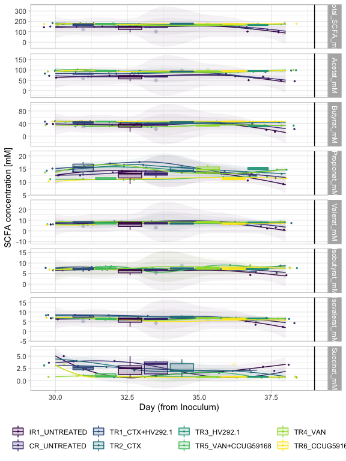


```r
p4 + 
  facet_null() +
  facet_grid(alphadiversiy ~ Reactor_Treatment, scales = "free") +
  scale_color_manual(values = rep("black",8)) +
  scale_fill_manual(values = rep("black",8)) 
```

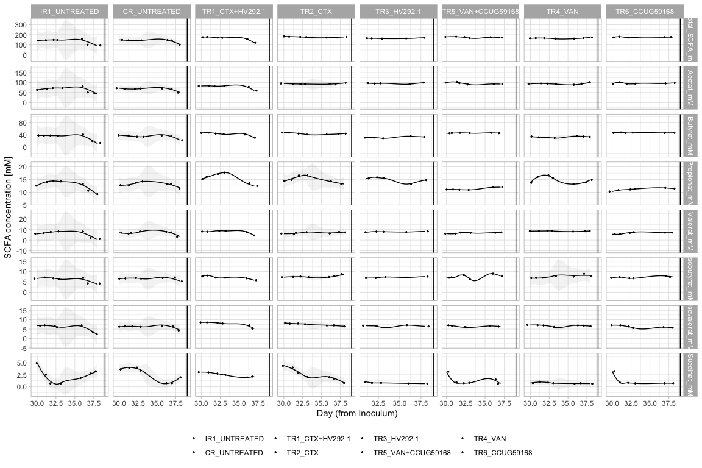


```r
df %>%
  dplyr::select("Acetat_mM", "Butyrat_mM", "Propionat_mM", "Isobutyrat_mM", "Valerat_mM", "Isovalerat_mM", "Succinat_mM") %>%
  # dplyr::select(ends_with("mM") | "Total_SCFA_mM") %>%
  drop_na() %>%
  # t() %>%
  scale(center = TRUE, 
        scale = TRUE) %>%
  dist(method= "euc") -> euc_met

plot_ordination(ps_polyFermS,
                ordination = phyloseq::ordinate(ps_polyFermS,
                                      distance = euc_met, 
                                      method = "PCoA")) -> pca

pca$layers[[1]] = NULL

pca +
  geom_point(size=2,
                   aes(color = Reactor_Treatment, 
                       fill = NULL,
                       shape = NULL,
                       alpha = Day_from_Inoculum)) + 
  theme_light() +
  geom_path(arrow = arrow(type = "open", angle = 30, length = unit(0.15, "inches")),
              size = 0.08, linetype = "dashed", inherit.aes = TRUE, aes(group=Reactor_Treatment, color = Reactor_Treatment)) +
  scale_alpha_continuous(range=c( 0.9, 0.3)) + 
  scale_color_viridis_d(na.value = "red") + 
  scale_fill_viridis_d(na.value = "red") + 
  scale_shape_manual(values = c(8, 21, 22, 23, 24, 16, 15, 18, 17)) + 
  theme_classic() -> p5

p5
```

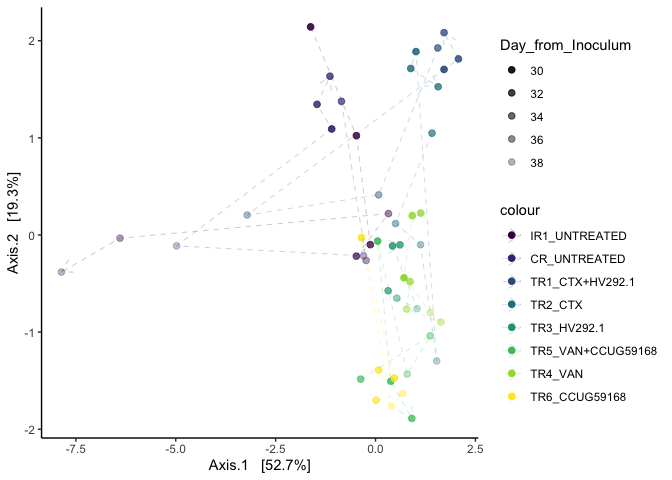<!-- -->
# Alpha div:

Compute alpha-div metrics:


```r
ps_polyFermS_rare %>%
  phyloseq_alphas(phylo = TRUE) -> alpha_df
```


```r
measures = c("Observed", "diversity_shannon", "evenness_pielou","SES.MPD")


alpha_df %>%
  plot_alphas(measure = measures,
             x_group = "Reactor_Treatment",
             colour_group = "Reactor",
             fill_group = "Reactor",
              shape_group = NULL,
              facet_group = "Reactor_Treatment",
            test_group = "Reactor_Treatment",
            test_group_2 = NULL) -> out

out$plot + 
  facet_null() + 
  facet_grid(alphadiversiy ~ ., scales = "free") + 
  ggpubr::rotate_x_text(60) +
  scale_fill_viridis_d() +
  scale_color_viridis_d()
```

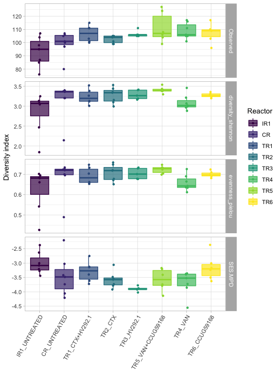<!-- -->

```r
out$stat %>%
  # dplyr::filter(signif == "SIGN") %>%
  DT::datatable()
```

```{=html}
<div id="htmlwidget-f1746a1adff0e67deb5e" style="width:100%;height:auto;" class="datatables html-widget"></div>
<script type="application/json" data-for="htmlwidget-f1746a1adff0e67deb5e">{"x":{"filter":"none","data":[["1","2","3","4","5","6","7","8","9","10","11","12","13","14","15","16","17","18","19","20","21","22","23","24","25","26","27","28","29","30","31","32","33","34","35","36","37","38","39","40","41","42","43","44","45","46","47","48","49","50","51","52","53","54","55","56","57","58","59","60","61","62","63","64","65","66","67","68","69","70","71","72","73","74","75","76","77","78","79","80","81","82","83","84","85","86","87","88","89","90","91","92","93","94","95","96","97","98","99","100","101","102","103","104","105","106","107","108","109","110","111","112"],["diversity_shannon","evenness_pielou","SES.MPD","SES.MPD","SES.MPD","SES.MPD","SES.MPD","diversity_shannon","evenness_pielou","diversity_shannon","diversity_shannon","Observed","Observed","Observed","diversity_shannon","evenness_pielou","Observed","SES.MPD","Observed","Observed","diversity_shannon","evenness_pielou","Observed","evenness_pielou","diversity_shannon","evenness_pielou","SES.MPD","SES.MPD","diversity_shannon","evenness_pielou","Observed","SES.MPD","diversity_shannon","evenness_pielou","SES.MPD","Observed","diversity_shannon","diversity_shannon","evenness_pielou","Observed","diversity_shannon","Observed","Observed","SES.MPD","SES.MPD","SES.MPD","SES.MPD","diversity_shannon","diversity_shannon","evenness_pielou","Observed","evenness_pielou","Observed","Observed","SES.MPD","SES.MPD","evenness_pielou","diversity_shannon","SES.MPD","diversity_shannon","evenness_pielou","diversity_shannon","SES.MPD","Observed","evenness_pielou","evenness_pielou","evenness_pielou","Observed","evenness_pielou","SES.MPD","diversity_shannon","SES.MPD","Observed","diversity_shannon","evenness_pielou","evenness_pielou","SES.MPD","evenness_pielou","Observed","diversity_shannon","SES.MPD","diversity_shannon","Observed","Observed","Observed","SES.MPD","evenness_pielou","SES.MPD","diversity_shannon","evenness_pielou","SES.MPD","diversity_shannon","diversity_shannon","Observed","Observed","diversity_shannon","evenness_pielou","evenness_pielou","SES.MPD","Observed","evenness_pielou","Observed","diversity_shannon","evenness_pielou","SES.MPD","Observed","Observed","diversity_shannon","diversity_shannon","evenness_pielou","evenness_pielou","SES.MPD"],["IR1_UNTREATED","IR1_UNTREATED","IR1_UNTREATED","IR1_UNTREATED","TR1_CTX+HV292.1","TR3_HV292.1","IR1_UNTREATED","IR1_UNTREATED","TR5_VAN+CCUG59168","TR5_VAN+CCUG59168","IR1_UNTREATED","IR1_UNTREATED","TR2_CTX","IR1_UNTREATED","TR5_VAN+CCUG59168","TR5_VAN+CCUG59168","IR1_UNTREATED","TR2_CTX","TR2_CTX","IR1_UNTREATED","IR1_UNTREATED","IR1_UNTREATED","IR1_UNTREATED","TR3_HV292.1","TR4_VAN","TR4_VAN","IR1_UNTREATED","TR4_VAN","IR1_UNTREATED","TR2_CTX","CR_UNTREATED","TR3_HV292.1","CR_UNTREATED","IR1_UNTREATED","TR2_CTX","IR1_UNTREATED","TR1_CTX+HV292.1","TR2_CTX","CR_UNTREATED","CR_UNTREATED","TR3_HV292.1","TR2_CTX","CR_UNTREATED","TR3_HV292.1","IR1_UNTREATED","TR1_CTX+HV292.1","TR5_VAN+CCUG59168","IR1_UNTREATED","TR1_CTX+HV292.1","TR1_CTX+HV292.1","CR_UNTREATED","IR1_UNTREATED","TR2_CTX","CR_UNTREATED","TR1_CTX+HV292.1","TR1_CTX+HV292.1","IR1_UNTREATED","TR2_CTX","IR1_UNTREATED","TR3_HV292.1","TR3_HV292.1","CR_UNTREATED","CR_UNTREATED","IR1_UNTREATED","CR_UNTREATED","CR_UNTREATED","TR1_CTX+HV292.1","TR1_CTX+HV292.1","IR1_UNTREATED","CR_UNTREATED","TR1_CTX+HV292.1","CR_UNTREATED","TR1_CTX+HV292.1","CR_UNTREATED","TR1_CTX+HV292.1","TR2_CTX","IR1_UNTREATED","TR1_CTX+HV292.1","TR1_CTX+HV292.1","TR1_CTX+HV292.1","CR_UNTREATED","CR_UNTREATED","TR3_HV292.1","TR3_HV292.1","TR3_HV292.1","TR2_CTX","TR1_CTX+HV292.1","TR1_CTX+HV292.1","TR1_CTX+HV292.1","CR_UNTREATED","TR5_VAN+CCUG59168","CR_UNTREATED","TR2_CTX","TR4_VAN","TR5_VAN+CCUG59168","CR_UNTREATED","IR1_UNTREATED","CR_UNTREATED","CR_UNTREATED","TR1_CTX+HV292.1","TR3_HV292.1","TR5_VAN+CCUG59168","TR2_CTX","TR2_CTX","CR_UNTREATED","CR_UNTREATED","TR1_CTX+HV292.1","IR1_UNTREATED","TR3_HV292.1","CR_UNTREATED","TR2_CTX","TR2_CTX"],["TR5_VAN+CCUG59168","TR5_VAN+CCUG59168","TR3_HV292.1","TR4_VAN","TR3_HV292.1","TR6_CCUG59168","TR2_CTX","TR6_CCUG59168","TR4_VAN","TR6_CCUG59168","TR3_HV292.1","TR4_VAN","TR3_HV292.1","TR5_VAN+CCUG59168","TR4_VAN","TR6_CCUG59168","TR6_CCUG59168","TR3_HV292.1","TR4_VAN","TR3_HV292.1","CR_UNTREATED","CR_UNTREATED","TR1_CTX+HV292.1","TR4_VAN","TR6_CCUG59168","TR6_CCUG59168","TR5_VAN+CCUG59168","TR6_CCUG59168","TR2_CTX","TR4_VAN","TR4_VAN","TR4_VAN","TR5_VAN+CCUG59168","TR6_CCUG59168","TR6_CCUG59168","TR2_CTX","TR5_VAN+CCUG59168","TR4_VAN","TR4_VAN","TR6_CCUG59168","TR4_VAN","TR5_VAN+CCUG59168","TR5_VAN+CCUG59168","TR5_VAN+CCUG59168","CR_UNTREATED","TR5_VAN+CCUG59168","TR6_CCUG59168","TR1_CTX+HV292.1","TR4_VAN","TR4_VAN","TR3_HV292.1","TR2_CTX","TR6_CCUG59168","TR1_CTX+HV292.1","TR2_CTX","TR4_VAN","TR3_HV292.1","TR5_VAN+CCUG59168","TR1_CTX+HV292.1","TR5_VAN+CCUG59168","TR5_VAN+CCUG59168","TR4_VAN","TR3_HV292.1","CR_UNTREATED","TR5_VAN+CCUG59168","TR6_CCUG59168","TR5_VAN+CCUG59168","TR2_CTX","TR1_CTX+HV292.1","TR6_CCUG59168","TR3_HV292.1","TR1_CTX+HV292.1","TR4_VAN","TR6_CCUG59168","TR2_CTX","TR5_VAN+CCUG59168","TR6_CCUG59168","TR3_HV292.1","TR5_VAN+CCUG59168","TR6_CCUG59168","TR2_CTX","TR1_CTX+HV292.1","TR5_VAN+CCUG59168","TR6_CCUG59168","TR4_VAN","TR4_VAN","TR6_CCUG59168","TR6_CCUG59168","TR2_CTX","TR1_CTX+HV292.1","TR4_VAN","TR3_HV292.1","TR3_HV292.1","TR6_CCUG59168","TR4_VAN","TR2_CTX","TR4_VAN","TR2_CTX","TR4_VAN","TR3_HV292.1","TR6_CCUG59168","TR6_CCUG59168","TR6_CCUG59168","TR6_CCUG59168","TR5_VAN+CCUG59168","TR2_CTX","TR6_CCUG59168","TR4_VAN","TR6_CCUG59168","TR3_HV292.1","TR3_HV292.1","TR5_VAN+CCUG59168"],[0.00116550116550117,0.00233100233100233,0.00252525252525253,0.00407925407925408,0.00432900432900433,0.00432900432900433,0.00699300699300699,0.00815850815850816,0.00815850815850816,0.00865800865800866,0.0101010101010101,0.0150820346748684,0.0179604775260788,0.0220874596810773,0.0221445221445221,0.025974025974026,0.0266003036715537,0.0303030303030303,0.030680781419996,0.0341229837031755,0.0378787878787879,0.0378787878787879,0.0380533311837477,0.047979797979798,0.0512820512820513,0.0512820512820513,0.0512820512820513,0.0512820512820513,0.053030303030303,0.053030303030303,0.0717396164455913,0.0732323232323232,0.0734265734265734,0.0734265734265734,0.0734265734265734,0.0824836146769693,0.0930735930735931,0.0973193473193473,0.0973193473193473,0.0999453813185742,0.106060606060606,0.111559305450782,0.115581899951383,0.125541125541126,0.128205128205128,0.132034632034632,0.132034632034632,0.137529137529138,0.137529137529138,0.137529137529138,0.138213338669003,0.164918414918415,0.171165535877966,0.172954917988421,0.180652680652681,0.180652680652681,0.202020202020202,0.234265734265734,0.234265734265734,0.246753246753247,0.246753246753247,0.259324009324009,0.267676767676768,0.276910594162916,0.294871794871795,0.294871794871795,0.30952380952381,0.312612047913494,0.365967365967366,0.365967365967366,0.428571428571429,0.445221445221445,0.471373252344597,0.533799533799534,0.533799533799534,0.533799533799534,0.533799533799534,0.662337662337662,0.688403863275692,0.699134199134199,0.71037296037296,0.730769230769231,0.781759059135839,0.782741755375532,0.802393811761348,0.804778554778555,0.818181818181818,0.818181818181818,0.835664335664336,0.835664335664336,0.835664335664336,0.876262626262626,0.876262626262626,0.885935188691885,0.886091769508557,0.901515151515152,0.901515151515152,0.901515151515152,0.901515151515152,0.926254733790504,0.930735930735931,0.93607467706662,0.945221445221445,0.945221445221445,0.945221445221445,1,1,1,1,1,1,1],[0.081,0.081,0.081,0.081,0.081,0.081,0.097,0.097,0.097,0.097,0.1,0.14,0.15,0.17,0.17,0.18,0.18,0.18,0.18,0.19,0.19,0.19,0.19,0.2,0.2,0.2,0.2,0.2,0.2,0.2,0.23,0.23,0.23,0.23,0.23,0.26,0.28,0.28,0.28,0.28,0.29,0.3,0.3,0.3,0.3,0.3,0.3,0.3,0.3,0.3,0.3,0.36,0.36,0.36,0.36,0.36,0.4,0.44,0.44,0.45,0.45,0.47,0.48,0.48,0.5,0.5,0.51,0.51,0.59,0.59,0.68,0.69,0.72,0.78,0.78,0.78,0.78,0.95,0.98,0.98,0.98,1,1,1,1,1,1,1,1,1,1,1,1,1,1,1,1,1,1,1,1,1,1,1,1,1,1,1,1,1,1,1],["Wilcoxon","Wilcoxon","Wilcoxon","Wilcoxon","Wilcoxon","Wilcoxon","Wilcoxon","Wilcoxon","Wilcoxon","Wilcoxon","Wilcoxon","Wilcoxon","Wilcoxon","Wilcoxon","Wilcoxon","Wilcoxon","Wilcoxon","Wilcoxon","Wilcoxon","Wilcoxon","Wilcoxon","Wilcoxon","Wilcoxon","Wilcoxon","Wilcoxon","Wilcoxon","Wilcoxon","Wilcoxon","Wilcoxon","Wilcoxon","Wilcoxon","Wilcoxon","Wilcoxon","Wilcoxon","Wilcoxon","Wilcoxon","Wilcoxon","Wilcoxon","Wilcoxon","Wilcoxon","Wilcoxon","Wilcoxon","Wilcoxon","Wilcoxon","Wilcoxon","Wilcoxon","Wilcoxon","Wilcoxon","Wilcoxon","Wilcoxon","Wilcoxon","Wilcoxon","Wilcoxon","Wilcoxon","Wilcoxon","Wilcoxon","Wilcoxon","Wilcoxon","Wilcoxon","Wilcoxon","Wilcoxon","Wilcoxon","Wilcoxon","Wilcoxon","Wilcoxon","Wilcoxon","Wilcoxon","Wilcoxon","Wilcoxon","Wilcoxon","Wilcoxon","Wilcoxon","Wilcoxon","Wilcoxon","Wilcoxon","Wilcoxon","Wilcoxon","Wilcoxon","Wilcoxon","Wilcoxon","Wilcoxon","Wilcoxon","Wilcoxon","Wilcoxon","Wilcoxon","Wilcoxon","Wilcoxon","Wilcoxon","Wilcoxon","Wilcoxon","Wilcoxon","Wilcoxon","Wilcoxon","Wilcoxon","Wilcoxon","Wilcoxon","Wilcoxon","Wilcoxon","Wilcoxon","Wilcoxon","Wilcoxon","Wilcoxon","Wilcoxon","Wilcoxon","Wilcoxon","Wilcoxon","Wilcoxon","Wilcoxon","Wilcoxon","Wilcoxon","Wilcoxon","Wilcoxon"],["NS","NS","NS","NS","NS","NS","NS","NS","NS","NS","NS","NS","NS","NS","NS","NS","NS","NS","NS","NS","NS","NS","NS","NS","NS","NS","NS","NS","NS","NS","NS","NS","NS","NS","NS","NS","NS","NS","NS","NS","NS","NS","NS","NS","NS","NS","NS","NS","NS","NS","NS","NS","NS","NS","NS","NS","NS","NS","NS","NS","NS","NS","NS","NS","NS","NS","NS","NS","NS","NS","NS","NS","NS","NS","NS","NS","NS","NS","NS","NS","NS","NS","NS","NS","NS","NS","NS","NS","NS","NS","NS","NS","NS","NS","NS","NS","NS","NS","NS","NS","NS","NS","NS","NS","NS","NS","NS","NS","NS","NS","NS","NS"]],"container":"<table class=\"display\">\n  <thead>\n    <tr>\n      <th> <\/th>\n      <th>alphadiversiy<\/th>\n      <th>group1<\/th>\n      <th>group2<\/th>\n      <th>p<\/th>\n      <th>p.adj<\/th>\n      <th>method<\/th>\n      <th>signif<\/th>\n    <\/tr>\n  <\/thead>\n<\/table>","options":{"columnDefs":[{"className":"dt-right","targets":[4,5]},{"orderable":false,"targets":0}],"order":[],"autoWidth":false,"orderClasses":false}},"evals":[],"jsHooks":[]}</script>
```


```r
out$plot$data %>%
  plot_time(measure = measures,
            facet = c("alphadiversiy ~ ."),  shape = NULL) + 
  labs(x="Day (from Inoculum)", y= "Alpha-diversity",  
       col=NULL, fill = NULL, shape = NULL) + 
  scale_shape_manual(values=c(4, 19)) +
 geom_vline(xintercept = c(39)) -> p4

p4
```

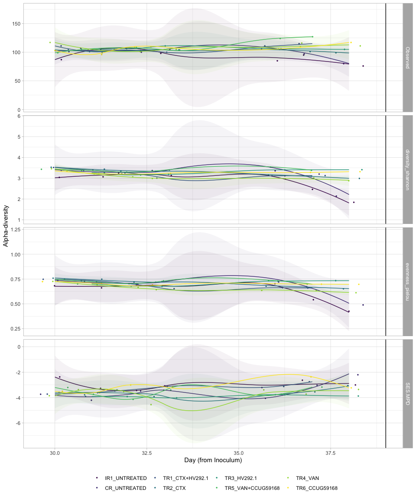


```r
p4 %>% ggplotly()
```

```
## `geom_smooth()` using method = 'loess' and formula 'y ~ x'
```

```
## Warning in simpleLoess(y, x, w, span, degree = degree, parametric =
## parametric, : Chernobyl! trL>n 6

## Warning in simpleLoess(y, x, w, span, degree = degree, parametric =
## parametric, : Chernobyl! trL>n 6
```

```
## Warning in sqrt(sum.squares/one.delta): NaNs produced
```

```
## Warning in stats::qt(level/2 + 0.5, pred$df): NaNs produced
```

```
## Warning in simpleLoess(y, x, w, span, degree = degree, parametric =
## parametric, : span too small. fewer data values than degrees of freedom.
```

```
## Warning in simpleLoess(y, x, w, span, degree = degree, parametric =
## parametric, : pseudoinverse used at 30.965
```

```
## Warning in simpleLoess(y, x, w, span, degree = degree, parametric =
## parametric, : neighborhood radius 2.035
```

```
## Warning in simpleLoess(y, x, w, span, degree = degree, parametric =
## parametric, : reciprocal condition number 0
```

```
## Warning in simpleLoess(y, x, w, span, degree = degree, parametric =
## parametric, : There are other near singularities as well. 25.351
```

```
## Warning in predLoess(object$y, object$x, newx = if
## (is.null(newdata)) object$x else if (is.data.frame(newdata))
## as.matrix(model.frame(delete.response(terms(object)), : span too small. fewer
## data values than degrees of freedom.
```

```
## Warning in predLoess(object$y, object$x, newx = if
## (is.null(newdata)) object$x else if (is.data.frame(newdata))
## as.matrix(model.frame(delete.response(terms(object)), : pseudoinverse used at
## 30.965
```

```
## Warning in predLoess(object$y, object$x, newx = if
## (is.null(newdata)) object$x else if (is.data.frame(newdata))
## as.matrix(model.frame(delete.response(terms(object)), : neighborhood radius
## 2.035
```

```
## Warning in predLoess(object$y, object$x, newx = if
## (is.null(newdata)) object$x else if (is.data.frame(newdata))
## as.matrix(model.frame(delete.response(terms(object)), : reciprocal condition
## number 0
```

```
## Warning in predLoess(object$y, object$x, newx = if
## (is.null(newdata)) object$x else if (is.data.frame(newdata))
## as.matrix(model.frame(delete.response(terms(object)), : There are other near
## singularities as well. 25.351
```

```
## Warning in simpleLoess(y, x, w, span, degree = degree, parametric =
## parametric, : Chernobyl! trL>n 6

## Warning in simpleLoess(y, x, w, span, degree = degree, parametric =
## parametric, : Chernobyl! trL>n 6
```

```
## Warning in sqrt(sum.squares/one.delta): NaNs produced
```

```
## Warning in stats::qt(level/2 + 0.5, pred$df): NaNs produced
```

```
## Warning in simpleLoess(y, x, w, span, degree = degree, parametric =
## parametric, : Chernobyl! trL>n 6

## Warning in simpleLoess(y, x, w, span, degree = degree, parametric =
## parametric, : Chernobyl! trL>n 6
```

```
## Warning in sqrt(sum.squares/one.delta): NaNs produced
```

```
## Warning in stats::qt(level/2 + 0.5, pred$df): NaNs produced
```

```
## Warning in simpleLoess(y, x, w, span, degree = degree, parametric =
## parametric, : Chernobyl! trL>n 6

## Warning in simpleLoess(y, x, w, span, degree = degree, parametric =
## parametric, : Chernobyl! trL>n 6
```

```
## Warning in sqrt(sum.squares/one.delta): NaNs produced
```

```
## Warning in stats::qt(level/2 + 0.5, pred$df): NaNs produced
```

```
## Warning in simpleLoess(y, x, w, span, degree = degree, parametric =
## parametric, : span too small. fewer data values than degrees of freedom.
```

```
## Warning in simpleLoess(y, x, w, span, degree = degree, parametric =
## parametric, : pseudoinverse used at 30.965
```

```
## Warning in simpleLoess(y, x, w, span, degree = degree, parametric =
## parametric, : neighborhood radius 2.035
```

```
## Warning in simpleLoess(y, x, w, span, degree = degree, parametric =
## parametric, : reciprocal condition number 0
```

```
## Warning in simpleLoess(y, x, w, span, degree = degree, parametric =
## parametric, : There are other near singularities as well. 25.351
```

```
## Warning in predLoess(object$y, object$x, newx = if
## (is.null(newdata)) object$x else if (is.data.frame(newdata))
## as.matrix(model.frame(delete.response(terms(object)), : span too small. fewer
## data values than degrees of freedom.
```

```
## Warning in predLoess(object$y, object$x, newx = if
## (is.null(newdata)) object$x else if (is.data.frame(newdata))
## as.matrix(model.frame(delete.response(terms(object)), : pseudoinverse used at
## 30.965
```

```
## Warning in predLoess(object$y, object$x, newx = if
## (is.null(newdata)) object$x else if (is.data.frame(newdata))
## as.matrix(model.frame(delete.response(terms(object)), : neighborhood radius
## 2.035
```

```
## Warning in predLoess(object$y, object$x, newx = if
## (is.null(newdata)) object$x else if (is.data.frame(newdata))
## as.matrix(model.frame(delete.response(terms(object)), : reciprocal condition
## number 0
```

```
## Warning in predLoess(object$y, object$x, newx = if
## (is.null(newdata)) object$x else if (is.data.frame(newdata))
## as.matrix(model.frame(delete.response(terms(object)), : There are other near
## singularities as well. 25.351
```

```
## Warning in simpleLoess(y, x, w, span, degree = degree, parametric =
## parametric, : Chernobyl! trL>n 6

## Warning in simpleLoess(y, x, w, span, degree = degree, parametric =
## parametric, : Chernobyl! trL>n 6
```

```
## Warning in sqrt(sum.squares/one.delta): NaNs produced
```

```
## Warning in stats::qt(level/2 + 0.5, pred$df): NaNs produced
```

```
## Warning in simpleLoess(y, x, w, span, degree = degree, parametric =
## parametric, : Chernobyl! trL>n 6

## Warning in simpleLoess(y, x, w, span, degree = degree, parametric =
## parametric, : Chernobyl! trL>n 6
```

```
## Warning in sqrt(sum.squares/one.delta): NaNs produced
```

```
## Warning in stats::qt(level/2 + 0.5, pred$df): NaNs produced
```

```
## Warning in simpleLoess(y, x, w, span, degree = degree, parametric =
## parametric, : Chernobyl! trL>n 6

## Warning in simpleLoess(y, x, w, span, degree = degree, parametric =
## parametric, : Chernobyl! trL>n 6
```

```
## Warning in sqrt(sum.squares/one.delta): NaNs produced
```

```
## Warning in stats::qt(level/2 + 0.5, pred$df): NaNs produced
```

```
## Warning in simpleLoess(y, x, w, span, degree = degree, parametric =
## parametric, : span too small. fewer data values than degrees of freedom.
```

```
## Warning in simpleLoess(y, x, w, span, degree = degree, parametric =
## parametric, : pseudoinverse used at 30.965
```

```
## Warning in simpleLoess(y, x, w, span, degree = degree, parametric =
## parametric, : neighborhood radius 2.035
```

```
## Warning in simpleLoess(y, x, w, span, degree = degree, parametric =
## parametric, : reciprocal condition number 0
```

```
## Warning in simpleLoess(y, x, w, span, degree = degree, parametric =
## parametric, : There are other near singularities as well. 25.351
```

```
## Warning in predLoess(object$y, object$x, newx = if
## (is.null(newdata)) object$x else if (is.data.frame(newdata))
## as.matrix(model.frame(delete.response(terms(object)), : span too small. fewer
## data values than degrees of freedom.
```

```
## Warning in predLoess(object$y, object$x, newx = if
## (is.null(newdata)) object$x else if (is.data.frame(newdata))
## as.matrix(model.frame(delete.response(terms(object)), : pseudoinverse used at
## 30.965
```

```
## Warning in predLoess(object$y, object$x, newx = if
## (is.null(newdata)) object$x else if (is.data.frame(newdata))
## as.matrix(model.frame(delete.response(terms(object)), : neighborhood radius
## 2.035
```

```
## Warning in predLoess(object$y, object$x, newx = if
## (is.null(newdata)) object$x else if (is.data.frame(newdata))
## as.matrix(model.frame(delete.response(terms(object)), : reciprocal condition
## number 0
```

```
## Warning in predLoess(object$y, object$x, newx = if
## (is.null(newdata)) object$x else if (is.data.frame(newdata))
## as.matrix(model.frame(delete.response(terms(object)), : There are other near
## singularities as well. 25.351
```

```
## Warning in simpleLoess(y, x, w, span, degree = degree, parametric =
## parametric, : Chernobyl! trL>n 6

## Warning in simpleLoess(y, x, w, span, degree = degree, parametric =
## parametric, : Chernobyl! trL>n 6
```

```
## Warning in sqrt(sum.squares/one.delta): NaNs produced
```

```
## Warning in stats::qt(level/2 + 0.5, pred$df): NaNs produced
```

```
## Warning in simpleLoess(y, x, w, span, degree = degree, parametric =
## parametric, : Chernobyl! trL>n 6

## Warning in simpleLoess(y, x, w, span, degree = degree, parametric =
## parametric, : Chernobyl! trL>n 6
```

```
## Warning in sqrt(sum.squares/one.delta): NaNs produced
```

```
## Warning in stats::qt(level/2 + 0.5, pred$df): NaNs produced
```

```
## Warning in simpleLoess(y, x, w, span, degree = degree, parametric =
## parametric, : Chernobyl! trL>n 6

## Warning in simpleLoess(y, x, w, span, degree = degree, parametric =
## parametric, : Chernobyl! trL>n 6
```

```
## Warning in sqrt(sum.squares/one.delta): NaNs produced
```

```
## Warning in stats::qt(level/2 + 0.5, pred$df): NaNs produced
```

```
## Warning in simpleLoess(y, x, w, span, degree = degree, parametric =
## parametric, : span too small. fewer data values than degrees of freedom.
```

```
## Warning in simpleLoess(y, x, w, span, degree = degree, parametric =
## parametric, : pseudoinverse used at 30.965
```

```
## Warning in simpleLoess(y, x, w, span, degree = degree, parametric =
## parametric, : neighborhood radius 2.035
```

```
## Warning in simpleLoess(y, x, w, span, degree = degree, parametric =
## parametric, : reciprocal condition number 0
```

```
## Warning in simpleLoess(y, x, w, span, degree = degree, parametric =
## parametric, : There are other near singularities as well. 25.351
```

```
## Warning in predLoess(object$y, object$x, newx = if
## (is.null(newdata)) object$x else if (is.data.frame(newdata))
## as.matrix(model.frame(delete.response(terms(object)), : span too small. fewer
## data values than degrees of freedom.
```

```
## Warning in predLoess(object$y, object$x, newx = if
## (is.null(newdata)) object$x else if (is.data.frame(newdata))
## as.matrix(model.frame(delete.response(terms(object)), : pseudoinverse used at
## 30.965
```

```
## Warning in predLoess(object$y, object$x, newx = if
## (is.null(newdata)) object$x else if (is.data.frame(newdata))
## as.matrix(model.frame(delete.response(terms(object)), : neighborhood radius
## 2.035
```

```
## Warning in predLoess(object$y, object$x, newx = if
## (is.null(newdata)) object$x else if (is.data.frame(newdata))
## as.matrix(model.frame(delete.response(terms(object)), : reciprocal condition
## number 0
```

```
## Warning in predLoess(object$y, object$x, newx = if
## (is.null(newdata)) object$x else if (is.data.frame(newdata))
## as.matrix(model.frame(delete.response(terms(object)), : There are other near
## singularities as well. 25.351
```

```
## Warning in simpleLoess(y, x, w, span, degree = degree, parametric =
## parametric, : Chernobyl! trL>n 6

## Warning in simpleLoess(y, x, w, span, degree = degree, parametric =
## parametric, : Chernobyl! trL>n 6
```

```
## Warning in sqrt(sum.squares/one.delta): NaNs produced
```

```
## Warning in stats::qt(level/2 + 0.5, pred$df): NaNs produced
```

```
## Warning in simpleLoess(y, x, w, span, degree = degree, parametric =
## parametric, : Chernobyl! trL>n 6

## Warning in simpleLoess(y, x, w, span, degree = degree, parametric =
## parametric, : Chernobyl! trL>n 6
```

```
## Warning in sqrt(sum.squares/one.delta): NaNs produced
```

```
## Warning in stats::qt(level/2 + 0.5, pred$df): NaNs produced
```

```{=html}
<div id="htmlwidget-f465e16d768ca7487a2e" style="width:672px;height:480px;" class="plotly html-widget"></div>
<script type="application/json" data-for="htmlwidget-f465e16d768ca7487a2e">{"x":{"data":[{"x":[30.21523066964,30.9939669489861,31.7238987188786,33.2351264376193,36.0085440086201,37.30835357178,38.2528311496601],"y":[86.9999984570498,104.000000782032,107.000000702678,98.000000976873,84.9999988197552,94.9999999278017,75.9999992174207],"text":["Reactor_Treatment: IR1_UNTREATED<br />Reactor_Treatment: IR1_UNTREATED<br />shape: 19<br />Day_from_Inoculum: 30<br />value:  87.0000000","Reactor_Treatment: IR1_UNTREATED<br />Reactor_Treatment: IR1_UNTREATED<br />shape: 19<br />Day_from_Inoculum: 31<br />value: 104.0000000","Reactor_Treatment: IR1_UNTREATED<br />Reactor_Treatment: IR1_UNTREATED<br />shape: 19<br />Day_from_Inoculum: 32<br />value: 107.0000000","Reactor_Treatment: IR1_UNTREATED<br />Reactor_Treatment: IR1_UNTREATED<br />shape: 19<br />Day_from_Inoculum: 33<br />value:  98.0000000","Reactor_Treatment: IR1_UNTREATED<br />Reactor_Treatment: IR1_UNTREATED<br />shape: 19<br />Day_from_Inoculum: 36<br />value:  85.0000000","Reactor_Treatment: IR1_UNTREATED<br />Reactor_Treatment: IR1_UNTREATED<br />shape: 19<br />Day_from_Inoculum: 37<br />value:  95.0000000","Reactor_Treatment: IR1_UNTREATED<br />Reactor_Treatment: IR1_UNTREATED<br />shape: 19<br />Day_from_Inoculum: 38<br />value:  76.0000000"],"type":"scatter","mode":"markers","marker":{"autocolorscale":false,"color":"rgba(68,1,84,1)","opacity":0.9,"size":1.88976377952756,"symbol":"circle","line":{"width":1.88976377952756,"color":"rgba(68,1,84,1)"}},"hoveron":"points","name":"(IR1_UNTREATED,1)","legendgroup":"(IR1_UNTREATED,1)","showlegend":true,"xaxis":"x","yaxis":"y","hoverinfo":"text","frame":null},{"x":[30.3719101933762,31.3769276790321,32.287861363776,33.396436288394,35.7978953614831,36.7789497520775,38.3675310736522],"y":[3.04469012311789,3.07000236114081,3.2478854867862,3.13307646314258,3.12029732249639,2.46687505498574,1.8453828426406],"text":["Reactor_Treatment: IR1_UNTREATED<br />Reactor_Treatment: IR1_UNTREATED<br />shape: 19<br />Day_from_Inoculum: 30<br />value:   3.0446917","Reactor_Treatment: IR1_UNTREATED<br />Reactor_Treatment: IR1_UNTREATED<br />shape: 19<br />Day_from_Inoculum: 31<br />value:   3.0700026","Reactor_Treatment: IR1_UNTREATED<br />Reactor_Treatment: IR1_UNTREATED<br />shape: 19<br />Day_from_Inoculum: 32<br />value:   3.2478842","Reactor_Treatment: IR1_UNTREATED<br />Reactor_Treatment: IR1_UNTREATED<br />shape: 19<br />Day_from_Inoculum: 33<br />value:   3.1330762","Reactor_Treatment: IR1_UNTREATED<br />Reactor_Treatment: IR1_UNTREATED<br />shape: 19<br />Day_from_Inoculum: 36<br />value:   3.1202961","Reactor_Treatment: IR1_UNTREATED<br />Reactor_Treatment: IR1_UNTREATED<br />shape: 19<br />Day_from_Inoculum: 37<br />value:   2.4668739","Reactor_Treatment: IR1_UNTREATED<br />Reactor_Treatment: IR1_UNTREATED<br />shape: 19<br />Day_from_Inoculum: 38<br />value:   1.8453822"],"type":"scatter","mode":"markers","marker":{"autocolorscale":false,"color":"rgba(68,1,84,1)","opacity":0.9,"size":1.88976377952756,"symbol":"circle","line":{"width":1.88976377952756,"color":"rgba(68,1,84,1)"}},"hoveron":"points","name":"(IR1_UNTREATED,2)","legendgroup":"(IR1_UNTREATED,2)","showlegend":true,"xaxis":"x","yaxis":"y2","hoverinfo":"text","frame":null},{"x":[29.7878543030471,30.7218888008967,32.3410396691412,32.6150725010782,36.0394137172028,36.8006625011563,37.8501883670688],"y":[0.681765260175043,0.661011545499286,0.69505634737853,0.683337262511918,0.702351764463331,0.541707369079215,0.426115071302146],"text":["Reactor_Treatment: IR1_UNTREATED<br />Reactor_Treatment: IR1_UNTREATED<br />shape: 19<br />Day_from_Inoculum: 30<br />value:   0.6817632","Reactor_Treatment: IR1_UNTREATED<br />Reactor_Treatment: IR1_UNTREATED<br />shape: 19<br />Day_from_Inoculum: 31<br />value:   0.6610130","Reactor_Treatment: IR1_UNTREATED<br />Reactor_Treatment: IR1_UNTREATED<br />shape: 19<br />Day_from_Inoculum: 32<br />value:   0.6950574","Reactor_Treatment: IR1_UNTREATED<br />Reactor_Treatment: IR1_UNTREATED<br />shape: 19<br />Day_from_Inoculum: 33<br />value:   0.6833366","Reactor_Treatment: IR1_UNTREATED<br />Reactor_Treatment: IR1_UNTREATED<br />shape: 19<br />Day_from_Inoculum: 36<br />value:   0.7023500","Reactor_Treatment: IR1_UNTREATED<br />Reactor_Treatment: IR1_UNTREATED<br />shape: 19<br />Day_from_Inoculum: 37<br />value:   0.5417085","Reactor_Treatment: IR1_UNTREATED<br />Reactor_Treatment: IR1_UNTREATED<br />shape: 19<br />Day_from_Inoculum: 38<br />value:   0.4261131"],"type":"scatter","mode":"markers","marker":{"autocolorscale":false,"color":"rgba(68,1,84,1)","opacity":0.9,"size":1.88976377952756,"symbol":"circle","line":{"width":1.88976377952756,"color":"rgba(68,1,84,1)"}},"hoveron":"points","name":"(IR1_UNTREATED,3)","legendgroup":"(IR1_UNTREATED,3)","showlegend":true,"xaxis":"x","yaxis":"y3","hoverinfo":"text","frame":null},{"x":[29.9508460976183,31.2010433912277,32.1551695015281,33.1036879705265,35.8300429696217,36.8323355009779,37.7346920309588],"y":[-2.37320310586372,-3.2722738358922,-3.44160721536734,-3.08323821769931,-3.20929356977989,-2.63367649807628,-3.00426408068763],"text":["Reactor_Treatment: IR1_UNTREATED<br />Reactor_Treatment: IR1_UNTREATED<br />shape: 19<br />Day_from_Inoculum: 30<br />value:  -2.3732019","Reactor_Treatment: IR1_UNTREATED<br />Reactor_Treatment: IR1_UNTREATED<br />shape: 19<br />Day_from_Inoculum: 31<br />value:  -3.2722740","Reactor_Treatment: IR1_UNTREATED<br />Reactor_Treatment: IR1_UNTREATED<br />shape: 19<br />Day_from_Inoculum: 32<br />value:  -3.4416083","Reactor_Treatment: IR1_UNTREATED<br />Reactor_Treatment: IR1_UNTREATED<br />shape: 19<br />Day_from_Inoculum: 33<br />value:  -3.0832397","Reactor_Treatment: IR1_UNTREATED<br />Reactor_Treatment: IR1_UNTREATED<br />shape: 19<br />Day_from_Inoculum: 36<br />value:  -3.2092915","Reactor_Treatment: IR1_UNTREATED<br />Reactor_Treatment: IR1_UNTREATED<br />shape: 19<br />Day_from_Inoculum: 37<br />value:  -2.6336750","Reactor_Treatment: IR1_UNTREATED<br />Reactor_Treatment: IR1_UNTREATED<br />shape: 19<br />Day_from_Inoculum: 38<br />value:  -3.0042646"],"type":"scatter","mode":"markers","marker":{"autocolorscale":false,"color":"rgba(68,1,84,1)","opacity":0.9,"size":1.88976377952756,"symbol":"circle","line":{"width":1.88976377952756,"color":"rgba(68,1,84,1)"}},"hoveron":"points","name":"(IR1_UNTREATED,4)","legendgroup":"(IR1_UNTREATED,4)","showlegend":true,"xaxis":"x","yaxis":"y4","hoverinfo":"text","frame":null},{"x":[29.7634734883904,31.2113045325503,31.7349496619776,32.7795907603577,35.7946781594306,36.7937022268772,37.652907663025],"y":[101.000002072607,106.999999742467,100.000000336796,104.999999708215,105.999999885504,96.9999996843103,80.0000009759023],"text":["Reactor_Treatment: CR_UNTREATED<br />Reactor_Treatment: CR_UNTREATED<br />shape: 19<br />Day_from_Inoculum: 30<br />value: 101.0000000","Reactor_Treatment: CR_UNTREATED<br />Reactor_Treatment: CR_UNTREATED<br />shape: 19<br />Day_from_Inoculum: 31<br />value: 107.0000000","Reactor_Treatment: CR_UNTREATED<br />Reactor_Treatment: CR_UNTREATED<br />shape: 19<br />Day_from_Inoculum: 32<br />value: 100.0000000","Reactor_Treatment: CR_UNTREATED<br />Reactor_Treatment: CR_UNTREATED<br />shape: 19<br />Day_from_Inoculum: 33<br />value: 105.0000000","Reactor_Treatment: CR_UNTREATED<br />Reactor_Treatment: CR_UNTREATED<br />shape: 19<br />Day_from_Inoculum: 36<br />value: 106.0000000","Reactor_Treatment: CR_UNTREATED<br />Reactor_Treatment: CR_UNTREATED<br />shape: 19<br />Day_from_Inoculum: 37<br />value:  97.0000000","Reactor_Treatment: CR_UNTREATED<br />Reactor_Treatment: CR_UNTREATED<br />shape: 19<br />Day_from_Inoculum: 38<br />value:  80.0000000"],"type":"scatter","mode":"markers","marker":{"autocolorscale":false,"color":"rgba(70,51,126,1)","opacity":0.9,"size":1.88976377952756,"symbol":"circle","line":{"width":1.88976377952756,"color":"rgba(70,51,126,1)"}},"hoveron":"points","name":"(CR_UNTREATED,1)","legendgroup":"(CR_UNTREATED,1)","showlegend":true,"xaxis":"x","yaxis":"y","hoverinfo":"text","frame":null},{"x":[29.845484117046,31.2687917806208,31.8854678165168,33.298891825974,35.6559967041016,37.1477243250236,38.2187066974118],"y":[3.38784337385878,3.39745578771049,3.20336340156563,3.37035044626695,3.35998280422678,3.20325615732798,2.1437724640081],"text":["Reactor_Treatment: CR_UNTREATED<br />Reactor_Treatment: CR_UNTREATED<br />shape: 19<br />Day_from_Inoculum: 30<br />value:   3.3878439","Reactor_Treatment: CR_UNTREATED<br />Reactor_Treatment: CR_UNTREATED<br />shape: 19<br />Day_from_Inoculum: 31<br />value:   3.3974567","Reactor_Treatment: CR_UNTREATED<br />Reactor_Treatment: CR_UNTREATED<br />shape: 19<br />Day_from_Inoculum: 32<br />value:   3.2033650","Reactor_Treatment: CR_UNTREATED<br />Reactor_Treatment: CR_UNTREATED<br />shape: 19<br />Day_from_Inoculum: 33<br />value:   3.3703517","Reactor_Treatment: CR_UNTREATED<br />Reactor_Treatment: CR_UNTREATED<br />shape: 19<br />Day_from_Inoculum: 36<br />value:   3.3599817","Reactor_Treatment: CR_UNTREATED<br />Reactor_Treatment: CR_UNTREATED<br />shape: 19<br />Day_from_Inoculum: 37<br />value:   3.2032550","Reactor_Treatment: CR_UNTREATED<br />Reactor_Treatment: CR_UNTREATED<br />shape: 19<br />Day_from_Inoculum: 38<br />value:   2.1437713"],"type":"scatter","mode":"markers","marker":{"autocolorscale":false,"color":"rgba(70,51,126,1)","opacity":0.9,"size":1.88976377952756,"symbol":"circle","line":{"width":1.88976377952756,"color":"rgba(70,51,126,1)"}},"hoveron":"points","name":"(CR_UNTREATED,2)","legendgroup":"(CR_UNTREATED,2)","showlegend":true,"xaxis":"x","yaxis":"y2","hoverinfo":"text","frame":null},{"x":[29.9284508289769,31.2884850338101,32.2418198462576,32.6466343233362,35.7128518871963,36.7764112191275,37.9827353561297],"y":[0.734074794008383,0.727066686493458,0.695602360787156,0.724188066759156,0.720494451542794,0.700210037871933,0.489217445015885],"text":["Reactor_Treatment: CR_UNTREATED<br />Reactor_Treatment: CR_UNTREATED<br />shape: 19<br />Day_from_Inoculum: 30<br />value:   0.7340749","Reactor_Treatment: CR_UNTREATED<br />Reactor_Treatment: CR_UNTREATED<br />shape: 19<br />Day_from_Inoculum: 31<br />value:   0.7270664","Reactor_Treatment: CR_UNTREATED<br />Reactor_Treatment: CR_UNTREATED<br />shape: 19<br />Day_from_Inoculum: 32<br />value:   0.6956019","Reactor_Treatment: CR_UNTREATED<br />Reactor_Treatment: CR_UNTREATED<br />shape: 19<br />Day_from_Inoculum: 33<br />value:   0.7241900","Reactor_Treatment: CR_UNTREATED<br />Reactor_Treatment: CR_UNTREATED<br />shape: 19<br />Day_from_Inoculum: 36<br />value:   0.7204944","Reactor_Treatment: CR_UNTREATED<br />Reactor_Treatment: CR_UNTREATED<br />shape: 19<br />Day_from_Inoculum: 37<br />value:   0.7002093","Reactor_Treatment: CR_UNTREATED<br />Reactor_Treatment: CR_UNTREATED<br />shape: 19<br />Day_from_Inoculum: 38<br />value:   0.4892191"],"type":"scatter","mode":"markers","marker":{"autocolorscale":false,"color":"rgba(70,51,126,1)","opacity":0.9,"size":1.88976377952756,"symbol":"circle","line":{"width":1.88976377952756,"color":"rgba(70,51,126,1)"}},"hoveron":"points","name":"(CR_UNTREATED,3)","legendgroup":"(CR_UNTREATED,3)","showlegend":true,"xaxis":"x","yaxis":"y3","hoverinfo":"text","frame":null},{"x":[29.6318858582526,30.6620910517871,32.2247255997732,33.3175291577354,35.8487995319068,36.7816770957783,37.9957518968731],"y":[-3.73750120720348,-4.20902361776321,-3.48238481200826,-3.41993855890696,-4.05669207979161,-3.02538765931765,-2.20456765033749],"text":["Reactor_Treatment: CR_UNTREATED<br />Reactor_Treatment: CR_UNTREATED<br />shape: 19<br />Day_from_Inoculum: 30<br />value:  -3.7375001","Reactor_Treatment: CR_UNTREATED<br />Reactor_Treatment: CR_UNTREATED<br />shape: 19<br />Day_from_Inoculum: 31<br />value:  -4.2090257","Reactor_Treatment: CR_UNTREATED<br />Reactor_Treatment: CR_UNTREATED<br />shape: 19<br />Day_from_Inoculum: 32<br />value:  -3.4823837","Reactor_Treatment: CR_UNTREATED<br />Reactor_Treatment: CR_UNTREATED<br />shape: 19<br />Day_from_Inoculum: 33<br />value:  -3.4199387","Reactor_Treatment: CR_UNTREATED<br />Reactor_Treatment: CR_UNTREATED<br />shape: 19<br />Day_from_Inoculum: 36<br />value:  -4.0566938","Reactor_Treatment: CR_UNTREATED<br />Reactor_Treatment: CR_UNTREATED<br />shape: 19<br />Day_from_Inoculum: 37<br />value:  -3.0253874","Reactor_Treatment: CR_UNTREATED<br />Reactor_Treatment: CR_UNTREATED<br />shape: 19<br />Day_from_Inoculum: 38<br />value:  -2.2045684"],"type":"scatter","mode":"markers","marker":{"autocolorscale":false,"color":"rgba(70,51,126,1)","opacity":0.9,"size":1.88976377952756,"symbol":"circle","line":{"width":1.88976377952756,"color":"rgba(70,51,126,1)"}},"hoveron":"points","name":"(CR_UNTREATED,4)","legendgroup":"(CR_UNTREATED,4)","showlegend":true,"xaxis":"x","yaxis":"y4","hoverinfo":"text","frame":null},{"x":[29.9474935442209,31.1402191406116,32.0804736945778,33.0634755754843,35.9927277432755,37.0933348491788],"y":[111.000000700751,101.000000285584,103.000000084323,100.000001283107,111.000000533122,114.999999239904],"text":["Reactor_Treatment: TR1_CTX+HV292.1<br />Reactor_Treatment: TR1_CTX+HV292.1<br />shape: 19<br />Day_from_Inoculum: 30<br />value: 111.0000000","Reactor_Treatment: TR1_CTX+HV292.1<br />Reactor_Treatment: TR1_CTX+HV292.1<br />shape: 19<br />Day_from_Inoculum: 31<br />value: 101.0000000","Reactor_Treatment: TR1_CTX+HV292.1<br />Reactor_Treatment: TR1_CTX+HV292.1<br />shape: 19<br />Day_from_Inoculum: 32<br />value: 103.0000000","Reactor_Treatment: TR1_CTX+HV292.1<br />Reactor_Treatment: TR1_CTX+HV292.1<br />shape: 19<br />Day_from_Inoculum: 33<br />value: 100.0000000","Reactor_Treatment: TR1_CTX+HV292.1<br />Reactor_Treatment: TR1_CTX+HV292.1<br />shape: 19<br />Day_from_Inoculum: 36<br />value: 111.0000000","Reactor_Treatment: TR1_CTX+HV292.1<br />Reactor_Treatment: TR1_CTX+HV292.1<br />shape: 19<br />Day_from_Inoculum: 37<br />value: 115.0000000"],"type":"scatter","mode":"markers","marker":{"autocolorscale":false,"color":"rgba(54,92,141,1)","opacity":0.9,"size":1.88976377952756,"symbol":"circle","line":{"width":1.88976377952756,"color":"rgba(54,92,141,1)"}},"hoveron":"points","name":"(TR1_CTX+HV292.1,1)","legendgroup":"(TR1_CTX+HV292.1,1)","showlegend":true,"xaxis":"x","yaxis":"y","hoverinfo":"text","frame":null},{"x":[30.3965620713308,31.1021557964385,32.3743502717465,33.1807603280991,36.2810146544129,36.827518433705],"y":[3.52049324390233,3.38183390355606,3.2623440593363,3.00776598714537,3.11906757180338,3.13025528400005],"text":["Reactor_Treatment: TR1_CTX+HV292.1<br />Reactor_Treatment: TR1_CTX+HV292.1<br />shape: 19<br />Day_from_Inoculum: 30<br />value:   3.5204945","Reactor_Treatment: TR1_CTX+HV292.1<br />Reactor_Treatment: TR1_CTX+HV292.1<br />shape: 19<br />Day_from_Inoculum: 31<br />value:   3.3818322","Reactor_Treatment: TR1_CTX+HV292.1<br />Reactor_Treatment: TR1_CTX+HV292.1<br />shape: 19<br />Day_from_Inoculum: 32<br />value:   3.2623443","Reactor_Treatment: TR1_CTX+HV292.1<br />Reactor_Treatment: TR1_CTX+HV292.1<br />shape: 19<br />Day_from_Inoculum: 33<br />value:   3.0077663","Reactor_Treatment: TR1_CTX+HV292.1<br />Reactor_Treatment: TR1_CTX+HV292.1<br />shape: 19<br />Day_from_Inoculum: 36<br />value:   3.1190676","Reactor_Treatment: TR1_CTX+HV292.1<br />Reactor_Treatment: TR1_CTX+HV292.1<br />shape: 19<br />Day_from_Inoculum: 37<br />value:   3.1302555"],"type":"scatter","mode":"markers","marker":{"autocolorscale":false,"color":"rgba(54,92,141,1)","opacity":0.9,"size":1.88976377952756,"symbol":"circle","line":{"width":1.88976377952756,"color":"rgba(54,92,141,1)"}},"hoveron":"points","name":"(TR1_CTX+HV292.1,2)","legendgroup":"(TR1_CTX+HV292.1,2)","showlegend":true,"xaxis":"x","yaxis":"y2","hoverinfo":"text","frame":null},{"x":[29.876322863251,31.1338931277394,31.6516265043989,32.6902654087171,36.2178694501519,36.8054427856579],"y":[0.747524539074533,0.732771231311243,0.703889276678661,0.653127362188727,0.66229028998229,0.659704953474485],"text":["Reactor_Treatment: TR1_CTX+HV292.1<br />Reactor_Treatment: TR1_CTX+HV292.1<br />shape: 19<br />Day_from_Inoculum: 30<br />value:   0.7475256","Reactor_Treatment: TR1_CTX+HV292.1<br />Reactor_Treatment: TR1_CTX+HV292.1<br />shape: 19<br />Day_from_Inoculum: 31<br />value:   0.7327722","Reactor_Treatment: TR1_CTX+HV292.1<br />Reactor_Treatment: TR1_CTX+HV292.1<br />shape: 19<br />Day_from_Inoculum: 32<br />value:   0.7038911","Reactor_Treatment: TR1_CTX+HV292.1<br />Reactor_Treatment: TR1_CTX+HV292.1<br />shape: 19<br />Day_from_Inoculum: 33<br />value:   0.6531282","Reactor_Treatment: TR1_CTX+HV292.1<br />Reactor_Treatment: TR1_CTX+HV292.1<br />shape: 19<br />Day_from_Inoculum: 36<br />value:   0.6622885","Reactor_Treatment: TR1_CTX+HV292.1<br />Reactor_Treatment: TR1_CTX+HV292.1<br />shape: 19<br />Day_from_Inoculum: 37<br />value:   0.6597050"],"type":"scatter","mode":"markers","marker":{"autocolorscale":false,"color":"rgba(54,92,141,1)","opacity":0.9,"size":1.88976377952756,"symbol":"circle","line":{"width":1.88976377952756,"color":"rgba(54,92,141,1)"}},"hoveron":"points","name":"(TR1_CTX+HV292.1,3)","legendgroup":"(TR1_CTX+HV292.1,3)","showlegend":true,"xaxis":"x","yaxis":"y3","hoverinfo":"text","frame":null},{"x":[30.0500390408561,30.6911139423028,31.6038266753778,32.9093756482005,35.9528050217777,37.1806309746578],"y":[-3.72622727941426,-3.6145829119651,-3.39795398841653,-3.13988703786686,-3.12898988335342,-2.75229757493768],"text":["Reactor_Treatment: TR1_CTX+HV292.1<br />Reactor_Treatment: TR1_CTX+HV292.1<br />shape: 19<br />Day_from_Inoculum: 30<br />value:  -3.7262287","Reactor_Treatment: TR1_CTX+HV292.1<br />Reactor_Treatment: TR1_CTX+HV292.1<br />shape: 19<br />Day_from_Inoculum: 31<br />value:  -3.6145848","Reactor_Treatment: TR1_CTX+HV292.1<br />Reactor_Treatment: TR1_CTX+HV292.1<br />shape: 19<br />Day_from_Inoculum: 32<br />value:  -3.3979522","Reactor_Treatment: TR1_CTX+HV292.1<br />Reactor_Treatment: TR1_CTX+HV292.1<br />shape: 19<br />Day_from_Inoculum: 33<br />value:  -3.1398850","Reactor_Treatment: TR1_CTX+HV292.1<br />Reactor_Treatment: TR1_CTX+HV292.1<br />shape: 19<br />Day_from_Inoculum: 36<br />value:  -3.1289893","Reactor_Treatment: TR1_CTX+HV292.1<br />Reactor_Treatment: TR1_CTX+HV292.1<br />shape: 19<br />Day_from_Inoculum: 37<br />value:  -2.7522971"],"type":"scatter","mode":"markers","marker":{"autocolorscale":false,"color":"rgba(54,92,141,1)","opacity":0.9,"size":1.88976377952756,"symbol":"circle","line":{"width":1.88976377952756,"color":"rgba(54,92,141,1)"}},"hoveron":"points","name":"(TR1_CTX+HV292.1,4)","legendgroup":"(TR1_CTX+HV292.1,4)","showlegend":true,"xaxis":"x","yaxis":"y4","hoverinfo":"text","frame":null},{"x":[30.1431075396016,31.2203784922138,31.8263994138688,32.6710116714239,35.7621420841664,37.2802952034399,37.7730160923675],"y":[104.99999793702,98.999999810632,105.000001665712,104.000001894676,105.000000656236,100.999999204405,98.9999995512733],"text":["Reactor_Treatment: TR2_CTX<br />Reactor_Treatment: TR2_CTX<br />shape: 19<br />Day_from_Inoculum: 30<br />value: 105.0000000","Reactor_Treatment: TR2_CTX<br />Reactor_Treatment: TR2_CTX<br />shape: 19<br />Day_from_Inoculum: 31<br />value:  99.0000000","Reactor_Treatment: TR2_CTX<br />Reactor_Treatment: TR2_CTX<br />shape: 19<br />Day_from_Inoculum: 32<br />value: 105.0000000","Reactor_Treatment: TR2_CTX<br />Reactor_Treatment: TR2_CTX<br />shape: 19<br />Day_from_Inoculum: 33<br />value: 104.0000000","Reactor_Treatment: TR2_CTX<br />Reactor_Treatment: TR2_CTX<br />shape: 19<br />Day_from_Inoculum: 36<br />value: 105.0000000","Reactor_Treatment: TR2_CTX<br />Reactor_Treatment: TR2_CTX<br />shape: 19<br />Day_from_Inoculum: 37<br />value: 101.0000000","Reactor_Treatment: TR2_CTX<br />Reactor_Treatment: TR2_CTX<br />shape: 19<br />Day_from_Inoculum: 38<br />value:  99.0000000"],"type":"scatter","mode":"markers","marker":{"autocolorscale":false,"color":"rgba(39,127,142,1)","opacity":0.9,"size":1.88976377952756,"symbol":"circle","line":{"width":1.88976377952756,"color":"rgba(39,127,142,1)"}},"hoveron":"points","name":"(TR2_CTX,1)","legendgroup":"(TR2_CTX,1)","showlegend":true,"xaxis":"x","yaxis":"y","hoverinfo":"text","frame":null},{"x":[30.0583359628916,31.1208652511239,31.6452480366454,33.1435110772029,35.9332718871534,36.9635551746935,38.2292895702645],"y":[3.5306805277109,3.43949430315997,3.35193208628183,3.33809026495005,3.15526185456606,3.09929644263131,2.9935760999109],"text":["Reactor_Treatment: TR2_CTX<br />Reactor_Treatment: TR2_CTX<br />shape: 19<br />Day_from_Inoculum: 30<br />value:   3.5306807","Reactor_Treatment: TR2_CTX<br />Reactor_Treatment: TR2_CTX<br />shape: 19<br />Day_from_Inoculum: 31<br />value:   3.4394947","Reactor_Treatment: TR2_CTX<br />Reactor_Treatment: TR2_CTX<br />shape: 19<br />Day_from_Inoculum: 32<br />value:   3.3519323","Reactor_Treatment: TR2_CTX<br />Reactor_Treatment: TR2_CTX<br />shape: 19<br />Day_from_Inoculum: 33<br />value:   3.3380900","Reactor_Treatment: TR2_CTX<br />Reactor_Treatment: TR2_CTX<br />shape: 19<br />Day_from_Inoculum: 36<br />value:   3.1552618","Reactor_Treatment: TR2_CTX<br />Reactor_Treatment: TR2_CTX<br />shape: 19<br />Day_from_Inoculum: 37<br />value:   3.0992964","Reactor_Treatment: TR2_CTX<br />Reactor_Treatment: TR2_CTX<br />shape: 19<br />Day_from_Inoculum: 38<br />value:   2.9935757"],"type":"scatter","mode":"markers","marker":{"autocolorscale":false,"color":"rgba(39,127,142,1)","opacity":0.9,"size":1.88976377952756,"symbol":"circle","line":{"width":1.88976377952756,"color":"rgba(39,127,142,1)"}},"hoveron":"points","name":"(TR2_CTX,2)","legendgroup":"(TR2_CTX,2)","showlegend":true,"xaxis":"x","yaxis":"y2","hoverinfo":"text","frame":null},{"x":[29.7284163048491,31.2988515522331,31.7799511093646,33.2610939778388,35.6233038756996,37.0205331735313,37.7461079899222],"y":[0.758641311113281,0.74850964749952,0.720233067849986,0.718737443730651,0.677975100861978,0.671553293809195,0.651466414218789],"text":["Reactor_Treatment: TR2_CTX<br />Reactor_Treatment: TR2_CTX<br />shape: 19<br />Day_from_Inoculum: 30<br />value:   0.7586400","Reactor_Treatment: TR2_CTX<br />Reactor_Treatment: TR2_CTX<br />shape: 19<br />Day_from_Inoculum: 31<br />value:   0.7485103","Reactor_Treatment: TR2_CTX<br />Reactor_Treatment: TR2_CTX<br />shape: 19<br />Day_from_Inoculum: 32<br />value:   0.7202322","Reactor_Treatment: TR2_CTX<br />Reactor_Treatment: TR2_CTX<br />shape: 19<br />Day_from_Inoculum: 33<br />value:   0.7187358","Reactor_Treatment: TR2_CTX<br />Reactor_Treatment: TR2_CTX<br />shape: 19<br />Day_from_Inoculum: 36<br />value:   0.6779735","Reactor_Treatment: TR2_CTX<br />Reactor_Treatment: TR2_CTX<br />shape: 19<br />Day_from_Inoculum: 37<br />value:   0.6715526","Reactor_Treatment: TR2_CTX<br />Reactor_Treatment: TR2_CTX<br />shape: 19<br />Day_from_Inoculum: 38<br />value:   0.6514685"],"type":"scatter","mode":"markers","marker":{"autocolorscale":false,"color":"rgba(39,127,142,1)","opacity":0.9,"size":1.88976377952756,"symbol":"circle","line":{"width":1.88976377952756,"color":"rgba(39,127,142,1)"}},"hoveron":"points","name":"(TR2_CTX,3)","legendgroup":"(TR2_CTX,3)","showlegend":true,"xaxis":"x","yaxis":"y3","hoverinfo":"text","frame":null},{"x":[30.2487710768357,31.2479664651677,31.9784927891567,33.0659919811413,36.0614866843447,36.6329667689279,37.7780564114451],"y":[-3.57551518839221,-3.78329159092355,-3.48311934719551,-3.9172834377143,-3.73340037768032,-3.55335960445886,-3.0605613330981],"text":["Reactor_Treatment: TR2_CTX<br />Reactor_Treatment: TR2_CTX<br />shape: 19<br />Day_from_Inoculum: 30<br />value:  -3.5755161","Reactor_Treatment: TR2_CTX<br />Reactor_Treatment: TR2_CTX<br />shape: 19<br />Day_from_Inoculum: 31<br />value:  -3.7832908","Reactor_Treatment: TR2_CTX<br />Reactor_Treatment: TR2_CTX<br />shape: 19<br />Day_from_Inoculum: 32<br />value:  -3.4831200","Reactor_Treatment: TR2_CTX<br />Reactor_Treatment: TR2_CTX<br />shape: 19<br />Day_from_Inoculum: 33<br />value:  -3.9172836","Reactor_Treatment: TR2_CTX<br />Reactor_Treatment: TR2_CTX<br />shape: 19<br />Day_from_Inoculum: 36<br />value:  -3.7334001","Reactor_Treatment: TR2_CTX<br />Reactor_Treatment: TR2_CTX<br />shape: 19<br />Day_from_Inoculum: 37<br />value:  -3.5533607","Reactor_Treatment: TR2_CTX<br />Reactor_Treatment: TR2_CTX<br />shape: 19<br />Day_from_Inoculum: 38<br />value:  -3.0605608"],"type":"scatter","mode":"markers","marker":{"autocolorscale":false,"color":"rgba(39,127,142,1)","opacity":0.9,"size":1.88976377952756,"symbol":"circle","line":{"width":1.88976377952756,"color":"rgba(39,127,142,1)"}},"hoveron":"points","name":"(TR2_CTX,4)","legendgroup":"(TR2_CTX,4)","showlegend":true,"xaxis":"x","yaxis":"y4","hoverinfo":"text","frame":null},{"x":[31.0046881245449,31.6359183881432,33.2545824617147,35.8284823268652,37.9451909605414],"y":[104.999997981553,106.000001241945,110.999998467447,105.99999950366,104.999998797629],"text":["Reactor_Treatment: TR3_HV292.1<br />Reactor_Treatment: TR3_HV292.1<br />shape: 19<br />Day_from_Inoculum: 31<br />value: 105.0000000","Reactor_Treatment: TR3_HV292.1<br />Reactor_Treatment: TR3_HV292.1<br />shape: 19<br />Day_from_Inoculum: 32<br />value: 106.0000000","Reactor_Treatment: TR3_HV292.1<br />Reactor_Treatment: TR3_HV292.1<br />shape: 19<br />Day_from_Inoculum: 33<br />value: 111.0000000","Reactor_Treatment: TR3_HV292.1<br />Reactor_Treatment: TR3_HV292.1<br />shape: 19<br />Day_from_Inoculum: 36<br />value: 106.0000000","Reactor_Treatment: TR3_HV292.1<br />Reactor_Treatment: TR3_HV292.1<br />shape: 19<br />Day_from_Inoculum: 38<br />value: 105.0000000"],"type":"scatter","mode":"markers","marker":{"autocolorscale":false,"color":"rgba(31,161,135,1)","opacity":0.9,"size":1.88976377952756,"symbol":"circle","line":{"width":1.88976377952756,"color":"rgba(31,161,135,1)"}},"hoveron":"points","name":"(TR3_HV292.1,1)","legendgroup":"(TR3_HV292.1,1)","showlegend":true,"xaxis":"x","yaxis":"y","hoverinfo":"text","frame":null},{"x":[31.2989110846072,32.3470106622204,32.97083398588,36.2179059160873,38.163377654925],"y":[3.26464475514141,3.16345226040164,3.18945353512954,3.40387758992174,3.41409964331791],"text":["Reactor_Treatment: TR3_HV292.1<br />Reactor_Treatment: TR3_HV292.1<br />shape: 19<br />Day_from_Inoculum: 31<br />value:   3.2646459","Reactor_Treatment: TR3_HV292.1<br />Reactor_Treatment: TR3_HV292.1<br />shape: 19<br />Day_from_Inoculum: 32<br />value:   3.1634540","Reactor_Treatment: TR3_HV292.1<br />Reactor_Treatment: TR3_HV292.1<br />shape: 19<br />Day_from_Inoculum: 33<br />value:   3.1894542","Reactor_Treatment: TR3_HV292.1<br />Reactor_Treatment: TR3_HV292.1<br />shape: 19<br />Day_from_Inoculum: 36<br />value:   3.4038792","Reactor_Treatment: TR3_HV292.1<br />Reactor_Treatment: TR3_HV292.1<br />shape: 19<br />Day_from_Inoculum: 38<br />value:   3.4140992"],"type":"scatter","mode":"markers","marker":{"autocolorscale":false,"color":"rgba(31,161,135,1)","opacity":0.9,"size":1.88976377952756,"symbol":"circle","line":{"width":1.88976377952756,"color":"rgba(31,161,135,1)"}},"hoveron":"points","name":"(TR3_HV292.1,2)","legendgroup":"(TR3_HV292.1,2)","showlegend":true,"xaxis":"x","yaxis":"y2","hoverinfo":"text","frame":null},{"x":[30.8164689932019,32.0397927910089,33.2428656466305,35.8700189821422,37.788993040286],"y":[0.701477667917551,0.678350307040909,0.677235141232327,0.72990860709956,0.733589862467196],"text":["Reactor_Treatment: TR3_HV292.1<br />Reactor_Treatment: TR3_HV292.1<br />shape: 19<br />Day_from_Inoculum: 31<br />value:   0.7014769","Reactor_Treatment: TR3_HV292.1<br />Reactor_Treatment: TR3_HV292.1<br />shape: 19<br />Day_from_Inoculum: 32<br />value:   0.6783522","Reactor_Treatment: TR3_HV292.1<br />Reactor_Treatment: TR3_HV292.1<br />shape: 19<br />Day_from_Inoculum: 33<br />value:   0.6772341","Reactor_Treatment: TR3_HV292.1<br />Reactor_Treatment: TR3_HV292.1<br />shape: 19<br />Day_from_Inoculum: 36<br />value:   0.7299075","Reactor_Treatment: TR3_HV292.1<br />Reactor_Treatment: TR3_HV292.1<br />shape: 19<br />Day_from_Inoculum: 38<br />value:   0.7335901"],"type":"scatter","mode":"markers","marker":{"autocolorscale":false,"color":"rgba(31,161,135,1)","opacity":0.9,"size":1.88976377952756,"symbol":"circle","line":{"width":1.88976377952756,"color":"rgba(31,161,135,1)"}},"hoveron":"points","name":"(TR3_HV292.1,3)","legendgroup":"(TR3_HV292.1,3)","showlegend":true,"xaxis":"x","yaxis":"y3","hoverinfo":"text","frame":null},{"x":[30.721231521666,32.0832439016551,33.3107213772833,36.3664866844192,37.9838067136705],"y":[-3.90967889615722,-3.92101892465245,-4.02195066887171,-3.77489383615425,-3.87617368768224],"text":["Reactor_Treatment: TR3_HV292.1<br />Reactor_Treatment: TR3_HV292.1<br />shape: 19<br />Day_from_Inoculum: 31<br />value:  -3.9096793","Reactor_Treatment: TR3_HV292.1<br />Reactor_Treatment: TR3_HV292.1<br />shape: 19<br />Day_from_Inoculum: 32<br />value:  -3.9210169","Reactor_Treatment: TR3_HV292.1<br />Reactor_Treatment: TR3_HV292.1<br />shape: 19<br />Day_from_Inoculum: 33<br />value:  -4.0219509","Reactor_Treatment: TR3_HV292.1<br />Reactor_Treatment: TR3_HV292.1<br />shape: 19<br />Day_from_Inoculum: 36<br />value:  -3.7748930","Reactor_Treatment: TR3_HV292.1<br />Reactor_Treatment: TR3_HV292.1<br />shape: 19<br />Day_from_Inoculum: 38<br />value:  -3.8761733"],"type":"scatter","mode":"markers","marker":{"autocolorscale":false,"color":"rgba(31,161,135,1)","opacity":0.9,"size":1.88976377952756,"symbol":"circle","line":{"width":1.88976377952756,"color":"rgba(31,161,135,1)"}},"hoveron":"points","name":"(TR3_HV292.1,4)","legendgroup":"(TR3_HV292.1,4)","showlegend":true,"xaxis":"x","yaxis":"y4","hoverinfo":"text","frame":null},{"x":[30.0371716031805,30.8358455030248,31.9911163186654,33.0684242764488,36.0702919153497,37.0396779645234],"y":[98.999997948558,105.999998590388,107.999997925535,104.000002037357,123.999999799866,127.00000197328],"text":["Reactor_Treatment: TR5_VAN+CCUG59168<br />Reactor_Treatment: TR5_VAN+CCUG59168<br />shape: 19<br />Day_from_Inoculum: 30<br />value:  99.0000000","Reactor_Treatment: TR5_VAN+CCUG59168<br />Reactor_Treatment: TR5_VAN+CCUG59168<br />shape: 19<br />Day_from_Inoculum: 31<br />value: 106.0000000","Reactor_Treatment: TR5_VAN+CCUG59168<br />Reactor_Treatment: TR5_VAN+CCUG59168<br />shape: 19<br />Day_from_Inoculum: 32<br />value: 108.0000000","Reactor_Treatment: TR5_VAN+CCUG59168<br />Reactor_Treatment: TR5_VAN+CCUG59168<br />shape: 19<br />Day_from_Inoculum: 33<br />value: 104.0000000","Reactor_Treatment: TR5_VAN+CCUG59168<br />Reactor_Treatment: TR5_VAN+CCUG59168<br />shape: 19<br />Day_from_Inoculum: 36<br />value: 124.0000000","Reactor_Treatment: TR5_VAN+CCUG59168<br />Reactor_Treatment: TR5_VAN+CCUG59168<br />shape: 19<br />Day_from_Inoculum: 37<br />value: 127.0000000"],"type":"scatter","mode":"markers","marker":{"autocolorscale":false,"color":"rgba(74,193,109,1)","opacity":0.9,"size":1.88976377952756,"symbol":"circle","line":{"width":1.88976377952756,"color":"rgba(74,193,109,1)"}},"hoveron":"points","name":"(TR5_VAN+CCUG59168,1)","legendgroup":"(TR5_VAN+CCUG59168,1)","showlegend":true,"xaxis":"x","yaxis":"y","hoverinfo":"text","frame":null},{"x":[30.1028477806598,30.9882959799841,31.9939385361969,33.3233319023624,36.107279169932,36.904038114287],"y":[3.4335529789089,3.37797760582764,3.29780483962824,3.39808358821173,3.53836753964962,3.3856587458739],"text":["Reactor_Treatment: TR5_VAN+CCUG59168<br />Reactor_Treatment: TR5_VAN+CCUG59168<br />shape: 19<br />Day_from_Inoculum: 30<br />value:   3.4335540","Reactor_Treatment: TR5_VAN+CCUG59168<br />Reactor_Treatment: TR5_VAN+CCUG59168<br />shape: 19<br />Day_from_Inoculum: 31<br />value:   3.3779763","Reactor_Treatment: TR5_VAN+CCUG59168<br />Reactor_Treatment: TR5_VAN+CCUG59168<br />shape: 19<br />Day_from_Inoculum: 32<br />value:   3.2978065","Reactor_Treatment: TR5_VAN+CCUG59168<br />Reactor_Treatment: TR5_VAN+CCUG59168<br />shape: 19<br />Day_from_Inoculum: 33<br />value:   3.3980843","Reactor_Treatment: TR5_VAN+CCUG59168<br />Reactor_Treatment: TR5_VAN+CCUG59168<br />shape: 19<br />Day_from_Inoculum: 36<br />value:   3.5383667","Reactor_Treatment: TR5_VAN+CCUG59168<br />Reactor_Treatment: TR5_VAN+CCUG59168<br />shape: 19<br />Day_from_Inoculum: 37<br />value:   3.3856569"],"type":"scatter","mode":"markers","marker":{"autocolorscale":false,"color":"rgba(74,193,109,1)","opacity":0.9,"size":1.88976377952756,"symbol":"circle","line":{"width":1.88976377952756,"color":"rgba(74,193,109,1)"}},"hoveron":"points","name":"(TR5_VAN+CCUG59168,2)","legendgroup":"(TR5_VAN+CCUG59168,2)","showlegend":true,"xaxis":"x","yaxis":"y2","hoverinfo":"text","frame":null},{"x":[29.6855829756707,31.27641891893,32.0382551295683,33.0199150841683,36.3082870997489,37.3196592574939],"y":[0.747218494381616,0.724353292120361,0.704338696638144,0.731651447167126,0.734056680613061,0.698910522094476],"text":["Reactor_Treatment: TR5_VAN+CCUG59168<br />Reactor_Treatment: TR5_VAN+CCUG59168<br />shape: 19<br />Day_from_Inoculum: 30<br />value:   0.7472175","Reactor_Treatment: TR5_VAN+CCUG59168<br />Reactor_Treatment: TR5_VAN+CCUG59168<br />shape: 19<br />Day_from_Inoculum: 31<br />value:   0.7243530","Reactor_Treatment: TR5_VAN+CCUG59168<br />Reactor_Treatment: TR5_VAN+CCUG59168<br />shape: 19<br />Day_from_Inoculum: 32<br />value:   0.7043388","Reactor_Treatment: TR5_VAN+CCUG59168<br />Reactor_Treatment: TR5_VAN+CCUG59168<br />shape: 19<br />Day_from_Inoculum: 33<br />value:   0.7316534","Reactor_Treatment: TR5_VAN+CCUG59168<br />Reactor_Treatment: TR5_VAN+CCUG59168<br />shape: 19<br />Day_from_Inoculum: 36<br />value:   0.7340581","Reactor_Treatment: TR5_VAN+CCUG59168<br />Reactor_Treatment: TR5_VAN+CCUG59168<br />shape: 19<br />Day_from_Inoculum: 37<br />value:   0.6989113"],"type":"scatter","mode":"markers","marker":{"autocolorscale":false,"color":"rgba(74,193,109,1)","opacity":0.9,"size":1.88976377952756,"symbol":"circle","line":{"width":1.88976377952756,"color":"rgba(74,193,109,1)"}},"hoveron":"points","name":"(TR5_VAN+CCUG59168,3)","legendgroup":"(TR5_VAN+CCUG59168,3)","showlegend":true,"xaxis":"x","yaxis":"y3","hoverinfo":"text","frame":null},{"x":[30.0575311776251,30.8155187679455,32.1594257215038,32.6416105190292,35.6132632439956,37.1258188206702],"y":[-3.20604242205015,-3.73963879890144,-4.13794877903836,-3.40731793599002,-3.78832810215854,-3.17353573401667],"text":["Reactor_Treatment: TR5_VAN+CCUG59168<br />Reactor_Treatment: TR5_VAN+CCUG59168<br />shape: 19<br />Day_from_Inoculum: 30<br />value:  -3.2060421","Reactor_Treatment: TR5_VAN+CCUG59168<br />Reactor_Treatment: TR5_VAN+CCUG59168<br />shape: 19<br />Day_from_Inoculum: 31<br />value:  -3.7396408","Reactor_Treatment: TR5_VAN+CCUG59168<br />Reactor_Treatment: TR5_VAN+CCUG59168<br />shape: 19<br />Day_from_Inoculum: 32<br />value:  -4.1379499","Reactor_Treatment: TR5_VAN+CCUG59168<br />Reactor_Treatment: TR5_VAN+CCUG59168<br />shape: 19<br />Day_from_Inoculum: 33<br />value:  -3.4073182","Reactor_Treatment: TR5_VAN+CCUG59168<br />Reactor_Treatment: TR5_VAN+CCUG59168<br />shape: 19<br />Day_from_Inoculum: 36<br />value:  -3.7883265","Reactor_Treatment: TR5_VAN+CCUG59168<br />Reactor_Treatment: TR5_VAN+CCUG59168<br />shape: 19<br />Day_from_Inoculum: 37<br />value:  -3.1735337"],"type":"scatter","mode":"markers","marker":{"autocolorscale":false,"color":"rgba(74,193,109,1)","opacity":0.9,"size":1.88976377952756,"symbol":"circle","line":{"width":1.88976377952756,"color":"rgba(74,193,109,1)"}},"hoveron":"points","name":"(TR5_VAN+CCUG59168,4)","legendgroup":"(TR5_VAN+CCUG59168,4)","showlegend":true,"xaxis":"x","yaxis":"y4","hoverinfo":"text","frame":null},{"x":[30.1109422108158,31.0706164380535,31.6591677583754,32.846640919894,35.8205876719207,37.3181162515655,37.7642832908779],"y":[117.000001467258,104.999998680164,101.000001135026,104.999999701984,106.000000057817,115.999998556512,111.000000417011],"text":["Reactor_Treatment: TR4_VAN<br />Reactor_Treatment: TR4_VAN<br />shape: 19<br />Day_from_Inoculum: 30<br />value: 117.0000000","Reactor_Treatment: TR4_VAN<br />Reactor_Treatment: TR4_VAN<br />shape: 19<br />Day_from_Inoculum: 31<br />value: 105.0000000","Reactor_Treatment: TR4_VAN<br />Reactor_Treatment: TR4_VAN<br />shape: 19<br />Day_from_Inoculum: 32<br />value: 101.0000000","Reactor_Treatment: TR4_VAN<br />Reactor_Treatment: TR4_VAN<br />shape: 19<br />Day_from_Inoculum: 33<br />value: 105.0000000","Reactor_Treatment: TR4_VAN<br />Reactor_Treatment: TR4_VAN<br />shape: 19<br />Day_from_Inoculum: 36<br />value: 106.0000000","Reactor_Treatment: TR4_VAN<br />Reactor_Treatment: TR4_VAN<br />shape: 19<br />Day_from_Inoculum: 37<br />value: 116.0000000","Reactor_Treatment: TR4_VAN<br />Reactor_Treatment: TR4_VAN<br />shape: 19<br />Day_from_Inoculum: 38<br />value: 111.0000000"],"type":"scatter","mode":"markers","marker":{"autocolorscale":false,"color":"rgba(159,218,58,1)","opacity":0.9,"size":1.88976377952756,"symbol":"circle","line":{"width":1.88976377952756,"color":"rgba(159,218,58,1)"}},"hoveron":"points","name":"(TR4_VAN,1)","legendgroup":"(TR4_VAN,1)","showlegend":true,"xaxis":"x","yaxis":"y","hoverinfo":"text","frame":null},{"x":[30.0631412498653,31.3132869934663,31.8016550377011,32.9851019700989,36.1337433680892,36.7142088057473,37.8865840392187],"y":[3.45794978650087,3.21337289537415,3.06865776957785,2.99252863909878,2.9674731097738,3.01621377315222,2.88260096697721],"text":["Reactor_Treatment: TR4_VAN<br />Reactor_Treatment: TR4_VAN<br />shape: 19<br />Day_from_Inoculum: 30<br />value:   3.4579492","Reactor_Treatment: TR4_VAN<br />Reactor_Treatment: TR4_VAN<br />shape: 19<br />Day_from_Inoculum: 31<br />value:   3.2133745","Reactor_Treatment: TR4_VAN<br />Reactor_Treatment: TR4_VAN<br />shape: 19<br />Day_from_Inoculum: 32<br />value:   3.0686562","Reactor_Treatment: TR4_VAN<br />Reactor_Treatment: TR4_VAN<br />shape: 19<br />Day_from_Inoculum: 33<br />value:   2.9925273","Reactor_Treatment: TR4_VAN<br />Reactor_Treatment: TR4_VAN<br />shape: 19<br />Day_from_Inoculum: 36<br />value:   2.9674724","Reactor_Treatment: TR4_VAN<br />Reactor_Treatment: TR4_VAN<br />shape: 19<br />Day_from_Inoculum: 37<br />value:   3.0162133","Reactor_Treatment: TR4_VAN<br />Reactor_Treatment: TR4_VAN<br />shape: 19<br />Day_from_Inoculum: 38<br />value:   2.8826016"],"type":"scatter","mode":"markers","marker":{"autocolorscale":false,"color":"rgba(159,218,58,1)","opacity":0.9,"size":1.88976377952756,"symbol":"circle","line":{"width":1.88976377952756,"color":"rgba(159,218,58,1)"}},"hoveron":"points","name":"(TR4_VAN,2)","legendgroup":"(TR4_VAN,2)","showlegend":true,"xaxis":"x","yaxis":"y2","hoverinfo":"text","frame":null},{"x":[30.1496353527531,30.7005671650171,31.8113975193352,33.103807002306,35.6661019187421,37.2444381028414,37.7191417038441],"y":[0.726129222566192,0.690461719554201,0.664912074283466,0.643008553677018,0.636328078255433,0.63451130957641,0.612079167779562],"text":["Reactor_Treatment: TR4_VAN<br />Reactor_Treatment: TR4_VAN<br />shape: 19<br />Day_from_Inoculum: 30<br />value:   0.7261283","Reactor_Treatment: TR4_VAN<br />Reactor_Treatment: TR4_VAN<br />shape: 19<br />Day_from_Inoculum: 31<br />value:   0.6904602","Reactor_Treatment: TR4_VAN<br />Reactor_Treatment: TR4_VAN<br />shape: 19<br />Day_from_Inoculum: 32<br />value:   0.6649136","Reactor_Treatment: TR4_VAN<br />Reactor_Treatment: TR4_VAN<br />shape: 19<br />Day_from_Inoculum: 33<br />value:   0.6430066","Reactor_Treatment: TR4_VAN<br />Reactor_Treatment: TR4_VAN<br />shape: 19<br />Day_from_Inoculum: 36<br />value:   0.6363270","Reactor_Treatment: TR4_VAN<br />Reactor_Treatment: TR4_VAN<br />shape: 19<br />Day_from_Inoculum: 37<br />value:   0.6345127","Reactor_Treatment: TR4_VAN<br />Reactor_Treatment: TR4_VAN<br />shape: 19<br />Day_from_Inoculum: 38<br />value:   0.6120784"],"type":"scatter","mode":"markers","marker":{"autocolorscale":false,"color":"rgba(159,218,58,1)","opacity":0.9,"size":1.88976377952756,"symbol":"circle","line":{"width":1.88976377952756,"color":"rgba(159,218,58,1)"}},"hoveron":"points","name":"(TR4_VAN,3)","legendgroup":"(TR4_VAN,3)","showlegend":true,"xaxis":"x","yaxis":"y3","hoverinfo":"text","frame":null},{"x":[30.3825174611062,30.7179281197488,32.0341532690451,32.8973155420274,36.3223134793341,36.6585989430547,37.7896425904706],"y":[-3.85574092782929,-3.37295790026924,-3.52302446333378,-4.55376564115494,-3.39190777037824,-3.72742567327251,-3.35990048252625],"text":["Reactor_Treatment: TR4_VAN<br />Reactor_Treatment: TR4_VAN<br />shape: 19<br />Day_from_Inoculum: 30<br />value:  -3.8557429","Reactor_Treatment: TR4_VAN<br />Reactor_Treatment: TR4_VAN<br />shape: 19<br />Day_from_Inoculum: 31<br />value:  -3.3729581","Reactor_Treatment: TR4_VAN<br />Reactor_Treatment: TR4_VAN<br />shape: 19<br />Day_from_Inoculum: 32<br />value:  -3.5230253","Reactor_Treatment: TR4_VAN<br />Reactor_Treatment: TR4_VAN<br />shape: 19<br />Day_from_Inoculum: 33<br />value:  -4.5537673","Reactor_Treatment: TR4_VAN<br />Reactor_Treatment: TR4_VAN<br />shape: 19<br />Day_from_Inoculum: 36<br />value:  -3.3919068","Reactor_Treatment: TR4_VAN<br />Reactor_Treatment: TR4_VAN<br />shape: 19<br />Day_from_Inoculum: 37<br />value:  -3.7274253","Reactor_Treatment: TR4_VAN<br />Reactor_Treatment: TR4_VAN<br />shape: 19<br />Day_from_Inoculum: 38<br />value:  -3.3598984"],"type":"scatter","mode":"markers","marker":{"autocolorscale":false,"color":"rgba(159,218,58,1)","opacity":0.9,"size":1.88976377952756,"symbol":"circle","line":{"width":1.88976377952756,"color":"rgba(159,218,58,1)"}},"hoveron":"points","name":"(TR4_VAN,4)","legendgroup":"(TR4_VAN,4)","showlegend":true,"xaxis":"x","yaxis":"y4","hoverinfo":"text","frame":null},{"x":[30.0984276827425,30.8245541682467,32.3654511723667,33.3190999407321,36.9294956028461,38.0527433831245],"y":[103.000001104231,96.0000014168568,109.000001544243,109.000000427983,110.000000581425,116.999998449807],"text":["Reactor_Treatment: TR6_CCUG59168<br />Reactor_Treatment: TR6_CCUG59168<br />shape: 19<br />Day_from_Inoculum: 30<br />value: 103.0000000","Reactor_Treatment: TR6_CCUG59168<br />Reactor_Treatment: TR6_CCUG59168<br />shape: 19<br />Day_from_Inoculum: 31<br />value:  96.0000000","Reactor_Treatment: TR6_CCUG59168<br />Reactor_Treatment: TR6_CCUG59168<br />shape: 19<br />Day_from_Inoculum: 32<br />value: 109.0000000","Reactor_Treatment: TR6_CCUG59168<br />Reactor_Treatment: TR6_CCUG59168<br />shape: 19<br />Day_from_Inoculum: 33<br />value: 109.0000000","Reactor_Treatment: TR6_CCUG59168<br />Reactor_Treatment: TR6_CCUG59168<br />shape: 19<br />Day_from_Inoculum: 37<br />value: 110.0000000","Reactor_Treatment: TR6_CCUG59168<br />Reactor_Treatment: TR6_CCUG59168<br />shape: 19<br />Day_from_Inoculum: 38<br />value: 117.0000000"],"type":"scatter","mode":"markers","marker":{"autocolorscale":false,"color":"rgba(253,231,37,1)","opacity":0.9,"size":1.88976377952756,"symbol":"circle","line":{"width":1.88976377952756,"color":"rgba(253,231,37,1)"}},"hoveron":"points","name":"(TR6_CCUG59168,1)","legendgroup":"(TR6_CCUG59168,1)","showlegend":true,"xaxis":"x","yaxis":"y","hoverinfo":"text","frame":null},{"x":[30.0680094612762,30.7901895416901,31.7363194385543,33.1046745683998,37.3474584521726,37.728081552498],"y":[3.35639982171886,3.23850941924697,3.1980631811702,3.24017572656085,3.28280194199509,3.31731479002945],"text":["Reactor_Treatment: TR6_CCUG59168<br />Reactor_Treatment: TR6_CCUG59168<br />shape: 19<br />Day_from_Inoculum: 30<br />value:   3.3564003","Reactor_Treatment: TR6_CCUG59168<br />Reactor_Treatment: TR6_CCUG59168<br />shape: 19<br />Day_from_Inoculum: 31<br />value:   3.2385100","Reactor_Treatment: TR6_CCUG59168<br />Reactor_Treatment: TR6_CCUG59168<br />shape: 19<br />Day_from_Inoculum: 32<br />value:   3.1980626","Reactor_Treatment: TR6_CCUG59168<br />Reactor_Treatment: TR6_CCUG59168<br />shape: 19<br />Day_from_Inoculum: 33<br />value:   3.2401738","Reactor_Treatment: TR6_CCUG59168<br />Reactor_Treatment: TR6_CCUG59168<br />shape: 19<br />Day_from_Inoculum: 37<br />value:   3.2828011","Reactor_Treatment: TR6_CCUG59168<br />Reactor_Treatment: TR6_CCUG59168<br />shape: 19<br />Day_from_Inoculum: 38<br />value:   3.3173131"],"type":"scatter","mode":"markers","marker":{"autocolorscale":false,"color":"rgba(253,231,37,1)","opacity":0.9,"size":1.88976377952756,"symbol":"circle","line":{"width":1.88976377952756,"color":"rgba(253,231,37,1)"}},"hoveron":"points","name":"(TR6_CCUG59168,2)","legendgroup":"(TR6_CCUG59168,2)","showlegend":true,"xaxis":"x","yaxis":"y2","hoverinfo":"text","frame":null},{"x":[30.1001919632778,31.3267776386812,31.9933794876561,33.0241061490029,36.6764472989365,37.7873102709651],"y":[0.724184200181144,0.709522722037953,0.681694012758661,0.690669551538109,0.698396539441009,0.696596415130282],"text":["Reactor_Treatment: TR6_CCUG59168<br />Reactor_Treatment: TR6_CCUG59168<br />shape: 19<br />Day_from_Inoculum: 30<br />value:   0.7241848","Reactor_Treatment: TR6_CCUG59168<br />Reactor_Treatment: TR6_CCUG59168<br />shape: 19<br />Day_from_Inoculum: 31<br />value:   0.7095230","Reactor_Treatment: TR6_CCUG59168<br />Reactor_Treatment: TR6_CCUG59168<br />shape: 19<br />Day_from_Inoculum: 32<br />value:   0.6816938","Reactor_Treatment: TR6_CCUG59168<br />Reactor_Treatment: TR6_CCUG59168<br />shape: 19<br />Day_from_Inoculum: 33<br />value:   0.6906701","Reactor_Treatment: TR6_CCUG59168<br />Reactor_Treatment: TR6_CCUG59168<br />shape: 19<br />Day_from_Inoculum: 37<br />value:   0.6983969","Reactor_Treatment: TR6_CCUG59168<br />Reactor_Treatment: TR6_CCUG59168<br />shape: 19<br />Day_from_Inoculum: 38<br />value:   0.6965964"],"type":"scatter","mode":"markers","marker":{"autocolorscale":false,"color":"rgba(253,231,37,1)","opacity":0.9,"size":1.88976377952756,"symbol":"circle","line":{"width":1.88976377952756,"color":"rgba(253,231,37,1)"}},"hoveron":"points","name":"(TR6_CCUG59168,3)","legendgroup":"(TR6_CCUG59168,3)","showlegend":true,"xaxis":"x","yaxis":"y3","hoverinfo":"text","frame":null},{"x":[30.2100014878437,31.0460415065289,32.0853611735627,33.135507921502,36.6302121952176,37.6531221752986],"y":[-3.50296637705778,-3.62843841479919,-3.00675479478576,-3.16628300827554,-2.36545591464514,-3.23410673961076],"text":["Reactor_Treatment: TR6_CCUG59168<br />Reactor_Treatment: TR6_CCUG59168<br />shape: 19<br />Day_from_Inoculum: 30<br />value:  -3.5029648","Reactor_Treatment: TR6_CCUG59168<br />Reactor_Treatment: TR6_CCUG59168<br />shape: 19<br />Day_from_Inoculum: 31<br />value:  -3.6284367","Reactor_Treatment: TR6_CCUG59168<br />Reactor_Treatment: TR6_CCUG59168<br />shape: 19<br />Day_from_Inoculum: 32<br />value:  -3.0067549","Reactor_Treatment: TR6_CCUG59168<br />Reactor_Treatment: TR6_CCUG59168<br />shape: 19<br />Day_from_Inoculum: 33<br />value:  -3.1662848","Reactor_Treatment: TR6_CCUG59168<br />Reactor_Treatment: TR6_CCUG59168<br />shape: 19<br />Day_from_Inoculum: 37<br />value:  -2.3654559","Reactor_Treatment: TR6_CCUG59168<br />Reactor_Treatment: TR6_CCUG59168<br />shape: 19<br />Day_from_Inoculum: 38<br />value:  -3.2341076"],"type":"scatter","mode":"markers","marker":{"autocolorscale":false,"color":"rgba(253,231,37,1)","opacity":0.9,"size":1.88976377952756,"symbol":"circle","line":{"width":1.88976377952756,"color":"rgba(253,231,37,1)"}},"hoveron":"points","name":"(TR6_CCUG59168,4)","legendgroup":"(TR6_CCUG59168,4)","showlegend":true,"xaxis":"x","yaxis":"y4","hoverinfo":"text","frame":null},{"x":[30,31,32,33,36,37,38],"y":[87,104,107,98,85,95,76],"text":["Reactor_Treatment: IR1_UNTREATED<br />Reactor_Treatment: IR1_UNTREATED<br />show.legend: FALSE<br />Day_from_Inoculum: 30<br />value:  87.0000000","Reactor_Treatment: IR1_UNTREATED<br />Reactor_Treatment: IR1_UNTREATED<br />show.legend: FALSE<br />Day_from_Inoculum: 31<br />value: 104.0000000","Reactor_Treatment: IR1_UNTREATED<br />Reactor_Treatment: IR1_UNTREATED<br />show.legend: FALSE<br />Day_from_Inoculum: 32<br />value: 107.0000000","Reactor_Treatment: IR1_UNTREATED<br />Reactor_Treatment: IR1_UNTREATED<br />show.legend: FALSE<br />Day_from_Inoculum: 33<br />value:  98.0000000","Reactor_Treatment: IR1_UNTREATED<br />Reactor_Treatment: IR1_UNTREATED<br />show.legend: FALSE<br />Day_from_Inoculum: 36<br />value:  85.0000000","Reactor_Treatment: IR1_UNTREATED<br />Reactor_Treatment: IR1_UNTREATED<br />show.legend: FALSE<br />Day_from_Inoculum: 37<br />value:  95.0000000","Reactor_Treatment: IR1_UNTREATED<br />Reactor_Treatment: IR1_UNTREATED<br />show.legend: FALSE<br />Day_from_Inoculum: 38<br />value:  76.0000000"],"type":"scatter","mode":"lines","line":{"width":0.0188976377952756,"color":"rgba(68,1,84,1)","dash":"dash"},"hoveron":"points","name":"(IR1_UNTREATED,1)","legendgroup":"(IR1_UNTREATED,1)","showlegend":false,"xaxis":"x","yaxis":"y","hoverinfo":"text","frame":null},{"x":[30,31,32,33,36,37,38],"y":[3.04469166518822,3.07000255206527,3.24788418648851,3.13307622299337,3.12029606457184,2.4668738656881,1.84538224819356],"text":["Reactor_Treatment: IR1_UNTREATED<br />Reactor_Treatment: IR1_UNTREATED<br />show.legend: FALSE<br />Day_from_Inoculum: 30<br />value:   3.0446917","Reactor_Treatment: IR1_UNTREATED<br />Reactor_Treatment: IR1_UNTREATED<br />show.legend: FALSE<br />Day_from_Inoculum: 31<br />value:   3.0700026","Reactor_Treatment: IR1_UNTREATED<br />Reactor_Treatment: IR1_UNTREATED<br />show.legend: FALSE<br />Day_from_Inoculum: 32<br />value:   3.2478842","Reactor_Treatment: IR1_UNTREATED<br />Reactor_Treatment: IR1_UNTREATED<br />show.legend: FALSE<br />Day_from_Inoculum: 33<br />value:   3.1330762","Reactor_Treatment: IR1_UNTREATED<br />Reactor_Treatment: IR1_UNTREATED<br />show.legend: FALSE<br />Day_from_Inoculum: 36<br />value:   3.1202961","Reactor_Treatment: IR1_UNTREATED<br />Reactor_Treatment: IR1_UNTREATED<br />show.legend: FALSE<br />Day_from_Inoculum: 37<br />value:   2.4668739","Reactor_Treatment: IR1_UNTREATED<br />Reactor_Treatment: IR1_UNTREATED<br />show.legend: FALSE<br />Day_from_Inoculum: 38<br />value:   1.8453822"],"type":"scatter","mode":"lines","line":{"width":0.0188976377952756,"color":"rgba(68,1,84,1)","dash":"dash"},"hoveron":"points","name":"(IR1_UNTREATED,2)","legendgroup":"(IR1_UNTREATED,2)","showlegend":false,"xaxis":"x","yaxis":"y2","hoverinfo":"text","frame":null},{"x":[30,31,32,33,36,37,38],"y":[0.681763167600832,0.661012954924366,0.69505738419852,0.683336629445803,0.702349989775444,0.541708510003456,0.426113109072551],"text":["Reactor_Treatment: IR1_UNTREATED<br />Reactor_Treatment: IR1_UNTREATED<br />show.legend: FALSE<br />Day_from_Inoculum: 30<br />value:   0.6817632","Reactor_Treatment: IR1_UNTREATED<br />Reactor_Treatment: IR1_UNTREATED<br />show.legend: FALSE<br />Day_from_Inoculum: 31<br />value:   0.6610130","Reactor_Treatment: IR1_UNTREATED<br />Reactor_Treatment: IR1_UNTREATED<br />show.legend: FALSE<br />Day_from_Inoculum: 32<br />value:   0.6950574","Reactor_Treatment: IR1_UNTREATED<br />Reactor_Treatment: IR1_UNTREATED<br />show.legend: FALSE<br />Day_from_Inoculum: 33<br />value:   0.6833366","Reactor_Treatment: IR1_UNTREATED<br />Reactor_Treatment: IR1_UNTREATED<br />show.legend: FALSE<br />Day_from_Inoculum: 36<br />value:   0.7023500","Reactor_Treatment: IR1_UNTREATED<br />Reactor_Treatment: IR1_UNTREATED<br />show.legend: FALSE<br />Day_from_Inoculum: 37<br />value:   0.5417085","Reactor_Treatment: IR1_UNTREATED<br />Reactor_Treatment: IR1_UNTREATED<br />show.legend: FALSE<br />Day_from_Inoculum: 38<br />value:   0.4261131"],"type":"scatter","mode":"lines","line":{"width":0.0188976377952756,"color":"rgba(68,1,84,1)","dash":"dash"},"hoveron":"points","name":"(IR1_UNTREATED,3)","legendgroup":"(IR1_UNTREATED,3)","showlegend":false,"xaxis":"x","yaxis":"y3","hoverinfo":"text","frame":null},{"x":[30,31,32,33,36,37,38],"y":[-2.37320187299336,-3.27227400147138,-3.44160830440685,-3.08323970981408,-3.20929147455283,-2.63367499949171,-3.00426462823311],"text":["Reactor_Treatment: IR1_UNTREATED<br />Reactor_Treatment: IR1_UNTREATED<br />show.legend: FALSE<br />Day_from_Inoculum: 30<br />value:  -2.3732019","Reactor_Treatment: IR1_UNTREATED<br />Reactor_Treatment: IR1_UNTREATED<br />show.legend: FALSE<br />Day_from_Inoculum: 31<br />value:  -3.2722740","Reactor_Treatment: IR1_UNTREATED<br />Reactor_Treatment: IR1_UNTREATED<br />show.legend: FALSE<br />Day_from_Inoculum: 32<br />value:  -3.4416083","Reactor_Treatment: IR1_UNTREATED<br />Reactor_Treatment: IR1_UNTREATED<br />show.legend: FALSE<br />Day_from_Inoculum: 33<br />value:  -3.0832397","Reactor_Treatment: IR1_UNTREATED<br />Reactor_Treatment: IR1_UNTREATED<br />show.legend: FALSE<br />Day_from_Inoculum: 36<br />value:  -3.2092915","Reactor_Treatment: IR1_UNTREATED<br />Reactor_Treatment: IR1_UNTREATED<br />show.legend: FALSE<br />Day_from_Inoculum: 37<br />value:  -2.6336750","Reactor_Treatment: IR1_UNTREATED<br />Reactor_Treatment: IR1_UNTREATED<br />show.legend: FALSE<br />Day_from_Inoculum: 38<br />value:  -3.0042646"],"type":"scatter","mode":"lines","line":{"width":0.0188976377952756,"color":"rgba(68,1,84,1)","dash":"dash"},"hoveron":"points","name":"(IR1_UNTREATED,4)","legendgroup":"(IR1_UNTREATED,4)","showlegend":false,"xaxis":"x","yaxis":"y4","hoverinfo":"text","frame":null},{"x":[30,31,32,33,36,37,38],"y":[101,107,100,105,106,97,80],"text":["Reactor_Treatment: CR_UNTREATED<br />Reactor_Treatment: CR_UNTREATED<br />show.legend: FALSE<br />Day_from_Inoculum: 30<br />value: 101.0000000","Reactor_Treatment: CR_UNTREATED<br />Reactor_Treatment: CR_UNTREATED<br />show.legend: FALSE<br />Day_from_Inoculum: 31<br />value: 107.0000000","Reactor_Treatment: CR_UNTREATED<br />Reactor_Treatment: CR_UNTREATED<br />show.legend: FALSE<br />Day_from_Inoculum: 32<br />value: 100.0000000","Reactor_Treatment: CR_UNTREATED<br />Reactor_Treatment: CR_UNTREATED<br />show.legend: FALSE<br />Day_from_Inoculum: 33<br />value: 105.0000000","Reactor_Treatment: CR_UNTREATED<br />Reactor_Treatment: CR_UNTREATED<br />show.legend: FALSE<br />Day_from_Inoculum: 36<br />value: 106.0000000","Reactor_Treatment: CR_UNTREATED<br />Reactor_Treatment: CR_UNTREATED<br />show.legend: FALSE<br />Day_from_Inoculum: 37<br />value:  97.0000000","Reactor_Treatment: CR_UNTREATED<br />Reactor_Treatment: CR_UNTREATED<br />show.legend: FALSE<br />Day_from_Inoculum: 38<br />value:  80.0000000"],"type":"scatter","mode":"lines","line":{"width":0.0188976377952756,"color":"rgba(70,51,126,1)","dash":"dash"},"hoveron":"points","name":"(CR_UNTREATED,1)","legendgroup":"(CR_UNTREATED,1)","showlegend":false,"xaxis":"x","yaxis":"y","hoverinfo":"text","frame":null},{"x":[30,31,32,33,36,37,38],"y":[3.38784391720383,3.39745669744999,3.20336504321181,3.37035170636031,3.35998167780012,3.20325503003778,2.14377131263107],"text":["Reactor_Treatment: CR_UNTREATED<br />Reactor_Treatment: CR_UNTREATED<br />show.legend: FALSE<br />Day_from_Inoculum: 30<br />value:   3.3878439","Reactor_Treatment: CR_UNTREATED<br />Reactor_Treatment: CR_UNTREATED<br />show.legend: FALSE<br />Day_from_Inoculum: 31<br />value:   3.3974567","Reactor_Treatment: CR_UNTREATED<br />Reactor_Treatment: CR_UNTREATED<br />show.legend: FALSE<br />Day_from_Inoculum: 32<br />value:   3.2033650","Reactor_Treatment: CR_UNTREATED<br />Reactor_Treatment: CR_UNTREATED<br />show.legend: FALSE<br />Day_from_Inoculum: 33<br />value:   3.3703517","Reactor_Treatment: CR_UNTREATED<br />Reactor_Treatment: CR_UNTREATED<br />show.legend: FALSE<br />Day_from_Inoculum: 36<br />value:   3.3599817","Reactor_Treatment: CR_UNTREATED<br />Reactor_Treatment: CR_UNTREATED<br />show.legend: FALSE<br />Day_from_Inoculum: 37<br />value:   3.2032550","Reactor_Treatment: CR_UNTREATED<br />Reactor_Treatment: CR_UNTREATED<br />show.legend: FALSE<br />Day_from_Inoculum: 38<br />value:   2.1437713"],"type":"scatter","mode":"lines","line":{"width":0.0188976377952756,"color":"rgba(70,51,126,1)","dash":"dash"},"hoveron":"points","name":"(CR_UNTREATED,2)","legendgroup":"(CR_UNTREATED,2)","showlegend":false,"xaxis":"x","yaxis":"y2","hoverinfo":"text","frame":null},{"x":[30,31,32,33,36,37,38],"y":[0.734074853482392,0.727066369817336,0.695601880894331,0.724190034460916,0.720494384078553,0.700209268976753,0.489219142500857],"text":["Reactor_Treatment: CR_UNTREATED<br />Reactor_Treatment: CR_UNTREATED<br />show.legend: FALSE<br />Day_from_Inoculum: 30<br />value:   0.7340749","Reactor_Treatment: CR_UNTREATED<br />Reactor_Treatment: CR_UNTREATED<br />show.legend: FALSE<br />Day_from_Inoculum: 31<br />value:   0.7270664","Reactor_Treatment: CR_UNTREATED<br />Reactor_Treatment: CR_UNTREATED<br />show.legend: FALSE<br />Day_from_Inoculum: 32<br />value:   0.6956019","Reactor_Treatment: CR_UNTREATED<br />Reactor_Treatment: CR_UNTREATED<br />show.legend: FALSE<br />Day_from_Inoculum: 33<br />value:   0.7241900","Reactor_Treatment: CR_UNTREATED<br />Reactor_Treatment: CR_UNTREATED<br />show.legend: FALSE<br />Day_from_Inoculum: 36<br />value:   0.7204944","Reactor_Treatment: CR_UNTREATED<br />Reactor_Treatment: CR_UNTREATED<br />show.legend: FALSE<br />Day_from_Inoculum: 37<br />value:   0.7002093","Reactor_Treatment: CR_UNTREATED<br />Reactor_Treatment: CR_UNTREATED<br />show.legend: FALSE<br />Day_from_Inoculum: 38<br />value:   0.4892191"],"type":"scatter","mode":"lines","line":{"width":0.0188976377952756,"color":"rgba(70,51,126,1)","dash":"dash"},"hoveron":"points","name":"(CR_UNTREATED,3)","legendgroup":"(CR_UNTREATED,3)","showlegend":false,"xaxis":"x","yaxis":"y3","hoverinfo":"text","frame":null},{"x":[30,31,32,33,36,37,38],"y":[-3.7375001493842,-4.20902570557125,-3.48238369362288,-3.41993872780428,-4.05669378289914,-3.02538741618295,-2.20456838637372],"text":["Reactor_Treatment: CR_UNTREATED<br />Reactor_Treatment: CR_UNTREATED<br />show.legend: FALSE<br />Day_from_Inoculum: 30<br />value:  -3.7375001","Reactor_Treatment: CR_UNTREATED<br />Reactor_Treatment: CR_UNTREATED<br />show.legend: FALSE<br />Day_from_Inoculum: 31<br />value:  -4.2090257","Reactor_Treatment: CR_UNTREATED<br />Reactor_Treatment: CR_UNTREATED<br />show.legend: FALSE<br />Day_from_Inoculum: 32<br />value:  -3.4823837","Reactor_Treatment: CR_UNTREATED<br />Reactor_Treatment: CR_UNTREATED<br />show.legend: FALSE<br />Day_from_Inoculum: 33<br />value:  -3.4199387","Reactor_Treatment: CR_UNTREATED<br />Reactor_Treatment: CR_UNTREATED<br />show.legend: FALSE<br />Day_from_Inoculum: 36<br />value:  -4.0566938","Reactor_Treatment: CR_UNTREATED<br />Reactor_Treatment: CR_UNTREATED<br />show.legend: FALSE<br />Day_from_Inoculum: 37<br />value:  -3.0253874","Reactor_Treatment: CR_UNTREATED<br />Reactor_Treatment: CR_UNTREATED<br />show.legend: FALSE<br />Day_from_Inoculum: 38<br />value:  -2.2045684"],"type":"scatter","mode":"lines","line":{"width":0.0188976377952756,"color":"rgba(70,51,126,1)","dash":"dash"},"hoveron":"points","name":"(CR_UNTREATED,4)","legendgroup":"(CR_UNTREATED,4)","showlegend":false,"xaxis":"x","yaxis":"y4","hoverinfo":"text","frame":null},{"x":[30,31,32,33,36,37],"y":[111,101,103,100,111,115],"text":["Reactor_Treatment: TR1_CTX+HV292.1<br />Reactor_Treatment: TR1_CTX+HV292.1<br />show.legend: FALSE<br />Day_from_Inoculum: 30<br />value: 111.0000000","Reactor_Treatment: TR1_CTX+HV292.1<br />Reactor_Treatment: TR1_CTX+HV292.1<br />show.legend: FALSE<br />Day_from_Inoculum: 31<br />value: 101.0000000","Reactor_Treatment: TR1_CTX+HV292.1<br />Reactor_Treatment: TR1_CTX+HV292.1<br />show.legend: FALSE<br />Day_from_Inoculum: 32<br />value: 103.0000000","Reactor_Treatment: TR1_CTX+HV292.1<br />Reactor_Treatment: TR1_CTX+HV292.1<br />show.legend: FALSE<br />Day_from_Inoculum: 33<br />value: 100.0000000","Reactor_Treatment: TR1_CTX+HV292.1<br />Reactor_Treatment: TR1_CTX+HV292.1<br />show.legend: FALSE<br />Day_from_Inoculum: 36<br />value: 111.0000000","Reactor_Treatment: TR1_CTX+HV292.1<br />Reactor_Treatment: TR1_CTX+HV292.1<br />show.legend: FALSE<br />Day_from_Inoculum: 37<br />value: 115.0000000"],"type":"scatter","mode":"lines","line":{"width":0.0188976377952756,"color":"rgba(54,92,141,1)","dash":"dash"},"hoveron":"points","name":"(TR1_CTX+HV292.1,1)","legendgroup":"(TR1_CTX+HV292.1,1)","showlegend":false,"xaxis":"x","yaxis":"y","hoverinfo":"text","frame":null},{"x":[30,31,32,33,36,37],"y":[3.52049451815543,3.38183218581399,3.26234427015549,3.00776629493072,3.11906759200868,3.13025546825689],"text":["Reactor_Treatment: TR1_CTX+HV292.1<br />Reactor_Treatment: TR1_CTX+HV292.1<br />show.legend: FALSE<br />Day_from_Inoculum: 30<br />value:   3.5204945","Reactor_Treatment: TR1_CTX+HV292.1<br />Reactor_Treatment: TR1_CTX+HV292.1<br />show.legend: FALSE<br />Day_from_Inoculum: 31<br />value:   3.3818322","Reactor_Treatment: TR1_CTX+HV292.1<br />Reactor_Treatment: TR1_CTX+HV292.1<br />show.legend: FALSE<br />Day_from_Inoculum: 32<br />value:   3.2623443","Reactor_Treatment: TR1_CTX+HV292.1<br />Reactor_Treatment: TR1_CTX+HV292.1<br />show.legend: FALSE<br />Day_from_Inoculum: 33<br />value:   3.0077663","Reactor_Treatment: TR1_CTX+HV292.1<br />Reactor_Treatment: TR1_CTX+HV292.1<br />show.legend: FALSE<br />Day_from_Inoculum: 36<br />value:   3.1190676","Reactor_Treatment: TR1_CTX+HV292.1<br />Reactor_Treatment: TR1_CTX+HV292.1<br />show.legend: FALSE<br />Day_from_Inoculum: 37<br />value:   3.1302555"],"type":"scatter","mode":"lines","line":{"width":0.0188976377952756,"color":"rgba(54,92,141,1)","dash":"dash"},"hoveron":"points","name":"(TR1_CTX+HV292.1,2)","legendgroup":"(TR1_CTX+HV292.1,2)","showlegend":false,"xaxis":"x","yaxis":"y2","hoverinfo":"text","frame":null},{"x":[30,31,32,33,36,37],"y":[0.747525627327843,0.732772237143793,0.703891053487819,0.653128152371499,0.662288478612907,0.65970500390206],"text":["Reactor_Treatment: TR1_CTX+HV292.1<br />Reactor_Treatment: TR1_CTX+HV292.1<br />show.legend: FALSE<br />Day_from_Inoculum: 30<br />value:   0.7475256","Reactor_Treatment: TR1_CTX+HV292.1<br />Reactor_Treatment: TR1_CTX+HV292.1<br />show.legend: FALSE<br />Day_from_Inoculum: 31<br />value:   0.7327722","Reactor_Treatment: TR1_CTX+HV292.1<br />Reactor_Treatment: TR1_CTX+HV292.1<br />show.legend: FALSE<br />Day_from_Inoculum: 32<br />value:   0.7038911","Reactor_Treatment: TR1_CTX+HV292.1<br />Reactor_Treatment: TR1_CTX+HV292.1<br />show.legend: FALSE<br />Day_from_Inoculum: 33<br />value:   0.6531282","Reactor_Treatment: TR1_CTX+HV292.1<br />Reactor_Treatment: TR1_CTX+HV292.1<br />show.legend: FALSE<br />Day_from_Inoculum: 36<br />value:   0.6622885","Reactor_Treatment: TR1_CTX+HV292.1<br />Reactor_Treatment: TR1_CTX+HV292.1<br />show.legend: FALSE<br />Day_from_Inoculum: 37<br />value:   0.6597050"],"type":"scatter","mode":"lines","line":{"width":0.0188976377952756,"color":"rgba(54,92,141,1)","dash":"dash"},"hoveron":"points","name":"(TR1_CTX+HV292.1,3)","legendgroup":"(TR1_CTX+HV292.1,3)","showlegend":false,"xaxis":"x","yaxis":"y3","hoverinfo":"text","frame":null},{"x":[30,31,32,33,36,37],"y":[-3.7262286645702,-3.61458478866055,-3.3979521804776,-3.13988497414901,-3.12898927873791,-2.75229706791038],"text":["Reactor_Treatment: TR1_CTX+HV292.1<br />Reactor_Treatment: TR1_CTX+HV292.1<br />show.legend: FALSE<br />Day_from_Inoculum: 30<br />value:  -3.7262287","Reactor_Treatment: TR1_CTX+HV292.1<br />Reactor_Treatment: TR1_CTX+HV292.1<br />show.legend: FALSE<br />Day_from_Inoculum: 31<br />value:  -3.6145848","Reactor_Treatment: TR1_CTX+HV292.1<br />Reactor_Treatment: TR1_CTX+HV292.1<br />show.legend: FALSE<br />Day_from_Inoculum: 32<br />value:  -3.3979522","Reactor_Treatment: TR1_CTX+HV292.1<br />Reactor_Treatment: TR1_CTX+HV292.1<br />show.legend: FALSE<br />Day_from_Inoculum: 33<br />value:  -3.1398850","Reactor_Treatment: TR1_CTX+HV292.1<br />Reactor_Treatment: TR1_CTX+HV292.1<br />show.legend: FALSE<br />Day_from_Inoculum: 36<br />value:  -3.1289893","Reactor_Treatment: TR1_CTX+HV292.1<br />Reactor_Treatment: TR1_CTX+HV292.1<br />show.legend: FALSE<br />Day_from_Inoculum: 37<br />value:  -2.7522971"],"type":"scatter","mode":"lines","line":{"width":0.0188976377952756,"color":"rgba(54,92,141,1)","dash":"dash"},"hoveron":"points","name":"(TR1_CTX+HV292.1,4)","legendgroup":"(TR1_CTX+HV292.1,4)","showlegend":false,"xaxis":"x","yaxis":"y4","hoverinfo":"text","frame":null},{"x":[30,31,32,33,36,37,38],"y":[105,99,105,104,105,101,99],"text":["Reactor_Treatment: TR2_CTX<br />Reactor_Treatment: TR2_CTX<br />show.legend: FALSE<br />Day_from_Inoculum: 30<br />value: 105.0000000","Reactor_Treatment: TR2_CTX<br />Reactor_Treatment: TR2_CTX<br />show.legend: FALSE<br />Day_from_Inoculum: 31<br />value:  99.0000000","Reactor_Treatment: TR2_CTX<br />Reactor_Treatment: TR2_CTX<br />show.legend: FALSE<br />Day_from_Inoculum: 32<br />value: 105.0000000","Reactor_Treatment: TR2_CTX<br />Reactor_Treatment: TR2_CTX<br />show.legend: FALSE<br />Day_from_Inoculum: 33<br />value: 104.0000000","Reactor_Treatment: TR2_CTX<br />Reactor_Treatment: TR2_CTX<br />show.legend: FALSE<br />Day_from_Inoculum: 36<br />value: 105.0000000","Reactor_Treatment: TR2_CTX<br />Reactor_Treatment: TR2_CTX<br />show.legend: FALSE<br />Day_from_Inoculum: 37<br />value: 101.0000000","Reactor_Treatment: TR2_CTX<br />Reactor_Treatment: TR2_CTX<br />show.legend: FALSE<br />Day_from_Inoculum: 38<br />value:  99.0000000"],"type":"scatter","mode":"lines","line":{"width":0.0188976377952756,"color":"rgba(39,127,142,1)","dash":"dash"},"hoveron":"points","name":"(TR2_CTX,1)","legendgroup":"(TR2_CTX,1)","showlegend":false,"xaxis":"x","yaxis":"y","hoverinfo":"text","frame":null},{"x":[30,31,32,33,36,37,38],"y":[3.53068066731595,3.43949465686522,3.35193231375894,3.33808998300129,3.15526182840836,3.09929637880147,2.99357572831137],"text":["Reactor_Treatment: TR2_CTX<br />Reactor_Treatment: TR2_CTX<br />show.legend: FALSE<br />Day_from_Inoculum: 30<br />value:   3.5306807","Reactor_Treatment: TR2_CTX<br />Reactor_Treatment: TR2_CTX<br />show.legend: FALSE<br />Day_from_Inoculum: 31<br />value:   3.4394947","Reactor_Treatment: TR2_CTX<br />Reactor_Treatment: TR2_CTX<br />show.legend: FALSE<br />Day_from_Inoculum: 32<br />value:   3.3519323","Reactor_Treatment: TR2_CTX<br />Reactor_Treatment: TR2_CTX<br />show.legend: FALSE<br />Day_from_Inoculum: 33<br />value:   3.3380900","Reactor_Treatment: TR2_CTX<br />Reactor_Treatment: TR2_CTX<br />show.legend: FALSE<br />Day_from_Inoculum: 36<br />value:   3.1552618","Reactor_Treatment: TR2_CTX<br />Reactor_Treatment: TR2_CTX<br />show.legend: FALSE<br />Day_from_Inoculum: 37<br />value:   3.0992964","Reactor_Treatment: TR2_CTX<br />Reactor_Treatment: TR2_CTX<br />show.legend: FALSE<br />Day_from_Inoculum: 38<br />value:   2.9935757"],"type":"scatter","mode":"lines","line":{"width":0.0188976377952756,"color":"rgba(39,127,142,1)","dash":"dash"},"hoveron":"points","name":"(TR2_CTX,2)","legendgroup":"(TR2_CTX,2)","showlegend":false,"xaxis":"x","yaxis":"y2","hoverinfo":"text","frame":null},{"x":[30,31,32,33,36,37,38],"y":[0.758640040239373,0.748510325963419,0.720232245563822,0.718735794529788,0.677973508799138,0.6715526425565,0.651468476545544],"text":["Reactor_Treatment: TR2_CTX<br />Reactor_Treatment: TR2_CTX<br />show.legend: FALSE<br />Day_from_Inoculum: 30<br />value:   0.7586400","Reactor_Treatment: TR2_CTX<br />Reactor_Treatment: TR2_CTX<br />show.legend: FALSE<br />Day_from_Inoculum: 31<br />value:   0.7485103","Reactor_Treatment: TR2_CTX<br />Reactor_Treatment: TR2_CTX<br />show.legend: FALSE<br />Day_from_Inoculum: 32<br />value:   0.7202322","Reactor_Treatment: TR2_CTX<br />Reactor_Treatment: TR2_CTX<br />show.legend: FALSE<br />Day_from_Inoculum: 33<br />value:   0.7187358","Reactor_Treatment: TR2_CTX<br />Reactor_Treatment: TR2_CTX<br />show.legend: FALSE<br />Day_from_Inoculum: 36<br />value:   0.6779735","Reactor_Treatment: TR2_CTX<br />Reactor_Treatment: TR2_CTX<br />show.legend: FALSE<br />Day_from_Inoculum: 37<br />value:   0.6715526","Reactor_Treatment: TR2_CTX<br />Reactor_Treatment: TR2_CTX<br />show.legend: FALSE<br />Day_from_Inoculum: 38<br />value:   0.6514685"],"type":"scatter","mode":"lines","line":{"width":0.0188976377952756,"color":"rgba(39,127,142,1)","dash":"dash"},"hoveron":"points","name":"(TR2_CTX,3)","legendgroup":"(TR2_CTX,3)","showlegend":false,"xaxis":"x","yaxis":"y3","hoverinfo":"text","frame":null},{"x":[30,31,32,33,36,37,38],"y":[-3.5755160929005,-3.78329082977515,-3.48311999833295,-3.91728362858848,-3.73340010627763,-3.55336069215903,-3.06056077204923],"text":["Reactor_Treatment: TR2_CTX<br />Reactor_Treatment: TR2_CTX<br />show.legend: FALSE<br />Day_from_Inoculum: 30<br />value:  -3.5755161","Reactor_Treatment: TR2_CTX<br />Reactor_Treatment: TR2_CTX<br />show.legend: FALSE<br />Day_from_Inoculum: 31<br />value:  -3.7832908","Reactor_Treatment: TR2_CTX<br />Reactor_Treatment: TR2_CTX<br />show.legend: FALSE<br />Day_from_Inoculum: 32<br />value:  -3.4831200","Reactor_Treatment: TR2_CTX<br />Reactor_Treatment: TR2_CTX<br />show.legend: FALSE<br />Day_from_Inoculum: 33<br />value:  -3.9172836","Reactor_Treatment: TR2_CTX<br />Reactor_Treatment: TR2_CTX<br />show.legend: FALSE<br />Day_from_Inoculum: 36<br />value:  -3.7334001","Reactor_Treatment: TR2_CTX<br />Reactor_Treatment: TR2_CTX<br />show.legend: FALSE<br />Day_from_Inoculum: 37<br />value:  -3.5533607","Reactor_Treatment: TR2_CTX<br />Reactor_Treatment: TR2_CTX<br />show.legend: FALSE<br />Day_from_Inoculum: 38<br />value:  -3.0605608"],"type":"scatter","mode":"lines","line":{"width":0.0188976377952756,"color":"rgba(39,127,142,1)","dash":"dash"},"hoveron":"points","name":"(TR2_CTX,4)","legendgroup":"(TR2_CTX,4)","showlegend":false,"xaxis":"x","yaxis":"y4","hoverinfo":"text","frame":null},{"x":[31,32,33,36,38],"y":[105,106,111,106,105],"text":["Reactor_Treatment: TR3_HV292.1<br />Reactor_Treatment: TR3_HV292.1<br />show.legend: FALSE<br />Day_from_Inoculum: 31<br />value: 105.0000000","Reactor_Treatment: TR3_HV292.1<br />Reactor_Treatment: TR3_HV292.1<br />show.legend: FALSE<br />Day_from_Inoculum: 32<br />value: 106.0000000","Reactor_Treatment: TR3_HV292.1<br />Reactor_Treatment: TR3_HV292.1<br />show.legend: FALSE<br />Day_from_Inoculum: 33<br />value: 111.0000000","Reactor_Treatment: TR3_HV292.1<br />Reactor_Treatment: TR3_HV292.1<br />show.legend: FALSE<br />Day_from_Inoculum: 36<br />value: 106.0000000","Reactor_Treatment: TR3_HV292.1<br />Reactor_Treatment: TR3_HV292.1<br />show.legend: FALSE<br />Day_from_Inoculum: 38<br />value: 105.0000000"],"type":"scatter","mode":"lines","line":{"width":0.0188976377952756,"color":"rgba(31,161,135,1)","dash":"dash"},"hoveron":"points","name":"(TR3_HV292.1,1)","legendgroup":"(TR3_HV292.1,1)","showlegend":false,"xaxis":"x","yaxis":"y","hoverinfo":"text","frame":null},{"x":[31,32,33,36,38],"y":[3.26464587641073,3.16345402324664,3.18945424351484,3.40387920025291,3.41409921748055],"text":["Reactor_Treatment: TR3_HV292.1<br />Reactor_Treatment: TR3_HV292.1<br />show.legend: FALSE<br />Day_from_Inoculum: 31<br />value:   3.2646459","Reactor_Treatment: TR3_HV292.1<br />Reactor_Treatment: TR3_HV292.1<br />show.legend: FALSE<br />Day_from_Inoculum: 32<br />value:   3.1634540","Reactor_Treatment: TR3_HV292.1<br />Reactor_Treatment: TR3_HV292.1<br />show.legend: FALSE<br />Day_from_Inoculum: 33<br />value:   3.1894542","Reactor_Treatment: TR3_HV292.1<br />Reactor_Treatment: TR3_HV292.1<br />show.legend: FALSE<br />Day_from_Inoculum: 36<br />value:   3.4038792","Reactor_Treatment: TR3_HV292.1<br />Reactor_Treatment: TR3_HV292.1<br />show.legend: FALSE<br />Day_from_Inoculum: 38<br />value:   3.4140992"],"type":"scatter","mode":"lines","line":{"width":0.0188976377952756,"color":"rgba(31,161,135,1)","dash":"dash"},"hoveron":"points","name":"(TR3_HV292.1,2)","legendgroup":"(TR3_HV292.1,2)","showlegend":false,"xaxis":"x","yaxis":"y2","hoverinfo":"text","frame":null},{"x":[31,32,33,36,38],"y":[0.70147694238526,0.678352168733314,0.677234056727375,0.729907506361681,0.733590095447417],"text":["Reactor_Treatment: TR3_HV292.1<br />Reactor_Treatment: TR3_HV292.1<br />show.legend: FALSE<br />Day_from_Inoculum: 31<br />value:   0.7014769","Reactor_Treatment: TR3_HV292.1<br />Reactor_Treatment: TR3_HV292.1<br />show.legend: FALSE<br />Day_from_Inoculum: 32<br />value:   0.6783522","Reactor_Treatment: TR3_HV292.1<br />Reactor_Treatment: TR3_HV292.1<br />show.legend: FALSE<br />Day_from_Inoculum: 33<br />value:   0.6772341","Reactor_Treatment: TR3_HV292.1<br />Reactor_Treatment: TR3_HV292.1<br />show.legend: FALSE<br />Day_from_Inoculum: 36<br />value:   0.7299075","Reactor_Treatment: TR3_HV292.1<br />Reactor_Treatment: TR3_HV292.1<br />show.legend: FALSE<br />Day_from_Inoculum: 38<br />value:   0.7335901"],"type":"scatter","mode":"lines","line":{"width":0.0188976377952756,"color":"rgba(31,161,135,1)","dash":"dash"},"hoveron":"points","name":"(TR3_HV292.1,3)","legendgroup":"(TR3_HV292.1,3)","showlegend":false,"xaxis":"x","yaxis":"y3","hoverinfo":"text","frame":null},{"x":[31,32,33,36,38],"y":[-3.90967930091697,-3.92101685743269,-4.02195094778308,-3.77489304398217,-3.87617327399822],"text":["Reactor_Treatment: TR3_HV292.1<br />Reactor_Treatment: TR3_HV292.1<br />show.legend: FALSE<br />Day_from_Inoculum: 31<br />value:  -3.9096793","Reactor_Treatment: TR3_HV292.1<br />Reactor_Treatment: TR3_HV292.1<br />show.legend: FALSE<br />Day_from_Inoculum: 32<br />value:  -3.9210169","Reactor_Treatment: TR3_HV292.1<br />Reactor_Treatment: TR3_HV292.1<br />show.legend: FALSE<br />Day_from_Inoculum: 33<br />value:  -4.0219509","Reactor_Treatment: TR3_HV292.1<br />Reactor_Treatment: TR3_HV292.1<br />show.legend: FALSE<br />Day_from_Inoculum: 36<br />value:  -3.7748930","Reactor_Treatment: TR3_HV292.1<br />Reactor_Treatment: TR3_HV292.1<br />show.legend: FALSE<br />Day_from_Inoculum: 38<br />value:  -3.8761733"],"type":"scatter","mode":"lines","line":{"width":0.0188976377952756,"color":"rgba(31,161,135,1)","dash":"dash"},"hoveron":"points","name":"(TR3_HV292.1,4)","legendgroup":"(TR3_HV292.1,4)","showlegend":false,"xaxis":"x","yaxis":"y4","hoverinfo":"text","frame":null},{"x":[30,31,32,33,36,37],"y":[99,106,108,104,124,127],"text":["Reactor_Treatment: TR5_VAN+CCUG59168<br />Reactor_Treatment: TR5_VAN+CCUG59168<br />show.legend: FALSE<br />Day_from_Inoculum: 30<br />value:  99.0000000","Reactor_Treatment: TR5_VAN+CCUG59168<br />Reactor_Treatment: TR5_VAN+CCUG59168<br />show.legend: FALSE<br />Day_from_Inoculum: 31<br />value: 106.0000000","Reactor_Treatment: TR5_VAN+CCUG59168<br />Reactor_Treatment: TR5_VAN+CCUG59168<br />show.legend: FALSE<br />Day_from_Inoculum: 32<br />value: 108.0000000","Reactor_Treatment: TR5_VAN+CCUG59168<br />Reactor_Treatment: TR5_VAN+CCUG59168<br />show.legend: FALSE<br />Day_from_Inoculum: 33<br />value: 104.0000000","Reactor_Treatment: TR5_VAN+CCUG59168<br />Reactor_Treatment: TR5_VAN+CCUG59168<br />show.legend: FALSE<br />Day_from_Inoculum: 36<br />value: 124.0000000","Reactor_Treatment: TR5_VAN+CCUG59168<br />Reactor_Treatment: TR5_VAN+CCUG59168<br />show.legend: FALSE<br />Day_from_Inoculum: 37<br />value: 127.0000000"],"type":"scatter","mode":"lines","line":{"width":0.0188976377952756,"color":"rgba(74,193,109,1)","dash":"dash"},"hoveron":"points","name":"(TR5_VAN+CCUG59168,1)","legendgroup":"(TR5_VAN+CCUG59168,1)","showlegend":false,"xaxis":"x","yaxis":"y","hoverinfo":"text","frame":null},{"x":[30,31,32,33,36,37],"y":[3.43355395987772,3.37797627747611,3.29780653061499,3.3980843029809,3.5383667128553,3.38565690004157],"text":["Reactor_Treatment: TR5_VAN+CCUG59168<br />Reactor_Treatment: TR5_VAN+CCUG59168<br />show.legend: FALSE<br />Day_from_Inoculum: 30<br />value:   3.4335540","Reactor_Treatment: TR5_VAN+CCUG59168<br />Reactor_Treatment: TR5_VAN+CCUG59168<br />show.legend: FALSE<br />Day_from_Inoculum: 31<br />value:   3.3779763","Reactor_Treatment: TR5_VAN+CCUG59168<br />Reactor_Treatment: TR5_VAN+CCUG59168<br />show.legend: FALSE<br />Day_from_Inoculum: 32<br />value:   3.2978065","Reactor_Treatment: TR5_VAN+CCUG59168<br />Reactor_Treatment: TR5_VAN+CCUG59168<br />show.legend: FALSE<br />Day_from_Inoculum: 33<br />value:   3.3980843","Reactor_Treatment: TR5_VAN+CCUG59168<br />Reactor_Treatment: TR5_VAN+CCUG59168<br />show.legend: FALSE<br />Day_from_Inoculum: 36<br />value:   3.5383667","Reactor_Treatment: TR5_VAN+CCUG59168<br />Reactor_Treatment: TR5_VAN+CCUG59168<br />show.legend: FALSE<br />Day_from_Inoculum: 37<br />value:   3.3856569"],"type":"scatter","mode":"lines","line":{"width":0.0188976377952756,"color":"rgba(74,193,109,1)","dash":"dash"},"hoveron":"points","name":"(TR5_VAN+CCUG59168,2)","legendgroup":"(TR5_VAN+CCUG59168,2)","showlegend":false,"xaxis":"x","yaxis":"y2","hoverinfo":"text","frame":null},{"x":[30,31,32,33,36,37],"y":[0.747217498533177,0.724353038456329,0.704338765968445,0.731653380771441,0.734058096959148,0.698911259952328],"text":["Reactor_Treatment: TR5_VAN+CCUG59168<br />Reactor_Treatment: TR5_VAN+CCUG59168<br />show.legend: FALSE<br />Day_from_Inoculum: 30<br />value:   0.7472175","Reactor_Treatment: TR5_VAN+CCUG59168<br />Reactor_Treatment: TR5_VAN+CCUG59168<br />show.legend: FALSE<br />Day_from_Inoculum: 31<br />value:   0.7243530","Reactor_Treatment: TR5_VAN+CCUG59168<br />Reactor_Treatment: TR5_VAN+CCUG59168<br />show.legend: FALSE<br />Day_from_Inoculum: 32<br />value:   0.7043388","Reactor_Treatment: TR5_VAN+CCUG59168<br />Reactor_Treatment: TR5_VAN+CCUG59168<br />show.legend: FALSE<br />Day_from_Inoculum: 33<br />value:   0.7316534","Reactor_Treatment: TR5_VAN+CCUG59168<br />Reactor_Treatment: TR5_VAN+CCUG59168<br />show.legend: FALSE<br />Day_from_Inoculum: 36<br />value:   0.7340581","Reactor_Treatment: TR5_VAN+CCUG59168<br />Reactor_Treatment: TR5_VAN+CCUG59168<br />show.legend: FALSE<br />Day_from_Inoculum: 37<br />value:   0.6989113"],"type":"scatter","mode":"lines","line":{"width":0.0188976377952756,"color":"rgba(74,193,109,1)","dash":"dash"},"hoveron":"points","name":"(TR5_VAN+CCUG59168,3)","legendgroup":"(TR5_VAN+CCUG59168,3)","showlegend":false,"xaxis":"x","yaxis":"y3","hoverinfo":"text","frame":null},{"x":[30,31,32,33,36,37],"y":[-3.20604212203089,-3.73964081049097,-4.13794989253012,-3.40731820783471,-3.78832653101626,-3.17353372679615],"text":["Reactor_Treatment: TR5_VAN+CCUG59168<br />Reactor_Treatment: TR5_VAN+CCUG59168<br />show.legend: FALSE<br />Day_from_Inoculum: 30<br />value:  -3.2060421","Reactor_Treatment: TR5_VAN+CCUG59168<br />Reactor_Treatment: TR5_VAN+CCUG59168<br />show.legend: FALSE<br />Day_from_Inoculum: 31<br />value:  -3.7396408","Reactor_Treatment: TR5_VAN+CCUG59168<br />Reactor_Treatment: TR5_VAN+CCUG59168<br />show.legend: FALSE<br />Day_from_Inoculum: 32<br />value:  -4.1379499","Reactor_Treatment: TR5_VAN+CCUG59168<br />Reactor_Treatment: TR5_VAN+CCUG59168<br />show.legend: FALSE<br />Day_from_Inoculum: 33<br />value:  -3.4073182","Reactor_Treatment: TR5_VAN+CCUG59168<br />Reactor_Treatment: TR5_VAN+CCUG59168<br />show.legend: FALSE<br />Day_from_Inoculum: 36<br />value:  -3.7883265","Reactor_Treatment: TR5_VAN+CCUG59168<br />Reactor_Treatment: TR5_VAN+CCUG59168<br />show.legend: FALSE<br />Day_from_Inoculum: 37<br />value:  -3.1735337"],"type":"scatter","mode":"lines","line":{"width":0.0188976377952756,"color":"rgba(74,193,109,1)","dash":"dash"},"hoveron":"points","name":"(TR5_VAN+CCUG59168,4)","legendgroup":"(TR5_VAN+CCUG59168,4)","showlegend":false,"xaxis":"x","yaxis":"y4","hoverinfo":"text","frame":null},{"x":[30,31,32,33,36,37,38],"y":[117,105,101,105,106,116,111],"text":["Reactor_Treatment: TR4_VAN<br />Reactor_Treatment: TR4_VAN<br />show.legend: FALSE<br />Day_from_Inoculum: 30<br />value: 117.0000000","Reactor_Treatment: TR4_VAN<br />Reactor_Treatment: TR4_VAN<br />show.legend: FALSE<br />Day_from_Inoculum: 31<br />value: 105.0000000","Reactor_Treatment: TR4_VAN<br />Reactor_Treatment: TR4_VAN<br />show.legend: FALSE<br />Day_from_Inoculum: 32<br />value: 101.0000000","Reactor_Treatment: TR4_VAN<br />Reactor_Treatment: TR4_VAN<br />show.legend: FALSE<br />Day_from_Inoculum: 33<br />value: 105.0000000","Reactor_Treatment: TR4_VAN<br />Reactor_Treatment: TR4_VAN<br />show.legend: FALSE<br />Day_from_Inoculum: 36<br />value: 106.0000000","Reactor_Treatment: TR4_VAN<br />Reactor_Treatment: TR4_VAN<br />show.legend: FALSE<br />Day_from_Inoculum: 37<br />value: 116.0000000","Reactor_Treatment: TR4_VAN<br />Reactor_Treatment: TR4_VAN<br />show.legend: FALSE<br />Day_from_Inoculum: 38<br />value: 111.0000000"],"type":"scatter","mode":"lines","line":{"width":0.0188976377952756,"color":"rgba(159,218,58,1)","dash":"dash"},"hoveron":"points","name":"(TR4_VAN,1)","legendgroup":"(TR4_VAN,1)","showlegend":false,"xaxis":"x","yaxis":"y","hoverinfo":"text","frame":null},{"x":[30,31,32,33,36,37,38],"y":[3.45794921542865,3.21337452998869,3.06865616866038,2.99252730064524,2.96747238055433,3.01621327175896,2.88260163022234],"text":["Reactor_Treatment: TR4_VAN<br />Reactor_Treatment: TR4_VAN<br />show.legend: FALSE<br />Day_from_Inoculum: 30<br />value:   3.4579492","Reactor_Treatment: TR4_VAN<br />Reactor_Treatment: TR4_VAN<br />show.legend: FALSE<br />Day_from_Inoculum: 31<br />value:   3.2133745","Reactor_Treatment: TR4_VAN<br />Reactor_Treatment: TR4_VAN<br />show.legend: FALSE<br />Day_from_Inoculum: 32<br />value:   3.0686562","Reactor_Treatment: TR4_VAN<br />Reactor_Treatment: TR4_VAN<br />show.legend: FALSE<br />Day_from_Inoculum: 33<br />value:   2.9925273","Reactor_Treatment: TR4_VAN<br />Reactor_Treatment: TR4_VAN<br />show.legend: FALSE<br />Day_from_Inoculum: 36<br />value:   2.9674724","Reactor_Treatment: TR4_VAN<br />Reactor_Treatment: TR4_VAN<br />show.legend: FALSE<br />Day_from_Inoculum: 37<br />value:   3.0162133","Reactor_Treatment: TR4_VAN<br />Reactor_Treatment: TR4_VAN<br />show.legend: FALSE<br />Day_from_Inoculum: 38<br />value:   2.8826016"],"type":"scatter","mode":"lines","line":{"width":0.0188976377952756,"color":"rgba(159,218,58,1)","dash":"dash"},"hoveron":"points","name":"(TR4_VAN,2)","legendgroup":"(TR4_VAN,2)","showlegend":false,"xaxis":"x","yaxis":"y2","hoverinfo":"text","frame":null},{"x":[30,31,32,33,36,37,38],"y":[0.726128289888996,0.690460229185221,0.664913550461444,0.643006617051208,0.636327036907371,0.634512684202792,0.612078382981615],"text":["Reactor_Treatment: TR4_VAN<br />Reactor_Treatment: TR4_VAN<br />show.legend: FALSE<br />Day_from_Inoculum: 30<br />value:   0.7261283","Reactor_Treatment: TR4_VAN<br />Reactor_Treatment: TR4_VAN<br />show.legend: FALSE<br />Day_from_Inoculum: 31<br />value:   0.6904602","Reactor_Treatment: TR4_VAN<br />Reactor_Treatment: TR4_VAN<br />show.legend: FALSE<br />Day_from_Inoculum: 32<br />value:   0.6649136","Reactor_Treatment: TR4_VAN<br />Reactor_Treatment: TR4_VAN<br />show.legend: FALSE<br />Day_from_Inoculum: 33<br />value:   0.6430066","Reactor_Treatment: TR4_VAN<br />Reactor_Treatment: TR4_VAN<br />show.legend: FALSE<br />Day_from_Inoculum: 36<br />value:   0.6363270","Reactor_Treatment: TR4_VAN<br />Reactor_Treatment: TR4_VAN<br />show.legend: FALSE<br />Day_from_Inoculum: 37<br />value:   0.6345127","Reactor_Treatment: TR4_VAN<br />Reactor_Treatment: TR4_VAN<br />show.legend: FALSE<br />Day_from_Inoculum: 38<br />value:   0.6120784"],"type":"scatter","mode":"lines","line":{"width":0.0188976377952756,"color":"rgba(159,218,58,1)","dash":"dash"},"hoveron":"points","name":"(TR4_VAN,3)","legendgroup":"(TR4_VAN,3)","showlegend":false,"xaxis":"x","yaxis":"y3","hoverinfo":"text","frame":null},{"x":[30,31,32,33,36,37,38],"y":[-3.85574292337796,-3.3729581495674,-3.5230253297924,-4.55376731033391,-3.39190683360927,-3.7274253282866,-3.35989844445213],"text":["Reactor_Treatment: TR4_VAN<br />Reactor_Treatment: TR4_VAN<br />show.legend: FALSE<br />Day_from_Inoculum: 30<br />value:  -3.8557429","Reactor_Treatment: TR4_VAN<br />Reactor_Treatment: TR4_VAN<br />show.legend: FALSE<br />Day_from_Inoculum: 31<br />value:  -3.3729581","Reactor_Treatment: TR4_VAN<br />Reactor_Treatment: TR4_VAN<br />show.legend: FALSE<br />Day_from_Inoculum: 32<br />value:  -3.5230253","Reactor_Treatment: TR4_VAN<br />Reactor_Treatment: TR4_VAN<br />show.legend: FALSE<br />Day_from_Inoculum: 33<br />value:  -4.5537673","Reactor_Treatment: TR4_VAN<br />Reactor_Treatment: TR4_VAN<br />show.legend: FALSE<br />Day_from_Inoculum: 36<br />value:  -3.3919068","Reactor_Treatment: TR4_VAN<br />Reactor_Treatment: TR4_VAN<br />show.legend: FALSE<br />Day_from_Inoculum: 37<br />value:  -3.7274253","Reactor_Treatment: TR4_VAN<br />Reactor_Treatment: TR4_VAN<br />show.legend: FALSE<br />Day_from_Inoculum: 38<br />value:  -3.3598984"],"type":"scatter","mode":"lines","line":{"width":0.0188976377952756,"color":"rgba(159,218,58,1)","dash":"dash"},"hoveron":"points","name":"(TR4_VAN,4)","legendgroup":"(TR4_VAN,4)","showlegend":false,"xaxis":"x","yaxis":"y4","hoverinfo":"text","frame":null},{"x":[30,31,32,33,37,38],"y":[103,96,109,109,110,117],"text":["Reactor_Treatment: TR6_CCUG59168<br />Reactor_Treatment: TR6_CCUG59168<br />show.legend: FALSE<br />Day_from_Inoculum: 30<br />value: 103.0000000","Reactor_Treatment: TR6_CCUG59168<br />Reactor_Treatment: TR6_CCUG59168<br />show.legend: FALSE<br />Day_from_Inoculum: 31<br />value:  96.0000000","Reactor_Treatment: TR6_CCUG59168<br />Reactor_Treatment: TR6_CCUG59168<br />show.legend: FALSE<br />Day_from_Inoculum: 32<br />value: 109.0000000","Reactor_Treatment: TR6_CCUG59168<br />Reactor_Treatment: TR6_CCUG59168<br />show.legend: FALSE<br />Day_from_Inoculum: 33<br />value: 109.0000000","Reactor_Treatment: TR6_CCUG59168<br />Reactor_Treatment: TR6_CCUG59168<br />show.legend: FALSE<br />Day_from_Inoculum: 37<br />value: 110.0000000","Reactor_Treatment: TR6_CCUG59168<br />Reactor_Treatment: TR6_CCUG59168<br />show.legend: FALSE<br />Day_from_Inoculum: 38<br />value: 117.0000000"],"type":"scatter","mode":"lines","line":{"width":0.0188976377952756,"color":"rgba(253,231,37,1)","dash":"dash"},"hoveron":"points","name":"(TR6_CCUG59168,1)","legendgroup":"(TR6_CCUG59168,1)","showlegend":false,"xaxis":"x","yaxis":"y","hoverinfo":"text","frame":null},{"x":[30,31,32,33,37,38],"y":[3.35640025193258,3.23850995908148,3.19806257529805,3.24017375421426,3.28280107063371,3.31731309704307],"text":["Reactor_Treatment: TR6_CCUG59168<br />Reactor_Treatment: TR6_CCUG59168<br />show.legend: FALSE<br />Day_from_Inoculum: 30<br />value:   3.3564003","Reactor_Treatment: TR6_CCUG59168<br />Reactor_Treatment: TR6_CCUG59168<br />show.legend: FALSE<br />Day_from_Inoculum: 31<br />value:   3.2385100","Reactor_Treatment: TR6_CCUG59168<br />Reactor_Treatment: TR6_CCUG59168<br />show.legend: FALSE<br />Day_from_Inoculum: 32<br />value:   3.1980626","Reactor_Treatment: TR6_CCUG59168<br />Reactor_Treatment: TR6_CCUG59168<br />show.legend: FALSE<br />Day_from_Inoculum: 33<br />value:   3.2401738","Reactor_Treatment: TR6_CCUG59168<br />Reactor_Treatment: TR6_CCUG59168<br />show.legend: FALSE<br />Day_from_Inoculum: 37<br />value:   3.2828011","Reactor_Treatment: TR6_CCUG59168<br />Reactor_Treatment: TR6_CCUG59168<br />show.legend: FALSE<br />Day_from_Inoculum: 38<br />value:   3.3173131"],"type":"scatter","mode":"lines","line":{"width":0.0188976377952756,"color":"rgba(253,231,37,1)","dash":"dash"},"hoveron":"points","name":"(TR6_CCUG59168,2)","legendgroup":"(TR6_CCUG59168,2)","showlegend":false,"xaxis":"x","yaxis":"y2","hoverinfo":"text","frame":null},{"x":[30,31,32,33,37,38],"y":[0.72418479278001,0.709522986247029,0.681693759572239,0.690670109221289,0.698396932901621,0.696596374358165],"text":["Reactor_Treatment: TR6_CCUG59168<br />Reactor_Treatment: TR6_CCUG59168<br />show.legend: FALSE<br />Day_from_Inoculum: 30<br />value:   0.7241848","Reactor_Treatment: TR6_CCUG59168<br />Reactor_Treatment: TR6_CCUG59168<br />show.legend: FALSE<br />Day_from_Inoculum: 31<br />value:   0.7095230","Reactor_Treatment: TR6_CCUG59168<br />Reactor_Treatment: TR6_CCUG59168<br />show.legend: FALSE<br />Day_from_Inoculum: 32<br />value:   0.6816938","Reactor_Treatment: TR6_CCUG59168<br />Reactor_Treatment: TR6_CCUG59168<br />show.legend: FALSE<br />Day_from_Inoculum: 33<br />value:   0.6906701","Reactor_Treatment: TR6_CCUG59168<br />Reactor_Treatment: TR6_CCUG59168<br />show.legend: FALSE<br />Day_from_Inoculum: 37<br />value:   0.6983969","Reactor_Treatment: TR6_CCUG59168<br />Reactor_Treatment: TR6_CCUG59168<br />show.legend: FALSE<br />Day_from_Inoculum: 38<br />value:   0.6965964"],"type":"scatter","mode":"lines","line":{"width":0.0188976377952756,"color":"rgba(253,231,37,1)","dash":"dash"},"hoveron":"points","name":"(TR6_CCUG59168,3)","legendgroup":"(TR6_CCUG59168,3)","showlegend":false,"xaxis":"x","yaxis":"y3","hoverinfo":"text","frame":null},{"x":[30,31,32,33,37,38],"y":[-3.5029647915499,-3.62843665887978,-3.00675492738956,-3.16628476846971,-2.36545586032964,-3.23410760911955],"text":["Reactor_Treatment: TR6_CCUG59168<br />Reactor_Treatment: TR6_CCUG59168<br />show.legend: FALSE<br />Day_from_Inoculum: 30<br />value:  -3.5029648","Reactor_Treatment: TR6_CCUG59168<br />Reactor_Treatment: TR6_CCUG59168<br />show.legend: FALSE<br />Day_from_Inoculum: 31<br />value:  -3.6284367","Reactor_Treatment: TR6_CCUG59168<br />Reactor_Treatment: TR6_CCUG59168<br />show.legend: FALSE<br />Day_from_Inoculum: 32<br />value:  -3.0067549","Reactor_Treatment: TR6_CCUG59168<br />Reactor_Treatment: TR6_CCUG59168<br />show.legend: FALSE<br />Day_from_Inoculum: 33<br />value:  -3.1662848","Reactor_Treatment: TR6_CCUG59168<br />Reactor_Treatment: TR6_CCUG59168<br />show.legend: FALSE<br />Day_from_Inoculum: 37<br />value:  -2.3654559","Reactor_Treatment: TR6_CCUG59168<br />Reactor_Treatment: TR6_CCUG59168<br />show.legend: FALSE<br />Day_from_Inoculum: 38<br />value:  -3.2341076"],"type":"scatter","mode":"lines","line":{"width":0.0188976377952756,"color":"rgba(253,231,37,1)","dash":"dash"},"hoveron":"points","name":"(TR6_CCUG59168,4)","legendgroup":"(TR6_CCUG59168,4)","showlegend":false,"xaxis":"x","yaxis":"y4","hoverinfo":"text","frame":null},{"x":[30,30.1012658227848,30.2025316455696,30.3037974683544,30.4050632911392,30.506329113924,30.6075949367089,30.7088607594937,30.8101265822785,30.9113924050633,31.0126582278481,31.1139240506329,31.2151898734177,31.3164556962025,31.4177215189873,31.5189873417722,31.620253164557,31.7215189873418,31.8227848101266,31.9240506329114,32.0253164556962,32.126582278481,32.2278481012658,32.3291139240506,32.4303797468354,32.5316455696203,32.6329113924051,32.7341772151899,32.8354430379747,32.9367088607595,33.0379746835443,33.1392405063291,33.2405063291139,33.3417721518987,33.4430379746835,33.5443037974684,33.6455696202532,33.746835443038,33.8481012658228,33.9493670886076,34.0506329113924,34.1518987341772,34.253164556962,34.3544303797468,34.4556962025316,34.5569620253165,34.6582278481013,34.7594936708861,34.8607594936709,34.9620253164557,35.0632911392405,35.1645569620253,35.2658227848101,35.3670886075949,35.4683544303797,35.5696202531646,35.6708860759494,35.7721518987342,35.873417721519,35.9746835443038,36.0759493670886,36.1772151898734,36.2784810126582,36.379746835443,36.4810126582278,36.5822784810127,36.6835443037975,36.7848101265823,36.8860759493671,36.9873417721519,37.0886075949367,37.1898734177215,37.2911392405063,37.3924050632911,37.4936708860759,37.5949367088608,37.6962025316456,37.7974683544304,37.8987341772152,38],"y":[87.0921752767109,89.3689483491343,91.5115214459165,93.5200003549385,95.3944908640811,97.1350987612254,98.7419298342523,100.215089871043,101.554684659478,102.760819987438,103.833591285395,104.772328815861,105.576764657608,106.247157973821,106.783767927683,107.186853682379,107.456674401093,107.59348924701,107.597557383312,107.469137973185,107.208102826388,106.807212263124,106.266799070398,105.591050471692,104.784153690487,103.850295950266,102.79366447451,101.6184464867,100.32882921032,98.9289998688504,97.4427907408722,96.0753082989303,94.872662958452,93.8255148684572,92.9245241779659,92.1603510359978,91.5236555915727,91.0050979937107,90.5953383914316,90.2850369337553,90.0648537697016,89.9254490482905,89.8574829185418,89.8516155294754,89.8985070301112,89.9888175694691,90.1132072965689,90.2623363604306,90.426864910074,90.597453094519,90.7647610627854,90.9194489638932,91.0521769468623,91.1536051607125,91.2143937544637,91.2252028771358,91.1766926777487,91.0595233053222,90.8643549088763,90.5818476374307,90.2308678474655,89.873451498634,89.5080987596064,89.1302253128081,88.7352468406646,88.3185790256013,87.8756375500436,87.401838096417,86.8925963471469,86.3433279846587,85.7590875016075,85.1524942682965,84.5223272801584,83.8671770901051,83.1856342510482,82.4762893158996,81.737732837571,80.9685553689742,80.1673474630211,79.3326996726233],"text":["Reactor_Treatment: IR1_UNTREATED<br />Reactor_Treatment: IR1_UNTREATED<br />Day_from_Inoculum: 30.00000<br />value:  87.0921753","Reactor_Treatment: IR1_UNTREATED<br />Reactor_Treatment: IR1_UNTREATED<br />Day_from_Inoculum: 30.10127<br />value:  89.3689483","Reactor_Treatment: IR1_UNTREATED<br />Reactor_Treatment: IR1_UNTREATED<br />Day_from_Inoculum: 30.20253<br />value:  91.5115214","Reactor_Treatment: IR1_UNTREATED<br />Reactor_Treatment: IR1_UNTREATED<br />Day_from_Inoculum: 30.30380<br />value:  93.5200004","Reactor_Treatment: IR1_UNTREATED<br />Reactor_Treatment: IR1_UNTREATED<br />Day_from_Inoculum: 30.40506<br />value:  95.3944909","Reactor_Treatment: IR1_UNTREATED<br />Reactor_Treatment: IR1_UNTREATED<br />Day_from_Inoculum: 30.50633<br />value:  97.1350988","Reactor_Treatment: IR1_UNTREATED<br />Reactor_Treatment: IR1_UNTREATED<br />Day_from_Inoculum: 30.60759<br />value:  98.7419298","Reactor_Treatment: IR1_UNTREATED<br />Reactor_Treatment: IR1_UNTREATED<br />Day_from_Inoculum: 30.70886<br />value: 100.2150899","Reactor_Treatment: IR1_UNTREATED<br />Reactor_Treatment: IR1_UNTREATED<br />Day_from_Inoculum: 30.81013<br />value: 101.5546847","Reactor_Treatment: IR1_UNTREATED<br />Reactor_Treatment: IR1_UNTREATED<br />Day_from_Inoculum: 30.91139<br />value: 102.7608200","Reactor_Treatment: IR1_UNTREATED<br />Reactor_Treatment: IR1_UNTREATED<br />Day_from_Inoculum: 31.01266<br />value: 103.8335913","Reactor_Treatment: IR1_UNTREATED<br />Reactor_Treatment: IR1_UNTREATED<br />Day_from_Inoculum: 31.11392<br />value: 104.7723288","Reactor_Treatment: IR1_UNTREATED<br />Reactor_Treatment: IR1_UNTREATED<br />Day_from_Inoculum: 31.21519<br />value: 105.5767647","Reactor_Treatment: IR1_UNTREATED<br />Reactor_Treatment: IR1_UNTREATED<br />Day_from_Inoculum: 31.31646<br />value: 106.2471580","Reactor_Treatment: IR1_UNTREATED<br />Reactor_Treatment: IR1_UNTREATED<br />Day_from_Inoculum: 31.41772<br />value: 106.7837679","Reactor_Treatment: IR1_UNTREATED<br />Reactor_Treatment: IR1_UNTREATED<br />Day_from_Inoculum: 31.51899<br />value: 107.1868537","Reactor_Treatment: IR1_UNTREATED<br />Reactor_Treatment: IR1_UNTREATED<br />Day_from_Inoculum: 31.62025<br />value: 107.4566744","Reactor_Treatment: IR1_UNTREATED<br />Reactor_Treatment: IR1_UNTREATED<br />Day_from_Inoculum: 31.72152<br />value: 107.5934892","Reactor_Treatment: IR1_UNTREATED<br />Reactor_Treatment: IR1_UNTREATED<br />Day_from_Inoculum: 31.82278<br />value: 107.5975574","Reactor_Treatment: IR1_UNTREATED<br />Reactor_Treatment: IR1_UNTREATED<br />Day_from_Inoculum: 31.92405<br />value: 107.4691380","Reactor_Treatment: IR1_UNTREATED<br />Reactor_Treatment: IR1_UNTREATED<br />Day_from_Inoculum: 32.02532<br />value: 107.2081028","Reactor_Treatment: IR1_UNTREATED<br />Reactor_Treatment: IR1_UNTREATED<br />Day_from_Inoculum: 32.12658<br />value: 106.8072123","Reactor_Treatment: IR1_UNTREATED<br />Reactor_Treatment: IR1_UNTREATED<br />Day_from_Inoculum: 32.22785<br />value: 106.2667991","Reactor_Treatment: IR1_UNTREATED<br />Reactor_Treatment: IR1_UNTREATED<br />Day_from_Inoculum: 32.32911<br />value: 105.5910505","Reactor_Treatment: IR1_UNTREATED<br />Reactor_Treatment: IR1_UNTREATED<br />Day_from_Inoculum: 32.43038<br />value: 104.7841537","Reactor_Treatment: IR1_UNTREATED<br />Reactor_Treatment: IR1_UNTREATED<br />Day_from_Inoculum: 32.53165<br />value: 103.8502960","Reactor_Treatment: IR1_UNTREATED<br />Reactor_Treatment: IR1_UNTREATED<br />Day_from_Inoculum: 32.63291<br />value: 102.7936645","Reactor_Treatment: IR1_UNTREATED<br />Reactor_Treatment: IR1_UNTREATED<br />Day_from_Inoculum: 32.73418<br />value: 101.6184465","Reactor_Treatment: IR1_UNTREATED<br />Reactor_Treatment: IR1_UNTREATED<br />Day_from_Inoculum: 32.83544<br />value: 100.3288292","Reactor_Treatment: IR1_UNTREATED<br />Reactor_Treatment: IR1_UNTREATED<br />Day_from_Inoculum: 32.93671<br />value:  98.9289999","Reactor_Treatment: IR1_UNTREATED<br />Reactor_Treatment: IR1_UNTREATED<br />Day_from_Inoculum: 33.03797<br />value:  97.4427907","Reactor_Treatment: IR1_UNTREATED<br />Reactor_Treatment: IR1_UNTREATED<br />Day_from_Inoculum: 33.13924<br />value:  96.0753083","Reactor_Treatment: IR1_UNTREATED<br />Reactor_Treatment: IR1_UNTREATED<br />Day_from_Inoculum: 33.24051<br />value:  94.8726630","Reactor_Treatment: IR1_UNTREATED<br />Reactor_Treatment: IR1_UNTREATED<br />Day_from_Inoculum: 33.34177<br />value:  93.8255149","Reactor_Treatment: IR1_UNTREATED<br />Reactor_Treatment: IR1_UNTREATED<br />Day_from_Inoculum: 33.44304<br />value:  92.9245242","Reactor_Treatment: IR1_UNTREATED<br />Reactor_Treatment: IR1_UNTREATED<br />Day_from_Inoculum: 33.54430<br />value:  92.1603510","Reactor_Treatment: IR1_UNTREATED<br />Reactor_Treatment: IR1_UNTREATED<br />Day_from_Inoculum: 33.64557<br />value:  91.5236556","Reactor_Treatment: IR1_UNTREATED<br />Reactor_Treatment: IR1_UNTREATED<br />Day_from_Inoculum: 33.74684<br />value:  91.0050980","Reactor_Treatment: IR1_UNTREATED<br />Reactor_Treatment: IR1_UNTREATED<br />Day_from_Inoculum: 33.84810<br />value:  90.5953384","Reactor_Treatment: IR1_UNTREATED<br />Reactor_Treatment: IR1_UNTREATED<br />Day_from_Inoculum: 33.94937<br />value:  90.2850369","Reactor_Treatment: IR1_UNTREATED<br />Reactor_Treatment: IR1_UNTREATED<br />Day_from_Inoculum: 34.05063<br />value:  90.0648538","Reactor_Treatment: IR1_UNTREATED<br />Reactor_Treatment: IR1_UNTREATED<br />Day_from_Inoculum: 34.15190<br />value:  89.9254490","Reactor_Treatment: IR1_UNTREATED<br />Reactor_Treatment: IR1_UNTREATED<br />Day_from_Inoculum: 34.25316<br />value:  89.8574829","Reactor_Treatment: IR1_UNTREATED<br />Reactor_Treatment: IR1_UNTREATED<br />Day_from_Inoculum: 34.35443<br />value:  89.8516155","Reactor_Treatment: IR1_UNTREATED<br />Reactor_Treatment: IR1_UNTREATED<br />Day_from_Inoculum: 34.45570<br />value:  89.8985070","Reactor_Treatment: IR1_UNTREATED<br />Reactor_Treatment: IR1_UNTREATED<br />Day_from_Inoculum: 34.55696<br />value:  89.9888176","Reactor_Treatment: IR1_UNTREATED<br />Reactor_Treatment: IR1_UNTREATED<br />Day_from_Inoculum: 34.65823<br />value:  90.1132073","Reactor_Treatment: IR1_UNTREATED<br />Reactor_Treatment: IR1_UNTREATED<br />Day_from_Inoculum: 34.75949<br />value:  90.2623364","Reactor_Treatment: IR1_UNTREATED<br />Reactor_Treatment: IR1_UNTREATED<br />Day_from_Inoculum: 34.86076<br />value:  90.4268649","Reactor_Treatment: IR1_UNTREATED<br />Reactor_Treatment: IR1_UNTREATED<br />Day_from_Inoculum: 34.96203<br />value:  90.5974531","Reactor_Treatment: IR1_UNTREATED<br />Reactor_Treatment: IR1_UNTREATED<br />Day_from_Inoculum: 35.06329<br />value:  90.7647611","Reactor_Treatment: IR1_UNTREATED<br />Reactor_Treatment: IR1_UNTREATED<br />Day_from_Inoculum: 35.16456<br />value:  90.9194490","Reactor_Treatment: IR1_UNTREATED<br />Reactor_Treatment: IR1_UNTREATED<br />Day_from_Inoculum: 35.26582<br />value:  91.0521769","Reactor_Treatment: IR1_UNTREATED<br />Reactor_Treatment: IR1_UNTREATED<br />Day_from_Inoculum: 35.36709<br />value:  91.1536052","Reactor_Treatment: IR1_UNTREATED<br />Reactor_Treatment: IR1_UNTREATED<br />Day_from_Inoculum: 35.46835<br />value:  91.2143938","Reactor_Treatment: IR1_UNTREATED<br />Reactor_Treatment: IR1_UNTREATED<br />Day_from_Inoculum: 35.56962<br />value:  91.2252029","Reactor_Treatment: IR1_UNTREATED<br />Reactor_Treatment: IR1_UNTREATED<br />Day_from_Inoculum: 35.67089<br />value:  91.1766927","Reactor_Treatment: IR1_UNTREATED<br />Reactor_Treatment: IR1_UNTREATED<br />Day_from_Inoculum: 35.77215<br />value:  91.0595233","Reactor_Treatment: IR1_UNTREATED<br />Reactor_Treatment: IR1_UNTREATED<br />Day_from_Inoculum: 35.87342<br />value:  90.8643549","Reactor_Treatment: IR1_UNTREATED<br />Reactor_Treatment: IR1_UNTREATED<br />Day_from_Inoculum: 35.97468<br />value:  90.5818476","Reactor_Treatment: IR1_UNTREATED<br />Reactor_Treatment: IR1_UNTREATED<br />Day_from_Inoculum: 36.07595<br />value:  90.2308678","Reactor_Treatment: IR1_UNTREATED<br />Reactor_Treatment: IR1_UNTREATED<br />Day_from_Inoculum: 36.17722<br />value:  89.8734515","Reactor_Treatment: IR1_UNTREATED<br />Reactor_Treatment: IR1_UNTREATED<br />Day_from_Inoculum: 36.27848<br />value:  89.5080988","Reactor_Treatment: IR1_UNTREATED<br />Reactor_Treatment: IR1_UNTREATED<br />Day_from_Inoculum: 36.37975<br />value:  89.1302253","Reactor_Treatment: IR1_UNTREATED<br />Reactor_Treatment: IR1_UNTREATED<br />Day_from_Inoculum: 36.48101<br />value:  88.7352468","Reactor_Treatment: IR1_UNTREATED<br />Reactor_Treatment: IR1_UNTREATED<br />Day_from_Inoculum: 36.58228<br />value:  88.3185790","Reactor_Treatment: IR1_UNTREATED<br />Reactor_Treatment: IR1_UNTREATED<br />Day_from_Inoculum: 36.68354<br />value:  87.8756376","Reactor_Treatment: IR1_UNTREATED<br />Reactor_Treatment: IR1_UNTREATED<br />Day_from_Inoculum: 36.78481<br />value:  87.4018381","Reactor_Treatment: IR1_UNTREATED<br />Reactor_Treatment: IR1_UNTREATED<br />Day_from_Inoculum: 36.88608<br />value:  86.8925963","Reactor_Treatment: IR1_UNTREATED<br />Reactor_Treatment: IR1_UNTREATED<br />Day_from_Inoculum: 36.98734<br />value:  86.3433280","Reactor_Treatment: IR1_UNTREATED<br />Reactor_Treatment: IR1_UNTREATED<br />Day_from_Inoculum: 37.08861<br />value:  85.7590875","Reactor_Treatment: IR1_UNTREATED<br />Reactor_Treatment: IR1_UNTREATED<br />Day_from_Inoculum: 37.18987<br />value:  85.1524943","Reactor_Treatment: IR1_UNTREATED<br />Reactor_Treatment: IR1_UNTREATED<br />Day_from_Inoculum: 37.29114<br />value:  84.5223273","Reactor_Treatment: IR1_UNTREATED<br />Reactor_Treatment: IR1_UNTREATED<br />Day_from_Inoculum: 37.39241<br />value:  83.8671771","Reactor_Treatment: IR1_UNTREATED<br />Reactor_Treatment: IR1_UNTREATED<br />Day_from_Inoculum: 37.49367<br />value:  83.1856343","Reactor_Treatment: IR1_UNTREATED<br />Reactor_Treatment: IR1_UNTREATED<br />Day_from_Inoculum: 37.59494<br />value:  82.4762893","Reactor_Treatment: IR1_UNTREATED<br />Reactor_Treatment: IR1_UNTREATED<br />Day_from_Inoculum: 37.69620<br />value:  81.7377328","Reactor_Treatment: IR1_UNTREATED<br />Reactor_Treatment: IR1_UNTREATED<br />Day_from_Inoculum: 37.79747<br />value:  80.9685554","Reactor_Treatment: IR1_UNTREATED<br />Reactor_Treatment: IR1_UNTREATED<br />Day_from_Inoculum: 37.89873<br />value:  80.1673475","Reactor_Treatment: IR1_UNTREATED<br />Reactor_Treatment: IR1_UNTREATED<br />Day_from_Inoculum: 38.00000<br />value:  79.3326997"],"type":"scatter","mode":"lines","name":"(IR1_UNTREATED,1)","line":{"width":1.88976377952756,"color":"rgba(68,1,84,1)","dash":"solid"},"hoveron":"points","legendgroup":"(IR1_UNTREATED,1)","showlegend":false,"xaxis":"x","yaxis":"y","hoverinfo":"text","frame":null},{"x":[30,30.1012658227848,30.2025316455696,30.3037974683544,30.4050632911392,30.506329113924,30.6075949367089,30.7088607594937,30.8101265822785,30.9113924050633,31.0126582278481,31.1139240506329,31.2151898734177,31.3164556962025,31.4177215189873,31.5189873417722,31.620253164557,31.7215189873418,31.8227848101266,31.9240506329114,32.0253164556962,32.126582278481,32.2278481012658,32.3291139240506,32.4303797468354,32.5316455696203,32.6329113924051,32.7341772151899,32.8354430379747,32.9367088607595,33.0379746835443,33.1392405063291,33.2405063291139,33.3417721518987,33.4430379746835,33.5443037974684,33.6455696202532,33.746835443038,33.8481012658228,33.9493670886076,34.0506329113924,34.1518987341772,34.253164556962,34.3544303797468,34.4556962025316,34.5569620253165,34.6582278481013,34.7594936708861,34.8607594936709,34.9620253164557,35.0632911392405,35.1645569620253,35.2658227848101,35.3670886075949,35.4683544303797,35.5696202531646,35.6708860759494,35.7721518987342,35.873417721519,35.9746835443038,36.0759493670886,36.1772151898734,36.2784810126582,36.379746835443,36.4810126582278,36.5822784810127,36.6835443037975,36.7848101265823,36.8860759493671,36.9873417721519,37.0886075949367,37.1898734177215,37.2911392405063,37.3924050632911,37.4936708860759,37.5949367088608,37.6962025316456,37.7974683544304,37.8987341772152,38],"y":[3.02417066741245,3.03800731960799,3.05132322575104,3.0640948342674,3.07629859358286,3.08791095212322,3.09890835831425,3.10926726058177,3.11896410735155,3.12797534704939,3.13627973397304,3.14402637189495,3.15127490816438,3.1579676452369,3.16404688556803,3.16945493161333,3.17413408582833,3.17802665066858,3.18107492858963,3.18322122204702,3.18449407005619,3.18650524378066,3.18918065479218,3.19158810080374,3.1927953795283,3.19187028867884,3.18788062596832,3.17989418910974,3.16697877581605,3.14820218380023,3.12356332411043,3.10201563593469,3.08569007110553,3.07416435386629,3.06701620846027,3.06382335913081,3.06416353012121,3.0676144456748,3.0737538300349,3.08215940744483,3.09240890214791,3.10408003838746,3.1167505404068,3.12999813244925,3.14340053875813,3.15653548357676,3.16898069114846,3.18031388571655,3.19011279152435,3.19795513281518,3.20341863383236,3.20608101881922,3.20552001201906,3.20131333767521,3.193038720031,3.18027388332973,3.16259655181474,3.13958444972933,3.11081530131684,3.07586683082058,3.03550339287031,2.992441965951,2.94685471820152,2.89878683937235,2.84828351921399,2.79538994747694,2.74015131391169,2.68261280826874,2.62281962029858,2.56081693975171,2.49655494214319,2.42990923247068,2.36089184674408,2.28951667853888,2.21579762143056,2.13974856899459,2.06138341480647,1.98071605244167,1.89776037547568,1.81253027748397],"text":["Reactor_Treatment: IR1_UNTREATED<br />Reactor_Treatment: IR1_UNTREATED<br />Day_from_Inoculum: 30.00000<br />value:   3.0241707","Reactor_Treatment: IR1_UNTREATED<br />Reactor_Treatment: IR1_UNTREATED<br />Day_from_Inoculum: 30.10127<br />value:   3.0380073","Reactor_Treatment: IR1_UNTREATED<br />Reactor_Treatment: IR1_UNTREATED<br />Day_from_Inoculum: 30.20253<br />value:   3.0513232","Reactor_Treatment: IR1_UNTREATED<br />Reactor_Treatment: IR1_UNTREATED<br />Day_from_Inoculum: 30.30380<br />value:   3.0640948","Reactor_Treatment: IR1_UNTREATED<br />Reactor_Treatment: IR1_UNTREATED<br />Day_from_Inoculum: 30.40506<br />value:   3.0762986","Reactor_Treatment: IR1_UNTREATED<br />Reactor_Treatment: IR1_UNTREATED<br />Day_from_Inoculum: 30.50633<br />value:   3.0879110","Reactor_Treatment: IR1_UNTREATED<br />Reactor_Treatment: IR1_UNTREATED<br />Day_from_Inoculum: 30.60759<br />value:   3.0989084","Reactor_Treatment: IR1_UNTREATED<br />Reactor_Treatment: IR1_UNTREATED<br />Day_from_Inoculum: 30.70886<br />value:   3.1092673","Reactor_Treatment: IR1_UNTREATED<br />Reactor_Treatment: IR1_UNTREATED<br />Day_from_Inoculum: 30.81013<br />value:   3.1189641","Reactor_Treatment: IR1_UNTREATED<br />Reactor_Treatment: IR1_UNTREATED<br />Day_from_Inoculum: 30.91139<br />value:   3.1279753","Reactor_Treatment: IR1_UNTREATED<br />Reactor_Treatment: IR1_UNTREATED<br />Day_from_Inoculum: 31.01266<br />value:   3.1362797","Reactor_Treatment: IR1_UNTREATED<br />Reactor_Treatment: IR1_UNTREATED<br />Day_from_Inoculum: 31.11392<br />value:   3.1440264","Reactor_Treatment: IR1_UNTREATED<br />Reactor_Treatment: IR1_UNTREATED<br />Day_from_Inoculum: 31.21519<br />value:   3.1512749","Reactor_Treatment: IR1_UNTREATED<br />Reactor_Treatment: IR1_UNTREATED<br />Day_from_Inoculum: 31.31646<br />value:   3.1579676","Reactor_Treatment: IR1_UNTREATED<br />Reactor_Treatment: IR1_UNTREATED<br />Day_from_Inoculum: 31.41772<br />value:   3.1640469","Reactor_Treatment: IR1_UNTREATED<br />Reactor_Treatment: IR1_UNTREATED<br />Day_from_Inoculum: 31.51899<br />value:   3.1694549","Reactor_Treatment: IR1_UNTREATED<br />Reactor_Treatment: IR1_UNTREATED<br />Day_from_Inoculum: 31.62025<br />value:   3.1741341","Reactor_Treatment: IR1_UNTREATED<br />Reactor_Treatment: IR1_UNTREATED<br />Day_from_Inoculum: 31.72152<br />value:   3.1780267","Reactor_Treatment: IR1_UNTREATED<br />Reactor_Treatment: IR1_UNTREATED<br />Day_from_Inoculum: 31.82278<br />value:   3.1810749","Reactor_Treatment: IR1_UNTREATED<br />Reactor_Treatment: IR1_UNTREATED<br />Day_from_Inoculum: 31.92405<br />value:   3.1832212","Reactor_Treatment: IR1_UNTREATED<br />Reactor_Treatment: IR1_UNTREATED<br />Day_from_Inoculum: 32.02532<br />value:   3.1844941","Reactor_Treatment: IR1_UNTREATED<br />Reactor_Treatment: IR1_UNTREATED<br />Day_from_Inoculum: 32.12658<br />value:   3.1865052","Reactor_Treatment: IR1_UNTREATED<br />Reactor_Treatment: IR1_UNTREATED<br />Day_from_Inoculum: 32.22785<br />value:   3.1891807","Reactor_Treatment: IR1_UNTREATED<br />Reactor_Treatment: IR1_UNTREATED<br />Day_from_Inoculum: 32.32911<br />value:   3.1915881","Reactor_Treatment: IR1_UNTREATED<br />Reactor_Treatment: IR1_UNTREATED<br />Day_from_Inoculum: 32.43038<br />value:   3.1927954","Reactor_Treatment: IR1_UNTREATED<br />Reactor_Treatment: IR1_UNTREATED<br />Day_from_Inoculum: 32.53165<br />value:   3.1918703","Reactor_Treatment: IR1_UNTREATED<br />Reactor_Treatment: IR1_UNTREATED<br />Day_from_Inoculum: 32.63291<br />value:   3.1878806","Reactor_Treatment: IR1_UNTREATED<br />Reactor_Treatment: IR1_UNTREATED<br />Day_from_Inoculum: 32.73418<br />value:   3.1798942","Reactor_Treatment: IR1_UNTREATED<br />Reactor_Treatment: IR1_UNTREATED<br />Day_from_Inoculum: 32.83544<br />value:   3.1669788","Reactor_Treatment: IR1_UNTREATED<br />Reactor_Treatment: IR1_UNTREATED<br />Day_from_Inoculum: 32.93671<br />value:   3.1482022","Reactor_Treatment: IR1_UNTREATED<br />Reactor_Treatment: IR1_UNTREATED<br />Day_from_Inoculum: 33.03797<br />value:   3.1235633","Reactor_Treatment: IR1_UNTREATED<br />Reactor_Treatment: IR1_UNTREATED<br />Day_from_Inoculum: 33.13924<br />value:   3.1020156","Reactor_Treatment: IR1_UNTREATED<br />Reactor_Treatment: IR1_UNTREATED<br />Day_from_Inoculum: 33.24051<br />value:   3.0856901","Reactor_Treatment: IR1_UNTREATED<br />Reactor_Treatment: IR1_UNTREATED<br />Day_from_Inoculum: 33.34177<br />value:   3.0741644","Reactor_Treatment: IR1_UNTREATED<br />Reactor_Treatment: IR1_UNTREATED<br />Day_from_Inoculum: 33.44304<br />value:   3.0670162","Reactor_Treatment: IR1_UNTREATED<br />Reactor_Treatment: IR1_UNTREATED<br />Day_from_Inoculum: 33.54430<br />value:   3.0638234","Reactor_Treatment: IR1_UNTREATED<br />Reactor_Treatment: IR1_UNTREATED<br />Day_from_Inoculum: 33.64557<br />value:   3.0641635","Reactor_Treatment: IR1_UNTREATED<br />Reactor_Treatment: IR1_UNTREATED<br />Day_from_Inoculum: 33.74684<br />value:   3.0676144","Reactor_Treatment: IR1_UNTREATED<br />Reactor_Treatment: IR1_UNTREATED<br />Day_from_Inoculum: 33.84810<br />value:   3.0737538","Reactor_Treatment: IR1_UNTREATED<br />Reactor_Treatment: IR1_UNTREATED<br />Day_from_Inoculum: 33.94937<br />value:   3.0821594","Reactor_Treatment: IR1_UNTREATED<br />Reactor_Treatment: IR1_UNTREATED<br />Day_from_Inoculum: 34.05063<br />value:   3.0924089","Reactor_Treatment: IR1_UNTREATED<br />Reactor_Treatment: IR1_UNTREATED<br />Day_from_Inoculum: 34.15190<br />value:   3.1040800","Reactor_Treatment: IR1_UNTREATED<br />Reactor_Treatment: IR1_UNTREATED<br />Day_from_Inoculum: 34.25316<br />value:   3.1167505","Reactor_Treatment: IR1_UNTREATED<br />Reactor_Treatment: IR1_UNTREATED<br />Day_from_Inoculum: 34.35443<br />value:   3.1299981","Reactor_Treatment: IR1_UNTREATED<br />Reactor_Treatment: IR1_UNTREATED<br />Day_from_Inoculum: 34.45570<br />value:   3.1434005","Reactor_Treatment: IR1_UNTREATED<br />Reactor_Treatment: IR1_UNTREATED<br />Day_from_Inoculum: 34.55696<br />value:   3.1565355","Reactor_Treatment: IR1_UNTREATED<br />Reactor_Treatment: IR1_UNTREATED<br />Day_from_Inoculum: 34.65823<br />value:   3.1689807","Reactor_Treatment: IR1_UNTREATED<br />Reactor_Treatment: IR1_UNTREATED<br />Day_from_Inoculum: 34.75949<br />value:   3.1803139","Reactor_Treatment: IR1_UNTREATED<br />Reactor_Treatment: IR1_UNTREATED<br />Day_from_Inoculum: 34.86076<br />value:   3.1901128","Reactor_Treatment: IR1_UNTREATED<br />Reactor_Treatment: IR1_UNTREATED<br />Day_from_Inoculum: 34.96203<br />value:   3.1979551","Reactor_Treatment: IR1_UNTREATED<br />Reactor_Treatment: IR1_UNTREATED<br />Day_from_Inoculum: 35.06329<br />value:   3.2034186","Reactor_Treatment: IR1_UNTREATED<br />Reactor_Treatment: IR1_UNTREATED<br />Day_from_Inoculum: 35.16456<br />value:   3.2060810","Reactor_Treatment: IR1_UNTREATED<br />Reactor_Treatment: IR1_UNTREATED<br />Day_from_Inoculum: 35.26582<br />value:   3.2055200","Reactor_Treatment: IR1_UNTREATED<br />Reactor_Treatment: IR1_UNTREATED<br />Day_from_Inoculum: 35.36709<br />value:   3.2013133","Reactor_Treatment: IR1_UNTREATED<br />Reactor_Treatment: IR1_UNTREATED<br />Day_from_Inoculum: 35.46835<br />value:   3.1930387","Reactor_Treatment: IR1_UNTREATED<br />Reactor_Treatment: IR1_UNTREATED<br />Day_from_Inoculum: 35.56962<br />value:   3.1802739","Reactor_Treatment: IR1_UNTREATED<br />Reactor_Treatment: IR1_UNTREATED<br />Day_from_Inoculum: 35.67089<br />value:   3.1625966","Reactor_Treatment: IR1_UNTREATED<br />Reactor_Treatment: IR1_UNTREATED<br />Day_from_Inoculum: 35.77215<br />value:   3.1395844","Reactor_Treatment: IR1_UNTREATED<br />Reactor_Treatment: IR1_UNTREATED<br />Day_from_Inoculum: 35.87342<br />value:   3.1108153","Reactor_Treatment: IR1_UNTREATED<br />Reactor_Treatment: IR1_UNTREATED<br />Day_from_Inoculum: 35.97468<br />value:   3.0758668","Reactor_Treatment: IR1_UNTREATED<br />Reactor_Treatment: IR1_UNTREATED<br />Day_from_Inoculum: 36.07595<br />value:   3.0355034","Reactor_Treatment: IR1_UNTREATED<br />Reactor_Treatment: IR1_UNTREATED<br />Day_from_Inoculum: 36.17722<br />value:   2.9924420","Reactor_Treatment: IR1_UNTREATED<br />Reactor_Treatment: IR1_UNTREATED<br />Day_from_Inoculum: 36.27848<br />value:   2.9468547","Reactor_Treatment: IR1_UNTREATED<br />Reactor_Treatment: IR1_UNTREATED<br />Day_from_Inoculum: 36.37975<br />value:   2.8987868","Reactor_Treatment: IR1_UNTREATED<br />Reactor_Treatment: IR1_UNTREATED<br />Day_from_Inoculum: 36.48101<br />value:   2.8482835","Reactor_Treatment: IR1_UNTREATED<br />Reactor_Treatment: IR1_UNTREATED<br />Day_from_Inoculum: 36.58228<br />value:   2.7953899","Reactor_Treatment: IR1_UNTREATED<br />Reactor_Treatment: IR1_UNTREATED<br />Day_from_Inoculum: 36.68354<br />value:   2.7401513","Reactor_Treatment: IR1_UNTREATED<br />Reactor_Treatment: IR1_UNTREATED<br />Day_from_Inoculum: 36.78481<br />value:   2.6826128","Reactor_Treatment: IR1_UNTREATED<br />Reactor_Treatment: IR1_UNTREATED<br />Day_from_Inoculum: 36.88608<br />value:   2.6228196","Reactor_Treatment: IR1_UNTREATED<br />Reactor_Treatment: IR1_UNTREATED<br />Day_from_Inoculum: 36.98734<br />value:   2.5608169","Reactor_Treatment: IR1_UNTREATED<br />Reactor_Treatment: IR1_UNTREATED<br />Day_from_Inoculum: 37.08861<br />value:   2.4965549","Reactor_Treatment: IR1_UNTREATED<br />Reactor_Treatment: IR1_UNTREATED<br />Day_from_Inoculum: 37.18987<br />value:   2.4299092","Reactor_Treatment: IR1_UNTREATED<br />Reactor_Treatment: IR1_UNTREATED<br />Day_from_Inoculum: 37.29114<br />value:   2.3608918","Reactor_Treatment: IR1_UNTREATED<br />Reactor_Treatment: IR1_UNTREATED<br />Day_from_Inoculum: 37.39241<br />value:   2.2895167","Reactor_Treatment: IR1_UNTREATED<br />Reactor_Treatment: IR1_UNTREATED<br />Day_from_Inoculum: 37.49367<br />value:   2.2157976","Reactor_Treatment: IR1_UNTREATED<br />Reactor_Treatment: IR1_UNTREATED<br />Day_from_Inoculum: 37.59494<br />value:   2.1397486","Reactor_Treatment: IR1_UNTREATED<br />Reactor_Treatment: IR1_UNTREATED<br />Day_from_Inoculum: 37.69620<br />value:   2.0613834","Reactor_Treatment: IR1_UNTREATED<br />Reactor_Treatment: IR1_UNTREATED<br />Day_from_Inoculum: 37.79747<br />value:   1.9807161","Reactor_Treatment: IR1_UNTREATED<br />Reactor_Treatment: IR1_UNTREATED<br />Day_from_Inoculum: 37.89873<br />value:   1.8977604","Reactor_Treatment: IR1_UNTREATED<br />Reactor_Treatment: IR1_UNTREATED<br />Day_from_Inoculum: 38.00000<br />value:   1.8125303"],"type":"scatter","mode":"lines","name":"(IR1_UNTREATED,2)","line":{"width":1.88976377952756,"color":"rgba(68,1,84,1)","dash":"solid"},"hoveron":"points","legendgroup":"(IR1_UNTREATED,2)","showlegend":false,"xaxis":"x","yaxis":"y2","hoverinfo":"text","frame":null},{"x":[30,30.1012658227848,30.2025316455696,30.3037974683544,30.4050632911392,30.506329113924,30.6075949367089,30.7088607594937,30.8101265822785,30.9113924050633,31.0126582278481,31.1139240506329,31.2151898734177,31.3164556962025,31.4177215189873,31.5189873417722,31.620253164557,31.7215189873418,31.8227848101266,31.9240506329114,32.0253164556962,32.126582278481,32.2278481012658,32.3291139240506,32.4303797468354,32.5316455696203,32.6329113924051,32.7341772151899,32.8354430379747,32.9367088607595,33.0379746835443,33.1392405063291,33.2405063291139,33.3417721518987,33.4430379746835,33.5443037974684,33.6455696202532,33.746835443038,33.8481012658228,33.9493670886076,34.0506329113924,34.1518987341772,34.253164556962,34.3544303797468,34.4556962025316,34.5569620253165,34.6582278481013,34.7594936708861,34.8607594936709,34.9620253164557,35.0632911392405,35.1645569620253,35.2658227848101,35.3670886075949,35.4683544303797,35.5696202531646,35.6708860759494,35.7721518987342,35.873417721519,35.9746835443038,36.0759493670886,36.1772151898734,36.2784810126582,36.379746835443,36.4810126582278,36.5822784810127,36.6835443037975,36.7848101265823,36.8860759493671,36.9873417721519,37.0886075949367,37.1898734177215,37.2911392405063,37.3924050632911,37.4936708860759,37.5949367088608,37.6962025316456,37.7974683544304,37.8987341772152,38],"y":[0.677128602708098,0.676647924961434,0.67625819359253,0.67595408959594,0.675730293966212,0.675581487697898,0.675502351785549,0.675487567223716,0.675531815006949,0.6756297761298,0.675776652356486,0.676006118029589,0.67633164420514,0.676740200180791,0.677218755254191,0.677754278722992,0.678333739884842,0.678944108037394,0.679572352478296,0.6802054425052,0.680849823512259,0.68186950596968,0.683247757375846,0.684774044498428,0.686237834105096,0.687428592963518,0.688135787841365,0.688148885506305,0.687257352726009,0.685250656268145,0.682095100172787,0.679467731345843,0.677769727832465,0.676919444162598,0.67683523486619,0.677435454473185,0.678638457513529,0.680362598517168,0.682526232014048,0.685047712534115,0.687845394607314,0.690837632763591,0.693942781532892,0.697079195445163,0.700165229030349,0.703119236818397,0.705859573339252,0.70830459312286,0.710372650699166,0.711982100598117,0.713051297349659,0.713498595483736,0.713242349530296,0.712200914019283,0.710292643480643,0.707435892444323,0.703549015440267,0.698550366998423,0.692358301648735,0.68489117392115,0.676294116363583,0.667089818988197,0.657318751750378,0.646997207236044,0.636141478031113,0.624767856721501,0.612892635893125,0.600532108131905,0.587702566023755,0.574420302154595,0.560667352944346,0.546398869367708,0.531619190853942,0.516333326553787,0.500546285617986,0.484263077197282,0.467488710442417,0.450228194504134,0.432486538533173,0.414268751680277],"text":["Reactor_Treatment: IR1_UNTREATED<br />Reactor_Treatment: IR1_UNTREATED<br />Day_from_Inoculum: 30.00000<br />value:   0.6771286","Reactor_Treatment: IR1_UNTREATED<br />Reactor_Treatment: IR1_UNTREATED<br />Day_from_Inoculum: 30.10127<br />value:   0.6766479","Reactor_Treatment: IR1_UNTREATED<br />Reactor_Treatment: IR1_UNTREATED<br />Day_from_Inoculum: 30.20253<br />value:   0.6762582","Reactor_Treatment: IR1_UNTREATED<br />Reactor_Treatment: IR1_UNTREATED<br />Day_from_Inoculum: 30.30380<br />value:   0.6759541","Reactor_Treatment: IR1_UNTREATED<br />Reactor_Treatment: IR1_UNTREATED<br />Day_from_Inoculum: 30.40506<br />value:   0.6757303","Reactor_Treatment: IR1_UNTREATED<br />Reactor_Treatment: IR1_UNTREATED<br />Day_from_Inoculum: 30.50633<br />value:   0.6755815","Reactor_Treatment: IR1_UNTREATED<br />Reactor_Treatment: IR1_UNTREATED<br />Day_from_Inoculum: 30.60759<br />value:   0.6755024","Reactor_Treatment: IR1_UNTREATED<br />Reactor_Treatment: IR1_UNTREATED<br />Day_from_Inoculum: 30.70886<br />value:   0.6754876","Reactor_Treatment: IR1_UNTREATED<br />Reactor_Treatment: IR1_UNTREATED<br />Day_from_Inoculum: 30.81013<br />value:   0.6755318","Reactor_Treatment: IR1_UNTREATED<br />Reactor_Treatment: IR1_UNTREATED<br />Day_from_Inoculum: 30.91139<br />value:   0.6756298","Reactor_Treatment: IR1_UNTREATED<br />Reactor_Treatment: IR1_UNTREATED<br />Day_from_Inoculum: 31.01266<br />value:   0.6757767","Reactor_Treatment: IR1_UNTREATED<br />Reactor_Treatment: IR1_UNTREATED<br />Day_from_Inoculum: 31.11392<br />value:   0.6760061","Reactor_Treatment: IR1_UNTREATED<br />Reactor_Treatment: IR1_UNTREATED<br />Day_from_Inoculum: 31.21519<br />value:   0.6763316","Reactor_Treatment: IR1_UNTREATED<br />Reactor_Treatment: IR1_UNTREATED<br />Day_from_Inoculum: 31.31646<br />value:   0.6767402","Reactor_Treatment: IR1_UNTREATED<br />Reactor_Treatment: IR1_UNTREATED<br />Day_from_Inoculum: 31.41772<br />value:   0.6772188","Reactor_Treatment: IR1_UNTREATED<br />Reactor_Treatment: IR1_UNTREATED<br />Day_from_Inoculum: 31.51899<br />value:   0.6777543","Reactor_Treatment: IR1_UNTREATED<br />Reactor_Treatment: IR1_UNTREATED<br />Day_from_Inoculum: 31.62025<br />value:   0.6783337","Reactor_Treatment: IR1_UNTREATED<br />Reactor_Treatment: IR1_UNTREATED<br />Day_from_Inoculum: 31.72152<br />value:   0.6789441","Reactor_Treatment: IR1_UNTREATED<br />Reactor_Treatment: IR1_UNTREATED<br />Day_from_Inoculum: 31.82278<br />value:   0.6795724","Reactor_Treatment: IR1_UNTREATED<br />Reactor_Treatment: IR1_UNTREATED<br />Day_from_Inoculum: 31.92405<br />value:   0.6802054","Reactor_Treatment: IR1_UNTREATED<br />Reactor_Treatment: IR1_UNTREATED<br />Day_from_Inoculum: 32.02532<br />value:   0.6808498","Reactor_Treatment: IR1_UNTREATED<br />Reactor_Treatment: IR1_UNTREATED<br />Day_from_Inoculum: 32.12658<br />value:   0.6818695","Reactor_Treatment: IR1_UNTREATED<br />Reactor_Treatment: IR1_UNTREATED<br />Day_from_Inoculum: 32.22785<br />value:   0.6832478","Reactor_Treatment: IR1_UNTREATED<br />Reactor_Treatment: IR1_UNTREATED<br />Day_from_Inoculum: 32.32911<br />value:   0.6847740","Reactor_Treatment: IR1_UNTREATED<br />Reactor_Treatment: IR1_UNTREATED<br />Day_from_Inoculum: 32.43038<br />value:   0.6862378","Reactor_Treatment: IR1_UNTREATED<br />Reactor_Treatment: IR1_UNTREATED<br />Day_from_Inoculum: 32.53165<br />value:   0.6874286","Reactor_Treatment: IR1_UNTREATED<br />Reactor_Treatment: IR1_UNTREATED<br />Day_from_Inoculum: 32.63291<br />value:   0.6881358","Reactor_Treatment: IR1_UNTREATED<br />Reactor_Treatment: IR1_UNTREATED<br />Day_from_Inoculum: 32.73418<br />value:   0.6881489","Reactor_Treatment: IR1_UNTREATED<br />Reactor_Treatment: IR1_UNTREATED<br />Day_from_Inoculum: 32.83544<br />value:   0.6872574","Reactor_Treatment: IR1_UNTREATED<br />Reactor_Treatment: IR1_UNTREATED<br />Day_from_Inoculum: 32.93671<br />value:   0.6852507","Reactor_Treatment: IR1_UNTREATED<br />Reactor_Treatment: IR1_UNTREATED<br />Day_from_Inoculum: 33.03797<br />value:   0.6820951","Reactor_Treatment: IR1_UNTREATED<br />Reactor_Treatment: IR1_UNTREATED<br />Day_from_Inoculum: 33.13924<br />value:   0.6794677","Reactor_Treatment: IR1_UNTREATED<br />Reactor_Treatment: IR1_UNTREATED<br />Day_from_Inoculum: 33.24051<br />value:   0.6777697","Reactor_Treatment: IR1_UNTREATED<br />Reactor_Treatment: IR1_UNTREATED<br />Day_from_Inoculum: 33.34177<br />value:   0.6769194","Reactor_Treatment: IR1_UNTREATED<br />Reactor_Treatment: IR1_UNTREATED<br />Day_from_Inoculum: 33.44304<br />value:   0.6768352","Reactor_Treatment: IR1_UNTREATED<br />Reactor_Treatment: IR1_UNTREATED<br />Day_from_Inoculum: 33.54430<br />value:   0.6774355","Reactor_Treatment: IR1_UNTREATED<br />Reactor_Treatment: IR1_UNTREATED<br />Day_from_Inoculum: 33.64557<br />value:   0.6786385","Reactor_Treatment: IR1_UNTREATED<br />Reactor_Treatment: IR1_UNTREATED<br />Day_from_Inoculum: 33.74684<br />value:   0.6803626","Reactor_Treatment: IR1_UNTREATED<br />Reactor_Treatment: IR1_UNTREATED<br />Day_from_Inoculum: 33.84810<br />value:   0.6825262","Reactor_Treatment: IR1_UNTREATED<br />Reactor_Treatment: IR1_UNTREATED<br />Day_from_Inoculum: 33.94937<br />value:   0.6850477","Reactor_Treatment: IR1_UNTREATED<br />Reactor_Treatment: IR1_UNTREATED<br />Day_from_Inoculum: 34.05063<br />value:   0.6878454","Reactor_Treatment: IR1_UNTREATED<br />Reactor_Treatment: IR1_UNTREATED<br />Day_from_Inoculum: 34.15190<br />value:   0.6908376","Reactor_Treatment: IR1_UNTREATED<br />Reactor_Treatment: IR1_UNTREATED<br />Day_from_Inoculum: 34.25316<br />value:   0.6939428","Reactor_Treatment: IR1_UNTREATED<br />Reactor_Treatment: IR1_UNTREATED<br />Day_from_Inoculum: 34.35443<br />value:   0.6970792","Reactor_Treatment: IR1_UNTREATED<br />Reactor_Treatment: IR1_UNTREATED<br />Day_from_Inoculum: 34.45570<br />value:   0.7001652","Reactor_Treatment: IR1_UNTREATED<br />Reactor_Treatment: IR1_UNTREATED<br />Day_from_Inoculum: 34.55696<br />value:   0.7031192","Reactor_Treatment: IR1_UNTREATED<br />Reactor_Treatment: IR1_UNTREATED<br />Day_from_Inoculum: 34.65823<br />value:   0.7058596","Reactor_Treatment: IR1_UNTREATED<br />Reactor_Treatment: IR1_UNTREATED<br />Day_from_Inoculum: 34.75949<br />value:   0.7083046","Reactor_Treatment: IR1_UNTREATED<br />Reactor_Treatment: IR1_UNTREATED<br />Day_from_Inoculum: 34.86076<br />value:   0.7103727","Reactor_Treatment: IR1_UNTREATED<br />Reactor_Treatment: IR1_UNTREATED<br />Day_from_Inoculum: 34.96203<br />value:   0.7119821","Reactor_Treatment: IR1_UNTREATED<br />Reactor_Treatment: IR1_UNTREATED<br />Day_from_Inoculum: 35.06329<br />value:   0.7130513","Reactor_Treatment: IR1_UNTREATED<br />Reactor_Treatment: IR1_UNTREATED<br />Day_from_Inoculum: 35.16456<br />value:   0.7134986","Reactor_Treatment: IR1_UNTREATED<br />Reactor_Treatment: IR1_UNTREATED<br />Day_from_Inoculum: 35.26582<br />value:   0.7132423","Reactor_Treatment: IR1_UNTREATED<br />Reactor_Treatment: IR1_UNTREATED<br />Day_from_Inoculum: 35.36709<br />value:   0.7122009","Reactor_Treatment: IR1_UNTREATED<br />Reactor_Treatment: IR1_UNTREATED<br />Day_from_Inoculum: 35.46835<br />value:   0.7102926","Reactor_Treatment: IR1_UNTREATED<br />Reactor_Treatment: IR1_UNTREATED<br />Day_from_Inoculum: 35.56962<br />value:   0.7074359","Reactor_Treatment: IR1_UNTREATED<br />Reactor_Treatment: IR1_UNTREATED<br />Day_from_Inoculum: 35.67089<br />value:   0.7035490","Reactor_Treatment: IR1_UNTREATED<br />Reactor_Treatment: IR1_UNTREATED<br />Day_from_Inoculum: 35.77215<br />value:   0.6985504","Reactor_Treatment: IR1_UNTREATED<br />Reactor_Treatment: IR1_UNTREATED<br />Day_from_Inoculum: 35.87342<br />value:   0.6923583","Reactor_Treatment: IR1_UNTREATED<br />Reactor_Treatment: IR1_UNTREATED<br />Day_from_Inoculum: 35.97468<br />value:   0.6848912","Reactor_Treatment: IR1_UNTREATED<br />Reactor_Treatment: IR1_UNTREATED<br />Day_from_Inoculum: 36.07595<br />value:   0.6762941","Reactor_Treatment: IR1_UNTREATED<br />Reactor_Treatment: IR1_UNTREATED<br />Day_from_Inoculum: 36.17722<br />value:   0.6670898","Reactor_Treatment: IR1_UNTREATED<br />Reactor_Treatment: IR1_UNTREATED<br />Day_from_Inoculum: 36.27848<br />value:   0.6573188","Reactor_Treatment: IR1_UNTREATED<br />Reactor_Treatment: IR1_UNTREATED<br />Day_from_Inoculum: 36.37975<br />value:   0.6469972","Reactor_Treatment: IR1_UNTREATED<br />Reactor_Treatment: IR1_UNTREATED<br />Day_from_Inoculum: 36.48101<br />value:   0.6361415","Reactor_Treatment: IR1_UNTREATED<br />Reactor_Treatment: IR1_UNTREATED<br />Day_from_Inoculum: 36.58228<br />value:   0.6247679","Reactor_Treatment: IR1_UNTREATED<br />Reactor_Treatment: IR1_UNTREATED<br />Day_from_Inoculum: 36.68354<br />value:   0.6128926","Reactor_Treatment: IR1_UNTREATED<br />Reactor_Treatment: IR1_UNTREATED<br />Day_from_Inoculum: 36.78481<br />value:   0.6005321","Reactor_Treatment: IR1_UNTREATED<br />Reactor_Treatment: IR1_UNTREATED<br />Day_from_Inoculum: 36.88608<br />value:   0.5877026","Reactor_Treatment: IR1_UNTREATED<br />Reactor_Treatment: IR1_UNTREATED<br />Day_from_Inoculum: 36.98734<br />value:   0.5744203","Reactor_Treatment: IR1_UNTREATED<br />Reactor_Treatment: IR1_UNTREATED<br />Day_from_Inoculum: 37.08861<br />value:   0.5606674","Reactor_Treatment: IR1_UNTREATED<br />Reactor_Treatment: IR1_UNTREATED<br />Day_from_Inoculum: 37.18987<br />value:   0.5463989","Reactor_Treatment: IR1_UNTREATED<br />Reactor_Treatment: IR1_UNTREATED<br />Day_from_Inoculum: 37.29114<br />value:   0.5316192","Reactor_Treatment: IR1_UNTREATED<br />Reactor_Treatment: IR1_UNTREATED<br />Day_from_Inoculum: 37.39241<br />value:   0.5163333","Reactor_Treatment: IR1_UNTREATED<br />Reactor_Treatment: IR1_UNTREATED<br />Day_from_Inoculum: 37.49367<br />value:   0.5005463","Reactor_Treatment: IR1_UNTREATED<br />Reactor_Treatment: IR1_UNTREATED<br />Day_from_Inoculum: 37.59494<br />value:   0.4842631","Reactor_Treatment: IR1_UNTREATED<br />Reactor_Treatment: IR1_UNTREATED<br />Day_from_Inoculum: 37.69620<br />value:   0.4674887","Reactor_Treatment: IR1_UNTREATED<br />Reactor_Treatment: IR1_UNTREATED<br />Day_from_Inoculum: 37.79747<br />value:   0.4502282","Reactor_Treatment: IR1_UNTREATED<br />Reactor_Treatment: IR1_UNTREATED<br />Day_from_Inoculum: 37.89873<br />value:   0.4324865","Reactor_Treatment: IR1_UNTREATED<br />Reactor_Treatment: IR1_UNTREATED<br />Day_from_Inoculum: 38.00000<br />value:   0.4142688"],"type":"scatter","mode":"lines","name":"(IR1_UNTREATED,3)","line":{"width":1.88976377952756,"color":"rgba(68,1,84,1)","dash":"solid"},"hoveron":"points","legendgroup":"(IR1_UNTREATED,3)","showlegend":false,"xaxis":"x","yaxis":"y3","hoverinfo":"text","frame":null},{"x":[30,30.1012658227848,30.2025316455696,30.3037974683544,30.4050632911392,30.506329113924,30.6075949367089,30.7088607594937,30.8101265822785,30.9113924050633,31.0126582278481,31.1139240506329,31.2151898734177,31.3164556962025,31.4177215189873,31.5189873417722,31.620253164557,31.7215189873418,31.8227848101266,31.9240506329114,32.0253164556962,32.126582278481,32.2278481012658,32.3291139240506,32.4303797468354,32.5316455696203,32.6329113924051,32.7341772151899,32.8354430379747,32.9367088607595,33.0379746835443,33.1392405063291,33.2405063291139,33.3417721518987,33.4430379746835,33.5443037974684,33.6455696202532,33.746835443038,33.8481012658228,33.9493670886076,34.0506329113924,34.1518987341772,34.253164556962,34.3544303797468,34.4556962025316,34.5569620253165,34.6582278481013,34.7594936708861,34.8607594936709,34.9620253164557,35.0632911392405,35.1645569620253,35.2658227848101,35.3670886075949,35.4683544303797,35.5696202531646,35.6708860759494,35.7721518987342,35.873417721519,35.9746835443038,36.0759493670886,36.1772151898734,36.2784810126582,36.379746835443,36.4810126582278,36.5822784810127,36.6835443037975,36.7848101265823,36.8860759493671,36.9873417721519,37.0886075949367,37.1898734177215,37.2911392405063,37.3924050632911,37.4936708860759,37.5949367088608,37.6962025316456,37.7974683544304,37.8987341772152,38],"y":[-2.38251318569084,-2.49849998664257,-2.60794970270883,-2.71087302031306,-2.80728062587872,-2.89718320582926,-2.98059144658816,-3.05751603457884,-3.12796765622479,-3.19195699794944,-3.24949369989698,-3.3005101068849,-3.3449791541902,-3.38292702182049,-3.41437988978342,-3.4393639380866,-3.45790534673767,-3.47003029574425,-3.47576496511397,-3.47513553485446,-3.46812905551269,-3.45401419299544,-3.43282456460194,-3.40498315302954,-3.37091294097562,-3.33103691113754,-3.28577804621266,-3.23555932889834,-3.18080374189196,-3.12193426789088,-3.06021137472607,-3.00452863159144,-2.95681506726402,-2.91661623886661,-2.88347770352202,-2.85694501835307,-2.83656374048258,-2.82187942703335,-2.81243763512819,-2.80778392188992,-2.80746384444136,-2.81102295990531,-2.81800682540459,-2.82796099806201,-2.84043103500038,-2.85496249334252,-2.87110093021123,-2.88839190272934,-2.90638096801965,-2.92461368320498,-2.94263560540814,-2.95999229175194,-2.97622929935919,-2.99089218535271,-3.00352650685531,-3.01367782098981,-3.02089168487901,-3.02471365564572,-3.02468929041277,-3.02036414630296,-3.01252202534596,-3.00404845828058,-2.99523371784599,-2.98623688488606,-2.9772170402446,-2.96833326476548,-2.95974463929252,-2.95161024466958,-2.9440891617405,-2.93734047134912,-2.93118877706103,-2.925196172897,-2.91940502905363,-2.91386425488951,-2.90862275976323,-2.90372945303338,-2.89923324405855,-2.89518304219733,-2.89162775680831,-2.88861629725008],"text":["Reactor_Treatment: IR1_UNTREATED<br />Reactor_Treatment: IR1_UNTREATED<br />Day_from_Inoculum: 30.00000<br />value:  -2.3825132","Reactor_Treatment: IR1_UNTREATED<br />Reactor_Treatment: IR1_UNTREATED<br />Day_from_Inoculum: 30.10127<br />value:  -2.4985000","Reactor_Treatment: IR1_UNTREATED<br />Reactor_Treatment: IR1_UNTREATED<br />Day_from_Inoculum: 30.20253<br />value:  -2.6079497","Reactor_Treatment: IR1_UNTREATED<br />Reactor_Treatment: IR1_UNTREATED<br />Day_from_Inoculum: 30.30380<br />value:  -2.7108730","Reactor_Treatment: IR1_UNTREATED<br />Reactor_Treatment: IR1_UNTREATED<br />Day_from_Inoculum: 30.40506<br />value:  -2.8072806","Reactor_Treatment: IR1_UNTREATED<br />Reactor_Treatment: IR1_UNTREATED<br />Day_from_Inoculum: 30.50633<br />value:  -2.8971832","Reactor_Treatment: IR1_UNTREATED<br />Reactor_Treatment: IR1_UNTREATED<br />Day_from_Inoculum: 30.60759<br />value:  -2.9805914","Reactor_Treatment: IR1_UNTREATED<br />Reactor_Treatment: IR1_UNTREATED<br />Day_from_Inoculum: 30.70886<br />value:  -3.0575160","Reactor_Treatment: IR1_UNTREATED<br />Reactor_Treatment: IR1_UNTREATED<br />Day_from_Inoculum: 30.81013<br />value:  -3.1279677","Reactor_Treatment: IR1_UNTREATED<br />Reactor_Treatment: IR1_UNTREATED<br />Day_from_Inoculum: 30.91139<br />value:  -3.1919570","Reactor_Treatment: IR1_UNTREATED<br />Reactor_Treatment: IR1_UNTREATED<br />Day_from_Inoculum: 31.01266<br />value:  -3.2494937","Reactor_Treatment: IR1_UNTREATED<br />Reactor_Treatment: IR1_UNTREATED<br />Day_from_Inoculum: 31.11392<br />value:  -3.3005101","Reactor_Treatment: IR1_UNTREATED<br />Reactor_Treatment: IR1_UNTREATED<br />Day_from_Inoculum: 31.21519<br />value:  -3.3449792","Reactor_Treatment: IR1_UNTREATED<br />Reactor_Treatment: IR1_UNTREATED<br />Day_from_Inoculum: 31.31646<br />value:  -3.3829270","Reactor_Treatment: IR1_UNTREATED<br />Reactor_Treatment: IR1_UNTREATED<br />Day_from_Inoculum: 31.41772<br />value:  -3.4143799","Reactor_Treatment: IR1_UNTREATED<br />Reactor_Treatment: IR1_UNTREATED<br />Day_from_Inoculum: 31.51899<br />value:  -3.4393639","Reactor_Treatment: IR1_UNTREATED<br />Reactor_Treatment: IR1_UNTREATED<br />Day_from_Inoculum: 31.62025<br />value:  -3.4579053","Reactor_Treatment: IR1_UNTREATED<br />Reactor_Treatment: IR1_UNTREATED<br />Day_from_Inoculum: 31.72152<br />value:  -3.4700303","Reactor_Treatment: IR1_UNTREATED<br />Reactor_Treatment: IR1_UNTREATED<br />Day_from_Inoculum: 31.82278<br />value:  -3.4757650","Reactor_Treatment: IR1_UNTREATED<br />Reactor_Treatment: IR1_UNTREATED<br />Day_from_Inoculum: 31.92405<br />value:  -3.4751355","Reactor_Treatment: IR1_UNTREATED<br />Reactor_Treatment: IR1_UNTREATED<br />Day_from_Inoculum: 32.02532<br />value:  -3.4681291","Reactor_Treatment: IR1_UNTREATED<br />Reactor_Treatment: IR1_UNTREATED<br />Day_from_Inoculum: 32.12658<br />value:  -3.4540142","Reactor_Treatment: IR1_UNTREATED<br />Reactor_Treatment: IR1_UNTREATED<br />Day_from_Inoculum: 32.22785<br />value:  -3.4328246","Reactor_Treatment: IR1_UNTREATED<br />Reactor_Treatment: IR1_UNTREATED<br />Day_from_Inoculum: 32.32911<br />value:  -3.4049832","Reactor_Treatment: IR1_UNTREATED<br />Reactor_Treatment: IR1_UNTREATED<br />Day_from_Inoculum: 32.43038<br />value:  -3.3709129","Reactor_Treatment: IR1_UNTREATED<br />Reactor_Treatment: IR1_UNTREATED<br />Day_from_Inoculum: 32.53165<br />value:  -3.3310369","Reactor_Treatment: IR1_UNTREATED<br />Reactor_Treatment: IR1_UNTREATED<br />Day_from_Inoculum: 32.63291<br />value:  -3.2857780","Reactor_Treatment: IR1_UNTREATED<br />Reactor_Treatment: IR1_UNTREATED<br />Day_from_Inoculum: 32.73418<br />value:  -3.2355593","Reactor_Treatment: IR1_UNTREATED<br />Reactor_Treatment: IR1_UNTREATED<br />Day_from_Inoculum: 32.83544<br />value:  -3.1808037","Reactor_Treatment: IR1_UNTREATED<br />Reactor_Treatment: IR1_UNTREATED<br />Day_from_Inoculum: 32.93671<br />value:  -3.1219343","Reactor_Treatment: IR1_UNTREATED<br />Reactor_Treatment: IR1_UNTREATED<br />Day_from_Inoculum: 33.03797<br />value:  -3.0602114","Reactor_Treatment: IR1_UNTREATED<br />Reactor_Treatment: IR1_UNTREATED<br />Day_from_Inoculum: 33.13924<br />value:  -3.0045286","Reactor_Treatment: IR1_UNTREATED<br />Reactor_Treatment: IR1_UNTREATED<br />Day_from_Inoculum: 33.24051<br />value:  -2.9568151","Reactor_Treatment: IR1_UNTREATED<br />Reactor_Treatment: IR1_UNTREATED<br />Day_from_Inoculum: 33.34177<br />value:  -2.9166162","Reactor_Treatment: IR1_UNTREATED<br />Reactor_Treatment: IR1_UNTREATED<br />Day_from_Inoculum: 33.44304<br />value:  -2.8834777","Reactor_Treatment: IR1_UNTREATED<br />Reactor_Treatment: IR1_UNTREATED<br />Day_from_Inoculum: 33.54430<br />value:  -2.8569450","Reactor_Treatment: IR1_UNTREATED<br />Reactor_Treatment: IR1_UNTREATED<br />Day_from_Inoculum: 33.64557<br />value:  -2.8365637","Reactor_Treatment: IR1_UNTREATED<br />Reactor_Treatment: IR1_UNTREATED<br />Day_from_Inoculum: 33.74684<br />value:  -2.8218794","Reactor_Treatment: IR1_UNTREATED<br />Reactor_Treatment: IR1_UNTREATED<br />Day_from_Inoculum: 33.84810<br />value:  -2.8124376","Reactor_Treatment: IR1_UNTREATED<br />Reactor_Treatment: IR1_UNTREATED<br />Day_from_Inoculum: 33.94937<br />value:  -2.8077839","Reactor_Treatment: IR1_UNTREATED<br />Reactor_Treatment: IR1_UNTREATED<br />Day_from_Inoculum: 34.05063<br />value:  -2.8074638","Reactor_Treatment: IR1_UNTREATED<br />Reactor_Treatment: IR1_UNTREATED<br />Day_from_Inoculum: 34.15190<br />value:  -2.8110230","Reactor_Treatment: IR1_UNTREATED<br />Reactor_Treatment: IR1_UNTREATED<br />Day_from_Inoculum: 34.25316<br />value:  -2.8180068","Reactor_Treatment: IR1_UNTREATED<br />Reactor_Treatment: IR1_UNTREATED<br />Day_from_Inoculum: 34.35443<br />value:  -2.8279610","Reactor_Treatment: IR1_UNTREATED<br />Reactor_Treatment: IR1_UNTREATED<br />Day_from_Inoculum: 34.45570<br />value:  -2.8404310","Reactor_Treatment: IR1_UNTREATED<br />Reactor_Treatment: IR1_UNTREATED<br />Day_from_Inoculum: 34.55696<br />value:  -2.8549625","Reactor_Treatment: IR1_UNTREATED<br />Reactor_Treatment: IR1_UNTREATED<br />Day_from_Inoculum: 34.65823<br />value:  -2.8711009","Reactor_Treatment: IR1_UNTREATED<br />Reactor_Treatment: IR1_UNTREATED<br />Day_from_Inoculum: 34.75949<br />value:  -2.8883919","Reactor_Treatment: IR1_UNTREATED<br />Reactor_Treatment: IR1_UNTREATED<br />Day_from_Inoculum: 34.86076<br />value:  -2.9063810","Reactor_Treatment: IR1_UNTREATED<br />Reactor_Treatment: IR1_UNTREATED<br />Day_from_Inoculum: 34.96203<br />value:  -2.9246137","Reactor_Treatment: IR1_UNTREATED<br />Reactor_Treatment: IR1_UNTREATED<br />Day_from_Inoculum: 35.06329<br />value:  -2.9426356","Reactor_Treatment: IR1_UNTREATED<br />Reactor_Treatment: IR1_UNTREATED<br />Day_from_Inoculum: 35.16456<br />value:  -2.9599923","Reactor_Treatment: IR1_UNTREATED<br />Reactor_Treatment: IR1_UNTREATED<br />Day_from_Inoculum: 35.26582<br />value:  -2.9762293","Reactor_Treatment: IR1_UNTREATED<br />Reactor_Treatment: IR1_UNTREATED<br />Day_from_Inoculum: 35.36709<br />value:  -2.9908922","Reactor_Treatment: IR1_UNTREATED<br />Reactor_Treatment: IR1_UNTREATED<br />Day_from_Inoculum: 35.46835<br />value:  -3.0035265","Reactor_Treatment: IR1_UNTREATED<br />Reactor_Treatment: IR1_UNTREATED<br />Day_from_Inoculum: 35.56962<br />value:  -3.0136778","Reactor_Treatment: IR1_UNTREATED<br />Reactor_Treatment: IR1_UNTREATED<br />Day_from_Inoculum: 35.67089<br />value:  -3.0208917","Reactor_Treatment: IR1_UNTREATED<br />Reactor_Treatment: IR1_UNTREATED<br />Day_from_Inoculum: 35.77215<br />value:  -3.0247137","Reactor_Treatment: IR1_UNTREATED<br />Reactor_Treatment: IR1_UNTREATED<br />Day_from_Inoculum: 35.87342<br />value:  -3.0246893","Reactor_Treatment: IR1_UNTREATED<br />Reactor_Treatment: IR1_UNTREATED<br />Day_from_Inoculum: 35.97468<br />value:  -3.0203641","Reactor_Treatment: IR1_UNTREATED<br />Reactor_Treatment: IR1_UNTREATED<br />Day_from_Inoculum: 36.07595<br />value:  -3.0125220","Reactor_Treatment: IR1_UNTREATED<br />Reactor_Treatment: IR1_UNTREATED<br />Day_from_Inoculum: 36.17722<br />value:  -3.0040485","Reactor_Treatment: IR1_UNTREATED<br />Reactor_Treatment: IR1_UNTREATED<br />Day_from_Inoculum: 36.27848<br />value:  -2.9952337","Reactor_Treatment: IR1_UNTREATED<br />Reactor_Treatment: IR1_UNTREATED<br />Day_from_Inoculum: 36.37975<br />value:  -2.9862369","Reactor_Treatment: IR1_UNTREATED<br />Reactor_Treatment: IR1_UNTREATED<br />Day_from_Inoculum: 36.48101<br />value:  -2.9772170","Reactor_Treatment: IR1_UNTREATED<br />Reactor_Treatment: IR1_UNTREATED<br />Day_from_Inoculum: 36.58228<br />value:  -2.9683333","Reactor_Treatment: IR1_UNTREATED<br />Reactor_Treatment: IR1_UNTREATED<br />Day_from_Inoculum: 36.68354<br />value:  -2.9597446","Reactor_Treatment: IR1_UNTREATED<br />Reactor_Treatment: IR1_UNTREATED<br />Day_from_Inoculum: 36.78481<br />value:  -2.9516102","Reactor_Treatment: IR1_UNTREATED<br />Reactor_Treatment: IR1_UNTREATED<br />Day_from_Inoculum: 36.88608<br />value:  -2.9440892","Reactor_Treatment: IR1_UNTREATED<br />Reactor_Treatment: IR1_UNTREATED<br />Day_from_Inoculum: 36.98734<br />value:  -2.9373405","Reactor_Treatment: IR1_UNTREATED<br />Reactor_Treatment: IR1_UNTREATED<br />Day_from_Inoculum: 37.08861<br />value:  -2.9311888","Reactor_Treatment: IR1_UNTREATED<br />Reactor_Treatment: IR1_UNTREATED<br />Day_from_Inoculum: 37.18987<br />value:  -2.9251962","Reactor_Treatment: IR1_UNTREATED<br />Reactor_Treatment: IR1_UNTREATED<br />Day_from_Inoculum: 37.29114<br />value:  -2.9194050","Reactor_Treatment: IR1_UNTREATED<br />Reactor_Treatment: IR1_UNTREATED<br />Day_from_Inoculum: 37.39241<br />value:  -2.9138643","Reactor_Treatment: IR1_UNTREATED<br />Reactor_Treatment: IR1_UNTREATED<br />Day_from_Inoculum: 37.49367<br />value:  -2.9086228","Reactor_Treatment: IR1_UNTREATED<br />Reactor_Treatment: IR1_UNTREATED<br />Day_from_Inoculum: 37.59494<br />value:  -2.9037295","Reactor_Treatment: IR1_UNTREATED<br />Reactor_Treatment: IR1_UNTREATED<br />Day_from_Inoculum: 37.69620<br />value:  -2.8992332","Reactor_Treatment: IR1_UNTREATED<br />Reactor_Treatment: IR1_UNTREATED<br />Day_from_Inoculum: 37.79747<br />value:  -2.8951830","Reactor_Treatment: IR1_UNTREATED<br />Reactor_Treatment: IR1_UNTREATED<br />Day_from_Inoculum: 37.89873<br />value:  -2.8916278","Reactor_Treatment: IR1_UNTREATED<br />Reactor_Treatment: IR1_UNTREATED<br />Day_from_Inoculum: 38.00000<br />value:  -2.8886163"],"type":"scatter","mode":"lines","name":"(IR1_UNTREATED,4)","line":{"width":1.88976377952756,"color":"rgba(68,1,84,1)","dash":"solid"},"hoveron":"points","legendgroup":"(IR1_UNTREATED,4)","showlegend":false,"xaxis":"x","yaxis":"y4","hoverinfo":"text","frame":null},{"x":[30,30.1012658227848,30.2025316455696,30.3037974683544,30.4050632911392,30.506329113924,30.6075949367089,30.7088607594937,30.8101265822785,30.9113924050633,31.0126582278481,31.1139240506329,31.2151898734177,31.3164556962025,31.4177215189873,31.5189873417722,31.620253164557,31.7215189873418,31.8227848101266,31.9240506329114,32.0253164556962,32.126582278481,32.2278481012658,32.3291139240506,32.4303797468354,32.5316455696203,32.6329113924051,32.7341772151899,32.8354430379747,32.9367088607595,33.0379746835443,33.1392405063291,33.2405063291139,33.3417721518987,33.4430379746835,33.5443037974684,33.6455696202532,33.746835443038,33.8481012658228,33.9493670886076,34.0506329113924,34.1518987341772,34.253164556962,34.3544303797468,34.4556962025316,34.5569620253165,34.6582278481013,34.7594936708861,34.8607594936709,34.9620253164557,35.0632911392405,35.1645569620253,35.2658227848101,35.3670886075949,35.4683544303797,35.5696202531646,35.6708860759494,35.7721518987342,35.873417721519,35.9746835443038,36.0759493670886,36.1772151898734,36.2784810126582,36.379746835443,36.4810126582278,36.5822784810127,36.6835443037975,36.7848101265823,36.8860759493671,36.9873417721519,37.0886075949367,37.1898734177215,37.2911392405063,37.3924050632911,37.4936708860759,37.5949367088608,37.6962025316456,37.7974683544304,37.8987341772152,38],"y":[102.152190958885,102.328566429552,102.488714436718,102.633957328895,102.765617454595,102.885017162329,102.99347880061,103.092324717949,103.182877262857,103.266458783848,103.344262161808,103.407915678149,103.45407031752,103.485965619723,103.506841124561,103.519936371834,103.528490901346,103.535744252899,103.544935966293,103.559305581333,103.577250720006,103.508275384865,103.356539413461,103.174383099318,103.014146735958,102.928170616904,102.968795035679,103.188360285806,103.639206660807,104.373674454205,105.411528853844,106.448915581644,107.400319247666,108.267412170342,109.051866668104,109.755355059382,110.379549662608,110.926122796213,111.396746778628,111.793093928284,112.116836563612,112.369647003045,112.553197565012,112.669160567945,112.719208330275,112.705013170434,112.628247406853,112.490583357962,112.293693342194,112.039249677978,111.728924683747,111.364390677932,110.947319978964,110.479384905274,109.962257775293,109.397610907452,108.787116620183,108.132447231917,107.435275061085,106.697272426118,105.915497800498,105.079275975698,104.187693605741,103.240328172878,102.236757159362,101.176558047441,100.059308319369,98.8845854573958,97.6519669437729,96.3610302607516,95.0122412601893,93.6067630176902,92.144482998271,90.6252712989743,89.0489980168426,87.4155332489185,85.7247470922446,83.9765096438634,82.1706910008176,80.3071612601496],"text":["Reactor_Treatment: CR_UNTREATED<br />Reactor_Treatment: CR_UNTREATED<br />Day_from_Inoculum: 30.00000<br />value: 102.1521910","Reactor_Treatment: CR_UNTREATED<br />Reactor_Treatment: CR_UNTREATED<br />Day_from_Inoculum: 30.10127<br />value: 102.3285664","Reactor_Treatment: CR_UNTREATED<br />Reactor_Treatment: CR_UNTREATED<br />Day_from_Inoculum: 30.20253<br />value: 102.4887144","Reactor_Treatment: CR_UNTREATED<br />Reactor_Treatment: CR_UNTREATED<br />Day_from_Inoculum: 30.30380<br />value: 102.6339573","Reactor_Treatment: CR_UNTREATED<br />Reactor_Treatment: CR_UNTREATED<br />Day_from_Inoculum: 30.40506<br />value: 102.7656175","Reactor_Treatment: CR_UNTREATED<br />Reactor_Treatment: CR_UNTREATED<br />Day_from_Inoculum: 30.50633<br />value: 102.8850172","Reactor_Treatment: CR_UNTREATED<br />Reactor_Treatment: CR_UNTREATED<br />Day_from_Inoculum: 30.60759<br />value: 102.9934788","Reactor_Treatment: CR_UNTREATED<br />Reactor_Treatment: CR_UNTREATED<br />Day_from_Inoculum: 30.70886<br />value: 103.0923247","Reactor_Treatment: CR_UNTREATED<br />Reactor_Treatment: CR_UNTREATED<br />Day_from_Inoculum: 30.81013<br />value: 103.1828773","Reactor_Treatment: CR_UNTREATED<br />Reactor_Treatment: CR_UNTREATED<br />Day_from_Inoculum: 30.91139<br />value: 103.2664588","Reactor_Treatment: CR_UNTREATED<br />Reactor_Treatment: CR_UNTREATED<br />Day_from_Inoculum: 31.01266<br />value: 103.3442622","Reactor_Treatment: CR_UNTREATED<br />Reactor_Treatment: CR_UNTREATED<br />Day_from_Inoculum: 31.11392<br />value: 103.4079157","Reactor_Treatment: CR_UNTREATED<br />Reactor_Treatment: CR_UNTREATED<br />Day_from_Inoculum: 31.21519<br />value: 103.4540703","Reactor_Treatment: CR_UNTREATED<br />Reactor_Treatment: CR_UNTREATED<br />Day_from_Inoculum: 31.31646<br />value: 103.4859656","Reactor_Treatment: CR_UNTREATED<br />Reactor_Treatment: CR_UNTREATED<br />Day_from_Inoculum: 31.41772<br />value: 103.5068411","Reactor_Treatment: CR_UNTREATED<br />Reactor_Treatment: CR_UNTREATED<br />Day_from_Inoculum: 31.51899<br />value: 103.5199364","Reactor_Treatment: CR_UNTREATED<br />Reactor_Treatment: CR_UNTREATED<br />Day_from_Inoculum: 31.62025<br />value: 103.5284909","Reactor_Treatment: CR_UNTREATED<br />Reactor_Treatment: CR_UNTREATED<br />Day_from_Inoculum: 31.72152<br />value: 103.5357443","Reactor_Treatment: CR_UNTREATED<br />Reactor_Treatment: CR_UNTREATED<br />Day_from_Inoculum: 31.82278<br />value: 103.5449360","Reactor_Treatment: CR_UNTREATED<br />Reactor_Treatment: CR_UNTREATED<br />Day_from_Inoculum: 31.92405<br />value: 103.5593056","Reactor_Treatment: CR_UNTREATED<br />Reactor_Treatment: CR_UNTREATED<br />Day_from_Inoculum: 32.02532<br />value: 103.5772507","Reactor_Treatment: CR_UNTREATED<br />Reactor_Treatment: CR_UNTREATED<br />Day_from_Inoculum: 32.12658<br />value: 103.5082754","Reactor_Treatment: CR_UNTREATED<br />Reactor_Treatment: CR_UNTREATED<br />Day_from_Inoculum: 32.22785<br />value: 103.3565394","Reactor_Treatment: CR_UNTREATED<br />Reactor_Treatment: CR_UNTREATED<br />Day_from_Inoculum: 32.32911<br />value: 103.1743831","Reactor_Treatment: CR_UNTREATED<br />Reactor_Treatment: CR_UNTREATED<br />Day_from_Inoculum: 32.43038<br />value: 103.0141467","Reactor_Treatment: CR_UNTREATED<br />Reactor_Treatment: CR_UNTREATED<br />Day_from_Inoculum: 32.53165<br />value: 102.9281706","Reactor_Treatment: CR_UNTREATED<br />Reactor_Treatment: CR_UNTREATED<br />Day_from_Inoculum: 32.63291<br />value: 102.9687950","Reactor_Treatment: CR_UNTREATED<br />Reactor_Treatment: CR_UNTREATED<br />Day_from_Inoculum: 32.73418<br />value: 103.1883603","Reactor_Treatment: CR_UNTREATED<br />Reactor_Treatment: CR_UNTREATED<br />Day_from_Inoculum: 32.83544<br />value: 103.6392067","Reactor_Treatment: CR_UNTREATED<br />Reactor_Treatment: CR_UNTREATED<br />Day_from_Inoculum: 32.93671<br />value: 104.3736745","Reactor_Treatment: CR_UNTREATED<br />Reactor_Treatment: CR_UNTREATED<br />Day_from_Inoculum: 33.03797<br />value: 105.4115289","Reactor_Treatment: CR_UNTREATED<br />Reactor_Treatment: CR_UNTREATED<br />Day_from_Inoculum: 33.13924<br />value: 106.4489156","Reactor_Treatment: CR_UNTREATED<br />Reactor_Treatment: CR_UNTREATED<br />Day_from_Inoculum: 33.24051<br />value: 107.4003192","Reactor_Treatment: CR_UNTREATED<br />Reactor_Treatment: CR_UNTREATED<br />Day_from_Inoculum: 33.34177<br />value: 108.2674122","Reactor_Treatment: CR_UNTREATED<br />Reactor_Treatment: CR_UNTREATED<br />Day_from_Inoculum: 33.44304<br />value: 109.0518667","Reactor_Treatment: CR_UNTREATED<br />Reactor_Treatment: CR_UNTREATED<br />Day_from_Inoculum: 33.54430<br />value: 109.7553551","Reactor_Treatment: CR_UNTREATED<br />Reactor_Treatment: CR_UNTREATED<br />Day_from_Inoculum: 33.64557<br />value: 110.3795497","Reactor_Treatment: CR_UNTREATED<br />Reactor_Treatment: CR_UNTREATED<br />Day_from_Inoculum: 33.74684<br />value: 110.9261228","Reactor_Treatment: CR_UNTREATED<br />Reactor_Treatment: CR_UNTREATED<br />Day_from_Inoculum: 33.84810<br />value: 111.3967468","Reactor_Treatment: CR_UNTREATED<br />Reactor_Treatment: CR_UNTREATED<br />Day_from_Inoculum: 33.94937<br />value: 111.7930939","Reactor_Treatment: CR_UNTREATED<br />Reactor_Treatment: CR_UNTREATED<br />Day_from_Inoculum: 34.05063<br />value: 112.1168366","Reactor_Treatment: CR_UNTREATED<br />Reactor_Treatment: CR_UNTREATED<br />Day_from_Inoculum: 34.15190<br />value: 112.3696470","Reactor_Treatment: CR_UNTREATED<br />Reactor_Treatment: CR_UNTREATED<br />Day_from_Inoculum: 34.25316<br />value: 112.5531976","Reactor_Treatment: CR_UNTREATED<br />Reactor_Treatment: CR_UNTREATED<br />Day_from_Inoculum: 34.35443<br />value: 112.6691606","Reactor_Treatment: CR_UNTREATED<br />Reactor_Treatment: CR_UNTREATED<br />Day_from_Inoculum: 34.45570<br />value: 112.7192083","Reactor_Treatment: CR_UNTREATED<br />Reactor_Treatment: CR_UNTREATED<br />Day_from_Inoculum: 34.55696<br />value: 112.7050132","Reactor_Treatment: CR_UNTREATED<br />Reactor_Treatment: CR_UNTREATED<br />Day_from_Inoculum: 34.65823<br />value: 112.6282474","Reactor_Treatment: CR_UNTREATED<br />Reactor_Treatment: CR_UNTREATED<br />Day_from_Inoculum: 34.75949<br />value: 112.4905834","Reactor_Treatment: CR_UNTREATED<br />Reactor_Treatment: CR_UNTREATED<br />Day_from_Inoculum: 34.86076<br />value: 112.2936933","Reactor_Treatment: CR_UNTREATED<br />Reactor_Treatment: CR_UNTREATED<br />Day_from_Inoculum: 34.96203<br />value: 112.0392497","Reactor_Treatment: CR_UNTREATED<br />Reactor_Treatment: CR_UNTREATED<br />Day_from_Inoculum: 35.06329<br />value: 111.7289247","Reactor_Treatment: CR_UNTREATED<br />Reactor_Treatment: CR_UNTREATED<br />Day_from_Inoculum: 35.16456<br />value: 111.3643907","Reactor_Treatment: CR_UNTREATED<br />Reactor_Treatment: CR_UNTREATED<br />Day_from_Inoculum: 35.26582<br />value: 110.9473200","Reactor_Treatment: CR_UNTREATED<br />Reactor_Treatment: CR_UNTREATED<br />Day_from_Inoculum: 35.36709<br />value: 110.4793849","Reactor_Treatment: CR_UNTREATED<br />Reactor_Treatment: CR_UNTREATED<br />Day_from_Inoculum: 35.46835<br />value: 109.9622578","Reactor_Treatment: CR_UNTREATED<br />Reactor_Treatment: CR_UNTREATED<br />Day_from_Inoculum: 35.56962<br />value: 109.3976109","Reactor_Treatment: CR_UNTREATED<br />Reactor_Treatment: CR_UNTREATED<br />Day_from_Inoculum: 35.67089<br />value: 108.7871166","Reactor_Treatment: CR_UNTREATED<br />Reactor_Treatment: CR_UNTREATED<br />Day_from_Inoculum: 35.77215<br />value: 108.1324472","Reactor_Treatment: CR_UNTREATED<br />Reactor_Treatment: CR_UNTREATED<br />Day_from_Inoculum: 35.87342<br />value: 107.4352751","Reactor_Treatment: CR_UNTREATED<br />Reactor_Treatment: CR_UNTREATED<br />Day_from_Inoculum: 35.97468<br />value: 106.6972724","Reactor_Treatment: CR_UNTREATED<br />Reactor_Treatment: CR_UNTREATED<br />Day_from_Inoculum: 36.07595<br />value: 105.9154978","Reactor_Treatment: CR_UNTREATED<br />Reactor_Treatment: CR_UNTREATED<br />Day_from_Inoculum: 36.17722<br />value: 105.0792760","Reactor_Treatment: CR_UNTREATED<br />Reactor_Treatment: CR_UNTREATED<br />Day_from_Inoculum: 36.27848<br />value: 104.1876936","Reactor_Treatment: CR_UNTREATED<br />Reactor_Treatment: CR_UNTREATED<br />Day_from_Inoculum: 36.37975<br />value: 103.2403282","Reactor_Treatment: CR_UNTREATED<br />Reactor_Treatment: CR_UNTREATED<br />Day_from_Inoculum: 36.48101<br />value: 102.2367572","Reactor_Treatment: CR_UNTREATED<br />Reactor_Treatment: CR_UNTREATED<br />Day_from_Inoculum: 36.58228<br />value: 101.1765580","Reactor_Treatment: CR_UNTREATED<br />Reactor_Treatment: CR_UNTREATED<br />Day_from_Inoculum: 36.68354<br />value: 100.0593083","Reactor_Treatment: CR_UNTREATED<br />Reactor_Treatment: CR_UNTREATED<br />Day_from_Inoculum: 36.78481<br />value:  98.8845855","Reactor_Treatment: CR_UNTREATED<br />Reactor_Treatment: CR_UNTREATED<br />Day_from_Inoculum: 36.88608<br />value:  97.6519669","Reactor_Treatment: CR_UNTREATED<br />Reactor_Treatment: CR_UNTREATED<br />Day_from_Inoculum: 36.98734<br />value:  96.3610303","Reactor_Treatment: CR_UNTREATED<br />Reactor_Treatment: CR_UNTREATED<br />Day_from_Inoculum: 37.08861<br />value:  95.0122413","Reactor_Treatment: CR_UNTREATED<br />Reactor_Treatment: CR_UNTREATED<br />Day_from_Inoculum: 37.18987<br />value:  93.6067630","Reactor_Treatment: CR_UNTREATED<br />Reactor_Treatment: CR_UNTREATED<br />Day_from_Inoculum: 37.29114<br />value:  92.1444830","Reactor_Treatment: CR_UNTREATED<br />Reactor_Treatment: CR_UNTREATED<br />Day_from_Inoculum: 37.39241<br />value:  90.6252713","Reactor_Treatment: CR_UNTREATED<br />Reactor_Treatment: CR_UNTREATED<br />Day_from_Inoculum: 37.49367<br />value:  89.0489980","Reactor_Treatment: CR_UNTREATED<br />Reactor_Treatment: CR_UNTREATED<br />Day_from_Inoculum: 37.59494<br />value:  87.4155332","Reactor_Treatment: CR_UNTREATED<br />Reactor_Treatment: CR_UNTREATED<br />Day_from_Inoculum: 37.69620<br />value:  85.7247471","Reactor_Treatment: CR_UNTREATED<br />Reactor_Treatment: CR_UNTREATED<br />Day_from_Inoculum: 37.79747<br />value:  83.9765096","Reactor_Treatment: CR_UNTREATED<br />Reactor_Treatment: CR_UNTREATED<br />Day_from_Inoculum: 37.89873<br />value:  82.1706910","Reactor_Treatment: CR_UNTREATED<br />Reactor_Treatment: CR_UNTREATED<br />Day_from_Inoculum: 38.00000<br />value:  80.3071613"],"type":"scatter","mode":"lines","name":"(CR_UNTREATED,1)","line":{"width":1.88976377952756,"color":"rgba(70,51,126,1)","dash":"solid"},"hoveron":"points","legendgroup":"(CR_UNTREATED,1)","showlegend":false,"xaxis":"x","yaxis":"y","hoverinfo":"text","frame":null},{"x":[30,30.1012658227848,30.2025316455696,30.3037974683544,30.4050632911392,30.506329113924,30.6075949367089,30.7088607594937,30.8101265822785,30.9113924050633,31.0126582278481,31.1139240506329,31.2151898734177,31.3164556962025,31.4177215189873,31.5189873417722,31.620253164557,31.7215189873418,31.8227848101266,31.9240506329114,32.0253164556962,32.126582278481,32.2278481012658,32.3291139240506,32.4303797468354,32.5316455696203,32.6329113924051,32.7341772151899,32.8354430379747,32.9367088607595,33.0379746835443,33.1392405063291,33.2405063291139,33.3417721518987,33.4430379746835,33.5443037974684,33.6455696202532,33.746835443038,33.8481012658228,33.9493670886076,34.0506329113924,34.1518987341772,34.253164556962,34.3544303797468,34.4556962025316,34.5569620253165,34.6582278481013,34.7594936708861,34.8607594936709,34.9620253164557,35.0632911392405,35.1645569620253,35.2658227848101,35.3670886075949,35.4683544303797,35.5696202531646,35.6708860759494,35.7721518987342,35.873417721519,35.9746835443038,36.0759493670886,36.1772151898734,36.2784810126582,36.379746835443,36.4810126582278,36.5822784810127,36.6835443037975,36.7848101265823,36.8860759493671,36.9873417721519,37.0886075949367,37.1898734177215,37.2911392405063,37.3924050632911,37.4936708860759,37.5949367088608,37.6962025316456,37.7974683544304,37.8987341772152,38],"y":[3.41387342042143,3.4010103482942,3.38870342705613,3.37698253029247,3.36587753158848,3.35541830452942,3.34563472270055,3.33655665968711,3.32821398907438,3.32063658444761,3.31385139454882,3.3076692912875,3.30201461601943,3.29696055419277,3.29258029125569,3.28894701265636,3.28613390384294,3.28421415026362,3.28326093736654,3.28334745059988,3.28443749014517,3.28448663286348,3.28358885493483,3.2829265921596,3.28368228033818,3.28703835527094,3.29417725275827,3.30628140860055,3.32453325859815,3.35011523855147,3.38343542957948,3.4171998220052,3.44928649426418,3.47964419162402,3.5082216593523,3.53496764271663,3.55983088698459,3.58276013742378,3.60370413930178,3.6226116378862,3.63943137844461,3.65411210624462,3.66660256655381,3.67685150463978,3.68480766577013,3.69041979521243,3.69363663823429,3.69440694010329,3.69267944608704,3.68840290145311,3.6815260514691,3.67199764140261,3.65976641652123,3.64478112209255,3.62699050338415,3.60634330566364,3.58278827419861,3.55627415425664,3.52674969110533,3.49416363001227,3.45864743695301,3.42056922061264,3.3798451248008,3.33637043414453,3.29004043327091,3.24075040680701,3.1883956393799,3.13287141561663,3.07407302014428,3.01189573758991,2.94645502310573,2.87803912942425,2.80662016625501,2.73216593888746,2.65464425261101,2.57402291271511,2.49026972448918,2.40335249322265,2.31323902420495,2.21989712272551],"text":["Reactor_Treatment: CR_UNTREATED<br />Reactor_Treatment: CR_UNTREATED<br />Day_from_Inoculum: 30.00000<br />value:   3.4138734","Reactor_Treatment: CR_UNTREATED<br />Reactor_Treatment: CR_UNTREATED<br />Day_from_Inoculum: 30.10127<br />value:   3.4010103","Reactor_Treatment: CR_UNTREATED<br />Reactor_Treatment: CR_UNTREATED<br />Day_from_Inoculum: 30.20253<br />value:   3.3887034","Reactor_Treatment: CR_UNTREATED<br />Reactor_Treatment: CR_UNTREATED<br />Day_from_Inoculum: 30.30380<br />value:   3.3769825","Reactor_Treatment: CR_UNTREATED<br />Reactor_Treatment: CR_UNTREATED<br />Day_from_Inoculum: 30.40506<br />value:   3.3658775","Reactor_Treatment: CR_UNTREATED<br />Reactor_Treatment: CR_UNTREATED<br />Day_from_Inoculum: 30.50633<br />value:   3.3554183","Reactor_Treatment: CR_UNTREATED<br />Reactor_Treatment: CR_UNTREATED<br />Day_from_Inoculum: 30.60759<br />value:   3.3456347","Reactor_Treatment: CR_UNTREATED<br />Reactor_Treatment: CR_UNTREATED<br />Day_from_Inoculum: 30.70886<br />value:   3.3365567","Reactor_Treatment: CR_UNTREATED<br />Reactor_Treatment: CR_UNTREATED<br />Day_from_Inoculum: 30.81013<br />value:   3.3282140","Reactor_Treatment: CR_UNTREATED<br />Reactor_Treatment: CR_UNTREATED<br />Day_from_Inoculum: 30.91139<br />value:   3.3206366","Reactor_Treatment: CR_UNTREATED<br />Reactor_Treatment: CR_UNTREATED<br />Day_from_Inoculum: 31.01266<br />value:   3.3138514","Reactor_Treatment: CR_UNTREATED<br />Reactor_Treatment: CR_UNTREATED<br />Day_from_Inoculum: 31.11392<br />value:   3.3076693","Reactor_Treatment: CR_UNTREATED<br />Reactor_Treatment: CR_UNTREATED<br />Day_from_Inoculum: 31.21519<br />value:   3.3020146","Reactor_Treatment: CR_UNTREATED<br />Reactor_Treatment: CR_UNTREATED<br />Day_from_Inoculum: 31.31646<br />value:   3.2969606","Reactor_Treatment: CR_UNTREATED<br />Reactor_Treatment: CR_UNTREATED<br />Day_from_Inoculum: 31.41772<br />value:   3.2925803","Reactor_Treatment: CR_UNTREATED<br />Reactor_Treatment: CR_UNTREATED<br />Day_from_Inoculum: 31.51899<br />value:   3.2889470","Reactor_Treatment: CR_UNTREATED<br />Reactor_Treatment: CR_UNTREATED<br />Day_from_Inoculum: 31.62025<br />value:   3.2861339","Reactor_Treatment: CR_UNTREATED<br />Reactor_Treatment: CR_UNTREATED<br />Day_from_Inoculum: 31.72152<br />value:   3.2842142","Reactor_Treatment: CR_UNTREATED<br />Reactor_Treatment: CR_UNTREATED<br />Day_from_Inoculum: 31.82278<br />value:   3.2832609","Reactor_Treatment: CR_UNTREATED<br />Reactor_Treatment: CR_UNTREATED<br />Day_from_Inoculum: 31.92405<br />value:   3.2833475","Reactor_Treatment: CR_UNTREATED<br />Reactor_Treatment: CR_UNTREATED<br />Day_from_Inoculum: 32.02532<br />value:   3.2844375","Reactor_Treatment: CR_UNTREATED<br />Reactor_Treatment: CR_UNTREATED<br />Day_from_Inoculum: 32.12658<br />value:   3.2844866","Reactor_Treatment: CR_UNTREATED<br />Reactor_Treatment: CR_UNTREATED<br />Day_from_Inoculum: 32.22785<br />value:   3.2835889","Reactor_Treatment: CR_UNTREATED<br />Reactor_Treatment: CR_UNTREATED<br />Day_from_Inoculum: 32.32911<br />value:   3.2829266","Reactor_Treatment: CR_UNTREATED<br />Reactor_Treatment: CR_UNTREATED<br />Day_from_Inoculum: 32.43038<br />value:   3.2836823","Reactor_Treatment: CR_UNTREATED<br />Reactor_Treatment: CR_UNTREATED<br />Day_from_Inoculum: 32.53165<br />value:   3.2870384","Reactor_Treatment: CR_UNTREATED<br />Reactor_Treatment: CR_UNTREATED<br />Day_from_Inoculum: 32.63291<br />value:   3.2941773","Reactor_Treatment: CR_UNTREATED<br />Reactor_Treatment: CR_UNTREATED<br />Day_from_Inoculum: 32.73418<br />value:   3.3062814","Reactor_Treatment: CR_UNTREATED<br />Reactor_Treatment: CR_UNTREATED<br />Day_from_Inoculum: 32.83544<br />value:   3.3245333","Reactor_Treatment: CR_UNTREATED<br />Reactor_Treatment: CR_UNTREATED<br />Day_from_Inoculum: 32.93671<br />value:   3.3501152","Reactor_Treatment: CR_UNTREATED<br />Reactor_Treatment: CR_UNTREATED<br />Day_from_Inoculum: 33.03797<br />value:   3.3834354","Reactor_Treatment: CR_UNTREATED<br />Reactor_Treatment: CR_UNTREATED<br />Day_from_Inoculum: 33.13924<br />value:   3.4171998","Reactor_Treatment: CR_UNTREATED<br />Reactor_Treatment: CR_UNTREATED<br />Day_from_Inoculum: 33.24051<br />value:   3.4492865","Reactor_Treatment: CR_UNTREATED<br />Reactor_Treatment: CR_UNTREATED<br />Day_from_Inoculum: 33.34177<br />value:   3.4796442","Reactor_Treatment: CR_UNTREATED<br />Reactor_Treatment: CR_UNTREATED<br />Day_from_Inoculum: 33.44304<br />value:   3.5082217","Reactor_Treatment: CR_UNTREATED<br />Reactor_Treatment: CR_UNTREATED<br />Day_from_Inoculum: 33.54430<br />value:   3.5349676","Reactor_Treatment: CR_UNTREATED<br />Reactor_Treatment: CR_UNTREATED<br />Day_from_Inoculum: 33.64557<br />value:   3.5598309","Reactor_Treatment: CR_UNTREATED<br />Reactor_Treatment: CR_UNTREATED<br />Day_from_Inoculum: 33.74684<br />value:   3.5827601","Reactor_Treatment: CR_UNTREATED<br />Reactor_Treatment: CR_UNTREATED<br />Day_from_Inoculum: 33.84810<br />value:   3.6037041","Reactor_Treatment: CR_UNTREATED<br />Reactor_Treatment: CR_UNTREATED<br />Day_from_Inoculum: 33.94937<br />value:   3.6226116","Reactor_Treatment: CR_UNTREATED<br />Reactor_Treatment: CR_UNTREATED<br />Day_from_Inoculum: 34.05063<br />value:   3.6394314","Reactor_Treatment: CR_UNTREATED<br />Reactor_Treatment: CR_UNTREATED<br />Day_from_Inoculum: 34.15190<br />value:   3.6541121","Reactor_Treatment: CR_UNTREATED<br />Reactor_Treatment: CR_UNTREATED<br />Day_from_Inoculum: 34.25316<br />value:   3.6666026","Reactor_Treatment: CR_UNTREATED<br />Reactor_Treatment: CR_UNTREATED<br />Day_from_Inoculum: 34.35443<br />value:   3.6768515","Reactor_Treatment: CR_UNTREATED<br />Reactor_Treatment: CR_UNTREATED<br />Day_from_Inoculum: 34.45570<br />value:   3.6848077","Reactor_Treatment: CR_UNTREATED<br />Reactor_Treatment: CR_UNTREATED<br />Day_from_Inoculum: 34.55696<br />value:   3.6904198","Reactor_Treatment: CR_UNTREATED<br />Reactor_Treatment: CR_UNTREATED<br />Day_from_Inoculum: 34.65823<br />value:   3.6936366","Reactor_Treatment: CR_UNTREATED<br />Reactor_Treatment: CR_UNTREATED<br />Day_from_Inoculum: 34.75949<br />value:   3.6944069","Reactor_Treatment: CR_UNTREATED<br />Reactor_Treatment: CR_UNTREATED<br />Day_from_Inoculum: 34.86076<br />value:   3.6926794","Reactor_Treatment: CR_UNTREATED<br />Reactor_Treatment: CR_UNTREATED<br />Day_from_Inoculum: 34.96203<br />value:   3.6884029","Reactor_Treatment: CR_UNTREATED<br />Reactor_Treatment: CR_UNTREATED<br />Day_from_Inoculum: 35.06329<br />value:   3.6815261","Reactor_Treatment: CR_UNTREATED<br />Reactor_Treatment: CR_UNTREATED<br />Day_from_Inoculum: 35.16456<br />value:   3.6719976","Reactor_Treatment: CR_UNTREATED<br />Reactor_Treatment: CR_UNTREATED<br />Day_from_Inoculum: 35.26582<br />value:   3.6597664","Reactor_Treatment: CR_UNTREATED<br />Reactor_Treatment: CR_UNTREATED<br />Day_from_Inoculum: 35.36709<br />value:   3.6447811","Reactor_Treatment: CR_UNTREATED<br />Reactor_Treatment: CR_UNTREATED<br />Day_from_Inoculum: 35.46835<br />value:   3.6269905","Reactor_Treatment: CR_UNTREATED<br />Reactor_Treatment: CR_UNTREATED<br />Day_from_Inoculum: 35.56962<br />value:   3.6063433","Reactor_Treatment: CR_UNTREATED<br />Reactor_Treatment: CR_UNTREATED<br />Day_from_Inoculum: 35.67089<br />value:   3.5827883","Reactor_Treatment: CR_UNTREATED<br />Reactor_Treatment: CR_UNTREATED<br />Day_from_Inoculum: 35.77215<br />value:   3.5562742","Reactor_Treatment: CR_UNTREATED<br />Reactor_Treatment: CR_UNTREATED<br />Day_from_Inoculum: 35.87342<br />value:   3.5267497","Reactor_Treatment: CR_UNTREATED<br />Reactor_Treatment: CR_UNTREATED<br />Day_from_Inoculum: 35.97468<br />value:   3.4941636","Reactor_Treatment: CR_UNTREATED<br />Reactor_Treatment: CR_UNTREATED<br />Day_from_Inoculum: 36.07595<br />value:   3.4586474","Reactor_Treatment: CR_UNTREATED<br />Reactor_Treatment: CR_UNTREATED<br />Day_from_Inoculum: 36.17722<br />value:   3.4205692","Reactor_Treatment: CR_UNTREATED<br />Reactor_Treatment: CR_UNTREATED<br />Day_from_Inoculum: 36.27848<br />value:   3.3798451","Reactor_Treatment: CR_UNTREATED<br />Reactor_Treatment: CR_UNTREATED<br />Day_from_Inoculum: 36.37975<br />value:   3.3363704","Reactor_Treatment: CR_UNTREATED<br />Reactor_Treatment: CR_UNTREATED<br />Day_from_Inoculum: 36.48101<br />value:   3.2900404","Reactor_Treatment: CR_UNTREATED<br />Reactor_Treatment: CR_UNTREATED<br />Day_from_Inoculum: 36.58228<br />value:   3.2407504","Reactor_Treatment: CR_UNTREATED<br />Reactor_Treatment: CR_UNTREATED<br />Day_from_Inoculum: 36.68354<br />value:   3.1883956","Reactor_Treatment: CR_UNTREATED<br />Reactor_Treatment: CR_UNTREATED<br />Day_from_Inoculum: 36.78481<br />value:   3.1328714","Reactor_Treatment: CR_UNTREATED<br />Reactor_Treatment: CR_UNTREATED<br />Day_from_Inoculum: 36.88608<br />value:   3.0740730","Reactor_Treatment: CR_UNTREATED<br />Reactor_Treatment: CR_UNTREATED<br />Day_from_Inoculum: 36.98734<br />value:   3.0118957","Reactor_Treatment: CR_UNTREATED<br />Reactor_Treatment: CR_UNTREATED<br />Day_from_Inoculum: 37.08861<br />value:   2.9464550","Reactor_Treatment: CR_UNTREATED<br />Reactor_Treatment: CR_UNTREATED<br />Day_from_Inoculum: 37.18987<br />value:   2.8780391","Reactor_Treatment: CR_UNTREATED<br />Reactor_Treatment: CR_UNTREATED<br />Day_from_Inoculum: 37.29114<br />value:   2.8066202","Reactor_Treatment: CR_UNTREATED<br />Reactor_Treatment: CR_UNTREATED<br />Day_from_Inoculum: 37.39241<br />value:   2.7321659","Reactor_Treatment: CR_UNTREATED<br />Reactor_Treatment: CR_UNTREATED<br />Day_from_Inoculum: 37.49367<br />value:   2.6546443","Reactor_Treatment: CR_UNTREATED<br />Reactor_Treatment: CR_UNTREATED<br />Day_from_Inoculum: 37.59494<br />value:   2.5740229","Reactor_Treatment: CR_UNTREATED<br />Reactor_Treatment: CR_UNTREATED<br />Day_from_Inoculum: 37.69620<br />value:   2.4902697","Reactor_Treatment: CR_UNTREATED<br />Reactor_Treatment: CR_UNTREATED<br />Day_from_Inoculum: 37.79747<br />value:   2.4033525","Reactor_Treatment: CR_UNTREATED<br />Reactor_Treatment: CR_UNTREATED<br />Day_from_Inoculum: 37.89873<br />value:   2.3132390","Reactor_Treatment: CR_UNTREATED<br />Reactor_Treatment: CR_UNTREATED<br />Day_from_Inoculum: 38.00000<br />value:   2.2198971"],"type":"scatter","mode":"lines","name":"(CR_UNTREATED,2)","line":{"width":1.88976377952756,"color":"rgba(70,51,126,1)","dash":"solid"},"hoveron":"points","legendgroup":"(CR_UNTREATED,2)","showlegend":false,"xaxis":"x","yaxis":"y2","hoverinfo":"text","frame":null},{"x":[30,30.1012658227848,30.2025316455696,30.3037974683544,30.4050632911392,30.506329113924,30.6075949367089,30.7088607594937,30.8101265822785,30.9113924050633,31.0126582278481,31.1139240506329,31.2151898734177,31.3164556962025,31.4177215189873,31.5189873417722,31.620253164557,31.7215189873418,31.8227848101266,31.9240506329114,32.0253164556962,32.126582278481,32.2278481012658,32.3291139240506,32.4303797468354,32.5316455696203,32.6329113924051,32.7341772151899,32.8354430379747,32.9367088607595,33.0379746835443,33.1392405063291,33.2405063291139,33.3417721518987,33.4430379746835,33.5443037974684,33.6455696202532,33.746835443038,33.8481012658228,33.9493670886076,34.0506329113924,34.1518987341772,34.253164556962,34.3544303797468,34.4556962025316,34.5569620253165,34.6582278481013,34.7594936708861,34.8607594936709,34.9620253164557,35.0632911392405,35.1645569620253,35.2658227848101,35.3670886075949,35.4683544303797,35.5696202531646,35.6708860759494,35.7721518987342,35.873417721519,35.9746835443038,36.0759493670886,36.1772151898734,36.2784810126582,36.379746835443,36.4810126582278,36.5822784810127,36.6835443037975,36.7848101265823,36.8860759493671,36.9873417721519,37.0886075949367,37.1898734177215,37.2911392405063,37.3924050632911,37.4936708860759,37.5949367088608,37.6962025316456,37.7974683544304,37.8987341772152,38],"y":[0.737969657477686,0.734915432556488,0.732006203133012,0.729246439202641,0.726640610760758,0.724193187802747,0.72190864032399,0.719791438319872,0.717846051785776,0.716076950717085,0.714488167463829,0.713051402721318,0.711755335659208,0.71061091704262,0.709629097636674,0.708820828206489,0.708197059517185,0.707768742333881,0.707546827421699,0.707542265545757,0.707749640114103,0.707863043351897,0.707896536948995,0.708027049202532,0.708431508409638,0.709286842867448,0.710769980873094,0.713057850723708,0.716327380716423,0.720755499148373,0.72640219716635,0.732162412429072,0.737708311473198,0.743024355867005,0.748095007178765,0.752904726976758,0.757437976829256,0.761679218304536,0.765612912970873,0.769223522396542,0.77249550814982,0.775413331798981,0.777961454912301,0.780124339058055,0.781886445804519,0.783232236719968,0.784146173372678,0.784612717330924,0.784616330162981,0.784141473437126,0.783172608721633,0.781694197584778,0.779690701594836,0.777146582320084,0.774046301328795,0.770374320189246,0.766115100469713,0.76125310373847,0.755772791563793,0.749658625513958,0.742947378237945,0.735747592023848,0.728042191251104,0.719808210593369,0.711022684724295,0.701662648317536,0.691705136046745,0.681127182585576,0.669905822607681,0.658018090786715,0.645489307810316,0.632382690930034,0.618692123473563,0.604410544758079,0.589530894100762,0.574046110818788,0.557949134229336,0.541232903649585,0.523890358396712,0.505914437787894],"text":["Reactor_Treatment: CR_UNTREATED<br />Reactor_Treatment: CR_UNTREATED<br />Day_from_Inoculum: 30.00000<br />value:   0.7379697","Reactor_Treatment: CR_UNTREATED<br />Reactor_Treatment: CR_UNTREATED<br />Day_from_Inoculum: 30.10127<br />value:   0.7349154","Reactor_Treatment: CR_UNTREATED<br />Reactor_Treatment: CR_UNTREATED<br />Day_from_Inoculum: 30.20253<br />value:   0.7320062","Reactor_Treatment: CR_UNTREATED<br />Reactor_Treatment: CR_UNTREATED<br />Day_from_Inoculum: 30.30380<br />value:   0.7292464","Reactor_Treatment: CR_UNTREATED<br />Reactor_Treatment: CR_UNTREATED<br />Day_from_Inoculum: 30.40506<br />value:   0.7266406","Reactor_Treatment: CR_UNTREATED<br />Reactor_Treatment: CR_UNTREATED<br />Day_from_Inoculum: 30.50633<br />value:   0.7241932","Reactor_Treatment: CR_UNTREATED<br />Reactor_Treatment: CR_UNTREATED<br />Day_from_Inoculum: 30.60759<br />value:   0.7219086","Reactor_Treatment: CR_UNTREATED<br />Reactor_Treatment: CR_UNTREATED<br />Day_from_Inoculum: 30.70886<br />value:   0.7197914","Reactor_Treatment: CR_UNTREATED<br />Reactor_Treatment: CR_UNTREATED<br />Day_from_Inoculum: 30.81013<br />value:   0.7178461","Reactor_Treatment: CR_UNTREATED<br />Reactor_Treatment: CR_UNTREATED<br />Day_from_Inoculum: 30.91139<br />value:   0.7160770","Reactor_Treatment: CR_UNTREATED<br />Reactor_Treatment: CR_UNTREATED<br />Day_from_Inoculum: 31.01266<br />value:   0.7144882","Reactor_Treatment: CR_UNTREATED<br />Reactor_Treatment: CR_UNTREATED<br />Day_from_Inoculum: 31.11392<br />value:   0.7130514","Reactor_Treatment: CR_UNTREATED<br />Reactor_Treatment: CR_UNTREATED<br />Day_from_Inoculum: 31.21519<br />value:   0.7117553","Reactor_Treatment: CR_UNTREATED<br />Reactor_Treatment: CR_UNTREATED<br />Day_from_Inoculum: 31.31646<br />value:   0.7106109","Reactor_Treatment: CR_UNTREATED<br />Reactor_Treatment: CR_UNTREATED<br />Day_from_Inoculum: 31.41772<br />value:   0.7096291","Reactor_Treatment: CR_UNTREATED<br />Reactor_Treatment: CR_UNTREATED<br />Day_from_Inoculum: 31.51899<br />value:   0.7088208","Reactor_Treatment: CR_UNTREATED<br />Reactor_Treatment: CR_UNTREATED<br />Day_from_Inoculum: 31.62025<br />value:   0.7081971","Reactor_Treatment: CR_UNTREATED<br />Reactor_Treatment: CR_UNTREATED<br />Day_from_Inoculum: 31.72152<br />value:   0.7077687","Reactor_Treatment: CR_UNTREATED<br />Reactor_Treatment: CR_UNTREATED<br />Day_from_Inoculum: 31.82278<br />value:   0.7075468","Reactor_Treatment: CR_UNTREATED<br />Reactor_Treatment: CR_UNTREATED<br />Day_from_Inoculum: 31.92405<br />value:   0.7075423","Reactor_Treatment: CR_UNTREATED<br />Reactor_Treatment: CR_UNTREATED<br />Day_from_Inoculum: 32.02532<br />value:   0.7077496","Reactor_Treatment: CR_UNTREATED<br />Reactor_Treatment: CR_UNTREATED<br />Day_from_Inoculum: 32.12658<br />value:   0.7078630","Reactor_Treatment: CR_UNTREATED<br />Reactor_Treatment: CR_UNTREATED<br />Day_from_Inoculum: 32.22785<br />value:   0.7078965","Reactor_Treatment: CR_UNTREATED<br />Reactor_Treatment: CR_UNTREATED<br />Day_from_Inoculum: 32.32911<br />value:   0.7080270","Reactor_Treatment: CR_UNTREATED<br />Reactor_Treatment: CR_UNTREATED<br />Day_from_Inoculum: 32.43038<br />value:   0.7084315","Reactor_Treatment: CR_UNTREATED<br />Reactor_Treatment: CR_UNTREATED<br />Day_from_Inoculum: 32.53165<br />value:   0.7092868","Reactor_Treatment: CR_UNTREATED<br />Reactor_Treatment: CR_UNTREATED<br />Day_from_Inoculum: 32.63291<br />value:   0.7107700","Reactor_Treatment: CR_UNTREATED<br />Reactor_Treatment: CR_UNTREATED<br />Day_from_Inoculum: 32.73418<br />value:   0.7130579","Reactor_Treatment: CR_UNTREATED<br />Reactor_Treatment: CR_UNTREATED<br />Day_from_Inoculum: 32.83544<br />value:   0.7163274","Reactor_Treatment: CR_UNTREATED<br />Reactor_Treatment: CR_UNTREATED<br />Day_from_Inoculum: 32.93671<br />value:   0.7207555","Reactor_Treatment: CR_UNTREATED<br />Reactor_Treatment: CR_UNTREATED<br />Day_from_Inoculum: 33.03797<br />value:   0.7264022","Reactor_Treatment: CR_UNTREATED<br />Reactor_Treatment: CR_UNTREATED<br />Day_from_Inoculum: 33.13924<br />value:   0.7321624","Reactor_Treatment: CR_UNTREATED<br />Reactor_Treatment: CR_UNTREATED<br />Day_from_Inoculum: 33.24051<br />value:   0.7377083","Reactor_Treatment: CR_UNTREATED<br />Reactor_Treatment: CR_UNTREATED<br />Day_from_Inoculum: 33.34177<br />value:   0.7430244","Reactor_Treatment: CR_UNTREATED<br />Reactor_Treatment: CR_UNTREATED<br />Day_from_Inoculum: 33.44304<br />value:   0.7480950","Reactor_Treatment: CR_UNTREATED<br />Reactor_Treatment: CR_UNTREATED<br />Day_from_Inoculum: 33.54430<br />value:   0.7529047","Reactor_Treatment: CR_UNTREATED<br />Reactor_Treatment: CR_UNTREATED<br />Day_from_Inoculum: 33.64557<br />value:   0.7574380","Reactor_Treatment: CR_UNTREATED<br />Reactor_Treatment: CR_UNTREATED<br />Day_from_Inoculum: 33.74684<br />value:   0.7616792","Reactor_Treatment: CR_UNTREATED<br />Reactor_Treatment: CR_UNTREATED<br />Day_from_Inoculum: 33.84810<br />value:   0.7656129","Reactor_Treatment: CR_UNTREATED<br />Reactor_Treatment: CR_UNTREATED<br />Day_from_Inoculum: 33.94937<br />value:   0.7692235","Reactor_Treatment: CR_UNTREATED<br />Reactor_Treatment: CR_UNTREATED<br />Day_from_Inoculum: 34.05063<br />value:   0.7724955","Reactor_Treatment: CR_UNTREATED<br />Reactor_Treatment: CR_UNTREATED<br />Day_from_Inoculum: 34.15190<br />value:   0.7754133","Reactor_Treatment: CR_UNTREATED<br />Reactor_Treatment: CR_UNTREATED<br />Day_from_Inoculum: 34.25316<br />value:   0.7779615","Reactor_Treatment: CR_UNTREATED<br />Reactor_Treatment: CR_UNTREATED<br />Day_from_Inoculum: 34.35443<br />value:   0.7801243","Reactor_Treatment: CR_UNTREATED<br />Reactor_Treatment: CR_UNTREATED<br />Day_from_Inoculum: 34.45570<br />value:   0.7818864","Reactor_Treatment: CR_UNTREATED<br />Reactor_Treatment: CR_UNTREATED<br />Day_from_Inoculum: 34.55696<br />value:   0.7832322","Reactor_Treatment: CR_UNTREATED<br />Reactor_Treatment: CR_UNTREATED<br />Day_from_Inoculum: 34.65823<br />value:   0.7841462","Reactor_Treatment: CR_UNTREATED<br />Reactor_Treatment: CR_UNTREATED<br />Day_from_Inoculum: 34.75949<br />value:   0.7846127","Reactor_Treatment: CR_UNTREATED<br />Reactor_Treatment: CR_UNTREATED<br />Day_from_Inoculum: 34.86076<br />value:   0.7846163","Reactor_Treatment: CR_UNTREATED<br />Reactor_Treatment: CR_UNTREATED<br />Day_from_Inoculum: 34.96203<br />value:   0.7841415","Reactor_Treatment: CR_UNTREATED<br />Reactor_Treatment: CR_UNTREATED<br />Day_from_Inoculum: 35.06329<br />value:   0.7831726","Reactor_Treatment: CR_UNTREATED<br />Reactor_Treatment: CR_UNTREATED<br />Day_from_Inoculum: 35.16456<br />value:   0.7816942","Reactor_Treatment: CR_UNTREATED<br />Reactor_Treatment: CR_UNTREATED<br />Day_from_Inoculum: 35.26582<br />value:   0.7796907","Reactor_Treatment: CR_UNTREATED<br />Reactor_Treatment: CR_UNTREATED<br />Day_from_Inoculum: 35.36709<br />value:   0.7771466","Reactor_Treatment: CR_UNTREATED<br />Reactor_Treatment: CR_UNTREATED<br />Day_from_Inoculum: 35.46835<br />value:   0.7740463","Reactor_Treatment: CR_UNTREATED<br />Reactor_Treatment: CR_UNTREATED<br />Day_from_Inoculum: 35.56962<br />value:   0.7703743","Reactor_Treatment: CR_UNTREATED<br />Reactor_Treatment: CR_UNTREATED<br />Day_from_Inoculum: 35.67089<br />value:   0.7661151","Reactor_Treatment: CR_UNTREATED<br />Reactor_Treatment: CR_UNTREATED<br />Day_from_Inoculum: 35.77215<br />value:   0.7612531","Reactor_Treatment: CR_UNTREATED<br />Reactor_Treatment: CR_UNTREATED<br />Day_from_Inoculum: 35.87342<br />value:   0.7557728","Reactor_Treatment: CR_UNTREATED<br />Reactor_Treatment: CR_UNTREATED<br />Day_from_Inoculum: 35.97468<br />value:   0.7496586","Reactor_Treatment: CR_UNTREATED<br />Reactor_Treatment: CR_UNTREATED<br />Day_from_Inoculum: 36.07595<br />value:   0.7429474","Reactor_Treatment: CR_UNTREATED<br />Reactor_Treatment: CR_UNTREATED<br />Day_from_Inoculum: 36.17722<br />value:   0.7357476","Reactor_Treatment: CR_UNTREATED<br />Reactor_Treatment: CR_UNTREATED<br />Day_from_Inoculum: 36.27848<br />value:   0.7280422","Reactor_Treatment: CR_UNTREATED<br />Reactor_Treatment: CR_UNTREATED<br />Day_from_Inoculum: 36.37975<br />value:   0.7198082","Reactor_Treatment: CR_UNTREATED<br />Reactor_Treatment: CR_UNTREATED<br />Day_from_Inoculum: 36.48101<br />value:   0.7110227","Reactor_Treatment: CR_UNTREATED<br />Reactor_Treatment: CR_UNTREATED<br />Day_from_Inoculum: 36.58228<br />value:   0.7016626","Reactor_Treatment: CR_UNTREATED<br />Reactor_Treatment: CR_UNTREATED<br />Day_from_Inoculum: 36.68354<br />value:   0.6917051","Reactor_Treatment: CR_UNTREATED<br />Reactor_Treatment: CR_UNTREATED<br />Day_from_Inoculum: 36.78481<br />value:   0.6811272","Reactor_Treatment: CR_UNTREATED<br />Reactor_Treatment: CR_UNTREATED<br />Day_from_Inoculum: 36.88608<br />value:   0.6699058","Reactor_Treatment: CR_UNTREATED<br />Reactor_Treatment: CR_UNTREATED<br />Day_from_Inoculum: 36.98734<br />value:   0.6580181","Reactor_Treatment: CR_UNTREATED<br />Reactor_Treatment: CR_UNTREATED<br />Day_from_Inoculum: 37.08861<br />value:   0.6454893","Reactor_Treatment: CR_UNTREATED<br />Reactor_Treatment: CR_UNTREATED<br />Day_from_Inoculum: 37.18987<br />value:   0.6323827","Reactor_Treatment: CR_UNTREATED<br />Reactor_Treatment: CR_UNTREATED<br />Day_from_Inoculum: 37.29114<br />value:   0.6186921","Reactor_Treatment: CR_UNTREATED<br />Reactor_Treatment: CR_UNTREATED<br />Day_from_Inoculum: 37.39241<br />value:   0.6044105","Reactor_Treatment: CR_UNTREATED<br />Reactor_Treatment: CR_UNTREATED<br />Day_from_Inoculum: 37.49367<br />value:   0.5895309","Reactor_Treatment: CR_UNTREATED<br />Reactor_Treatment: CR_UNTREATED<br />Day_from_Inoculum: 37.59494<br />value:   0.5740461","Reactor_Treatment: CR_UNTREATED<br />Reactor_Treatment: CR_UNTREATED<br />Day_from_Inoculum: 37.69620<br />value:   0.5579491","Reactor_Treatment: CR_UNTREATED<br />Reactor_Treatment: CR_UNTREATED<br />Day_from_Inoculum: 37.79747<br />value:   0.5412329","Reactor_Treatment: CR_UNTREATED<br />Reactor_Treatment: CR_UNTREATED<br />Day_from_Inoculum: 37.89873<br />value:   0.5238904","Reactor_Treatment: CR_UNTREATED<br />Reactor_Treatment: CR_UNTREATED<br />Day_from_Inoculum: 38.00000<br />value:   0.5059144"],"type":"scatter","mode":"lines","name":"(CR_UNTREATED,3)","line":{"width":1.88976377952756,"color":"rgba(70,51,126,1)","dash":"solid"},"hoveron":"points","legendgroup":"(CR_UNTREATED,3)","showlegend":false,"xaxis":"x","yaxis":"y3","hoverinfo":"text","frame":null},{"x":[30,30.1012658227848,30.2025316455696,30.3037974683544,30.4050632911392,30.506329113924,30.6075949367089,30.7088607594937,30.8101265822785,30.9113924050633,31.0126582278481,31.1139240506329,31.2151898734177,31.3164556962025,31.4177215189873,31.5189873417722,31.620253164557,31.7215189873418,31.8227848101266,31.9240506329114,32.0253164556962,32.126582278481,32.2278481012658,32.3291139240506,32.4303797468354,32.5316455696203,32.6329113924051,32.7341772151899,32.8354430379747,32.9367088607595,33.0379746835443,33.1392405063291,33.2405063291139,33.3417721518987,33.4430379746835,33.5443037974684,33.6455696202532,33.746835443038,33.8481012658228,33.9493670886076,34.0506329113924,34.1518987341772,34.253164556962,34.3544303797468,34.4556962025316,34.5569620253165,34.6582278481013,34.7594936708861,34.8607594936709,34.9620253164557,35.0632911392405,35.1645569620253,35.2658227848101,35.3670886075949,35.4683544303797,35.5696202531646,35.6708860759494,35.7721518987342,35.873417721519,35.9746835443038,36.0759493670886,36.1772151898734,36.2784810126582,36.379746835443,36.4810126582278,36.5822784810127,36.6835443037975,36.7848101265823,36.8860759493671,36.9873417721519,37.0886075949367,37.1898734177215,37.2911392405063,37.3924050632911,37.4936708860759,37.5949367088608,37.6962025316456,37.7974683544304,37.8987341772152,38],"y":[-3.82333213621236,-3.84941239220117,-3.87192788072878,-3.89097710959822,-3.90665858661254,-3.91907081957479,-3.92831231628801,-3.93448158455525,-3.93767713217955,-3.93799746696396,-3.93553145207469,-3.92965543981326,-3.92011994667244,-3.90716630082397,-3.89103583043962,-3.87196986369113,-3.85020972875026,-3.82599675378876,-3.79957226697838,-3.77117759649088,-3.74069337384208,-3.70137813729668,-3.65354177222505,-3.60108334704948,-3.54790193019224,-3.49789659007561,-3.45496639512189,-3.42301041375335,-3.40592771439228,-3.40761736546096,-3.43039803139729,-3.46031093165075,-3.49285557612498,-3.52764226939505,-3.56428131603605,-3.60238302062306,-3.64155768773115,-3.68141562193539,-3.72156712781087,-3.76162250993266,-3.80119207287583,-3.83988612121547,-3.87731495952666,-3.91308889238446,-3.94681822436396,-3.97811326004023,-4.00658430398836,-4.03184166078341,-4.05349563500046,-4.0711565312146,-4.0844346540009,-4.09294030793443,-4.09628379759027,-4.09407542754351,-4.08592550236921,-4.07144432664245,-4.05024220493832,-4.02192944183188,-3.98611634189822,-3.94241320971241,-3.89150303017466,-3.83587096835561,-3.77573654692587,-3.71120526007845,-3.64238260200634,-3.56937406690255,-3.49228514896009,-3.41122134237195,-3.32628814133115,-3.23759104003068,-3.1450137246212,-3.04826579849195,-2.94737535936727,-2.84237484140572,-2.73329667876587,-2.62017330560629,-2.50303715608556,-2.38192066436225,-2.25685626459492,-2.12787639094215],"text":["Reactor_Treatment: CR_UNTREATED<br />Reactor_Treatment: CR_UNTREATED<br />Day_from_Inoculum: 30.00000<br />value:  -3.8233321","Reactor_Treatment: CR_UNTREATED<br />Reactor_Treatment: CR_UNTREATED<br />Day_from_Inoculum: 30.10127<br />value:  -3.8494124","Reactor_Treatment: CR_UNTREATED<br />Reactor_Treatment: CR_UNTREATED<br />Day_from_Inoculum: 30.20253<br />value:  -3.8719279","Reactor_Treatment: CR_UNTREATED<br />Reactor_Treatment: CR_UNTREATED<br />Day_from_Inoculum: 30.30380<br />value:  -3.8909771","Reactor_Treatment: CR_UNTREATED<br />Reactor_Treatment: CR_UNTREATED<br />Day_from_Inoculum: 30.40506<br />value:  -3.9066586","Reactor_Treatment: CR_UNTREATED<br />Reactor_Treatment: CR_UNTREATED<br />Day_from_Inoculum: 30.50633<br />value:  -3.9190708","Reactor_Treatment: CR_UNTREATED<br />Reactor_Treatment: CR_UNTREATED<br />Day_from_Inoculum: 30.60759<br />value:  -3.9283123","Reactor_Treatment: CR_UNTREATED<br />Reactor_Treatment: CR_UNTREATED<br />Day_from_Inoculum: 30.70886<br />value:  -3.9344816","Reactor_Treatment: CR_UNTREATED<br />Reactor_Treatment: CR_UNTREATED<br />Day_from_Inoculum: 30.81013<br />value:  -3.9376771","Reactor_Treatment: CR_UNTREATED<br />Reactor_Treatment: CR_UNTREATED<br />Day_from_Inoculum: 30.91139<br />value:  -3.9379975","Reactor_Treatment: CR_UNTREATED<br />Reactor_Treatment: CR_UNTREATED<br />Day_from_Inoculum: 31.01266<br />value:  -3.9355315","Reactor_Treatment: CR_UNTREATED<br />Reactor_Treatment: CR_UNTREATED<br />Day_from_Inoculum: 31.11392<br />value:  -3.9296554","Reactor_Treatment: CR_UNTREATED<br />Reactor_Treatment: CR_UNTREATED<br />Day_from_Inoculum: 31.21519<br />value:  -3.9201199","Reactor_Treatment: CR_UNTREATED<br />Reactor_Treatment: CR_UNTREATED<br />Day_from_Inoculum: 31.31646<br />value:  -3.9071663","Reactor_Treatment: CR_UNTREATED<br />Reactor_Treatment: CR_UNTREATED<br />Day_from_Inoculum: 31.41772<br />value:  -3.8910358","Reactor_Treatment: CR_UNTREATED<br />Reactor_Treatment: CR_UNTREATED<br />Day_from_Inoculum: 31.51899<br />value:  -3.8719699","Reactor_Treatment: CR_UNTREATED<br />Reactor_Treatment: CR_UNTREATED<br />Day_from_Inoculum: 31.62025<br />value:  -3.8502097","Reactor_Treatment: CR_UNTREATED<br />Reactor_Treatment: CR_UNTREATED<br />Day_from_Inoculum: 31.72152<br />value:  -3.8259968","Reactor_Treatment: CR_UNTREATED<br />Reactor_Treatment: CR_UNTREATED<br />Day_from_Inoculum: 31.82278<br />value:  -3.7995723","Reactor_Treatment: CR_UNTREATED<br />Reactor_Treatment: CR_UNTREATED<br />Day_from_Inoculum: 31.92405<br />value:  -3.7711776","Reactor_Treatment: CR_UNTREATED<br />Reactor_Treatment: CR_UNTREATED<br />Day_from_Inoculum: 32.02532<br />value:  -3.7406934","Reactor_Treatment: CR_UNTREATED<br />Reactor_Treatment: CR_UNTREATED<br />Day_from_Inoculum: 32.12658<br />value:  -3.7013781","Reactor_Treatment: CR_UNTREATED<br />Reactor_Treatment: CR_UNTREATED<br />Day_from_Inoculum: 32.22785<br />value:  -3.6535418","Reactor_Treatment: CR_UNTREATED<br />Reactor_Treatment: CR_UNTREATED<br />Day_from_Inoculum: 32.32911<br />value:  -3.6010833","Reactor_Treatment: CR_UNTREATED<br />Reactor_Treatment: CR_UNTREATED<br />Day_from_Inoculum: 32.43038<br />value:  -3.5479019","Reactor_Treatment: CR_UNTREATED<br />Reactor_Treatment: CR_UNTREATED<br />Day_from_Inoculum: 32.53165<br />value:  -3.4978966","Reactor_Treatment: CR_UNTREATED<br />Reactor_Treatment: CR_UNTREATED<br />Day_from_Inoculum: 32.63291<br />value:  -3.4549664","Reactor_Treatment: CR_UNTREATED<br />Reactor_Treatment: CR_UNTREATED<br />Day_from_Inoculum: 32.73418<br />value:  -3.4230104","Reactor_Treatment: CR_UNTREATED<br />Reactor_Treatment: CR_UNTREATED<br />Day_from_Inoculum: 32.83544<br />value:  -3.4059277","Reactor_Treatment: CR_UNTREATED<br />Reactor_Treatment: CR_UNTREATED<br />Day_from_Inoculum: 32.93671<br />value:  -3.4076174","Reactor_Treatment: CR_UNTREATED<br />Reactor_Treatment: CR_UNTREATED<br />Day_from_Inoculum: 33.03797<br />value:  -3.4303980","Reactor_Treatment: CR_UNTREATED<br />Reactor_Treatment: CR_UNTREATED<br />Day_from_Inoculum: 33.13924<br />value:  -3.4603109","Reactor_Treatment: CR_UNTREATED<br />Reactor_Treatment: CR_UNTREATED<br />Day_from_Inoculum: 33.24051<br />value:  -3.4928556","Reactor_Treatment: CR_UNTREATED<br />Reactor_Treatment: CR_UNTREATED<br />Day_from_Inoculum: 33.34177<br />value:  -3.5276423","Reactor_Treatment: CR_UNTREATED<br />Reactor_Treatment: CR_UNTREATED<br />Day_from_Inoculum: 33.44304<br />value:  -3.5642813","Reactor_Treatment: CR_UNTREATED<br />Reactor_Treatment: CR_UNTREATED<br />Day_from_Inoculum: 33.54430<br />value:  -3.6023830","Reactor_Treatment: CR_UNTREATED<br />Reactor_Treatment: CR_UNTREATED<br />Day_from_Inoculum: 33.64557<br />value:  -3.6415577","Reactor_Treatment: CR_UNTREATED<br />Reactor_Treatment: CR_UNTREATED<br />Day_from_Inoculum: 33.74684<br />value:  -3.6814156","Reactor_Treatment: CR_UNTREATED<br />Reactor_Treatment: CR_UNTREATED<br />Day_from_Inoculum: 33.84810<br />value:  -3.7215671","Reactor_Treatment: CR_UNTREATED<br />Reactor_Treatment: CR_UNTREATED<br />Day_from_Inoculum: 33.94937<br />value:  -3.7616225","Reactor_Treatment: CR_UNTREATED<br />Reactor_Treatment: CR_UNTREATED<br />Day_from_Inoculum: 34.05063<br />value:  -3.8011921","Reactor_Treatment: CR_UNTREATED<br />Reactor_Treatment: CR_UNTREATED<br />Day_from_Inoculum: 34.15190<br />value:  -3.8398861","Reactor_Treatment: CR_UNTREATED<br />Reactor_Treatment: CR_UNTREATED<br />Day_from_Inoculum: 34.25316<br />value:  -3.8773150","Reactor_Treatment: CR_UNTREATED<br />Reactor_Treatment: CR_UNTREATED<br />Day_from_Inoculum: 34.35443<br />value:  -3.9130889","Reactor_Treatment: CR_UNTREATED<br />Reactor_Treatment: CR_UNTREATED<br />Day_from_Inoculum: 34.45570<br />value:  -3.9468182","Reactor_Treatment: CR_UNTREATED<br />Reactor_Treatment: CR_UNTREATED<br />Day_from_Inoculum: 34.55696<br />value:  -3.9781133","Reactor_Treatment: CR_UNTREATED<br />Reactor_Treatment: CR_UNTREATED<br />Day_from_Inoculum: 34.65823<br />value:  -4.0065843","Reactor_Treatment: CR_UNTREATED<br />Reactor_Treatment: CR_UNTREATED<br />Day_from_Inoculum: 34.75949<br />value:  -4.0318417","Reactor_Treatment: CR_UNTREATED<br />Reactor_Treatment: CR_UNTREATED<br />Day_from_Inoculum: 34.86076<br />value:  -4.0534956","Reactor_Treatment: CR_UNTREATED<br />Reactor_Treatment: CR_UNTREATED<br />Day_from_Inoculum: 34.96203<br />value:  -4.0711565","Reactor_Treatment: CR_UNTREATED<br />Reactor_Treatment: CR_UNTREATED<br />Day_from_Inoculum: 35.06329<br />value:  -4.0844347","Reactor_Treatment: CR_UNTREATED<br />Reactor_Treatment: CR_UNTREATED<br />Day_from_Inoculum: 35.16456<br />value:  -4.0929403","Reactor_Treatment: CR_UNTREATED<br />Reactor_Treatment: CR_UNTREATED<br />Day_from_Inoculum: 35.26582<br />value:  -4.0962838","Reactor_Treatment: CR_UNTREATED<br />Reactor_Treatment: CR_UNTREATED<br />Day_from_Inoculum: 35.36709<br />value:  -4.0940754","Reactor_Treatment: CR_UNTREATED<br />Reactor_Treatment: CR_UNTREATED<br />Day_from_Inoculum: 35.46835<br />value:  -4.0859255","Reactor_Treatment: CR_UNTREATED<br />Reactor_Treatment: CR_UNTREATED<br />Day_from_Inoculum: 35.56962<br />value:  -4.0714443","Reactor_Treatment: CR_UNTREATED<br />Reactor_Treatment: CR_UNTREATED<br />Day_from_Inoculum: 35.67089<br />value:  -4.0502422","Reactor_Treatment: CR_UNTREATED<br />Reactor_Treatment: CR_UNTREATED<br />Day_from_Inoculum: 35.77215<br />value:  -4.0219294","Reactor_Treatment: CR_UNTREATED<br />Reactor_Treatment: CR_UNTREATED<br />Day_from_Inoculum: 35.87342<br />value:  -3.9861163","Reactor_Treatment: CR_UNTREATED<br />Reactor_Treatment: CR_UNTREATED<br />Day_from_Inoculum: 35.97468<br />value:  -3.9424132","Reactor_Treatment: CR_UNTREATED<br />Reactor_Treatment: CR_UNTREATED<br />Day_from_Inoculum: 36.07595<br />value:  -3.8915030","Reactor_Treatment: CR_UNTREATED<br />Reactor_Treatment: CR_UNTREATED<br />Day_from_Inoculum: 36.17722<br />value:  -3.8358710","Reactor_Treatment: CR_UNTREATED<br />Reactor_Treatment: CR_UNTREATED<br />Day_from_Inoculum: 36.27848<br />value:  -3.7757365","Reactor_Treatment: CR_UNTREATED<br />Reactor_Treatment: CR_UNTREATED<br />Day_from_Inoculum: 36.37975<br />value:  -3.7112053","Reactor_Treatment: CR_UNTREATED<br />Reactor_Treatment: CR_UNTREATED<br />Day_from_Inoculum: 36.48101<br />value:  -3.6423826","Reactor_Treatment: CR_UNTREATED<br />Reactor_Treatment: CR_UNTREATED<br />Day_from_Inoculum: 36.58228<br />value:  -3.5693741","Reactor_Treatment: CR_UNTREATED<br />Reactor_Treatment: CR_UNTREATED<br />Day_from_Inoculum: 36.68354<br />value:  -3.4922851","Reactor_Treatment: CR_UNTREATED<br />Reactor_Treatment: CR_UNTREATED<br />Day_from_Inoculum: 36.78481<br />value:  -3.4112213","Reactor_Treatment: CR_UNTREATED<br />Reactor_Treatment: CR_UNTREATED<br />Day_from_Inoculum: 36.88608<br />value:  -3.3262881","Reactor_Treatment: CR_UNTREATED<br />Reactor_Treatment: CR_UNTREATED<br />Day_from_Inoculum: 36.98734<br />value:  -3.2375910","Reactor_Treatment: CR_UNTREATED<br />Reactor_Treatment: CR_UNTREATED<br />Day_from_Inoculum: 37.08861<br />value:  -3.1450137","Reactor_Treatment: CR_UNTREATED<br />Reactor_Treatment: CR_UNTREATED<br />Day_from_Inoculum: 37.18987<br />value:  -3.0482658","Reactor_Treatment: CR_UNTREATED<br />Reactor_Treatment: CR_UNTREATED<br />Day_from_Inoculum: 37.29114<br />value:  -2.9473754","Reactor_Treatment: CR_UNTREATED<br />Reactor_Treatment: CR_UNTREATED<br />Day_from_Inoculum: 37.39241<br />value:  -2.8423748","Reactor_Treatment: CR_UNTREATED<br />Reactor_Treatment: CR_UNTREATED<br />Day_from_Inoculum: 37.49367<br />value:  -2.7332967","Reactor_Treatment: CR_UNTREATED<br />Reactor_Treatment: CR_UNTREATED<br />Day_from_Inoculum: 37.59494<br />value:  -2.6201733","Reactor_Treatment: CR_UNTREATED<br />Reactor_Treatment: CR_UNTREATED<br />Day_from_Inoculum: 37.69620<br />value:  -2.5030372","Reactor_Treatment: CR_UNTREATED<br />Reactor_Treatment: CR_UNTREATED<br />Day_from_Inoculum: 37.79747<br />value:  -2.3819207","Reactor_Treatment: CR_UNTREATED<br />Reactor_Treatment: CR_UNTREATED<br />Day_from_Inoculum: 37.89873<br />value:  -2.2568563","Reactor_Treatment: CR_UNTREATED<br />Reactor_Treatment: CR_UNTREATED<br />Day_from_Inoculum: 38.00000<br />value:  -2.1278764"],"type":"scatter","mode":"lines","name":"(CR_UNTREATED,4)","line":{"width":1.88976377952756,"color":"rgba(70,51,126,1)","dash":"solid"},"hoveron":"points","legendgroup":"(CR_UNTREATED,4)","showlegend":false,"xaxis":"x","yaxis":"y4","hoverinfo":"text","frame":null},{"x":[30,30.0886075949367,30.1772151898734,30.2658227848101,30.3544303797468,30.4430379746835,30.5316455696203,30.620253164557,30.7088607594937,30.7974683544304,30.8860759493671,30.9746835443038,31.0632911392405,31.1518987341772,31.2405063291139,31.3291139240506,31.4177215189873,31.506329113924,31.5949367088608,31.6835443037975,31.7721518987342,31.8607594936709,31.9493670886076,32.0379746835443,32.126582278481,32.2151898734177,32.3037974683544,32.3924050632911,32.4810126582278,32.5696202531646,32.6582278481013,32.746835443038,32.8354430379747,32.9240506329114,33.0126582278481,33.1012658227848,33.1898734177215,33.2784810126582,33.3670886075949,33.4556962025316,33.5443037974684,33.6329113924051,33.7215189873418,33.8101265822785,33.8987341772152,33.9873417721519,34.0759493670886,34.1645569620253,34.253164556962,34.3417721518987,34.4303797468354,34.5189873417722,34.6075949367089,34.6962025316456,34.7848101265823,34.873417721519,34.9620253164557,35.0506329113924,35.1392405063291,35.2278481012658,35.3164556962025,35.4050632911392,35.4936708860759,35.5822784810127,35.6708860759494,35.7594936708861,35.8481012658228,35.9367088607595,36.0253164556962,36.1139240506329,36.2025316455696,36.2911392405063,36.379746835443,36.4683544303797,36.5569620253165,36.6455696202532,36.7341772151899,36.8227848101266,36.9113924050633,37],"y":[111,109.629386316296,108.352988303157,107.170805960583,106.082839288576,105.089088287134,104.189552956257,103.384233295946,102.673129306201,102.056240987021,101.533568338407,101.105111360359,100.802764081543,100.697176085462,100.758453185245,100.951115429003,101.239682864844,101.58867554088,101.96261350522,102.326016805973,102.643405491249,102.879299609159,102.998219207811,102.977407466752,102.896651177696,102.776638359237,102.617369011376,102.418843134113,102.181060727448,101.90402179138,101.587726325909,101.232174331037,100.837365806762,100.403300753084,99.9313435726256,99.5038225884468,99.1662272152914,98.9144219903572,98.7442714508424,98.6516401339449,98.6323925768626,98.6823933167935,98.7975068909357,98.973597836487,99.2065306906456,99.4921699906093,99.8263802735762,100.205026076744,100.623971937311,101.079082392476,101.566221979435,102.081255235387,102.620046697531,103.178460903063,103.752362389182,104.337615693087,104.930085351974,105.525635903042,106.120131883489,106.709437830513,107.289418281312,107.855937773084,108.404860843027,108.932052028339,109.433375866217,109.90469689386,110.341879648466,110.740788667233,111.099209528388,111.447284089088,111.796667200769,112.14735886343,112.499359077071,112.852667841692,113.207285157293,113.563211023874,113.920445441436,114.278988409977,114.638839929499,115],"text":["Reactor_Treatment: TR1_CTX+HV292.1<br />Reactor_Treatment: TR1_CTX+HV292.1<br />Day_from_Inoculum: 30.00000<br />value: 111.0000000","Reactor_Treatment: TR1_CTX+HV292.1<br />Reactor_Treatment: TR1_CTX+HV292.1<br />Day_from_Inoculum: 30.08861<br />value: 109.6293863","Reactor_Treatment: TR1_CTX+HV292.1<br />Reactor_Treatment: TR1_CTX+HV292.1<br />Day_from_Inoculum: 30.17722<br />value: 108.3529883","Reactor_Treatment: TR1_CTX+HV292.1<br />Reactor_Treatment: TR1_CTX+HV292.1<br />Day_from_Inoculum: 30.26582<br />value: 107.1708060","Reactor_Treatment: TR1_CTX+HV292.1<br />Reactor_Treatment: TR1_CTX+HV292.1<br />Day_from_Inoculum: 30.35443<br />value: 106.0828393","Reactor_Treatment: TR1_CTX+HV292.1<br />Reactor_Treatment: TR1_CTX+HV292.1<br />Day_from_Inoculum: 30.44304<br />value: 105.0890883","Reactor_Treatment: TR1_CTX+HV292.1<br />Reactor_Treatment: TR1_CTX+HV292.1<br />Day_from_Inoculum: 30.53165<br />value: 104.1895530","Reactor_Treatment: TR1_CTX+HV292.1<br />Reactor_Treatment: TR1_CTX+HV292.1<br />Day_from_Inoculum: 30.62025<br />value: 103.3842333","Reactor_Treatment: TR1_CTX+HV292.1<br />Reactor_Treatment: TR1_CTX+HV292.1<br />Day_from_Inoculum: 30.70886<br />value: 102.6731293","Reactor_Treatment: TR1_CTX+HV292.1<br />Reactor_Treatment: TR1_CTX+HV292.1<br />Day_from_Inoculum: 30.79747<br />value: 102.0562410","Reactor_Treatment: TR1_CTX+HV292.1<br />Reactor_Treatment: TR1_CTX+HV292.1<br />Day_from_Inoculum: 30.88608<br />value: 101.5335683","Reactor_Treatment: TR1_CTX+HV292.1<br />Reactor_Treatment: TR1_CTX+HV292.1<br />Day_from_Inoculum: 30.97468<br />value: 101.1051114","Reactor_Treatment: TR1_CTX+HV292.1<br />Reactor_Treatment: TR1_CTX+HV292.1<br />Day_from_Inoculum: 31.06329<br />value: 100.8027641","Reactor_Treatment: TR1_CTX+HV292.1<br />Reactor_Treatment: TR1_CTX+HV292.1<br />Day_from_Inoculum: 31.15190<br />value: 100.6971761","Reactor_Treatment: TR1_CTX+HV292.1<br />Reactor_Treatment: TR1_CTX+HV292.1<br />Day_from_Inoculum: 31.24051<br />value: 100.7584532","Reactor_Treatment: TR1_CTX+HV292.1<br />Reactor_Treatment: TR1_CTX+HV292.1<br />Day_from_Inoculum: 31.32911<br />value: 100.9511154","Reactor_Treatment: TR1_CTX+HV292.1<br />Reactor_Treatment: TR1_CTX+HV292.1<br />Day_from_Inoculum: 31.41772<br />value: 101.2396829","Reactor_Treatment: TR1_CTX+HV292.1<br />Reactor_Treatment: TR1_CTX+HV292.1<br />Day_from_Inoculum: 31.50633<br />value: 101.5886755","Reactor_Treatment: TR1_CTX+HV292.1<br />Reactor_Treatment: TR1_CTX+HV292.1<br />Day_from_Inoculum: 31.59494<br />value: 101.9626135","Reactor_Treatment: TR1_CTX+HV292.1<br />Reactor_Treatment: TR1_CTX+HV292.1<br />Day_from_Inoculum: 31.68354<br />value: 102.3260168","Reactor_Treatment: TR1_CTX+HV292.1<br />Reactor_Treatment: TR1_CTX+HV292.1<br />Day_from_Inoculum: 31.77215<br />value: 102.6434055","Reactor_Treatment: TR1_CTX+HV292.1<br />Reactor_Treatment: TR1_CTX+HV292.1<br />Day_from_Inoculum: 31.86076<br />value: 102.8792996","Reactor_Treatment: TR1_CTX+HV292.1<br />Reactor_Treatment: TR1_CTX+HV292.1<br />Day_from_Inoculum: 31.94937<br />value: 102.9982192","Reactor_Treatment: TR1_CTX+HV292.1<br />Reactor_Treatment: TR1_CTX+HV292.1<br />Day_from_Inoculum: 32.03797<br />value: 102.9774075","Reactor_Treatment: TR1_CTX+HV292.1<br />Reactor_Treatment: TR1_CTX+HV292.1<br />Day_from_Inoculum: 32.12658<br />value: 102.8966512","Reactor_Treatment: TR1_CTX+HV292.1<br />Reactor_Treatment: TR1_CTX+HV292.1<br />Day_from_Inoculum: 32.21519<br />value: 102.7766384","Reactor_Treatment: TR1_CTX+HV292.1<br />Reactor_Treatment: TR1_CTX+HV292.1<br />Day_from_Inoculum: 32.30380<br />value: 102.6173690","Reactor_Treatment: TR1_CTX+HV292.1<br />Reactor_Treatment: TR1_CTX+HV292.1<br />Day_from_Inoculum: 32.39241<br />value: 102.4188431","Reactor_Treatment: TR1_CTX+HV292.1<br />Reactor_Treatment: TR1_CTX+HV292.1<br />Day_from_Inoculum: 32.48101<br />value: 102.1810607","Reactor_Treatment: TR1_CTX+HV292.1<br />Reactor_Treatment: TR1_CTX+HV292.1<br />Day_from_Inoculum: 32.56962<br />value: 101.9040218","Reactor_Treatment: TR1_CTX+HV292.1<br />Reactor_Treatment: TR1_CTX+HV292.1<br />Day_from_Inoculum: 32.65823<br />value: 101.5877263","Reactor_Treatment: TR1_CTX+HV292.1<br />Reactor_Treatment: TR1_CTX+HV292.1<br />Day_from_Inoculum: 32.74684<br />value: 101.2321743","Reactor_Treatment: TR1_CTX+HV292.1<br />Reactor_Treatment: TR1_CTX+HV292.1<br />Day_from_Inoculum: 32.83544<br />value: 100.8373658","Reactor_Treatment: TR1_CTX+HV292.1<br />Reactor_Treatment: TR1_CTX+HV292.1<br />Day_from_Inoculum: 32.92405<br />value: 100.4033008","Reactor_Treatment: TR1_CTX+HV292.1<br />Reactor_Treatment: TR1_CTX+HV292.1<br />Day_from_Inoculum: 33.01266<br />value:  99.9313436","Reactor_Treatment: TR1_CTX+HV292.1<br />Reactor_Treatment: TR1_CTX+HV292.1<br />Day_from_Inoculum: 33.10127<br />value:  99.5038226","Reactor_Treatment: TR1_CTX+HV292.1<br />Reactor_Treatment: TR1_CTX+HV292.1<br />Day_from_Inoculum: 33.18987<br />value:  99.1662272","Reactor_Treatment: TR1_CTX+HV292.1<br />Reactor_Treatment: TR1_CTX+HV292.1<br />Day_from_Inoculum: 33.27848<br />value:  98.9144220","Reactor_Treatment: TR1_CTX+HV292.1<br />Reactor_Treatment: TR1_CTX+HV292.1<br />Day_from_Inoculum: 33.36709<br />value:  98.7442715","Reactor_Treatment: TR1_CTX+HV292.1<br />Reactor_Treatment: TR1_CTX+HV292.1<br />Day_from_Inoculum: 33.45570<br />value:  98.6516401","Reactor_Treatment: TR1_CTX+HV292.1<br />Reactor_Treatment: TR1_CTX+HV292.1<br />Day_from_Inoculum: 33.54430<br />value:  98.6323926","Reactor_Treatment: TR1_CTX+HV292.1<br />Reactor_Treatment: TR1_CTX+HV292.1<br />Day_from_Inoculum: 33.63291<br />value:  98.6823933","Reactor_Treatment: TR1_CTX+HV292.1<br />Reactor_Treatment: TR1_CTX+HV292.1<br />Day_from_Inoculum: 33.72152<br />value:  98.7975069","Reactor_Treatment: TR1_CTX+HV292.1<br />Reactor_Treatment: TR1_CTX+HV292.1<br />Day_from_Inoculum: 33.81013<br />value:  98.9735978","Reactor_Treatment: TR1_CTX+HV292.1<br />Reactor_Treatment: TR1_CTX+HV292.1<br />Day_from_Inoculum: 33.89873<br />value:  99.2065307","Reactor_Treatment: TR1_CTX+HV292.1<br />Reactor_Treatment: TR1_CTX+HV292.1<br />Day_from_Inoculum: 33.98734<br />value:  99.4921700","Reactor_Treatment: TR1_CTX+HV292.1<br />Reactor_Treatment: TR1_CTX+HV292.1<br />Day_from_Inoculum: 34.07595<br />value:  99.8263803","Reactor_Treatment: TR1_CTX+HV292.1<br />Reactor_Treatment: TR1_CTX+HV292.1<br />Day_from_Inoculum: 34.16456<br />value: 100.2050261","Reactor_Treatment: TR1_CTX+HV292.1<br />Reactor_Treatment: TR1_CTX+HV292.1<br />Day_from_Inoculum: 34.25316<br />value: 100.6239719","Reactor_Treatment: TR1_CTX+HV292.1<br />Reactor_Treatment: TR1_CTX+HV292.1<br />Day_from_Inoculum: 34.34177<br />value: 101.0790824","Reactor_Treatment: TR1_CTX+HV292.1<br />Reactor_Treatment: TR1_CTX+HV292.1<br />Day_from_Inoculum: 34.43038<br />value: 101.5662220","Reactor_Treatment: TR1_CTX+HV292.1<br />Reactor_Treatment: TR1_CTX+HV292.1<br />Day_from_Inoculum: 34.51899<br />value: 102.0812552","Reactor_Treatment: TR1_CTX+HV292.1<br />Reactor_Treatment: TR1_CTX+HV292.1<br />Day_from_Inoculum: 34.60759<br />value: 102.6200467","Reactor_Treatment: TR1_CTX+HV292.1<br />Reactor_Treatment: TR1_CTX+HV292.1<br />Day_from_Inoculum: 34.69620<br />value: 103.1784609","Reactor_Treatment: TR1_CTX+HV292.1<br />Reactor_Treatment: TR1_CTX+HV292.1<br />Day_from_Inoculum: 34.78481<br />value: 103.7523624","Reactor_Treatment: TR1_CTX+HV292.1<br />Reactor_Treatment: TR1_CTX+HV292.1<br />Day_from_Inoculum: 34.87342<br />value: 104.3376157","Reactor_Treatment: TR1_CTX+HV292.1<br />Reactor_Treatment: TR1_CTX+HV292.1<br />Day_from_Inoculum: 34.96203<br />value: 104.9300854","Reactor_Treatment: TR1_CTX+HV292.1<br />Reactor_Treatment: TR1_CTX+HV292.1<br />Day_from_Inoculum: 35.05063<br />value: 105.5256359","Reactor_Treatment: TR1_CTX+HV292.1<br />Reactor_Treatment: TR1_CTX+HV292.1<br />Day_from_Inoculum: 35.13924<br />value: 106.1201319","Reactor_Treatment: TR1_CTX+HV292.1<br />Reactor_Treatment: TR1_CTX+HV292.1<br />Day_from_Inoculum: 35.22785<br />value: 106.7094378","Reactor_Treatment: TR1_CTX+HV292.1<br />Reactor_Treatment: TR1_CTX+HV292.1<br />Day_from_Inoculum: 35.31646<br />value: 107.2894183","Reactor_Treatment: TR1_CTX+HV292.1<br />Reactor_Treatment: TR1_CTX+HV292.1<br />Day_from_Inoculum: 35.40506<br />value: 107.8559378","Reactor_Treatment: TR1_CTX+HV292.1<br />Reactor_Treatment: TR1_CTX+HV292.1<br />Day_from_Inoculum: 35.49367<br />value: 108.4048608","Reactor_Treatment: TR1_CTX+HV292.1<br />Reactor_Treatment: TR1_CTX+HV292.1<br />Day_from_Inoculum: 35.58228<br />value: 108.9320520","Reactor_Treatment: TR1_CTX+HV292.1<br />Reactor_Treatment: TR1_CTX+HV292.1<br />Day_from_Inoculum: 35.67089<br />value: 109.4333759","Reactor_Treatment: TR1_CTX+HV292.1<br />Reactor_Treatment: TR1_CTX+HV292.1<br />Day_from_Inoculum: 35.75949<br />value: 109.9046969","Reactor_Treatment: TR1_CTX+HV292.1<br />Reactor_Treatment: TR1_CTX+HV292.1<br />Day_from_Inoculum: 35.84810<br />value: 110.3418796","Reactor_Treatment: TR1_CTX+HV292.1<br />Reactor_Treatment: TR1_CTX+HV292.1<br />Day_from_Inoculum: 35.93671<br />value: 110.7407887","Reactor_Treatment: TR1_CTX+HV292.1<br />Reactor_Treatment: TR1_CTX+HV292.1<br />Day_from_Inoculum: 36.02532<br />value: 111.0992095","Reactor_Treatment: TR1_CTX+HV292.1<br />Reactor_Treatment: TR1_CTX+HV292.1<br />Day_from_Inoculum: 36.11392<br />value: 111.4472841","Reactor_Treatment: TR1_CTX+HV292.1<br />Reactor_Treatment: TR1_CTX+HV292.1<br />Day_from_Inoculum: 36.20253<br />value: 111.7966672","Reactor_Treatment: TR1_CTX+HV292.1<br />Reactor_Treatment: TR1_CTX+HV292.1<br />Day_from_Inoculum: 36.29114<br />value: 112.1473589","Reactor_Treatment: TR1_CTX+HV292.1<br />Reactor_Treatment: TR1_CTX+HV292.1<br />Day_from_Inoculum: 36.37975<br />value: 112.4993591","Reactor_Treatment: TR1_CTX+HV292.1<br />Reactor_Treatment: TR1_CTX+HV292.1<br />Day_from_Inoculum: 36.46835<br />value: 112.8526678","Reactor_Treatment: TR1_CTX+HV292.1<br />Reactor_Treatment: TR1_CTX+HV292.1<br />Day_from_Inoculum: 36.55696<br />value: 113.2072852","Reactor_Treatment: TR1_CTX+HV292.1<br />Reactor_Treatment: TR1_CTX+HV292.1<br />Day_from_Inoculum: 36.64557<br />value: 113.5632110","Reactor_Treatment: TR1_CTX+HV292.1<br />Reactor_Treatment: TR1_CTX+HV292.1<br />Day_from_Inoculum: 36.73418<br />value: 113.9204454","Reactor_Treatment: TR1_CTX+HV292.1<br />Reactor_Treatment: TR1_CTX+HV292.1<br />Day_from_Inoculum: 36.82278<br />value: 114.2789884","Reactor_Treatment: TR1_CTX+HV292.1<br />Reactor_Treatment: TR1_CTX+HV292.1<br />Day_from_Inoculum: 36.91139<br />value: 114.6388399","Reactor_Treatment: TR1_CTX+HV292.1<br />Reactor_Treatment: TR1_CTX+HV292.1<br />Day_from_Inoculum: 37.00000<br />value: 115.0000000"],"type":"scatter","mode":"lines","name":"(TR1_CTX+HV292.1,1)","line":{"width":1.88976377952756,"color":"rgba(54,92,141,1)","dash":"solid"},"hoveron":"points","legendgroup":"(TR1_CTX+HV292.1,1)","showlegend":false,"xaxis":"x","yaxis":"y","hoverinfo":"text","frame":null},{"x":[30,30.0886075949367,30.1772151898734,30.2658227848101,30.3544303797468,30.4430379746835,30.5316455696203,30.620253164557,30.7088607594937,30.7974683544304,30.8860759493671,30.9746835443038,31.0632911392405,31.1518987341772,31.2405063291139,31.3291139240506,31.4177215189873,31.506329113924,31.5949367088608,31.6835443037975,31.7721518987342,31.8607594936709,31.9493670886076,32.0379746835443,32.126582278481,32.2151898734177,32.3037974683544,32.3924050632911,32.4810126582278,32.5696202531646,32.6582278481013,32.746835443038,32.8354430379747,32.9240506329114,33.0126582278481,33.1012658227848,33.1898734177215,33.2784810126582,33.3670886075949,33.4556962025316,33.5443037974684,33.6329113924051,33.7215189873418,33.8101265822785,33.8987341772152,33.9873417721519,34.0759493670886,34.1645569620253,34.253164556962,34.3417721518987,34.4303797468354,34.5189873417722,34.6075949367089,34.6962025316456,34.7848101265823,34.873417721519,34.9620253164557,35.0506329113924,35.1392405063291,35.2278481012658,35.3164556962025,35.4050632911392,35.4936708860759,35.5822784810127,35.6708860759494,35.7594936708861,35.8481012658228,35.9367088607595,36.0253164556962,36.1139240506329,36.2025316455696,36.2911392405063,36.379746835443,36.4683544303797,36.5569620253165,36.6455696202532,36.7341772151899,36.8227848101266,36.9113924050633,37],"y":[3.52049451815543,3.50743375501027,3.49452353607557,3.48176386135133,3.46915473083755,3.45669614453422,3.44438810244135,3.43223060455894,3.42022365088699,3.40836724142549,3.39666137617445,3.38510605513387,3.37399069687008,3.36395640261816,3.35473190113808,3.3459952338301,3.33742444209447,3.32869756733145,3.31949265094128,3.30948773432422,3.29836085888052,3.28579006601044,3.27145339711423,3.25514434813375,3.23758693481225,3.21896888811168,3.19929020803205,3.17855089457335,3.15675094773559,3.13389036751876,3.10996915392286,3.0849873069479,3.05894482659388,3.03184171286079,3.0037281136239,2.97762481954743,2.95518304055284,2.93622715883021,2.92058155656963,2.90807061596116,2.89851871919491,2.89175024846094,2.88758958594933,2.88586111385018,2.88638921435356,2.88899826964956,2.89351266192825,2.89975677337972,2.90755498619404,2.91673168256131,2.9271112446716,2.93851805471499,2.95077649488156,2.96371094736141,2.9771457943446,2.99090541802121,3.00481420058135,3.01869652421507,3.03237677111247,3.04567932346362,3.05842856345861,3.07044887328752,3.08156463514043,3.09160023120743,3.10038004367858,3.10772845474399,3.11346984659372,3.11742860141785,3.11951068091391,3.1209960982737,3.12237979193141,3.12366176188703,3.12484200814057,3.12592053069202,3.12689732954138,3.12777240468865,3.12854575613384,3.12921738387694,3.12978728791796,3.13025546825689],"text":["Reactor_Treatment: TR1_CTX+HV292.1<br />Reactor_Treatment: TR1_CTX+HV292.1<br />Day_from_Inoculum: 30.00000<br />value:   3.5204945","Reactor_Treatment: TR1_CTX+HV292.1<br />Reactor_Treatment: TR1_CTX+HV292.1<br />Day_from_Inoculum: 30.08861<br />value:   3.5074338","Reactor_Treatment: TR1_CTX+HV292.1<br />Reactor_Treatment: TR1_CTX+HV292.1<br />Day_from_Inoculum: 30.17722<br />value:   3.4945235","Reactor_Treatment: TR1_CTX+HV292.1<br />Reactor_Treatment: TR1_CTX+HV292.1<br />Day_from_Inoculum: 30.26582<br />value:   3.4817639","Reactor_Treatment: TR1_CTX+HV292.1<br />Reactor_Treatment: TR1_CTX+HV292.1<br />Day_from_Inoculum: 30.35443<br />value:   3.4691547","Reactor_Treatment: TR1_CTX+HV292.1<br />Reactor_Treatment: TR1_CTX+HV292.1<br />Day_from_Inoculum: 30.44304<br />value:   3.4566961","Reactor_Treatment: TR1_CTX+HV292.1<br />Reactor_Treatment: TR1_CTX+HV292.1<br />Day_from_Inoculum: 30.53165<br />value:   3.4443881","Reactor_Treatment: TR1_CTX+HV292.1<br />Reactor_Treatment: TR1_CTX+HV292.1<br />Day_from_Inoculum: 30.62025<br />value:   3.4322306","Reactor_Treatment: TR1_CTX+HV292.1<br />Reactor_Treatment: TR1_CTX+HV292.1<br />Day_from_Inoculum: 30.70886<br />value:   3.4202237","Reactor_Treatment: TR1_CTX+HV292.1<br />Reactor_Treatment: TR1_CTX+HV292.1<br />Day_from_Inoculum: 30.79747<br />value:   3.4083672","Reactor_Treatment: TR1_CTX+HV292.1<br />Reactor_Treatment: TR1_CTX+HV292.1<br />Day_from_Inoculum: 30.88608<br />value:   3.3966614","Reactor_Treatment: TR1_CTX+HV292.1<br />Reactor_Treatment: TR1_CTX+HV292.1<br />Day_from_Inoculum: 30.97468<br />value:   3.3851061","Reactor_Treatment: TR1_CTX+HV292.1<br />Reactor_Treatment: TR1_CTX+HV292.1<br />Day_from_Inoculum: 31.06329<br />value:   3.3739907","Reactor_Treatment: TR1_CTX+HV292.1<br />Reactor_Treatment: TR1_CTX+HV292.1<br />Day_from_Inoculum: 31.15190<br />value:   3.3639564","Reactor_Treatment: TR1_CTX+HV292.1<br />Reactor_Treatment: TR1_CTX+HV292.1<br />Day_from_Inoculum: 31.24051<br />value:   3.3547319","Reactor_Treatment: TR1_CTX+HV292.1<br />Reactor_Treatment: TR1_CTX+HV292.1<br />Day_from_Inoculum: 31.32911<br />value:   3.3459952","Reactor_Treatment: TR1_CTX+HV292.1<br />Reactor_Treatment: TR1_CTX+HV292.1<br />Day_from_Inoculum: 31.41772<br />value:   3.3374244","Reactor_Treatment: TR1_CTX+HV292.1<br />Reactor_Treatment: TR1_CTX+HV292.1<br />Day_from_Inoculum: 31.50633<br />value:   3.3286976","Reactor_Treatment: TR1_CTX+HV292.1<br />Reactor_Treatment: TR1_CTX+HV292.1<br />Day_from_Inoculum: 31.59494<br />value:   3.3194927","Reactor_Treatment: TR1_CTX+HV292.1<br />Reactor_Treatment: TR1_CTX+HV292.1<br />Day_from_Inoculum: 31.68354<br />value:   3.3094877","Reactor_Treatment: TR1_CTX+HV292.1<br />Reactor_Treatment: TR1_CTX+HV292.1<br />Day_from_Inoculum: 31.77215<br />value:   3.2983609","Reactor_Treatment: TR1_CTX+HV292.1<br />Reactor_Treatment: TR1_CTX+HV292.1<br />Day_from_Inoculum: 31.86076<br />value:   3.2857901","Reactor_Treatment: TR1_CTX+HV292.1<br />Reactor_Treatment: TR1_CTX+HV292.1<br />Day_from_Inoculum: 31.94937<br />value:   3.2714534","Reactor_Treatment: TR1_CTX+HV292.1<br />Reactor_Treatment: TR1_CTX+HV292.1<br />Day_from_Inoculum: 32.03797<br />value:   3.2551443","Reactor_Treatment: TR1_CTX+HV292.1<br />Reactor_Treatment: TR1_CTX+HV292.1<br />Day_from_Inoculum: 32.12658<br />value:   3.2375869","Reactor_Treatment: TR1_CTX+HV292.1<br />Reactor_Treatment: TR1_CTX+HV292.1<br />Day_from_Inoculum: 32.21519<br />value:   3.2189689","Reactor_Treatment: TR1_CTX+HV292.1<br />Reactor_Treatment: TR1_CTX+HV292.1<br />Day_from_Inoculum: 32.30380<br />value:   3.1992902","Reactor_Treatment: TR1_CTX+HV292.1<br />Reactor_Treatment: TR1_CTX+HV292.1<br />Day_from_Inoculum: 32.39241<br />value:   3.1785509","Reactor_Treatment: TR1_CTX+HV292.1<br />Reactor_Treatment: TR1_CTX+HV292.1<br />Day_from_Inoculum: 32.48101<br />value:   3.1567509","Reactor_Treatment: TR1_CTX+HV292.1<br />Reactor_Treatment: TR1_CTX+HV292.1<br />Day_from_Inoculum: 32.56962<br />value:   3.1338904","Reactor_Treatment: TR1_CTX+HV292.1<br />Reactor_Treatment: TR1_CTX+HV292.1<br />Day_from_Inoculum: 32.65823<br />value:   3.1099692","Reactor_Treatment: TR1_CTX+HV292.1<br />Reactor_Treatment: TR1_CTX+HV292.1<br />Day_from_Inoculum: 32.74684<br />value:   3.0849873","Reactor_Treatment: TR1_CTX+HV292.1<br />Reactor_Treatment: TR1_CTX+HV292.1<br />Day_from_Inoculum: 32.83544<br />value:   3.0589448","Reactor_Treatment: TR1_CTX+HV292.1<br />Reactor_Treatment: TR1_CTX+HV292.1<br />Day_from_Inoculum: 32.92405<br />value:   3.0318417","Reactor_Treatment: TR1_CTX+HV292.1<br />Reactor_Treatment: TR1_CTX+HV292.1<br />Day_from_Inoculum: 33.01266<br />value:   3.0037281","Reactor_Treatment: TR1_CTX+HV292.1<br />Reactor_Treatment: TR1_CTX+HV292.1<br />Day_from_Inoculum: 33.10127<br />value:   2.9776248","Reactor_Treatment: TR1_CTX+HV292.1<br />Reactor_Treatment: TR1_CTX+HV292.1<br />Day_from_Inoculum: 33.18987<br />value:   2.9551830","Reactor_Treatment: TR1_CTX+HV292.1<br />Reactor_Treatment: TR1_CTX+HV292.1<br />Day_from_Inoculum: 33.27848<br />value:   2.9362272","Reactor_Treatment: TR1_CTX+HV292.1<br />Reactor_Treatment: TR1_CTX+HV292.1<br />Day_from_Inoculum: 33.36709<br />value:   2.9205816","Reactor_Treatment: TR1_CTX+HV292.1<br />Reactor_Treatment: TR1_CTX+HV292.1<br />Day_from_Inoculum: 33.45570<br />value:   2.9080706","Reactor_Treatment: TR1_CTX+HV292.1<br />Reactor_Treatment: TR1_CTX+HV292.1<br />Day_from_Inoculum: 33.54430<br />value:   2.8985187","Reactor_Treatment: TR1_CTX+HV292.1<br />Reactor_Treatment: TR1_CTX+HV292.1<br />Day_from_Inoculum: 33.63291<br />value:   2.8917502","Reactor_Treatment: TR1_CTX+HV292.1<br />Reactor_Treatment: TR1_CTX+HV292.1<br />Day_from_Inoculum: 33.72152<br />value:   2.8875896","Reactor_Treatment: TR1_CTX+HV292.1<br />Reactor_Treatment: TR1_CTX+HV292.1<br />Day_from_Inoculum: 33.81013<br />value:   2.8858611","Reactor_Treatment: TR1_CTX+HV292.1<br />Reactor_Treatment: TR1_CTX+HV292.1<br />Day_from_Inoculum: 33.89873<br />value:   2.8863892","Reactor_Treatment: TR1_CTX+HV292.1<br />Reactor_Treatment: TR1_CTX+HV292.1<br />Day_from_Inoculum: 33.98734<br />value:   2.8889983","Reactor_Treatment: TR1_CTX+HV292.1<br />Reactor_Treatment: TR1_CTX+HV292.1<br />Day_from_Inoculum: 34.07595<br />value:   2.8935127","Reactor_Treatment: TR1_CTX+HV292.1<br />Reactor_Treatment: TR1_CTX+HV292.1<br />Day_from_Inoculum: 34.16456<br />value:   2.8997568","Reactor_Treatment: TR1_CTX+HV292.1<br />Reactor_Treatment: TR1_CTX+HV292.1<br />Day_from_Inoculum: 34.25316<br />value:   2.9075550","Reactor_Treatment: TR1_CTX+HV292.1<br />Reactor_Treatment: TR1_CTX+HV292.1<br />Day_from_Inoculum: 34.34177<br />value:   2.9167317","Reactor_Treatment: TR1_CTX+HV292.1<br />Reactor_Treatment: TR1_CTX+HV292.1<br />Day_from_Inoculum: 34.43038<br />value:   2.9271112","Reactor_Treatment: TR1_CTX+HV292.1<br />Reactor_Treatment: TR1_CTX+HV292.1<br />Day_from_Inoculum: 34.51899<br />value:   2.9385181","Reactor_Treatment: TR1_CTX+HV292.1<br />Reactor_Treatment: TR1_CTX+HV292.1<br />Day_from_Inoculum: 34.60759<br />value:   2.9507765","Reactor_Treatment: TR1_CTX+HV292.1<br />Reactor_Treatment: TR1_CTX+HV292.1<br />Day_from_Inoculum: 34.69620<br />value:   2.9637109","Reactor_Treatment: TR1_CTX+HV292.1<br />Reactor_Treatment: TR1_CTX+HV292.1<br />Day_from_Inoculum: 34.78481<br />value:   2.9771458","Reactor_Treatment: TR1_CTX+HV292.1<br />Reactor_Treatment: TR1_CTX+HV292.1<br />Day_from_Inoculum: 34.87342<br />value:   2.9909054","Reactor_Treatment: TR1_CTX+HV292.1<br />Reactor_Treatment: TR1_CTX+HV292.1<br />Day_from_Inoculum: 34.96203<br />value:   3.0048142","Reactor_Treatment: TR1_CTX+HV292.1<br />Reactor_Treatment: TR1_CTX+HV292.1<br />Day_from_Inoculum: 35.05063<br />value:   3.0186965","Reactor_Treatment: TR1_CTX+HV292.1<br />Reactor_Treatment: TR1_CTX+HV292.1<br />Day_from_Inoculum: 35.13924<br />value:   3.0323768","Reactor_Treatment: TR1_CTX+HV292.1<br />Reactor_Treatment: TR1_CTX+HV292.1<br />Day_from_Inoculum: 35.22785<br />value:   3.0456793","Reactor_Treatment: TR1_CTX+HV292.1<br />Reactor_Treatment: TR1_CTX+HV292.1<br />Day_from_Inoculum: 35.31646<br />value:   3.0584286","Reactor_Treatment: TR1_CTX+HV292.1<br />Reactor_Treatment: TR1_CTX+HV292.1<br />Day_from_Inoculum: 35.40506<br />value:   3.0704489","Reactor_Treatment: TR1_CTX+HV292.1<br />Reactor_Treatment: TR1_CTX+HV292.1<br />Day_from_Inoculum: 35.49367<br />value:   3.0815646","Reactor_Treatment: TR1_CTX+HV292.1<br />Reactor_Treatment: TR1_CTX+HV292.1<br />Day_from_Inoculum: 35.58228<br />value:   3.0916002","Reactor_Treatment: TR1_CTX+HV292.1<br />Reactor_Treatment: TR1_CTX+HV292.1<br />Day_from_Inoculum: 35.67089<br />value:   3.1003800","Reactor_Treatment: TR1_CTX+HV292.1<br />Reactor_Treatment: TR1_CTX+HV292.1<br />Day_from_Inoculum: 35.75949<br />value:   3.1077285","Reactor_Treatment: TR1_CTX+HV292.1<br />Reactor_Treatment: TR1_CTX+HV292.1<br />Day_from_Inoculum: 35.84810<br />value:   3.1134698","Reactor_Treatment: TR1_CTX+HV292.1<br />Reactor_Treatment: TR1_CTX+HV292.1<br />Day_from_Inoculum: 35.93671<br />value:   3.1174286","Reactor_Treatment: TR1_CTX+HV292.1<br />Reactor_Treatment: TR1_CTX+HV292.1<br />Day_from_Inoculum: 36.02532<br />value:   3.1195107","Reactor_Treatment: TR1_CTX+HV292.1<br />Reactor_Treatment: TR1_CTX+HV292.1<br />Day_from_Inoculum: 36.11392<br />value:   3.1209961","Reactor_Treatment: TR1_CTX+HV292.1<br />Reactor_Treatment: TR1_CTX+HV292.1<br />Day_from_Inoculum: 36.20253<br />value:   3.1223798","Reactor_Treatment: TR1_CTX+HV292.1<br />Reactor_Treatment: TR1_CTX+HV292.1<br />Day_from_Inoculum: 36.29114<br />value:   3.1236618","Reactor_Treatment: TR1_CTX+HV292.1<br />Reactor_Treatment: TR1_CTX+HV292.1<br />Day_from_Inoculum: 36.37975<br />value:   3.1248420","Reactor_Treatment: TR1_CTX+HV292.1<br />Reactor_Treatment: TR1_CTX+HV292.1<br />Day_from_Inoculum: 36.46835<br />value:   3.1259205","Reactor_Treatment: TR1_CTX+HV292.1<br />Reactor_Treatment: TR1_CTX+HV292.1<br />Day_from_Inoculum: 36.55696<br />value:   3.1268973","Reactor_Treatment: TR1_CTX+HV292.1<br />Reactor_Treatment: TR1_CTX+HV292.1<br />Day_from_Inoculum: 36.64557<br />value:   3.1277724","Reactor_Treatment: TR1_CTX+HV292.1<br />Reactor_Treatment: TR1_CTX+HV292.1<br />Day_from_Inoculum: 36.73418<br />value:   3.1285458","Reactor_Treatment: TR1_CTX+HV292.1<br />Reactor_Treatment: TR1_CTX+HV292.1<br />Day_from_Inoculum: 36.82278<br />value:   3.1292174","Reactor_Treatment: TR1_CTX+HV292.1<br />Reactor_Treatment: TR1_CTX+HV292.1<br />Day_from_Inoculum: 36.91139<br />value:   3.1297873","Reactor_Treatment: TR1_CTX+HV292.1<br />Reactor_Treatment: TR1_CTX+HV292.1<br />Day_from_Inoculum: 37.00000<br />value:   3.1302555"],"type":"scatter","mode":"lines","name":"(TR1_CTX+HV292.1,2)","line":{"width":1.88976377952756,"color":"rgba(54,92,141,1)","dash":"solid"},"hoveron":"points","legendgroup":"(TR1_CTX+HV292.1,2)","showlegend":false,"xaxis":"x","yaxis":"y2","hoverinfo":"text","frame":null},{"x":[30,30.0886075949367,30.1772151898734,30.2658227848101,30.3544303797468,30.4430379746835,30.5316455696203,30.620253164557,30.7088607594937,30.7974683544304,30.8860759493671,30.9746835443038,31.0632911392405,31.1518987341772,31.2405063291139,31.3291139240506,31.4177215189873,31.506329113924,31.5949367088608,31.6835443037975,31.7721518987342,31.8607594936709,31.9493670886076,32.0379746835443,32.126582278481,32.2151898734177,32.3037974683544,32.3924050632911,32.4810126582278,32.5696202531646,32.6582278481013,32.746835443038,32.8354430379747,32.9240506329114,33.0126582278481,33.1012658227848,33.1898734177215,33.2784810126582,33.3670886075949,33.4556962025316,33.5443037974684,33.6329113924051,33.7215189873418,33.8101265822785,33.8987341772152,33.9873417721519,34.0759493670886,34.1645569620253,34.253164556962,34.3417721518987,34.4303797468354,34.5189873417722,34.6075949367089,34.6962025316456,34.7848101265823,34.873417721519,34.9620253164557,35.0506329113924,35.1392405063291,35.2278481012658,35.3164556962025,35.4050632911392,35.4936708860759,35.5822784810127,35.6708860759494,35.7594936708861,35.8481012658228,35.9367088607595,36.0253164556962,36.1139240506329,36.2025316455696,36.2911392405063,36.379746835443,36.4683544303797,36.5569620253165,36.6455696202532,36.7341772151899,36.8227848101266,36.9113924050633,37],"y":[0.747525627327844,0.746788818993145,0.745941089030482,0.744982437439855,0.743912864221264,0.742732369374708,0.741440952900189,0.740038614797705,0.738525355067257,0.736901173708845,0.735166070722469,0.733320046108128,0.731377647152528,0.729371098061567,0.727286763702734,0.725108461202495,0.722820007687318,0.720405220283669,0.717847916118014,0.71513191231682,0.712241026006552,0.709159074313679,0.705869874364666,0.702363046473865,0.698674982448231,0.694815118365625,0.690783454226048,0.6865799900295,0.682204725775981,0.677657661465491,0.67293879709803,0.668048132673597,0.662985668192194,0.657751403653819,0.652354219771615,0.647328875254386,0.642966998954075,0.63923659635354,0.636105672935638,0.633542234183228,0.631514285579169,0.629989832606319,0.628936880747535,0.628323435485678,0.628117502303604,0.628287086684172,0.628800194110241,0.629624830064668,0.630729000030313,0.632080709490033,0.633647963926687,0.635398768823133,0.63730112966223,0.639323051926835,0.641432541099808,0.643597602664006,0.645786242102288,0.647966464897512,0.650106276532536,0.65217368249022,0.65413668825342,0.655963299304997,0.657621521127807,0.659079359204709,0.660304819018562,0.661265906052223,0.661930625788552,0.662266983710406,0.662257847671095,0.662136413859698,0.661992851469325,0.661827160499976,0.661639340951651,0.661429392824351,0.661197316118075,0.660943110832824,0.660666776968597,0.660368314525394,0.660047723503215,0.659705003902061],"text":["Reactor_Treatment: TR1_CTX+HV292.1<br />Reactor_Treatment: TR1_CTX+HV292.1<br />Day_from_Inoculum: 30.00000<br />value:   0.7475256","Reactor_Treatment: TR1_CTX+HV292.1<br />Reactor_Treatment: TR1_CTX+HV292.1<br />Day_from_Inoculum: 30.08861<br />value:   0.7467888","Reactor_Treatment: TR1_CTX+HV292.1<br />Reactor_Treatment: TR1_CTX+HV292.1<br />Day_from_Inoculum: 30.17722<br />value:   0.7459411","Reactor_Treatment: TR1_CTX+HV292.1<br />Reactor_Treatment: TR1_CTX+HV292.1<br />Day_from_Inoculum: 30.26582<br />value:   0.7449824","Reactor_Treatment: TR1_CTX+HV292.1<br />Reactor_Treatment: TR1_CTX+HV292.1<br />Day_from_Inoculum: 30.35443<br />value:   0.7439129","Reactor_Treatment: TR1_CTX+HV292.1<br />Reactor_Treatment: TR1_CTX+HV292.1<br />Day_from_Inoculum: 30.44304<br />value:   0.7427324","Reactor_Treatment: TR1_CTX+HV292.1<br />Reactor_Treatment: TR1_CTX+HV292.1<br />Day_from_Inoculum: 30.53165<br />value:   0.7414410","Reactor_Treatment: TR1_CTX+HV292.1<br />Reactor_Treatment: TR1_CTX+HV292.1<br />Day_from_Inoculum: 30.62025<br />value:   0.7400386","Reactor_Treatment: TR1_CTX+HV292.1<br />Reactor_Treatment: TR1_CTX+HV292.1<br />Day_from_Inoculum: 30.70886<br />value:   0.7385254","Reactor_Treatment: TR1_CTX+HV292.1<br />Reactor_Treatment: TR1_CTX+HV292.1<br />Day_from_Inoculum: 30.79747<br />value:   0.7369012","Reactor_Treatment: TR1_CTX+HV292.1<br />Reactor_Treatment: TR1_CTX+HV292.1<br />Day_from_Inoculum: 30.88608<br />value:   0.7351661","Reactor_Treatment: TR1_CTX+HV292.1<br />Reactor_Treatment: TR1_CTX+HV292.1<br />Day_from_Inoculum: 30.97468<br />value:   0.7333200","Reactor_Treatment: TR1_CTX+HV292.1<br />Reactor_Treatment: TR1_CTX+HV292.1<br />Day_from_Inoculum: 31.06329<br />value:   0.7313776","Reactor_Treatment: TR1_CTX+HV292.1<br />Reactor_Treatment: TR1_CTX+HV292.1<br />Day_from_Inoculum: 31.15190<br />value:   0.7293711","Reactor_Treatment: TR1_CTX+HV292.1<br />Reactor_Treatment: TR1_CTX+HV292.1<br />Day_from_Inoculum: 31.24051<br />value:   0.7272868","Reactor_Treatment: TR1_CTX+HV292.1<br />Reactor_Treatment: TR1_CTX+HV292.1<br />Day_from_Inoculum: 31.32911<br />value:   0.7251085","Reactor_Treatment: TR1_CTX+HV292.1<br />Reactor_Treatment: TR1_CTX+HV292.1<br />Day_from_Inoculum: 31.41772<br />value:   0.7228200","Reactor_Treatment: TR1_CTX+HV292.1<br />Reactor_Treatment: TR1_CTX+HV292.1<br />Day_from_Inoculum: 31.50633<br />value:   0.7204052","Reactor_Treatment: TR1_CTX+HV292.1<br />Reactor_Treatment: TR1_CTX+HV292.1<br />Day_from_Inoculum: 31.59494<br />value:   0.7178479","Reactor_Treatment: TR1_CTX+HV292.1<br />Reactor_Treatment: TR1_CTX+HV292.1<br />Day_from_Inoculum: 31.68354<br />value:   0.7151319","Reactor_Treatment: TR1_CTX+HV292.1<br />Reactor_Treatment: TR1_CTX+HV292.1<br />Day_from_Inoculum: 31.77215<br />value:   0.7122410","Reactor_Treatment: TR1_CTX+HV292.1<br />Reactor_Treatment: TR1_CTX+HV292.1<br />Day_from_Inoculum: 31.86076<br />value:   0.7091591","Reactor_Treatment: TR1_CTX+HV292.1<br />Reactor_Treatment: TR1_CTX+HV292.1<br />Day_from_Inoculum: 31.94937<br />value:   0.7058699","Reactor_Treatment: TR1_CTX+HV292.1<br />Reactor_Treatment: TR1_CTX+HV292.1<br />Day_from_Inoculum: 32.03797<br />value:   0.7023630","Reactor_Treatment: TR1_CTX+HV292.1<br />Reactor_Treatment: TR1_CTX+HV292.1<br />Day_from_Inoculum: 32.12658<br />value:   0.6986750","Reactor_Treatment: TR1_CTX+HV292.1<br />Reactor_Treatment: TR1_CTX+HV292.1<br />Day_from_Inoculum: 32.21519<br />value:   0.6948151","Reactor_Treatment: TR1_CTX+HV292.1<br />Reactor_Treatment: TR1_CTX+HV292.1<br />Day_from_Inoculum: 32.30380<br />value:   0.6907835","Reactor_Treatment: TR1_CTX+HV292.1<br />Reactor_Treatment: TR1_CTX+HV292.1<br />Day_from_Inoculum: 32.39241<br />value:   0.6865800","Reactor_Treatment: TR1_CTX+HV292.1<br />Reactor_Treatment: TR1_CTX+HV292.1<br />Day_from_Inoculum: 32.48101<br />value:   0.6822047","Reactor_Treatment: TR1_CTX+HV292.1<br />Reactor_Treatment: TR1_CTX+HV292.1<br />Day_from_Inoculum: 32.56962<br />value:   0.6776577","Reactor_Treatment: TR1_CTX+HV292.1<br />Reactor_Treatment: TR1_CTX+HV292.1<br />Day_from_Inoculum: 32.65823<br />value:   0.6729388","Reactor_Treatment: TR1_CTX+HV292.1<br />Reactor_Treatment: TR1_CTX+HV292.1<br />Day_from_Inoculum: 32.74684<br />value:   0.6680481","Reactor_Treatment: TR1_CTX+HV292.1<br />Reactor_Treatment: TR1_CTX+HV292.1<br />Day_from_Inoculum: 32.83544<br />value:   0.6629857","Reactor_Treatment: TR1_CTX+HV292.1<br />Reactor_Treatment: TR1_CTX+HV292.1<br />Day_from_Inoculum: 32.92405<br />value:   0.6577514","Reactor_Treatment: TR1_CTX+HV292.1<br />Reactor_Treatment: TR1_CTX+HV292.1<br />Day_from_Inoculum: 33.01266<br />value:   0.6523542","Reactor_Treatment: TR1_CTX+HV292.1<br />Reactor_Treatment: TR1_CTX+HV292.1<br />Day_from_Inoculum: 33.10127<br />value:   0.6473289","Reactor_Treatment: TR1_CTX+HV292.1<br />Reactor_Treatment: TR1_CTX+HV292.1<br />Day_from_Inoculum: 33.18987<br />value:   0.6429670","Reactor_Treatment: TR1_CTX+HV292.1<br />Reactor_Treatment: TR1_CTX+HV292.1<br />Day_from_Inoculum: 33.27848<br />value:   0.6392366","Reactor_Treatment: TR1_CTX+HV292.1<br />Reactor_Treatment: TR1_CTX+HV292.1<br />Day_from_Inoculum: 33.36709<br />value:   0.6361057","Reactor_Treatment: TR1_CTX+HV292.1<br />Reactor_Treatment: TR1_CTX+HV292.1<br />Day_from_Inoculum: 33.45570<br />value:   0.6335422","Reactor_Treatment: TR1_CTX+HV292.1<br />Reactor_Treatment: TR1_CTX+HV292.1<br />Day_from_Inoculum: 33.54430<br />value:   0.6315143","Reactor_Treatment: TR1_CTX+HV292.1<br />Reactor_Treatment: TR1_CTX+HV292.1<br />Day_from_Inoculum: 33.63291<br />value:   0.6299898","Reactor_Treatment: TR1_CTX+HV292.1<br />Reactor_Treatment: TR1_CTX+HV292.1<br />Day_from_Inoculum: 33.72152<br />value:   0.6289369","Reactor_Treatment: TR1_CTX+HV292.1<br />Reactor_Treatment: TR1_CTX+HV292.1<br />Day_from_Inoculum: 33.81013<br />value:   0.6283234","Reactor_Treatment: TR1_CTX+HV292.1<br />Reactor_Treatment: TR1_CTX+HV292.1<br />Day_from_Inoculum: 33.89873<br />value:   0.6281175","Reactor_Treatment: TR1_CTX+HV292.1<br />Reactor_Treatment: TR1_CTX+HV292.1<br />Day_from_Inoculum: 33.98734<br />value:   0.6282871","Reactor_Treatment: TR1_CTX+HV292.1<br />Reactor_Treatment: TR1_CTX+HV292.1<br />Day_from_Inoculum: 34.07595<br />value:   0.6288002","Reactor_Treatment: TR1_CTX+HV292.1<br />Reactor_Treatment: TR1_CTX+HV292.1<br />Day_from_Inoculum: 34.16456<br />value:   0.6296248","Reactor_Treatment: TR1_CTX+HV292.1<br />Reactor_Treatment: TR1_CTX+HV292.1<br />Day_from_Inoculum: 34.25316<br />value:   0.6307290","Reactor_Treatment: TR1_CTX+HV292.1<br />Reactor_Treatment: TR1_CTX+HV292.1<br />Day_from_Inoculum: 34.34177<br />value:   0.6320807","Reactor_Treatment: TR1_CTX+HV292.1<br />Reactor_Treatment: TR1_CTX+HV292.1<br />Day_from_Inoculum: 34.43038<br />value:   0.6336480","Reactor_Treatment: TR1_CTX+HV292.1<br />Reactor_Treatment: TR1_CTX+HV292.1<br />Day_from_Inoculum: 34.51899<br />value:   0.6353988","Reactor_Treatment: TR1_CTX+HV292.1<br />Reactor_Treatment: TR1_CTX+HV292.1<br />Day_from_Inoculum: 34.60759<br />value:   0.6373011","Reactor_Treatment: TR1_CTX+HV292.1<br />Reactor_Treatment: TR1_CTX+HV292.1<br />Day_from_Inoculum: 34.69620<br />value:   0.6393231","Reactor_Treatment: TR1_CTX+HV292.1<br />Reactor_Treatment: TR1_CTX+HV292.1<br />Day_from_Inoculum: 34.78481<br />value:   0.6414325","Reactor_Treatment: TR1_CTX+HV292.1<br />Reactor_Treatment: TR1_CTX+HV292.1<br />Day_from_Inoculum: 34.87342<br />value:   0.6435976","Reactor_Treatment: TR1_CTX+HV292.1<br />Reactor_Treatment: TR1_CTX+HV292.1<br />Day_from_Inoculum: 34.96203<br />value:   0.6457862","Reactor_Treatment: TR1_CTX+HV292.1<br />Reactor_Treatment: TR1_CTX+HV292.1<br />Day_from_Inoculum: 35.05063<br />value:   0.6479665","Reactor_Treatment: TR1_CTX+HV292.1<br />Reactor_Treatment: TR1_CTX+HV292.1<br />Day_from_Inoculum: 35.13924<br />value:   0.6501063","Reactor_Treatment: TR1_CTX+HV292.1<br />Reactor_Treatment: TR1_CTX+HV292.1<br />Day_from_Inoculum: 35.22785<br />value:   0.6521737","Reactor_Treatment: TR1_CTX+HV292.1<br />Reactor_Treatment: TR1_CTX+HV292.1<br />Day_from_Inoculum: 35.31646<br />value:   0.6541367","Reactor_Treatment: TR1_CTX+HV292.1<br />Reactor_Treatment: TR1_CTX+HV292.1<br />Day_from_Inoculum: 35.40506<br />value:   0.6559633","Reactor_Treatment: TR1_CTX+HV292.1<br />Reactor_Treatment: TR1_CTX+HV292.1<br />Day_from_Inoculum: 35.49367<br />value:   0.6576215","Reactor_Treatment: TR1_CTX+HV292.1<br />Reactor_Treatment: TR1_CTX+HV292.1<br />Day_from_Inoculum: 35.58228<br />value:   0.6590794","Reactor_Treatment: TR1_CTX+HV292.1<br />Reactor_Treatment: TR1_CTX+HV292.1<br />Day_from_Inoculum: 35.67089<br />value:   0.6603048","Reactor_Treatment: TR1_CTX+HV292.1<br />Reactor_Treatment: TR1_CTX+HV292.1<br />Day_from_Inoculum: 35.75949<br />value:   0.6612659","Reactor_Treatment: TR1_CTX+HV292.1<br />Reactor_Treatment: TR1_CTX+HV292.1<br />Day_from_Inoculum: 35.84810<br />value:   0.6619306","Reactor_Treatment: TR1_CTX+HV292.1<br />Reactor_Treatment: TR1_CTX+HV292.1<br />Day_from_Inoculum: 35.93671<br />value:   0.6622670","Reactor_Treatment: TR1_CTX+HV292.1<br />Reactor_Treatment: TR1_CTX+HV292.1<br />Day_from_Inoculum: 36.02532<br />value:   0.6622578","Reactor_Treatment: TR1_CTX+HV292.1<br />Reactor_Treatment: TR1_CTX+HV292.1<br />Day_from_Inoculum: 36.11392<br />value:   0.6621364","Reactor_Treatment: TR1_CTX+HV292.1<br />Reactor_Treatment: TR1_CTX+HV292.1<br />Day_from_Inoculum: 36.20253<br />value:   0.6619929","Reactor_Treatment: TR1_CTX+HV292.1<br />Reactor_Treatment: TR1_CTX+HV292.1<br />Day_from_Inoculum: 36.29114<br />value:   0.6618272","Reactor_Treatment: TR1_CTX+HV292.1<br />Reactor_Treatment: TR1_CTX+HV292.1<br />Day_from_Inoculum: 36.37975<br />value:   0.6616393","Reactor_Treatment: TR1_CTX+HV292.1<br />Reactor_Treatment: TR1_CTX+HV292.1<br />Day_from_Inoculum: 36.46835<br />value:   0.6614294","Reactor_Treatment: TR1_CTX+HV292.1<br />Reactor_Treatment: TR1_CTX+HV292.1<br />Day_from_Inoculum: 36.55696<br />value:   0.6611973","Reactor_Treatment: TR1_CTX+HV292.1<br />Reactor_Treatment: TR1_CTX+HV292.1<br />Day_from_Inoculum: 36.64557<br />value:   0.6609431","Reactor_Treatment: TR1_CTX+HV292.1<br />Reactor_Treatment: TR1_CTX+HV292.1<br />Day_from_Inoculum: 36.73418<br />value:   0.6606668","Reactor_Treatment: TR1_CTX+HV292.1<br />Reactor_Treatment: TR1_CTX+HV292.1<br />Day_from_Inoculum: 36.82278<br />value:   0.6603683","Reactor_Treatment: TR1_CTX+HV292.1<br />Reactor_Treatment: TR1_CTX+HV292.1<br />Day_from_Inoculum: 36.91139<br />value:   0.6600477","Reactor_Treatment: TR1_CTX+HV292.1<br />Reactor_Treatment: TR1_CTX+HV292.1<br />Day_from_Inoculum: 37.00000<br />value:   0.6597050"],"type":"scatter","mode":"lines","name":"(TR1_CTX+HV292.1,3)","line":{"width":1.88976377952756,"color":"rgba(54,92,141,1)","dash":"solid"},"hoveron":"points","legendgroup":"(TR1_CTX+HV292.1,3)","showlegend":false,"xaxis":"x","yaxis":"y3","hoverinfo":"text","frame":null},{"x":[30,30.0886075949367,30.1772151898734,30.2658227848101,30.3544303797468,30.4430379746835,30.5316455696203,30.620253164557,30.7088607594937,30.7974683544304,30.8860759493671,30.9746835443038,31.0632911392405,31.1518987341772,31.2405063291139,31.3291139240506,31.4177215189873,31.506329113924,31.5949367088608,31.6835443037975,31.7721518987342,31.8607594936709,31.9493670886076,32.0379746835443,32.126582278481,32.2151898734177,32.3037974683544,32.3924050632911,32.4810126582278,32.5696202531646,32.6582278481013,32.746835443038,32.8354430379747,32.9240506329114,33.0126582278481,33.1012658227848,33.1898734177215,33.2784810126582,33.3670886075949,33.4556962025316,33.5443037974684,33.6329113924051,33.7215189873418,33.8101265822785,33.8987341772152,33.9873417721519,34.0759493670886,34.1645569620253,34.253164556962,34.3417721518987,34.4303797468354,34.5189873417722,34.6075949367089,34.6962025316456,34.7848101265823,34.873417721519,34.9620253164557,35.0506329113924,35.1392405063291,35.2278481012658,35.3164556962025,35.4050632911392,35.4936708860759,35.5822784810127,35.6708860759494,35.7594936708861,35.8481012658228,35.9367088607595,36.0253164556962,36.1139240506329,36.2025316455696,36.2911392405063,36.379746835443,36.4683544303797,36.5569620253165,36.6455696202532,36.7341772151899,36.8227848101266,36.9113924050633,37],"y":[-3.7262286645702,-3.72057541944199,-3.7140978756627,-3.70679603323232,-3.69866989215087,-3.68971945241834,-3.67994471403473,-3.66934567700004,-3.65792234131426,-3.64567470697741,-3.63260277398948,-3.61870654235046,-3.60386677692062,-3.58781935575254,-3.57067603762044,-3.55256946356089,-3.53363227461042,-3.51399711180559,-3.49379661618292,-3.47316342877898,-3.45223019063031,-3.43112954277344,-3.40999412624493,-3.38890901692828,-3.36757593361983,-3.3459175346073,-3.32393381989069,-3.30162478947001,-3.27899044334525,-3.25603078151642,-3.23274580398351,-3.20913551074652,-3.18519990180546,-3.16093897716033,-3.1364002671638,-3.11442709516477,-3.09650469032068,-3.08237567324975,-3.07178266457018,-3.06446828490016,-3.06017515485791,-3.05864589506163,-3.05962312612953,-3.06284946867981,-3.06806754333067,-3.07501997070032,-3.08344937140698,-3.09309836606883,-3.10370957530409,-3.11502561973096,-3.12678911996764,-3.13874269663235,-3.15062897034328,-3.16219056171865,-3.17317009137665,-3.18331017993549,-3.19235344801338,-3.20004251622852,-3.20612000519911,-3.21032853554337,-3.21241072787949,-3.21210920282569,-3.20916658100016,-3.20332548302111,-3.19432852950675,-3.18191834107528,-3.1658375383449,-3.14582874193383,-3.12175413256182,-3.09548965324486,-3.06776066861581,-3.03856717867468,-3.00790918342146,-2.97578668285614,-2.94219967697874,-2.90714816578925,-2.87063214928767,-2.83265162747399,-2.79320660034823,-2.75229706791038],"text":["Reactor_Treatment: TR1_CTX+HV292.1<br />Reactor_Treatment: TR1_CTX+HV292.1<br />Day_from_Inoculum: 30.00000<br />value:  -3.7262287","Reactor_Treatment: TR1_CTX+HV292.1<br />Reactor_Treatment: TR1_CTX+HV292.1<br />Day_from_Inoculum: 30.08861<br />value:  -3.7205754","Reactor_Treatment: TR1_CTX+HV292.1<br />Reactor_Treatment: TR1_CTX+HV292.1<br />Day_from_Inoculum: 30.17722<br />value:  -3.7140979","Reactor_Treatment: TR1_CTX+HV292.1<br />Reactor_Treatment: TR1_CTX+HV292.1<br />Day_from_Inoculum: 30.26582<br />value:  -3.7067960","Reactor_Treatment: TR1_CTX+HV292.1<br />Reactor_Treatment: TR1_CTX+HV292.1<br />Day_from_Inoculum: 30.35443<br />value:  -3.6986699","Reactor_Treatment: TR1_CTX+HV292.1<br />Reactor_Treatment: TR1_CTX+HV292.1<br />Day_from_Inoculum: 30.44304<br />value:  -3.6897195","Reactor_Treatment: TR1_CTX+HV292.1<br />Reactor_Treatment: TR1_CTX+HV292.1<br />Day_from_Inoculum: 30.53165<br />value:  -3.6799447","Reactor_Treatment: TR1_CTX+HV292.1<br />Reactor_Treatment: TR1_CTX+HV292.1<br />Day_from_Inoculum: 30.62025<br />value:  -3.6693457","Reactor_Treatment: TR1_CTX+HV292.1<br />Reactor_Treatment: TR1_CTX+HV292.1<br />Day_from_Inoculum: 30.70886<br />value:  -3.6579223","Reactor_Treatment: TR1_CTX+HV292.1<br />Reactor_Treatment: TR1_CTX+HV292.1<br />Day_from_Inoculum: 30.79747<br />value:  -3.6456747","Reactor_Treatment: TR1_CTX+HV292.1<br />Reactor_Treatment: TR1_CTX+HV292.1<br />Day_from_Inoculum: 30.88608<br />value:  -3.6326028","Reactor_Treatment: TR1_CTX+HV292.1<br />Reactor_Treatment: TR1_CTX+HV292.1<br />Day_from_Inoculum: 30.97468<br />value:  -3.6187065","Reactor_Treatment: TR1_CTX+HV292.1<br />Reactor_Treatment: TR1_CTX+HV292.1<br />Day_from_Inoculum: 31.06329<br />value:  -3.6038668","Reactor_Treatment: TR1_CTX+HV292.1<br />Reactor_Treatment: TR1_CTX+HV292.1<br />Day_from_Inoculum: 31.15190<br />value:  -3.5878194","Reactor_Treatment: TR1_CTX+HV292.1<br />Reactor_Treatment: TR1_CTX+HV292.1<br />Day_from_Inoculum: 31.24051<br />value:  -3.5706760","Reactor_Treatment: TR1_CTX+HV292.1<br />Reactor_Treatment: TR1_CTX+HV292.1<br />Day_from_Inoculum: 31.32911<br />value:  -3.5525695","Reactor_Treatment: TR1_CTX+HV292.1<br />Reactor_Treatment: TR1_CTX+HV292.1<br />Day_from_Inoculum: 31.41772<br />value:  -3.5336323","Reactor_Treatment: TR1_CTX+HV292.1<br />Reactor_Treatment: TR1_CTX+HV292.1<br />Day_from_Inoculum: 31.50633<br />value:  -3.5139971","Reactor_Treatment: TR1_CTX+HV292.1<br />Reactor_Treatment: TR1_CTX+HV292.1<br />Day_from_Inoculum: 31.59494<br />value:  -3.4937966","Reactor_Treatment: TR1_CTX+HV292.1<br />Reactor_Treatment: TR1_CTX+HV292.1<br />Day_from_Inoculum: 31.68354<br />value:  -3.4731634","Reactor_Treatment: TR1_CTX+HV292.1<br />Reactor_Treatment: TR1_CTX+HV292.1<br />Day_from_Inoculum: 31.77215<br />value:  -3.4522302","Reactor_Treatment: TR1_CTX+HV292.1<br />Reactor_Treatment: TR1_CTX+HV292.1<br />Day_from_Inoculum: 31.86076<br />value:  -3.4311295","Reactor_Treatment: TR1_CTX+HV292.1<br />Reactor_Treatment: TR1_CTX+HV292.1<br />Day_from_Inoculum: 31.94937<br />value:  -3.4099941","Reactor_Treatment: TR1_CTX+HV292.1<br />Reactor_Treatment: TR1_CTX+HV292.1<br />Day_from_Inoculum: 32.03797<br />value:  -3.3889090","Reactor_Treatment: TR1_CTX+HV292.1<br />Reactor_Treatment: TR1_CTX+HV292.1<br />Day_from_Inoculum: 32.12658<br />value:  -3.3675759","Reactor_Treatment: TR1_CTX+HV292.1<br />Reactor_Treatment: TR1_CTX+HV292.1<br />Day_from_Inoculum: 32.21519<br />value:  -3.3459175","Reactor_Treatment: TR1_CTX+HV292.1<br />Reactor_Treatment: TR1_CTX+HV292.1<br />Day_from_Inoculum: 32.30380<br />value:  -3.3239338","Reactor_Treatment: TR1_CTX+HV292.1<br />Reactor_Treatment: TR1_CTX+HV292.1<br />Day_from_Inoculum: 32.39241<br />value:  -3.3016248","Reactor_Treatment: TR1_CTX+HV292.1<br />Reactor_Treatment: TR1_CTX+HV292.1<br />Day_from_Inoculum: 32.48101<br />value:  -3.2789904","Reactor_Treatment: TR1_CTX+HV292.1<br />Reactor_Treatment: TR1_CTX+HV292.1<br />Day_from_Inoculum: 32.56962<br />value:  -3.2560308","Reactor_Treatment: TR1_CTX+HV292.1<br />Reactor_Treatment: TR1_CTX+HV292.1<br />Day_from_Inoculum: 32.65823<br />value:  -3.2327458","Reactor_Treatment: TR1_CTX+HV292.1<br />Reactor_Treatment: TR1_CTX+HV292.1<br />Day_from_Inoculum: 32.74684<br />value:  -3.2091355","Reactor_Treatment: TR1_CTX+HV292.1<br />Reactor_Treatment: TR1_CTX+HV292.1<br />Day_from_Inoculum: 32.83544<br />value:  -3.1851999","Reactor_Treatment: TR1_CTX+HV292.1<br />Reactor_Treatment: TR1_CTX+HV292.1<br />Day_from_Inoculum: 32.92405<br />value:  -3.1609390","Reactor_Treatment: TR1_CTX+HV292.1<br />Reactor_Treatment: TR1_CTX+HV292.1<br />Day_from_Inoculum: 33.01266<br />value:  -3.1364003","Reactor_Treatment: TR1_CTX+HV292.1<br />Reactor_Treatment: TR1_CTX+HV292.1<br />Day_from_Inoculum: 33.10127<br />value:  -3.1144271","Reactor_Treatment: TR1_CTX+HV292.1<br />Reactor_Treatment: TR1_CTX+HV292.1<br />Day_from_Inoculum: 33.18987<br />value:  -3.0965047","Reactor_Treatment: TR1_CTX+HV292.1<br />Reactor_Treatment: TR1_CTX+HV292.1<br />Day_from_Inoculum: 33.27848<br />value:  -3.0823757","Reactor_Treatment: TR1_CTX+HV292.1<br />Reactor_Treatment: TR1_CTX+HV292.1<br />Day_from_Inoculum: 33.36709<br />value:  -3.0717827","Reactor_Treatment: TR1_CTX+HV292.1<br />Reactor_Treatment: TR1_CTX+HV292.1<br />Day_from_Inoculum: 33.45570<br />value:  -3.0644683","Reactor_Treatment: TR1_CTX+HV292.1<br />Reactor_Treatment: TR1_CTX+HV292.1<br />Day_from_Inoculum: 33.54430<br />value:  -3.0601752","Reactor_Treatment: TR1_CTX+HV292.1<br />Reactor_Treatment: TR1_CTX+HV292.1<br />Day_from_Inoculum: 33.63291<br />value:  -3.0586459","Reactor_Treatment: TR1_CTX+HV292.1<br />Reactor_Treatment: TR1_CTX+HV292.1<br />Day_from_Inoculum: 33.72152<br />value:  -3.0596231","Reactor_Treatment: TR1_CTX+HV292.1<br />Reactor_Treatment: TR1_CTX+HV292.1<br />Day_from_Inoculum: 33.81013<br />value:  -3.0628495","Reactor_Treatment: TR1_CTX+HV292.1<br />Reactor_Treatment: TR1_CTX+HV292.1<br />Day_from_Inoculum: 33.89873<br />value:  -3.0680675","Reactor_Treatment: TR1_CTX+HV292.1<br />Reactor_Treatment: TR1_CTX+HV292.1<br />Day_from_Inoculum: 33.98734<br />value:  -3.0750200","Reactor_Treatment: TR1_CTX+HV292.1<br />Reactor_Treatment: TR1_CTX+HV292.1<br />Day_from_Inoculum: 34.07595<br />value:  -3.0834494","Reactor_Treatment: TR1_CTX+HV292.1<br />Reactor_Treatment: TR1_CTX+HV292.1<br />Day_from_Inoculum: 34.16456<br />value:  -3.0930984","Reactor_Treatment: TR1_CTX+HV292.1<br />Reactor_Treatment: TR1_CTX+HV292.1<br />Day_from_Inoculum: 34.25316<br />value:  -3.1037096","Reactor_Treatment: TR1_CTX+HV292.1<br />Reactor_Treatment: TR1_CTX+HV292.1<br />Day_from_Inoculum: 34.34177<br />value:  -3.1150256","Reactor_Treatment: TR1_CTX+HV292.1<br />Reactor_Treatment: TR1_CTX+HV292.1<br />Day_from_Inoculum: 34.43038<br />value:  -3.1267891","Reactor_Treatment: TR1_CTX+HV292.1<br />Reactor_Treatment: TR1_CTX+HV292.1<br />Day_from_Inoculum: 34.51899<br />value:  -3.1387427","Reactor_Treatment: TR1_CTX+HV292.1<br />Reactor_Treatment: TR1_CTX+HV292.1<br />Day_from_Inoculum: 34.60759<br />value:  -3.1506290","Reactor_Treatment: TR1_CTX+HV292.1<br />Reactor_Treatment: TR1_CTX+HV292.1<br />Day_from_Inoculum: 34.69620<br />value:  -3.1621906","Reactor_Treatment: TR1_CTX+HV292.1<br />Reactor_Treatment: TR1_CTX+HV292.1<br />Day_from_Inoculum: 34.78481<br />value:  -3.1731701","Reactor_Treatment: TR1_CTX+HV292.1<br />Reactor_Treatment: TR1_CTX+HV292.1<br />Day_from_Inoculum: 34.87342<br />value:  -3.1833102","Reactor_Treatment: TR1_CTX+HV292.1<br />Reactor_Treatment: TR1_CTX+HV292.1<br />Day_from_Inoculum: 34.96203<br />value:  -3.1923534","Reactor_Treatment: TR1_CTX+HV292.1<br />Reactor_Treatment: TR1_CTX+HV292.1<br />Day_from_Inoculum: 35.05063<br />value:  -3.2000425","Reactor_Treatment: TR1_CTX+HV292.1<br />Reactor_Treatment: TR1_CTX+HV292.1<br />Day_from_Inoculum: 35.13924<br />value:  -3.2061200","Reactor_Treatment: TR1_CTX+HV292.1<br />Reactor_Treatment: TR1_CTX+HV292.1<br />Day_from_Inoculum: 35.22785<br />value:  -3.2103285","Reactor_Treatment: TR1_CTX+HV292.1<br />Reactor_Treatment: TR1_CTX+HV292.1<br />Day_from_Inoculum: 35.31646<br />value:  -3.2124107","Reactor_Treatment: TR1_CTX+HV292.1<br />Reactor_Treatment: TR1_CTX+HV292.1<br />Day_from_Inoculum: 35.40506<br />value:  -3.2121092","Reactor_Treatment: TR1_CTX+HV292.1<br />Reactor_Treatment: TR1_CTX+HV292.1<br />Day_from_Inoculum: 35.49367<br />value:  -3.2091666","Reactor_Treatment: TR1_CTX+HV292.1<br />Reactor_Treatment: TR1_CTX+HV292.1<br />Day_from_Inoculum: 35.58228<br />value:  -3.2033255","Reactor_Treatment: TR1_CTX+HV292.1<br />Reactor_Treatment: TR1_CTX+HV292.1<br />Day_from_Inoculum: 35.67089<br />value:  -3.1943285","Reactor_Treatment: TR1_CTX+HV292.1<br />Reactor_Treatment: TR1_CTX+HV292.1<br />Day_from_Inoculum: 35.75949<br />value:  -3.1819183","Reactor_Treatment: TR1_CTX+HV292.1<br />Reactor_Treatment: TR1_CTX+HV292.1<br />Day_from_Inoculum: 35.84810<br />value:  -3.1658375","Reactor_Treatment: TR1_CTX+HV292.1<br />Reactor_Treatment: TR1_CTX+HV292.1<br />Day_from_Inoculum: 35.93671<br />value:  -3.1458287","Reactor_Treatment: TR1_CTX+HV292.1<br />Reactor_Treatment: TR1_CTX+HV292.1<br />Day_from_Inoculum: 36.02532<br />value:  -3.1217541","Reactor_Treatment: TR1_CTX+HV292.1<br />Reactor_Treatment: TR1_CTX+HV292.1<br />Day_from_Inoculum: 36.11392<br />value:  -3.0954897","Reactor_Treatment: TR1_CTX+HV292.1<br />Reactor_Treatment: TR1_CTX+HV292.1<br />Day_from_Inoculum: 36.20253<br />value:  -3.0677607","Reactor_Treatment: TR1_CTX+HV292.1<br />Reactor_Treatment: TR1_CTX+HV292.1<br />Day_from_Inoculum: 36.29114<br />value:  -3.0385672","Reactor_Treatment: TR1_CTX+HV292.1<br />Reactor_Treatment: TR1_CTX+HV292.1<br />Day_from_Inoculum: 36.37975<br />value:  -3.0079092","Reactor_Treatment: TR1_CTX+HV292.1<br />Reactor_Treatment: TR1_CTX+HV292.1<br />Day_from_Inoculum: 36.46835<br />value:  -2.9757867","Reactor_Treatment: TR1_CTX+HV292.1<br />Reactor_Treatment: TR1_CTX+HV292.1<br />Day_from_Inoculum: 36.55696<br />value:  -2.9421997","Reactor_Treatment: TR1_CTX+HV292.1<br />Reactor_Treatment: TR1_CTX+HV292.1<br />Day_from_Inoculum: 36.64557<br />value:  -2.9071482","Reactor_Treatment: TR1_CTX+HV292.1<br />Reactor_Treatment: TR1_CTX+HV292.1<br />Day_from_Inoculum: 36.73418<br />value:  -2.8706321","Reactor_Treatment: TR1_CTX+HV292.1<br />Reactor_Treatment: TR1_CTX+HV292.1<br />Day_from_Inoculum: 36.82278<br />value:  -2.8326516","Reactor_Treatment: TR1_CTX+HV292.1<br />Reactor_Treatment: TR1_CTX+HV292.1<br />Day_from_Inoculum: 36.91139<br />value:  -2.7932066","Reactor_Treatment: TR1_CTX+HV292.1<br />Reactor_Treatment: TR1_CTX+HV292.1<br />Day_from_Inoculum: 37.00000<br />value:  -2.7522971"],"type":"scatter","mode":"lines","name":"(TR1_CTX+HV292.1,4)","line":{"width":1.88976377952756,"color":"rgba(54,92,141,1)","dash":"solid"},"hoveron":"points","legendgroup":"(TR1_CTX+HV292.1,4)","showlegend":false,"xaxis":"x","yaxis":"y4","hoverinfo":"text","frame":null},{"x":[30,30.1012658227848,30.2025316455696,30.3037974683544,30.4050632911392,30.506329113924,30.6075949367089,30.7088607594937,30.8101265822785,30.9113924050633,31.0126582278481,31.1139240506329,31.2151898734177,31.3164556962025,31.4177215189873,31.5189873417722,31.620253164557,31.7215189873418,31.8227848101266,31.9240506329114,32.0253164556962,32.126582278481,32.2278481012658,32.3291139240506,32.4303797468354,32.5316455696203,32.6329113924051,32.7341772151899,32.8354430379747,32.9367088607595,33.0379746835443,33.1392405063291,33.2405063291139,33.3417721518987,33.4430379746835,33.5443037974684,33.6455696202532,33.746835443038,33.8481012658228,33.9493670886076,34.0506329113924,34.1518987341772,34.253164556962,34.3544303797468,34.4556962025316,34.5569620253165,34.6582278481013,34.7594936708861,34.8607594936709,34.9620253164557,35.0632911392405,35.1645569620253,35.2658227848101,35.3670886075949,35.4683544303797,35.5696202531646,35.6708860759494,35.7721518987342,35.873417721519,35.9746835443038,36.0759493670886,36.1772151898734,36.2784810126582,36.379746835443,36.4810126582278,36.5822784810127,36.6835443037975,36.7848101265823,36.8860759493671,36.9873417721519,37.0886075949367,37.1898734177215,37.2911392405063,37.3924050632911,37.4936708860759,37.5949367088608,37.6962025316456,37.7974683544304,37.8987341772152,38],"y":[104.124334871247,103.747995009455,103.405728125675,103.096529235039,102.819393352678,102.573315493723,102.357290673305,102.170313906556,102.011380208605,101.879484594585,101.77372047502,101.700450356038,101.662219489305,101.656565824572,101.681027311589,101.733141900107,101.810447539877,101.910482180648,102.030783772171,102.168890264196,102.326019464012,102.570948329679,102.900515384658,103.274942005871,103.654449570241,103.999259454691,104.269593036143,104.42567169152,104.427716797745,104.235949731741,103.834429998006,103.443467170751,103.122468896998,102.866921711433,102.672312148741,102.534126743607,102.447852030715,102.408974544752,102.412980820401,102.455357392349,102.531590795279,102.637167563878,102.76757423283,102.91829733682,103.084823410534,103.262638988656,103.447230605871,103.634084796865,103.818688096323,103.996527038929,104.163088159368,104.313857992327,104.444323072489,104.549969934539,104.626285113164,104.668755143048,104.672866558875,104.634105895332,104.547959687102,104.409914468872,104.228124144186,104.031613250214,103.822264902774,103.600607249052,103.367168436233,103.122476611504,102.867059922051,102.60144651506,102.326164537717,102.041742137207,101.74759699871,101.442275277719,101.125917642964,100.798686473142,100.460744146949,100.112253043082,99.7533755402382,99.3842740171143,99.0051108524069,98.616048424813],"text":["Reactor_Treatment: TR2_CTX<br />Reactor_Treatment: TR2_CTX<br />Day_from_Inoculum: 30.00000<br />value: 104.1243349","Reactor_Treatment: TR2_CTX<br />Reactor_Treatment: TR2_CTX<br />Day_from_Inoculum: 30.10127<br />value: 103.7479950","Reactor_Treatment: TR2_CTX<br />Reactor_Treatment: TR2_CTX<br />Day_from_Inoculum: 30.20253<br />value: 103.4057281","Reactor_Treatment: TR2_CTX<br />Reactor_Treatment: TR2_CTX<br />Day_from_Inoculum: 30.30380<br />value: 103.0965292","Reactor_Treatment: TR2_CTX<br />Reactor_Treatment: TR2_CTX<br />Day_from_Inoculum: 30.40506<br />value: 102.8193934","Reactor_Treatment: TR2_CTX<br />Reactor_Treatment: TR2_CTX<br />Day_from_Inoculum: 30.50633<br />value: 102.5733155","Reactor_Treatment: TR2_CTX<br />Reactor_Treatment: TR2_CTX<br />Day_from_Inoculum: 30.60759<br />value: 102.3572907","Reactor_Treatment: TR2_CTX<br />Reactor_Treatment: TR2_CTX<br />Day_from_Inoculum: 30.70886<br />value: 102.1703139","Reactor_Treatment: TR2_CTX<br />Reactor_Treatment: TR2_CTX<br />Day_from_Inoculum: 30.81013<br />value: 102.0113802","Reactor_Treatment: TR2_CTX<br />Reactor_Treatment: TR2_CTX<br />Day_from_Inoculum: 30.91139<br />value: 101.8794846","Reactor_Treatment: TR2_CTX<br />Reactor_Treatment: TR2_CTX<br />Day_from_Inoculum: 31.01266<br />value: 101.7737205","Reactor_Treatment: TR2_CTX<br />Reactor_Treatment: TR2_CTX<br />Day_from_Inoculum: 31.11392<br />value: 101.7004504","Reactor_Treatment: TR2_CTX<br />Reactor_Treatment: TR2_CTX<br />Day_from_Inoculum: 31.21519<br />value: 101.6622195","Reactor_Treatment: TR2_CTX<br />Reactor_Treatment: TR2_CTX<br />Day_from_Inoculum: 31.31646<br />value: 101.6565658","Reactor_Treatment: TR2_CTX<br />Reactor_Treatment: TR2_CTX<br />Day_from_Inoculum: 31.41772<br />value: 101.6810273","Reactor_Treatment: TR2_CTX<br />Reactor_Treatment: TR2_CTX<br />Day_from_Inoculum: 31.51899<br />value: 101.7331419","Reactor_Treatment: TR2_CTX<br />Reactor_Treatment: TR2_CTX<br />Day_from_Inoculum: 31.62025<br />value: 101.8104475","Reactor_Treatment: TR2_CTX<br />Reactor_Treatment: TR2_CTX<br />Day_from_Inoculum: 31.72152<br />value: 101.9104822","Reactor_Treatment: TR2_CTX<br />Reactor_Treatment: TR2_CTX<br />Day_from_Inoculum: 31.82278<br />value: 102.0307838","Reactor_Treatment: TR2_CTX<br />Reactor_Treatment: TR2_CTX<br />Day_from_Inoculum: 31.92405<br />value: 102.1688903","Reactor_Treatment: TR2_CTX<br />Reactor_Treatment: TR2_CTX<br />Day_from_Inoculum: 32.02532<br />value: 102.3260195","Reactor_Treatment: TR2_CTX<br />Reactor_Treatment: TR2_CTX<br />Day_from_Inoculum: 32.12658<br />value: 102.5709483","Reactor_Treatment: TR2_CTX<br />Reactor_Treatment: TR2_CTX<br />Day_from_Inoculum: 32.22785<br />value: 102.9005154","Reactor_Treatment: TR2_CTX<br />Reactor_Treatment: TR2_CTX<br />Day_from_Inoculum: 32.32911<br />value: 103.2749420","Reactor_Treatment: TR2_CTX<br />Reactor_Treatment: TR2_CTX<br />Day_from_Inoculum: 32.43038<br />value: 103.6544496","Reactor_Treatment: TR2_CTX<br />Reactor_Treatment: TR2_CTX<br />Day_from_Inoculum: 32.53165<br />value: 103.9992595","Reactor_Treatment: TR2_CTX<br />Reactor_Treatment: TR2_CTX<br />Day_from_Inoculum: 32.63291<br />value: 104.2695930","Reactor_Treatment: TR2_CTX<br />Reactor_Treatment: TR2_CTX<br />Day_from_Inoculum: 32.73418<br />value: 104.4256717","Reactor_Treatment: TR2_CTX<br />Reactor_Treatment: TR2_CTX<br />Day_from_Inoculum: 32.83544<br />value: 104.4277168","Reactor_Treatment: TR2_CTX<br />Reactor_Treatment: TR2_CTX<br />Day_from_Inoculum: 32.93671<br />value: 104.2359497","Reactor_Treatment: TR2_CTX<br />Reactor_Treatment: TR2_CTX<br />Day_from_Inoculum: 33.03797<br />value: 103.8344300","Reactor_Treatment: TR2_CTX<br />Reactor_Treatment: TR2_CTX<br />Day_from_Inoculum: 33.13924<br />value: 103.4434672","Reactor_Treatment: TR2_CTX<br />Reactor_Treatment: TR2_CTX<br />Day_from_Inoculum: 33.24051<br />value: 103.1224689","Reactor_Treatment: TR2_CTX<br />Reactor_Treatment: TR2_CTX<br />Day_from_Inoculum: 33.34177<br />value: 102.8669217","Reactor_Treatment: TR2_CTX<br />Reactor_Treatment: TR2_CTX<br />Day_from_Inoculum: 33.44304<br />value: 102.6723121","Reactor_Treatment: TR2_CTX<br />Reactor_Treatment: TR2_CTX<br />Day_from_Inoculum: 33.54430<br />value: 102.5341267","Reactor_Treatment: TR2_CTX<br />Reactor_Treatment: TR2_CTX<br />Day_from_Inoculum: 33.64557<br />value: 102.4478520","Reactor_Treatment: TR2_CTX<br />Reactor_Treatment: TR2_CTX<br />Day_from_Inoculum: 33.74684<br />value: 102.4089745","Reactor_Treatment: TR2_CTX<br />Reactor_Treatment: TR2_CTX<br />Day_from_Inoculum: 33.84810<br />value: 102.4129808","Reactor_Treatment: TR2_CTX<br />Reactor_Treatment: TR2_CTX<br />Day_from_Inoculum: 33.94937<br />value: 102.4553574","Reactor_Treatment: TR2_CTX<br />Reactor_Treatment: TR2_CTX<br />Day_from_Inoculum: 34.05063<br />value: 102.5315908","Reactor_Treatment: TR2_CTX<br />Reactor_Treatment: TR2_CTX<br />Day_from_Inoculum: 34.15190<br />value: 102.6371676","Reactor_Treatment: TR2_CTX<br />Reactor_Treatment: TR2_CTX<br />Day_from_Inoculum: 34.25316<br />value: 102.7675742","Reactor_Treatment: TR2_CTX<br />Reactor_Treatment: TR2_CTX<br />Day_from_Inoculum: 34.35443<br />value: 102.9182973","Reactor_Treatment: TR2_CTX<br />Reactor_Treatment: TR2_CTX<br />Day_from_Inoculum: 34.45570<br />value: 103.0848234","Reactor_Treatment: TR2_CTX<br />Reactor_Treatment: TR2_CTX<br />Day_from_Inoculum: 34.55696<br />value: 103.2626390","Reactor_Treatment: TR2_CTX<br />Reactor_Treatment: TR2_CTX<br />Day_from_Inoculum: 34.65823<br />value: 103.4472306","Reactor_Treatment: TR2_CTX<br />Reactor_Treatment: TR2_CTX<br />Day_from_Inoculum: 34.75949<br />value: 103.6340848","Reactor_Treatment: TR2_CTX<br />Reactor_Treatment: TR2_CTX<br />Day_from_Inoculum: 34.86076<br />value: 103.8186881","Reactor_Treatment: TR2_CTX<br />Reactor_Treatment: TR2_CTX<br />Day_from_Inoculum: 34.96203<br />value: 103.9965270","Reactor_Treatment: TR2_CTX<br />Reactor_Treatment: TR2_CTX<br />Day_from_Inoculum: 35.06329<br />value: 104.1630882","Reactor_Treatment: TR2_CTX<br />Reactor_Treatment: TR2_CTX<br />Day_from_Inoculum: 35.16456<br />value: 104.3138580","Reactor_Treatment: TR2_CTX<br />Reactor_Treatment: TR2_CTX<br />Day_from_Inoculum: 35.26582<br />value: 104.4443231","Reactor_Treatment: TR2_CTX<br />Reactor_Treatment: TR2_CTX<br />Day_from_Inoculum: 35.36709<br />value: 104.5499699","Reactor_Treatment: TR2_CTX<br />Reactor_Treatment: TR2_CTX<br />Day_from_Inoculum: 35.46835<br />value: 104.6262851","Reactor_Treatment: TR2_CTX<br />Reactor_Treatment: TR2_CTX<br />Day_from_Inoculum: 35.56962<br />value: 104.6687551","Reactor_Treatment: TR2_CTX<br />Reactor_Treatment: TR2_CTX<br />Day_from_Inoculum: 35.67089<br />value: 104.6728666","Reactor_Treatment: TR2_CTX<br />Reactor_Treatment: TR2_CTX<br />Day_from_Inoculum: 35.77215<br />value: 104.6341059","Reactor_Treatment: TR2_CTX<br />Reactor_Treatment: TR2_CTX<br />Day_from_Inoculum: 35.87342<br />value: 104.5479597","Reactor_Treatment: TR2_CTX<br />Reactor_Treatment: TR2_CTX<br />Day_from_Inoculum: 35.97468<br />value: 104.4099145","Reactor_Treatment: TR2_CTX<br />Reactor_Treatment: TR2_CTX<br />Day_from_Inoculum: 36.07595<br />value: 104.2281241","Reactor_Treatment: TR2_CTX<br />Reactor_Treatment: TR2_CTX<br />Day_from_Inoculum: 36.17722<br />value: 104.0316133","Reactor_Treatment: TR2_CTX<br />Reactor_Treatment: TR2_CTX<br />Day_from_Inoculum: 36.27848<br />value: 103.8222649","Reactor_Treatment: TR2_CTX<br />Reactor_Treatment: TR2_CTX<br />Day_from_Inoculum: 36.37975<br />value: 103.6006072","Reactor_Treatment: TR2_CTX<br />Reactor_Treatment: TR2_CTX<br />Day_from_Inoculum: 36.48101<br />value: 103.3671684","Reactor_Treatment: TR2_CTX<br />Reactor_Treatment: TR2_CTX<br />Day_from_Inoculum: 36.58228<br />value: 103.1224766","Reactor_Treatment: TR2_CTX<br />Reactor_Treatment: TR2_CTX<br />Day_from_Inoculum: 36.68354<br />value: 102.8670599","Reactor_Treatment: TR2_CTX<br />Reactor_Treatment: TR2_CTX<br />Day_from_Inoculum: 36.78481<br />value: 102.6014465","Reactor_Treatment: TR2_CTX<br />Reactor_Treatment: TR2_CTX<br />Day_from_Inoculum: 36.88608<br />value: 102.3261645","Reactor_Treatment: TR2_CTX<br />Reactor_Treatment: TR2_CTX<br />Day_from_Inoculum: 36.98734<br />value: 102.0417421","Reactor_Treatment: TR2_CTX<br />Reactor_Treatment: TR2_CTX<br />Day_from_Inoculum: 37.08861<br />value: 101.7475970","Reactor_Treatment: TR2_CTX<br />Reactor_Treatment: TR2_CTX<br />Day_from_Inoculum: 37.18987<br />value: 101.4422753","Reactor_Treatment: TR2_CTX<br />Reactor_Treatment: TR2_CTX<br />Day_from_Inoculum: 37.29114<br />value: 101.1259176","Reactor_Treatment: TR2_CTX<br />Reactor_Treatment: TR2_CTX<br />Day_from_Inoculum: 37.39241<br />value: 100.7986865","Reactor_Treatment: TR2_CTX<br />Reactor_Treatment: TR2_CTX<br />Day_from_Inoculum: 37.49367<br />value: 100.4607441","Reactor_Treatment: TR2_CTX<br />Reactor_Treatment: TR2_CTX<br />Day_from_Inoculum: 37.59494<br />value: 100.1122530","Reactor_Treatment: TR2_CTX<br />Reactor_Treatment: TR2_CTX<br />Day_from_Inoculum: 37.69620<br />value:  99.7533755","Reactor_Treatment: TR2_CTX<br />Reactor_Treatment: TR2_CTX<br />Day_from_Inoculum: 37.79747<br />value:  99.3842740","Reactor_Treatment: TR2_CTX<br />Reactor_Treatment: TR2_CTX<br />Day_from_Inoculum: 37.89873<br />value:  99.0051109","Reactor_Treatment: TR2_CTX<br />Reactor_Treatment: TR2_CTX<br />Day_from_Inoculum: 38.00000<br />value:  98.6160484"],"type":"scatter","mode":"lines","name":"(TR2_CTX,1)","line":{"width":1.88976377952756,"color":"rgba(39,127,142,1)","dash":"solid"},"hoveron":"points","legendgroup":"(TR2_CTX,1)","showlegend":false,"xaxis":"x","yaxis":"y","hoverinfo":"text","frame":null},{"x":[30,30.1012658227848,30.2025316455696,30.3037974683544,30.4050632911392,30.506329113924,30.6075949367089,30.7088607594937,30.8101265822785,30.9113924050633,31.0126582278481,31.1139240506329,31.2151898734177,31.3164556962025,31.4177215189873,31.5189873417722,31.620253164557,31.7215189873418,31.8227848101266,31.9240506329114,32.0253164556962,32.126582278481,32.2278481012658,32.3291139240506,32.4303797468354,32.5316455696203,32.6329113924051,32.7341772151899,32.8354430379747,32.9367088607595,33.0379746835443,33.1392405063291,33.2405063291139,33.3417721518987,33.4430379746835,33.5443037974684,33.6455696202532,33.746835443038,33.8481012658228,33.9493670886076,34.0506329113924,34.1518987341772,34.253164556962,34.3544303797468,34.4556962025316,34.5569620253165,34.6582278481013,34.7594936708861,34.8607594936709,34.9620253164557,35.0632911392405,35.1645569620253,35.2658227848101,35.3670886075949,35.4683544303797,35.5696202531646,35.6708860759494,35.7721518987342,35.873417721519,35.9746835443038,36.0759493670886,36.1772151898734,36.2784810126582,36.379746835443,36.4810126582278,36.5822784810127,36.6835443037975,36.7848101265823,36.8860759493671,36.9873417721519,37.0886075949367,37.1898734177215,37.2911392405063,37.3924050632911,37.4936708860759,37.5949367088608,37.6962025316456,37.7974683544304,37.8987341772152,38],"y":[3.53391124231454,3.52164456168805,3.50974332876172,3.49821125120745,3.48705203669713,3.47626939290267,3.46586702749596,3.45584864814891,3.44621796253342,3.43697867832139,3.42813414017642,3.41966087502353,3.41154949271332,3.40380907644176,3.39644870940484,3.38947747479855,3.38290445581886,3.37673873566177,3.37098939752326,3.3656655245993,3.36076262405624,3.35602695834772,3.35147019105008,3.3472390766942,3.34348036981098,3.34034082493132,3.33796719658612,3.33650623930627,3.33610470762266,3.3369093560662,3.33889267144326,3.34034988834671,3.34085055088054,3.34044179454747,3.33917075485021,3.33708456729149,3.33423036737401,3.33065529060049,3.32640647247364,3.3215310484962,3.31607615417086,3.31008892500035,3.30361649648738,3.29670600413466,3.28940458344493,3.28175936992088,3.27381749906524,3.26562610638073,3.25723232737005,3.24868329753593,3.24002615238108,3.23130802740822,3.22257605812006,3.21387738001932,3.20525912860872,3.19676843939097,3.18845244786879,3.18035828954489,3.17253309992199,3.16502401450281,3.15774626808462,3.15039713340408,3.14295589261887,3.13541592354471,3.1277706039973,3.12001331179235,3.11213742474558,3.10413632067271,3.09600337738943,3.08773197271146,3.07932940800511,3.07081391232941,3.06218372190664,3.05343680074818,3.04457111286542,3.03558462226977,3.0264752929726,3.01724108898531,3.00787997431929,2.99838991298592],"text":["Reactor_Treatment: TR2_CTX<br />Reactor_Treatment: TR2_CTX<br />Day_from_Inoculum: 30.00000<br />value:   3.5339112","Reactor_Treatment: TR2_CTX<br />Reactor_Treatment: TR2_CTX<br />Day_from_Inoculum: 30.10127<br />value:   3.5216446","Reactor_Treatment: TR2_CTX<br />Reactor_Treatment: TR2_CTX<br />Day_from_Inoculum: 30.20253<br />value:   3.5097433","Reactor_Treatment: TR2_CTX<br />Reactor_Treatment: TR2_CTX<br />Day_from_Inoculum: 30.30380<br />value:   3.4982113","Reactor_Treatment: TR2_CTX<br />Reactor_Treatment: TR2_CTX<br />Day_from_Inoculum: 30.40506<br />value:   3.4870520","Reactor_Treatment: TR2_CTX<br />Reactor_Treatment: TR2_CTX<br />Day_from_Inoculum: 30.50633<br />value:   3.4762694","Reactor_Treatment: TR2_CTX<br />Reactor_Treatment: TR2_CTX<br />Day_from_Inoculum: 30.60759<br />value:   3.4658670","Reactor_Treatment: TR2_CTX<br />Reactor_Treatment: TR2_CTX<br />Day_from_Inoculum: 30.70886<br />value:   3.4558486","Reactor_Treatment: TR2_CTX<br />Reactor_Treatment: TR2_CTX<br />Day_from_Inoculum: 30.81013<br />value:   3.4462180","Reactor_Treatment: TR2_CTX<br />Reactor_Treatment: TR2_CTX<br />Day_from_Inoculum: 30.91139<br />value:   3.4369787","Reactor_Treatment: TR2_CTX<br />Reactor_Treatment: TR2_CTX<br />Day_from_Inoculum: 31.01266<br />value:   3.4281341","Reactor_Treatment: TR2_CTX<br />Reactor_Treatment: TR2_CTX<br />Day_from_Inoculum: 31.11392<br />value:   3.4196609","Reactor_Treatment: TR2_CTX<br />Reactor_Treatment: TR2_CTX<br />Day_from_Inoculum: 31.21519<br />value:   3.4115495","Reactor_Treatment: TR2_CTX<br />Reactor_Treatment: TR2_CTX<br />Day_from_Inoculum: 31.31646<br />value:   3.4038091","Reactor_Treatment: TR2_CTX<br />Reactor_Treatment: TR2_CTX<br />Day_from_Inoculum: 31.41772<br />value:   3.3964487","Reactor_Treatment: TR2_CTX<br />Reactor_Treatment: TR2_CTX<br />Day_from_Inoculum: 31.51899<br />value:   3.3894775","Reactor_Treatment: TR2_CTX<br />Reactor_Treatment: TR2_CTX<br />Day_from_Inoculum: 31.62025<br />value:   3.3829045","Reactor_Treatment: TR2_CTX<br />Reactor_Treatment: TR2_CTX<br />Day_from_Inoculum: 31.72152<br />value:   3.3767387","Reactor_Treatment: TR2_CTX<br />Reactor_Treatment: TR2_CTX<br />Day_from_Inoculum: 31.82278<br />value:   3.3709894","Reactor_Treatment: TR2_CTX<br />Reactor_Treatment: TR2_CTX<br />Day_from_Inoculum: 31.92405<br />value:   3.3656655","Reactor_Treatment: TR2_CTX<br />Reactor_Treatment: TR2_CTX<br />Day_from_Inoculum: 32.02532<br />value:   3.3607626","Reactor_Treatment: TR2_CTX<br />Reactor_Treatment: TR2_CTX<br />Day_from_Inoculum: 32.12658<br />value:   3.3560270","Reactor_Treatment: TR2_CTX<br />Reactor_Treatment: TR2_CTX<br />Day_from_Inoculum: 32.22785<br />value:   3.3514702","Reactor_Treatment: TR2_CTX<br />Reactor_Treatment: TR2_CTX<br />Day_from_Inoculum: 32.32911<br />value:   3.3472391","Reactor_Treatment: TR2_CTX<br />Reactor_Treatment: TR2_CTX<br />Day_from_Inoculum: 32.43038<br />value:   3.3434804","Reactor_Treatment: TR2_CTX<br />Reactor_Treatment: TR2_CTX<br />Day_from_Inoculum: 32.53165<br />value:   3.3403408","Reactor_Treatment: TR2_CTX<br />Reactor_Treatment: TR2_CTX<br />Day_from_Inoculum: 32.63291<br />value:   3.3379672","Reactor_Treatment: TR2_CTX<br />Reactor_Treatment: TR2_CTX<br />Day_from_Inoculum: 32.73418<br />value:   3.3365062","Reactor_Treatment: TR2_CTX<br />Reactor_Treatment: TR2_CTX<br />Day_from_Inoculum: 32.83544<br />value:   3.3361047","Reactor_Treatment: TR2_CTX<br />Reactor_Treatment: TR2_CTX<br />Day_from_Inoculum: 32.93671<br />value:   3.3369094","Reactor_Treatment: TR2_CTX<br />Reactor_Treatment: TR2_CTX<br />Day_from_Inoculum: 33.03797<br />value:   3.3388927","Reactor_Treatment: TR2_CTX<br />Reactor_Treatment: TR2_CTX<br />Day_from_Inoculum: 33.13924<br />value:   3.3403499","Reactor_Treatment: TR2_CTX<br />Reactor_Treatment: TR2_CTX<br />Day_from_Inoculum: 33.24051<br />value:   3.3408506","Reactor_Treatment: TR2_CTX<br />Reactor_Treatment: TR2_CTX<br />Day_from_Inoculum: 33.34177<br />value:   3.3404418","Reactor_Treatment: TR2_CTX<br />Reactor_Treatment: TR2_CTX<br />Day_from_Inoculum: 33.44304<br />value:   3.3391708","Reactor_Treatment: TR2_CTX<br />Reactor_Treatment: TR2_CTX<br />Day_from_Inoculum: 33.54430<br />value:   3.3370846","Reactor_Treatment: TR2_CTX<br />Reactor_Treatment: TR2_CTX<br />Day_from_Inoculum: 33.64557<br />value:   3.3342304","Reactor_Treatment: TR2_CTX<br />Reactor_Treatment: TR2_CTX<br />Day_from_Inoculum: 33.74684<br />value:   3.3306553","Reactor_Treatment: TR2_CTX<br />Reactor_Treatment: TR2_CTX<br />Day_from_Inoculum: 33.84810<br />value:   3.3264065","Reactor_Treatment: TR2_CTX<br />Reactor_Treatment: TR2_CTX<br />Day_from_Inoculum: 33.94937<br />value:   3.3215310","Reactor_Treatment: TR2_CTX<br />Reactor_Treatment: TR2_CTX<br />Day_from_Inoculum: 34.05063<br />value:   3.3160762","Reactor_Treatment: TR2_CTX<br />Reactor_Treatment: TR2_CTX<br />Day_from_Inoculum: 34.15190<br />value:   3.3100889","Reactor_Treatment: TR2_CTX<br />Reactor_Treatment: TR2_CTX<br />Day_from_Inoculum: 34.25316<br />value:   3.3036165","Reactor_Treatment: TR2_CTX<br />Reactor_Treatment: TR2_CTX<br />Day_from_Inoculum: 34.35443<br />value:   3.2967060","Reactor_Treatment: TR2_CTX<br />Reactor_Treatment: TR2_CTX<br />Day_from_Inoculum: 34.45570<br />value:   3.2894046","Reactor_Treatment: TR2_CTX<br />Reactor_Treatment: TR2_CTX<br />Day_from_Inoculum: 34.55696<br />value:   3.2817594","Reactor_Treatment: TR2_CTX<br />Reactor_Treatment: TR2_CTX<br />Day_from_Inoculum: 34.65823<br />value:   3.2738175","Reactor_Treatment: TR2_CTX<br />Reactor_Treatment: TR2_CTX<br />Day_from_Inoculum: 34.75949<br />value:   3.2656261","Reactor_Treatment: TR2_CTX<br />Reactor_Treatment: TR2_CTX<br />Day_from_Inoculum: 34.86076<br />value:   3.2572323","Reactor_Treatment: TR2_CTX<br />Reactor_Treatment: TR2_CTX<br />Day_from_Inoculum: 34.96203<br />value:   3.2486833","Reactor_Treatment: TR2_CTX<br />Reactor_Treatment: TR2_CTX<br />Day_from_Inoculum: 35.06329<br />value:   3.2400262","Reactor_Treatment: TR2_CTX<br />Reactor_Treatment: TR2_CTX<br />Day_from_Inoculum: 35.16456<br />value:   3.2313080","Reactor_Treatment: TR2_CTX<br />Reactor_Treatment: TR2_CTX<br />Day_from_Inoculum: 35.26582<br />value:   3.2225761","Reactor_Treatment: TR2_CTX<br />Reactor_Treatment: TR2_CTX<br />Day_from_Inoculum: 35.36709<br />value:   3.2138774","Reactor_Treatment: TR2_CTX<br />Reactor_Treatment: TR2_CTX<br />Day_from_Inoculum: 35.46835<br />value:   3.2052591","Reactor_Treatment: TR2_CTX<br />Reactor_Treatment: TR2_CTX<br />Day_from_Inoculum: 35.56962<br />value:   3.1967684","Reactor_Treatment: TR2_CTX<br />Reactor_Treatment: TR2_CTX<br />Day_from_Inoculum: 35.67089<br />value:   3.1884524","Reactor_Treatment: TR2_CTX<br />Reactor_Treatment: TR2_CTX<br />Day_from_Inoculum: 35.77215<br />value:   3.1803583","Reactor_Treatment: TR2_CTX<br />Reactor_Treatment: TR2_CTX<br />Day_from_Inoculum: 35.87342<br />value:   3.1725331","Reactor_Treatment: TR2_CTX<br />Reactor_Treatment: TR2_CTX<br />Day_from_Inoculum: 35.97468<br />value:   3.1650240","Reactor_Treatment: TR2_CTX<br />Reactor_Treatment: TR2_CTX<br />Day_from_Inoculum: 36.07595<br />value:   3.1577463","Reactor_Treatment: TR2_CTX<br />Reactor_Treatment: TR2_CTX<br />Day_from_Inoculum: 36.17722<br />value:   3.1503971","Reactor_Treatment: TR2_CTX<br />Reactor_Treatment: TR2_CTX<br />Day_from_Inoculum: 36.27848<br />value:   3.1429559","Reactor_Treatment: TR2_CTX<br />Reactor_Treatment: TR2_CTX<br />Day_from_Inoculum: 36.37975<br />value:   3.1354159","Reactor_Treatment: TR2_CTX<br />Reactor_Treatment: TR2_CTX<br />Day_from_Inoculum: 36.48101<br />value:   3.1277706","Reactor_Treatment: TR2_CTX<br />Reactor_Treatment: TR2_CTX<br />Day_from_Inoculum: 36.58228<br />value:   3.1200133","Reactor_Treatment: TR2_CTX<br />Reactor_Treatment: TR2_CTX<br />Day_from_Inoculum: 36.68354<br />value:   3.1121374","Reactor_Treatment: TR2_CTX<br />Reactor_Treatment: TR2_CTX<br />Day_from_Inoculum: 36.78481<br />value:   3.1041363","Reactor_Treatment: TR2_CTX<br />Reactor_Treatment: TR2_CTX<br />Day_from_Inoculum: 36.88608<br />value:   3.0960034","Reactor_Treatment: TR2_CTX<br />Reactor_Treatment: TR2_CTX<br />Day_from_Inoculum: 36.98734<br />value:   3.0877320","Reactor_Treatment: TR2_CTX<br />Reactor_Treatment: TR2_CTX<br />Day_from_Inoculum: 37.08861<br />value:   3.0793294","Reactor_Treatment: TR2_CTX<br />Reactor_Treatment: TR2_CTX<br />Day_from_Inoculum: 37.18987<br />value:   3.0708139","Reactor_Treatment: TR2_CTX<br />Reactor_Treatment: TR2_CTX<br />Day_from_Inoculum: 37.29114<br />value:   3.0621837","Reactor_Treatment: TR2_CTX<br />Reactor_Treatment: TR2_CTX<br />Day_from_Inoculum: 37.39241<br />value:   3.0534368","Reactor_Treatment: TR2_CTX<br />Reactor_Treatment: TR2_CTX<br />Day_from_Inoculum: 37.49367<br />value:   3.0445711","Reactor_Treatment: TR2_CTX<br />Reactor_Treatment: TR2_CTX<br />Day_from_Inoculum: 37.59494<br />value:   3.0355846","Reactor_Treatment: TR2_CTX<br />Reactor_Treatment: TR2_CTX<br />Day_from_Inoculum: 37.69620<br />value:   3.0264753","Reactor_Treatment: TR2_CTX<br />Reactor_Treatment: TR2_CTX<br />Day_from_Inoculum: 37.79747<br />value:   3.0172411","Reactor_Treatment: TR2_CTX<br />Reactor_Treatment: TR2_CTX<br />Day_from_Inoculum: 37.89873<br />value:   3.0078800","Reactor_Treatment: TR2_CTX<br />Reactor_Treatment: TR2_CTX<br />Day_from_Inoculum: 38.00000<br />value:   2.9983899"],"type":"scatter","mode":"lines","name":"(TR2_CTX,2)","line":{"width":1.88976377952756,"color":"rgba(39,127,142,1)","dash":"solid"},"hoveron":"points","legendgroup":"(TR2_CTX,2)","showlegend":false,"xaxis":"x","yaxis":"y2","hoverinfo":"text","frame":null},{"x":[30,30.1012658227848,30.2025316455696,30.3037974683544,30.4050632911392,30.506329113924,30.6075949367089,30.7088607594937,30.8101265822785,30.9113924050633,31.0126582278481,31.1139240506329,31.2151898734177,31.3164556962025,31.4177215189873,31.5189873417722,31.620253164557,31.7215189873418,31.8227848101266,31.9240506329114,32.0253164556962,32.126582278481,32.2278481012658,32.3291139240506,32.4303797468354,32.5316455696203,32.6329113924051,32.7341772151899,32.8354430379747,32.9367088607595,33.0379746835443,33.1392405063291,33.2405063291139,33.3417721518987,33.4430379746835,33.5443037974684,33.6455696202532,33.746835443038,33.8481012658228,33.9493670886076,34.0506329113924,34.1518987341772,34.253164556962,34.3544303797468,34.4556962025316,34.5569620253165,34.6582278481013,34.7594936708861,34.8607594936709,34.9620253164557,35.0632911392405,35.1645569620253,35.2658227848101,35.3670886075949,35.4683544303797,35.5696202531646,35.6708860759494,35.7721518987342,35.873417721519,35.9746835443038,36.0759493670886,36.1772151898734,36.2784810126582,36.379746835443,36.4810126582278,36.5822784810127,36.6835443037975,36.7848101265823,36.8860759493671,36.9873417721519,37.0886075949367,37.1898734177215,37.2911392405063,37.3924050632911,37.4936708860759,37.5949367088608,37.6962025316456,37.7974683544304,37.8987341772152,38],"y":[0.76071075762279,0.758672654361254,0.756658868088734,0.754671775329735,0.752713752608765,0.750787176450331,0.748894423378939,0.747037869919097,0.745219892595311,0.743442867932088,0.741708939774745,0.740003062472143,0.7383192171745,0.736663225982162,0.735040910995478,0.733458094314796,0.731920598040462,0.730434244272825,0.729004855112233,0.727638252659032,0.726331557119754,0.724922129104109,0.723417444671398,0.721911569787695,0.720498570419075,0.719272512531615,0.718327462091389,0.717757485064472,0.71765664741694,0.718119015114869,0.719164077651075,0.720082669825651,0.720689540743007,0.721001571308669,0.721035642428161,0.720808635007008,0.720337429950733,0.719638908164863,0.718729950554922,0.717627438026433,0.716348251484922,0.714909271835914,0.713327379984933,0.711619456837502,0.709802383299149,0.707893040275396,0.705908308671769,0.703865069393791,0.701780203346989,0.699670591436886,0.697553114569006,0.695444653648875,0.693362089582017,0.691322303273957,0.68934217563022,0.687438587556329,0.68562841995781,0.683928553740187,0.682355869808985,0.680927249069729,0.679612268935112,0.678302447435063,0.676990541144567,0.675674363967658,0.674351729808373,0.673020452570744,0.671678346158807,0.670323224476595,0.668952901428145,0.667565190917489,0.666162503250159,0.664750856149415,0.663329667362149,0.6618982647738,0.660455976269808,0.659002129735611,0.657536053056649,0.656057074118361,0.654564520806187,0.653057721005564],"text":["Reactor_Treatment: TR2_CTX<br />Reactor_Treatment: TR2_CTX<br />Day_from_Inoculum: 30.00000<br />value:   0.7607108","Reactor_Treatment: TR2_CTX<br />Reactor_Treatment: TR2_CTX<br />Day_from_Inoculum: 30.10127<br />value:   0.7586727","Reactor_Treatment: TR2_CTX<br />Reactor_Treatment: TR2_CTX<br />Day_from_Inoculum: 30.20253<br />value:   0.7566589","Reactor_Treatment: TR2_CTX<br />Reactor_Treatment: TR2_CTX<br />Day_from_Inoculum: 30.30380<br />value:   0.7546718","Reactor_Treatment: TR2_CTX<br />Reactor_Treatment: TR2_CTX<br />Day_from_Inoculum: 30.40506<br />value:   0.7527138","Reactor_Treatment: TR2_CTX<br />Reactor_Treatment: TR2_CTX<br />Day_from_Inoculum: 30.50633<br />value:   0.7507872","Reactor_Treatment: TR2_CTX<br />Reactor_Treatment: TR2_CTX<br />Day_from_Inoculum: 30.60759<br />value:   0.7488944","Reactor_Treatment: TR2_CTX<br />Reactor_Treatment: TR2_CTX<br />Day_from_Inoculum: 30.70886<br />value:   0.7470379","Reactor_Treatment: TR2_CTX<br />Reactor_Treatment: TR2_CTX<br />Day_from_Inoculum: 30.81013<br />value:   0.7452199","Reactor_Treatment: TR2_CTX<br />Reactor_Treatment: TR2_CTX<br />Day_from_Inoculum: 30.91139<br />value:   0.7434429","Reactor_Treatment: TR2_CTX<br />Reactor_Treatment: TR2_CTX<br />Day_from_Inoculum: 31.01266<br />value:   0.7417089","Reactor_Treatment: TR2_CTX<br />Reactor_Treatment: TR2_CTX<br />Day_from_Inoculum: 31.11392<br />value:   0.7400031","Reactor_Treatment: TR2_CTX<br />Reactor_Treatment: TR2_CTX<br />Day_from_Inoculum: 31.21519<br />value:   0.7383192","Reactor_Treatment: TR2_CTX<br />Reactor_Treatment: TR2_CTX<br />Day_from_Inoculum: 31.31646<br />value:   0.7366632","Reactor_Treatment: TR2_CTX<br />Reactor_Treatment: TR2_CTX<br />Day_from_Inoculum: 31.41772<br />value:   0.7350409","Reactor_Treatment: TR2_CTX<br />Reactor_Treatment: TR2_CTX<br />Day_from_Inoculum: 31.51899<br />value:   0.7334581","Reactor_Treatment: TR2_CTX<br />Reactor_Treatment: TR2_CTX<br />Day_from_Inoculum: 31.62025<br />value:   0.7319206","Reactor_Treatment: TR2_CTX<br />Reactor_Treatment: TR2_CTX<br />Day_from_Inoculum: 31.72152<br />value:   0.7304342","Reactor_Treatment: TR2_CTX<br />Reactor_Treatment: TR2_CTX<br />Day_from_Inoculum: 31.82278<br />value:   0.7290049","Reactor_Treatment: TR2_CTX<br />Reactor_Treatment: TR2_CTX<br />Day_from_Inoculum: 31.92405<br />value:   0.7276383","Reactor_Treatment: TR2_CTX<br />Reactor_Treatment: TR2_CTX<br />Day_from_Inoculum: 32.02532<br />value:   0.7263316","Reactor_Treatment: TR2_CTX<br />Reactor_Treatment: TR2_CTX<br />Day_from_Inoculum: 32.12658<br />value:   0.7249221","Reactor_Treatment: TR2_CTX<br />Reactor_Treatment: TR2_CTX<br />Day_from_Inoculum: 32.22785<br />value:   0.7234174","Reactor_Treatment: TR2_CTX<br />Reactor_Treatment: TR2_CTX<br />Day_from_Inoculum: 32.32911<br />value:   0.7219116","Reactor_Treatment: TR2_CTX<br />Reactor_Treatment: TR2_CTX<br />Day_from_Inoculum: 32.43038<br />value:   0.7204986","Reactor_Treatment: TR2_CTX<br />Reactor_Treatment: TR2_CTX<br />Day_from_Inoculum: 32.53165<br />value:   0.7192725","Reactor_Treatment: TR2_CTX<br />Reactor_Treatment: TR2_CTX<br />Day_from_Inoculum: 32.63291<br />value:   0.7183275","Reactor_Treatment: TR2_CTX<br />Reactor_Treatment: TR2_CTX<br />Day_from_Inoculum: 32.73418<br />value:   0.7177575","Reactor_Treatment: TR2_CTX<br />Reactor_Treatment: TR2_CTX<br />Day_from_Inoculum: 32.83544<br />value:   0.7176566","Reactor_Treatment: TR2_CTX<br />Reactor_Treatment: TR2_CTX<br />Day_from_Inoculum: 32.93671<br />value:   0.7181190","Reactor_Treatment: TR2_CTX<br />Reactor_Treatment: TR2_CTX<br />Day_from_Inoculum: 33.03797<br />value:   0.7191641","Reactor_Treatment: TR2_CTX<br />Reactor_Treatment: TR2_CTX<br />Day_from_Inoculum: 33.13924<br />value:   0.7200827","Reactor_Treatment: TR2_CTX<br />Reactor_Treatment: TR2_CTX<br />Day_from_Inoculum: 33.24051<br />value:   0.7206895","Reactor_Treatment: TR2_CTX<br />Reactor_Treatment: TR2_CTX<br />Day_from_Inoculum: 33.34177<br />value:   0.7210016","Reactor_Treatment: TR2_CTX<br />Reactor_Treatment: TR2_CTX<br />Day_from_Inoculum: 33.44304<br />value:   0.7210356","Reactor_Treatment: TR2_CTX<br />Reactor_Treatment: TR2_CTX<br />Day_from_Inoculum: 33.54430<br />value:   0.7208086","Reactor_Treatment: TR2_CTX<br />Reactor_Treatment: TR2_CTX<br />Day_from_Inoculum: 33.64557<br />value:   0.7203374","Reactor_Treatment: TR2_CTX<br />Reactor_Treatment: TR2_CTX<br />Day_from_Inoculum: 33.74684<br />value:   0.7196389","Reactor_Treatment: TR2_CTX<br />Reactor_Treatment: TR2_CTX<br />Day_from_Inoculum: 33.84810<br />value:   0.7187300","Reactor_Treatment: TR2_CTX<br />Reactor_Treatment: TR2_CTX<br />Day_from_Inoculum: 33.94937<br />value:   0.7176274","Reactor_Treatment: TR2_CTX<br />Reactor_Treatment: TR2_CTX<br />Day_from_Inoculum: 34.05063<br />value:   0.7163483","Reactor_Treatment: TR2_CTX<br />Reactor_Treatment: TR2_CTX<br />Day_from_Inoculum: 34.15190<br />value:   0.7149093","Reactor_Treatment: TR2_CTX<br />Reactor_Treatment: TR2_CTX<br />Day_from_Inoculum: 34.25316<br />value:   0.7133274","Reactor_Treatment: TR2_CTX<br />Reactor_Treatment: TR2_CTX<br />Day_from_Inoculum: 34.35443<br />value:   0.7116195","Reactor_Treatment: TR2_CTX<br />Reactor_Treatment: TR2_CTX<br />Day_from_Inoculum: 34.45570<br />value:   0.7098024","Reactor_Treatment: TR2_CTX<br />Reactor_Treatment: TR2_CTX<br />Day_from_Inoculum: 34.55696<br />value:   0.7078930","Reactor_Treatment: TR2_CTX<br />Reactor_Treatment: TR2_CTX<br />Day_from_Inoculum: 34.65823<br />value:   0.7059083","Reactor_Treatment: TR2_CTX<br />Reactor_Treatment: TR2_CTX<br />Day_from_Inoculum: 34.75949<br />value:   0.7038651","Reactor_Treatment: TR2_CTX<br />Reactor_Treatment: TR2_CTX<br />Day_from_Inoculum: 34.86076<br />value:   0.7017802","Reactor_Treatment: TR2_CTX<br />Reactor_Treatment: TR2_CTX<br />Day_from_Inoculum: 34.96203<br />value:   0.6996706","Reactor_Treatment: TR2_CTX<br />Reactor_Treatment: TR2_CTX<br />Day_from_Inoculum: 35.06329<br />value:   0.6975531","Reactor_Treatment: TR2_CTX<br />Reactor_Treatment: TR2_CTX<br />Day_from_Inoculum: 35.16456<br />value:   0.6954447","Reactor_Treatment: TR2_CTX<br />Reactor_Treatment: TR2_CTX<br />Day_from_Inoculum: 35.26582<br />value:   0.6933621","Reactor_Treatment: TR2_CTX<br />Reactor_Treatment: TR2_CTX<br />Day_from_Inoculum: 35.36709<br />value:   0.6913223","Reactor_Treatment: TR2_CTX<br />Reactor_Treatment: TR2_CTX<br />Day_from_Inoculum: 35.46835<br />value:   0.6893422","Reactor_Treatment: TR2_CTX<br />Reactor_Treatment: TR2_CTX<br />Day_from_Inoculum: 35.56962<br />value:   0.6874386","Reactor_Treatment: TR2_CTX<br />Reactor_Treatment: TR2_CTX<br />Day_from_Inoculum: 35.67089<br />value:   0.6856284","Reactor_Treatment: TR2_CTX<br />Reactor_Treatment: TR2_CTX<br />Day_from_Inoculum: 35.77215<br />value:   0.6839286","Reactor_Treatment: TR2_CTX<br />Reactor_Treatment: TR2_CTX<br />Day_from_Inoculum: 35.87342<br />value:   0.6823559","Reactor_Treatment: TR2_CTX<br />Reactor_Treatment: TR2_CTX<br />Day_from_Inoculum: 35.97468<br />value:   0.6809272","Reactor_Treatment: TR2_CTX<br />Reactor_Treatment: TR2_CTX<br />Day_from_Inoculum: 36.07595<br />value:   0.6796123","Reactor_Treatment: TR2_CTX<br />Reactor_Treatment: TR2_CTX<br />Day_from_Inoculum: 36.17722<br />value:   0.6783024","Reactor_Treatment: TR2_CTX<br />Reactor_Treatment: TR2_CTX<br />Day_from_Inoculum: 36.27848<br />value:   0.6769905","Reactor_Treatment: TR2_CTX<br />Reactor_Treatment: TR2_CTX<br />Day_from_Inoculum: 36.37975<br />value:   0.6756744","Reactor_Treatment: TR2_CTX<br />Reactor_Treatment: TR2_CTX<br />Day_from_Inoculum: 36.48101<br />value:   0.6743517","Reactor_Treatment: TR2_CTX<br />Reactor_Treatment: TR2_CTX<br />Day_from_Inoculum: 36.58228<br />value:   0.6730205","Reactor_Treatment: TR2_CTX<br />Reactor_Treatment: TR2_CTX<br />Day_from_Inoculum: 36.68354<br />value:   0.6716783","Reactor_Treatment: TR2_CTX<br />Reactor_Treatment: TR2_CTX<br />Day_from_Inoculum: 36.78481<br />value:   0.6703232","Reactor_Treatment: TR2_CTX<br />Reactor_Treatment: TR2_CTX<br />Day_from_Inoculum: 36.88608<br />value:   0.6689529","Reactor_Treatment: TR2_CTX<br />Reactor_Treatment: TR2_CTX<br />Day_from_Inoculum: 36.98734<br />value:   0.6675652","Reactor_Treatment: TR2_CTX<br />Reactor_Treatment: TR2_CTX<br />Day_from_Inoculum: 37.08861<br />value:   0.6661625","Reactor_Treatment: TR2_CTX<br />Reactor_Treatment: TR2_CTX<br />Day_from_Inoculum: 37.18987<br />value:   0.6647509","Reactor_Treatment: TR2_CTX<br />Reactor_Treatment: TR2_CTX<br />Day_from_Inoculum: 37.29114<br />value:   0.6633297","Reactor_Treatment: TR2_CTX<br />Reactor_Treatment: TR2_CTX<br />Day_from_Inoculum: 37.39241<br />value:   0.6618983","Reactor_Treatment: TR2_CTX<br />Reactor_Treatment: TR2_CTX<br />Day_from_Inoculum: 37.49367<br />value:   0.6604560","Reactor_Treatment: TR2_CTX<br />Reactor_Treatment: TR2_CTX<br />Day_from_Inoculum: 37.59494<br />value:   0.6590021","Reactor_Treatment: TR2_CTX<br />Reactor_Treatment: TR2_CTX<br />Day_from_Inoculum: 37.69620<br />value:   0.6575361","Reactor_Treatment: TR2_CTX<br />Reactor_Treatment: TR2_CTX<br />Day_from_Inoculum: 37.79747<br />value:   0.6560571","Reactor_Treatment: TR2_CTX<br />Reactor_Treatment: TR2_CTX<br />Day_from_Inoculum: 37.89873<br />value:   0.6545645","Reactor_Treatment: TR2_CTX<br />Reactor_Treatment: TR2_CTX<br />Day_from_Inoculum: 38.00000<br />value:   0.6530577"],"type":"scatter","mode":"lines","name":"(TR2_CTX,3)","line":{"width":1.88976377952756,"color":"rgba(39,127,142,1)","dash":"solid"},"hoveron":"points","legendgroup":"(TR2_CTX,3)","showlegend":false,"xaxis":"x","yaxis":"y3","hoverinfo":"text","frame":null},{"x":[30,30.1012658227848,30.2025316455696,30.3037974683544,30.4050632911392,30.506329113924,30.6075949367089,30.7088607594937,30.8101265822785,30.9113924050633,31.0126582278481,31.1139240506329,31.2151898734177,31.3164556962025,31.4177215189873,31.5189873417722,31.620253164557,31.7215189873418,31.8227848101266,31.9240506329114,32.0253164556962,32.126582278481,32.2278481012658,32.3291139240506,32.4303797468354,32.5316455696203,32.6329113924051,32.7341772151899,32.8354430379747,32.9367088607595,33.0379746835443,33.1392405063291,33.2405063291139,33.3417721518987,33.4430379746835,33.5443037974684,33.6455696202532,33.746835443038,33.8481012658228,33.9493670886076,34.0506329113924,34.1518987341772,34.253164556962,34.3544303797468,34.4556962025316,34.5569620253165,34.6582278481013,34.7594936708861,34.8607594936709,34.9620253164557,35.0632911392405,35.1645569620253,35.2658227848101,35.3670886075949,35.4683544303797,35.5696202531646,35.6708860759494,35.7721518987342,35.873417721519,35.9746835443038,36.0759493670886,36.1772151898734,36.2784810126582,36.379746835443,36.4810126582278,36.5822784810127,36.6835443037975,36.7848101265823,36.8860759493671,36.9873417721519,37.0886075949367,37.1898734177215,37.2911392405063,37.3924050632911,37.4936708860759,37.5949367088608,37.6962025316456,37.7974683544304,37.8987341772152,38],"y":[-3.63276984565995,-3.62610092686315,-3.62004121441544,-3.6146564174028,-3.61001224491117,-3.60617440602652,-3.6032086098348,-3.60118056542197,-3.60015598187399,-3.60020056827681,-3.60137360031467,-3.60325907723473,-3.6056905824414,-3.60882909255878,-3.61283558421096,-3.61787103402205,-3.62409641861616,-3.63167271461737,-3.6407608986498,-3.65152194733753,-3.66387623659249,-3.67332691159756,-3.68008067967753,-3.68673839288874,-3.69590090328754,-3.71016906293025,-3.73214372387321,-3.76442573817277,-3.80961595788526,-3.87031523506702,-3.94698342358464,-4.01918830512236,-4.08159111283402,-4.13466155043006,-4.17886932162095,-4.21468413011716,-4.24257567962915,-4.2630136738674,-4.27646781654235,-4.28340781136448,-4.28430336204425,-4.27962417229213,-4.26983994581858,-4.25542038633406,-4.23683519754904,-4.21455408317399,-4.18904674691936,-4.16078289249563,-4.13023222361326,-4.09786444398271,-4.06414925731444,-4.02955636731893,-3.99455547770663,-3.95961629218802,-3.92520851447354,-3.89180184827368,-3.8598659972989,-3.82987066525965,-3.8022855558664,-3.77758037282963,-3.75489854166246,-3.73121161439397,-3.7063453358076,-3.68026758761847,-3.65294625154172,-3.62434920929245,-3.59444434258581,-3.56319953313691,-3.53058266266089,-3.49656161287286,-3.46117179616134,-3.42450162536503,-3.38654254597787,-3.34728468324264,-3.30671816240209,-3.26483310869902,-3.22161964737619,-3.17706790367638,-3.13116800284236,-3.08391007011691],"text":["Reactor_Treatment: TR2_CTX<br />Reactor_Treatment: TR2_CTX<br />Day_from_Inoculum: 30.00000<br />value:  -3.6327698","Reactor_Treatment: TR2_CTX<br />Reactor_Treatment: TR2_CTX<br />Day_from_Inoculum: 30.10127<br />value:  -3.6261009","Reactor_Treatment: TR2_CTX<br />Reactor_Treatment: TR2_CTX<br />Day_from_Inoculum: 30.20253<br />value:  -3.6200412","Reactor_Treatment: TR2_CTX<br />Reactor_Treatment: TR2_CTX<br />Day_from_Inoculum: 30.30380<br />value:  -3.6146564","Reactor_Treatment: TR2_CTX<br />Reactor_Treatment: TR2_CTX<br />Day_from_Inoculum: 30.40506<br />value:  -3.6100122","Reactor_Treatment: TR2_CTX<br />Reactor_Treatment: TR2_CTX<br />Day_from_Inoculum: 30.50633<br />value:  -3.6061744","Reactor_Treatment: TR2_CTX<br />Reactor_Treatment: TR2_CTX<br />Day_from_Inoculum: 30.60759<br />value:  -3.6032086","Reactor_Treatment: TR2_CTX<br />Reactor_Treatment: TR2_CTX<br />Day_from_Inoculum: 30.70886<br />value:  -3.6011806","Reactor_Treatment: TR2_CTX<br />Reactor_Treatment: TR2_CTX<br />Day_from_Inoculum: 30.81013<br />value:  -3.6001560","Reactor_Treatment: TR2_CTX<br />Reactor_Treatment: TR2_CTX<br />Day_from_Inoculum: 30.91139<br />value:  -3.6002006","Reactor_Treatment: TR2_CTX<br />Reactor_Treatment: TR2_CTX<br />Day_from_Inoculum: 31.01266<br />value:  -3.6013736","Reactor_Treatment: TR2_CTX<br />Reactor_Treatment: TR2_CTX<br />Day_from_Inoculum: 31.11392<br />value:  -3.6032591","Reactor_Treatment: TR2_CTX<br />Reactor_Treatment: TR2_CTX<br />Day_from_Inoculum: 31.21519<br />value:  -3.6056906","Reactor_Treatment: TR2_CTX<br />Reactor_Treatment: TR2_CTX<br />Day_from_Inoculum: 31.31646<br />value:  -3.6088291","Reactor_Treatment: TR2_CTX<br />Reactor_Treatment: TR2_CTX<br />Day_from_Inoculum: 31.41772<br />value:  -3.6128356","Reactor_Treatment: TR2_CTX<br />Reactor_Treatment: TR2_CTX<br />Day_from_Inoculum: 31.51899<br />value:  -3.6178710","Reactor_Treatment: TR2_CTX<br />Reactor_Treatment: TR2_CTX<br />Day_from_Inoculum: 31.62025<br />value:  -3.6240964","Reactor_Treatment: TR2_CTX<br />Reactor_Treatment: TR2_CTX<br />Day_from_Inoculum: 31.72152<br />value:  -3.6316727","Reactor_Treatment: TR2_CTX<br />Reactor_Treatment: TR2_CTX<br />Day_from_Inoculum: 31.82278<br />value:  -3.6407609","Reactor_Treatment: TR2_CTX<br />Reactor_Treatment: TR2_CTX<br />Day_from_Inoculum: 31.92405<br />value:  -3.6515219","Reactor_Treatment: TR2_CTX<br />Reactor_Treatment: TR2_CTX<br />Day_from_Inoculum: 32.02532<br />value:  -3.6638762","Reactor_Treatment: TR2_CTX<br />Reactor_Treatment: TR2_CTX<br />Day_from_Inoculum: 32.12658<br />value:  -3.6733269","Reactor_Treatment: TR2_CTX<br />Reactor_Treatment: TR2_CTX<br />Day_from_Inoculum: 32.22785<br />value:  -3.6800807","Reactor_Treatment: TR2_CTX<br />Reactor_Treatment: TR2_CTX<br />Day_from_Inoculum: 32.32911<br />value:  -3.6867384","Reactor_Treatment: TR2_CTX<br />Reactor_Treatment: TR2_CTX<br />Day_from_Inoculum: 32.43038<br />value:  -3.6959009","Reactor_Treatment: TR2_CTX<br />Reactor_Treatment: TR2_CTX<br />Day_from_Inoculum: 32.53165<br />value:  -3.7101691","Reactor_Treatment: TR2_CTX<br />Reactor_Treatment: TR2_CTX<br />Day_from_Inoculum: 32.63291<br />value:  -3.7321437","Reactor_Treatment: TR2_CTX<br />Reactor_Treatment: TR2_CTX<br />Day_from_Inoculum: 32.73418<br />value:  -3.7644257","Reactor_Treatment: TR2_CTX<br />Reactor_Treatment: TR2_CTX<br />Day_from_Inoculum: 32.83544<br />value:  -3.8096160","Reactor_Treatment: TR2_CTX<br />Reactor_Treatment: TR2_CTX<br />Day_from_Inoculum: 32.93671<br />value:  -3.8703152","Reactor_Treatment: TR2_CTX<br />Reactor_Treatment: TR2_CTX<br />Day_from_Inoculum: 33.03797<br />value:  -3.9469834","Reactor_Treatment: TR2_CTX<br />Reactor_Treatment: TR2_CTX<br />Day_from_Inoculum: 33.13924<br />value:  -4.0191883","Reactor_Treatment: TR2_CTX<br />Reactor_Treatment: TR2_CTX<br />Day_from_Inoculum: 33.24051<br />value:  -4.0815911","Reactor_Treatment: TR2_CTX<br />Reactor_Treatment: TR2_CTX<br />Day_from_Inoculum: 33.34177<br />value:  -4.1346616","Reactor_Treatment: TR2_CTX<br />Reactor_Treatment: TR2_CTX<br />Day_from_Inoculum: 33.44304<br />value:  -4.1788693","Reactor_Treatment: TR2_CTX<br />Reactor_Treatment: TR2_CTX<br />Day_from_Inoculum: 33.54430<br />value:  -4.2146841","Reactor_Treatment: TR2_CTX<br />Reactor_Treatment: TR2_CTX<br />Day_from_Inoculum: 33.64557<br />value:  -4.2425757","Reactor_Treatment: TR2_CTX<br />Reactor_Treatment: TR2_CTX<br />Day_from_Inoculum: 33.74684<br />value:  -4.2630137","Reactor_Treatment: TR2_CTX<br />Reactor_Treatment: TR2_CTX<br />Day_from_Inoculum: 33.84810<br />value:  -4.2764678","Reactor_Treatment: TR2_CTX<br />Reactor_Treatment: TR2_CTX<br />Day_from_Inoculum: 33.94937<br />value:  -4.2834078","Reactor_Treatment: TR2_CTX<br />Reactor_Treatment: TR2_CTX<br />Day_from_Inoculum: 34.05063<br />value:  -4.2843034","Reactor_Treatment: TR2_CTX<br />Reactor_Treatment: TR2_CTX<br />Day_from_Inoculum: 34.15190<br />value:  -4.2796242","Reactor_Treatment: TR2_CTX<br />Reactor_Treatment: TR2_CTX<br />Day_from_Inoculum: 34.25316<br />value:  -4.2698399","Reactor_Treatment: TR2_CTX<br />Reactor_Treatment: TR2_CTX<br />Day_from_Inoculum: 34.35443<br />value:  -4.2554204","Reactor_Treatment: TR2_CTX<br />Reactor_Treatment: TR2_CTX<br />Day_from_Inoculum: 34.45570<br />value:  -4.2368352","Reactor_Treatment: TR2_CTX<br />Reactor_Treatment: TR2_CTX<br />Day_from_Inoculum: 34.55696<br />value:  -4.2145541","Reactor_Treatment: TR2_CTX<br />Reactor_Treatment: TR2_CTX<br />Day_from_Inoculum: 34.65823<br />value:  -4.1890467","Reactor_Treatment: TR2_CTX<br />Reactor_Treatment: TR2_CTX<br />Day_from_Inoculum: 34.75949<br />value:  -4.1607829","Reactor_Treatment: TR2_CTX<br />Reactor_Treatment: TR2_CTX<br />Day_from_Inoculum: 34.86076<br />value:  -4.1302322","Reactor_Treatment: TR2_CTX<br />Reactor_Treatment: TR2_CTX<br />Day_from_Inoculum: 34.96203<br />value:  -4.0978644","Reactor_Treatment: TR2_CTX<br />Reactor_Treatment: TR2_CTX<br />Day_from_Inoculum: 35.06329<br />value:  -4.0641493","Reactor_Treatment: TR2_CTX<br />Reactor_Treatment: TR2_CTX<br />Day_from_Inoculum: 35.16456<br />value:  -4.0295564","Reactor_Treatment: TR2_CTX<br />Reactor_Treatment: TR2_CTX<br />Day_from_Inoculum: 35.26582<br />value:  -3.9945555","Reactor_Treatment: TR2_CTX<br />Reactor_Treatment: TR2_CTX<br />Day_from_Inoculum: 35.36709<br />value:  -3.9596163","Reactor_Treatment: TR2_CTX<br />Reactor_Treatment: TR2_CTX<br />Day_from_Inoculum: 35.46835<br />value:  -3.9252085","Reactor_Treatment: TR2_CTX<br />Reactor_Treatment: TR2_CTX<br />Day_from_Inoculum: 35.56962<br />value:  -3.8918018","Reactor_Treatment: TR2_CTX<br />Reactor_Treatment: TR2_CTX<br />Day_from_Inoculum: 35.67089<br />value:  -3.8598660","Reactor_Treatment: TR2_CTX<br />Reactor_Treatment: TR2_CTX<br />Day_from_Inoculum: 35.77215<br />value:  -3.8298707","Reactor_Treatment: TR2_CTX<br />Reactor_Treatment: TR2_CTX<br />Day_from_Inoculum: 35.87342<br />value:  -3.8022856","Reactor_Treatment: TR2_CTX<br />Reactor_Treatment: TR2_CTX<br />Day_from_Inoculum: 35.97468<br />value:  -3.7775804","Reactor_Treatment: TR2_CTX<br />Reactor_Treatment: TR2_CTX<br />Day_from_Inoculum: 36.07595<br />value:  -3.7548985","Reactor_Treatment: TR2_CTX<br />Reactor_Treatment: TR2_CTX<br />Day_from_Inoculum: 36.17722<br />value:  -3.7312116","Reactor_Treatment: TR2_CTX<br />Reactor_Treatment: TR2_CTX<br />Day_from_Inoculum: 36.27848<br />value:  -3.7063453","Reactor_Treatment: TR2_CTX<br />Reactor_Treatment: TR2_CTX<br />Day_from_Inoculum: 36.37975<br />value:  -3.6802676","Reactor_Treatment: TR2_CTX<br />Reactor_Treatment: TR2_CTX<br />Day_from_Inoculum: 36.48101<br />value:  -3.6529463","Reactor_Treatment: TR2_CTX<br />Reactor_Treatment: TR2_CTX<br />Day_from_Inoculum: 36.58228<br />value:  -3.6243492","Reactor_Treatment: TR2_CTX<br />Reactor_Treatment: TR2_CTX<br />Day_from_Inoculum: 36.68354<br />value:  -3.5944443","Reactor_Treatment: TR2_CTX<br />Reactor_Treatment: TR2_CTX<br />Day_from_Inoculum: 36.78481<br />value:  -3.5631995","Reactor_Treatment: TR2_CTX<br />Reactor_Treatment: TR2_CTX<br />Day_from_Inoculum: 36.88608<br />value:  -3.5305827","Reactor_Treatment: TR2_CTX<br />Reactor_Treatment: TR2_CTX<br />Day_from_Inoculum: 36.98734<br />value:  -3.4965616","Reactor_Treatment: TR2_CTX<br />Reactor_Treatment: TR2_CTX<br />Day_from_Inoculum: 37.08861<br />value:  -3.4611718","Reactor_Treatment: TR2_CTX<br />Reactor_Treatment: TR2_CTX<br />Day_from_Inoculum: 37.18987<br />value:  -3.4245016","Reactor_Treatment: TR2_CTX<br />Reactor_Treatment: TR2_CTX<br />Day_from_Inoculum: 37.29114<br />value:  -3.3865425","Reactor_Treatment: TR2_CTX<br />Reactor_Treatment: TR2_CTX<br />Day_from_Inoculum: 37.39241<br />value:  -3.3472847","Reactor_Treatment: TR2_CTX<br />Reactor_Treatment: TR2_CTX<br />Day_from_Inoculum: 37.49367<br />value:  -3.3067182","Reactor_Treatment: TR2_CTX<br />Reactor_Treatment: TR2_CTX<br />Day_from_Inoculum: 37.59494<br />value:  -3.2648331","Reactor_Treatment: TR2_CTX<br />Reactor_Treatment: TR2_CTX<br />Day_from_Inoculum: 37.69620<br />value:  -3.2216196","Reactor_Treatment: TR2_CTX<br />Reactor_Treatment: TR2_CTX<br />Day_from_Inoculum: 37.79747<br />value:  -3.1770679","Reactor_Treatment: TR2_CTX<br />Reactor_Treatment: TR2_CTX<br />Day_from_Inoculum: 37.89873<br />value:  -3.1311680","Reactor_Treatment: TR2_CTX<br />Reactor_Treatment: TR2_CTX<br />Day_from_Inoculum: 38.00000<br />value:  -3.0839101"],"type":"scatter","mode":"lines","name":"(TR2_CTX,4)","line":{"width":1.88976377952756,"color":"rgba(39,127,142,1)","dash":"solid"},"hoveron":"points","legendgroup":"(TR2_CTX,4)","showlegend":false,"xaxis":"x","yaxis":"y4","hoverinfo":"text","frame":null},{"x":[31,31.0886075949367,31.1772151898734,31.2658227848101,31.3544303797468,31.4430379746835,31.5316455696203,31.620253164557,31.7088607594937,31.7974683544304,31.8860759493671,31.9746835443038,32.0632911392405,32.1518987341772,32.2405063291139,32.3291139240506,32.4177215189873,32.5063291139241,32.5949367088608,32.6835443037975,32.7721518987342,32.8607594936709,32.9493670886076,33.0379746835443,33.126582278481,33.2151898734177,33.3037974683544,33.3924050632911,33.4810126582278,33.5696202531646,33.6582278481013,33.746835443038,33.8354430379747,33.9240506329114,34.0126582278481,34.1012658227848,34.1898734177215,34.2784810126582,34.3670886075949,34.4556962025316,34.5443037974684,34.6329113924051,34.7215189873418,34.8101265822785,34.8987341772152,34.9873417721519,35.0759493670886,35.1645569620253,35.253164556962,35.3417721518987,35.4303797468354,35.5189873417722,35.6075949367089,35.6962025316456,35.7848101265823,35.873417721519,35.9620253164557,36.0506329113924,36.1392405063291,36.2278481012658,36.3164556962025,36.4050632911392,36.4936708860759,36.5822784810127,36.6708860759494,36.7594936708861,36.8481012658228,36.9367088607595,37.0253164556962,37.1139240506329,37.2025316455696,37.2911392405063,37.379746835443,37.4683544303797,37.5569620253165,37.6455696202532,37.7341772151899,37.8227848101266,37.9113924050633,38],"y":[105,105.058962881233,105.143069818006,105.246059642341,105.361671186255,105.483643281769,105.605714760901,105.721624455672,105.8251111981,105.909913820205,105.969771154006,105.998422031523,106.048170631532,106.26212936502,106.618703591399,107.086587470768,107.634475163222,108.231060828859,108.845038627776,109.445102720069,109.999947265835,110.478266425171,110.848754358175,111.090283932914,111.265638966431,111.393659790868,111.476935901622,111.518056794095,111.519611963684,111.48419090579,111.414383115812,111.31277808915,111.181965321202,111.024534307368,110.843074543048,110.64017552364,110.418426744545,110.180417701162,109.928737888889,109.665976803127,109.394723939275,109.117568792732,108.837100858898,108.555909633172,108.276584610954,108.001715287642,107.733891158636,107.475701719337,107.229736465142,106.998584891451,106.784836493665,106.591080767181,106.419907207401,106.273905309722,106.155664569545,106.067774482268,106.012824543292,105.986396613655,105.958256851892,105.925048525573,105.887293398697,105.845513235261,105.800229799265,105.751964854707,105.701240165585,105.648577495898,105.594498609643,105.53952527082,105.484179243427,105.428982291462,105.374456178923,105.321122669809,105.269503528118,105.22012051785,105.173495403001,105.13014994757,105.090605915556,105.055385070958,105.025009177773,105],"text":["Reactor_Treatment: TR3_HV292.1<br />Reactor_Treatment: TR3_HV292.1<br />Day_from_Inoculum: 31.00000<br />value: 105.0000000","Reactor_Treatment: TR3_HV292.1<br />Reactor_Treatment: TR3_HV292.1<br />Day_from_Inoculum: 31.08861<br />value: 105.0589629","Reactor_Treatment: TR3_HV292.1<br />Reactor_Treatment: TR3_HV292.1<br />Day_from_Inoculum: 31.17722<br />value: 105.1430698","Reactor_Treatment: TR3_HV292.1<br />Reactor_Treatment: TR3_HV292.1<br />Day_from_Inoculum: 31.26582<br />value: 105.2460596","Reactor_Treatment: TR3_HV292.1<br />Reactor_Treatment: TR3_HV292.1<br />Day_from_Inoculum: 31.35443<br />value: 105.3616712","Reactor_Treatment: TR3_HV292.1<br />Reactor_Treatment: TR3_HV292.1<br />Day_from_Inoculum: 31.44304<br />value: 105.4836433","Reactor_Treatment: TR3_HV292.1<br />Reactor_Treatment: TR3_HV292.1<br />Day_from_Inoculum: 31.53165<br />value: 105.6057148","Reactor_Treatment: TR3_HV292.1<br />Reactor_Treatment: TR3_HV292.1<br />Day_from_Inoculum: 31.62025<br />value: 105.7216245","Reactor_Treatment: TR3_HV292.1<br />Reactor_Treatment: TR3_HV292.1<br />Day_from_Inoculum: 31.70886<br />value: 105.8251112","Reactor_Treatment: TR3_HV292.1<br />Reactor_Treatment: TR3_HV292.1<br />Day_from_Inoculum: 31.79747<br />value: 105.9099138","Reactor_Treatment: TR3_HV292.1<br />Reactor_Treatment: TR3_HV292.1<br />Day_from_Inoculum: 31.88608<br />value: 105.9697712","Reactor_Treatment: TR3_HV292.1<br />Reactor_Treatment: TR3_HV292.1<br />Day_from_Inoculum: 31.97468<br />value: 105.9984220","Reactor_Treatment: TR3_HV292.1<br />Reactor_Treatment: TR3_HV292.1<br />Day_from_Inoculum: 32.06329<br />value: 106.0481706","Reactor_Treatment: TR3_HV292.1<br />Reactor_Treatment: TR3_HV292.1<br />Day_from_Inoculum: 32.15190<br />value: 106.2621294","Reactor_Treatment: TR3_HV292.1<br />Reactor_Treatment: TR3_HV292.1<br />Day_from_Inoculum: 32.24051<br />value: 106.6187036","Reactor_Treatment: TR3_HV292.1<br />Reactor_Treatment: TR3_HV292.1<br />Day_from_Inoculum: 32.32911<br />value: 107.0865875","Reactor_Treatment: TR3_HV292.1<br />Reactor_Treatment: TR3_HV292.1<br />Day_from_Inoculum: 32.41772<br />value: 107.6344752","Reactor_Treatment: TR3_HV292.1<br />Reactor_Treatment: TR3_HV292.1<br />Day_from_Inoculum: 32.50633<br />value: 108.2310608","Reactor_Treatment: TR3_HV292.1<br />Reactor_Treatment: TR3_HV292.1<br />Day_from_Inoculum: 32.59494<br />value: 108.8450386","Reactor_Treatment: TR3_HV292.1<br />Reactor_Treatment: TR3_HV292.1<br />Day_from_Inoculum: 32.68354<br />value: 109.4451027","Reactor_Treatment: TR3_HV292.1<br />Reactor_Treatment: TR3_HV292.1<br />Day_from_Inoculum: 32.77215<br />value: 109.9999473","Reactor_Treatment: TR3_HV292.1<br />Reactor_Treatment: TR3_HV292.1<br />Day_from_Inoculum: 32.86076<br />value: 110.4782664","Reactor_Treatment: TR3_HV292.1<br />Reactor_Treatment: TR3_HV292.1<br />Day_from_Inoculum: 32.94937<br />value: 110.8487544","Reactor_Treatment: TR3_HV292.1<br />Reactor_Treatment: TR3_HV292.1<br />Day_from_Inoculum: 33.03797<br />value: 111.0902839","Reactor_Treatment: TR3_HV292.1<br />Reactor_Treatment: TR3_HV292.1<br />Day_from_Inoculum: 33.12658<br />value: 111.2656390","Reactor_Treatment: TR3_HV292.1<br />Reactor_Treatment: TR3_HV292.1<br />Day_from_Inoculum: 33.21519<br />value: 111.3936598","Reactor_Treatment: TR3_HV292.1<br />Reactor_Treatment: TR3_HV292.1<br />Day_from_Inoculum: 33.30380<br />value: 111.4769359","Reactor_Treatment: TR3_HV292.1<br />Reactor_Treatment: TR3_HV292.1<br />Day_from_Inoculum: 33.39241<br />value: 111.5180568","Reactor_Treatment: TR3_HV292.1<br />Reactor_Treatment: TR3_HV292.1<br />Day_from_Inoculum: 33.48101<br />value: 111.5196120","Reactor_Treatment: TR3_HV292.1<br />Reactor_Treatment: TR3_HV292.1<br />Day_from_Inoculum: 33.56962<br />value: 111.4841909","Reactor_Treatment: TR3_HV292.1<br />Reactor_Treatment: TR3_HV292.1<br />Day_from_Inoculum: 33.65823<br />value: 111.4143831","Reactor_Treatment: TR3_HV292.1<br />Reactor_Treatment: TR3_HV292.1<br />Day_from_Inoculum: 33.74684<br />value: 111.3127781","Reactor_Treatment: TR3_HV292.1<br />Reactor_Treatment: TR3_HV292.1<br />Day_from_Inoculum: 33.83544<br />value: 111.1819653","Reactor_Treatment: TR3_HV292.1<br />Reactor_Treatment: TR3_HV292.1<br />Day_from_Inoculum: 33.92405<br />value: 111.0245343","Reactor_Treatment: TR3_HV292.1<br />Reactor_Treatment: TR3_HV292.1<br />Day_from_Inoculum: 34.01266<br />value: 110.8430745","Reactor_Treatment: TR3_HV292.1<br />Reactor_Treatment: TR3_HV292.1<br />Day_from_Inoculum: 34.10127<br />value: 110.6401755","Reactor_Treatment: TR3_HV292.1<br />Reactor_Treatment: TR3_HV292.1<br />Day_from_Inoculum: 34.18987<br />value: 110.4184267","Reactor_Treatment: TR3_HV292.1<br />Reactor_Treatment: TR3_HV292.1<br />Day_from_Inoculum: 34.27848<br />value: 110.1804177","Reactor_Treatment: TR3_HV292.1<br />Reactor_Treatment: TR3_HV292.1<br />Day_from_Inoculum: 34.36709<br />value: 109.9287379","Reactor_Treatment: TR3_HV292.1<br />Reactor_Treatment: TR3_HV292.1<br />Day_from_Inoculum: 34.45570<br />value: 109.6659768","Reactor_Treatment: TR3_HV292.1<br />Reactor_Treatment: TR3_HV292.1<br />Day_from_Inoculum: 34.54430<br />value: 109.3947239","Reactor_Treatment: TR3_HV292.1<br />Reactor_Treatment: TR3_HV292.1<br />Day_from_Inoculum: 34.63291<br />value: 109.1175688","Reactor_Treatment: TR3_HV292.1<br />Reactor_Treatment: TR3_HV292.1<br />Day_from_Inoculum: 34.72152<br />value: 108.8371009","Reactor_Treatment: TR3_HV292.1<br />Reactor_Treatment: TR3_HV292.1<br />Day_from_Inoculum: 34.81013<br />value: 108.5559096","Reactor_Treatment: TR3_HV292.1<br />Reactor_Treatment: TR3_HV292.1<br />Day_from_Inoculum: 34.89873<br />value: 108.2765846","Reactor_Treatment: TR3_HV292.1<br />Reactor_Treatment: TR3_HV292.1<br />Day_from_Inoculum: 34.98734<br />value: 108.0017153","Reactor_Treatment: TR3_HV292.1<br />Reactor_Treatment: TR3_HV292.1<br />Day_from_Inoculum: 35.07595<br />value: 107.7338912","Reactor_Treatment: TR3_HV292.1<br />Reactor_Treatment: TR3_HV292.1<br />Day_from_Inoculum: 35.16456<br />value: 107.4757017","Reactor_Treatment: TR3_HV292.1<br />Reactor_Treatment: TR3_HV292.1<br />Day_from_Inoculum: 35.25316<br />value: 107.2297365","Reactor_Treatment: TR3_HV292.1<br />Reactor_Treatment: TR3_HV292.1<br />Day_from_Inoculum: 35.34177<br />value: 106.9985849","Reactor_Treatment: TR3_HV292.1<br />Reactor_Treatment: TR3_HV292.1<br />Day_from_Inoculum: 35.43038<br />value: 106.7848365","Reactor_Treatment: TR3_HV292.1<br />Reactor_Treatment: TR3_HV292.1<br />Day_from_Inoculum: 35.51899<br />value: 106.5910808","Reactor_Treatment: TR3_HV292.1<br />Reactor_Treatment: TR3_HV292.1<br />Day_from_Inoculum: 35.60759<br />value: 106.4199072","Reactor_Treatment: TR3_HV292.1<br />Reactor_Treatment: TR3_HV292.1<br />Day_from_Inoculum: 35.69620<br />value: 106.2739053","Reactor_Treatment: TR3_HV292.1<br />Reactor_Treatment: TR3_HV292.1<br />Day_from_Inoculum: 35.78481<br />value: 106.1556646","Reactor_Treatment: TR3_HV292.1<br />Reactor_Treatment: TR3_HV292.1<br />Day_from_Inoculum: 35.87342<br />value: 106.0677745","Reactor_Treatment: TR3_HV292.1<br />Reactor_Treatment: TR3_HV292.1<br />Day_from_Inoculum: 35.96203<br />value: 106.0128245","Reactor_Treatment: TR3_HV292.1<br />Reactor_Treatment: TR3_HV292.1<br />Day_from_Inoculum: 36.05063<br />value: 105.9863966","Reactor_Treatment: TR3_HV292.1<br />Reactor_Treatment: TR3_HV292.1<br />Day_from_Inoculum: 36.13924<br />value: 105.9582569","Reactor_Treatment: TR3_HV292.1<br />Reactor_Treatment: TR3_HV292.1<br />Day_from_Inoculum: 36.22785<br />value: 105.9250485","Reactor_Treatment: TR3_HV292.1<br />Reactor_Treatment: TR3_HV292.1<br />Day_from_Inoculum: 36.31646<br />value: 105.8872934","Reactor_Treatment: TR3_HV292.1<br />Reactor_Treatment: TR3_HV292.1<br />Day_from_Inoculum: 36.40506<br />value: 105.8455132","Reactor_Treatment: TR3_HV292.1<br />Reactor_Treatment: TR3_HV292.1<br />Day_from_Inoculum: 36.49367<br />value: 105.8002298","Reactor_Treatment: TR3_HV292.1<br />Reactor_Treatment: TR3_HV292.1<br />Day_from_Inoculum: 36.58228<br />value: 105.7519649","Reactor_Treatment: TR3_HV292.1<br />Reactor_Treatment: TR3_HV292.1<br />Day_from_Inoculum: 36.67089<br />value: 105.7012402","Reactor_Treatment: TR3_HV292.1<br />Reactor_Treatment: TR3_HV292.1<br />Day_from_Inoculum: 36.75949<br />value: 105.6485775","Reactor_Treatment: TR3_HV292.1<br />Reactor_Treatment: TR3_HV292.1<br />Day_from_Inoculum: 36.84810<br />value: 105.5944986","Reactor_Treatment: TR3_HV292.1<br />Reactor_Treatment: TR3_HV292.1<br />Day_from_Inoculum: 36.93671<br />value: 105.5395253","Reactor_Treatment: TR3_HV292.1<br />Reactor_Treatment: TR3_HV292.1<br />Day_from_Inoculum: 37.02532<br />value: 105.4841792","Reactor_Treatment: TR3_HV292.1<br />Reactor_Treatment: TR3_HV292.1<br />Day_from_Inoculum: 37.11392<br />value: 105.4289823","Reactor_Treatment: TR3_HV292.1<br />Reactor_Treatment: TR3_HV292.1<br />Day_from_Inoculum: 37.20253<br />value: 105.3744562","Reactor_Treatment: TR3_HV292.1<br />Reactor_Treatment: TR3_HV292.1<br />Day_from_Inoculum: 37.29114<br />value: 105.3211227","Reactor_Treatment: TR3_HV292.1<br />Reactor_Treatment: TR3_HV292.1<br />Day_from_Inoculum: 37.37975<br />value: 105.2695035","Reactor_Treatment: TR3_HV292.1<br />Reactor_Treatment: TR3_HV292.1<br />Day_from_Inoculum: 37.46835<br />value: 105.2201205","Reactor_Treatment: TR3_HV292.1<br />Reactor_Treatment: TR3_HV292.1<br />Day_from_Inoculum: 37.55696<br />value: 105.1734954","Reactor_Treatment: TR3_HV292.1<br />Reactor_Treatment: TR3_HV292.1<br />Day_from_Inoculum: 37.64557<br />value: 105.1301499","Reactor_Treatment: TR3_HV292.1<br />Reactor_Treatment: TR3_HV292.1<br />Day_from_Inoculum: 37.73418<br />value: 105.0906059","Reactor_Treatment: TR3_HV292.1<br />Reactor_Treatment: TR3_HV292.1<br />Day_from_Inoculum: 37.82278<br />value: 105.0553851","Reactor_Treatment: TR3_HV292.1<br />Reactor_Treatment: TR3_HV292.1<br />Day_from_Inoculum: 37.91139<br />value: 105.0250092","Reactor_Treatment: TR3_HV292.1<br />Reactor_Treatment: TR3_HV292.1<br />Day_from_Inoculum: 38.00000<br />value: 105.0000000"],"type":"scatter","mode":"lines","name":"(TR3_HV292.1,1)","line":{"width":1.88976377952756,"color":"rgba(31,161,135,1)","dash":"solid"},"hoveron":"points","legendgroup":"(TR3_HV292.1,1)","showlegend":false,"xaxis":"x","yaxis":"y","hoverinfo":"text","frame":null},{"x":[31,31.0886075949367,31.1772151898734,31.2658227848101,31.3544303797468,31.4430379746835,31.5316455696203,31.620253164557,31.7088607594937,31.7974683544304,31.8860759493671,31.9746835443038,32.0632911392405,32.1518987341772,32.2405063291139,32.3291139240506,32.4177215189873,32.5063291139241,32.5949367088608,32.6835443037975,32.7721518987342,32.8607594936709,32.9493670886076,33.0379746835443,33.126582278481,33.2151898734177,33.3037974683544,33.3924050632911,33.4810126582278,33.5696202531646,33.6582278481013,33.746835443038,33.8354430379747,33.9240506329114,34.0126582278481,34.1012658227848,34.1898734177215,34.2784810126582,34.3670886075949,34.4556962025316,34.5443037974684,34.6329113924051,34.7215189873418,34.8101265822785,34.8987341772152,34.9873417721519,35.0759493670886,35.1645569620253,35.253164556962,35.3417721518987,35.4303797468354,35.5189873417722,35.6075949367089,35.6962025316456,35.7848101265823,35.873417721519,35.9620253164557,36.0506329113924,36.1392405063291,36.2278481012658,36.3164556962025,36.4050632911392,36.4936708860759,36.5822784810127,36.6708860759494,36.7594936708861,36.8481012658228,36.9367088607595,37.0253164556962,37.1139240506329,37.2025316455696,37.2911392405063,37.379746835443,37.4683544303797,37.5569620253165,37.6455696202532,37.7341772151899,37.8227848101266,37.9113924050633,38],"y":[3.26464587641073,3.25867931319092,3.25016837639483,3.23974664521339,3.22804769883753,3.21570511645819,3.20335247726629,3.19162336045277,3.18115134520856,3.17257001072458,3.16651293619178,3.16361370080108,3.1637045126527,3.1648171074925,3.16667130917806,3.16910432596277,3.17195336609998,3.17505563784306,3.17824834944539,3.18136870916032,3.18425392524122,3.18674120594147,3.18866775951443,3.19003648955216,3.1920638521883,3.19497968849273,3.19872491397673,3.20324044415157,3.20846719452852,3.21434608061888,3.2208180179339,3.22782392198487,3.23530470828306,3.24320129233975,3.25145458966621,3.26000551577372,3.26879498617355,3.27776391637699,3.2868532218953,3.29600381823977,3.30515662092166,3.31425254545225,3.32323250734283,3.33203742210465,3.34060820524901,3.34888577228718,3.35681103873043,3.36432492009004,3.37136833187728,3.37788218960343,3.38380740877976,3.38908490491756,3.39365559352809,3.39746039012264,3.40044021021247,3.40253596930887,3.40368858292311,3.40401822709571,3.40430581594571,3.4046452056128,3.4050310636599,3.40545805764999,3.40592085514599,3.40641412371087,3.40693253090756,3.40747074429902,3.40802343144819,3.40858525991802,3.40915089727146,3.40971501107146,3.41027226888096,3.41081733826292,3.41134488678027,3.41184958199597,3.41232609147297,3.41276908277421,3.41317322346264,3.41353318110121,3.41384362325286,3.41409921748055],"text":["Reactor_Treatment: TR3_HV292.1<br />Reactor_Treatment: TR3_HV292.1<br />Day_from_Inoculum: 31.00000<br />value:   3.2646459","Reactor_Treatment: TR3_HV292.1<br />Reactor_Treatment: TR3_HV292.1<br />Day_from_Inoculum: 31.08861<br />value:   3.2586793","Reactor_Treatment: TR3_HV292.1<br />Reactor_Treatment: TR3_HV292.1<br />Day_from_Inoculum: 31.17722<br />value:   3.2501684","Reactor_Treatment: TR3_HV292.1<br />Reactor_Treatment: TR3_HV292.1<br />Day_from_Inoculum: 31.26582<br />value:   3.2397466","Reactor_Treatment: TR3_HV292.1<br />Reactor_Treatment: TR3_HV292.1<br />Day_from_Inoculum: 31.35443<br />value:   3.2280477","Reactor_Treatment: TR3_HV292.1<br />Reactor_Treatment: TR3_HV292.1<br />Day_from_Inoculum: 31.44304<br />value:   3.2157051","Reactor_Treatment: TR3_HV292.1<br />Reactor_Treatment: TR3_HV292.1<br />Day_from_Inoculum: 31.53165<br />value:   3.2033525","Reactor_Treatment: TR3_HV292.1<br />Reactor_Treatment: TR3_HV292.1<br />Day_from_Inoculum: 31.62025<br />value:   3.1916234","Reactor_Treatment: TR3_HV292.1<br />Reactor_Treatment: TR3_HV292.1<br />Day_from_Inoculum: 31.70886<br />value:   3.1811513","Reactor_Treatment: TR3_HV292.1<br />Reactor_Treatment: TR3_HV292.1<br />Day_from_Inoculum: 31.79747<br />value:   3.1725700","Reactor_Treatment: TR3_HV292.1<br />Reactor_Treatment: TR3_HV292.1<br />Day_from_Inoculum: 31.88608<br />value:   3.1665129","Reactor_Treatment: TR3_HV292.1<br />Reactor_Treatment: TR3_HV292.1<br />Day_from_Inoculum: 31.97468<br />value:   3.1636137","Reactor_Treatment: TR3_HV292.1<br />Reactor_Treatment: TR3_HV292.1<br />Day_from_Inoculum: 32.06329<br />value:   3.1637045","Reactor_Treatment: TR3_HV292.1<br />Reactor_Treatment: TR3_HV292.1<br />Day_from_Inoculum: 32.15190<br />value:   3.1648171","Reactor_Treatment: TR3_HV292.1<br />Reactor_Treatment: TR3_HV292.1<br />Day_from_Inoculum: 32.24051<br />value:   3.1666713","Reactor_Treatment: TR3_HV292.1<br />Reactor_Treatment: TR3_HV292.1<br />Day_from_Inoculum: 32.32911<br />value:   3.1691043","Reactor_Treatment: TR3_HV292.1<br />Reactor_Treatment: TR3_HV292.1<br />Day_from_Inoculum: 32.41772<br />value:   3.1719534","Reactor_Treatment: TR3_HV292.1<br />Reactor_Treatment: TR3_HV292.1<br />Day_from_Inoculum: 32.50633<br />value:   3.1750556","Reactor_Treatment: TR3_HV292.1<br />Reactor_Treatment: TR3_HV292.1<br />Day_from_Inoculum: 32.59494<br />value:   3.1782483","Reactor_Treatment: TR3_HV292.1<br />Reactor_Treatment: TR3_HV292.1<br />Day_from_Inoculum: 32.68354<br />value:   3.1813687","Reactor_Treatment: TR3_HV292.1<br />Reactor_Treatment: TR3_HV292.1<br />Day_from_Inoculum: 32.77215<br />value:   3.1842539","Reactor_Treatment: TR3_HV292.1<br />Reactor_Treatment: TR3_HV292.1<br />Day_from_Inoculum: 32.86076<br />value:   3.1867412","Reactor_Treatment: TR3_HV292.1<br />Reactor_Treatment: TR3_HV292.1<br />Day_from_Inoculum: 32.94937<br />value:   3.1886678","Reactor_Treatment: TR3_HV292.1<br />Reactor_Treatment: TR3_HV292.1<br />Day_from_Inoculum: 33.03797<br />value:   3.1900365","Reactor_Treatment: TR3_HV292.1<br />Reactor_Treatment: TR3_HV292.1<br />Day_from_Inoculum: 33.12658<br />value:   3.1920639","Reactor_Treatment: TR3_HV292.1<br />Reactor_Treatment: TR3_HV292.1<br />Day_from_Inoculum: 33.21519<br />value:   3.1949797","Reactor_Treatment: TR3_HV292.1<br />Reactor_Treatment: TR3_HV292.1<br />Day_from_Inoculum: 33.30380<br />value:   3.1987249","Reactor_Treatment: TR3_HV292.1<br />Reactor_Treatment: TR3_HV292.1<br />Day_from_Inoculum: 33.39241<br />value:   3.2032404","Reactor_Treatment: TR3_HV292.1<br />Reactor_Treatment: TR3_HV292.1<br />Day_from_Inoculum: 33.48101<br />value:   3.2084672","Reactor_Treatment: TR3_HV292.1<br />Reactor_Treatment: TR3_HV292.1<br />Day_from_Inoculum: 33.56962<br />value:   3.2143461","Reactor_Treatment: TR3_HV292.1<br />Reactor_Treatment: TR3_HV292.1<br />Day_from_Inoculum: 33.65823<br />value:   3.2208180","Reactor_Treatment: TR3_HV292.1<br />Reactor_Treatment: TR3_HV292.1<br />Day_from_Inoculum: 33.74684<br />value:   3.2278239","Reactor_Treatment: TR3_HV292.1<br />Reactor_Treatment: TR3_HV292.1<br />Day_from_Inoculum: 33.83544<br />value:   3.2353047","Reactor_Treatment: TR3_HV292.1<br />Reactor_Treatment: TR3_HV292.1<br />Day_from_Inoculum: 33.92405<br />value:   3.2432013","Reactor_Treatment: TR3_HV292.1<br />Reactor_Treatment: TR3_HV292.1<br />Day_from_Inoculum: 34.01266<br />value:   3.2514546","Reactor_Treatment: TR3_HV292.1<br />Reactor_Treatment: TR3_HV292.1<br />Day_from_Inoculum: 34.10127<br />value:   3.2600055","Reactor_Treatment: TR3_HV292.1<br />Reactor_Treatment: TR3_HV292.1<br />Day_from_Inoculum: 34.18987<br />value:   3.2687950","Reactor_Treatment: TR3_HV292.1<br />Reactor_Treatment: TR3_HV292.1<br />Day_from_Inoculum: 34.27848<br />value:   3.2777639","Reactor_Treatment: TR3_HV292.1<br />Reactor_Treatment: TR3_HV292.1<br />Day_from_Inoculum: 34.36709<br />value:   3.2868532","Reactor_Treatment: TR3_HV292.1<br />Reactor_Treatment: TR3_HV292.1<br />Day_from_Inoculum: 34.45570<br />value:   3.2960038","Reactor_Treatment: TR3_HV292.1<br />Reactor_Treatment: TR3_HV292.1<br />Day_from_Inoculum: 34.54430<br />value:   3.3051566","Reactor_Treatment: TR3_HV292.1<br />Reactor_Treatment: TR3_HV292.1<br />Day_from_Inoculum: 34.63291<br />value:   3.3142525","Reactor_Treatment: TR3_HV292.1<br />Reactor_Treatment: TR3_HV292.1<br />Day_from_Inoculum: 34.72152<br />value:   3.3232325","Reactor_Treatment: TR3_HV292.1<br />Reactor_Treatment: TR3_HV292.1<br />Day_from_Inoculum: 34.81013<br />value:   3.3320374","Reactor_Treatment: TR3_HV292.1<br />Reactor_Treatment: TR3_HV292.1<br />Day_from_Inoculum: 34.89873<br />value:   3.3406082","Reactor_Treatment: TR3_HV292.1<br />Reactor_Treatment: TR3_HV292.1<br />Day_from_Inoculum: 34.98734<br />value:   3.3488858","Reactor_Treatment: TR3_HV292.1<br />Reactor_Treatment: TR3_HV292.1<br />Day_from_Inoculum: 35.07595<br />value:   3.3568110","Reactor_Treatment: TR3_HV292.1<br />Reactor_Treatment: TR3_HV292.1<br />Day_from_Inoculum: 35.16456<br />value:   3.3643249","Reactor_Treatment: TR3_HV292.1<br />Reactor_Treatment: TR3_HV292.1<br />Day_from_Inoculum: 35.25316<br />value:   3.3713683","Reactor_Treatment: TR3_HV292.1<br />Reactor_Treatment: TR3_HV292.1<br />Day_from_Inoculum: 35.34177<br />value:   3.3778822","Reactor_Treatment: TR3_HV292.1<br />Reactor_Treatment: TR3_HV292.1<br />Day_from_Inoculum: 35.43038<br />value:   3.3838074","Reactor_Treatment: TR3_HV292.1<br />Reactor_Treatment: TR3_HV292.1<br />Day_from_Inoculum: 35.51899<br />value:   3.3890849","Reactor_Treatment: TR3_HV292.1<br />Reactor_Treatment: TR3_HV292.1<br />Day_from_Inoculum: 35.60759<br />value:   3.3936556","Reactor_Treatment: TR3_HV292.1<br />Reactor_Treatment: TR3_HV292.1<br />Day_from_Inoculum: 35.69620<br />value:   3.3974604","Reactor_Treatment: TR3_HV292.1<br />Reactor_Treatment: TR3_HV292.1<br />Day_from_Inoculum: 35.78481<br />value:   3.4004402","Reactor_Treatment: TR3_HV292.1<br />Reactor_Treatment: TR3_HV292.1<br />Day_from_Inoculum: 35.87342<br />value:   3.4025360","Reactor_Treatment: TR3_HV292.1<br />Reactor_Treatment: TR3_HV292.1<br />Day_from_Inoculum: 35.96203<br />value:   3.4036886","Reactor_Treatment: TR3_HV292.1<br />Reactor_Treatment: TR3_HV292.1<br />Day_from_Inoculum: 36.05063<br />value:   3.4040182","Reactor_Treatment: TR3_HV292.1<br />Reactor_Treatment: TR3_HV292.1<br />Day_from_Inoculum: 36.13924<br />value:   3.4043058","Reactor_Treatment: TR3_HV292.1<br />Reactor_Treatment: TR3_HV292.1<br />Day_from_Inoculum: 36.22785<br />value:   3.4046452","Reactor_Treatment: TR3_HV292.1<br />Reactor_Treatment: TR3_HV292.1<br />Day_from_Inoculum: 36.31646<br />value:   3.4050311","Reactor_Treatment: TR3_HV292.1<br />Reactor_Treatment: TR3_HV292.1<br />Day_from_Inoculum: 36.40506<br />value:   3.4054581","Reactor_Treatment: TR3_HV292.1<br />Reactor_Treatment: TR3_HV292.1<br />Day_from_Inoculum: 36.49367<br />value:   3.4059209","Reactor_Treatment: TR3_HV292.1<br />Reactor_Treatment: TR3_HV292.1<br />Day_from_Inoculum: 36.58228<br />value:   3.4064141","Reactor_Treatment: TR3_HV292.1<br />Reactor_Treatment: TR3_HV292.1<br />Day_from_Inoculum: 36.67089<br />value:   3.4069325","Reactor_Treatment: TR3_HV292.1<br />Reactor_Treatment: TR3_HV292.1<br />Day_from_Inoculum: 36.75949<br />value:   3.4074707","Reactor_Treatment: TR3_HV292.1<br />Reactor_Treatment: TR3_HV292.1<br />Day_from_Inoculum: 36.84810<br />value:   3.4080234","Reactor_Treatment: TR3_HV292.1<br />Reactor_Treatment: TR3_HV292.1<br />Day_from_Inoculum: 36.93671<br />value:   3.4085853","Reactor_Treatment: TR3_HV292.1<br />Reactor_Treatment: TR3_HV292.1<br />Day_from_Inoculum: 37.02532<br />value:   3.4091509","Reactor_Treatment: TR3_HV292.1<br />Reactor_Treatment: TR3_HV292.1<br />Day_from_Inoculum: 37.11392<br />value:   3.4097150","Reactor_Treatment: TR3_HV292.1<br />Reactor_Treatment: TR3_HV292.1<br />Day_from_Inoculum: 37.20253<br />value:   3.4102723","Reactor_Treatment: TR3_HV292.1<br />Reactor_Treatment: TR3_HV292.1<br />Day_from_Inoculum: 37.29114<br />value:   3.4108173","Reactor_Treatment: TR3_HV292.1<br />Reactor_Treatment: TR3_HV292.1<br />Day_from_Inoculum: 37.37975<br />value:   3.4113449","Reactor_Treatment: TR3_HV292.1<br />Reactor_Treatment: TR3_HV292.1<br />Day_from_Inoculum: 37.46835<br />value:   3.4118496","Reactor_Treatment: TR3_HV292.1<br />Reactor_Treatment: TR3_HV292.1<br />Day_from_Inoculum: 37.55696<br />value:   3.4123261","Reactor_Treatment: TR3_HV292.1<br />Reactor_Treatment: TR3_HV292.1<br />Day_from_Inoculum: 37.64557<br />value:   3.4127691","Reactor_Treatment: TR3_HV292.1<br />Reactor_Treatment: TR3_HV292.1<br />Day_from_Inoculum: 37.73418<br />value:   3.4131732","Reactor_Treatment: TR3_HV292.1<br />Reactor_Treatment: TR3_HV292.1<br />Day_from_Inoculum: 37.82278<br />value:   3.4135332","Reactor_Treatment: TR3_HV292.1<br />Reactor_Treatment: TR3_HV292.1<br />Day_from_Inoculum: 37.91139<br />value:   3.4138436","Reactor_Treatment: TR3_HV292.1<br />Reactor_Treatment: TR3_HV292.1<br />Day_from_Inoculum: 38.00000<br />value:   3.4140992"],"type":"scatter","mode":"lines","name":"(TR3_HV292.1,2)","line":{"width":1.88976377952756,"color":"rgba(31,161,135,1)","dash":"solid"},"hoveron":"points","legendgroup":"(TR3_HV292.1,2)","showlegend":false,"xaxis":"x","yaxis":"y2","hoverinfo":"text","frame":null},{"x":[31,31.0886075949367,31.1772151898734,31.2658227848101,31.3544303797468,31.4430379746835,31.5316455696203,31.620253164557,31.7088607594937,31.7974683544304,31.8860759493671,31.9746835443038,32.0632911392405,32.1518987341772,32.2405063291139,32.3291139240506,32.4177215189873,32.5063291139241,32.5949367088608,32.6835443037975,32.7721518987342,32.8607594936709,32.9493670886076,33.0379746835443,33.126582278481,33.2151898734177,33.3037974683544,33.3924050632911,33.4810126582278,33.5696202531646,33.6582278481013,33.746835443038,33.8354430379747,33.9240506329114,34.0126582278481,34.1012658227848,34.1898734177215,34.2784810126582,34.3670886075949,34.4556962025316,34.5443037974684,34.6329113924051,34.7215189873418,34.8101265822785,34.8987341772152,34.9873417721519,35.0759493670886,35.1645569620253,35.253164556962,35.3417721518987,35.4303797468354,35.5189873417722,35.6075949367089,35.6962025316456,35.7848101265823,35.873417721519,35.9620253164557,36.0506329113924,36.1392405063291,36.2278481012658,36.3164556962025,36.4050632911392,36.4936708860759,36.5822784810127,36.6708860759494,36.7594936708861,36.8481012658228,36.9367088607595,37.0253164556962,37.1139240506329,37.2025316455696,37.2911392405063,37.379746835443,37.4683544303797,37.5569620253165,37.6455696202532,37.7341772151899,37.8227848101266,37.9113924050633,38],"y":[0.70147694238526,0.700113439102891,0.698168485227439,0.695786868851253,0.693113378066681,0.690292800966072,0.687469925641776,0.684789540186139,0.682396432691513,0.680435391250244,0.679051203954683,0.678388658897178,0.678341396701024,0.678293550735286,0.678213812750582,0.678109183434,0.677986663472632,0.677853253553568,0.677715954363899,0.677581766590714,0.677457690921104,0.677350728042159,0.677267878640969,0.677238029920239,0.677437842829131,0.677891366335669,0.678582481855124,0.679495070802766,0.680613014593867,0.681920194643695,0.683400492367523,0.68503778918062,0.686815966498258,0.688718905735706,0.690730488308235,0.692834595631116,0.69501510911962,0.697255910189016,0.699540880254576,0.70185390073157,0.704178853035268,0.706499618580942,0.708800078783862,0.711064115059298,0.71327560882252,0.7154184414888,0.717476494473408,0.719433649191615,0.72127378705869,0.722980789489906,0.724538537900531,0.725930913705837,0.727141798321095,0.728155073161574,0.728954619642546,0.729524319179281,0.72984805318705,0.729957602043763,0.730061229223307,0.730183521843365,0.730322558461531,0.730476417635398,0.730643177922561,0.730820917880615,0.731007716067153,0.731201651039769,0.731400801356059,0.731603245573615,0.731807062250033,0.732010329942906,0.732211127209829,0.732407532608395,0.7325976246962,0.732779482030838,0.732951183169901,0.733110806670986,0.733256431091686,0.733386134989595,0.733497996922307,0.733590095447417],"text":["Reactor_Treatment: TR3_HV292.1<br />Reactor_Treatment: TR3_HV292.1<br />Day_from_Inoculum: 31.00000<br />value:   0.7014769","Reactor_Treatment: TR3_HV292.1<br />Reactor_Treatment: TR3_HV292.1<br />Day_from_Inoculum: 31.08861<br />value:   0.7001134","Reactor_Treatment: TR3_HV292.1<br />Reactor_Treatment: TR3_HV292.1<br />Day_from_Inoculum: 31.17722<br />value:   0.6981685","Reactor_Treatment: TR3_HV292.1<br />Reactor_Treatment: TR3_HV292.1<br />Day_from_Inoculum: 31.26582<br />value:   0.6957869","Reactor_Treatment: TR3_HV292.1<br />Reactor_Treatment: TR3_HV292.1<br />Day_from_Inoculum: 31.35443<br />value:   0.6931134","Reactor_Treatment: TR3_HV292.1<br />Reactor_Treatment: TR3_HV292.1<br />Day_from_Inoculum: 31.44304<br />value:   0.6902928","Reactor_Treatment: TR3_HV292.1<br />Reactor_Treatment: TR3_HV292.1<br />Day_from_Inoculum: 31.53165<br />value:   0.6874699","Reactor_Treatment: TR3_HV292.1<br />Reactor_Treatment: TR3_HV292.1<br />Day_from_Inoculum: 31.62025<br />value:   0.6847895","Reactor_Treatment: TR3_HV292.1<br />Reactor_Treatment: TR3_HV292.1<br />Day_from_Inoculum: 31.70886<br />value:   0.6823964","Reactor_Treatment: TR3_HV292.1<br />Reactor_Treatment: TR3_HV292.1<br />Day_from_Inoculum: 31.79747<br />value:   0.6804354","Reactor_Treatment: TR3_HV292.1<br />Reactor_Treatment: TR3_HV292.1<br />Day_from_Inoculum: 31.88608<br />value:   0.6790512","Reactor_Treatment: TR3_HV292.1<br />Reactor_Treatment: TR3_HV292.1<br />Day_from_Inoculum: 31.97468<br />value:   0.6783887","Reactor_Treatment: TR3_HV292.1<br />Reactor_Treatment: TR3_HV292.1<br />Day_from_Inoculum: 32.06329<br />value:   0.6783414","Reactor_Treatment: TR3_HV292.1<br />Reactor_Treatment: TR3_HV292.1<br />Day_from_Inoculum: 32.15190<br />value:   0.6782936","Reactor_Treatment: TR3_HV292.1<br />Reactor_Treatment: TR3_HV292.1<br />Day_from_Inoculum: 32.24051<br />value:   0.6782138","Reactor_Treatment: TR3_HV292.1<br />Reactor_Treatment: TR3_HV292.1<br />Day_from_Inoculum: 32.32911<br />value:   0.6781092","Reactor_Treatment: TR3_HV292.1<br />Reactor_Treatment: TR3_HV292.1<br />Day_from_Inoculum: 32.41772<br />value:   0.6779867","Reactor_Treatment: TR3_HV292.1<br />Reactor_Treatment: TR3_HV292.1<br />Day_from_Inoculum: 32.50633<br />value:   0.6778533","Reactor_Treatment: TR3_HV292.1<br />Reactor_Treatment: TR3_HV292.1<br />Day_from_Inoculum: 32.59494<br />value:   0.6777160","Reactor_Treatment: TR3_HV292.1<br />Reactor_Treatment: TR3_HV292.1<br />Day_from_Inoculum: 32.68354<br />value:   0.6775818","Reactor_Treatment: TR3_HV292.1<br />Reactor_Treatment: TR3_HV292.1<br />Day_from_Inoculum: 32.77215<br />value:   0.6774577","Reactor_Treatment: TR3_HV292.1<br />Reactor_Treatment: TR3_HV292.1<br />Day_from_Inoculum: 32.86076<br />value:   0.6773507","Reactor_Treatment: TR3_HV292.1<br />Reactor_Treatment: TR3_HV292.1<br />Day_from_Inoculum: 32.94937<br />value:   0.6772679","Reactor_Treatment: TR3_HV292.1<br />Reactor_Treatment: TR3_HV292.1<br />Day_from_Inoculum: 33.03797<br />value:   0.6772380","Reactor_Treatment: TR3_HV292.1<br />Reactor_Treatment: TR3_HV292.1<br />Day_from_Inoculum: 33.12658<br />value:   0.6774378","Reactor_Treatment: TR3_HV292.1<br />Reactor_Treatment: TR3_HV292.1<br />Day_from_Inoculum: 33.21519<br />value:   0.6778914","Reactor_Treatment: TR3_HV292.1<br />Reactor_Treatment: TR3_HV292.1<br />Day_from_Inoculum: 33.30380<br />value:   0.6785825","Reactor_Treatment: TR3_HV292.1<br />Reactor_Treatment: TR3_HV292.1<br />Day_from_Inoculum: 33.39241<br />value:   0.6794951","Reactor_Treatment: TR3_HV292.1<br />Reactor_Treatment: TR3_HV292.1<br />Day_from_Inoculum: 33.48101<br />value:   0.6806130","Reactor_Treatment: TR3_HV292.1<br />Reactor_Treatment: TR3_HV292.1<br />Day_from_Inoculum: 33.56962<br />value:   0.6819202","Reactor_Treatment: TR3_HV292.1<br />Reactor_Treatment: TR3_HV292.1<br />Day_from_Inoculum: 33.65823<br />value:   0.6834005","Reactor_Treatment: TR3_HV292.1<br />Reactor_Treatment: TR3_HV292.1<br />Day_from_Inoculum: 33.74684<br />value:   0.6850378","Reactor_Treatment: TR3_HV292.1<br />Reactor_Treatment: TR3_HV292.1<br />Day_from_Inoculum: 33.83544<br />value:   0.6868160","Reactor_Treatment: TR3_HV292.1<br />Reactor_Treatment: TR3_HV292.1<br />Day_from_Inoculum: 33.92405<br />value:   0.6887189","Reactor_Treatment: TR3_HV292.1<br />Reactor_Treatment: TR3_HV292.1<br />Day_from_Inoculum: 34.01266<br />value:   0.6907305","Reactor_Treatment: TR3_HV292.1<br />Reactor_Treatment: TR3_HV292.1<br />Day_from_Inoculum: 34.10127<br />value:   0.6928346","Reactor_Treatment: TR3_HV292.1<br />Reactor_Treatment: TR3_HV292.1<br />Day_from_Inoculum: 34.18987<br />value:   0.6950151","Reactor_Treatment: TR3_HV292.1<br />Reactor_Treatment: TR3_HV292.1<br />Day_from_Inoculum: 34.27848<br />value:   0.6972559","Reactor_Treatment: TR3_HV292.1<br />Reactor_Treatment: TR3_HV292.1<br />Day_from_Inoculum: 34.36709<br />value:   0.6995409","Reactor_Treatment: TR3_HV292.1<br />Reactor_Treatment: TR3_HV292.1<br />Day_from_Inoculum: 34.45570<br />value:   0.7018539","Reactor_Treatment: TR3_HV292.1<br />Reactor_Treatment: TR3_HV292.1<br />Day_from_Inoculum: 34.54430<br />value:   0.7041789","Reactor_Treatment: TR3_HV292.1<br />Reactor_Treatment: TR3_HV292.1<br />Day_from_Inoculum: 34.63291<br />value:   0.7064996","Reactor_Treatment: TR3_HV292.1<br />Reactor_Treatment: TR3_HV292.1<br />Day_from_Inoculum: 34.72152<br />value:   0.7088001","Reactor_Treatment: TR3_HV292.1<br />Reactor_Treatment: TR3_HV292.1<br />Day_from_Inoculum: 34.81013<br />value:   0.7110641","Reactor_Treatment: TR3_HV292.1<br />Reactor_Treatment: TR3_HV292.1<br />Day_from_Inoculum: 34.89873<br />value:   0.7132756","Reactor_Treatment: TR3_HV292.1<br />Reactor_Treatment: TR3_HV292.1<br />Day_from_Inoculum: 34.98734<br />value:   0.7154184","Reactor_Treatment: TR3_HV292.1<br />Reactor_Treatment: TR3_HV292.1<br />Day_from_Inoculum: 35.07595<br />value:   0.7174765","Reactor_Treatment: TR3_HV292.1<br />Reactor_Treatment: TR3_HV292.1<br />Day_from_Inoculum: 35.16456<br />value:   0.7194336","Reactor_Treatment: TR3_HV292.1<br />Reactor_Treatment: TR3_HV292.1<br />Day_from_Inoculum: 35.25316<br />value:   0.7212738","Reactor_Treatment: TR3_HV292.1<br />Reactor_Treatment: TR3_HV292.1<br />Day_from_Inoculum: 35.34177<br />value:   0.7229808","Reactor_Treatment: TR3_HV292.1<br />Reactor_Treatment: TR3_HV292.1<br />Day_from_Inoculum: 35.43038<br />value:   0.7245385","Reactor_Treatment: TR3_HV292.1<br />Reactor_Treatment: TR3_HV292.1<br />Day_from_Inoculum: 35.51899<br />value:   0.7259309","Reactor_Treatment: TR3_HV292.1<br />Reactor_Treatment: TR3_HV292.1<br />Day_from_Inoculum: 35.60759<br />value:   0.7271418","Reactor_Treatment: TR3_HV292.1<br />Reactor_Treatment: TR3_HV292.1<br />Day_from_Inoculum: 35.69620<br />value:   0.7281551","Reactor_Treatment: TR3_HV292.1<br />Reactor_Treatment: TR3_HV292.1<br />Day_from_Inoculum: 35.78481<br />value:   0.7289546","Reactor_Treatment: TR3_HV292.1<br />Reactor_Treatment: TR3_HV292.1<br />Day_from_Inoculum: 35.87342<br />value:   0.7295243","Reactor_Treatment: TR3_HV292.1<br />Reactor_Treatment: TR3_HV292.1<br />Day_from_Inoculum: 35.96203<br />value:   0.7298481","Reactor_Treatment: TR3_HV292.1<br />Reactor_Treatment: TR3_HV292.1<br />Day_from_Inoculum: 36.05063<br />value:   0.7299576","Reactor_Treatment: TR3_HV292.1<br />Reactor_Treatment: TR3_HV292.1<br />Day_from_Inoculum: 36.13924<br />value:   0.7300612","Reactor_Treatment: TR3_HV292.1<br />Reactor_Treatment: TR3_HV292.1<br />Day_from_Inoculum: 36.22785<br />value:   0.7301835","Reactor_Treatment: TR3_HV292.1<br />Reactor_Treatment: TR3_HV292.1<br />Day_from_Inoculum: 36.31646<br />value:   0.7303226","Reactor_Treatment: TR3_HV292.1<br />Reactor_Treatment: TR3_HV292.1<br />Day_from_Inoculum: 36.40506<br />value:   0.7304764","Reactor_Treatment: TR3_HV292.1<br />Reactor_Treatment: TR3_HV292.1<br />Day_from_Inoculum: 36.49367<br />value:   0.7306432","Reactor_Treatment: TR3_HV292.1<br />Reactor_Treatment: TR3_HV292.1<br />Day_from_Inoculum: 36.58228<br />value:   0.7308209","Reactor_Treatment: TR3_HV292.1<br />Reactor_Treatment: TR3_HV292.1<br />Day_from_Inoculum: 36.67089<br />value:   0.7310077","Reactor_Treatment: TR3_HV292.1<br />Reactor_Treatment: TR3_HV292.1<br />Day_from_Inoculum: 36.75949<br />value:   0.7312017","Reactor_Treatment: TR3_HV292.1<br />Reactor_Treatment: TR3_HV292.1<br />Day_from_Inoculum: 36.84810<br />value:   0.7314008","Reactor_Treatment: TR3_HV292.1<br />Reactor_Treatment: TR3_HV292.1<br />Day_from_Inoculum: 36.93671<br />value:   0.7316032","Reactor_Treatment: TR3_HV292.1<br />Reactor_Treatment: TR3_HV292.1<br />Day_from_Inoculum: 37.02532<br />value:   0.7318071","Reactor_Treatment: TR3_HV292.1<br />Reactor_Treatment: TR3_HV292.1<br />Day_from_Inoculum: 37.11392<br />value:   0.7320103","Reactor_Treatment: TR3_HV292.1<br />Reactor_Treatment: TR3_HV292.1<br />Day_from_Inoculum: 37.20253<br />value:   0.7322111","Reactor_Treatment: TR3_HV292.1<br />Reactor_Treatment: TR3_HV292.1<br />Day_from_Inoculum: 37.29114<br />value:   0.7324075","Reactor_Treatment: TR3_HV292.1<br />Reactor_Treatment: TR3_HV292.1<br />Day_from_Inoculum: 37.37975<br />value:   0.7325976","Reactor_Treatment: TR3_HV292.1<br />Reactor_Treatment: TR3_HV292.1<br />Day_from_Inoculum: 37.46835<br />value:   0.7327795","Reactor_Treatment: TR3_HV292.1<br />Reactor_Treatment: TR3_HV292.1<br />Day_from_Inoculum: 37.55696<br />value:   0.7329512","Reactor_Treatment: TR3_HV292.1<br />Reactor_Treatment: TR3_HV292.1<br />Day_from_Inoculum: 37.64557<br />value:   0.7331108","Reactor_Treatment: TR3_HV292.1<br />Reactor_Treatment: TR3_HV292.1<br />Day_from_Inoculum: 37.73418<br />value:   0.7332564","Reactor_Treatment: TR3_HV292.1<br />Reactor_Treatment: TR3_HV292.1<br />Day_from_Inoculum: 37.82278<br />value:   0.7333861","Reactor_Treatment: TR3_HV292.1<br />Reactor_Treatment: TR3_HV292.1<br />Day_from_Inoculum: 37.91139<br />value:   0.7334980","Reactor_Treatment: TR3_HV292.1<br />Reactor_Treatment: TR3_HV292.1<br />Day_from_Inoculum: 38.00000<br />value:   0.7335901"],"type":"scatter","mode":"lines","name":"(TR3_HV292.1,3)","line":{"width":1.88976377952756,"color":"rgba(31,161,135,1)","dash":"solid"},"hoveron":"points","legendgroup":"(TR3_HV292.1,3)","showlegend":false,"xaxis":"x","yaxis":"y3","hoverinfo":"text","frame":null},{"x":[31,31.0886075949367,31.1772151898734,31.2658227848101,31.3544303797468,31.4430379746835,31.5316455696203,31.620253164557,31.7088607594937,31.7974683544304,31.8860759493671,31.9746835443038,32.0632911392405,32.1518987341772,32.2405063291139,32.3291139240506,32.4177215189873,32.5063291139241,32.5949367088608,32.6835443037975,32.7721518987342,32.8607594936709,32.9493670886076,33.0379746835443,33.126582278481,33.2151898734177,33.3037974683544,33.3924050632911,33.4810126582278,33.5696202531646,33.6582278481013,33.746835443038,33.8354430379747,33.9240506329114,34.0126582278481,34.1012658227848,34.1898734177215,34.2784810126582,34.3670886075949,34.4556962025316,34.5443037974684,34.6329113924051,34.7215189873418,34.8101265822785,34.8987341772152,34.9873417721519,35.0759493670886,35.1645569620253,35.253164556962,35.3417721518987,35.4303797468354,35.5189873417722,35.6075949367089,35.6962025316456,35.7848101265823,35.873417721519,35.9620253164557,36.0506329113924,36.1392405063291,36.2278481012658,36.3164556962025,36.4050632911392,36.4936708860759,36.5822784810127,36.6708860759494,36.7594936708861,36.8481012658228,36.9367088607595,37.0253164556962,37.1139240506329,37.2025316455696,37.2911392405063,37.379746835443,37.4683544303797,37.5569620253165,37.6455696202532,37.7341772151899,37.8227848101266,37.9113924050633,38],"y":[-3.90967930091697,-3.91034779591527,-3.91130136306431,-3.91246901601824,-3.91377976843124,-3.91516263395747,-3.91654662625109,-3.91786075896627,-3.91903404575718,-3.91999550027797,-3.92067413618283,-3.9209989671259,-3.92198926920775,-3.92630841523517,-3.93350651427157,-3.94295160102231,-3.95401171019272,-3.96605487648815,-3.97844913461394,-3.99056251927545,-4.001763065178,-4.01141880702696,-4.01889777952766,-4.0236894329895,-4.02639950985358,-4.02731493532803,-4.02654724742311,-4.02420798414906,-4.02040868351614,-4.01526088353459,-4.00887612221468,-4.00136593756665,-3.99284186760075,-3.98341545032724,-3.97319822375636,-3.96230172589838,-3.95083749476353,-3.93891706836208,-3.92665198470427,-3.91415378180036,-3.90153399766059,-3.88890417029523,-3.87637583771452,-3.86406053792871,-3.85206980894805,-3.8405151887828,-3.82950821544321,-3.81916042693953,-3.80958336128201,-3.80088855648091,-3.79318755054647,-3.78659188148895,-3.78121308731859,-3.77716270604566,-3.7745522756804,-3.77349333423307,-3.77409741971391,-3.77627079808016,-3.77912079962414,-3.78248414655217,-3.7863079944865,-3.79053949904934,-3.79512581586292,-3.80001410054948,-3.80515150873125,-3.81048519603045,-3.81596231806931,-3.82153003047006,-3.82713548885494,-3.83272584884616,-3.83824826606597,-3.84364989613659,-3.84887789468024,-3.85387941731917,-3.85860161967559,-3.86299165737175,-3.86699668602986,-3.87056386127215,-3.87364033872086,-3.87617327399822],"text":["Reactor_Treatment: TR3_HV292.1<br />Reactor_Treatment: TR3_HV292.1<br />Day_from_Inoculum: 31.00000<br />value:  -3.9096793","Reactor_Treatment: TR3_HV292.1<br />Reactor_Treatment: TR3_HV292.1<br />Day_from_Inoculum: 31.08861<br />value:  -3.9103478","Reactor_Treatment: TR3_HV292.1<br />Reactor_Treatment: TR3_HV292.1<br />Day_from_Inoculum: 31.17722<br />value:  -3.9113014","Reactor_Treatment: TR3_HV292.1<br />Reactor_Treatment: TR3_HV292.1<br />Day_from_Inoculum: 31.26582<br />value:  -3.9124690","Reactor_Treatment: TR3_HV292.1<br />Reactor_Treatment: TR3_HV292.1<br />Day_from_Inoculum: 31.35443<br />value:  -3.9137798","Reactor_Treatment: TR3_HV292.1<br />Reactor_Treatment: TR3_HV292.1<br />Day_from_Inoculum: 31.44304<br />value:  -3.9151626","Reactor_Treatment: TR3_HV292.1<br />Reactor_Treatment: TR3_HV292.1<br />Day_from_Inoculum: 31.53165<br />value:  -3.9165466","Reactor_Treatment: TR3_HV292.1<br />Reactor_Treatment: TR3_HV292.1<br />Day_from_Inoculum: 31.62025<br />value:  -3.9178608","Reactor_Treatment: TR3_HV292.1<br />Reactor_Treatment: TR3_HV292.1<br />Day_from_Inoculum: 31.70886<br />value:  -3.9190340","Reactor_Treatment: TR3_HV292.1<br />Reactor_Treatment: TR3_HV292.1<br />Day_from_Inoculum: 31.79747<br />value:  -3.9199955","Reactor_Treatment: TR3_HV292.1<br />Reactor_Treatment: TR3_HV292.1<br />Day_from_Inoculum: 31.88608<br />value:  -3.9206741","Reactor_Treatment: TR3_HV292.1<br />Reactor_Treatment: TR3_HV292.1<br />Day_from_Inoculum: 31.97468<br />value:  -3.9209990","Reactor_Treatment: TR3_HV292.1<br />Reactor_Treatment: TR3_HV292.1<br />Day_from_Inoculum: 32.06329<br />value:  -3.9219893","Reactor_Treatment: TR3_HV292.1<br />Reactor_Treatment: TR3_HV292.1<br />Day_from_Inoculum: 32.15190<br />value:  -3.9263084","Reactor_Treatment: TR3_HV292.1<br />Reactor_Treatment: TR3_HV292.1<br />Day_from_Inoculum: 32.24051<br />value:  -3.9335065","Reactor_Treatment: TR3_HV292.1<br />Reactor_Treatment: TR3_HV292.1<br />Day_from_Inoculum: 32.32911<br />value:  -3.9429516","Reactor_Treatment: TR3_HV292.1<br />Reactor_Treatment: TR3_HV292.1<br />Day_from_Inoculum: 32.41772<br />value:  -3.9540117","Reactor_Treatment: TR3_HV292.1<br />Reactor_Treatment: TR3_HV292.1<br />Day_from_Inoculum: 32.50633<br />value:  -3.9660549","Reactor_Treatment: TR3_HV292.1<br />Reactor_Treatment: TR3_HV292.1<br />Day_from_Inoculum: 32.59494<br />value:  -3.9784491","Reactor_Treatment: TR3_HV292.1<br />Reactor_Treatment: TR3_HV292.1<br />Day_from_Inoculum: 32.68354<br />value:  -3.9905625","Reactor_Treatment: TR3_HV292.1<br />Reactor_Treatment: TR3_HV292.1<br />Day_from_Inoculum: 32.77215<br />value:  -4.0017631","Reactor_Treatment: TR3_HV292.1<br />Reactor_Treatment: TR3_HV292.1<br />Day_from_Inoculum: 32.86076<br />value:  -4.0114188","Reactor_Treatment: TR3_HV292.1<br />Reactor_Treatment: TR3_HV292.1<br />Day_from_Inoculum: 32.94937<br />value:  -4.0188978","Reactor_Treatment: TR3_HV292.1<br />Reactor_Treatment: TR3_HV292.1<br />Day_from_Inoculum: 33.03797<br />value:  -4.0236894","Reactor_Treatment: TR3_HV292.1<br />Reactor_Treatment: TR3_HV292.1<br />Day_from_Inoculum: 33.12658<br />value:  -4.0263995","Reactor_Treatment: TR3_HV292.1<br />Reactor_Treatment: TR3_HV292.1<br />Day_from_Inoculum: 33.21519<br />value:  -4.0273149","Reactor_Treatment: TR3_HV292.1<br />Reactor_Treatment: TR3_HV292.1<br />Day_from_Inoculum: 33.30380<br />value:  -4.0265472","Reactor_Treatment: TR3_HV292.1<br />Reactor_Treatment: TR3_HV292.1<br />Day_from_Inoculum: 33.39241<br />value:  -4.0242080","Reactor_Treatment: TR3_HV292.1<br />Reactor_Treatment: TR3_HV292.1<br />Day_from_Inoculum: 33.48101<br />value:  -4.0204087","Reactor_Treatment: TR3_HV292.1<br />Reactor_Treatment: TR3_HV292.1<br />Day_from_Inoculum: 33.56962<br />value:  -4.0152609","Reactor_Treatment: TR3_HV292.1<br />Reactor_Treatment: TR3_HV292.1<br />Day_from_Inoculum: 33.65823<br />value:  -4.0088761","Reactor_Treatment: TR3_HV292.1<br />Reactor_Treatment: TR3_HV292.1<br />Day_from_Inoculum: 33.74684<br />value:  -4.0013659","Reactor_Treatment: TR3_HV292.1<br />Reactor_Treatment: TR3_HV292.1<br />Day_from_Inoculum: 33.83544<br />value:  -3.9928419","Reactor_Treatment: TR3_HV292.1<br />Reactor_Treatment: TR3_HV292.1<br />Day_from_Inoculum: 33.92405<br />value:  -3.9834155","Reactor_Treatment: TR3_HV292.1<br />Reactor_Treatment: TR3_HV292.1<br />Day_from_Inoculum: 34.01266<br />value:  -3.9731982","Reactor_Treatment: TR3_HV292.1<br />Reactor_Treatment: TR3_HV292.1<br />Day_from_Inoculum: 34.10127<br />value:  -3.9623017","Reactor_Treatment: TR3_HV292.1<br />Reactor_Treatment: TR3_HV292.1<br />Day_from_Inoculum: 34.18987<br />value:  -3.9508375","Reactor_Treatment: TR3_HV292.1<br />Reactor_Treatment: TR3_HV292.1<br />Day_from_Inoculum: 34.27848<br />value:  -3.9389171","Reactor_Treatment: TR3_HV292.1<br />Reactor_Treatment: TR3_HV292.1<br />Day_from_Inoculum: 34.36709<br />value:  -3.9266520","Reactor_Treatment: TR3_HV292.1<br />Reactor_Treatment: TR3_HV292.1<br />Day_from_Inoculum: 34.45570<br />value:  -3.9141538","Reactor_Treatment: TR3_HV292.1<br />Reactor_Treatment: TR3_HV292.1<br />Day_from_Inoculum: 34.54430<br />value:  -3.9015340","Reactor_Treatment: TR3_HV292.1<br />Reactor_Treatment: TR3_HV292.1<br />Day_from_Inoculum: 34.63291<br />value:  -3.8889042","Reactor_Treatment: TR3_HV292.1<br />Reactor_Treatment: TR3_HV292.1<br />Day_from_Inoculum: 34.72152<br />value:  -3.8763758","Reactor_Treatment: TR3_HV292.1<br />Reactor_Treatment: TR3_HV292.1<br />Day_from_Inoculum: 34.81013<br />value:  -3.8640605","Reactor_Treatment: TR3_HV292.1<br />Reactor_Treatment: TR3_HV292.1<br />Day_from_Inoculum: 34.89873<br />value:  -3.8520698","Reactor_Treatment: TR3_HV292.1<br />Reactor_Treatment: TR3_HV292.1<br />Day_from_Inoculum: 34.98734<br />value:  -3.8405152","Reactor_Treatment: TR3_HV292.1<br />Reactor_Treatment: TR3_HV292.1<br />Day_from_Inoculum: 35.07595<br />value:  -3.8295082","Reactor_Treatment: TR3_HV292.1<br />Reactor_Treatment: TR3_HV292.1<br />Day_from_Inoculum: 35.16456<br />value:  -3.8191604","Reactor_Treatment: TR3_HV292.1<br />Reactor_Treatment: TR3_HV292.1<br />Day_from_Inoculum: 35.25316<br />value:  -3.8095834","Reactor_Treatment: TR3_HV292.1<br />Reactor_Treatment: TR3_HV292.1<br />Day_from_Inoculum: 35.34177<br />value:  -3.8008886","Reactor_Treatment: TR3_HV292.1<br />Reactor_Treatment: TR3_HV292.1<br />Day_from_Inoculum: 35.43038<br />value:  -3.7931876","Reactor_Treatment: TR3_HV292.1<br />Reactor_Treatment: TR3_HV292.1<br />Day_from_Inoculum: 35.51899<br />value:  -3.7865919","Reactor_Treatment: TR3_HV292.1<br />Reactor_Treatment: TR3_HV292.1<br />Day_from_Inoculum: 35.60759<br />value:  -3.7812131","Reactor_Treatment: TR3_HV292.1<br />Reactor_Treatment: TR3_HV292.1<br />Day_from_Inoculum: 35.69620<br />value:  -3.7771627","Reactor_Treatment: TR3_HV292.1<br />Reactor_Treatment: TR3_HV292.1<br />Day_from_Inoculum: 35.78481<br />value:  -3.7745523","Reactor_Treatment: TR3_HV292.1<br />Reactor_Treatment: TR3_HV292.1<br />Day_from_Inoculum: 35.87342<br />value:  -3.7734933","Reactor_Treatment: TR3_HV292.1<br />Reactor_Treatment: TR3_HV292.1<br />Day_from_Inoculum: 35.96203<br />value:  -3.7740974","Reactor_Treatment: TR3_HV292.1<br />Reactor_Treatment: TR3_HV292.1<br />Day_from_Inoculum: 36.05063<br />value:  -3.7762708","Reactor_Treatment: TR3_HV292.1<br />Reactor_Treatment: TR3_HV292.1<br />Day_from_Inoculum: 36.13924<br />value:  -3.7791208","Reactor_Treatment: TR3_HV292.1<br />Reactor_Treatment: TR3_HV292.1<br />Day_from_Inoculum: 36.22785<br />value:  -3.7824841","Reactor_Treatment: TR3_HV292.1<br />Reactor_Treatment: TR3_HV292.1<br />Day_from_Inoculum: 36.31646<br />value:  -3.7863080","Reactor_Treatment: TR3_HV292.1<br />Reactor_Treatment: TR3_HV292.1<br />Day_from_Inoculum: 36.40506<br />value:  -3.7905395","Reactor_Treatment: TR3_HV292.1<br />Reactor_Treatment: TR3_HV292.1<br />Day_from_Inoculum: 36.49367<br />value:  -3.7951258","Reactor_Treatment: TR3_HV292.1<br />Reactor_Treatment: TR3_HV292.1<br />Day_from_Inoculum: 36.58228<br />value:  -3.8000141","Reactor_Treatment: TR3_HV292.1<br />Reactor_Treatment: TR3_HV292.1<br />Day_from_Inoculum: 36.67089<br />value:  -3.8051515","Reactor_Treatment: TR3_HV292.1<br />Reactor_Treatment: TR3_HV292.1<br />Day_from_Inoculum: 36.75949<br />value:  -3.8104852","Reactor_Treatment: TR3_HV292.1<br />Reactor_Treatment: TR3_HV292.1<br />Day_from_Inoculum: 36.84810<br />value:  -3.8159623","Reactor_Treatment: TR3_HV292.1<br />Reactor_Treatment: TR3_HV292.1<br />Day_from_Inoculum: 36.93671<br />value:  -3.8215300","Reactor_Treatment: TR3_HV292.1<br />Reactor_Treatment: TR3_HV292.1<br />Day_from_Inoculum: 37.02532<br />value:  -3.8271355","Reactor_Treatment: TR3_HV292.1<br />Reactor_Treatment: TR3_HV292.1<br />Day_from_Inoculum: 37.11392<br />value:  -3.8327258","Reactor_Treatment: TR3_HV292.1<br />Reactor_Treatment: TR3_HV292.1<br />Day_from_Inoculum: 37.20253<br />value:  -3.8382483","Reactor_Treatment: TR3_HV292.1<br />Reactor_Treatment: TR3_HV292.1<br />Day_from_Inoculum: 37.29114<br />value:  -3.8436499","Reactor_Treatment: TR3_HV292.1<br />Reactor_Treatment: TR3_HV292.1<br />Day_from_Inoculum: 37.37975<br />value:  -3.8488779","Reactor_Treatment: TR3_HV292.1<br />Reactor_Treatment: TR3_HV292.1<br />Day_from_Inoculum: 37.46835<br />value:  -3.8538794","Reactor_Treatment: TR3_HV292.1<br />Reactor_Treatment: TR3_HV292.1<br />Day_from_Inoculum: 37.55696<br />value:  -3.8586016","Reactor_Treatment: TR3_HV292.1<br />Reactor_Treatment: TR3_HV292.1<br />Day_from_Inoculum: 37.64557<br />value:  -3.8629917","Reactor_Treatment: TR3_HV292.1<br />Reactor_Treatment: TR3_HV292.1<br />Day_from_Inoculum: 37.73418<br />value:  -3.8669967","Reactor_Treatment: TR3_HV292.1<br />Reactor_Treatment: TR3_HV292.1<br />Day_from_Inoculum: 37.82278<br />value:  -3.8705639","Reactor_Treatment: TR3_HV292.1<br />Reactor_Treatment: TR3_HV292.1<br />Day_from_Inoculum: 37.91139<br />value:  -3.8736403","Reactor_Treatment: TR3_HV292.1<br />Reactor_Treatment: TR3_HV292.1<br />Day_from_Inoculum: 38.00000<br />value:  -3.8761733"],"type":"scatter","mode":"lines","name":"(TR3_HV292.1,4)","line":{"width":1.88976377952756,"color":"rgba(31,161,135,1)","dash":"solid"},"hoveron":"points","legendgroup":"(TR3_HV292.1,4)","showlegend":false,"xaxis":"x","yaxis":"y4","hoverinfo":"text","frame":null},{"x":[30,30.0886075949367,30.1772151898734,30.2658227848101,30.3544303797468,30.4430379746835,30.5316455696203,30.620253164557,30.7088607594937,30.7974683544304,30.8860759493671,30.9746835443038,31.0632911392405,31.1518987341772,31.2405063291139,31.3291139240506,31.4177215189873,31.506329113924,31.5949367088608,31.6835443037975,31.7721518987342,31.8607594936709,31.9493670886076,32.0379746835443,32.126582278481,32.2151898734177,32.3037974683544,32.3924050632911,32.4810126582278,32.5696202531646,32.6582278481013,32.746835443038,32.8354430379747,32.9240506329114,33.0126582278481,33.1012658227848,33.1898734177215,33.2784810126582,33.3670886075949,33.4556962025316,33.5443037974684,33.6329113924051,33.7215189873418,33.8101265822785,33.8987341772152,33.9873417721519,34.0759493670886,34.1645569620253,34.253164556962,34.3417721518987,34.4303797468354,34.5189873417722,34.6075949367089,34.6962025316456,34.7848101265823,34.873417721519,34.9620253164557,35.0506329113924,35.1392405063291,35.2278481012658,35.3164556962025,35.4050632911392,35.4936708860759,35.5822784810127,35.6708860759494,35.7594936708861,35.8481012658228,35.9367088607595,36.0253164556962,36.1139240506329,36.2025316455696,36.2911392405063,36.379746835443,36.4683544303797,36.5569620253165,36.6455696202532,36.7341772151899,36.8227848101266,36.9113924050633,37],"y":[99,99.8221438871976,100.605031244993,101.348662073386,102.053036372376,102.718154141964,103.34401538215,103.930620092934,104.477968274315,104.986059926294,105.45489504887,105.884473642045,106.27667182515,106.635645456039,106.959636053132,107.246556560434,107.494319921953,107.700839081695,107.864026983667,107.981796571874,108.052060790323,108.072732583021,108.041724893974,107.957699086685,107.825348501843,107.645890081718,107.41932382631,107.145649735619,106.824867809646,106.45697804839,106.041980451851,105.579875020029,105.070661752924,104.514340650537,103.912995463585,103.392077540557,103.019920330846,102.788909944995,102.691432493546,102.71987408704,102.86662083602,103.124058851028,103.484574242606,103.940553121295,104.484381597639,105.10844578218,105.805131785458,106.566825718017,107.385913690398,108.254781813143,109.165816196796,110.111402951896,111.083928188988,112.075778018612,113.079338551311,114.086995897628,115.091136168103,116.084145473279,117.058409923699,118.006315629903,118.920248702435,119.792595251837,120.61574138865,121.382073223416,122.083976866679,122.713838428979,123.264044020858,123.72697975286,124.098568605459,124.434305399776,124.755648133312,125.062596806067,125.355151418042,125.633311969236,125.897078459649,126.146450889281,126.381429258132,126.602013566202,126.808203813491,127],"text":["Reactor_Treatment: TR5_VAN+CCUG59168<br />Reactor_Treatment: TR5_VAN+CCUG59168<br />Day_from_Inoculum: 30.00000<br />value:  99.0000000","Reactor_Treatment: TR5_VAN+CCUG59168<br />Reactor_Treatment: TR5_VAN+CCUG59168<br />Day_from_Inoculum: 30.08861<br />value:  99.8221439","Reactor_Treatment: TR5_VAN+CCUG59168<br />Reactor_Treatment: TR5_VAN+CCUG59168<br />Day_from_Inoculum: 30.17722<br />value: 100.6050312","Reactor_Treatment: TR5_VAN+CCUG59168<br />Reactor_Treatment: TR5_VAN+CCUG59168<br />Day_from_Inoculum: 30.26582<br />value: 101.3486621","Reactor_Treatment: TR5_VAN+CCUG59168<br />Reactor_Treatment: TR5_VAN+CCUG59168<br />Day_from_Inoculum: 30.35443<br />value: 102.0530364","Reactor_Treatment: TR5_VAN+CCUG59168<br />Reactor_Treatment: TR5_VAN+CCUG59168<br />Day_from_Inoculum: 30.44304<br />value: 102.7181541","Reactor_Treatment: TR5_VAN+CCUG59168<br />Reactor_Treatment: TR5_VAN+CCUG59168<br />Day_from_Inoculum: 30.53165<br />value: 103.3440154","Reactor_Treatment: TR5_VAN+CCUG59168<br />Reactor_Treatment: TR5_VAN+CCUG59168<br />Day_from_Inoculum: 30.62025<br />value: 103.9306201","Reactor_Treatment: TR5_VAN+CCUG59168<br />Reactor_Treatment: TR5_VAN+CCUG59168<br />Day_from_Inoculum: 30.70886<br />value: 104.4779683","Reactor_Treatment: TR5_VAN+CCUG59168<br />Reactor_Treatment: TR5_VAN+CCUG59168<br />Day_from_Inoculum: 30.79747<br />value: 104.9860599","Reactor_Treatment: TR5_VAN+CCUG59168<br />Reactor_Treatment: TR5_VAN+CCUG59168<br />Day_from_Inoculum: 30.88608<br />value: 105.4548950","Reactor_Treatment: TR5_VAN+CCUG59168<br />Reactor_Treatment: TR5_VAN+CCUG59168<br />Day_from_Inoculum: 30.97468<br />value: 105.8844736","Reactor_Treatment: TR5_VAN+CCUG59168<br />Reactor_Treatment: TR5_VAN+CCUG59168<br />Day_from_Inoculum: 31.06329<br />value: 106.2766718","Reactor_Treatment: TR5_VAN+CCUG59168<br />Reactor_Treatment: TR5_VAN+CCUG59168<br />Day_from_Inoculum: 31.15190<br />value: 106.6356455","Reactor_Treatment: TR5_VAN+CCUG59168<br />Reactor_Treatment: TR5_VAN+CCUG59168<br />Day_from_Inoculum: 31.24051<br />value: 106.9596361","Reactor_Treatment: TR5_VAN+CCUG59168<br />Reactor_Treatment: TR5_VAN+CCUG59168<br />Day_from_Inoculum: 31.32911<br />value: 107.2465566","Reactor_Treatment: TR5_VAN+CCUG59168<br />Reactor_Treatment: TR5_VAN+CCUG59168<br />Day_from_Inoculum: 31.41772<br />value: 107.4943199","Reactor_Treatment: TR5_VAN+CCUG59168<br />Reactor_Treatment: TR5_VAN+CCUG59168<br />Day_from_Inoculum: 31.50633<br />value: 107.7008391","Reactor_Treatment: TR5_VAN+CCUG59168<br />Reactor_Treatment: TR5_VAN+CCUG59168<br />Day_from_Inoculum: 31.59494<br />value: 107.8640270","Reactor_Treatment: TR5_VAN+CCUG59168<br />Reactor_Treatment: TR5_VAN+CCUG59168<br />Day_from_Inoculum: 31.68354<br />value: 107.9817966","Reactor_Treatment: TR5_VAN+CCUG59168<br />Reactor_Treatment: TR5_VAN+CCUG59168<br />Day_from_Inoculum: 31.77215<br />value: 108.0520608","Reactor_Treatment: TR5_VAN+CCUG59168<br />Reactor_Treatment: TR5_VAN+CCUG59168<br />Day_from_Inoculum: 31.86076<br />value: 108.0727326","Reactor_Treatment: TR5_VAN+CCUG59168<br />Reactor_Treatment: TR5_VAN+CCUG59168<br />Day_from_Inoculum: 31.94937<br />value: 108.0417249","Reactor_Treatment: TR5_VAN+CCUG59168<br />Reactor_Treatment: TR5_VAN+CCUG59168<br />Day_from_Inoculum: 32.03797<br />value: 107.9576991","Reactor_Treatment: TR5_VAN+CCUG59168<br />Reactor_Treatment: TR5_VAN+CCUG59168<br />Day_from_Inoculum: 32.12658<br />value: 107.8253485","Reactor_Treatment: TR5_VAN+CCUG59168<br />Reactor_Treatment: TR5_VAN+CCUG59168<br />Day_from_Inoculum: 32.21519<br />value: 107.6458901","Reactor_Treatment: TR5_VAN+CCUG59168<br />Reactor_Treatment: TR5_VAN+CCUG59168<br />Day_from_Inoculum: 32.30380<br />value: 107.4193238","Reactor_Treatment: TR5_VAN+CCUG59168<br />Reactor_Treatment: TR5_VAN+CCUG59168<br />Day_from_Inoculum: 32.39241<br />value: 107.1456497","Reactor_Treatment: TR5_VAN+CCUG59168<br />Reactor_Treatment: TR5_VAN+CCUG59168<br />Day_from_Inoculum: 32.48101<br />value: 106.8248678","Reactor_Treatment: TR5_VAN+CCUG59168<br />Reactor_Treatment: TR5_VAN+CCUG59168<br />Day_from_Inoculum: 32.56962<br />value: 106.4569780","Reactor_Treatment: TR5_VAN+CCUG59168<br />Reactor_Treatment: TR5_VAN+CCUG59168<br />Day_from_Inoculum: 32.65823<br />value: 106.0419805","Reactor_Treatment: TR5_VAN+CCUG59168<br />Reactor_Treatment: TR5_VAN+CCUG59168<br />Day_from_Inoculum: 32.74684<br />value: 105.5798750","Reactor_Treatment: TR5_VAN+CCUG59168<br />Reactor_Treatment: TR5_VAN+CCUG59168<br />Day_from_Inoculum: 32.83544<br />value: 105.0706618","Reactor_Treatment: TR5_VAN+CCUG59168<br />Reactor_Treatment: TR5_VAN+CCUG59168<br />Day_from_Inoculum: 32.92405<br />value: 104.5143407","Reactor_Treatment: TR5_VAN+CCUG59168<br />Reactor_Treatment: TR5_VAN+CCUG59168<br />Day_from_Inoculum: 33.01266<br />value: 103.9129955","Reactor_Treatment: TR5_VAN+CCUG59168<br />Reactor_Treatment: TR5_VAN+CCUG59168<br />Day_from_Inoculum: 33.10127<br />value: 103.3920775","Reactor_Treatment: TR5_VAN+CCUG59168<br />Reactor_Treatment: TR5_VAN+CCUG59168<br />Day_from_Inoculum: 33.18987<br />value: 103.0199203","Reactor_Treatment: TR5_VAN+CCUG59168<br />Reactor_Treatment: TR5_VAN+CCUG59168<br />Day_from_Inoculum: 33.27848<br />value: 102.7889099","Reactor_Treatment: TR5_VAN+CCUG59168<br />Reactor_Treatment: TR5_VAN+CCUG59168<br />Day_from_Inoculum: 33.36709<br />value: 102.6914325","Reactor_Treatment: TR5_VAN+CCUG59168<br />Reactor_Treatment: TR5_VAN+CCUG59168<br />Day_from_Inoculum: 33.45570<br />value: 102.7198741","Reactor_Treatment: TR5_VAN+CCUG59168<br />Reactor_Treatment: TR5_VAN+CCUG59168<br />Day_from_Inoculum: 33.54430<br />value: 102.8666208","Reactor_Treatment: TR5_VAN+CCUG59168<br />Reactor_Treatment: TR5_VAN+CCUG59168<br />Day_from_Inoculum: 33.63291<br />value: 103.1240589","Reactor_Treatment: TR5_VAN+CCUG59168<br />Reactor_Treatment: TR5_VAN+CCUG59168<br />Day_from_Inoculum: 33.72152<br />value: 103.4845742","Reactor_Treatment: TR5_VAN+CCUG59168<br />Reactor_Treatment: TR5_VAN+CCUG59168<br />Day_from_Inoculum: 33.81013<br />value: 103.9405531","Reactor_Treatment: TR5_VAN+CCUG59168<br />Reactor_Treatment: TR5_VAN+CCUG59168<br />Day_from_Inoculum: 33.89873<br />value: 104.4843816","Reactor_Treatment: TR5_VAN+CCUG59168<br />Reactor_Treatment: TR5_VAN+CCUG59168<br />Day_from_Inoculum: 33.98734<br />value: 105.1084458","Reactor_Treatment: TR5_VAN+CCUG59168<br />Reactor_Treatment: TR5_VAN+CCUG59168<br />Day_from_Inoculum: 34.07595<br />value: 105.8051318","Reactor_Treatment: TR5_VAN+CCUG59168<br />Reactor_Treatment: TR5_VAN+CCUG59168<br />Day_from_Inoculum: 34.16456<br />value: 106.5668257","Reactor_Treatment: TR5_VAN+CCUG59168<br />Reactor_Treatment: TR5_VAN+CCUG59168<br />Day_from_Inoculum: 34.25316<br />value: 107.3859137","Reactor_Treatment: TR5_VAN+CCUG59168<br />Reactor_Treatment: TR5_VAN+CCUG59168<br />Day_from_Inoculum: 34.34177<br />value: 108.2547818","Reactor_Treatment: TR5_VAN+CCUG59168<br />Reactor_Treatment: TR5_VAN+CCUG59168<br />Day_from_Inoculum: 34.43038<br />value: 109.1658162","Reactor_Treatment: TR5_VAN+CCUG59168<br />Reactor_Treatment: TR5_VAN+CCUG59168<br />Day_from_Inoculum: 34.51899<br />value: 110.1114030","Reactor_Treatment: TR5_VAN+CCUG59168<br />Reactor_Treatment: TR5_VAN+CCUG59168<br />Day_from_Inoculum: 34.60759<br />value: 111.0839282","Reactor_Treatment: TR5_VAN+CCUG59168<br />Reactor_Treatment: TR5_VAN+CCUG59168<br />Day_from_Inoculum: 34.69620<br />value: 112.0757780","Reactor_Treatment: TR5_VAN+CCUG59168<br />Reactor_Treatment: TR5_VAN+CCUG59168<br />Day_from_Inoculum: 34.78481<br />value: 113.0793386","Reactor_Treatment: TR5_VAN+CCUG59168<br />Reactor_Treatment: TR5_VAN+CCUG59168<br />Day_from_Inoculum: 34.87342<br />value: 114.0869959","Reactor_Treatment: TR5_VAN+CCUG59168<br />Reactor_Treatment: TR5_VAN+CCUG59168<br />Day_from_Inoculum: 34.96203<br />value: 115.0911362","Reactor_Treatment: TR5_VAN+CCUG59168<br />Reactor_Treatment: TR5_VAN+CCUG59168<br />Day_from_Inoculum: 35.05063<br />value: 116.0841455","Reactor_Treatment: TR5_VAN+CCUG59168<br />Reactor_Treatment: TR5_VAN+CCUG59168<br />Day_from_Inoculum: 35.13924<br />value: 117.0584099","Reactor_Treatment: TR5_VAN+CCUG59168<br />Reactor_Treatment: TR5_VAN+CCUG59168<br />Day_from_Inoculum: 35.22785<br />value: 118.0063156","Reactor_Treatment: TR5_VAN+CCUG59168<br />Reactor_Treatment: TR5_VAN+CCUG59168<br />Day_from_Inoculum: 35.31646<br />value: 118.9202487","Reactor_Treatment: TR5_VAN+CCUG59168<br />Reactor_Treatment: TR5_VAN+CCUG59168<br />Day_from_Inoculum: 35.40506<br />value: 119.7925953","Reactor_Treatment: TR5_VAN+CCUG59168<br />Reactor_Treatment: TR5_VAN+CCUG59168<br />Day_from_Inoculum: 35.49367<br />value: 120.6157414","Reactor_Treatment: TR5_VAN+CCUG59168<br />Reactor_Treatment: TR5_VAN+CCUG59168<br />Day_from_Inoculum: 35.58228<br />value: 121.3820732","Reactor_Treatment: TR5_VAN+CCUG59168<br />Reactor_Treatment: TR5_VAN+CCUG59168<br />Day_from_Inoculum: 35.67089<br />value: 122.0839769","Reactor_Treatment: TR5_VAN+CCUG59168<br />Reactor_Treatment: TR5_VAN+CCUG59168<br />Day_from_Inoculum: 35.75949<br />value: 122.7138384","Reactor_Treatment: TR5_VAN+CCUG59168<br />Reactor_Treatment: TR5_VAN+CCUG59168<br />Day_from_Inoculum: 35.84810<br />value: 123.2640440","Reactor_Treatment: TR5_VAN+CCUG59168<br />Reactor_Treatment: TR5_VAN+CCUG59168<br />Day_from_Inoculum: 35.93671<br />value: 123.7269798","Reactor_Treatment: TR5_VAN+CCUG59168<br />Reactor_Treatment: TR5_VAN+CCUG59168<br />Day_from_Inoculum: 36.02532<br />value: 124.0985686","Reactor_Treatment: TR5_VAN+CCUG59168<br />Reactor_Treatment: TR5_VAN+CCUG59168<br />Day_from_Inoculum: 36.11392<br />value: 124.4343054","Reactor_Treatment: TR5_VAN+CCUG59168<br />Reactor_Treatment: TR5_VAN+CCUG59168<br />Day_from_Inoculum: 36.20253<br />value: 124.7556481","Reactor_Treatment: TR5_VAN+CCUG59168<br />Reactor_Treatment: TR5_VAN+CCUG59168<br />Day_from_Inoculum: 36.29114<br />value: 125.0625968","Reactor_Treatment: TR5_VAN+CCUG59168<br />Reactor_Treatment: TR5_VAN+CCUG59168<br />Day_from_Inoculum: 36.37975<br />value: 125.3551514","Reactor_Treatment: TR5_VAN+CCUG59168<br />Reactor_Treatment: TR5_VAN+CCUG59168<br />Day_from_Inoculum: 36.46835<br />value: 125.6333120","Reactor_Treatment: TR5_VAN+CCUG59168<br />Reactor_Treatment: TR5_VAN+CCUG59168<br />Day_from_Inoculum: 36.55696<br />value: 125.8970785","Reactor_Treatment: TR5_VAN+CCUG59168<br />Reactor_Treatment: TR5_VAN+CCUG59168<br />Day_from_Inoculum: 36.64557<br />value: 126.1464509","Reactor_Treatment: TR5_VAN+CCUG59168<br />Reactor_Treatment: TR5_VAN+CCUG59168<br />Day_from_Inoculum: 36.73418<br />value: 126.3814293","Reactor_Treatment: TR5_VAN+CCUG59168<br />Reactor_Treatment: TR5_VAN+CCUG59168<br />Day_from_Inoculum: 36.82278<br />value: 126.6020136","Reactor_Treatment: TR5_VAN+CCUG59168<br />Reactor_Treatment: TR5_VAN+CCUG59168<br />Day_from_Inoculum: 36.91139<br />value: 126.8082038","Reactor_Treatment: TR5_VAN+CCUG59168<br />Reactor_Treatment: TR5_VAN+CCUG59168<br />Day_from_Inoculum: 37.00000<br />value: 127.0000000"],"type":"scatter","mode":"lines","name":"(TR5_VAN+CCUG59168,1)","line":{"width":1.88976377952756,"color":"rgba(74,193,109,1)","dash":"solid"},"hoveron":"points","legendgroup":"(TR5_VAN+CCUG59168,1)","showlegend":false,"xaxis":"x","yaxis":"y","hoverinfo":"text","frame":null},{"x":[30,30.0886075949367,30.1772151898734,30.2658227848101,30.3544303797468,30.4430379746835,30.5316455696203,30.620253164557,30.7088607594937,30.7974683544304,30.8860759493671,30.9746835443038,31.0632911392405,31.1518987341772,31.2405063291139,31.3291139240506,31.4177215189873,31.506329113924,31.5949367088608,31.6835443037975,31.7721518987342,31.8607594936709,31.9493670886076,32.0379746835443,32.126582278481,32.2151898734177,32.3037974683544,32.3924050632911,32.4810126582278,32.5696202531646,32.6582278481013,32.746835443038,32.8354430379747,32.9240506329114,33.0126582278481,33.1012658227848,33.1898734177215,33.2784810126582,33.3670886075949,33.4556962025316,33.5443037974684,33.6329113924051,33.7215189873418,33.8101265822785,33.8987341772152,33.9873417721519,34.0759493670886,34.1645569620253,34.253164556962,34.3417721518987,34.4303797468354,34.5189873417722,34.6075949367089,34.6962025316456,34.7848101265823,34.873417721519,34.9620253164557,35.0506329113924,35.1392405063291,35.2278481012658,35.3164556962025,35.4050632911392,35.4936708860759,35.5822784810127,35.6708860759494,35.7594936708861,35.8481012658228,35.9367088607595,36.0253164556962,36.1139240506329,36.2025316455696,36.2911392405063,36.379746835443,36.4683544303797,36.5569620253165,36.6455696202532,36.7341772151899,36.8227848101266,36.9113924050633,37],"y":[3.43355395987772,3.42962233704095,3.42549763438387,3.42117985190649,3.41666898960881,3.41196504749082,3.40706802555253,3.40197792379393,3.39669474221504,3.39121848081583,3.38554913959633,3.37968671855652,3.37324653896935,3.36537648547077,3.35643711639198,3.34685636082503,3.33706214786197,3.32748240659483,3.31854506611567,3.31067805551654,3.30430930388948,3.29986674032653,3.29777829391975,3.29831843813924,3.30052485236403,3.30414801525764,3.30918792682008,3.31564458705133,3.32351799595142,3.33280815352032,3.34351505975804,3.35563871466459,3.36917911823997,3.38413627048416,3.40048834933291,3.41690361700809,3.4325940932695,3.44755705927061,3.4617897961649,3.47528958510587,3.48805370724699,3.50007944374174,3.51136407574361,3.52190488440606,3.5316991508826,3.54074415632669,3.54903718189182,3.55657550873147,3.56335641799912,3.56937719084826,3.57463510843236,3.5791274519049,3.58285150241937,3.58580454112924,3.58798384918801,3.58938670774915,3.59001039796614,3.58985220099246,3.58890939798159,3.58717927008702,3.58465909846223,3.5813461642607,3.5772377486359,3.57233113274133,3.56662359773046,3.56011242475677,3.55279489497375,3.54466828953487,3.53573115257577,3.52600330076204,3.51549239653771,3.50419843990278,3.49212143085724,3.4792613694011,3.46561825553435,3.45119208925701,3.43598287056905,3.4199905994705,3.40321527596134,3.38565690004157],"text":["Reactor_Treatment: TR5_VAN+CCUG59168<br />Reactor_Treatment: TR5_VAN+CCUG59168<br />Day_from_Inoculum: 30.00000<br />value:   3.4335540","Reactor_Treatment: TR5_VAN+CCUG59168<br />Reactor_Treatment: TR5_VAN+CCUG59168<br />Day_from_Inoculum: 30.08861<br />value:   3.4296223","Reactor_Treatment: TR5_VAN+CCUG59168<br />Reactor_Treatment: TR5_VAN+CCUG59168<br />Day_from_Inoculum: 30.17722<br />value:   3.4254976","Reactor_Treatment: TR5_VAN+CCUG59168<br />Reactor_Treatment: TR5_VAN+CCUG59168<br />Day_from_Inoculum: 30.26582<br />value:   3.4211799","Reactor_Treatment: TR5_VAN+CCUG59168<br />Reactor_Treatment: TR5_VAN+CCUG59168<br />Day_from_Inoculum: 30.35443<br />value:   3.4166690","Reactor_Treatment: TR5_VAN+CCUG59168<br />Reactor_Treatment: TR5_VAN+CCUG59168<br />Day_from_Inoculum: 30.44304<br />value:   3.4119650","Reactor_Treatment: TR5_VAN+CCUG59168<br />Reactor_Treatment: TR5_VAN+CCUG59168<br />Day_from_Inoculum: 30.53165<br />value:   3.4070680","Reactor_Treatment: TR5_VAN+CCUG59168<br />Reactor_Treatment: TR5_VAN+CCUG59168<br />Day_from_Inoculum: 30.62025<br />value:   3.4019779","Reactor_Treatment: TR5_VAN+CCUG59168<br />Reactor_Treatment: TR5_VAN+CCUG59168<br />Day_from_Inoculum: 30.70886<br />value:   3.3966947","Reactor_Treatment: TR5_VAN+CCUG59168<br />Reactor_Treatment: TR5_VAN+CCUG59168<br />Day_from_Inoculum: 30.79747<br />value:   3.3912185","Reactor_Treatment: TR5_VAN+CCUG59168<br />Reactor_Treatment: TR5_VAN+CCUG59168<br />Day_from_Inoculum: 30.88608<br />value:   3.3855491","Reactor_Treatment: TR5_VAN+CCUG59168<br />Reactor_Treatment: TR5_VAN+CCUG59168<br />Day_from_Inoculum: 30.97468<br />value:   3.3796867","Reactor_Treatment: TR5_VAN+CCUG59168<br />Reactor_Treatment: TR5_VAN+CCUG59168<br />Day_from_Inoculum: 31.06329<br />value:   3.3732465","Reactor_Treatment: TR5_VAN+CCUG59168<br />Reactor_Treatment: TR5_VAN+CCUG59168<br />Day_from_Inoculum: 31.15190<br />value:   3.3653765","Reactor_Treatment: TR5_VAN+CCUG59168<br />Reactor_Treatment: TR5_VAN+CCUG59168<br />Day_from_Inoculum: 31.24051<br />value:   3.3564371","Reactor_Treatment: TR5_VAN+CCUG59168<br />Reactor_Treatment: TR5_VAN+CCUG59168<br />Day_from_Inoculum: 31.32911<br />value:   3.3468564","Reactor_Treatment: TR5_VAN+CCUG59168<br />Reactor_Treatment: TR5_VAN+CCUG59168<br />Day_from_Inoculum: 31.41772<br />value:   3.3370621","Reactor_Treatment: TR5_VAN+CCUG59168<br />Reactor_Treatment: TR5_VAN+CCUG59168<br />Day_from_Inoculum: 31.50633<br />value:   3.3274824","Reactor_Treatment: TR5_VAN+CCUG59168<br />Reactor_Treatment: TR5_VAN+CCUG59168<br />Day_from_Inoculum: 31.59494<br />value:   3.3185451","Reactor_Treatment: TR5_VAN+CCUG59168<br />Reactor_Treatment: TR5_VAN+CCUG59168<br />Day_from_Inoculum: 31.68354<br />value:   3.3106781","Reactor_Treatment: TR5_VAN+CCUG59168<br />Reactor_Treatment: TR5_VAN+CCUG59168<br />Day_from_Inoculum: 31.77215<br />value:   3.3043093","Reactor_Treatment: TR5_VAN+CCUG59168<br />Reactor_Treatment: TR5_VAN+CCUG59168<br />Day_from_Inoculum: 31.86076<br />value:   3.2998667","Reactor_Treatment: TR5_VAN+CCUG59168<br />Reactor_Treatment: TR5_VAN+CCUG59168<br />Day_from_Inoculum: 31.94937<br />value:   3.2977783","Reactor_Treatment: TR5_VAN+CCUG59168<br />Reactor_Treatment: TR5_VAN+CCUG59168<br />Day_from_Inoculum: 32.03797<br />value:   3.2983184","Reactor_Treatment: TR5_VAN+CCUG59168<br />Reactor_Treatment: TR5_VAN+CCUG59168<br />Day_from_Inoculum: 32.12658<br />value:   3.3005249","Reactor_Treatment: TR5_VAN+CCUG59168<br />Reactor_Treatment: TR5_VAN+CCUG59168<br />Day_from_Inoculum: 32.21519<br />value:   3.3041480","Reactor_Treatment: TR5_VAN+CCUG59168<br />Reactor_Treatment: TR5_VAN+CCUG59168<br />Day_from_Inoculum: 32.30380<br />value:   3.3091879","Reactor_Treatment: TR5_VAN+CCUG59168<br />Reactor_Treatment: TR5_VAN+CCUG59168<br />Day_from_Inoculum: 32.39241<br />value:   3.3156446","Reactor_Treatment: TR5_VAN+CCUG59168<br />Reactor_Treatment: TR5_VAN+CCUG59168<br />Day_from_Inoculum: 32.48101<br />value:   3.3235180","Reactor_Treatment: TR5_VAN+CCUG59168<br />Reactor_Treatment: TR5_VAN+CCUG59168<br />Day_from_Inoculum: 32.56962<br />value:   3.3328082","Reactor_Treatment: TR5_VAN+CCUG59168<br />Reactor_Treatment: TR5_VAN+CCUG59168<br />Day_from_Inoculum: 32.65823<br />value:   3.3435151","Reactor_Treatment: TR5_VAN+CCUG59168<br />Reactor_Treatment: TR5_VAN+CCUG59168<br />Day_from_Inoculum: 32.74684<br />value:   3.3556387","Reactor_Treatment: TR5_VAN+CCUG59168<br />Reactor_Treatment: TR5_VAN+CCUG59168<br />Day_from_Inoculum: 32.83544<br />value:   3.3691791","Reactor_Treatment: TR5_VAN+CCUG59168<br />Reactor_Treatment: TR5_VAN+CCUG59168<br />Day_from_Inoculum: 32.92405<br />value:   3.3841363","Reactor_Treatment: TR5_VAN+CCUG59168<br />Reactor_Treatment: TR5_VAN+CCUG59168<br />Day_from_Inoculum: 33.01266<br />value:   3.4004883","Reactor_Treatment: TR5_VAN+CCUG59168<br />Reactor_Treatment: TR5_VAN+CCUG59168<br />Day_from_Inoculum: 33.10127<br />value:   3.4169036","Reactor_Treatment: TR5_VAN+CCUG59168<br />Reactor_Treatment: TR5_VAN+CCUG59168<br />Day_from_Inoculum: 33.18987<br />value:   3.4325941","Reactor_Treatment: TR5_VAN+CCUG59168<br />Reactor_Treatment: TR5_VAN+CCUG59168<br />Day_from_Inoculum: 33.27848<br />value:   3.4475571","Reactor_Treatment: TR5_VAN+CCUG59168<br />Reactor_Treatment: TR5_VAN+CCUG59168<br />Day_from_Inoculum: 33.36709<br />value:   3.4617898","Reactor_Treatment: TR5_VAN+CCUG59168<br />Reactor_Treatment: TR5_VAN+CCUG59168<br />Day_from_Inoculum: 33.45570<br />value:   3.4752896","Reactor_Treatment: TR5_VAN+CCUG59168<br />Reactor_Treatment: TR5_VAN+CCUG59168<br />Day_from_Inoculum: 33.54430<br />value:   3.4880537","Reactor_Treatment: TR5_VAN+CCUG59168<br />Reactor_Treatment: TR5_VAN+CCUG59168<br />Day_from_Inoculum: 33.63291<br />value:   3.5000794","Reactor_Treatment: TR5_VAN+CCUG59168<br />Reactor_Treatment: TR5_VAN+CCUG59168<br />Day_from_Inoculum: 33.72152<br />value:   3.5113641","Reactor_Treatment: TR5_VAN+CCUG59168<br />Reactor_Treatment: TR5_VAN+CCUG59168<br />Day_from_Inoculum: 33.81013<br />value:   3.5219049","Reactor_Treatment: TR5_VAN+CCUG59168<br />Reactor_Treatment: TR5_VAN+CCUG59168<br />Day_from_Inoculum: 33.89873<br />value:   3.5316992","Reactor_Treatment: TR5_VAN+CCUG59168<br />Reactor_Treatment: TR5_VAN+CCUG59168<br />Day_from_Inoculum: 33.98734<br />value:   3.5407442","Reactor_Treatment: TR5_VAN+CCUG59168<br />Reactor_Treatment: TR5_VAN+CCUG59168<br />Day_from_Inoculum: 34.07595<br />value:   3.5490372","Reactor_Treatment: TR5_VAN+CCUG59168<br />Reactor_Treatment: TR5_VAN+CCUG59168<br />Day_from_Inoculum: 34.16456<br />value:   3.5565755","Reactor_Treatment: TR5_VAN+CCUG59168<br />Reactor_Treatment: TR5_VAN+CCUG59168<br />Day_from_Inoculum: 34.25316<br />value:   3.5633564","Reactor_Treatment: TR5_VAN+CCUG59168<br />Reactor_Treatment: TR5_VAN+CCUG59168<br />Day_from_Inoculum: 34.34177<br />value:   3.5693772","Reactor_Treatment: TR5_VAN+CCUG59168<br />Reactor_Treatment: TR5_VAN+CCUG59168<br />Day_from_Inoculum: 34.43038<br />value:   3.5746351","Reactor_Treatment: TR5_VAN+CCUG59168<br />Reactor_Treatment: TR5_VAN+CCUG59168<br />Day_from_Inoculum: 34.51899<br />value:   3.5791275","Reactor_Treatment: TR5_VAN+CCUG59168<br />Reactor_Treatment: TR5_VAN+CCUG59168<br />Day_from_Inoculum: 34.60759<br />value:   3.5828515","Reactor_Treatment: TR5_VAN+CCUG59168<br />Reactor_Treatment: TR5_VAN+CCUG59168<br />Day_from_Inoculum: 34.69620<br />value:   3.5858045","Reactor_Treatment: TR5_VAN+CCUG59168<br />Reactor_Treatment: TR5_VAN+CCUG59168<br />Day_from_Inoculum: 34.78481<br />value:   3.5879838","Reactor_Treatment: TR5_VAN+CCUG59168<br />Reactor_Treatment: TR5_VAN+CCUG59168<br />Day_from_Inoculum: 34.87342<br />value:   3.5893867","Reactor_Treatment: TR5_VAN+CCUG59168<br />Reactor_Treatment: TR5_VAN+CCUG59168<br />Day_from_Inoculum: 34.96203<br />value:   3.5900104","Reactor_Treatment: TR5_VAN+CCUG59168<br />Reactor_Treatment: TR5_VAN+CCUG59168<br />Day_from_Inoculum: 35.05063<br />value:   3.5898522","Reactor_Treatment: TR5_VAN+CCUG59168<br />Reactor_Treatment: TR5_VAN+CCUG59168<br />Day_from_Inoculum: 35.13924<br />value:   3.5889094","Reactor_Treatment: TR5_VAN+CCUG59168<br />Reactor_Treatment: TR5_VAN+CCUG59168<br />Day_from_Inoculum: 35.22785<br />value:   3.5871793","Reactor_Treatment: TR5_VAN+CCUG59168<br />Reactor_Treatment: TR5_VAN+CCUG59168<br />Day_from_Inoculum: 35.31646<br />value:   3.5846591","Reactor_Treatment: TR5_VAN+CCUG59168<br />Reactor_Treatment: TR5_VAN+CCUG59168<br />Day_from_Inoculum: 35.40506<br />value:   3.5813462","Reactor_Treatment: TR5_VAN+CCUG59168<br />Reactor_Treatment: TR5_VAN+CCUG59168<br />Day_from_Inoculum: 35.49367<br />value:   3.5772377","Reactor_Treatment: TR5_VAN+CCUG59168<br />Reactor_Treatment: TR5_VAN+CCUG59168<br />Day_from_Inoculum: 35.58228<br />value:   3.5723311","Reactor_Treatment: TR5_VAN+CCUG59168<br />Reactor_Treatment: TR5_VAN+CCUG59168<br />Day_from_Inoculum: 35.67089<br />value:   3.5666236","Reactor_Treatment: TR5_VAN+CCUG59168<br />Reactor_Treatment: TR5_VAN+CCUG59168<br />Day_from_Inoculum: 35.75949<br />value:   3.5601124","Reactor_Treatment: TR5_VAN+CCUG59168<br />Reactor_Treatment: TR5_VAN+CCUG59168<br />Day_from_Inoculum: 35.84810<br />value:   3.5527949","Reactor_Treatment: TR5_VAN+CCUG59168<br />Reactor_Treatment: TR5_VAN+CCUG59168<br />Day_from_Inoculum: 35.93671<br />value:   3.5446683","Reactor_Treatment: TR5_VAN+CCUG59168<br />Reactor_Treatment: TR5_VAN+CCUG59168<br />Day_from_Inoculum: 36.02532<br />value:   3.5357312","Reactor_Treatment: TR5_VAN+CCUG59168<br />Reactor_Treatment: TR5_VAN+CCUG59168<br />Day_from_Inoculum: 36.11392<br />value:   3.5260033","Reactor_Treatment: TR5_VAN+CCUG59168<br />Reactor_Treatment: TR5_VAN+CCUG59168<br />Day_from_Inoculum: 36.20253<br />value:   3.5154924","Reactor_Treatment: TR5_VAN+CCUG59168<br />Reactor_Treatment: TR5_VAN+CCUG59168<br />Day_from_Inoculum: 36.29114<br />value:   3.5041984","Reactor_Treatment: TR5_VAN+CCUG59168<br />Reactor_Treatment: TR5_VAN+CCUG59168<br />Day_from_Inoculum: 36.37975<br />value:   3.4921214","Reactor_Treatment: TR5_VAN+CCUG59168<br />Reactor_Treatment: TR5_VAN+CCUG59168<br />Day_from_Inoculum: 36.46835<br />value:   3.4792614","Reactor_Treatment: TR5_VAN+CCUG59168<br />Reactor_Treatment: TR5_VAN+CCUG59168<br />Day_from_Inoculum: 36.55696<br />value:   3.4656183","Reactor_Treatment: TR5_VAN+CCUG59168<br />Reactor_Treatment: TR5_VAN+CCUG59168<br />Day_from_Inoculum: 36.64557<br />value:   3.4511921","Reactor_Treatment: TR5_VAN+CCUG59168<br />Reactor_Treatment: TR5_VAN+CCUG59168<br />Day_from_Inoculum: 36.73418<br />value:   3.4359829","Reactor_Treatment: TR5_VAN+CCUG59168<br />Reactor_Treatment: TR5_VAN+CCUG59168<br />Day_from_Inoculum: 36.82278<br />value:   3.4199906","Reactor_Treatment: TR5_VAN+CCUG59168<br />Reactor_Treatment: TR5_VAN+CCUG59168<br />Day_from_Inoculum: 36.91139<br />value:   3.4032153","Reactor_Treatment: TR5_VAN+CCUG59168<br />Reactor_Treatment: TR5_VAN+CCUG59168<br />Day_from_Inoculum: 37.00000<br />value:   3.3856569"],"type":"scatter","mode":"lines","name":"(TR5_VAN+CCUG59168,2)","line":{"width":1.88976377952756,"color":"rgba(74,193,109,1)","dash":"solid"},"hoveron":"points","legendgroup":"(TR5_VAN+CCUG59168,2)","showlegend":false,"xaxis":"x","yaxis":"y2","hoverinfo":"text","frame":null},{"x":[30,30.0886075949367,30.1772151898734,30.2658227848101,30.3544303797468,30.4430379746835,30.5316455696203,30.620253164557,30.7088607594937,30.7974683544304,30.8860759493671,30.9746835443038,31.0632911392405,31.1518987341772,31.2405063291139,31.3291139240506,31.4177215189873,31.506329113924,31.5949367088608,31.6835443037975,31.7721518987342,31.8607594936709,31.9493670886076,32.0379746835443,32.126582278481,32.2151898734177,32.3037974683544,32.3924050632911,32.4810126582278,32.5696202531646,32.6582278481013,32.746835443038,32.8354430379747,32.9240506329114,33.0126582278481,33.1012658227848,33.1898734177215,33.2784810126582,33.3670886075949,33.4556962025316,33.5443037974684,33.6329113924051,33.7215189873418,33.8101265822785,33.8987341772152,33.9873417721519,34.0759493670886,34.1645569620253,34.253164556962,34.3417721518987,34.4303797468354,34.5189873417722,34.6075949367089,34.6962025316456,34.7848101265823,34.873417721519,34.9620253164557,35.0506329113924,35.1392405063291,35.2278481012658,35.3164556962025,35.4050632911392,35.4936708860759,35.5822784810127,35.6708860759494,35.7594936708861,35.8481012658228,35.9367088607595,36.0253164556962,36.1139240506329,36.2025316455696,36.2911392405063,36.379746835443,36.4683544303797,36.5569620253165,36.6455696202532,36.7341772151899,36.8227848101266,36.9113924050633,37],"y":[0.747217498533178,0.745076448429843,0.742957776021085,0.740861481306905,0.738787564287303,0.736736024962278,0.734706863331831,0.732700079395962,0.73071567315467,0.728753644607956,0.726813993755819,0.724896720598261,0.722918377786846,0.720694118168127,0.718302156716257,0.715835322968033,0.713386446460254,0.711048356729717,0.70891388331322,0.707075855747561,0.705627103569538,0.704660456315949,0.704268743523591,0.704511506003239,0.705179990063784,0.706220067695433,0.707631738898184,0.709415003672038,0.711569862016995,0.714096313933055,0.716994359420218,0.720263998478484,0.723905231107852,0.727918057308324,0.732294770567141,0.736567617538027,0.740468612737117,0.744008523601465,0.747198117568127,0.750048162074159,0.752569424556614,0.754772672452549,0.756668673199017,0.758268194233075,0.759582002991776,0.760620866912177,0.761395553431332,0.761916829986296,0.762195464014124,0.762242222951871,0.762067874236593,0.761683185305343,0.761098923595178,0.760325856543152,0.759374751586321,0.758256376161738,0.75698149770646,0.755560883657541,0.754005301452037,0.752325518527002,0.750532302319491,0.748636420266559,0.746648639805262,0.744579728372655,0.742440453405791,0.740241582341728,0.737993882617518,0.735708121670218,0.733390065153684,0.730961233205997,0.72839128028055,0.725680206377343,0.722828011496376,0.719834695637649,0.716700258801162,0.713424700986915,0.710008022194908,0.706450222425142,0.702751301677615,0.698911259952328],"text":["Reactor_Treatment: TR5_VAN+CCUG59168<br />Reactor_Treatment: TR5_VAN+CCUG59168<br />Day_from_Inoculum: 30.00000<br />value:   0.7472175","Reactor_Treatment: TR5_VAN+CCUG59168<br />Reactor_Treatment: TR5_VAN+CCUG59168<br />Day_from_Inoculum: 30.08861<br />value:   0.7450764","Reactor_Treatment: TR5_VAN+CCUG59168<br />Reactor_Treatment: TR5_VAN+CCUG59168<br />Day_from_Inoculum: 30.17722<br />value:   0.7429578","Reactor_Treatment: TR5_VAN+CCUG59168<br />Reactor_Treatment: TR5_VAN+CCUG59168<br />Day_from_Inoculum: 30.26582<br />value:   0.7408615","Reactor_Treatment: TR5_VAN+CCUG59168<br />Reactor_Treatment: TR5_VAN+CCUG59168<br />Day_from_Inoculum: 30.35443<br />value:   0.7387876","Reactor_Treatment: TR5_VAN+CCUG59168<br />Reactor_Treatment: TR5_VAN+CCUG59168<br />Day_from_Inoculum: 30.44304<br />value:   0.7367360","Reactor_Treatment: TR5_VAN+CCUG59168<br />Reactor_Treatment: TR5_VAN+CCUG59168<br />Day_from_Inoculum: 30.53165<br />value:   0.7347069","Reactor_Treatment: TR5_VAN+CCUG59168<br />Reactor_Treatment: TR5_VAN+CCUG59168<br />Day_from_Inoculum: 30.62025<br />value:   0.7327001","Reactor_Treatment: TR5_VAN+CCUG59168<br />Reactor_Treatment: TR5_VAN+CCUG59168<br />Day_from_Inoculum: 30.70886<br />value:   0.7307157","Reactor_Treatment: TR5_VAN+CCUG59168<br />Reactor_Treatment: TR5_VAN+CCUG59168<br />Day_from_Inoculum: 30.79747<br />value:   0.7287536","Reactor_Treatment: TR5_VAN+CCUG59168<br />Reactor_Treatment: TR5_VAN+CCUG59168<br />Day_from_Inoculum: 30.88608<br />value:   0.7268140","Reactor_Treatment: TR5_VAN+CCUG59168<br />Reactor_Treatment: TR5_VAN+CCUG59168<br />Day_from_Inoculum: 30.97468<br />value:   0.7248967","Reactor_Treatment: TR5_VAN+CCUG59168<br />Reactor_Treatment: TR5_VAN+CCUG59168<br />Day_from_Inoculum: 31.06329<br />value:   0.7229184","Reactor_Treatment: TR5_VAN+CCUG59168<br />Reactor_Treatment: TR5_VAN+CCUG59168<br />Day_from_Inoculum: 31.15190<br />value:   0.7206941","Reactor_Treatment: TR5_VAN+CCUG59168<br />Reactor_Treatment: TR5_VAN+CCUG59168<br />Day_from_Inoculum: 31.24051<br />value:   0.7183022","Reactor_Treatment: TR5_VAN+CCUG59168<br />Reactor_Treatment: TR5_VAN+CCUG59168<br />Day_from_Inoculum: 31.32911<br />value:   0.7158353","Reactor_Treatment: TR5_VAN+CCUG59168<br />Reactor_Treatment: TR5_VAN+CCUG59168<br />Day_from_Inoculum: 31.41772<br />value:   0.7133864","Reactor_Treatment: TR5_VAN+CCUG59168<br />Reactor_Treatment: TR5_VAN+CCUG59168<br />Day_from_Inoculum: 31.50633<br />value:   0.7110484","Reactor_Treatment: TR5_VAN+CCUG59168<br />Reactor_Treatment: TR5_VAN+CCUG59168<br />Day_from_Inoculum: 31.59494<br />value:   0.7089139","Reactor_Treatment: TR5_VAN+CCUG59168<br />Reactor_Treatment: TR5_VAN+CCUG59168<br />Day_from_Inoculum: 31.68354<br />value:   0.7070759","Reactor_Treatment: TR5_VAN+CCUG59168<br />Reactor_Treatment: TR5_VAN+CCUG59168<br />Day_from_Inoculum: 31.77215<br />value:   0.7056271","Reactor_Treatment: TR5_VAN+CCUG59168<br />Reactor_Treatment: TR5_VAN+CCUG59168<br />Day_from_Inoculum: 31.86076<br />value:   0.7046605","Reactor_Treatment: TR5_VAN+CCUG59168<br />Reactor_Treatment: TR5_VAN+CCUG59168<br />Day_from_Inoculum: 31.94937<br />value:   0.7042687","Reactor_Treatment: TR5_VAN+CCUG59168<br />Reactor_Treatment: TR5_VAN+CCUG59168<br />Day_from_Inoculum: 32.03797<br />value:   0.7045115","Reactor_Treatment: TR5_VAN+CCUG59168<br />Reactor_Treatment: TR5_VAN+CCUG59168<br />Day_from_Inoculum: 32.12658<br />value:   0.7051800","Reactor_Treatment: TR5_VAN+CCUG59168<br />Reactor_Treatment: TR5_VAN+CCUG59168<br />Day_from_Inoculum: 32.21519<br />value:   0.7062201","Reactor_Treatment: TR5_VAN+CCUG59168<br />Reactor_Treatment: TR5_VAN+CCUG59168<br />Day_from_Inoculum: 32.30380<br />value:   0.7076317","Reactor_Treatment: TR5_VAN+CCUG59168<br />Reactor_Treatment: TR5_VAN+CCUG59168<br />Day_from_Inoculum: 32.39241<br />value:   0.7094150","Reactor_Treatment: TR5_VAN+CCUG59168<br />Reactor_Treatment: TR5_VAN+CCUG59168<br />Day_from_Inoculum: 32.48101<br />value:   0.7115699","Reactor_Treatment: TR5_VAN+CCUG59168<br />Reactor_Treatment: TR5_VAN+CCUG59168<br />Day_from_Inoculum: 32.56962<br />value:   0.7140963","Reactor_Treatment: TR5_VAN+CCUG59168<br />Reactor_Treatment: TR5_VAN+CCUG59168<br />Day_from_Inoculum: 32.65823<br />value:   0.7169944","Reactor_Treatment: TR5_VAN+CCUG59168<br />Reactor_Treatment: TR5_VAN+CCUG59168<br />Day_from_Inoculum: 32.74684<br />value:   0.7202640","Reactor_Treatment: TR5_VAN+CCUG59168<br />Reactor_Treatment: TR5_VAN+CCUG59168<br />Day_from_Inoculum: 32.83544<br />value:   0.7239052","Reactor_Treatment: TR5_VAN+CCUG59168<br />Reactor_Treatment: TR5_VAN+CCUG59168<br />Day_from_Inoculum: 32.92405<br />value:   0.7279181","Reactor_Treatment: TR5_VAN+CCUG59168<br />Reactor_Treatment: TR5_VAN+CCUG59168<br />Day_from_Inoculum: 33.01266<br />value:   0.7322948","Reactor_Treatment: TR5_VAN+CCUG59168<br />Reactor_Treatment: TR5_VAN+CCUG59168<br />Day_from_Inoculum: 33.10127<br />value:   0.7365676","Reactor_Treatment: TR5_VAN+CCUG59168<br />Reactor_Treatment: TR5_VAN+CCUG59168<br />Day_from_Inoculum: 33.18987<br />value:   0.7404686","Reactor_Treatment: TR5_VAN+CCUG59168<br />Reactor_Treatment: TR5_VAN+CCUG59168<br />Day_from_Inoculum: 33.27848<br />value:   0.7440085","Reactor_Treatment: TR5_VAN+CCUG59168<br />Reactor_Treatment: TR5_VAN+CCUG59168<br />Day_from_Inoculum: 33.36709<br />value:   0.7471981","Reactor_Treatment: TR5_VAN+CCUG59168<br />Reactor_Treatment: TR5_VAN+CCUG59168<br />Day_from_Inoculum: 33.45570<br />value:   0.7500482","Reactor_Treatment: TR5_VAN+CCUG59168<br />Reactor_Treatment: TR5_VAN+CCUG59168<br />Day_from_Inoculum: 33.54430<br />value:   0.7525694","Reactor_Treatment: TR5_VAN+CCUG59168<br />Reactor_Treatment: TR5_VAN+CCUG59168<br />Day_from_Inoculum: 33.63291<br />value:   0.7547727","Reactor_Treatment: TR5_VAN+CCUG59168<br />Reactor_Treatment: TR5_VAN+CCUG59168<br />Day_from_Inoculum: 33.72152<br />value:   0.7566687","Reactor_Treatment: TR5_VAN+CCUG59168<br />Reactor_Treatment: TR5_VAN+CCUG59168<br />Day_from_Inoculum: 33.81013<br />value:   0.7582682","Reactor_Treatment: TR5_VAN+CCUG59168<br />Reactor_Treatment: TR5_VAN+CCUG59168<br />Day_from_Inoculum: 33.89873<br />value:   0.7595820","Reactor_Treatment: TR5_VAN+CCUG59168<br />Reactor_Treatment: TR5_VAN+CCUG59168<br />Day_from_Inoculum: 33.98734<br />value:   0.7606209","Reactor_Treatment: TR5_VAN+CCUG59168<br />Reactor_Treatment: TR5_VAN+CCUG59168<br />Day_from_Inoculum: 34.07595<br />value:   0.7613956","Reactor_Treatment: TR5_VAN+CCUG59168<br />Reactor_Treatment: TR5_VAN+CCUG59168<br />Day_from_Inoculum: 34.16456<br />value:   0.7619168","Reactor_Treatment: TR5_VAN+CCUG59168<br />Reactor_Treatment: TR5_VAN+CCUG59168<br />Day_from_Inoculum: 34.25316<br />value:   0.7621955","Reactor_Treatment: TR5_VAN+CCUG59168<br />Reactor_Treatment: TR5_VAN+CCUG59168<br />Day_from_Inoculum: 34.34177<br />value:   0.7622422","Reactor_Treatment: TR5_VAN+CCUG59168<br />Reactor_Treatment: TR5_VAN+CCUG59168<br />Day_from_Inoculum: 34.43038<br />value:   0.7620679","Reactor_Treatment: TR5_VAN+CCUG59168<br />Reactor_Treatment: TR5_VAN+CCUG59168<br />Day_from_Inoculum: 34.51899<br />value:   0.7616832","Reactor_Treatment: TR5_VAN+CCUG59168<br />Reactor_Treatment: TR5_VAN+CCUG59168<br />Day_from_Inoculum: 34.60759<br />value:   0.7610989","Reactor_Treatment: TR5_VAN+CCUG59168<br />Reactor_Treatment: TR5_VAN+CCUG59168<br />Day_from_Inoculum: 34.69620<br />value:   0.7603259","Reactor_Treatment: TR5_VAN+CCUG59168<br />Reactor_Treatment: TR5_VAN+CCUG59168<br />Day_from_Inoculum: 34.78481<br />value:   0.7593748","Reactor_Treatment: TR5_VAN+CCUG59168<br />Reactor_Treatment: TR5_VAN+CCUG59168<br />Day_from_Inoculum: 34.87342<br />value:   0.7582564","Reactor_Treatment: TR5_VAN+CCUG59168<br />Reactor_Treatment: TR5_VAN+CCUG59168<br />Day_from_Inoculum: 34.96203<br />value:   0.7569815","Reactor_Treatment: TR5_VAN+CCUG59168<br />Reactor_Treatment: TR5_VAN+CCUG59168<br />Day_from_Inoculum: 35.05063<br />value:   0.7555609","Reactor_Treatment: TR5_VAN+CCUG59168<br />Reactor_Treatment: TR5_VAN+CCUG59168<br />Day_from_Inoculum: 35.13924<br />value:   0.7540053","Reactor_Treatment: TR5_VAN+CCUG59168<br />Reactor_Treatment: TR5_VAN+CCUG59168<br />Day_from_Inoculum: 35.22785<br />value:   0.7523255","Reactor_Treatment: TR5_VAN+CCUG59168<br />Reactor_Treatment: TR5_VAN+CCUG59168<br />Day_from_Inoculum: 35.31646<br />value:   0.7505323","Reactor_Treatment: TR5_VAN+CCUG59168<br />Reactor_Treatment: TR5_VAN+CCUG59168<br />Day_from_Inoculum: 35.40506<br />value:   0.7486364","Reactor_Treatment: TR5_VAN+CCUG59168<br />Reactor_Treatment: TR5_VAN+CCUG59168<br />Day_from_Inoculum: 35.49367<br />value:   0.7466486","Reactor_Treatment: TR5_VAN+CCUG59168<br />Reactor_Treatment: TR5_VAN+CCUG59168<br />Day_from_Inoculum: 35.58228<br />value:   0.7445797","Reactor_Treatment: TR5_VAN+CCUG59168<br />Reactor_Treatment: TR5_VAN+CCUG59168<br />Day_from_Inoculum: 35.67089<br />value:   0.7424405","Reactor_Treatment: TR5_VAN+CCUG59168<br />Reactor_Treatment: TR5_VAN+CCUG59168<br />Day_from_Inoculum: 35.75949<br />value:   0.7402416","Reactor_Treatment: TR5_VAN+CCUG59168<br />Reactor_Treatment: TR5_VAN+CCUG59168<br />Day_from_Inoculum: 35.84810<br />value:   0.7379939","Reactor_Treatment: TR5_VAN+CCUG59168<br />Reactor_Treatment: TR5_VAN+CCUG59168<br />Day_from_Inoculum: 35.93671<br />value:   0.7357081","Reactor_Treatment: TR5_VAN+CCUG59168<br />Reactor_Treatment: TR5_VAN+CCUG59168<br />Day_from_Inoculum: 36.02532<br />value:   0.7333901","Reactor_Treatment: TR5_VAN+CCUG59168<br />Reactor_Treatment: TR5_VAN+CCUG59168<br />Day_from_Inoculum: 36.11392<br />value:   0.7309612","Reactor_Treatment: TR5_VAN+CCUG59168<br />Reactor_Treatment: TR5_VAN+CCUG59168<br />Day_from_Inoculum: 36.20253<br />value:   0.7283913","Reactor_Treatment: TR5_VAN+CCUG59168<br />Reactor_Treatment: TR5_VAN+CCUG59168<br />Day_from_Inoculum: 36.29114<br />value:   0.7256802","Reactor_Treatment: TR5_VAN+CCUG59168<br />Reactor_Treatment: TR5_VAN+CCUG59168<br />Day_from_Inoculum: 36.37975<br />value:   0.7228280","Reactor_Treatment: TR5_VAN+CCUG59168<br />Reactor_Treatment: TR5_VAN+CCUG59168<br />Day_from_Inoculum: 36.46835<br />value:   0.7198347","Reactor_Treatment: TR5_VAN+CCUG59168<br />Reactor_Treatment: TR5_VAN+CCUG59168<br />Day_from_Inoculum: 36.55696<br />value:   0.7167003","Reactor_Treatment: TR5_VAN+CCUG59168<br />Reactor_Treatment: TR5_VAN+CCUG59168<br />Day_from_Inoculum: 36.64557<br />value:   0.7134247","Reactor_Treatment: TR5_VAN+CCUG59168<br />Reactor_Treatment: TR5_VAN+CCUG59168<br />Day_from_Inoculum: 36.73418<br />value:   0.7100080","Reactor_Treatment: TR5_VAN+CCUG59168<br />Reactor_Treatment: TR5_VAN+CCUG59168<br />Day_from_Inoculum: 36.82278<br />value:   0.7064502","Reactor_Treatment: TR5_VAN+CCUG59168<br />Reactor_Treatment: TR5_VAN+CCUG59168<br />Day_from_Inoculum: 36.91139<br />value:   0.7027513","Reactor_Treatment: TR5_VAN+CCUG59168<br />Reactor_Treatment: TR5_VAN+CCUG59168<br />Day_from_Inoculum: 37.00000<br />value:   0.6989113"],"type":"scatter","mode":"lines","name":"(TR5_VAN+CCUG59168,3)","line":{"width":1.88976377952756,"color":"rgba(74,193,109,1)","dash":"solid"},"hoveron":"points","legendgroup":"(TR5_VAN+CCUG59168,3)","showlegend":false,"xaxis":"x","yaxis":"y3","hoverinfo":"text","frame":null},{"x":[30,30.0886075949367,30.1772151898734,30.2658227848101,30.3544303797468,30.4430379746835,30.5316455696203,30.620253164557,30.7088607594937,30.7974683544304,30.8860759493671,30.9746835443038,31.0632911392405,31.1518987341772,31.2405063291139,31.3291139240506,31.4177215189873,31.506329113924,31.5949367088608,31.6835443037975,31.7721518987342,31.8607594936709,31.9493670886076,32.0379746835443,32.126582278481,32.2151898734177,32.3037974683544,32.3924050632911,32.4810126582278,32.5696202531646,32.6582278481013,32.746835443038,32.8354430379747,32.9240506329114,33.0126582278481,33.1012658227848,33.1898734177215,33.2784810126582,33.3670886075949,33.4556962025316,33.5443037974684,33.6329113924051,33.7215189873418,33.8101265822785,33.8987341772152,33.9873417721519,34.0759493670886,34.1645569620253,34.253164556962,34.3417721518987,34.4303797468354,34.5189873417722,34.6075949367089,34.6962025316456,34.7848101265823,34.873417721519,34.9620253164557,35.0506329113924,35.1392405063291,35.2278481012658,35.3164556962025,35.4050632911392,35.4936708860759,35.5822784810127,35.6708860759494,35.7594936708861,35.8481012658228,35.9367088607595,36.0253164556962,36.1139240506329,36.2025316455696,36.2911392405063,36.379746835443,36.4683544303797,36.5569620253165,36.6455696202532,36.7341772151899,36.8227848101266,36.9113924050633,37],"y":[-3.2060421220309,-3.25878576175794,-3.31046720140253,-3.36108644096466,-3.41064348044433,-3.45913831984154,-3.50657095915629,-3.55294139838859,-3.59824963753842,-3.64249567660579,-3.68567951559071,-3.72780115449317,-3.77072480146565,-3.81857992948591,-3.86961922129103,-3.9217688712714,-3.97295507381738,-4.02110402331936,-4.06414191416772,-4.09999494075282,-4.12658929746505,-4.14185117869479,-4.14370677883241,-4.13082596016911,-4.10787226612635,-4.07605491280303,-4.03537390019914,-3.98582922831469,-3.92742089714967,-3.86014890670409,-3.78401325697796,-3.69901394797125,-3.60515097968399,-3.50242435211615,-3.39110568945312,-3.28756432028636,-3.2007734863451,-3.12981560115906,-3.07377307825799,-3.03172833117165,-3.00276377342977,-2.9859618185621,-2.9804048800984,-2.9851753715684,-2.99935570650185,-3.02202829842851,-3.0522755608781,-3.08917990738039,-3.13182375146512,-3.17928950666203,-3.23065958650087,-3.2850164045114,-3.34144237422334,-3.39901990916645,-3.45683142287049,-3.51395932886518,-3.56948604068029,-3.62249397184555,-3.67206553589071,-3.71728314634552,-3.75722921673973,-3.79098616060308,-3.81763639146531,-3.83626232285618,-3.84594636830543,-3.84577094134281,-3.83481845549807,-3.81217132430094,-3.77733820650254,-3.73700705013679,-3.6937638617768,-3.64760864142257,-3.5985413890741,-3.54656210473139,-3.49167078839445,-3.43386744006327,-3.37315205973785,-3.30952464741818,-3.24298520310429,-3.17353372679615],"text":["Reactor_Treatment: TR5_VAN+CCUG59168<br />Reactor_Treatment: TR5_VAN+CCUG59168<br />Day_from_Inoculum: 30.00000<br />value:  -3.2060421","Reactor_Treatment: TR5_VAN+CCUG59168<br />Reactor_Treatment: TR5_VAN+CCUG59168<br />Day_from_Inoculum: 30.08861<br />value:  -3.2587858","Reactor_Treatment: TR5_VAN+CCUG59168<br />Reactor_Treatment: TR5_VAN+CCUG59168<br />Day_from_Inoculum: 30.17722<br />value:  -3.3104672","Reactor_Treatment: TR5_VAN+CCUG59168<br />Reactor_Treatment: TR5_VAN+CCUG59168<br />Day_from_Inoculum: 30.26582<br />value:  -3.3610864","Reactor_Treatment: TR5_VAN+CCUG59168<br />Reactor_Treatment: TR5_VAN+CCUG59168<br />Day_from_Inoculum: 30.35443<br />value:  -3.4106435","Reactor_Treatment: TR5_VAN+CCUG59168<br />Reactor_Treatment: TR5_VAN+CCUG59168<br />Day_from_Inoculum: 30.44304<br />value:  -3.4591383","Reactor_Treatment: TR5_VAN+CCUG59168<br />Reactor_Treatment: TR5_VAN+CCUG59168<br />Day_from_Inoculum: 30.53165<br />value:  -3.5065710","Reactor_Treatment: TR5_VAN+CCUG59168<br />Reactor_Treatment: TR5_VAN+CCUG59168<br />Day_from_Inoculum: 30.62025<br />value:  -3.5529414","Reactor_Treatment: TR5_VAN+CCUG59168<br />Reactor_Treatment: TR5_VAN+CCUG59168<br />Day_from_Inoculum: 30.70886<br />value:  -3.5982496","Reactor_Treatment: TR5_VAN+CCUG59168<br />Reactor_Treatment: TR5_VAN+CCUG59168<br />Day_from_Inoculum: 30.79747<br />value:  -3.6424957","Reactor_Treatment: TR5_VAN+CCUG59168<br />Reactor_Treatment: TR5_VAN+CCUG59168<br />Day_from_Inoculum: 30.88608<br />value:  -3.6856795","Reactor_Treatment: TR5_VAN+CCUG59168<br />Reactor_Treatment: TR5_VAN+CCUG59168<br />Day_from_Inoculum: 30.97468<br />value:  -3.7278012","Reactor_Treatment: TR5_VAN+CCUG59168<br />Reactor_Treatment: TR5_VAN+CCUG59168<br />Day_from_Inoculum: 31.06329<br />value:  -3.7707248","Reactor_Treatment: TR5_VAN+CCUG59168<br />Reactor_Treatment: TR5_VAN+CCUG59168<br />Day_from_Inoculum: 31.15190<br />value:  -3.8185799","Reactor_Treatment: TR5_VAN+CCUG59168<br />Reactor_Treatment: TR5_VAN+CCUG59168<br />Day_from_Inoculum: 31.24051<br />value:  -3.8696192","Reactor_Treatment: TR5_VAN+CCUG59168<br />Reactor_Treatment: TR5_VAN+CCUG59168<br />Day_from_Inoculum: 31.32911<br />value:  -3.9217689","Reactor_Treatment: TR5_VAN+CCUG59168<br />Reactor_Treatment: TR5_VAN+CCUG59168<br />Day_from_Inoculum: 31.41772<br />value:  -3.9729551","Reactor_Treatment: TR5_VAN+CCUG59168<br />Reactor_Treatment: TR5_VAN+CCUG59168<br />Day_from_Inoculum: 31.50633<br />value:  -4.0211040","Reactor_Treatment: TR5_VAN+CCUG59168<br />Reactor_Treatment: TR5_VAN+CCUG59168<br />Day_from_Inoculum: 31.59494<br />value:  -4.0641419","Reactor_Treatment: TR5_VAN+CCUG59168<br />Reactor_Treatment: TR5_VAN+CCUG59168<br />Day_from_Inoculum: 31.68354<br />value:  -4.0999949","Reactor_Treatment: TR5_VAN+CCUG59168<br />Reactor_Treatment: TR5_VAN+CCUG59168<br />Day_from_Inoculum: 31.77215<br />value:  -4.1265893","Reactor_Treatment: TR5_VAN+CCUG59168<br />Reactor_Treatment: TR5_VAN+CCUG59168<br />Day_from_Inoculum: 31.86076<br />value:  -4.1418512","Reactor_Treatment: TR5_VAN+CCUG59168<br />Reactor_Treatment: TR5_VAN+CCUG59168<br />Day_from_Inoculum: 31.94937<br />value:  -4.1437068","Reactor_Treatment: TR5_VAN+CCUG59168<br />Reactor_Treatment: TR5_VAN+CCUG59168<br />Day_from_Inoculum: 32.03797<br />value:  -4.1308260","Reactor_Treatment: TR5_VAN+CCUG59168<br />Reactor_Treatment: TR5_VAN+CCUG59168<br />Day_from_Inoculum: 32.12658<br />value:  -4.1078723","Reactor_Treatment: TR5_VAN+CCUG59168<br />Reactor_Treatment: TR5_VAN+CCUG59168<br />Day_from_Inoculum: 32.21519<br />value:  -4.0760549","Reactor_Treatment: TR5_VAN+CCUG59168<br />Reactor_Treatment: TR5_VAN+CCUG59168<br />Day_from_Inoculum: 32.30380<br />value:  -4.0353739","Reactor_Treatment: TR5_VAN+CCUG59168<br />Reactor_Treatment: TR5_VAN+CCUG59168<br />Day_from_Inoculum: 32.39241<br />value:  -3.9858292","Reactor_Treatment: TR5_VAN+CCUG59168<br />Reactor_Treatment: TR5_VAN+CCUG59168<br />Day_from_Inoculum: 32.48101<br />value:  -3.9274209","Reactor_Treatment: TR5_VAN+CCUG59168<br />Reactor_Treatment: TR5_VAN+CCUG59168<br />Day_from_Inoculum: 32.56962<br />value:  -3.8601489","Reactor_Treatment: TR5_VAN+CCUG59168<br />Reactor_Treatment: TR5_VAN+CCUG59168<br />Day_from_Inoculum: 32.65823<br />value:  -3.7840133","Reactor_Treatment: TR5_VAN+CCUG59168<br />Reactor_Treatment: TR5_VAN+CCUG59168<br />Day_from_Inoculum: 32.74684<br />value:  -3.6990139","Reactor_Treatment: TR5_VAN+CCUG59168<br />Reactor_Treatment: TR5_VAN+CCUG59168<br />Day_from_Inoculum: 32.83544<br />value:  -3.6051510","Reactor_Treatment: TR5_VAN+CCUG59168<br />Reactor_Treatment: TR5_VAN+CCUG59168<br />Day_from_Inoculum: 32.92405<br />value:  -3.5024244","Reactor_Treatment: TR5_VAN+CCUG59168<br />Reactor_Treatment: TR5_VAN+CCUG59168<br />Day_from_Inoculum: 33.01266<br />value:  -3.3911057","Reactor_Treatment: TR5_VAN+CCUG59168<br />Reactor_Treatment: TR5_VAN+CCUG59168<br />Day_from_Inoculum: 33.10127<br />value:  -3.2875643","Reactor_Treatment: TR5_VAN+CCUG59168<br />Reactor_Treatment: TR5_VAN+CCUG59168<br />Day_from_Inoculum: 33.18987<br />value:  -3.2007735","Reactor_Treatment: TR5_VAN+CCUG59168<br />Reactor_Treatment: TR5_VAN+CCUG59168<br />Day_from_Inoculum: 33.27848<br />value:  -3.1298156","Reactor_Treatment: TR5_VAN+CCUG59168<br />Reactor_Treatment: TR5_VAN+CCUG59168<br />Day_from_Inoculum: 33.36709<br />value:  -3.0737731","Reactor_Treatment: TR5_VAN+CCUG59168<br />Reactor_Treatment: TR5_VAN+CCUG59168<br />Day_from_Inoculum: 33.45570<br />value:  -3.0317283","Reactor_Treatment: TR5_VAN+CCUG59168<br />Reactor_Treatment: TR5_VAN+CCUG59168<br />Day_from_Inoculum: 33.54430<br />value:  -3.0027638","Reactor_Treatment: TR5_VAN+CCUG59168<br />Reactor_Treatment: TR5_VAN+CCUG59168<br />Day_from_Inoculum: 33.63291<br />value:  -2.9859618","Reactor_Treatment: TR5_VAN+CCUG59168<br />Reactor_Treatment: TR5_VAN+CCUG59168<br />Day_from_Inoculum: 33.72152<br />value:  -2.9804049","Reactor_Treatment: TR5_VAN+CCUG59168<br />Reactor_Treatment: TR5_VAN+CCUG59168<br />Day_from_Inoculum: 33.81013<br />value:  -2.9851754","Reactor_Treatment: TR5_VAN+CCUG59168<br />Reactor_Treatment: TR5_VAN+CCUG59168<br />Day_from_Inoculum: 33.89873<br />value:  -2.9993557","Reactor_Treatment: TR5_VAN+CCUG59168<br />Reactor_Treatment: TR5_VAN+CCUG59168<br />Day_from_Inoculum: 33.98734<br />value:  -3.0220283","Reactor_Treatment: TR5_VAN+CCUG59168<br />Reactor_Treatment: TR5_VAN+CCUG59168<br />Day_from_Inoculum: 34.07595<br />value:  -3.0522756","Reactor_Treatment: TR5_VAN+CCUG59168<br />Reactor_Treatment: TR5_VAN+CCUG59168<br />Day_from_Inoculum: 34.16456<br />value:  -3.0891799","Reactor_Treatment: TR5_VAN+CCUG59168<br />Reactor_Treatment: TR5_VAN+CCUG59168<br />Day_from_Inoculum: 34.25316<br />value:  -3.1318238","Reactor_Treatment: TR5_VAN+CCUG59168<br />Reactor_Treatment: TR5_VAN+CCUG59168<br />Day_from_Inoculum: 34.34177<br />value:  -3.1792895","Reactor_Treatment: TR5_VAN+CCUG59168<br />Reactor_Treatment: TR5_VAN+CCUG59168<br />Day_from_Inoculum: 34.43038<br />value:  -3.2306596","Reactor_Treatment: TR5_VAN+CCUG59168<br />Reactor_Treatment: TR5_VAN+CCUG59168<br />Day_from_Inoculum: 34.51899<br />value:  -3.2850164","Reactor_Treatment: TR5_VAN+CCUG59168<br />Reactor_Treatment: TR5_VAN+CCUG59168<br />Day_from_Inoculum: 34.60759<br />value:  -3.3414424","Reactor_Treatment: TR5_VAN+CCUG59168<br />Reactor_Treatment: TR5_VAN+CCUG59168<br />Day_from_Inoculum: 34.69620<br />value:  -3.3990199","Reactor_Treatment: TR5_VAN+CCUG59168<br />Reactor_Treatment: TR5_VAN+CCUG59168<br />Day_from_Inoculum: 34.78481<br />value:  -3.4568314","Reactor_Treatment: TR5_VAN+CCUG59168<br />Reactor_Treatment: TR5_VAN+CCUG59168<br />Day_from_Inoculum: 34.87342<br />value:  -3.5139593","Reactor_Treatment: TR5_VAN+CCUG59168<br />Reactor_Treatment: TR5_VAN+CCUG59168<br />Day_from_Inoculum: 34.96203<br />value:  -3.5694860","Reactor_Treatment: TR5_VAN+CCUG59168<br />Reactor_Treatment: TR5_VAN+CCUG59168<br />Day_from_Inoculum: 35.05063<br />value:  -3.6224940","Reactor_Treatment: TR5_VAN+CCUG59168<br />Reactor_Treatment: TR5_VAN+CCUG59168<br />Day_from_Inoculum: 35.13924<br />value:  -3.6720655","Reactor_Treatment: TR5_VAN+CCUG59168<br />Reactor_Treatment: TR5_VAN+CCUG59168<br />Day_from_Inoculum: 35.22785<br />value:  -3.7172831","Reactor_Treatment: TR5_VAN+CCUG59168<br />Reactor_Treatment: TR5_VAN+CCUG59168<br />Day_from_Inoculum: 35.31646<br />value:  -3.7572292","Reactor_Treatment: TR5_VAN+CCUG59168<br />Reactor_Treatment: TR5_VAN+CCUG59168<br />Day_from_Inoculum: 35.40506<br />value:  -3.7909862","Reactor_Treatment: TR5_VAN+CCUG59168<br />Reactor_Treatment: TR5_VAN+CCUG59168<br />Day_from_Inoculum: 35.49367<br />value:  -3.8176364","Reactor_Treatment: TR5_VAN+CCUG59168<br />Reactor_Treatment: TR5_VAN+CCUG59168<br />Day_from_Inoculum: 35.58228<br />value:  -3.8362623","Reactor_Treatment: TR5_VAN+CCUG59168<br />Reactor_Treatment: TR5_VAN+CCUG59168<br />Day_from_Inoculum: 35.67089<br />value:  -3.8459464","Reactor_Treatment: TR5_VAN+CCUG59168<br />Reactor_Treatment: TR5_VAN+CCUG59168<br />Day_from_Inoculum: 35.75949<br />value:  -3.8457709","Reactor_Treatment: TR5_VAN+CCUG59168<br />Reactor_Treatment: TR5_VAN+CCUG59168<br />Day_from_Inoculum: 35.84810<br />value:  -3.8348185","Reactor_Treatment: TR5_VAN+CCUG59168<br />Reactor_Treatment: TR5_VAN+CCUG59168<br />Day_from_Inoculum: 35.93671<br />value:  -3.8121713","Reactor_Treatment: TR5_VAN+CCUG59168<br />Reactor_Treatment: TR5_VAN+CCUG59168<br />Day_from_Inoculum: 36.02532<br />value:  -3.7773382","Reactor_Treatment: TR5_VAN+CCUG59168<br />Reactor_Treatment: TR5_VAN+CCUG59168<br />Day_from_Inoculum: 36.11392<br />value:  -3.7370071","Reactor_Treatment: TR5_VAN+CCUG59168<br />Reactor_Treatment: TR5_VAN+CCUG59168<br />Day_from_Inoculum: 36.20253<br />value:  -3.6937639","Reactor_Treatment: TR5_VAN+CCUG59168<br />Reactor_Treatment: TR5_VAN+CCUG59168<br />Day_from_Inoculum: 36.29114<br />value:  -3.6476086","Reactor_Treatment: TR5_VAN+CCUG59168<br />Reactor_Treatment: TR5_VAN+CCUG59168<br />Day_from_Inoculum: 36.37975<br />value:  -3.5985414","Reactor_Treatment: TR5_VAN+CCUG59168<br />Reactor_Treatment: TR5_VAN+CCUG59168<br />Day_from_Inoculum: 36.46835<br />value:  -3.5465621","Reactor_Treatment: TR5_VAN+CCUG59168<br />Reactor_Treatment: TR5_VAN+CCUG59168<br />Day_from_Inoculum: 36.55696<br />value:  -3.4916708","Reactor_Treatment: TR5_VAN+CCUG59168<br />Reactor_Treatment: TR5_VAN+CCUG59168<br />Day_from_Inoculum: 36.64557<br />value:  -3.4338674","Reactor_Treatment: TR5_VAN+CCUG59168<br />Reactor_Treatment: TR5_VAN+CCUG59168<br />Day_from_Inoculum: 36.73418<br />value:  -3.3731521","Reactor_Treatment: TR5_VAN+CCUG59168<br />Reactor_Treatment: TR5_VAN+CCUG59168<br />Day_from_Inoculum: 36.82278<br />value:  -3.3095246","Reactor_Treatment: TR5_VAN+CCUG59168<br />Reactor_Treatment: TR5_VAN+CCUG59168<br />Day_from_Inoculum: 36.91139<br />value:  -3.2429852","Reactor_Treatment: TR5_VAN+CCUG59168<br />Reactor_Treatment: TR5_VAN+CCUG59168<br />Day_from_Inoculum: 37.00000<br />value:  -3.1735337"],"type":"scatter","mode":"lines","name":"(TR5_VAN+CCUG59168,4)","line":{"width":1.88976377952756,"color":"rgba(74,193,109,1)","dash":"solid"},"hoveron":"points","legendgroup":"(TR5_VAN+CCUG59168,4)","showlegend":false,"xaxis":"x","yaxis":"y4","hoverinfo":"text","frame":null},{"x":[30,30.1012658227848,30.2025316455696,30.3037974683544,30.4050632911392,30.506329113924,30.6075949367089,30.7088607594937,30.8101265822785,30.9113924050633,31.0126582278481,31.1139240506329,31.2151898734177,31.3164556962025,31.4177215189873,31.5189873417722,31.620253164557,31.7215189873418,31.8227848101266,31.9240506329114,32.0253164556962,32.126582278481,32.2278481012658,32.3291139240506,32.4303797468354,32.5316455696203,32.6329113924051,32.7341772151899,32.8354430379747,32.9367088607595,33.0379746835443,33.1392405063291,33.2405063291139,33.3417721518987,33.4430379746835,33.5443037974684,33.6455696202532,33.746835443038,33.8481012658228,33.9493670886076,34.0506329113924,34.1518987341772,34.253164556962,34.3544303797468,34.4556962025316,34.5569620253165,34.6582278481013,34.7594936708861,34.8607594936709,34.9620253164557,35.0632911392405,35.1645569620253,35.2658227848101,35.3670886075949,35.4683544303797,35.5696202531646,35.6708860759494,35.7721518987342,35.873417721519,35.9746835443038,36.0759493670886,36.1772151898734,36.2784810126582,36.379746835443,36.4810126582278,36.5822784810127,36.6835443037975,36.7848101265823,36.8860759493671,36.9873417721519,37.0886075949367,37.1898734177215,37.2911392405063,37.3924050632911,37.4936708860759,37.5949367088608,37.6962025316456,37.7974683544304,37.8987341772152,38],"y":[117,115.4207659029,113.923569940715,112.508412113443,111.175292421086,109.924210863644,108.755167441115,107.668162153501,106.663195000801,105.740265983016,104.899375100144,104.140522352187,103.463707739144,102.868931261016,102.356192917802,101.925492709502,101.576830636116,101.310206697645,101.125620894088,101.023073225445,101.002563691716,101.064092292902,101.207659029002,101.433263900016,101.740906905945,102.130588046787,102.602307322545,103.156064733216,103.791860278802,104.509693959301,105.297048526981,106.024818440207,106.663070147707,107.216977040088,107.691712507956,108.092449941919,108.424362732584,108.69262427056,108.902407946452,109.058887150869,109.167235274417,109.232625707705,109.260231841339,109.255227065926,109.222784772075,109.168078350392,109.096281191485,109.012566685961,108.922108224427,108.830079197491,108.74165299576,108.662003009842,108.596302630343,108.549725247871,108.527444253034,108.534633036438,108.576464988692,108.658113500401,108.784751962175,108.961553764619,109.179842901585,109.407014920327,109.639097095161,109.873575445483,110.107935990686,110.339664750165,110.566247743315,110.785170989531,110.993920508207,111.189982318737,111.376128239674,111.559278570863,111.738763729153,111.913810791947,112.08364683665,112.247498940663,112.40459418139,112.554159636235,112.695422382601,112.82760949789],"text":["Reactor_Treatment: TR4_VAN<br />Reactor_Treatment: TR4_VAN<br />Day_from_Inoculum: 30.00000<br />value: 117.0000000","Reactor_Treatment: TR4_VAN<br />Reactor_Treatment: TR4_VAN<br />Day_from_Inoculum: 30.10127<br />value: 115.4207659","Reactor_Treatment: TR4_VAN<br />Reactor_Treatment: TR4_VAN<br />Day_from_Inoculum: 30.20253<br />value: 113.9235699","Reactor_Treatment: TR4_VAN<br />Reactor_Treatment: TR4_VAN<br />Day_from_Inoculum: 30.30380<br />value: 112.5084121","Reactor_Treatment: TR4_VAN<br />Reactor_Treatment: TR4_VAN<br />Day_from_Inoculum: 30.40506<br />value: 111.1752924","Reactor_Treatment: TR4_VAN<br />Reactor_Treatment: TR4_VAN<br />Day_from_Inoculum: 30.50633<br />value: 109.9242109","Reactor_Treatment: TR4_VAN<br />Reactor_Treatment: TR4_VAN<br />Day_from_Inoculum: 30.60759<br />value: 108.7551674","Reactor_Treatment: TR4_VAN<br />Reactor_Treatment: TR4_VAN<br />Day_from_Inoculum: 30.70886<br />value: 107.6681622","Reactor_Treatment: TR4_VAN<br />Reactor_Treatment: TR4_VAN<br />Day_from_Inoculum: 30.81013<br />value: 106.6631950","Reactor_Treatment: TR4_VAN<br />Reactor_Treatment: TR4_VAN<br />Day_from_Inoculum: 30.91139<br />value: 105.7402660","Reactor_Treatment: TR4_VAN<br />Reactor_Treatment: TR4_VAN<br />Day_from_Inoculum: 31.01266<br />value: 104.8993751","Reactor_Treatment: TR4_VAN<br />Reactor_Treatment: TR4_VAN<br />Day_from_Inoculum: 31.11392<br />value: 104.1405224","Reactor_Treatment: TR4_VAN<br />Reactor_Treatment: TR4_VAN<br />Day_from_Inoculum: 31.21519<br />value: 103.4637077","Reactor_Treatment: TR4_VAN<br />Reactor_Treatment: TR4_VAN<br />Day_from_Inoculum: 31.31646<br />value: 102.8689313","Reactor_Treatment: TR4_VAN<br />Reactor_Treatment: TR4_VAN<br />Day_from_Inoculum: 31.41772<br />value: 102.3561929","Reactor_Treatment: TR4_VAN<br />Reactor_Treatment: TR4_VAN<br />Day_from_Inoculum: 31.51899<br />value: 101.9254927","Reactor_Treatment: TR4_VAN<br />Reactor_Treatment: TR4_VAN<br />Day_from_Inoculum: 31.62025<br />value: 101.5768306","Reactor_Treatment: TR4_VAN<br />Reactor_Treatment: TR4_VAN<br />Day_from_Inoculum: 31.72152<br />value: 101.3102067","Reactor_Treatment: TR4_VAN<br />Reactor_Treatment: TR4_VAN<br />Day_from_Inoculum: 31.82278<br />value: 101.1256209","Reactor_Treatment: TR4_VAN<br />Reactor_Treatment: TR4_VAN<br />Day_from_Inoculum: 31.92405<br />value: 101.0230732","Reactor_Treatment: TR4_VAN<br />Reactor_Treatment: TR4_VAN<br />Day_from_Inoculum: 32.02532<br />value: 101.0025637","Reactor_Treatment: TR4_VAN<br />Reactor_Treatment: TR4_VAN<br />Day_from_Inoculum: 32.12658<br />value: 101.0640923","Reactor_Treatment: TR4_VAN<br />Reactor_Treatment: TR4_VAN<br />Day_from_Inoculum: 32.22785<br />value: 101.2076590","Reactor_Treatment: TR4_VAN<br />Reactor_Treatment: TR4_VAN<br />Day_from_Inoculum: 32.32911<br />value: 101.4332639","Reactor_Treatment: TR4_VAN<br />Reactor_Treatment: TR4_VAN<br />Day_from_Inoculum: 32.43038<br />value: 101.7409069","Reactor_Treatment: TR4_VAN<br />Reactor_Treatment: TR4_VAN<br />Day_from_Inoculum: 32.53165<br />value: 102.1305880","Reactor_Treatment: TR4_VAN<br />Reactor_Treatment: TR4_VAN<br />Day_from_Inoculum: 32.63291<br />value: 102.6023073","Reactor_Treatment: TR4_VAN<br />Reactor_Treatment: TR4_VAN<br />Day_from_Inoculum: 32.73418<br />value: 103.1560647","Reactor_Treatment: TR4_VAN<br />Reactor_Treatment: TR4_VAN<br />Day_from_Inoculum: 32.83544<br />value: 103.7918603","Reactor_Treatment: TR4_VAN<br />Reactor_Treatment: TR4_VAN<br />Day_from_Inoculum: 32.93671<br />value: 104.5096940","Reactor_Treatment: TR4_VAN<br />Reactor_Treatment: TR4_VAN<br />Day_from_Inoculum: 33.03797<br />value: 105.2970485","Reactor_Treatment: TR4_VAN<br />Reactor_Treatment: TR4_VAN<br />Day_from_Inoculum: 33.13924<br />value: 106.0248184","Reactor_Treatment: TR4_VAN<br />Reactor_Treatment: TR4_VAN<br />Day_from_Inoculum: 33.24051<br />value: 106.6630701","Reactor_Treatment: TR4_VAN<br />Reactor_Treatment: TR4_VAN<br />Day_from_Inoculum: 33.34177<br />value: 107.2169770","Reactor_Treatment: TR4_VAN<br />Reactor_Treatment: TR4_VAN<br />Day_from_Inoculum: 33.44304<br />value: 107.6917125","Reactor_Treatment: TR4_VAN<br />Reactor_Treatment: TR4_VAN<br />Day_from_Inoculum: 33.54430<br />value: 108.0924499","Reactor_Treatment: TR4_VAN<br />Reactor_Treatment: TR4_VAN<br />Day_from_Inoculum: 33.64557<br />value: 108.4243627","Reactor_Treatment: TR4_VAN<br />Reactor_Treatment: TR4_VAN<br />Day_from_Inoculum: 33.74684<br />value: 108.6926243","Reactor_Treatment: TR4_VAN<br />Reactor_Treatment: TR4_VAN<br />Day_from_Inoculum: 33.84810<br />value: 108.9024079","Reactor_Treatment: TR4_VAN<br />Reactor_Treatment: TR4_VAN<br />Day_from_Inoculum: 33.94937<br />value: 109.0588872","Reactor_Treatment: TR4_VAN<br />Reactor_Treatment: TR4_VAN<br />Day_from_Inoculum: 34.05063<br />value: 109.1672353","Reactor_Treatment: TR4_VAN<br />Reactor_Treatment: TR4_VAN<br />Day_from_Inoculum: 34.15190<br />value: 109.2326257","Reactor_Treatment: TR4_VAN<br />Reactor_Treatment: TR4_VAN<br />Day_from_Inoculum: 34.25316<br />value: 109.2602318","Reactor_Treatment: TR4_VAN<br />Reactor_Treatment: TR4_VAN<br />Day_from_Inoculum: 34.35443<br />value: 109.2552271","Reactor_Treatment: TR4_VAN<br />Reactor_Treatment: TR4_VAN<br />Day_from_Inoculum: 34.45570<br />value: 109.2227848","Reactor_Treatment: TR4_VAN<br />Reactor_Treatment: TR4_VAN<br />Day_from_Inoculum: 34.55696<br />value: 109.1680784","Reactor_Treatment: TR4_VAN<br />Reactor_Treatment: TR4_VAN<br />Day_from_Inoculum: 34.65823<br />value: 109.0962812","Reactor_Treatment: TR4_VAN<br />Reactor_Treatment: TR4_VAN<br />Day_from_Inoculum: 34.75949<br />value: 109.0125667","Reactor_Treatment: TR4_VAN<br />Reactor_Treatment: TR4_VAN<br />Day_from_Inoculum: 34.86076<br />value: 108.9221082","Reactor_Treatment: TR4_VAN<br />Reactor_Treatment: TR4_VAN<br />Day_from_Inoculum: 34.96203<br />value: 108.8300792","Reactor_Treatment: TR4_VAN<br />Reactor_Treatment: TR4_VAN<br />Day_from_Inoculum: 35.06329<br />value: 108.7416530","Reactor_Treatment: TR4_VAN<br />Reactor_Treatment: TR4_VAN<br />Day_from_Inoculum: 35.16456<br />value: 108.6620030","Reactor_Treatment: TR4_VAN<br />Reactor_Treatment: TR4_VAN<br />Day_from_Inoculum: 35.26582<br />value: 108.5963026","Reactor_Treatment: TR4_VAN<br />Reactor_Treatment: TR4_VAN<br />Day_from_Inoculum: 35.36709<br />value: 108.5497252","Reactor_Treatment: TR4_VAN<br />Reactor_Treatment: TR4_VAN<br />Day_from_Inoculum: 35.46835<br />value: 108.5274443","Reactor_Treatment: TR4_VAN<br />Reactor_Treatment: TR4_VAN<br />Day_from_Inoculum: 35.56962<br />value: 108.5346330","Reactor_Treatment: TR4_VAN<br />Reactor_Treatment: TR4_VAN<br />Day_from_Inoculum: 35.67089<br />value: 108.5764650","Reactor_Treatment: TR4_VAN<br />Reactor_Treatment: TR4_VAN<br />Day_from_Inoculum: 35.77215<br />value: 108.6581135","Reactor_Treatment: TR4_VAN<br />Reactor_Treatment: TR4_VAN<br />Day_from_Inoculum: 35.87342<br />value: 108.7847520","Reactor_Treatment: TR4_VAN<br />Reactor_Treatment: TR4_VAN<br />Day_from_Inoculum: 35.97468<br />value: 108.9615538","Reactor_Treatment: TR4_VAN<br />Reactor_Treatment: TR4_VAN<br />Day_from_Inoculum: 36.07595<br />value: 109.1798429","Reactor_Treatment: TR4_VAN<br />Reactor_Treatment: TR4_VAN<br />Day_from_Inoculum: 36.17722<br />value: 109.4070149","Reactor_Treatment: TR4_VAN<br />Reactor_Treatment: TR4_VAN<br />Day_from_Inoculum: 36.27848<br />value: 109.6390971","Reactor_Treatment: TR4_VAN<br />Reactor_Treatment: TR4_VAN<br />Day_from_Inoculum: 36.37975<br />value: 109.8735754","Reactor_Treatment: TR4_VAN<br />Reactor_Treatment: TR4_VAN<br />Day_from_Inoculum: 36.48101<br />value: 110.1079360","Reactor_Treatment: TR4_VAN<br />Reactor_Treatment: TR4_VAN<br />Day_from_Inoculum: 36.58228<br />value: 110.3396648","Reactor_Treatment: TR4_VAN<br />Reactor_Treatment: TR4_VAN<br />Day_from_Inoculum: 36.68354<br />value: 110.5662477","Reactor_Treatment: TR4_VAN<br />Reactor_Treatment: TR4_VAN<br />Day_from_Inoculum: 36.78481<br />value: 110.7851710","Reactor_Treatment: TR4_VAN<br />Reactor_Treatment: TR4_VAN<br />Day_from_Inoculum: 36.88608<br />value: 110.9939205","Reactor_Treatment: TR4_VAN<br />Reactor_Treatment: TR4_VAN<br />Day_from_Inoculum: 36.98734<br />value: 111.1899823","Reactor_Treatment: TR4_VAN<br />Reactor_Treatment: TR4_VAN<br />Day_from_Inoculum: 37.08861<br />value: 111.3761282","Reactor_Treatment: TR4_VAN<br />Reactor_Treatment: TR4_VAN<br />Day_from_Inoculum: 37.18987<br />value: 111.5592786","Reactor_Treatment: TR4_VAN<br />Reactor_Treatment: TR4_VAN<br />Day_from_Inoculum: 37.29114<br />value: 111.7387637","Reactor_Treatment: TR4_VAN<br />Reactor_Treatment: TR4_VAN<br />Day_from_Inoculum: 37.39241<br />value: 111.9138108","Reactor_Treatment: TR4_VAN<br />Reactor_Treatment: TR4_VAN<br />Day_from_Inoculum: 37.49367<br />value: 112.0836468","Reactor_Treatment: TR4_VAN<br />Reactor_Treatment: TR4_VAN<br />Day_from_Inoculum: 37.59494<br />value: 112.2474989","Reactor_Treatment: TR4_VAN<br />Reactor_Treatment: TR4_VAN<br />Day_from_Inoculum: 37.69620<br />value: 112.4045942","Reactor_Treatment: TR4_VAN<br />Reactor_Treatment: TR4_VAN<br />Day_from_Inoculum: 37.79747<br />value: 112.5541596","Reactor_Treatment: TR4_VAN<br />Reactor_Treatment: TR4_VAN<br />Day_from_Inoculum: 37.89873<br />value: 112.6954224","Reactor_Treatment: TR4_VAN<br />Reactor_Treatment: TR4_VAN<br />Day_from_Inoculum: 38.00000<br />value: 112.8276095"],"type":"scatter","mode":"lines","name":"(TR4_VAN,1)","line":{"width":1.88976377952756,"color":"rgba(159,218,58,1)","dash":"solid"},"hoveron":"points","legendgroup":"(TR4_VAN,1)","showlegend":false,"xaxis":"x","yaxis":"y","hoverinfo":"text","frame":null},{"x":[30,30.1012658227848,30.2025316455696,30.3037974683544,30.4050632911392,30.506329113924,30.6075949367089,30.7088607594937,30.8101265822785,30.9113924050633,31.0126582278481,31.1139240506329,31.2151898734177,31.3164556962025,31.4177215189873,31.5189873417722,31.620253164557,31.7215189873418,31.8227848101266,31.9240506329114,32.0253164556962,32.126582278481,32.2278481012658,32.3291139240506,32.4303797468354,32.5316455696203,32.6329113924051,32.7341772151899,32.8354430379747,32.9367088607595,33.0379746835443,33.1392405063291,33.2405063291139,33.3417721518987,33.4430379746835,33.5443037974684,33.6455696202532,33.746835443038,33.8481012658228,33.9493670886076,34.0506329113924,34.1518987341772,34.253164556962,34.3544303797468,34.4556962025316,34.5569620253165,34.6582278481013,34.7594936708861,34.8607594936709,34.9620253164557,35.0632911392405,35.1645569620253,35.2658227848101,35.3670886075949,35.4683544303797,35.5696202531646,35.6708860759494,35.7721518987342,35.873417721519,35.9746835443038,36.0759493670886,36.1772151898734,36.2784810126582,36.379746835443,36.4810126582278,36.5822784810127,36.6835443037975,36.7848101265823,36.8860759493671,36.9873417721519,37.0886075949367,37.1898734177215,37.2911392405063,37.3924050632911,37.4936708860759,37.5949367088608,37.6962025316456,37.7974683544304,37.8987341772152,38],"y":[3.45650820103829,3.4284763072737,3.40132198237561,3.37504357251811,3.34963942387534,3.3251078826214,3.3014472949304,3.27865600697646,3.25673236493369,3.2356747149762,3.2154815651998,3.19616338588883,3.17772436556714,3.16016045262903,3.14346759546877,3.12764174248065,3.11267884205897,3.09857484259799,3.08532569249201,3.07292734013532,3.0613817895792,3.05080222174526,3.04118343403601,3.03245996584741,3.02456635657538,3.01743714561587,3.01100687236482,3.00521007621817,2.99998129657186,2.99525507282182,2.99099303009542,2.98741799926222,2.98455576764844,2.98235799932516,2.98077635836343,2.97976250883434,2.97926811480896,2.97924484035834,2.97964434955358,2.98041830646572,2.98151837516586,2.98289621972506,2.98450350421438,2.9862918927049,2.98821304926769,2.99021863797383,2.99226032289437,2.9942897681004,2.99625863766299,2.99811859565319,2.9998213061421,3.00131843320076,3.00256164090027,3.00350259331168,3.00409295450608,3.00428438855452,3.00402855952808,3.00327713149784,3.00198176853485,3.0000941347102,2.9977129238184,2.99516023264808,2.99242544025426,2.9894818140913,2.98630262161355,2.98286113027535,2.97913060753106,2.97508432083501,2.97069553764156,2.96593752540505,2.96083975840457,2.95547582401432,2.94983860218648,2.94391987400775,2.93771142056485,2.93120502294449,2.92439246223339,2.91726551951825,2.90981597588578,2.90203561242271],"text":["Reactor_Treatment: TR4_VAN<br />Reactor_Treatment: TR4_VAN<br />Day_from_Inoculum: 30.00000<br />value:   3.4565082","Reactor_Treatment: TR4_VAN<br />Reactor_Treatment: TR4_VAN<br />Day_from_Inoculum: 30.10127<br />value:   3.4284763","Reactor_Treatment: TR4_VAN<br />Reactor_Treatment: TR4_VAN<br />Day_from_Inoculum: 30.20253<br />value:   3.4013220","Reactor_Treatment: TR4_VAN<br />Reactor_Treatment: TR4_VAN<br />Day_from_Inoculum: 30.30380<br />value:   3.3750436","Reactor_Treatment: TR4_VAN<br />Reactor_Treatment: TR4_VAN<br />Day_from_Inoculum: 30.40506<br />value:   3.3496394","Reactor_Treatment: TR4_VAN<br />Reactor_Treatment: TR4_VAN<br />Day_from_Inoculum: 30.50633<br />value:   3.3251079","Reactor_Treatment: TR4_VAN<br />Reactor_Treatment: TR4_VAN<br />Day_from_Inoculum: 30.60759<br />value:   3.3014473","Reactor_Treatment: TR4_VAN<br />Reactor_Treatment: TR4_VAN<br />Day_from_Inoculum: 30.70886<br />value:   3.2786560","Reactor_Treatment: TR4_VAN<br />Reactor_Treatment: TR4_VAN<br />Day_from_Inoculum: 30.81013<br />value:   3.2567324","Reactor_Treatment: TR4_VAN<br />Reactor_Treatment: TR4_VAN<br />Day_from_Inoculum: 30.91139<br />value:   3.2356747","Reactor_Treatment: TR4_VAN<br />Reactor_Treatment: TR4_VAN<br />Day_from_Inoculum: 31.01266<br />value:   3.2154816","Reactor_Treatment: TR4_VAN<br />Reactor_Treatment: TR4_VAN<br />Day_from_Inoculum: 31.11392<br />value:   3.1961634","Reactor_Treatment: TR4_VAN<br />Reactor_Treatment: TR4_VAN<br />Day_from_Inoculum: 31.21519<br />value:   3.1777244","Reactor_Treatment: TR4_VAN<br />Reactor_Treatment: TR4_VAN<br />Day_from_Inoculum: 31.31646<br />value:   3.1601605","Reactor_Treatment: TR4_VAN<br />Reactor_Treatment: TR4_VAN<br />Day_from_Inoculum: 31.41772<br />value:   3.1434676","Reactor_Treatment: TR4_VAN<br />Reactor_Treatment: TR4_VAN<br />Day_from_Inoculum: 31.51899<br />value:   3.1276417","Reactor_Treatment: TR4_VAN<br />Reactor_Treatment: TR4_VAN<br />Day_from_Inoculum: 31.62025<br />value:   3.1126788","Reactor_Treatment: TR4_VAN<br />Reactor_Treatment: TR4_VAN<br />Day_from_Inoculum: 31.72152<br />value:   3.0985748","Reactor_Treatment: TR4_VAN<br />Reactor_Treatment: TR4_VAN<br />Day_from_Inoculum: 31.82278<br />value:   3.0853257","Reactor_Treatment: TR4_VAN<br />Reactor_Treatment: TR4_VAN<br />Day_from_Inoculum: 31.92405<br />value:   3.0729273","Reactor_Treatment: TR4_VAN<br />Reactor_Treatment: TR4_VAN<br />Day_from_Inoculum: 32.02532<br />value:   3.0613818","Reactor_Treatment: TR4_VAN<br />Reactor_Treatment: TR4_VAN<br />Day_from_Inoculum: 32.12658<br />value:   3.0508022","Reactor_Treatment: TR4_VAN<br />Reactor_Treatment: TR4_VAN<br />Day_from_Inoculum: 32.22785<br />value:   3.0411834","Reactor_Treatment: TR4_VAN<br />Reactor_Treatment: TR4_VAN<br />Day_from_Inoculum: 32.32911<br />value:   3.0324600","Reactor_Treatment: TR4_VAN<br />Reactor_Treatment: TR4_VAN<br />Day_from_Inoculum: 32.43038<br />value:   3.0245664","Reactor_Treatment: TR4_VAN<br />Reactor_Treatment: TR4_VAN<br />Day_from_Inoculum: 32.53165<br />value:   3.0174371","Reactor_Treatment: TR4_VAN<br />Reactor_Treatment: TR4_VAN<br />Day_from_Inoculum: 32.63291<br />value:   3.0110069","Reactor_Treatment: TR4_VAN<br />Reactor_Treatment: TR4_VAN<br />Day_from_Inoculum: 32.73418<br />value:   3.0052101","Reactor_Treatment: TR4_VAN<br />Reactor_Treatment: TR4_VAN<br />Day_from_Inoculum: 32.83544<br />value:   2.9999813","Reactor_Treatment: TR4_VAN<br />Reactor_Treatment: TR4_VAN<br />Day_from_Inoculum: 32.93671<br />value:   2.9952551","Reactor_Treatment: TR4_VAN<br />Reactor_Treatment: TR4_VAN<br />Day_from_Inoculum: 33.03797<br />value:   2.9909930","Reactor_Treatment: TR4_VAN<br />Reactor_Treatment: TR4_VAN<br />Day_from_Inoculum: 33.13924<br />value:   2.9874180","Reactor_Treatment: TR4_VAN<br />Reactor_Treatment: TR4_VAN<br />Day_from_Inoculum: 33.24051<br />value:   2.9845558","Reactor_Treatment: TR4_VAN<br />Reactor_Treatment: TR4_VAN<br />Day_from_Inoculum: 33.34177<br />value:   2.9823580","Reactor_Treatment: TR4_VAN<br />Reactor_Treatment: TR4_VAN<br />Day_from_Inoculum: 33.44304<br />value:   2.9807764","Reactor_Treatment: TR4_VAN<br />Reactor_Treatment: TR4_VAN<br />Day_from_Inoculum: 33.54430<br />value:   2.9797625","Reactor_Treatment: TR4_VAN<br />Reactor_Treatment: TR4_VAN<br />Day_from_Inoculum: 33.64557<br />value:   2.9792681","Reactor_Treatment: TR4_VAN<br />Reactor_Treatment: TR4_VAN<br />Day_from_Inoculum: 33.74684<br />value:   2.9792448","Reactor_Treatment: TR4_VAN<br />Reactor_Treatment: TR4_VAN<br />Day_from_Inoculum: 33.84810<br />value:   2.9796443","Reactor_Treatment: TR4_VAN<br />Reactor_Treatment: TR4_VAN<br />Day_from_Inoculum: 33.94937<br />value:   2.9804183","Reactor_Treatment: TR4_VAN<br />Reactor_Treatment: TR4_VAN<br />Day_from_Inoculum: 34.05063<br />value:   2.9815184","Reactor_Treatment: TR4_VAN<br />Reactor_Treatment: TR4_VAN<br />Day_from_Inoculum: 34.15190<br />value:   2.9828962","Reactor_Treatment: TR4_VAN<br />Reactor_Treatment: TR4_VAN<br />Day_from_Inoculum: 34.25316<br />value:   2.9845035","Reactor_Treatment: TR4_VAN<br />Reactor_Treatment: TR4_VAN<br />Day_from_Inoculum: 34.35443<br />value:   2.9862919","Reactor_Treatment: TR4_VAN<br />Reactor_Treatment: TR4_VAN<br />Day_from_Inoculum: 34.45570<br />value:   2.9882130","Reactor_Treatment: TR4_VAN<br />Reactor_Treatment: TR4_VAN<br />Day_from_Inoculum: 34.55696<br />value:   2.9902186","Reactor_Treatment: TR4_VAN<br />Reactor_Treatment: TR4_VAN<br />Day_from_Inoculum: 34.65823<br />value:   2.9922603","Reactor_Treatment: TR4_VAN<br />Reactor_Treatment: TR4_VAN<br />Day_from_Inoculum: 34.75949<br />value:   2.9942898","Reactor_Treatment: TR4_VAN<br />Reactor_Treatment: TR4_VAN<br />Day_from_Inoculum: 34.86076<br />value:   2.9962586","Reactor_Treatment: TR4_VAN<br />Reactor_Treatment: TR4_VAN<br />Day_from_Inoculum: 34.96203<br />value:   2.9981186","Reactor_Treatment: TR4_VAN<br />Reactor_Treatment: TR4_VAN<br />Day_from_Inoculum: 35.06329<br />value:   2.9998213","Reactor_Treatment: TR4_VAN<br />Reactor_Treatment: TR4_VAN<br />Day_from_Inoculum: 35.16456<br />value:   3.0013184","Reactor_Treatment: TR4_VAN<br />Reactor_Treatment: TR4_VAN<br />Day_from_Inoculum: 35.26582<br />value:   3.0025616","Reactor_Treatment: TR4_VAN<br />Reactor_Treatment: TR4_VAN<br />Day_from_Inoculum: 35.36709<br />value:   3.0035026","Reactor_Treatment: TR4_VAN<br />Reactor_Treatment: TR4_VAN<br />Day_from_Inoculum: 35.46835<br />value:   3.0040930","Reactor_Treatment: TR4_VAN<br />Reactor_Treatment: TR4_VAN<br />Day_from_Inoculum: 35.56962<br />value:   3.0042844","Reactor_Treatment: TR4_VAN<br />Reactor_Treatment: TR4_VAN<br />Day_from_Inoculum: 35.67089<br />value:   3.0040286","Reactor_Treatment: TR4_VAN<br />Reactor_Treatment: TR4_VAN<br />Day_from_Inoculum: 35.77215<br />value:   3.0032771","Reactor_Treatment: TR4_VAN<br />Reactor_Treatment: TR4_VAN<br />Day_from_Inoculum: 35.87342<br />value:   3.0019818","Reactor_Treatment: TR4_VAN<br />Reactor_Treatment: TR4_VAN<br />Day_from_Inoculum: 35.97468<br />value:   3.0000941","Reactor_Treatment: TR4_VAN<br />Reactor_Treatment: TR4_VAN<br />Day_from_Inoculum: 36.07595<br />value:   2.9977129","Reactor_Treatment: TR4_VAN<br />Reactor_Treatment: TR4_VAN<br />Day_from_Inoculum: 36.17722<br />value:   2.9951602","Reactor_Treatment: TR4_VAN<br />Reactor_Treatment: TR4_VAN<br />Day_from_Inoculum: 36.27848<br />value:   2.9924254","Reactor_Treatment: TR4_VAN<br />Reactor_Treatment: TR4_VAN<br />Day_from_Inoculum: 36.37975<br />value:   2.9894818","Reactor_Treatment: TR4_VAN<br />Reactor_Treatment: TR4_VAN<br />Day_from_Inoculum: 36.48101<br />value:   2.9863026","Reactor_Treatment: TR4_VAN<br />Reactor_Treatment: TR4_VAN<br />Day_from_Inoculum: 36.58228<br />value:   2.9828611","Reactor_Treatment: TR4_VAN<br />Reactor_Treatment: TR4_VAN<br />Day_from_Inoculum: 36.68354<br />value:   2.9791306","Reactor_Treatment: TR4_VAN<br />Reactor_Treatment: TR4_VAN<br />Day_from_Inoculum: 36.78481<br />value:   2.9750843","Reactor_Treatment: TR4_VAN<br />Reactor_Treatment: TR4_VAN<br />Day_from_Inoculum: 36.88608<br />value:   2.9706955","Reactor_Treatment: TR4_VAN<br />Reactor_Treatment: TR4_VAN<br />Day_from_Inoculum: 36.98734<br />value:   2.9659375","Reactor_Treatment: TR4_VAN<br />Reactor_Treatment: TR4_VAN<br />Day_from_Inoculum: 37.08861<br />value:   2.9608398","Reactor_Treatment: TR4_VAN<br />Reactor_Treatment: TR4_VAN<br />Day_from_Inoculum: 37.18987<br />value:   2.9554758","Reactor_Treatment: TR4_VAN<br />Reactor_Treatment: TR4_VAN<br />Day_from_Inoculum: 37.29114<br />value:   2.9498386","Reactor_Treatment: TR4_VAN<br />Reactor_Treatment: TR4_VAN<br />Day_from_Inoculum: 37.39241<br />value:   2.9439199","Reactor_Treatment: TR4_VAN<br />Reactor_Treatment: TR4_VAN<br />Day_from_Inoculum: 37.49367<br />value:   2.9377114","Reactor_Treatment: TR4_VAN<br />Reactor_Treatment: TR4_VAN<br />Day_from_Inoculum: 37.59494<br />value:   2.9312050","Reactor_Treatment: TR4_VAN<br />Reactor_Treatment: TR4_VAN<br />Day_from_Inoculum: 37.69620<br />value:   2.9243925","Reactor_Treatment: TR4_VAN<br />Reactor_Treatment: TR4_VAN<br />Day_from_Inoculum: 37.79747<br />value:   2.9172655","Reactor_Treatment: TR4_VAN<br />Reactor_Treatment: TR4_VAN<br />Day_from_Inoculum: 37.89873<br />value:   2.9098160","Reactor_Treatment: TR4_VAN<br />Reactor_Treatment: TR4_VAN<br />Day_from_Inoculum: 38.00000<br />value:   2.9020356"],"type":"scatter","mode":"lines","name":"(TR4_VAN,2)","line":{"width":1.88976377952756,"color":"rgba(159,218,58,1)","dash":"solid"},"hoveron":"points","legendgroup":"(TR4_VAN,2)","showlegend":false,"xaxis":"x","yaxis":"y2","hoverinfo":"text","frame":null},{"x":[30,30.1012658227848,30.2025316455696,30.3037974683544,30.4050632911392,30.506329113924,30.6075949367089,30.7088607594937,30.8101265822785,30.9113924050633,31.0126582278481,31.1139240506329,31.2151898734177,31.3164556962025,31.4177215189873,31.5189873417722,31.620253164557,31.7215189873418,31.8227848101266,31.9240506329114,32.0253164556962,32.126582278481,32.2278481012658,32.3291139240506,32.4303797468354,32.5316455696203,32.6329113924051,32.7341772151899,32.8354430379747,32.9367088607595,33.0379746835443,33.1392405063291,33.2405063291139,33.3417721518987,33.4430379746835,33.5443037974684,33.6455696202532,33.746835443038,33.8481012658228,33.9493670886076,34.0506329113924,34.1518987341772,34.253164556962,34.3544303797468,34.4556962025316,34.5569620253165,34.6582278481013,34.7594936708861,34.8607594936709,34.9620253164557,35.0632911392405,35.1645569620253,35.2658227848101,35.3670886075949,35.4683544303797,35.5696202531646,35.6708860759494,35.7721518987342,35.873417721519,35.9746835443038,36.0759493670886,36.1772151898734,36.2784810126582,36.379746835443,36.4810126582278,36.5822784810127,36.6835443037975,36.7848101265823,36.8860759493671,36.9873417721519,37.0886075949367,37.1898734177215,37.2911392405063,37.3924050632911,37.4936708860759,37.5949367088608,37.6962025316456,37.7974683544304,37.8987341772152,38],"y":[0.725829566562362,0.722022206688712,0.718288283258593,0.714627453432701,0.711039374371734,0.707523703236385,0.704080097187352,0.700708213385331,0.697407708991017,0.694178241165106,0.691019500634779,0.687933657897562,0.684921581237483,0.681982430753743,0.679115366545544,0.676319548712087,0.673594137352574,0.670938292566206,0.668351174452184,0.665831943109711,0.663381013980068,0.661021849550265,0.658753371318078,0.656562009252881,0.65443419332405,0.652356353500958,0.650314919752982,0.648296322049495,0.646286990359872,0.644273354653489,0.642264949655756,0.64048826367779,0.638990174156344,0.637753118733129,0.636759535049854,0.635991860748229,0.635432533469964,0.635063990856768,0.634868670550352,0.634829010192425,0.634927447424697,0.635146419888878,0.635468365226677,0.635875721079804,0.63635092508997,0.636876414898883,0.637434628148254,0.638008002479792,0.638578975535208,0.63912998495621,0.63964346838451,0.640101863461815,0.640487607829838,0.640783139130286,0.64097089500487,0.6410333130953,0.640952831043285,0.640711886490536,0.640292917078761,0.639678360449672,0.638901592623816,0.63807718399697,0.637207999134909,0.636291398226738,0.635324741461565,0.634305389028496,0.633230701116637,0.632098037915095,0.630904759612976,0.629648226399386,0.628331348828527,0.626961393576551,0.62553765754619,0.624059329128363,0.622525596713989,0.620935648693985,0.61928867345927,0.617583859400761,0.615820394909378,0.613997468376037],"text":["Reactor_Treatment: TR4_VAN<br />Reactor_Treatment: TR4_VAN<br />Day_from_Inoculum: 30.00000<br />value:   0.7258296","Reactor_Treatment: TR4_VAN<br />Reactor_Treatment: TR4_VAN<br />Day_from_Inoculum: 30.10127<br />value:   0.7220222","Reactor_Treatment: TR4_VAN<br />Reactor_Treatment: TR4_VAN<br />Day_from_Inoculum: 30.20253<br />value:   0.7182883","Reactor_Treatment: TR4_VAN<br />Reactor_Treatment: TR4_VAN<br />Day_from_Inoculum: 30.30380<br />value:   0.7146275","Reactor_Treatment: TR4_VAN<br />Reactor_Treatment: TR4_VAN<br />Day_from_Inoculum: 30.40506<br />value:   0.7110394","Reactor_Treatment: TR4_VAN<br />Reactor_Treatment: TR4_VAN<br />Day_from_Inoculum: 30.50633<br />value:   0.7075237","Reactor_Treatment: TR4_VAN<br />Reactor_Treatment: TR4_VAN<br />Day_from_Inoculum: 30.60759<br />value:   0.7040801","Reactor_Treatment: TR4_VAN<br />Reactor_Treatment: TR4_VAN<br />Day_from_Inoculum: 30.70886<br />value:   0.7007082","Reactor_Treatment: TR4_VAN<br />Reactor_Treatment: TR4_VAN<br />Day_from_Inoculum: 30.81013<br />value:   0.6974077","Reactor_Treatment: TR4_VAN<br />Reactor_Treatment: TR4_VAN<br />Day_from_Inoculum: 30.91139<br />value:   0.6941782","Reactor_Treatment: TR4_VAN<br />Reactor_Treatment: TR4_VAN<br />Day_from_Inoculum: 31.01266<br />value:   0.6910195","Reactor_Treatment: TR4_VAN<br />Reactor_Treatment: TR4_VAN<br />Day_from_Inoculum: 31.11392<br />value:   0.6879337","Reactor_Treatment: TR4_VAN<br />Reactor_Treatment: TR4_VAN<br />Day_from_Inoculum: 31.21519<br />value:   0.6849216","Reactor_Treatment: TR4_VAN<br />Reactor_Treatment: TR4_VAN<br />Day_from_Inoculum: 31.31646<br />value:   0.6819824","Reactor_Treatment: TR4_VAN<br />Reactor_Treatment: TR4_VAN<br />Day_from_Inoculum: 31.41772<br />value:   0.6791154","Reactor_Treatment: TR4_VAN<br />Reactor_Treatment: TR4_VAN<br />Day_from_Inoculum: 31.51899<br />value:   0.6763195","Reactor_Treatment: TR4_VAN<br />Reactor_Treatment: TR4_VAN<br />Day_from_Inoculum: 31.62025<br />value:   0.6735941","Reactor_Treatment: TR4_VAN<br />Reactor_Treatment: TR4_VAN<br />Day_from_Inoculum: 31.72152<br />value:   0.6709383","Reactor_Treatment: TR4_VAN<br />Reactor_Treatment: TR4_VAN<br />Day_from_Inoculum: 31.82278<br />value:   0.6683512","Reactor_Treatment: TR4_VAN<br />Reactor_Treatment: TR4_VAN<br />Day_from_Inoculum: 31.92405<br />value:   0.6658319","Reactor_Treatment: TR4_VAN<br />Reactor_Treatment: TR4_VAN<br />Day_from_Inoculum: 32.02532<br />value:   0.6633810","Reactor_Treatment: TR4_VAN<br />Reactor_Treatment: TR4_VAN<br />Day_from_Inoculum: 32.12658<br />value:   0.6610218","Reactor_Treatment: TR4_VAN<br />Reactor_Treatment: TR4_VAN<br />Day_from_Inoculum: 32.22785<br />value:   0.6587534","Reactor_Treatment: TR4_VAN<br />Reactor_Treatment: TR4_VAN<br />Day_from_Inoculum: 32.32911<br />value:   0.6565620","Reactor_Treatment: TR4_VAN<br />Reactor_Treatment: TR4_VAN<br />Day_from_Inoculum: 32.43038<br />value:   0.6544342","Reactor_Treatment: TR4_VAN<br />Reactor_Treatment: TR4_VAN<br />Day_from_Inoculum: 32.53165<br />value:   0.6523564","Reactor_Treatment: TR4_VAN<br />Reactor_Treatment: TR4_VAN<br />Day_from_Inoculum: 32.63291<br />value:   0.6503149","Reactor_Treatment: TR4_VAN<br />Reactor_Treatment: TR4_VAN<br />Day_from_Inoculum: 32.73418<br />value:   0.6482963","Reactor_Treatment: TR4_VAN<br />Reactor_Treatment: TR4_VAN<br />Day_from_Inoculum: 32.83544<br />value:   0.6462870","Reactor_Treatment: TR4_VAN<br />Reactor_Treatment: TR4_VAN<br />Day_from_Inoculum: 32.93671<br />value:   0.6442734","Reactor_Treatment: TR4_VAN<br />Reactor_Treatment: TR4_VAN<br />Day_from_Inoculum: 33.03797<br />value:   0.6422649","Reactor_Treatment: TR4_VAN<br />Reactor_Treatment: TR4_VAN<br />Day_from_Inoculum: 33.13924<br />value:   0.6404883","Reactor_Treatment: TR4_VAN<br />Reactor_Treatment: TR4_VAN<br />Day_from_Inoculum: 33.24051<br />value:   0.6389902","Reactor_Treatment: TR4_VAN<br />Reactor_Treatment: TR4_VAN<br />Day_from_Inoculum: 33.34177<br />value:   0.6377531","Reactor_Treatment: TR4_VAN<br />Reactor_Treatment: TR4_VAN<br />Day_from_Inoculum: 33.44304<br />value:   0.6367595","Reactor_Treatment: TR4_VAN<br />Reactor_Treatment: TR4_VAN<br />Day_from_Inoculum: 33.54430<br />value:   0.6359919","Reactor_Treatment: TR4_VAN<br />Reactor_Treatment: TR4_VAN<br />Day_from_Inoculum: 33.64557<br />value:   0.6354325","Reactor_Treatment: TR4_VAN<br />Reactor_Treatment: TR4_VAN<br />Day_from_Inoculum: 33.74684<br />value:   0.6350640","Reactor_Treatment: TR4_VAN<br />Reactor_Treatment: TR4_VAN<br />Day_from_Inoculum: 33.84810<br />value:   0.6348687","Reactor_Treatment: TR4_VAN<br />Reactor_Treatment: TR4_VAN<br />Day_from_Inoculum: 33.94937<br />value:   0.6348290","Reactor_Treatment: TR4_VAN<br />Reactor_Treatment: TR4_VAN<br />Day_from_Inoculum: 34.05063<br />value:   0.6349274","Reactor_Treatment: TR4_VAN<br />Reactor_Treatment: TR4_VAN<br />Day_from_Inoculum: 34.15190<br />value:   0.6351464","Reactor_Treatment: TR4_VAN<br />Reactor_Treatment: TR4_VAN<br />Day_from_Inoculum: 34.25316<br />value:   0.6354684","Reactor_Treatment: TR4_VAN<br />Reactor_Treatment: TR4_VAN<br />Day_from_Inoculum: 34.35443<br />value:   0.6358757","Reactor_Treatment: TR4_VAN<br />Reactor_Treatment: TR4_VAN<br />Day_from_Inoculum: 34.45570<br />value:   0.6363509","Reactor_Treatment: TR4_VAN<br />Reactor_Treatment: TR4_VAN<br />Day_from_Inoculum: 34.55696<br />value:   0.6368764","Reactor_Treatment: TR4_VAN<br />Reactor_Treatment: TR4_VAN<br />Day_from_Inoculum: 34.65823<br />value:   0.6374346","Reactor_Treatment: TR4_VAN<br />Reactor_Treatment: TR4_VAN<br />Day_from_Inoculum: 34.75949<br />value:   0.6380080","Reactor_Treatment: TR4_VAN<br />Reactor_Treatment: TR4_VAN<br />Day_from_Inoculum: 34.86076<br />value:   0.6385790","Reactor_Treatment: TR4_VAN<br />Reactor_Treatment: TR4_VAN<br />Day_from_Inoculum: 34.96203<br />value:   0.6391300","Reactor_Treatment: TR4_VAN<br />Reactor_Treatment: TR4_VAN<br />Day_from_Inoculum: 35.06329<br />value:   0.6396435","Reactor_Treatment: TR4_VAN<br />Reactor_Treatment: TR4_VAN<br />Day_from_Inoculum: 35.16456<br />value:   0.6401019","Reactor_Treatment: TR4_VAN<br />Reactor_Treatment: TR4_VAN<br />Day_from_Inoculum: 35.26582<br />value:   0.6404876","Reactor_Treatment: TR4_VAN<br />Reactor_Treatment: TR4_VAN<br />Day_from_Inoculum: 35.36709<br />value:   0.6407831","Reactor_Treatment: TR4_VAN<br />Reactor_Treatment: TR4_VAN<br />Day_from_Inoculum: 35.46835<br />value:   0.6409709","Reactor_Treatment: TR4_VAN<br />Reactor_Treatment: TR4_VAN<br />Day_from_Inoculum: 35.56962<br />value:   0.6410333","Reactor_Treatment: TR4_VAN<br />Reactor_Treatment: TR4_VAN<br />Day_from_Inoculum: 35.67089<br />value:   0.6409528","Reactor_Treatment: TR4_VAN<br />Reactor_Treatment: TR4_VAN<br />Day_from_Inoculum: 35.77215<br />value:   0.6407119","Reactor_Treatment: TR4_VAN<br />Reactor_Treatment: TR4_VAN<br />Day_from_Inoculum: 35.87342<br />value:   0.6402929","Reactor_Treatment: TR4_VAN<br />Reactor_Treatment: TR4_VAN<br />Day_from_Inoculum: 35.97468<br />value:   0.6396784","Reactor_Treatment: TR4_VAN<br />Reactor_Treatment: TR4_VAN<br />Day_from_Inoculum: 36.07595<br />value:   0.6389016","Reactor_Treatment: TR4_VAN<br />Reactor_Treatment: TR4_VAN<br />Day_from_Inoculum: 36.17722<br />value:   0.6380772","Reactor_Treatment: TR4_VAN<br />Reactor_Treatment: TR4_VAN<br />Day_from_Inoculum: 36.27848<br />value:   0.6372080","Reactor_Treatment: TR4_VAN<br />Reactor_Treatment: TR4_VAN<br />Day_from_Inoculum: 36.37975<br />value:   0.6362914","Reactor_Treatment: TR4_VAN<br />Reactor_Treatment: TR4_VAN<br />Day_from_Inoculum: 36.48101<br />value:   0.6353247","Reactor_Treatment: TR4_VAN<br />Reactor_Treatment: TR4_VAN<br />Day_from_Inoculum: 36.58228<br />value:   0.6343054","Reactor_Treatment: TR4_VAN<br />Reactor_Treatment: TR4_VAN<br />Day_from_Inoculum: 36.68354<br />value:   0.6332307","Reactor_Treatment: TR4_VAN<br />Reactor_Treatment: TR4_VAN<br />Day_from_Inoculum: 36.78481<br />value:   0.6320980","Reactor_Treatment: TR4_VAN<br />Reactor_Treatment: TR4_VAN<br />Day_from_Inoculum: 36.88608<br />value:   0.6309048","Reactor_Treatment: TR4_VAN<br />Reactor_Treatment: TR4_VAN<br />Day_from_Inoculum: 36.98734<br />value:   0.6296482","Reactor_Treatment: TR4_VAN<br />Reactor_Treatment: TR4_VAN<br />Day_from_Inoculum: 37.08861<br />value:   0.6283313","Reactor_Treatment: TR4_VAN<br />Reactor_Treatment: TR4_VAN<br />Day_from_Inoculum: 37.18987<br />value:   0.6269614","Reactor_Treatment: TR4_VAN<br />Reactor_Treatment: TR4_VAN<br />Day_from_Inoculum: 37.29114<br />value:   0.6255377","Reactor_Treatment: TR4_VAN<br />Reactor_Treatment: TR4_VAN<br />Day_from_Inoculum: 37.39241<br />value:   0.6240593","Reactor_Treatment: TR4_VAN<br />Reactor_Treatment: TR4_VAN<br />Day_from_Inoculum: 37.49367<br />value:   0.6225256","Reactor_Treatment: TR4_VAN<br />Reactor_Treatment: TR4_VAN<br />Day_from_Inoculum: 37.59494<br />value:   0.6209356","Reactor_Treatment: TR4_VAN<br />Reactor_Treatment: TR4_VAN<br />Day_from_Inoculum: 37.69620<br />value:   0.6192887","Reactor_Treatment: TR4_VAN<br />Reactor_Treatment: TR4_VAN<br />Day_from_Inoculum: 37.79747<br />value:   0.6175839","Reactor_Treatment: TR4_VAN<br />Reactor_Treatment: TR4_VAN<br />Day_from_Inoculum: 37.89873<br />value:   0.6158204","Reactor_Treatment: TR4_VAN<br />Reactor_Treatment: TR4_VAN<br />Day_from_Inoculum: 38.00000<br />value:   0.6139975"],"type":"scatter","mode":"lines","name":"(TR4_VAN,3)","line":{"width":1.88976377952756,"color":"rgba(159,218,58,1)","dash":"solid"},"hoveron":"points","legendgroup":"(TR4_VAN,3)","showlegend":false,"xaxis":"x","yaxis":"y3","hoverinfo":"text","frame":null},{"x":[30,30.1012658227848,30.2025316455696,30.3037974683544,30.4050632911392,30.506329113924,30.6075949367089,30.7088607594937,30.8101265822785,30.9113924050633,31.0126582278481,31.1139240506329,31.2151898734177,31.3164556962025,31.4177215189873,31.5189873417722,31.620253164557,31.7215189873418,31.8227848101266,31.9240506329114,32.0253164556962,32.126582278481,32.2278481012658,32.3291139240506,32.4303797468354,32.5316455696203,32.6329113924051,32.7341772151899,32.8354430379747,32.9367088607595,33.0379746835443,33.1392405063291,33.2405063291139,33.3417721518987,33.4430379746835,33.5443037974684,33.6455696202532,33.746835443038,33.8481012658228,33.9493670886076,34.0506329113924,34.1518987341772,34.253164556962,34.3544303797468,34.4556962025316,34.5569620253165,34.6582278481013,34.7594936708861,34.8607594936709,34.9620253164557,35.0632911392405,35.1645569620253,35.2658227848101,35.3670886075949,35.4683544303797,35.5696202531646,35.6708860759494,35.7721518987342,35.873417721519,35.9746835443038,36.0759493670886,36.1772151898734,36.2784810126582,36.379746835443,36.4810126582278,36.5822784810127,36.6835443037975,36.7848101265823,36.8860759493671,36.9873417721519,37.0886075949367,37.1898734177215,37.2911392405063,37.3924050632911,37.4936708860759,37.5949367088608,37.6962025316456,37.7974683544304,37.8987341772152,38],"y":[-3.86716449309356,-3.77933779111921,-3.69916148701176,-3.6266486890981,-3.5618125057051,-3.50466604515964,-3.4552224157886,-3.41349472591886,-3.3794960838773,-3.3532395979908,-3.33473709318483,-3.32390558133424,-3.32071186393837,-3.32518805427619,-3.33736626562667,-3.35727861126881,-3.38495720448156,-3.42043415854391,-3.46374158673482,-3.51491160233329,-3.57392832110412,-3.63989466402074,-3.71285186719443,-3.79331877544583,-3.88181423359558,-3.97885708646432,-4.0849661788727,-4.20066035564135,-4.3264584615909,-4.46287934154201,-4.60781403442595,-4.73460842703288,-4.83729192187906,-4.91724979025804,-4.97586730346336,-5.01452973278857,-5.03462234952722,-5.03753042497284,-5.02463923041898,-4.99733403715918,-4.95700011648699,-4.90502273969596,-4.84278717807962,-4.77167870293152,-4.69308258554521,-4.60838409721423,-4.51896850923212,-4.42622109289243,-4.33152711948869,-4.23627186031447,-4.14184058666329,-4.0496185698287,-3.96099108110426,-3.87734339178349,-3.80006077315995,-3.73052849652718,-3.67013183317873,-3.62025605440813,-3.58228643150894,-3.55760823577469,-3.54370933309281,-3.53167207051657,-3.52094431391655,-3.51139113883604,-3.50287762081835,-3.49526883540675,-3.48842985814457,-3.48222576457508,-3.4765216302416,-3.47118253068741,-3.46635722844136,-3.46241713356708,-3.45932630977193,-3.45704327457145,-3.45552654548115,-3.45473464001656,-3.45462607569319,-3.45515937002657,-3.45629304053222,-3.45798560472567],"text":["Reactor_Treatment: TR4_VAN<br />Reactor_Treatment: TR4_VAN<br />Day_from_Inoculum: 30.00000<br />value:  -3.8671645","Reactor_Treatment: TR4_VAN<br />Reactor_Treatment: TR4_VAN<br />Day_from_Inoculum: 30.10127<br />value:  -3.7793378","Reactor_Treatment: TR4_VAN<br />Reactor_Treatment: TR4_VAN<br />Day_from_Inoculum: 30.20253<br />value:  -3.6991615","Reactor_Treatment: TR4_VAN<br />Reactor_Treatment: TR4_VAN<br />Day_from_Inoculum: 30.30380<br />value:  -3.6266487","Reactor_Treatment: TR4_VAN<br />Reactor_Treatment: TR4_VAN<br />Day_from_Inoculum: 30.40506<br />value:  -3.5618125","Reactor_Treatment: TR4_VAN<br />Reactor_Treatment: TR4_VAN<br />Day_from_Inoculum: 30.50633<br />value:  -3.5046660","Reactor_Treatment: TR4_VAN<br />Reactor_Treatment: TR4_VAN<br />Day_from_Inoculum: 30.60759<br />value:  -3.4552224","Reactor_Treatment: TR4_VAN<br />Reactor_Treatment: TR4_VAN<br />Day_from_Inoculum: 30.70886<br />value:  -3.4134947","Reactor_Treatment: TR4_VAN<br />Reactor_Treatment: TR4_VAN<br />Day_from_Inoculum: 30.81013<br />value:  -3.3794961","Reactor_Treatment: TR4_VAN<br />Reactor_Treatment: TR4_VAN<br />Day_from_Inoculum: 30.91139<br />value:  -3.3532396","Reactor_Treatment: TR4_VAN<br />Reactor_Treatment: TR4_VAN<br />Day_from_Inoculum: 31.01266<br />value:  -3.3347371","Reactor_Treatment: TR4_VAN<br />Reactor_Treatment: TR4_VAN<br />Day_from_Inoculum: 31.11392<br />value:  -3.3239056","Reactor_Treatment: TR4_VAN<br />Reactor_Treatment: TR4_VAN<br />Day_from_Inoculum: 31.21519<br />value:  -3.3207119","Reactor_Treatment: TR4_VAN<br />Reactor_Treatment: TR4_VAN<br />Day_from_Inoculum: 31.31646<br />value:  -3.3251881","Reactor_Treatment: TR4_VAN<br />Reactor_Treatment: TR4_VAN<br />Day_from_Inoculum: 31.41772<br />value:  -3.3373663","Reactor_Treatment: TR4_VAN<br />Reactor_Treatment: TR4_VAN<br />Day_from_Inoculum: 31.51899<br />value:  -3.3572786","Reactor_Treatment: TR4_VAN<br />Reactor_Treatment: TR4_VAN<br />Day_from_Inoculum: 31.62025<br />value:  -3.3849572","Reactor_Treatment: TR4_VAN<br />Reactor_Treatment: TR4_VAN<br />Day_from_Inoculum: 31.72152<br />value:  -3.4204342","Reactor_Treatment: TR4_VAN<br />Reactor_Treatment: TR4_VAN<br />Day_from_Inoculum: 31.82278<br />value:  -3.4637416","Reactor_Treatment: TR4_VAN<br />Reactor_Treatment: TR4_VAN<br />Day_from_Inoculum: 31.92405<br />value:  -3.5149116","Reactor_Treatment: TR4_VAN<br />Reactor_Treatment: TR4_VAN<br />Day_from_Inoculum: 32.02532<br />value:  -3.5739283","Reactor_Treatment: TR4_VAN<br />Reactor_Treatment: TR4_VAN<br />Day_from_Inoculum: 32.12658<br />value:  -3.6398947","Reactor_Treatment: TR4_VAN<br />Reactor_Treatment: TR4_VAN<br />Day_from_Inoculum: 32.22785<br />value:  -3.7128519","Reactor_Treatment: TR4_VAN<br />Reactor_Treatment: TR4_VAN<br />Day_from_Inoculum: 32.32911<br />value:  -3.7933188","Reactor_Treatment: TR4_VAN<br />Reactor_Treatment: TR4_VAN<br />Day_from_Inoculum: 32.43038<br />value:  -3.8818142","Reactor_Treatment: TR4_VAN<br />Reactor_Treatment: TR4_VAN<br />Day_from_Inoculum: 32.53165<br />value:  -3.9788571","Reactor_Treatment: TR4_VAN<br />Reactor_Treatment: TR4_VAN<br />Day_from_Inoculum: 32.63291<br />value:  -4.0849662","Reactor_Treatment: TR4_VAN<br />Reactor_Treatment: TR4_VAN<br />Day_from_Inoculum: 32.73418<br />value:  -4.2006604","Reactor_Treatment: TR4_VAN<br />Reactor_Treatment: TR4_VAN<br />Day_from_Inoculum: 32.83544<br />value:  -4.3264585","Reactor_Treatment: TR4_VAN<br />Reactor_Treatment: TR4_VAN<br />Day_from_Inoculum: 32.93671<br />value:  -4.4628793","Reactor_Treatment: TR4_VAN<br />Reactor_Treatment: TR4_VAN<br />Day_from_Inoculum: 33.03797<br />value:  -4.6078140","Reactor_Treatment: TR4_VAN<br />Reactor_Treatment: TR4_VAN<br />Day_from_Inoculum: 33.13924<br />value:  -4.7346084","Reactor_Treatment: TR4_VAN<br />Reactor_Treatment: TR4_VAN<br />Day_from_Inoculum: 33.24051<br />value:  -4.8372919","Reactor_Treatment: TR4_VAN<br />Reactor_Treatment: TR4_VAN<br />Day_from_Inoculum: 33.34177<br />value:  -4.9172498","Reactor_Treatment: TR4_VAN<br />Reactor_Treatment: TR4_VAN<br />Day_from_Inoculum: 33.44304<br />value:  -4.9758673","Reactor_Treatment: TR4_VAN<br />Reactor_Treatment: TR4_VAN<br />Day_from_Inoculum: 33.54430<br />value:  -5.0145297","Reactor_Treatment: TR4_VAN<br />Reactor_Treatment: TR4_VAN<br />Day_from_Inoculum: 33.64557<br />value:  -5.0346223","Reactor_Treatment: TR4_VAN<br />Reactor_Treatment: TR4_VAN<br />Day_from_Inoculum: 33.74684<br />value:  -5.0375304","Reactor_Treatment: TR4_VAN<br />Reactor_Treatment: TR4_VAN<br />Day_from_Inoculum: 33.84810<br />value:  -5.0246392","Reactor_Treatment: TR4_VAN<br />Reactor_Treatment: TR4_VAN<br />Day_from_Inoculum: 33.94937<br />value:  -4.9973340","Reactor_Treatment: TR4_VAN<br />Reactor_Treatment: TR4_VAN<br />Day_from_Inoculum: 34.05063<br />value:  -4.9570001","Reactor_Treatment: TR4_VAN<br />Reactor_Treatment: TR4_VAN<br />Day_from_Inoculum: 34.15190<br />value:  -4.9050227","Reactor_Treatment: TR4_VAN<br />Reactor_Treatment: TR4_VAN<br />Day_from_Inoculum: 34.25316<br />value:  -4.8427872","Reactor_Treatment: TR4_VAN<br />Reactor_Treatment: TR4_VAN<br />Day_from_Inoculum: 34.35443<br />value:  -4.7716787","Reactor_Treatment: TR4_VAN<br />Reactor_Treatment: TR4_VAN<br />Day_from_Inoculum: 34.45570<br />value:  -4.6930826","Reactor_Treatment: TR4_VAN<br />Reactor_Treatment: TR4_VAN<br />Day_from_Inoculum: 34.55696<br />value:  -4.6083841","Reactor_Treatment: TR4_VAN<br />Reactor_Treatment: TR4_VAN<br />Day_from_Inoculum: 34.65823<br />value:  -4.5189685","Reactor_Treatment: TR4_VAN<br />Reactor_Treatment: TR4_VAN<br />Day_from_Inoculum: 34.75949<br />value:  -4.4262211","Reactor_Treatment: TR4_VAN<br />Reactor_Treatment: TR4_VAN<br />Day_from_Inoculum: 34.86076<br />value:  -4.3315271","Reactor_Treatment: TR4_VAN<br />Reactor_Treatment: TR4_VAN<br />Day_from_Inoculum: 34.96203<br />value:  -4.2362719","Reactor_Treatment: TR4_VAN<br />Reactor_Treatment: TR4_VAN<br />Day_from_Inoculum: 35.06329<br />value:  -4.1418406","Reactor_Treatment: TR4_VAN<br />Reactor_Treatment: TR4_VAN<br />Day_from_Inoculum: 35.16456<br />value:  -4.0496186","Reactor_Treatment: TR4_VAN<br />Reactor_Treatment: TR4_VAN<br />Day_from_Inoculum: 35.26582<br />value:  -3.9609911","Reactor_Treatment: TR4_VAN<br />Reactor_Treatment: TR4_VAN<br />Day_from_Inoculum: 35.36709<br />value:  -3.8773434","Reactor_Treatment: TR4_VAN<br />Reactor_Treatment: TR4_VAN<br />Day_from_Inoculum: 35.46835<br />value:  -3.8000608","Reactor_Treatment: TR4_VAN<br />Reactor_Treatment: TR4_VAN<br />Day_from_Inoculum: 35.56962<br />value:  -3.7305285","Reactor_Treatment: TR4_VAN<br />Reactor_Treatment: TR4_VAN<br />Day_from_Inoculum: 35.67089<br />value:  -3.6701318","Reactor_Treatment: TR4_VAN<br />Reactor_Treatment: TR4_VAN<br />Day_from_Inoculum: 35.77215<br />value:  -3.6202561","Reactor_Treatment: TR4_VAN<br />Reactor_Treatment: TR4_VAN<br />Day_from_Inoculum: 35.87342<br />value:  -3.5822864","Reactor_Treatment: TR4_VAN<br />Reactor_Treatment: TR4_VAN<br />Day_from_Inoculum: 35.97468<br />value:  -3.5576082","Reactor_Treatment: TR4_VAN<br />Reactor_Treatment: TR4_VAN<br />Day_from_Inoculum: 36.07595<br />value:  -3.5437093","Reactor_Treatment: TR4_VAN<br />Reactor_Treatment: TR4_VAN<br />Day_from_Inoculum: 36.17722<br />value:  -3.5316721","Reactor_Treatment: TR4_VAN<br />Reactor_Treatment: TR4_VAN<br />Day_from_Inoculum: 36.27848<br />value:  -3.5209443","Reactor_Treatment: TR4_VAN<br />Reactor_Treatment: TR4_VAN<br />Day_from_Inoculum: 36.37975<br />value:  -3.5113911","Reactor_Treatment: TR4_VAN<br />Reactor_Treatment: TR4_VAN<br />Day_from_Inoculum: 36.48101<br />value:  -3.5028776","Reactor_Treatment: TR4_VAN<br />Reactor_Treatment: TR4_VAN<br />Day_from_Inoculum: 36.58228<br />value:  -3.4952688","Reactor_Treatment: TR4_VAN<br />Reactor_Treatment: TR4_VAN<br />Day_from_Inoculum: 36.68354<br />value:  -3.4884299","Reactor_Treatment: TR4_VAN<br />Reactor_Treatment: TR4_VAN<br />Day_from_Inoculum: 36.78481<br />value:  -3.4822258","Reactor_Treatment: TR4_VAN<br />Reactor_Treatment: TR4_VAN<br />Day_from_Inoculum: 36.88608<br />value:  -3.4765216","Reactor_Treatment: TR4_VAN<br />Reactor_Treatment: TR4_VAN<br />Day_from_Inoculum: 36.98734<br />value:  -3.4711825","Reactor_Treatment: TR4_VAN<br />Reactor_Treatment: TR4_VAN<br />Day_from_Inoculum: 37.08861<br />value:  -3.4663572","Reactor_Treatment: TR4_VAN<br />Reactor_Treatment: TR4_VAN<br />Day_from_Inoculum: 37.18987<br />value:  -3.4624171","Reactor_Treatment: TR4_VAN<br />Reactor_Treatment: TR4_VAN<br />Day_from_Inoculum: 37.29114<br />value:  -3.4593263","Reactor_Treatment: TR4_VAN<br />Reactor_Treatment: TR4_VAN<br />Day_from_Inoculum: 37.39241<br />value:  -3.4570433","Reactor_Treatment: TR4_VAN<br />Reactor_Treatment: TR4_VAN<br />Day_from_Inoculum: 37.49367<br />value:  -3.4555265","Reactor_Treatment: TR4_VAN<br />Reactor_Treatment: TR4_VAN<br />Day_from_Inoculum: 37.59494<br />value:  -3.4547346","Reactor_Treatment: TR4_VAN<br />Reactor_Treatment: TR4_VAN<br />Day_from_Inoculum: 37.69620<br />value:  -3.4546261","Reactor_Treatment: TR4_VAN<br />Reactor_Treatment: TR4_VAN<br />Day_from_Inoculum: 37.79747<br />value:  -3.4551594","Reactor_Treatment: TR4_VAN<br />Reactor_Treatment: TR4_VAN<br />Day_from_Inoculum: 37.89873<br />value:  -3.4562930","Reactor_Treatment: TR4_VAN<br />Reactor_Treatment: TR4_VAN<br />Day_from_Inoculum: 38.00000<br />value:  -3.4579856"],"type":"scatter","mode":"lines","name":"(TR4_VAN,4)","line":{"width":1.88976377952756,"color":"rgba(159,218,58,1)","dash":"solid"},"hoveron":"points","legendgroup":"(TR4_VAN,4)","showlegend":false,"xaxis":"x","yaxis":"y4","hoverinfo":"text","frame":null},{"x":[30,30.1012658227848,30.2025316455696,30.3037974683544,30.4050632911392,30.506329113924,30.6075949367089,30.7088607594937,30.8101265822785,30.9113924050633,31.0126582278481,31.1139240506329,31.2151898734177,31.3164556962025,31.4177215189873,31.5189873417722,31.620253164557,31.7215189873418,31.8227848101266,31.9240506329114,32.0253164556962,32.126582278481,32.2278481012658,32.3291139240506,32.4303797468354,32.5316455696203,32.6329113924051,32.7341772151899,32.8354430379747,32.9367088607595,33.0379746835443,33.1392405063291,33.2405063291139,33.3417721518987,33.4430379746835,33.5443037974684,33.6455696202532,33.746835443038,33.8481012658228,33.9493670886076,34.0506329113924,34.1518987341772,34.253164556962,34.3544303797468,34.4556962025316,34.5569620253165,34.6582278481013,34.7594936708861,34.8607594936709,34.9620253164557,35.0632911392405,35.1645569620253,35.2658227848101,35.3670886075949,35.4683544303797,35.5696202531646,35.6708860759494,35.7721518987342,35.873417721519,35.9746835443038,36.0759493670886,36.1772151898734,36.2784810126582,36.379746835443,36.4810126582278,36.5822784810127,36.6835443037975,36.7848101265823,36.8860759493671,36.9873417721519,37.0886075949367,37.1898734177215,37.2911392405063,37.3924050632911,37.4936708860759,37.5949367088608,37.6962025316456,37.7974683544304,37.8987341772152,38],"y":[103,101.381028681301,99.9671526998879,98.7583720557604,97.7546867489185,96.9560967793623,96.3626021470919,95.9742028521071,95.790898894408,95.8126902739946,96.0421873320366,96.6613107685193,97.7082786554411,99.080283709808,100.674518648626,102.388176188902,104.118449047641,105.76252994185,107.217611588536,108.380886704703,109.160390962987,109.718634834161,110.1435667361,110.435186668803,110.593494632271,110.618490626502,110.510174651498,110.268546707259,109.893606793783,109.385354911072,108.75608014148,108.133969466665,107.552667733942,107.01164922425,106.510388218528,106.048358997716,105.625035842753,105.239893034578,104.892404854129,104.582045582348,104.308289500171,104.07061088854,103.868484028393,103.70138320067,103.568782686309,103.47015676625,103.404979721432,103.372725832794,103.372869381276,103.404884647817,103.468245913356,103.562427458832,103.686903565185,103.841148513353,104.024636584276,104.236842058894,104.477239218145,104.745302342969,105.040505714305,105.362323613092,105.710230320269,106.083700116776,106.482207283552,106.905226101536,107.352230851667,107.822695814885,108.316095272129,108.831903504337,109.36959479245,109.928643417407,110.511232174331,111.121454895049,111.7593654863,112.424963948085,113.118250280404,113.839224483256,114.587886556642,115.364236500561,116.168274315014,117],"text":["Reactor_Treatment: TR6_CCUG59168<br />Reactor_Treatment: TR6_CCUG59168<br />Day_from_Inoculum: 30.00000<br />value: 103.0000000","Reactor_Treatment: TR6_CCUG59168<br />Reactor_Treatment: TR6_CCUG59168<br />Day_from_Inoculum: 30.10127<br />value: 101.3810287","Reactor_Treatment: TR6_CCUG59168<br />Reactor_Treatment: TR6_CCUG59168<br />Day_from_Inoculum: 30.20253<br />value:  99.9671527","Reactor_Treatment: TR6_CCUG59168<br />Reactor_Treatment: TR6_CCUG59168<br />Day_from_Inoculum: 30.30380<br />value:  98.7583721","Reactor_Treatment: TR6_CCUG59168<br />Reactor_Treatment: TR6_CCUG59168<br />Day_from_Inoculum: 30.40506<br />value:  97.7546867","Reactor_Treatment: TR6_CCUG59168<br />Reactor_Treatment: TR6_CCUG59168<br />Day_from_Inoculum: 30.50633<br />value:  96.9560968","Reactor_Treatment: TR6_CCUG59168<br />Reactor_Treatment: TR6_CCUG59168<br />Day_from_Inoculum: 30.60759<br />value:  96.3626021","Reactor_Treatment: TR6_CCUG59168<br />Reactor_Treatment: TR6_CCUG59168<br />Day_from_Inoculum: 30.70886<br />value:  95.9742029","Reactor_Treatment: TR6_CCUG59168<br />Reactor_Treatment: TR6_CCUG59168<br />Day_from_Inoculum: 30.81013<br />value:  95.7908989","Reactor_Treatment: TR6_CCUG59168<br />Reactor_Treatment: TR6_CCUG59168<br />Day_from_Inoculum: 30.91139<br />value:  95.8126903","Reactor_Treatment: TR6_CCUG59168<br />Reactor_Treatment: TR6_CCUG59168<br />Day_from_Inoculum: 31.01266<br />value:  96.0421873","Reactor_Treatment: TR6_CCUG59168<br />Reactor_Treatment: TR6_CCUG59168<br />Day_from_Inoculum: 31.11392<br />value:  96.6613108","Reactor_Treatment: TR6_CCUG59168<br />Reactor_Treatment: TR6_CCUG59168<br />Day_from_Inoculum: 31.21519<br />value:  97.7082787","Reactor_Treatment: TR6_CCUG59168<br />Reactor_Treatment: TR6_CCUG59168<br />Day_from_Inoculum: 31.31646<br />value:  99.0802837","Reactor_Treatment: TR6_CCUG59168<br />Reactor_Treatment: TR6_CCUG59168<br />Day_from_Inoculum: 31.41772<br />value: 100.6745186","Reactor_Treatment: TR6_CCUG59168<br />Reactor_Treatment: TR6_CCUG59168<br />Day_from_Inoculum: 31.51899<br />value: 102.3881762","Reactor_Treatment: TR6_CCUG59168<br />Reactor_Treatment: TR6_CCUG59168<br />Day_from_Inoculum: 31.62025<br />value: 104.1184490","Reactor_Treatment: TR6_CCUG59168<br />Reactor_Treatment: TR6_CCUG59168<br />Day_from_Inoculum: 31.72152<br />value: 105.7625299","Reactor_Treatment: TR6_CCUG59168<br />Reactor_Treatment: TR6_CCUG59168<br />Day_from_Inoculum: 31.82278<br />value: 107.2176116","Reactor_Treatment: TR6_CCUG59168<br />Reactor_Treatment: TR6_CCUG59168<br />Day_from_Inoculum: 31.92405<br />value: 108.3808867","Reactor_Treatment: TR6_CCUG59168<br />Reactor_Treatment: TR6_CCUG59168<br />Day_from_Inoculum: 32.02532<br />value: 109.1603910","Reactor_Treatment: TR6_CCUG59168<br />Reactor_Treatment: TR6_CCUG59168<br />Day_from_Inoculum: 32.12658<br />value: 109.7186348","Reactor_Treatment: TR6_CCUG59168<br />Reactor_Treatment: TR6_CCUG59168<br />Day_from_Inoculum: 32.22785<br />value: 110.1435667","Reactor_Treatment: TR6_CCUG59168<br />Reactor_Treatment: TR6_CCUG59168<br />Day_from_Inoculum: 32.32911<br />value: 110.4351867","Reactor_Treatment: TR6_CCUG59168<br />Reactor_Treatment: TR6_CCUG59168<br />Day_from_Inoculum: 32.43038<br />value: 110.5934946","Reactor_Treatment: TR6_CCUG59168<br />Reactor_Treatment: TR6_CCUG59168<br />Day_from_Inoculum: 32.53165<br />value: 110.6184906","Reactor_Treatment: TR6_CCUG59168<br />Reactor_Treatment: TR6_CCUG59168<br />Day_from_Inoculum: 32.63291<br />value: 110.5101747","Reactor_Treatment: TR6_CCUG59168<br />Reactor_Treatment: TR6_CCUG59168<br />Day_from_Inoculum: 32.73418<br />value: 110.2685467","Reactor_Treatment: TR6_CCUG59168<br />Reactor_Treatment: TR6_CCUG59168<br />Day_from_Inoculum: 32.83544<br />value: 109.8936068","Reactor_Treatment: TR6_CCUG59168<br />Reactor_Treatment: TR6_CCUG59168<br />Day_from_Inoculum: 32.93671<br />value: 109.3853549","Reactor_Treatment: TR6_CCUG59168<br />Reactor_Treatment: TR6_CCUG59168<br />Day_from_Inoculum: 33.03797<br />value: 108.7560801","Reactor_Treatment: TR6_CCUG59168<br />Reactor_Treatment: TR6_CCUG59168<br />Day_from_Inoculum: 33.13924<br />value: 108.1339695","Reactor_Treatment: TR6_CCUG59168<br />Reactor_Treatment: TR6_CCUG59168<br />Day_from_Inoculum: 33.24051<br />value: 107.5526677","Reactor_Treatment: TR6_CCUG59168<br />Reactor_Treatment: TR6_CCUG59168<br />Day_from_Inoculum: 33.34177<br />value: 107.0116492","Reactor_Treatment: TR6_CCUG59168<br />Reactor_Treatment: TR6_CCUG59168<br />Day_from_Inoculum: 33.44304<br />value: 106.5103882","Reactor_Treatment: TR6_CCUG59168<br />Reactor_Treatment: TR6_CCUG59168<br />Day_from_Inoculum: 33.54430<br />value: 106.0483590","Reactor_Treatment: TR6_CCUG59168<br />Reactor_Treatment: TR6_CCUG59168<br />Day_from_Inoculum: 33.64557<br />value: 105.6250358","Reactor_Treatment: TR6_CCUG59168<br />Reactor_Treatment: TR6_CCUG59168<br />Day_from_Inoculum: 33.74684<br />value: 105.2398930","Reactor_Treatment: TR6_CCUG59168<br />Reactor_Treatment: TR6_CCUG59168<br />Day_from_Inoculum: 33.84810<br />value: 104.8924049","Reactor_Treatment: TR6_CCUG59168<br />Reactor_Treatment: TR6_CCUG59168<br />Day_from_Inoculum: 33.94937<br />value: 104.5820456","Reactor_Treatment: TR6_CCUG59168<br />Reactor_Treatment: TR6_CCUG59168<br />Day_from_Inoculum: 34.05063<br />value: 104.3082895","Reactor_Treatment: TR6_CCUG59168<br />Reactor_Treatment: TR6_CCUG59168<br />Day_from_Inoculum: 34.15190<br />value: 104.0706109","Reactor_Treatment: TR6_CCUG59168<br />Reactor_Treatment: TR6_CCUG59168<br />Day_from_Inoculum: 34.25316<br />value: 103.8684840","Reactor_Treatment: TR6_CCUG59168<br />Reactor_Treatment: TR6_CCUG59168<br />Day_from_Inoculum: 34.35443<br />value: 103.7013832","Reactor_Treatment: TR6_CCUG59168<br />Reactor_Treatment: TR6_CCUG59168<br />Day_from_Inoculum: 34.45570<br />value: 103.5687827","Reactor_Treatment: TR6_CCUG59168<br />Reactor_Treatment: TR6_CCUG59168<br />Day_from_Inoculum: 34.55696<br />value: 103.4701568","Reactor_Treatment: TR6_CCUG59168<br />Reactor_Treatment: TR6_CCUG59168<br />Day_from_Inoculum: 34.65823<br />value: 103.4049797","Reactor_Treatment: TR6_CCUG59168<br />Reactor_Treatment: TR6_CCUG59168<br />Day_from_Inoculum: 34.75949<br />value: 103.3727258","Reactor_Treatment: TR6_CCUG59168<br />Reactor_Treatment: TR6_CCUG59168<br />Day_from_Inoculum: 34.86076<br />value: 103.3728694","Reactor_Treatment: TR6_CCUG59168<br />Reactor_Treatment: TR6_CCUG59168<br />Day_from_Inoculum: 34.96203<br />value: 103.4048846","Reactor_Treatment: TR6_CCUG59168<br />Reactor_Treatment: TR6_CCUG59168<br />Day_from_Inoculum: 35.06329<br />value: 103.4682459","Reactor_Treatment: TR6_CCUG59168<br />Reactor_Treatment: TR6_CCUG59168<br />Day_from_Inoculum: 35.16456<br />value: 103.5624275","Reactor_Treatment: TR6_CCUG59168<br />Reactor_Treatment: TR6_CCUG59168<br />Day_from_Inoculum: 35.26582<br />value: 103.6869036","Reactor_Treatment: TR6_CCUG59168<br />Reactor_Treatment: TR6_CCUG59168<br />Day_from_Inoculum: 35.36709<br />value: 103.8411485","Reactor_Treatment: TR6_CCUG59168<br />Reactor_Treatment: TR6_CCUG59168<br />Day_from_Inoculum: 35.46835<br />value: 104.0246366","Reactor_Treatment: TR6_CCUG59168<br />Reactor_Treatment: TR6_CCUG59168<br />Day_from_Inoculum: 35.56962<br />value: 104.2368421","Reactor_Treatment: TR6_CCUG59168<br />Reactor_Treatment: TR6_CCUG59168<br />Day_from_Inoculum: 35.67089<br />value: 104.4772392","Reactor_Treatment: TR6_CCUG59168<br />Reactor_Treatment: TR6_CCUG59168<br />Day_from_Inoculum: 35.77215<br />value: 104.7453023","Reactor_Treatment: TR6_CCUG59168<br />Reactor_Treatment: TR6_CCUG59168<br />Day_from_Inoculum: 35.87342<br />value: 105.0405057","Reactor_Treatment: TR6_CCUG59168<br />Reactor_Treatment: TR6_CCUG59168<br />Day_from_Inoculum: 35.97468<br />value: 105.3623236","Reactor_Treatment: TR6_CCUG59168<br />Reactor_Treatment: TR6_CCUG59168<br />Day_from_Inoculum: 36.07595<br />value: 105.7102303","Reactor_Treatment: TR6_CCUG59168<br />Reactor_Treatment: TR6_CCUG59168<br />Day_from_Inoculum: 36.17722<br />value: 106.0837001","Reactor_Treatment: TR6_CCUG59168<br />Reactor_Treatment: TR6_CCUG59168<br />Day_from_Inoculum: 36.27848<br />value: 106.4822073","Reactor_Treatment: TR6_CCUG59168<br />Reactor_Treatment: TR6_CCUG59168<br />Day_from_Inoculum: 36.37975<br />value: 106.9052261","Reactor_Treatment: TR6_CCUG59168<br />Reactor_Treatment: TR6_CCUG59168<br />Day_from_Inoculum: 36.48101<br />value: 107.3522309","Reactor_Treatment: TR6_CCUG59168<br />Reactor_Treatment: TR6_CCUG59168<br />Day_from_Inoculum: 36.58228<br />value: 107.8226958","Reactor_Treatment: TR6_CCUG59168<br />Reactor_Treatment: TR6_CCUG59168<br />Day_from_Inoculum: 36.68354<br />value: 108.3160953","Reactor_Treatment: TR6_CCUG59168<br />Reactor_Treatment: TR6_CCUG59168<br />Day_from_Inoculum: 36.78481<br />value: 108.8319035","Reactor_Treatment: TR6_CCUG59168<br />Reactor_Treatment: TR6_CCUG59168<br />Day_from_Inoculum: 36.88608<br />value: 109.3695948","Reactor_Treatment: TR6_CCUG59168<br />Reactor_Treatment: TR6_CCUG59168<br />Day_from_Inoculum: 36.98734<br />value: 109.9286434","Reactor_Treatment: TR6_CCUG59168<br />Reactor_Treatment: TR6_CCUG59168<br />Day_from_Inoculum: 37.08861<br />value: 110.5112322","Reactor_Treatment: TR6_CCUG59168<br />Reactor_Treatment: TR6_CCUG59168<br />Day_from_Inoculum: 37.18987<br />value: 111.1214549","Reactor_Treatment: TR6_CCUG59168<br />Reactor_Treatment: TR6_CCUG59168<br />Day_from_Inoculum: 37.29114<br />value: 111.7593655","Reactor_Treatment: TR6_CCUG59168<br />Reactor_Treatment: TR6_CCUG59168<br />Day_from_Inoculum: 37.39241<br />value: 112.4249639","Reactor_Treatment: TR6_CCUG59168<br />Reactor_Treatment: TR6_CCUG59168<br />Day_from_Inoculum: 37.49367<br />value: 113.1182503","Reactor_Treatment: TR6_CCUG59168<br />Reactor_Treatment: TR6_CCUG59168<br />Day_from_Inoculum: 37.59494<br />value: 113.8392245","Reactor_Treatment: TR6_CCUG59168<br />Reactor_Treatment: TR6_CCUG59168<br />Day_from_Inoculum: 37.69620<br />value: 114.5878866","Reactor_Treatment: TR6_CCUG59168<br />Reactor_Treatment: TR6_CCUG59168<br />Day_from_Inoculum: 37.79747<br />value: 115.3642365","Reactor_Treatment: TR6_CCUG59168<br />Reactor_Treatment: TR6_CCUG59168<br />Day_from_Inoculum: 37.89873<br />value: 116.1682743","Reactor_Treatment: TR6_CCUG59168<br />Reactor_Treatment: TR6_CCUG59168<br />Day_from_Inoculum: 38.00000<br />value: 117.0000000"],"type":"scatter","mode":"lines","name":"(TR6_CCUG59168,1)","line":{"width":1.88976377952756,"color":"rgba(253,231,37,1)","dash":"solid"},"hoveron":"points","legendgroup":"(TR6_CCUG59168,1)","showlegend":false,"xaxis":"x","yaxis":"y","hoverinfo":"text","frame":null},{"x":[30,30.1012658227848,30.2025316455696,30.3037974683544,30.4050632911392,30.506329113924,30.6075949367089,30.7088607594937,30.8101265822785,30.9113924050633,31.0126582278481,31.1139240506329,31.2151898734177,31.3164556962025,31.4177215189873,31.5189873417722,31.620253164557,31.7215189873418,31.8227848101266,31.9240506329114,32.0253164556962,32.126582278481,32.2278481012658,32.3291139240506,32.4303797468354,32.5316455696203,32.6329113924051,32.7341772151899,32.8354430379747,32.9367088607595,33.0379746835443,33.1392405063291,33.2405063291139,33.3417721518987,33.4430379746835,33.5443037974684,33.6455696202532,33.746835443038,33.8481012658228,33.9493670886076,34.0506329113924,34.1518987341772,34.253164556962,34.3544303797468,34.4556962025316,34.5569620253165,34.6582278481013,34.7594936708861,34.8607594936709,34.9620253164557,35.0632911392405,35.1645569620253,35.2658227848101,35.3670886075949,35.4683544303797,35.5696202531646,35.6708860759494,35.7721518987342,35.873417721519,35.9746835443038,36.0759493670886,36.1772151898734,36.2784810126582,36.379746835443,36.4810126582278,36.5822784810127,36.6835443037975,36.7848101265823,36.8860759493671,36.9873417721519,37.0886075949367,37.1898734177215,37.2911392405063,37.3924050632911,37.4936708860759,37.5949367088608,37.6962025316456,37.7974683544304,37.8987341772152,38],"y":[3.35640025193259,3.34093791396478,3.32626973497474,3.31239571496249,3.29931585392803,3.28703015187134,3.27553860879243,3.2648412246913,3.25493799956796,3.24582893342239,3.23751362160003,3.22996386278905,3.22317373243131,3.21715916769199,3.21193610573626,3.20752048372928,3.20392823883623,3.20117530822228,3.1992776290526,3.19825113849236,3.19811009283384,3.19882929973523,3.20039512544975,3.2028075699774,3.20606663331819,3.21017231547212,3.21512461643918,3.22092353621938,3.22756907481271,3.23506123221918,3.24328147087592,3.25100299860204,3.25792997236006,3.26409814797352,3.26954328126597,3.27430112806098,3.2784074441821,3.28189798545287,3.28480850769685,3.2871747667376,3.28903251839866,3.2904175185036,3.29136552287596,3.2919122873393,3.29209356771717,3.29194511983313,3.29150269951073,3.29080206257351,3.28987896484505,3.28876916214888,3.28750841030856,3.28613246514764,3.28467708248969,3.28317801815824,3.28167102797687,3.28019186776911,3.27877629335852,3.27746006056865,3.27627892522307,3.27526864314532,3.27446497015895,3.27390366208752,3.27362047475458,3.27365116398369,3.27403148559839,3.27479719542225,3.27598404927881,3.27762780299163,3.27976421238427,3.28242903328026,3.28547380684844,3.28862009857998,3.29186424210626,3.29520623742729,3.29864608454306,3.30218378345358,3.30581933415884,3.30955273665884,3.31338399095358,3.31731309704307],"text":["Reactor_Treatment: TR6_CCUG59168<br />Reactor_Treatment: TR6_CCUG59168<br />Day_from_Inoculum: 30.00000<br />value:   3.3564003","Reactor_Treatment: TR6_CCUG59168<br />Reactor_Treatment: TR6_CCUG59168<br />Day_from_Inoculum: 30.10127<br />value:   3.3409379","Reactor_Treatment: TR6_CCUG59168<br />Reactor_Treatment: TR6_CCUG59168<br />Day_from_Inoculum: 30.20253<br />value:   3.3262697","Reactor_Treatment: TR6_CCUG59168<br />Reactor_Treatment: TR6_CCUG59168<br />Day_from_Inoculum: 30.30380<br />value:   3.3123957","Reactor_Treatment: TR6_CCUG59168<br />Reactor_Treatment: TR6_CCUG59168<br />Day_from_Inoculum: 30.40506<br />value:   3.2993159","Reactor_Treatment: TR6_CCUG59168<br />Reactor_Treatment: TR6_CCUG59168<br />Day_from_Inoculum: 30.50633<br />value:   3.2870302","Reactor_Treatment: TR6_CCUG59168<br />Reactor_Treatment: TR6_CCUG59168<br />Day_from_Inoculum: 30.60759<br />value:   3.2755386","Reactor_Treatment: TR6_CCUG59168<br />Reactor_Treatment: TR6_CCUG59168<br />Day_from_Inoculum: 30.70886<br />value:   3.2648412","Reactor_Treatment: TR6_CCUG59168<br />Reactor_Treatment: TR6_CCUG59168<br />Day_from_Inoculum: 30.81013<br />value:   3.2549380","Reactor_Treatment: TR6_CCUG59168<br />Reactor_Treatment: TR6_CCUG59168<br />Day_from_Inoculum: 30.91139<br />value:   3.2458289","Reactor_Treatment: TR6_CCUG59168<br />Reactor_Treatment: TR6_CCUG59168<br />Day_from_Inoculum: 31.01266<br />value:   3.2375136","Reactor_Treatment: TR6_CCUG59168<br />Reactor_Treatment: TR6_CCUG59168<br />Day_from_Inoculum: 31.11392<br />value:   3.2299639","Reactor_Treatment: TR6_CCUG59168<br />Reactor_Treatment: TR6_CCUG59168<br />Day_from_Inoculum: 31.21519<br />value:   3.2231737","Reactor_Treatment: TR6_CCUG59168<br />Reactor_Treatment: TR6_CCUG59168<br />Day_from_Inoculum: 31.31646<br />value:   3.2171592","Reactor_Treatment: TR6_CCUG59168<br />Reactor_Treatment: TR6_CCUG59168<br />Day_from_Inoculum: 31.41772<br />value:   3.2119361","Reactor_Treatment: TR6_CCUG59168<br />Reactor_Treatment: TR6_CCUG59168<br />Day_from_Inoculum: 31.51899<br />value:   3.2075205","Reactor_Treatment: TR6_CCUG59168<br />Reactor_Treatment: TR6_CCUG59168<br />Day_from_Inoculum: 31.62025<br />value:   3.2039282","Reactor_Treatment: TR6_CCUG59168<br />Reactor_Treatment: TR6_CCUG59168<br />Day_from_Inoculum: 31.72152<br />value:   3.2011753","Reactor_Treatment: TR6_CCUG59168<br />Reactor_Treatment: TR6_CCUG59168<br />Day_from_Inoculum: 31.82278<br />value:   3.1992776","Reactor_Treatment: TR6_CCUG59168<br />Reactor_Treatment: TR6_CCUG59168<br />Day_from_Inoculum: 31.92405<br />value:   3.1982511","Reactor_Treatment: TR6_CCUG59168<br />Reactor_Treatment: TR6_CCUG59168<br />Day_from_Inoculum: 32.02532<br />value:   3.1981101","Reactor_Treatment: TR6_CCUG59168<br />Reactor_Treatment: TR6_CCUG59168<br />Day_from_Inoculum: 32.12658<br />value:   3.1988293","Reactor_Treatment: TR6_CCUG59168<br />Reactor_Treatment: TR6_CCUG59168<br />Day_from_Inoculum: 32.22785<br />value:   3.2003951","Reactor_Treatment: TR6_CCUG59168<br />Reactor_Treatment: TR6_CCUG59168<br />Day_from_Inoculum: 32.32911<br />value:   3.2028076","Reactor_Treatment: TR6_CCUG59168<br />Reactor_Treatment: TR6_CCUG59168<br />Day_from_Inoculum: 32.43038<br />value:   3.2060666","Reactor_Treatment: TR6_CCUG59168<br />Reactor_Treatment: TR6_CCUG59168<br />Day_from_Inoculum: 32.53165<br />value:   3.2101723","Reactor_Treatment: TR6_CCUG59168<br />Reactor_Treatment: TR6_CCUG59168<br />Day_from_Inoculum: 32.63291<br />value:   3.2151246","Reactor_Treatment: TR6_CCUG59168<br />Reactor_Treatment: TR6_CCUG59168<br />Day_from_Inoculum: 32.73418<br />value:   3.2209235","Reactor_Treatment: TR6_CCUG59168<br />Reactor_Treatment: TR6_CCUG59168<br />Day_from_Inoculum: 32.83544<br />value:   3.2275691","Reactor_Treatment: TR6_CCUG59168<br />Reactor_Treatment: TR6_CCUG59168<br />Day_from_Inoculum: 32.93671<br />value:   3.2350612","Reactor_Treatment: TR6_CCUG59168<br />Reactor_Treatment: TR6_CCUG59168<br />Day_from_Inoculum: 33.03797<br />value:   3.2432815","Reactor_Treatment: TR6_CCUG59168<br />Reactor_Treatment: TR6_CCUG59168<br />Day_from_Inoculum: 33.13924<br />value:   3.2510030","Reactor_Treatment: TR6_CCUG59168<br />Reactor_Treatment: TR6_CCUG59168<br />Day_from_Inoculum: 33.24051<br />value:   3.2579300","Reactor_Treatment: TR6_CCUG59168<br />Reactor_Treatment: TR6_CCUG59168<br />Day_from_Inoculum: 33.34177<br />value:   3.2640981","Reactor_Treatment: TR6_CCUG59168<br />Reactor_Treatment: TR6_CCUG59168<br />Day_from_Inoculum: 33.44304<br />value:   3.2695433","Reactor_Treatment: TR6_CCUG59168<br />Reactor_Treatment: TR6_CCUG59168<br />Day_from_Inoculum: 33.54430<br />value:   3.2743011","Reactor_Treatment: TR6_CCUG59168<br />Reactor_Treatment: TR6_CCUG59168<br />Day_from_Inoculum: 33.64557<br />value:   3.2784074","Reactor_Treatment: TR6_CCUG59168<br />Reactor_Treatment: TR6_CCUG59168<br />Day_from_Inoculum: 33.74684<br />value:   3.2818980","Reactor_Treatment: TR6_CCUG59168<br />Reactor_Treatment: TR6_CCUG59168<br />Day_from_Inoculum: 33.84810<br />value:   3.2848085","Reactor_Treatment: TR6_CCUG59168<br />Reactor_Treatment: TR6_CCUG59168<br />Day_from_Inoculum: 33.94937<br />value:   3.2871748","Reactor_Treatment: TR6_CCUG59168<br />Reactor_Treatment: TR6_CCUG59168<br />Day_from_Inoculum: 34.05063<br />value:   3.2890325","Reactor_Treatment: TR6_CCUG59168<br />Reactor_Treatment: TR6_CCUG59168<br />Day_from_Inoculum: 34.15190<br />value:   3.2904175","Reactor_Treatment: TR6_CCUG59168<br />Reactor_Treatment: TR6_CCUG59168<br />Day_from_Inoculum: 34.25316<br />value:   3.2913655","Reactor_Treatment: TR6_CCUG59168<br />Reactor_Treatment: TR6_CCUG59168<br />Day_from_Inoculum: 34.35443<br />value:   3.2919123","Reactor_Treatment: TR6_CCUG59168<br />Reactor_Treatment: TR6_CCUG59168<br />Day_from_Inoculum: 34.45570<br />value:   3.2920936","Reactor_Treatment: TR6_CCUG59168<br />Reactor_Treatment: TR6_CCUG59168<br />Day_from_Inoculum: 34.55696<br />value:   3.2919451","Reactor_Treatment: TR6_CCUG59168<br />Reactor_Treatment: TR6_CCUG59168<br />Day_from_Inoculum: 34.65823<br />value:   3.2915027","Reactor_Treatment: TR6_CCUG59168<br />Reactor_Treatment: TR6_CCUG59168<br />Day_from_Inoculum: 34.75949<br />value:   3.2908021","Reactor_Treatment: TR6_CCUG59168<br />Reactor_Treatment: TR6_CCUG59168<br />Day_from_Inoculum: 34.86076<br />value:   3.2898790","Reactor_Treatment: TR6_CCUG59168<br />Reactor_Treatment: TR6_CCUG59168<br />Day_from_Inoculum: 34.96203<br />value:   3.2887692","Reactor_Treatment: TR6_CCUG59168<br />Reactor_Treatment: TR6_CCUG59168<br />Day_from_Inoculum: 35.06329<br />value:   3.2875084","Reactor_Treatment: TR6_CCUG59168<br />Reactor_Treatment: TR6_CCUG59168<br />Day_from_Inoculum: 35.16456<br />value:   3.2861325","Reactor_Treatment: TR6_CCUG59168<br />Reactor_Treatment: TR6_CCUG59168<br />Day_from_Inoculum: 35.26582<br />value:   3.2846771","Reactor_Treatment: TR6_CCUG59168<br />Reactor_Treatment: TR6_CCUG59168<br />Day_from_Inoculum: 35.36709<br />value:   3.2831780","Reactor_Treatment: TR6_CCUG59168<br />Reactor_Treatment: TR6_CCUG59168<br />Day_from_Inoculum: 35.46835<br />value:   3.2816710","Reactor_Treatment: TR6_CCUG59168<br />Reactor_Treatment: TR6_CCUG59168<br />Day_from_Inoculum: 35.56962<br />value:   3.2801919","Reactor_Treatment: TR6_CCUG59168<br />Reactor_Treatment: TR6_CCUG59168<br />Day_from_Inoculum: 35.67089<br />value:   3.2787763","Reactor_Treatment: TR6_CCUG59168<br />Reactor_Treatment: TR6_CCUG59168<br />Day_from_Inoculum: 35.77215<br />value:   3.2774601","Reactor_Treatment: TR6_CCUG59168<br />Reactor_Treatment: TR6_CCUG59168<br />Day_from_Inoculum: 35.87342<br />value:   3.2762789","Reactor_Treatment: TR6_CCUG59168<br />Reactor_Treatment: TR6_CCUG59168<br />Day_from_Inoculum: 35.97468<br />value:   3.2752686","Reactor_Treatment: TR6_CCUG59168<br />Reactor_Treatment: TR6_CCUG59168<br />Day_from_Inoculum: 36.07595<br />value:   3.2744650","Reactor_Treatment: TR6_CCUG59168<br />Reactor_Treatment: TR6_CCUG59168<br />Day_from_Inoculum: 36.17722<br />value:   3.2739037","Reactor_Treatment: TR6_CCUG59168<br />Reactor_Treatment: TR6_CCUG59168<br />Day_from_Inoculum: 36.27848<br />value:   3.2736205","Reactor_Treatment: TR6_CCUG59168<br />Reactor_Treatment: TR6_CCUG59168<br />Day_from_Inoculum: 36.37975<br />value:   3.2736512","Reactor_Treatment: TR6_CCUG59168<br />Reactor_Treatment: TR6_CCUG59168<br />Day_from_Inoculum: 36.48101<br />value:   3.2740315","Reactor_Treatment: TR6_CCUG59168<br />Reactor_Treatment: TR6_CCUG59168<br />Day_from_Inoculum: 36.58228<br />value:   3.2747972","Reactor_Treatment: TR6_CCUG59168<br />Reactor_Treatment: TR6_CCUG59168<br />Day_from_Inoculum: 36.68354<br />value:   3.2759840","Reactor_Treatment: TR6_CCUG59168<br />Reactor_Treatment: TR6_CCUG59168<br />Day_from_Inoculum: 36.78481<br />value:   3.2776278","Reactor_Treatment: TR6_CCUG59168<br />Reactor_Treatment: TR6_CCUG59168<br />Day_from_Inoculum: 36.88608<br />value:   3.2797642","Reactor_Treatment: TR6_CCUG59168<br />Reactor_Treatment: TR6_CCUG59168<br />Day_from_Inoculum: 36.98734<br />value:   3.2824290","Reactor_Treatment: TR6_CCUG59168<br />Reactor_Treatment: TR6_CCUG59168<br />Day_from_Inoculum: 37.08861<br />value:   3.2854738","Reactor_Treatment: TR6_CCUG59168<br />Reactor_Treatment: TR6_CCUG59168<br />Day_from_Inoculum: 37.18987<br />value:   3.2886201","Reactor_Treatment: TR6_CCUG59168<br />Reactor_Treatment: TR6_CCUG59168<br />Day_from_Inoculum: 37.29114<br />value:   3.2918642","Reactor_Treatment: TR6_CCUG59168<br />Reactor_Treatment: TR6_CCUG59168<br />Day_from_Inoculum: 37.39241<br />value:   3.2952062","Reactor_Treatment: TR6_CCUG59168<br />Reactor_Treatment: TR6_CCUG59168<br />Day_from_Inoculum: 37.49367<br />value:   3.2986461","Reactor_Treatment: TR6_CCUG59168<br />Reactor_Treatment: TR6_CCUG59168<br />Day_from_Inoculum: 37.59494<br />value:   3.3021838","Reactor_Treatment: TR6_CCUG59168<br />Reactor_Treatment: TR6_CCUG59168<br />Day_from_Inoculum: 37.69620<br />value:   3.3058193","Reactor_Treatment: TR6_CCUG59168<br />Reactor_Treatment: TR6_CCUG59168<br />Day_from_Inoculum: 37.79747<br />value:   3.3095527","Reactor_Treatment: TR6_CCUG59168<br />Reactor_Treatment: TR6_CCUG59168<br />Day_from_Inoculum: 37.89873<br />value:   3.3133840","Reactor_Treatment: TR6_CCUG59168<br />Reactor_Treatment: TR6_CCUG59168<br />Day_from_Inoculum: 38.00000<br />value:   3.3173131"],"type":"scatter","mode":"lines","name":"(TR6_CCUG59168,2)","line":{"width":1.88976377952756,"color":"rgba(253,231,37,1)","dash":"solid"},"hoveron":"points","legendgroup":"(TR6_CCUG59168,2)","showlegend":false,"xaxis":"x","yaxis":"y2","hoverinfo":"text","frame":null},{"x":[30,30.1012658227848,30.2025316455696,30.3037974683544,30.4050632911392,30.506329113924,30.6075949367089,30.7088607594937,30.8101265822785,30.9113924050633,31.0126582278481,31.1139240506329,31.2151898734177,31.3164556962025,31.4177215189873,31.5189873417722,31.620253164557,31.7215189873418,31.8227848101266,31.9240506329114,32.0253164556962,32.126582278481,32.2278481012658,32.3291139240506,32.4303797468354,32.5316455696203,32.6329113924051,32.7341772151899,32.8354430379747,32.9367088607595,33.0379746835443,33.1392405063291,33.2405063291139,33.3417721518987,33.4430379746835,33.5443037974684,33.6455696202532,33.746835443038,33.8481012658228,33.9493670886076,34.0506329113924,34.1518987341772,34.253164556962,34.3544303797468,34.4556962025316,34.5569620253165,34.6582278481013,34.7594936708861,34.8607594936709,34.9620253164557,35.0632911392405,35.1645569620253,35.2658227848101,35.3670886075949,35.4683544303797,35.5696202531646,35.6708860759494,35.7721518987342,35.873417721519,35.9746835443038,36.0759493670886,36.1772151898734,36.2784810126582,36.379746835443,36.4810126582278,36.5822784810127,36.6835443037975,36.7848101265823,36.8860759493671,36.9873417721519,37.0886075949367,37.1898734177215,37.2911392405063,37.3924050632911,37.4936708860759,37.5949367088608,37.6962025316456,37.7974683544304,37.8987341772152,38],"y":[0.72418479278001,0.723299243283364,0.722278664962959,0.721123057818796,0.719832421850874,0.718406757059195,0.716846063443756,0.71515034100456,0.713319589741605,0.711353809654892,0.709249047818056,0.706729815670569,0.703738238316161,0.700430000239371,0.696960785924732,0.693486279856782,0.690162166520056,0.687144130399092,0.684587855978424,0.68264902774259,0.681466910328146,0.68079540872959,0.68050133973554,0.680584703345997,0.681045499560961,0.681883728380431,0.683099389804408,0.684692483832891,0.686663010465881,0.689010969703378,0.691692628062981,0.694253969845662,0.696581690725688,0.698684537741529,0.700571257931659,0.702250598334551,0.703731305988676,0.705022127932507,0.706131811204518,0.707069102843179,0.707842749886964,0.708461499374346,0.708934098343797,0.709269293833788,0.709475832882794,0.709562462529286,0.709537929811737,0.70941098176862,0.709190365438406,0.708884827859569,0.708503116070581,0.708053977109914,0.707546158016041,0.706988405827435,0.706389467582568,0.705758090319912,0.705103021077941,0.704433006895126,0.70375679480994,0.703083131860856,0.702420765086346,0.701778441524882,0.701164908214938,0.700588912194985,0.700059200503497,0.699584520178945,0.699173618259802,0.698835241784541,0.698578137791635,0.698411053319555,0.698297670505113,0.698169875203015,0.698026770500138,0.697868356396481,0.697694632892045,0.697505599986828,0.697301257680832,0.697081605974056,0.696846644866501,0.696596374358165],"text":["Reactor_Treatment: TR6_CCUG59168<br />Reactor_Treatment: TR6_CCUG59168<br />Day_from_Inoculum: 30.00000<br />value:   0.7241848","Reactor_Treatment: TR6_CCUG59168<br />Reactor_Treatment: TR6_CCUG59168<br />Day_from_Inoculum: 30.10127<br />value:   0.7232992","Reactor_Treatment: TR6_CCUG59168<br />Reactor_Treatment: TR6_CCUG59168<br />Day_from_Inoculum: 30.20253<br />value:   0.7222787","Reactor_Treatment: TR6_CCUG59168<br />Reactor_Treatment: TR6_CCUG59168<br />Day_from_Inoculum: 30.30380<br />value:   0.7211231","Reactor_Treatment: TR6_CCUG59168<br />Reactor_Treatment: TR6_CCUG59168<br />Day_from_Inoculum: 30.40506<br />value:   0.7198324","Reactor_Treatment: TR6_CCUG59168<br />Reactor_Treatment: TR6_CCUG59168<br />Day_from_Inoculum: 30.50633<br />value:   0.7184068","Reactor_Treatment: TR6_CCUG59168<br />Reactor_Treatment: TR6_CCUG59168<br />Day_from_Inoculum: 30.60759<br />value:   0.7168461","Reactor_Treatment: TR6_CCUG59168<br />Reactor_Treatment: TR6_CCUG59168<br />Day_from_Inoculum: 30.70886<br />value:   0.7151503","Reactor_Treatment: TR6_CCUG59168<br />Reactor_Treatment: TR6_CCUG59168<br />Day_from_Inoculum: 30.81013<br />value:   0.7133196","Reactor_Treatment: TR6_CCUG59168<br />Reactor_Treatment: TR6_CCUG59168<br />Day_from_Inoculum: 30.91139<br />value:   0.7113538","Reactor_Treatment: TR6_CCUG59168<br />Reactor_Treatment: TR6_CCUG59168<br />Day_from_Inoculum: 31.01266<br />value:   0.7092490","Reactor_Treatment: TR6_CCUG59168<br />Reactor_Treatment: TR6_CCUG59168<br />Day_from_Inoculum: 31.11392<br />value:   0.7067298","Reactor_Treatment: TR6_CCUG59168<br />Reactor_Treatment: TR6_CCUG59168<br />Day_from_Inoculum: 31.21519<br />value:   0.7037382","Reactor_Treatment: TR6_CCUG59168<br />Reactor_Treatment: TR6_CCUG59168<br />Day_from_Inoculum: 31.31646<br />value:   0.7004300","Reactor_Treatment: TR6_CCUG59168<br />Reactor_Treatment: TR6_CCUG59168<br />Day_from_Inoculum: 31.41772<br />value:   0.6969608","Reactor_Treatment: TR6_CCUG59168<br />Reactor_Treatment: TR6_CCUG59168<br />Day_from_Inoculum: 31.51899<br />value:   0.6934863","Reactor_Treatment: TR6_CCUG59168<br />Reactor_Treatment: TR6_CCUG59168<br />Day_from_Inoculum: 31.62025<br />value:   0.6901622","Reactor_Treatment: TR6_CCUG59168<br />Reactor_Treatment: TR6_CCUG59168<br />Day_from_Inoculum: 31.72152<br />value:   0.6871441","Reactor_Treatment: TR6_CCUG59168<br />Reactor_Treatment: TR6_CCUG59168<br />Day_from_Inoculum: 31.82278<br />value:   0.6845879","Reactor_Treatment: TR6_CCUG59168<br />Reactor_Treatment: TR6_CCUG59168<br />Day_from_Inoculum: 31.92405<br />value:   0.6826490","Reactor_Treatment: TR6_CCUG59168<br />Reactor_Treatment: TR6_CCUG59168<br />Day_from_Inoculum: 32.02532<br />value:   0.6814669","Reactor_Treatment: TR6_CCUG59168<br />Reactor_Treatment: TR6_CCUG59168<br />Day_from_Inoculum: 32.12658<br />value:   0.6807954","Reactor_Treatment: TR6_CCUG59168<br />Reactor_Treatment: TR6_CCUG59168<br />Day_from_Inoculum: 32.22785<br />value:   0.6805013","Reactor_Treatment: TR6_CCUG59168<br />Reactor_Treatment: TR6_CCUG59168<br />Day_from_Inoculum: 32.32911<br />value:   0.6805847","Reactor_Treatment: TR6_CCUG59168<br />Reactor_Treatment: TR6_CCUG59168<br />Day_from_Inoculum: 32.43038<br />value:   0.6810455","Reactor_Treatment: TR6_CCUG59168<br />Reactor_Treatment: TR6_CCUG59168<br />Day_from_Inoculum: 32.53165<br />value:   0.6818837","Reactor_Treatment: TR6_CCUG59168<br />Reactor_Treatment: TR6_CCUG59168<br />Day_from_Inoculum: 32.63291<br />value:   0.6830994","Reactor_Treatment: TR6_CCUG59168<br />Reactor_Treatment: TR6_CCUG59168<br />Day_from_Inoculum: 32.73418<br />value:   0.6846925","Reactor_Treatment: TR6_CCUG59168<br />Reactor_Treatment: TR6_CCUG59168<br />Day_from_Inoculum: 32.83544<br />value:   0.6866630","Reactor_Treatment: TR6_CCUG59168<br />Reactor_Treatment: TR6_CCUG59168<br />Day_from_Inoculum: 32.93671<br />value:   0.6890110","Reactor_Treatment: TR6_CCUG59168<br />Reactor_Treatment: TR6_CCUG59168<br />Day_from_Inoculum: 33.03797<br />value:   0.6916926","Reactor_Treatment: TR6_CCUG59168<br />Reactor_Treatment: TR6_CCUG59168<br />Day_from_Inoculum: 33.13924<br />value:   0.6942540","Reactor_Treatment: TR6_CCUG59168<br />Reactor_Treatment: TR6_CCUG59168<br />Day_from_Inoculum: 33.24051<br />value:   0.6965817","Reactor_Treatment: TR6_CCUG59168<br />Reactor_Treatment: TR6_CCUG59168<br />Day_from_Inoculum: 33.34177<br />value:   0.6986845","Reactor_Treatment: TR6_CCUG59168<br />Reactor_Treatment: TR6_CCUG59168<br />Day_from_Inoculum: 33.44304<br />value:   0.7005713","Reactor_Treatment: TR6_CCUG59168<br />Reactor_Treatment: TR6_CCUG59168<br />Day_from_Inoculum: 33.54430<br />value:   0.7022506","Reactor_Treatment: TR6_CCUG59168<br />Reactor_Treatment: TR6_CCUG59168<br />Day_from_Inoculum: 33.64557<br />value:   0.7037313","Reactor_Treatment: TR6_CCUG59168<br />Reactor_Treatment: TR6_CCUG59168<br />Day_from_Inoculum: 33.74684<br />value:   0.7050221","Reactor_Treatment: TR6_CCUG59168<br />Reactor_Treatment: TR6_CCUG59168<br />Day_from_Inoculum: 33.84810<br />value:   0.7061318","Reactor_Treatment: TR6_CCUG59168<br />Reactor_Treatment: TR6_CCUG59168<br />Day_from_Inoculum: 33.94937<br />value:   0.7070691","Reactor_Treatment: TR6_CCUG59168<br />Reactor_Treatment: TR6_CCUG59168<br />Day_from_Inoculum: 34.05063<br />value:   0.7078427","Reactor_Treatment: TR6_CCUG59168<br />Reactor_Treatment: TR6_CCUG59168<br />Day_from_Inoculum: 34.15190<br />value:   0.7084615","Reactor_Treatment: TR6_CCUG59168<br />Reactor_Treatment: TR6_CCUG59168<br />Day_from_Inoculum: 34.25316<br />value:   0.7089341","Reactor_Treatment: TR6_CCUG59168<br />Reactor_Treatment: TR6_CCUG59168<br />Day_from_Inoculum: 34.35443<br />value:   0.7092693","Reactor_Treatment: TR6_CCUG59168<br />Reactor_Treatment: TR6_CCUG59168<br />Day_from_Inoculum: 34.45570<br />value:   0.7094758","Reactor_Treatment: TR6_CCUG59168<br />Reactor_Treatment: TR6_CCUG59168<br />Day_from_Inoculum: 34.55696<br />value:   0.7095625","Reactor_Treatment: TR6_CCUG59168<br />Reactor_Treatment: TR6_CCUG59168<br />Day_from_Inoculum: 34.65823<br />value:   0.7095379","Reactor_Treatment: TR6_CCUG59168<br />Reactor_Treatment: TR6_CCUG59168<br />Day_from_Inoculum: 34.75949<br />value:   0.7094110","Reactor_Treatment: TR6_CCUG59168<br />Reactor_Treatment: TR6_CCUG59168<br />Day_from_Inoculum: 34.86076<br />value:   0.7091904","Reactor_Treatment: TR6_CCUG59168<br />Reactor_Treatment: TR6_CCUG59168<br />Day_from_Inoculum: 34.96203<br />value:   0.7088848","Reactor_Treatment: TR6_CCUG59168<br />Reactor_Treatment: TR6_CCUG59168<br />Day_from_Inoculum: 35.06329<br />value:   0.7085031","Reactor_Treatment: TR6_CCUG59168<br />Reactor_Treatment: TR6_CCUG59168<br />Day_from_Inoculum: 35.16456<br />value:   0.7080540","Reactor_Treatment: TR6_CCUG59168<br />Reactor_Treatment: TR6_CCUG59168<br />Day_from_Inoculum: 35.26582<br />value:   0.7075462","Reactor_Treatment: TR6_CCUG59168<br />Reactor_Treatment: TR6_CCUG59168<br />Day_from_Inoculum: 35.36709<br />value:   0.7069884","Reactor_Treatment: TR6_CCUG59168<br />Reactor_Treatment: TR6_CCUG59168<br />Day_from_Inoculum: 35.46835<br />value:   0.7063895","Reactor_Treatment: TR6_CCUG59168<br />Reactor_Treatment: TR6_CCUG59168<br />Day_from_Inoculum: 35.56962<br />value:   0.7057581","Reactor_Treatment: TR6_CCUG59168<br />Reactor_Treatment: TR6_CCUG59168<br />Day_from_Inoculum: 35.67089<br />value:   0.7051030","Reactor_Treatment: TR6_CCUG59168<br />Reactor_Treatment: TR6_CCUG59168<br />Day_from_Inoculum: 35.77215<br />value:   0.7044330","Reactor_Treatment: TR6_CCUG59168<br />Reactor_Treatment: TR6_CCUG59168<br />Day_from_Inoculum: 35.87342<br />value:   0.7037568","Reactor_Treatment: TR6_CCUG59168<br />Reactor_Treatment: TR6_CCUG59168<br />Day_from_Inoculum: 35.97468<br />value:   0.7030831","Reactor_Treatment: TR6_CCUG59168<br />Reactor_Treatment: TR6_CCUG59168<br />Day_from_Inoculum: 36.07595<br />value:   0.7024208","Reactor_Treatment: TR6_CCUG59168<br />Reactor_Treatment: TR6_CCUG59168<br />Day_from_Inoculum: 36.17722<br />value:   0.7017784","Reactor_Treatment: TR6_CCUG59168<br />Reactor_Treatment: TR6_CCUG59168<br />Day_from_Inoculum: 36.27848<br />value:   0.7011649","Reactor_Treatment: TR6_CCUG59168<br />Reactor_Treatment: TR6_CCUG59168<br />Day_from_Inoculum: 36.37975<br />value:   0.7005889","Reactor_Treatment: TR6_CCUG59168<br />Reactor_Treatment: TR6_CCUG59168<br />Day_from_Inoculum: 36.48101<br />value:   0.7000592","Reactor_Treatment: TR6_CCUG59168<br />Reactor_Treatment: TR6_CCUG59168<br />Day_from_Inoculum: 36.58228<br />value:   0.6995845","Reactor_Treatment: TR6_CCUG59168<br />Reactor_Treatment: TR6_CCUG59168<br />Day_from_Inoculum: 36.68354<br />value:   0.6991736","Reactor_Treatment: TR6_CCUG59168<br />Reactor_Treatment: TR6_CCUG59168<br />Day_from_Inoculum: 36.78481<br />value:   0.6988352","Reactor_Treatment: TR6_CCUG59168<br />Reactor_Treatment: TR6_CCUG59168<br />Day_from_Inoculum: 36.88608<br />value:   0.6985781","Reactor_Treatment: TR6_CCUG59168<br />Reactor_Treatment: TR6_CCUG59168<br />Day_from_Inoculum: 36.98734<br />value:   0.6984111","Reactor_Treatment: TR6_CCUG59168<br />Reactor_Treatment: TR6_CCUG59168<br />Day_from_Inoculum: 37.08861<br />value:   0.6982977","Reactor_Treatment: TR6_CCUG59168<br />Reactor_Treatment: TR6_CCUG59168<br />Day_from_Inoculum: 37.18987<br />value:   0.6981699","Reactor_Treatment: TR6_CCUG59168<br />Reactor_Treatment: TR6_CCUG59168<br />Day_from_Inoculum: 37.29114<br />value:   0.6980268","Reactor_Treatment: TR6_CCUG59168<br />Reactor_Treatment: TR6_CCUG59168<br />Day_from_Inoculum: 37.39241<br />value:   0.6978684","Reactor_Treatment: TR6_CCUG59168<br />Reactor_Treatment: TR6_CCUG59168<br />Day_from_Inoculum: 37.49367<br />value:   0.6976946","Reactor_Treatment: TR6_CCUG59168<br />Reactor_Treatment: TR6_CCUG59168<br />Day_from_Inoculum: 37.59494<br />value:   0.6975056","Reactor_Treatment: TR6_CCUG59168<br />Reactor_Treatment: TR6_CCUG59168<br />Day_from_Inoculum: 37.69620<br />value:   0.6973013","Reactor_Treatment: TR6_CCUG59168<br />Reactor_Treatment: TR6_CCUG59168<br />Day_from_Inoculum: 37.79747<br />value:   0.6970816","Reactor_Treatment: TR6_CCUG59168<br />Reactor_Treatment: TR6_CCUG59168<br />Day_from_Inoculum: 37.89873<br />value:   0.6968466","Reactor_Treatment: TR6_CCUG59168<br />Reactor_Treatment: TR6_CCUG59168<br />Day_from_Inoculum: 38.00000<br />value:   0.6965964"],"type":"scatter","mode":"lines","name":"(TR6_CCUG59168,3)","line":{"width":1.88976377952756,"color":"rgba(253,231,37,1)","dash":"solid"},"hoveron":"points","legendgroup":"(TR6_CCUG59168,3)","showlegend":false,"xaxis":"x","yaxis":"y3","hoverinfo":"text","frame":null},{"x":[30,30.1012658227848,30.2025316455696,30.3037974683544,30.4050632911392,30.506329113924,30.6075949367089,30.7088607594937,30.8101265822785,30.9113924050633,31.0126582278481,31.1139240506329,31.2151898734177,31.3164556962025,31.4177215189873,31.5189873417722,31.620253164557,31.7215189873418,31.8227848101266,31.9240506329114,32.0253164556962,32.126582278481,32.2278481012658,32.3291139240506,32.4303797468354,32.5316455696203,32.6329113924051,32.7341772151899,32.8354430379747,32.9367088607595,33.0379746835443,33.1392405063291,33.2405063291139,33.3417721518987,33.4430379746835,33.5443037974684,33.6455696202532,33.746835443038,33.8481012658228,33.9493670886076,34.0506329113924,34.1518987341772,34.253164556962,34.3544303797468,34.4556962025316,34.5569620253165,34.6582278481013,34.7594936708861,34.8607594936709,34.9620253164557,35.0632911392405,35.1645569620253,35.2658227848101,35.3670886075949,35.4683544303797,35.5696202531646,35.6708860759494,35.7721518987342,35.873417721519,35.9746835443038,36.0759493670886,36.1772151898734,36.2784810126582,36.379746835443,36.4810126582278,36.5822784810127,36.6835443037975,36.7848101265823,36.8860759493671,36.9873417721519,37.0886075949367,37.1898734177215,37.2911392405063,37.3924050632911,37.4936708860759,37.5949367088608,37.6962025316456,37.7974683544304,37.8987341772152,38],"y":[-3.5029647915499,-3.54967042241313,-3.58871416730864,-3.62009602623644,-3.64381599919653,-3.65987408618891,-3.66827028721358,-3.66900460227054,-3.66207703135979,-3.64748757448132,-3.62511533604335,-3.58653482326368,-3.52997600068291,-3.46020029468568,-3.38196913165664,-3.30004393798042,-3.21918614004165,-3.14415716422499,-3.07971843691506,-3.03063138449651,-3.00115525166496,-2.98376351285929,-2.97438291660201,-2.97301346289311,-2.97965515173261,-2.9943079831205,-3.01697195705678,-3.04764707354145,-3.0863333325745,-3.13303073415595,-3.1863321884167,-3.23173842305426,-3.26592534170403,-3.28951813338095,-3.30314198709995,-3.30742209187595,-3.30298363672388,-3.29045181065867,-3.27045180269526,-3.24360880184856,-3.21054799713352,-3.17189457756505,-3.12827373215809,-3.08031064992756,-3.0286305198884,-2.97385853105553,-2.91661987244389,-2.8575397330684,-2.79724330194399,-2.73635576808559,-2.67550232050812,-2.61530814822653,-2.55639844025573,-2.49939838561066,-2.44493317330624,-2.3936279923574,-2.34610803177908,-2.3029984805862,-2.26492452779369,-2.23251136241648,-2.20638417346951,-2.18716814996768,-2.17548848092595,-2.17197035535923,-2.17723896228245,-2.19191949071055,-2.21663712965845,-2.25201706814108,-2.29868449517337,-2.35726459977026,-2.42516158574507,-2.49750703785851,-2.5742368498151,-2.65535102161485,-2.74084955325775,-2.8307324447438,-2.92499969607301,-3.02365130724537,-3.12668727826088,-3.23410760911955],"text":["Reactor_Treatment: TR6_CCUG59168<br />Reactor_Treatment: TR6_CCUG59168<br />Day_from_Inoculum: 30.00000<br />value:  -3.5029648","Reactor_Treatment: TR6_CCUG59168<br />Reactor_Treatment: TR6_CCUG59168<br />Day_from_Inoculum: 30.10127<br />value:  -3.5496704","Reactor_Treatment: TR6_CCUG59168<br />Reactor_Treatment: TR6_CCUG59168<br />Day_from_Inoculum: 30.20253<br />value:  -3.5887142","Reactor_Treatment: TR6_CCUG59168<br />Reactor_Treatment: TR6_CCUG59168<br />Day_from_Inoculum: 30.30380<br />value:  -3.6200960","Reactor_Treatment: TR6_CCUG59168<br />Reactor_Treatment: TR6_CCUG59168<br />Day_from_Inoculum: 30.40506<br />value:  -3.6438160","Reactor_Treatment: TR6_CCUG59168<br />Reactor_Treatment: TR6_CCUG59168<br />Day_from_Inoculum: 30.50633<br />value:  -3.6598741","Reactor_Treatment: TR6_CCUG59168<br />Reactor_Treatment: TR6_CCUG59168<br />Day_from_Inoculum: 30.60759<br />value:  -3.6682703","Reactor_Treatment: TR6_CCUG59168<br />Reactor_Treatment: TR6_CCUG59168<br />Day_from_Inoculum: 30.70886<br />value:  -3.6690046","Reactor_Treatment: TR6_CCUG59168<br />Reactor_Treatment: TR6_CCUG59168<br />Day_from_Inoculum: 30.81013<br />value:  -3.6620770","Reactor_Treatment: TR6_CCUG59168<br />Reactor_Treatment: TR6_CCUG59168<br />Day_from_Inoculum: 30.91139<br />value:  -3.6474876","Reactor_Treatment: TR6_CCUG59168<br />Reactor_Treatment: TR6_CCUG59168<br />Day_from_Inoculum: 31.01266<br />value:  -3.6251153","Reactor_Treatment: TR6_CCUG59168<br />Reactor_Treatment: TR6_CCUG59168<br />Day_from_Inoculum: 31.11392<br />value:  -3.5865348","Reactor_Treatment: TR6_CCUG59168<br />Reactor_Treatment: TR6_CCUG59168<br />Day_from_Inoculum: 31.21519<br />value:  -3.5299760","Reactor_Treatment: TR6_CCUG59168<br />Reactor_Treatment: TR6_CCUG59168<br />Day_from_Inoculum: 31.31646<br />value:  -3.4602003","Reactor_Treatment: TR6_CCUG59168<br />Reactor_Treatment: TR6_CCUG59168<br />Day_from_Inoculum: 31.41772<br />value:  -3.3819691","Reactor_Treatment: TR6_CCUG59168<br />Reactor_Treatment: TR6_CCUG59168<br />Day_from_Inoculum: 31.51899<br />value:  -3.3000439","Reactor_Treatment: TR6_CCUG59168<br />Reactor_Treatment: TR6_CCUG59168<br />Day_from_Inoculum: 31.62025<br />value:  -3.2191861","Reactor_Treatment: TR6_CCUG59168<br />Reactor_Treatment: TR6_CCUG59168<br />Day_from_Inoculum: 31.72152<br />value:  -3.1441572","Reactor_Treatment: TR6_CCUG59168<br />Reactor_Treatment: TR6_CCUG59168<br />Day_from_Inoculum: 31.82278<br />value:  -3.0797184","Reactor_Treatment: TR6_CCUG59168<br />Reactor_Treatment: TR6_CCUG59168<br />Day_from_Inoculum: 31.92405<br />value:  -3.0306314","Reactor_Treatment: TR6_CCUG59168<br />Reactor_Treatment: TR6_CCUG59168<br />Day_from_Inoculum: 32.02532<br />value:  -3.0011553","Reactor_Treatment: TR6_CCUG59168<br />Reactor_Treatment: TR6_CCUG59168<br />Day_from_Inoculum: 32.12658<br />value:  -2.9837635","Reactor_Treatment: TR6_CCUG59168<br />Reactor_Treatment: TR6_CCUG59168<br />Day_from_Inoculum: 32.22785<br />value:  -2.9743829","Reactor_Treatment: TR6_CCUG59168<br />Reactor_Treatment: TR6_CCUG59168<br />Day_from_Inoculum: 32.32911<br />value:  -2.9730135","Reactor_Treatment: TR6_CCUG59168<br />Reactor_Treatment: TR6_CCUG59168<br />Day_from_Inoculum: 32.43038<br />value:  -2.9796552","Reactor_Treatment: TR6_CCUG59168<br />Reactor_Treatment: TR6_CCUG59168<br />Day_from_Inoculum: 32.53165<br />value:  -2.9943080","Reactor_Treatment: TR6_CCUG59168<br />Reactor_Treatment: TR6_CCUG59168<br />Day_from_Inoculum: 32.63291<br />value:  -3.0169720","Reactor_Treatment: TR6_CCUG59168<br />Reactor_Treatment: TR6_CCUG59168<br />Day_from_Inoculum: 32.73418<br />value:  -3.0476471","Reactor_Treatment: TR6_CCUG59168<br />Reactor_Treatment: TR6_CCUG59168<br />Day_from_Inoculum: 32.83544<br />value:  -3.0863333","Reactor_Treatment: TR6_CCUG59168<br />Reactor_Treatment: TR6_CCUG59168<br />Day_from_Inoculum: 32.93671<br />value:  -3.1330307","Reactor_Treatment: TR6_CCUG59168<br />Reactor_Treatment: TR6_CCUG59168<br />Day_from_Inoculum: 33.03797<br />value:  -3.1863322","Reactor_Treatment: TR6_CCUG59168<br />Reactor_Treatment: TR6_CCUG59168<br />Day_from_Inoculum: 33.13924<br />value:  -3.2317384","Reactor_Treatment: TR6_CCUG59168<br />Reactor_Treatment: TR6_CCUG59168<br />Day_from_Inoculum: 33.24051<br />value:  -3.2659253","Reactor_Treatment: TR6_CCUG59168<br />Reactor_Treatment: TR6_CCUG59168<br />Day_from_Inoculum: 33.34177<br />value:  -3.2895181","Reactor_Treatment: TR6_CCUG59168<br />Reactor_Treatment: TR6_CCUG59168<br />Day_from_Inoculum: 33.44304<br />value:  -3.3031420","Reactor_Treatment: TR6_CCUG59168<br />Reactor_Treatment: TR6_CCUG59168<br />Day_from_Inoculum: 33.54430<br />value:  -3.3074221","Reactor_Treatment: TR6_CCUG59168<br />Reactor_Treatment: TR6_CCUG59168<br />Day_from_Inoculum: 33.64557<br />value:  -3.3029836","Reactor_Treatment: TR6_CCUG59168<br />Reactor_Treatment: TR6_CCUG59168<br />Day_from_Inoculum: 33.74684<br />value:  -3.2904518","Reactor_Treatment: TR6_CCUG59168<br />Reactor_Treatment: TR6_CCUG59168<br />Day_from_Inoculum: 33.84810<br />value:  -3.2704518","Reactor_Treatment: TR6_CCUG59168<br />Reactor_Treatment: TR6_CCUG59168<br />Day_from_Inoculum: 33.94937<br />value:  -3.2436088","Reactor_Treatment: TR6_CCUG59168<br />Reactor_Treatment: TR6_CCUG59168<br />Day_from_Inoculum: 34.05063<br />value:  -3.2105480","Reactor_Treatment: TR6_CCUG59168<br />Reactor_Treatment: TR6_CCUG59168<br />Day_from_Inoculum: 34.15190<br />value:  -3.1718946","Reactor_Treatment: TR6_CCUG59168<br />Reactor_Treatment: TR6_CCUG59168<br />Day_from_Inoculum: 34.25316<br />value:  -3.1282737","Reactor_Treatment: TR6_CCUG59168<br />Reactor_Treatment: TR6_CCUG59168<br />Day_from_Inoculum: 34.35443<br />value:  -3.0803106","Reactor_Treatment: TR6_CCUG59168<br />Reactor_Treatment: TR6_CCUG59168<br />Day_from_Inoculum: 34.45570<br />value:  -3.0286305","Reactor_Treatment: TR6_CCUG59168<br />Reactor_Treatment: TR6_CCUG59168<br />Day_from_Inoculum: 34.55696<br />value:  -2.9738585","Reactor_Treatment: TR6_CCUG59168<br />Reactor_Treatment: TR6_CCUG59168<br />Day_from_Inoculum: 34.65823<br />value:  -2.9166199","Reactor_Treatment: TR6_CCUG59168<br />Reactor_Treatment: TR6_CCUG59168<br />Day_from_Inoculum: 34.75949<br />value:  -2.8575397","Reactor_Treatment: TR6_CCUG59168<br />Reactor_Treatment: TR6_CCUG59168<br />Day_from_Inoculum: 34.86076<br />value:  -2.7972433","Reactor_Treatment: TR6_CCUG59168<br />Reactor_Treatment: TR6_CCUG59168<br />Day_from_Inoculum: 34.96203<br />value:  -2.7363558","Reactor_Treatment: TR6_CCUG59168<br />Reactor_Treatment: TR6_CCUG59168<br />Day_from_Inoculum: 35.06329<br />value:  -2.6755023","Reactor_Treatment: TR6_CCUG59168<br />Reactor_Treatment: TR6_CCUG59168<br />Day_from_Inoculum: 35.16456<br />value:  -2.6153081","Reactor_Treatment: TR6_CCUG59168<br />Reactor_Treatment: TR6_CCUG59168<br />Day_from_Inoculum: 35.26582<br />value:  -2.5563984","Reactor_Treatment: TR6_CCUG59168<br />Reactor_Treatment: TR6_CCUG59168<br />Day_from_Inoculum: 35.36709<br />value:  -2.4993984","Reactor_Treatment: TR6_CCUG59168<br />Reactor_Treatment: TR6_CCUG59168<br />Day_from_Inoculum: 35.46835<br />value:  -2.4449332","Reactor_Treatment: TR6_CCUG59168<br />Reactor_Treatment: TR6_CCUG59168<br />Day_from_Inoculum: 35.56962<br />value:  -2.3936280","Reactor_Treatment: TR6_CCUG59168<br />Reactor_Treatment: TR6_CCUG59168<br />Day_from_Inoculum: 35.67089<br />value:  -2.3461080","Reactor_Treatment: TR6_CCUG59168<br />Reactor_Treatment: TR6_CCUG59168<br />Day_from_Inoculum: 35.77215<br />value:  -2.3029985","Reactor_Treatment: TR6_CCUG59168<br />Reactor_Treatment: TR6_CCUG59168<br />Day_from_Inoculum: 35.87342<br />value:  -2.2649245","Reactor_Treatment: TR6_CCUG59168<br />Reactor_Treatment: TR6_CCUG59168<br />Day_from_Inoculum: 35.97468<br />value:  -2.2325114","Reactor_Treatment: TR6_CCUG59168<br />Reactor_Treatment: TR6_CCUG59168<br />Day_from_Inoculum: 36.07595<br />value:  -2.2063842","Reactor_Treatment: TR6_CCUG59168<br />Reactor_Treatment: TR6_CCUG59168<br />Day_from_Inoculum: 36.17722<br />value:  -2.1871681","Reactor_Treatment: TR6_CCUG59168<br />Reactor_Treatment: TR6_CCUG59168<br />Day_from_Inoculum: 36.27848<br />value:  -2.1754885","Reactor_Treatment: TR6_CCUG59168<br />Reactor_Treatment: TR6_CCUG59168<br />Day_from_Inoculum: 36.37975<br />value:  -2.1719704","Reactor_Treatment: TR6_CCUG59168<br />Reactor_Treatment: TR6_CCUG59168<br />Day_from_Inoculum: 36.48101<br />value:  -2.1772390","Reactor_Treatment: TR6_CCUG59168<br />Reactor_Treatment: TR6_CCUG59168<br />Day_from_Inoculum: 36.58228<br />value:  -2.1919195","Reactor_Treatment: TR6_CCUG59168<br />Reactor_Treatment: TR6_CCUG59168<br />Day_from_Inoculum: 36.68354<br />value:  -2.2166371","Reactor_Treatment: TR6_CCUG59168<br />Reactor_Treatment: TR6_CCUG59168<br />Day_from_Inoculum: 36.78481<br />value:  -2.2520171","Reactor_Treatment: TR6_CCUG59168<br />Reactor_Treatment: TR6_CCUG59168<br />Day_from_Inoculum: 36.88608<br />value:  -2.2986845","Reactor_Treatment: TR6_CCUG59168<br />Reactor_Treatment: TR6_CCUG59168<br />Day_from_Inoculum: 36.98734<br />value:  -2.3572646","Reactor_Treatment: TR6_CCUG59168<br />Reactor_Treatment: TR6_CCUG59168<br />Day_from_Inoculum: 37.08861<br />value:  -2.4251616","Reactor_Treatment: TR6_CCUG59168<br />Reactor_Treatment: TR6_CCUG59168<br />Day_from_Inoculum: 37.18987<br />value:  -2.4975070","Reactor_Treatment: TR6_CCUG59168<br />Reactor_Treatment: TR6_CCUG59168<br />Day_from_Inoculum: 37.29114<br />value:  -2.5742368","Reactor_Treatment: TR6_CCUG59168<br />Reactor_Treatment: TR6_CCUG59168<br />Day_from_Inoculum: 37.39241<br />value:  -2.6553510","Reactor_Treatment: TR6_CCUG59168<br />Reactor_Treatment: TR6_CCUG59168<br />Day_from_Inoculum: 37.49367<br />value:  -2.7408496","Reactor_Treatment: TR6_CCUG59168<br />Reactor_Treatment: TR6_CCUG59168<br />Day_from_Inoculum: 37.59494<br />value:  -2.8307324","Reactor_Treatment: TR6_CCUG59168<br />Reactor_Treatment: TR6_CCUG59168<br />Day_from_Inoculum: 37.69620<br />value:  -2.9249997","Reactor_Treatment: TR6_CCUG59168<br />Reactor_Treatment: TR6_CCUG59168<br />Day_from_Inoculum: 37.79747<br />value:  -3.0236513","Reactor_Treatment: TR6_CCUG59168<br />Reactor_Treatment: TR6_CCUG59168<br />Day_from_Inoculum: 37.89873<br />value:  -3.1266873","Reactor_Treatment: TR6_CCUG59168<br />Reactor_Treatment: TR6_CCUG59168<br />Day_from_Inoculum: 38.00000<br />value:  -3.2341076"],"type":"scatter","mode":"lines","name":"(TR6_CCUG59168,4)","line":{"width":1.88976377952756,"color":"rgba(253,231,37,1)","dash":"solid"},"hoveron":"points","legendgroup":"(TR6_CCUG59168,4)","showlegend":false,"xaxis":"x","yaxis":"y4","hoverinfo":"text","frame":null},{"x":[30,30.1012658227848,30.2025316455696,30.3037974683544,30.4050632911392,30.506329113924,30.6075949367089,30.7088607594937,30.8101265822785,30.9113924050633,31.0126582278481,31.1139240506329,31.2151898734177,31.3164556962025,31.4177215189873,31.5189873417722,31.620253164557,31.7215189873418,31.8227848101266,31.9240506329114,32.0253164556962,32.126582278481,32.2278481012658,32.3291139240506,32.4303797468354,32.5316455696203,32.6329113924051,32.7341772151899,32.8354430379747,32.9367088607595,33.0379746835443,33.1392405063291,33.2405063291139,33.3417721518987,33.4430379746835,33.5443037974684,33.6455696202532,33.746835443038,33.8481012658228,33.9493670886076,34.0506329113924,34.1518987341772,34.253164556962,34.3544303797468,34.4556962025316,34.5569620253165,34.6582278481013,34.7594936708861,34.8607594936709,34.9620253164557,35.0632911392405,35.1645569620253,35.2658227848101,35.3670886075949,35.4683544303797,35.5696202531646,35.6708860759494,35.7721518987342,35.873417721519,35.9746835443038,36.0759493670886,36.1772151898734,36.2784810126582,36.379746835443,36.4810126582278,36.5822784810127,36.6835443037975,36.7848101265823,36.8860759493671,36.9873417721519,37.0886075949367,37.1898734177215,37.2911392405063,37.3924050632911,37.4936708860759,37.5949367088608,37.6962025316456,37.7974683544304,37.8987341772152,38,38,37.8987341772152,37.7974683544304,37.6962025316456,37.5949367088608,37.4936708860759,37.3924050632911,37.2911392405063,37.1898734177215,37.0886075949367,36.9873417721519,36.8860759493671,36.7848101265823,36.6835443037975,36.5822784810127,36.4810126582278,36.379746835443,36.2784810126582,36.1772151898734,36.0759493670886,35.9746835443038,35.873417721519,35.7721518987342,35.6708860759494,35.5696202531646,35.4683544303797,35.3670886075949,35.2658227848101,35.1645569620253,35.0632911392405,34.9620253164557,34.8607594936709,34.7594936708861,34.6582278481013,34.5569620253165,34.4556962025316,34.3544303797468,34.253164556962,34.1518987341772,34.0506329113924,33.9493670886076,33.8481012658228,33.746835443038,33.6455696202532,33.5443037974684,33.4430379746835,33.3417721518987,33.2405063291139,33.1392405063291,33.0379746835443,32.9367088607595,32.8354430379747,32.7341772151899,32.6329113924051,32.5316455696203,32.4303797468354,32.3291139240506,32.2278481012658,32.126582278481,32.0253164556962,31.9240506329114,31.8227848101266,31.7215189873418,31.620253164557,31.5189873417722,31.4177215189873,31.3164556962025,31.2151898734177,31.1139240506329,31.0126582278481,30.9113924050633,30.8101265822785,30.7088607594937,30.6075949367089,30.506329113924,30.4050632911392,30.3037974683544,30.2025316455696,30.1012658227848,30,30],"y":[39.013130523066,46.1996742901911,52.2516732555622,57.1304066508873,60.8523998219656,63.5083767866625,65.2585205767215,66.3034486135915,66.8475373027094,67.0720369217776,67.1234343670346,67.1137639936249,67.1232183466081,67.2060272362932,67.396644639724,67.7135593747658,68.1613981192419,68.7314327941652,69.4005283706417,70.1284588269628,70.8512633623077,71.4262852441004,71.6807242171171,71.4445381231203,70.6001274972898,69.0982861760986,66.9043774223183,63.8886781939557,59.7036934220297,53.71582855929,45.2679163905516,36.2475576209731,27.9753863852623,20.8449591104293,15.0010560280559,10.4704173463791,7.21964886178341,5.18229605712291,4.27226884840707,4.39082311602667,5.43029242755262,7.27607398769119,9.80762689123925,12.8989061671046,16.418523029081,20.2299103891084,24.1918587942801,28.159964618379,31.9897701504541,35.5425591550461,38.694626066156,41.3499432632166,43.4542710880765,45.0065122240881,46.062282410674,46.7268537193533,47.138962236292,47.4502067535489,47.8045341890691,48.3192830514349,49.0245182784462,49.8265376831331,50.6998244759155,51.6191097683064,52.5541823817148,53.4686462974725,54.3184411110935,55.0502914950249,55.6004695719951,55.8945712209207,55.8574086500696,55.4168487004938,54.4957191685466,53.0337625732114,50.9956789067389,48.3732584882625,45.1812691455707,41.4496031422991,37.2150942616192,32.5152534001078,126.150145945139,123.119600664423,120.487507595649,118.294196529571,116.579320143537,115.375589595357,114.700591606999,114.54893539177,114.888139836099,115.660766353145,116.792084748397,118.184723122299,119.753384697809,121.432833988994,123.16851175373,124.916311299614,126.64134085731,128.316373043297,129.920365314135,131.437217416485,132.844412223427,133.924175628683,134.668839857095,135.214423119205,135.723552034918,136.366505098253,137.300698097337,138.650082805648,140.48895466457,142.834896059415,145.652347033992,148.863959669694,152.364708102482,156.034555798858,159.74772474983,163.378491031141,166.804324891846,169.907338945844,172.57482410889,174.699415111851,176.179250751484,176.918407934456,176.827899930299,175.827662321362,173.850284725616,170.847992327876,166.806070626485,161.769939531642,155.903058976887,149.617665091193,144.142171178411,140.953964998611,139.348214779445,138.682951526701,138.602305724433,138.968179883684,139.737562820263,140.852873923679,142.188139282147,143.564942290468,144.809817119407,145.794586395983,146.455545699854,146.751950682945,146.660147989993,146.170891215642,145.288288711348,144.030310968608,142.430893638096,140.543748203755,138.449603053098,136.261832016246,134.126731128494,132.225339091783,130.761820735788,129.936581906197,129.90959405899,130.771369636271,132.538222408078,135.171220030356,39.013130523066],"text":["Reactor_Treatment: IR1_UNTREATED<br />Reactor_Treatment: IR1_UNTREATED<br />Day_from_Inoculum: 30.00000<br />value:  87.0921753","Reactor_Treatment: IR1_UNTREATED<br />Reactor_Treatment: IR1_UNTREATED<br />Day_from_Inoculum: 30.10127<br />value:  89.3689483","Reactor_Treatment: IR1_UNTREATED<br />Reactor_Treatment: IR1_UNTREATED<br />Day_from_Inoculum: 30.20253<br />value:  91.5115214","Reactor_Treatment: IR1_UNTREATED<br />Reactor_Treatment: IR1_UNTREATED<br />Day_from_Inoculum: 30.30380<br />value:  93.5200004","Reactor_Treatment: IR1_UNTREATED<br />Reactor_Treatment: IR1_UNTREATED<br />Day_from_Inoculum: 30.40506<br />value:  95.3944909","Reactor_Treatment: IR1_UNTREATED<br />Reactor_Treatment: IR1_UNTREATED<br />Day_from_Inoculum: 30.50633<br />value:  97.1350988","Reactor_Treatment: IR1_UNTREATED<br />Reactor_Treatment: IR1_UNTREATED<br />Day_from_Inoculum: 30.60759<br />value:  98.7419298","Reactor_Treatment: IR1_UNTREATED<br />Reactor_Treatment: IR1_UNTREATED<br />Day_from_Inoculum: 30.70886<br />value: 100.2150899","Reactor_Treatment: IR1_UNTREATED<br />Reactor_Treatment: IR1_UNTREATED<br />Day_from_Inoculum: 30.81013<br />value: 101.5546847","Reactor_Treatment: IR1_UNTREATED<br />Reactor_Treatment: IR1_UNTREATED<br />Day_from_Inoculum: 30.91139<br />value: 102.7608200","Reactor_Treatment: IR1_UNTREATED<br />Reactor_Treatment: IR1_UNTREATED<br />Day_from_Inoculum: 31.01266<br />value: 103.8335913","Reactor_Treatment: IR1_UNTREATED<br />Reactor_Treatment: IR1_UNTREATED<br />Day_from_Inoculum: 31.11392<br />value: 104.7723288","Reactor_Treatment: IR1_UNTREATED<br />Reactor_Treatment: IR1_UNTREATED<br />Day_from_Inoculum: 31.21519<br />value: 105.5767647","Reactor_Treatment: IR1_UNTREATED<br />Reactor_Treatment: IR1_UNTREATED<br />Day_from_Inoculum: 31.31646<br />value: 106.2471580","Reactor_Treatment: IR1_UNTREATED<br />Reactor_Treatment: IR1_UNTREATED<br />Day_from_Inoculum: 31.41772<br />value: 106.7837679","Reactor_Treatment: IR1_UNTREATED<br />Reactor_Treatment: IR1_UNTREATED<br />Day_from_Inoculum: 31.51899<br />value: 107.1868537","Reactor_Treatment: IR1_UNTREATED<br />Reactor_Treatment: IR1_UNTREATED<br />Day_from_Inoculum: 31.62025<br />value: 107.4566744","Reactor_Treatment: IR1_UNTREATED<br />Reactor_Treatment: IR1_UNTREATED<br />Day_from_Inoculum: 31.72152<br />value: 107.5934892","Reactor_Treatment: IR1_UNTREATED<br />Reactor_Treatment: IR1_UNTREATED<br />Day_from_Inoculum: 31.82278<br />value: 107.5975574","Reactor_Treatment: IR1_UNTREATED<br />Reactor_Treatment: IR1_UNTREATED<br />Day_from_Inoculum: 31.92405<br />value: 107.4691380","Reactor_Treatment: IR1_UNTREATED<br />Reactor_Treatment: IR1_UNTREATED<br />Day_from_Inoculum: 32.02532<br />value: 107.2081028","Reactor_Treatment: IR1_UNTREATED<br />Reactor_Treatment: IR1_UNTREATED<br />Day_from_Inoculum: 32.12658<br />value: 106.8072123","Reactor_Treatment: IR1_UNTREATED<br />Reactor_Treatment: IR1_UNTREATED<br />Day_from_Inoculum: 32.22785<br />value: 106.2667991","Reactor_Treatment: IR1_UNTREATED<br />Reactor_Treatment: IR1_UNTREATED<br />Day_from_Inoculum: 32.32911<br />value: 105.5910505","Reactor_Treatment: IR1_UNTREATED<br />Reactor_Treatment: IR1_UNTREATED<br />Day_from_Inoculum: 32.43038<br />value: 104.7841537","Reactor_Treatment: IR1_UNTREATED<br />Reactor_Treatment: IR1_UNTREATED<br />Day_from_Inoculum: 32.53165<br />value: 103.8502960","Reactor_Treatment: IR1_UNTREATED<br />Reactor_Treatment: IR1_UNTREATED<br />Day_from_Inoculum: 32.63291<br />value: 102.7936645","Reactor_Treatment: IR1_UNTREATED<br />Reactor_Treatment: IR1_UNTREATED<br />Day_from_Inoculum: 32.73418<br />value: 101.6184465","Reactor_Treatment: IR1_UNTREATED<br />Reactor_Treatment: IR1_UNTREATED<br />Day_from_Inoculum: 32.83544<br />value: 100.3288292","Reactor_Treatment: IR1_UNTREATED<br />Reactor_Treatment: IR1_UNTREATED<br />Day_from_Inoculum: 32.93671<br />value:  98.9289999","Reactor_Treatment: IR1_UNTREATED<br />Reactor_Treatment: IR1_UNTREATED<br />Day_from_Inoculum: 33.03797<br />value:  97.4427907","Reactor_Treatment: IR1_UNTREATED<br />Reactor_Treatment: IR1_UNTREATED<br />Day_from_Inoculum: 33.13924<br />value:  96.0753083","Reactor_Treatment: IR1_UNTREATED<br />Reactor_Treatment: IR1_UNTREATED<br />Day_from_Inoculum: 33.24051<br />value:  94.8726630","Reactor_Treatment: IR1_UNTREATED<br />Reactor_Treatment: IR1_UNTREATED<br />Day_from_Inoculum: 33.34177<br />value:  93.8255149","Reactor_Treatment: IR1_UNTREATED<br />Reactor_Treatment: IR1_UNTREATED<br />Day_from_Inoculum: 33.44304<br />value:  92.9245242","Reactor_Treatment: IR1_UNTREATED<br />Reactor_Treatment: IR1_UNTREATED<br />Day_from_Inoculum: 33.54430<br />value:  92.1603510","Reactor_Treatment: IR1_UNTREATED<br />Reactor_Treatment: IR1_UNTREATED<br />Day_from_Inoculum: 33.64557<br />value:  91.5236556","Reactor_Treatment: IR1_UNTREATED<br />Reactor_Treatment: IR1_UNTREATED<br />Day_from_Inoculum: 33.74684<br />value:  91.0050980","Reactor_Treatment: IR1_UNTREATED<br />Reactor_Treatment: IR1_UNTREATED<br />Day_from_Inoculum: 33.84810<br />value:  90.5953384","Reactor_Treatment: IR1_UNTREATED<br />Reactor_Treatment: IR1_UNTREATED<br />Day_from_Inoculum: 33.94937<br />value:  90.2850369","Reactor_Treatment: IR1_UNTREATED<br />Reactor_Treatment: IR1_UNTREATED<br />Day_from_Inoculum: 34.05063<br />value:  90.0648538","Reactor_Treatment: IR1_UNTREATED<br />Reactor_Treatment: IR1_UNTREATED<br />Day_from_Inoculum: 34.15190<br />value:  89.9254490","Reactor_Treatment: IR1_UNTREATED<br />Reactor_Treatment: IR1_UNTREATED<br />Day_from_Inoculum: 34.25316<br />value:  89.8574829","Reactor_Treatment: IR1_UNTREATED<br />Reactor_Treatment: IR1_UNTREATED<br />Day_from_Inoculum: 34.35443<br />value:  89.8516155","Reactor_Treatment: IR1_UNTREATED<br />Reactor_Treatment: IR1_UNTREATED<br />Day_from_Inoculum: 34.45570<br />value:  89.8985070","Reactor_Treatment: IR1_UNTREATED<br />Reactor_Treatment: IR1_UNTREATED<br />Day_from_Inoculum: 34.55696<br />value:  89.9888176","Reactor_Treatment: IR1_UNTREATED<br />Reactor_Treatment: IR1_UNTREATED<br />Day_from_Inoculum: 34.65823<br />value:  90.1132073","Reactor_Treatment: IR1_UNTREATED<br />Reactor_Treatment: IR1_UNTREATED<br />Day_from_Inoculum: 34.75949<br />value:  90.2623364","Reactor_Treatment: IR1_UNTREATED<br />Reactor_Treatment: IR1_UNTREATED<br />Day_from_Inoculum: 34.86076<br />value:  90.4268649","Reactor_Treatment: IR1_UNTREATED<br />Reactor_Treatment: IR1_UNTREATED<br />Day_from_Inoculum: 34.96203<br />value:  90.5974531","Reactor_Treatment: IR1_UNTREATED<br />Reactor_Treatment: IR1_UNTREATED<br />Day_from_Inoculum: 35.06329<br />value:  90.7647611","Reactor_Treatment: IR1_UNTREATED<br />Reactor_Treatment: IR1_UNTREATED<br />Day_from_Inoculum: 35.16456<br />value:  90.9194490","Reactor_Treatment: IR1_UNTREATED<br />Reactor_Treatment: IR1_UNTREATED<br />Day_from_Inoculum: 35.26582<br />value:  91.0521769","Reactor_Treatment: IR1_UNTREATED<br />Reactor_Treatment: IR1_UNTREATED<br />Day_from_Inoculum: 35.36709<br />value:  91.1536052","Reactor_Treatment: IR1_UNTREATED<br />Reactor_Treatment: IR1_UNTREATED<br />Day_from_Inoculum: 35.46835<br />value:  91.2143938","Reactor_Treatment: IR1_UNTREATED<br />Reactor_Treatment: IR1_UNTREATED<br />Day_from_Inoculum: 35.56962<br />value:  91.2252029","Reactor_Treatment: IR1_UNTREATED<br />Reactor_Treatment: IR1_UNTREATED<br />Day_from_Inoculum: 35.67089<br />value:  91.1766927","Reactor_Treatment: IR1_UNTREATED<br />Reactor_Treatment: IR1_UNTREATED<br />Day_from_Inoculum: 35.77215<br />value:  91.0595233","Reactor_Treatment: IR1_UNTREATED<br />Reactor_Treatment: IR1_UNTREATED<br />Day_from_Inoculum: 35.87342<br />value:  90.8643549","Reactor_Treatment: IR1_UNTREATED<br />Reactor_Treatment: IR1_UNTREATED<br />Day_from_Inoculum: 35.97468<br />value:  90.5818476","Reactor_Treatment: IR1_UNTREATED<br />Reactor_Treatment: IR1_UNTREATED<br />Day_from_Inoculum: 36.07595<br />value:  90.2308678","Reactor_Treatment: IR1_UNTREATED<br />Reactor_Treatment: IR1_UNTREATED<br />Day_from_Inoculum: 36.17722<br />value:  89.8734515","Reactor_Treatment: IR1_UNTREATED<br />Reactor_Treatment: IR1_UNTREATED<br />Day_from_Inoculum: 36.27848<br />value:  89.5080988","Reactor_Treatment: IR1_UNTREATED<br />Reactor_Treatment: IR1_UNTREATED<br />Day_from_Inoculum: 36.37975<br />value:  89.1302253","Reactor_Treatment: IR1_UNTREATED<br />Reactor_Treatment: IR1_UNTREATED<br />Day_from_Inoculum: 36.48101<br />value:  88.7352468","Reactor_Treatment: IR1_UNTREATED<br />Reactor_Treatment: IR1_UNTREATED<br />Day_from_Inoculum: 36.58228<br />value:  88.3185790","Reactor_Treatment: IR1_UNTREATED<br />Reactor_Treatment: IR1_UNTREATED<br />Day_from_Inoculum: 36.68354<br />value:  87.8756376","Reactor_Treatment: IR1_UNTREATED<br />Reactor_Treatment: IR1_UNTREATED<br />Day_from_Inoculum: 36.78481<br />value:  87.4018381","Reactor_Treatment: IR1_UNTREATED<br />Reactor_Treatment: IR1_UNTREATED<br />Day_from_Inoculum: 36.88608<br />value:  86.8925963","Reactor_Treatment: IR1_UNTREATED<br />Reactor_Treatment: IR1_UNTREATED<br />Day_from_Inoculum: 36.98734<br />value:  86.3433280","Reactor_Treatment: IR1_UNTREATED<br />Reactor_Treatment: IR1_UNTREATED<br />Day_from_Inoculum: 37.08861<br />value:  85.7590875","Reactor_Treatment: IR1_UNTREATED<br />Reactor_Treatment: IR1_UNTREATED<br />Day_from_Inoculum: 37.18987<br />value:  85.1524943","Reactor_Treatment: IR1_UNTREATED<br />Reactor_Treatment: IR1_UNTREATED<br />Day_from_Inoculum: 37.29114<br />value:  84.5223273","Reactor_Treatment: IR1_UNTREATED<br />Reactor_Treatment: IR1_UNTREATED<br />Day_from_Inoculum: 37.39241<br />value:  83.8671771","Reactor_Treatment: IR1_UNTREATED<br />Reactor_Treatment: IR1_UNTREATED<br />Day_from_Inoculum: 37.49367<br />value:  83.1856343","Reactor_Treatment: IR1_UNTREATED<br />Reactor_Treatment: IR1_UNTREATED<br />Day_from_Inoculum: 37.59494<br />value:  82.4762893","Reactor_Treatment: IR1_UNTREATED<br />Reactor_Treatment: IR1_UNTREATED<br />Day_from_Inoculum: 37.69620<br />value:  81.7377328","Reactor_Treatment: IR1_UNTREATED<br />Reactor_Treatment: IR1_UNTREATED<br />Day_from_Inoculum: 37.79747<br />value:  80.9685554","Reactor_Treatment: IR1_UNTREATED<br />Reactor_Treatment: IR1_UNTREATED<br />Day_from_Inoculum: 37.89873<br />value:  80.1673475","Reactor_Treatment: IR1_UNTREATED<br />Reactor_Treatment: IR1_UNTREATED<br />Day_from_Inoculum: 38.00000<br />value:  79.3326997","Reactor_Treatment: IR1_UNTREATED<br />Reactor_Treatment: IR1_UNTREATED<br />Day_from_Inoculum: 38.00000<br />value:  79.3326997","Reactor_Treatment: IR1_UNTREATED<br />Reactor_Treatment: IR1_UNTREATED<br />Day_from_Inoculum: 37.89873<br />value:  80.1673475","Reactor_Treatment: IR1_UNTREATED<br />Reactor_Treatment: IR1_UNTREATED<br />Day_from_Inoculum: 37.79747<br />value:  80.9685554","Reactor_Treatment: IR1_UNTREATED<br />Reactor_Treatment: IR1_UNTREATED<br />Day_from_Inoculum: 37.69620<br />value:  81.7377328","Reactor_Treatment: IR1_UNTREATED<br />Reactor_Treatment: IR1_UNTREATED<br />Day_from_Inoculum: 37.59494<br />value:  82.4762893","Reactor_Treatment: IR1_UNTREATED<br />Reactor_Treatment: IR1_UNTREATED<br />Day_from_Inoculum: 37.49367<br />value:  83.1856343","Reactor_Treatment: IR1_UNTREATED<br />Reactor_Treatment: IR1_UNTREATED<br />Day_from_Inoculum: 37.39241<br />value:  83.8671771","Reactor_Treatment: IR1_UNTREATED<br />Reactor_Treatment: IR1_UNTREATED<br />Day_from_Inoculum: 37.29114<br />value:  84.5223273","Reactor_Treatment: IR1_UNTREATED<br />Reactor_Treatment: IR1_UNTREATED<br />Day_from_Inoculum: 37.18987<br />value:  85.1524943","Reactor_Treatment: IR1_UNTREATED<br />Reactor_Treatment: IR1_UNTREATED<br />Day_from_Inoculum: 37.08861<br />value:  85.7590875","Reactor_Treatment: IR1_UNTREATED<br />Reactor_Treatment: IR1_UNTREATED<br />Day_from_Inoculum: 36.98734<br />value:  86.3433280","Reactor_Treatment: IR1_UNTREATED<br />Reactor_Treatment: IR1_UNTREATED<br />Day_from_Inoculum: 36.88608<br />value:  86.8925963","Reactor_Treatment: IR1_UNTREATED<br />Reactor_Treatment: IR1_UNTREATED<br />Day_from_Inoculum: 36.78481<br />value:  87.4018381","Reactor_Treatment: IR1_UNTREATED<br />Reactor_Treatment: IR1_UNTREATED<br />Day_from_Inoculum: 36.68354<br />value:  87.8756376","Reactor_Treatment: IR1_UNTREATED<br />Reactor_Treatment: IR1_UNTREATED<br />Day_from_Inoculum: 36.58228<br />value:  88.3185790","Reactor_Treatment: IR1_UNTREATED<br />Reactor_Treatment: IR1_UNTREATED<br />Day_from_Inoculum: 36.48101<br />value:  88.7352468","Reactor_Treatment: IR1_UNTREATED<br />Reactor_Treatment: IR1_UNTREATED<br />Day_from_Inoculum: 36.37975<br />value:  89.1302253","Reactor_Treatment: IR1_UNTREATED<br />Reactor_Treatment: IR1_UNTREATED<br />Day_from_Inoculum: 36.27848<br />value:  89.5080988","Reactor_Treatment: IR1_UNTREATED<br />Reactor_Treatment: IR1_UNTREATED<br />Day_from_Inoculum: 36.17722<br />value:  89.8734515","Reactor_Treatment: IR1_UNTREATED<br />Reactor_Treatment: IR1_UNTREATED<br />Day_from_Inoculum: 36.07595<br />value:  90.2308678","Reactor_Treatment: IR1_UNTREATED<br />Reactor_Treatment: IR1_UNTREATED<br />Day_from_Inoculum: 35.97468<br />value:  90.5818476","Reactor_Treatment: IR1_UNTREATED<br />Reactor_Treatment: IR1_UNTREATED<br />Day_from_Inoculum: 35.87342<br />value:  90.8643549","Reactor_Treatment: IR1_UNTREATED<br />Reactor_Treatment: IR1_UNTREATED<br />Day_from_Inoculum: 35.77215<br />value:  91.0595233","Reactor_Treatment: IR1_UNTREATED<br />Reactor_Treatment: IR1_UNTREATED<br />Day_from_Inoculum: 35.67089<br />value:  91.1766927","Reactor_Treatment: IR1_UNTREATED<br />Reactor_Treatment: IR1_UNTREATED<br />Day_from_Inoculum: 35.56962<br />value:  91.2252029","Reactor_Treatment: IR1_UNTREATED<br />Reactor_Treatment: IR1_UNTREATED<br />Day_from_Inoculum: 35.46835<br />value:  91.2143938","Reactor_Treatment: IR1_UNTREATED<br />Reactor_Treatment: IR1_UNTREATED<br />Day_from_Inoculum: 35.36709<br />value:  91.1536052","Reactor_Treatment: IR1_UNTREATED<br />Reactor_Treatment: IR1_UNTREATED<br />Day_from_Inoculum: 35.26582<br />value:  91.0521769","Reactor_Treatment: IR1_UNTREATED<br />Reactor_Treatment: IR1_UNTREATED<br />Day_from_Inoculum: 35.16456<br />value:  90.9194490","Reactor_Treatment: IR1_UNTREATED<br />Reactor_Treatment: IR1_UNTREATED<br />Day_from_Inoculum: 35.06329<br />value:  90.7647611","Reactor_Treatment: IR1_UNTREATED<br />Reactor_Treatment: IR1_UNTREATED<br />Day_from_Inoculum: 34.96203<br />value:  90.5974531","Reactor_Treatment: IR1_UNTREATED<br />Reactor_Treatment: IR1_UNTREATED<br />Day_from_Inoculum: 34.86076<br />value:  90.4268649","Reactor_Treatment: IR1_UNTREATED<br />Reactor_Treatment: IR1_UNTREATED<br />Day_from_Inoculum: 34.75949<br />value:  90.2623364","Reactor_Treatment: IR1_UNTREATED<br />Reactor_Treatment: IR1_UNTREATED<br />Day_from_Inoculum: 34.65823<br />value:  90.1132073","Reactor_Treatment: IR1_UNTREATED<br />Reactor_Treatment: IR1_UNTREATED<br />Day_from_Inoculum: 34.55696<br />value:  89.9888176","Reactor_Treatment: IR1_UNTREATED<br />Reactor_Treatment: IR1_UNTREATED<br />Day_from_Inoculum: 34.45570<br />value:  89.8985070","Reactor_Treatment: IR1_UNTREATED<br />Reactor_Treatment: IR1_UNTREATED<br />Day_from_Inoculum: 34.35443<br />value:  89.8516155","Reactor_Treatment: IR1_UNTREATED<br />Reactor_Treatment: IR1_UNTREATED<br />Day_from_Inoculum: 34.25316<br />value:  89.8574829","Reactor_Treatment: IR1_UNTREATED<br />Reactor_Treatment: IR1_UNTREATED<br />Day_from_Inoculum: 34.15190<br />value:  89.9254490","Reactor_Treatment: IR1_UNTREATED<br />Reactor_Treatment: IR1_UNTREATED<br />Day_from_Inoculum: 34.05063<br />value:  90.0648538","Reactor_Treatment: IR1_UNTREATED<br />Reactor_Treatment: IR1_UNTREATED<br />Day_from_Inoculum: 33.94937<br />value:  90.2850369","Reactor_Treatment: IR1_UNTREATED<br />Reactor_Treatment: IR1_UNTREATED<br />Day_from_Inoculum: 33.84810<br />value:  90.5953384","Reactor_Treatment: IR1_UNTREATED<br />Reactor_Treatment: IR1_UNTREATED<br />Day_from_Inoculum: 33.74684<br />value:  91.0050980","Reactor_Treatment: IR1_UNTREATED<br />Reactor_Treatment: IR1_UNTREATED<br />Day_from_Inoculum: 33.64557<br />value:  91.5236556","Reactor_Treatment: IR1_UNTREATED<br />Reactor_Treatment: IR1_UNTREATED<br />Day_from_Inoculum: 33.54430<br />value:  92.1603510","Reactor_Treatment: IR1_UNTREATED<br />Reactor_Treatment: IR1_UNTREATED<br />Day_from_Inoculum: 33.44304<br />value:  92.9245242","Reactor_Treatment: IR1_UNTREATED<br />Reactor_Treatment: IR1_UNTREATED<br />Day_from_Inoculum: 33.34177<br />value:  93.8255149","Reactor_Treatment: IR1_UNTREATED<br />Reactor_Treatment: IR1_UNTREATED<br />Day_from_Inoculum: 33.24051<br />value:  94.8726630","Reactor_Treatment: IR1_UNTREATED<br />Reactor_Treatment: IR1_UNTREATED<br />Day_from_Inoculum: 33.13924<br />value:  96.0753083","Reactor_Treatment: IR1_UNTREATED<br />Reactor_Treatment: IR1_UNTREATED<br />Day_from_Inoculum: 33.03797<br />value:  97.4427907","Reactor_Treatment: IR1_UNTREATED<br />Reactor_Treatment: IR1_UNTREATED<br />Day_from_Inoculum: 32.93671<br />value:  98.9289999","Reactor_Treatment: IR1_UNTREATED<br />Reactor_Treatment: IR1_UNTREATED<br />Day_from_Inoculum: 32.83544<br />value: 100.3288292","Reactor_Treatment: IR1_UNTREATED<br />Reactor_Treatment: IR1_UNTREATED<br />Day_from_Inoculum: 32.73418<br />value: 101.6184465","Reactor_Treatment: IR1_UNTREATED<br />Reactor_Treatment: IR1_UNTREATED<br />Day_from_Inoculum: 32.63291<br />value: 102.7936645","Reactor_Treatment: IR1_UNTREATED<br />Reactor_Treatment: IR1_UNTREATED<br />Day_from_Inoculum: 32.53165<br />value: 103.8502960","Reactor_Treatment: IR1_UNTREATED<br />Reactor_Treatment: IR1_UNTREATED<br />Day_from_Inoculum: 32.43038<br />value: 104.7841537","Reactor_Treatment: IR1_UNTREATED<br />Reactor_Treatment: IR1_UNTREATED<br />Day_from_Inoculum: 32.32911<br />value: 105.5910505","Reactor_Treatment: IR1_UNTREATED<br />Reactor_Treatment: IR1_UNTREATED<br />Day_from_Inoculum: 32.22785<br />value: 106.2667991","Reactor_Treatment: IR1_UNTREATED<br />Reactor_Treatment: IR1_UNTREATED<br />Day_from_Inoculum: 32.12658<br />value: 106.8072123","Reactor_Treatment: IR1_UNTREATED<br />Reactor_Treatment: IR1_UNTREATED<br />Day_from_Inoculum: 32.02532<br />value: 107.2081028","Reactor_Treatment: IR1_UNTREATED<br />Reactor_Treatment: IR1_UNTREATED<br />Day_from_Inoculum: 31.92405<br />value: 107.4691380","Reactor_Treatment: IR1_UNTREATED<br />Reactor_Treatment: IR1_UNTREATED<br />Day_from_Inoculum: 31.82278<br />value: 107.5975574","Reactor_Treatment: IR1_UNTREATED<br />Reactor_Treatment: IR1_UNTREATED<br />Day_from_Inoculum: 31.72152<br />value: 107.5934892","Reactor_Treatment: IR1_UNTREATED<br />Reactor_Treatment: IR1_UNTREATED<br />Day_from_Inoculum: 31.62025<br />value: 107.4566744","Reactor_Treatment: IR1_UNTREATED<br />Reactor_Treatment: IR1_UNTREATED<br />Day_from_Inoculum: 31.51899<br />value: 107.1868537","Reactor_Treatment: IR1_UNTREATED<br />Reactor_Treatment: IR1_UNTREATED<br />Day_from_Inoculum: 31.41772<br />value: 106.7837679","Reactor_Treatment: IR1_UNTREATED<br />Reactor_Treatment: IR1_UNTREATED<br />Day_from_Inoculum: 31.31646<br />value: 106.2471580","Reactor_Treatment: IR1_UNTREATED<br />Reactor_Treatment: IR1_UNTREATED<br />Day_from_Inoculum: 31.21519<br />value: 105.5767647","Reactor_Treatment: IR1_UNTREATED<br />Reactor_Treatment: IR1_UNTREATED<br />Day_from_Inoculum: 31.11392<br />value: 104.7723288","Reactor_Treatment: IR1_UNTREATED<br />Reactor_Treatment: IR1_UNTREATED<br />Day_from_Inoculum: 31.01266<br />value: 103.8335913","Reactor_Treatment: IR1_UNTREATED<br />Reactor_Treatment: IR1_UNTREATED<br />Day_from_Inoculum: 30.91139<br />value: 102.7608200","Reactor_Treatment: IR1_UNTREATED<br />Reactor_Treatment: IR1_UNTREATED<br />Day_from_Inoculum: 30.81013<br />value: 101.5546847","Reactor_Treatment: IR1_UNTREATED<br />Reactor_Treatment: IR1_UNTREATED<br />Day_from_Inoculum: 30.70886<br />value: 100.2150899","Reactor_Treatment: IR1_UNTREATED<br />Reactor_Treatment: IR1_UNTREATED<br />Day_from_Inoculum: 30.60759<br />value:  98.7419298","Reactor_Treatment: IR1_UNTREATED<br />Reactor_Treatment: IR1_UNTREATED<br />Day_from_Inoculum: 30.50633<br />value:  97.1350988","Reactor_Treatment: IR1_UNTREATED<br />Reactor_Treatment: IR1_UNTREATED<br />Day_from_Inoculum: 30.40506<br />value:  95.3944909","Reactor_Treatment: IR1_UNTREATED<br />Reactor_Treatment: IR1_UNTREATED<br />Day_from_Inoculum: 30.30380<br />value:  93.5200004","Reactor_Treatment: IR1_UNTREATED<br />Reactor_Treatment: IR1_UNTREATED<br />Day_from_Inoculum: 30.20253<br />value:  91.5115214","Reactor_Treatment: IR1_UNTREATED<br />Reactor_Treatment: IR1_UNTREATED<br />Day_from_Inoculum: 30.10127<br />value:  89.3689483","Reactor_Treatment: IR1_UNTREATED<br />Reactor_Treatment: IR1_UNTREATED<br />Day_from_Inoculum: 30.00000<br />value:  87.0921753","Reactor_Treatment: IR1_UNTREATED<br />Reactor_Treatment: IR1_UNTREATED<br />Day_from_Inoculum: 30.00000<br />value:  87.0921753"],"type":"scatter","mode":"lines","line":{"width":1.88976377952756,"color":"transparent","dash":"solid"},"fill":"toself","fillcolor":"rgba(68,1,84,0.05)","hoveron":"points","hoverinfo":"x+y","name":"(IR1_UNTREATED,1)","legendgroup":"(IR1_UNTREATED,1)","showlegend":false,"xaxis":"x","yaxis":"y","frame":null},{"x":[30,30.1012658227848,30.2025316455696,30.3037974683544,30.4050632911392,30.506329113924,30.6075949367089,30.7088607594937,30.8101265822785,30.9113924050633,31.0126582278481,31.1139240506329,31.2151898734177,31.3164556962025,31.4177215189873,31.5189873417722,31.620253164557,31.7215189873418,31.8227848101266,31.9240506329114,32.0253164556962,32.126582278481,32.2278481012658,32.3291139240506,32.4303797468354,32.5316455696203,32.6329113924051,32.7341772151899,32.8354430379747,32.9367088607595,33.0379746835443,33.1392405063291,33.2405063291139,33.3417721518987,33.4430379746835,33.5443037974684,33.6455696202532,33.746835443038,33.8481012658228,33.9493670886076,34.0506329113924,34.1518987341772,34.253164556962,34.3544303797468,34.4556962025316,34.5569620253165,34.6582278481013,34.7594936708861,34.8607594936709,34.9620253164557,35.0632911392405,35.1645569620253,35.2658227848101,35.3670886075949,35.4683544303797,35.5696202531646,35.6708860759494,35.7721518987342,35.873417721519,35.9746835443038,36.0759493670886,36.1772151898734,36.2784810126582,36.379746835443,36.4810126582278,36.5822784810127,36.6835443037975,36.7848101265823,36.8860759493671,36.9873417721519,37.0886075949367,37.1898734177215,37.2911392405063,37.3924050632911,37.4936708860759,37.5949367088608,37.6962025316456,37.7974683544304,37.8987341772152,38,38,37.8987341772152,37.7974683544304,37.6962025316456,37.5949367088608,37.4936708860759,37.3924050632911,37.2911392405063,37.1898734177215,37.0886075949367,36.9873417721519,36.8860759493671,36.7848101265823,36.6835443037975,36.5822784810127,36.4810126582278,36.379746835443,36.2784810126582,36.1772151898734,36.0759493670886,35.9746835443038,35.873417721519,35.7721518987342,35.6708860759494,35.5696202531646,35.4683544303797,35.3670886075949,35.2658227848101,35.1645569620253,35.0632911392405,34.9620253164557,34.8607594936709,34.7594936708861,34.6582278481013,34.5569620253165,34.4556962025316,34.3544303797468,34.253164556962,34.1518987341772,34.0506329113924,33.9493670886076,33.8481012658228,33.746835443038,33.6455696202532,33.5443037974684,33.4430379746835,33.3417721518987,33.2405063291139,33.1392405063291,33.0379746835443,32.9367088607595,32.8354430379747,32.7341772151899,32.6329113924051,32.5316455696203,32.4303797468354,32.3291139240506,32.2278481012658,32.126582278481,32.0253164556962,31.9240506329114,31.8227848101266,31.7215189873418,31.620253164557,31.5189873417722,31.4177215189873,31.3164556962025,31.2151898734177,31.1139240506329,31.0126582278481,30.9113924050633,30.8101265822785,30.7088607594937,30.6075949367089,30.506329113924,30.4050632911392,30.3037974683544,30.2025316455696,30.1012658227848,30,30],"y":[2.39495783205063,2.47304889603033,2.53752765176859,2.58786242263126,2.62424454061028,2.64783637938674,2.6607093261899,2.66546393510584,2.66474995422995,2.66091447888074,2.65585209570497,2.65118687250661,2.64803144673462,2.64703443737135,2.64858565609168,2.65286597774311,2.65987486266115,2.66943699681879,2.68118852172341,2.69454190821458,2.70869031477768,2.72347330291246,2.73655098350865,2.74471100574804,2.74542733893358,2.73706901888307,2.71819575221652,2.68612284638309,2.63531561554973,2.55649517586865,2.44074816434953,2.31904690537265,2.21020210568773,2.11906421304437,2.04722792882492,1.99474315879121,1.96087282668454,1.94444719428881,1.94403955175396,1.95805758524028,1.98479221415913,2.02244358139819,2.06913411750719,2.12291422105353,2.18176435583202,2.24359721694515,2.30626474463718,2.36757707684834,2.42534364370929,2.47744901432427,2.52197420317076,2.55736244736628,2.5826038651582,2.5973840512441,2.60213080688981,2.59792178823397,2.5862725966291,2.56886716829558,2.54728929899902,2.52277455893637,2.49623385912469,2.46834602522558,2.43896891425803,2.40787701597052,2.37478014011663,2.3393071551421,2.30098662529661,2.25922651867615,2.21329801034185,2.1623325548243,2.10523019289621,2.04075736901539,1.96793214209494,1.8859982585813,1.79452608460728,1.69344051875277,1.58296716738923,1.46352957112771,1.33564211458857,1.19982804380876,2.42523251115918,2.45987863636279,2.49790253375564,2.53979966222372,2.58605661923642,2.63706915825383,2.69303509849646,2.75385155139323,2.81906109592596,2.88787969139017,2.95930132467912,3.03234123025531,3.10599909786133,3.17931600252677,3.25147273981178,3.32178689831136,3.38969666277418,3.45474052214501,3.51653790667643,3.57477292661592,3.62895910270479,3.67434130363466,3.71030173116309,3.73892050700038,3.7626259784255,3.78394663317218,3.80524262410633,3.82843615887992,3.85479959027215,3.88486306449397,3.91846125130609,3.95488193933942,3.99305069458477,4.03169663765975,4.06947375020837,4.10503672168424,4.13708204384498,4.16436696330642,4.18571649537674,4.2000255901367,4.20626122964939,4.20346810831585,4.1907816970608,4.16745423355788,4.13290355947041,4.08680448809563,4.02926449468821,3.96117803652333,3.88498436649673,3.80637848387133,3.73990919173182,3.69864193608237,3.67366553183639,3.65756549972013,3.6466715584746,3.64016342012302,3.63846519585943,3.64181032607572,3.64953718464885,3.6602978253347,3.67190053587945,3.68096133545585,3.68661630451838,3.68839330899551,3.68604388548354,3.67950811504437,3.66890085310244,3.65451836959415,3.63686587128328,3.6167073722411,3.59503621521804,3.57317826047315,3.55307058605769,3.53710739043861,3.52798552485969,3.52835264655544,3.54032724590355,3.56511879973349,3.60296574318564,3.65338350277426,2.39495783205063],"text":["Reactor_Treatment: IR1_UNTREATED<br />Reactor_Treatment: IR1_UNTREATED<br />Day_from_Inoculum: 30.00000<br />value:   3.0241707","Reactor_Treatment: IR1_UNTREATED<br />Reactor_Treatment: IR1_UNTREATED<br />Day_from_Inoculum: 30.10127<br />value:   3.0380073","Reactor_Treatment: IR1_UNTREATED<br />Reactor_Treatment: IR1_UNTREATED<br />Day_from_Inoculum: 30.20253<br />value:   3.0513232","Reactor_Treatment: IR1_UNTREATED<br />Reactor_Treatment: IR1_UNTREATED<br />Day_from_Inoculum: 30.30380<br />value:   3.0640948","Reactor_Treatment: IR1_UNTREATED<br />Reactor_Treatment: IR1_UNTREATED<br />Day_from_Inoculum: 30.40506<br />value:   3.0762986","Reactor_Treatment: IR1_UNTREATED<br />Reactor_Treatment: IR1_UNTREATED<br />Day_from_Inoculum: 30.50633<br />value:   3.0879110","Reactor_Treatment: IR1_UNTREATED<br />Reactor_Treatment: IR1_UNTREATED<br />Day_from_Inoculum: 30.60759<br />value:   3.0989084","Reactor_Treatment: IR1_UNTREATED<br />Reactor_Treatment: IR1_UNTREATED<br />Day_from_Inoculum: 30.70886<br />value:   3.1092673","Reactor_Treatment: IR1_UNTREATED<br />Reactor_Treatment: IR1_UNTREATED<br />Day_from_Inoculum: 30.81013<br />value:   3.1189641","Reactor_Treatment: IR1_UNTREATED<br />Reactor_Treatment: IR1_UNTREATED<br />Day_from_Inoculum: 30.91139<br />value:   3.1279753","Reactor_Treatment: IR1_UNTREATED<br />Reactor_Treatment: IR1_UNTREATED<br />Day_from_Inoculum: 31.01266<br />value:   3.1362797","Reactor_Treatment: IR1_UNTREATED<br />Reactor_Treatment: IR1_UNTREATED<br />Day_from_Inoculum: 31.11392<br />value:   3.1440264","Reactor_Treatment: IR1_UNTREATED<br />Reactor_Treatment: IR1_UNTREATED<br />Day_from_Inoculum: 31.21519<br />value:   3.1512749","Reactor_Treatment: IR1_UNTREATED<br />Reactor_Treatment: IR1_UNTREATED<br />Day_from_Inoculum: 31.31646<br />value:   3.1579676","Reactor_Treatment: IR1_UNTREATED<br />Reactor_Treatment: IR1_UNTREATED<br />Day_from_Inoculum: 31.41772<br />value:   3.1640469","Reactor_Treatment: IR1_UNTREATED<br />Reactor_Treatment: IR1_UNTREATED<br />Day_from_Inoculum: 31.51899<br />value:   3.1694549","Reactor_Treatment: IR1_UNTREATED<br />Reactor_Treatment: IR1_UNTREATED<br />Day_from_Inoculum: 31.62025<br />value:   3.1741341","Reactor_Treatment: IR1_UNTREATED<br />Reactor_Treatment: IR1_UNTREATED<br />Day_from_Inoculum: 31.72152<br />value:   3.1780267","Reactor_Treatment: IR1_UNTREATED<br />Reactor_Treatment: IR1_UNTREATED<br />Day_from_Inoculum: 31.82278<br />value:   3.1810749","Reactor_Treatment: IR1_UNTREATED<br />Reactor_Treatment: IR1_UNTREATED<br />Day_from_Inoculum: 31.92405<br />value:   3.1832212","Reactor_Treatment: IR1_UNTREATED<br />Reactor_Treatment: IR1_UNTREATED<br />Day_from_Inoculum: 32.02532<br />value:   3.1844941","Reactor_Treatment: IR1_UNTREATED<br />Reactor_Treatment: IR1_UNTREATED<br />Day_from_Inoculum: 32.12658<br />value:   3.1865052","Reactor_Treatment: IR1_UNTREATED<br />Reactor_Treatment: IR1_UNTREATED<br />Day_from_Inoculum: 32.22785<br />value:   3.1891807","Reactor_Treatment: IR1_UNTREATED<br />Reactor_Treatment: IR1_UNTREATED<br />Day_from_Inoculum: 32.32911<br />value:   3.1915881","Reactor_Treatment: IR1_UNTREATED<br />Reactor_Treatment: IR1_UNTREATED<br />Day_from_Inoculum: 32.43038<br />value:   3.1927954","Reactor_Treatment: IR1_UNTREATED<br />Reactor_Treatment: IR1_UNTREATED<br />Day_from_Inoculum: 32.53165<br />value:   3.1918703","Reactor_Treatment: IR1_UNTREATED<br />Reactor_Treatment: IR1_UNTREATED<br />Day_from_Inoculum: 32.63291<br />value:   3.1878806","Reactor_Treatment: IR1_UNTREATED<br />Reactor_Treatment: IR1_UNTREATED<br />Day_from_Inoculum: 32.73418<br />value:   3.1798942","Reactor_Treatment: IR1_UNTREATED<br />Reactor_Treatment: IR1_UNTREATED<br />Day_from_Inoculum: 32.83544<br />value:   3.1669788","Reactor_Treatment: IR1_UNTREATED<br />Reactor_Treatment: IR1_UNTREATED<br />Day_from_Inoculum: 32.93671<br />value:   3.1482022","Reactor_Treatment: IR1_UNTREATED<br />Reactor_Treatment: IR1_UNTREATED<br />Day_from_Inoculum: 33.03797<br />value:   3.1235633","Reactor_Treatment: IR1_UNTREATED<br />Reactor_Treatment: IR1_UNTREATED<br />Day_from_Inoculum: 33.13924<br />value:   3.1020156","Reactor_Treatment: IR1_UNTREATED<br />Reactor_Treatment: IR1_UNTREATED<br />Day_from_Inoculum: 33.24051<br />value:   3.0856901","Reactor_Treatment: IR1_UNTREATED<br />Reactor_Treatment: IR1_UNTREATED<br />Day_from_Inoculum: 33.34177<br />value:   3.0741644","Reactor_Treatment: IR1_UNTREATED<br />Reactor_Treatment: IR1_UNTREATED<br />Day_from_Inoculum: 33.44304<br />value:   3.0670162","Reactor_Treatment: IR1_UNTREATED<br />Reactor_Treatment: IR1_UNTREATED<br />Day_from_Inoculum: 33.54430<br />value:   3.0638234","Reactor_Treatment: IR1_UNTREATED<br />Reactor_Treatment: IR1_UNTREATED<br />Day_from_Inoculum: 33.64557<br />value:   3.0641635","Reactor_Treatment: IR1_UNTREATED<br />Reactor_Treatment: IR1_UNTREATED<br />Day_from_Inoculum: 33.74684<br />value:   3.0676144","Reactor_Treatment: IR1_UNTREATED<br />Reactor_Treatment: IR1_UNTREATED<br />Day_from_Inoculum: 33.84810<br />value:   3.0737538","Reactor_Treatment: IR1_UNTREATED<br />Reactor_Treatment: IR1_UNTREATED<br />Day_from_Inoculum: 33.94937<br />value:   3.0821594","Reactor_Treatment: IR1_UNTREATED<br />Reactor_Treatment: IR1_UNTREATED<br />Day_from_Inoculum: 34.05063<br />value:   3.0924089","Reactor_Treatment: IR1_UNTREATED<br />Reactor_Treatment: IR1_UNTREATED<br />Day_from_Inoculum: 34.15190<br />value:   3.1040800","Reactor_Treatment: IR1_UNTREATED<br />Reactor_Treatment: IR1_UNTREATED<br />Day_from_Inoculum: 34.25316<br />value:   3.1167505","Reactor_Treatment: IR1_UNTREATED<br />Reactor_Treatment: IR1_UNTREATED<br />Day_from_Inoculum: 34.35443<br />value:   3.1299981","Reactor_Treatment: IR1_UNTREATED<br />Reactor_Treatment: IR1_UNTREATED<br />Day_from_Inoculum: 34.45570<br />value:   3.1434005","Reactor_Treatment: IR1_UNTREATED<br />Reactor_Treatment: IR1_UNTREATED<br />Day_from_Inoculum: 34.55696<br />value:   3.1565355","Reactor_Treatment: IR1_UNTREATED<br />Reactor_Treatment: IR1_UNTREATED<br />Day_from_Inoculum: 34.65823<br />value:   3.1689807","Reactor_Treatment: IR1_UNTREATED<br />Reactor_Treatment: IR1_UNTREATED<br />Day_from_Inoculum: 34.75949<br />value:   3.1803139","Reactor_Treatment: IR1_UNTREATED<br />Reactor_Treatment: IR1_UNTREATED<br />Day_from_Inoculum: 34.86076<br />value:   3.1901128","Reactor_Treatment: IR1_UNTREATED<br />Reactor_Treatment: IR1_UNTREATED<br />Day_from_Inoculum: 34.96203<br />value:   3.1979551","Reactor_Treatment: IR1_UNTREATED<br />Reactor_Treatment: IR1_UNTREATED<br />Day_from_Inoculum: 35.06329<br />value:   3.2034186","Reactor_Treatment: IR1_UNTREATED<br />Reactor_Treatment: IR1_UNTREATED<br />Day_from_Inoculum: 35.16456<br />value:   3.2060810","Reactor_Treatment: IR1_UNTREATED<br />Reactor_Treatment: IR1_UNTREATED<br />Day_from_Inoculum: 35.26582<br />value:   3.2055200","Reactor_Treatment: IR1_UNTREATED<br />Reactor_Treatment: IR1_UNTREATED<br />Day_from_Inoculum: 35.36709<br />value:   3.2013133","Reactor_Treatment: IR1_UNTREATED<br />Reactor_Treatment: IR1_UNTREATED<br />Day_from_Inoculum: 35.46835<br />value:   3.1930387","Reactor_Treatment: IR1_UNTREATED<br />Reactor_Treatment: IR1_UNTREATED<br />Day_from_Inoculum: 35.56962<br />value:   3.1802739","Reactor_Treatment: IR1_UNTREATED<br />Reactor_Treatment: IR1_UNTREATED<br />Day_from_Inoculum: 35.67089<br />value:   3.1625966","Reactor_Treatment: IR1_UNTREATED<br />Reactor_Treatment: IR1_UNTREATED<br />Day_from_Inoculum: 35.77215<br />value:   3.1395844","Reactor_Treatment: IR1_UNTREATED<br />Reactor_Treatment: IR1_UNTREATED<br />Day_from_Inoculum: 35.87342<br />value:   3.1108153","Reactor_Treatment: IR1_UNTREATED<br />Reactor_Treatment: IR1_UNTREATED<br />Day_from_Inoculum: 35.97468<br />value:   3.0758668","Reactor_Treatment: IR1_UNTREATED<br />Reactor_Treatment: IR1_UNTREATED<br />Day_from_Inoculum: 36.07595<br />value:   3.0355034","Reactor_Treatment: IR1_UNTREATED<br />Reactor_Treatment: IR1_UNTREATED<br />Day_from_Inoculum: 36.17722<br />value:   2.9924420","Reactor_Treatment: IR1_UNTREATED<br />Reactor_Treatment: IR1_UNTREATED<br />Day_from_Inoculum: 36.27848<br />value:   2.9468547","Reactor_Treatment: IR1_UNTREATED<br />Reactor_Treatment: IR1_UNTREATED<br />Day_from_Inoculum: 36.37975<br />value:   2.8987868","Reactor_Treatment: IR1_UNTREATED<br />Reactor_Treatment: IR1_UNTREATED<br />Day_from_Inoculum: 36.48101<br />value:   2.8482835","Reactor_Treatment: IR1_UNTREATED<br />Reactor_Treatment: IR1_UNTREATED<br />Day_from_Inoculum: 36.58228<br />value:   2.7953899","Reactor_Treatment: IR1_UNTREATED<br />Reactor_Treatment: IR1_UNTREATED<br />Day_from_Inoculum: 36.68354<br />value:   2.7401513","Reactor_Treatment: IR1_UNTREATED<br />Reactor_Treatment: IR1_UNTREATED<br />Day_from_Inoculum: 36.78481<br />value:   2.6826128","Reactor_Treatment: IR1_UNTREATED<br />Reactor_Treatment: IR1_UNTREATED<br />Day_from_Inoculum: 36.88608<br />value:   2.6228196","Reactor_Treatment: IR1_UNTREATED<br />Reactor_Treatment: IR1_UNTREATED<br />Day_from_Inoculum: 36.98734<br />value:   2.5608169","Reactor_Treatment: IR1_UNTREATED<br />Reactor_Treatment: IR1_UNTREATED<br />Day_from_Inoculum: 37.08861<br />value:   2.4965549","Reactor_Treatment: IR1_UNTREATED<br />Reactor_Treatment: IR1_UNTREATED<br />Day_from_Inoculum: 37.18987<br />value:   2.4299092","Reactor_Treatment: IR1_UNTREATED<br />Reactor_Treatment: IR1_UNTREATED<br />Day_from_Inoculum: 37.29114<br />value:   2.3608918","Reactor_Treatment: IR1_UNTREATED<br />Reactor_Treatment: IR1_UNTREATED<br />Day_from_Inoculum: 37.39241<br />value:   2.2895167","Reactor_Treatment: IR1_UNTREATED<br />Reactor_Treatment: IR1_UNTREATED<br />Day_from_Inoculum: 37.49367<br />value:   2.2157976","Reactor_Treatment: IR1_UNTREATED<br />Reactor_Treatment: IR1_UNTREATED<br />Day_from_Inoculum: 37.59494<br />value:   2.1397486","Reactor_Treatment: IR1_UNTREATED<br />Reactor_Treatment: IR1_UNTREATED<br />Day_from_Inoculum: 37.69620<br />value:   2.0613834","Reactor_Treatment: IR1_UNTREATED<br />Reactor_Treatment: IR1_UNTREATED<br />Day_from_Inoculum: 37.79747<br />value:   1.9807161","Reactor_Treatment: IR1_UNTREATED<br />Reactor_Treatment: IR1_UNTREATED<br />Day_from_Inoculum: 37.89873<br />value:   1.8977604","Reactor_Treatment: IR1_UNTREATED<br />Reactor_Treatment: IR1_UNTREATED<br />Day_from_Inoculum: 38.00000<br />value:   1.8125303","Reactor_Treatment: IR1_UNTREATED<br />Reactor_Treatment: IR1_UNTREATED<br />Day_from_Inoculum: 38.00000<br />value:   1.8125303","Reactor_Treatment: IR1_UNTREATED<br />Reactor_Treatment: IR1_UNTREATED<br />Day_from_Inoculum: 37.89873<br />value:   1.8977604","Reactor_Treatment: IR1_UNTREATED<br />Reactor_Treatment: IR1_UNTREATED<br />Day_from_Inoculum: 37.79747<br />value:   1.9807161","Reactor_Treatment: IR1_UNTREATED<br />Reactor_Treatment: IR1_UNTREATED<br />Day_from_Inoculum: 37.69620<br />value:   2.0613834","Reactor_Treatment: IR1_UNTREATED<br />Reactor_Treatment: IR1_UNTREATED<br />Day_from_Inoculum: 37.59494<br />value:   2.1397486","Reactor_Treatment: IR1_UNTREATED<br />Reactor_Treatment: IR1_UNTREATED<br />Day_from_Inoculum: 37.49367<br />value:   2.2157976","Reactor_Treatment: IR1_UNTREATED<br />Reactor_Treatment: IR1_UNTREATED<br />Day_from_Inoculum: 37.39241<br />value:   2.2895167","Reactor_Treatment: IR1_UNTREATED<br />Reactor_Treatment: IR1_UNTREATED<br />Day_from_Inoculum: 37.29114<br />value:   2.3608918","Reactor_Treatment: IR1_UNTREATED<br />Reactor_Treatment: IR1_UNTREATED<br />Day_from_Inoculum: 37.18987<br />value:   2.4299092","Reactor_Treatment: IR1_UNTREATED<br />Reactor_Treatment: IR1_UNTREATED<br />Day_from_Inoculum: 37.08861<br />value:   2.4965549","Reactor_Treatment: IR1_UNTREATED<br />Reactor_Treatment: IR1_UNTREATED<br />Day_from_Inoculum: 36.98734<br />value:   2.5608169","Reactor_Treatment: IR1_UNTREATED<br />Reactor_Treatment: IR1_UNTREATED<br />Day_from_Inoculum: 36.88608<br />value:   2.6228196","Reactor_Treatment: IR1_UNTREATED<br />Reactor_Treatment: IR1_UNTREATED<br />Day_from_Inoculum: 36.78481<br />value:   2.6826128","Reactor_Treatment: IR1_UNTREATED<br />Reactor_Treatment: IR1_UNTREATED<br />Day_from_Inoculum: 36.68354<br />value:   2.7401513","Reactor_Treatment: IR1_UNTREATED<br />Reactor_Treatment: IR1_UNTREATED<br />Day_from_Inoculum: 36.58228<br />value:   2.7953899","Reactor_Treatment: IR1_UNTREATED<br />Reactor_Treatment: IR1_UNTREATED<br />Day_from_Inoculum: 36.48101<br />value:   2.8482835","Reactor_Treatment: IR1_UNTREATED<br />Reactor_Treatment: IR1_UNTREATED<br />Day_from_Inoculum: 36.37975<br />value:   2.8987868","Reactor_Treatment: IR1_UNTREATED<br />Reactor_Treatment: IR1_UNTREATED<br />Day_from_Inoculum: 36.27848<br />value:   2.9468547","Reactor_Treatment: IR1_UNTREATED<br />Reactor_Treatment: IR1_UNTREATED<br />Day_from_Inoculum: 36.17722<br />value:   2.9924420","Reactor_Treatment: IR1_UNTREATED<br />Reactor_Treatment: IR1_UNTREATED<br />Day_from_Inoculum: 36.07595<br />value:   3.0355034","Reactor_Treatment: IR1_UNTREATED<br />Reactor_Treatment: IR1_UNTREATED<br />Day_from_Inoculum: 35.97468<br />value:   3.0758668","Reactor_Treatment: IR1_UNTREATED<br />Reactor_Treatment: IR1_UNTREATED<br />Day_from_Inoculum: 35.87342<br />value:   3.1108153","Reactor_Treatment: IR1_UNTREATED<br />Reactor_Treatment: IR1_UNTREATED<br />Day_from_Inoculum: 35.77215<br />value:   3.1395844","Reactor_Treatment: IR1_UNTREATED<br />Reactor_Treatment: IR1_UNTREATED<br />Day_from_Inoculum: 35.67089<br />value:   3.1625966","Reactor_Treatment: IR1_UNTREATED<br />Reactor_Treatment: IR1_UNTREATED<br />Day_from_Inoculum: 35.56962<br />value:   3.1802739","Reactor_Treatment: IR1_UNTREATED<br />Reactor_Treatment: IR1_UNTREATED<br />Day_from_Inoculum: 35.46835<br />value:   3.1930387","Reactor_Treatment: IR1_UNTREATED<br />Reactor_Treatment: IR1_UNTREATED<br />Day_from_Inoculum: 35.36709<br />value:   3.2013133","Reactor_Treatment: IR1_UNTREATED<br />Reactor_Treatment: IR1_UNTREATED<br />Day_from_Inoculum: 35.26582<br />value:   3.2055200","Reactor_Treatment: IR1_UNTREATED<br />Reactor_Treatment: IR1_UNTREATED<br />Day_from_Inoculum: 35.16456<br />value:   3.2060810","Reactor_Treatment: IR1_UNTREATED<br />Reactor_Treatment: IR1_UNTREATED<br />Day_from_Inoculum: 35.06329<br />value:   3.2034186","Reactor_Treatment: IR1_UNTREATED<br />Reactor_Treatment: IR1_UNTREATED<br />Day_from_Inoculum: 34.96203<br />value:   3.1979551","Reactor_Treatment: IR1_UNTREATED<br />Reactor_Treatment: IR1_UNTREATED<br />Day_from_Inoculum: 34.86076<br />value:   3.1901128","Reactor_Treatment: IR1_UNTREATED<br />Reactor_Treatment: IR1_UNTREATED<br />Day_from_Inoculum: 34.75949<br />value:   3.1803139","Reactor_Treatment: IR1_UNTREATED<br />Reactor_Treatment: IR1_UNTREATED<br />Day_from_Inoculum: 34.65823<br />value:   3.1689807","Reactor_Treatment: IR1_UNTREATED<br />Reactor_Treatment: IR1_UNTREATED<br />Day_from_Inoculum: 34.55696<br />value:   3.1565355","Reactor_Treatment: IR1_UNTREATED<br />Reactor_Treatment: IR1_UNTREATED<br />Day_from_Inoculum: 34.45570<br />value:   3.1434005","Reactor_Treatment: IR1_UNTREATED<br />Reactor_Treatment: IR1_UNTREATED<br />Day_from_Inoculum: 34.35443<br />value:   3.1299981","Reactor_Treatment: IR1_UNTREATED<br />Reactor_Treatment: IR1_UNTREATED<br />Day_from_Inoculum: 34.25316<br />value:   3.1167505","Reactor_Treatment: IR1_UNTREATED<br />Reactor_Treatment: IR1_UNTREATED<br />Day_from_Inoculum: 34.15190<br />value:   3.1040800","Reactor_Treatment: IR1_UNTREATED<br />Reactor_Treatment: IR1_UNTREATED<br />Day_from_Inoculum: 34.05063<br />value:   3.0924089","Reactor_Treatment: IR1_UNTREATED<br />Reactor_Treatment: IR1_UNTREATED<br />Day_from_Inoculum: 33.94937<br />value:   3.0821594","Reactor_Treatment: IR1_UNTREATED<br />Reactor_Treatment: IR1_UNTREATED<br />Day_from_Inoculum: 33.84810<br />value:   3.0737538","Reactor_Treatment: IR1_UNTREATED<br />Reactor_Treatment: IR1_UNTREATED<br />Day_from_Inoculum: 33.74684<br />value:   3.0676144","Reactor_Treatment: IR1_UNTREATED<br />Reactor_Treatment: IR1_UNTREATED<br />Day_from_Inoculum: 33.64557<br />value:   3.0641635","Reactor_Treatment: IR1_UNTREATED<br />Reactor_Treatment: IR1_UNTREATED<br />Day_from_Inoculum: 33.54430<br />value:   3.0638234","Reactor_Treatment: IR1_UNTREATED<br />Reactor_Treatment: IR1_UNTREATED<br />Day_from_Inoculum: 33.44304<br />value:   3.0670162","Reactor_Treatment: IR1_UNTREATED<br />Reactor_Treatment: IR1_UNTREATED<br />Day_from_Inoculum: 33.34177<br />value:   3.0741644","Reactor_Treatment: IR1_UNTREATED<br />Reactor_Treatment: IR1_UNTREATED<br />Day_from_Inoculum: 33.24051<br />value:   3.0856901","Reactor_Treatment: IR1_UNTREATED<br />Reactor_Treatment: IR1_UNTREATED<br />Day_from_Inoculum: 33.13924<br />value:   3.1020156","Reactor_Treatment: IR1_UNTREATED<br />Reactor_Treatment: IR1_UNTREATED<br />Day_from_Inoculum: 33.03797<br />value:   3.1235633","Reactor_Treatment: IR1_UNTREATED<br />Reactor_Treatment: IR1_UNTREATED<br />Day_from_Inoculum: 32.93671<br />value:   3.1482022","Reactor_Treatment: IR1_UNTREATED<br />Reactor_Treatment: IR1_UNTREATED<br />Day_from_Inoculum: 32.83544<br />value:   3.1669788","Reactor_Treatment: IR1_UNTREATED<br />Reactor_Treatment: IR1_UNTREATED<br />Day_from_Inoculum: 32.73418<br />value:   3.1798942","Reactor_Treatment: IR1_UNTREATED<br />Reactor_Treatment: IR1_UNTREATED<br />Day_from_Inoculum: 32.63291<br />value:   3.1878806","Reactor_Treatment: IR1_UNTREATED<br />Reactor_Treatment: IR1_UNTREATED<br />Day_from_Inoculum: 32.53165<br />value:   3.1918703","Reactor_Treatment: IR1_UNTREATED<br />Reactor_Treatment: IR1_UNTREATED<br />Day_from_Inoculum: 32.43038<br />value:   3.1927954","Reactor_Treatment: IR1_UNTREATED<br />Reactor_Treatment: IR1_UNTREATED<br />Day_from_Inoculum: 32.32911<br />value:   3.1915881","Reactor_Treatment: IR1_UNTREATED<br />Reactor_Treatment: IR1_UNTREATED<br />Day_from_Inoculum: 32.22785<br />value:   3.1891807","Reactor_Treatment: IR1_UNTREATED<br />Reactor_Treatment: IR1_UNTREATED<br />Day_from_Inoculum: 32.12658<br />value:   3.1865052","Reactor_Treatment: IR1_UNTREATED<br />Reactor_Treatment: IR1_UNTREATED<br />Day_from_Inoculum: 32.02532<br />value:   3.1844941","Reactor_Treatment: IR1_UNTREATED<br />Reactor_Treatment: IR1_UNTREATED<br />Day_from_Inoculum: 31.92405<br />value:   3.1832212","Reactor_Treatment: IR1_UNTREATED<br />Reactor_Treatment: IR1_UNTREATED<br />Day_from_Inoculum: 31.82278<br />value:   3.1810749","Reactor_Treatment: IR1_UNTREATED<br />Reactor_Treatment: IR1_UNTREATED<br />Day_from_Inoculum: 31.72152<br />value:   3.1780267","Reactor_Treatment: IR1_UNTREATED<br />Reactor_Treatment: IR1_UNTREATED<br />Day_from_Inoculum: 31.62025<br />value:   3.1741341","Reactor_Treatment: IR1_UNTREATED<br />Reactor_Treatment: IR1_UNTREATED<br />Day_from_Inoculum: 31.51899<br />value:   3.1694549","Reactor_Treatment: IR1_UNTREATED<br />Reactor_Treatment: IR1_UNTREATED<br />Day_from_Inoculum: 31.41772<br />value:   3.1640469","Reactor_Treatment: IR1_UNTREATED<br />Reactor_Treatment: IR1_UNTREATED<br />Day_from_Inoculum: 31.31646<br />value:   3.1579676","Reactor_Treatment: IR1_UNTREATED<br />Reactor_Treatment: IR1_UNTREATED<br />Day_from_Inoculum: 31.21519<br />value:   3.1512749","Reactor_Treatment: IR1_UNTREATED<br />Reactor_Treatment: IR1_UNTREATED<br />Day_from_Inoculum: 31.11392<br />value:   3.1440264","Reactor_Treatment: IR1_UNTREATED<br />Reactor_Treatment: IR1_UNTREATED<br />Day_from_Inoculum: 31.01266<br />value:   3.1362797","Reactor_Treatment: IR1_UNTREATED<br />Reactor_Treatment: IR1_UNTREATED<br />Day_from_Inoculum: 30.91139<br />value:   3.1279753","Reactor_Treatment: IR1_UNTREATED<br />Reactor_Treatment: IR1_UNTREATED<br />Day_from_Inoculum: 30.81013<br />value:   3.1189641","Reactor_Treatment: IR1_UNTREATED<br />Reactor_Treatment: IR1_UNTREATED<br />Day_from_Inoculum: 30.70886<br />value:   3.1092673","Reactor_Treatment: IR1_UNTREATED<br />Reactor_Treatment: IR1_UNTREATED<br />Day_from_Inoculum: 30.60759<br />value:   3.0989084","Reactor_Treatment: IR1_UNTREATED<br />Reactor_Treatment: IR1_UNTREATED<br />Day_from_Inoculum: 30.50633<br />value:   3.0879110","Reactor_Treatment: IR1_UNTREATED<br />Reactor_Treatment: IR1_UNTREATED<br />Day_from_Inoculum: 30.40506<br />value:   3.0762986","Reactor_Treatment: IR1_UNTREATED<br />Reactor_Treatment: IR1_UNTREATED<br />Day_from_Inoculum: 30.30380<br />value:   3.0640948","Reactor_Treatment: IR1_UNTREATED<br />Reactor_Treatment: IR1_UNTREATED<br />Day_from_Inoculum: 30.20253<br />value:   3.0513232","Reactor_Treatment: IR1_UNTREATED<br />Reactor_Treatment: IR1_UNTREATED<br />Day_from_Inoculum: 30.10127<br />value:   3.0380073","Reactor_Treatment: IR1_UNTREATED<br />Reactor_Treatment: IR1_UNTREATED<br />Day_from_Inoculum: 30.00000<br />value:   3.0241707","Reactor_Treatment: IR1_UNTREATED<br />Reactor_Treatment: IR1_UNTREATED<br />Day_from_Inoculum: 30.00000<br />value:   3.0241707"],"type":"scatter","mode":"lines","line":{"width":1.88976377952756,"color":"transparent","dash":"solid"},"fill":"toself","fillcolor":"rgba(68,1,84,0.05)","hoveron":"points","hoverinfo":"x+y","name":"(IR1_UNTREATED,2)","legendgroup":"(IR1_UNTREATED,2)","showlegend":false,"xaxis":"x","yaxis":"y2","frame":null},{"x":[30,30.1012658227848,30.2025316455696,30.3037974683544,30.4050632911392,30.506329113924,30.6075949367089,30.7088607594937,30.8101265822785,30.9113924050633,31.0126582278481,31.1139240506329,31.2151898734177,31.3164556962025,31.4177215189873,31.5189873417722,31.620253164557,31.7215189873418,31.8227848101266,31.9240506329114,32.0253164556962,32.126582278481,32.2278481012658,32.3291139240506,32.4303797468354,32.5316455696203,32.6329113924051,32.7341772151899,32.8354430379747,32.9367088607595,33.0379746835443,33.1392405063291,33.2405063291139,33.3417721518987,33.4430379746835,33.5443037974684,33.6455696202532,33.746835443038,33.8481012658228,33.9493670886076,34.0506329113924,34.1518987341772,34.253164556962,34.3544303797468,34.4556962025316,34.5569620253165,34.6582278481013,34.7594936708861,34.8607594936709,34.9620253164557,35.0632911392405,35.1645569620253,35.2658227848101,35.3670886075949,35.4683544303797,35.5696202531646,35.6708860759494,35.7721518987342,35.873417721519,35.9746835443038,36.0759493670886,36.1772151898734,36.2784810126582,36.379746835443,36.4810126582278,36.5822784810127,36.6835443037975,36.7848101265823,36.8860759493671,36.9873417721519,37.0886075949367,37.1898734177215,37.2911392405063,37.3924050632911,37.4936708860759,37.5949367088608,37.6962025316456,37.7974683544304,37.8987341772152,38,38,37.8987341772152,37.7974683544304,37.6962025316456,37.5949367088608,37.4936708860759,37.3924050632911,37.2911392405063,37.1898734177215,37.0886075949367,36.9873417721519,36.8860759493671,36.7848101265823,36.6835443037975,36.5822784810127,36.4810126582278,36.379746835443,36.2784810126582,36.1772151898734,36.0759493670886,35.9746835443038,35.873417721519,35.7721518987342,35.6708860759494,35.5696202531646,35.4683544303797,35.3670886075949,35.2658227848101,35.1645569620253,35.0632911392405,34.9620253164557,34.8607594936709,34.7594936708861,34.6582278481013,34.5569620253165,34.4556962025316,34.3544303797468,34.253164556962,34.1518987341772,34.0506329113924,33.9493670886076,33.8481012658228,33.746835443038,33.6455696202532,33.5443037974684,33.4430379746835,33.3417721518987,33.2405063291139,33.1392405063291,33.0379746835443,32.9367088607595,32.8354430379747,32.7341772151899,32.6329113924051,32.5316455696203,32.4303797468354,32.3291139240506,32.2278481012658,32.126582278481,32.0253164556962,31.9240506329114,31.8227848101266,31.7215189873418,31.620253164557,31.5189873417722,31.4177215189873,31.3164556962025,31.2151898734177,31.1139240506329,31.0126582278481,30.9113924050633,30.8101265822785,30.7088607594937,30.6075949367089,30.506329113924,30.4050632911392,30.3037974683544,30.2025316455696,30.1012658227848,30,30],"y":[0.482429822493384,0.501831535719553,0.517273243012842,0.528592395057474,0.535850164765939,0.539408196722303,0.539909413671338,0.538160479679944,0.534983281030869,0.531106053459439,0.527116819156418,0.523505653989687,0.520611858172699,0.518640958156571,0.517718397049781,0.517904966155978,0.519205321267567,0.521570037342476,0.524891347589379,0.528992274285851,0.53362076910011,0.538592463574875,0.543189513272773,0.546495833337639,0.547807708532795,0.546698386119564,0.542800113065762,0.53536007903102,0.522743593674303,0.502157390819209,0.470810028975666,0.437191909526291,0.406865465586301,0.381380602692525,0.361279793267332,0.346627500057994,0.337244668148387,0.33281836303408,0.332956134884722,0.337214290645136,0.345113005855463,0.356144366866555,0.36977641332114,0.385454895839351,0.402603924963202,0.420626641411787,0.438907386388164,0.456817566111959,0.473728367783642,0.489034229029741,0.502190374022127,0.512764110320396,0.520491968174646,0.525325680718506,0.527446643777448,0.527237339270449,0.52521576351504,0.521952001075524,0.5179851498241,0.513746555391366,0.509426699606494,0.504917602148329,0.500162474956841,0.495093847291397,0.489624234331227,0.483641105399821,0.477000892461725,0.469522711135242,0.460983348854109,0.451116359005747,0.439578832392464,0.425982709882564,0.410024762277594,0.391471690324236,0.370191261452744,0.346160946886917,0.319451266556713,0.29019398764078,0.258548987389282,0.224678885060981,0.603858618299574,0.606424089677063,0.610262401367487,0.615526154328122,0.622365207507648,0.630901309783229,0.641194962783337,0.653213619430289,0.666815028852852,0.681755873496228,0.697724245303443,0.714421783193401,0.731541505128567,0.748784379324526,0.76589460804318,0.782658721730998,0.798900567180691,0.814475028543916,0.829262035828065,0.843161533120672,0.856035792450935,0.866731453473371,0.875148732921322,0.881882267365495,0.887634445618196,0.893138643183838,0.899076147320059,0.905992730885945,0.914233080647076,0.92391222067719,0.934929972166494,0.947016933614691,0.959791620133761,0.97281176029034,0.985611832225008,0.997726533097497,1.00870349505097,1.01810914974464,1.02553089866063,1.03057778335916,1.03288113442309,1.03209632914337,1.02790683400026,1.02003224687867,1.00824340888838,0.992390676465048,0.972458285632672,0.948673990078628,0.921743553165394,0.893380171369908,0.868343921717081,0.851771111777714,0.84093769198159,0.833471462616967,0.828158799807473,0.824667959677397,0.823052255659218,0.82330600147892,0.825146548364484,0.828078877924409,0.831418610724549,0.834253357367213,0.836318178732311,0.837462158502118,0.837603591290005,0.836719113458602,0.834839442205011,0.832051430237581,0.828506582069491,0.824436485556554,0.82015349880016,0.816080348983029,0.812814654767488,0.81109528989976,0.811754778673493,0.815610423166484,0.823315784134405,0.835243144172219,0.851464314203314,0.871827382922813,0.482429822493384],"text":["Reactor_Treatment: IR1_UNTREATED<br />Reactor_Treatment: IR1_UNTREATED<br />Day_from_Inoculum: 30.00000<br />value:   0.6771286","Reactor_Treatment: IR1_UNTREATED<br />Reactor_Treatment: IR1_UNTREATED<br />Day_from_Inoculum: 30.10127<br />value:   0.6766479","Reactor_Treatment: IR1_UNTREATED<br />Reactor_Treatment: IR1_UNTREATED<br />Day_from_Inoculum: 30.20253<br />value:   0.6762582","Reactor_Treatment: IR1_UNTREATED<br />Reactor_Treatment: IR1_UNTREATED<br />Day_from_Inoculum: 30.30380<br />value:   0.6759541","Reactor_Treatment: IR1_UNTREATED<br />Reactor_Treatment: IR1_UNTREATED<br />Day_from_Inoculum: 30.40506<br />value:   0.6757303","Reactor_Treatment: IR1_UNTREATED<br />Reactor_Treatment: IR1_UNTREATED<br />Day_from_Inoculum: 30.50633<br />value:   0.6755815","Reactor_Treatment: IR1_UNTREATED<br />Reactor_Treatment: IR1_UNTREATED<br />Day_from_Inoculum: 30.60759<br />value:   0.6755024","Reactor_Treatment: IR1_UNTREATED<br />Reactor_Treatment: IR1_UNTREATED<br />Day_from_Inoculum: 30.70886<br />value:   0.6754876","Reactor_Treatment: IR1_UNTREATED<br />Reactor_Treatment: IR1_UNTREATED<br />Day_from_Inoculum: 30.81013<br />value:   0.6755318","Reactor_Treatment: IR1_UNTREATED<br />Reactor_Treatment: IR1_UNTREATED<br />Day_from_Inoculum: 30.91139<br />value:   0.6756298","Reactor_Treatment: IR1_UNTREATED<br />Reactor_Treatment: IR1_UNTREATED<br />Day_from_Inoculum: 31.01266<br />value:   0.6757767","Reactor_Treatment: IR1_UNTREATED<br />Reactor_Treatment: IR1_UNTREATED<br />Day_from_Inoculum: 31.11392<br />value:   0.6760061","Reactor_Treatment: IR1_UNTREATED<br />Reactor_Treatment: IR1_UNTREATED<br />Day_from_Inoculum: 31.21519<br />value:   0.6763316","Reactor_Treatment: IR1_UNTREATED<br />Reactor_Treatment: IR1_UNTREATED<br />Day_from_Inoculum: 31.31646<br />value:   0.6767402","Reactor_Treatment: IR1_UNTREATED<br />Reactor_Treatment: IR1_UNTREATED<br />Day_from_Inoculum: 31.41772<br />value:   0.6772188","Reactor_Treatment: IR1_UNTREATED<br />Reactor_Treatment: IR1_UNTREATED<br />Day_from_Inoculum: 31.51899<br />value:   0.6777543","Reactor_Treatment: IR1_UNTREATED<br />Reactor_Treatment: IR1_UNTREATED<br />Day_from_Inoculum: 31.62025<br />value:   0.6783337","Reactor_Treatment: IR1_UNTREATED<br />Reactor_Treatment: IR1_UNTREATED<br />Day_from_Inoculum: 31.72152<br />value:   0.6789441","Reactor_Treatment: IR1_UNTREATED<br />Reactor_Treatment: IR1_UNTREATED<br />Day_from_Inoculum: 31.82278<br />value:   0.6795724","Reactor_Treatment: IR1_UNTREATED<br />Reactor_Treatment: IR1_UNTREATED<br />Day_from_Inoculum: 31.92405<br />value:   0.6802054","Reactor_Treatment: IR1_UNTREATED<br />Reactor_Treatment: IR1_UNTREATED<br />Day_from_Inoculum: 32.02532<br />value:   0.6808498","Reactor_Treatment: IR1_UNTREATED<br />Reactor_Treatment: IR1_UNTREATED<br />Day_from_Inoculum: 32.12658<br />value:   0.6818695","Reactor_Treatment: IR1_UNTREATED<br />Reactor_Treatment: IR1_UNTREATED<br />Day_from_Inoculum: 32.22785<br />value:   0.6832478","Reactor_Treatment: IR1_UNTREATED<br />Reactor_Treatment: IR1_UNTREATED<br />Day_from_Inoculum: 32.32911<br />value:   0.6847740","Reactor_Treatment: IR1_UNTREATED<br />Reactor_Treatment: IR1_UNTREATED<br />Day_from_Inoculum: 32.43038<br />value:   0.6862378","Reactor_Treatment: IR1_UNTREATED<br />Reactor_Treatment: IR1_UNTREATED<br />Day_from_Inoculum: 32.53165<br />value:   0.6874286","Reactor_Treatment: IR1_UNTREATED<br />Reactor_Treatment: IR1_UNTREATED<br />Day_from_Inoculum: 32.63291<br />value:   0.6881358","Reactor_Treatment: IR1_UNTREATED<br />Reactor_Treatment: IR1_UNTREATED<br />Day_from_Inoculum: 32.73418<br />value:   0.6881489","Reactor_Treatment: IR1_UNTREATED<br />Reactor_Treatment: IR1_UNTREATED<br />Day_from_Inoculum: 32.83544<br />value:   0.6872574","Reactor_Treatment: IR1_UNTREATED<br />Reactor_Treatment: IR1_UNTREATED<br />Day_from_Inoculum: 32.93671<br />value:   0.6852507","Reactor_Treatment: IR1_UNTREATED<br />Reactor_Treatment: IR1_UNTREATED<br />Day_from_Inoculum: 33.03797<br />value:   0.6820951","Reactor_Treatment: IR1_UNTREATED<br />Reactor_Treatment: IR1_UNTREATED<br />Day_from_Inoculum: 33.13924<br />value:   0.6794677","Reactor_Treatment: IR1_UNTREATED<br />Reactor_Treatment: IR1_UNTREATED<br />Day_from_Inoculum: 33.24051<br />value:   0.6777697","Reactor_Treatment: IR1_UNTREATED<br />Reactor_Treatment: IR1_UNTREATED<br />Day_from_Inoculum: 33.34177<br />value:   0.6769194","Reactor_Treatment: IR1_UNTREATED<br />Reactor_Treatment: IR1_UNTREATED<br />Day_from_Inoculum: 33.44304<br />value:   0.6768352","Reactor_Treatment: IR1_UNTREATED<br />Reactor_Treatment: IR1_UNTREATED<br />Day_from_Inoculum: 33.54430<br />value:   0.6774355","Reactor_Treatment: IR1_UNTREATED<br />Reactor_Treatment: IR1_UNTREATED<br />Day_from_Inoculum: 33.64557<br />value:   0.6786385","Reactor_Treatment: IR1_UNTREATED<br />Reactor_Treatment: IR1_UNTREATED<br />Day_from_Inoculum: 33.74684<br />value:   0.6803626","Reactor_Treatment: IR1_UNTREATED<br />Reactor_Treatment: IR1_UNTREATED<br />Day_from_Inoculum: 33.84810<br />value:   0.6825262","Reactor_Treatment: IR1_UNTREATED<br />Reactor_Treatment: IR1_UNTREATED<br />Day_from_Inoculum: 33.94937<br />value:   0.6850477","Reactor_Treatment: IR1_UNTREATED<br />Reactor_Treatment: IR1_UNTREATED<br />Day_from_Inoculum: 34.05063<br />value:   0.6878454","Reactor_Treatment: IR1_UNTREATED<br />Reactor_Treatment: IR1_UNTREATED<br />Day_from_Inoculum: 34.15190<br />value:   0.6908376","Reactor_Treatment: IR1_UNTREATED<br />Reactor_Treatment: IR1_UNTREATED<br />Day_from_Inoculum: 34.25316<br />value:   0.6939428","Reactor_Treatment: IR1_UNTREATED<br />Reactor_Treatment: IR1_UNTREATED<br />Day_from_Inoculum: 34.35443<br />value:   0.6970792","Reactor_Treatment: IR1_UNTREATED<br />Reactor_Treatment: IR1_UNTREATED<br />Day_from_Inoculum: 34.45570<br />value:   0.7001652","Reactor_Treatment: IR1_UNTREATED<br />Reactor_Treatment: IR1_UNTREATED<br />Day_from_Inoculum: 34.55696<br />value:   0.7031192","Reactor_Treatment: IR1_UNTREATED<br />Reactor_Treatment: IR1_UNTREATED<br />Day_from_Inoculum: 34.65823<br />value:   0.7058596","Reactor_Treatment: IR1_UNTREATED<br />Reactor_Treatment: IR1_UNTREATED<br />Day_from_Inoculum: 34.75949<br />value:   0.7083046","Reactor_Treatment: IR1_UNTREATED<br />Reactor_Treatment: IR1_UNTREATED<br />Day_from_Inoculum: 34.86076<br />value:   0.7103727","Reactor_Treatment: IR1_UNTREATED<br />Reactor_Treatment: IR1_UNTREATED<br />Day_from_Inoculum: 34.96203<br />value:   0.7119821","Reactor_Treatment: IR1_UNTREATED<br />Reactor_Treatment: IR1_UNTREATED<br />Day_from_Inoculum: 35.06329<br />value:   0.7130513","Reactor_Treatment: IR1_UNTREATED<br />Reactor_Treatment: IR1_UNTREATED<br />Day_from_Inoculum: 35.16456<br />value:   0.7134986","Reactor_Treatment: IR1_UNTREATED<br />Reactor_Treatment: IR1_UNTREATED<br />Day_from_Inoculum: 35.26582<br />value:   0.7132423","Reactor_Treatment: IR1_UNTREATED<br />Reactor_Treatment: IR1_UNTREATED<br />Day_from_Inoculum: 35.36709<br />value:   0.7122009","Reactor_Treatment: IR1_UNTREATED<br />Reactor_Treatment: IR1_UNTREATED<br />Day_from_Inoculum: 35.46835<br />value:   0.7102926","Reactor_Treatment: IR1_UNTREATED<br />Reactor_Treatment: IR1_UNTREATED<br />Day_from_Inoculum: 35.56962<br />value:   0.7074359","Reactor_Treatment: IR1_UNTREATED<br />Reactor_Treatment: IR1_UNTREATED<br />Day_from_Inoculum: 35.67089<br />value:   0.7035490","Reactor_Treatment: IR1_UNTREATED<br />Reactor_Treatment: IR1_UNTREATED<br />Day_from_Inoculum: 35.77215<br />value:   0.6985504","Reactor_Treatment: IR1_UNTREATED<br />Reactor_Treatment: IR1_UNTREATED<br />Day_from_Inoculum: 35.87342<br />value:   0.6923583","Reactor_Treatment: IR1_UNTREATED<br />Reactor_Treatment: IR1_UNTREATED<br />Day_from_Inoculum: 35.97468<br />value:   0.6848912","Reactor_Treatment: IR1_UNTREATED<br />Reactor_Treatment: IR1_UNTREATED<br />Day_from_Inoculum: 36.07595<br />value:   0.6762941","Reactor_Treatment: IR1_UNTREATED<br />Reactor_Treatment: IR1_UNTREATED<br />Day_from_Inoculum: 36.17722<br />value:   0.6670898","Reactor_Treatment: IR1_UNTREATED<br />Reactor_Treatment: IR1_UNTREATED<br />Day_from_Inoculum: 36.27848<br />value:   0.6573188","Reactor_Treatment: IR1_UNTREATED<br />Reactor_Treatment: IR1_UNTREATED<br />Day_from_Inoculum: 36.37975<br />value:   0.6469972","Reactor_Treatment: IR1_UNTREATED<br />Reactor_Treatment: IR1_UNTREATED<br />Day_from_Inoculum: 36.48101<br />value:   0.6361415","Reactor_Treatment: IR1_UNTREATED<br />Reactor_Treatment: IR1_UNTREATED<br />Day_from_Inoculum: 36.58228<br />value:   0.6247679","Reactor_Treatment: IR1_UNTREATED<br />Reactor_Treatment: IR1_UNTREATED<br />Day_from_Inoculum: 36.68354<br />value:   0.6128926","Reactor_Treatment: IR1_UNTREATED<br />Reactor_Treatment: IR1_UNTREATED<br />Day_from_Inoculum: 36.78481<br />value:   0.6005321","Reactor_Treatment: IR1_UNTREATED<br />Reactor_Treatment: IR1_UNTREATED<br />Day_from_Inoculum: 36.88608<br />value:   0.5877026","Reactor_Treatment: IR1_UNTREATED<br />Reactor_Treatment: IR1_UNTREATED<br />Day_from_Inoculum: 36.98734<br />value:   0.5744203","Reactor_Treatment: IR1_UNTREATED<br />Reactor_Treatment: IR1_UNTREATED<br />Day_from_Inoculum: 37.08861<br />value:   0.5606674","Reactor_Treatment: IR1_UNTREATED<br />Reactor_Treatment: IR1_UNTREATED<br />Day_from_Inoculum: 37.18987<br />value:   0.5463989","Reactor_Treatment: IR1_UNTREATED<br />Reactor_Treatment: IR1_UNTREATED<br />Day_from_Inoculum: 37.29114<br />value:   0.5316192","Reactor_Treatment: IR1_UNTREATED<br />Reactor_Treatment: IR1_UNTREATED<br />Day_from_Inoculum: 37.39241<br />value:   0.5163333","Reactor_Treatment: IR1_UNTREATED<br />Reactor_Treatment: IR1_UNTREATED<br />Day_from_Inoculum: 37.49367<br />value:   0.5005463","Reactor_Treatment: IR1_UNTREATED<br />Reactor_Treatment: IR1_UNTREATED<br />Day_from_Inoculum: 37.59494<br />value:   0.4842631","Reactor_Treatment: IR1_UNTREATED<br />Reactor_Treatment: IR1_UNTREATED<br />Day_from_Inoculum: 37.69620<br />value:   0.4674887","Reactor_Treatment: IR1_UNTREATED<br />Reactor_Treatment: IR1_UNTREATED<br />Day_from_Inoculum: 37.79747<br />value:   0.4502282","Reactor_Treatment: IR1_UNTREATED<br />Reactor_Treatment: IR1_UNTREATED<br />Day_from_Inoculum: 37.89873<br />value:   0.4324865","Reactor_Treatment: IR1_UNTREATED<br />Reactor_Treatment: IR1_UNTREATED<br />Day_from_Inoculum: 38.00000<br />value:   0.4142688","Reactor_Treatment: IR1_UNTREATED<br />Reactor_Treatment: IR1_UNTREATED<br />Day_from_Inoculum: 38.00000<br />value:   0.4142688","Reactor_Treatment: IR1_UNTREATED<br />Reactor_Treatment: IR1_UNTREATED<br />Day_from_Inoculum: 37.89873<br />value:   0.4324865","Reactor_Treatment: IR1_UNTREATED<br />Reactor_Treatment: IR1_UNTREATED<br />Day_from_Inoculum: 37.79747<br />value:   0.4502282","Reactor_Treatment: IR1_UNTREATED<br />Reactor_Treatment: IR1_UNTREATED<br />Day_from_Inoculum: 37.69620<br />value:   0.4674887","Reactor_Treatment: IR1_UNTREATED<br />Reactor_Treatment: IR1_UNTREATED<br />Day_from_Inoculum: 37.59494<br />value:   0.4842631","Reactor_Treatment: IR1_UNTREATED<br />Reactor_Treatment: IR1_UNTREATED<br />Day_from_Inoculum: 37.49367<br />value:   0.5005463","Reactor_Treatment: IR1_UNTREATED<br />Reactor_Treatment: IR1_UNTREATED<br />Day_from_Inoculum: 37.39241<br />value:   0.5163333","Reactor_Treatment: IR1_UNTREATED<br />Reactor_Treatment: IR1_UNTREATED<br />Day_from_Inoculum: 37.29114<br />value:   0.5316192","Reactor_Treatment: IR1_UNTREATED<br />Reactor_Treatment: IR1_UNTREATED<br />Day_from_Inoculum: 37.18987<br />value:   0.5463989","Reactor_Treatment: IR1_UNTREATED<br />Reactor_Treatment: IR1_UNTREATED<br />Day_from_Inoculum: 37.08861<br />value:   0.5606674","Reactor_Treatment: IR1_UNTREATED<br />Reactor_Treatment: IR1_UNTREATED<br />Day_from_Inoculum: 36.98734<br />value:   0.5744203","Reactor_Treatment: IR1_UNTREATED<br />Reactor_Treatment: IR1_UNTREATED<br />Day_from_Inoculum: 36.88608<br />value:   0.5877026","Reactor_Treatment: IR1_UNTREATED<br />Reactor_Treatment: IR1_UNTREATED<br />Day_from_Inoculum: 36.78481<br />value:   0.6005321","Reactor_Treatment: IR1_UNTREATED<br />Reactor_Treatment: IR1_UNTREATED<br />Day_from_Inoculum: 36.68354<br />value:   0.6128926","Reactor_Treatment: IR1_UNTREATED<br />Reactor_Treatment: IR1_UNTREATED<br />Day_from_Inoculum: 36.58228<br />value:   0.6247679","Reactor_Treatment: IR1_UNTREATED<br />Reactor_Treatment: IR1_UNTREATED<br />Day_from_Inoculum: 36.48101<br />value:   0.6361415","Reactor_Treatment: IR1_UNTREATED<br />Reactor_Treatment: IR1_UNTREATED<br />Day_from_Inoculum: 36.37975<br />value:   0.6469972","Reactor_Treatment: IR1_UNTREATED<br />Reactor_Treatment: IR1_UNTREATED<br />Day_from_Inoculum: 36.27848<br />value:   0.6573188","Reactor_Treatment: IR1_UNTREATED<br />Reactor_Treatment: IR1_UNTREATED<br />Day_from_Inoculum: 36.17722<br />value:   0.6670898","Reactor_Treatment: IR1_UNTREATED<br />Reactor_Treatment: IR1_UNTREATED<br />Day_from_Inoculum: 36.07595<br />value:   0.6762941","Reactor_Treatment: IR1_UNTREATED<br />Reactor_Treatment: IR1_UNTREATED<br />Day_from_Inoculum: 35.97468<br />value:   0.6848912","Reactor_Treatment: IR1_UNTREATED<br />Reactor_Treatment: IR1_UNTREATED<br />Day_from_Inoculum: 35.87342<br />value:   0.6923583","Reactor_Treatment: IR1_UNTREATED<br />Reactor_Treatment: IR1_UNTREATED<br />Day_from_Inoculum: 35.77215<br />value:   0.6985504","Reactor_Treatment: IR1_UNTREATED<br />Reactor_Treatment: IR1_UNTREATED<br />Day_from_Inoculum: 35.67089<br />value:   0.7035490","Reactor_Treatment: IR1_UNTREATED<br />Reactor_Treatment: IR1_UNTREATED<br />Day_from_Inoculum: 35.56962<br />value:   0.7074359","Reactor_Treatment: IR1_UNTREATED<br />Reactor_Treatment: IR1_UNTREATED<br />Day_from_Inoculum: 35.46835<br />value:   0.7102926","Reactor_Treatment: IR1_UNTREATED<br />Reactor_Treatment: IR1_UNTREATED<br />Day_from_Inoculum: 35.36709<br />value:   0.7122009","Reactor_Treatment: IR1_UNTREATED<br />Reactor_Treatment: IR1_UNTREATED<br />Day_from_Inoculum: 35.26582<br />value:   0.7132423","Reactor_Treatment: IR1_UNTREATED<br />Reactor_Treatment: IR1_UNTREATED<br />Day_from_Inoculum: 35.16456<br />value:   0.7134986","Reactor_Treatment: IR1_UNTREATED<br />Reactor_Treatment: IR1_UNTREATED<br />Day_from_Inoculum: 35.06329<br />value:   0.7130513","Reactor_Treatment: IR1_UNTREATED<br />Reactor_Treatment: IR1_UNTREATED<br />Day_from_Inoculum: 34.96203<br />value:   0.7119821","Reactor_Treatment: IR1_UNTREATED<br />Reactor_Treatment: IR1_UNTREATED<br />Day_from_Inoculum: 34.86076<br />value:   0.7103727","Reactor_Treatment: IR1_UNTREATED<br />Reactor_Treatment: IR1_UNTREATED<br />Day_from_Inoculum: 34.75949<br />value:   0.7083046","Reactor_Treatment: IR1_UNTREATED<br />Reactor_Treatment: IR1_UNTREATED<br />Day_from_Inoculum: 34.65823<br />value:   0.7058596","Reactor_Treatment: IR1_UNTREATED<br />Reactor_Treatment: IR1_UNTREATED<br />Day_from_Inoculum: 34.55696<br />value:   0.7031192","Reactor_Treatment: IR1_UNTREATED<br />Reactor_Treatment: IR1_UNTREATED<br />Day_from_Inoculum: 34.45570<br />value:   0.7001652","Reactor_Treatment: IR1_UNTREATED<br />Reactor_Treatment: IR1_UNTREATED<br />Day_from_Inoculum: 34.35443<br />value:   0.6970792","Reactor_Treatment: IR1_UNTREATED<br />Reactor_Treatment: IR1_UNTREATED<br />Day_from_Inoculum: 34.25316<br />value:   0.6939428","Reactor_Treatment: IR1_UNTREATED<br />Reactor_Treatment: IR1_UNTREATED<br />Day_from_Inoculum: 34.15190<br />value:   0.6908376","Reactor_Treatment: IR1_UNTREATED<br />Reactor_Treatment: IR1_UNTREATED<br />Day_from_Inoculum: 34.05063<br />value:   0.6878454","Reactor_Treatment: IR1_UNTREATED<br />Reactor_Treatment: IR1_UNTREATED<br />Day_from_Inoculum: 33.94937<br />value:   0.6850477","Reactor_Treatment: IR1_UNTREATED<br />Reactor_Treatment: IR1_UNTREATED<br />Day_from_Inoculum: 33.84810<br />value:   0.6825262","Reactor_Treatment: IR1_UNTREATED<br />Reactor_Treatment: IR1_UNTREATED<br />Day_from_Inoculum: 33.74684<br />value:   0.6803626","Reactor_Treatment: IR1_UNTREATED<br />Reactor_Treatment: IR1_UNTREATED<br />Day_from_Inoculum: 33.64557<br />value:   0.6786385","Reactor_Treatment: IR1_UNTREATED<br />Reactor_Treatment: IR1_UNTREATED<br />Day_from_Inoculum: 33.54430<br />value:   0.6774355","Reactor_Treatment: IR1_UNTREATED<br />Reactor_Treatment: IR1_UNTREATED<br />Day_from_Inoculum: 33.44304<br />value:   0.6768352","Reactor_Treatment: IR1_UNTREATED<br />Reactor_Treatment: IR1_UNTREATED<br />Day_from_Inoculum: 33.34177<br />value:   0.6769194","Reactor_Treatment: IR1_UNTREATED<br />Reactor_Treatment: IR1_UNTREATED<br />Day_from_Inoculum: 33.24051<br />value:   0.6777697","Reactor_Treatment: IR1_UNTREATED<br />Reactor_Treatment: IR1_UNTREATED<br />Day_from_Inoculum: 33.13924<br />value:   0.6794677","Reactor_Treatment: IR1_UNTREATED<br />Reactor_Treatment: IR1_UNTREATED<br />Day_from_Inoculum: 33.03797<br />value:   0.6820951","Reactor_Treatment: IR1_UNTREATED<br />Reactor_Treatment: IR1_UNTREATED<br />Day_from_Inoculum: 32.93671<br />value:   0.6852507","Reactor_Treatment: IR1_UNTREATED<br />Reactor_Treatment: IR1_UNTREATED<br />Day_from_Inoculum: 32.83544<br />value:   0.6872574","Reactor_Treatment: IR1_UNTREATED<br />Reactor_Treatment: IR1_UNTREATED<br />Day_from_Inoculum: 32.73418<br />value:   0.6881489","Reactor_Treatment: IR1_UNTREATED<br />Reactor_Treatment: IR1_UNTREATED<br />Day_from_Inoculum: 32.63291<br />value:   0.6881358","Reactor_Treatment: IR1_UNTREATED<br />Reactor_Treatment: IR1_UNTREATED<br />Day_from_Inoculum: 32.53165<br />value:   0.6874286","Reactor_Treatment: IR1_UNTREATED<br />Reactor_Treatment: IR1_UNTREATED<br />Day_from_Inoculum: 32.43038<br />value:   0.6862378","Reactor_Treatment: IR1_UNTREATED<br />Reactor_Treatment: IR1_UNTREATED<br />Day_from_Inoculum: 32.32911<br />value:   0.6847740","Reactor_Treatment: IR1_UNTREATED<br />Reactor_Treatment: IR1_UNTREATED<br />Day_from_Inoculum: 32.22785<br />value:   0.6832478","Reactor_Treatment: IR1_UNTREATED<br />Reactor_Treatment: IR1_UNTREATED<br />Day_from_Inoculum: 32.12658<br />value:   0.6818695","Reactor_Treatment: IR1_UNTREATED<br />Reactor_Treatment: IR1_UNTREATED<br />Day_from_Inoculum: 32.02532<br />value:   0.6808498","Reactor_Treatment: IR1_UNTREATED<br />Reactor_Treatment: IR1_UNTREATED<br />Day_from_Inoculum: 31.92405<br />value:   0.6802054","Reactor_Treatment: IR1_UNTREATED<br />Reactor_Treatment: IR1_UNTREATED<br />Day_from_Inoculum: 31.82278<br />value:   0.6795724","Reactor_Treatment: IR1_UNTREATED<br />Reactor_Treatment: IR1_UNTREATED<br />Day_from_Inoculum: 31.72152<br />value:   0.6789441","Reactor_Treatment: IR1_UNTREATED<br />Reactor_Treatment: IR1_UNTREATED<br />Day_from_Inoculum: 31.62025<br />value:   0.6783337","Reactor_Treatment: IR1_UNTREATED<br />Reactor_Treatment: IR1_UNTREATED<br />Day_from_Inoculum: 31.51899<br />value:   0.6777543","Reactor_Treatment: IR1_UNTREATED<br />Reactor_Treatment: IR1_UNTREATED<br />Day_from_Inoculum: 31.41772<br />value:   0.6772188","Reactor_Treatment: IR1_UNTREATED<br />Reactor_Treatment: IR1_UNTREATED<br />Day_from_Inoculum: 31.31646<br />value:   0.6767402","Reactor_Treatment: IR1_UNTREATED<br />Reactor_Treatment: IR1_UNTREATED<br />Day_from_Inoculum: 31.21519<br />value:   0.6763316","Reactor_Treatment: IR1_UNTREATED<br />Reactor_Treatment: IR1_UNTREATED<br />Day_from_Inoculum: 31.11392<br />value:   0.6760061","Reactor_Treatment: IR1_UNTREATED<br />Reactor_Treatment: IR1_UNTREATED<br />Day_from_Inoculum: 31.01266<br />value:   0.6757767","Reactor_Treatment: IR1_UNTREATED<br />Reactor_Treatment: IR1_UNTREATED<br />Day_from_Inoculum: 30.91139<br />value:   0.6756298","Reactor_Treatment: IR1_UNTREATED<br />Reactor_Treatment: IR1_UNTREATED<br />Day_from_Inoculum: 30.81013<br />value:   0.6755318","Reactor_Treatment: IR1_UNTREATED<br />Reactor_Treatment: IR1_UNTREATED<br />Day_from_Inoculum: 30.70886<br />value:   0.6754876","Reactor_Treatment: IR1_UNTREATED<br />Reactor_Treatment: IR1_UNTREATED<br />Day_from_Inoculum: 30.60759<br />value:   0.6755024","Reactor_Treatment: IR1_UNTREATED<br />Reactor_Treatment: IR1_UNTREATED<br />Day_from_Inoculum: 30.50633<br />value:   0.6755815","Reactor_Treatment: IR1_UNTREATED<br />Reactor_Treatment: IR1_UNTREATED<br />Day_from_Inoculum: 30.40506<br />value:   0.6757303","Reactor_Treatment: IR1_UNTREATED<br />Reactor_Treatment: IR1_UNTREATED<br />Day_from_Inoculum: 30.30380<br />value:   0.6759541","Reactor_Treatment: IR1_UNTREATED<br />Reactor_Treatment: IR1_UNTREATED<br />Day_from_Inoculum: 30.20253<br />value:   0.6762582","Reactor_Treatment: IR1_UNTREATED<br />Reactor_Treatment: IR1_UNTREATED<br />Day_from_Inoculum: 30.10127<br />value:   0.6766479","Reactor_Treatment: IR1_UNTREATED<br />Reactor_Treatment: IR1_UNTREATED<br />Day_from_Inoculum: 30.00000<br />value:   0.6771286","Reactor_Treatment: IR1_UNTREATED<br />Reactor_Treatment: IR1_UNTREATED<br />Day_from_Inoculum: 30.00000<br />value:   0.6771286"],"type":"scatter","mode":"lines","line":{"width":1.88976377952756,"color":"transparent","dash":"solid"},"fill":"toself","fillcolor":"rgba(68,1,84,0.05)","hoveron":"points","hoverinfo":"x+y","name":"(IR1_UNTREATED,3)","legendgroup":"(IR1_UNTREATED,3)","showlegend":false,"xaxis":"x","yaxis":"y3","frame":null},{"x":[30,30.1012658227848,30.2025316455696,30.3037974683544,30.4050632911392,30.506329113924,30.6075949367089,30.7088607594937,30.8101265822785,30.9113924050633,31.0126582278481,31.1139240506329,31.2151898734177,31.3164556962025,31.4177215189873,31.5189873417722,31.620253164557,31.7215189873418,31.8227848101266,31.9240506329114,32.0253164556962,32.126582278481,32.2278481012658,32.3291139240506,32.4303797468354,32.5316455696203,32.6329113924051,32.7341772151899,32.8354430379747,32.9367088607595,33.0379746835443,33.1392405063291,33.2405063291139,33.3417721518987,33.4430379746835,33.5443037974684,33.6455696202532,33.746835443038,33.8481012658228,33.9493670886076,34.0506329113924,34.1518987341772,34.253164556962,34.3544303797468,34.4556962025316,34.5569620253165,34.6582278481013,34.7594936708861,34.8607594936709,34.9620253164557,35.0632911392405,35.1645569620253,35.2658227848101,35.3670886075949,35.4683544303797,35.5696202531646,35.6708860759494,35.7721518987342,35.873417721519,35.9746835443038,36.0759493670886,36.1772151898734,36.2784810126582,36.379746835443,36.4810126582278,36.5822784810127,36.6835443037975,36.7848101265823,36.8860759493671,36.9873417721519,37.0886075949367,37.1898734177215,37.2911392405063,37.3924050632911,37.4936708860759,37.5949367088608,37.6962025316456,37.7974683544304,37.8987341772152,38,38,37.8987341772152,37.7974683544304,37.6962025316456,37.5949367088608,37.4936708860759,37.3924050632911,37.2911392405063,37.1898734177215,37.0886075949367,36.9873417721519,36.8860759493671,36.7848101265823,36.6835443037975,36.5822784810127,36.4810126582278,36.379746835443,36.2784810126582,36.1772151898734,36.0759493670886,35.9746835443038,35.873417721519,35.7721518987342,35.6708860759494,35.5696202531646,35.4683544303797,35.3670886075949,35.2658227848101,35.1645569620253,35.0632911392405,34.9620253164557,34.8607594936709,34.7594936708861,34.6582278481013,34.5569620253165,34.4556962025316,34.3544303797468,34.253164556962,34.1518987341772,34.0506329113924,33.9493670886076,33.8481012658228,33.746835443038,33.6455696202532,33.5443037974684,33.4430379746835,33.3417721518987,33.2405063291139,33.1392405063291,33.0379746835443,32.9367088607595,32.8354430379747,32.7341772151899,32.6329113924051,32.5316455696203,32.4303797468354,32.3291139240506,32.2278481012658,32.126582278481,32.0253164556962,31.9240506329114,31.8227848101266,31.7215189873418,31.620253164557,31.5189873417722,31.4177215189873,31.3164556962025,31.2151898734177,31.1139240506329,31.0126582278481,30.9113924050633,30.8101265822785,30.7088607594937,30.6075949367089,30.506329113924,30.4050632911392,30.3037974683544,30.2025316455696,30.1012658227848,30,30],"y":[-4.0602228475983,-4.00488407886665,-3.97791507892367,-3.98068137992164,-4.01262071074908,-4.07058165091221,-4.14898902005913,-4.24085668704579,-4.3390673516546,-4.43731069575639,-4.53048805549724,-4.61459898655308,-4.6868087706299,-4.7452602916631,-4.78878650775059,-4.81677747836247,-4.8291069798647,-4.82611480047201,-4.80864345633771,-4.77813185075057,-4.73679446177955,-4.68862530915241,-4.63969945669107,-4.59651959018593,-4.56375841702632,-4.54370207259341,-4.53812829474514,-4.55213284092655,-4.59841058448944,-4.69963978887622,-4.88084427737342,-5.09220728404616,-5.29118356059036,-5.46325967061526,-5.60260317854576,-5.70750063429557,-5.77833696731768,-5.81665074078887,-5.82466569747676,-5.80504714045717,-5.76077171531495,-5.69505811077567,-5.61133222484746,-5.51321201893257,-5.40450192590526,-5.28918707455624,-5.17141458816664,-5.05544305012366,-4.94553293109154,-4.84574435397484,-4.75961364705378,-4.68971132165628,-4.63714970564061,-4.60118673436924,-4.57910135126306,-4.56643975092153,-4.55758040714209,-4.54645295190211,-4.52725402795671,-4.49510877374355,-4.45041021880136,-4.40147834862272,-4.34944150340661,-4.2951805483969,-4.23974880916613,-4.18441543017444,-4.13071700325333,-4.08051167332558,-4.03602232516562,-3.99984438916501,-3.97460250904197,-3.9628162031572,-3.9671781452061,-3.98979073615906,-4.03188549042352,-4.09374861029871,-4.17486450203168,-4.27418980738739,-4.39043894504899,-4.5223027059485,-1.25492988855166,-1.39281656856763,-1.51617627700727,-1.62360198608543,-1.71371029576805,-1.78536002910294,-1.83793777361997,-1.87163191290117,-1.8875761426368,-1.88777504508009,-1.87483655353322,-1.85215599831538,-1.82270881601359,-1.78877227533171,-1.75225109935652,-1.71468527132307,-1.67729322137521,-1.64102593228538,-1.60661856793843,-1.57463383189055,-1.54561951886238,-1.52212455286884,-1.50297435938934,-1.48420296261592,-1.46091589105808,-1.42795166244756,-1.38059763633618,-1.31530889307777,-1.23027326184759,-1.1256575637625,-1.00348301243512,-0.867229004947767,-0.721340755335027,-0.570787272255824,-0.420737912128802,-0.2763601440955,-0.14270997719145,-0.0246814259617225,0.0730121909650463,0.145844026432229,0.189479296677326,0.199790427220378,0.172891886722176,0.10520948635252,-0.00638940241058084,-0.164352228498282,-0.369972807117946,-0.622446573937672,-0.916849979136727,-1.23957847207871,-1.54422874690554,-1.76319689929448,-1.91898581687014,-2.03342779768017,-2.11837174968167,-2.17806746492492,-2.21344671587316,-2.22594967251281,-2.21940307683848,-2.19946364924584,-2.17213921895836,-2.14288647389023,-2.11394579101649,-2.08670371361063,-2.06195039781073,-2.03997327181624,-2.02059375197788,-2.0031495377505,-1.98642122721673,-1.96849934429672,-1.94660330014249,-1.91686796079497,-1.8741753821119,-1.81219387311718,-1.72378476074632,-1.60194054100835,-1.44106466070447,-1.23798432649398,-0.992115894418499,-0.70480352378338,-4.0602228475983],"text":["Reactor_Treatment: IR1_UNTREATED<br />Reactor_Treatment: IR1_UNTREATED<br />Day_from_Inoculum: 30.00000<br />value:  -2.3825132","Reactor_Treatment: IR1_UNTREATED<br />Reactor_Treatment: IR1_UNTREATED<br />Day_from_Inoculum: 30.10127<br />value:  -2.4985000","Reactor_Treatment: IR1_UNTREATED<br />Reactor_Treatment: IR1_UNTREATED<br />Day_from_Inoculum: 30.20253<br />value:  -2.6079497","Reactor_Treatment: IR1_UNTREATED<br />Reactor_Treatment: IR1_UNTREATED<br />Day_from_Inoculum: 30.30380<br />value:  -2.7108730","Reactor_Treatment: IR1_UNTREATED<br />Reactor_Treatment: IR1_UNTREATED<br />Day_from_Inoculum: 30.40506<br />value:  -2.8072806","Reactor_Treatment: IR1_UNTREATED<br />Reactor_Treatment: IR1_UNTREATED<br />Day_from_Inoculum: 30.50633<br />value:  -2.8971832","Reactor_Treatment: IR1_UNTREATED<br />Reactor_Treatment: IR1_UNTREATED<br />Day_from_Inoculum: 30.60759<br />value:  -2.9805914","Reactor_Treatment: IR1_UNTREATED<br />Reactor_Treatment: IR1_UNTREATED<br />Day_from_Inoculum: 30.70886<br />value:  -3.0575160","Reactor_Treatment: IR1_UNTREATED<br />Reactor_Treatment: IR1_UNTREATED<br />Day_from_Inoculum: 30.81013<br />value:  -3.1279677","Reactor_Treatment: IR1_UNTREATED<br />Reactor_Treatment: IR1_UNTREATED<br />Day_from_Inoculum: 30.91139<br />value:  -3.1919570","Reactor_Treatment: IR1_UNTREATED<br />Reactor_Treatment: IR1_UNTREATED<br />Day_from_Inoculum: 31.01266<br />value:  -3.2494937","Reactor_Treatment: IR1_UNTREATED<br />Reactor_Treatment: IR1_UNTREATED<br />Day_from_Inoculum: 31.11392<br />value:  -3.3005101","Reactor_Treatment: IR1_UNTREATED<br />Reactor_Treatment: IR1_UNTREATED<br />Day_from_Inoculum: 31.21519<br />value:  -3.3449792","Reactor_Treatment: IR1_UNTREATED<br />Reactor_Treatment: IR1_UNTREATED<br />Day_from_Inoculum: 31.31646<br />value:  -3.3829270","Reactor_Treatment: IR1_UNTREATED<br />Reactor_Treatment: IR1_UNTREATED<br />Day_from_Inoculum: 31.41772<br />value:  -3.4143799","Reactor_Treatment: IR1_UNTREATED<br />Reactor_Treatment: IR1_UNTREATED<br />Day_from_Inoculum: 31.51899<br />value:  -3.4393639","Reactor_Treatment: IR1_UNTREATED<br />Reactor_Treatment: IR1_UNTREATED<br />Day_from_Inoculum: 31.62025<br />value:  -3.4579053","Reactor_Treatment: IR1_UNTREATED<br />Reactor_Treatment: IR1_UNTREATED<br />Day_from_Inoculum: 31.72152<br />value:  -3.4700303","Reactor_Treatment: IR1_UNTREATED<br />Reactor_Treatment: IR1_UNTREATED<br />Day_from_Inoculum: 31.82278<br />value:  -3.4757650","Reactor_Treatment: IR1_UNTREATED<br />Reactor_Treatment: IR1_UNTREATED<br />Day_from_Inoculum: 31.92405<br />value:  -3.4751355","Reactor_Treatment: IR1_UNTREATED<br />Reactor_Treatment: IR1_UNTREATED<br />Day_from_Inoculum: 32.02532<br />value:  -3.4681291","Reactor_Treatment: IR1_UNTREATED<br />Reactor_Treatment: IR1_UNTREATED<br />Day_from_Inoculum: 32.12658<br />value:  -3.4540142","Reactor_Treatment: IR1_UNTREATED<br />Reactor_Treatment: IR1_UNTREATED<br />Day_from_Inoculum: 32.22785<br />value:  -3.4328246","Reactor_Treatment: IR1_UNTREATED<br />Reactor_Treatment: IR1_UNTREATED<br />Day_from_Inoculum: 32.32911<br />value:  -3.4049832","Reactor_Treatment: IR1_UNTREATED<br />Reactor_Treatment: IR1_UNTREATED<br />Day_from_Inoculum: 32.43038<br />value:  -3.3709129","Reactor_Treatment: IR1_UNTREATED<br />Reactor_Treatment: IR1_UNTREATED<br />Day_from_Inoculum: 32.53165<br />value:  -3.3310369","Reactor_Treatment: IR1_UNTREATED<br />Reactor_Treatment: IR1_UNTREATED<br />Day_from_Inoculum: 32.63291<br />value:  -3.2857780","Reactor_Treatment: IR1_UNTREATED<br />Reactor_Treatment: IR1_UNTREATED<br />Day_from_Inoculum: 32.73418<br />value:  -3.2355593","Reactor_Treatment: IR1_UNTREATED<br />Reactor_Treatment: IR1_UNTREATED<br />Day_from_Inoculum: 32.83544<br />value:  -3.1808037","Reactor_Treatment: IR1_UNTREATED<br />Reactor_Treatment: IR1_UNTREATED<br />Day_from_Inoculum: 32.93671<br />value:  -3.1219343","Reactor_Treatment: IR1_UNTREATED<br />Reactor_Treatment: IR1_UNTREATED<br />Day_from_Inoculum: 33.03797<br />value:  -3.0602114","Reactor_Treatment: IR1_UNTREATED<br />Reactor_Treatment: IR1_UNTREATED<br />Day_from_Inoculum: 33.13924<br />value:  -3.0045286","Reactor_Treatment: IR1_UNTREATED<br />Reactor_Treatment: IR1_UNTREATED<br />Day_from_Inoculum: 33.24051<br />value:  -2.9568151","Reactor_Treatment: IR1_UNTREATED<br />Reactor_Treatment: IR1_UNTREATED<br />Day_from_Inoculum: 33.34177<br />value:  -2.9166162","Reactor_Treatment: IR1_UNTREATED<br />Reactor_Treatment: IR1_UNTREATED<br />Day_from_Inoculum: 33.44304<br />value:  -2.8834777","Reactor_Treatment: IR1_UNTREATED<br />Reactor_Treatment: IR1_UNTREATED<br />Day_from_Inoculum: 33.54430<br />value:  -2.8569450","Reactor_Treatment: IR1_UNTREATED<br />Reactor_Treatment: IR1_UNTREATED<br />Day_from_Inoculum: 33.64557<br />value:  -2.8365637","Reactor_Treatment: IR1_UNTREATED<br />Reactor_Treatment: IR1_UNTREATED<br />Day_from_Inoculum: 33.74684<br />value:  -2.8218794","Reactor_Treatment: IR1_UNTREATED<br />Reactor_Treatment: IR1_UNTREATED<br />Day_from_Inoculum: 33.84810<br />value:  -2.8124376","Reactor_Treatment: IR1_UNTREATED<br />Reactor_Treatment: IR1_UNTREATED<br />Day_from_Inoculum: 33.94937<br />value:  -2.8077839","Reactor_Treatment: IR1_UNTREATED<br />Reactor_Treatment: IR1_UNTREATED<br />Day_from_Inoculum: 34.05063<br />value:  -2.8074638","Reactor_Treatment: IR1_UNTREATED<br />Reactor_Treatment: IR1_UNTREATED<br />Day_from_Inoculum: 34.15190<br />value:  -2.8110230","Reactor_Treatment: IR1_UNTREATED<br />Reactor_Treatment: IR1_UNTREATED<br />Day_from_Inoculum: 34.25316<br />value:  -2.8180068","Reactor_Treatment: IR1_UNTREATED<br />Reactor_Treatment: IR1_UNTREATED<br />Day_from_Inoculum: 34.35443<br />value:  -2.8279610","Reactor_Treatment: IR1_UNTREATED<br />Reactor_Treatment: IR1_UNTREATED<br />Day_from_Inoculum: 34.45570<br />value:  -2.8404310","Reactor_Treatment: IR1_UNTREATED<br />Reactor_Treatment: IR1_UNTREATED<br />Day_from_Inoculum: 34.55696<br />value:  -2.8549625","Reactor_Treatment: IR1_UNTREATED<br />Reactor_Treatment: IR1_UNTREATED<br />Day_from_Inoculum: 34.65823<br />value:  -2.8711009","Reactor_Treatment: IR1_UNTREATED<br />Reactor_Treatment: IR1_UNTREATED<br />Day_from_Inoculum: 34.75949<br />value:  -2.8883919","Reactor_Treatment: IR1_UNTREATED<br />Reactor_Treatment: IR1_UNTREATED<br />Day_from_Inoculum: 34.86076<br />value:  -2.9063810","Reactor_Treatment: IR1_UNTREATED<br />Reactor_Treatment: IR1_UNTREATED<br />Day_from_Inoculum: 34.96203<br />value:  -2.9246137","Reactor_Treatment: IR1_UNTREATED<br />Reactor_Treatment: IR1_UNTREATED<br />Day_from_Inoculum: 35.06329<br />value:  -2.9426356","Reactor_Treatment: IR1_UNTREATED<br />Reactor_Treatment: IR1_UNTREATED<br />Day_from_Inoculum: 35.16456<br />value:  -2.9599923","Reactor_Treatment: IR1_UNTREATED<br />Reactor_Treatment: IR1_UNTREATED<br />Day_from_Inoculum: 35.26582<br />value:  -2.9762293","Reactor_Treatment: IR1_UNTREATED<br />Reactor_Treatment: IR1_UNTREATED<br />Day_from_Inoculum: 35.36709<br />value:  -2.9908922","Reactor_Treatment: IR1_UNTREATED<br />Reactor_Treatment: IR1_UNTREATED<br />Day_from_Inoculum: 35.46835<br />value:  -3.0035265","Reactor_Treatment: IR1_UNTREATED<br />Reactor_Treatment: IR1_UNTREATED<br />Day_from_Inoculum: 35.56962<br />value:  -3.0136778","Reactor_Treatment: IR1_UNTREATED<br />Reactor_Treatment: IR1_UNTREATED<br />Day_from_Inoculum: 35.67089<br />value:  -3.0208917","Reactor_Treatment: IR1_UNTREATED<br />Reactor_Treatment: IR1_UNTREATED<br />Day_from_Inoculum: 35.77215<br />value:  -3.0247137","Reactor_Treatment: IR1_UNTREATED<br />Reactor_Treatment: IR1_UNTREATED<br />Day_from_Inoculum: 35.87342<br />value:  -3.0246893","Reactor_Treatment: IR1_UNTREATED<br />Reactor_Treatment: IR1_UNTREATED<br />Day_from_Inoculum: 35.97468<br />value:  -3.0203641","Reactor_Treatment: IR1_UNTREATED<br />Reactor_Treatment: IR1_UNTREATED<br />Day_from_Inoculum: 36.07595<br />value:  -3.0125220","Reactor_Treatment: IR1_UNTREATED<br />Reactor_Treatment: IR1_UNTREATED<br />Day_from_Inoculum: 36.17722<br />value:  -3.0040485","Reactor_Treatment: IR1_UNTREATED<br />Reactor_Treatment: IR1_UNTREATED<br />Day_from_Inoculum: 36.27848<br />value:  -2.9952337","Reactor_Treatment: IR1_UNTREATED<br />Reactor_Treatment: IR1_UNTREATED<br />Day_from_Inoculum: 36.37975<br />value:  -2.9862369","Reactor_Treatment: IR1_UNTREATED<br />Reactor_Treatment: IR1_UNTREATED<br />Day_from_Inoculum: 36.48101<br />value:  -2.9772170","Reactor_Treatment: IR1_UNTREATED<br />Reactor_Treatment: IR1_UNTREATED<br />Day_from_Inoculum: 36.58228<br />value:  -2.9683333","Reactor_Treatment: IR1_UNTREATED<br />Reactor_Treatment: IR1_UNTREATED<br />Day_from_Inoculum: 36.68354<br />value:  -2.9597446","Reactor_Treatment: IR1_UNTREATED<br />Reactor_Treatment: IR1_UNTREATED<br />Day_from_Inoculum: 36.78481<br />value:  -2.9516102","Reactor_Treatment: IR1_UNTREATED<br />Reactor_Treatment: IR1_UNTREATED<br />Day_from_Inoculum: 36.88608<br />value:  -2.9440892","Reactor_Treatment: IR1_UNTREATED<br />Reactor_Treatment: IR1_UNTREATED<br />Day_from_Inoculum: 36.98734<br />value:  -2.9373405","Reactor_Treatment: IR1_UNTREATED<br />Reactor_Treatment: IR1_UNTREATED<br />Day_from_Inoculum: 37.08861<br />value:  -2.9311888","Reactor_Treatment: IR1_UNTREATED<br />Reactor_Treatment: IR1_UNTREATED<br />Day_from_Inoculum: 37.18987<br />value:  -2.9251962","Reactor_Treatment: IR1_UNTREATED<br />Reactor_Treatment: IR1_UNTREATED<br />Day_from_Inoculum: 37.29114<br />value:  -2.9194050","Reactor_Treatment: IR1_UNTREATED<br />Reactor_Treatment: IR1_UNTREATED<br />Day_from_Inoculum: 37.39241<br />value:  -2.9138643","Reactor_Treatment: IR1_UNTREATED<br />Reactor_Treatment: IR1_UNTREATED<br />Day_from_Inoculum: 37.49367<br />value:  -2.9086228","Reactor_Treatment: IR1_UNTREATED<br />Reactor_Treatment: IR1_UNTREATED<br />Day_from_Inoculum: 37.59494<br />value:  -2.9037295","Reactor_Treatment: IR1_UNTREATED<br />Reactor_Treatment: IR1_UNTREATED<br />Day_from_Inoculum: 37.69620<br />value:  -2.8992332","Reactor_Treatment: IR1_UNTREATED<br />Reactor_Treatment: IR1_UNTREATED<br />Day_from_Inoculum: 37.79747<br />value:  -2.8951830","Reactor_Treatment: IR1_UNTREATED<br />Reactor_Treatment: IR1_UNTREATED<br />Day_from_Inoculum: 37.89873<br />value:  -2.8916278","Reactor_Treatment: IR1_UNTREATED<br />Reactor_Treatment: IR1_UNTREATED<br />Day_from_Inoculum: 38.00000<br />value:  -2.8886163","Reactor_Treatment: IR1_UNTREATED<br />Reactor_Treatment: IR1_UNTREATED<br />Day_from_Inoculum: 38.00000<br />value:  -2.8886163","Reactor_Treatment: IR1_UNTREATED<br />Reactor_Treatment: IR1_UNTREATED<br />Day_from_Inoculum: 37.89873<br />value:  -2.8916278","Reactor_Treatment: IR1_UNTREATED<br />Reactor_Treatment: IR1_UNTREATED<br />Day_from_Inoculum: 37.79747<br />value:  -2.8951830","Reactor_Treatment: IR1_UNTREATED<br />Reactor_Treatment: IR1_UNTREATED<br />Day_from_Inoculum: 37.69620<br />value:  -2.8992332","Reactor_Treatment: IR1_UNTREATED<br />Reactor_Treatment: IR1_UNTREATED<br />Day_from_Inoculum: 37.59494<br />value:  -2.9037295","Reactor_Treatment: IR1_UNTREATED<br />Reactor_Treatment: IR1_UNTREATED<br />Day_from_Inoculum: 37.49367<br />value:  -2.9086228","Reactor_Treatment: IR1_UNTREATED<br />Reactor_Treatment: IR1_UNTREATED<br />Day_from_Inoculum: 37.39241<br />value:  -2.9138643","Reactor_Treatment: IR1_UNTREATED<br />Reactor_Treatment: IR1_UNTREATED<br />Day_from_Inoculum: 37.29114<br />value:  -2.9194050","Reactor_Treatment: IR1_UNTREATED<br />Reactor_Treatment: IR1_UNTREATED<br />Day_from_Inoculum: 37.18987<br />value:  -2.9251962","Reactor_Treatment: IR1_UNTREATED<br />Reactor_Treatment: IR1_UNTREATED<br />Day_from_Inoculum: 37.08861<br />value:  -2.9311888","Reactor_Treatment: IR1_UNTREATED<br />Reactor_Treatment: IR1_UNTREATED<br />Day_from_Inoculum: 36.98734<br />value:  -2.9373405","Reactor_Treatment: IR1_UNTREATED<br />Reactor_Treatment: IR1_UNTREATED<br />Day_from_Inoculum: 36.88608<br />value:  -2.9440892","Reactor_Treatment: IR1_UNTREATED<br />Reactor_Treatment: IR1_UNTREATED<br />Day_from_Inoculum: 36.78481<br />value:  -2.9516102","Reactor_Treatment: IR1_UNTREATED<br />Reactor_Treatment: IR1_UNTREATED<br />Day_from_Inoculum: 36.68354<br />value:  -2.9597446","Reactor_Treatment: IR1_UNTREATED<br />Reactor_Treatment: IR1_UNTREATED<br />Day_from_Inoculum: 36.58228<br />value:  -2.9683333","Reactor_Treatment: IR1_UNTREATED<br />Reactor_Treatment: IR1_UNTREATED<br />Day_from_Inoculum: 36.48101<br />value:  -2.9772170","Reactor_Treatment: IR1_UNTREATED<br />Reactor_Treatment: IR1_UNTREATED<br />Day_from_Inoculum: 36.37975<br />value:  -2.9862369","Reactor_Treatment: IR1_UNTREATED<br />Reactor_Treatment: IR1_UNTREATED<br />Day_from_Inoculum: 36.27848<br />value:  -2.9952337","Reactor_Treatment: IR1_UNTREATED<br />Reactor_Treatment: IR1_UNTREATED<br />Day_from_Inoculum: 36.17722<br />value:  -3.0040485","Reactor_Treatment: IR1_UNTREATED<br />Reactor_Treatment: IR1_UNTREATED<br />Day_from_Inoculum: 36.07595<br />value:  -3.0125220","Reactor_Treatment: IR1_UNTREATED<br />Reactor_Treatment: IR1_UNTREATED<br />Day_from_Inoculum: 35.97468<br />value:  -3.0203641","Reactor_Treatment: IR1_UNTREATED<br />Reactor_Treatment: IR1_UNTREATED<br />Day_from_Inoculum: 35.87342<br />value:  -3.0246893","Reactor_Treatment: IR1_UNTREATED<br />Reactor_Treatment: IR1_UNTREATED<br />Day_from_Inoculum: 35.77215<br />value:  -3.0247137","Reactor_Treatment: IR1_UNTREATED<br />Reactor_Treatment: IR1_UNTREATED<br />Day_from_Inoculum: 35.67089<br />value:  -3.0208917","Reactor_Treatment: IR1_UNTREATED<br />Reactor_Treatment: IR1_UNTREATED<br />Day_from_Inoculum: 35.56962<br />value:  -3.0136778","Reactor_Treatment: IR1_UNTREATED<br />Reactor_Treatment: IR1_UNTREATED<br />Day_from_Inoculum: 35.46835<br />value:  -3.0035265","Reactor_Treatment: IR1_UNTREATED<br />Reactor_Treatment: IR1_UNTREATED<br />Day_from_Inoculum: 35.36709<br />value:  -2.9908922","Reactor_Treatment: IR1_UNTREATED<br />Reactor_Treatment: IR1_UNTREATED<br />Day_from_Inoculum: 35.26582<br />value:  -2.9762293","Reactor_Treatment: IR1_UNTREATED<br />Reactor_Treatment: IR1_UNTREATED<br />Day_from_Inoculum: 35.16456<br />value:  -2.9599923","Reactor_Treatment: IR1_UNTREATED<br />Reactor_Treatment: IR1_UNTREATED<br />Day_from_Inoculum: 35.06329<br />value:  -2.9426356","Reactor_Treatment: IR1_UNTREATED<br />Reactor_Treatment: IR1_UNTREATED<br />Day_from_Inoculum: 34.96203<br />value:  -2.9246137","Reactor_Treatment: IR1_UNTREATED<br />Reactor_Treatment: IR1_UNTREATED<br />Day_from_Inoculum: 34.86076<br />value:  -2.9063810","Reactor_Treatment: IR1_UNTREATED<br />Reactor_Treatment: IR1_UNTREATED<br />Day_from_Inoculum: 34.75949<br />value:  -2.8883919","Reactor_Treatment: IR1_UNTREATED<br />Reactor_Treatment: IR1_UNTREATED<br />Day_from_Inoculum: 34.65823<br />value:  -2.8711009","Reactor_Treatment: IR1_UNTREATED<br />Reactor_Treatment: IR1_UNTREATED<br />Day_from_Inoculum: 34.55696<br />value:  -2.8549625","Reactor_Treatment: IR1_UNTREATED<br />Reactor_Treatment: IR1_UNTREATED<br />Day_from_Inoculum: 34.45570<br />value:  -2.8404310","Reactor_Treatment: IR1_UNTREATED<br />Reactor_Treatment: IR1_UNTREATED<br />Day_from_Inoculum: 34.35443<br />value:  -2.8279610","Reactor_Treatment: IR1_UNTREATED<br />Reactor_Treatment: IR1_UNTREATED<br />Day_from_Inoculum: 34.25316<br />value:  -2.8180068","Reactor_Treatment: IR1_UNTREATED<br />Reactor_Treatment: IR1_UNTREATED<br />Day_from_Inoculum: 34.15190<br />value:  -2.8110230","Reactor_Treatment: IR1_UNTREATED<br />Reactor_Treatment: IR1_UNTREATED<br />Day_from_Inoculum: 34.05063<br />value:  -2.8074638","Reactor_Treatment: IR1_UNTREATED<br />Reactor_Treatment: IR1_UNTREATED<br />Day_from_Inoculum: 33.94937<br />value:  -2.8077839","Reactor_Treatment: IR1_UNTREATED<br />Reactor_Treatment: IR1_UNTREATED<br />Day_from_Inoculum: 33.84810<br />value:  -2.8124376","Reactor_Treatment: IR1_UNTREATED<br />Reactor_Treatment: IR1_UNTREATED<br />Day_from_Inoculum: 33.74684<br />value:  -2.8218794","Reactor_Treatment: IR1_UNTREATED<br />Reactor_Treatment: IR1_UNTREATED<br />Day_from_Inoculum: 33.64557<br />value:  -2.8365637","Reactor_Treatment: IR1_UNTREATED<br />Reactor_Treatment: IR1_UNTREATED<br />Day_from_Inoculum: 33.54430<br />value:  -2.8569450","Reactor_Treatment: IR1_UNTREATED<br />Reactor_Treatment: IR1_UNTREATED<br />Day_from_Inoculum: 33.44304<br />value:  -2.8834777","Reactor_Treatment: IR1_UNTREATED<br />Reactor_Treatment: IR1_UNTREATED<br />Day_from_Inoculum: 33.34177<br />value:  -2.9166162","Reactor_Treatment: IR1_UNTREATED<br />Reactor_Treatment: IR1_UNTREATED<br />Day_from_Inoculum: 33.24051<br />value:  -2.9568151","Reactor_Treatment: IR1_UNTREATED<br />Reactor_Treatment: IR1_UNTREATED<br />Day_from_Inoculum: 33.13924<br />value:  -3.0045286","Reactor_Treatment: IR1_UNTREATED<br />Reactor_Treatment: IR1_UNTREATED<br />Day_from_Inoculum: 33.03797<br />value:  -3.0602114","Reactor_Treatment: IR1_UNTREATED<br />Reactor_Treatment: IR1_UNTREATED<br />Day_from_Inoculum: 32.93671<br />value:  -3.1219343","Reactor_Treatment: IR1_UNTREATED<br />Reactor_Treatment: IR1_UNTREATED<br />Day_from_Inoculum: 32.83544<br />value:  -3.1808037","Reactor_Treatment: IR1_UNTREATED<br />Reactor_Treatment: IR1_UNTREATED<br />Day_from_Inoculum: 32.73418<br />value:  -3.2355593","Reactor_Treatment: IR1_UNTREATED<br />Reactor_Treatment: IR1_UNTREATED<br />Day_from_Inoculum: 32.63291<br />value:  -3.2857780","Reactor_Treatment: IR1_UNTREATED<br />Reactor_Treatment: IR1_UNTREATED<br />Day_from_Inoculum: 32.53165<br />value:  -3.3310369","Reactor_Treatment: IR1_UNTREATED<br />Reactor_Treatment: IR1_UNTREATED<br />Day_from_Inoculum: 32.43038<br />value:  -3.3709129","Reactor_Treatment: IR1_UNTREATED<br />Reactor_Treatment: IR1_UNTREATED<br />Day_from_Inoculum: 32.32911<br />value:  -3.4049832","Reactor_Treatment: IR1_UNTREATED<br />Reactor_Treatment: IR1_UNTREATED<br />Day_from_Inoculum: 32.22785<br />value:  -3.4328246","Reactor_Treatment: IR1_UNTREATED<br />Reactor_Treatment: IR1_UNTREATED<br />Day_from_Inoculum: 32.12658<br />value:  -3.4540142","Reactor_Treatment: IR1_UNTREATED<br />Reactor_Treatment: IR1_UNTREATED<br />Day_from_Inoculum: 32.02532<br />value:  -3.4681291","Reactor_Treatment: IR1_UNTREATED<br />Reactor_Treatment: IR1_UNTREATED<br />Day_from_Inoculum: 31.92405<br />value:  -3.4751355","Reactor_Treatment: IR1_UNTREATED<br />Reactor_Treatment: IR1_UNTREATED<br />Day_from_Inoculum: 31.82278<br />value:  -3.4757650","Reactor_Treatment: IR1_UNTREATED<br />Reactor_Treatment: IR1_UNTREATED<br />Day_from_Inoculum: 31.72152<br />value:  -3.4700303","Reactor_Treatment: IR1_UNTREATED<br />Reactor_Treatment: IR1_UNTREATED<br />Day_from_Inoculum: 31.62025<br />value:  -3.4579053","Reactor_Treatment: IR1_UNTREATED<br />Reactor_Treatment: IR1_UNTREATED<br />Day_from_Inoculum: 31.51899<br />value:  -3.4393639","Reactor_Treatment: IR1_UNTREATED<br />Reactor_Treatment: IR1_UNTREATED<br />Day_from_Inoculum: 31.41772<br />value:  -3.4143799","Reactor_Treatment: IR1_UNTREATED<br />Reactor_Treatment: IR1_UNTREATED<br />Day_from_Inoculum: 31.31646<br />value:  -3.3829270","Reactor_Treatment: IR1_UNTREATED<br />Reactor_Treatment: IR1_UNTREATED<br />Day_from_Inoculum: 31.21519<br />value:  -3.3449792","Reactor_Treatment: IR1_UNTREATED<br />Reactor_Treatment: IR1_UNTREATED<br />Day_from_Inoculum: 31.11392<br />value:  -3.3005101","Reactor_Treatment: IR1_UNTREATED<br />Reactor_Treatment: IR1_UNTREATED<br />Day_from_Inoculum: 31.01266<br />value:  -3.2494937","Reactor_Treatment: IR1_UNTREATED<br />Reactor_Treatment: IR1_UNTREATED<br />Day_from_Inoculum: 30.91139<br />value:  -3.1919570","Reactor_Treatment: IR1_UNTREATED<br />Reactor_Treatment: IR1_UNTREATED<br />Day_from_Inoculum: 30.81013<br />value:  -3.1279677","Reactor_Treatment: IR1_UNTREATED<br />Reactor_Treatment: IR1_UNTREATED<br />Day_from_Inoculum: 30.70886<br />value:  -3.0575160","Reactor_Treatment: IR1_UNTREATED<br />Reactor_Treatment: IR1_UNTREATED<br />Day_from_Inoculum: 30.60759<br />value:  -2.9805914","Reactor_Treatment: IR1_UNTREATED<br />Reactor_Treatment: IR1_UNTREATED<br />Day_from_Inoculum: 30.50633<br />value:  -2.8971832","Reactor_Treatment: IR1_UNTREATED<br />Reactor_Treatment: IR1_UNTREATED<br />Day_from_Inoculum: 30.40506<br />value:  -2.8072806","Reactor_Treatment: IR1_UNTREATED<br />Reactor_Treatment: IR1_UNTREATED<br />Day_from_Inoculum: 30.30380<br />value:  -2.7108730","Reactor_Treatment: IR1_UNTREATED<br />Reactor_Treatment: IR1_UNTREATED<br />Day_from_Inoculum: 30.20253<br />value:  -2.6079497","Reactor_Treatment: IR1_UNTREATED<br />Reactor_Treatment: IR1_UNTREATED<br />Day_from_Inoculum: 30.10127<br />value:  -2.4985000","Reactor_Treatment: IR1_UNTREATED<br />Reactor_Treatment: IR1_UNTREATED<br />Day_from_Inoculum: 30.00000<br />value:  -2.3825132","Reactor_Treatment: IR1_UNTREATED<br />Reactor_Treatment: IR1_UNTREATED<br />Day_from_Inoculum: 30.00000<br />value:  -2.3825132"],"type":"scatter","mode":"lines","line":{"width":1.88976377952756,"color":"transparent","dash":"solid"},"fill":"toself","fillcolor":"rgba(68,1,84,0.05)","hoveron":"points","hoverinfo":"x+y","name":"(IR1_UNTREATED,4)","legendgroup":"(IR1_UNTREATED,4)","showlegend":false,"xaxis":"x","yaxis":"y4","frame":null},{"x":[30,30.1012658227848,30.2025316455696,30.3037974683544,30.4050632911392,30.506329113924,30.6075949367089,30.7088607594937,30.8101265822785,30.9113924050633,31.0126582278481,31.1139240506329,31.2151898734177,31.3164556962025,31.4177215189873,31.5189873417722,31.620253164557,31.7215189873418,31.8227848101266,31.9240506329114,32.0253164556962,32.126582278481,32.2278481012658,32.3291139240506,32.4303797468354,32.5316455696203,32.6329113924051,32.7341772151899,32.8354430379747,32.9367088607595,33.0379746835443,33.1392405063291,33.2405063291139,33.3417721518987,33.4430379746835,33.5443037974684,33.6455696202532,33.746835443038,33.8481012658228,33.9493670886076,34.0506329113924,34.1518987341772,34.253164556962,34.3544303797468,34.4556962025316,34.5569620253165,34.6582278481013,34.7594936708861,34.8607594936709,34.9620253164557,35.0632911392405,35.1645569620253,35.2658227848101,35.3670886075949,35.4683544303797,35.5696202531646,35.6708860759494,35.7721518987342,35.873417721519,35.9746835443038,36.0759493670886,36.1772151898734,36.2784810126582,36.379746835443,36.4810126582278,36.5822784810127,36.6835443037975,36.7848101265823,36.8860759493671,36.9873417721519,37.0886075949367,37.1898734177215,37.2911392405063,37.3924050632911,37.4936708860759,37.5949367088608,37.6962025316456,37.7974683544304,37.8987341772152,38,38,37.8987341772152,37.7974683544304,37.6962025316456,37.5949367088608,37.4936708860759,37.3924050632911,37.2911392405063,37.1898734177215,37.0886075949367,36.9873417721519,36.8860759493671,36.7848101265823,36.6835443037975,36.5822784810127,36.4810126582278,36.379746835443,36.2784810126582,36.1772151898734,36.0759493670886,35.9746835443038,35.873417721519,35.7721518987342,35.6708860759494,35.5696202531646,35.4683544303797,35.3670886075949,35.2658227848101,35.1645569620253,35.0632911392405,34.9620253164557,34.8607594936709,34.7594936708861,34.6582278481013,34.5569620253165,34.4556962025316,34.3544303797468,34.253164556962,34.1518987341772,34.0506329113924,33.9493670886076,33.8481012658228,33.746835443038,33.6455696202532,33.5443037974684,33.4430379746835,33.3417721518987,33.2405063291139,33.1392405063291,33.0379746835443,32.9367088607595,32.8354430379747,32.7341772151899,32.6329113924051,32.5316455696203,32.4303797468354,32.3291139240506,32.2278481012658,32.126582278481,32.0253164556962,31.9240506329114,31.8227848101266,31.7215189873418,31.620253164557,31.5189873417722,31.4177215189873,31.3164556962025,31.2151898734177,31.1139240506329,31.0126582278481,30.9113924050633,30.8101265822785,30.7088607594937,30.6075949367089,30.506329113924,30.4050632911392,30.3037974683544,30.2025316455696,30.1012658227848,30,30],"y":[78.4738984796534,81.0682709615089,83.1537594078755,84.7125646028135,85.7540953095455,86.3243021541313,86.5033434066132,86.3912907381952,86.0900670698876,85.6902060112198,85.2649963002393,84.861571490614,84.5162082805147,84.258726038325,84.1092047965811,84.0798619584672,84.1760880068741,84.3966963839181,84.7334052997831,85.1695158771523,85.6719890231065,86.0836376360193,86.3233558242115,86.3576782193011,86.1789667845328,85.8132662778062,85.2937967064235,84.6069493325126,83.6318655804556,82.1067866724917,79.7160945692351,76.9845411086081,74.4542969445926,72.3254554740321,70.6755911138816,69.5241451336651,68.8609434018682,68.6595300206223,68.8837788355646,69.4913317474604,70.4354365362342,71.6659249150088,73.1297041564582,74.7709708537367,76.5312898418622,78.3496757108034,80.1628567473549,81.9059881502797,83.5141984823261,84.9254439068457,86.0850731430031,86.9520659313474,87.5059820302139,87.7525530969765,87.7254412176584,87.482763563879,87.0991178910627,86.6554366668516,86.2288839122763,85.8835193593259,85.6219166343966,85.3567015553287,85.0751327424385,84.7666008008796,84.4180623234163,84.0134279510259,83.5328337162258,82.9518774240236,82.2410091371898,81.365421009881,80.2860606321289,78.9623515818779,77.3567763649748,75.4402232015066,73.1958715364504,70.6202424418184,67.7211731081758,64.5139493103397,61.0172754295211,57.2501893163111,103.364133203988,103.324106572114,103.439069977387,103.728321076313,104.210824056019,104.902124497235,105.810319396442,106.932189631567,108.251174453502,109.73842188825,111.356639511622,113.062924750356,114.817293490768,116.585782922512,118.339688143857,120.055451995307,121.714055544877,123.300254469043,124.801850396067,126.209078966599,127.511025492911,128.641666209894,129.609457796983,130.475115349304,131.312458251025,132.199074332927,133.206216713571,134.388657927714,135.776715424517,137.372776224492,139.153055449111,141.073188202061,143.075178565645,145.093638066351,147.060350630065,148.907126818688,150.567350282153,151.976690973565,153.07336909108,153.79823659099,154.094856109107,153.909714721691,153.192715571804,151.898155923348,149.9865649851,147.428142222327,144.209368866653,140.346341550739,135.913290054679,131.106963138453,126.640562235918,123.646547741158,121.769771239099,120.643793364935,120.043074956002,119.849326687383,119.991087979335,120.389723002711,120.93291313371,121.482512416906,121.949095285513,122.356466632804,122.674792121879,122.880893795819,122.960010785202,122.90447745254,122.713205201122,122.391932354526,121.954259865684,121.423528023377,120.842711556476,120.275687455827,119.793358697702,119.483614194607,119.445732170527,119.777139599645,120.555350054977,121.823669465561,123.588861897596,125.830483438117,78.4738984796534],"text":["Reactor_Treatment: CR_UNTREATED<br />Reactor_Treatment: CR_UNTREATED<br />Day_from_Inoculum: 30.00000<br />value: 102.1521910","Reactor_Treatment: CR_UNTREATED<br />Reactor_Treatment: CR_UNTREATED<br />Day_from_Inoculum: 30.10127<br />value: 102.3285664","Reactor_Treatment: CR_UNTREATED<br />Reactor_Treatment: CR_UNTREATED<br />Day_from_Inoculum: 30.20253<br />value: 102.4887144","Reactor_Treatment: CR_UNTREATED<br />Reactor_Treatment: CR_UNTREATED<br />Day_from_Inoculum: 30.30380<br />value: 102.6339573","Reactor_Treatment: CR_UNTREATED<br />Reactor_Treatment: CR_UNTREATED<br />Day_from_Inoculum: 30.40506<br />value: 102.7656175","Reactor_Treatment: CR_UNTREATED<br />Reactor_Treatment: CR_UNTREATED<br />Day_from_Inoculum: 30.50633<br />value: 102.8850172","Reactor_Treatment: CR_UNTREATED<br />Reactor_Treatment: CR_UNTREATED<br />Day_from_Inoculum: 30.60759<br />value: 102.9934788","Reactor_Treatment: CR_UNTREATED<br />Reactor_Treatment: CR_UNTREATED<br />Day_from_Inoculum: 30.70886<br />value: 103.0923247","Reactor_Treatment: CR_UNTREATED<br />Reactor_Treatment: CR_UNTREATED<br />Day_from_Inoculum: 30.81013<br />value: 103.1828773","Reactor_Treatment: CR_UNTREATED<br />Reactor_Treatment: CR_UNTREATED<br />Day_from_Inoculum: 30.91139<br />value: 103.2664588","Reactor_Treatment: CR_UNTREATED<br />Reactor_Treatment: CR_UNTREATED<br />Day_from_Inoculum: 31.01266<br />value: 103.3442622","Reactor_Treatment: CR_UNTREATED<br />Reactor_Treatment: CR_UNTREATED<br />Day_from_Inoculum: 31.11392<br />value: 103.4079157","Reactor_Treatment: CR_UNTREATED<br />Reactor_Treatment: CR_UNTREATED<br />Day_from_Inoculum: 31.21519<br />value: 103.4540703","Reactor_Treatment: CR_UNTREATED<br />Reactor_Treatment: CR_UNTREATED<br />Day_from_Inoculum: 31.31646<br />value: 103.4859656","Reactor_Treatment: CR_UNTREATED<br />Reactor_Treatment: CR_UNTREATED<br />Day_from_Inoculum: 31.41772<br />value: 103.5068411","Reactor_Treatment: CR_UNTREATED<br />Reactor_Treatment: CR_UNTREATED<br />Day_from_Inoculum: 31.51899<br />value: 103.5199364","Reactor_Treatment: CR_UNTREATED<br />Reactor_Treatment: CR_UNTREATED<br />Day_from_Inoculum: 31.62025<br />value: 103.5284909","Reactor_Treatment: CR_UNTREATED<br />Reactor_Treatment: CR_UNTREATED<br />Day_from_Inoculum: 31.72152<br />value: 103.5357443","Reactor_Treatment: CR_UNTREATED<br />Reactor_Treatment: CR_UNTREATED<br />Day_from_Inoculum: 31.82278<br />value: 103.5449360","Reactor_Treatment: CR_UNTREATED<br />Reactor_Treatment: CR_UNTREATED<br />Day_from_Inoculum: 31.92405<br />value: 103.5593056","Reactor_Treatment: CR_UNTREATED<br />Reactor_Treatment: CR_UNTREATED<br />Day_from_Inoculum: 32.02532<br />value: 103.5772507","Reactor_Treatment: CR_UNTREATED<br />Reactor_Treatment: CR_UNTREATED<br />Day_from_Inoculum: 32.12658<br />value: 103.5082754","Reactor_Treatment: CR_UNTREATED<br />Reactor_Treatment: CR_UNTREATED<br />Day_from_Inoculum: 32.22785<br />value: 103.3565394","Reactor_Treatment: CR_UNTREATED<br />Reactor_Treatment: CR_UNTREATED<br />Day_from_Inoculum: 32.32911<br />value: 103.1743831","Reactor_Treatment: CR_UNTREATED<br />Reactor_Treatment: CR_UNTREATED<br />Day_from_Inoculum: 32.43038<br />value: 103.0141467","Reactor_Treatment: CR_UNTREATED<br />Reactor_Treatment: CR_UNTREATED<br />Day_from_Inoculum: 32.53165<br />value: 102.9281706","Reactor_Treatment: CR_UNTREATED<br />Reactor_Treatment: CR_UNTREATED<br />Day_from_Inoculum: 32.63291<br />value: 102.9687950","Reactor_Treatment: CR_UNTREATED<br />Reactor_Treatment: CR_UNTREATED<br />Day_from_Inoculum: 32.73418<br />value: 103.1883603","Reactor_Treatment: CR_UNTREATED<br />Reactor_Treatment: CR_UNTREATED<br />Day_from_Inoculum: 32.83544<br />value: 103.6392067","Reactor_Treatment: CR_UNTREATED<br />Reactor_Treatment: CR_UNTREATED<br />Day_from_Inoculum: 32.93671<br />value: 104.3736745","Reactor_Treatment: CR_UNTREATED<br />Reactor_Treatment: CR_UNTREATED<br />Day_from_Inoculum: 33.03797<br />value: 105.4115289","Reactor_Treatment: CR_UNTREATED<br />Reactor_Treatment: CR_UNTREATED<br />Day_from_Inoculum: 33.13924<br />value: 106.4489156","Reactor_Treatment: CR_UNTREATED<br />Reactor_Treatment: CR_UNTREATED<br />Day_from_Inoculum: 33.24051<br />value: 107.4003192","Reactor_Treatment: CR_UNTREATED<br />Reactor_Treatment: CR_UNTREATED<br />Day_from_Inoculum: 33.34177<br />value: 108.2674122","Reactor_Treatment: CR_UNTREATED<br />Reactor_Treatment: CR_UNTREATED<br />Day_from_Inoculum: 33.44304<br />value: 109.0518667","Reactor_Treatment: CR_UNTREATED<br />Reactor_Treatment: CR_UNTREATED<br />Day_from_Inoculum: 33.54430<br />value: 109.7553551","Reactor_Treatment: CR_UNTREATED<br />Reactor_Treatment: CR_UNTREATED<br />Day_from_Inoculum: 33.64557<br />value: 110.3795497","Reactor_Treatment: CR_UNTREATED<br />Reactor_Treatment: CR_UNTREATED<br />Day_from_Inoculum: 33.74684<br />value: 110.9261228","Reactor_Treatment: CR_UNTREATED<br />Reactor_Treatment: CR_UNTREATED<br />Day_from_Inoculum: 33.84810<br />value: 111.3967468","Reactor_Treatment: CR_UNTREATED<br />Reactor_Treatment: CR_UNTREATED<br />Day_from_Inoculum: 33.94937<br />value: 111.7930939","Reactor_Treatment: CR_UNTREATED<br />Reactor_Treatment: CR_UNTREATED<br />Day_from_Inoculum: 34.05063<br />value: 112.1168366","Reactor_Treatment: CR_UNTREATED<br />Reactor_Treatment: CR_UNTREATED<br />Day_from_Inoculum: 34.15190<br />value: 112.3696470","Reactor_Treatment: CR_UNTREATED<br />Reactor_Treatment: CR_UNTREATED<br />Day_from_Inoculum: 34.25316<br />value: 112.5531976","Reactor_Treatment: CR_UNTREATED<br />Reactor_Treatment: CR_UNTREATED<br />Day_from_Inoculum: 34.35443<br />value: 112.6691606","Reactor_Treatment: CR_UNTREATED<br />Reactor_Treatment: CR_UNTREATED<br />Day_from_Inoculum: 34.45570<br />value: 112.7192083","Reactor_Treatment: CR_UNTREATED<br />Reactor_Treatment: CR_UNTREATED<br />Day_from_Inoculum: 34.55696<br />value: 112.7050132","Reactor_Treatment: CR_UNTREATED<br />Reactor_Treatment: CR_UNTREATED<br />Day_from_Inoculum: 34.65823<br />value: 112.6282474","Reactor_Treatment: CR_UNTREATED<br />Reactor_Treatment: CR_UNTREATED<br />Day_from_Inoculum: 34.75949<br />value: 112.4905834","Reactor_Treatment: CR_UNTREATED<br />Reactor_Treatment: CR_UNTREATED<br />Day_from_Inoculum: 34.86076<br />value: 112.2936933","Reactor_Treatment: CR_UNTREATED<br />Reactor_Treatment: CR_UNTREATED<br />Day_from_Inoculum: 34.96203<br />value: 112.0392497","Reactor_Treatment: CR_UNTREATED<br />Reactor_Treatment: CR_UNTREATED<br />Day_from_Inoculum: 35.06329<br />value: 111.7289247","Reactor_Treatment: CR_UNTREATED<br />Reactor_Treatment: CR_UNTREATED<br />Day_from_Inoculum: 35.16456<br />value: 111.3643907","Reactor_Treatment: CR_UNTREATED<br />Reactor_Treatment: CR_UNTREATED<br />Day_from_Inoculum: 35.26582<br />value: 110.9473200","Reactor_Treatment: CR_UNTREATED<br />Reactor_Treatment: CR_UNTREATED<br />Day_from_Inoculum: 35.36709<br />value: 110.4793849","Reactor_Treatment: CR_UNTREATED<br />Reactor_Treatment: CR_UNTREATED<br />Day_from_Inoculum: 35.46835<br />value: 109.9622578","Reactor_Treatment: CR_UNTREATED<br />Reactor_Treatment: CR_UNTREATED<br />Day_from_Inoculum: 35.56962<br />value: 109.3976109","Reactor_Treatment: CR_UNTREATED<br />Reactor_Treatment: CR_UNTREATED<br />Day_from_Inoculum: 35.67089<br />value: 108.7871166","Reactor_Treatment: CR_UNTREATED<br />Reactor_Treatment: CR_UNTREATED<br />Day_from_Inoculum: 35.77215<br />value: 108.1324472","Reactor_Treatment: CR_UNTREATED<br />Reactor_Treatment: CR_UNTREATED<br />Day_from_Inoculum: 35.87342<br />value: 107.4352751","Reactor_Treatment: CR_UNTREATED<br />Reactor_Treatment: CR_UNTREATED<br />Day_from_Inoculum: 35.97468<br />value: 106.6972724","Reactor_Treatment: CR_UNTREATED<br />Reactor_Treatment: CR_UNTREATED<br />Day_from_Inoculum: 36.07595<br />value: 105.9154978","Reactor_Treatment: CR_UNTREATED<br />Reactor_Treatment: CR_UNTREATED<br />Day_from_Inoculum: 36.17722<br />value: 105.0792760","Reactor_Treatment: CR_UNTREATED<br />Reactor_Treatment: CR_UNTREATED<br />Day_from_Inoculum: 36.27848<br />value: 104.1876936","Reactor_Treatment: CR_UNTREATED<br />Reactor_Treatment: CR_UNTREATED<br />Day_from_Inoculum: 36.37975<br />value: 103.2403282","Reactor_Treatment: CR_UNTREATED<br />Reactor_Treatment: CR_UNTREATED<br />Day_from_Inoculum: 36.48101<br />value: 102.2367572","Reactor_Treatment: CR_UNTREATED<br />Reactor_Treatment: CR_UNTREATED<br />Day_from_Inoculum: 36.58228<br />value: 101.1765580","Reactor_Treatment: CR_UNTREATED<br />Reactor_Treatment: CR_UNTREATED<br />Day_from_Inoculum: 36.68354<br />value: 100.0593083","Reactor_Treatment: CR_UNTREATED<br />Reactor_Treatment: CR_UNTREATED<br />Day_from_Inoculum: 36.78481<br />value:  98.8845855","Reactor_Treatment: CR_UNTREATED<br />Reactor_Treatment: CR_UNTREATED<br />Day_from_Inoculum: 36.88608<br />value:  97.6519669","Reactor_Treatment: CR_UNTREATED<br />Reactor_Treatment: CR_UNTREATED<br />Day_from_Inoculum: 36.98734<br />value:  96.3610303","Reactor_Treatment: CR_UNTREATED<br />Reactor_Treatment: CR_UNTREATED<br />Day_from_Inoculum: 37.08861<br />value:  95.0122413","Reactor_Treatment: CR_UNTREATED<br />Reactor_Treatment: CR_UNTREATED<br />Day_from_Inoculum: 37.18987<br />value:  93.6067630","Reactor_Treatment: CR_UNTREATED<br />Reactor_Treatment: CR_UNTREATED<br />Day_from_Inoculum: 37.29114<br />value:  92.1444830","Reactor_Treatment: CR_UNTREATED<br />Reactor_Treatment: CR_UNTREATED<br />Day_from_Inoculum: 37.39241<br />value:  90.6252713","Reactor_Treatment: CR_UNTREATED<br />Reactor_Treatment: CR_UNTREATED<br />Day_from_Inoculum: 37.49367<br />value:  89.0489980","Reactor_Treatment: CR_UNTREATED<br />Reactor_Treatment: CR_UNTREATED<br />Day_from_Inoculum: 37.59494<br />value:  87.4155332","Reactor_Treatment: CR_UNTREATED<br />Reactor_Treatment: CR_UNTREATED<br />Day_from_Inoculum: 37.69620<br />value:  85.7247471","Reactor_Treatment: CR_UNTREATED<br />Reactor_Treatment: CR_UNTREATED<br />Day_from_Inoculum: 37.79747<br />value:  83.9765096","Reactor_Treatment: CR_UNTREATED<br />Reactor_Treatment: CR_UNTREATED<br />Day_from_Inoculum: 37.89873<br />value:  82.1706910","Reactor_Treatment: CR_UNTREATED<br />Reactor_Treatment: CR_UNTREATED<br />Day_from_Inoculum: 38.00000<br />value:  80.3071613","Reactor_Treatment: CR_UNTREATED<br />Reactor_Treatment: CR_UNTREATED<br />Day_from_Inoculum: 38.00000<br />value:  80.3071613","Reactor_Treatment: CR_UNTREATED<br />Reactor_Treatment: CR_UNTREATED<br />Day_from_Inoculum: 37.89873<br />value:  82.1706910","Reactor_Treatment: CR_UNTREATED<br />Reactor_Treatment: CR_UNTREATED<br />Day_from_Inoculum: 37.79747<br />value:  83.9765096","Reactor_Treatment: CR_UNTREATED<br />Reactor_Treatment: CR_UNTREATED<br />Day_from_Inoculum: 37.69620<br />value:  85.7247471","Reactor_Treatment: CR_UNTREATED<br />Reactor_Treatment: CR_UNTREATED<br />Day_from_Inoculum: 37.59494<br />value:  87.4155332","Reactor_Treatment: CR_UNTREATED<br />Reactor_Treatment: CR_UNTREATED<br />Day_from_Inoculum: 37.49367<br />value:  89.0489980","Reactor_Treatment: CR_UNTREATED<br />Reactor_Treatment: CR_UNTREATED<br />Day_from_Inoculum: 37.39241<br />value:  90.6252713","Reactor_Treatment: CR_UNTREATED<br />Reactor_Treatment: CR_UNTREATED<br />Day_from_Inoculum: 37.29114<br />value:  92.1444830","Reactor_Treatment: CR_UNTREATED<br />Reactor_Treatment: CR_UNTREATED<br />Day_from_Inoculum: 37.18987<br />value:  93.6067630","Reactor_Treatment: CR_UNTREATED<br />Reactor_Treatment: CR_UNTREATED<br />Day_from_Inoculum: 37.08861<br />value:  95.0122413","Reactor_Treatment: CR_UNTREATED<br />Reactor_Treatment: CR_UNTREATED<br />Day_from_Inoculum: 36.98734<br />value:  96.3610303","Reactor_Treatment: CR_UNTREATED<br />Reactor_Treatment: CR_UNTREATED<br />Day_from_Inoculum: 36.88608<br />value:  97.6519669","Reactor_Treatment: CR_UNTREATED<br />Reactor_Treatment: CR_UNTREATED<br />Day_from_Inoculum: 36.78481<br />value:  98.8845855","Reactor_Treatment: CR_UNTREATED<br />Reactor_Treatment: CR_UNTREATED<br />Day_from_Inoculum: 36.68354<br />value: 100.0593083","Reactor_Treatment: CR_UNTREATED<br />Reactor_Treatment: CR_UNTREATED<br />Day_from_Inoculum: 36.58228<br />value: 101.1765580","Reactor_Treatment: CR_UNTREATED<br />Reactor_Treatment: CR_UNTREATED<br />Day_from_Inoculum: 36.48101<br />value: 102.2367572","Reactor_Treatment: CR_UNTREATED<br />Reactor_Treatment: CR_UNTREATED<br />Day_from_Inoculum: 36.37975<br />value: 103.2403282","Reactor_Treatment: CR_UNTREATED<br />Reactor_Treatment: CR_UNTREATED<br />Day_from_Inoculum: 36.27848<br />value: 104.1876936","Reactor_Treatment: CR_UNTREATED<br />Reactor_Treatment: CR_UNTREATED<br />Day_from_Inoculum: 36.17722<br />value: 105.0792760","Reactor_Treatment: CR_UNTREATED<br />Reactor_Treatment: CR_UNTREATED<br />Day_from_Inoculum: 36.07595<br />value: 105.9154978","Reactor_Treatment: CR_UNTREATED<br />Reactor_Treatment: CR_UNTREATED<br />Day_from_Inoculum: 35.97468<br />value: 106.6972724","Reactor_Treatment: CR_UNTREATED<br />Reactor_Treatment: CR_UNTREATED<br />Day_from_Inoculum: 35.87342<br />value: 107.4352751","Reactor_Treatment: CR_UNTREATED<br />Reactor_Treatment: CR_UNTREATED<br />Day_from_Inoculum: 35.77215<br />value: 108.1324472","Reactor_Treatment: CR_UNTREATED<br />Reactor_Treatment: CR_UNTREATED<br />Day_from_Inoculum: 35.67089<br />value: 108.7871166","Reactor_Treatment: CR_UNTREATED<br />Reactor_Treatment: CR_UNTREATED<br />Day_from_Inoculum: 35.56962<br />value: 109.3976109","Reactor_Treatment: CR_UNTREATED<br />Reactor_Treatment: CR_UNTREATED<br />Day_from_Inoculum: 35.46835<br />value: 109.9622578","Reactor_Treatment: CR_UNTREATED<br />Reactor_Treatment: CR_UNTREATED<br />Day_from_Inoculum: 35.36709<br />value: 110.4793849","Reactor_Treatment: CR_UNTREATED<br />Reactor_Treatment: CR_UNTREATED<br />Day_from_Inoculum: 35.26582<br />value: 110.9473200","Reactor_Treatment: CR_UNTREATED<br />Reactor_Treatment: CR_UNTREATED<br />Day_from_Inoculum: 35.16456<br />value: 111.3643907","Reactor_Treatment: CR_UNTREATED<br />Reactor_Treatment: CR_UNTREATED<br />Day_from_Inoculum: 35.06329<br />value: 111.7289247","Reactor_Treatment: CR_UNTREATED<br />Reactor_Treatment: CR_UNTREATED<br />Day_from_Inoculum: 34.96203<br />value: 112.0392497","Reactor_Treatment: CR_UNTREATED<br />Reactor_Treatment: CR_UNTREATED<br />Day_from_Inoculum: 34.86076<br />value: 112.2936933","Reactor_Treatment: CR_UNTREATED<br />Reactor_Treatment: CR_UNTREATED<br />Day_from_Inoculum: 34.75949<br />value: 112.4905834","Reactor_Treatment: CR_UNTREATED<br />Reactor_Treatment: CR_UNTREATED<br />Day_from_Inoculum: 34.65823<br />value: 112.6282474","Reactor_Treatment: CR_UNTREATED<br />Reactor_Treatment: CR_UNTREATED<br />Day_from_Inoculum: 34.55696<br />value: 112.7050132","Reactor_Treatment: CR_UNTREATED<br />Reactor_Treatment: CR_UNTREATED<br />Day_from_Inoculum: 34.45570<br />value: 112.7192083","Reactor_Treatment: CR_UNTREATED<br />Reactor_Treatment: CR_UNTREATED<br />Day_from_Inoculum: 34.35443<br />value: 112.6691606","Reactor_Treatment: CR_UNTREATED<br />Reactor_Treatment: CR_UNTREATED<br />Day_from_Inoculum: 34.25316<br />value: 112.5531976","Reactor_Treatment: CR_UNTREATED<br />Reactor_Treatment: CR_UNTREATED<br />Day_from_Inoculum: 34.15190<br />value: 112.3696470","Reactor_Treatment: CR_UNTREATED<br />Reactor_Treatment: CR_UNTREATED<br />Day_from_Inoculum: 34.05063<br />value: 112.1168366","Reactor_Treatment: CR_UNTREATED<br />Reactor_Treatment: CR_UNTREATED<br />Day_from_Inoculum: 33.94937<br />value: 111.7930939","Reactor_Treatment: CR_UNTREATED<br />Reactor_Treatment: CR_UNTREATED<br />Day_from_Inoculum: 33.84810<br />value: 111.3967468","Reactor_Treatment: CR_UNTREATED<br />Reactor_Treatment: CR_UNTREATED<br />Day_from_Inoculum: 33.74684<br />value: 110.9261228","Reactor_Treatment: CR_UNTREATED<br />Reactor_Treatment: CR_UNTREATED<br />Day_from_Inoculum: 33.64557<br />value: 110.3795497","Reactor_Treatment: CR_UNTREATED<br />Reactor_Treatment: CR_UNTREATED<br />Day_from_Inoculum: 33.54430<br />value: 109.7553551","Reactor_Treatment: CR_UNTREATED<br />Reactor_Treatment: CR_UNTREATED<br />Day_from_Inoculum: 33.44304<br />value: 109.0518667","Reactor_Treatment: CR_UNTREATED<br />Reactor_Treatment: CR_UNTREATED<br />Day_from_Inoculum: 33.34177<br />value: 108.2674122","Reactor_Treatment: CR_UNTREATED<br />Reactor_Treatment: CR_UNTREATED<br />Day_from_Inoculum: 33.24051<br />value: 107.4003192","Reactor_Treatment: CR_UNTREATED<br />Reactor_Treatment: CR_UNTREATED<br />Day_from_Inoculum: 33.13924<br />value: 106.4489156","Reactor_Treatment: CR_UNTREATED<br />Reactor_Treatment: CR_UNTREATED<br />Day_from_Inoculum: 33.03797<br />value: 105.4115289","Reactor_Treatment: CR_UNTREATED<br />Reactor_Treatment: CR_UNTREATED<br />Day_from_Inoculum: 32.93671<br />value: 104.3736745","Reactor_Treatment: CR_UNTREATED<br />Reactor_Treatment: CR_UNTREATED<br />Day_from_Inoculum: 32.83544<br />value: 103.6392067","Reactor_Treatment: CR_UNTREATED<br />Reactor_Treatment: CR_UNTREATED<br />Day_from_Inoculum: 32.73418<br />value: 103.1883603","Reactor_Treatment: CR_UNTREATED<br />Reactor_Treatment: CR_UNTREATED<br />Day_from_Inoculum: 32.63291<br />value: 102.9687950","Reactor_Treatment: CR_UNTREATED<br />Reactor_Treatment: CR_UNTREATED<br />Day_from_Inoculum: 32.53165<br />value: 102.9281706","Reactor_Treatment: CR_UNTREATED<br />Reactor_Treatment: CR_UNTREATED<br />Day_from_Inoculum: 32.43038<br />value: 103.0141467","Reactor_Treatment: CR_UNTREATED<br />Reactor_Treatment: CR_UNTREATED<br />Day_from_Inoculum: 32.32911<br />value: 103.1743831","Reactor_Treatment: CR_UNTREATED<br />Reactor_Treatment: CR_UNTREATED<br />Day_from_Inoculum: 32.22785<br />value: 103.3565394","Reactor_Treatment: CR_UNTREATED<br />Reactor_Treatment: CR_UNTREATED<br />Day_from_Inoculum: 32.12658<br />value: 103.5082754","Reactor_Treatment: CR_UNTREATED<br />Reactor_Treatment: CR_UNTREATED<br />Day_from_Inoculum: 32.02532<br />value: 103.5772507","Reactor_Treatment: CR_UNTREATED<br />Reactor_Treatment: CR_UNTREATED<br />Day_from_Inoculum: 31.92405<br />value: 103.5593056","Reactor_Treatment: CR_UNTREATED<br />Reactor_Treatment: CR_UNTREATED<br />Day_from_Inoculum: 31.82278<br />value: 103.5449360","Reactor_Treatment: CR_UNTREATED<br />Reactor_Treatment: CR_UNTREATED<br />Day_from_Inoculum: 31.72152<br />value: 103.5357443","Reactor_Treatment: CR_UNTREATED<br />Reactor_Treatment: CR_UNTREATED<br />Day_from_Inoculum: 31.62025<br />value: 103.5284909","Reactor_Treatment: CR_UNTREATED<br />Reactor_Treatment: CR_UNTREATED<br />Day_from_Inoculum: 31.51899<br />value: 103.5199364","Reactor_Treatment: CR_UNTREATED<br />Reactor_Treatment: CR_UNTREATED<br />Day_from_Inoculum: 31.41772<br />value: 103.5068411","Reactor_Treatment: CR_UNTREATED<br />Reactor_Treatment: CR_UNTREATED<br />Day_from_Inoculum: 31.31646<br />value: 103.4859656","Reactor_Treatment: CR_UNTREATED<br />Reactor_Treatment: CR_UNTREATED<br />Day_from_Inoculum: 31.21519<br />value: 103.4540703","Reactor_Treatment: CR_UNTREATED<br />Reactor_Treatment: CR_UNTREATED<br />Day_from_Inoculum: 31.11392<br />value: 103.4079157","Reactor_Treatment: CR_UNTREATED<br />Reactor_Treatment: CR_UNTREATED<br />Day_from_Inoculum: 31.01266<br />value: 103.3442622","Reactor_Treatment: CR_UNTREATED<br />Reactor_Treatment: CR_UNTREATED<br />Day_from_Inoculum: 30.91139<br />value: 103.2664588","Reactor_Treatment: CR_UNTREATED<br />Reactor_Treatment: CR_UNTREATED<br />Day_from_Inoculum: 30.81013<br />value: 103.1828773","Reactor_Treatment: CR_UNTREATED<br />Reactor_Treatment: CR_UNTREATED<br />Day_from_Inoculum: 30.70886<br />value: 103.0923247","Reactor_Treatment: CR_UNTREATED<br />Reactor_Treatment: CR_UNTREATED<br />Day_from_Inoculum: 30.60759<br />value: 102.9934788","Reactor_Treatment: CR_UNTREATED<br />Reactor_Treatment: CR_UNTREATED<br />Day_from_Inoculum: 30.50633<br />value: 102.8850172","Reactor_Treatment: CR_UNTREATED<br />Reactor_Treatment: CR_UNTREATED<br />Day_from_Inoculum: 30.40506<br />value: 102.7656175","Reactor_Treatment: CR_UNTREATED<br />Reactor_Treatment: CR_UNTREATED<br />Day_from_Inoculum: 30.30380<br />value: 102.6339573","Reactor_Treatment: CR_UNTREATED<br />Reactor_Treatment: CR_UNTREATED<br />Day_from_Inoculum: 30.20253<br />value: 102.4887144","Reactor_Treatment: CR_UNTREATED<br />Reactor_Treatment: CR_UNTREATED<br />Day_from_Inoculum: 30.10127<br />value: 102.3285664","Reactor_Treatment: CR_UNTREATED<br />Reactor_Treatment: CR_UNTREATED<br />Day_from_Inoculum: 30.00000<br />value: 102.1521910","Reactor_Treatment: CR_UNTREATED<br />Reactor_Treatment: CR_UNTREATED<br />Day_from_Inoculum: 30.00000<br />value: 102.1521910"],"type":"scatter","mode":"lines","line":{"width":1.88976377952756,"color":"transparent","dash":"solid"},"fill":"toself","fillcolor":"rgba(70,51,126,0.05)","hoveron":"points","hoverinfo":"x+y","name":"(CR_UNTREATED,1)","legendgroup":"(CR_UNTREATED,1)","showlegend":false,"xaxis":"x","yaxis":"y","frame":null},{"x":[30,30.1012658227848,30.2025316455696,30.3037974683544,30.4050632911392,30.506329113924,30.6075949367089,30.7088607594937,30.8101265822785,30.9113924050633,31.0126582278481,31.1139240506329,31.2151898734177,31.3164556962025,31.4177215189873,31.5189873417722,31.620253164557,31.7215189873418,31.8227848101266,31.9240506329114,32.0253164556962,32.126582278481,32.2278481012658,32.3291139240506,32.4303797468354,32.5316455696203,32.6329113924051,32.7341772151899,32.8354430379747,32.9367088607595,33.0379746835443,33.1392405063291,33.2405063291139,33.3417721518987,33.4430379746835,33.5443037974684,33.6455696202532,33.746835443038,33.8481012658228,33.9493670886076,34.0506329113924,34.1518987341772,34.253164556962,34.3544303797468,34.4556962025316,34.5569620253165,34.6582278481013,34.7594936708861,34.8607594936709,34.9620253164557,35.0632911392405,35.1645569620253,35.2658227848101,35.3670886075949,35.4683544303797,35.5696202531646,35.6708860759494,35.7721518987342,35.873417721519,35.9746835443038,36.0759493670886,36.1772151898734,36.2784810126582,36.379746835443,36.4810126582278,36.5822784810127,36.6835443037975,36.7848101265823,36.8860759493671,36.9873417721519,37.0886075949367,37.1898734177215,37.2911392405063,37.3924050632911,37.4936708860759,37.5949367088608,37.6962025316456,37.7974683544304,37.8987341772152,38,38,37.8987341772152,37.7974683544304,37.6962025316456,37.5949367088608,37.4936708860759,37.3924050632911,37.2911392405063,37.1898734177215,37.0886075949367,36.9873417721519,36.8860759493671,36.7848101265823,36.6835443037975,36.5822784810127,36.4810126582278,36.379746835443,36.2784810126582,36.1772151898734,36.0759493670886,35.9746835443038,35.873417721519,35.7721518987342,35.6708860759494,35.5696202531646,35.4683544303797,35.3670886075949,35.2658227848101,35.1645569620253,35.0632911392405,34.9620253164557,34.8607594936709,34.7594936708861,34.6582278481013,34.5569620253165,34.4556962025316,34.3544303797468,34.253164556962,34.1518987341772,34.0506329113924,33.9493670886076,33.8481012658228,33.746835443038,33.6455696202532,33.5443037974684,33.4430379746835,33.3417721518987,33.2405063291139,33.1392405063291,33.0379746835443,32.9367088607595,32.8354430379747,32.7341772151899,32.6329113924051,32.5316455696203,32.4303797468354,32.3291139240506,32.2278481012658,32.126582278481,32.0253164556962,31.9240506329114,31.8227848101266,31.7215189873418,31.620253164557,31.5189873417722,31.4177215189873,31.3164556962025,31.2151898734177,31.1139240506329,31.0126582278481,30.9113924050633,30.8101265822785,30.7088607594937,30.6075949367089,30.506329113924,30.4050632911392,30.3037974683544,30.2025316455696,30.1012658227848,30,30],"y":[2.19714436443688,2.30853211079148,2.39516043402224,2.45607662997641,2.49172609948833,2.50443197787485,2.49827518912804,2.47835992417611,2.44988550198197,2.41746599211951,2.38483304983774,2.35464973233675,2.32887658172655,2.30895261039433,2.29581636672965,2.29000237127261,2.2916943374985,2.30073801208799,2.31661454723671,2.33837257599069,2.36436049638671,2.38910690657532,2.4083243312308,2.41878600975145,2.41859234078303,2.40757454182064,2.38593253660964,2.35145991427651,2.29643914045984,2.20591240491719,2.06305383839643,1.90314805627099,1.75632731444054,1.6327363928587,1.53622433022702,1.46765294437135,1.42636224072419,1.41085557240353,1.41913937823067,1.44889986327658,1.4975974370019,1.56251697138968,1.64079306358078,1.72942102015968,1.82526091259642,1.92504176586546,2.02537512132181,2.12279168586345,2.21382079767427,2.29513709358312,2.36379508314253,2.41754971745061,2.45521346919979,2.47694367621746,2.48433290499512,2.48023036725059,2.46833214341881,2.45265982847184,2.43704137257008,2.42463135091459,2.41584463027117,2.40710807779043,2.3977300437809,2.38708235158692,2.37441175077058,2.35880847208904,2.33916878485599,2.31415575773185,2.28216793829481,2.24133369204848,2.18973779488695,2.12552368020536,2.04674137229686,1.95186941822756,1.84001796003482,1.71098271052854,1.56514087082723,1.4032523938417,1.22625290045944,1.03509514717364,3.40469909827739,3.40022514795046,3.40345259260359,3.41539857815113,3.43706311490169,3.4692705451872,3.51246245954736,3.56649896021317,3.63055457864313,3.70317225132452,3.78245778313133,3.86597810199375,3.95158707350141,4.0376224939038,4.12269234152498,4.20566911577124,4.28565851670214,4.36196020582069,4.43403036343486,4.50145024363485,4.56369590910995,4.61645800964057,4.65988848004143,4.6972444049784,4.73245624407669,4.76964810177319,4.81261856796763,4.86431936384267,4.92644556535462,4.99925701979568,5.0816687093231,5.1715380944998,5.26602219434313,5.36189815514677,5.4557978245594,5.54435441894383,5.62428198911989,5.69241206952684,5.74570724109956,5.78126531988732,5.79632341249581,5.78826890037289,5.75466470244402,5.69329953324499,5.60228234106191,5.48021898847758,5.32655199038933,5.14224567408782,4.93125158773941,4.70381702076252,4.49431807218574,4.35262737673646,4.26110290292458,4.2024219689069,4.16650216872125,4.14877221989333,4.14706717456775,4.15885337863885,4.17986635915164,4.20451448390362,4.22832232520907,4.24990732749637,4.26769028843925,4.28057347018739,4.28789165404011,4.28934421578172,4.2849684979912,4.2751526503123,4.26068885023825,4.2428697392599,4.2238071767757,4.20654247616679,4.19475339519812,4.19299425627305,4.20640463118399,4.24002896368863,4.29788843060853,4.38224642009002,4.49348858579693,4.63060247640599,2.19714436443688],"text":["Reactor_Treatment: CR_UNTREATED<br />Reactor_Treatment: CR_UNTREATED<br />Day_from_Inoculum: 30.00000<br />value:   3.4138734","Reactor_Treatment: CR_UNTREATED<br />Reactor_Treatment: CR_UNTREATED<br />Day_from_Inoculum: 30.10127<br />value:   3.4010103","Reactor_Treatment: CR_UNTREATED<br />Reactor_Treatment: CR_UNTREATED<br />Day_from_Inoculum: 30.20253<br />value:   3.3887034","Reactor_Treatment: CR_UNTREATED<br />Reactor_Treatment: CR_UNTREATED<br />Day_from_Inoculum: 30.30380<br />value:   3.3769825","Reactor_Treatment: CR_UNTREATED<br />Reactor_Treatment: CR_UNTREATED<br />Day_from_Inoculum: 30.40506<br />value:   3.3658775","Reactor_Treatment: CR_UNTREATED<br />Reactor_Treatment: CR_UNTREATED<br />Day_from_Inoculum: 30.50633<br />value:   3.3554183","Reactor_Treatment: CR_UNTREATED<br />Reactor_Treatment: CR_UNTREATED<br />Day_from_Inoculum: 30.60759<br />value:   3.3456347","Reactor_Treatment: CR_UNTREATED<br />Reactor_Treatment: CR_UNTREATED<br />Day_from_Inoculum: 30.70886<br />value:   3.3365567","Reactor_Treatment: CR_UNTREATED<br />Reactor_Treatment: CR_UNTREATED<br />Day_from_Inoculum: 30.81013<br />value:   3.3282140","Reactor_Treatment: CR_UNTREATED<br />Reactor_Treatment: CR_UNTREATED<br />Day_from_Inoculum: 30.91139<br />value:   3.3206366","Reactor_Treatment: CR_UNTREATED<br />Reactor_Treatment: CR_UNTREATED<br />Day_from_Inoculum: 31.01266<br />value:   3.3138514","Reactor_Treatment: CR_UNTREATED<br />Reactor_Treatment: CR_UNTREATED<br />Day_from_Inoculum: 31.11392<br />value:   3.3076693","Reactor_Treatment: CR_UNTREATED<br />Reactor_Treatment: CR_UNTREATED<br />Day_from_Inoculum: 31.21519<br />value:   3.3020146","Reactor_Treatment: CR_UNTREATED<br />Reactor_Treatment: CR_UNTREATED<br />Day_from_Inoculum: 31.31646<br />value:   3.2969606","Reactor_Treatment: CR_UNTREATED<br />Reactor_Treatment: CR_UNTREATED<br />Day_from_Inoculum: 31.41772<br />value:   3.2925803","Reactor_Treatment: CR_UNTREATED<br />Reactor_Treatment: CR_UNTREATED<br />Day_from_Inoculum: 31.51899<br />value:   3.2889470","Reactor_Treatment: CR_UNTREATED<br />Reactor_Treatment: CR_UNTREATED<br />Day_from_Inoculum: 31.62025<br />value:   3.2861339","Reactor_Treatment: CR_UNTREATED<br />Reactor_Treatment: CR_UNTREATED<br />Day_from_Inoculum: 31.72152<br />value:   3.2842142","Reactor_Treatment: CR_UNTREATED<br />Reactor_Treatment: CR_UNTREATED<br />Day_from_Inoculum: 31.82278<br />value:   3.2832609","Reactor_Treatment: CR_UNTREATED<br />Reactor_Treatment: CR_UNTREATED<br />Day_from_Inoculum: 31.92405<br />value:   3.2833475","Reactor_Treatment: CR_UNTREATED<br />Reactor_Treatment: CR_UNTREATED<br />Day_from_Inoculum: 32.02532<br />value:   3.2844375","Reactor_Treatment: CR_UNTREATED<br />Reactor_Treatment: CR_UNTREATED<br />Day_from_Inoculum: 32.12658<br />value:   3.2844866","Reactor_Treatment: CR_UNTREATED<br />Reactor_Treatment: CR_UNTREATED<br />Day_from_Inoculum: 32.22785<br />value:   3.2835889","Reactor_Treatment: CR_UNTREATED<br />Reactor_Treatment: CR_UNTREATED<br />Day_from_Inoculum: 32.32911<br />value:   3.2829266","Reactor_Treatment: CR_UNTREATED<br />Reactor_Treatment: CR_UNTREATED<br />Day_from_Inoculum: 32.43038<br />value:   3.2836823","Reactor_Treatment: CR_UNTREATED<br />Reactor_Treatment: CR_UNTREATED<br />Day_from_Inoculum: 32.53165<br />value:   3.2870384","Reactor_Treatment: CR_UNTREATED<br />Reactor_Treatment: CR_UNTREATED<br />Day_from_Inoculum: 32.63291<br />value:   3.2941773","Reactor_Treatment: CR_UNTREATED<br />Reactor_Treatment: CR_UNTREATED<br />Day_from_Inoculum: 32.73418<br />value:   3.3062814","Reactor_Treatment: CR_UNTREATED<br />Reactor_Treatment: CR_UNTREATED<br />Day_from_Inoculum: 32.83544<br />value:   3.3245333","Reactor_Treatment: CR_UNTREATED<br />Reactor_Treatment: CR_UNTREATED<br />Day_from_Inoculum: 32.93671<br />value:   3.3501152","Reactor_Treatment: CR_UNTREATED<br />Reactor_Treatment: CR_UNTREATED<br />Day_from_Inoculum: 33.03797<br />value:   3.3834354","Reactor_Treatment: CR_UNTREATED<br />Reactor_Treatment: CR_UNTREATED<br />Day_from_Inoculum: 33.13924<br />value:   3.4171998","Reactor_Treatment: CR_UNTREATED<br />Reactor_Treatment: CR_UNTREATED<br />Day_from_Inoculum: 33.24051<br />value:   3.4492865","Reactor_Treatment: CR_UNTREATED<br />Reactor_Treatment: CR_UNTREATED<br />Day_from_Inoculum: 33.34177<br />value:   3.4796442","Reactor_Treatment: CR_UNTREATED<br />Reactor_Treatment: CR_UNTREATED<br />Day_from_Inoculum: 33.44304<br />value:   3.5082217","Reactor_Treatment: CR_UNTREATED<br />Reactor_Treatment: CR_UNTREATED<br />Day_from_Inoculum: 33.54430<br />value:   3.5349676","Reactor_Treatment: CR_UNTREATED<br />Reactor_Treatment: CR_UNTREATED<br />Day_from_Inoculum: 33.64557<br />value:   3.5598309","Reactor_Treatment: CR_UNTREATED<br />Reactor_Treatment: CR_UNTREATED<br />Day_from_Inoculum: 33.74684<br />value:   3.5827601","Reactor_Treatment: CR_UNTREATED<br />Reactor_Treatment: CR_UNTREATED<br />Day_from_Inoculum: 33.84810<br />value:   3.6037041","Reactor_Treatment: CR_UNTREATED<br />Reactor_Treatment: CR_UNTREATED<br />Day_from_Inoculum: 33.94937<br />value:   3.6226116","Reactor_Treatment: CR_UNTREATED<br />Reactor_Treatment: CR_UNTREATED<br />Day_from_Inoculum: 34.05063<br />value:   3.6394314","Reactor_Treatment: CR_UNTREATED<br />Reactor_Treatment: CR_UNTREATED<br />Day_from_Inoculum: 34.15190<br />value:   3.6541121","Reactor_Treatment: CR_UNTREATED<br />Reactor_Treatment: CR_UNTREATED<br />Day_from_Inoculum: 34.25316<br />value:   3.6666026","Reactor_Treatment: CR_UNTREATED<br />Reactor_Treatment: CR_UNTREATED<br />Day_from_Inoculum: 34.35443<br />value:   3.6768515","Reactor_Treatment: CR_UNTREATED<br />Reactor_Treatment: CR_UNTREATED<br />Day_from_Inoculum: 34.45570<br />value:   3.6848077","Reactor_Treatment: CR_UNTREATED<br />Reactor_Treatment: CR_UNTREATED<br />Day_from_Inoculum: 34.55696<br />value:   3.6904198","Reactor_Treatment: CR_UNTREATED<br />Reactor_Treatment: CR_UNTREATED<br />Day_from_Inoculum: 34.65823<br />value:   3.6936366","Reactor_Treatment: CR_UNTREATED<br />Reactor_Treatment: CR_UNTREATED<br />Day_from_Inoculum: 34.75949<br />value:   3.6944069","Reactor_Treatment: CR_UNTREATED<br />Reactor_Treatment: CR_UNTREATED<br />Day_from_Inoculum: 34.86076<br />value:   3.6926794","Reactor_Treatment: CR_UNTREATED<br />Reactor_Treatment: CR_UNTREATED<br />Day_from_Inoculum: 34.96203<br />value:   3.6884029","Reactor_Treatment: CR_UNTREATED<br />Reactor_Treatment: CR_UNTREATED<br />Day_from_Inoculum: 35.06329<br />value:   3.6815261","Reactor_Treatment: CR_UNTREATED<br />Reactor_Treatment: CR_UNTREATED<br />Day_from_Inoculum: 35.16456<br />value:   3.6719976","Reactor_Treatment: CR_UNTREATED<br />Reactor_Treatment: CR_UNTREATED<br />Day_from_Inoculum: 35.26582<br />value:   3.6597664","Reactor_Treatment: CR_UNTREATED<br />Reactor_Treatment: CR_UNTREATED<br />Day_from_Inoculum: 35.36709<br />value:   3.6447811","Reactor_Treatment: CR_UNTREATED<br />Reactor_Treatment: CR_UNTREATED<br />Day_from_Inoculum: 35.46835<br />value:   3.6269905","Reactor_Treatment: CR_UNTREATED<br />Reactor_Treatment: CR_UNTREATED<br />Day_from_Inoculum: 35.56962<br />value:   3.6063433","Reactor_Treatment: CR_UNTREATED<br />Reactor_Treatment: CR_UNTREATED<br />Day_from_Inoculum: 35.67089<br />value:   3.5827883","Reactor_Treatment: CR_UNTREATED<br />Reactor_Treatment: CR_UNTREATED<br />Day_from_Inoculum: 35.77215<br />value:   3.5562742","Reactor_Treatment: CR_UNTREATED<br />Reactor_Treatment: CR_UNTREATED<br />Day_from_Inoculum: 35.87342<br />value:   3.5267497","Reactor_Treatment: CR_UNTREATED<br />Reactor_Treatment: CR_UNTREATED<br />Day_from_Inoculum: 35.97468<br />value:   3.4941636","Reactor_Treatment: CR_UNTREATED<br />Reactor_Treatment: CR_UNTREATED<br />Day_from_Inoculum: 36.07595<br />value:   3.4586474","Reactor_Treatment: CR_UNTREATED<br />Reactor_Treatment: CR_UNTREATED<br />Day_from_Inoculum: 36.17722<br />value:   3.4205692","Reactor_Treatment: CR_UNTREATED<br />Reactor_Treatment: CR_UNTREATED<br />Day_from_Inoculum: 36.27848<br />value:   3.3798451","Reactor_Treatment: CR_UNTREATED<br />Reactor_Treatment: CR_UNTREATED<br />Day_from_Inoculum: 36.37975<br />value:   3.3363704","Reactor_Treatment: CR_UNTREATED<br />Reactor_Treatment: CR_UNTREATED<br />Day_from_Inoculum: 36.48101<br />value:   3.2900404","Reactor_Treatment: CR_UNTREATED<br />Reactor_Treatment: CR_UNTREATED<br />Day_from_Inoculum: 36.58228<br />value:   3.2407504","Reactor_Treatment: CR_UNTREATED<br />Reactor_Treatment: CR_UNTREATED<br />Day_from_Inoculum: 36.68354<br />value:   3.1883956","Reactor_Treatment: CR_UNTREATED<br />Reactor_Treatment: CR_UNTREATED<br />Day_from_Inoculum: 36.78481<br />value:   3.1328714","Reactor_Treatment: CR_UNTREATED<br />Reactor_Treatment: CR_UNTREATED<br />Day_from_Inoculum: 36.88608<br />value:   3.0740730","Reactor_Treatment: CR_UNTREATED<br />Reactor_Treatment: CR_UNTREATED<br />Day_from_Inoculum: 36.98734<br />value:   3.0118957","Reactor_Treatment: CR_UNTREATED<br />Reactor_Treatment: CR_UNTREATED<br />Day_from_Inoculum: 37.08861<br />value:   2.9464550","Reactor_Treatment: CR_UNTREATED<br />Reactor_Treatment: CR_UNTREATED<br />Day_from_Inoculum: 37.18987<br />value:   2.8780391","Reactor_Treatment: CR_UNTREATED<br />Reactor_Treatment: CR_UNTREATED<br />Day_from_Inoculum: 37.29114<br />value:   2.8066202","Reactor_Treatment: CR_UNTREATED<br />Reactor_Treatment: CR_UNTREATED<br />Day_from_Inoculum: 37.39241<br />value:   2.7321659","Reactor_Treatment: CR_UNTREATED<br />Reactor_Treatment: CR_UNTREATED<br />Day_from_Inoculum: 37.49367<br />value:   2.6546443","Reactor_Treatment: CR_UNTREATED<br />Reactor_Treatment: CR_UNTREATED<br />Day_from_Inoculum: 37.59494<br />value:   2.5740229","Reactor_Treatment: CR_UNTREATED<br />Reactor_Treatment: CR_UNTREATED<br />Day_from_Inoculum: 37.69620<br />value:   2.4902697","Reactor_Treatment: CR_UNTREATED<br />Reactor_Treatment: CR_UNTREATED<br />Day_from_Inoculum: 37.79747<br />value:   2.4033525","Reactor_Treatment: CR_UNTREATED<br />Reactor_Treatment: CR_UNTREATED<br />Day_from_Inoculum: 37.89873<br />value:   2.3132390","Reactor_Treatment: CR_UNTREATED<br />Reactor_Treatment: CR_UNTREATED<br />Day_from_Inoculum: 38.00000<br />value:   2.2198971","Reactor_Treatment: CR_UNTREATED<br />Reactor_Treatment: CR_UNTREATED<br />Day_from_Inoculum: 38.00000<br />value:   2.2198971","Reactor_Treatment: CR_UNTREATED<br />Reactor_Treatment: CR_UNTREATED<br />Day_from_Inoculum: 37.89873<br />value:   2.3132390","Reactor_Treatment: CR_UNTREATED<br />Reactor_Treatment: CR_UNTREATED<br />Day_from_Inoculum: 37.79747<br />value:   2.4033525","Reactor_Treatment: CR_UNTREATED<br />Reactor_Treatment: CR_UNTREATED<br />Day_from_Inoculum: 37.69620<br />value:   2.4902697","Reactor_Treatment: CR_UNTREATED<br />Reactor_Treatment: CR_UNTREATED<br />Day_from_Inoculum: 37.59494<br />value:   2.5740229","Reactor_Treatment: CR_UNTREATED<br />Reactor_Treatment: CR_UNTREATED<br />Day_from_Inoculum: 37.49367<br />value:   2.6546443","Reactor_Treatment: CR_UNTREATED<br />Reactor_Treatment: CR_UNTREATED<br />Day_from_Inoculum: 37.39241<br />value:   2.7321659","Reactor_Treatment: CR_UNTREATED<br />Reactor_Treatment: CR_UNTREATED<br />Day_from_Inoculum: 37.29114<br />value:   2.8066202","Reactor_Treatment: CR_UNTREATED<br />Reactor_Treatment: CR_UNTREATED<br />Day_from_Inoculum: 37.18987<br />value:   2.8780391","Reactor_Treatment: CR_UNTREATED<br />Reactor_Treatment: CR_UNTREATED<br />Day_from_Inoculum: 37.08861<br />value:   2.9464550","Reactor_Treatment: CR_UNTREATED<br />Reactor_Treatment: CR_UNTREATED<br />Day_from_Inoculum: 36.98734<br />value:   3.0118957","Reactor_Treatment: CR_UNTREATED<br />Reactor_Treatment: CR_UNTREATED<br />Day_from_Inoculum: 36.88608<br />value:   3.0740730","Reactor_Treatment: CR_UNTREATED<br />Reactor_Treatment: CR_UNTREATED<br />Day_from_Inoculum: 36.78481<br />value:   3.1328714","Reactor_Treatment: CR_UNTREATED<br />Reactor_Treatment: CR_UNTREATED<br />Day_from_Inoculum: 36.68354<br />value:   3.1883956","Reactor_Treatment: CR_UNTREATED<br />Reactor_Treatment: CR_UNTREATED<br />Day_from_Inoculum: 36.58228<br />value:   3.2407504","Reactor_Treatment: CR_UNTREATED<br />Reactor_Treatment: CR_UNTREATED<br />Day_from_Inoculum: 36.48101<br />value:   3.2900404","Reactor_Treatment: CR_UNTREATED<br />Reactor_Treatment: CR_UNTREATED<br />Day_from_Inoculum: 36.37975<br />value:   3.3363704","Reactor_Treatment: CR_UNTREATED<br />Reactor_Treatment: CR_UNTREATED<br />Day_from_Inoculum: 36.27848<br />value:   3.3798451","Reactor_Treatment: CR_UNTREATED<br />Reactor_Treatment: CR_UNTREATED<br />Day_from_Inoculum: 36.17722<br />value:   3.4205692","Reactor_Treatment: CR_UNTREATED<br />Reactor_Treatment: CR_UNTREATED<br />Day_from_Inoculum: 36.07595<br />value:   3.4586474","Reactor_Treatment: CR_UNTREATED<br />Reactor_Treatment: CR_UNTREATED<br />Day_from_Inoculum: 35.97468<br />value:   3.4941636","Reactor_Treatment: CR_UNTREATED<br />Reactor_Treatment: CR_UNTREATED<br />Day_from_Inoculum: 35.87342<br />value:   3.5267497","Reactor_Treatment: CR_UNTREATED<br />Reactor_Treatment: CR_UNTREATED<br />Day_from_Inoculum: 35.77215<br />value:   3.5562742","Reactor_Treatment: CR_UNTREATED<br />Reactor_Treatment: CR_UNTREATED<br />Day_from_Inoculum: 35.67089<br />value:   3.5827883","Reactor_Treatment: CR_UNTREATED<br />Reactor_Treatment: CR_UNTREATED<br />Day_from_Inoculum: 35.56962<br />value:   3.6063433","Reactor_Treatment: CR_UNTREATED<br />Reactor_Treatment: CR_UNTREATED<br />Day_from_Inoculum: 35.46835<br />value:   3.6269905","Reactor_Treatment: CR_UNTREATED<br />Reactor_Treatment: CR_UNTREATED<br />Day_from_Inoculum: 35.36709<br />value:   3.6447811","Reactor_Treatment: CR_UNTREATED<br />Reactor_Treatment: CR_UNTREATED<br />Day_from_Inoculum: 35.26582<br />value:   3.6597664","Reactor_Treatment: CR_UNTREATED<br />Reactor_Treatment: CR_UNTREATED<br />Day_from_Inoculum: 35.16456<br />value:   3.6719976","Reactor_Treatment: CR_UNTREATED<br />Reactor_Treatment: CR_UNTREATED<br />Day_from_Inoculum: 35.06329<br />value:   3.6815261","Reactor_Treatment: CR_UNTREATED<br />Reactor_Treatment: CR_UNTREATED<br />Day_from_Inoculum: 34.96203<br />value:   3.6884029","Reactor_Treatment: CR_UNTREATED<br />Reactor_Treatment: CR_UNTREATED<br />Day_from_Inoculum: 34.86076<br />value:   3.6926794","Reactor_Treatment: CR_UNTREATED<br />Reactor_Treatment: CR_UNTREATED<br />Day_from_Inoculum: 34.75949<br />value:   3.6944069","Reactor_Treatment: CR_UNTREATED<br />Reactor_Treatment: CR_UNTREATED<br />Day_from_Inoculum: 34.65823<br />value:   3.6936366","Reactor_Treatment: CR_UNTREATED<br />Reactor_Treatment: CR_UNTREATED<br />Day_from_Inoculum: 34.55696<br />value:   3.6904198","Reactor_Treatment: CR_UNTREATED<br />Reactor_Treatment: CR_UNTREATED<br />Day_from_Inoculum: 34.45570<br />value:   3.6848077","Reactor_Treatment: CR_UNTREATED<br />Reactor_Treatment: CR_UNTREATED<br />Day_from_Inoculum: 34.35443<br />value:   3.6768515","Reactor_Treatment: CR_UNTREATED<br />Reactor_Treatment: CR_UNTREATED<br />Day_from_Inoculum: 34.25316<br />value:   3.6666026","Reactor_Treatment: CR_UNTREATED<br />Reactor_Treatment: CR_UNTREATED<br />Day_from_Inoculum: 34.15190<br />value:   3.6541121","Reactor_Treatment: CR_UNTREATED<br />Reactor_Treatment: CR_UNTREATED<br />Day_from_Inoculum: 34.05063<br />value:   3.6394314","Reactor_Treatment: CR_UNTREATED<br />Reactor_Treatment: CR_UNTREATED<br />Day_from_Inoculum: 33.94937<br />value:   3.6226116","Reactor_Treatment: CR_UNTREATED<br />Reactor_Treatment: CR_UNTREATED<br />Day_from_Inoculum: 33.84810<br />value:   3.6037041","Reactor_Treatment: CR_UNTREATED<br />Reactor_Treatment: CR_UNTREATED<br />Day_from_Inoculum: 33.74684<br />value:   3.5827601","Reactor_Treatment: CR_UNTREATED<br />Reactor_Treatment: CR_UNTREATED<br />Day_from_Inoculum: 33.64557<br />value:   3.5598309","Reactor_Treatment: CR_UNTREATED<br />Reactor_Treatment: CR_UNTREATED<br />Day_from_Inoculum: 33.54430<br />value:   3.5349676","Reactor_Treatment: CR_UNTREATED<br />Reactor_Treatment: CR_UNTREATED<br />Day_from_Inoculum: 33.44304<br />value:   3.5082217","Reactor_Treatment: CR_UNTREATED<br />Reactor_Treatment: CR_UNTREATED<br />Day_from_Inoculum: 33.34177<br />value:   3.4796442","Reactor_Treatment: CR_UNTREATED<br />Reactor_Treatment: CR_UNTREATED<br />Day_from_Inoculum: 33.24051<br />value:   3.4492865","Reactor_Treatment: CR_UNTREATED<br />Reactor_Treatment: CR_UNTREATED<br />Day_from_Inoculum: 33.13924<br />value:   3.4171998","Reactor_Treatment: CR_UNTREATED<br />Reactor_Treatment: CR_UNTREATED<br />Day_from_Inoculum: 33.03797<br />value:   3.3834354","Reactor_Treatment: CR_UNTREATED<br />Reactor_Treatment: CR_UNTREATED<br />Day_from_Inoculum: 32.93671<br />value:   3.3501152","Reactor_Treatment: CR_UNTREATED<br />Reactor_Treatment: CR_UNTREATED<br />Day_from_Inoculum: 32.83544<br />value:   3.3245333","Reactor_Treatment: CR_UNTREATED<br />Reactor_Treatment: CR_UNTREATED<br />Day_from_Inoculum: 32.73418<br />value:   3.3062814","Reactor_Treatment: CR_UNTREATED<br />Reactor_Treatment: CR_UNTREATED<br />Day_from_Inoculum: 32.63291<br />value:   3.2941773","Reactor_Treatment: CR_UNTREATED<br />Reactor_Treatment: CR_UNTREATED<br />Day_from_Inoculum: 32.53165<br />value:   3.2870384","Reactor_Treatment: CR_UNTREATED<br />Reactor_Treatment: CR_UNTREATED<br />Day_from_Inoculum: 32.43038<br />value:   3.2836823","Reactor_Treatment: CR_UNTREATED<br />Reactor_Treatment: CR_UNTREATED<br />Day_from_Inoculum: 32.32911<br />value:   3.2829266","Reactor_Treatment: CR_UNTREATED<br />Reactor_Treatment: CR_UNTREATED<br />Day_from_Inoculum: 32.22785<br />value:   3.2835889","Reactor_Treatment: CR_UNTREATED<br />Reactor_Treatment: CR_UNTREATED<br />Day_from_Inoculum: 32.12658<br />value:   3.2844866","Reactor_Treatment: CR_UNTREATED<br />Reactor_Treatment: CR_UNTREATED<br />Day_from_Inoculum: 32.02532<br />value:   3.2844375","Reactor_Treatment: CR_UNTREATED<br />Reactor_Treatment: CR_UNTREATED<br />Day_from_Inoculum: 31.92405<br />value:   3.2833475","Reactor_Treatment: CR_UNTREATED<br />Reactor_Treatment: CR_UNTREATED<br />Day_from_Inoculum: 31.82278<br />value:   3.2832609","Reactor_Treatment: CR_UNTREATED<br />Reactor_Treatment: CR_UNTREATED<br />Day_from_Inoculum: 31.72152<br />value:   3.2842142","Reactor_Treatment: CR_UNTREATED<br />Reactor_Treatment: CR_UNTREATED<br />Day_from_Inoculum: 31.62025<br />value:   3.2861339","Reactor_Treatment: CR_UNTREATED<br />Reactor_Treatment: CR_UNTREATED<br />Day_from_Inoculum: 31.51899<br />value:   3.2889470","Reactor_Treatment: CR_UNTREATED<br />Reactor_Treatment: CR_UNTREATED<br />Day_from_Inoculum: 31.41772<br />value:   3.2925803","Reactor_Treatment: CR_UNTREATED<br />Reactor_Treatment: CR_UNTREATED<br />Day_from_Inoculum: 31.31646<br />value:   3.2969606","Reactor_Treatment: CR_UNTREATED<br />Reactor_Treatment: CR_UNTREATED<br />Day_from_Inoculum: 31.21519<br />value:   3.3020146","Reactor_Treatment: CR_UNTREATED<br />Reactor_Treatment: CR_UNTREATED<br />Day_from_Inoculum: 31.11392<br />value:   3.3076693","Reactor_Treatment: CR_UNTREATED<br />Reactor_Treatment: CR_UNTREATED<br />Day_from_Inoculum: 31.01266<br />value:   3.3138514","Reactor_Treatment: CR_UNTREATED<br />Reactor_Treatment: CR_UNTREATED<br />Day_from_Inoculum: 30.91139<br />value:   3.3206366","Reactor_Treatment: CR_UNTREATED<br />Reactor_Treatment: CR_UNTREATED<br />Day_from_Inoculum: 30.81013<br />value:   3.3282140","Reactor_Treatment: CR_UNTREATED<br />Reactor_Treatment: CR_UNTREATED<br />Day_from_Inoculum: 30.70886<br />value:   3.3365567","Reactor_Treatment: CR_UNTREATED<br />Reactor_Treatment: CR_UNTREATED<br />Day_from_Inoculum: 30.60759<br />value:   3.3456347","Reactor_Treatment: CR_UNTREATED<br />Reactor_Treatment: CR_UNTREATED<br />Day_from_Inoculum: 30.50633<br />value:   3.3554183","Reactor_Treatment: CR_UNTREATED<br />Reactor_Treatment: CR_UNTREATED<br />Day_from_Inoculum: 30.40506<br />value:   3.3658775","Reactor_Treatment: CR_UNTREATED<br />Reactor_Treatment: CR_UNTREATED<br />Day_from_Inoculum: 30.30380<br />value:   3.3769825","Reactor_Treatment: CR_UNTREATED<br />Reactor_Treatment: CR_UNTREATED<br />Day_from_Inoculum: 30.20253<br />value:   3.3887034","Reactor_Treatment: CR_UNTREATED<br />Reactor_Treatment: CR_UNTREATED<br />Day_from_Inoculum: 30.10127<br />value:   3.4010103","Reactor_Treatment: CR_UNTREATED<br />Reactor_Treatment: CR_UNTREATED<br />Day_from_Inoculum: 30.00000<br />value:   3.4138734","Reactor_Treatment: CR_UNTREATED<br />Reactor_Treatment: CR_UNTREATED<br />Day_from_Inoculum: 30.00000<br />value:   3.4138734"],"type":"scatter","mode":"lines","line":{"width":1.88976377952756,"color":"transparent","dash":"solid"},"fill":"toself","fillcolor":"rgba(70,51,126,0.05)","hoveron":"points","hoverinfo":"x+y","name":"(CR_UNTREATED,2)","legendgroup":"(CR_UNTREATED,2)","showlegend":false,"xaxis":"x","yaxis":"y2","frame":null},{"x":[30,30.1012658227848,30.2025316455696,30.3037974683544,30.4050632911392,30.506329113924,30.6075949367089,30.7088607594937,30.8101265822785,30.9113924050633,31.0126582278481,31.1139240506329,31.2151898734177,31.3164556962025,31.4177215189873,31.5189873417722,31.620253164557,31.7215189873418,31.8227848101266,31.9240506329114,32.0253164556962,32.126582278481,32.2278481012658,32.3291139240506,32.4303797468354,32.5316455696203,32.6329113924051,32.7341772151899,32.8354430379747,32.9367088607595,33.0379746835443,33.1392405063291,33.2405063291139,33.3417721518987,33.4430379746835,33.5443037974684,33.6455696202532,33.746835443038,33.8481012658228,33.9493670886076,34.0506329113924,34.1518987341772,34.253164556962,34.3544303797468,34.4556962025316,34.5569620253165,34.6582278481013,34.7594936708861,34.8607594936709,34.9620253164557,35.0632911392405,35.1645569620253,35.2658227848101,35.3670886075949,35.4683544303797,35.5696202531646,35.6708860759494,35.7721518987342,35.873417721519,35.9746835443038,36.0759493670886,36.1772151898734,36.2784810126582,36.379746835443,36.4810126582278,36.5822784810127,36.6835443037975,36.7848101265823,36.8860759493671,36.9873417721519,37.0886075949367,37.1898734177215,37.2911392405063,37.3924050632911,37.4936708860759,37.5949367088608,37.6962025316456,37.7974683544304,37.8987341772152,38,38,37.8987341772152,37.7974683544304,37.6962025316456,37.5949367088608,37.4936708860759,37.3924050632911,37.2911392405063,37.1898734177215,37.0886075949367,36.9873417721519,36.8860759493671,36.7848101265823,36.6835443037975,36.5822784810127,36.4810126582278,36.379746835443,36.2784810126582,36.1772151898734,36.0759493670886,35.9746835443038,35.873417721519,35.7721518987342,35.6708860759494,35.5696202531646,35.4683544303797,35.3670886075949,35.2658227848101,35.1645569620253,35.0632911392405,34.9620253164557,34.8607594936709,34.7594936708861,34.6582278481013,34.5569620253165,34.4556962025316,34.3544303797468,34.253164556962,34.1518987341772,34.0506329113924,33.9493670886076,33.8481012658228,33.746835443038,33.6455696202532,33.5443037974684,33.4430379746835,33.3417721518987,33.2405063291139,33.1392405063291,33.0379746835443,32.9367088607595,32.8354430379747,32.7341772151899,32.6329113924051,32.5316455696203,32.4303797468354,32.3291139240506,32.2278481012658,32.126582278481,32.0253164556962,31.9240506329114,31.8227848101266,31.7215189873418,31.620253164557,31.5189873417722,31.4177215189873,31.3164556962025,31.2151898734177,31.1139240506329,31.0126582278481,30.9113924050633,30.8101265822785,30.7088607594937,30.6075949367089,30.506329113924,30.4050632911392,30.3037974683544,30.2025316455696,30.1012658227848,30,30],"y":[0.484777605684476,0.507579029984168,0.525257471594369,0.537612933565,0.544736353947959,0.547109413042976,0.54557957358846,0.541207232380581,0.535072581635182,0.52813402762662,0.521166523919619,0.514735289250561,0.509252720661451,0.505013987103363,0.502210114780229,0.500948054776974,0.501261757899554,0.503114846637393,0.506395074143788,0.510900189630403,0.516288623619409,0.521541340160961,0.525760654249042,0.528205973983238,0.528412879196913,0.526277119946694,0.521771171252382,0.514366768222568,0.502388823132348,0.4826556019769,0.451640842058331,0.417099768694325,0.38541639715309,0.358696906183574,0.33773737871896,0.322712279774324,0.313479396793496,0.309722416244329,0.311021620513271,0.316890653781745,0.326796173883981,0.340168310641748,0.356405922826417,0.374878883905201,0.394928925947749,0.415870511245823,0.436993654644559,0.457571549954097,0.476877106165593,0.494213467811849,0.508962828046934,0.520653136577049,0.529032405299705,0.534128502306543,0.536267955845696,0.536038792468191,0.534205265656628,0.531599365990155,0.529012788037116,0.527097102164222,0.525948054566954,0.524854045180577,0.523671521184985,0.522268588946777,0.520487327930847,0.518137247230583,0.514987494039903,0.510758688272486,0.505116405018987,0.497669996537635,0.488022214625013,0.475789955960255,0.460567132531573,0.442036780359796,0.420013365570006,0.394454016344783,0.365436864156004,0.333119688209065,0.297696822877686,0.259366168324659,0.752462707251129,0.750083893915737,0.749346119090105,0.750461404302669,0.753638205292793,0.759048422631517,0.766784309156363,0.776817114415554,0.788975425899813,0.802956400995618,0.818366185035796,0.834695240196376,0.851495676898665,0.868422778053587,0.88518804940449,0.901558041517743,0.917347832239961,0.932412861317224,0.946641138867118,0.959946701908937,0.972220148863694,0.98253279509047,0.990906841486785,0.998024935282798,1.0047098479103,1.01182464681189,1.02016466233362,1.03034899788997,1.04273525859251,1.05738238939633,1.0740694790624,1.09235555416037,1.11165388470775,1.1312986921008,1.15059396219411,1.16884396566129,1.18536979421091,1.19951698699818,1.21065835295621,1.21819484241566,1.22155639101134,1.22020420542847,1.21363602036474,1.20139655686502,1.18309717417919,1.15845263563857,1.12735180555043,1.09000022579331,1.04722505616382,1.00116355227437,0.958855396319846,0.930265938300499,0.911748933224847,0.899768790493805,0.892296565788202,0.888450137622364,0.887848124421825,0.890032419648949,0.894184746542833,0.899210656608797,0.904184341461111,0.908698580699609,0.91242263803037,0.915132361134815,0.916693601636003,0.917048080493119,0.916207846981878,0.914257950656965,0.911367516192075,0.907809811008039,0.904019873807549,0.90061952193637,0.898375644259164,0.898237707059521,0.901276962562518,0.908544867573558,0.920879944840282,0.938754934671656,0.962251835128809,0.991161709270896,0.484777605684476],"text":["Reactor_Treatment: CR_UNTREATED<br />Reactor_Treatment: CR_UNTREATED<br />Day_from_Inoculum: 30.00000<br />value:   0.7379697","Reactor_Treatment: CR_UNTREATED<br />Reactor_Treatment: CR_UNTREATED<br />Day_from_Inoculum: 30.10127<br />value:   0.7349154","Reactor_Treatment: CR_UNTREATED<br />Reactor_Treatment: CR_UNTREATED<br />Day_from_Inoculum: 30.20253<br />value:   0.7320062","Reactor_Treatment: CR_UNTREATED<br />Reactor_Treatment: CR_UNTREATED<br />Day_from_Inoculum: 30.30380<br />value:   0.7292464","Reactor_Treatment: CR_UNTREATED<br />Reactor_Treatment: CR_UNTREATED<br />Day_from_Inoculum: 30.40506<br />value:   0.7266406","Reactor_Treatment: CR_UNTREATED<br />Reactor_Treatment: CR_UNTREATED<br />Day_from_Inoculum: 30.50633<br />value:   0.7241932","Reactor_Treatment: CR_UNTREATED<br />Reactor_Treatment: CR_UNTREATED<br />Day_from_Inoculum: 30.60759<br />value:   0.7219086","Reactor_Treatment: CR_UNTREATED<br />Reactor_Treatment: CR_UNTREATED<br />Day_from_Inoculum: 30.70886<br />value:   0.7197914","Reactor_Treatment: CR_UNTREATED<br />Reactor_Treatment: CR_UNTREATED<br />Day_from_Inoculum: 30.81013<br />value:   0.7178461","Reactor_Treatment: CR_UNTREATED<br />Reactor_Treatment: CR_UNTREATED<br />Day_from_Inoculum: 30.91139<br />value:   0.7160770","Reactor_Treatment: CR_UNTREATED<br />Reactor_Treatment: CR_UNTREATED<br />Day_from_Inoculum: 31.01266<br />value:   0.7144882","Reactor_Treatment: CR_UNTREATED<br />Reactor_Treatment: CR_UNTREATED<br />Day_from_Inoculum: 31.11392<br />value:   0.7130514","Reactor_Treatment: CR_UNTREATED<br />Reactor_Treatment: CR_UNTREATED<br />Day_from_Inoculum: 31.21519<br />value:   0.7117553","Reactor_Treatment: CR_UNTREATED<br />Reactor_Treatment: CR_UNTREATED<br />Day_from_Inoculum: 31.31646<br />value:   0.7106109","Reactor_Treatment: CR_UNTREATED<br />Reactor_Treatment: CR_UNTREATED<br />Day_from_Inoculum: 31.41772<br />value:   0.7096291","Reactor_Treatment: CR_UNTREATED<br />Reactor_Treatment: CR_UNTREATED<br />Day_from_Inoculum: 31.51899<br />value:   0.7088208","Reactor_Treatment: CR_UNTREATED<br />Reactor_Treatment: CR_UNTREATED<br />Day_from_Inoculum: 31.62025<br />value:   0.7081971","Reactor_Treatment: CR_UNTREATED<br />Reactor_Treatment: CR_UNTREATED<br />Day_from_Inoculum: 31.72152<br />value:   0.7077687","Reactor_Treatment: CR_UNTREATED<br />Reactor_Treatment: CR_UNTREATED<br />Day_from_Inoculum: 31.82278<br />value:   0.7075468","Reactor_Treatment: CR_UNTREATED<br />Reactor_Treatment: CR_UNTREATED<br />Day_from_Inoculum: 31.92405<br />value:   0.7075423","Reactor_Treatment: CR_UNTREATED<br />Reactor_Treatment: CR_UNTREATED<br />Day_from_Inoculum: 32.02532<br />value:   0.7077496","Reactor_Treatment: CR_UNTREATED<br />Reactor_Treatment: CR_UNTREATED<br />Day_from_Inoculum: 32.12658<br />value:   0.7078630","Reactor_Treatment: CR_UNTREATED<br />Reactor_Treatment: CR_UNTREATED<br />Day_from_Inoculum: 32.22785<br />value:   0.7078965","Reactor_Treatment: CR_UNTREATED<br />Reactor_Treatment: CR_UNTREATED<br />Day_from_Inoculum: 32.32911<br />value:   0.7080270","Reactor_Treatment: CR_UNTREATED<br />Reactor_Treatment: CR_UNTREATED<br />Day_from_Inoculum: 32.43038<br />value:   0.7084315","Reactor_Treatment: CR_UNTREATED<br />Reactor_Treatment: CR_UNTREATED<br />Day_from_Inoculum: 32.53165<br />value:   0.7092868","Reactor_Treatment: CR_UNTREATED<br />Reactor_Treatment: CR_UNTREATED<br />Day_from_Inoculum: 32.63291<br />value:   0.7107700","Reactor_Treatment: CR_UNTREATED<br />Reactor_Treatment: CR_UNTREATED<br />Day_from_Inoculum: 32.73418<br />value:   0.7130579","Reactor_Treatment: CR_UNTREATED<br />Reactor_Treatment: CR_UNTREATED<br />Day_from_Inoculum: 32.83544<br />value:   0.7163274","Reactor_Treatment: CR_UNTREATED<br />Reactor_Treatment: CR_UNTREATED<br />Day_from_Inoculum: 32.93671<br />value:   0.7207555","Reactor_Treatment: CR_UNTREATED<br />Reactor_Treatment: CR_UNTREATED<br />Day_from_Inoculum: 33.03797<br />value:   0.7264022","Reactor_Treatment: CR_UNTREATED<br />Reactor_Treatment: CR_UNTREATED<br />Day_from_Inoculum: 33.13924<br />value:   0.7321624","Reactor_Treatment: CR_UNTREATED<br />Reactor_Treatment: CR_UNTREATED<br />Day_from_Inoculum: 33.24051<br />value:   0.7377083","Reactor_Treatment: CR_UNTREATED<br />Reactor_Treatment: CR_UNTREATED<br />Day_from_Inoculum: 33.34177<br />value:   0.7430244","Reactor_Treatment: CR_UNTREATED<br />Reactor_Treatment: CR_UNTREATED<br />Day_from_Inoculum: 33.44304<br />value:   0.7480950","Reactor_Treatment: CR_UNTREATED<br />Reactor_Treatment: CR_UNTREATED<br />Day_from_Inoculum: 33.54430<br />value:   0.7529047","Reactor_Treatment: CR_UNTREATED<br />Reactor_Treatment: CR_UNTREATED<br />Day_from_Inoculum: 33.64557<br />value:   0.7574380","Reactor_Treatment: CR_UNTREATED<br />Reactor_Treatment: CR_UNTREATED<br />Day_from_Inoculum: 33.74684<br />value:   0.7616792","Reactor_Treatment: CR_UNTREATED<br />Reactor_Treatment: CR_UNTREATED<br />Day_from_Inoculum: 33.84810<br />value:   0.7656129","Reactor_Treatment: CR_UNTREATED<br />Reactor_Treatment: CR_UNTREATED<br />Day_from_Inoculum: 33.94937<br />value:   0.7692235","Reactor_Treatment: CR_UNTREATED<br />Reactor_Treatment: CR_UNTREATED<br />Day_from_Inoculum: 34.05063<br />value:   0.7724955","Reactor_Treatment: CR_UNTREATED<br />Reactor_Treatment: CR_UNTREATED<br />Day_from_Inoculum: 34.15190<br />value:   0.7754133","Reactor_Treatment: CR_UNTREATED<br />Reactor_Treatment: CR_UNTREATED<br />Day_from_Inoculum: 34.25316<br />value:   0.7779615","Reactor_Treatment: CR_UNTREATED<br />Reactor_Treatment: CR_UNTREATED<br />Day_from_Inoculum: 34.35443<br />value:   0.7801243","Reactor_Treatment: CR_UNTREATED<br />Reactor_Treatment: CR_UNTREATED<br />Day_from_Inoculum: 34.45570<br />value:   0.7818864","Reactor_Treatment: CR_UNTREATED<br />Reactor_Treatment: CR_UNTREATED<br />Day_from_Inoculum: 34.55696<br />value:   0.7832322","Reactor_Treatment: CR_UNTREATED<br />Reactor_Treatment: CR_UNTREATED<br />Day_from_Inoculum: 34.65823<br />value:   0.7841462","Reactor_Treatment: CR_UNTREATED<br />Reactor_Treatment: CR_UNTREATED<br />Day_from_Inoculum: 34.75949<br />value:   0.7846127","Reactor_Treatment: CR_UNTREATED<br />Reactor_Treatment: CR_UNTREATED<br />Day_from_Inoculum: 34.86076<br />value:   0.7846163","Reactor_Treatment: CR_UNTREATED<br />Reactor_Treatment: CR_UNTREATED<br />Day_from_Inoculum: 34.96203<br />value:   0.7841415","Reactor_Treatment: CR_UNTREATED<br />Reactor_Treatment: CR_UNTREATED<br />Day_from_Inoculum: 35.06329<br />value:   0.7831726","Reactor_Treatment: CR_UNTREATED<br />Reactor_Treatment: CR_UNTREATED<br />Day_from_Inoculum: 35.16456<br />value:   0.7816942","Reactor_Treatment: CR_UNTREATED<br />Reactor_Treatment: CR_UNTREATED<br />Day_from_Inoculum: 35.26582<br />value:   0.7796907","Reactor_Treatment: CR_UNTREATED<br />Reactor_Treatment: CR_UNTREATED<br />Day_from_Inoculum: 35.36709<br />value:   0.7771466","Reactor_Treatment: CR_UNTREATED<br />Reactor_Treatment: CR_UNTREATED<br />Day_from_Inoculum: 35.46835<br />value:   0.7740463","Reactor_Treatment: CR_UNTREATED<br />Reactor_Treatment: CR_UNTREATED<br />Day_from_Inoculum: 35.56962<br />value:   0.7703743","Reactor_Treatment: CR_UNTREATED<br />Reactor_Treatment: CR_UNTREATED<br />Day_from_Inoculum: 35.67089<br />value:   0.7661151","Reactor_Treatment: CR_UNTREATED<br />Reactor_Treatment: CR_UNTREATED<br />Day_from_Inoculum: 35.77215<br />value:   0.7612531","Reactor_Treatment: CR_UNTREATED<br />Reactor_Treatment: CR_UNTREATED<br />Day_from_Inoculum: 35.87342<br />value:   0.7557728","Reactor_Treatment: CR_UNTREATED<br />Reactor_Treatment: CR_UNTREATED<br />Day_from_Inoculum: 35.97468<br />value:   0.7496586","Reactor_Treatment: CR_UNTREATED<br />Reactor_Treatment: CR_UNTREATED<br />Day_from_Inoculum: 36.07595<br />value:   0.7429474","Reactor_Treatment: CR_UNTREATED<br />Reactor_Treatment: CR_UNTREATED<br />Day_from_Inoculum: 36.17722<br />value:   0.7357476","Reactor_Treatment: CR_UNTREATED<br />Reactor_Treatment: CR_UNTREATED<br />Day_from_Inoculum: 36.27848<br />value:   0.7280422","Reactor_Treatment: CR_UNTREATED<br />Reactor_Treatment: CR_UNTREATED<br />Day_from_Inoculum: 36.37975<br />value:   0.7198082","Reactor_Treatment: CR_UNTREATED<br />Reactor_Treatment: CR_UNTREATED<br />Day_from_Inoculum: 36.48101<br />value:   0.7110227","Reactor_Treatment: CR_UNTREATED<br />Reactor_Treatment: CR_UNTREATED<br />Day_from_Inoculum: 36.58228<br />value:   0.7016626","Reactor_Treatment: CR_UNTREATED<br />Reactor_Treatment: CR_UNTREATED<br />Day_from_Inoculum: 36.68354<br />value:   0.6917051","Reactor_Treatment: CR_UNTREATED<br />Reactor_Treatment: CR_UNTREATED<br />Day_from_Inoculum: 36.78481<br />value:   0.6811272","Reactor_Treatment: CR_UNTREATED<br />Reactor_Treatment: CR_UNTREATED<br />Day_from_Inoculum: 36.88608<br />value:   0.6699058","Reactor_Treatment: CR_UNTREATED<br />Reactor_Treatment: CR_UNTREATED<br />Day_from_Inoculum: 36.98734<br />value:   0.6580181","Reactor_Treatment: CR_UNTREATED<br />Reactor_Treatment: CR_UNTREATED<br />Day_from_Inoculum: 37.08861<br />value:   0.6454893","Reactor_Treatment: CR_UNTREATED<br />Reactor_Treatment: CR_UNTREATED<br />Day_from_Inoculum: 37.18987<br />value:   0.6323827","Reactor_Treatment: CR_UNTREATED<br />Reactor_Treatment: CR_UNTREATED<br />Day_from_Inoculum: 37.29114<br />value:   0.6186921","Reactor_Treatment: CR_UNTREATED<br />Reactor_Treatment: CR_UNTREATED<br />Day_from_Inoculum: 37.39241<br />value:   0.6044105","Reactor_Treatment: CR_UNTREATED<br />Reactor_Treatment: CR_UNTREATED<br />Day_from_Inoculum: 37.49367<br />value:   0.5895309","Reactor_Treatment: CR_UNTREATED<br />Reactor_Treatment: CR_UNTREATED<br />Day_from_Inoculum: 37.59494<br />value:   0.5740461","Reactor_Treatment: CR_UNTREATED<br />Reactor_Treatment: CR_UNTREATED<br />Day_from_Inoculum: 37.69620<br />value:   0.5579491","Reactor_Treatment: CR_UNTREATED<br />Reactor_Treatment: CR_UNTREATED<br />Day_from_Inoculum: 37.79747<br />value:   0.5412329","Reactor_Treatment: CR_UNTREATED<br />Reactor_Treatment: CR_UNTREATED<br />Day_from_Inoculum: 37.89873<br />value:   0.5238904","Reactor_Treatment: CR_UNTREATED<br />Reactor_Treatment: CR_UNTREATED<br />Day_from_Inoculum: 38.00000<br />value:   0.5059144","Reactor_Treatment: CR_UNTREATED<br />Reactor_Treatment: CR_UNTREATED<br />Day_from_Inoculum: 38.00000<br />value:   0.5059144","Reactor_Treatment: CR_UNTREATED<br />Reactor_Treatment: CR_UNTREATED<br />Day_from_Inoculum: 37.89873<br />value:   0.5238904","Reactor_Treatment: CR_UNTREATED<br />Reactor_Treatment: CR_UNTREATED<br />Day_from_Inoculum: 37.79747<br />value:   0.5412329","Reactor_Treatment: CR_UNTREATED<br />Reactor_Treatment: CR_UNTREATED<br />Day_from_Inoculum: 37.69620<br />value:   0.5579491","Reactor_Treatment: CR_UNTREATED<br />Reactor_Treatment: CR_UNTREATED<br />Day_from_Inoculum: 37.59494<br />value:   0.5740461","Reactor_Treatment: CR_UNTREATED<br />Reactor_Treatment: CR_UNTREATED<br />Day_from_Inoculum: 37.49367<br />value:   0.5895309","Reactor_Treatment: CR_UNTREATED<br />Reactor_Treatment: CR_UNTREATED<br />Day_from_Inoculum: 37.39241<br />value:   0.6044105","Reactor_Treatment: CR_UNTREATED<br />Reactor_Treatment: CR_UNTREATED<br />Day_from_Inoculum: 37.29114<br />value:   0.6186921","Reactor_Treatment: CR_UNTREATED<br />Reactor_Treatment: CR_UNTREATED<br />Day_from_Inoculum: 37.18987<br />value:   0.6323827","Reactor_Treatment: CR_UNTREATED<br />Reactor_Treatment: CR_UNTREATED<br />Day_from_Inoculum: 37.08861<br />value:   0.6454893","Reactor_Treatment: CR_UNTREATED<br />Reactor_Treatment: CR_UNTREATED<br />Day_from_Inoculum: 36.98734<br />value:   0.6580181","Reactor_Treatment: CR_UNTREATED<br />Reactor_Treatment: CR_UNTREATED<br />Day_from_Inoculum: 36.88608<br />value:   0.6699058","Reactor_Treatment: CR_UNTREATED<br />Reactor_Treatment: CR_UNTREATED<br />Day_from_Inoculum: 36.78481<br />value:   0.6811272","Reactor_Treatment: CR_UNTREATED<br />Reactor_Treatment: CR_UNTREATED<br />Day_from_Inoculum: 36.68354<br />value:   0.6917051","Reactor_Treatment: CR_UNTREATED<br />Reactor_Treatment: CR_UNTREATED<br />Day_from_Inoculum: 36.58228<br />value:   0.7016626","Reactor_Treatment: CR_UNTREATED<br />Reactor_Treatment: CR_UNTREATED<br />Day_from_Inoculum: 36.48101<br />value:   0.7110227","Reactor_Treatment: CR_UNTREATED<br />Reactor_Treatment: CR_UNTREATED<br />Day_from_Inoculum: 36.37975<br />value:   0.7198082","Reactor_Treatment: CR_UNTREATED<br />Reactor_Treatment: CR_UNTREATED<br />Day_from_Inoculum: 36.27848<br />value:   0.7280422","Reactor_Treatment: CR_UNTREATED<br />Reactor_Treatment: CR_UNTREATED<br />Day_from_Inoculum: 36.17722<br />value:   0.7357476","Reactor_Treatment: CR_UNTREATED<br />Reactor_Treatment: CR_UNTREATED<br />Day_from_Inoculum: 36.07595<br />value:   0.7429474","Reactor_Treatment: CR_UNTREATED<br />Reactor_Treatment: CR_UNTREATED<br />Day_from_Inoculum: 35.97468<br />value:   0.7496586","Reactor_Treatment: CR_UNTREATED<br />Reactor_Treatment: CR_UNTREATED<br />Day_from_Inoculum: 35.87342<br />value:   0.7557728","Reactor_Treatment: CR_UNTREATED<br />Reactor_Treatment: CR_UNTREATED<br />Day_from_Inoculum: 35.77215<br />value:   0.7612531","Reactor_Treatment: CR_UNTREATED<br />Reactor_Treatment: CR_UNTREATED<br />Day_from_Inoculum: 35.67089<br />value:   0.7661151","Reactor_Treatment: CR_UNTREATED<br />Reactor_Treatment: CR_UNTREATED<br />Day_from_Inoculum: 35.56962<br />value:   0.7703743","Reactor_Treatment: CR_UNTREATED<br />Reactor_Treatment: CR_UNTREATED<br />Day_from_Inoculum: 35.46835<br />value:   0.7740463","Reactor_Treatment: CR_UNTREATED<br />Reactor_Treatment: CR_UNTREATED<br />Day_from_Inoculum: 35.36709<br />value:   0.7771466","Reactor_Treatment: CR_UNTREATED<br />Reactor_Treatment: CR_UNTREATED<br />Day_from_Inoculum: 35.26582<br />value:   0.7796907","Reactor_Treatment: CR_UNTREATED<br />Reactor_Treatment: CR_UNTREATED<br />Day_from_Inoculum: 35.16456<br />value:   0.7816942","Reactor_Treatment: CR_UNTREATED<br />Reactor_Treatment: CR_UNTREATED<br />Day_from_Inoculum: 35.06329<br />value:   0.7831726","Reactor_Treatment: CR_UNTREATED<br />Reactor_Treatment: CR_UNTREATED<br />Day_from_Inoculum: 34.96203<br />value:   0.7841415","Reactor_Treatment: CR_UNTREATED<br />Reactor_Treatment: CR_UNTREATED<br />Day_from_Inoculum: 34.86076<br />value:   0.7846163","Reactor_Treatment: CR_UNTREATED<br />Reactor_Treatment: CR_UNTREATED<br />Day_from_Inoculum: 34.75949<br />value:   0.7846127","Reactor_Treatment: CR_UNTREATED<br />Reactor_Treatment: CR_UNTREATED<br />Day_from_Inoculum: 34.65823<br />value:   0.7841462","Reactor_Treatment: CR_UNTREATED<br />Reactor_Treatment: CR_UNTREATED<br />Day_from_Inoculum: 34.55696<br />value:   0.7832322","Reactor_Treatment: CR_UNTREATED<br />Reactor_Treatment: CR_UNTREATED<br />Day_from_Inoculum: 34.45570<br />value:   0.7818864","Reactor_Treatment: CR_UNTREATED<br />Reactor_Treatment: CR_UNTREATED<br />Day_from_Inoculum: 34.35443<br />value:   0.7801243","Reactor_Treatment: CR_UNTREATED<br />Reactor_Treatment: CR_UNTREATED<br />Day_from_Inoculum: 34.25316<br />value:   0.7779615","Reactor_Treatment: CR_UNTREATED<br />Reactor_Treatment: CR_UNTREATED<br />Day_from_Inoculum: 34.15190<br />value:   0.7754133","Reactor_Treatment: CR_UNTREATED<br />Reactor_Treatment: CR_UNTREATED<br />Day_from_Inoculum: 34.05063<br />value:   0.7724955","Reactor_Treatment: CR_UNTREATED<br />Reactor_Treatment: CR_UNTREATED<br />Day_from_Inoculum: 33.94937<br />value:   0.7692235","Reactor_Treatment: CR_UNTREATED<br />Reactor_Treatment: CR_UNTREATED<br />Day_from_Inoculum: 33.84810<br />value:   0.7656129","Reactor_Treatment: CR_UNTREATED<br />Reactor_Treatment: CR_UNTREATED<br />Day_from_Inoculum: 33.74684<br />value:   0.7616792","Reactor_Treatment: CR_UNTREATED<br />Reactor_Treatment: CR_UNTREATED<br />Day_from_Inoculum: 33.64557<br />value:   0.7574380","Reactor_Treatment: CR_UNTREATED<br />Reactor_Treatment: CR_UNTREATED<br />Day_from_Inoculum: 33.54430<br />value:   0.7529047","Reactor_Treatment: CR_UNTREATED<br />Reactor_Treatment: CR_UNTREATED<br />Day_from_Inoculum: 33.44304<br />value:   0.7480950","Reactor_Treatment: CR_UNTREATED<br />Reactor_Treatment: CR_UNTREATED<br />Day_from_Inoculum: 33.34177<br />value:   0.7430244","Reactor_Treatment: CR_UNTREATED<br />Reactor_Treatment: CR_UNTREATED<br />Day_from_Inoculum: 33.24051<br />value:   0.7377083","Reactor_Treatment: CR_UNTREATED<br />Reactor_Treatment: CR_UNTREATED<br />Day_from_Inoculum: 33.13924<br />value:   0.7321624","Reactor_Treatment: CR_UNTREATED<br />Reactor_Treatment: CR_UNTREATED<br />Day_from_Inoculum: 33.03797<br />value:   0.7264022","Reactor_Treatment: CR_UNTREATED<br />Reactor_Treatment: CR_UNTREATED<br />Day_from_Inoculum: 32.93671<br />value:   0.7207555","Reactor_Treatment: CR_UNTREATED<br />Reactor_Treatment: CR_UNTREATED<br />Day_from_Inoculum: 32.83544<br />value:   0.7163274","Reactor_Treatment: CR_UNTREATED<br />Reactor_Treatment: CR_UNTREATED<br />Day_from_Inoculum: 32.73418<br />value:   0.7130579","Reactor_Treatment: CR_UNTREATED<br />Reactor_Treatment: CR_UNTREATED<br />Day_from_Inoculum: 32.63291<br />value:   0.7107700","Reactor_Treatment: CR_UNTREATED<br />Reactor_Treatment: CR_UNTREATED<br />Day_from_Inoculum: 32.53165<br />value:   0.7092868","Reactor_Treatment: CR_UNTREATED<br />Reactor_Treatment: CR_UNTREATED<br />Day_from_Inoculum: 32.43038<br />value:   0.7084315","Reactor_Treatment: CR_UNTREATED<br />Reactor_Treatment: CR_UNTREATED<br />Day_from_Inoculum: 32.32911<br />value:   0.7080270","Reactor_Treatment: CR_UNTREATED<br />Reactor_Treatment: CR_UNTREATED<br />Day_from_Inoculum: 32.22785<br />value:   0.7078965","Reactor_Treatment: CR_UNTREATED<br />Reactor_Treatment: CR_UNTREATED<br />Day_from_Inoculum: 32.12658<br />value:   0.7078630","Reactor_Treatment: CR_UNTREATED<br />Reactor_Treatment: CR_UNTREATED<br />Day_from_Inoculum: 32.02532<br />value:   0.7077496","Reactor_Treatment: CR_UNTREATED<br />Reactor_Treatment: CR_UNTREATED<br />Day_from_Inoculum: 31.92405<br />value:   0.7075423","Reactor_Treatment: CR_UNTREATED<br />Reactor_Treatment: CR_UNTREATED<br />Day_from_Inoculum: 31.82278<br />value:   0.7075468","Reactor_Treatment: CR_UNTREATED<br />Reactor_Treatment: CR_UNTREATED<br />Day_from_Inoculum: 31.72152<br />value:   0.7077687","Reactor_Treatment: CR_UNTREATED<br />Reactor_Treatment: CR_UNTREATED<br />Day_from_Inoculum: 31.62025<br />value:   0.7081971","Reactor_Treatment: CR_UNTREATED<br />Reactor_Treatment: CR_UNTREATED<br />Day_from_Inoculum: 31.51899<br />value:   0.7088208","Reactor_Treatment: CR_UNTREATED<br />Reactor_Treatment: CR_UNTREATED<br />Day_from_Inoculum: 31.41772<br />value:   0.7096291","Reactor_Treatment: CR_UNTREATED<br />Reactor_Treatment: CR_UNTREATED<br />Day_from_Inoculum: 31.31646<br />value:   0.7106109","Reactor_Treatment: CR_UNTREATED<br />Reactor_Treatment: CR_UNTREATED<br />Day_from_Inoculum: 31.21519<br />value:   0.7117553","Reactor_Treatment: CR_UNTREATED<br />Reactor_Treatment: CR_UNTREATED<br />Day_from_Inoculum: 31.11392<br />value:   0.7130514","Reactor_Treatment: CR_UNTREATED<br />Reactor_Treatment: CR_UNTREATED<br />Day_from_Inoculum: 31.01266<br />value:   0.7144882","Reactor_Treatment: CR_UNTREATED<br />Reactor_Treatment: CR_UNTREATED<br />Day_from_Inoculum: 30.91139<br />value:   0.7160770","Reactor_Treatment: CR_UNTREATED<br />Reactor_Treatment: CR_UNTREATED<br />Day_from_Inoculum: 30.81013<br />value:   0.7178461","Reactor_Treatment: CR_UNTREATED<br />Reactor_Treatment: CR_UNTREATED<br />Day_from_Inoculum: 30.70886<br />value:   0.7197914","Reactor_Treatment: CR_UNTREATED<br />Reactor_Treatment: CR_UNTREATED<br />Day_from_Inoculum: 30.60759<br />value:   0.7219086","Reactor_Treatment: CR_UNTREATED<br />Reactor_Treatment: CR_UNTREATED<br />Day_from_Inoculum: 30.50633<br />value:   0.7241932","Reactor_Treatment: CR_UNTREATED<br />Reactor_Treatment: CR_UNTREATED<br />Day_from_Inoculum: 30.40506<br />value:   0.7266406","Reactor_Treatment: CR_UNTREATED<br />Reactor_Treatment: CR_UNTREATED<br />Day_from_Inoculum: 30.30380<br />value:   0.7292464","Reactor_Treatment: CR_UNTREATED<br />Reactor_Treatment: CR_UNTREATED<br />Day_from_Inoculum: 30.20253<br />value:   0.7320062","Reactor_Treatment: CR_UNTREATED<br />Reactor_Treatment: CR_UNTREATED<br />Day_from_Inoculum: 30.10127<br />value:   0.7349154","Reactor_Treatment: CR_UNTREATED<br />Reactor_Treatment: CR_UNTREATED<br />Day_from_Inoculum: 30.00000<br />value:   0.7379697","Reactor_Treatment: CR_UNTREATED<br />Reactor_Treatment: CR_UNTREATED<br />Day_from_Inoculum: 30.00000<br />value:   0.7379697"],"type":"scatter","mode":"lines","line":{"width":1.88976377952756,"color":"transparent","dash":"solid"},"fill":"toself","fillcolor":"rgba(70,51,126,0.05)","hoveron":"points","hoverinfo":"x+y","name":"(CR_UNTREATED,3)","legendgroup":"(CR_UNTREATED,3)","showlegend":false,"xaxis":"x","yaxis":"y3","frame":null},{"x":[30,30.1012658227848,30.2025316455696,30.3037974683544,30.4050632911392,30.506329113924,30.6075949367089,30.7088607594937,30.8101265822785,30.9113924050633,31.0126582278481,31.1139240506329,31.2151898734177,31.3164556962025,31.4177215189873,31.5189873417722,31.620253164557,31.7215189873418,31.8227848101266,31.9240506329114,32.0253164556962,32.126582278481,32.2278481012658,32.3291139240506,32.4303797468354,32.5316455696203,32.6329113924051,32.7341772151899,32.8354430379747,32.9367088607595,33.0379746835443,33.1392405063291,33.2405063291139,33.3417721518987,33.4430379746835,33.5443037974684,33.6455696202532,33.746835443038,33.8481012658228,33.9493670886076,34.0506329113924,34.1518987341772,34.253164556962,34.3544303797468,34.4556962025316,34.5569620253165,34.6582278481013,34.7594936708861,34.8607594936709,34.9620253164557,35.0632911392405,35.1645569620253,35.2658227848101,35.3670886075949,35.4683544303797,35.5696202531646,35.6708860759494,35.7721518987342,35.873417721519,35.9746835443038,36.0759493670886,36.1772151898734,36.2784810126582,36.379746835443,36.4810126582278,36.5822784810127,36.6835443037975,36.7848101265823,36.8860759493671,36.9873417721519,37.0886075949367,37.1898734177215,37.2911392405063,37.3924050632911,37.4936708860759,37.5949367088608,37.6962025316456,37.7974683544304,37.8987341772152,38,38,37.8987341772152,37.7974683544304,37.6962025316456,37.5949367088608,37.4936708860759,37.3924050632911,37.2911392405063,37.1898734177215,37.0886075949367,36.9873417721519,36.8860759493671,36.7848101265823,36.6835443037975,36.5822784810127,36.4810126582278,36.379746835443,36.2784810126582,36.1772151898734,36.0759493670886,35.9746835443038,35.873417721519,35.7721518987342,35.6708860759494,35.5696202531646,35.4683544303797,35.3670886075949,35.2658227848101,35.1645569620253,35.0632911392405,34.9620253164557,34.8607594936709,34.7594936708861,34.6582278481013,34.5569620253165,34.4556962025316,34.3544303797468,34.253164556962,34.1518987341772,34.0506329113924,33.9493670886076,33.8481012658228,33.746835443038,33.6455696202532,33.5443037974684,33.4430379746835,33.3417721518987,33.2405063291139,33.1392405063291,33.0379746835443,32.9367088607595,32.8354430379747,32.7341772151899,32.6329113924051,32.5316455696203,32.4303797468354,32.3291139240506,32.2278481012658,32.126582278481,32.0253164556962,31.9240506329114,31.8227848101266,31.7215189873418,31.620253164557,31.5189873417722,31.4177215189873,31.3164556962025,31.2151898734177,31.1139240506329,31.0126582278481,30.9113924050633,30.8101265822785,30.7088607594937,30.6075949367089,30.506329113924,30.4050632911392,30.3037974683544,30.2025316455696,30.1012658227848,30,30],"y":[-5.87877057373779,-5.6949520795115,-5.55033479241663,-5.44667710339998,-5.38337556392072,-5.35665464073126,-5.3597693421081,-5.38424605631826,-5.421450470429,-5.46373694197929,-5.50493591849489,-5.53960551336995,-5.56405645896767,-5.57622277175741,-5.57488390946134,-5.55950186003911,-5.53013123502719,-5.48739757828005,-5.43254234852237,-5.36753766549227,-5.29499308350397,-5.21395638677759,-5.13213911168604,-5.06088884751898,-5.00931119376848,-4.98358785197755,-4.989277662753,-5.03600452345759,-5.14270235408834,-5.34053618005632,-5.66093823372896,-6.0180210318465,-6.35279662401527,-6.64765100221511,-6.89560564748445,-7.09472839738549,-7.2456579097239,-7.35044621146725,-7.4119847742734,-7.4337060454235,-7.41942391207161,-7.37324879943575,-7.29954499425339,-7.20291208886444,-7.08817813029306,-6.96039254435176,-6.82480322367356,-6.68679461573846,-6.55175348021551,-6.42482112161808,-6.31049711983423,-6.212097788462,-6.13115295418782,-6.06692054308223,-6.01623392815002,-5.97380361297997,-5.93290947327858,-5.88628148821761,-5.82697676402081,-5.7491899492164,-5.65312527554697,-5.54792590585327,-5.43483811738044,-5.314851695229,-5.18916771349449,-5.05925165581078,-4.92689666775447,-4.7942898442239,-4.66406513950434,-4.53931293046621,-4.42334735984454,-4.31950130614128,-4.23104987447795,-4.16054132501443,-4.10945695515955,-4.07811991744961,-4.06587104759801,-4.07140459303953,-4.09311804269093,-4.12937993803612,-0.126372843848179,-0.420594486498902,-0.692436735684958,-0.94020326457311,-1.16222669376297,-1.35713640237218,-1.52420835779701,-1.66370084425659,-1.77703029084263,-1.86668008939787,-1.93586914959514,-1.98851114315796,-2.02815284052,-2.05767363016571,-2.07949647799432,-2.09559749051819,-2.1075588249279,-2.1166349764713,-2.12381603085796,-2.12988078480235,-2.13563647020843,-2.14525591977563,-2.15757739544616,-2.16757493659806,-2.16908504030494,-2.1556170765884,-2.12123031200478,-2.06141464099273,-1.97378282740685,-1.85837218816756,-1.71749194081112,-1.55523778978542,-1.37688870582835,-1.18836538430315,-0.995833975728709,-0.805458318434862,-0.623265695904485,-0.455084924799928,-0.306523442995197,-0.182960233680054,-0.0895389744418078,-0.0311494813483315,-0.0123850324035333,-0.0374574657383908,-0.110037643860635,-0.23295698458766,-0.407633536575,-0.632914528234684,-0.902600831454996,-1.19985782906562,-1.47469855086561,-1.66915307469623,-1.81001630404912,-1.92065512749079,-2.01220532817367,-2.08649266661599,-2.14127784657997,-2.17494443276407,-2.18879988781577,-2.18639366418019,-2.17481752748949,-2.16660218543439,-2.16459592929746,-2.17028822247333,-2.18443786734314,-2.2071877514179,-2.23810982989053,-2.2761834343772,-2.31970536625656,-2.36612698565449,-2.41225799194863,-2.4539037939301,-2.48471711279224,-2.49685529046792,-2.48148699841832,-2.42994160930436,-2.33527711579645,-2.19352096904092,-2.00387270489084,-1.76789369868693,-5.87877057373779],"text":["Reactor_Treatment: CR_UNTREATED<br />Reactor_Treatment: CR_UNTREATED<br />Day_from_Inoculum: 30.00000<br />value:  -3.8233321","Reactor_Treatment: CR_UNTREATED<br />Reactor_Treatment: CR_UNTREATED<br />Day_from_Inoculum: 30.10127<br />value:  -3.8494124","Reactor_Treatment: CR_UNTREATED<br />Reactor_Treatment: CR_UNTREATED<br />Day_from_Inoculum: 30.20253<br />value:  -3.8719279","Reactor_Treatment: CR_UNTREATED<br />Reactor_Treatment: CR_UNTREATED<br />Day_from_Inoculum: 30.30380<br />value:  -3.8909771","Reactor_Treatment: CR_UNTREATED<br />Reactor_Treatment: CR_UNTREATED<br />Day_from_Inoculum: 30.40506<br />value:  -3.9066586","Reactor_Treatment: CR_UNTREATED<br />Reactor_Treatment: CR_UNTREATED<br />Day_from_Inoculum: 30.50633<br />value:  -3.9190708","Reactor_Treatment: CR_UNTREATED<br />Reactor_Treatment: CR_UNTREATED<br />Day_from_Inoculum: 30.60759<br />value:  -3.9283123","Reactor_Treatment: CR_UNTREATED<br />Reactor_Treatment: CR_UNTREATED<br />Day_from_Inoculum: 30.70886<br />value:  -3.9344816","Reactor_Treatment: CR_UNTREATED<br />Reactor_Treatment: CR_UNTREATED<br />Day_from_Inoculum: 30.81013<br />value:  -3.9376771","Reactor_Treatment: CR_UNTREATED<br />Reactor_Treatment: CR_UNTREATED<br />Day_from_Inoculum: 30.91139<br />value:  -3.9379975","Reactor_Treatment: CR_UNTREATED<br />Reactor_Treatment: CR_UNTREATED<br />Day_from_Inoculum: 31.01266<br />value:  -3.9355315","Reactor_Treatment: CR_UNTREATED<br />Reactor_Treatment: CR_UNTREATED<br />Day_from_Inoculum: 31.11392<br />value:  -3.9296554","Reactor_Treatment: CR_UNTREATED<br />Reactor_Treatment: CR_UNTREATED<br />Day_from_Inoculum: 31.21519<br />value:  -3.9201199","Reactor_Treatment: CR_UNTREATED<br />Reactor_Treatment: CR_UNTREATED<br />Day_from_Inoculum: 31.31646<br />value:  -3.9071663","Reactor_Treatment: CR_UNTREATED<br />Reactor_Treatment: CR_UNTREATED<br />Day_from_Inoculum: 31.41772<br />value:  -3.8910358","Reactor_Treatment: CR_UNTREATED<br />Reactor_Treatment: CR_UNTREATED<br />Day_from_Inoculum: 31.51899<br />value:  -3.8719699","Reactor_Treatment: CR_UNTREATED<br />Reactor_Treatment: CR_UNTREATED<br />Day_from_Inoculum: 31.62025<br />value:  -3.8502097","Reactor_Treatment: CR_UNTREATED<br />Reactor_Treatment: CR_UNTREATED<br />Day_from_Inoculum: 31.72152<br />value:  -3.8259968","Reactor_Treatment: CR_UNTREATED<br />Reactor_Treatment: CR_UNTREATED<br />Day_from_Inoculum: 31.82278<br />value:  -3.7995723","Reactor_Treatment: CR_UNTREATED<br />Reactor_Treatment: CR_UNTREATED<br />Day_from_Inoculum: 31.92405<br />value:  -3.7711776","Reactor_Treatment: CR_UNTREATED<br />Reactor_Treatment: CR_UNTREATED<br />Day_from_Inoculum: 32.02532<br />value:  -3.7406934","Reactor_Treatment: CR_UNTREATED<br />Reactor_Treatment: CR_UNTREATED<br />Day_from_Inoculum: 32.12658<br />value:  -3.7013781","Reactor_Treatment: CR_UNTREATED<br />Reactor_Treatment: CR_UNTREATED<br />Day_from_Inoculum: 32.22785<br />value:  -3.6535418","Reactor_Treatment: CR_UNTREATED<br />Reactor_Treatment: CR_UNTREATED<br />Day_from_Inoculum: 32.32911<br />value:  -3.6010833","Reactor_Treatment: CR_UNTREATED<br />Reactor_Treatment: CR_UNTREATED<br />Day_from_Inoculum: 32.43038<br />value:  -3.5479019","Reactor_Treatment: CR_UNTREATED<br />Reactor_Treatment: CR_UNTREATED<br />Day_from_Inoculum: 32.53165<br />value:  -3.4978966","Reactor_Treatment: CR_UNTREATED<br />Reactor_Treatment: CR_UNTREATED<br />Day_from_Inoculum: 32.63291<br />value:  -3.4549664","Reactor_Treatment: CR_UNTREATED<br />Reactor_Treatment: CR_UNTREATED<br />Day_from_Inoculum: 32.73418<br />value:  -3.4230104","Reactor_Treatment: CR_UNTREATED<br />Reactor_Treatment: CR_UNTREATED<br />Day_from_Inoculum: 32.83544<br />value:  -3.4059277","Reactor_Treatment: CR_UNTREATED<br />Reactor_Treatment: CR_UNTREATED<br />Day_from_Inoculum: 32.93671<br />value:  -3.4076174","Reactor_Treatment: CR_UNTREATED<br />Reactor_Treatment: CR_UNTREATED<br />Day_from_Inoculum: 33.03797<br />value:  -3.4303980","Reactor_Treatment: CR_UNTREATED<br />Reactor_Treatment: CR_UNTREATED<br />Day_from_Inoculum: 33.13924<br />value:  -3.4603109","Reactor_Treatment: CR_UNTREATED<br />Reactor_Treatment: CR_UNTREATED<br />Day_from_Inoculum: 33.24051<br />value:  -3.4928556","Reactor_Treatment: CR_UNTREATED<br />Reactor_Treatment: CR_UNTREATED<br />Day_from_Inoculum: 33.34177<br />value:  -3.5276423","Reactor_Treatment: CR_UNTREATED<br />Reactor_Treatment: CR_UNTREATED<br />Day_from_Inoculum: 33.44304<br />value:  -3.5642813","Reactor_Treatment: CR_UNTREATED<br />Reactor_Treatment: CR_UNTREATED<br />Day_from_Inoculum: 33.54430<br />value:  -3.6023830","Reactor_Treatment: CR_UNTREATED<br />Reactor_Treatment: CR_UNTREATED<br />Day_from_Inoculum: 33.64557<br />value:  -3.6415577","Reactor_Treatment: CR_UNTREATED<br />Reactor_Treatment: CR_UNTREATED<br />Day_from_Inoculum: 33.74684<br />value:  -3.6814156","Reactor_Treatment: CR_UNTREATED<br />Reactor_Treatment: CR_UNTREATED<br />Day_from_Inoculum: 33.84810<br />value:  -3.7215671","Reactor_Treatment: CR_UNTREATED<br />Reactor_Treatment: CR_UNTREATED<br />Day_from_Inoculum: 33.94937<br />value:  -3.7616225","Reactor_Treatment: CR_UNTREATED<br />Reactor_Treatment: CR_UNTREATED<br />Day_from_Inoculum: 34.05063<br />value:  -3.8011921","Reactor_Treatment: CR_UNTREATED<br />Reactor_Treatment: CR_UNTREATED<br />Day_from_Inoculum: 34.15190<br />value:  -3.8398861","Reactor_Treatment: CR_UNTREATED<br />Reactor_Treatment: CR_UNTREATED<br />Day_from_Inoculum: 34.25316<br />value:  -3.8773150","Reactor_Treatment: CR_UNTREATED<br />Reactor_Treatment: CR_UNTREATED<br />Day_from_Inoculum: 34.35443<br />value:  -3.9130889","Reactor_Treatment: CR_UNTREATED<br />Reactor_Treatment: CR_UNTREATED<br />Day_from_Inoculum: 34.45570<br />value:  -3.9468182","Reactor_Treatment: CR_UNTREATED<br />Reactor_Treatment: CR_UNTREATED<br />Day_from_Inoculum: 34.55696<br />value:  -3.9781133","Reactor_Treatment: CR_UNTREATED<br />Reactor_Treatment: CR_UNTREATED<br />Day_from_Inoculum: 34.65823<br />value:  -4.0065843","Reactor_Treatment: CR_UNTREATED<br />Reactor_Treatment: CR_UNTREATED<br />Day_from_Inoculum: 34.75949<br />value:  -4.0318417","Reactor_Treatment: CR_UNTREATED<br />Reactor_Treatment: CR_UNTREATED<br />Day_from_Inoculum: 34.86076<br />value:  -4.0534956","Reactor_Treatment: CR_UNTREATED<br />Reactor_Treatment: CR_UNTREATED<br />Day_from_Inoculum: 34.96203<br />value:  -4.0711565","Reactor_Treatment: CR_UNTREATED<br />Reactor_Treatment: CR_UNTREATED<br />Day_from_Inoculum: 35.06329<br />value:  -4.0844347","Reactor_Treatment: CR_UNTREATED<br />Reactor_Treatment: CR_UNTREATED<br />Day_from_Inoculum: 35.16456<br />value:  -4.0929403","Reactor_Treatment: CR_UNTREATED<br />Reactor_Treatment: CR_UNTREATED<br />Day_from_Inoculum: 35.26582<br />value:  -4.0962838","Reactor_Treatment: CR_UNTREATED<br />Reactor_Treatment: CR_UNTREATED<br />Day_from_Inoculum: 35.36709<br />value:  -4.0940754","Reactor_Treatment: CR_UNTREATED<br />Reactor_Treatment: CR_UNTREATED<br />Day_from_Inoculum: 35.46835<br />value:  -4.0859255","Reactor_Treatment: CR_UNTREATED<br />Reactor_Treatment: CR_UNTREATED<br />Day_from_Inoculum: 35.56962<br />value:  -4.0714443","Reactor_Treatment: CR_UNTREATED<br />Reactor_Treatment: CR_UNTREATED<br />Day_from_Inoculum: 35.67089<br />value:  -4.0502422","Reactor_Treatment: CR_UNTREATED<br />Reactor_Treatment: CR_UNTREATED<br />Day_from_Inoculum: 35.77215<br />value:  -4.0219294","Reactor_Treatment: CR_UNTREATED<br />Reactor_Treatment: CR_UNTREATED<br />Day_from_Inoculum: 35.87342<br />value:  -3.9861163","Reactor_Treatment: CR_UNTREATED<br />Reactor_Treatment: CR_UNTREATED<br />Day_from_Inoculum: 35.97468<br />value:  -3.9424132","Reactor_Treatment: CR_UNTREATED<br />Reactor_Treatment: CR_UNTREATED<br />Day_from_Inoculum: 36.07595<br />value:  -3.8915030","Reactor_Treatment: CR_UNTREATED<br />Reactor_Treatment: CR_UNTREATED<br />Day_from_Inoculum: 36.17722<br />value:  -3.8358710","Reactor_Treatment: CR_UNTREATED<br />Reactor_Treatment: CR_UNTREATED<br />Day_from_Inoculum: 36.27848<br />value:  -3.7757365","Reactor_Treatment: CR_UNTREATED<br />Reactor_Treatment: CR_UNTREATED<br />Day_from_Inoculum: 36.37975<br />value:  -3.7112053","Reactor_Treatment: CR_UNTREATED<br />Reactor_Treatment: CR_UNTREATED<br />Day_from_Inoculum: 36.48101<br />value:  -3.6423826","Reactor_Treatment: CR_UNTREATED<br />Reactor_Treatment: CR_UNTREATED<br />Day_from_Inoculum: 36.58228<br />value:  -3.5693741","Reactor_Treatment: CR_UNTREATED<br />Reactor_Treatment: CR_UNTREATED<br />Day_from_Inoculum: 36.68354<br />value:  -3.4922851","Reactor_Treatment: CR_UNTREATED<br />Reactor_Treatment: CR_UNTREATED<br />Day_from_Inoculum: 36.78481<br />value:  -3.4112213","Reactor_Treatment: CR_UNTREATED<br />Reactor_Treatment: CR_UNTREATED<br />Day_from_Inoculum: 36.88608<br />value:  -3.3262881","Reactor_Treatment: CR_UNTREATED<br />Reactor_Treatment: CR_UNTREATED<br />Day_from_Inoculum: 36.98734<br />value:  -3.2375910","Reactor_Treatment: CR_UNTREATED<br />Reactor_Treatment: CR_UNTREATED<br />Day_from_Inoculum: 37.08861<br />value:  -3.1450137","Reactor_Treatment: CR_UNTREATED<br />Reactor_Treatment: CR_UNTREATED<br />Day_from_Inoculum: 37.18987<br />value:  -3.0482658","Reactor_Treatment: CR_UNTREATED<br />Reactor_Treatment: CR_UNTREATED<br />Day_from_Inoculum: 37.29114<br />value:  -2.9473754","Reactor_Treatment: CR_UNTREATED<br />Reactor_Treatment: CR_UNTREATED<br />Day_from_Inoculum: 37.39241<br />value:  -2.8423748","Reactor_Treatment: CR_UNTREATED<br />Reactor_Treatment: CR_UNTREATED<br />Day_from_Inoculum: 37.49367<br />value:  -2.7332967","Reactor_Treatment: CR_UNTREATED<br />Reactor_Treatment: CR_UNTREATED<br />Day_from_Inoculum: 37.59494<br />value:  -2.6201733","Reactor_Treatment: CR_UNTREATED<br />Reactor_Treatment: CR_UNTREATED<br />Day_from_Inoculum: 37.69620<br />value:  -2.5030372","Reactor_Treatment: CR_UNTREATED<br />Reactor_Treatment: CR_UNTREATED<br />Day_from_Inoculum: 37.79747<br />value:  -2.3819207","Reactor_Treatment: CR_UNTREATED<br />Reactor_Treatment: CR_UNTREATED<br />Day_from_Inoculum: 37.89873<br />value:  -2.2568563","Reactor_Treatment: CR_UNTREATED<br />Reactor_Treatment: CR_UNTREATED<br />Day_from_Inoculum: 38.00000<br />value:  -2.1278764","Reactor_Treatment: CR_UNTREATED<br />Reactor_Treatment: CR_UNTREATED<br />Day_from_Inoculum: 38.00000<br />value:  -2.1278764","Reactor_Treatment: CR_UNTREATED<br />Reactor_Treatment: CR_UNTREATED<br />Day_from_Inoculum: 37.89873<br />value:  -2.2568563","Reactor_Treatment: CR_UNTREATED<br />Reactor_Treatment: CR_UNTREATED<br />Day_from_Inoculum: 37.79747<br />value:  -2.3819207","Reactor_Treatment: CR_UNTREATED<br />Reactor_Treatment: CR_UNTREATED<br />Day_from_Inoculum: 37.69620<br />value:  -2.5030372","Reactor_Treatment: CR_UNTREATED<br />Reactor_Treatment: CR_UNTREATED<br />Day_from_Inoculum: 37.59494<br />value:  -2.6201733","Reactor_Treatment: CR_UNTREATED<br />Reactor_Treatment: CR_UNTREATED<br />Day_from_Inoculum: 37.49367<br />value:  -2.7332967","Reactor_Treatment: CR_UNTREATED<br />Reactor_Treatment: CR_UNTREATED<br />Day_from_Inoculum: 37.39241<br />value:  -2.8423748","Reactor_Treatment: CR_UNTREATED<br />Reactor_Treatment: CR_UNTREATED<br />Day_from_Inoculum: 37.29114<br />value:  -2.9473754","Reactor_Treatment: CR_UNTREATED<br />Reactor_Treatment: CR_UNTREATED<br />Day_from_Inoculum: 37.18987<br />value:  -3.0482658","Reactor_Treatment: CR_UNTREATED<br />Reactor_Treatment: CR_UNTREATED<br />Day_from_Inoculum: 37.08861<br />value:  -3.1450137","Reactor_Treatment: CR_UNTREATED<br />Reactor_Treatment: CR_UNTREATED<br />Day_from_Inoculum: 36.98734<br />value:  -3.2375910","Reactor_Treatment: CR_UNTREATED<br />Reactor_Treatment: CR_UNTREATED<br />Day_from_Inoculum: 36.88608<br />value:  -3.3262881","Reactor_Treatment: CR_UNTREATED<br />Reactor_Treatment: CR_UNTREATED<br />Day_from_Inoculum: 36.78481<br />value:  -3.4112213","Reactor_Treatment: CR_UNTREATED<br />Reactor_Treatment: CR_UNTREATED<br />Day_from_Inoculum: 36.68354<br />value:  -3.4922851","Reactor_Treatment: CR_UNTREATED<br />Reactor_Treatment: CR_UNTREATED<br />Day_from_Inoculum: 36.58228<br />value:  -3.5693741","Reactor_Treatment: CR_UNTREATED<br />Reactor_Treatment: CR_UNTREATED<br />Day_from_Inoculum: 36.48101<br />value:  -3.6423826","Reactor_Treatment: CR_UNTREATED<br />Reactor_Treatment: CR_UNTREATED<br />Day_from_Inoculum: 36.37975<br />value:  -3.7112053","Reactor_Treatment: CR_UNTREATED<br />Reactor_Treatment: CR_UNTREATED<br />Day_from_Inoculum: 36.27848<br />value:  -3.7757365","Reactor_Treatment: CR_UNTREATED<br />Reactor_Treatment: CR_UNTREATED<br />Day_from_Inoculum: 36.17722<br />value:  -3.8358710","Reactor_Treatment: CR_UNTREATED<br />Reactor_Treatment: CR_UNTREATED<br />Day_from_Inoculum: 36.07595<br />value:  -3.8915030","Reactor_Treatment: CR_UNTREATED<br />Reactor_Treatment: CR_UNTREATED<br />Day_from_Inoculum: 35.97468<br />value:  -3.9424132","Reactor_Treatment: CR_UNTREATED<br />Reactor_Treatment: CR_UNTREATED<br />Day_from_Inoculum: 35.87342<br />value:  -3.9861163","Reactor_Treatment: CR_UNTREATED<br />Reactor_Treatment: CR_UNTREATED<br />Day_from_Inoculum: 35.77215<br />value:  -4.0219294","Reactor_Treatment: CR_UNTREATED<br />Reactor_Treatment: CR_UNTREATED<br />Day_from_Inoculum: 35.67089<br />value:  -4.0502422","Reactor_Treatment: CR_UNTREATED<br />Reactor_Treatment: CR_UNTREATED<br />Day_from_Inoculum: 35.56962<br />value:  -4.0714443","Reactor_Treatment: CR_UNTREATED<br />Reactor_Treatment: CR_UNTREATED<br />Day_from_Inoculum: 35.46835<br />value:  -4.0859255","Reactor_Treatment: CR_UNTREATED<br />Reactor_Treatment: CR_UNTREATED<br />Day_from_Inoculum: 35.36709<br />value:  -4.0940754","Reactor_Treatment: CR_UNTREATED<br />Reactor_Treatment: CR_UNTREATED<br />Day_from_Inoculum: 35.26582<br />value:  -4.0962838","Reactor_Treatment: CR_UNTREATED<br />Reactor_Treatment: CR_UNTREATED<br />Day_from_Inoculum: 35.16456<br />value:  -4.0929403","Reactor_Treatment: CR_UNTREATED<br />Reactor_Treatment: CR_UNTREATED<br />Day_from_Inoculum: 35.06329<br />value:  -4.0844347","Reactor_Treatment: CR_UNTREATED<br />Reactor_Treatment: CR_UNTREATED<br />Day_from_Inoculum: 34.96203<br />value:  -4.0711565","Reactor_Treatment: CR_UNTREATED<br />Reactor_Treatment: CR_UNTREATED<br />Day_from_Inoculum: 34.86076<br />value:  -4.0534956","Reactor_Treatment: CR_UNTREATED<br />Reactor_Treatment: CR_UNTREATED<br />Day_from_Inoculum: 34.75949<br />value:  -4.0318417","Reactor_Treatment: CR_UNTREATED<br />Reactor_Treatment: CR_UNTREATED<br />Day_from_Inoculum: 34.65823<br />value:  -4.0065843","Reactor_Treatment: CR_UNTREATED<br />Reactor_Treatment: CR_UNTREATED<br />Day_from_Inoculum: 34.55696<br />value:  -3.9781133","Reactor_Treatment: CR_UNTREATED<br />Reactor_Treatment: CR_UNTREATED<br />Day_from_Inoculum: 34.45570<br />value:  -3.9468182","Reactor_Treatment: CR_UNTREATED<br />Reactor_Treatment: CR_UNTREATED<br />Day_from_Inoculum: 34.35443<br />value:  -3.9130889","Reactor_Treatment: CR_UNTREATED<br />Reactor_Treatment: CR_UNTREATED<br />Day_from_Inoculum: 34.25316<br />value:  -3.8773150","Reactor_Treatment: CR_UNTREATED<br />Reactor_Treatment: CR_UNTREATED<br />Day_from_Inoculum: 34.15190<br />value:  -3.8398861","Reactor_Treatment: CR_UNTREATED<br />Reactor_Treatment: CR_UNTREATED<br />Day_from_Inoculum: 34.05063<br />value:  -3.8011921","Reactor_Treatment: CR_UNTREATED<br />Reactor_Treatment: CR_UNTREATED<br />Day_from_Inoculum: 33.94937<br />value:  -3.7616225","Reactor_Treatment: CR_UNTREATED<br />Reactor_Treatment: CR_UNTREATED<br />Day_from_Inoculum: 33.84810<br />value:  -3.7215671","Reactor_Treatment: CR_UNTREATED<br />Reactor_Treatment: CR_UNTREATED<br />Day_from_Inoculum: 33.74684<br />value:  -3.6814156","Reactor_Treatment: CR_UNTREATED<br />Reactor_Treatment: CR_UNTREATED<br />Day_from_Inoculum: 33.64557<br />value:  -3.6415577","Reactor_Treatment: CR_UNTREATED<br />Reactor_Treatment: CR_UNTREATED<br />Day_from_Inoculum: 33.54430<br />value:  -3.6023830","Reactor_Treatment: CR_UNTREATED<br />Reactor_Treatment: CR_UNTREATED<br />Day_from_Inoculum: 33.44304<br />value:  -3.5642813","Reactor_Treatment: CR_UNTREATED<br />Reactor_Treatment: CR_UNTREATED<br />Day_from_Inoculum: 33.34177<br />value:  -3.5276423","Reactor_Treatment: CR_UNTREATED<br />Reactor_Treatment: CR_UNTREATED<br />Day_from_Inoculum: 33.24051<br />value:  -3.4928556","Reactor_Treatment: CR_UNTREATED<br />Reactor_Treatment: CR_UNTREATED<br />Day_from_Inoculum: 33.13924<br />value:  -3.4603109","Reactor_Treatment: CR_UNTREATED<br />Reactor_Treatment: CR_UNTREATED<br />Day_from_Inoculum: 33.03797<br />value:  -3.4303980","Reactor_Treatment: CR_UNTREATED<br />Reactor_Treatment: CR_UNTREATED<br />Day_from_Inoculum: 32.93671<br />value:  -3.4076174","Reactor_Treatment: CR_UNTREATED<br />Reactor_Treatment: CR_UNTREATED<br />Day_from_Inoculum: 32.83544<br />value:  -3.4059277","Reactor_Treatment: CR_UNTREATED<br />Reactor_Treatment: CR_UNTREATED<br />Day_from_Inoculum: 32.73418<br />value:  -3.4230104","Reactor_Treatment: CR_UNTREATED<br />Reactor_Treatment: CR_UNTREATED<br />Day_from_Inoculum: 32.63291<br />value:  -3.4549664","Reactor_Treatment: CR_UNTREATED<br />Reactor_Treatment: CR_UNTREATED<br />Day_from_Inoculum: 32.53165<br />value:  -3.4978966","Reactor_Treatment: CR_UNTREATED<br />Reactor_Treatment: CR_UNTREATED<br />Day_from_Inoculum: 32.43038<br />value:  -3.5479019","Reactor_Treatment: CR_UNTREATED<br />Reactor_Treatment: CR_UNTREATED<br />Day_from_Inoculum: 32.32911<br />value:  -3.6010833","Reactor_Treatment: CR_UNTREATED<br />Reactor_Treatment: CR_UNTREATED<br />Day_from_Inoculum: 32.22785<br />value:  -3.6535418","Reactor_Treatment: CR_UNTREATED<br />Reactor_Treatment: CR_UNTREATED<br />Day_from_Inoculum: 32.12658<br />value:  -3.7013781","Reactor_Treatment: CR_UNTREATED<br />Reactor_Treatment: CR_UNTREATED<br />Day_from_Inoculum: 32.02532<br />value:  -3.7406934","Reactor_Treatment: CR_UNTREATED<br />Reactor_Treatment: CR_UNTREATED<br />Day_from_Inoculum: 31.92405<br />value:  -3.7711776","Reactor_Treatment: CR_UNTREATED<br />Reactor_Treatment: CR_UNTREATED<br />Day_from_Inoculum: 31.82278<br />value:  -3.7995723","Reactor_Treatment: CR_UNTREATED<br />Reactor_Treatment: CR_UNTREATED<br />Day_from_Inoculum: 31.72152<br />value:  -3.8259968","Reactor_Treatment: CR_UNTREATED<br />Reactor_Treatment: CR_UNTREATED<br />Day_from_Inoculum: 31.62025<br />value:  -3.8502097","Reactor_Treatment: CR_UNTREATED<br />Reactor_Treatment: CR_UNTREATED<br />Day_from_Inoculum: 31.51899<br />value:  -3.8719699","Reactor_Treatment: CR_UNTREATED<br />Reactor_Treatment: CR_UNTREATED<br />Day_from_Inoculum: 31.41772<br />value:  -3.8910358","Reactor_Treatment: CR_UNTREATED<br />Reactor_Treatment: CR_UNTREATED<br />Day_from_Inoculum: 31.31646<br />value:  -3.9071663","Reactor_Treatment: CR_UNTREATED<br />Reactor_Treatment: CR_UNTREATED<br />Day_from_Inoculum: 31.21519<br />value:  -3.9201199","Reactor_Treatment: CR_UNTREATED<br />Reactor_Treatment: CR_UNTREATED<br />Day_from_Inoculum: 31.11392<br />value:  -3.9296554","Reactor_Treatment: CR_UNTREATED<br />Reactor_Treatment: CR_UNTREATED<br />Day_from_Inoculum: 31.01266<br />value:  -3.9355315","Reactor_Treatment: CR_UNTREATED<br />Reactor_Treatment: CR_UNTREATED<br />Day_from_Inoculum: 30.91139<br />value:  -3.9379975","Reactor_Treatment: CR_UNTREATED<br />Reactor_Treatment: CR_UNTREATED<br />Day_from_Inoculum: 30.81013<br />value:  -3.9376771","Reactor_Treatment: CR_UNTREATED<br />Reactor_Treatment: CR_UNTREATED<br />Day_from_Inoculum: 30.70886<br />value:  -3.9344816","Reactor_Treatment: CR_UNTREATED<br />Reactor_Treatment: CR_UNTREATED<br />Day_from_Inoculum: 30.60759<br />value:  -3.9283123","Reactor_Treatment: CR_UNTREATED<br />Reactor_Treatment: CR_UNTREATED<br />Day_from_Inoculum: 30.50633<br />value:  -3.9190708","Reactor_Treatment: CR_UNTREATED<br />Reactor_Treatment: CR_UNTREATED<br />Day_from_Inoculum: 30.40506<br />value:  -3.9066586","Reactor_Treatment: CR_UNTREATED<br />Reactor_Treatment: CR_UNTREATED<br />Day_from_Inoculum: 30.30380<br />value:  -3.8909771","Reactor_Treatment: CR_UNTREATED<br />Reactor_Treatment: CR_UNTREATED<br />Day_from_Inoculum: 30.20253<br />value:  -3.8719279","Reactor_Treatment: CR_UNTREATED<br />Reactor_Treatment: CR_UNTREATED<br />Day_from_Inoculum: 30.10127<br />value:  -3.8494124","Reactor_Treatment: CR_UNTREATED<br />Reactor_Treatment: CR_UNTREATED<br />Day_from_Inoculum: 30.00000<br />value:  -3.8233321","Reactor_Treatment: CR_UNTREATED<br />Reactor_Treatment: CR_UNTREATED<br />Day_from_Inoculum: 30.00000<br />value:  -3.8233321"],"type":"scatter","mode":"lines","line":{"width":1.88976377952756,"color":"transparent","dash":"solid"},"fill":"toself","fillcolor":"rgba(70,51,126,0.05)","hoveron":"points","hoverinfo":"x+y","name":"(CR_UNTREATED,4)","legendgroup":"(CR_UNTREATED,4)","showlegend":false,"xaxis":"x","yaxis":"y4","frame":null},{"x":[30,30.0886075949367,30.1772151898734,30.2658227848101,30.3544303797468,30.4430379746835,30.5316455696203,30.620253164557,30.7088607594937,30.7974683544304,30.8860759493671,30.9746835443038,31.0632911392405,31.1518987341772,31.2405063291139,31.3291139240506,31.4177215189873,31.506329113924,31.5949367088608,31.6835443037975,31.7721518987342,31.8607594936709,31.9493670886076,32.0379746835443,32.126582278481,32.2151898734177,32.3037974683544,32.3924050632911,32.4810126582278,32.5696202531646,32.6582278481013,32.746835443038,32.8354430379747,32.9240506329114,33.0126582278481,33.1012658227848,33.1898734177215,33.2784810126582,33.3670886075949,33.4556962025316,33.5443037974684,33.6329113924051,33.7215189873418,33.8101265822785,33.8987341772152,33.9873417721519,34.0759493670886,34.1645569620253,34.253164556962,34.3417721518987,34.4303797468354,34.5189873417722,34.6075949367089,34.6962025316456,34.7848101265823,34.873417721519,34.9620253164557,35.0506329113924,35.1392405063291,35.2278481012658,35.3164556962025,35.4050632911392,35.4936708860759,35.5822784810127,35.6708860759494,35.7594936708861,35.8481012658228,35.9367088607595,36.0253164556962,36.1139240506329,36.2025316455696,36.2911392405063,36.379746835443,36.4683544303797,36.5569620253165,36.6455696202532,36.7341772151899,36.8227848101266,36.9113924050633,37,37,36.9113924050633,36.8227848101266,36.7341772151899,36.6455696202532,36.5569620253165,36.4683544303797,36.379746835443,36.2911392405063,36.2025316455696,36.1139240506329,36.0253164556962,35.9367088607595,35.8481012658228,35.7594936708861,35.6708860759494,35.5822784810127,35.4936708860759,35.4050632911392,35.3164556962025,35.2278481012658,35.1392405063291,35.0506329113924,34.9620253164557,34.873417721519,34.7848101265823,34.6962025316456,34.6075949367089,34.5189873417722,34.4303797468354,34.3417721518987,34.253164556962,34.1645569620253,34.0759493670886,33.9873417721519,33.8987341772152,33.8101265822785,33.7215189873418,33.6329113924051,33.5443037974684,33.4556962025316,33.3670886075949,33.2784810126582,33.1898734177215,33.1012658227848,33.0126582278481,32.9240506329114,32.8354430379747,32.746835443038,32.6582278481013,32.5696202531646,32.4810126582278,32.3924050632911,32.3037974683544,32.2151898734177,32.126582278481,32.0379746835443,31.9493670886076,31.8607594936709,31.7721518987342,31.6835443037975,31.5949367088608,31.506329113924,31.4177215189873,31.3291139240506,31.2405063291139,31.1518987341772,31.0632911392405,30.9746835443038,30.8860759493671,30.7974683544304,30.7088607594937,30.620253164557,30.5316455696203,30.4430379746835,30.3544303797468,30.2658227848101,30.1772151898734,30.0886075949367,30,30],"y":[null,null,null,null,null,null,null,null,null,null,null,null,null,null,null,null,null,null,null,null,null,null,null,null,null,null,null,null,null,null,null,null,null,null,null,null,null,null,null,null,null,null,null,null,null,null,null,null,null,null,null,null,null,null,null,null,null,null,null,null,null,null,null,null,null,null,null,null,null,null,null,null,null,null,null,null,null,null,null,null,null,null,null,null,null,null,null,null,null,null,null,null,null,null,null,null,null,null,null,null,null,null,null,null,null,null,null,null,null,null,null,null,null,null,null,null,null,null,null,null,null,null,null,null,null,null,null,null,null,null,null,null,null,null,null,null,null,null,null,null,null,null,null,null,null,null,null,null,null,null,null,null,null,null,null,null,null,null,null,null,null],"text":["Reactor_Treatment: TR1_CTX+HV292.1<br />Reactor_Treatment: TR1_CTX+HV292.1<br />Day_from_Inoculum: 30.00000<br />value: 111.0000000","Reactor_Treatment: TR1_CTX+HV292.1<br />Reactor_Treatment: TR1_CTX+HV292.1<br />Day_from_Inoculum: 30.08861<br />value: 109.6293863","Reactor_Treatment: TR1_CTX+HV292.1<br />Reactor_Treatment: TR1_CTX+HV292.1<br />Day_from_Inoculum: 30.17722<br />value: 108.3529883","Reactor_Treatment: TR1_CTX+HV292.1<br />Reactor_Treatment: TR1_CTX+HV292.1<br />Day_from_Inoculum: 30.26582<br />value: 107.1708060","Reactor_Treatment: TR1_CTX+HV292.1<br />Reactor_Treatment: TR1_CTX+HV292.1<br />Day_from_Inoculum: 30.35443<br />value: 106.0828393","Reactor_Treatment: TR1_CTX+HV292.1<br />Reactor_Treatment: TR1_CTX+HV292.1<br />Day_from_Inoculum: 30.44304<br />value: 105.0890883","Reactor_Treatment: TR1_CTX+HV292.1<br />Reactor_Treatment: TR1_CTX+HV292.1<br />Day_from_Inoculum: 30.53165<br />value: 104.1895530","Reactor_Treatment: TR1_CTX+HV292.1<br />Reactor_Treatment: TR1_CTX+HV292.1<br />Day_from_Inoculum: 30.62025<br />value: 103.3842333","Reactor_Treatment: TR1_CTX+HV292.1<br />Reactor_Treatment: TR1_CTX+HV292.1<br />Day_from_Inoculum: 30.70886<br />value: 102.6731293","Reactor_Treatment: TR1_CTX+HV292.1<br />Reactor_Treatment: TR1_CTX+HV292.1<br />Day_from_Inoculum: 30.79747<br />value: 102.0562410","Reactor_Treatment: TR1_CTX+HV292.1<br />Reactor_Treatment: TR1_CTX+HV292.1<br />Day_from_Inoculum: 30.88608<br />value: 101.5335683","Reactor_Treatment: TR1_CTX+HV292.1<br />Reactor_Treatment: TR1_CTX+HV292.1<br />Day_from_Inoculum: 30.97468<br />value: 101.1051114","Reactor_Treatment: TR1_CTX+HV292.1<br />Reactor_Treatment: TR1_CTX+HV292.1<br />Day_from_Inoculum: 31.06329<br />value: 100.8027641","Reactor_Treatment: TR1_CTX+HV292.1<br />Reactor_Treatment: TR1_CTX+HV292.1<br />Day_from_Inoculum: 31.15190<br />value: 100.6971761","Reactor_Treatment: TR1_CTX+HV292.1<br />Reactor_Treatment: TR1_CTX+HV292.1<br />Day_from_Inoculum: 31.24051<br />value: 100.7584532","Reactor_Treatment: TR1_CTX+HV292.1<br />Reactor_Treatment: TR1_CTX+HV292.1<br />Day_from_Inoculum: 31.32911<br />value: 100.9511154","Reactor_Treatment: TR1_CTX+HV292.1<br />Reactor_Treatment: TR1_CTX+HV292.1<br />Day_from_Inoculum: 31.41772<br />value: 101.2396829","Reactor_Treatment: TR1_CTX+HV292.1<br />Reactor_Treatment: TR1_CTX+HV292.1<br />Day_from_Inoculum: 31.50633<br />value: 101.5886755","Reactor_Treatment: TR1_CTX+HV292.1<br />Reactor_Treatment: TR1_CTX+HV292.1<br />Day_from_Inoculum: 31.59494<br />value: 101.9626135","Reactor_Treatment: TR1_CTX+HV292.1<br />Reactor_Treatment: TR1_CTX+HV292.1<br />Day_from_Inoculum: 31.68354<br />value: 102.3260168","Reactor_Treatment: TR1_CTX+HV292.1<br />Reactor_Treatment: TR1_CTX+HV292.1<br />Day_from_Inoculum: 31.77215<br />value: 102.6434055","Reactor_Treatment: TR1_CTX+HV292.1<br />Reactor_Treatment: TR1_CTX+HV292.1<br />Day_from_Inoculum: 31.86076<br />value: 102.8792996","Reactor_Treatment: TR1_CTX+HV292.1<br />Reactor_Treatment: TR1_CTX+HV292.1<br />Day_from_Inoculum: 31.94937<br />value: 102.9982192","Reactor_Treatment: TR1_CTX+HV292.1<br />Reactor_Treatment: TR1_CTX+HV292.1<br />Day_from_Inoculum: 32.03797<br />value: 102.9774075","Reactor_Treatment: TR1_CTX+HV292.1<br />Reactor_Treatment: TR1_CTX+HV292.1<br />Day_from_Inoculum: 32.12658<br />value: 102.8966512","Reactor_Treatment: TR1_CTX+HV292.1<br />Reactor_Treatment: TR1_CTX+HV292.1<br />Day_from_Inoculum: 32.21519<br />value: 102.7766384","Reactor_Treatment: TR1_CTX+HV292.1<br />Reactor_Treatment: TR1_CTX+HV292.1<br />Day_from_Inoculum: 32.30380<br />value: 102.6173690","Reactor_Treatment: TR1_CTX+HV292.1<br />Reactor_Treatment: TR1_CTX+HV292.1<br />Day_from_Inoculum: 32.39241<br />value: 102.4188431","Reactor_Treatment: TR1_CTX+HV292.1<br />Reactor_Treatment: TR1_CTX+HV292.1<br />Day_from_Inoculum: 32.48101<br />value: 102.1810607","Reactor_Treatment: TR1_CTX+HV292.1<br />Reactor_Treatment: TR1_CTX+HV292.1<br />Day_from_Inoculum: 32.56962<br />value: 101.9040218","Reactor_Treatment: TR1_CTX+HV292.1<br />Reactor_Treatment: TR1_CTX+HV292.1<br />Day_from_Inoculum: 32.65823<br />value: 101.5877263","Reactor_Treatment: TR1_CTX+HV292.1<br />Reactor_Treatment: TR1_CTX+HV292.1<br />Day_from_Inoculum: 32.74684<br />value: 101.2321743","Reactor_Treatment: TR1_CTX+HV292.1<br />Reactor_Treatment: TR1_CTX+HV292.1<br />Day_from_Inoculum: 32.83544<br />value: 100.8373658","Reactor_Treatment: TR1_CTX+HV292.1<br />Reactor_Treatment: TR1_CTX+HV292.1<br />Day_from_Inoculum: 32.92405<br />value: 100.4033008","Reactor_Treatment: TR1_CTX+HV292.1<br />Reactor_Treatment: TR1_CTX+HV292.1<br />Day_from_Inoculum: 33.01266<br />value:  99.9313436","Reactor_Treatment: TR1_CTX+HV292.1<br />Reactor_Treatment: TR1_CTX+HV292.1<br />Day_from_Inoculum: 33.10127<br />value:  99.5038226","Reactor_Treatment: TR1_CTX+HV292.1<br />Reactor_Treatment: TR1_CTX+HV292.1<br />Day_from_Inoculum: 33.18987<br />value:  99.1662272","Reactor_Treatment: TR1_CTX+HV292.1<br />Reactor_Treatment: TR1_CTX+HV292.1<br />Day_from_Inoculum: 33.27848<br />value:  98.9144220","Reactor_Treatment: TR1_CTX+HV292.1<br />Reactor_Treatment: TR1_CTX+HV292.1<br />Day_from_Inoculum: 33.36709<br />value:  98.7442715","Reactor_Treatment: TR1_CTX+HV292.1<br />Reactor_Treatment: TR1_CTX+HV292.1<br />Day_from_Inoculum: 33.45570<br />value:  98.6516401","Reactor_Treatment: TR1_CTX+HV292.1<br />Reactor_Treatment: TR1_CTX+HV292.1<br />Day_from_Inoculum: 33.54430<br />value:  98.6323926","Reactor_Treatment: TR1_CTX+HV292.1<br />Reactor_Treatment: TR1_CTX+HV292.1<br />Day_from_Inoculum: 33.63291<br />value:  98.6823933","Reactor_Treatment: TR1_CTX+HV292.1<br />Reactor_Treatment: TR1_CTX+HV292.1<br />Day_from_Inoculum: 33.72152<br />value:  98.7975069","Reactor_Treatment: TR1_CTX+HV292.1<br />Reactor_Treatment: TR1_CTX+HV292.1<br />Day_from_Inoculum: 33.81013<br />value:  98.9735978","Reactor_Treatment: TR1_CTX+HV292.1<br />Reactor_Treatment: TR1_CTX+HV292.1<br />Day_from_Inoculum: 33.89873<br />value:  99.2065307","Reactor_Treatment: TR1_CTX+HV292.1<br />Reactor_Treatment: TR1_CTX+HV292.1<br />Day_from_Inoculum: 33.98734<br />value:  99.4921700","Reactor_Treatment: TR1_CTX+HV292.1<br />Reactor_Treatment: TR1_CTX+HV292.1<br />Day_from_Inoculum: 34.07595<br />value:  99.8263803","Reactor_Treatment: TR1_CTX+HV292.1<br />Reactor_Treatment: TR1_CTX+HV292.1<br />Day_from_Inoculum: 34.16456<br />value: 100.2050261","Reactor_Treatment: TR1_CTX+HV292.1<br />Reactor_Treatment: TR1_CTX+HV292.1<br />Day_from_Inoculum: 34.25316<br />value: 100.6239719","Reactor_Treatment: TR1_CTX+HV292.1<br />Reactor_Treatment: TR1_CTX+HV292.1<br />Day_from_Inoculum: 34.34177<br />value: 101.0790824","Reactor_Treatment: TR1_CTX+HV292.1<br />Reactor_Treatment: TR1_CTX+HV292.1<br />Day_from_Inoculum: 34.43038<br />value: 101.5662220","Reactor_Treatment: TR1_CTX+HV292.1<br />Reactor_Treatment: TR1_CTX+HV292.1<br />Day_from_Inoculum: 34.51899<br />value: 102.0812552","Reactor_Treatment: TR1_CTX+HV292.1<br />Reactor_Treatment: TR1_CTX+HV292.1<br />Day_from_Inoculum: 34.60759<br />value: 102.6200467","Reactor_Treatment: TR1_CTX+HV292.1<br />Reactor_Treatment: TR1_CTX+HV292.1<br />Day_from_Inoculum: 34.69620<br />value: 103.1784609","Reactor_Treatment: TR1_CTX+HV292.1<br />Reactor_Treatment: TR1_CTX+HV292.1<br />Day_from_Inoculum: 34.78481<br />value: 103.7523624","Reactor_Treatment: TR1_CTX+HV292.1<br />Reactor_Treatment: TR1_CTX+HV292.1<br />Day_from_Inoculum: 34.87342<br />value: 104.3376157","Reactor_Treatment: TR1_CTX+HV292.1<br />Reactor_Treatment: TR1_CTX+HV292.1<br />Day_from_Inoculum: 34.96203<br />value: 104.9300854","Reactor_Treatment: TR1_CTX+HV292.1<br />Reactor_Treatment: TR1_CTX+HV292.1<br />Day_from_Inoculum: 35.05063<br />value: 105.5256359","Reactor_Treatment: TR1_CTX+HV292.1<br />Reactor_Treatment: TR1_CTX+HV292.1<br />Day_from_Inoculum: 35.13924<br />value: 106.1201319","Reactor_Treatment: TR1_CTX+HV292.1<br />Reactor_Treatment: TR1_CTX+HV292.1<br />Day_from_Inoculum: 35.22785<br />value: 106.7094378","Reactor_Treatment: TR1_CTX+HV292.1<br />Reactor_Treatment: TR1_CTX+HV292.1<br />Day_from_Inoculum: 35.31646<br />value: 107.2894183","Reactor_Treatment: TR1_CTX+HV292.1<br />Reactor_Treatment: TR1_CTX+HV292.1<br />Day_from_Inoculum: 35.40506<br />value: 107.8559378","Reactor_Treatment: TR1_CTX+HV292.1<br />Reactor_Treatment: TR1_CTX+HV292.1<br />Day_from_Inoculum: 35.49367<br />value: 108.4048608","Reactor_Treatment: TR1_CTX+HV292.1<br />Reactor_Treatment: TR1_CTX+HV292.1<br />Day_from_Inoculum: 35.58228<br />value: 108.9320520","Reactor_Treatment: TR1_CTX+HV292.1<br />Reactor_Treatment: TR1_CTX+HV292.1<br />Day_from_Inoculum: 35.67089<br />value: 109.4333759","Reactor_Treatment: TR1_CTX+HV292.1<br />Reactor_Treatment: TR1_CTX+HV292.1<br />Day_from_Inoculum: 35.75949<br />value: 109.9046969","Reactor_Treatment: TR1_CTX+HV292.1<br />Reactor_Treatment: TR1_CTX+HV292.1<br />Day_from_Inoculum: 35.84810<br />value: 110.3418796","Reactor_Treatment: TR1_CTX+HV292.1<br />Reactor_Treatment: TR1_CTX+HV292.1<br />Day_from_Inoculum: 35.93671<br />value: 110.7407887","Reactor_Treatment: TR1_CTX+HV292.1<br />Reactor_Treatment: TR1_CTX+HV292.1<br />Day_from_Inoculum: 36.02532<br />value: 111.0992095","Reactor_Treatment: TR1_CTX+HV292.1<br />Reactor_Treatment: TR1_CTX+HV292.1<br />Day_from_Inoculum: 36.11392<br />value: 111.4472841","Reactor_Treatment: TR1_CTX+HV292.1<br />Reactor_Treatment: TR1_CTX+HV292.1<br />Day_from_Inoculum: 36.20253<br />value: 111.7966672","Reactor_Treatment: TR1_CTX+HV292.1<br />Reactor_Treatment: TR1_CTX+HV292.1<br />Day_from_Inoculum: 36.29114<br />value: 112.1473589","Reactor_Treatment: TR1_CTX+HV292.1<br />Reactor_Treatment: TR1_CTX+HV292.1<br />Day_from_Inoculum: 36.37975<br />value: 112.4993591","Reactor_Treatment: TR1_CTX+HV292.1<br />Reactor_Treatment: TR1_CTX+HV292.1<br />Day_from_Inoculum: 36.46835<br />value: 112.8526678","Reactor_Treatment: TR1_CTX+HV292.1<br />Reactor_Treatment: TR1_CTX+HV292.1<br />Day_from_Inoculum: 36.55696<br />value: 113.2072852","Reactor_Treatment: TR1_CTX+HV292.1<br />Reactor_Treatment: TR1_CTX+HV292.1<br />Day_from_Inoculum: 36.64557<br />value: 113.5632110","Reactor_Treatment: TR1_CTX+HV292.1<br />Reactor_Treatment: TR1_CTX+HV292.1<br />Day_from_Inoculum: 36.73418<br />value: 113.9204454","Reactor_Treatment: TR1_CTX+HV292.1<br />Reactor_Treatment: TR1_CTX+HV292.1<br />Day_from_Inoculum: 36.82278<br />value: 114.2789884","Reactor_Treatment: TR1_CTX+HV292.1<br />Reactor_Treatment: TR1_CTX+HV292.1<br />Day_from_Inoculum: 36.91139<br />value: 114.6388399","Reactor_Treatment: TR1_CTX+HV292.1<br />Reactor_Treatment: TR1_CTX+HV292.1<br />Day_from_Inoculum: 37.00000<br />value: 115.0000000","Reactor_Treatment: TR1_CTX+HV292.1<br />Reactor_Treatment: TR1_CTX+HV292.1<br />Day_from_Inoculum: 37.00000<br />value: 115.0000000","Reactor_Treatment: TR1_CTX+HV292.1<br />Reactor_Treatment: TR1_CTX+HV292.1<br />Day_from_Inoculum: 36.91139<br />value: 114.6388399","Reactor_Treatment: TR1_CTX+HV292.1<br />Reactor_Treatment: TR1_CTX+HV292.1<br />Day_from_Inoculum: 36.82278<br />value: 114.2789884","Reactor_Treatment: TR1_CTX+HV292.1<br />Reactor_Treatment: TR1_CTX+HV292.1<br />Day_from_Inoculum: 36.73418<br />value: 113.9204454","Reactor_Treatment: TR1_CTX+HV292.1<br />Reactor_Treatment: TR1_CTX+HV292.1<br />Day_from_Inoculum: 36.64557<br />value: 113.5632110","Reactor_Treatment: TR1_CTX+HV292.1<br />Reactor_Treatment: TR1_CTX+HV292.1<br />Day_from_Inoculum: 36.55696<br />value: 113.2072852","Reactor_Treatment: TR1_CTX+HV292.1<br />Reactor_Treatment: TR1_CTX+HV292.1<br />Day_from_Inoculum: 36.46835<br />value: 112.8526678","Reactor_Treatment: TR1_CTX+HV292.1<br />Reactor_Treatment: TR1_CTX+HV292.1<br />Day_from_Inoculum: 36.37975<br />value: 112.4993591","Reactor_Treatment: TR1_CTX+HV292.1<br />Reactor_Treatment: TR1_CTX+HV292.1<br />Day_from_Inoculum: 36.29114<br />value: 112.1473589","Reactor_Treatment: TR1_CTX+HV292.1<br />Reactor_Treatment: TR1_CTX+HV292.1<br />Day_from_Inoculum: 36.20253<br />value: 111.7966672","Reactor_Treatment: TR1_CTX+HV292.1<br />Reactor_Treatment: TR1_CTX+HV292.1<br />Day_from_Inoculum: 36.11392<br />value: 111.4472841","Reactor_Treatment: TR1_CTX+HV292.1<br />Reactor_Treatment: TR1_CTX+HV292.1<br />Day_from_Inoculum: 36.02532<br />value: 111.0992095","Reactor_Treatment: TR1_CTX+HV292.1<br />Reactor_Treatment: TR1_CTX+HV292.1<br />Day_from_Inoculum: 35.93671<br />value: 110.7407887","Reactor_Treatment: TR1_CTX+HV292.1<br />Reactor_Treatment: TR1_CTX+HV292.1<br />Day_from_Inoculum: 35.84810<br />value: 110.3418796","Reactor_Treatment: TR1_CTX+HV292.1<br />Reactor_Treatment: TR1_CTX+HV292.1<br />Day_from_Inoculum: 35.75949<br />value: 109.9046969","Reactor_Treatment: TR1_CTX+HV292.1<br />Reactor_Treatment: TR1_CTX+HV292.1<br />Day_from_Inoculum: 35.67089<br />value: 109.4333759","Reactor_Treatment: TR1_CTX+HV292.1<br />Reactor_Treatment: TR1_CTX+HV292.1<br />Day_from_Inoculum: 35.58228<br />value: 108.9320520","Reactor_Treatment: TR1_CTX+HV292.1<br />Reactor_Treatment: TR1_CTX+HV292.1<br />Day_from_Inoculum: 35.49367<br />value: 108.4048608","Reactor_Treatment: TR1_CTX+HV292.1<br />Reactor_Treatment: TR1_CTX+HV292.1<br />Day_from_Inoculum: 35.40506<br />value: 107.8559378","Reactor_Treatment: TR1_CTX+HV292.1<br />Reactor_Treatment: TR1_CTX+HV292.1<br />Day_from_Inoculum: 35.31646<br />value: 107.2894183","Reactor_Treatment: TR1_CTX+HV292.1<br />Reactor_Treatment: TR1_CTX+HV292.1<br />Day_from_Inoculum: 35.22785<br />value: 106.7094378","Reactor_Treatment: TR1_CTX+HV292.1<br />Reactor_Treatment: TR1_CTX+HV292.1<br />Day_from_Inoculum: 35.13924<br />value: 106.1201319","Reactor_Treatment: TR1_CTX+HV292.1<br />Reactor_Treatment: TR1_CTX+HV292.1<br />Day_from_Inoculum: 35.05063<br />value: 105.5256359","Reactor_Treatment: TR1_CTX+HV292.1<br />Reactor_Treatment: TR1_CTX+HV292.1<br />Day_from_Inoculum: 34.96203<br />value: 104.9300854","Reactor_Treatment: TR1_CTX+HV292.1<br />Reactor_Treatment: TR1_CTX+HV292.1<br />Day_from_Inoculum: 34.87342<br />value: 104.3376157","Reactor_Treatment: TR1_CTX+HV292.1<br />Reactor_Treatment: TR1_CTX+HV292.1<br />Day_from_Inoculum: 34.78481<br />value: 103.7523624","Reactor_Treatment: TR1_CTX+HV292.1<br />Reactor_Treatment: TR1_CTX+HV292.1<br />Day_from_Inoculum: 34.69620<br />value: 103.1784609","Reactor_Treatment: TR1_CTX+HV292.1<br />Reactor_Treatment: TR1_CTX+HV292.1<br />Day_from_Inoculum: 34.60759<br />value: 102.6200467","Reactor_Treatment: TR1_CTX+HV292.1<br />Reactor_Treatment: TR1_CTX+HV292.1<br />Day_from_Inoculum: 34.51899<br />value: 102.0812552","Reactor_Treatment: TR1_CTX+HV292.1<br />Reactor_Treatment: TR1_CTX+HV292.1<br />Day_from_Inoculum: 34.43038<br />value: 101.5662220","Reactor_Treatment: TR1_CTX+HV292.1<br />Reactor_Treatment: TR1_CTX+HV292.1<br />Day_from_Inoculum: 34.34177<br />value: 101.0790824","Reactor_Treatment: TR1_CTX+HV292.1<br />Reactor_Treatment: TR1_CTX+HV292.1<br />Day_from_Inoculum: 34.25316<br />value: 100.6239719","Reactor_Treatment: TR1_CTX+HV292.1<br />Reactor_Treatment: TR1_CTX+HV292.1<br />Day_from_Inoculum: 34.16456<br />value: 100.2050261","Reactor_Treatment: TR1_CTX+HV292.1<br />Reactor_Treatment: TR1_CTX+HV292.1<br />Day_from_Inoculum: 34.07595<br />value:  99.8263803","Reactor_Treatment: TR1_CTX+HV292.1<br />Reactor_Treatment: TR1_CTX+HV292.1<br />Day_from_Inoculum: 33.98734<br />value:  99.4921700","Reactor_Treatment: TR1_CTX+HV292.1<br />Reactor_Treatment: TR1_CTX+HV292.1<br />Day_from_Inoculum: 33.89873<br />value:  99.2065307","Reactor_Treatment: TR1_CTX+HV292.1<br />Reactor_Treatment: TR1_CTX+HV292.1<br />Day_from_Inoculum: 33.81013<br />value:  98.9735978","Reactor_Treatment: TR1_CTX+HV292.1<br />Reactor_Treatment: TR1_CTX+HV292.1<br />Day_from_Inoculum: 33.72152<br />value:  98.7975069","Reactor_Treatment: TR1_CTX+HV292.1<br />Reactor_Treatment: TR1_CTX+HV292.1<br />Day_from_Inoculum: 33.63291<br />value:  98.6823933","Reactor_Treatment: TR1_CTX+HV292.1<br />Reactor_Treatment: TR1_CTX+HV292.1<br />Day_from_Inoculum: 33.54430<br />value:  98.6323926","Reactor_Treatment: TR1_CTX+HV292.1<br />Reactor_Treatment: TR1_CTX+HV292.1<br />Day_from_Inoculum: 33.45570<br />value:  98.6516401","Reactor_Treatment: TR1_CTX+HV292.1<br />Reactor_Treatment: TR1_CTX+HV292.1<br />Day_from_Inoculum: 33.36709<br />value:  98.7442715","Reactor_Treatment: TR1_CTX+HV292.1<br />Reactor_Treatment: TR1_CTX+HV292.1<br />Day_from_Inoculum: 33.27848<br />value:  98.9144220","Reactor_Treatment: TR1_CTX+HV292.1<br />Reactor_Treatment: TR1_CTX+HV292.1<br />Day_from_Inoculum: 33.18987<br />value:  99.1662272","Reactor_Treatment: TR1_CTX+HV292.1<br />Reactor_Treatment: TR1_CTX+HV292.1<br />Day_from_Inoculum: 33.10127<br />value:  99.5038226","Reactor_Treatment: TR1_CTX+HV292.1<br />Reactor_Treatment: TR1_CTX+HV292.1<br />Day_from_Inoculum: 33.01266<br />value:  99.9313436","Reactor_Treatment: TR1_CTX+HV292.1<br />Reactor_Treatment: TR1_CTX+HV292.1<br />Day_from_Inoculum: 32.92405<br />value: 100.4033008","Reactor_Treatment: TR1_CTX+HV292.1<br />Reactor_Treatment: TR1_CTX+HV292.1<br />Day_from_Inoculum: 32.83544<br />value: 100.8373658","Reactor_Treatment: TR1_CTX+HV292.1<br />Reactor_Treatment: TR1_CTX+HV292.1<br />Day_from_Inoculum: 32.74684<br />value: 101.2321743","Reactor_Treatment: TR1_CTX+HV292.1<br />Reactor_Treatment: TR1_CTX+HV292.1<br />Day_from_Inoculum: 32.65823<br />value: 101.5877263","Reactor_Treatment: TR1_CTX+HV292.1<br />Reactor_Treatment: TR1_CTX+HV292.1<br />Day_from_Inoculum: 32.56962<br />value: 101.9040218","Reactor_Treatment: TR1_CTX+HV292.1<br />Reactor_Treatment: TR1_CTX+HV292.1<br />Day_from_Inoculum: 32.48101<br />value: 102.1810607","Reactor_Treatment: TR1_CTX+HV292.1<br />Reactor_Treatment: TR1_CTX+HV292.1<br />Day_from_Inoculum: 32.39241<br />value: 102.4188431","Reactor_Treatment: TR1_CTX+HV292.1<br />Reactor_Treatment: TR1_CTX+HV292.1<br />Day_from_Inoculum: 32.30380<br />value: 102.6173690","Reactor_Treatment: TR1_CTX+HV292.1<br />Reactor_Treatment: TR1_CTX+HV292.1<br />Day_from_Inoculum: 32.21519<br />value: 102.7766384","Reactor_Treatment: TR1_CTX+HV292.1<br />Reactor_Treatment: TR1_CTX+HV292.1<br />Day_from_Inoculum: 32.12658<br />value: 102.8966512","Reactor_Treatment: TR1_CTX+HV292.1<br />Reactor_Treatment: TR1_CTX+HV292.1<br />Day_from_Inoculum: 32.03797<br />value: 102.9774075","Reactor_Treatment: TR1_CTX+HV292.1<br />Reactor_Treatment: TR1_CTX+HV292.1<br />Day_from_Inoculum: 31.94937<br />value: 102.9982192","Reactor_Treatment: TR1_CTX+HV292.1<br />Reactor_Treatment: TR1_CTX+HV292.1<br />Day_from_Inoculum: 31.86076<br />value: 102.8792996","Reactor_Treatment: TR1_CTX+HV292.1<br />Reactor_Treatment: TR1_CTX+HV292.1<br />Day_from_Inoculum: 31.77215<br />value: 102.6434055","Reactor_Treatment: TR1_CTX+HV292.1<br />Reactor_Treatment: TR1_CTX+HV292.1<br />Day_from_Inoculum: 31.68354<br />value: 102.3260168","Reactor_Treatment: TR1_CTX+HV292.1<br />Reactor_Treatment: TR1_CTX+HV292.1<br />Day_from_Inoculum: 31.59494<br />value: 101.9626135","Reactor_Treatment: TR1_CTX+HV292.1<br />Reactor_Treatment: TR1_CTX+HV292.1<br />Day_from_Inoculum: 31.50633<br />value: 101.5886755","Reactor_Treatment: TR1_CTX+HV292.1<br />Reactor_Treatment: TR1_CTX+HV292.1<br />Day_from_Inoculum: 31.41772<br />value: 101.2396829","Reactor_Treatment: TR1_CTX+HV292.1<br />Reactor_Treatment: TR1_CTX+HV292.1<br />Day_from_Inoculum: 31.32911<br />value: 100.9511154","Reactor_Treatment: TR1_CTX+HV292.1<br />Reactor_Treatment: TR1_CTX+HV292.1<br />Day_from_Inoculum: 31.24051<br />value: 100.7584532","Reactor_Treatment: TR1_CTX+HV292.1<br />Reactor_Treatment: TR1_CTX+HV292.1<br />Day_from_Inoculum: 31.15190<br />value: 100.6971761","Reactor_Treatment: TR1_CTX+HV292.1<br />Reactor_Treatment: TR1_CTX+HV292.1<br />Day_from_Inoculum: 31.06329<br />value: 100.8027641","Reactor_Treatment: TR1_CTX+HV292.1<br />Reactor_Treatment: TR1_CTX+HV292.1<br />Day_from_Inoculum: 30.97468<br />value: 101.1051114","Reactor_Treatment: TR1_CTX+HV292.1<br />Reactor_Treatment: TR1_CTX+HV292.1<br />Day_from_Inoculum: 30.88608<br />value: 101.5335683","Reactor_Treatment: TR1_CTX+HV292.1<br />Reactor_Treatment: TR1_CTX+HV292.1<br />Day_from_Inoculum: 30.79747<br />value: 102.0562410","Reactor_Treatment: TR1_CTX+HV292.1<br />Reactor_Treatment: TR1_CTX+HV292.1<br />Day_from_Inoculum: 30.70886<br />value: 102.6731293","Reactor_Treatment: TR1_CTX+HV292.1<br />Reactor_Treatment: TR1_CTX+HV292.1<br />Day_from_Inoculum: 30.62025<br />value: 103.3842333","Reactor_Treatment: TR1_CTX+HV292.1<br />Reactor_Treatment: TR1_CTX+HV292.1<br />Day_from_Inoculum: 30.53165<br />value: 104.1895530","Reactor_Treatment: TR1_CTX+HV292.1<br />Reactor_Treatment: TR1_CTX+HV292.1<br />Day_from_Inoculum: 30.44304<br />value: 105.0890883","Reactor_Treatment: TR1_CTX+HV292.1<br />Reactor_Treatment: TR1_CTX+HV292.1<br />Day_from_Inoculum: 30.35443<br />value: 106.0828393","Reactor_Treatment: TR1_CTX+HV292.1<br />Reactor_Treatment: TR1_CTX+HV292.1<br />Day_from_Inoculum: 30.26582<br />value: 107.1708060","Reactor_Treatment: TR1_CTX+HV292.1<br />Reactor_Treatment: TR1_CTX+HV292.1<br />Day_from_Inoculum: 30.17722<br />value: 108.3529883","Reactor_Treatment: TR1_CTX+HV292.1<br />Reactor_Treatment: TR1_CTX+HV292.1<br />Day_from_Inoculum: 30.08861<br />value: 109.6293863","Reactor_Treatment: TR1_CTX+HV292.1<br />Reactor_Treatment: TR1_CTX+HV292.1<br />Day_from_Inoculum: 30.00000<br />value: 111.0000000","Reactor_Treatment: TR1_CTX+HV292.1<br />Reactor_Treatment: TR1_CTX+HV292.1<br />Day_from_Inoculum: 30.00000<br />value: 111.0000000"],"type":"scatter","mode":"lines","line":{"width":1.88976377952756,"color":"transparent","dash":"solid"},"fill":"toself","fillcolor":"rgba(54,92,141,0.05)","hoveron":"points","hoverinfo":"x+y","name":"(TR1_CTX+HV292.1,1)","legendgroup":"(TR1_CTX+HV292.1,1)","showlegend":false,"xaxis":"x","yaxis":"y","frame":null},{"x":[30,30.0886075949367,30.1772151898734,30.2658227848101,30.3544303797468,30.4430379746835,30.5316455696203,30.620253164557,30.7088607594937,30.7974683544304,30.8860759493671,30.9746835443038,31.0632911392405,31.1518987341772,31.2405063291139,31.3291139240506,31.4177215189873,31.506329113924,31.5949367088608,31.6835443037975,31.7721518987342,31.8607594936709,31.9493670886076,32.0379746835443,32.126582278481,32.2151898734177,32.3037974683544,32.3924050632911,32.4810126582278,32.5696202531646,32.6582278481013,32.746835443038,32.8354430379747,32.9240506329114,33.0126582278481,33.1012658227848,33.1898734177215,33.2784810126582,33.3670886075949,33.4556962025316,33.5443037974684,33.6329113924051,33.7215189873418,33.8101265822785,33.8987341772152,33.9873417721519,34.0759493670886,34.1645569620253,34.253164556962,34.3417721518987,34.4303797468354,34.5189873417722,34.6075949367089,34.6962025316456,34.7848101265823,34.873417721519,34.9620253164557,35.0506329113924,35.1392405063291,35.2278481012658,35.3164556962025,35.4050632911392,35.4936708860759,35.5822784810127,35.6708860759494,35.7594936708861,35.8481012658228,35.9367088607595,36.0253164556962,36.1139240506329,36.2025316455696,36.2911392405063,36.379746835443,36.4683544303797,36.5569620253165,36.6455696202532,36.7341772151899,36.8227848101266,36.9113924050633,37,37,36.9113924050633,36.8227848101266,36.7341772151899,36.6455696202532,36.5569620253165,36.4683544303797,36.379746835443,36.2911392405063,36.2025316455696,36.1139240506329,36.0253164556962,35.9367088607595,35.8481012658228,35.7594936708861,35.6708860759494,35.5822784810127,35.4936708860759,35.4050632911392,35.3164556962025,35.2278481012658,35.1392405063291,35.0506329113924,34.9620253164557,34.873417721519,34.7848101265823,34.6962025316456,34.6075949367089,34.5189873417722,34.4303797468354,34.3417721518987,34.253164556962,34.1645569620253,34.0759493670886,33.9873417721519,33.8987341772152,33.8101265822785,33.7215189873418,33.6329113924051,33.5443037974684,33.4556962025316,33.3670886075949,33.2784810126582,33.1898734177215,33.1012658227848,33.0126582278481,32.9240506329114,32.8354430379747,32.746835443038,32.6582278481013,32.5696202531646,32.4810126582278,32.3924050632911,32.3037974683544,32.2151898734177,32.126582278481,32.0379746835443,31.9493670886076,31.8607594936709,31.7721518987342,31.6835443037975,31.5949367088608,31.506329113924,31.4177215189873,31.3291139240506,31.2405063291139,31.1518987341772,31.0632911392405,30.9746835443038,30.8860759493671,30.7974683544304,30.7088607594937,30.620253164557,30.5316455696203,30.4430379746835,30.3544303797468,30.2658227848101,30.1772151898734,30.0886075949367,30,30],"y":[null,null,null,null,null,null,null,null,null,null,null,null,null,null,null,null,null,null,null,null,null,null,null,null,null,null,null,null,null,null,null,null,null,null,null,null,null,null,null,null,null,null,null,null,null,null,null,null,null,null,null,null,null,null,null,null,null,null,null,null,null,null,null,null,null,null,null,null,null,null,null,null,null,null,null,null,null,null,null,null,null,null,null,null,null,null,null,null,null,null,null,null,null,null,null,null,null,null,null,null,null,null,null,null,null,null,null,null,null,null,null,null,null,null,null,null,null,null,null,null,null,null,null,null,null,null,null,null,null,null,null,null,null,null,null,null,null,null,null,null,null,null,null,null,null,null,null,null,null,null,null,null,null,null,null,null,null,null,null,null,null],"text":["Reactor_Treatment: TR1_CTX+HV292.1<br />Reactor_Treatment: TR1_CTX+HV292.1<br />Day_from_Inoculum: 30.00000<br />value:   3.5204945","Reactor_Treatment: TR1_CTX+HV292.1<br />Reactor_Treatment: TR1_CTX+HV292.1<br />Day_from_Inoculum: 30.08861<br />value:   3.5074338","Reactor_Treatment: TR1_CTX+HV292.1<br />Reactor_Treatment: TR1_CTX+HV292.1<br />Day_from_Inoculum: 30.17722<br />value:   3.4945235","Reactor_Treatment: TR1_CTX+HV292.1<br />Reactor_Treatment: TR1_CTX+HV292.1<br />Day_from_Inoculum: 30.26582<br />value:   3.4817639","Reactor_Treatment: TR1_CTX+HV292.1<br />Reactor_Treatment: TR1_CTX+HV292.1<br />Day_from_Inoculum: 30.35443<br />value:   3.4691547","Reactor_Treatment: TR1_CTX+HV292.1<br />Reactor_Treatment: TR1_CTX+HV292.1<br />Day_from_Inoculum: 30.44304<br />value:   3.4566961","Reactor_Treatment: TR1_CTX+HV292.1<br />Reactor_Treatment: TR1_CTX+HV292.1<br />Day_from_Inoculum: 30.53165<br />value:   3.4443881","Reactor_Treatment: TR1_CTX+HV292.1<br />Reactor_Treatment: TR1_CTX+HV292.1<br />Day_from_Inoculum: 30.62025<br />value:   3.4322306","Reactor_Treatment: TR1_CTX+HV292.1<br />Reactor_Treatment: TR1_CTX+HV292.1<br />Day_from_Inoculum: 30.70886<br />value:   3.4202237","Reactor_Treatment: TR1_CTX+HV292.1<br />Reactor_Treatment: TR1_CTX+HV292.1<br />Day_from_Inoculum: 30.79747<br />value:   3.4083672","Reactor_Treatment: TR1_CTX+HV292.1<br />Reactor_Treatment: TR1_CTX+HV292.1<br />Day_from_Inoculum: 30.88608<br />value:   3.3966614","Reactor_Treatment: TR1_CTX+HV292.1<br />Reactor_Treatment: TR1_CTX+HV292.1<br />Day_from_Inoculum: 30.97468<br />value:   3.3851061","Reactor_Treatment: TR1_CTX+HV292.1<br />Reactor_Treatment: TR1_CTX+HV292.1<br />Day_from_Inoculum: 31.06329<br />value:   3.3739907","Reactor_Treatment: TR1_CTX+HV292.1<br />Reactor_Treatment: TR1_CTX+HV292.1<br />Day_from_Inoculum: 31.15190<br />value:   3.3639564","Reactor_Treatment: TR1_CTX+HV292.1<br />Reactor_Treatment: TR1_CTX+HV292.1<br />Day_from_Inoculum: 31.24051<br />value:   3.3547319","Reactor_Treatment: TR1_CTX+HV292.1<br />Reactor_Treatment: TR1_CTX+HV292.1<br />Day_from_Inoculum: 31.32911<br />value:   3.3459952","Reactor_Treatment: TR1_CTX+HV292.1<br />Reactor_Treatment: TR1_CTX+HV292.1<br />Day_from_Inoculum: 31.41772<br />value:   3.3374244","Reactor_Treatment: TR1_CTX+HV292.1<br />Reactor_Treatment: TR1_CTX+HV292.1<br />Day_from_Inoculum: 31.50633<br />value:   3.3286976","Reactor_Treatment: TR1_CTX+HV292.1<br />Reactor_Treatment: TR1_CTX+HV292.1<br />Day_from_Inoculum: 31.59494<br />value:   3.3194927","Reactor_Treatment: TR1_CTX+HV292.1<br />Reactor_Treatment: TR1_CTX+HV292.1<br />Day_from_Inoculum: 31.68354<br />value:   3.3094877","Reactor_Treatment: TR1_CTX+HV292.1<br />Reactor_Treatment: TR1_CTX+HV292.1<br />Day_from_Inoculum: 31.77215<br />value:   3.2983609","Reactor_Treatment: TR1_CTX+HV292.1<br />Reactor_Treatment: TR1_CTX+HV292.1<br />Day_from_Inoculum: 31.86076<br />value:   3.2857901","Reactor_Treatment: TR1_CTX+HV292.1<br />Reactor_Treatment: TR1_CTX+HV292.1<br />Day_from_Inoculum: 31.94937<br />value:   3.2714534","Reactor_Treatment: TR1_CTX+HV292.1<br />Reactor_Treatment: TR1_CTX+HV292.1<br />Day_from_Inoculum: 32.03797<br />value:   3.2551443","Reactor_Treatment: TR1_CTX+HV292.1<br />Reactor_Treatment: TR1_CTX+HV292.1<br />Day_from_Inoculum: 32.12658<br />value:   3.2375869","Reactor_Treatment: TR1_CTX+HV292.1<br />Reactor_Treatment: TR1_CTX+HV292.1<br />Day_from_Inoculum: 32.21519<br />value:   3.2189689","Reactor_Treatment: TR1_CTX+HV292.1<br />Reactor_Treatment: TR1_CTX+HV292.1<br />Day_from_Inoculum: 32.30380<br />value:   3.1992902","Reactor_Treatment: TR1_CTX+HV292.1<br />Reactor_Treatment: TR1_CTX+HV292.1<br />Day_from_Inoculum: 32.39241<br />value:   3.1785509","Reactor_Treatment: TR1_CTX+HV292.1<br />Reactor_Treatment: TR1_CTX+HV292.1<br />Day_from_Inoculum: 32.48101<br />value:   3.1567509","Reactor_Treatment: TR1_CTX+HV292.1<br />Reactor_Treatment: TR1_CTX+HV292.1<br />Day_from_Inoculum: 32.56962<br />value:   3.1338904","Reactor_Treatment: TR1_CTX+HV292.1<br />Reactor_Treatment: TR1_CTX+HV292.1<br />Day_from_Inoculum: 32.65823<br />value:   3.1099692","Reactor_Treatment: TR1_CTX+HV292.1<br />Reactor_Treatment: TR1_CTX+HV292.1<br />Day_from_Inoculum: 32.74684<br />value:   3.0849873","Reactor_Treatment: TR1_CTX+HV292.1<br />Reactor_Treatment: TR1_CTX+HV292.1<br />Day_from_Inoculum: 32.83544<br />value:   3.0589448","Reactor_Treatment: TR1_CTX+HV292.1<br />Reactor_Treatment: TR1_CTX+HV292.1<br />Day_from_Inoculum: 32.92405<br />value:   3.0318417","Reactor_Treatment: TR1_CTX+HV292.1<br />Reactor_Treatment: TR1_CTX+HV292.1<br />Day_from_Inoculum: 33.01266<br />value:   3.0037281","Reactor_Treatment: TR1_CTX+HV292.1<br />Reactor_Treatment: TR1_CTX+HV292.1<br />Day_from_Inoculum: 33.10127<br />value:   2.9776248","Reactor_Treatment: TR1_CTX+HV292.1<br />Reactor_Treatment: TR1_CTX+HV292.1<br />Day_from_Inoculum: 33.18987<br />value:   2.9551830","Reactor_Treatment: TR1_CTX+HV292.1<br />Reactor_Treatment: TR1_CTX+HV292.1<br />Day_from_Inoculum: 33.27848<br />value:   2.9362272","Reactor_Treatment: TR1_CTX+HV292.1<br />Reactor_Treatment: TR1_CTX+HV292.1<br />Day_from_Inoculum: 33.36709<br />value:   2.9205816","Reactor_Treatment: TR1_CTX+HV292.1<br />Reactor_Treatment: TR1_CTX+HV292.1<br />Day_from_Inoculum: 33.45570<br />value:   2.9080706","Reactor_Treatment: TR1_CTX+HV292.1<br />Reactor_Treatment: TR1_CTX+HV292.1<br />Day_from_Inoculum: 33.54430<br />value:   2.8985187","Reactor_Treatment: TR1_CTX+HV292.1<br />Reactor_Treatment: TR1_CTX+HV292.1<br />Day_from_Inoculum: 33.63291<br />value:   2.8917502","Reactor_Treatment: TR1_CTX+HV292.1<br />Reactor_Treatment: TR1_CTX+HV292.1<br />Day_from_Inoculum: 33.72152<br />value:   2.8875896","Reactor_Treatment: TR1_CTX+HV292.1<br />Reactor_Treatment: TR1_CTX+HV292.1<br />Day_from_Inoculum: 33.81013<br />value:   2.8858611","Reactor_Treatment: TR1_CTX+HV292.1<br />Reactor_Treatment: TR1_CTX+HV292.1<br />Day_from_Inoculum: 33.89873<br />value:   2.8863892","Reactor_Treatment: TR1_CTX+HV292.1<br />Reactor_Treatment: TR1_CTX+HV292.1<br />Day_from_Inoculum: 33.98734<br />value:   2.8889983","Reactor_Treatment: TR1_CTX+HV292.1<br />Reactor_Treatment: TR1_CTX+HV292.1<br />Day_from_Inoculum: 34.07595<br />value:   2.8935127","Reactor_Treatment: TR1_CTX+HV292.1<br />Reactor_Treatment: TR1_CTX+HV292.1<br />Day_from_Inoculum: 34.16456<br />value:   2.8997568","Reactor_Treatment: TR1_CTX+HV292.1<br />Reactor_Treatment: TR1_CTX+HV292.1<br />Day_from_Inoculum: 34.25316<br />value:   2.9075550","Reactor_Treatment: TR1_CTX+HV292.1<br />Reactor_Treatment: TR1_CTX+HV292.1<br />Day_from_Inoculum: 34.34177<br />value:   2.9167317","Reactor_Treatment: TR1_CTX+HV292.1<br />Reactor_Treatment: TR1_CTX+HV292.1<br />Day_from_Inoculum: 34.43038<br />value:   2.9271112","Reactor_Treatment: TR1_CTX+HV292.1<br />Reactor_Treatment: TR1_CTX+HV292.1<br />Day_from_Inoculum: 34.51899<br />value:   2.9385181","Reactor_Treatment: TR1_CTX+HV292.1<br />Reactor_Treatment: TR1_CTX+HV292.1<br />Day_from_Inoculum: 34.60759<br />value:   2.9507765","Reactor_Treatment: TR1_CTX+HV292.1<br />Reactor_Treatment: TR1_CTX+HV292.1<br />Day_from_Inoculum: 34.69620<br />value:   2.9637109","Reactor_Treatment: TR1_CTX+HV292.1<br />Reactor_Treatment: TR1_CTX+HV292.1<br />Day_from_Inoculum: 34.78481<br />value:   2.9771458","Reactor_Treatment: TR1_CTX+HV292.1<br />Reactor_Treatment: TR1_CTX+HV292.1<br />Day_from_Inoculum: 34.87342<br />value:   2.9909054","Reactor_Treatment: TR1_CTX+HV292.1<br />Reactor_Treatment: TR1_CTX+HV292.1<br />Day_from_Inoculum: 34.96203<br />value:   3.0048142","Reactor_Treatment: TR1_CTX+HV292.1<br />Reactor_Treatment: TR1_CTX+HV292.1<br />Day_from_Inoculum: 35.05063<br />value:   3.0186965","Reactor_Treatment: TR1_CTX+HV292.1<br />Reactor_Treatment: TR1_CTX+HV292.1<br />Day_from_Inoculum: 35.13924<br />value:   3.0323768","Reactor_Treatment: TR1_CTX+HV292.1<br />Reactor_Treatment: TR1_CTX+HV292.1<br />Day_from_Inoculum: 35.22785<br />value:   3.0456793","Reactor_Treatment: TR1_CTX+HV292.1<br />Reactor_Treatment: TR1_CTX+HV292.1<br />Day_from_Inoculum: 35.31646<br />value:   3.0584286","Reactor_Treatment: TR1_CTX+HV292.1<br />Reactor_Treatment: TR1_CTX+HV292.1<br />Day_from_Inoculum: 35.40506<br />value:   3.0704489","Reactor_Treatment: TR1_CTX+HV292.1<br />Reactor_Treatment: TR1_CTX+HV292.1<br />Day_from_Inoculum: 35.49367<br />value:   3.0815646","Reactor_Treatment: TR1_CTX+HV292.1<br />Reactor_Treatment: TR1_CTX+HV292.1<br />Day_from_Inoculum: 35.58228<br />value:   3.0916002","Reactor_Treatment: TR1_CTX+HV292.1<br />Reactor_Treatment: TR1_CTX+HV292.1<br />Day_from_Inoculum: 35.67089<br />value:   3.1003800","Reactor_Treatment: TR1_CTX+HV292.1<br />Reactor_Treatment: TR1_CTX+HV292.1<br />Day_from_Inoculum: 35.75949<br />value:   3.1077285","Reactor_Treatment: TR1_CTX+HV292.1<br />Reactor_Treatment: TR1_CTX+HV292.1<br />Day_from_Inoculum: 35.84810<br />value:   3.1134698","Reactor_Treatment: TR1_CTX+HV292.1<br />Reactor_Treatment: TR1_CTX+HV292.1<br />Day_from_Inoculum: 35.93671<br />value:   3.1174286","Reactor_Treatment: TR1_CTX+HV292.1<br />Reactor_Treatment: TR1_CTX+HV292.1<br />Day_from_Inoculum: 36.02532<br />value:   3.1195107","Reactor_Treatment: TR1_CTX+HV292.1<br />Reactor_Treatment: TR1_CTX+HV292.1<br />Day_from_Inoculum: 36.11392<br />value:   3.1209961","Reactor_Treatment: TR1_CTX+HV292.1<br />Reactor_Treatment: TR1_CTX+HV292.1<br />Day_from_Inoculum: 36.20253<br />value:   3.1223798","Reactor_Treatment: TR1_CTX+HV292.1<br />Reactor_Treatment: TR1_CTX+HV292.1<br />Day_from_Inoculum: 36.29114<br />value:   3.1236618","Reactor_Treatment: TR1_CTX+HV292.1<br />Reactor_Treatment: TR1_CTX+HV292.1<br />Day_from_Inoculum: 36.37975<br />value:   3.1248420","Reactor_Treatment: TR1_CTX+HV292.1<br />Reactor_Treatment: TR1_CTX+HV292.1<br />Day_from_Inoculum: 36.46835<br />value:   3.1259205","Reactor_Treatment: TR1_CTX+HV292.1<br />Reactor_Treatment: TR1_CTX+HV292.1<br />Day_from_Inoculum: 36.55696<br />value:   3.1268973","Reactor_Treatment: TR1_CTX+HV292.1<br />Reactor_Treatment: TR1_CTX+HV292.1<br />Day_from_Inoculum: 36.64557<br />value:   3.1277724","Reactor_Treatment: TR1_CTX+HV292.1<br />Reactor_Treatment: TR1_CTX+HV292.1<br />Day_from_Inoculum: 36.73418<br />value:   3.1285458","Reactor_Treatment: TR1_CTX+HV292.1<br />Reactor_Treatment: TR1_CTX+HV292.1<br />Day_from_Inoculum: 36.82278<br />value:   3.1292174","Reactor_Treatment: TR1_CTX+HV292.1<br />Reactor_Treatment: TR1_CTX+HV292.1<br />Day_from_Inoculum: 36.91139<br />value:   3.1297873","Reactor_Treatment: TR1_CTX+HV292.1<br />Reactor_Treatment: TR1_CTX+HV292.1<br />Day_from_Inoculum: 37.00000<br />value:   3.1302555","Reactor_Treatment: TR1_CTX+HV292.1<br />Reactor_Treatment: TR1_CTX+HV292.1<br />Day_from_Inoculum: 37.00000<br />value:   3.1302555","Reactor_Treatment: TR1_CTX+HV292.1<br />Reactor_Treatment: TR1_CTX+HV292.1<br />Day_from_Inoculum: 36.91139<br />value:   3.1297873","Reactor_Treatment: TR1_CTX+HV292.1<br />Reactor_Treatment: TR1_CTX+HV292.1<br />Day_from_Inoculum: 36.82278<br />value:   3.1292174","Reactor_Treatment: TR1_CTX+HV292.1<br />Reactor_Treatment: TR1_CTX+HV292.1<br />Day_from_Inoculum: 36.73418<br />value:   3.1285458","Reactor_Treatment: TR1_CTX+HV292.1<br />Reactor_Treatment: TR1_CTX+HV292.1<br />Day_from_Inoculum: 36.64557<br />value:   3.1277724","Reactor_Treatment: TR1_CTX+HV292.1<br />Reactor_Treatment: TR1_CTX+HV292.1<br />Day_from_Inoculum: 36.55696<br />value:   3.1268973","Reactor_Treatment: TR1_CTX+HV292.1<br />Reactor_Treatment: TR1_CTX+HV292.1<br />Day_from_Inoculum: 36.46835<br />value:   3.1259205","Reactor_Treatment: TR1_CTX+HV292.1<br />Reactor_Treatment: TR1_CTX+HV292.1<br />Day_from_Inoculum: 36.37975<br />value:   3.1248420","Reactor_Treatment: TR1_CTX+HV292.1<br />Reactor_Treatment: TR1_CTX+HV292.1<br />Day_from_Inoculum: 36.29114<br />value:   3.1236618","Reactor_Treatment: TR1_CTX+HV292.1<br />Reactor_Treatment: TR1_CTX+HV292.1<br />Day_from_Inoculum: 36.20253<br />value:   3.1223798","Reactor_Treatment: TR1_CTX+HV292.1<br />Reactor_Treatment: TR1_CTX+HV292.1<br />Day_from_Inoculum: 36.11392<br />value:   3.1209961","Reactor_Treatment: TR1_CTX+HV292.1<br />Reactor_Treatment: TR1_CTX+HV292.1<br />Day_from_Inoculum: 36.02532<br />value:   3.1195107","Reactor_Treatment: TR1_CTX+HV292.1<br />Reactor_Treatment: TR1_CTX+HV292.1<br />Day_from_Inoculum: 35.93671<br />value:   3.1174286","Reactor_Treatment: TR1_CTX+HV292.1<br />Reactor_Treatment: TR1_CTX+HV292.1<br />Day_from_Inoculum: 35.84810<br />value:   3.1134698","Reactor_Treatment: TR1_CTX+HV292.1<br />Reactor_Treatment: TR1_CTX+HV292.1<br />Day_from_Inoculum: 35.75949<br />value:   3.1077285","Reactor_Treatment: TR1_CTX+HV292.1<br />Reactor_Treatment: TR1_CTX+HV292.1<br />Day_from_Inoculum: 35.67089<br />value:   3.1003800","Reactor_Treatment: TR1_CTX+HV292.1<br />Reactor_Treatment: TR1_CTX+HV292.1<br />Day_from_Inoculum: 35.58228<br />value:   3.0916002","Reactor_Treatment: TR1_CTX+HV292.1<br />Reactor_Treatment: TR1_CTX+HV292.1<br />Day_from_Inoculum: 35.49367<br />value:   3.0815646","Reactor_Treatment: TR1_CTX+HV292.1<br />Reactor_Treatment: TR1_CTX+HV292.1<br />Day_from_Inoculum: 35.40506<br />value:   3.0704489","Reactor_Treatment: TR1_CTX+HV292.1<br />Reactor_Treatment: TR1_CTX+HV292.1<br />Day_from_Inoculum: 35.31646<br />value:   3.0584286","Reactor_Treatment: TR1_CTX+HV292.1<br />Reactor_Treatment: TR1_CTX+HV292.1<br />Day_from_Inoculum: 35.22785<br />value:   3.0456793","Reactor_Treatment: TR1_CTX+HV292.1<br />Reactor_Treatment: TR1_CTX+HV292.1<br />Day_from_Inoculum: 35.13924<br />value:   3.0323768","Reactor_Treatment: TR1_CTX+HV292.1<br />Reactor_Treatment: TR1_CTX+HV292.1<br />Day_from_Inoculum: 35.05063<br />value:   3.0186965","Reactor_Treatment: TR1_CTX+HV292.1<br />Reactor_Treatment: TR1_CTX+HV292.1<br />Day_from_Inoculum: 34.96203<br />value:   3.0048142","Reactor_Treatment: TR1_CTX+HV292.1<br />Reactor_Treatment: TR1_CTX+HV292.1<br />Day_from_Inoculum: 34.87342<br />value:   2.9909054","Reactor_Treatment: TR1_CTX+HV292.1<br />Reactor_Treatment: TR1_CTX+HV292.1<br />Day_from_Inoculum: 34.78481<br />value:   2.9771458","Reactor_Treatment: TR1_CTX+HV292.1<br />Reactor_Treatment: TR1_CTX+HV292.1<br />Day_from_Inoculum: 34.69620<br />value:   2.9637109","Reactor_Treatment: TR1_CTX+HV292.1<br />Reactor_Treatment: TR1_CTX+HV292.1<br />Day_from_Inoculum: 34.60759<br />value:   2.9507765","Reactor_Treatment: TR1_CTX+HV292.1<br />Reactor_Treatment: TR1_CTX+HV292.1<br />Day_from_Inoculum: 34.51899<br />value:   2.9385181","Reactor_Treatment: TR1_CTX+HV292.1<br />Reactor_Treatment: TR1_CTX+HV292.1<br />Day_from_Inoculum: 34.43038<br />value:   2.9271112","Reactor_Treatment: TR1_CTX+HV292.1<br />Reactor_Treatment: TR1_CTX+HV292.1<br />Day_from_Inoculum: 34.34177<br />value:   2.9167317","Reactor_Treatment: TR1_CTX+HV292.1<br />Reactor_Treatment: TR1_CTX+HV292.1<br />Day_from_Inoculum: 34.25316<br />value:   2.9075550","Reactor_Treatment: TR1_CTX+HV292.1<br />Reactor_Treatment: TR1_CTX+HV292.1<br />Day_from_Inoculum: 34.16456<br />value:   2.8997568","Reactor_Treatment: TR1_CTX+HV292.1<br />Reactor_Treatment: TR1_CTX+HV292.1<br />Day_from_Inoculum: 34.07595<br />value:   2.8935127","Reactor_Treatment: TR1_CTX+HV292.1<br />Reactor_Treatment: TR1_CTX+HV292.1<br />Day_from_Inoculum: 33.98734<br />value:   2.8889983","Reactor_Treatment: TR1_CTX+HV292.1<br />Reactor_Treatment: TR1_CTX+HV292.1<br />Day_from_Inoculum: 33.89873<br />value:   2.8863892","Reactor_Treatment: TR1_CTX+HV292.1<br />Reactor_Treatment: TR1_CTX+HV292.1<br />Day_from_Inoculum: 33.81013<br />value:   2.8858611","Reactor_Treatment: TR1_CTX+HV292.1<br />Reactor_Treatment: TR1_CTX+HV292.1<br />Day_from_Inoculum: 33.72152<br />value:   2.8875896","Reactor_Treatment: TR1_CTX+HV292.1<br />Reactor_Treatment: TR1_CTX+HV292.1<br />Day_from_Inoculum: 33.63291<br />value:   2.8917502","Reactor_Treatment: TR1_CTX+HV292.1<br />Reactor_Treatment: TR1_CTX+HV292.1<br />Day_from_Inoculum: 33.54430<br />value:   2.8985187","Reactor_Treatment: TR1_CTX+HV292.1<br />Reactor_Treatment: TR1_CTX+HV292.1<br />Day_from_Inoculum: 33.45570<br />value:   2.9080706","Reactor_Treatment: TR1_CTX+HV292.1<br />Reactor_Treatment: TR1_CTX+HV292.1<br />Day_from_Inoculum: 33.36709<br />value:   2.9205816","Reactor_Treatment: TR1_CTX+HV292.1<br />Reactor_Treatment: TR1_CTX+HV292.1<br />Day_from_Inoculum: 33.27848<br />value:   2.9362272","Reactor_Treatment: TR1_CTX+HV292.1<br />Reactor_Treatment: TR1_CTX+HV292.1<br />Day_from_Inoculum: 33.18987<br />value:   2.9551830","Reactor_Treatment: TR1_CTX+HV292.1<br />Reactor_Treatment: TR1_CTX+HV292.1<br />Day_from_Inoculum: 33.10127<br />value:   2.9776248","Reactor_Treatment: TR1_CTX+HV292.1<br />Reactor_Treatment: TR1_CTX+HV292.1<br />Day_from_Inoculum: 33.01266<br />value:   3.0037281","Reactor_Treatment: TR1_CTX+HV292.1<br />Reactor_Treatment: TR1_CTX+HV292.1<br />Day_from_Inoculum: 32.92405<br />value:   3.0318417","Reactor_Treatment: TR1_CTX+HV292.1<br />Reactor_Treatment: TR1_CTX+HV292.1<br />Day_from_Inoculum: 32.83544<br />value:   3.0589448","Reactor_Treatment: TR1_CTX+HV292.1<br />Reactor_Treatment: TR1_CTX+HV292.1<br />Day_from_Inoculum: 32.74684<br />value:   3.0849873","Reactor_Treatment: TR1_CTX+HV292.1<br />Reactor_Treatment: TR1_CTX+HV292.1<br />Day_from_Inoculum: 32.65823<br />value:   3.1099692","Reactor_Treatment: TR1_CTX+HV292.1<br />Reactor_Treatment: TR1_CTX+HV292.1<br />Day_from_Inoculum: 32.56962<br />value:   3.1338904","Reactor_Treatment: TR1_CTX+HV292.1<br />Reactor_Treatment: TR1_CTX+HV292.1<br />Day_from_Inoculum: 32.48101<br />value:   3.1567509","Reactor_Treatment: TR1_CTX+HV292.1<br />Reactor_Treatment: TR1_CTX+HV292.1<br />Day_from_Inoculum: 32.39241<br />value:   3.1785509","Reactor_Treatment: TR1_CTX+HV292.1<br />Reactor_Treatment: TR1_CTX+HV292.1<br />Day_from_Inoculum: 32.30380<br />value:   3.1992902","Reactor_Treatment: TR1_CTX+HV292.1<br />Reactor_Treatment: TR1_CTX+HV292.1<br />Day_from_Inoculum: 32.21519<br />value:   3.2189689","Reactor_Treatment: TR1_CTX+HV292.1<br />Reactor_Treatment: TR1_CTX+HV292.1<br />Day_from_Inoculum: 32.12658<br />value:   3.2375869","Reactor_Treatment: TR1_CTX+HV292.1<br />Reactor_Treatment: TR1_CTX+HV292.1<br />Day_from_Inoculum: 32.03797<br />value:   3.2551443","Reactor_Treatment: TR1_CTX+HV292.1<br />Reactor_Treatment: TR1_CTX+HV292.1<br />Day_from_Inoculum: 31.94937<br />value:   3.2714534","Reactor_Treatment: TR1_CTX+HV292.1<br />Reactor_Treatment: TR1_CTX+HV292.1<br />Day_from_Inoculum: 31.86076<br />value:   3.2857901","Reactor_Treatment: TR1_CTX+HV292.1<br />Reactor_Treatment: TR1_CTX+HV292.1<br />Day_from_Inoculum: 31.77215<br />value:   3.2983609","Reactor_Treatment: TR1_CTX+HV292.1<br />Reactor_Treatment: TR1_CTX+HV292.1<br />Day_from_Inoculum: 31.68354<br />value:   3.3094877","Reactor_Treatment: TR1_CTX+HV292.1<br />Reactor_Treatment: TR1_CTX+HV292.1<br />Day_from_Inoculum: 31.59494<br />value:   3.3194927","Reactor_Treatment: TR1_CTX+HV292.1<br />Reactor_Treatment: TR1_CTX+HV292.1<br />Day_from_Inoculum: 31.50633<br />value:   3.3286976","Reactor_Treatment: TR1_CTX+HV292.1<br />Reactor_Treatment: TR1_CTX+HV292.1<br />Day_from_Inoculum: 31.41772<br />value:   3.3374244","Reactor_Treatment: TR1_CTX+HV292.1<br />Reactor_Treatment: TR1_CTX+HV292.1<br />Day_from_Inoculum: 31.32911<br />value:   3.3459952","Reactor_Treatment: TR1_CTX+HV292.1<br />Reactor_Treatment: TR1_CTX+HV292.1<br />Day_from_Inoculum: 31.24051<br />value:   3.3547319","Reactor_Treatment: TR1_CTX+HV292.1<br />Reactor_Treatment: TR1_CTX+HV292.1<br />Day_from_Inoculum: 31.15190<br />value:   3.3639564","Reactor_Treatment: TR1_CTX+HV292.1<br />Reactor_Treatment: TR1_CTX+HV292.1<br />Day_from_Inoculum: 31.06329<br />value:   3.3739907","Reactor_Treatment: TR1_CTX+HV292.1<br />Reactor_Treatment: TR1_CTX+HV292.1<br />Day_from_Inoculum: 30.97468<br />value:   3.3851061","Reactor_Treatment: TR1_CTX+HV292.1<br />Reactor_Treatment: TR1_CTX+HV292.1<br />Day_from_Inoculum: 30.88608<br />value:   3.3966614","Reactor_Treatment: TR1_CTX+HV292.1<br />Reactor_Treatment: TR1_CTX+HV292.1<br />Day_from_Inoculum: 30.79747<br />value:   3.4083672","Reactor_Treatment: TR1_CTX+HV292.1<br />Reactor_Treatment: TR1_CTX+HV292.1<br />Day_from_Inoculum: 30.70886<br />value:   3.4202237","Reactor_Treatment: TR1_CTX+HV292.1<br />Reactor_Treatment: TR1_CTX+HV292.1<br />Day_from_Inoculum: 30.62025<br />value:   3.4322306","Reactor_Treatment: TR1_CTX+HV292.1<br />Reactor_Treatment: TR1_CTX+HV292.1<br />Day_from_Inoculum: 30.53165<br />value:   3.4443881","Reactor_Treatment: TR1_CTX+HV292.1<br />Reactor_Treatment: TR1_CTX+HV292.1<br />Day_from_Inoculum: 30.44304<br />value:   3.4566961","Reactor_Treatment: TR1_CTX+HV292.1<br />Reactor_Treatment: TR1_CTX+HV292.1<br />Day_from_Inoculum: 30.35443<br />value:   3.4691547","Reactor_Treatment: TR1_CTX+HV292.1<br />Reactor_Treatment: TR1_CTX+HV292.1<br />Day_from_Inoculum: 30.26582<br />value:   3.4817639","Reactor_Treatment: TR1_CTX+HV292.1<br />Reactor_Treatment: TR1_CTX+HV292.1<br />Day_from_Inoculum: 30.17722<br />value:   3.4945235","Reactor_Treatment: TR1_CTX+HV292.1<br />Reactor_Treatment: TR1_CTX+HV292.1<br />Day_from_Inoculum: 30.08861<br />value:   3.5074338","Reactor_Treatment: TR1_CTX+HV292.1<br />Reactor_Treatment: TR1_CTX+HV292.1<br />Day_from_Inoculum: 30.00000<br />value:   3.5204945","Reactor_Treatment: TR1_CTX+HV292.1<br />Reactor_Treatment: TR1_CTX+HV292.1<br />Day_from_Inoculum: 30.00000<br />value:   3.5204945"],"type":"scatter","mode":"lines","line":{"width":1.88976377952756,"color":"transparent","dash":"solid"},"fill":"toself","fillcolor":"rgba(54,92,141,0.05)","hoveron":"points","hoverinfo":"x+y","name":"(TR1_CTX+HV292.1,2)","legendgroup":"(TR1_CTX+HV292.1,2)","showlegend":false,"xaxis":"x","yaxis":"y2","frame":null},{"x":[30,30.0886075949367,30.1772151898734,30.2658227848101,30.3544303797468,30.4430379746835,30.5316455696203,30.620253164557,30.7088607594937,30.7974683544304,30.8860759493671,30.9746835443038,31.0632911392405,31.1518987341772,31.2405063291139,31.3291139240506,31.4177215189873,31.506329113924,31.5949367088608,31.6835443037975,31.7721518987342,31.8607594936709,31.9493670886076,32.0379746835443,32.126582278481,32.2151898734177,32.3037974683544,32.3924050632911,32.4810126582278,32.5696202531646,32.6582278481013,32.746835443038,32.8354430379747,32.9240506329114,33.0126582278481,33.1012658227848,33.1898734177215,33.2784810126582,33.3670886075949,33.4556962025316,33.5443037974684,33.6329113924051,33.7215189873418,33.8101265822785,33.8987341772152,33.9873417721519,34.0759493670886,34.1645569620253,34.253164556962,34.3417721518987,34.4303797468354,34.5189873417722,34.6075949367089,34.6962025316456,34.7848101265823,34.873417721519,34.9620253164557,35.0506329113924,35.1392405063291,35.2278481012658,35.3164556962025,35.4050632911392,35.4936708860759,35.5822784810127,35.6708860759494,35.7594936708861,35.8481012658228,35.9367088607595,36.0253164556962,36.1139240506329,36.2025316455696,36.2911392405063,36.379746835443,36.4683544303797,36.5569620253165,36.6455696202532,36.7341772151899,36.8227848101266,36.9113924050633,37,37,36.9113924050633,36.8227848101266,36.7341772151899,36.6455696202532,36.5569620253165,36.4683544303797,36.379746835443,36.2911392405063,36.2025316455696,36.1139240506329,36.0253164556962,35.9367088607595,35.8481012658228,35.7594936708861,35.6708860759494,35.5822784810127,35.4936708860759,35.4050632911392,35.3164556962025,35.2278481012658,35.1392405063291,35.0506329113924,34.9620253164557,34.873417721519,34.7848101265823,34.6962025316456,34.6075949367089,34.5189873417722,34.4303797468354,34.3417721518987,34.253164556962,34.1645569620253,34.0759493670886,33.9873417721519,33.8987341772152,33.8101265822785,33.7215189873418,33.6329113924051,33.5443037974684,33.4556962025316,33.3670886075949,33.2784810126582,33.1898734177215,33.1012658227848,33.0126582278481,32.9240506329114,32.8354430379747,32.746835443038,32.6582278481013,32.5696202531646,32.4810126582278,32.3924050632911,32.3037974683544,32.2151898734177,32.126582278481,32.0379746835443,31.9493670886076,31.8607594936709,31.7721518987342,31.6835443037975,31.5949367088608,31.506329113924,31.4177215189873,31.3291139240506,31.2405063291139,31.1518987341772,31.0632911392405,30.9746835443038,30.8860759493671,30.7974683544304,30.7088607594937,30.620253164557,30.5316455696203,30.4430379746835,30.3544303797468,30.2658227848101,30.1772151898734,30.0886075949367,30,30],"y":[null,null,null,null,null,null,null,null,null,null,null,null,null,null,null,null,null,null,null,null,null,null,null,null,null,null,null,null,null,null,null,null,null,null,null,null,null,null,null,null,null,null,null,null,null,null,null,null,null,null,null,null,null,null,null,null,null,null,null,null,null,null,null,null,null,null,null,null,null,null,null,null,null,null,null,null,null,null,null,null,null,null,null,null,null,null,null,null,null,null,null,null,null,null,null,null,null,null,null,null,null,null,null,null,null,null,null,null,null,null,null,null,null,null,null,null,null,null,null,null,null,null,null,null,null,null,null,null,null,null,null,null,null,null,null,null,null,null,null,null,null,null,null,null,null,null,null,null,null,null,null,null,null,null,null,null,null,null,null,null,null],"text":["Reactor_Treatment: TR1_CTX+HV292.1<br />Reactor_Treatment: TR1_CTX+HV292.1<br />Day_from_Inoculum: 30.00000<br />value:   0.7475256","Reactor_Treatment: TR1_CTX+HV292.1<br />Reactor_Treatment: TR1_CTX+HV292.1<br />Day_from_Inoculum: 30.08861<br />value:   0.7467888","Reactor_Treatment: TR1_CTX+HV292.1<br />Reactor_Treatment: TR1_CTX+HV292.1<br />Day_from_Inoculum: 30.17722<br />value:   0.7459411","Reactor_Treatment: TR1_CTX+HV292.1<br />Reactor_Treatment: TR1_CTX+HV292.1<br />Day_from_Inoculum: 30.26582<br />value:   0.7449824","Reactor_Treatment: TR1_CTX+HV292.1<br />Reactor_Treatment: TR1_CTX+HV292.1<br />Day_from_Inoculum: 30.35443<br />value:   0.7439129","Reactor_Treatment: TR1_CTX+HV292.1<br />Reactor_Treatment: TR1_CTX+HV292.1<br />Day_from_Inoculum: 30.44304<br />value:   0.7427324","Reactor_Treatment: TR1_CTX+HV292.1<br />Reactor_Treatment: TR1_CTX+HV292.1<br />Day_from_Inoculum: 30.53165<br />value:   0.7414410","Reactor_Treatment: TR1_CTX+HV292.1<br />Reactor_Treatment: TR1_CTX+HV292.1<br />Day_from_Inoculum: 30.62025<br />value:   0.7400386","Reactor_Treatment: TR1_CTX+HV292.1<br />Reactor_Treatment: TR1_CTX+HV292.1<br />Day_from_Inoculum: 30.70886<br />value:   0.7385254","Reactor_Treatment: TR1_CTX+HV292.1<br />Reactor_Treatment: TR1_CTX+HV292.1<br />Day_from_Inoculum: 30.79747<br />value:   0.7369012","Reactor_Treatment: TR1_CTX+HV292.1<br />Reactor_Treatment: TR1_CTX+HV292.1<br />Day_from_Inoculum: 30.88608<br />value:   0.7351661","Reactor_Treatment: TR1_CTX+HV292.1<br />Reactor_Treatment: TR1_CTX+HV292.1<br />Day_from_Inoculum: 30.97468<br />value:   0.7333200","Reactor_Treatment: TR1_CTX+HV292.1<br />Reactor_Treatment: TR1_CTX+HV292.1<br />Day_from_Inoculum: 31.06329<br />value:   0.7313776","Reactor_Treatment: TR1_CTX+HV292.1<br />Reactor_Treatment: TR1_CTX+HV292.1<br />Day_from_Inoculum: 31.15190<br />value:   0.7293711","Reactor_Treatment: TR1_CTX+HV292.1<br />Reactor_Treatment: TR1_CTX+HV292.1<br />Day_from_Inoculum: 31.24051<br />value:   0.7272868","Reactor_Treatment: TR1_CTX+HV292.1<br />Reactor_Treatment: TR1_CTX+HV292.1<br />Day_from_Inoculum: 31.32911<br />value:   0.7251085","Reactor_Treatment: TR1_CTX+HV292.1<br />Reactor_Treatment: TR1_CTX+HV292.1<br />Day_from_Inoculum: 31.41772<br />value:   0.7228200","Reactor_Treatment: TR1_CTX+HV292.1<br />Reactor_Treatment: TR1_CTX+HV292.1<br />Day_from_Inoculum: 31.50633<br />value:   0.7204052","Reactor_Treatment: TR1_CTX+HV292.1<br />Reactor_Treatment: TR1_CTX+HV292.1<br />Day_from_Inoculum: 31.59494<br />value:   0.7178479","Reactor_Treatment: TR1_CTX+HV292.1<br />Reactor_Treatment: TR1_CTX+HV292.1<br />Day_from_Inoculum: 31.68354<br />value:   0.7151319","Reactor_Treatment: TR1_CTX+HV292.1<br />Reactor_Treatment: TR1_CTX+HV292.1<br />Day_from_Inoculum: 31.77215<br />value:   0.7122410","Reactor_Treatment: TR1_CTX+HV292.1<br />Reactor_Treatment: TR1_CTX+HV292.1<br />Day_from_Inoculum: 31.86076<br />value:   0.7091591","Reactor_Treatment: TR1_CTX+HV292.1<br />Reactor_Treatment: TR1_CTX+HV292.1<br />Day_from_Inoculum: 31.94937<br />value:   0.7058699","Reactor_Treatment: TR1_CTX+HV292.1<br />Reactor_Treatment: TR1_CTX+HV292.1<br />Day_from_Inoculum: 32.03797<br />value:   0.7023630","Reactor_Treatment: TR1_CTX+HV292.1<br />Reactor_Treatment: TR1_CTX+HV292.1<br />Day_from_Inoculum: 32.12658<br />value:   0.6986750","Reactor_Treatment: TR1_CTX+HV292.1<br />Reactor_Treatment: TR1_CTX+HV292.1<br />Day_from_Inoculum: 32.21519<br />value:   0.6948151","Reactor_Treatment: TR1_CTX+HV292.1<br />Reactor_Treatment: TR1_CTX+HV292.1<br />Day_from_Inoculum: 32.30380<br />value:   0.6907835","Reactor_Treatment: TR1_CTX+HV292.1<br />Reactor_Treatment: TR1_CTX+HV292.1<br />Day_from_Inoculum: 32.39241<br />value:   0.6865800","Reactor_Treatment: TR1_CTX+HV292.1<br />Reactor_Treatment: TR1_CTX+HV292.1<br />Day_from_Inoculum: 32.48101<br />value:   0.6822047","Reactor_Treatment: TR1_CTX+HV292.1<br />Reactor_Treatment: TR1_CTX+HV292.1<br />Day_from_Inoculum: 32.56962<br />value:   0.6776577","Reactor_Treatment: TR1_CTX+HV292.1<br />Reactor_Treatment: TR1_CTX+HV292.1<br />Day_from_Inoculum: 32.65823<br />value:   0.6729388","Reactor_Treatment: TR1_CTX+HV292.1<br />Reactor_Treatment: TR1_CTX+HV292.1<br />Day_from_Inoculum: 32.74684<br />value:   0.6680481","Reactor_Treatment: TR1_CTX+HV292.1<br />Reactor_Treatment: TR1_CTX+HV292.1<br />Day_from_Inoculum: 32.83544<br />value:   0.6629857","Reactor_Treatment: TR1_CTX+HV292.1<br />Reactor_Treatment: TR1_CTX+HV292.1<br />Day_from_Inoculum: 32.92405<br />value:   0.6577514","Reactor_Treatment: TR1_CTX+HV292.1<br />Reactor_Treatment: TR1_CTX+HV292.1<br />Day_from_Inoculum: 33.01266<br />value:   0.6523542","Reactor_Treatment: TR1_CTX+HV292.1<br />Reactor_Treatment: TR1_CTX+HV292.1<br />Day_from_Inoculum: 33.10127<br />value:   0.6473289","Reactor_Treatment: TR1_CTX+HV292.1<br />Reactor_Treatment: TR1_CTX+HV292.1<br />Day_from_Inoculum: 33.18987<br />value:   0.6429670","Reactor_Treatment: TR1_CTX+HV292.1<br />Reactor_Treatment: TR1_CTX+HV292.1<br />Day_from_Inoculum: 33.27848<br />value:   0.6392366","Reactor_Treatment: TR1_CTX+HV292.1<br />Reactor_Treatment: TR1_CTX+HV292.1<br />Day_from_Inoculum: 33.36709<br />value:   0.6361057","Reactor_Treatment: TR1_CTX+HV292.1<br />Reactor_Treatment: TR1_CTX+HV292.1<br />Day_from_Inoculum: 33.45570<br />value:   0.6335422","Reactor_Treatment: TR1_CTX+HV292.1<br />Reactor_Treatment: TR1_CTX+HV292.1<br />Day_from_Inoculum: 33.54430<br />value:   0.6315143","Reactor_Treatment: TR1_CTX+HV292.1<br />Reactor_Treatment: TR1_CTX+HV292.1<br />Day_from_Inoculum: 33.63291<br />value:   0.6299898","Reactor_Treatment: TR1_CTX+HV292.1<br />Reactor_Treatment: TR1_CTX+HV292.1<br />Day_from_Inoculum: 33.72152<br />value:   0.6289369","Reactor_Treatment: TR1_CTX+HV292.1<br />Reactor_Treatment: TR1_CTX+HV292.1<br />Day_from_Inoculum: 33.81013<br />value:   0.6283234","Reactor_Treatment: TR1_CTX+HV292.1<br />Reactor_Treatment: TR1_CTX+HV292.1<br />Day_from_Inoculum: 33.89873<br />value:   0.6281175","Reactor_Treatment: TR1_CTX+HV292.1<br />Reactor_Treatment: TR1_CTX+HV292.1<br />Day_from_Inoculum: 33.98734<br />value:   0.6282871","Reactor_Treatment: TR1_CTX+HV292.1<br />Reactor_Treatment: TR1_CTX+HV292.1<br />Day_from_Inoculum: 34.07595<br />value:   0.6288002","Reactor_Treatment: TR1_CTX+HV292.1<br />Reactor_Treatment: TR1_CTX+HV292.1<br />Day_from_Inoculum: 34.16456<br />value:   0.6296248","Reactor_Treatment: TR1_CTX+HV292.1<br />Reactor_Treatment: TR1_CTX+HV292.1<br />Day_from_Inoculum: 34.25316<br />value:   0.6307290","Reactor_Treatment: TR1_CTX+HV292.1<br />Reactor_Treatment: TR1_CTX+HV292.1<br />Day_from_Inoculum: 34.34177<br />value:   0.6320807","Reactor_Treatment: TR1_CTX+HV292.1<br />Reactor_Treatment: TR1_CTX+HV292.1<br />Day_from_Inoculum: 34.43038<br />value:   0.6336480","Reactor_Treatment: TR1_CTX+HV292.1<br />Reactor_Treatment: TR1_CTX+HV292.1<br />Day_from_Inoculum: 34.51899<br />value:   0.6353988","Reactor_Treatment: TR1_CTX+HV292.1<br />Reactor_Treatment: TR1_CTX+HV292.1<br />Day_from_Inoculum: 34.60759<br />value:   0.6373011","Reactor_Treatment: TR1_CTX+HV292.1<br />Reactor_Treatment: TR1_CTX+HV292.1<br />Day_from_Inoculum: 34.69620<br />value:   0.6393231","Reactor_Treatment: TR1_CTX+HV292.1<br />Reactor_Treatment: TR1_CTX+HV292.1<br />Day_from_Inoculum: 34.78481<br />value:   0.6414325","Reactor_Treatment: TR1_CTX+HV292.1<br />Reactor_Treatment: TR1_CTX+HV292.1<br />Day_from_Inoculum: 34.87342<br />value:   0.6435976","Reactor_Treatment: TR1_CTX+HV292.1<br />Reactor_Treatment: TR1_CTX+HV292.1<br />Day_from_Inoculum: 34.96203<br />value:   0.6457862","Reactor_Treatment: TR1_CTX+HV292.1<br />Reactor_Treatment: TR1_CTX+HV292.1<br />Day_from_Inoculum: 35.05063<br />value:   0.6479665","Reactor_Treatment: TR1_CTX+HV292.1<br />Reactor_Treatment: TR1_CTX+HV292.1<br />Day_from_Inoculum: 35.13924<br />value:   0.6501063","Reactor_Treatment: TR1_CTX+HV292.1<br />Reactor_Treatment: TR1_CTX+HV292.1<br />Day_from_Inoculum: 35.22785<br />value:   0.6521737","Reactor_Treatment: TR1_CTX+HV292.1<br />Reactor_Treatment: TR1_CTX+HV292.1<br />Day_from_Inoculum: 35.31646<br />value:   0.6541367","Reactor_Treatment: TR1_CTX+HV292.1<br />Reactor_Treatment: TR1_CTX+HV292.1<br />Day_from_Inoculum: 35.40506<br />value:   0.6559633","Reactor_Treatment: TR1_CTX+HV292.1<br />Reactor_Treatment: TR1_CTX+HV292.1<br />Day_from_Inoculum: 35.49367<br />value:   0.6576215","Reactor_Treatment: TR1_CTX+HV292.1<br />Reactor_Treatment: TR1_CTX+HV292.1<br />Day_from_Inoculum: 35.58228<br />value:   0.6590794","Reactor_Treatment: TR1_CTX+HV292.1<br />Reactor_Treatment: TR1_CTX+HV292.1<br />Day_from_Inoculum: 35.67089<br />value:   0.6603048","Reactor_Treatment: TR1_CTX+HV292.1<br />Reactor_Treatment: TR1_CTX+HV292.1<br />Day_from_Inoculum: 35.75949<br />value:   0.6612659","Reactor_Treatment: TR1_CTX+HV292.1<br />Reactor_Treatment: TR1_CTX+HV292.1<br />Day_from_Inoculum: 35.84810<br />value:   0.6619306","Reactor_Treatment: TR1_CTX+HV292.1<br />Reactor_Treatment: TR1_CTX+HV292.1<br />Day_from_Inoculum: 35.93671<br />value:   0.6622670","Reactor_Treatment: TR1_CTX+HV292.1<br />Reactor_Treatment: TR1_CTX+HV292.1<br />Day_from_Inoculum: 36.02532<br />value:   0.6622578","Reactor_Treatment: TR1_CTX+HV292.1<br />Reactor_Treatment: TR1_CTX+HV292.1<br />Day_from_Inoculum: 36.11392<br />value:   0.6621364","Reactor_Treatment: TR1_CTX+HV292.1<br />Reactor_Treatment: TR1_CTX+HV292.1<br />Day_from_Inoculum: 36.20253<br />value:   0.6619929","Reactor_Treatment: TR1_CTX+HV292.1<br />Reactor_Treatment: TR1_CTX+HV292.1<br />Day_from_Inoculum: 36.29114<br />value:   0.6618272","Reactor_Treatment: TR1_CTX+HV292.1<br />Reactor_Treatment: TR1_CTX+HV292.1<br />Day_from_Inoculum: 36.37975<br />value:   0.6616393","Reactor_Treatment: TR1_CTX+HV292.1<br />Reactor_Treatment: TR1_CTX+HV292.1<br />Day_from_Inoculum: 36.46835<br />value:   0.6614294","Reactor_Treatment: TR1_CTX+HV292.1<br />Reactor_Treatment: TR1_CTX+HV292.1<br />Day_from_Inoculum: 36.55696<br />value:   0.6611973","Reactor_Treatment: TR1_CTX+HV292.1<br />Reactor_Treatment: TR1_CTX+HV292.1<br />Day_from_Inoculum: 36.64557<br />value:   0.6609431","Reactor_Treatment: TR1_CTX+HV292.1<br />Reactor_Treatment: TR1_CTX+HV292.1<br />Day_from_Inoculum: 36.73418<br />value:   0.6606668","Reactor_Treatment: TR1_CTX+HV292.1<br />Reactor_Treatment: TR1_CTX+HV292.1<br />Day_from_Inoculum: 36.82278<br />value:   0.6603683","Reactor_Treatment: TR1_CTX+HV292.1<br />Reactor_Treatment: TR1_CTX+HV292.1<br />Day_from_Inoculum: 36.91139<br />value:   0.6600477","Reactor_Treatment: TR1_CTX+HV292.1<br />Reactor_Treatment: TR1_CTX+HV292.1<br />Day_from_Inoculum: 37.00000<br />value:   0.6597050","Reactor_Treatment: TR1_CTX+HV292.1<br />Reactor_Treatment: TR1_CTX+HV292.1<br />Day_from_Inoculum: 37.00000<br />value:   0.6597050","Reactor_Treatment: TR1_CTX+HV292.1<br />Reactor_Treatment: TR1_CTX+HV292.1<br />Day_from_Inoculum: 36.91139<br />value:   0.6600477","Reactor_Treatment: TR1_CTX+HV292.1<br />Reactor_Treatment: TR1_CTX+HV292.1<br />Day_from_Inoculum: 36.82278<br />value:   0.6603683","Reactor_Treatment: TR1_CTX+HV292.1<br />Reactor_Treatment: TR1_CTX+HV292.1<br />Day_from_Inoculum: 36.73418<br />value:   0.6606668","Reactor_Treatment: TR1_CTX+HV292.1<br />Reactor_Treatment: TR1_CTX+HV292.1<br />Day_from_Inoculum: 36.64557<br />value:   0.6609431","Reactor_Treatment: TR1_CTX+HV292.1<br />Reactor_Treatment: TR1_CTX+HV292.1<br />Day_from_Inoculum: 36.55696<br />value:   0.6611973","Reactor_Treatment: TR1_CTX+HV292.1<br />Reactor_Treatment: TR1_CTX+HV292.1<br />Day_from_Inoculum: 36.46835<br />value:   0.6614294","Reactor_Treatment: TR1_CTX+HV292.1<br />Reactor_Treatment: TR1_CTX+HV292.1<br />Day_from_Inoculum: 36.37975<br />value:   0.6616393","Reactor_Treatment: TR1_CTX+HV292.1<br />Reactor_Treatment: TR1_CTX+HV292.1<br />Day_from_Inoculum: 36.29114<br />value:   0.6618272","Reactor_Treatment: TR1_CTX+HV292.1<br />Reactor_Treatment: TR1_CTX+HV292.1<br />Day_from_Inoculum: 36.20253<br />value:   0.6619929","Reactor_Treatment: TR1_CTX+HV292.1<br />Reactor_Treatment: TR1_CTX+HV292.1<br />Day_from_Inoculum: 36.11392<br />value:   0.6621364","Reactor_Treatment: TR1_CTX+HV292.1<br />Reactor_Treatment: TR1_CTX+HV292.1<br />Day_from_Inoculum: 36.02532<br />value:   0.6622578","Reactor_Treatment: TR1_CTX+HV292.1<br />Reactor_Treatment: TR1_CTX+HV292.1<br />Day_from_Inoculum: 35.93671<br />value:   0.6622670","Reactor_Treatment: TR1_CTX+HV292.1<br />Reactor_Treatment: TR1_CTX+HV292.1<br />Day_from_Inoculum: 35.84810<br />value:   0.6619306","Reactor_Treatment: TR1_CTX+HV292.1<br />Reactor_Treatment: TR1_CTX+HV292.1<br />Day_from_Inoculum: 35.75949<br />value:   0.6612659","Reactor_Treatment: TR1_CTX+HV292.1<br />Reactor_Treatment: TR1_CTX+HV292.1<br />Day_from_Inoculum: 35.67089<br />value:   0.6603048","Reactor_Treatment: TR1_CTX+HV292.1<br />Reactor_Treatment: TR1_CTX+HV292.1<br />Day_from_Inoculum: 35.58228<br />value:   0.6590794","Reactor_Treatment: TR1_CTX+HV292.1<br />Reactor_Treatment: TR1_CTX+HV292.1<br />Day_from_Inoculum: 35.49367<br />value:   0.6576215","Reactor_Treatment: TR1_CTX+HV292.1<br />Reactor_Treatment: TR1_CTX+HV292.1<br />Day_from_Inoculum: 35.40506<br />value:   0.6559633","Reactor_Treatment: TR1_CTX+HV292.1<br />Reactor_Treatment: TR1_CTX+HV292.1<br />Day_from_Inoculum: 35.31646<br />value:   0.6541367","Reactor_Treatment: TR1_CTX+HV292.1<br />Reactor_Treatment: TR1_CTX+HV292.1<br />Day_from_Inoculum: 35.22785<br />value:   0.6521737","Reactor_Treatment: TR1_CTX+HV292.1<br />Reactor_Treatment: TR1_CTX+HV292.1<br />Day_from_Inoculum: 35.13924<br />value:   0.6501063","Reactor_Treatment: TR1_CTX+HV292.1<br />Reactor_Treatment: TR1_CTX+HV292.1<br />Day_from_Inoculum: 35.05063<br />value:   0.6479665","Reactor_Treatment: TR1_CTX+HV292.1<br />Reactor_Treatment: TR1_CTX+HV292.1<br />Day_from_Inoculum: 34.96203<br />value:   0.6457862","Reactor_Treatment: TR1_CTX+HV292.1<br />Reactor_Treatment: TR1_CTX+HV292.1<br />Day_from_Inoculum: 34.87342<br />value:   0.6435976","Reactor_Treatment: TR1_CTX+HV292.1<br />Reactor_Treatment: TR1_CTX+HV292.1<br />Day_from_Inoculum: 34.78481<br />value:   0.6414325","Reactor_Treatment: TR1_CTX+HV292.1<br />Reactor_Treatment: TR1_CTX+HV292.1<br />Day_from_Inoculum: 34.69620<br />value:   0.6393231","Reactor_Treatment: TR1_CTX+HV292.1<br />Reactor_Treatment: TR1_CTX+HV292.1<br />Day_from_Inoculum: 34.60759<br />value:   0.6373011","Reactor_Treatment: TR1_CTX+HV292.1<br />Reactor_Treatment: TR1_CTX+HV292.1<br />Day_from_Inoculum: 34.51899<br />value:   0.6353988","Reactor_Treatment: TR1_CTX+HV292.1<br />Reactor_Treatment: TR1_CTX+HV292.1<br />Day_from_Inoculum: 34.43038<br />value:   0.6336480","Reactor_Treatment: TR1_CTX+HV292.1<br />Reactor_Treatment: TR1_CTX+HV292.1<br />Day_from_Inoculum: 34.34177<br />value:   0.6320807","Reactor_Treatment: TR1_CTX+HV292.1<br />Reactor_Treatment: TR1_CTX+HV292.1<br />Day_from_Inoculum: 34.25316<br />value:   0.6307290","Reactor_Treatment: TR1_CTX+HV292.1<br />Reactor_Treatment: TR1_CTX+HV292.1<br />Day_from_Inoculum: 34.16456<br />value:   0.6296248","Reactor_Treatment: TR1_CTX+HV292.1<br />Reactor_Treatment: TR1_CTX+HV292.1<br />Day_from_Inoculum: 34.07595<br />value:   0.6288002","Reactor_Treatment: TR1_CTX+HV292.1<br />Reactor_Treatment: TR1_CTX+HV292.1<br />Day_from_Inoculum: 33.98734<br />value:   0.6282871","Reactor_Treatment: TR1_CTX+HV292.1<br />Reactor_Treatment: TR1_CTX+HV292.1<br />Day_from_Inoculum: 33.89873<br />value:   0.6281175","Reactor_Treatment: TR1_CTX+HV292.1<br />Reactor_Treatment: TR1_CTX+HV292.1<br />Day_from_Inoculum: 33.81013<br />value:   0.6283234","Reactor_Treatment: TR1_CTX+HV292.1<br />Reactor_Treatment: TR1_CTX+HV292.1<br />Day_from_Inoculum: 33.72152<br />value:   0.6289369","Reactor_Treatment: TR1_CTX+HV292.1<br />Reactor_Treatment: TR1_CTX+HV292.1<br />Day_from_Inoculum: 33.63291<br />value:   0.6299898","Reactor_Treatment: TR1_CTX+HV292.1<br />Reactor_Treatment: TR1_CTX+HV292.1<br />Day_from_Inoculum: 33.54430<br />value:   0.6315143","Reactor_Treatment: TR1_CTX+HV292.1<br />Reactor_Treatment: TR1_CTX+HV292.1<br />Day_from_Inoculum: 33.45570<br />value:   0.6335422","Reactor_Treatment: TR1_CTX+HV292.1<br />Reactor_Treatment: TR1_CTX+HV292.1<br />Day_from_Inoculum: 33.36709<br />value:   0.6361057","Reactor_Treatment: TR1_CTX+HV292.1<br />Reactor_Treatment: TR1_CTX+HV292.1<br />Day_from_Inoculum: 33.27848<br />value:   0.6392366","Reactor_Treatment: TR1_CTX+HV292.1<br />Reactor_Treatment: TR1_CTX+HV292.1<br />Day_from_Inoculum: 33.18987<br />value:   0.6429670","Reactor_Treatment: TR1_CTX+HV292.1<br />Reactor_Treatment: TR1_CTX+HV292.1<br />Day_from_Inoculum: 33.10127<br />value:   0.6473289","Reactor_Treatment: TR1_CTX+HV292.1<br />Reactor_Treatment: TR1_CTX+HV292.1<br />Day_from_Inoculum: 33.01266<br />value:   0.6523542","Reactor_Treatment: TR1_CTX+HV292.1<br />Reactor_Treatment: TR1_CTX+HV292.1<br />Day_from_Inoculum: 32.92405<br />value:   0.6577514","Reactor_Treatment: TR1_CTX+HV292.1<br />Reactor_Treatment: TR1_CTX+HV292.1<br />Day_from_Inoculum: 32.83544<br />value:   0.6629857","Reactor_Treatment: TR1_CTX+HV292.1<br />Reactor_Treatment: TR1_CTX+HV292.1<br />Day_from_Inoculum: 32.74684<br />value:   0.6680481","Reactor_Treatment: TR1_CTX+HV292.1<br />Reactor_Treatment: TR1_CTX+HV292.1<br />Day_from_Inoculum: 32.65823<br />value:   0.6729388","Reactor_Treatment: TR1_CTX+HV292.1<br />Reactor_Treatment: TR1_CTX+HV292.1<br />Day_from_Inoculum: 32.56962<br />value:   0.6776577","Reactor_Treatment: TR1_CTX+HV292.1<br />Reactor_Treatment: TR1_CTX+HV292.1<br />Day_from_Inoculum: 32.48101<br />value:   0.6822047","Reactor_Treatment: TR1_CTX+HV292.1<br />Reactor_Treatment: TR1_CTX+HV292.1<br />Day_from_Inoculum: 32.39241<br />value:   0.6865800","Reactor_Treatment: TR1_CTX+HV292.1<br />Reactor_Treatment: TR1_CTX+HV292.1<br />Day_from_Inoculum: 32.30380<br />value:   0.6907835","Reactor_Treatment: TR1_CTX+HV292.1<br />Reactor_Treatment: TR1_CTX+HV292.1<br />Day_from_Inoculum: 32.21519<br />value:   0.6948151","Reactor_Treatment: TR1_CTX+HV292.1<br />Reactor_Treatment: TR1_CTX+HV292.1<br />Day_from_Inoculum: 32.12658<br />value:   0.6986750","Reactor_Treatment: TR1_CTX+HV292.1<br />Reactor_Treatment: TR1_CTX+HV292.1<br />Day_from_Inoculum: 32.03797<br />value:   0.7023630","Reactor_Treatment: TR1_CTX+HV292.1<br />Reactor_Treatment: TR1_CTX+HV292.1<br />Day_from_Inoculum: 31.94937<br />value:   0.7058699","Reactor_Treatment: TR1_CTX+HV292.1<br />Reactor_Treatment: TR1_CTX+HV292.1<br />Day_from_Inoculum: 31.86076<br />value:   0.7091591","Reactor_Treatment: TR1_CTX+HV292.1<br />Reactor_Treatment: TR1_CTX+HV292.1<br />Day_from_Inoculum: 31.77215<br />value:   0.7122410","Reactor_Treatment: TR1_CTX+HV292.1<br />Reactor_Treatment: TR1_CTX+HV292.1<br />Day_from_Inoculum: 31.68354<br />value:   0.7151319","Reactor_Treatment: TR1_CTX+HV292.1<br />Reactor_Treatment: TR1_CTX+HV292.1<br />Day_from_Inoculum: 31.59494<br />value:   0.7178479","Reactor_Treatment: TR1_CTX+HV292.1<br />Reactor_Treatment: TR1_CTX+HV292.1<br />Day_from_Inoculum: 31.50633<br />value:   0.7204052","Reactor_Treatment: TR1_CTX+HV292.1<br />Reactor_Treatment: TR1_CTX+HV292.1<br />Day_from_Inoculum: 31.41772<br />value:   0.7228200","Reactor_Treatment: TR1_CTX+HV292.1<br />Reactor_Treatment: TR1_CTX+HV292.1<br />Day_from_Inoculum: 31.32911<br />value:   0.7251085","Reactor_Treatment: TR1_CTX+HV292.1<br />Reactor_Treatment: TR1_CTX+HV292.1<br />Day_from_Inoculum: 31.24051<br />value:   0.7272868","Reactor_Treatment: TR1_CTX+HV292.1<br />Reactor_Treatment: TR1_CTX+HV292.1<br />Day_from_Inoculum: 31.15190<br />value:   0.7293711","Reactor_Treatment: TR1_CTX+HV292.1<br />Reactor_Treatment: TR1_CTX+HV292.1<br />Day_from_Inoculum: 31.06329<br />value:   0.7313776","Reactor_Treatment: TR1_CTX+HV292.1<br />Reactor_Treatment: TR1_CTX+HV292.1<br />Day_from_Inoculum: 30.97468<br />value:   0.7333200","Reactor_Treatment: TR1_CTX+HV292.1<br />Reactor_Treatment: TR1_CTX+HV292.1<br />Day_from_Inoculum: 30.88608<br />value:   0.7351661","Reactor_Treatment: TR1_CTX+HV292.1<br />Reactor_Treatment: TR1_CTX+HV292.1<br />Day_from_Inoculum: 30.79747<br />value:   0.7369012","Reactor_Treatment: TR1_CTX+HV292.1<br />Reactor_Treatment: TR1_CTX+HV292.1<br />Day_from_Inoculum: 30.70886<br />value:   0.7385254","Reactor_Treatment: TR1_CTX+HV292.1<br />Reactor_Treatment: TR1_CTX+HV292.1<br />Day_from_Inoculum: 30.62025<br />value:   0.7400386","Reactor_Treatment: TR1_CTX+HV292.1<br />Reactor_Treatment: TR1_CTX+HV292.1<br />Day_from_Inoculum: 30.53165<br />value:   0.7414410","Reactor_Treatment: TR1_CTX+HV292.1<br />Reactor_Treatment: TR1_CTX+HV292.1<br />Day_from_Inoculum: 30.44304<br />value:   0.7427324","Reactor_Treatment: TR1_CTX+HV292.1<br />Reactor_Treatment: TR1_CTX+HV292.1<br />Day_from_Inoculum: 30.35443<br />value:   0.7439129","Reactor_Treatment: TR1_CTX+HV292.1<br />Reactor_Treatment: TR1_CTX+HV292.1<br />Day_from_Inoculum: 30.26582<br />value:   0.7449824","Reactor_Treatment: TR1_CTX+HV292.1<br />Reactor_Treatment: TR1_CTX+HV292.1<br />Day_from_Inoculum: 30.17722<br />value:   0.7459411","Reactor_Treatment: TR1_CTX+HV292.1<br />Reactor_Treatment: TR1_CTX+HV292.1<br />Day_from_Inoculum: 30.08861<br />value:   0.7467888","Reactor_Treatment: TR1_CTX+HV292.1<br />Reactor_Treatment: TR1_CTX+HV292.1<br />Day_from_Inoculum: 30.00000<br />value:   0.7475256","Reactor_Treatment: TR1_CTX+HV292.1<br />Reactor_Treatment: TR1_CTX+HV292.1<br />Day_from_Inoculum: 30.00000<br />value:   0.7475256"],"type":"scatter","mode":"lines","line":{"width":1.88976377952756,"color":"transparent","dash":"solid"},"fill":"toself","fillcolor":"rgba(54,92,141,0.05)","hoveron":"points","hoverinfo":"x+y","name":"(TR1_CTX+HV292.1,3)","legendgroup":"(TR1_CTX+HV292.1,3)","showlegend":false,"xaxis":"x","yaxis":"y3","frame":null},{"x":[30,30.0886075949367,30.1772151898734,30.2658227848101,30.3544303797468,30.4430379746835,30.5316455696203,30.620253164557,30.7088607594937,30.7974683544304,30.8860759493671,30.9746835443038,31.0632911392405,31.1518987341772,31.2405063291139,31.3291139240506,31.4177215189873,31.506329113924,31.5949367088608,31.6835443037975,31.7721518987342,31.8607594936709,31.9493670886076,32.0379746835443,32.126582278481,32.2151898734177,32.3037974683544,32.3924050632911,32.4810126582278,32.5696202531646,32.6582278481013,32.746835443038,32.8354430379747,32.9240506329114,33.0126582278481,33.1012658227848,33.1898734177215,33.2784810126582,33.3670886075949,33.4556962025316,33.5443037974684,33.6329113924051,33.7215189873418,33.8101265822785,33.8987341772152,33.9873417721519,34.0759493670886,34.1645569620253,34.253164556962,34.3417721518987,34.4303797468354,34.5189873417722,34.6075949367089,34.6962025316456,34.7848101265823,34.873417721519,34.9620253164557,35.0506329113924,35.1392405063291,35.2278481012658,35.3164556962025,35.4050632911392,35.4936708860759,35.5822784810127,35.6708860759494,35.7594936708861,35.8481012658228,35.9367088607595,36.0253164556962,36.1139240506329,36.2025316455696,36.2911392405063,36.379746835443,36.4683544303797,36.5569620253165,36.6455696202532,36.7341772151899,36.8227848101266,36.9113924050633,37,37,36.9113924050633,36.8227848101266,36.7341772151899,36.6455696202532,36.5569620253165,36.4683544303797,36.379746835443,36.2911392405063,36.2025316455696,36.1139240506329,36.0253164556962,35.9367088607595,35.8481012658228,35.7594936708861,35.6708860759494,35.5822784810127,35.4936708860759,35.4050632911392,35.3164556962025,35.2278481012658,35.1392405063291,35.0506329113924,34.9620253164557,34.873417721519,34.7848101265823,34.6962025316456,34.6075949367089,34.5189873417722,34.4303797468354,34.3417721518987,34.253164556962,34.1645569620253,34.0759493670886,33.9873417721519,33.8987341772152,33.8101265822785,33.7215189873418,33.6329113924051,33.5443037974684,33.4556962025316,33.3670886075949,33.2784810126582,33.1898734177215,33.1012658227848,33.0126582278481,32.9240506329114,32.8354430379747,32.746835443038,32.6582278481013,32.5696202531646,32.4810126582278,32.3924050632911,32.3037974683544,32.2151898734177,32.126582278481,32.0379746835443,31.9493670886076,31.8607594936709,31.7721518987342,31.6835443037975,31.5949367088608,31.506329113924,31.4177215189873,31.3291139240506,31.2405063291139,31.1518987341772,31.0632911392405,30.9746835443038,30.8860759493671,30.7974683544304,30.7088607594937,30.620253164557,30.5316455696203,30.4430379746835,30.3544303797468,30.2658227848101,30.1772151898734,30.0886075949367,30,30],"y":[null,null,null,null,null,null,null,null,null,null,null,null,null,null,null,null,null,null,null,null,null,null,null,null,null,null,null,null,null,null,null,null,null,null,null,null,null,null,null,null,null,null,null,null,null,null,null,null,null,null,null,null,null,null,null,null,null,null,null,null,null,null,null,null,null,null,null,null,null,null,null,null,null,null,null,null,null,null,null,null,null,null,null,null,null,null,null,null,null,null,null,null,null,null,null,null,null,null,null,null,null,null,null,null,null,null,null,null,null,null,null,null,null,null,null,null,null,null,null,null,null,null,null,null,null,null,null,null,null,null,null,null,null,null,null,null,null,null,null,null,null,null,null,null,null,null,null,null,null,null,null,null,null,null,null,null,null,null,null,null,null],"text":["Reactor_Treatment: TR1_CTX+HV292.1<br />Reactor_Treatment: TR1_CTX+HV292.1<br />Day_from_Inoculum: 30.00000<br />value:  -3.7262287","Reactor_Treatment: TR1_CTX+HV292.1<br />Reactor_Treatment: TR1_CTX+HV292.1<br />Day_from_Inoculum: 30.08861<br />value:  -3.7205754","Reactor_Treatment: TR1_CTX+HV292.1<br />Reactor_Treatment: TR1_CTX+HV292.1<br />Day_from_Inoculum: 30.17722<br />value:  -3.7140979","Reactor_Treatment: TR1_CTX+HV292.1<br />Reactor_Treatment: TR1_CTX+HV292.1<br />Day_from_Inoculum: 30.26582<br />value:  -3.7067960","Reactor_Treatment: TR1_CTX+HV292.1<br />Reactor_Treatment: TR1_CTX+HV292.1<br />Day_from_Inoculum: 30.35443<br />value:  -3.6986699","Reactor_Treatment: TR1_CTX+HV292.1<br />Reactor_Treatment: TR1_CTX+HV292.1<br />Day_from_Inoculum: 30.44304<br />value:  -3.6897195","Reactor_Treatment: TR1_CTX+HV292.1<br />Reactor_Treatment: TR1_CTX+HV292.1<br />Day_from_Inoculum: 30.53165<br />value:  -3.6799447","Reactor_Treatment: TR1_CTX+HV292.1<br />Reactor_Treatment: TR1_CTX+HV292.1<br />Day_from_Inoculum: 30.62025<br />value:  -3.6693457","Reactor_Treatment: TR1_CTX+HV292.1<br />Reactor_Treatment: TR1_CTX+HV292.1<br />Day_from_Inoculum: 30.70886<br />value:  -3.6579223","Reactor_Treatment: TR1_CTX+HV292.1<br />Reactor_Treatment: TR1_CTX+HV292.1<br />Day_from_Inoculum: 30.79747<br />value:  -3.6456747","Reactor_Treatment: TR1_CTX+HV292.1<br />Reactor_Treatment: TR1_CTX+HV292.1<br />Day_from_Inoculum: 30.88608<br />value:  -3.6326028","Reactor_Treatment: TR1_CTX+HV292.1<br />Reactor_Treatment: TR1_CTX+HV292.1<br />Day_from_Inoculum: 30.97468<br />value:  -3.6187065","Reactor_Treatment: TR1_CTX+HV292.1<br />Reactor_Treatment: TR1_CTX+HV292.1<br />Day_from_Inoculum: 31.06329<br />value:  -3.6038668","Reactor_Treatment: TR1_CTX+HV292.1<br />Reactor_Treatment: TR1_CTX+HV292.1<br />Day_from_Inoculum: 31.15190<br />value:  -3.5878194","Reactor_Treatment: TR1_CTX+HV292.1<br />Reactor_Treatment: TR1_CTX+HV292.1<br />Day_from_Inoculum: 31.24051<br />value:  -3.5706760","Reactor_Treatment: TR1_CTX+HV292.1<br />Reactor_Treatment: TR1_CTX+HV292.1<br />Day_from_Inoculum: 31.32911<br />value:  -3.5525695","Reactor_Treatment: TR1_CTX+HV292.1<br />Reactor_Treatment: TR1_CTX+HV292.1<br />Day_from_Inoculum: 31.41772<br />value:  -3.5336323","Reactor_Treatment: TR1_CTX+HV292.1<br />Reactor_Treatment: TR1_CTX+HV292.1<br />Day_from_Inoculum: 31.50633<br />value:  -3.5139971","Reactor_Treatment: TR1_CTX+HV292.1<br />Reactor_Treatment: TR1_CTX+HV292.1<br />Day_from_Inoculum: 31.59494<br />value:  -3.4937966","Reactor_Treatment: TR1_CTX+HV292.1<br />Reactor_Treatment: TR1_CTX+HV292.1<br />Day_from_Inoculum: 31.68354<br />value:  -3.4731634","Reactor_Treatment: TR1_CTX+HV292.1<br />Reactor_Treatment: TR1_CTX+HV292.1<br />Day_from_Inoculum: 31.77215<br />value:  -3.4522302","Reactor_Treatment: TR1_CTX+HV292.1<br />Reactor_Treatment: TR1_CTX+HV292.1<br />Day_from_Inoculum: 31.86076<br />value:  -3.4311295","Reactor_Treatment: TR1_CTX+HV292.1<br />Reactor_Treatment: TR1_CTX+HV292.1<br />Day_from_Inoculum: 31.94937<br />value:  -3.4099941","Reactor_Treatment: TR1_CTX+HV292.1<br />Reactor_Treatment: TR1_CTX+HV292.1<br />Day_from_Inoculum: 32.03797<br />value:  -3.3889090","Reactor_Treatment: TR1_CTX+HV292.1<br />Reactor_Treatment: TR1_CTX+HV292.1<br />Day_from_Inoculum: 32.12658<br />value:  -3.3675759","Reactor_Treatment: TR1_CTX+HV292.1<br />Reactor_Treatment: TR1_CTX+HV292.1<br />Day_from_Inoculum: 32.21519<br />value:  -3.3459175","Reactor_Treatment: TR1_CTX+HV292.1<br />Reactor_Treatment: TR1_CTX+HV292.1<br />Day_from_Inoculum: 32.30380<br />value:  -3.3239338","Reactor_Treatment: TR1_CTX+HV292.1<br />Reactor_Treatment: TR1_CTX+HV292.1<br />Day_from_Inoculum: 32.39241<br />value:  -3.3016248","Reactor_Treatment: TR1_CTX+HV292.1<br />Reactor_Treatment: TR1_CTX+HV292.1<br />Day_from_Inoculum: 32.48101<br />value:  -3.2789904","Reactor_Treatment: TR1_CTX+HV292.1<br />Reactor_Treatment: TR1_CTX+HV292.1<br />Day_from_Inoculum: 32.56962<br />value:  -3.2560308","Reactor_Treatment: TR1_CTX+HV292.1<br />Reactor_Treatment: TR1_CTX+HV292.1<br />Day_from_Inoculum: 32.65823<br />value:  -3.2327458","Reactor_Treatment: TR1_CTX+HV292.1<br />Reactor_Treatment: TR1_CTX+HV292.1<br />Day_from_Inoculum: 32.74684<br />value:  -3.2091355","Reactor_Treatment: TR1_CTX+HV292.1<br />Reactor_Treatment: TR1_CTX+HV292.1<br />Day_from_Inoculum: 32.83544<br />value:  -3.1851999","Reactor_Treatment: TR1_CTX+HV292.1<br />Reactor_Treatment: TR1_CTX+HV292.1<br />Day_from_Inoculum: 32.92405<br />value:  -3.1609390","Reactor_Treatment: TR1_CTX+HV292.1<br />Reactor_Treatment: TR1_CTX+HV292.1<br />Day_from_Inoculum: 33.01266<br />value:  -3.1364003","Reactor_Treatment: TR1_CTX+HV292.1<br />Reactor_Treatment: TR1_CTX+HV292.1<br />Day_from_Inoculum: 33.10127<br />value:  -3.1144271","Reactor_Treatment: TR1_CTX+HV292.1<br />Reactor_Treatment: TR1_CTX+HV292.1<br />Day_from_Inoculum: 33.18987<br />value:  -3.0965047","Reactor_Treatment: TR1_CTX+HV292.1<br />Reactor_Treatment: TR1_CTX+HV292.1<br />Day_from_Inoculum: 33.27848<br />value:  -3.0823757","Reactor_Treatment: TR1_CTX+HV292.1<br />Reactor_Treatment: TR1_CTX+HV292.1<br />Day_from_Inoculum: 33.36709<br />value:  -3.0717827","Reactor_Treatment: TR1_CTX+HV292.1<br />Reactor_Treatment: TR1_CTX+HV292.1<br />Day_from_Inoculum: 33.45570<br />value:  -3.0644683","Reactor_Treatment: TR1_CTX+HV292.1<br />Reactor_Treatment: TR1_CTX+HV292.1<br />Day_from_Inoculum: 33.54430<br />value:  -3.0601752","Reactor_Treatment: TR1_CTX+HV292.1<br />Reactor_Treatment: TR1_CTX+HV292.1<br />Day_from_Inoculum: 33.63291<br />value:  -3.0586459","Reactor_Treatment: TR1_CTX+HV292.1<br />Reactor_Treatment: TR1_CTX+HV292.1<br />Day_from_Inoculum: 33.72152<br />value:  -3.0596231","Reactor_Treatment: TR1_CTX+HV292.1<br />Reactor_Treatment: TR1_CTX+HV292.1<br />Day_from_Inoculum: 33.81013<br />value:  -3.0628495","Reactor_Treatment: TR1_CTX+HV292.1<br />Reactor_Treatment: TR1_CTX+HV292.1<br />Day_from_Inoculum: 33.89873<br />value:  -3.0680675","Reactor_Treatment: TR1_CTX+HV292.1<br />Reactor_Treatment: TR1_CTX+HV292.1<br />Day_from_Inoculum: 33.98734<br />value:  -3.0750200","Reactor_Treatment: TR1_CTX+HV292.1<br />Reactor_Treatment: TR1_CTX+HV292.1<br />Day_from_Inoculum: 34.07595<br />value:  -3.0834494","Reactor_Treatment: TR1_CTX+HV292.1<br />Reactor_Treatment: TR1_CTX+HV292.1<br />Day_from_Inoculum: 34.16456<br />value:  -3.0930984","Reactor_Treatment: TR1_CTX+HV292.1<br />Reactor_Treatment: TR1_CTX+HV292.1<br />Day_from_Inoculum: 34.25316<br />value:  -3.1037096","Reactor_Treatment: TR1_CTX+HV292.1<br />Reactor_Treatment: TR1_CTX+HV292.1<br />Day_from_Inoculum: 34.34177<br />value:  -3.1150256","Reactor_Treatment: TR1_CTX+HV292.1<br />Reactor_Treatment: TR1_CTX+HV292.1<br />Day_from_Inoculum: 34.43038<br />value:  -3.1267891","Reactor_Treatment: TR1_CTX+HV292.1<br />Reactor_Treatment: TR1_CTX+HV292.1<br />Day_from_Inoculum: 34.51899<br />value:  -3.1387427","Reactor_Treatment: TR1_CTX+HV292.1<br />Reactor_Treatment: TR1_CTX+HV292.1<br />Day_from_Inoculum: 34.60759<br />value:  -3.1506290","Reactor_Treatment: TR1_CTX+HV292.1<br />Reactor_Treatment: TR1_CTX+HV292.1<br />Day_from_Inoculum: 34.69620<br />value:  -3.1621906","Reactor_Treatment: TR1_CTX+HV292.1<br />Reactor_Treatment: TR1_CTX+HV292.1<br />Day_from_Inoculum: 34.78481<br />value:  -3.1731701","Reactor_Treatment: TR1_CTX+HV292.1<br />Reactor_Treatment: TR1_CTX+HV292.1<br />Day_from_Inoculum: 34.87342<br />value:  -3.1833102","Reactor_Treatment: TR1_CTX+HV292.1<br />Reactor_Treatment: TR1_CTX+HV292.1<br />Day_from_Inoculum: 34.96203<br />value:  -3.1923534","Reactor_Treatment: TR1_CTX+HV292.1<br />Reactor_Treatment: TR1_CTX+HV292.1<br />Day_from_Inoculum: 35.05063<br />value:  -3.2000425","Reactor_Treatment: TR1_CTX+HV292.1<br />Reactor_Treatment: TR1_CTX+HV292.1<br />Day_from_Inoculum: 35.13924<br />value:  -3.2061200","Reactor_Treatment: TR1_CTX+HV292.1<br />Reactor_Treatment: TR1_CTX+HV292.1<br />Day_from_Inoculum: 35.22785<br />value:  -3.2103285","Reactor_Treatment: TR1_CTX+HV292.1<br />Reactor_Treatment: TR1_CTX+HV292.1<br />Day_from_Inoculum: 35.31646<br />value:  -3.2124107","Reactor_Treatment: TR1_CTX+HV292.1<br />Reactor_Treatment: TR1_CTX+HV292.1<br />Day_from_Inoculum: 35.40506<br />value:  -3.2121092","Reactor_Treatment: TR1_CTX+HV292.1<br />Reactor_Treatment: TR1_CTX+HV292.1<br />Day_from_Inoculum: 35.49367<br />value:  -3.2091666","Reactor_Treatment: TR1_CTX+HV292.1<br />Reactor_Treatment: TR1_CTX+HV292.1<br />Day_from_Inoculum: 35.58228<br />value:  -3.2033255","Reactor_Treatment: TR1_CTX+HV292.1<br />Reactor_Treatment: TR1_CTX+HV292.1<br />Day_from_Inoculum: 35.67089<br />value:  -3.1943285","Reactor_Treatment: TR1_CTX+HV292.1<br />Reactor_Treatment: TR1_CTX+HV292.1<br />Day_from_Inoculum: 35.75949<br />value:  -3.1819183","Reactor_Treatment: TR1_CTX+HV292.1<br />Reactor_Treatment: TR1_CTX+HV292.1<br />Day_from_Inoculum: 35.84810<br />value:  -3.1658375","Reactor_Treatment: TR1_CTX+HV292.1<br />Reactor_Treatment: TR1_CTX+HV292.1<br />Day_from_Inoculum: 35.93671<br />value:  -3.1458287","Reactor_Treatment: TR1_CTX+HV292.1<br />Reactor_Treatment: TR1_CTX+HV292.1<br />Day_from_Inoculum: 36.02532<br />value:  -3.1217541","Reactor_Treatment: TR1_CTX+HV292.1<br />Reactor_Treatment: TR1_CTX+HV292.1<br />Day_from_Inoculum: 36.11392<br />value:  -3.0954897","Reactor_Treatment: TR1_CTX+HV292.1<br />Reactor_Treatment: TR1_CTX+HV292.1<br />Day_from_Inoculum: 36.20253<br />value:  -3.0677607","Reactor_Treatment: TR1_CTX+HV292.1<br />Reactor_Treatment: TR1_CTX+HV292.1<br />Day_from_Inoculum: 36.29114<br />value:  -3.0385672","Reactor_Treatment: TR1_CTX+HV292.1<br />Reactor_Treatment: TR1_CTX+HV292.1<br />Day_from_Inoculum: 36.37975<br />value:  -3.0079092","Reactor_Treatment: TR1_CTX+HV292.1<br />Reactor_Treatment: TR1_CTX+HV292.1<br />Day_from_Inoculum: 36.46835<br />value:  -2.9757867","Reactor_Treatment: TR1_CTX+HV292.1<br />Reactor_Treatment: TR1_CTX+HV292.1<br />Day_from_Inoculum: 36.55696<br />value:  -2.9421997","Reactor_Treatment: TR1_CTX+HV292.1<br />Reactor_Treatment: TR1_CTX+HV292.1<br />Day_from_Inoculum: 36.64557<br />value:  -2.9071482","Reactor_Treatment: TR1_CTX+HV292.1<br />Reactor_Treatment: TR1_CTX+HV292.1<br />Day_from_Inoculum: 36.73418<br />value:  -2.8706321","Reactor_Treatment: TR1_CTX+HV292.1<br />Reactor_Treatment: TR1_CTX+HV292.1<br />Day_from_Inoculum: 36.82278<br />value:  -2.8326516","Reactor_Treatment: TR1_CTX+HV292.1<br />Reactor_Treatment: TR1_CTX+HV292.1<br />Day_from_Inoculum: 36.91139<br />value:  -2.7932066","Reactor_Treatment: TR1_CTX+HV292.1<br />Reactor_Treatment: TR1_CTX+HV292.1<br />Day_from_Inoculum: 37.00000<br />value:  -2.7522971","Reactor_Treatment: TR1_CTX+HV292.1<br />Reactor_Treatment: TR1_CTX+HV292.1<br />Day_from_Inoculum: 37.00000<br />value:  -2.7522971","Reactor_Treatment: TR1_CTX+HV292.1<br />Reactor_Treatment: TR1_CTX+HV292.1<br />Day_from_Inoculum: 36.91139<br />value:  -2.7932066","Reactor_Treatment: TR1_CTX+HV292.1<br />Reactor_Treatment: TR1_CTX+HV292.1<br />Day_from_Inoculum: 36.82278<br />value:  -2.8326516","Reactor_Treatment: TR1_CTX+HV292.1<br />Reactor_Treatment: TR1_CTX+HV292.1<br />Day_from_Inoculum: 36.73418<br />value:  -2.8706321","Reactor_Treatment: TR1_CTX+HV292.1<br />Reactor_Treatment: TR1_CTX+HV292.1<br />Day_from_Inoculum: 36.64557<br />value:  -2.9071482","Reactor_Treatment: TR1_CTX+HV292.1<br />Reactor_Treatment: TR1_CTX+HV292.1<br />Day_from_Inoculum: 36.55696<br />value:  -2.9421997","Reactor_Treatment: TR1_CTX+HV292.1<br />Reactor_Treatment: TR1_CTX+HV292.1<br />Day_from_Inoculum: 36.46835<br />value:  -2.9757867","Reactor_Treatment: TR1_CTX+HV292.1<br />Reactor_Treatment: TR1_CTX+HV292.1<br />Day_from_Inoculum: 36.37975<br />value:  -3.0079092","Reactor_Treatment: TR1_CTX+HV292.1<br />Reactor_Treatment: TR1_CTX+HV292.1<br />Day_from_Inoculum: 36.29114<br />value:  -3.0385672","Reactor_Treatment: TR1_CTX+HV292.1<br />Reactor_Treatment: TR1_CTX+HV292.1<br />Day_from_Inoculum: 36.20253<br />value:  -3.0677607","Reactor_Treatment: TR1_CTX+HV292.1<br />Reactor_Treatment: TR1_CTX+HV292.1<br />Day_from_Inoculum: 36.11392<br />value:  -3.0954897","Reactor_Treatment: TR1_CTX+HV292.1<br />Reactor_Treatment: TR1_CTX+HV292.1<br />Day_from_Inoculum: 36.02532<br />value:  -3.1217541","Reactor_Treatment: TR1_CTX+HV292.1<br />Reactor_Treatment: TR1_CTX+HV292.1<br />Day_from_Inoculum: 35.93671<br />value:  -3.1458287","Reactor_Treatment: TR1_CTX+HV292.1<br />Reactor_Treatment: TR1_CTX+HV292.1<br />Day_from_Inoculum: 35.84810<br />value:  -3.1658375","Reactor_Treatment: TR1_CTX+HV292.1<br />Reactor_Treatment: TR1_CTX+HV292.1<br />Day_from_Inoculum: 35.75949<br />value:  -3.1819183","Reactor_Treatment: TR1_CTX+HV292.1<br />Reactor_Treatment: TR1_CTX+HV292.1<br />Day_from_Inoculum: 35.67089<br />value:  -3.1943285","Reactor_Treatment: TR1_CTX+HV292.1<br />Reactor_Treatment: TR1_CTX+HV292.1<br />Day_from_Inoculum: 35.58228<br />value:  -3.2033255","Reactor_Treatment: TR1_CTX+HV292.1<br />Reactor_Treatment: TR1_CTX+HV292.1<br />Day_from_Inoculum: 35.49367<br />value:  -3.2091666","Reactor_Treatment: TR1_CTX+HV292.1<br />Reactor_Treatment: TR1_CTX+HV292.1<br />Day_from_Inoculum: 35.40506<br />value:  -3.2121092","Reactor_Treatment: TR1_CTX+HV292.1<br />Reactor_Treatment: TR1_CTX+HV292.1<br />Day_from_Inoculum: 35.31646<br />value:  -3.2124107","Reactor_Treatment: TR1_CTX+HV292.1<br />Reactor_Treatment: TR1_CTX+HV292.1<br />Day_from_Inoculum: 35.22785<br />value:  -3.2103285","Reactor_Treatment: TR1_CTX+HV292.1<br />Reactor_Treatment: TR1_CTX+HV292.1<br />Day_from_Inoculum: 35.13924<br />value:  -3.2061200","Reactor_Treatment: TR1_CTX+HV292.1<br />Reactor_Treatment: TR1_CTX+HV292.1<br />Day_from_Inoculum: 35.05063<br />value:  -3.2000425","Reactor_Treatment: TR1_CTX+HV292.1<br />Reactor_Treatment: TR1_CTX+HV292.1<br />Day_from_Inoculum: 34.96203<br />value:  -3.1923534","Reactor_Treatment: TR1_CTX+HV292.1<br />Reactor_Treatment: TR1_CTX+HV292.1<br />Day_from_Inoculum: 34.87342<br />value:  -3.1833102","Reactor_Treatment: TR1_CTX+HV292.1<br />Reactor_Treatment: TR1_CTX+HV292.1<br />Day_from_Inoculum: 34.78481<br />value:  -3.1731701","Reactor_Treatment: TR1_CTX+HV292.1<br />Reactor_Treatment: TR1_CTX+HV292.1<br />Day_from_Inoculum: 34.69620<br />value:  -3.1621906","Reactor_Treatment: TR1_CTX+HV292.1<br />Reactor_Treatment: TR1_CTX+HV292.1<br />Day_from_Inoculum: 34.60759<br />value:  -3.1506290","Reactor_Treatment: TR1_CTX+HV292.1<br />Reactor_Treatment: TR1_CTX+HV292.1<br />Day_from_Inoculum: 34.51899<br />value:  -3.1387427","Reactor_Treatment: TR1_CTX+HV292.1<br />Reactor_Treatment: TR1_CTX+HV292.1<br />Day_from_Inoculum: 34.43038<br />value:  -3.1267891","Reactor_Treatment: TR1_CTX+HV292.1<br />Reactor_Treatment: TR1_CTX+HV292.1<br />Day_from_Inoculum: 34.34177<br />value:  -3.1150256","Reactor_Treatment: TR1_CTX+HV292.1<br />Reactor_Treatment: TR1_CTX+HV292.1<br />Day_from_Inoculum: 34.25316<br />value:  -3.1037096","Reactor_Treatment: TR1_CTX+HV292.1<br />Reactor_Treatment: TR1_CTX+HV292.1<br />Day_from_Inoculum: 34.16456<br />value:  -3.0930984","Reactor_Treatment: TR1_CTX+HV292.1<br />Reactor_Treatment: TR1_CTX+HV292.1<br />Day_from_Inoculum: 34.07595<br />value:  -3.0834494","Reactor_Treatment: TR1_CTX+HV292.1<br />Reactor_Treatment: TR1_CTX+HV292.1<br />Day_from_Inoculum: 33.98734<br />value:  -3.0750200","Reactor_Treatment: TR1_CTX+HV292.1<br />Reactor_Treatment: TR1_CTX+HV292.1<br />Day_from_Inoculum: 33.89873<br />value:  -3.0680675","Reactor_Treatment: TR1_CTX+HV292.1<br />Reactor_Treatment: TR1_CTX+HV292.1<br />Day_from_Inoculum: 33.81013<br />value:  -3.0628495","Reactor_Treatment: TR1_CTX+HV292.1<br />Reactor_Treatment: TR1_CTX+HV292.1<br />Day_from_Inoculum: 33.72152<br />value:  -3.0596231","Reactor_Treatment: TR1_CTX+HV292.1<br />Reactor_Treatment: TR1_CTX+HV292.1<br />Day_from_Inoculum: 33.63291<br />value:  -3.0586459","Reactor_Treatment: TR1_CTX+HV292.1<br />Reactor_Treatment: TR1_CTX+HV292.1<br />Day_from_Inoculum: 33.54430<br />value:  -3.0601752","Reactor_Treatment: TR1_CTX+HV292.1<br />Reactor_Treatment: TR1_CTX+HV292.1<br />Day_from_Inoculum: 33.45570<br />value:  -3.0644683","Reactor_Treatment: TR1_CTX+HV292.1<br />Reactor_Treatment: TR1_CTX+HV292.1<br />Day_from_Inoculum: 33.36709<br />value:  -3.0717827","Reactor_Treatment: TR1_CTX+HV292.1<br />Reactor_Treatment: TR1_CTX+HV292.1<br />Day_from_Inoculum: 33.27848<br />value:  -3.0823757","Reactor_Treatment: TR1_CTX+HV292.1<br />Reactor_Treatment: TR1_CTX+HV292.1<br />Day_from_Inoculum: 33.18987<br />value:  -3.0965047","Reactor_Treatment: TR1_CTX+HV292.1<br />Reactor_Treatment: TR1_CTX+HV292.1<br />Day_from_Inoculum: 33.10127<br />value:  -3.1144271","Reactor_Treatment: TR1_CTX+HV292.1<br />Reactor_Treatment: TR1_CTX+HV292.1<br />Day_from_Inoculum: 33.01266<br />value:  -3.1364003","Reactor_Treatment: TR1_CTX+HV292.1<br />Reactor_Treatment: TR1_CTX+HV292.1<br />Day_from_Inoculum: 32.92405<br />value:  -3.1609390","Reactor_Treatment: TR1_CTX+HV292.1<br />Reactor_Treatment: TR1_CTX+HV292.1<br />Day_from_Inoculum: 32.83544<br />value:  -3.1851999","Reactor_Treatment: TR1_CTX+HV292.1<br />Reactor_Treatment: TR1_CTX+HV292.1<br />Day_from_Inoculum: 32.74684<br />value:  -3.2091355","Reactor_Treatment: TR1_CTX+HV292.1<br />Reactor_Treatment: TR1_CTX+HV292.1<br />Day_from_Inoculum: 32.65823<br />value:  -3.2327458","Reactor_Treatment: TR1_CTX+HV292.1<br />Reactor_Treatment: TR1_CTX+HV292.1<br />Day_from_Inoculum: 32.56962<br />value:  -3.2560308","Reactor_Treatment: TR1_CTX+HV292.1<br />Reactor_Treatment: TR1_CTX+HV292.1<br />Day_from_Inoculum: 32.48101<br />value:  -3.2789904","Reactor_Treatment: TR1_CTX+HV292.1<br />Reactor_Treatment: TR1_CTX+HV292.1<br />Day_from_Inoculum: 32.39241<br />value:  -3.3016248","Reactor_Treatment: TR1_CTX+HV292.1<br />Reactor_Treatment: TR1_CTX+HV292.1<br />Day_from_Inoculum: 32.30380<br />value:  -3.3239338","Reactor_Treatment: TR1_CTX+HV292.1<br />Reactor_Treatment: TR1_CTX+HV292.1<br />Day_from_Inoculum: 32.21519<br />value:  -3.3459175","Reactor_Treatment: TR1_CTX+HV292.1<br />Reactor_Treatment: TR1_CTX+HV292.1<br />Day_from_Inoculum: 32.12658<br />value:  -3.3675759","Reactor_Treatment: TR1_CTX+HV292.1<br />Reactor_Treatment: TR1_CTX+HV292.1<br />Day_from_Inoculum: 32.03797<br />value:  -3.3889090","Reactor_Treatment: TR1_CTX+HV292.1<br />Reactor_Treatment: TR1_CTX+HV292.1<br />Day_from_Inoculum: 31.94937<br />value:  -3.4099941","Reactor_Treatment: TR1_CTX+HV292.1<br />Reactor_Treatment: TR1_CTX+HV292.1<br />Day_from_Inoculum: 31.86076<br />value:  -3.4311295","Reactor_Treatment: TR1_CTX+HV292.1<br />Reactor_Treatment: TR1_CTX+HV292.1<br />Day_from_Inoculum: 31.77215<br />value:  -3.4522302","Reactor_Treatment: TR1_CTX+HV292.1<br />Reactor_Treatment: TR1_CTX+HV292.1<br />Day_from_Inoculum: 31.68354<br />value:  -3.4731634","Reactor_Treatment: TR1_CTX+HV292.1<br />Reactor_Treatment: TR1_CTX+HV292.1<br />Day_from_Inoculum: 31.59494<br />value:  -3.4937966","Reactor_Treatment: TR1_CTX+HV292.1<br />Reactor_Treatment: TR1_CTX+HV292.1<br />Day_from_Inoculum: 31.50633<br />value:  -3.5139971","Reactor_Treatment: TR1_CTX+HV292.1<br />Reactor_Treatment: TR1_CTX+HV292.1<br />Day_from_Inoculum: 31.41772<br />value:  -3.5336323","Reactor_Treatment: TR1_CTX+HV292.1<br />Reactor_Treatment: TR1_CTX+HV292.1<br />Day_from_Inoculum: 31.32911<br />value:  -3.5525695","Reactor_Treatment: TR1_CTX+HV292.1<br />Reactor_Treatment: TR1_CTX+HV292.1<br />Day_from_Inoculum: 31.24051<br />value:  -3.5706760","Reactor_Treatment: TR1_CTX+HV292.1<br />Reactor_Treatment: TR1_CTX+HV292.1<br />Day_from_Inoculum: 31.15190<br />value:  -3.5878194","Reactor_Treatment: TR1_CTX+HV292.1<br />Reactor_Treatment: TR1_CTX+HV292.1<br />Day_from_Inoculum: 31.06329<br />value:  -3.6038668","Reactor_Treatment: TR1_CTX+HV292.1<br />Reactor_Treatment: TR1_CTX+HV292.1<br />Day_from_Inoculum: 30.97468<br />value:  -3.6187065","Reactor_Treatment: TR1_CTX+HV292.1<br />Reactor_Treatment: TR1_CTX+HV292.1<br />Day_from_Inoculum: 30.88608<br />value:  -3.6326028","Reactor_Treatment: TR1_CTX+HV292.1<br />Reactor_Treatment: TR1_CTX+HV292.1<br />Day_from_Inoculum: 30.79747<br />value:  -3.6456747","Reactor_Treatment: TR1_CTX+HV292.1<br />Reactor_Treatment: TR1_CTX+HV292.1<br />Day_from_Inoculum: 30.70886<br />value:  -3.6579223","Reactor_Treatment: TR1_CTX+HV292.1<br />Reactor_Treatment: TR1_CTX+HV292.1<br />Day_from_Inoculum: 30.62025<br />value:  -3.6693457","Reactor_Treatment: TR1_CTX+HV292.1<br />Reactor_Treatment: TR1_CTX+HV292.1<br />Day_from_Inoculum: 30.53165<br />value:  -3.6799447","Reactor_Treatment: TR1_CTX+HV292.1<br />Reactor_Treatment: TR1_CTX+HV292.1<br />Day_from_Inoculum: 30.44304<br />value:  -3.6897195","Reactor_Treatment: TR1_CTX+HV292.1<br />Reactor_Treatment: TR1_CTX+HV292.1<br />Day_from_Inoculum: 30.35443<br />value:  -3.6986699","Reactor_Treatment: TR1_CTX+HV292.1<br />Reactor_Treatment: TR1_CTX+HV292.1<br />Day_from_Inoculum: 30.26582<br />value:  -3.7067960","Reactor_Treatment: TR1_CTX+HV292.1<br />Reactor_Treatment: TR1_CTX+HV292.1<br />Day_from_Inoculum: 30.17722<br />value:  -3.7140979","Reactor_Treatment: TR1_CTX+HV292.1<br />Reactor_Treatment: TR1_CTX+HV292.1<br />Day_from_Inoculum: 30.08861<br />value:  -3.7205754","Reactor_Treatment: TR1_CTX+HV292.1<br />Reactor_Treatment: TR1_CTX+HV292.1<br />Day_from_Inoculum: 30.00000<br />value:  -3.7262287","Reactor_Treatment: TR1_CTX+HV292.1<br />Reactor_Treatment: TR1_CTX+HV292.1<br />Day_from_Inoculum: 30.00000<br />value:  -3.7262287"],"type":"scatter","mode":"lines","line":{"width":1.88976377952756,"color":"transparent","dash":"solid"},"fill":"toself","fillcolor":"rgba(54,92,141,0.05)","hoveron":"points","hoverinfo":"x+y","name":"(TR1_CTX+HV292.1,4)","legendgroup":"(TR1_CTX+HV292.1,4)","showlegend":false,"xaxis":"x","yaxis":"y4","frame":null},{"x":[30,30.1012658227848,30.2025316455696,30.3037974683544,30.4050632911392,30.506329113924,30.6075949367089,30.7088607594937,30.8101265822785,30.9113924050633,31.0126582278481,31.1139240506329,31.2151898734177,31.3164556962025,31.4177215189873,31.5189873417722,31.620253164557,31.7215189873418,31.8227848101266,31.9240506329114,32.0253164556962,32.126582278481,32.2278481012658,32.3291139240506,32.4303797468354,32.5316455696203,32.6329113924051,32.7341772151899,32.8354430379747,32.9367088607595,33.0379746835443,33.1392405063291,33.2405063291139,33.3417721518987,33.4430379746835,33.5443037974684,33.6455696202532,33.746835443038,33.8481012658228,33.9493670886076,34.0506329113924,34.1518987341772,34.253164556962,34.3544303797468,34.4556962025316,34.5569620253165,34.6582278481013,34.7594936708861,34.8607594936709,34.9620253164557,35.0632911392405,35.1645569620253,35.2658227848101,35.3670886075949,35.4683544303797,35.5696202531646,35.6708860759494,35.7721518987342,35.873417721519,35.9746835443038,36.0759493670886,36.1772151898734,36.2784810126582,36.379746835443,36.4810126582278,36.5822784810127,36.6835443037975,36.7848101265823,36.8860759493671,36.9873417721519,37.0886075949367,37.1898734177215,37.2911392405063,37.3924050632911,37.4936708860759,37.5949367088608,37.6962025316456,37.7974683544304,37.8987341772152,38,38,37.8987341772152,37.7974683544304,37.6962025316456,37.5949367088608,37.4936708860759,37.3924050632911,37.2911392405063,37.1898734177215,37.0886075949367,36.9873417721519,36.8860759493671,36.7848101265823,36.6835443037975,36.5822784810127,36.4810126582278,36.379746835443,36.2784810126582,36.1772151898734,36.0759493670886,35.9746835443038,35.873417721519,35.7721518987342,35.6708860759494,35.5696202531646,35.4683544303797,35.3670886075949,35.2658227848101,35.1645569620253,35.0632911392405,34.9620253164557,34.8607594936709,34.7594936708861,34.6582278481013,34.5569620253165,34.4556962025316,34.3544303797468,34.253164556962,34.1518987341772,34.0506329113924,33.9493670886076,33.8481012658228,33.746835443038,33.6455696202532,33.5443037974684,33.4430379746835,33.3417721518987,33.2405063291139,33.1392405063291,33.0379746835443,32.9367088607595,32.8354430379747,32.7341772151899,32.6329113924051,32.5316455696203,32.4303797468354,32.3291139240506,32.2278481012658,32.126582278481,32.0253164556962,31.9240506329114,31.8227848101266,31.7215189873418,31.620253164557,31.5189873417722,31.4177215189873,31.3164556962025,31.2151898734177,31.1139240506329,31.0126582278481,30.9113924050633,30.8101265822785,30.7088607594937,30.6075949367089,30.506329113924,30.4050632911392,30.3037974683544,30.2025316455696,30.1012658227848,30,30],"y":[85.600064544698,87.11539952911,88.2793868145304,89.0760620169159,89.5107464070683,89.6173491003747,89.456540924238,89.1045715839119,88.6391390753948,88.1290311793525,87.6297441549786,87.1910640225228,86.8465364712797,86.6144936839583,86.5056484555863,86.5245623998202,86.6704562166032,86.9374051807445,87.3139337447349,87.7819814097074,88.3181720555933,88.9391080994376,89.5749220123419,90.1187067126178,90.4837606495834,90.609733378494,90.4418878770982,89.8888515280978,88.7753468047243,86.8158655360083,83.7320864162775,80.392563554288,77.3477630620251,74.7484025026873,72.6493490015424,71.0599903006261,69.9665450855421,69.3424943057754,69.1537535660727,69.3613630253867,69.9229251842173,70.7933700469393,71.9253397365075,73.2693557263306,74.7738805829436,76.3853817362498,78.048537969523,79.7067973899662,81.3035872665935,82.7845469889926,84.1010993748603,85.2153312171424,86.105429701714,86.7700571113418,87.2297265785147,87.5240832156494,87.7056654124047,87.8319674023479,87.9575352451528,88.1266631044638,88.3518195608068,88.602025140394,88.8699095175632,89.1480313262721,89.4270449962998,89.6952220138769,89.9378808707329,90.13678966098,90.2696892386393,90.3102070310306,90.2268443485324,89.9854932294301,89.5570312705556,88.9189474199195,88.0583464359931,86.9727706502271,85.6686153482845,84.1581030767396,82.4561308650946,80.577856626399,116.654240223227,115.554090839719,114.610444957489,113.838135732192,113.251735435937,112.863141857904,112.678425526364,112.694804015372,112.899057326008,113.268349648887,113.773277243384,114.382639836794,115.06610336914,115.79623897337,116.549731209132,117.307291876167,118.053183171832,118.774620287985,119.461201360035,120.104428727566,120.69316583328,121.138384129052,121.436244388316,121.640067705346,121.813427070446,122.022843647814,122.329882757737,122.783216443263,123.412384767511,124.225076943876,125.208507088865,126.333788926052,127.561372203764,128.84592324222,130.139896241062,131.395766238125,132.56723894731,133.609808729153,134.480965080817,135.140256406341,135.549351759311,135.67220807473,135.475454783728,134.929158975888,134.008263186587,132.69527529594,130.985440920179,128.897174731971,126.494370787214,123.936773579735,121.656033927473,120.080086790766,118.962491854943,118.097298195188,117.388785530887,116.825138490898,116.431177299124,116.226108756973,116.20278855992,116.33386687243,116.555799118685,116.747633799606,116.883559180551,116.95043886315,116.941721400395,116.856406167592,116.698637965185,116.47790250733,116.209836689552,115.917696795061,115.629938009817,115.383621341816,115.2360562292,115.258040422373,115.529281887072,116.128040298288,117.116996453162,118.532069436819,120.380590489799,122.648605197797,85.600064544698],"text":["Reactor_Treatment: TR2_CTX<br />Reactor_Treatment: TR2_CTX<br />Day_from_Inoculum: 30.00000<br />value: 104.1243349","Reactor_Treatment: TR2_CTX<br />Reactor_Treatment: TR2_CTX<br />Day_from_Inoculum: 30.10127<br />value: 103.7479950","Reactor_Treatment: TR2_CTX<br />Reactor_Treatment: TR2_CTX<br />Day_from_Inoculum: 30.20253<br />value: 103.4057281","Reactor_Treatment: TR2_CTX<br />Reactor_Treatment: TR2_CTX<br />Day_from_Inoculum: 30.30380<br />value: 103.0965292","Reactor_Treatment: TR2_CTX<br />Reactor_Treatment: TR2_CTX<br />Day_from_Inoculum: 30.40506<br />value: 102.8193934","Reactor_Treatment: TR2_CTX<br />Reactor_Treatment: TR2_CTX<br />Day_from_Inoculum: 30.50633<br />value: 102.5733155","Reactor_Treatment: TR2_CTX<br />Reactor_Treatment: TR2_CTX<br />Day_from_Inoculum: 30.60759<br />value: 102.3572907","Reactor_Treatment: TR2_CTX<br />Reactor_Treatment: TR2_CTX<br />Day_from_Inoculum: 30.70886<br />value: 102.1703139","Reactor_Treatment: TR2_CTX<br />Reactor_Treatment: TR2_CTX<br />Day_from_Inoculum: 30.81013<br />value: 102.0113802","Reactor_Treatment: TR2_CTX<br />Reactor_Treatment: TR2_CTX<br />Day_from_Inoculum: 30.91139<br />value: 101.8794846","Reactor_Treatment: TR2_CTX<br />Reactor_Treatment: TR2_CTX<br />Day_from_Inoculum: 31.01266<br />value: 101.7737205","Reactor_Treatment: TR2_CTX<br />Reactor_Treatment: TR2_CTX<br />Day_from_Inoculum: 31.11392<br />value: 101.7004504","Reactor_Treatment: TR2_CTX<br />Reactor_Treatment: TR2_CTX<br />Day_from_Inoculum: 31.21519<br />value: 101.6622195","Reactor_Treatment: TR2_CTX<br />Reactor_Treatment: TR2_CTX<br />Day_from_Inoculum: 31.31646<br />value: 101.6565658","Reactor_Treatment: TR2_CTX<br />Reactor_Treatment: TR2_CTX<br />Day_from_Inoculum: 31.41772<br />value: 101.6810273","Reactor_Treatment: TR2_CTX<br />Reactor_Treatment: TR2_CTX<br />Day_from_Inoculum: 31.51899<br />value: 101.7331419","Reactor_Treatment: TR2_CTX<br />Reactor_Treatment: TR2_CTX<br />Day_from_Inoculum: 31.62025<br />value: 101.8104475","Reactor_Treatment: TR2_CTX<br />Reactor_Treatment: TR2_CTX<br />Day_from_Inoculum: 31.72152<br />value: 101.9104822","Reactor_Treatment: TR2_CTX<br />Reactor_Treatment: TR2_CTX<br />Day_from_Inoculum: 31.82278<br />value: 102.0307838","Reactor_Treatment: TR2_CTX<br />Reactor_Treatment: TR2_CTX<br />Day_from_Inoculum: 31.92405<br />value: 102.1688903","Reactor_Treatment: TR2_CTX<br />Reactor_Treatment: TR2_CTX<br />Day_from_Inoculum: 32.02532<br />value: 102.3260195","Reactor_Treatment: TR2_CTX<br />Reactor_Treatment: TR2_CTX<br />Day_from_Inoculum: 32.12658<br />value: 102.5709483","Reactor_Treatment: TR2_CTX<br />Reactor_Treatment: TR2_CTX<br />Day_from_Inoculum: 32.22785<br />value: 102.9005154","Reactor_Treatment: TR2_CTX<br />Reactor_Treatment: TR2_CTX<br />Day_from_Inoculum: 32.32911<br />value: 103.2749420","Reactor_Treatment: TR2_CTX<br />Reactor_Treatment: TR2_CTX<br />Day_from_Inoculum: 32.43038<br />value: 103.6544496","Reactor_Treatment: TR2_CTX<br />Reactor_Treatment: TR2_CTX<br />Day_from_Inoculum: 32.53165<br />value: 103.9992595","Reactor_Treatment: TR2_CTX<br />Reactor_Treatment: TR2_CTX<br />Day_from_Inoculum: 32.63291<br />value: 104.2695930","Reactor_Treatment: TR2_CTX<br />Reactor_Treatment: TR2_CTX<br />Day_from_Inoculum: 32.73418<br />value: 104.4256717","Reactor_Treatment: TR2_CTX<br />Reactor_Treatment: TR2_CTX<br />Day_from_Inoculum: 32.83544<br />value: 104.4277168","Reactor_Treatment: TR2_CTX<br />Reactor_Treatment: TR2_CTX<br />Day_from_Inoculum: 32.93671<br />value: 104.2359497","Reactor_Treatment: TR2_CTX<br />Reactor_Treatment: TR2_CTX<br />Day_from_Inoculum: 33.03797<br />value: 103.8344300","Reactor_Treatment: TR2_CTX<br />Reactor_Treatment: TR2_CTX<br />Day_from_Inoculum: 33.13924<br />value: 103.4434672","Reactor_Treatment: TR2_CTX<br />Reactor_Treatment: TR2_CTX<br />Day_from_Inoculum: 33.24051<br />value: 103.1224689","Reactor_Treatment: TR2_CTX<br />Reactor_Treatment: TR2_CTX<br />Day_from_Inoculum: 33.34177<br />value: 102.8669217","Reactor_Treatment: TR2_CTX<br />Reactor_Treatment: TR2_CTX<br />Day_from_Inoculum: 33.44304<br />value: 102.6723121","Reactor_Treatment: TR2_CTX<br />Reactor_Treatment: TR2_CTX<br />Day_from_Inoculum: 33.54430<br />value: 102.5341267","Reactor_Treatment: TR2_CTX<br />Reactor_Treatment: TR2_CTX<br />Day_from_Inoculum: 33.64557<br />value: 102.4478520","Reactor_Treatment: TR2_CTX<br />Reactor_Treatment: TR2_CTX<br />Day_from_Inoculum: 33.74684<br />value: 102.4089745","Reactor_Treatment: TR2_CTX<br />Reactor_Treatment: TR2_CTX<br />Day_from_Inoculum: 33.84810<br />value: 102.4129808","Reactor_Treatment: TR2_CTX<br />Reactor_Treatment: TR2_CTX<br />Day_from_Inoculum: 33.94937<br />value: 102.4553574","Reactor_Treatment: TR2_CTX<br />Reactor_Treatment: TR2_CTX<br />Day_from_Inoculum: 34.05063<br />value: 102.5315908","Reactor_Treatment: TR2_CTX<br />Reactor_Treatment: TR2_CTX<br />Day_from_Inoculum: 34.15190<br />value: 102.6371676","Reactor_Treatment: TR2_CTX<br />Reactor_Treatment: TR2_CTX<br />Day_from_Inoculum: 34.25316<br />value: 102.7675742","Reactor_Treatment: TR2_CTX<br />Reactor_Treatment: TR2_CTX<br />Day_from_Inoculum: 34.35443<br />value: 102.9182973","Reactor_Treatment: TR2_CTX<br />Reactor_Treatment: TR2_CTX<br />Day_from_Inoculum: 34.45570<br />value: 103.0848234","Reactor_Treatment: TR2_CTX<br />Reactor_Treatment: TR2_CTX<br />Day_from_Inoculum: 34.55696<br />value: 103.2626390","Reactor_Treatment: TR2_CTX<br />Reactor_Treatment: TR2_CTX<br />Day_from_Inoculum: 34.65823<br />value: 103.4472306","Reactor_Treatment: TR2_CTX<br />Reactor_Treatment: TR2_CTX<br />Day_from_Inoculum: 34.75949<br />value: 103.6340848","Reactor_Treatment: TR2_CTX<br />Reactor_Treatment: TR2_CTX<br />Day_from_Inoculum: 34.86076<br />value: 103.8186881","Reactor_Treatment: TR2_CTX<br />Reactor_Treatment: TR2_CTX<br />Day_from_Inoculum: 34.96203<br />value: 103.9965270","Reactor_Treatment: TR2_CTX<br />Reactor_Treatment: TR2_CTX<br />Day_from_Inoculum: 35.06329<br />value: 104.1630882","Reactor_Treatment: TR2_CTX<br />Reactor_Treatment: TR2_CTX<br />Day_from_Inoculum: 35.16456<br />value: 104.3138580","Reactor_Treatment: TR2_CTX<br />Reactor_Treatment: TR2_CTX<br />Day_from_Inoculum: 35.26582<br />value: 104.4443231","Reactor_Treatment: TR2_CTX<br />Reactor_Treatment: TR2_CTX<br />Day_from_Inoculum: 35.36709<br />value: 104.5499699","Reactor_Treatment: TR2_CTX<br />Reactor_Treatment: TR2_CTX<br />Day_from_Inoculum: 35.46835<br />value: 104.6262851","Reactor_Treatment: TR2_CTX<br />Reactor_Treatment: TR2_CTX<br />Day_from_Inoculum: 35.56962<br />value: 104.6687551","Reactor_Treatment: TR2_CTX<br />Reactor_Treatment: TR2_CTX<br />Day_from_Inoculum: 35.67089<br />value: 104.6728666","Reactor_Treatment: TR2_CTX<br />Reactor_Treatment: TR2_CTX<br />Day_from_Inoculum: 35.77215<br />value: 104.6341059","Reactor_Treatment: TR2_CTX<br />Reactor_Treatment: TR2_CTX<br />Day_from_Inoculum: 35.87342<br />value: 104.5479597","Reactor_Treatment: TR2_CTX<br />Reactor_Treatment: TR2_CTX<br />Day_from_Inoculum: 35.97468<br />value: 104.4099145","Reactor_Treatment: TR2_CTX<br />Reactor_Treatment: TR2_CTX<br />Day_from_Inoculum: 36.07595<br />value: 104.2281241","Reactor_Treatment: TR2_CTX<br />Reactor_Treatment: TR2_CTX<br />Day_from_Inoculum: 36.17722<br />value: 104.0316133","Reactor_Treatment: TR2_CTX<br />Reactor_Treatment: TR2_CTX<br />Day_from_Inoculum: 36.27848<br />value: 103.8222649","Reactor_Treatment: TR2_CTX<br />Reactor_Treatment: TR2_CTX<br />Day_from_Inoculum: 36.37975<br />value: 103.6006072","Reactor_Treatment: TR2_CTX<br />Reactor_Treatment: TR2_CTX<br />Day_from_Inoculum: 36.48101<br />value: 103.3671684","Reactor_Treatment: TR2_CTX<br />Reactor_Treatment: TR2_CTX<br />Day_from_Inoculum: 36.58228<br />value: 103.1224766","Reactor_Treatment: TR2_CTX<br />Reactor_Treatment: TR2_CTX<br />Day_from_Inoculum: 36.68354<br />value: 102.8670599","Reactor_Treatment: TR2_CTX<br />Reactor_Treatment: TR2_CTX<br />Day_from_Inoculum: 36.78481<br />value: 102.6014465","Reactor_Treatment: TR2_CTX<br />Reactor_Treatment: TR2_CTX<br />Day_from_Inoculum: 36.88608<br />value: 102.3261645","Reactor_Treatment: TR2_CTX<br />Reactor_Treatment: TR2_CTX<br />Day_from_Inoculum: 36.98734<br />value: 102.0417421","Reactor_Treatment: TR2_CTX<br />Reactor_Treatment: TR2_CTX<br />Day_from_Inoculum: 37.08861<br />value: 101.7475970","Reactor_Treatment: TR2_CTX<br />Reactor_Treatment: TR2_CTX<br />Day_from_Inoculum: 37.18987<br />value: 101.4422753","Reactor_Treatment: TR2_CTX<br />Reactor_Treatment: TR2_CTX<br />Day_from_Inoculum: 37.29114<br />value: 101.1259176","Reactor_Treatment: TR2_CTX<br />Reactor_Treatment: TR2_CTX<br />Day_from_Inoculum: 37.39241<br />value: 100.7986865","Reactor_Treatment: TR2_CTX<br />Reactor_Treatment: TR2_CTX<br />Day_from_Inoculum: 37.49367<br />value: 100.4607441","Reactor_Treatment: TR2_CTX<br />Reactor_Treatment: TR2_CTX<br />Day_from_Inoculum: 37.59494<br />value: 100.1122530","Reactor_Treatment: TR2_CTX<br />Reactor_Treatment: TR2_CTX<br />Day_from_Inoculum: 37.69620<br />value:  99.7533755","Reactor_Treatment: TR2_CTX<br />Reactor_Treatment: TR2_CTX<br />Day_from_Inoculum: 37.79747<br />value:  99.3842740","Reactor_Treatment: TR2_CTX<br />Reactor_Treatment: TR2_CTX<br />Day_from_Inoculum: 37.89873<br />value:  99.0051109","Reactor_Treatment: TR2_CTX<br />Reactor_Treatment: TR2_CTX<br />Day_from_Inoculum: 38.00000<br />value:  98.6160484","Reactor_Treatment: TR2_CTX<br />Reactor_Treatment: TR2_CTX<br />Day_from_Inoculum: 38.00000<br />value:  98.6160484","Reactor_Treatment: TR2_CTX<br />Reactor_Treatment: TR2_CTX<br />Day_from_Inoculum: 37.89873<br />value:  99.0051109","Reactor_Treatment: TR2_CTX<br />Reactor_Treatment: TR2_CTX<br />Day_from_Inoculum: 37.79747<br />value:  99.3842740","Reactor_Treatment: TR2_CTX<br />Reactor_Treatment: TR2_CTX<br />Day_from_Inoculum: 37.69620<br />value:  99.7533755","Reactor_Treatment: TR2_CTX<br />Reactor_Treatment: TR2_CTX<br />Day_from_Inoculum: 37.59494<br />value: 100.1122530","Reactor_Treatment: TR2_CTX<br />Reactor_Treatment: TR2_CTX<br />Day_from_Inoculum: 37.49367<br />value: 100.4607441","Reactor_Treatment: TR2_CTX<br />Reactor_Treatment: TR2_CTX<br />Day_from_Inoculum: 37.39241<br />value: 100.7986865","Reactor_Treatment: TR2_CTX<br />Reactor_Treatment: TR2_CTX<br />Day_from_Inoculum: 37.29114<br />value: 101.1259176","Reactor_Treatment: TR2_CTX<br />Reactor_Treatment: TR2_CTX<br />Day_from_Inoculum: 37.18987<br />value: 101.4422753","Reactor_Treatment: TR2_CTX<br />Reactor_Treatment: TR2_CTX<br />Day_from_Inoculum: 37.08861<br />value: 101.7475970","Reactor_Treatment: TR2_CTX<br />Reactor_Treatment: TR2_CTX<br />Day_from_Inoculum: 36.98734<br />value: 102.0417421","Reactor_Treatment: TR2_CTX<br />Reactor_Treatment: TR2_CTX<br />Day_from_Inoculum: 36.88608<br />value: 102.3261645","Reactor_Treatment: TR2_CTX<br />Reactor_Treatment: TR2_CTX<br />Day_from_Inoculum: 36.78481<br />value: 102.6014465","Reactor_Treatment: TR2_CTX<br />Reactor_Treatment: TR2_CTX<br />Day_from_Inoculum: 36.68354<br />value: 102.8670599","Reactor_Treatment: TR2_CTX<br />Reactor_Treatment: TR2_CTX<br />Day_from_Inoculum: 36.58228<br />value: 103.1224766","Reactor_Treatment: TR2_CTX<br />Reactor_Treatment: TR2_CTX<br />Day_from_Inoculum: 36.48101<br />value: 103.3671684","Reactor_Treatment: TR2_CTX<br />Reactor_Treatment: TR2_CTX<br />Day_from_Inoculum: 36.37975<br />value: 103.6006072","Reactor_Treatment: TR2_CTX<br />Reactor_Treatment: TR2_CTX<br />Day_from_Inoculum: 36.27848<br />value: 103.8222649","Reactor_Treatment: TR2_CTX<br />Reactor_Treatment: TR2_CTX<br />Day_from_Inoculum: 36.17722<br />value: 104.0316133","Reactor_Treatment: TR2_CTX<br />Reactor_Treatment: TR2_CTX<br />Day_from_Inoculum: 36.07595<br />value: 104.2281241","Reactor_Treatment: TR2_CTX<br />Reactor_Treatment: TR2_CTX<br />Day_from_Inoculum: 35.97468<br />value: 104.4099145","Reactor_Treatment: TR2_CTX<br />Reactor_Treatment: TR2_CTX<br />Day_from_Inoculum: 35.87342<br />value: 104.5479597","Reactor_Treatment: TR2_CTX<br />Reactor_Treatment: TR2_CTX<br />Day_from_Inoculum: 35.77215<br />value: 104.6341059","Reactor_Treatment: TR2_CTX<br />Reactor_Treatment: TR2_CTX<br />Day_from_Inoculum: 35.67089<br />value: 104.6728666","Reactor_Treatment: TR2_CTX<br />Reactor_Treatment: TR2_CTX<br />Day_from_Inoculum: 35.56962<br />value: 104.6687551","Reactor_Treatment: TR2_CTX<br />Reactor_Treatment: TR2_CTX<br />Day_from_Inoculum: 35.46835<br />value: 104.6262851","Reactor_Treatment: TR2_CTX<br />Reactor_Treatment: TR2_CTX<br />Day_from_Inoculum: 35.36709<br />value: 104.5499699","Reactor_Treatment: TR2_CTX<br />Reactor_Treatment: TR2_CTX<br />Day_from_Inoculum: 35.26582<br />value: 104.4443231","Reactor_Treatment: TR2_CTX<br />Reactor_Treatment: TR2_CTX<br />Day_from_Inoculum: 35.16456<br />value: 104.3138580","Reactor_Treatment: TR2_CTX<br />Reactor_Treatment: TR2_CTX<br />Day_from_Inoculum: 35.06329<br />value: 104.1630882","Reactor_Treatment: TR2_CTX<br />Reactor_Treatment: TR2_CTX<br />Day_from_Inoculum: 34.96203<br />value: 103.9965270","Reactor_Treatment: TR2_CTX<br />Reactor_Treatment: TR2_CTX<br />Day_from_Inoculum: 34.86076<br />value: 103.8186881","Reactor_Treatment: TR2_CTX<br />Reactor_Treatment: TR2_CTX<br />Day_from_Inoculum: 34.75949<br />value: 103.6340848","Reactor_Treatment: TR2_CTX<br />Reactor_Treatment: TR2_CTX<br />Day_from_Inoculum: 34.65823<br />value: 103.4472306","Reactor_Treatment: TR2_CTX<br />Reactor_Treatment: TR2_CTX<br />Day_from_Inoculum: 34.55696<br />value: 103.2626390","Reactor_Treatment: TR2_CTX<br />Reactor_Treatment: TR2_CTX<br />Day_from_Inoculum: 34.45570<br />value: 103.0848234","Reactor_Treatment: TR2_CTX<br />Reactor_Treatment: TR2_CTX<br />Day_from_Inoculum: 34.35443<br />value: 102.9182973","Reactor_Treatment: TR2_CTX<br />Reactor_Treatment: TR2_CTX<br />Day_from_Inoculum: 34.25316<br />value: 102.7675742","Reactor_Treatment: TR2_CTX<br />Reactor_Treatment: TR2_CTX<br />Day_from_Inoculum: 34.15190<br />value: 102.6371676","Reactor_Treatment: TR2_CTX<br />Reactor_Treatment: TR2_CTX<br />Day_from_Inoculum: 34.05063<br />value: 102.5315908","Reactor_Treatment: TR2_CTX<br />Reactor_Treatment: TR2_CTX<br />Day_from_Inoculum: 33.94937<br />value: 102.4553574","Reactor_Treatment: TR2_CTX<br />Reactor_Treatment: TR2_CTX<br />Day_from_Inoculum: 33.84810<br />value: 102.4129808","Reactor_Treatment: TR2_CTX<br />Reactor_Treatment: TR2_CTX<br />Day_from_Inoculum: 33.74684<br />value: 102.4089745","Reactor_Treatment: TR2_CTX<br />Reactor_Treatment: TR2_CTX<br />Day_from_Inoculum: 33.64557<br />value: 102.4478520","Reactor_Treatment: TR2_CTX<br />Reactor_Treatment: TR2_CTX<br />Day_from_Inoculum: 33.54430<br />value: 102.5341267","Reactor_Treatment: TR2_CTX<br />Reactor_Treatment: TR2_CTX<br />Day_from_Inoculum: 33.44304<br />value: 102.6723121","Reactor_Treatment: TR2_CTX<br />Reactor_Treatment: TR2_CTX<br />Day_from_Inoculum: 33.34177<br />value: 102.8669217","Reactor_Treatment: TR2_CTX<br />Reactor_Treatment: TR2_CTX<br />Day_from_Inoculum: 33.24051<br />value: 103.1224689","Reactor_Treatment: TR2_CTX<br />Reactor_Treatment: TR2_CTX<br />Day_from_Inoculum: 33.13924<br />value: 103.4434672","Reactor_Treatment: TR2_CTX<br />Reactor_Treatment: TR2_CTX<br />Day_from_Inoculum: 33.03797<br />value: 103.8344300","Reactor_Treatment: TR2_CTX<br />Reactor_Treatment: TR2_CTX<br />Day_from_Inoculum: 32.93671<br />value: 104.2359497","Reactor_Treatment: TR2_CTX<br />Reactor_Treatment: TR2_CTX<br />Day_from_Inoculum: 32.83544<br />value: 104.4277168","Reactor_Treatment: TR2_CTX<br />Reactor_Treatment: TR2_CTX<br />Day_from_Inoculum: 32.73418<br />value: 104.4256717","Reactor_Treatment: TR2_CTX<br />Reactor_Treatment: TR2_CTX<br />Day_from_Inoculum: 32.63291<br />value: 104.2695930","Reactor_Treatment: TR2_CTX<br />Reactor_Treatment: TR2_CTX<br />Day_from_Inoculum: 32.53165<br />value: 103.9992595","Reactor_Treatment: TR2_CTX<br />Reactor_Treatment: TR2_CTX<br />Day_from_Inoculum: 32.43038<br />value: 103.6544496","Reactor_Treatment: TR2_CTX<br />Reactor_Treatment: TR2_CTX<br />Day_from_Inoculum: 32.32911<br />value: 103.2749420","Reactor_Treatment: TR2_CTX<br />Reactor_Treatment: TR2_CTX<br />Day_from_Inoculum: 32.22785<br />value: 102.9005154","Reactor_Treatment: TR2_CTX<br />Reactor_Treatment: TR2_CTX<br />Day_from_Inoculum: 32.12658<br />value: 102.5709483","Reactor_Treatment: TR2_CTX<br />Reactor_Treatment: TR2_CTX<br />Day_from_Inoculum: 32.02532<br />value: 102.3260195","Reactor_Treatment: TR2_CTX<br />Reactor_Treatment: TR2_CTX<br />Day_from_Inoculum: 31.92405<br />value: 102.1688903","Reactor_Treatment: TR2_CTX<br />Reactor_Treatment: TR2_CTX<br />Day_from_Inoculum: 31.82278<br />value: 102.0307838","Reactor_Treatment: TR2_CTX<br />Reactor_Treatment: TR2_CTX<br />Day_from_Inoculum: 31.72152<br />value: 101.9104822","Reactor_Treatment: TR2_CTX<br />Reactor_Treatment: TR2_CTX<br />Day_from_Inoculum: 31.62025<br />value: 101.8104475","Reactor_Treatment: TR2_CTX<br />Reactor_Treatment: TR2_CTX<br />Day_from_Inoculum: 31.51899<br />value: 101.7331419","Reactor_Treatment: TR2_CTX<br />Reactor_Treatment: TR2_CTX<br />Day_from_Inoculum: 31.41772<br />value: 101.6810273","Reactor_Treatment: TR2_CTX<br />Reactor_Treatment: TR2_CTX<br />Day_from_Inoculum: 31.31646<br />value: 101.6565658","Reactor_Treatment: TR2_CTX<br />Reactor_Treatment: TR2_CTX<br />Day_from_Inoculum: 31.21519<br />value: 101.6622195","Reactor_Treatment: TR2_CTX<br />Reactor_Treatment: TR2_CTX<br />Day_from_Inoculum: 31.11392<br />value: 101.7004504","Reactor_Treatment: TR2_CTX<br />Reactor_Treatment: TR2_CTX<br />Day_from_Inoculum: 31.01266<br />value: 101.7737205","Reactor_Treatment: TR2_CTX<br />Reactor_Treatment: TR2_CTX<br />Day_from_Inoculum: 30.91139<br />value: 101.8794846","Reactor_Treatment: TR2_CTX<br />Reactor_Treatment: TR2_CTX<br />Day_from_Inoculum: 30.81013<br />value: 102.0113802","Reactor_Treatment: TR2_CTX<br />Reactor_Treatment: TR2_CTX<br />Day_from_Inoculum: 30.70886<br />value: 102.1703139","Reactor_Treatment: TR2_CTX<br />Reactor_Treatment: TR2_CTX<br />Day_from_Inoculum: 30.60759<br />value: 102.3572907","Reactor_Treatment: TR2_CTX<br />Reactor_Treatment: TR2_CTX<br />Day_from_Inoculum: 30.50633<br />value: 102.5733155","Reactor_Treatment: TR2_CTX<br />Reactor_Treatment: TR2_CTX<br />Day_from_Inoculum: 30.40506<br />value: 102.8193934","Reactor_Treatment: TR2_CTX<br />Reactor_Treatment: TR2_CTX<br />Day_from_Inoculum: 30.30380<br />value: 103.0965292","Reactor_Treatment: TR2_CTX<br />Reactor_Treatment: TR2_CTX<br />Day_from_Inoculum: 30.20253<br />value: 103.4057281","Reactor_Treatment: TR2_CTX<br />Reactor_Treatment: TR2_CTX<br />Day_from_Inoculum: 30.10127<br />value: 103.7479950","Reactor_Treatment: TR2_CTX<br />Reactor_Treatment: TR2_CTX<br />Day_from_Inoculum: 30.00000<br />value: 104.1243349","Reactor_Treatment: TR2_CTX<br />Reactor_Treatment: TR2_CTX<br />Day_from_Inoculum: 30.00000<br />value: 104.1243349"],"type":"scatter","mode":"lines","line":{"width":1.88976377952756,"color":"transparent","dash":"solid"},"fill":"toself","fillcolor":"rgba(39,127,142,0.05)","hoveron":"points","hoverinfo":"x+y","name":"(TR2_CTX,1)","legendgroup":"(TR2_CTX,1)","showlegend":false,"xaxis":"x","yaxis":"y","frame":null},{"x":[30,30.1012658227848,30.2025316455696,30.3037974683544,30.4050632911392,30.506329113924,30.6075949367089,30.7088607594937,30.8101265822785,30.9113924050633,31.0126582278481,31.1139240506329,31.2151898734177,31.3164556962025,31.4177215189873,31.5189873417722,31.620253164557,31.7215189873418,31.8227848101266,31.9240506329114,32.0253164556962,32.126582278481,32.2278481012658,32.3291139240506,32.4303797468354,32.5316455696203,32.6329113924051,32.7341772151899,32.8354430379747,32.9367088607595,33.0379746835443,33.1392405063291,33.2405063291139,33.3417721518987,33.4430379746835,33.5443037974684,33.6455696202532,33.746835443038,33.8481012658228,33.9493670886076,34.0506329113924,34.1518987341772,34.253164556962,34.3544303797468,34.4556962025316,34.5569620253165,34.6582278481013,34.7594936708861,34.8607594936709,34.9620253164557,35.0632911392405,35.1645569620253,35.2658227848101,35.3670886075949,35.4683544303797,35.5696202531646,35.6708860759494,35.7721518987342,35.873417721519,35.9746835443038,36.0759493670886,36.1772151898734,36.2784810126582,36.379746835443,36.4810126582278,36.5822784810127,36.6835443037975,36.7848101265823,36.8860759493671,36.9873417721519,37.0886075949367,37.1898734177215,37.2911392405063,37.3924050632911,37.4936708860759,37.5949367088608,37.6962025316456,37.7974683544304,37.8987341772152,38,38,37.8987341772152,37.7974683544304,37.6962025316456,37.5949367088608,37.4936708860759,37.3924050632911,37.2911392405063,37.1898734177215,37.0886075949367,36.9873417721519,36.8860759493671,36.7848101265823,36.6835443037975,36.5822784810127,36.4810126582278,36.379746835443,36.2784810126582,36.1772151898734,36.0759493670886,35.9746835443038,35.873417721519,35.7721518987342,35.6708860759494,35.5696202531646,35.4683544303797,35.3670886075949,35.2658227848101,35.1645569620253,35.0632911392405,34.9620253164557,34.8607594936709,34.7594936708861,34.6582278481013,34.5569620253165,34.4556962025316,34.3544303797468,34.253164556962,34.1518987341772,34.0506329113924,33.9493670886076,33.8481012658228,33.746835443038,33.6455696202532,33.5443037974684,33.4430379746835,33.3417721518987,33.2405063291139,33.1392405063291,33.0379746835443,32.9367088607595,32.8354430379747,32.7341772151899,32.6329113924051,32.5316455696203,32.4303797468354,32.3291139240506,32.2278481012658,32.126582278481,32.0253164556962,31.9240506329114,31.8227848101266,31.7215189873418,31.620253164557,31.5189873417722,31.4177215189873,31.3164556962025,31.2151898734177,31.1139240506329,31.0126582278481,30.9113924050633,30.8101265822785,30.7088607594937,30.6075949367089,30.506329113924,30.4050632911392,30.3037974683544,30.2025316455696,30.1012658227848,30,30],"y":[3.43867543975933,3.43613411775566,3.43197674313669,3.42613011526099,3.41863046594449,3.40966100101473,3.39954251191407,3.38867588322261,3.37746944538088,3.36628572019602,3.35541802707638,3.34506613916096,3.33538004378216,3.32647573012628,3.31843001506742,3.31128809141654,3.30506769361807,3.29976010278342,3.29532806248871,3.29170046217619,3.28874636827425,3.28594380679866,3.28296149640433,3.27960107505251,3.2757680600977,3.27150344352727,3.26687707669994,3.26177046237906,3.25563373673427,3.24735032514544,3.23554377885542,3.2218420461031,3.20833926959676,3.19588064874779,3.18481860278132,3.17527173520474,3.16723953424347,3.16065600168267,3.1554162448374,3.15139030569036,3.14843055275286,3.14637561486878,3.14505235857132,3.14427674784484,3.14385416155241,3.14357972128732,3.14323935296634,3.14261265543258,3.14147912039717,3.13962961238508,3.13688472931472,3.13311989405702,3.12829330380088,3.12246842100343,3.11582104632315,3.10862534053911,3.10122175052877,3.09397620183967,3.08723946305489,3.08130959636052,3.07612401889718,3.07107151458988,3.06608379239043,3.06111325775909,3.05610252638249,3.05098196290918,3.04566675023985,3.04005381819636,3.0340193920095,3.02741854922184,3.02009964589636,3.0119130318178,3.00270649776101,2.99236144053501,2.98080869314307,2.96803274957602,2.95406361807084,2.93896126560835,2.92279940905119,2.90565310649996,3.09112671947188,3.09296053958738,3.09552091236227,3.09888696787436,3.10313649496351,3.10833353258778,3.11451216096134,3.12166094605226,3.12971479284102,3.13855917011386,3.14804539620108,3.15798736276936,3.16821882314905,3.17860809925132,3.18904466067552,3.1994386816121,3.20971858933032,3.21982799284731,3.22972275221828,3.23936851727206,3.2487384326451,3.25782673678909,3.2667403772501,3.2756831452088,3.28491153824282,3.29469721089429,3.30528633903521,3.31685881243924,3.32949616075941,3.34316757544744,3.35773698268678,3.37298553434294,3.38863955732887,3.40439564516415,3.41993901855445,3.43495500533744,3.44913526042449,3.46218063440343,3.47380223513191,3.48372175558886,3.49167179130203,3.49739670010989,3.50065457951831,3.50122120050454,3.49889739937823,3.49352290691911,3.48500294034715,3.47336183216432,3.45885773059031,3.44224156403109,3.42646838698696,3.41657567851105,3.41124201623348,3.4090573164723,3.40917820633538,3.41119267952426,3.41487707833588,3.41997888569582,3.42611010989679,3.43277887983824,3.43963058702242,3.4466507325578,3.45371736854012,3.46074121801966,3.46766685818056,3.47446740374226,3.48114242275725,3.48771894164449,3.49425561088611,3.50085025327645,3.50767163644675,3.51496647968596,3.52302141307522,3.53219154307785,3.5428777847906,3.55547360744977,3.5702923871539,3.58750991438675,3.60715500562044,3.62914704486975,3.43867543975933],"text":["Reactor_Treatment: TR2_CTX<br />Reactor_Treatment: TR2_CTX<br />Day_from_Inoculum: 30.00000<br />value:   3.5339112","Reactor_Treatment: TR2_CTX<br />Reactor_Treatment: TR2_CTX<br />Day_from_Inoculum: 30.10127<br />value:   3.5216446","Reactor_Treatment: TR2_CTX<br />Reactor_Treatment: TR2_CTX<br />Day_from_Inoculum: 30.20253<br />value:   3.5097433","Reactor_Treatment: TR2_CTX<br />Reactor_Treatment: TR2_CTX<br />Day_from_Inoculum: 30.30380<br />value:   3.4982113","Reactor_Treatment: TR2_CTX<br />Reactor_Treatment: TR2_CTX<br />Day_from_Inoculum: 30.40506<br />value:   3.4870520","Reactor_Treatment: TR2_CTX<br />Reactor_Treatment: TR2_CTX<br />Day_from_Inoculum: 30.50633<br />value:   3.4762694","Reactor_Treatment: TR2_CTX<br />Reactor_Treatment: TR2_CTX<br />Day_from_Inoculum: 30.60759<br />value:   3.4658670","Reactor_Treatment: TR2_CTX<br />Reactor_Treatment: TR2_CTX<br />Day_from_Inoculum: 30.70886<br />value:   3.4558486","Reactor_Treatment: TR2_CTX<br />Reactor_Treatment: TR2_CTX<br />Day_from_Inoculum: 30.81013<br />value:   3.4462180","Reactor_Treatment: TR2_CTX<br />Reactor_Treatment: TR2_CTX<br />Day_from_Inoculum: 30.91139<br />value:   3.4369787","Reactor_Treatment: TR2_CTX<br />Reactor_Treatment: TR2_CTX<br />Day_from_Inoculum: 31.01266<br />value:   3.4281341","Reactor_Treatment: TR2_CTX<br />Reactor_Treatment: TR2_CTX<br />Day_from_Inoculum: 31.11392<br />value:   3.4196609","Reactor_Treatment: TR2_CTX<br />Reactor_Treatment: TR2_CTX<br />Day_from_Inoculum: 31.21519<br />value:   3.4115495","Reactor_Treatment: TR2_CTX<br />Reactor_Treatment: TR2_CTX<br />Day_from_Inoculum: 31.31646<br />value:   3.4038091","Reactor_Treatment: TR2_CTX<br />Reactor_Treatment: TR2_CTX<br />Day_from_Inoculum: 31.41772<br />value:   3.3964487","Reactor_Treatment: TR2_CTX<br />Reactor_Treatment: TR2_CTX<br />Day_from_Inoculum: 31.51899<br />value:   3.3894775","Reactor_Treatment: TR2_CTX<br />Reactor_Treatment: TR2_CTX<br />Day_from_Inoculum: 31.62025<br />value:   3.3829045","Reactor_Treatment: TR2_CTX<br />Reactor_Treatment: TR2_CTX<br />Day_from_Inoculum: 31.72152<br />value:   3.3767387","Reactor_Treatment: TR2_CTX<br />Reactor_Treatment: TR2_CTX<br />Day_from_Inoculum: 31.82278<br />value:   3.3709894","Reactor_Treatment: TR2_CTX<br />Reactor_Treatment: TR2_CTX<br />Day_from_Inoculum: 31.92405<br />value:   3.3656655","Reactor_Treatment: TR2_CTX<br />Reactor_Treatment: TR2_CTX<br />Day_from_Inoculum: 32.02532<br />value:   3.3607626","Reactor_Treatment: TR2_CTX<br />Reactor_Treatment: TR2_CTX<br />Day_from_Inoculum: 32.12658<br />value:   3.3560270","Reactor_Treatment: TR2_CTX<br />Reactor_Treatment: TR2_CTX<br />Day_from_Inoculum: 32.22785<br />value:   3.3514702","Reactor_Treatment: TR2_CTX<br />Reactor_Treatment: TR2_CTX<br />Day_from_Inoculum: 32.32911<br />value:   3.3472391","Reactor_Treatment: TR2_CTX<br />Reactor_Treatment: TR2_CTX<br />Day_from_Inoculum: 32.43038<br />value:   3.3434804","Reactor_Treatment: TR2_CTX<br />Reactor_Treatment: TR2_CTX<br />Day_from_Inoculum: 32.53165<br />value:   3.3403408","Reactor_Treatment: TR2_CTX<br />Reactor_Treatment: TR2_CTX<br />Day_from_Inoculum: 32.63291<br />value:   3.3379672","Reactor_Treatment: TR2_CTX<br />Reactor_Treatment: TR2_CTX<br />Day_from_Inoculum: 32.73418<br />value:   3.3365062","Reactor_Treatment: TR2_CTX<br />Reactor_Treatment: TR2_CTX<br />Day_from_Inoculum: 32.83544<br />value:   3.3361047","Reactor_Treatment: TR2_CTX<br />Reactor_Treatment: TR2_CTX<br />Day_from_Inoculum: 32.93671<br />value:   3.3369094","Reactor_Treatment: TR2_CTX<br />Reactor_Treatment: TR2_CTX<br />Day_from_Inoculum: 33.03797<br />value:   3.3388927","Reactor_Treatment: TR2_CTX<br />Reactor_Treatment: TR2_CTX<br />Day_from_Inoculum: 33.13924<br />value:   3.3403499","Reactor_Treatment: TR2_CTX<br />Reactor_Treatment: TR2_CTX<br />Day_from_Inoculum: 33.24051<br />value:   3.3408506","Reactor_Treatment: TR2_CTX<br />Reactor_Treatment: TR2_CTX<br />Day_from_Inoculum: 33.34177<br />value:   3.3404418","Reactor_Treatment: TR2_CTX<br />Reactor_Treatment: TR2_CTX<br />Day_from_Inoculum: 33.44304<br />value:   3.3391708","Reactor_Treatment: TR2_CTX<br />Reactor_Treatment: TR2_CTX<br />Day_from_Inoculum: 33.54430<br />value:   3.3370846","Reactor_Treatment: TR2_CTX<br />Reactor_Treatment: TR2_CTX<br />Day_from_Inoculum: 33.64557<br />value:   3.3342304","Reactor_Treatment: TR2_CTX<br />Reactor_Treatment: TR2_CTX<br />Day_from_Inoculum: 33.74684<br />value:   3.3306553","Reactor_Treatment: TR2_CTX<br />Reactor_Treatment: TR2_CTX<br />Day_from_Inoculum: 33.84810<br />value:   3.3264065","Reactor_Treatment: TR2_CTX<br />Reactor_Treatment: TR2_CTX<br />Day_from_Inoculum: 33.94937<br />value:   3.3215310","Reactor_Treatment: TR2_CTX<br />Reactor_Treatment: TR2_CTX<br />Day_from_Inoculum: 34.05063<br />value:   3.3160762","Reactor_Treatment: TR2_CTX<br />Reactor_Treatment: TR2_CTX<br />Day_from_Inoculum: 34.15190<br />value:   3.3100889","Reactor_Treatment: TR2_CTX<br />Reactor_Treatment: TR2_CTX<br />Day_from_Inoculum: 34.25316<br />value:   3.3036165","Reactor_Treatment: TR2_CTX<br />Reactor_Treatment: TR2_CTX<br />Day_from_Inoculum: 34.35443<br />value:   3.2967060","Reactor_Treatment: TR2_CTX<br />Reactor_Treatment: TR2_CTX<br />Day_from_Inoculum: 34.45570<br />value:   3.2894046","Reactor_Treatment: TR2_CTX<br />Reactor_Treatment: TR2_CTX<br />Day_from_Inoculum: 34.55696<br />value:   3.2817594","Reactor_Treatment: TR2_CTX<br />Reactor_Treatment: TR2_CTX<br />Day_from_Inoculum: 34.65823<br />value:   3.2738175","Reactor_Treatment: TR2_CTX<br />Reactor_Treatment: TR2_CTX<br />Day_from_Inoculum: 34.75949<br />value:   3.2656261","Reactor_Treatment: TR2_CTX<br />Reactor_Treatment: TR2_CTX<br />Day_from_Inoculum: 34.86076<br />value:   3.2572323","Reactor_Treatment: TR2_CTX<br />Reactor_Treatment: TR2_CTX<br />Day_from_Inoculum: 34.96203<br />value:   3.2486833","Reactor_Treatment: TR2_CTX<br />Reactor_Treatment: TR2_CTX<br />Day_from_Inoculum: 35.06329<br />value:   3.2400262","Reactor_Treatment: TR2_CTX<br />Reactor_Treatment: TR2_CTX<br />Day_from_Inoculum: 35.16456<br />value:   3.2313080","Reactor_Treatment: TR2_CTX<br />Reactor_Treatment: TR2_CTX<br />Day_from_Inoculum: 35.26582<br />value:   3.2225761","Reactor_Treatment: TR2_CTX<br />Reactor_Treatment: TR2_CTX<br />Day_from_Inoculum: 35.36709<br />value:   3.2138774","Reactor_Treatment: TR2_CTX<br />Reactor_Treatment: TR2_CTX<br />Day_from_Inoculum: 35.46835<br />value:   3.2052591","Reactor_Treatment: TR2_CTX<br />Reactor_Treatment: TR2_CTX<br />Day_from_Inoculum: 35.56962<br />value:   3.1967684","Reactor_Treatment: TR2_CTX<br />Reactor_Treatment: TR2_CTX<br />Day_from_Inoculum: 35.67089<br />value:   3.1884524","Reactor_Treatment: TR2_CTX<br />Reactor_Treatment: TR2_CTX<br />Day_from_Inoculum: 35.77215<br />value:   3.1803583","Reactor_Treatment: TR2_CTX<br />Reactor_Treatment: TR2_CTX<br />Day_from_Inoculum: 35.87342<br />value:   3.1725331","Reactor_Treatment: TR2_CTX<br />Reactor_Treatment: TR2_CTX<br />Day_from_Inoculum: 35.97468<br />value:   3.1650240","Reactor_Treatment: TR2_CTX<br />Reactor_Treatment: TR2_CTX<br />Day_from_Inoculum: 36.07595<br />value:   3.1577463","Reactor_Treatment: TR2_CTX<br />Reactor_Treatment: TR2_CTX<br />Day_from_Inoculum: 36.17722<br />value:   3.1503971","Reactor_Treatment: TR2_CTX<br />Reactor_Treatment: TR2_CTX<br />Day_from_Inoculum: 36.27848<br />value:   3.1429559","Reactor_Treatment: TR2_CTX<br />Reactor_Treatment: TR2_CTX<br />Day_from_Inoculum: 36.37975<br />value:   3.1354159","Reactor_Treatment: TR2_CTX<br />Reactor_Treatment: TR2_CTX<br />Day_from_Inoculum: 36.48101<br />value:   3.1277706","Reactor_Treatment: TR2_CTX<br />Reactor_Treatment: TR2_CTX<br />Day_from_Inoculum: 36.58228<br />value:   3.1200133","Reactor_Treatment: TR2_CTX<br />Reactor_Treatment: TR2_CTX<br />Day_from_Inoculum: 36.68354<br />value:   3.1121374","Reactor_Treatment: TR2_CTX<br />Reactor_Treatment: TR2_CTX<br />Day_from_Inoculum: 36.78481<br />value:   3.1041363","Reactor_Treatment: TR2_CTX<br />Reactor_Treatment: TR2_CTX<br />Day_from_Inoculum: 36.88608<br />value:   3.0960034","Reactor_Treatment: TR2_CTX<br />Reactor_Treatment: TR2_CTX<br />Day_from_Inoculum: 36.98734<br />value:   3.0877320","Reactor_Treatment: TR2_CTX<br />Reactor_Treatment: TR2_CTX<br />Day_from_Inoculum: 37.08861<br />value:   3.0793294","Reactor_Treatment: TR2_CTX<br />Reactor_Treatment: TR2_CTX<br />Day_from_Inoculum: 37.18987<br />value:   3.0708139","Reactor_Treatment: TR2_CTX<br />Reactor_Treatment: TR2_CTX<br />Day_from_Inoculum: 37.29114<br />value:   3.0621837","Reactor_Treatment: TR2_CTX<br />Reactor_Treatment: TR2_CTX<br />Day_from_Inoculum: 37.39241<br />value:   3.0534368","Reactor_Treatment: TR2_CTX<br />Reactor_Treatment: TR2_CTX<br />Day_from_Inoculum: 37.49367<br />value:   3.0445711","Reactor_Treatment: TR2_CTX<br />Reactor_Treatment: TR2_CTX<br />Day_from_Inoculum: 37.59494<br />value:   3.0355846","Reactor_Treatment: TR2_CTX<br />Reactor_Treatment: TR2_CTX<br />Day_from_Inoculum: 37.69620<br />value:   3.0264753","Reactor_Treatment: TR2_CTX<br />Reactor_Treatment: TR2_CTX<br />Day_from_Inoculum: 37.79747<br />value:   3.0172411","Reactor_Treatment: TR2_CTX<br />Reactor_Treatment: TR2_CTX<br />Day_from_Inoculum: 37.89873<br />value:   3.0078800","Reactor_Treatment: TR2_CTX<br />Reactor_Treatment: TR2_CTX<br />Day_from_Inoculum: 38.00000<br />value:   2.9983899","Reactor_Treatment: TR2_CTX<br />Reactor_Treatment: TR2_CTX<br />Day_from_Inoculum: 38.00000<br />value:   2.9983899","Reactor_Treatment: TR2_CTX<br />Reactor_Treatment: TR2_CTX<br />Day_from_Inoculum: 37.89873<br />value:   3.0078800","Reactor_Treatment: TR2_CTX<br />Reactor_Treatment: TR2_CTX<br />Day_from_Inoculum: 37.79747<br />value:   3.0172411","Reactor_Treatment: TR2_CTX<br />Reactor_Treatment: TR2_CTX<br />Day_from_Inoculum: 37.69620<br />value:   3.0264753","Reactor_Treatment: TR2_CTX<br />Reactor_Treatment: TR2_CTX<br />Day_from_Inoculum: 37.59494<br />value:   3.0355846","Reactor_Treatment: TR2_CTX<br />Reactor_Treatment: TR2_CTX<br />Day_from_Inoculum: 37.49367<br />value:   3.0445711","Reactor_Treatment: TR2_CTX<br />Reactor_Treatment: TR2_CTX<br />Day_from_Inoculum: 37.39241<br />value:   3.0534368","Reactor_Treatment: TR2_CTX<br />Reactor_Treatment: TR2_CTX<br />Day_from_Inoculum: 37.29114<br />value:   3.0621837","Reactor_Treatment: TR2_CTX<br />Reactor_Treatment: TR2_CTX<br />Day_from_Inoculum: 37.18987<br />value:   3.0708139","Reactor_Treatment: TR2_CTX<br />Reactor_Treatment: TR2_CTX<br />Day_from_Inoculum: 37.08861<br />value:   3.0793294","Reactor_Treatment: TR2_CTX<br />Reactor_Treatment: TR2_CTX<br />Day_from_Inoculum: 36.98734<br />value:   3.0877320","Reactor_Treatment: TR2_CTX<br />Reactor_Treatment: TR2_CTX<br />Day_from_Inoculum: 36.88608<br />value:   3.0960034","Reactor_Treatment: TR2_CTX<br />Reactor_Treatment: TR2_CTX<br />Day_from_Inoculum: 36.78481<br />value:   3.1041363","Reactor_Treatment: TR2_CTX<br />Reactor_Treatment: TR2_CTX<br />Day_from_Inoculum: 36.68354<br />value:   3.1121374","Reactor_Treatment: TR2_CTX<br />Reactor_Treatment: TR2_CTX<br />Day_from_Inoculum: 36.58228<br />value:   3.1200133","Reactor_Treatment: TR2_CTX<br />Reactor_Treatment: TR2_CTX<br />Day_from_Inoculum: 36.48101<br />value:   3.1277706","Reactor_Treatment: TR2_CTX<br />Reactor_Treatment: TR2_CTX<br />Day_from_Inoculum: 36.37975<br />value:   3.1354159","Reactor_Treatment: TR2_CTX<br />Reactor_Treatment: TR2_CTX<br />Day_from_Inoculum: 36.27848<br />value:   3.1429559","Reactor_Treatment: TR2_CTX<br />Reactor_Treatment: TR2_CTX<br />Day_from_Inoculum: 36.17722<br />value:   3.1503971","Reactor_Treatment: TR2_CTX<br />Reactor_Treatment: TR2_CTX<br />Day_from_Inoculum: 36.07595<br />value:   3.1577463","Reactor_Treatment: TR2_CTX<br />Reactor_Treatment: TR2_CTX<br />Day_from_Inoculum: 35.97468<br />value:   3.1650240","Reactor_Treatment: TR2_CTX<br />Reactor_Treatment: TR2_CTX<br />Day_from_Inoculum: 35.87342<br />value:   3.1725331","Reactor_Treatment: TR2_CTX<br />Reactor_Treatment: TR2_CTX<br />Day_from_Inoculum: 35.77215<br />value:   3.1803583","Reactor_Treatment: TR2_CTX<br />Reactor_Treatment: TR2_CTX<br />Day_from_Inoculum: 35.67089<br />value:   3.1884524","Reactor_Treatment: TR2_CTX<br />Reactor_Treatment: TR2_CTX<br />Day_from_Inoculum: 35.56962<br />value:   3.1967684","Reactor_Treatment: TR2_CTX<br />Reactor_Treatment: TR2_CTX<br />Day_from_Inoculum: 35.46835<br />value:   3.2052591","Reactor_Treatment: TR2_CTX<br />Reactor_Treatment: TR2_CTX<br />Day_from_Inoculum: 35.36709<br />value:   3.2138774","Reactor_Treatment: TR2_CTX<br />Reactor_Treatment: TR2_CTX<br />Day_from_Inoculum: 35.26582<br />value:   3.2225761","Reactor_Treatment: TR2_CTX<br />Reactor_Treatment: TR2_CTX<br />Day_from_Inoculum: 35.16456<br />value:   3.2313080","Reactor_Treatment: TR2_CTX<br />Reactor_Treatment: TR2_CTX<br />Day_from_Inoculum: 35.06329<br />value:   3.2400262","Reactor_Treatment: TR2_CTX<br />Reactor_Treatment: TR2_CTX<br />Day_from_Inoculum: 34.96203<br />value:   3.2486833","Reactor_Treatment: TR2_CTX<br />Reactor_Treatment: TR2_CTX<br />Day_from_Inoculum: 34.86076<br />value:   3.2572323","Reactor_Treatment: TR2_CTX<br />Reactor_Treatment: TR2_CTX<br />Day_from_Inoculum: 34.75949<br />value:   3.2656261","Reactor_Treatment: TR2_CTX<br />Reactor_Treatment: TR2_CTX<br />Day_from_Inoculum: 34.65823<br />value:   3.2738175","Reactor_Treatment: TR2_CTX<br />Reactor_Treatment: TR2_CTX<br />Day_from_Inoculum: 34.55696<br />value:   3.2817594","Reactor_Treatment: TR2_CTX<br />Reactor_Treatment: TR2_CTX<br />Day_from_Inoculum: 34.45570<br />value:   3.2894046","Reactor_Treatment: TR2_CTX<br />Reactor_Treatment: TR2_CTX<br />Day_from_Inoculum: 34.35443<br />value:   3.2967060","Reactor_Treatment: TR2_CTX<br />Reactor_Treatment: TR2_CTX<br />Day_from_Inoculum: 34.25316<br />value:   3.3036165","Reactor_Treatment: TR2_CTX<br />Reactor_Treatment: TR2_CTX<br />Day_from_Inoculum: 34.15190<br />value:   3.3100889","Reactor_Treatment: TR2_CTX<br />Reactor_Treatment: TR2_CTX<br />Day_from_Inoculum: 34.05063<br />value:   3.3160762","Reactor_Treatment: TR2_CTX<br />Reactor_Treatment: TR2_CTX<br />Day_from_Inoculum: 33.94937<br />value:   3.3215310","Reactor_Treatment: TR2_CTX<br />Reactor_Treatment: TR2_CTX<br />Day_from_Inoculum: 33.84810<br />value:   3.3264065","Reactor_Treatment: TR2_CTX<br />Reactor_Treatment: TR2_CTX<br />Day_from_Inoculum: 33.74684<br />value:   3.3306553","Reactor_Treatment: TR2_CTX<br />Reactor_Treatment: TR2_CTX<br />Day_from_Inoculum: 33.64557<br />value:   3.3342304","Reactor_Treatment: TR2_CTX<br />Reactor_Treatment: TR2_CTX<br />Day_from_Inoculum: 33.54430<br />value:   3.3370846","Reactor_Treatment: TR2_CTX<br />Reactor_Treatment: TR2_CTX<br />Day_from_Inoculum: 33.44304<br />value:   3.3391708","Reactor_Treatment: TR2_CTX<br />Reactor_Treatment: TR2_CTX<br />Day_from_Inoculum: 33.34177<br />value:   3.3404418","Reactor_Treatment: TR2_CTX<br />Reactor_Treatment: TR2_CTX<br />Day_from_Inoculum: 33.24051<br />value:   3.3408506","Reactor_Treatment: TR2_CTX<br />Reactor_Treatment: TR2_CTX<br />Day_from_Inoculum: 33.13924<br />value:   3.3403499","Reactor_Treatment: TR2_CTX<br />Reactor_Treatment: TR2_CTX<br />Day_from_Inoculum: 33.03797<br />value:   3.3388927","Reactor_Treatment: TR2_CTX<br />Reactor_Treatment: TR2_CTX<br />Day_from_Inoculum: 32.93671<br />value:   3.3369094","Reactor_Treatment: TR2_CTX<br />Reactor_Treatment: TR2_CTX<br />Day_from_Inoculum: 32.83544<br />value:   3.3361047","Reactor_Treatment: TR2_CTX<br />Reactor_Treatment: TR2_CTX<br />Day_from_Inoculum: 32.73418<br />value:   3.3365062","Reactor_Treatment: TR2_CTX<br />Reactor_Treatment: TR2_CTX<br />Day_from_Inoculum: 32.63291<br />value:   3.3379672","Reactor_Treatment: TR2_CTX<br />Reactor_Treatment: TR2_CTX<br />Day_from_Inoculum: 32.53165<br />value:   3.3403408","Reactor_Treatment: TR2_CTX<br />Reactor_Treatment: TR2_CTX<br />Day_from_Inoculum: 32.43038<br />value:   3.3434804","Reactor_Treatment: TR2_CTX<br />Reactor_Treatment: TR2_CTX<br />Day_from_Inoculum: 32.32911<br />value:   3.3472391","Reactor_Treatment: TR2_CTX<br />Reactor_Treatment: TR2_CTX<br />Day_from_Inoculum: 32.22785<br />value:   3.3514702","Reactor_Treatment: TR2_CTX<br />Reactor_Treatment: TR2_CTX<br />Day_from_Inoculum: 32.12658<br />value:   3.3560270","Reactor_Treatment: TR2_CTX<br />Reactor_Treatment: TR2_CTX<br />Day_from_Inoculum: 32.02532<br />value:   3.3607626","Reactor_Treatment: TR2_CTX<br />Reactor_Treatment: TR2_CTX<br />Day_from_Inoculum: 31.92405<br />value:   3.3656655","Reactor_Treatment: TR2_CTX<br />Reactor_Treatment: TR2_CTX<br />Day_from_Inoculum: 31.82278<br />value:   3.3709894","Reactor_Treatment: TR2_CTX<br />Reactor_Treatment: TR2_CTX<br />Day_from_Inoculum: 31.72152<br />value:   3.3767387","Reactor_Treatment: TR2_CTX<br />Reactor_Treatment: TR2_CTX<br />Day_from_Inoculum: 31.62025<br />value:   3.3829045","Reactor_Treatment: TR2_CTX<br />Reactor_Treatment: TR2_CTX<br />Day_from_Inoculum: 31.51899<br />value:   3.3894775","Reactor_Treatment: TR2_CTX<br />Reactor_Treatment: TR2_CTX<br />Day_from_Inoculum: 31.41772<br />value:   3.3964487","Reactor_Treatment: TR2_CTX<br />Reactor_Treatment: TR2_CTX<br />Day_from_Inoculum: 31.31646<br />value:   3.4038091","Reactor_Treatment: TR2_CTX<br />Reactor_Treatment: TR2_CTX<br />Day_from_Inoculum: 31.21519<br />value:   3.4115495","Reactor_Treatment: TR2_CTX<br />Reactor_Treatment: TR2_CTX<br />Day_from_Inoculum: 31.11392<br />value:   3.4196609","Reactor_Treatment: TR2_CTX<br />Reactor_Treatment: TR2_CTX<br />Day_from_Inoculum: 31.01266<br />value:   3.4281341","Reactor_Treatment: TR2_CTX<br />Reactor_Treatment: TR2_CTX<br />Day_from_Inoculum: 30.91139<br />value:   3.4369787","Reactor_Treatment: TR2_CTX<br />Reactor_Treatment: TR2_CTX<br />Day_from_Inoculum: 30.81013<br />value:   3.4462180","Reactor_Treatment: TR2_CTX<br />Reactor_Treatment: TR2_CTX<br />Day_from_Inoculum: 30.70886<br />value:   3.4558486","Reactor_Treatment: TR2_CTX<br />Reactor_Treatment: TR2_CTX<br />Day_from_Inoculum: 30.60759<br />value:   3.4658670","Reactor_Treatment: TR2_CTX<br />Reactor_Treatment: TR2_CTX<br />Day_from_Inoculum: 30.50633<br />value:   3.4762694","Reactor_Treatment: TR2_CTX<br />Reactor_Treatment: TR2_CTX<br />Day_from_Inoculum: 30.40506<br />value:   3.4870520","Reactor_Treatment: TR2_CTX<br />Reactor_Treatment: TR2_CTX<br />Day_from_Inoculum: 30.30380<br />value:   3.4982113","Reactor_Treatment: TR2_CTX<br />Reactor_Treatment: TR2_CTX<br />Day_from_Inoculum: 30.20253<br />value:   3.5097433","Reactor_Treatment: TR2_CTX<br />Reactor_Treatment: TR2_CTX<br />Day_from_Inoculum: 30.10127<br />value:   3.5216446","Reactor_Treatment: TR2_CTX<br />Reactor_Treatment: TR2_CTX<br />Day_from_Inoculum: 30.00000<br />value:   3.5339112","Reactor_Treatment: TR2_CTX<br />Reactor_Treatment: TR2_CTX<br />Day_from_Inoculum: 30.00000<br />value:   3.5339112"],"type":"scatter","mode":"lines","line":{"width":1.88976377952756,"color":"transparent","dash":"solid"},"fill":"toself","fillcolor":"rgba(39,127,142,0.05)","hoveron":"points","hoverinfo":"x+y","name":"(TR2_CTX,2)","legendgroup":"(TR2_CTX,2)","showlegend":false,"xaxis":"x","yaxis":"y2","frame":null},{"x":[30,30.1012658227848,30.2025316455696,30.3037974683544,30.4050632911392,30.506329113924,30.6075949367089,30.7088607594937,30.8101265822785,30.9113924050633,31.0126582278481,31.1139240506329,31.2151898734177,31.3164556962025,31.4177215189873,31.5189873417722,31.620253164557,31.7215189873418,31.8227848101266,31.9240506329114,32.0253164556962,32.126582278481,32.2278481012658,32.3291139240506,32.4303797468354,32.5316455696203,32.6329113924051,32.7341772151899,32.8354430379747,32.9367088607595,33.0379746835443,33.1392405063291,33.2405063291139,33.3417721518987,33.4430379746835,33.5443037974684,33.6455696202532,33.746835443038,33.8481012658228,33.9493670886076,34.0506329113924,34.1518987341772,34.253164556962,34.3544303797468,34.4556962025316,34.5569620253165,34.6582278481013,34.7594936708861,34.8607594936709,34.9620253164557,35.0632911392405,35.1645569620253,35.2658227848101,35.3670886075949,35.4683544303797,35.5696202531646,35.6708860759494,35.7721518987342,35.873417721519,35.9746835443038,36.0759493670886,36.1772151898734,36.2784810126582,36.379746835443,36.4810126582278,36.5822784810127,36.6835443037975,36.7848101265823,36.8860759493671,36.9873417721519,37.0886075949367,37.1898734177215,37.2911392405063,37.3924050632911,37.4936708860759,37.5949367088608,37.6962025316456,37.7974683544304,37.8987341772152,38,38,37.8987341772152,37.7974683544304,37.6962025316456,37.5949367088608,37.4936708860759,37.3924050632911,37.2911392405063,37.1898734177215,37.0886075949367,36.9873417721519,36.8860759493671,36.7848101265823,36.6835443037975,36.5822784810127,36.4810126582278,36.379746835443,36.2784810126582,36.1772151898734,36.0759493670886,35.9746835443038,35.873417721519,35.7721518987342,35.6708860759494,35.5696202531646,35.4683544303797,35.3670886075949,35.2658227848101,35.1645569620253,35.0632911392405,34.9620253164557,34.8607594936709,34.7594936708861,34.6582278481013,34.5569620253165,34.4556962025316,34.3544303797468,34.253164556962,34.1518987341772,34.0506329113924,33.9493670886076,33.8481012658228,33.746835443038,33.6455696202532,33.5443037974684,33.4430379746835,33.3417721518987,33.2405063291139,33.1392405063291,33.0379746835443,32.9367088607595,32.8354430379747,32.7341772151899,32.6329113924051,32.5316455696203,32.4303797468354,32.3291139240506,32.2278481012658,32.126582278481,32.0253164556962,31.9240506329114,31.8227848101266,31.7215189873418,31.620253164557,31.5189873417722,31.4177215189873,31.3164556962025,31.2151898734177,31.1139240506329,31.0126582278481,30.9113924050633,30.8101265822785,30.7088607594937,30.6075949367089,30.506329113924,30.4050632911392,30.3037974683544,30.2025316455696,30.1012658227848,30,30],"y":[0.71304068644547,0.715870590018929,0.717732974963474,0.718591721516803,0.718465486092067,0.717446492620172,0.71569583320843,0.713414690407822,0.710807973778362,0.708057663469535,0.705311049546359,0.702664831758323,0.700192767303077,0.697954189838929,0.695988825409594,0.694320570703647,0.692959578184794,0.691902759159164,0.691132740532458,0.690615203598247,0.690283978930221,0.689842161980001,0.689125568481927,0.68805551706339,0.686605322953223,0.684816112909327,0.682743459184353,0.680348656556444,0.677377080205504,0.673290439474008,0.667433017129974,0.660763830447484,0.654361310800979,0.64864180822744,0.643775012727147,0.639813578357937,0.636750536285637,0.634546138582664,0.633141168780119,0.632463864012192,0.632433614995901,0.632962935088009,0.633958450046564,0.635321328382824,0.636947440248895,0.638727521543085,0.640547705288092,0.642290957503818,0.64384019058549,0.645084009565258,0.645925902459851,0.646296799795213,0.646169064599805,0.645567750200219,0.644574140562269,0.643318753593448,0.641965286561785,0.640690190027487,0.639662327765594,0.63902418148023,0.638756431907198,0.638596183681305,0.638512380714138,0.638482328287467,0.638478431433438,0.638466962954069,0.638406596460935,0.638246869027211,0.637926954088621,0.637375439652136,0.63651517630184,0.635268150160061,0.633558473836398,0.631327127759921,0.628539837537837,0.625189188666466,0.621290548697774,0.616874280966967,0.611977631282308,0.606638516805756,0.699476925205373,0.697151410330065,0.695239867269756,0.693781557415524,0.692815070804756,0.692372115001779,0.69246940178768,0.693100860887901,0.694233562138769,0.695809830198478,0.697754942182842,0.699978848767669,0.702399579925979,0.704950095856678,0.707573942187418,0.710225028183307,0.71286639964785,0.715468701574995,0.71800871118882,0.720468105963025,0.722830316659227,0.725049411852377,0.727166917452888,0.729291553353835,0.73155842151921,0.73411021069817,0.737076856347696,0.74055511456423,0.744592507502537,0.749180326678161,0.754257173308513,0.759720216108488,0.765439181283765,0.771268912055445,0.777058559007707,0.782657326349403,0.787917585292181,0.792696309923301,0.796855608583819,0.800262887973943,0.802791012040674,0.804318732329725,0.804731677747063,0.803924323615829,0.801803691656078,0.798296272129175,0.793361334389898,0.787017770685035,0.779401509203818,0.770895138172175,0.76294759075573,0.757936214628377,0.755166313572501,0.753911464998425,0.753728912153903,0.754391817884928,0.755767622512,0.757709320860869,0.760002096228218,0.762379135309287,0.764661301719818,0.766876969692007,0.768965729386486,0.77088161789613,0.772595617925944,0.774092996581362,0.775372262125396,0.776445667045922,0.777341293185964,0.77810683000313,0.778828072394641,0.779631811412259,0.780661049430372,0.782093013549448,0.78412786028049,0.786962019125464,0.790751829142667,0.795584761213993,0.80147471870358,0.80838082880011,0.71304068644547],"text":["Reactor_Treatment: TR2_CTX<br />Reactor_Treatment: TR2_CTX<br />Day_from_Inoculum: 30.00000<br />value:   0.7607108","Reactor_Treatment: TR2_CTX<br />Reactor_Treatment: TR2_CTX<br />Day_from_Inoculum: 30.10127<br />value:   0.7586727","Reactor_Treatment: TR2_CTX<br />Reactor_Treatment: TR2_CTX<br />Day_from_Inoculum: 30.20253<br />value:   0.7566589","Reactor_Treatment: TR2_CTX<br />Reactor_Treatment: TR2_CTX<br />Day_from_Inoculum: 30.30380<br />value:   0.7546718","Reactor_Treatment: TR2_CTX<br />Reactor_Treatment: TR2_CTX<br />Day_from_Inoculum: 30.40506<br />value:   0.7527138","Reactor_Treatment: TR2_CTX<br />Reactor_Treatment: TR2_CTX<br />Day_from_Inoculum: 30.50633<br />value:   0.7507872","Reactor_Treatment: TR2_CTX<br />Reactor_Treatment: TR2_CTX<br />Day_from_Inoculum: 30.60759<br />value:   0.7488944","Reactor_Treatment: TR2_CTX<br />Reactor_Treatment: TR2_CTX<br />Day_from_Inoculum: 30.70886<br />value:   0.7470379","Reactor_Treatment: TR2_CTX<br />Reactor_Treatment: TR2_CTX<br />Day_from_Inoculum: 30.81013<br />value:   0.7452199","Reactor_Treatment: TR2_CTX<br />Reactor_Treatment: TR2_CTX<br />Day_from_Inoculum: 30.91139<br />value:   0.7434429","Reactor_Treatment: TR2_CTX<br />Reactor_Treatment: TR2_CTX<br />Day_from_Inoculum: 31.01266<br />value:   0.7417089","Reactor_Treatment: TR2_CTX<br />Reactor_Treatment: TR2_CTX<br />Day_from_Inoculum: 31.11392<br />value:   0.7400031","Reactor_Treatment: TR2_CTX<br />Reactor_Treatment: TR2_CTX<br />Day_from_Inoculum: 31.21519<br />value:   0.7383192","Reactor_Treatment: TR2_CTX<br />Reactor_Treatment: TR2_CTX<br />Day_from_Inoculum: 31.31646<br />value:   0.7366632","Reactor_Treatment: TR2_CTX<br />Reactor_Treatment: TR2_CTX<br />Day_from_Inoculum: 31.41772<br />value:   0.7350409","Reactor_Treatment: TR2_CTX<br />Reactor_Treatment: TR2_CTX<br />Day_from_Inoculum: 31.51899<br />value:   0.7334581","Reactor_Treatment: TR2_CTX<br />Reactor_Treatment: TR2_CTX<br />Day_from_Inoculum: 31.62025<br />value:   0.7319206","Reactor_Treatment: TR2_CTX<br />Reactor_Treatment: TR2_CTX<br />Day_from_Inoculum: 31.72152<br />value:   0.7304342","Reactor_Treatment: TR2_CTX<br />Reactor_Treatment: TR2_CTX<br />Day_from_Inoculum: 31.82278<br />value:   0.7290049","Reactor_Treatment: TR2_CTX<br />Reactor_Treatment: TR2_CTX<br />Day_from_Inoculum: 31.92405<br />value:   0.7276383","Reactor_Treatment: TR2_CTX<br />Reactor_Treatment: TR2_CTX<br />Day_from_Inoculum: 32.02532<br />value:   0.7263316","Reactor_Treatment: TR2_CTX<br />Reactor_Treatment: TR2_CTX<br />Day_from_Inoculum: 32.12658<br />value:   0.7249221","Reactor_Treatment: TR2_CTX<br />Reactor_Treatment: TR2_CTX<br />Day_from_Inoculum: 32.22785<br />value:   0.7234174","Reactor_Treatment: TR2_CTX<br />Reactor_Treatment: TR2_CTX<br />Day_from_Inoculum: 32.32911<br />value:   0.7219116","Reactor_Treatment: TR2_CTX<br />Reactor_Treatment: TR2_CTX<br />Day_from_Inoculum: 32.43038<br />value:   0.7204986","Reactor_Treatment: TR2_CTX<br />Reactor_Treatment: TR2_CTX<br />Day_from_Inoculum: 32.53165<br />value:   0.7192725","Reactor_Treatment: TR2_CTX<br />Reactor_Treatment: TR2_CTX<br />Day_from_Inoculum: 32.63291<br />value:   0.7183275","Reactor_Treatment: TR2_CTX<br />Reactor_Treatment: TR2_CTX<br />Day_from_Inoculum: 32.73418<br />value:   0.7177575","Reactor_Treatment: TR2_CTX<br />Reactor_Treatment: TR2_CTX<br />Day_from_Inoculum: 32.83544<br />value:   0.7176566","Reactor_Treatment: TR2_CTX<br />Reactor_Treatment: TR2_CTX<br />Day_from_Inoculum: 32.93671<br />value:   0.7181190","Reactor_Treatment: TR2_CTX<br />Reactor_Treatment: TR2_CTX<br />Day_from_Inoculum: 33.03797<br />value:   0.7191641","Reactor_Treatment: TR2_CTX<br />Reactor_Treatment: TR2_CTX<br />Day_from_Inoculum: 33.13924<br />value:   0.7200827","Reactor_Treatment: TR2_CTX<br />Reactor_Treatment: TR2_CTX<br />Day_from_Inoculum: 33.24051<br />value:   0.7206895","Reactor_Treatment: TR2_CTX<br />Reactor_Treatment: TR2_CTX<br />Day_from_Inoculum: 33.34177<br />value:   0.7210016","Reactor_Treatment: TR2_CTX<br />Reactor_Treatment: TR2_CTX<br />Day_from_Inoculum: 33.44304<br />value:   0.7210356","Reactor_Treatment: TR2_CTX<br />Reactor_Treatment: TR2_CTX<br />Day_from_Inoculum: 33.54430<br />value:   0.7208086","Reactor_Treatment: TR2_CTX<br />Reactor_Treatment: TR2_CTX<br />Day_from_Inoculum: 33.64557<br />value:   0.7203374","Reactor_Treatment: TR2_CTX<br />Reactor_Treatment: TR2_CTX<br />Day_from_Inoculum: 33.74684<br />value:   0.7196389","Reactor_Treatment: TR2_CTX<br />Reactor_Treatment: TR2_CTX<br />Day_from_Inoculum: 33.84810<br />value:   0.7187300","Reactor_Treatment: TR2_CTX<br />Reactor_Treatment: TR2_CTX<br />Day_from_Inoculum: 33.94937<br />value:   0.7176274","Reactor_Treatment: TR2_CTX<br />Reactor_Treatment: TR2_CTX<br />Day_from_Inoculum: 34.05063<br />value:   0.7163483","Reactor_Treatment: TR2_CTX<br />Reactor_Treatment: TR2_CTX<br />Day_from_Inoculum: 34.15190<br />value:   0.7149093","Reactor_Treatment: TR2_CTX<br />Reactor_Treatment: TR2_CTX<br />Day_from_Inoculum: 34.25316<br />value:   0.7133274","Reactor_Treatment: TR2_CTX<br />Reactor_Treatment: TR2_CTX<br />Day_from_Inoculum: 34.35443<br />value:   0.7116195","Reactor_Treatment: TR2_CTX<br />Reactor_Treatment: TR2_CTX<br />Day_from_Inoculum: 34.45570<br />value:   0.7098024","Reactor_Treatment: TR2_CTX<br />Reactor_Treatment: TR2_CTX<br />Day_from_Inoculum: 34.55696<br />value:   0.7078930","Reactor_Treatment: TR2_CTX<br />Reactor_Treatment: TR2_CTX<br />Day_from_Inoculum: 34.65823<br />value:   0.7059083","Reactor_Treatment: TR2_CTX<br />Reactor_Treatment: TR2_CTX<br />Day_from_Inoculum: 34.75949<br />value:   0.7038651","Reactor_Treatment: TR2_CTX<br />Reactor_Treatment: TR2_CTX<br />Day_from_Inoculum: 34.86076<br />value:   0.7017802","Reactor_Treatment: TR2_CTX<br />Reactor_Treatment: TR2_CTX<br />Day_from_Inoculum: 34.96203<br />value:   0.6996706","Reactor_Treatment: TR2_CTX<br />Reactor_Treatment: TR2_CTX<br />Day_from_Inoculum: 35.06329<br />value:   0.6975531","Reactor_Treatment: TR2_CTX<br />Reactor_Treatment: TR2_CTX<br />Day_from_Inoculum: 35.16456<br />value:   0.6954447","Reactor_Treatment: TR2_CTX<br />Reactor_Treatment: TR2_CTX<br />Day_from_Inoculum: 35.26582<br />value:   0.6933621","Reactor_Treatment: TR2_CTX<br />Reactor_Treatment: TR2_CTX<br />Day_from_Inoculum: 35.36709<br />value:   0.6913223","Reactor_Treatment: TR2_CTX<br />Reactor_Treatment: TR2_CTX<br />Day_from_Inoculum: 35.46835<br />value:   0.6893422","Reactor_Treatment: TR2_CTX<br />Reactor_Treatment: TR2_CTX<br />Day_from_Inoculum: 35.56962<br />value:   0.6874386","Reactor_Treatment: TR2_CTX<br />Reactor_Treatment: TR2_CTX<br />Day_from_Inoculum: 35.67089<br />value:   0.6856284","Reactor_Treatment: TR2_CTX<br />Reactor_Treatment: TR2_CTX<br />Day_from_Inoculum: 35.77215<br />value:   0.6839286","Reactor_Treatment: TR2_CTX<br />Reactor_Treatment: TR2_CTX<br />Day_from_Inoculum: 35.87342<br />value:   0.6823559","Reactor_Treatment: TR2_CTX<br />Reactor_Treatment: TR2_CTX<br />Day_from_Inoculum: 35.97468<br />value:   0.6809272","Reactor_Treatment: TR2_CTX<br />Reactor_Treatment: TR2_CTX<br />Day_from_Inoculum: 36.07595<br />value:   0.6796123","Reactor_Treatment: TR2_CTX<br />Reactor_Treatment: TR2_CTX<br />Day_from_Inoculum: 36.17722<br />value:   0.6783024","Reactor_Treatment: TR2_CTX<br />Reactor_Treatment: TR2_CTX<br />Day_from_Inoculum: 36.27848<br />value:   0.6769905","Reactor_Treatment: TR2_CTX<br />Reactor_Treatment: TR2_CTX<br />Day_from_Inoculum: 36.37975<br />value:   0.6756744","Reactor_Treatment: TR2_CTX<br />Reactor_Treatment: TR2_CTX<br />Day_from_Inoculum: 36.48101<br />value:   0.6743517","Reactor_Treatment: TR2_CTX<br />Reactor_Treatment: TR2_CTX<br />Day_from_Inoculum: 36.58228<br />value:   0.6730205","Reactor_Treatment: TR2_CTX<br />Reactor_Treatment: TR2_CTX<br />Day_from_Inoculum: 36.68354<br />value:   0.6716783","Reactor_Treatment: TR2_CTX<br />Reactor_Treatment: TR2_CTX<br />Day_from_Inoculum: 36.78481<br />value:   0.6703232","Reactor_Treatment: TR2_CTX<br />Reactor_Treatment: TR2_CTX<br />Day_from_Inoculum: 36.88608<br />value:   0.6689529","Reactor_Treatment: TR2_CTX<br />Reactor_Treatment: TR2_CTX<br />Day_from_Inoculum: 36.98734<br />value:   0.6675652","Reactor_Treatment: TR2_CTX<br />Reactor_Treatment: TR2_CTX<br />Day_from_Inoculum: 37.08861<br />value:   0.6661625","Reactor_Treatment: TR2_CTX<br />Reactor_Treatment: TR2_CTX<br />Day_from_Inoculum: 37.18987<br />value:   0.6647509","Reactor_Treatment: TR2_CTX<br />Reactor_Treatment: TR2_CTX<br />Day_from_Inoculum: 37.29114<br />value:   0.6633297","Reactor_Treatment: TR2_CTX<br />Reactor_Treatment: TR2_CTX<br />Day_from_Inoculum: 37.39241<br />value:   0.6618983","Reactor_Treatment: TR2_CTX<br />Reactor_Treatment: TR2_CTX<br />Day_from_Inoculum: 37.49367<br />value:   0.6604560","Reactor_Treatment: TR2_CTX<br />Reactor_Treatment: TR2_CTX<br />Day_from_Inoculum: 37.59494<br />value:   0.6590021","Reactor_Treatment: TR2_CTX<br />Reactor_Treatment: TR2_CTX<br />Day_from_Inoculum: 37.69620<br />value:   0.6575361","Reactor_Treatment: TR2_CTX<br />Reactor_Treatment: TR2_CTX<br />Day_from_Inoculum: 37.79747<br />value:   0.6560571","Reactor_Treatment: TR2_CTX<br />Reactor_Treatment: TR2_CTX<br />Day_from_Inoculum: 37.89873<br />value:   0.6545645","Reactor_Treatment: TR2_CTX<br />Reactor_Treatment: TR2_CTX<br />Day_from_Inoculum: 38.00000<br />value:   0.6530577","Reactor_Treatment: TR2_CTX<br />Reactor_Treatment: TR2_CTX<br />Day_from_Inoculum: 38.00000<br />value:   0.6530577","Reactor_Treatment: TR2_CTX<br />Reactor_Treatment: TR2_CTX<br />Day_from_Inoculum: 37.89873<br />value:   0.6545645","Reactor_Treatment: TR2_CTX<br />Reactor_Treatment: TR2_CTX<br />Day_from_Inoculum: 37.79747<br />value:   0.6560571","Reactor_Treatment: TR2_CTX<br />Reactor_Treatment: TR2_CTX<br />Day_from_Inoculum: 37.69620<br />value:   0.6575361","Reactor_Treatment: TR2_CTX<br />Reactor_Treatment: TR2_CTX<br />Day_from_Inoculum: 37.59494<br />value:   0.6590021","Reactor_Treatment: TR2_CTX<br />Reactor_Treatment: TR2_CTX<br />Day_from_Inoculum: 37.49367<br />value:   0.6604560","Reactor_Treatment: TR2_CTX<br />Reactor_Treatment: TR2_CTX<br />Day_from_Inoculum: 37.39241<br />value:   0.6618983","Reactor_Treatment: TR2_CTX<br />Reactor_Treatment: TR2_CTX<br />Day_from_Inoculum: 37.29114<br />value:   0.6633297","Reactor_Treatment: TR2_CTX<br />Reactor_Treatment: TR2_CTX<br />Day_from_Inoculum: 37.18987<br />value:   0.6647509","Reactor_Treatment: TR2_CTX<br />Reactor_Treatment: TR2_CTX<br />Day_from_Inoculum: 37.08861<br />value:   0.6661625","Reactor_Treatment: TR2_CTX<br />Reactor_Treatment: TR2_CTX<br />Day_from_Inoculum: 36.98734<br />value:   0.6675652","Reactor_Treatment: TR2_CTX<br />Reactor_Treatment: TR2_CTX<br />Day_from_Inoculum: 36.88608<br />value:   0.6689529","Reactor_Treatment: TR2_CTX<br />Reactor_Treatment: TR2_CTX<br />Day_from_Inoculum: 36.78481<br />value:   0.6703232","Reactor_Treatment: TR2_CTX<br />Reactor_Treatment: TR2_CTX<br />Day_from_Inoculum: 36.68354<br />value:   0.6716783","Reactor_Treatment: TR2_CTX<br />Reactor_Treatment: TR2_CTX<br />Day_from_Inoculum: 36.58228<br />value:   0.6730205","Reactor_Treatment: TR2_CTX<br />Reactor_Treatment: TR2_CTX<br />Day_from_Inoculum: 36.48101<br />value:   0.6743517","Reactor_Treatment: TR2_CTX<br />Reactor_Treatment: TR2_CTX<br />Day_from_Inoculum: 36.37975<br />value:   0.6756744","Reactor_Treatment: TR2_CTX<br />Reactor_Treatment: TR2_CTX<br />Day_from_Inoculum: 36.27848<br />value:   0.6769905","Reactor_Treatment: TR2_CTX<br />Reactor_Treatment: TR2_CTX<br />Day_from_Inoculum: 36.17722<br />value:   0.6783024","Reactor_Treatment: TR2_CTX<br />Reactor_Treatment: TR2_CTX<br />Day_from_Inoculum: 36.07595<br />value:   0.6796123","Reactor_Treatment: TR2_CTX<br />Reactor_Treatment: TR2_CTX<br />Day_from_Inoculum: 35.97468<br />value:   0.6809272","Reactor_Treatment: TR2_CTX<br />Reactor_Treatment: TR2_CTX<br />Day_from_Inoculum: 35.87342<br />value:   0.6823559","Reactor_Treatment: TR2_CTX<br />Reactor_Treatment: TR2_CTX<br />Day_from_Inoculum: 35.77215<br />value:   0.6839286","Reactor_Treatment: TR2_CTX<br />Reactor_Treatment: TR2_CTX<br />Day_from_Inoculum: 35.67089<br />value:   0.6856284","Reactor_Treatment: TR2_CTX<br />Reactor_Treatment: TR2_CTX<br />Day_from_Inoculum: 35.56962<br />value:   0.6874386","Reactor_Treatment: TR2_CTX<br />Reactor_Treatment: TR2_CTX<br />Day_from_Inoculum: 35.46835<br />value:   0.6893422","Reactor_Treatment: TR2_CTX<br />Reactor_Treatment: TR2_CTX<br />Day_from_Inoculum: 35.36709<br />value:   0.6913223","Reactor_Treatment: TR2_CTX<br />Reactor_Treatment: TR2_CTX<br />Day_from_Inoculum: 35.26582<br />value:   0.6933621","Reactor_Treatment: TR2_CTX<br />Reactor_Treatment: TR2_CTX<br />Day_from_Inoculum: 35.16456<br />value:   0.6954447","Reactor_Treatment: TR2_CTX<br />Reactor_Treatment: TR2_CTX<br />Day_from_Inoculum: 35.06329<br />value:   0.6975531","Reactor_Treatment: TR2_CTX<br />Reactor_Treatment: TR2_CTX<br />Day_from_Inoculum: 34.96203<br />value:   0.6996706","Reactor_Treatment: TR2_CTX<br />Reactor_Treatment: TR2_CTX<br />Day_from_Inoculum: 34.86076<br />value:   0.7017802","Reactor_Treatment: TR2_CTX<br />Reactor_Treatment: TR2_CTX<br />Day_from_Inoculum: 34.75949<br />value:   0.7038651","Reactor_Treatment: TR2_CTX<br />Reactor_Treatment: TR2_CTX<br />Day_from_Inoculum: 34.65823<br />value:   0.7059083","Reactor_Treatment: TR2_CTX<br />Reactor_Treatment: TR2_CTX<br />Day_from_Inoculum: 34.55696<br />value:   0.7078930","Reactor_Treatment: TR2_CTX<br />Reactor_Treatment: TR2_CTX<br />Day_from_Inoculum: 34.45570<br />value:   0.7098024","Reactor_Treatment: TR2_CTX<br />Reactor_Treatment: TR2_CTX<br />Day_from_Inoculum: 34.35443<br />value:   0.7116195","Reactor_Treatment: TR2_CTX<br />Reactor_Treatment: TR2_CTX<br />Day_from_Inoculum: 34.25316<br />value:   0.7133274","Reactor_Treatment: TR2_CTX<br />Reactor_Treatment: TR2_CTX<br />Day_from_Inoculum: 34.15190<br />value:   0.7149093","Reactor_Treatment: TR2_CTX<br />Reactor_Treatment: TR2_CTX<br />Day_from_Inoculum: 34.05063<br />value:   0.7163483","Reactor_Treatment: TR2_CTX<br />Reactor_Treatment: TR2_CTX<br />Day_from_Inoculum: 33.94937<br />value:   0.7176274","Reactor_Treatment: TR2_CTX<br />Reactor_Treatment: TR2_CTX<br />Day_from_Inoculum: 33.84810<br />value:   0.7187300","Reactor_Treatment: TR2_CTX<br />Reactor_Treatment: TR2_CTX<br />Day_from_Inoculum: 33.74684<br />value:   0.7196389","Reactor_Treatment: TR2_CTX<br />Reactor_Treatment: TR2_CTX<br />Day_from_Inoculum: 33.64557<br />value:   0.7203374","Reactor_Treatment: TR2_CTX<br />Reactor_Treatment: TR2_CTX<br />Day_from_Inoculum: 33.54430<br />value:   0.7208086","Reactor_Treatment: TR2_CTX<br />Reactor_Treatment: TR2_CTX<br />Day_from_Inoculum: 33.44304<br />value:   0.7210356","Reactor_Treatment: TR2_CTX<br />Reactor_Treatment: TR2_CTX<br />Day_from_Inoculum: 33.34177<br />value:   0.7210016","Reactor_Treatment: TR2_CTX<br />Reactor_Treatment: TR2_CTX<br />Day_from_Inoculum: 33.24051<br />value:   0.7206895","Reactor_Treatment: TR2_CTX<br />Reactor_Treatment: TR2_CTX<br />Day_from_Inoculum: 33.13924<br />value:   0.7200827","Reactor_Treatment: TR2_CTX<br />Reactor_Treatment: TR2_CTX<br />Day_from_Inoculum: 33.03797<br />value:   0.7191641","Reactor_Treatment: TR2_CTX<br />Reactor_Treatment: TR2_CTX<br />Day_from_Inoculum: 32.93671<br />value:   0.7181190","Reactor_Treatment: TR2_CTX<br />Reactor_Treatment: TR2_CTX<br />Day_from_Inoculum: 32.83544<br />value:   0.7176566","Reactor_Treatment: TR2_CTX<br />Reactor_Treatment: TR2_CTX<br />Day_from_Inoculum: 32.73418<br />value:   0.7177575","Reactor_Treatment: TR2_CTX<br />Reactor_Treatment: TR2_CTX<br />Day_from_Inoculum: 32.63291<br />value:   0.7183275","Reactor_Treatment: TR2_CTX<br />Reactor_Treatment: TR2_CTX<br />Day_from_Inoculum: 32.53165<br />value:   0.7192725","Reactor_Treatment: TR2_CTX<br />Reactor_Treatment: TR2_CTX<br />Day_from_Inoculum: 32.43038<br />value:   0.7204986","Reactor_Treatment: TR2_CTX<br />Reactor_Treatment: TR2_CTX<br />Day_from_Inoculum: 32.32911<br />value:   0.7219116","Reactor_Treatment: TR2_CTX<br />Reactor_Treatment: TR2_CTX<br />Day_from_Inoculum: 32.22785<br />value:   0.7234174","Reactor_Treatment: TR2_CTX<br />Reactor_Treatment: TR2_CTX<br />Day_from_Inoculum: 32.12658<br />value:   0.7249221","Reactor_Treatment: TR2_CTX<br />Reactor_Treatment: TR2_CTX<br />Day_from_Inoculum: 32.02532<br />value:   0.7263316","Reactor_Treatment: TR2_CTX<br />Reactor_Treatment: TR2_CTX<br />Day_from_Inoculum: 31.92405<br />value:   0.7276383","Reactor_Treatment: TR2_CTX<br />Reactor_Treatment: TR2_CTX<br />Day_from_Inoculum: 31.82278<br />value:   0.7290049","Reactor_Treatment: TR2_CTX<br />Reactor_Treatment: TR2_CTX<br />Day_from_Inoculum: 31.72152<br />value:   0.7304342","Reactor_Treatment: TR2_CTX<br />Reactor_Treatment: TR2_CTX<br />Day_from_Inoculum: 31.62025<br />value:   0.7319206","Reactor_Treatment: TR2_CTX<br />Reactor_Treatment: TR2_CTX<br />Day_from_Inoculum: 31.51899<br />value:   0.7334581","Reactor_Treatment: TR2_CTX<br />Reactor_Treatment: TR2_CTX<br />Day_from_Inoculum: 31.41772<br />value:   0.7350409","Reactor_Treatment: TR2_CTX<br />Reactor_Treatment: TR2_CTX<br />Day_from_Inoculum: 31.31646<br />value:   0.7366632","Reactor_Treatment: TR2_CTX<br />Reactor_Treatment: TR2_CTX<br />Day_from_Inoculum: 31.21519<br />value:   0.7383192","Reactor_Treatment: TR2_CTX<br />Reactor_Treatment: TR2_CTX<br />Day_from_Inoculum: 31.11392<br />value:   0.7400031","Reactor_Treatment: TR2_CTX<br />Reactor_Treatment: TR2_CTX<br />Day_from_Inoculum: 31.01266<br />value:   0.7417089","Reactor_Treatment: TR2_CTX<br />Reactor_Treatment: TR2_CTX<br />Day_from_Inoculum: 30.91139<br />value:   0.7434429","Reactor_Treatment: TR2_CTX<br />Reactor_Treatment: TR2_CTX<br />Day_from_Inoculum: 30.81013<br />value:   0.7452199","Reactor_Treatment: TR2_CTX<br />Reactor_Treatment: TR2_CTX<br />Day_from_Inoculum: 30.70886<br />value:   0.7470379","Reactor_Treatment: TR2_CTX<br />Reactor_Treatment: TR2_CTX<br />Day_from_Inoculum: 30.60759<br />value:   0.7488944","Reactor_Treatment: TR2_CTX<br />Reactor_Treatment: TR2_CTX<br />Day_from_Inoculum: 30.50633<br />value:   0.7507872","Reactor_Treatment: TR2_CTX<br />Reactor_Treatment: TR2_CTX<br />Day_from_Inoculum: 30.40506<br />value:   0.7527138","Reactor_Treatment: TR2_CTX<br />Reactor_Treatment: TR2_CTX<br />Day_from_Inoculum: 30.30380<br />value:   0.7546718","Reactor_Treatment: TR2_CTX<br />Reactor_Treatment: TR2_CTX<br />Day_from_Inoculum: 30.20253<br />value:   0.7566589","Reactor_Treatment: TR2_CTX<br />Reactor_Treatment: TR2_CTX<br />Day_from_Inoculum: 30.10127<br />value:   0.7586727","Reactor_Treatment: TR2_CTX<br />Reactor_Treatment: TR2_CTX<br />Day_from_Inoculum: 30.00000<br />value:   0.7607108","Reactor_Treatment: TR2_CTX<br />Reactor_Treatment: TR2_CTX<br />Day_from_Inoculum: 30.00000<br />value:   0.7607108"],"type":"scatter","mode":"lines","line":{"width":1.88976377952756,"color":"transparent","dash":"solid"},"fill":"toself","fillcolor":"rgba(39,127,142,0.05)","hoveron":"points","hoverinfo":"x+y","name":"(TR2_CTX,3)","legendgroup":"(TR2_CTX,3)","showlegend":false,"xaxis":"x","yaxis":"y3","frame":null},{"x":[30,30.1012658227848,30.2025316455696,30.3037974683544,30.4050632911392,30.506329113924,30.6075949367089,30.7088607594937,30.8101265822785,30.9113924050633,31.0126582278481,31.1139240506329,31.2151898734177,31.3164556962025,31.4177215189873,31.5189873417722,31.620253164557,31.7215189873418,31.8227848101266,31.9240506329114,32.0253164556962,32.126582278481,32.2278481012658,32.3291139240506,32.4303797468354,32.5316455696203,32.6329113924051,32.7341772151899,32.8354430379747,32.9367088607595,33.0379746835443,33.1392405063291,33.2405063291139,33.3417721518987,33.4430379746835,33.5443037974684,33.6455696202532,33.746835443038,33.8481012658228,33.9493670886076,34.0506329113924,34.1518987341772,34.253164556962,34.3544303797468,34.4556962025316,34.5569620253165,34.6582278481013,34.7594936708861,34.8607594936709,34.9620253164557,35.0632911392405,35.1645569620253,35.2658227848101,35.3670886075949,35.4683544303797,35.5696202531646,35.6708860759494,35.7721518987342,35.873417721519,35.9746835443038,36.0759493670886,36.1772151898734,36.2784810126582,36.379746835443,36.4810126582278,36.5822784810127,36.6835443037975,36.7848101265823,36.8860759493671,36.9873417721519,37.0886075949367,37.1898734177215,37.2911392405063,37.3924050632911,37.4936708860759,37.5949367088608,37.6962025316456,37.7974683544304,37.8987341772152,38,38,37.8987341772152,37.7974683544304,37.6962025316456,37.5949367088608,37.4936708860759,37.3924050632911,37.2911392405063,37.1898734177215,37.0886075949367,36.9873417721519,36.8860759493671,36.7848101265823,36.6835443037975,36.5822784810127,36.4810126582278,36.379746835443,36.2784810126582,36.1772151898734,36.0759493670886,35.9746835443038,35.873417721519,35.7721518987342,35.6708860759494,35.5696202531646,35.4683544303797,35.3670886075949,35.2658227848101,35.1645569620253,35.0632911392405,34.9620253164557,34.8607594936709,34.7594936708861,34.6582278481013,34.5569620253165,34.4556962025316,34.3544303797468,34.253164556962,34.1518987341772,34.0506329113924,33.9493670886076,33.8481012658228,33.746835443038,33.6455696202532,33.5443037974684,33.4430379746835,33.3417721518987,33.2405063291139,33.1392405063291,33.0379746835443,32.9367088607595,32.8354430379747,32.7341772151899,32.6329113924051,32.5316455696203,32.4303797468354,32.3291139240506,32.2278481012658,32.126582278481,32.0253164556962,31.9240506329114,31.8227848101266,31.7215189873418,31.620253164557,31.5189873417722,31.4177215189873,31.3164556962025,31.2151898734177,31.1139240506329,31.0126582278481,30.9113924050633,30.8101265822785,30.7088607594937,30.6075949367089,30.506329113924,30.4050632911392,30.3037974683544,30.2025316455696,30.1012658227848,30,30],"y":[-4.83662934505853,-4.70702383047511,-4.60307532898821,-4.52582173452477,-4.47491762402623,-4.44815970107844,-4.44160547303106,-4.45030000357146,-4.46919423453819,-4.4938181668734,-4.52056555508473,-4.54619838119269,-4.5685355650999,-4.58638670308246,-4.59905656191868,-4.60624966276288,-4.60801762328636,-4.604746453221,-4.5971829004039,-4.5865016569909,-4.57422141464687,-4.55923604951049,-4.54608737703138,-4.54173880882446,-4.55184063485324,-4.58033063340637,-4.63078177639291,-4.70914791811759,-4.82683574425348,-5.00241563468703,-5.25339910714081,-5.51722567983223,-5.75664356654199,-5.96203428154133,-6.13000848919436,-6.26013247838185,-6.35347825390138,-6.41194562344677,-6.43792605305891,-6.43412785536049,-6.40348275030474,-6.3490961386318,-6.27422210644066,-6.18225255708606,-6.07671319863161,-5.9612593995348,-5.83966276922767,-5.7157748965991,-5.59344872477492,-5.47639343508524,-5.3679423541169,-5.27073577560423,-5.18636765727857,-5.11510131661069,-5.05578002307247,-5.0060036926664,-4.96253433015679,-4.92181186879514,-4.88046783842953,-4.83580002146231,-4.78667144019621,-4.73395320099199,-4.6780724133957,-4.61951488366344,-4.55889016890619,-4.49696268951304,-4.43468877575233,-4.37325549194148,-4.31411162559427,-4.25897328853586,-4.20988509356229,-4.16905758671937,-4.13838396868297,-4.11932787077378,-4.11272800983204,-4.11874478332773,-4.136963250926,-4.16658976893255,-4.20665688374739,-4.25618018741115,-1.91163995282267,-2.05567912193733,-2.18754603842021,-2.30627604382638,-2.41092143407031,-2.50070831497215,-2.57524149571149,-2.63470112327278,-2.67994566401069,-2.71245849876038,-2.73414993720986,-2.74705369972751,-2.75314357433234,-2.75419990941929,-2.75173572907187,-2.74700233417724,-2.7410202915735,-2.7346182582195,-2.72847002779596,-2.7231256431287,-2.71936072419695,-2.72410327330328,-2.73792946172416,-2.75719766444101,-2.77760000388097,-2.79463700587462,-2.80413126776534,-2.80274329813469,-2.78837695903363,-2.76035616051199,-2.71933545288018,-2.6670157224516,-2.60579088839216,-2.53843072461106,-2.46784876681318,-2.39695719646647,-2.32858821558206,-2.26545778519649,-2.21015220595246,-2.16512397378377,-2.13268776736847,-2.11500958002579,-2.11408172428803,-2.13167310535693,-2.16923578185246,-2.22773015404753,-2.30728881931878,-2.40653865912604,-2.5211509304125,-2.64056774002847,-2.73821483544701,-2.79239617151705,-2.81970355822795,-2.83350567135352,-2.84000749245413,-2.83996117172183,-2.83173797695302,-2.81407398232367,-2.78741777368462,-2.7535310585381,-2.71654223768417,-2.68433889689569,-2.65859897601374,-2.64017521394596,-2.62949240528123,-2.62661460650325,-2.63127148203509,-2.6428455997829,-2.66031977327677,-2.68218164554461,-2.70658296968022,-2.73111772920979,-2.75206112727247,-2.76481174663853,-2.76418911097459,-2.7451068657961,-2.70349110028082,-2.63700709984267,-2.54517802325118,-2.42891034626138,-4.83662934505853],"text":["Reactor_Treatment: TR2_CTX<br />Reactor_Treatment: TR2_CTX<br />Day_from_Inoculum: 30.00000<br />value:  -3.6327698","Reactor_Treatment: TR2_CTX<br />Reactor_Treatment: TR2_CTX<br />Day_from_Inoculum: 30.10127<br />value:  -3.6261009","Reactor_Treatment: TR2_CTX<br />Reactor_Treatment: TR2_CTX<br />Day_from_Inoculum: 30.20253<br />value:  -3.6200412","Reactor_Treatment: TR2_CTX<br />Reactor_Treatment: TR2_CTX<br />Day_from_Inoculum: 30.30380<br />value:  -3.6146564","Reactor_Treatment: TR2_CTX<br />Reactor_Treatment: TR2_CTX<br />Day_from_Inoculum: 30.40506<br />value:  -3.6100122","Reactor_Treatment: TR2_CTX<br />Reactor_Treatment: TR2_CTX<br />Day_from_Inoculum: 30.50633<br />value:  -3.6061744","Reactor_Treatment: TR2_CTX<br />Reactor_Treatment: TR2_CTX<br />Day_from_Inoculum: 30.60759<br />value:  -3.6032086","Reactor_Treatment: TR2_CTX<br />Reactor_Treatment: TR2_CTX<br />Day_from_Inoculum: 30.70886<br />value:  -3.6011806","Reactor_Treatment: TR2_CTX<br />Reactor_Treatment: TR2_CTX<br />Day_from_Inoculum: 30.81013<br />value:  -3.6001560","Reactor_Treatment: TR2_CTX<br />Reactor_Treatment: TR2_CTX<br />Day_from_Inoculum: 30.91139<br />value:  -3.6002006","Reactor_Treatment: TR2_CTX<br />Reactor_Treatment: TR2_CTX<br />Day_from_Inoculum: 31.01266<br />value:  -3.6013736","Reactor_Treatment: TR2_CTX<br />Reactor_Treatment: TR2_CTX<br />Day_from_Inoculum: 31.11392<br />value:  -3.6032591","Reactor_Treatment: TR2_CTX<br />Reactor_Treatment: TR2_CTX<br />Day_from_Inoculum: 31.21519<br />value:  -3.6056906","Reactor_Treatment: TR2_CTX<br />Reactor_Treatment: TR2_CTX<br />Day_from_Inoculum: 31.31646<br />value:  -3.6088291","Reactor_Treatment: TR2_CTX<br />Reactor_Treatment: TR2_CTX<br />Day_from_Inoculum: 31.41772<br />value:  -3.6128356","Reactor_Treatment: TR2_CTX<br />Reactor_Treatment: TR2_CTX<br />Day_from_Inoculum: 31.51899<br />value:  -3.6178710","Reactor_Treatment: TR2_CTX<br />Reactor_Treatment: TR2_CTX<br />Day_from_Inoculum: 31.62025<br />value:  -3.6240964","Reactor_Treatment: TR2_CTX<br />Reactor_Treatment: TR2_CTX<br />Day_from_Inoculum: 31.72152<br />value:  -3.6316727","Reactor_Treatment: TR2_CTX<br />Reactor_Treatment: TR2_CTX<br />Day_from_Inoculum: 31.82278<br />value:  -3.6407609","Reactor_Treatment: TR2_CTX<br />Reactor_Treatment: TR2_CTX<br />Day_from_Inoculum: 31.92405<br />value:  -3.6515219","Reactor_Treatment: TR2_CTX<br />Reactor_Treatment: TR2_CTX<br />Day_from_Inoculum: 32.02532<br />value:  -3.6638762","Reactor_Treatment: TR2_CTX<br />Reactor_Treatment: TR2_CTX<br />Day_from_Inoculum: 32.12658<br />value:  -3.6733269","Reactor_Treatment: TR2_CTX<br />Reactor_Treatment: TR2_CTX<br />Day_from_Inoculum: 32.22785<br />value:  -3.6800807","Reactor_Treatment: TR2_CTX<br />Reactor_Treatment: TR2_CTX<br />Day_from_Inoculum: 32.32911<br />value:  -3.6867384","Reactor_Treatment: TR2_CTX<br />Reactor_Treatment: TR2_CTX<br />Day_from_Inoculum: 32.43038<br />value:  -3.6959009","Reactor_Treatment: TR2_CTX<br />Reactor_Treatment: TR2_CTX<br />Day_from_Inoculum: 32.53165<br />value:  -3.7101691","Reactor_Treatment: TR2_CTX<br />Reactor_Treatment: TR2_CTX<br />Day_from_Inoculum: 32.63291<br />value:  -3.7321437","Reactor_Treatment: TR2_CTX<br />Reactor_Treatment: TR2_CTX<br />Day_from_Inoculum: 32.73418<br />value:  -3.7644257","Reactor_Treatment: TR2_CTX<br />Reactor_Treatment: TR2_CTX<br />Day_from_Inoculum: 32.83544<br />value:  -3.8096160","Reactor_Treatment: TR2_CTX<br />Reactor_Treatment: TR2_CTX<br />Day_from_Inoculum: 32.93671<br />value:  -3.8703152","Reactor_Treatment: TR2_CTX<br />Reactor_Treatment: TR2_CTX<br />Day_from_Inoculum: 33.03797<br />value:  -3.9469834","Reactor_Treatment: TR2_CTX<br />Reactor_Treatment: TR2_CTX<br />Day_from_Inoculum: 33.13924<br />value:  -4.0191883","Reactor_Treatment: TR2_CTX<br />Reactor_Treatment: TR2_CTX<br />Day_from_Inoculum: 33.24051<br />value:  -4.0815911","Reactor_Treatment: TR2_CTX<br />Reactor_Treatment: TR2_CTX<br />Day_from_Inoculum: 33.34177<br />value:  -4.1346616","Reactor_Treatment: TR2_CTX<br />Reactor_Treatment: TR2_CTX<br />Day_from_Inoculum: 33.44304<br />value:  -4.1788693","Reactor_Treatment: TR2_CTX<br />Reactor_Treatment: TR2_CTX<br />Day_from_Inoculum: 33.54430<br />value:  -4.2146841","Reactor_Treatment: TR2_CTX<br />Reactor_Treatment: TR2_CTX<br />Day_from_Inoculum: 33.64557<br />value:  -4.2425757","Reactor_Treatment: TR2_CTX<br />Reactor_Treatment: TR2_CTX<br />Day_from_Inoculum: 33.74684<br />value:  -4.2630137","Reactor_Treatment: TR2_CTX<br />Reactor_Treatment: TR2_CTX<br />Day_from_Inoculum: 33.84810<br />value:  -4.2764678","Reactor_Treatment: TR2_CTX<br />Reactor_Treatment: TR2_CTX<br />Day_from_Inoculum: 33.94937<br />value:  -4.2834078","Reactor_Treatment: TR2_CTX<br />Reactor_Treatment: TR2_CTX<br />Day_from_Inoculum: 34.05063<br />value:  -4.2843034","Reactor_Treatment: TR2_CTX<br />Reactor_Treatment: TR2_CTX<br />Day_from_Inoculum: 34.15190<br />value:  -4.2796242","Reactor_Treatment: TR2_CTX<br />Reactor_Treatment: TR2_CTX<br />Day_from_Inoculum: 34.25316<br />value:  -4.2698399","Reactor_Treatment: TR2_CTX<br />Reactor_Treatment: TR2_CTX<br />Day_from_Inoculum: 34.35443<br />value:  -4.2554204","Reactor_Treatment: TR2_CTX<br />Reactor_Treatment: TR2_CTX<br />Day_from_Inoculum: 34.45570<br />value:  -4.2368352","Reactor_Treatment: TR2_CTX<br />Reactor_Treatment: TR2_CTX<br />Day_from_Inoculum: 34.55696<br />value:  -4.2145541","Reactor_Treatment: TR2_CTX<br />Reactor_Treatment: TR2_CTX<br />Day_from_Inoculum: 34.65823<br />value:  -4.1890467","Reactor_Treatment: TR2_CTX<br />Reactor_Treatment: TR2_CTX<br />Day_from_Inoculum: 34.75949<br />value:  -4.1607829","Reactor_Treatment: TR2_CTX<br />Reactor_Treatment: TR2_CTX<br />Day_from_Inoculum: 34.86076<br />value:  -4.1302322","Reactor_Treatment: TR2_CTX<br />Reactor_Treatment: TR2_CTX<br />Day_from_Inoculum: 34.96203<br />value:  -4.0978644","Reactor_Treatment: TR2_CTX<br />Reactor_Treatment: TR2_CTX<br />Day_from_Inoculum: 35.06329<br />value:  -4.0641493","Reactor_Treatment: TR2_CTX<br />Reactor_Treatment: TR2_CTX<br />Day_from_Inoculum: 35.16456<br />value:  -4.0295564","Reactor_Treatment: TR2_CTX<br />Reactor_Treatment: TR2_CTX<br />Day_from_Inoculum: 35.26582<br />value:  -3.9945555","Reactor_Treatment: TR2_CTX<br />Reactor_Treatment: TR2_CTX<br />Day_from_Inoculum: 35.36709<br />value:  -3.9596163","Reactor_Treatment: TR2_CTX<br />Reactor_Treatment: TR2_CTX<br />Day_from_Inoculum: 35.46835<br />value:  -3.9252085","Reactor_Treatment: TR2_CTX<br />Reactor_Treatment: TR2_CTX<br />Day_from_Inoculum: 35.56962<br />value:  -3.8918018","Reactor_Treatment: TR2_CTX<br />Reactor_Treatment: TR2_CTX<br />Day_from_Inoculum: 35.67089<br />value:  -3.8598660","Reactor_Treatment: TR2_CTX<br />Reactor_Treatment: TR2_CTX<br />Day_from_Inoculum: 35.77215<br />value:  -3.8298707","Reactor_Treatment: TR2_CTX<br />Reactor_Treatment: TR2_CTX<br />Day_from_Inoculum: 35.87342<br />value:  -3.8022856","Reactor_Treatment: TR2_CTX<br />Reactor_Treatment: TR2_CTX<br />Day_from_Inoculum: 35.97468<br />value:  -3.7775804","Reactor_Treatment: TR2_CTX<br />Reactor_Treatment: TR2_CTX<br />Day_from_Inoculum: 36.07595<br />value:  -3.7548985","Reactor_Treatment: TR2_CTX<br />Reactor_Treatment: TR2_CTX<br />Day_from_Inoculum: 36.17722<br />value:  -3.7312116","Reactor_Treatment: TR2_CTX<br />Reactor_Treatment: TR2_CTX<br />Day_from_Inoculum: 36.27848<br />value:  -3.7063453","Reactor_Treatment: TR2_CTX<br />Reactor_Treatment: TR2_CTX<br />Day_from_Inoculum: 36.37975<br />value:  -3.6802676","Reactor_Treatment: TR2_CTX<br />Reactor_Treatment: TR2_CTX<br />Day_from_Inoculum: 36.48101<br />value:  -3.6529463","Reactor_Treatment: TR2_CTX<br />Reactor_Treatment: TR2_CTX<br />Day_from_Inoculum: 36.58228<br />value:  -3.6243492","Reactor_Treatment: TR2_CTX<br />Reactor_Treatment: TR2_CTX<br />Day_from_Inoculum: 36.68354<br />value:  -3.5944443","Reactor_Treatment: TR2_CTX<br />Reactor_Treatment: TR2_CTX<br />Day_from_Inoculum: 36.78481<br />value:  -3.5631995","Reactor_Treatment: TR2_CTX<br />Reactor_Treatment: TR2_CTX<br />Day_from_Inoculum: 36.88608<br />value:  -3.5305827","Reactor_Treatment: TR2_CTX<br />Reactor_Treatment: TR2_CTX<br />Day_from_Inoculum: 36.98734<br />value:  -3.4965616","Reactor_Treatment: TR2_CTX<br />Reactor_Treatment: TR2_CTX<br />Day_from_Inoculum: 37.08861<br />value:  -3.4611718","Reactor_Treatment: TR2_CTX<br />Reactor_Treatment: TR2_CTX<br />Day_from_Inoculum: 37.18987<br />value:  -3.4245016","Reactor_Treatment: TR2_CTX<br />Reactor_Treatment: TR2_CTX<br />Day_from_Inoculum: 37.29114<br />value:  -3.3865425","Reactor_Treatment: TR2_CTX<br />Reactor_Treatment: TR2_CTX<br />Day_from_Inoculum: 37.39241<br />value:  -3.3472847","Reactor_Treatment: TR2_CTX<br />Reactor_Treatment: TR2_CTX<br />Day_from_Inoculum: 37.49367<br />value:  -3.3067182","Reactor_Treatment: TR2_CTX<br />Reactor_Treatment: TR2_CTX<br />Day_from_Inoculum: 37.59494<br />value:  -3.2648331","Reactor_Treatment: TR2_CTX<br />Reactor_Treatment: TR2_CTX<br />Day_from_Inoculum: 37.69620<br />value:  -3.2216196","Reactor_Treatment: TR2_CTX<br />Reactor_Treatment: TR2_CTX<br />Day_from_Inoculum: 37.79747<br />value:  -3.1770679","Reactor_Treatment: TR2_CTX<br />Reactor_Treatment: TR2_CTX<br />Day_from_Inoculum: 37.89873<br />value:  -3.1311680","Reactor_Treatment: TR2_CTX<br />Reactor_Treatment: TR2_CTX<br />Day_from_Inoculum: 38.00000<br />value:  -3.0839101","Reactor_Treatment: TR2_CTX<br />Reactor_Treatment: TR2_CTX<br />Day_from_Inoculum: 38.00000<br />value:  -3.0839101","Reactor_Treatment: TR2_CTX<br />Reactor_Treatment: TR2_CTX<br />Day_from_Inoculum: 37.89873<br />value:  -3.1311680","Reactor_Treatment: TR2_CTX<br />Reactor_Treatment: TR2_CTX<br />Day_from_Inoculum: 37.79747<br />value:  -3.1770679","Reactor_Treatment: TR2_CTX<br />Reactor_Treatment: TR2_CTX<br />Day_from_Inoculum: 37.69620<br />value:  -3.2216196","Reactor_Treatment: TR2_CTX<br />Reactor_Treatment: TR2_CTX<br />Day_from_Inoculum: 37.59494<br />value:  -3.2648331","Reactor_Treatment: TR2_CTX<br />Reactor_Treatment: TR2_CTX<br />Day_from_Inoculum: 37.49367<br />value:  -3.3067182","Reactor_Treatment: TR2_CTX<br />Reactor_Treatment: TR2_CTX<br />Day_from_Inoculum: 37.39241<br />value:  -3.3472847","Reactor_Treatment: TR2_CTX<br />Reactor_Treatment: TR2_CTX<br />Day_from_Inoculum: 37.29114<br />value:  -3.3865425","Reactor_Treatment: TR2_CTX<br />Reactor_Treatment: TR2_CTX<br />Day_from_Inoculum: 37.18987<br />value:  -3.4245016","Reactor_Treatment: TR2_CTX<br />Reactor_Treatment: TR2_CTX<br />Day_from_Inoculum: 37.08861<br />value:  -3.4611718","Reactor_Treatment: TR2_CTX<br />Reactor_Treatment: TR2_CTX<br />Day_from_Inoculum: 36.98734<br />value:  -3.4965616","Reactor_Treatment: TR2_CTX<br />Reactor_Treatment: TR2_CTX<br />Day_from_Inoculum: 36.88608<br />value:  -3.5305827","Reactor_Treatment: TR2_CTX<br />Reactor_Treatment: TR2_CTX<br />Day_from_Inoculum: 36.78481<br />value:  -3.5631995","Reactor_Treatment: TR2_CTX<br />Reactor_Treatment: TR2_CTX<br />Day_from_Inoculum: 36.68354<br />value:  -3.5944443","Reactor_Treatment: TR2_CTX<br />Reactor_Treatment: TR2_CTX<br />Day_from_Inoculum: 36.58228<br />value:  -3.6243492","Reactor_Treatment: TR2_CTX<br />Reactor_Treatment: TR2_CTX<br />Day_from_Inoculum: 36.48101<br />value:  -3.6529463","Reactor_Treatment: TR2_CTX<br />Reactor_Treatment: TR2_CTX<br />Day_from_Inoculum: 36.37975<br />value:  -3.6802676","Reactor_Treatment: TR2_CTX<br />Reactor_Treatment: TR2_CTX<br />Day_from_Inoculum: 36.27848<br />value:  -3.7063453","Reactor_Treatment: TR2_CTX<br />Reactor_Treatment: TR2_CTX<br />Day_from_Inoculum: 36.17722<br />value:  -3.7312116","Reactor_Treatment: TR2_CTX<br />Reactor_Treatment: TR2_CTX<br />Day_from_Inoculum: 36.07595<br />value:  -3.7548985","Reactor_Treatment: TR2_CTX<br />Reactor_Treatment: TR2_CTX<br />Day_from_Inoculum: 35.97468<br />value:  -3.7775804","Reactor_Treatment: TR2_CTX<br />Reactor_Treatment: TR2_CTX<br />Day_from_Inoculum: 35.87342<br />value:  -3.8022856","Reactor_Treatment: TR2_CTX<br />Reactor_Treatment: TR2_CTX<br />Day_from_Inoculum: 35.77215<br />value:  -3.8298707","Reactor_Treatment: TR2_CTX<br />Reactor_Treatment: TR2_CTX<br />Day_from_Inoculum: 35.67089<br />value:  -3.8598660","Reactor_Treatment: TR2_CTX<br />Reactor_Treatment: TR2_CTX<br />Day_from_Inoculum: 35.56962<br />value:  -3.8918018","Reactor_Treatment: TR2_CTX<br />Reactor_Treatment: TR2_CTX<br />Day_from_Inoculum: 35.46835<br />value:  -3.9252085","Reactor_Treatment: TR2_CTX<br />Reactor_Treatment: TR2_CTX<br />Day_from_Inoculum: 35.36709<br />value:  -3.9596163","Reactor_Treatment: TR2_CTX<br />Reactor_Treatment: TR2_CTX<br />Day_from_Inoculum: 35.26582<br />value:  -3.9945555","Reactor_Treatment: TR2_CTX<br />Reactor_Treatment: TR2_CTX<br />Day_from_Inoculum: 35.16456<br />value:  -4.0295564","Reactor_Treatment: TR2_CTX<br />Reactor_Treatment: TR2_CTX<br />Day_from_Inoculum: 35.06329<br />value:  -4.0641493","Reactor_Treatment: TR2_CTX<br />Reactor_Treatment: TR2_CTX<br />Day_from_Inoculum: 34.96203<br />value:  -4.0978644","Reactor_Treatment: TR2_CTX<br />Reactor_Treatment: TR2_CTX<br />Day_from_Inoculum: 34.86076<br />value:  -4.1302322","Reactor_Treatment: TR2_CTX<br />Reactor_Treatment: TR2_CTX<br />Day_from_Inoculum: 34.75949<br />value:  -4.1607829","Reactor_Treatment: TR2_CTX<br />Reactor_Treatment: TR2_CTX<br />Day_from_Inoculum: 34.65823<br />value:  -4.1890467","Reactor_Treatment: TR2_CTX<br />Reactor_Treatment: TR2_CTX<br />Day_from_Inoculum: 34.55696<br />value:  -4.2145541","Reactor_Treatment: TR2_CTX<br />Reactor_Treatment: TR2_CTX<br />Day_from_Inoculum: 34.45570<br />value:  -4.2368352","Reactor_Treatment: TR2_CTX<br />Reactor_Treatment: TR2_CTX<br />Day_from_Inoculum: 34.35443<br />value:  -4.2554204","Reactor_Treatment: TR2_CTX<br />Reactor_Treatment: TR2_CTX<br />Day_from_Inoculum: 34.25316<br />value:  -4.2698399","Reactor_Treatment: TR2_CTX<br />Reactor_Treatment: TR2_CTX<br />Day_from_Inoculum: 34.15190<br />value:  -4.2796242","Reactor_Treatment: TR2_CTX<br />Reactor_Treatment: TR2_CTX<br />Day_from_Inoculum: 34.05063<br />value:  -4.2843034","Reactor_Treatment: TR2_CTX<br />Reactor_Treatment: TR2_CTX<br />Day_from_Inoculum: 33.94937<br />value:  -4.2834078","Reactor_Treatment: TR2_CTX<br />Reactor_Treatment: TR2_CTX<br />Day_from_Inoculum: 33.84810<br />value:  -4.2764678","Reactor_Treatment: TR2_CTX<br />Reactor_Treatment: TR2_CTX<br />Day_from_Inoculum: 33.74684<br />value:  -4.2630137","Reactor_Treatment: TR2_CTX<br />Reactor_Treatment: TR2_CTX<br />Day_from_Inoculum: 33.64557<br />value:  -4.2425757","Reactor_Treatment: TR2_CTX<br />Reactor_Treatment: TR2_CTX<br />Day_from_Inoculum: 33.54430<br />value:  -4.2146841","Reactor_Treatment: TR2_CTX<br />Reactor_Treatment: TR2_CTX<br />Day_from_Inoculum: 33.44304<br />value:  -4.1788693","Reactor_Treatment: TR2_CTX<br />Reactor_Treatment: TR2_CTX<br />Day_from_Inoculum: 33.34177<br />value:  -4.1346616","Reactor_Treatment: TR2_CTX<br />Reactor_Treatment: TR2_CTX<br />Day_from_Inoculum: 33.24051<br />value:  -4.0815911","Reactor_Treatment: TR2_CTX<br />Reactor_Treatment: TR2_CTX<br />Day_from_Inoculum: 33.13924<br />value:  -4.0191883","Reactor_Treatment: TR2_CTX<br />Reactor_Treatment: TR2_CTX<br />Day_from_Inoculum: 33.03797<br />value:  -3.9469834","Reactor_Treatment: TR2_CTX<br />Reactor_Treatment: TR2_CTX<br />Day_from_Inoculum: 32.93671<br />value:  -3.8703152","Reactor_Treatment: TR2_CTX<br />Reactor_Treatment: TR2_CTX<br />Day_from_Inoculum: 32.83544<br />value:  -3.8096160","Reactor_Treatment: TR2_CTX<br />Reactor_Treatment: TR2_CTX<br />Day_from_Inoculum: 32.73418<br />value:  -3.7644257","Reactor_Treatment: TR2_CTX<br />Reactor_Treatment: TR2_CTX<br />Day_from_Inoculum: 32.63291<br />value:  -3.7321437","Reactor_Treatment: TR2_CTX<br />Reactor_Treatment: TR2_CTX<br />Day_from_Inoculum: 32.53165<br />value:  -3.7101691","Reactor_Treatment: TR2_CTX<br />Reactor_Treatment: TR2_CTX<br />Day_from_Inoculum: 32.43038<br />value:  -3.6959009","Reactor_Treatment: TR2_CTX<br />Reactor_Treatment: TR2_CTX<br />Day_from_Inoculum: 32.32911<br />value:  -3.6867384","Reactor_Treatment: TR2_CTX<br />Reactor_Treatment: TR2_CTX<br />Day_from_Inoculum: 32.22785<br />value:  -3.6800807","Reactor_Treatment: TR2_CTX<br />Reactor_Treatment: TR2_CTX<br />Day_from_Inoculum: 32.12658<br />value:  -3.6733269","Reactor_Treatment: TR2_CTX<br />Reactor_Treatment: TR2_CTX<br />Day_from_Inoculum: 32.02532<br />value:  -3.6638762","Reactor_Treatment: TR2_CTX<br />Reactor_Treatment: TR2_CTX<br />Day_from_Inoculum: 31.92405<br />value:  -3.6515219","Reactor_Treatment: TR2_CTX<br />Reactor_Treatment: TR2_CTX<br />Day_from_Inoculum: 31.82278<br />value:  -3.6407609","Reactor_Treatment: TR2_CTX<br />Reactor_Treatment: TR2_CTX<br />Day_from_Inoculum: 31.72152<br />value:  -3.6316727","Reactor_Treatment: TR2_CTX<br />Reactor_Treatment: TR2_CTX<br />Day_from_Inoculum: 31.62025<br />value:  -3.6240964","Reactor_Treatment: TR2_CTX<br />Reactor_Treatment: TR2_CTX<br />Day_from_Inoculum: 31.51899<br />value:  -3.6178710","Reactor_Treatment: TR2_CTX<br />Reactor_Treatment: TR2_CTX<br />Day_from_Inoculum: 31.41772<br />value:  -3.6128356","Reactor_Treatment: TR2_CTX<br />Reactor_Treatment: TR2_CTX<br />Day_from_Inoculum: 31.31646<br />value:  -3.6088291","Reactor_Treatment: TR2_CTX<br />Reactor_Treatment: TR2_CTX<br />Day_from_Inoculum: 31.21519<br />value:  -3.6056906","Reactor_Treatment: TR2_CTX<br />Reactor_Treatment: TR2_CTX<br />Day_from_Inoculum: 31.11392<br />value:  -3.6032591","Reactor_Treatment: TR2_CTX<br />Reactor_Treatment: TR2_CTX<br />Day_from_Inoculum: 31.01266<br />value:  -3.6013736","Reactor_Treatment: TR2_CTX<br />Reactor_Treatment: TR2_CTX<br />Day_from_Inoculum: 30.91139<br />value:  -3.6002006","Reactor_Treatment: TR2_CTX<br />Reactor_Treatment: TR2_CTX<br />Day_from_Inoculum: 30.81013<br />value:  -3.6001560","Reactor_Treatment: TR2_CTX<br />Reactor_Treatment: TR2_CTX<br />Day_from_Inoculum: 30.70886<br />value:  -3.6011806","Reactor_Treatment: TR2_CTX<br />Reactor_Treatment: TR2_CTX<br />Day_from_Inoculum: 30.60759<br />value:  -3.6032086","Reactor_Treatment: TR2_CTX<br />Reactor_Treatment: TR2_CTX<br />Day_from_Inoculum: 30.50633<br />value:  -3.6061744","Reactor_Treatment: TR2_CTX<br />Reactor_Treatment: TR2_CTX<br />Day_from_Inoculum: 30.40506<br />value:  -3.6100122","Reactor_Treatment: TR2_CTX<br />Reactor_Treatment: TR2_CTX<br />Day_from_Inoculum: 30.30380<br />value:  -3.6146564","Reactor_Treatment: TR2_CTX<br />Reactor_Treatment: TR2_CTX<br />Day_from_Inoculum: 30.20253<br />value:  -3.6200412","Reactor_Treatment: TR2_CTX<br />Reactor_Treatment: TR2_CTX<br />Day_from_Inoculum: 30.10127<br />value:  -3.6261009","Reactor_Treatment: TR2_CTX<br />Reactor_Treatment: TR2_CTX<br />Day_from_Inoculum: 30.00000<br />value:  -3.6327698","Reactor_Treatment: TR2_CTX<br />Reactor_Treatment: TR2_CTX<br />Day_from_Inoculum: 30.00000<br />value:  -3.6327698"],"type":"scatter","mode":"lines","line":{"width":1.88976377952756,"color":"transparent","dash":"solid"},"fill":"toself","fillcolor":"rgba(39,127,142,0.05)","hoveron":"points","hoverinfo":"x+y","name":"(TR2_CTX,4)","legendgroup":"(TR2_CTX,4)","showlegend":false,"xaxis":"x","yaxis":"y4","frame":null},{"x":[31,31.0886075949367,31.1772151898734,31.2658227848101,31.3544303797468,31.4430379746835,31.5316455696203,31.620253164557,31.7088607594937,31.7974683544304,31.8860759493671,31.9746835443038,32.0632911392405,32.1518987341772,32.2405063291139,32.3291139240506,32.4177215189873,32.5063291139241,32.5949367088608,32.6835443037975,32.7721518987342,32.8607594936709,32.9493670886076,33.0379746835443,33.126582278481,33.2151898734177,33.3037974683544,33.3924050632911,33.4810126582278,33.5696202531646,33.6582278481013,33.746835443038,33.8354430379747,33.9240506329114,34.0126582278481,34.1012658227848,34.1898734177215,34.2784810126582,34.3670886075949,34.4556962025316,34.5443037974684,34.6329113924051,34.7215189873418,34.8101265822785,34.8987341772152,34.9873417721519,35.0759493670886,35.1645569620253,35.253164556962,35.3417721518987,35.4303797468354,35.5189873417722,35.6075949367089,35.6962025316456,35.7848101265823,35.873417721519,35.9620253164557,36.0506329113924,36.1392405063291,36.2278481012658,36.3164556962025,36.4050632911392,36.4936708860759,36.5822784810127,36.6708860759494,36.7594936708861,36.8481012658228,36.9367088607595,37.0253164556962,37.1139240506329,37.2025316455696,37.2911392405063,37.379746835443,37.4683544303797,37.5569620253165,37.6455696202532,37.7341772151899,37.8227848101266,37.9113924050633,38,38,37.9113924050633,37.8227848101266,37.7341772151899,37.6455696202532,37.5569620253165,37.4683544303797,37.379746835443,37.2911392405063,37.2025316455696,37.1139240506329,37.0253164556962,36.9367088607595,36.8481012658228,36.7594936708861,36.6708860759494,36.5822784810127,36.4936708860759,36.4050632911392,36.3164556962025,36.2278481012658,36.1392405063291,36.0506329113924,35.9620253164557,35.873417721519,35.7848101265823,35.6962025316456,35.6075949367089,35.5189873417722,35.4303797468354,35.3417721518987,35.253164556962,35.1645569620253,35.0759493670886,34.9873417721519,34.8987341772152,34.8101265822785,34.7215189873418,34.6329113924051,34.5443037974684,34.4556962025316,34.3670886075949,34.2784810126582,34.1898734177215,34.1012658227848,34.0126582278481,33.9240506329114,33.8354430379747,33.746835443038,33.6582278481013,33.5696202531646,33.4810126582278,33.3924050632911,33.3037974683544,33.2151898734177,33.126582278481,33.0379746835443,32.9493670886076,32.8607594936709,32.7721518987342,32.6835443037975,32.5949367088608,32.5063291139241,32.4177215189873,32.3291139240506,32.2405063291139,32.1518987341772,32.0632911392405,31.9746835443038,31.8860759493671,31.7974683544304,31.7088607594937,31.620253164557,31.5316455696203,31.4430379746835,31.3544303797468,31.2658227848101,31.1772151898734,31.0886075949367,31,31],"y":[null,null,null,null,null,null,null,null,null,null,null,null,null,null,null,null,null,null,null,null,null,null,null,null,null,null,null,null,null,null,null,null,null,null,null,null,null,null,null,null,null,null,null,null,null,null,null,null,null,null,null,null,null,null,null,null,null,null,null,null,null,null,null,null,null,null,null,null,null,null,null,null,null,null,null,null,null,null,null,null,null,null,null,null,null,null,null,null,null,null,null,null,null,null,null,null,null,null,null,null,null,null,null,null,null,null,null,null,null,null,null,null,null,null,null,null,null,null,null,null,null,null,null,null,null,null,null,null,null,null,null,null,null,null,null,null,null,null,null,null,null,null,null,null,null,null,null,null,null,null,null,null,null,null,null,null,null,null,null,null,null],"text":["Reactor_Treatment: TR3_HV292.1<br />Reactor_Treatment: TR3_HV292.1<br />Day_from_Inoculum: 31.00000<br />value: 105.0000000","Reactor_Treatment: TR3_HV292.1<br />Reactor_Treatment: TR3_HV292.1<br />Day_from_Inoculum: 31.08861<br />value: 105.0589629","Reactor_Treatment: TR3_HV292.1<br />Reactor_Treatment: TR3_HV292.1<br />Day_from_Inoculum: 31.17722<br />value: 105.1430698","Reactor_Treatment: TR3_HV292.1<br />Reactor_Treatment: TR3_HV292.1<br />Day_from_Inoculum: 31.26582<br />value: 105.2460596","Reactor_Treatment: TR3_HV292.1<br />Reactor_Treatment: TR3_HV292.1<br />Day_from_Inoculum: 31.35443<br />value: 105.3616712","Reactor_Treatment: TR3_HV292.1<br />Reactor_Treatment: TR3_HV292.1<br />Day_from_Inoculum: 31.44304<br />value: 105.4836433","Reactor_Treatment: TR3_HV292.1<br />Reactor_Treatment: TR3_HV292.1<br />Day_from_Inoculum: 31.53165<br />value: 105.6057148","Reactor_Treatment: TR3_HV292.1<br />Reactor_Treatment: TR3_HV292.1<br />Day_from_Inoculum: 31.62025<br />value: 105.7216245","Reactor_Treatment: TR3_HV292.1<br />Reactor_Treatment: TR3_HV292.1<br />Day_from_Inoculum: 31.70886<br />value: 105.8251112","Reactor_Treatment: TR3_HV292.1<br />Reactor_Treatment: TR3_HV292.1<br />Day_from_Inoculum: 31.79747<br />value: 105.9099138","Reactor_Treatment: TR3_HV292.1<br />Reactor_Treatment: TR3_HV292.1<br />Day_from_Inoculum: 31.88608<br />value: 105.9697712","Reactor_Treatment: TR3_HV292.1<br />Reactor_Treatment: TR3_HV292.1<br />Day_from_Inoculum: 31.97468<br />value: 105.9984220","Reactor_Treatment: TR3_HV292.1<br />Reactor_Treatment: TR3_HV292.1<br />Day_from_Inoculum: 32.06329<br />value: 106.0481706","Reactor_Treatment: TR3_HV292.1<br />Reactor_Treatment: TR3_HV292.1<br />Day_from_Inoculum: 32.15190<br />value: 106.2621294","Reactor_Treatment: TR3_HV292.1<br />Reactor_Treatment: TR3_HV292.1<br />Day_from_Inoculum: 32.24051<br />value: 106.6187036","Reactor_Treatment: TR3_HV292.1<br />Reactor_Treatment: TR3_HV292.1<br />Day_from_Inoculum: 32.32911<br />value: 107.0865875","Reactor_Treatment: TR3_HV292.1<br />Reactor_Treatment: TR3_HV292.1<br />Day_from_Inoculum: 32.41772<br />value: 107.6344752","Reactor_Treatment: TR3_HV292.1<br />Reactor_Treatment: TR3_HV292.1<br />Day_from_Inoculum: 32.50633<br />value: 108.2310608","Reactor_Treatment: TR3_HV292.1<br />Reactor_Treatment: TR3_HV292.1<br />Day_from_Inoculum: 32.59494<br />value: 108.8450386","Reactor_Treatment: TR3_HV292.1<br />Reactor_Treatment: TR3_HV292.1<br />Day_from_Inoculum: 32.68354<br />value: 109.4451027","Reactor_Treatment: TR3_HV292.1<br />Reactor_Treatment: TR3_HV292.1<br />Day_from_Inoculum: 32.77215<br />value: 109.9999473","Reactor_Treatment: TR3_HV292.1<br />Reactor_Treatment: TR3_HV292.1<br />Day_from_Inoculum: 32.86076<br />value: 110.4782664","Reactor_Treatment: TR3_HV292.1<br />Reactor_Treatment: TR3_HV292.1<br />Day_from_Inoculum: 32.94937<br />value: 110.8487544","Reactor_Treatment: TR3_HV292.1<br />Reactor_Treatment: TR3_HV292.1<br />Day_from_Inoculum: 33.03797<br />value: 111.0902839","Reactor_Treatment: TR3_HV292.1<br />Reactor_Treatment: TR3_HV292.1<br />Day_from_Inoculum: 33.12658<br />value: 111.2656390","Reactor_Treatment: TR3_HV292.1<br />Reactor_Treatment: TR3_HV292.1<br />Day_from_Inoculum: 33.21519<br />value: 111.3936598","Reactor_Treatment: TR3_HV292.1<br />Reactor_Treatment: TR3_HV292.1<br />Day_from_Inoculum: 33.30380<br />value: 111.4769359","Reactor_Treatment: TR3_HV292.1<br />Reactor_Treatment: TR3_HV292.1<br />Day_from_Inoculum: 33.39241<br />value: 111.5180568","Reactor_Treatment: TR3_HV292.1<br />Reactor_Treatment: TR3_HV292.1<br />Day_from_Inoculum: 33.48101<br />value: 111.5196120","Reactor_Treatment: TR3_HV292.1<br />Reactor_Treatment: TR3_HV292.1<br />Day_from_Inoculum: 33.56962<br />value: 111.4841909","Reactor_Treatment: TR3_HV292.1<br />Reactor_Treatment: TR3_HV292.1<br />Day_from_Inoculum: 33.65823<br />value: 111.4143831","Reactor_Treatment: TR3_HV292.1<br />Reactor_Treatment: TR3_HV292.1<br />Day_from_Inoculum: 33.74684<br />value: 111.3127781","Reactor_Treatment: TR3_HV292.1<br />Reactor_Treatment: TR3_HV292.1<br />Day_from_Inoculum: 33.83544<br />value: 111.1819653","Reactor_Treatment: TR3_HV292.1<br />Reactor_Treatment: TR3_HV292.1<br />Day_from_Inoculum: 33.92405<br />value: 111.0245343","Reactor_Treatment: TR3_HV292.1<br />Reactor_Treatment: TR3_HV292.1<br />Day_from_Inoculum: 34.01266<br />value: 110.8430745","Reactor_Treatment: TR3_HV292.1<br />Reactor_Treatment: TR3_HV292.1<br />Day_from_Inoculum: 34.10127<br />value: 110.6401755","Reactor_Treatment: TR3_HV292.1<br />Reactor_Treatment: TR3_HV292.1<br />Day_from_Inoculum: 34.18987<br />value: 110.4184267","Reactor_Treatment: TR3_HV292.1<br />Reactor_Treatment: TR3_HV292.1<br />Day_from_Inoculum: 34.27848<br />value: 110.1804177","Reactor_Treatment: TR3_HV292.1<br />Reactor_Treatment: TR3_HV292.1<br />Day_from_Inoculum: 34.36709<br />value: 109.9287379","Reactor_Treatment: TR3_HV292.1<br />Reactor_Treatment: TR3_HV292.1<br />Day_from_Inoculum: 34.45570<br />value: 109.6659768","Reactor_Treatment: TR3_HV292.1<br />Reactor_Treatment: TR3_HV292.1<br />Day_from_Inoculum: 34.54430<br />value: 109.3947239","Reactor_Treatment: TR3_HV292.1<br />Reactor_Treatment: TR3_HV292.1<br />Day_from_Inoculum: 34.63291<br />value: 109.1175688","Reactor_Treatment: TR3_HV292.1<br />Reactor_Treatment: TR3_HV292.1<br />Day_from_Inoculum: 34.72152<br />value: 108.8371009","Reactor_Treatment: TR3_HV292.1<br />Reactor_Treatment: TR3_HV292.1<br />Day_from_Inoculum: 34.81013<br />value: 108.5559096","Reactor_Treatment: TR3_HV292.1<br />Reactor_Treatment: TR3_HV292.1<br />Day_from_Inoculum: 34.89873<br />value: 108.2765846","Reactor_Treatment: TR3_HV292.1<br />Reactor_Treatment: TR3_HV292.1<br />Day_from_Inoculum: 34.98734<br />value: 108.0017153","Reactor_Treatment: TR3_HV292.1<br />Reactor_Treatment: TR3_HV292.1<br />Day_from_Inoculum: 35.07595<br />value: 107.7338912","Reactor_Treatment: TR3_HV292.1<br />Reactor_Treatment: TR3_HV292.1<br />Day_from_Inoculum: 35.16456<br />value: 107.4757017","Reactor_Treatment: TR3_HV292.1<br />Reactor_Treatment: TR3_HV292.1<br />Day_from_Inoculum: 35.25316<br />value: 107.2297365","Reactor_Treatment: TR3_HV292.1<br />Reactor_Treatment: TR3_HV292.1<br />Day_from_Inoculum: 35.34177<br />value: 106.9985849","Reactor_Treatment: TR3_HV292.1<br />Reactor_Treatment: TR3_HV292.1<br />Day_from_Inoculum: 35.43038<br />value: 106.7848365","Reactor_Treatment: TR3_HV292.1<br />Reactor_Treatment: TR3_HV292.1<br />Day_from_Inoculum: 35.51899<br />value: 106.5910808","Reactor_Treatment: TR3_HV292.1<br />Reactor_Treatment: TR3_HV292.1<br />Day_from_Inoculum: 35.60759<br />value: 106.4199072","Reactor_Treatment: TR3_HV292.1<br />Reactor_Treatment: TR3_HV292.1<br />Day_from_Inoculum: 35.69620<br />value: 106.2739053","Reactor_Treatment: TR3_HV292.1<br />Reactor_Treatment: TR3_HV292.1<br />Day_from_Inoculum: 35.78481<br />value: 106.1556646","Reactor_Treatment: TR3_HV292.1<br />Reactor_Treatment: TR3_HV292.1<br />Day_from_Inoculum: 35.87342<br />value: 106.0677745","Reactor_Treatment: TR3_HV292.1<br />Reactor_Treatment: TR3_HV292.1<br />Day_from_Inoculum: 35.96203<br />value: 106.0128245","Reactor_Treatment: TR3_HV292.1<br />Reactor_Treatment: TR3_HV292.1<br />Day_from_Inoculum: 36.05063<br />value: 105.9863966","Reactor_Treatment: TR3_HV292.1<br />Reactor_Treatment: TR3_HV292.1<br />Day_from_Inoculum: 36.13924<br />value: 105.9582569","Reactor_Treatment: TR3_HV292.1<br />Reactor_Treatment: TR3_HV292.1<br />Day_from_Inoculum: 36.22785<br />value: 105.9250485","Reactor_Treatment: TR3_HV292.1<br />Reactor_Treatment: TR3_HV292.1<br />Day_from_Inoculum: 36.31646<br />value: 105.8872934","Reactor_Treatment: TR3_HV292.1<br />Reactor_Treatment: TR3_HV292.1<br />Day_from_Inoculum: 36.40506<br />value: 105.8455132","Reactor_Treatment: TR3_HV292.1<br />Reactor_Treatment: TR3_HV292.1<br />Day_from_Inoculum: 36.49367<br />value: 105.8002298","Reactor_Treatment: TR3_HV292.1<br />Reactor_Treatment: TR3_HV292.1<br />Day_from_Inoculum: 36.58228<br />value: 105.7519649","Reactor_Treatment: TR3_HV292.1<br />Reactor_Treatment: TR3_HV292.1<br />Day_from_Inoculum: 36.67089<br />value: 105.7012402","Reactor_Treatment: TR3_HV292.1<br />Reactor_Treatment: TR3_HV292.1<br />Day_from_Inoculum: 36.75949<br />value: 105.6485775","Reactor_Treatment: TR3_HV292.1<br />Reactor_Treatment: TR3_HV292.1<br />Day_from_Inoculum: 36.84810<br />value: 105.5944986","Reactor_Treatment: TR3_HV292.1<br />Reactor_Treatment: TR3_HV292.1<br />Day_from_Inoculum: 36.93671<br />value: 105.5395253","Reactor_Treatment: TR3_HV292.1<br />Reactor_Treatment: TR3_HV292.1<br />Day_from_Inoculum: 37.02532<br />value: 105.4841792","Reactor_Treatment: TR3_HV292.1<br />Reactor_Treatment: TR3_HV292.1<br />Day_from_Inoculum: 37.11392<br />value: 105.4289823","Reactor_Treatment: TR3_HV292.1<br />Reactor_Treatment: TR3_HV292.1<br />Day_from_Inoculum: 37.20253<br />value: 105.3744562","Reactor_Treatment: TR3_HV292.1<br />Reactor_Treatment: TR3_HV292.1<br />Day_from_Inoculum: 37.29114<br />value: 105.3211227","Reactor_Treatment: TR3_HV292.1<br />Reactor_Treatment: TR3_HV292.1<br />Day_from_Inoculum: 37.37975<br />value: 105.2695035","Reactor_Treatment: TR3_HV292.1<br />Reactor_Treatment: TR3_HV292.1<br />Day_from_Inoculum: 37.46835<br />value: 105.2201205","Reactor_Treatment: TR3_HV292.1<br />Reactor_Treatment: TR3_HV292.1<br />Day_from_Inoculum: 37.55696<br />value: 105.1734954","Reactor_Treatment: TR3_HV292.1<br />Reactor_Treatment: TR3_HV292.1<br />Day_from_Inoculum: 37.64557<br />value: 105.1301499","Reactor_Treatment: TR3_HV292.1<br />Reactor_Treatment: TR3_HV292.1<br />Day_from_Inoculum: 37.73418<br />value: 105.0906059","Reactor_Treatment: TR3_HV292.1<br />Reactor_Treatment: TR3_HV292.1<br />Day_from_Inoculum: 37.82278<br />value: 105.0553851","Reactor_Treatment: TR3_HV292.1<br />Reactor_Treatment: TR3_HV292.1<br />Day_from_Inoculum: 37.91139<br />value: 105.0250092","Reactor_Treatment: TR3_HV292.1<br />Reactor_Treatment: TR3_HV292.1<br />Day_from_Inoculum: 38.00000<br />value: 105.0000000","Reactor_Treatment: TR3_HV292.1<br />Reactor_Treatment: TR3_HV292.1<br />Day_from_Inoculum: 38.00000<br />value: 105.0000000","Reactor_Treatment: TR3_HV292.1<br />Reactor_Treatment: TR3_HV292.1<br />Day_from_Inoculum: 37.91139<br />value: 105.0250092","Reactor_Treatment: TR3_HV292.1<br />Reactor_Treatment: TR3_HV292.1<br />Day_from_Inoculum: 37.82278<br />value: 105.0553851","Reactor_Treatment: TR3_HV292.1<br />Reactor_Treatment: TR3_HV292.1<br />Day_from_Inoculum: 37.73418<br />value: 105.0906059","Reactor_Treatment: TR3_HV292.1<br />Reactor_Treatment: TR3_HV292.1<br />Day_from_Inoculum: 37.64557<br />value: 105.1301499","Reactor_Treatment: TR3_HV292.1<br />Reactor_Treatment: TR3_HV292.1<br />Day_from_Inoculum: 37.55696<br />value: 105.1734954","Reactor_Treatment: TR3_HV292.1<br />Reactor_Treatment: TR3_HV292.1<br />Day_from_Inoculum: 37.46835<br />value: 105.2201205","Reactor_Treatment: TR3_HV292.1<br />Reactor_Treatment: TR3_HV292.1<br />Day_from_Inoculum: 37.37975<br />value: 105.2695035","Reactor_Treatment: TR3_HV292.1<br />Reactor_Treatment: TR3_HV292.1<br />Day_from_Inoculum: 37.29114<br />value: 105.3211227","Reactor_Treatment: TR3_HV292.1<br />Reactor_Treatment: TR3_HV292.1<br />Day_from_Inoculum: 37.20253<br />value: 105.3744562","Reactor_Treatment: TR3_HV292.1<br />Reactor_Treatment: TR3_HV292.1<br />Day_from_Inoculum: 37.11392<br />value: 105.4289823","Reactor_Treatment: TR3_HV292.1<br />Reactor_Treatment: TR3_HV292.1<br />Day_from_Inoculum: 37.02532<br />value: 105.4841792","Reactor_Treatment: TR3_HV292.1<br />Reactor_Treatment: TR3_HV292.1<br />Day_from_Inoculum: 36.93671<br />value: 105.5395253","Reactor_Treatment: TR3_HV292.1<br />Reactor_Treatment: TR3_HV292.1<br />Day_from_Inoculum: 36.84810<br />value: 105.5944986","Reactor_Treatment: TR3_HV292.1<br />Reactor_Treatment: TR3_HV292.1<br />Day_from_Inoculum: 36.75949<br />value: 105.6485775","Reactor_Treatment: TR3_HV292.1<br />Reactor_Treatment: TR3_HV292.1<br />Day_from_Inoculum: 36.67089<br />value: 105.7012402","Reactor_Treatment: TR3_HV292.1<br />Reactor_Treatment: TR3_HV292.1<br />Day_from_Inoculum: 36.58228<br />value: 105.7519649","Reactor_Treatment: TR3_HV292.1<br />Reactor_Treatment: TR3_HV292.1<br />Day_from_Inoculum: 36.49367<br />value: 105.8002298","Reactor_Treatment: TR3_HV292.1<br />Reactor_Treatment: TR3_HV292.1<br />Day_from_Inoculum: 36.40506<br />value: 105.8455132","Reactor_Treatment: TR3_HV292.1<br />Reactor_Treatment: TR3_HV292.1<br />Day_from_Inoculum: 36.31646<br />value: 105.8872934","Reactor_Treatment: TR3_HV292.1<br />Reactor_Treatment: TR3_HV292.1<br />Day_from_Inoculum: 36.22785<br />value: 105.9250485","Reactor_Treatment: TR3_HV292.1<br />Reactor_Treatment: TR3_HV292.1<br />Day_from_Inoculum: 36.13924<br />value: 105.9582569","Reactor_Treatment: TR3_HV292.1<br />Reactor_Treatment: TR3_HV292.1<br />Day_from_Inoculum: 36.05063<br />value: 105.9863966","Reactor_Treatment: TR3_HV292.1<br />Reactor_Treatment: TR3_HV292.1<br />Day_from_Inoculum: 35.96203<br />value: 106.0128245","Reactor_Treatment: TR3_HV292.1<br />Reactor_Treatment: TR3_HV292.1<br />Day_from_Inoculum: 35.87342<br />value: 106.0677745","Reactor_Treatment: TR3_HV292.1<br />Reactor_Treatment: TR3_HV292.1<br />Day_from_Inoculum: 35.78481<br />value: 106.1556646","Reactor_Treatment: TR3_HV292.1<br />Reactor_Treatment: TR3_HV292.1<br />Day_from_Inoculum: 35.69620<br />value: 106.2739053","Reactor_Treatment: TR3_HV292.1<br />Reactor_Treatment: TR3_HV292.1<br />Day_from_Inoculum: 35.60759<br />value: 106.4199072","Reactor_Treatment: TR3_HV292.1<br />Reactor_Treatment: TR3_HV292.1<br />Day_from_Inoculum: 35.51899<br />value: 106.5910808","Reactor_Treatment: TR3_HV292.1<br />Reactor_Treatment: TR3_HV292.1<br />Day_from_Inoculum: 35.43038<br />value: 106.7848365","Reactor_Treatment: TR3_HV292.1<br />Reactor_Treatment: TR3_HV292.1<br />Day_from_Inoculum: 35.34177<br />value: 106.9985849","Reactor_Treatment: TR3_HV292.1<br />Reactor_Treatment: TR3_HV292.1<br />Day_from_Inoculum: 35.25316<br />value: 107.2297365","Reactor_Treatment: TR3_HV292.1<br />Reactor_Treatment: TR3_HV292.1<br />Day_from_Inoculum: 35.16456<br />value: 107.4757017","Reactor_Treatment: TR3_HV292.1<br />Reactor_Treatment: TR3_HV292.1<br />Day_from_Inoculum: 35.07595<br />value: 107.7338912","Reactor_Treatment: TR3_HV292.1<br />Reactor_Treatment: TR3_HV292.1<br />Day_from_Inoculum: 34.98734<br />value: 108.0017153","Reactor_Treatment: TR3_HV292.1<br />Reactor_Treatment: TR3_HV292.1<br />Day_from_Inoculum: 34.89873<br />value: 108.2765846","Reactor_Treatment: TR3_HV292.1<br />Reactor_Treatment: TR3_HV292.1<br />Day_from_Inoculum: 34.81013<br />value: 108.5559096","Reactor_Treatment: TR3_HV292.1<br />Reactor_Treatment: TR3_HV292.1<br />Day_from_Inoculum: 34.72152<br />value: 108.8371009","Reactor_Treatment: TR3_HV292.1<br />Reactor_Treatment: TR3_HV292.1<br />Day_from_Inoculum: 34.63291<br />value: 109.1175688","Reactor_Treatment: TR3_HV292.1<br />Reactor_Treatment: TR3_HV292.1<br />Day_from_Inoculum: 34.54430<br />value: 109.3947239","Reactor_Treatment: TR3_HV292.1<br />Reactor_Treatment: TR3_HV292.1<br />Day_from_Inoculum: 34.45570<br />value: 109.6659768","Reactor_Treatment: TR3_HV292.1<br />Reactor_Treatment: TR3_HV292.1<br />Day_from_Inoculum: 34.36709<br />value: 109.9287379","Reactor_Treatment: TR3_HV292.1<br />Reactor_Treatment: TR3_HV292.1<br />Day_from_Inoculum: 34.27848<br />value: 110.1804177","Reactor_Treatment: TR3_HV292.1<br />Reactor_Treatment: TR3_HV292.1<br />Day_from_Inoculum: 34.18987<br />value: 110.4184267","Reactor_Treatment: TR3_HV292.1<br />Reactor_Treatment: TR3_HV292.1<br />Day_from_Inoculum: 34.10127<br />value: 110.6401755","Reactor_Treatment: TR3_HV292.1<br />Reactor_Treatment: TR3_HV292.1<br />Day_from_Inoculum: 34.01266<br />value: 110.8430745","Reactor_Treatment: TR3_HV292.1<br />Reactor_Treatment: TR3_HV292.1<br />Day_from_Inoculum: 33.92405<br />value: 111.0245343","Reactor_Treatment: TR3_HV292.1<br />Reactor_Treatment: TR3_HV292.1<br />Day_from_Inoculum: 33.83544<br />value: 111.1819653","Reactor_Treatment: TR3_HV292.1<br />Reactor_Treatment: TR3_HV292.1<br />Day_from_Inoculum: 33.74684<br />value: 111.3127781","Reactor_Treatment: TR3_HV292.1<br />Reactor_Treatment: TR3_HV292.1<br />Day_from_Inoculum: 33.65823<br />value: 111.4143831","Reactor_Treatment: TR3_HV292.1<br />Reactor_Treatment: TR3_HV292.1<br />Day_from_Inoculum: 33.56962<br />value: 111.4841909","Reactor_Treatment: TR3_HV292.1<br />Reactor_Treatment: TR3_HV292.1<br />Day_from_Inoculum: 33.48101<br />value: 111.5196120","Reactor_Treatment: TR3_HV292.1<br />Reactor_Treatment: TR3_HV292.1<br />Day_from_Inoculum: 33.39241<br />value: 111.5180568","Reactor_Treatment: TR3_HV292.1<br />Reactor_Treatment: TR3_HV292.1<br />Day_from_Inoculum: 33.30380<br />value: 111.4769359","Reactor_Treatment: TR3_HV292.1<br />Reactor_Treatment: TR3_HV292.1<br />Day_from_Inoculum: 33.21519<br />value: 111.3936598","Reactor_Treatment: TR3_HV292.1<br />Reactor_Treatment: TR3_HV292.1<br />Day_from_Inoculum: 33.12658<br />value: 111.2656390","Reactor_Treatment: TR3_HV292.1<br />Reactor_Treatment: TR3_HV292.1<br />Day_from_Inoculum: 33.03797<br />value: 111.0902839","Reactor_Treatment: TR3_HV292.1<br />Reactor_Treatment: TR3_HV292.1<br />Day_from_Inoculum: 32.94937<br />value: 110.8487544","Reactor_Treatment: TR3_HV292.1<br />Reactor_Treatment: TR3_HV292.1<br />Day_from_Inoculum: 32.86076<br />value: 110.4782664","Reactor_Treatment: TR3_HV292.1<br />Reactor_Treatment: TR3_HV292.1<br />Day_from_Inoculum: 32.77215<br />value: 109.9999473","Reactor_Treatment: TR3_HV292.1<br />Reactor_Treatment: TR3_HV292.1<br />Day_from_Inoculum: 32.68354<br />value: 109.4451027","Reactor_Treatment: TR3_HV292.1<br />Reactor_Treatment: TR3_HV292.1<br />Day_from_Inoculum: 32.59494<br />value: 108.8450386","Reactor_Treatment: TR3_HV292.1<br />Reactor_Treatment: TR3_HV292.1<br />Day_from_Inoculum: 32.50633<br />value: 108.2310608","Reactor_Treatment: TR3_HV292.1<br />Reactor_Treatment: TR3_HV292.1<br />Day_from_Inoculum: 32.41772<br />value: 107.6344752","Reactor_Treatment: TR3_HV292.1<br />Reactor_Treatment: TR3_HV292.1<br />Day_from_Inoculum: 32.32911<br />value: 107.0865875","Reactor_Treatment: TR3_HV292.1<br />Reactor_Treatment: TR3_HV292.1<br />Day_from_Inoculum: 32.24051<br />value: 106.6187036","Reactor_Treatment: TR3_HV292.1<br />Reactor_Treatment: TR3_HV292.1<br />Day_from_Inoculum: 32.15190<br />value: 106.2621294","Reactor_Treatment: TR3_HV292.1<br />Reactor_Treatment: TR3_HV292.1<br />Day_from_Inoculum: 32.06329<br />value: 106.0481706","Reactor_Treatment: TR3_HV292.1<br />Reactor_Treatment: TR3_HV292.1<br />Day_from_Inoculum: 31.97468<br />value: 105.9984220","Reactor_Treatment: TR3_HV292.1<br />Reactor_Treatment: TR3_HV292.1<br />Day_from_Inoculum: 31.88608<br />value: 105.9697712","Reactor_Treatment: TR3_HV292.1<br />Reactor_Treatment: TR3_HV292.1<br />Day_from_Inoculum: 31.79747<br />value: 105.9099138","Reactor_Treatment: TR3_HV292.1<br />Reactor_Treatment: TR3_HV292.1<br />Day_from_Inoculum: 31.70886<br />value: 105.8251112","Reactor_Treatment: TR3_HV292.1<br />Reactor_Treatment: TR3_HV292.1<br />Day_from_Inoculum: 31.62025<br />value: 105.7216245","Reactor_Treatment: TR3_HV292.1<br />Reactor_Treatment: TR3_HV292.1<br />Day_from_Inoculum: 31.53165<br />value: 105.6057148","Reactor_Treatment: TR3_HV292.1<br />Reactor_Treatment: TR3_HV292.1<br />Day_from_Inoculum: 31.44304<br />value: 105.4836433","Reactor_Treatment: TR3_HV292.1<br />Reactor_Treatment: TR3_HV292.1<br />Day_from_Inoculum: 31.35443<br />value: 105.3616712","Reactor_Treatment: TR3_HV292.1<br />Reactor_Treatment: TR3_HV292.1<br />Day_from_Inoculum: 31.26582<br />value: 105.2460596","Reactor_Treatment: TR3_HV292.1<br />Reactor_Treatment: TR3_HV292.1<br />Day_from_Inoculum: 31.17722<br />value: 105.1430698","Reactor_Treatment: TR3_HV292.1<br />Reactor_Treatment: TR3_HV292.1<br />Day_from_Inoculum: 31.08861<br />value: 105.0589629","Reactor_Treatment: TR3_HV292.1<br />Reactor_Treatment: TR3_HV292.1<br />Day_from_Inoculum: 31.00000<br />value: 105.0000000","Reactor_Treatment: TR3_HV292.1<br />Reactor_Treatment: TR3_HV292.1<br />Day_from_Inoculum: 31.00000<br />value: 105.0000000"],"type":"scatter","mode":"lines","line":{"width":1.88976377952756,"color":"transparent","dash":"solid"},"fill":"toself","fillcolor":"rgba(31,161,135,0.05)","hoveron":"points","hoverinfo":"x+y","name":"(TR3_HV292.1,1)","legendgroup":"(TR3_HV292.1,1)","showlegend":false,"xaxis":"x","yaxis":"y","frame":null},{"x":[31,31.0886075949367,31.1772151898734,31.2658227848101,31.3544303797468,31.4430379746835,31.5316455696203,31.620253164557,31.7088607594937,31.7974683544304,31.8860759493671,31.9746835443038,32.0632911392405,32.1518987341772,32.2405063291139,32.3291139240506,32.4177215189873,32.5063291139241,32.5949367088608,32.6835443037975,32.7721518987342,32.8607594936709,32.9493670886076,33.0379746835443,33.126582278481,33.2151898734177,33.3037974683544,33.3924050632911,33.4810126582278,33.5696202531646,33.6582278481013,33.746835443038,33.8354430379747,33.9240506329114,34.0126582278481,34.1012658227848,34.1898734177215,34.2784810126582,34.3670886075949,34.4556962025316,34.5443037974684,34.6329113924051,34.7215189873418,34.8101265822785,34.8987341772152,34.9873417721519,35.0759493670886,35.1645569620253,35.253164556962,35.3417721518987,35.4303797468354,35.5189873417722,35.6075949367089,35.6962025316456,35.7848101265823,35.873417721519,35.9620253164557,36.0506329113924,36.1392405063291,36.2278481012658,36.3164556962025,36.4050632911392,36.4936708860759,36.5822784810127,36.6708860759494,36.7594936708861,36.8481012658228,36.9367088607595,37.0253164556962,37.1139240506329,37.2025316455696,37.2911392405063,37.379746835443,37.4683544303797,37.5569620253165,37.6455696202532,37.7341772151899,37.8227848101266,37.9113924050633,38,38,37.9113924050633,37.8227848101266,37.7341772151899,37.6455696202532,37.5569620253165,37.4683544303797,37.379746835443,37.2911392405063,37.2025316455696,37.1139240506329,37.0253164556962,36.9367088607595,36.8481012658228,36.7594936708861,36.6708860759494,36.5822784810127,36.4936708860759,36.4050632911392,36.3164556962025,36.2278481012658,36.1392405063291,36.0506329113924,35.9620253164557,35.873417721519,35.7848101265823,35.6962025316456,35.6075949367089,35.5189873417722,35.4303797468354,35.3417721518987,35.253164556962,35.1645569620253,35.0759493670886,34.9873417721519,34.8987341772152,34.8101265822785,34.7215189873418,34.6329113924051,34.5443037974684,34.4556962025316,34.3670886075949,34.2784810126582,34.1898734177215,34.1012658227848,34.0126582278481,33.9240506329114,33.8354430379747,33.746835443038,33.6582278481013,33.5696202531646,33.4810126582278,33.3924050632911,33.3037974683544,33.2151898734177,33.126582278481,33.0379746835443,32.9493670886076,32.8607594936709,32.7721518987342,32.6835443037975,32.5949367088608,32.5063291139241,32.4177215189873,32.3291139240506,32.2405063291139,32.1518987341772,32.0632911392405,31.9746835443038,31.8860759493671,31.7974683544304,31.7088607594937,31.620253164557,31.5316455696203,31.4430379746835,31.3544303797468,31.2658227848101,31.1772151898734,31.0886075949367,31,31],"y":[null,null,null,null,null,null,null,null,null,null,null,null,null,null,null,null,null,null,null,null,null,null,null,null,null,null,null,null,null,null,null,null,null,null,null,null,null,null,null,null,null,null,null,null,null,null,null,null,null,null,null,null,null,null,null,null,null,null,null,null,null,null,null,null,null,null,null,null,null,null,null,null,null,null,null,null,null,null,null,null,null,null,null,null,null,null,null,null,null,null,null,null,null,null,null,null,null,null,null,null,null,null,null,null,null,null,null,null,null,null,null,null,null,null,null,null,null,null,null,null,null,null,null,null,null,null,null,null,null,null,null,null,null,null,null,null,null,null,null,null,null,null,null,null,null,null,null,null,null,null,null,null,null,null,null,null,null,null,null,null,null],"text":["Reactor_Treatment: TR3_HV292.1<br />Reactor_Treatment: TR3_HV292.1<br />Day_from_Inoculum: 31.00000<br />value:   3.2646459","Reactor_Treatment: TR3_HV292.1<br />Reactor_Treatment: TR3_HV292.1<br />Day_from_Inoculum: 31.08861<br />value:   3.2586793","Reactor_Treatment: TR3_HV292.1<br />Reactor_Treatment: TR3_HV292.1<br />Day_from_Inoculum: 31.17722<br />value:   3.2501684","Reactor_Treatment: TR3_HV292.1<br />Reactor_Treatment: TR3_HV292.1<br />Day_from_Inoculum: 31.26582<br />value:   3.2397466","Reactor_Treatment: TR3_HV292.1<br />Reactor_Treatment: TR3_HV292.1<br />Day_from_Inoculum: 31.35443<br />value:   3.2280477","Reactor_Treatment: TR3_HV292.1<br />Reactor_Treatment: TR3_HV292.1<br />Day_from_Inoculum: 31.44304<br />value:   3.2157051","Reactor_Treatment: TR3_HV292.1<br />Reactor_Treatment: TR3_HV292.1<br />Day_from_Inoculum: 31.53165<br />value:   3.2033525","Reactor_Treatment: TR3_HV292.1<br />Reactor_Treatment: TR3_HV292.1<br />Day_from_Inoculum: 31.62025<br />value:   3.1916234","Reactor_Treatment: TR3_HV292.1<br />Reactor_Treatment: TR3_HV292.1<br />Day_from_Inoculum: 31.70886<br />value:   3.1811513","Reactor_Treatment: TR3_HV292.1<br />Reactor_Treatment: TR3_HV292.1<br />Day_from_Inoculum: 31.79747<br />value:   3.1725700","Reactor_Treatment: TR3_HV292.1<br />Reactor_Treatment: TR3_HV292.1<br />Day_from_Inoculum: 31.88608<br />value:   3.1665129","Reactor_Treatment: TR3_HV292.1<br />Reactor_Treatment: TR3_HV292.1<br />Day_from_Inoculum: 31.97468<br />value:   3.1636137","Reactor_Treatment: TR3_HV292.1<br />Reactor_Treatment: TR3_HV292.1<br />Day_from_Inoculum: 32.06329<br />value:   3.1637045","Reactor_Treatment: TR3_HV292.1<br />Reactor_Treatment: TR3_HV292.1<br />Day_from_Inoculum: 32.15190<br />value:   3.1648171","Reactor_Treatment: TR3_HV292.1<br />Reactor_Treatment: TR3_HV292.1<br />Day_from_Inoculum: 32.24051<br />value:   3.1666713","Reactor_Treatment: TR3_HV292.1<br />Reactor_Treatment: TR3_HV292.1<br />Day_from_Inoculum: 32.32911<br />value:   3.1691043","Reactor_Treatment: TR3_HV292.1<br />Reactor_Treatment: TR3_HV292.1<br />Day_from_Inoculum: 32.41772<br />value:   3.1719534","Reactor_Treatment: TR3_HV292.1<br />Reactor_Treatment: TR3_HV292.1<br />Day_from_Inoculum: 32.50633<br />value:   3.1750556","Reactor_Treatment: TR3_HV292.1<br />Reactor_Treatment: TR3_HV292.1<br />Day_from_Inoculum: 32.59494<br />value:   3.1782483","Reactor_Treatment: TR3_HV292.1<br />Reactor_Treatment: TR3_HV292.1<br />Day_from_Inoculum: 32.68354<br />value:   3.1813687","Reactor_Treatment: TR3_HV292.1<br />Reactor_Treatment: TR3_HV292.1<br />Day_from_Inoculum: 32.77215<br />value:   3.1842539","Reactor_Treatment: TR3_HV292.1<br />Reactor_Treatment: TR3_HV292.1<br />Day_from_Inoculum: 32.86076<br />value:   3.1867412","Reactor_Treatment: TR3_HV292.1<br />Reactor_Treatment: TR3_HV292.1<br />Day_from_Inoculum: 32.94937<br />value:   3.1886678","Reactor_Treatment: TR3_HV292.1<br />Reactor_Treatment: TR3_HV292.1<br />Day_from_Inoculum: 33.03797<br />value:   3.1900365","Reactor_Treatment: TR3_HV292.1<br />Reactor_Treatment: TR3_HV292.1<br />Day_from_Inoculum: 33.12658<br />value:   3.1920639","Reactor_Treatment: TR3_HV292.1<br />Reactor_Treatment: TR3_HV292.1<br />Day_from_Inoculum: 33.21519<br />value:   3.1949797","Reactor_Treatment: TR3_HV292.1<br />Reactor_Treatment: TR3_HV292.1<br />Day_from_Inoculum: 33.30380<br />value:   3.1987249","Reactor_Treatment: TR3_HV292.1<br />Reactor_Treatment: TR3_HV292.1<br />Day_from_Inoculum: 33.39241<br />value:   3.2032404","Reactor_Treatment: TR3_HV292.1<br />Reactor_Treatment: TR3_HV292.1<br />Day_from_Inoculum: 33.48101<br />value:   3.2084672","Reactor_Treatment: TR3_HV292.1<br />Reactor_Treatment: TR3_HV292.1<br />Day_from_Inoculum: 33.56962<br />value:   3.2143461","Reactor_Treatment: TR3_HV292.1<br />Reactor_Treatment: TR3_HV292.1<br />Day_from_Inoculum: 33.65823<br />value:   3.2208180","Reactor_Treatment: TR3_HV292.1<br />Reactor_Treatment: TR3_HV292.1<br />Day_from_Inoculum: 33.74684<br />value:   3.2278239","Reactor_Treatment: TR3_HV292.1<br />Reactor_Treatment: TR3_HV292.1<br />Day_from_Inoculum: 33.83544<br />value:   3.2353047","Reactor_Treatment: TR3_HV292.1<br />Reactor_Treatment: TR3_HV292.1<br />Day_from_Inoculum: 33.92405<br />value:   3.2432013","Reactor_Treatment: TR3_HV292.1<br />Reactor_Treatment: TR3_HV292.1<br />Day_from_Inoculum: 34.01266<br />value:   3.2514546","Reactor_Treatment: TR3_HV292.1<br />Reactor_Treatment: TR3_HV292.1<br />Day_from_Inoculum: 34.10127<br />value:   3.2600055","Reactor_Treatment: TR3_HV292.1<br />Reactor_Treatment: TR3_HV292.1<br />Day_from_Inoculum: 34.18987<br />value:   3.2687950","Reactor_Treatment: TR3_HV292.1<br />Reactor_Treatment: TR3_HV292.1<br />Day_from_Inoculum: 34.27848<br />value:   3.2777639","Reactor_Treatment: TR3_HV292.1<br />Reactor_Treatment: TR3_HV292.1<br />Day_from_Inoculum: 34.36709<br />value:   3.2868532","Reactor_Treatment: TR3_HV292.1<br />Reactor_Treatment: TR3_HV292.1<br />Day_from_Inoculum: 34.45570<br />value:   3.2960038","Reactor_Treatment: TR3_HV292.1<br />Reactor_Treatment: TR3_HV292.1<br />Day_from_Inoculum: 34.54430<br />value:   3.3051566","Reactor_Treatment: TR3_HV292.1<br />Reactor_Treatment: TR3_HV292.1<br />Day_from_Inoculum: 34.63291<br />value:   3.3142525","Reactor_Treatment: TR3_HV292.1<br />Reactor_Treatment: TR3_HV292.1<br />Day_from_Inoculum: 34.72152<br />value:   3.3232325","Reactor_Treatment: TR3_HV292.1<br />Reactor_Treatment: TR3_HV292.1<br />Day_from_Inoculum: 34.81013<br />value:   3.3320374","Reactor_Treatment: TR3_HV292.1<br />Reactor_Treatment: TR3_HV292.1<br />Day_from_Inoculum: 34.89873<br />value:   3.3406082","Reactor_Treatment: TR3_HV292.1<br />Reactor_Treatment: TR3_HV292.1<br />Day_from_Inoculum: 34.98734<br />value:   3.3488858","Reactor_Treatment: TR3_HV292.1<br />Reactor_Treatment: TR3_HV292.1<br />Day_from_Inoculum: 35.07595<br />value:   3.3568110","Reactor_Treatment: TR3_HV292.1<br />Reactor_Treatment: TR3_HV292.1<br />Day_from_Inoculum: 35.16456<br />value:   3.3643249","Reactor_Treatment: TR3_HV292.1<br />Reactor_Treatment: TR3_HV292.1<br />Day_from_Inoculum: 35.25316<br />value:   3.3713683","Reactor_Treatment: TR3_HV292.1<br />Reactor_Treatment: TR3_HV292.1<br />Day_from_Inoculum: 35.34177<br />value:   3.3778822","Reactor_Treatment: TR3_HV292.1<br />Reactor_Treatment: TR3_HV292.1<br />Day_from_Inoculum: 35.43038<br />value:   3.3838074","Reactor_Treatment: TR3_HV292.1<br />Reactor_Treatment: TR3_HV292.1<br />Day_from_Inoculum: 35.51899<br />value:   3.3890849","Reactor_Treatment: TR3_HV292.1<br />Reactor_Treatment: TR3_HV292.1<br />Day_from_Inoculum: 35.60759<br />value:   3.3936556","Reactor_Treatment: TR3_HV292.1<br />Reactor_Treatment: TR3_HV292.1<br />Day_from_Inoculum: 35.69620<br />value:   3.3974604","Reactor_Treatment: TR3_HV292.1<br />Reactor_Treatment: TR3_HV292.1<br />Day_from_Inoculum: 35.78481<br />value:   3.4004402","Reactor_Treatment: TR3_HV292.1<br />Reactor_Treatment: TR3_HV292.1<br />Day_from_Inoculum: 35.87342<br />value:   3.4025360","Reactor_Treatment: TR3_HV292.1<br />Reactor_Treatment: TR3_HV292.1<br />Day_from_Inoculum: 35.96203<br />value:   3.4036886","Reactor_Treatment: TR3_HV292.1<br />Reactor_Treatment: TR3_HV292.1<br />Day_from_Inoculum: 36.05063<br />value:   3.4040182","Reactor_Treatment: TR3_HV292.1<br />Reactor_Treatment: TR3_HV292.1<br />Day_from_Inoculum: 36.13924<br />value:   3.4043058","Reactor_Treatment: TR3_HV292.1<br />Reactor_Treatment: TR3_HV292.1<br />Day_from_Inoculum: 36.22785<br />value:   3.4046452","Reactor_Treatment: TR3_HV292.1<br />Reactor_Treatment: TR3_HV292.1<br />Day_from_Inoculum: 36.31646<br />value:   3.4050311","Reactor_Treatment: TR3_HV292.1<br />Reactor_Treatment: TR3_HV292.1<br />Day_from_Inoculum: 36.40506<br />value:   3.4054581","Reactor_Treatment: TR3_HV292.1<br />Reactor_Treatment: TR3_HV292.1<br />Day_from_Inoculum: 36.49367<br />value:   3.4059209","Reactor_Treatment: TR3_HV292.1<br />Reactor_Treatment: TR3_HV292.1<br />Day_from_Inoculum: 36.58228<br />value:   3.4064141","Reactor_Treatment: TR3_HV292.1<br />Reactor_Treatment: TR3_HV292.1<br />Day_from_Inoculum: 36.67089<br />value:   3.4069325","Reactor_Treatment: TR3_HV292.1<br />Reactor_Treatment: TR3_HV292.1<br />Day_from_Inoculum: 36.75949<br />value:   3.4074707","Reactor_Treatment: TR3_HV292.1<br />Reactor_Treatment: TR3_HV292.1<br />Day_from_Inoculum: 36.84810<br />value:   3.4080234","Reactor_Treatment: TR3_HV292.1<br />Reactor_Treatment: TR3_HV292.1<br />Day_from_Inoculum: 36.93671<br />value:   3.4085853","Reactor_Treatment: TR3_HV292.1<br />Reactor_Treatment: TR3_HV292.1<br />Day_from_Inoculum: 37.02532<br />value:   3.4091509","Reactor_Treatment: TR3_HV292.1<br />Reactor_Treatment: TR3_HV292.1<br />Day_from_Inoculum: 37.11392<br />value:   3.4097150","Reactor_Treatment: TR3_HV292.1<br />Reactor_Treatment: TR3_HV292.1<br />Day_from_Inoculum: 37.20253<br />value:   3.4102723","Reactor_Treatment: TR3_HV292.1<br />Reactor_Treatment: TR3_HV292.1<br />Day_from_Inoculum: 37.29114<br />value:   3.4108173","Reactor_Treatment: TR3_HV292.1<br />Reactor_Treatment: TR3_HV292.1<br />Day_from_Inoculum: 37.37975<br />value:   3.4113449","Reactor_Treatment: TR3_HV292.1<br />Reactor_Treatment: TR3_HV292.1<br />Day_from_Inoculum: 37.46835<br />value:   3.4118496","Reactor_Treatment: TR3_HV292.1<br />Reactor_Treatment: TR3_HV292.1<br />Day_from_Inoculum: 37.55696<br />value:   3.4123261","Reactor_Treatment: TR3_HV292.1<br />Reactor_Treatment: TR3_HV292.1<br />Day_from_Inoculum: 37.64557<br />value:   3.4127691","Reactor_Treatment: TR3_HV292.1<br />Reactor_Treatment: TR3_HV292.1<br />Day_from_Inoculum: 37.73418<br />value:   3.4131732","Reactor_Treatment: TR3_HV292.1<br />Reactor_Treatment: TR3_HV292.1<br />Day_from_Inoculum: 37.82278<br />value:   3.4135332","Reactor_Treatment: TR3_HV292.1<br />Reactor_Treatment: TR3_HV292.1<br />Day_from_Inoculum: 37.91139<br />value:   3.4138436","Reactor_Treatment: TR3_HV292.1<br />Reactor_Treatment: TR3_HV292.1<br />Day_from_Inoculum: 38.00000<br />value:   3.4140992","Reactor_Treatment: TR3_HV292.1<br />Reactor_Treatment: TR3_HV292.1<br />Day_from_Inoculum: 38.00000<br />value:   3.4140992","Reactor_Treatment: TR3_HV292.1<br />Reactor_Treatment: TR3_HV292.1<br />Day_from_Inoculum: 37.91139<br />value:   3.4138436","Reactor_Treatment: TR3_HV292.1<br />Reactor_Treatment: TR3_HV292.1<br />Day_from_Inoculum: 37.82278<br />value:   3.4135332","Reactor_Treatment: TR3_HV292.1<br />Reactor_Treatment: TR3_HV292.1<br />Day_from_Inoculum: 37.73418<br />value:   3.4131732","Reactor_Treatment: TR3_HV292.1<br />Reactor_Treatment: TR3_HV292.1<br />Day_from_Inoculum: 37.64557<br />value:   3.4127691","Reactor_Treatment: TR3_HV292.1<br />Reactor_Treatment: TR3_HV292.1<br />Day_from_Inoculum: 37.55696<br />value:   3.4123261","Reactor_Treatment: TR3_HV292.1<br />Reactor_Treatment: TR3_HV292.1<br />Day_from_Inoculum: 37.46835<br />value:   3.4118496","Reactor_Treatment: TR3_HV292.1<br />Reactor_Treatment: TR3_HV292.1<br />Day_from_Inoculum: 37.37975<br />value:   3.4113449","Reactor_Treatment: TR3_HV292.1<br />Reactor_Treatment: TR3_HV292.1<br />Day_from_Inoculum: 37.29114<br />value:   3.4108173","Reactor_Treatment: TR3_HV292.1<br />Reactor_Treatment: TR3_HV292.1<br />Day_from_Inoculum: 37.20253<br />value:   3.4102723","Reactor_Treatment: TR3_HV292.1<br />Reactor_Treatment: TR3_HV292.1<br />Day_from_Inoculum: 37.11392<br />value:   3.4097150","Reactor_Treatment: TR3_HV292.1<br />Reactor_Treatment: TR3_HV292.1<br />Day_from_Inoculum: 37.02532<br />value:   3.4091509","Reactor_Treatment: TR3_HV292.1<br />Reactor_Treatment: TR3_HV292.1<br />Day_from_Inoculum: 36.93671<br />value:   3.4085853","Reactor_Treatment: TR3_HV292.1<br />Reactor_Treatment: TR3_HV292.1<br />Day_from_Inoculum: 36.84810<br />value:   3.4080234","Reactor_Treatment: TR3_HV292.1<br />Reactor_Treatment: TR3_HV292.1<br />Day_from_Inoculum: 36.75949<br />value:   3.4074707","Reactor_Treatment: TR3_HV292.1<br />Reactor_Treatment: TR3_HV292.1<br />Day_from_Inoculum: 36.67089<br />value:   3.4069325","Reactor_Treatment: TR3_HV292.1<br />Reactor_Treatment: TR3_HV292.1<br />Day_from_Inoculum: 36.58228<br />value:   3.4064141","Reactor_Treatment: TR3_HV292.1<br />Reactor_Treatment: TR3_HV292.1<br />Day_from_Inoculum: 36.49367<br />value:   3.4059209","Reactor_Treatment: TR3_HV292.1<br />Reactor_Treatment: TR3_HV292.1<br />Day_from_Inoculum: 36.40506<br />value:   3.4054581","Reactor_Treatment: TR3_HV292.1<br />Reactor_Treatment: TR3_HV292.1<br />Day_from_Inoculum: 36.31646<br />value:   3.4050311","Reactor_Treatment: TR3_HV292.1<br />Reactor_Treatment: TR3_HV292.1<br />Day_from_Inoculum: 36.22785<br />value:   3.4046452","Reactor_Treatment: TR3_HV292.1<br />Reactor_Treatment: TR3_HV292.1<br />Day_from_Inoculum: 36.13924<br />value:   3.4043058","Reactor_Treatment: TR3_HV292.1<br />Reactor_Treatment: TR3_HV292.1<br />Day_from_Inoculum: 36.05063<br />value:   3.4040182","Reactor_Treatment: TR3_HV292.1<br />Reactor_Treatment: TR3_HV292.1<br />Day_from_Inoculum: 35.96203<br />value:   3.4036886","Reactor_Treatment: TR3_HV292.1<br />Reactor_Treatment: TR3_HV292.1<br />Day_from_Inoculum: 35.87342<br />value:   3.4025360","Reactor_Treatment: TR3_HV292.1<br />Reactor_Treatment: TR3_HV292.1<br />Day_from_Inoculum: 35.78481<br />value:   3.4004402","Reactor_Treatment: TR3_HV292.1<br />Reactor_Treatment: TR3_HV292.1<br />Day_from_Inoculum: 35.69620<br />value:   3.3974604","Reactor_Treatment: TR3_HV292.1<br />Reactor_Treatment: TR3_HV292.1<br />Day_from_Inoculum: 35.60759<br />value:   3.3936556","Reactor_Treatment: TR3_HV292.1<br />Reactor_Treatment: TR3_HV292.1<br />Day_from_Inoculum: 35.51899<br />value:   3.3890849","Reactor_Treatment: TR3_HV292.1<br />Reactor_Treatment: TR3_HV292.1<br />Day_from_Inoculum: 35.43038<br />value:   3.3838074","Reactor_Treatment: TR3_HV292.1<br />Reactor_Treatment: TR3_HV292.1<br />Day_from_Inoculum: 35.34177<br />value:   3.3778822","Reactor_Treatment: TR3_HV292.1<br />Reactor_Treatment: TR3_HV292.1<br />Day_from_Inoculum: 35.25316<br />value:   3.3713683","Reactor_Treatment: TR3_HV292.1<br />Reactor_Treatment: TR3_HV292.1<br />Day_from_Inoculum: 35.16456<br />value:   3.3643249","Reactor_Treatment: TR3_HV292.1<br />Reactor_Treatment: TR3_HV292.1<br />Day_from_Inoculum: 35.07595<br />value:   3.3568110","Reactor_Treatment: TR3_HV292.1<br />Reactor_Treatment: TR3_HV292.1<br />Day_from_Inoculum: 34.98734<br />value:   3.3488858","Reactor_Treatment: TR3_HV292.1<br />Reactor_Treatment: TR3_HV292.1<br />Day_from_Inoculum: 34.89873<br />value:   3.3406082","Reactor_Treatment: TR3_HV292.1<br />Reactor_Treatment: TR3_HV292.1<br />Day_from_Inoculum: 34.81013<br />value:   3.3320374","Reactor_Treatment: TR3_HV292.1<br />Reactor_Treatment: TR3_HV292.1<br />Day_from_Inoculum: 34.72152<br />value:   3.3232325","Reactor_Treatment: TR3_HV292.1<br />Reactor_Treatment: TR3_HV292.1<br />Day_from_Inoculum: 34.63291<br />value:   3.3142525","Reactor_Treatment: TR3_HV292.1<br />Reactor_Treatment: TR3_HV292.1<br />Day_from_Inoculum: 34.54430<br />value:   3.3051566","Reactor_Treatment: TR3_HV292.1<br />Reactor_Treatment: TR3_HV292.1<br />Day_from_Inoculum: 34.45570<br />value:   3.2960038","Reactor_Treatment: TR3_HV292.1<br />Reactor_Treatment: TR3_HV292.1<br />Day_from_Inoculum: 34.36709<br />value:   3.2868532","Reactor_Treatment: TR3_HV292.1<br />Reactor_Treatment: TR3_HV292.1<br />Day_from_Inoculum: 34.27848<br />value:   3.2777639","Reactor_Treatment: TR3_HV292.1<br />Reactor_Treatment: TR3_HV292.1<br />Day_from_Inoculum: 34.18987<br />value:   3.2687950","Reactor_Treatment: TR3_HV292.1<br />Reactor_Treatment: TR3_HV292.1<br />Day_from_Inoculum: 34.10127<br />value:   3.2600055","Reactor_Treatment: TR3_HV292.1<br />Reactor_Treatment: TR3_HV292.1<br />Day_from_Inoculum: 34.01266<br />value:   3.2514546","Reactor_Treatment: TR3_HV292.1<br />Reactor_Treatment: TR3_HV292.1<br />Day_from_Inoculum: 33.92405<br />value:   3.2432013","Reactor_Treatment: TR3_HV292.1<br />Reactor_Treatment: TR3_HV292.1<br />Day_from_Inoculum: 33.83544<br />value:   3.2353047","Reactor_Treatment: TR3_HV292.1<br />Reactor_Treatment: TR3_HV292.1<br />Day_from_Inoculum: 33.74684<br />value:   3.2278239","Reactor_Treatment: TR3_HV292.1<br />Reactor_Treatment: TR3_HV292.1<br />Day_from_Inoculum: 33.65823<br />value:   3.2208180","Reactor_Treatment: TR3_HV292.1<br />Reactor_Treatment: TR3_HV292.1<br />Day_from_Inoculum: 33.56962<br />value:   3.2143461","Reactor_Treatment: TR3_HV292.1<br />Reactor_Treatment: TR3_HV292.1<br />Day_from_Inoculum: 33.48101<br />value:   3.2084672","Reactor_Treatment: TR3_HV292.1<br />Reactor_Treatment: TR3_HV292.1<br />Day_from_Inoculum: 33.39241<br />value:   3.2032404","Reactor_Treatment: TR3_HV292.1<br />Reactor_Treatment: TR3_HV292.1<br />Day_from_Inoculum: 33.30380<br />value:   3.1987249","Reactor_Treatment: TR3_HV292.1<br />Reactor_Treatment: TR3_HV292.1<br />Day_from_Inoculum: 33.21519<br />value:   3.1949797","Reactor_Treatment: TR3_HV292.1<br />Reactor_Treatment: TR3_HV292.1<br />Day_from_Inoculum: 33.12658<br />value:   3.1920639","Reactor_Treatment: TR3_HV292.1<br />Reactor_Treatment: TR3_HV292.1<br />Day_from_Inoculum: 33.03797<br />value:   3.1900365","Reactor_Treatment: TR3_HV292.1<br />Reactor_Treatment: TR3_HV292.1<br />Day_from_Inoculum: 32.94937<br />value:   3.1886678","Reactor_Treatment: TR3_HV292.1<br />Reactor_Treatment: TR3_HV292.1<br />Day_from_Inoculum: 32.86076<br />value:   3.1867412","Reactor_Treatment: TR3_HV292.1<br />Reactor_Treatment: TR3_HV292.1<br />Day_from_Inoculum: 32.77215<br />value:   3.1842539","Reactor_Treatment: TR3_HV292.1<br />Reactor_Treatment: TR3_HV292.1<br />Day_from_Inoculum: 32.68354<br />value:   3.1813687","Reactor_Treatment: TR3_HV292.1<br />Reactor_Treatment: TR3_HV292.1<br />Day_from_Inoculum: 32.59494<br />value:   3.1782483","Reactor_Treatment: TR3_HV292.1<br />Reactor_Treatment: TR3_HV292.1<br />Day_from_Inoculum: 32.50633<br />value:   3.1750556","Reactor_Treatment: TR3_HV292.1<br />Reactor_Treatment: TR3_HV292.1<br />Day_from_Inoculum: 32.41772<br />value:   3.1719534","Reactor_Treatment: TR3_HV292.1<br />Reactor_Treatment: TR3_HV292.1<br />Day_from_Inoculum: 32.32911<br />value:   3.1691043","Reactor_Treatment: TR3_HV292.1<br />Reactor_Treatment: TR3_HV292.1<br />Day_from_Inoculum: 32.24051<br />value:   3.1666713","Reactor_Treatment: TR3_HV292.1<br />Reactor_Treatment: TR3_HV292.1<br />Day_from_Inoculum: 32.15190<br />value:   3.1648171","Reactor_Treatment: TR3_HV292.1<br />Reactor_Treatment: TR3_HV292.1<br />Day_from_Inoculum: 32.06329<br />value:   3.1637045","Reactor_Treatment: TR3_HV292.1<br />Reactor_Treatment: TR3_HV292.1<br />Day_from_Inoculum: 31.97468<br />value:   3.1636137","Reactor_Treatment: TR3_HV292.1<br />Reactor_Treatment: TR3_HV292.1<br />Day_from_Inoculum: 31.88608<br />value:   3.1665129","Reactor_Treatment: TR3_HV292.1<br />Reactor_Treatment: TR3_HV292.1<br />Day_from_Inoculum: 31.79747<br />value:   3.1725700","Reactor_Treatment: TR3_HV292.1<br />Reactor_Treatment: TR3_HV292.1<br />Day_from_Inoculum: 31.70886<br />value:   3.1811513","Reactor_Treatment: TR3_HV292.1<br />Reactor_Treatment: TR3_HV292.1<br />Day_from_Inoculum: 31.62025<br />value:   3.1916234","Reactor_Treatment: TR3_HV292.1<br />Reactor_Treatment: TR3_HV292.1<br />Day_from_Inoculum: 31.53165<br />value:   3.2033525","Reactor_Treatment: TR3_HV292.1<br />Reactor_Treatment: TR3_HV292.1<br />Day_from_Inoculum: 31.44304<br />value:   3.2157051","Reactor_Treatment: TR3_HV292.1<br />Reactor_Treatment: TR3_HV292.1<br />Day_from_Inoculum: 31.35443<br />value:   3.2280477","Reactor_Treatment: TR3_HV292.1<br />Reactor_Treatment: TR3_HV292.1<br />Day_from_Inoculum: 31.26582<br />value:   3.2397466","Reactor_Treatment: TR3_HV292.1<br />Reactor_Treatment: TR3_HV292.1<br />Day_from_Inoculum: 31.17722<br />value:   3.2501684","Reactor_Treatment: TR3_HV292.1<br />Reactor_Treatment: TR3_HV292.1<br />Day_from_Inoculum: 31.08861<br />value:   3.2586793","Reactor_Treatment: TR3_HV292.1<br />Reactor_Treatment: TR3_HV292.1<br />Day_from_Inoculum: 31.00000<br />value:   3.2646459","Reactor_Treatment: TR3_HV292.1<br />Reactor_Treatment: TR3_HV292.1<br />Day_from_Inoculum: 31.00000<br />value:   3.2646459"],"type":"scatter","mode":"lines","line":{"width":1.88976377952756,"color":"transparent","dash":"solid"},"fill":"toself","fillcolor":"rgba(31,161,135,0.05)","hoveron":"points","hoverinfo":"x+y","name":"(TR3_HV292.1,2)","legendgroup":"(TR3_HV292.1,2)","showlegend":false,"xaxis":"x","yaxis":"y2","frame":null},{"x":[31,31.0886075949367,31.1772151898734,31.2658227848101,31.3544303797468,31.4430379746835,31.5316455696203,31.620253164557,31.7088607594937,31.7974683544304,31.8860759493671,31.9746835443038,32.0632911392405,32.1518987341772,32.2405063291139,32.3291139240506,32.4177215189873,32.5063291139241,32.5949367088608,32.6835443037975,32.7721518987342,32.8607594936709,32.9493670886076,33.0379746835443,33.126582278481,33.2151898734177,33.3037974683544,33.3924050632911,33.4810126582278,33.5696202531646,33.6582278481013,33.746835443038,33.8354430379747,33.9240506329114,34.0126582278481,34.1012658227848,34.1898734177215,34.2784810126582,34.3670886075949,34.4556962025316,34.5443037974684,34.6329113924051,34.7215189873418,34.8101265822785,34.8987341772152,34.9873417721519,35.0759493670886,35.1645569620253,35.253164556962,35.3417721518987,35.4303797468354,35.5189873417722,35.6075949367089,35.6962025316456,35.7848101265823,35.873417721519,35.9620253164557,36.0506329113924,36.1392405063291,36.2278481012658,36.3164556962025,36.4050632911392,36.4936708860759,36.5822784810127,36.6708860759494,36.7594936708861,36.8481012658228,36.9367088607595,37.0253164556962,37.1139240506329,37.2025316455696,37.2911392405063,37.379746835443,37.4683544303797,37.5569620253165,37.6455696202532,37.7341772151899,37.8227848101266,37.9113924050633,38,38,37.9113924050633,37.8227848101266,37.7341772151899,37.6455696202532,37.5569620253165,37.4683544303797,37.379746835443,37.2911392405063,37.2025316455696,37.1139240506329,37.0253164556962,36.9367088607595,36.8481012658228,36.7594936708861,36.6708860759494,36.5822784810127,36.4936708860759,36.4050632911392,36.3164556962025,36.2278481012658,36.1392405063291,36.0506329113924,35.9620253164557,35.873417721519,35.7848101265823,35.6962025316456,35.6075949367089,35.5189873417722,35.4303797468354,35.3417721518987,35.253164556962,35.1645569620253,35.0759493670886,34.9873417721519,34.8987341772152,34.8101265822785,34.7215189873418,34.6329113924051,34.5443037974684,34.4556962025316,34.3670886075949,34.2784810126582,34.1898734177215,34.1012658227848,34.0126582278481,33.9240506329114,33.8354430379747,33.746835443038,33.6582278481013,33.5696202531646,33.4810126582278,33.3924050632911,33.3037974683544,33.2151898734177,33.126582278481,33.0379746835443,32.9493670886076,32.8607594936709,32.7721518987342,32.6835443037975,32.5949367088608,32.5063291139241,32.4177215189873,32.3291139240506,32.2405063291139,32.1518987341772,32.0632911392405,31.9746835443038,31.8860759493671,31.7974683544304,31.7088607594937,31.620253164557,31.5316455696203,31.4430379746835,31.3544303797468,31.2658227848101,31.1772151898734,31.0886075949367,31,31],"y":[null,null,null,null,null,null,null,null,null,null,null,null,null,null,null,null,null,null,null,null,null,null,null,null,null,null,null,null,null,null,null,null,null,null,null,null,null,null,null,null,null,null,null,null,null,null,null,null,null,null,null,null,null,null,null,null,null,null,null,null,null,null,null,null,null,null,null,null,null,null,null,null,null,null,null,null,null,null,null,null,null,null,null,null,null,null,null,null,null,null,null,null,null,null,null,null,null,null,null,null,null,null,null,null,null,null,null,null,null,null,null,null,null,null,null,null,null,null,null,null,null,null,null,null,null,null,null,null,null,null,null,null,null,null,null,null,null,null,null,null,null,null,null,null,null,null,null,null,null,null,null,null,null,null,null,null,null,null,null,null,null],"text":["Reactor_Treatment: TR3_HV292.1<br />Reactor_Treatment: TR3_HV292.1<br />Day_from_Inoculum: 31.00000<br />value:   0.7014769","Reactor_Treatment: TR3_HV292.1<br />Reactor_Treatment: TR3_HV292.1<br />Day_from_Inoculum: 31.08861<br />value:   0.7001134","Reactor_Treatment: TR3_HV292.1<br />Reactor_Treatment: TR3_HV292.1<br />Day_from_Inoculum: 31.17722<br />value:   0.6981685","Reactor_Treatment: TR3_HV292.1<br />Reactor_Treatment: TR3_HV292.1<br />Day_from_Inoculum: 31.26582<br />value:   0.6957869","Reactor_Treatment: TR3_HV292.1<br />Reactor_Treatment: TR3_HV292.1<br />Day_from_Inoculum: 31.35443<br />value:   0.6931134","Reactor_Treatment: TR3_HV292.1<br />Reactor_Treatment: TR3_HV292.1<br />Day_from_Inoculum: 31.44304<br />value:   0.6902928","Reactor_Treatment: TR3_HV292.1<br />Reactor_Treatment: TR3_HV292.1<br />Day_from_Inoculum: 31.53165<br />value:   0.6874699","Reactor_Treatment: TR3_HV292.1<br />Reactor_Treatment: TR3_HV292.1<br />Day_from_Inoculum: 31.62025<br />value:   0.6847895","Reactor_Treatment: TR3_HV292.1<br />Reactor_Treatment: TR3_HV292.1<br />Day_from_Inoculum: 31.70886<br />value:   0.6823964","Reactor_Treatment: TR3_HV292.1<br />Reactor_Treatment: TR3_HV292.1<br />Day_from_Inoculum: 31.79747<br />value:   0.6804354","Reactor_Treatment: TR3_HV292.1<br />Reactor_Treatment: TR3_HV292.1<br />Day_from_Inoculum: 31.88608<br />value:   0.6790512","Reactor_Treatment: TR3_HV292.1<br />Reactor_Treatment: TR3_HV292.1<br />Day_from_Inoculum: 31.97468<br />value:   0.6783887","Reactor_Treatment: TR3_HV292.1<br />Reactor_Treatment: TR3_HV292.1<br />Day_from_Inoculum: 32.06329<br />value:   0.6783414","Reactor_Treatment: TR3_HV292.1<br />Reactor_Treatment: TR3_HV292.1<br />Day_from_Inoculum: 32.15190<br />value:   0.6782936","Reactor_Treatment: TR3_HV292.1<br />Reactor_Treatment: TR3_HV292.1<br />Day_from_Inoculum: 32.24051<br />value:   0.6782138","Reactor_Treatment: TR3_HV292.1<br />Reactor_Treatment: TR3_HV292.1<br />Day_from_Inoculum: 32.32911<br />value:   0.6781092","Reactor_Treatment: TR3_HV292.1<br />Reactor_Treatment: TR3_HV292.1<br />Day_from_Inoculum: 32.41772<br />value:   0.6779867","Reactor_Treatment: TR3_HV292.1<br />Reactor_Treatment: TR3_HV292.1<br />Day_from_Inoculum: 32.50633<br />value:   0.6778533","Reactor_Treatment: TR3_HV292.1<br />Reactor_Treatment: TR3_HV292.1<br />Day_from_Inoculum: 32.59494<br />value:   0.6777160","Reactor_Treatment: TR3_HV292.1<br />Reactor_Treatment: TR3_HV292.1<br />Day_from_Inoculum: 32.68354<br />value:   0.6775818","Reactor_Treatment: TR3_HV292.1<br />Reactor_Treatment: TR3_HV292.1<br />Day_from_Inoculum: 32.77215<br />value:   0.6774577","Reactor_Treatment: TR3_HV292.1<br />Reactor_Treatment: TR3_HV292.1<br />Day_from_Inoculum: 32.86076<br />value:   0.6773507","Reactor_Treatment: TR3_HV292.1<br />Reactor_Treatment: TR3_HV292.1<br />Day_from_Inoculum: 32.94937<br />value:   0.6772679","Reactor_Treatment: TR3_HV292.1<br />Reactor_Treatment: TR3_HV292.1<br />Day_from_Inoculum: 33.03797<br />value:   0.6772380","Reactor_Treatment: TR3_HV292.1<br />Reactor_Treatment: TR3_HV292.1<br />Day_from_Inoculum: 33.12658<br />value:   0.6774378","Reactor_Treatment: TR3_HV292.1<br />Reactor_Treatment: TR3_HV292.1<br />Day_from_Inoculum: 33.21519<br />value:   0.6778914","Reactor_Treatment: TR3_HV292.1<br />Reactor_Treatment: TR3_HV292.1<br />Day_from_Inoculum: 33.30380<br />value:   0.6785825","Reactor_Treatment: TR3_HV292.1<br />Reactor_Treatment: TR3_HV292.1<br />Day_from_Inoculum: 33.39241<br />value:   0.6794951","Reactor_Treatment: TR3_HV292.1<br />Reactor_Treatment: TR3_HV292.1<br />Day_from_Inoculum: 33.48101<br />value:   0.6806130","Reactor_Treatment: TR3_HV292.1<br />Reactor_Treatment: TR3_HV292.1<br />Day_from_Inoculum: 33.56962<br />value:   0.6819202","Reactor_Treatment: TR3_HV292.1<br />Reactor_Treatment: TR3_HV292.1<br />Day_from_Inoculum: 33.65823<br />value:   0.6834005","Reactor_Treatment: TR3_HV292.1<br />Reactor_Treatment: TR3_HV292.1<br />Day_from_Inoculum: 33.74684<br />value:   0.6850378","Reactor_Treatment: TR3_HV292.1<br />Reactor_Treatment: TR3_HV292.1<br />Day_from_Inoculum: 33.83544<br />value:   0.6868160","Reactor_Treatment: TR3_HV292.1<br />Reactor_Treatment: TR3_HV292.1<br />Day_from_Inoculum: 33.92405<br />value:   0.6887189","Reactor_Treatment: TR3_HV292.1<br />Reactor_Treatment: TR3_HV292.1<br />Day_from_Inoculum: 34.01266<br />value:   0.6907305","Reactor_Treatment: TR3_HV292.1<br />Reactor_Treatment: TR3_HV292.1<br />Day_from_Inoculum: 34.10127<br />value:   0.6928346","Reactor_Treatment: TR3_HV292.1<br />Reactor_Treatment: TR3_HV292.1<br />Day_from_Inoculum: 34.18987<br />value:   0.6950151","Reactor_Treatment: TR3_HV292.1<br />Reactor_Treatment: TR3_HV292.1<br />Day_from_Inoculum: 34.27848<br />value:   0.6972559","Reactor_Treatment: TR3_HV292.1<br />Reactor_Treatment: TR3_HV292.1<br />Day_from_Inoculum: 34.36709<br />value:   0.6995409","Reactor_Treatment: TR3_HV292.1<br />Reactor_Treatment: TR3_HV292.1<br />Day_from_Inoculum: 34.45570<br />value:   0.7018539","Reactor_Treatment: TR3_HV292.1<br />Reactor_Treatment: TR3_HV292.1<br />Day_from_Inoculum: 34.54430<br />value:   0.7041789","Reactor_Treatment: TR3_HV292.1<br />Reactor_Treatment: TR3_HV292.1<br />Day_from_Inoculum: 34.63291<br />value:   0.7064996","Reactor_Treatment: TR3_HV292.1<br />Reactor_Treatment: TR3_HV292.1<br />Day_from_Inoculum: 34.72152<br />value:   0.7088001","Reactor_Treatment: TR3_HV292.1<br />Reactor_Treatment: TR3_HV292.1<br />Day_from_Inoculum: 34.81013<br />value:   0.7110641","Reactor_Treatment: TR3_HV292.1<br />Reactor_Treatment: TR3_HV292.1<br />Day_from_Inoculum: 34.89873<br />value:   0.7132756","Reactor_Treatment: TR3_HV292.1<br />Reactor_Treatment: TR3_HV292.1<br />Day_from_Inoculum: 34.98734<br />value:   0.7154184","Reactor_Treatment: TR3_HV292.1<br />Reactor_Treatment: TR3_HV292.1<br />Day_from_Inoculum: 35.07595<br />value:   0.7174765","Reactor_Treatment: TR3_HV292.1<br />Reactor_Treatment: TR3_HV292.1<br />Day_from_Inoculum: 35.16456<br />value:   0.7194336","Reactor_Treatment: TR3_HV292.1<br />Reactor_Treatment: TR3_HV292.1<br />Day_from_Inoculum: 35.25316<br />value:   0.7212738","Reactor_Treatment: TR3_HV292.1<br />Reactor_Treatment: TR3_HV292.1<br />Day_from_Inoculum: 35.34177<br />value:   0.7229808","Reactor_Treatment: TR3_HV292.1<br />Reactor_Treatment: TR3_HV292.1<br />Day_from_Inoculum: 35.43038<br />value:   0.7245385","Reactor_Treatment: TR3_HV292.1<br />Reactor_Treatment: TR3_HV292.1<br />Day_from_Inoculum: 35.51899<br />value:   0.7259309","Reactor_Treatment: TR3_HV292.1<br />Reactor_Treatment: TR3_HV292.1<br />Day_from_Inoculum: 35.60759<br />value:   0.7271418","Reactor_Treatment: TR3_HV292.1<br />Reactor_Treatment: TR3_HV292.1<br />Day_from_Inoculum: 35.69620<br />value:   0.7281551","Reactor_Treatment: TR3_HV292.1<br />Reactor_Treatment: TR3_HV292.1<br />Day_from_Inoculum: 35.78481<br />value:   0.7289546","Reactor_Treatment: TR3_HV292.1<br />Reactor_Treatment: TR3_HV292.1<br />Day_from_Inoculum: 35.87342<br />value:   0.7295243","Reactor_Treatment: TR3_HV292.1<br />Reactor_Treatment: TR3_HV292.1<br />Day_from_Inoculum: 35.96203<br />value:   0.7298481","Reactor_Treatment: TR3_HV292.1<br />Reactor_Treatment: TR3_HV292.1<br />Day_from_Inoculum: 36.05063<br />value:   0.7299576","Reactor_Treatment: TR3_HV292.1<br />Reactor_Treatment: TR3_HV292.1<br />Day_from_Inoculum: 36.13924<br />value:   0.7300612","Reactor_Treatment: TR3_HV292.1<br />Reactor_Treatment: TR3_HV292.1<br />Day_from_Inoculum: 36.22785<br />value:   0.7301835","Reactor_Treatment: TR3_HV292.1<br />Reactor_Treatment: TR3_HV292.1<br />Day_from_Inoculum: 36.31646<br />value:   0.7303226","Reactor_Treatment: TR3_HV292.1<br />Reactor_Treatment: TR3_HV292.1<br />Day_from_Inoculum: 36.40506<br />value:   0.7304764","Reactor_Treatment: TR3_HV292.1<br />Reactor_Treatment: TR3_HV292.1<br />Day_from_Inoculum: 36.49367<br />value:   0.7306432","Reactor_Treatment: TR3_HV292.1<br />Reactor_Treatment: TR3_HV292.1<br />Day_from_Inoculum: 36.58228<br />value:   0.7308209","Reactor_Treatment: TR3_HV292.1<br />Reactor_Treatment: TR3_HV292.1<br />Day_from_Inoculum: 36.67089<br />value:   0.7310077","Reactor_Treatment: TR3_HV292.1<br />Reactor_Treatment: TR3_HV292.1<br />Day_from_Inoculum: 36.75949<br />value:   0.7312017","Reactor_Treatment: TR3_HV292.1<br />Reactor_Treatment: TR3_HV292.1<br />Day_from_Inoculum: 36.84810<br />value:   0.7314008","Reactor_Treatment: TR3_HV292.1<br />Reactor_Treatment: TR3_HV292.1<br />Day_from_Inoculum: 36.93671<br />value:   0.7316032","Reactor_Treatment: TR3_HV292.1<br />Reactor_Treatment: TR3_HV292.1<br />Day_from_Inoculum: 37.02532<br />value:   0.7318071","Reactor_Treatment: TR3_HV292.1<br />Reactor_Treatment: TR3_HV292.1<br />Day_from_Inoculum: 37.11392<br />value:   0.7320103","Reactor_Treatment: TR3_HV292.1<br />Reactor_Treatment: TR3_HV292.1<br />Day_from_Inoculum: 37.20253<br />value:   0.7322111","Reactor_Treatment: TR3_HV292.1<br />Reactor_Treatment: TR3_HV292.1<br />Day_from_Inoculum: 37.29114<br />value:   0.7324075","Reactor_Treatment: TR3_HV292.1<br />Reactor_Treatment: TR3_HV292.1<br />Day_from_Inoculum: 37.37975<br />value:   0.7325976","Reactor_Treatment: TR3_HV292.1<br />Reactor_Treatment: TR3_HV292.1<br />Day_from_Inoculum: 37.46835<br />value:   0.7327795","Reactor_Treatment: TR3_HV292.1<br />Reactor_Treatment: TR3_HV292.1<br />Day_from_Inoculum: 37.55696<br />value:   0.7329512","Reactor_Treatment: TR3_HV292.1<br />Reactor_Treatment: TR3_HV292.1<br />Day_from_Inoculum: 37.64557<br />value:   0.7331108","Reactor_Treatment: TR3_HV292.1<br />Reactor_Treatment: TR3_HV292.1<br />Day_from_Inoculum: 37.73418<br />value:   0.7332564","Reactor_Treatment: TR3_HV292.1<br />Reactor_Treatment: TR3_HV292.1<br />Day_from_Inoculum: 37.82278<br />value:   0.7333861","Reactor_Treatment: TR3_HV292.1<br />Reactor_Treatment: TR3_HV292.1<br />Day_from_Inoculum: 37.91139<br />value:   0.7334980","Reactor_Treatment: TR3_HV292.1<br />Reactor_Treatment: TR3_HV292.1<br />Day_from_Inoculum: 38.00000<br />value:   0.7335901","Reactor_Treatment: TR3_HV292.1<br />Reactor_Treatment: TR3_HV292.1<br />Day_from_Inoculum: 38.00000<br />value:   0.7335901","Reactor_Treatment: TR3_HV292.1<br />Reactor_Treatment: TR3_HV292.1<br />Day_from_Inoculum: 37.91139<br />value:   0.7334980","Reactor_Treatment: TR3_HV292.1<br />Reactor_Treatment: TR3_HV292.1<br />Day_from_Inoculum: 37.82278<br />value:   0.7333861","Reactor_Treatment: TR3_HV292.1<br />Reactor_Treatment: TR3_HV292.1<br />Day_from_Inoculum: 37.73418<br />value:   0.7332564","Reactor_Treatment: TR3_HV292.1<br />Reactor_Treatment: TR3_HV292.1<br />Day_from_Inoculum: 37.64557<br />value:   0.7331108","Reactor_Treatment: TR3_HV292.1<br />Reactor_Treatment: TR3_HV292.1<br />Day_from_Inoculum: 37.55696<br />value:   0.7329512","Reactor_Treatment: TR3_HV292.1<br />Reactor_Treatment: TR3_HV292.1<br />Day_from_Inoculum: 37.46835<br />value:   0.7327795","Reactor_Treatment: TR3_HV292.1<br />Reactor_Treatment: TR3_HV292.1<br />Day_from_Inoculum: 37.37975<br />value:   0.7325976","Reactor_Treatment: TR3_HV292.1<br />Reactor_Treatment: TR3_HV292.1<br />Day_from_Inoculum: 37.29114<br />value:   0.7324075","Reactor_Treatment: TR3_HV292.1<br />Reactor_Treatment: TR3_HV292.1<br />Day_from_Inoculum: 37.20253<br />value:   0.7322111","Reactor_Treatment: TR3_HV292.1<br />Reactor_Treatment: TR3_HV292.1<br />Day_from_Inoculum: 37.11392<br />value:   0.7320103","Reactor_Treatment: TR3_HV292.1<br />Reactor_Treatment: TR3_HV292.1<br />Day_from_Inoculum: 37.02532<br />value:   0.7318071","Reactor_Treatment: TR3_HV292.1<br />Reactor_Treatment: TR3_HV292.1<br />Day_from_Inoculum: 36.93671<br />value:   0.7316032","Reactor_Treatment: TR3_HV292.1<br />Reactor_Treatment: TR3_HV292.1<br />Day_from_Inoculum: 36.84810<br />value:   0.7314008","Reactor_Treatment: TR3_HV292.1<br />Reactor_Treatment: TR3_HV292.1<br />Day_from_Inoculum: 36.75949<br />value:   0.7312017","Reactor_Treatment: TR3_HV292.1<br />Reactor_Treatment: TR3_HV292.1<br />Day_from_Inoculum: 36.67089<br />value:   0.7310077","Reactor_Treatment: TR3_HV292.1<br />Reactor_Treatment: TR3_HV292.1<br />Day_from_Inoculum: 36.58228<br />value:   0.7308209","Reactor_Treatment: TR3_HV292.1<br />Reactor_Treatment: TR3_HV292.1<br />Day_from_Inoculum: 36.49367<br />value:   0.7306432","Reactor_Treatment: TR3_HV292.1<br />Reactor_Treatment: TR3_HV292.1<br />Day_from_Inoculum: 36.40506<br />value:   0.7304764","Reactor_Treatment: TR3_HV292.1<br />Reactor_Treatment: TR3_HV292.1<br />Day_from_Inoculum: 36.31646<br />value:   0.7303226","Reactor_Treatment: TR3_HV292.1<br />Reactor_Treatment: TR3_HV292.1<br />Day_from_Inoculum: 36.22785<br />value:   0.7301835","Reactor_Treatment: TR3_HV292.1<br />Reactor_Treatment: TR3_HV292.1<br />Day_from_Inoculum: 36.13924<br />value:   0.7300612","Reactor_Treatment: TR3_HV292.1<br />Reactor_Treatment: TR3_HV292.1<br />Day_from_Inoculum: 36.05063<br />value:   0.7299576","Reactor_Treatment: TR3_HV292.1<br />Reactor_Treatment: TR3_HV292.1<br />Day_from_Inoculum: 35.96203<br />value:   0.7298481","Reactor_Treatment: TR3_HV292.1<br />Reactor_Treatment: TR3_HV292.1<br />Day_from_Inoculum: 35.87342<br />value:   0.7295243","Reactor_Treatment: TR3_HV292.1<br />Reactor_Treatment: TR3_HV292.1<br />Day_from_Inoculum: 35.78481<br />value:   0.7289546","Reactor_Treatment: TR3_HV292.1<br />Reactor_Treatment: TR3_HV292.1<br />Day_from_Inoculum: 35.69620<br />value:   0.7281551","Reactor_Treatment: TR3_HV292.1<br />Reactor_Treatment: TR3_HV292.1<br />Day_from_Inoculum: 35.60759<br />value:   0.7271418","Reactor_Treatment: TR3_HV292.1<br />Reactor_Treatment: TR3_HV292.1<br />Day_from_Inoculum: 35.51899<br />value:   0.7259309","Reactor_Treatment: TR3_HV292.1<br />Reactor_Treatment: TR3_HV292.1<br />Day_from_Inoculum: 35.43038<br />value:   0.7245385","Reactor_Treatment: TR3_HV292.1<br />Reactor_Treatment: TR3_HV292.1<br />Day_from_Inoculum: 35.34177<br />value:   0.7229808","Reactor_Treatment: TR3_HV292.1<br />Reactor_Treatment: TR3_HV292.1<br />Day_from_Inoculum: 35.25316<br />value:   0.7212738","Reactor_Treatment: TR3_HV292.1<br />Reactor_Treatment: TR3_HV292.1<br />Day_from_Inoculum: 35.16456<br />value:   0.7194336","Reactor_Treatment: TR3_HV292.1<br />Reactor_Treatment: TR3_HV292.1<br />Day_from_Inoculum: 35.07595<br />value:   0.7174765","Reactor_Treatment: TR3_HV292.1<br />Reactor_Treatment: TR3_HV292.1<br />Day_from_Inoculum: 34.98734<br />value:   0.7154184","Reactor_Treatment: TR3_HV292.1<br />Reactor_Treatment: TR3_HV292.1<br />Day_from_Inoculum: 34.89873<br />value:   0.7132756","Reactor_Treatment: TR3_HV292.1<br />Reactor_Treatment: TR3_HV292.1<br />Day_from_Inoculum: 34.81013<br />value:   0.7110641","Reactor_Treatment: TR3_HV292.1<br />Reactor_Treatment: TR3_HV292.1<br />Day_from_Inoculum: 34.72152<br />value:   0.7088001","Reactor_Treatment: TR3_HV292.1<br />Reactor_Treatment: TR3_HV292.1<br />Day_from_Inoculum: 34.63291<br />value:   0.7064996","Reactor_Treatment: TR3_HV292.1<br />Reactor_Treatment: TR3_HV292.1<br />Day_from_Inoculum: 34.54430<br />value:   0.7041789","Reactor_Treatment: TR3_HV292.1<br />Reactor_Treatment: TR3_HV292.1<br />Day_from_Inoculum: 34.45570<br />value:   0.7018539","Reactor_Treatment: TR3_HV292.1<br />Reactor_Treatment: TR3_HV292.1<br />Day_from_Inoculum: 34.36709<br />value:   0.6995409","Reactor_Treatment: TR3_HV292.1<br />Reactor_Treatment: TR3_HV292.1<br />Day_from_Inoculum: 34.27848<br />value:   0.6972559","Reactor_Treatment: TR3_HV292.1<br />Reactor_Treatment: TR3_HV292.1<br />Day_from_Inoculum: 34.18987<br />value:   0.6950151","Reactor_Treatment: TR3_HV292.1<br />Reactor_Treatment: TR3_HV292.1<br />Day_from_Inoculum: 34.10127<br />value:   0.6928346","Reactor_Treatment: TR3_HV292.1<br />Reactor_Treatment: TR3_HV292.1<br />Day_from_Inoculum: 34.01266<br />value:   0.6907305","Reactor_Treatment: TR3_HV292.1<br />Reactor_Treatment: TR3_HV292.1<br />Day_from_Inoculum: 33.92405<br />value:   0.6887189","Reactor_Treatment: TR3_HV292.1<br />Reactor_Treatment: TR3_HV292.1<br />Day_from_Inoculum: 33.83544<br />value:   0.6868160","Reactor_Treatment: TR3_HV292.1<br />Reactor_Treatment: TR3_HV292.1<br />Day_from_Inoculum: 33.74684<br />value:   0.6850378","Reactor_Treatment: TR3_HV292.1<br />Reactor_Treatment: TR3_HV292.1<br />Day_from_Inoculum: 33.65823<br />value:   0.6834005","Reactor_Treatment: TR3_HV292.1<br />Reactor_Treatment: TR3_HV292.1<br />Day_from_Inoculum: 33.56962<br />value:   0.6819202","Reactor_Treatment: TR3_HV292.1<br />Reactor_Treatment: TR3_HV292.1<br />Day_from_Inoculum: 33.48101<br />value:   0.6806130","Reactor_Treatment: TR3_HV292.1<br />Reactor_Treatment: TR3_HV292.1<br />Day_from_Inoculum: 33.39241<br />value:   0.6794951","Reactor_Treatment: TR3_HV292.1<br />Reactor_Treatment: TR3_HV292.1<br />Day_from_Inoculum: 33.30380<br />value:   0.6785825","Reactor_Treatment: TR3_HV292.1<br />Reactor_Treatment: TR3_HV292.1<br />Day_from_Inoculum: 33.21519<br />value:   0.6778914","Reactor_Treatment: TR3_HV292.1<br />Reactor_Treatment: TR3_HV292.1<br />Day_from_Inoculum: 33.12658<br />value:   0.6774378","Reactor_Treatment: TR3_HV292.1<br />Reactor_Treatment: TR3_HV292.1<br />Day_from_Inoculum: 33.03797<br />value:   0.6772380","Reactor_Treatment: TR3_HV292.1<br />Reactor_Treatment: TR3_HV292.1<br />Day_from_Inoculum: 32.94937<br />value:   0.6772679","Reactor_Treatment: TR3_HV292.1<br />Reactor_Treatment: TR3_HV292.1<br />Day_from_Inoculum: 32.86076<br />value:   0.6773507","Reactor_Treatment: TR3_HV292.1<br />Reactor_Treatment: TR3_HV292.1<br />Day_from_Inoculum: 32.77215<br />value:   0.6774577","Reactor_Treatment: TR3_HV292.1<br />Reactor_Treatment: TR3_HV292.1<br />Day_from_Inoculum: 32.68354<br />value:   0.6775818","Reactor_Treatment: TR3_HV292.1<br />Reactor_Treatment: TR3_HV292.1<br />Day_from_Inoculum: 32.59494<br />value:   0.6777160","Reactor_Treatment: TR3_HV292.1<br />Reactor_Treatment: TR3_HV292.1<br />Day_from_Inoculum: 32.50633<br />value:   0.6778533","Reactor_Treatment: TR3_HV292.1<br />Reactor_Treatment: TR3_HV292.1<br />Day_from_Inoculum: 32.41772<br />value:   0.6779867","Reactor_Treatment: TR3_HV292.1<br />Reactor_Treatment: TR3_HV292.1<br />Day_from_Inoculum: 32.32911<br />value:   0.6781092","Reactor_Treatment: TR3_HV292.1<br />Reactor_Treatment: TR3_HV292.1<br />Day_from_Inoculum: 32.24051<br />value:   0.6782138","Reactor_Treatment: TR3_HV292.1<br />Reactor_Treatment: TR3_HV292.1<br />Day_from_Inoculum: 32.15190<br />value:   0.6782936","Reactor_Treatment: TR3_HV292.1<br />Reactor_Treatment: TR3_HV292.1<br />Day_from_Inoculum: 32.06329<br />value:   0.6783414","Reactor_Treatment: TR3_HV292.1<br />Reactor_Treatment: TR3_HV292.1<br />Day_from_Inoculum: 31.97468<br />value:   0.6783887","Reactor_Treatment: TR3_HV292.1<br />Reactor_Treatment: TR3_HV292.1<br />Day_from_Inoculum: 31.88608<br />value:   0.6790512","Reactor_Treatment: TR3_HV292.1<br />Reactor_Treatment: TR3_HV292.1<br />Day_from_Inoculum: 31.79747<br />value:   0.6804354","Reactor_Treatment: TR3_HV292.1<br />Reactor_Treatment: TR3_HV292.1<br />Day_from_Inoculum: 31.70886<br />value:   0.6823964","Reactor_Treatment: TR3_HV292.1<br />Reactor_Treatment: TR3_HV292.1<br />Day_from_Inoculum: 31.62025<br />value:   0.6847895","Reactor_Treatment: TR3_HV292.1<br />Reactor_Treatment: TR3_HV292.1<br />Day_from_Inoculum: 31.53165<br />value:   0.6874699","Reactor_Treatment: TR3_HV292.1<br />Reactor_Treatment: TR3_HV292.1<br />Day_from_Inoculum: 31.44304<br />value:   0.6902928","Reactor_Treatment: TR3_HV292.1<br />Reactor_Treatment: TR3_HV292.1<br />Day_from_Inoculum: 31.35443<br />value:   0.6931134","Reactor_Treatment: TR3_HV292.1<br />Reactor_Treatment: TR3_HV292.1<br />Day_from_Inoculum: 31.26582<br />value:   0.6957869","Reactor_Treatment: TR3_HV292.1<br />Reactor_Treatment: TR3_HV292.1<br />Day_from_Inoculum: 31.17722<br />value:   0.6981685","Reactor_Treatment: TR3_HV292.1<br />Reactor_Treatment: TR3_HV292.1<br />Day_from_Inoculum: 31.08861<br />value:   0.7001134","Reactor_Treatment: TR3_HV292.1<br />Reactor_Treatment: TR3_HV292.1<br />Day_from_Inoculum: 31.00000<br />value:   0.7014769","Reactor_Treatment: TR3_HV292.1<br />Reactor_Treatment: TR3_HV292.1<br />Day_from_Inoculum: 31.00000<br />value:   0.7014769"],"type":"scatter","mode":"lines","line":{"width":1.88976377952756,"color":"transparent","dash":"solid"},"fill":"toself","fillcolor":"rgba(31,161,135,0.05)","hoveron":"points","hoverinfo":"x+y","name":"(TR3_HV292.1,3)","legendgroup":"(TR3_HV292.1,3)","showlegend":false,"xaxis":"x","yaxis":"y3","frame":null},{"x":[31,31.0886075949367,31.1772151898734,31.2658227848101,31.3544303797468,31.4430379746835,31.5316455696203,31.620253164557,31.7088607594937,31.7974683544304,31.8860759493671,31.9746835443038,32.0632911392405,32.1518987341772,32.2405063291139,32.3291139240506,32.4177215189873,32.5063291139241,32.5949367088608,32.6835443037975,32.7721518987342,32.8607594936709,32.9493670886076,33.0379746835443,33.126582278481,33.2151898734177,33.3037974683544,33.3924050632911,33.4810126582278,33.5696202531646,33.6582278481013,33.746835443038,33.8354430379747,33.9240506329114,34.0126582278481,34.1012658227848,34.1898734177215,34.2784810126582,34.3670886075949,34.4556962025316,34.5443037974684,34.6329113924051,34.7215189873418,34.8101265822785,34.8987341772152,34.9873417721519,35.0759493670886,35.1645569620253,35.253164556962,35.3417721518987,35.4303797468354,35.5189873417722,35.6075949367089,35.6962025316456,35.7848101265823,35.873417721519,35.9620253164557,36.0506329113924,36.1392405063291,36.2278481012658,36.3164556962025,36.4050632911392,36.4936708860759,36.5822784810127,36.6708860759494,36.7594936708861,36.8481012658228,36.9367088607595,37.0253164556962,37.1139240506329,37.2025316455696,37.2911392405063,37.379746835443,37.4683544303797,37.5569620253165,37.6455696202532,37.7341772151899,37.8227848101266,37.9113924050633,38,38,37.9113924050633,37.8227848101266,37.7341772151899,37.6455696202532,37.5569620253165,37.4683544303797,37.379746835443,37.2911392405063,37.2025316455696,37.1139240506329,37.0253164556962,36.9367088607595,36.8481012658228,36.7594936708861,36.6708860759494,36.5822784810127,36.4936708860759,36.4050632911392,36.3164556962025,36.2278481012658,36.1392405063291,36.0506329113924,35.9620253164557,35.873417721519,35.7848101265823,35.6962025316456,35.6075949367089,35.5189873417722,35.4303797468354,35.3417721518987,35.253164556962,35.1645569620253,35.0759493670886,34.9873417721519,34.8987341772152,34.8101265822785,34.7215189873418,34.6329113924051,34.5443037974684,34.4556962025316,34.3670886075949,34.2784810126582,34.1898734177215,34.1012658227848,34.0126582278481,33.9240506329114,33.8354430379747,33.746835443038,33.6582278481013,33.5696202531646,33.4810126582278,33.3924050632911,33.3037974683544,33.2151898734177,33.126582278481,33.0379746835443,32.9493670886076,32.8607594936709,32.7721518987342,32.6835443037975,32.5949367088608,32.5063291139241,32.4177215189873,32.3291139240506,32.2405063291139,32.1518987341772,32.0632911392405,31.9746835443038,31.8860759493671,31.7974683544304,31.7088607594937,31.620253164557,31.5316455696203,31.4430379746835,31.3544303797468,31.2658227848101,31.1772151898734,31.0886075949367,31,31],"y":[null,null,null,null,null,null,null,null,null,null,null,null,null,null,null,null,null,null,null,null,null,null,null,null,null,null,null,null,null,null,null,null,null,null,null,null,null,null,null,null,null,null,null,null,null,null,null,null,null,null,null,null,null,null,null,null,null,null,null,null,null,null,null,null,null,null,null,null,null,null,null,null,null,null,null,null,null,null,null,null,null,null,null,null,null,null,null,null,null,null,null,null,null,null,null,null,null,null,null,null,null,null,null,null,null,null,null,null,null,null,null,null,null,null,null,null,null,null,null,null,null,null,null,null,null,null,null,null,null,null,null,null,null,null,null,null,null,null,null,null,null,null,null,null,null,null,null,null,null,null,null,null,null,null,null,null,null,null,null,null,null],"text":["Reactor_Treatment: TR3_HV292.1<br />Reactor_Treatment: TR3_HV292.1<br />Day_from_Inoculum: 31.00000<br />value:  -3.9096793","Reactor_Treatment: TR3_HV292.1<br />Reactor_Treatment: TR3_HV292.1<br />Day_from_Inoculum: 31.08861<br />value:  -3.9103478","Reactor_Treatment: TR3_HV292.1<br />Reactor_Treatment: TR3_HV292.1<br />Day_from_Inoculum: 31.17722<br />value:  -3.9113014","Reactor_Treatment: TR3_HV292.1<br />Reactor_Treatment: TR3_HV292.1<br />Day_from_Inoculum: 31.26582<br />value:  -3.9124690","Reactor_Treatment: TR3_HV292.1<br />Reactor_Treatment: TR3_HV292.1<br />Day_from_Inoculum: 31.35443<br />value:  -3.9137798","Reactor_Treatment: TR3_HV292.1<br />Reactor_Treatment: TR3_HV292.1<br />Day_from_Inoculum: 31.44304<br />value:  -3.9151626","Reactor_Treatment: TR3_HV292.1<br />Reactor_Treatment: TR3_HV292.1<br />Day_from_Inoculum: 31.53165<br />value:  -3.9165466","Reactor_Treatment: TR3_HV292.1<br />Reactor_Treatment: TR3_HV292.1<br />Day_from_Inoculum: 31.62025<br />value:  -3.9178608","Reactor_Treatment: TR3_HV292.1<br />Reactor_Treatment: TR3_HV292.1<br />Day_from_Inoculum: 31.70886<br />value:  -3.9190340","Reactor_Treatment: TR3_HV292.1<br />Reactor_Treatment: TR3_HV292.1<br />Day_from_Inoculum: 31.79747<br />value:  -3.9199955","Reactor_Treatment: TR3_HV292.1<br />Reactor_Treatment: TR3_HV292.1<br />Day_from_Inoculum: 31.88608<br />value:  -3.9206741","Reactor_Treatment: TR3_HV292.1<br />Reactor_Treatment: TR3_HV292.1<br />Day_from_Inoculum: 31.97468<br />value:  -3.9209990","Reactor_Treatment: TR3_HV292.1<br />Reactor_Treatment: TR3_HV292.1<br />Day_from_Inoculum: 32.06329<br />value:  -3.9219893","Reactor_Treatment: TR3_HV292.1<br />Reactor_Treatment: TR3_HV292.1<br />Day_from_Inoculum: 32.15190<br />value:  -3.9263084","Reactor_Treatment: TR3_HV292.1<br />Reactor_Treatment: TR3_HV292.1<br />Day_from_Inoculum: 32.24051<br />value:  -3.9335065","Reactor_Treatment: TR3_HV292.1<br />Reactor_Treatment: TR3_HV292.1<br />Day_from_Inoculum: 32.32911<br />value:  -3.9429516","Reactor_Treatment: TR3_HV292.1<br />Reactor_Treatment: TR3_HV292.1<br />Day_from_Inoculum: 32.41772<br />value:  -3.9540117","Reactor_Treatment: TR3_HV292.1<br />Reactor_Treatment: TR3_HV292.1<br />Day_from_Inoculum: 32.50633<br />value:  -3.9660549","Reactor_Treatment: TR3_HV292.1<br />Reactor_Treatment: TR3_HV292.1<br />Day_from_Inoculum: 32.59494<br />value:  -3.9784491","Reactor_Treatment: TR3_HV292.1<br />Reactor_Treatment: TR3_HV292.1<br />Day_from_Inoculum: 32.68354<br />value:  -3.9905625","Reactor_Treatment: TR3_HV292.1<br />Reactor_Treatment: TR3_HV292.1<br />Day_from_Inoculum: 32.77215<br />value:  -4.0017631","Reactor_Treatment: TR3_HV292.1<br />Reactor_Treatment: TR3_HV292.1<br />Day_from_Inoculum: 32.86076<br />value:  -4.0114188","Reactor_Treatment: TR3_HV292.1<br />Reactor_Treatment: TR3_HV292.1<br />Day_from_Inoculum: 32.94937<br />value:  -4.0188978","Reactor_Treatment: TR3_HV292.1<br />Reactor_Treatment: TR3_HV292.1<br />Day_from_Inoculum: 33.03797<br />value:  -4.0236894","Reactor_Treatment: TR3_HV292.1<br />Reactor_Treatment: TR3_HV292.1<br />Day_from_Inoculum: 33.12658<br />value:  -4.0263995","Reactor_Treatment: TR3_HV292.1<br />Reactor_Treatment: TR3_HV292.1<br />Day_from_Inoculum: 33.21519<br />value:  -4.0273149","Reactor_Treatment: TR3_HV292.1<br />Reactor_Treatment: TR3_HV292.1<br />Day_from_Inoculum: 33.30380<br />value:  -4.0265472","Reactor_Treatment: TR3_HV292.1<br />Reactor_Treatment: TR3_HV292.1<br />Day_from_Inoculum: 33.39241<br />value:  -4.0242080","Reactor_Treatment: TR3_HV292.1<br />Reactor_Treatment: TR3_HV292.1<br />Day_from_Inoculum: 33.48101<br />value:  -4.0204087","Reactor_Treatment: TR3_HV292.1<br />Reactor_Treatment: TR3_HV292.1<br />Day_from_Inoculum: 33.56962<br />value:  -4.0152609","Reactor_Treatment: TR3_HV292.1<br />Reactor_Treatment: TR3_HV292.1<br />Day_from_Inoculum: 33.65823<br />value:  -4.0088761","Reactor_Treatment: TR3_HV292.1<br />Reactor_Treatment: TR3_HV292.1<br />Day_from_Inoculum: 33.74684<br />value:  -4.0013659","Reactor_Treatment: TR3_HV292.1<br />Reactor_Treatment: TR3_HV292.1<br />Day_from_Inoculum: 33.83544<br />value:  -3.9928419","Reactor_Treatment: TR3_HV292.1<br />Reactor_Treatment: TR3_HV292.1<br />Day_from_Inoculum: 33.92405<br />value:  -3.9834155","Reactor_Treatment: TR3_HV292.1<br />Reactor_Treatment: TR3_HV292.1<br />Day_from_Inoculum: 34.01266<br />value:  -3.9731982","Reactor_Treatment: TR3_HV292.1<br />Reactor_Treatment: TR3_HV292.1<br />Day_from_Inoculum: 34.10127<br />value:  -3.9623017","Reactor_Treatment: TR3_HV292.1<br />Reactor_Treatment: TR3_HV292.1<br />Day_from_Inoculum: 34.18987<br />value:  -3.9508375","Reactor_Treatment: TR3_HV292.1<br />Reactor_Treatment: TR3_HV292.1<br />Day_from_Inoculum: 34.27848<br />value:  -3.9389171","Reactor_Treatment: TR3_HV292.1<br />Reactor_Treatment: TR3_HV292.1<br />Day_from_Inoculum: 34.36709<br />value:  -3.9266520","Reactor_Treatment: TR3_HV292.1<br />Reactor_Treatment: TR3_HV292.1<br />Day_from_Inoculum: 34.45570<br />value:  -3.9141538","Reactor_Treatment: TR3_HV292.1<br />Reactor_Treatment: TR3_HV292.1<br />Day_from_Inoculum: 34.54430<br />value:  -3.9015340","Reactor_Treatment: TR3_HV292.1<br />Reactor_Treatment: TR3_HV292.1<br />Day_from_Inoculum: 34.63291<br />value:  -3.8889042","Reactor_Treatment: TR3_HV292.1<br />Reactor_Treatment: TR3_HV292.1<br />Day_from_Inoculum: 34.72152<br />value:  -3.8763758","Reactor_Treatment: TR3_HV292.1<br />Reactor_Treatment: TR3_HV292.1<br />Day_from_Inoculum: 34.81013<br />value:  -3.8640605","Reactor_Treatment: TR3_HV292.1<br />Reactor_Treatment: TR3_HV292.1<br />Day_from_Inoculum: 34.89873<br />value:  -3.8520698","Reactor_Treatment: TR3_HV292.1<br />Reactor_Treatment: TR3_HV292.1<br />Day_from_Inoculum: 34.98734<br />value:  -3.8405152","Reactor_Treatment: TR3_HV292.1<br />Reactor_Treatment: TR3_HV292.1<br />Day_from_Inoculum: 35.07595<br />value:  -3.8295082","Reactor_Treatment: TR3_HV292.1<br />Reactor_Treatment: TR3_HV292.1<br />Day_from_Inoculum: 35.16456<br />value:  -3.8191604","Reactor_Treatment: TR3_HV292.1<br />Reactor_Treatment: TR3_HV292.1<br />Day_from_Inoculum: 35.25316<br />value:  -3.8095834","Reactor_Treatment: TR3_HV292.1<br />Reactor_Treatment: TR3_HV292.1<br />Day_from_Inoculum: 35.34177<br />value:  -3.8008886","Reactor_Treatment: TR3_HV292.1<br />Reactor_Treatment: TR3_HV292.1<br />Day_from_Inoculum: 35.43038<br />value:  -3.7931876","Reactor_Treatment: TR3_HV292.1<br />Reactor_Treatment: TR3_HV292.1<br />Day_from_Inoculum: 35.51899<br />value:  -3.7865919","Reactor_Treatment: TR3_HV292.1<br />Reactor_Treatment: TR3_HV292.1<br />Day_from_Inoculum: 35.60759<br />value:  -3.7812131","Reactor_Treatment: TR3_HV292.1<br />Reactor_Treatment: TR3_HV292.1<br />Day_from_Inoculum: 35.69620<br />value:  -3.7771627","Reactor_Treatment: TR3_HV292.1<br />Reactor_Treatment: TR3_HV292.1<br />Day_from_Inoculum: 35.78481<br />value:  -3.7745523","Reactor_Treatment: TR3_HV292.1<br />Reactor_Treatment: TR3_HV292.1<br />Day_from_Inoculum: 35.87342<br />value:  -3.7734933","Reactor_Treatment: TR3_HV292.1<br />Reactor_Treatment: TR3_HV292.1<br />Day_from_Inoculum: 35.96203<br />value:  -3.7740974","Reactor_Treatment: TR3_HV292.1<br />Reactor_Treatment: TR3_HV292.1<br />Day_from_Inoculum: 36.05063<br />value:  -3.7762708","Reactor_Treatment: TR3_HV292.1<br />Reactor_Treatment: TR3_HV292.1<br />Day_from_Inoculum: 36.13924<br />value:  -3.7791208","Reactor_Treatment: TR3_HV292.1<br />Reactor_Treatment: TR3_HV292.1<br />Day_from_Inoculum: 36.22785<br />value:  -3.7824841","Reactor_Treatment: TR3_HV292.1<br />Reactor_Treatment: TR3_HV292.1<br />Day_from_Inoculum: 36.31646<br />value:  -3.7863080","Reactor_Treatment: TR3_HV292.1<br />Reactor_Treatment: TR3_HV292.1<br />Day_from_Inoculum: 36.40506<br />value:  -3.7905395","Reactor_Treatment: TR3_HV292.1<br />Reactor_Treatment: TR3_HV292.1<br />Day_from_Inoculum: 36.49367<br />value:  -3.7951258","Reactor_Treatment: TR3_HV292.1<br />Reactor_Treatment: TR3_HV292.1<br />Day_from_Inoculum: 36.58228<br />value:  -3.8000141","Reactor_Treatment: TR3_HV292.1<br />Reactor_Treatment: TR3_HV292.1<br />Day_from_Inoculum: 36.67089<br />value:  -3.8051515","Reactor_Treatment: TR3_HV292.1<br />Reactor_Treatment: TR3_HV292.1<br />Day_from_Inoculum: 36.75949<br />value:  -3.8104852","Reactor_Treatment: TR3_HV292.1<br />Reactor_Treatment: TR3_HV292.1<br />Day_from_Inoculum: 36.84810<br />value:  -3.8159623","Reactor_Treatment: TR3_HV292.1<br />Reactor_Treatment: TR3_HV292.1<br />Day_from_Inoculum: 36.93671<br />value:  -3.8215300","Reactor_Treatment: TR3_HV292.1<br />Reactor_Treatment: TR3_HV292.1<br />Day_from_Inoculum: 37.02532<br />value:  -3.8271355","Reactor_Treatment: TR3_HV292.1<br />Reactor_Treatment: TR3_HV292.1<br />Day_from_Inoculum: 37.11392<br />value:  -3.8327258","Reactor_Treatment: TR3_HV292.1<br />Reactor_Treatment: TR3_HV292.1<br />Day_from_Inoculum: 37.20253<br />value:  -3.8382483","Reactor_Treatment: TR3_HV292.1<br />Reactor_Treatment: TR3_HV292.1<br />Day_from_Inoculum: 37.29114<br />value:  -3.8436499","Reactor_Treatment: TR3_HV292.1<br />Reactor_Treatment: TR3_HV292.1<br />Day_from_Inoculum: 37.37975<br />value:  -3.8488779","Reactor_Treatment: TR3_HV292.1<br />Reactor_Treatment: TR3_HV292.1<br />Day_from_Inoculum: 37.46835<br />value:  -3.8538794","Reactor_Treatment: TR3_HV292.1<br />Reactor_Treatment: TR3_HV292.1<br />Day_from_Inoculum: 37.55696<br />value:  -3.8586016","Reactor_Treatment: TR3_HV292.1<br />Reactor_Treatment: TR3_HV292.1<br />Day_from_Inoculum: 37.64557<br />value:  -3.8629917","Reactor_Treatment: TR3_HV292.1<br />Reactor_Treatment: TR3_HV292.1<br />Day_from_Inoculum: 37.73418<br />value:  -3.8669967","Reactor_Treatment: TR3_HV292.1<br />Reactor_Treatment: TR3_HV292.1<br />Day_from_Inoculum: 37.82278<br />value:  -3.8705639","Reactor_Treatment: TR3_HV292.1<br />Reactor_Treatment: TR3_HV292.1<br />Day_from_Inoculum: 37.91139<br />value:  -3.8736403","Reactor_Treatment: TR3_HV292.1<br />Reactor_Treatment: TR3_HV292.1<br />Day_from_Inoculum: 38.00000<br />value:  -3.8761733","Reactor_Treatment: TR3_HV292.1<br />Reactor_Treatment: TR3_HV292.1<br />Day_from_Inoculum: 38.00000<br />value:  -3.8761733","Reactor_Treatment: TR3_HV292.1<br />Reactor_Treatment: TR3_HV292.1<br />Day_from_Inoculum: 37.91139<br />value:  -3.8736403","Reactor_Treatment: TR3_HV292.1<br />Reactor_Treatment: TR3_HV292.1<br />Day_from_Inoculum: 37.82278<br />value:  -3.8705639","Reactor_Treatment: TR3_HV292.1<br />Reactor_Treatment: TR3_HV292.1<br />Day_from_Inoculum: 37.73418<br />value:  -3.8669967","Reactor_Treatment: TR3_HV292.1<br />Reactor_Treatment: TR3_HV292.1<br />Day_from_Inoculum: 37.64557<br />value:  -3.8629917","Reactor_Treatment: TR3_HV292.1<br />Reactor_Treatment: TR3_HV292.1<br />Day_from_Inoculum: 37.55696<br />value:  -3.8586016","Reactor_Treatment: TR3_HV292.1<br />Reactor_Treatment: TR3_HV292.1<br />Day_from_Inoculum: 37.46835<br />value:  -3.8538794","Reactor_Treatment: TR3_HV292.1<br />Reactor_Treatment: TR3_HV292.1<br />Day_from_Inoculum: 37.37975<br />value:  -3.8488779","Reactor_Treatment: TR3_HV292.1<br />Reactor_Treatment: TR3_HV292.1<br />Day_from_Inoculum: 37.29114<br />value:  -3.8436499","Reactor_Treatment: TR3_HV292.1<br />Reactor_Treatment: TR3_HV292.1<br />Day_from_Inoculum: 37.20253<br />value:  -3.8382483","Reactor_Treatment: TR3_HV292.1<br />Reactor_Treatment: TR3_HV292.1<br />Day_from_Inoculum: 37.11392<br />value:  -3.8327258","Reactor_Treatment: TR3_HV292.1<br />Reactor_Treatment: TR3_HV292.1<br />Day_from_Inoculum: 37.02532<br />value:  -3.8271355","Reactor_Treatment: TR3_HV292.1<br />Reactor_Treatment: TR3_HV292.1<br />Day_from_Inoculum: 36.93671<br />value:  -3.8215300","Reactor_Treatment: TR3_HV292.1<br />Reactor_Treatment: TR3_HV292.1<br />Day_from_Inoculum: 36.84810<br />value:  -3.8159623","Reactor_Treatment: TR3_HV292.1<br />Reactor_Treatment: TR3_HV292.1<br />Day_from_Inoculum: 36.75949<br />value:  -3.8104852","Reactor_Treatment: TR3_HV292.1<br />Reactor_Treatment: TR3_HV292.1<br />Day_from_Inoculum: 36.67089<br />value:  -3.8051515","Reactor_Treatment: TR3_HV292.1<br />Reactor_Treatment: TR3_HV292.1<br />Day_from_Inoculum: 36.58228<br />value:  -3.8000141","Reactor_Treatment: TR3_HV292.1<br />Reactor_Treatment: TR3_HV292.1<br />Day_from_Inoculum: 36.49367<br />value:  -3.7951258","Reactor_Treatment: TR3_HV292.1<br />Reactor_Treatment: TR3_HV292.1<br />Day_from_Inoculum: 36.40506<br />value:  -3.7905395","Reactor_Treatment: TR3_HV292.1<br />Reactor_Treatment: TR3_HV292.1<br />Day_from_Inoculum: 36.31646<br />value:  -3.7863080","Reactor_Treatment: TR3_HV292.1<br />Reactor_Treatment: TR3_HV292.1<br />Day_from_Inoculum: 36.22785<br />value:  -3.7824841","Reactor_Treatment: TR3_HV292.1<br />Reactor_Treatment: TR3_HV292.1<br />Day_from_Inoculum: 36.13924<br />value:  -3.7791208","Reactor_Treatment: TR3_HV292.1<br />Reactor_Treatment: TR3_HV292.1<br />Day_from_Inoculum: 36.05063<br />value:  -3.7762708","Reactor_Treatment: TR3_HV292.1<br />Reactor_Treatment: TR3_HV292.1<br />Day_from_Inoculum: 35.96203<br />value:  -3.7740974","Reactor_Treatment: TR3_HV292.1<br />Reactor_Treatment: TR3_HV292.1<br />Day_from_Inoculum: 35.87342<br />value:  -3.7734933","Reactor_Treatment: TR3_HV292.1<br />Reactor_Treatment: TR3_HV292.1<br />Day_from_Inoculum: 35.78481<br />value:  -3.7745523","Reactor_Treatment: TR3_HV292.1<br />Reactor_Treatment: TR3_HV292.1<br />Day_from_Inoculum: 35.69620<br />value:  -3.7771627","Reactor_Treatment: TR3_HV292.1<br />Reactor_Treatment: TR3_HV292.1<br />Day_from_Inoculum: 35.60759<br />value:  -3.7812131","Reactor_Treatment: TR3_HV292.1<br />Reactor_Treatment: TR3_HV292.1<br />Day_from_Inoculum: 35.51899<br />value:  -3.7865919","Reactor_Treatment: TR3_HV292.1<br />Reactor_Treatment: TR3_HV292.1<br />Day_from_Inoculum: 35.43038<br />value:  -3.7931876","Reactor_Treatment: TR3_HV292.1<br />Reactor_Treatment: TR3_HV292.1<br />Day_from_Inoculum: 35.34177<br />value:  -3.8008886","Reactor_Treatment: TR3_HV292.1<br />Reactor_Treatment: TR3_HV292.1<br />Day_from_Inoculum: 35.25316<br />value:  -3.8095834","Reactor_Treatment: TR3_HV292.1<br />Reactor_Treatment: TR3_HV292.1<br />Day_from_Inoculum: 35.16456<br />value:  -3.8191604","Reactor_Treatment: TR3_HV292.1<br />Reactor_Treatment: TR3_HV292.1<br />Day_from_Inoculum: 35.07595<br />value:  -3.8295082","Reactor_Treatment: TR3_HV292.1<br />Reactor_Treatment: TR3_HV292.1<br />Day_from_Inoculum: 34.98734<br />value:  -3.8405152","Reactor_Treatment: TR3_HV292.1<br />Reactor_Treatment: TR3_HV292.1<br />Day_from_Inoculum: 34.89873<br />value:  -3.8520698","Reactor_Treatment: TR3_HV292.1<br />Reactor_Treatment: TR3_HV292.1<br />Day_from_Inoculum: 34.81013<br />value:  -3.8640605","Reactor_Treatment: TR3_HV292.1<br />Reactor_Treatment: TR3_HV292.1<br />Day_from_Inoculum: 34.72152<br />value:  -3.8763758","Reactor_Treatment: TR3_HV292.1<br />Reactor_Treatment: TR3_HV292.1<br />Day_from_Inoculum: 34.63291<br />value:  -3.8889042","Reactor_Treatment: TR3_HV292.1<br />Reactor_Treatment: TR3_HV292.1<br />Day_from_Inoculum: 34.54430<br />value:  -3.9015340","Reactor_Treatment: TR3_HV292.1<br />Reactor_Treatment: TR3_HV292.1<br />Day_from_Inoculum: 34.45570<br />value:  -3.9141538","Reactor_Treatment: TR3_HV292.1<br />Reactor_Treatment: TR3_HV292.1<br />Day_from_Inoculum: 34.36709<br />value:  -3.9266520","Reactor_Treatment: TR3_HV292.1<br />Reactor_Treatment: TR3_HV292.1<br />Day_from_Inoculum: 34.27848<br />value:  -3.9389171","Reactor_Treatment: TR3_HV292.1<br />Reactor_Treatment: TR3_HV292.1<br />Day_from_Inoculum: 34.18987<br />value:  -3.9508375","Reactor_Treatment: TR3_HV292.1<br />Reactor_Treatment: TR3_HV292.1<br />Day_from_Inoculum: 34.10127<br />value:  -3.9623017","Reactor_Treatment: TR3_HV292.1<br />Reactor_Treatment: TR3_HV292.1<br />Day_from_Inoculum: 34.01266<br />value:  -3.9731982","Reactor_Treatment: TR3_HV292.1<br />Reactor_Treatment: TR3_HV292.1<br />Day_from_Inoculum: 33.92405<br />value:  -3.9834155","Reactor_Treatment: TR3_HV292.1<br />Reactor_Treatment: TR3_HV292.1<br />Day_from_Inoculum: 33.83544<br />value:  -3.9928419","Reactor_Treatment: TR3_HV292.1<br />Reactor_Treatment: TR3_HV292.1<br />Day_from_Inoculum: 33.74684<br />value:  -4.0013659","Reactor_Treatment: TR3_HV292.1<br />Reactor_Treatment: TR3_HV292.1<br />Day_from_Inoculum: 33.65823<br />value:  -4.0088761","Reactor_Treatment: TR3_HV292.1<br />Reactor_Treatment: TR3_HV292.1<br />Day_from_Inoculum: 33.56962<br />value:  -4.0152609","Reactor_Treatment: TR3_HV292.1<br />Reactor_Treatment: TR3_HV292.1<br />Day_from_Inoculum: 33.48101<br />value:  -4.0204087","Reactor_Treatment: TR3_HV292.1<br />Reactor_Treatment: TR3_HV292.1<br />Day_from_Inoculum: 33.39241<br />value:  -4.0242080","Reactor_Treatment: TR3_HV292.1<br />Reactor_Treatment: TR3_HV292.1<br />Day_from_Inoculum: 33.30380<br />value:  -4.0265472","Reactor_Treatment: TR3_HV292.1<br />Reactor_Treatment: TR3_HV292.1<br />Day_from_Inoculum: 33.21519<br />value:  -4.0273149","Reactor_Treatment: TR3_HV292.1<br />Reactor_Treatment: TR3_HV292.1<br />Day_from_Inoculum: 33.12658<br />value:  -4.0263995","Reactor_Treatment: TR3_HV292.1<br />Reactor_Treatment: TR3_HV292.1<br />Day_from_Inoculum: 33.03797<br />value:  -4.0236894","Reactor_Treatment: TR3_HV292.1<br />Reactor_Treatment: TR3_HV292.1<br />Day_from_Inoculum: 32.94937<br />value:  -4.0188978","Reactor_Treatment: TR3_HV292.1<br />Reactor_Treatment: TR3_HV292.1<br />Day_from_Inoculum: 32.86076<br />value:  -4.0114188","Reactor_Treatment: TR3_HV292.1<br />Reactor_Treatment: TR3_HV292.1<br />Day_from_Inoculum: 32.77215<br />value:  -4.0017631","Reactor_Treatment: TR3_HV292.1<br />Reactor_Treatment: TR3_HV292.1<br />Day_from_Inoculum: 32.68354<br />value:  -3.9905625","Reactor_Treatment: TR3_HV292.1<br />Reactor_Treatment: TR3_HV292.1<br />Day_from_Inoculum: 32.59494<br />value:  -3.9784491","Reactor_Treatment: TR3_HV292.1<br />Reactor_Treatment: TR3_HV292.1<br />Day_from_Inoculum: 32.50633<br />value:  -3.9660549","Reactor_Treatment: TR3_HV292.1<br />Reactor_Treatment: TR3_HV292.1<br />Day_from_Inoculum: 32.41772<br />value:  -3.9540117","Reactor_Treatment: TR3_HV292.1<br />Reactor_Treatment: TR3_HV292.1<br />Day_from_Inoculum: 32.32911<br />value:  -3.9429516","Reactor_Treatment: TR3_HV292.1<br />Reactor_Treatment: TR3_HV292.1<br />Day_from_Inoculum: 32.24051<br />value:  -3.9335065","Reactor_Treatment: TR3_HV292.1<br />Reactor_Treatment: TR3_HV292.1<br />Day_from_Inoculum: 32.15190<br />value:  -3.9263084","Reactor_Treatment: TR3_HV292.1<br />Reactor_Treatment: TR3_HV292.1<br />Day_from_Inoculum: 32.06329<br />value:  -3.9219893","Reactor_Treatment: TR3_HV292.1<br />Reactor_Treatment: TR3_HV292.1<br />Day_from_Inoculum: 31.97468<br />value:  -3.9209990","Reactor_Treatment: TR3_HV292.1<br />Reactor_Treatment: TR3_HV292.1<br />Day_from_Inoculum: 31.88608<br />value:  -3.9206741","Reactor_Treatment: TR3_HV292.1<br />Reactor_Treatment: TR3_HV292.1<br />Day_from_Inoculum: 31.79747<br />value:  -3.9199955","Reactor_Treatment: TR3_HV292.1<br />Reactor_Treatment: TR3_HV292.1<br />Day_from_Inoculum: 31.70886<br />value:  -3.9190340","Reactor_Treatment: TR3_HV292.1<br />Reactor_Treatment: TR3_HV292.1<br />Day_from_Inoculum: 31.62025<br />value:  -3.9178608","Reactor_Treatment: TR3_HV292.1<br />Reactor_Treatment: TR3_HV292.1<br />Day_from_Inoculum: 31.53165<br />value:  -3.9165466","Reactor_Treatment: TR3_HV292.1<br />Reactor_Treatment: TR3_HV292.1<br />Day_from_Inoculum: 31.44304<br />value:  -3.9151626","Reactor_Treatment: TR3_HV292.1<br />Reactor_Treatment: TR3_HV292.1<br />Day_from_Inoculum: 31.35443<br />value:  -3.9137798","Reactor_Treatment: TR3_HV292.1<br />Reactor_Treatment: TR3_HV292.1<br />Day_from_Inoculum: 31.26582<br />value:  -3.9124690","Reactor_Treatment: TR3_HV292.1<br />Reactor_Treatment: TR3_HV292.1<br />Day_from_Inoculum: 31.17722<br />value:  -3.9113014","Reactor_Treatment: TR3_HV292.1<br />Reactor_Treatment: TR3_HV292.1<br />Day_from_Inoculum: 31.08861<br />value:  -3.9103478","Reactor_Treatment: TR3_HV292.1<br />Reactor_Treatment: TR3_HV292.1<br />Day_from_Inoculum: 31.00000<br />value:  -3.9096793","Reactor_Treatment: TR3_HV292.1<br />Reactor_Treatment: TR3_HV292.1<br />Day_from_Inoculum: 31.00000<br />value:  -3.9096793"],"type":"scatter","mode":"lines","line":{"width":1.88976377952756,"color":"transparent","dash":"solid"},"fill":"toself","fillcolor":"rgba(31,161,135,0.05)","hoveron":"points","hoverinfo":"x+y","name":"(TR3_HV292.1,4)","legendgroup":"(TR3_HV292.1,4)","showlegend":false,"xaxis":"x","yaxis":"y4","frame":null},{"x":[30,30.0886075949367,30.1772151898734,30.2658227848101,30.3544303797468,30.4430379746835,30.5316455696203,30.620253164557,30.7088607594937,30.7974683544304,30.8860759493671,30.9746835443038,31.0632911392405,31.1518987341772,31.2405063291139,31.3291139240506,31.4177215189873,31.506329113924,31.5949367088608,31.6835443037975,31.7721518987342,31.8607594936709,31.9493670886076,32.0379746835443,32.126582278481,32.2151898734177,32.3037974683544,32.3924050632911,32.4810126582278,32.5696202531646,32.6582278481013,32.746835443038,32.8354430379747,32.9240506329114,33.0126582278481,33.1012658227848,33.1898734177215,33.2784810126582,33.3670886075949,33.4556962025316,33.5443037974684,33.6329113924051,33.7215189873418,33.8101265822785,33.8987341772152,33.9873417721519,34.0759493670886,34.1645569620253,34.253164556962,34.3417721518987,34.4303797468354,34.5189873417722,34.6075949367089,34.6962025316456,34.7848101265823,34.873417721519,34.9620253164557,35.0506329113924,35.1392405063291,35.2278481012658,35.3164556962025,35.4050632911392,35.4936708860759,35.5822784810127,35.6708860759494,35.7594936708861,35.8481012658228,35.9367088607595,36.0253164556962,36.1139240506329,36.2025316455696,36.2911392405063,36.379746835443,36.4683544303797,36.5569620253165,36.6455696202532,36.7341772151899,36.8227848101266,36.9113924050633,37,37,36.9113924050633,36.8227848101266,36.7341772151899,36.6455696202532,36.5569620253165,36.4683544303797,36.379746835443,36.2911392405063,36.2025316455696,36.1139240506329,36.0253164556962,35.9367088607595,35.8481012658228,35.7594936708861,35.6708860759494,35.5822784810127,35.4936708860759,35.4050632911392,35.3164556962025,35.2278481012658,35.1392405063291,35.0506329113924,34.9620253164557,34.873417721519,34.7848101265823,34.6962025316456,34.6075949367089,34.5189873417722,34.4303797468354,34.3417721518987,34.253164556962,34.1645569620253,34.0759493670886,33.9873417721519,33.8987341772152,33.8101265822785,33.7215189873418,33.6329113924051,33.5443037974684,33.4556962025316,33.3670886075949,33.2784810126582,33.1898734177215,33.1012658227848,33.0126582278481,32.9240506329114,32.8354430379747,32.746835443038,32.6582278481013,32.5696202531646,32.4810126582278,32.3924050632911,32.3037974683544,32.2151898734177,32.126582278481,32.0379746835443,31.9493670886076,31.8607594936709,31.7721518987342,31.6835443037975,31.5949367088608,31.506329113924,31.4177215189873,31.3291139240506,31.2405063291139,31.1518987341772,31.0632911392405,30.9746835443038,30.8860759493671,30.7974683544304,30.7088607594937,30.620253164557,30.5316455696203,30.4430379746835,30.3544303797468,30.2658227848101,30.1772151898734,30.0886075949367,30,30],"y":[null,null,null,null,null,null,null,null,null,null,null,null,null,null,null,null,null,null,null,null,null,null,null,null,null,null,null,null,null,null,null,null,null,null,null,null,null,null,null,null,null,null,null,null,null,null,null,null,null,null,null,null,null,null,null,null,null,null,null,null,null,null,null,null,null,null,null,null,null,null,null,null,null,null,null,null,null,null,null,null,null,null,null,null,null,null,null,null,null,null,null,null,null,null,null,null,null,null,null,null,null,null,null,null,null,null,null,null,null,null,null,null,null,null,null,null,null,null,null,null,null,null,null,null,null,null,null,null,null,null,null,null,null,null,null,null,null,null,null,null,null,null,null,null,null,null,null,null,null,null,null,null,null,null,null,null,null,null,null,null,null],"text":["Reactor_Treatment: TR5_VAN+CCUG59168<br />Reactor_Treatment: TR5_VAN+CCUG59168<br />Day_from_Inoculum: 30.00000<br />value:  99.0000000","Reactor_Treatment: TR5_VAN+CCUG59168<br />Reactor_Treatment: TR5_VAN+CCUG59168<br />Day_from_Inoculum: 30.08861<br />value:  99.8221439","Reactor_Treatment: TR5_VAN+CCUG59168<br />Reactor_Treatment: TR5_VAN+CCUG59168<br />Day_from_Inoculum: 30.17722<br />value: 100.6050312","Reactor_Treatment: TR5_VAN+CCUG59168<br />Reactor_Treatment: TR5_VAN+CCUG59168<br />Day_from_Inoculum: 30.26582<br />value: 101.3486621","Reactor_Treatment: TR5_VAN+CCUG59168<br />Reactor_Treatment: TR5_VAN+CCUG59168<br />Day_from_Inoculum: 30.35443<br />value: 102.0530364","Reactor_Treatment: TR5_VAN+CCUG59168<br />Reactor_Treatment: TR5_VAN+CCUG59168<br />Day_from_Inoculum: 30.44304<br />value: 102.7181541","Reactor_Treatment: TR5_VAN+CCUG59168<br />Reactor_Treatment: TR5_VAN+CCUG59168<br />Day_from_Inoculum: 30.53165<br />value: 103.3440154","Reactor_Treatment: TR5_VAN+CCUG59168<br />Reactor_Treatment: TR5_VAN+CCUG59168<br />Day_from_Inoculum: 30.62025<br />value: 103.9306201","Reactor_Treatment: TR5_VAN+CCUG59168<br />Reactor_Treatment: TR5_VAN+CCUG59168<br />Day_from_Inoculum: 30.70886<br />value: 104.4779683","Reactor_Treatment: TR5_VAN+CCUG59168<br />Reactor_Treatment: TR5_VAN+CCUG59168<br />Day_from_Inoculum: 30.79747<br />value: 104.9860599","Reactor_Treatment: TR5_VAN+CCUG59168<br />Reactor_Treatment: TR5_VAN+CCUG59168<br />Day_from_Inoculum: 30.88608<br />value: 105.4548950","Reactor_Treatment: TR5_VAN+CCUG59168<br />Reactor_Treatment: TR5_VAN+CCUG59168<br />Day_from_Inoculum: 30.97468<br />value: 105.8844736","Reactor_Treatment: TR5_VAN+CCUG59168<br />Reactor_Treatment: TR5_VAN+CCUG59168<br />Day_from_Inoculum: 31.06329<br />value: 106.2766718","Reactor_Treatment: TR5_VAN+CCUG59168<br />Reactor_Treatment: TR5_VAN+CCUG59168<br />Day_from_Inoculum: 31.15190<br />value: 106.6356455","Reactor_Treatment: TR5_VAN+CCUG59168<br />Reactor_Treatment: TR5_VAN+CCUG59168<br />Day_from_Inoculum: 31.24051<br />value: 106.9596361","Reactor_Treatment: TR5_VAN+CCUG59168<br />Reactor_Treatment: TR5_VAN+CCUG59168<br />Day_from_Inoculum: 31.32911<br />value: 107.2465566","Reactor_Treatment: TR5_VAN+CCUG59168<br />Reactor_Treatment: TR5_VAN+CCUG59168<br />Day_from_Inoculum: 31.41772<br />value: 107.4943199","Reactor_Treatment: TR5_VAN+CCUG59168<br />Reactor_Treatment: TR5_VAN+CCUG59168<br />Day_from_Inoculum: 31.50633<br />value: 107.7008391","Reactor_Treatment: TR5_VAN+CCUG59168<br />Reactor_Treatment: TR5_VAN+CCUG59168<br />Day_from_Inoculum: 31.59494<br />value: 107.8640270","Reactor_Treatment: TR5_VAN+CCUG59168<br />Reactor_Treatment: TR5_VAN+CCUG59168<br />Day_from_Inoculum: 31.68354<br />value: 107.9817966","Reactor_Treatment: TR5_VAN+CCUG59168<br />Reactor_Treatment: TR5_VAN+CCUG59168<br />Day_from_Inoculum: 31.77215<br />value: 108.0520608","Reactor_Treatment: TR5_VAN+CCUG59168<br />Reactor_Treatment: TR5_VAN+CCUG59168<br />Day_from_Inoculum: 31.86076<br />value: 108.0727326","Reactor_Treatment: TR5_VAN+CCUG59168<br />Reactor_Treatment: TR5_VAN+CCUG59168<br />Day_from_Inoculum: 31.94937<br />value: 108.0417249","Reactor_Treatment: TR5_VAN+CCUG59168<br />Reactor_Treatment: TR5_VAN+CCUG59168<br />Day_from_Inoculum: 32.03797<br />value: 107.9576991","Reactor_Treatment: TR5_VAN+CCUG59168<br />Reactor_Treatment: TR5_VAN+CCUG59168<br />Day_from_Inoculum: 32.12658<br />value: 107.8253485","Reactor_Treatment: TR5_VAN+CCUG59168<br />Reactor_Treatment: TR5_VAN+CCUG59168<br />Day_from_Inoculum: 32.21519<br />value: 107.6458901","Reactor_Treatment: TR5_VAN+CCUG59168<br />Reactor_Treatment: TR5_VAN+CCUG59168<br />Day_from_Inoculum: 32.30380<br />value: 107.4193238","Reactor_Treatment: TR5_VAN+CCUG59168<br />Reactor_Treatment: TR5_VAN+CCUG59168<br />Day_from_Inoculum: 32.39241<br />value: 107.1456497","Reactor_Treatment: TR5_VAN+CCUG59168<br />Reactor_Treatment: TR5_VAN+CCUG59168<br />Day_from_Inoculum: 32.48101<br />value: 106.8248678","Reactor_Treatment: TR5_VAN+CCUG59168<br />Reactor_Treatment: TR5_VAN+CCUG59168<br />Day_from_Inoculum: 32.56962<br />value: 106.4569780","Reactor_Treatment: TR5_VAN+CCUG59168<br />Reactor_Treatment: TR5_VAN+CCUG59168<br />Day_from_Inoculum: 32.65823<br />value: 106.0419805","Reactor_Treatment: TR5_VAN+CCUG59168<br />Reactor_Treatment: TR5_VAN+CCUG59168<br />Day_from_Inoculum: 32.74684<br />value: 105.5798750","Reactor_Treatment: TR5_VAN+CCUG59168<br />Reactor_Treatment: TR5_VAN+CCUG59168<br />Day_from_Inoculum: 32.83544<br />value: 105.0706618","Reactor_Treatment: TR5_VAN+CCUG59168<br />Reactor_Treatment: TR5_VAN+CCUG59168<br />Day_from_Inoculum: 32.92405<br />value: 104.5143407","Reactor_Treatment: TR5_VAN+CCUG59168<br />Reactor_Treatment: TR5_VAN+CCUG59168<br />Day_from_Inoculum: 33.01266<br />value: 103.9129955","Reactor_Treatment: TR5_VAN+CCUG59168<br />Reactor_Treatment: TR5_VAN+CCUG59168<br />Day_from_Inoculum: 33.10127<br />value: 103.3920775","Reactor_Treatment: TR5_VAN+CCUG59168<br />Reactor_Treatment: TR5_VAN+CCUG59168<br />Day_from_Inoculum: 33.18987<br />value: 103.0199203","Reactor_Treatment: TR5_VAN+CCUG59168<br />Reactor_Treatment: TR5_VAN+CCUG59168<br />Day_from_Inoculum: 33.27848<br />value: 102.7889099","Reactor_Treatment: TR5_VAN+CCUG59168<br />Reactor_Treatment: TR5_VAN+CCUG59168<br />Day_from_Inoculum: 33.36709<br />value: 102.6914325","Reactor_Treatment: TR5_VAN+CCUG59168<br />Reactor_Treatment: TR5_VAN+CCUG59168<br />Day_from_Inoculum: 33.45570<br />value: 102.7198741","Reactor_Treatment: TR5_VAN+CCUG59168<br />Reactor_Treatment: TR5_VAN+CCUG59168<br />Day_from_Inoculum: 33.54430<br />value: 102.8666208","Reactor_Treatment: TR5_VAN+CCUG59168<br />Reactor_Treatment: TR5_VAN+CCUG59168<br />Day_from_Inoculum: 33.63291<br />value: 103.1240589","Reactor_Treatment: TR5_VAN+CCUG59168<br />Reactor_Treatment: TR5_VAN+CCUG59168<br />Day_from_Inoculum: 33.72152<br />value: 103.4845742","Reactor_Treatment: TR5_VAN+CCUG59168<br />Reactor_Treatment: TR5_VAN+CCUG59168<br />Day_from_Inoculum: 33.81013<br />value: 103.9405531","Reactor_Treatment: TR5_VAN+CCUG59168<br />Reactor_Treatment: TR5_VAN+CCUG59168<br />Day_from_Inoculum: 33.89873<br />value: 104.4843816","Reactor_Treatment: TR5_VAN+CCUG59168<br />Reactor_Treatment: TR5_VAN+CCUG59168<br />Day_from_Inoculum: 33.98734<br />value: 105.1084458","Reactor_Treatment: TR5_VAN+CCUG59168<br />Reactor_Treatment: TR5_VAN+CCUG59168<br />Day_from_Inoculum: 34.07595<br />value: 105.8051318","Reactor_Treatment: TR5_VAN+CCUG59168<br />Reactor_Treatment: TR5_VAN+CCUG59168<br />Day_from_Inoculum: 34.16456<br />value: 106.5668257","Reactor_Treatment: TR5_VAN+CCUG59168<br />Reactor_Treatment: TR5_VAN+CCUG59168<br />Day_from_Inoculum: 34.25316<br />value: 107.3859137","Reactor_Treatment: TR5_VAN+CCUG59168<br />Reactor_Treatment: TR5_VAN+CCUG59168<br />Day_from_Inoculum: 34.34177<br />value: 108.2547818","Reactor_Treatment: TR5_VAN+CCUG59168<br />Reactor_Treatment: TR5_VAN+CCUG59168<br />Day_from_Inoculum: 34.43038<br />value: 109.1658162","Reactor_Treatment: TR5_VAN+CCUG59168<br />Reactor_Treatment: TR5_VAN+CCUG59168<br />Day_from_Inoculum: 34.51899<br />value: 110.1114030","Reactor_Treatment: TR5_VAN+CCUG59168<br />Reactor_Treatment: TR5_VAN+CCUG59168<br />Day_from_Inoculum: 34.60759<br />value: 111.0839282","Reactor_Treatment: TR5_VAN+CCUG59168<br />Reactor_Treatment: TR5_VAN+CCUG59168<br />Day_from_Inoculum: 34.69620<br />value: 112.0757780","Reactor_Treatment: TR5_VAN+CCUG59168<br />Reactor_Treatment: TR5_VAN+CCUG59168<br />Day_from_Inoculum: 34.78481<br />value: 113.0793386","Reactor_Treatment: TR5_VAN+CCUG59168<br />Reactor_Treatment: TR5_VAN+CCUG59168<br />Day_from_Inoculum: 34.87342<br />value: 114.0869959","Reactor_Treatment: TR5_VAN+CCUG59168<br />Reactor_Treatment: TR5_VAN+CCUG59168<br />Day_from_Inoculum: 34.96203<br />value: 115.0911362","Reactor_Treatment: TR5_VAN+CCUG59168<br />Reactor_Treatment: TR5_VAN+CCUG59168<br />Day_from_Inoculum: 35.05063<br />value: 116.0841455","Reactor_Treatment: TR5_VAN+CCUG59168<br />Reactor_Treatment: TR5_VAN+CCUG59168<br />Day_from_Inoculum: 35.13924<br />value: 117.0584099","Reactor_Treatment: TR5_VAN+CCUG59168<br />Reactor_Treatment: TR5_VAN+CCUG59168<br />Day_from_Inoculum: 35.22785<br />value: 118.0063156","Reactor_Treatment: TR5_VAN+CCUG59168<br />Reactor_Treatment: TR5_VAN+CCUG59168<br />Day_from_Inoculum: 35.31646<br />value: 118.9202487","Reactor_Treatment: TR5_VAN+CCUG59168<br />Reactor_Treatment: TR5_VAN+CCUG59168<br />Day_from_Inoculum: 35.40506<br />value: 119.7925953","Reactor_Treatment: TR5_VAN+CCUG59168<br />Reactor_Treatment: TR5_VAN+CCUG59168<br />Day_from_Inoculum: 35.49367<br />value: 120.6157414","Reactor_Treatment: TR5_VAN+CCUG59168<br />Reactor_Treatment: TR5_VAN+CCUG59168<br />Day_from_Inoculum: 35.58228<br />value: 121.3820732","Reactor_Treatment: TR5_VAN+CCUG59168<br />Reactor_Treatment: TR5_VAN+CCUG59168<br />Day_from_Inoculum: 35.67089<br />value: 122.0839769","Reactor_Treatment: TR5_VAN+CCUG59168<br />Reactor_Treatment: TR5_VAN+CCUG59168<br />Day_from_Inoculum: 35.75949<br />value: 122.7138384","Reactor_Treatment: TR5_VAN+CCUG59168<br />Reactor_Treatment: TR5_VAN+CCUG59168<br />Day_from_Inoculum: 35.84810<br />value: 123.2640440","Reactor_Treatment: TR5_VAN+CCUG59168<br />Reactor_Treatment: TR5_VAN+CCUG59168<br />Day_from_Inoculum: 35.93671<br />value: 123.7269798","Reactor_Treatment: TR5_VAN+CCUG59168<br />Reactor_Treatment: TR5_VAN+CCUG59168<br />Day_from_Inoculum: 36.02532<br />value: 124.0985686","Reactor_Treatment: TR5_VAN+CCUG59168<br />Reactor_Treatment: TR5_VAN+CCUG59168<br />Day_from_Inoculum: 36.11392<br />value: 124.4343054","Reactor_Treatment: TR5_VAN+CCUG59168<br />Reactor_Treatment: TR5_VAN+CCUG59168<br />Day_from_Inoculum: 36.20253<br />value: 124.7556481","Reactor_Treatment: TR5_VAN+CCUG59168<br />Reactor_Treatment: TR5_VAN+CCUG59168<br />Day_from_Inoculum: 36.29114<br />value: 125.0625968","Reactor_Treatment: TR5_VAN+CCUG59168<br />Reactor_Treatment: TR5_VAN+CCUG59168<br />Day_from_Inoculum: 36.37975<br />value: 125.3551514","Reactor_Treatment: TR5_VAN+CCUG59168<br />Reactor_Treatment: TR5_VAN+CCUG59168<br />Day_from_Inoculum: 36.46835<br />value: 125.6333120","Reactor_Treatment: TR5_VAN+CCUG59168<br />Reactor_Treatment: TR5_VAN+CCUG59168<br />Day_from_Inoculum: 36.55696<br />value: 125.8970785","Reactor_Treatment: TR5_VAN+CCUG59168<br />Reactor_Treatment: TR5_VAN+CCUG59168<br />Day_from_Inoculum: 36.64557<br />value: 126.1464509","Reactor_Treatment: TR5_VAN+CCUG59168<br />Reactor_Treatment: TR5_VAN+CCUG59168<br />Day_from_Inoculum: 36.73418<br />value: 126.3814293","Reactor_Treatment: TR5_VAN+CCUG59168<br />Reactor_Treatment: TR5_VAN+CCUG59168<br />Day_from_Inoculum: 36.82278<br />value: 126.6020136","Reactor_Treatment: TR5_VAN+CCUG59168<br />Reactor_Treatment: TR5_VAN+CCUG59168<br />Day_from_Inoculum: 36.91139<br />value: 126.8082038","Reactor_Treatment: TR5_VAN+CCUG59168<br />Reactor_Treatment: TR5_VAN+CCUG59168<br />Day_from_Inoculum: 37.00000<br />value: 127.0000000","Reactor_Treatment: TR5_VAN+CCUG59168<br />Reactor_Treatment: TR5_VAN+CCUG59168<br />Day_from_Inoculum: 37.00000<br />value: 127.0000000","Reactor_Treatment: TR5_VAN+CCUG59168<br />Reactor_Treatment: TR5_VAN+CCUG59168<br />Day_from_Inoculum: 36.91139<br />value: 126.8082038","Reactor_Treatment: TR5_VAN+CCUG59168<br />Reactor_Treatment: TR5_VAN+CCUG59168<br />Day_from_Inoculum: 36.82278<br />value: 126.6020136","Reactor_Treatment: TR5_VAN+CCUG59168<br />Reactor_Treatment: TR5_VAN+CCUG59168<br />Day_from_Inoculum: 36.73418<br />value: 126.3814293","Reactor_Treatment: TR5_VAN+CCUG59168<br />Reactor_Treatment: TR5_VAN+CCUG59168<br />Day_from_Inoculum: 36.64557<br />value: 126.1464509","Reactor_Treatment: TR5_VAN+CCUG59168<br />Reactor_Treatment: TR5_VAN+CCUG59168<br />Day_from_Inoculum: 36.55696<br />value: 125.8970785","Reactor_Treatment: TR5_VAN+CCUG59168<br />Reactor_Treatment: TR5_VAN+CCUG59168<br />Day_from_Inoculum: 36.46835<br />value: 125.6333120","Reactor_Treatment: TR5_VAN+CCUG59168<br />Reactor_Treatment: TR5_VAN+CCUG59168<br />Day_from_Inoculum: 36.37975<br />value: 125.3551514","Reactor_Treatment: TR5_VAN+CCUG59168<br />Reactor_Treatment: TR5_VAN+CCUG59168<br />Day_from_Inoculum: 36.29114<br />value: 125.0625968","Reactor_Treatment: TR5_VAN+CCUG59168<br />Reactor_Treatment: TR5_VAN+CCUG59168<br />Day_from_Inoculum: 36.20253<br />value: 124.7556481","Reactor_Treatment: TR5_VAN+CCUG59168<br />Reactor_Treatment: TR5_VAN+CCUG59168<br />Day_from_Inoculum: 36.11392<br />value: 124.4343054","Reactor_Treatment: TR5_VAN+CCUG59168<br />Reactor_Treatment: TR5_VAN+CCUG59168<br />Day_from_Inoculum: 36.02532<br />value: 124.0985686","Reactor_Treatment: TR5_VAN+CCUG59168<br />Reactor_Treatment: TR5_VAN+CCUG59168<br />Day_from_Inoculum: 35.93671<br />value: 123.7269798","Reactor_Treatment: TR5_VAN+CCUG59168<br />Reactor_Treatment: TR5_VAN+CCUG59168<br />Day_from_Inoculum: 35.84810<br />value: 123.2640440","Reactor_Treatment: TR5_VAN+CCUG59168<br />Reactor_Treatment: TR5_VAN+CCUG59168<br />Day_from_Inoculum: 35.75949<br />value: 122.7138384","Reactor_Treatment: TR5_VAN+CCUG59168<br />Reactor_Treatment: TR5_VAN+CCUG59168<br />Day_from_Inoculum: 35.67089<br />value: 122.0839769","Reactor_Treatment: TR5_VAN+CCUG59168<br />Reactor_Treatment: TR5_VAN+CCUG59168<br />Day_from_Inoculum: 35.58228<br />value: 121.3820732","Reactor_Treatment: TR5_VAN+CCUG59168<br />Reactor_Treatment: TR5_VAN+CCUG59168<br />Day_from_Inoculum: 35.49367<br />value: 120.6157414","Reactor_Treatment: TR5_VAN+CCUG59168<br />Reactor_Treatment: TR5_VAN+CCUG59168<br />Day_from_Inoculum: 35.40506<br />value: 119.7925953","Reactor_Treatment: TR5_VAN+CCUG59168<br />Reactor_Treatment: TR5_VAN+CCUG59168<br />Day_from_Inoculum: 35.31646<br />value: 118.9202487","Reactor_Treatment: TR5_VAN+CCUG59168<br />Reactor_Treatment: TR5_VAN+CCUG59168<br />Day_from_Inoculum: 35.22785<br />value: 118.0063156","Reactor_Treatment: TR5_VAN+CCUG59168<br />Reactor_Treatment: TR5_VAN+CCUG59168<br />Day_from_Inoculum: 35.13924<br />value: 117.0584099","Reactor_Treatment: TR5_VAN+CCUG59168<br />Reactor_Treatment: TR5_VAN+CCUG59168<br />Day_from_Inoculum: 35.05063<br />value: 116.0841455","Reactor_Treatment: TR5_VAN+CCUG59168<br />Reactor_Treatment: TR5_VAN+CCUG59168<br />Day_from_Inoculum: 34.96203<br />value: 115.0911362","Reactor_Treatment: TR5_VAN+CCUG59168<br />Reactor_Treatment: TR5_VAN+CCUG59168<br />Day_from_Inoculum: 34.87342<br />value: 114.0869959","Reactor_Treatment: TR5_VAN+CCUG59168<br />Reactor_Treatment: TR5_VAN+CCUG59168<br />Day_from_Inoculum: 34.78481<br />value: 113.0793386","Reactor_Treatment: TR5_VAN+CCUG59168<br />Reactor_Treatment: TR5_VAN+CCUG59168<br />Day_from_Inoculum: 34.69620<br />value: 112.0757780","Reactor_Treatment: TR5_VAN+CCUG59168<br />Reactor_Treatment: TR5_VAN+CCUG59168<br />Day_from_Inoculum: 34.60759<br />value: 111.0839282","Reactor_Treatment: TR5_VAN+CCUG59168<br />Reactor_Treatment: TR5_VAN+CCUG59168<br />Day_from_Inoculum: 34.51899<br />value: 110.1114030","Reactor_Treatment: TR5_VAN+CCUG59168<br />Reactor_Treatment: TR5_VAN+CCUG59168<br />Day_from_Inoculum: 34.43038<br />value: 109.1658162","Reactor_Treatment: TR5_VAN+CCUG59168<br />Reactor_Treatment: TR5_VAN+CCUG59168<br />Day_from_Inoculum: 34.34177<br />value: 108.2547818","Reactor_Treatment: TR5_VAN+CCUG59168<br />Reactor_Treatment: TR5_VAN+CCUG59168<br />Day_from_Inoculum: 34.25316<br />value: 107.3859137","Reactor_Treatment: TR5_VAN+CCUG59168<br />Reactor_Treatment: TR5_VAN+CCUG59168<br />Day_from_Inoculum: 34.16456<br />value: 106.5668257","Reactor_Treatment: TR5_VAN+CCUG59168<br />Reactor_Treatment: TR5_VAN+CCUG59168<br />Day_from_Inoculum: 34.07595<br />value: 105.8051318","Reactor_Treatment: TR5_VAN+CCUG59168<br />Reactor_Treatment: TR5_VAN+CCUG59168<br />Day_from_Inoculum: 33.98734<br />value: 105.1084458","Reactor_Treatment: TR5_VAN+CCUG59168<br />Reactor_Treatment: TR5_VAN+CCUG59168<br />Day_from_Inoculum: 33.89873<br />value: 104.4843816","Reactor_Treatment: TR5_VAN+CCUG59168<br />Reactor_Treatment: TR5_VAN+CCUG59168<br />Day_from_Inoculum: 33.81013<br />value: 103.9405531","Reactor_Treatment: TR5_VAN+CCUG59168<br />Reactor_Treatment: TR5_VAN+CCUG59168<br />Day_from_Inoculum: 33.72152<br />value: 103.4845742","Reactor_Treatment: TR5_VAN+CCUG59168<br />Reactor_Treatment: TR5_VAN+CCUG59168<br />Day_from_Inoculum: 33.63291<br />value: 103.1240589","Reactor_Treatment: TR5_VAN+CCUG59168<br />Reactor_Treatment: TR5_VAN+CCUG59168<br />Day_from_Inoculum: 33.54430<br />value: 102.8666208","Reactor_Treatment: TR5_VAN+CCUG59168<br />Reactor_Treatment: TR5_VAN+CCUG59168<br />Day_from_Inoculum: 33.45570<br />value: 102.7198741","Reactor_Treatment: TR5_VAN+CCUG59168<br />Reactor_Treatment: TR5_VAN+CCUG59168<br />Day_from_Inoculum: 33.36709<br />value: 102.6914325","Reactor_Treatment: TR5_VAN+CCUG59168<br />Reactor_Treatment: TR5_VAN+CCUG59168<br />Day_from_Inoculum: 33.27848<br />value: 102.7889099","Reactor_Treatment: TR5_VAN+CCUG59168<br />Reactor_Treatment: TR5_VAN+CCUG59168<br />Day_from_Inoculum: 33.18987<br />value: 103.0199203","Reactor_Treatment: TR5_VAN+CCUG59168<br />Reactor_Treatment: TR5_VAN+CCUG59168<br />Day_from_Inoculum: 33.10127<br />value: 103.3920775","Reactor_Treatment: TR5_VAN+CCUG59168<br />Reactor_Treatment: TR5_VAN+CCUG59168<br />Day_from_Inoculum: 33.01266<br />value: 103.9129955","Reactor_Treatment: TR5_VAN+CCUG59168<br />Reactor_Treatment: TR5_VAN+CCUG59168<br />Day_from_Inoculum: 32.92405<br />value: 104.5143407","Reactor_Treatment: TR5_VAN+CCUG59168<br />Reactor_Treatment: TR5_VAN+CCUG59168<br />Day_from_Inoculum: 32.83544<br />value: 105.0706618","Reactor_Treatment: TR5_VAN+CCUG59168<br />Reactor_Treatment: TR5_VAN+CCUG59168<br />Day_from_Inoculum: 32.74684<br />value: 105.5798750","Reactor_Treatment: TR5_VAN+CCUG59168<br />Reactor_Treatment: TR5_VAN+CCUG59168<br />Day_from_Inoculum: 32.65823<br />value: 106.0419805","Reactor_Treatment: TR5_VAN+CCUG59168<br />Reactor_Treatment: TR5_VAN+CCUG59168<br />Day_from_Inoculum: 32.56962<br />value: 106.4569780","Reactor_Treatment: TR5_VAN+CCUG59168<br />Reactor_Treatment: TR5_VAN+CCUG59168<br />Day_from_Inoculum: 32.48101<br />value: 106.8248678","Reactor_Treatment: TR5_VAN+CCUG59168<br />Reactor_Treatment: TR5_VAN+CCUG59168<br />Day_from_Inoculum: 32.39241<br />value: 107.1456497","Reactor_Treatment: TR5_VAN+CCUG59168<br />Reactor_Treatment: TR5_VAN+CCUG59168<br />Day_from_Inoculum: 32.30380<br />value: 107.4193238","Reactor_Treatment: TR5_VAN+CCUG59168<br />Reactor_Treatment: TR5_VAN+CCUG59168<br />Day_from_Inoculum: 32.21519<br />value: 107.6458901","Reactor_Treatment: TR5_VAN+CCUG59168<br />Reactor_Treatment: TR5_VAN+CCUG59168<br />Day_from_Inoculum: 32.12658<br />value: 107.8253485","Reactor_Treatment: TR5_VAN+CCUG59168<br />Reactor_Treatment: TR5_VAN+CCUG59168<br />Day_from_Inoculum: 32.03797<br />value: 107.9576991","Reactor_Treatment: TR5_VAN+CCUG59168<br />Reactor_Treatment: TR5_VAN+CCUG59168<br />Day_from_Inoculum: 31.94937<br />value: 108.0417249","Reactor_Treatment: TR5_VAN+CCUG59168<br />Reactor_Treatment: TR5_VAN+CCUG59168<br />Day_from_Inoculum: 31.86076<br />value: 108.0727326","Reactor_Treatment: TR5_VAN+CCUG59168<br />Reactor_Treatment: TR5_VAN+CCUG59168<br />Day_from_Inoculum: 31.77215<br />value: 108.0520608","Reactor_Treatment: TR5_VAN+CCUG59168<br />Reactor_Treatment: TR5_VAN+CCUG59168<br />Day_from_Inoculum: 31.68354<br />value: 107.9817966","Reactor_Treatment: TR5_VAN+CCUG59168<br />Reactor_Treatment: TR5_VAN+CCUG59168<br />Day_from_Inoculum: 31.59494<br />value: 107.8640270","Reactor_Treatment: TR5_VAN+CCUG59168<br />Reactor_Treatment: TR5_VAN+CCUG59168<br />Day_from_Inoculum: 31.50633<br />value: 107.7008391","Reactor_Treatment: TR5_VAN+CCUG59168<br />Reactor_Treatment: TR5_VAN+CCUG59168<br />Day_from_Inoculum: 31.41772<br />value: 107.4943199","Reactor_Treatment: TR5_VAN+CCUG59168<br />Reactor_Treatment: TR5_VAN+CCUG59168<br />Day_from_Inoculum: 31.32911<br />value: 107.2465566","Reactor_Treatment: TR5_VAN+CCUG59168<br />Reactor_Treatment: TR5_VAN+CCUG59168<br />Day_from_Inoculum: 31.24051<br />value: 106.9596361","Reactor_Treatment: TR5_VAN+CCUG59168<br />Reactor_Treatment: TR5_VAN+CCUG59168<br />Day_from_Inoculum: 31.15190<br />value: 106.6356455","Reactor_Treatment: TR5_VAN+CCUG59168<br />Reactor_Treatment: TR5_VAN+CCUG59168<br />Day_from_Inoculum: 31.06329<br />value: 106.2766718","Reactor_Treatment: TR5_VAN+CCUG59168<br />Reactor_Treatment: TR5_VAN+CCUG59168<br />Day_from_Inoculum: 30.97468<br />value: 105.8844736","Reactor_Treatment: TR5_VAN+CCUG59168<br />Reactor_Treatment: TR5_VAN+CCUG59168<br />Day_from_Inoculum: 30.88608<br />value: 105.4548950","Reactor_Treatment: TR5_VAN+CCUG59168<br />Reactor_Treatment: TR5_VAN+CCUG59168<br />Day_from_Inoculum: 30.79747<br />value: 104.9860599","Reactor_Treatment: TR5_VAN+CCUG59168<br />Reactor_Treatment: TR5_VAN+CCUG59168<br />Day_from_Inoculum: 30.70886<br />value: 104.4779683","Reactor_Treatment: TR5_VAN+CCUG59168<br />Reactor_Treatment: TR5_VAN+CCUG59168<br />Day_from_Inoculum: 30.62025<br />value: 103.9306201","Reactor_Treatment: TR5_VAN+CCUG59168<br />Reactor_Treatment: TR5_VAN+CCUG59168<br />Day_from_Inoculum: 30.53165<br />value: 103.3440154","Reactor_Treatment: TR5_VAN+CCUG59168<br />Reactor_Treatment: TR5_VAN+CCUG59168<br />Day_from_Inoculum: 30.44304<br />value: 102.7181541","Reactor_Treatment: TR5_VAN+CCUG59168<br />Reactor_Treatment: TR5_VAN+CCUG59168<br />Day_from_Inoculum: 30.35443<br />value: 102.0530364","Reactor_Treatment: TR5_VAN+CCUG59168<br />Reactor_Treatment: TR5_VAN+CCUG59168<br />Day_from_Inoculum: 30.26582<br />value: 101.3486621","Reactor_Treatment: TR5_VAN+CCUG59168<br />Reactor_Treatment: TR5_VAN+CCUG59168<br />Day_from_Inoculum: 30.17722<br />value: 100.6050312","Reactor_Treatment: TR5_VAN+CCUG59168<br />Reactor_Treatment: TR5_VAN+CCUG59168<br />Day_from_Inoculum: 30.08861<br />value:  99.8221439","Reactor_Treatment: TR5_VAN+CCUG59168<br />Reactor_Treatment: TR5_VAN+CCUG59168<br />Day_from_Inoculum: 30.00000<br />value:  99.0000000","Reactor_Treatment: TR5_VAN+CCUG59168<br />Reactor_Treatment: TR5_VAN+CCUG59168<br />Day_from_Inoculum: 30.00000<br />value:  99.0000000"],"type":"scatter","mode":"lines","line":{"width":1.88976377952756,"color":"transparent","dash":"solid"},"fill":"toself","fillcolor":"rgba(74,193,109,0.05)","hoveron":"points","hoverinfo":"x+y","name":"(TR5_VAN+CCUG59168,1)","legendgroup":"(TR5_VAN+CCUG59168,1)","showlegend":false,"xaxis":"x","yaxis":"y","frame":null},{"x":[30,30.0886075949367,30.1772151898734,30.2658227848101,30.3544303797468,30.4430379746835,30.5316455696203,30.620253164557,30.7088607594937,30.7974683544304,30.8860759493671,30.9746835443038,31.0632911392405,31.1518987341772,31.2405063291139,31.3291139240506,31.4177215189873,31.506329113924,31.5949367088608,31.6835443037975,31.7721518987342,31.8607594936709,31.9493670886076,32.0379746835443,32.126582278481,32.2151898734177,32.3037974683544,32.3924050632911,32.4810126582278,32.5696202531646,32.6582278481013,32.746835443038,32.8354430379747,32.9240506329114,33.0126582278481,33.1012658227848,33.1898734177215,33.2784810126582,33.3670886075949,33.4556962025316,33.5443037974684,33.6329113924051,33.7215189873418,33.8101265822785,33.8987341772152,33.9873417721519,34.0759493670886,34.1645569620253,34.253164556962,34.3417721518987,34.4303797468354,34.5189873417722,34.6075949367089,34.6962025316456,34.7848101265823,34.873417721519,34.9620253164557,35.0506329113924,35.1392405063291,35.2278481012658,35.3164556962025,35.4050632911392,35.4936708860759,35.5822784810127,35.6708860759494,35.7594936708861,35.8481012658228,35.9367088607595,36.0253164556962,36.1139240506329,36.2025316455696,36.2911392405063,36.379746835443,36.4683544303797,36.5569620253165,36.6455696202532,36.7341772151899,36.8227848101266,36.9113924050633,37,37,36.9113924050633,36.8227848101266,36.7341772151899,36.6455696202532,36.5569620253165,36.4683544303797,36.379746835443,36.2911392405063,36.2025316455696,36.1139240506329,36.0253164556962,35.9367088607595,35.8481012658228,35.7594936708861,35.6708860759494,35.5822784810127,35.4936708860759,35.4050632911392,35.3164556962025,35.2278481012658,35.1392405063291,35.0506329113924,34.9620253164557,34.873417721519,34.7848101265823,34.6962025316456,34.6075949367089,34.5189873417722,34.4303797468354,34.3417721518987,34.253164556962,34.1645569620253,34.0759493670886,33.9873417721519,33.8987341772152,33.8101265822785,33.7215189873418,33.6329113924051,33.5443037974684,33.4556962025316,33.3670886075949,33.2784810126582,33.1898734177215,33.1012658227848,33.0126582278481,32.9240506329114,32.8354430379747,32.746835443038,32.6582278481013,32.5696202531646,32.4810126582278,32.3924050632911,32.3037974683544,32.2151898734177,32.126582278481,32.0379746835443,31.9493670886076,31.8607594936709,31.7721518987342,31.6835443037975,31.5949367088608,31.506329113924,31.4177215189873,31.3291139240506,31.2405063291139,31.1518987341772,31.0632911392405,30.9746835443038,30.8860759493671,30.7974683544304,30.7088607594937,30.620253164557,30.5316455696203,30.4430379746835,30.3544303797468,30.2658227848101,30.1772151898734,30.0886075949367,30,30],"y":[null,null,null,null,null,null,null,null,null,null,null,null,null,null,null,null,null,null,null,null,null,null,null,null,null,null,null,null,null,null,null,null,null,null,null,null,null,null,null,null,null,null,null,null,null,null,null,null,null,null,null,null,null,null,null,null,null,null,null,null,null,null,null,null,null,null,null,null,null,null,null,null,null,null,null,null,null,null,null,null,null,null,null,null,null,null,null,null,null,null,null,null,null,null,null,null,null,null,null,null,null,null,null,null,null,null,null,null,null,null,null,null,null,null,null,null,null,null,null,null,null,null,null,null,null,null,null,null,null,null,null,null,null,null,null,null,null,null,null,null,null,null,null,null,null,null,null,null,null,null,null,null,null,null,null,null,null,null,null,null,null],"text":["Reactor_Treatment: TR5_VAN+CCUG59168<br />Reactor_Treatment: TR5_VAN+CCUG59168<br />Day_from_Inoculum: 30.00000<br />value:   3.4335540","Reactor_Treatment: TR5_VAN+CCUG59168<br />Reactor_Treatment: TR5_VAN+CCUG59168<br />Day_from_Inoculum: 30.08861<br />value:   3.4296223","Reactor_Treatment: TR5_VAN+CCUG59168<br />Reactor_Treatment: TR5_VAN+CCUG59168<br />Day_from_Inoculum: 30.17722<br />value:   3.4254976","Reactor_Treatment: TR5_VAN+CCUG59168<br />Reactor_Treatment: TR5_VAN+CCUG59168<br />Day_from_Inoculum: 30.26582<br />value:   3.4211799","Reactor_Treatment: TR5_VAN+CCUG59168<br />Reactor_Treatment: TR5_VAN+CCUG59168<br />Day_from_Inoculum: 30.35443<br />value:   3.4166690","Reactor_Treatment: TR5_VAN+CCUG59168<br />Reactor_Treatment: TR5_VAN+CCUG59168<br />Day_from_Inoculum: 30.44304<br />value:   3.4119650","Reactor_Treatment: TR5_VAN+CCUG59168<br />Reactor_Treatment: TR5_VAN+CCUG59168<br />Day_from_Inoculum: 30.53165<br />value:   3.4070680","Reactor_Treatment: TR5_VAN+CCUG59168<br />Reactor_Treatment: TR5_VAN+CCUG59168<br />Day_from_Inoculum: 30.62025<br />value:   3.4019779","Reactor_Treatment: TR5_VAN+CCUG59168<br />Reactor_Treatment: TR5_VAN+CCUG59168<br />Day_from_Inoculum: 30.70886<br />value:   3.3966947","Reactor_Treatment: TR5_VAN+CCUG59168<br />Reactor_Treatment: TR5_VAN+CCUG59168<br />Day_from_Inoculum: 30.79747<br />value:   3.3912185","Reactor_Treatment: TR5_VAN+CCUG59168<br />Reactor_Treatment: TR5_VAN+CCUG59168<br />Day_from_Inoculum: 30.88608<br />value:   3.3855491","Reactor_Treatment: TR5_VAN+CCUG59168<br />Reactor_Treatment: TR5_VAN+CCUG59168<br />Day_from_Inoculum: 30.97468<br />value:   3.3796867","Reactor_Treatment: TR5_VAN+CCUG59168<br />Reactor_Treatment: TR5_VAN+CCUG59168<br />Day_from_Inoculum: 31.06329<br />value:   3.3732465","Reactor_Treatment: TR5_VAN+CCUG59168<br />Reactor_Treatment: TR5_VAN+CCUG59168<br />Day_from_Inoculum: 31.15190<br />value:   3.3653765","Reactor_Treatment: TR5_VAN+CCUG59168<br />Reactor_Treatment: TR5_VAN+CCUG59168<br />Day_from_Inoculum: 31.24051<br />value:   3.3564371","Reactor_Treatment: TR5_VAN+CCUG59168<br />Reactor_Treatment: TR5_VAN+CCUG59168<br />Day_from_Inoculum: 31.32911<br />value:   3.3468564","Reactor_Treatment: TR5_VAN+CCUG59168<br />Reactor_Treatment: TR5_VAN+CCUG59168<br />Day_from_Inoculum: 31.41772<br />value:   3.3370621","Reactor_Treatment: TR5_VAN+CCUG59168<br />Reactor_Treatment: TR5_VAN+CCUG59168<br />Day_from_Inoculum: 31.50633<br />value:   3.3274824","Reactor_Treatment: TR5_VAN+CCUG59168<br />Reactor_Treatment: TR5_VAN+CCUG59168<br />Day_from_Inoculum: 31.59494<br />value:   3.3185451","Reactor_Treatment: TR5_VAN+CCUG59168<br />Reactor_Treatment: TR5_VAN+CCUG59168<br />Day_from_Inoculum: 31.68354<br />value:   3.3106781","Reactor_Treatment: TR5_VAN+CCUG59168<br />Reactor_Treatment: TR5_VAN+CCUG59168<br />Day_from_Inoculum: 31.77215<br />value:   3.3043093","Reactor_Treatment: TR5_VAN+CCUG59168<br />Reactor_Treatment: TR5_VAN+CCUG59168<br />Day_from_Inoculum: 31.86076<br />value:   3.2998667","Reactor_Treatment: TR5_VAN+CCUG59168<br />Reactor_Treatment: TR5_VAN+CCUG59168<br />Day_from_Inoculum: 31.94937<br />value:   3.2977783","Reactor_Treatment: TR5_VAN+CCUG59168<br />Reactor_Treatment: TR5_VAN+CCUG59168<br />Day_from_Inoculum: 32.03797<br />value:   3.2983184","Reactor_Treatment: TR5_VAN+CCUG59168<br />Reactor_Treatment: TR5_VAN+CCUG59168<br />Day_from_Inoculum: 32.12658<br />value:   3.3005249","Reactor_Treatment: TR5_VAN+CCUG59168<br />Reactor_Treatment: TR5_VAN+CCUG59168<br />Day_from_Inoculum: 32.21519<br />value:   3.3041480","Reactor_Treatment: TR5_VAN+CCUG59168<br />Reactor_Treatment: TR5_VAN+CCUG59168<br />Day_from_Inoculum: 32.30380<br />value:   3.3091879","Reactor_Treatment: TR5_VAN+CCUG59168<br />Reactor_Treatment: TR5_VAN+CCUG59168<br />Day_from_Inoculum: 32.39241<br />value:   3.3156446","Reactor_Treatment: TR5_VAN+CCUG59168<br />Reactor_Treatment: TR5_VAN+CCUG59168<br />Day_from_Inoculum: 32.48101<br />value:   3.3235180","Reactor_Treatment: TR5_VAN+CCUG59168<br />Reactor_Treatment: TR5_VAN+CCUG59168<br />Day_from_Inoculum: 32.56962<br />value:   3.3328082","Reactor_Treatment: TR5_VAN+CCUG59168<br />Reactor_Treatment: TR5_VAN+CCUG59168<br />Day_from_Inoculum: 32.65823<br />value:   3.3435151","Reactor_Treatment: TR5_VAN+CCUG59168<br />Reactor_Treatment: TR5_VAN+CCUG59168<br />Day_from_Inoculum: 32.74684<br />value:   3.3556387","Reactor_Treatment: TR5_VAN+CCUG59168<br />Reactor_Treatment: TR5_VAN+CCUG59168<br />Day_from_Inoculum: 32.83544<br />value:   3.3691791","Reactor_Treatment: TR5_VAN+CCUG59168<br />Reactor_Treatment: TR5_VAN+CCUG59168<br />Day_from_Inoculum: 32.92405<br />value:   3.3841363","Reactor_Treatment: TR5_VAN+CCUG59168<br />Reactor_Treatment: TR5_VAN+CCUG59168<br />Day_from_Inoculum: 33.01266<br />value:   3.4004883","Reactor_Treatment: TR5_VAN+CCUG59168<br />Reactor_Treatment: TR5_VAN+CCUG59168<br />Day_from_Inoculum: 33.10127<br />value:   3.4169036","Reactor_Treatment: TR5_VAN+CCUG59168<br />Reactor_Treatment: TR5_VAN+CCUG59168<br />Day_from_Inoculum: 33.18987<br />value:   3.4325941","Reactor_Treatment: TR5_VAN+CCUG59168<br />Reactor_Treatment: TR5_VAN+CCUG59168<br />Day_from_Inoculum: 33.27848<br />value:   3.4475571","Reactor_Treatment: TR5_VAN+CCUG59168<br />Reactor_Treatment: TR5_VAN+CCUG59168<br />Day_from_Inoculum: 33.36709<br />value:   3.4617898","Reactor_Treatment: TR5_VAN+CCUG59168<br />Reactor_Treatment: TR5_VAN+CCUG59168<br />Day_from_Inoculum: 33.45570<br />value:   3.4752896","Reactor_Treatment: TR5_VAN+CCUG59168<br />Reactor_Treatment: TR5_VAN+CCUG59168<br />Day_from_Inoculum: 33.54430<br />value:   3.4880537","Reactor_Treatment: TR5_VAN+CCUG59168<br />Reactor_Treatment: TR5_VAN+CCUG59168<br />Day_from_Inoculum: 33.63291<br />value:   3.5000794","Reactor_Treatment: TR5_VAN+CCUG59168<br />Reactor_Treatment: TR5_VAN+CCUG59168<br />Day_from_Inoculum: 33.72152<br />value:   3.5113641","Reactor_Treatment: TR5_VAN+CCUG59168<br />Reactor_Treatment: TR5_VAN+CCUG59168<br />Day_from_Inoculum: 33.81013<br />value:   3.5219049","Reactor_Treatment: TR5_VAN+CCUG59168<br />Reactor_Treatment: TR5_VAN+CCUG59168<br />Day_from_Inoculum: 33.89873<br />value:   3.5316992","Reactor_Treatment: TR5_VAN+CCUG59168<br />Reactor_Treatment: TR5_VAN+CCUG59168<br />Day_from_Inoculum: 33.98734<br />value:   3.5407442","Reactor_Treatment: TR5_VAN+CCUG59168<br />Reactor_Treatment: TR5_VAN+CCUG59168<br />Day_from_Inoculum: 34.07595<br />value:   3.5490372","Reactor_Treatment: TR5_VAN+CCUG59168<br />Reactor_Treatment: TR5_VAN+CCUG59168<br />Day_from_Inoculum: 34.16456<br />value:   3.5565755","Reactor_Treatment: TR5_VAN+CCUG59168<br />Reactor_Treatment: TR5_VAN+CCUG59168<br />Day_from_Inoculum: 34.25316<br />value:   3.5633564","Reactor_Treatment: TR5_VAN+CCUG59168<br />Reactor_Treatment: TR5_VAN+CCUG59168<br />Day_from_Inoculum: 34.34177<br />value:   3.5693772","Reactor_Treatment: TR5_VAN+CCUG59168<br />Reactor_Treatment: TR5_VAN+CCUG59168<br />Day_from_Inoculum: 34.43038<br />value:   3.5746351","Reactor_Treatment: TR5_VAN+CCUG59168<br />Reactor_Treatment: TR5_VAN+CCUG59168<br />Day_from_Inoculum: 34.51899<br />value:   3.5791275","Reactor_Treatment: TR5_VAN+CCUG59168<br />Reactor_Treatment: TR5_VAN+CCUG59168<br />Day_from_Inoculum: 34.60759<br />value:   3.5828515","Reactor_Treatment: TR5_VAN+CCUG59168<br />Reactor_Treatment: TR5_VAN+CCUG59168<br />Day_from_Inoculum: 34.69620<br />value:   3.5858045","Reactor_Treatment: TR5_VAN+CCUG59168<br />Reactor_Treatment: TR5_VAN+CCUG59168<br />Day_from_Inoculum: 34.78481<br />value:   3.5879838","Reactor_Treatment: TR5_VAN+CCUG59168<br />Reactor_Treatment: TR5_VAN+CCUG59168<br />Day_from_Inoculum: 34.87342<br />value:   3.5893867","Reactor_Treatment: TR5_VAN+CCUG59168<br />Reactor_Treatment: TR5_VAN+CCUG59168<br />Day_from_Inoculum: 34.96203<br />value:   3.5900104","Reactor_Treatment: TR5_VAN+CCUG59168<br />Reactor_Treatment: TR5_VAN+CCUG59168<br />Day_from_Inoculum: 35.05063<br />value:   3.5898522","Reactor_Treatment: TR5_VAN+CCUG59168<br />Reactor_Treatment: TR5_VAN+CCUG59168<br />Day_from_Inoculum: 35.13924<br />value:   3.5889094","Reactor_Treatment: TR5_VAN+CCUG59168<br />Reactor_Treatment: TR5_VAN+CCUG59168<br />Day_from_Inoculum: 35.22785<br />value:   3.5871793","Reactor_Treatment: TR5_VAN+CCUG59168<br />Reactor_Treatment: TR5_VAN+CCUG59168<br />Day_from_Inoculum: 35.31646<br />value:   3.5846591","Reactor_Treatment: TR5_VAN+CCUG59168<br />Reactor_Treatment: TR5_VAN+CCUG59168<br />Day_from_Inoculum: 35.40506<br />value:   3.5813462","Reactor_Treatment: TR5_VAN+CCUG59168<br />Reactor_Treatment: TR5_VAN+CCUG59168<br />Day_from_Inoculum: 35.49367<br />value:   3.5772377","Reactor_Treatment: TR5_VAN+CCUG59168<br />Reactor_Treatment: TR5_VAN+CCUG59168<br />Day_from_Inoculum: 35.58228<br />value:   3.5723311","Reactor_Treatment: TR5_VAN+CCUG59168<br />Reactor_Treatment: TR5_VAN+CCUG59168<br />Day_from_Inoculum: 35.67089<br />value:   3.5666236","Reactor_Treatment: TR5_VAN+CCUG59168<br />Reactor_Treatment: TR5_VAN+CCUG59168<br />Day_from_Inoculum: 35.75949<br />value:   3.5601124","Reactor_Treatment: TR5_VAN+CCUG59168<br />Reactor_Treatment: TR5_VAN+CCUG59168<br />Day_from_Inoculum: 35.84810<br />value:   3.5527949","Reactor_Treatment: TR5_VAN+CCUG59168<br />Reactor_Treatment: TR5_VAN+CCUG59168<br />Day_from_Inoculum: 35.93671<br />value:   3.5446683","Reactor_Treatment: TR5_VAN+CCUG59168<br />Reactor_Treatment: TR5_VAN+CCUG59168<br />Day_from_Inoculum: 36.02532<br />value:   3.5357312","Reactor_Treatment: TR5_VAN+CCUG59168<br />Reactor_Treatment: TR5_VAN+CCUG59168<br />Day_from_Inoculum: 36.11392<br />value:   3.5260033","Reactor_Treatment: TR5_VAN+CCUG59168<br />Reactor_Treatment: TR5_VAN+CCUG59168<br />Day_from_Inoculum: 36.20253<br />value:   3.5154924","Reactor_Treatment: TR5_VAN+CCUG59168<br />Reactor_Treatment: TR5_VAN+CCUG59168<br />Day_from_Inoculum: 36.29114<br />value:   3.5041984","Reactor_Treatment: TR5_VAN+CCUG59168<br />Reactor_Treatment: TR5_VAN+CCUG59168<br />Day_from_Inoculum: 36.37975<br />value:   3.4921214","Reactor_Treatment: TR5_VAN+CCUG59168<br />Reactor_Treatment: TR5_VAN+CCUG59168<br />Day_from_Inoculum: 36.46835<br />value:   3.4792614","Reactor_Treatment: TR5_VAN+CCUG59168<br />Reactor_Treatment: TR5_VAN+CCUG59168<br />Day_from_Inoculum: 36.55696<br />value:   3.4656183","Reactor_Treatment: TR5_VAN+CCUG59168<br />Reactor_Treatment: TR5_VAN+CCUG59168<br />Day_from_Inoculum: 36.64557<br />value:   3.4511921","Reactor_Treatment: TR5_VAN+CCUG59168<br />Reactor_Treatment: TR5_VAN+CCUG59168<br />Day_from_Inoculum: 36.73418<br />value:   3.4359829","Reactor_Treatment: TR5_VAN+CCUG59168<br />Reactor_Treatment: TR5_VAN+CCUG59168<br />Day_from_Inoculum: 36.82278<br />value:   3.4199906","Reactor_Treatment: TR5_VAN+CCUG59168<br />Reactor_Treatment: TR5_VAN+CCUG59168<br />Day_from_Inoculum: 36.91139<br />value:   3.4032153","Reactor_Treatment: TR5_VAN+CCUG59168<br />Reactor_Treatment: TR5_VAN+CCUG59168<br />Day_from_Inoculum: 37.00000<br />value:   3.3856569","Reactor_Treatment: TR5_VAN+CCUG59168<br />Reactor_Treatment: TR5_VAN+CCUG59168<br />Day_from_Inoculum: 37.00000<br />value:   3.3856569","Reactor_Treatment: TR5_VAN+CCUG59168<br />Reactor_Treatment: TR5_VAN+CCUG59168<br />Day_from_Inoculum: 36.91139<br />value:   3.4032153","Reactor_Treatment: TR5_VAN+CCUG59168<br />Reactor_Treatment: TR5_VAN+CCUG59168<br />Day_from_Inoculum: 36.82278<br />value:   3.4199906","Reactor_Treatment: TR5_VAN+CCUG59168<br />Reactor_Treatment: TR5_VAN+CCUG59168<br />Day_from_Inoculum: 36.73418<br />value:   3.4359829","Reactor_Treatment: TR5_VAN+CCUG59168<br />Reactor_Treatment: TR5_VAN+CCUG59168<br />Day_from_Inoculum: 36.64557<br />value:   3.4511921","Reactor_Treatment: TR5_VAN+CCUG59168<br />Reactor_Treatment: TR5_VAN+CCUG59168<br />Day_from_Inoculum: 36.55696<br />value:   3.4656183","Reactor_Treatment: TR5_VAN+CCUG59168<br />Reactor_Treatment: TR5_VAN+CCUG59168<br />Day_from_Inoculum: 36.46835<br />value:   3.4792614","Reactor_Treatment: TR5_VAN+CCUG59168<br />Reactor_Treatment: TR5_VAN+CCUG59168<br />Day_from_Inoculum: 36.37975<br />value:   3.4921214","Reactor_Treatment: TR5_VAN+CCUG59168<br />Reactor_Treatment: TR5_VAN+CCUG59168<br />Day_from_Inoculum: 36.29114<br />value:   3.5041984","Reactor_Treatment: TR5_VAN+CCUG59168<br />Reactor_Treatment: TR5_VAN+CCUG59168<br />Day_from_Inoculum: 36.20253<br />value:   3.5154924","Reactor_Treatment: TR5_VAN+CCUG59168<br />Reactor_Treatment: TR5_VAN+CCUG59168<br />Day_from_Inoculum: 36.11392<br />value:   3.5260033","Reactor_Treatment: TR5_VAN+CCUG59168<br />Reactor_Treatment: TR5_VAN+CCUG59168<br />Day_from_Inoculum: 36.02532<br />value:   3.5357312","Reactor_Treatment: TR5_VAN+CCUG59168<br />Reactor_Treatment: TR5_VAN+CCUG59168<br />Day_from_Inoculum: 35.93671<br />value:   3.5446683","Reactor_Treatment: TR5_VAN+CCUG59168<br />Reactor_Treatment: TR5_VAN+CCUG59168<br />Day_from_Inoculum: 35.84810<br />value:   3.5527949","Reactor_Treatment: TR5_VAN+CCUG59168<br />Reactor_Treatment: TR5_VAN+CCUG59168<br />Day_from_Inoculum: 35.75949<br />value:   3.5601124","Reactor_Treatment: TR5_VAN+CCUG59168<br />Reactor_Treatment: TR5_VAN+CCUG59168<br />Day_from_Inoculum: 35.67089<br />value:   3.5666236","Reactor_Treatment: TR5_VAN+CCUG59168<br />Reactor_Treatment: TR5_VAN+CCUG59168<br />Day_from_Inoculum: 35.58228<br />value:   3.5723311","Reactor_Treatment: TR5_VAN+CCUG59168<br />Reactor_Treatment: TR5_VAN+CCUG59168<br />Day_from_Inoculum: 35.49367<br />value:   3.5772377","Reactor_Treatment: TR5_VAN+CCUG59168<br />Reactor_Treatment: TR5_VAN+CCUG59168<br />Day_from_Inoculum: 35.40506<br />value:   3.5813462","Reactor_Treatment: TR5_VAN+CCUG59168<br />Reactor_Treatment: TR5_VAN+CCUG59168<br />Day_from_Inoculum: 35.31646<br />value:   3.5846591","Reactor_Treatment: TR5_VAN+CCUG59168<br />Reactor_Treatment: TR5_VAN+CCUG59168<br />Day_from_Inoculum: 35.22785<br />value:   3.5871793","Reactor_Treatment: TR5_VAN+CCUG59168<br />Reactor_Treatment: TR5_VAN+CCUG59168<br />Day_from_Inoculum: 35.13924<br />value:   3.5889094","Reactor_Treatment: TR5_VAN+CCUG59168<br />Reactor_Treatment: TR5_VAN+CCUG59168<br />Day_from_Inoculum: 35.05063<br />value:   3.5898522","Reactor_Treatment: TR5_VAN+CCUG59168<br />Reactor_Treatment: TR5_VAN+CCUG59168<br />Day_from_Inoculum: 34.96203<br />value:   3.5900104","Reactor_Treatment: TR5_VAN+CCUG59168<br />Reactor_Treatment: TR5_VAN+CCUG59168<br />Day_from_Inoculum: 34.87342<br />value:   3.5893867","Reactor_Treatment: TR5_VAN+CCUG59168<br />Reactor_Treatment: TR5_VAN+CCUG59168<br />Day_from_Inoculum: 34.78481<br />value:   3.5879838","Reactor_Treatment: TR5_VAN+CCUG59168<br />Reactor_Treatment: TR5_VAN+CCUG59168<br />Day_from_Inoculum: 34.69620<br />value:   3.5858045","Reactor_Treatment: TR5_VAN+CCUG59168<br />Reactor_Treatment: TR5_VAN+CCUG59168<br />Day_from_Inoculum: 34.60759<br />value:   3.5828515","Reactor_Treatment: TR5_VAN+CCUG59168<br />Reactor_Treatment: TR5_VAN+CCUG59168<br />Day_from_Inoculum: 34.51899<br />value:   3.5791275","Reactor_Treatment: TR5_VAN+CCUG59168<br />Reactor_Treatment: TR5_VAN+CCUG59168<br />Day_from_Inoculum: 34.43038<br />value:   3.5746351","Reactor_Treatment: TR5_VAN+CCUG59168<br />Reactor_Treatment: TR5_VAN+CCUG59168<br />Day_from_Inoculum: 34.34177<br />value:   3.5693772","Reactor_Treatment: TR5_VAN+CCUG59168<br />Reactor_Treatment: TR5_VAN+CCUG59168<br />Day_from_Inoculum: 34.25316<br />value:   3.5633564","Reactor_Treatment: TR5_VAN+CCUG59168<br />Reactor_Treatment: TR5_VAN+CCUG59168<br />Day_from_Inoculum: 34.16456<br />value:   3.5565755","Reactor_Treatment: TR5_VAN+CCUG59168<br />Reactor_Treatment: TR5_VAN+CCUG59168<br />Day_from_Inoculum: 34.07595<br />value:   3.5490372","Reactor_Treatment: TR5_VAN+CCUG59168<br />Reactor_Treatment: TR5_VAN+CCUG59168<br />Day_from_Inoculum: 33.98734<br />value:   3.5407442","Reactor_Treatment: TR5_VAN+CCUG59168<br />Reactor_Treatment: TR5_VAN+CCUG59168<br />Day_from_Inoculum: 33.89873<br />value:   3.5316992","Reactor_Treatment: TR5_VAN+CCUG59168<br />Reactor_Treatment: TR5_VAN+CCUG59168<br />Day_from_Inoculum: 33.81013<br />value:   3.5219049","Reactor_Treatment: TR5_VAN+CCUG59168<br />Reactor_Treatment: TR5_VAN+CCUG59168<br />Day_from_Inoculum: 33.72152<br />value:   3.5113641","Reactor_Treatment: TR5_VAN+CCUG59168<br />Reactor_Treatment: TR5_VAN+CCUG59168<br />Day_from_Inoculum: 33.63291<br />value:   3.5000794","Reactor_Treatment: TR5_VAN+CCUG59168<br />Reactor_Treatment: TR5_VAN+CCUG59168<br />Day_from_Inoculum: 33.54430<br />value:   3.4880537","Reactor_Treatment: TR5_VAN+CCUG59168<br />Reactor_Treatment: TR5_VAN+CCUG59168<br />Day_from_Inoculum: 33.45570<br />value:   3.4752896","Reactor_Treatment: TR5_VAN+CCUG59168<br />Reactor_Treatment: TR5_VAN+CCUG59168<br />Day_from_Inoculum: 33.36709<br />value:   3.4617898","Reactor_Treatment: TR5_VAN+CCUG59168<br />Reactor_Treatment: TR5_VAN+CCUG59168<br />Day_from_Inoculum: 33.27848<br />value:   3.4475571","Reactor_Treatment: TR5_VAN+CCUG59168<br />Reactor_Treatment: TR5_VAN+CCUG59168<br />Day_from_Inoculum: 33.18987<br />value:   3.4325941","Reactor_Treatment: TR5_VAN+CCUG59168<br />Reactor_Treatment: TR5_VAN+CCUG59168<br />Day_from_Inoculum: 33.10127<br />value:   3.4169036","Reactor_Treatment: TR5_VAN+CCUG59168<br />Reactor_Treatment: TR5_VAN+CCUG59168<br />Day_from_Inoculum: 33.01266<br />value:   3.4004883","Reactor_Treatment: TR5_VAN+CCUG59168<br />Reactor_Treatment: TR5_VAN+CCUG59168<br />Day_from_Inoculum: 32.92405<br />value:   3.3841363","Reactor_Treatment: TR5_VAN+CCUG59168<br />Reactor_Treatment: TR5_VAN+CCUG59168<br />Day_from_Inoculum: 32.83544<br />value:   3.3691791","Reactor_Treatment: TR5_VAN+CCUG59168<br />Reactor_Treatment: TR5_VAN+CCUG59168<br />Day_from_Inoculum: 32.74684<br />value:   3.3556387","Reactor_Treatment: TR5_VAN+CCUG59168<br />Reactor_Treatment: TR5_VAN+CCUG59168<br />Day_from_Inoculum: 32.65823<br />value:   3.3435151","Reactor_Treatment: TR5_VAN+CCUG59168<br />Reactor_Treatment: TR5_VAN+CCUG59168<br />Day_from_Inoculum: 32.56962<br />value:   3.3328082","Reactor_Treatment: TR5_VAN+CCUG59168<br />Reactor_Treatment: TR5_VAN+CCUG59168<br />Day_from_Inoculum: 32.48101<br />value:   3.3235180","Reactor_Treatment: TR5_VAN+CCUG59168<br />Reactor_Treatment: TR5_VAN+CCUG59168<br />Day_from_Inoculum: 32.39241<br />value:   3.3156446","Reactor_Treatment: TR5_VAN+CCUG59168<br />Reactor_Treatment: TR5_VAN+CCUG59168<br />Day_from_Inoculum: 32.30380<br />value:   3.3091879","Reactor_Treatment: TR5_VAN+CCUG59168<br />Reactor_Treatment: TR5_VAN+CCUG59168<br />Day_from_Inoculum: 32.21519<br />value:   3.3041480","Reactor_Treatment: TR5_VAN+CCUG59168<br />Reactor_Treatment: TR5_VAN+CCUG59168<br />Day_from_Inoculum: 32.12658<br />value:   3.3005249","Reactor_Treatment: TR5_VAN+CCUG59168<br />Reactor_Treatment: TR5_VAN+CCUG59168<br />Day_from_Inoculum: 32.03797<br />value:   3.2983184","Reactor_Treatment: TR5_VAN+CCUG59168<br />Reactor_Treatment: TR5_VAN+CCUG59168<br />Day_from_Inoculum: 31.94937<br />value:   3.2977783","Reactor_Treatment: TR5_VAN+CCUG59168<br />Reactor_Treatment: TR5_VAN+CCUG59168<br />Day_from_Inoculum: 31.86076<br />value:   3.2998667","Reactor_Treatment: TR5_VAN+CCUG59168<br />Reactor_Treatment: TR5_VAN+CCUG59168<br />Day_from_Inoculum: 31.77215<br />value:   3.3043093","Reactor_Treatment: TR5_VAN+CCUG59168<br />Reactor_Treatment: TR5_VAN+CCUG59168<br />Day_from_Inoculum: 31.68354<br />value:   3.3106781","Reactor_Treatment: TR5_VAN+CCUG59168<br />Reactor_Treatment: TR5_VAN+CCUG59168<br />Day_from_Inoculum: 31.59494<br />value:   3.3185451","Reactor_Treatment: TR5_VAN+CCUG59168<br />Reactor_Treatment: TR5_VAN+CCUG59168<br />Day_from_Inoculum: 31.50633<br />value:   3.3274824","Reactor_Treatment: TR5_VAN+CCUG59168<br />Reactor_Treatment: TR5_VAN+CCUG59168<br />Day_from_Inoculum: 31.41772<br />value:   3.3370621","Reactor_Treatment: TR5_VAN+CCUG59168<br />Reactor_Treatment: TR5_VAN+CCUG59168<br />Day_from_Inoculum: 31.32911<br />value:   3.3468564","Reactor_Treatment: TR5_VAN+CCUG59168<br />Reactor_Treatment: TR5_VAN+CCUG59168<br />Day_from_Inoculum: 31.24051<br />value:   3.3564371","Reactor_Treatment: TR5_VAN+CCUG59168<br />Reactor_Treatment: TR5_VAN+CCUG59168<br />Day_from_Inoculum: 31.15190<br />value:   3.3653765","Reactor_Treatment: TR5_VAN+CCUG59168<br />Reactor_Treatment: TR5_VAN+CCUG59168<br />Day_from_Inoculum: 31.06329<br />value:   3.3732465","Reactor_Treatment: TR5_VAN+CCUG59168<br />Reactor_Treatment: TR5_VAN+CCUG59168<br />Day_from_Inoculum: 30.97468<br />value:   3.3796867","Reactor_Treatment: TR5_VAN+CCUG59168<br />Reactor_Treatment: TR5_VAN+CCUG59168<br />Day_from_Inoculum: 30.88608<br />value:   3.3855491","Reactor_Treatment: TR5_VAN+CCUG59168<br />Reactor_Treatment: TR5_VAN+CCUG59168<br />Day_from_Inoculum: 30.79747<br />value:   3.3912185","Reactor_Treatment: TR5_VAN+CCUG59168<br />Reactor_Treatment: TR5_VAN+CCUG59168<br />Day_from_Inoculum: 30.70886<br />value:   3.3966947","Reactor_Treatment: TR5_VAN+CCUG59168<br />Reactor_Treatment: TR5_VAN+CCUG59168<br />Day_from_Inoculum: 30.62025<br />value:   3.4019779","Reactor_Treatment: TR5_VAN+CCUG59168<br />Reactor_Treatment: TR5_VAN+CCUG59168<br />Day_from_Inoculum: 30.53165<br />value:   3.4070680","Reactor_Treatment: TR5_VAN+CCUG59168<br />Reactor_Treatment: TR5_VAN+CCUG59168<br />Day_from_Inoculum: 30.44304<br />value:   3.4119650","Reactor_Treatment: TR5_VAN+CCUG59168<br />Reactor_Treatment: TR5_VAN+CCUG59168<br />Day_from_Inoculum: 30.35443<br />value:   3.4166690","Reactor_Treatment: TR5_VAN+CCUG59168<br />Reactor_Treatment: TR5_VAN+CCUG59168<br />Day_from_Inoculum: 30.26582<br />value:   3.4211799","Reactor_Treatment: TR5_VAN+CCUG59168<br />Reactor_Treatment: TR5_VAN+CCUG59168<br />Day_from_Inoculum: 30.17722<br />value:   3.4254976","Reactor_Treatment: TR5_VAN+CCUG59168<br />Reactor_Treatment: TR5_VAN+CCUG59168<br />Day_from_Inoculum: 30.08861<br />value:   3.4296223","Reactor_Treatment: TR5_VAN+CCUG59168<br />Reactor_Treatment: TR5_VAN+CCUG59168<br />Day_from_Inoculum: 30.00000<br />value:   3.4335540","Reactor_Treatment: TR5_VAN+CCUG59168<br />Reactor_Treatment: TR5_VAN+CCUG59168<br />Day_from_Inoculum: 30.00000<br />value:   3.4335540"],"type":"scatter","mode":"lines","line":{"width":1.88976377952756,"color":"transparent","dash":"solid"},"fill":"toself","fillcolor":"rgba(74,193,109,0.05)","hoveron":"points","hoverinfo":"x+y","name":"(TR5_VAN+CCUG59168,2)","legendgroup":"(TR5_VAN+CCUG59168,2)","showlegend":false,"xaxis":"x","yaxis":"y2","frame":null},{"x":[30,30.0886075949367,30.1772151898734,30.2658227848101,30.3544303797468,30.4430379746835,30.5316455696203,30.620253164557,30.7088607594937,30.7974683544304,30.8860759493671,30.9746835443038,31.0632911392405,31.1518987341772,31.2405063291139,31.3291139240506,31.4177215189873,31.506329113924,31.5949367088608,31.6835443037975,31.7721518987342,31.8607594936709,31.9493670886076,32.0379746835443,32.126582278481,32.2151898734177,32.3037974683544,32.3924050632911,32.4810126582278,32.5696202531646,32.6582278481013,32.746835443038,32.8354430379747,32.9240506329114,33.0126582278481,33.1012658227848,33.1898734177215,33.2784810126582,33.3670886075949,33.4556962025316,33.5443037974684,33.6329113924051,33.7215189873418,33.8101265822785,33.8987341772152,33.9873417721519,34.0759493670886,34.1645569620253,34.253164556962,34.3417721518987,34.4303797468354,34.5189873417722,34.6075949367089,34.6962025316456,34.7848101265823,34.873417721519,34.9620253164557,35.0506329113924,35.1392405063291,35.2278481012658,35.3164556962025,35.4050632911392,35.4936708860759,35.5822784810127,35.6708860759494,35.7594936708861,35.8481012658228,35.9367088607595,36.0253164556962,36.1139240506329,36.2025316455696,36.2911392405063,36.379746835443,36.4683544303797,36.5569620253165,36.6455696202532,36.7341772151899,36.8227848101266,36.9113924050633,37,37,36.9113924050633,36.8227848101266,36.7341772151899,36.6455696202532,36.5569620253165,36.4683544303797,36.379746835443,36.2911392405063,36.2025316455696,36.1139240506329,36.0253164556962,35.9367088607595,35.8481012658228,35.7594936708861,35.6708860759494,35.5822784810127,35.4936708860759,35.4050632911392,35.3164556962025,35.2278481012658,35.1392405063291,35.0506329113924,34.9620253164557,34.873417721519,34.7848101265823,34.6962025316456,34.6075949367089,34.5189873417722,34.4303797468354,34.3417721518987,34.253164556962,34.1645569620253,34.0759493670886,33.9873417721519,33.8987341772152,33.8101265822785,33.7215189873418,33.6329113924051,33.5443037974684,33.4556962025316,33.3670886075949,33.2784810126582,33.1898734177215,33.1012658227848,33.0126582278481,32.9240506329114,32.8354430379747,32.746835443038,32.6582278481013,32.5696202531646,32.4810126582278,32.3924050632911,32.3037974683544,32.2151898734177,32.126582278481,32.0379746835443,31.9493670886076,31.8607594936709,31.7721518987342,31.6835443037975,31.5949367088608,31.506329113924,31.4177215189873,31.3291139240506,31.2405063291139,31.1518987341772,31.0632911392405,30.9746835443038,30.8860759493671,30.7974683544304,30.7088607594937,30.620253164557,30.5316455696203,30.4430379746835,30.3544303797468,30.2658227848101,30.1772151898734,30.0886075949367,30,30],"y":[null,null,null,null,null,null,null,null,null,null,null,null,null,null,null,null,null,null,null,null,null,null,null,null,null,null,null,null,null,null,null,null,null,null,null,null,null,null,null,null,null,null,null,null,null,null,null,null,null,null,null,null,null,null,null,null,null,null,null,null,null,null,null,null,null,null,null,null,null,null,null,null,null,null,null,null,null,null,null,null,null,null,null,null,null,null,null,null,null,null,null,null,null,null,null,null,null,null,null,null,null,null,null,null,null,null,null,null,null,null,null,null,null,null,null,null,null,null,null,null,null,null,null,null,null,null,null,null,null,null,null,null,null,null,null,null,null,null,null,null,null,null,null,null,null,null,null,null,null,null,null,null,null,null,null,null,null,null,null,null,null],"text":["Reactor_Treatment: TR5_VAN+CCUG59168<br />Reactor_Treatment: TR5_VAN+CCUG59168<br />Day_from_Inoculum: 30.00000<br />value:   0.7472175","Reactor_Treatment: TR5_VAN+CCUG59168<br />Reactor_Treatment: TR5_VAN+CCUG59168<br />Day_from_Inoculum: 30.08861<br />value:   0.7450764","Reactor_Treatment: TR5_VAN+CCUG59168<br />Reactor_Treatment: TR5_VAN+CCUG59168<br />Day_from_Inoculum: 30.17722<br />value:   0.7429578","Reactor_Treatment: TR5_VAN+CCUG59168<br />Reactor_Treatment: TR5_VAN+CCUG59168<br />Day_from_Inoculum: 30.26582<br />value:   0.7408615","Reactor_Treatment: TR5_VAN+CCUG59168<br />Reactor_Treatment: TR5_VAN+CCUG59168<br />Day_from_Inoculum: 30.35443<br />value:   0.7387876","Reactor_Treatment: TR5_VAN+CCUG59168<br />Reactor_Treatment: TR5_VAN+CCUG59168<br />Day_from_Inoculum: 30.44304<br />value:   0.7367360","Reactor_Treatment: TR5_VAN+CCUG59168<br />Reactor_Treatment: TR5_VAN+CCUG59168<br />Day_from_Inoculum: 30.53165<br />value:   0.7347069","Reactor_Treatment: TR5_VAN+CCUG59168<br />Reactor_Treatment: TR5_VAN+CCUG59168<br />Day_from_Inoculum: 30.62025<br />value:   0.7327001","Reactor_Treatment: TR5_VAN+CCUG59168<br />Reactor_Treatment: TR5_VAN+CCUG59168<br />Day_from_Inoculum: 30.70886<br />value:   0.7307157","Reactor_Treatment: TR5_VAN+CCUG59168<br />Reactor_Treatment: TR5_VAN+CCUG59168<br />Day_from_Inoculum: 30.79747<br />value:   0.7287536","Reactor_Treatment: TR5_VAN+CCUG59168<br />Reactor_Treatment: TR5_VAN+CCUG59168<br />Day_from_Inoculum: 30.88608<br />value:   0.7268140","Reactor_Treatment: TR5_VAN+CCUG59168<br />Reactor_Treatment: TR5_VAN+CCUG59168<br />Day_from_Inoculum: 30.97468<br />value:   0.7248967","Reactor_Treatment: TR5_VAN+CCUG59168<br />Reactor_Treatment: TR5_VAN+CCUG59168<br />Day_from_Inoculum: 31.06329<br />value:   0.7229184","Reactor_Treatment: TR5_VAN+CCUG59168<br />Reactor_Treatment: TR5_VAN+CCUG59168<br />Day_from_Inoculum: 31.15190<br />value:   0.7206941","Reactor_Treatment: TR5_VAN+CCUG59168<br />Reactor_Treatment: TR5_VAN+CCUG59168<br />Day_from_Inoculum: 31.24051<br />value:   0.7183022","Reactor_Treatment: TR5_VAN+CCUG59168<br />Reactor_Treatment: TR5_VAN+CCUG59168<br />Day_from_Inoculum: 31.32911<br />value:   0.7158353","Reactor_Treatment: TR5_VAN+CCUG59168<br />Reactor_Treatment: TR5_VAN+CCUG59168<br />Day_from_Inoculum: 31.41772<br />value:   0.7133864","Reactor_Treatment: TR5_VAN+CCUG59168<br />Reactor_Treatment: TR5_VAN+CCUG59168<br />Day_from_Inoculum: 31.50633<br />value:   0.7110484","Reactor_Treatment: TR5_VAN+CCUG59168<br />Reactor_Treatment: TR5_VAN+CCUG59168<br />Day_from_Inoculum: 31.59494<br />value:   0.7089139","Reactor_Treatment: TR5_VAN+CCUG59168<br />Reactor_Treatment: TR5_VAN+CCUG59168<br />Day_from_Inoculum: 31.68354<br />value:   0.7070759","Reactor_Treatment: TR5_VAN+CCUG59168<br />Reactor_Treatment: TR5_VAN+CCUG59168<br />Day_from_Inoculum: 31.77215<br />value:   0.7056271","Reactor_Treatment: TR5_VAN+CCUG59168<br />Reactor_Treatment: TR5_VAN+CCUG59168<br />Day_from_Inoculum: 31.86076<br />value:   0.7046605","Reactor_Treatment: TR5_VAN+CCUG59168<br />Reactor_Treatment: TR5_VAN+CCUG59168<br />Day_from_Inoculum: 31.94937<br />value:   0.7042687","Reactor_Treatment: TR5_VAN+CCUG59168<br />Reactor_Treatment: TR5_VAN+CCUG59168<br />Day_from_Inoculum: 32.03797<br />value:   0.7045115","Reactor_Treatment: TR5_VAN+CCUG59168<br />Reactor_Treatment: TR5_VAN+CCUG59168<br />Day_from_Inoculum: 32.12658<br />value:   0.7051800","Reactor_Treatment: TR5_VAN+CCUG59168<br />Reactor_Treatment: TR5_VAN+CCUG59168<br />Day_from_Inoculum: 32.21519<br />value:   0.7062201","Reactor_Treatment: TR5_VAN+CCUG59168<br />Reactor_Treatment: TR5_VAN+CCUG59168<br />Day_from_Inoculum: 32.30380<br />value:   0.7076317","Reactor_Treatment: TR5_VAN+CCUG59168<br />Reactor_Treatment: TR5_VAN+CCUG59168<br />Day_from_Inoculum: 32.39241<br />value:   0.7094150","Reactor_Treatment: TR5_VAN+CCUG59168<br />Reactor_Treatment: TR5_VAN+CCUG59168<br />Day_from_Inoculum: 32.48101<br />value:   0.7115699","Reactor_Treatment: TR5_VAN+CCUG59168<br />Reactor_Treatment: TR5_VAN+CCUG59168<br />Day_from_Inoculum: 32.56962<br />value:   0.7140963","Reactor_Treatment: TR5_VAN+CCUG59168<br />Reactor_Treatment: TR5_VAN+CCUG59168<br />Day_from_Inoculum: 32.65823<br />value:   0.7169944","Reactor_Treatment: TR5_VAN+CCUG59168<br />Reactor_Treatment: TR5_VAN+CCUG59168<br />Day_from_Inoculum: 32.74684<br />value:   0.7202640","Reactor_Treatment: TR5_VAN+CCUG59168<br />Reactor_Treatment: TR5_VAN+CCUG59168<br />Day_from_Inoculum: 32.83544<br />value:   0.7239052","Reactor_Treatment: TR5_VAN+CCUG59168<br />Reactor_Treatment: TR5_VAN+CCUG59168<br />Day_from_Inoculum: 32.92405<br />value:   0.7279181","Reactor_Treatment: TR5_VAN+CCUG59168<br />Reactor_Treatment: TR5_VAN+CCUG59168<br />Day_from_Inoculum: 33.01266<br />value:   0.7322948","Reactor_Treatment: TR5_VAN+CCUG59168<br />Reactor_Treatment: TR5_VAN+CCUG59168<br />Day_from_Inoculum: 33.10127<br />value:   0.7365676","Reactor_Treatment: TR5_VAN+CCUG59168<br />Reactor_Treatment: TR5_VAN+CCUG59168<br />Day_from_Inoculum: 33.18987<br />value:   0.7404686","Reactor_Treatment: TR5_VAN+CCUG59168<br />Reactor_Treatment: TR5_VAN+CCUG59168<br />Day_from_Inoculum: 33.27848<br />value:   0.7440085","Reactor_Treatment: TR5_VAN+CCUG59168<br />Reactor_Treatment: TR5_VAN+CCUG59168<br />Day_from_Inoculum: 33.36709<br />value:   0.7471981","Reactor_Treatment: TR5_VAN+CCUG59168<br />Reactor_Treatment: TR5_VAN+CCUG59168<br />Day_from_Inoculum: 33.45570<br />value:   0.7500482","Reactor_Treatment: TR5_VAN+CCUG59168<br />Reactor_Treatment: TR5_VAN+CCUG59168<br />Day_from_Inoculum: 33.54430<br />value:   0.7525694","Reactor_Treatment: TR5_VAN+CCUG59168<br />Reactor_Treatment: TR5_VAN+CCUG59168<br />Day_from_Inoculum: 33.63291<br />value:   0.7547727","Reactor_Treatment: TR5_VAN+CCUG59168<br />Reactor_Treatment: TR5_VAN+CCUG59168<br />Day_from_Inoculum: 33.72152<br />value:   0.7566687","Reactor_Treatment: TR5_VAN+CCUG59168<br />Reactor_Treatment: TR5_VAN+CCUG59168<br />Day_from_Inoculum: 33.81013<br />value:   0.7582682","Reactor_Treatment: TR5_VAN+CCUG59168<br />Reactor_Treatment: TR5_VAN+CCUG59168<br />Day_from_Inoculum: 33.89873<br />value:   0.7595820","Reactor_Treatment: TR5_VAN+CCUG59168<br />Reactor_Treatment: TR5_VAN+CCUG59168<br />Day_from_Inoculum: 33.98734<br />value:   0.7606209","Reactor_Treatment: TR5_VAN+CCUG59168<br />Reactor_Treatment: TR5_VAN+CCUG59168<br />Day_from_Inoculum: 34.07595<br />value:   0.7613956","Reactor_Treatment: TR5_VAN+CCUG59168<br />Reactor_Treatment: TR5_VAN+CCUG59168<br />Day_from_Inoculum: 34.16456<br />value:   0.7619168","Reactor_Treatment: TR5_VAN+CCUG59168<br />Reactor_Treatment: TR5_VAN+CCUG59168<br />Day_from_Inoculum: 34.25316<br />value:   0.7621955","Reactor_Treatment: TR5_VAN+CCUG59168<br />Reactor_Treatment: TR5_VAN+CCUG59168<br />Day_from_Inoculum: 34.34177<br />value:   0.7622422","Reactor_Treatment: TR5_VAN+CCUG59168<br />Reactor_Treatment: TR5_VAN+CCUG59168<br />Day_from_Inoculum: 34.43038<br />value:   0.7620679","Reactor_Treatment: TR5_VAN+CCUG59168<br />Reactor_Treatment: TR5_VAN+CCUG59168<br />Day_from_Inoculum: 34.51899<br />value:   0.7616832","Reactor_Treatment: TR5_VAN+CCUG59168<br />Reactor_Treatment: TR5_VAN+CCUG59168<br />Day_from_Inoculum: 34.60759<br />value:   0.7610989","Reactor_Treatment: TR5_VAN+CCUG59168<br />Reactor_Treatment: TR5_VAN+CCUG59168<br />Day_from_Inoculum: 34.69620<br />value:   0.7603259","Reactor_Treatment: TR5_VAN+CCUG59168<br />Reactor_Treatment: TR5_VAN+CCUG59168<br />Day_from_Inoculum: 34.78481<br />value:   0.7593748","Reactor_Treatment: TR5_VAN+CCUG59168<br />Reactor_Treatment: TR5_VAN+CCUG59168<br />Day_from_Inoculum: 34.87342<br />value:   0.7582564","Reactor_Treatment: TR5_VAN+CCUG59168<br />Reactor_Treatment: TR5_VAN+CCUG59168<br />Day_from_Inoculum: 34.96203<br />value:   0.7569815","Reactor_Treatment: TR5_VAN+CCUG59168<br />Reactor_Treatment: TR5_VAN+CCUG59168<br />Day_from_Inoculum: 35.05063<br />value:   0.7555609","Reactor_Treatment: TR5_VAN+CCUG59168<br />Reactor_Treatment: TR5_VAN+CCUG59168<br />Day_from_Inoculum: 35.13924<br />value:   0.7540053","Reactor_Treatment: TR5_VAN+CCUG59168<br />Reactor_Treatment: TR5_VAN+CCUG59168<br />Day_from_Inoculum: 35.22785<br />value:   0.7523255","Reactor_Treatment: TR5_VAN+CCUG59168<br />Reactor_Treatment: TR5_VAN+CCUG59168<br />Day_from_Inoculum: 35.31646<br />value:   0.7505323","Reactor_Treatment: TR5_VAN+CCUG59168<br />Reactor_Treatment: TR5_VAN+CCUG59168<br />Day_from_Inoculum: 35.40506<br />value:   0.7486364","Reactor_Treatment: TR5_VAN+CCUG59168<br />Reactor_Treatment: TR5_VAN+CCUG59168<br />Day_from_Inoculum: 35.49367<br />value:   0.7466486","Reactor_Treatment: TR5_VAN+CCUG59168<br />Reactor_Treatment: TR5_VAN+CCUG59168<br />Day_from_Inoculum: 35.58228<br />value:   0.7445797","Reactor_Treatment: TR5_VAN+CCUG59168<br />Reactor_Treatment: TR5_VAN+CCUG59168<br />Day_from_Inoculum: 35.67089<br />value:   0.7424405","Reactor_Treatment: TR5_VAN+CCUG59168<br />Reactor_Treatment: TR5_VAN+CCUG59168<br />Day_from_Inoculum: 35.75949<br />value:   0.7402416","Reactor_Treatment: TR5_VAN+CCUG59168<br />Reactor_Treatment: TR5_VAN+CCUG59168<br />Day_from_Inoculum: 35.84810<br />value:   0.7379939","Reactor_Treatment: TR5_VAN+CCUG59168<br />Reactor_Treatment: TR5_VAN+CCUG59168<br />Day_from_Inoculum: 35.93671<br />value:   0.7357081","Reactor_Treatment: TR5_VAN+CCUG59168<br />Reactor_Treatment: TR5_VAN+CCUG59168<br />Day_from_Inoculum: 36.02532<br />value:   0.7333901","Reactor_Treatment: TR5_VAN+CCUG59168<br />Reactor_Treatment: TR5_VAN+CCUG59168<br />Day_from_Inoculum: 36.11392<br />value:   0.7309612","Reactor_Treatment: TR5_VAN+CCUG59168<br />Reactor_Treatment: TR5_VAN+CCUG59168<br />Day_from_Inoculum: 36.20253<br />value:   0.7283913","Reactor_Treatment: TR5_VAN+CCUG59168<br />Reactor_Treatment: TR5_VAN+CCUG59168<br />Day_from_Inoculum: 36.29114<br />value:   0.7256802","Reactor_Treatment: TR5_VAN+CCUG59168<br />Reactor_Treatment: TR5_VAN+CCUG59168<br />Day_from_Inoculum: 36.37975<br />value:   0.7228280","Reactor_Treatment: TR5_VAN+CCUG59168<br />Reactor_Treatment: TR5_VAN+CCUG59168<br />Day_from_Inoculum: 36.46835<br />value:   0.7198347","Reactor_Treatment: TR5_VAN+CCUG59168<br />Reactor_Treatment: TR5_VAN+CCUG59168<br />Day_from_Inoculum: 36.55696<br />value:   0.7167003","Reactor_Treatment: TR5_VAN+CCUG59168<br />Reactor_Treatment: TR5_VAN+CCUG59168<br />Day_from_Inoculum: 36.64557<br />value:   0.7134247","Reactor_Treatment: TR5_VAN+CCUG59168<br />Reactor_Treatment: TR5_VAN+CCUG59168<br />Day_from_Inoculum: 36.73418<br />value:   0.7100080","Reactor_Treatment: TR5_VAN+CCUG59168<br />Reactor_Treatment: TR5_VAN+CCUG59168<br />Day_from_Inoculum: 36.82278<br />value:   0.7064502","Reactor_Treatment: TR5_VAN+CCUG59168<br />Reactor_Treatment: TR5_VAN+CCUG59168<br />Day_from_Inoculum: 36.91139<br />value:   0.7027513","Reactor_Treatment: TR5_VAN+CCUG59168<br />Reactor_Treatment: TR5_VAN+CCUG59168<br />Day_from_Inoculum: 37.00000<br />value:   0.6989113","Reactor_Treatment: TR5_VAN+CCUG59168<br />Reactor_Treatment: TR5_VAN+CCUG59168<br />Day_from_Inoculum: 37.00000<br />value:   0.6989113","Reactor_Treatment: TR5_VAN+CCUG59168<br />Reactor_Treatment: TR5_VAN+CCUG59168<br />Day_from_Inoculum: 36.91139<br />value:   0.7027513","Reactor_Treatment: TR5_VAN+CCUG59168<br />Reactor_Treatment: TR5_VAN+CCUG59168<br />Day_from_Inoculum: 36.82278<br />value:   0.7064502","Reactor_Treatment: TR5_VAN+CCUG59168<br />Reactor_Treatment: TR5_VAN+CCUG59168<br />Day_from_Inoculum: 36.73418<br />value:   0.7100080","Reactor_Treatment: TR5_VAN+CCUG59168<br />Reactor_Treatment: TR5_VAN+CCUG59168<br />Day_from_Inoculum: 36.64557<br />value:   0.7134247","Reactor_Treatment: TR5_VAN+CCUG59168<br />Reactor_Treatment: TR5_VAN+CCUG59168<br />Day_from_Inoculum: 36.55696<br />value:   0.7167003","Reactor_Treatment: TR5_VAN+CCUG59168<br />Reactor_Treatment: TR5_VAN+CCUG59168<br />Day_from_Inoculum: 36.46835<br />value:   0.7198347","Reactor_Treatment: TR5_VAN+CCUG59168<br />Reactor_Treatment: TR5_VAN+CCUG59168<br />Day_from_Inoculum: 36.37975<br />value:   0.7228280","Reactor_Treatment: TR5_VAN+CCUG59168<br />Reactor_Treatment: TR5_VAN+CCUG59168<br />Day_from_Inoculum: 36.29114<br />value:   0.7256802","Reactor_Treatment: TR5_VAN+CCUG59168<br />Reactor_Treatment: TR5_VAN+CCUG59168<br />Day_from_Inoculum: 36.20253<br />value:   0.7283913","Reactor_Treatment: TR5_VAN+CCUG59168<br />Reactor_Treatment: TR5_VAN+CCUG59168<br />Day_from_Inoculum: 36.11392<br />value:   0.7309612","Reactor_Treatment: TR5_VAN+CCUG59168<br />Reactor_Treatment: TR5_VAN+CCUG59168<br />Day_from_Inoculum: 36.02532<br />value:   0.7333901","Reactor_Treatment: TR5_VAN+CCUG59168<br />Reactor_Treatment: TR5_VAN+CCUG59168<br />Day_from_Inoculum: 35.93671<br />value:   0.7357081","Reactor_Treatment: TR5_VAN+CCUG59168<br />Reactor_Treatment: TR5_VAN+CCUG59168<br />Day_from_Inoculum: 35.84810<br />value:   0.7379939","Reactor_Treatment: TR5_VAN+CCUG59168<br />Reactor_Treatment: TR5_VAN+CCUG59168<br />Day_from_Inoculum: 35.75949<br />value:   0.7402416","Reactor_Treatment: TR5_VAN+CCUG59168<br />Reactor_Treatment: TR5_VAN+CCUG59168<br />Day_from_Inoculum: 35.67089<br />value:   0.7424405","Reactor_Treatment: TR5_VAN+CCUG59168<br />Reactor_Treatment: TR5_VAN+CCUG59168<br />Day_from_Inoculum: 35.58228<br />value:   0.7445797","Reactor_Treatment: TR5_VAN+CCUG59168<br />Reactor_Treatment: TR5_VAN+CCUG59168<br />Day_from_Inoculum: 35.49367<br />value:   0.7466486","Reactor_Treatment: TR5_VAN+CCUG59168<br />Reactor_Treatment: TR5_VAN+CCUG59168<br />Day_from_Inoculum: 35.40506<br />value:   0.7486364","Reactor_Treatment: TR5_VAN+CCUG59168<br />Reactor_Treatment: TR5_VAN+CCUG59168<br />Day_from_Inoculum: 35.31646<br />value:   0.7505323","Reactor_Treatment: TR5_VAN+CCUG59168<br />Reactor_Treatment: TR5_VAN+CCUG59168<br />Day_from_Inoculum: 35.22785<br />value:   0.7523255","Reactor_Treatment: TR5_VAN+CCUG59168<br />Reactor_Treatment: TR5_VAN+CCUG59168<br />Day_from_Inoculum: 35.13924<br />value:   0.7540053","Reactor_Treatment: TR5_VAN+CCUG59168<br />Reactor_Treatment: TR5_VAN+CCUG59168<br />Day_from_Inoculum: 35.05063<br />value:   0.7555609","Reactor_Treatment: TR5_VAN+CCUG59168<br />Reactor_Treatment: TR5_VAN+CCUG59168<br />Day_from_Inoculum: 34.96203<br />value:   0.7569815","Reactor_Treatment: TR5_VAN+CCUG59168<br />Reactor_Treatment: TR5_VAN+CCUG59168<br />Day_from_Inoculum: 34.87342<br />value:   0.7582564","Reactor_Treatment: TR5_VAN+CCUG59168<br />Reactor_Treatment: TR5_VAN+CCUG59168<br />Day_from_Inoculum: 34.78481<br />value:   0.7593748","Reactor_Treatment: TR5_VAN+CCUG59168<br />Reactor_Treatment: TR5_VAN+CCUG59168<br />Day_from_Inoculum: 34.69620<br />value:   0.7603259","Reactor_Treatment: TR5_VAN+CCUG59168<br />Reactor_Treatment: TR5_VAN+CCUG59168<br />Day_from_Inoculum: 34.60759<br />value:   0.7610989","Reactor_Treatment: TR5_VAN+CCUG59168<br />Reactor_Treatment: TR5_VAN+CCUG59168<br />Day_from_Inoculum: 34.51899<br />value:   0.7616832","Reactor_Treatment: TR5_VAN+CCUG59168<br />Reactor_Treatment: TR5_VAN+CCUG59168<br />Day_from_Inoculum: 34.43038<br />value:   0.7620679","Reactor_Treatment: TR5_VAN+CCUG59168<br />Reactor_Treatment: TR5_VAN+CCUG59168<br />Day_from_Inoculum: 34.34177<br />value:   0.7622422","Reactor_Treatment: TR5_VAN+CCUG59168<br />Reactor_Treatment: TR5_VAN+CCUG59168<br />Day_from_Inoculum: 34.25316<br />value:   0.7621955","Reactor_Treatment: TR5_VAN+CCUG59168<br />Reactor_Treatment: TR5_VAN+CCUG59168<br />Day_from_Inoculum: 34.16456<br />value:   0.7619168","Reactor_Treatment: TR5_VAN+CCUG59168<br />Reactor_Treatment: TR5_VAN+CCUG59168<br />Day_from_Inoculum: 34.07595<br />value:   0.7613956","Reactor_Treatment: TR5_VAN+CCUG59168<br />Reactor_Treatment: TR5_VAN+CCUG59168<br />Day_from_Inoculum: 33.98734<br />value:   0.7606209","Reactor_Treatment: TR5_VAN+CCUG59168<br />Reactor_Treatment: TR5_VAN+CCUG59168<br />Day_from_Inoculum: 33.89873<br />value:   0.7595820","Reactor_Treatment: TR5_VAN+CCUG59168<br />Reactor_Treatment: TR5_VAN+CCUG59168<br />Day_from_Inoculum: 33.81013<br />value:   0.7582682","Reactor_Treatment: TR5_VAN+CCUG59168<br />Reactor_Treatment: TR5_VAN+CCUG59168<br />Day_from_Inoculum: 33.72152<br />value:   0.7566687","Reactor_Treatment: TR5_VAN+CCUG59168<br />Reactor_Treatment: TR5_VAN+CCUG59168<br />Day_from_Inoculum: 33.63291<br />value:   0.7547727","Reactor_Treatment: TR5_VAN+CCUG59168<br />Reactor_Treatment: TR5_VAN+CCUG59168<br />Day_from_Inoculum: 33.54430<br />value:   0.7525694","Reactor_Treatment: TR5_VAN+CCUG59168<br />Reactor_Treatment: TR5_VAN+CCUG59168<br />Day_from_Inoculum: 33.45570<br />value:   0.7500482","Reactor_Treatment: TR5_VAN+CCUG59168<br />Reactor_Treatment: TR5_VAN+CCUG59168<br />Day_from_Inoculum: 33.36709<br />value:   0.7471981","Reactor_Treatment: TR5_VAN+CCUG59168<br />Reactor_Treatment: TR5_VAN+CCUG59168<br />Day_from_Inoculum: 33.27848<br />value:   0.7440085","Reactor_Treatment: TR5_VAN+CCUG59168<br />Reactor_Treatment: TR5_VAN+CCUG59168<br />Day_from_Inoculum: 33.18987<br />value:   0.7404686","Reactor_Treatment: TR5_VAN+CCUG59168<br />Reactor_Treatment: TR5_VAN+CCUG59168<br />Day_from_Inoculum: 33.10127<br />value:   0.7365676","Reactor_Treatment: TR5_VAN+CCUG59168<br />Reactor_Treatment: TR5_VAN+CCUG59168<br />Day_from_Inoculum: 33.01266<br />value:   0.7322948","Reactor_Treatment: TR5_VAN+CCUG59168<br />Reactor_Treatment: TR5_VAN+CCUG59168<br />Day_from_Inoculum: 32.92405<br />value:   0.7279181","Reactor_Treatment: TR5_VAN+CCUG59168<br />Reactor_Treatment: TR5_VAN+CCUG59168<br />Day_from_Inoculum: 32.83544<br />value:   0.7239052","Reactor_Treatment: TR5_VAN+CCUG59168<br />Reactor_Treatment: TR5_VAN+CCUG59168<br />Day_from_Inoculum: 32.74684<br />value:   0.7202640","Reactor_Treatment: TR5_VAN+CCUG59168<br />Reactor_Treatment: TR5_VAN+CCUG59168<br />Day_from_Inoculum: 32.65823<br />value:   0.7169944","Reactor_Treatment: TR5_VAN+CCUG59168<br />Reactor_Treatment: TR5_VAN+CCUG59168<br />Day_from_Inoculum: 32.56962<br />value:   0.7140963","Reactor_Treatment: TR5_VAN+CCUG59168<br />Reactor_Treatment: TR5_VAN+CCUG59168<br />Day_from_Inoculum: 32.48101<br />value:   0.7115699","Reactor_Treatment: TR5_VAN+CCUG59168<br />Reactor_Treatment: TR5_VAN+CCUG59168<br />Day_from_Inoculum: 32.39241<br />value:   0.7094150","Reactor_Treatment: TR5_VAN+CCUG59168<br />Reactor_Treatment: TR5_VAN+CCUG59168<br />Day_from_Inoculum: 32.30380<br />value:   0.7076317","Reactor_Treatment: TR5_VAN+CCUG59168<br />Reactor_Treatment: TR5_VAN+CCUG59168<br />Day_from_Inoculum: 32.21519<br />value:   0.7062201","Reactor_Treatment: TR5_VAN+CCUG59168<br />Reactor_Treatment: TR5_VAN+CCUG59168<br />Day_from_Inoculum: 32.12658<br />value:   0.7051800","Reactor_Treatment: TR5_VAN+CCUG59168<br />Reactor_Treatment: TR5_VAN+CCUG59168<br />Day_from_Inoculum: 32.03797<br />value:   0.7045115","Reactor_Treatment: TR5_VAN+CCUG59168<br />Reactor_Treatment: TR5_VAN+CCUG59168<br />Day_from_Inoculum: 31.94937<br />value:   0.7042687","Reactor_Treatment: TR5_VAN+CCUG59168<br />Reactor_Treatment: TR5_VAN+CCUG59168<br />Day_from_Inoculum: 31.86076<br />value:   0.7046605","Reactor_Treatment: TR5_VAN+CCUG59168<br />Reactor_Treatment: TR5_VAN+CCUG59168<br />Day_from_Inoculum: 31.77215<br />value:   0.7056271","Reactor_Treatment: TR5_VAN+CCUG59168<br />Reactor_Treatment: TR5_VAN+CCUG59168<br />Day_from_Inoculum: 31.68354<br />value:   0.7070759","Reactor_Treatment: TR5_VAN+CCUG59168<br />Reactor_Treatment: TR5_VAN+CCUG59168<br />Day_from_Inoculum: 31.59494<br />value:   0.7089139","Reactor_Treatment: TR5_VAN+CCUG59168<br />Reactor_Treatment: TR5_VAN+CCUG59168<br />Day_from_Inoculum: 31.50633<br />value:   0.7110484","Reactor_Treatment: TR5_VAN+CCUG59168<br />Reactor_Treatment: TR5_VAN+CCUG59168<br />Day_from_Inoculum: 31.41772<br />value:   0.7133864","Reactor_Treatment: TR5_VAN+CCUG59168<br />Reactor_Treatment: TR5_VAN+CCUG59168<br />Day_from_Inoculum: 31.32911<br />value:   0.7158353","Reactor_Treatment: TR5_VAN+CCUG59168<br />Reactor_Treatment: TR5_VAN+CCUG59168<br />Day_from_Inoculum: 31.24051<br />value:   0.7183022","Reactor_Treatment: TR5_VAN+CCUG59168<br />Reactor_Treatment: TR5_VAN+CCUG59168<br />Day_from_Inoculum: 31.15190<br />value:   0.7206941","Reactor_Treatment: TR5_VAN+CCUG59168<br />Reactor_Treatment: TR5_VAN+CCUG59168<br />Day_from_Inoculum: 31.06329<br />value:   0.7229184","Reactor_Treatment: TR5_VAN+CCUG59168<br />Reactor_Treatment: TR5_VAN+CCUG59168<br />Day_from_Inoculum: 30.97468<br />value:   0.7248967","Reactor_Treatment: TR5_VAN+CCUG59168<br />Reactor_Treatment: TR5_VAN+CCUG59168<br />Day_from_Inoculum: 30.88608<br />value:   0.7268140","Reactor_Treatment: TR5_VAN+CCUG59168<br />Reactor_Treatment: TR5_VAN+CCUG59168<br />Day_from_Inoculum: 30.79747<br />value:   0.7287536","Reactor_Treatment: TR5_VAN+CCUG59168<br />Reactor_Treatment: TR5_VAN+CCUG59168<br />Day_from_Inoculum: 30.70886<br />value:   0.7307157","Reactor_Treatment: TR5_VAN+CCUG59168<br />Reactor_Treatment: TR5_VAN+CCUG59168<br />Day_from_Inoculum: 30.62025<br />value:   0.7327001","Reactor_Treatment: TR5_VAN+CCUG59168<br />Reactor_Treatment: TR5_VAN+CCUG59168<br />Day_from_Inoculum: 30.53165<br />value:   0.7347069","Reactor_Treatment: TR5_VAN+CCUG59168<br />Reactor_Treatment: TR5_VAN+CCUG59168<br />Day_from_Inoculum: 30.44304<br />value:   0.7367360","Reactor_Treatment: TR5_VAN+CCUG59168<br />Reactor_Treatment: TR5_VAN+CCUG59168<br />Day_from_Inoculum: 30.35443<br />value:   0.7387876","Reactor_Treatment: TR5_VAN+CCUG59168<br />Reactor_Treatment: TR5_VAN+CCUG59168<br />Day_from_Inoculum: 30.26582<br />value:   0.7408615","Reactor_Treatment: TR5_VAN+CCUG59168<br />Reactor_Treatment: TR5_VAN+CCUG59168<br />Day_from_Inoculum: 30.17722<br />value:   0.7429578","Reactor_Treatment: TR5_VAN+CCUG59168<br />Reactor_Treatment: TR5_VAN+CCUG59168<br />Day_from_Inoculum: 30.08861<br />value:   0.7450764","Reactor_Treatment: TR5_VAN+CCUG59168<br />Reactor_Treatment: TR5_VAN+CCUG59168<br />Day_from_Inoculum: 30.00000<br />value:   0.7472175","Reactor_Treatment: TR5_VAN+CCUG59168<br />Reactor_Treatment: TR5_VAN+CCUG59168<br />Day_from_Inoculum: 30.00000<br />value:   0.7472175"],"type":"scatter","mode":"lines","line":{"width":1.88976377952756,"color":"transparent","dash":"solid"},"fill":"toself","fillcolor":"rgba(74,193,109,0.05)","hoveron":"points","hoverinfo":"x+y","name":"(TR5_VAN+CCUG59168,3)","legendgroup":"(TR5_VAN+CCUG59168,3)","showlegend":false,"xaxis":"x","yaxis":"y3","frame":null},{"x":[30,30.0886075949367,30.1772151898734,30.2658227848101,30.3544303797468,30.4430379746835,30.5316455696203,30.620253164557,30.7088607594937,30.7974683544304,30.8860759493671,30.9746835443038,31.0632911392405,31.1518987341772,31.2405063291139,31.3291139240506,31.4177215189873,31.506329113924,31.5949367088608,31.6835443037975,31.7721518987342,31.8607594936709,31.9493670886076,32.0379746835443,32.126582278481,32.2151898734177,32.3037974683544,32.3924050632911,32.4810126582278,32.5696202531646,32.6582278481013,32.746835443038,32.8354430379747,32.9240506329114,33.0126582278481,33.1012658227848,33.1898734177215,33.2784810126582,33.3670886075949,33.4556962025316,33.5443037974684,33.6329113924051,33.7215189873418,33.8101265822785,33.8987341772152,33.9873417721519,34.0759493670886,34.1645569620253,34.253164556962,34.3417721518987,34.4303797468354,34.5189873417722,34.6075949367089,34.6962025316456,34.7848101265823,34.873417721519,34.9620253164557,35.0506329113924,35.1392405063291,35.2278481012658,35.3164556962025,35.4050632911392,35.4936708860759,35.5822784810127,35.6708860759494,35.7594936708861,35.8481012658228,35.9367088607595,36.0253164556962,36.1139240506329,36.2025316455696,36.2911392405063,36.379746835443,36.4683544303797,36.5569620253165,36.6455696202532,36.7341772151899,36.8227848101266,36.9113924050633,37,37,36.9113924050633,36.8227848101266,36.7341772151899,36.6455696202532,36.5569620253165,36.4683544303797,36.379746835443,36.2911392405063,36.2025316455696,36.1139240506329,36.0253164556962,35.9367088607595,35.8481012658228,35.7594936708861,35.6708860759494,35.5822784810127,35.4936708860759,35.4050632911392,35.3164556962025,35.2278481012658,35.1392405063291,35.0506329113924,34.9620253164557,34.873417721519,34.7848101265823,34.6962025316456,34.6075949367089,34.5189873417722,34.4303797468354,34.3417721518987,34.253164556962,34.1645569620253,34.0759493670886,33.9873417721519,33.8987341772152,33.8101265822785,33.7215189873418,33.6329113924051,33.5443037974684,33.4556962025316,33.3670886075949,33.2784810126582,33.1898734177215,33.1012658227848,33.0126582278481,32.9240506329114,32.8354430379747,32.746835443038,32.6582278481013,32.5696202531646,32.4810126582278,32.3924050632911,32.3037974683544,32.2151898734177,32.126582278481,32.0379746835443,31.9493670886076,31.8607594936709,31.7721518987342,31.6835443037975,31.5949367088608,31.506329113924,31.4177215189873,31.3291139240506,31.2405063291139,31.1518987341772,31.0632911392405,30.9746835443038,30.8860759493671,30.7974683544304,30.7088607594937,30.620253164557,30.5316455696203,30.4430379746835,30.3544303797468,30.2658227848101,30.1772151898734,30.0886075949367,30,30],"y":[null,null,null,null,null,null,null,null,null,null,null,null,null,null,null,null,null,null,null,null,null,null,null,null,null,null,null,null,null,null,null,null,null,null,null,null,null,null,null,null,null,null,null,null,null,null,null,null,null,null,null,null,null,null,null,null,null,null,null,null,null,null,null,null,null,null,null,null,null,null,null,null,null,null,null,null,null,null,null,null,null,null,null,null,null,null,null,null,null,null,null,null,null,null,null,null,null,null,null,null,null,null,null,null,null,null,null,null,null,null,null,null,null,null,null,null,null,null,null,null,null,null,null,null,null,null,null,null,null,null,null,null,null,null,null,null,null,null,null,null,null,null,null,null,null,null,null,null,null,null,null,null,null,null,null,null,null,null,null,null,null],"text":["Reactor_Treatment: TR5_VAN+CCUG59168<br />Reactor_Treatment: TR5_VAN+CCUG59168<br />Day_from_Inoculum: 30.00000<br />value:  -3.2060421","Reactor_Treatment: TR5_VAN+CCUG59168<br />Reactor_Treatment: TR5_VAN+CCUG59168<br />Day_from_Inoculum: 30.08861<br />value:  -3.2587858","Reactor_Treatment: TR5_VAN+CCUG59168<br />Reactor_Treatment: TR5_VAN+CCUG59168<br />Day_from_Inoculum: 30.17722<br />value:  -3.3104672","Reactor_Treatment: TR5_VAN+CCUG59168<br />Reactor_Treatment: TR5_VAN+CCUG59168<br />Day_from_Inoculum: 30.26582<br />value:  -3.3610864","Reactor_Treatment: TR5_VAN+CCUG59168<br />Reactor_Treatment: TR5_VAN+CCUG59168<br />Day_from_Inoculum: 30.35443<br />value:  -3.4106435","Reactor_Treatment: TR5_VAN+CCUG59168<br />Reactor_Treatment: TR5_VAN+CCUG59168<br />Day_from_Inoculum: 30.44304<br />value:  -3.4591383","Reactor_Treatment: TR5_VAN+CCUG59168<br />Reactor_Treatment: TR5_VAN+CCUG59168<br />Day_from_Inoculum: 30.53165<br />value:  -3.5065710","Reactor_Treatment: TR5_VAN+CCUG59168<br />Reactor_Treatment: TR5_VAN+CCUG59168<br />Day_from_Inoculum: 30.62025<br />value:  -3.5529414","Reactor_Treatment: TR5_VAN+CCUG59168<br />Reactor_Treatment: TR5_VAN+CCUG59168<br />Day_from_Inoculum: 30.70886<br />value:  -3.5982496","Reactor_Treatment: TR5_VAN+CCUG59168<br />Reactor_Treatment: TR5_VAN+CCUG59168<br />Day_from_Inoculum: 30.79747<br />value:  -3.6424957","Reactor_Treatment: TR5_VAN+CCUG59168<br />Reactor_Treatment: TR5_VAN+CCUG59168<br />Day_from_Inoculum: 30.88608<br />value:  -3.6856795","Reactor_Treatment: TR5_VAN+CCUG59168<br />Reactor_Treatment: TR5_VAN+CCUG59168<br />Day_from_Inoculum: 30.97468<br />value:  -3.7278012","Reactor_Treatment: TR5_VAN+CCUG59168<br />Reactor_Treatment: TR5_VAN+CCUG59168<br />Day_from_Inoculum: 31.06329<br />value:  -3.7707248","Reactor_Treatment: TR5_VAN+CCUG59168<br />Reactor_Treatment: TR5_VAN+CCUG59168<br />Day_from_Inoculum: 31.15190<br />value:  -3.8185799","Reactor_Treatment: TR5_VAN+CCUG59168<br />Reactor_Treatment: TR5_VAN+CCUG59168<br />Day_from_Inoculum: 31.24051<br />value:  -3.8696192","Reactor_Treatment: TR5_VAN+CCUG59168<br />Reactor_Treatment: TR5_VAN+CCUG59168<br />Day_from_Inoculum: 31.32911<br />value:  -3.9217689","Reactor_Treatment: TR5_VAN+CCUG59168<br />Reactor_Treatment: TR5_VAN+CCUG59168<br />Day_from_Inoculum: 31.41772<br />value:  -3.9729551","Reactor_Treatment: TR5_VAN+CCUG59168<br />Reactor_Treatment: TR5_VAN+CCUG59168<br />Day_from_Inoculum: 31.50633<br />value:  -4.0211040","Reactor_Treatment: TR5_VAN+CCUG59168<br />Reactor_Treatment: TR5_VAN+CCUG59168<br />Day_from_Inoculum: 31.59494<br />value:  -4.0641419","Reactor_Treatment: TR5_VAN+CCUG59168<br />Reactor_Treatment: TR5_VAN+CCUG59168<br />Day_from_Inoculum: 31.68354<br />value:  -4.0999949","Reactor_Treatment: TR5_VAN+CCUG59168<br />Reactor_Treatment: TR5_VAN+CCUG59168<br />Day_from_Inoculum: 31.77215<br />value:  -4.1265893","Reactor_Treatment: TR5_VAN+CCUG59168<br />Reactor_Treatment: TR5_VAN+CCUG59168<br />Day_from_Inoculum: 31.86076<br />value:  -4.1418512","Reactor_Treatment: TR5_VAN+CCUG59168<br />Reactor_Treatment: TR5_VAN+CCUG59168<br />Day_from_Inoculum: 31.94937<br />value:  -4.1437068","Reactor_Treatment: TR5_VAN+CCUG59168<br />Reactor_Treatment: TR5_VAN+CCUG59168<br />Day_from_Inoculum: 32.03797<br />value:  -4.1308260","Reactor_Treatment: TR5_VAN+CCUG59168<br />Reactor_Treatment: TR5_VAN+CCUG59168<br />Day_from_Inoculum: 32.12658<br />value:  -4.1078723","Reactor_Treatment: TR5_VAN+CCUG59168<br />Reactor_Treatment: TR5_VAN+CCUG59168<br />Day_from_Inoculum: 32.21519<br />value:  -4.0760549","Reactor_Treatment: TR5_VAN+CCUG59168<br />Reactor_Treatment: TR5_VAN+CCUG59168<br />Day_from_Inoculum: 32.30380<br />value:  -4.0353739","Reactor_Treatment: TR5_VAN+CCUG59168<br />Reactor_Treatment: TR5_VAN+CCUG59168<br />Day_from_Inoculum: 32.39241<br />value:  -3.9858292","Reactor_Treatment: TR5_VAN+CCUG59168<br />Reactor_Treatment: TR5_VAN+CCUG59168<br />Day_from_Inoculum: 32.48101<br />value:  -3.9274209","Reactor_Treatment: TR5_VAN+CCUG59168<br />Reactor_Treatment: TR5_VAN+CCUG59168<br />Day_from_Inoculum: 32.56962<br />value:  -3.8601489","Reactor_Treatment: TR5_VAN+CCUG59168<br />Reactor_Treatment: TR5_VAN+CCUG59168<br />Day_from_Inoculum: 32.65823<br />value:  -3.7840133","Reactor_Treatment: TR5_VAN+CCUG59168<br />Reactor_Treatment: TR5_VAN+CCUG59168<br />Day_from_Inoculum: 32.74684<br />value:  -3.6990139","Reactor_Treatment: TR5_VAN+CCUG59168<br />Reactor_Treatment: TR5_VAN+CCUG59168<br />Day_from_Inoculum: 32.83544<br />value:  -3.6051510","Reactor_Treatment: TR5_VAN+CCUG59168<br />Reactor_Treatment: TR5_VAN+CCUG59168<br />Day_from_Inoculum: 32.92405<br />value:  -3.5024244","Reactor_Treatment: TR5_VAN+CCUG59168<br />Reactor_Treatment: TR5_VAN+CCUG59168<br />Day_from_Inoculum: 33.01266<br />value:  -3.3911057","Reactor_Treatment: TR5_VAN+CCUG59168<br />Reactor_Treatment: TR5_VAN+CCUG59168<br />Day_from_Inoculum: 33.10127<br />value:  -3.2875643","Reactor_Treatment: TR5_VAN+CCUG59168<br />Reactor_Treatment: TR5_VAN+CCUG59168<br />Day_from_Inoculum: 33.18987<br />value:  -3.2007735","Reactor_Treatment: TR5_VAN+CCUG59168<br />Reactor_Treatment: TR5_VAN+CCUG59168<br />Day_from_Inoculum: 33.27848<br />value:  -3.1298156","Reactor_Treatment: TR5_VAN+CCUG59168<br />Reactor_Treatment: TR5_VAN+CCUG59168<br />Day_from_Inoculum: 33.36709<br />value:  -3.0737731","Reactor_Treatment: TR5_VAN+CCUG59168<br />Reactor_Treatment: TR5_VAN+CCUG59168<br />Day_from_Inoculum: 33.45570<br />value:  -3.0317283","Reactor_Treatment: TR5_VAN+CCUG59168<br />Reactor_Treatment: TR5_VAN+CCUG59168<br />Day_from_Inoculum: 33.54430<br />value:  -3.0027638","Reactor_Treatment: TR5_VAN+CCUG59168<br />Reactor_Treatment: TR5_VAN+CCUG59168<br />Day_from_Inoculum: 33.63291<br />value:  -2.9859618","Reactor_Treatment: TR5_VAN+CCUG59168<br />Reactor_Treatment: TR5_VAN+CCUG59168<br />Day_from_Inoculum: 33.72152<br />value:  -2.9804049","Reactor_Treatment: TR5_VAN+CCUG59168<br />Reactor_Treatment: TR5_VAN+CCUG59168<br />Day_from_Inoculum: 33.81013<br />value:  -2.9851754","Reactor_Treatment: TR5_VAN+CCUG59168<br />Reactor_Treatment: TR5_VAN+CCUG59168<br />Day_from_Inoculum: 33.89873<br />value:  -2.9993557","Reactor_Treatment: TR5_VAN+CCUG59168<br />Reactor_Treatment: TR5_VAN+CCUG59168<br />Day_from_Inoculum: 33.98734<br />value:  -3.0220283","Reactor_Treatment: TR5_VAN+CCUG59168<br />Reactor_Treatment: TR5_VAN+CCUG59168<br />Day_from_Inoculum: 34.07595<br />value:  -3.0522756","Reactor_Treatment: TR5_VAN+CCUG59168<br />Reactor_Treatment: TR5_VAN+CCUG59168<br />Day_from_Inoculum: 34.16456<br />value:  -3.0891799","Reactor_Treatment: TR5_VAN+CCUG59168<br />Reactor_Treatment: TR5_VAN+CCUG59168<br />Day_from_Inoculum: 34.25316<br />value:  -3.1318238","Reactor_Treatment: TR5_VAN+CCUG59168<br />Reactor_Treatment: TR5_VAN+CCUG59168<br />Day_from_Inoculum: 34.34177<br />value:  -3.1792895","Reactor_Treatment: TR5_VAN+CCUG59168<br />Reactor_Treatment: TR5_VAN+CCUG59168<br />Day_from_Inoculum: 34.43038<br />value:  -3.2306596","Reactor_Treatment: TR5_VAN+CCUG59168<br />Reactor_Treatment: TR5_VAN+CCUG59168<br />Day_from_Inoculum: 34.51899<br />value:  -3.2850164","Reactor_Treatment: TR5_VAN+CCUG59168<br />Reactor_Treatment: TR5_VAN+CCUG59168<br />Day_from_Inoculum: 34.60759<br />value:  -3.3414424","Reactor_Treatment: TR5_VAN+CCUG59168<br />Reactor_Treatment: TR5_VAN+CCUG59168<br />Day_from_Inoculum: 34.69620<br />value:  -3.3990199","Reactor_Treatment: TR5_VAN+CCUG59168<br />Reactor_Treatment: TR5_VAN+CCUG59168<br />Day_from_Inoculum: 34.78481<br />value:  -3.4568314","Reactor_Treatment: TR5_VAN+CCUG59168<br />Reactor_Treatment: TR5_VAN+CCUG59168<br />Day_from_Inoculum: 34.87342<br />value:  -3.5139593","Reactor_Treatment: TR5_VAN+CCUG59168<br />Reactor_Treatment: TR5_VAN+CCUG59168<br />Day_from_Inoculum: 34.96203<br />value:  -3.5694860","Reactor_Treatment: TR5_VAN+CCUG59168<br />Reactor_Treatment: TR5_VAN+CCUG59168<br />Day_from_Inoculum: 35.05063<br />value:  -3.6224940","Reactor_Treatment: TR5_VAN+CCUG59168<br />Reactor_Treatment: TR5_VAN+CCUG59168<br />Day_from_Inoculum: 35.13924<br />value:  -3.6720655","Reactor_Treatment: TR5_VAN+CCUG59168<br />Reactor_Treatment: TR5_VAN+CCUG59168<br />Day_from_Inoculum: 35.22785<br />value:  -3.7172831","Reactor_Treatment: TR5_VAN+CCUG59168<br />Reactor_Treatment: TR5_VAN+CCUG59168<br />Day_from_Inoculum: 35.31646<br />value:  -3.7572292","Reactor_Treatment: TR5_VAN+CCUG59168<br />Reactor_Treatment: TR5_VAN+CCUG59168<br />Day_from_Inoculum: 35.40506<br />value:  -3.7909862","Reactor_Treatment: TR5_VAN+CCUG59168<br />Reactor_Treatment: TR5_VAN+CCUG59168<br />Day_from_Inoculum: 35.49367<br />value:  -3.8176364","Reactor_Treatment: TR5_VAN+CCUG59168<br />Reactor_Treatment: TR5_VAN+CCUG59168<br />Day_from_Inoculum: 35.58228<br />value:  -3.8362623","Reactor_Treatment: TR5_VAN+CCUG59168<br />Reactor_Treatment: TR5_VAN+CCUG59168<br />Day_from_Inoculum: 35.67089<br />value:  -3.8459464","Reactor_Treatment: TR5_VAN+CCUG59168<br />Reactor_Treatment: TR5_VAN+CCUG59168<br />Day_from_Inoculum: 35.75949<br />value:  -3.8457709","Reactor_Treatment: TR5_VAN+CCUG59168<br />Reactor_Treatment: TR5_VAN+CCUG59168<br />Day_from_Inoculum: 35.84810<br />value:  -3.8348185","Reactor_Treatment: TR5_VAN+CCUG59168<br />Reactor_Treatment: TR5_VAN+CCUG59168<br />Day_from_Inoculum: 35.93671<br />value:  -3.8121713","Reactor_Treatment: TR5_VAN+CCUG59168<br />Reactor_Treatment: TR5_VAN+CCUG59168<br />Day_from_Inoculum: 36.02532<br />value:  -3.7773382","Reactor_Treatment: TR5_VAN+CCUG59168<br />Reactor_Treatment: TR5_VAN+CCUG59168<br />Day_from_Inoculum: 36.11392<br />value:  -3.7370071","Reactor_Treatment: TR5_VAN+CCUG59168<br />Reactor_Treatment: TR5_VAN+CCUG59168<br />Day_from_Inoculum: 36.20253<br />value:  -3.6937639","Reactor_Treatment: TR5_VAN+CCUG59168<br />Reactor_Treatment: TR5_VAN+CCUG59168<br />Day_from_Inoculum: 36.29114<br />value:  -3.6476086","Reactor_Treatment: TR5_VAN+CCUG59168<br />Reactor_Treatment: TR5_VAN+CCUG59168<br />Day_from_Inoculum: 36.37975<br />value:  -3.5985414","Reactor_Treatment: TR5_VAN+CCUG59168<br />Reactor_Treatment: TR5_VAN+CCUG59168<br />Day_from_Inoculum: 36.46835<br />value:  -3.5465621","Reactor_Treatment: TR5_VAN+CCUG59168<br />Reactor_Treatment: TR5_VAN+CCUG59168<br />Day_from_Inoculum: 36.55696<br />value:  -3.4916708","Reactor_Treatment: TR5_VAN+CCUG59168<br />Reactor_Treatment: TR5_VAN+CCUG59168<br />Day_from_Inoculum: 36.64557<br />value:  -3.4338674","Reactor_Treatment: TR5_VAN+CCUG59168<br />Reactor_Treatment: TR5_VAN+CCUG59168<br />Day_from_Inoculum: 36.73418<br />value:  -3.3731521","Reactor_Treatment: TR5_VAN+CCUG59168<br />Reactor_Treatment: TR5_VAN+CCUG59168<br />Day_from_Inoculum: 36.82278<br />value:  -3.3095246","Reactor_Treatment: TR5_VAN+CCUG59168<br />Reactor_Treatment: TR5_VAN+CCUG59168<br />Day_from_Inoculum: 36.91139<br />value:  -3.2429852","Reactor_Treatment: TR5_VAN+CCUG59168<br />Reactor_Treatment: TR5_VAN+CCUG59168<br />Day_from_Inoculum: 37.00000<br />value:  -3.1735337","Reactor_Treatment: TR5_VAN+CCUG59168<br />Reactor_Treatment: TR5_VAN+CCUG59168<br />Day_from_Inoculum: 37.00000<br />value:  -3.1735337","Reactor_Treatment: TR5_VAN+CCUG59168<br />Reactor_Treatment: TR5_VAN+CCUG59168<br />Day_from_Inoculum: 36.91139<br />value:  -3.2429852","Reactor_Treatment: TR5_VAN+CCUG59168<br />Reactor_Treatment: TR5_VAN+CCUG59168<br />Day_from_Inoculum: 36.82278<br />value:  -3.3095246","Reactor_Treatment: TR5_VAN+CCUG59168<br />Reactor_Treatment: TR5_VAN+CCUG59168<br />Day_from_Inoculum: 36.73418<br />value:  -3.3731521","Reactor_Treatment: TR5_VAN+CCUG59168<br />Reactor_Treatment: TR5_VAN+CCUG59168<br />Day_from_Inoculum: 36.64557<br />value:  -3.4338674","Reactor_Treatment: TR5_VAN+CCUG59168<br />Reactor_Treatment: TR5_VAN+CCUG59168<br />Day_from_Inoculum: 36.55696<br />value:  -3.4916708","Reactor_Treatment: TR5_VAN+CCUG59168<br />Reactor_Treatment: TR5_VAN+CCUG59168<br />Day_from_Inoculum: 36.46835<br />value:  -3.5465621","Reactor_Treatment: TR5_VAN+CCUG59168<br />Reactor_Treatment: TR5_VAN+CCUG59168<br />Day_from_Inoculum: 36.37975<br />value:  -3.5985414","Reactor_Treatment: TR5_VAN+CCUG59168<br />Reactor_Treatment: TR5_VAN+CCUG59168<br />Day_from_Inoculum: 36.29114<br />value:  -3.6476086","Reactor_Treatment: TR5_VAN+CCUG59168<br />Reactor_Treatment: TR5_VAN+CCUG59168<br />Day_from_Inoculum: 36.20253<br />value:  -3.6937639","Reactor_Treatment: TR5_VAN+CCUG59168<br />Reactor_Treatment: TR5_VAN+CCUG59168<br />Day_from_Inoculum: 36.11392<br />value:  -3.7370071","Reactor_Treatment: TR5_VAN+CCUG59168<br />Reactor_Treatment: TR5_VAN+CCUG59168<br />Day_from_Inoculum: 36.02532<br />value:  -3.7773382","Reactor_Treatment: TR5_VAN+CCUG59168<br />Reactor_Treatment: TR5_VAN+CCUG59168<br />Day_from_Inoculum: 35.93671<br />value:  -3.8121713","Reactor_Treatment: TR5_VAN+CCUG59168<br />Reactor_Treatment: TR5_VAN+CCUG59168<br />Day_from_Inoculum: 35.84810<br />value:  -3.8348185","Reactor_Treatment: TR5_VAN+CCUG59168<br />Reactor_Treatment: TR5_VAN+CCUG59168<br />Day_from_Inoculum: 35.75949<br />value:  -3.8457709","Reactor_Treatment: TR5_VAN+CCUG59168<br />Reactor_Treatment: TR5_VAN+CCUG59168<br />Day_from_Inoculum: 35.67089<br />value:  -3.8459464","Reactor_Treatment: TR5_VAN+CCUG59168<br />Reactor_Treatment: TR5_VAN+CCUG59168<br />Day_from_Inoculum: 35.58228<br />value:  -3.8362623","Reactor_Treatment: TR5_VAN+CCUG59168<br />Reactor_Treatment: TR5_VAN+CCUG59168<br />Day_from_Inoculum: 35.49367<br />value:  -3.8176364","Reactor_Treatment: TR5_VAN+CCUG59168<br />Reactor_Treatment: TR5_VAN+CCUG59168<br />Day_from_Inoculum: 35.40506<br />value:  -3.7909862","Reactor_Treatment: TR5_VAN+CCUG59168<br />Reactor_Treatment: TR5_VAN+CCUG59168<br />Day_from_Inoculum: 35.31646<br />value:  -3.7572292","Reactor_Treatment: TR5_VAN+CCUG59168<br />Reactor_Treatment: TR5_VAN+CCUG59168<br />Day_from_Inoculum: 35.22785<br />value:  -3.7172831","Reactor_Treatment: TR5_VAN+CCUG59168<br />Reactor_Treatment: TR5_VAN+CCUG59168<br />Day_from_Inoculum: 35.13924<br />value:  -3.6720655","Reactor_Treatment: TR5_VAN+CCUG59168<br />Reactor_Treatment: TR5_VAN+CCUG59168<br />Day_from_Inoculum: 35.05063<br />value:  -3.6224940","Reactor_Treatment: TR5_VAN+CCUG59168<br />Reactor_Treatment: TR5_VAN+CCUG59168<br />Day_from_Inoculum: 34.96203<br />value:  -3.5694860","Reactor_Treatment: TR5_VAN+CCUG59168<br />Reactor_Treatment: TR5_VAN+CCUG59168<br />Day_from_Inoculum: 34.87342<br />value:  -3.5139593","Reactor_Treatment: TR5_VAN+CCUG59168<br />Reactor_Treatment: TR5_VAN+CCUG59168<br />Day_from_Inoculum: 34.78481<br />value:  -3.4568314","Reactor_Treatment: TR5_VAN+CCUG59168<br />Reactor_Treatment: TR5_VAN+CCUG59168<br />Day_from_Inoculum: 34.69620<br />value:  -3.3990199","Reactor_Treatment: TR5_VAN+CCUG59168<br />Reactor_Treatment: TR5_VAN+CCUG59168<br />Day_from_Inoculum: 34.60759<br />value:  -3.3414424","Reactor_Treatment: TR5_VAN+CCUG59168<br />Reactor_Treatment: TR5_VAN+CCUG59168<br />Day_from_Inoculum: 34.51899<br />value:  -3.2850164","Reactor_Treatment: TR5_VAN+CCUG59168<br />Reactor_Treatment: TR5_VAN+CCUG59168<br />Day_from_Inoculum: 34.43038<br />value:  -3.2306596","Reactor_Treatment: TR5_VAN+CCUG59168<br />Reactor_Treatment: TR5_VAN+CCUG59168<br />Day_from_Inoculum: 34.34177<br />value:  -3.1792895","Reactor_Treatment: TR5_VAN+CCUG59168<br />Reactor_Treatment: TR5_VAN+CCUG59168<br />Day_from_Inoculum: 34.25316<br />value:  -3.1318238","Reactor_Treatment: TR5_VAN+CCUG59168<br />Reactor_Treatment: TR5_VAN+CCUG59168<br />Day_from_Inoculum: 34.16456<br />value:  -3.0891799","Reactor_Treatment: TR5_VAN+CCUG59168<br />Reactor_Treatment: TR5_VAN+CCUG59168<br />Day_from_Inoculum: 34.07595<br />value:  -3.0522756","Reactor_Treatment: TR5_VAN+CCUG59168<br />Reactor_Treatment: TR5_VAN+CCUG59168<br />Day_from_Inoculum: 33.98734<br />value:  -3.0220283","Reactor_Treatment: TR5_VAN+CCUG59168<br />Reactor_Treatment: TR5_VAN+CCUG59168<br />Day_from_Inoculum: 33.89873<br />value:  -2.9993557","Reactor_Treatment: TR5_VAN+CCUG59168<br />Reactor_Treatment: TR5_VAN+CCUG59168<br />Day_from_Inoculum: 33.81013<br />value:  -2.9851754","Reactor_Treatment: TR5_VAN+CCUG59168<br />Reactor_Treatment: TR5_VAN+CCUG59168<br />Day_from_Inoculum: 33.72152<br />value:  -2.9804049","Reactor_Treatment: TR5_VAN+CCUG59168<br />Reactor_Treatment: TR5_VAN+CCUG59168<br />Day_from_Inoculum: 33.63291<br />value:  -2.9859618","Reactor_Treatment: TR5_VAN+CCUG59168<br />Reactor_Treatment: TR5_VAN+CCUG59168<br />Day_from_Inoculum: 33.54430<br />value:  -3.0027638","Reactor_Treatment: TR5_VAN+CCUG59168<br />Reactor_Treatment: TR5_VAN+CCUG59168<br />Day_from_Inoculum: 33.45570<br />value:  -3.0317283","Reactor_Treatment: TR5_VAN+CCUG59168<br />Reactor_Treatment: TR5_VAN+CCUG59168<br />Day_from_Inoculum: 33.36709<br />value:  -3.0737731","Reactor_Treatment: TR5_VAN+CCUG59168<br />Reactor_Treatment: TR5_VAN+CCUG59168<br />Day_from_Inoculum: 33.27848<br />value:  -3.1298156","Reactor_Treatment: TR5_VAN+CCUG59168<br />Reactor_Treatment: TR5_VAN+CCUG59168<br />Day_from_Inoculum: 33.18987<br />value:  -3.2007735","Reactor_Treatment: TR5_VAN+CCUG59168<br />Reactor_Treatment: TR5_VAN+CCUG59168<br />Day_from_Inoculum: 33.10127<br />value:  -3.2875643","Reactor_Treatment: TR5_VAN+CCUG59168<br />Reactor_Treatment: TR5_VAN+CCUG59168<br />Day_from_Inoculum: 33.01266<br />value:  -3.3911057","Reactor_Treatment: TR5_VAN+CCUG59168<br />Reactor_Treatment: TR5_VAN+CCUG59168<br />Day_from_Inoculum: 32.92405<br />value:  -3.5024244","Reactor_Treatment: TR5_VAN+CCUG59168<br />Reactor_Treatment: TR5_VAN+CCUG59168<br />Day_from_Inoculum: 32.83544<br />value:  -3.6051510","Reactor_Treatment: TR5_VAN+CCUG59168<br />Reactor_Treatment: TR5_VAN+CCUG59168<br />Day_from_Inoculum: 32.74684<br />value:  -3.6990139","Reactor_Treatment: TR5_VAN+CCUG59168<br />Reactor_Treatment: TR5_VAN+CCUG59168<br />Day_from_Inoculum: 32.65823<br />value:  -3.7840133","Reactor_Treatment: TR5_VAN+CCUG59168<br />Reactor_Treatment: TR5_VAN+CCUG59168<br />Day_from_Inoculum: 32.56962<br />value:  -3.8601489","Reactor_Treatment: TR5_VAN+CCUG59168<br />Reactor_Treatment: TR5_VAN+CCUG59168<br />Day_from_Inoculum: 32.48101<br />value:  -3.9274209","Reactor_Treatment: TR5_VAN+CCUG59168<br />Reactor_Treatment: TR5_VAN+CCUG59168<br />Day_from_Inoculum: 32.39241<br />value:  -3.9858292","Reactor_Treatment: TR5_VAN+CCUG59168<br />Reactor_Treatment: TR5_VAN+CCUG59168<br />Day_from_Inoculum: 32.30380<br />value:  -4.0353739","Reactor_Treatment: TR5_VAN+CCUG59168<br />Reactor_Treatment: TR5_VAN+CCUG59168<br />Day_from_Inoculum: 32.21519<br />value:  -4.0760549","Reactor_Treatment: TR5_VAN+CCUG59168<br />Reactor_Treatment: TR5_VAN+CCUG59168<br />Day_from_Inoculum: 32.12658<br />value:  -4.1078723","Reactor_Treatment: TR5_VAN+CCUG59168<br />Reactor_Treatment: TR5_VAN+CCUG59168<br />Day_from_Inoculum: 32.03797<br />value:  -4.1308260","Reactor_Treatment: TR5_VAN+CCUG59168<br />Reactor_Treatment: TR5_VAN+CCUG59168<br />Day_from_Inoculum: 31.94937<br />value:  -4.1437068","Reactor_Treatment: TR5_VAN+CCUG59168<br />Reactor_Treatment: TR5_VAN+CCUG59168<br />Day_from_Inoculum: 31.86076<br />value:  -4.1418512","Reactor_Treatment: TR5_VAN+CCUG59168<br />Reactor_Treatment: TR5_VAN+CCUG59168<br />Day_from_Inoculum: 31.77215<br />value:  -4.1265893","Reactor_Treatment: TR5_VAN+CCUG59168<br />Reactor_Treatment: TR5_VAN+CCUG59168<br />Day_from_Inoculum: 31.68354<br />value:  -4.0999949","Reactor_Treatment: TR5_VAN+CCUG59168<br />Reactor_Treatment: TR5_VAN+CCUG59168<br />Day_from_Inoculum: 31.59494<br />value:  -4.0641419","Reactor_Treatment: TR5_VAN+CCUG59168<br />Reactor_Treatment: TR5_VAN+CCUG59168<br />Day_from_Inoculum: 31.50633<br />value:  -4.0211040","Reactor_Treatment: TR5_VAN+CCUG59168<br />Reactor_Treatment: TR5_VAN+CCUG59168<br />Day_from_Inoculum: 31.41772<br />value:  -3.9729551","Reactor_Treatment: TR5_VAN+CCUG59168<br />Reactor_Treatment: TR5_VAN+CCUG59168<br />Day_from_Inoculum: 31.32911<br />value:  -3.9217689","Reactor_Treatment: TR5_VAN+CCUG59168<br />Reactor_Treatment: TR5_VAN+CCUG59168<br />Day_from_Inoculum: 31.24051<br />value:  -3.8696192","Reactor_Treatment: TR5_VAN+CCUG59168<br />Reactor_Treatment: TR5_VAN+CCUG59168<br />Day_from_Inoculum: 31.15190<br />value:  -3.8185799","Reactor_Treatment: TR5_VAN+CCUG59168<br />Reactor_Treatment: TR5_VAN+CCUG59168<br />Day_from_Inoculum: 31.06329<br />value:  -3.7707248","Reactor_Treatment: TR5_VAN+CCUG59168<br />Reactor_Treatment: TR5_VAN+CCUG59168<br />Day_from_Inoculum: 30.97468<br />value:  -3.7278012","Reactor_Treatment: TR5_VAN+CCUG59168<br />Reactor_Treatment: TR5_VAN+CCUG59168<br />Day_from_Inoculum: 30.88608<br />value:  -3.6856795","Reactor_Treatment: TR5_VAN+CCUG59168<br />Reactor_Treatment: TR5_VAN+CCUG59168<br />Day_from_Inoculum: 30.79747<br />value:  -3.6424957","Reactor_Treatment: TR5_VAN+CCUG59168<br />Reactor_Treatment: TR5_VAN+CCUG59168<br />Day_from_Inoculum: 30.70886<br />value:  -3.5982496","Reactor_Treatment: TR5_VAN+CCUG59168<br />Reactor_Treatment: TR5_VAN+CCUG59168<br />Day_from_Inoculum: 30.62025<br />value:  -3.5529414","Reactor_Treatment: TR5_VAN+CCUG59168<br />Reactor_Treatment: TR5_VAN+CCUG59168<br />Day_from_Inoculum: 30.53165<br />value:  -3.5065710","Reactor_Treatment: TR5_VAN+CCUG59168<br />Reactor_Treatment: TR5_VAN+CCUG59168<br />Day_from_Inoculum: 30.44304<br />value:  -3.4591383","Reactor_Treatment: TR5_VAN+CCUG59168<br />Reactor_Treatment: TR5_VAN+CCUG59168<br />Day_from_Inoculum: 30.35443<br />value:  -3.4106435","Reactor_Treatment: TR5_VAN+CCUG59168<br />Reactor_Treatment: TR5_VAN+CCUG59168<br />Day_from_Inoculum: 30.26582<br />value:  -3.3610864","Reactor_Treatment: TR5_VAN+CCUG59168<br />Reactor_Treatment: TR5_VAN+CCUG59168<br />Day_from_Inoculum: 30.17722<br />value:  -3.3104672","Reactor_Treatment: TR5_VAN+CCUG59168<br />Reactor_Treatment: TR5_VAN+CCUG59168<br />Day_from_Inoculum: 30.08861<br />value:  -3.2587858","Reactor_Treatment: TR5_VAN+CCUG59168<br />Reactor_Treatment: TR5_VAN+CCUG59168<br />Day_from_Inoculum: 30.00000<br />value:  -3.2060421","Reactor_Treatment: TR5_VAN+CCUG59168<br />Reactor_Treatment: TR5_VAN+CCUG59168<br />Day_from_Inoculum: 30.00000<br />value:  -3.2060421"],"type":"scatter","mode":"lines","line":{"width":1.88976377952756,"color":"transparent","dash":"solid"},"fill":"toself","fillcolor":"rgba(74,193,109,0.05)","hoveron":"points","hoverinfo":"x+y","name":"(TR5_VAN+CCUG59168,4)","legendgroup":"(TR5_VAN+CCUG59168,4)","showlegend":false,"xaxis":"x","yaxis":"y4","frame":null},{"x":[30,30.1012658227848,30.2025316455696,30.3037974683544,30.4050632911392,30.506329113924,30.6075949367089,30.7088607594937,30.8101265822785,30.9113924050633,31.0126582278481,31.1139240506329,31.2151898734177,31.3164556962025,31.4177215189873,31.5189873417722,31.620253164557,31.7215189873418,31.8227848101266,31.9240506329114,32.0253164556962,32.126582278481,32.2278481012658,32.3291139240506,32.4303797468354,32.5316455696203,32.6329113924051,32.7341772151899,32.8354430379747,32.9367088607595,33.0379746835443,33.1392405063291,33.2405063291139,33.3417721518987,33.4430379746835,33.5443037974684,33.6455696202532,33.746835443038,33.8481012658228,33.9493670886076,34.0506329113924,34.1518987341772,34.253164556962,34.3544303797468,34.4556962025316,34.5569620253165,34.6582278481013,34.7594936708861,34.8607594936709,34.9620253164557,35.0632911392405,35.1645569620253,35.2658227848101,35.3670886075949,35.4683544303797,35.5696202531646,35.6708860759494,35.7721518987342,35.873417721519,35.9746835443038,36.0759493670886,36.1772151898734,36.2784810126582,36.379746835443,36.4810126582278,36.5822784810127,36.6835443037975,36.7848101265823,36.8860759493671,36.9873417721519,37.0886075949367,37.1898734177215,37.2911392405063,37.3924050632911,37.4936708860759,37.5949367088608,37.6962025316456,37.7974683544304,37.8987341772152,38,38,37.8987341772152,37.7974683544304,37.6962025316456,37.5949367088608,37.4936708860759,37.3924050632911,37.2911392405063,37.1898734177215,37.0886075949367,36.9873417721519,36.8860759493671,36.7848101265823,36.6835443037975,36.5822784810127,36.4810126582278,36.379746835443,36.2784810126582,36.1772151898734,36.0759493670886,35.9746835443038,35.873417721519,35.7721518987342,35.6708860759494,35.5696202531646,35.4683544303797,35.3670886075949,35.2658227848101,35.1645569620253,35.0632911392405,34.9620253164557,34.8607594936709,34.7594936708861,34.6582278481013,34.5569620253165,34.4556962025316,34.3544303797468,34.253164556962,34.1518987341772,34.0506329113924,33.9493670886076,33.8481012658228,33.746835443038,33.6455696202532,33.5443037974684,33.4430379746835,33.3417721518987,33.2405063291139,33.1392405063291,33.0379746835443,32.9367088607595,32.8354430379747,32.7341772151899,32.6329113924051,32.5316455696203,32.4303797468354,32.3291139240506,32.2278481012658,32.126582278481,32.0253164556962,31.9240506329114,31.8227848101266,31.7215189873418,31.620253164557,31.5189873417722,31.4177215189873,31.3164556962025,31.2151898734177,31.1139240506329,31.0126582278481,30.9113924050633,30.8101265822785,30.7088607594937,30.6075949367089,30.506329113924,30.4050632911392,30.3037974683544,30.2025316455696,30.1012658227848,30,30],"y":[90.6538276176054,91.7650310228196,92.41010740356,92.5677807310041,92.2470485321528,91.497567440585,90.4070559765608,89.0853897436769,87.6445041793022,86.1836621531425,84.7830827047437,83.5045249948356,82.3920794442167,81.4753206831658,80.7729866559398,80.2950667794911,80.0439543479073,80.0147245663494,80.1945579742725,80.5612696537862,81.0798808533247,81.6761862504998,82.2553130582375,82.7217877215127,83.0088740333075,83.0873136881499,82.9358320794691,82.4810495684626,81.5302526278853,79.7339520247425,76.7064589945394,73.2406347966067,70.0049545478467,67.2253692114357,64.9915063156117,63.3283102648317,62.2277732368829,61.6637711444783,61.5994200769696,61.9909020133191,62.7895097173891,63.9427349912578,65.3948156940825,67.0869735878945,68.9575021512099,70.9418572763573,72.9729509502048,74.9819448286579,76.8999709304755,78.661307466355,80.2084581366476,81.4990934971459,82.5137829126133,83.2622164863226,83.7851617266663,84.1505966303481,84.444836677751,84.7612458059922,85.1889949072671,85.8026740986436,86.599743930041,87.462259150484,88.3730863127017,89.3183767834619,90.2815736721676,91.2427309430407,92.1777026592654,93.0572933254738,93.8465796977927,94.5047882048036,94.9907198027504,95.2648524223126,95.2848970306645,95.0178333830302,94.4443173360679,93.5598496008966,92.3725220165793,90.8987142531056,89.1586097679823,87.1727630607491,138.482455935031,136.232234997219,134.209605019365,132.436666346201,130.935148280429,129.722976337231,128.809788200865,128.192630427642,127.853704719414,127.761536676598,127.87517643267,128.141261318621,128.513048653588,128.954792827365,129.43659855729,129.934298309204,130.428774107504,130.905107877621,131.35177069017,131.759941873129,132.120433430595,132.380509017083,132.554981194811,132.708093299632,132.918669442529,133.269726779402,133.83723400942,134.678822348073,135.824912522538,137.274847854873,138.998850928628,140.944245518379,143.043188543264,145.219611432765,147.394299424427,149.48806739294,151.423480543958,153.125647988595,154.522516424152,155.544960831445,156.126872288418,156.205395815934,155.721477396641,154.620952228286,152.856589619006,150.391918700299,147.208584868739,143.321185747568,138.809002083808,133.887638059422,129.28543589386,126.053467929718,123.831079897969,122.26878256562,121.173862405425,120.472939778582,120.14474007852,120.160004999766,120.451998335304,120.925246530108,121.484876797103,122.056683813903,122.60568882894,123.109706924325,123.555918639512,123.939399179663,124.262541838866,124.535336034072,124.776519709539,125.015667495545,125.296869812889,125.6818858223,126.250934563325,127.10327890567,128.350854286702,130.10353631002,132.449043495883,135.437032477869,139.076500782981,143.346172382395,90.6538276176054],"text":["Reactor_Treatment: TR4_VAN<br />Reactor_Treatment: TR4_VAN<br />Day_from_Inoculum: 30.00000<br />value: 117.0000000","Reactor_Treatment: TR4_VAN<br />Reactor_Treatment: TR4_VAN<br />Day_from_Inoculum: 30.10127<br />value: 115.4207659","Reactor_Treatment: TR4_VAN<br />Reactor_Treatment: TR4_VAN<br />Day_from_Inoculum: 30.20253<br />value: 113.9235699","Reactor_Treatment: TR4_VAN<br />Reactor_Treatment: TR4_VAN<br />Day_from_Inoculum: 30.30380<br />value: 112.5084121","Reactor_Treatment: TR4_VAN<br />Reactor_Treatment: TR4_VAN<br />Day_from_Inoculum: 30.40506<br />value: 111.1752924","Reactor_Treatment: TR4_VAN<br />Reactor_Treatment: TR4_VAN<br />Day_from_Inoculum: 30.50633<br />value: 109.9242109","Reactor_Treatment: TR4_VAN<br />Reactor_Treatment: TR4_VAN<br />Day_from_Inoculum: 30.60759<br />value: 108.7551674","Reactor_Treatment: TR4_VAN<br />Reactor_Treatment: TR4_VAN<br />Day_from_Inoculum: 30.70886<br />value: 107.6681622","Reactor_Treatment: TR4_VAN<br />Reactor_Treatment: TR4_VAN<br />Day_from_Inoculum: 30.81013<br />value: 106.6631950","Reactor_Treatment: TR4_VAN<br />Reactor_Treatment: TR4_VAN<br />Day_from_Inoculum: 30.91139<br />value: 105.7402660","Reactor_Treatment: TR4_VAN<br />Reactor_Treatment: TR4_VAN<br />Day_from_Inoculum: 31.01266<br />value: 104.8993751","Reactor_Treatment: TR4_VAN<br />Reactor_Treatment: TR4_VAN<br />Day_from_Inoculum: 31.11392<br />value: 104.1405224","Reactor_Treatment: TR4_VAN<br />Reactor_Treatment: TR4_VAN<br />Day_from_Inoculum: 31.21519<br />value: 103.4637077","Reactor_Treatment: TR4_VAN<br />Reactor_Treatment: TR4_VAN<br />Day_from_Inoculum: 31.31646<br />value: 102.8689313","Reactor_Treatment: TR4_VAN<br />Reactor_Treatment: TR4_VAN<br />Day_from_Inoculum: 31.41772<br />value: 102.3561929","Reactor_Treatment: TR4_VAN<br />Reactor_Treatment: TR4_VAN<br />Day_from_Inoculum: 31.51899<br />value: 101.9254927","Reactor_Treatment: TR4_VAN<br />Reactor_Treatment: TR4_VAN<br />Day_from_Inoculum: 31.62025<br />value: 101.5768306","Reactor_Treatment: TR4_VAN<br />Reactor_Treatment: TR4_VAN<br />Day_from_Inoculum: 31.72152<br />value: 101.3102067","Reactor_Treatment: TR4_VAN<br />Reactor_Treatment: TR4_VAN<br />Day_from_Inoculum: 31.82278<br />value: 101.1256209","Reactor_Treatment: TR4_VAN<br />Reactor_Treatment: TR4_VAN<br />Day_from_Inoculum: 31.92405<br />value: 101.0230732","Reactor_Treatment: TR4_VAN<br />Reactor_Treatment: TR4_VAN<br />Day_from_Inoculum: 32.02532<br />value: 101.0025637","Reactor_Treatment: TR4_VAN<br />Reactor_Treatment: TR4_VAN<br />Day_from_Inoculum: 32.12658<br />value: 101.0640923","Reactor_Treatment: TR4_VAN<br />Reactor_Treatment: TR4_VAN<br />Day_from_Inoculum: 32.22785<br />value: 101.2076590","Reactor_Treatment: TR4_VAN<br />Reactor_Treatment: TR4_VAN<br />Day_from_Inoculum: 32.32911<br />value: 101.4332639","Reactor_Treatment: TR4_VAN<br />Reactor_Treatment: TR4_VAN<br />Day_from_Inoculum: 32.43038<br />value: 101.7409069","Reactor_Treatment: TR4_VAN<br />Reactor_Treatment: TR4_VAN<br />Day_from_Inoculum: 32.53165<br />value: 102.1305880","Reactor_Treatment: TR4_VAN<br />Reactor_Treatment: TR4_VAN<br />Day_from_Inoculum: 32.63291<br />value: 102.6023073","Reactor_Treatment: TR4_VAN<br />Reactor_Treatment: TR4_VAN<br />Day_from_Inoculum: 32.73418<br />value: 103.1560647","Reactor_Treatment: TR4_VAN<br />Reactor_Treatment: TR4_VAN<br />Day_from_Inoculum: 32.83544<br />value: 103.7918603","Reactor_Treatment: TR4_VAN<br />Reactor_Treatment: TR4_VAN<br />Day_from_Inoculum: 32.93671<br />value: 104.5096940","Reactor_Treatment: TR4_VAN<br />Reactor_Treatment: TR4_VAN<br />Day_from_Inoculum: 33.03797<br />value: 105.2970485","Reactor_Treatment: TR4_VAN<br />Reactor_Treatment: TR4_VAN<br />Day_from_Inoculum: 33.13924<br />value: 106.0248184","Reactor_Treatment: TR4_VAN<br />Reactor_Treatment: TR4_VAN<br />Day_from_Inoculum: 33.24051<br />value: 106.6630701","Reactor_Treatment: TR4_VAN<br />Reactor_Treatment: TR4_VAN<br />Day_from_Inoculum: 33.34177<br />value: 107.2169770","Reactor_Treatment: TR4_VAN<br />Reactor_Treatment: TR4_VAN<br />Day_from_Inoculum: 33.44304<br />value: 107.6917125","Reactor_Treatment: TR4_VAN<br />Reactor_Treatment: TR4_VAN<br />Day_from_Inoculum: 33.54430<br />value: 108.0924499","Reactor_Treatment: TR4_VAN<br />Reactor_Treatment: TR4_VAN<br />Day_from_Inoculum: 33.64557<br />value: 108.4243627","Reactor_Treatment: TR4_VAN<br />Reactor_Treatment: TR4_VAN<br />Day_from_Inoculum: 33.74684<br />value: 108.6926243","Reactor_Treatment: TR4_VAN<br />Reactor_Treatment: TR4_VAN<br />Day_from_Inoculum: 33.84810<br />value: 108.9024079","Reactor_Treatment: TR4_VAN<br />Reactor_Treatment: TR4_VAN<br />Day_from_Inoculum: 33.94937<br />value: 109.0588872","Reactor_Treatment: TR4_VAN<br />Reactor_Treatment: TR4_VAN<br />Day_from_Inoculum: 34.05063<br />value: 109.1672353","Reactor_Treatment: TR4_VAN<br />Reactor_Treatment: TR4_VAN<br />Day_from_Inoculum: 34.15190<br />value: 109.2326257","Reactor_Treatment: TR4_VAN<br />Reactor_Treatment: TR4_VAN<br />Day_from_Inoculum: 34.25316<br />value: 109.2602318","Reactor_Treatment: TR4_VAN<br />Reactor_Treatment: TR4_VAN<br />Day_from_Inoculum: 34.35443<br />value: 109.2552271","Reactor_Treatment: TR4_VAN<br />Reactor_Treatment: TR4_VAN<br />Day_from_Inoculum: 34.45570<br />value: 109.2227848","Reactor_Treatment: TR4_VAN<br />Reactor_Treatment: TR4_VAN<br />Day_from_Inoculum: 34.55696<br />value: 109.1680784","Reactor_Treatment: TR4_VAN<br />Reactor_Treatment: TR4_VAN<br />Day_from_Inoculum: 34.65823<br />value: 109.0962812","Reactor_Treatment: TR4_VAN<br />Reactor_Treatment: TR4_VAN<br />Day_from_Inoculum: 34.75949<br />value: 109.0125667","Reactor_Treatment: TR4_VAN<br />Reactor_Treatment: TR4_VAN<br />Day_from_Inoculum: 34.86076<br />value: 108.9221082","Reactor_Treatment: TR4_VAN<br />Reactor_Treatment: TR4_VAN<br />Day_from_Inoculum: 34.96203<br />value: 108.8300792","Reactor_Treatment: TR4_VAN<br />Reactor_Treatment: TR4_VAN<br />Day_from_Inoculum: 35.06329<br />value: 108.7416530","Reactor_Treatment: TR4_VAN<br />Reactor_Treatment: TR4_VAN<br />Day_from_Inoculum: 35.16456<br />value: 108.6620030","Reactor_Treatment: TR4_VAN<br />Reactor_Treatment: TR4_VAN<br />Day_from_Inoculum: 35.26582<br />value: 108.5963026","Reactor_Treatment: TR4_VAN<br />Reactor_Treatment: TR4_VAN<br />Day_from_Inoculum: 35.36709<br />value: 108.5497252","Reactor_Treatment: TR4_VAN<br />Reactor_Treatment: TR4_VAN<br />Day_from_Inoculum: 35.46835<br />value: 108.5274443","Reactor_Treatment: TR4_VAN<br />Reactor_Treatment: TR4_VAN<br />Day_from_Inoculum: 35.56962<br />value: 108.5346330","Reactor_Treatment: TR4_VAN<br />Reactor_Treatment: TR4_VAN<br />Day_from_Inoculum: 35.67089<br />value: 108.5764650","Reactor_Treatment: TR4_VAN<br />Reactor_Treatment: TR4_VAN<br />Day_from_Inoculum: 35.77215<br />value: 108.6581135","Reactor_Treatment: TR4_VAN<br />Reactor_Treatment: TR4_VAN<br />Day_from_Inoculum: 35.87342<br />value: 108.7847520","Reactor_Treatment: TR4_VAN<br />Reactor_Treatment: TR4_VAN<br />Day_from_Inoculum: 35.97468<br />value: 108.9615538","Reactor_Treatment: TR4_VAN<br />Reactor_Treatment: TR4_VAN<br />Day_from_Inoculum: 36.07595<br />value: 109.1798429","Reactor_Treatment: TR4_VAN<br />Reactor_Treatment: TR4_VAN<br />Day_from_Inoculum: 36.17722<br />value: 109.4070149","Reactor_Treatment: TR4_VAN<br />Reactor_Treatment: TR4_VAN<br />Day_from_Inoculum: 36.27848<br />value: 109.6390971","Reactor_Treatment: TR4_VAN<br />Reactor_Treatment: TR4_VAN<br />Day_from_Inoculum: 36.37975<br />value: 109.8735754","Reactor_Treatment: TR4_VAN<br />Reactor_Treatment: TR4_VAN<br />Day_from_Inoculum: 36.48101<br />value: 110.1079360","Reactor_Treatment: TR4_VAN<br />Reactor_Treatment: TR4_VAN<br />Day_from_Inoculum: 36.58228<br />value: 110.3396648","Reactor_Treatment: TR4_VAN<br />Reactor_Treatment: TR4_VAN<br />Day_from_Inoculum: 36.68354<br />value: 110.5662477","Reactor_Treatment: TR4_VAN<br />Reactor_Treatment: TR4_VAN<br />Day_from_Inoculum: 36.78481<br />value: 110.7851710","Reactor_Treatment: TR4_VAN<br />Reactor_Treatment: TR4_VAN<br />Day_from_Inoculum: 36.88608<br />value: 110.9939205","Reactor_Treatment: TR4_VAN<br />Reactor_Treatment: TR4_VAN<br />Day_from_Inoculum: 36.98734<br />value: 111.1899823","Reactor_Treatment: TR4_VAN<br />Reactor_Treatment: TR4_VAN<br />Day_from_Inoculum: 37.08861<br />value: 111.3761282","Reactor_Treatment: TR4_VAN<br />Reactor_Treatment: TR4_VAN<br />Day_from_Inoculum: 37.18987<br />value: 111.5592786","Reactor_Treatment: TR4_VAN<br />Reactor_Treatment: TR4_VAN<br />Day_from_Inoculum: 37.29114<br />value: 111.7387637","Reactor_Treatment: TR4_VAN<br />Reactor_Treatment: TR4_VAN<br />Day_from_Inoculum: 37.39241<br />value: 111.9138108","Reactor_Treatment: TR4_VAN<br />Reactor_Treatment: TR4_VAN<br />Day_from_Inoculum: 37.49367<br />value: 112.0836468","Reactor_Treatment: TR4_VAN<br />Reactor_Treatment: TR4_VAN<br />Day_from_Inoculum: 37.59494<br />value: 112.2474989","Reactor_Treatment: TR4_VAN<br />Reactor_Treatment: TR4_VAN<br />Day_from_Inoculum: 37.69620<br />value: 112.4045942","Reactor_Treatment: TR4_VAN<br />Reactor_Treatment: TR4_VAN<br />Day_from_Inoculum: 37.79747<br />value: 112.5541596","Reactor_Treatment: TR4_VAN<br />Reactor_Treatment: TR4_VAN<br />Day_from_Inoculum: 37.89873<br />value: 112.6954224","Reactor_Treatment: TR4_VAN<br />Reactor_Treatment: TR4_VAN<br />Day_from_Inoculum: 38.00000<br />value: 112.8276095","Reactor_Treatment: TR4_VAN<br />Reactor_Treatment: TR4_VAN<br />Day_from_Inoculum: 38.00000<br />value: 112.8276095","Reactor_Treatment: TR4_VAN<br />Reactor_Treatment: TR4_VAN<br />Day_from_Inoculum: 37.89873<br />value: 112.6954224","Reactor_Treatment: TR4_VAN<br />Reactor_Treatment: TR4_VAN<br />Day_from_Inoculum: 37.79747<br />value: 112.5541596","Reactor_Treatment: TR4_VAN<br />Reactor_Treatment: TR4_VAN<br />Day_from_Inoculum: 37.69620<br />value: 112.4045942","Reactor_Treatment: TR4_VAN<br />Reactor_Treatment: TR4_VAN<br />Day_from_Inoculum: 37.59494<br />value: 112.2474989","Reactor_Treatment: TR4_VAN<br />Reactor_Treatment: TR4_VAN<br />Day_from_Inoculum: 37.49367<br />value: 112.0836468","Reactor_Treatment: TR4_VAN<br />Reactor_Treatment: TR4_VAN<br />Day_from_Inoculum: 37.39241<br />value: 111.9138108","Reactor_Treatment: TR4_VAN<br />Reactor_Treatment: TR4_VAN<br />Day_from_Inoculum: 37.29114<br />value: 111.7387637","Reactor_Treatment: TR4_VAN<br />Reactor_Treatment: TR4_VAN<br />Day_from_Inoculum: 37.18987<br />value: 111.5592786","Reactor_Treatment: TR4_VAN<br />Reactor_Treatment: TR4_VAN<br />Day_from_Inoculum: 37.08861<br />value: 111.3761282","Reactor_Treatment: TR4_VAN<br />Reactor_Treatment: TR4_VAN<br />Day_from_Inoculum: 36.98734<br />value: 111.1899823","Reactor_Treatment: TR4_VAN<br />Reactor_Treatment: TR4_VAN<br />Day_from_Inoculum: 36.88608<br />value: 110.9939205","Reactor_Treatment: TR4_VAN<br />Reactor_Treatment: TR4_VAN<br />Day_from_Inoculum: 36.78481<br />value: 110.7851710","Reactor_Treatment: TR4_VAN<br />Reactor_Treatment: TR4_VAN<br />Day_from_Inoculum: 36.68354<br />value: 110.5662477","Reactor_Treatment: TR4_VAN<br />Reactor_Treatment: TR4_VAN<br />Day_from_Inoculum: 36.58228<br />value: 110.3396648","Reactor_Treatment: TR4_VAN<br />Reactor_Treatment: TR4_VAN<br />Day_from_Inoculum: 36.48101<br />value: 110.1079360","Reactor_Treatment: TR4_VAN<br />Reactor_Treatment: TR4_VAN<br />Day_from_Inoculum: 36.37975<br />value: 109.8735754","Reactor_Treatment: TR4_VAN<br />Reactor_Treatment: TR4_VAN<br />Day_from_Inoculum: 36.27848<br />value: 109.6390971","Reactor_Treatment: TR4_VAN<br />Reactor_Treatment: TR4_VAN<br />Day_from_Inoculum: 36.17722<br />value: 109.4070149","Reactor_Treatment: TR4_VAN<br />Reactor_Treatment: TR4_VAN<br />Day_from_Inoculum: 36.07595<br />value: 109.1798429","Reactor_Treatment: TR4_VAN<br />Reactor_Treatment: TR4_VAN<br />Day_from_Inoculum: 35.97468<br />value: 108.9615538","Reactor_Treatment: TR4_VAN<br />Reactor_Treatment: TR4_VAN<br />Day_from_Inoculum: 35.87342<br />value: 108.7847520","Reactor_Treatment: TR4_VAN<br />Reactor_Treatment: TR4_VAN<br />Day_from_Inoculum: 35.77215<br />value: 108.6581135","Reactor_Treatment: TR4_VAN<br />Reactor_Treatment: TR4_VAN<br />Day_from_Inoculum: 35.67089<br />value: 108.5764650","Reactor_Treatment: TR4_VAN<br />Reactor_Treatment: TR4_VAN<br />Day_from_Inoculum: 35.56962<br />value: 108.5346330","Reactor_Treatment: TR4_VAN<br />Reactor_Treatment: TR4_VAN<br />Day_from_Inoculum: 35.46835<br />value: 108.5274443","Reactor_Treatment: TR4_VAN<br />Reactor_Treatment: TR4_VAN<br />Day_from_Inoculum: 35.36709<br />value: 108.5497252","Reactor_Treatment: TR4_VAN<br />Reactor_Treatment: TR4_VAN<br />Day_from_Inoculum: 35.26582<br />value: 108.5963026","Reactor_Treatment: TR4_VAN<br />Reactor_Treatment: TR4_VAN<br />Day_from_Inoculum: 35.16456<br />value: 108.6620030","Reactor_Treatment: TR4_VAN<br />Reactor_Treatment: TR4_VAN<br />Day_from_Inoculum: 35.06329<br />value: 108.7416530","Reactor_Treatment: TR4_VAN<br />Reactor_Treatment: TR4_VAN<br />Day_from_Inoculum: 34.96203<br />value: 108.8300792","Reactor_Treatment: TR4_VAN<br />Reactor_Treatment: TR4_VAN<br />Day_from_Inoculum: 34.86076<br />value: 108.9221082","Reactor_Treatment: TR4_VAN<br />Reactor_Treatment: TR4_VAN<br />Day_from_Inoculum: 34.75949<br />value: 109.0125667","Reactor_Treatment: TR4_VAN<br />Reactor_Treatment: TR4_VAN<br />Day_from_Inoculum: 34.65823<br />value: 109.0962812","Reactor_Treatment: TR4_VAN<br />Reactor_Treatment: TR4_VAN<br />Day_from_Inoculum: 34.55696<br />value: 109.1680784","Reactor_Treatment: TR4_VAN<br />Reactor_Treatment: TR4_VAN<br />Day_from_Inoculum: 34.45570<br />value: 109.2227848","Reactor_Treatment: TR4_VAN<br />Reactor_Treatment: TR4_VAN<br />Day_from_Inoculum: 34.35443<br />value: 109.2552271","Reactor_Treatment: TR4_VAN<br />Reactor_Treatment: TR4_VAN<br />Day_from_Inoculum: 34.25316<br />value: 109.2602318","Reactor_Treatment: TR4_VAN<br />Reactor_Treatment: TR4_VAN<br />Day_from_Inoculum: 34.15190<br />value: 109.2326257","Reactor_Treatment: TR4_VAN<br />Reactor_Treatment: TR4_VAN<br />Day_from_Inoculum: 34.05063<br />value: 109.1672353","Reactor_Treatment: TR4_VAN<br />Reactor_Treatment: TR4_VAN<br />Day_from_Inoculum: 33.94937<br />value: 109.0588872","Reactor_Treatment: TR4_VAN<br />Reactor_Treatment: TR4_VAN<br />Day_from_Inoculum: 33.84810<br />value: 108.9024079","Reactor_Treatment: TR4_VAN<br />Reactor_Treatment: TR4_VAN<br />Day_from_Inoculum: 33.74684<br />value: 108.6926243","Reactor_Treatment: TR4_VAN<br />Reactor_Treatment: TR4_VAN<br />Day_from_Inoculum: 33.64557<br />value: 108.4243627","Reactor_Treatment: TR4_VAN<br />Reactor_Treatment: TR4_VAN<br />Day_from_Inoculum: 33.54430<br />value: 108.0924499","Reactor_Treatment: TR4_VAN<br />Reactor_Treatment: TR4_VAN<br />Day_from_Inoculum: 33.44304<br />value: 107.6917125","Reactor_Treatment: TR4_VAN<br />Reactor_Treatment: TR4_VAN<br />Day_from_Inoculum: 33.34177<br />value: 107.2169770","Reactor_Treatment: TR4_VAN<br />Reactor_Treatment: TR4_VAN<br />Day_from_Inoculum: 33.24051<br />value: 106.6630701","Reactor_Treatment: TR4_VAN<br />Reactor_Treatment: TR4_VAN<br />Day_from_Inoculum: 33.13924<br />value: 106.0248184","Reactor_Treatment: TR4_VAN<br />Reactor_Treatment: TR4_VAN<br />Day_from_Inoculum: 33.03797<br />value: 105.2970485","Reactor_Treatment: TR4_VAN<br />Reactor_Treatment: TR4_VAN<br />Day_from_Inoculum: 32.93671<br />value: 104.5096940","Reactor_Treatment: TR4_VAN<br />Reactor_Treatment: TR4_VAN<br />Day_from_Inoculum: 32.83544<br />value: 103.7918603","Reactor_Treatment: TR4_VAN<br />Reactor_Treatment: TR4_VAN<br />Day_from_Inoculum: 32.73418<br />value: 103.1560647","Reactor_Treatment: TR4_VAN<br />Reactor_Treatment: TR4_VAN<br />Day_from_Inoculum: 32.63291<br />value: 102.6023073","Reactor_Treatment: TR4_VAN<br />Reactor_Treatment: TR4_VAN<br />Day_from_Inoculum: 32.53165<br />value: 102.1305880","Reactor_Treatment: TR4_VAN<br />Reactor_Treatment: TR4_VAN<br />Day_from_Inoculum: 32.43038<br />value: 101.7409069","Reactor_Treatment: TR4_VAN<br />Reactor_Treatment: TR4_VAN<br />Day_from_Inoculum: 32.32911<br />value: 101.4332639","Reactor_Treatment: TR4_VAN<br />Reactor_Treatment: TR4_VAN<br />Day_from_Inoculum: 32.22785<br />value: 101.2076590","Reactor_Treatment: TR4_VAN<br />Reactor_Treatment: TR4_VAN<br />Day_from_Inoculum: 32.12658<br />value: 101.0640923","Reactor_Treatment: TR4_VAN<br />Reactor_Treatment: TR4_VAN<br />Day_from_Inoculum: 32.02532<br />value: 101.0025637","Reactor_Treatment: TR4_VAN<br />Reactor_Treatment: TR4_VAN<br />Day_from_Inoculum: 31.92405<br />value: 101.0230732","Reactor_Treatment: TR4_VAN<br />Reactor_Treatment: TR4_VAN<br />Day_from_Inoculum: 31.82278<br />value: 101.1256209","Reactor_Treatment: TR4_VAN<br />Reactor_Treatment: TR4_VAN<br />Day_from_Inoculum: 31.72152<br />value: 101.3102067","Reactor_Treatment: TR4_VAN<br />Reactor_Treatment: TR4_VAN<br />Day_from_Inoculum: 31.62025<br />value: 101.5768306","Reactor_Treatment: TR4_VAN<br />Reactor_Treatment: TR4_VAN<br />Day_from_Inoculum: 31.51899<br />value: 101.9254927","Reactor_Treatment: TR4_VAN<br />Reactor_Treatment: TR4_VAN<br />Day_from_Inoculum: 31.41772<br />value: 102.3561929","Reactor_Treatment: TR4_VAN<br />Reactor_Treatment: TR4_VAN<br />Day_from_Inoculum: 31.31646<br />value: 102.8689313","Reactor_Treatment: TR4_VAN<br />Reactor_Treatment: TR4_VAN<br />Day_from_Inoculum: 31.21519<br />value: 103.4637077","Reactor_Treatment: TR4_VAN<br />Reactor_Treatment: TR4_VAN<br />Day_from_Inoculum: 31.11392<br />value: 104.1405224","Reactor_Treatment: TR4_VAN<br />Reactor_Treatment: TR4_VAN<br />Day_from_Inoculum: 31.01266<br />value: 104.8993751","Reactor_Treatment: TR4_VAN<br />Reactor_Treatment: TR4_VAN<br />Day_from_Inoculum: 30.91139<br />value: 105.7402660","Reactor_Treatment: TR4_VAN<br />Reactor_Treatment: TR4_VAN<br />Day_from_Inoculum: 30.81013<br />value: 106.6631950","Reactor_Treatment: TR4_VAN<br />Reactor_Treatment: TR4_VAN<br />Day_from_Inoculum: 30.70886<br />value: 107.6681622","Reactor_Treatment: TR4_VAN<br />Reactor_Treatment: TR4_VAN<br />Day_from_Inoculum: 30.60759<br />value: 108.7551674","Reactor_Treatment: TR4_VAN<br />Reactor_Treatment: TR4_VAN<br />Day_from_Inoculum: 30.50633<br />value: 109.9242109","Reactor_Treatment: TR4_VAN<br />Reactor_Treatment: TR4_VAN<br />Day_from_Inoculum: 30.40506<br />value: 111.1752924","Reactor_Treatment: TR4_VAN<br />Reactor_Treatment: TR4_VAN<br />Day_from_Inoculum: 30.30380<br />value: 112.5084121","Reactor_Treatment: TR4_VAN<br />Reactor_Treatment: TR4_VAN<br />Day_from_Inoculum: 30.20253<br />value: 113.9235699","Reactor_Treatment: TR4_VAN<br />Reactor_Treatment: TR4_VAN<br />Day_from_Inoculum: 30.10127<br />value: 115.4207659","Reactor_Treatment: TR4_VAN<br />Reactor_Treatment: TR4_VAN<br />Day_from_Inoculum: 30.00000<br />value: 117.0000000","Reactor_Treatment: TR4_VAN<br />Reactor_Treatment: TR4_VAN<br />Day_from_Inoculum: 30.00000<br />value: 117.0000000"],"type":"scatter","mode":"lines","line":{"width":1.88976377952756,"color":"transparent","dash":"solid"},"fill":"toself","fillcolor":"rgba(159,218,58,0.05)","hoveron":"points","hoverinfo":"x+y","name":"(TR4_VAN,1)","legendgroup":"(TR4_VAN,1)","showlegend":false,"xaxis":"x","yaxis":"y","frame":null},{"x":[30,30.1012658227848,30.2025316455696,30.3037974683544,30.4050632911392,30.506329113924,30.6075949367089,30.7088607594937,30.8101265822785,30.9113924050633,31.0126582278481,31.1139240506329,31.2151898734177,31.3164556962025,31.4177215189873,31.5189873417722,31.620253164557,31.7215189873418,31.8227848101266,31.9240506329114,32.0253164556962,32.126582278481,32.2278481012658,32.3291139240506,32.4303797468354,32.5316455696203,32.6329113924051,32.7341772151899,32.8354430379747,32.9367088607595,33.0379746835443,33.1392405063291,33.2405063291139,33.3417721518987,33.4430379746835,33.5443037974684,33.6455696202532,33.746835443038,33.8481012658228,33.9493670886076,34.0506329113924,34.1518987341772,34.253164556962,34.3544303797468,34.4556962025316,34.5569620253165,34.6582278481013,34.7594936708861,34.8607594936709,34.9620253164557,35.0632911392405,35.1645569620253,35.2658227848101,35.3670886075949,35.4683544303797,35.5696202531646,35.6708860759494,35.7721518987342,35.873417721519,35.9746835443038,36.0759493670886,36.1772151898734,36.2784810126582,36.379746835443,36.4810126582278,36.5822784810127,36.6835443037975,36.7848101265823,36.8860759493671,36.9873417721519,37.0886075949367,37.1898734177215,37.2911392405063,37.3924050632911,37.4936708860759,37.5949367088608,37.6962025316456,37.7974683544304,37.8987341772152,38,38,37.8987341772152,37.7974683544304,37.6962025316456,37.5949367088608,37.4936708860759,37.3924050632911,37.2911392405063,37.1898734177215,37.0886075949367,36.9873417721519,36.8860759493671,36.7848101265823,36.6835443037975,36.5822784810127,36.4810126582278,36.379746835443,36.2784810126582,36.1772151898734,36.0759493670886,35.9746835443038,35.873417721519,35.7721518987342,35.6708860759494,35.5696202531646,35.4683544303797,35.3670886075949,35.2658227848101,35.1645569620253,35.0632911392405,34.9620253164557,34.8607594936709,34.7594936708861,34.6582278481013,34.5569620253165,34.4556962025316,34.3544303797468,34.253164556962,34.1518987341772,34.0506329113924,33.9493670886076,33.8481012658228,33.746835443038,33.6455696202532,33.5443037974684,33.4430379746835,33.3417721518987,33.2405063291139,33.1392405063291,33.0379746835443,32.9367088607595,32.8354430379747,32.7341772151899,32.6329113924051,32.5316455696203,32.4303797468354,32.3291139240506,32.2278481012658,32.126582278481,32.0253164556962,31.9240506329114,31.8227848101266,31.7215189873418,31.620253164557,31.5189873417722,31.4177215189873,31.3164556962025,31.2151898734177,31.1139240506329,31.0126582278481,30.9113924050633,30.8101265822785,30.7088607594937,30.6075949367089,30.506329113924,30.4050632911392,30.3037974683544,30.2025316455696,30.1012658227848,30,30],"y":[3.17484839531601,3.17557924147474,3.17132737098842,3.16186367375944,3.1472826860904,3.12811361979935,3.10529259604402,3.07999261136951,3.05340868344684,3.02660035095243,3.00042372204504,2.97554951749855,2.95245328460483,2.93144714613438,2.91272737277736,2.89639670708385,2.88247668350816,2.87091060079446,2.86155735795035,2.85417573041109,2.84839377385219,2.8435313601565,2.8385690274107,2.83242063304716,2.82430725771607,2.81385064818013,2.80075790276846,2.78417907899821,2.76198846804954,2.73038431441987,2.68533876744533,2.63693115579229,2.5926537650296,2.55481853256502,2.52427999882114,2.50120119443261,2.48539286668805,2.47647208678427,2.47394089555564,2.47722720313717,2.48570665038709,2.4987142431089,2.51555020008207,2.53548249580719,2.55774779929749,2.58155244369946,2.60607556595413,2.63047759068743,2.65391862568258,2.67559241381017,2.69478063442676,2.71092711163975,2.72372047453212,2.73316067412885,2.73957990159068,2.74360124805196,2.74604384572716,2.74780217997599,2.7497259094486,2.75250881367042,2.75631519069779,2.76055478191903,2.76507626867296,2.76973174270725,2.77434434252231,2.77870097418375,2.7825436437507,2.78556037381706,2.78737795316608,2.78756062631099,2.78566778693033,2.78127651958619,2.77393476194692,2.76328954769653,2.74913411802184,2.73142041643513,2.71023499479323,2.68575300791267,2.65819027587385,2.62776658546725,3.17630463937816,3.16144167589772,3.14877803112383,3.13854992967354,3.13098962945386,3.12628872310786,3.12455020031898,3.12574244242604,3.12967512844245,3.13601172987881,3.1443144244991,3.15401312211703,3.16460826785296,3.17571757131142,3.18702128636696,3.19826090070479,3.20923188547535,3.21977461183556,3.22976568337713,3.23911065693902,3.24767945574998,3.25423762762111,3.25875208301968,3.26201327332901,3.26496752905708,3.26860600742147,3.27384451249452,3.28140280726843,3.29170975476178,3.30486197785743,3.32064477749621,3.33859864964339,3.35810194551337,3.37844507983462,3.3988848322482,3.4186782992379,3.43710128960261,3.45345680834668,3.46707819634121,3.47733009994463,3.48360940979428,3.48534780355151,3.48201759393242,3.47314336292986,3.45832382323608,3.43727271790573,3.4098974660853,3.37645777026729,3.33790484273215,3.2966472927455,3.26012583122376,3.23797412509418,3.22624107343813,3.22125584196119,3.22102364305161,3.22482545543469,3.23249929864765,3.24379784066132,3.25807308333401,3.27436980530621,3.29167894985955,3.30909402703368,3.32623908440152,3.34288100060977,3.35888677787745,3.37420781816018,3.38887375912368,3.40299544652946,3.41677725427911,3.43053940835455,3.44474907899996,3.46005604642053,3.4773194025834,3.49760199381678,3.52210214544345,3.55199616166028,3.58822347127679,3.63131659376279,3.68137337307267,3.73816800676057,3.17484839531601],"text":["Reactor_Treatment: TR4_VAN<br />Reactor_Treatment: TR4_VAN<br />Day_from_Inoculum: 30.00000<br />value:   3.4565082","Reactor_Treatment: TR4_VAN<br />Reactor_Treatment: TR4_VAN<br />Day_from_Inoculum: 30.10127<br />value:   3.4284763","Reactor_Treatment: TR4_VAN<br />Reactor_Treatment: TR4_VAN<br />Day_from_Inoculum: 30.20253<br />value:   3.4013220","Reactor_Treatment: TR4_VAN<br />Reactor_Treatment: TR4_VAN<br />Day_from_Inoculum: 30.30380<br />value:   3.3750436","Reactor_Treatment: TR4_VAN<br />Reactor_Treatment: TR4_VAN<br />Day_from_Inoculum: 30.40506<br />value:   3.3496394","Reactor_Treatment: TR4_VAN<br />Reactor_Treatment: TR4_VAN<br />Day_from_Inoculum: 30.50633<br />value:   3.3251079","Reactor_Treatment: TR4_VAN<br />Reactor_Treatment: TR4_VAN<br />Day_from_Inoculum: 30.60759<br />value:   3.3014473","Reactor_Treatment: TR4_VAN<br />Reactor_Treatment: TR4_VAN<br />Day_from_Inoculum: 30.70886<br />value:   3.2786560","Reactor_Treatment: TR4_VAN<br />Reactor_Treatment: TR4_VAN<br />Day_from_Inoculum: 30.81013<br />value:   3.2567324","Reactor_Treatment: TR4_VAN<br />Reactor_Treatment: TR4_VAN<br />Day_from_Inoculum: 30.91139<br />value:   3.2356747","Reactor_Treatment: TR4_VAN<br />Reactor_Treatment: TR4_VAN<br />Day_from_Inoculum: 31.01266<br />value:   3.2154816","Reactor_Treatment: TR4_VAN<br />Reactor_Treatment: TR4_VAN<br />Day_from_Inoculum: 31.11392<br />value:   3.1961634","Reactor_Treatment: TR4_VAN<br />Reactor_Treatment: TR4_VAN<br />Day_from_Inoculum: 31.21519<br />value:   3.1777244","Reactor_Treatment: TR4_VAN<br />Reactor_Treatment: TR4_VAN<br />Day_from_Inoculum: 31.31646<br />value:   3.1601605","Reactor_Treatment: TR4_VAN<br />Reactor_Treatment: TR4_VAN<br />Day_from_Inoculum: 31.41772<br />value:   3.1434676","Reactor_Treatment: TR4_VAN<br />Reactor_Treatment: TR4_VAN<br />Day_from_Inoculum: 31.51899<br />value:   3.1276417","Reactor_Treatment: TR4_VAN<br />Reactor_Treatment: TR4_VAN<br />Day_from_Inoculum: 31.62025<br />value:   3.1126788","Reactor_Treatment: TR4_VAN<br />Reactor_Treatment: TR4_VAN<br />Day_from_Inoculum: 31.72152<br />value:   3.0985748","Reactor_Treatment: TR4_VAN<br />Reactor_Treatment: TR4_VAN<br />Day_from_Inoculum: 31.82278<br />value:   3.0853257","Reactor_Treatment: TR4_VAN<br />Reactor_Treatment: TR4_VAN<br />Day_from_Inoculum: 31.92405<br />value:   3.0729273","Reactor_Treatment: TR4_VAN<br />Reactor_Treatment: TR4_VAN<br />Day_from_Inoculum: 32.02532<br />value:   3.0613818","Reactor_Treatment: TR4_VAN<br />Reactor_Treatment: TR4_VAN<br />Day_from_Inoculum: 32.12658<br />value:   3.0508022","Reactor_Treatment: TR4_VAN<br />Reactor_Treatment: TR4_VAN<br />Day_from_Inoculum: 32.22785<br />value:   3.0411834","Reactor_Treatment: TR4_VAN<br />Reactor_Treatment: TR4_VAN<br />Day_from_Inoculum: 32.32911<br />value:   3.0324600","Reactor_Treatment: TR4_VAN<br />Reactor_Treatment: TR4_VAN<br />Day_from_Inoculum: 32.43038<br />value:   3.0245664","Reactor_Treatment: TR4_VAN<br />Reactor_Treatment: TR4_VAN<br />Day_from_Inoculum: 32.53165<br />value:   3.0174371","Reactor_Treatment: TR4_VAN<br />Reactor_Treatment: TR4_VAN<br />Day_from_Inoculum: 32.63291<br />value:   3.0110069","Reactor_Treatment: TR4_VAN<br />Reactor_Treatment: TR4_VAN<br />Day_from_Inoculum: 32.73418<br />value:   3.0052101","Reactor_Treatment: TR4_VAN<br />Reactor_Treatment: TR4_VAN<br />Day_from_Inoculum: 32.83544<br />value:   2.9999813","Reactor_Treatment: TR4_VAN<br />Reactor_Treatment: TR4_VAN<br />Day_from_Inoculum: 32.93671<br />value:   2.9952551","Reactor_Treatment: TR4_VAN<br />Reactor_Treatment: TR4_VAN<br />Day_from_Inoculum: 33.03797<br />value:   2.9909930","Reactor_Treatment: TR4_VAN<br />Reactor_Treatment: TR4_VAN<br />Day_from_Inoculum: 33.13924<br />value:   2.9874180","Reactor_Treatment: TR4_VAN<br />Reactor_Treatment: TR4_VAN<br />Day_from_Inoculum: 33.24051<br />value:   2.9845558","Reactor_Treatment: TR4_VAN<br />Reactor_Treatment: TR4_VAN<br />Day_from_Inoculum: 33.34177<br />value:   2.9823580","Reactor_Treatment: TR4_VAN<br />Reactor_Treatment: TR4_VAN<br />Day_from_Inoculum: 33.44304<br />value:   2.9807764","Reactor_Treatment: TR4_VAN<br />Reactor_Treatment: TR4_VAN<br />Day_from_Inoculum: 33.54430<br />value:   2.9797625","Reactor_Treatment: TR4_VAN<br />Reactor_Treatment: TR4_VAN<br />Day_from_Inoculum: 33.64557<br />value:   2.9792681","Reactor_Treatment: TR4_VAN<br />Reactor_Treatment: TR4_VAN<br />Day_from_Inoculum: 33.74684<br />value:   2.9792448","Reactor_Treatment: TR4_VAN<br />Reactor_Treatment: TR4_VAN<br />Day_from_Inoculum: 33.84810<br />value:   2.9796443","Reactor_Treatment: TR4_VAN<br />Reactor_Treatment: TR4_VAN<br />Day_from_Inoculum: 33.94937<br />value:   2.9804183","Reactor_Treatment: TR4_VAN<br />Reactor_Treatment: TR4_VAN<br />Day_from_Inoculum: 34.05063<br />value:   2.9815184","Reactor_Treatment: TR4_VAN<br />Reactor_Treatment: TR4_VAN<br />Day_from_Inoculum: 34.15190<br />value:   2.9828962","Reactor_Treatment: TR4_VAN<br />Reactor_Treatment: TR4_VAN<br />Day_from_Inoculum: 34.25316<br />value:   2.9845035","Reactor_Treatment: TR4_VAN<br />Reactor_Treatment: TR4_VAN<br />Day_from_Inoculum: 34.35443<br />value:   2.9862919","Reactor_Treatment: TR4_VAN<br />Reactor_Treatment: TR4_VAN<br />Day_from_Inoculum: 34.45570<br />value:   2.9882130","Reactor_Treatment: TR4_VAN<br />Reactor_Treatment: TR4_VAN<br />Day_from_Inoculum: 34.55696<br />value:   2.9902186","Reactor_Treatment: TR4_VAN<br />Reactor_Treatment: TR4_VAN<br />Day_from_Inoculum: 34.65823<br />value:   2.9922603","Reactor_Treatment: TR4_VAN<br />Reactor_Treatment: TR4_VAN<br />Day_from_Inoculum: 34.75949<br />value:   2.9942898","Reactor_Treatment: TR4_VAN<br />Reactor_Treatment: TR4_VAN<br />Day_from_Inoculum: 34.86076<br />value:   2.9962586","Reactor_Treatment: TR4_VAN<br />Reactor_Treatment: TR4_VAN<br />Day_from_Inoculum: 34.96203<br />value:   2.9981186","Reactor_Treatment: TR4_VAN<br />Reactor_Treatment: TR4_VAN<br />Day_from_Inoculum: 35.06329<br />value:   2.9998213","Reactor_Treatment: TR4_VAN<br />Reactor_Treatment: TR4_VAN<br />Day_from_Inoculum: 35.16456<br />value:   3.0013184","Reactor_Treatment: TR4_VAN<br />Reactor_Treatment: TR4_VAN<br />Day_from_Inoculum: 35.26582<br />value:   3.0025616","Reactor_Treatment: TR4_VAN<br />Reactor_Treatment: TR4_VAN<br />Day_from_Inoculum: 35.36709<br />value:   3.0035026","Reactor_Treatment: TR4_VAN<br />Reactor_Treatment: TR4_VAN<br />Day_from_Inoculum: 35.46835<br />value:   3.0040930","Reactor_Treatment: TR4_VAN<br />Reactor_Treatment: TR4_VAN<br />Day_from_Inoculum: 35.56962<br />value:   3.0042844","Reactor_Treatment: TR4_VAN<br />Reactor_Treatment: TR4_VAN<br />Day_from_Inoculum: 35.67089<br />value:   3.0040286","Reactor_Treatment: TR4_VAN<br />Reactor_Treatment: TR4_VAN<br />Day_from_Inoculum: 35.77215<br />value:   3.0032771","Reactor_Treatment: TR4_VAN<br />Reactor_Treatment: TR4_VAN<br />Day_from_Inoculum: 35.87342<br />value:   3.0019818","Reactor_Treatment: TR4_VAN<br />Reactor_Treatment: TR4_VAN<br />Day_from_Inoculum: 35.97468<br />value:   3.0000941","Reactor_Treatment: TR4_VAN<br />Reactor_Treatment: TR4_VAN<br />Day_from_Inoculum: 36.07595<br />value:   2.9977129","Reactor_Treatment: TR4_VAN<br />Reactor_Treatment: TR4_VAN<br />Day_from_Inoculum: 36.17722<br />value:   2.9951602","Reactor_Treatment: TR4_VAN<br />Reactor_Treatment: TR4_VAN<br />Day_from_Inoculum: 36.27848<br />value:   2.9924254","Reactor_Treatment: TR4_VAN<br />Reactor_Treatment: TR4_VAN<br />Day_from_Inoculum: 36.37975<br />value:   2.9894818","Reactor_Treatment: TR4_VAN<br />Reactor_Treatment: TR4_VAN<br />Day_from_Inoculum: 36.48101<br />value:   2.9863026","Reactor_Treatment: TR4_VAN<br />Reactor_Treatment: TR4_VAN<br />Day_from_Inoculum: 36.58228<br />value:   2.9828611","Reactor_Treatment: TR4_VAN<br />Reactor_Treatment: TR4_VAN<br />Day_from_Inoculum: 36.68354<br />value:   2.9791306","Reactor_Treatment: TR4_VAN<br />Reactor_Treatment: TR4_VAN<br />Day_from_Inoculum: 36.78481<br />value:   2.9750843","Reactor_Treatment: TR4_VAN<br />Reactor_Treatment: TR4_VAN<br />Day_from_Inoculum: 36.88608<br />value:   2.9706955","Reactor_Treatment: TR4_VAN<br />Reactor_Treatment: TR4_VAN<br />Day_from_Inoculum: 36.98734<br />value:   2.9659375","Reactor_Treatment: TR4_VAN<br />Reactor_Treatment: TR4_VAN<br />Day_from_Inoculum: 37.08861<br />value:   2.9608398","Reactor_Treatment: TR4_VAN<br />Reactor_Treatment: TR4_VAN<br />Day_from_Inoculum: 37.18987<br />value:   2.9554758","Reactor_Treatment: TR4_VAN<br />Reactor_Treatment: TR4_VAN<br />Day_from_Inoculum: 37.29114<br />value:   2.9498386","Reactor_Treatment: TR4_VAN<br />Reactor_Treatment: TR4_VAN<br />Day_from_Inoculum: 37.39241<br />value:   2.9439199","Reactor_Treatment: TR4_VAN<br />Reactor_Treatment: TR4_VAN<br />Day_from_Inoculum: 37.49367<br />value:   2.9377114","Reactor_Treatment: TR4_VAN<br />Reactor_Treatment: TR4_VAN<br />Day_from_Inoculum: 37.59494<br />value:   2.9312050","Reactor_Treatment: TR4_VAN<br />Reactor_Treatment: TR4_VAN<br />Day_from_Inoculum: 37.69620<br />value:   2.9243925","Reactor_Treatment: TR4_VAN<br />Reactor_Treatment: TR4_VAN<br />Day_from_Inoculum: 37.79747<br />value:   2.9172655","Reactor_Treatment: TR4_VAN<br />Reactor_Treatment: TR4_VAN<br />Day_from_Inoculum: 37.89873<br />value:   2.9098160","Reactor_Treatment: TR4_VAN<br />Reactor_Treatment: TR4_VAN<br />Day_from_Inoculum: 38.00000<br />value:   2.9020356","Reactor_Treatment: TR4_VAN<br />Reactor_Treatment: TR4_VAN<br />Day_from_Inoculum: 38.00000<br />value:   2.9020356","Reactor_Treatment: TR4_VAN<br />Reactor_Treatment: TR4_VAN<br />Day_from_Inoculum: 37.89873<br />value:   2.9098160","Reactor_Treatment: TR4_VAN<br />Reactor_Treatment: TR4_VAN<br />Day_from_Inoculum: 37.79747<br />value:   2.9172655","Reactor_Treatment: TR4_VAN<br />Reactor_Treatment: TR4_VAN<br />Day_from_Inoculum: 37.69620<br />value:   2.9243925","Reactor_Treatment: TR4_VAN<br />Reactor_Treatment: TR4_VAN<br />Day_from_Inoculum: 37.59494<br />value:   2.9312050","Reactor_Treatment: TR4_VAN<br />Reactor_Treatment: TR4_VAN<br />Day_from_Inoculum: 37.49367<br />value:   2.9377114","Reactor_Treatment: TR4_VAN<br />Reactor_Treatment: TR4_VAN<br />Day_from_Inoculum: 37.39241<br />value:   2.9439199","Reactor_Treatment: TR4_VAN<br />Reactor_Treatment: TR4_VAN<br />Day_from_Inoculum: 37.29114<br />value:   2.9498386","Reactor_Treatment: TR4_VAN<br />Reactor_Treatment: TR4_VAN<br />Day_from_Inoculum: 37.18987<br />value:   2.9554758","Reactor_Treatment: TR4_VAN<br />Reactor_Treatment: TR4_VAN<br />Day_from_Inoculum: 37.08861<br />value:   2.9608398","Reactor_Treatment: TR4_VAN<br />Reactor_Treatment: TR4_VAN<br />Day_from_Inoculum: 36.98734<br />value:   2.9659375","Reactor_Treatment: TR4_VAN<br />Reactor_Treatment: TR4_VAN<br />Day_from_Inoculum: 36.88608<br />value:   2.9706955","Reactor_Treatment: TR4_VAN<br />Reactor_Treatment: TR4_VAN<br />Day_from_Inoculum: 36.78481<br />value:   2.9750843","Reactor_Treatment: TR4_VAN<br />Reactor_Treatment: TR4_VAN<br />Day_from_Inoculum: 36.68354<br />value:   2.9791306","Reactor_Treatment: TR4_VAN<br />Reactor_Treatment: TR4_VAN<br />Day_from_Inoculum: 36.58228<br />value:   2.9828611","Reactor_Treatment: TR4_VAN<br />Reactor_Treatment: TR4_VAN<br />Day_from_Inoculum: 36.48101<br />value:   2.9863026","Reactor_Treatment: TR4_VAN<br />Reactor_Treatment: TR4_VAN<br />Day_from_Inoculum: 36.37975<br />value:   2.9894818","Reactor_Treatment: TR4_VAN<br />Reactor_Treatment: TR4_VAN<br />Day_from_Inoculum: 36.27848<br />value:   2.9924254","Reactor_Treatment: TR4_VAN<br />Reactor_Treatment: TR4_VAN<br />Day_from_Inoculum: 36.17722<br />value:   2.9951602","Reactor_Treatment: TR4_VAN<br />Reactor_Treatment: TR4_VAN<br />Day_from_Inoculum: 36.07595<br />value:   2.9977129","Reactor_Treatment: TR4_VAN<br />Reactor_Treatment: TR4_VAN<br />Day_from_Inoculum: 35.97468<br />value:   3.0000941","Reactor_Treatment: TR4_VAN<br />Reactor_Treatment: TR4_VAN<br />Day_from_Inoculum: 35.87342<br />value:   3.0019818","Reactor_Treatment: TR4_VAN<br />Reactor_Treatment: TR4_VAN<br />Day_from_Inoculum: 35.77215<br />value:   3.0032771","Reactor_Treatment: TR4_VAN<br />Reactor_Treatment: TR4_VAN<br />Day_from_Inoculum: 35.67089<br />value:   3.0040286","Reactor_Treatment: TR4_VAN<br />Reactor_Treatment: TR4_VAN<br />Day_from_Inoculum: 35.56962<br />value:   3.0042844","Reactor_Treatment: TR4_VAN<br />Reactor_Treatment: TR4_VAN<br />Day_from_Inoculum: 35.46835<br />value:   3.0040930","Reactor_Treatment: TR4_VAN<br />Reactor_Treatment: TR4_VAN<br />Day_from_Inoculum: 35.36709<br />value:   3.0035026","Reactor_Treatment: TR4_VAN<br />Reactor_Treatment: TR4_VAN<br />Day_from_Inoculum: 35.26582<br />value:   3.0025616","Reactor_Treatment: TR4_VAN<br />Reactor_Treatment: TR4_VAN<br />Day_from_Inoculum: 35.16456<br />value:   3.0013184","Reactor_Treatment: TR4_VAN<br />Reactor_Treatment: TR4_VAN<br />Day_from_Inoculum: 35.06329<br />value:   2.9998213","Reactor_Treatment: TR4_VAN<br />Reactor_Treatment: TR4_VAN<br />Day_from_Inoculum: 34.96203<br />value:   2.9981186","Reactor_Treatment: TR4_VAN<br />Reactor_Treatment: TR4_VAN<br />Day_from_Inoculum: 34.86076<br />value:   2.9962586","Reactor_Treatment: TR4_VAN<br />Reactor_Treatment: TR4_VAN<br />Day_from_Inoculum: 34.75949<br />value:   2.9942898","Reactor_Treatment: TR4_VAN<br />Reactor_Treatment: TR4_VAN<br />Day_from_Inoculum: 34.65823<br />value:   2.9922603","Reactor_Treatment: TR4_VAN<br />Reactor_Treatment: TR4_VAN<br />Day_from_Inoculum: 34.55696<br />value:   2.9902186","Reactor_Treatment: TR4_VAN<br />Reactor_Treatment: TR4_VAN<br />Day_from_Inoculum: 34.45570<br />value:   2.9882130","Reactor_Treatment: TR4_VAN<br />Reactor_Treatment: TR4_VAN<br />Day_from_Inoculum: 34.35443<br />value:   2.9862919","Reactor_Treatment: TR4_VAN<br />Reactor_Treatment: TR4_VAN<br />Day_from_Inoculum: 34.25316<br />value:   2.9845035","Reactor_Treatment: TR4_VAN<br />Reactor_Treatment: TR4_VAN<br />Day_from_Inoculum: 34.15190<br />value:   2.9828962","Reactor_Treatment: TR4_VAN<br />Reactor_Treatment: TR4_VAN<br />Day_from_Inoculum: 34.05063<br />value:   2.9815184","Reactor_Treatment: TR4_VAN<br />Reactor_Treatment: TR4_VAN<br />Day_from_Inoculum: 33.94937<br />value:   2.9804183","Reactor_Treatment: TR4_VAN<br />Reactor_Treatment: TR4_VAN<br />Day_from_Inoculum: 33.84810<br />value:   2.9796443","Reactor_Treatment: TR4_VAN<br />Reactor_Treatment: TR4_VAN<br />Day_from_Inoculum: 33.74684<br />value:   2.9792448","Reactor_Treatment: TR4_VAN<br />Reactor_Treatment: TR4_VAN<br />Day_from_Inoculum: 33.64557<br />value:   2.9792681","Reactor_Treatment: TR4_VAN<br />Reactor_Treatment: TR4_VAN<br />Day_from_Inoculum: 33.54430<br />value:   2.9797625","Reactor_Treatment: TR4_VAN<br />Reactor_Treatment: TR4_VAN<br />Day_from_Inoculum: 33.44304<br />value:   2.9807764","Reactor_Treatment: TR4_VAN<br />Reactor_Treatment: TR4_VAN<br />Day_from_Inoculum: 33.34177<br />value:   2.9823580","Reactor_Treatment: TR4_VAN<br />Reactor_Treatment: TR4_VAN<br />Day_from_Inoculum: 33.24051<br />value:   2.9845558","Reactor_Treatment: TR4_VAN<br />Reactor_Treatment: TR4_VAN<br />Day_from_Inoculum: 33.13924<br />value:   2.9874180","Reactor_Treatment: TR4_VAN<br />Reactor_Treatment: TR4_VAN<br />Day_from_Inoculum: 33.03797<br />value:   2.9909930","Reactor_Treatment: TR4_VAN<br />Reactor_Treatment: TR4_VAN<br />Day_from_Inoculum: 32.93671<br />value:   2.9952551","Reactor_Treatment: TR4_VAN<br />Reactor_Treatment: TR4_VAN<br />Day_from_Inoculum: 32.83544<br />value:   2.9999813","Reactor_Treatment: TR4_VAN<br />Reactor_Treatment: TR4_VAN<br />Day_from_Inoculum: 32.73418<br />value:   3.0052101","Reactor_Treatment: TR4_VAN<br />Reactor_Treatment: TR4_VAN<br />Day_from_Inoculum: 32.63291<br />value:   3.0110069","Reactor_Treatment: TR4_VAN<br />Reactor_Treatment: TR4_VAN<br />Day_from_Inoculum: 32.53165<br />value:   3.0174371","Reactor_Treatment: TR4_VAN<br />Reactor_Treatment: TR4_VAN<br />Day_from_Inoculum: 32.43038<br />value:   3.0245664","Reactor_Treatment: TR4_VAN<br />Reactor_Treatment: TR4_VAN<br />Day_from_Inoculum: 32.32911<br />value:   3.0324600","Reactor_Treatment: TR4_VAN<br />Reactor_Treatment: TR4_VAN<br />Day_from_Inoculum: 32.22785<br />value:   3.0411834","Reactor_Treatment: TR4_VAN<br />Reactor_Treatment: TR4_VAN<br />Day_from_Inoculum: 32.12658<br />value:   3.0508022","Reactor_Treatment: TR4_VAN<br />Reactor_Treatment: TR4_VAN<br />Day_from_Inoculum: 32.02532<br />value:   3.0613818","Reactor_Treatment: TR4_VAN<br />Reactor_Treatment: TR4_VAN<br />Day_from_Inoculum: 31.92405<br />value:   3.0729273","Reactor_Treatment: TR4_VAN<br />Reactor_Treatment: TR4_VAN<br />Day_from_Inoculum: 31.82278<br />value:   3.0853257","Reactor_Treatment: TR4_VAN<br />Reactor_Treatment: TR4_VAN<br />Day_from_Inoculum: 31.72152<br />value:   3.0985748","Reactor_Treatment: TR4_VAN<br />Reactor_Treatment: TR4_VAN<br />Day_from_Inoculum: 31.62025<br />value:   3.1126788","Reactor_Treatment: TR4_VAN<br />Reactor_Treatment: TR4_VAN<br />Day_from_Inoculum: 31.51899<br />value:   3.1276417","Reactor_Treatment: TR4_VAN<br />Reactor_Treatment: TR4_VAN<br />Day_from_Inoculum: 31.41772<br />value:   3.1434676","Reactor_Treatment: TR4_VAN<br />Reactor_Treatment: TR4_VAN<br />Day_from_Inoculum: 31.31646<br />value:   3.1601605","Reactor_Treatment: TR4_VAN<br />Reactor_Treatment: TR4_VAN<br />Day_from_Inoculum: 31.21519<br />value:   3.1777244","Reactor_Treatment: TR4_VAN<br />Reactor_Treatment: TR4_VAN<br />Day_from_Inoculum: 31.11392<br />value:   3.1961634","Reactor_Treatment: TR4_VAN<br />Reactor_Treatment: TR4_VAN<br />Day_from_Inoculum: 31.01266<br />value:   3.2154816","Reactor_Treatment: TR4_VAN<br />Reactor_Treatment: TR4_VAN<br />Day_from_Inoculum: 30.91139<br />value:   3.2356747","Reactor_Treatment: TR4_VAN<br />Reactor_Treatment: TR4_VAN<br />Day_from_Inoculum: 30.81013<br />value:   3.2567324","Reactor_Treatment: TR4_VAN<br />Reactor_Treatment: TR4_VAN<br />Day_from_Inoculum: 30.70886<br />value:   3.2786560","Reactor_Treatment: TR4_VAN<br />Reactor_Treatment: TR4_VAN<br />Day_from_Inoculum: 30.60759<br />value:   3.3014473","Reactor_Treatment: TR4_VAN<br />Reactor_Treatment: TR4_VAN<br />Day_from_Inoculum: 30.50633<br />value:   3.3251079","Reactor_Treatment: TR4_VAN<br />Reactor_Treatment: TR4_VAN<br />Day_from_Inoculum: 30.40506<br />value:   3.3496394","Reactor_Treatment: TR4_VAN<br />Reactor_Treatment: TR4_VAN<br />Day_from_Inoculum: 30.30380<br />value:   3.3750436","Reactor_Treatment: TR4_VAN<br />Reactor_Treatment: TR4_VAN<br />Day_from_Inoculum: 30.20253<br />value:   3.4013220","Reactor_Treatment: TR4_VAN<br />Reactor_Treatment: TR4_VAN<br />Day_from_Inoculum: 30.10127<br />value:   3.4284763","Reactor_Treatment: TR4_VAN<br />Reactor_Treatment: TR4_VAN<br />Day_from_Inoculum: 30.00000<br />value:   3.4565082","Reactor_Treatment: TR4_VAN<br />Reactor_Treatment: TR4_VAN<br />Day_from_Inoculum: 30.00000<br />value:   3.4565082"],"type":"scatter","mode":"lines","line":{"width":1.88976377952756,"color":"transparent","dash":"solid"},"fill":"toself","fillcolor":"rgba(159,218,58,0.05)","hoveron":"points","hoverinfo":"x+y","name":"(TR4_VAN,2)","legendgroup":"(TR4_VAN,2)","showlegend":false,"xaxis":"x","yaxis":"y2","frame":null},{"x":[30,30.1012658227848,30.2025316455696,30.3037974683544,30.4050632911392,30.506329113924,30.6075949367089,30.7088607594937,30.8101265822785,30.9113924050633,31.0126582278481,31.1139240506329,31.2151898734177,31.3164556962025,31.4177215189873,31.5189873417722,31.620253164557,31.7215189873418,31.8227848101266,31.9240506329114,32.0253164556962,32.126582278481,32.2278481012658,32.3291139240506,32.4303797468354,32.5316455696203,32.6329113924051,32.7341772151899,32.8354430379747,32.9367088607595,33.0379746835443,33.1392405063291,33.2405063291139,33.3417721518987,33.4430379746835,33.5443037974684,33.6455696202532,33.746835443038,33.8481012658228,33.9493670886076,34.0506329113924,34.1518987341772,34.253164556962,34.3544303797468,34.4556962025316,34.5569620253165,34.6582278481013,34.7594936708861,34.8607594936709,34.9620253164557,35.0632911392405,35.1645569620253,35.2658227848101,35.3670886075949,35.4683544303797,35.5696202531646,35.6708860759494,35.7721518987342,35.873417721519,35.9746835443038,36.0759493670886,36.1772151898734,36.2784810126582,36.379746835443,36.4810126582278,36.5822784810127,36.6835443037975,36.7848101265823,36.8860759493671,36.9873417721519,37.0886075949367,37.1898734177215,37.2911392405063,37.3924050632911,37.4936708860759,37.5949367088608,37.6962025316456,37.7974683544304,37.8987341772152,38,38,37.8987341772152,37.7974683544304,37.6962025316456,37.5949367088608,37.4936708860759,37.3924050632911,37.2911392405063,37.1898734177215,37.0886075949367,36.9873417721519,36.8860759493671,36.7848101265823,36.6835443037975,36.5822784810127,36.4810126582278,36.379746835443,36.2784810126582,36.1772151898734,36.0759493670886,35.9746835443038,35.873417721519,35.7721518987342,35.6708860759494,35.5696202531646,35.4683544303797,35.3670886075949,35.2658227848101,35.1645569620253,35.0632911392405,34.9620253164557,34.8607594936709,34.7594936708861,34.6582278481013,34.5569620253165,34.4556962025316,34.3544303797468,34.253164556962,34.1518987341772,34.0506329113924,33.9493670886076,33.8481012658228,33.746835443038,33.6455696202532,33.5443037974684,33.4430379746835,33.3417721518987,33.2405063291139,33.1392405063291,33.0379746835443,32.9367088607595,32.8354430379747,32.7341772151899,32.6329113924051,32.5316455696203,32.4303797468354,32.3291139240506,32.2278481012658,32.126582278481,32.0253164556962,31.9240506329114,31.8227848101266,31.7215189873418,31.620253164557,31.5189873417722,31.4177215189873,31.3164556962025,31.2151898734177,31.1139240506329,31.0126582278481,30.9113924050633,30.8101265822785,30.7088607594937,30.6075949367089,30.506329113924,30.4050632911392,30.3037974683544,30.2025316455696,30.1012658227848,30,30],"y":[0.697515025457919,0.696599110388566,0.695167512223397,0.693197022524874,0.69069696820171,0.68772037298232,0.684361166152073,0.680737089474213,0.676968098439547,0.673160529181476,0.669400284771788,0.665755909003899,0.662275654655261,0.658990466027825,0.655919641109711,0.653073075743924,0.650452502130951,0.648051787635098,0.645856315130653,0.643841402324822,0.641969872583477,0.640185439061525,0.63838506235744,0.636452565888916,0.634302657439297,0.631890322733197,0.62917912767027,0.626076640259643,0.622362178978009,0.617646573608516,0.61153830706165,0.605254716205344,0.599593266480402,0.594773667780558,0.590869121601818,0.587883313726846,0.585784515793014,0.584521529674701,0.584031593537662,0.584244493377717,0.585084760693757,0.586472842046372,0.58832568694545,0.59055700346585,0.593077352621722,0.59579424583999,0.59861246058248,0.601434893209762,0.604164408231018,0.606707251404879,0.608978508520385,0.610909565364372,0.612456417342805,0.61360635626158,0.614380073179127,0.614827502585465,0.615018286479846,0.615029641920811,0.614934279652245,0.614789240287636,0.614634494876464,0.614492897055639,0.61435316740877,0.61420048464057,0.614017116859731,0.613781689820789,0.613468315595271,0.613045679434782,0.612476310912291,0.611716452184994,0.61072175780458,0.609449582287229,0.607854493623954,0.605901023629527,0.603568401985666,0.600851812313646,0.597759970067929,0.594310497732279,0.590525105765611,0.586425903390073,0.641569033362001,0.641115684053144,0.640857221069243,0.64081737685061,0.641019485074324,0.641482791442312,0.6422176346272,0.643220821468426,0.644473204865872,0.645940939852474,0.647580000613779,0.64933320831366,0.651150396395407,0.652993086638002,0.654829088236202,0.656632366063399,0.658382311812907,0.660062830861048,0.661661470938302,0.663168690371169,0.664567480611707,0.665651554505277,0.66639413106026,0.666887375606724,0.667239123605134,0.667561716830613,0.667959921998992,0.66851879831687,0.669294161559259,0.670308428248634,0.671552718507541,0.672993542839398,0.674581111749822,0.676256795714028,0.677958583957776,0.679624497558217,0.681194438693758,0.682611043507903,0.683819997731383,0.684770134155637,0.685413527007134,0.685705747563043,0.685606452038835,0.685080551146914,0.684100407769612,0.682649948497889,0.6807325696857,0.678387081832287,0.675721811150235,0.672991592249862,0.670900135698462,0.670211801741736,0.670516003839346,0.671450711835693,0.672822384268719,0.674565729208802,0.676671452616846,0.679121680278715,0.681858260039005,0.684792155376659,0.687822483894599,0.690846033773715,0.693824797497313,0.696735772574196,0.69956602168025,0.702311091981377,0.704974395479661,0.707567507819705,0.710111406791225,0.71263871649777,0.715195953148736,0.717847319542486,0.720679337296449,0.723799028222632,0.727327033490451,0.731381780541757,0.736057884340529,0.741409054293789,0.747445302988857,0.754144107666805,0.697515025457919],"text":["Reactor_Treatment: TR4_VAN<br />Reactor_Treatment: TR4_VAN<br />Day_from_Inoculum: 30.00000<br />value:   0.7258296","Reactor_Treatment: TR4_VAN<br />Reactor_Treatment: TR4_VAN<br />Day_from_Inoculum: 30.10127<br />value:   0.7220222","Reactor_Treatment: TR4_VAN<br />Reactor_Treatment: TR4_VAN<br />Day_from_Inoculum: 30.20253<br />value:   0.7182883","Reactor_Treatment: TR4_VAN<br />Reactor_Treatment: TR4_VAN<br />Day_from_Inoculum: 30.30380<br />value:   0.7146275","Reactor_Treatment: TR4_VAN<br />Reactor_Treatment: TR4_VAN<br />Day_from_Inoculum: 30.40506<br />value:   0.7110394","Reactor_Treatment: TR4_VAN<br />Reactor_Treatment: TR4_VAN<br />Day_from_Inoculum: 30.50633<br />value:   0.7075237","Reactor_Treatment: TR4_VAN<br />Reactor_Treatment: TR4_VAN<br />Day_from_Inoculum: 30.60759<br />value:   0.7040801","Reactor_Treatment: TR4_VAN<br />Reactor_Treatment: TR4_VAN<br />Day_from_Inoculum: 30.70886<br />value:   0.7007082","Reactor_Treatment: TR4_VAN<br />Reactor_Treatment: TR4_VAN<br />Day_from_Inoculum: 30.81013<br />value:   0.6974077","Reactor_Treatment: TR4_VAN<br />Reactor_Treatment: TR4_VAN<br />Day_from_Inoculum: 30.91139<br />value:   0.6941782","Reactor_Treatment: TR4_VAN<br />Reactor_Treatment: TR4_VAN<br />Day_from_Inoculum: 31.01266<br />value:   0.6910195","Reactor_Treatment: TR4_VAN<br />Reactor_Treatment: TR4_VAN<br />Day_from_Inoculum: 31.11392<br />value:   0.6879337","Reactor_Treatment: TR4_VAN<br />Reactor_Treatment: TR4_VAN<br />Day_from_Inoculum: 31.21519<br />value:   0.6849216","Reactor_Treatment: TR4_VAN<br />Reactor_Treatment: TR4_VAN<br />Day_from_Inoculum: 31.31646<br />value:   0.6819824","Reactor_Treatment: TR4_VAN<br />Reactor_Treatment: TR4_VAN<br />Day_from_Inoculum: 31.41772<br />value:   0.6791154","Reactor_Treatment: TR4_VAN<br />Reactor_Treatment: TR4_VAN<br />Day_from_Inoculum: 31.51899<br />value:   0.6763195","Reactor_Treatment: TR4_VAN<br />Reactor_Treatment: TR4_VAN<br />Day_from_Inoculum: 31.62025<br />value:   0.6735941","Reactor_Treatment: TR4_VAN<br />Reactor_Treatment: TR4_VAN<br />Day_from_Inoculum: 31.72152<br />value:   0.6709383","Reactor_Treatment: TR4_VAN<br />Reactor_Treatment: TR4_VAN<br />Day_from_Inoculum: 31.82278<br />value:   0.6683512","Reactor_Treatment: TR4_VAN<br />Reactor_Treatment: TR4_VAN<br />Day_from_Inoculum: 31.92405<br />value:   0.6658319","Reactor_Treatment: TR4_VAN<br />Reactor_Treatment: TR4_VAN<br />Day_from_Inoculum: 32.02532<br />value:   0.6633810","Reactor_Treatment: TR4_VAN<br />Reactor_Treatment: TR4_VAN<br />Day_from_Inoculum: 32.12658<br />value:   0.6610218","Reactor_Treatment: TR4_VAN<br />Reactor_Treatment: TR4_VAN<br />Day_from_Inoculum: 32.22785<br />value:   0.6587534","Reactor_Treatment: TR4_VAN<br />Reactor_Treatment: TR4_VAN<br />Day_from_Inoculum: 32.32911<br />value:   0.6565620","Reactor_Treatment: TR4_VAN<br />Reactor_Treatment: TR4_VAN<br />Day_from_Inoculum: 32.43038<br />value:   0.6544342","Reactor_Treatment: TR4_VAN<br />Reactor_Treatment: TR4_VAN<br />Day_from_Inoculum: 32.53165<br />value:   0.6523564","Reactor_Treatment: TR4_VAN<br />Reactor_Treatment: TR4_VAN<br />Day_from_Inoculum: 32.63291<br />value:   0.6503149","Reactor_Treatment: TR4_VAN<br />Reactor_Treatment: TR4_VAN<br />Day_from_Inoculum: 32.73418<br />value:   0.6482963","Reactor_Treatment: TR4_VAN<br />Reactor_Treatment: TR4_VAN<br />Day_from_Inoculum: 32.83544<br />value:   0.6462870","Reactor_Treatment: TR4_VAN<br />Reactor_Treatment: TR4_VAN<br />Day_from_Inoculum: 32.93671<br />value:   0.6442734","Reactor_Treatment: TR4_VAN<br />Reactor_Treatment: TR4_VAN<br />Day_from_Inoculum: 33.03797<br />value:   0.6422649","Reactor_Treatment: TR4_VAN<br />Reactor_Treatment: TR4_VAN<br />Day_from_Inoculum: 33.13924<br />value:   0.6404883","Reactor_Treatment: TR4_VAN<br />Reactor_Treatment: TR4_VAN<br />Day_from_Inoculum: 33.24051<br />value:   0.6389902","Reactor_Treatment: TR4_VAN<br />Reactor_Treatment: TR4_VAN<br />Day_from_Inoculum: 33.34177<br />value:   0.6377531","Reactor_Treatment: TR4_VAN<br />Reactor_Treatment: TR4_VAN<br />Day_from_Inoculum: 33.44304<br />value:   0.6367595","Reactor_Treatment: TR4_VAN<br />Reactor_Treatment: TR4_VAN<br />Day_from_Inoculum: 33.54430<br />value:   0.6359919","Reactor_Treatment: TR4_VAN<br />Reactor_Treatment: TR4_VAN<br />Day_from_Inoculum: 33.64557<br />value:   0.6354325","Reactor_Treatment: TR4_VAN<br />Reactor_Treatment: TR4_VAN<br />Day_from_Inoculum: 33.74684<br />value:   0.6350640","Reactor_Treatment: TR4_VAN<br />Reactor_Treatment: TR4_VAN<br />Day_from_Inoculum: 33.84810<br />value:   0.6348687","Reactor_Treatment: TR4_VAN<br />Reactor_Treatment: TR4_VAN<br />Day_from_Inoculum: 33.94937<br />value:   0.6348290","Reactor_Treatment: TR4_VAN<br />Reactor_Treatment: TR4_VAN<br />Day_from_Inoculum: 34.05063<br />value:   0.6349274","Reactor_Treatment: TR4_VAN<br />Reactor_Treatment: TR4_VAN<br />Day_from_Inoculum: 34.15190<br />value:   0.6351464","Reactor_Treatment: TR4_VAN<br />Reactor_Treatment: TR4_VAN<br />Day_from_Inoculum: 34.25316<br />value:   0.6354684","Reactor_Treatment: TR4_VAN<br />Reactor_Treatment: TR4_VAN<br />Day_from_Inoculum: 34.35443<br />value:   0.6358757","Reactor_Treatment: TR4_VAN<br />Reactor_Treatment: TR4_VAN<br />Day_from_Inoculum: 34.45570<br />value:   0.6363509","Reactor_Treatment: TR4_VAN<br />Reactor_Treatment: TR4_VAN<br />Day_from_Inoculum: 34.55696<br />value:   0.6368764","Reactor_Treatment: TR4_VAN<br />Reactor_Treatment: TR4_VAN<br />Day_from_Inoculum: 34.65823<br />value:   0.6374346","Reactor_Treatment: TR4_VAN<br />Reactor_Treatment: TR4_VAN<br />Day_from_Inoculum: 34.75949<br />value:   0.6380080","Reactor_Treatment: TR4_VAN<br />Reactor_Treatment: TR4_VAN<br />Day_from_Inoculum: 34.86076<br />value:   0.6385790","Reactor_Treatment: TR4_VAN<br />Reactor_Treatment: TR4_VAN<br />Day_from_Inoculum: 34.96203<br />value:   0.6391300","Reactor_Treatment: TR4_VAN<br />Reactor_Treatment: TR4_VAN<br />Day_from_Inoculum: 35.06329<br />value:   0.6396435","Reactor_Treatment: TR4_VAN<br />Reactor_Treatment: TR4_VAN<br />Day_from_Inoculum: 35.16456<br />value:   0.6401019","Reactor_Treatment: TR4_VAN<br />Reactor_Treatment: TR4_VAN<br />Day_from_Inoculum: 35.26582<br />value:   0.6404876","Reactor_Treatment: TR4_VAN<br />Reactor_Treatment: TR4_VAN<br />Day_from_Inoculum: 35.36709<br />value:   0.6407831","Reactor_Treatment: TR4_VAN<br />Reactor_Treatment: TR4_VAN<br />Day_from_Inoculum: 35.46835<br />value:   0.6409709","Reactor_Treatment: TR4_VAN<br />Reactor_Treatment: TR4_VAN<br />Day_from_Inoculum: 35.56962<br />value:   0.6410333","Reactor_Treatment: TR4_VAN<br />Reactor_Treatment: TR4_VAN<br />Day_from_Inoculum: 35.67089<br />value:   0.6409528","Reactor_Treatment: TR4_VAN<br />Reactor_Treatment: TR4_VAN<br />Day_from_Inoculum: 35.77215<br />value:   0.6407119","Reactor_Treatment: TR4_VAN<br />Reactor_Treatment: TR4_VAN<br />Day_from_Inoculum: 35.87342<br />value:   0.6402929","Reactor_Treatment: TR4_VAN<br />Reactor_Treatment: TR4_VAN<br />Day_from_Inoculum: 35.97468<br />value:   0.6396784","Reactor_Treatment: TR4_VAN<br />Reactor_Treatment: TR4_VAN<br />Day_from_Inoculum: 36.07595<br />value:   0.6389016","Reactor_Treatment: TR4_VAN<br />Reactor_Treatment: TR4_VAN<br />Day_from_Inoculum: 36.17722<br />value:   0.6380772","Reactor_Treatment: TR4_VAN<br />Reactor_Treatment: TR4_VAN<br />Day_from_Inoculum: 36.27848<br />value:   0.6372080","Reactor_Treatment: TR4_VAN<br />Reactor_Treatment: TR4_VAN<br />Day_from_Inoculum: 36.37975<br />value:   0.6362914","Reactor_Treatment: TR4_VAN<br />Reactor_Treatment: TR4_VAN<br />Day_from_Inoculum: 36.48101<br />value:   0.6353247","Reactor_Treatment: TR4_VAN<br />Reactor_Treatment: TR4_VAN<br />Day_from_Inoculum: 36.58228<br />value:   0.6343054","Reactor_Treatment: TR4_VAN<br />Reactor_Treatment: TR4_VAN<br />Day_from_Inoculum: 36.68354<br />value:   0.6332307","Reactor_Treatment: TR4_VAN<br />Reactor_Treatment: TR4_VAN<br />Day_from_Inoculum: 36.78481<br />value:   0.6320980","Reactor_Treatment: TR4_VAN<br />Reactor_Treatment: TR4_VAN<br />Day_from_Inoculum: 36.88608<br />value:   0.6309048","Reactor_Treatment: TR4_VAN<br />Reactor_Treatment: TR4_VAN<br />Day_from_Inoculum: 36.98734<br />value:   0.6296482","Reactor_Treatment: TR4_VAN<br />Reactor_Treatment: TR4_VAN<br />Day_from_Inoculum: 37.08861<br />value:   0.6283313","Reactor_Treatment: TR4_VAN<br />Reactor_Treatment: TR4_VAN<br />Day_from_Inoculum: 37.18987<br />value:   0.6269614","Reactor_Treatment: TR4_VAN<br />Reactor_Treatment: TR4_VAN<br />Day_from_Inoculum: 37.29114<br />value:   0.6255377","Reactor_Treatment: TR4_VAN<br />Reactor_Treatment: TR4_VAN<br />Day_from_Inoculum: 37.39241<br />value:   0.6240593","Reactor_Treatment: TR4_VAN<br />Reactor_Treatment: TR4_VAN<br />Day_from_Inoculum: 37.49367<br />value:   0.6225256","Reactor_Treatment: TR4_VAN<br />Reactor_Treatment: TR4_VAN<br />Day_from_Inoculum: 37.59494<br />value:   0.6209356","Reactor_Treatment: TR4_VAN<br />Reactor_Treatment: TR4_VAN<br />Day_from_Inoculum: 37.69620<br />value:   0.6192887","Reactor_Treatment: TR4_VAN<br />Reactor_Treatment: TR4_VAN<br />Day_from_Inoculum: 37.79747<br />value:   0.6175839","Reactor_Treatment: TR4_VAN<br />Reactor_Treatment: TR4_VAN<br />Day_from_Inoculum: 37.89873<br />value:   0.6158204","Reactor_Treatment: TR4_VAN<br />Reactor_Treatment: TR4_VAN<br />Day_from_Inoculum: 38.00000<br />value:   0.6139975","Reactor_Treatment: TR4_VAN<br />Reactor_Treatment: TR4_VAN<br />Day_from_Inoculum: 38.00000<br />value:   0.6139975","Reactor_Treatment: TR4_VAN<br />Reactor_Treatment: TR4_VAN<br />Day_from_Inoculum: 37.89873<br />value:   0.6158204","Reactor_Treatment: TR4_VAN<br />Reactor_Treatment: TR4_VAN<br />Day_from_Inoculum: 37.79747<br />value:   0.6175839","Reactor_Treatment: TR4_VAN<br />Reactor_Treatment: TR4_VAN<br />Day_from_Inoculum: 37.69620<br />value:   0.6192887","Reactor_Treatment: TR4_VAN<br />Reactor_Treatment: TR4_VAN<br />Day_from_Inoculum: 37.59494<br />value:   0.6209356","Reactor_Treatment: TR4_VAN<br />Reactor_Treatment: TR4_VAN<br />Day_from_Inoculum: 37.49367<br />value:   0.6225256","Reactor_Treatment: TR4_VAN<br />Reactor_Treatment: TR4_VAN<br />Day_from_Inoculum: 37.39241<br />value:   0.6240593","Reactor_Treatment: TR4_VAN<br />Reactor_Treatment: TR4_VAN<br />Day_from_Inoculum: 37.29114<br />value:   0.6255377","Reactor_Treatment: TR4_VAN<br />Reactor_Treatment: TR4_VAN<br />Day_from_Inoculum: 37.18987<br />value:   0.6269614","Reactor_Treatment: TR4_VAN<br />Reactor_Treatment: TR4_VAN<br />Day_from_Inoculum: 37.08861<br />value:   0.6283313","Reactor_Treatment: TR4_VAN<br />Reactor_Treatment: TR4_VAN<br />Day_from_Inoculum: 36.98734<br />value:   0.6296482","Reactor_Treatment: TR4_VAN<br />Reactor_Treatment: TR4_VAN<br />Day_from_Inoculum: 36.88608<br />value:   0.6309048","Reactor_Treatment: TR4_VAN<br />Reactor_Treatment: TR4_VAN<br />Day_from_Inoculum: 36.78481<br />value:   0.6320980","Reactor_Treatment: TR4_VAN<br />Reactor_Treatment: TR4_VAN<br />Day_from_Inoculum: 36.68354<br />value:   0.6332307","Reactor_Treatment: TR4_VAN<br />Reactor_Treatment: TR4_VAN<br />Day_from_Inoculum: 36.58228<br />value:   0.6343054","Reactor_Treatment: TR4_VAN<br />Reactor_Treatment: TR4_VAN<br />Day_from_Inoculum: 36.48101<br />value:   0.6353247","Reactor_Treatment: TR4_VAN<br />Reactor_Treatment: TR4_VAN<br />Day_from_Inoculum: 36.37975<br />value:   0.6362914","Reactor_Treatment: TR4_VAN<br />Reactor_Treatment: TR4_VAN<br />Day_from_Inoculum: 36.27848<br />value:   0.6372080","Reactor_Treatment: TR4_VAN<br />Reactor_Treatment: TR4_VAN<br />Day_from_Inoculum: 36.17722<br />value:   0.6380772","Reactor_Treatment: TR4_VAN<br />Reactor_Treatment: TR4_VAN<br />Day_from_Inoculum: 36.07595<br />value:   0.6389016","Reactor_Treatment: TR4_VAN<br />Reactor_Treatment: TR4_VAN<br />Day_from_Inoculum: 35.97468<br />value:   0.6396784","Reactor_Treatment: TR4_VAN<br />Reactor_Treatment: TR4_VAN<br />Day_from_Inoculum: 35.87342<br />value:   0.6402929","Reactor_Treatment: TR4_VAN<br />Reactor_Treatment: TR4_VAN<br />Day_from_Inoculum: 35.77215<br />value:   0.6407119","Reactor_Treatment: TR4_VAN<br />Reactor_Treatment: TR4_VAN<br />Day_from_Inoculum: 35.67089<br />value:   0.6409528","Reactor_Treatment: TR4_VAN<br />Reactor_Treatment: TR4_VAN<br />Day_from_Inoculum: 35.56962<br />value:   0.6410333","Reactor_Treatment: TR4_VAN<br />Reactor_Treatment: TR4_VAN<br />Day_from_Inoculum: 35.46835<br />value:   0.6409709","Reactor_Treatment: TR4_VAN<br />Reactor_Treatment: TR4_VAN<br />Day_from_Inoculum: 35.36709<br />value:   0.6407831","Reactor_Treatment: TR4_VAN<br />Reactor_Treatment: TR4_VAN<br />Day_from_Inoculum: 35.26582<br />value:   0.6404876","Reactor_Treatment: TR4_VAN<br />Reactor_Treatment: TR4_VAN<br />Day_from_Inoculum: 35.16456<br />value:   0.6401019","Reactor_Treatment: TR4_VAN<br />Reactor_Treatment: TR4_VAN<br />Day_from_Inoculum: 35.06329<br />value:   0.6396435","Reactor_Treatment: TR4_VAN<br />Reactor_Treatment: TR4_VAN<br />Day_from_Inoculum: 34.96203<br />value:   0.6391300","Reactor_Treatment: TR4_VAN<br />Reactor_Treatment: TR4_VAN<br />Day_from_Inoculum: 34.86076<br />value:   0.6385790","Reactor_Treatment: TR4_VAN<br />Reactor_Treatment: TR4_VAN<br />Day_from_Inoculum: 34.75949<br />value:   0.6380080","Reactor_Treatment: TR4_VAN<br />Reactor_Treatment: TR4_VAN<br />Day_from_Inoculum: 34.65823<br />value:   0.6374346","Reactor_Treatment: TR4_VAN<br />Reactor_Treatment: TR4_VAN<br />Day_from_Inoculum: 34.55696<br />value:   0.6368764","Reactor_Treatment: TR4_VAN<br />Reactor_Treatment: TR4_VAN<br />Day_from_Inoculum: 34.45570<br />value:   0.6363509","Reactor_Treatment: TR4_VAN<br />Reactor_Treatment: TR4_VAN<br />Day_from_Inoculum: 34.35443<br />value:   0.6358757","Reactor_Treatment: TR4_VAN<br />Reactor_Treatment: TR4_VAN<br />Day_from_Inoculum: 34.25316<br />value:   0.6354684","Reactor_Treatment: TR4_VAN<br />Reactor_Treatment: TR4_VAN<br />Day_from_Inoculum: 34.15190<br />value:   0.6351464","Reactor_Treatment: TR4_VAN<br />Reactor_Treatment: TR4_VAN<br />Day_from_Inoculum: 34.05063<br />value:   0.6349274","Reactor_Treatment: TR4_VAN<br />Reactor_Treatment: TR4_VAN<br />Day_from_Inoculum: 33.94937<br />value:   0.6348290","Reactor_Treatment: TR4_VAN<br />Reactor_Treatment: TR4_VAN<br />Day_from_Inoculum: 33.84810<br />value:   0.6348687","Reactor_Treatment: TR4_VAN<br />Reactor_Treatment: TR4_VAN<br />Day_from_Inoculum: 33.74684<br />value:   0.6350640","Reactor_Treatment: TR4_VAN<br />Reactor_Treatment: TR4_VAN<br />Day_from_Inoculum: 33.64557<br />value:   0.6354325","Reactor_Treatment: TR4_VAN<br />Reactor_Treatment: TR4_VAN<br />Day_from_Inoculum: 33.54430<br />value:   0.6359919","Reactor_Treatment: TR4_VAN<br />Reactor_Treatment: TR4_VAN<br />Day_from_Inoculum: 33.44304<br />value:   0.6367595","Reactor_Treatment: TR4_VAN<br />Reactor_Treatment: TR4_VAN<br />Day_from_Inoculum: 33.34177<br />value:   0.6377531","Reactor_Treatment: TR4_VAN<br />Reactor_Treatment: TR4_VAN<br />Day_from_Inoculum: 33.24051<br />value:   0.6389902","Reactor_Treatment: TR4_VAN<br />Reactor_Treatment: TR4_VAN<br />Day_from_Inoculum: 33.13924<br />value:   0.6404883","Reactor_Treatment: TR4_VAN<br />Reactor_Treatment: TR4_VAN<br />Day_from_Inoculum: 33.03797<br />value:   0.6422649","Reactor_Treatment: TR4_VAN<br />Reactor_Treatment: TR4_VAN<br />Day_from_Inoculum: 32.93671<br />value:   0.6442734","Reactor_Treatment: TR4_VAN<br />Reactor_Treatment: TR4_VAN<br />Day_from_Inoculum: 32.83544<br />value:   0.6462870","Reactor_Treatment: TR4_VAN<br />Reactor_Treatment: TR4_VAN<br />Day_from_Inoculum: 32.73418<br />value:   0.6482963","Reactor_Treatment: TR4_VAN<br />Reactor_Treatment: TR4_VAN<br />Day_from_Inoculum: 32.63291<br />value:   0.6503149","Reactor_Treatment: TR4_VAN<br />Reactor_Treatment: TR4_VAN<br />Day_from_Inoculum: 32.53165<br />value:   0.6523564","Reactor_Treatment: TR4_VAN<br />Reactor_Treatment: TR4_VAN<br />Day_from_Inoculum: 32.43038<br />value:   0.6544342","Reactor_Treatment: TR4_VAN<br />Reactor_Treatment: TR4_VAN<br />Day_from_Inoculum: 32.32911<br />value:   0.6565620","Reactor_Treatment: TR4_VAN<br />Reactor_Treatment: TR4_VAN<br />Day_from_Inoculum: 32.22785<br />value:   0.6587534","Reactor_Treatment: TR4_VAN<br />Reactor_Treatment: TR4_VAN<br />Day_from_Inoculum: 32.12658<br />value:   0.6610218","Reactor_Treatment: TR4_VAN<br />Reactor_Treatment: TR4_VAN<br />Day_from_Inoculum: 32.02532<br />value:   0.6633810","Reactor_Treatment: TR4_VAN<br />Reactor_Treatment: TR4_VAN<br />Day_from_Inoculum: 31.92405<br />value:   0.6658319","Reactor_Treatment: TR4_VAN<br />Reactor_Treatment: TR4_VAN<br />Day_from_Inoculum: 31.82278<br />value:   0.6683512","Reactor_Treatment: TR4_VAN<br />Reactor_Treatment: TR4_VAN<br />Day_from_Inoculum: 31.72152<br />value:   0.6709383","Reactor_Treatment: TR4_VAN<br />Reactor_Treatment: TR4_VAN<br />Day_from_Inoculum: 31.62025<br />value:   0.6735941","Reactor_Treatment: TR4_VAN<br />Reactor_Treatment: TR4_VAN<br />Day_from_Inoculum: 31.51899<br />value:   0.6763195","Reactor_Treatment: TR4_VAN<br />Reactor_Treatment: TR4_VAN<br />Day_from_Inoculum: 31.41772<br />value:   0.6791154","Reactor_Treatment: TR4_VAN<br />Reactor_Treatment: TR4_VAN<br />Day_from_Inoculum: 31.31646<br />value:   0.6819824","Reactor_Treatment: TR4_VAN<br />Reactor_Treatment: TR4_VAN<br />Day_from_Inoculum: 31.21519<br />value:   0.6849216","Reactor_Treatment: TR4_VAN<br />Reactor_Treatment: TR4_VAN<br />Day_from_Inoculum: 31.11392<br />value:   0.6879337","Reactor_Treatment: TR4_VAN<br />Reactor_Treatment: TR4_VAN<br />Day_from_Inoculum: 31.01266<br />value:   0.6910195","Reactor_Treatment: TR4_VAN<br />Reactor_Treatment: TR4_VAN<br />Day_from_Inoculum: 30.91139<br />value:   0.6941782","Reactor_Treatment: TR4_VAN<br />Reactor_Treatment: TR4_VAN<br />Day_from_Inoculum: 30.81013<br />value:   0.6974077","Reactor_Treatment: TR4_VAN<br />Reactor_Treatment: TR4_VAN<br />Day_from_Inoculum: 30.70886<br />value:   0.7007082","Reactor_Treatment: TR4_VAN<br />Reactor_Treatment: TR4_VAN<br />Day_from_Inoculum: 30.60759<br />value:   0.7040801","Reactor_Treatment: TR4_VAN<br />Reactor_Treatment: TR4_VAN<br />Day_from_Inoculum: 30.50633<br />value:   0.7075237","Reactor_Treatment: TR4_VAN<br />Reactor_Treatment: TR4_VAN<br />Day_from_Inoculum: 30.40506<br />value:   0.7110394","Reactor_Treatment: TR4_VAN<br />Reactor_Treatment: TR4_VAN<br />Day_from_Inoculum: 30.30380<br />value:   0.7146275","Reactor_Treatment: TR4_VAN<br />Reactor_Treatment: TR4_VAN<br />Day_from_Inoculum: 30.20253<br />value:   0.7182883","Reactor_Treatment: TR4_VAN<br />Reactor_Treatment: TR4_VAN<br />Day_from_Inoculum: 30.10127<br />value:   0.7220222","Reactor_Treatment: TR4_VAN<br />Reactor_Treatment: TR4_VAN<br />Day_from_Inoculum: 30.00000<br />value:   0.7258296","Reactor_Treatment: TR4_VAN<br />Reactor_Treatment: TR4_VAN<br />Day_from_Inoculum: 30.00000<br />value:   0.7258296"],"type":"scatter","mode":"lines","line":{"width":1.88976377952756,"color":"transparent","dash":"solid"},"fill":"toself","fillcolor":"rgba(159,218,58,0.05)","hoveron":"points","hoverinfo":"x+y","name":"(TR4_VAN,3)","legendgroup":"(TR4_VAN,3)","showlegend":false,"xaxis":"x","yaxis":"y3","frame":null},{"x":[30,30.1012658227848,30.2025316455696,30.3037974683544,30.4050632911392,30.506329113924,30.6075949367089,30.7088607594937,30.8101265822785,30.9113924050633,31.0126582278481,31.1139240506329,31.2151898734177,31.3164556962025,31.4177215189873,31.5189873417722,31.620253164557,31.7215189873418,31.8227848101266,31.9240506329114,32.0253164556962,32.126582278481,32.2278481012658,32.3291139240506,32.4303797468354,32.5316455696203,32.6329113924051,32.7341772151899,32.8354430379747,32.9367088607595,33.0379746835443,33.1392405063291,33.2405063291139,33.3417721518987,33.4430379746835,33.5443037974684,33.6455696202532,33.746835443038,33.8481012658228,33.9493670886076,34.0506329113924,34.1518987341772,34.253164556962,34.3544303797468,34.4556962025316,34.5569620253165,34.6582278481013,34.7594936708861,34.8607594936709,34.9620253164557,35.0632911392405,35.1645569620253,35.2658227848101,35.3670886075949,35.4683544303797,35.5696202531646,35.6708860759494,35.7721518987342,35.873417721519,35.9746835443038,36.0759493670886,36.1772151898734,36.2784810126582,36.379746835443,36.4810126582278,36.5822784810127,36.6835443037975,36.7848101265823,36.8860759493671,36.9873417721519,37.0886075949367,37.1898734177215,37.2911392405063,37.3924050632911,37.4936708860759,37.5949367088608,37.6962025316456,37.7974683544304,37.8987341772152,38,38,37.8987341772152,37.7974683544304,37.6962025316456,37.5949367088608,37.4936708860759,37.3924050632911,37.2911392405063,37.1898734177215,37.0886075949367,36.9873417721519,36.8860759493671,36.7848101265823,36.6835443037975,36.5822784810127,36.4810126582278,36.379746835443,36.2784810126582,36.1772151898734,36.0759493670886,35.9746835443038,35.873417721519,35.7721518987342,35.6708860759494,35.5696202531646,35.4683544303797,35.3670886075949,35.2658227848101,35.1645569620253,35.0632911392405,34.9620253164557,34.8607594936709,34.7594936708861,34.6582278481013,34.5569620253165,34.4556962025316,34.3544303797468,34.253164556962,34.1518987341772,34.0506329113924,33.9493670886076,33.8481012658228,33.746835443038,33.6455696202532,33.5443037974684,33.4430379746835,33.3417721518987,33.2405063291139,33.1392405063291,33.0379746835443,32.9367088607595,32.8354430379747,32.7341772151899,32.6329113924051,32.5316455696203,32.4303797468354,32.3291139240506,32.2278481012658,32.126582278481,32.0253164556962,31.9240506329114,31.8227848101266,31.7215189873418,31.620253164557,31.5189873417722,31.4177215189873,31.3164556962025,31.2151898734177,31.1139240506329,31.0126582278481,30.9113924050633,30.8101265822785,30.7088607594937,30.6075949367089,30.506329113924,30.4050632911392,30.3037974683544,30.2025316455696,30.1012658227848,30,30],"y":[-5.29983139708634,-5.06570257915825,-4.86903259086387,-4.71099150033055,-4.59110314332727,-4.50668037197445,-4.45296628782077,-4.42399912213907,-4.41370509540872,-4.41669954408453,-4.42863209727242,-4.44606139264731,-4.46655665813525,-4.48854178122124,-4.51102993276649,-4.53351001594531,-4.55588400015158,-4.57845180191375,-4.60194263830951,-4.6275950064966,-4.65729511636511,-4.69418106743136,-4.74345314130888,-4.81082189721636,-4.90043519878235,-5.01440291533415,-5.15440077415286,-5.32493789911799,-5.53701261906892,-5.81014849989717,-6.16252911008309,-6.51736510982123,-6.83070744427033,-7.09193581834514,-7.29784300898625,-7.44873916823308,-7.54672634274553,-7.59489171558282,-7.59690757349962,-7.55682327018538,-7.47895402780407,-7.36782175934641,-7.22812532253202,-7.06472758609774,-6.88265065461992,-6.68707093652441,-6.48330317415167,-6.27675729031861,-6.07284481946754,-5.87680621065502,-5.6934346226586,-5.52669846250392,-5.37932093296922,-5.25244169301937,-5.14551045709404,-5.05649727247373,-4.98237502049054,-4.91973329755227,-4.86538971180973,-4.81695475296237,-4.77158258981794,-4.72499627910892,-4.67735934778852,-4.62915323348295,-4.58100664495286,-4.53373258779193,-4.48837245216259,-4.44624221594771,-4.4089693237434,-4.3784993525306,-4.357372136993,-4.34848455633177,-4.35406387997722,-4.37582218837454,-4.41472787527257,-4.47094209261776,-4.54394130495576,-4.63275129652459,-4.73619100707618,-4.85305919963123,-2.0629120098201,-2.17639507398826,-2.27756744352855,-2.36531084643061,-2.43852718741535,-2.49632521568973,-2.53826436076836,-2.56458873956665,-2.57634971080238,-2.57534231988972,-2.56386570884422,-2.5440739367398,-2.51820931320245,-2.48848726412655,-2.45680508302158,-2.42474859668383,-2.39362904418913,-2.36452928004459,-2.33834786192423,-2.31583607636768,-2.29826171858701,-2.29918315120815,-2.320778811264,-2.35788864586692,-2.40455972058064,-2.45461108922587,-2.50224509054762,-2.54266122923929,-2.57253867715349,-2.59024655066798,-2.59573750997391,-2.59020941950984,-2.57568489546624,-2.55463384431257,-2.52969725790404,-2.5035145164705,-2.47862981976531,-2.45744903362722,-2.44222372004551,-2.43504620516992,-2.43784480413298,-2.45237088733834,-2.48016913436285,-2.5225183563089,-2.58032029734406,-2.65389159794047,-2.74256376217094,-2.84387639948779,-2.95185174424453,-3.05309895876881,-3.11561018318686,-3.11590430411289,-3.0763828121647,-3.01553158359254,-2.94331125759449,-2.86319326840881,-2.77581565367529,-2.68225059307997,-2.58560826061012,-2.49056152584314,-2.40222819816997,-2.32554053516014,-2.26241651517406,-2.21403040881154,-2.1810472065923,-2.16370259848686,-2.16183432733113,-2.17486706974148,-2.20174977002117,-2.24084208909724,-2.28977965189707,-2.34528707234588,-2.40299032969865,-2.45747854375643,-2.50265171834482,-2.53252186808292,-2.54230587786565,-2.52929038315966,-2.49297300308017,-2.43449758910079,-5.29983139708634],"text":["Reactor_Treatment: TR4_VAN<br />Reactor_Treatment: TR4_VAN<br />Day_from_Inoculum: 30.00000<br />value:  -3.8671645","Reactor_Treatment: TR4_VAN<br />Reactor_Treatment: TR4_VAN<br />Day_from_Inoculum: 30.10127<br />value:  -3.7793378","Reactor_Treatment: TR4_VAN<br />Reactor_Treatment: TR4_VAN<br />Day_from_Inoculum: 30.20253<br />value:  -3.6991615","Reactor_Treatment: TR4_VAN<br />Reactor_Treatment: TR4_VAN<br />Day_from_Inoculum: 30.30380<br />value:  -3.6266487","Reactor_Treatment: TR4_VAN<br />Reactor_Treatment: TR4_VAN<br />Day_from_Inoculum: 30.40506<br />value:  -3.5618125","Reactor_Treatment: TR4_VAN<br />Reactor_Treatment: TR4_VAN<br />Day_from_Inoculum: 30.50633<br />value:  -3.5046660","Reactor_Treatment: TR4_VAN<br />Reactor_Treatment: TR4_VAN<br />Day_from_Inoculum: 30.60759<br />value:  -3.4552224","Reactor_Treatment: TR4_VAN<br />Reactor_Treatment: TR4_VAN<br />Day_from_Inoculum: 30.70886<br />value:  -3.4134947","Reactor_Treatment: TR4_VAN<br />Reactor_Treatment: TR4_VAN<br />Day_from_Inoculum: 30.81013<br />value:  -3.3794961","Reactor_Treatment: TR4_VAN<br />Reactor_Treatment: TR4_VAN<br />Day_from_Inoculum: 30.91139<br />value:  -3.3532396","Reactor_Treatment: TR4_VAN<br />Reactor_Treatment: TR4_VAN<br />Day_from_Inoculum: 31.01266<br />value:  -3.3347371","Reactor_Treatment: TR4_VAN<br />Reactor_Treatment: TR4_VAN<br />Day_from_Inoculum: 31.11392<br />value:  -3.3239056","Reactor_Treatment: TR4_VAN<br />Reactor_Treatment: TR4_VAN<br />Day_from_Inoculum: 31.21519<br />value:  -3.3207119","Reactor_Treatment: TR4_VAN<br />Reactor_Treatment: TR4_VAN<br />Day_from_Inoculum: 31.31646<br />value:  -3.3251881","Reactor_Treatment: TR4_VAN<br />Reactor_Treatment: TR4_VAN<br />Day_from_Inoculum: 31.41772<br />value:  -3.3373663","Reactor_Treatment: TR4_VAN<br />Reactor_Treatment: TR4_VAN<br />Day_from_Inoculum: 31.51899<br />value:  -3.3572786","Reactor_Treatment: TR4_VAN<br />Reactor_Treatment: TR4_VAN<br />Day_from_Inoculum: 31.62025<br />value:  -3.3849572","Reactor_Treatment: TR4_VAN<br />Reactor_Treatment: TR4_VAN<br />Day_from_Inoculum: 31.72152<br />value:  -3.4204342","Reactor_Treatment: TR4_VAN<br />Reactor_Treatment: TR4_VAN<br />Day_from_Inoculum: 31.82278<br />value:  -3.4637416","Reactor_Treatment: TR4_VAN<br />Reactor_Treatment: TR4_VAN<br />Day_from_Inoculum: 31.92405<br />value:  -3.5149116","Reactor_Treatment: TR4_VAN<br />Reactor_Treatment: TR4_VAN<br />Day_from_Inoculum: 32.02532<br />value:  -3.5739283","Reactor_Treatment: TR4_VAN<br />Reactor_Treatment: TR4_VAN<br />Day_from_Inoculum: 32.12658<br />value:  -3.6398947","Reactor_Treatment: TR4_VAN<br />Reactor_Treatment: TR4_VAN<br />Day_from_Inoculum: 32.22785<br />value:  -3.7128519","Reactor_Treatment: TR4_VAN<br />Reactor_Treatment: TR4_VAN<br />Day_from_Inoculum: 32.32911<br />value:  -3.7933188","Reactor_Treatment: TR4_VAN<br />Reactor_Treatment: TR4_VAN<br />Day_from_Inoculum: 32.43038<br />value:  -3.8818142","Reactor_Treatment: TR4_VAN<br />Reactor_Treatment: TR4_VAN<br />Day_from_Inoculum: 32.53165<br />value:  -3.9788571","Reactor_Treatment: TR4_VAN<br />Reactor_Treatment: TR4_VAN<br />Day_from_Inoculum: 32.63291<br />value:  -4.0849662","Reactor_Treatment: TR4_VAN<br />Reactor_Treatment: TR4_VAN<br />Day_from_Inoculum: 32.73418<br />value:  -4.2006604","Reactor_Treatment: TR4_VAN<br />Reactor_Treatment: TR4_VAN<br />Day_from_Inoculum: 32.83544<br />value:  -4.3264585","Reactor_Treatment: TR4_VAN<br />Reactor_Treatment: TR4_VAN<br />Day_from_Inoculum: 32.93671<br />value:  -4.4628793","Reactor_Treatment: TR4_VAN<br />Reactor_Treatment: TR4_VAN<br />Day_from_Inoculum: 33.03797<br />value:  -4.6078140","Reactor_Treatment: TR4_VAN<br />Reactor_Treatment: TR4_VAN<br />Day_from_Inoculum: 33.13924<br />value:  -4.7346084","Reactor_Treatment: TR4_VAN<br />Reactor_Treatment: TR4_VAN<br />Day_from_Inoculum: 33.24051<br />value:  -4.8372919","Reactor_Treatment: TR4_VAN<br />Reactor_Treatment: TR4_VAN<br />Day_from_Inoculum: 33.34177<br />value:  -4.9172498","Reactor_Treatment: TR4_VAN<br />Reactor_Treatment: TR4_VAN<br />Day_from_Inoculum: 33.44304<br />value:  -4.9758673","Reactor_Treatment: TR4_VAN<br />Reactor_Treatment: TR4_VAN<br />Day_from_Inoculum: 33.54430<br />value:  -5.0145297","Reactor_Treatment: TR4_VAN<br />Reactor_Treatment: TR4_VAN<br />Day_from_Inoculum: 33.64557<br />value:  -5.0346223","Reactor_Treatment: TR4_VAN<br />Reactor_Treatment: TR4_VAN<br />Day_from_Inoculum: 33.74684<br />value:  -5.0375304","Reactor_Treatment: TR4_VAN<br />Reactor_Treatment: TR4_VAN<br />Day_from_Inoculum: 33.84810<br />value:  -5.0246392","Reactor_Treatment: TR4_VAN<br />Reactor_Treatment: TR4_VAN<br />Day_from_Inoculum: 33.94937<br />value:  -4.9973340","Reactor_Treatment: TR4_VAN<br />Reactor_Treatment: TR4_VAN<br />Day_from_Inoculum: 34.05063<br />value:  -4.9570001","Reactor_Treatment: TR4_VAN<br />Reactor_Treatment: TR4_VAN<br />Day_from_Inoculum: 34.15190<br />value:  -4.9050227","Reactor_Treatment: TR4_VAN<br />Reactor_Treatment: TR4_VAN<br />Day_from_Inoculum: 34.25316<br />value:  -4.8427872","Reactor_Treatment: TR4_VAN<br />Reactor_Treatment: TR4_VAN<br />Day_from_Inoculum: 34.35443<br />value:  -4.7716787","Reactor_Treatment: TR4_VAN<br />Reactor_Treatment: TR4_VAN<br />Day_from_Inoculum: 34.45570<br />value:  -4.6930826","Reactor_Treatment: TR4_VAN<br />Reactor_Treatment: TR4_VAN<br />Day_from_Inoculum: 34.55696<br />value:  -4.6083841","Reactor_Treatment: TR4_VAN<br />Reactor_Treatment: TR4_VAN<br />Day_from_Inoculum: 34.65823<br />value:  -4.5189685","Reactor_Treatment: TR4_VAN<br />Reactor_Treatment: TR4_VAN<br />Day_from_Inoculum: 34.75949<br />value:  -4.4262211","Reactor_Treatment: TR4_VAN<br />Reactor_Treatment: TR4_VAN<br />Day_from_Inoculum: 34.86076<br />value:  -4.3315271","Reactor_Treatment: TR4_VAN<br />Reactor_Treatment: TR4_VAN<br />Day_from_Inoculum: 34.96203<br />value:  -4.2362719","Reactor_Treatment: TR4_VAN<br />Reactor_Treatment: TR4_VAN<br />Day_from_Inoculum: 35.06329<br />value:  -4.1418406","Reactor_Treatment: TR4_VAN<br />Reactor_Treatment: TR4_VAN<br />Day_from_Inoculum: 35.16456<br />value:  -4.0496186","Reactor_Treatment: TR4_VAN<br />Reactor_Treatment: TR4_VAN<br />Day_from_Inoculum: 35.26582<br />value:  -3.9609911","Reactor_Treatment: TR4_VAN<br />Reactor_Treatment: TR4_VAN<br />Day_from_Inoculum: 35.36709<br />value:  -3.8773434","Reactor_Treatment: TR4_VAN<br />Reactor_Treatment: TR4_VAN<br />Day_from_Inoculum: 35.46835<br />value:  -3.8000608","Reactor_Treatment: TR4_VAN<br />Reactor_Treatment: TR4_VAN<br />Day_from_Inoculum: 35.56962<br />value:  -3.7305285","Reactor_Treatment: TR4_VAN<br />Reactor_Treatment: TR4_VAN<br />Day_from_Inoculum: 35.67089<br />value:  -3.6701318","Reactor_Treatment: TR4_VAN<br />Reactor_Treatment: TR4_VAN<br />Day_from_Inoculum: 35.77215<br />value:  -3.6202561","Reactor_Treatment: TR4_VAN<br />Reactor_Treatment: TR4_VAN<br />Day_from_Inoculum: 35.87342<br />value:  -3.5822864","Reactor_Treatment: TR4_VAN<br />Reactor_Treatment: TR4_VAN<br />Day_from_Inoculum: 35.97468<br />value:  -3.5576082","Reactor_Treatment: TR4_VAN<br />Reactor_Treatment: TR4_VAN<br />Day_from_Inoculum: 36.07595<br />value:  -3.5437093","Reactor_Treatment: TR4_VAN<br />Reactor_Treatment: TR4_VAN<br />Day_from_Inoculum: 36.17722<br />value:  -3.5316721","Reactor_Treatment: TR4_VAN<br />Reactor_Treatment: TR4_VAN<br />Day_from_Inoculum: 36.27848<br />value:  -3.5209443","Reactor_Treatment: TR4_VAN<br />Reactor_Treatment: TR4_VAN<br />Day_from_Inoculum: 36.37975<br />value:  -3.5113911","Reactor_Treatment: TR4_VAN<br />Reactor_Treatment: TR4_VAN<br />Day_from_Inoculum: 36.48101<br />value:  -3.5028776","Reactor_Treatment: TR4_VAN<br />Reactor_Treatment: TR4_VAN<br />Day_from_Inoculum: 36.58228<br />value:  -3.4952688","Reactor_Treatment: TR4_VAN<br />Reactor_Treatment: TR4_VAN<br />Day_from_Inoculum: 36.68354<br />value:  -3.4884299","Reactor_Treatment: TR4_VAN<br />Reactor_Treatment: TR4_VAN<br />Day_from_Inoculum: 36.78481<br />value:  -3.4822258","Reactor_Treatment: TR4_VAN<br />Reactor_Treatment: TR4_VAN<br />Day_from_Inoculum: 36.88608<br />value:  -3.4765216","Reactor_Treatment: TR4_VAN<br />Reactor_Treatment: TR4_VAN<br />Day_from_Inoculum: 36.98734<br />value:  -3.4711825","Reactor_Treatment: TR4_VAN<br />Reactor_Treatment: TR4_VAN<br />Day_from_Inoculum: 37.08861<br />value:  -3.4663572","Reactor_Treatment: TR4_VAN<br />Reactor_Treatment: TR4_VAN<br />Day_from_Inoculum: 37.18987<br />value:  -3.4624171","Reactor_Treatment: TR4_VAN<br />Reactor_Treatment: TR4_VAN<br />Day_from_Inoculum: 37.29114<br />value:  -3.4593263","Reactor_Treatment: TR4_VAN<br />Reactor_Treatment: TR4_VAN<br />Day_from_Inoculum: 37.39241<br />value:  -3.4570433","Reactor_Treatment: TR4_VAN<br />Reactor_Treatment: TR4_VAN<br />Day_from_Inoculum: 37.49367<br />value:  -3.4555265","Reactor_Treatment: TR4_VAN<br />Reactor_Treatment: TR4_VAN<br />Day_from_Inoculum: 37.59494<br />value:  -3.4547346","Reactor_Treatment: TR4_VAN<br />Reactor_Treatment: TR4_VAN<br />Day_from_Inoculum: 37.69620<br />value:  -3.4546261","Reactor_Treatment: TR4_VAN<br />Reactor_Treatment: TR4_VAN<br />Day_from_Inoculum: 37.79747<br />value:  -3.4551594","Reactor_Treatment: TR4_VAN<br />Reactor_Treatment: TR4_VAN<br />Day_from_Inoculum: 37.89873<br />value:  -3.4562930","Reactor_Treatment: TR4_VAN<br />Reactor_Treatment: TR4_VAN<br />Day_from_Inoculum: 38.00000<br />value:  -3.4579856","Reactor_Treatment: TR4_VAN<br />Reactor_Treatment: TR4_VAN<br />Day_from_Inoculum: 38.00000<br />value:  -3.4579856","Reactor_Treatment: TR4_VAN<br />Reactor_Treatment: TR4_VAN<br />Day_from_Inoculum: 37.89873<br />value:  -3.4562930","Reactor_Treatment: TR4_VAN<br />Reactor_Treatment: TR4_VAN<br />Day_from_Inoculum: 37.79747<br />value:  -3.4551594","Reactor_Treatment: TR4_VAN<br />Reactor_Treatment: TR4_VAN<br />Day_from_Inoculum: 37.69620<br />value:  -3.4546261","Reactor_Treatment: TR4_VAN<br />Reactor_Treatment: TR4_VAN<br />Day_from_Inoculum: 37.59494<br />value:  -3.4547346","Reactor_Treatment: TR4_VAN<br />Reactor_Treatment: TR4_VAN<br />Day_from_Inoculum: 37.49367<br />value:  -3.4555265","Reactor_Treatment: TR4_VAN<br />Reactor_Treatment: TR4_VAN<br />Day_from_Inoculum: 37.39241<br />value:  -3.4570433","Reactor_Treatment: TR4_VAN<br />Reactor_Treatment: TR4_VAN<br />Day_from_Inoculum: 37.29114<br />value:  -3.4593263","Reactor_Treatment: TR4_VAN<br />Reactor_Treatment: TR4_VAN<br />Day_from_Inoculum: 37.18987<br />value:  -3.4624171","Reactor_Treatment: TR4_VAN<br />Reactor_Treatment: TR4_VAN<br />Day_from_Inoculum: 37.08861<br />value:  -3.4663572","Reactor_Treatment: TR4_VAN<br />Reactor_Treatment: TR4_VAN<br />Day_from_Inoculum: 36.98734<br />value:  -3.4711825","Reactor_Treatment: TR4_VAN<br />Reactor_Treatment: TR4_VAN<br />Day_from_Inoculum: 36.88608<br />value:  -3.4765216","Reactor_Treatment: TR4_VAN<br />Reactor_Treatment: TR4_VAN<br />Day_from_Inoculum: 36.78481<br />value:  -3.4822258","Reactor_Treatment: TR4_VAN<br />Reactor_Treatment: TR4_VAN<br />Day_from_Inoculum: 36.68354<br />value:  -3.4884299","Reactor_Treatment: TR4_VAN<br />Reactor_Treatment: TR4_VAN<br />Day_from_Inoculum: 36.58228<br />value:  -3.4952688","Reactor_Treatment: TR4_VAN<br />Reactor_Treatment: TR4_VAN<br />Day_from_Inoculum: 36.48101<br />value:  -3.5028776","Reactor_Treatment: TR4_VAN<br />Reactor_Treatment: TR4_VAN<br />Day_from_Inoculum: 36.37975<br />value:  -3.5113911","Reactor_Treatment: TR4_VAN<br />Reactor_Treatment: TR4_VAN<br />Day_from_Inoculum: 36.27848<br />value:  -3.5209443","Reactor_Treatment: TR4_VAN<br />Reactor_Treatment: TR4_VAN<br />Day_from_Inoculum: 36.17722<br />value:  -3.5316721","Reactor_Treatment: TR4_VAN<br />Reactor_Treatment: TR4_VAN<br />Day_from_Inoculum: 36.07595<br />value:  -3.5437093","Reactor_Treatment: TR4_VAN<br />Reactor_Treatment: TR4_VAN<br />Day_from_Inoculum: 35.97468<br />value:  -3.5576082","Reactor_Treatment: TR4_VAN<br />Reactor_Treatment: TR4_VAN<br />Day_from_Inoculum: 35.87342<br />value:  -3.5822864","Reactor_Treatment: TR4_VAN<br />Reactor_Treatment: TR4_VAN<br />Day_from_Inoculum: 35.77215<br />value:  -3.6202561","Reactor_Treatment: TR4_VAN<br />Reactor_Treatment: TR4_VAN<br />Day_from_Inoculum: 35.67089<br />value:  -3.6701318","Reactor_Treatment: TR4_VAN<br />Reactor_Treatment: TR4_VAN<br />Day_from_Inoculum: 35.56962<br />value:  -3.7305285","Reactor_Treatment: TR4_VAN<br />Reactor_Treatment: TR4_VAN<br />Day_from_Inoculum: 35.46835<br />value:  -3.8000608","Reactor_Treatment: TR4_VAN<br />Reactor_Treatment: TR4_VAN<br />Day_from_Inoculum: 35.36709<br />value:  -3.8773434","Reactor_Treatment: TR4_VAN<br />Reactor_Treatment: TR4_VAN<br />Day_from_Inoculum: 35.26582<br />value:  -3.9609911","Reactor_Treatment: TR4_VAN<br />Reactor_Treatment: TR4_VAN<br />Day_from_Inoculum: 35.16456<br />value:  -4.0496186","Reactor_Treatment: TR4_VAN<br />Reactor_Treatment: TR4_VAN<br />Day_from_Inoculum: 35.06329<br />value:  -4.1418406","Reactor_Treatment: TR4_VAN<br />Reactor_Treatment: TR4_VAN<br />Day_from_Inoculum: 34.96203<br />value:  -4.2362719","Reactor_Treatment: TR4_VAN<br />Reactor_Treatment: TR4_VAN<br />Day_from_Inoculum: 34.86076<br />value:  -4.3315271","Reactor_Treatment: TR4_VAN<br />Reactor_Treatment: TR4_VAN<br />Day_from_Inoculum: 34.75949<br />value:  -4.4262211","Reactor_Treatment: TR4_VAN<br />Reactor_Treatment: TR4_VAN<br />Day_from_Inoculum: 34.65823<br />value:  -4.5189685","Reactor_Treatment: TR4_VAN<br />Reactor_Treatment: TR4_VAN<br />Day_from_Inoculum: 34.55696<br />value:  -4.6083841","Reactor_Treatment: TR4_VAN<br />Reactor_Treatment: TR4_VAN<br />Day_from_Inoculum: 34.45570<br />value:  -4.6930826","Reactor_Treatment: TR4_VAN<br />Reactor_Treatment: TR4_VAN<br />Day_from_Inoculum: 34.35443<br />value:  -4.7716787","Reactor_Treatment: TR4_VAN<br />Reactor_Treatment: TR4_VAN<br />Day_from_Inoculum: 34.25316<br />value:  -4.8427872","Reactor_Treatment: TR4_VAN<br />Reactor_Treatment: TR4_VAN<br />Day_from_Inoculum: 34.15190<br />value:  -4.9050227","Reactor_Treatment: TR4_VAN<br />Reactor_Treatment: TR4_VAN<br />Day_from_Inoculum: 34.05063<br />value:  -4.9570001","Reactor_Treatment: TR4_VAN<br />Reactor_Treatment: TR4_VAN<br />Day_from_Inoculum: 33.94937<br />value:  -4.9973340","Reactor_Treatment: TR4_VAN<br />Reactor_Treatment: TR4_VAN<br />Day_from_Inoculum: 33.84810<br />value:  -5.0246392","Reactor_Treatment: TR4_VAN<br />Reactor_Treatment: TR4_VAN<br />Day_from_Inoculum: 33.74684<br />value:  -5.0375304","Reactor_Treatment: TR4_VAN<br />Reactor_Treatment: TR4_VAN<br />Day_from_Inoculum: 33.64557<br />value:  -5.0346223","Reactor_Treatment: TR4_VAN<br />Reactor_Treatment: TR4_VAN<br />Day_from_Inoculum: 33.54430<br />value:  -5.0145297","Reactor_Treatment: TR4_VAN<br />Reactor_Treatment: TR4_VAN<br />Day_from_Inoculum: 33.44304<br />value:  -4.9758673","Reactor_Treatment: TR4_VAN<br />Reactor_Treatment: TR4_VAN<br />Day_from_Inoculum: 33.34177<br />value:  -4.9172498","Reactor_Treatment: TR4_VAN<br />Reactor_Treatment: TR4_VAN<br />Day_from_Inoculum: 33.24051<br />value:  -4.8372919","Reactor_Treatment: TR4_VAN<br />Reactor_Treatment: TR4_VAN<br />Day_from_Inoculum: 33.13924<br />value:  -4.7346084","Reactor_Treatment: TR4_VAN<br />Reactor_Treatment: TR4_VAN<br />Day_from_Inoculum: 33.03797<br />value:  -4.6078140","Reactor_Treatment: TR4_VAN<br />Reactor_Treatment: TR4_VAN<br />Day_from_Inoculum: 32.93671<br />value:  -4.4628793","Reactor_Treatment: TR4_VAN<br />Reactor_Treatment: TR4_VAN<br />Day_from_Inoculum: 32.83544<br />value:  -4.3264585","Reactor_Treatment: TR4_VAN<br />Reactor_Treatment: TR4_VAN<br />Day_from_Inoculum: 32.73418<br />value:  -4.2006604","Reactor_Treatment: TR4_VAN<br />Reactor_Treatment: TR4_VAN<br />Day_from_Inoculum: 32.63291<br />value:  -4.0849662","Reactor_Treatment: TR4_VAN<br />Reactor_Treatment: TR4_VAN<br />Day_from_Inoculum: 32.53165<br />value:  -3.9788571","Reactor_Treatment: TR4_VAN<br />Reactor_Treatment: TR4_VAN<br />Day_from_Inoculum: 32.43038<br />value:  -3.8818142","Reactor_Treatment: TR4_VAN<br />Reactor_Treatment: TR4_VAN<br />Day_from_Inoculum: 32.32911<br />value:  -3.7933188","Reactor_Treatment: TR4_VAN<br />Reactor_Treatment: TR4_VAN<br />Day_from_Inoculum: 32.22785<br />value:  -3.7128519","Reactor_Treatment: TR4_VAN<br />Reactor_Treatment: TR4_VAN<br />Day_from_Inoculum: 32.12658<br />value:  -3.6398947","Reactor_Treatment: TR4_VAN<br />Reactor_Treatment: TR4_VAN<br />Day_from_Inoculum: 32.02532<br />value:  -3.5739283","Reactor_Treatment: TR4_VAN<br />Reactor_Treatment: TR4_VAN<br />Day_from_Inoculum: 31.92405<br />value:  -3.5149116","Reactor_Treatment: TR4_VAN<br />Reactor_Treatment: TR4_VAN<br />Day_from_Inoculum: 31.82278<br />value:  -3.4637416","Reactor_Treatment: TR4_VAN<br />Reactor_Treatment: TR4_VAN<br />Day_from_Inoculum: 31.72152<br />value:  -3.4204342","Reactor_Treatment: TR4_VAN<br />Reactor_Treatment: TR4_VAN<br />Day_from_Inoculum: 31.62025<br />value:  -3.3849572","Reactor_Treatment: TR4_VAN<br />Reactor_Treatment: TR4_VAN<br />Day_from_Inoculum: 31.51899<br />value:  -3.3572786","Reactor_Treatment: TR4_VAN<br />Reactor_Treatment: TR4_VAN<br />Day_from_Inoculum: 31.41772<br />value:  -3.3373663","Reactor_Treatment: TR4_VAN<br />Reactor_Treatment: TR4_VAN<br />Day_from_Inoculum: 31.31646<br />value:  -3.3251881","Reactor_Treatment: TR4_VAN<br />Reactor_Treatment: TR4_VAN<br />Day_from_Inoculum: 31.21519<br />value:  -3.3207119","Reactor_Treatment: TR4_VAN<br />Reactor_Treatment: TR4_VAN<br />Day_from_Inoculum: 31.11392<br />value:  -3.3239056","Reactor_Treatment: TR4_VAN<br />Reactor_Treatment: TR4_VAN<br />Day_from_Inoculum: 31.01266<br />value:  -3.3347371","Reactor_Treatment: TR4_VAN<br />Reactor_Treatment: TR4_VAN<br />Day_from_Inoculum: 30.91139<br />value:  -3.3532396","Reactor_Treatment: TR4_VAN<br />Reactor_Treatment: TR4_VAN<br />Day_from_Inoculum: 30.81013<br />value:  -3.3794961","Reactor_Treatment: TR4_VAN<br />Reactor_Treatment: TR4_VAN<br />Day_from_Inoculum: 30.70886<br />value:  -3.4134947","Reactor_Treatment: TR4_VAN<br />Reactor_Treatment: TR4_VAN<br />Day_from_Inoculum: 30.60759<br />value:  -3.4552224","Reactor_Treatment: TR4_VAN<br />Reactor_Treatment: TR4_VAN<br />Day_from_Inoculum: 30.50633<br />value:  -3.5046660","Reactor_Treatment: TR4_VAN<br />Reactor_Treatment: TR4_VAN<br />Day_from_Inoculum: 30.40506<br />value:  -3.5618125","Reactor_Treatment: TR4_VAN<br />Reactor_Treatment: TR4_VAN<br />Day_from_Inoculum: 30.30380<br />value:  -3.6266487","Reactor_Treatment: TR4_VAN<br />Reactor_Treatment: TR4_VAN<br />Day_from_Inoculum: 30.20253<br />value:  -3.6991615","Reactor_Treatment: TR4_VAN<br />Reactor_Treatment: TR4_VAN<br />Day_from_Inoculum: 30.10127<br />value:  -3.7793378","Reactor_Treatment: TR4_VAN<br />Reactor_Treatment: TR4_VAN<br />Day_from_Inoculum: 30.00000<br />value:  -3.8671645","Reactor_Treatment: TR4_VAN<br />Reactor_Treatment: TR4_VAN<br />Day_from_Inoculum: 30.00000<br />value:  -3.8671645"],"type":"scatter","mode":"lines","line":{"width":1.88976377952756,"color":"transparent","dash":"solid"},"fill":"toself","fillcolor":"rgba(159,218,58,0.05)","hoveron":"points","hoverinfo":"x+y","name":"(TR4_VAN,4)","legendgroup":"(TR4_VAN,4)","showlegend":false,"xaxis":"x","yaxis":"y4","frame":null},{"x":[30,30.1012658227848,30.2025316455696,30.3037974683544,30.4050632911392,30.506329113924,30.6075949367089,30.7088607594937,30.8101265822785,30.9113924050633,31.0126582278481,31.1139240506329,31.2151898734177,31.3164556962025,31.4177215189873,31.5189873417722,31.620253164557,31.7215189873418,31.8227848101266,31.9240506329114,32.0253164556962,32.126582278481,32.2278481012658,32.3291139240506,32.4303797468354,32.5316455696203,32.6329113924051,32.7341772151899,32.8354430379747,32.9367088607595,33.0379746835443,33.1392405063291,33.2405063291139,33.3417721518987,33.4430379746835,33.5443037974684,33.6455696202532,33.746835443038,33.8481012658228,33.9493670886076,34.0506329113924,34.1518987341772,34.253164556962,34.3544303797468,34.4556962025316,34.5569620253165,34.6582278481013,34.7594936708861,34.8607594936709,34.9620253164557,35.0632911392405,35.1645569620253,35.2658227848101,35.3670886075949,35.4683544303797,35.5696202531646,35.6708860759494,35.7721518987342,35.873417721519,35.9746835443038,36.0759493670886,36.1772151898734,36.2784810126582,36.379746835443,36.4810126582278,36.5822784810127,36.6835443037975,36.7848101265823,36.8860759493671,36.9873417721519,37.0886075949367,37.1898734177215,37.2911392405063,37.3924050632911,37.4936708860759,37.5949367088608,37.6962025316456,37.7974683544304,37.8987341772152,38,38,37.8987341772152,37.7974683544304,37.6962025316456,37.5949367088608,37.4936708860759,37.3924050632911,37.2911392405063,37.1898734177215,37.0886075949367,36.9873417721519,36.8860759493671,36.7848101265823,36.6835443037975,36.5822784810127,36.4810126582278,36.379746835443,36.2784810126582,36.1772151898734,36.0759493670886,35.9746835443038,35.873417721519,35.7721518987342,35.6708860759494,35.5696202531646,35.4683544303797,35.3670886075949,35.2658227848101,35.1645569620253,35.0632911392405,34.9620253164557,34.8607594936709,34.7594936708861,34.6582278481013,34.5569620253165,34.4556962025316,34.3544303797468,34.253164556962,34.1518987341772,34.0506329113924,33.9493670886076,33.8481012658228,33.746835443038,33.6455696202532,33.5443037974684,33.4430379746835,33.3417721518987,33.2405063291139,33.1392405063291,33.0379746835443,32.9367088607595,32.8354430379747,32.7341772151899,32.6329113924051,32.5316455696203,32.4303797468354,32.3291139240506,32.2278481012658,32.126582278481,32.0253164556962,31.9240506329114,31.8227848101266,31.7215189873418,31.620253164557,31.5189873417722,31.4177215189873,31.3164556962025,31.2151898734177,31.1139240506329,31.0126582278481,30.9113924050633,30.8101265822785,30.7088607594937,30.6075949367089,30.506329113924,30.4050632911392,30.3037974683544,30.2025316455696,30.1012658227848,30,30],"y":[null,null,null,null,null,null,null,null,null,null,null,null,null,null,null,null,null,null,null,null,null,null,null,null,null,null,null,null,null,null,null,null,null,null,null,null,null,null,null,null,null,null,null,null,null,null,null,null,null,null,null,null,null,null,null,null,null,null,null,null,null,null,null,null,null,null,null,null,null,null,null,null,null,null,null,null,null,null,null,null,null,null,null,null,null,null,null,null,null,null,null,null,null,null,null,null,null,null,null,null,null,null,null,null,null,null,null,null,null,null,null,null,null,null,null,null,null,null,null,null,null,null,null,null,null,null,null,null,null,null,null,null,null,null,null,null,null,null,null,null,null,null,null,null,null,null,null,null,null,null,null,null,null,null,null,null,null,null,null,null,null],"text":["Reactor_Treatment: TR6_CCUG59168<br />Reactor_Treatment: TR6_CCUG59168<br />Day_from_Inoculum: 30.00000<br />value: 103.0000000","Reactor_Treatment: TR6_CCUG59168<br />Reactor_Treatment: TR6_CCUG59168<br />Day_from_Inoculum: 30.10127<br />value: 101.3810287","Reactor_Treatment: TR6_CCUG59168<br />Reactor_Treatment: TR6_CCUG59168<br />Day_from_Inoculum: 30.20253<br />value:  99.9671527","Reactor_Treatment: TR6_CCUG59168<br />Reactor_Treatment: TR6_CCUG59168<br />Day_from_Inoculum: 30.30380<br />value:  98.7583721","Reactor_Treatment: TR6_CCUG59168<br />Reactor_Treatment: TR6_CCUG59168<br />Day_from_Inoculum: 30.40506<br />value:  97.7546867","Reactor_Treatment: TR6_CCUG59168<br />Reactor_Treatment: TR6_CCUG59168<br />Day_from_Inoculum: 30.50633<br />value:  96.9560968","Reactor_Treatment: TR6_CCUG59168<br />Reactor_Treatment: TR6_CCUG59168<br />Day_from_Inoculum: 30.60759<br />value:  96.3626021","Reactor_Treatment: TR6_CCUG59168<br />Reactor_Treatment: TR6_CCUG59168<br />Day_from_Inoculum: 30.70886<br />value:  95.9742029","Reactor_Treatment: TR6_CCUG59168<br />Reactor_Treatment: TR6_CCUG59168<br />Day_from_Inoculum: 30.81013<br />value:  95.7908989","Reactor_Treatment: TR6_CCUG59168<br />Reactor_Treatment: TR6_CCUG59168<br />Day_from_Inoculum: 30.91139<br />value:  95.8126903","Reactor_Treatment: TR6_CCUG59168<br />Reactor_Treatment: TR6_CCUG59168<br />Day_from_Inoculum: 31.01266<br />value:  96.0421873","Reactor_Treatment: TR6_CCUG59168<br />Reactor_Treatment: TR6_CCUG59168<br />Day_from_Inoculum: 31.11392<br />value:  96.6613108","Reactor_Treatment: TR6_CCUG59168<br />Reactor_Treatment: TR6_CCUG59168<br />Day_from_Inoculum: 31.21519<br />value:  97.7082787","Reactor_Treatment: TR6_CCUG59168<br />Reactor_Treatment: TR6_CCUG59168<br />Day_from_Inoculum: 31.31646<br />value:  99.0802837","Reactor_Treatment: TR6_CCUG59168<br />Reactor_Treatment: TR6_CCUG59168<br />Day_from_Inoculum: 31.41772<br />value: 100.6745186","Reactor_Treatment: TR6_CCUG59168<br />Reactor_Treatment: TR6_CCUG59168<br />Day_from_Inoculum: 31.51899<br />value: 102.3881762","Reactor_Treatment: TR6_CCUG59168<br />Reactor_Treatment: TR6_CCUG59168<br />Day_from_Inoculum: 31.62025<br />value: 104.1184490","Reactor_Treatment: TR6_CCUG59168<br />Reactor_Treatment: TR6_CCUG59168<br />Day_from_Inoculum: 31.72152<br />value: 105.7625299","Reactor_Treatment: TR6_CCUG59168<br />Reactor_Treatment: TR6_CCUG59168<br />Day_from_Inoculum: 31.82278<br />value: 107.2176116","Reactor_Treatment: TR6_CCUG59168<br />Reactor_Treatment: TR6_CCUG59168<br />Day_from_Inoculum: 31.92405<br />value: 108.3808867","Reactor_Treatment: TR6_CCUG59168<br />Reactor_Treatment: TR6_CCUG59168<br />Day_from_Inoculum: 32.02532<br />value: 109.1603910","Reactor_Treatment: TR6_CCUG59168<br />Reactor_Treatment: TR6_CCUG59168<br />Day_from_Inoculum: 32.12658<br />value: 109.7186348","Reactor_Treatment: TR6_CCUG59168<br />Reactor_Treatment: TR6_CCUG59168<br />Day_from_Inoculum: 32.22785<br />value: 110.1435667","Reactor_Treatment: TR6_CCUG59168<br />Reactor_Treatment: TR6_CCUG59168<br />Day_from_Inoculum: 32.32911<br />value: 110.4351867","Reactor_Treatment: TR6_CCUG59168<br />Reactor_Treatment: TR6_CCUG59168<br />Day_from_Inoculum: 32.43038<br />value: 110.5934946","Reactor_Treatment: TR6_CCUG59168<br />Reactor_Treatment: TR6_CCUG59168<br />Day_from_Inoculum: 32.53165<br />value: 110.6184906","Reactor_Treatment: TR6_CCUG59168<br />Reactor_Treatment: TR6_CCUG59168<br />Day_from_Inoculum: 32.63291<br />value: 110.5101747","Reactor_Treatment: TR6_CCUG59168<br />Reactor_Treatment: TR6_CCUG59168<br />Day_from_Inoculum: 32.73418<br />value: 110.2685467","Reactor_Treatment: TR6_CCUG59168<br />Reactor_Treatment: TR6_CCUG59168<br />Day_from_Inoculum: 32.83544<br />value: 109.8936068","Reactor_Treatment: TR6_CCUG59168<br />Reactor_Treatment: TR6_CCUG59168<br />Day_from_Inoculum: 32.93671<br />value: 109.3853549","Reactor_Treatment: TR6_CCUG59168<br />Reactor_Treatment: TR6_CCUG59168<br />Day_from_Inoculum: 33.03797<br />value: 108.7560801","Reactor_Treatment: TR6_CCUG59168<br />Reactor_Treatment: TR6_CCUG59168<br />Day_from_Inoculum: 33.13924<br />value: 108.1339695","Reactor_Treatment: TR6_CCUG59168<br />Reactor_Treatment: TR6_CCUG59168<br />Day_from_Inoculum: 33.24051<br />value: 107.5526677","Reactor_Treatment: TR6_CCUG59168<br />Reactor_Treatment: TR6_CCUG59168<br />Day_from_Inoculum: 33.34177<br />value: 107.0116492","Reactor_Treatment: TR6_CCUG59168<br />Reactor_Treatment: TR6_CCUG59168<br />Day_from_Inoculum: 33.44304<br />value: 106.5103882","Reactor_Treatment: TR6_CCUG59168<br />Reactor_Treatment: TR6_CCUG59168<br />Day_from_Inoculum: 33.54430<br />value: 106.0483590","Reactor_Treatment: TR6_CCUG59168<br />Reactor_Treatment: TR6_CCUG59168<br />Day_from_Inoculum: 33.64557<br />value: 105.6250358","Reactor_Treatment: TR6_CCUG59168<br />Reactor_Treatment: TR6_CCUG59168<br />Day_from_Inoculum: 33.74684<br />value: 105.2398930","Reactor_Treatment: TR6_CCUG59168<br />Reactor_Treatment: TR6_CCUG59168<br />Day_from_Inoculum: 33.84810<br />value: 104.8924049","Reactor_Treatment: TR6_CCUG59168<br />Reactor_Treatment: TR6_CCUG59168<br />Day_from_Inoculum: 33.94937<br />value: 104.5820456","Reactor_Treatment: TR6_CCUG59168<br />Reactor_Treatment: TR6_CCUG59168<br />Day_from_Inoculum: 34.05063<br />value: 104.3082895","Reactor_Treatment: TR6_CCUG59168<br />Reactor_Treatment: TR6_CCUG59168<br />Day_from_Inoculum: 34.15190<br />value: 104.0706109","Reactor_Treatment: TR6_CCUG59168<br />Reactor_Treatment: TR6_CCUG59168<br />Day_from_Inoculum: 34.25316<br />value: 103.8684840","Reactor_Treatment: TR6_CCUG59168<br />Reactor_Treatment: TR6_CCUG59168<br />Day_from_Inoculum: 34.35443<br />value: 103.7013832","Reactor_Treatment: TR6_CCUG59168<br />Reactor_Treatment: TR6_CCUG59168<br />Day_from_Inoculum: 34.45570<br />value: 103.5687827","Reactor_Treatment: TR6_CCUG59168<br />Reactor_Treatment: TR6_CCUG59168<br />Day_from_Inoculum: 34.55696<br />value: 103.4701568","Reactor_Treatment: TR6_CCUG59168<br />Reactor_Treatment: TR6_CCUG59168<br />Day_from_Inoculum: 34.65823<br />value: 103.4049797","Reactor_Treatment: TR6_CCUG59168<br />Reactor_Treatment: TR6_CCUG59168<br />Day_from_Inoculum: 34.75949<br />value: 103.3727258","Reactor_Treatment: TR6_CCUG59168<br />Reactor_Treatment: TR6_CCUG59168<br />Day_from_Inoculum: 34.86076<br />value: 103.3728694","Reactor_Treatment: TR6_CCUG59168<br />Reactor_Treatment: TR6_CCUG59168<br />Day_from_Inoculum: 34.96203<br />value: 103.4048846","Reactor_Treatment: TR6_CCUG59168<br />Reactor_Treatment: TR6_CCUG59168<br />Day_from_Inoculum: 35.06329<br />value: 103.4682459","Reactor_Treatment: TR6_CCUG59168<br />Reactor_Treatment: TR6_CCUG59168<br />Day_from_Inoculum: 35.16456<br />value: 103.5624275","Reactor_Treatment: TR6_CCUG59168<br />Reactor_Treatment: TR6_CCUG59168<br />Day_from_Inoculum: 35.26582<br />value: 103.6869036","Reactor_Treatment: TR6_CCUG59168<br />Reactor_Treatment: TR6_CCUG59168<br />Day_from_Inoculum: 35.36709<br />value: 103.8411485","Reactor_Treatment: TR6_CCUG59168<br />Reactor_Treatment: TR6_CCUG59168<br />Day_from_Inoculum: 35.46835<br />value: 104.0246366","Reactor_Treatment: TR6_CCUG59168<br />Reactor_Treatment: TR6_CCUG59168<br />Day_from_Inoculum: 35.56962<br />value: 104.2368421","Reactor_Treatment: TR6_CCUG59168<br />Reactor_Treatment: TR6_CCUG59168<br />Day_from_Inoculum: 35.67089<br />value: 104.4772392","Reactor_Treatment: TR6_CCUG59168<br />Reactor_Treatment: TR6_CCUG59168<br />Day_from_Inoculum: 35.77215<br />value: 104.7453023","Reactor_Treatment: TR6_CCUG59168<br />Reactor_Treatment: TR6_CCUG59168<br />Day_from_Inoculum: 35.87342<br />value: 105.0405057","Reactor_Treatment: TR6_CCUG59168<br />Reactor_Treatment: TR6_CCUG59168<br />Day_from_Inoculum: 35.97468<br />value: 105.3623236","Reactor_Treatment: TR6_CCUG59168<br />Reactor_Treatment: TR6_CCUG59168<br />Day_from_Inoculum: 36.07595<br />value: 105.7102303","Reactor_Treatment: TR6_CCUG59168<br />Reactor_Treatment: TR6_CCUG59168<br />Day_from_Inoculum: 36.17722<br />value: 106.0837001","Reactor_Treatment: TR6_CCUG59168<br />Reactor_Treatment: TR6_CCUG59168<br />Day_from_Inoculum: 36.27848<br />value: 106.4822073","Reactor_Treatment: TR6_CCUG59168<br />Reactor_Treatment: TR6_CCUG59168<br />Day_from_Inoculum: 36.37975<br />value: 106.9052261","Reactor_Treatment: TR6_CCUG59168<br />Reactor_Treatment: TR6_CCUG59168<br />Day_from_Inoculum: 36.48101<br />value: 107.3522309","Reactor_Treatment: TR6_CCUG59168<br />Reactor_Treatment: TR6_CCUG59168<br />Day_from_Inoculum: 36.58228<br />value: 107.8226958","Reactor_Treatment: TR6_CCUG59168<br />Reactor_Treatment: TR6_CCUG59168<br />Day_from_Inoculum: 36.68354<br />value: 108.3160953","Reactor_Treatment: TR6_CCUG59168<br />Reactor_Treatment: TR6_CCUG59168<br />Day_from_Inoculum: 36.78481<br />value: 108.8319035","Reactor_Treatment: TR6_CCUG59168<br />Reactor_Treatment: TR6_CCUG59168<br />Day_from_Inoculum: 36.88608<br />value: 109.3695948","Reactor_Treatment: TR6_CCUG59168<br />Reactor_Treatment: TR6_CCUG59168<br />Day_from_Inoculum: 36.98734<br />value: 109.9286434","Reactor_Treatment: TR6_CCUG59168<br />Reactor_Treatment: TR6_CCUG59168<br />Day_from_Inoculum: 37.08861<br />value: 110.5112322","Reactor_Treatment: TR6_CCUG59168<br />Reactor_Treatment: TR6_CCUG59168<br />Day_from_Inoculum: 37.18987<br />value: 111.1214549","Reactor_Treatment: TR6_CCUG59168<br />Reactor_Treatment: TR6_CCUG59168<br />Day_from_Inoculum: 37.29114<br />value: 111.7593655","Reactor_Treatment: TR6_CCUG59168<br />Reactor_Treatment: TR6_CCUG59168<br />Day_from_Inoculum: 37.39241<br />value: 112.4249639","Reactor_Treatment: TR6_CCUG59168<br />Reactor_Treatment: TR6_CCUG59168<br />Day_from_Inoculum: 37.49367<br />value: 113.1182503","Reactor_Treatment: TR6_CCUG59168<br />Reactor_Treatment: TR6_CCUG59168<br />Day_from_Inoculum: 37.59494<br />value: 113.8392245","Reactor_Treatment: TR6_CCUG59168<br />Reactor_Treatment: TR6_CCUG59168<br />Day_from_Inoculum: 37.69620<br />value: 114.5878866","Reactor_Treatment: TR6_CCUG59168<br />Reactor_Treatment: TR6_CCUG59168<br />Day_from_Inoculum: 37.79747<br />value: 115.3642365","Reactor_Treatment: TR6_CCUG59168<br />Reactor_Treatment: TR6_CCUG59168<br />Day_from_Inoculum: 37.89873<br />value: 116.1682743","Reactor_Treatment: TR6_CCUG59168<br />Reactor_Treatment: TR6_CCUG59168<br />Day_from_Inoculum: 38.00000<br />value: 117.0000000","Reactor_Treatment: TR6_CCUG59168<br />Reactor_Treatment: TR6_CCUG59168<br />Day_from_Inoculum: 38.00000<br />value: 117.0000000","Reactor_Treatment: TR6_CCUG59168<br />Reactor_Treatment: TR6_CCUG59168<br />Day_from_Inoculum: 37.89873<br />value: 116.1682743","Reactor_Treatment: TR6_CCUG59168<br />Reactor_Treatment: TR6_CCUG59168<br />Day_from_Inoculum: 37.79747<br />value: 115.3642365","Reactor_Treatment: TR6_CCUG59168<br />Reactor_Treatment: TR6_CCUG59168<br />Day_from_Inoculum: 37.69620<br />value: 114.5878866","Reactor_Treatment: TR6_CCUG59168<br />Reactor_Treatment: TR6_CCUG59168<br />Day_from_Inoculum: 37.59494<br />value: 113.8392245","Reactor_Treatment: TR6_CCUG59168<br />Reactor_Treatment: TR6_CCUG59168<br />Day_from_Inoculum: 37.49367<br />value: 113.1182503","Reactor_Treatment: TR6_CCUG59168<br />Reactor_Treatment: TR6_CCUG59168<br />Day_from_Inoculum: 37.39241<br />value: 112.4249639","Reactor_Treatment: TR6_CCUG59168<br />Reactor_Treatment: TR6_CCUG59168<br />Day_from_Inoculum: 37.29114<br />value: 111.7593655","Reactor_Treatment: TR6_CCUG59168<br />Reactor_Treatment: TR6_CCUG59168<br />Day_from_Inoculum: 37.18987<br />value: 111.1214549","Reactor_Treatment: TR6_CCUG59168<br />Reactor_Treatment: TR6_CCUG59168<br />Day_from_Inoculum: 37.08861<br />value: 110.5112322","Reactor_Treatment: TR6_CCUG59168<br />Reactor_Treatment: TR6_CCUG59168<br />Day_from_Inoculum: 36.98734<br />value: 109.9286434","Reactor_Treatment: TR6_CCUG59168<br />Reactor_Treatment: TR6_CCUG59168<br />Day_from_Inoculum: 36.88608<br />value: 109.3695948","Reactor_Treatment: TR6_CCUG59168<br />Reactor_Treatment: TR6_CCUG59168<br />Day_from_Inoculum: 36.78481<br />value: 108.8319035","Reactor_Treatment: TR6_CCUG59168<br />Reactor_Treatment: TR6_CCUG59168<br />Day_from_Inoculum: 36.68354<br />value: 108.3160953","Reactor_Treatment: TR6_CCUG59168<br />Reactor_Treatment: TR6_CCUG59168<br />Day_from_Inoculum: 36.58228<br />value: 107.8226958","Reactor_Treatment: TR6_CCUG59168<br />Reactor_Treatment: TR6_CCUG59168<br />Day_from_Inoculum: 36.48101<br />value: 107.3522309","Reactor_Treatment: TR6_CCUG59168<br />Reactor_Treatment: TR6_CCUG59168<br />Day_from_Inoculum: 36.37975<br />value: 106.9052261","Reactor_Treatment: TR6_CCUG59168<br />Reactor_Treatment: TR6_CCUG59168<br />Day_from_Inoculum: 36.27848<br />value: 106.4822073","Reactor_Treatment: TR6_CCUG59168<br />Reactor_Treatment: TR6_CCUG59168<br />Day_from_Inoculum: 36.17722<br />value: 106.0837001","Reactor_Treatment: TR6_CCUG59168<br />Reactor_Treatment: TR6_CCUG59168<br />Day_from_Inoculum: 36.07595<br />value: 105.7102303","Reactor_Treatment: TR6_CCUG59168<br />Reactor_Treatment: TR6_CCUG59168<br />Day_from_Inoculum: 35.97468<br />value: 105.3623236","Reactor_Treatment: TR6_CCUG59168<br />Reactor_Treatment: TR6_CCUG59168<br />Day_from_Inoculum: 35.87342<br />value: 105.0405057","Reactor_Treatment: TR6_CCUG59168<br />Reactor_Treatment: TR6_CCUG59168<br />Day_from_Inoculum: 35.77215<br />value: 104.7453023","Reactor_Treatment: TR6_CCUG59168<br />Reactor_Treatment: TR6_CCUG59168<br />Day_from_Inoculum: 35.67089<br />value: 104.4772392","Reactor_Treatment: TR6_CCUG59168<br />Reactor_Treatment: TR6_CCUG59168<br />Day_from_Inoculum: 35.56962<br />value: 104.2368421","Reactor_Treatment: TR6_CCUG59168<br />Reactor_Treatment: TR6_CCUG59168<br />Day_from_Inoculum: 35.46835<br />value: 104.0246366","Reactor_Treatment: TR6_CCUG59168<br />Reactor_Treatment: TR6_CCUG59168<br />Day_from_Inoculum: 35.36709<br />value: 103.8411485","Reactor_Treatment: TR6_CCUG59168<br />Reactor_Treatment: TR6_CCUG59168<br />Day_from_Inoculum: 35.26582<br />value: 103.6869036","Reactor_Treatment: TR6_CCUG59168<br />Reactor_Treatment: TR6_CCUG59168<br />Day_from_Inoculum: 35.16456<br />value: 103.5624275","Reactor_Treatment: TR6_CCUG59168<br />Reactor_Treatment: TR6_CCUG59168<br />Day_from_Inoculum: 35.06329<br />value: 103.4682459","Reactor_Treatment: TR6_CCUG59168<br />Reactor_Treatment: TR6_CCUG59168<br />Day_from_Inoculum: 34.96203<br />value: 103.4048846","Reactor_Treatment: TR6_CCUG59168<br />Reactor_Treatment: TR6_CCUG59168<br />Day_from_Inoculum: 34.86076<br />value: 103.3728694","Reactor_Treatment: TR6_CCUG59168<br />Reactor_Treatment: TR6_CCUG59168<br />Day_from_Inoculum: 34.75949<br />value: 103.3727258","Reactor_Treatment: TR6_CCUG59168<br />Reactor_Treatment: TR6_CCUG59168<br />Day_from_Inoculum: 34.65823<br />value: 103.4049797","Reactor_Treatment: TR6_CCUG59168<br />Reactor_Treatment: TR6_CCUG59168<br />Day_from_Inoculum: 34.55696<br />value: 103.4701568","Reactor_Treatment: TR6_CCUG59168<br />Reactor_Treatment: TR6_CCUG59168<br />Day_from_Inoculum: 34.45570<br />value: 103.5687827","Reactor_Treatment: TR6_CCUG59168<br />Reactor_Treatment: TR6_CCUG59168<br />Day_from_Inoculum: 34.35443<br />value: 103.7013832","Reactor_Treatment: TR6_CCUG59168<br />Reactor_Treatment: TR6_CCUG59168<br />Day_from_Inoculum: 34.25316<br />value: 103.8684840","Reactor_Treatment: TR6_CCUG59168<br />Reactor_Treatment: TR6_CCUG59168<br />Day_from_Inoculum: 34.15190<br />value: 104.0706109","Reactor_Treatment: TR6_CCUG59168<br />Reactor_Treatment: TR6_CCUG59168<br />Day_from_Inoculum: 34.05063<br />value: 104.3082895","Reactor_Treatment: TR6_CCUG59168<br />Reactor_Treatment: TR6_CCUG59168<br />Day_from_Inoculum: 33.94937<br />value: 104.5820456","Reactor_Treatment: TR6_CCUG59168<br />Reactor_Treatment: TR6_CCUG59168<br />Day_from_Inoculum: 33.84810<br />value: 104.8924049","Reactor_Treatment: TR6_CCUG59168<br />Reactor_Treatment: TR6_CCUG59168<br />Day_from_Inoculum: 33.74684<br />value: 105.2398930","Reactor_Treatment: TR6_CCUG59168<br />Reactor_Treatment: TR6_CCUG59168<br />Day_from_Inoculum: 33.64557<br />value: 105.6250358","Reactor_Treatment: TR6_CCUG59168<br />Reactor_Treatment: TR6_CCUG59168<br />Day_from_Inoculum: 33.54430<br />value: 106.0483590","Reactor_Treatment: TR6_CCUG59168<br />Reactor_Treatment: TR6_CCUG59168<br />Day_from_Inoculum: 33.44304<br />value: 106.5103882","Reactor_Treatment: TR6_CCUG59168<br />Reactor_Treatment: TR6_CCUG59168<br />Day_from_Inoculum: 33.34177<br />value: 107.0116492","Reactor_Treatment: TR6_CCUG59168<br />Reactor_Treatment: TR6_CCUG59168<br />Day_from_Inoculum: 33.24051<br />value: 107.5526677","Reactor_Treatment: TR6_CCUG59168<br />Reactor_Treatment: TR6_CCUG59168<br />Day_from_Inoculum: 33.13924<br />value: 108.1339695","Reactor_Treatment: TR6_CCUG59168<br />Reactor_Treatment: TR6_CCUG59168<br />Day_from_Inoculum: 33.03797<br />value: 108.7560801","Reactor_Treatment: TR6_CCUG59168<br />Reactor_Treatment: TR6_CCUG59168<br />Day_from_Inoculum: 32.93671<br />value: 109.3853549","Reactor_Treatment: TR6_CCUG59168<br />Reactor_Treatment: TR6_CCUG59168<br />Day_from_Inoculum: 32.83544<br />value: 109.8936068","Reactor_Treatment: TR6_CCUG59168<br />Reactor_Treatment: TR6_CCUG59168<br />Day_from_Inoculum: 32.73418<br />value: 110.2685467","Reactor_Treatment: TR6_CCUG59168<br />Reactor_Treatment: TR6_CCUG59168<br />Day_from_Inoculum: 32.63291<br />value: 110.5101747","Reactor_Treatment: TR6_CCUG59168<br />Reactor_Treatment: TR6_CCUG59168<br />Day_from_Inoculum: 32.53165<br />value: 110.6184906","Reactor_Treatment: TR6_CCUG59168<br />Reactor_Treatment: TR6_CCUG59168<br />Day_from_Inoculum: 32.43038<br />value: 110.5934946","Reactor_Treatment: TR6_CCUG59168<br />Reactor_Treatment: TR6_CCUG59168<br />Day_from_Inoculum: 32.32911<br />value: 110.4351867","Reactor_Treatment: TR6_CCUG59168<br />Reactor_Treatment: TR6_CCUG59168<br />Day_from_Inoculum: 32.22785<br />value: 110.1435667","Reactor_Treatment: TR6_CCUG59168<br />Reactor_Treatment: TR6_CCUG59168<br />Day_from_Inoculum: 32.12658<br />value: 109.7186348","Reactor_Treatment: TR6_CCUG59168<br />Reactor_Treatment: TR6_CCUG59168<br />Day_from_Inoculum: 32.02532<br />value: 109.1603910","Reactor_Treatment: TR6_CCUG59168<br />Reactor_Treatment: TR6_CCUG59168<br />Day_from_Inoculum: 31.92405<br />value: 108.3808867","Reactor_Treatment: TR6_CCUG59168<br />Reactor_Treatment: TR6_CCUG59168<br />Day_from_Inoculum: 31.82278<br />value: 107.2176116","Reactor_Treatment: TR6_CCUG59168<br />Reactor_Treatment: TR6_CCUG59168<br />Day_from_Inoculum: 31.72152<br />value: 105.7625299","Reactor_Treatment: TR6_CCUG59168<br />Reactor_Treatment: TR6_CCUG59168<br />Day_from_Inoculum: 31.62025<br />value: 104.1184490","Reactor_Treatment: TR6_CCUG59168<br />Reactor_Treatment: TR6_CCUG59168<br />Day_from_Inoculum: 31.51899<br />value: 102.3881762","Reactor_Treatment: TR6_CCUG59168<br />Reactor_Treatment: TR6_CCUG59168<br />Day_from_Inoculum: 31.41772<br />value: 100.6745186","Reactor_Treatment: TR6_CCUG59168<br />Reactor_Treatment: TR6_CCUG59168<br />Day_from_Inoculum: 31.31646<br />value:  99.0802837","Reactor_Treatment: TR6_CCUG59168<br />Reactor_Treatment: TR6_CCUG59168<br />Day_from_Inoculum: 31.21519<br />value:  97.7082787","Reactor_Treatment: TR6_CCUG59168<br />Reactor_Treatment: TR6_CCUG59168<br />Day_from_Inoculum: 31.11392<br />value:  96.6613108","Reactor_Treatment: TR6_CCUG59168<br />Reactor_Treatment: TR6_CCUG59168<br />Day_from_Inoculum: 31.01266<br />value:  96.0421873","Reactor_Treatment: TR6_CCUG59168<br />Reactor_Treatment: TR6_CCUG59168<br />Day_from_Inoculum: 30.91139<br />value:  95.8126903","Reactor_Treatment: TR6_CCUG59168<br />Reactor_Treatment: TR6_CCUG59168<br />Day_from_Inoculum: 30.81013<br />value:  95.7908989","Reactor_Treatment: TR6_CCUG59168<br />Reactor_Treatment: TR6_CCUG59168<br />Day_from_Inoculum: 30.70886<br />value:  95.9742029","Reactor_Treatment: TR6_CCUG59168<br />Reactor_Treatment: TR6_CCUG59168<br />Day_from_Inoculum: 30.60759<br />value:  96.3626021","Reactor_Treatment: TR6_CCUG59168<br />Reactor_Treatment: TR6_CCUG59168<br />Day_from_Inoculum: 30.50633<br />value:  96.9560968","Reactor_Treatment: TR6_CCUG59168<br />Reactor_Treatment: TR6_CCUG59168<br />Day_from_Inoculum: 30.40506<br />value:  97.7546867","Reactor_Treatment: TR6_CCUG59168<br />Reactor_Treatment: TR6_CCUG59168<br />Day_from_Inoculum: 30.30380<br />value:  98.7583721","Reactor_Treatment: TR6_CCUG59168<br />Reactor_Treatment: TR6_CCUG59168<br />Day_from_Inoculum: 30.20253<br />value:  99.9671527","Reactor_Treatment: TR6_CCUG59168<br />Reactor_Treatment: TR6_CCUG59168<br />Day_from_Inoculum: 30.10127<br />value: 101.3810287","Reactor_Treatment: TR6_CCUG59168<br />Reactor_Treatment: TR6_CCUG59168<br />Day_from_Inoculum: 30.00000<br />value: 103.0000000","Reactor_Treatment: TR6_CCUG59168<br />Reactor_Treatment: TR6_CCUG59168<br />Day_from_Inoculum: 30.00000<br />value: 103.0000000"],"type":"scatter","mode":"lines","line":{"width":1.88976377952756,"color":"transparent","dash":"solid"},"fill":"toself","fillcolor":"rgba(253,231,37,0.05)","hoveron":"points","hoverinfo":"x+y","name":"(TR6_CCUG59168,1)","legendgroup":"(TR6_CCUG59168,1)","showlegend":false,"xaxis":"x","yaxis":"y","frame":null},{"x":[30,30.1012658227848,30.2025316455696,30.3037974683544,30.4050632911392,30.506329113924,30.6075949367089,30.7088607594937,30.8101265822785,30.9113924050633,31.0126582278481,31.1139240506329,31.2151898734177,31.3164556962025,31.4177215189873,31.5189873417722,31.620253164557,31.7215189873418,31.8227848101266,31.9240506329114,32.0253164556962,32.126582278481,32.2278481012658,32.3291139240506,32.4303797468354,32.5316455696203,32.6329113924051,32.7341772151899,32.8354430379747,32.9367088607595,33.0379746835443,33.1392405063291,33.2405063291139,33.3417721518987,33.4430379746835,33.5443037974684,33.6455696202532,33.746835443038,33.8481012658228,33.9493670886076,34.0506329113924,34.1518987341772,34.253164556962,34.3544303797468,34.4556962025316,34.5569620253165,34.6582278481013,34.7594936708861,34.8607594936709,34.9620253164557,35.0632911392405,35.1645569620253,35.2658227848101,35.3670886075949,35.4683544303797,35.5696202531646,35.6708860759494,35.7721518987342,35.873417721519,35.9746835443038,36.0759493670886,36.1772151898734,36.2784810126582,36.379746835443,36.4810126582278,36.5822784810127,36.6835443037975,36.7848101265823,36.8860759493671,36.9873417721519,37.0886075949367,37.1898734177215,37.2911392405063,37.3924050632911,37.4936708860759,37.5949367088608,37.6962025316456,37.7974683544304,37.8987341772152,38,38,37.8987341772152,37.7974683544304,37.6962025316456,37.5949367088608,37.4936708860759,37.3924050632911,37.2911392405063,37.1898734177215,37.0886075949367,36.9873417721519,36.8860759493671,36.7848101265823,36.6835443037975,36.5822784810127,36.4810126582278,36.379746835443,36.2784810126582,36.1772151898734,36.0759493670886,35.9746835443038,35.873417721519,35.7721518987342,35.6708860759494,35.5696202531646,35.4683544303797,35.3670886075949,35.2658227848101,35.1645569620253,35.0632911392405,34.9620253164557,34.8607594936709,34.7594936708861,34.6582278481013,34.5569620253165,34.4556962025316,34.3544303797468,34.253164556962,34.1518987341772,34.0506329113924,33.9493670886076,33.8481012658228,33.746835443038,33.6455696202532,33.5443037974684,33.4430379746835,33.3417721518987,33.2405063291139,33.1392405063291,33.0379746835443,32.9367088607595,32.8354430379747,32.7341772151899,32.6329113924051,32.5316455696203,32.4303797468354,32.3291139240506,32.2278481012658,32.126582278481,32.0253164556962,31.9240506329114,31.8227848101266,31.7215189873418,31.620253164557,31.5189873417722,31.4177215189873,31.3164556962025,31.2151898734177,31.1139240506329,31.0126582278481,30.9113924050633,30.8101265822785,30.7088607594937,30.6075949367089,30.506329113924,30.4050632911392,30.3037974683544,30.2025316455696,30.1012658227848,30,30],"y":[null,null,null,null,null,null,null,null,null,null,null,null,null,null,null,null,null,null,null,null,null,null,null,null,null,null,null,null,null,null,null,null,null,null,null,null,null,null,null,null,null,null,null,null,null,null,null,null,null,null,null,null,null,null,null,null,null,null,null,null,null,null,null,null,null,null,null,null,null,null,null,null,null,null,null,null,null,null,null,null,null,null,null,null,null,null,null,null,null,null,null,null,null,null,null,null,null,null,null,null,null,null,null,null,null,null,null,null,null,null,null,null,null,null,null,null,null,null,null,null,null,null,null,null,null,null,null,null,null,null,null,null,null,null,null,null,null,null,null,null,null,null,null,null,null,null,null,null,null,null,null,null,null,null,null,null,null,null,null,null,null],"text":["Reactor_Treatment: TR6_CCUG59168<br />Reactor_Treatment: TR6_CCUG59168<br />Day_from_Inoculum: 30.00000<br />value:   3.3564003","Reactor_Treatment: TR6_CCUG59168<br />Reactor_Treatment: TR6_CCUG59168<br />Day_from_Inoculum: 30.10127<br />value:   3.3409379","Reactor_Treatment: TR6_CCUG59168<br />Reactor_Treatment: TR6_CCUG59168<br />Day_from_Inoculum: 30.20253<br />value:   3.3262697","Reactor_Treatment: TR6_CCUG59168<br />Reactor_Treatment: TR6_CCUG59168<br />Day_from_Inoculum: 30.30380<br />value:   3.3123957","Reactor_Treatment: TR6_CCUG59168<br />Reactor_Treatment: TR6_CCUG59168<br />Day_from_Inoculum: 30.40506<br />value:   3.2993159","Reactor_Treatment: TR6_CCUG59168<br />Reactor_Treatment: TR6_CCUG59168<br />Day_from_Inoculum: 30.50633<br />value:   3.2870302","Reactor_Treatment: TR6_CCUG59168<br />Reactor_Treatment: TR6_CCUG59168<br />Day_from_Inoculum: 30.60759<br />value:   3.2755386","Reactor_Treatment: TR6_CCUG59168<br />Reactor_Treatment: TR6_CCUG59168<br />Day_from_Inoculum: 30.70886<br />value:   3.2648412","Reactor_Treatment: TR6_CCUG59168<br />Reactor_Treatment: TR6_CCUG59168<br />Day_from_Inoculum: 30.81013<br />value:   3.2549380","Reactor_Treatment: TR6_CCUG59168<br />Reactor_Treatment: TR6_CCUG59168<br />Day_from_Inoculum: 30.91139<br />value:   3.2458289","Reactor_Treatment: TR6_CCUG59168<br />Reactor_Treatment: TR6_CCUG59168<br />Day_from_Inoculum: 31.01266<br />value:   3.2375136","Reactor_Treatment: TR6_CCUG59168<br />Reactor_Treatment: TR6_CCUG59168<br />Day_from_Inoculum: 31.11392<br />value:   3.2299639","Reactor_Treatment: TR6_CCUG59168<br />Reactor_Treatment: TR6_CCUG59168<br />Day_from_Inoculum: 31.21519<br />value:   3.2231737","Reactor_Treatment: TR6_CCUG59168<br />Reactor_Treatment: TR6_CCUG59168<br />Day_from_Inoculum: 31.31646<br />value:   3.2171592","Reactor_Treatment: TR6_CCUG59168<br />Reactor_Treatment: TR6_CCUG59168<br />Day_from_Inoculum: 31.41772<br />value:   3.2119361","Reactor_Treatment: TR6_CCUG59168<br />Reactor_Treatment: TR6_CCUG59168<br />Day_from_Inoculum: 31.51899<br />value:   3.2075205","Reactor_Treatment: TR6_CCUG59168<br />Reactor_Treatment: TR6_CCUG59168<br />Day_from_Inoculum: 31.62025<br />value:   3.2039282","Reactor_Treatment: TR6_CCUG59168<br />Reactor_Treatment: TR6_CCUG59168<br />Day_from_Inoculum: 31.72152<br />value:   3.2011753","Reactor_Treatment: TR6_CCUG59168<br />Reactor_Treatment: TR6_CCUG59168<br />Day_from_Inoculum: 31.82278<br />value:   3.1992776","Reactor_Treatment: TR6_CCUG59168<br />Reactor_Treatment: TR6_CCUG59168<br />Day_from_Inoculum: 31.92405<br />value:   3.1982511","Reactor_Treatment: TR6_CCUG59168<br />Reactor_Treatment: TR6_CCUG59168<br />Day_from_Inoculum: 32.02532<br />value:   3.1981101","Reactor_Treatment: TR6_CCUG59168<br />Reactor_Treatment: TR6_CCUG59168<br />Day_from_Inoculum: 32.12658<br />value:   3.1988293","Reactor_Treatment: TR6_CCUG59168<br />Reactor_Treatment: TR6_CCUG59168<br />Day_from_Inoculum: 32.22785<br />value:   3.2003951","Reactor_Treatment: TR6_CCUG59168<br />Reactor_Treatment: TR6_CCUG59168<br />Day_from_Inoculum: 32.32911<br />value:   3.2028076","Reactor_Treatment: TR6_CCUG59168<br />Reactor_Treatment: TR6_CCUG59168<br />Day_from_Inoculum: 32.43038<br />value:   3.2060666","Reactor_Treatment: TR6_CCUG59168<br />Reactor_Treatment: TR6_CCUG59168<br />Day_from_Inoculum: 32.53165<br />value:   3.2101723","Reactor_Treatment: TR6_CCUG59168<br />Reactor_Treatment: TR6_CCUG59168<br />Day_from_Inoculum: 32.63291<br />value:   3.2151246","Reactor_Treatment: TR6_CCUG59168<br />Reactor_Treatment: TR6_CCUG59168<br />Day_from_Inoculum: 32.73418<br />value:   3.2209235","Reactor_Treatment: TR6_CCUG59168<br />Reactor_Treatment: TR6_CCUG59168<br />Day_from_Inoculum: 32.83544<br />value:   3.2275691","Reactor_Treatment: TR6_CCUG59168<br />Reactor_Treatment: TR6_CCUG59168<br />Day_from_Inoculum: 32.93671<br />value:   3.2350612","Reactor_Treatment: TR6_CCUG59168<br />Reactor_Treatment: TR6_CCUG59168<br />Day_from_Inoculum: 33.03797<br />value:   3.2432815","Reactor_Treatment: TR6_CCUG59168<br />Reactor_Treatment: TR6_CCUG59168<br />Day_from_Inoculum: 33.13924<br />value:   3.2510030","Reactor_Treatment: TR6_CCUG59168<br />Reactor_Treatment: TR6_CCUG59168<br />Day_from_Inoculum: 33.24051<br />value:   3.2579300","Reactor_Treatment: TR6_CCUG59168<br />Reactor_Treatment: TR6_CCUG59168<br />Day_from_Inoculum: 33.34177<br />value:   3.2640981","Reactor_Treatment: TR6_CCUG59168<br />Reactor_Treatment: TR6_CCUG59168<br />Day_from_Inoculum: 33.44304<br />value:   3.2695433","Reactor_Treatment: TR6_CCUG59168<br />Reactor_Treatment: TR6_CCUG59168<br />Day_from_Inoculum: 33.54430<br />value:   3.2743011","Reactor_Treatment: TR6_CCUG59168<br />Reactor_Treatment: TR6_CCUG59168<br />Day_from_Inoculum: 33.64557<br />value:   3.2784074","Reactor_Treatment: TR6_CCUG59168<br />Reactor_Treatment: TR6_CCUG59168<br />Day_from_Inoculum: 33.74684<br />value:   3.2818980","Reactor_Treatment: TR6_CCUG59168<br />Reactor_Treatment: TR6_CCUG59168<br />Day_from_Inoculum: 33.84810<br />value:   3.2848085","Reactor_Treatment: TR6_CCUG59168<br />Reactor_Treatment: TR6_CCUG59168<br />Day_from_Inoculum: 33.94937<br />value:   3.2871748","Reactor_Treatment: TR6_CCUG59168<br />Reactor_Treatment: TR6_CCUG59168<br />Day_from_Inoculum: 34.05063<br />value:   3.2890325","Reactor_Treatment: TR6_CCUG59168<br />Reactor_Treatment: TR6_CCUG59168<br />Day_from_Inoculum: 34.15190<br />value:   3.2904175","Reactor_Treatment: TR6_CCUG59168<br />Reactor_Treatment: TR6_CCUG59168<br />Day_from_Inoculum: 34.25316<br />value:   3.2913655","Reactor_Treatment: TR6_CCUG59168<br />Reactor_Treatment: TR6_CCUG59168<br />Day_from_Inoculum: 34.35443<br />value:   3.2919123","Reactor_Treatment: TR6_CCUG59168<br />Reactor_Treatment: TR6_CCUG59168<br />Day_from_Inoculum: 34.45570<br />value:   3.2920936","Reactor_Treatment: TR6_CCUG59168<br />Reactor_Treatment: TR6_CCUG59168<br />Day_from_Inoculum: 34.55696<br />value:   3.2919451","Reactor_Treatment: TR6_CCUG59168<br />Reactor_Treatment: TR6_CCUG59168<br />Day_from_Inoculum: 34.65823<br />value:   3.2915027","Reactor_Treatment: TR6_CCUG59168<br />Reactor_Treatment: TR6_CCUG59168<br />Day_from_Inoculum: 34.75949<br />value:   3.2908021","Reactor_Treatment: TR6_CCUG59168<br />Reactor_Treatment: TR6_CCUG59168<br />Day_from_Inoculum: 34.86076<br />value:   3.2898790","Reactor_Treatment: TR6_CCUG59168<br />Reactor_Treatment: TR6_CCUG59168<br />Day_from_Inoculum: 34.96203<br />value:   3.2887692","Reactor_Treatment: TR6_CCUG59168<br />Reactor_Treatment: TR6_CCUG59168<br />Day_from_Inoculum: 35.06329<br />value:   3.2875084","Reactor_Treatment: TR6_CCUG59168<br />Reactor_Treatment: TR6_CCUG59168<br />Day_from_Inoculum: 35.16456<br />value:   3.2861325","Reactor_Treatment: TR6_CCUG59168<br />Reactor_Treatment: TR6_CCUG59168<br />Day_from_Inoculum: 35.26582<br />value:   3.2846771","Reactor_Treatment: TR6_CCUG59168<br />Reactor_Treatment: TR6_CCUG59168<br />Day_from_Inoculum: 35.36709<br />value:   3.2831780","Reactor_Treatment: TR6_CCUG59168<br />Reactor_Treatment: TR6_CCUG59168<br />Day_from_Inoculum: 35.46835<br />value:   3.2816710","Reactor_Treatment: TR6_CCUG59168<br />Reactor_Treatment: TR6_CCUG59168<br />Day_from_Inoculum: 35.56962<br />value:   3.2801919","Reactor_Treatment: TR6_CCUG59168<br />Reactor_Treatment: TR6_CCUG59168<br />Day_from_Inoculum: 35.67089<br />value:   3.2787763","Reactor_Treatment: TR6_CCUG59168<br />Reactor_Treatment: TR6_CCUG59168<br />Day_from_Inoculum: 35.77215<br />value:   3.2774601","Reactor_Treatment: TR6_CCUG59168<br />Reactor_Treatment: TR6_CCUG59168<br />Day_from_Inoculum: 35.87342<br />value:   3.2762789","Reactor_Treatment: TR6_CCUG59168<br />Reactor_Treatment: TR6_CCUG59168<br />Day_from_Inoculum: 35.97468<br />value:   3.2752686","Reactor_Treatment: TR6_CCUG59168<br />Reactor_Treatment: TR6_CCUG59168<br />Day_from_Inoculum: 36.07595<br />value:   3.2744650","Reactor_Treatment: TR6_CCUG59168<br />Reactor_Treatment: TR6_CCUG59168<br />Day_from_Inoculum: 36.17722<br />value:   3.2739037","Reactor_Treatment: TR6_CCUG59168<br />Reactor_Treatment: TR6_CCUG59168<br />Day_from_Inoculum: 36.27848<br />value:   3.2736205","Reactor_Treatment: TR6_CCUG59168<br />Reactor_Treatment: TR6_CCUG59168<br />Day_from_Inoculum: 36.37975<br />value:   3.2736512","Reactor_Treatment: TR6_CCUG59168<br />Reactor_Treatment: TR6_CCUG59168<br />Day_from_Inoculum: 36.48101<br />value:   3.2740315","Reactor_Treatment: TR6_CCUG59168<br />Reactor_Treatment: TR6_CCUG59168<br />Day_from_Inoculum: 36.58228<br />value:   3.2747972","Reactor_Treatment: TR6_CCUG59168<br />Reactor_Treatment: TR6_CCUG59168<br />Day_from_Inoculum: 36.68354<br />value:   3.2759840","Reactor_Treatment: TR6_CCUG59168<br />Reactor_Treatment: TR6_CCUG59168<br />Day_from_Inoculum: 36.78481<br />value:   3.2776278","Reactor_Treatment: TR6_CCUG59168<br />Reactor_Treatment: TR6_CCUG59168<br />Day_from_Inoculum: 36.88608<br />value:   3.2797642","Reactor_Treatment: TR6_CCUG59168<br />Reactor_Treatment: TR6_CCUG59168<br />Day_from_Inoculum: 36.98734<br />value:   3.2824290","Reactor_Treatment: TR6_CCUG59168<br />Reactor_Treatment: TR6_CCUG59168<br />Day_from_Inoculum: 37.08861<br />value:   3.2854738","Reactor_Treatment: TR6_CCUG59168<br />Reactor_Treatment: TR6_CCUG59168<br />Day_from_Inoculum: 37.18987<br />value:   3.2886201","Reactor_Treatment: TR6_CCUG59168<br />Reactor_Treatment: TR6_CCUG59168<br />Day_from_Inoculum: 37.29114<br />value:   3.2918642","Reactor_Treatment: TR6_CCUG59168<br />Reactor_Treatment: TR6_CCUG59168<br />Day_from_Inoculum: 37.39241<br />value:   3.2952062","Reactor_Treatment: TR6_CCUG59168<br />Reactor_Treatment: TR6_CCUG59168<br />Day_from_Inoculum: 37.49367<br />value:   3.2986461","Reactor_Treatment: TR6_CCUG59168<br />Reactor_Treatment: TR6_CCUG59168<br />Day_from_Inoculum: 37.59494<br />value:   3.3021838","Reactor_Treatment: TR6_CCUG59168<br />Reactor_Treatment: TR6_CCUG59168<br />Day_from_Inoculum: 37.69620<br />value:   3.3058193","Reactor_Treatment: TR6_CCUG59168<br />Reactor_Treatment: TR6_CCUG59168<br />Day_from_Inoculum: 37.79747<br />value:   3.3095527","Reactor_Treatment: TR6_CCUG59168<br />Reactor_Treatment: TR6_CCUG59168<br />Day_from_Inoculum: 37.89873<br />value:   3.3133840","Reactor_Treatment: TR6_CCUG59168<br />Reactor_Treatment: TR6_CCUG59168<br />Day_from_Inoculum: 38.00000<br />value:   3.3173131","Reactor_Treatment: TR6_CCUG59168<br />Reactor_Treatment: TR6_CCUG59168<br />Day_from_Inoculum: 38.00000<br />value:   3.3173131","Reactor_Treatment: TR6_CCUG59168<br />Reactor_Treatment: TR6_CCUG59168<br />Day_from_Inoculum: 37.89873<br />value:   3.3133840","Reactor_Treatment: TR6_CCUG59168<br />Reactor_Treatment: TR6_CCUG59168<br />Day_from_Inoculum: 37.79747<br />value:   3.3095527","Reactor_Treatment: TR6_CCUG59168<br />Reactor_Treatment: TR6_CCUG59168<br />Day_from_Inoculum: 37.69620<br />value:   3.3058193","Reactor_Treatment: TR6_CCUG59168<br />Reactor_Treatment: TR6_CCUG59168<br />Day_from_Inoculum: 37.59494<br />value:   3.3021838","Reactor_Treatment: TR6_CCUG59168<br />Reactor_Treatment: TR6_CCUG59168<br />Day_from_Inoculum: 37.49367<br />value:   3.2986461","Reactor_Treatment: TR6_CCUG59168<br />Reactor_Treatment: TR6_CCUG59168<br />Day_from_Inoculum: 37.39241<br />value:   3.2952062","Reactor_Treatment: TR6_CCUG59168<br />Reactor_Treatment: TR6_CCUG59168<br />Day_from_Inoculum: 37.29114<br />value:   3.2918642","Reactor_Treatment: TR6_CCUG59168<br />Reactor_Treatment: TR6_CCUG59168<br />Day_from_Inoculum: 37.18987<br />value:   3.2886201","Reactor_Treatment: TR6_CCUG59168<br />Reactor_Treatment: TR6_CCUG59168<br />Day_from_Inoculum: 37.08861<br />value:   3.2854738","Reactor_Treatment: TR6_CCUG59168<br />Reactor_Treatment: TR6_CCUG59168<br />Day_from_Inoculum: 36.98734<br />value:   3.2824290","Reactor_Treatment: TR6_CCUG59168<br />Reactor_Treatment: TR6_CCUG59168<br />Day_from_Inoculum: 36.88608<br />value:   3.2797642","Reactor_Treatment: TR6_CCUG59168<br />Reactor_Treatment: TR6_CCUG59168<br />Day_from_Inoculum: 36.78481<br />value:   3.2776278","Reactor_Treatment: TR6_CCUG59168<br />Reactor_Treatment: TR6_CCUG59168<br />Day_from_Inoculum: 36.68354<br />value:   3.2759840","Reactor_Treatment: TR6_CCUG59168<br />Reactor_Treatment: TR6_CCUG59168<br />Day_from_Inoculum: 36.58228<br />value:   3.2747972","Reactor_Treatment: TR6_CCUG59168<br />Reactor_Treatment: TR6_CCUG59168<br />Day_from_Inoculum: 36.48101<br />value:   3.2740315","Reactor_Treatment: TR6_CCUG59168<br />Reactor_Treatment: TR6_CCUG59168<br />Day_from_Inoculum: 36.37975<br />value:   3.2736512","Reactor_Treatment: TR6_CCUG59168<br />Reactor_Treatment: TR6_CCUG59168<br />Day_from_Inoculum: 36.27848<br />value:   3.2736205","Reactor_Treatment: TR6_CCUG59168<br />Reactor_Treatment: TR6_CCUG59168<br />Day_from_Inoculum: 36.17722<br />value:   3.2739037","Reactor_Treatment: TR6_CCUG59168<br />Reactor_Treatment: TR6_CCUG59168<br />Day_from_Inoculum: 36.07595<br />value:   3.2744650","Reactor_Treatment: TR6_CCUG59168<br />Reactor_Treatment: TR6_CCUG59168<br />Day_from_Inoculum: 35.97468<br />value:   3.2752686","Reactor_Treatment: TR6_CCUG59168<br />Reactor_Treatment: TR6_CCUG59168<br />Day_from_Inoculum: 35.87342<br />value:   3.2762789","Reactor_Treatment: TR6_CCUG59168<br />Reactor_Treatment: TR6_CCUG59168<br />Day_from_Inoculum: 35.77215<br />value:   3.2774601","Reactor_Treatment: TR6_CCUG59168<br />Reactor_Treatment: TR6_CCUG59168<br />Day_from_Inoculum: 35.67089<br />value:   3.2787763","Reactor_Treatment: TR6_CCUG59168<br />Reactor_Treatment: TR6_CCUG59168<br />Day_from_Inoculum: 35.56962<br />value:   3.2801919","Reactor_Treatment: TR6_CCUG59168<br />Reactor_Treatment: TR6_CCUG59168<br />Day_from_Inoculum: 35.46835<br />value:   3.2816710","Reactor_Treatment: TR6_CCUG59168<br />Reactor_Treatment: TR6_CCUG59168<br />Day_from_Inoculum: 35.36709<br />value:   3.2831780","Reactor_Treatment: TR6_CCUG59168<br />Reactor_Treatment: TR6_CCUG59168<br />Day_from_Inoculum: 35.26582<br />value:   3.2846771","Reactor_Treatment: TR6_CCUG59168<br />Reactor_Treatment: TR6_CCUG59168<br />Day_from_Inoculum: 35.16456<br />value:   3.2861325","Reactor_Treatment: TR6_CCUG59168<br />Reactor_Treatment: TR6_CCUG59168<br />Day_from_Inoculum: 35.06329<br />value:   3.2875084","Reactor_Treatment: TR6_CCUG59168<br />Reactor_Treatment: TR6_CCUG59168<br />Day_from_Inoculum: 34.96203<br />value:   3.2887692","Reactor_Treatment: TR6_CCUG59168<br />Reactor_Treatment: TR6_CCUG59168<br />Day_from_Inoculum: 34.86076<br />value:   3.2898790","Reactor_Treatment: TR6_CCUG59168<br />Reactor_Treatment: TR6_CCUG59168<br />Day_from_Inoculum: 34.75949<br />value:   3.2908021","Reactor_Treatment: TR6_CCUG59168<br />Reactor_Treatment: TR6_CCUG59168<br />Day_from_Inoculum: 34.65823<br />value:   3.2915027","Reactor_Treatment: TR6_CCUG59168<br />Reactor_Treatment: TR6_CCUG59168<br />Day_from_Inoculum: 34.55696<br />value:   3.2919451","Reactor_Treatment: TR6_CCUG59168<br />Reactor_Treatment: TR6_CCUG59168<br />Day_from_Inoculum: 34.45570<br />value:   3.2920936","Reactor_Treatment: TR6_CCUG59168<br />Reactor_Treatment: TR6_CCUG59168<br />Day_from_Inoculum: 34.35443<br />value:   3.2919123","Reactor_Treatment: TR6_CCUG59168<br />Reactor_Treatment: TR6_CCUG59168<br />Day_from_Inoculum: 34.25316<br />value:   3.2913655","Reactor_Treatment: TR6_CCUG59168<br />Reactor_Treatment: TR6_CCUG59168<br />Day_from_Inoculum: 34.15190<br />value:   3.2904175","Reactor_Treatment: TR6_CCUG59168<br />Reactor_Treatment: TR6_CCUG59168<br />Day_from_Inoculum: 34.05063<br />value:   3.2890325","Reactor_Treatment: TR6_CCUG59168<br />Reactor_Treatment: TR6_CCUG59168<br />Day_from_Inoculum: 33.94937<br />value:   3.2871748","Reactor_Treatment: TR6_CCUG59168<br />Reactor_Treatment: TR6_CCUG59168<br />Day_from_Inoculum: 33.84810<br />value:   3.2848085","Reactor_Treatment: TR6_CCUG59168<br />Reactor_Treatment: TR6_CCUG59168<br />Day_from_Inoculum: 33.74684<br />value:   3.2818980","Reactor_Treatment: TR6_CCUG59168<br />Reactor_Treatment: TR6_CCUG59168<br />Day_from_Inoculum: 33.64557<br />value:   3.2784074","Reactor_Treatment: TR6_CCUG59168<br />Reactor_Treatment: TR6_CCUG59168<br />Day_from_Inoculum: 33.54430<br />value:   3.2743011","Reactor_Treatment: TR6_CCUG59168<br />Reactor_Treatment: TR6_CCUG59168<br />Day_from_Inoculum: 33.44304<br />value:   3.2695433","Reactor_Treatment: TR6_CCUG59168<br />Reactor_Treatment: TR6_CCUG59168<br />Day_from_Inoculum: 33.34177<br />value:   3.2640981","Reactor_Treatment: TR6_CCUG59168<br />Reactor_Treatment: TR6_CCUG59168<br />Day_from_Inoculum: 33.24051<br />value:   3.2579300","Reactor_Treatment: TR6_CCUG59168<br />Reactor_Treatment: TR6_CCUG59168<br />Day_from_Inoculum: 33.13924<br />value:   3.2510030","Reactor_Treatment: TR6_CCUG59168<br />Reactor_Treatment: TR6_CCUG59168<br />Day_from_Inoculum: 33.03797<br />value:   3.2432815","Reactor_Treatment: TR6_CCUG59168<br />Reactor_Treatment: TR6_CCUG59168<br />Day_from_Inoculum: 32.93671<br />value:   3.2350612","Reactor_Treatment: TR6_CCUG59168<br />Reactor_Treatment: TR6_CCUG59168<br />Day_from_Inoculum: 32.83544<br />value:   3.2275691","Reactor_Treatment: TR6_CCUG59168<br />Reactor_Treatment: TR6_CCUG59168<br />Day_from_Inoculum: 32.73418<br />value:   3.2209235","Reactor_Treatment: TR6_CCUG59168<br />Reactor_Treatment: TR6_CCUG59168<br />Day_from_Inoculum: 32.63291<br />value:   3.2151246","Reactor_Treatment: TR6_CCUG59168<br />Reactor_Treatment: TR6_CCUG59168<br />Day_from_Inoculum: 32.53165<br />value:   3.2101723","Reactor_Treatment: TR6_CCUG59168<br />Reactor_Treatment: TR6_CCUG59168<br />Day_from_Inoculum: 32.43038<br />value:   3.2060666","Reactor_Treatment: TR6_CCUG59168<br />Reactor_Treatment: TR6_CCUG59168<br />Day_from_Inoculum: 32.32911<br />value:   3.2028076","Reactor_Treatment: TR6_CCUG59168<br />Reactor_Treatment: TR6_CCUG59168<br />Day_from_Inoculum: 32.22785<br />value:   3.2003951","Reactor_Treatment: TR6_CCUG59168<br />Reactor_Treatment: TR6_CCUG59168<br />Day_from_Inoculum: 32.12658<br />value:   3.1988293","Reactor_Treatment: TR6_CCUG59168<br />Reactor_Treatment: TR6_CCUG59168<br />Day_from_Inoculum: 32.02532<br />value:   3.1981101","Reactor_Treatment: TR6_CCUG59168<br />Reactor_Treatment: TR6_CCUG59168<br />Day_from_Inoculum: 31.92405<br />value:   3.1982511","Reactor_Treatment: TR6_CCUG59168<br />Reactor_Treatment: TR6_CCUG59168<br />Day_from_Inoculum: 31.82278<br />value:   3.1992776","Reactor_Treatment: TR6_CCUG59168<br />Reactor_Treatment: TR6_CCUG59168<br />Day_from_Inoculum: 31.72152<br />value:   3.2011753","Reactor_Treatment: TR6_CCUG59168<br />Reactor_Treatment: TR6_CCUG59168<br />Day_from_Inoculum: 31.62025<br />value:   3.2039282","Reactor_Treatment: TR6_CCUG59168<br />Reactor_Treatment: TR6_CCUG59168<br />Day_from_Inoculum: 31.51899<br />value:   3.2075205","Reactor_Treatment: TR6_CCUG59168<br />Reactor_Treatment: TR6_CCUG59168<br />Day_from_Inoculum: 31.41772<br />value:   3.2119361","Reactor_Treatment: TR6_CCUG59168<br />Reactor_Treatment: TR6_CCUG59168<br />Day_from_Inoculum: 31.31646<br />value:   3.2171592","Reactor_Treatment: TR6_CCUG59168<br />Reactor_Treatment: TR6_CCUG59168<br />Day_from_Inoculum: 31.21519<br />value:   3.2231737","Reactor_Treatment: TR6_CCUG59168<br />Reactor_Treatment: TR6_CCUG59168<br />Day_from_Inoculum: 31.11392<br />value:   3.2299639","Reactor_Treatment: TR6_CCUG59168<br />Reactor_Treatment: TR6_CCUG59168<br />Day_from_Inoculum: 31.01266<br />value:   3.2375136","Reactor_Treatment: TR6_CCUG59168<br />Reactor_Treatment: TR6_CCUG59168<br />Day_from_Inoculum: 30.91139<br />value:   3.2458289","Reactor_Treatment: TR6_CCUG59168<br />Reactor_Treatment: TR6_CCUG59168<br />Day_from_Inoculum: 30.81013<br />value:   3.2549380","Reactor_Treatment: TR6_CCUG59168<br />Reactor_Treatment: TR6_CCUG59168<br />Day_from_Inoculum: 30.70886<br />value:   3.2648412","Reactor_Treatment: TR6_CCUG59168<br />Reactor_Treatment: TR6_CCUG59168<br />Day_from_Inoculum: 30.60759<br />value:   3.2755386","Reactor_Treatment: TR6_CCUG59168<br />Reactor_Treatment: TR6_CCUG59168<br />Day_from_Inoculum: 30.50633<br />value:   3.2870302","Reactor_Treatment: TR6_CCUG59168<br />Reactor_Treatment: TR6_CCUG59168<br />Day_from_Inoculum: 30.40506<br />value:   3.2993159","Reactor_Treatment: TR6_CCUG59168<br />Reactor_Treatment: TR6_CCUG59168<br />Day_from_Inoculum: 30.30380<br />value:   3.3123957","Reactor_Treatment: TR6_CCUG59168<br />Reactor_Treatment: TR6_CCUG59168<br />Day_from_Inoculum: 30.20253<br />value:   3.3262697","Reactor_Treatment: TR6_CCUG59168<br />Reactor_Treatment: TR6_CCUG59168<br />Day_from_Inoculum: 30.10127<br />value:   3.3409379","Reactor_Treatment: TR6_CCUG59168<br />Reactor_Treatment: TR6_CCUG59168<br />Day_from_Inoculum: 30.00000<br />value:   3.3564003","Reactor_Treatment: TR6_CCUG59168<br />Reactor_Treatment: TR6_CCUG59168<br />Day_from_Inoculum: 30.00000<br />value:   3.3564003"],"type":"scatter","mode":"lines","line":{"width":1.88976377952756,"color":"transparent","dash":"solid"},"fill":"toself","fillcolor":"rgba(253,231,37,0.05)","hoveron":"points","hoverinfo":"x+y","name":"(TR6_CCUG59168,2)","legendgroup":"(TR6_CCUG59168,2)","showlegend":false,"xaxis":"x","yaxis":"y2","frame":null},{"x":[30,30.1012658227848,30.2025316455696,30.3037974683544,30.4050632911392,30.506329113924,30.6075949367089,30.7088607594937,30.8101265822785,30.9113924050633,31.0126582278481,31.1139240506329,31.2151898734177,31.3164556962025,31.4177215189873,31.5189873417722,31.620253164557,31.7215189873418,31.8227848101266,31.9240506329114,32.0253164556962,32.126582278481,32.2278481012658,32.3291139240506,32.4303797468354,32.5316455696203,32.6329113924051,32.7341772151899,32.8354430379747,32.9367088607595,33.0379746835443,33.1392405063291,33.2405063291139,33.3417721518987,33.4430379746835,33.5443037974684,33.6455696202532,33.746835443038,33.8481012658228,33.9493670886076,34.0506329113924,34.1518987341772,34.253164556962,34.3544303797468,34.4556962025316,34.5569620253165,34.6582278481013,34.7594936708861,34.8607594936709,34.9620253164557,35.0632911392405,35.1645569620253,35.2658227848101,35.3670886075949,35.4683544303797,35.5696202531646,35.6708860759494,35.7721518987342,35.873417721519,35.9746835443038,36.0759493670886,36.1772151898734,36.2784810126582,36.379746835443,36.4810126582278,36.5822784810127,36.6835443037975,36.7848101265823,36.8860759493671,36.9873417721519,37.0886075949367,37.1898734177215,37.2911392405063,37.3924050632911,37.4936708860759,37.5949367088608,37.6962025316456,37.7974683544304,37.8987341772152,38,38,37.8987341772152,37.7974683544304,37.6962025316456,37.5949367088608,37.4936708860759,37.3924050632911,37.2911392405063,37.1898734177215,37.0886075949367,36.9873417721519,36.8860759493671,36.7848101265823,36.6835443037975,36.5822784810127,36.4810126582278,36.379746835443,36.2784810126582,36.1772151898734,36.0759493670886,35.9746835443038,35.873417721519,35.7721518987342,35.6708860759494,35.5696202531646,35.4683544303797,35.3670886075949,35.2658227848101,35.1645569620253,35.0632911392405,34.9620253164557,34.8607594936709,34.7594936708861,34.6582278481013,34.5569620253165,34.4556962025316,34.3544303797468,34.253164556962,34.1518987341772,34.0506329113924,33.9493670886076,33.8481012658228,33.746835443038,33.6455696202532,33.5443037974684,33.4430379746835,33.3417721518987,33.2405063291139,33.1392405063291,33.0379746835443,32.9367088607595,32.8354430379747,32.7341772151899,32.6329113924051,32.5316455696203,32.4303797468354,32.3291139240506,32.2278481012658,32.126582278481,32.0253164556962,31.9240506329114,31.8227848101266,31.7215189873418,31.620253164557,31.5189873417722,31.4177215189873,31.3164556962025,31.2151898734177,31.1139240506329,31.0126582278481,30.9113924050633,30.8101265822785,30.7088607594937,30.6075949367089,30.506329113924,30.4050632911392,30.3037974683544,30.2025316455696,30.1012658227848,30,30],"y":[null,null,null,null,null,null,null,null,null,null,null,null,null,null,null,null,null,null,null,null,null,null,null,null,null,null,null,null,null,null,null,null,null,null,null,null,null,null,null,null,null,null,null,null,null,null,null,null,null,null,null,null,null,null,null,null,null,null,null,null,null,null,null,null,null,null,null,null,null,null,null,null,null,null,null,null,null,null,null,null,null,null,null,null,null,null,null,null,null,null,null,null,null,null,null,null,null,null,null,null,null,null,null,null,null,null,null,null,null,null,null,null,null,null,null,null,null,null,null,null,null,null,null,null,null,null,null,null,null,null,null,null,null,null,null,null,null,null,null,null,null,null,null,null,null,null,null,null,null,null,null,null,null,null,null,null,null,null,null,null,null],"text":["Reactor_Treatment: TR6_CCUG59168<br />Reactor_Treatment: TR6_CCUG59168<br />Day_from_Inoculum: 30.00000<br />value:   0.7241848","Reactor_Treatment: TR6_CCUG59168<br />Reactor_Treatment: TR6_CCUG59168<br />Day_from_Inoculum: 30.10127<br />value:   0.7232992","Reactor_Treatment: TR6_CCUG59168<br />Reactor_Treatment: TR6_CCUG59168<br />Day_from_Inoculum: 30.20253<br />value:   0.7222787","Reactor_Treatment: TR6_CCUG59168<br />Reactor_Treatment: TR6_CCUG59168<br />Day_from_Inoculum: 30.30380<br />value:   0.7211231","Reactor_Treatment: TR6_CCUG59168<br />Reactor_Treatment: TR6_CCUG59168<br />Day_from_Inoculum: 30.40506<br />value:   0.7198324","Reactor_Treatment: TR6_CCUG59168<br />Reactor_Treatment: TR6_CCUG59168<br />Day_from_Inoculum: 30.50633<br />value:   0.7184068","Reactor_Treatment: TR6_CCUG59168<br />Reactor_Treatment: TR6_CCUG59168<br />Day_from_Inoculum: 30.60759<br />value:   0.7168461","Reactor_Treatment: TR6_CCUG59168<br />Reactor_Treatment: TR6_CCUG59168<br />Day_from_Inoculum: 30.70886<br />value:   0.7151503","Reactor_Treatment: TR6_CCUG59168<br />Reactor_Treatment: TR6_CCUG59168<br />Day_from_Inoculum: 30.81013<br />value:   0.7133196","Reactor_Treatment: TR6_CCUG59168<br />Reactor_Treatment: TR6_CCUG59168<br />Day_from_Inoculum: 30.91139<br />value:   0.7113538","Reactor_Treatment: TR6_CCUG59168<br />Reactor_Treatment: TR6_CCUG59168<br />Day_from_Inoculum: 31.01266<br />value:   0.7092490","Reactor_Treatment: TR6_CCUG59168<br />Reactor_Treatment: TR6_CCUG59168<br />Day_from_Inoculum: 31.11392<br />value:   0.7067298","Reactor_Treatment: TR6_CCUG59168<br />Reactor_Treatment: TR6_CCUG59168<br />Day_from_Inoculum: 31.21519<br />value:   0.7037382","Reactor_Treatment: TR6_CCUG59168<br />Reactor_Treatment: TR6_CCUG59168<br />Day_from_Inoculum: 31.31646<br />value:   0.7004300","Reactor_Treatment: TR6_CCUG59168<br />Reactor_Treatment: TR6_CCUG59168<br />Day_from_Inoculum: 31.41772<br />value:   0.6969608","Reactor_Treatment: TR6_CCUG59168<br />Reactor_Treatment: TR6_CCUG59168<br />Day_from_Inoculum: 31.51899<br />value:   0.6934863","Reactor_Treatment: TR6_CCUG59168<br />Reactor_Treatment: TR6_CCUG59168<br />Day_from_Inoculum: 31.62025<br />value:   0.6901622","Reactor_Treatment: TR6_CCUG59168<br />Reactor_Treatment: TR6_CCUG59168<br />Day_from_Inoculum: 31.72152<br />value:   0.6871441","Reactor_Treatment: TR6_CCUG59168<br />Reactor_Treatment: TR6_CCUG59168<br />Day_from_Inoculum: 31.82278<br />value:   0.6845879","Reactor_Treatment: TR6_CCUG59168<br />Reactor_Treatment: TR6_CCUG59168<br />Day_from_Inoculum: 31.92405<br />value:   0.6826490","Reactor_Treatment: TR6_CCUG59168<br />Reactor_Treatment: TR6_CCUG59168<br />Day_from_Inoculum: 32.02532<br />value:   0.6814669","Reactor_Treatment: TR6_CCUG59168<br />Reactor_Treatment: TR6_CCUG59168<br />Day_from_Inoculum: 32.12658<br />value:   0.6807954","Reactor_Treatment: TR6_CCUG59168<br />Reactor_Treatment: TR6_CCUG59168<br />Day_from_Inoculum: 32.22785<br />value:   0.6805013","Reactor_Treatment: TR6_CCUG59168<br />Reactor_Treatment: TR6_CCUG59168<br />Day_from_Inoculum: 32.32911<br />value:   0.6805847","Reactor_Treatment: TR6_CCUG59168<br />Reactor_Treatment: TR6_CCUG59168<br />Day_from_Inoculum: 32.43038<br />value:   0.6810455","Reactor_Treatment: TR6_CCUG59168<br />Reactor_Treatment: TR6_CCUG59168<br />Day_from_Inoculum: 32.53165<br />value:   0.6818837","Reactor_Treatment: TR6_CCUG59168<br />Reactor_Treatment: TR6_CCUG59168<br />Day_from_Inoculum: 32.63291<br />value:   0.6830994","Reactor_Treatment: TR6_CCUG59168<br />Reactor_Treatment: TR6_CCUG59168<br />Day_from_Inoculum: 32.73418<br />value:   0.6846925","Reactor_Treatment: TR6_CCUG59168<br />Reactor_Treatment: TR6_CCUG59168<br />Day_from_Inoculum: 32.83544<br />value:   0.6866630","Reactor_Treatment: TR6_CCUG59168<br />Reactor_Treatment: TR6_CCUG59168<br />Day_from_Inoculum: 32.93671<br />value:   0.6890110","Reactor_Treatment: TR6_CCUG59168<br />Reactor_Treatment: TR6_CCUG59168<br />Day_from_Inoculum: 33.03797<br />value:   0.6916926","Reactor_Treatment: TR6_CCUG59168<br />Reactor_Treatment: TR6_CCUG59168<br />Day_from_Inoculum: 33.13924<br />value:   0.6942540","Reactor_Treatment: TR6_CCUG59168<br />Reactor_Treatment: TR6_CCUG59168<br />Day_from_Inoculum: 33.24051<br />value:   0.6965817","Reactor_Treatment: TR6_CCUG59168<br />Reactor_Treatment: TR6_CCUG59168<br />Day_from_Inoculum: 33.34177<br />value:   0.6986845","Reactor_Treatment: TR6_CCUG59168<br />Reactor_Treatment: TR6_CCUG59168<br />Day_from_Inoculum: 33.44304<br />value:   0.7005713","Reactor_Treatment: TR6_CCUG59168<br />Reactor_Treatment: TR6_CCUG59168<br />Day_from_Inoculum: 33.54430<br />value:   0.7022506","Reactor_Treatment: TR6_CCUG59168<br />Reactor_Treatment: TR6_CCUG59168<br />Day_from_Inoculum: 33.64557<br />value:   0.7037313","Reactor_Treatment: TR6_CCUG59168<br />Reactor_Treatment: TR6_CCUG59168<br />Day_from_Inoculum: 33.74684<br />value:   0.7050221","Reactor_Treatment: TR6_CCUG59168<br />Reactor_Treatment: TR6_CCUG59168<br />Day_from_Inoculum: 33.84810<br />value:   0.7061318","Reactor_Treatment: TR6_CCUG59168<br />Reactor_Treatment: TR6_CCUG59168<br />Day_from_Inoculum: 33.94937<br />value:   0.7070691","Reactor_Treatment: TR6_CCUG59168<br />Reactor_Treatment: TR6_CCUG59168<br />Day_from_Inoculum: 34.05063<br />value:   0.7078427","Reactor_Treatment: TR6_CCUG59168<br />Reactor_Treatment: TR6_CCUG59168<br />Day_from_Inoculum: 34.15190<br />value:   0.7084615","Reactor_Treatment: TR6_CCUG59168<br />Reactor_Treatment: TR6_CCUG59168<br />Day_from_Inoculum: 34.25316<br />value:   0.7089341","Reactor_Treatment: TR6_CCUG59168<br />Reactor_Treatment: TR6_CCUG59168<br />Day_from_Inoculum: 34.35443<br />value:   0.7092693","Reactor_Treatment: TR6_CCUG59168<br />Reactor_Treatment: TR6_CCUG59168<br />Day_from_Inoculum: 34.45570<br />value:   0.7094758","Reactor_Treatment: TR6_CCUG59168<br />Reactor_Treatment: TR6_CCUG59168<br />Day_from_Inoculum: 34.55696<br />value:   0.7095625","Reactor_Treatment: TR6_CCUG59168<br />Reactor_Treatment: TR6_CCUG59168<br />Day_from_Inoculum: 34.65823<br />value:   0.7095379","Reactor_Treatment: TR6_CCUG59168<br />Reactor_Treatment: TR6_CCUG59168<br />Day_from_Inoculum: 34.75949<br />value:   0.7094110","Reactor_Treatment: TR6_CCUG59168<br />Reactor_Treatment: TR6_CCUG59168<br />Day_from_Inoculum: 34.86076<br />value:   0.7091904","Reactor_Treatment: TR6_CCUG59168<br />Reactor_Treatment: TR6_CCUG59168<br />Day_from_Inoculum: 34.96203<br />value:   0.7088848","Reactor_Treatment: TR6_CCUG59168<br />Reactor_Treatment: TR6_CCUG59168<br />Day_from_Inoculum: 35.06329<br />value:   0.7085031","Reactor_Treatment: TR6_CCUG59168<br />Reactor_Treatment: TR6_CCUG59168<br />Day_from_Inoculum: 35.16456<br />value:   0.7080540","Reactor_Treatment: TR6_CCUG59168<br />Reactor_Treatment: TR6_CCUG59168<br />Day_from_Inoculum: 35.26582<br />value:   0.7075462","Reactor_Treatment: TR6_CCUG59168<br />Reactor_Treatment: TR6_CCUG59168<br />Day_from_Inoculum: 35.36709<br />value:   0.7069884","Reactor_Treatment: TR6_CCUG59168<br />Reactor_Treatment: TR6_CCUG59168<br />Day_from_Inoculum: 35.46835<br />value:   0.7063895","Reactor_Treatment: TR6_CCUG59168<br />Reactor_Treatment: TR6_CCUG59168<br />Day_from_Inoculum: 35.56962<br />value:   0.7057581","Reactor_Treatment: TR6_CCUG59168<br />Reactor_Treatment: TR6_CCUG59168<br />Day_from_Inoculum: 35.67089<br />value:   0.7051030","Reactor_Treatment: TR6_CCUG59168<br />Reactor_Treatment: TR6_CCUG59168<br />Day_from_Inoculum: 35.77215<br />value:   0.7044330","Reactor_Treatment: TR6_CCUG59168<br />Reactor_Treatment: TR6_CCUG59168<br />Day_from_Inoculum: 35.87342<br />value:   0.7037568","Reactor_Treatment: TR6_CCUG59168<br />Reactor_Treatment: TR6_CCUG59168<br />Day_from_Inoculum: 35.97468<br />value:   0.7030831","Reactor_Treatment: TR6_CCUG59168<br />Reactor_Treatment: TR6_CCUG59168<br />Day_from_Inoculum: 36.07595<br />value:   0.7024208","Reactor_Treatment: TR6_CCUG59168<br />Reactor_Treatment: TR6_CCUG59168<br />Day_from_Inoculum: 36.17722<br />value:   0.7017784","Reactor_Treatment: TR6_CCUG59168<br />Reactor_Treatment: TR6_CCUG59168<br />Day_from_Inoculum: 36.27848<br />value:   0.7011649","Reactor_Treatment: TR6_CCUG59168<br />Reactor_Treatment: TR6_CCUG59168<br />Day_from_Inoculum: 36.37975<br />value:   0.7005889","Reactor_Treatment: TR6_CCUG59168<br />Reactor_Treatment: TR6_CCUG59168<br />Day_from_Inoculum: 36.48101<br />value:   0.7000592","Reactor_Treatment: TR6_CCUG59168<br />Reactor_Treatment: TR6_CCUG59168<br />Day_from_Inoculum: 36.58228<br />value:   0.6995845","Reactor_Treatment: TR6_CCUG59168<br />Reactor_Treatment: TR6_CCUG59168<br />Day_from_Inoculum: 36.68354<br />value:   0.6991736","Reactor_Treatment: TR6_CCUG59168<br />Reactor_Treatment: TR6_CCUG59168<br />Day_from_Inoculum: 36.78481<br />value:   0.6988352","Reactor_Treatment: TR6_CCUG59168<br />Reactor_Treatment: TR6_CCUG59168<br />Day_from_Inoculum: 36.88608<br />value:   0.6985781","Reactor_Treatment: TR6_CCUG59168<br />Reactor_Treatment: TR6_CCUG59168<br />Day_from_Inoculum: 36.98734<br />value:   0.6984111","Reactor_Treatment: TR6_CCUG59168<br />Reactor_Treatment: TR6_CCUG59168<br />Day_from_Inoculum: 37.08861<br />value:   0.6982977","Reactor_Treatment: TR6_CCUG59168<br />Reactor_Treatment: TR6_CCUG59168<br />Day_from_Inoculum: 37.18987<br />value:   0.6981699","Reactor_Treatment: TR6_CCUG59168<br />Reactor_Treatment: TR6_CCUG59168<br />Day_from_Inoculum: 37.29114<br />value:   0.6980268","Reactor_Treatment: TR6_CCUG59168<br />Reactor_Treatment: TR6_CCUG59168<br />Day_from_Inoculum: 37.39241<br />value:   0.6978684","Reactor_Treatment: TR6_CCUG59168<br />Reactor_Treatment: TR6_CCUG59168<br />Day_from_Inoculum: 37.49367<br />value:   0.6976946","Reactor_Treatment: TR6_CCUG59168<br />Reactor_Treatment: TR6_CCUG59168<br />Day_from_Inoculum: 37.59494<br />value:   0.6975056","Reactor_Treatment: TR6_CCUG59168<br />Reactor_Treatment: TR6_CCUG59168<br />Day_from_Inoculum: 37.69620<br />value:   0.6973013","Reactor_Treatment: TR6_CCUG59168<br />Reactor_Treatment: TR6_CCUG59168<br />Day_from_Inoculum: 37.79747<br />value:   0.6970816","Reactor_Treatment: TR6_CCUG59168<br />Reactor_Treatment: TR6_CCUG59168<br />Day_from_Inoculum: 37.89873<br />value:   0.6968466","Reactor_Treatment: TR6_CCUG59168<br />Reactor_Treatment: TR6_CCUG59168<br />Day_from_Inoculum: 38.00000<br />value:   0.6965964","Reactor_Treatment: TR6_CCUG59168<br />Reactor_Treatment: TR6_CCUG59168<br />Day_from_Inoculum: 38.00000<br />value:   0.6965964","Reactor_Treatment: TR6_CCUG59168<br />Reactor_Treatment: TR6_CCUG59168<br />Day_from_Inoculum: 37.89873<br />value:   0.6968466","Reactor_Treatment: TR6_CCUG59168<br />Reactor_Treatment: TR6_CCUG59168<br />Day_from_Inoculum: 37.79747<br />value:   0.6970816","Reactor_Treatment: TR6_CCUG59168<br />Reactor_Treatment: TR6_CCUG59168<br />Day_from_Inoculum: 37.69620<br />value:   0.6973013","Reactor_Treatment: TR6_CCUG59168<br />Reactor_Treatment: TR6_CCUG59168<br />Day_from_Inoculum: 37.59494<br />value:   0.6975056","Reactor_Treatment: TR6_CCUG59168<br />Reactor_Treatment: TR6_CCUG59168<br />Day_from_Inoculum: 37.49367<br />value:   0.6976946","Reactor_Treatment: TR6_CCUG59168<br />Reactor_Treatment: TR6_CCUG59168<br />Day_from_Inoculum: 37.39241<br />value:   0.6978684","Reactor_Treatment: TR6_CCUG59168<br />Reactor_Treatment: TR6_CCUG59168<br />Day_from_Inoculum: 37.29114<br />value:   0.6980268","Reactor_Treatment: TR6_CCUG59168<br />Reactor_Treatment: TR6_CCUG59168<br />Day_from_Inoculum: 37.18987<br />value:   0.6981699","Reactor_Treatment: TR6_CCUG59168<br />Reactor_Treatment: TR6_CCUG59168<br />Day_from_Inoculum: 37.08861<br />value:   0.6982977","Reactor_Treatment: TR6_CCUG59168<br />Reactor_Treatment: TR6_CCUG59168<br />Day_from_Inoculum: 36.98734<br />value:   0.6984111","Reactor_Treatment: TR6_CCUG59168<br />Reactor_Treatment: TR6_CCUG59168<br />Day_from_Inoculum: 36.88608<br />value:   0.6985781","Reactor_Treatment: TR6_CCUG59168<br />Reactor_Treatment: TR6_CCUG59168<br />Day_from_Inoculum: 36.78481<br />value:   0.6988352","Reactor_Treatment: TR6_CCUG59168<br />Reactor_Treatment: TR6_CCUG59168<br />Day_from_Inoculum: 36.68354<br />value:   0.6991736","Reactor_Treatment: TR6_CCUG59168<br />Reactor_Treatment: TR6_CCUG59168<br />Day_from_Inoculum: 36.58228<br />value:   0.6995845","Reactor_Treatment: TR6_CCUG59168<br />Reactor_Treatment: TR6_CCUG59168<br />Day_from_Inoculum: 36.48101<br />value:   0.7000592","Reactor_Treatment: TR6_CCUG59168<br />Reactor_Treatment: TR6_CCUG59168<br />Day_from_Inoculum: 36.37975<br />value:   0.7005889","Reactor_Treatment: TR6_CCUG59168<br />Reactor_Treatment: TR6_CCUG59168<br />Day_from_Inoculum: 36.27848<br />value:   0.7011649","Reactor_Treatment: TR6_CCUG59168<br />Reactor_Treatment: TR6_CCUG59168<br />Day_from_Inoculum: 36.17722<br />value:   0.7017784","Reactor_Treatment: TR6_CCUG59168<br />Reactor_Treatment: TR6_CCUG59168<br />Day_from_Inoculum: 36.07595<br />value:   0.7024208","Reactor_Treatment: TR6_CCUG59168<br />Reactor_Treatment: TR6_CCUG59168<br />Day_from_Inoculum: 35.97468<br />value:   0.7030831","Reactor_Treatment: TR6_CCUG59168<br />Reactor_Treatment: TR6_CCUG59168<br />Day_from_Inoculum: 35.87342<br />value:   0.7037568","Reactor_Treatment: TR6_CCUG59168<br />Reactor_Treatment: TR6_CCUG59168<br />Day_from_Inoculum: 35.77215<br />value:   0.7044330","Reactor_Treatment: TR6_CCUG59168<br />Reactor_Treatment: TR6_CCUG59168<br />Day_from_Inoculum: 35.67089<br />value:   0.7051030","Reactor_Treatment: TR6_CCUG59168<br />Reactor_Treatment: TR6_CCUG59168<br />Day_from_Inoculum: 35.56962<br />value:   0.7057581","Reactor_Treatment: TR6_CCUG59168<br />Reactor_Treatment: TR6_CCUG59168<br />Day_from_Inoculum: 35.46835<br />value:   0.7063895","Reactor_Treatment: TR6_CCUG59168<br />Reactor_Treatment: TR6_CCUG59168<br />Day_from_Inoculum: 35.36709<br />value:   0.7069884","Reactor_Treatment: TR6_CCUG59168<br />Reactor_Treatment: TR6_CCUG59168<br />Day_from_Inoculum: 35.26582<br />value:   0.7075462","Reactor_Treatment: TR6_CCUG59168<br />Reactor_Treatment: TR6_CCUG59168<br />Day_from_Inoculum: 35.16456<br />value:   0.7080540","Reactor_Treatment: TR6_CCUG59168<br />Reactor_Treatment: TR6_CCUG59168<br />Day_from_Inoculum: 35.06329<br />value:   0.7085031","Reactor_Treatment: TR6_CCUG59168<br />Reactor_Treatment: TR6_CCUG59168<br />Day_from_Inoculum: 34.96203<br />value:   0.7088848","Reactor_Treatment: TR6_CCUG59168<br />Reactor_Treatment: TR6_CCUG59168<br />Day_from_Inoculum: 34.86076<br />value:   0.7091904","Reactor_Treatment: TR6_CCUG59168<br />Reactor_Treatment: TR6_CCUG59168<br />Day_from_Inoculum: 34.75949<br />value:   0.7094110","Reactor_Treatment: TR6_CCUG59168<br />Reactor_Treatment: TR6_CCUG59168<br />Day_from_Inoculum: 34.65823<br />value:   0.7095379","Reactor_Treatment: TR6_CCUG59168<br />Reactor_Treatment: TR6_CCUG59168<br />Day_from_Inoculum: 34.55696<br />value:   0.7095625","Reactor_Treatment: TR6_CCUG59168<br />Reactor_Treatment: TR6_CCUG59168<br />Day_from_Inoculum: 34.45570<br />value:   0.7094758","Reactor_Treatment: TR6_CCUG59168<br />Reactor_Treatment: TR6_CCUG59168<br />Day_from_Inoculum: 34.35443<br />value:   0.7092693","Reactor_Treatment: TR6_CCUG59168<br />Reactor_Treatment: TR6_CCUG59168<br />Day_from_Inoculum: 34.25316<br />value:   0.7089341","Reactor_Treatment: TR6_CCUG59168<br />Reactor_Treatment: TR6_CCUG59168<br />Day_from_Inoculum: 34.15190<br />value:   0.7084615","Reactor_Treatment: TR6_CCUG59168<br />Reactor_Treatment: TR6_CCUG59168<br />Day_from_Inoculum: 34.05063<br />value:   0.7078427","Reactor_Treatment: TR6_CCUG59168<br />Reactor_Treatment: TR6_CCUG59168<br />Day_from_Inoculum: 33.94937<br />value:   0.7070691","Reactor_Treatment: TR6_CCUG59168<br />Reactor_Treatment: TR6_CCUG59168<br />Day_from_Inoculum: 33.84810<br />value:   0.7061318","Reactor_Treatment: TR6_CCUG59168<br />Reactor_Treatment: TR6_CCUG59168<br />Day_from_Inoculum: 33.74684<br />value:   0.7050221","Reactor_Treatment: TR6_CCUG59168<br />Reactor_Treatment: TR6_CCUG59168<br />Day_from_Inoculum: 33.64557<br />value:   0.7037313","Reactor_Treatment: TR6_CCUG59168<br />Reactor_Treatment: TR6_CCUG59168<br />Day_from_Inoculum: 33.54430<br />value:   0.7022506","Reactor_Treatment: TR6_CCUG59168<br />Reactor_Treatment: TR6_CCUG59168<br />Day_from_Inoculum: 33.44304<br />value:   0.7005713","Reactor_Treatment: TR6_CCUG59168<br />Reactor_Treatment: TR6_CCUG59168<br />Day_from_Inoculum: 33.34177<br />value:   0.6986845","Reactor_Treatment: TR6_CCUG59168<br />Reactor_Treatment: TR6_CCUG59168<br />Day_from_Inoculum: 33.24051<br />value:   0.6965817","Reactor_Treatment: TR6_CCUG59168<br />Reactor_Treatment: TR6_CCUG59168<br />Day_from_Inoculum: 33.13924<br />value:   0.6942540","Reactor_Treatment: TR6_CCUG59168<br />Reactor_Treatment: TR6_CCUG59168<br />Day_from_Inoculum: 33.03797<br />value:   0.6916926","Reactor_Treatment: TR6_CCUG59168<br />Reactor_Treatment: TR6_CCUG59168<br />Day_from_Inoculum: 32.93671<br />value:   0.6890110","Reactor_Treatment: TR6_CCUG59168<br />Reactor_Treatment: TR6_CCUG59168<br />Day_from_Inoculum: 32.83544<br />value:   0.6866630","Reactor_Treatment: TR6_CCUG59168<br />Reactor_Treatment: TR6_CCUG59168<br />Day_from_Inoculum: 32.73418<br />value:   0.6846925","Reactor_Treatment: TR6_CCUG59168<br />Reactor_Treatment: TR6_CCUG59168<br />Day_from_Inoculum: 32.63291<br />value:   0.6830994","Reactor_Treatment: TR6_CCUG59168<br />Reactor_Treatment: TR6_CCUG59168<br />Day_from_Inoculum: 32.53165<br />value:   0.6818837","Reactor_Treatment: TR6_CCUG59168<br />Reactor_Treatment: TR6_CCUG59168<br />Day_from_Inoculum: 32.43038<br />value:   0.6810455","Reactor_Treatment: TR6_CCUG59168<br />Reactor_Treatment: TR6_CCUG59168<br />Day_from_Inoculum: 32.32911<br />value:   0.6805847","Reactor_Treatment: TR6_CCUG59168<br />Reactor_Treatment: TR6_CCUG59168<br />Day_from_Inoculum: 32.22785<br />value:   0.6805013","Reactor_Treatment: TR6_CCUG59168<br />Reactor_Treatment: TR6_CCUG59168<br />Day_from_Inoculum: 32.12658<br />value:   0.6807954","Reactor_Treatment: TR6_CCUG59168<br />Reactor_Treatment: TR6_CCUG59168<br />Day_from_Inoculum: 32.02532<br />value:   0.6814669","Reactor_Treatment: TR6_CCUG59168<br />Reactor_Treatment: TR6_CCUG59168<br />Day_from_Inoculum: 31.92405<br />value:   0.6826490","Reactor_Treatment: TR6_CCUG59168<br />Reactor_Treatment: TR6_CCUG59168<br />Day_from_Inoculum: 31.82278<br />value:   0.6845879","Reactor_Treatment: TR6_CCUG59168<br />Reactor_Treatment: TR6_CCUG59168<br />Day_from_Inoculum: 31.72152<br />value:   0.6871441","Reactor_Treatment: TR6_CCUG59168<br />Reactor_Treatment: TR6_CCUG59168<br />Day_from_Inoculum: 31.62025<br />value:   0.6901622","Reactor_Treatment: TR6_CCUG59168<br />Reactor_Treatment: TR6_CCUG59168<br />Day_from_Inoculum: 31.51899<br />value:   0.6934863","Reactor_Treatment: TR6_CCUG59168<br />Reactor_Treatment: TR6_CCUG59168<br />Day_from_Inoculum: 31.41772<br />value:   0.6969608","Reactor_Treatment: TR6_CCUG59168<br />Reactor_Treatment: TR6_CCUG59168<br />Day_from_Inoculum: 31.31646<br />value:   0.7004300","Reactor_Treatment: TR6_CCUG59168<br />Reactor_Treatment: TR6_CCUG59168<br />Day_from_Inoculum: 31.21519<br />value:   0.7037382","Reactor_Treatment: TR6_CCUG59168<br />Reactor_Treatment: TR6_CCUG59168<br />Day_from_Inoculum: 31.11392<br />value:   0.7067298","Reactor_Treatment: TR6_CCUG59168<br />Reactor_Treatment: TR6_CCUG59168<br />Day_from_Inoculum: 31.01266<br />value:   0.7092490","Reactor_Treatment: TR6_CCUG59168<br />Reactor_Treatment: TR6_CCUG59168<br />Day_from_Inoculum: 30.91139<br />value:   0.7113538","Reactor_Treatment: TR6_CCUG59168<br />Reactor_Treatment: TR6_CCUG59168<br />Day_from_Inoculum: 30.81013<br />value:   0.7133196","Reactor_Treatment: TR6_CCUG59168<br />Reactor_Treatment: TR6_CCUG59168<br />Day_from_Inoculum: 30.70886<br />value:   0.7151503","Reactor_Treatment: TR6_CCUG59168<br />Reactor_Treatment: TR6_CCUG59168<br />Day_from_Inoculum: 30.60759<br />value:   0.7168461","Reactor_Treatment: TR6_CCUG59168<br />Reactor_Treatment: TR6_CCUG59168<br />Day_from_Inoculum: 30.50633<br />value:   0.7184068","Reactor_Treatment: TR6_CCUG59168<br />Reactor_Treatment: TR6_CCUG59168<br />Day_from_Inoculum: 30.40506<br />value:   0.7198324","Reactor_Treatment: TR6_CCUG59168<br />Reactor_Treatment: TR6_CCUG59168<br />Day_from_Inoculum: 30.30380<br />value:   0.7211231","Reactor_Treatment: TR6_CCUG59168<br />Reactor_Treatment: TR6_CCUG59168<br />Day_from_Inoculum: 30.20253<br />value:   0.7222787","Reactor_Treatment: TR6_CCUG59168<br />Reactor_Treatment: TR6_CCUG59168<br />Day_from_Inoculum: 30.10127<br />value:   0.7232992","Reactor_Treatment: TR6_CCUG59168<br />Reactor_Treatment: TR6_CCUG59168<br />Day_from_Inoculum: 30.00000<br />value:   0.7241848","Reactor_Treatment: TR6_CCUG59168<br />Reactor_Treatment: TR6_CCUG59168<br />Day_from_Inoculum: 30.00000<br />value:   0.7241848"],"type":"scatter","mode":"lines","line":{"width":1.88976377952756,"color":"transparent","dash":"solid"},"fill":"toself","fillcolor":"rgba(253,231,37,0.05)","hoveron":"points","hoverinfo":"x+y","name":"(TR6_CCUG59168,3)","legendgroup":"(TR6_CCUG59168,3)","showlegend":false,"xaxis":"x","yaxis":"y3","frame":null},{"x":[30,30.1012658227848,30.2025316455696,30.3037974683544,30.4050632911392,30.506329113924,30.6075949367089,30.7088607594937,30.8101265822785,30.9113924050633,31.0126582278481,31.1139240506329,31.2151898734177,31.3164556962025,31.4177215189873,31.5189873417722,31.620253164557,31.7215189873418,31.8227848101266,31.9240506329114,32.0253164556962,32.126582278481,32.2278481012658,32.3291139240506,32.4303797468354,32.5316455696203,32.6329113924051,32.7341772151899,32.8354430379747,32.9367088607595,33.0379746835443,33.1392405063291,33.2405063291139,33.3417721518987,33.4430379746835,33.5443037974684,33.6455696202532,33.746835443038,33.8481012658228,33.9493670886076,34.0506329113924,34.1518987341772,34.253164556962,34.3544303797468,34.4556962025316,34.5569620253165,34.6582278481013,34.7594936708861,34.8607594936709,34.9620253164557,35.0632911392405,35.1645569620253,35.2658227848101,35.3670886075949,35.4683544303797,35.5696202531646,35.6708860759494,35.7721518987342,35.873417721519,35.9746835443038,36.0759493670886,36.1772151898734,36.2784810126582,36.379746835443,36.4810126582278,36.5822784810127,36.6835443037975,36.7848101265823,36.8860759493671,36.9873417721519,37.0886075949367,37.1898734177215,37.2911392405063,37.3924050632911,37.4936708860759,37.5949367088608,37.6962025316456,37.7974683544304,37.8987341772152,38,38,38,37.8987341772152,37.7974683544304,37.6962025316456,37.5949367088608,37.4936708860759,37.3924050632911,37.2911392405063,37.1898734177215,37.0886075949367,36.9873417721519,36.8860759493671,36.7848101265823,36.6835443037975,36.5822784810127,36.4810126582278,36.379746835443,36.2784810126582,36.1772151898734,36.0759493670886,35.9746835443038,35.873417721519,35.7721518987342,35.6708860759494,35.5696202531646,35.4683544303797,35.3670886075949,35.2658227848101,35.1645569620253,35.0632911392405,34.9620253164557,34.8607594936709,34.7594936708861,34.6582278481013,34.5569620253165,34.4556962025316,34.3544303797468,34.253164556962,34.1518987341772,34.0506329113924,33.9493670886076,33.8481012658228,33.746835443038,33.6455696202532,33.5443037974684,33.4430379746835,33.3417721518987,33.2405063291139,33.1392405063291,33.0379746835443,32.9367088607595,32.8354430379747,32.7341772151899,32.6329113924051,32.5316455696203,32.4303797468354,32.3291139240506,32.2278481012658,32.126582278481,32.0253164556962,31.9240506329114,31.8227848101266,31.7215189873418,31.620253164557,31.5189873417722,31.4177215189873,31.3164556962025,31.2151898734177,31.1139240506329,31.0126582278481,30.9113924050633,30.8101265822785,30.7088607594937,30.6075949367089,30.506329113924,30.4050632911392,30.3037974683544,30.2025316455696,30.1012658227848,30,30],"y":[null,null,null,null,null,null,null,null,null,null,null,null,null,null,null,null,null,null,null,null,null,null,null,null,null,null,null,null,null,null,null,null,null,null,null,null,null,null,null,null,null,null,null,null,null,null,null,null,null,null,null,null,null,null,null,null,null,null,null,null,null,null,null,null,null,null,null,null,null,null,null,null,null,null,null,null,null,null,null,null,null,null,null,null,null,null,null,null,null,null,null,null,null,null,null,null,null,null,null,null,null,null,null,null,null,null,null,null,null,null,null,null,null,null,null,null,null,null,null,null,null,null,null,null,null,null,null,null,null,null,null,null,null,null,null,null,null,null,null,null,null,null,null,null,null,null,null,null,null,null,null,null,null,null,null,null,null,null,null,null,null,null],"text":["Reactor_Treatment: TR6_CCUG59168<br />Reactor_Treatment: TR6_CCUG59168<br />Day_from_Inoculum: 30.00000<br />value:  -3.5029648","Reactor_Treatment: TR6_CCUG59168<br />Reactor_Treatment: TR6_CCUG59168<br />Day_from_Inoculum: 30.10127<br />value:  -3.5496704","Reactor_Treatment: TR6_CCUG59168<br />Reactor_Treatment: TR6_CCUG59168<br />Day_from_Inoculum: 30.20253<br />value:  -3.5887142","Reactor_Treatment: TR6_CCUG59168<br />Reactor_Treatment: TR6_CCUG59168<br />Day_from_Inoculum: 30.30380<br />value:  -3.6200960","Reactor_Treatment: TR6_CCUG59168<br />Reactor_Treatment: TR6_CCUG59168<br />Day_from_Inoculum: 30.40506<br />value:  -3.6438160","Reactor_Treatment: TR6_CCUG59168<br />Reactor_Treatment: TR6_CCUG59168<br />Day_from_Inoculum: 30.50633<br />value:  -3.6598741","Reactor_Treatment: TR6_CCUG59168<br />Reactor_Treatment: TR6_CCUG59168<br />Day_from_Inoculum: 30.60759<br />value:  -3.6682703","Reactor_Treatment: TR6_CCUG59168<br />Reactor_Treatment: TR6_CCUG59168<br />Day_from_Inoculum: 30.70886<br />value:  -3.6690046","Reactor_Treatment: TR6_CCUG59168<br />Reactor_Treatment: TR6_CCUG59168<br />Day_from_Inoculum: 30.81013<br />value:  -3.6620770","Reactor_Treatment: TR6_CCUG59168<br />Reactor_Treatment: TR6_CCUG59168<br />Day_from_Inoculum: 30.91139<br />value:  -3.6474876","Reactor_Treatment: TR6_CCUG59168<br />Reactor_Treatment: TR6_CCUG59168<br />Day_from_Inoculum: 31.01266<br />value:  -3.6251153","Reactor_Treatment: TR6_CCUG59168<br />Reactor_Treatment: TR6_CCUG59168<br />Day_from_Inoculum: 31.11392<br />value:  -3.5865348","Reactor_Treatment: TR6_CCUG59168<br />Reactor_Treatment: TR6_CCUG59168<br />Day_from_Inoculum: 31.21519<br />value:  -3.5299760","Reactor_Treatment: TR6_CCUG59168<br />Reactor_Treatment: TR6_CCUG59168<br />Day_from_Inoculum: 31.31646<br />value:  -3.4602003","Reactor_Treatment: TR6_CCUG59168<br />Reactor_Treatment: TR6_CCUG59168<br />Day_from_Inoculum: 31.41772<br />value:  -3.3819691","Reactor_Treatment: TR6_CCUG59168<br />Reactor_Treatment: TR6_CCUG59168<br />Day_from_Inoculum: 31.51899<br />value:  -3.3000439","Reactor_Treatment: TR6_CCUG59168<br />Reactor_Treatment: TR6_CCUG59168<br />Day_from_Inoculum: 31.62025<br />value:  -3.2191861","Reactor_Treatment: TR6_CCUG59168<br />Reactor_Treatment: TR6_CCUG59168<br />Day_from_Inoculum: 31.72152<br />value:  -3.1441572","Reactor_Treatment: TR6_CCUG59168<br />Reactor_Treatment: TR6_CCUG59168<br />Day_from_Inoculum: 31.82278<br />value:  -3.0797184","Reactor_Treatment: TR6_CCUG59168<br />Reactor_Treatment: TR6_CCUG59168<br />Day_from_Inoculum: 31.92405<br />value:  -3.0306314","Reactor_Treatment: TR6_CCUG59168<br />Reactor_Treatment: TR6_CCUG59168<br />Day_from_Inoculum: 32.02532<br />value:  -3.0011553","Reactor_Treatment: TR6_CCUG59168<br />Reactor_Treatment: TR6_CCUG59168<br />Day_from_Inoculum: 32.12658<br />value:  -2.9837635","Reactor_Treatment: TR6_CCUG59168<br />Reactor_Treatment: TR6_CCUG59168<br />Day_from_Inoculum: 32.22785<br />value:  -2.9743829","Reactor_Treatment: TR6_CCUG59168<br />Reactor_Treatment: TR6_CCUG59168<br />Day_from_Inoculum: 32.32911<br />value:  -2.9730135","Reactor_Treatment: TR6_CCUG59168<br />Reactor_Treatment: TR6_CCUG59168<br />Day_from_Inoculum: 32.43038<br />value:  -2.9796552","Reactor_Treatment: TR6_CCUG59168<br />Reactor_Treatment: TR6_CCUG59168<br />Day_from_Inoculum: 32.53165<br />value:  -2.9943080","Reactor_Treatment: TR6_CCUG59168<br />Reactor_Treatment: TR6_CCUG59168<br />Day_from_Inoculum: 32.63291<br />value:  -3.0169720","Reactor_Treatment: TR6_CCUG59168<br />Reactor_Treatment: TR6_CCUG59168<br />Day_from_Inoculum: 32.73418<br />value:  -3.0476471","Reactor_Treatment: TR6_CCUG59168<br />Reactor_Treatment: TR6_CCUG59168<br />Day_from_Inoculum: 32.83544<br />value:  -3.0863333","Reactor_Treatment: TR6_CCUG59168<br />Reactor_Treatment: TR6_CCUG59168<br />Day_from_Inoculum: 32.93671<br />value:  -3.1330307","Reactor_Treatment: TR6_CCUG59168<br />Reactor_Treatment: TR6_CCUG59168<br />Day_from_Inoculum: 33.03797<br />value:  -3.1863322","Reactor_Treatment: TR6_CCUG59168<br />Reactor_Treatment: TR6_CCUG59168<br />Day_from_Inoculum: 33.13924<br />value:  -3.2317384","Reactor_Treatment: TR6_CCUG59168<br />Reactor_Treatment: TR6_CCUG59168<br />Day_from_Inoculum: 33.24051<br />value:  -3.2659253","Reactor_Treatment: TR6_CCUG59168<br />Reactor_Treatment: TR6_CCUG59168<br />Day_from_Inoculum: 33.34177<br />value:  -3.2895181","Reactor_Treatment: TR6_CCUG59168<br />Reactor_Treatment: TR6_CCUG59168<br />Day_from_Inoculum: 33.44304<br />value:  -3.3031420","Reactor_Treatment: TR6_CCUG59168<br />Reactor_Treatment: TR6_CCUG59168<br />Day_from_Inoculum: 33.54430<br />value:  -3.3074221","Reactor_Treatment: TR6_CCUG59168<br />Reactor_Treatment: TR6_CCUG59168<br />Day_from_Inoculum: 33.64557<br />value:  -3.3029836","Reactor_Treatment: TR6_CCUG59168<br />Reactor_Treatment: TR6_CCUG59168<br />Day_from_Inoculum: 33.74684<br />value:  -3.2904518","Reactor_Treatment: TR6_CCUG59168<br />Reactor_Treatment: TR6_CCUG59168<br />Day_from_Inoculum: 33.84810<br />value:  -3.2704518","Reactor_Treatment: TR6_CCUG59168<br />Reactor_Treatment: TR6_CCUG59168<br />Day_from_Inoculum: 33.94937<br />value:  -3.2436088","Reactor_Treatment: TR6_CCUG59168<br />Reactor_Treatment: TR6_CCUG59168<br />Day_from_Inoculum: 34.05063<br />value:  -3.2105480","Reactor_Treatment: TR6_CCUG59168<br />Reactor_Treatment: TR6_CCUG59168<br />Day_from_Inoculum: 34.15190<br />value:  -3.1718946","Reactor_Treatment: TR6_CCUG59168<br />Reactor_Treatment: TR6_CCUG59168<br />Day_from_Inoculum: 34.25316<br />value:  -3.1282737","Reactor_Treatment: TR6_CCUG59168<br />Reactor_Treatment: TR6_CCUG59168<br />Day_from_Inoculum: 34.35443<br />value:  -3.0803106","Reactor_Treatment: TR6_CCUG59168<br />Reactor_Treatment: TR6_CCUG59168<br />Day_from_Inoculum: 34.45570<br />value:  -3.0286305","Reactor_Treatment: TR6_CCUG59168<br />Reactor_Treatment: TR6_CCUG59168<br />Day_from_Inoculum: 34.55696<br />value:  -2.9738585","Reactor_Treatment: TR6_CCUG59168<br />Reactor_Treatment: TR6_CCUG59168<br />Day_from_Inoculum: 34.65823<br />value:  -2.9166199","Reactor_Treatment: TR6_CCUG59168<br />Reactor_Treatment: TR6_CCUG59168<br />Day_from_Inoculum: 34.75949<br />value:  -2.8575397","Reactor_Treatment: TR6_CCUG59168<br />Reactor_Treatment: TR6_CCUG59168<br />Day_from_Inoculum: 34.86076<br />value:  -2.7972433","Reactor_Treatment: TR6_CCUG59168<br />Reactor_Treatment: TR6_CCUG59168<br />Day_from_Inoculum: 34.96203<br />value:  -2.7363558","Reactor_Treatment: TR6_CCUG59168<br />Reactor_Treatment: TR6_CCUG59168<br />Day_from_Inoculum: 35.06329<br />value:  -2.6755023","Reactor_Treatment: TR6_CCUG59168<br />Reactor_Treatment: TR6_CCUG59168<br />Day_from_Inoculum: 35.16456<br />value:  -2.6153081","Reactor_Treatment: TR6_CCUG59168<br />Reactor_Treatment: TR6_CCUG59168<br />Day_from_Inoculum: 35.26582<br />value:  -2.5563984","Reactor_Treatment: TR6_CCUG59168<br />Reactor_Treatment: TR6_CCUG59168<br />Day_from_Inoculum: 35.36709<br />value:  -2.4993984","Reactor_Treatment: TR6_CCUG59168<br />Reactor_Treatment: TR6_CCUG59168<br />Day_from_Inoculum: 35.46835<br />value:  -2.4449332","Reactor_Treatment: TR6_CCUG59168<br />Reactor_Treatment: TR6_CCUG59168<br />Day_from_Inoculum: 35.56962<br />value:  -2.3936280","Reactor_Treatment: TR6_CCUG59168<br />Reactor_Treatment: TR6_CCUG59168<br />Day_from_Inoculum: 35.67089<br />value:  -2.3461080","Reactor_Treatment: TR6_CCUG59168<br />Reactor_Treatment: TR6_CCUG59168<br />Day_from_Inoculum: 35.77215<br />value:  -2.3029985","Reactor_Treatment: TR6_CCUG59168<br />Reactor_Treatment: TR6_CCUG59168<br />Day_from_Inoculum: 35.87342<br />value:  -2.2649245","Reactor_Treatment: TR6_CCUG59168<br />Reactor_Treatment: TR6_CCUG59168<br />Day_from_Inoculum: 35.97468<br />value:  -2.2325114","Reactor_Treatment: TR6_CCUG59168<br />Reactor_Treatment: TR6_CCUG59168<br />Day_from_Inoculum: 36.07595<br />value:  -2.2063842","Reactor_Treatment: TR6_CCUG59168<br />Reactor_Treatment: TR6_CCUG59168<br />Day_from_Inoculum: 36.17722<br />value:  -2.1871681","Reactor_Treatment: TR6_CCUG59168<br />Reactor_Treatment: TR6_CCUG59168<br />Day_from_Inoculum: 36.27848<br />value:  -2.1754885","Reactor_Treatment: TR6_CCUG59168<br />Reactor_Treatment: TR6_CCUG59168<br />Day_from_Inoculum: 36.37975<br />value:  -2.1719704","Reactor_Treatment: TR6_CCUG59168<br />Reactor_Treatment: TR6_CCUG59168<br />Day_from_Inoculum: 36.48101<br />value:  -2.1772390","Reactor_Treatment: TR6_CCUG59168<br />Reactor_Treatment: TR6_CCUG59168<br />Day_from_Inoculum: 36.58228<br />value:  -2.1919195","Reactor_Treatment: TR6_CCUG59168<br />Reactor_Treatment: TR6_CCUG59168<br />Day_from_Inoculum: 36.68354<br />value:  -2.2166371","Reactor_Treatment: TR6_CCUG59168<br />Reactor_Treatment: TR6_CCUG59168<br />Day_from_Inoculum: 36.78481<br />value:  -2.2520171","Reactor_Treatment: TR6_CCUG59168<br />Reactor_Treatment: TR6_CCUG59168<br />Day_from_Inoculum: 36.88608<br />value:  -2.2986845","Reactor_Treatment: TR6_CCUG59168<br />Reactor_Treatment: TR6_CCUG59168<br />Day_from_Inoculum: 36.98734<br />value:  -2.3572646","Reactor_Treatment: TR6_CCUG59168<br />Reactor_Treatment: TR6_CCUG59168<br />Day_from_Inoculum: 37.08861<br />value:  -2.4251616","Reactor_Treatment: TR6_CCUG59168<br />Reactor_Treatment: TR6_CCUG59168<br />Day_from_Inoculum: 37.18987<br />value:  -2.4975070","Reactor_Treatment: TR6_CCUG59168<br />Reactor_Treatment: TR6_CCUG59168<br />Day_from_Inoculum: 37.29114<br />value:  -2.5742368","Reactor_Treatment: TR6_CCUG59168<br />Reactor_Treatment: TR6_CCUG59168<br />Day_from_Inoculum: 37.39241<br />value:  -2.6553510","Reactor_Treatment: TR6_CCUG59168<br />Reactor_Treatment: TR6_CCUG59168<br />Day_from_Inoculum: 37.49367<br />value:  -2.7408496","Reactor_Treatment: TR6_CCUG59168<br />Reactor_Treatment: TR6_CCUG59168<br />Day_from_Inoculum: 37.59494<br />value:  -2.8307324","Reactor_Treatment: TR6_CCUG59168<br />Reactor_Treatment: TR6_CCUG59168<br />Day_from_Inoculum: 37.69620<br />value:  -2.9249997","Reactor_Treatment: TR6_CCUG59168<br />Reactor_Treatment: TR6_CCUG59168<br />Day_from_Inoculum: 37.79747<br />value:  -3.0236513","Reactor_Treatment: TR6_CCUG59168<br />Reactor_Treatment: TR6_CCUG59168<br />Day_from_Inoculum: 37.89873<br />value:  -3.1266873","Reactor_Treatment: TR6_CCUG59168<br />Reactor_Treatment: TR6_CCUG59168<br />Day_from_Inoculum: 38.00000<br />value:  -3.2341076","Reactor_Treatment: TR6_CCUG59168<br />Reactor_Treatment: TR6_CCUG59168<br />Day_from_Inoculum: 38.00000<br />value:  -3.2341076","Reactor_Treatment: TR6_CCUG59168<br />Reactor_Treatment: TR6_CCUG59168<br />Day_from_Inoculum: 38.00000<br />value:  -3.2341076","Reactor_Treatment: TR6_CCUG59168<br />Reactor_Treatment: TR6_CCUG59168<br />Day_from_Inoculum: 37.89873<br />value:  -3.1266873","Reactor_Treatment: TR6_CCUG59168<br />Reactor_Treatment: TR6_CCUG59168<br />Day_from_Inoculum: 37.79747<br />value:  -3.0236513","Reactor_Treatment: TR6_CCUG59168<br />Reactor_Treatment: TR6_CCUG59168<br />Day_from_Inoculum: 37.69620<br />value:  -2.9249997","Reactor_Treatment: TR6_CCUG59168<br />Reactor_Treatment: TR6_CCUG59168<br />Day_from_Inoculum: 37.59494<br />value:  -2.8307324","Reactor_Treatment: TR6_CCUG59168<br />Reactor_Treatment: TR6_CCUG59168<br />Day_from_Inoculum: 37.49367<br />value:  -2.7408496","Reactor_Treatment: TR6_CCUG59168<br />Reactor_Treatment: TR6_CCUG59168<br />Day_from_Inoculum: 37.39241<br />value:  -2.6553510","Reactor_Treatment: TR6_CCUG59168<br />Reactor_Treatment: TR6_CCUG59168<br />Day_from_Inoculum: 37.29114<br />value:  -2.5742368","Reactor_Treatment: TR6_CCUG59168<br />Reactor_Treatment: TR6_CCUG59168<br />Day_from_Inoculum: 37.18987<br />value:  -2.4975070","Reactor_Treatment: TR6_CCUG59168<br />Reactor_Treatment: TR6_CCUG59168<br />Day_from_Inoculum: 37.08861<br />value:  -2.4251616","Reactor_Treatment: TR6_CCUG59168<br />Reactor_Treatment: TR6_CCUG59168<br />Day_from_Inoculum: 36.98734<br />value:  -2.3572646","Reactor_Treatment: TR6_CCUG59168<br />Reactor_Treatment: TR6_CCUG59168<br />Day_from_Inoculum: 36.88608<br />value:  -2.2986845","Reactor_Treatment: TR6_CCUG59168<br />Reactor_Treatment: TR6_CCUG59168<br />Day_from_Inoculum: 36.78481<br />value:  -2.2520171","Reactor_Treatment: TR6_CCUG59168<br />Reactor_Treatment: TR6_CCUG59168<br />Day_from_Inoculum: 36.68354<br />value:  -2.2166371","Reactor_Treatment: TR6_CCUG59168<br />Reactor_Treatment: TR6_CCUG59168<br />Day_from_Inoculum: 36.58228<br />value:  -2.1919195","Reactor_Treatment: TR6_CCUG59168<br />Reactor_Treatment: TR6_CCUG59168<br />Day_from_Inoculum: 36.48101<br />value:  -2.1772390","Reactor_Treatment: TR6_CCUG59168<br />Reactor_Treatment: TR6_CCUG59168<br />Day_from_Inoculum: 36.37975<br />value:  -2.1719704","Reactor_Treatment: TR6_CCUG59168<br />Reactor_Treatment: TR6_CCUG59168<br />Day_from_Inoculum: 36.27848<br />value:  -2.1754885","Reactor_Treatment: TR6_CCUG59168<br />Reactor_Treatment: TR6_CCUG59168<br />Day_from_Inoculum: 36.17722<br />value:  -2.1871681","Reactor_Treatment: TR6_CCUG59168<br />Reactor_Treatment: TR6_CCUG59168<br />Day_from_Inoculum: 36.07595<br />value:  -2.2063842","Reactor_Treatment: TR6_CCUG59168<br />Reactor_Treatment: TR6_CCUG59168<br />Day_from_Inoculum: 35.97468<br />value:  -2.2325114","Reactor_Treatment: TR6_CCUG59168<br />Reactor_Treatment: TR6_CCUG59168<br />Day_from_Inoculum: 35.87342<br />value:  -2.2649245","Reactor_Treatment: TR6_CCUG59168<br />Reactor_Treatment: TR6_CCUG59168<br />Day_from_Inoculum: 35.77215<br />value:  -2.3029985","Reactor_Treatment: TR6_CCUG59168<br />Reactor_Treatment: TR6_CCUG59168<br />Day_from_Inoculum: 35.67089<br />value:  -2.3461080","Reactor_Treatment: TR6_CCUG59168<br />Reactor_Treatment: TR6_CCUG59168<br />Day_from_Inoculum: 35.56962<br />value:  -2.3936280","Reactor_Treatment: TR6_CCUG59168<br />Reactor_Treatment: TR6_CCUG59168<br />Day_from_Inoculum: 35.46835<br />value:  -2.4449332","Reactor_Treatment: TR6_CCUG59168<br />Reactor_Treatment: TR6_CCUG59168<br />Day_from_Inoculum: 35.36709<br />value:  -2.4993984","Reactor_Treatment: TR6_CCUG59168<br />Reactor_Treatment: TR6_CCUG59168<br />Day_from_Inoculum: 35.26582<br />value:  -2.5563984","Reactor_Treatment: TR6_CCUG59168<br />Reactor_Treatment: TR6_CCUG59168<br />Day_from_Inoculum: 35.16456<br />value:  -2.6153081","Reactor_Treatment: TR6_CCUG59168<br />Reactor_Treatment: TR6_CCUG59168<br />Day_from_Inoculum: 35.06329<br />value:  -2.6755023","Reactor_Treatment: TR6_CCUG59168<br />Reactor_Treatment: TR6_CCUG59168<br />Day_from_Inoculum: 34.96203<br />value:  -2.7363558","Reactor_Treatment: TR6_CCUG59168<br />Reactor_Treatment: TR6_CCUG59168<br />Day_from_Inoculum: 34.86076<br />value:  -2.7972433","Reactor_Treatment: TR6_CCUG59168<br />Reactor_Treatment: TR6_CCUG59168<br />Day_from_Inoculum: 34.75949<br />value:  -2.8575397","Reactor_Treatment: TR6_CCUG59168<br />Reactor_Treatment: TR6_CCUG59168<br />Day_from_Inoculum: 34.65823<br />value:  -2.9166199","Reactor_Treatment: TR6_CCUG59168<br />Reactor_Treatment: TR6_CCUG59168<br />Day_from_Inoculum: 34.55696<br />value:  -2.9738585","Reactor_Treatment: TR6_CCUG59168<br />Reactor_Treatment: TR6_CCUG59168<br />Day_from_Inoculum: 34.45570<br />value:  -3.0286305","Reactor_Treatment: TR6_CCUG59168<br />Reactor_Treatment: TR6_CCUG59168<br />Day_from_Inoculum: 34.35443<br />value:  -3.0803106","Reactor_Treatment: TR6_CCUG59168<br />Reactor_Treatment: TR6_CCUG59168<br />Day_from_Inoculum: 34.25316<br />value:  -3.1282737","Reactor_Treatment: TR6_CCUG59168<br />Reactor_Treatment: TR6_CCUG59168<br />Day_from_Inoculum: 34.15190<br />value:  -3.1718946","Reactor_Treatment: TR6_CCUG59168<br />Reactor_Treatment: TR6_CCUG59168<br />Day_from_Inoculum: 34.05063<br />value:  -3.2105480","Reactor_Treatment: TR6_CCUG59168<br />Reactor_Treatment: TR6_CCUG59168<br />Day_from_Inoculum: 33.94937<br />value:  -3.2436088","Reactor_Treatment: TR6_CCUG59168<br />Reactor_Treatment: TR6_CCUG59168<br />Day_from_Inoculum: 33.84810<br />value:  -3.2704518","Reactor_Treatment: TR6_CCUG59168<br />Reactor_Treatment: TR6_CCUG59168<br />Day_from_Inoculum: 33.74684<br />value:  -3.2904518","Reactor_Treatment: TR6_CCUG59168<br />Reactor_Treatment: TR6_CCUG59168<br />Day_from_Inoculum: 33.64557<br />value:  -3.3029836","Reactor_Treatment: TR6_CCUG59168<br />Reactor_Treatment: TR6_CCUG59168<br />Day_from_Inoculum: 33.54430<br />value:  -3.3074221","Reactor_Treatment: TR6_CCUG59168<br />Reactor_Treatment: TR6_CCUG59168<br />Day_from_Inoculum: 33.44304<br />value:  -3.3031420","Reactor_Treatment: TR6_CCUG59168<br />Reactor_Treatment: TR6_CCUG59168<br />Day_from_Inoculum: 33.34177<br />value:  -3.2895181","Reactor_Treatment: TR6_CCUG59168<br />Reactor_Treatment: TR6_CCUG59168<br />Day_from_Inoculum: 33.24051<br />value:  -3.2659253","Reactor_Treatment: TR6_CCUG59168<br />Reactor_Treatment: TR6_CCUG59168<br />Day_from_Inoculum: 33.13924<br />value:  -3.2317384","Reactor_Treatment: TR6_CCUG59168<br />Reactor_Treatment: TR6_CCUG59168<br />Day_from_Inoculum: 33.03797<br />value:  -3.1863322","Reactor_Treatment: TR6_CCUG59168<br />Reactor_Treatment: TR6_CCUG59168<br />Day_from_Inoculum: 32.93671<br />value:  -3.1330307","Reactor_Treatment: TR6_CCUG59168<br />Reactor_Treatment: TR6_CCUG59168<br />Day_from_Inoculum: 32.83544<br />value:  -3.0863333","Reactor_Treatment: TR6_CCUG59168<br />Reactor_Treatment: TR6_CCUG59168<br />Day_from_Inoculum: 32.73418<br />value:  -3.0476471","Reactor_Treatment: TR6_CCUG59168<br />Reactor_Treatment: TR6_CCUG59168<br />Day_from_Inoculum: 32.63291<br />value:  -3.0169720","Reactor_Treatment: TR6_CCUG59168<br />Reactor_Treatment: TR6_CCUG59168<br />Day_from_Inoculum: 32.53165<br />value:  -2.9943080","Reactor_Treatment: TR6_CCUG59168<br />Reactor_Treatment: TR6_CCUG59168<br />Day_from_Inoculum: 32.43038<br />value:  -2.9796552","Reactor_Treatment: TR6_CCUG59168<br />Reactor_Treatment: TR6_CCUG59168<br />Day_from_Inoculum: 32.32911<br />value:  -2.9730135","Reactor_Treatment: TR6_CCUG59168<br />Reactor_Treatment: TR6_CCUG59168<br />Day_from_Inoculum: 32.22785<br />value:  -2.9743829","Reactor_Treatment: TR6_CCUG59168<br />Reactor_Treatment: TR6_CCUG59168<br />Day_from_Inoculum: 32.12658<br />value:  -2.9837635","Reactor_Treatment: TR6_CCUG59168<br />Reactor_Treatment: TR6_CCUG59168<br />Day_from_Inoculum: 32.02532<br />value:  -3.0011553","Reactor_Treatment: TR6_CCUG59168<br />Reactor_Treatment: TR6_CCUG59168<br />Day_from_Inoculum: 31.92405<br />value:  -3.0306314","Reactor_Treatment: TR6_CCUG59168<br />Reactor_Treatment: TR6_CCUG59168<br />Day_from_Inoculum: 31.82278<br />value:  -3.0797184","Reactor_Treatment: TR6_CCUG59168<br />Reactor_Treatment: TR6_CCUG59168<br />Day_from_Inoculum: 31.72152<br />value:  -3.1441572","Reactor_Treatment: TR6_CCUG59168<br />Reactor_Treatment: TR6_CCUG59168<br />Day_from_Inoculum: 31.62025<br />value:  -3.2191861","Reactor_Treatment: TR6_CCUG59168<br />Reactor_Treatment: TR6_CCUG59168<br />Day_from_Inoculum: 31.51899<br />value:  -3.3000439","Reactor_Treatment: TR6_CCUG59168<br />Reactor_Treatment: TR6_CCUG59168<br />Day_from_Inoculum: 31.41772<br />value:  -3.3819691","Reactor_Treatment: TR6_CCUG59168<br />Reactor_Treatment: TR6_CCUG59168<br />Day_from_Inoculum: 31.31646<br />value:  -3.4602003","Reactor_Treatment: TR6_CCUG59168<br />Reactor_Treatment: TR6_CCUG59168<br />Day_from_Inoculum: 31.21519<br />value:  -3.5299760","Reactor_Treatment: TR6_CCUG59168<br />Reactor_Treatment: TR6_CCUG59168<br />Day_from_Inoculum: 31.11392<br />value:  -3.5865348","Reactor_Treatment: TR6_CCUG59168<br />Reactor_Treatment: TR6_CCUG59168<br />Day_from_Inoculum: 31.01266<br />value:  -3.6251153","Reactor_Treatment: TR6_CCUG59168<br />Reactor_Treatment: TR6_CCUG59168<br />Day_from_Inoculum: 30.91139<br />value:  -3.6474876","Reactor_Treatment: TR6_CCUG59168<br />Reactor_Treatment: TR6_CCUG59168<br />Day_from_Inoculum: 30.81013<br />value:  -3.6620770","Reactor_Treatment: TR6_CCUG59168<br />Reactor_Treatment: TR6_CCUG59168<br />Day_from_Inoculum: 30.70886<br />value:  -3.6690046","Reactor_Treatment: TR6_CCUG59168<br />Reactor_Treatment: TR6_CCUG59168<br />Day_from_Inoculum: 30.60759<br />value:  -3.6682703","Reactor_Treatment: TR6_CCUG59168<br />Reactor_Treatment: TR6_CCUG59168<br />Day_from_Inoculum: 30.50633<br />value:  -3.6598741","Reactor_Treatment: TR6_CCUG59168<br />Reactor_Treatment: TR6_CCUG59168<br />Day_from_Inoculum: 30.40506<br />value:  -3.6438160","Reactor_Treatment: TR6_CCUG59168<br />Reactor_Treatment: TR6_CCUG59168<br />Day_from_Inoculum: 30.30380<br />value:  -3.6200960","Reactor_Treatment: TR6_CCUG59168<br />Reactor_Treatment: TR6_CCUG59168<br />Day_from_Inoculum: 30.20253<br />value:  -3.5887142","Reactor_Treatment: TR6_CCUG59168<br />Reactor_Treatment: TR6_CCUG59168<br />Day_from_Inoculum: 30.10127<br />value:  -3.5496704","Reactor_Treatment: TR6_CCUG59168<br />Reactor_Treatment: TR6_CCUG59168<br />Day_from_Inoculum: 30.00000<br />value:  -3.5029648","Reactor_Treatment: TR6_CCUG59168<br />Reactor_Treatment: TR6_CCUG59168<br />Day_from_Inoculum: 30.00000<br />value:  -3.5029648"],"type":"scatter","mode":"lines","line":{"width":1.88976377952756,"color":"transparent","dash":"solid"},"fill":"toself","fillcolor":"rgba(253,231,37,0.05)","hoveron":"points","hoverinfo":"x+y","name":"(TR6_CCUG59168,4)","legendgroup":"(TR6_CCUG59168,4)","showlegend":false,"xaxis":"x","yaxis":"y4","frame":null},{"x":[39,39],"y":[-4.36003810589539,185.550714888759],"text":"xintercept: 39","type":"scatter","mode":"lines","line":{"width":1.88976377952756,"color":"rgba(0,0,0,1)","dash":"solid"},"hoveron":"points","showlegend":false,"xaxis":"x","yaxis":"y","hoverinfo":"text","frame":null},{"x":[39,39],"y":[0.79703373390753,6.03438482576192],"text":"xintercept: 39","type":"scatter","mode":"lines","line":{"width":1.88976377952756,"color":"rgba(0,0,0,1)","dash":"solid"},"hoveron":"points","showlegend":false,"xaxis":"x","yaxis":"y2","hoverinfo":"text","frame":null},{"x":[39,39],"y":[0.174835009763463,1.27140026630886],"text":"xintercept: 39","type":"scatter","mode":"lines","line":{"width":1.88976377952756,"color":"rgba(0,0,0,1)","dash":"solid"},"hoveron":"points","showlegend":false,"xaxis":"x","yaxis":"y3","hoverinfo":"text","frame":null},{"x":[39,39],"y":[-7.98674247353562,0.589625327256378],"text":"xintercept: 39","type":"scatter","mode":"lines","line":{"width":1.88976377952756,"color":"rgba(0,0,0,1)","dash":"solid"},"hoveron":"points","showlegend":false,"xaxis":"x","yaxis":"y4","hoverinfo":"text","frame":null}],"layout":{"margin":{"t":37.9178082191781,"r":18.9954337899543,"b":40.1826484018265,"l":43.1050228310502},"plot_bgcolor":"rgba(255,255,255,1)","paper_bgcolor":"rgba(255,255,255,1)","font":{"color":"rgba(0,0,0,1)","family":"","size":14.6118721461187},"xaxis":{"domain":[0,1],"automargin":true,"type":"linear","autorange":false,"range":[29.1634801511653,39.4684057070874],"tickmode":"array","ticktext":["30.0","32.5","35.0","37.5"],"tickvals":[30,32.5,35,37.5],"categoryorder":"array","categoryarray":["30.0","32.5","35.0","37.5"],"nticks":null,"ticks":"outside","tickcolor":"rgba(179,179,179,1)","ticklen":3.65296803652968,"tickwidth":0.33208800332088,"showticklabels":true,"tickfont":{"color":"rgba(77,77,77,1)","family":"","size":11.689497716895},"tickangle":-0,"showline":false,"linecolor":null,"linewidth":0,"showgrid":true,"gridcolor":"rgba(222,222,222,1)","gridwidth":0.33208800332088,"zeroline":false,"anchor":"y4","title":"","hoverformat":".2f"},"annotations":[{"text":"Day (from Inoculum)","x":0.5,"y":-0.0471841704718417,"showarrow":false,"ax":0,"ay":0,"font":{"color":"rgba(0,0,0,1)","family":"","size":14.6118721461187},"xref":"paper","yref":"paper","textangle":-0,"xanchor":"center","yanchor":"top","annotationType":"axis"},{"text":"Alpha-diversity","x":-0.0424005218525767,"y":0.5,"showarrow":false,"ax":0,"ay":0,"font":{"color":"rgba(0,0,0,1)","family":"","size":14.6118721461187},"xref":"paper","yref":"paper","textangle":-90,"xanchor":"right","yanchor":"center","annotationType":"axis"},{"text":"Observed","x":1,"y":0.882610350076104,"showarrow":false,"ax":0,"ay":0,"font":{"color":"rgba(255,255,255,1)","family":"","size":11.689497716895},"xref":"paper","yref":"paper","textangle":90,"xanchor":"left","yanchor":"middle"},{"text":"diversity_shannon","x":1,"y":0.625,"showarrow":false,"ax":0,"ay":0,"font":{"color":"rgba(255,255,255,1)","family":"","size":11.689497716895},"xref":"paper","yref":"paper","textangle":90,"xanchor":"left","yanchor":"middle"},{"text":"evenness_pielou","x":1,"y":0.375,"showarrow":false,"ax":0,"ay":0,"font":{"color":"rgba(255,255,255,1)","family":"","size":11.689497716895},"xref":"paper","yref":"paper","textangle":90,"xanchor":"left","yanchor":"middle"},{"text":"SES.MPD","x":1,"y":0.117389649923896,"showarrow":false,"ax":0,"ay":0,"font":{"color":"rgba(255,255,255,1)","family":"","size":11.689497716895},"xref":"paper","yref":"paper","textangle":90,"xanchor":"left","yanchor":"middle"}],"yaxis":{"domain":[0.765220700152207,1],"automargin":true,"type":"linear","autorange":false,"range":[-4.36003810589539,185.550714888759],"tickmode":"array","ticktext":["0","50","100","150"],"tickvals":[0,50,100,150],"categoryorder":"array","categoryarray":["0","50","100","150"],"nticks":null,"ticks":"outside","tickcolor":"rgba(179,179,179,1)","ticklen":3.65296803652968,"tickwidth":0.33208800332088,"showticklabels":true,"tickfont":{"color":"rgba(77,77,77,1)","family":"","size":11.689497716895},"tickangle":-0,"showline":false,"linecolor":null,"linewidth":0,"showgrid":true,"gridcolor":"rgba(222,222,222,1)","gridwidth":0.33208800332088,"zeroline":false,"anchor":"x","title":"","hoverformat":".2f"},"shapes":[{"type":"rect","fillcolor":"transparent","line":{"color":"rgba(179,179,179,1)","width":0.66417600664176,"linetype":"solid"},"yref":"paper","xref":"paper","x0":0,"x1":1,"y0":0.765220700152207,"y1":1},{"type":"rect","fillcolor":"rgba(179,179,179,1)","line":{"color":"transparent","width":0.66417600664176,"linetype":"solid"},"yref":"paper","xref":"paper","y0":0.765220700152207,"y1":1,"x0":0,"x1":23.37899543379,"xanchor":1,"xsizemode":"pixel"},{"type":"rect","fillcolor":"transparent","line":{"color":"rgba(179,179,179,1)","width":0.66417600664176,"linetype":"solid"},"yref":"paper","xref":"paper","x0":0,"x1":1,"y0":0.515220700152207,"y1":0.734779299847793},{"type":"rect","fillcolor":"rgba(179,179,179,1)","line":{"color":"transparent","width":0.66417600664176,"linetype":"solid"},"yref":"paper","xref":"paper","y0":0.515220700152207,"y1":0.734779299847793,"x0":0,"x1":23.37899543379,"xanchor":1,"xsizemode":"pixel"},{"type":"rect","fillcolor":"transparent","line":{"color":"rgba(179,179,179,1)","width":0.66417600664176,"linetype":"solid"},"yref":"paper","xref":"paper","x0":0,"x1":1,"y0":0.265220700152207,"y1":0.484779299847793},{"type":"rect","fillcolor":"rgba(179,179,179,1)","line":{"color":"transparent","width":0.66417600664176,"linetype":"solid"},"yref":"paper","xref":"paper","y0":0.265220700152207,"y1":0.484779299847793,"x0":0,"x1":23.37899543379,"xanchor":1,"xsizemode":"pixel"},{"type":"rect","fillcolor":"transparent","line":{"color":"rgba(179,179,179,1)","width":0.66417600664176,"linetype":"solid"},"yref":"paper","xref":"paper","x0":0,"x1":1,"y0":0,"y1":0.234779299847793},{"type":"rect","fillcolor":"rgba(179,179,179,1)","line":{"color":"transparent","width":0.66417600664176,"linetype":"solid"},"yref":"paper","xref":"paper","y0":0,"y1":0.234779299847793,"x0":0,"x1":23.37899543379,"xanchor":1,"xsizemode":"pixel"}],"yaxis2":{"type":"linear","autorange":false,"range":[0.79703373390753,6.03438482576192],"tickmode":"array","ticktext":["1","2","3","4","5","6"],"tickvals":[1,2,3,4,5,6],"categoryorder":"array","categoryarray":["1","2","3","4","5","6"],"nticks":null,"ticks":"outside","tickcolor":"rgba(179,179,179,1)","ticklen":3.65296803652968,"tickwidth":0.33208800332088,"showticklabels":true,"tickfont":{"color":"rgba(77,77,77,1)","family":"","size":11.689497716895},"tickangle":-0,"showline":false,"linecolor":null,"linewidth":0,"showgrid":true,"domain":[0.515220700152207,0.734779299847793],"gridcolor":"rgba(222,222,222,1)","gridwidth":0.33208800332088,"zeroline":false,"anchor":"x","title":"","hoverformat":".2f"},"yaxis3":{"type":"linear","autorange":false,"range":[0.174835009763463,1.27140026630886],"tickmode":"array","ticktext":["0.25","0.50","0.75","1.00","1.25"],"tickvals":[0.25,0.5,0.75,1,1.25],"categoryorder":"array","categoryarray":["0.25","0.50","0.75","1.00","1.25"],"nticks":null,"ticks":"outside","tickcolor":"rgba(179,179,179,1)","ticklen":3.65296803652968,"tickwidth":0.33208800332088,"showticklabels":true,"tickfont":{"color":"rgba(77,77,77,1)","family":"","size":11.689497716895},"tickangle":-0,"showline":false,"linecolor":null,"linewidth":0,"showgrid":true,"domain":[0.265220700152207,0.484779299847793],"gridcolor":"rgba(222,222,222,1)","gridwidth":0.33208800332088,"zeroline":false,"anchor":"x","title":"","hoverformat":".2f"},"yaxis4":{"type":"linear","autorange":false,"range":[-7.98674247353562,0.589625327256378],"tickmode":"array","ticktext":["-6","-4","-2","0"],"tickvals":[-6,-4,-2,0],"categoryorder":"array","categoryarray":["-6","-4","-2","0"],"nticks":null,"ticks":"outside","tickcolor":"rgba(179,179,179,1)","ticklen":3.65296803652968,"tickwidth":0.33208800332088,"showticklabels":true,"tickfont":{"color":"rgba(77,77,77,1)","family":"","size":11.689497716895},"tickangle":-0,"showline":false,"linecolor":null,"linewidth":0,"showgrid":true,"domain":[0,0.234779299847793],"gridcolor":"rgba(222,222,222,1)","gridwidth":0.33208800332088,"zeroline":false,"anchor":"x","title":"","hoverformat":".2f"},"showlegend":true,"legend":{"bgcolor":"rgba(255,255,255,1)","bordercolor":"transparent","borderwidth":1.88976377952756,"font":{"color":"rgba(0,0,0,1)","family":"","size":11.689497716895},"y":1},"hovermode":"closest","barmode":"relative"},"config":{"doubleClick":"reset","showSendToCloud":false},"source":"A","attrs":{"124e97e50b22b":{"colour":{},"fill":{},"shape":{},"x":{},"y":{},"type":"scatter"},"124e963e165d6":{"fill":{},"colour":{},"show.legend":{},"x":{},"y":{}},"124e962e4f7d4":{"colour":{},"fill":{},"x":{},"y":{}},"124e9264ab205":{"xintercept":{}}},"cur_data":"124e97e50b22b","visdat":{"124e97e50b22b":["function (y) ","x"],"124e963e165d6":["function (y) ","x"],"124e962e4f7d4":["function (y) ","x"],"124e9264ab205":["function (y) ","x"]},"highlight":{"on":"plotly_click","persistent":false,"dynamic":false,"selectize":false,"opacityDim":0.2,"selected":{"opacity":1},"debounce":0},"shinyEvents":["plotly_hover","plotly_click","plotly_selected","plotly_relayout","plotly_brushed","plotly_brushing","plotly_clickannotation","plotly_doubleclick","plotly_deselect","plotly_afterplot","plotly_sunburstclick"],"base_url":"https://plot.ly"},"evals":[],"jsHooks":[]}</script>
```


```r
p4 + geom_boxplot(aes(group = Reactor_Treatment,
                   color = Reactor_Treatment,
                   fill = Reactor_Treatment),
               alpha = 0.2) -> p5

p5
```

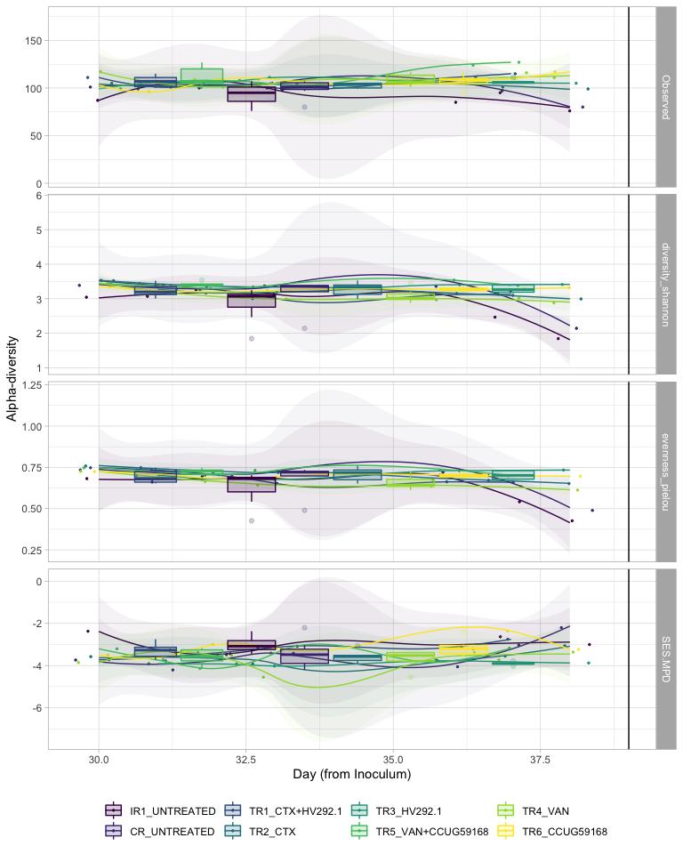

# Beta-div:

Compute beta-div metrics:


```r
ps_polyFermS_rare  %>%
  phyloseq_plot_bdiv(bdiv_list,
                     m = "CoDa",
                     seed = 123) -> coda
  
coda$PCA$layers[[1]] = NULL

coda$PCA + geom_point(size=2,
                   aes(color = Reactor_Treatment, 
                       fill = Reactor_Treatment,
                       shape = NULL,
                       alpha = Day_from_Inoculum)) + 
  theme_light() +
  # geom_path(arrow = arrow(type = "open", angle = 30, length = unit(0.15, "inches")),
              # size = 0.05, linetype = "dashed", inherit.aes = TRUE, aes(group=Reactor_Treatment, color = Reactor_Treatment), show.legend = FALSE) +
  scale_alpha_continuous(range=c( 0.9, 0.3)) + scale_color_viridis_d(na.value = "black") +
  scale_fill_viridis_d(na.value = "black") + 
  # scale_shape_manual(values = c(8, 21, 22, 23, 24, 16, 15, 18, 17)) + 
  theme_classic() +
    labs(col=NULL, fill = NULL, shape = NULL) + guides(shape=FALSE) -> p1

p1
```

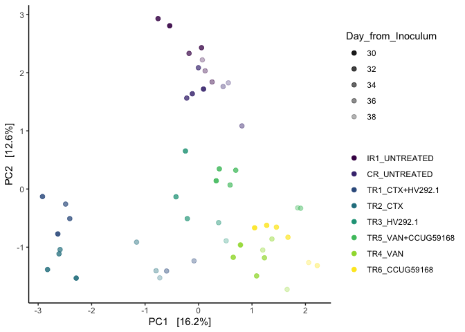


```r
p1 %>%
  ggplotly() -> p1ply

p1ply
```

```{=html}
<div id="htmlwidget-8b100b11b15dab39f5c5" style="width:672px;height:480px;" class="plotly html-widget"></div>
<script type="application/json" data-for="htmlwidget-8b100b11b15dab39f5c5">{"x":{"data":[{"x":[-0.539532461493183,-0.757194196841127,0.055862210464575,-0.177257604731691,0.254478348251107,0.123585943602975,0.071467693328524],"y":[2.80634409491233,2.9294547837005,2.4292483410758,2.33135201521693,1.84055863648918,2.03134099146685,2.22015022183986],"text":["Reactor_Treatment: IR1_UNTREATED<br />Reactor_Treatment: IR1_UNTREATED<br />shape: 19<br />Day_from_Inoculum: 30<br />colour: IR1_UNTREATED<br />shape: 19<br />na.rm: TRUE<br />PC1: -0.539532461<br />PC2:  2.8063441","Reactor_Treatment: IR1_UNTREATED<br />Reactor_Treatment: IR1_UNTREATED<br />shape: 19<br />Day_from_Inoculum: 31<br />colour: IR1_UNTREATED<br />shape: 19<br />na.rm: TRUE<br />PC1: -0.757194197<br />PC2:  2.9294548","Reactor_Treatment: IR1_UNTREATED<br />Reactor_Treatment: IR1_UNTREATED<br />shape: 19<br />Day_from_Inoculum: 32<br />colour: IR1_UNTREATED<br />shape: 19<br />na.rm: TRUE<br />PC1:  0.055862210<br />PC2:  2.4292483","Reactor_Treatment: IR1_UNTREATED<br />Reactor_Treatment: IR1_UNTREATED<br />shape: 19<br />Day_from_Inoculum: 33<br />colour: IR1_UNTREATED<br />shape: 19<br />na.rm: TRUE<br />PC1: -0.177257605<br />PC2:  2.3313520","Reactor_Treatment: IR1_UNTREATED<br />Reactor_Treatment: IR1_UNTREATED<br />shape: 19<br />Day_from_Inoculum: 36<br />colour: IR1_UNTREATED<br />shape: 19<br />na.rm: TRUE<br />PC1:  0.254478348<br />PC2:  1.8405586","Reactor_Treatment: IR1_UNTREATED<br />Reactor_Treatment: IR1_UNTREATED<br />shape: 19<br />Day_from_Inoculum: 37<br />colour: IR1_UNTREATED<br />shape: 19<br />na.rm: TRUE<br />PC1:  0.123585944<br />PC2:  2.0313410","Reactor_Treatment: IR1_UNTREATED<br />Reactor_Treatment: IR1_UNTREATED<br />shape: 19<br />Day_from_Inoculum: 38<br />colour: IR1_UNTREATED<br />shape: 19<br />na.rm: TRUE<br />PC1:  0.071467693<br />PC2:  2.2201502"],"type":"scatter","mode":"markers","marker":{"autocolorscale":false,"color":"rgba(68,1,84,1)","opacity":[0.9,0.825,0.75,0.675,0.45,0.375,0.3],"size":7.55905511811024,"symbol":"circle","line":{"width":1.88976377952756,"color":"rgba(68,1,84,1)"}},"hoveron":"points","name":"IR1_UNTREATED","legendgroup":"IR1_UNTREATED","showlegend":true,"xaxis":"x","yaxis":"y","hoverinfo":"text","frame":null},{"x":[-0.00272921903612398,0.811849951628953,0.459530355566193,0.558035725448095,0.0932004283606085,-0.116603707529878,-0.220865031371958],"y":[2.08488753817985,1.0848681891069,1.76149645681309,1.82489147436764,1.71781299139876,1.6371843857189,1.56335761030417],"text":["Reactor_Treatment: CR_UNTREATED<br />Reactor_Treatment: CR_UNTREATED<br />shape: 19<br />Day_from_Inoculum: 33<br />colour: CR_UNTREATED<br />shape: 19<br />na.rm: TRUE<br />PC1: -0.002729219<br />PC2:  2.0848875","Reactor_Treatment: CR_UNTREATED<br />Reactor_Treatment: CR_UNTREATED<br />shape: 19<br />Day_from_Inoculum: 36<br />colour: CR_UNTREATED<br />shape: 19<br />na.rm: TRUE<br />PC1:  0.811849952<br />PC2:  1.0848682","Reactor_Treatment: CR_UNTREATED<br />Reactor_Treatment: CR_UNTREATED<br />shape: 19<br />Day_from_Inoculum: 37<br />colour: CR_UNTREATED<br />shape: 19<br />na.rm: TRUE<br />PC1:  0.459530356<br />PC2:  1.7614965","Reactor_Treatment: CR_UNTREATED<br />Reactor_Treatment: CR_UNTREATED<br />shape: 19<br />Day_from_Inoculum: 38<br />colour: CR_UNTREATED<br />shape: 19<br />na.rm: TRUE<br />PC1:  0.558035725<br />PC2:  1.8248915","Reactor_Treatment: CR_UNTREATED<br />Reactor_Treatment: CR_UNTREATED<br />shape: 19<br />Day_from_Inoculum: 30<br />colour: CR_UNTREATED<br />shape: 19<br />na.rm: TRUE<br />PC1:  0.093200428<br />PC2:  1.7178130","Reactor_Treatment: CR_UNTREATED<br />Reactor_Treatment: CR_UNTREATED<br />shape: 19<br />Day_from_Inoculum: 31<br />colour: CR_UNTREATED<br />shape: 19<br />na.rm: TRUE<br />PC1: -0.116603708<br />PC2:  1.6371844","Reactor_Treatment: CR_UNTREATED<br />Reactor_Treatment: CR_UNTREATED<br />shape: 19<br />Day_from_Inoculum: 32<br />colour: CR_UNTREATED<br />shape: 19<br />na.rm: TRUE<br />PC1: -0.220865031<br />PC2:  1.5633576"],"type":"scatter","mode":"markers","marker":{"autocolorscale":false,"color":"rgba(70,51,126,1)","opacity":[0.675,0.45,0.375,0.3,0.9,0.825,0.75],"size":7.55905511811024,"symbol":"circle","line":{"width":1.88976377952756,"color":"rgba(70,51,126,1)"}},"hoveron":"points","name":"CR_UNTREATED","legendgroup":"CR_UNTREATED","showlegend":true,"xaxis":"x","yaxis":"y","hoverinfo":"text","frame":null},{"x":[-2.48680901029293,-0.597256327832814,-0.0840935231930627,-2.63191377677802,-2.91906625115814,-2.40894334343712],"y":[-0.258891535415178,-1.4092921916687,-1.23483135870297,-0.772189956004769,-0.129250580705573,-0.508889434431046],"text":["Reactor_Treatment: TR1_CTX+HV292.1<br />Reactor_Treatment: TR1_CTX+HV292.1<br />shape: 19<br />Day_from_Inoculum: 33<br />colour: TR1_CTX+HV292.1<br />shape: 19<br />na.rm: TRUE<br />PC1: -2.486809010<br />PC2: -0.2588915","Reactor_Treatment: TR1_CTX+HV292.1<br />Reactor_Treatment: TR1_CTX+HV292.1<br />shape: 19<br />Day_from_Inoculum: 36<br />colour: TR1_CTX+HV292.1<br />shape: 19<br />na.rm: TRUE<br />PC1: -0.597256328<br />PC2: -1.4092922","Reactor_Treatment: TR1_CTX+HV292.1<br />Reactor_Treatment: TR1_CTX+HV292.1<br />shape: 19<br />Day_from_Inoculum: 37<br />colour: TR1_CTX+HV292.1<br />shape: 19<br />na.rm: TRUE<br />PC1: -0.084093523<br />PC2: -1.2348314","Reactor_Treatment: TR1_CTX+HV292.1<br />Reactor_Treatment: TR1_CTX+HV292.1<br />shape: 19<br />Day_from_Inoculum: 30<br />colour: TR1_CTX+HV292.1<br />shape: 19<br />na.rm: TRUE<br />PC1: -2.631913777<br />PC2: -0.7721900","Reactor_Treatment: TR1_CTX+HV292.1<br />Reactor_Treatment: TR1_CTX+HV292.1<br />shape: 19<br />Day_from_Inoculum: 31<br />colour: TR1_CTX+HV292.1<br />shape: 19<br />na.rm: TRUE<br />PC1: -2.919066251<br />PC2: -0.1292506","Reactor_Treatment: TR1_CTX+HV292.1<br />Reactor_Treatment: TR1_CTX+HV292.1<br />shape: 19<br />Day_from_Inoculum: 32<br />colour: TR1_CTX+HV292.1<br />shape: 19<br />na.rm: TRUE<br />PC1: -2.408943343<br />PC2: -0.5088894"],"type":"scatter","mode":"markers","marker":{"autocolorscale":false,"color":"rgba(54,92,141,1)","opacity":[0.675,0.45,0.375,0.9,0.825,0.75],"size":7.55905511811024,"symbol":"circle","line":{"width":1.88976377952756,"color":"rgba(54,92,141,1)"}},"hoveron":"points","name":"TR1_CTX+HV292.1","legendgroup":"TR1_CTX+HV292.1","showlegend":true,"xaxis":"x","yaxis":"y","hoverinfo":"text","frame":null},{"x":[-2.59000829072,-1.15903014708216,-0.794499715546775,-0.724796074609735,-2.28848821774007,-2.82443878036401,-2.60953101746314],"y":[-1.04068111592751,-0.913082909473032,-1.40517219921035,-1.52708303642657,-1.53139021438151,-1.38433475053648,-1.1144556012224],"text":["Reactor_Treatment: TR2_CTX<br />Reactor_Treatment: TR2_CTX<br />shape: 19<br />Day_from_Inoculum: 33<br />colour: TR2_CTX<br />shape: 19<br />na.rm: TRUE<br />PC1: -2.590008291<br />PC2: -1.0406811","Reactor_Treatment: TR2_CTX<br />Reactor_Treatment: TR2_CTX<br />shape: 19<br />Day_from_Inoculum: 36<br />colour: TR2_CTX<br />shape: 19<br />na.rm: TRUE<br />PC1: -1.159030147<br />PC2: -0.9130829","Reactor_Treatment: TR2_CTX<br />Reactor_Treatment: TR2_CTX<br />shape: 19<br />Day_from_Inoculum: 37<br />colour: TR2_CTX<br />shape: 19<br />na.rm: TRUE<br />PC1: -0.794499716<br />PC2: -1.4051722","Reactor_Treatment: TR2_CTX<br />Reactor_Treatment: TR2_CTX<br />shape: 19<br />Day_from_Inoculum: 38<br />colour: TR2_CTX<br />shape: 19<br />na.rm: TRUE<br />PC1: -0.724796075<br />PC2: -1.5270830","Reactor_Treatment: TR2_CTX<br />Reactor_Treatment: TR2_CTX<br />shape: 19<br />Day_from_Inoculum: 30<br />colour: TR2_CTX<br />shape: 19<br />na.rm: TRUE<br />PC1: -2.288488218<br />PC2: -1.5313902","Reactor_Treatment: TR2_CTX<br />Reactor_Treatment: TR2_CTX<br />shape: 19<br />Day_from_Inoculum: 31<br />colour: TR2_CTX<br />shape: 19<br />na.rm: TRUE<br />PC1: -2.824438780<br />PC2: -1.3843348","Reactor_Treatment: TR2_CTX<br />Reactor_Treatment: TR2_CTX<br />shape: 19<br />Day_from_Inoculum: 32<br />colour: TR2_CTX<br />shape: 19<br />na.rm: TRUE<br />PC1: -2.609531017<br />PC2: -1.1144556"],"type":"scatter","mode":"markers","marker":{"autocolorscale":false,"color":"rgba(39,127,142,1)","opacity":[0.675,0.45,0.375,0.3,0.9,0.825,0.75],"size":7.55905511811024,"symbol":"circle","line":{"width":1.88976377952756,"color":"rgba(39,127,142,1)"}},"hoveron":"points","name":"TR2_CTX","legendgroup":"TR2_CTX","showlegend":true,"xaxis":"x","yaxis":"y","hoverinfo":"text","frame":null},{"x":[-0.209772186848614,0.375883097524109,0.51665719700215,-0.244961079857307,-0.421199837126019],"y":[-0.509279723741709,-0.577774536903729,-0.890070742612524,0.653700253459903,-0.133474350897533],"text":["Reactor_Treatment: TR3_HV292.1<br />Reactor_Treatment: TR3_HV292.1<br />shape: 19<br />Day_from_Inoculum: 33<br />colour: TR3_HV292.1<br />shape: 19<br />na.rm: TRUE<br />PC1: -0.209772187<br />PC2: -0.5092797","Reactor_Treatment: TR3_HV292.1<br />Reactor_Treatment: TR3_HV292.1<br />shape: 19<br />Day_from_Inoculum: 36<br />colour: TR3_HV292.1<br />shape: 19<br />na.rm: TRUE<br />PC1:  0.375883098<br />PC2: -0.5777745","Reactor_Treatment: TR3_HV292.1<br />Reactor_Treatment: TR3_HV292.1<br />shape: 19<br />Day_from_Inoculum: 38<br />colour: TR3_HV292.1<br />shape: 19<br />na.rm: TRUE<br />PC1:  0.516657197<br />PC2: -0.8900707","Reactor_Treatment: TR3_HV292.1<br />Reactor_Treatment: TR3_HV292.1<br />shape: 19<br />Day_from_Inoculum: 31<br />colour: TR3_HV292.1<br />shape: 19<br />na.rm: TRUE<br />PC1: -0.244961080<br />PC2:  0.6537003","Reactor_Treatment: TR3_HV292.1<br />Reactor_Treatment: TR3_HV292.1<br />shape: 19<br />Day_from_Inoculum: 32<br />colour: TR3_HV292.1<br />shape: 19<br />na.rm: TRUE<br />PC1: -0.421199837<br />PC2: -0.1334744"],"type":"scatter","mode":"markers","marker":{"autocolorscale":false,"color":"rgba(31,161,135,1)","opacity":[0.675,0.45,0.3,0.825,0.75],"size":7.55905511811024,"symbol":"circle","line":{"width":1.88976377952756,"color":"rgba(31,161,135,1)"}},"hoveron":"points","name":"TR3_HV292.1","legendgroup":"TR3_HV292.1","showlegend":true,"xaxis":"x","yaxis":"y","hoverinfo":"text","frame":null},{"x":[0.590512535232954,1.91011576974402,1.85435218223677,0.330453641663958,0.388976454654286,0.695879724297002],"y":[0.0689614975133448,-0.33024086475984,-0.324228777487487,0.141110654204568,0.346817566803353,0.322732478567319],"text":["Reactor_Treatment: TR5_VAN+CCUG59168<br />Reactor_Treatment: TR5_VAN+CCUG59168<br />shape: 19<br />Day_from_Inoculum: 33<br />colour: TR5_VAN+CCUG59168<br />shape: 19<br />na.rm: TRUE<br />PC1:  0.590512535<br />PC2:  0.0689615","Reactor_Treatment: TR5_VAN+CCUG59168<br />Reactor_Treatment: TR5_VAN+CCUG59168<br />shape: 19<br />Day_from_Inoculum: 36<br />colour: TR5_VAN+CCUG59168<br />shape: 19<br />na.rm: TRUE<br />PC1:  1.910115770<br />PC2: -0.3302409","Reactor_Treatment: TR5_VAN+CCUG59168<br />Reactor_Treatment: TR5_VAN+CCUG59168<br />shape: 19<br />Day_from_Inoculum: 37<br />colour: TR5_VAN+CCUG59168<br />shape: 19<br />na.rm: TRUE<br />PC1:  1.854352182<br />PC2: -0.3242288","Reactor_Treatment: TR5_VAN+CCUG59168<br />Reactor_Treatment: TR5_VAN+CCUG59168<br />shape: 19<br />Day_from_Inoculum: 30<br />colour: TR5_VAN+CCUG59168<br />shape: 19<br />na.rm: TRUE<br />PC1:  0.330453642<br />PC2:  0.1411107","Reactor_Treatment: TR5_VAN+CCUG59168<br />Reactor_Treatment: TR5_VAN+CCUG59168<br />shape: 19<br />Day_from_Inoculum: 31<br />colour: TR5_VAN+CCUG59168<br />shape: 19<br />na.rm: TRUE<br />PC1:  0.388976455<br />PC2:  0.3468176","Reactor_Treatment: TR5_VAN+CCUG59168<br />Reactor_Treatment: TR5_VAN+CCUG59168<br />shape: 19<br />Day_from_Inoculum: 32<br />colour: TR5_VAN+CCUG59168<br />shape: 19<br />na.rm: TRUE<br />PC1:  0.695879724<br />PC2:  0.3227325"],"type":"scatter","mode":"markers","marker":{"autocolorscale":false,"color":"rgba(74,193,109,1)","opacity":[0.675,0.45,0.375,0.9,0.825,0.75],"size":7.55905511811024,"symbol":"circle","line":{"width":1.88976377952756,"color":"rgba(74,193,109,1)"}},"hoveron":"points","name":"TR5_VAN+CCUG59168","legendgroup":"TR5_VAN+CCUG59168","showlegend":true,"xaxis":"x","yaxis":"y","hoverinfo":"text","frame":null},{"x":[1.23300931140204,1.37298547523297,1.20143812422755,1.65711177179983,0.784239184731939,0.64931125397678,1.08615259409249],"y":[-1.18254569701821,-0.858919802343638,-1.04914449363329,-1.72584939847897,-0.961142256116801,-1.17397967766255,-1.49356838558156],"text":["Reactor_Treatment: TR4_VAN<br />Reactor_Treatment: TR4_VAN<br />shape: 19<br />Day_from_Inoculum: 33<br />colour: TR4_VAN<br />shape: 19<br />na.rm: TRUE<br />PC1:  1.233009311<br />PC2: -1.1825457","Reactor_Treatment: TR4_VAN<br />Reactor_Treatment: TR4_VAN<br />shape: 19<br />Day_from_Inoculum: 36<br />colour: TR4_VAN<br />shape: 19<br />na.rm: TRUE<br />PC1:  1.372985475<br />PC2: -0.8589198","Reactor_Treatment: TR4_VAN<br />Reactor_Treatment: TR4_VAN<br />shape: 19<br />Day_from_Inoculum: 37<br />colour: TR4_VAN<br />shape: 19<br />na.rm: TRUE<br />PC1:  1.201438124<br />PC2: -1.0491445","Reactor_Treatment: TR4_VAN<br />Reactor_Treatment: TR4_VAN<br />shape: 19<br />Day_from_Inoculum: 38<br />colour: TR4_VAN<br />shape: 19<br />na.rm: TRUE<br />PC1:  1.657111772<br />PC2: -1.7258494","Reactor_Treatment: TR4_VAN<br />Reactor_Treatment: TR4_VAN<br />shape: 19<br />Day_from_Inoculum: 30<br />colour: TR4_VAN<br />shape: 19<br />na.rm: TRUE<br />PC1:  0.784239185<br />PC2: -0.9611423","Reactor_Treatment: TR4_VAN<br />Reactor_Treatment: TR4_VAN<br />shape: 19<br />Day_from_Inoculum: 31<br />colour: TR4_VAN<br />shape: 19<br />na.rm: TRUE<br />PC1:  0.649311254<br />PC2: -1.1739797","Reactor_Treatment: TR4_VAN<br />Reactor_Treatment: TR4_VAN<br />shape: 19<br />Day_from_Inoculum: 32<br />colour: TR4_VAN<br />shape: 19<br />na.rm: TRUE<br />PC1:  1.086152594<br />PC2: -1.4935684"],"type":"scatter","mode":"markers","marker":{"autocolorscale":false,"color":"rgba(159,218,58,1)","opacity":[0.675,0.45,0.375,0.3,0.9,0.825,0.75],"size":7.55905511811024,"symbol":"circle","line":{"width":1.88976377952756,"color":"rgba(159,218,58,1)"}},"hoveron":"points","name":"TR4_VAN","legendgroup":"TR4_VAN","showlegend":true,"xaxis":"x","yaxis":"y","hoverinfo":"text","frame":null},{"x":[1.67287471889134,2.22003513720909,2.06044346861477,1.04912279710009,1.27460203049277,1.45682267427595],"y":[-0.829324283723133,-1.31604649881351,-1.26391798973661,-0.667173159341726,-0.624556796327518,-0.655487861852802],"text":["Reactor_Treatment: TR6_CCUG59168<br />Reactor_Treatment: TR6_CCUG59168<br />shape: 19<br />Day_from_Inoculum: 33<br />colour: TR6_CCUG59168<br />shape: 19<br />na.rm: TRUE<br />PC1:  1.672874719<br />PC2: -0.8293243","Reactor_Treatment: TR6_CCUG59168<br />Reactor_Treatment: TR6_CCUG59168<br />shape: 19<br />Day_from_Inoculum: 37<br />colour: TR6_CCUG59168<br />shape: 19<br />na.rm: TRUE<br />PC1:  2.220035137<br />PC2: -1.3160465","Reactor_Treatment: TR6_CCUG59168<br />Reactor_Treatment: TR6_CCUG59168<br />shape: 19<br />Day_from_Inoculum: 38<br />colour: TR6_CCUG59168<br />shape: 19<br />na.rm: TRUE<br />PC1:  2.060443469<br />PC2: -1.2639180","Reactor_Treatment: TR6_CCUG59168<br />Reactor_Treatment: TR6_CCUG59168<br />shape: 19<br />Day_from_Inoculum: 30<br />colour: TR6_CCUG59168<br />shape: 19<br />na.rm: TRUE<br />PC1:  1.049122797<br />PC2: -0.6671732","Reactor_Treatment: TR6_CCUG59168<br />Reactor_Treatment: TR6_CCUG59168<br />shape: 19<br />Day_from_Inoculum: 31<br />colour: TR6_CCUG59168<br />shape: 19<br />na.rm: TRUE<br />PC1:  1.274602030<br />PC2: -0.6245568","Reactor_Treatment: TR6_CCUG59168<br />Reactor_Treatment: TR6_CCUG59168<br />shape: 19<br />Day_from_Inoculum: 32<br />colour: TR6_CCUG59168<br />shape: 19<br />na.rm: TRUE<br />PC1:  1.456822674<br />PC2: -0.6554879"],"type":"scatter","mode":"markers","marker":{"autocolorscale":false,"color":"rgba(253,231,37,1)","opacity":[0.675,0.375,0.3,0.9,0.825,0.75],"size":7.55905511811024,"symbol":"circle","line":{"width":1.88976377952756,"color":"rgba(253,231,37,1)"}},"hoveron":"points","name":"TR6_CCUG59168","legendgroup":"TR6_CCUG59168","showlegend":true,"xaxis":"x","yaxis":"y","hoverinfo":"text","frame":null}],"layout":{"margin":{"t":26.2283105022831,"r":7.30593607305936,"b":40.1826484018265,"l":37.2602739726027},"plot_bgcolor":"rgba(255,255,255,1)","paper_bgcolor":"rgba(255,255,255,1)","font":{"color":"rgba(0,0,0,1)","family":"","size":14.6118721461187},"xaxis":{"domain":[0,1],"automargin":true,"type":"linear","autorange":false,"range":[-3.1760213205765,2.47699020662745],"tickmode":"array","ticktext":["-3","-2","-1","0","1","2"],"tickvals":[-3,-2,-1,0,1,2],"categoryorder":"array","categoryarray":["-3","-2","-1","0","1","2"],"nticks":null,"ticks":"outside","tickcolor":"rgba(51,51,51,1)","ticklen":3.65296803652968,"tickwidth":0.66417600664176,"showticklabels":true,"tickfont":{"color":"rgba(77,77,77,1)","family":"","size":11.689497716895},"tickangle":-0,"showline":true,"linecolor":"rgba(0,0,0,1)","linewidth":0.66417600664176,"showgrid":false,"gridcolor":null,"gridwidth":0,"zeroline":false,"anchor":"y","title":{"text":"PC1   [16.2%]","font":{"color":"rgba(0,0,0,1)","family":"","size":14.6118721461187}},"hoverformat":".2f"},"yaxis":{"domain":[0,1],"automargin":true,"type":"linear","autorange":false,"range":[-1.95861460758794,3.16221999280947],"tickmode":"array","ticktext":["-1","0","1","2","3"],"tickvals":[-1,0,1,2,3],"categoryorder":"array","categoryarray":["-1","0","1","2","3"],"nticks":null,"ticks":"outside","tickcolor":"rgba(51,51,51,1)","ticklen":3.65296803652968,"tickwidth":0.66417600664176,"showticklabels":true,"tickfont":{"color":"rgba(77,77,77,1)","family":"","size":11.689497716895},"tickangle":-0,"showline":true,"linecolor":"rgba(0,0,0,1)","linewidth":0.66417600664176,"showgrid":false,"gridcolor":null,"gridwidth":0,"zeroline":false,"anchor":"x","title":{"text":"PC2   [12.6%]","font":{"color":"rgba(0,0,0,1)","family":"","size":14.6118721461187}},"hoverformat":".2f"},"shapes":[{"type":"rect","fillcolor":null,"line":{"color":null,"width":0,"linetype":[]},"yref":"paper","xref":"paper","x0":0,"x1":1,"y0":0,"y1":1}],"showlegend":true,"legend":{"bgcolor":"rgba(255,255,255,1)","bordercolor":"transparent","borderwidth":1.88976377952756,"font":{"color":"rgba(0,0,0,1)","family":"","size":11.689497716895},"y":0.913385826771654},"annotations":[{"text":"Day_from_Inoculum","x":1.02,"y":1,"showarrow":false,"ax":0,"ay":0,"font":{"color":"rgba(0,0,0,1)","family":"","size":14.6118721461187},"xref":"paper","yref":"paper","textangle":-0,"xanchor":"left","yanchor":"bottom","legendTitle":true}],"hovermode":"closest","barmode":"relative"},"config":{"doubleClick":"reset","showSendToCloud":false},"source":"A","attrs":{"124e94673b9cc":{"colour":{},"fill":{},"shape":{},"alpha":{},"colour.1":{},"shape.1":{},"na.rm":{},"x":{},"y":{},"type":"scatter"}},"cur_data":"124e94673b9cc","visdat":{"124e94673b9cc":["function (y) ","x"]},"highlight":{"on":"plotly_click","persistent":false,"dynamic":false,"selectize":false,"opacityDim":0.2,"selected":{"opacity":1},"debounce":0},"shinyEvents":["plotly_hover","plotly_click","plotly_selected","plotly_relayout","plotly_brushed","plotly_brushing","plotly_clickannotation","plotly_doubleclick","plotly_deselect","plotly_afterplot","plotly_sunburstclick"],"base_url":"https://plot.ly"},"evals":[],"jsHooks":[]}</script>
```


```r
ps_polyFermS_rare %>%
  phyloseq_compute_bdiv(norm = "pc",
                        phylo = TRUE,
                        seed = 123) -> bdiv_list
```

```
## Loading required package: ape
```

```
## Loading required package: GUniFrac
```

```
## Loading required package: vegan
```

```
## Loading required package: permute
```

```
## Loading required package: lattice
```

```
## This is vegan 2.5-7
```

```
## 
## Attaching package: 'vegan'
```

```
## The following object is masked from 'package:microbiome':
## 
##     diversity
```

```
## Loading required package: matrixStats
```

```
## 
## Attaching package: 'matrixStats'
```

```
## The following object is masked from 'package:dplyr':
## 
##     count
```

```r
bdiv_list$coda <- coda$physeq_clr %>% phyloseq::distance(method = "euclidean")
```


```r
phyloseq_plot_bdiv(dlist = bdiv_list, # list of distance computed from a phyloseq object
                   ps_rare = ps_polyFermS_rare, # phyloseq object
                   m = "PCoA", # PCoA or NMDS
                   seed = 123, # for reproducibility
                   axis1 = 1, # axis to plot
                   axis2 = 2) -> plot_list
```

```
## [1] "bray"
## [1] "bjaccard"
## [1] "wjaccard"
## [1] "uunifrac"
## [1] "wunifrac"
## [1] "d_0"
## [1] "d_0.5"
## [1] "coda"
```


```r
plot_list$bray = NULL; plot_list$d_0 = NULL; plot_list$d_0.5 = NULL

plot_list %>%
  phyloseq_plot_ordinations_facet(color_group = "Reactor_Treatment",
                                 shape_group = NULL) +
  scale_color_viridis_d(na.value = "black") +
  scale_fill_viridis_d(na.value = "black") 
```

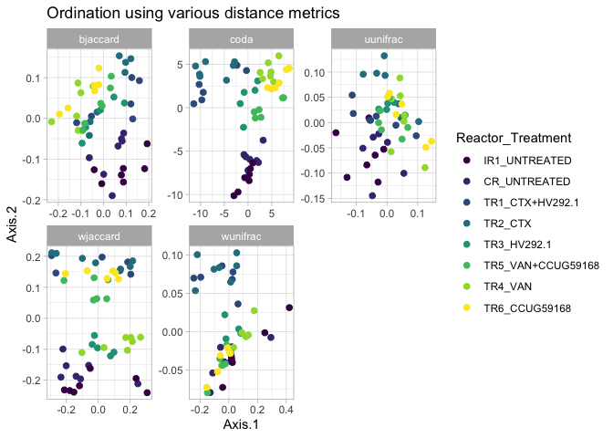<!-- -->


```r
plot_list %>%
  phyloseq_ordinations_expl_var()
```

```
## New names:
## * .id -> .id...1
## * V1 -> V1...2
## * .id -> .id...3
## * V1 -> V1...4
```

```
##    .id...1           V1...2  .id...3           V1...4
## 1 bjaccard Axis.1   [14.2%] bjaccard   Axis.2   [11%]
## 2 wjaccard Axis.1   [23.1%] wjaccard Axis.2   [20.2%]
## 3 uunifrac Axis.1   [15.3%] uunifrac Axis.2   [12.4%]
## 4 wunifrac Axis.1   [71.6%] wunifrac Axis.2   [12.3%]
## 5     coda Axis.1   [16.2%]     coda Axis.2   [12.6%]
```


```r
ps_polyFermS_rare %>%
  phyloseq_distance_boxplot(bdiv_list$coda ,
                            d = "Reactor_Treatment") -> dist_box


dist_box$plot
```

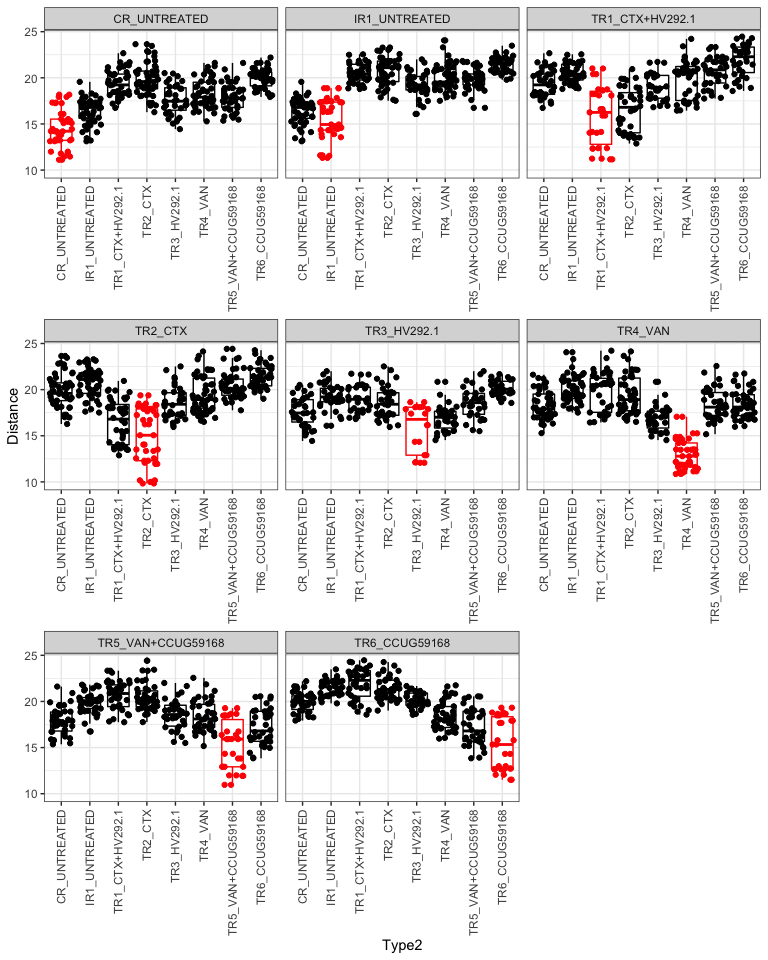<!-- -->

```r
  lapply(
  bdiv_list,
  FUN = physeq_pairwise_permanovas,
  physeq = ps_polyFermS_rare,
  compare_header = "Reactor_Treatment",
  n_perm = 999,
  strat = FALSE
) %>%
  bind_rows(.id = "Distance") %>%
  mutate_if(is.numeric, round, 3) %>%
  # filter(! terms %in% (c("Residuals", "Total"))) %>%
  DT::datatable()
```

```{=html}
<div id="htmlwidget-58d2c5e1b719e7e7ee20" style="width:100%;height:auto;" class="datatables html-widget"></div>
<script type="application/json" data-for="htmlwidget-58d2c5e1b719e7e7ee20">{"x":{"filter":"none","data":[["1","2","3","4","5","6","7","8","9","10","11","12","13","14","15","16","17","18","19","20","21","22","23","24","25","26","27","28","29","30","31","32","33","34","35","36","37","38","39","40","41","42","43","44","45","46","47","48","49","50","51","52","53","54","55","56","57","58","59","60","61","62","63","64","65","66","67","68","69","70","71","72","73","74","75","76","77","78","79","80","81","82","83","84","85","86","87","88","89","90","91","92","93","94","95","96","97","98","99","100","101","102","103","104","105","106","107","108","109","110","111","112","113","114","115","116","117","118","119","120","121","122","123","124","125","126","127","128","129","130","131","132","133","134","135","136","137","138","139","140","141","142","143","144","145","146","147","148","149","150","151","152","153","154","155","156","157","158","159","160","161","162","163","164","165","166","167","168","169","170","171","172","173","174","175","176","177","178","179","180","181","182","183","184","185","186","187","188","189","190","191","192","193","194","195","196","197","198","199","200","201","202","203","204","205","206","207","208","209","210","211","212","213","214","215","216","217","218","219","220","221","222","223","224"],["bray","bray","bray","bray","bray","bray","bray","bray","bray","bray","bray","bray","bray","bray","bray","bray","bray","bray","bray","bray","bray","bray","bray","bray","bray","bray","bray","bray","bjaccard","bjaccard","bjaccard","bjaccard","bjaccard","bjaccard","bjaccard","bjaccard","bjaccard","bjaccard","bjaccard","bjaccard","bjaccard","bjaccard","bjaccard","bjaccard","bjaccard","bjaccard","bjaccard","bjaccard","bjaccard","bjaccard","bjaccard","bjaccard","bjaccard","bjaccard","bjaccard","bjaccard","wjaccard","wjaccard","wjaccard","wjaccard","wjaccard","wjaccard","wjaccard","wjaccard","wjaccard","wjaccard","wjaccard","wjaccard","wjaccard","wjaccard","wjaccard","wjaccard","wjaccard","wjaccard","wjaccard","wjaccard","wjaccard","wjaccard","wjaccard","wjaccard","wjaccard","wjaccard","wjaccard","wjaccard","uunifrac","uunifrac","uunifrac","uunifrac","uunifrac","uunifrac","uunifrac","uunifrac","uunifrac","uunifrac","uunifrac","uunifrac","uunifrac","uunifrac","uunifrac","uunifrac","uunifrac","uunifrac","uunifrac","uunifrac","uunifrac","uunifrac","uunifrac","uunifrac","uunifrac","uunifrac","uunifrac","uunifrac","wunifrac","wunifrac","wunifrac","wunifrac","wunifrac","wunifrac","wunifrac","wunifrac","wunifrac","wunifrac","wunifrac","wunifrac","wunifrac","wunifrac","wunifrac","wunifrac","wunifrac","wunifrac","wunifrac","wunifrac","wunifrac","wunifrac","wunifrac","wunifrac","wunifrac","wunifrac","wunifrac","wunifrac","d_0","d_0","d_0","d_0","d_0","d_0","d_0","d_0","d_0","d_0","d_0","d_0","d_0","d_0","d_0","d_0","d_0","d_0","d_0","d_0","d_0","d_0","d_0","d_0","d_0","d_0","d_0","d_0","d_0.5","d_0.5","d_0.5","d_0.5","d_0.5","d_0.5","d_0.5","d_0.5","d_0.5","d_0.5","d_0.5","d_0.5","d_0.5","d_0.5","d_0.5","d_0.5","d_0.5","d_0.5","d_0.5","d_0.5","d_0.5","d_0.5","d_0.5","d_0.5","d_0.5","d_0.5","d_0.5","d_0.5","coda","coda","coda","coda","coda","coda","coda","coda","coda","coda","coda","coda","coda","coda","coda","coda","coda","coda","coda","coda","coda","coda","coda","coda","coda","coda","coda","coda"],["IR1_UNTREATED","IR1_UNTREATED","IR1_UNTREATED","IR1_UNTREATED","IR1_UNTREATED","IR1_UNTREATED","IR1_UNTREATED","CR_UNTREATED","CR_UNTREATED","CR_UNTREATED","CR_UNTREATED","CR_UNTREATED","CR_UNTREATED","TR1_CTX+HV292.1","TR1_CTX+HV292.1","TR1_CTX+HV292.1","TR1_CTX+HV292.1","TR1_CTX+HV292.1","TR2_CTX","TR2_CTX","TR2_CTX","TR2_CTX","TR3_HV292.1","TR3_HV292.1","TR3_HV292.1","TR5_VAN+CCUG59168","TR5_VAN+CCUG59168","TR4_VAN","IR1_UNTREATED","IR1_UNTREATED","IR1_UNTREATED","IR1_UNTREATED","IR1_UNTREATED","IR1_UNTREATED","IR1_UNTREATED","CR_UNTREATED","CR_UNTREATED","CR_UNTREATED","CR_UNTREATED","CR_UNTREATED","CR_UNTREATED","TR1_CTX+HV292.1","TR1_CTX+HV292.1","TR1_CTX+HV292.1","TR1_CTX+HV292.1","TR1_CTX+HV292.1","TR2_CTX","TR2_CTX","TR2_CTX","TR2_CTX","TR3_HV292.1","TR3_HV292.1","TR3_HV292.1","TR5_VAN+CCUG59168","TR5_VAN+CCUG59168","TR4_VAN","IR1_UNTREATED","IR1_UNTREATED","IR1_UNTREATED","IR1_UNTREATED","IR1_UNTREATED","IR1_UNTREATED","IR1_UNTREATED","CR_UNTREATED","CR_UNTREATED","CR_UNTREATED","CR_UNTREATED","CR_UNTREATED","CR_UNTREATED","TR1_CTX+HV292.1","TR1_CTX+HV292.1","TR1_CTX+HV292.1","TR1_CTX+HV292.1","TR1_CTX+HV292.1","TR2_CTX","TR2_CTX","TR2_CTX","TR2_CTX","TR3_HV292.1","TR3_HV292.1","TR3_HV292.1","TR5_VAN+CCUG59168","TR5_VAN+CCUG59168","TR4_VAN","IR1_UNTREATED","IR1_UNTREATED","IR1_UNTREATED","IR1_UNTREATED","IR1_UNTREATED","IR1_UNTREATED","IR1_UNTREATED","CR_UNTREATED","CR_UNTREATED","CR_UNTREATED","CR_UNTREATED","CR_UNTREATED","CR_UNTREATED","TR1_CTX+HV292.1","TR1_CTX+HV292.1","TR1_CTX+HV292.1","TR1_CTX+HV292.1","TR1_CTX+HV292.1","TR2_CTX","TR2_CTX","TR2_CTX","TR2_CTX","TR3_HV292.1","TR3_HV292.1","TR3_HV292.1","TR5_VAN+CCUG59168","TR5_VAN+CCUG59168","TR4_VAN","IR1_UNTREATED","IR1_UNTREATED","IR1_UNTREATED","IR1_UNTREATED","IR1_UNTREATED","IR1_UNTREATED","IR1_UNTREATED","CR_UNTREATED","CR_UNTREATED","CR_UNTREATED","CR_UNTREATED","CR_UNTREATED","CR_UNTREATED","TR1_CTX+HV292.1","TR1_CTX+HV292.1","TR1_CTX+HV292.1","TR1_CTX+HV292.1","TR1_CTX+HV292.1","TR2_CTX","TR2_CTX","TR2_CTX","TR2_CTX","TR3_HV292.1","TR3_HV292.1","TR3_HV292.1","TR5_VAN+CCUG59168","TR5_VAN+CCUG59168","TR4_VAN","IR1_UNTREATED","IR1_UNTREATED","IR1_UNTREATED","IR1_UNTREATED","IR1_UNTREATED","IR1_UNTREATED","IR1_UNTREATED","CR_UNTREATED","CR_UNTREATED","CR_UNTREATED","CR_UNTREATED","CR_UNTREATED","CR_UNTREATED","TR1_CTX+HV292.1","TR1_CTX+HV292.1","TR1_CTX+HV292.1","TR1_CTX+HV292.1","TR1_CTX+HV292.1","TR2_CTX","TR2_CTX","TR2_CTX","TR2_CTX","TR3_HV292.1","TR3_HV292.1","TR3_HV292.1","TR5_VAN+CCUG59168","TR5_VAN+CCUG59168","TR4_VAN","IR1_UNTREATED","IR1_UNTREATED","IR1_UNTREATED","IR1_UNTREATED","IR1_UNTREATED","IR1_UNTREATED","IR1_UNTREATED","CR_UNTREATED","CR_UNTREATED","CR_UNTREATED","CR_UNTREATED","CR_UNTREATED","CR_UNTREATED","TR1_CTX+HV292.1","TR1_CTX+HV292.1","TR1_CTX+HV292.1","TR1_CTX+HV292.1","TR1_CTX+HV292.1","TR2_CTX","TR2_CTX","TR2_CTX","TR2_CTX","TR3_HV292.1","TR3_HV292.1","TR3_HV292.1","TR5_VAN+CCUG59168","TR5_VAN+CCUG59168","TR4_VAN","IR1_UNTREATED","IR1_UNTREATED","IR1_UNTREATED","IR1_UNTREATED","IR1_UNTREATED","IR1_UNTREATED","IR1_UNTREATED","CR_UNTREATED","CR_UNTREATED","CR_UNTREATED","CR_UNTREATED","CR_UNTREATED","CR_UNTREATED","TR1_CTX+HV292.1","TR1_CTX+HV292.1","TR1_CTX+HV292.1","TR1_CTX+HV292.1","TR1_CTX+HV292.1","TR2_CTX","TR2_CTX","TR2_CTX","TR2_CTX","TR3_HV292.1","TR3_HV292.1","TR3_HV292.1","TR5_VAN+CCUG59168","TR5_VAN+CCUG59168","TR4_VAN"],["CR_UNTREATED","TR1_CTX+HV292.1","TR2_CTX","TR3_HV292.1","TR5_VAN+CCUG59168","TR4_VAN","TR6_CCUG59168","TR1_CTX+HV292.1","TR2_CTX","TR3_HV292.1","TR5_VAN+CCUG59168","TR4_VAN","TR6_CCUG59168","TR2_CTX","TR3_HV292.1","TR5_VAN+CCUG59168","TR4_VAN","TR6_CCUG59168","TR3_HV292.1","TR5_VAN+CCUG59168","TR4_VAN","TR6_CCUG59168","TR5_VAN+CCUG59168","TR4_VAN","TR6_CCUG59168","TR4_VAN","TR6_CCUG59168","TR6_CCUG59168","CR_UNTREATED","TR1_CTX+HV292.1","TR2_CTX","TR3_HV292.1","TR5_VAN+CCUG59168","TR4_VAN","TR6_CCUG59168","TR1_CTX+HV292.1","TR2_CTX","TR3_HV292.1","TR5_VAN+CCUG59168","TR4_VAN","TR6_CCUG59168","TR2_CTX","TR3_HV292.1","TR5_VAN+CCUG59168","TR4_VAN","TR6_CCUG59168","TR3_HV292.1","TR5_VAN+CCUG59168","TR4_VAN","TR6_CCUG59168","TR5_VAN+CCUG59168","TR4_VAN","TR6_CCUG59168","TR4_VAN","TR6_CCUG59168","TR6_CCUG59168","CR_UNTREATED","TR1_CTX+HV292.1","TR2_CTX","TR3_HV292.1","TR5_VAN+CCUG59168","TR4_VAN","TR6_CCUG59168","TR1_CTX+HV292.1","TR2_CTX","TR3_HV292.1","TR5_VAN+CCUG59168","TR4_VAN","TR6_CCUG59168","TR2_CTX","TR3_HV292.1","TR5_VAN+CCUG59168","TR4_VAN","TR6_CCUG59168","TR3_HV292.1","TR5_VAN+CCUG59168","TR4_VAN","TR6_CCUG59168","TR5_VAN+CCUG59168","TR4_VAN","TR6_CCUG59168","TR4_VAN","TR6_CCUG59168","TR6_CCUG59168","CR_UNTREATED","TR1_CTX+HV292.1","TR2_CTX","TR3_HV292.1","TR5_VAN+CCUG59168","TR4_VAN","TR6_CCUG59168","TR1_CTX+HV292.1","TR2_CTX","TR3_HV292.1","TR5_VAN+CCUG59168","TR4_VAN","TR6_CCUG59168","TR2_CTX","TR3_HV292.1","TR5_VAN+CCUG59168","TR4_VAN","TR6_CCUG59168","TR3_HV292.1","TR5_VAN+CCUG59168","TR4_VAN","TR6_CCUG59168","TR5_VAN+CCUG59168","TR4_VAN","TR6_CCUG59168","TR4_VAN","TR6_CCUG59168","TR6_CCUG59168","CR_UNTREATED","TR1_CTX+HV292.1","TR2_CTX","TR3_HV292.1","TR5_VAN+CCUG59168","TR4_VAN","TR6_CCUG59168","TR1_CTX+HV292.1","TR2_CTX","TR3_HV292.1","TR5_VAN+CCUG59168","TR4_VAN","TR6_CCUG59168","TR2_CTX","TR3_HV292.1","TR5_VAN+CCUG59168","TR4_VAN","TR6_CCUG59168","TR3_HV292.1","TR5_VAN+CCUG59168","TR4_VAN","TR6_CCUG59168","TR5_VAN+CCUG59168","TR4_VAN","TR6_CCUG59168","TR4_VAN","TR6_CCUG59168","TR6_CCUG59168","CR_UNTREATED","TR1_CTX+HV292.1","TR2_CTX","TR3_HV292.1","TR5_VAN+CCUG59168","TR4_VAN","TR6_CCUG59168","TR1_CTX+HV292.1","TR2_CTX","TR3_HV292.1","TR5_VAN+CCUG59168","TR4_VAN","TR6_CCUG59168","TR2_CTX","TR3_HV292.1","TR5_VAN+CCUG59168","TR4_VAN","TR6_CCUG59168","TR3_HV292.1","TR5_VAN+CCUG59168","TR4_VAN","TR6_CCUG59168","TR5_VAN+CCUG59168","TR4_VAN","TR6_CCUG59168","TR4_VAN","TR6_CCUG59168","TR6_CCUG59168","CR_UNTREATED","TR1_CTX+HV292.1","TR2_CTX","TR3_HV292.1","TR5_VAN+CCUG59168","TR4_VAN","TR6_CCUG59168","TR1_CTX+HV292.1","TR2_CTX","TR3_HV292.1","TR5_VAN+CCUG59168","TR4_VAN","TR6_CCUG59168","TR2_CTX","TR3_HV292.1","TR5_VAN+CCUG59168","TR4_VAN","TR6_CCUG59168","TR3_HV292.1","TR5_VAN+CCUG59168","TR4_VAN","TR6_CCUG59168","TR5_VAN+CCUG59168","TR4_VAN","TR6_CCUG59168","TR4_VAN","TR6_CCUG59168","TR6_CCUG59168","CR_UNTREATED","TR1_CTX+HV292.1","TR2_CTX","TR3_HV292.1","TR5_VAN+CCUG59168","TR4_VAN","TR6_CCUG59168","TR1_CTX+HV292.1","TR2_CTX","TR3_HV292.1","TR5_VAN+CCUG59168","TR4_VAN","TR6_CCUG59168","TR2_CTX","TR3_HV292.1","TR5_VAN+CCUG59168","TR4_VAN","TR6_CCUG59168","TR3_HV292.1","TR5_VAN+CCUG59168","TR4_VAN","TR6_CCUG59168","TR5_VAN+CCUG59168","TR4_VAN","TR6_CCUG59168","TR4_VAN","TR6_CCUG59168","TR6_CCUG59168"],[0.158,0.402,0.415,0.247,0.43,0.345,0.469,0.372,0.407,0.203,0.347,0.32,0.424,0.063,0.347,0.322,0.408,0.309,0.359,0.334,0.437,0.326,0.413,0.235,0.45,0.454,0.151,0.471,0.102,0.21,0.266,0.202,0.246,0.292,0.268,0.214,0.254,0.151,0.189,0.271,0.248,0.156,0.204,0.232,0.285,0.263,0.184,0.26,0.289,0.266,0.171,0.195,0.212,0.261,0.153,0.207,0.143,0.342,0.353,0.241,0.373,0.325,0.407,0.323,0.35,0.204,0.305,0.297,0.37,0.068,0.321,0.291,0.363,0.28,0.329,0.302,0.387,0.297,0.361,0.222,0.4,0.396,0.146,0.415,0.082,0.165,0.265,0.222,0.218,0.242,0.253,0.198,0.281,0.213,0.191,0.235,0.241,0.17,0.223,0.206,0.23,0.237,0.216,0.293,0.246,0.244,0.212,0.136,0.192,0.231,0.126,0.189,0.112,0.289,0.332,0.109,0.291,0.066,0.288,0.176,0.223,0.06,0.132,0.176,0.118,0.018,0.244,0.268,0.411,0.245,0.281,0.289,0.449,0.281,0.359,0.198,0.361,0.507,0.088,0.505,0.096,0.183,0.238,0.178,0.204,0.192,0.244,0.172,0.217,0.138,0.164,0.187,0.209,0.112,0.194,0.208,0.232,0.246,0.2,0.243,0.249,0.244,0.2,0.13,0.224,0.215,0.103,0.225,0.109,0.298,0.342,0.168,0.278,0.172,0.312,0.229,0.278,0.115,0.173,0.201,0.208,0.053,0.251,0.321,0.389,0.347,0.286,0.349,0.423,0.369,0.296,0.181,0.348,0.39,0.11,0.425,0.162,0.324,0.361,0.282,0.318,0.387,0.38,0.304,0.352,0.232,0.255,0.343,0.348,0.144,0.263,0.344,0.371,0.391,0.262,0.355,0.376,0.392,0.263,0.239,0.33,0.327,0.197,0.324],[0.149,0.001,0.003,0.015,0.001,0.007,0.001,0.001,0.002,0.032,0.002,0.006,0.001,0.469,0.003,0.005,0.002,0.002,0.004,0.002,0.002,0.003,0.004,0.035,0.002,0.001,0.111,0.002,0.119,0.001,0.001,0.003,0.001,0.005,0.001,0.001,0.001,0.015,0.001,0.001,0.001,0.051,0.018,0.002,0.001,0.004,0.012,0.001,0.001,0.002,0.039,0.001,0.004,0.002,0.033,0.002,0.135,0.001,0.001,0.011,0.001,0.002,0.002,0.001,0.002,0.008,0.001,0.006,0.003,0.457,0.003,0.004,0.002,0.004,0.002,0.004,0.002,0.001,0.002,0.019,0.002,0.002,0.117,0.002,0.377,0.014,0.001,0.004,0.001,0.001,0.004,0.004,0.001,0.004,0.005,0.001,0.001,0.041,0.003,0.002,0.003,0.005,0.005,0.001,0.002,0.002,0.017,0.09,0.009,0.002,0.172,0.009,0.238,0.026,0.007,0.356,0.007,0.4,0.01,0.104,0.03,0.581,0.157,0.119,0.23,0.806,0.099,0.03,0.012,0.048,0.047,0.014,0.003,0.026,0.005,0.106,0.013,0.005,0.403,0.005,0.222,0.001,0.002,0.002,0.003,0.001,0.002,0.002,0.001,0.013,0.001,0.002,0.001,0.156,0.005,0.003,0.001,0.003,0.005,0.001,0.001,0.001,0.008,0.067,0.001,0.004,0.29,0.003,0.205,0.002,0.002,0.132,0.002,0.053,0.003,0.004,0.001,0.24,0.015,0.024,0.003,0.569,0.028,0.002,0.002,0.002,0.011,0.001,0.002,0.001,0.005,0.073,0.004,0.003,0.266,0.005,0.001,0.001,0.001,0.002,0.001,0.002,0.002,0.003,0.001,0.002,0.001,0.002,0.003,0.085,0.005,0.004,0.002,0.001,0.004,0.002,0.003,0.002,0.003,0.001,0.005,0.002,0.023,0.001],[4.172,0.028,0.084,0.42,0.028,0.196,0.028,0.028,0.056,0.896,0.056,0.168,0.028,13.132,0.084,0.14,0.056,0.056,0.112,0.056,0.056,0.084,0.112,0.98,0.056,0.028,3.108,0.056,3.332,0.028,0.028,0.084,0.028,0.14,0.028,0.028,0.028,0.42,0.028,0.028,0.028,1.428,0.504,0.056,0.028,0.112,0.336,0.028,0.028,0.056,1.092,0.028,0.112,0.056,0.924,0.056,3.78,0.028,0.028,0.308,0.028,0.056,0.056,0.028,0.056,0.224,0.028,0.168,0.084,12.796,0.084,0.112,0.056,0.112,0.056,0.112,0.056,0.028,0.056,0.532,0.056,0.056,3.276,0.056,10.556,0.392,0.028,0.112,0.028,0.028,0.112,0.112,0.028,0.112,0.14,0.028,0.028,1.148,0.084,0.056,0.084,0.14,0.14,0.028,0.056,0.056,0.476,2.52,0.252,0.056,4.816,0.252,6.664,0.728,0.196,9.968,0.196,11.2,0.28,2.912,0.84,16.268,4.396,3.332,6.44,22.568,2.772,0.84,0.336,1.344,1.316,0.392,0.084,0.728,0.14,2.968,0.364,0.14,11.284,0.14,6.216,0.028,0.056,0.056,0.084,0.028,0.056,0.056,0.028,0.364,0.028,0.056,0.028,4.368,0.14,0.084,0.028,0.084,0.14,0.028,0.028,0.028,0.224,1.876,0.028,0.112,8.12,0.084,5.74,0.056,0.056,3.696,0.056,1.484,0.084,0.112,0.028,6.72,0.42,0.672,0.084,15.932,0.784,0.056,0.056,0.056,0.308,0.028,0.056,0.028,0.14,2.044,0.112,0.084,7.448,0.14,0.028,0.028,0.028,0.056,0.028,0.056,0.056,0.084,0.028,0.056,0.028,0.056,0.084,2.38,0.14,0.112,0.056,0.028,0.112,0.056,0.084,0.056,0.084,0.028,0.14,0.056,0.644,0.028],[0.155,0.008,0.005,0.018,0.008,0.009,0.008,0.008,0.005,0.037,0.005,0.008,0.008,0.469,0.005,0.007,0.005,0.005,0.006,0.005,0.005,0.005,0.006,0.039,0.005,0.008,0.12,0.005,0.119,0.004,0.004,0.005,0.004,0.007,0.004,0.004,0.004,0.018,0.004,0.004,0.004,0.053,0.021,0.004,0.004,0.006,0.015,0.004,0.004,0.004,0.042,0.004,0.006,0.004,0.037,0.004,0.14,0.008,0.008,0.013,0.008,0.005,0.005,0.008,0.005,0.01,0.008,0.008,0.005,0.457,0.005,0.006,0.005,0.006,0.005,0.006,0.005,0.008,0.005,0.021,0.005,0.005,0.126,0.005,0.377,0.017,0.007,0.007,0.007,0.007,0.007,0.007,0.007,0.007,0.007,0.007,0.007,0.046,0.007,0.006,0.007,0.007,0.007,0.007,0.006,0.006,0.02,0.097,0.012,0.006,0.178,0.012,0.29,0.063,0.036,0.415,0.036,0.448,0.04,0.162,0.062,0.603,0.209,0.167,0.293,0.806,0.163,0.062,0.042,0.084,0.088,0.039,0.084,0.063,0.047,0.156,0.04,0.047,0.434,0.047,0.23,0.005,0.004,0.004,0.005,0.005,0.004,0.004,0.005,0.015,0.005,0.004,0.005,0.168,0.007,0.005,0.005,0.005,0.007,0.005,0.005,0.005,0.01,0.075,0.005,0.006,0.29,0.005,0.23,0.008,0.008,0.154,0.008,0.067,0.007,0.008,0.014,0.258,0.022,0.034,0.007,0.569,0.037,0.008,0.008,0.008,0.017,0.014,0.008,0.014,0.008,0.089,0.008,0.007,0.276,0.008,0.006,0.006,0.006,0.004,0.006,0.004,0.004,0.004,0.006,0.004,0.006,0.004,0.004,0.085,0.005,0.005,0.004,0.006,0.005,0.004,0.004,0.004,0.004,0.006,0.005,0.004,0.024,0.006]],"container":"<table class=\"display\">\n  <thead>\n    <tr>\n      <th> <\/th>\n      <th>Distance<\/th>\n      <th>X1<\/th>\n      <th>X2<\/th>\n      <th>R2<\/th>\n      <th>pval<\/th>\n      <th>pvalBon<\/th>\n      <th>pvalFDR<\/th>\n    <\/tr>\n  <\/thead>\n<\/table>","options":{"columnDefs":[{"className":"dt-right","targets":[4,5,6,7]},{"orderable":false,"targets":0}],"order":[],"autoWidth":false,"orderClasses":false}},"evals":[],"jsHooks":[]}</script>
```


# Taxa Heatmap:

```r
ps_polyFermS_rare %>%
  # subset_samples(Experiment == "CCUG59168" |  Experiment ==  "HV292.1" | Experiment ==  "Cecum" |  Experiment ==  "Continuous" & Reactor %in% c("IR1", "CR")) %>%
  # rarefy_even_depth(sample.size = 2574,rngseed = 123) %>%
  phyloseq_ampvis_heatmap(transform = "percent",
                          group_by = "Day_from_Inoculum",
                          facet_by = c("Enrichment", "Phase", "Reactor", "Treatment", "Experiment", "Reactor_Treatment" ),
                          tax_aggregate = "Class",
                          tax_add = NULL,
                          ntax  = 60) -> p
```

```
## Warning: There are only 7 taxa, showing all
```

```r
p + facet_grid( ~ Reactor_Treatment + Phase , scales = "free", space = "free") + 
  scale_fill_viridis_c(breaks = c(0,  0.01, 1, 10, 50, 75, 100), 
                       labels = c(0,  0.01, 1, 10, 50, 75, 100), 
                       trans = scales::pseudo_log_trans(sigma = 0.001),
                       na.value = 'transparent') -> p2
```

```
## Scale for 'fill' is already present. Adding another scale for 'fill', which
## will replace the existing scale.
```

```r
p2
```

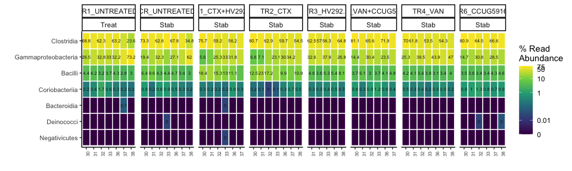

```r
ps_polyFermS_rare %>%
  # subset_samples(Experiment == "CCUG59168" |  Experiment ==  "HV292.1" | Experiment ==  "Cecum" |  Experiment ==  "Continuous" & Reactor %in% c("IR1", "CR")) %>%
  # rarefy_even_depth(sample.size = 2574,rngseed = 123) %>%
  phyloseq_ampvis_heatmap(transform = "percent",
                          group_by = "Day_from_Inoculum",
                          facet_by = c("Enrichment", "Phase", "Reactor", "Treatment", "Experiment", "Reactor_Treatment" ),
                          tax_aggregate = "Genus",
                          tax_add = NULL,
                          ntax  = 60) -> p

p + facet_grid( ~ Reactor_Treatment + Phase , scales = "free", space = "free") + 
  scale_fill_viridis_c(breaks = c(0,  0.01, 1, 10, 50, 75, 100), 
                       labels = c(0,  0.01, 1, 10, 50, 75, 100), 
                       trans = scales::pseudo_log_trans(sigma = 0.001),
                       na.value = 'transparent') -> p2
```

```
## Scale for 'fill' is already present. Adding another scale for 'fill', which
## will replace the existing scale.
```

```r
p2
```

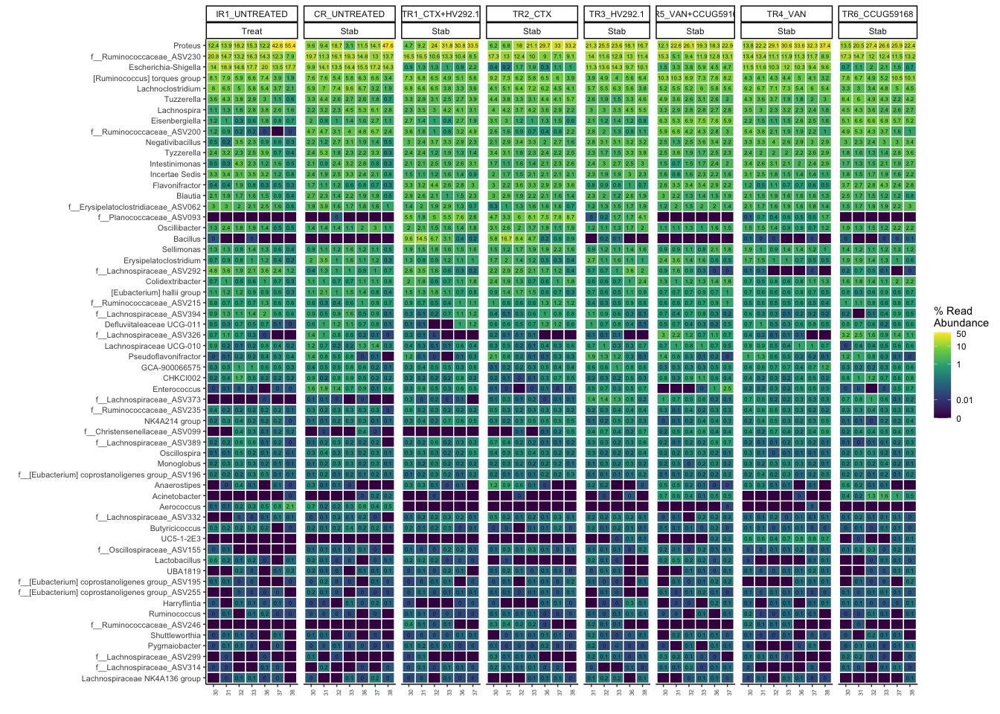


```r
ps_polyFermS_rare %>%
  # subset_samples(Experiment == "CCUG59168" |  Experiment ==  "HV292.1" | Experiment ==  "Cecum" |  Experiment ==  "Continuous" & Reactor %in% c("IR1", "CR")) %>%
  # rarefy_even_depth(sample.size = 2574,rngseed = 123) %>%
  phyloseq_ampvis_heatmap(transform = "percent",
                          group_by = "Day_from_Inoculum",
                          facet_by = c("Enrichment", "Phase", "Reactor", "Treatment", "Experiment", "Reactor_Treatment" ),
                          tax_aggregate = "Species",
                          tax_add = NULL,
                          ntax  = 60) -> p

p + facet_grid( ~ Reactor_Treatment + Phase , scales = "free", space = "free") + 
  scale_fill_viridis_c(breaks = c(0,  0.01, 1, 10, 50, 75, 100), 
                       labels = c(0,  0.01, 1, 10, 50, 75, 100), 
                       trans = scales::pseudo_log_trans(sigma = 0.001),
                       na.value = 'transparent') -> p2
```

```
## Scale for 'fill' is already present. Adding another scale for 'fill', which
## will replace the existing scale.
```

```r
p2
```

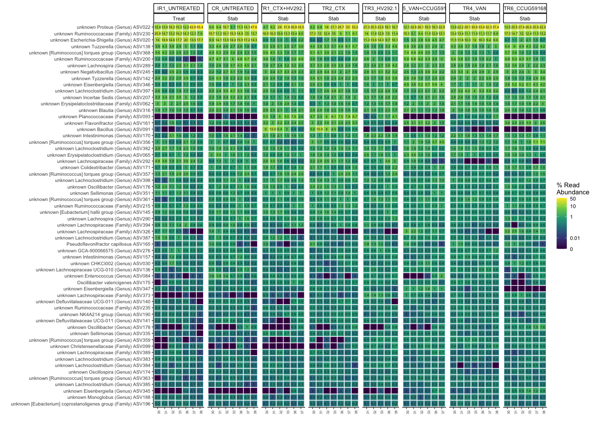


```r
paste0(here::here(),
       "/data/processed/",
       "stab",
       "_",
       format(Sys.time(), "%Y%b%d")
       ,".RData") %>% save.image()
# load("/Users/fconstan/Projects/EZe/ASV/260420.RData")
```


```r
sessionInfo()
```

```
## R version 4.0.3 (2020-10-10)
## Platform: x86_64-apple-darwin17.0 (64-bit)
## Running under: macOS Mojave 10.14.6
## 
## Matrix products: default
## BLAS:   /Library/Frameworks/R.framework/Versions/4.0/Resources/lib/libRblas.dylib
## LAPACK: /Library/Frameworks/R.framework/Versions/4.0/Resources/lib/libRlapack.dylib
## 
## locale:
## [1] en_US.UTF-8/en_US.UTF-8/en_US.UTF-8/C/en_US.UTF-8/en_US.UTF-8
## 
## attached base packages:
## [1] stats     graphics  grDevices utils     datasets  methods   base     
## 
## other attached packages:
##  [1] GUniFrac_1.1         matrixStats_0.57.0   vegan_2.5-7         
##  [4] lattice_0.20-41      permute_0.9-5        ape_5.4-1           
##  [7] metagMisc_0.0.4      reshape2_1.4.4       scales_1.1.1        
## [10] microbiome_1.10.0    plotly_4.9.3         ampvis2_2.6.4       
## [13] ggrepel_0.9.0        speedyseq_0.5.3.9001 phyloseq_1.32.0     
## [16] forcats_0.5.0        stringr_1.4.0        dplyr_1.0.3         
## [19] purrr_0.3.4          readr_1.4.0          tidyr_1.1.2         
## [22] tibble_3.0.5         ggplot2_3.3.3        tidyverse_1.3.0.9000
## 
## loaded via a namespace (and not attached):
##   [1] readxl_1.3.1        backports_1.2.1     plyr_1.8.6         
##   [4] igraph_1.2.6        lazyeval_0.2.2      splines_4.0.3      
##   [7] crosstalk_1.1.1     digest_0.6.27       foreach_1.5.1      
##  [10] htmltools_0.5.1     fansi_0.4.2         magrittr_2.0.1     
##  [13] cluster_2.1.0       doParallel_1.0.16   openxlsx_4.2.3     
##  [16] Biostrings_2.56.0   modelr_0.1.8        prettyunits_1.1.1  
##  [19] colorspace_2.0-0    rvest_0.3.6         haven_2.3.1        
##  [22] xfun_0.20           crayon_1.3.4        jsonlite_1.7.2     
##  [25] survival_3.2-7      iterators_1.0.13    glue_1.4.2         
##  [28] gtable_0.3.0        zlibbioc_1.34.0     XVector_0.28.0     
##  [31] car_3.0-10          Rhdf5lib_1.10.0     BiocGenerics_0.34.0
##  [34] abind_1.4-5         DBI_1.1.0           rstatix_0.6.0      
##  [37] Rcpp_1.0.6          viridisLite_0.3.0   progress_1.2.2     
##  [40] foreign_0.8-81      stats4_4.0.3        DT_0.17            
##  [43] truncnorm_1.0-8     htmlwidgets_1.5.3   httr_1.4.2         
##  [46] RColorBrewer_1.1-2  ellipsis_0.3.1      pkgconfig_2.0.3    
##  [49] NADA_1.6-1.1        farver_2.0.3        dbplyr_2.0.0       
##  [52] here_1.0.1          tidyselect_1.1.0    labeling_0.4.2     
##  [55] rlang_0.4.10        munsell_0.5.0       cellranger_1.1.0   
##  [58] tools_4.0.3         cli_2.2.0           generics_0.1.0     
##  [61] ade4_1.7-16         broom_0.7.3         evaluate_0.14      
##  [64] biomformat_1.16.0   PhyloMeasures_2.1   yaml_2.2.1         
##  [67] knitr_1.30          fs_1.5.0            zip_2.1.1          
##  [70] nlme_3.1-151        xml2_1.3.2          compiler_4.0.3     
##  [73] rstudioapi_0.13     curl_4.3            ggsignif_0.6.0     
##  [76] zCompositions_1.3.4 reprex_0.3.0        stringi_1.5.3      
##  [79] Matrix_1.3-2        multtest_2.44.0     vctrs_0.3.6        
##  [82] pillar_1.4.7        lifecycle_0.2.0     data.table_1.13.6  
##  [85] patchwork_1.1.1     R6_2.5.0            network_1.16.1     
##  [88] rio_0.5.16          IRanges_2.22.2      codetools_0.2-18   
##  [91] ggnet_0.1.0         MASS_7.3-53         assertthat_0.2.1   
##  [94] picante_1.8.2       rhdf5_2.32.2        rprojroot_2.0.2    
##  [97] withr_2.4.0         S4Vectors_0.26.1    mgcv_1.8-33        
## [100] parallel_4.0.3      hms_0.5.3           grid_4.0.3         
## [103] rmarkdown_2.6       carData_3.0-4       Rtsne_0.15         
## [106] ggpubr_0.4.0        Biobase_2.48.0      lubridate_1.7.9.2
```

