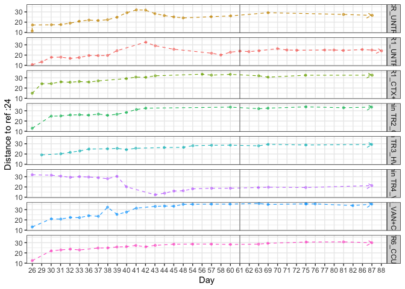

#### Load required packages


```r
library(tidyverse)
library(phyloseq)
library(speedyseq)
library(ggrepel)
library(ampvis2)
library(plotly)
library(microbiome)
options(getClass.msg=FALSE) # https://github.com/epurdom/clusterExperiment/issues/66
#this fixes an error message that pops up because the class 'Annotated' is defined in two different packages
```

#### Load functions from Github


```r
'%!in%' <- function(x,y)!('%in%'(x,y))

source("https://raw.githubusercontent.com/fconstancias/DivComAnalyses/master/R/phyloseq_taxa_tests.R")
source("https://raw.githubusercontent.com/fconstancias/DivComAnalyses/master/R/phyloseq_normalisation.R")
```

```
## Loading required package: scales
```

```
## 
## Attaching package: 'scales'
```

```
## The following object is masked from 'package:microbiome':
## 
##     alpha
```

```
## The following object is masked from 'package:purrr':
## 
##     discard
```

```
## The following object is masked from 'package:readr':
## 
##     col_factor
```

```
## Loading required package: reshape2
```

```
## 
## Attaching package: 'reshape2'
```

```
## The following object is masked from 'package:tidyr':
## 
##     smiths
```

```r
source("https://raw.githubusercontent.com/fconstancias/DivComAnalyses/master/R/phyloseq_alpha.R")
source("https://raw.githubusercontent.com/fconstancias/DivComAnalyses/master/R/phyloseq_beta.R")
source("https://raw.githubusercontent.com/fconstancias/DivComAnalyses/master/R/phyloseq_heatmap.R")
```


#### Load physeq object


```r
ps = "data/processed/physeq_update_23_11.RDS"

ps %>% 
  here::here() %>%
  readRDS() %>%
  phyloseq_get_strains_fast() %>%
  phyloseq_remove_chloro_mitho() -> physeq
```

```
## Joining, by = "ASV"
```

```r
physeq %>% 
  subset_samples(Experiment == "Continuous") %>% 
  subset_samples(Paul %!in% c("Paul")) %>%
  subset_samples(Reactor != "IR2") -> ps_PolyFermS
```

We will be analysing only the PolyFermS samples here so take a subset of the physeq object.  

```r
physeq %>% 
  subset_samples(Experiment == "Continuous") %>% 
  subset_samples(Paul %!in% c("Paul")) %>%
  subset_samples(Reactor != "IR2") -> ps_polyFermS

sample_data(ps_polyFermS)$Reactor <- fct_relevel(sample_data(ps_polyFermS)$Reactor, "IR1", "CR", "TR1", "TR2","TR3", "TR4", "TR5", "TR6") 

sample_data(ps_polyFermS)$Treatment <- fct_relevel(sample_data(ps_polyFermS)$Treatment, "UNTREATED",  "CTX+HV292.1", "CTX","HV292.1","VAN+CCUG59168", "VAN",  "CCUG59168") 

sample_data(ps_polyFermS)$Reactor_Treatment <- fct_relevel(sample_data(ps_polyFermS)$Reactor_Treatment, "IR1_UNTREATED","CR_UNTREATED", "CR_CTX", "CR_VAN", "TR1_CTX+HV292.1","TR2_CTX", "TR3_HV292.1", "TR5_VAN+CCUG59168", "TR4_VAN", "TR6_CCUG59168") 

ps_polyFermS %>% 
  rarefy_even_depth(sample.size = 4576,
                    rngseed = 123) -> ps_polyFermS_rare
```

```
## `set.seed(123)` was used to initialize repeatable random subsampling.
```

```
## Please record this for your records so others can reproduce.
```

```
## Try `set.seed(123); .Random.seed` for the full vector
```

```
## ...
```

```
## 16 samples removedbecause they contained fewer reads than `sample.size`.
```

```
## Up to first five removed samples are:
```

```
## CR-40-S166ETR1-30-S178ETR1-42-S194ETR2-30-S195IR1-40-S197
```

```
## ...
```

```
## 50OTUs were removed because they are no longer 
## present in any sample after random subsampling
```

```
## ...
```

Compute beta-div metrics:


```r
ps_polyFermS_rare %>%
  phyloseq_compute_bdiv(norm = "pc",
                        phylo = TRUE,
                        seed = 123) -> bdiv_list
```

```
## Loading required package: ape
```

```
## Loading required package: GUniFrac
```

```
## Loading required package: vegan
```

```
## Loading required package: permute
```

```
## Loading required package: lattice
```

```
## This is vegan 2.5-7
```

```
## 
## Attaching package: 'vegan'
```

```
## The following object is masked from 'package:microbiome':
## 
##     diversity
```

```
## Loading required package: matrixStats
```

```
## 
## Attaching package: 'matrixStats'
```

```
## The following object is masked from 'package:dplyr':
## 
##     count
```


```r
ps_polyFermS_rare  %>%
  subset_samples(Enrichment == "NotEnriched") %>%
  phyloseq_plot_bdiv(bdiv_list,
                     m = "CoDa",
                     seed = 123) -> coda
  
coda$PCA$layers[[1]] = NULL

coda$PCA + geom_point(size=2,
                   aes(color = Reactor_Treatment, 
                       fill = Reactor_Treatment,
                       shape = NULL,
                       alpha = Day_from_Inoculum)) + 
  theme_light() +
  geom_path(arrow = arrow(type = "open", angle = 30, length = unit(0.15, "inches")),
              size = 0.05, linetype = "dashed", inherit.aes = TRUE, aes(group=Reactor_Treatment, color = Reactor_Treatment), show.legend = FALSE) +
  scale_alpha_continuous(range=c( 0.9, 0.3)) + scale_color_viridis_d(na.value = "black") + 
  scale_fill_viridis_d(na.value = "black") + 
  # scale_shape_manual(values = c(8, 21, 22, 23, 24, 16, 15, 18, 17)) + 
  theme_classic() +
    labs(col=NULL, fill = NULL, shape = NULL) + guides(shape=FALSE) -> p1

p1
```


```r
p1 %>%
  ggplotly() -> p1ply
```

```
## Warning: `group_by_()` is deprecated as of dplyr 0.7.0.
## Please use `group_by()` instead.
## See vignette('programming') for more help
## This warning is displayed once every 8 hours.
## Call `lifecycle::last_warnings()` to see where this warning was generated.
```

```r
p1ply
```

<!--html_preserve--><div id="htmlwidget-9eceb20dc2a931752ae4" style="width:672px;height:480px;" class="plotly html-widget"></div>
<script type="application/json" data-for="htmlwidget-9eceb20dc2a931752ae4">{"x":{"data":[{"x":[-0.126034158316702,0.172144319204324,0.311360047932651,0.639641539504371,0.707895813283816,0.729915077230269,-1.57179666275107,0.45641513528155,0.859331412097656,0.787159021545305,0.719131978926214,-1.28059829878542,0.668672686126289,0.600954674972,0.877852138770186,0.958754213648895,0.857565945177256,0.560130215693514,0.16083588621139,-0.606922842458443,-1.10489287285491,-1.11701948900989,-0.12234512211071,0.425854384321889,0.492206830049911,0.544034455398825,-0.928813148424778,0.304894828099175,0.351022686470276,0.248140599891615,0.233485214171897,0.300207882494833,0.342264570800013,0.415509846685108,0.458933597499187,-0.682736947991348,0.284545788593095,0.531358521532031,0.151443271549701,0.346164538303871,0.416217380356845],"y":[-1.48179331083402,-1.56445068525157,-1.855741095425,-1.88914099995579,-2.11379326273926,-1.97718012344534,-2.33414938520832,-1.9552636509802,-2.0183132365768,-1.95623062729531,-1.33488063171068,-2.2806321836462,-1.35389214781261,-1.38827430570455,-0.895135978588947,-0.691764976459486,-0.358007197700821,-0.298899921660361,-0.464198993926195,-0.245048707498903,-2.28108715614515,-0.541770653557571,-0.653031284693908,0.0561668545299889,-0.830028545228473,-0.126242991287242,-1.84241878699738,-0.245123931473901,0.108109683845109,0.0604312911985932,0.261832813746901,0.807007411049752,0.627852386738878,0.762144718241078,0.480361056430812,-1.46982056669651,0.695718243992309,0.68626241594277,0.740704646511191,0.842982357169615,0.828024761728055],"text":["Reactor_Treatment: IR1_UNTREATED<br />Reactor_Treatment: IR1_UNTREATED<br />shape: 19<br />Day_from_Inoculum: 10<br />colour: IR1_UNTREATED<br />shape: 19<br />na.rm: TRUE<br />PC1: -0.12603416<br />PC2: -1.481793311","Reactor_Treatment: IR1_UNTREATED<br />Reactor_Treatment: IR1_UNTREATED<br />shape: 19<br />Day_from_Inoculum: 11<br />colour: IR1_UNTREATED<br />shape: 19<br />na.rm: TRUE<br />PC1:  0.17214432<br />PC2: -1.564450685","Reactor_Treatment: IR1_UNTREATED<br />Reactor_Treatment: IR1_UNTREATED<br />shape: 19<br />Day_from_Inoculum: 12<br />colour: IR1_UNTREATED<br />shape: 19<br />na.rm: TRUE<br />PC1:  0.31136005<br />PC2: -1.855741095","Reactor_Treatment: IR1_UNTREATED<br />Reactor_Treatment: IR1_UNTREATED<br />shape: 19<br />Day_from_Inoculum: 16<br />colour: IR1_UNTREATED<br />shape: 19<br />na.rm: TRUE<br />PC1:  0.63964154<br />PC2: -1.889141000","Reactor_Treatment: IR1_UNTREATED<br />Reactor_Treatment: IR1_UNTREATED<br />shape: 19<br />Day_from_Inoculum: 17<br />colour: IR1_UNTREATED<br />shape: 19<br />na.rm: TRUE<br />PC1:  0.70789581<br />PC2: -2.113793263","Reactor_Treatment: IR1_UNTREATED<br />Reactor_Treatment: IR1_UNTREATED<br />shape: 19<br />Day_from_Inoculum: 19<br />colour: IR1_UNTREATED<br />shape: 19<br />na.rm: TRUE<br />PC1:  0.72991508<br />PC2: -1.977180123","Reactor_Treatment: IR1_UNTREATED<br />Reactor_Treatment: IR1_UNTREATED<br />shape: 19<br />Day_from_Inoculum:  2<br />colour: IR1_UNTREATED<br />shape: 19<br />na.rm: TRUE<br />PC1: -1.57179666<br />PC2: -2.334149385","Reactor_Treatment: IR1_UNTREATED<br />Reactor_Treatment: IR1_UNTREATED<br />shape: 19<br />Day_from_Inoculum: 22<br />colour: IR1_UNTREATED<br />shape: 19<br />na.rm: TRUE<br />PC1:  0.45641514<br />PC2: -1.955263651","Reactor_Treatment: IR1_UNTREATED<br />Reactor_Treatment: IR1_UNTREATED<br />shape: 19<br />Day_from_Inoculum: 24<br />colour: IR1_UNTREATED<br />shape: 19<br />na.rm: TRUE<br />PC1:  0.85933141<br />PC2: -2.018313237","Reactor_Treatment: IR1_UNTREATED<br />Reactor_Treatment: IR1_UNTREATED<br />shape: 19<br />Day_from_Inoculum: 26<br />colour: IR1_UNTREATED<br />shape: 19<br />na.rm: TRUE<br />PC1:  0.78715902<br />PC2: -1.956230627","Reactor_Treatment: IR1_UNTREATED<br />Reactor_Treatment: IR1_UNTREATED<br />shape: 19<br />Day_from_Inoculum: 29<br />colour: IR1_UNTREATED<br />shape: 19<br />na.rm: TRUE<br />PC1:  0.71913198<br />PC2: -1.334880632","Reactor_Treatment: IR1_UNTREATED<br />Reactor_Treatment: IR1_UNTREATED<br />shape: 19<br />Day_from_Inoculum:  3<br />colour: IR1_UNTREATED<br />shape: 19<br />na.rm: TRUE<br />PC1: -1.28059830<br />PC2: -2.280632184","Reactor_Treatment: IR1_UNTREATED<br />Reactor_Treatment: IR1_UNTREATED<br />shape: 19<br />Day_from_Inoculum: 30<br />colour: IR1_UNTREATED<br />shape: 19<br />na.rm: TRUE<br />PC1:  0.66867269<br />PC2: -1.353892148","Reactor_Treatment: IR1_UNTREATED<br />Reactor_Treatment: IR1_UNTREATED<br />shape: 19<br />Day_from_Inoculum: 31<br />colour: IR1_UNTREATED<br />shape: 19<br />na.rm: TRUE<br />PC1:  0.60095467<br />PC2: -1.388274306","Reactor_Treatment: IR1_UNTREATED<br />Reactor_Treatment: IR1_UNTREATED<br />shape: 19<br />Day_from_Inoculum: 32<br />colour: IR1_UNTREATED<br />shape: 19<br />na.rm: TRUE<br />PC1:  0.87785214<br />PC2: -0.895135979","Reactor_Treatment: IR1_UNTREATED<br />Reactor_Treatment: IR1_UNTREATED<br />shape: 19<br />Day_from_Inoculum: 33<br />colour: IR1_UNTREATED<br />shape: 19<br />na.rm: TRUE<br />PC1:  0.95875421<br />PC2: -0.691764976","Reactor_Treatment: IR1_UNTREATED<br />Reactor_Treatment: IR1_UNTREATED<br />shape: 19<br />Day_from_Inoculum: 36<br />colour: IR1_UNTREATED<br />shape: 19<br />na.rm: TRUE<br />PC1:  0.85756595<br />PC2: -0.358007198","Reactor_Treatment: IR1_UNTREATED<br />Reactor_Treatment: IR1_UNTREATED<br />shape: 19<br />Day_from_Inoculum: 37<br />colour: IR1_UNTREATED<br />shape: 19<br />na.rm: TRUE<br />PC1:  0.56013022<br />PC2: -0.298899922","Reactor_Treatment: IR1_UNTREATED<br />Reactor_Treatment: IR1_UNTREATED<br />shape: 19<br />Day_from_Inoculum: 38<br />colour: IR1_UNTREATED<br />shape: 19<br />na.rm: TRUE<br />PC1:  0.16083589<br />PC2: -0.464198994","Reactor_Treatment: IR1_UNTREATED<br />Reactor_Treatment: IR1_UNTREATED<br />shape: 19<br />Day_from_Inoculum: 39<br />colour: IR1_UNTREATED<br />shape: 19<br />na.rm: TRUE<br />PC1: -0.60692284<br />PC2: -0.245048707","Reactor_Treatment: IR1_UNTREATED<br />Reactor_Treatment: IR1_UNTREATED<br />shape: 19<br />Day_from_Inoculum:  4<br />colour: IR1_UNTREATED<br />shape: 19<br />na.rm: TRUE<br />PC1: -1.10489287<br />PC2: -2.281087156","Reactor_Treatment: IR1_UNTREATED<br />Reactor_Treatment: IR1_UNTREATED<br />shape: 19<br />Day_from_Inoculum: 42<br />colour: IR1_UNTREATED<br />shape: 19<br />na.rm: TRUE<br />PC1: -1.11701949<br />PC2: -0.541770654","Reactor_Treatment: IR1_UNTREATED<br />Reactor_Treatment: IR1_UNTREATED<br />shape: 19<br />Day_from_Inoculum: 43<br />colour: IR1_UNTREATED<br />shape: 19<br />na.rm: TRUE<br />PC1: -0.12234512<br />PC2: -0.653031285","Reactor_Treatment: IR1_UNTREATED<br />Reactor_Treatment: IR1_UNTREATED<br />shape: 19<br />Day_from_Inoculum: 45<br />colour: IR1_UNTREATED<br />shape: 19<br />na.rm: TRUE<br />PC1:  0.42585438<br />PC2:  0.056166855","Reactor_Treatment: IR1_UNTREATED<br />Reactor_Treatment: IR1_UNTREATED<br />shape: 19<br />Day_from_Inoculum: 58<br />colour: IR1_UNTREATED<br />shape: 19<br />na.rm: TRUE<br />PC1:  0.49220683<br />PC2: -0.830028545","Reactor_Treatment: IR1_UNTREATED<br />Reactor_Treatment: IR1_UNTREATED<br />shape: 19<br />Day_from_Inoculum: 57<br />colour: IR1_UNTREATED<br />shape: 19<br />na.rm: TRUE<br />PC1:  0.54403446<br />PC2: -0.126242991","Reactor_Treatment: IR1_UNTREATED<br />Reactor_Treatment: IR1_UNTREATED<br />shape: 19<br />Day_from_Inoculum:  6<br />colour: IR1_UNTREATED<br />shape: 19<br />na.rm: TRUE<br />PC1: -0.92881315<br />PC2: -1.842418787","Reactor_Treatment: IR1_UNTREATED<br />Reactor_Treatment: IR1_UNTREATED<br />shape: 19<br />Day_from_Inoculum: 60<br />colour: IR1_UNTREATED<br />shape: 19<br />na.rm: TRUE<br />PC1:  0.30489483<br />PC2: -0.245123931","Reactor_Treatment: IR1_UNTREATED<br />Reactor_Treatment: IR1_UNTREATED<br />shape: 19<br />Day_from_Inoculum: 61<br />colour: IR1_UNTREATED<br />shape: 19<br />na.rm: TRUE<br />PC1:  0.35102269<br />PC2:  0.108109684","Reactor_Treatment: IR1_UNTREATED<br />Reactor_Treatment: IR1_UNTREATED<br />shape: 19<br />Day_from_Inoculum: 62<br />colour: IR1_UNTREATED<br />shape: 19<br />na.rm: TRUE<br />PC1:  0.24814060<br />PC2:  0.060431291","Reactor_Treatment: IR1_UNTREATED<br />Reactor_Treatment: IR1_UNTREATED<br />shape: 19<br />Day_from_Inoculum: 63<br />colour: IR1_UNTREATED<br />shape: 19<br />na.rm: TRUE<br />PC1:  0.23348521<br />PC2:  0.261832814","Reactor_Treatment: IR1_UNTREATED<br />Reactor_Treatment: IR1_UNTREATED<br />shape: 19<br />Day_from_Inoculum: 70<br />colour: IR1_UNTREATED<br />shape: 19<br />na.rm: TRUE<br />PC1:  0.30020788<br />PC2:  0.807007411","Reactor_Treatment: IR1_UNTREATED<br />Reactor_Treatment: IR1_UNTREATED<br />shape: 19<br />Day_from_Inoculum: 71<br />colour: IR1_UNTREATED<br />shape: 19<br />na.rm: TRUE<br />PC1:  0.34226457<br />PC2:  0.627852387","Reactor_Treatment: IR1_UNTREATED<br />Reactor_Treatment: IR1_UNTREATED<br />shape: 19<br />Day_from_Inoculum: 72<br />colour: IR1_UNTREATED<br />shape: 19<br />na.rm: TRUE<br />PC1:  0.41550985<br />PC2:  0.762144718","Reactor_Treatment: IR1_UNTREATED<br />Reactor_Treatment: IR1_UNTREATED<br />shape: 19<br />Day_from_Inoculum: 77<br />colour: IR1_UNTREATED<br />shape: 19<br />na.rm: TRUE<br />PC1:  0.45893360<br />PC2:  0.480361056","Reactor_Treatment: IR1_UNTREATED<br />Reactor_Treatment: IR1_UNTREATED<br />shape: 19<br />Day_from_Inoculum:  8<br />colour: IR1_UNTREATED<br />shape: 19<br />na.rm: TRUE<br />PC1: -0.68273695<br />PC2: -1.469820567","Reactor_Treatment: IR1_UNTREATED<br />Reactor_Treatment: IR1_UNTREATED<br />shape: 19<br />Day_from_Inoculum: 80<br />colour: IR1_UNTREATED<br />shape: 19<br />na.rm: TRUE<br />PC1:  0.28454579<br />PC2:  0.695718244","Reactor_Treatment: IR1_UNTREATED<br />Reactor_Treatment: IR1_UNTREATED<br />shape: 19<br />Day_from_Inoculum: 81<br />colour: IR1_UNTREATED<br />shape: 19<br />na.rm: TRUE<br />PC1:  0.53135852<br />PC2:  0.686262416","Reactor_Treatment: IR1_UNTREATED<br />Reactor_Treatment: IR1_UNTREATED<br />shape: 19<br />Day_from_Inoculum: 86<br />colour: IR1_UNTREATED<br />shape: 19<br />na.rm: TRUE<br />PC1:  0.15144327<br />PC2:  0.740704647","Reactor_Treatment: IR1_UNTREATED<br />Reactor_Treatment: IR1_UNTREATED<br />shape: 19<br />Day_from_Inoculum: 87<br />colour: IR1_UNTREATED<br />shape: 19<br />na.rm: TRUE<br />PC1:  0.34616454<br />PC2:  0.842982357","Reactor_Treatment: IR1_UNTREATED<br />Reactor_Treatment: IR1_UNTREATED<br />shape: 19<br />Day_from_Inoculum: 88<br />colour: IR1_UNTREATED<br />shape: 19<br />na.rm: TRUE<br />PC1:  0.41621738<br />PC2:  0.828024762"],"type":"scatter","mode":"markers","marker":{"autocolorscale":false,"color":"rgba(68,1,84,1)","opacity":[0.844186046511628,0.837209302325581,0.830232558139535,0.802325581395349,0.795348837209302,0.781395348837209,0.9,0.76046511627907,0.746511627906977,0.732558139534884,0.711627906976744,0.893023255813953,0.704651162790698,0.697674418604651,0.690697674418605,0.683720930232558,0.662790697674419,0.655813953488372,0.648837209302326,0.641860465116279,0.886046511627907,0.62093023255814,0.613953488372093,0.6,0.509302325581395,0.516279069767442,0.872093023255814,0.495348837209302,0.488372093023256,0.481395348837209,0.474418604651163,0.425581395348837,0.418604651162791,0.411627906976744,0.376744186046512,0.858139534883721,0.355813953488372,0.348837209302326,0.313953488372093,0.306976744186046,0.3],"size":7.55905511811024,"symbol":"circle","line":{"width":1.88976377952756,"color":"rgba(68,1,84,1)"}},"hoveron":"points","name":"IR1_UNTREATED","legendgroup":"IR1_UNTREATED","showlegend":true,"xaxis":"x","yaxis":"y","hoverinfo":"text","frame":null},{"x":[0.727408654226152,1.06401651793934,1.05690484632347,0.88815028262625,0.19304188183112,-0.328373487439063,-1.04128540176493,-1.75810701363801,-0.972510954456284,-0.134741522903952,0.132173561292658,0.340908258986075,0.535197102646308,0.874978037962177,0.654527802802034,0.2926290621628,0.207856103204953,0.366207975736576,1.09245690030901,0.409493129225568,1.11124595433611,1.03513252866795,1.00183737251284],"y":[-2.22554098808358,-0.638811470428886,0.0876630137746098,-0.151426088693568,-0.105605586211834,0.334318136804626,0.501949662127618,0.310266748204122,0.00337552023899009,-0.0916698894981821,-0.0814684679811306,0.303537797814,0.553883313745323,-1.97721479298995,1.24211404521725,1.27986903966152,1.80248328652158,1.46506963781647,-1.18883811826142,1.61422427498845,-1.0275028604388,-1.08652153331573,-0.661967427095759],"text":["Reactor_Treatment: CR_UNTREATED<br />Reactor_Treatment: CR_UNTREATED<br />shape: 19<br />Day_from_Inoculum: 24<br />colour: CR_UNTREATED<br />shape: 19<br />na.rm: TRUE<br />PC1:  0.72740865<br />PC2: -2.225540988","Reactor_Treatment: CR_UNTREATED<br />Reactor_Treatment: CR_UNTREATED<br />shape: 19<br />Day_from_Inoculum: 33<br />colour: CR_UNTREATED<br />shape: 19<br />na.rm: TRUE<br />PC1:  1.06401652<br />PC2: -0.638811470","Reactor_Treatment: CR_UNTREATED<br />Reactor_Treatment: CR_UNTREATED<br />shape: 19<br />Day_from_Inoculum: 36<br />colour: CR_UNTREATED<br />shape: 19<br />na.rm: TRUE<br />PC1:  1.05690485<br />PC2:  0.087663014","Reactor_Treatment: CR_UNTREATED<br />Reactor_Treatment: CR_UNTREATED<br />shape: 19<br />Day_from_Inoculum: 37<br />colour: CR_UNTREATED<br />shape: 19<br />na.rm: TRUE<br />PC1:  0.88815028<br />PC2: -0.151426089","Reactor_Treatment: CR_UNTREATED<br />Reactor_Treatment: CR_UNTREATED<br />shape: 19<br />Day_from_Inoculum: 38<br />colour: CR_UNTREATED<br />shape: 19<br />na.rm: TRUE<br />PC1:  0.19304188<br />PC2: -0.105605586","Reactor_Treatment: CR_UNTREATED<br />Reactor_Treatment: CR_UNTREATED<br />shape: 19<br />Day_from_Inoculum: 39<br />colour: CR_UNTREATED<br />shape: 19<br />na.rm: TRUE<br />PC1: -0.32837349<br />PC2:  0.334318137","Reactor_Treatment: CR_UNTREATED<br />Reactor_Treatment: CR_UNTREATED<br />shape: 19<br />Day_from_Inoculum: 40<br />colour: CR_UNTREATED<br />shape: 19<br />na.rm: TRUE<br />PC1: -1.04128540<br />PC2:  0.501949662","Reactor_Treatment: CR_UNTREATED<br />Reactor_Treatment: CR_UNTREATED<br />shape: 19<br />Day_from_Inoculum: 41<br />colour: CR_UNTREATED<br />shape: 19<br />na.rm: TRUE<br />PC1: -1.75810701<br />PC2:  0.310266748","Reactor_Treatment: CR_UNTREATED<br />Reactor_Treatment: CR_UNTREATED<br />shape: 19<br />Day_from_Inoculum: 42<br />colour: CR_UNTREATED<br />shape: 19<br />na.rm: TRUE<br />PC1: -0.97251095<br />PC2:  0.003375520","Reactor_Treatment: CR_UNTREATED<br />Reactor_Treatment: CR_UNTREATED<br />shape: 19<br />Day_from_Inoculum: 43<br />colour: CR_UNTREATED<br />shape: 19<br />na.rm: TRUE<br />PC1: -0.13474152<br />PC2: -0.091669889","Reactor_Treatment: CR_UNTREATED<br />Reactor_Treatment: CR_UNTREATED<br />shape: 19<br />Day_from_Inoculum: 44<br />colour: CR_UNTREATED<br />shape: 19<br />na.rm: TRUE<br />PC1:  0.13217356<br />PC2: -0.081468468","Reactor_Treatment: CR_UNTREATED<br />Reactor_Treatment: CR_UNTREATED<br />shape: 19<br />Day_from_Inoculum: 45<br />colour: CR_UNTREATED<br />shape: 19<br />na.rm: TRUE<br />PC1:  0.34090826<br />PC2:  0.303537798","Reactor_Treatment: CR_UNTREATED<br />Reactor_Treatment: CR_UNTREATED<br />shape: 19<br />Day_from_Inoculum: 48<br />colour: CR_UNTREATED<br />shape: 19<br />na.rm: TRUE<br />PC1:  0.53519710<br />PC2:  0.553883314","Reactor_Treatment: CR_UNTREATED<br />Reactor_Treatment: CR_UNTREATED<br />shape: 19<br />Day_from_Inoculum: 26<br />colour: CR_UNTREATED<br />shape: 19<br />na.rm: TRUE<br />PC1:  0.87497804<br />PC2: -1.977214793","Reactor_Treatment: CR_UNTREATED<br />Reactor_Treatment: CR_UNTREATED<br />shape: 19<br />Day_from_Inoculum: 57<br />colour: CR_UNTREATED<br />shape: 19<br />na.rm: TRUE<br />PC1:  0.65452780<br />PC2:  1.242114045","Reactor_Treatment: CR_UNTREATED<br />Reactor_Treatment: CR_UNTREATED<br />shape: 19<br />Day_from_Inoculum: 60<br />colour: CR_UNTREATED<br />shape: 19<br />na.rm: TRUE<br />PC1:  0.29262906<br />PC2:  1.279869040","Reactor_Treatment: CR_UNTREATED<br />Reactor_Treatment: CR_UNTREATED<br />shape: 19<br />Day_from_Inoculum: 69<br />colour: CR_UNTREATED<br />shape: 19<br />na.rm: TRUE<br />PC1:  0.20785610<br />PC2:  1.802483287","Reactor_Treatment: CR_UNTREATED<br />Reactor_Treatment: CR_UNTREATED<br />shape: 19<br />Day_from_Inoculum: 81<br />colour: CR_UNTREATED<br />shape: 19<br />na.rm: TRUE<br />PC1:  0.36620798<br />PC2:  1.465069638","Reactor_Treatment: CR_UNTREATED<br />Reactor_Treatment: CR_UNTREATED<br />shape: 19<br />Day_from_Inoculum: 26<br />colour: CR_UNTREATED<br />shape: 19<br />na.rm: TRUE<br />PC1:  1.09245690<br />PC2: -1.188838118","Reactor_Treatment: CR_UNTREATED<br />Reactor_Treatment: CR_UNTREATED<br />shape: 19<br />Day_from_Inoculum: 87<br />colour: CR_UNTREATED<br />shape: 19<br />na.rm: TRUE<br />PC1:  0.40949313<br />PC2:  1.614224275","Reactor_Treatment: CR_UNTREATED<br />Reactor_Treatment: CR_UNTREATED<br />shape: 19<br />Day_from_Inoculum: 30<br />colour: CR_UNTREATED<br />shape: 19<br />na.rm: TRUE<br />PC1:  1.11124595<br />PC2: -1.027502860","Reactor_Treatment: CR_UNTREATED<br />Reactor_Treatment: CR_UNTREATED<br />shape: 19<br />Day_from_Inoculum: 31<br />colour: CR_UNTREATED<br />shape: 19<br />na.rm: TRUE<br />PC1:  1.03513253<br />PC2: -1.086521533","Reactor_Treatment: CR_UNTREATED<br />Reactor_Treatment: CR_UNTREATED<br />shape: 19<br />Day_from_Inoculum: 32<br />colour: CR_UNTREATED<br />shape: 19<br />na.rm: TRUE<br />PC1:  1.00183737<br />PC2: -0.661967427"],"type":"scatter","mode":"markers","marker":{"autocolorscale":false,"color":"rgba(70,51,126,1)","opacity":[0.746511627906977,0.683720930232558,0.662790697674419,0.655813953488372,0.648837209302326,0.641860465116279,0.634883720930232,0.627906976744186,0.62093023255814,0.613953488372093,0.606976744186047,0.6,0.57906976744186,0.732558139534884,0.516279069767442,0.495348837209302,0.432558139534884,0.348837209302326,0.732558139534884,0.306976744186046,0.704651162790698,0.697674418604651,0.690697674418605],"size":7.55905511811024,"symbol":"circle","line":{"width":1.88976377952756,"color":"rgba(70,51,126,1)"}},"hoveron":"points","name":"CR_UNTREATED","legendgroup":"CR_UNTREATED","showlegend":true,"xaxis":"x","yaxis":"y","hoverinfo":"text","frame":null},{"x":[0.0244961477178211,0.191913144164878,0.660816137929691,0.98500335042651,0.94982945129296,0.889048494904229,0.562124072242929,0.181828668169481,-0.41074521552459,0.66074927318035,0.0825738744837957,0.261746686417926,0.221743326019447,0.363071089820747,0.502376532629562,0.217105344575314,0.990023948093155,0.221778292600637,1.03193389740356,0.935306321400135,0.8221317147086],"y":[1.67449168393757,-2.51592781731879,-0.555857294224009,0.0523216123066807,0.480934754867974,0.766762054517794,0.576250670583013,0.37381636246923,-0.0266158925024688,-2.31886977649057,1.7320540310112,1.62314608235778,1.83628066907822,1.99469517376011,1.69819697983042,1.83145281622591,-1.10782846288061,2.05762765018255,-1.27259345228142,-1.13483601686068,-0.728293130118914],"text":["Reactor_Treatment: TR1_CTX+HV292.1<br />Reactor_Treatment: TR1_CTX+HV292.1<br />shape: 19<br />Day_from_Inoculum: 58<br />colour: TR1_CTX+HV292.1<br />shape: 19<br />na.rm: TRUE<br />PC1:  0.02449615<br />PC2:  1.674491684","Reactor_Treatment: TR1_CTX+HV292.1<br />Reactor_Treatment: TR1_CTX+HV292.1<br />shape: 19<br />Day_from_Inoculum: 24<br />colour: TR1_CTX+HV292.1<br />shape: 19<br />na.rm: TRUE<br />PC1:  0.19191314<br />PC2: -2.515927817","Reactor_Treatment: TR1_CTX+HV292.1<br />Reactor_Treatment: TR1_CTX+HV292.1<br />shape: 19<br />Day_from_Inoculum: 33<br />colour: TR1_CTX+HV292.1<br />shape: 19<br />na.rm: TRUE<br />PC1:  0.66081614<br />PC2: -0.555857294","Reactor_Treatment: TR1_CTX+HV292.1<br />Reactor_Treatment: TR1_CTX+HV292.1<br />shape: 19<br />Day_from_Inoculum: 36<br />colour: TR1_CTX+HV292.1<br />shape: 19<br />na.rm: TRUE<br />PC1:  0.98500335<br />PC2:  0.052321612","Reactor_Treatment: TR1_CTX+HV292.1<br />Reactor_Treatment: TR1_CTX+HV292.1<br />shape: 19<br />Day_from_Inoculum: 37<br />colour: TR1_CTX+HV292.1<br />shape: 19<br />na.rm: TRUE<br />PC1:  0.94982945<br />PC2:  0.480934755","Reactor_Treatment: TR1_CTX+HV292.1<br />Reactor_Treatment: TR1_CTX+HV292.1<br />shape: 19<br />Day_from_Inoculum: 40<br />colour: TR1_CTX+HV292.1<br />shape: 19<br />na.rm: TRUE<br />PC1:  0.88904849<br />PC2:  0.766762055","Reactor_Treatment: TR1_CTX+HV292.1<br />Reactor_Treatment: TR1_CTX+HV292.1<br />shape: 19<br />Day_from_Inoculum: 41<br />colour: TR1_CTX+HV292.1<br />shape: 19<br />na.rm: TRUE<br />PC1:  0.56212407<br />PC2:  0.576250671","Reactor_Treatment: TR1_CTX+HV292.1<br />Reactor_Treatment: TR1_CTX+HV292.1<br />shape: 19<br />Day_from_Inoculum: 42<br />colour: TR1_CTX+HV292.1<br />shape: 19<br />na.rm: TRUE<br />PC1:  0.18182867<br />PC2:  0.373816362","Reactor_Treatment: TR1_CTX+HV292.1<br />Reactor_Treatment: TR1_CTX+HV292.1<br />shape: 19<br />Day_from_Inoculum: 43<br />colour: TR1_CTX+HV292.1<br />shape: 19<br />na.rm: TRUE<br />PC1: -0.41074522<br />PC2: -0.026615893","Reactor_Treatment: TR1_CTX+HV292.1<br />Reactor_Treatment: TR1_CTX+HV292.1<br />shape: 19<br />Day_from_Inoculum: 26<br />colour: TR1_CTX+HV292.1<br />shape: 19<br />na.rm: TRUE<br />PC1:  0.66074927<br />PC2: -2.318869776","Reactor_Treatment: TR1_CTX+HV292.1<br />Reactor_Treatment: TR1_CTX+HV292.1<br />shape: 19<br />Day_from_Inoculum: 56<br />colour: TR1_CTX+HV292.1<br />shape: 19<br />na.rm: TRUE<br />PC1:  0.08257387<br />PC2:  1.732054031","Reactor_Treatment: TR1_CTX+HV292.1<br />Reactor_Treatment: TR1_CTX+HV292.1<br />shape: 19<br />Day_from_Inoculum: 57<br />colour: TR1_CTX+HV292.1<br />shape: 19<br />na.rm: TRUE<br />PC1:  0.26174669<br />PC2:  1.623146082","Reactor_Treatment: TR1_CTX+HV292.1<br />Reactor_Treatment: TR1_CTX+HV292.1<br />shape: 19<br />Day_from_Inoculum: 60<br />colour: TR1_CTX+HV292.1<br />shape: 19<br />na.rm: TRUE<br />PC1:  0.22174333<br />PC2:  1.836280669","Reactor_Treatment: TR1_CTX+HV292.1<br />Reactor_Treatment: TR1_CTX+HV292.1<br />shape: 19<br />Day_from_Inoculum: 63<br />colour: TR1_CTX+HV292.1<br />shape: 19<br />na.rm: TRUE<br />PC1:  0.36307109<br />PC2:  1.994695174","Reactor_Treatment: TR1_CTX+HV292.1<br />Reactor_Treatment: TR1_CTX+HV292.1<br />shape: 19<br />Day_from_Inoculum: 69<br />colour: TR1_CTX+HV292.1<br />shape: 19<br />na.rm: TRUE<br />PC1:  0.50237653<br />PC2:  1.698196980","Reactor_Treatment: TR1_CTX+HV292.1<br />Reactor_Treatment: TR1_CTX+HV292.1<br />shape: 19<br />Day_from_Inoculum: 75<br />colour: TR1_CTX+HV292.1<br />shape: 19<br />na.rm: TRUE<br />PC1:  0.21710534<br />PC2:  1.831452816","Reactor_Treatment: TR1_CTX+HV292.1<br />Reactor_Treatment: TR1_CTX+HV292.1<br />shape: 19<br />Day_from_Inoculum: 29<br />colour: TR1_CTX+HV292.1<br />shape: 19<br />na.rm: TRUE<br />PC1:  0.99002395<br />PC2: -1.107828463","Reactor_Treatment: TR1_CTX+HV292.1<br />Reactor_Treatment: TR1_CTX+HV292.1<br />shape: 19<br />Day_from_Inoculum: 87<br />colour: TR1_CTX+HV292.1<br />shape: 19<br />na.rm: TRUE<br />PC1:  0.22177829<br />PC2:  2.057627650","Reactor_Treatment: TR1_CTX+HV292.1<br />Reactor_Treatment: TR1_CTX+HV292.1<br />shape: 19<br />Day_from_Inoculum: 30<br />colour: TR1_CTX+HV292.1<br />shape: 19<br />na.rm: TRUE<br />PC1:  1.03193390<br />PC2: -1.272593452","Reactor_Treatment: TR1_CTX+HV292.1<br />Reactor_Treatment: TR1_CTX+HV292.1<br />shape: 19<br />Day_from_Inoculum: 31<br />colour: TR1_CTX+HV292.1<br />shape: 19<br />na.rm: TRUE<br />PC1:  0.93530632<br />PC2: -1.134836017","Reactor_Treatment: TR1_CTX+HV292.1<br />Reactor_Treatment: TR1_CTX+HV292.1<br />shape: 19<br />Day_from_Inoculum: 32<br />colour: TR1_CTX+HV292.1<br />shape: 19<br />na.rm: TRUE<br />PC1:  0.82213171<br />PC2: -0.728293130"],"type":"scatter","mode":"markers","marker":{"autocolorscale":false,"color":"rgba(54,92,141,1)","opacity":[0.509302325581395,0.746511627906977,0.683720930232558,0.662790697674419,0.655813953488372,0.634883720930232,0.627906976744186,0.62093023255814,0.613953488372093,0.732558139534884,0.523255813953488,0.516279069767442,0.495348837209302,0.474418604651163,0.432558139534884,0.390697674418605,0.711627906976744,0.306976744186046,0.704651162790698,0.697674418604651,0.690697674418605],"size":7.55905511811024,"symbol":"circle","line":{"width":1.88976377952756,"color":"rgba(54,92,141,1)"}},"hoveron":"points","name":"TR1_CTX+HV292.1","legendgroup":"TR1_CTX+HV292.1","showlegend":true,"xaxis":"x","yaxis":"y","hoverinfo":"text","frame":null},{"x":[0.393019909022241,1.01370646121522,1.03568286130993,1.04420871304655,0.937503312682652,0.962447755905365,0.714353446001329,-0.0231879869735717,-0.54902999063183,0.794194869690582,-0.632549188578923,-0.623127263999061,-0.735491286386468,-0.598956676426448,-0.500779985484012,-0.556010883112215,1.1221575416764,1.02587088419057,0.962914472702942],"y":[-2.40068883333398,-0.67700218914901,0.176852801297463,0.365550911258475,0.426307158789062,0.708474315523742,0.546899712443434,0.291301917081081,-0.170354050177637,-2.24281416394707,-0.087424758578569,-0.0847843165622873,-0.48658314907026,-0.0980058993879878,0.0086833813283548,0.39465935799019,-0.988406292798395,-1.15389273338306,-0.841736470206315],"text":["Reactor_Treatment: TR2_CTX<br />Reactor_Treatment: TR2_CTX<br />shape: 19<br />Day_from_Inoculum: 24<br />colour: TR2_CTX<br />shape: 19<br />na.rm: TRUE<br />PC1:  0.39301991<br />PC2: -2.400688833","Reactor_Treatment: TR2_CTX<br />Reactor_Treatment: TR2_CTX<br />shape: 19<br />Day_from_Inoculum: 33<br />colour: TR2_CTX<br />shape: 19<br />na.rm: TRUE<br />PC1:  1.01370646<br />PC2: -0.677002189","Reactor_Treatment: TR2_CTX<br />Reactor_Treatment: TR2_CTX<br />shape: 19<br />Day_from_Inoculum: 36<br />colour: TR2_CTX<br />shape: 19<br />na.rm: TRUE<br />PC1:  1.03568286<br />PC2:  0.176852801","Reactor_Treatment: TR2_CTX<br />Reactor_Treatment: TR2_CTX<br />shape: 19<br />Day_from_Inoculum: 37<br />colour: TR2_CTX<br />shape: 19<br />na.rm: TRUE<br />PC1:  1.04420871<br />PC2:  0.365550911","Reactor_Treatment: TR2_CTX<br />Reactor_Treatment: TR2_CTX<br />shape: 19<br />Day_from_Inoculum: 38<br />colour: TR2_CTX<br />shape: 19<br />na.rm: TRUE<br />PC1:  0.93750331<br />PC2:  0.426307159","Reactor_Treatment: TR2_CTX<br />Reactor_Treatment: TR2_CTX<br />shape: 19<br />Day_from_Inoculum: 39<br />colour: TR2_CTX<br />shape: 19<br />na.rm: TRUE<br />PC1:  0.96244776<br />PC2:  0.708474316","Reactor_Treatment: TR2_CTX<br />Reactor_Treatment: TR2_CTX<br />shape: 19<br />Day_from_Inoculum: 40<br />colour: TR2_CTX<br />shape: 19<br />na.rm: TRUE<br />PC1:  0.71435345<br />PC2:  0.546899712","Reactor_Treatment: TR2_CTX<br />Reactor_Treatment: TR2_CTX<br />shape: 19<br />Day_from_Inoculum: 41<br />colour: TR2_CTX<br />shape: 19<br />na.rm: TRUE<br />PC1: -0.02318799<br />PC2:  0.291301917","Reactor_Treatment: TR2_CTX<br />Reactor_Treatment: TR2_CTX<br />shape: 19<br />Day_from_Inoculum: 42<br />colour: TR2_CTX<br />shape: 19<br />na.rm: TRUE<br />PC1: -0.54902999<br />PC2: -0.170354050","Reactor_Treatment: TR2_CTX<br />Reactor_Treatment: TR2_CTX<br />shape: 19<br />Day_from_Inoculum: 26<br />colour: TR2_CTX<br />shape: 19<br />na.rm: TRUE<br />PC1:  0.79419487<br />PC2: -2.242814164","Reactor_Treatment: TR2_CTX<br />Reactor_Treatment: TR2_CTX<br />shape: 19<br />Day_from_Inoculum: 60<br />colour: TR2_CTX<br />shape: 19<br />na.rm: TRUE<br />PC1: -0.63254919<br />PC2: -0.087424759","Reactor_Treatment: TR2_CTX<br />Reactor_Treatment: TR2_CTX<br />shape: 19<br />Day_from_Inoculum: 63<br />colour: TR2_CTX<br />shape: 19<br />na.rm: TRUE<br />PC1: -0.62312726<br />PC2: -0.084784317","Reactor_Treatment: TR2_CTX<br />Reactor_Treatment: TR2_CTX<br />shape: 19<br />Day_from_Inoculum: 69<br />colour: TR2_CTX<br />shape: 19<br />na.rm: TRUE<br />PC1: -0.73549129<br />PC2: -0.486583149","Reactor_Treatment: TR2_CTX<br />Reactor_Treatment: TR2_CTX<br />shape: 19<br />Day_from_Inoculum: 75<br />colour: TR2_CTX<br />shape: 19<br />na.rm: TRUE<br />PC1: -0.59895668<br />PC2: -0.098005899","Reactor_Treatment: TR2_CTX<br />Reactor_Treatment: TR2_CTX<br />shape: 19<br />Day_from_Inoculum: 81<br />colour: TR2_CTX<br />shape: 19<br />na.rm: TRUE<br />PC1: -0.50077999<br />PC2:  0.008683381","Reactor_Treatment: TR2_CTX<br />Reactor_Treatment: TR2_CTX<br />shape: 19<br />Day_from_Inoculum: 87<br />colour: TR2_CTX<br />shape: 19<br />na.rm: TRUE<br />PC1: -0.55601088<br />PC2:  0.394659358","Reactor_Treatment: TR2_CTX<br />Reactor_Treatment: TR2_CTX<br />shape: 19<br />Day_from_Inoculum: 30<br />colour: TR2_CTX<br />shape: 19<br />na.rm: TRUE<br />PC1:  1.12215754<br />PC2: -0.988406293","Reactor_Treatment: TR2_CTX<br />Reactor_Treatment: TR2_CTX<br />shape: 19<br />Day_from_Inoculum: 31<br />colour: TR2_CTX<br />shape: 19<br />na.rm: TRUE<br />PC1:  1.02587088<br />PC2: -1.153892733","Reactor_Treatment: TR2_CTX<br />Reactor_Treatment: TR2_CTX<br />shape: 19<br />Day_from_Inoculum: 32<br />colour: TR2_CTX<br />shape: 19<br />na.rm: TRUE<br />PC1:  0.96291447<br />PC2: -0.841736470"],"type":"scatter","mode":"markers","marker":{"autocolorscale":false,"color":"rgba(39,127,142,1)","opacity":[0.746511627906977,0.683720930232558,0.662790697674419,0.655813953488372,0.648837209302326,0.641860465116279,0.634883720930232,0.627906976744186,0.62093023255814,0.732558139534884,0.495348837209302,0.474418604651163,0.432558139534884,0.390697674418605,0.348837209302326,0.306976744186046,0.704651162790698,0.697674418604651,0.690697674418605],"size":7.55905511811024,"symbol":"circle","line":{"width":1.88976377952756,"color":"rgba(39,127,142,1)"}},"hoveron":"points","name":"TR2_CTX","legendgroup":"TR2_CTX","showlegend":true,"xaxis":"x","yaxis":"y","hoverinfo":"text","frame":null},{"x":[0.358189750523393,0.962391020716038,0.996656203170069,0.999747842152811,0.876813661290955,0.947624615239167,0.945234463301095,0.8237697490151,0.953914899651449,0.675809179790318,0.553307474042958,0.442803702166817,0.386775799403058,0.435949934181891,0.306469796117729,0.964320507893854,0.276574492550503,0.997201868746925,0.932544674725343],"y":[-2.19127908649995,-0.0941091544922084,0.545380138376903,0.755736037805842,0.718277731155844,0.489698532056549,0.704422521365816,1.32026656598389,1.22516794728606,1.9113164898733,2.11070246354004,2.14383530802672,1.88435946082346,2.10771267729826,2.03237853378904,-1.39565532722227,2.01358490793427,-0.831399058769557,-0.505588486636964],"text":["Reactor_Treatment: TR3_HV292.1<br />Reactor_Treatment: TR3_HV292.1<br />shape: 19<br />Day_from_Inoculum: 24<br />colour: TR3_HV292.1<br />shape: 19<br />na.rm: TRUE<br />PC1:  0.35818975<br />PC2: -2.191279086","Reactor_Treatment: TR3_HV292.1<br />Reactor_Treatment: TR3_HV292.1<br />shape: 19<br />Day_from_Inoculum: 33<br />colour: TR3_HV292.1<br />shape: 19<br />na.rm: TRUE<br />PC1:  0.96239102<br />PC2: -0.094109154","Reactor_Treatment: TR3_HV292.1<br />Reactor_Treatment: TR3_HV292.1<br />shape: 19<br />Day_from_Inoculum: 36<br />colour: TR3_HV292.1<br />shape: 19<br />na.rm: TRUE<br />PC1:  0.99665620<br />PC2:  0.545380138","Reactor_Treatment: TR3_HV292.1<br />Reactor_Treatment: TR3_HV292.1<br />shape: 19<br />Day_from_Inoculum: 38<br />colour: TR3_HV292.1<br />shape: 19<br />na.rm: TRUE<br />PC1:  0.99974784<br />PC2:  0.755736038","Reactor_Treatment: TR3_HV292.1<br />Reactor_Treatment: TR3_HV292.1<br />shape: 19<br />Day_from_Inoculum: 39<br />colour: TR3_HV292.1<br />shape: 19<br />na.rm: TRUE<br />PC1:  0.87681366<br />PC2:  0.718277731","Reactor_Treatment: TR3_HV292.1<br />Reactor_Treatment: TR3_HV292.1<br />shape: 19<br />Day_from_Inoculum: 40<br />colour: TR3_HV292.1<br />shape: 19<br />na.rm: TRUE<br />PC1:  0.94762462<br />PC2:  0.489698532","Reactor_Treatment: TR3_HV292.1<br />Reactor_Treatment: TR3_HV292.1<br />shape: 19<br />Day_from_Inoculum: 41<br />colour: TR3_HV292.1<br />shape: 19<br />na.rm: TRUE<br />PC1:  0.94523446<br />PC2:  0.704422521","Reactor_Treatment: TR3_HV292.1<br />Reactor_Treatment: TR3_HV292.1<br />shape: 19<br />Day_from_Inoculum: 44<br />colour: TR3_HV292.1<br />shape: 19<br />na.rm: TRUE<br />PC1:  0.82376975<br />PC2:  1.320266566","Reactor_Treatment: TR3_HV292.1<br />Reactor_Treatment: TR3_HV292.1<br />shape: 19<br />Day_from_Inoculum: 48<br />colour: TR3_HV292.1<br />shape: 19<br />na.rm: TRUE<br />PC1:  0.95391490<br />PC2:  1.225167947","Reactor_Treatment: TR3_HV292.1<br />Reactor_Treatment: TR3_HV292.1<br />shape: 19<br />Day_from_Inoculum: 54<br />colour: TR3_HV292.1<br />shape: 19<br />na.rm: TRUE<br />PC1:  0.67580918<br />PC2:  1.911316490","Reactor_Treatment: TR3_HV292.1<br />Reactor_Treatment: TR3_HV292.1<br />shape: 19<br />Day_from_Inoculum: 57<br />colour: TR3_HV292.1<br />shape: 19<br />na.rm: TRUE<br />PC1:  0.55330747<br />PC2:  2.110702464","Reactor_Treatment: TR3_HV292.1<br />Reactor_Treatment: TR3_HV292.1<br />shape: 19<br />Day_from_Inoculum: 60<br />colour: TR3_HV292.1<br />shape: 19<br />na.rm: TRUE<br />PC1:  0.44280370<br />PC2:  2.143835308","Reactor_Treatment: TR3_HV292.1<br />Reactor_Treatment: TR3_HV292.1<br />shape: 19<br />Day_from_Inoculum: 63<br />colour: TR3_HV292.1<br />shape: 19<br />na.rm: TRUE<br />PC1:  0.38677580<br />PC2:  1.884359461","Reactor_Treatment: TR3_HV292.1<br />Reactor_Treatment: TR3_HV292.1<br />shape: 19<br />Day_from_Inoculum: 69<br />colour: TR3_HV292.1<br />shape: 19<br />na.rm: TRUE<br />PC1:  0.43594993<br />PC2:  2.107712677","Reactor_Treatment: TR3_HV292.1<br />Reactor_Treatment: TR3_HV292.1<br />shape: 19<br />Day_from_Inoculum: 75<br />colour: TR3_HV292.1<br />shape: 19<br />na.rm: TRUE<br />PC1:  0.30646980<br />PC2:  2.032378534","Reactor_Treatment: TR3_HV292.1<br />Reactor_Treatment: TR3_HV292.1<br />shape: 19<br />Day_from_Inoculum: 29<br />colour: TR3_HV292.1<br />shape: 19<br />na.rm: TRUE<br />PC1:  0.96432051<br />PC2: -1.395655327","Reactor_Treatment: TR3_HV292.1<br />Reactor_Treatment: TR3_HV292.1<br />shape: 19<br />Day_from_Inoculum: 87<br />colour: TR3_HV292.1<br />shape: 19<br />na.rm: TRUE<br />PC1:  0.27657449<br />PC2:  2.013584908","Reactor_Treatment: TR3_HV292.1<br />Reactor_Treatment: TR3_HV292.1<br />shape: 19<br />Day_from_Inoculum: 31<br />colour: TR3_HV292.1<br />shape: 19<br />na.rm: TRUE<br />PC1:  0.99720187<br />PC2: -0.831399059","Reactor_Treatment: TR3_HV292.1<br />Reactor_Treatment: TR3_HV292.1<br />shape: 19<br />Day_from_Inoculum: 32<br />colour: TR3_HV292.1<br />shape: 19<br />na.rm: TRUE<br />PC1:  0.93254467<br />PC2: -0.505588487"],"type":"scatter","mode":"markers","marker":{"autocolorscale":false,"color":"rgba(31,161,135,1)","opacity":[0.746511627906977,0.683720930232558,0.662790697674419,0.648837209302326,0.641860465116279,0.634883720930232,0.627906976744186,0.606976744186047,0.57906976744186,0.537209302325581,0.516279069767442,0.495348837209302,0.474418604651163,0.432558139534884,0.390697674418605,0.711627906976744,0.306976744186046,0.697674418604651,0.690697674418605],"size":7.55905511811024,"symbol":"circle","line":{"width":1.88976377952756,"color":"rgba(31,161,135,1)"}},"hoveron":"points","name":"TR3_HV292.1","legendgroup":"TR3_HV292.1","showlegend":true,"xaxis":"x","yaxis":"y","hoverinfo":"text","frame":null},{"x":[0.53814808346767,1.01754940175041,0.93754178784039,0.834918014986734,-2.22387210428877,0.596506947568117,-0.864366389851858,-1.92012453262976,-2.50714648689778,-2.56181009166317,-2.62542571504086,-2.82399409123849,0.818453006230405,-2.81447935405975,-2.79736450161951,-2.71153297483509,-2.76625914890847,-2.59869215231316,-2.68003881164953,-2.64945319339142,-2.65110118989297,-2.34851496080223,-2.63865121775944,0.997238610834829,0.879367317272984,0.946587644513372],"y":[-2.51239501611786,-0.537384982463766,0.462779992534776,0.43170437982855,-0.219368333606183,0.858114011090235,0.303836539459167,0.199835229340868,-0.299262739911466,-0.308751657295186,-0.310897643780514,-0.256891640403674,-2.00321306879408,-0.0833087429629329,-0.0370462099673938,0.120748267585696,0.123682264442179,0.140824233122277,0.122032051252861,0.20666035729221,0.182869223798217,0.168335885880263,0.2516900848346,-1.3359887454722,-1.25175301415062,-0.813560289874126],"text":["Reactor_Treatment: TR5_VAN+CCUG59168<br />Reactor_Treatment: TR5_VAN+CCUG59168<br />shape: 19<br />Day_from_Inoculum: 24<br />colour: TR5_VAN+CCUG59168<br />shape: 19<br />na.rm: TRUE<br />PC1:  0.53814808<br />PC2: -2.512395016","Reactor_Treatment: TR5_VAN+CCUG59168<br />Reactor_Treatment: TR5_VAN+CCUG59168<br />shape: 19<br />Day_from_Inoculum: 33<br />colour: TR5_VAN+CCUG59168<br />shape: 19<br />na.rm: TRUE<br />PC1:  1.01754940<br />PC2: -0.537384982","Reactor_Treatment: TR5_VAN+CCUG59168<br />Reactor_Treatment: TR5_VAN+CCUG59168<br />shape: 19<br />Day_from_Inoculum: 36<br />colour: TR5_VAN+CCUG59168<br />shape: 19<br />na.rm: TRUE<br />PC1:  0.93754179<br />PC2:  0.462779993","Reactor_Treatment: TR5_VAN+CCUG59168<br />Reactor_Treatment: TR5_VAN+CCUG59168<br />shape: 19<br />Day_from_Inoculum: 37<br />colour: TR5_VAN+CCUG59168<br />shape: 19<br />na.rm: TRUE<br />PC1:  0.83491801<br />PC2:  0.431704380","Reactor_Treatment: TR5_VAN+CCUG59168<br />Reactor_Treatment: TR5_VAN+CCUG59168<br />shape: 19<br />Day_from_Inoculum: 38<br />colour: TR5_VAN+CCUG59168<br />shape: 19<br />na.rm: TRUE<br />PC1: -2.22387210<br />PC2: -0.219368334","Reactor_Treatment: TR5_VAN+CCUG59168<br />Reactor_Treatment: TR5_VAN+CCUG59168<br />shape: 19<br />Day_from_Inoculum: 39<br />colour: TR5_VAN+CCUG59168<br />shape: 19<br />na.rm: TRUE<br />PC1:  0.59650695<br />PC2:  0.858114011","Reactor_Treatment: TR5_VAN+CCUG59168<br />Reactor_Treatment: TR5_VAN+CCUG59168<br />shape: 19<br />Day_from_Inoculum: 40<br />colour: TR5_VAN+CCUG59168<br />shape: 19<br />na.rm: TRUE<br />PC1: -0.86436639<br />PC2:  0.303836539","Reactor_Treatment: TR5_VAN+CCUG59168<br />Reactor_Treatment: TR5_VAN+CCUG59168<br />shape: 19<br />Day_from_Inoculum: 41<br />colour: TR5_VAN+CCUG59168<br />shape: 19<br />na.rm: TRUE<br />PC1: -1.92012453<br />PC2:  0.199835229","Reactor_Treatment: TR5_VAN+CCUG59168<br />Reactor_Treatment: TR5_VAN+CCUG59168<br />shape: 19<br />Day_from_Inoculum: 43<br />colour: TR5_VAN+CCUG59168<br />shape: 19<br />na.rm: TRUE<br />PC1: -2.50714649<br />PC2: -0.299262740","Reactor_Treatment: TR5_VAN+CCUG59168<br />Reactor_Treatment: TR5_VAN+CCUG59168<br />shape: 19<br />Day_from_Inoculum: 44<br />colour: TR5_VAN+CCUG59168<br />shape: 19<br />na.rm: TRUE<br />PC1: -2.56181009<br />PC2: -0.308751657","Reactor_Treatment: TR5_VAN+CCUG59168<br />Reactor_Treatment: TR5_VAN+CCUG59168<br />shape: 19<br />Day_from_Inoculum: 45<br />colour: TR5_VAN+CCUG59168<br />shape: 19<br />na.rm: TRUE<br />PC1: -2.62542572<br />PC2: -0.310897644","Reactor_Treatment: TR5_VAN+CCUG59168<br />Reactor_Treatment: TR5_VAN+CCUG59168<br />shape: 19<br />Day_from_Inoculum: 48<br />colour: TR5_VAN+CCUG59168<br />shape: 19<br />na.rm: TRUE<br />PC1: -2.82399409<br />PC2: -0.256891640","Reactor_Treatment: TR5_VAN+CCUG59168<br />Reactor_Treatment: TR5_VAN+CCUG59168<br />shape: 19<br />Day_from_Inoculum: 26<br />colour: TR5_VAN+CCUG59168<br />shape: 19<br />na.rm: TRUE<br />PC1:  0.81845301<br />PC2: -2.003213069","Reactor_Treatment: TR5_VAN+CCUG59168<br />Reactor_Treatment: TR5_VAN+CCUG59168<br />shape: 19<br />Day_from_Inoculum: 54<br />colour: TR5_VAN+CCUG59168<br />shape: 19<br />na.rm: TRUE<br />PC1: -2.81447935<br />PC2: -0.083308743","Reactor_Treatment: TR5_VAN+CCUG59168<br />Reactor_Treatment: TR5_VAN+CCUG59168<br />shape: 19<br />Day_from_Inoculum: 57<br />colour: TR5_VAN+CCUG59168<br />shape: 19<br />na.rm: TRUE<br />PC1: -2.79736450<br />PC2: -0.037046210","Reactor_Treatment: TR5_VAN+CCUG59168<br />Reactor_Treatment: TR5_VAN+CCUG59168<br />shape: 19<br />Day_from_Inoculum: 60<br />colour: TR5_VAN+CCUG59168<br />shape: 19<br />na.rm: TRUE<br />PC1: -2.71153297<br />PC2:  0.120748268","Reactor_Treatment: TR5_VAN+CCUG59168<br />Reactor_Treatment: TR5_VAN+CCUG59168<br />shape: 19<br />Day_from_Inoculum: 63<br />colour: TR5_VAN+CCUG59168<br />shape: 19<br />na.rm: TRUE<br />PC1: -2.76625915<br />PC2:  0.123682264","Reactor_Treatment: TR5_VAN+CCUG59168<br />Reactor_Treatment: TR5_VAN+CCUG59168<br />shape: 19<br />Day_from_Inoculum: 69<br />colour: TR5_VAN+CCUG59168<br />shape: 19<br />na.rm: TRUE<br />PC1: -2.59869215<br />PC2:  0.140824233","Reactor_Treatment: TR5_VAN+CCUG59168<br />Reactor_Treatment: TR5_VAN+CCUG59168<br />shape: 19<br />Day_from_Inoculum: 75<br />colour: TR5_VAN+CCUG59168<br />shape: 19<br />na.rm: TRUE<br />PC1: -2.68003881<br />PC2:  0.122032051","Reactor_Treatment: TR5_VAN+CCUG59168<br />Reactor_Treatment: TR5_VAN+CCUG59168<br />shape: 19<br />Day_from_Inoculum: 75<br />colour: TR5_VAN+CCUG59168<br />shape: 19<br />na.rm: TRUE<br />PC1: -2.64945319<br />PC2:  0.206660357","Reactor_Treatment: TR5_VAN+CCUG59168<br />Reactor_Treatment: TR5_VAN+CCUG59168<br />shape: 19<br />Day_from_Inoculum: 76<br />colour: TR5_VAN+CCUG59168<br />shape: 19<br />na.rm: TRUE<br />PC1: -2.65110119<br />PC2:  0.182869224","Reactor_Treatment: TR5_VAN+CCUG59168<br />Reactor_Treatment: TR5_VAN+CCUG59168<br />shape: 19<br />Day_from_Inoculum: 82<br />colour: TR5_VAN+CCUG59168<br />shape: 19<br />na.rm: TRUE<br />PC1: -2.34851496<br />PC2:  0.168335886","Reactor_Treatment: TR5_VAN+CCUG59168<br />Reactor_Treatment: TR5_VAN+CCUG59168<br />shape: 19<br />Day_from_Inoculum: 87<br />colour: TR5_VAN+CCUG59168<br />shape: 19<br />na.rm: TRUE<br />PC1: -2.63865122<br />PC2:  0.251690085","Reactor_Treatment: TR5_VAN+CCUG59168<br />Reactor_Treatment: TR5_VAN+CCUG59168<br />shape: 19<br />Day_from_Inoculum: 30<br />colour: TR5_VAN+CCUG59168<br />shape: 19<br />na.rm: TRUE<br />PC1:  0.99723861<br />PC2: -1.335988745","Reactor_Treatment: TR5_VAN+CCUG59168<br />Reactor_Treatment: TR5_VAN+CCUG59168<br />shape: 19<br />Day_from_Inoculum: 31<br />colour: TR5_VAN+CCUG59168<br />shape: 19<br />na.rm: TRUE<br />PC1:  0.87936732<br />PC2: -1.251753014","Reactor_Treatment: TR5_VAN+CCUG59168<br />Reactor_Treatment: TR5_VAN+CCUG59168<br />shape: 19<br />Day_from_Inoculum: 32<br />colour: TR5_VAN+CCUG59168<br />shape: 19<br />na.rm: TRUE<br />PC1:  0.94658764<br />PC2: -0.813560290"],"type":"scatter","mode":"markers","marker":{"autocolorscale":false,"color":"rgba(74,193,109,1)","opacity":[0.746511627906977,0.683720930232558,0.662790697674419,0.655813953488372,0.648837209302326,0.641860465116279,0.634883720930232,0.627906976744186,0.613953488372093,0.606976744186047,0.6,0.57906976744186,0.732558139534884,0.537209302325581,0.516279069767442,0.495348837209302,0.474418604651163,0.432558139534884,0.390697674418605,0.390697674418605,0.383720930232558,0.341860465116279,0.306976744186046,0.704651162790698,0.697674418604651,0.690697674418605],"size":7.55905511811024,"symbol":"circle","line":{"width":1.88976377952756,"color":"rgba(74,193,109,1)"}},"hoveron":"points","name":"TR5_VAN+CCUG59168","legendgroup":"TR5_VAN+CCUG59168","showlegend":true,"xaxis":"x","yaxis":"y","hoverinfo":"text","frame":null},{"x":[-1.81832305183125,0.965524520337157,0.937394073982181,0.903167278182703,0.715891480119548,0.90124611370786,-0.127753961689941,-2.31710476368693,-2.54168453581516,-2.62342925160796,-2.54046463863245,0.902355138625277,-2.67341584337909,-2.37358841037029,-2.61649434457759,-2.60664243641881,-2.59384879105209,-2.59735893730902,-2.58305319834649,1.17291527175343,1.05340229630229,0.945826758924653],"y":[-0.0855254398713265,0.569318662202158,0.56740333600858,0.745288805445605,0.974499288715283,1.064817138456,0.396956120127986,-0.550472958515481,-0.48256300719865,-0.443731630222758,-0.492515575464684,-1.59748293941916,-0.132329388496046,0.136447022712672,-0.136740534516207,-0.00611955521541917,0.0527838488759555,0.0698834527007112,0.238623266069362,-0.208971720267544,0.155518650117586,0.511526256552189],"text":["Reactor_Treatment: TR4_VAN<br />Reactor_Treatment: TR4_VAN<br />shape: 19<br />Day_from_Inoculum: 24<br />colour: TR4_VAN<br />shape: 19<br />na.rm: TRUE<br />PC1: -1.81832305<br />PC2: -0.085525440","Reactor_Treatment: TR4_VAN<br />Reactor_Treatment: TR4_VAN<br />shape: 19<br />Day_from_Inoculum: 33<br />colour: TR4_VAN<br />shape: 19<br />na.rm: TRUE<br />PC1:  0.96552452<br />PC2:  0.569318662","Reactor_Treatment: TR4_VAN<br />Reactor_Treatment: TR4_VAN<br />shape: 19<br />Day_from_Inoculum: 36<br />colour: TR4_VAN<br />shape: 19<br />na.rm: TRUE<br />PC1:  0.93739407<br />PC2:  0.567403336","Reactor_Treatment: TR4_VAN<br />Reactor_Treatment: TR4_VAN<br />shape: 19<br />Day_from_Inoculum: 37<br />colour: TR4_VAN<br />shape: 19<br />na.rm: TRUE<br />PC1:  0.90316728<br />PC2:  0.745288805","Reactor_Treatment: TR4_VAN<br />Reactor_Treatment: TR4_VAN<br />shape: 19<br />Day_from_Inoculum: 38<br />colour: TR4_VAN<br />shape: 19<br />na.rm: TRUE<br />PC1:  0.71589148<br />PC2:  0.974499289","Reactor_Treatment: TR4_VAN<br />Reactor_Treatment: TR4_VAN<br />shape: 19<br />Day_from_Inoculum: 39<br />colour: TR4_VAN<br />shape: 19<br />na.rm: TRUE<br />PC1:  0.90124611<br />PC2:  1.064817138","Reactor_Treatment: TR4_VAN<br />Reactor_Treatment: TR4_VAN<br />shape: 19<br />Day_from_Inoculum: 40<br />colour: TR4_VAN<br />shape: 19<br />na.rm: TRUE<br />PC1: -0.12775396<br />PC2:  0.396956120","Reactor_Treatment: TR4_VAN<br />Reactor_Treatment: TR4_VAN<br />shape: 19<br />Day_from_Inoculum: 43<br />colour: TR4_VAN<br />shape: 19<br />na.rm: TRUE<br />PC1: -2.31710476<br />PC2: -0.550472959","Reactor_Treatment: TR4_VAN<br />Reactor_Treatment: TR4_VAN<br />shape: 19<br />Day_from_Inoculum: 44<br />colour: TR4_VAN<br />shape: 19<br />na.rm: TRUE<br />PC1: -2.54168454<br />PC2: -0.482563007","Reactor_Treatment: TR4_VAN<br />Reactor_Treatment: TR4_VAN<br />shape: 19<br />Day_from_Inoculum: 45<br />colour: TR4_VAN<br />shape: 19<br />na.rm: TRUE<br />PC1: -2.62342925<br />PC2: -0.443731630","Reactor_Treatment: TR4_VAN<br />Reactor_Treatment: TR4_VAN<br />shape: 19<br />Day_from_Inoculum: 48<br />colour: TR4_VAN<br />shape: 19<br />na.rm: TRUE<br />PC1: -2.54046464<br />PC2: -0.492515575","Reactor_Treatment: TR4_VAN<br />Reactor_Treatment: TR4_VAN<br />shape: 19<br />Day_from_Inoculum: 26<br />colour: TR4_VAN<br />shape: 19<br />na.rm: TRUE<br />PC1:  0.90235514<br />PC2: -1.597482939","Reactor_Treatment: TR4_VAN<br />Reactor_Treatment: TR4_VAN<br />shape: 19<br />Day_from_Inoculum: 54<br />colour: TR4_VAN<br />shape: 19<br />na.rm: TRUE<br />PC1: -2.67341584<br />PC2: -0.132329388","Reactor_Treatment: TR4_VAN<br />Reactor_Treatment: TR4_VAN<br />shape: 19<br />Day_from_Inoculum: 57<br />colour: TR4_VAN<br />shape: 19<br />na.rm: TRUE<br />PC1: -2.37358841<br />PC2:  0.136447023","Reactor_Treatment: TR4_VAN<br />Reactor_Treatment: TR4_VAN<br />shape: 19<br />Day_from_Inoculum: 60<br />colour: TR4_VAN<br />shape: 19<br />na.rm: TRUE<br />PC1: -2.61649434<br />PC2: -0.136740535","Reactor_Treatment: TR4_VAN<br />Reactor_Treatment: TR4_VAN<br />shape: 19<br />Day_from_Inoculum: 63<br />colour: TR4_VAN<br />shape: 19<br />na.rm: TRUE<br />PC1: -2.60664244<br />PC2: -0.006119555","Reactor_Treatment: TR4_VAN<br />Reactor_Treatment: TR4_VAN<br />shape: 19<br />Day_from_Inoculum: 69<br />colour: TR4_VAN<br />shape: 19<br />na.rm: TRUE<br />PC1: -2.59384879<br />PC2:  0.052783849","Reactor_Treatment: TR4_VAN<br />Reactor_Treatment: TR4_VAN<br />shape: 19<br />Day_from_Inoculum: 75<br />colour: TR4_VAN<br />shape: 19<br />na.rm: TRUE<br />PC1: -2.59735894<br />PC2:  0.069883453","Reactor_Treatment: TR4_VAN<br />Reactor_Treatment: TR4_VAN<br />shape: 19<br />Day_from_Inoculum: 87<br />colour: TR4_VAN<br />shape: 19<br />na.rm: TRUE<br />PC1: -2.58305320<br />PC2:  0.238623266","Reactor_Treatment: TR4_VAN<br />Reactor_Treatment: TR4_VAN<br />shape: 19<br />Day_from_Inoculum: 30<br />colour: TR4_VAN<br />shape: 19<br />na.rm: TRUE<br />PC1:  1.17291527<br />PC2: -0.208971720","Reactor_Treatment: TR4_VAN<br />Reactor_Treatment: TR4_VAN<br />shape: 19<br />Day_from_Inoculum: 31<br />colour: TR4_VAN<br />shape: 19<br />na.rm: TRUE<br />PC1:  1.05340230<br />PC2:  0.155518650","Reactor_Treatment: TR4_VAN<br />Reactor_Treatment: TR4_VAN<br />shape: 19<br />Day_from_Inoculum: 32<br />colour: TR4_VAN<br />shape: 19<br />na.rm: TRUE<br />PC1:  0.94582676<br />PC2:  0.511526257"],"type":"scatter","mode":"markers","marker":{"autocolorscale":false,"color":"rgba(159,218,58,1)","opacity":[0.746511627906977,0.683720930232558,0.662790697674419,0.655813953488372,0.648837209302326,0.641860465116279,0.634883720930232,0.613953488372093,0.606976744186047,0.6,0.57906976744186,0.732558139534884,0.537209302325581,0.516279069767442,0.495348837209302,0.474418604651163,0.432558139534884,0.390697674418605,0.306976744186046,0.704651162790698,0.697674418604651,0.690697674418605],"size":7.55905511811024,"symbol":"circle","line":{"width":1.88976377952756,"color":"rgba(159,218,58,1)"}},"hoveron":"points","name":"TR4_VAN","legendgroup":"TR4_VAN","showlegend":true,"xaxis":"x","yaxis":"y","hoverinfo":"text","frame":null},{"x":[0.488068548339424,0.839639069214663,0.791799345541945,0.821277870944981,0.678581341589315,0.505409982000136,0.463192595383944,0.618298910717358,0.489297143135043,0.531061367047615,0.925038164324215,0.348368436339294,0.128336886134659,0.0661711507902738,-0.056316909563448,0.239121828232007,-0.0829026421475257,-0.146355558113029,-0.0854592678331555,0.897832119091671,0.765660784569457,0.815920464522782],"y":[-2.42784016027036,-0.0712042434697201,0.684592181064316,0.756845142061977,0.810557783470035,0.963662785980318,1.30659913965695,1.23772396995936,1.35159418851168,1.85344974418852,-1.95205076580746,1.89653865408694,2.01144824242247,1.81828249140059,1.83245469913055,1.98978438953462,1.93029694907324,2.03081888660912,2.06845530105271,-0.718932279335262,-0.46879449684509,-0.296710292737704],"text":["Reactor_Treatment: TR6_CCUG59168<br />Reactor_Treatment: TR6_CCUG59168<br />shape: 19<br />Day_from_Inoculum: 24<br />colour: TR6_CCUG59168<br />shape: 19<br />na.rm: TRUE<br />PC1:  0.48806855<br />PC2: -2.427840160","Reactor_Treatment: TR6_CCUG59168<br />Reactor_Treatment: TR6_CCUG59168<br />shape: 19<br />Day_from_Inoculum: 33<br />colour: TR6_CCUG59168<br />shape: 19<br />na.rm: TRUE<br />PC1:  0.83963907<br />PC2: -0.071204243","Reactor_Treatment: TR6_CCUG59168<br />Reactor_Treatment: TR6_CCUG59168<br />shape: 19<br />Day_from_Inoculum: 37<br />colour: TR6_CCUG59168<br />shape: 19<br />na.rm: TRUE<br />PC1:  0.79179935<br />PC2:  0.684592181","Reactor_Treatment: TR6_CCUG59168<br />Reactor_Treatment: TR6_CCUG59168<br />shape: 19<br />Day_from_Inoculum: 38<br />colour: TR6_CCUG59168<br />shape: 19<br />na.rm: TRUE<br />PC1:  0.82127787<br />PC2:  0.756845142","Reactor_Treatment: TR6_CCUG59168<br />Reactor_Treatment: TR6_CCUG59168<br />shape: 19<br />Day_from_Inoculum: 39<br />colour: TR6_CCUG59168<br />shape: 19<br />na.rm: TRUE<br />PC1:  0.67858134<br />PC2:  0.810557783","Reactor_Treatment: TR6_CCUG59168<br />Reactor_Treatment: TR6_CCUG59168<br />shape: 19<br />Day_from_Inoculum: 40<br />colour: TR6_CCUG59168<br />shape: 19<br />na.rm: TRUE<br />PC1:  0.50540998<br />PC2:  0.963662786","Reactor_Treatment: TR6_CCUG59168<br />Reactor_Treatment: TR6_CCUG59168<br />shape: 19<br />Day_from_Inoculum: 41<br />colour: TR6_CCUG59168<br />shape: 19<br />na.rm: TRUE<br />PC1:  0.46319260<br />PC2:  1.306599140","Reactor_Treatment: TR6_CCUG59168<br />Reactor_Treatment: TR6_CCUG59168<br />shape: 19<br />Day_from_Inoculum: 42<br />colour: TR6_CCUG59168<br />shape: 19<br />na.rm: TRUE<br />PC1:  0.61829891<br />PC2:  1.237723970","Reactor_Treatment: TR6_CCUG59168<br />Reactor_Treatment: TR6_CCUG59168<br />shape: 19<br />Day_from_Inoculum: 43<br />colour: TR6_CCUG59168<br />shape: 19<br />na.rm: TRUE<br />PC1:  0.48929714<br />PC2:  1.351594189","Reactor_Treatment: TR6_CCUG59168<br />Reactor_Treatment: TR6_CCUG59168<br />shape: 19<br />Day_from_Inoculum: 45<br />colour: TR6_CCUG59168<br />shape: 19<br />na.rm: TRUE<br />PC1:  0.53106137<br />PC2:  1.853449744","Reactor_Treatment: TR6_CCUG59168<br />Reactor_Treatment: TR6_CCUG59168<br />shape: 19<br />Day_from_Inoculum: 26<br />colour: TR6_CCUG59168<br />shape: 19<br />na.rm: TRUE<br />PC1:  0.92503816<br />PC2: -1.952050766","Reactor_Treatment: TR6_CCUG59168<br />Reactor_Treatment: TR6_CCUG59168<br />shape: 19<br />Day_from_Inoculum: 54<br />colour: TR6_CCUG59168<br />shape: 19<br />na.rm: TRUE<br />PC1:  0.34836844<br />PC2:  1.896538654","Reactor_Treatment: TR6_CCUG59168<br />Reactor_Treatment: TR6_CCUG59168<br />shape: 19<br />Day_from_Inoculum: 57<br />colour: TR6_CCUG59168<br />shape: 19<br />na.rm: TRUE<br />PC1:  0.12833689<br />PC2:  2.011448242","Reactor_Treatment: TR6_CCUG59168<br />Reactor_Treatment: TR6_CCUG59168<br />shape: 19<br />Day_from_Inoculum: 60<br />colour: TR6_CCUG59168<br />shape: 19<br />na.rm: TRUE<br />PC1:  0.06617115<br />PC2:  1.818282491","Reactor_Treatment: TR6_CCUG59168<br />Reactor_Treatment: TR6_CCUG59168<br />shape: 19<br />Day_from_Inoculum: 63<br />colour: TR6_CCUG59168<br />shape: 19<br />na.rm: TRUE<br />PC1: -0.05631691<br />PC2:  1.832454699","Reactor_Treatment: TR6_CCUG59168<br />Reactor_Treatment: TR6_CCUG59168<br />shape: 19<br />Day_from_Inoculum: 69<br />colour: TR6_CCUG59168<br />shape: 19<br />na.rm: TRUE<br />PC1:  0.23912183<br />PC2:  1.989784390","Reactor_Treatment: TR6_CCUG59168<br />Reactor_Treatment: TR6_CCUG59168<br />shape: 19<br />Day_from_Inoculum: 75<br />colour: TR6_CCUG59168<br />shape: 19<br />na.rm: TRUE<br />PC1: -0.08290264<br />PC2:  1.930296949","Reactor_Treatment: TR6_CCUG59168<br />Reactor_Treatment: TR6_CCUG59168<br />shape: 19<br />Day_from_Inoculum: 81<br />colour: TR6_CCUG59168<br />shape: 19<br />na.rm: TRUE<br />PC1: -0.14635556<br />PC2:  2.030818887","Reactor_Treatment: TR6_CCUG59168<br />Reactor_Treatment: TR6_CCUG59168<br />shape: 19<br />Day_from_Inoculum: 87<br />colour: TR6_CCUG59168<br />shape: 19<br />na.rm: TRUE<br />PC1: -0.08545927<br />PC2:  2.068455301","Reactor_Treatment: TR6_CCUG59168<br />Reactor_Treatment: TR6_CCUG59168<br />shape: 19<br />Day_from_Inoculum: 30<br />colour: TR6_CCUG59168<br />shape: 19<br />na.rm: TRUE<br />PC1:  0.89783212<br />PC2: -0.718932279","Reactor_Treatment: TR6_CCUG59168<br />Reactor_Treatment: TR6_CCUG59168<br />shape: 19<br />Day_from_Inoculum: 31<br />colour: TR6_CCUG59168<br />shape: 19<br />na.rm: TRUE<br />PC1:  0.76566078<br />PC2: -0.468794497","Reactor_Treatment: TR6_CCUG59168<br />Reactor_Treatment: TR6_CCUG59168<br />shape: 19<br />Day_from_Inoculum: 32<br />colour: TR6_CCUG59168<br />shape: 19<br />na.rm: TRUE<br />PC1:  0.81592046<br />PC2: -0.296710293"],"type":"scatter","mode":"markers","marker":{"autocolorscale":false,"color":"rgba(253,231,37,1)","opacity":[0.746511627906977,0.683720930232558,0.655813953488372,0.648837209302326,0.641860465116279,0.634883720930232,0.627906976744186,0.62093023255814,0.613953488372093,0.6,0.732558139534884,0.537209302325581,0.516279069767442,0.495348837209302,0.474418604651163,0.432558139534884,0.390697674418605,0.348837209302326,0.306976744186046,0.704651162790698,0.697674418604651,0.690697674418605],"size":7.55905511811024,"symbol":"circle","line":{"width":1.88976377952756,"color":"rgba(253,231,37,1)"}},"hoveron":"points","name":"TR6_CCUG59168","legendgroup":"TR6_CCUG59168","showlegend":true,"xaxis":"x","yaxis":"y","hoverinfo":"text","frame":null},{"x":[-0.126034158316702,0.172144319204324,0.311360047932651,0.639641539504371,0.707895813283816,0.729915077230269,-1.57179666275107,0.45641513528155,0.859331412097656,0.787159021545305,0.719131978926214,-1.28059829878542,0.668672686126289,0.600954674972,0.877852138770186,0.958754213648895,0.857565945177256,0.560130215693514,0.16083588621139,-0.606922842458443,-1.10489287285491,-1.11701948900989,-0.12234512211071,0.425854384321889,0.492206830049911,0.544034455398825,-0.928813148424778,0.304894828099175,0.351022686470276,0.248140599891615,0.233485214171897,0.300207882494833,0.342264570800013,0.415509846685108,0.458933597499187,-0.682736947991348,0.284545788593095,0.531358521532031,0.151443271549701,0.346164538303871,0.416217380356845],"y":[-1.48179331083402,-1.56445068525157,-1.855741095425,-1.88914099995579,-2.11379326273926,-1.97718012344534,-2.33414938520832,-1.9552636509802,-2.0183132365768,-1.95623062729531,-1.33488063171068,-2.2806321836462,-1.35389214781261,-1.38827430570455,-0.895135978588947,-0.691764976459486,-0.358007197700821,-0.298899921660361,-0.464198993926195,-0.245048707498903,-2.28108715614515,-0.541770653557571,-0.653031284693908,0.0561668545299889,-0.830028545228473,-0.126242991287242,-1.84241878699738,-0.245123931473901,0.108109683845109,0.0604312911985932,0.261832813746901,0.807007411049752,0.627852386738878,0.762144718241078,0.480361056430812,-1.46982056669651,0.695718243992309,0.68626241594277,0.740704646511191,0.842982357169615,0.828024761728055],"text":["Reactor_Treatment: IR1_UNTREATED<br />Reactor_Treatment: IR1_UNTREATED<br />colour: IR1_UNTREATED<br />na.rm: TRUE<br />PC1: -0.12603416<br />PC2: -1.481793311","Reactor_Treatment: IR1_UNTREATED<br />Reactor_Treatment: IR1_UNTREATED<br />colour: IR1_UNTREATED<br />na.rm: TRUE<br />PC1:  0.17214432<br />PC2: -1.564450685","Reactor_Treatment: IR1_UNTREATED<br />Reactor_Treatment: IR1_UNTREATED<br />colour: IR1_UNTREATED<br />na.rm: TRUE<br />PC1:  0.31136005<br />PC2: -1.855741095","Reactor_Treatment: IR1_UNTREATED<br />Reactor_Treatment: IR1_UNTREATED<br />colour: IR1_UNTREATED<br />na.rm: TRUE<br />PC1:  0.63964154<br />PC2: -1.889141000","Reactor_Treatment: IR1_UNTREATED<br />Reactor_Treatment: IR1_UNTREATED<br />colour: IR1_UNTREATED<br />na.rm: TRUE<br />PC1:  0.70789581<br />PC2: -2.113793263","Reactor_Treatment: IR1_UNTREATED<br />Reactor_Treatment: IR1_UNTREATED<br />colour: IR1_UNTREATED<br />na.rm: TRUE<br />PC1:  0.72991508<br />PC2: -1.977180123","Reactor_Treatment: IR1_UNTREATED<br />Reactor_Treatment: IR1_UNTREATED<br />colour: IR1_UNTREATED<br />na.rm: TRUE<br />PC1: -1.57179666<br />PC2: -2.334149385","Reactor_Treatment: IR1_UNTREATED<br />Reactor_Treatment: IR1_UNTREATED<br />colour: IR1_UNTREATED<br />na.rm: TRUE<br />PC1:  0.45641514<br />PC2: -1.955263651","Reactor_Treatment: IR1_UNTREATED<br />Reactor_Treatment: IR1_UNTREATED<br />colour: IR1_UNTREATED<br />na.rm: TRUE<br />PC1:  0.85933141<br />PC2: -2.018313237","Reactor_Treatment: IR1_UNTREATED<br />Reactor_Treatment: IR1_UNTREATED<br />colour: IR1_UNTREATED<br />na.rm: TRUE<br />PC1:  0.78715902<br />PC2: -1.956230627","Reactor_Treatment: IR1_UNTREATED<br />Reactor_Treatment: IR1_UNTREATED<br />colour: IR1_UNTREATED<br />na.rm: TRUE<br />PC1:  0.71913198<br />PC2: -1.334880632","Reactor_Treatment: IR1_UNTREATED<br />Reactor_Treatment: IR1_UNTREATED<br />colour: IR1_UNTREATED<br />na.rm: TRUE<br />PC1: -1.28059830<br />PC2: -2.280632184","Reactor_Treatment: IR1_UNTREATED<br />Reactor_Treatment: IR1_UNTREATED<br />colour: IR1_UNTREATED<br />na.rm: TRUE<br />PC1:  0.66867269<br />PC2: -1.353892148","Reactor_Treatment: IR1_UNTREATED<br />Reactor_Treatment: IR1_UNTREATED<br />colour: IR1_UNTREATED<br />na.rm: TRUE<br />PC1:  0.60095467<br />PC2: -1.388274306","Reactor_Treatment: IR1_UNTREATED<br />Reactor_Treatment: IR1_UNTREATED<br />colour: IR1_UNTREATED<br />na.rm: TRUE<br />PC1:  0.87785214<br />PC2: -0.895135979","Reactor_Treatment: IR1_UNTREATED<br />Reactor_Treatment: IR1_UNTREATED<br />colour: IR1_UNTREATED<br />na.rm: TRUE<br />PC1:  0.95875421<br />PC2: -0.691764976","Reactor_Treatment: IR1_UNTREATED<br />Reactor_Treatment: IR1_UNTREATED<br />colour: IR1_UNTREATED<br />na.rm: TRUE<br />PC1:  0.85756595<br />PC2: -0.358007198","Reactor_Treatment: IR1_UNTREATED<br />Reactor_Treatment: IR1_UNTREATED<br />colour: IR1_UNTREATED<br />na.rm: TRUE<br />PC1:  0.56013022<br />PC2: -0.298899922","Reactor_Treatment: IR1_UNTREATED<br />Reactor_Treatment: IR1_UNTREATED<br />colour: IR1_UNTREATED<br />na.rm: TRUE<br />PC1:  0.16083589<br />PC2: -0.464198994","Reactor_Treatment: IR1_UNTREATED<br />Reactor_Treatment: IR1_UNTREATED<br />colour: IR1_UNTREATED<br />na.rm: TRUE<br />PC1: -0.60692284<br />PC2: -0.245048707","Reactor_Treatment: IR1_UNTREATED<br />Reactor_Treatment: IR1_UNTREATED<br />colour: IR1_UNTREATED<br />na.rm: TRUE<br />PC1: -1.10489287<br />PC2: -2.281087156","Reactor_Treatment: IR1_UNTREATED<br />Reactor_Treatment: IR1_UNTREATED<br />colour: IR1_UNTREATED<br />na.rm: TRUE<br />PC1: -1.11701949<br />PC2: -0.541770654","Reactor_Treatment: IR1_UNTREATED<br />Reactor_Treatment: IR1_UNTREATED<br />colour: IR1_UNTREATED<br />na.rm: TRUE<br />PC1: -0.12234512<br />PC2: -0.653031285","Reactor_Treatment: IR1_UNTREATED<br />Reactor_Treatment: IR1_UNTREATED<br />colour: IR1_UNTREATED<br />na.rm: TRUE<br />PC1:  0.42585438<br />PC2:  0.056166855","Reactor_Treatment: IR1_UNTREATED<br />Reactor_Treatment: IR1_UNTREATED<br />colour: IR1_UNTREATED<br />na.rm: TRUE<br />PC1:  0.49220683<br />PC2: -0.830028545","Reactor_Treatment: IR1_UNTREATED<br />Reactor_Treatment: IR1_UNTREATED<br />colour: IR1_UNTREATED<br />na.rm: TRUE<br />PC1:  0.54403446<br />PC2: -0.126242991","Reactor_Treatment: IR1_UNTREATED<br />Reactor_Treatment: IR1_UNTREATED<br />colour: IR1_UNTREATED<br />na.rm: TRUE<br />PC1: -0.92881315<br />PC2: -1.842418787","Reactor_Treatment: IR1_UNTREATED<br />Reactor_Treatment: IR1_UNTREATED<br />colour: IR1_UNTREATED<br />na.rm: TRUE<br />PC1:  0.30489483<br />PC2: -0.245123931","Reactor_Treatment: IR1_UNTREATED<br />Reactor_Treatment: IR1_UNTREATED<br />colour: IR1_UNTREATED<br />na.rm: TRUE<br />PC1:  0.35102269<br />PC2:  0.108109684","Reactor_Treatment: IR1_UNTREATED<br />Reactor_Treatment: IR1_UNTREATED<br />colour: IR1_UNTREATED<br />na.rm: TRUE<br />PC1:  0.24814060<br />PC2:  0.060431291","Reactor_Treatment: IR1_UNTREATED<br />Reactor_Treatment: IR1_UNTREATED<br />colour: IR1_UNTREATED<br />na.rm: TRUE<br />PC1:  0.23348521<br />PC2:  0.261832814","Reactor_Treatment: IR1_UNTREATED<br />Reactor_Treatment: IR1_UNTREATED<br />colour: IR1_UNTREATED<br />na.rm: TRUE<br />PC1:  0.30020788<br />PC2:  0.807007411","Reactor_Treatment: IR1_UNTREATED<br />Reactor_Treatment: IR1_UNTREATED<br />colour: IR1_UNTREATED<br />na.rm: TRUE<br />PC1:  0.34226457<br />PC2:  0.627852387","Reactor_Treatment: IR1_UNTREATED<br />Reactor_Treatment: IR1_UNTREATED<br />colour: IR1_UNTREATED<br />na.rm: TRUE<br />PC1:  0.41550985<br />PC2:  0.762144718","Reactor_Treatment: IR1_UNTREATED<br />Reactor_Treatment: IR1_UNTREATED<br />colour: IR1_UNTREATED<br />na.rm: TRUE<br />PC1:  0.45893360<br />PC2:  0.480361056","Reactor_Treatment: IR1_UNTREATED<br />Reactor_Treatment: IR1_UNTREATED<br />colour: IR1_UNTREATED<br />na.rm: TRUE<br />PC1: -0.68273695<br />PC2: -1.469820567","Reactor_Treatment: IR1_UNTREATED<br />Reactor_Treatment: IR1_UNTREATED<br />colour: IR1_UNTREATED<br />na.rm: TRUE<br />PC1:  0.28454579<br />PC2:  0.695718244","Reactor_Treatment: IR1_UNTREATED<br />Reactor_Treatment: IR1_UNTREATED<br />colour: IR1_UNTREATED<br />na.rm: TRUE<br />PC1:  0.53135852<br />PC2:  0.686262416","Reactor_Treatment: IR1_UNTREATED<br />Reactor_Treatment: IR1_UNTREATED<br />colour: IR1_UNTREATED<br />na.rm: TRUE<br />PC1:  0.15144327<br />PC2:  0.740704647","Reactor_Treatment: IR1_UNTREATED<br />Reactor_Treatment: IR1_UNTREATED<br />colour: IR1_UNTREATED<br />na.rm: TRUE<br />PC1:  0.34616454<br />PC2:  0.842982357","Reactor_Treatment: IR1_UNTREATED<br />Reactor_Treatment: IR1_UNTREATED<br />colour: IR1_UNTREATED<br />na.rm: TRUE<br />PC1:  0.41621738<br />PC2:  0.828024762"],"type":"scatter","mode":"lines","line":{"width":0.188976377952756,"color":"rgba(68,1,84,1)","dash":"dash"},"hoveron":"points","name":"(IR1_UNTREATED,1)","legendgroup":"(IR1_UNTREATED,1)","showlegend":true,"xaxis":"x","yaxis":"y","hoverinfo":"text","frame":null},{"x":[0.727408654226152,1.06401651793934,1.05690484632347,0.88815028262625,0.19304188183112,-0.328373487439063,-1.04128540176493,-1.75810701363801,-0.972510954456284,-0.134741522903952,0.132173561292658,0.340908258986075,0.535197102646308,0.874978037962177,0.654527802802034,0.2926290621628,0.207856103204953,0.366207975736576,1.09245690030901,0.409493129225568,1.11124595433611,1.03513252866795,1.00183737251284],"y":[-2.22554098808358,-0.638811470428886,0.0876630137746098,-0.151426088693568,-0.105605586211834,0.334318136804626,0.501949662127618,0.310266748204122,0.00337552023899009,-0.0916698894981821,-0.0814684679811306,0.303537797814,0.553883313745323,-1.97721479298995,1.24211404521725,1.27986903966152,1.80248328652158,1.46506963781647,-1.18883811826142,1.61422427498845,-1.0275028604388,-1.08652153331573,-0.661967427095759],"text":["Reactor_Treatment: CR_UNTREATED<br />Reactor_Treatment: CR_UNTREATED<br />colour: CR_UNTREATED<br />na.rm: TRUE<br />PC1:  0.72740865<br />PC2: -2.225540988","Reactor_Treatment: CR_UNTREATED<br />Reactor_Treatment: CR_UNTREATED<br />colour: CR_UNTREATED<br />na.rm: TRUE<br />PC1:  1.06401652<br />PC2: -0.638811470","Reactor_Treatment: CR_UNTREATED<br />Reactor_Treatment: CR_UNTREATED<br />colour: CR_UNTREATED<br />na.rm: TRUE<br />PC1:  1.05690485<br />PC2:  0.087663014","Reactor_Treatment: CR_UNTREATED<br />Reactor_Treatment: CR_UNTREATED<br />colour: CR_UNTREATED<br />na.rm: TRUE<br />PC1:  0.88815028<br />PC2: -0.151426089","Reactor_Treatment: CR_UNTREATED<br />Reactor_Treatment: CR_UNTREATED<br />colour: CR_UNTREATED<br />na.rm: TRUE<br />PC1:  0.19304188<br />PC2: -0.105605586","Reactor_Treatment: CR_UNTREATED<br />Reactor_Treatment: CR_UNTREATED<br />colour: CR_UNTREATED<br />na.rm: TRUE<br />PC1: -0.32837349<br />PC2:  0.334318137","Reactor_Treatment: CR_UNTREATED<br />Reactor_Treatment: CR_UNTREATED<br />colour: CR_UNTREATED<br />na.rm: TRUE<br />PC1: -1.04128540<br />PC2:  0.501949662","Reactor_Treatment: CR_UNTREATED<br />Reactor_Treatment: CR_UNTREATED<br />colour: CR_UNTREATED<br />na.rm: TRUE<br />PC1: -1.75810701<br />PC2:  0.310266748","Reactor_Treatment: CR_UNTREATED<br />Reactor_Treatment: CR_UNTREATED<br />colour: CR_UNTREATED<br />na.rm: TRUE<br />PC1: -0.97251095<br />PC2:  0.003375520","Reactor_Treatment: CR_UNTREATED<br />Reactor_Treatment: CR_UNTREATED<br />colour: CR_UNTREATED<br />na.rm: TRUE<br />PC1: -0.13474152<br />PC2: -0.091669889","Reactor_Treatment: CR_UNTREATED<br />Reactor_Treatment: CR_UNTREATED<br />colour: CR_UNTREATED<br />na.rm: TRUE<br />PC1:  0.13217356<br />PC2: -0.081468468","Reactor_Treatment: CR_UNTREATED<br />Reactor_Treatment: CR_UNTREATED<br />colour: CR_UNTREATED<br />na.rm: TRUE<br />PC1:  0.34090826<br />PC2:  0.303537798","Reactor_Treatment: CR_UNTREATED<br />Reactor_Treatment: CR_UNTREATED<br />colour: CR_UNTREATED<br />na.rm: TRUE<br />PC1:  0.53519710<br />PC2:  0.553883314","Reactor_Treatment: CR_UNTREATED<br />Reactor_Treatment: CR_UNTREATED<br />colour: CR_UNTREATED<br />na.rm: TRUE<br />PC1:  0.87497804<br />PC2: -1.977214793","Reactor_Treatment: CR_UNTREATED<br />Reactor_Treatment: CR_UNTREATED<br />colour: CR_UNTREATED<br />na.rm: TRUE<br />PC1:  0.65452780<br />PC2:  1.242114045","Reactor_Treatment: CR_UNTREATED<br />Reactor_Treatment: CR_UNTREATED<br />colour: CR_UNTREATED<br />na.rm: TRUE<br />PC1:  0.29262906<br />PC2:  1.279869040","Reactor_Treatment: CR_UNTREATED<br />Reactor_Treatment: CR_UNTREATED<br />colour: CR_UNTREATED<br />na.rm: TRUE<br />PC1:  0.20785610<br />PC2:  1.802483287","Reactor_Treatment: CR_UNTREATED<br />Reactor_Treatment: CR_UNTREATED<br />colour: CR_UNTREATED<br />na.rm: TRUE<br />PC1:  0.36620798<br />PC2:  1.465069638","Reactor_Treatment: CR_UNTREATED<br />Reactor_Treatment: CR_UNTREATED<br />colour: CR_UNTREATED<br />na.rm: TRUE<br />PC1:  1.09245690<br />PC2: -1.188838118","Reactor_Treatment: CR_UNTREATED<br />Reactor_Treatment: CR_UNTREATED<br />colour: CR_UNTREATED<br />na.rm: TRUE<br />PC1:  0.40949313<br />PC2:  1.614224275","Reactor_Treatment: CR_UNTREATED<br />Reactor_Treatment: CR_UNTREATED<br />colour: CR_UNTREATED<br />na.rm: TRUE<br />PC1:  1.11124595<br />PC2: -1.027502860","Reactor_Treatment: CR_UNTREATED<br />Reactor_Treatment: CR_UNTREATED<br />colour: CR_UNTREATED<br />na.rm: TRUE<br />PC1:  1.03513253<br />PC2: -1.086521533","Reactor_Treatment: CR_UNTREATED<br />Reactor_Treatment: CR_UNTREATED<br />colour: CR_UNTREATED<br />na.rm: TRUE<br />PC1:  1.00183737<br />PC2: -0.661967427"],"type":"scatter","mode":"lines","line":{"width":0.188976377952756,"color":"rgba(70,51,126,1)","dash":"dash"},"hoveron":"points","name":"(CR_UNTREATED,1)","legendgroup":"(CR_UNTREATED,1)","showlegend":true,"xaxis":"x","yaxis":"y","hoverinfo":"text","frame":null},{"x":[0.0244961477178211,0.191913144164878,0.660816137929691,0.98500335042651,0.94982945129296,0.889048494904229,0.562124072242929,0.181828668169481,-0.41074521552459,0.66074927318035,0.0825738744837957,0.261746686417926,0.221743326019447,0.363071089820747,0.502376532629562,0.217105344575314,0.990023948093155,0.221778292600637,1.03193389740356,0.935306321400135,0.8221317147086],"y":[1.67449168393757,-2.51592781731879,-0.555857294224009,0.0523216123066807,0.480934754867974,0.766762054517794,0.576250670583013,0.37381636246923,-0.0266158925024688,-2.31886977649057,1.7320540310112,1.62314608235778,1.83628066907822,1.99469517376011,1.69819697983042,1.83145281622591,-1.10782846288061,2.05762765018255,-1.27259345228142,-1.13483601686068,-0.728293130118914],"text":["Reactor_Treatment: TR1_CTX+HV292.1<br />Reactor_Treatment: TR1_CTX+HV292.1<br />colour: TR1_CTX+HV292.1<br />na.rm: TRUE<br />PC1:  0.02449615<br />PC2:  1.674491684","Reactor_Treatment: TR1_CTX+HV292.1<br />Reactor_Treatment: TR1_CTX+HV292.1<br />colour: TR1_CTX+HV292.1<br />na.rm: TRUE<br />PC1:  0.19191314<br />PC2: -2.515927817","Reactor_Treatment: TR1_CTX+HV292.1<br />Reactor_Treatment: TR1_CTX+HV292.1<br />colour: TR1_CTX+HV292.1<br />na.rm: TRUE<br />PC1:  0.66081614<br />PC2: -0.555857294","Reactor_Treatment: TR1_CTX+HV292.1<br />Reactor_Treatment: TR1_CTX+HV292.1<br />colour: TR1_CTX+HV292.1<br />na.rm: TRUE<br />PC1:  0.98500335<br />PC2:  0.052321612","Reactor_Treatment: TR1_CTX+HV292.1<br />Reactor_Treatment: TR1_CTX+HV292.1<br />colour: TR1_CTX+HV292.1<br />na.rm: TRUE<br />PC1:  0.94982945<br />PC2:  0.480934755","Reactor_Treatment: TR1_CTX+HV292.1<br />Reactor_Treatment: TR1_CTX+HV292.1<br />colour: TR1_CTX+HV292.1<br />na.rm: TRUE<br />PC1:  0.88904849<br />PC2:  0.766762055","Reactor_Treatment: TR1_CTX+HV292.1<br />Reactor_Treatment: TR1_CTX+HV292.1<br />colour: TR1_CTX+HV292.1<br />na.rm: TRUE<br />PC1:  0.56212407<br />PC2:  0.576250671","Reactor_Treatment: TR1_CTX+HV292.1<br />Reactor_Treatment: TR1_CTX+HV292.1<br />colour: TR1_CTX+HV292.1<br />na.rm: TRUE<br />PC1:  0.18182867<br />PC2:  0.373816362","Reactor_Treatment: TR1_CTX+HV292.1<br />Reactor_Treatment: TR1_CTX+HV292.1<br />colour: TR1_CTX+HV292.1<br />na.rm: TRUE<br />PC1: -0.41074522<br />PC2: -0.026615893","Reactor_Treatment: TR1_CTX+HV292.1<br />Reactor_Treatment: TR1_CTX+HV292.1<br />colour: TR1_CTX+HV292.1<br />na.rm: TRUE<br />PC1:  0.66074927<br />PC2: -2.318869776","Reactor_Treatment: TR1_CTX+HV292.1<br />Reactor_Treatment: TR1_CTX+HV292.1<br />colour: TR1_CTX+HV292.1<br />na.rm: TRUE<br />PC1:  0.08257387<br />PC2:  1.732054031","Reactor_Treatment: TR1_CTX+HV292.1<br />Reactor_Treatment: TR1_CTX+HV292.1<br />colour: TR1_CTX+HV292.1<br />na.rm: TRUE<br />PC1:  0.26174669<br />PC2:  1.623146082","Reactor_Treatment: TR1_CTX+HV292.1<br />Reactor_Treatment: TR1_CTX+HV292.1<br />colour: TR1_CTX+HV292.1<br />na.rm: TRUE<br />PC1:  0.22174333<br />PC2:  1.836280669","Reactor_Treatment: TR1_CTX+HV292.1<br />Reactor_Treatment: TR1_CTX+HV292.1<br />colour: TR1_CTX+HV292.1<br />na.rm: TRUE<br />PC1:  0.36307109<br />PC2:  1.994695174","Reactor_Treatment: TR1_CTX+HV292.1<br />Reactor_Treatment: TR1_CTX+HV292.1<br />colour: TR1_CTX+HV292.1<br />na.rm: TRUE<br />PC1:  0.50237653<br />PC2:  1.698196980","Reactor_Treatment: TR1_CTX+HV292.1<br />Reactor_Treatment: TR1_CTX+HV292.1<br />colour: TR1_CTX+HV292.1<br />na.rm: TRUE<br />PC1:  0.21710534<br />PC2:  1.831452816","Reactor_Treatment: TR1_CTX+HV292.1<br />Reactor_Treatment: TR1_CTX+HV292.1<br />colour: TR1_CTX+HV292.1<br />na.rm: TRUE<br />PC1:  0.99002395<br />PC2: -1.107828463","Reactor_Treatment: TR1_CTX+HV292.1<br />Reactor_Treatment: TR1_CTX+HV292.1<br />colour: TR1_CTX+HV292.1<br />na.rm: TRUE<br />PC1:  0.22177829<br />PC2:  2.057627650","Reactor_Treatment: TR1_CTX+HV292.1<br />Reactor_Treatment: TR1_CTX+HV292.1<br />colour: TR1_CTX+HV292.1<br />na.rm: TRUE<br />PC1:  1.03193390<br />PC2: -1.272593452","Reactor_Treatment: TR1_CTX+HV292.1<br />Reactor_Treatment: TR1_CTX+HV292.1<br />colour: TR1_CTX+HV292.1<br />na.rm: TRUE<br />PC1:  0.93530632<br />PC2: -1.134836017","Reactor_Treatment: TR1_CTX+HV292.1<br />Reactor_Treatment: TR1_CTX+HV292.1<br />colour: TR1_CTX+HV292.1<br />na.rm: TRUE<br />PC1:  0.82213171<br />PC2: -0.728293130"],"type":"scatter","mode":"lines","line":{"width":0.188976377952756,"color":"rgba(54,92,141,1)","dash":"dash"},"hoveron":"points","name":"(TR1_CTX+HV292.1,1)","legendgroup":"(TR1_CTX+HV292.1,1)","showlegend":true,"xaxis":"x","yaxis":"y","hoverinfo":"text","frame":null},{"x":[0.393019909022241,1.01370646121522,1.03568286130993,1.04420871304655,0.937503312682652,0.962447755905365,0.714353446001329,-0.0231879869735717,-0.54902999063183,0.794194869690582,-0.632549188578923,-0.623127263999061,-0.735491286386468,-0.598956676426448,-0.500779985484012,-0.556010883112215,1.1221575416764,1.02587088419057,0.962914472702942],"y":[-2.40068883333398,-0.67700218914901,0.176852801297463,0.365550911258475,0.426307158789062,0.708474315523742,0.546899712443434,0.291301917081081,-0.170354050177637,-2.24281416394707,-0.087424758578569,-0.0847843165622873,-0.48658314907026,-0.0980058993879878,0.0086833813283548,0.39465935799019,-0.988406292798395,-1.15389273338306,-0.841736470206315],"text":["Reactor_Treatment: TR2_CTX<br />Reactor_Treatment: TR2_CTX<br />colour: TR2_CTX<br />na.rm: TRUE<br />PC1:  0.39301991<br />PC2: -2.400688833","Reactor_Treatment: TR2_CTX<br />Reactor_Treatment: TR2_CTX<br />colour: TR2_CTX<br />na.rm: TRUE<br />PC1:  1.01370646<br />PC2: -0.677002189","Reactor_Treatment: TR2_CTX<br />Reactor_Treatment: TR2_CTX<br />colour: TR2_CTX<br />na.rm: TRUE<br />PC1:  1.03568286<br />PC2:  0.176852801","Reactor_Treatment: TR2_CTX<br />Reactor_Treatment: TR2_CTX<br />colour: TR2_CTX<br />na.rm: TRUE<br />PC1:  1.04420871<br />PC2:  0.365550911","Reactor_Treatment: TR2_CTX<br />Reactor_Treatment: TR2_CTX<br />colour: TR2_CTX<br />na.rm: TRUE<br />PC1:  0.93750331<br />PC2:  0.426307159","Reactor_Treatment: TR2_CTX<br />Reactor_Treatment: TR2_CTX<br />colour: TR2_CTX<br />na.rm: TRUE<br />PC1:  0.96244776<br />PC2:  0.708474316","Reactor_Treatment: TR2_CTX<br />Reactor_Treatment: TR2_CTX<br />colour: TR2_CTX<br />na.rm: TRUE<br />PC1:  0.71435345<br />PC2:  0.546899712","Reactor_Treatment: TR2_CTX<br />Reactor_Treatment: TR2_CTX<br />colour: TR2_CTX<br />na.rm: TRUE<br />PC1: -0.02318799<br />PC2:  0.291301917","Reactor_Treatment: TR2_CTX<br />Reactor_Treatment: TR2_CTX<br />colour: TR2_CTX<br />na.rm: TRUE<br />PC1: -0.54902999<br />PC2: -0.170354050","Reactor_Treatment: TR2_CTX<br />Reactor_Treatment: TR2_CTX<br />colour: TR2_CTX<br />na.rm: TRUE<br />PC1:  0.79419487<br />PC2: -2.242814164","Reactor_Treatment: TR2_CTX<br />Reactor_Treatment: TR2_CTX<br />colour: TR2_CTX<br />na.rm: TRUE<br />PC1: -0.63254919<br />PC2: -0.087424759","Reactor_Treatment: TR2_CTX<br />Reactor_Treatment: TR2_CTX<br />colour: TR2_CTX<br />na.rm: TRUE<br />PC1: -0.62312726<br />PC2: -0.084784317","Reactor_Treatment: TR2_CTX<br />Reactor_Treatment: TR2_CTX<br />colour: TR2_CTX<br />na.rm: TRUE<br />PC1: -0.73549129<br />PC2: -0.486583149","Reactor_Treatment: TR2_CTX<br />Reactor_Treatment: TR2_CTX<br />colour: TR2_CTX<br />na.rm: TRUE<br />PC1: -0.59895668<br />PC2: -0.098005899","Reactor_Treatment: TR2_CTX<br />Reactor_Treatment: TR2_CTX<br />colour: TR2_CTX<br />na.rm: TRUE<br />PC1: -0.50077999<br />PC2:  0.008683381","Reactor_Treatment: TR2_CTX<br />Reactor_Treatment: TR2_CTX<br />colour: TR2_CTX<br />na.rm: TRUE<br />PC1: -0.55601088<br />PC2:  0.394659358","Reactor_Treatment: TR2_CTX<br />Reactor_Treatment: TR2_CTX<br />colour: TR2_CTX<br />na.rm: TRUE<br />PC1:  1.12215754<br />PC2: -0.988406293","Reactor_Treatment: TR2_CTX<br />Reactor_Treatment: TR2_CTX<br />colour: TR2_CTX<br />na.rm: TRUE<br />PC1:  1.02587088<br />PC2: -1.153892733","Reactor_Treatment: TR2_CTX<br />Reactor_Treatment: TR2_CTX<br />colour: TR2_CTX<br />na.rm: TRUE<br />PC1:  0.96291447<br />PC2: -0.841736470"],"type":"scatter","mode":"lines","line":{"width":0.188976377952756,"color":"rgba(39,127,142,1)","dash":"dash"},"hoveron":"points","name":"(TR2_CTX,1)","legendgroup":"(TR2_CTX,1)","showlegend":true,"xaxis":"x","yaxis":"y","hoverinfo":"text","frame":null},{"x":[0.358189750523393,0.962391020716038,0.996656203170069,0.999747842152811,0.876813661290955,0.947624615239167,0.945234463301095,0.8237697490151,0.953914899651449,0.675809179790318,0.553307474042958,0.442803702166817,0.386775799403058,0.435949934181891,0.306469796117729,0.964320507893854,0.276574492550503,0.997201868746925,0.932544674725343],"y":[-2.19127908649995,-0.0941091544922084,0.545380138376903,0.755736037805842,0.718277731155844,0.489698532056549,0.704422521365816,1.32026656598389,1.22516794728606,1.9113164898733,2.11070246354004,2.14383530802672,1.88435946082346,2.10771267729826,2.03237853378904,-1.39565532722227,2.01358490793427,-0.831399058769557,-0.505588486636964],"text":["Reactor_Treatment: TR3_HV292.1<br />Reactor_Treatment: TR3_HV292.1<br />colour: TR3_HV292.1<br />na.rm: TRUE<br />PC1:  0.35818975<br />PC2: -2.191279086","Reactor_Treatment: TR3_HV292.1<br />Reactor_Treatment: TR3_HV292.1<br />colour: TR3_HV292.1<br />na.rm: TRUE<br />PC1:  0.96239102<br />PC2: -0.094109154","Reactor_Treatment: TR3_HV292.1<br />Reactor_Treatment: TR3_HV292.1<br />colour: TR3_HV292.1<br />na.rm: TRUE<br />PC1:  0.99665620<br />PC2:  0.545380138","Reactor_Treatment: TR3_HV292.1<br />Reactor_Treatment: TR3_HV292.1<br />colour: TR3_HV292.1<br />na.rm: TRUE<br />PC1:  0.99974784<br />PC2:  0.755736038","Reactor_Treatment: TR3_HV292.1<br />Reactor_Treatment: TR3_HV292.1<br />colour: TR3_HV292.1<br />na.rm: TRUE<br />PC1:  0.87681366<br />PC2:  0.718277731","Reactor_Treatment: TR3_HV292.1<br />Reactor_Treatment: TR3_HV292.1<br />colour: TR3_HV292.1<br />na.rm: TRUE<br />PC1:  0.94762462<br />PC2:  0.489698532","Reactor_Treatment: TR3_HV292.1<br />Reactor_Treatment: TR3_HV292.1<br />colour: TR3_HV292.1<br />na.rm: TRUE<br />PC1:  0.94523446<br />PC2:  0.704422521","Reactor_Treatment: TR3_HV292.1<br />Reactor_Treatment: TR3_HV292.1<br />colour: TR3_HV292.1<br />na.rm: TRUE<br />PC1:  0.82376975<br />PC2:  1.320266566","Reactor_Treatment: TR3_HV292.1<br />Reactor_Treatment: TR3_HV292.1<br />colour: TR3_HV292.1<br />na.rm: TRUE<br />PC1:  0.95391490<br />PC2:  1.225167947","Reactor_Treatment: TR3_HV292.1<br />Reactor_Treatment: TR3_HV292.1<br />colour: TR3_HV292.1<br />na.rm: TRUE<br />PC1:  0.67580918<br />PC2:  1.911316490","Reactor_Treatment: TR3_HV292.1<br />Reactor_Treatment: TR3_HV292.1<br />colour: TR3_HV292.1<br />na.rm: TRUE<br />PC1:  0.55330747<br />PC2:  2.110702464","Reactor_Treatment: TR3_HV292.1<br />Reactor_Treatment: TR3_HV292.1<br />colour: TR3_HV292.1<br />na.rm: TRUE<br />PC1:  0.44280370<br />PC2:  2.143835308","Reactor_Treatment: TR3_HV292.1<br />Reactor_Treatment: TR3_HV292.1<br />colour: TR3_HV292.1<br />na.rm: TRUE<br />PC1:  0.38677580<br />PC2:  1.884359461","Reactor_Treatment: TR3_HV292.1<br />Reactor_Treatment: TR3_HV292.1<br />colour: TR3_HV292.1<br />na.rm: TRUE<br />PC1:  0.43594993<br />PC2:  2.107712677","Reactor_Treatment: TR3_HV292.1<br />Reactor_Treatment: TR3_HV292.1<br />colour: TR3_HV292.1<br />na.rm: TRUE<br />PC1:  0.30646980<br />PC2:  2.032378534","Reactor_Treatment: TR3_HV292.1<br />Reactor_Treatment: TR3_HV292.1<br />colour: TR3_HV292.1<br />na.rm: TRUE<br />PC1:  0.96432051<br />PC2: -1.395655327","Reactor_Treatment: TR3_HV292.1<br />Reactor_Treatment: TR3_HV292.1<br />colour: TR3_HV292.1<br />na.rm: TRUE<br />PC1:  0.27657449<br />PC2:  2.013584908","Reactor_Treatment: TR3_HV292.1<br />Reactor_Treatment: TR3_HV292.1<br />colour: TR3_HV292.1<br />na.rm: TRUE<br />PC1:  0.99720187<br />PC2: -0.831399059","Reactor_Treatment: TR3_HV292.1<br />Reactor_Treatment: TR3_HV292.1<br />colour: TR3_HV292.1<br />na.rm: TRUE<br />PC1:  0.93254467<br />PC2: -0.505588487"],"type":"scatter","mode":"lines","line":{"width":0.188976377952756,"color":"rgba(31,161,135,1)","dash":"dash"},"hoveron":"points","name":"(TR3_HV292.1,1)","legendgroup":"(TR3_HV292.1,1)","showlegend":true,"xaxis":"x","yaxis":"y","hoverinfo":"text","frame":null},{"x":[0.53814808346767,1.01754940175041,0.93754178784039,0.834918014986734,-2.22387210428877,0.596506947568117,-0.864366389851858,-1.92012453262976,-2.50714648689778,-2.56181009166317,-2.62542571504086,-2.82399409123849,0.818453006230405,-2.81447935405975,-2.79736450161951,-2.71153297483509,-2.76625914890847,-2.59869215231316,-2.68003881164953,-2.64945319339142,-2.65110118989297,-2.34851496080223,-2.63865121775944,0.997238610834829,0.879367317272984,0.946587644513372],"y":[-2.51239501611786,-0.537384982463766,0.462779992534776,0.43170437982855,-0.219368333606183,0.858114011090235,0.303836539459167,0.199835229340868,-0.299262739911466,-0.308751657295186,-0.310897643780514,-0.256891640403674,-2.00321306879408,-0.0833087429629329,-0.0370462099673938,0.120748267585696,0.123682264442179,0.140824233122277,0.122032051252861,0.20666035729221,0.182869223798217,0.168335885880263,0.2516900848346,-1.3359887454722,-1.25175301415062,-0.813560289874126],"text":["Reactor_Treatment: TR5_VAN+CCUG59168<br />Reactor_Treatment: TR5_VAN+CCUG59168<br />colour: TR5_VAN+CCUG59168<br />na.rm: TRUE<br />PC1:  0.53814808<br />PC2: -2.512395016","Reactor_Treatment: TR5_VAN+CCUG59168<br />Reactor_Treatment: TR5_VAN+CCUG59168<br />colour: TR5_VAN+CCUG59168<br />na.rm: TRUE<br />PC1:  1.01754940<br />PC2: -0.537384982","Reactor_Treatment: TR5_VAN+CCUG59168<br />Reactor_Treatment: TR5_VAN+CCUG59168<br />colour: TR5_VAN+CCUG59168<br />na.rm: TRUE<br />PC1:  0.93754179<br />PC2:  0.462779993","Reactor_Treatment: TR5_VAN+CCUG59168<br />Reactor_Treatment: TR5_VAN+CCUG59168<br />colour: TR5_VAN+CCUG59168<br />na.rm: TRUE<br />PC1:  0.83491801<br />PC2:  0.431704380","Reactor_Treatment: TR5_VAN+CCUG59168<br />Reactor_Treatment: TR5_VAN+CCUG59168<br />colour: TR5_VAN+CCUG59168<br />na.rm: TRUE<br />PC1: -2.22387210<br />PC2: -0.219368334","Reactor_Treatment: TR5_VAN+CCUG59168<br />Reactor_Treatment: TR5_VAN+CCUG59168<br />colour: TR5_VAN+CCUG59168<br />na.rm: TRUE<br />PC1:  0.59650695<br />PC2:  0.858114011","Reactor_Treatment: TR5_VAN+CCUG59168<br />Reactor_Treatment: TR5_VAN+CCUG59168<br />colour: TR5_VAN+CCUG59168<br />na.rm: TRUE<br />PC1: -0.86436639<br />PC2:  0.303836539","Reactor_Treatment: TR5_VAN+CCUG59168<br />Reactor_Treatment: TR5_VAN+CCUG59168<br />colour: TR5_VAN+CCUG59168<br />na.rm: TRUE<br />PC1: -1.92012453<br />PC2:  0.199835229","Reactor_Treatment: TR5_VAN+CCUG59168<br />Reactor_Treatment: TR5_VAN+CCUG59168<br />colour: TR5_VAN+CCUG59168<br />na.rm: TRUE<br />PC1: -2.50714649<br />PC2: -0.299262740","Reactor_Treatment: TR5_VAN+CCUG59168<br />Reactor_Treatment: TR5_VAN+CCUG59168<br />colour: TR5_VAN+CCUG59168<br />na.rm: TRUE<br />PC1: -2.56181009<br />PC2: -0.308751657","Reactor_Treatment: TR5_VAN+CCUG59168<br />Reactor_Treatment: TR5_VAN+CCUG59168<br />colour: TR5_VAN+CCUG59168<br />na.rm: TRUE<br />PC1: -2.62542572<br />PC2: -0.310897644","Reactor_Treatment: TR5_VAN+CCUG59168<br />Reactor_Treatment: TR5_VAN+CCUG59168<br />colour: TR5_VAN+CCUG59168<br />na.rm: TRUE<br />PC1: -2.82399409<br />PC2: -0.256891640","Reactor_Treatment: TR5_VAN+CCUG59168<br />Reactor_Treatment: TR5_VAN+CCUG59168<br />colour: TR5_VAN+CCUG59168<br />na.rm: TRUE<br />PC1:  0.81845301<br />PC2: -2.003213069","Reactor_Treatment: TR5_VAN+CCUG59168<br />Reactor_Treatment: TR5_VAN+CCUG59168<br />colour: TR5_VAN+CCUG59168<br />na.rm: TRUE<br />PC1: -2.81447935<br />PC2: -0.083308743","Reactor_Treatment: TR5_VAN+CCUG59168<br />Reactor_Treatment: TR5_VAN+CCUG59168<br />colour: TR5_VAN+CCUG59168<br />na.rm: TRUE<br />PC1: -2.79736450<br />PC2: -0.037046210","Reactor_Treatment: TR5_VAN+CCUG59168<br />Reactor_Treatment: TR5_VAN+CCUG59168<br />colour: TR5_VAN+CCUG59168<br />na.rm: TRUE<br />PC1: -2.71153297<br />PC2:  0.120748268","Reactor_Treatment: TR5_VAN+CCUG59168<br />Reactor_Treatment: TR5_VAN+CCUG59168<br />colour: TR5_VAN+CCUG59168<br />na.rm: TRUE<br />PC1: -2.76625915<br />PC2:  0.123682264","Reactor_Treatment: TR5_VAN+CCUG59168<br />Reactor_Treatment: TR5_VAN+CCUG59168<br />colour: TR5_VAN+CCUG59168<br />na.rm: TRUE<br />PC1: -2.59869215<br />PC2:  0.140824233","Reactor_Treatment: TR5_VAN+CCUG59168<br />Reactor_Treatment: TR5_VAN+CCUG59168<br />colour: TR5_VAN+CCUG59168<br />na.rm: TRUE<br />PC1: -2.68003881<br />PC2:  0.122032051","Reactor_Treatment: TR5_VAN+CCUG59168<br />Reactor_Treatment: TR5_VAN+CCUG59168<br />colour: TR5_VAN+CCUG59168<br />na.rm: TRUE<br />PC1: -2.64945319<br />PC2:  0.206660357","Reactor_Treatment: TR5_VAN+CCUG59168<br />Reactor_Treatment: TR5_VAN+CCUG59168<br />colour: TR5_VAN+CCUG59168<br />na.rm: TRUE<br />PC1: -2.65110119<br />PC2:  0.182869224","Reactor_Treatment: TR5_VAN+CCUG59168<br />Reactor_Treatment: TR5_VAN+CCUG59168<br />colour: TR5_VAN+CCUG59168<br />na.rm: TRUE<br />PC1: -2.34851496<br />PC2:  0.168335886","Reactor_Treatment: TR5_VAN+CCUG59168<br />Reactor_Treatment: TR5_VAN+CCUG59168<br />colour: TR5_VAN+CCUG59168<br />na.rm: TRUE<br />PC1: -2.63865122<br />PC2:  0.251690085","Reactor_Treatment: TR5_VAN+CCUG59168<br />Reactor_Treatment: TR5_VAN+CCUG59168<br />colour: TR5_VAN+CCUG59168<br />na.rm: TRUE<br />PC1:  0.99723861<br />PC2: -1.335988745","Reactor_Treatment: TR5_VAN+CCUG59168<br />Reactor_Treatment: TR5_VAN+CCUG59168<br />colour: TR5_VAN+CCUG59168<br />na.rm: TRUE<br />PC1:  0.87936732<br />PC2: -1.251753014","Reactor_Treatment: TR5_VAN+CCUG59168<br />Reactor_Treatment: TR5_VAN+CCUG59168<br />colour: TR5_VAN+CCUG59168<br />na.rm: TRUE<br />PC1:  0.94658764<br />PC2: -0.813560290"],"type":"scatter","mode":"lines","line":{"width":0.188976377952756,"color":"rgba(74,193,109,1)","dash":"dash"},"hoveron":"points","name":"(TR5_VAN+CCUG59168,1)","legendgroup":"(TR5_VAN+CCUG59168,1)","showlegend":true,"xaxis":"x","yaxis":"y","hoverinfo":"text","frame":null},{"x":[-1.81832305183125,0.965524520337157,0.937394073982181,0.903167278182703,0.715891480119548,0.90124611370786,-0.127753961689941,-2.31710476368693,-2.54168453581516,-2.62342925160796,-2.54046463863245,0.902355138625277,-2.67341584337909,-2.37358841037029,-2.61649434457759,-2.60664243641881,-2.59384879105209,-2.59735893730902,-2.58305319834649,1.17291527175343,1.05340229630229,0.945826758924653],"y":[-0.0855254398713265,0.569318662202158,0.56740333600858,0.745288805445605,0.974499288715283,1.064817138456,0.396956120127986,-0.550472958515481,-0.48256300719865,-0.443731630222758,-0.492515575464684,-1.59748293941916,-0.132329388496046,0.136447022712672,-0.136740534516207,-0.00611955521541917,0.0527838488759555,0.0698834527007112,0.238623266069362,-0.208971720267544,0.155518650117586,0.511526256552189],"text":["Reactor_Treatment: TR4_VAN<br />Reactor_Treatment: TR4_VAN<br />colour: TR4_VAN<br />na.rm: TRUE<br />PC1: -1.81832305<br />PC2: -0.085525440","Reactor_Treatment: TR4_VAN<br />Reactor_Treatment: TR4_VAN<br />colour: TR4_VAN<br />na.rm: TRUE<br />PC1:  0.96552452<br />PC2:  0.569318662","Reactor_Treatment: TR4_VAN<br />Reactor_Treatment: TR4_VAN<br />colour: TR4_VAN<br />na.rm: TRUE<br />PC1:  0.93739407<br />PC2:  0.567403336","Reactor_Treatment: TR4_VAN<br />Reactor_Treatment: TR4_VAN<br />colour: TR4_VAN<br />na.rm: TRUE<br />PC1:  0.90316728<br />PC2:  0.745288805","Reactor_Treatment: TR4_VAN<br />Reactor_Treatment: TR4_VAN<br />colour: TR4_VAN<br />na.rm: TRUE<br />PC1:  0.71589148<br />PC2:  0.974499289","Reactor_Treatment: TR4_VAN<br />Reactor_Treatment: TR4_VAN<br />colour: TR4_VAN<br />na.rm: TRUE<br />PC1:  0.90124611<br />PC2:  1.064817138","Reactor_Treatment: TR4_VAN<br />Reactor_Treatment: TR4_VAN<br />colour: TR4_VAN<br />na.rm: TRUE<br />PC1: -0.12775396<br />PC2:  0.396956120","Reactor_Treatment: TR4_VAN<br />Reactor_Treatment: TR4_VAN<br />colour: TR4_VAN<br />na.rm: TRUE<br />PC1: -2.31710476<br />PC2: -0.550472959","Reactor_Treatment: TR4_VAN<br />Reactor_Treatment: TR4_VAN<br />colour: TR4_VAN<br />na.rm: TRUE<br />PC1: -2.54168454<br />PC2: -0.482563007","Reactor_Treatment: TR4_VAN<br />Reactor_Treatment: TR4_VAN<br />colour: TR4_VAN<br />na.rm: TRUE<br />PC1: -2.62342925<br />PC2: -0.443731630","Reactor_Treatment: TR4_VAN<br />Reactor_Treatment: TR4_VAN<br />colour: TR4_VAN<br />na.rm: TRUE<br />PC1: -2.54046464<br />PC2: -0.492515575","Reactor_Treatment: TR4_VAN<br />Reactor_Treatment: TR4_VAN<br />colour: TR4_VAN<br />na.rm: TRUE<br />PC1:  0.90235514<br />PC2: -1.597482939","Reactor_Treatment: TR4_VAN<br />Reactor_Treatment: TR4_VAN<br />colour: TR4_VAN<br />na.rm: TRUE<br />PC1: -2.67341584<br />PC2: -0.132329388","Reactor_Treatment: TR4_VAN<br />Reactor_Treatment: TR4_VAN<br />colour: TR4_VAN<br />na.rm: TRUE<br />PC1: -2.37358841<br />PC2:  0.136447023","Reactor_Treatment: TR4_VAN<br />Reactor_Treatment: TR4_VAN<br />colour: TR4_VAN<br />na.rm: TRUE<br />PC1: -2.61649434<br />PC2: -0.136740535","Reactor_Treatment: TR4_VAN<br />Reactor_Treatment: TR4_VAN<br />colour: TR4_VAN<br />na.rm: TRUE<br />PC1: -2.60664244<br />PC2: -0.006119555","Reactor_Treatment: TR4_VAN<br />Reactor_Treatment: TR4_VAN<br />colour: TR4_VAN<br />na.rm: TRUE<br />PC1: -2.59384879<br />PC2:  0.052783849","Reactor_Treatment: TR4_VAN<br />Reactor_Treatment: TR4_VAN<br />colour: TR4_VAN<br />na.rm: TRUE<br />PC1: -2.59735894<br />PC2:  0.069883453","Reactor_Treatment: TR4_VAN<br />Reactor_Treatment: TR4_VAN<br />colour: TR4_VAN<br />na.rm: TRUE<br />PC1: -2.58305320<br />PC2:  0.238623266","Reactor_Treatment: TR4_VAN<br />Reactor_Treatment: TR4_VAN<br />colour: TR4_VAN<br />na.rm: TRUE<br />PC1:  1.17291527<br />PC2: -0.208971720","Reactor_Treatment: TR4_VAN<br />Reactor_Treatment: TR4_VAN<br />colour: TR4_VAN<br />na.rm: TRUE<br />PC1:  1.05340230<br />PC2:  0.155518650","Reactor_Treatment: TR4_VAN<br />Reactor_Treatment: TR4_VAN<br />colour: TR4_VAN<br />na.rm: TRUE<br />PC1:  0.94582676<br />PC2:  0.511526257"],"type":"scatter","mode":"lines","line":{"width":0.188976377952756,"color":"rgba(159,218,58,1)","dash":"dash"},"hoveron":"points","name":"(TR4_VAN,1)","legendgroup":"(TR4_VAN,1)","showlegend":true,"xaxis":"x","yaxis":"y","hoverinfo":"text","frame":null},{"x":[0.488068548339424,0.839639069214663,0.791799345541945,0.821277870944981,0.678581341589315,0.505409982000136,0.463192595383944,0.618298910717358,0.489297143135043,0.531061367047615,0.925038164324215,0.348368436339294,0.128336886134659,0.0661711507902738,-0.056316909563448,0.239121828232007,-0.0829026421475257,-0.146355558113029,-0.0854592678331555,0.897832119091671,0.765660784569457,0.815920464522782],"y":[-2.42784016027036,-0.0712042434697201,0.684592181064316,0.756845142061977,0.810557783470035,0.963662785980318,1.30659913965695,1.23772396995936,1.35159418851168,1.85344974418852,-1.95205076580746,1.89653865408694,2.01144824242247,1.81828249140059,1.83245469913055,1.98978438953462,1.93029694907324,2.03081888660912,2.06845530105271,-0.718932279335262,-0.46879449684509,-0.296710292737704],"text":["Reactor_Treatment: TR6_CCUG59168<br />Reactor_Treatment: TR6_CCUG59168<br />colour: TR6_CCUG59168<br />na.rm: TRUE<br />PC1:  0.48806855<br />PC2: -2.427840160","Reactor_Treatment: TR6_CCUG59168<br />Reactor_Treatment: TR6_CCUG59168<br />colour: TR6_CCUG59168<br />na.rm: TRUE<br />PC1:  0.83963907<br />PC2: -0.071204243","Reactor_Treatment: TR6_CCUG59168<br />Reactor_Treatment: TR6_CCUG59168<br />colour: TR6_CCUG59168<br />na.rm: TRUE<br />PC1:  0.79179935<br />PC2:  0.684592181","Reactor_Treatment: TR6_CCUG59168<br />Reactor_Treatment: TR6_CCUG59168<br />colour: TR6_CCUG59168<br />na.rm: TRUE<br />PC1:  0.82127787<br />PC2:  0.756845142","Reactor_Treatment: TR6_CCUG59168<br />Reactor_Treatment: TR6_CCUG59168<br />colour: TR6_CCUG59168<br />na.rm: TRUE<br />PC1:  0.67858134<br />PC2:  0.810557783","Reactor_Treatment: TR6_CCUG59168<br />Reactor_Treatment: TR6_CCUG59168<br />colour: TR6_CCUG59168<br />na.rm: TRUE<br />PC1:  0.50540998<br />PC2:  0.963662786","Reactor_Treatment: TR6_CCUG59168<br />Reactor_Treatment: TR6_CCUG59168<br />colour: TR6_CCUG59168<br />na.rm: TRUE<br />PC1:  0.46319260<br />PC2:  1.306599140","Reactor_Treatment: TR6_CCUG59168<br />Reactor_Treatment: TR6_CCUG59168<br />colour: TR6_CCUG59168<br />na.rm: TRUE<br />PC1:  0.61829891<br />PC2:  1.237723970","Reactor_Treatment: TR6_CCUG59168<br />Reactor_Treatment: TR6_CCUG59168<br />colour: TR6_CCUG59168<br />na.rm: TRUE<br />PC1:  0.48929714<br />PC2:  1.351594189","Reactor_Treatment: TR6_CCUG59168<br />Reactor_Treatment: TR6_CCUG59168<br />colour: TR6_CCUG59168<br />na.rm: TRUE<br />PC1:  0.53106137<br />PC2:  1.853449744","Reactor_Treatment: TR6_CCUG59168<br />Reactor_Treatment: TR6_CCUG59168<br />colour: TR6_CCUG59168<br />na.rm: TRUE<br />PC1:  0.92503816<br />PC2: -1.952050766","Reactor_Treatment: TR6_CCUG59168<br />Reactor_Treatment: TR6_CCUG59168<br />colour: TR6_CCUG59168<br />na.rm: TRUE<br />PC1:  0.34836844<br />PC2:  1.896538654","Reactor_Treatment: TR6_CCUG59168<br />Reactor_Treatment: TR6_CCUG59168<br />colour: TR6_CCUG59168<br />na.rm: TRUE<br />PC1:  0.12833689<br />PC2:  2.011448242","Reactor_Treatment: TR6_CCUG59168<br />Reactor_Treatment: TR6_CCUG59168<br />colour: TR6_CCUG59168<br />na.rm: TRUE<br />PC1:  0.06617115<br />PC2:  1.818282491","Reactor_Treatment: TR6_CCUG59168<br />Reactor_Treatment: TR6_CCUG59168<br />colour: TR6_CCUG59168<br />na.rm: TRUE<br />PC1: -0.05631691<br />PC2:  1.832454699","Reactor_Treatment: TR6_CCUG59168<br />Reactor_Treatment: TR6_CCUG59168<br />colour: TR6_CCUG59168<br />na.rm: TRUE<br />PC1:  0.23912183<br />PC2:  1.989784390","Reactor_Treatment: TR6_CCUG59168<br />Reactor_Treatment: TR6_CCUG59168<br />colour: TR6_CCUG59168<br />na.rm: TRUE<br />PC1: -0.08290264<br />PC2:  1.930296949","Reactor_Treatment: TR6_CCUG59168<br />Reactor_Treatment: TR6_CCUG59168<br />colour: TR6_CCUG59168<br />na.rm: TRUE<br />PC1: -0.14635556<br />PC2:  2.030818887","Reactor_Treatment: TR6_CCUG59168<br />Reactor_Treatment: TR6_CCUG59168<br />colour: TR6_CCUG59168<br />na.rm: TRUE<br />PC1: -0.08545927<br />PC2:  2.068455301","Reactor_Treatment: TR6_CCUG59168<br />Reactor_Treatment: TR6_CCUG59168<br />colour: TR6_CCUG59168<br />na.rm: TRUE<br />PC1:  0.89783212<br />PC2: -0.718932279","Reactor_Treatment: TR6_CCUG59168<br />Reactor_Treatment: TR6_CCUG59168<br />colour: TR6_CCUG59168<br />na.rm: TRUE<br />PC1:  0.76566078<br />PC2: -0.468794497","Reactor_Treatment: TR6_CCUG59168<br />Reactor_Treatment: TR6_CCUG59168<br />colour: TR6_CCUG59168<br />na.rm: TRUE<br />PC1:  0.81592046<br />PC2: -0.296710293"],"type":"scatter","mode":"lines","line":{"width":0.188976377952756,"color":"rgba(253,231,37,1)","dash":"dash"},"hoveron":"points","name":"(TR6_CCUG59168,1)","legendgroup":"(TR6_CCUG59168,1)","showlegend":true,"xaxis":"x","yaxis":"y","hoverinfo":"text","frame":null}],"layout":{"margin":{"t":26.2283105022831,"r":7.30593607305936,"b":40.1826484018265,"l":37.2602739726027},"plot_bgcolor":"rgba(255,255,255,1)","paper_bgcolor":"rgba(255,255,255,1)","font":{"color":"rgba(0,0,0,1)","family":"","size":14.6118721461187},"xaxis":{"domain":[0,1],"automargin":true,"type":"linear","autorange":false,"range":[-3.02383955938809,1.37276073990303],"tickmode":"array","ticktext":["-3","-2","-1","0","1"],"tickvals":[-3,-2,-1,0,1],"categoryorder":"array","categoryarray":["-3","-2","-1","0","1"],"nticks":null,"ticks":"outside","tickcolor":"rgba(51,51,51,1)","ticklen":3.65296803652968,"tickwidth":0.66417600664176,"showticklabels":true,"tickfont":{"color":"rgba(77,77,77,1)","family":"","size":11.689497716895},"tickangle":-0,"showline":true,"linecolor":"rgba(0,0,0,1)","linewidth":0.66417600664176,"showgrid":false,"gridcolor":null,"gridwidth":0,"zeroline":false,"anchor":"y","title":{"text":"PC1   [28.4%]","font":{"color":"rgba(0,0,0,1)","family":"","size":14.6118721461187}},"hoverformat":".2f"},"yaxis":{"domain":[0,1],"automargin":true,"type":"linear","autorange":false,"range":[-2.74891597358607,2.376823464294],"tickmode":"array","ticktext":["-2","-1","0","1","2"],"tickvals":[-2,-1,0,1,2],"categoryorder":"array","categoryarray":["-2","-1","0","1","2"],"nticks":null,"ticks":"outside","tickcolor":"rgba(51,51,51,1)","ticklen":3.65296803652968,"tickwidth":0.66417600664176,"showticklabels":true,"tickfont":{"color":"rgba(77,77,77,1)","family":"","size":11.689497716895},"tickangle":-0,"showline":true,"linecolor":"rgba(0,0,0,1)","linewidth":0.66417600664176,"showgrid":false,"gridcolor":null,"gridwidth":0,"zeroline":false,"anchor":"x","title":{"text":"PC2   [10.7%]","font":{"color":"rgba(0,0,0,1)","family":"","size":14.6118721461187}},"hoverformat":".2f"},"shapes":[{"type":"rect","fillcolor":null,"line":{"color":null,"width":0,"linetype":[]},"yref":"paper","xref":"paper","x0":0,"x1":1,"y0":0,"y1":1}],"showlegend":true,"legend":{"bgcolor":"rgba(255,255,255,1)","bordercolor":"transparent","borderwidth":1.88976377952756,"font":{"color":"rgba(0,0,0,1)","family":"","size":11.689497716895},"y":0.913385826771654},"annotations":[{"text":"Day_from_Inoculum","x":1.02,"y":1,"showarrow":false,"ax":0,"ay":0,"font":{"color":"rgba(0,0,0,1)","family":"","size":14.6118721461187},"xref":"paper","yref":"paper","textangle":-0,"xanchor":"left","yanchor":"bottom","legendTitle":true}],"hovermode":"closest","barmode":"relative"},"config":{"doubleClick":"reset","showSendToCloud":false},"source":"A","attrs":{"53c757a49af2":{"colour":{},"fill":{},"shape":{},"alpha":{},"colour.1":{},"shape.1":{},"na.rm":{},"x":{},"y":{},"type":"scatter"},"53c777b8b2d1":{"colour":{},"colour.1":{},"shape":{},"na.rm":{},"x":{},"y":{}}},"cur_data":"53c757a49af2","visdat":{"53c757a49af2":["function (y) ","x"],"53c777b8b2d1":["function (y) ","x"]},"highlight":{"on":"plotly_click","persistent":false,"dynamic":false,"selectize":false,"opacityDim":0.2,"selected":{"opacity":1},"debounce":0},"shinyEvents":["plotly_hover","plotly_click","plotly_selected","plotly_relayout","plotly_brushed","plotly_brushing","plotly_clickannotation","plotly_doubleclick","plotly_deselect","plotly_afterplot","plotly_sunburstclick"],"base_url":"https://plot.ly"},"evals":[],"jsHooks":[]}</script><!--/html_preserve-->


```r
htmlwidgets::saveWidget(as_widget(p1ply), 
  paste0(here::here(),
                    "/data/processed/",
       "beta_",
       format(Sys.time(), "%Y%b%d"),".html"))
```

Visualize distance 'trajectories' :

We will use the library use dist to get it in the dataframe we want for plotting [useDist](https://cran.r-project.org/web/packages/usedist/readme/README.html)

```r
ps = coda$physeq_clr

ps %>% 
  otu_table() %>%
  vegan::vegdist(method = "eucl") -> mtest

mtest %>%
  usedist::dist_groups(ps %>% get_variable("Reactor_Treatment")) -> dist_df

ps %>% 
    sample_data() %>%
    data.frame() %>%
    rownames_to_column('tmpid') %>%
    dplyr::select(tmpid, Day_from_Inoculum) -> meta_df
```


```r
left_join(
  dist_df,
  meta_df %>%
    dplyr::rename("varGroup1" = Day_from_Inoculum),
  by = c("Item1" = "tmpid")) %>%
  left_join(
    meta_df %>%
    dplyr::rename("varGroup2" = Day_from_Inoculum),
  by = c("Item2" = "tmpid")) -> test
```

Please carefully check if the code makes sense 


```r
test %>% 
  head()
```

```
##       Item1      Item2       Group1       Group2               Label Distance
## 1 CR-1-S116 CR-10-S245 CR_UNTREATED CR_UNTREATED Within CR_UNTREATED 20.82583
## 2 CR-1-S116 CR-13-S148 CR_UNTREATED CR_UNTREATED Within CR_UNTREATED 21.99395
## 3 CR-1-S116 CR-14-S336 CR_UNTREATED CR_UNTREATED Within CR_UNTREATED 21.56607
## 4 CR-1-S116 CR-15-S292 CR_UNTREATED CR_UNTREATED Within CR_UNTREATED 22.35332
## 5 CR-1-S116 CR-16-S332 CR_UNTREATED CR_UNTREATED Within CR_UNTREATED 24.76417
## 6 CR-1-S116  CR-17-S97 CR_UNTREATED CR_UNTREATED Within CR_UNTREATED 29.12162
##   varGroup1 varGroup2
## 1        24        33
## 2        24        36
## 3        24        37
## 4        24        38
## 5        24        39
## 6        24        40
```


```r
test %>%
  dplyr::filter(grepl("Within", Label)) %>%
  dplyr::group_by(Label, Item1, Item2, varGroup1, varGroup2) %>%
  dplyr::arrange(varGroup1, varGroup2) %>%
  dplyr::mutate(firsto = dplyr::first(Distance)) %>%
  dplyr::ungroup() %>%
  dplyr::group_by(Label, Item1, varGroup1) %>%
  dplyr::summarise(next_dist = first(firsto)) %>%
  dplyr::arrange(varGroup1, Label) -> test_prev
```

```
## `summarise()` regrouping output by 'Label', 'Item1' (override with `.groups` argument)
```

```r
test_prev %>%
  DT::datatable()
```

<!--html_preserve--><div id="htmlwidget-b85bf888dc62471906a9" style="width:100%;height:auto;" class="datatables html-widget"></div>
<script type="application/json" data-for="htmlwidget-b85bf888dc62471906a9">{"x":{"filter":"none","data":[["1","2","3","4","5","6","7","8","9","10","11","12","13","14","15","16","17","18","19","20","21","22","23","24","25","26","27","28","29","30","31","32","33","34","35","36","37","38","39","40","41","42","43","44","45","46","47","48","49","50","51","52","53","54","55","56","57","58","59","60","61","62","63","64","65","66","67","68","69","70","71","72","73","74","75","76","77","78","79","80","81","82","83","84","85","86","87","88","89","90","91","92","93","94","95","96","97","98","99","100","101","102","103","104","105","106","107","108","109","110","111","112","113","114","115","116","117","118","119","120","121","122","123","124","125","126","127","128","129","130","131","132","133","134","135","136","137","138","139","140","141","142","143","144","145","146","147","148","149","150","151","152","153","154","155","156","157","158","159","160","161","162","163","164","165","166","167","168","169","170","171","172","173","174","175","176","177","178","179","180","181","182","183","184","185"],["Within IR1_UNTREATED","Within IR1_UNTREATED","Within IR1_UNTREATED","Within IR1_UNTREATED","Within IR1_UNTREATED","Within IR1_UNTREATED","Within IR1_UNTREATED","Within IR1_UNTREATED","Within IR1_UNTREATED","Within IR1_UNTREATED","Within IR1_UNTREATED","Within IR1_UNTREATED","Within CR_UNTREATED","Within IR1_UNTREATED","Within TR1_CTX+HV292.1","Within TR2_CTX","Within TR3_HV292.1","Within TR4_VAN","Within TR5_VAN+CCUG59168","Within TR6_CCUG59168","Within CR_UNTREATED","Within CR_UNTREATED","Within IR1_UNTREATED","Within TR1_CTX+HV292.1","Within TR2_CTX","Within TR4_VAN","Within TR5_VAN+CCUG59168","Within TR6_CCUG59168","Within IR1_UNTREATED","Within TR1_CTX+HV292.1","Within TR3_HV292.1","Within CR_UNTREATED","Within IR1_UNTREATED","Within TR1_CTX+HV292.1","Within TR2_CTX","Within TR4_VAN","Within TR5_VAN+CCUG59168","Within TR6_CCUG59168","Within CR_UNTREATED","Within IR1_UNTREATED","Within TR1_CTX+HV292.1","Within TR2_CTX","Within TR3_HV292.1","Within TR4_VAN","Within TR5_VAN+CCUG59168","Within TR6_CCUG59168","Within IR1_UNTREATED","Within CR_UNTREATED","Within IR1_UNTREATED","Within TR1_CTX+HV292.1","Within TR2_CTX","Within TR3_HV292.1","Within TR4_VAN","Within TR5_VAN+CCUG59168","Within TR6_CCUG59168","Within CR_UNTREATED","Within IR1_UNTREATED","Within TR1_CTX+HV292.1","Within TR2_CTX","Within TR3_HV292.1","Within TR4_VAN","Within TR5_VAN+CCUG59168","Within CR_UNTREATED","Within IR1_UNTREATED","Within TR1_CTX+HV292.1","Within TR2_CTX","Within TR4_VAN","Within TR5_VAN+CCUG59168","Within TR6_CCUG59168","Within CR_UNTREATED","Within IR1_UNTREATED","Within TR2_CTX","Within TR3_HV292.1","Within TR4_VAN","Within TR5_VAN+CCUG59168","Within TR6_CCUG59168","Within CR_UNTREATED","Within IR1_UNTREATED","Within TR2_CTX","Within TR3_HV292.1","Within TR4_VAN","Within TR5_VAN+CCUG59168","Within TR6_CCUG59168","Within CR_UNTREATED","Within TR1_CTX+HV292.1","Within TR2_CTX","Within TR3_HV292.1","Within TR4_VAN","Within TR5_VAN+CCUG59168","Within TR6_CCUG59168","Within CR_UNTREATED","Within TR1_CTX+HV292.1","Within TR2_CTX","Within TR3_HV292.1","Within TR5_VAN+CCUG59168","Within TR6_CCUG59168","Within CR_UNTREATED","Within IR1_UNTREATED","Within TR1_CTX+HV292.1","Within TR2_CTX","Within TR6_CCUG59168","Within CR_UNTREATED","Within IR1_UNTREATED","Within TR1_CTX+HV292.1","Within TR4_VAN","Within TR5_VAN+CCUG59168","Within TR6_CCUG59168","Within CR_UNTREATED","Within TR3_HV292.1","Within TR4_VAN","Within TR5_VAN+CCUG59168","Within CR_UNTREATED","Within IR1_UNTREATED","Within TR4_VAN","Within TR5_VAN+CCUG59168","Within TR6_CCUG59168","Within CR_UNTREATED","Within TR3_HV292.1","Within TR4_VAN","Within TR5_VAN+CCUG59168","Within TR3_HV292.1","Within TR4_VAN","Within TR5_VAN+CCUG59168","Within TR6_CCUG59168","Within TR1_CTX+HV292.1","Within CR_UNTREATED","Within IR1_UNTREATED","Within TR1_CTX+HV292.1","Within TR3_HV292.1","Within TR4_VAN","Within TR5_VAN+CCUG59168","Within TR6_CCUG59168","Within IR1_UNTREATED","Within TR1_CTX+HV292.1","Within CR_UNTREATED","Within IR1_UNTREATED","Within TR1_CTX+HV292.1","Within TR2_CTX","Within TR3_HV292.1","Within TR4_VAN","Within TR5_VAN+CCUG59168","Within TR6_CCUG59168","Within IR1_UNTREATED","Within IR1_UNTREATED","Within IR1_UNTREATED","Within TR1_CTX+HV292.1","Within TR2_CTX","Within TR3_HV292.1","Within TR4_VAN","Within TR5_VAN+CCUG59168","Within TR6_CCUG59168","Within CR_UNTREATED","Within TR1_CTX+HV292.1","Within TR2_CTX","Within TR3_HV292.1","Within TR4_VAN","Within TR5_VAN+CCUG59168","Within TR6_CCUG59168","Within IR1_UNTREATED","Within IR1_UNTREATED","Within IR1_UNTREATED","Within TR1_CTX+HV292.1","Within TR2_CTX","Within TR3_HV292.1","Within TR4_VAN","Within TR5_VAN+CCUG59168","Within TR5_VAN+CCUG59168","Within TR6_CCUG59168","Within TR5_VAN+CCUG59168","Within IR1_UNTREATED","Within IR1_UNTREATED","Within CR_UNTREATED","Within IR1_UNTREATED","Within TR2_CTX","Within TR6_CCUG59168","Within TR5_VAN+CCUG59168","Within IR1_UNTREATED","Within CR_UNTREATED","Within IR1_UNTREATED","Within TR1_CTX+HV292.1","Within TR2_CTX","Within TR3_HV292.1","Within TR4_VAN","Within TR5_VAN+CCUG59168","Within TR6_CCUG59168"],["IR1-2-S96","IR1-3-S320","IR1-4-S223","IR1-6-S250","IR1-8-S260","IR1-10-S115","IR1-11-S173","IR1-12-S366","IR1-16-S307","IR1-17-S279","IR1-18-S287","IR1-22-S81","CR-1-S116","IR1-24-S295","TR1-1-S110","TR2-1-S273","TR3-1-S237","TR4-1-S193","TR5-1-S210","TR6-1-S247","CR-3-S98","CR-6-S169","IR1-26-S119","TR1-3-S121","TR2-3-S297","TR4-3-S309","TR5-3-S331","TR6-3-S236","IR1-29-S285","TR1-6-S203","TR3-6-S85","CR-7-S125","IR1-30-S349","TR1-7-S258","TR2-7-S299","TR4-7-S192","TR5-7-S213","TR6-7-S325","CR-8-S94","IR1-31-S280","TR1-8-S321","TR2-8-S360","TR3-8-S303","TR4-8-S327","TR5-8-S92","TR6-8-S300","IR1-32-S151","CR-10-S245","IR1-33-S134","TR1-10-S380","TR2-10-S177","TR3-10-S139","TR4-10-S161","TR5-10-S204","TR6-10-S212","CR-13-S148","IR1-36-S159","TR1-13-S171","TR2-13-S231","TR3-13-S304","TR4-13-S142","TR5-13-S103","CR-14-S336","IR1-37-S343","TR1-14-S274","TR2-14-S232","TR4-14-S226","TR5-14-S267","TR6-14-S211","CR-15-S292","IR1-38-S337","TR2-15-S288","TR3-15-S338","TR4-15-S218","TR5-15-S358","TR6-15-S149","CR-16-S332","IR1-39-S351","TR2-16-S184","TR3-16-S296","TR4-16-S276","TR5-16-S290","TR6-16-S371","CR-17-S97","TR1-17-S246","TR2-17-S248","TR3-17-S222","TR4-17-S114","TR5-17-S82","TR6-17-S138","CR-18-S252","TR1-18-S124","TR2-18-S326","TR3-18-S293","TR5-18-S201","TR6-18-S262","CR-19-S341","IR1-42-S329","TR1-19-S305","TR2-19-S318","TR6-19-S137","CR-20-S111","IR1-43-S256","TR1-20-S118","TR4-20-S269","TR5-20-S208","TR6-20-S132","CR-21-S126","TR3-21-S234","TR4-21-S254","TR5-21-S185","CR-22-S311","IR1-45-S128","TR4-22-S344","TR5-22-S145","TR6-22-S152","CR-25-S383","TR3-25-S102","TR4-25-S333","TR5-25-S240","TR3-31-S283","TR4-31-S278","TR5-31-S313","TR6-31-S272","TR1-33-S375","CR-34-S359","IR1-57-S356","TR1-34-S317","TR3-34-S354","TR4-34-S342","TR5-34-S127","TR6-34-S143","IR1-54-S130","IR1-35-S370","CR-37-S367","IR1-60-S381","TR1-37-S306","TR2-37-S330","TR3-37-S221","TR4-37-S188","TR5-37-S368","TR6-37-S312","IR1-61-S328","IR1-62-S355","IR1-63-S155","TR1-40-S209","TR2-40-S259","TR3-40-S257","TR4-40-S242","TR5-40-S335","TR6-40-S160","CR-46-S191","TR1-46-S170","TR2-46-S239","TR3-46-S224","TR4-46-S215","TR5-46-S310","TR6-46-S176","IR1-70-S322","IR1-71-S357","IR1-72-S369","TR1-52-S253","TR2-52-S230","TR3-52-S217","TR4-52-S95","TR5-52-S93","TR5-56-S241","TR6-52-S122","TR5-57-S348","IR1-77-S202","IR1-80-S319","CR-58-S382","IR1-81-S298","TR2-58-S172","TR6-58-S361","TR5-59-S374","IR1-86-S150","CR-64-S324","IR1-87-S340","TR1-64-S263","TR2-64-S216","TR3-64-S190","TR4-64-S220","TR5-64-S141","TR6-64-S146"],[2,3,4,6,8,10,11,12,16,17,19,22,24,24,24,24,24,24,24,24,26,26,26,26,26,26,26,26,29,29,29,30,30,30,30,30,30,30,31,31,31,31,31,31,31,31,32,33,33,33,33,33,33,33,33,36,36,36,36,36,36,36,37,37,37,37,37,37,37,38,38,38,38,38,38,38,39,39,39,39,39,39,39,40,40,40,40,40,40,40,41,41,41,41,41,41,42,42,42,42,42,43,43,43,43,43,43,44,44,44,44,45,45,45,45,45,48,48,48,48,54,54,54,54,56,57,57,57,57,57,57,57,58,58,60,60,60,60,60,60,60,60,61,62,63,63,63,63,63,63,63,69,69,69,69,69,69,69,70,71,72,75,75,75,75,75,75,75,76,77,80,81,81,81,81,82,86,87,87,87,87,87,87,87,87],[15.9916862187767,15.8146291368124,16.7531646740062,15.8921206076526,27.517908486229,32.6984376523254,33.5505612828608,34.4598051434287,35.3125446528993,36.1107416446805,36.1491820862757,33.7021199483695,11.3466951118157,35.4033214486602,14.9769126316914,12.9391528655529,19.115030483947,31.8348982569472,13.168903485024,12.4451185788453,15.0398363789035,11.452068037157,34.4768794888684,19.2553766208566,21.4870937907908,17.4270018775714,18.3300019787098,18.38250266809,35.3131472039144,12.6609329335108,15.4817156680559,11.1181562201905,33.7184432323036,11.2386308891849,11.9490105944447,11.8778734600235,11.989624156033,12.9851421623054,11.7894193264899,34.2196168525726,12.3751489923591,12.2967486455171,12.0738526384184,11.1431997911358,11.9363798341595,12.6698945868629,35.3951440186764,18.8928296503831,34.5929002505739,24.3154791391232,23.1876427430966,17.3824295185499,19.8845761385912,20.747991063221,20.364182525914,20.0423429894938,34.9573738972755,23.2978291144405,24.2007461652788,21.0570892555104,20.3011250804563,22.7779510972688,20.3272774891697,33.8372702445428,23.8387221349375,24.3165595484992,20.9703238290422,21.9071245435768,22.7063333156082,21.776100660406,32.1919954796075,23.414927694047,21.5161056051152,22.0948177526771,33.2918390287704,22.9664687190615,24.9783073305761,30.825037651744,24.5578837183257,22.2021022571193,23.1364503674307,24.5646023161228,24.3588281281547,29.485164822121,26.5451358506265,26.5863372125386,21.5595457604953,25.3249335535128,28.2254514171058,24.5263194334161,32.3720785104583,28.9369246900337,29.635705266266,22.117197226213,32.8482668818902,25.9138995097541,31.1916153296529,31.5755325545569,28.8786568131712,31.3717784953671,24.3280387681915,27.4298701081992,32.0827869470969,31.3240637813367,33.5752724900774,34.3199744799655,26.0596736133206,25.4628958435598,22.9029298387096,35.0896383628755,34.7334836587588,23.6485825297154,33.7455981124038,35.3992358440353,34.6207601100616,26.2733828537959,22.903194404433,23.3563726697317,35.1300414236691,36.3443382997159,25.857127536929,36.0376735626177,36.911677189734,23.3511460890898,29.2124513436766,21.5241794854914,32.57694297449,27.0945817562974,26.9275306959677,34.1652866826278,36.7132625807966,24.7464475644379,30.9171491133457,34.8481091676371,23.6044447701348,26.8875751258374,27.9777779041525,33.3764792215195,27.5140255970957,35.8121847124235,36.0301397365757,25.1836667011912,28.2137421977833,27.7541988632079,28.2003849179265,27.0537499428503,32.6572738157578,27.1019617643807,35.4965032953407,36.7665942850926,25.6096262964482,26.0889392389963,27.837585124091,34.014702556566,28.5424326629027,35.6133346103059,35.563755176895,25.4705964265562,28.5204720508263,28.3313572374196,29.270119432311,28.9111739918184,34.1182745758983,27.3023247522279,35.4040233986193,36.2738665633194,35.9959604198719,26.9045375186215,36.2655615305284,28.6560655977492,12.2182878884445,24.001486799526,15.3709725804732,34.1445673491735,28.3956364689675,33.8603411162722,12.8231881125111,22.9938171058446,12.1351481774264,29.6693348650103,34.7366063610656,26.8201473429408,35.9471048070248,36.2026765949643,28.1503511074781]],"container":"<table class=\"display\">\n  <thead>\n    <tr>\n      <th> <\/th>\n      <th>Label<\/th>\n      <th>Item1<\/th>\n      <th>varGroup1<\/th>\n      <th>next_dist<\/th>\n    <\/tr>\n  <\/thead>\n<\/table>","options":{"columnDefs":[{"className":"dt-right","targets":[3,4]},{"orderable":false,"targets":0}],"order":[],"autoWidth":false,"orderClasses":false}},"evals":[],"jsHooks":[]}</script><!--/html_preserve-->

Please carefully check if the code makes sense


```r
test_prev %>%
  ggplot(aes(x = as.factor(varGroup1) , y = next_dist)) +
  geom_point(size=1, alpha=0.6, aes(colour = Label, group=Label),
            position=position_jitterdodge(dodge.width=0.9)) + 
  geom_path(arrow = arrow(type = "open", angle = 30, length = unit(0.1, "inches")),
              size = 0.4, linetype = "dashed", inherit.aes = TRUE, aes(group=Label, color = Label),
            position=position_jitterdodge(dodge.width=0.9)) +
  # geom_boxplot(aes(group = varGroup2 %>% as.factor()),
               # fill = "transparent",
               # outlier.colour = NA,alpha=0.4) +
  facet_grid(Label ~ ., scales = "fixed") +
      # ggrepel::geom_text_repel(cex=2,
      #                      aes(label= Group1),
      #                      segment.color = 'black',
      #                      segment.size = 0.5,
      #                      # nudge_x =  -4,
      #                      # nudge_y = 0,
      #                      df_all_t0 %>% filter(Day2 == 6 & metric=="wunifrac") %>% unique()) +
  theme_bw() + xlab("Day") + ylab("Distance to prev") +
    geom_vline(xintercept = c(23,39), 
             color="black", alpha=0.4) -> tmp

print(tmp)
```

<!-- -->


```r
tmp + facet_null()
```

<!-- -->


```r
ref = 24

test %>%
  dplyr::filter(grepl("Within", Label)) %>%
  dplyr::group_by(Label) %>%
  dplyr::arrange(varGroup1, varGroup2) %>%
  # dplyr::mutate(firsto = dplyr::first(Distance)) %>%
  dplyr::filter(varGroup1 == !!ref &
                varGroup2 >  !!ref) %>%
    dplyr::arrange(varGroup2) -> test_ref
```
Please carefully check if the code/rationale makes sense 


I run some checks for the distance to ref:


```r
test_ref %>%
  DT::datatable()
```

<!--html_preserve--><div id="htmlwidget-88fdd2a34d502a66744b" style="width:100%;height:auto;" class="datatables html-widget"></div>
<script type="application/json" data-for="htmlwidget-88fdd2a34d502a66744b">{"x":{"filter":"none","data":[["1","2","3","4","5","6","7","8","9","10","11","12","13","14","15","16","17","18","19","20","21","22","23","24","25","26","27","28","29","30","31","32","33","34","35","36","37","38","39","40","41","42","43","44","45","46","47","48","49","50","51","52","53","54","55","56","57","58","59","60","61","62","63","64","65","66","67","68","69","70","71","72","73","74","75","76","77","78","79","80","81","82","83","84","85","86","87","88","89","90","91","92","93","94","95","96","97","98","99","100","101","102","103","104","105","106","107","108","109","110","111","112","113","114","115","116","117","118","119","120","121","122","123","124","125","126","127","128","129","130","131","132","133","134","135","136","137","138","139","140","141","142","143","144","145","146","147","148","149","150","151","152","153","154","155","156","157","158","159","160","161","162","163","164","165","166","167","168","169","170","171","172"],["CR-1-S116","CR-1-S116","IR1-24-S295","TR1-1-S110","TR2-1-S273","TR4-1-S193","TR5-1-S210","TR6-1-S247","IR1-24-S295","TR1-1-S110","TR3-1-S237","CR-1-S116","IR1-24-S295","TR1-1-S110","TR2-1-S273","TR4-1-S193","TR5-1-S210","TR6-1-S247","CR-1-S116","IR1-24-S295","TR1-1-S110","TR2-1-S273","TR3-1-S237","TR4-1-S193","TR5-1-S210","TR6-1-S247","CR-1-S116","IR1-24-S295","TR1-1-S110","TR2-1-S273","TR3-1-S237","TR4-1-S193","TR5-1-S210","TR6-1-S247","CR-1-S116","IR1-24-S295","TR1-1-S110","TR2-1-S273","TR3-1-S237","TR4-1-S193","TR5-1-S210","TR6-1-S247","CR-1-S116","IR1-24-S295","TR1-1-S110","TR2-1-S273","TR3-1-S237","TR4-1-S193","TR5-1-S210","CR-1-S116","IR1-24-S295","TR1-1-S110","TR2-1-S273","TR4-1-S193","TR5-1-S210","TR6-1-S247","CR-1-S116","IR1-24-S295","TR2-1-S273","TR3-1-S237","TR4-1-S193","TR5-1-S210","TR6-1-S247","CR-1-S116","IR1-24-S295","TR2-1-S273","TR3-1-S237","TR4-1-S193","TR5-1-S210","TR6-1-S247","CR-1-S116","TR1-1-S110","TR2-1-S273","TR3-1-S237","TR4-1-S193","TR5-1-S210","TR6-1-S247","CR-1-S116","TR1-1-S110","TR2-1-S273","TR3-1-S237","TR5-1-S210","TR6-1-S247","CR-1-S116","IR1-24-S295","TR1-1-S110","TR2-1-S273","TR6-1-S247","CR-1-S116","IR1-24-S295","TR1-1-S110","TR4-1-S193","TR5-1-S210","TR6-1-S247","CR-1-S116","TR3-1-S237","TR4-1-S193","TR5-1-S210","CR-1-S116","IR1-24-S295","TR4-1-S193","TR5-1-S210","TR6-1-S247","CR-1-S116","TR3-1-S237","TR4-1-S193","TR5-1-S210","TR3-1-S237","TR4-1-S193","TR5-1-S210","TR6-1-S247","TR1-1-S110","CR-1-S116","IR1-24-S295","TR1-1-S110","TR3-1-S237","TR4-1-S193","TR5-1-S210","TR6-1-S247","IR1-24-S295","CR-1-S116","IR1-24-S295","TR1-1-S110","TR2-1-S273","TR3-1-S237","TR4-1-S193","TR5-1-S210","TR6-1-S247","IR1-24-S295","IR1-24-S295","IR1-24-S295","TR1-1-S110","TR2-1-S273","TR3-1-S237","TR4-1-S193","TR5-1-S210","TR6-1-S247","CR-1-S116","TR1-1-S110","TR2-1-S273","TR3-1-S237","TR4-1-S193","TR5-1-S210","TR6-1-S247","IR1-24-S295","IR1-24-S295","IR1-24-S295","TR1-1-S110","TR2-1-S273","TR3-1-S237","TR4-1-S193","TR5-1-S210","TR5-1-S210","TR6-1-S247","TR5-1-S210","IR1-24-S295","IR1-24-S295","CR-1-S116","IR1-24-S295","TR2-1-S273","TR6-1-S247","TR5-1-S210","IR1-24-S295","CR-1-S116","IR1-24-S295","TR1-1-S110","TR2-1-S273","TR3-1-S237","TR4-1-S193","TR5-1-S210","TR6-1-S247","IR1-24-S295"],["CR-3-S98","CR-6-S169","IR1-26-S119","TR1-3-S121","TR2-3-S297","TR4-3-S309","TR5-3-S331","TR6-3-S236","IR1-29-S285","TR1-6-S203","TR3-6-S85","CR-7-S125","IR1-30-S349","TR1-7-S258","TR2-7-S299","TR4-7-S192","TR5-7-S213","TR6-7-S325","CR-8-S94","IR1-31-S280","TR1-8-S321","TR2-8-S360","TR3-8-S303","TR4-8-S327","TR5-8-S92","TR6-8-S300","CR-9-S219","IR1-32-S151","TR1-9-S345","TR2-9-S362","TR3-9-S229","TR4-9-S156","TR5-9-S249","TR6-9-S189","CR-10-S245","IR1-33-S134","TR1-10-S380","TR2-10-S177","TR3-10-S139","TR4-10-S161","TR5-10-S204","TR6-10-S212","CR-13-S148","IR1-36-S159","TR1-13-S171","TR2-13-S231","TR3-13-S304","TR4-13-S142","TR5-13-S103","CR-14-S336","IR1-37-S343","TR1-14-S274","TR2-14-S232","TR4-14-S226","TR5-14-S267","TR6-14-S211","CR-15-S292","IR1-38-S337","TR2-15-S288","TR3-15-S338","TR4-15-S218","TR5-15-S358","TR6-15-S149","CR-16-S332","IR1-39-S351","TR2-16-S184","TR3-16-S296","TR4-16-S276","TR5-16-S290","TR6-16-S371","CR-17-S97","TR1-17-S246","TR2-17-S248","TR3-17-S222","TR4-17-S114","TR5-17-S82","TR6-17-S138","CR-18-S252","TR1-18-S124","TR2-18-S326","TR3-18-S293","TR5-18-S201","TR6-18-S262","CR-19-S341","IR1-42-S329","TR1-19-S305","TR2-19-S318","TR6-19-S137","CR-20-S111","IR1-43-S256","TR1-20-S118","TR4-20-S269","TR5-20-S208","TR6-20-S132","CR-21-S126","TR3-21-S234","TR4-21-S254","TR5-21-S185","CR-22-S311","IR1-45-S128","TR4-22-S344","TR5-22-S145","TR6-22-S152","CR-25-S383","TR3-25-S102","TR4-25-S333","TR5-25-S240","TR3-31-S283","TR4-31-S278","TR5-31-S313","TR6-31-S272","TR1-33-S375","CR-34-S359","IR1-57-S356","TR1-34-S317","TR3-34-S354","TR4-34-S342","TR5-34-S127","TR6-34-S143","IR1-54-S130","CR-37-S367","IR1-60-S381","TR1-37-S306","TR2-37-S330","TR3-37-S221","TR4-37-S188","TR5-37-S368","TR6-37-S312","IR1-61-S328","IR1-62-S355","IR1-63-S155","TR1-40-S209","TR2-40-S259","TR3-40-S257","TR4-40-S242","TR5-40-S335","TR6-40-S160","CR-46-S191","TR1-46-S170","TR2-46-S239","TR3-46-S224","TR4-46-S215","TR5-46-S310","TR6-46-S176","IR1-70-S322","IR1-71-S357","IR1-72-S369","TR1-52-S253","TR2-52-S230","TR3-52-S217","TR4-52-S95","TR5-52-S93","TR5-56-S241","TR6-52-S122","TR5-57-S348","IR1-77-S202","IR1-80-S319","CR-58-S382","IR1-81-S298","TR2-58-S172","TR6-58-S361","TR5-59-S374","IR1-86-S150","CR-64-S324","IR1-87-S340","TR1-64-S263","TR2-64-S216","TR3-64-S190","TR4-64-S220","TR5-64-S141","TR6-64-S146","IR1-88-S180"],["CR_UNTREATED","CR_UNTREATED","IR1_UNTREATED","TR1_CTX+HV292.1","TR2_CTX","TR4_VAN","TR5_VAN+CCUG59168","TR6_CCUG59168","IR1_UNTREATED","TR1_CTX+HV292.1","TR3_HV292.1","CR_UNTREATED","IR1_UNTREATED","TR1_CTX+HV292.1","TR2_CTX","TR4_VAN","TR5_VAN+CCUG59168","TR6_CCUG59168","CR_UNTREATED","IR1_UNTREATED","TR1_CTX+HV292.1","TR2_CTX","TR3_HV292.1","TR4_VAN","TR5_VAN+CCUG59168","TR6_CCUG59168","CR_UNTREATED","IR1_UNTREATED","TR1_CTX+HV292.1","TR2_CTX","TR3_HV292.1","TR4_VAN","TR5_VAN+CCUG59168","TR6_CCUG59168","CR_UNTREATED","IR1_UNTREATED","TR1_CTX+HV292.1","TR2_CTX","TR3_HV292.1","TR4_VAN","TR5_VAN+CCUG59168","TR6_CCUG59168","CR_UNTREATED","IR1_UNTREATED","TR1_CTX+HV292.1","TR2_CTX","TR3_HV292.1","TR4_VAN","TR5_VAN+CCUG59168","CR_UNTREATED","IR1_UNTREATED","TR1_CTX+HV292.1","TR2_CTX","TR4_VAN","TR5_VAN+CCUG59168","TR6_CCUG59168","CR_UNTREATED","IR1_UNTREATED","TR2_CTX","TR3_HV292.1","TR4_VAN","TR5_VAN+CCUG59168","TR6_CCUG59168","CR_UNTREATED","IR1_UNTREATED","TR2_CTX","TR3_HV292.1","TR4_VAN","TR5_VAN+CCUG59168","TR6_CCUG59168","CR_UNTREATED","TR1_CTX+HV292.1","TR2_CTX","TR3_HV292.1","TR4_VAN","TR5_VAN+CCUG59168","TR6_CCUG59168","CR_UNTREATED","TR1_CTX+HV292.1","TR2_CTX","TR3_HV292.1","TR5_VAN+CCUG59168","TR6_CCUG59168","CR_UNTREATED","IR1_UNTREATED","TR1_CTX+HV292.1","TR2_CTX","TR6_CCUG59168","CR_UNTREATED","IR1_UNTREATED","TR1_CTX+HV292.1","TR4_VAN","TR5_VAN+CCUG59168","TR6_CCUG59168","CR_UNTREATED","TR3_HV292.1","TR4_VAN","TR5_VAN+CCUG59168","CR_UNTREATED","IR1_UNTREATED","TR4_VAN","TR5_VAN+CCUG59168","TR6_CCUG59168","CR_UNTREATED","TR3_HV292.1","TR4_VAN","TR5_VAN+CCUG59168","TR3_HV292.1","TR4_VAN","TR5_VAN+CCUG59168","TR6_CCUG59168","TR1_CTX+HV292.1","CR_UNTREATED","IR1_UNTREATED","TR1_CTX+HV292.1","TR3_HV292.1","TR4_VAN","TR5_VAN+CCUG59168","TR6_CCUG59168","IR1_UNTREATED","CR_UNTREATED","IR1_UNTREATED","TR1_CTX+HV292.1","TR2_CTX","TR3_HV292.1","TR4_VAN","TR5_VAN+CCUG59168","TR6_CCUG59168","IR1_UNTREATED","IR1_UNTREATED","IR1_UNTREATED","TR1_CTX+HV292.1","TR2_CTX","TR3_HV292.1","TR4_VAN","TR5_VAN+CCUG59168","TR6_CCUG59168","CR_UNTREATED","TR1_CTX+HV292.1","TR2_CTX","TR3_HV292.1","TR4_VAN","TR5_VAN+CCUG59168","TR6_CCUG59168","IR1_UNTREATED","IR1_UNTREATED","IR1_UNTREATED","TR1_CTX+HV292.1","TR2_CTX","TR3_HV292.1","TR4_VAN","TR5_VAN+CCUG59168","TR5_VAN+CCUG59168","TR6_CCUG59168","TR5_VAN+CCUG59168","IR1_UNTREATED","IR1_UNTREATED","CR_UNTREATED","IR1_UNTREATED","TR2_CTX","TR6_CCUG59168","TR5_VAN+CCUG59168","IR1_UNTREATED","CR_UNTREATED","IR1_UNTREATED","TR1_CTX+HV292.1","TR2_CTX","TR3_HV292.1","TR4_VAN","TR5_VAN+CCUG59168","TR6_CCUG59168","IR1_UNTREATED"],["CR_UNTREATED","CR_UNTREATED","IR1_UNTREATED","TR1_CTX+HV292.1","TR2_CTX","TR4_VAN","TR5_VAN+CCUG59168","TR6_CCUG59168","IR1_UNTREATED","TR1_CTX+HV292.1","TR3_HV292.1","CR_UNTREATED","IR1_UNTREATED","TR1_CTX+HV292.1","TR2_CTX","TR4_VAN","TR5_VAN+CCUG59168","TR6_CCUG59168","CR_UNTREATED","IR1_UNTREATED","TR1_CTX+HV292.1","TR2_CTX","TR3_HV292.1","TR4_VAN","TR5_VAN+CCUG59168","TR6_CCUG59168","CR_UNTREATED","IR1_UNTREATED","TR1_CTX+HV292.1","TR2_CTX","TR3_HV292.1","TR4_VAN","TR5_VAN+CCUG59168","TR6_CCUG59168","CR_UNTREATED","IR1_UNTREATED","TR1_CTX+HV292.1","TR2_CTX","TR3_HV292.1","TR4_VAN","TR5_VAN+CCUG59168","TR6_CCUG59168","CR_UNTREATED","IR1_UNTREATED","TR1_CTX+HV292.1","TR2_CTX","TR3_HV292.1","TR4_VAN","TR5_VAN+CCUG59168","CR_UNTREATED","IR1_UNTREATED","TR1_CTX+HV292.1","TR2_CTX","TR4_VAN","TR5_VAN+CCUG59168","TR6_CCUG59168","CR_UNTREATED","IR1_UNTREATED","TR2_CTX","TR3_HV292.1","TR4_VAN","TR5_VAN+CCUG59168","TR6_CCUG59168","CR_UNTREATED","IR1_UNTREATED","TR2_CTX","TR3_HV292.1","TR4_VAN","TR5_VAN+CCUG59168","TR6_CCUG59168","CR_UNTREATED","TR1_CTX+HV292.1","TR2_CTX","TR3_HV292.1","TR4_VAN","TR5_VAN+CCUG59168","TR6_CCUG59168","CR_UNTREATED","TR1_CTX+HV292.1","TR2_CTX","TR3_HV292.1","TR5_VAN+CCUG59168","TR6_CCUG59168","CR_UNTREATED","IR1_UNTREATED","TR1_CTX+HV292.1","TR2_CTX","TR6_CCUG59168","CR_UNTREATED","IR1_UNTREATED","TR1_CTX+HV292.1","TR4_VAN","TR5_VAN+CCUG59168","TR6_CCUG59168","CR_UNTREATED","TR3_HV292.1","TR4_VAN","TR5_VAN+CCUG59168","CR_UNTREATED","IR1_UNTREATED","TR4_VAN","TR5_VAN+CCUG59168","TR6_CCUG59168","CR_UNTREATED","TR3_HV292.1","TR4_VAN","TR5_VAN+CCUG59168","TR3_HV292.1","TR4_VAN","TR5_VAN+CCUG59168","TR6_CCUG59168","TR1_CTX+HV292.1","CR_UNTREATED","IR1_UNTREATED","TR1_CTX+HV292.1","TR3_HV292.1","TR4_VAN","TR5_VAN+CCUG59168","TR6_CCUG59168","IR1_UNTREATED","CR_UNTREATED","IR1_UNTREATED","TR1_CTX+HV292.1","TR2_CTX","TR3_HV292.1","TR4_VAN","TR5_VAN+CCUG59168","TR6_CCUG59168","IR1_UNTREATED","IR1_UNTREATED","IR1_UNTREATED","TR1_CTX+HV292.1","TR2_CTX","TR3_HV292.1","TR4_VAN","TR5_VAN+CCUG59168","TR6_CCUG59168","CR_UNTREATED","TR1_CTX+HV292.1","TR2_CTX","TR3_HV292.1","TR4_VAN","TR5_VAN+CCUG59168","TR6_CCUG59168","IR1_UNTREATED","IR1_UNTREATED","IR1_UNTREATED","TR1_CTX+HV292.1","TR2_CTX","TR3_HV292.1","TR4_VAN","TR5_VAN+CCUG59168","TR5_VAN+CCUG59168","TR6_CCUG59168","TR5_VAN+CCUG59168","IR1_UNTREATED","IR1_UNTREATED","CR_UNTREATED","IR1_UNTREATED","TR2_CTX","TR6_CCUG59168","TR5_VAN+CCUG59168","IR1_UNTREATED","CR_UNTREATED","IR1_UNTREATED","TR1_CTX+HV292.1","TR2_CTX","TR3_HV292.1","TR4_VAN","TR5_VAN+CCUG59168","TR6_CCUG59168","IR1_UNTREATED"],["Within CR_UNTREATED","Within CR_UNTREATED","Within IR1_UNTREATED","Within TR1_CTX+HV292.1","Within TR2_CTX","Within TR4_VAN","Within TR5_VAN+CCUG59168","Within TR6_CCUG59168","Within IR1_UNTREATED","Within TR1_CTX+HV292.1","Within TR3_HV292.1","Within CR_UNTREATED","Within IR1_UNTREATED","Within TR1_CTX+HV292.1","Within TR2_CTX","Within TR4_VAN","Within TR5_VAN+CCUG59168","Within TR6_CCUG59168","Within CR_UNTREATED","Within IR1_UNTREATED","Within TR1_CTX+HV292.1","Within TR2_CTX","Within TR3_HV292.1","Within TR4_VAN","Within TR5_VAN+CCUG59168","Within TR6_CCUG59168","Within CR_UNTREATED","Within IR1_UNTREATED","Within TR1_CTX+HV292.1","Within TR2_CTX","Within TR3_HV292.1","Within TR4_VAN","Within TR5_VAN+CCUG59168","Within TR6_CCUG59168","Within CR_UNTREATED","Within IR1_UNTREATED","Within TR1_CTX+HV292.1","Within TR2_CTX","Within TR3_HV292.1","Within TR4_VAN","Within TR5_VAN+CCUG59168","Within TR6_CCUG59168","Within CR_UNTREATED","Within IR1_UNTREATED","Within TR1_CTX+HV292.1","Within TR2_CTX","Within TR3_HV292.1","Within TR4_VAN","Within TR5_VAN+CCUG59168","Within CR_UNTREATED","Within IR1_UNTREATED","Within TR1_CTX+HV292.1","Within TR2_CTX","Within TR4_VAN","Within TR5_VAN+CCUG59168","Within TR6_CCUG59168","Within CR_UNTREATED","Within IR1_UNTREATED","Within TR2_CTX","Within TR3_HV292.1","Within TR4_VAN","Within TR5_VAN+CCUG59168","Within TR6_CCUG59168","Within CR_UNTREATED","Within IR1_UNTREATED","Within TR2_CTX","Within TR3_HV292.1","Within TR4_VAN","Within TR5_VAN+CCUG59168","Within TR6_CCUG59168","Within CR_UNTREATED","Within TR1_CTX+HV292.1","Within TR2_CTX","Within TR3_HV292.1","Within TR4_VAN","Within TR5_VAN+CCUG59168","Within TR6_CCUG59168","Within CR_UNTREATED","Within TR1_CTX+HV292.1","Within TR2_CTX","Within TR3_HV292.1","Within TR5_VAN+CCUG59168","Within TR6_CCUG59168","Within CR_UNTREATED","Within IR1_UNTREATED","Within TR1_CTX+HV292.1","Within TR2_CTX","Within TR6_CCUG59168","Within CR_UNTREATED","Within IR1_UNTREATED","Within TR1_CTX+HV292.1","Within TR4_VAN","Within TR5_VAN+CCUG59168","Within TR6_CCUG59168","Within CR_UNTREATED","Within TR3_HV292.1","Within TR4_VAN","Within TR5_VAN+CCUG59168","Within CR_UNTREATED","Within IR1_UNTREATED","Within TR4_VAN","Within TR5_VAN+CCUG59168","Within TR6_CCUG59168","Within CR_UNTREATED","Within TR3_HV292.1","Within TR4_VAN","Within TR5_VAN+CCUG59168","Within TR3_HV292.1","Within TR4_VAN","Within TR5_VAN+CCUG59168","Within TR6_CCUG59168","Within TR1_CTX+HV292.1","Within CR_UNTREATED","Within IR1_UNTREATED","Within TR1_CTX+HV292.1","Within TR3_HV292.1","Within TR4_VAN","Within TR5_VAN+CCUG59168","Within TR6_CCUG59168","Within IR1_UNTREATED","Within CR_UNTREATED","Within IR1_UNTREATED","Within TR1_CTX+HV292.1","Within TR2_CTX","Within TR3_HV292.1","Within TR4_VAN","Within TR5_VAN+CCUG59168","Within TR6_CCUG59168","Within IR1_UNTREATED","Within IR1_UNTREATED","Within IR1_UNTREATED","Within TR1_CTX+HV292.1","Within TR2_CTX","Within TR3_HV292.1","Within TR4_VAN","Within TR5_VAN+CCUG59168","Within TR6_CCUG59168","Within CR_UNTREATED","Within TR1_CTX+HV292.1","Within TR2_CTX","Within TR3_HV292.1","Within TR4_VAN","Within TR5_VAN+CCUG59168","Within TR6_CCUG59168","Within IR1_UNTREATED","Within IR1_UNTREATED","Within IR1_UNTREATED","Within TR1_CTX+HV292.1","Within TR2_CTX","Within TR3_HV292.1","Within TR4_VAN","Within TR5_VAN+CCUG59168","Within TR5_VAN+CCUG59168","Within TR6_CCUG59168","Within TR5_VAN+CCUG59168","Within IR1_UNTREATED","Within IR1_UNTREATED","Within CR_UNTREATED","Within IR1_UNTREATED","Within TR2_CTX","Within TR6_CCUG59168","Within TR5_VAN+CCUG59168","Within IR1_UNTREATED","Within CR_UNTREATED","Within IR1_UNTREATED","Within TR1_CTX+HV292.1","Within TR2_CTX","Within TR3_HV292.1","Within TR4_VAN","Within TR5_VAN+CCUG59168","Within TR6_CCUG59168","Within IR1_UNTREATED"],[11.3466951118157,17.2005122975499,10.7022248299788,14.9769126316914,12.9391528655529,31.8348982569472,13.168903485024,12.4451185788453,13.3517433631542,24.1478279451114,19.115030483947,17.3762472158436,17.8382647495472,24.3001668842529,24.7469179829311,31.4861300645826,20.9871282374371,21.9424022273196,17.6059103678307,18.000034673384,26.0424589903803,24.9331824857197,20.1473512762147,30.5745000035782,20.8058629226017,22.868400814068,19.0098211323183,16.8248752130294,25.7084929707059,25.9108684757833,21.587302180032,29.4031168467635,22.4129496346736,23.6742642119965,20.8258250513597,17.6064966501575,26.3918023965382,26.1367724560743,22.94513895331,30.0527035245277,22.2434557318204,22.8540837329513,21.9939516941775,19.633405854453,25.8846595005353,25.7134198154136,24.8073127801913,29.6825262350994,24.0838243172962,21.5660708691174,19.5324707877216,26.9720983760833,26.7671614975043,28.9867288331716,23.5316512901732,24.7350538037591,22.3533183812952,19.6924347791873,25.5604158530941,25.0552768768948,28.0532011259944,32.3579500740961,24.8700276865121,24.7641693475563,24.2592821725455,26.6199193806638,25.4544038472851,30.3983184219747,25.4229910953395,25.7828081970969,29.1216211954592,29.2204784029412,28.3522655579226,24.2483791705411,20.157778859991,27.6002295312036,26.1063718148018,31.9339211053383,30.6939453566921,31.1705538350885,25.5940453874871,31.4559910140832,27.1912019627392,31.737154082559,32.5548351960847,30.4578969221856,32.5336986160449,25.9615019669488,28.2789826033498,29.1074983927346,31.964522174012,12.4234085997733,33.2118553349715,27.329805594798,26.3943158471092,26.2793680577841,13.9087810782917,33.5272093943115,25.1072231561102,25.7392415163906,16.0165266057458,33.3887859907419,28.479814002257,24.1124924517688,26.4666520078167,16.3300187179308,35.1908956672866,28.0882830916253,18.1852050332871,35.2511506305011,28.5697884040387,33.4898058063542,25.2966450430551,21.821755024568,32.6073425541123,28.4982327704441,18.7311222973406,35.392024697376,28.5665464341968,20.115219203147,26.0525966396209,22.8158620080516,33.3572865617303,33.5493301920069,28.5890649334883,18.7436690800854,35.3822031928884,28.2370496398417,23.9030190476764,23.3787593839284,24.1956345780036,31.970084735154,32.0344341135622,27.9566817422688,19.4487830348545,36.0163752795109,28.5477568697818,29.169646286056,30.6423513353374,32.5351934298161,29.3831479002219,19.7432650064956,35.0833049426091,29.3226131127355,26.2903515039428,24.9748723316473,24.7102670410774,32.5071580788052,33.799491659519,28.781496821205,19.4601026746363,35.6334588097186,35.541267775331,30.5438621966412,35.6022709025312,24.9659460418101,24.9717952384989,27.5159888902343,24.5226404131147,32.9845849761674,30.7193629664166,33.9982261846786,25.4290654033419,26.5880458882588,24.9302971787064,32.5540631421717,33.5711639638087,29.2680747725713,21.3236233912764,35.3876199179957,29.8999040741389,24.1173668279851],[24,24,24,24,24,24,24,24,24,24,24,24,24,24,24,24,24,24,24,24,24,24,24,24,24,24,24,24,24,24,24,24,24,24,24,24,24,24,24,24,24,24,24,24,24,24,24,24,24,24,24,24,24,24,24,24,24,24,24,24,24,24,24,24,24,24,24,24,24,24,24,24,24,24,24,24,24,24,24,24,24,24,24,24,24,24,24,24,24,24,24,24,24,24,24,24,24,24,24,24,24,24,24,24,24,24,24,24,24,24,24,24,24,24,24,24,24,24,24,24,24,24,24,24,24,24,24,24,24,24,24,24,24,24,24,24,24,24,24,24,24,24,24,24,24,24,24,24,24,24,24,24,24,24,24,24,24,24,24,24,24,24,24,24,24,24,24,24,24,24,24,24],[26,26,26,26,26,26,26,26,29,29,29,30,30,30,30,30,30,30,31,31,31,31,31,31,31,31,32,32,32,32,32,32,32,32,33,33,33,33,33,33,33,33,36,36,36,36,36,36,36,37,37,37,37,37,37,37,38,38,38,38,38,38,38,39,39,39,39,39,39,39,40,40,40,40,40,40,40,41,41,41,41,41,41,42,42,42,42,42,43,43,43,43,43,43,44,44,44,44,45,45,45,45,45,48,48,48,48,54,54,54,54,56,57,57,57,57,57,57,57,58,60,60,60,60,60,60,60,60,61,62,63,63,63,63,63,63,63,69,69,69,69,69,69,69,70,71,72,75,75,75,75,75,75,75,76,77,80,81,81,81,81,82,86,87,87,87,87,87,87,87,87,88]],"container":"<table class=\"display\">\n  <thead>\n    <tr>\n      <th> <\/th>\n      <th>Item1<\/th>\n      <th>Item2<\/th>\n      <th>Group1<\/th>\n      <th>Group2<\/th>\n      <th>Label<\/th>\n      <th>Distance<\/th>\n      <th>varGroup1<\/th>\n      <th>varGroup2<\/th>\n    <\/tr>\n  <\/thead>\n<\/table>","options":{"columnDefs":[{"className":"dt-right","targets":[6,7,8]},{"orderable":false,"targets":0}],"order":[],"autoWidth":false,"orderClasses":false}},"evals":[],"jsHooks":[]}</script><!--/html_preserve-->


```r
sample_to_check <- c("CR-1-S116", "CR-3-S98", "IR1-24-S295", "IR1-81-S298")

subset_samples(ps, 
               sample_names(ps) %in% sample_to_check) %>%
  sample_data() %>%
  data.frame() %>%
  dplyr::select(Sample_description,Day_of_Connection, Day_of_Treatment, Day_from_Inoculum) %>%
  DT::datatable()
```

<!--html_preserve--><div id="htmlwidget-8e1fe96c0688a849169a" style="width:100%;height:auto;" class="datatables html-widget"></div>
<script type="application/json" data-for="htmlwidget-8e1fe96c0688a849169a">{"x":{"filter":"none","data":[["CR-1-S116","CR-3-S98","IR1-24-S295","IR1-81-S298"],["CR-1","CR-3","IR1-24","IR1-81"],[1,3,1,58],[-15,-13,-15,42],[24,26,24,81]],"container":"<table class=\"display\">\n  <thead>\n    <tr>\n      <th> <\/th>\n      <th>Sample_description<\/th>\n      <th>Day_of_Connection<\/th>\n      <th>Day_of_Treatment<\/th>\n      <th>Day_from_Inoculum<\/th>\n    <\/tr>\n  <\/thead>\n<\/table>","options":{"columnDefs":[{"className":"dt-right","targets":[2,3,4]},{"orderable":false,"targets":0}],"order":[],"autoWidth":false,"orderClasses":false}},"evals":[],"jsHooks":[]}</script><!--/html_preserve-->


```r
mtest %>%
  as.matrix() -> mtest_mat

mtest_mat[sample_to_check,sample_to_check]
```

```
##             CR-1-S116 CR-3-S98 IR1-24-S295 IR1-81-S298
## CR-1-S116     0.00000 11.34670    15.47180    24.69989
## CR-3-S98     11.34670  0.00000    15.15914    24.46117
## IR1-24-S295  15.47180 15.15914     0.00000    24.52264
## IR1-81-S298  24.69989 24.46117    24.52264     0.00000
```

Please carefully check


```r
test_ref %>%
  ggplot(aes(x = as.factor(varGroup2) , y = Distance)) +
  geom_point(size=1, alpha=0.6, aes(colour = Group1, group=Group1),
            position=position_jitterdodge(dodge.width=0.9)) + 
  geom_path(arrow = arrow(type = "open", angle = 30, length = unit(0.1, "inches")),
              size = 0.4, linetype = "dashed", inherit.aes = TRUE, aes(group=Group1, color = Group1),
            position=position_jitterdodge(dodge.width=0.9)) +
  # geom_boxplot(aes(group = varGroup2 %>% as.factor()),
               # fill = "transparent",
               # outlier.colour = NA,alpha=0.4) +
  facet_grid(Label ~ ., scales = "fixed") +
      # ggrepel::geom_text_repel(cex=2,
      #                      aes(label= Group1),
      #                      segment.color = 'black',
      #                      segment.size = 0.5,
      #                      # nudge_x =  -4,
      #                      # nudge_y = 0,
      #                      df_all_t0 %>% filter(Day2 == 6 & metric=="wunifrac") %>% unique()) +
  theme_bw() + xlab("Day") + ylab(paste0("Distance to ref :", ref)) +
    geom_vline(xintercept = c(23,39),
             color="black", alpha=0.4) -> tmp


print(tmp + theme(legend.position = "none") )
```

<!-- -->

Not sure why there is two values for day 26.
Not sure why the vertical line is 61 here since I used the same command as the previous plot...


```r
tmp + facet_null()
```

<!-- -->

Next step: ref (should be easy with the   dplyr::filter(grepl("Within", Label)))


```r
paste0(here::here(),
       "/data/processed/",
       "beta",
       "_",
       format(Sys.time(), "%Y%b%d")
       ,".RData") %>% save.image()
# load("/Users/fconstan/Projects/EZe/ASV/260420.RData")
```


```r
sessionInfo()
```

```
## R version 3.6.3 (2020-02-29)
## Platform: x86_64-apple-darwin15.6.0 (64-bit)
## Running under: macOS Mojave 10.14.6
## 
## Matrix products: default
## BLAS:   /Library/Frameworks/R.framework/Versions/3.6/Resources/lib/libRblas.0.dylib
## LAPACK: /Library/Frameworks/R.framework/Versions/3.6/Resources/lib/libRlapack.dylib
## 
## locale:
## [1] en_US.UTF-8/en_US.UTF-8/en_US.UTF-8/C/en_US.UTF-8/en_US.UTF-8
## 
## attached base packages:
## [1] stats     graphics  grDevices utils     datasets  methods   base     
## 
## other attached packages:
##  [1] GUniFrac_1.1       matrixStats_0.57.0 vegan_2.5-7        lattice_0.20-41   
##  [5] permute_0.9-5      ape_5.4-1          reshape2_1.4.4     scales_1.1.1      
##  [9] microbiome_2.1.26  plotly_4.9.2.2     ampvis2_2.6.4      ggrepel_0.9.0     
## [13] speedyseq_0.3.0    phyloseq_1.30.0    forcats_0.5.0      stringr_1.4.0     
## [17] dplyr_1.0.2        purrr_0.3.4        readr_1.4.0        tidyr_1.1.2       
## [21] tibble_3.0.4       ggplot2_3.3.3      tidyverse_1.3.0   
## 
## loaded via a namespace (and not attached):
##  [1] Rtsne_0.15          colorspace_2.0-0    ellipsis_0.3.1     
##  [4] rprojroot_2.0.2     XVector_0.26.0      fs_1.5.0           
##  [7] rstudioapi_0.13     farver_2.0.3        DT_0.16            
## [10] ggnet_0.1.0         fansi_0.4.1         lubridate_1.7.9.2  
## [13] xml2_1.3.2          codetools_0.2-18    splines_3.6.3      
## [16] doParallel_1.0.16   knitr_1.30          ade4_1.7-16        
## [19] jsonlite_1.7.2      broom_0.7.3         cluster_2.1.0      
## [22] dbplyr_2.0.0        compiler_3.6.3      httr_1.4.2         
## [25] backports_1.2.1     assertthat_0.2.1    Matrix_1.3-0       
## [28] lazyeval_0.2.2      cli_2.2.0           htmltools_0.5.0    
## [31] prettyunits_1.1.1   tools_3.6.3         igraph_1.2.6       
## [34] gtable_0.3.0        glue_1.4.2          Rcpp_1.0.5         
## [37] Biobase_2.46.0      cellranger_1.1.0    vctrs_0.3.6        
## [40] Biostrings_2.54.0   zCompositions_1.3.4 multtest_2.42.0    
## [43] nlme_3.1-151        crosstalk_1.1.0.1   iterators_1.0.13   
## [46] xfun_0.19           network_1.16.1      rvest_0.3.6        
## [49] lifecycle_0.2.0     zlibbioc_1.32.0     MASS_7.3-53        
## [52] hms_0.5.3           parallel_3.6.3      biomformat_1.14.0  
## [55] rhdf5_2.30.1        RColorBrewer_1.1-2  yaml_2.2.1         
## [58] NADA_1.6-1.1        stringi_1.5.3       S4Vectors_0.24.4   
## [61] foreach_1.5.1       BiocGenerics_0.32.0 truncnorm_1.0-8    
## [64] rlang_0.4.10        pkgconfig_2.0.3     evaluate_0.14      
## [67] Rhdf5lib_1.8.0      labeling_0.4.2      patchwork_1.1.1    
## [70] htmlwidgets_1.5.3   tidyselect_1.1.0    here_1.0.1         
## [73] plyr_1.8.6          magrittr_2.0.1      R6_2.5.0           
## [76] IRanges_2.20.2      generics_0.1.0      DBI_1.1.0          
## [79] pillar_1.4.7        haven_2.3.1         withr_2.3.0        
## [82] mgcv_1.8-33         survival_3.2-7      modelr_0.1.8       
## [85] crayon_1.3.4        rmarkdown_2.6       progress_1.2.2     
## [88] grid_3.6.3          readxl_1.3.1        data.table_1.13.6  
## [91] reprex_0.3.0        digest_0.6.27       usedist_0.4.0      
## [94] stats4_3.6.3        munsell_0.5.0       viridisLite_0.3.0
```

