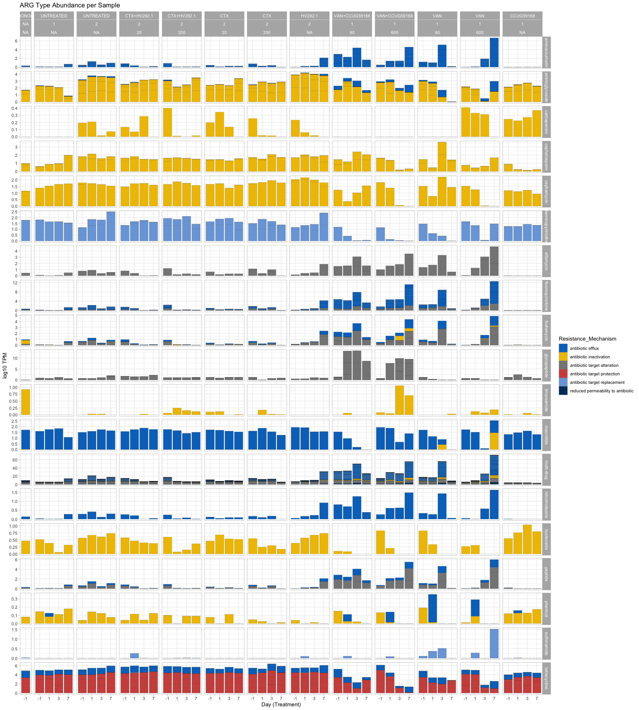
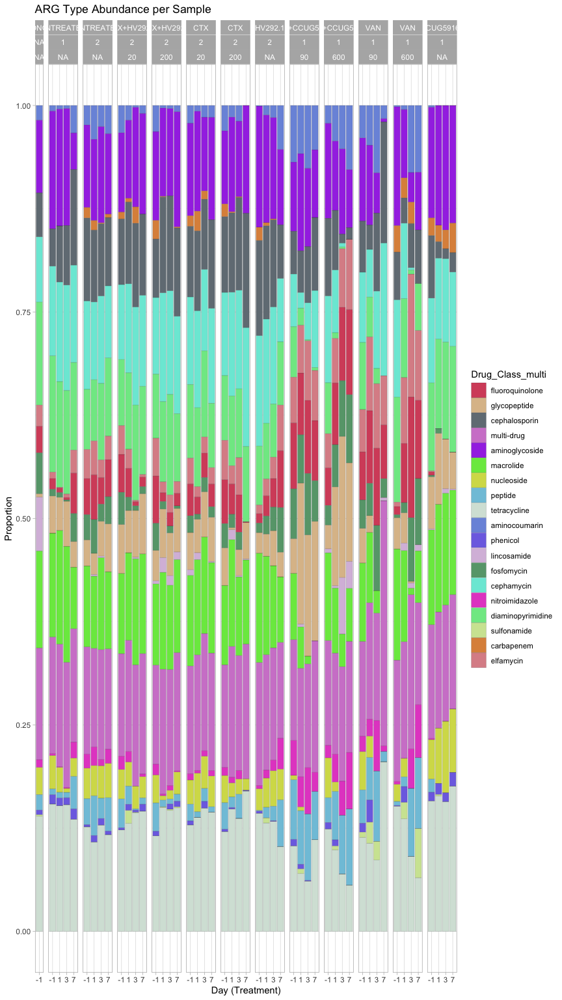
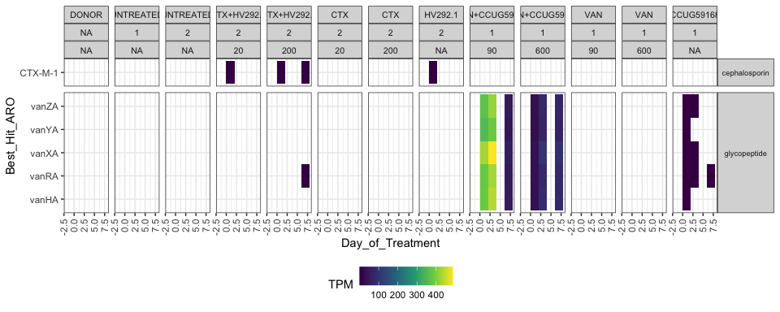

#### Load required packages


```r
library(tidyverse)
library(phyloseq)
library(speedyseq)
library(ggrepel)
library(here)
library(microViz)
library(RColorBrewer)
library(vegan)
library(randomcoloR)
options(getClass.msg=FALSE) # https://github.com/epurdom/clusterExperiment/issues/66
#this fixes an error message that pops up because the class 'Annotated' is defined in two different packages
```

#### Source required functions


```r
rm(list = ls())

'%!in%' <- function(x,y)!('%in%'(x,y))

source("https://raw.githubusercontent.com/fconstancias/DivComAnalyses/master/R/phyloseq_taxa_tests.R")
source("https://raw.githubusercontent.com/fconstancias/DivComAnalyses/master/R/phyloseq_normalisation.R")
source("https://raw.githubusercontent.com/fconstancias/DivComAnalyses/master/R/phyloseq_alpha.R")
source("https://raw.githubusercontent.com/fconstancias/DivComAnalyses/master/R/phyloseq_beta.R")
source("https://raw.githubusercontent.com/fconstancias/DivComAnalyses/master/R/phyloseq_heatmap.R")
```

# Import data and define variables:


```r
physeq = readRDS("~/Projects/ETH/Alessia/mobilome/human/human_resistome_phyloseq.rds")
out_pptx = "~/Projects/ETH/Alessia/mobilome/human/graph.pptx"

physeq %>% 
  sample_data() %>% 
  data.frame() %>% 
  mutate_at(vars(Day_of_Treatment), ~ replace(., is.na(.), -1)) -> sample_data(physeq)


physeq %>% 
  tax_table() %>% 
  data.frame() -> tax_mapping
```


```r
physeq_tmp <- physeq
tax_table(physeq_tmp) <- tax_table(physeq_tmp)[,c("Drug_Class_multi", "Best_Hit_ARO")]
# tax_table(physeq_tmp) <- tax_table(physeq_tmp)[,c("Best_Hit_ARO", "Drug_Class")]

physeq_tmp %>% 
  tax_glom(., taxrank = "Best_Hit_ARO") %>% 
  tax_glom(., taxrank = "Drug_Class_multi") -> physeq_drug_multi

taxa_names(physeq_drug_multi) <- tax_table(physeq_drug_multi)[,"Drug_Class_multi"]

physeq_drug_multi
```

```
## phyloseq-class experiment-level object
## otu_table()   OTU Table:          [ 19 taxa and 49 samples ]:
## sample_data() Sample Data:        [ 49 samples by 60 sample variables ]:
## tax_table()   Taxonomy Table:     [ 19 taxa by 2 taxonomic ranks ]:
## taxa are rows
```


```r
physeq_tmp <- physeq
tax_table(physeq_tmp) <- tax_table(physeq_tmp)[,c("Drug_Class", "Best_Hit_ARO")]
# tax_table(physeq_tmp) <- tax_table(physeq_tmp)[,c("Best_Hit_ARO", "Drug_Class")]

physeq_tmp %>% 
  tax_glom(., taxrank = "Best_Hit_ARO") %>% 
  tax_glom(., taxrank = "Drug_Class") -> physeq_drug

taxa_names(physeq_drug) <- tax_table(physeq_drug)[,"Drug_Class"]

physeq_drug
```

```
## phyloseq-class experiment-level object
## otu_table()   OTU Table:          [ 38 taxa and 49 samples ]:
## sample_data() Sample Data:        [ 49 samples by 60 sample variables ]:
## tax_table()   Taxonomy Table:     [ 38 taxa by 2 taxonomic ranks ]:
## taxa are rows
```


```r
physeq_tmp <- physeq

tax_table(physeq_tmp) <- tax_table(physeq_tmp)[,c("Best_Hit_ARO", "Drug_Class")]

physeq_tmp %>% 
  tax_glom(., taxrank = "Best_Hit_ARO") -> physeq_AMRgn

taxa_names(physeq_AMRgn) <- tax_table(physeq_AMRgn)[,"Best_Hit_ARO"]

physeq_AMRgn
```

```
## phyloseq-class experiment-level object
## otu_table()   OTU Table:          [ 104 taxa and 49 samples ]:
## sample_data() Sample Data:        [ 49 samples by 60 sample variables ]:
## tax_table()   Taxonomy Table:     [ 104 taxa by 2 taxonomic ranks ]:
## taxa are rows
```


```r
#define colors for Drug classes:
set.seed(123)

col <- distinctColorPalette(ntaxa(physeq_drug_multi))

names(col) <- taxa_names(physeq_drug_multi)
```


```r
physeq_AMRgn %>%
  microbiome::transform(transform = "log10p") %>% 
  speedyseq::psmelt() %>% 
  left_join(tax_mapping,
            by = c("Best_Hit_ARO" = "Best_Hit_ARO"),
            suffix = c("_x", "")) %>% 
  mutate(Abundance = na_if(Abundance, 0)) %>%
  mutate(logTPM = log10(Abundance + 1)) %>%
  separate_rows(., Drug_Class,sep = '; ',convert = TRUE) %>% 
  ggplot(mapping = aes(x = as.factor(Day_of_Treatment),
                       y = Best_Hit_ARO ,
                       fill = logTPM,
  )) +
  facet_grid(Drug_Class ~ Treatment + Fermentation + Antibiotic_mg.mL , scales = "free", space = "free") + #,  labeller = labeller(Drug_Class_multi = label_wrap_gen(width = 15)))  +
  # facet_grid(. ~ Reactor_Treatment, scales = "free", space = "free", drop = TRUE,labeller = labeller(Drug.Class = label_wrap_gen(width = 15))) +
  #we adjust the vertical labels such that it is printed correctly. 
  geom_tile() +
  theme_light()  +
  # scale_fill_viridis_c(name = "TPM",
  #                      na.value = "transparent", trans = scales::pseudo_log_trans(sigma = 0.1),
  #                      # trans =  scales::pseudo_log_trans(sigma = 1),
  #                      breaks = c(1, 10, 50, 100, 400), labels = c(1, 10, 50, 100, 400),
  #                      limits = c(0, 500)) + #need to make sure that we include max value of tpm as upper limit
  scale_fill_viridis_c(na.value = "transparent") +
  theme(axis.text.x = element_text(angle = 90, hjust = 1, vjust = 0.5),
        strip.text.x = element_text(size=8),
        #change the size of the label and the angle so the text is printed horizontally
        strip.text.y = element_text(size = 7,angle=0)) -> perma_bbuble

perma_bbuble +
  theme(legend.position = "bottom") -> perma_bbuble 

perma_bbuble +
  scale_y_discrete(label = function(x) stringr::str_trunc(x, 34, side = "center")) ->perma_bbuble

perma_bbuble
```

<!-- -->

```r
perma_bbuble %>%
  export::graph2ppt(append = TRUE, width = 20, height = 50,
                    file = out_pptx)
```

```
## Exported graph as ~/Projects/ETH/Alessia/mobilome/human/graph.pptx
```


```r
physeq_AMRgn %>%
  microbiome::transform(transform = "log10p") %>% 
  speedyseq::psmelt() %>% 
  left_join(tax_mapping,
            by = c("Best_Hit_ARO" = "Best_Hit_ARO"),
            suffix = c("_x", "")) %>% 
  mutate(Best_Hit_ARO = fct_reorder(Best_Hit_ARO, Abundance, .desc=FALSE)) %>% 
  mutate(Abundance = na_if(Abundance, 0)) %>%
  mutate(logTPM = log10(Abundance + 1))  %>% 
  # df$Item = factor(df$Item, levels = a_lot$Item[order(a_lot$percent)])

# tmp$variable <- factor(melted$variable, levels=rev(levels(melted$variable)))
  # mutate(Best_Hit_ARO =  fct_reorder(Best_Hit_ARO, logTPM)) %>% 
  # mutate(Best_Hit_ARO =  fct_relevel(Best_Hit_ARO, logTPM)) %>% 
  # separate_rows(., Drug_Class,sep = '; ',convert = TRUE) %>% 
  ggplot(mapping = aes(x = as.factor(Day_of_Treatment),
                       y = Best_Hit_ARO,
                       fill = logTPM,
  )) +
  facet_grid(.  ~  Treatment + Fermentation + Antibiotic_mg.mL , scales = "free", space = "free") + #,  labeller = labeller(Drug_Class_multi = label_wrap_gen(width = 15)))  +
  # facet_grid(. ~ Reactor_Treatment, scales = "free", space = "free", drop = TRUE,labeller = labeller(Drug.Class = label_wrap_gen(width = 15))) +
  #we adjust the vertical labels such that it is printed correctly. 
  geom_tile() +
  theme_light()  +
  # scale_fill_viridis_c(name = "TPM",
  #                      na.value = "transparent", trans = scales::pseudo_log_trans(sigma = 0.1),
  #                      # trans =  scales::pseudo_log_trans(sigma = 1),
  #                      breaks = c(1, 10, 50, 100, 400), labels = c(1, 10, 50, 100, 400),
  #                      limits = c(0, 500)) + #need to make sure that we include max value of tpm as upper limit
  scale_fill_viridis_c(na.value = "transparent") +
  theme(axis.text.x = element_text(angle = 90, hjust = 1, vjust = 0.5),
        strip.text.x = element_text(size=8),
        #change the size of the label and the angle so the text is printed horizontally
        strip.text.y = element_text(size = 7,angle=0)) -> perma_bbuble

perma_bbuble +
  theme(legend.position = "bottom") +
  scale_y_discrete(label = function(x) stringr::str_trunc(x, 34, side = "center"))  -> perma_bbuble

perma_bbuble
```

<!-- -->

```r
perma_bbuble %>%
  export::graph2ppt(append = TRUE, width = 20, height = 28,
                    file = out_pptx)
```

```
## Exported graph as ~/Projects/ETH/Alessia/mobilome/human/graph.pptx
```


```r
physeq_AMRgn %>%
  microbiome::transform(transform = "log10p") %>% 
  speedyseq::psmelt() %>% 
  left_join(tax_mapping,
            by = c("Best_Hit_ARO" = "Best_Hit_ARO"),
            suffix = c("_x", "")) %>% 
  mutate(Best_Hit_ARO = fct_reorder(Best_Hit_ARO, Abundance, .desc=FALSE)) %>%
  mutate(Abundance = na_if(Abundance, 0)) %>%
  mutate(logTPM = log10(Abundance + 1))  %>% 
  # df$Item = factor(df$Item, levels = a_lot$Item[order(a_lot$percent)])

# tmp$variable <- factor(melted$variable, levels=rev(levels(melted$variable)))
  # mutate(Best_Hit_ARO =  fct_reorder(Best_Hit_ARO, logTPM)) %>% 
  # mutate(Best_Hit_ARO =  fct_relevel(Best_Hit_ARO, logTPM)) %>% 
  # separate_rows(., Drug_Class,sep = '; ',convert = TRUE) %>% 
  ggplot(mapping = aes(x = as.factor(Day_of_Treatment),
                       y = Best_Hit_ARO,
                       fill = logTPM,
  )) +
  facet_grid(Drug_Class_multi  ~  Treatment + Fermentation + Antibiotic_mg.mL , scales = "free", space = "free") + #,  labeller = labeller(Drug_Class_multi = label_wrap_gen(width = 15)))  +
  # facet_grid(. ~ Reactor_Treatment, scales = "free", space = "free", drop = TRUE,labeller = labeller(Drug.Class = label_wrap_gen(width = 15))) +
  #we adjust the vertical labels such that it is printed correctly. 
  geom_tile() +
  theme_light()  +
  # scale_fill_viridis_c(name = "TPM",
  #                      na.value = "transparent", trans = scales::pseudo_log_trans(sigma = 0.1),
  #                      # trans =  scales::pseudo_log_trans(sigma = 1),
  #                      breaks = c(1, 10, 50, 100, 400), labels = c(1, 10, 50, 100, 400),
  #                      limits = c(0, 500)) + #need to make sure that we include max value of tpm as upper limit
  scale_fill_viridis_c(na.value = "transparent") +
  theme(axis.text.x = element_text(angle = 90, hjust = 1, vjust = 0.5),
        strip.text.x = element_text(size=8),
        #change the size of the label and the angle so the text is printed horizontally
        strip.text.y = element_text(size = 7,angle=0)) -> perma_bbuble

perma_bbuble +
  theme(legend.position = "bottom") +
  scale_y_discrete(label = function(x) stringr::str_trunc(x, 34, side = "center"))  -> perma_bbuble

perma_bbuble
```

<!-- -->

```r
perma_bbuble %>%
  export::graph2ppt(append = TRUE, width = 20, height = 28,
                    file = out_pptx)
```

```
## Exported graph as ~/Projects/ETH/Alessia/mobilome/human/graph.pptx
```


```r
# see Sneha's & Hannah's code for "plot.df.sep <- separate_rows(plot.df, Drug.Class,sep = '; ',convert = TRUE)"

physeq %>%
  microbiome::transform(transform = "log10p") %>% 
  speedyseq::psmelt() %>% 
  separate_rows(., Resistance_Mechanism,sep = '; ',convert = TRUE) %>% 
  ggplot(aes(x = as.factor(Day_of_Treatment), y = Abundance, fill = Resistance_Mechanism)) +   
  geom_bar( stat = "identity", colour="black", size=0.05) +
  facet_grid(Drug_Class_multi  ~  Treatment + Fermentation + Antibiotic_mg.mL , scales = "free", space = "free_x") +
  ggtitle("ARG Type Abundance per Sample") +
  xlab("Day (Treatment)")  +
  ylab("log10 TPM") + 
  theme_light() -> p_mec

p_mec %>% 
  ggpubr::set_palette("jco") -> p_mec

p_mec
```

<!-- -->

```r
p_mec %>%
  export::graph2ppt(append = TRUE, width = 20, height = 18,
                    file = out_pptx)
```

```
## Exported graph as ~/Projects/ETH/Alessia/mobilome/human/graph.pptx
```


```r
physeq_drug_multi %>%
  microbiome::transform(transform = "log10p") %>% 
  speedyseq::psmelt() %>% 
  ggplot(aes(x = as.factor(Day_of_Treatment), y = Abundance, fill = Drug_Class_multi)) +   
  geom_bar( stat = "identity", colour="black", size=0.05) +
  scale_fill_manual(values=col) +
  #geom_bar(stat="identity",colour=NA,size=0) +
  facet_grid( ~  Treatment + Fermentation + Antibiotic_mg.mL , scales = "free", space = "free_x") +
  ggtitle("ARG Type Abundance per Sample") +
  xlab("Day (Treatment)")  +
  ylab("log10 TPM") + 
  theme_light() -> p_drug

p_drug
```

<!-- -->

```r
p_drug %>%
  export::graph2ppt(append = TRUE, width = 18, height = 9,
                    file = out_pptx)
```

```
## Exported graph as ~/Projects/ETH/Alessia/mobilome/human/graph.pptx
```


```r
physeq_drug_multi %>%
  microbiome::transform(transform = "log10p") %>% 
  speedyseq::psmelt() %>% 
  ggplot(aes(x = as.factor(Day_of_Treatment), y = Abundance, fill = Drug_Class_multi)) +   
  geom_bar( stat = "identity", position="fill", colour="black", size=0.05) +
  scale_fill_manual(values=col) +
  #geom_bar(stat="identity",colour=NA,size=0) +
  facet_grid( ~  Treatment + Fermentation + Antibiotic_mg.mL , scales = "free", space = "free_x") +
  ggtitle("ARG Type Abundance per Sample") +
  xlab("Day (Treatment)")  +
  ylab("Proportion") +
  theme_light() -> p_drug_prop

p_drug_prop
```

<!-- -->

```r
p_drug_prop %>%
  export::graph2ppt(append = TRUE, width = 18, height = 9,
                    file = out_pptx)
```

```
## Exported graph as ~/Projects/ETH/Alessia/mobilome/human/graph.pptx
```


ARG Alpha Diversity


```r
# extract ARG abundance info from phyloseq object
physeq_AMRgn %>%
  otu_table() %>%
  as.data.frame() %>%
  t() -> resistome_copy

# extract sample info
physeq_AMRgn %>%
  sample_data() %>%
  as.data.frame() -> treatment_info

# add sample info to resistome abundance data and get richeness
resistome_copy %>%
  specnumber() %>%
  cbind(., treatment_info) %>% 
  mutate(metric = "Richness") %>% 
  rownames_to_column('sample_id') -> ARG_richeness #%>%
# filter(., Treatment != "DONOR")-> ARG_richeness

colnames(ARG_richeness)[2] <- "value"

# resistome_copy %>%
#   diversity() %>%
#   cbind(., treatment_info) %>% 
#   mutate(metric = "Shannon") %>% 
#   rownames_to_column('sample_id') -> ARG_shannon #%>%
# 
# colnames(ARG_shannon)[2] <- "value"
# 
# ARG_shannon %>% 
#   rbind(ARG_richeness) -> alpha_resistome

ARG_richeness -> alpha_resistome

# levels(alpha_resistome$Day_of_Treatment)[alpha_resistome$Day_of_Treatment] %>%
#   as.numeric() -> alpha_resistome$Day_of_Treatment


# plot
ggplot(alpha_resistome, aes(x = Reactor_Treatment, y = value)) + 
  geom_boxplot(aes(color=Reactor_Treatment),
               outlier.shape = NA,
               outlier.colour = NA,
               outlier.size = 0) + 
  geom_jitter(aes(color=Reactor_Treatment), alpha = 0.4) +
  theme(legend.position="none") +
  xlab("Treatment") +
  ylab("ARG Richness") +
  theme_light() + scale_color_viridis_d(na.value = "black") +
  facet_grid(metric ~ .)
```

<!-- -->


```r
# plot panels for each treatment
alpha_resistome %>% 
  # filter(!is.na(Fermentation)) %>% 
  # filter(Treatment != "DONOR") %>%
  ggplot(aes(x = Day_of_Treatment, y = value, color = Treatment)) +
  geom_point() + 
  geom_line(linetype = "dashed",  size = 0.25) +
  labs(title = "AMR Gene Richness",
       y = "Richness", x = "Days of Treatment") +
  scale_color_viridis_d(na.value = "black") +
  facet_grid(.  ~  Treatment + Fermentation + Antibiotic_mg.mL , scales = "fixed", space = "free_x") +
  theme_light() -> p_alpha

p_alpha
```

```
## geom_path: Each group consists of only one observation. Do you need to adjust
## the group aesthetic?
```

<!-- -->

```r
p_alpha %>% 
  export::graph2ppt(append = TRUE, width = 18, height = 6,
                    file = out_pptx)
```

```
## geom_path: Each group consists of only one observation. Do you need to adjust
## the group aesthetic?
```

```
## Exported graph as ~/Projects/ETH/Alessia/mobilome/human/graph.pptx
```

Beta Diversity:


```r
# sample_data(physeq)$Reactor_Treatment <- fct_relevel(sample_data(physeq)$Reactor_Treatment, "DONOR", "CR_UNTREATED", "TR1_CTX+HV292.1",
#                                                      "TR2_CTX","TR3_HV292.1", "TR4_VAN", "TR5_VAN+CCUG59168", "TR6_CCUG59168") 
# 
# sample_data(physeq)$Treatment <- fct_relevel(sample_data(physeq)$Treatment, "DONOR", "UNTREATED",  "CTX+HV292.1", "CTX","HV292.1","VAN+CCUG59168", "VAN",  "CCUG59168") 


# physeq %>% 
#   rarefy_even_depth(sample.size = 43,
#                     rngseed = 123) -> phyloseq_rare

physeq_AMRgn %>%
  phyloseq_compute_bdiv(norm = "pc",
                        phylo = FALSE,
                        seed = 123) -> bdiv_list
```

```
## Loading required package: ape
```

```
## Loading required package: GUniFrac
```

```
## Registered S3 method overwritten by 'rmutil':
##   method         from
##   print.response httr
```

```r
physeq_AMRgn  %>%
  # subset_samples(Treatment != "DONOR") %>%
  phyloseq_plot_bdiv(dlist = bdiv_list,
                     seed = 123,
                     axis1 = 1,
                     axis2 = 2)  -> pcoa
```

```
## [1] "bray"
## [1] "sorensen"
## [1] "bjaccard"
## [1] "wjaccard"
```

```r
# phyloseq_plot_bdiv(bdiv_list,
#                    # m = "CoDa",
#                    seed = 123) -> coda
# 
pcoa$wjaccard$layers = NULL

pcoa$wjaccard + geom_point(size=3,
                           aes(color = Treatment, 
                               fill = NULL,
                               shape = Fermentation %>%  as.factor(),
                               alpha = Day_of_Treatment)) + 
  theme_light() +
  geom_path(arrow = arrow(type = "open", angle = 30, length = unit(0.15, "inches")),
            size = 0.05, linetype = "dashed", inherit.aes = TRUE, aes(group=Reactor_Treatment), show.legend = FALSE) +
  scale_alpha_continuous(range=c( 0.9, 0.3)) +
  scale_color_viridis_d(na.value = "black") + 
  scale_fill_viridis_d(na.value = "black") + 
  scale_shape_manual(values = c(15, 19), na.value =  17) + 
  theme_classic() -> p1 # +
  # labs(col=NULL, fill = NULL, shape = NULL) + guides(shape=TRUE) -> p1

p1
```

<!-- -->

```r
p1 %>% 
  export::graph2ppt(append = TRUE, width = 8, height = 6,
                    file = out_pptx)
```

```
## Exported graph as ~/Projects/ETH/Alessia/mobilome/human/graph.pptx
```


```r
physeq_AMRgn %>% 
  tax_table() %>% 
  data.frame() %>% 
  rownames_to_column("id") %>% 
  mutate(gene = id) %>% 
  column_to_rownames("id") %>% 
  as.matrix %>% 
  tax_table() -> tax_table(physeq_AMRgn)


physeq_AMRgn  %>%
  # subset_samples(Treatment != "DONOR") %>% 
  phyloseq_add_taxa_vector(dist = bdiv_list$wjaccard,
                           phyloseq = .,
                           figure_ord = p1,
                           tax_rank_plot = "Best_Hit_ARO", taxrank_glom = "Best_Hit_ARO",
                           top_r = 10, fact = 0.6) -> pco_env


pco_env$plot
```

```
## Warning: Removed 3 rows containing missing values (geom_text_repel).
```

<!-- -->

```r
pco_env$plot %>% 
  export::graph2ppt(append = TRUE, width = 8, height = 6,
                    file = out_pptx)
```

```
## Warning: Removed 3 rows containing missing values (geom_text_repel).
```

```
## Exported graph as ~/Projects/ETH/Alessia/mobilome/human/graph.pptx
```

```r
pco_env$signenvfit %>% 
  DT::datatable()
```

```{=html}
<div id="htmlwidget-ae716b35a8b3ff4d2b5c" style="width:100%;height:auto;" class="datatables html-widget"></div>
<script type="application/json" data-for="htmlwidget-ae716b35a8b3ff4d2b5c">{"x":{"filter":"none","vertical":false,"data":[["1","2","3","4","5","6","7","8","9","10"],[-0.767301262409962,0.785015774973074,-0.643835161063474,0.788431892197884,-0.433452684960468,-0.474589217716397,-0.514353792246109,-0.348546212195376,-0.669595002161185,0.787488389101183],[-0.486883752023563,0.168951649061316,0.695133090140636,0.191302817689154,-0.753245013887597,0.788671310296945,-0.699112677771495,0.818216545588754,0.612238330249579,0.123753845751572],["Mef.En2.","evgS","tetQ","gadX","tetO","ErmG","aadS","CblA.1","CfxA2","Escherichia.coli.marR.mutant.conferring.antibiotic.resistance"],[0.001,0.001,0.001,0.001,0.001,0.001,0.001,0.001,0.001,0.001],[0.825807015280464,0.644794426677114,0.8977337276301,0.658221616690545,0.755259281045965,0.847237361258161,0.753318359818784,0.790962777510938,0.82319323994603,0.635452977307481],[null,"evgS","tetQ","gadX","tetO","ErmG","aadS",null,"CfxA2",null],[null,null,null,null,null,null,null,null,null,null],[null,"evgS","tetQ","gadX","tetO","ErmG","aadS",null,"CfxA2",null]],"container":"<table class=\"display\">\n  <thead>\n    <tr>\n      <th> <\/th>\n      <th>Axis.1<\/th>\n      <th>Axis.2<\/th>\n      <th>id<\/th>\n      <th>pval<\/th>\n      <th>r<\/th>\n      <th>tax_rank_plot<\/th>\n      <th>Drug_Class<\/th>\n      <th>gene<\/th>\n    <\/tr>\n  <\/thead>\n<\/table>","options":{"columnDefs":[{"className":"dt-right","targets":[1,2,4,5]},{"orderable":false,"targets":0}],"order":[],"autoWidth":false,"orderClasses":false}},"evals":[],"jsHooks":[]}</script>
```


```r
physeq_drug_multi  %>%
  # subset_samples(Treatment != "DONOR") %>% 
  phyloseq_add_taxa_vector(dist = bdiv_list$wjaccard,
                           phyloseq = .,
                           figure_ord = p1,
                           tax_rank_plot = "Drug_Class_multi", taxrank_glom = "Drug_Class_multi",
                           top_r = 10, fact = 0.6) -> pco_env


pco_env$plot
```

<!-- -->

```r
pco_env$plot %>% 
  export::graph2ppt(append = TRUE, width = 8, height = 6,
                    file = out_pptx)
```

```
## Exported graph as ~/Projects/ETH/Alessia/mobilome/human/graph.pptx
```

```r
pco_env$signenvfit %>% 
  DT::datatable()
```

```{=html}
<div id="htmlwidget-0b976e1b4eb944c08b0e" style="width:100%;height:auto;" class="datatables html-widget"></div>
<script type="application/json" data-for="htmlwidget-0b976e1b4eb944c08b0e">{"x":{"filter":"none","vertical":false,"data":[["1","2","3","4","5","6","7","8","9","10"],[0.713879832151485,-0.298968494924337,-0.514470000069629,-0.750002583816852,0.751865104040428,-0.905447207111348,0.755228195502757,-0.668952797999681,0.742379744064688,-0.472522173018843],[0.152812121005626,0.834275047551736,-0.539345705956302,-0.494794764267372,0.157496158346779,-0.123047875473575,0.151875606487696,0.613341194713497,0.190569628142206,-0.582960849568167],["fluoroquinolone","cephalosporin","aminoglycoside","macrolide","peptide","tetracycline","fosfomycin","cephamycin","nitroimidazole","diaminopyrimidine"],[0.001,0.001,0.001,0.001,0.001,0.001,0.001,0.001,0.001,0.001],[0.53297595907887,0.785397015924775,0.555573171505147,0.807325734478359,0.590106174567718,0.8349754245243,0.593435827128357,0.823685267084182,0.58744446756781,0.563120556123688],["fluoroquinolone","cephalosporin","aminoglycoside","macrolide","peptide","tetracycline","fosfomycin","cephamycin","nitroimidazole","diaminopyrimidine"],[null,null,null,null,null,null,null,null,null,null]],"container":"<table class=\"display\">\n  <thead>\n    <tr>\n      <th> <\/th>\n      <th>Axis.1<\/th>\n      <th>Axis.2<\/th>\n      <th>id<\/th>\n      <th>pval<\/th>\n      <th>r<\/th>\n      <th>tax_rank_plot<\/th>\n      <th>Best_Hit_ARO<\/th>\n    <\/tr>\n  <\/thead>\n<\/table>","options":{"columnDefs":[{"className":"dt-right","targets":[1,2,4,5]},{"orderable":false,"targets":0}],"order":[],"autoWidth":false,"orderClasses":false}},"evals":[],"jsHooks":[]}</script>
```

Make the heatmap pretty 

```r
physeq %>% 
  # speedyseq::tax_glom("Best_Hit_ARO") %>% 
  speedyseq::psmelt() %>% 
  rename(TPM = Abundance) %>% 
  mutate(TPM = na_if(TPM, 0)) %>%
  # mutate(logTPM = log10(TPM + 1)) %>% 
  # filter(Drug_Class %in% c("cephalosporin", "glycopeptide")) %>% 
  # mutate(Drug_Class = fct_relevel(Drug_Class, c("cephalosporin", "glycopeptide"))) %>% 
  filter(Best_Hit_ARO %in% c("vanZA", "vanYA", "vanXA", "vanA", "vanHA", "vanRA", "CTX-M-1")) %>% 
  # mutate(Classification = fct_relevel(Classification, c("MAG", "Chromosome", "Plasmid", "Uncertain - plasmid or chromosomal"))) %>% 
  ggplot(mapping = aes(x = Day_of_Treatment ,
                       y = Best_Hit_ARO ,
                       fill = TPM,
  )) +
  facet_grid(Drug_Class ~  Treatment + Fermentation + Antibiotic_mg.mL, scales = "free_y",  space = "free_y", drop = TRUE) +
  # facet_grid(. ~ Treatment,  scales = "free", space = "free", drop = TRUE) +
  # facet_grid(. ~ Reactor_Treatment, scales = "free", space = "free", drop = TRUE,labeller = labeller(Drug_Class = label_wrap_gen(width = 15))) +
  #we adjust the vertical labels such that it is printed correctly. 
  geom_tile() +
  theme_bw()  +
  # scale_fill_viridis_c(name = "TPM",
  #                      na.value = "transparent", trans = scales::pseudo_log_trans(sigma = 0.1),
  #                      # trans =  scales::pseudo_log_trans(sigma = 1),
  #                      breaks = c(1, 10, 50, 100, 400), labels = c(1, 10, 50, 100, 400),
  #                      limits = c(0, 500)) + #need to make sure that we include max value of tpm as upper limit
  scale_fill_viridis_c(na.value = "transparent") +
  theme(axis.text.x = element_text(angle = 90, hjust = 1, vjust = 0.5),
        strip.text.x = element_text(size=8),
        #change the size of the label and the angle so the text is printed horizontally
        strip.text.y = element_text(size = 7,angle=0)) -> perma_bbuble

perma_bbuble +
  theme(legend.position = "bottom") -> perma_bbuble

perma_bbuble
```

<!-- -->

```r
perma_bbuble %>% 
  export::graph2ppt(append = TRUE, width = 10, height = 4,
                    file = out_pptx)
```

```
## Exported graph as ~/Projects/ETH/Alessia/mobilome/human/graph.pptx
```


```r
sessionInfo()
```

```
## R version 4.1.2 (2021-11-01)
## Platform: x86_64-apple-darwin17.0 (64-bit)
## Running under: macOS Mojave 10.14.6
## 
## Matrix products: default
## BLAS:   /Library/Frameworks/R.framework/Versions/4.1/Resources/lib/libRblas.0.dylib
## LAPACK: /Library/Frameworks/R.framework/Versions/4.1/Resources/lib/libRlapack.dylib
## 
## locale:
## [1] en_US.UTF-8/en_US.UTF-8/en_US.UTF-8/C/en_US.UTF-8/en_US.UTF-8
## 
## attached base packages:
## [1] stats     graphics  grDevices utils     datasets  methods   base     
## 
## other attached packages:
##  [1] GUniFrac_1.4         ape_5.6              gdtools_0.2.3       
##  [4] reshape2_1.4.4       scales_1.1.1         randomcoloR_1.1.0.1 
##  [7] vegan_2.5-7          lattice_0.20-45      permute_0.9-5       
## [10] RColorBrewer_1.1-2   microViz_0.9.0       here_1.0.1          
## [13] ggrepel_0.9.1        speedyseq_0.5.3.9018 phyloseq_1.36.0     
## [16] forcats_0.5.1        stringr_1.4.0        dplyr_1.0.7         
## [19] purrr_0.3.4          readr_2.1.0          tidyr_1.1.4         
## [22] tibble_3.1.6         ggplot2_3.3.5        tidyverse_1.3.1.9000
## 
## loaded via a namespace (and not attached):
##   [1] readxl_1.3.1           uuid_1.0-3             backports_1.4.1       
##   [4] systemfonts_1.0.2      plyr_1.8.6             igraph_1.2.10         
##   [7] splines_4.1.2          crosstalk_1.2.0        GenomeInfoDb_1.28.4   
##  [10] digest_0.6.29          foreach_1.5.1          htmltools_0.5.2       
##  [13] lmerTest_3.1-3         fansi_0.5.0            magrittr_2.0.1        
##  [16] cluster_2.1.2          tzdb_0.2.0             openxlsx_4.2.4        
##  [19] Biostrings_2.60.2      modelr_0.1.8           matrixStats_0.61.0    
##  [22] stabledist_0.7-1       officer_0.4.0          colorspace_2.0-2      
##  [25] rvest_1.0.2            haven_2.4.3            xfun_0.28             
##  [28] crayon_1.4.2           RCurl_1.98-1.5         jsonlite_1.7.2        
##  [31] lme4_1.1-27.1          survival_3.2-13        iterators_1.0.13      
##  [34] glue_1.6.0             rvg_0.2.5              gtable_0.3.0          
##  [37] zlibbioc_1.38.0        XVector_0.32.0         V8_3.6.0              
##  [40] car_3.0-11             Rhdf5lib_1.14.2        BiocGenerics_0.38.0   
##  [43] abind_1.4-5            DBI_1.1.1              rstatix_0.7.0         
##  [46] Rcpp_1.0.7             viridisLite_0.4.0      xtable_1.8-4          
##  [49] clue_0.3-60            foreign_0.8-81         DT_0.20               
##  [52] stats4_4.1.2           timeSeries_3062.100    htmlwidgets_1.5.4     
##  [55] httr_1.4.2             ellipsis_0.3.2         spatial_7.3-14        
##  [58] pkgconfig_2.0.3        farver_2.1.0           sass_0.4.0            
##  [61] dbplyr_2.1.1           utf8_1.2.2             tidyselect_1.1.1      
##  [64] labeling_0.4.2         rlang_0.4.12           munsell_0.5.0         
##  [67] cellranger_1.1.0       tools_4.1.2            cli_3.1.0             
##  [70] generics_0.1.1         devEMF_4.0-2           ade4_1.7-18           
##  [73] export_0.3.0           broom_0.7.11           evaluate_0.14         
##  [76] biomformat_1.20.0      fastmap_1.1.0          yaml_2.2.1            
##  [79] knitr_1.36             fs_1.5.2               zip_2.2.0             
##  [82] rgl_0.107.14           nlme_3.1-153           xml2_1.3.2            
##  [85] compiler_4.1.2         rstudioapi_0.13        curl_4.3.2            
##  [88] ggsignif_0.6.3         reprex_2.0.1           statmod_1.4.36        
##  [91] statip_0.2.3           bslib_0.3.1            stringi_1.7.6         
##  [94] highr_0.9              modeest_2.4.0          stargazer_5.2.2       
##  [97] fBasics_3042.89.1      Matrix_1.3-4           nloptr_1.2.2.2        
## [100] ggsci_2.9              microbiome_1.14.0      multtest_2.48.0       
## [103] vctrs_0.3.8            pillar_1.6.4           lifecycle_1.0.1       
## [106] rhdf5filters_1.4.0     jquerylib_0.1.4        data.table_1.14.2     
## [109] bitops_1.0-7           flextable_0.6.9        stable_1.1.4          
## [112] R6_2.5.1               rio_0.5.27             IRanges_2.26.0        
## [115] codetools_0.2-18       boot_1.3-28            MASS_7.3-54           
## [118] assertthat_0.2.1       rhdf5_2.36.0           rprojroot_2.0.2       
## [121] withr_2.4.3            S4Vectors_0.30.2       GenomeInfoDbData_1.2.6
## [124] mgcv_1.8-38            parallel_4.1.2         hms_1.1.1             
## [127] rpart_4.1-15           timeDate_3043.102      grid_4.1.2            
## [130] minqa_1.2.4            rmarkdown_2.11         rmutil_1.1.5          
## [133] carData_3.0-4          Rtsne_0.15             ggpubr_0.4.0          
## [136] numDeriv_2016.8-1.1    Biobase_2.52.0         lubridate_1.8.0       
## [139] base64enc_0.1-3
```
