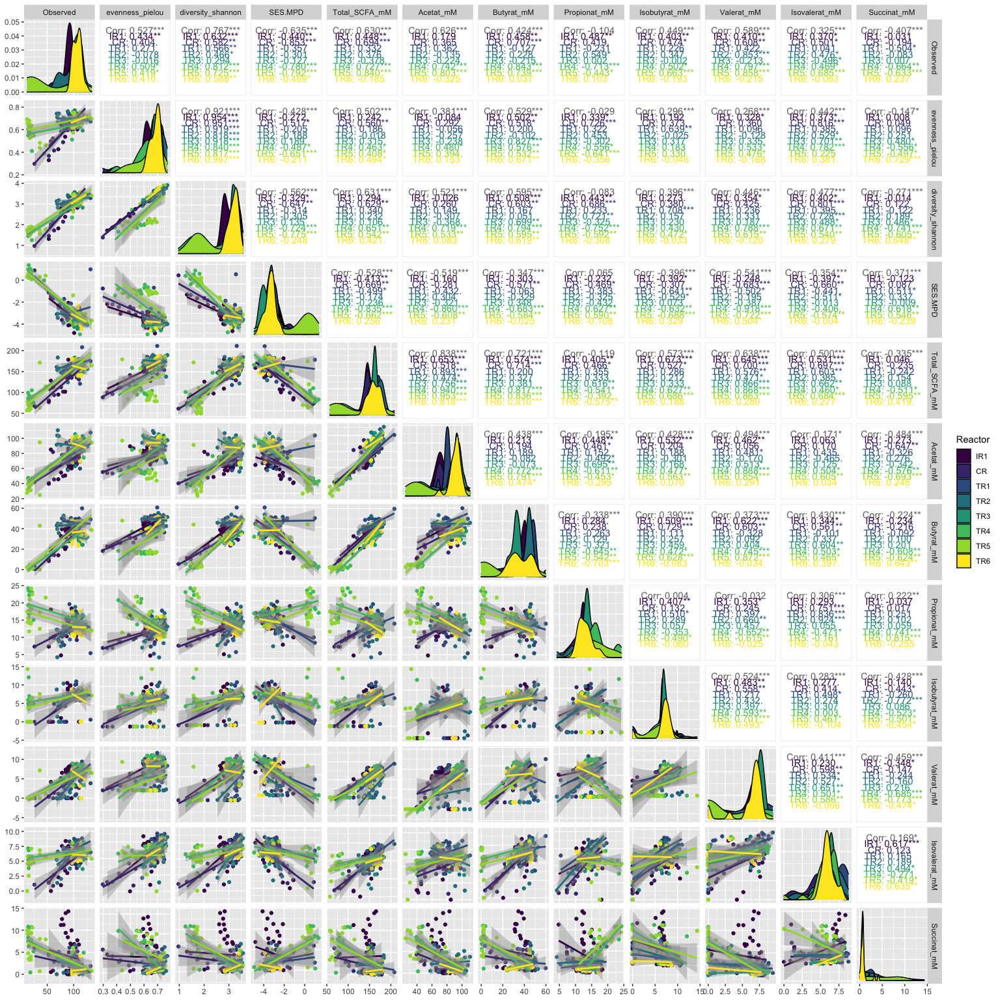

#### Load required packages


```r
library(tidyverse)
library(phyloseq)
library(speedyseq)
library(ggrepel)
library(ampvis2)
library(plotly)
library(microbiome)
options(getClass.msg=FALSE) # https://github.com/epurdom/clusterExperiment/issues/66
#this fixes an error message that pops up because the class 'Annotated' is defined in two different packages
```

#### Load functions from Github


```r
'%!in%' <- function(x,y)!('%in%'(x,y))

source("https://raw.githubusercontent.com/fconstancias/DivComAnalyses/master/R/phyloseq_taxa_tests.R")
source("https://raw.githubusercontent.com/fconstancias/DivComAnalyses/master/R/phyloseq_normalisation.R")
```

```
## Loading required package: scales
```

```
## 
## Attaching package: 'scales'
```

```
## The following object is masked from 'package:microbiome':
## 
##     alpha
```

```
## The following object is masked from 'package:purrr':
## 
##     discard
```

```
## The following object is masked from 'package:readr':
## 
##     col_factor
```

```
## Loading required package: reshape2
```

```
## 
## Attaching package: 'reshape2'
```

```
## The following object is masked from 'package:tidyr':
## 
##     smiths
```

```r
source("https://raw.githubusercontent.com/fconstancias/DivComAnalyses/master/R/phyloseq_alpha.R")
source("https://raw.githubusercontent.com/fconstancias/DivComAnalyses/master/R/phyloseq_beta.R")
source("https://raw.githubusercontent.com/fconstancias/DivComAnalyses/master/R/phyloseq_heatmap.R")
```


#### Load physeq object


```r
ps = "data/processed/physeq_update_11_1_21.RDS"

ps %>% 
  here::here() %>%
  readRDS() %>%
  phyloseq_get_strains_fast() %>%
  phyloseq_remove_chloro_mitho() -> physeq
```

```
## Joining, by = "ASV"
```

```r
physeq %>% 
  subset_samples(Experiment == "Continuous") %>% 
  subset_samples(Paul %!in% c("Paul")) %>%
  subset_samples(Reactor != "IR2") -> ps_PolyFermS
```

We will be analysing only the PolyFermS samples here so take a subset of the physeq object.  

```r
physeq %>% 
  subset_samples(Experiment == "Continuous") %>% 
  subset_samples(Paul %!in% c("Paul")) %>%
  subset_samples(Reactor != "IR2") -> ps_polyFermS

sample_data(ps_polyFermS)$Reactor <- fct_relevel(sample_data(ps_polyFermS)$Reactor, "IR1", "CR", "TR1", "TR2","TR3", "TR4", "TR5", "TR6") 

sample_data(ps_polyFermS)$Treatment <- fct_relevel(sample_data(ps_polyFermS)$Treatment, "UNTREATED",  "CTX+HV292.1", "CTX","HV292.1","VAN+CCUG59168", "VAN",  "CCUG59168") 

sample_data(ps_polyFermS)$Reactor_Treatment <- fct_relevel(sample_data(ps_polyFermS)$Reactor_Treatment, "IR1_UNTREATED","CR_UNTREATED", "CR_CTX", "CR_VAN", "TR1_CTX+HV292.1","TR2_CTX", "TR3_HV292.1", "TR5_VAN+CCUG59168", "TR4_VAN", "TR6_CCUG59168") 

ps_polyFermS %>% 
  subset_samples(Enrichment == "NotEnriched") %>%
  rarefy_even_depth(sample.size = 4576,
                    rngseed = 123) -> ps_polyFermS_rare
```

```
## `set.seed(123)` was used to initialize repeatable random subsampling.
```

```
## Please record this for your records so others can reproduce.
```

```
## Try `set.seed(123); .Random.seed` for the full vector
```

```
## ...
```

```
## 13 samples removedbecause they contained fewer reads than `sample.size`.
```

```
## Up to first five removed samples are:
```

```
## CR-40-S166IR1-40-S197IR1-41-S187IR1-69-S198TR1-15-S168
```

```
## ...
```

```
## 50OTUs were removed because they are no longer 
## present in any sample after random subsampling
```

```
## ...
```


```r
"data/raw/hplc Fermentation (Salvato automaticamente).xlsx" %>%
  readxl::read_xlsx(sheet = "All total") -> metabolites
```


```r
ps_polyFermS_rare@sam_data %>%
  data.frame() %>%
  rownames_to_column('id') %>%
  left_join(
    metabolites,
    by = c("Sample_description" = "Sample_Id"),
    suffix = c(".x", "")) %>%
  column_to_rownames('id') %>% 
  sample_data() -> ps_polyFermS_rare@sam_data

ps_polyFermS_rare
```

```
## phyloseq-class experiment-level object
## otu_table()   OTU Table:          [ 296 taxa and 193 samples ]:
## sample_data() Sample Data:        [ 193 samples by 63 sample variables ]:
## tax_table()   Taxonomy Table:     [ 296 taxa by 8 taxonomic ranks ]:
## phy_tree()    Phylogenetic Tree:  [ 296 tips and 294 internal nodes ]:
## refseq()      DNAStringSet:       [ 296 reference sequences ]
## taxa are rows
```


```r
# measures = c("Total_SCFA_mM", "Acetat_mM", "Butyrat_mM", "Propionat_mM", "Isobutyrat_mM", "Valerat_mM", "Isovalerat_mM", "Succinat_mM")
measures = c("Total_SCFA_mM", "Acetat_mM", "Butyrat_mM", "Propionat_mM", "Isobutyrat_mM", "Valerat_mM", "Isovalerat_mM", "Succinat_mM")
```


```r
ps_polyFermS_rare %>%
  phyloseq_correlate_taxa(log10 = TRUE, 
                          tax_glom = "Class",
                          grouping_column = "Reactor_Treatment", # grouping with fake group column will not subset any data.
                          cor_variables = measures, 
                          method = "spearman",
                          num_taxa = 50,
                          adjustment= 3) -> results
```

```
## Warning in microbiome::transform(., "log10"): OTU table contains zeroes. Using
## log10(1 + x) transform.
```

```
## Warning in cor.test.default(a[complete.cases(b), ], b[complete.cases(b), :
## Cannot compute exact p-value with ties

## Warning in cor.test.default(a[complete.cases(b), ], b[complete.cases(b), :
## Cannot compute exact p-value with ties

## Warning in cor.test.default(a[complete.cases(b), ], b[complete.cases(b), :
## Cannot compute exact p-value with ties

## Warning in cor.test.default(a[complete.cases(b), ], b[complete.cases(b), :
## Cannot compute exact p-value with ties

## Warning in cor.test.default(a[complete.cases(b), ], b[complete.cases(b), :
## Cannot compute exact p-value with ties

## Warning in cor.test.default(a[complete.cases(b), ], b[complete.cases(b), :
## Cannot compute exact p-value with ties

## Warning in cor.test.default(a[complete.cases(b), ], b[complete.cases(b), :
## Cannot compute exact p-value with ties

## Warning in cor.test.default(a[complete.cases(b), ], b[complete.cases(b), :
## Cannot compute exact p-value with ties

## Warning in cor.test.default(a[complete.cases(b), ], b[complete.cases(b), :
## Cannot compute exact p-value with ties

## Warning in cor.test.default(a[complete.cases(b), ], b[complete.cases(b), :
## Cannot compute exact p-value with ties

## Warning in cor.test.default(a[complete.cases(b), ], b[complete.cases(b), :
## Cannot compute exact p-value with ties

## Warning in cor.test.default(a[complete.cases(b), ], b[complete.cases(b), :
## Cannot compute exact p-value with ties

## Warning in cor.test.default(a[complete.cases(b), ], b[complete.cases(b), :
## Cannot compute exact p-value with ties

## Warning in cor.test.default(a[complete.cases(b), ], b[complete.cases(b), :
## Cannot compute exact p-value with ties

## Warning in cor.test.default(a[complete.cases(b), ], b[complete.cases(b), :
## Cannot compute exact p-value with ties

## Warning in cor.test.default(a[complete.cases(b), ], b[complete.cases(b), :
## Cannot compute exact p-value with ties

## Warning in cor.test.default(a[complete.cases(b), ], b[complete.cases(b), :
## Cannot compute exact p-value with ties

## Warning in cor.test.default(a[complete.cases(b), ], b[complete.cases(b), :
## Cannot compute exact p-value with ties

## Warning in cor.test.default(a[complete.cases(b), ], b[complete.cases(b), :
## Cannot compute exact p-value with ties

## Warning in cor.test.default(a[complete.cases(b), ], b[complete.cases(b), :
## Cannot compute exact p-value with ties

## Warning in cor.test.default(a[complete.cases(b), ], b[complete.cases(b), :
## Cannot compute exact p-value with ties

## Warning in cor.test.default(a[complete.cases(b), ], b[complete.cases(b), :
## Cannot compute exact p-value with ties

## Warning in cor.test.default(a[complete.cases(b), ], b[complete.cases(b), :
## Cannot compute exact p-value with ties

## Warning in cor.test.default(a[complete.cases(b), ], b[complete.cases(b), :
## Cannot compute exact p-value with ties

## Warning in cor.test.default(a[complete.cases(b), ], b[complete.cases(b), :
## Cannot compute exact p-value with ties

## Warning in cor.test.default(a[complete.cases(b), ], b[complete.cases(b), :
## Cannot compute exact p-value with ties

## Warning in cor.test.default(a[complete.cases(b), ], b[complete.cases(b), :
## Cannot compute exact p-value with ties

## Warning in cor.test.default(a[complete.cases(b), ], b[complete.cases(b), :
## Cannot compute exact p-value with ties

## Warning in cor.test.default(a[complete.cases(b), ], b[complete.cases(b), :
## Cannot compute exact p-value with ties

## Warning in cor.test.default(a[complete.cases(b), ], b[complete.cases(b), :
## Cannot compute exact p-value with ties

## Warning in cor.test.default(a[complete.cases(b), ], b[complete.cases(b), :
## Cannot compute exact p-value with ties

## Warning in cor.test.default(a[complete.cases(b), ], b[complete.cases(b), :
## Cannot compute exact p-value with ties

## Warning in cor.test.default(a[complete.cases(b), ], b[complete.cases(b), :
## Cannot compute exact p-value with ties

## Warning in cor.test.default(a[complete.cases(b), ], b[complete.cases(b), :
## Cannot compute exact p-value with ties

## Warning in cor.test.default(a[complete.cases(b), ], b[complete.cases(b), :
## Cannot compute exact p-value with ties

## Warning in cor.test.default(a[complete.cases(b), ], b[complete.cases(b), :
## Cannot compute exact p-value with ties

## Warning in cor.test.default(a[complete.cases(b), ], b[complete.cases(b), :
## Cannot compute exact p-value with ties

## Warning in cor.test.default(a[complete.cases(b), ], b[complete.cases(b), :
## Cannot compute exact p-value with ties

## Warning in cor.test.default(a[complete.cases(b), ], b[complete.cases(b), :
## Cannot compute exact p-value with ties

## Warning in cor.test.default(a[complete.cases(b), ], b[complete.cases(b), :
## Cannot compute exact p-value with ties

## Warning in cor.test.default(a[complete.cases(b), ], b[complete.cases(b), :
## Cannot compute exact p-value with ties

## Warning in cor.test.default(a[complete.cases(b), ], b[complete.cases(b), :
## Cannot compute exact p-value with ties

## Warning in cor.test.default(a[complete.cases(b), ], b[complete.cases(b), :
## Cannot compute exact p-value with ties

## Warning in cor.test.default(a[complete.cases(b), ], b[complete.cases(b), :
## Cannot compute exact p-value with ties

## Warning in cor.test.default(a[complete.cases(b), ], b[complete.cases(b), :
## Cannot compute exact p-value with ties

## Warning in cor.test.default(a[complete.cases(b), ], b[complete.cases(b), :
## Cannot compute exact p-value with ties

## Warning in cor.test.default(a[complete.cases(b), ], b[complete.cases(b), :
## Cannot compute exact p-value with ties

## Warning in cor.test.default(a[complete.cases(b), ], b[complete.cases(b), :
## Cannot compute exact p-value with ties

## Warning in cor.test.default(a[complete.cases(b), ], b[complete.cases(b), :
## Cannot compute exact p-value with ties

## Warning in cor.test.default(a[complete.cases(b), ], b[complete.cases(b), :
## Cannot compute exact p-value with ties

## Warning in cor.test.default(a[complete.cases(b), ], b[complete.cases(b), :
## Cannot compute exact p-value with ties

## Warning in cor.test.default(a[complete.cases(b), ], b[complete.cases(b), :
## Cannot compute exact p-value with ties

## Warning in cor.test.default(a[complete.cases(b), ], b[complete.cases(b), :
## Cannot compute exact p-value with ties

## Warning in cor.test.default(a[complete.cases(b), ], b[complete.cases(b), :
## Cannot compute exact p-value with ties

## Warning in cor.test.default(a[complete.cases(b), ], b[complete.cases(b), :
## Cannot compute exact p-value with ties

## Warning in cor.test.default(a[complete.cases(b), ], b[complete.cases(b), :
## Cannot compute exact p-value with ties

## Warning in cor.test.default(a[complete.cases(b), ], b[complete.cases(b), :
## Cannot compute exact p-value with ties

## Warning in cor.test.default(a[complete.cases(b), ], b[complete.cases(b), :
## Cannot compute exact p-value with ties

## Warning in cor.test.default(a[complete.cases(b), ], b[complete.cases(b), :
## Cannot compute exact p-value with ties

## Warning in cor.test.default(a[complete.cases(b), ], b[complete.cases(b), :
## Cannot compute exact p-value with ties

## Warning in cor.test.default(a[complete.cases(b), ], b[complete.cases(b), :
## Cannot compute exact p-value with ties

## Warning in cor.test.default(a[complete.cases(b), ], b[complete.cases(b), :
## Cannot compute exact p-value with ties

## Warning in cor.test.default(a[complete.cases(b), ], b[complete.cases(b), :
## Cannot compute exact p-value with ties

## Warning in cor.test.default(a[complete.cases(b), ], b[complete.cases(b), :
## Cannot compute exact p-value with ties

## Warning in cor.test.default(a[complete.cases(b), ], b[complete.cases(b), :
## Cannot compute exact p-value with ties

## Warning in cor.test.default(a[complete.cases(b), ], b[complete.cases(b), :
## Cannot compute exact p-value with ties

## Warning in cor.test.default(a[complete.cases(b), ], b[complete.cases(b), :
## Cannot compute exact p-value with ties

## Warning in cor.test.default(a[complete.cases(b), ], b[complete.cases(b), :
## Cannot compute exact p-value with ties

## Warning in cor.test.default(a[complete.cases(b), ], b[complete.cases(b), :
## Cannot compute exact p-value with ties

## Warning in cor.test.default(a[complete.cases(b), ], b[complete.cases(b), :
## Cannot compute exact p-value with ties

## Warning in cor.test.default(a[complete.cases(b), ], b[complete.cases(b), :
## Cannot compute exact p-value with ties

## Warning in cor.test.default(a[complete.cases(b), ], b[complete.cases(b), :
## Cannot compute exact p-value with ties

## Warning in cor.test.default(a[complete.cases(b), ], b[complete.cases(b), :
## Cannot compute exact p-value with ties

## Warning in cor.test.default(a[complete.cases(b), ], b[complete.cases(b), :
## Cannot compute exact p-value with ties

## Warning in cor.test.default(a[complete.cases(b), ], b[complete.cases(b), :
## Cannot compute exact p-value with ties

## Warning in cor.test.default(a[complete.cases(b), ], b[complete.cases(b), :
## Cannot compute exact p-value with ties

## Warning in cor.test.default(a[complete.cases(b), ], b[complete.cases(b), :
## Cannot compute exact p-value with ties

## Warning in cor.test.default(a[complete.cases(b), ], b[complete.cases(b), :
## Cannot compute exact p-value with ties

## Warning in cor.test.default(a[complete.cases(b), ], b[complete.cases(b), :
## Cannot compute exact p-value with ties

## Warning in cor.test.default(a[complete.cases(b), ], b[complete.cases(b), :
## Cannot compute exact p-value with ties

## Warning in cor.test.default(a[complete.cases(b), ], b[complete.cases(b), :
## Cannot compute exact p-value with ties

## Warning in cor.test.default(a[complete.cases(b), ], b[complete.cases(b), :
## Cannot compute exact p-value with ties

## Warning in cor.test.default(a[complete.cases(b), ], b[complete.cases(b), :
## Cannot compute exact p-value with ties

## Warning in cor.test.default(a[complete.cases(b), ], b[complete.cases(b), :
## Cannot compute exact p-value with ties

## Warning in cor.test.default(a[complete.cases(b), ], b[complete.cases(b), :
## Cannot compute exact p-value with ties

## Warning in cor.test.default(a[complete.cases(b), ], b[complete.cases(b), :
## Cannot compute exact p-value with ties

## Warning in cor.test.default(a[complete.cases(b), ], b[complete.cases(b), :
## Cannot compute exact p-value with ties

## Warning in cor.test.default(a[complete.cases(b), ], b[complete.cases(b), :
## Cannot compute exact p-value with ties

## Warning in cor.test.default(a[complete.cases(b), ], b[complete.cases(b), :
## Cannot compute exact p-value with ties

## Warning in cor.test.default(a[complete.cases(b), ], b[complete.cases(b), :
## Cannot compute exact p-value with ties

## Warning in cor.test.default(a[complete.cases(b), ], b[complete.cases(b), :
## Cannot compute exact p-value with ties

## Warning in cor.test.default(a[complete.cases(b), ], b[complete.cases(b), :
## Cannot compute exact p-value with ties

## Warning in cor.test.default(a[complete.cases(b), ], b[complete.cases(b), :
## Cannot compute exact p-value with ties

## Warning in cor.test.default(a[complete.cases(b), ], b[complete.cases(b), :
## Cannot compute exact p-value with ties

## Warning in cor.test.default(a[complete.cases(b), ], b[complete.cases(b), :
## Cannot compute exact p-value with ties

## Warning in cor.test.default(a[complete.cases(b), ], b[complete.cases(b), :
## Cannot compute exact p-value with ties

## Warning in cor.test.default(a[complete.cases(b), ], b[complete.cases(b), :
## Cannot compute exact p-value with ties

## Warning in cor.test.default(a[complete.cases(b), ], b[complete.cases(b), :
## Cannot compute exact p-value with ties

## Warning in cor.test.default(a[complete.cases(b), ], b[complete.cases(b), :
## Cannot compute exact p-value with ties

## Warning in cor.test.default(a[complete.cases(b), ], b[complete.cases(b), :
## Cannot compute exact p-value with ties

## Warning in cor.test.default(a[complete.cases(b), ], b[complete.cases(b), :
## Cannot compute exact p-value with ties

## Warning in cor.test.default(a[complete.cases(b), ], b[complete.cases(b), :
## Cannot compute exact p-value with ties

## Warning in cor.test.default(a[complete.cases(b), ], b[complete.cases(b), :
## Cannot compute exact p-value with ties

## Warning in cor.test.default(a[complete.cases(b), ], b[complete.cases(b), :
## Cannot compute exact p-value with ties

## Warning in cor.test.default(a[complete.cases(b), ], b[complete.cases(b), :
## Cannot compute exact p-value with ties

## Warning in cor.test.default(a[complete.cases(b), ], b[complete.cases(b), :
## Cannot compute exact p-value with ties

## Warning in cor.test.default(a[complete.cases(b), ], b[complete.cases(b), :
## Cannot compute exact p-value with ties

## Warning in cor.test.default(a[complete.cases(b), ], b[complete.cases(b), :
## Cannot compute exact p-value with ties

## Warning in cor.test.default(a[complete.cases(b), ], b[complete.cases(b), :
## Cannot compute exact p-value with ties

## Warning in cor.test.default(a[complete.cases(b), ], b[complete.cases(b), :
## Cannot compute exact p-value with ties

## Warning in cor.test.default(a[complete.cases(b), ], b[complete.cases(b), :
## Cannot compute exact p-value with ties

## Warning in cor.test.default(a[complete.cases(b), ], b[complete.cases(b), :
## Cannot compute exact p-value with ties

## Warning in cor.test.default(a[complete.cases(b), ], b[complete.cases(b), :
## Cannot compute exact p-value with ties

## Warning in cor.test.default(a[complete.cases(b), ], b[complete.cases(b), :
## Cannot compute exact p-value with ties

## Warning in cor.test.default(a[complete.cases(b), ], b[complete.cases(b), :
## Cannot compute exact p-value with ties

## Warning in cor.test.default(a[complete.cases(b), ], b[complete.cases(b), :
## Cannot compute exact p-value with ties

## Warning in cor.test.default(a[complete.cases(b), ], b[complete.cases(b), :
## Cannot compute exact p-value with ties

## Warning in cor.test.default(a[complete.cases(b), ], b[complete.cases(b), :
## Cannot compute exact p-value with ties

## Warning in cor.test.default(a[complete.cases(b), ], b[complete.cases(b), :
## Cannot compute exact p-value with ties

## Warning in cor.test.default(a[complete.cases(b), ], b[complete.cases(b), :
## Cannot compute exact p-value with ties

## Warning in cor.test.default(a[complete.cases(b), ], b[complete.cases(b), :
## Cannot compute exact p-value with ties

## Warning in cor.test.default(a[complete.cases(b), ], b[complete.cases(b), :
## Cannot compute exact p-value with ties

## Warning in cor.test.default(a[complete.cases(b), ], b[complete.cases(b), :
## Cannot compute exact p-value with ties

## Warning in cor.test.default(a[complete.cases(b), ], b[complete.cases(b), :
## Cannot compute exact p-value with ties

## Warning in cor.test.default(a[complete.cases(b), ], b[complete.cases(b), :
## Cannot compute exact p-value with ties
```

```
## Warning in cor(a[complete.cases(b), ], b[complete.cases(b), ], use =
## "everything", : the standard deviation is zero
```

```
## Warning in cor(rank(x), rank(y)): the standard deviation is zero
```

```
## Warning in cor.test.default(a[complete.cases(b), ], b[complete.cases(b), :
## Cannot compute exact p-value with ties

## Warning in cor.test.default(a[complete.cases(b), ], b[complete.cases(b), :
## Cannot compute exact p-value with ties
```

```
## Warning in cor(a[complete.cases(b), ], b[complete.cases(b), ], use =
## "everything", : the standard deviation is zero
```

```
## Warning in cor(rank(x), rank(y)): the standard deviation is zero
```

```
## Warning in cor.test.default(a[complete.cases(b), ], b[complete.cases(b), :
## Cannot compute exact p-value with ties

## Warning in cor.test.default(a[complete.cases(b), ], b[complete.cases(b), :
## Cannot compute exact p-value with ties

## Warning in cor.test.default(a[complete.cases(b), ], b[complete.cases(b), :
## Cannot compute exact p-value with ties

## Warning in cor.test.default(a[complete.cases(b), ], b[complete.cases(b), :
## Cannot compute exact p-value with ties
```

```
## Warning in cor(a[complete.cases(b), ], b[complete.cases(b), ], use =
## "everything", : the standard deviation is zero
```

```
## Warning in cor(rank(x), rank(y)): the standard deviation is zero
```

```
## Warning in cor.test.default(a[complete.cases(b), ], b[complete.cases(b), :
## Cannot compute exact p-value with ties

## Warning in cor.test.default(a[complete.cases(b), ], b[complete.cases(b), :
## Cannot compute exact p-value with ties
```

```
## Warning in cor(a[complete.cases(b), ], b[complete.cases(b), ], use =
## "everything", : the standard deviation is zero
```

```
## Warning in cor(rank(x), rank(y)): the standard deviation is zero
```

```
## Warning in cor.test.default(a[complete.cases(b), ], b[complete.cases(b), :
## Cannot compute exact p-value with ties

## Warning in cor.test.default(a[complete.cases(b), ], b[complete.cases(b), :
## Cannot compute exact p-value with ties

## Warning in cor.test.default(a[complete.cases(b), ], b[complete.cases(b), :
## Cannot compute exact p-value with ties

## Warning in cor.test.default(a[complete.cases(b), ], b[complete.cases(b), :
## Cannot compute exact p-value with ties
```

```
## Warning in cor(a[complete.cases(b), ], b[complete.cases(b), ], use =
## "everything", : the standard deviation is zero
```

```
## Warning in cor(rank(x), rank(y)): the standard deviation is zero
```

```
## Warning in cor.test.default(a[complete.cases(b), ], b[complete.cases(b), :
## Cannot compute exact p-value with ties

## Warning in cor.test.default(a[complete.cases(b), ], b[complete.cases(b), :
## Cannot compute exact p-value with ties
```

```
## Warning in cor(a[complete.cases(b), ], b[complete.cases(b), ], use =
## "everything", : the standard deviation is zero
```

```
## Warning in cor(rank(x), rank(y)): the standard deviation is zero
```

```
## Warning in cor.test.default(a[complete.cases(b), ], b[complete.cases(b), :
## Cannot compute exact p-value with ties

## Warning in cor.test.default(a[complete.cases(b), ], b[complete.cases(b), :
## Cannot compute exact p-value with ties

## Warning in cor.test.default(a[complete.cases(b), ], b[complete.cases(b), :
## Cannot compute exact p-value with ties

## Warning in cor.test.default(a[complete.cases(b), ], b[complete.cases(b), :
## Cannot compute exact p-value with ties
```

```
## Warning in cor(a[complete.cases(b), ], b[complete.cases(b), ], use =
## "everything", : the standard deviation is zero
```

```
## Warning in cor(rank(x), rank(y)): the standard deviation is zero
```

```
## Warning in cor.test.default(a[complete.cases(b), ], b[complete.cases(b), :
## Cannot compute exact p-value with ties

## Warning in cor.test.default(a[complete.cases(b), ], b[complete.cases(b), :
## Cannot compute exact p-value with ties
```

```
## Warning in cor(a[complete.cases(b), ], b[complete.cases(b), ], use =
## "everything", : the standard deviation is zero
```

```
## Warning in cor(rank(x), rank(y)): the standard deviation is zero
```

```
## Warning in cor.test.default(a[complete.cases(b), ], b[complete.cases(b), :
## Cannot compute exact p-value with ties

## Warning in cor.test.default(a[complete.cases(b), ], b[complete.cases(b), :
## Cannot compute exact p-value with ties

## Warning in cor.test.default(a[complete.cases(b), ], b[complete.cases(b), :
## Cannot compute exact p-value with ties

## Warning in cor.test.default(a[complete.cases(b), ], b[complete.cases(b), :
## Cannot compute exact p-value with ties
```

```
## Warning in cor(a[complete.cases(b), ], b[complete.cases(b), ], use =
## "everything", : the standard deviation is zero
```

```
## Warning in cor(rank(x), rank(y)): the standard deviation is zero
```

```
## Warning in cor.test.default(a[complete.cases(b), ], b[complete.cases(b), :
## Cannot compute exact p-value with ties

## Warning in cor.test.default(a[complete.cases(b), ], b[complete.cases(b), :
## Cannot compute exact p-value with ties
```

```
## Warning in cor(a[complete.cases(b), ], b[complete.cases(b), ], use =
## "everything", : the standard deviation is zero
```

```
## Warning in cor(rank(x), rank(y)): the standard deviation is zero
```

```
## Warning in cor.test.default(a[complete.cases(b), ], b[complete.cases(b), :
## Cannot compute exact p-value with ties

## Warning in cor.test.default(a[complete.cases(b), ], b[complete.cases(b), :
## Cannot compute exact p-value with ties

## Warning in cor.test.default(a[complete.cases(b), ], b[complete.cases(b), :
## Cannot compute exact p-value with ties

## Warning in cor.test.default(a[complete.cases(b), ], b[complete.cases(b), :
## Cannot compute exact p-value with ties
```

```
## Warning in cor(a[complete.cases(b), ], b[complete.cases(b), ], use =
## "everything", : the standard deviation is zero
```

```
## Warning in cor(rank(x), rank(y)): the standard deviation is zero
```

```
## Warning in cor.test.default(a[complete.cases(b), ], b[complete.cases(b), :
## Cannot compute exact p-value with ties

## Warning in cor.test.default(a[complete.cases(b), ], b[complete.cases(b), :
## Cannot compute exact p-value with ties
```

```
## Warning in cor(a[complete.cases(b), ], b[complete.cases(b), ], use =
## "everything", : the standard deviation is zero
```

```
## Warning in cor(rank(x), rank(y)): the standard deviation is zero
```

```
## Warning in cor.test.default(a[complete.cases(b), ], b[complete.cases(b), :
## Cannot compute exact p-value with ties

## Warning in cor.test.default(a[complete.cases(b), ], b[complete.cases(b), :
## Cannot compute exact p-value with ties

## Warning in cor.test.default(a[complete.cases(b), ], b[complete.cases(b), :
## Cannot compute exact p-value with ties

## Warning in cor.test.default(a[complete.cases(b), ], b[complete.cases(b), :
## Cannot compute exact p-value with ties
```

```
## Warning in cor(a[complete.cases(b), ], b[complete.cases(b), ], use =
## "everything", : the standard deviation is zero
```

```
## Warning in cor(rank(x), rank(y)): the standard deviation is zero
```

```
## Warning in cor.test.default(a[complete.cases(b), ], b[complete.cases(b), :
## Cannot compute exact p-value with ties

## Warning in cor.test.default(a[complete.cases(b), ], b[complete.cases(b), :
## Cannot compute exact p-value with ties
```

```
## Warning in cor(a[complete.cases(b), ], b[complete.cases(b), ], use =
## "everything", : the standard deviation is zero
```

```
## Warning in cor(rank(x), rank(y)): the standard deviation is zero
```

```
## Warning in cor.test.default(a[complete.cases(b), ], b[complete.cases(b), :
## Cannot compute exact p-value with ties

## Warning in cor.test.default(a[complete.cases(b), ], b[complete.cases(b), :
## Cannot compute exact p-value with ties

## Warning in cor.test.default(a[complete.cases(b), ], b[complete.cases(b), :
## Cannot compute exact p-value with ties

## Warning in cor.test.default(a[complete.cases(b), ], b[complete.cases(b), :
## Cannot compute exact p-value with ties
```

```
## Warning in cor(a[complete.cases(b), ], b[complete.cases(b), ], use =
## "everything", : the standard deviation is zero
```

```
## Warning in cor(rank(x), rank(y)): the standard deviation is zero
```

```
## Warning in cor.test.default(a[complete.cases(b), ], b[complete.cases(b), :
## Cannot compute exact p-value with ties

## Warning in cor.test.default(a[complete.cases(b), ], b[complete.cases(b), :
## Cannot compute exact p-value with ties
```

```
## Warning in cor(a[complete.cases(b), ], b[complete.cases(b), ], use =
## "everything", : the standard deviation is zero
```

```
## Warning in cor(rank(x), rank(y)): the standard deviation is zero
```

```
## Warning in cor(a[complete.cases(b), ], b[complete.cases(b), ], use =
## "everything", : the standard deviation is zero
```

```
## Warning in cor(rank(x), rank(y)): the standard deviation is zero
```

```
## Warning in cor(a[complete.cases(b), ], b[complete.cases(b), ], use =
## "everything", : the standard deviation is zero
```

```
## Warning in cor(rank(x), rank(y)): the standard deviation is zero
```

```
## Warning in cor(a[complete.cases(b), ], b[complete.cases(b), ], use =
## "everything", : the standard deviation is zero
```

```
## Warning in cor(rank(x), rank(y)): the standard deviation is zero
```

```
## Warning in cor.test.default(a[complete.cases(b), ], b[complete.cases(b), :
## Cannot compute exact p-value with ties
```

```
## Warning in cor(a[complete.cases(b), ], b[complete.cases(b), ], use =
## "everything", : the standard deviation is zero
```

```
## Warning in cor(rank(x), rank(y)): the standard deviation is zero
```

```
## Warning in cor.test.default(a[complete.cases(b), ], b[complete.cases(b), :
## Cannot compute exact p-value with ties
```

```
## Warning in cor(a[complete.cases(b), ], b[complete.cases(b), ], use =
## "everything", : the standard deviation is zero
```

```
## Warning in cor(rank(x), rank(y)): the standard deviation is zero
```

```
## Warning in cor.test.default(a[complete.cases(b), ], b[complete.cases(b), :
## Cannot compute exact p-value with ties
```

```
## Warning in cor(a[complete.cases(b), ], b[complete.cases(b), ], use =
## "everything", : the standard deviation is zero
```

```
## Warning in cor(rank(x), rank(y)): the standard deviation is zero
```

```
## Warning in cor(a[complete.cases(b), ], b[complete.cases(b), ], use =
## "everything", : the standard deviation is zero
```

```
## Warning in cor(rank(x), rank(y)): the standard deviation is zero
```

```
## Warning in cor(a[complete.cases(b), ], b[complete.cases(b), ], use =
## "everything", : the standard deviation is zero
```

```
## Warning in cor(rank(x), rank(y)): the standard deviation is zero
```

```
## Warning in cor.test.default(a[complete.cases(b), ], b[complete.cases(b), :
## Cannot compute exact p-value with ties
```

```
## Warning in cor(a[complete.cases(b), ], b[complete.cases(b), ], use =
## "everything", : the standard deviation is zero
```

```
## Warning in cor(rank(x), rank(y)): the standard deviation is zero
```

```
## Warning in cor.test.default(a[complete.cases(b), ], b[complete.cases(b), :
## Cannot compute exact p-value with ties
```

```
## Warning in cor(a[complete.cases(b), ], b[complete.cases(b), ], use =
## "everything", : the standard deviation is zero
```

```
## Warning in cor(rank(x), rank(y)): the standard deviation is zero
```

```
## Warning in cor.test.default(a[complete.cases(b), ], b[complete.cases(b), :
## Cannot compute exact p-value with ties
```

```
## Warning in cor(a[complete.cases(b), ], b[complete.cases(b), ], use =
## "everything", : the standard deviation is zero
```

```
## Warning in cor(rank(x), rank(y)): the standard deviation is zero
```

```
## Warning in cor(a[complete.cases(b), ], b[complete.cases(b), ], use =
## "everything", : the standard deviation is zero
```

```
## Warning in cor(rank(x), rank(y)): the standard deviation is zero
```

```
## Warning in cor(a[complete.cases(b), ], b[complete.cases(b), ], use =
## "everything", : the standard deviation is zero
```

```
## Warning in cor(rank(x), rank(y)): the standard deviation is zero
```

```
## Warning in cor.test.default(a[complete.cases(b), ], b[complete.cases(b), :
## Cannot compute exact p-value with ties
```

```
## Warning in cor(a[complete.cases(b), ], b[complete.cases(b), ], use =
## "everything", : the standard deviation is zero
```

```
## Warning in cor(rank(x), rank(y)): the standard deviation is zero
```

```
## Warning in cor.test.default(a[complete.cases(b), ], b[complete.cases(b), :
## Cannot compute exact p-value with ties
```

```
## Warning in cor(a[complete.cases(b), ], b[complete.cases(b), ], use =
## "everything", : the standard deviation is zero
```

```
## Warning in cor(rank(x), rank(y)): the standard deviation is zero
```

```
## Warning in cor.test.default(a[complete.cases(b), ], b[complete.cases(b), :
## Cannot compute exact p-value with ties
```

```
## Warning in cor(a[complete.cases(b), ], b[complete.cases(b), ], use =
## "everything", : the standard deviation is zero
```

```
## Warning in cor(rank(x), rank(y)): the standard deviation is zero
```

```
## Warning in cor(a[complete.cases(b), ], b[complete.cases(b), ], use =
## "everything", : the standard deviation is zero
```

```
## Warning in cor(rank(x), rank(y)): the standard deviation is zero
```

```
## Warning in cor(a[complete.cases(b), ], b[complete.cases(b), ], use =
## "everything", : the standard deviation is zero
```

```
## Warning in cor(rank(x), rank(y)): the standard deviation is zero
```

```
## Warning in cor.test.default(a[complete.cases(b), ], b[complete.cases(b), :
## Cannot compute exact p-value with ties
```

```
## Warning in cor(a[complete.cases(b), ], b[complete.cases(b), ], use =
## "everything", : the standard deviation is zero
```

```
## Warning in cor(rank(x), rank(y)): the standard deviation is zero
```

```
## Warning in cor.test.default(a[complete.cases(b), ], b[complete.cases(b), :
## Cannot compute exact p-value with ties
```

```
## Warning in cor(a[complete.cases(b), ], b[complete.cases(b), ], use =
## "everything", : the standard deviation is zero
```

```
## Warning in cor(rank(x), rank(y)): the standard deviation is zero
```

```
## Warning in cor.test.default(a[complete.cases(b), ], b[complete.cases(b), :
## Cannot compute exact p-value with ties
```

```
## Warning in cor(a[complete.cases(b), ], b[complete.cases(b), ], use =
## "everything", : the standard deviation is zero
```

```
## Warning in cor(rank(x), rank(y)): the standard deviation is zero
```

```
## Warning in cor(a[complete.cases(b), ], b[complete.cases(b), ], use =
## "everything", : the standard deviation is zero
```

```
## Warning in cor(rank(x), rank(y)): the standard deviation is zero
```

```
## Warning in cor(a[complete.cases(b), ], b[complete.cases(b), ], use =
## "everything", : the standard deviation is zero
```

```
## Warning in cor(rank(x), rank(y)): the standard deviation is zero
```

```
## Warning in cor.test.default(a[complete.cases(b), ], b[complete.cases(b), :
## Cannot compute exact p-value with ties
```

```
## Warning in cor(a[complete.cases(b), ], b[complete.cases(b), ], use =
## "everything", : the standard deviation is zero
```

```
## Warning in cor(rank(x), rank(y)): the standard deviation is zero
```

```
## Warning in cor.test.default(a[complete.cases(b), ], b[complete.cases(b), :
## Cannot compute exact p-value with ties
```

```
## Warning in cor(a[complete.cases(b), ], b[complete.cases(b), ], use =
## "everything", : the standard deviation is zero
```

```
## Warning in cor(rank(x), rank(y)): the standard deviation is zero
```

```
## Warning in cor.test.default(a[complete.cases(b), ], b[complete.cases(b), :
## Cannot compute exact p-value with ties
```

```
## Warning in cor(a[complete.cases(b), ], b[complete.cases(b), ], use =
## "everything", : the standard deviation is zero
```

```
## Warning in cor(rank(x), rank(y)): the standard deviation is zero
```

```
## Warning in cor(a[complete.cases(b), ], b[complete.cases(b), ], use =
## "everything", : the standard deviation is zero
```

```
## Warning in cor(rank(x), rank(y)): the standard deviation is zero
```

```
## Warning in cor(a[complete.cases(b), ], b[complete.cases(b), ], use =
## "everything", : the standard deviation is zero
```

```
## Warning in cor(rank(x), rank(y)): the standard deviation is zero
```

```
## Warning in cor.test.default(a[complete.cases(b), ], b[complete.cases(b), :
## Cannot compute exact p-value with ties
```

```
## Warning in cor(a[complete.cases(b), ], b[complete.cases(b), ], use =
## "everything", : the standard deviation is zero
```

```
## Warning in cor(rank(x), rank(y)): the standard deviation is zero
```

```
## Warning in cor.test.default(a[complete.cases(b), ], b[complete.cases(b), :
## Cannot compute exact p-value with ties
```

```
## Warning in cor(a[complete.cases(b), ], b[complete.cases(b), ], use =
## "everything", : the standard deviation is zero
```

```
## Warning in cor(rank(x), rank(y)): the standard deviation is zero
```

```
## Warning in cor.test.default(a[complete.cases(b), ], b[complete.cases(b), :
## Cannot compute exact p-value with ties
```

```
## Warning in cor(a[complete.cases(b), ], b[complete.cases(b), ], use =
## "everything", : the standard deviation is zero
```

```
## Warning in cor(rank(x), rank(y)): the standard deviation is zero
```

```
## Warning in cor(a[complete.cases(b), ], b[complete.cases(b), ], use =
## "everything", : the standard deviation is zero
```

```
## Warning in cor(rank(x), rank(y)): the standard deviation is zero
```

```
## Warning in cor(a[complete.cases(b), ], b[complete.cases(b), ], use =
## "everything", : the standard deviation is zero
```

```
## Warning in cor(rank(x), rank(y)): the standard deviation is zero
```

```
## Warning in cor.test.default(a[complete.cases(b), ], b[complete.cases(b), :
## Cannot compute exact p-value with ties
```

```
## Warning in cor(a[complete.cases(b), ], b[complete.cases(b), ], use =
## "everything", : the standard deviation is zero
```

```
## Warning in cor(rank(x), rank(y)): the standard deviation is zero
```

```
## Warning in cor.test.default(a[complete.cases(b), ], b[complete.cases(b), :
## Cannot compute exact p-value with ties
```

```
## Warning in cor(a[complete.cases(b), ], b[complete.cases(b), ], use =
## "everything", : the standard deviation is zero
```

```
## Warning in cor(rank(x), rank(y)): the standard deviation is zero
```

```
## Warning in cor.test.default(a[complete.cases(b), ], b[complete.cases(b), :
## Cannot compute exact p-value with ties
```

```
## Warning in cor(a[complete.cases(b), ], b[complete.cases(b), ], use =
## "everything", : the standard deviation is zero
```

```
## Warning in cor(rank(x), rank(y)): the standard deviation is zero
```

```
## Warning in cor(a[complete.cases(b), ], b[complete.cases(b), ], use =
## "everything", : the standard deviation is zero
```

```
## Warning in cor(rank(x), rank(y)): the standard deviation is zero
```

```
## Warning in cor(a[complete.cases(b), ], b[complete.cases(b), ], use =
## "everything", : the standard deviation is zero
```

```
## Warning in cor(rank(x), rank(y)): the standard deviation is zero
```

```
## Warning in cor.test.default(a[complete.cases(b), ], b[complete.cases(b), :
## Cannot compute exact p-value with ties
```

```
## Warning in cor(a[complete.cases(b), ], b[complete.cases(b), ], use =
## "everything", : the standard deviation is zero
```

```
## Warning in cor(rank(x), rank(y)): the standard deviation is zero
```

```
## Warning in cor.test.default(a[complete.cases(b), ], b[complete.cases(b), :
## Cannot compute exact p-value with ties
```

```
## Warning in cor(a[complete.cases(b), ], b[complete.cases(b), ], use =
## "everything", : the standard deviation is zero
```

```
## Warning in cor(rank(x), rank(y)): the standard deviation is zero
```

```
## Warning in cor.test.default(a[complete.cases(b), ], b[complete.cases(b), :
## Cannot compute exact p-value with ties

## Warning in cor.test.default(a[complete.cases(b), ], b[complete.cases(b), :
## Cannot compute exact p-value with ties
```

```
## Warning in cor(a[complete.cases(b), ], b[complete.cases(b), ], use =
## "everything", : the standard deviation is zero
```

```
## Warning in cor(rank(x), rank(y)): the standard deviation is zero
```

```
## Warning in cor.test.default(a[complete.cases(b), ], b[complete.cases(b), :
## Cannot compute exact p-value with ties
```

```
## Warning in cor(a[complete.cases(b), ], b[complete.cases(b), ], use =
## "everything", : the standard deviation is zero
```

```
## Warning in cor(rank(x), rank(y)): the standard deviation is zero
```

```
## Warning in cor(a[complete.cases(b), ], b[complete.cases(b), ], use =
## "everything", : the standard deviation is zero
```

```
## Warning in cor(rank(x), rank(y)): the standard deviation is zero
```

```
## Warning in cor(a[complete.cases(b), ], b[complete.cases(b), ], use =
## "everything", : the standard deviation is zero
```

```
## Warning in cor(rank(x), rank(y)): the standard deviation is zero
```

```
## Warning in cor.test.default(a[complete.cases(b), ], b[complete.cases(b), :
## Cannot compute exact p-value with ties
```

```
## Warning in cor(a[complete.cases(b), ], b[complete.cases(b), ], use =
## "everything", : the standard deviation is zero
```

```
## Warning in cor(rank(x), rank(y)): the standard deviation is zero
```

```
## Warning in cor.test.default(a[complete.cases(b), ], b[complete.cases(b), :
## Cannot compute exact p-value with ties
```

```
## Warning in cor(a[complete.cases(b), ], b[complete.cases(b), ], use =
## "everything", : the standard deviation is zero
```

```
## Warning in cor(rank(x), rank(y)): the standard deviation is zero
```

```
## Warning in cor.test.default(a[complete.cases(b), ], b[complete.cases(b), :
## Cannot compute exact p-value with ties
```

```
## Warning in cor(a[complete.cases(b), ], b[complete.cases(b), ], use =
## "everything", : the standard deviation is zero
```

```
## Warning in cor(rank(x), rank(y)): the standard deviation is zero
```

```
## Warning in cor(a[complete.cases(b), ], b[complete.cases(b), ], use =
## "everything", : the standard deviation is zero
```

```
## Warning in cor(rank(x), rank(y)): the standard deviation is zero
```

```
## Warning in cor(a[complete.cases(b), ], b[complete.cases(b), ], use =
## "everything", : the standard deviation is zero
```

```
## Warning in cor(rank(x), rank(y)): the standard deviation is zero
```

```
## Warning in cor.test.default(a[complete.cases(b), ], b[complete.cases(b), :
## Cannot compute exact p-value with ties
```

```
## Warning in cor(a[complete.cases(b), ], b[complete.cases(b), ], use =
## "everything", : the standard deviation is zero
```

```
## Warning in cor(rank(x), rank(y)): the standard deviation is zero
```

```
## Warning in cor.test.default(a[complete.cases(b), ], b[complete.cases(b), :
## Cannot compute exact p-value with ties
```

```
## Warning in cor(a[complete.cases(b), ], b[complete.cases(b), ], use =
## "everything", : the standard deviation is zero
```

```
## Warning in cor(rank(x), rank(y)): the standard deviation is zero
```

```
## Warning in cor.test.default(a[complete.cases(b), ], b[complete.cases(b), :
## Cannot compute exact p-value with ties
```

```
## Warning in cor(a[complete.cases(b), ], b[complete.cases(b), ], use =
## "everything", : the standard deviation is zero
```

```
## Warning in cor(rank(x), rank(y)): the standard deviation is zero
```

```
## Warning in cor(a[complete.cases(b), ], b[complete.cases(b), ], use =
## "everything", : the standard deviation is zero
```

```
## Warning in cor(rank(x), rank(y)): the standard deviation is zero
```

```
## Warning in cor(a[complete.cases(b), ], b[complete.cases(b), ], use =
## "everything", : the standard deviation is zero
```

```
## Warning in cor(rank(x), rank(y)): the standard deviation is zero
```

```
## Warning in cor.test.default(a[complete.cases(b), ], b[complete.cases(b), :
## Cannot compute exact p-value with ties
```

```
## Warning in cor(a[complete.cases(b), ], b[complete.cases(b), ], use =
## "everything", : the standard deviation is zero
```

```
## Warning in cor(rank(x), rank(y)): the standard deviation is zero
```

```
## Warning in cor.test.default(a[complete.cases(b), ], b[complete.cases(b), :
## Cannot compute exact p-value with ties
```

```
## Warning in cor(a[complete.cases(b), ], b[complete.cases(b), ], use =
## "everything", : the standard deviation is zero
```

```
## Warning in cor(rank(x), rank(y)): the standard deviation is zero
```

```
## Warning in cor.test.default(a[complete.cases(b), ], b[complete.cases(b), :
## Cannot compute exact p-value with ties
```

```
## Warning in cor(a[complete.cases(b), ], b[complete.cases(b), ], use =
## "everything", : the standard deviation is zero
```

```
## Warning in cor(rank(x), rank(y)): the standard deviation is zero
```

```
## Warning in cor(a[complete.cases(b), ], b[complete.cases(b), ], use =
## "everything", : the standard deviation is zero
```

```
## Warning in cor(rank(x), rank(y)): the standard deviation is zero
```

```
## Warning in cor(a[complete.cases(b), ], b[complete.cases(b), ], use =
## "everything", : the standard deviation is zero
```

```
## Warning in cor(rank(x), rank(y)): the standard deviation is zero
```

```
## Warning in cor.test.default(a[complete.cases(b), ], b[complete.cases(b), :
## Cannot compute exact p-value with ties
```

```
## Warning in cor(a[complete.cases(b), ], b[complete.cases(b), ], use =
## "everything", : the standard deviation is zero
```

```
## Warning in cor(rank(x), rank(y)): the standard deviation is zero
```

```
## Warning in cor.test.default(a[complete.cases(b), ], b[complete.cases(b), :
## Cannot compute exact p-value with ties
```

```
## Warning in cor(a[complete.cases(b), ], b[complete.cases(b), ], use =
## "everything", : the standard deviation is zero
```

```
## Warning in cor(rank(x), rank(y)): the standard deviation is zero
```

```
## Warning in cor.test.default(a[complete.cases(b), ], b[complete.cases(b), :
## Cannot compute exact p-value with ties
```

```
## Warning in cor(a[complete.cases(b), ], b[complete.cases(b), ], use =
## "everything", : the standard deviation is zero
```

```
## Warning in cor(rank(x), rank(y)): the standard deviation is zero
```

```
## Warning in cor(a[complete.cases(b), ], b[complete.cases(b), ], use =
## "everything", : the standard deviation is zero
```

```
## Warning in cor(rank(x), rank(y)): the standard deviation is zero
```

```
## Warning in cor(a[complete.cases(b), ], b[complete.cases(b), ], use =
## "everything", : the standard deviation is zero
```

```
## Warning in cor(rank(x), rank(y)): the standard deviation is zero
```

```
## Warning in cor.test.default(a[complete.cases(b), ], b[complete.cases(b), :
## Cannot compute exact p-value with ties
```

```
## Warning in cor(a[complete.cases(b), ], b[complete.cases(b), ], use =
## "everything", : the standard deviation is zero
```

```
## Warning in cor(rank(x), rank(y)): the standard deviation is zero
```

```
## Warning in cor.test.default(a[complete.cases(b), ], b[complete.cases(b), :
## Cannot compute exact p-value with ties
```

```
## Warning in cor(a[complete.cases(b), ], b[complete.cases(b), ], use =
## "everything", : the standard deviation is zero
```

```
## Warning in cor(rank(x), rank(y)): the standard deviation is zero
```

```
## Warning in cor.test.default(a[complete.cases(b), ], b[complete.cases(b), :
## Cannot compute exact p-value with ties
```

```
## Warning in cor(a[complete.cases(b), ], b[complete.cases(b), ], use =
## "everything", : the standard deviation is zero
```

```
## Warning in cor(rank(x), rank(y)): the standard deviation is zero
```

```
## Warning in cor(a[complete.cases(b), ], b[complete.cases(b), ], use =
## "everything", : the standard deviation is zero
```

```
## Warning in cor(rank(x), rank(y)): the standard deviation is zero
```

```
## Warning in cor(a[complete.cases(b), ], b[complete.cases(b), ], use =
## "everything", : the standard deviation is zero
```

```
## Warning in cor(rank(x), rank(y)): the standard deviation is zero
```

```
## Warning in cor.test.default(a[complete.cases(b), ], b[complete.cases(b), :
## Cannot compute exact p-value with ties
```

```
## Warning in cor(a[complete.cases(b), ], b[complete.cases(b), ], use =
## "everything", : the standard deviation is zero
```

```
## Warning in cor(rank(x), rank(y)): the standard deviation is zero
```

```
## Warning in cor.test.default(a[complete.cases(b), ], b[complete.cases(b), :
## Cannot compute exact p-value with ties
```

```
## Warning in cor(a[complete.cases(b), ], b[complete.cases(b), ], use =
## "everything", : the standard deviation is zero
```

```
## Warning in cor(rank(x), rank(y)): the standard deviation is zero
```

```
## Warning in cor.test.default(a[complete.cases(b), ], b[complete.cases(b), :
## Cannot compute exact p-value with ties
```

```
## Warning in cor(a[complete.cases(b), ], b[complete.cases(b), ], use =
## "everything", : the standard deviation is zero
```

```
## Warning in cor(rank(x), rank(y)): the standard deviation is zero
```

```
## Warning in cor(a[complete.cases(b), ], b[complete.cases(b), ], use =
## "everything", : the standard deviation is zero
```

```
## Warning in cor(rank(x), rank(y)): the standard deviation is zero
```

```
## Warning in cor(a[complete.cases(b), ], b[complete.cases(b), ], use =
## "everything", : the standard deviation is zero
```

```
## Warning in cor(rank(x), rank(y)): the standard deviation is zero
```

```
## Warning in cor.test.default(a[complete.cases(b), ], b[complete.cases(b), :
## Cannot compute exact p-value with ties
```

```
## Warning in cor(a[complete.cases(b), ], b[complete.cases(b), ], use =
## "everything", : the standard deviation is zero
```

```
## Warning in cor(rank(x), rank(y)): the standard deviation is zero
```

```
## Warning in cor.test.default(a[complete.cases(b), ], b[complete.cases(b), :
## Cannot compute exact p-value with ties
```

```
## Warning in cor(a[complete.cases(b), ], b[complete.cases(b), ], use =
## "everything", : the standard deviation is zero
```

```
## Warning in cor(rank(x), rank(y)): the standard deviation is zero
```

```
## Warning in cor.test.default(a[complete.cases(b), ], b[complete.cases(b), :
## Cannot compute exact p-value with ties
```

```
## Warning in cor(a[complete.cases(b), ], b[complete.cases(b), ], use =
## "everything", : the standard deviation is zero
```

```
## Warning in cor(rank(x), rank(y)): the standard deviation is zero
```

```
## Warning in cor(a[complete.cases(b), ], b[complete.cases(b), ], use =
## "everything", : the standard deviation is zero
```

```
## Warning in cor(rank(x), rank(y)): the standard deviation is zero
```

```
## Warning in cor(a[complete.cases(b), ], b[complete.cases(b), ], use =
## "everything", : the standard deviation is zero
```

```
## Warning in cor(rank(x), rank(y)): the standard deviation is zero
```

```
## Warning in cor.test.default(a[complete.cases(b), ], b[complete.cases(b), :
## Cannot compute exact p-value with ties
```

```
## Warning in cor(a[complete.cases(b), ], b[complete.cases(b), ], use =
## "everything", : the standard deviation is zero
```

```
## Warning in cor(rank(x), rank(y)): the standard deviation is zero
```

```
## Warning in cor.test.default(a[complete.cases(b), ], b[complete.cases(b), :
## Cannot compute exact p-value with ties

## Warning in cor.test.default(a[complete.cases(b), ], b[complete.cases(b), :
## Cannot compute exact p-value with ties
```

```
## Warning in cor(a[complete.cases(b), ], b[complete.cases(b), ], use =
## "everything", : the standard deviation is zero
```

```
## Warning in cor(rank(x), rank(y)): the standard deviation is zero
```

```
## Warning in cor.test.default(a[complete.cases(b), ], b[complete.cases(b), :
## Cannot compute exact p-value with ties
```

```
## Warning in cor(a[complete.cases(b), ], b[complete.cases(b), ], use =
## "everything", : the standard deviation is zero
```

```
## Warning in cor(rank(x), rank(y)): the standard deviation is zero
```

```
## Warning in cor(a[complete.cases(b), ], b[complete.cases(b), ], use =
## "everything", : the standard deviation is zero
```

```
## Warning in cor(rank(x), rank(y)): the standard deviation is zero
```

```
## Warning in cor(a[complete.cases(b), ], b[complete.cases(b), ], use =
## "everything", : the standard deviation is zero
```

```
## Warning in cor(rank(x), rank(y)): the standard deviation is zero
```

```
## Warning in cor.test.default(a[complete.cases(b), ], b[complete.cases(b), :
## Cannot compute exact p-value with ties

## Warning in cor.test.default(a[complete.cases(b), ], b[complete.cases(b), :
## Cannot compute exact p-value with ties

## Warning in cor.test.default(a[complete.cases(b), ], b[complete.cases(b), :
## Cannot compute exact p-value with ties
```

```
## Warning in cor(a[complete.cases(b), ], b[complete.cases(b), ], use =
## "everything", : the standard deviation is zero
```

```
## Warning in cor(rank(x), rank(y)): the standard deviation is zero
```

```
## Warning in cor.test.default(a[complete.cases(b), ], b[complete.cases(b), :
## Cannot compute exact p-value with ties
```

```
## Warning in cor(a[complete.cases(b), ], b[complete.cases(b), ], use =
## "everything", : the standard deviation is zero
```

```
## Warning in cor(rank(x), rank(y)): the standard deviation is zero
```

```
## Warning in cor(a[complete.cases(b), ], b[complete.cases(b), ], use =
## "everything", : the standard deviation is zero
```

```
## Warning in cor(rank(x), rank(y)): the standard deviation is zero
```

```
## Warning in cor(a[complete.cases(b), ], b[complete.cases(b), ], use =
## "everything", : the standard deviation is zero
```

```
## Warning in cor(rank(x), rank(y)): the standard deviation is zero
```

```
## Warning in cor.test.default(a[complete.cases(b), ], b[complete.cases(b), :
## Cannot compute exact p-value with ties

## Warning in cor.test.default(a[complete.cases(b), ], b[complete.cases(b), :
## Cannot compute exact p-value with ties

## Warning in cor.test.default(a[complete.cases(b), ], b[complete.cases(b), :
## Cannot compute exact p-value with ties
```

```
## Warning in cor(a[complete.cases(b), ], b[complete.cases(b), ], use =
## "everything", : the standard deviation is zero
```

```
## Warning in cor(rank(x), rank(y)): the standard deviation is zero
```

```
## Warning in cor.test.default(a[complete.cases(b), ], b[complete.cases(b), :
## Cannot compute exact p-value with ties
```

```
## Warning in cor(a[complete.cases(b), ], b[complete.cases(b), ], use =
## "everything", : the standard deviation is zero
```

```
## Warning in cor(rank(x), rank(y)): the standard deviation is zero
```

```
## Warning in cor(a[complete.cases(b), ], b[complete.cases(b), ], use =
## "everything", : the standard deviation is zero
```

```
## Warning in cor(rank(x), rank(y)): the standard deviation is zero
```

```
## Warning in cor(a[complete.cases(b), ], b[complete.cases(b), ], use =
## "everything", : the standard deviation is zero
```

```
## Warning in cor(rank(x), rank(y)): the standard deviation is zero
```

```
## Warning in cor.test.default(a[complete.cases(b), ], b[complete.cases(b), :
## Cannot compute exact p-value with ties

## Warning in cor.test.default(a[complete.cases(b), ], b[complete.cases(b), :
## Cannot compute exact p-value with ties

## Warning in cor.test.default(a[complete.cases(b), ], b[complete.cases(b), :
## Cannot compute exact p-value with ties
```

```
## Warning in cor(a[complete.cases(b), ], b[complete.cases(b), ], use =
## "everything", : the standard deviation is zero
```

```
## Warning in cor(rank(x), rank(y)): the standard deviation is zero
```

```
## Warning in cor.test.default(a[complete.cases(b), ], b[complete.cases(b), :
## Cannot compute exact p-value with ties
```

```
## Warning in cor(a[complete.cases(b), ], b[complete.cases(b), ], use =
## "everything", : the standard deviation is zero
```

```
## Warning in cor(rank(x), rank(y)): the standard deviation is zero
```

```
## Warning in cor(a[complete.cases(b), ], b[complete.cases(b), ], use =
## "everything", : the standard deviation is zero
```

```
## Warning in cor(rank(x), rank(y)): the standard deviation is zero
```

```
## Warning in cor(a[complete.cases(b), ], b[complete.cases(b), ], use =
## "everything", : the standard deviation is zero
```

```
## Warning in cor(rank(x), rank(y)): the standard deviation is zero
```

```
## Warning in cor.test.default(a[complete.cases(b), ], b[complete.cases(b), :
## Cannot compute exact p-value with ties

## Warning in cor.test.default(a[complete.cases(b), ], b[complete.cases(b), :
## Cannot compute exact p-value with ties

## Warning in cor.test.default(a[complete.cases(b), ], b[complete.cases(b), :
## Cannot compute exact p-value with ties
```

```
## Warning in cor(a[complete.cases(b), ], b[complete.cases(b), ], use =
## "everything", : the standard deviation is zero
```

```
## Warning in cor(rank(x), rank(y)): the standard deviation is zero
```

```
## Warning in cor.test.default(a[complete.cases(b), ], b[complete.cases(b), :
## Cannot compute exact p-value with ties
```

```
## Warning in cor(a[complete.cases(b), ], b[complete.cases(b), ], use =
## "everything", : the standard deviation is zero
```

```
## Warning in cor(rank(x), rank(y)): the standard deviation is zero
```

```
## Warning in cor(a[complete.cases(b), ], b[complete.cases(b), ], use =
## "everything", : the standard deviation is zero
```

```
## Warning in cor(rank(x), rank(y)): the standard deviation is zero
```

```
## Warning in cor(a[complete.cases(b), ], b[complete.cases(b), ], use =
## "everything", : the standard deviation is zero
```

```
## Warning in cor(rank(x), rank(y)): the standard deviation is zero
```

```
## Warning in cor.test.default(a[complete.cases(b), ], b[complete.cases(b), :
## Cannot compute exact p-value with ties

## Warning in cor.test.default(a[complete.cases(b), ], b[complete.cases(b), :
## Cannot compute exact p-value with ties

## Warning in cor.test.default(a[complete.cases(b), ], b[complete.cases(b), :
## Cannot compute exact p-value with ties
```

```
## Warning in cor(a[complete.cases(b), ], b[complete.cases(b), ], use =
## "everything", : the standard deviation is zero
```

```
## Warning in cor(rank(x), rank(y)): the standard deviation is zero
```

```
## Warning in cor.test.default(a[complete.cases(b), ], b[complete.cases(b), :
## Cannot compute exact p-value with ties
```

```
## Warning in cor(a[complete.cases(b), ], b[complete.cases(b), ], use =
## "everything", : the standard deviation is zero
```

```
## Warning in cor(rank(x), rank(y)): the standard deviation is zero
```

```
## Warning in cor(a[complete.cases(b), ], b[complete.cases(b), ], use =
## "everything", : the standard deviation is zero
```

```
## Warning in cor(rank(x), rank(y)): the standard deviation is zero
```

```
## Warning in cor(a[complete.cases(b), ], b[complete.cases(b), ], use =
## "everything", : the standard deviation is zero
```

```
## Warning in cor(rank(x), rank(y)): the standard deviation is zero
```

```
## Warning in cor.test.default(a[complete.cases(b), ], b[complete.cases(b), :
## Cannot compute exact p-value with ties

## Warning in cor.test.default(a[complete.cases(b), ], b[complete.cases(b), :
## Cannot compute exact p-value with ties

## Warning in cor.test.default(a[complete.cases(b), ], b[complete.cases(b), :
## Cannot compute exact p-value with ties
```

```
## Warning in cor(a[complete.cases(b), ], b[complete.cases(b), ], use =
## "everything", : the standard deviation is zero
```

```
## Warning in cor(rank(x), rank(y)): the standard deviation is zero
```

```
## Warning in cor.test.default(a[complete.cases(b), ], b[complete.cases(b), :
## Cannot compute exact p-value with ties
```

```
## Warning in cor(a[complete.cases(b), ], b[complete.cases(b), ], use =
## "everything", : the standard deviation is zero
```

```
## Warning in cor(rank(x), rank(y)): the standard deviation is zero
```

```
## Warning in cor(a[complete.cases(b), ], b[complete.cases(b), ], use =
## "everything", : the standard deviation is zero
```

```
## Warning in cor(rank(x), rank(y)): the standard deviation is zero
```

```
## Warning in cor(a[complete.cases(b), ], b[complete.cases(b), ], use =
## "everything", : the standard deviation is zero
```

```
## Warning in cor(rank(x), rank(y)): the standard deviation is zero
```

```
## Warning in cor.test.default(a[complete.cases(b), ], b[complete.cases(b), :
## Cannot compute exact p-value with ties

## Warning in cor.test.default(a[complete.cases(b), ], b[complete.cases(b), :
## Cannot compute exact p-value with ties

## Warning in cor.test.default(a[complete.cases(b), ], b[complete.cases(b), :
## Cannot compute exact p-value with ties
```

```
## Warning in cor(a[complete.cases(b), ], b[complete.cases(b), ], use =
## "everything", : the standard deviation is zero
```

```
## Warning in cor(rank(x), rank(y)): the standard deviation is zero
```

```
## Warning in cor.test.default(a[complete.cases(b), ], b[complete.cases(b), :
## Cannot compute exact p-value with ties
```

```
## Warning in cor(a[complete.cases(b), ], b[complete.cases(b), ], use =
## "everything", : the standard deviation is zero
```

```
## Warning in cor(rank(x), rank(y)): the standard deviation is zero
```

```
## Warning in cor(a[complete.cases(b), ], b[complete.cases(b), ], use =
## "everything", : the standard deviation is zero
```

```
## Warning in cor(rank(x), rank(y)): the standard deviation is zero
```

```
## Warning in cor(a[complete.cases(b), ], b[complete.cases(b), ], use =
## "everything", : the standard deviation is zero
```

```
## Warning in cor(rank(x), rank(y)): the standard deviation is zero
```

```
## Warning in cor.test.default(a[complete.cases(b), ], b[complete.cases(b), :
## Cannot compute exact p-value with ties

## Warning in cor.test.default(a[complete.cases(b), ], b[complete.cases(b), :
## Cannot compute exact p-value with ties
```

```
## Warning in cor(a[complete.cases(b), ], b[complete.cases(b), ], use =
## "everything", : the standard deviation is zero
```

```
## Warning in cor(rank(x), rank(y)): the standard deviation is zero
```

```
## Warning in cor(a[complete.cases(b), ], b[complete.cases(b), ], use =
## "everything", : the standard deviation is zero
```

```
## Warning in cor(rank(x), rank(y)): the standard deviation is zero
```

```
## Warning in cor(a[complete.cases(b), ], b[complete.cases(b), ], use =
## "everything", : the standard deviation is zero
```

```
## Warning in cor(rank(x), rank(y)): the standard deviation is zero
```

```
## Warning in cor(a[complete.cases(b), ], b[complete.cases(b), ], use =
## "everything", : the standard deviation is zero
```

```
## Warning in cor(rank(x), rank(y)): the standard deviation is zero
```

```
## Warning in cor(a[complete.cases(b), ], b[complete.cases(b), ], use =
## "everything", : the standard deviation is zero
```

```
## Warning in cor(rank(x), rank(y)): the standard deviation is zero
```

```
## Warning in cor(a[complete.cases(b), ], b[complete.cases(b), ], use =
## "everything", : the standard deviation is zero
```

```
## Warning in cor(rank(x), rank(y)): the standard deviation is zero
```

```
## Warning in cor(a[complete.cases(b), ], b[complete.cases(b), ], use =
## "everything", : the standard deviation is zero
```

```
## Warning in cor(rank(x), rank(y)): the standard deviation is zero
```

```
## Warning in cor.test.default(a[complete.cases(b), ], b[complete.cases(b), :
## Cannot compute exact p-value with ties
```

```
## Warning in cor(a[complete.cases(b), ], b[complete.cases(b), ], use =
## "everything", : the standard deviation is zero
```

```
## Warning in cor(rank(x), rank(y)): the standard deviation is zero
```

```
## Warning in cor(a[complete.cases(b), ], b[complete.cases(b), ], use =
## "everything", : the standard deviation is zero
```

```
## Warning in cor(rank(x), rank(y)): the standard deviation is zero
```

```
## Warning in cor(a[complete.cases(b), ], b[complete.cases(b), ], use =
## "everything", : the standard deviation is zero
```

```
## Warning in cor(rank(x), rank(y)): the standard deviation is zero
```

```
## Warning in cor(a[complete.cases(b), ], b[complete.cases(b), ], use =
## "everything", : the standard deviation is zero
```

```
## Warning in cor(rank(x), rank(y)): the standard deviation is zero
```

```
## Warning in cor(a[complete.cases(b), ], b[complete.cases(b), ], use =
## "everything", : the standard deviation is zero
```

```
## Warning in cor(rank(x), rank(y)): the standard deviation is zero
```

```
## Warning in cor(a[complete.cases(b), ], b[complete.cases(b), ], use =
## "everything", : the standard deviation is zero
```

```
## Warning in cor(rank(x), rank(y)): the standard deviation is zero
```

```
## Warning in cor(a[complete.cases(b), ], b[complete.cases(b), ], use =
## "everything", : the standard deviation is zero
```

```
## Warning in cor(rank(x), rank(y)): the standard deviation is zero
```

```
## Warning in cor.test.default(a[complete.cases(b), ], b[complete.cases(b), :
## Cannot compute exact p-value with ties
```

```
## Warning in cor(a[complete.cases(b), ], b[complete.cases(b), ], use =
## "everything", : the standard deviation is zero
```

```
## Warning in cor(rank(x), rank(y)): the standard deviation is zero
```

```
## Warning in cor(a[complete.cases(b), ], b[complete.cases(b), ], use =
## "everything", : the standard deviation is zero
```

```
## Warning in cor(rank(x), rank(y)): the standard deviation is zero
```

```
## Warning in cor(a[complete.cases(b), ], b[complete.cases(b), ], use =
## "everything", : the standard deviation is zero
```

```
## Warning in cor(rank(x), rank(y)): the standard deviation is zero
```

```
## Warning in cor(a[complete.cases(b), ], b[complete.cases(b), ], use =
## "everything", : the standard deviation is zero
```

```
## Warning in cor(rank(x), rank(y)): the standard deviation is zero
```

```
## Warning in cor(a[complete.cases(b), ], b[complete.cases(b), ], use =
## "everything", : the standard deviation is zero
```

```
## Warning in cor(rank(x), rank(y)): the standard deviation is zero
```

```
## Warning in cor(a[complete.cases(b), ], b[complete.cases(b), ], use =
## "everything", : the standard deviation is zero
```

```
## Warning in cor(rank(x), rank(y)): the standard deviation is zero
```

```
## Warning in cor(a[complete.cases(b), ], b[complete.cases(b), ], use =
## "everything", : the standard deviation is zero
```

```
## Warning in cor(rank(x), rank(y)): the standard deviation is zero
```

```
## Warning in cor.test.default(a[complete.cases(b), ], b[complete.cases(b), :
## Cannot compute exact p-value with ties
```

```
## Warning in cor(a[complete.cases(b), ], b[complete.cases(b), ], use =
## "everything", : the standard deviation is zero
```

```
## Warning in cor(rank(x), rank(y)): the standard deviation is zero
```

```
## Warning in cor(a[complete.cases(b), ], b[complete.cases(b), ], use =
## "everything", : the standard deviation is zero
```

```
## Warning in cor(rank(x), rank(y)): the standard deviation is zero
```

```
## Warning in cor(a[complete.cases(b), ], b[complete.cases(b), ], use =
## "everything", : the standard deviation is zero
```

```
## Warning in cor(rank(x), rank(y)): the standard deviation is zero
```

```
## Warning in cor(a[complete.cases(b), ], b[complete.cases(b), ], use =
## "everything", : the standard deviation is zero
```

```
## Warning in cor(rank(x), rank(y)): the standard deviation is zero
```

```
## Warning in cor(a[complete.cases(b), ], b[complete.cases(b), ], use =
## "everything", : the standard deviation is zero
```

```
## Warning in cor(rank(x), rank(y)): the standard deviation is zero
```

```
## Warning in cor(a[complete.cases(b), ], b[complete.cases(b), ], use =
## "everything", : the standard deviation is zero
```

```
## Warning in cor(rank(x), rank(y)): the standard deviation is zero
```

```
## Warning in cor(a[complete.cases(b), ], b[complete.cases(b), ], use =
## "everything", : the standard deviation is zero
```

```
## Warning in cor(rank(x), rank(y)): the standard deviation is zero
```

```
## Warning in cor.test.default(a[complete.cases(b), ], b[complete.cases(b), :
## Cannot compute exact p-value with ties
```

```
## Warning in cor(a[complete.cases(b), ], b[complete.cases(b), ], use =
## "everything", : the standard deviation is zero
```

```
## Warning in cor(rank(x), rank(y)): the standard deviation is zero
```

```
## Warning in cor(a[complete.cases(b), ], b[complete.cases(b), ], use =
## "everything", : the standard deviation is zero
```

```
## Warning in cor(rank(x), rank(y)): the standard deviation is zero
```

```
## Warning in cor(a[complete.cases(b), ], b[complete.cases(b), ], use =
## "everything", : the standard deviation is zero
```

```
## Warning in cor(rank(x), rank(y)): the standard deviation is zero
```

```
## Warning in cor(a[complete.cases(b), ], b[complete.cases(b), ], use =
## "everything", : the standard deviation is zero
```

```
## Warning in cor(rank(x), rank(y)): the standard deviation is zero
```

```
## Warning in cor(a[complete.cases(b), ], b[complete.cases(b), ], use =
## "everything", : the standard deviation is zero
```

```
## Warning in cor(rank(x), rank(y)): the standard deviation is zero
```

```
## Warning in cor(a[complete.cases(b), ], b[complete.cases(b), ], use =
## "everything", : the standard deviation is zero
```

```
## Warning in cor(rank(x), rank(y)): the standard deviation is zero
```

```
## Warning in cor(a[complete.cases(b), ], b[complete.cases(b), ], use =
## "everything", : the standard deviation is zero
```

```
## Warning in cor(rank(x), rank(y)): the standard deviation is zero
```

```
## Warning in cor.test.default(a[complete.cases(b), ], b[complete.cases(b), :
## Cannot compute exact p-value with ties
```

```
## Warning in cor(a[complete.cases(b), ], b[complete.cases(b), ], use =
## "everything", : the standard deviation is zero
```

```
## Warning in cor(rank(x), rank(y)): the standard deviation is zero
```

```
## Warning in cor(a[complete.cases(b), ], b[complete.cases(b), ], use =
## "everything", : the standard deviation is zero
```

```
## Warning in cor(rank(x), rank(y)): the standard deviation is zero
```

```
## Warning in cor(a[complete.cases(b), ], b[complete.cases(b), ], use =
## "everything", : the standard deviation is zero
```

```
## Warning in cor(rank(x), rank(y)): the standard deviation is zero
```

```
## Warning in cor(a[complete.cases(b), ], b[complete.cases(b), ], use =
## "everything", : the standard deviation is zero
```

```
## Warning in cor(rank(x), rank(y)): the standard deviation is zero
```

```
## Warning in cor(a[complete.cases(b), ], b[complete.cases(b), ], use =
## "everything", : the standard deviation is zero
```

```
## Warning in cor(rank(x), rank(y)): the standard deviation is zero
```

```
## Warning in cor(a[complete.cases(b), ], b[complete.cases(b), ], use =
## "everything", : the standard deviation is zero
```

```
## Warning in cor(rank(x), rank(y)): the standard deviation is zero
```

```
## Warning in cor(a[complete.cases(b), ], b[complete.cases(b), ], use =
## "everything", : the standard deviation is zero
```

```
## Warning in cor(rank(x), rank(y)): the standard deviation is zero
```

```
## Warning in cor.test.default(a[complete.cases(b), ], b[complete.cases(b), :
## Cannot compute exact p-value with ties
```

```
## Warning in cor(a[complete.cases(b), ], b[complete.cases(b), ], use =
## "everything", : the standard deviation is zero
```

```
## Warning in cor(rank(x), rank(y)): the standard deviation is zero
```

```
## Warning in cor(a[complete.cases(b), ], b[complete.cases(b), ], use =
## "everything", : the standard deviation is zero
```

```
## Warning in cor(rank(x), rank(y)): the standard deviation is zero
```

```
## Warning in cor(a[complete.cases(b), ], b[complete.cases(b), ], use =
## "everything", : the standard deviation is zero
```

```
## Warning in cor(rank(x), rank(y)): the standard deviation is zero
```

```
## Warning in cor(a[complete.cases(b), ], b[complete.cases(b), ], use =
## "everything", : the standard deviation is zero
```

```
## Warning in cor(rank(x), rank(y)): the standard deviation is zero
```

```
## Warning in cor(a[complete.cases(b), ], b[complete.cases(b), ], use =
## "everything", : the standard deviation is zero
```

```
## Warning in cor(rank(x), rank(y)): the standard deviation is zero
```

```
## Warning in cor(a[complete.cases(b), ], b[complete.cases(b), ], use =
## "everything", : the standard deviation is zero
```

```
## Warning in cor(rank(x), rank(y)): the standard deviation is zero
```

```
## Warning in cor(a[complete.cases(b), ], b[complete.cases(b), ], use =
## "everything", : the standard deviation is zero
```

```
## Warning in cor(rank(x), rank(y)): the standard deviation is zero
```

```
## Warning in cor.test.default(a[complete.cases(b), ], b[complete.cases(b), :
## Cannot compute exact p-value with ties
```

```
## Warning in cor(a[complete.cases(b), ], b[complete.cases(b), ], use =
## "everything", : the standard deviation is zero
```

```
## Warning in cor(rank(x), rank(y)): the standard deviation is zero
```

```
## Warning in cor(a[complete.cases(b), ], b[complete.cases(b), ], use =
## "everything", : the standard deviation is zero
```

```
## Warning in cor(rank(x), rank(y)): the standard deviation is zero
```

```
## Warning in cor(a[complete.cases(b), ], b[complete.cases(b), ], use =
## "everything", : the standard deviation is zero
```

```
## Warning in cor(rank(x), rank(y)): the standard deviation is zero
```

```
## Warning in cor(a[complete.cases(b), ], b[complete.cases(b), ], use =
## "everything", : the standard deviation is zero
```

```
## Warning in cor(rank(x), rank(y)): the standard deviation is zero
```

```
## Warning in cor(a[complete.cases(b), ], b[complete.cases(b), ], use =
## "everything", : the standard deviation is zero
```

```
## Warning in cor(rank(x), rank(y)): the standard deviation is zero
```

```
## Warning in cor(a[complete.cases(b), ], b[complete.cases(b), ], use =
## "everything", : the standard deviation is zero
```

```
## Warning in cor(rank(x), rank(y)): the standard deviation is zero
```

```
## Warning in cor(a[complete.cases(b), ], b[complete.cases(b), ], use =
## "everything", : the standard deviation is zero
```

```
## Warning in cor(rank(x), rank(y)): the standard deviation is zero
```


```r
results$plot +
  ggpubr::rotate_x_text(60, vjust = 1)
```


```r
ps_polyFermS_rare %>%
  phyloseq_correlate_taxa(log10 = TRUE, 
                          tax_glom = "Family",
                          grouping_column = "Reactor_Treatment", # grouping with fake group column will not subset any data.
                          cor_variables = measures, 
                          method = "spearman",
                          num_taxa = 50,
                          adjustment= 3) -> results
```

```
## Warning in microbiome::transform(., "log10"): OTU table contains zeroes. Using
## log10(1 + x) transform.
```

```
## Warning in cor.test.default(a[complete.cases(b), ], b[complete.cases(b), :
## Cannot compute exact p-value with ties

## Warning in cor.test.default(a[complete.cases(b), ], b[complete.cases(b), :
## Cannot compute exact p-value with ties

## Warning in cor.test.default(a[complete.cases(b), ], b[complete.cases(b), :
## Cannot compute exact p-value with ties

## Warning in cor.test.default(a[complete.cases(b), ], b[complete.cases(b), :
## Cannot compute exact p-value with ties

## Warning in cor.test.default(a[complete.cases(b), ], b[complete.cases(b), :
## Cannot compute exact p-value with ties

## Warning in cor.test.default(a[complete.cases(b), ], b[complete.cases(b), :
## Cannot compute exact p-value with ties

## Warning in cor.test.default(a[complete.cases(b), ], b[complete.cases(b), :
## Cannot compute exact p-value with ties

## Warning in cor.test.default(a[complete.cases(b), ], b[complete.cases(b), :
## Cannot compute exact p-value with ties

## Warning in cor.test.default(a[complete.cases(b), ], b[complete.cases(b), :
## Cannot compute exact p-value with ties

## Warning in cor.test.default(a[complete.cases(b), ], b[complete.cases(b), :
## Cannot compute exact p-value with ties

## Warning in cor.test.default(a[complete.cases(b), ], b[complete.cases(b), :
## Cannot compute exact p-value with ties

## Warning in cor.test.default(a[complete.cases(b), ], b[complete.cases(b), :
## Cannot compute exact p-value with ties

## Warning in cor.test.default(a[complete.cases(b), ], b[complete.cases(b), :
## Cannot compute exact p-value with ties

## Warning in cor.test.default(a[complete.cases(b), ], b[complete.cases(b), :
## Cannot compute exact p-value with ties

## Warning in cor.test.default(a[complete.cases(b), ], b[complete.cases(b), :
## Cannot compute exact p-value with ties

## Warning in cor.test.default(a[complete.cases(b), ], b[complete.cases(b), :
## Cannot compute exact p-value with ties

## Warning in cor.test.default(a[complete.cases(b), ], b[complete.cases(b), :
## Cannot compute exact p-value with ties

## Warning in cor.test.default(a[complete.cases(b), ], b[complete.cases(b), :
## Cannot compute exact p-value with ties

## Warning in cor.test.default(a[complete.cases(b), ], b[complete.cases(b), :
## Cannot compute exact p-value with ties

## Warning in cor.test.default(a[complete.cases(b), ], b[complete.cases(b), :
## Cannot compute exact p-value with ties

## Warning in cor.test.default(a[complete.cases(b), ], b[complete.cases(b), :
## Cannot compute exact p-value with ties

## Warning in cor.test.default(a[complete.cases(b), ], b[complete.cases(b), :
## Cannot compute exact p-value with ties

## Warning in cor.test.default(a[complete.cases(b), ], b[complete.cases(b), :
## Cannot compute exact p-value with ties

## Warning in cor.test.default(a[complete.cases(b), ], b[complete.cases(b), :
## Cannot compute exact p-value with ties

## Warning in cor.test.default(a[complete.cases(b), ], b[complete.cases(b), :
## Cannot compute exact p-value with ties

## Warning in cor.test.default(a[complete.cases(b), ], b[complete.cases(b), :
## Cannot compute exact p-value with ties

## Warning in cor.test.default(a[complete.cases(b), ], b[complete.cases(b), :
## Cannot compute exact p-value with ties

## Warning in cor.test.default(a[complete.cases(b), ], b[complete.cases(b), :
## Cannot compute exact p-value with ties

## Warning in cor.test.default(a[complete.cases(b), ], b[complete.cases(b), :
## Cannot compute exact p-value with ties

## Warning in cor.test.default(a[complete.cases(b), ], b[complete.cases(b), :
## Cannot compute exact p-value with ties

## Warning in cor.test.default(a[complete.cases(b), ], b[complete.cases(b), :
## Cannot compute exact p-value with ties

## Warning in cor.test.default(a[complete.cases(b), ], b[complete.cases(b), :
## Cannot compute exact p-value with ties

## Warning in cor.test.default(a[complete.cases(b), ], b[complete.cases(b), :
## Cannot compute exact p-value with ties

## Warning in cor.test.default(a[complete.cases(b), ], b[complete.cases(b), :
## Cannot compute exact p-value with ties

## Warning in cor.test.default(a[complete.cases(b), ], b[complete.cases(b), :
## Cannot compute exact p-value with ties

## Warning in cor.test.default(a[complete.cases(b), ], b[complete.cases(b), :
## Cannot compute exact p-value with ties

## Warning in cor.test.default(a[complete.cases(b), ], b[complete.cases(b), :
## Cannot compute exact p-value with ties

## Warning in cor.test.default(a[complete.cases(b), ], b[complete.cases(b), :
## Cannot compute exact p-value with ties

## Warning in cor.test.default(a[complete.cases(b), ], b[complete.cases(b), :
## Cannot compute exact p-value with ties

## Warning in cor.test.default(a[complete.cases(b), ], b[complete.cases(b), :
## Cannot compute exact p-value with ties

## Warning in cor.test.default(a[complete.cases(b), ], b[complete.cases(b), :
## Cannot compute exact p-value with ties

## Warning in cor.test.default(a[complete.cases(b), ], b[complete.cases(b), :
## Cannot compute exact p-value with ties

## Warning in cor.test.default(a[complete.cases(b), ], b[complete.cases(b), :
## Cannot compute exact p-value with ties

## Warning in cor.test.default(a[complete.cases(b), ], b[complete.cases(b), :
## Cannot compute exact p-value with ties

## Warning in cor.test.default(a[complete.cases(b), ], b[complete.cases(b), :
## Cannot compute exact p-value with ties

## Warning in cor.test.default(a[complete.cases(b), ], b[complete.cases(b), :
## Cannot compute exact p-value with ties

## Warning in cor.test.default(a[complete.cases(b), ], b[complete.cases(b), :
## Cannot compute exact p-value with ties

## Warning in cor.test.default(a[complete.cases(b), ], b[complete.cases(b), :
## Cannot compute exact p-value with ties

## Warning in cor.test.default(a[complete.cases(b), ], b[complete.cases(b), :
## Cannot compute exact p-value with ties

## Warning in cor.test.default(a[complete.cases(b), ], b[complete.cases(b), :
## Cannot compute exact p-value with ties

## Warning in cor.test.default(a[complete.cases(b), ], b[complete.cases(b), :
## Cannot compute exact p-value with ties

## Warning in cor.test.default(a[complete.cases(b), ], b[complete.cases(b), :
## Cannot compute exact p-value with ties

## Warning in cor.test.default(a[complete.cases(b), ], b[complete.cases(b), :
## Cannot compute exact p-value with ties

## Warning in cor.test.default(a[complete.cases(b), ], b[complete.cases(b), :
## Cannot compute exact p-value with ties

## Warning in cor.test.default(a[complete.cases(b), ], b[complete.cases(b), :
## Cannot compute exact p-value with ties

## Warning in cor.test.default(a[complete.cases(b), ], b[complete.cases(b), :
## Cannot compute exact p-value with ties

## Warning in cor.test.default(a[complete.cases(b), ], b[complete.cases(b), :
## Cannot compute exact p-value with ties

## Warning in cor.test.default(a[complete.cases(b), ], b[complete.cases(b), :
## Cannot compute exact p-value with ties

## Warning in cor.test.default(a[complete.cases(b), ], b[complete.cases(b), :
## Cannot compute exact p-value with ties

## Warning in cor.test.default(a[complete.cases(b), ], b[complete.cases(b), :
## Cannot compute exact p-value with ties

## Warning in cor.test.default(a[complete.cases(b), ], b[complete.cases(b), :
## Cannot compute exact p-value with ties

## Warning in cor.test.default(a[complete.cases(b), ], b[complete.cases(b), :
## Cannot compute exact p-value with ties

## Warning in cor.test.default(a[complete.cases(b), ], b[complete.cases(b), :
## Cannot compute exact p-value with ties

## Warning in cor.test.default(a[complete.cases(b), ], b[complete.cases(b), :
## Cannot compute exact p-value with ties

## Warning in cor.test.default(a[complete.cases(b), ], b[complete.cases(b), :
## Cannot compute exact p-value with ties

## Warning in cor.test.default(a[complete.cases(b), ], b[complete.cases(b), :
## Cannot compute exact p-value with ties

## Warning in cor.test.default(a[complete.cases(b), ], b[complete.cases(b), :
## Cannot compute exact p-value with ties

## Warning in cor.test.default(a[complete.cases(b), ], b[complete.cases(b), :
## Cannot compute exact p-value with ties

## Warning in cor.test.default(a[complete.cases(b), ], b[complete.cases(b), :
## Cannot compute exact p-value with ties

## Warning in cor.test.default(a[complete.cases(b), ], b[complete.cases(b), :
## Cannot compute exact p-value with ties

## Warning in cor.test.default(a[complete.cases(b), ], b[complete.cases(b), :
## Cannot compute exact p-value with ties

## Warning in cor.test.default(a[complete.cases(b), ], b[complete.cases(b), :
## Cannot compute exact p-value with ties

## Warning in cor.test.default(a[complete.cases(b), ], b[complete.cases(b), :
## Cannot compute exact p-value with ties

## Warning in cor.test.default(a[complete.cases(b), ], b[complete.cases(b), :
## Cannot compute exact p-value with ties

## Warning in cor.test.default(a[complete.cases(b), ], b[complete.cases(b), :
## Cannot compute exact p-value with ties

## Warning in cor.test.default(a[complete.cases(b), ], b[complete.cases(b), :
## Cannot compute exact p-value with ties

## Warning in cor.test.default(a[complete.cases(b), ], b[complete.cases(b), :
## Cannot compute exact p-value with ties

## Warning in cor.test.default(a[complete.cases(b), ], b[complete.cases(b), :
## Cannot compute exact p-value with ties

## Warning in cor.test.default(a[complete.cases(b), ], b[complete.cases(b), :
## Cannot compute exact p-value with ties

## Warning in cor.test.default(a[complete.cases(b), ], b[complete.cases(b), :
## Cannot compute exact p-value with ties

## Warning in cor.test.default(a[complete.cases(b), ], b[complete.cases(b), :
## Cannot compute exact p-value with ties

## Warning in cor.test.default(a[complete.cases(b), ], b[complete.cases(b), :
## Cannot compute exact p-value with ties

## Warning in cor.test.default(a[complete.cases(b), ], b[complete.cases(b), :
## Cannot compute exact p-value with ties

## Warning in cor.test.default(a[complete.cases(b), ], b[complete.cases(b), :
## Cannot compute exact p-value with ties

## Warning in cor.test.default(a[complete.cases(b), ], b[complete.cases(b), :
## Cannot compute exact p-value with ties

## Warning in cor.test.default(a[complete.cases(b), ], b[complete.cases(b), :
## Cannot compute exact p-value with ties

## Warning in cor.test.default(a[complete.cases(b), ], b[complete.cases(b), :
## Cannot compute exact p-value with ties

## Warning in cor.test.default(a[complete.cases(b), ], b[complete.cases(b), :
## Cannot compute exact p-value with ties

## Warning in cor.test.default(a[complete.cases(b), ], b[complete.cases(b), :
## Cannot compute exact p-value with ties

## Warning in cor.test.default(a[complete.cases(b), ], b[complete.cases(b), :
## Cannot compute exact p-value with ties

## Warning in cor.test.default(a[complete.cases(b), ], b[complete.cases(b), :
## Cannot compute exact p-value with ties

## Warning in cor.test.default(a[complete.cases(b), ], b[complete.cases(b), :
## Cannot compute exact p-value with ties

## Warning in cor.test.default(a[complete.cases(b), ], b[complete.cases(b), :
## Cannot compute exact p-value with ties

## Warning in cor.test.default(a[complete.cases(b), ], b[complete.cases(b), :
## Cannot compute exact p-value with ties

## Warning in cor.test.default(a[complete.cases(b), ], b[complete.cases(b), :
## Cannot compute exact p-value with ties

## Warning in cor.test.default(a[complete.cases(b), ], b[complete.cases(b), :
## Cannot compute exact p-value with ties

## Warning in cor.test.default(a[complete.cases(b), ], b[complete.cases(b), :
## Cannot compute exact p-value with ties

## Warning in cor.test.default(a[complete.cases(b), ], b[complete.cases(b), :
## Cannot compute exact p-value with ties

## Warning in cor.test.default(a[complete.cases(b), ], b[complete.cases(b), :
## Cannot compute exact p-value with ties

## Warning in cor.test.default(a[complete.cases(b), ], b[complete.cases(b), :
## Cannot compute exact p-value with ties

## Warning in cor.test.default(a[complete.cases(b), ], b[complete.cases(b), :
## Cannot compute exact p-value with ties

## Warning in cor.test.default(a[complete.cases(b), ], b[complete.cases(b), :
## Cannot compute exact p-value with ties

## Warning in cor.test.default(a[complete.cases(b), ], b[complete.cases(b), :
## Cannot compute exact p-value with ties

## Warning in cor.test.default(a[complete.cases(b), ], b[complete.cases(b), :
## Cannot compute exact p-value with ties

## Warning in cor.test.default(a[complete.cases(b), ], b[complete.cases(b), :
## Cannot compute exact p-value with ties

## Warning in cor.test.default(a[complete.cases(b), ], b[complete.cases(b), :
## Cannot compute exact p-value with ties

## Warning in cor.test.default(a[complete.cases(b), ], b[complete.cases(b), :
## Cannot compute exact p-value with ties

## Warning in cor.test.default(a[complete.cases(b), ], b[complete.cases(b), :
## Cannot compute exact p-value with ties

## Warning in cor.test.default(a[complete.cases(b), ], b[complete.cases(b), :
## Cannot compute exact p-value with ties

## Warning in cor.test.default(a[complete.cases(b), ], b[complete.cases(b), :
## Cannot compute exact p-value with ties

## Warning in cor.test.default(a[complete.cases(b), ], b[complete.cases(b), :
## Cannot compute exact p-value with ties

## Warning in cor.test.default(a[complete.cases(b), ], b[complete.cases(b), :
## Cannot compute exact p-value with ties

## Warning in cor.test.default(a[complete.cases(b), ], b[complete.cases(b), :
## Cannot compute exact p-value with ties

## Warning in cor.test.default(a[complete.cases(b), ], b[complete.cases(b), :
## Cannot compute exact p-value with ties

## Warning in cor.test.default(a[complete.cases(b), ], b[complete.cases(b), :
## Cannot compute exact p-value with ties

## Warning in cor.test.default(a[complete.cases(b), ], b[complete.cases(b), :
## Cannot compute exact p-value with ties

## Warning in cor.test.default(a[complete.cases(b), ], b[complete.cases(b), :
## Cannot compute exact p-value with ties

## Warning in cor.test.default(a[complete.cases(b), ], b[complete.cases(b), :
## Cannot compute exact p-value with ties

## Warning in cor.test.default(a[complete.cases(b), ], b[complete.cases(b), :
## Cannot compute exact p-value with ties

## Warning in cor.test.default(a[complete.cases(b), ], b[complete.cases(b), :
## Cannot compute exact p-value with ties

## Warning in cor.test.default(a[complete.cases(b), ], b[complete.cases(b), :
## Cannot compute exact p-value with ties

## Warning in cor.test.default(a[complete.cases(b), ], b[complete.cases(b), :
## Cannot compute exact p-value with ties

## Warning in cor.test.default(a[complete.cases(b), ], b[complete.cases(b), :
## Cannot compute exact p-value with ties

## Warning in cor.test.default(a[complete.cases(b), ], b[complete.cases(b), :
## Cannot compute exact p-value with ties

## Warning in cor.test.default(a[complete.cases(b), ], b[complete.cases(b), :
## Cannot compute exact p-value with ties

## Warning in cor.test.default(a[complete.cases(b), ], b[complete.cases(b), :
## Cannot compute exact p-value with ties

## Warning in cor.test.default(a[complete.cases(b), ], b[complete.cases(b), :
## Cannot compute exact p-value with ties

## Warning in cor.test.default(a[complete.cases(b), ], b[complete.cases(b), :
## Cannot compute exact p-value with ties

## Warning in cor.test.default(a[complete.cases(b), ], b[complete.cases(b), :
## Cannot compute exact p-value with ties

## Warning in cor.test.default(a[complete.cases(b), ], b[complete.cases(b), :
## Cannot compute exact p-value with ties

## Warning in cor.test.default(a[complete.cases(b), ], b[complete.cases(b), :
## Cannot compute exact p-value with ties

## Warning in cor.test.default(a[complete.cases(b), ], b[complete.cases(b), :
## Cannot compute exact p-value with ties

## Warning in cor.test.default(a[complete.cases(b), ], b[complete.cases(b), :
## Cannot compute exact p-value with ties

## Warning in cor.test.default(a[complete.cases(b), ], b[complete.cases(b), :
## Cannot compute exact p-value with ties

## Warning in cor.test.default(a[complete.cases(b), ], b[complete.cases(b), :
## Cannot compute exact p-value with ties

## Warning in cor.test.default(a[complete.cases(b), ], b[complete.cases(b), :
## Cannot compute exact p-value with ties

## Warning in cor.test.default(a[complete.cases(b), ], b[complete.cases(b), :
## Cannot compute exact p-value with ties

## Warning in cor.test.default(a[complete.cases(b), ], b[complete.cases(b), :
## Cannot compute exact p-value with ties

## Warning in cor.test.default(a[complete.cases(b), ], b[complete.cases(b), :
## Cannot compute exact p-value with ties

## Warning in cor.test.default(a[complete.cases(b), ], b[complete.cases(b), :
## Cannot compute exact p-value with ties

## Warning in cor.test.default(a[complete.cases(b), ], b[complete.cases(b), :
## Cannot compute exact p-value with ties

## Warning in cor.test.default(a[complete.cases(b), ], b[complete.cases(b), :
## Cannot compute exact p-value with ties

## Warning in cor.test.default(a[complete.cases(b), ], b[complete.cases(b), :
## Cannot compute exact p-value with ties

## Warning in cor.test.default(a[complete.cases(b), ], b[complete.cases(b), :
## Cannot compute exact p-value with ties

## Warning in cor.test.default(a[complete.cases(b), ], b[complete.cases(b), :
## Cannot compute exact p-value with ties

## Warning in cor.test.default(a[complete.cases(b), ], b[complete.cases(b), :
## Cannot compute exact p-value with ties

## Warning in cor.test.default(a[complete.cases(b), ], b[complete.cases(b), :
## Cannot compute exact p-value with ties

## Warning in cor.test.default(a[complete.cases(b), ], b[complete.cases(b), :
## Cannot compute exact p-value with ties

## Warning in cor.test.default(a[complete.cases(b), ], b[complete.cases(b), :
## Cannot compute exact p-value with ties

## Warning in cor.test.default(a[complete.cases(b), ], b[complete.cases(b), :
## Cannot compute exact p-value with ties

## Warning in cor.test.default(a[complete.cases(b), ], b[complete.cases(b), :
## Cannot compute exact p-value with ties

## Warning in cor.test.default(a[complete.cases(b), ], b[complete.cases(b), :
## Cannot compute exact p-value with ties

## Warning in cor.test.default(a[complete.cases(b), ], b[complete.cases(b), :
## Cannot compute exact p-value with ties

## Warning in cor.test.default(a[complete.cases(b), ], b[complete.cases(b), :
## Cannot compute exact p-value with ties

## Warning in cor.test.default(a[complete.cases(b), ], b[complete.cases(b), :
## Cannot compute exact p-value with ties

## Warning in cor.test.default(a[complete.cases(b), ], b[complete.cases(b), :
## Cannot compute exact p-value with ties

## Warning in cor.test.default(a[complete.cases(b), ], b[complete.cases(b), :
## Cannot compute exact p-value with ties

## Warning in cor.test.default(a[complete.cases(b), ], b[complete.cases(b), :
## Cannot compute exact p-value with ties

## Warning in cor.test.default(a[complete.cases(b), ], b[complete.cases(b), :
## Cannot compute exact p-value with ties

## Warning in cor.test.default(a[complete.cases(b), ], b[complete.cases(b), :
## Cannot compute exact p-value with ties

## Warning in cor.test.default(a[complete.cases(b), ], b[complete.cases(b), :
## Cannot compute exact p-value with ties

## Warning in cor.test.default(a[complete.cases(b), ], b[complete.cases(b), :
## Cannot compute exact p-value with ties

## Warning in cor.test.default(a[complete.cases(b), ], b[complete.cases(b), :
## Cannot compute exact p-value with ties

## Warning in cor.test.default(a[complete.cases(b), ], b[complete.cases(b), :
## Cannot compute exact p-value with ties

## Warning in cor.test.default(a[complete.cases(b), ], b[complete.cases(b), :
## Cannot compute exact p-value with ties

## Warning in cor.test.default(a[complete.cases(b), ], b[complete.cases(b), :
## Cannot compute exact p-value with ties

## Warning in cor.test.default(a[complete.cases(b), ], b[complete.cases(b), :
## Cannot compute exact p-value with ties

## Warning in cor.test.default(a[complete.cases(b), ], b[complete.cases(b), :
## Cannot compute exact p-value with ties

## Warning in cor.test.default(a[complete.cases(b), ], b[complete.cases(b), :
## Cannot compute exact p-value with ties

## Warning in cor.test.default(a[complete.cases(b), ], b[complete.cases(b), :
## Cannot compute exact p-value with ties

## Warning in cor.test.default(a[complete.cases(b), ], b[complete.cases(b), :
## Cannot compute exact p-value with ties

## Warning in cor.test.default(a[complete.cases(b), ], b[complete.cases(b), :
## Cannot compute exact p-value with ties

## Warning in cor.test.default(a[complete.cases(b), ], b[complete.cases(b), :
## Cannot compute exact p-value with ties

## Warning in cor.test.default(a[complete.cases(b), ], b[complete.cases(b), :
## Cannot compute exact p-value with ties

## Warning in cor.test.default(a[complete.cases(b), ], b[complete.cases(b), :
## Cannot compute exact p-value with ties

## Warning in cor.test.default(a[complete.cases(b), ], b[complete.cases(b), :
## Cannot compute exact p-value with ties

## Warning in cor.test.default(a[complete.cases(b), ], b[complete.cases(b), :
## Cannot compute exact p-value with ties

## Warning in cor.test.default(a[complete.cases(b), ], b[complete.cases(b), :
## Cannot compute exact p-value with ties

## Warning in cor.test.default(a[complete.cases(b), ], b[complete.cases(b), :
## Cannot compute exact p-value with ties

## Warning in cor.test.default(a[complete.cases(b), ], b[complete.cases(b), :
## Cannot compute exact p-value with ties

## Warning in cor.test.default(a[complete.cases(b), ], b[complete.cases(b), :
## Cannot compute exact p-value with ties

## Warning in cor.test.default(a[complete.cases(b), ], b[complete.cases(b), :
## Cannot compute exact p-value with ties

## Warning in cor.test.default(a[complete.cases(b), ], b[complete.cases(b), :
## Cannot compute exact p-value with ties

## Warning in cor.test.default(a[complete.cases(b), ], b[complete.cases(b), :
## Cannot compute exact p-value with ties

## Warning in cor.test.default(a[complete.cases(b), ], b[complete.cases(b), :
## Cannot compute exact p-value with ties

## Warning in cor.test.default(a[complete.cases(b), ], b[complete.cases(b), :
## Cannot compute exact p-value with ties

## Warning in cor.test.default(a[complete.cases(b), ], b[complete.cases(b), :
## Cannot compute exact p-value with ties

## Warning in cor.test.default(a[complete.cases(b), ], b[complete.cases(b), :
## Cannot compute exact p-value with ties

## Warning in cor.test.default(a[complete.cases(b), ], b[complete.cases(b), :
## Cannot compute exact p-value with ties

## Warning in cor.test.default(a[complete.cases(b), ], b[complete.cases(b), :
## Cannot compute exact p-value with ties

## Warning in cor.test.default(a[complete.cases(b), ], b[complete.cases(b), :
## Cannot compute exact p-value with ties

## Warning in cor.test.default(a[complete.cases(b), ], b[complete.cases(b), :
## Cannot compute exact p-value with ties

## Warning in cor.test.default(a[complete.cases(b), ], b[complete.cases(b), :
## Cannot compute exact p-value with ties

## Warning in cor.test.default(a[complete.cases(b), ], b[complete.cases(b), :
## Cannot compute exact p-value with ties

## Warning in cor.test.default(a[complete.cases(b), ], b[complete.cases(b), :
## Cannot compute exact p-value with ties

## Warning in cor.test.default(a[complete.cases(b), ], b[complete.cases(b), :
## Cannot compute exact p-value with ties

## Warning in cor.test.default(a[complete.cases(b), ], b[complete.cases(b), :
## Cannot compute exact p-value with ties

## Warning in cor.test.default(a[complete.cases(b), ], b[complete.cases(b), :
## Cannot compute exact p-value with ties

## Warning in cor.test.default(a[complete.cases(b), ], b[complete.cases(b), :
## Cannot compute exact p-value with ties

## Warning in cor.test.default(a[complete.cases(b), ], b[complete.cases(b), :
## Cannot compute exact p-value with ties

## Warning in cor.test.default(a[complete.cases(b), ], b[complete.cases(b), :
## Cannot compute exact p-value with ties

## Warning in cor.test.default(a[complete.cases(b), ], b[complete.cases(b), :
## Cannot compute exact p-value with ties

## Warning in cor.test.default(a[complete.cases(b), ], b[complete.cases(b), :
## Cannot compute exact p-value with ties

## Warning in cor.test.default(a[complete.cases(b), ], b[complete.cases(b), :
## Cannot compute exact p-value with ties

## Warning in cor.test.default(a[complete.cases(b), ], b[complete.cases(b), :
## Cannot compute exact p-value with ties

## Warning in cor.test.default(a[complete.cases(b), ], b[complete.cases(b), :
## Cannot compute exact p-value with ties

## Warning in cor.test.default(a[complete.cases(b), ], b[complete.cases(b), :
## Cannot compute exact p-value with ties

## Warning in cor.test.default(a[complete.cases(b), ], b[complete.cases(b), :
## Cannot compute exact p-value with ties

## Warning in cor.test.default(a[complete.cases(b), ], b[complete.cases(b), :
## Cannot compute exact p-value with ties

## Warning in cor.test.default(a[complete.cases(b), ], b[complete.cases(b), :
## Cannot compute exact p-value with ties

## Warning in cor.test.default(a[complete.cases(b), ], b[complete.cases(b), :
## Cannot compute exact p-value with ties

## Warning in cor.test.default(a[complete.cases(b), ], b[complete.cases(b), :
## Cannot compute exact p-value with ties

## Warning in cor.test.default(a[complete.cases(b), ], b[complete.cases(b), :
## Cannot compute exact p-value with ties

## Warning in cor.test.default(a[complete.cases(b), ], b[complete.cases(b), :
## Cannot compute exact p-value with ties

## Warning in cor.test.default(a[complete.cases(b), ], b[complete.cases(b), :
## Cannot compute exact p-value with ties

## Warning in cor.test.default(a[complete.cases(b), ], b[complete.cases(b), :
## Cannot compute exact p-value with ties

## Warning in cor.test.default(a[complete.cases(b), ], b[complete.cases(b), :
## Cannot compute exact p-value with ties

## Warning in cor.test.default(a[complete.cases(b), ], b[complete.cases(b), :
## Cannot compute exact p-value with ties

## Warning in cor.test.default(a[complete.cases(b), ], b[complete.cases(b), :
## Cannot compute exact p-value with ties

## Warning in cor.test.default(a[complete.cases(b), ], b[complete.cases(b), :
## Cannot compute exact p-value with ties

## Warning in cor.test.default(a[complete.cases(b), ], b[complete.cases(b), :
## Cannot compute exact p-value with ties

## Warning in cor.test.default(a[complete.cases(b), ], b[complete.cases(b), :
## Cannot compute exact p-value with ties

## Warning in cor.test.default(a[complete.cases(b), ], b[complete.cases(b), :
## Cannot compute exact p-value with ties

## Warning in cor.test.default(a[complete.cases(b), ], b[complete.cases(b), :
## Cannot compute exact p-value with ties

## Warning in cor.test.default(a[complete.cases(b), ], b[complete.cases(b), :
## Cannot compute exact p-value with ties

## Warning in cor.test.default(a[complete.cases(b), ], b[complete.cases(b), :
## Cannot compute exact p-value with ties

## Warning in cor.test.default(a[complete.cases(b), ], b[complete.cases(b), :
## Cannot compute exact p-value with ties

## Warning in cor.test.default(a[complete.cases(b), ], b[complete.cases(b), :
## Cannot compute exact p-value with ties

## Warning in cor.test.default(a[complete.cases(b), ], b[complete.cases(b), :
## Cannot compute exact p-value with ties

## Warning in cor.test.default(a[complete.cases(b), ], b[complete.cases(b), :
## Cannot compute exact p-value with ties

## Warning in cor.test.default(a[complete.cases(b), ], b[complete.cases(b), :
## Cannot compute exact p-value with ties

## Warning in cor.test.default(a[complete.cases(b), ], b[complete.cases(b), :
## Cannot compute exact p-value with ties

## Warning in cor.test.default(a[complete.cases(b), ], b[complete.cases(b), :
## Cannot compute exact p-value with ties

## Warning in cor.test.default(a[complete.cases(b), ], b[complete.cases(b), :
## Cannot compute exact p-value with ties

## Warning in cor.test.default(a[complete.cases(b), ], b[complete.cases(b), :
## Cannot compute exact p-value with ties

## Warning in cor.test.default(a[complete.cases(b), ], b[complete.cases(b), :
## Cannot compute exact p-value with ties

## Warning in cor.test.default(a[complete.cases(b), ], b[complete.cases(b), :
## Cannot compute exact p-value with ties

## Warning in cor.test.default(a[complete.cases(b), ], b[complete.cases(b), :
## Cannot compute exact p-value with ties

## Warning in cor.test.default(a[complete.cases(b), ], b[complete.cases(b), :
## Cannot compute exact p-value with ties

## Warning in cor.test.default(a[complete.cases(b), ], b[complete.cases(b), :
## Cannot compute exact p-value with ties

## Warning in cor.test.default(a[complete.cases(b), ], b[complete.cases(b), :
## Cannot compute exact p-value with ties

## Warning in cor.test.default(a[complete.cases(b), ], b[complete.cases(b), :
## Cannot compute exact p-value with ties

## Warning in cor.test.default(a[complete.cases(b), ], b[complete.cases(b), :
## Cannot compute exact p-value with ties

## Warning in cor.test.default(a[complete.cases(b), ], b[complete.cases(b), :
## Cannot compute exact p-value with ties

## Warning in cor.test.default(a[complete.cases(b), ], b[complete.cases(b), :
## Cannot compute exact p-value with ties

## Warning in cor.test.default(a[complete.cases(b), ], b[complete.cases(b), :
## Cannot compute exact p-value with ties

## Warning in cor.test.default(a[complete.cases(b), ], b[complete.cases(b), :
## Cannot compute exact p-value with ties

## Warning in cor.test.default(a[complete.cases(b), ], b[complete.cases(b), :
## Cannot compute exact p-value with ties

## Warning in cor.test.default(a[complete.cases(b), ], b[complete.cases(b), :
## Cannot compute exact p-value with ties

## Warning in cor.test.default(a[complete.cases(b), ], b[complete.cases(b), :
## Cannot compute exact p-value with ties

## Warning in cor.test.default(a[complete.cases(b), ], b[complete.cases(b), :
## Cannot compute exact p-value with ties

## Warning in cor.test.default(a[complete.cases(b), ], b[complete.cases(b), :
## Cannot compute exact p-value with ties

## Warning in cor.test.default(a[complete.cases(b), ], b[complete.cases(b), :
## Cannot compute exact p-value with ties

## Warning in cor.test.default(a[complete.cases(b), ], b[complete.cases(b), :
## Cannot compute exact p-value with ties

## Warning in cor.test.default(a[complete.cases(b), ], b[complete.cases(b), :
## Cannot compute exact p-value with ties

## Warning in cor.test.default(a[complete.cases(b), ], b[complete.cases(b), :
## Cannot compute exact p-value with ties

## Warning in cor.test.default(a[complete.cases(b), ], b[complete.cases(b), :
## Cannot compute exact p-value with ties

## Warning in cor.test.default(a[complete.cases(b), ], b[complete.cases(b), :
## Cannot compute exact p-value with ties

## Warning in cor.test.default(a[complete.cases(b), ], b[complete.cases(b), :
## Cannot compute exact p-value with ties

## Warning in cor.test.default(a[complete.cases(b), ], b[complete.cases(b), :
## Cannot compute exact p-value with ties

## Warning in cor.test.default(a[complete.cases(b), ], b[complete.cases(b), :
## Cannot compute exact p-value with ties

## Warning in cor.test.default(a[complete.cases(b), ], b[complete.cases(b), :
## Cannot compute exact p-value with ties

## Warning in cor.test.default(a[complete.cases(b), ], b[complete.cases(b), :
## Cannot compute exact p-value with ties

## Warning in cor.test.default(a[complete.cases(b), ], b[complete.cases(b), :
## Cannot compute exact p-value with ties

## Warning in cor.test.default(a[complete.cases(b), ], b[complete.cases(b), :
## Cannot compute exact p-value with ties

## Warning in cor.test.default(a[complete.cases(b), ], b[complete.cases(b), :
## Cannot compute exact p-value with ties

## Warning in cor.test.default(a[complete.cases(b), ], b[complete.cases(b), :
## Cannot compute exact p-value with ties

## Warning in cor.test.default(a[complete.cases(b), ], b[complete.cases(b), :
## Cannot compute exact p-value with ties

## Warning in cor.test.default(a[complete.cases(b), ], b[complete.cases(b), :
## Cannot compute exact p-value with ties

## Warning in cor.test.default(a[complete.cases(b), ], b[complete.cases(b), :
## Cannot compute exact p-value with ties

## Warning in cor.test.default(a[complete.cases(b), ], b[complete.cases(b), :
## Cannot compute exact p-value with ties

## Warning in cor.test.default(a[complete.cases(b), ], b[complete.cases(b), :
## Cannot compute exact p-value with ties

## Warning in cor.test.default(a[complete.cases(b), ], b[complete.cases(b), :
## Cannot compute exact p-value with ties

## Warning in cor.test.default(a[complete.cases(b), ], b[complete.cases(b), :
## Cannot compute exact p-value with ties

## Warning in cor.test.default(a[complete.cases(b), ], b[complete.cases(b), :
## Cannot compute exact p-value with ties

## Warning in cor.test.default(a[complete.cases(b), ], b[complete.cases(b), :
## Cannot compute exact p-value with ties

## Warning in cor.test.default(a[complete.cases(b), ], b[complete.cases(b), :
## Cannot compute exact p-value with ties

## Warning in cor.test.default(a[complete.cases(b), ], b[complete.cases(b), :
## Cannot compute exact p-value with ties

## Warning in cor.test.default(a[complete.cases(b), ], b[complete.cases(b), :
## Cannot compute exact p-value with ties

## Warning in cor.test.default(a[complete.cases(b), ], b[complete.cases(b), :
## Cannot compute exact p-value with ties

## Warning in cor.test.default(a[complete.cases(b), ], b[complete.cases(b), :
## Cannot compute exact p-value with ties

## Warning in cor.test.default(a[complete.cases(b), ], b[complete.cases(b), :
## Cannot compute exact p-value with ties

## Warning in cor.test.default(a[complete.cases(b), ], b[complete.cases(b), :
## Cannot compute exact p-value with ties

## Warning in cor.test.default(a[complete.cases(b), ], b[complete.cases(b), :
## Cannot compute exact p-value with ties

## Warning in cor.test.default(a[complete.cases(b), ], b[complete.cases(b), :
## Cannot compute exact p-value with ties

## Warning in cor.test.default(a[complete.cases(b), ], b[complete.cases(b), :
## Cannot compute exact p-value with ties

## Warning in cor.test.default(a[complete.cases(b), ], b[complete.cases(b), :
## Cannot compute exact p-value with ties

## Warning in cor.test.default(a[complete.cases(b), ], b[complete.cases(b), :
## Cannot compute exact p-value with ties

## Warning in cor.test.default(a[complete.cases(b), ], b[complete.cases(b), :
## Cannot compute exact p-value with ties

## Warning in cor.test.default(a[complete.cases(b), ], b[complete.cases(b), :
## Cannot compute exact p-value with ties
```

```
## Warning in cor(a[complete.cases(b), ], b[complete.cases(b), ], use =
## "everything", : the standard deviation is zero
```

```
## Warning in cor(rank(x), rank(y)): the standard deviation is zero
```

```
## Warning in cor.test.default(a[complete.cases(b), ], b[complete.cases(b), :
## Cannot compute exact p-value with ties

## Warning in cor.test.default(a[complete.cases(b), ], b[complete.cases(b), :
## Cannot compute exact p-value with ties

## Warning in cor.test.default(a[complete.cases(b), ], b[complete.cases(b), :
## Cannot compute exact p-value with ties

## Warning in cor.test.default(a[complete.cases(b), ], b[complete.cases(b), :
## Cannot compute exact p-value with ties

## Warning in cor.test.default(a[complete.cases(b), ], b[complete.cases(b), :
## Cannot compute exact p-value with ties

## Warning in cor.test.default(a[complete.cases(b), ], b[complete.cases(b), :
## Cannot compute exact p-value with ties
```

```
## Warning in cor(a[complete.cases(b), ], b[complete.cases(b), ], use =
## "everything", : the standard deviation is zero
```

```
## Warning in cor(rank(x), rank(y)): the standard deviation is zero
```

```
## Warning in cor.test.default(a[complete.cases(b), ], b[complete.cases(b), :
## Cannot compute exact p-value with ties

## Warning in cor.test.default(a[complete.cases(b), ], b[complete.cases(b), :
## Cannot compute exact p-value with ties

## Warning in cor.test.default(a[complete.cases(b), ], b[complete.cases(b), :
## Cannot compute exact p-value with ties

## Warning in cor.test.default(a[complete.cases(b), ], b[complete.cases(b), :
## Cannot compute exact p-value with ties

## Warning in cor.test.default(a[complete.cases(b), ], b[complete.cases(b), :
## Cannot compute exact p-value with ties

## Warning in cor.test.default(a[complete.cases(b), ], b[complete.cases(b), :
## Cannot compute exact p-value with ties
```

```
## Warning in cor(a[complete.cases(b), ], b[complete.cases(b), ], use =
## "everything", : the standard deviation is zero
```

```
## Warning in cor(rank(x), rank(y)): the standard deviation is zero
```

```
## Warning in cor.test.default(a[complete.cases(b), ], b[complete.cases(b), :
## Cannot compute exact p-value with ties

## Warning in cor.test.default(a[complete.cases(b), ], b[complete.cases(b), :
## Cannot compute exact p-value with ties

## Warning in cor.test.default(a[complete.cases(b), ], b[complete.cases(b), :
## Cannot compute exact p-value with ties

## Warning in cor.test.default(a[complete.cases(b), ], b[complete.cases(b), :
## Cannot compute exact p-value with ties

## Warning in cor.test.default(a[complete.cases(b), ], b[complete.cases(b), :
## Cannot compute exact p-value with ties

## Warning in cor.test.default(a[complete.cases(b), ], b[complete.cases(b), :
## Cannot compute exact p-value with ties
```

```
## Warning in cor(a[complete.cases(b), ], b[complete.cases(b), ], use =
## "everything", : the standard deviation is zero
```

```
## Warning in cor(rank(x), rank(y)): the standard deviation is zero
```

```
## Warning in cor.test.default(a[complete.cases(b), ], b[complete.cases(b), :
## Cannot compute exact p-value with ties

## Warning in cor.test.default(a[complete.cases(b), ], b[complete.cases(b), :
## Cannot compute exact p-value with ties

## Warning in cor.test.default(a[complete.cases(b), ], b[complete.cases(b), :
## Cannot compute exact p-value with ties

## Warning in cor.test.default(a[complete.cases(b), ], b[complete.cases(b), :
## Cannot compute exact p-value with ties

## Warning in cor.test.default(a[complete.cases(b), ], b[complete.cases(b), :
## Cannot compute exact p-value with ties

## Warning in cor.test.default(a[complete.cases(b), ], b[complete.cases(b), :
## Cannot compute exact p-value with ties
```

```
## Warning in cor(a[complete.cases(b), ], b[complete.cases(b), ], use =
## "everything", : the standard deviation is zero
```

```
## Warning in cor(rank(x), rank(y)): the standard deviation is zero
```

```
## Warning in cor.test.default(a[complete.cases(b), ], b[complete.cases(b), :
## Cannot compute exact p-value with ties

## Warning in cor.test.default(a[complete.cases(b), ], b[complete.cases(b), :
## Cannot compute exact p-value with ties

## Warning in cor.test.default(a[complete.cases(b), ], b[complete.cases(b), :
## Cannot compute exact p-value with ties

## Warning in cor.test.default(a[complete.cases(b), ], b[complete.cases(b), :
## Cannot compute exact p-value with ties

## Warning in cor.test.default(a[complete.cases(b), ], b[complete.cases(b), :
## Cannot compute exact p-value with ties

## Warning in cor.test.default(a[complete.cases(b), ], b[complete.cases(b), :
## Cannot compute exact p-value with ties
```

```
## Warning in cor(a[complete.cases(b), ], b[complete.cases(b), ], use =
## "everything", : the standard deviation is zero
```

```
## Warning in cor(rank(x), rank(y)): the standard deviation is zero
```

```
## Warning in cor.test.default(a[complete.cases(b), ], b[complete.cases(b), :
## Cannot compute exact p-value with ties

## Warning in cor.test.default(a[complete.cases(b), ], b[complete.cases(b), :
## Cannot compute exact p-value with ties

## Warning in cor.test.default(a[complete.cases(b), ], b[complete.cases(b), :
## Cannot compute exact p-value with ties

## Warning in cor.test.default(a[complete.cases(b), ], b[complete.cases(b), :
## Cannot compute exact p-value with ties

## Warning in cor.test.default(a[complete.cases(b), ], b[complete.cases(b), :
## Cannot compute exact p-value with ties

## Warning in cor.test.default(a[complete.cases(b), ], b[complete.cases(b), :
## Cannot compute exact p-value with ties
```

```
## Warning in cor(a[complete.cases(b), ], b[complete.cases(b), ], use =
## "everything", : the standard deviation is zero
```

```
## Warning in cor(rank(x), rank(y)): the standard deviation is zero
```

```
## Warning in cor.test.default(a[complete.cases(b), ], b[complete.cases(b), :
## Cannot compute exact p-value with ties

## Warning in cor.test.default(a[complete.cases(b), ], b[complete.cases(b), :
## Cannot compute exact p-value with ties

## Warning in cor.test.default(a[complete.cases(b), ], b[complete.cases(b), :
## Cannot compute exact p-value with ties

## Warning in cor.test.default(a[complete.cases(b), ], b[complete.cases(b), :
## Cannot compute exact p-value with ties

## Warning in cor.test.default(a[complete.cases(b), ], b[complete.cases(b), :
## Cannot compute exact p-value with ties

## Warning in cor.test.default(a[complete.cases(b), ], b[complete.cases(b), :
## Cannot compute exact p-value with ties
```

```
## Warning in cor(a[complete.cases(b), ], b[complete.cases(b), ], use =
## "everything", : the standard deviation is zero
```

```
## Warning in cor(rank(x), rank(y)): the standard deviation is zero
```

```
## Warning in cor.test.default(a[complete.cases(b), ], b[complete.cases(b), :
## Cannot compute exact p-value with ties

## Warning in cor.test.default(a[complete.cases(b), ], b[complete.cases(b), :
## Cannot compute exact p-value with ties

## Warning in cor.test.default(a[complete.cases(b), ], b[complete.cases(b), :
## Cannot compute exact p-value with ties

## Warning in cor.test.default(a[complete.cases(b), ], b[complete.cases(b), :
## Cannot compute exact p-value with ties

## Warning in cor.test.default(a[complete.cases(b), ], b[complete.cases(b), :
## Cannot compute exact p-value with ties

## Warning in cor.test.default(a[complete.cases(b), ], b[complete.cases(b), :
## Cannot compute exact p-value with ties

## Warning in cor.test.default(a[complete.cases(b), ], b[complete.cases(b), :
## Cannot compute exact p-value with ties

## Warning in cor.test.default(a[complete.cases(b), ], b[complete.cases(b), :
## Cannot compute exact p-value with ties

## Warning in cor.test.default(a[complete.cases(b), ], b[complete.cases(b), :
## Cannot compute exact p-value with ties

## Warning in cor.test.default(a[complete.cases(b), ], b[complete.cases(b), :
## Cannot compute exact p-value with ties

## Warning in cor.test.default(a[complete.cases(b), ], b[complete.cases(b), :
## Cannot compute exact p-value with ties

## Warning in cor.test.default(a[complete.cases(b), ], b[complete.cases(b), :
## Cannot compute exact p-value with ties

## Warning in cor.test.default(a[complete.cases(b), ], b[complete.cases(b), :
## Cannot compute exact p-value with ties

## Warning in cor.test.default(a[complete.cases(b), ], b[complete.cases(b), :
## Cannot compute exact p-value with ties

## Warning in cor.test.default(a[complete.cases(b), ], b[complete.cases(b), :
## Cannot compute exact p-value with ties

## Warning in cor.test.default(a[complete.cases(b), ], b[complete.cases(b), :
## Cannot compute exact p-value with ties

## Warning in cor.test.default(a[complete.cases(b), ], b[complete.cases(b), :
## Cannot compute exact p-value with ties

## Warning in cor.test.default(a[complete.cases(b), ], b[complete.cases(b), :
## Cannot compute exact p-value with ties

## Warning in cor.test.default(a[complete.cases(b), ], b[complete.cases(b), :
## Cannot compute exact p-value with ties

## Warning in cor.test.default(a[complete.cases(b), ], b[complete.cases(b), :
## Cannot compute exact p-value with ties

## Warning in cor.test.default(a[complete.cases(b), ], b[complete.cases(b), :
## Cannot compute exact p-value with ties

## Warning in cor.test.default(a[complete.cases(b), ], b[complete.cases(b), :
## Cannot compute exact p-value with ties

## Warning in cor.test.default(a[complete.cases(b), ], b[complete.cases(b), :
## Cannot compute exact p-value with ties

## Warning in cor.test.default(a[complete.cases(b), ], b[complete.cases(b), :
## Cannot compute exact p-value with ties

## Warning in cor.test.default(a[complete.cases(b), ], b[complete.cases(b), :
## Cannot compute exact p-value with ties

## Warning in cor.test.default(a[complete.cases(b), ], b[complete.cases(b), :
## Cannot compute exact p-value with ties

## Warning in cor.test.default(a[complete.cases(b), ], b[complete.cases(b), :
## Cannot compute exact p-value with ties

## Warning in cor.test.default(a[complete.cases(b), ], b[complete.cases(b), :
## Cannot compute exact p-value with ties

## Warning in cor.test.default(a[complete.cases(b), ], b[complete.cases(b), :
## Cannot compute exact p-value with ties

## Warning in cor.test.default(a[complete.cases(b), ], b[complete.cases(b), :
## Cannot compute exact p-value with ties

## Warning in cor.test.default(a[complete.cases(b), ], b[complete.cases(b), :
## Cannot compute exact p-value with ties

## Warning in cor.test.default(a[complete.cases(b), ], b[complete.cases(b), :
## Cannot compute exact p-value with ties

## Warning in cor.test.default(a[complete.cases(b), ], b[complete.cases(b), :
## Cannot compute exact p-value with ties

## Warning in cor.test.default(a[complete.cases(b), ], b[complete.cases(b), :
## Cannot compute exact p-value with ties

## Warning in cor.test.default(a[complete.cases(b), ], b[complete.cases(b), :
## Cannot compute exact p-value with ties

## Warning in cor.test.default(a[complete.cases(b), ], b[complete.cases(b), :
## Cannot compute exact p-value with ties

## Warning in cor.test.default(a[complete.cases(b), ], b[complete.cases(b), :
## Cannot compute exact p-value with ties

## Warning in cor.test.default(a[complete.cases(b), ], b[complete.cases(b), :
## Cannot compute exact p-value with ties

## Warning in cor.test.default(a[complete.cases(b), ], b[complete.cases(b), :
## Cannot compute exact p-value with ties

## Warning in cor.test.default(a[complete.cases(b), ], b[complete.cases(b), :
## Cannot compute exact p-value with ties

## Warning in cor.test.default(a[complete.cases(b), ], b[complete.cases(b), :
## Cannot compute exact p-value with ties

## Warning in cor.test.default(a[complete.cases(b), ], b[complete.cases(b), :
## Cannot compute exact p-value with ties

## Warning in cor.test.default(a[complete.cases(b), ], b[complete.cases(b), :
## Cannot compute exact p-value with ties

## Warning in cor.test.default(a[complete.cases(b), ], b[complete.cases(b), :
## Cannot compute exact p-value with ties

## Warning in cor.test.default(a[complete.cases(b), ], b[complete.cases(b), :
## Cannot compute exact p-value with ties

## Warning in cor.test.default(a[complete.cases(b), ], b[complete.cases(b), :
## Cannot compute exact p-value with ties

## Warning in cor.test.default(a[complete.cases(b), ], b[complete.cases(b), :
## Cannot compute exact p-value with ties

## Warning in cor.test.default(a[complete.cases(b), ], b[complete.cases(b), :
## Cannot compute exact p-value with ties

## Warning in cor.test.default(a[complete.cases(b), ], b[complete.cases(b), :
## Cannot compute exact p-value with ties

## Warning in cor.test.default(a[complete.cases(b), ], b[complete.cases(b), :
## Cannot compute exact p-value with ties

## Warning in cor.test.default(a[complete.cases(b), ], b[complete.cases(b), :
## Cannot compute exact p-value with ties

## Warning in cor.test.default(a[complete.cases(b), ], b[complete.cases(b), :
## Cannot compute exact p-value with ties

## Warning in cor.test.default(a[complete.cases(b), ], b[complete.cases(b), :
## Cannot compute exact p-value with ties

## Warning in cor.test.default(a[complete.cases(b), ], b[complete.cases(b), :
## Cannot compute exact p-value with ties

## Warning in cor.test.default(a[complete.cases(b), ], b[complete.cases(b), :
## Cannot compute exact p-value with ties

## Warning in cor.test.default(a[complete.cases(b), ], b[complete.cases(b), :
## Cannot compute exact p-value with ties

## Warning in cor.test.default(a[complete.cases(b), ], b[complete.cases(b), :
## Cannot compute exact p-value with ties

## Warning in cor.test.default(a[complete.cases(b), ], b[complete.cases(b), :
## Cannot compute exact p-value with ties

## Warning in cor.test.default(a[complete.cases(b), ], b[complete.cases(b), :
## Cannot compute exact p-value with ties

## Warning in cor.test.default(a[complete.cases(b), ], b[complete.cases(b), :
## Cannot compute exact p-value with ties

## Warning in cor.test.default(a[complete.cases(b), ], b[complete.cases(b), :
## Cannot compute exact p-value with ties

## Warning in cor.test.default(a[complete.cases(b), ], b[complete.cases(b), :
## Cannot compute exact p-value with ties

## Warning in cor.test.default(a[complete.cases(b), ], b[complete.cases(b), :
## Cannot compute exact p-value with ties

## Warning in cor.test.default(a[complete.cases(b), ], b[complete.cases(b), :
## Cannot compute exact p-value with ties

## Warning in cor.test.default(a[complete.cases(b), ], b[complete.cases(b), :
## Cannot compute exact p-value with ties

## Warning in cor.test.default(a[complete.cases(b), ], b[complete.cases(b), :
## Cannot compute exact p-value with ties

## Warning in cor.test.default(a[complete.cases(b), ], b[complete.cases(b), :
## Cannot compute exact p-value with ties

## Warning in cor.test.default(a[complete.cases(b), ], b[complete.cases(b), :
## Cannot compute exact p-value with ties

## Warning in cor.test.default(a[complete.cases(b), ], b[complete.cases(b), :
## Cannot compute exact p-value with ties

## Warning in cor.test.default(a[complete.cases(b), ], b[complete.cases(b), :
## Cannot compute exact p-value with ties

## Warning in cor.test.default(a[complete.cases(b), ], b[complete.cases(b), :
## Cannot compute exact p-value with ties

## Warning in cor.test.default(a[complete.cases(b), ], b[complete.cases(b), :
## Cannot compute exact p-value with ties

## Warning in cor.test.default(a[complete.cases(b), ], b[complete.cases(b), :
## Cannot compute exact p-value with ties

## Warning in cor.test.default(a[complete.cases(b), ], b[complete.cases(b), :
## Cannot compute exact p-value with ties

## Warning in cor.test.default(a[complete.cases(b), ], b[complete.cases(b), :
## Cannot compute exact p-value with ties

## Warning in cor.test.default(a[complete.cases(b), ], b[complete.cases(b), :
## Cannot compute exact p-value with ties

## Warning in cor.test.default(a[complete.cases(b), ], b[complete.cases(b), :
## Cannot compute exact p-value with ties

## Warning in cor.test.default(a[complete.cases(b), ], b[complete.cases(b), :
## Cannot compute exact p-value with ties

## Warning in cor.test.default(a[complete.cases(b), ], b[complete.cases(b), :
## Cannot compute exact p-value with ties

## Warning in cor.test.default(a[complete.cases(b), ], b[complete.cases(b), :
## Cannot compute exact p-value with ties

## Warning in cor.test.default(a[complete.cases(b), ], b[complete.cases(b), :
## Cannot compute exact p-value with ties

## Warning in cor.test.default(a[complete.cases(b), ], b[complete.cases(b), :
## Cannot compute exact p-value with ties

## Warning in cor.test.default(a[complete.cases(b), ], b[complete.cases(b), :
## Cannot compute exact p-value with ties

## Warning in cor.test.default(a[complete.cases(b), ], b[complete.cases(b), :
## Cannot compute exact p-value with ties

## Warning in cor.test.default(a[complete.cases(b), ], b[complete.cases(b), :
## Cannot compute exact p-value with ties

## Warning in cor.test.default(a[complete.cases(b), ], b[complete.cases(b), :
## Cannot compute exact p-value with ties

## Warning in cor.test.default(a[complete.cases(b), ], b[complete.cases(b), :
## Cannot compute exact p-value with ties

## Warning in cor.test.default(a[complete.cases(b), ], b[complete.cases(b), :
## Cannot compute exact p-value with ties

## Warning in cor.test.default(a[complete.cases(b), ], b[complete.cases(b), :
## Cannot compute exact p-value with ties

## Warning in cor.test.default(a[complete.cases(b), ], b[complete.cases(b), :
## Cannot compute exact p-value with ties

## Warning in cor.test.default(a[complete.cases(b), ], b[complete.cases(b), :
## Cannot compute exact p-value with ties

## Warning in cor.test.default(a[complete.cases(b), ], b[complete.cases(b), :
## Cannot compute exact p-value with ties

## Warning in cor.test.default(a[complete.cases(b), ], b[complete.cases(b), :
## Cannot compute exact p-value with ties

## Warning in cor.test.default(a[complete.cases(b), ], b[complete.cases(b), :
## Cannot compute exact p-value with ties

## Warning in cor.test.default(a[complete.cases(b), ], b[complete.cases(b), :
## Cannot compute exact p-value with ties

## Warning in cor.test.default(a[complete.cases(b), ], b[complete.cases(b), :
## Cannot compute exact p-value with ties

## Warning in cor.test.default(a[complete.cases(b), ], b[complete.cases(b), :
## Cannot compute exact p-value with ties

## Warning in cor.test.default(a[complete.cases(b), ], b[complete.cases(b), :
## Cannot compute exact p-value with ties

## Warning in cor.test.default(a[complete.cases(b), ], b[complete.cases(b), :
## Cannot compute exact p-value with ties

## Warning in cor.test.default(a[complete.cases(b), ], b[complete.cases(b), :
## Cannot compute exact p-value with ties

## Warning in cor.test.default(a[complete.cases(b), ], b[complete.cases(b), :
## Cannot compute exact p-value with ties

## Warning in cor.test.default(a[complete.cases(b), ], b[complete.cases(b), :
## Cannot compute exact p-value with ties

## Warning in cor.test.default(a[complete.cases(b), ], b[complete.cases(b), :
## Cannot compute exact p-value with ties

## Warning in cor.test.default(a[complete.cases(b), ], b[complete.cases(b), :
## Cannot compute exact p-value with ties

## Warning in cor.test.default(a[complete.cases(b), ], b[complete.cases(b), :
## Cannot compute exact p-value with ties

## Warning in cor.test.default(a[complete.cases(b), ], b[complete.cases(b), :
## Cannot compute exact p-value with ties

## Warning in cor.test.default(a[complete.cases(b), ], b[complete.cases(b), :
## Cannot compute exact p-value with ties

## Warning in cor.test.default(a[complete.cases(b), ], b[complete.cases(b), :
## Cannot compute exact p-value with ties

## Warning in cor.test.default(a[complete.cases(b), ], b[complete.cases(b), :
## Cannot compute exact p-value with ties

## Warning in cor.test.default(a[complete.cases(b), ], b[complete.cases(b), :
## Cannot compute exact p-value with ties

## Warning in cor.test.default(a[complete.cases(b), ], b[complete.cases(b), :
## Cannot compute exact p-value with ties

## Warning in cor.test.default(a[complete.cases(b), ], b[complete.cases(b), :
## Cannot compute exact p-value with ties

## Warning in cor.test.default(a[complete.cases(b), ], b[complete.cases(b), :
## Cannot compute exact p-value with ties

## Warning in cor.test.default(a[complete.cases(b), ], b[complete.cases(b), :
## Cannot compute exact p-value with ties

## Warning in cor.test.default(a[complete.cases(b), ], b[complete.cases(b), :
## Cannot compute exact p-value with ties

## Warning in cor.test.default(a[complete.cases(b), ], b[complete.cases(b), :
## Cannot compute exact p-value with ties

## Warning in cor.test.default(a[complete.cases(b), ], b[complete.cases(b), :
## Cannot compute exact p-value with ties

## Warning in cor.test.default(a[complete.cases(b), ], b[complete.cases(b), :
## Cannot compute exact p-value with ties

## Warning in cor.test.default(a[complete.cases(b), ], b[complete.cases(b), :
## Cannot compute exact p-value with ties

## Warning in cor.test.default(a[complete.cases(b), ], b[complete.cases(b), :
## Cannot compute exact p-value with ties

## Warning in cor.test.default(a[complete.cases(b), ], b[complete.cases(b), :
## Cannot compute exact p-value with ties

## Warning in cor.test.default(a[complete.cases(b), ], b[complete.cases(b), :
## Cannot compute exact p-value with ties

## Warning in cor.test.default(a[complete.cases(b), ], b[complete.cases(b), :
## Cannot compute exact p-value with ties

## Warning in cor.test.default(a[complete.cases(b), ], b[complete.cases(b), :
## Cannot compute exact p-value with ties

## Warning in cor.test.default(a[complete.cases(b), ], b[complete.cases(b), :
## Cannot compute exact p-value with ties

## Warning in cor.test.default(a[complete.cases(b), ], b[complete.cases(b), :
## Cannot compute exact p-value with ties

## Warning in cor.test.default(a[complete.cases(b), ], b[complete.cases(b), :
## Cannot compute exact p-value with ties

## Warning in cor.test.default(a[complete.cases(b), ], b[complete.cases(b), :
## Cannot compute exact p-value with ties

## Warning in cor.test.default(a[complete.cases(b), ], b[complete.cases(b), :
## Cannot compute exact p-value with ties

## Warning in cor.test.default(a[complete.cases(b), ], b[complete.cases(b), :
## Cannot compute exact p-value with ties

## Warning in cor.test.default(a[complete.cases(b), ], b[complete.cases(b), :
## Cannot compute exact p-value with ties

## Warning in cor.test.default(a[complete.cases(b), ], b[complete.cases(b), :
## Cannot compute exact p-value with ties

## Warning in cor.test.default(a[complete.cases(b), ], b[complete.cases(b), :
## Cannot compute exact p-value with ties

## Warning in cor.test.default(a[complete.cases(b), ], b[complete.cases(b), :
## Cannot compute exact p-value with ties

## Warning in cor.test.default(a[complete.cases(b), ], b[complete.cases(b), :
## Cannot compute exact p-value with ties

## Warning in cor.test.default(a[complete.cases(b), ], b[complete.cases(b), :
## Cannot compute exact p-value with ties

## Warning in cor.test.default(a[complete.cases(b), ], b[complete.cases(b), :
## Cannot compute exact p-value with ties

## Warning in cor.test.default(a[complete.cases(b), ], b[complete.cases(b), :
## Cannot compute exact p-value with ties

## Warning in cor.test.default(a[complete.cases(b), ], b[complete.cases(b), :
## Cannot compute exact p-value with ties

## Warning in cor.test.default(a[complete.cases(b), ], b[complete.cases(b), :
## Cannot compute exact p-value with ties

## Warning in cor.test.default(a[complete.cases(b), ], b[complete.cases(b), :
## Cannot compute exact p-value with ties

## Warning in cor.test.default(a[complete.cases(b), ], b[complete.cases(b), :
## Cannot compute exact p-value with ties

## Warning in cor.test.default(a[complete.cases(b), ], b[complete.cases(b), :
## Cannot compute exact p-value with ties

## Warning in cor.test.default(a[complete.cases(b), ], b[complete.cases(b), :
## Cannot compute exact p-value with ties

## Warning in cor.test.default(a[complete.cases(b), ], b[complete.cases(b), :
## Cannot compute exact p-value with ties

## Warning in cor.test.default(a[complete.cases(b), ], b[complete.cases(b), :
## Cannot compute exact p-value with ties

## Warning in cor.test.default(a[complete.cases(b), ], b[complete.cases(b), :
## Cannot compute exact p-value with ties

## Warning in cor.test.default(a[complete.cases(b), ], b[complete.cases(b), :
## Cannot compute exact p-value with ties

## Warning in cor.test.default(a[complete.cases(b), ], b[complete.cases(b), :
## Cannot compute exact p-value with ties

## Warning in cor.test.default(a[complete.cases(b), ], b[complete.cases(b), :
## Cannot compute exact p-value with ties

## Warning in cor.test.default(a[complete.cases(b), ], b[complete.cases(b), :
## Cannot compute exact p-value with ties

## Warning in cor.test.default(a[complete.cases(b), ], b[complete.cases(b), :
## Cannot compute exact p-value with ties

## Warning in cor.test.default(a[complete.cases(b), ], b[complete.cases(b), :
## Cannot compute exact p-value with ties

## Warning in cor.test.default(a[complete.cases(b), ], b[complete.cases(b), :
## Cannot compute exact p-value with ties

## Warning in cor.test.default(a[complete.cases(b), ], b[complete.cases(b), :
## Cannot compute exact p-value with ties

## Warning in cor.test.default(a[complete.cases(b), ], b[complete.cases(b), :
## Cannot compute exact p-value with ties

## Warning in cor.test.default(a[complete.cases(b), ], b[complete.cases(b), :
## Cannot compute exact p-value with ties

## Warning in cor.test.default(a[complete.cases(b), ], b[complete.cases(b), :
## Cannot compute exact p-value with ties

## Warning in cor.test.default(a[complete.cases(b), ], b[complete.cases(b), :
## Cannot compute exact p-value with ties

## Warning in cor.test.default(a[complete.cases(b), ], b[complete.cases(b), :
## Cannot compute exact p-value with ties

## Warning in cor.test.default(a[complete.cases(b), ], b[complete.cases(b), :
## Cannot compute exact p-value with ties

## Warning in cor.test.default(a[complete.cases(b), ], b[complete.cases(b), :
## Cannot compute exact p-value with ties

## Warning in cor.test.default(a[complete.cases(b), ], b[complete.cases(b), :
## Cannot compute exact p-value with ties

## Warning in cor.test.default(a[complete.cases(b), ], b[complete.cases(b), :
## Cannot compute exact p-value with ties

## Warning in cor.test.default(a[complete.cases(b), ], b[complete.cases(b), :
## Cannot compute exact p-value with ties

## Warning in cor.test.default(a[complete.cases(b), ], b[complete.cases(b), :
## Cannot compute exact p-value with ties

## Warning in cor.test.default(a[complete.cases(b), ], b[complete.cases(b), :
## Cannot compute exact p-value with ties

## Warning in cor.test.default(a[complete.cases(b), ], b[complete.cases(b), :
## Cannot compute exact p-value with ties

## Warning in cor.test.default(a[complete.cases(b), ], b[complete.cases(b), :
## Cannot compute exact p-value with ties

## Warning in cor.test.default(a[complete.cases(b), ], b[complete.cases(b), :
## Cannot compute exact p-value with ties

## Warning in cor.test.default(a[complete.cases(b), ], b[complete.cases(b), :
## Cannot compute exact p-value with ties

## Warning in cor.test.default(a[complete.cases(b), ], b[complete.cases(b), :
## Cannot compute exact p-value with ties

## Warning in cor.test.default(a[complete.cases(b), ], b[complete.cases(b), :
## Cannot compute exact p-value with ties

## Warning in cor.test.default(a[complete.cases(b), ], b[complete.cases(b), :
## Cannot compute exact p-value with ties

## Warning in cor.test.default(a[complete.cases(b), ], b[complete.cases(b), :
## Cannot compute exact p-value with ties

## Warning in cor.test.default(a[complete.cases(b), ], b[complete.cases(b), :
## Cannot compute exact p-value with ties

## Warning in cor.test.default(a[complete.cases(b), ], b[complete.cases(b), :
## Cannot compute exact p-value with ties

## Warning in cor.test.default(a[complete.cases(b), ], b[complete.cases(b), :
## Cannot compute exact p-value with ties

## Warning in cor.test.default(a[complete.cases(b), ], b[complete.cases(b), :
## Cannot compute exact p-value with ties

## Warning in cor.test.default(a[complete.cases(b), ], b[complete.cases(b), :
## Cannot compute exact p-value with ties

## Warning in cor.test.default(a[complete.cases(b), ], b[complete.cases(b), :
## Cannot compute exact p-value with ties

## Warning in cor.test.default(a[complete.cases(b), ], b[complete.cases(b), :
## Cannot compute exact p-value with ties

## Warning in cor.test.default(a[complete.cases(b), ], b[complete.cases(b), :
## Cannot compute exact p-value with ties

## Warning in cor.test.default(a[complete.cases(b), ], b[complete.cases(b), :
## Cannot compute exact p-value with ties

## Warning in cor.test.default(a[complete.cases(b), ], b[complete.cases(b), :
## Cannot compute exact p-value with ties

## Warning in cor.test.default(a[complete.cases(b), ], b[complete.cases(b), :
## Cannot compute exact p-value with ties

## Warning in cor.test.default(a[complete.cases(b), ], b[complete.cases(b), :
## Cannot compute exact p-value with ties

## Warning in cor.test.default(a[complete.cases(b), ], b[complete.cases(b), :
## Cannot compute exact p-value with ties

## Warning in cor.test.default(a[complete.cases(b), ], b[complete.cases(b), :
## Cannot compute exact p-value with ties

## Warning in cor.test.default(a[complete.cases(b), ], b[complete.cases(b), :
## Cannot compute exact p-value with ties

## Warning in cor.test.default(a[complete.cases(b), ], b[complete.cases(b), :
## Cannot compute exact p-value with ties

## Warning in cor.test.default(a[complete.cases(b), ], b[complete.cases(b), :
## Cannot compute exact p-value with ties

## Warning in cor.test.default(a[complete.cases(b), ], b[complete.cases(b), :
## Cannot compute exact p-value with ties

## Warning in cor.test.default(a[complete.cases(b), ], b[complete.cases(b), :
## Cannot compute exact p-value with ties

## Warning in cor.test.default(a[complete.cases(b), ], b[complete.cases(b), :
## Cannot compute exact p-value with ties

## Warning in cor.test.default(a[complete.cases(b), ], b[complete.cases(b), :
## Cannot compute exact p-value with ties

## Warning in cor.test.default(a[complete.cases(b), ], b[complete.cases(b), :
## Cannot compute exact p-value with ties

## Warning in cor.test.default(a[complete.cases(b), ], b[complete.cases(b), :
## Cannot compute exact p-value with ties

## Warning in cor.test.default(a[complete.cases(b), ], b[complete.cases(b), :
## Cannot compute exact p-value with ties

## Warning in cor.test.default(a[complete.cases(b), ], b[complete.cases(b), :
## Cannot compute exact p-value with ties

## Warning in cor.test.default(a[complete.cases(b), ], b[complete.cases(b), :
## Cannot compute exact p-value with ties

## Warning in cor.test.default(a[complete.cases(b), ], b[complete.cases(b), :
## Cannot compute exact p-value with ties

## Warning in cor.test.default(a[complete.cases(b), ], b[complete.cases(b), :
## Cannot compute exact p-value with ties

## Warning in cor.test.default(a[complete.cases(b), ], b[complete.cases(b), :
## Cannot compute exact p-value with ties

## Warning in cor.test.default(a[complete.cases(b), ], b[complete.cases(b), :
## Cannot compute exact p-value with ties

## Warning in cor.test.default(a[complete.cases(b), ], b[complete.cases(b), :
## Cannot compute exact p-value with ties

## Warning in cor.test.default(a[complete.cases(b), ], b[complete.cases(b), :
## Cannot compute exact p-value with ties

## Warning in cor.test.default(a[complete.cases(b), ], b[complete.cases(b), :
## Cannot compute exact p-value with ties

## Warning in cor.test.default(a[complete.cases(b), ], b[complete.cases(b), :
## Cannot compute exact p-value with ties

## Warning in cor.test.default(a[complete.cases(b), ], b[complete.cases(b), :
## Cannot compute exact p-value with ties

## Warning in cor.test.default(a[complete.cases(b), ], b[complete.cases(b), :
## Cannot compute exact p-value with ties

## Warning in cor.test.default(a[complete.cases(b), ], b[complete.cases(b), :
## Cannot compute exact p-value with ties

## Warning in cor.test.default(a[complete.cases(b), ], b[complete.cases(b), :
## Cannot compute exact p-value with ties

## Warning in cor.test.default(a[complete.cases(b), ], b[complete.cases(b), :
## Cannot compute exact p-value with ties

## Warning in cor.test.default(a[complete.cases(b), ], b[complete.cases(b), :
## Cannot compute exact p-value with ties

## Warning in cor.test.default(a[complete.cases(b), ], b[complete.cases(b), :
## Cannot compute exact p-value with ties

## Warning in cor.test.default(a[complete.cases(b), ], b[complete.cases(b), :
## Cannot compute exact p-value with ties

## Warning in cor.test.default(a[complete.cases(b), ], b[complete.cases(b), :
## Cannot compute exact p-value with ties

## Warning in cor.test.default(a[complete.cases(b), ], b[complete.cases(b), :
## Cannot compute exact p-value with ties

## Warning in cor.test.default(a[complete.cases(b), ], b[complete.cases(b), :
## Cannot compute exact p-value with ties

## Warning in cor.test.default(a[complete.cases(b), ], b[complete.cases(b), :
## Cannot compute exact p-value with ties

## Warning in cor.test.default(a[complete.cases(b), ], b[complete.cases(b), :
## Cannot compute exact p-value with ties

## Warning in cor.test.default(a[complete.cases(b), ], b[complete.cases(b), :
## Cannot compute exact p-value with ties

## Warning in cor.test.default(a[complete.cases(b), ], b[complete.cases(b), :
## Cannot compute exact p-value with ties

## Warning in cor.test.default(a[complete.cases(b), ], b[complete.cases(b), :
## Cannot compute exact p-value with ties

## Warning in cor.test.default(a[complete.cases(b), ], b[complete.cases(b), :
## Cannot compute exact p-value with ties

## Warning in cor.test.default(a[complete.cases(b), ], b[complete.cases(b), :
## Cannot compute exact p-value with ties

## Warning in cor.test.default(a[complete.cases(b), ], b[complete.cases(b), :
## Cannot compute exact p-value with ties

## Warning in cor.test.default(a[complete.cases(b), ], b[complete.cases(b), :
## Cannot compute exact p-value with ties

## Warning in cor.test.default(a[complete.cases(b), ], b[complete.cases(b), :
## Cannot compute exact p-value with ties

## Warning in cor.test.default(a[complete.cases(b), ], b[complete.cases(b), :
## Cannot compute exact p-value with ties

## Warning in cor.test.default(a[complete.cases(b), ], b[complete.cases(b), :
## Cannot compute exact p-value with ties

## Warning in cor.test.default(a[complete.cases(b), ], b[complete.cases(b), :
## Cannot compute exact p-value with ties

## Warning in cor.test.default(a[complete.cases(b), ], b[complete.cases(b), :
## Cannot compute exact p-value with ties

## Warning in cor.test.default(a[complete.cases(b), ], b[complete.cases(b), :
## Cannot compute exact p-value with ties

## Warning in cor.test.default(a[complete.cases(b), ], b[complete.cases(b), :
## Cannot compute exact p-value with ties

## Warning in cor.test.default(a[complete.cases(b), ], b[complete.cases(b), :
## Cannot compute exact p-value with ties

## Warning in cor.test.default(a[complete.cases(b), ], b[complete.cases(b), :
## Cannot compute exact p-value with ties

## Warning in cor.test.default(a[complete.cases(b), ], b[complete.cases(b), :
## Cannot compute exact p-value with ties

## Warning in cor.test.default(a[complete.cases(b), ], b[complete.cases(b), :
## Cannot compute exact p-value with ties

## Warning in cor.test.default(a[complete.cases(b), ], b[complete.cases(b), :
## Cannot compute exact p-value with ties

## Warning in cor.test.default(a[complete.cases(b), ], b[complete.cases(b), :
## Cannot compute exact p-value with ties

## Warning in cor.test.default(a[complete.cases(b), ], b[complete.cases(b), :
## Cannot compute exact p-value with ties

## Warning in cor.test.default(a[complete.cases(b), ], b[complete.cases(b), :
## Cannot compute exact p-value with ties

## Warning in cor.test.default(a[complete.cases(b), ], b[complete.cases(b), :
## Cannot compute exact p-value with ties

## Warning in cor.test.default(a[complete.cases(b), ], b[complete.cases(b), :
## Cannot compute exact p-value with ties

## Warning in cor.test.default(a[complete.cases(b), ], b[complete.cases(b), :
## Cannot compute exact p-value with ties

## Warning in cor.test.default(a[complete.cases(b), ], b[complete.cases(b), :
## Cannot compute exact p-value with ties

## Warning in cor.test.default(a[complete.cases(b), ], b[complete.cases(b), :
## Cannot compute exact p-value with ties

## Warning in cor.test.default(a[complete.cases(b), ], b[complete.cases(b), :
## Cannot compute exact p-value with ties

## Warning in cor.test.default(a[complete.cases(b), ], b[complete.cases(b), :
## Cannot compute exact p-value with ties

## Warning in cor.test.default(a[complete.cases(b), ], b[complete.cases(b), :
## Cannot compute exact p-value with ties

## Warning in cor.test.default(a[complete.cases(b), ], b[complete.cases(b), :
## Cannot compute exact p-value with ties

## Warning in cor.test.default(a[complete.cases(b), ], b[complete.cases(b), :
## Cannot compute exact p-value with ties

## Warning in cor.test.default(a[complete.cases(b), ], b[complete.cases(b), :
## Cannot compute exact p-value with ties

## Warning in cor.test.default(a[complete.cases(b), ], b[complete.cases(b), :
## Cannot compute exact p-value with ties

## Warning in cor.test.default(a[complete.cases(b), ], b[complete.cases(b), :
## Cannot compute exact p-value with ties

## Warning in cor.test.default(a[complete.cases(b), ], b[complete.cases(b), :
## Cannot compute exact p-value with ties

## Warning in cor.test.default(a[complete.cases(b), ], b[complete.cases(b), :
## Cannot compute exact p-value with ties

## Warning in cor.test.default(a[complete.cases(b), ], b[complete.cases(b), :
## Cannot compute exact p-value with ties

## Warning in cor.test.default(a[complete.cases(b), ], b[complete.cases(b), :
## Cannot compute exact p-value with ties

## Warning in cor.test.default(a[complete.cases(b), ], b[complete.cases(b), :
## Cannot compute exact p-value with ties

## Warning in cor.test.default(a[complete.cases(b), ], b[complete.cases(b), :
## Cannot compute exact p-value with ties

## Warning in cor.test.default(a[complete.cases(b), ], b[complete.cases(b), :
## Cannot compute exact p-value with ties

## Warning in cor.test.default(a[complete.cases(b), ], b[complete.cases(b), :
## Cannot compute exact p-value with ties

## Warning in cor.test.default(a[complete.cases(b), ], b[complete.cases(b), :
## Cannot compute exact p-value with ties

## Warning in cor.test.default(a[complete.cases(b), ], b[complete.cases(b), :
## Cannot compute exact p-value with ties

## Warning in cor.test.default(a[complete.cases(b), ], b[complete.cases(b), :
## Cannot compute exact p-value with ties

## Warning in cor.test.default(a[complete.cases(b), ], b[complete.cases(b), :
## Cannot compute exact p-value with ties

## Warning in cor.test.default(a[complete.cases(b), ], b[complete.cases(b), :
## Cannot compute exact p-value with ties

## Warning in cor.test.default(a[complete.cases(b), ], b[complete.cases(b), :
## Cannot compute exact p-value with ties

## Warning in cor.test.default(a[complete.cases(b), ], b[complete.cases(b), :
## Cannot compute exact p-value with ties

## Warning in cor.test.default(a[complete.cases(b), ], b[complete.cases(b), :
## Cannot compute exact p-value with ties

## Warning in cor.test.default(a[complete.cases(b), ], b[complete.cases(b), :
## Cannot compute exact p-value with ties

## Warning in cor.test.default(a[complete.cases(b), ], b[complete.cases(b), :
## Cannot compute exact p-value with ties

## Warning in cor.test.default(a[complete.cases(b), ], b[complete.cases(b), :
## Cannot compute exact p-value with ties

## Warning in cor.test.default(a[complete.cases(b), ], b[complete.cases(b), :
## Cannot compute exact p-value with ties

## Warning in cor.test.default(a[complete.cases(b), ], b[complete.cases(b), :
## Cannot compute exact p-value with ties

## Warning in cor.test.default(a[complete.cases(b), ], b[complete.cases(b), :
## Cannot compute exact p-value with ties

## Warning in cor.test.default(a[complete.cases(b), ], b[complete.cases(b), :
## Cannot compute exact p-value with ties

## Warning in cor.test.default(a[complete.cases(b), ], b[complete.cases(b), :
## Cannot compute exact p-value with ties

## Warning in cor.test.default(a[complete.cases(b), ], b[complete.cases(b), :
## Cannot compute exact p-value with ties

## Warning in cor.test.default(a[complete.cases(b), ], b[complete.cases(b), :
## Cannot compute exact p-value with ties

## Warning in cor.test.default(a[complete.cases(b), ], b[complete.cases(b), :
## Cannot compute exact p-value with ties

## Warning in cor.test.default(a[complete.cases(b), ], b[complete.cases(b), :
## Cannot compute exact p-value with ties

## Warning in cor.test.default(a[complete.cases(b), ], b[complete.cases(b), :
## Cannot compute exact p-value with ties

## Warning in cor.test.default(a[complete.cases(b), ], b[complete.cases(b), :
## Cannot compute exact p-value with ties

## Warning in cor.test.default(a[complete.cases(b), ], b[complete.cases(b), :
## Cannot compute exact p-value with ties

## Warning in cor.test.default(a[complete.cases(b), ], b[complete.cases(b), :
## Cannot compute exact p-value with ties

## Warning in cor.test.default(a[complete.cases(b), ], b[complete.cases(b), :
## Cannot compute exact p-value with ties

## Warning in cor.test.default(a[complete.cases(b), ], b[complete.cases(b), :
## Cannot compute exact p-value with ties

## Warning in cor.test.default(a[complete.cases(b), ], b[complete.cases(b), :
## Cannot compute exact p-value with ties

## Warning in cor.test.default(a[complete.cases(b), ], b[complete.cases(b), :
## Cannot compute exact p-value with ties

## Warning in cor.test.default(a[complete.cases(b), ], b[complete.cases(b), :
## Cannot compute exact p-value with ties

## Warning in cor.test.default(a[complete.cases(b), ], b[complete.cases(b), :
## Cannot compute exact p-value with ties

## Warning in cor.test.default(a[complete.cases(b), ], b[complete.cases(b), :
## Cannot compute exact p-value with ties

## Warning in cor.test.default(a[complete.cases(b), ], b[complete.cases(b), :
## Cannot compute exact p-value with ties

## Warning in cor.test.default(a[complete.cases(b), ], b[complete.cases(b), :
## Cannot compute exact p-value with ties

## Warning in cor.test.default(a[complete.cases(b), ], b[complete.cases(b), :
## Cannot compute exact p-value with ties

## Warning in cor.test.default(a[complete.cases(b), ], b[complete.cases(b), :
## Cannot compute exact p-value with ties

## Warning in cor.test.default(a[complete.cases(b), ], b[complete.cases(b), :
## Cannot compute exact p-value with ties

## Warning in cor.test.default(a[complete.cases(b), ], b[complete.cases(b), :
## Cannot compute exact p-value with ties

## Warning in cor.test.default(a[complete.cases(b), ], b[complete.cases(b), :
## Cannot compute exact p-value with ties

## Warning in cor.test.default(a[complete.cases(b), ], b[complete.cases(b), :
## Cannot compute exact p-value with ties

## Warning in cor.test.default(a[complete.cases(b), ], b[complete.cases(b), :
## Cannot compute exact p-value with ties

## Warning in cor.test.default(a[complete.cases(b), ], b[complete.cases(b), :
## Cannot compute exact p-value with ties

## Warning in cor.test.default(a[complete.cases(b), ], b[complete.cases(b), :
## Cannot compute exact p-value with ties

## Warning in cor.test.default(a[complete.cases(b), ], b[complete.cases(b), :
## Cannot compute exact p-value with ties

## Warning in cor.test.default(a[complete.cases(b), ], b[complete.cases(b), :
## Cannot compute exact p-value with ties

## Warning in cor.test.default(a[complete.cases(b), ], b[complete.cases(b), :
## Cannot compute exact p-value with ties

## Warning in cor.test.default(a[complete.cases(b), ], b[complete.cases(b), :
## Cannot compute exact p-value with ties

## Warning in cor.test.default(a[complete.cases(b), ], b[complete.cases(b), :
## Cannot compute exact p-value with ties

## Warning in cor.test.default(a[complete.cases(b), ], b[complete.cases(b), :
## Cannot compute exact p-value with ties

## Warning in cor.test.default(a[complete.cases(b), ], b[complete.cases(b), :
## Cannot compute exact p-value with ties

## Warning in cor.test.default(a[complete.cases(b), ], b[complete.cases(b), :
## Cannot compute exact p-value with ties

## Warning in cor.test.default(a[complete.cases(b), ], b[complete.cases(b), :
## Cannot compute exact p-value with ties

## Warning in cor.test.default(a[complete.cases(b), ], b[complete.cases(b), :
## Cannot compute exact p-value with ties

## Warning in cor.test.default(a[complete.cases(b), ], b[complete.cases(b), :
## Cannot compute exact p-value with ties

## Warning in cor.test.default(a[complete.cases(b), ], b[complete.cases(b), :
## Cannot compute exact p-value with ties

## Warning in cor.test.default(a[complete.cases(b), ], b[complete.cases(b), :
## Cannot compute exact p-value with ties

## Warning in cor.test.default(a[complete.cases(b), ], b[complete.cases(b), :
## Cannot compute exact p-value with ties

## Warning in cor.test.default(a[complete.cases(b), ], b[complete.cases(b), :
## Cannot compute exact p-value with ties

## Warning in cor.test.default(a[complete.cases(b), ], b[complete.cases(b), :
## Cannot compute exact p-value with ties

## Warning in cor.test.default(a[complete.cases(b), ], b[complete.cases(b), :
## Cannot compute exact p-value with ties

## Warning in cor.test.default(a[complete.cases(b), ], b[complete.cases(b), :
## Cannot compute exact p-value with ties

## Warning in cor.test.default(a[complete.cases(b), ], b[complete.cases(b), :
## Cannot compute exact p-value with ties

## Warning in cor.test.default(a[complete.cases(b), ], b[complete.cases(b), :
## Cannot compute exact p-value with ties

## Warning in cor.test.default(a[complete.cases(b), ], b[complete.cases(b), :
## Cannot compute exact p-value with ties

## Warning in cor.test.default(a[complete.cases(b), ], b[complete.cases(b), :
## Cannot compute exact p-value with ties

## Warning in cor.test.default(a[complete.cases(b), ], b[complete.cases(b), :
## Cannot compute exact p-value with ties

## Warning in cor.test.default(a[complete.cases(b), ], b[complete.cases(b), :
## Cannot compute exact p-value with ties

## Warning in cor.test.default(a[complete.cases(b), ], b[complete.cases(b), :
## Cannot compute exact p-value with ties

## Warning in cor.test.default(a[complete.cases(b), ], b[complete.cases(b), :
## Cannot compute exact p-value with ties

## Warning in cor.test.default(a[complete.cases(b), ], b[complete.cases(b), :
## Cannot compute exact p-value with ties

## Warning in cor.test.default(a[complete.cases(b), ], b[complete.cases(b), :
## Cannot compute exact p-value with ties

## Warning in cor.test.default(a[complete.cases(b), ], b[complete.cases(b), :
## Cannot compute exact p-value with ties

## Warning in cor.test.default(a[complete.cases(b), ], b[complete.cases(b), :
## Cannot compute exact p-value with ties

## Warning in cor.test.default(a[complete.cases(b), ], b[complete.cases(b), :
## Cannot compute exact p-value with ties

## Warning in cor.test.default(a[complete.cases(b), ], b[complete.cases(b), :
## Cannot compute exact p-value with ties

## Warning in cor.test.default(a[complete.cases(b), ], b[complete.cases(b), :
## Cannot compute exact p-value with ties

## Warning in cor.test.default(a[complete.cases(b), ], b[complete.cases(b), :
## Cannot compute exact p-value with ties

## Warning in cor.test.default(a[complete.cases(b), ], b[complete.cases(b), :
## Cannot compute exact p-value with ties

## Warning in cor.test.default(a[complete.cases(b), ], b[complete.cases(b), :
## Cannot compute exact p-value with ties

## Warning in cor.test.default(a[complete.cases(b), ], b[complete.cases(b), :
## Cannot compute exact p-value with ties

## Warning in cor.test.default(a[complete.cases(b), ], b[complete.cases(b), :
## Cannot compute exact p-value with ties

## Warning in cor.test.default(a[complete.cases(b), ], b[complete.cases(b), :
## Cannot compute exact p-value with ties

## Warning in cor.test.default(a[complete.cases(b), ], b[complete.cases(b), :
## Cannot compute exact p-value with ties

## Warning in cor.test.default(a[complete.cases(b), ], b[complete.cases(b), :
## Cannot compute exact p-value with ties

## Warning in cor.test.default(a[complete.cases(b), ], b[complete.cases(b), :
## Cannot compute exact p-value with ties

## Warning in cor.test.default(a[complete.cases(b), ], b[complete.cases(b), :
## Cannot compute exact p-value with ties

## Warning in cor.test.default(a[complete.cases(b), ], b[complete.cases(b), :
## Cannot compute exact p-value with ties

## Warning in cor.test.default(a[complete.cases(b), ], b[complete.cases(b), :
## Cannot compute exact p-value with ties

## Warning in cor.test.default(a[complete.cases(b), ], b[complete.cases(b), :
## Cannot compute exact p-value with ties

## Warning in cor.test.default(a[complete.cases(b), ], b[complete.cases(b), :
## Cannot compute exact p-value with ties

## Warning in cor.test.default(a[complete.cases(b), ], b[complete.cases(b), :
## Cannot compute exact p-value with ties

## Warning in cor.test.default(a[complete.cases(b), ], b[complete.cases(b), :
## Cannot compute exact p-value with ties

## Warning in cor.test.default(a[complete.cases(b), ], b[complete.cases(b), :
## Cannot compute exact p-value with ties

## Warning in cor.test.default(a[complete.cases(b), ], b[complete.cases(b), :
## Cannot compute exact p-value with ties

## Warning in cor.test.default(a[complete.cases(b), ], b[complete.cases(b), :
## Cannot compute exact p-value with ties

## Warning in cor.test.default(a[complete.cases(b), ], b[complete.cases(b), :
## Cannot compute exact p-value with ties

## Warning in cor.test.default(a[complete.cases(b), ], b[complete.cases(b), :
## Cannot compute exact p-value with ties

## Warning in cor.test.default(a[complete.cases(b), ], b[complete.cases(b), :
## Cannot compute exact p-value with ties

## Warning in cor.test.default(a[complete.cases(b), ], b[complete.cases(b), :
## Cannot compute exact p-value with ties

## Warning in cor.test.default(a[complete.cases(b), ], b[complete.cases(b), :
## Cannot compute exact p-value with ties

## Warning in cor.test.default(a[complete.cases(b), ], b[complete.cases(b), :
## Cannot compute exact p-value with ties

## Warning in cor.test.default(a[complete.cases(b), ], b[complete.cases(b), :
## Cannot compute exact p-value with ties

## Warning in cor.test.default(a[complete.cases(b), ], b[complete.cases(b), :
## Cannot compute exact p-value with ties

## Warning in cor.test.default(a[complete.cases(b), ], b[complete.cases(b), :
## Cannot compute exact p-value with ties

## Warning in cor.test.default(a[complete.cases(b), ], b[complete.cases(b), :
## Cannot compute exact p-value with ties

## Warning in cor.test.default(a[complete.cases(b), ], b[complete.cases(b), :
## Cannot compute exact p-value with ties

## Warning in cor.test.default(a[complete.cases(b), ], b[complete.cases(b), :
## Cannot compute exact p-value with ties

## Warning in cor.test.default(a[complete.cases(b), ], b[complete.cases(b), :
## Cannot compute exact p-value with ties

## Warning in cor.test.default(a[complete.cases(b), ], b[complete.cases(b), :
## Cannot compute exact p-value with ties

## Warning in cor.test.default(a[complete.cases(b), ], b[complete.cases(b), :
## Cannot compute exact p-value with ties

## Warning in cor.test.default(a[complete.cases(b), ], b[complete.cases(b), :
## Cannot compute exact p-value with ties

## Warning in cor.test.default(a[complete.cases(b), ], b[complete.cases(b), :
## Cannot compute exact p-value with ties

## Warning in cor.test.default(a[complete.cases(b), ], b[complete.cases(b), :
## Cannot compute exact p-value with ties

## Warning in cor.test.default(a[complete.cases(b), ], b[complete.cases(b), :
## Cannot compute exact p-value with ties

## Warning in cor.test.default(a[complete.cases(b), ], b[complete.cases(b), :
## Cannot compute exact p-value with ties

## Warning in cor.test.default(a[complete.cases(b), ], b[complete.cases(b), :
## Cannot compute exact p-value with ties

## Warning in cor.test.default(a[complete.cases(b), ], b[complete.cases(b), :
## Cannot compute exact p-value with ties

## Warning in cor.test.default(a[complete.cases(b), ], b[complete.cases(b), :
## Cannot compute exact p-value with ties

## Warning in cor.test.default(a[complete.cases(b), ], b[complete.cases(b), :
## Cannot compute exact p-value with ties

## Warning in cor.test.default(a[complete.cases(b), ], b[complete.cases(b), :
## Cannot compute exact p-value with ties

## Warning in cor.test.default(a[complete.cases(b), ], b[complete.cases(b), :
## Cannot compute exact p-value with ties

## Warning in cor.test.default(a[complete.cases(b), ], b[complete.cases(b), :
## Cannot compute exact p-value with ties

## Warning in cor.test.default(a[complete.cases(b), ], b[complete.cases(b), :
## Cannot compute exact p-value with ties

## Warning in cor.test.default(a[complete.cases(b), ], b[complete.cases(b), :
## Cannot compute exact p-value with ties

## Warning in cor.test.default(a[complete.cases(b), ], b[complete.cases(b), :
## Cannot compute exact p-value with ties

## Warning in cor.test.default(a[complete.cases(b), ], b[complete.cases(b), :
## Cannot compute exact p-value with ties

## Warning in cor.test.default(a[complete.cases(b), ], b[complete.cases(b), :
## Cannot compute exact p-value with ties

## Warning in cor.test.default(a[complete.cases(b), ], b[complete.cases(b), :
## Cannot compute exact p-value with ties

## Warning in cor.test.default(a[complete.cases(b), ], b[complete.cases(b), :
## Cannot compute exact p-value with ties

## Warning in cor.test.default(a[complete.cases(b), ], b[complete.cases(b), :
## Cannot compute exact p-value with ties

## Warning in cor.test.default(a[complete.cases(b), ], b[complete.cases(b), :
## Cannot compute exact p-value with ties

## Warning in cor.test.default(a[complete.cases(b), ], b[complete.cases(b), :
## Cannot compute exact p-value with ties

## Warning in cor.test.default(a[complete.cases(b), ], b[complete.cases(b), :
## Cannot compute exact p-value with ties

## Warning in cor.test.default(a[complete.cases(b), ], b[complete.cases(b), :
## Cannot compute exact p-value with ties

## Warning in cor.test.default(a[complete.cases(b), ], b[complete.cases(b), :
## Cannot compute exact p-value with ties

## Warning in cor.test.default(a[complete.cases(b), ], b[complete.cases(b), :
## Cannot compute exact p-value with ties

## Warning in cor.test.default(a[complete.cases(b), ], b[complete.cases(b), :
## Cannot compute exact p-value with ties

## Warning in cor.test.default(a[complete.cases(b), ], b[complete.cases(b), :
## Cannot compute exact p-value with ties

## Warning in cor.test.default(a[complete.cases(b), ], b[complete.cases(b), :
## Cannot compute exact p-value with ties

## Warning in cor.test.default(a[complete.cases(b), ], b[complete.cases(b), :
## Cannot compute exact p-value with ties

## Warning in cor.test.default(a[complete.cases(b), ], b[complete.cases(b), :
## Cannot compute exact p-value with ties

## Warning in cor.test.default(a[complete.cases(b), ], b[complete.cases(b), :
## Cannot compute exact p-value with ties

## Warning in cor.test.default(a[complete.cases(b), ], b[complete.cases(b), :
## Cannot compute exact p-value with ties

## Warning in cor.test.default(a[complete.cases(b), ], b[complete.cases(b), :
## Cannot compute exact p-value with ties

## Warning in cor.test.default(a[complete.cases(b), ], b[complete.cases(b), :
## Cannot compute exact p-value with ties

## Warning in cor.test.default(a[complete.cases(b), ], b[complete.cases(b), :
## Cannot compute exact p-value with ties

## Warning in cor.test.default(a[complete.cases(b), ], b[complete.cases(b), :
## Cannot compute exact p-value with ties

## Warning in cor.test.default(a[complete.cases(b), ], b[complete.cases(b), :
## Cannot compute exact p-value with ties

## Warning in cor.test.default(a[complete.cases(b), ], b[complete.cases(b), :
## Cannot compute exact p-value with ties

## Warning in cor.test.default(a[complete.cases(b), ], b[complete.cases(b), :
## Cannot compute exact p-value with ties

## Warning in cor.test.default(a[complete.cases(b), ], b[complete.cases(b), :
## Cannot compute exact p-value with ties

## Warning in cor.test.default(a[complete.cases(b), ], b[complete.cases(b), :
## Cannot compute exact p-value with ties

## Warning in cor.test.default(a[complete.cases(b), ], b[complete.cases(b), :
## Cannot compute exact p-value with ties

## Warning in cor.test.default(a[complete.cases(b), ], b[complete.cases(b), :
## Cannot compute exact p-value with ties

## Warning in cor.test.default(a[complete.cases(b), ], b[complete.cases(b), :
## Cannot compute exact p-value with ties

## Warning in cor.test.default(a[complete.cases(b), ], b[complete.cases(b), :
## Cannot compute exact p-value with ties

## Warning in cor.test.default(a[complete.cases(b), ], b[complete.cases(b), :
## Cannot compute exact p-value with ties

## Warning in cor.test.default(a[complete.cases(b), ], b[complete.cases(b), :
## Cannot compute exact p-value with ties

## Warning in cor.test.default(a[complete.cases(b), ], b[complete.cases(b), :
## Cannot compute exact p-value with ties

## Warning in cor.test.default(a[complete.cases(b), ], b[complete.cases(b), :
## Cannot compute exact p-value with ties

## Warning in cor.test.default(a[complete.cases(b), ], b[complete.cases(b), :
## Cannot compute exact p-value with ties

## Warning in cor.test.default(a[complete.cases(b), ], b[complete.cases(b), :
## Cannot compute exact p-value with ties

## Warning in cor.test.default(a[complete.cases(b), ], b[complete.cases(b), :
## Cannot compute exact p-value with ties

## Warning in cor.test.default(a[complete.cases(b), ], b[complete.cases(b), :
## Cannot compute exact p-value with ties

## Warning in cor.test.default(a[complete.cases(b), ], b[complete.cases(b), :
## Cannot compute exact p-value with ties

## Warning in cor.test.default(a[complete.cases(b), ], b[complete.cases(b), :
## Cannot compute exact p-value with ties

## Warning in cor.test.default(a[complete.cases(b), ], b[complete.cases(b), :
## Cannot compute exact p-value with ties

## Warning in cor.test.default(a[complete.cases(b), ], b[complete.cases(b), :
## Cannot compute exact p-value with ties

## Warning in cor.test.default(a[complete.cases(b), ], b[complete.cases(b), :
## Cannot compute exact p-value with ties

## Warning in cor.test.default(a[complete.cases(b), ], b[complete.cases(b), :
## Cannot compute exact p-value with ties

## Warning in cor.test.default(a[complete.cases(b), ], b[complete.cases(b), :
## Cannot compute exact p-value with ties

## Warning in cor.test.default(a[complete.cases(b), ], b[complete.cases(b), :
## Cannot compute exact p-value with ties

## Warning in cor.test.default(a[complete.cases(b), ], b[complete.cases(b), :
## Cannot compute exact p-value with ties

## Warning in cor.test.default(a[complete.cases(b), ], b[complete.cases(b), :
## Cannot compute exact p-value with ties

## Warning in cor.test.default(a[complete.cases(b), ], b[complete.cases(b), :
## Cannot compute exact p-value with ties

## Warning in cor.test.default(a[complete.cases(b), ], b[complete.cases(b), :
## Cannot compute exact p-value with ties

## Warning in cor.test.default(a[complete.cases(b), ], b[complete.cases(b), :
## Cannot compute exact p-value with ties

## Warning in cor.test.default(a[complete.cases(b), ], b[complete.cases(b), :
## Cannot compute exact p-value with ties

## Warning in cor.test.default(a[complete.cases(b), ], b[complete.cases(b), :
## Cannot compute exact p-value with ties

## Warning in cor.test.default(a[complete.cases(b), ], b[complete.cases(b), :
## Cannot compute exact p-value with ties

## Warning in cor.test.default(a[complete.cases(b), ], b[complete.cases(b), :
## Cannot compute exact p-value with ties

## Warning in cor.test.default(a[complete.cases(b), ], b[complete.cases(b), :
## Cannot compute exact p-value with ties

## Warning in cor.test.default(a[complete.cases(b), ], b[complete.cases(b), :
## Cannot compute exact p-value with ties

## Warning in cor.test.default(a[complete.cases(b), ], b[complete.cases(b), :
## Cannot compute exact p-value with ties

## Warning in cor.test.default(a[complete.cases(b), ], b[complete.cases(b), :
## Cannot compute exact p-value with ties

## Warning in cor.test.default(a[complete.cases(b), ], b[complete.cases(b), :
## Cannot compute exact p-value with ties

## Warning in cor.test.default(a[complete.cases(b), ], b[complete.cases(b), :
## Cannot compute exact p-value with ties

## Warning in cor.test.default(a[complete.cases(b), ], b[complete.cases(b), :
## Cannot compute exact p-value with ties

## Warning in cor.test.default(a[complete.cases(b), ], b[complete.cases(b), :
## Cannot compute exact p-value with ties

## Warning in cor.test.default(a[complete.cases(b), ], b[complete.cases(b), :
## Cannot compute exact p-value with ties

## Warning in cor.test.default(a[complete.cases(b), ], b[complete.cases(b), :
## Cannot compute exact p-value with ties

## Warning in cor.test.default(a[complete.cases(b), ], b[complete.cases(b), :
## Cannot compute exact p-value with ties

## Warning in cor.test.default(a[complete.cases(b), ], b[complete.cases(b), :
## Cannot compute exact p-value with ties

## Warning in cor.test.default(a[complete.cases(b), ], b[complete.cases(b), :
## Cannot compute exact p-value with ties

## Warning in cor.test.default(a[complete.cases(b), ], b[complete.cases(b), :
## Cannot compute exact p-value with ties

## Warning in cor.test.default(a[complete.cases(b), ], b[complete.cases(b), :
## Cannot compute exact p-value with ties

## Warning in cor.test.default(a[complete.cases(b), ], b[complete.cases(b), :
## Cannot compute exact p-value with ties

## Warning in cor.test.default(a[complete.cases(b), ], b[complete.cases(b), :
## Cannot compute exact p-value with ties

## Warning in cor.test.default(a[complete.cases(b), ], b[complete.cases(b), :
## Cannot compute exact p-value with ties

## Warning in cor.test.default(a[complete.cases(b), ], b[complete.cases(b), :
## Cannot compute exact p-value with ties

## Warning in cor.test.default(a[complete.cases(b), ], b[complete.cases(b), :
## Cannot compute exact p-value with ties

## Warning in cor.test.default(a[complete.cases(b), ], b[complete.cases(b), :
## Cannot compute exact p-value with ties

## Warning in cor.test.default(a[complete.cases(b), ], b[complete.cases(b), :
## Cannot compute exact p-value with ties

## Warning in cor.test.default(a[complete.cases(b), ], b[complete.cases(b), :
## Cannot compute exact p-value with ties

## Warning in cor.test.default(a[complete.cases(b), ], b[complete.cases(b), :
## Cannot compute exact p-value with ties

## Warning in cor.test.default(a[complete.cases(b), ], b[complete.cases(b), :
## Cannot compute exact p-value with ties

## Warning in cor.test.default(a[complete.cases(b), ], b[complete.cases(b), :
## Cannot compute exact p-value with ties

## Warning in cor.test.default(a[complete.cases(b), ], b[complete.cases(b), :
## Cannot compute exact p-value with ties

## Warning in cor.test.default(a[complete.cases(b), ], b[complete.cases(b), :
## Cannot compute exact p-value with ties

## Warning in cor.test.default(a[complete.cases(b), ], b[complete.cases(b), :
## Cannot compute exact p-value with ties

## Warning in cor.test.default(a[complete.cases(b), ], b[complete.cases(b), :
## Cannot compute exact p-value with ties

## Warning in cor.test.default(a[complete.cases(b), ], b[complete.cases(b), :
## Cannot compute exact p-value with ties

## Warning in cor.test.default(a[complete.cases(b), ], b[complete.cases(b), :
## Cannot compute exact p-value with ties

## Warning in cor.test.default(a[complete.cases(b), ], b[complete.cases(b), :
## Cannot compute exact p-value with ties

## Warning in cor.test.default(a[complete.cases(b), ], b[complete.cases(b), :
## Cannot compute exact p-value with ties

## Warning in cor.test.default(a[complete.cases(b), ], b[complete.cases(b), :
## Cannot compute exact p-value with ties

## Warning in cor.test.default(a[complete.cases(b), ], b[complete.cases(b), :
## Cannot compute exact p-value with ties

## Warning in cor.test.default(a[complete.cases(b), ], b[complete.cases(b), :
## Cannot compute exact p-value with ties

## Warning in cor.test.default(a[complete.cases(b), ], b[complete.cases(b), :
## Cannot compute exact p-value with ties

## Warning in cor.test.default(a[complete.cases(b), ], b[complete.cases(b), :
## Cannot compute exact p-value with ties

## Warning in cor.test.default(a[complete.cases(b), ], b[complete.cases(b), :
## Cannot compute exact p-value with ties

## Warning in cor.test.default(a[complete.cases(b), ], b[complete.cases(b), :
## Cannot compute exact p-value with ties

## Warning in cor.test.default(a[complete.cases(b), ], b[complete.cases(b), :
## Cannot compute exact p-value with ties

## Warning in cor.test.default(a[complete.cases(b), ], b[complete.cases(b), :
## Cannot compute exact p-value with ties

## Warning in cor.test.default(a[complete.cases(b), ], b[complete.cases(b), :
## Cannot compute exact p-value with ties

## Warning in cor.test.default(a[complete.cases(b), ], b[complete.cases(b), :
## Cannot compute exact p-value with ties

## Warning in cor.test.default(a[complete.cases(b), ], b[complete.cases(b), :
## Cannot compute exact p-value with ties

## Warning in cor.test.default(a[complete.cases(b), ], b[complete.cases(b), :
## Cannot compute exact p-value with ties

## Warning in cor.test.default(a[complete.cases(b), ], b[complete.cases(b), :
## Cannot compute exact p-value with ties

## Warning in cor.test.default(a[complete.cases(b), ], b[complete.cases(b), :
## Cannot compute exact p-value with ties

## Warning in cor.test.default(a[complete.cases(b), ], b[complete.cases(b), :
## Cannot compute exact p-value with ties

## Warning in cor.test.default(a[complete.cases(b), ], b[complete.cases(b), :
## Cannot compute exact p-value with ties

## Warning in cor.test.default(a[complete.cases(b), ], b[complete.cases(b), :
## Cannot compute exact p-value with ties

## Warning in cor.test.default(a[complete.cases(b), ], b[complete.cases(b), :
## Cannot compute exact p-value with ties

## Warning in cor.test.default(a[complete.cases(b), ], b[complete.cases(b), :
## Cannot compute exact p-value with ties

## Warning in cor.test.default(a[complete.cases(b), ], b[complete.cases(b), :
## Cannot compute exact p-value with ties

## Warning in cor.test.default(a[complete.cases(b), ], b[complete.cases(b), :
## Cannot compute exact p-value with ties

## Warning in cor.test.default(a[complete.cases(b), ], b[complete.cases(b), :
## Cannot compute exact p-value with ties

## Warning in cor.test.default(a[complete.cases(b), ], b[complete.cases(b), :
## Cannot compute exact p-value with ties

## Warning in cor.test.default(a[complete.cases(b), ], b[complete.cases(b), :
## Cannot compute exact p-value with ties

## Warning in cor.test.default(a[complete.cases(b), ], b[complete.cases(b), :
## Cannot compute exact p-value with ties

## Warning in cor.test.default(a[complete.cases(b), ], b[complete.cases(b), :
## Cannot compute exact p-value with ties

## Warning in cor.test.default(a[complete.cases(b), ], b[complete.cases(b), :
## Cannot compute exact p-value with ties

## Warning in cor.test.default(a[complete.cases(b), ], b[complete.cases(b), :
## Cannot compute exact p-value with ties

## Warning in cor.test.default(a[complete.cases(b), ], b[complete.cases(b), :
## Cannot compute exact p-value with ties

## Warning in cor.test.default(a[complete.cases(b), ], b[complete.cases(b), :
## Cannot compute exact p-value with ties

## Warning in cor.test.default(a[complete.cases(b), ], b[complete.cases(b), :
## Cannot compute exact p-value with ties

## Warning in cor.test.default(a[complete.cases(b), ], b[complete.cases(b), :
## Cannot compute exact p-value with ties

## Warning in cor.test.default(a[complete.cases(b), ], b[complete.cases(b), :
## Cannot compute exact p-value with ties

## Warning in cor.test.default(a[complete.cases(b), ], b[complete.cases(b), :
## Cannot compute exact p-value with ties

## Warning in cor.test.default(a[complete.cases(b), ], b[complete.cases(b), :
## Cannot compute exact p-value with ties

## Warning in cor.test.default(a[complete.cases(b), ], b[complete.cases(b), :
## Cannot compute exact p-value with ties

## Warning in cor.test.default(a[complete.cases(b), ], b[complete.cases(b), :
## Cannot compute exact p-value with ties

## Warning in cor.test.default(a[complete.cases(b), ], b[complete.cases(b), :
## Cannot compute exact p-value with ties

## Warning in cor.test.default(a[complete.cases(b), ], b[complete.cases(b), :
## Cannot compute exact p-value with ties

## Warning in cor.test.default(a[complete.cases(b), ], b[complete.cases(b), :
## Cannot compute exact p-value with ties

## Warning in cor.test.default(a[complete.cases(b), ], b[complete.cases(b), :
## Cannot compute exact p-value with ties

## Warning in cor.test.default(a[complete.cases(b), ], b[complete.cases(b), :
## Cannot compute exact p-value with ties

## Warning in cor.test.default(a[complete.cases(b), ], b[complete.cases(b), :
## Cannot compute exact p-value with ties

## Warning in cor.test.default(a[complete.cases(b), ], b[complete.cases(b), :
## Cannot compute exact p-value with ties

## Warning in cor.test.default(a[complete.cases(b), ], b[complete.cases(b), :
## Cannot compute exact p-value with ties

## Warning in cor.test.default(a[complete.cases(b), ], b[complete.cases(b), :
## Cannot compute exact p-value with ties

## Warning in cor.test.default(a[complete.cases(b), ], b[complete.cases(b), :
## Cannot compute exact p-value with ties

## Warning in cor.test.default(a[complete.cases(b), ], b[complete.cases(b), :
## Cannot compute exact p-value with ties

## Warning in cor.test.default(a[complete.cases(b), ], b[complete.cases(b), :
## Cannot compute exact p-value with ties

## Warning in cor.test.default(a[complete.cases(b), ], b[complete.cases(b), :
## Cannot compute exact p-value with ties

## Warning in cor.test.default(a[complete.cases(b), ], b[complete.cases(b), :
## Cannot compute exact p-value with ties

## Warning in cor.test.default(a[complete.cases(b), ], b[complete.cases(b), :
## Cannot compute exact p-value with ties

## Warning in cor.test.default(a[complete.cases(b), ], b[complete.cases(b), :
## Cannot compute exact p-value with ties

## Warning in cor.test.default(a[complete.cases(b), ], b[complete.cases(b), :
## Cannot compute exact p-value with ties

## Warning in cor.test.default(a[complete.cases(b), ], b[complete.cases(b), :
## Cannot compute exact p-value with ties

## Warning in cor.test.default(a[complete.cases(b), ], b[complete.cases(b), :
## Cannot compute exact p-value with ties

## Warning in cor.test.default(a[complete.cases(b), ], b[complete.cases(b), :
## Cannot compute exact p-value with ties

## Warning in cor.test.default(a[complete.cases(b), ], b[complete.cases(b), :
## Cannot compute exact p-value with ties

## Warning in cor.test.default(a[complete.cases(b), ], b[complete.cases(b), :
## Cannot compute exact p-value with ties

## Warning in cor.test.default(a[complete.cases(b), ], b[complete.cases(b), :
## Cannot compute exact p-value with ties

## Warning in cor.test.default(a[complete.cases(b), ], b[complete.cases(b), :
## Cannot compute exact p-value with ties

## Warning in cor.test.default(a[complete.cases(b), ], b[complete.cases(b), :
## Cannot compute exact p-value with ties

## Warning in cor.test.default(a[complete.cases(b), ], b[complete.cases(b), :
## Cannot compute exact p-value with ties

## Warning in cor.test.default(a[complete.cases(b), ], b[complete.cases(b), :
## Cannot compute exact p-value with ties

## Warning in cor.test.default(a[complete.cases(b), ], b[complete.cases(b), :
## Cannot compute exact p-value with ties

## Warning in cor.test.default(a[complete.cases(b), ], b[complete.cases(b), :
## Cannot compute exact p-value with ties

## Warning in cor.test.default(a[complete.cases(b), ], b[complete.cases(b), :
## Cannot compute exact p-value with ties

## Warning in cor.test.default(a[complete.cases(b), ], b[complete.cases(b), :
## Cannot compute exact p-value with ties

## Warning in cor.test.default(a[complete.cases(b), ], b[complete.cases(b), :
## Cannot compute exact p-value with ties

## Warning in cor.test.default(a[complete.cases(b), ], b[complete.cases(b), :
## Cannot compute exact p-value with ties

## Warning in cor.test.default(a[complete.cases(b), ], b[complete.cases(b), :
## Cannot compute exact p-value with ties

## Warning in cor.test.default(a[complete.cases(b), ], b[complete.cases(b), :
## Cannot compute exact p-value with ties

## Warning in cor.test.default(a[complete.cases(b), ], b[complete.cases(b), :
## Cannot compute exact p-value with ties

## Warning in cor.test.default(a[complete.cases(b), ], b[complete.cases(b), :
## Cannot compute exact p-value with ties

## Warning in cor.test.default(a[complete.cases(b), ], b[complete.cases(b), :
## Cannot compute exact p-value with ties

## Warning in cor.test.default(a[complete.cases(b), ], b[complete.cases(b), :
## Cannot compute exact p-value with ties

## Warning in cor.test.default(a[complete.cases(b), ], b[complete.cases(b), :
## Cannot compute exact p-value with ties

## Warning in cor.test.default(a[complete.cases(b), ], b[complete.cases(b), :
## Cannot compute exact p-value with ties

## Warning in cor.test.default(a[complete.cases(b), ], b[complete.cases(b), :
## Cannot compute exact p-value with ties

## Warning in cor.test.default(a[complete.cases(b), ], b[complete.cases(b), :
## Cannot compute exact p-value with ties

## Warning in cor.test.default(a[complete.cases(b), ], b[complete.cases(b), :
## Cannot compute exact p-value with ties

## Warning in cor.test.default(a[complete.cases(b), ], b[complete.cases(b), :
## Cannot compute exact p-value with ties

## Warning in cor.test.default(a[complete.cases(b), ], b[complete.cases(b), :
## Cannot compute exact p-value with ties

## Warning in cor.test.default(a[complete.cases(b), ], b[complete.cases(b), :
## Cannot compute exact p-value with ties

## Warning in cor.test.default(a[complete.cases(b), ], b[complete.cases(b), :
## Cannot compute exact p-value with ties

## Warning in cor.test.default(a[complete.cases(b), ], b[complete.cases(b), :
## Cannot compute exact p-value with ties

## Warning in cor.test.default(a[complete.cases(b), ], b[complete.cases(b), :
## Cannot compute exact p-value with ties

## Warning in cor.test.default(a[complete.cases(b), ], b[complete.cases(b), :
## Cannot compute exact p-value with ties

## Warning in cor.test.default(a[complete.cases(b), ], b[complete.cases(b), :
## Cannot compute exact p-value with ties

## Warning in cor.test.default(a[complete.cases(b), ], b[complete.cases(b), :
## Cannot compute exact p-value with ties

## Warning in cor.test.default(a[complete.cases(b), ], b[complete.cases(b), :
## Cannot compute exact p-value with ties

## Warning in cor.test.default(a[complete.cases(b), ], b[complete.cases(b), :
## Cannot compute exact p-value with ties

## Warning in cor.test.default(a[complete.cases(b), ], b[complete.cases(b), :
## Cannot compute exact p-value with ties

## Warning in cor.test.default(a[complete.cases(b), ], b[complete.cases(b), :
## Cannot compute exact p-value with ties

## Warning in cor.test.default(a[complete.cases(b), ], b[complete.cases(b), :
## Cannot compute exact p-value with ties

## Warning in cor.test.default(a[complete.cases(b), ], b[complete.cases(b), :
## Cannot compute exact p-value with ties

## Warning in cor.test.default(a[complete.cases(b), ], b[complete.cases(b), :
## Cannot compute exact p-value with ties

## Warning in cor.test.default(a[complete.cases(b), ], b[complete.cases(b), :
## Cannot compute exact p-value with ties

## Warning in cor.test.default(a[complete.cases(b), ], b[complete.cases(b), :
## Cannot compute exact p-value with ties

## Warning in cor.test.default(a[complete.cases(b), ], b[complete.cases(b), :
## Cannot compute exact p-value with ties

## Warning in cor.test.default(a[complete.cases(b), ], b[complete.cases(b), :
## Cannot compute exact p-value with ties

## Warning in cor.test.default(a[complete.cases(b), ], b[complete.cases(b), :
## Cannot compute exact p-value with ties

## Warning in cor.test.default(a[complete.cases(b), ], b[complete.cases(b), :
## Cannot compute exact p-value with ties

## Warning in cor.test.default(a[complete.cases(b), ], b[complete.cases(b), :
## Cannot compute exact p-value with ties

## Warning in cor.test.default(a[complete.cases(b), ], b[complete.cases(b), :
## Cannot compute exact p-value with ties

## Warning in cor.test.default(a[complete.cases(b), ], b[complete.cases(b), :
## Cannot compute exact p-value with ties

## Warning in cor.test.default(a[complete.cases(b), ], b[complete.cases(b), :
## Cannot compute exact p-value with ties

## Warning in cor.test.default(a[complete.cases(b), ], b[complete.cases(b), :
## Cannot compute exact p-value with ties

## Warning in cor.test.default(a[complete.cases(b), ], b[complete.cases(b), :
## Cannot compute exact p-value with ties

## Warning in cor.test.default(a[complete.cases(b), ], b[complete.cases(b), :
## Cannot compute exact p-value with ties

## Warning in cor.test.default(a[complete.cases(b), ], b[complete.cases(b), :
## Cannot compute exact p-value with ties

## Warning in cor.test.default(a[complete.cases(b), ], b[complete.cases(b), :
## Cannot compute exact p-value with ties

## Warning in cor.test.default(a[complete.cases(b), ], b[complete.cases(b), :
## Cannot compute exact p-value with ties

## Warning in cor.test.default(a[complete.cases(b), ], b[complete.cases(b), :
## Cannot compute exact p-value with ties

## Warning in cor.test.default(a[complete.cases(b), ], b[complete.cases(b), :
## Cannot compute exact p-value with ties

## Warning in cor.test.default(a[complete.cases(b), ], b[complete.cases(b), :
## Cannot compute exact p-value with ties

## Warning in cor.test.default(a[complete.cases(b), ], b[complete.cases(b), :
## Cannot compute exact p-value with ties

## Warning in cor.test.default(a[complete.cases(b), ], b[complete.cases(b), :
## Cannot compute exact p-value with ties

## Warning in cor.test.default(a[complete.cases(b), ], b[complete.cases(b), :
## Cannot compute exact p-value with ties

## Warning in cor.test.default(a[complete.cases(b), ], b[complete.cases(b), :
## Cannot compute exact p-value with ties

## Warning in cor.test.default(a[complete.cases(b), ], b[complete.cases(b), :
## Cannot compute exact p-value with ties

## Warning in cor.test.default(a[complete.cases(b), ], b[complete.cases(b), :
## Cannot compute exact p-value with ties

## Warning in cor.test.default(a[complete.cases(b), ], b[complete.cases(b), :
## Cannot compute exact p-value with ties

## Warning in cor.test.default(a[complete.cases(b), ], b[complete.cases(b), :
## Cannot compute exact p-value with ties

## Warning in cor.test.default(a[complete.cases(b), ], b[complete.cases(b), :
## Cannot compute exact p-value with ties

## Warning in cor.test.default(a[complete.cases(b), ], b[complete.cases(b), :
## Cannot compute exact p-value with ties

## Warning in cor.test.default(a[complete.cases(b), ], b[complete.cases(b), :
## Cannot compute exact p-value with ties

## Warning in cor.test.default(a[complete.cases(b), ], b[complete.cases(b), :
## Cannot compute exact p-value with ties

## Warning in cor.test.default(a[complete.cases(b), ], b[complete.cases(b), :
## Cannot compute exact p-value with ties

## Warning in cor.test.default(a[complete.cases(b), ], b[complete.cases(b), :
## Cannot compute exact p-value with ties

## Warning in cor.test.default(a[complete.cases(b), ], b[complete.cases(b), :
## Cannot compute exact p-value with ties

## Warning in cor.test.default(a[complete.cases(b), ], b[complete.cases(b), :
## Cannot compute exact p-value with ties

## Warning in cor.test.default(a[complete.cases(b), ], b[complete.cases(b), :
## Cannot compute exact p-value with ties

## Warning in cor.test.default(a[complete.cases(b), ], b[complete.cases(b), :
## Cannot compute exact p-value with ties

## Warning in cor.test.default(a[complete.cases(b), ], b[complete.cases(b), :
## Cannot compute exact p-value with ties

## Warning in cor.test.default(a[complete.cases(b), ], b[complete.cases(b), :
## Cannot compute exact p-value with ties

## Warning in cor.test.default(a[complete.cases(b), ], b[complete.cases(b), :
## Cannot compute exact p-value with ties

## Warning in cor.test.default(a[complete.cases(b), ], b[complete.cases(b), :
## Cannot compute exact p-value with ties

## Warning in cor.test.default(a[complete.cases(b), ], b[complete.cases(b), :
## Cannot compute exact p-value with ties

## Warning in cor.test.default(a[complete.cases(b), ], b[complete.cases(b), :
## Cannot compute exact p-value with ties

## Warning in cor.test.default(a[complete.cases(b), ], b[complete.cases(b), :
## Cannot compute exact p-value with ties

## Warning in cor.test.default(a[complete.cases(b), ], b[complete.cases(b), :
## Cannot compute exact p-value with ties

## Warning in cor.test.default(a[complete.cases(b), ], b[complete.cases(b), :
## Cannot compute exact p-value with ties

## Warning in cor.test.default(a[complete.cases(b), ], b[complete.cases(b), :
## Cannot compute exact p-value with ties

## Warning in cor.test.default(a[complete.cases(b), ], b[complete.cases(b), :
## Cannot compute exact p-value with ties

## Warning in cor.test.default(a[complete.cases(b), ], b[complete.cases(b), :
## Cannot compute exact p-value with ties

## Warning in cor.test.default(a[complete.cases(b), ], b[complete.cases(b), :
## Cannot compute exact p-value with ties

## Warning in cor.test.default(a[complete.cases(b), ], b[complete.cases(b), :
## Cannot compute exact p-value with ties

## Warning in cor.test.default(a[complete.cases(b), ], b[complete.cases(b), :
## Cannot compute exact p-value with ties

## Warning in cor.test.default(a[complete.cases(b), ], b[complete.cases(b), :
## Cannot compute exact p-value with ties

## Warning in cor.test.default(a[complete.cases(b), ], b[complete.cases(b), :
## Cannot compute exact p-value with ties

## Warning in cor.test.default(a[complete.cases(b), ], b[complete.cases(b), :
## Cannot compute exact p-value with ties

## Warning in cor.test.default(a[complete.cases(b), ], b[complete.cases(b), :
## Cannot compute exact p-value with ties

## Warning in cor.test.default(a[complete.cases(b), ], b[complete.cases(b), :
## Cannot compute exact p-value with ties

## Warning in cor.test.default(a[complete.cases(b), ], b[complete.cases(b), :
## Cannot compute exact p-value with ties

## Warning in cor.test.default(a[complete.cases(b), ], b[complete.cases(b), :
## Cannot compute exact p-value with ties

## Warning in cor.test.default(a[complete.cases(b), ], b[complete.cases(b), :
## Cannot compute exact p-value with ties

## Warning in cor.test.default(a[complete.cases(b), ], b[complete.cases(b), :
## Cannot compute exact p-value with ties

## Warning in cor.test.default(a[complete.cases(b), ], b[complete.cases(b), :
## Cannot compute exact p-value with ties

## Warning in cor.test.default(a[complete.cases(b), ], b[complete.cases(b), :
## Cannot compute exact p-value with ties

## Warning in cor.test.default(a[complete.cases(b), ], b[complete.cases(b), :
## Cannot compute exact p-value with ties

## Warning in cor.test.default(a[complete.cases(b), ], b[complete.cases(b), :
## Cannot compute exact p-value with ties

## Warning in cor.test.default(a[complete.cases(b), ], b[complete.cases(b), :
## Cannot compute exact p-value with ties

## Warning in cor.test.default(a[complete.cases(b), ], b[complete.cases(b), :
## Cannot compute exact p-value with ties

## Warning in cor.test.default(a[complete.cases(b), ], b[complete.cases(b), :
## Cannot compute exact p-value with ties

## Warning in cor.test.default(a[complete.cases(b), ], b[complete.cases(b), :
## Cannot compute exact p-value with ties
```

```
## Warning in cor(a[complete.cases(b), ], b[complete.cases(b), ], use =
## "everything", : the standard deviation is zero
```

```
## Warning in cor(rank(x), rank(y)): the standard deviation is zero
```

```
## Warning in cor.test.default(a[complete.cases(b), ], b[complete.cases(b), :
## Cannot compute exact p-value with ties

## Warning in cor.test.default(a[complete.cases(b), ], b[complete.cases(b), :
## Cannot compute exact p-value with ties

## Warning in cor.test.default(a[complete.cases(b), ], b[complete.cases(b), :
## Cannot compute exact p-value with ties

## Warning in cor.test.default(a[complete.cases(b), ], b[complete.cases(b), :
## Cannot compute exact p-value with ties

## Warning in cor.test.default(a[complete.cases(b), ], b[complete.cases(b), :
## Cannot compute exact p-value with ties

## Warning in cor.test.default(a[complete.cases(b), ], b[complete.cases(b), :
## Cannot compute exact p-value with ties

## Warning in cor.test.default(a[complete.cases(b), ], b[complete.cases(b), :
## Cannot compute exact p-value with ties
```

```
## Warning in cor(a[complete.cases(b), ], b[complete.cases(b), ], use =
## "everything", : the standard deviation is zero
```

```
## Warning in cor(rank(x), rank(y)): the standard deviation is zero
```

```
## Warning in cor.test.default(a[complete.cases(b), ], b[complete.cases(b), :
## Cannot compute exact p-value with ties

## Warning in cor.test.default(a[complete.cases(b), ], b[complete.cases(b), :
## Cannot compute exact p-value with ties

## Warning in cor.test.default(a[complete.cases(b), ], b[complete.cases(b), :
## Cannot compute exact p-value with ties

## Warning in cor.test.default(a[complete.cases(b), ], b[complete.cases(b), :
## Cannot compute exact p-value with ties

## Warning in cor.test.default(a[complete.cases(b), ], b[complete.cases(b), :
## Cannot compute exact p-value with ties

## Warning in cor.test.default(a[complete.cases(b), ], b[complete.cases(b), :
## Cannot compute exact p-value with ties

## Warning in cor.test.default(a[complete.cases(b), ], b[complete.cases(b), :
## Cannot compute exact p-value with ties
```

```
## Warning in cor(a[complete.cases(b), ], b[complete.cases(b), ], use =
## "everything", : the standard deviation is zero
```

```
## Warning in cor(rank(x), rank(y)): the standard deviation is zero
```

```
## Warning in cor.test.default(a[complete.cases(b), ], b[complete.cases(b), :
## Cannot compute exact p-value with ties

## Warning in cor.test.default(a[complete.cases(b), ], b[complete.cases(b), :
## Cannot compute exact p-value with ties

## Warning in cor.test.default(a[complete.cases(b), ], b[complete.cases(b), :
## Cannot compute exact p-value with ties

## Warning in cor.test.default(a[complete.cases(b), ], b[complete.cases(b), :
## Cannot compute exact p-value with ties

## Warning in cor.test.default(a[complete.cases(b), ], b[complete.cases(b), :
## Cannot compute exact p-value with ties

## Warning in cor.test.default(a[complete.cases(b), ], b[complete.cases(b), :
## Cannot compute exact p-value with ties

## Warning in cor.test.default(a[complete.cases(b), ], b[complete.cases(b), :
## Cannot compute exact p-value with ties
```

```
## Warning in cor(a[complete.cases(b), ], b[complete.cases(b), ], use =
## "everything", : the standard deviation is zero
```

```
## Warning in cor(rank(x), rank(y)): the standard deviation is zero
```

```
## Warning in cor.test.default(a[complete.cases(b), ], b[complete.cases(b), :
## Cannot compute exact p-value with ties

## Warning in cor.test.default(a[complete.cases(b), ], b[complete.cases(b), :
## Cannot compute exact p-value with ties

## Warning in cor.test.default(a[complete.cases(b), ], b[complete.cases(b), :
## Cannot compute exact p-value with ties

## Warning in cor.test.default(a[complete.cases(b), ], b[complete.cases(b), :
## Cannot compute exact p-value with ties

## Warning in cor.test.default(a[complete.cases(b), ], b[complete.cases(b), :
## Cannot compute exact p-value with ties

## Warning in cor.test.default(a[complete.cases(b), ], b[complete.cases(b), :
## Cannot compute exact p-value with ties

## Warning in cor.test.default(a[complete.cases(b), ], b[complete.cases(b), :
## Cannot compute exact p-value with ties
```

```
## Warning in cor(a[complete.cases(b), ], b[complete.cases(b), ], use =
## "everything", : the standard deviation is zero
```

```
## Warning in cor(rank(x), rank(y)): the standard deviation is zero
```

```
## Warning in cor.test.default(a[complete.cases(b), ], b[complete.cases(b), :
## Cannot compute exact p-value with ties

## Warning in cor.test.default(a[complete.cases(b), ], b[complete.cases(b), :
## Cannot compute exact p-value with ties

## Warning in cor.test.default(a[complete.cases(b), ], b[complete.cases(b), :
## Cannot compute exact p-value with ties

## Warning in cor.test.default(a[complete.cases(b), ], b[complete.cases(b), :
## Cannot compute exact p-value with ties

## Warning in cor.test.default(a[complete.cases(b), ], b[complete.cases(b), :
## Cannot compute exact p-value with ties

## Warning in cor.test.default(a[complete.cases(b), ], b[complete.cases(b), :
## Cannot compute exact p-value with ties

## Warning in cor.test.default(a[complete.cases(b), ], b[complete.cases(b), :
## Cannot compute exact p-value with ties
```

```
## Warning in cor(a[complete.cases(b), ], b[complete.cases(b), ], use =
## "everything", : the standard deviation is zero
```

```
## Warning in cor(rank(x), rank(y)): the standard deviation is zero
```

```
## Warning in cor.test.default(a[complete.cases(b), ], b[complete.cases(b), :
## Cannot compute exact p-value with ties

## Warning in cor.test.default(a[complete.cases(b), ], b[complete.cases(b), :
## Cannot compute exact p-value with ties

## Warning in cor.test.default(a[complete.cases(b), ], b[complete.cases(b), :
## Cannot compute exact p-value with ties

## Warning in cor.test.default(a[complete.cases(b), ], b[complete.cases(b), :
## Cannot compute exact p-value with ties

## Warning in cor.test.default(a[complete.cases(b), ], b[complete.cases(b), :
## Cannot compute exact p-value with ties

## Warning in cor.test.default(a[complete.cases(b), ], b[complete.cases(b), :
## Cannot compute exact p-value with ties

## Warning in cor.test.default(a[complete.cases(b), ], b[complete.cases(b), :
## Cannot compute exact p-value with ties
```

```
## Warning in cor(a[complete.cases(b), ], b[complete.cases(b), ], use =
## "everything", : the standard deviation is zero
```

```
## Warning in cor(rank(x), rank(y)): the standard deviation is zero
```

```
## Warning in cor.test.default(a[complete.cases(b), ], b[complete.cases(b), :
## Cannot compute exact p-value with ties

## Warning in cor.test.default(a[complete.cases(b), ], b[complete.cases(b), :
## Cannot compute exact p-value with ties

## Warning in cor.test.default(a[complete.cases(b), ], b[complete.cases(b), :
## Cannot compute exact p-value with ties

## Warning in cor.test.default(a[complete.cases(b), ], b[complete.cases(b), :
## Cannot compute exact p-value with ties

## Warning in cor.test.default(a[complete.cases(b), ], b[complete.cases(b), :
## Cannot compute exact p-value with ties

## Warning in cor.test.default(a[complete.cases(b), ], b[complete.cases(b), :
## Cannot compute exact p-value with ties

## Warning in cor.test.default(a[complete.cases(b), ], b[complete.cases(b), :
## Cannot compute exact p-value with ties
```

```
## Warning in cor(a[complete.cases(b), ], b[complete.cases(b), ], use =
## "everything", : the standard deviation is zero
```

```
## Warning in cor(rank(x), rank(y)): the standard deviation is zero
```

```
## Warning in cor.test.default(a[complete.cases(b), ], b[complete.cases(b), :
## Cannot compute exact p-value with ties

## Warning in cor.test.default(a[complete.cases(b), ], b[complete.cases(b), :
## Cannot compute exact p-value with ties

## Warning in cor.test.default(a[complete.cases(b), ], b[complete.cases(b), :
## Cannot compute exact p-value with ties

## Warning in cor.test.default(a[complete.cases(b), ], b[complete.cases(b), :
## Cannot compute exact p-value with ties

## Warning in cor.test.default(a[complete.cases(b), ], b[complete.cases(b), :
## Cannot compute exact p-value with ties

## Warning in cor.test.default(a[complete.cases(b), ], b[complete.cases(b), :
## Cannot compute exact p-value with ties

## Warning in cor.test.default(a[complete.cases(b), ], b[complete.cases(b), :
## Cannot compute exact p-value with ties

## Warning in cor.test.default(a[complete.cases(b), ], b[complete.cases(b), :
## Cannot compute exact p-value with ties

## Warning in cor.test.default(a[complete.cases(b), ], b[complete.cases(b), :
## Cannot compute exact p-value with ties

## Warning in cor.test.default(a[complete.cases(b), ], b[complete.cases(b), :
## Cannot compute exact p-value with ties

## Warning in cor.test.default(a[complete.cases(b), ], b[complete.cases(b), :
## Cannot compute exact p-value with ties

## Warning in cor.test.default(a[complete.cases(b), ], b[complete.cases(b), :
## Cannot compute exact p-value with ties

## Warning in cor.test.default(a[complete.cases(b), ], b[complete.cases(b), :
## Cannot compute exact p-value with ties

## Warning in cor.test.default(a[complete.cases(b), ], b[complete.cases(b), :
## Cannot compute exact p-value with ties

## Warning in cor.test.default(a[complete.cases(b), ], b[complete.cases(b), :
## Cannot compute exact p-value with ties

## Warning in cor.test.default(a[complete.cases(b), ], b[complete.cases(b), :
## Cannot compute exact p-value with ties

## Warning in cor.test.default(a[complete.cases(b), ], b[complete.cases(b), :
## Cannot compute exact p-value with ties

## Warning in cor.test.default(a[complete.cases(b), ], b[complete.cases(b), :
## Cannot compute exact p-value with ties

## Warning in cor.test.default(a[complete.cases(b), ], b[complete.cases(b), :
## Cannot compute exact p-value with ties

## Warning in cor.test.default(a[complete.cases(b), ], b[complete.cases(b), :
## Cannot compute exact p-value with ties

## Warning in cor.test.default(a[complete.cases(b), ], b[complete.cases(b), :
## Cannot compute exact p-value with ties

## Warning in cor.test.default(a[complete.cases(b), ], b[complete.cases(b), :
## Cannot compute exact p-value with ties

## Warning in cor.test.default(a[complete.cases(b), ], b[complete.cases(b), :
## Cannot compute exact p-value with ties

## Warning in cor.test.default(a[complete.cases(b), ], b[complete.cases(b), :
## Cannot compute exact p-value with ties

## Warning in cor.test.default(a[complete.cases(b), ], b[complete.cases(b), :
## Cannot compute exact p-value with ties

## Warning in cor.test.default(a[complete.cases(b), ], b[complete.cases(b), :
## Cannot compute exact p-value with ties

## Warning in cor.test.default(a[complete.cases(b), ], b[complete.cases(b), :
## Cannot compute exact p-value with ties

## Warning in cor.test.default(a[complete.cases(b), ], b[complete.cases(b), :
## Cannot compute exact p-value with ties

## Warning in cor.test.default(a[complete.cases(b), ], b[complete.cases(b), :
## Cannot compute exact p-value with ties

## Warning in cor.test.default(a[complete.cases(b), ], b[complete.cases(b), :
## Cannot compute exact p-value with ties

## Warning in cor.test.default(a[complete.cases(b), ], b[complete.cases(b), :
## Cannot compute exact p-value with ties

## Warning in cor.test.default(a[complete.cases(b), ], b[complete.cases(b), :
## Cannot compute exact p-value with ties

## Warning in cor.test.default(a[complete.cases(b), ], b[complete.cases(b), :
## Cannot compute exact p-value with ties

## Warning in cor.test.default(a[complete.cases(b), ], b[complete.cases(b), :
## Cannot compute exact p-value with ties

## Warning in cor.test.default(a[complete.cases(b), ], b[complete.cases(b), :
## Cannot compute exact p-value with ties

## Warning in cor.test.default(a[complete.cases(b), ], b[complete.cases(b), :
## Cannot compute exact p-value with ties

## Warning in cor.test.default(a[complete.cases(b), ], b[complete.cases(b), :
## Cannot compute exact p-value with ties

## Warning in cor.test.default(a[complete.cases(b), ], b[complete.cases(b), :
## Cannot compute exact p-value with ties

## Warning in cor.test.default(a[complete.cases(b), ], b[complete.cases(b), :
## Cannot compute exact p-value with ties

## Warning in cor.test.default(a[complete.cases(b), ], b[complete.cases(b), :
## Cannot compute exact p-value with ties

## Warning in cor.test.default(a[complete.cases(b), ], b[complete.cases(b), :
## Cannot compute exact p-value with ties

## Warning in cor.test.default(a[complete.cases(b), ], b[complete.cases(b), :
## Cannot compute exact p-value with ties

## Warning in cor.test.default(a[complete.cases(b), ], b[complete.cases(b), :
## Cannot compute exact p-value with ties

## Warning in cor.test.default(a[complete.cases(b), ], b[complete.cases(b), :
## Cannot compute exact p-value with ties

## Warning in cor.test.default(a[complete.cases(b), ], b[complete.cases(b), :
## Cannot compute exact p-value with ties

## Warning in cor.test.default(a[complete.cases(b), ], b[complete.cases(b), :
## Cannot compute exact p-value with ties

## Warning in cor.test.default(a[complete.cases(b), ], b[complete.cases(b), :
## Cannot compute exact p-value with ties

## Warning in cor.test.default(a[complete.cases(b), ], b[complete.cases(b), :
## Cannot compute exact p-value with ties

## Warning in cor.test.default(a[complete.cases(b), ], b[complete.cases(b), :
## Cannot compute exact p-value with ties

## Warning in cor.test.default(a[complete.cases(b), ], b[complete.cases(b), :
## Cannot compute exact p-value with ties

## Warning in cor.test.default(a[complete.cases(b), ], b[complete.cases(b), :
## Cannot compute exact p-value with ties

## Warning in cor.test.default(a[complete.cases(b), ], b[complete.cases(b), :
## Cannot compute exact p-value with ties

## Warning in cor.test.default(a[complete.cases(b), ], b[complete.cases(b), :
## Cannot compute exact p-value with ties

## Warning in cor.test.default(a[complete.cases(b), ], b[complete.cases(b), :
## Cannot compute exact p-value with ties

## Warning in cor.test.default(a[complete.cases(b), ], b[complete.cases(b), :
## Cannot compute exact p-value with ties

## Warning in cor.test.default(a[complete.cases(b), ], b[complete.cases(b), :
## Cannot compute exact p-value with ties

## Warning in cor.test.default(a[complete.cases(b), ], b[complete.cases(b), :
## Cannot compute exact p-value with ties

## Warning in cor.test.default(a[complete.cases(b), ], b[complete.cases(b), :
## Cannot compute exact p-value with ties

## Warning in cor.test.default(a[complete.cases(b), ], b[complete.cases(b), :
## Cannot compute exact p-value with ties

## Warning in cor.test.default(a[complete.cases(b), ], b[complete.cases(b), :
## Cannot compute exact p-value with ties

## Warning in cor.test.default(a[complete.cases(b), ], b[complete.cases(b), :
## Cannot compute exact p-value with ties

## Warning in cor.test.default(a[complete.cases(b), ], b[complete.cases(b), :
## Cannot compute exact p-value with ties

## Warning in cor.test.default(a[complete.cases(b), ], b[complete.cases(b), :
## Cannot compute exact p-value with ties

## Warning in cor.test.default(a[complete.cases(b), ], b[complete.cases(b), :
## Cannot compute exact p-value with ties

## Warning in cor.test.default(a[complete.cases(b), ], b[complete.cases(b), :
## Cannot compute exact p-value with ties

## Warning in cor.test.default(a[complete.cases(b), ], b[complete.cases(b), :
## Cannot compute exact p-value with ties

## Warning in cor.test.default(a[complete.cases(b), ], b[complete.cases(b), :
## Cannot compute exact p-value with ties

## Warning in cor.test.default(a[complete.cases(b), ], b[complete.cases(b), :
## Cannot compute exact p-value with ties

## Warning in cor.test.default(a[complete.cases(b), ], b[complete.cases(b), :
## Cannot compute exact p-value with ties

## Warning in cor.test.default(a[complete.cases(b), ], b[complete.cases(b), :
## Cannot compute exact p-value with ties

## Warning in cor.test.default(a[complete.cases(b), ], b[complete.cases(b), :
## Cannot compute exact p-value with ties

## Warning in cor.test.default(a[complete.cases(b), ], b[complete.cases(b), :
## Cannot compute exact p-value with ties

## Warning in cor.test.default(a[complete.cases(b), ], b[complete.cases(b), :
## Cannot compute exact p-value with ties

## Warning in cor.test.default(a[complete.cases(b), ], b[complete.cases(b), :
## Cannot compute exact p-value with ties

## Warning in cor.test.default(a[complete.cases(b), ], b[complete.cases(b), :
## Cannot compute exact p-value with ties

## Warning in cor.test.default(a[complete.cases(b), ], b[complete.cases(b), :
## Cannot compute exact p-value with ties

## Warning in cor.test.default(a[complete.cases(b), ], b[complete.cases(b), :
## Cannot compute exact p-value with ties

## Warning in cor.test.default(a[complete.cases(b), ], b[complete.cases(b), :
## Cannot compute exact p-value with ties

## Warning in cor.test.default(a[complete.cases(b), ], b[complete.cases(b), :
## Cannot compute exact p-value with ties

## Warning in cor.test.default(a[complete.cases(b), ], b[complete.cases(b), :
## Cannot compute exact p-value with ties

## Warning in cor.test.default(a[complete.cases(b), ], b[complete.cases(b), :
## Cannot compute exact p-value with ties

## Warning in cor.test.default(a[complete.cases(b), ], b[complete.cases(b), :
## Cannot compute exact p-value with ties

## Warning in cor.test.default(a[complete.cases(b), ], b[complete.cases(b), :
## Cannot compute exact p-value with ties

## Warning in cor.test.default(a[complete.cases(b), ], b[complete.cases(b), :
## Cannot compute exact p-value with ties

## Warning in cor.test.default(a[complete.cases(b), ], b[complete.cases(b), :
## Cannot compute exact p-value with ties

## Warning in cor.test.default(a[complete.cases(b), ], b[complete.cases(b), :
## Cannot compute exact p-value with ties

## Warning in cor.test.default(a[complete.cases(b), ], b[complete.cases(b), :
## Cannot compute exact p-value with ties

## Warning in cor.test.default(a[complete.cases(b), ], b[complete.cases(b), :
## Cannot compute exact p-value with ties

## Warning in cor.test.default(a[complete.cases(b), ], b[complete.cases(b), :
## Cannot compute exact p-value with ties

## Warning in cor.test.default(a[complete.cases(b), ], b[complete.cases(b), :
## Cannot compute exact p-value with ties

## Warning in cor.test.default(a[complete.cases(b), ], b[complete.cases(b), :
## Cannot compute exact p-value with ties

## Warning in cor.test.default(a[complete.cases(b), ], b[complete.cases(b), :
## Cannot compute exact p-value with ties

## Warning in cor.test.default(a[complete.cases(b), ], b[complete.cases(b), :
## Cannot compute exact p-value with ties

## Warning in cor.test.default(a[complete.cases(b), ], b[complete.cases(b), :
## Cannot compute exact p-value with ties

## Warning in cor.test.default(a[complete.cases(b), ], b[complete.cases(b), :
## Cannot compute exact p-value with ties

## Warning in cor.test.default(a[complete.cases(b), ], b[complete.cases(b), :
## Cannot compute exact p-value with ties

## Warning in cor.test.default(a[complete.cases(b), ], b[complete.cases(b), :
## Cannot compute exact p-value with ties

## Warning in cor.test.default(a[complete.cases(b), ], b[complete.cases(b), :
## Cannot compute exact p-value with ties

## Warning in cor.test.default(a[complete.cases(b), ], b[complete.cases(b), :
## Cannot compute exact p-value with ties

## Warning in cor.test.default(a[complete.cases(b), ], b[complete.cases(b), :
## Cannot compute exact p-value with ties

## Warning in cor.test.default(a[complete.cases(b), ], b[complete.cases(b), :
## Cannot compute exact p-value with ties

## Warning in cor.test.default(a[complete.cases(b), ], b[complete.cases(b), :
## Cannot compute exact p-value with ties

## Warning in cor.test.default(a[complete.cases(b), ], b[complete.cases(b), :
## Cannot compute exact p-value with ties

## Warning in cor.test.default(a[complete.cases(b), ], b[complete.cases(b), :
## Cannot compute exact p-value with ties

## Warning in cor.test.default(a[complete.cases(b), ], b[complete.cases(b), :
## Cannot compute exact p-value with ties

## Warning in cor.test.default(a[complete.cases(b), ], b[complete.cases(b), :
## Cannot compute exact p-value with ties

## Warning in cor.test.default(a[complete.cases(b), ], b[complete.cases(b), :
## Cannot compute exact p-value with ties

## Warning in cor.test.default(a[complete.cases(b), ], b[complete.cases(b), :
## Cannot compute exact p-value with ties

## Warning in cor.test.default(a[complete.cases(b), ], b[complete.cases(b), :
## Cannot compute exact p-value with ties

## Warning in cor.test.default(a[complete.cases(b), ], b[complete.cases(b), :
## Cannot compute exact p-value with ties

## Warning in cor.test.default(a[complete.cases(b), ], b[complete.cases(b), :
## Cannot compute exact p-value with ties

## Warning in cor.test.default(a[complete.cases(b), ], b[complete.cases(b), :
## Cannot compute exact p-value with ties

## Warning in cor.test.default(a[complete.cases(b), ], b[complete.cases(b), :
## Cannot compute exact p-value with ties

## Warning in cor.test.default(a[complete.cases(b), ], b[complete.cases(b), :
## Cannot compute exact p-value with ties

## Warning in cor.test.default(a[complete.cases(b), ], b[complete.cases(b), :
## Cannot compute exact p-value with ties

## Warning in cor.test.default(a[complete.cases(b), ], b[complete.cases(b), :
## Cannot compute exact p-value with ties

## Warning in cor.test.default(a[complete.cases(b), ], b[complete.cases(b), :
## Cannot compute exact p-value with ties

## Warning in cor.test.default(a[complete.cases(b), ], b[complete.cases(b), :
## Cannot compute exact p-value with ties

## Warning in cor.test.default(a[complete.cases(b), ], b[complete.cases(b), :
## Cannot compute exact p-value with ties

## Warning in cor.test.default(a[complete.cases(b), ], b[complete.cases(b), :
## Cannot compute exact p-value with ties

## Warning in cor.test.default(a[complete.cases(b), ], b[complete.cases(b), :
## Cannot compute exact p-value with ties

## Warning in cor.test.default(a[complete.cases(b), ], b[complete.cases(b), :
## Cannot compute exact p-value with ties

## Warning in cor.test.default(a[complete.cases(b), ], b[complete.cases(b), :
## Cannot compute exact p-value with ties

## Warning in cor.test.default(a[complete.cases(b), ], b[complete.cases(b), :
## Cannot compute exact p-value with ties

## Warning in cor.test.default(a[complete.cases(b), ], b[complete.cases(b), :
## Cannot compute exact p-value with ties

## Warning in cor.test.default(a[complete.cases(b), ], b[complete.cases(b), :
## Cannot compute exact p-value with ties

## Warning in cor.test.default(a[complete.cases(b), ], b[complete.cases(b), :
## Cannot compute exact p-value with ties

## Warning in cor.test.default(a[complete.cases(b), ], b[complete.cases(b), :
## Cannot compute exact p-value with ties
```

```
## Warning in cor(a[complete.cases(b), ], b[complete.cases(b), ], use =
## "everything", : the standard deviation is zero
```

```
## Warning in cor(rank(x), rank(y)): the standard deviation is zero
```

```
## Warning in cor(a[complete.cases(b), ], b[complete.cases(b), ], use =
## "everything", : the standard deviation is zero
```

```
## Warning in cor(rank(x), rank(y)): the standard deviation is zero
```

```
## Warning in cor(a[complete.cases(b), ], b[complete.cases(b), ], use =
## "everything", : the standard deviation is zero
```

```
## Warning in cor(rank(x), rank(y)): the standard deviation is zero
```

```
## Warning in cor(a[complete.cases(b), ], b[complete.cases(b), ], use =
## "everything", : the standard deviation is zero
```

```
## Warning in cor(rank(x), rank(y)): the standard deviation is zero
```

```
## Warning in cor(a[complete.cases(b), ], b[complete.cases(b), ], use =
## "everything", : the standard deviation is zero
```

```
## Warning in cor(rank(x), rank(y)): the standard deviation is zero
```

```
## Warning in cor(a[complete.cases(b), ], b[complete.cases(b), ], use =
## "everything", : the standard deviation is zero
```

```
## Warning in cor(rank(x), rank(y)): the standard deviation is zero
```

```
## Warning in cor(a[complete.cases(b), ], b[complete.cases(b), ], use =
## "everything", : the standard deviation is zero
```

```
## Warning in cor(rank(x), rank(y)): the standard deviation is zero
```

```
## Warning in cor.test.default(a[complete.cases(b), ], b[complete.cases(b), :
## Cannot compute exact p-value with ties
```

```
## Warning in cor(a[complete.cases(b), ], b[complete.cases(b), ], use =
## "everything", : the standard deviation is zero
```

```
## Warning in cor(rank(x), rank(y)): the standard deviation is zero
```

```
## Warning in cor(a[complete.cases(b), ], b[complete.cases(b), ], use =
## "everything", : the standard deviation is zero
```

```
## Warning in cor(rank(x), rank(y)): the standard deviation is zero
```

```
## Warning in cor(a[complete.cases(b), ], b[complete.cases(b), ], use =
## "everything", : the standard deviation is zero
```

```
## Warning in cor(rank(x), rank(y)): the standard deviation is zero
```

```
## Warning in cor(a[complete.cases(b), ], b[complete.cases(b), ], use =
## "everything", : the standard deviation is zero
```

```
## Warning in cor(rank(x), rank(y)): the standard deviation is zero
```

```
## Warning in cor(a[complete.cases(b), ], b[complete.cases(b), ], use =
## "everything", : the standard deviation is zero
```

```
## Warning in cor(rank(x), rank(y)): the standard deviation is zero
```

```
## Warning in cor(a[complete.cases(b), ], b[complete.cases(b), ], use =
## "everything", : the standard deviation is zero
```

```
## Warning in cor(rank(x), rank(y)): the standard deviation is zero
```

```
## Warning in cor(a[complete.cases(b), ], b[complete.cases(b), ], use =
## "everything", : the standard deviation is zero
```

```
## Warning in cor(rank(x), rank(y)): the standard deviation is zero
```

```
## Warning in cor.test.default(a[complete.cases(b), ], b[complete.cases(b), :
## Cannot compute exact p-value with ties
```

```
## Warning in cor(a[complete.cases(b), ], b[complete.cases(b), ], use =
## "everything", : the standard deviation is zero
```

```
## Warning in cor(rank(x), rank(y)): the standard deviation is zero
```

```
## Warning in cor(a[complete.cases(b), ], b[complete.cases(b), ], use =
## "everything", : the standard deviation is zero
```

```
## Warning in cor(rank(x), rank(y)): the standard deviation is zero
```

```
## Warning in cor(a[complete.cases(b), ], b[complete.cases(b), ], use =
## "everything", : the standard deviation is zero
```

```
## Warning in cor(rank(x), rank(y)): the standard deviation is zero
```

```
## Warning in cor(a[complete.cases(b), ], b[complete.cases(b), ], use =
## "everything", : the standard deviation is zero
```

```
## Warning in cor(rank(x), rank(y)): the standard deviation is zero
```

```
## Warning in cor(a[complete.cases(b), ], b[complete.cases(b), ], use =
## "everything", : the standard deviation is zero
```

```
## Warning in cor(rank(x), rank(y)): the standard deviation is zero
```

```
## Warning in cor(a[complete.cases(b), ], b[complete.cases(b), ], use =
## "everything", : the standard deviation is zero
```

```
## Warning in cor(rank(x), rank(y)): the standard deviation is zero
```

```
## Warning in cor(a[complete.cases(b), ], b[complete.cases(b), ], use =
## "everything", : the standard deviation is zero
```

```
## Warning in cor(rank(x), rank(y)): the standard deviation is zero
```

```
## Warning in cor.test.default(a[complete.cases(b), ], b[complete.cases(b), :
## Cannot compute exact p-value with ties
```

```
## Warning in cor(a[complete.cases(b), ], b[complete.cases(b), ], use =
## "everything", : the standard deviation is zero
```

```
## Warning in cor(rank(x), rank(y)): the standard deviation is zero
```

```
## Warning in cor(a[complete.cases(b), ], b[complete.cases(b), ], use =
## "everything", : the standard deviation is zero
```

```
## Warning in cor(rank(x), rank(y)): the standard deviation is zero
```

```
## Warning in cor(a[complete.cases(b), ], b[complete.cases(b), ], use =
## "everything", : the standard deviation is zero
```

```
## Warning in cor(rank(x), rank(y)): the standard deviation is zero
```

```
## Warning in cor(a[complete.cases(b), ], b[complete.cases(b), ], use =
## "everything", : the standard deviation is zero
```

```
## Warning in cor(rank(x), rank(y)): the standard deviation is zero
```

```
## Warning in cor(a[complete.cases(b), ], b[complete.cases(b), ], use =
## "everything", : the standard deviation is zero
```

```
## Warning in cor(rank(x), rank(y)): the standard deviation is zero
```

```
## Warning in cor(a[complete.cases(b), ], b[complete.cases(b), ], use =
## "everything", : the standard deviation is zero
```

```
## Warning in cor(rank(x), rank(y)): the standard deviation is zero
```

```
## Warning in cor(a[complete.cases(b), ], b[complete.cases(b), ], use =
## "everything", : the standard deviation is zero
```

```
## Warning in cor(rank(x), rank(y)): the standard deviation is zero
```

```
## Warning in cor.test.default(a[complete.cases(b), ], b[complete.cases(b), :
## Cannot compute exact p-value with ties
```

```
## Warning in cor(a[complete.cases(b), ], b[complete.cases(b), ], use =
## "everything", : the standard deviation is zero
```

```
## Warning in cor(rank(x), rank(y)): the standard deviation is zero
```

```
## Warning in cor(a[complete.cases(b), ], b[complete.cases(b), ], use =
## "everything", : the standard deviation is zero
```

```
## Warning in cor(rank(x), rank(y)): the standard deviation is zero
```

```
## Warning in cor(a[complete.cases(b), ], b[complete.cases(b), ], use =
## "everything", : the standard deviation is zero
```

```
## Warning in cor(rank(x), rank(y)): the standard deviation is zero
```

```
## Warning in cor(a[complete.cases(b), ], b[complete.cases(b), ], use =
## "everything", : the standard deviation is zero
```

```
## Warning in cor(rank(x), rank(y)): the standard deviation is zero
```

```
## Warning in cor(a[complete.cases(b), ], b[complete.cases(b), ], use =
## "everything", : the standard deviation is zero
```

```
## Warning in cor(rank(x), rank(y)): the standard deviation is zero
```

```
## Warning in cor(a[complete.cases(b), ], b[complete.cases(b), ], use =
## "everything", : the standard deviation is zero
```

```
## Warning in cor(rank(x), rank(y)): the standard deviation is zero
```

```
## Warning in cor(a[complete.cases(b), ], b[complete.cases(b), ], use =
## "everything", : the standard deviation is zero
```

```
## Warning in cor(rank(x), rank(y)): the standard deviation is zero
```

```
## Warning in cor.test.default(a[complete.cases(b), ], b[complete.cases(b), :
## Cannot compute exact p-value with ties
```

```
## Warning in cor(a[complete.cases(b), ], b[complete.cases(b), ], use =
## "everything", : the standard deviation is zero
```

```
## Warning in cor(rank(x), rank(y)): the standard deviation is zero
```

```
## Warning in cor(a[complete.cases(b), ], b[complete.cases(b), ], use =
## "everything", : the standard deviation is zero
```

```
## Warning in cor(rank(x), rank(y)): the standard deviation is zero
```

```
## Warning in cor(a[complete.cases(b), ], b[complete.cases(b), ], use =
## "everything", : the standard deviation is zero
```

```
## Warning in cor(rank(x), rank(y)): the standard deviation is zero
```

```
## Warning in cor(a[complete.cases(b), ], b[complete.cases(b), ], use =
## "everything", : the standard deviation is zero
```

```
## Warning in cor(rank(x), rank(y)): the standard deviation is zero
```

```
## Warning in cor(a[complete.cases(b), ], b[complete.cases(b), ], use =
## "everything", : the standard deviation is zero
```

```
## Warning in cor(rank(x), rank(y)): the standard deviation is zero
```

```
## Warning in cor(a[complete.cases(b), ], b[complete.cases(b), ], use =
## "everything", : the standard deviation is zero
```

```
## Warning in cor(rank(x), rank(y)): the standard deviation is zero
```

```
## Warning in cor(a[complete.cases(b), ], b[complete.cases(b), ], use =
## "everything", : the standard deviation is zero
```

```
## Warning in cor(rank(x), rank(y)): the standard deviation is zero
```

```
## Warning in cor.test.default(a[complete.cases(b), ], b[complete.cases(b), :
## Cannot compute exact p-value with ties
```

```
## Warning in cor(a[complete.cases(b), ], b[complete.cases(b), ], use =
## "everything", : the standard deviation is zero
```

```
## Warning in cor(rank(x), rank(y)): the standard deviation is zero
```

```
## Warning in cor(a[complete.cases(b), ], b[complete.cases(b), ], use =
## "everything", : the standard deviation is zero
```

```
## Warning in cor(rank(x), rank(y)): the standard deviation is zero
```

```
## Warning in cor(a[complete.cases(b), ], b[complete.cases(b), ], use =
## "everything", : the standard deviation is zero
```

```
## Warning in cor(rank(x), rank(y)): the standard deviation is zero
```

```
## Warning in cor(a[complete.cases(b), ], b[complete.cases(b), ], use =
## "everything", : the standard deviation is zero
```

```
## Warning in cor(rank(x), rank(y)): the standard deviation is zero
```

```
## Warning in cor(a[complete.cases(b), ], b[complete.cases(b), ], use =
## "everything", : the standard deviation is zero
```

```
## Warning in cor(rank(x), rank(y)): the standard deviation is zero
```

```
## Warning in cor(a[complete.cases(b), ], b[complete.cases(b), ], use =
## "everything", : the standard deviation is zero
```

```
## Warning in cor(rank(x), rank(y)): the standard deviation is zero
```

```
## Warning in cor(a[complete.cases(b), ], b[complete.cases(b), ], use =
## "everything", : the standard deviation is zero
```

```
## Warning in cor(rank(x), rank(y)): the standard deviation is zero
```

```
## Warning in cor.test.default(a[complete.cases(b), ], b[complete.cases(b), :
## Cannot compute exact p-value with ties
```

```
## Warning in cor(a[complete.cases(b), ], b[complete.cases(b), ], use =
## "everything", : the standard deviation is zero
```

```
## Warning in cor(rank(x), rank(y)): the standard deviation is zero
```

```
## Warning in cor(a[complete.cases(b), ], b[complete.cases(b), ], use =
## "everything", : the standard deviation is zero
```

```
## Warning in cor(rank(x), rank(y)): the standard deviation is zero
```

```
## Warning in cor(a[complete.cases(b), ], b[complete.cases(b), ], use =
## "everything", : the standard deviation is zero
```

```
## Warning in cor(rank(x), rank(y)): the standard deviation is zero
```

```
## Warning in cor(a[complete.cases(b), ], b[complete.cases(b), ], use =
## "everything", : the standard deviation is zero
```

```
## Warning in cor(rank(x), rank(y)): the standard deviation is zero
```

```
## Warning in cor(a[complete.cases(b), ], b[complete.cases(b), ], use =
## "everything", : the standard deviation is zero
```

```
## Warning in cor(rank(x), rank(y)): the standard deviation is zero
```

```
## Warning in cor(a[complete.cases(b), ], b[complete.cases(b), ], use =
## "everything", : the standard deviation is zero
```

```
## Warning in cor(rank(x), rank(y)): the standard deviation is zero
```

```
## Warning in cor(a[complete.cases(b), ], b[complete.cases(b), ], use =
## "everything", : the standard deviation is zero
```

```
## Warning in cor(rank(x), rank(y)): the standard deviation is zero
```

```
## Warning in cor.test.default(a[complete.cases(b), ], b[complete.cases(b), :
## Cannot compute exact p-value with ties
```

```
## Warning in cor(a[complete.cases(b), ], b[complete.cases(b), ], use =
## "everything", : the standard deviation is zero
```

```
## Warning in cor(rank(x), rank(y)): the standard deviation is zero
```

```
## Warning in cor.test.default(a[complete.cases(b), ], b[complete.cases(b), :
## Cannot compute exact p-value with ties

## Warning in cor.test.default(a[complete.cases(b), ], b[complete.cases(b), :
## Cannot compute exact p-value with ties
```

```
## Warning in cor(a[complete.cases(b), ], b[complete.cases(b), ], use =
## "everything", : the standard deviation is zero
```

```
## Warning in cor(rank(x), rank(y)): the standard deviation is zero
```

```
## Warning in cor(a[complete.cases(b), ], b[complete.cases(b), ], use =
## "everything", : the standard deviation is zero
```

```
## Warning in cor(rank(x), rank(y)): the standard deviation is zero
```

```
## Warning in cor(a[complete.cases(b), ], b[complete.cases(b), ], use =
## "everything", : the standard deviation is zero
```

```
## Warning in cor(rank(x), rank(y)): the standard deviation is zero
```

```
## Warning in cor.test.default(a[complete.cases(b), ], b[complete.cases(b), :
## Cannot compute exact p-value with ties
```

```
## Warning in cor(a[complete.cases(b), ], b[complete.cases(b), ], use =
## "everything", : the standard deviation is zero
```

```
## Warning in cor(rank(x), rank(y)): the standard deviation is zero
```

```
## Warning in cor(a[complete.cases(b), ], b[complete.cases(b), ], use =
## "everything", : the standard deviation is zero
```

```
## Warning in cor(rank(x), rank(y)): the standard deviation is zero
```

```
## Warning in cor.test.default(a[complete.cases(b), ], b[complete.cases(b), :
## Cannot compute exact p-value with ties

## Warning in cor.test.default(a[complete.cases(b), ], b[complete.cases(b), :
## Cannot compute exact p-value with ties
```

```
## Warning in cor(a[complete.cases(b), ], b[complete.cases(b), ], use =
## "everything", : the standard deviation is zero
```

```
## Warning in cor(rank(x), rank(y)): the standard deviation is zero
```

```
## Warning in cor(a[complete.cases(b), ], b[complete.cases(b), ], use =
## "everything", : the standard deviation is zero
```

```
## Warning in cor(rank(x), rank(y)): the standard deviation is zero
```

```
## Warning in cor(a[complete.cases(b), ], b[complete.cases(b), ], use =
## "everything", : the standard deviation is zero
```

```
## Warning in cor(rank(x), rank(y)): the standard deviation is zero
```

```
## Warning in cor.test.default(a[complete.cases(b), ], b[complete.cases(b), :
## Cannot compute exact p-value with ties
```

```
## Warning in cor(a[complete.cases(b), ], b[complete.cases(b), ], use =
## "everything", : the standard deviation is zero
```

```
## Warning in cor(rank(x), rank(y)): the standard deviation is zero
```

```
## Warning in cor(a[complete.cases(b), ], b[complete.cases(b), ], use =
## "everything", : the standard deviation is zero
```

```
## Warning in cor(rank(x), rank(y)): the standard deviation is zero
```

```
## Warning in cor.test.default(a[complete.cases(b), ], b[complete.cases(b), :
## Cannot compute exact p-value with ties

## Warning in cor.test.default(a[complete.cases(b), ], b[complete.cases(b), :
## Cannot compute exact p-value with ties
```

```
## Warning in cor(a[complete.cases(b), ], b[complete.cases(b), ], use =
## "everything", : the standard deviation is zero
```

```
## Warning in cor(rank(x), rank(y)): the standard deviation is zero
```

```
## Warning in cor(a[complete.cases(b), ], b[complete.cases(b), ], use =
## "everything", : the standard deviation is zero
```

```
## Warning in cor(rank(x), rank(y)): the standard deviation is zero
```

```
## Warning in cor(a[complete.cases(b), ], b[complete.cases(b), ], use =
## "everything", : the standard deviation is zero
```

```
## Warning in cor(rank(x), rank(y)): the standard deviation is zero
```

```
## Warning in cor.test.default(a[complete.cases(b), ], b[complete.cases(b), :
## Cannot compute exact p-value with ties
```

```
## Warning in cor(a[complete.cases(b), ], b[complete.cases(b), ], use =
## "everything", : the standard deviation is zero
```

```
## Warning in cor(rank(x), rank(y)): the standard deviation is zero
```

```
## Warning in cor(a[complete.cases(b), ], b[complete.cases(b), ], use =
## "everything", : the standard deviation is zero
```

```
## Warning in cor(rank(x), rank(y)): the standard deviation is zero
```

```
## Warning in cor.test.default(a[complete.cases(b), ], b[complete.cases(b), :
## Cannot compute exact p-value with ties

## Warning in cor.test.default(a[complete.cases(b), ], b[complete.cases(b), :
## Cannot compute exact p-value with ties
```

```
## Warning in cor(a[complete.cases(b), ], b[complete.cases(b), ], use =
## "everything", : the standard deviation is zero
```

```
## Warning in cor(rank(x), rank(y)): the standard deviation is zero
```

```
## Warning in cor(a[complete.cases(b), ], b[complete.cases(b), ], use =
## "everything", : the standard deviation is zero
```

```
## Warning in cor(rank(x), rank(y)): the standard deviation is zero
```

```
## Warning in cor(a[complete.cases(b), ], b[complete.cases(b), ], use =
## "everything", : the standard deviation is zero
```

```
## Warning in cor(rank(x), rank(y)): the standard deviation is zero
```

```
## Warning in cor.test.default(a[complete.cases(b), ], b[complete.cases(b), :
## Cannot compute exact p-value with ties
```

```
## Warning in cor(a[complete.cases(b), ], b[complete.cases(b), ], use =
## "everything", : the standard deviation is zero
```

```
## Warning in cor(rank(x), rank(y)): the standard deviation is zero
```

```
## Warning in cor(a[complete.cases(b), ], b[complete.cases(b), ], use =
## "everything", : the standard deviation is zero
```

```
## Warning in cor(rank(x), rank(y)): the standard deviation is zero
```

```
## Warning in cor.test.default(a[complete.cases(b), ], b[complete.cases(b), :
## Cannot compute exact p-value with ties

## Warning in cor.test.default(a[complete.cases(b), ], b[complete.cases(b), :
## Cannot compute exact p-value with ties
```

```
## Warning in cor(a[complete.cases(b), ], b[complete.cases(b), ], use =
## "everything", : the standard deviation is zero
```

```
## Warning in cor(rank(x), rank(y)): the standard deviation is zero
```

```
## Warning in cor(a[complete.cases(b), ], b[complete.cases(b), ], use =
## "everything", : the standard deviation is zero
```

```
## Warning in cor(rank(x), rank(y)): the standard deviation is zero
```

```
## Warning in cor(a[complete.cases(b), ], b[complete.cases(b), ], use =
## "everything", : the standard deviation is zero
```

```
## Warning in cor(rank(x), rank(y)): the standard deviation is zero
```

```
## Warning in cor.test.default(a[complete.cases(b), ], b[complete.cases(b), :
## Cannot compute exact p-value with ties
```

```
## Warning in cor(a[complete.cases(b), ], b[complete.cases(b), ], use =
## "everything", : the standard deviation is zero
```

```
## Warning in cor(rank(x), rank(y)): the standard deviation is zero
```

```
## Warning in cor(a[complete.cases(b), ], b[complete.cases(b), ], use =
## "everything", : the standard deviation is zero
```

```
## Warning in cor(rank(x), rank(y)): the standard deviation is zero
```

```
## Warning in cor.test.default(a[complete.cases(b), ], b[complete.cases(b), :
## Cannot compute exact p-value with ties

## Warning in cor.test.default(a[complete.cases(b), ], b[complete.cases(b), :
## Cannot compute exact p-value with ties
```

```
## Warning in cor(a[complete.cases(b), ], b[complete.cases(b), ], use =
## "everything", : the standard deviation is zero
```

```
## Warning in cor(rank(x), rank(y)): the standard deviation is zero
```

```
## Warning in cor(a[complete.cases(b), ], b[complete.cases(b), ], use =
## "everything", : the standard deviation is zero
```

```
## Warning in cor(rank(x), rank(y)): the standard deviation is zero
```

```
## Warning in cor(a[complete.cases(b), ], b[complete.cases(b), ], use =
## "everything", : the standard deviation is zero
```

```
## Warning in cor(rank(x), rank(y)): the standard deviation is zero
```

```
## Warning in cor.test.default(a[complete.cases(b), ], b[complete.cases(b), :
## Cannot compute exact p-value with ties
```

```
## Warning in cor(a[complete.cases(b), ], b[complete.cases(b), ], use =
## "everything", : the standard deviation is zero
```

```
## Warning in cor(rank(x), rank(y)): the standard deviation is zero
```

```
## Warning in cor(a[complete.cases(b), ], b[complete.cases(b), ], use =
## "everything", : the standard deviation is zero
```

```
## Warning in cor(rank(x), rank(y)): the standard deviation is zero
```

```
## Warning in cor.test.default(a[complete.cases(b), ], b[complete.cases(b), :
## Cannot compute exact p-value with ties

## Warning in cor.test.default(a[complete.cases(b), ], b[complete.cases(b), :
## Cannot compute exact p-value with ties
```

```
## Warning in cor(a[complete.cases(b), ], b[complete.cases(b), ], use =
## "everything", : the standard deviation is zero
```

```
## Warning in cor(rank(x), rank(y)): the standard deviation is zero
```

```
## Warning in cor(a[complete.cases(b), ], b[complete.cases(b), ], use =
## "everything", : the standard deviation is zero
```

```
## Warning in cor(rank(x), rank(y)): the standard deviation is zero
```

```
## Warning in cor(a[complete.cases(b), ], b[complete.cases(b), ], use =
## "everything", : the standard deviation is zero
```

```
## Warning in cor(rank(x), rank(y)): the standard deviation is zero
```

```
## Warning in cor.test.default(a[complete.cases(b), ], b[complete.cases(b), :
## Cannot compute exact p-value with ties
```

```
## Warning in cor(a[complete.cases(b), ], b[complete.cases(b), ], use =
## "everything", : the standard deviation is zero
```

```
## Warning in cor(rank(x), rank(y)): the standard deviation is zero
```

```
## Warning in cor(a[complete.cases(b), ], b[complete.cases(b), ], use =
## "everything", : the standard deviation is zero
```

```
## Warning in cor(rank(x), rank(y)): the standard deviation is zero
```

```
## Warning in cor.test.default(a[complete.cases(b), ], b[complete.cases(b), :
## Cannot compute exact p-value with ties

## Warning in cor.test.default(a[complete.cases(b), ], b[complete.cases(b), :
## Cannot compute exact p-value with ties
```

```
## Warning in cor(a[complete.cases(b), ], b[complete.cases(b), ], use =
## "everything", : the standard deviation is zero
```

```
## Warning in cor(rank(x), rank(y)): the standard deviation is zero
```

```
## Warning in cor(a[complete.cases(b), ], b[complete.cases(b), ], use =
## "everything", : the standard deviation is zero
```

```
## Warning in cor(rank(x), rank(y)): the standard deviation is zero
```

```
## Warning in cor(a[complete.cases(b), ], b[complete.cases(b), ], use =
## "everything", : the standard deviation is zero
```

```
## Warning in cor(rank(x), rank(y)): the standard deviation is zero
```

```
## Warning in cor.test.default(a[complete.cases(b), ], b[complete.cases(b), :
## Cannot compute exact p-value with ties
```

```
## Warning in cor(a[complete.cases(b), ], b[complete.cases(b), ], use =
## "everything", : the standard deviation is zero
```

```
## Warning in cor(rank(x), rank(y)): the standard deviation is zero
```

```
## Warning in cor.test.default(a[complete.cases(b), ], b[complete.cases(b), :
## Cannot compute exact p-value with ties

## Warning in cor.test.default(a[complete.cases(b), ], b[complete.cases(b), :
## Cannot compute exact p-value with ties

## Warning in cor.test.default(a[complete.cases(b), ], b[complete.cases(b), :
## Cannot compute exact p-value with ties

## Warning in cor.test.default(a[complete.cases(b), ], b[complete.cases(b), :
## Cannot compute exact p-value with ties

## Warning in cor.test.default(a[complete.cases(b), ], b[complete.cases(b), :
## Cannot compute exact p-value with ties

## Warning in cor.test.default(a[complete.cases(b), ], b[complete.cases(b), :
## Cannot compute exact p-value with ties

## Warning in cor.test.default(a[complete.cases(b), ], b[complete.cases(b), :
## Cannot compute exact p-value with ties

## Warning in cor.test.default(a[complete.cases(b), ], b[complete.cases(b), :
## Cannot compute exact p-value with ties

## Warning in cor.test.default(a[complete.cases(b), ], b[complete.cases(b), :
## Cannot compute exact p-value with ties

## Warning in cor.test.default(a[complete.cases(b), ], b[complete.cases(b), :
## Cannot compute exact p-value with ties

## Warning in cor.test.default(a[complete.cases(b), ], b[complete.cases(b), :
## Cannot compute exact p-value with ties

## Warning in cor.test.default(a[complete.cases(b), ], b[complete.cases(b), :
## Cannot compute exact p-value with ties

## Warning in cor.test.default(a[complete.cases(b), ], b[complete.cases(b), :
## Cannot compute exact p-value with ties

## Warning in cor.test.default(a[complete.cases(b), ], b[complete.cases(b), :
## Cannot compute exact p-value with ties

## Warning in cor.test.default(a[complete.cases(b), ], b[complete.cases(b), :
## Cannot compute exact p-value with ties

## Warning in cor.test.default(a[complete.cases(b), ], b[complete.cases(b), :
## Cannot compute exact p-value with ties

## Warning in cor.test.default(a[complete.cases(b), ], b[complete.cases(b), :
## Cannot compute exact p-value with ties

## Warning in cor.test.default(a[complete.cases(b), ], b[complete.cases(b), :
## Cannot compute exact p-value with ties

## Warning in cor.test.default(a[complete.cases(b), ], b[complete.cases(b), :
## Cannot compute exact p-value with ties

## Warning in cor.test.default(a[complete.cases(b), ], b[complete.cases(b), :
## Cannot compute exact p-value with ties

## Warning in cor.test.default(a[complete.cases(b), ], b[complete.cases(b), :
## Cannot compute exact p-value with ties

## Warning in cor.test.default(a[complete.cases(b), ], b[complete.cases(b), :
## Cannot compute exact p-value with ties

## Warning in cor.test.default(a[complete.cases(b), ], b[complete.cases(b), :
## Cannot compute exact p-value with ties

## Warning in cor.test.default(a[complete.cases(b), ], b[complete.cases(b), :
## Cannot compute exact p-value with ties

## Warning in cor.test.default(a[complete.cases(b), ], b[complete.cases(b), :
## Cannot compute exact p-value with ties

## Warning in cor.test.default(a[complete.cases(b), ], b[complete.cases(b), :
## Cannot compute exact p-value with ties

## Warning in cor.test.default(a[complete.cases(b), ], b[complete.cases(b), :
## Cannot compute exact p-value with ties

## Warning in cor.test.default(a[complete.cases(b), ], b[complete.cases(b), :
## Cannot compute exact p-value with ties

## Warning in cor.test.default(a[complete.cases(b), ], b[complete.cases(b), :
## Cannot compute exact p-value with ties

## Warning in cor.test.default(a[complete.cases(b), ], b[complete.cases(b), :
## Cannot compute exact p-value with ties

## Warning in cor.test.default(a[complete.cases(b), ], b[complete.cases(b), :
## Cannot compute exact p-value with ties

## Warning in cor.test.default(a[complete.cases(b), ], b[complete.cases(b), :
## Cannot compute exact p-value with ties

## Warning in cor.test.default(a[complete.cases(b), ], b[complete.cases(b), :
## Cannot compute exact p-value with ties

## Warning in cor.test.default(a[complete.cases(b), ], b[complete.cases(b), :
## Cannot compute exact p-value with ties

## Warning in cor.test.default(a[complete.cases(b), ], b[complete.cases(b), :
## Cannot compute exact p-value with ties

## Warning in cor.test.default(a[complete.cases(b), ], b[complete.cases(b), :
## Cannot compute exact p-value with ties

## Warning in cor.test.default(a[complete.cases(b), ], b[complete.cases(b), :
## Cannot compute exact p-value with ties

## Warning in cor.test.default(a[complete.cases(b), ], b[complete.cases(b), :
## Cannot compute exact p-value with ties

## Warning in cor.test.default(a[complete.cases(b), ], b[complete.cases(b), :
## Cannot compute exact p-value with ties

## Warning in cor.test.default(a[complete.cases(b), ], b[complete.cases(b), :
## Cannot compute exact p-value with ties

## Warning in cor.test.default(a[complete.cases(b), ], b[complete.cases(b), :
## Cannot compute exact p-value with ties

## Warning in cor.test.default(a[complete.cases(b), ], b[complete.cases(b), :
## Cannot compute exact p-value with ties

## Warning in cor.test.default(a[complete.cases(b), ], b[complete.cases(b), :
## Cannot compute exact p-value with ties

## Warning in cor.test.default(a[complete.cases(b), ], b[complete.cases(b), :
## Cannot compute exact p-value with ties

## Warning in cor.test.default(a[complete.cases(b), ], b[complete.cases(b), :
## Cannot compute exact p-value with ties

## Warning in cor.test.default(a[complete.cases(b), ], b[complete.cases(b), :
## Cannot compute exact p-value with ties

## Warning in cor.test.default(a[complete.cases(b), ], b[complete.cases(b), :
## Cannot compute exact p-value with ties

## Warning in cor.test.default(a[complete.cases(b), ], b[complete.cases(b), :
## Cannot compute exact p-value with ties

## Warning in cor.test.default(a[complete.cases(b), ], b[complete.cases(b), :
## Cannot compute exact p-value with ties

## Warning in cor.test.default(a[complete.cases(b), ], b[complete.cases(b), :
## Cannot compute exact p-value with ties

## Warning in cor.test.default(a[complete.cases(b), ], b[complete.cases(b), :
## Cannot compute exact p-value with ties

## Warning in cor.test.default(a[complete.cases(b), ], b[complete.cases(b), :
## Cannot compute exact p-value with ties

## Warning in cor.test.default(a[complete.cases(b), ], b[complete.cases(b), :
## Cannot compute exact p-value with ties

## Warning in cor.test.default(a[complete.cases(b), ], b[complete.cases(b), :
## Cannot compute exact p-value with ties

## Warning in cor.test.default(a[complete.cases(b), ], b[complete.cases(b), :
## Cannot compute exact p-value with ties

## Warning in cor.test.default(a[complete.cases(b), ], b[complete.cases(b), :
## Cannot compute exact p-value with ties

## Warning in cor.test.default(a[complete.cases(b), ], b[complete.cases(b), :
## Cannot compute exact p-value with ties

## Warning in cor.test.default(a[complete.cases(b), ], b[complete.cases(b), :
## Cannot compute exact p-value with ties

## Warning in cor.test.default(a[complete.cases(b), ], b[complete.cases(b), :
## Cannot compute exact p-value with ties

## Warning in cor.test.default(a[complete.cases(b), ], b[complete.cases(b), :
## Cannot compute exact p-value with ties

## Warning in cor.test.default(a[complete.cases(b), ], b[complete.cases(b), :
## Cannot compute exact p-value with ties

## Warning in cor.test.default(a[complete.cases(b), ], b[complete.cases(b), :
## Cannot compute exact p-value with ties

## Warning in cor.test.default(a[complete.cases(b), ], b[complete.cases(b), :
## Cannot compute exact p-value with ties

## Warning in cor.test.default(a[complete.cases(b), ], b[complete.cases(b), :
## Cannot compute exact p-value with ties

## Warning in cor.test.default(a[complete.cases(b), ], b[complete.cases(b), :
## Cannot compute exact p-value with ties

## Warning in cor.test.default(a[complete.cases(b), ], b[complete.cases(b), :
## Cannot compute exact p-value with ties
```

```
## Warning in cor(a[complete.cases(b), ], b[complete.cases(b), ], use =
## "everything", : the standard deviation is zero
```

```
## Warning in cor(rank(x), rank(y)): the standard deviation is zero
```

```
## Warning in cor(a[complete.cases(b), ], b[complete.cases(b), ], use =
## "everything", : the standard deviation is zero
```

```
## Warning in cor(rank(x), rank(y)): the standard deviation is zero
```

```
## Warning in cor.test.default(a[complete.cases(b), ], b[complete.cases(b), :
## Cannot compute exact p-value with ties
```

```
## Warning in cor(a[complete.cases(b), ], b[complete.cases(b), ], use =
## "everything", : the standard deviation is zero
```

```
## Warning in cor(rank(x), rank(y)): the standard deviation is zero
```

```
## Warning in cor(a[complete.cases(b), ], b[complete.cases(b), ], use =
## "everything", : the standard deviation is zero
```

```
## Warning in cor(rank(x), rank(y)): the standard deviation is zero
```

```
## Warning in cor.test.default(a[complete.cases(b), ], b[complete.cases(b), :
## Cannot compute exact p-value with ties

## Warning in cor.test.default(a[complete.cases(b), ], b[complete.cases(b), :
## Cannot compute exact p-value with ties

## Warning in cor.test.default(a[complete.cases(b), ], b[complete.cases(b), :
## Cannot compute exact p-value with ties
```

```
## Warning in cor(a[complete.cases(b), ], b[complete.cases(b), ], use =
## "everything", : the standard deviation is zero
```

```
## Warning in cor(rank(x), rank(y)): the standard deviation is zero
```

```
## Warning in cor(a[complete.cases(b), ], b[complete.cases(b), ], use =
## "everything", : the standard deviation is zero
```

```
## Warning in cor(rank(x), rank(y)): the standard deviation is zero
```

```
## Warning in cor.test.default(a[complete.cases(b), ], b[complete.cases(b), :
## Cannot compute exact p-value with ties
```

```
## Warning in cor(a[complete.cases(b), ], b[complete.cases(b), ], use =
## "everything", : the standard deviation is zero
```

```
## Warning in cor(rank(x), rank(y)): the standard deviation is zero
```

```
## Warning in cor(a[complete.cases(b), ], b[complete.cases(b), ], use =
## "everything", : the standard deviation is zero
```

```
## Warning in cor(rank(x), rank(y)): the standard deviation is zero
```

```
## Warning in cor.test.default(a[complete.cases(b), ], b[complete.cases(b), :
## Cannot compute exact p-value with ties

## Warning in cor.test.default(a[complete.cases(b), ], b[complete.cases(b), :
## Cannot compute exact p-value with ties

## Warning in cor.test.default(a[complete.cases(b), ], b[complete.cases(b), :
## Cannot compute exact p-value with ties
```

```
## Warning in cor(a[complete.cases(b), ], b[complete.cases(b), ], use =
## "everything", : the standard deviation is zero
```

```
## Warning in cor(rank(x), rank(y)): the standard deviation is zero
```

```
## Warning in cor(a[complete.cases(b), ], b[complete.cases(b), ], use =
## "everything", : the standard deviation is zero
```

```
## Warning in cor(rank(x), rank(y)): the standard deviation is zero
```

```
## Warning in cor.test.default(a[complete.cases(b), ], b[complete.cases(b), :
## Cannot compute exact p-value with ties
```

```
## Warning in cor(a[complete.cases(b), ], b[complete.cases(b), ], use =
## "everything", : the standard deviation is zero
```

```
## Warning in cor(rank(x), rank(y)): the standard deviation is zero
```

```
## Warning in cor(a[complete.cases(b), ], b[complete.cases(b), ], use =
## "everything", : the standard deviation is zero
```

```
## Warning in cor(rank(x), rank(y)): the standard deviation is zero
```

```
## Warning in cor.test.default(a[complete.cases(b), ], b[complete.cases(b), :
## Cannot compute exact p-value with ties

## Warning in cor.test.default(a[complete.cases(b), ], b[complete.cases(b), :
## Cannot compute exact p-value with ties

## Warning in cor.test.default(a[complete.cases(b), ], b[complete.cases(b), :
## Cannot compute exact p-value with ties
```

```
## Warning in cor(a[complete.cases(b), ], b[complete.cases(b), ], use =
## "everything", : the standard deviation is zero
```

```
## Warning in cor(rank(x), rank(y)): the standard deviation is zero
```

```
## Warning in cor(a[complete.cases(b), ], b[complete.cases(b), ], use =
## "everything", : the standard deviation is zero
```

```
## Warning in cor(rank(x), rank(y)): the standard deviation is zero
```

```
## Warning in cor.test.default(a[complete.cases(b), ], b[complete.cases(b), :
## Cannot compute exact p-value with ties
```

```
## Warning in cor(a[complete.cases(b), ], b[complete.cases(b), ], use =
## "everything", : the standard deviation is zero
```

```
## Warning in cor(rank(x), rank(y)): the standard deviation is zero
```

```
## Warning in cor(a[complete.cases(b), ], b[complete.cases(b), ], use =
## "everything", : the standard deviation is zero
```

```
## Warning in cor(rank(x), rank(y)): the standard deviation is zero
```

```
## Warning in cor.test.default(a[complete.cases(b), ], b[complete.cases(b), :
## Cannot compute exact p-value with ties

## Warning in cor.test.default(a[complete.cases(b), ], b[complete.cases(b), :
## Cannot compute exact p-value with ties

## Warning in cor.test.default(a[complete.cases(b), ], b[complete.cases(b), :
## Cannot compute exact p-value with ties
```

```
## Warning in cor(a[complete.cases(b), ], b[complete.cases(b), ], use =
## "everything", : the standard deviation is zero
```

```
## Warning in cor(rank(x), rank(y)): the standard deviation is zero
```

```
## Warning in cor(a[complete.cases(b), ], b[complete.cases(b), ], use =
## "everything", : the standard deviation is zero
```

```
## Warning in cor(rank(x), rank(y)): the standard deviation is zero
```

```
## Warning in cor.test.default(a[complete.cases(b), ], b[complete.cases(b), :
## Cannot compute exact p-value with ties
```

```
## Warning in cor(a[complete.cases(b), ], b[complete.cases(b), ], use =
## "everything", : the standard deviation is zero
```

```
## Warning in cor(rank(x), rank(y)): the standard deviation is zero
```

```
## Warning in cor(a[complete.cases(b), ], b[complete.cases(b), ], use =
## "everything", : the standard deviation is zero
```

```
## Warning in cor(rank(x), rank(y)): the standard deviation is zero
```

```
## Warning in cor.test.default(a[complete.cases(b), ], b[complete.cases(b), :
## Cannot compute exact p-value with ties

## Warning in cor.test.default(a[complete.cases(b), ], b[complete.cases(b), :
## Cannot compute exact p-value with ties

## Warning in cor.test.default(a[complete.cases(b), ], b[complete.cases(b), :
## Cannot compute exact p-value with ties
```

```
## Warning in cor(a[complete.cases(b), ], b[complete.cases(b), ], use =
## "everything", : the standard deviation is zero
```

```
## Warning in cor(rank(x), rank(y)): the standard deviation is zero
```

```
## Warning in cor(a[complete.cases(b), ], b[complete.cases(b), ], use =
## "everything", : the standard deviation is zero
```

```
## Warning in cor(rank(x), rank(y)): the standard deviation is zero
```

```
## Warning in cor.test.default(a[complete.cases(b), ], b[complete.cases(b), :
## Cannot compute exact p-value with ties
```

```
## Warning in cor(a[complete.cases(b), ], b[complete.cases(b), ], use =
## "everything", : the standard deviation is zero
```

```
## Warning in cor(rank(x), rank(y)): the standard deviation is zero
```

```
## Warning in cor(a[complete.cases(b), ], b[complete.cases(b), ], use =
## "everything", : the standard deviation is zero
```

```
## Warning in cor(rank(x), rank(y)): the standard deviation is zero
```

```
## Warning in cor.test.default(a[complete.cases(b), ], b[complete.cases(b), :
## Cannot compute exact p-value with ties

## Warning in cor.test.default(a[complete.cases(b), ], b[complete.cases(b), :
## Cannot compute exact p-value with ties

## Warning in cor.test.default(a[complete.cases(b), ], b[complete.cases(b), :
## Cannot compute exact p-value with ties
```

```
## Warning in cor(a[complete.cases(b), ], b[complete.cases(b), ], use =
## "everything", : the standard deviation is zero
```

```
## Warning in cor(rank(x), rank(y)): the standard deviation is zero
```

```
## Warning in cor(a[complete.cases(b), ], b[complete.cases(b), ], use =
## "everything", : the standard deviation is zero
```

```
## Warning in cor(rank(x), rank(y)): the standard deviation is zero
```

```
## Warning in cor.test.default(a[complete.cases(b), ], b[complete.cases(b), :
## Cannot compute exact p-value with ties
```

```
## Warning in cor(a[complete.cases(b), ], b[complete.cases(b), ], use =
## "everything", : the standard deviation is zero
```

```
## Warning in cor(rank(x), rank(y)): the standard deviation is zero
```

```
## Warning in cor(a[complete.cases(b), ], b[complete.cases(b), ], use =
## "everything", : the standard deviation is zero
```

```
## Warning in cor(rank(x), rank(y)): the standard deviation is zero
```

```
## Warning in cor.test.default(a[complete.cases(b), ], b[complete.cases(b), :
## Cannot compute exact p-value with ties

## Warning in cor.test.default(a[complete.cases(b), ], b[complete.cases(b), :
## Cannot compute exact p-value with ties

## Warning in cor.test.default(a[complete.cases(b), ], b[complete.cases(b), :
## Cannot compute exact p-value with ties
```

```
## Warning in cor(a[complete.cases(b), ], b[complete.cases(b), ], use =
## "everything", : the standard deviation is zero
```

```
## Warning in cor(rank(x), rank(y)): the standard deviation is zero
```

```
## Warning in cor(a[complete.cases(b), ], b[complete.cases(b), ], use =
## "everything", : the standard deviation is zero
```

```
## Warning in cor(rank(x), rank(y)): the standard deviation is zero
```

```
## Warning in cor.test.default(a[complete.cases(b), ], b[complete.cases(b), :
## Cannot compute exact p-value with ties
```

```
## Warning in cor(a[complete.cases(b), ], b[complete.cases(b), ], use =
## "everything", : the standard deviation is zero
```

```
## Warning in cor(rank(x), rank(y)): the standard deviation is zero
```

```
## Warning in cor(a[complete.cases(b), ], b[complete.cases(b), ], use =
## "everything", : the standard deviation is zero
```

```
## Warning in cor(rank(x), rank(y)): the standard deviation is zero
```

```
## Warning in cor.test.default(a[complete.cases(b), ], b[complete.cases(b), :
## Cannot compute exact p-value with ties

## Warning in cor.test.default(a[complete.cases(b), ], b[complete.cases(b), :
## Cannot compute exact p-value with ties

## Warning in cor.test.default(a[complete.cases(b), ], b[complete.cases(b), :
## Cannot compute exact p-value with ties

## Warning in cor.test.default(a[complete.cases(b), ], b[complete.cases(b), :
## Cannot compute exact p-value with ties

## Warning in cor.test.default(a[complete.cases(b), ], b[complete.cases(b), :
## Cannot compute exact p-value with ties

## Warning in cor.test.default(a[complete.cases(b), ], b[complete.cases(b), :
## Cannot compute exact p-value with ties

## Warning in cor.test.default(a[complete.cases(b), ], b[complete.cases(b), :
## Cannot compute exact p-value with ties
```

```
## Warning in cor(a[complete.cases(b), ], b[complete.cases(b), ], use =
## "everything", : the standard deviation is zero
```

```
## Warning in cor(rank(x), rank(y)): the standard deviation is zero
```

```
## Warning in cor.test.default(a[complete.cases(b), ], b[complete.cases(b), :
## Cannot compute exact p-value with ties

## Warning in cor.test.default(a[complete.cases(b), ], b[complete.cases(b), :
## Cannot compute exact p-value with ties

## Warning in cor.test.default(a[complete.cases(b), ], b[complete.cases(b), :
## Cannot compute exact p-value with ties

## Warning in cor.test.default(a[complete.cases(b), ], b[complete.cases(b), :
## Cannot compute exact p-value with ties

## Warning in cor.test.default(a[complete.cases(b), ], b[complete.cases(b), :
## Cannot compute exact p-value with ties

## Warning in cor.test.default(a[complete.cases(b), ], b[complete.cases(b), :
## Cannot compute exact p-value with ties

## Warning in cor.test.default(a[complete.cases(b), ], b[complete.cases(b), :
## Cannot compute exact p-value with ties
```

```
## Warning in cor(a[complete.cases(b), ], b[complete.cases(b), ], use =
## "everything", : the standard deviation is zero
```

```
## Warning in cor(rank(x), rank(y)): the standard deviation is zero
```

```
## Warning in cor.test.default(a[complete.cases(b), ], b[complete.cases(b), :
## Cannot compute exact p-value with ties

## Warning in cor.test.default(a[complete.cases(b), ], b[complete.cases(b), :
## Cannot compute exact p-value with ties

## Warning in cor.test.default(a[complete.cases(b), ], b[complete.cases(b), :
## Cannot compute exact p-value with ties

## Warning in cor.test.default(a[complete.cases(b), ], b[complete.cases(b), :
## Cannot compute exact p-value with ties

## Warning in cor.test.default(a[complete.cases(b), ], b[complete.cases(b), :
## Cannot compute exact p-value with ties

## Warning in cor.test.default(a[complete.cases(b), ], b[complete.cases(b), :
## Cannot compute exact p-value with ties

## Warning in cor.test.default(a[complete.cases(b), ], b[complete.cases(b), :
## Cannot compute exact p-value with ties
```

```
## Warning in cor(a[complete.cases(b), ], b[complete.cases(b), ], use =
## "everything", : the standard deviation is zero
```

```
## Warning in cor(rank(x), rank(y)): the standard deviation is zero
```

```
## Warning in cor.test.default(a[complete.cases(b), ], b[complete.cases(b), :
## Cannot compute exact p-value with ties

## Warning in cor.test.default(a[complete.cases(b), ], b[complete.cases(b), :
## Cannot compute exact p-value with ties

## Warning in cor.test.default(a[complete.cases(b), ], b[complete.cases(b), :
## Cannot compute exact p-value with ties

## Warning in cor.test.default(a[complete.cases(b), ], b[complete.cases(b), :
## Cannot compute exact p-value with ties

## Warning in cor.test.default(a[complete.cases(b), ], b[complete.cases(b), :
## Cannot compute exact p-value with ties

## Warning in cor.test.default(a[complete.cases(b), ], b[complete.cases(b), :
## Cannot compute exact p-value with ties

## Warning in cor.test.default(a[complete.cases(b), ], b[complete.cases(b), :
## Cannot compute exact p-value with ties
```

```
## Warning in cor(a[complete.cases(b), ], b[complete.cases(b), ], use =
## "everything", : the standard deviation is zero
```

```
## Warning in cor(rank(x), rank(y)): the standard deviation is zero
```

```
## Warning in cor.test.default(a[complete.cases(b), ], b[complete.cases(b), :
## Cannot compute exact p-value with ties

## Warning in cor.test.default(a[complete.cases(b), ], b[complete.cases(b), :
## Cannot compute exact p-value with ties

## Warning in cor.test.default(a[complete.cases(b), ], b[complete.cases(b), :
## Cannot compute exact p-value with ties

## Warning in cor.test.default(a[complete.cases(b), ], b[complete.cases(b), :
## Cannot compute exact p-value with ties

## Warning in cor.test.default(a[complete.cases(b), ], b[complete.cases(b), :
## Cannot compute exact p-value with ties

## Warning in cor.test.default(a[complete.cases(b), ], b[complete.cases(b), :
## Cannot compute exact p-value with ties

## Warning in cor.test.default(a[complete.cases(b), ], b[complete.cases(b), :
## Cannot compute exact p-value with ties
```

```
## Warning in cor(a[complete.cases(b), ], b[complete.cases(b), ], use =
## "everything", : the standard deviation is zero
```

```
## Warning in cor(rank(x), rank(y)): the standard deviation is zero
```

```
## Warning in cor.test.default(a[complete.cases(b), ], b[complete.cases(b), :
## Cannot compute exact p-value with ties

## Warning in cor.test.default(a[complete.cases(b), ], b[complete.cases(b), :
## Cannot compute exact p-value with ties

## Warning in cor.test.default(a[complete.cases(b), ], b[complete.cases(b), :
## Cannot compute exact p-value with ties

## Warning in cor.test.default(a[complete.cases(b), ], b[complete.cases(b), :
## Cannot compute exact p-value with ties

## Warning in cor.test.default(a[complete.cases(b), ], b[complete.cases(b), :
## Cannot compute exact p-value with ties

## Warning in cor.test.default(a[complete.cases(b), ], b[complete.cases(b), :
## Cannot compute exact p-value with ties

## Warning in cor.test.default(a[complete.cases(b), ], b[complete.cases(b), :
## Cannot compute exact p-value with ties
```

```
## Warning in cor(a[complete.cases(b), ], b[complete.cases(b), ], use =
## "everything", : the standard deviation is zero
```

```
## Warning in cor(rank(x), rank(y)): the standard deviation is zero
```

```
## Warning in cor.test.default(a[complete.cases(b), ], b[complete.cases(b), :
## Cannot compute exact p-value with ties

## Warning in cor.test.default(a[complete.cases(b), ], b[complete.cases(b), :
## Cannot compute exact p-value with ties

## Warning in cor.test.default(a[complete.cases(b), ], b[complete.cases(b), :
## Cannot compute exact p-value with ties

## Warning in cor.test.default(a[complete.cases(b), ], b[complete.cases(b), :
## Cannot compute exact p-value with ties

## Warning in cor.test.default(a[complete.cases(b), ], b[complete.cases(b), :
## Cannot compute exact p-value with ties

## Warning in cor.test.default(a[complete.cases(b), ], b[complete.cases(b), :
## Cannot compute exact p-value with ties

## Warning in cor.test.default(a[complete.cases(b), ], b[complete.cases(b), :
## Cannot compute exact p-value with ties
```

```
## Warning in cor(a[complete.cases(b), ], b[complete.cases(b), ], use =
## "everything", : the standard deviation is zero
```

```
## Warning in cor(rank(x), rank(y)): the standard deviation is zero
```

```
## Warning in cor.test.default(a[complete.cases(b), ], b[complete.cases(b), :
## Cannot compute exact p-value with ties

## Warning in cor.test.default(a[complete.cases(b), ], b[complete.cases(b), :
## Cannot compute exact p-value with ties

## Warning in cor.test.default(a[complete.cases(b), ], b[complete.cases(b), :
## Cannot compute exact p-value with ties

## Warning in cor.test.default(a[complete.cases(b), ], b[complete.cases(b), :
## Cannot compute exact p-value with ties

## Warning in cor.test.default(a[complete.cases(b), ], b[complete.cases(b), :
## Cannot compute exact p-value with ties

## Warning in cor.test.default(a[complete.cases(b), ], b[complete.cases(b), :
## Cannot compute exact p-value with ties

## Warning in cor.test.default(a[complete.cases(b), ], b[complete.cases(b), :
## Cannot compute exact p-value with ties
```

```
## Warning in cor(a[complete.cases(b), ], b[complete.cases(b), ], use =
## "everything", : the standard deviation is zero
```

```
## Warning in cor(rank(x), rank(y)): the standard deviation is zero
```

```
## Warning in cor.test.default(a[complete.cases(b), ], b[complete.cases(b), :
## Cannot compute exact p-value with ties

## Warning in cor.test.default(a[complete.cases(b), ], b[complete.cases(b), :
## Cannot compute exact p-value with ties

## Warning in cor.test.default(a[complete.cases(b), ], b[complete.cases(b), :
## Cannot compute exact p-value with ties
```

```
## Warning in cor(a[complete.cases(b), ], b[complete.cases(b), ], use =
## "everything", : the standard deviation is zero
```

```
## Warning in cor(rank(x), rank(y)): the standard deviation is zero
```

```
## Warning in cor(a[complete.cases(b), ], b[complete.cases(b), ], use =
## "everything", : the standard deviation is zero
```

```
## Warning in cor(rank(x), rank(y)): the standard deviation is zero
```

```
## Warning in cor(a[complete.cases(b), ], b[complete.cases(b), ], use =
## "everything", : the standard deviation is zero
```

```
## Warning in cor(rank(x), rank(y)): the standard deviation is zero
```

```
## Warning in cor.test.default(a[complete.cases(b), ], b[complete.cases(b), :
## Cannot compute exact p-value with ties

## Warning in cor.test.default(a[complete.cases(b), ], b[complete.cases(b), :
## Cannot compute exact p-value with ties
```

```
## Warning in cor(a[complete.cases(b), ], b[complete.cases(b), ], use =
## "everything", : the standard deviation is zero
```

```
## Warning in cor(rank(x), rank(y)): the standard deviation is zero
```

```
## Warning in cor.test.default(a[complete.cases(b), ], b[complete.cases(b), :
## Cannot compute exact p-value with ties

## Warning in cor.test.default(a[complete.cases(b), ], b[complete.cases(b), :
## Cannot compute exact p-value with ties
```

```
## Warning in cor(a[complete.cases(b), ], b[complete.cases(b), ], use =
## "everything", : the standard deviation is zero
```

```
## Warning in cor(rank(x), rank(y)): the standard deviation is zero
```

```
## Warning in cor(a[complete.cases(b), ], b[complete.cases(b), ], use =
## "everything", : the standard deviation is zero
```

```
## Warning in cor(rank(x), rank(y)): the standard deviation is zero
```

```
## Warning in cor(a[complete.cases(b), ], b[complete.cases(b), ], use =
## "everything", : the standard deviation is zero
```

```
## Warning in cor(rank(x), rank(y)): the standard deviation is zero
```

```
## Warning in cor.test.default(a[complete.cases(b), ], b[complete.cases(b), :
## Cannot compute exact p-value with ties

## Warning in cor.test.default(a[complete.cases(b), ], b[complete.cases(b), :
## Cannot compute exact p-value with ties
```

```
## Warning in cor(a[complete.cases(b), ], b[complete.cases(b), ], use =
## "everything", : the standard deviation is zero
```

```
## Warning in cor(rank(x), rank(y)): the standard deviation is zero
```

```
## Warning in cor.test.default(a[complete.cases(b), ], b[complete.cases(b), :
## Cannot compute exact p-value with ties

## Warning in cor.test.default(a[complete.cases(b), ], b[complete.cases(b), :
## Cannot compute exact p-value with ties
```

```
## Warning in cor(a[complete.cases(b), ], b[complete.cases(b), ], use =
## "everything", : the standard deviation is zero
```

```
## Warning in cor(rank(x), rank(y)): the standard deviation is zero
```

```
## Warning in cor(a[complete.cases(b), ], b[complete.cases(b), ], use =
## "everything", : the standard deviation is zero
```

```
## Warning in cor(rank(x), rank(y)): the standard deviation is zero
```

```
## Warning in cor(a[complete.cases(b), ], b[complete.cases(b), ], use =
## "everything", : the standard deviation is zero
```

```
## Warning in cor(rank(x), rank(y)): the standard deviation is zero
```

```
## Warning in cor.test.default(a[complete.cases(b), ], b[complete.cases(b), :
## Cannot compute exact p-value with ties

## Warning in cor.test.default(a[complete.cases(b), ], b[complete.cases(b), :
## Cannot compute exact p-value with ties
```

```
## Warning in cor(a[complete.cases(b), ], b[complete.cases(b), ], use =
## "everything", : the standard deviation is zero
```

```
## Warning in cor(rank(x), rank(y)): the standard deviation is zero
```

```
## Warning in cor.test.default(a[complete.cases(b), ], b[complete.cases(b), :
## Cannot compute exact p-value with ties

## Warning in cor.test.default(a[complete.cases(b), ], b[complete.cases(b), :
## Cannot compute exact p-value with ties
```

```
## Warning in cor(a[complete.cases(b), ], b[complete.cases(b), ], use =
## "everything", : the standard deviation is zero
```

```
## Warning in cor(rank(x), rank(y)): the standard deviation is zero
```

```
## Warning in cor(a[complete.cases(b), ], b[complete.cases(b), ], use =
## "everything", : the standard deviation is zero
```

```
## Warning in cor(rank(x), rank(y)): the standard deviation is zero
```

```
## Warning in cor(a[complete.cases(b), ], b[complete.cases(b), ], use =
## "everything", : the standard deviation is zero
```

```
## Warning in cor(rank(x), rank(y)): the standard deviation is zero
```

```
## Warning in cor.test.default(a[complete.cases(b), ], b[complete.cases(b), :
## Cannot compute exact p-value with ties

## Warning in cor.test.default(a[complete.cases(b), ], b[complete.cases(b), :
## Cannot compute exact p-value with ties
```

```
## Warning in cor(a[complete.cases(b), ], b[complete.cases(b), ], use =
## "everything", : the standard deviation is zero
```

```
## Warning in cor(rank(x), rank(y)): the standard deviation is zero
```

```
## Warning in cor.test.default(a[complete.cases(b), ], b[complete.cases(b), :
## Cannot compute exact p-value with ties

## Warning in cor.test.default(a[complete.cases(b), ], b[complete.cases(b), :
## Cannot compute exact p-value with ties
```

```
## Warning in cor(a[complete.cases(b), ], b[complete.cases(b), ], use =
## "everything", : the standard deviation is zero
```

```
## Warning in cor(rank(x), rank(y)): the standard deviation is zero
```

```
## Warning in cor(a[complete.cases(b), ], b[complete.cases(b), ], use =
## "everything", : the standard deviation is zero
```

```
## Warning in cor(rank(x), rank(y)): the standard deviation is zero
```

```
## Warning in cor(a[complete.cases(b), ], b[complete.cases(b), ], use =
## "everything", : the standard deviation is zero
```

```
## Warning in cor(rank(x), rank(y)): the standard deviation is zero
```

```
## Warning in cor.test.default(a[complete.cases(b), ], b[complete.cases(b), :
## Cannot compute exact p-value with ties

## Warning in cor.test.default(a[complete.cases(b), ], b[complete.cases(b), :
## Cannot compute exact p-value with ties
```

```
## Warning in cor(a[complete.cases(b), ], b[complete.cases(b), ], use =
## "everything", : the standard deviation is zero
```

```
## Warning in cor(rank(x), rank(y)): the standard deviation is zero
```

```
## Warning in cor.test.default(a[complete.cases(b), ], b[complete.cases(b), :
## Cannot compute exact p-value with ties

## Warning in cor.test.default(a[complete.cases(b), ], b[complete.cases(b), :
## Cannot compute exact p-value with ties
```

```
## Warning in cor(a[complete.cases(b), ], b[complete.cases(b), ], use =
## "everything", : the standard deviation is zero
```

```
## Warning in cor(rank(x), rank(y)): the standard deviation is zero
```

```
## Warning in cor(a[complete.cases(b), ], b[complete.cases(b), ], use =
## "everything", : the standard deviation is zero
```

```
## Warning in cor(rank(x), rank(y)): the standard deviation is zero
```

```
## Warning in cor(a[complete.cases(b), ], b[complete.cases(b), ], use =
## "everything", : the standard deviation is zero
```

```
## Warning in cor(rank(x), rank(y)): the standard deviation is zero
```

```
## Warning in cor.test.default(a[complete.cases(b), ], b[complete.cases(b), :
## Cannot compute exact p-value with ties

## Warning in cor.test.default(a[complete.cases(b), ], b[complete.cases(b), :
## Cannot compute exact p-value with ties
```

```
## Warning in cor(a[complete.cases(b), ], b[complete.cases(b), ], use =
## "everything", : the standard deviation is zero
```

```
## Warning in cor(rank(x), rank(y)): the standard deviation is zero
```

```
## Warning in cor.test.default(a[complete.cases(b), ], b[complete.cases(b), :
## Cannot compute exact p-value with ties

## Warning in cor.test.default(a[complete.cases(b), ], b[complete.cases(b), :
## Cannot compute exact p-value with ties
```

```
## Warning in cor(a[complete.cases(b), ], b[complete.cases(b), ], use =
## "everything", : the standard deviation is zero
```

```
## Warning in cor(rank(x), rank(y)): the standard deviation is zero
```

```
## Warning in cor(a[complete.cases(b), ], b[complete.cases(b), ], use =
## "everything", : the standard deviation is zero
```

```
## Warning in cor(rank(x), rank(y)): the standard deviation is zero
```

```
## Warning in cor(a[complete.cases(b), ], b[complete.cases(b), ], use =
## "everything", : the standard deviation is zero
```

```
## Warning in cor(rank(x), rank(y)): the standard deviation is zero
```

```
## Warning in cor.test.default(a[complete.cases(b), ], b[complete.cases(b), :
## Cannot compute exact p-value with ties

## Warning in cor.test.default(a[complete.cases(b), ], b[complete.cases(b), :
## Cannot compute exact p-value with ties
```

```
## Warning in cor(a[complete.cases(b), ], b[complete.cases(b), ], use =
## "everything", : the standard deviation is zero
```

```
## Warning in cor(rank(x), rank(y)): the standard deviation is zero
```

```
## Warning in cor.test.default(a[complete.cases(b), ], b[complete.cases(b), :
## Cannot compute exact p-value with ties

## Warning in cor.test.default(a[complete.cases(b), ], b[complete.cases(b), :
## Cannot compute exact p-value with ties
```

```
## Warning in cor(a[complete.cases(b), ], b[complete.cases(b), ], use =
## "everything", : the standard deviation is zero
```

```
## Warning in cor(rank(x), rank(y)): the standard deviation is zero
```

```
## Warning in cor(a[complete.cases(b), ], b[complete.cases(b), ], use =
## "everything", : the standard deviation is zero
```

```
## Warning in cor(rank(x), rank(y)): the standard deviation is zero
```

```
## Warning in cor(a[complete.cases(b), ], b[complete.cases(b), ], use =
## "everything", : the standard deviation is zero
```

```
## Warning in cor(rank(x), rank(y)): the standard deviation is zero
```

```
## Warning in cor.test.default(a[complete.cases(b), ], b[complete.cases(b), :
## Cannot compute exact p-value with ties

## Warning in cor.test.default(a[complete.cases(b), ], b[complete.cases(b), :
## Cannot compute exact p-value with ties
```

```
## Warning in cor(a[complete.cases(b), ], b[complete.cases(b), ], use =
## "everything", : the standard deviation is zero
```

```
## Warning in cor(rank(x), rank(y)): the standard deviation is zero
```

```
## Warning in cor(a[complete.cases(b), ], b[complete.cases(b), ], use =
## "everything", : the standard deviation is zero
```

```
## Warning in cor(rank(x), rank(y)): the standard deviation is zero
```

```
## Warning in cor.test.default(a[complete.cases(b), ], b[complete.cases(b), :
## Cannot compute exact p-value with ties
```

```
## Warning in cor(a[complete.cases(b), ], b[complete.cases(b), ], use =
## "everything", : the standard deviation is zero
```

```
## Warning in cor(rank(x), rank(y)): the standard deviation is zero
```

```
## Warning in cor(a[complete.cases(b), ], b[complete.cases(b), ], use =
## "everything", : the standard deviation is zero
```

```
## Warning in cor(rank(x), rank(y)): the standard deviation is zero
```

```
## Warning in cor(a[complete.cases(b), ], b[complete.cases(b), ], use =
## "everything", : the standard deviation is zero
```

```
## Warning in cor(rank(x), rank(y)): the standard deviation is zero
```

```
## Warning in cor(a[complete.cases(b), ], b[complete.cases(b), ], use =
## "everything", : the standard deviation is zero
```

```
## Warning in cor(rank(x), rank(y)): the standard deviation is zero
```

```
## Warning in cor(a[complete.cases(b), ], b[complete.cases(b), ], use =
## "everything", : the standard deviation is zero
```

```
## Warning in cor(rank(x), rank(y)): the standard deviation is zero
```

```
## Warning in cor(a[complete.cases(b), ], b[complete.cases(b), ], use =
## "everything", : the standard deviation is zero
```

```
## Warning in cor(rank(x), rank(y)): the standard deviation is zero
```

```
## Warning in cor(a[complete.cases(b), ], b[complete.cases(b), ], use =
## "everything", : the standard deviation is zero
```

```
## Warning in cor(rank(x), rank(y)): the standard deviation is zero
```

```
## Warning in cor.test.default(a[complete.cases(b), ], b[complete.cases(b), :
## Cannot compute exact p-value with ties
```

```
## Warning in cor(a[complete.cases(b), ], b[complete.cases(b), ], use =
## "everything", : the standard deviation is zero
```

```
## Warning in cor(rank(x), rank(y)): the standard deviation is zero
```

```
## Warning in cor(a[complete.cases(b), ], b[complete.cases(b), ], use =
## "everything", : the standard deviation is zero
```

```
## Warning in cor(rank(x), rank(y)): the standard deviation is zero
```

```
## Warning in cor(a[complete.cases(b), ], b[complete.cases(b), ], use =
## "everything", : the standard deviation is zero
```

```
## Warning in cor(rank(x), rank(y)): the standard deviation is zero
```

```
## Warning in cor(a[complete.cases(b), ], b[complete.cases(b), ], use =
## "everything", : the standard deviation is zero
```

```
## Warning in cor(rank(x), rank(y)): the standard deviation is zero
```

```
## Warning in cor(a[complete.cases(b), ], b[complete.cases(b), ], use =
## "everything", : the standard deviation is zero
```

```
## Warning in cor(rank(x), rank(y)): the standard deviation is zero
```

```
## Warning in cor(a[complete.cases(b), ], b[complete.cases(b), ], use =
## "everything", : the standard deviation is zero
```

```
## Warning in cor(rank(x), rank(y)): the standard deviation is zero
```

```
## Warning in cor(a[complete.cases(b), ], b[complete.cases(b), ], use =
## "everything", : the standard deviation is zero
```

```
## Warning in cor(rank(x), rank(y)): the standard deviation is zero
```

```
## Warning in cor.test.default(a[complete.cases(b), ], b[complete.cases(b), :
## Cannot compute exact p-value with ties
```

```
## Warning in cor(a[complete.cases(b), ], b[complete.cases(b), ], use =
## "everything", : the standard deviation is zero
```

```
## Warning in cor(rank(x), rank(y)): the standard deviation is zero
```

```
## Warning in cor(a[complete.cases(b), ], b[complete.cases(b), ], use =
## "everything", : the standard deviation is zero
```

```
## Warning in cor(rank(x), rank(y)): the standard deviation is zero
```

```
## Warning in cor(a[complete.cases(b), ], b[complete.cases(b), ], use =
## "everything", : the standard deviation is zero
```

```
## Warning in cor(rank(x), rank(y)): the standard deviation is zero
```

```
## Warning in cor(a[complete.cases(b), ], b[complete.cases(b), ], use =
## "everything", : the standard deviation is zero
```

```
## Warning in cor(rank(x), rank(y)): the standard deviation is zero
```

```
## Warning in cor(a[complete.cases(b), ], b[complete.cases(b), ], use =
## "everything", : the standard deviation is zero
```

```
## Warning in cor(rank(x), rank(y)): the standard deviation is zero
```

```
## Warning in cor(a[complete.cases(b), ], b[complete.cases(b), ], use =
## "everything", : the standard deviation is zero
```

```
## Warning in cor(rank(x), rank(y)): the standard deviation is zero
```

```
## Warning in cor(a[complete.cases(b), ], b[complete.cases(b), ], use =
## "everything", : the standard deviation is zero
```

```
## Warning in cor(rank(x), rank(y)): the standard deviation is zero
```

```
## Warning in cor.test.default(a[complete.cases(b), ], b[complete.cases(b), :
## Cannot compute exact p-value with ties
```

```
## Warning in cor(a[complete.cases(b), ], b[complete.cases(b), ], use =
## "everything", : the standard deviation is zero
```

```
## Warning in cor(rank(x), rank(y)): the standard deviation is zero
```

```
## Warning in cor(a[complete.cases(b), ], b[complete.cases(b), ], use =
## "everything", : the standard deviation is zero
```

```
## Warning in cor(rank(x), rank(y)): the standard deviation is zero
```

```
## Warning in cor(a[complete.cases(b), ], b[complete.cases(b), ], use =
## "everything", : the standard deviation is zero
```

```
## Warning in cor(rank(x), rank(y)): the standard deviation is zero
```

```
## Warning in cor(a[complete.cases(b), ], b[complete.cases(b), ], use =
## "everything", : the standard deviation is zero
```

```
## Warning in cor(rank(x), rank(y)): the standard deviation is zero
```

```
## Warning in cor(a[complete.cases(b), ], b[complete.cases(b), ], use =
## "everything", : the standard deviation is zero
```

```
## Warning in cor(rank(x), rank(y)): the standard deviation is zero
```

```
## Warning in cor(a[complete.cases(b), ], b[complete.cases(b), ], use =
## "everything", : the standard deviation is zero
```

```
## Warning in cor(rank(x), rank(y)): the standard deviation is zero
```

```
## Warning in cor(a[complete.cases(b), ], b[complete.cases(b), ], use =
## "everything", : the standard deviation is zero
```

```
## Warning in cor(rank(x), rank(y)): the standard deviation is zero
```

```
## Warning in cor.test.default(a[complete.cases(b), ], b[complete.cases(b), :
## Cannot compute exact p-value with ties
```

```
## Warning in cor(a[complete.cases(b), ], b[complete.cases(b), ], use =
## "everything", : the standard deviation is zero
```

```
## Warning in cor(rank(x), rank(y)): the standard deviation is zero
```

```
## Warning in cor(a[complete.cases(b), ], b[complete.cases(b), ], use =
## "everything", : the standard deviation is zero
```

```
## Warning in cor(rank(x), rank(y)): the standard deviation is zero
```

```
## Warning in cor(a[complete.cases(b), ], b[complete.cases(b), ], use =
## "everything", : the standard deviation is zero
```

```
## Warning in cor(rank(x), rank(y)): the standard deviation is zero
```

```
## Warning in cor(a[complete.cases(b), ], b[complete.cases(b), ], use =
## "everything", : the standard deviation is zero
```

```
## Warning in cor(rank(x), rank(y)): the standard deviation is zero
```

```
## Warning in cor(a[complete.cases(b), ], b[complete.cases(b), ], use =
## "everything", : the standard deviation is zero
```

```
## Warning in cor(rank(x), rank(y)): the standard deviation is zero
```

```
## Warning in cor(a[complete.cases(b), ], b[complete.cases(b), ], use =
## "everything", : the standard deviation is zero
```

```
## Warning in cor(rank(x), rank(y)): the standard deviation is zero
```

```
## Warning in cor(a[complete.cases(b), ], b[complete.cases(b), ], use =
## "everything", : the standard deviation is zero
```

```
## Warning in cor(rank(x), rank(y)): the standard deviation is zero
```

```
## Warning in cor.test.default(a[complete.cases(b), ], b[complete.cases(b), :
## Cannot compute exact p-value with ties
```

```
## Warning in cor(a[complete.cases(b), ], b[complete.cases(b), ], use =
## "everything", : the standard deviation is zero
```

```
## Warning in cor(rank(x), rank(y)): the standard deviation is zero
```

```
## Warning in cor(a[complete.cases(b), ], b[complete.cases(b), ], use =
## "everything", : the standard deviation is zero
```

```
## Warning in cor(rank(x), rank(y)): the standard deviation is zero
```

```
## Warning in cor(a[complete.cases(b), ], b[complete.cases(b), ], use =
## "everything", : the standard deviation is zero
```

```
## Warning in cor(rank(x), rank(y)): the standard deviation is zero
```

```
## Warning in cor(a[complete.cases(b), ], b[complete.cases(b), ], use =
## "everything", : the standard deviation is zero
```

```
## Warning in cor(rank(x), rank(y)): the standard deviation is zero
```

```
## Warning in cor(a[complete.cases(b), ], b[complete.cases(b), ], use =
## "everything", : the standard deviation is zero
```

```
## Warning in cor(rank(x), rank(y)): the standard deviation is zero
```

```
## Warning in cor(a[complete.cases(b), ], b[complete.cases(b), ], use =
## "everything", : the standard deviation is zero
```

```
## Warning in cor(rank(x), rank(y)): the standard deviation is zero
```

```
## Warning in cor(a[complete.cases(b), ], b[complete.cases(b), ], use =
## "everything", : the standard deviation is zero
```

```
## Warning in cor(rank(x), rank(y)): the standard deviation is zero
```

```
## Warning in cor.test.default(a[complete.cases(b), ], b[complete.cases(b), :
## Cannot compute exact p-value with ties
```

```
## Warning in cor(a[complete.cases(b), ], b[complete.cases(b), ], use =
## "everything", : the standard deviation is zero
```

```
## Warning in cor(rank(x), rank(y)): the standard deviation is zero
```

```
## Warning in cor(a[complete.cases(b), ], b[complete.cases(b), ], use =
## "everything", : the standard deviation is zero
```

```
## Warning in cor(rank(x), rank(y)): the standard deviation is zero
```

```
## Warning in cor(a[complete.cases(b), ], b[complete.cases(b), ], use =
## "everything", : the standard deviation is zero
```

```
## Warning in cor(rank(x), rank(y)): the standard deviation is zero
```

```
## Warning in cor(a[complete.cases(b), ], b[complete.cases(b), ], use =
## "everything", : the standard deviation is zero
```

```
## Warning in cor(rank(x), rank(y)): the standard deviation is zero
```

```
## Warning in cor(a[complete.cases(b), ], b[complete.cases(b), ], use =
## "everything", : the standard deviation is zero
```

```
## Warning in cor(rank(x), rank(y)): the standard deviation is zero
```

```
## Warning in cor(a[complete.cases(b), ], b[complete.cases(b), ], use =
## "everything", : the standard deviation is zero
```

```
## Warning in cor(rank(x), rank(y)): the standard deviation is zero
```

```
## Warning in cor(a[complete.cases(b), ], b[complete.cases(b), ], use =
## "everything", : the standard deviation is zero
```

```
## Warning in cor(rank(x), rank(y)): the standard deviation is zero
```

```
## Warning in cor.test.default(a[complete.cases(b), ], b[complete.cases(b), :
## Cannot compute exact p-value with ties
```

```
## Warning in cor(a[complete.cases(b), ], b[complete.cases(b), ], use =
## "everything", : the standard deviation is zero
```

```
## Warning in cor(rank(x), rank(y)): the standard deviation is zero
```

```
## Warning in cor(a[complete.cases(b), ], b[complete.cases(b), ], use =
## "everything", : the standard deviation is zero
```

```
## Warning in cor(rank(x), rank(y)): the standard deviation is zero
```

```
## Warning in cor(a[complete.cases(b), ], b[complete.cases(b), ], use =
## "everything", : the standard deviation is zero
```

```
## Warning in cor(rank(x), rank(y)): the standard deviation is zero
```

```
## Warning in cor(a[complete.cases(b), ], b[complete.cases(b), ], use =
## "everything", : the standard deviation is zero
```

```
## Warning in cor(rank(x), rank(y)): the standard deviation is zero
```

```
## Warning in cor(a[complete.cases(b), ], b[complete.cases(b), ], use =
## "everything", : the standard deviation is zero
```

```
## Warning in cor(rank(x), rank(y)): the standard deviation is zero
```

```
## Warning in cor(a[complete.cases(b), ], b[complete.cases(b), ], use =
## "everything", : the standard deviation is zero
```

```
## Warning in cor(rank(x), rank(y)): the standard deviation is zero
```

```
## Warning in cor(a[complete.cases(b), ], b[complete.cases(b), ], use =
## "everything", : the standard deviation is zero
```

```
## Warning in cor(rank(x), rank(y)): the standard deviation is zero
```

```
## Warning in cor(a[complete.cases(b), ], b[complete.cases(b), ], use =
## "everything", : the standard deviation is zero
```

```
## Warning in cor(rank(x), rank(y)): the standard deviation is zero
```

```
## Warning in cor.test.default(a[complete.cases(b), ], b[complete.cases(b), :
## Cannot compute exact p-value with ties
```

```
## Warning in cor(a[complete.cases(b), ], b[complete.cases(b), ], use =
## "everything", : the standard deviation is zero
```

```
## Warning in cor(rank(x), rank(y)): the standard deviation is zero
```

```
## Warning in cor(a[complete.cases(b), ], b[complete.cases(b), ], use =
## "everything", : the standard deviation is zero
```

```
## Warning in cor(rank(x), rank(y)): the standard deviation is zero
```

```
## Warning in cor(a[complete.cases(b), ], b[complete.cases(b), ], use =
## "everything", : the standard deviation is zero
```

```
## Warning in cor(rank(x), rank(y)): the standard deviation is zero
```

```
## Warning in cor(a[complete.cases(b), ], b[complete.cases(b), ], use =
## "everything", : the standard deviation is zero
```

```
## Warning in cor(rank(x), rank(y)): the standard deviation is zero
```

```
## Warning in cor(a[complete.cases(b), ], b[complete.cases(b), ], use =
## "everything", : the standard deviation is zero
```

```
## Warning in cor(rank(x), rank(y)): the standard deviation is zero
```

```
## Warning in cor(a[complete.cases(b), ], b[complete.cases(b), ], use =
## "everything", : the standard deviation is zero
```

```
## Warning in cor(rank(x), rank(y)): the standard deviation is zero
```

```
## Warning in cor(a[complete.cases(b), ], b[complete.cases(b), ], use =
## "everything", : the standard deviation is zero
```

```
## Warning in cor(rank(x), rank(y)): the standard deviation is zero
```

```
## Warning in cor.test.default(a[complete.cases(b), ], b[complete.cases(b), :
## Cannot compute exact p-value with ties
```

```
## Warning in cor(a[complete.cases(b), ], b[complete.cases(b), ], use =
## "everything", : the standard deviation is zero
```

```
## Warning in cor(rank(x), rank(y)): the standard deviation is zero
```

```
## Warning in cor(a[complete.cases(b), ], b[complete.cases(b), ], use =
## "everything", : the standard deviation is zero
```

```
## Warning in cor(rank(x), rank(y)): the standard deviation is zero
```

```
## Warning in cor(a[complete.cases(b), ], b[complete.cases(b), ], use =
## "everything", : the standard deviation is zero
```

```
## Warning in cor(rank(x), rank(y)): the standard deviation is zero
```

```
## Warning in cor(a[complete.cases(b), ], b[complete.cases(b), ], use =
## "everything", : the standard deviation is zero
```

```
## Warning in cor(rank(x), rank(y)): the standard deviation is zero
```

```
## Warning in cor(a[complete.cases(b), ], b[complete.cases(b), ], use =
## "everything", : the standard deviation is zero
```

```
## Warning in cor(rank(x), rank(y)): the standard deviation is zero
```

```
## Warning in cor(a[complete.cases(b), ], b[complete.cases(b), ], use =
## "everything", : the standard deviation is zero
```

```
## Warning in cor(rank(x), rank(y)): the standard deviation is zero
```

```
## Warning in cor(a[complete.cases(b), ], b[complete.cases(b), ], use =
## "everything", : the standard deviation is zero
```

```
## Warning in cor(rank(x), rank(y)): the standard deviation is zero
```

```
## Warning in cor.test.default(a[complete.cases(b), ], b[complete.cases(b), :
## Cannot compute exact p-value with ties
```

```
## Warning in cor(a[complete.cases(b), ], b[complete.cases(b), ], use =
## "everything", : the standard deviation is zero
```

```
## Warning in cor(rank(x), rank(y)): the standard deviation is zero
```

```
## Warning in cor(a[complete.cases(b), ], b[complete.cases(b), ], use =
## "everything", : the standard deviation is zero
```

```
## Warning in cor(rank(x), rank(y)): the standard deviation is zero
```

```
## Warning in cor(a[complete.cases(b), ], b[complete.cases(b), ], use =
## "everything", : the standard deviation is zero
```

```
## Warning in cor(rank(x), rank(y)): the standard deviation is zero
```

```
## Warning in cor(a[complete.cases(b), ], b[complete.cases(b), ], use =
## "everything", : the standard deviation is zero
```

```
## Warning in cor(rank(x), rank(y)): the standard deviation is zero
```

```
## Warning in cor(a[complete.cases(b), ], b[complete.cases(b), ], use =
## "everything", : the standard deviation is zero
```

```
## Warning in cor(rank(x), rank(y)): the standard deviation is zero
```

```
## Warning in cor(a[complete.cases(b), ], b[complete.cases(b), ], use =
## "everything", : the standard deviation is zero
```

```
## Warning in cor(rank(x), rank(y)): the standard deviation is zero
```

```
## Warning in cor(a[complete.cases(b), ], b[complete.cases(b), ], use =
## "everything", : the standard deviation is zero
```

```
## Warning in cor(rank(x), rank(y)): the standard deviation is zero
```

```
## Warning in cor.test.default(a[complete.cases(b), ], b[complete.cases(b), :
## Cannot compute exact p-value with ties
```

```
## Warning in cor(a[complete.cases(b), ], b[complete.cases(b), ], use =
## "everything", : the standard deviation is zero
```

```
## Warning in cor(rank(x), rank(y)): the standard deviation is zero
```

```
## Warning in cor(a[complete.cases(b), ], b[complete.cases(b), ], use =
## "everything", : the standard deviation is zero
```

```
## Warning in cor(rank(x), rank(y)): the standard deviation is zero
```

```
## Warning in cor(a[complete.cases(b), ], b[complete.cases(b), ], use =
## "everything", : the standard deviation is zero
```

```
## Warning in cor(rank(x), rank(y)): the standard deviation is zero
```

```
## Warning in cor(a[complete.cases(b), ], b[complete.cases(b), ], use =
## "everything", : the standard deviation is zero
```

```
## Warning in cor(rank(x), rank(y)): the standard deviation is zero
```

```
## Warning in cor(a[complete.cases(b), ], b[complete.cases(b), ], use =
## "everything", : the standard deviation is zero
```

```
## Warning in cor(rank(x), rank(y)): the standard deviation is zero
```

```
## Warning in cor(a[complete.cases(b), ], b[complete.cases(b), ], use =
## "everything", : the standard deviation is zero
```

```
## Warning in cor(rank(x), rank(y)): the standard deviation is zero
```

```
## Warning in cor(a[complete.cases(b), ], b[complete.cases(b), ], use =
## "everything", : the standard deviation is zero
```

```
## Warning in cor(rank(x), rank(y)): the standard deviation is zero
```

```
## Warning in cor.test.default(a[complete.cases(b), ], b[complete.cases(b), :
## Cannot compute exact p-value with ties
```

```
## Warning in cor(a[complete.cases(b), ], b[complete.cases(b), ], use =
## "everything", : the standard deviation is zero
```

```
## Warning in cor(rank(x), rank(y)): the standard deviation is zero
```

```
## Warning in cor(a[complete.cases(b), ], b[complete.cases(b), ], use =
## "everything", : the standard deviation is zero
```

```
## Warning in cor(rank(x), rank(y)): the standard deviation is zero
```

```
## Warning in cor(a[complete.cases(b), ], b[complete.cases(b), ], use =
## "everything", : the standard deviation is zero
```

```
## Warning in cor(rank(x), rank(y)): the standard deviation is zero
```

```
## Warning in cor(a[complete.cases(b), ], b[complete.cases(b), ], use =
## "everything", : the standard deviation is zero
```

```
## Warning in cor(rank(x), rank(y)): the standard deviation is zero
```

```
## Warning in cor(a[complete.cases(b), ], b[complete.cases(b), ], use =
## "everything", : the standard deviation is zero
```

```
## Warning in cor(rank(x), rank(y)): the standard deviation is zero
```

```
## Warning in cor(a[complete.cases(b), ], b[complete.cases(b), ], use =
## "everything", : the standard deviation is zero
```

```
## Warning in cor(rank(x), rank(y)): the standard deviation is zero
```

```
## Warning in cor(a[complete.cases(b), ], b[complete.cases(b), ], use =
## "everything", : the standard deviation is zero
```

```
## Warning in cor(rank(x), rank(y)): the standard deviation is zero
```

```
## Warning in cor.test.default(a[complete.cases(b), ], b[complete.cases(b), :
## Cannot compute exact p-value with ties
```

```
## Warning in cor(a[complete.cases(b), ], b[complete.cases(b), ], use =
## "everything", : the standard deviation is zero
```

```
## Warning in cor(rank(x), rank(y)): the standard deviation is zero
```

```
## Warning in cor(a[complete.cases(b), ], b[complete.cases(b), ], use =
## "everything", : the standard deviation is zero
```

```
## Warning in cor(rank(x), rank(y)): the standard deviation is zero
```

```
## Warning in cor(a[complete.cases(b), ], b[complete.cases(b), ], use =
## "everything", : the standard deviation is zero
```

```
## Warning in cor(rank(x), rank(y)): the standard deviation is zero
```

```
## Warning in cor(a[complete.cases(b), ], b[complete.cases(b), ], use =
## "everything", : the standard deviation is zero
```

```
## Warning in cor(rank(x), rank(y)): the standard deviation is zero
```

```
## Warning in cor(a[complete.cases(b), ], b[complete.cases(b), ], use =
## "everything", : the standard deviation is zero
```

```
## Warning in cor(rank(x), rank(y)): the standard deviation is zero
```

```
## Warning in cor(a[complete.cases(b), ], b[complete.cases(b), ], use =
## "everything", : the standard deviation is zero
```

```
## Warning in cor(rank(x), rank(y)): the standard deviation is zero
```

```
## Warning in cor(a[complete.cases(b), ], b[complete.cases(b), ], use =
## "everything", : the standard deviation is zero
```

```
## Warning in cor(rank(x), rank(y)): the standard deviation is zero
```

```
## Warning in cor.test.default(a[complete.cases(b), ], b[complete.cases(b), :
## Cannot compute exact p-value with ties
```

```
## Warning in cor(a[complete.cases(b), ], b[complete.cases(b), ], use =
## "everything", : the standard deviation is zero
```

```
## Warning in cor(rank(x), rank(y)): the standard deviation is zero
```

```
## Warning in cor(a[complete.cases(b), ], b[complete.cases(b), ], use =
## "everything", : the standard deviation is zero
```

```
## Warning in cor(rank(x), rank(y)): the standard deviation is zero
```

```
## Warning in cor(a[complete.cases(b), ], b[complete.cases(b), ], use =
## "everything", : the standard deviation is zero
```

```
## Warning in cor(rank(x), rank(y)): the standard deviation is zero
```

```
## Warning in cor(a[complete.cases(b), ], b[complete.cases(b), ], use =
## "everything", : the standard deviation is zero
```

```
## Warning in cor(rank(x), rank(y)): the standard deviation is zero
```

```
## Warning in cor(a[complete.cases(b), ], b[complete.cases(b), ], use =
## "everything", : the standard deviation is zero
```

```
## Warning in cor(rank(x), rank(y)): the standard deviation is zero
```

```
## Warning in cor(a[complete.cases(b), ], b[complete.cases(b), ], use =
## "everything", : the standard deviation is zero
```

```
## Warning in cor(rank(x), rank(y)): the standard deviation is zero
```

```
## Warning in cor(a[complete.cases(b), ], b[complete.cases(b), ], use =
## "everything", : the standard deviation is zero
```

```
## Warning in cor(rank(x), rank(y)): the standard deviation is zero
```

```
## Warning in cor.test.default(a[complete.cases(b), ], b[complete.cases(b), :
## Cannot compute exact p-value with ties
```

```
## Warning in cor(a[complete.cases(b), ], b[complete.cases(b), ], use =
## "everything", : the standard deviation is zero
```

```
## Warning in cor(rank(x), rank(y)): the standard deviation is zero
```

```
## Warning in cor(a[complete.cases(b), ], b[complete.cases(b), ], use =
## "everything", : the standard deviation is zero
```

```
## Warning in cor(rank(x), rank(y)): the standard deviation is zero
```

```
## Warning in cor(a[complete.cases(b), ], b[complete.cases(b), ], use =
## "everything", : the standard deviation is zero
```

```
## Warning in cor(rank(x), rank(y)): the standard deviation is zero
```

```
## Warning in cor(a[complete.cases(b), ], b[complete.cases(b), ], use =
## "everything", : the standard deviation is zero
```

```
## Warning in cor(rank(x), rank(y)): the standard deviation is zero
```

```
## Warning in cor(a[complete.cases(b), ], b[complete.cases(b), ], use =
## "everything", : the standard deviation is zero
```

```
## Warning in cor(rank(x), rank(y)): the standard deviation is zero
```

```
## Warning in cor.test.default(a[complete.cases(b), ], b[complete.cases(b), :
## Cannot compute exact p-value with ties

## Warning in cor.test.default(a[complete.cases(b), ], b[complete.cases(b), :
## Cannot compute exact p-value with ties

## Warning in cor.test.default(a[complete.cases(b), ], b[complete.cases(b), :
## Cannot compute exact p-value with ties
```

```
## Warning in cor(a[complete.cases(b), ], b[complete.cases(b), ], use =
## "everything", : the standard deviation is zero
```

```
## Warning in cor(rank(x), rank(y)): the standard deviation is zero
```

```
## Warning in cor(a[complete.cases(b), ], b[complete.cases(b), ], use =
## "everything", : the standard deviation is zero
```

```
## Warning in cor(rank(x), rank(y)): the standard deviation is zero
```

```
## Warning in cor(a[complete.cases(b), ], b[complete.cases(b), ], use =
## "everything", : the standard deviation is zero
```

```
## Warning in cor(rank(x), rank(y)): the standard deviation is zero
```

```
## Warning in cor(a[complete.cases(b), ], b[complete.cases(b), ], use =
## "everything", : the standard deviation is zero
```

```
## Warning in cor(rank(x), rank(y)): the standard deviation is zero
```

```
## Warning in cor.test.default(a[complete.cases(b), ], b[complete.cases(b), :
## Cannot compute exact p-value with ties

## Warning in cor.test.default(a[complete.cases(b), ], b[complete.cases(b), :
## Cannot compute exact p-value with ties

## Warning in cor.test.default(a[complete.cases(b), ], b[complete.cases(b), :
## Cannot compute exact p-value with ties

## Warning in cor.test.default(a[complete.cases(b), ], b[complete.cases(b), :
## Cannot compute exact p-value with ties
```

```
## Warning in cor(a[complete.cases(b), ], b[complete.cases(b), ], use =
## "everything", : the standard deviation is zero
```

```
## Warning in cor(rank(x), rank(y)): the standard deviation is zero
```

```
## Warning in cor(a[complete.cases(b), ], b[complete.cases(b), ], use =
## "everything", : the standard deviation is zero
```

```
## Warning in cor(rank(x), rank(y)): the standard deviation is zero
```

```
## Warning in cor(a[complete.cases(b), ], b[complete.cases(b), ], use =
## "everything", : the standard deviation is zero
```

```
## Warning in cor(rank(x), rank(y)): the standard deviation is zero
```

```
## Warning in cor(a[complete.cases(b), ], b[complete.cases(b), ], use =
## "everything", : the standard deviation is zero
```

```
## Warning in cor(rank(x), rank(y)): the standard deviation is zero
```

```
## Warning in cor.test.default(a[complete.cases(b), ], b[complete.cases(b), :
## Cannot compute exact p-value with ties

## Warning in cor.test.default(a[complete.cases(b), ], b[complete.cases(b), :
## Cannot compute exact p-value with ties

## Warning in cor.test.default(a[complete.cases(b), ], b[complete.cases(b), :
## Cannot compute exact p-value with ties

## Warning in cor.test.default(a[complete.cases(b), ], b[complete.cases(b), :
## Cannot compute exact p-value with ties
```

```
## Warning in cor(a[complete.cases(b), ], b[complete.cases(b), ], use =
## "everything", : the standard deviation is zero
```

```
## Warning in cor(rank(x), rank(y)): the standard deviation is zero
```

```
## Warning in cor(a[complete.cases(b), ], b[complete.cases(b), ], use =
## "everything", : the standard deviation is zero
```

```
## Warning in cor(rank(x), rank(y)): the standard deviation is zero
```

```
## Warning in cor(a[complete.cases(b), ], b[complete.cases(b), ], use =
## "everything", : the standard deviation is zero
```

```
## Warning in cor(rank(x), rank(y)): the standard deviation is zero
```

```
## Warning in cor(a[complete.cases(b), ], b[complete.cases(b), ], use =
## "everything", : the standard deviation is zero
```

```
## Warning in cor(rank(x), rank(y)): the standard deviation is zero
```

```
## Warning in cor.test.default(a[complete.cases(b), ], b[complete.cases(b), :
## Cannot compute exact p-value with ties

## Warning in cor.test.default(a[complete.cases(b), ], b[complete.cases(b), :
## Cannot compute exact p-value with ties

## Warning in cor.test.default(a[complete.cases(b), ], b[complete.cases(b), :
## Cannot compute exact p-value with ties

## Warning in cor.test.default(a[complete.cases(b), ], b[complete.cases(b), :
## Cannot compute exact p-value with ties
```

```
## Warning in cor(a[complete.cases(b), ], b[complete.cases(b), ], use =
## "everything", : the standard deviation is zero
```

```
## Warning in cor(rank(x), rank(y)): the standard deviation is zero
```

```
## Warning in cor(a[complete.cases(b), ], b[complete.cases(b), ], use =
## "everything", : the standard deviation is zero
```

```
## Warning in cor(rank(x), rank(y)): the standard deviation is zero
```

```
## Warning in cor(a[complete.cases(b), ], b[complete.cases(b), ], use =
## "everything", : the standard deviation is zero
```

```
## Warning in cor(rank(x), rank(y)): the standard deviation is zero
```

```
## Warning in cor(a[complete.cases(b), ], b[complete.cases(b), ], use =
## "everything", : the standard deviation is zero
```

```
## Warning in cor(rank(x), rank(y)): the standard deviation is zero
```

```
## Warning in cor.test.default(a[complete.cases(b), ], b[complete.cases(b), :
## Cannot compute exact p-value with ties

## Warning in cor.test.default(a[complete.cases(b), ], b[complete.cases(b), :
## Cannot compute exact p-value with ties

## Warning in cor.test.default(a[complete.cases(b), ], b[complete.cases(b), :
## Cannot compute exact p-value with ties

## Warning in cor.test.default(a[complete.cases(b), ], b[complete.cases(b), :
## Cannot compute exact p-value with ties
```

```
## Warning in cor(a[complete.cases(b), ], b[complete.cases(b), ], use =
## "everything", : the standard deviation is zero
```

```
## Warning in cor(rank(x), rank(y)): the standard deviation is zero
```

```
## Warning in cor(a[complete.cases(b), ], b[complete.cases(b), ], use =
## "everything", : the standard deviation is zero
```

```
## Warning in cor(rank(x), rank(y)): the standard deviation is zero
```

```
## Warning in cor(a[complete.cases(b), ], b[complete.cases(b), ], use =
## "everything", : the standard deviation is zero
```

```
## Warning in cor(rank(x), rank(y)): the standard deviation is zero
```

```
## Warning in cor(a[complete.cases(b), ], b[complete.cases(b), ], use =
## "everything", : the standard deviation is zero
```

```
## Warning in cor(rank(x), rank(y)): the standard deviation is zero
```

```
## Warning in cor.test.default(a[complete.cases(b), ], b[complete.cases(b), :
## Cannot compute exact p-value with ties

## Warning in cor.test.default(a[complete.cases(b), ], b[complete.cases(b), :
## Cannot compute exact p-value with ties

## Warning in cor.test.default(a[complete.cases(b), ], b[complete.cases(b), :
## Cannot compute exact p-value with ties

## Warning in cor.test.default(a[complete.cases(b), ], b[complete.cases(b), :
## Cannot compute exact p-value with ties
```

```
## Warning in cor(a[complete.cases(b), ], b[complete.cases(b), ], use =
## "everything", : the standard deviation is zero
```

```
## Warning in cor(rank(x), rank(y)): the standard deviation is zero
```

```
## Warning in cor(a[complete.cases(b), ], b[complete.cases(b), ], use =
## "everything", : the standard deviation is zero
```

```
## Warning in cor(rank(x), rank(y)): the standard deviation is zero
```

```
## Warning in cor(a[complete.cases(b), ], b[complete.cases(b), ], use =
## "everything", : the standard deviation is zero
```

```
## Warning in cor(rank(x), rank(y)): the standard deviation is zero
```

```
## Warning in cor(a[complete.cases(b), ], b[complete.cases(b), ], use =
## "everything", : the standard deviation is zero
```

```
## Warning in cor(rank(x), rank(y)): the standard deviation is zero
```

```
## Warning in cor.test.default(a[complete.cases(b), ], b[complete.cases(b), :
## Cannot compute exact p-value with ties

## Warning in cor.test.default(a[complete.cases(b), ], b[complete.cases(b), :
## Cannot compute exact p-value with ties

## Warning in cor.test.default(a[complete.cases(b), ], b[complete.cases(b), :
## Cannot compute exact p-value with ties

## Warning in cor.test.default(a[complete.cases(b), ], b[complete.cases(b), :
## Cannot compute exact p-value with ties
```

```
## Warning in cor(a[complete.cases(b), ], b[complete.cases(b), ], use =
## "everything", : the standard deviation is zero
```

```
## Warning in cor(rank(x), rank(y)): the standard deviation is zero
```

```
## Warning in cor(a[complete.cases(b), ], b[complete.cases(b), ], use =
## "everything", : the standard deviation is zero
```

```
## Warning in cor(rank(x), rank(y)): the standard deviation is zero
```

```
## Warning in cor(a[complete.cases(b), ], b[complete.cases(b), ], use =
## "everything", : the standard deviation is zero
```

```
## Warning in cor(rank(x), rank(y)): the standard deviation is zero
```

```
## Warning in cor(a[complete.cases(b), ], b[complete.cases(b), ], use =
## "everything", : the standard deviation is zero
```

```
## Warning in cor(rank(x), rank(y)): the standard deviation is zero
```

```
## Warning in cor.test.default(a[complete.cases(b), ], b[complete.cases(b), :
## Cannot compute exact p-value with ties

## Warning in cor.test.default(a[complete.cases(b), ], b[complete.cases(b), :
## Cannot compute exact p-value with ties

## Warning in cor.test.default(a[complete.cases(b), ], b[complete.cases(b), :
## Cannot compute exact p-value with ties

## Warning in cor.test.default(a[complete.cases(b), ], b[complete.cases(b), :
## Cannot compute exact p-value with ties
```

```
## Warning in cor(a[complete.cases(b), ], b[complete.cases(b), ], use =
## "everything", : the standard deviation is zero
```

```
## Warning in cor(rank(x), rank(y)): the standard deviation is zero
```

```
## Warning in cor(a[complete.cases(b), ], b[complete.cases(b), ], use =
## "everything", : the standard deviation is zero
```

```
## Warning in cor(rank(x), rank(y)): the standard deviation is zero
```

```
## Warning in cor(a[complete.cases(b), ], b[complete.cases(b), ], use =
## "everything", : the standard deviation is zero
```

```
## Warning in cor(rank(x), rank(y)): the standard deviation is zero
```

```
## Warning in cor(a[complete.cases(b), ], b[complete.cases(b), ], use =
## "everything", : the standard deviation is zero
```

```
## Warning in cor(rank(x), rank(y)): the standard deviation is zero
```

```
## Warning in cor.test.default(a[complete.cases(b), ], b[complete.cases(b), :
## Cannot compute exact p-value with ties

## Warning in cor.test.default(a[complete.cases(b), ], b[complete.cases(b), :
## Cannot compute exact p-value with ties

## Warning in cor.test.default(a[complete.cases(b), ], b[complete.cases(b), :
## Cannot compute exact p-value with ties

## Warning in cor.test.default(a[complete.cases(b), ], b[complete.cases(b), :
## Cannot compute exact p-value with ties

## Warning in cor.test.default(a[complete.cases(b), ], b[complete.cases(b), :
## Cannot compute exact p-value with ties
```

```
## Warning in cor(a[complete.cases(b), ], b[complete.cases(b), ], use =
## "everything", : the standard deviation is zero
```

```
## Warning in cor(rank(x), rank(y)): the standard deviation is zero
```

```
## Warning in cor.test.default(a[complete.cases(b), ], b[complete.cases(b), :
## Cannot compute exact p-value with ties
```

```
## Warning in cor(a[complete.cases(b), ], b[complete.cases(b), ], use =
## "everything", : the standard deviation is zero
```

```
## Warning in cor(rank(x), rank(y)): the standard deviation is zero
```

```
## Warning in cor(a[complete.cases(b), ], b[complete.cases(b), ], use =
## "everything", : the standard deviation is zero
```

```
## Warning in cor(rank(x), rank(y)): the standard deviation is zero
```

```
## Warning in cor.test.default(a[complete.cases(b), ], b[complete.cases(b), :
## Cannot compute exact p-value with ties

## Warning in cor.test.default(a[complete.cases(b), ], b[complete.cases(b), :
## Cannot compute exact p-value with ties

## Warning in cor.test.default(a[complete.cases(b), ], b[complete.cases(b), :
## Cannot compute exact p-value with ties

## Warning in cor.test.default(a[complete.cases(b), ], b[complete.cases(b), :
## Cannot compute exact p-value with ties
```

```
## Warning in cor(a[complete.cases(b), ], b[complete.cases(b), ], use =
## "everything", : the standard deviation is zero
```

```
## Warning in cor(rank(x), rank(y)): the standard deviation is zero
```

```
## Warning in cor.test.default(a[complete.cases(b), ], b[complete.cases(b), :
## Cannot compute exact p-value with ties
```

```
## Warning in cor(a[complete.cases(b), ], b[complete.cases(b), ], use =
## "everything", : the standard deviation is zero
```

```
## Warning in cor(rank(x), rank(y)): the standard deviation is zero
```

```
## Warning in cor(a[complete.cases(b), ], b[complete.cases(b), ], use =
## "everything", : the standard deviation is zero
```

```
## Warning in cor(rank(x), rank(y)): the standard deviation is zero
```

```
## Warning in cor.test.default(a[complete.cases(b), ], b[complete.cases(b), :
## Cannot compute exact p-value with ties

## Warning in cor.test.default(a[complete.cases(b), ], b[complete.cases(b), :
## Cannot compute exact p-value with ties

## Warning in cor.test.default(a[complete.cases(b), ], b[complete.cases(b), :
## Cannot compute exact p-value with ties

## Warning in cor.test.default(a[complete.cases(b), ], b[complete.cases(b), :
## Cannot compute exact p-value with ties
```

```
## Warning in cor(a[complete.cases(b), ], b[complete.cases(b), ], use =
## "everything", : the standard deviation is zero
```

```
## Warning in cor(rank(x), rank(y)): the standard deviation is zero
```

```
## Warning in cor.test.default(a[complete.cases(b), ], b[complete.cases(b), :
## Cannot compute exact p-value with ties
```

```
## Warning in cor(a[complete.cases(b), ], b[complete.cases(b), ], use =
## "everything", : the standard deviation is zero
```

```
## Warning in cor(rank(x), rank(y)): the standard deviation is zero
```

```
## Warning in cor(a[complete.cases(b), ], b[complete.cases(b), ], use =
## "everything", : the standard deviation is zero
```

```
## Warning in cor(rank(x), rank(y)): the standard deviation is zero
```

```
## Warning in cor.test.default(a[complete.cases(b), ], b[complete.cases(b), :
## Cannot compute exact p-value with ties

## Warning in cor.test.default(a[complete.cases(b), ], b[complete.cases(b), :
## Cannot compute exact p-value with ties

## Warning in cor.test.default(a[complete.cases(b), ], b[complete.cases(b), :
## Cannot compute exact p-value with ties

## Warning in cor.test.default(a[complete.cases(b), ], b[complete.cases(b), :
## Cannot compute exact p-value with ties
```

```
## Warning in cor(a[complete.cases(b), ], b[complete.cases(b), ], use =
## "everything", : the standard deviation is zero
```

```
## Warning in cor(rank(x), rank(y)): the standard deviation is zero
```

```
## Warning in cor.test.default(a[complete.cases(b), ], b[complete.cases(b), :
## Cannot compute exact p-value with ties
```

```
## Warning in cor(a[complete.cases(b), ], b[complete.cases(b), ], use =
## "everything", : the standard deviation is zero
```

```
## Warning in cor(rank(x), rank(y)): the standard deviation is zero
```

```
## Warning in cor(a[complete.cases(b), ], b[complete.cases(b), ], use =
## "everything", : the standard deviation is zero
```

```
## Warning in cor(rank(x), rank(y)): the standard deviation is zero
```

```
## Warning in cor.test.default(a[complete.cases(b), ], b[complete.cases(b), :
## Cannot compute exact p-value with ties

## Warning in cor.test.default(a[complete.cases(b), ], b[complete.cases(b), :
## Cannot compute exact p-value with ties

## Warning in cor.test.default(a[complete.cases(b), ], b[complete.cases(b), :
## Cannot compute exact p-value with ties

## Warning in cor.test.default(a[complete.cases(b), ], b[complete.cases(b), :
## Cannot compute exact p-value with ties
```

```
## Warning in cor(a[complete.cases(b), ], b[complete.cases(b), ], use =
## "everything", : the standard deviation is zero
```

```
## Warning in cor(rank(x), rank(y)): the standard deviation is zero
```

```
## Warning in cor.test.default(a[complete.cases(b), ], b[complete.cases(b), :
## Cannot compute exact p-value with ties
```

```
## Warning in cor(a[complete.cases(b), ], b[complete.cases(b), ], use =
## "everything", : the standard deviation is zero
```

```
## Warning in cor(rank(x), rank(y)): the standard deviation is zero
```

```
## Warning in cor(a[complete.cases(b), ], b[complete.cases(b), ], use =
## "everything", : the standard deviation is zero
```

```
## Warning in cor(rank(x), rank(y)): the standard deviation is zero
```

```
## Warning in cor.test.default(a[complete.cases(b), ], b[complete.cases(b), :
## Cannot compute exact p-value with ties

## Warning in cor.test.default(a[complete.cases(b), ], b[complete.cases(b), :
## Cannot compute exact p-value with ties

## Warning in cor.test.default(a[complete.cases(b), ], b[complete.cases(b), :
## Cannot compute exact p-value with ties

## Warning in cor.test.default(a[complete.cases(b), ], b[complete.cases(b), :
## Cannot compute exact p-value with ties
```

```
## Warning in cor(a[complete.cases(b), ], b[complete.cases(b), ], use =
## "everything", : the standard deviation is zero
```

```
## Warning in cor(rank(x), rank(y)): the standard deviation is zero
```

```
## Warning in cor.test.default(a[complete.cases(b), ], b[complete.cases(b), :
## Cannot compute exact p-value with ties
```

```
## Warning in cor(a[complete.cases(b), ], b[complete.cases(b), ], use =
## "everything", : the standard deviation is zero
```

```
## Warning in cor(rank(x), rank(y)): the standard deviation is zero
```

```
## Warning in cor(a[complete.cases(b), ], b[complete.cases(b), ], use =
## "everything", : the standard deviation is zero
```

```
## Warning in cor(rank(x), rank(y)): the standard deviation is zero
```

```
## Warning in cor.test.default(a[complete.cases(b), ], b[complete.cases(b), :
## Cannot compute exact p-value with ties

## Warning in cor.test.default(a[complete.cases(b), ], b[complete.cases(b), :
## Cannot compute exact p-value with ties

## Warning in cor.test.default(a[complete.cases(b), ], b[complete.cases(b), :
## Cannot compute exact p-value with ties

## Warning in cor.test.default(a[complete.cases(b), ], b[complete.cases(b), :
## Cannot compute exact p-value with ties
```

```
## Warning in cor(a[complete.cases(b), ], b[complete.cases(b), ], use =
## "everything", : the standard deviation is zero
```

```
## Warning in cor(rank(x), rank(y)): the standard deviation is zero
```

```
## Warning in cor.test.default(a[complete.cases(b), ], b[complete.cases(b), :
## Cannot compute exact p-value with ties
```

```
## Warning in cor(a[complete.cases(b), ], b[complete.cases(b), ], use =
## "everything", : the standard deviation is zero
```

```
## Warning in cor(rank(x), rank(y)): the standard deviation is zero
```

```
## Warning in cor(a[complete.cases(b), ], b[complete.cases(b), ], use =
## "everything", : the standard deviation is zero
```

```
## Warning in cor(rank(x), rank(y)): the standard deviation is zero
```

```
## Warning in cor.test.default(a[complete.cases(b), ], b[complete.cases(b), :
## Cannot compute exact p-value with ties

## Warning in cor.test.default(a[complete.cases(b), ], b[complete.cases(b), :
## Cannot compute exact p-value with ties

## Warning in cor.test.default(a[complete.cases(b), ], b[complete.cases(b), :
## Cannot compute exact p-value with ties

## Warning in cor.test.default(a[complete.cases(b), ], b[complete.cases(b), :
## Cannot compute exact p-value with ties
```

```
## Warning in cor(a[complete.cases(b), ], b[complete.cases(b), ], use =
## "everything", : the standard deviation is zero
```

```
## Warning in cor(rank(x), rank(y)): the standard deviation is zero
```

```
## Warning in cor.test.default(a[complete.cases(b), ], b[complete.cases(b), :
## Cannot compute exact p-value with ties
```

```
## Warning in cor(a[complete.cases(b), ], b[complete.cases(b), ], use =
## "everything", : the standard deviation is zero
```

```
## Warning in cor(rank(x), rank(y)): the standard deviation is zero
```

```
## Warning in cor(a[complete.cases(b), ], b[complete.cases(b), ], use =
## "everything", : the standard deviation is zero
```

```
## Warning in cor(rank(x), rank(y)): the standard deviation is zero
```

```
## Warning in cor.test.default(a[complete.cases(b), ], b[complete.cases(b), :
## Cannot compute exact p-value with ties

## Warning in cor.test.default(a[complete.cases(b), ], b[complete.cases(b), :
## Cannot compute exact p-value with ties
```

```
## Warning in cor(a[complete.cases(b), ], b[complete.cases(b), ], use =
## "everything", : the standard deviation is zero
```

```
## Warning in cor(rank(x), rank(y)): the standard deviation is zero
```

```
## Warning in cor.test.default(a[complete.cases(b), ], b[complete.cases(b), :
## Cannot compute exact p-value with ties
```

```
## Warning in cor(a[complete.cases(b), ], b[complete.cases(b), ], use =
## "everything", : the standard deviation is zero
```

```
## Warning in cor(rank(x), rank(y)): the standard deviation is zero
```

```
## Warning in cor(a[complete.cases(b), ], b[complete.cases(b), ], use =
## "everything", : the standard deviation is zero
```

```
## Warning in cor(rank(x), rank(y)): the standard deviation is zero
```

```
## Warning in cor(a[complete.cases(b), ], b[complete.cases(b), ], use =
## "everything", : the standard deviation is zero
```

```
## Warning in cor(rank(x), rank(y)): the standard deviation is zero
```

```
## Warning in cor(a[complete.cases(b), ], b[complete.cases(b), ], use =
## "everything", : the standard deviation is zero
```

```
## Warning in cor(rank(x), rank(y)): the standard deviation is zero
```

```
## Warning in cor.test.default(a[complete.cases(b), ], b[complete.cases(b), :
## Cannot compute exact p-value with ties

## Warning in cor.test.default(a[complete.cases(b), ], b[complete.cases(b), :
## Cannot compute exact p-value with ties
```

```
## Warning in cor(a[complete.cases(b), ], b[complete.cases(b), ], use =
## "everything", : the standard deviation is zero
```

```
## Warning in cor(rank(x), rank(y)): the standard deviation is zero
```

```
## Warning in cor.test.default(a[complete.cases(b), ], b[complete.cases(b), :
## Cannot compute exact p-value with ties
```

```
## Warning in cor(a[complete.cases(b), ], b[complete.cases(b), ], use =
## "everything", : the standard deviation is zero
```

```
## Warning in cor(rank(x), rank(y)): the standard deviation is zero
```

```
## Warning in cor(a[complete.cases(b), ], b[complete.cases(b), ], use =
## "everything", : the standard deviation is zero
```

```
## Warning in cor(rank(x), rank(y)): the standard deviation is zero
```

```
## Warning in cor(a[complete.cases(b), ], b[complete.cases(b), ], use =
## "everything", : the standard deviation is zero
```

```
## Warning in cor(rank(x), rank(y)): the standard deviation is zero
```

```
## Warning in cor(a[complete.cases(b), ], b[complete.cases(b), ], use =
## "everything", : the standard deviation is zero
```

```
## Warning in cor(rank(x), rank(y)): the standard deviation is zero
```

```
## Warning in cor.test.default(a[complete.cases(b), ], b[complete.cases(b), :
## Cannot compute exact p-value with ties

## Warning in cor.test.default(a[complete.cases(b), ], b[complete.cases(b), :
## Cannot compute exact p-value with ties
```

```
## Warning in cor(a[complete.cases(b), ], b[complete.cases(b), ], use =
## "everything", : the standard deviation is zero
```

```
## Warning in cor(rank(x), rank(y)): the standard deviation is zero
```

```
## Warning in cor.test.default(a[complete.cases(b), ], b[complete.cases(b), :
## Cannot compute exact p-value with ties
```

```
## Warning in cor(a[complete.cases(b), ], b[complete.cases(b), ], use =
## "everything", : the standard deviation is zero
```

```
## Warning in cor(rank(x), rank(y)): the standard deviation is zero
```

```
## Warning in cor(a[complete.cases(b), ], b[complete.cases(b), ], use =
## "everything", : the standard deviation is zero
```

```
## Warning in cor(rank(x), rank(y)): the standard deviation is zero
```

```
## Warning in cor(a[complete.cases(b), ], b[complete.cases(b), ], use =
## "everything", : the standard deviation is zero
```

```
## Warning in cor(rank(x), rank(y)): the standard deviation is zero
```

```
## Warning in cor(a[complete.cases(b), ], b[complete.cases(b), ], use =
## "everything", : the standard deviation is zero
```

```
## Warning in cor(rank(x), rank(y)): the standard deviation is zero
```

```
## Warning in cor.test.default(a[complete.cases(b), ], b[complete.cases(b), :
## Cannot compute exact p-value with ties

## Warning in cor.test.default(a[complete.cases(b), ], b[complete.cases(b), :
## Cannot compute exact p-value with ties
```

```
## Warning in cor(a[complete.cases(b), ], b[complete.cases(b), ], use =
## "everything", : the standard deviation is zero
```

```
## Warning in cor(rank(x), rank(y)): the standard deviation is zero
```

```
## Warning in cor.test.default(a[complete.cases(b), ], b[complete.cases(b), :
## Cannot compute exact p-value with ties
```

```
## Warning in cor(a[complete.cases(b), ], b[complete.cases(b), ], use =
## "everything", : the standard deviation is zero
```

```
## Warning in cor(rank(x), rank(y)): the standard deviation is zero
```

```
## Warning in cor(a[complete.cases(b), ], b[complete.cases(b), ], use =
## "everything", : the standard deviation is zero
```

```
## Warning in cor(rank(x), rank(y)): the standard deviation is zero
```

```
## Warning in cor(a[complete.cases(b), ], b[complete.cases(b), ], use =
## "everything", : the standard deviation is zero
```

```
## Warning in cor(rank(x), rank(y)): the standard deviation is zero
```

```
## Warning in cor(a[complete.cases(b), ], b[complete.cases(b), ], use =
## "everything", : the standard deviation is zero
```

```
## Warning in cor(rank(x), rank(y)): the standard deviation is zero
```

```
## Warning in cor.test.default(a[complete.cases(b), ], b[complete.cases(b), :
## Cannot compute exact p-value with ties

## Warning in cor.test.default(a[complete.cases(b), ], b[complete.cases(b), :
## Cannot compute exact p-value with ties
```

```
## Warning in cor(a[complete.cases(b), ], b[complete.cases(b), ], use =
## "everything", : the standard deviation is zero
```

```
## Warning in cor(rank(x), rank(y)): the standard deviation is zero
```

```
## Warning in cor.test.default(a[complete.cases(b), ], b[complete.cases(b), :
## Cannot compute exact p-value with ties
```

```
## Warning in cor(a[complete.cases(b), ], b[complete.cases(b), ], use =
## "everything", : the standard deviation is zero
```

```
## Warning in cor(rank(x), rank(y)): the standard deviation is zero
```

```
## Warning in cor(a[complete.cases(b), ], b[complete.cases(b), ], use =
## "everything", : the standard deviation is zero
```

```
## Warning in cor(rank(x), rank(y)): the standard deviation is zero
```

```
## Warning in cor(a[complete.cases(b), ], b[complete.cases(b), ], use =
## "everything", : the standard deviation is zero
```

```
## Warning in cor(rank(x), rank(y)): the standard deviation is zero
```

```
## Warning in cor(a[complete.cases(b), ], b[complete.cases(b), ], use =
## "everything", : the standard deviation is zero
```

```
## Warning in cor(rank(x), rank(y)): the standard deviation is zero
```

```
## Warning in cor.test.default(a[complete.cases(b), ], b[complete.cases(b), :
## Cannot compute exact p-value with ties

## Warning in cor.test.default(a[complete.cases(b), ], b[complete.cases(b), :
## Cannot compute exact p-value with ties
```

```
## Warning in cor(a[complete.cases(b), ], b[complete.cases(b), ], use =
## "everything", : the standard deviation is zero
```

```
## Warning in cor(rank(x), rank(y)): the standard deviation is zero
```

```
## Warning in cor.test.default(a[complete.cases(b), ], b[complete.cases(b), :
## Cannot compute exact p-value with ties
```

```
## Warning in cor(a[complete.cases(b), ], b[complete.cases(b), ], use =
## "everything", : the standard deviation is zero
```

```
## Warning in cor(rank(x), rank(y)): the standard deviation is zero
```

```
## Warning in cor(a[complete.cases(b), ], b[complete.cases(b), ], use =
## "everything", : the standard deviation is zero
```

```
## Warning in cor(rank(x), rank(y)): the standard deviation is zero
```

```
## Warning in cor(a[complete.cases(b), ], b[complete.cases(b), ], use =
## "everything", : the standard deviation is zero
```

```
## Warning in cor(rank(x), rank(y)): the standard deviation is zero
```

```
## Warning in cor(a[complete.cases(b), ], b[complete.cases(b), ], use =
## "everything", : the standard deviation is zero
```

```
## Warning in cor(rank(x), rank(y)): the standard deviation is zero
```

```
## Warning in cor.test.default(a[complete.cases(b), ], b[complete.cases(b), :
## Cannot compute exact p-value with ties

## Warning in cor.test.default(a[complete.cases(b), ], b[complete.cases(b), :
## Cannot compute exact p-value with ties
```

```
## Warning in cor(a[complete.cases(b), ], b[complete.cases(b), ], use =
## "everything", : the standard deviation is zero
```

```
## Warning in cor(rank(x), rank(y)): the standard deviation is zero
```

```
## Warning in cor.test.default(a[complete.cases(b), ], b[complete.cases(b), :
## Cannot compute exact p-value with ties
```

```
## Warning in cor(a[complete.cases(b), ], b[complete.cases(b), ], use =
## "everything", : the standard deviation is zero
```

```
## Warning in cor(rank(x), rank(y)): the standard deviation is zero
```

```
## Warning in cor(a[complete.cases(b), ], b[complete.cases(b), ], use =
## "everything", : the standard deviation is zero
```

```
## Warning in cor(rank(x), rank(y)): the standard deviation is zero
```

```
## Warning in cor(a[complete.cases(b), ], b[complete.cases(b), ], use =
## "everything", : the standard deviation is zero
```

```
## Warning in cor(rank(x), rank(y)): the standard deviation is zero
```

```
## Warning in cor(a[complete.cases(b), ], b[complete.cases(b), ], use =
## "everything", : the standard deviation is zero
```

```
## Warning in cor(rank(x), rank(y)): the standard deviation is zero
```

```
## Warning in cor.test.default(a[complete.cases(b), ], b[complete.cases(b), :
## Cannot compute exact p-value with ties

## Warning in cor.test.default(a[complete.cases(b), ], b[complete.cases(b), :
## Cannot compute exact p-value with ties
```

```
## Warning in cor(a[complete.cases(b), ], b[complete.cases(b), ], use =
## "everything", : the standard deviation is zero
```

```
## Warning in cor(rank(x), rank(y)): the standard deviation is zero
```

```
## Warning in cor.test.default(a[complete.cases(b), ], b[complete.cases(b), :
## Cannot compute exact p-value with ties
```

```
## Warning in cor(a[complete.cases(b), ], b[complete.cases(b), ], use =
## "everything", : the standard deviation is zero
```

```
## Warning in cor(rank(x), rank(y)): the standard deviation is zero
```

```
## Warning in cor(a[complete.cases(b), ], b[complete.cases(b), ], use =
## "everything", : the standard deviation is zero
```

```
## Warning in cor(rank(x), rank(y)): the standard deviation is zero
```

```
## Warning in cor(a[complete.cases(b), ], b[complete.cases(b), ], use =
## "everything", : the standard deviation is zero
```

```
## Warning in cor(rank(x), rank(y)): the standard deviation is zero
```

```
## Warning in cor(a[complete.cases(b), ], b[complete.cases(b), ], use =
## "everything", : the standard deviation is zero
```

```
## Warning in cor(rank(x), rank(y)): the standard deviation is zero
```

```
## Warning in cor.test.default(a[complete.cases(b), ], b[complete.cases(b), :
## Cannot compute exact p-value with ties

## Warning in cor.test.default(a[complete.cases(b), ], b[complete.cases(b), :
## Cannot compute exact p-value with ties
```

```
## Warning in cor(a[complete.cases(b), ], b[complete.cases(b), ], use =
## "everything", : the standard deviation is zero
```

```
## Warning in cor(rank(x), rank(y)): the standard deviation is zero
```

```
## Warning in cor.test.default(a[complete.cases(b), ], b[complete.cases(b), :
## Cannot compute exact p-value with ties
```

```
## Warning in cor(a[complete.cases(b), ], b[complete.cases(b), ], use =
## "everything", : the standard deviation is zero
```

```
## Warning in cor(rank(x), rank(y)): the standard deviation is zero
```

```
## Warning in cor(a[complete.cases(b), ], b[complete.cases(b), ], use =
## "everything", : the standard deviation is zero
```

```
## Warning in cor(rank(x), rank(y)): the standard deviation is zero
```

```
## Warning in cor(a[complete.cases(b), ], b[complete.cases(b), ], use =
## "everything", : the standard deviation is zero
```

```
## Warning in cor(rank(x), rank(y)): the standard deviation is zero
```

```
## Warning in cor.test.default(a[complete.cases(b), ], b[complete.cases(b), :
## Cannot compute exact p-value with ties

## Warning in cor.test.default(a[complete.cases(b), ], b[complete.cases(b), :
## Cannot compute exact p-value with ties

## Warning in cor.test.default(a[complete.cases(b), ], b[complete.cases(b), :
## Cannot compute exact p-value with ties
```

```
## Warning in cor(a[complete.cases(b), ], b[complete.cases(b), ], use =
## "everything", : the standard deviation is zero
```

```
## Warning in cor(rank(x), rank(y)): the standard deviation is zero
```

```
## Warning in cor.test.default(a[complete.cases(b), ], b[complete.cases(b), :
## Cannot compute exact p-value with ties
```

```
## Warning in cor(a[complete.cases(b), ], b[complete.cases(b), ], use =
## "everything", : the standard deviation is zero
```

```
## Warning in cor(rank(x), rank(y)): the standard deviation is zero
```

```
## Warning in cor(a[complete.cases(b), ], b[complete.cases(b), ], use =
## "everything", : the standard deviation is zero
```

```
## Warning in cor(rank(x), rank(y)): the standard deviation is zero
```

```
## Warning in cor(a[complete.cases(b), ], b[complete.cases(b), ], use =
## "everything", : the standard deviation is zero
```

```
## Warning in cor(rank(x), rank(y)): the standard deviation is zero
```

```
## Warning in cor.test.default(a[complete.cases(b), ], b[complete.cases(b), :
## Cannot compute exact p-value with ties

## Warning in cor.test.default(a[complete.cases(b), ], b[complete.cases(b), :
## Cannot compute exact p-value with ties

## Warning in cor.test.default(a[complete.cases(b), ], b[complete.cases(b), :
## Cannot compute exact p-value with ties
```

```
## Warning in cor(a[complete.cases(b), ], b[complete.cases(b), ], use =
## "everything", : the standard deviation is zero
```

```
## Warning in cor(rank(x), rank(y)): the standard deviation is zero
```

```
## Warning in cor.test.default(a[complete.cases(b), ], b[complete.cases(b), :
## Cannot compute exact p-value with ties
```

```
## Warning in cor(a[complete.cases(b), ], b[complete.cases(b), ], use =
## "everything", : the standard deviation is zero
```

```
## Warning in cor(rank(x), rank(y)): the standard deviation is zero
```

```
## Warning in cor(a[complete.cases(b), ], b[complete.cases(b), ], use =
## "everything", : the standard deviation is zero
```

```
## Warning in cor(rank(x), rank(y)): the standard deviation is zero
```

```
## Warning in cor(a[complete.cases(b), ], b[complete.cases(b), ], use =
## "everything", : the standard deviation is zero
```

```
## Warning in cor(rank(x), rank(y)): the standard deviation is zero
```

```
## Warning in cor.test.default(a[complete.cases(b), ], b[complete.cases(b), :
## Cannot compute exact p-value with ties

## Warning in cor.test.default(a[complete.cases(b), ], b[complete.cases(b), :
## Cannot compute exact p-value with ties

## Warning in cor.test.default(a[complete.cases(b), ], b[complete.cases(b), :
## Cannot compute exact p-value with ties
```

```
## Warning in cor(a[complete.cases(b), ], b[complete.cases(b), ], use =
## "everything", : the standard deviation is zero
```

```
## Warning in cor(rank(x), rank(y)): the standard deviation is zero
```

```
## Warning in cor.test.default(a[complete.cases(b), ], b[complete.cases(b), :
## Cannot compute exact p-value with ties
```

```
## Warning in cor(a[complete.cases(b), ], b[complete.cases(b), ], use =
## "everything", : the standard deviation is zero
```

```
## Warning in cor(rank(x), rank(y)): the standard deviation is zero
```

```
## Warning in cor(a[complete.cases(b), ], b[complete.cases(b), ], use =
## "everything", : the standard deviation is zero
```

```
## Warning in cor(rank(x), rank(y)): the standard deviation is zero
```

```
## Warning in cor(a[complete.cases(b), ], b[complete.cases(b), ], use =
## "everything", : the standard deviation is zero
```

```
## Warning in cor(rank(x), rank(y)): the standard deviation is zero
```

```
## Warning in cor.test.default(a[complete.cases(b), ], b[complete.cases(b), :
## Cannot compute exact p-value with ties

## Warning in cor.test.default(a[complete.cases(b), ], b[complete.cases(b), :
## Cannot compute exact p-value with ties

## Warning in cor.test.default(a[complete.cases(b), ], b[complete.cases(b), :
## Cannot compute exact p-value with ties
```

```
## Warning in cor(a[complete.cases(b), ], b[complete.cases(b), ], use =
## "everything", : the standard deviation is zero
```

```
## Warning in cor(rank(x), rank(y)): the standard deviation is zero
```

```
## Warning in cor.test.default(a[complete.cases(b), ], b[complete.cases(b), :
## Cannot compute exact p-value with ties
```

```
## Warning in cor(a[complete.cases(b), ], b[complete.cases(b), ], use =
## "everything", : the standard deviation is zero
```

```
## Warning in cor(rank(x), rank(y)): the standard deviation is zero
```

```
## Warning in cor(a[complete.cases(b), ], b[complete.cases(b), ], use =
## "everything", : the standard deviation is zero
```

```
## Warning in cor(rank(x), rank(y)): the standard deviation is zero
```

```
## Warning in cor(a[complete.cases(b), ], b[complete.cases(b), ], use =
## "everything", : the standard deviation is zero
```

```
## Warning in cor(rank(x), rank(y)): the standard deviation is zero
```

```
## Warning in cor.test.default(a[complete.cases(b), ], b[complete.cases(b), :
## Cannot compute exact p-value with ties

## Warning in cor.test.default(a[complete.cases(b), ], b[complete.cases(b), :
## Cannot compute exact p-value with ties

## Warning in cor.test.default(a[complete.cases(b), ], b[complete.cases(b), :
## Cannot compute exact p-value with ties
```

```
## Warning in cor(a[complete.cases(b), ], b[complete.cases(b), ], use =
## "everything", : the standard deviation is zero
```

```
## Warning in cor(rank(x), rank(y)): the standard deviation is zero
```

```
## Warning in cor.test.default(a[complete.cases(b), ], b[complete.cases(b), :
## Cannot compute exact p-value with ties
```

```
## Warning in cor(a[complete.cases(b), ], b[complete.cases(b), ], use =
## "everything", : the standard deviation is zero
```

```
## Warning in cor(rank(x), rank(y)): the standard deviation is zero
```

```
## Warning in cor(a[complete.cases(b), ], b[complete.cases(b), ], use =
## "everything", : the standard deviation is zero
```

```
## Warning in cor(rank(x), rank(y)): the standard deviation is zero
```

```
## Warning in cor(a[complete.cases(b), ], b[complete.cases(b), ], use =
## "everything", : the standard deviation is zero
```

```
## Warning in cor(rank(x), rank(y)): the standard deviation is zero
```

```
## Warning in cor.test.default(a[complete.cases(b), ], b[complete.cases(b), :
## Cannot compute exact p-value with ties

## Warning in cor.test.default(a[complete.cases(b), ], b[complete.cases(b), :
## Cannot compute exact p-value with ties

## Warning in cor.test.default(a[complete.cases(b), ], b[complete.cases(b), :
## Cannot compute exact p-value with ties
```

```
## Warning in cor(a[complete.cases(b), ], b[complete.cases(b), ], use =
## "everything", : the standard deviation is zero
```

```
## Warning in cor(rank(x), rank(y)): the standard deviation is zero
```

```
## Warning in cor.test.default(a[complete.cases(b), ], b[complete.cases(b), :
## Cannot compute exact p-value with ties
```

```
## Warning in cor(a[complete.cases(b), ], b[complete.cases(b), ], use =
## "everything", : the standard deviation is zero
```

```
## Warning in cor(rank(x), rank(y)): the standard deviation is zero
```

```
## Warning in cor(a[complete.cases(b), ], b[complete.cases(b), ], use =
## "everything", : the standard deviation is zero
```

```
## Warning in cor(rank(x), rank(y)): the standard deviation is zero
```

```
## Warning in cor(a[complete.cases(b), ], b[complete.cases(b), ], use =
## "everything", : the standard deviation is zero
```

```
## Warning in cor(rank(x), rank(y)): the standard deviation is zero
```

```
## Warning in cor.test.default(a[complete.cases(b), ], b[complete.cases(b), :
## Cannot compute exact p-value with ties

## Warning in cor.test.default(a[complete.cases(b), ], b[complete.cases(b), :
## Cannot compute exact p-value with ties

## Warning in cor.test.default(a[complete.cases(b), ], b[complete.cases(b), :
## Cannot compute exact p-value with ties
```

```
## Warning in cor(a[complete.cases(b), ], b[complete.cases(b), ], use =
## "everything", : the standard deviation is zero
```

```
## Warning in cor(rank(x), rank(y)): the standard deviation is zero
```

```
## Warning in cor.test.default(a[complete.cases(b), ], b[complete.cases(b), :
## Cannot compute exact p-value with ties
```

```
## Warning in cor(a[complete.cases(b), ], b[complete.cases(b), ], use =
## "everything", : the standard deviation is zero
```

```
## Warning in cor(rank(x), rank(y)): the standard deviation is zero
```

```
## Warning in cor(a[complete.cases(b), ], b[complete.cases(b), ], use =
## "everything", : the standard deviation is zero
```

```
## Warning in cor(rank(x), rank(y)): the standard deviation is zero
```

```
## Warning in cor(a[complete.cases(b), ], b[complete.cases(b), ], use =
## "everything", : the standard deviation is zero
```

```
## Warning in cor(rank(x), rank(y)): the standard deviation is zero
```

```
## Warning in cor.test.default(a[complete.cases(b), ], b[complete.cases(b), :
## Cannot compute exact p-value with ties
```

```
## Warning in cor(a[complete.cases(b), ], b[complete.cases(b), ], use =
## "everything", : the standard deviation is zero
```

```
## Warning in cor(rank(x), rank(y)): the standard deviation is zero
```

```
## Warning in cor(a[complete.cases(b), ], b[complete.cases(b), ], use =
## "everything", : the standard deviation is zero
```

```
## Warning in cor(rank(x), rank(y)): the standard deviation is zero
```

```
## Warning in cor.test.default(a[complete.cases(b), ], b[complete.cases(b), :
## Cannot compute exact p-value with ties
```

```
## Warning in cor(a[complete.cases(b), ], b[complete.cases(b), ], use =
## "everything", : the standard deviation is zero
```

```
## Warning in cor(rank(x), rank(y)): the standard deviation is zero
```

```
## Warning in cor(a[complete.cases(b), ], b[complete.cases(b), ], use =
## "everything", : the standard deviation is zero
```

```
## Warning in cor(rank(x), rank(y)): the standard deviation is zero
```

```
## Warning in cor(a[complete.cases(b), ], b[complete.cases(b), ], use =
## "everything", : the standard deviation is zero
```

```
## Warning in cor(rank(x), rank(y)): the standard deviation is zero
```

```
## Warning in cor(a[complete.cases(b), ], b[complete.cases(b), ], use =
## "everything", : the standard deviation is zero
```

```
## Warning in cor(rank(x), rank(y)): the standard deviation is zero
```

```
## Warning in cor(a[complete.cases(b), ], b[complete.cases(b), ], use =
## "everything", : the standard deviation is zero
```

```
## Warning in cor(rank(x), rank(y)): the standard deviation is zero
```

```
## Warning in cor(a[complete.cases(b), ], b[complete.cases(b), ], use =
## "everything", : the standard deviation is zero
```

```
## Warning in cor(rank(x), rank(y)): the standard deviation is zero
```

```
## Warning in cor(a[complete.cases(b), ], b[complete.cases(b), ], use =
## "everything", : the standard deviation is zero
```

```
## Warning in cor(rank(x), rank(y)): the standard deviation is zero
```

```
## Warning in cor.test.default(a[complete.cases(b), ], b[complete.cases(b), :
## Cannot compute exact p-value with ties
```

```
## Warning in cor(a[complete.cases(b), ], b[complete.cases(b), ], use =
## "everything", : the standard deviation is zero
```

```
## Warning in cor(rank(x), rank(y)): the standard deviation is zero
```

```
## Warning in cor(a[complete.cases(b), ], b[complete.cases(b), ], use =
## "everything", : the standard deviation is zero
```

```
## Warning in cor(rank(x), rank(y)): the standard deviation is zero
```

```
## Warning in cor(a[complete.cases(b), ], b[complete.cases(b), ], use =
## "everything", : the standard deviation is zero
```

```
## Warning in cor(rank(x), rank(y)): the standard deviation is zero
```

```
## Warning in cor(a[complete.cases(b), ], b[complete.cases(b), ], use =
## "everything", : the standard deviation is zero
```

```
## Warning in cor(rank(x), rank(y)): the standard deviation is zero
```

```
## Warning in cor(a[complete.cases(b), ], b[complete.cases(b), ], use =
## "everything", : the standard deviation is zero
```

```
## Warning in cor(rank(x), rank(y)): the standard deviation is zero
```

```
## Warning in cor(a[complete.cases(b), ], b[complete.cases(b), ], use =
## "everything", : the standard deviation is zero
```

```
## Warning in cor(rank(x), rank(y)): the standard deviation is zero
```

```
## Warning in cor(a[complete.cases(b), ], b[complete.cases(b), ], use =
## "everything", : the standard deviation is zero
```

```
## Warning in cor(rank(x), rank(y)): the standard deviation is zero
```

```
## Warning in cor.test.default(a[complete.cases(b), ], b[complete.cases(b), :
## Cannot compute exact p-value with ties
```

```
## Warning in cor(a[complete.cases(b), ], b[complete.cases(b), ], use =
## "everything", : the standard deviation is zero
```

```
## Warning in cor(rank(x), rank(y)): the standard deviation is zero
```

```
## Warning in cor(a[complete.cases(b), ], b[complete.cases(b), ], use =
## "everything", : the standard deviation is zero
```

```
## Warning in cor(rank(x), rank(y)): the standard deviation is zero
```

```
## Warning in cor(a[complete.cases(b), ], b[complete.cases(b), ], use =
## "everything", : the standard deviation is zero
```

```
## Warning in cor(rank(x), rank(y)): the standard deviation is zero
```

```
## Warning in cor(a[complete.cases(b), ], b[complete.cases(b), ], use =
## "everything", : the standard deviation is zero
```

```
## Warning in cor(rank(x), rank(y)): the standard deviation is zero
```

```
## Warning in cor(a[complete.cases(b), ], b[complete.cases(b), ], use =
## "everything", : the standard deviation is zero
```

```
## Warning in cor(rank(x), rank(y)): the standard deviation is zero
```

```
## Warning in cor(a[complete.cases(b), ], b[complete.cases(b), ], use =
## "everything", : the standard deviation is zero
```

```
## Warning in cor(rank(x), rank(y)): the standard deviation is zero
```

```
## Warning in cor(a[complete.cases(b), ], b[complete.cases(b), ], use =
## "everything", : the standard deviation is zero
```

```
## Warning in cor(rank(x), rank(y)): the standard deviation is zero
```

```
## Warning in cor.test.default(a[complete.cases(b), ], b[complete.cases(b), :
## Cannot compute exact p-value with ties
```

```
## Warning in cor(a[complete.cases(b), ], b[complete.cases(b), ], use =
## "everything", : the standard deviation is zero
```

```
## Warning in cor(rank(x), rank(y)): the standard deviation is zero
```

```
## Warning in cor(a[complete.cases(b), ], b[complete.cases(b), ], use =
## "everything", : the standard deviation is zero
```

```
## Warning in cor(rank(x), rank(y)): the standard deviation is zero
```

```
## Warning in cor(a[complete.cases(b), ], b[complete.cases(b), ], use =
## "everything", : the standard deviation is zero
```

```
## Warning in cor(rank(x), rank(y)): the standard deviation is zero
```

```
## Warning in cor(a[complete.cases(b), ], b[complete.cases(b), ], use =
## "everything", : the standard deviation is zero
```

```
## Warning in cor(rank(x), rank(y)): the standard deviation is zero
```

```
## Warning in cor(a[complete.cases(b), ], b[complete.cases(b), ], use =
## "everything", : the standard deviation is zero
```

```
## Warning in cor(rank(x), rank(y)): the standard deviation is zero
```

```
## Warning in cor(a[complete.cases(b), ], b[complete.cases(b), ], use =
## "everything", : the standard deviation is zero
```

```
## Warning in cor(rank(x), rank(y)): the standard deviation is zero
```

```
## Warning in cor(a[complete.cases(b), ], b[complete.cases(b), ], use =
## "everything", : the standard deviation is zero
```

```
## Warning in cor(rank(x), rank(y)): the standard deviation is zero
```

```
## Warning in cor.test.default(a[complete.cases(b), ], b[complete.cases(b), :
## Cannot compute exact p-value with ties
```

```
## Warning in cor(a[complete.cases(b), ], b[complete.cases(b), ], use =
## "everything", : the standard deviation is zero
```

```
## Warning in cor(rank(x), rank(y)): the standard deviation is zero
```

```
## Warning in cor(a[complete.cases(b), ], b[complete.cases(b), ], use =
## "everything", : the standard deviation is zero
```

```
## Warning in cor(rank(x), rank(y)): the standard deviation is zero
```

```
## Warning in cor(a[complete.cases(b), ], b[complete.cases(b), ], use =
## "everything", : the standard deviation is zero
```

```
## Warning in cor(rank(x), rank(y)): the standard deviation is zero
```

```
## Warning in cor(a[complete.cases(b), ], b[complete.cases(b), ], use =
## "everything", : the standard deviation is zero
```

```
## Warning in cor(rank(x), rank(y)): the standard deviation is zero
```

```
## Warning in cor(a[complete.cases(b), ], b[complete.cases(b), ], use =
## "everything", : the standard deviation is zero
```

```
## Warning in cor(rank(x), rank(y)): the standard deviation is zero
```

```
## Warning in cor(a[complete.cases(b), ], b[complete.cases(b), ], use =
## "everything", : the standard deviation is zero
```

```
## Warning in cor(rank(x), rank(y)): the standard deviation is zero
```

```
## Warning in cor(a[complete.cases(b), ], b[complete.cases(b), ], use =
## "everything", : the standard deviation is zero
```

```
## Warning in cor(rank(x), rank(y)): the standard deviation is zero
```

```
## Warning in cor.test.default(a[complete.cases(b), ], b[complete.cases(b), :
## Cannot compute exact p-value with ties
```

```
## Warning in cor(a[complete.cases(b), ], b[complete.cases(b), ], use =
## "everything", : the standard deviation is zero
```

```
## Warning in cor(rank(x), rank(y)): the standard deviation is zero
```

```
## Warning in cor(a[complete.cases(b), ], b[complete.cases(b), ], use =
## "everything", : the standard deviation is zero
```

```
## Warning in cor(rank(x), rank(y)): the standard deviation is zero
```

```
## Warning in cor(a[complete.cases(b), ], b[complete.cases(b), ], use =
## "everything", : the standard deviation is zero
```

```
## Warning in cor(rank(x), rank(y)): the standard deviation is zero
```

```
## Warning in cor(a[complete.cases(b), ], b[complete.cases(b), ], use =
## "everything", : the standard deviation is zero
```

```
## Warning in cor(rank(x), rank(y)): the standard deviation is zero
```

```
## Warning in cor(a[complete.cases(b), ], b[complete.cases(b), ], use =
## "everything", : the standard deviation is zero
```

```
## Warning in cor(rank(x), rank(y)): the standard deviation is zero
```

```
## Warning in cor(a[complete.cases(b), ], b[complete.cases(b), ], use =
## "everything", : the standard deviation is zero
```

```
## Warning in cor(rank(x), rank(y)): the standard deviation is zero
```

```
## Warning in cor(a[complete.cases(b), ], b[complete.cases(b), ], use =
## "everything", : the standard deviation is zero
```

```
## Warning in cor(rank(x), rank(y)): the standard deviation is zero
```

```
## Warning in cor.test.default(a[complete.cases(b), ], b[complete.cases(b), :
## Cannot compute exact p-value with ties
```

```
## Warning in cor(a[complete.cases(b), ], b[complete.cases(b), ], use =
## "everything", : the standard deviation is zero
```

```
## Warning in cor(rank(x), rank(y)): the standard deviation is zero
```

```
## Warning in cor(a[complete.cases(b), ], b[complete.cases(b), ], use =
## "everything", : the standard deviation is zero
```

```
## Warning in cor(rank(x), rank(y)): the standard deviation is zero
```

```
## Warning in cor(a[complete.cases(b), ], b[complete.cases(b), ], use =
## "everything", : the standard deviation is zero
```

```
## Warning in cor(rank(x), rank(y)): the standard deviation is zero
```

```
## Warning in cor(a[complete.cases(b), ], b[complete.cases(b), ], use =
## "everything", : the standard deviation is zero
```

```
## Warning in cor(rank(x), rank(y)): the standard deviation is zero
```

```
## Warning in cor(a[complete.cases(b), ], b[complete.cases(b), ], use =
## "everything", : the standard deviation is zero
```

```
## Warning in cor(rank(x), rank(y)): the standard deviation is zero
```

```
## Warning in cor(a[complete.cases(b), ], b[complete.cases(b), ], use =
## "everything", : the standard deviation is zero
```

```
## Warning in cor(rank(x), rank(y)): the standard deviation is zero
```

```
## Warning in cor(a[complete.cases(b), ], b[complete.cases(b), ], use =
## "everything", : the standard deviation is zero
```

```
## Warning in cor(rank(x), rank(y)): the standard deviation is zero
```

```
## Warning in cor.test.default(a[complete.cases(b), ], b[complete.cases(b), :
## Cannot compute exact p-value with ties
```

```
## Warning in cor(a[complete.cases(b), ], b[complete.cases(b), ], use =
## "everything", : the standard deviation is zero
```

```
## Warning in cor(rank(x), rank(y)): the standard deviation is zero
```

```
## Warning in cor(a[complete.cases(b), ], b[complete.cases(b), ], use =
## "everything", : the standard deviation is zero
```

```
## Warning in cor(rank(x), rank(y)): the standard deviation is zero
```

```
## Warning in cor(a[complete.cases(b), ], b[complete.cases(b), ], use =
## "everything", : the standard deviation is zero
```

```
## Warning in cor(rank(x), rank(y)): the standard deviation is zero
```

```
## Warning in cor(a[complete.cases(b), ], b[complete.cases(b), ], use =
## "everything", : the standard deviation is zero
```

```
## Warning in cor(rank(x), rank(y)): the standard deviation is zero
```

```
## Warning in cor(a[complete.cases(b), ], b[complete.cases(b), ], use =
## "everything", : the standard deviation is zero
```

```
## Warning in cor(rank(x), rank(y)): the standard deviation is zero
```

```
## Warning in cor(a[complete.cases(b), ], b[complete.cases(b), ], use =
## "everything", : the standard deviation is zero
```

```
## Warning in cor(rank(x), rank(y)): the standard deviation is zero
```

```
## Warning in cor(a[complete.cases(b), ], b[complete.cases(b), ], use =
## "everything", : the standard deviation is zero
```

```
## Warning in cor(rank(x), rank(y)): the standard deviation is zero
```

```
## Warning in cor(a[complete.cases(b), ], b[complete.cases(b), ], use =
## "everything", : the standard deviation is zero
```

```
## Warning in cor(rank(x), rank(y)): the standard deviation is zero
```

```
## Warning in cor(a[complete.cases(b), ], b[complete.cases(b), ], use =
## "everything", : the standard deviation is zero
```

```
## Warning in cor(rank(x), rank(y)): the standard deviation is zero
```

```
## Warning in cor(a[complete.cases(b), ], b[complete.cases(b), ], use =
## "everything", : the standard deviation is zero
```

```
## Warning in cor(rank(x), rank(y)): the standard deviation is zero
```

```
## Warning in cor.test.default(a[complete.cases(b), ], b[complete.cases(b), :
## Cannot compute exact p-value with ties

## Warning in cor.test.default(a[complete.cases(b), ], b[complete.cases(b), :
## Cannot compute exact p-value with ties
```

```
## Warning in cor(a[complete.cases(b), ], b[complete.cases(b), ], use =
## "everything", : the standard deviation is zero
```

```
## Warning in cor(rank(x), rank(y)): the standard deviation is zero
```

```
## Warning in cor(a[complete.cases(b), ], b[complete.cases(b), ], use =
## "everything", : the standard deviation is zero
```

```
## Warning in cor(rank(x), rank(y)): the standard deviation is zero
```

```
## Warning in cor(a[complete.cases(b), ], b[complete.cases(b), ], use =
## "everything", : the standard deviation is zero
```

```
## Warning in cor(rank(x), rank(y)): the standard deviation is zero
```

```
## Warning in cor(a[complete.cases(b), ], b[complete.cases(b), ], use =
## "everything", : the standard deviation is zero
```

```
## Warning in cor(rank(x), rank(y)): the standard deviation is zero
```

```
## Warning in cor(a[complete.cases(b), ], b[complete.cases(b), ], use =
## "everything", : the standard deviation is zero
```

```
## Warning in cor(rank(x), rank(y)): the standard deviation is zero
```

```
## Warning in cor(a[complete.cases(b), ], b[complete.cases(b), ], use =
## "everything", : the standard deviation is zero
```

```
## Warning in cor(rank(x), rank(y)): the standard deviation is zero
```

```
## Warning in cor.test.default(a[complete.cases(b), ], b[complete.cases(b), :
## Cannot compute exact p-value with ties

## Warning in cor.test.default(a[complete.cases(b), ], b[complete.cases(b), :
## Cannot compute exact p-value with ties
```

```
## Warning in cor(a[complete.cases(b), ], b[complete.cases(b), ], use =
## "everything", : the standard deviation is zero
```

```
## Warning in cor(rank(x), rank(y)): the standard deviation is zero
```

```
## Warning in cor(a[complete.cases(b), ], b[complete.cases(b), ], use =
## "everything", : the standard deviation is zero
```

```
## Warning in cor(rank(x), rank(y)): the standard deviation is zero
```

```
## Warning in cor(a[complete.cases(b), ], b[complete.cases(b), ], use =
## "everything", : the standard deviation is zero
```

```
## Warning in cor(rank(x), rank(y)): the standard deviation is zero
```

```
## Warning in cor(a[complete.cases(b), ], b[complete.cases(b), ], use =
## "everything", : the standard deviation is zero
```

```
## Warning in cor(rank(x), rank(y)): the standard deviation is zero
```

```
## Warning in cor(a[complete.cases(b), ], b[complete.cases(b), ], use =
## "everything", : the standard deviation is zero
```

```
## Warning in cor(rank(x), rank(y)): the standard deviation is zero
```

```
## Warning in cor(a[complete.cases(b), ], b[complete.cases(b), ], use =
## "everything", : the standard deviation is zero
```

```
## Warning in cor(rank(x), rank(y)): the standard deviation is zero
```

```
## Warning in cor.test.default(a[complete.cases(b), ], b[complete.cases(b), :
## Cannot compute exact p-value with ties

## Warning in cor.test.default(a[complete.cases(b), ], b[complete.cases(b), :
## Cannot compute exact p-value with ties
```

```
## Warning in cor(a[complete.cases(b), ], b[complete.cases(b), ], use =
## "everything", : the standard deviation is zero
```

```
## Warning in cor(rank(x), rank(y)): the standard deviation is zero
```

```
## Warning in cor(a[complete.cases(b), ], b[complete.cases(b), ], use =
## "everything", : the standard deviation is zero
```

```
## Warning in cor(rank(x), rank(y)): the standard deviation is zero
```

```
## Warning in cor(a[complete.cases(b), ], b[complete.cases(b), ], use =
## "everything", : the standard deviation is zero
```

```
## Warning in cor(rank(x), rank(y)): the standard deviation is zero
```

```
## Warning in cor(a[complete.cases(b), ], b[complete.cases(b), ], use =
## "everything", : the standard deviation is zero
```

```
## Warning in cor(rank(x), rank(y)): the standard deviation is zero
```

```
## Warning in cor(a[complete.cases(b), ], b[complete.cases(b), ], use =
## "everything", : the standard deviation is zero
```

```
## Warning in cor(rank(x), rank(y)): the standard deviation is zero
```

```
## Warning in cor(a[complete.cases(b), ], b[complete.cases(b), ], use =
## "everything", : the standard deviation is zero
```

```
## Warning in cor(rank(x), rank(y)): the standard deviation is zero
```

```
## Warning in cor.test.default(a[complete.cases(b), ], b[complete.cases(b), :
## Cannot compute exact p-value with ties

## Warning in cor.test.default(a[complete.cases(b), ], b[complete.cases(b), :
## Cannot compute exact p-value with ties
```

```
## Warning in cor(a[complete.cases(b), ], b[complete.cases(b), ], use =
## "everything", : the standard deviation is zero
```

```
## Warning in cor(rank(x), rank(y)): the standard deviation is zero
```

```
## Warning in cor(a[complete.cases(b), ], b[complete.cases(b), ], use =
## "everything", : the standard deviation is zero
```

```
## Warning in cor(rank(x), rank(y)): the standard deviation is zero
```

```
## Warning in cor(a[complete.cases(b), ], b[complete.cases(b), ], use =
## "everything", : the standard deviation is zero
```

```
## Warning in cor(rank(x), rank(y)): the standard deviation is zero
```

```
## Warning in cor(a[complete.cases(b), ], b[complete.cases(b), ], use =
## "everything", : the standard deviation is zero
```

```
## Warning in cor(rank(x), rank(y)): the standard deviation is zero
```

```
## Warning in cor(a[complete.cases(b), ], b[complete.cases(b), ], use =
## "everything", : the standard deviation is zero
```

```
## Warning in cor(rank(x), rank(y)): the standard deviation is zero
```

```
## Warning in cor(a[complete.cases(b), ], b[complete.cases(b), ], use =
## "everything", : the standard deviation is zero
```

```
## Warning in cor(rank(x), rank(y)): the standard deviation is zero
```

```
## Warning in cor.test.default(a[complete.cases(b), ], b[complete.cases(b), :
## Cannot compute exact p-value with ties

## Warning in cor.test.default(a[complete.cases(b), ], b[complete.cases(b), :
## Cannot compute exact p-value with ties
```

```
## Warning in cor(a[complete.cases(b), ], b[complete.cases(b), ], use =
## "everything", : the standard deviation is zero
```

```
## Warning in cor(rank(x), rank(y)): the standard deviation is zero
```

```
## Warning in cor(a[complete.cases(b), ], b[complete.cases(b), ], use =
## "everything", : the standard deviation is zero
```

```
## Warning in cor(rank(x), rank(y)): the standard deviation is zero
```

```
## Warning in cor(a[complete.cases(b), ], b[complete.cases(b), ], use =
## "everything", : the standard deviation is zero
```

```
## Warning in cor(rank(x), rank(y)): the standard deviation is zero
```

```
## Warning in cor(a[complete.cases(b), ], b[complete.cases(b), ], use =
## "everything", : the standard deviation is zero
```

```
## Warning in cor(rank(x), rank(y)): the standard deviation is zero
```

```
## Warning in cor(a[complete.cases(b), ], b[complete.cases(b), ], use =
## "everything", : the standard deviation is zero
```

```
## Warning in cor(rank(x), rank(y)): the standard deviation is zero
```

```
## Warning in cor(a[complete.cases(b), ], b[complete.cases(b), ], use =
## "everything", : the standard deviation is zero
```

```
## Warning in cor(rank(x), rank(y)): the standard deviation is zero
```

```
## Warning in cor.test.default(a[complete.cases(b), ], b[complete.cases(b), :
## Cannot compute exact p-value with ties

## Warning in cor.test.default(a[complete.cases(b), ], b[complete.cases(b), :
## Cannot compute exact p-value with ties
```

```
## Warning in cor(a[complete.cases(b), ], b[complete.cases(b), ], use =
## "everything", : the standard deviation is zero
```

```
## Warning in cor(rank(x), rank(y)): the standard deviation is zero
```

```
## Warning in cor(a[complete.cases(b), ], b[complete.cases(b), ], use =
## "everything", : the standard deviation is zero
```

```
## Warning in cor(rank(x), rank(y)): the standard deviation is zero
```

```
## Warning in cor(a[complete.cases(b), ], b[complete.cases(b), ], use =
## "everything", : the standard deviation is zero
```

```
## Warning in cor(rank(x), rank(y)): the standard deviation is zero
```

```
## Warning in cor(a[complete.cases(b), ], b[complete.cases(b), ], use =
## "everything", : the standard deviation is zero
```

```
## Warning in cor(rank(x), rank(y)): the standard deviation is zero
```

```
## Warning in cor(a[complete.cases(b), ], b[complete.cases(b), ], use =
## "everything", : the standard deviation is zero
```

```
## Warning in cor(rank(x), rank(y)): the standard deviation is zero
```

```
## Warning in cor(a[complete.cases(b), ], b[complete.cases(b), ], use =
## "everything", : the standard deviation is zero
```

```
## Warning in cor(rank(x), rank(y)): the standard deviation is zero
```

```
## Warning in cor.test.default(a[complete.cases(b), ], b[complete.cases(b), :
## Cannot compute exact p-value with ties

## Warning in cor.test.default(a[complete.cases(b), ], b[complete.cases(b), :
## Cannot compute exact p-value with ties
```

```
## Warning in cor(a[complete.cases(b), ], b[complete.cases(b), ], use =
## "everything", : the standard deviation is zero
```

```
## Warning in cor(rank(x), rank(y)): the standard deviation is zero
```

```
## Warning in cor(a[complete.cases(b), ], b[complete.cases(b), ], use =
## "everything", : the standard deviation is zero
```

```
## Warning in cor(rank(x), rank(y)): the standard deviation is zero
```

```
## Warning in cor(a[complete.cases(b), ], b[complete.cases(b), ], use =
## "everything", : the standard deviation is zero
```

```
## Warning in cor(rank(x), rank(y)): the standard deviation is zero
```

```
## Warning in cor(a[complete.cases(b), ], b[complete.cases(b), ], use =
## "everything", : the standard deviation is zero
```

```
## Warning in cor(rank(x), rank(y)): the standard deviation is zero
```

```
## Warning in cor(a[complete.cases(b), ], b[complete.cases(b), ], use =
## "everything", : the standard deviation is zero
```

```
## Warning in cor(rank(x), rank(y)): the standard deviation is zero
```

```
## Warning in cor(a[complete.cases(b), ], b[complete.cases(b), ], use =
## "everything", : the standard deviation is zero
```

```
## Warning in cor(rank(x), rank(y)): the standard deviation is zero
```

```
## Warning in cor.test.default(a[complete.cases(b), ], b[complete.cases(b), :
## Cannot compute exact p-value with ties

## Warning in cor.test.default(a[complete.cases(b), ], b[complete.cases(b), :
## Cannot compute exact p-value with ties
```

```
## Warning in cor(a[complete.cases(b), ], b[complete.cases(b), ], use =
## "everything", : the standard deviation is zero
```

```
## Warning in cor(rank(x), rank(y)): the standard deviation is zero
```

```
## Warning in cor(a[complete.cases(b), ], b[complete.cases(b), ], use =
## "everything", : the standard deviation is zero
```

```
## Warning in cor(rank(x), rank(y)): the standard deviation is zero
```

```
## Warning in cor(a[complete.cases(b), ], b[complete.cases(b), ], use =
## "everything", : the standard deviation is zero
```

```
## Warning in cor(rank(x), rank(y)): the standard deviation is zero
```

```
## Warning in cor.test.default(a[complete.cases(b), ], b[complete.cases(b), :
## Cannot compute exact p-value with ties
```

```
## Warning in cor(a[complete.cases(b), ], b[complete.cases(b), ], use =
## "everything", : the standard deviation is zero
```

```
## Warning in cor(rank(x), rank(y)): the standard deviation is zero
```

```
## Warning in cor(a[complete.cases(b), ], b[complete.cases(b), ], use =
## "everything", : the standard deviation is zero
```

```
## Warning in cor(rank(x), rank(y)): the standard deviation is zero
```

```
## Warning in cor(a[complete.cases(b), ], b[complete.cases(b), ], use =
## "everything", : the standard deviation is zero
```

```
## Warning in cor(rank(x), rank(y)): the standard deviation is zero
```

```
## Warning in cor(a[complete.cases(b), ], b[complete.cases(b), ], use =
## "everything", : the standard deviation is zero
```

```
## Warning in cor(rank(x), rank(y)): the standard deviation is zero
```

```
## Warning in cor(a[complete.cases(b), ], b[complete.cases(b), ], use =
## "everything", : the standard deviation is zero
```

```
## Warning in cor(rank(x), rank(y)): the standard deviation is zero
```

```
## Warning in cor(a[complete.cases(b), ], b[complete.cases(b), ], use =
## "everything", : the standard deviation is zero
```

```
## Warning in cor(rank(x), rank(y)): the standard deviation is zero
```

```
## Warning in cor(a[complete.cases(b), ], b[complete.cases(b), ], use =
## "everything", : the standard deviation is zero
```

```
## Warning in cor(rank(x), rank(y)): the standard deviation is zero
```

```
## Warning in cor.test.default(a[complete.cases(b), ], b[complete.cases(b), :
## Cannot compute exact p-value with ties
```

```
## Warning in cor(a[complete.cases(b), ], b[complete.cases(b), ], use =
## "everything", : the standard deviation is zero
```

```
## Warning in cor(rank(x), rank(y)): the standard deviation is zero
```

```
## Warning in cor(a[complete.cases(b), ], b[complete.cases(b), ], use =
## "everything", : the standard deviation is zero
```

```
## Warning in cor(rank(x), rank(y)): the standard deviation is zero
```

```
## Warning in cor(a[complete.cases(b), ], b[complete.cases(b), ], use =
## "everything", : the standard deviation is zero
```

```
## Warning in cor(rank(x), rank(y)): the standard deviation is zero
```

```
## Warning in cor(a[complete.cases(b), ], b[complete.cases(b), ], use =
## "everything", : the standard deviation is zero
```

```
## Warning in cor(rank(x), rank(y)): the standard deviation is zero
```

```
## Warning in cor(a[complete.cases(b), ], b[complete.cases(b), ], use =
## "everything", : the standard deviation is zero
```

```
## Warning in cor(rank(x), rank(y)): the standard deviation is zero
```

```
## Warning in cor(a[complete.cases(b), ], b[complete.cases(b), ], use =
## "everything", : the standard deviation is zero
```

```
## Warning in cor(rank(x), rank(y)): the standard deviation is zero
```

```
## Warning in cor(a[complete.cases(b), ], b[complete.cases(b), ], use =
## "everything", : the standard deviation is zero
```

```
## Warning in cor(rank(x), rank(y)): the standard deviation is zero
```

```
## Warning in cor.test.default(a[complete.cases(b), ], b[complete.cases(b), :
## Cannot compute exact p-value with ties
```

```
## Warning in cor(a[complete.cases(b), ], b[complete.cases(b), ], use =
## "everything", : the standard deviation is zero
```

```
## Warning in cor(rank(x), rank(y)): the standard deviation is zero
```

```
## Warning in cor(a[complete.cases(b), ], b[complete.cases(b), ], use =
## "everything", : the standard deviation is zero
```

```
## Warning in cor(rank(x), rank(y)): the standard deviation is zero
```

```
## Warning in cor(a[complete.cases(b), ], b[complete.cases(b), ], use =
## "everything", : the standard deviation is zero
```

```
## Warning in cor(rank(x), rank(y)): the standard deviation is zero
```

```
## Warning in cor(a[complete.cases(b), ], b[complete.cases(b), ], use =
## "everything", : the standard deviation is zero
```

```
## Warning in cor(rank(x), rank(y)): the standard deviation is zero
```

```
## Warning in cor(a[complete.cases(b), ], b[complete.cases(b), ], use =
## "everything", : the standard deviation is zero
```

```
## Warning in cor(rank(x), rank(y)): the standard deviation is zero
```

```
## Warning in cor(a[complete.cases(b), ], b[complete.cases(b), ], use =
## "everything", : the standard deviation is zero
```

```
## Warning in cor(rank(x), rank(y)): the standard deviation is zero
```

```
## Warning in cor(a[complete.cases(b), ], b[complete.cases(b), ], use =
## "everything", : the standard deviation is zero
```

```
## Warning in cor(rank(x), rank(y)): the standard deviation is zero
```

```
## Warning in cor.test.default(a[complete.cases(b), ], b[complete.cases(b), :
## Cannot compute exact p-value with ties
```

```
## Warning in cor(a[complete.cases(b), ], b[complete.cases(b), ], use =
## "everything", : the standard deviation is zero
```

```
## Warning in cor(rank(x), rank(y)): the standard deviation is zero
```

```
## Warning in cor(a[complete.cases(b), ], b[complete.cases(b), ], use =
## "everything", : the standard deviation is zero
```

```
## Warning in cor(rank(x), rank(y)): the standard deviation is zero
```

```
## Warning in cor(a[complete.cases(b), ], b[complete.cases(b), ], use =
## "everything", : the standard deviation is zero
```

```
## Warning in cor(rank(x), rank(y)): the standard deviation is zero
```

```
## Warning in cor(a[complete.cases(b), ], b[complete.cases(b), ], use =
## "everything", : the standard deviation is zero
```

```
## Warning in cor(rank(x), rank(y)): the standard deviation is zero
```

```
## Warning in cor(a[complete.cases(b), ], b[complete.cases(b), ], use =
## "everything", : the standard deviation is zero
```

```
## Warning in cor(rank(x), rank(y)): the standard deviation is zero
```

```
## Warning in cor(a[complete.cases(b), ], b[complete.cases(b), ], use =
## "everything", : the standard deviation is zero
```

```
## Warning in cor(rank(x), rank(y)): the standard deviation is zero
```

```
## Warning in cor(a[complete.cases(b), ], b[complete.cases(b), ], use =
## "everything", : the standard deviation is zero
```

```
## Warning in cor(rank(x), rank(y)): the standard deviation is zero
```

```
## Warning in cor.test.default(a[complete.cases(b), ], b[complete.cases(b), :
## Cannot compute exact p-value with ties
```

```
## Warning in cor(a[complete.cases(b), ], b[complete.cases(b), ], use =
## "everything", : the standard deviation is zero
```

```
## Warning in cor(rank(x), rank(y)): the standard deviation is zero
```

```
## Warning in cor(a[complete.cases(b), ], b[complete.cases(b), ], use =
## "everything", : the standard deviation is zero
```

```
## Warning in cor(rank(x), rank(y)): the standard deviation is zero
```

```
## Warning in cor(a[complete.cases(b), ], b[complete.cases(b), ], use =
## "everything", : the standard deviation is zero
```

```
## Warning in cor(rank(x), rank(y)): the standard deviation is zero
```

```
## Warning in cor(a[complete.cases(b), ], b[complete.cases(b), ], use =
## "everything", : the standard deviation is zero
```

```
## Warning in cor(rank(x), rank(y)): the standard deviation is zero
```

```
## Warning in cor(a[complete.cases(b), ], b[complete.cases(b), ], use =
## "everything", : the standard deviation is zero
```

```
## Warning in cor(rank(x), rank(y)): the standard deviation is zero
```

```
## Warning in cor(a[complete.cases(b), ], b[complete.cases(b), ], use =
## "everything", : the standard deviation is zero
```

```
## Warning in cor(rank(x), rank(y)): the standard deviation is zero
```

```
## Warning in cor(a[complete.cases(b), ], b[complete.cases(b), ], use =
## "everything", : the standard deviation is zero
```

```
## Warning in cor(rank(x), rank(y)): the standard deviation is zero
```

```
## Warning in cor.test.default(a[complete.cases(b), ], b[complete.cases(b), :
## Cannot compute exact p-value with ties
```

```
## Warning in cor(a[complete.cases(b), ], b[complete.cases(b), ], use =
## "everything", : the standard deviation is zero
```

```
## Warning in cor(rank(x), rank(y)): the standard deviation is zero
```

```
## Warning in cor(a[complete.cases(b), ], b[complete.cases(b), ], use =
## "everything", : the standard deviation is zero
```

```
## Warning in cor(rank(x), rank(y)): the standard deviation is zero
```

```
## Warning in cor(a[complete.cases(b), ], b[complete.cases(b), ], use =
## "everything", : the standard deviation is zero
```

```
## Warning in cor(rank(x), rank(y)): the standard deviation is zero
```

```
## Warning in cor(a[complete.cases(b), ], b[complete.cases(b), ], use =
## "everything", : the standard deviation is zero
```

```
## Warning in cor(rank(x), rank(y)): the standard deviation is zero
```

```
## Warning in cor(a[complete.cases(b), ], b[complete.cases(b), ], use =
## "everything", : the standard deviation is zero
```

```
## Warning in cor(rank(x), rank(y)): the standard deviation is zero
```

```
## Warning in cor(a[complete.cases(b), ], b[complete.cases(b), ], use =
## "everything", : the standard deviation is zero
```

```
## Warning in cor(rank(x), rank(y)): the standard deviation is zero
```

```
## Warning in cor(a[complete.cases(b), ], b[complete.cases(b), ], use =
## "everything", : the standard deviation is zero
```

```
## Warning in cor(rank(x), rank(y)): the standard deviation is zero
```

```
## Warning in cor.test.default(a[complete.cases(b), ], b[complete.cases(b), :
## Cannot compute exact p-value with ties
```

```
## Warning in cor(a[complete.cases(b), ], b[complete.cases(b), ], use =
## "everything", : the standard deviation is zero
```

```
## Warning in cor(rank(x), rank(y)): the standard deviation is zero
```

```
## Warning in cor(a[complete.cases(b), ], b[complete.cases(b), ], use =
## "everything", : the standard deviation is zero
```

```
## Warning in cor(rank(x), rank(y)): the standard deviation is zero
```

```
## Warning in cor(a[complete.cases(b), ], b[complete.cases(b), ], use =
## "everything", : the standard deviation is zero
```

```
## Warning in cor(rank(x), rank(y)): the standard deviation is zero
```

```
## Warning in cor(a[complete.cases(b), ], b[complete.cases(b), ], use =
## "everything", : the standard deviation is zero
```

```
## Warning in cor(rank(x), rank(y)): the standard deviation is zero
```

```
## Warning in cor(a[complete.cases(b), ], b[complete.cases(b), ], use =
## "everything", : the standard deviation is zero
```

```
## Warning in cor(rank(x), rank(y)): the standard deviation is zero
```

```
## Warning in cor(a[complete.cases(b), ], b[complete.cases(b), ], use =
## "everything", : the standard deviation is zero
```

```
## Warning in cor(rank(x), rank(y)): the standard deviation is zero
```

```
## Warning in cor(a[complete.cases(b), ], b[complete.cases(b), ], use =
## "everything", : the standard deviation is zero
```

```
## Warning in cor(rank(x), rank(y)): the standard deviation is zero
```

```
## Warning in cor.test.default(a[complete.cases(b), ], b[complete.cases(b), :
## Cannot compute exact p-value with ties
```

```
## Warning in cor(a[complete.cases(b), ], b[complete.cases(b), ], use =
## "everything", : the standard deviation is zero
```

```
## Warning in cor(rank(x), rank(y)): the standard deviation is zero
```

```
## Warning in cor(a[complete.cases(b), ], b[complete.cases(b), ], use =
## "everything", : the standard deviation is zero
```

```
## Warning in cor(rank(x), rank(y)): the standard deviation is zero
```

```
## Warning in cor(a[complete.cases(b), ], b[complete.cases(b), ], use =
## "everything", : the standard deviation is zero
```

```
## Warning in cor(rank(x), rank(y)): the standard deviation is zero
```

```
## Warning in cor(a[complete.cases(b), ], b[complete.cases(b), ], use =
## "everything", : the standard deviation is zero
```

```
## Warning in cor(rank(x), rank(y)): the standard deviation is zero
```

```
## Warning in cor(a[complete.cases(b), ], b[complete.cases(b), ], use =
## "everything", : the standard deviation is zero
```

```
## Warning in cor(rank(x), rank(y)): the standard deviation is zero
```

```
## Warning in cor(a[complete.cases(b), ], b[complete.cases(b), ], use =
## "everything", : the standard deviation is zero
```

```
## Warning in cor(rank(x), rank(y)): the standard deviation is zero
```

```
## Warning in cor(a[complete.cases(b), ], b[complete.cases(b), ], use =
## "everything", : the standard deviation is zero
```

```
## Warning in cor(rank(x), rank(y)): the standard deviation is zero
```

```
## Warning in cor(a[complete.cases(b), ], b[complete.cases(b), ], use =
## "everything", : the standard deviation is zero
```

```
## Warning in cor(rank(x), rank(y)): the standard deviation is zero
```

```
## Warning in cor.test.default(a[complete.cases(b), ], b[complete.cases(b), :
## Cannot compute exact p-value with ties
```

```
## Warning in cor(a[complete.cases(b), ], b[complete.cases(b), ], use =
## "everything", : the standard deviation is zero
```

```
## Warning in cor(rank(x), rank(y)): the standard deviation is zero
```

```
## Warning in cor.test.default(a[complete.cases(b), ], b[complete.cases(b), :
## Cannot compute exact p-value with ties
```

```
## Warning in cor(a[complete.cases(b), ], b[complete.cases(b), ], use =
## "everything", : the standard deviation is zero
```

```
## Warning in cor(rank(x), rank(y)): the standard deviation is zero
```

```
## Warning in cor(a[complete.cases(b), ], b[complete.cases(b), ], use =
## "everything", : the standard deviation is zero
```

```
## Warning in cor(rank(x), rank(y)): the standard deviation is zero
```

```
## Warning in cor(a[complete.cases(b), ], b[complete.cases(b), ], use =
## "everything", : the standard deviation is zero
```

```
## Warning in cor(rank(x), rank(y)): the standard deviation is zero
```

```
## Warning in cor(a[complete.cases(b), ], b[complete.cases(b), ], use =
## "everything", : the standard deviation is zero
```

```
## Warning in cor(rank(x), rank(y)): the standard deviation is zero
```

```
## Warning in cor(a[complete.cases(b), ], b[complete.cases(b), ], use =
## "everything", : the standard deviation is zero
```

```
## Warning in cor(rank(x), rank(y)): the standard deviation is zero
```

```
## Warning in cor.test.default(a[complete.cases(b), ], b[complete.cases(b), :
## Cannot compute exact p-value with ties
```

```
## Warning in cor(a[complete.cases(b), ], b[complete.cases(b), ], use =
## "everything", : the standard deviation is zero
```

```
## Warning in cor(rank(x), rank(y)): the standard deviation is zero
```

```
## Warning in cor.test.default(a[complete.cases(b), ], b[complete.cases(b), :
## Cannot compute exact p-value with ties
```

```
## Warning in cor(a[complete.cases(b), ], b[complete.cases(b), ], use =
## "everything", : the standard deviation is zero
```

```
## Warning in cor(rank(x), rank(y)): the standard deviation is zero
```

```
## Warning in cor(a[complete.cases(b), ], b[complete.cases(b), ], use =
## "everything", : the standard deviation is zero
```

```
## Warning in cor(rank(x), rank(y)): the standard deviation is zero
```

```
## Warning in cor(a[complete.cases(b), ], b[complete.cases(b), ], use =
## "everything", : the standard deviation is zero
```

```
## Warning in cor(rank(x), rank(y)): the standard deviation is zero
```

```
## Warning in cor(a[complete.cases(b), ], b[complete.cases(b), ], use =
## "everything", : the standard deviation is zero
```

```
## Warning in cor(rank(x), rank(y)): the standard deviation is zero
```

```
## Warning in cor(a[complete.cases(b), ], b[complete.cases(b), ], use =
## "everything", : the standard deviation is zero
```

```
## Warning in cor(rank(x), rank(y)): the standard deviation is zero
```

```
## Warning in cor.test.default(a[complete.cases(b), ], b[complete.cases(b), :
## Cannot compute exact p-value with ties
```

```
## Warning in cor(a[complete.cases(b), ], b[complete.cases(b), ], use =
## "everything", : the standard deviation is zero
```

```
## Warning in cor(rank(x), rank(y)): the standard deviation is zero
```

```
## Warning in cor.test.default(a[complete.cases(b), ], b[complete.cases(b), :
## Cannot compute exact p-value with ties
```

```
## Warning in cor(a[complete.cases(b), ], b[complete.cases(b), ], use =
## "everything", : the standard deviation is zero
```

```
## Warning in cor(rank(x), rank(y)): the standard deviation is zero
```

```
## Warning in cor(a[complete.cases(b), ], b[complete.cases(b), ], use =
## "everything", : the standard deviation is zero
```

```
## Warning in cor(rank(x), rank(y)): the standard deviation is zero
```

```
## Warning in cor(a[complete.cases(b), ], b[complete.cases(b), ], use =
## "everything", : the standard deviation is zero
```

```
## Warning in cor(rank(x), rank(y)): the standard deviation is zero
```

```
## Warning in cor(a[complete.cases(b), ], b[complete.cases(b), ], use =
## "everything", : the standard deviation is zero
```

```
## Warning in cor(rank(x), rank(y)): the standard deviation is zero
```

```
## Warning in cor(a[complete.cases(b), ], b[complete.cases(b), ], use =
## "everything", : the standard deviation is zero
```

```
## Warning in cor(rank(x), rank(y)): the standard deviation is zero
```

```
## Warning in cor.test.default(a[complete.cases(b), ], b[complete.cases(b), :
## Cannot compute exact p-value with ties
```

```
## Warning in cor(a[complete.cases(b), ], b[complete.cases(b), ], use =
## "everything", : the standard deviation is zero
```

```
## Warning in cor(rank(x), rank(y)): the standard deviation is zero
```

```
## Warning in cor.test.default(a[complete.cases(b), ], b[complete.cases(b), :
## Cannot compute exact p-value with ties
```

```
## Warning in cor(a[complete.cases(b), ], b[complete.cases(b), ], use =
## "everything", : the standard deviation is zero
```

```
## Warning in cor(rank(x), rank(y)): the standard deviation is zero
```

```
## Warning in cor(a[complete.cases(b), ], b[complete.cases(b), ], use =
## "everything", : the standard deviation is zero
```

```
## Warning in cor(rank(x), rank(y)): the standard deviation is zero
```

```
## Warning in cor(a[complete.cases(b), ], b[complete.cases(b), ], use =
## "everything", : the standard deviation is zero
```

```
## Warning in cor(rank(x), rank(y)): the standard deviation is zero
```

```
## Warning in cor(a[complete.cases(b), ], b[complete.cases(b), ], use =
## "everything", : the standard deviation is zero
```

```
## Warning in cor(rank(x), rank(y)): the standard deviation is zero
```

```
## Warning in cor(a[complete.cases(b), ], b[complete.cases(b), ], use =
## "everything", : the standard deviation is zero
```

```
## Warning in cor(rank(x), rank(y)): the standard deviation is zero
```

```
## Warning in cor.test.default(a[complete.cases(b), ], b[complete.cases(b), :
## Cannot compute exact p-value with ties
```

```
## Warning in cor(a[complete.cases(b), ], b[complete.cases(b), ], use =
## "everything", : the standard deviation is zero
```

```
## Warning in cor(rank(x), rank(y)): the standard deviation is zero
```

```
## Warning in cor.test.default(a[complete.cases(b), ], b[complete.cases(b), :
## Cannot compute exact p-value with ties
```

```
## Warning in cor(a[complete.cases(b), ], b[complete.cases(b), ], use =
## "everything", : the standard deviation is zero
```

```
## Warning in cor(rank(x), rank(y)): the standard deviation is zero
```

```
## Warning in cor(a[complete.cases(b), ], b[complete.cases(b), ], use =
## "everything", : the standard deviation is zero
```

```
## Warning in cor(rank(x), rank(y)): the standard deviation is zero
```

```
## Warning in cor(a[complete.cases(b), ], b[complete.cases(b), ], use =
## "everything", : the standard deviation is zero
```

```
## Warning in cor(rank(x), rank(y)): the standard deviation is zero
```

```
## Warning in cor(a[complete.cases(b), ], b[complete.cases(b), ], use =
## "everything", : the standard deviation is zero
```

```
## Warning in cor(rank(x), rank(y)): the standard deviation is zero
```

```
## Warning in cor(a[complete.cases(b), ], b[complete.cases(b), ], use =
## "everything", : the standard deviation is zero
```

```
## Warning in cor(rank(x), rank(y)): the standard deviation is zero
```

```
## Warning in cor.test.default(a[complete.cases(b), ], b[complete.cases(b), :
## Cannot compute exact p-value with ties
```

```
## Warning in cor(a[complete.cases(b), ], b[complete.cases(b), ], use =
## "everything", : the standard deviation is zero
```

```
## Warning in cor(rank(x), rank(y)): the standard deviation is zero
```

```
## Warning in cor.test.default(a[complete.cases(b), ], b[complete.cases(b), :
## Cannot compute exact p-value with ties
```

```
## Warning in cor(a[complete.cases(b), ], b[complete.cases(b), ], use =
## "everything", : the standard deviation is zero
```

```
## Warning in cor(rank(x), rank(y)): the standard deviation is zero
```

```
## Warning in cor(a[complete.cases(b), ], b[complete.cases(b), ], use =
## "everything", : the standard deviation is zero
```

```
## Warning in cor(rank(x), rank(y)): the standard deviation is zero
```

```
## Warning in cor(a[complete.cases(b), ], b[complete.cases(b), ], use =
## "everything", : the standard deviation is zero
```

```
## Warning in cor(rank(x), rank(y)): the standard deviation is zero
```

```
## Warning in cor(a[complete.cases(b), ], b[complete.cases(b), ], use =
## "everything", : the standard deviation is zero
```

```
## Warning in cor(rank(x), rank(y)): the standard deviation is zero
```

```
## Warning in cor(a[complete.cases(b), ], b[complete.cases(b), ], use =
## "everything", : the standard deviation is zero
```

```
## Warning in cor(rank(x), rank(y)): the standard deviation is zero
```

```
## Warning in cor.test.default(a[complete.cases(b), ], b[complete.cases(b), :
## Cannot compute exact p-value with ties
```

```
## Warning in cor(a[complete.cases(b), ], b[complete.cases(b), ], use =
## "everything", : the standard deviation is zero
```

```
## Warning in cor(rank(x), rank(y)): the standard deviation is zero
```

```
## Warning in cor.test.default(a[complete.cases(b), ], b[complete.cases(b), :
## Cannot compute exact p-value with ties
```

```
## Warning in cor(a[complete.cases(b), ], b[complete.cases(b), ], use =
## "everything", : the standard deviation is zero
```

```
## Warning in cor(rank(x), rank(y)): the standard deviation is zero
```

```
## Warning in cor(a[complete.cases(b), ], b[complete.cases(b), ], use =
## "everything", : the standard deviation is zero
```

```
## Warning in cor(rank(x), rank(y)): the standard deviation is zero
```

```
## Warning in cor(a[complete.cases(b), ], b[complete.cases(b), ], use =
## "everything", : the standard deviation is zero
```

```
## Warning in cor(rank(x), rank(y)): the standard deviation is zero
```

```
## Warning in cor(a[complete.cases(b), ], b[complete.cases(b), ], use =
## "everything", : the standard deviation is zero
```

```
## Warning in cor(rank(x), rank(y)): the standard deviation is zero
```

```
## Warning in cor(a[complete.cases(b), ], b[complete.cases(b), ], use =
## "everything", : the standard deviation is zero
```

```
## Warning in cor(rank(x), rank(y)): the standard deviation is zero
```

```
## Warning in cor.test.default(a[complete.cases(b), ], b[complete.cases(b), :
## Cannot compute exact p-value with ties
```

```
## Warning in cor(a[complete.cases(b), ], b[complete.cases(b), ], use =
## "everything", : the standard deviation is zero
```

```
## Warning in cor(rank(x), rank(y)): the standard deviation is zero
```

```
## Warning in cor.test.default(a[complete.cases(b), ], b[complete.cases(b), :
## Cannot compute exact p-value with ties
```

```
## Warning in cor(a[complete.cases(b), ], b[complete.cases(b), ], use =
## "everything", : the standard deviation is zero
```

```
## Warning in cor(rank(x), rank(y)): the standard deviation is zero
```

```
## Warning in cor(a[complete.cases(b), ], b[complete.cases(b), ], use =
## "everything", : the standard deviation is zero
```

```
## Warning in cor(rank(x), rank(y)): the standard deviation is zero
```

```
## Warning in cor.test.default(a[complete.cases(b), ], b[complete.cases(b), :
## Cannot compute exact p-value with ties
```

```
## Warning in cor(a[complete.cases(b), ], b[complete.cases(b), ], use =
## "everything", : the standard deviation is zero
```

```
## Warning in cor(rank(x), rank(y)): the standard deviation is zero
```

```
## Warning in cor(a[complete.cases(b), ], b[complete.cases(b), ], use =
## "everything", : the standard deviation is zero
```

```
## Warning in cor(rank(x), rank(y)): the standard deviation is zero
```

```
## Warning in cor(a[complete.cases(b), ], b[complete.cases(b), ], use =
## "everything", : the standard deviation is zero
```

```
## Warning in cor(rank(x), rank(y)): the standard deviation is zero
```

```
## Warning in cor(a[complete.cases(b), ], b[complete.cases(b), ], use =
## "everything", : the standard deviation is zero
```

```
## Warning in cor(rank(x), rank(y)): the standard deviation is zero
```

```
## Warning in cor(a[complete.cases(b), ], b[complete.cases(b), ], use =
## "everything", : the standard deviation is zero
```

```
## Warning in cor(rank(x), rank(y)): the standard deviation is zero
```

```
## Warning in cor.test.default(a[complete.cases(b), ], b[complete.cases(b), :
## Cannot compute exact p-value with ties
```

```
## Warning in cor(a[complete.cases(b), ], b[complete.cases(b), ], use =
## "everything", : the standard deviation is zero
```

```
## Warning in cor(rank(x), rank(y)): the standard deviation is zero
```

```
## Warning in cor.test.default(a[complete.cases(b), ], b[complete.cases(b), :
## Cannot compute exact p-value with ties
```

```
## Warning in cor(a[complete.cases(b), ], b[complete.cases(b), ], use =
## "everything", : the standard deviation is zero
```

```
## Warning in cor(rank(x), rank(y)): the standard deviation is zero
```

```
## Warning in cor(a[complete.cases(b), ], b[complete.cases(b), ], use =
## "everything", : the standard deviation is zero
```

```
## Warning in cor(rank(x), rank(y)): the standard deviation is zero
```

```
## Warning in cor(a[complete.cases(b), ], b[complete.cases(b), ], use =
## "everything", : the standard deviation is zero
```

```
## Warning in cor(rank(x), rank(y)): the standard deviation is zero
```

```
## Warning in cor(a[complete.cases(b), ], b[complete.cases(b), ], use =
## "everything", : the standard deviation is zero
```

```
## Warning in cor(rank(x), rank(y)): the standard deviation is zero
```

```
## Warning in cor(a[complete.cases(b), ], b[complete.cases(b), ], use =
## "everything", : the standard deviation is zero
```

```
## Warning in cor(rank(x), rank(y)): the standard deviation is zero
```

```
## Warning in cor.test.default(a[complete.cases(b), ], b[complete.cases(b), :
## Cannot compute exact p-value with ties
```

```
## Warning in cor(a[complete.cases(b), ], b[complete.cases(b), ], use =
## "everything", : the standard deviation is zero
```

```
## Warning in cor(rank(x), rank(y)): the standard deviation is zero
```

```
## Warning in cor.test.default(a[complete.cases(b), ], b[complete.cases(b), :
## Cannot compute exact p-value with ties
```

```
## Warning in cor(a[complete.cases(b), ], b[complete.cases(b), ], use =
## "everything", : the standard deviation is zero
```

```
## Warning in cor(rank(x), rank(y)): the standard deviation is zero
```

```
## Warning in cor(a[complete.cases(b), ], b[complete.cases(b), ], use =
## "everything", : the standard deviation is zero
```

```
## Warning in cor(rank(x), rank(y)): the standard deviation is zero
```

```
## Warning in cor(a[complete.cases(b), ], b[complete.cases(b), ], use =
## "everything", : the standard deviation is zero
```

```
## Warning in cor(rank(x), rank(y)): the standard deviation is zero
```

```
## Warning in cor(a[complete.cases(b), ], b[complete.cases(b), ], use =
## "everything", : the standard deviation is zero
```

```
## Warning in cor(rank(x), rank(y)): the standard deviation is zero
```

```
## Warning in cor(a[complete.cases(b), ], b[complete.cases(b), ], use =
## "everything", : the standard deviation is zero
```

```
## Warning in cor(rank(x), rank(y)): the standard deviation is zero
```

```
## Warning in cor.test.default(a[complete.cases(b), ], b[complete.cases(b), :
## Cannot compute exact p-value with ties
```

```
## Warning in cor(a[complete.cases(b), ], b[complete.cases(b), ], use =
## "everything", : the standard deviation is zero
```

```
## Warning in cor(rank(x), rank(y)): the standard deviation is zero
```

```
## Warning in cor.test.default(a[complete.cases(b), ], b[complete.cases(b), :
## Cannot compute exact p-value with ties
```

```
## Warning in cor(a[complete.cases(b), ], b[complete.cases(b), ], use =
## "everything", : the standard deviation is zero
```

```
## Warning in cor(rank(x), rank(y)): the standard deviation is zero
```

```
## Warning in cor(a[complete.cases(b), ], b[complete.cases(b), ], use =
## "everything", : the standard deviation is zero
```

```
## Warning in cor(rank(x), rank(y)): the standard deviation is zero
```

```
## Warning in cor(a[complete.cases(b), ], b[complete.cases(b), ], use =
## "everything", : the standard deviation is zero
```

```
## Warning in cor(rank(x), rank(y)): the standard deviation is zero
```

```
## Warning in cor(a[complete.cases(b), ], b[complete.cases(b), ], use =
## "everything", : the standard deviation is zero
```

```
## Warning in cor(rank(x), rank(y)): the standard deviation is zero
```

```
## Warning in cor(a[complete.cases(b), ], b[complete.cases(b), ], use =
## "everything", : the standard deviation is zero
```

```
## Warning in cor(rank(x), rank(y)): the standard deviation is zero
```

```
## Warning in cor.test.default(a[complete.cases(b), ], b[complete.cases(b), :
## Cannot compute exact p-value with ties
```

```
## Warning in cor(a[complete.cases(b), ], b[complete.cases(b), ], use =
## "everything", : the standard deviation is zero
```

```
## Warning in cor(rank(x), rank(y)): the standard deviation is zero
```

```
## Warning in cor.test.default(a[complete.cases(b), ], b[complete.cases(b), :
## Cannot compute exact p-value with ties
```

```
## Warning in cor(a[complete.cases(b), ], b[complete.cases(b), ], use =
## "everything", : the standard deviation is zero
```

```
## Warning in cor(rank(x), rank(y)): the standard deviation is zero
```

```
## Warning in cor(a[complete.cases(b), ], b[complete.cases(b), ], use =
## "everything", : the standard deviation is zero
```

```
## Warning in cor(rank(x), rank(y)): the standard deviation is zero
```

```
## Warning in cor(a[complete.cases(b), ], b[complete.cases(b), ], use =
## "everything", : the standard deviation is zero
```

```
## Warning in cor(rank(x), rank(y)): the standard deviation is zero
```

```
## Warning in cor(a[complete.cases(b), ], b[complete.cases(b), ], use =
## "everything", : the standard deviation is zero
```

```
## Warning in cor(rank(x), rank(y)): the standard deviation is zero
```

```
## Warning in cor(a[complete.cases(b), ], b[complete.cases(b), ], use =
## "everything", : the standard deviation is zero
```

```
## Warning in cor(rank(x), rank(y)): the standard deviation is zero
```

```
## Warning in cor.test.default(a[complete.cases(b), ], b[complete.cases(b), :
## Cannot compute exact p-value with ties
```

```
## Warning in cor(a[complete.cases(b), ], b[complete.cases(b), ], use =
## "everything", : the standard deviation is zero
```

```
## Warning in cor(rank(x), rank(y)): the standard deviation is zero
```

```
## Warning in cor.test.default(a[complete.cases(b), ], b[complete.cases(b), :
## Cannot compute exact p-value with ties
```

```
## Warning in cor(a[complete.cases(b), ], b[complete.cases(b), ], use =
## "everything", : the standard deviation is zero
```

```
## Warning in cor(rank(x), rank(y)): the standard deviation is zero
```

```
## Warning in cor(a[complete.cases(b), ], b[complete.cases(b), ], use =
## "everything", : the standard deviation is zero
```

```
## Warning in cor(rank(x), rank(y)): the standard deviation is zero
```

```
## Warning in cor(a[complete.cases(b), ], b[complete.cases(b), ], use =
## "everything", : the standard deviation is zero
```

```
## Warning in cor(rank(x), rank(y)): the standard deviation is zero
```

```
## Warning in cor(a[complete.cases(b), ], b[complete.cases(b), ], use =
## "everything", : the standard deviation is zero
```

```
## Warning in cor(rank(x), rank(y)): the standard deviation is zero
```

```
## Warning in cor(a[complete.cases(b), ], b[complete.cases(b), ], use =
## "everything", : the standard deviation is zero
```

```
## Warning in cor(rank(x), rank(y)): the standard deviation is zero
```

```
## Warning in cor.test.default(a[complete.cases(b), ], b[complete.cases(b), :
## Cannot compute exact p-value with ties
```

```
## Warning in cor(a[complete.cases(b), ], b[complete.cases(b), ], use =
## "everything", : the standard deviation is zero
```

```
## Warning in cor(rank(x), rank(y)): the standard deviation is zero
```

```
## Warning in cor.test.default(a[complete.cases(b), ], b[complete.cases(b), :
## Cannot compute exact p-value with ties
```

```
## Warning in cor(a[complete.cases(b), ], b[complete.cases(b), ], use =
## "everything", : the standard deviation is zero
```

```
## Warning in cor(rank(x), rank(y)): the standard deviation is zero
```

```
## Warning in cor(a[complete.cases(b), ], b[complete.cases(b), ], use =
## "everything", : the standard deviation is zero
```

```
## Warning in cor(rank(x), rank(y)): the standard deviation is zero
```

```
## Warning in cor(a[complete.cases(b), ], b[complete.cases(b), ], use =
## "everything", : the standard deviation is zero
```

```
## Warning in cor(rank(x), rank(y)): the standard deviation is zero
```

```
## Warning in cor(a[complete.cases(b), ], b[complete.cases(b), ], use =
## "everything", : the standard deviation is zero
```

```
## Warning in cor(rank(x), rank(y)): the standard deviation is zero
```

```
## Warning in cor(a[complete.cases(b), ], b[complete.cases(b), ], use =
## "everything", : the standard deviation is zero
```

```
## Warning in cor(rank(x), rank(y)): the standard deviation is zero
```

```
## Warning in cor.test.default(a[complete.cases(b), ], b[complete.cases(b), :
## Cannot compute exact p-value with ties
```

```
## Warning in cor(a[complete.cases(b), ], b[complete.cases(b), ], use =
## "everything", : the standard deviation is zero
```

```
## Warning in cor(rank(x), rank(y)): the standard deviation is zero
```

```
## Warning in cor.test.default(a[complete.cases(b), ], b[complete.cases(b), :
## Cannot compute exact p-value with ties
```

```
## Warning in cor(a[complete.cases(b), ], b[complete.cases(b), ], use =
## "everything", : the standard deviation is zero
```

```
## Warning in cor(rank(x), rank(y)): the standard deviation is zero
```

```
## Warning in cor(a[complete.cases(b), ], b[complete.cases(b), ], use =
## "everything", : the standard deviation is zero
```

```
## Warning in cor(rank(x), rank(y)): the standard deviation is zero
```

```
## Warning in cor(a[complete.cases(b), ], b[complete.cases(b), ], use =
## "everything", : the standard deviation is zero
```

```
## Warning in cor(rank(x), rank(y)): the standard deviation is zero
```

```
## Warning in cor(a[complete.cases(b), ], b[complete.cases(b), ], use =
## "everything", : the standard deviation is zero
```

```
## Warning in cor(rank(x), rank(y)): the standard deviation is zero
```

```
## Warning in cor(a[complete.cases(b), ], b[complete.cases(b), ], use =
## "everything", : the standard deviation is zero
```

```
## Warning in cor(rank(x), rank(y)): the standard deviation is zero
```

```
## Warning in cor.test.default(a[complete.cases(b), ], b[complete.cases(b), :
## Cannot compute exact p-value with ties
```

```
## Warning in cor(a[complete.cases(b), ], b[complete.cases(b), ], use =
## "everything", : the standard deviation is zero
```

```
## Warning in cor(rank(x), rank(y)): the standard deviation is zero
```

```
## Warning in cor(a[complete.cases(b), ], b[complete.cases(b), ], use =
## "everything", : the standard deviation is zero
```

```
## Warning in cor(rank(x), rank(y)): the standard deviation is zero
```

```
## Warning in cor(a[complete.cases(b), ], b[complete.cases(b), ], use =
## "everything", : the standard deviation is zero
```

```
## Warning in cor(rank(x), rank(y)): the standard deviation is zero
```

```
## Warning in cor(a[complete.cases(b), ], b[complete.cases(b), ], use =
## "everything", : the standard deviation is zero
```

```
## Warning in cor(rank(x), rank(y)): the standard deviation is zero
```

```
## Warning in cor.test.default(a[complete.cases(b), ], b[complete.cases(b), :
## Cannot compute exact p-value with ties
```

```
## Warning in cor(a[complete.cases(b), ], b[complete.cases(b), ], use =
## "everything", : the standard deviation is zero
```

```
## Warning in cor(rank(x), rank(y)): the standard deviation is zero
```

```
## Warning in cor(a[complete.cases(b), ], b[complete.cases(b), ], use =
## "everything", : the standard deviation is zero
```

```
## Warning in cor(rank(x), rank(y)): the standard deviation is zero
```

```
## Warning in cor.test.default(a[complete.cases(b), ], b[complete.cases(b), :
## Cannot compute exact p-value with ties
```

```
## Warning in cor(a[complete.cases(b), ], b[complete.cases(b), ], use =
## "everything", : the standard deviation is zero
```

```
## Warning in cor(rank(x), rank(y)): the standard deviation is zero
```

```
## Warning in cor(a[complete.cases(b), ], b[complete.cases(b), ], use =
## "everything", : the standard deviation is zero
```

```
## Warning in cor(rank(x), rank(y)): the standard deviation is zero
```

```
## Warning in cor(a[complete.cases(b), ], b[complete.cases(b), ], use =
## "everything", : the standard deviation is zero
```

```
## Warning in cor(rank(x), rank(y)): the standard deviation is zero
```

```
## Warning in cor(a[complete.cases(b), ], b[complete.cases(b), ], use =
## "everything", : the standard deviation is zero
```

```
## Warning in cor(rank(x), rank(y)): the standard deviation is zero
```

```
## Warning in cor.test.default(a[complete.cases(b), ], b[complete.cases(b), :
## Cannot compute exact p-value with ties
```

```
## Warning in cor(a[complete.cases(b), ], b[complete.cases(b), ], use =
## "everything", : the standard deviation is zero
```

```
## Warning in cor(rank(x), rank(y)): the standard deviation is zero
```

```
## Warning in cor(a[complete.cases(b), ], b[complete.cases(b), ], use =
## "everything", : the standard deviation is zero
```

```
## Warning in cor(rank(x), rank(y)): the standard deviation is zero
```

```
## Warning in cor.test.default(a[complete.cases(b), ], b[complete.cases(b), :
## Cannot compute exact p-value with ties
```

```
## Warning in cor(a[complete.cases(b), ], b[complete.cases(b), ], use =
## "everything", : the standard deviation is zero
```

```
## Warning in cor(rank(x), rank(y)): the standard deviation is zero
```

```
## Warning in cor(a[complete.cases(b), ], b[complete.cases(b), ], use =
## "everything", : the standard deviation is zero
```

```
## Warning in cor(rank(x), rank(y)): the standard deviation is zero
```

```
## Warning in cor(a[complete.cases(b), ], b[complete.cases(b), ], use =
## "everything", : the standard deviation is zero
```

```
## Warning in cor(rank(x), rank(y)): the standard deviation is zero
```

```
## Warning in cor(a[complete.cases(b), ], b[complete.cases(b), ], use =
## "everything", : the standard deviation is zero
```

```
## Warning in cor(rank(x), rank(y)): the standard deviation is zero
```

```
## Warning in cor.test.default(a[complete.cases(b), ], b[complete.cases(b), :
## Cannot compute exact p-value with ties
```

```
## Warning in cor(a[complete.cases(b), ], b[complete.cases(b), ], use =
## "everything", : the standard deviation is zero
```

```
## Warning in cor(rank(x), rank(y)): the standard deviation is zero
```

```
## Warning in cor(a[complete.cases(b), ], b[complete.cases(b), ], use =
## "everything", : the standard deviation is zero
```

```
## Warning in cor(rank(x), rank(y)): the standard deviation is zero
```

```
## Warning in cor.test.default(a[complete.cases(b), ], b[complete.cases(b), :
## Cannot compute exact p-value with ties
```

```
## Warning in cor(a[complete.cases(b), ], b[complete.cases(b), ], use =
## "everything", : the standard deviation is zero
```

```
## Warning in cor(rank(x), rank(y)): the standard deviation is zero
```

```
## Warning in cor(a[complete.cases(b), ], b[complete.cases(b), ], use =
## "everything", : the standard deviation is zero
```

```
## Warning in cor(rank(x), rank(y)): the standard deviation is zero
```

```
## Warning in cor(a[complete.cases(b), ], b[complete.cases(b), ], use =
## "everything", : the standard deviation is zero
```

```
## Warning in cor(rank(x), rank(y)): the standard deviation is zero
```

```
## Warning in cor(a[complete.cases(b), ], b[complete.cases(b), ], use =
## "everything", : the standard deviation is zero
```

```
## Warning in cor(rank(x), rank(y)): the standard deviation is zero
```

```
## Warning in cor.test.default(a[complete.cases(b), ], b[complete.cases(b), :
## Cannot compute exact p-value with ties
```

```
## Warning in cor(a[complete.cases(b), ], b[complete.cases(b), ], use =
## "everything", : the standard deviation is zero
```

```
## Warning in cor(rank(x), rank(y)): the standard deviation is zero
```

```
## Warning in cor(a[complete.cases(b), ], b[complete.cases(b), ], use =
## "everything", : the standard deviation is zero
```

```
## Warning in cor(rank(x), rank(y)): the standard deviation is zero
```

```
## Warning in cor.test.default(a[complete.cases(b), ], b[complete.cases(b), :
## Cannot compute exact p-value with ties
```

```
## Warning in cor(a[complete.cases(b), ], b[complete.cases(b), ], use =
## "everything", : the standard deviation is zero
```

```
## Warning in cor(rank(x), rank(y)): the standard deviation is zero
```

```
## Warning in cor(a[complete.cases(b), ], b[complete.cases(b), ], use =
## "everything", : the standard deviation is zero
```

```
## Warning in cor(rank(x), rank(y)): the standard deviation is zero
```

```
## Warning in cor(a[complete.cases(b), ], b[complete.cases(b), ], use =
## "everything", : the standard deviation is zero
```

```
## Warning in cor(rank(x), rank(y)): the standard deviation is zero
```

```
## Warning in cor(a[complete.cases(b), ], b[complete.cases(b), ], use =
## "everything", : the standard deviation is zero
```

```
## Warning in cor(rank(x), rank(y)): the standard deviation is zero
```

```
## Warning in cor.test.default(a[complete.cases(b), ], b[complete.cases(b), :
## Cannot compute exact p-value with ties
```

```
## Warning in cor(a[complete.cases(b), ], b[complete.cases(b), ], use =
## "everything", : the standard deviation is zero
```

```
## Warning in cor(rank(x), rank(y)): the standard deviation is zero
```

```
## Warning in cor(a[complete.cases(b), ], b[complete.cases(b), ], use =
## "everything", : the standard deviation is zero
```

```
## Warning in cor(rank(x), rank(y)): the standard deviation is zero
```

```
## Warning in cor.test.default(a[complete.cases(b), ], b[complete.cases(b), :
## Cannot compute exact p-value with ties
```

```
## Warning in cor(a[complete.cases(b), ], b[complete.cases(b), ], use =
## "everything", : the standard deviation is zero
```

```
## Warning in cor(rank(x), rank(y)): the standard deviation is zero
```

```
## Warning in cor(a[complete.cases(b), ], b[complete.cases(b), ], use =
## "everything", : the standard deviation is zero
```

```
## Warning in cor(rank(x), rank(y)): the standard deviation is zero
```

```
## Warning in cor(a[complete.cases(b), ], b[complete.cases(b), ], use =
## "everything", : the standard deviation is zero
```

```
## Warning in cor(rank(x), rank(y)): the standard deviation is zero
```

```
## Warning in cor(a[complete.cases(b), ], b[complete.cases(b), ], use =
## "everything", : the standard deviation is zero
```

```
## Warning in cor(rank(x), rank(y)): the standard deviation is zero
```

```
## Warning in cor.test.default(a[complete.cases(b), ], b[complete.cases(b), :
## Cannot compute exact p-value with ties
```

```
## Warning in cor(a[complete.cases(b), ], b[complete.cases(b), ], use =
## "everything", : the standard deviation is zero
```

```
## Warning in cor(rank(x), rank(y)): the standard deviation is zero
```

```
## Warning in cor(a[complete.cases(b), ], b[complete.cases(b), ], use =
## "everything", : the standard deviation is zero
```

```
## Warning in cor(rank(x), rank(y)): the standard deviation is zero
```

```
## Warning in cor.test.default(a[complete.cases(b), ], b[complete.cases(b), :
## Cannot compute exact p-value with ties
```

```
## Warning in cor(a[complete.cases(b), ], b[complete.cases(b), ], use =
## "everything", : the standard deviation is zero
```

```
## Warning in cor(rank(x), rank(y)): the standard deviation is zero
```

```
## Warning in cor(a[complete.cases(b), ], b[complete.cases(b), ], use =
## "everything", : the standard deviation is zero
```

```
## Warning in cor(rank(x), rank(y)): the standard deviation is zero
```

```
## Warning in cor(a[complete.cases(b), ], b[complete.cases(b), ], use =
## "everything", : the standard deviation is zero
```

```
## Warning in cor(rank(x), rank(y)): the standard deviation is zero
```

```
## Warning in cor(a[complete.cases(b), ], b[complete.cases(b), ], use =
## "everything", : the standard deviation is zero
```

```
## Warning in cor(rank(x), rank(y)): the standard deviation is zero
```

```
## Warning in cor.test.default(a[complete.cases(b), ], b[complete.cases(b), :
## Cannot compute exact p-value with ties
```

```
## Warning in cor(a[complete.cases(b), ], b[complete.cases(b), ], use =
## "everything", : the standard deviation is zero
```

```
## Warning in cor(rank(x), rank(y)): the standard deviation is zero
```

```
## Warning in cor(a[complete.cases(b), ], b[complete.cases(b), ], use =
## "everything", : the standard deviation is zero
```

```
## Warning in cor(rank(x), rank(y)): the standard deviation is zero
```

```
## Warning in cor.test.default(a[complete.cases(b), ], b[complete.cases(b), :
## Cannot compute exact p-value with ties
```

```
## Warning in cor(a[complete.cases(b), ], b[complete.cases(b), ], use =
## "everything", : the standard deviation is zero
```

```
## Warning in cor(rank(x), rank(y)): the standard deviation is zero
```

```
## Warning in cor(a[complete.cases(b), ], b[complete.cases(b), ], use =
## "everything", : the standard deviation is zero
```

```
## Warning in cor(rank(x), rank(y)): the standard deviation is zero
```

```
## Warning in cor(a[complete.cases(b), ], b[complete.cases(b), ], use =
## "everything", : the standard deviation is zero
```

```
## Warning in cor(rank(x), rank(y)): the standard deviation is zero
```

```
## Warning in cor(a[complete.cases(b), ], b[complete.cases(b), ], use =
## "everything", : the standard deviation is zero
```

```
## Warning in cor(rank(x), rank(y)): the standard deviation is zero
```

```
## Warning in cor.test.default(a[complete.cases(b), ], b[complete.cases(b), :
## Cannot compute exact p-value with ties
```

```
## Warning in cor(a[complete.cases(b), ], b[complete.cases(b), ], use =
## "everything", : the standard deviation is zero
```

```
## Warning in cor(rank(x), rank(y)): the standard deviation is zero
```

```
## Warning in cor(a[complete.cases(b), ], b[complete.cases(b), ], use =
## "everything", : the standard deviation is zero
```

```
## Warning in cor(rank(x), rank(y)): the standard deviation is zero
```

```
## Warning in cor.test.default(a[complete.cases(b), ], b[complete.cases(b), :
## Cannot compute exact p-value with ties
```

```
## Warning in cor(a[complete.cases(b), ], b[complete.cases(b), ], use =
## "everything", : the standard deviation is zero
```

```
## Warning in cor(rank(x), rank(y)): the standard deviation is zero
```

```
## Warning in cor.test.default(a[complete.cases(b), ], b[complete.cases(b), :
## Cannot compute exact p-value with ties
```

```
## Warning in cor(a[complete.cases(b), ], b[complete.cases(b), ], use =
## "everything", : the standard deviation is zero
```

```
## Warning in cor(rank(x), rank(y)): the standard deviation is zero
```

```
## Warning in cor(a[complete.cases(b), ], b[complete.cases(b), ], use =
## "everything", : the standard deviation is zero
```

```
## Warning in cor(rank(x), rank(y)): the standard deviation is zero
```

```
## Warning in cor(a[complete.cases(b), ], b[complete.cases(b), ], use =
## "everything", : the standard deviation is zero
```

```
## Warning in cor(rank(x), rank(y)): the standard deviation is zero
```

```
## Warning in cor(a[complete.cases(b), ], b[complete.cases(b), ], use =
## "everything", : the standard deviation is zero
```

```
## Warning in cor(rank(x), rank(y)): the standard deviation is zero
```

```
## Warning in cor(a[complete.cases(b), ], b[complete.cases(b), ], use =
## "everything", : the standard deviation is zero
```

```
## Warning in cor(rank(x), rank(y)): the standard deviation is zero
```

```
## Warning in cor(a[complete.cases(b), ], b[complete.cases(b), ], use =
## "everything", : the standard deviation is zero
```

```
## Warning in cor(rank(x), rank(y)): the standard deviation is zero
```

```
## Warning in cor(a[complete.cases(b), ], b[complete.cases(b), ], use =
## "everything", : the standard deviation is zero
```

```
## Warning in cor(rank(x), rank(y)): the standard deviation is zero
```

```
## Warning in cor.test.default(a[complete.cases(b), ], b[complete.cases(b), :
## Cannot compute exact p-value with ties
```

```
## Warning in cor(a[complete.cases(b), ], b[complete.cases(b), ], use =
## "everything", : the standard deviation is zero
```

```
## Warning in cor(rank(x), rank(y)): the standard deviation is zero
```

```
## Warning in cor(a[complete.cases(b), ], b[complete.cases(b), ], use =
## "everything", : the standard deviation is zero
```

```
## Warning in cor(rank(x), rank(y)): the standard deviation is zero
```

```
## Warning in cor(a[complete.cases(b), ], b[complete.cases(b), ], use =
## "everything", : the standard deviation is zero
```

```
## Warning in cor(rank(x), rank(y)): the standard deviation is zero
```

```
## Warning in cor(a[complete.cases(b), ], b[complete.cases(b), ], use =
## "everything", : the standard deviation is zero
```

```
## Warning in cor(rank(x), rank(y)): the standard deviation is zero
```

```
## Warning in cor(a[complete.cases(b), ], b[complete.cases(b), ], use =
## "everything", : the standard deviation is zero
```

```
## Warning in cor(rank(x), rank(y)): the standard deviation is zero
```

```
## Warning in cor(a[complete.cases(b), ], b[complete.cases(b), ], use =
## "everything", : the standard deviation is zero
```

```
## Warning in cor(rank(x), rank(y)): the standard deviation is zero
```

```
## Warning in cor(a[complete.cases(b), ], b[complete.cases(b), ], use =
## "everything", : the standard deviation is zero
```

```
## Warning in cor(rank(x), rank(y)): the standard deviation is zero
```

```
## Warning in cor.test.default(a[complete.cases(b), ], b[complete.cases(b), :
## Cannot compute exact p-value with ties
```

```
## Warning in cor(a[complete.cases(b), ], b[complete.cases(b), ], use =
## "everything", : the standard deviation is zero
```

```
## Warning in cor(rank(x), rank(y)): the standard deviation is zero
```

```
## Warning in cor(a[complete.cases(b), ], b[complete.cases(b), ], use =
## "everything", : the standard deviation is zero
```

```
## Warning in cor(rank(x), rank(y)): the standard deviation is zero
```

```
## Warning in cor(a[complete.cases(b), ], b[complete.cases(b), ], use =
## "everything", : the standard deviation is zero
```

```
## Warning in cor(rank(x), rank(y)): the standard deviation is zero
```

```
## Warning in cor(a[complete.cases(b), ], b[complete.cases(b), ], use =
## "everything", : the standard deviation is zero
```

```
## Warning in cor(rank(x), rank(y)): the standard deviation is zero
```

```
## Warning in cor(a[complete.cases(b), ], b[complete.cases(b), ], use =
## "everything", : the standard deviation is zero
```

```
## Warning in cor(rank(x), rank(y)): the standard deviation is zero
```

```
## Warning in cor(a[complete.cases(b), ], b[complete.cases(b), ], use =
## "everything", : the standard deviation is zero
```

```
## Warning in cor(rank(x), rank(y)): the standard deviation is zero
```

```
## Warning in cor(a[complete.cases(b), ], b[complete.cases(b), ], use =
## "everything", : the standard deviation is zero
```

```
## Warning in cor(rank(x), rank(y)): the standard deviation is zero
```

```
## Warning in cor.test.default(a[complete.cases(b), ], b[complete.cases(b), :
## Cannot compute exact p-value with ties
```

```
## Warning in cor(a[complete.cases(b), ], b[complete.cases(b), ], use =
## "everything", : the standard deviation is zero
```

```
## Warning in cor(rank(x), rank(y)): the standard deviation is zero
```

```
## Warning in cor(a[complete.cases(b), ], b[complete.cases(b), ], use =
## "everything", : the standard deviation is zero
```

```
## Warning in cor(rank(x), rank(y)): the standard deviation is zero
```

```
## Warning in cor(a[complete.cases(b), ], b[complete.cases(b), ], use =
## "everything", : the standard deviation is zero
```

```
## Warning in cor(rank(x), rank(y)): the standard deviation is zero
```

```
## Warning in cor(a[complete.cases(b), ], b[complete.cases(b), ], use =
## "everything", : the standard deviation is zero
```

```
## Warning in cor(rank(x), rank(y)): the standard deviation is zero
```

```
## Warning in cor(a[complete.cases(b), ], b[complete.cases(b), ], use =
## "everything", : the standard deviation is zero
```

```
## Warning in cor(rank(x), rank(y)): the standard deviation is zero
```

```
## Warning in cor(a[complete.cases(b), ], b[complete.cases(b), ], use =
## "everything", : the standard deviation is zero
```

```
## Warning in cor(rank(x), rank(y)): the standard deviation is zero
```

```
## Warning in cor(a[complete.cases(b), ], b[complete.cases(b), ], use =
## "everything", : the standard deviation is zero
```

```
## Warning in cor(rank(x), rank(y)): the standard deviation is zero
```

```
## Warning in cor.test.default(a[complete.cases(b), ], b[complete.cases(b), :
## Cannot compute exact p-value with ties
```

```
## Warning in cor(a[complete.cases(b), ], b[complete.cases(b), ], use =
## "everything", : the standard deviation is zero
```

```
## Warning in cor(rank(x), rank(y)): the standard deviation is zero
```

```
## Warning in cor(a[complete.cases(b), ], b[complete.cases(b), ], use =
## "everything", : the standard deviation is zero
```

```
## Warning in cor(rank(x), rank(y)): the standard deviation is zero
```

```
## Warning in cor(a[complete.cases(b), ], b[complete.cases(b), ], use =
## "everything", : the standard deviation is zero
```

```
## Warning in cor(rank(x), rank(y)): the standard deviation is zero
```

```
## Warning in cor(a[complete.cases(b), ], b[complete.cases(b), ], use =
## "everything", : the standard deviation is zero
```

```
## Warning in cor(rank(x), rank(y)): the standard deviation is zero
```

```
## Warning in cor(a[complete.cases(b), ], b[complete.cases(b), ], use =
## "everything", : the standard deviation is zero
```

```
## Warning in cor(rank(x), rank(y)): the standard deviation is zero
```

```
## Warning in cor(a[complete.cases(b), ], b[complete.cases(b), ], use =
## "everything", : the standard deviation is zero
```

```
## Warning in cor(rank(x), rank(y)): the standard deviation is zero
```

```
## Warning in cor(a[complete.cases(b), ], b[complete.cases(b), ], use =
## "everything", : the standard deviation is zero
```

```
## Warning in cor(rank(x), rank(y)): the standard deviation is zero
```

```
## Warning in cor.test.default(a[complete.cases(b), ], b[complete.cases(b), :
## Cannot compute exact p-value with ties
```

```
## Warning in cor(a[complete.cases(b), ], b[complete.cases(b), ], use =
## "everything", : the standard deviation is zero
```

```
## Warning in cor(rank(x), rank(y)): the standard deviation is zero
```

```
## Warning in cor(a[complete.cases(b), ], b[complete.cases(b), ], use =
## "everything", : the standard deviation is zero
```

```
## Warning in cor(rank(x), rank(y)): the standard deviation is zero
```

```
## Warning in cor(a[complete.cases(b), ], b[complete.cases(b), ], use =
## "everything", : the standard deviation is zero
```

```
## Warning in cor(rank(x), rank(y)): the standard deviation is zero
```

```
## Warning in cor(a[complete.cases(b), ], b[complete.cases(b), ], use =
## "everything", : the standard deviation is zero
```

```
## Warning in cor(rank(x), rank(y)): the standard deviation is zero
```

```
## Warning in cor(a[complete.cases(b), ], b[complete.cases(b), ], use =
## "everything", : the standard deviation is zero
```

```
## Warning in cor(rank(x), rank(y)): the standard deviation is zero
```

```
## Warning in cor(a[complete.cases(b), ], b[complete.cases(b), ], use =
## "everything", : the standard deviation is zero
```

```
## Warning in cor(rank(x), rank(y)): the standard deviation is zero
```

```
## Warning in cor(a[complete.cases(b), ], b[complete.cases(b), ], use =
## "everything", : the standard deviation is zero
```

```
## Warning in cor(rank(x), rank(y)): the standard deviation is zero
```

```
## Warning in cor.test.default(a[complete.cases(b), ], b[complete.cases(b), :
## Cannot compute exact p-value with ties
```

```
## Warning in cor(a[complete.cases(b), ], b[complete.cases(b), ], use =
## "everything", : the standard deviation is zero
```

```
## Warning in cor(rank(x), rank(y)): the standard deviation is zero
```

```
## Warning in cor(a[complete.cases(b), ], b[complete.cases(b), ], use =
## "everything", : the standard deviation is zero
```

```
## Warning in cor(rank(x), rank(y)): the standard deviation is zero
```

```
## Warning in cor(a[complete.cases(b), ], b[complete.cases(b), ], use =
## "everything", : the standard deviation is zero
```

```
## Warning in cor(rank(x), rank(y)): the standard deviation is zero
```

```
## Warning in cor(a[complete.cases(b), ], b[complete.cases(b), ], use =
## "everything", : the standard deviation is zero
```

```
## Warning in cor(rank(x), rank(y)): the standard deviation is zero
```

```
## Warning in cor(a[complete.cases(b), ], b[complete.cases(b), ], use =
## "everything", : the standard deviation is zero
```

```
## Warning in cor(rank(x), rank(y)): the standard deviation is zero
```

```
## Warning in cor(a[complete.cases(b), ], b[complete.cases(b), ], use =
## "everything", : the standard deviation is zero
```

```
## Warning in cor(rank(x), rank(y)): the standard deviation is zero
```

```
## Warning in cor(a[complete.cases(b), ], b[complete.cases(b), ], use =
## "everything", : the standard deviation is zero
```

```
## Warning in cor(rank(x), rank(y)): the standard deviation is zero
```

```
## Warning in cor.test.default(a[complete.cases(b), ], b[complete.cases(b), :
## Cannot compute exact p-value with ties
```

```
## Warning in cor(a[complete.cases(b), ], b[complete.cases(b), ], use =
## "everything", : the standard deviation is zero
```

```
## Warning in cor(rank(x), rank(y)): the standard deviation is zero
```

```
## Warning in cor(a[complete.cases(b), ], b[complete.cases(b), ], use =
## "everything", : the standard deviation is zero
```

```
## Warning in cor(rank(x), rank(y)): the standard deviation is zero
```

```
## Warning in cor(a[complete.cases(b), ], b[complete.cases(b), ], use =
## "everything", : the standard deviation is zero
```

```
## Warning in cor(rank(x), rank(y)): the standard deviation is zero
```

```
## Warning in cor(a[complete.cases(b), ], b[complete.cases(b), ], use =
## "everything", : the standard deviation is zero
```

```
## Warning in cor(rank(x), rank(y)): the standard deviation is zero
```

```
## Warning in cor(a[complete.cases(b), ], b[complete.cases(b), ], use =
## "everything", : the standard deviation is zero
```

```
## Warning in cor(rank(x), rank(y)): the standard deviation is zero
```

```
## Warning in cor(a[complete.cases(b), ], b[complete.cases(b), ], use =
## "everything", : the standard deviation is zero
```

```
## Warning in cor(rank(x), rank(y)): the standard deviation is zero
```

```
## Warning in cor(a[complete.cases(b), ], b[complete.cases(b), ], use =
## "everything", : the standard deviation is zero
```

```
## Warning in cor(rank(x), rank(y)): the standard deviation is zero
```


```r
results$plot +
  ggpubr::rotate_x_text(60, vjust = 1)
```


```r
ps_polyFermS_rare %>%
  phyloseq_correlate_taxa(log10 = TRUE, 
                          tax_glom = "Strain",
                          grouping_column = "Reactor_Treatment", # grouping with fake group column will not subset any data.
                          cor_variables = measures, 
                          method = "spearman",
                          num_taxa = 50,
                          adjustment= 3) -> results
```

```
## Warning in microbiome::transform(., "log10"): OTU table contains zeroes. Using
## log10(1 + x) transform.
```

```
## Warning in cor.test.default(a[complete.cases(b), ], b[complete.cases(b), :
## Cannot compute exact p-value with ties

## Warning in cor.test.default(a[complete.cases(b), ], b[complete.cases(b), :
## Cannot compute exact p-value with ties

## Warning in cor.test.default(a[complete.cases(b), ], b[complete.cases(b), :
## Cannot compute exact p-value with ties

## Warning in cor.test.default(a[complete.cases(b), ], b[complete.cases(b), :
## Cannot compute exact p-value with ties

## Warning in cor.test.default(a[complete.cases(b), ], b[complete.cases(b), :
## Cannot compute exact p-value with ties

## Warning in cor.test.default(a[complete.cases(b), ], b[complete.cases(b), :
## Cannot compute exact p-value with ties

## Warning in cor.test.default(a[complete.cases(b), ], b[complete.cases(b), :
## Cannot compute exact p-value with ties

## Warning in cor.test.default(a[complete.cases(b), ], b[complete.cases(b), :
## Cannot compute exact p-value with ties

## Warning in cor.test.default(a[complete.cases(b), ], b[complete.cases(b), :
## Cannot compute exact p-value with ties

## Warning in cor.test.default(a[complete.cases(b), ], b[complete.cases(b), :
## Cannot compute exact p-value with ties

## Warning in cor.test.default(a[complete.cases(b), ], b[complete.cases(b), :
## Cannot compute exact p-value with ties

## Warning in cor.test.default(a[complete.cases(b), ], b[complete.cases(b), :
## Cannot compute exact p-value with ties

## Warning in cor.test.default(a[complete.cases(b), ], b[complete.cases(b), :
## Cannot compute exact p-value with ties

## Warning in cor.test.default(a[complete.cases(b), ], b[complete.cases(b), :
## Cannot compute exact p-value with ties

## Warning in cor.test.default(a[complete.cases(b), ], b[complete.cases(b), :
## Cannot compute exact p-value with ties

## Warning in cor.test.default(a[complete.cases(b), ], b[complete.cases(b), :
## Cannot compute exact p-value with ties

## Warning in cor.test.default(a[complete.cases(b), ], b[complete.cases(b), :
## Cannot compute exact p-value with ties

## Warning in cor.test.default(a[complete.cases(b), ], b[complete.cases(b), :
## Cannot compute exact p-value with ties

## Warning in cor.test.default(a[complete.cases(b), ], b[complete.cases(b), :
## Cannot compute exact p-value with ties

## Warning in cor.test.default(a[complete.cases(b), ], b[complete.cases(b), :
## Cannot compute exact p-value with ties

## Warning in cor.test.default(a[complete.cases(b), ], b[complete.cases(b), :
## Cannot compute exact p-value with ties

## Warning in cor.test.default(a[complete.cases(b), ], b[complete.cases(b), :
## Cannot compute exact p-value with ties

## Warning in cor.test.default(a[complete.cases(b), ], b[complete.cases(b), :
## Cannot compute exact p-value with ties

## Warning in cor.test.default(a[complete.cases(b), ], b[complete.cases(b), :
## Cannot compute exact p-value with ties

## Warning in cor.test.default(a[complete.cases(b), ], b[complete.cases(b), :
## Cannot compute exact p-value with ties

## Warning in cor.test.default(a[complete.cases(b), ], b[complete.cases(b), :
## Cannot compute exact p-value with ties

## Warning in cor.test.default(a[complete.cases(b), ], b[complete.cases(b), :
## Cannot compute exact p-value with ties

## Warning in cor.test.default(a[complete.cases(b), ], b[complete.cases(b), :
## Cannot compute exact p-value with ties

## Warning in cor.test.default(a[complete.cases(b), ], b[complete.cases(b), :
## Cannot compute exact p-value with ties

## Warning in cor.test.default(a[complete.cases(b), ], b[complete.cases(b), :
## Cannot compute exact p-value with ties

## Warning in cor.test.default(a[complete.cases(b), ], b[complete.cases(b), :
## Cannot compute exact p-value with ties

## Warning in cor.test.default(a[complete.cases(b), ], b[complete.cases(b), :
## Cannot compute exact p-value with ties

## Warning in cor.test.default(a[complete.cases(b), ], b[complete.cases(b), :
## Cannot compute exact p-value with ties

## Warning in cor.test.default(a[complete.cases(b), ], b[complete.cases(b), :
## Cannot compute exact p-value with ties

## Warning in cor.test.default(a[complete.cases(b), ], b[complete.cases(b), :
## Cannot compute exact p-value with ties

## Warning in cor.test.default(a[complete.cases(b), ], b[complete.cases(b), :
## Cannot compute exact p-value with ties

## Warning in cor.test.default(a[complete.cases(b), ], b[complete.cases(b), :
## Cannot compute exact p-value with ties

## Warning in cor.test.default(a[complete.cases(b), ], b[complete.cases(b), :
## Cannot compute exact p-value with ties

## Warning in cor.test.default(a[complete.cases(b), ], b[complete.cases(b), :
## Cannot compute exact p-value with ties

## Warning in cor.test.default(a[complete.cases(b), ], b[complete.cases(b), :
## Cannot compute exact p-value with ties

## Warning in cor.test.default(a[complete.cases(b), ], b[complete.cases(b), :
## Cannot compute exact p-value with ties

## Warning in cor.test.default(a[complete.cases(b), ], b[complete.cases(b), :
## Cannot compute exact p-value with ties

## Warning in cor.test.default(a[complete.cases(b), ], b[complete.cases(b), :
## Cannot compute exact p-value with ties

## Warning in cor.test.default(a[complete.cases(b), ], b[complete.cases(b), :
## Cannot compute exact p-value with ties

## Warning in cor.test.default(a[complete.cases(b), ], b[complete.cases(b), :
## Cannot compute exact p-value with ties

## Warning in cor.test.default(a[complete.cases(b), ], b[complete.cases(b), :
## Cannot compute exact p-value with ties

## Warning in cor.test.default(a[complete.cases(b), ], b[complete.cases(b), :
## Cannot compute exact p-value with ties

## Warning in cor.test.default(a[complete.cases(b), ], b[complete.cases(b), :
## Cannot compute exact p-value with ties

## Warning in cor.test.default(a[complete.cases(b), ], b[complete.cases(b), :
## Cannot compute exact p-value with ties

## Warning in cor.test.default(a[complete.cases(b), ], b[complete.cases(b), :
## Cannot compute exact p-value with ties

## Warning in cor.test.default(a[complete.cases(b), ], b[complete.cases(b), :
## Cannot compute exact p-value with ties

## Warning in cor.test.default(a[complete.cases(b), ], b[complete.cases(b), :
## Cannot compute exact p-value with ties

## Warning in cor.test.default(a[complete.cases(b), ], b[complete.cases(b), :
## Cannot compute exact p-value with ties

## Warning in cor.test.default(a[complete.cases(b), ], b[complete.cases(b), :
## Cannot compute exact p-value with ties

## Warning in cor.test.default(a[complete.cases(b), ], b[complete.cases(b), :
## Cannot compute exact p-value with ties

## Warning in cor.test.default(a[complete.cases(b), ], b[complete.cases(b), :
## Cannot compute exact p-value with ties

## Warning in cor.test.default(a[complete.cases(b), ], b[complete.cases(b), :
## Cannot compute exact p-value with ties

## Warning in cor.test.default(a[complete.cases(b), ], b[complete.cases(b), :
## Cannot compute exact p-value with ties

## Warning in cor.test.default(a[complete.cases(b), ], b[complete.cases(b), :
## Cannot compute exact p-value with ties

## Warning in cor.test.default(a[complete.cases(b), ], b[complete.cases(b), :
## Cannot compute exact p-value with ties

## Warning in cor.test.default(a[complete.cases(b), ], b[complete.cases(b), :
## Cannot compute exact p-value with ties

## Warning in cor.test.default(a[complete.cases(b), ], b[complete.cases(b), :
## Cannot compute exact p-value with ties

## Warning in cor.test.default(a[complete.cases(b), ], b[complete.cases(b), :
## Cannot compute exact p-value with ties

## Warning in cor.test.default(a[complete.cases(b), ], b[complete.cases(b), :
## Cannot compute exact p-value with ties

## Warning in cor.test.default(a[complete.cases(b), ], b[complete.cases(b), :
## Cannot compute exact p-value with ties

## Warning in cor.test.default(a[complete.cases(b), ], b[complete.cases(b), :
## Cannot compute exact p-value with ties

## Warning in cor.test.default(a[complete.cases(b), ], b[complete.cases(b), :
## Cannot compute exact p-value with ties

## Warning in cor.test.default(a[complete.cases(b), ], b[complete.cases(b), :
## Cannot compute exact p-value with ties

## Warning in cor.test.default(a[complete.cases(b), ], b[complete.cases(b), :
## Cannot compute exact p-value with ties

## Warning in cor.test.default(a[complete.cases(b), ], b[complete.cases(b), :
## Cannot compute exact p-value with ties

## Warning in cor.test.default(a[complete.cases(b), ], b[complete.cases(b), :
## Cannot compute exact p-value with ties

## Warning in cor.test.default(a[complete.cases(b), ], b[complete.cases(b), :
## Cannot compute exact p-value with ties

## Warning in cor.test.default(a[complete.cases(b), ], b[complete.cases(b), :
## Cannot compute exact p-value with ties

## Warning in cor.test.default(a[complete.cases(b), ], b[complete.cases(b), :
## Cannot compute exact p-value with ties

## Warning in cor.test.default(a[complete.cases(b), ], b[complete.cases(b), :
## Cannot compute exact p-value with ties

## Warning in cor.test.default(a[complete.cases(b), ], b[complete.cases(b), :
## Cannot compute exact p-value with ties

## Warning in cor.test.default(a[complete.cases(b), ], b[complete.cases(b), :
## Cannot compute exact p-value with ties

## Warning in cor.test.default(a[complete.cases(b), ], b[complete.cases(b), :
## Cannot compute exact p-value with ties

## Warning in cor.test.default(a[complete.cases(b), ], b[complete.cases(b), :
## Cannot compute exact p-value with ties

## Warning in cor.test.default(a[complete.cases(b), ], b[complete.cases(b), :
## Cannot compute exact p-value with ties

## Warning in cor.test.default(a[complete.cases(b), ], b[complete.cases(b), :
## Cannot compute exact p-value with ties

## Warning in cor.test.default(a[complete.cases(b), ], b[complete.cases(b), :
## Cannot compute exact p-value with ties

## Warning in cor.test.default(a[complete.cases(b), ], b[complete.cases(b), :
## Cannot compute exact p-value with ties

## Warning in cor.test.default(a[complete.cases(b), ], b[complete.cases(b), :
## Cannot compute exact p-value with ties

## Warning in cor.test.default(a[complete.cases(b), ], b[complete.cases(b), :
## Cannot compute exact p-value with ties

## Warning in cor.test.default(a[complete.cases(b), ], b[complete.cases(b), :
## Cannot compute exact p-value with ties

## Warning in cor.test.default(a[complete.cases(b), ], b[complete.cases(b), :
## Cannot compute exact p-value with ties

## Warning in cor.test.default(a[complete.cases(b), ], b[complete.cases(b), :
## Cannot compute exact p-value with ties

## Warning in cor.test.default(a[complete.cases(b), ], b[complete.cases(b), :
## Cannot compute exact p-value with ties

## Warning in cor.test.default(a[complete.cases(b), ], b[complete.cases(b), :
## Cannot compute exact p-value with ties

## Warning in cor.test.default(a[complete.cases(b), ], b[complete.cases(b), :
## Cannot compute exact p-value with ties

## Warning in cor.test.default(a[complete.cases(b), ], b[complete.cases(b), :
## Cannot compute exact p-value with ties

## Warning in cor.test.default(a[complete.cases(b), ], b[complete.cases(b), :
## Cannot compute exact p-value with ties

## Warning in cor.test.default(a[complete.cases(b), ], b[complete.cases(b), :
## Cannot compute exact p-value with ties

## Warning in cor.test.default(a[complete.cases(b), ], b[complete.cases(b), :
## Cannot compute exact p-value with ties

## Warning in cor.test.default(a[complete.cases(b), ], b[complete.cases(b), :
## Cannot compute exact p-value with ties

## Warning in cor.test.default(a[complete.cases(b), ], b[complete.cases(b), :
## Cannot compute exact p-value with ties

## Warning in cor.test.default(a[complete.cases(b), ], b[complete.cases(b), :
## Cannot compute exact p-value with ties

## Warning in cor.test.default(a[complete.cases(b), ], b[complete.cases(b), :
## Cannot compute exact p-value with ties

## Warning in cor.test.default(a[complete.cases(b), ], b[complete.cases(b), :
## Cannot compute exact p-value with ties

## Warning in cor.test.default(a[complete.cases(b), ], b[complete.cases(b), :
## Cannot compute exact p-value with ties

## Warning in cor.test.default(a[complete.cases(b), ], b[complete.cases(b), :
## Cannot compute exact p-value with ties

## Warning in cor.test.default(a[complete.cases(b), ], b[complete.cases(b), :
## Cannot compute exact p-value with ties

## Warning in cor.test.default(a[complete.cases(b), ], b[complete.cases(b), :
## Cannot compute exact p-value with ties

## Warning in cor.test.default(a[complete.cases(b), ], b[complete.cases(b), :
## Cannot compute exact p-value with ties

## Warning in cor.test.default(a[complete.cases(b), ], b[complete.cases(b), :
## Cannot compute exact p-value with ties

## Warning in cor.test.default(a[complete.cases(b), ], b[complete.cases(b), :
## Cannot compute exact p-value with ties

## Warning in cor.test.default(a[complete.cases(b), ], b[complete.cases(b), :
## Cannot compute exact p-value with ties

## Warning in cor.test.default(a[complete.cases(b), ], b[complete.cases(b), :
## Cannot compute exact p-value with ties

## Warning in cor.test.default(a[complete.cases(b), ], b[complete.cases(b), :
## Cannot compute exact p-value with ties

## Warning in cor.test.default(a[complete.cases(b), ], b[complete.cases(b), :
## Cannot compute exact p-value with ties

## Warning in cor.test.default(a[complete.cases(b), ], b[complete.cases(b), :
## Cannot compute exact p-value with ties

## Warning in cor.test.default(a[complete.cases(b), ], b[complete.cases(b), :
## Cannot compute exact p-value with ties

## Warning in cor.test.default(a[complete.cases(b), ], b[complete.cases(b), :
## Cannot compute exact p-value with ties

## Warning in cor.test.default(a[complete.cases(b), ], b[complete.cases(b), :
## Cannot compute exact p-value with ties

## Warning in cor.test.default(a[complete.cases(b), ], b[complete.cases(b), :
## Cannot compute exact p-value with ties

## Warning in cor.test.default(a[complete.cases(b), ], b[complete.cases(b), :
## Cannot compute exact p-value with ties

## Warning in cor.test.default(a[complete.cases(b), ], b[complete.cases(b), :
## Cannot compute exact p-value with ties

## Warning in cor.test.default(a[complete.cases(b), ], b[complete.cases(b), :
## Cannot compute exact p-value with ties

## Warning in cor.test.default(a[complete.cases(b), ], b[complete.cases(b), :
## Cannot compute exact p-value with ties

## Warning in cor.test.default(a[complete.cases(b), ], b[complete.cases(b), :
## Cannot compute exact p-value with ties

## Warning in cor.test.default(a[complete.cases(b), ], b[complete.cases(b), :
## Cannot compute exact p-value with ties

## Warning in cor.test.default(a[complete.cases(b), ], b[complete.cases(b), :
## Cannot compute exact p-value with ties

## Warning in cor.test.default(a[complete.cases(b), ], b[complete.cases(b), :
## Cannot compute exact p-value with ties

## Warning in cor.test.default(a[complete.cases(b), ], b[complete.cases(b), :
## Cannot compute exact p-value with ties

## Warning in cor.test.default(a[complete.cases(b), ], b[complete.cases(b), :
## Cannot compute exact p-value with ties

## Warning in cor.test.default(a[complete.cases(b), ], b[complete.cases(b), :
## Cannot compute exact p-value with ties

## Warning in cor.test.default(a[complete.cases(b), ], b[complete.cases(b), :
## Cannot compute exact p-value with ties

## Warning in cor.test.default(a[complete.cases(b), ], b[complete.cases(b), :
## Cannot compute exact p-value with ties

## Warning in cor.test.default(a[complete.cases(b), ], b[complete.cases(b), :
## Cannot compute exact p-value with ties

## Warning in cor.test.default(a[complete.cases(b), ], b[complete.cases(b), :
## Cannot compute exact p-value with ties

## Warning in cor.test.default(a[complete.cases(b), ], b[complete.cases(b), :
## Cannot compute exact p-value with ties

## Warning in cor.test.default(a[complete.cases(b), ], b[complete.cases(b), :
## Cannot compute exact p-value with ties

## Warning in cor.test.default(a[complete.cases(b), ], b[complete.cases(b), :
## Cannot compute exact p-value with ties

## Warning in cor.test.default(a[complete.cases(b), ], b[complete.cases(b), :
## Cannot compute exact p-value with ties

## Warning in cor.test.default(a[complete.cases(b), ], b[complete.cases(b), :
## Cannot compute exact p-value with ties

## Warning in cor.test.default(a[complete.cases(b), ], b[complete.cases(b), :
## Cannot compute exact p-value with ties

## Warning in cor.test.default(a[complete.cases(b), ], b[complete.cases(b), :
## Cannot compute exact p-value with ties

## Warning in cor.test.default(a[complete.cases(b), ], b[complete.cases(b), :
## Cannot compute exact p-value with ties

## Warning in cor.test.default(a[complete.cases(b), ], b[complete.cases(b), :
## Cannot compute exact p-value with ties

## Warning in cor.test.default(a[complete.cases(b), ], b[complete.cases(b), :
## Cannot compute exact p-value with ties

## Warning in cor.test.default(a[complete.cases(b), ], b[complete.cases(b), :
## Cannot compute exact p-value with ties

## Warning in cor.test.default(a[complete.cases(b), ], b[complete.cases(b), :
## Cannot compute exact p-value with ties

## Warning in cor.test.default(a[complete.cases(b), ], b[complete.cases(b), :
## Cannot compute exact p-value with ties

## Warning in cor.test.default(a[complete.cases(b), ], b[complete.cases(b), :
## Cannot compute exact p-value with ties

## Warning in cor.test.default(a[complete.cases(b), ], b[complete.cases(b), :
## Cannot compute exact p-value with ties

## Warning in cor.test.default(a[complete.cases(b), ], b[complete.cases(b), :
## Cannot compute exact p-value with ties

## Warning in cor.test.default(a[complete.cases(b), ], b[complete.cases(b), :
## Cannot compute exact p-value with ties

## Warning in cor.test.default(a[complete.cases(b), ], b[complete.cases(b), :
## Cannot compute exact p-value with ties

## Warning in cor.test.default(a[complete.cases(b), ], b[complete.cases(b), :
## Cannot compute exact p-value with ties

## Warning in cor.test.default(a[complete.cases(b), ], b[complete.cases(b), :
## Cannot compute exact p-value with ties

## Warning in cor.test.default(a[complete.cases(b), ], b[complete.cases(b), :
## Cannot compute exact p-value with ties

## Warning in cor.test.default(a[complete.cases(b), ], b[complete.cases(b), :
## Cannot compute exact p-value with ties

## Warning in cor.test.default(a[complete.cases(b), ], b[complete.cases(b), :
## Cannot compute exact p-value with ties

## Warning in cor.test.default(a[complete.cases(b), ], b[complete.cases(b), :
## Cannot compute exact p-value with ties

## Warning in cor.test.default(a[complete.cases(b), ], b[complete.cases(b), :
## Cannot compute exact p-value with ties

## Warning in cor.test.default(a[complete.cases(b), ], b[complete.cases(b), :
## Cannot compute exact p-value with ties

## Warning in cor.test.default(a[complete.cases(b), ], b[complete.cases(b), :
## Cannot compute exact p-value with ties

## Warning in cor.test.default(a[complete.cases(b), ], b[complete.cases(b), :
## Cannot compute exact p-value with ties

## Warning in cor.test.default(a[complete.cases(b), ], b[complete.cases(b), :
## Cannot compute exact p-value with ties

## Warning in cor.test.default(a[complete.cases(b), ], b[complete.cases(b), :
## Cannot compute exact p-value with ties

## Warning in cor.test.default(a[complete.cases(b), ], b[complete.cases(b), :
## Cannot compute exact p-value with ties

## Warning in cor.test.default(a[complete.cases(b), ], b[complete.cases(b), :
## Cannot compute exact p-value with ties

## Warning in cor.test.default(a[complete.cases(b), ], b[complete.cases(b), :
## Cannot compute exact p-value with ties

## Warning in cor.test.default(a[complete.cases(b), ], b[complete.cases(b), :
## Cannot compute exact p-value with ties

## Warning in cor.test.default(a[complete.cases(b), ], b[complete.cases(b), :
## Cannot compute exact p-value with ties

## Warning in cor.test.default(a[complete.cases(b), ], b[complete.cases(b), :
## Cannot compute exact p-value with ties

## Warning in cor.test.default(a[complete.cases(b), ], b[complete.cases(b), :
## Cannot compute exact p-value with ties

## Warning in cor.test.default(a[complete.cases(b), ], b[complete.cases(b), :
## Cannot compute exact p-value with ties

## Warning in cor.test.default(a[complete.cases(b), ], b[complete.cases(b), :
## Cannot compute exact p-value with ties

## Warning in cor.test.default(a[complete.cases(b), ], b[complete.cases(b), :
## Cannot compute exact p-value with ties

## Warning in cor.test.default(a[complete.cases(b), ], b[complete.cases(b), :
## Cannot compute exact p-value with ties

## Warning in cor.test.default(a[complete.cases(b), ], b[complete.cases(b), :
## Cannot compute exact p-value with ties

## Warning in cor.test.default(a[complete.cases(b), ], b[complete.cases(b), :
## Cannot compute exact p-value with ties

## Warning in cor.test.default(a[complete.cases(b), ], b[complete.cases(b), :
## Cannot compute exact p-value with ties

## Warning in cor.test.default(a[complete.cases(b), ], b[complete.cases(b), :
## Cannot compute exact p-value with ties

## Warning in cor.test.default(a[complete.cases(b), ], b[complete.cases(b), :
## Cannot compute exact p-value with ties

## Warning in cor.test.default(a[complete.cases(b), ], b[complete.cases(b), :
## Cannot compute exact p-value with ties

## Warning in cor.test.default(a[complete.cases(b), ], b[complete.cases(b), :
## Cannot compute exact p-value with ties

## Warning in cor.test.default(a[complete.cases(b), ], b[complete.cases(b), :
## Cannot compute exact p-value with ties

## Warning in cor.test.default(a[complete.cases(b), ], b[complete.cases(b), :
## Cannot compute exact p-value with ties

## Warning in cor.test.default(a[complete.cases(b), ], b[complete.cases(b), :
## Cannot compute exact p-value with ties

## Warning in cor.test.default(a[complete.cases(b), ], b[complete.cases(b), :
## Cannot compute exact p-value with ties

## Warning in cor.test.default(a[complete.cases(b), ], b[complete.cases(b), :
## Cannot compute exact p-value with ties

## Warning in cor.test.default(a[complete.cases(b), ], b[complete.cases(b), :
## Cannot compute exact p-value with ties

## Warning in cor.test.default(a[complete.cases(b), ], b[complete.cases(b), :
## Cannot compute exact p-value with ties

## Warning in cor.test.default(a[complete.cases(b), ], b[complete.cases(b), :
## Cannot compute exact p-value with ties

## Warning in cor.test.default(a[complete.cases(b), ], b[complete.cases(b), :
## Cannot compute exact p-value with ties

## Warning in cor.test.default(a[complete.cases(b), ], b[complete.cases(b), :
## Cannot compute exact p-value with ties

## Warning in cor.test.default(a[complete.cases(b), ], b[complete.cases(b), :
## Cannot compute exact p-value with ties

## Warning in cor.test.default(a[complete.cases(b), ], b[complete.cases(b), :
## Cannot compute exact p-value with ties

## Warning in cor.test.default(a[complete.cases(b), ], b[complete.cases(b), :
## Cannot compute exact p-value with ties

## Warning in cor.test.default(a[complete.cases(b), ], b[complete.cases(b), :
## Cannot compute exact p-value with ties

## Warning in cor.test.default(a[complete.cases(b), ], b[complete.cases(b), :
## Cannot compute exact p-value with ties

## Warning in cor.test.default(a[complete.cases(b), ], b[complete.cases(b), :
## Cannot compute exact p-value with ties

## Warning in cor.test.default(a[complete.cases(b), ], b[complete.cases(b), :
## Cannot compute exact p-value with ties

## Warning in cor.test.default(a[complete.cases(b), ], b[complete.cases(b), :
## Cannot compute exact p-value with ties

## Warning in cor.test.default(a[complete.cases(b), ], b[complete.cases(b), :
## Cannot compute exact p-value with ties

## Warning in cor.test.default(a[complete.cases(b), ], b[complete.cases(b), :
## Cannot compute exact p-value with ties

## Warning in cor.test.default(a[complete.cases(b), ], b[complete.cases(b), :
## Cannot compute exact p-value with ties

## Warning in cor.test.default(a[complete.cases(b), ], b[complete.cases(b), :
## Cannot compute exact p-value with ties

## Warning in cor.test.default(a[complete.cases(b), ], b[complete.cases(b), :
## Cannot compute exact p-value with ties

## Warning in cor.test.default(a[complete.cases(b), ], b[complete.cases(b), :
## Cannot compute exact p-value with ties

## Warning in cor.test.default(a[complete.cases(b), ], b[complete.cases(b), :
## Cannot compute exact p-value with ties

## Warning in cor.test.default(a[complete.cases(b), ], b[complete.cases(b), :
## Cannot compute exact p-value with ties

## Warning in cor.test.default(a[complete.cases(b), ], b[complete.cases(b), :
## Cannot compute exact p-value with ties

## Warning in cor.test.default(a[complete.cases(b), ], b[complete.cases(b), :
## Cannot compute exact p-value with ties

## Warning in cor.test.default(a[complete.cases(b), ], b[complete.cases(b), :
## Cannot compute exact p-value with ties

## Warning in cor.test.default(a[complete.cases(b), ], b[complete.cases(b), :
## Cannot compute exact p-value with ties

## Warning in cor.test.default(a[complete.cases(b), ], b[complete.cases(b), :
## Cannot compute exact p-value with ties

## Warning in cor.test.default(a[complete.cases(b), ], b[complete.cases(b), :
## Cannot compute exact p-value with ties

## Warning in cor.test.default(a[complete.cases(b), ], b[complete.cases(b), :
## Cannot compute exact p-value with ties

## Warning in cor.test.default(a[complete.cases(b), ], b[complete.cases(b), :
## Cannot compute exact p-value with ties

## Warning in cor.test.default(a[complete.cases(b), ], b[complete.cases(b), :
## Cannot compute exact p-value with ties

## Warning in cor.test.default(a[complete.cases(b), ], b[complete.cases(b), :
## Cannot compute exact p-value with ties

## Warning in cor.test.default(a[complete.cases(b), ], b[complete.cases(b), :
## Cannot compute exact p-value with ties

## Warning in cor.test.default(a[complete.cases(b), ], b[complete.cases(b), :
## Cannot compute exact p-value with ties

## Warning in cor.test.default(a[complete.cases(b), ], b[complete.cases(b), :
## Cannot compute exact p-value with ties

## Warning in cor.test.default(a[complete.cases(b), ], b[complete.cases(b), :
## Cannot compute exact p-value with ties

## Warning in cor.test.default(a[complete.cases(b), ], b[complete.cases(b), :
## Cannot compute exact p-value with ties

## Warning in cor.test.default(a[complete.cases(b), ], b[complete.cases(b), :
## Cannot compute exact p-value with ties

## Warning in cor.test.default(a[complete.cases(b), ], b[complete.cases(b), :
## Cannot compute exact p-value with ties

## Warning in cor.test.default(a[complete.cases(b), ], b[complete.cases(b), :
## Cannot compute exact p-value with ties

## Warning in cor.test.default(a[complete.cases(b), ], b[complete.cases(b), :
## Cannot compute exact p-value with ties

## Warning in cor.test.default(a[complete.cases(b), ], b[complete.cases(b), :
## Cannot compute exact p-value with ties

## Warning in cor.test.default(a[complete.cases(b), ], b[complete.cases(b), :
## Cannot compute exact p-value with ties

## Warning in cor.test.default(a[complete.cases(b), ], b[complete.cases(b), :
## Cannot compute exact p-value with ties

## Warning in cor.test.default(a[complete.cases(b), ], b[complete.cases(b), :
## Cannot compute exact p-value with ties

## Warning in cor.test.default(a[complete.cases(b), ], b[complete.cases(b), :
## Cannot compute exact p-value with ties

## Warning in cor.test.default(a[complete.cases(b), ], b[complete.cases(b), :
## Cannot compute exact p-value with ties

## Warning in cor.test.default(a[complete.cases(b), ], b[complete.cases(b), :
## Cannot compute exact p-value with ties

## Warning in cor.test.default(a[complete.cases(b), ], b[complete.cases(b), :
## Cannot compute exact p-value with ties

## Warning in cor.test.default(a[complete.cases(b), ], b[complete.cases(b), :
## Cannot compute exact p-value with ties

## Warning in cor.test.default(a[complete.cases(b), ], b[complete.cases(b), :
## Cannot compute exact p-value with ties

## Warning in cor.test.default(a[complete.cases(b), ], b[complete.cases(b), :
## Cannot compute exact p-value with ties

## Warning in cor.test.default(a[complete.cases(b), ], b[complete.cases(b), :
## Cannot compute exact p-value with ties

## Warning in cor.test.default(a[complete.cases(b), ], b[complete.cases(b), :
## Cannot compute exact p-value with ties

## Warning in cor.test.default(a[complete.cases(b), ], b[complete.cases(b), :
## Cannot compute exact p-value with ties

## Warning in cor.test.default(a[complete.cases(b), ], b[complete.cases(b), :
## Cannot compute exact p-value with ties

## Warning in cor.test.default(a[complete.cases(b), ], b[complete.cases(b), :
## Cannot compute exact p-value with ties

## Warning in cor.test.default(a[complete.cases(b), ], b[complete.cases(b), :
## Cannot compute exact p-value with ties

## Warning in cor.test.default(a[complete.cases(b), ], b[complete.cases(b), :
## Cannot compute exact p-value with ties

## Warning in cor.test.default(a[complete.cases(b), ], b[complete.cases(b), :
## Cannot compute exact p-value with ties

## Warning in cor.test.default(a[complete.cases(b), ], b[complete.cases(b), :
## Cannot compute exact p-value with ties

## Warning in cor.test.default(a[complete.cases(b), ], b[complete.cases(b), :
## Cannot compute exact p-value with ties

## Warning in cor.test.default(a[complete.cases(b), ], b[complete.cases(b), :
## Cannot compute exact p-value with ties

## Warning in cor.test.default(a[complete.cases(b), ], b[complete.cases(b), :
## Cannot compute exact p-value with ties

## Warning in cor.test.default(a[complete.cases(b), ], b[complete.cases(b), :
## Cannot compute exact p-value with ties

## Warning in cor.test.default(a[complete.cases(b), ], b[complete.cases(b), :
## Cannot compute exact p-value with ties

## Warning in cor.test.default(a[complete.cases(b), ], b[complete.cases(b), :
## Cannot compute exact p-value with ties

## Warning in cor.test.default(a[complete.cases(b), ], b[complete.cases(b), :
## Cannot compute exact p-value with ties

## Warning in cor.test.default(a[complete.cases(b), ], b[complete.cases(b), :
## Cannot compute exact p-value with ties

## Warning in cor.test.default(a[complete.cases(b), ], b[complete.cases(b), :
## Cannot compute exact p-value with ties

## Warning in cor.test.default(a[complete.cases(b), ], b[complete.cases(b), :
## Cannot compute exact p-value with ties

## Warning in cor.test.default(a[complete.cases(b), ], b[complete.cases(b), :
## Cannot compute exact p-value with ties

## Warning in cor.test.default(a[complete.cases(b), ], b[complete.cases(b), :
## Cannot compute exact p-value with ties

## Warning in cor.test.default(a[complete.cases(b), ], b[complete.cases(b), :
## Cannot compute exact p-value with ties

## Warning in cor.test.default(a[complete.cases(b), ], b[complete.cases(b), :
## Cannot compute exact p-value with ties

## Warning in cor.test.default(a[complete.cases(b), ], b[complete.cases(b), :
## Cannot compute exact p-value with ties

## Warning in cor.test.default(a[complete.cases(b), ], b[complete.cases(b), :
## Cannot compute exact p-value with ties

## Warning in cor.test.default(a[complete.cases(b), ], b[complete.cases(b), :
## Cannot compute exact p-value with ties

## Warning in cor.test.default(a[complete.cases(b), ], b[complete.cases(b), :
## Cannot compute exact p-value with ties

## Warning in cor.test.default(a[complete.cases(b), ], b[complete.cases(b), :
## Cannot compute exact p-value with ties

## Warning in cor.test.default(a[complete.cases(b), ], b[complete.cases(b), :
## Cannot compute exact p-value with ties

## Warning in cor.test.default(a[complete.cases(b), ], b[complete.cases(b), :
## Cannot compute exact p-value with ties

## Warning in cor.test.default(a[complete.cases(b), ], b[complete.cases(b), :
## Cannot compute exact p-value with ties

## Warning in cor.test.default(a[complete.cases(b), ], b[complete.cases(b), :
## Cannot compute exact p-value with ties

## Warning in cor.test.default(a[complete.cases(b), ], b[complete.cases(b), :
## Cannot compute exact p-value with ties

## Warning in cor.test.default(a[complete.cases(b), ], b[complete.cases(b), :
## Cannot compute exact p-value with ties

## Warning in cor.test.default(a[complete.cases(b), ], b[complete.cases(b), :
## Cannot compute exact p-value with ties

## Warning in cor.test.default(a[complete.cases(b), ], b[complete.cases(b), :
## Cannot compute exact p-value with ties

## Warning in cor.test.default(a[complete.cases(b), ], b[complete.cases(b), :
## Cannot compute exact p-value with ties

## Warning in cor.test.default(a[complete.cases(b), ], b[complete.cases(b), :
## Cannot compute exact p-value with ties

## Warning in cor.test.default(a[complete.cases(b), ], b[complete.cases(b), :
## Cannot compute exact p-value with ties

## Warning in cor.test.default(a[complete.cases(b), ], b[complete.cases(b), :
## Cannot compute exact p-value with ties

## Warning in cor.test.default(a[complete.cases(b), ], b[complete.cases(b), :
## Cannot compute exact p-value with ties

## Warning in cor.test.default(a[complete.cases(b), ], b[complete.cases(b), :
## Cannot compute exact p-value with ties

## Warning in cor.test.default(a[complete.cases(b), ], b[complete.cases(b), :
## Cannot compute exact p-value with ties

## Warning in cor.test.default(a[complete.cases(b), ], b[complete.cases(b), :
## Cannot compute exact p-value with ties

## Warning in cor.test.default(a[complete.cases(b), ], b[complete.cases(b), :
## Cannot compute exact p-value with ties

## Warning in cor.test.default(a[complete.cases(b), ], b[complete.cases(b), :
## Cannot compute exact p-value with ties

## Warning in cor.test.default(a[complete.cases(b), ], b[complete.cases(b), :
## Cannot compute exact p-value with ties

## Warning in cor.test.default(a[complete.cases(b), ], b[complete.cases(b), :
## Cannot compute exact p-value with ties

## Warning in cor.test.default(a[complete.cases(b), ], b[complete.cases(b), :
## Cannot compute exact p-value with ties

## Warning in cor.test.default(a[complete.cases(b), ], b[complete.cases(b), :
## Cannot compute exact p-value with ties

## Warning in cor.test.default(a[complete.cases(b), ], b[complete.cases(b), :
## Cannot compute exact p-value with ties

## Warning in cor.test.default(a[complete.cases(b), ], b[complete.cases(b), :
## Cannot compute exact p-value with ties

## Warning in cor.test.default(a[complete.cases(b), ], b[complete.cases(b), :
## Cannot compute exact p-value with ties

## Warning in cor.test.default(a[complete.cases(b), ], b[complete.cases(b), :
## Cannot compute exact p-value with ties

## Warning in cor.test.default(a[complete.cases(b), ], b[complete.cases(b), :
## Cannot compute exact p-value with ties

## Warning in cor.test.default(a[complete.cases(b), ], b[complete.cases(b), :
## Cannot compute exact p-value with ties

## Warning in cor.test.default(a[complete.cases(b), ], b[complete.cases(b), :
## Cannot compute exact p-value with ties

## Warning in cor.test.default(a[complete.cases(b), ], b[complete.cases(b), :
## Cannot compute exact p-value with ties

## Warning in cor.test.default(a[complete.cases(b), ], b[complete.cases(b), :
## Cannot compute exact p-value with ties

## Warning in cor.test.default(a[complete.cases(b), ], b[complete.cases(b), :
## Cannot compute exact p-value with ties

## Warning in cor.test.default(a[complete.cases(b), ], b[complete.cases(b), :
## Cannot compute exact p-value with ties

## Warning in cor.test.default(a[complete.cases(b), ], b[complete.cases(b), :
## Cannot compute exact p-value with ties

## Warning in cor.test.default(a[complete.cases(b), ], b[complete.cases(b), :
## Cannot compute exact p-value with ties

## Warning in cor.test.default(a[complete.cases(b), ], b[complete.cases(b), :
## Cannot compute exact p-value with ties

## Warning in cor.test.default(a[complete.cases(b), ], b[complete.cases(b), :
## Cannot compute exact p-value with ties

## Warning in cor.test.default(a[complete.cases(b), ], b[complete.cases(b), :
## Cannot compute exact p-value with ties

## Warning in cor.test.default(a[complete.cases(b), ], b[complete.cases(b), :
## Cannot compute exact p-value with ties

## Warning in cor.test.default(a[complete.cases(b), ], b[complete.cases(b), :
## Cannot compute exact p-value with ties

## Warning in cor.test.default(a[complete.cases(b), ], b[complete.cases(b), :
## Cannot compute exact p-value with ties

## Warning in cor.test.default(a[complete.cases(b), ], b[complete.cases(b), :
## Cannot compute exact p-value with ties

## Warning in cor.test.default(a[complete.cases(b), ], b[complete.cases(b), :
## Cannot compute exact p-value with ties

## Warning in cor.test.default(a[complete.cases(b), ], b[complete.cases(b), :
## Cannot compute exact p-value with ties

## Warning in cor.test.default(a[complete.cases(b), ], b[complete.cases(b), :
## Cannot compute exact p-value with ties

## Warning in cor.test.default(a[complete.cases(b), ], b[complete.cases(b), :
## Cannot compute exact p-value with ties

## Warning in cor.test.default(a[complete.cases(b), ], b[complete.cases(b), :
## Cannot compute exact p-value with ties

## Warning in cor.test.default(a[complete.cases(b), ], b[complete.cases(b), :
## Cannot compute exact p-value with ties

## Warning in cor.test.default(a[complete.cases(b), ], b[complete.cases(b), :
## Cannot compute exact p-value with ties

## Warning in cor.test.default(a[complete.cases(b), ], b[complete.cases(b), :
## Cannot compute exact p-value with ties

## Warning in cor.test.default(a[complete.cases(b), ], b[complete.cases(b), :
## Cannot compute exact p-value with ties

## Warning in cor.test.default(a[complete.cases(b), ], b[complete.cases(b), :
## Cannot compute exact p-value with ties

## Warning in cor.test.default(a[complete.cases(b), ], b[complete.cases(b), :
## Cannot compute exact p-value with ties

## Warning in cor.test.default(a[complete.cases(b), ], b[complete.cases(b), :
## Cannot compute exact p-value with ties

## Warning in cor.test.default(a[complete.cases(b), ], b[complete.cases(b), :
## Cannot compute exact p-value with ties

## Warning in cor.test.default(a[complete.cases(b), ], b[complete.cases(b), :
## Cannot compute exact p-value with ties

## Warning in cor.test.default(a[complete.cases(b), ], b[complete.cases(b), :
## Cannot compute exact p-value with ties

## Warning in cor.test.default(a[complete.cases(b), ], b[complete.cases(b), :
## Cannot compute exact p-value with ties

## Warning in cor.test.default(a[complete.cases(b), ], b[complete.cases(b), :
## Cannot compute exact p-value with ties

## Warning in cor.test.default(a[complete.cases(b), ], b[complete.cases(b), :
## Cannot compute exact p-value with ties

## Warning in cor.test.default(a[complete.cases(b), ], b[complete.cases(b), :
## Cannot compute exact p-value with ties

## Warning in cor.test.default(a[complete.cases(b), ], b[complete.cases(b), :
## Cannot compute exact p-value with ties

## Warning in cor.test.default(a[complete.cases(b), ], b[complete.cases(b), :
## Cannot compute exact p-value with ties

## Warning in cor.test.default(a[complete.cases(b), ], b[complete.cases(b), :
## Cannot compute exact p-value with ties

## Warning in cor.test.default(a[complete.cases(b), ], b[complete.cases(b), :
## Cannot compute exact p-value with ties

## Warning in cor.test.default(a[complete.cases(b), ], b[complete.cases(b), :
## Cannot compute exact p-value with ties

## Warning in cor.test.default(a[complete.cases(b), ], b[complete.cases(b), :
## Cannot compute exact p-value with ties

## Warning in cor.test.default(a[complete.cases(b), ], b[complete.cases(b), :
## Cannot compute exact p-value with ties

## Warning in cor.test.default(a[complete.cases(b), ], b[complete.cases(b), :
## Cannot compute exact p-value with ties

## Warning in cor.test.default(a[complete.cases(b), ], b[complete.cases(b), :
## Cannot compute exact p-value with ties

## Warning in cor.test.default(a[complete.cases(b), ], b[complete.cases(b), :
## Cannot compute exact p-value with ties

## Warning in cor.test.default(a[complete.cases(b), ], b[complete.cases(b), :
## Cannot compute exact p-value with ties

## Warning in cor.test.default(a[complete.cases(b), ], b[complete.cases(b), :
## Cannot compute exact p-value with ties

## Warning in cor.test.default(a[complete.cases(b), ], b[complete.cases(b), :
## Cannot compute exact p-value with ties

## Warning in cor.test.default(a[complete.cases(b), ], b[complete.cases(b), :
## Cannot compute exact p-value with ties

## Warning in cor.test.default(a[complete.cases(b), ], b[complete.cases(b), :
## Cannot compute exact p-value with ties

## Warning in cor.test.default(a[complete.cases(b), ], b[complete.cases(b), :
## Cannot compute exact p-value with ties

## Warning in cor.test.default(a[complete.cases(b), ], b[complete.cases(b), :
## Cannot compute exact p-value with ties

## Warning in cor.test.default(a[complete.cases(b), ], b[complete.cases(b), :
## Cannot compute exact p-value with ties

## Warning in cor.test.default(a[complete.cases(b), ], b[complete.cases(b), :
## Cannot compute exact p-value with ties

## Warning in cor.test.default(a[complete.cases(b), ], b[complete.cases(b), :
## Cannot compute exact p-value with ties

## Warning in cor.test.default(a[complete.cases(b), ], b[complete.cases(b), :
## Cannot compute exact p-value with ties

## Warning in cor.test.default(a[complete.cases(b), ], b[complete.cases(b), :
## Cannot compute exact p-value with ties

## Warning in cor.test.default(a[complete.cases(b), ], b[complete.cases(b), :
## Cannot compute exact p-value with ties

## Warning in cor.test.default(a[complete.cases(b), ], b[complete.cases(b), :
## Cannot compute exact p-value with ties

## Warning in cor.test.default(a[complete.cases(b), ], b[complete.cases(b), :
## Cannot compute exact p-value with ties

## Warning in cor.test.default(a[complete.cases(b), ], b[complete.cases(b), :
## Cannot compute exact p-value with ties

## Warning in cor.test.default(a[complete.cases(b), ], b[complete.cases(b), :
## Cannot compute exact p-value with ties

## Warning in cor.test.default(a[complete.cases(b), ], b[complete.cases(b), :
## Cannot compute exact p-value with ties

## Warning in cor.test.default(a[complete.cases(b), ], b[complete.cases(b), :
## Cannot compute exact p-value with ties

## Warning in cor.test.default(a[complete.cases(b), ], b[complete.cases(b), :
## Cannot compute exact p-value with ties

## Warning in cor.test.default(a[complete.cases(b), ], b[complete.cases(b), :
## Cannot compute exact p-value with ties

## Warning in cor.test.default(a[complete.cases(b), ], b[complete.cases(b), :
## Cannot compute exact p-value with ties

## Warning in cor.test.default(a[complete.cases(b), ], b[complete.cases(b), :
## Cannot compute exact p-value with ties

## Warning in cor.test.default(a[complete.cases(b), ], b[complete.cases(b), :
## Cannot compute exact p-value with ties

## Warning in cor.test.default(a[complete.cases(b), ], b[complete.cases(b), :
## Cannot compute exact p-value with ties

## Warning in cor.test.default(a[complete.cases(b), ], b[complete.cases(b), :
## Cannot compute exact p-value with ties

## Warning in cor.test.default(a[complete.cases(b), ], b[complete.cases(b), :
## Cannot compute exact p-value with ties

## Warning in cor.test.default(a[complete.cases(b), ], b[complete.cases(b), :
## Cannot compute exact p-value with ties

## Warning in cor.test.default(a[complete.cases(b), ], b[complete.cases(b), :
## Cannot compute exact p-value with ties

## Warning in cor.test.default(a[complete.cases(b), ], b[complete.cases(b), :
## Cannot compute exact p-value with ties

## Warning in cor.test.default(a[complete.cases(b), ], b[complete.cases(b), :
## Cannot compute exact p-value with ties

## Warning in cor.test.default(a[complete.cases(b), ], b[complete.cases(b), :
## Cannot compute exact p-value with ties

## Warning in cor.test.default(a[complete.cases(b), ], b[complete.cases(b), :
## Cannot compute exact p-value with ties

## Warning in cor.test.default(a[complete.cases(b), ], b[complete.cases(b), :
## Cannot compute exact p-value with ties

## Warning in cor.test.default(a[complete.cases(b), ], b[complete.cases(b), :
## Cannot compute exact p-value with ties

## Warning in cor.test.default(a[complete.cases(b), ], b[complete.cases(b), :
## Cannot compute exact p-value with ties

## Warning in cor.test.default(a[complete.cases(b), ], b[complete.cases(b), :
## Cannot compute exact p-value with ties

## Warning in cor.test.default(a[complete.cases(b), ], b[complete.cases(b), :
## Cannot compute exact p-value with ties

## Warning in cor.test.default(a[complete.cases(b), ], b[complete.cases(b), :
## Cannot compute exact p-value with ties

## Warning in cor.test.default(a[complete.cases(b), ], b[complete.cases(b), :
## Cannot compute exact p-value with ties

## Warning in cor.test.default(a[complete.cases(b), ], b[complete.cases(b), :
## Cannot compute exact p-value with ties

## Warning in cor.test.default(a[complete.cases(b), ], b[complete.cases(b), :
## Cannot compute exact p-value with ties

## Warning in cor.test.default(a[complete.cases(b), ], b[complete.cases(b), :
## Cannot compute exact p-value with ties

## Warning in cor.test.default(a[complete.cases(b), ], b[complete.cases(b), :
## Cannot compute exact p-value with ties

## Warning in cor.test.default(a[complete.cases(b), ], b[complete.cases(b), :
## Cannot compute exact p-value with ties

## Warning in cor.test.default(a[complete.cases(b), ], b[complete.cases(b), :
## Cannot compute exact p-value with ties

## Warning in cor.test.default(a[complete.cases(b), ], b[complete.cases(b), :
## Cannot compute exact p-value with ties

## Warning in cor.test.default(a[complete.cases(b), ], b[complete.cases(b), :
## Cannot compute exact p-value with ties

## Warning in cor.test.default(a[complete.cases(b), ], b[complete.cases(b), :
## Cannot compute exact p-value with ties

## Warning in cor.test.default(a[complete.cases(b), ], b[complete.cases(b), :
## Cannot compute exact p-value with ties

## Warning in cor.test.default(a[complete.cases(b), ], b[complete.cases(b), :
## Cannot compute exact p-value with ties

## Warning in cor.test.default(a[complete.cases(b), ], b[complete.cases(b), :
## Cannot compute exact p-value with ties

## Warning in cor.test.default(a[complete.cases(b), ], b[complete.cases(b), :
## Cannot compute exact p-value with ties

## Warning in cor.test.default(a[complete.cases(b), ], b[complete.cases(b), :
## Cannot compute exact p-value with ties

## Warning in cor.test.default(a[complete.cases(b), ], b[complete.cases(b), :
## Cannot compute exact p-value with ties

## Warning in cor.test.default(a[complete.cases(b), ], b[complete.cases(b), :
## Cannot compute exact p-value with ties

## Warning in cor.test.default(a[complete.cases(b), ], b[complete.cases(b), :
## Cannot compute exact p-value with ties

## Warning in cor.test.default(a[complete.cases(b), ], b[complete.cases(b), :
## Cannot compute exact p-value with ties

## Warning in cor.test.default(a[complete.cases(b), ], b[complete.cases(b), :
## Cannot compute exact p-value with ties

## Warning in cor.test.default(a[complete.cases(b), ], b[complete.cases(b), :
## Cannot compute exact p-value with ties

## Warning in cor.test.default(a[complete.cases(b), ], b[complete.cases(b), :
## Cannot compute exact p-value with ties

## Warning in cor.test.default(a[complete.cases(b), ], b[complete.cases(b), :
## Cannot compute exact p-value with ties

## Warning in cor.test.default(a[complete.cases(b), ], b[complete.cases(b), :
## Cannot compute exact p-value with ties

## Warning in cor.test.default(a[complete.cases(b), ], b[complete.cases(b), :
## Cannot compute exact p-value with ties

## Warning in cor.test.default(a[complete.cases(b), ], b[complete.cases(b), :
## Cannot compute exact p-value with ties

## Warning in cor.test.default(a[complete.cases(b), ], b[complete.cases(b), :
## Cannot compute exact p-value with ties

## Warning in cor.test.default(a[complete.cases(b), ], b[complete.cases(b), :
## Cannot compute exact p-value with ties

## Warning in cor.test.default(a[complete.cases(b), ], b[complete.cases(b), :
## Cannot compute exact p-value with ties

## Warning in cor.test.default(a[complete.cases(b), ], b[complete.cases(b), :
## Cannot compute exact p-value with ties

## Warning in cor.test.default(a[complete.cases(b), ], b[complete.cases(b), :
## Cannot compute exact p-value with ties

## Warning in cor.test.default(a[complete.cases(b), ], b[complete.cases(b), :
## Cannot compute exact p-value with ties

## Warning in cor.test.default(a[complete.cases(b), ], b[complete.cases(b), :
## Cannot compute exact p-value with ties

## Warning in cor.test.default(a[complete.cases(b), ], b[complete.cases(b), :
## Cannot compute exact p-value with ties

## Warning in cor.test.default(a[complete.cases(b), ], b[complete.cases(b), :
## Cannot compute exact p-value with ties

## Warning in cor.test.default(a[complete.cases(b), ], b[complete.cases(b), :
## Cannot compute exact p-value with ties

## Warning in cor.test.default(a[complete.cases(b), ], b[complete.cases(b), :
## Cannot compute exact p-value with ties

## Warning in cor.test.default(a[complete.cases(b), ], b[complete.cases(b), :
## Cannot compute exact p-value with ties

## Warning in cor.test.default(a[complete.cases(b), ], b[complete.cases(b), :
## Cannot compute exact p-value with ties

## Warning in cor.test.default(a[complete.cases(b), ], b[complete.cases(b), :
## Cannot compute exact p-value with ties

## Warning in cor.test.default(a[complete.cases(b), ], b[complete.cases(b), :
## Cannot compute exact p-value with ties

## Warning in cor.test.default(a[complete.cases(b), ], b[complete.cases(b), :
## Cannot compute exact p-value with ties

## Warning in cor.test.default(a[complete.cases(b), ], b[complete.cases(b), :
## Cannot compute exact p-value with ties

## Warning in cor.test.default(a[complete.cases(b), ], b[complete.cases(b), :
## Cannot compute exact p-value with ties

## Warning in cor.test.default(a[complete.cases(b), ], b[complete.cases(b), :
## Cannot compute exact p-value with ties

## Warning in cor.test.default(a[complete.cases(b), ], b[complete.cases(b), :
## Cannot compute exact p-value with ties

## Warning in cor.test.default(a[complete.cases(b), ], b[complete.cases(b), :
## Cannot compute exact p-value with ties

## Warning in cor.test.default(a[complete.cases(b), ], b[complete.cases(b), :
## Cannot compute exact p-value with ties

## Warning in cor.test.default(a[complete.cases(b), ], b[complete.cases(b), :
## Cannot compute exact p-value with ties

## Warning in cor.test.default(a[complete.cases(b), ], b[complete.cases(b), :
## Cannot compute exact p-value with ties

## Warning in cor.test.default(a[complete.cases(b), ], b[complete.cases(b), :
## Cannot compute exact p-value with ties

## Warning in cor.test.default(a[complete.cases(b), ], b[complete.cases(b), :
## Cannot compute exact p-value with ties

## Warning in cor.test.default(a[complete.cases(b), ], b[complete.cases(b), :
## Cannot compute exact p-value with ties

## Warning in cor.test.default(a[complete.cases(b), ], b[complete.cases(b), :
## Cannot compute exact p-value with ties

## Warning in cor.test.default(a[complete.cases(b), ], b[complete.cases(b), :
## Cannot compute exact p-value with ties

## Warning in cor.test.default(a[complete.cases(b), ], b[complete.cases(b), :
## Cannot compute exact p-value with ties

## Warning in cor.test.default(a[complete.cases(b), ], b[complete.cases(b), :
## Cannot compute exact p-value with ties

## Warning in cor.test.default(a[complete.cases(b), ], b[complete.cases(b), :
## Cannot compute exact p-value with ties

## Warning in cor.test.default(a[complete.cases(b), ], b[complete.cases(b), :
## Cannot compute exact p-value with ties

## Warning in cor.test.default(a[complete.cases(b), ], b[complete.cases(b), :
## Cannot compute exact p-value with ties

## Warning in cor.test.default(a[complete.cases(b), ], b[complete.cases(b), :
## Cannot compute exact p-value with ties

## Warning in cor.test.default(a[complete.cases(b), ], b[complete.cases(b), :
## Cannot compute exact p-value with ties

## Warning in cor.test.default(a[complete.cases(b), ], b[complete.cases(b), :
## Cannot compute exact p-value with ties

## Warning in cor.test.default(a[complete.cases(b), ], b[complete.cases(b), :
## Cannot compute exact p-value with ties

## Warning in cor.test.default(a[complete.cases(b), ], b[complete.cases(b), :
## Cannot compute exact p-value with ties

## Warning in cor.test.default(a[complete.cases(b), ], b[complete.cases(b), :
## Cannot compute exact p-value with ties

## Warning in cor.test.default(a[complete.cases(b), ], b[complete.cases(b), :
## Cannot compute exact p-value with ties

## Warning in cor.test.default(a[complete.cases(b), ], b[complete.cases(b), :
## Cannot compute exact p-value with ties

## Warning in cor.test.default(a[complete.cases(b), ], b[complete.cases(b), :
## Cannot compute exact p-value with ties

## Warning in cor.test.default(a[complete.cases(b), ], b[complete.cases(b), :
## Cannot compute exact p-value with ties

## Warning in cor.test.default(a[complete.cases(b), ], b[complete.cases(b), :
## Cannot compute exact p-value with ties

## Warning in cor.test.default(a[complete.cases(b), ], b[complete.cases(b), :
## Cannot compute exact p-value with ties

## Warning in cor.test.default(a[complete.cases(b), ], b[complete.cases(b), :
## Cannot compute exact p-value with ties

## Warning in cor.test.default(a[complete.cases(b), ], b[complete.cases(b), :
## Cannot compute exact p-value with ties

## Warning in cor.test.default(a[complete.cases(b), ], b[complete.cases(b), :
## Cannot compute exact p-value with ties

## Warning in cor.test.default(a[complete.cases(b), ], b[complete.cases(b), :
## Cannot compute exact p-value with ties

## Warning in cor.test.default(a[complete.cases(b), ], b[complete.cases(b), :
## Cannot compute exact p-value with ties

## Warning in cor.test.default(a[complete.cases(b), ], b[complete.cases(b), :
## Cannot compute exact p-value with ties

## Warning in cor.test.default(a[complete.cases(b), ], b[complete.cases(b), :
## Cannot compute exact p-value with ties

## Warning in cor.test.default(a[complete.cases(b), ], b[complete.cases(b), :
## Cannot compute exact p-value with ties

## Warning in cor.test.default(a[complete.cases(b), ], b[complete.cases(b), :
## Cannot compute exact p-value with ties

## Warning in cor.test.default(a[complete.cases(b), ], b[complete.cases(b), :
## Cannot compute exact p-value with ties

## Warning in cor.test.default(a[complete.cases(b), ], b[complete.cases(b), :
## Cannot compute exact p-value with ties

## Warning in cor.test.default(a[complete.cases(b), ], b[complete.cases(b), :
## Cannot compute exact p-value with ties

## Warning in cor.test.default(a[complete.cases(b), ], b[complete.cases(b), :
## Cannot compute exact p-value with ties

## Warning in cor.test.default(a[complete.cases(b), ], b[complete.cases(b), :
## Cannot compute exact p-value with ties

## Warning in cor.test.default(a[complete.cases(b), ], b[complete.cases(b), :
## Cannot compute exact p-value with ties

## Warning in cor.test.default(a[complete.cases(b), ], b[complete.cases(b), :
## Cannot compute exact p-value with ties

## Warning in cor.test.default(a[complete.cases(b), ], b[complete.cases(b), :
## Cannot compute exact p-value with ties

## Warning in cor.test.default(a[complete.cases(b), ], b[complete.cases(b), :
## Cannot compute exact p-value with ties

## Warning in cor.test.default(a[complete.cases(b), ], b[complete.cases(b), :
## Cannot compute exact p-value with ties

## Warning in cor.test.default(a[complete.cases(b), ], b[complete.cases(b), :
## Cannot compute exact p-value with ties

## Warning in cor.test.default(a[complete.cases(b), ], b[complete.cases(b), :
## Cannot compute exact p-value with ties

## Warning in cor.test.default(a[complete.cases(b), ], b[complete.cases(b), :
## Cannot compute exact p-value with ties

## Warning in cor.test.default(a[complete.cases(b), ], b[complete.cases(b), :
## Cannot compute exact p-value with ties

## Warning in cor.test.default(a[complete.cases(b), ], b[complete.cases(b), :
## Cannot compute exact p-value with ties

## Warning in cor.test.default(a[complete.cases(b), ], b[complete.cases(b), :
## Cannot compute exact p-value with ties

## Warning in cor.test.default(a[complete.cases(b), ], b[complete.cases(b), :
## Cannot compute exact p-value with ties

## Warning in cor.test.default(a[complete.cases(b), ], b[complete.cases(b), :
## Cannot compute exact p-value with ties

## Warning in cor.test.default(a[complete.cases(b), ], b[complete.cases(b), :
## Cannot compute exact p-value with ties

## Warning in cor.test.default(a[complete.cases(b), ], b[complete.cases(b), :
## Cannot compute exact p-value with ties

## Warning in cor.test.default(a[complete.cases(b), ], b[complete.cases(b), :
## Cannot compute exact p-value with ties

## Warning in cor.test.default(a[complete.cases(b), ], b[complete.cases(b), :
## Cannot compute exact p-value with ties

## Warning in cor.test.default(a[complete.cases(b), ], b[complete.cases(b), :
## Cannot compute exact p-value with ties

## Warning in cor.test.default(a[complete.cases(b), ], b[complete.cases(b), :
## Cannot compute exact p-value with ties

## Warning in cor.test.default(a[complete.cases(b), ], b[complete.cases(b), :
## Cannot compute exact p-value with ties

## Warning in cor.test.default(a[complete.cases(b), ], b[complete.cases(b), :
## Cannot compute exact p-value with ties

## Warning in cor.test.default(a[complete.cases(b), ], b[complete.cases(b), :
## Cannot compute exact p-value with ties

## Warning in cor.test.default(a[complete.cases(b), ], b[complete.cases(b), :
## Cannot compute exact p-value with ties

## Warning in cor.test.default(a[complete.cases(b), ], b[complete.cases(b), :
## Cannot compute exact p-value with ties

## Warning in cor.test.default(a[complete.cases(b), ], b[complete.cases(b), :
## Cannot compute exact p-value with ties

## Warning in cor.test.default(a[complete.cases(b), ], b[complete.cases(b), :
## Cannot compute exact p-value with ties

## Warning in cor.test.default(a[complete.cases(b), ], b[complete.cases(b), :
## Cannot compute exact p-value with ties

## Warning in cor.test.default(a[complete.cases(b), ], b[complete.cases(b), :
## Cannot compute exact p-value with ties

## Warning in cor.test.default(a[complete.cases(b), ], b[complete.cases(b), :
## Cannot compute exact p-value with ties

## Warning in cor.test.default(a[complete.cases(b), ], b[complete.cases(b), :
## Cannot compute exact p-value with ties

## Warning in cor.test.default(a[complete.cases(b), ], b[complete.cases(b), :
## Cannot compute exact p-value with ties

## Warning in cor.test.default(a[complete.cases(b), ], b[complete.cases(b), :
## Cannot compute exact p-value with ties

## Warning in cor.test.default(a[complete.cases(b), ], b[complete.cases(b), :
## Cannot compute exact p-value with ties

## Warning in cor.test.default(a[complete.cases(b), ], b[complete.cases(b), :
## Cannot compute exact p-value with ties

## Warning in cor.test.default(a[complete.cases(b), ], b[complete.cases(b), :
## Cannot compute exact p-value with ties

## Warning in cor.test.default(a[complete.cases(b), ], b[complete.cases(b), :
## Cannot compute exact p-value with ties

## Warning in cor.test.default(a[complete.cases(b), ], b[complete.cases(b), :
## Cannot compute exact p-value with ties

## Warning in cor.test.default(a[complete.cases(b), ], b[complete.cases(b), :
## Cannot compute exact p-value with ties

## Warning in cor.test.default(a[complete.cases(b), ], b[complete.cases(b), :
## Cannot compute exact p-value with ties

## Warning in cor.test.default(a[complete.cases(b), ], b[complete.cases(b), :
## Cannot compute exact p-value with ties

## Warning in cor.test.default(a[complete.cases(b), ], b[complete.cases(b), :
## Cannot compute exact p-value with ties

## Warning in cor.test.default(a[complete.cases(b), ], b[complete.cases(b), :
## Cannot compute exact p-value with ties

## Warning in cor.test.default(a[complete.cases(b), ], b[complete.cases(b), :
## Cannot compute exact p-value with ties

## Warning in cor.test.default(a[complete.cases(b), ], b[complete.cases(b), :
## Cannot compute exact p-value with ties

## Warning in cor.test.default(a[complete.cases(b), ], b[complete.cases(b), :
## Cannot compute exact p-value with ties

## Warning in cor.test.default(a[complete.cases(b), ], b[complete.cases(b), :
## Cannot compute exact p-value with ties

## Warning in cor.test.default(a[complete.cases(b), ], b[complete.cases(b), :
## Cannot compute exact p-value with ties

## Warning in cor.test.default(a[complete.cases(b), ], b[complete.cases(b), :
## Cannot compute exact p-value with ties

## Warning in cor.test.default(a[complete.cases(b), ], b[complete.cases(b), :
## Cannot compute exact p-value with ties

## Warning in cor.test.default(a[complete.cases(b), ], b[complete.cases(b), :
## Cannot compute exact p-value with ties

## Warning in cor.test.default(a[complete.cases(b), ], b[complete.cases(b), :
## Cannot compute exact p-value with ties

## Warning in cor.test.default(a[complete.cases(b), ], b[complete.cases(b), :
## Cannot compute exact p-value with ties

## Warning in cor.test.default(a[complete.cases(b), ], b[complete.cases(b), :
## Cannot compute exact p-value with ties

## Warning in cor.test.default(a[complete.cases(b), ], b[complete.cases(b), :
## Cannot compute exact p-value with ties

## Warning in cor.test.default(a[complete.cases(b), ], b[complete.cases(b), :
## Cannot compute exact p-value with ties

## Warning in cor.test.default(a[complete.cases(b), ], b[complete.cases(b), :
## Cannot compute exact p-value with ties

## Warning in cor.test.default(a[complete.cases(b), ], b[complete.cases(b), :
## Cannot compute exact p-value with ties

## Warning in cor.test.default(a[complete.cases(b), ], b[complete.cases(b), :
## Cannot compute exact p-value with ties

## Warning in cor.test.default(a[complete.cases(b), ], b[complete.cases(b), :
## Cannot compute exact p-value with ties

## Warning in cor.test.default(a[complete.cases(b), ], b[complete.cases(b), :
## Cannot compute exact p-value with ties

## Warning in cor.test.default(a[complete.cases(b), ], b[complete.cases(b), :
## Cannot compute exact p-value with ties

## Warning in cor.test.default(a[complete.cases(b), ], b[complete.cases(b), :
## Cannot compute exact p-value with ties

## Warning in cor.test.default(a[complete.cases(b), ], b[complete.cases(b), :
## Cannot compute exact p-value with ties

## Warning in cor.test.default(a[complete.cases(b), ], b[complete.cases(b), :
## Cannot compute exact p-value with ties

## Warning in cor.test.default(a[complete.cases(b), ], b[complete.cases(b), :
## Cannot compute exact p-value with ties

## Warning in cor.test.default(a[complete.cases(b), ], b[complete.cases(b), :
## Cannot compute exact p-value with ties

## Warning in cor.test.default(a[complete.cases(b), ], b[complete.cases(b), :
## Cannot compute exact p-value with ties

## Warning in cor.test.default(a[complete.cases(b), ], b[complete.cases(b), :
## Cannot compute exact p-value with ties

## Warning in cor.test.default(a[complete.cases(b), ], b[complete.cases(b), :
## Cannot compute exact p-value with ties

## Warning in cor.test.default(a[complete.cases(b), ], b[complete.cases(b), :
## Cannot compute exact p-value with ties

## Warning in cor.test.default(a[complete.cases(b), ], b[complete.cases(b), :
## Cannot compute exact p-value with ties

## Warning in cor.test.default(a[complete.cases(b), ], b[complete.cases(b), :
## Cannot compute exact p-value with ties

## Warning in cor.test.default(a[complete.cases(b), ], b[complete.cases(b), :
## Cannot compute exact p-value with ties

## Warning in cor.test.default(a[complete.cases(b), ], b[complete.cases(b), :
## Cannot compute exact p-value with ties

## Warning in cor.test.default(a[complete.cases(b), ], b[complete.cases(b), :
## Cannot compute exact p-value with ties

## Warning in cor.test.default(a[complete.cases(b), ], b[complete.cases(b), :
## Cannot compute exact p-value with ties

## Warning in cor.test.default(a[complete.cases(b), ], b[complete.cases(b), :
## Cannot compute exact p-value with ties

## Warning in cor.test.default(a[complete.cases(b), ], b[complete.cases(b), :
## Cannot compute exact p-value with ties

## Warning in cor.test.default(a[complete.cases(b), ], b[complete.cases(b), :
## Cannot compute exact p-value with ties

## Warning in cor.test.default(a[complete.cases(b), ], b[complete.cases(b), :
## Cannot compute exact p-value with ties

## Warning in cor.test.default(a[complete.cases(b), ], b[complete.cases(b), :
## Cannot compute exact p-value with ties

## Warning in cor.test.default(a[complete.cases(b), ], b[complete.cases(b), :
## Cannot compute exact p-value with ties

## Warning in cor.test.default(a[complete.cases(b), ], b[complete.cases(b), :
## Cannot compute exact p-value with ties

## Warning in cor.test.default(a[complete.cases(b), ], b[complete.cases(b), :
## Cannot compute exact p-value with ties

## Warning in cor.test.default(a[complete.cases(b), ], b[complete.cases(b), :
## Cannot compute exact p-value with ties

## Warning in cor.test.default(a[complete.cases(b), ], b[complete.cases(b), :
## Cannot compute exact p-value with ties

## Warning in cor.test.default(a[complete.cases(b), ], b[complete.cases(b), :
## Cannot compute exact p-value with ties

## Warning in cor.test.default(a[complete.cases(b), ], b[complete.cases(b), :
## Cannot compute exact p-value with ties

## Warning in cor.test.default(a[complete.cases(b), ], b[complete.cases(b), :
## Cannot compute exact p-value with ties

## Warning in cor.test.default(a[complete.cases(b), ], b[complete.cases(b), :
## Cannot compute exact p-value with ties

## Warning in cor.test.default(a[complete.cases(b), ], b[complete.cases(b), :
## Cannot compute exact p-value with ties

## Warning in cor.test.default(a[complete.cases(b), ], b[complete.cases(b), :
## Cannot compute exact p-value with ties

## Warning in cor.test.default(a[complete.cases(b), ], b[complete.cases(b), :
## Cannot compute exact p-value with ties

## Warning in cor.test.default(a[complete.cases(b), ], b[complete.cases(b), :
## Cannot compute exact p-value with ties

## Warning in cor.test.default(a[complete.cases(b), ], b[complete.cases(b), :
## Cannot compute exact p-value with ties

## Warning in cor.test.default(a[complete.cases(b), ], b[complete.cases(b), :
## Cannot compute exact p-value with ties

## Warning in cor.test.default(a[complete.cases(b), ], b[complete.cases(b), :
## Cannot compute exact p-value with ties

## Warning in cor.test.default(a[complete.cases(b), ], b[complete.cases(b), :
## Cannot compute exact p-value with ties

## Warning in cor.test.default(a[complete.cases(b), ], b[complete.cases(b), :
## Cannot compute exact p-value with ties

## Warning in cor.test.default(a[complete.cases(b), ], b[complete.cases(b), :
## Cannot compute exact p-value with ties

## Warning in cor.test.default(a[complete.cases(b), ], b[complete.cases(b), :
## Cannot compute exact p-value with ties

## Warning in cor.test.default(a[complete.cases(b), ], b[complete.cases(b), :
## Cannot compute exact p-value with ties

## Warning in cor.test.default(a[complete.cases(b), ], b[complete.cases(b), :
## Cannot compute exact p-value with ties

## Warning in cor.test.default(a[complete.cases(b), ], b[complete.cases(b), :
## Cannot compute exact p-value with ties

## Warning in cor.test.default(a[complete.cases(b), ], b[complete.cases(b), :
## Cannot compute exact p-value with ties

## Warning in cor.test.default(a[complete.cases(b), ], b[complete.cases(b), :
## Cannot compute exact p-value with ties

## Warning in cor.test.default(a[complete.cases(b), ], b[complete.cases(b), :
## Cannot compute exact p-value with ties

## Warning in cor.test.default(a[complete.cases(b), ], b[complete.cases(b), :
## Cannot compute exact p-value with ties

## Warning in cor.test.default(a[complete.cases(b), ], b[complete.cases(b), :
## Cannot compute exact p-value with ties

## Warning in cor.test.default(a[complete.cases(b), ], b[complete.cases(b), :
## Cannot compute exact p-value with ties

## Warning in cor.test.default(a[complete.cases(b), ], b[complete.cases(b), :
## Cannot compute exact p-value with ties

## Warning in cor.test.default(a[complete.cases(b), ], b[complete.cases(b), :
## Cannot compute exact p-value with ties

## Warning in cor.test.default(a[complete.cases(b), ], b[complete.cases(b), :
## Cannot compute exact p-value with ties

## Warning in cor.test.default(a[complete.cases(b), ], b[complete.cases(b), :
## Cannot compute exact p-value with ties

## Warning in cor.test.default(a[complete.cases(b), ], b[complete.cases(b), :
## Cannot compute exact p-value with ties

## Warning in cor.test.default(a[complete.cases(b), ], b[complete.cases(b), :
## Cannot compute exact p-value with ties

## Warning in cor.test.default(a[complete.cases(b), ], b[complete.cases(b), :
## Cannot compute exact p-value with ties

## Warning in cor.test.default(a[complete.cases(b), ], b[complete.cases(b), :
## Cannot compute exact p-value with ties

## Warning in cor.test.default(a[complete.cases(b), ], b[complete.cases(b), :
## Cannot compute exact p-value with ties

## Warning in cor.test.default(a[complete.cases(b), ], b[complete.cases(b), :
## Cannot compute exact p-value with ties

## Warning in cor.test.default(a[complete.cases(b), ], b[complete.cases(b), :
## Cannot compute exact p-value with ties

## Warning in cor.test.default(a[complete.cases(b), ], b[complete.cases(b), :
## Cannot compute exact p-value with ties

## Warning in cor.test.default(a[complete.cases(b), ], b[complete.cases(b), :
## Cannot compute exact p-value with ties

## Warning in cor.test.default(a[complete.cases(b), ], b[complete.cases(b), :
## Cannot compute exact p-value with ties

## Warning in cor.test.default(a[complete.cases(b), ], b[complete.cases(b), :
## Cannot compute exact p-value with ties

## Warning in cor.test.default(a[complete.cases(b), ], b[complete.cases(b), :
## Cannot compute exact p-value with ties

## Warning in cor.test.default(a[complete.cases(b), ], b[complete.cases(b), :
## Cannot compute exact p-value with ties

## Warning in cor.test.default(a[complete.cases(b), ], b[complete.cases(b), :
## Cannot compute exact p-value with ties

## Warning in cor.test.default(a[complete.cases(b), ], b[complete.cases(b), :
## Cannot compute exact p-value with ties

## Warning in cor.test.default(a[complete.cases(b), ], b[complete.cases(b), :
## Cannot compute exact p-value with ties

## Warning in cor.test.default(a[complete.cases(b), ], b[complete.cases(b), :
## Cannot compute exact p-value with ties

## Warning in cor.test.default(a[complete.cases(b), ], b[complete.cases(b), :
## Cannot compute exact p-value with ties

## Warning in cor.test.default(a[complete.cases(b), ], b[complete.cases(b), :
## Cannot compute exact p-value with ties

## Warning in cor.test.default(a[complete.cases(b), ], b[complete.cases(b), :
## Cannot compute exact p-value with ties

## Warning in cor.test.default(a[complete.cases(b), ], b[complete.cases(b), :
## Cannot compute exact p-value with ties

## Warning in cor.test.default(a[complete.cases(b), ], b[complete.cases(b), :
## Cannot compute exact p-value with ties

## Warning in cor.test.default(a[complete.cases(b), ], b[complete.cases(b), :
## Cannot compute exact p-value with ties

## Warning in cor.test.default(a[complete.cases(b), ], b[complete.cases(b), :
## Cannot compute exact p-value with ties

## Warning in cor.test.default(a[complete.cases(b), ], b[complete.cases(b), :
## Cannot compute exact p-value with ties

## Warning in cor.test.default(a[complete.cases(b), ], b[complete.cases(b), :
## Cannot compute exact p-value with ties

## Warning in cor.test.default(a[complete.cases(b), ], b[complete.cases(b), :
## Cannot compute exact p-value with ties

## Warning in cor.test.default(a[complete.cases(b), ], b[complete.cases(b), :
## Cannot compute exact p-value with ties

## Warning in cor.test.default(a[complete.cases(b), ], b[complete.cases(b), :
## Cannot compute exact p-value with ties

## Warning in cor.test.default(a[complete.cases(b), ], b[complete.cases(b), :
## Cannot compute exact p-value with ties

## Warning in cor.test.default(a[complete.cases(b), ], b[complete.cases(b), :
## Cannot compute exact p-value with ties

## Warning in cor.test.default(a[complete.cases(b), ], b[complete.cases(b), :
## Cannot compute exact p-value with ties

## Warning in cor.test.default(a[complete.cases(b), ], b[complete.cases(b), :
## Cannot compute exact p-value with ties

## Warning in cor.test.default(a[complete.cases(b), ], b[complete.cases(b), :
## Cannot compute exact p-value with ties

## Warning in cor.test.default(a[complete.cases(b), ], b[complete.cases(b), :
## Cannot compute exact p-value with ties

## Warning in cor.test.default(a[complete.cases(b), ], b[complete.cases(b), :
## Cannot compute exact p-value with ties

## Warning in cor.test.default(a[complete.cases(b), ], b[complete.cases(b), :
## Cannot compute exact p-value with ties

## Warning in cor.test.default(a[complete.cases(b), ], b[complete.cases(b), :
## Cannot compute exact p-value with ties

## Warning in cor.test.default(a[complete.cases(b), ], b[complete.cases(b), :
## Cannot compute exact p-value with ties

## Warning in cor.test.default(a[complete.cases(b), ], b[complete.cases(b), :
## Cannot compute exact p-value with ties

## Warning in cor.test.default(a[complete.cases(b), ], b[complete.cases(b), :
## Cannot compute exact p-value with ties

## Warning in cor.test.default(a[complete.cases(b), ], b[complete.cases(b), :
## Cannot compute exact p-value with ties

## Warning in cor.test.default(a[complete.cases(b), ], b[complete.cases(b), :
## Cannot compute exact p-value with ties

## Warning in cor.test.default(a[complete.cases(b), ], b[complete.cases(b), :
## Cannot compute exact p-value with ties

## Warning in cor.test.default(a[complete.cases(b), ], b[complete.cases(b), :
## Cannot compute exact p-value with ties

## Warning in cor.test.default(a[complete.cases(b), ], b[complete.cases(b), :
## Cannot compute exact p-value with ties

## Warning in cor.test.default(a[complete.cases(b), ], b[complete.cases(b), :
## Cannot compute exact p-value with ties

## Warning in cor.test.default(a[complete.cases(b), ], b[complete.cases(b), :
## Cannot compute exact p-value with ties

## Warning in cor.test.default(a[complete.cases(b), ], b[complete.cases(b), :
## Cannot compute exact p-value with ties

## Warning in cor.test.default(a[complete.cases(b), ], b[complete.cases(b), :
## Cannot compute exact p-value with ties

## Warning in cor.test.default(a[complete.cases(b), ], b[complete.cases(b), :
## Cannot compute exact p-value with ties

## Warning in cor.test.default(a[complete.cases(b), ], b[complete.cases(b), :
## Cannot compute exact p-value with ties

## Warning in cor.test.default(a[complete.cases(b), ], b[complete.cases(b), :
## Cannot compute exact p-value with ties

## Warning in cor.test.default(a[complete.cases(b), ], b[complete.cases(b), :
## Cannot compute exact p-value with ties

## Warning in cor.test.default(a[complete.cases(b), ], b[complete.cases(b), :
## Cannot compute exact p-value with ties

## Warning in cor.test.default(a[complete.cases(b), ], b[complete.cases(b), :
## Cannot compute exact p-value with ties

## Warning in cor.test.default(a[complete.cases(b), ], b[complete.cases(b), :
## Cannot compute exact p-value with ties

## Warning in cor.test.default(a[complete.cases(b), ], b[complete.cases(b), :
## Cannot compute exact p-value with ties

## Warning in cor.test.default(a[complete.cases(b), ], b[complete.cases(b), :
## Cannot compute exact p-value with ties

## Warning in cor.test.default(a[complete.cases(b), ], b[complete.cases(b), :
## Cannot compute exact p-value with ties

## Warning in cor.test.default(a[complete.cases(b), ], b[complete.cases(b), :
## Cannot compute exact p-value with ties

## Warning in cor.test.default(a[complete.cases(b), ], b[complete.cases(b), :
## Cannot compute exact p-value with ties

## Warning in cor.test.default(a[complete.cases(b), ], b[complete.cases(b), :
## Cannot compute exact p-value with ties

## Warning in cor.test.default(a[complete.cases(b), ], b[complete.cases(b), :
## Cannot compute exact p-value with ties

## Warning in cor.test.default(a[complete.cases(b), ], b[complete.cases(b), :
## Cannot compute exact p-value with ties

## Warning in cor.test.default(a[complete.cases(b), ], b[complete.cases(b), :
## Cannot compute exact p-value with ties

## Warning in cor.test.default(a[complete.cases(b), ], b[complete.cases(b), :
## Cannot compute exact p-value with ties

## Warning in cor.test.default(a[complete.cases(b), ], b[complete.cases(b), :
## Cannot compute exact p-value with ties

## Warning in cor.test.default(a[complete.cases(b), ], b[complete.cases(b), :
## Cannot compute exact p-value with ties

## Warning in cor.test.default(a[complete.cases(b), ], b[complete.cases(b), :
## Cannot compute exact p-value with ties

## Warning in cor.test.default(a[complete.cases(b), ], b[complete.cases(b), :
## Cannot compute exact p-value with ties

## Warning in cor.test.default(a[complete.cases(b), ], b[complete.cases(b), :
## Cannot compute exact p-value with ties

## Warning in cor.test.default(a[complete.cases(b), ], b[complete.cases(b), :
## Cannot compute exact p-value with ties

## Warning in cor.test.default(a[complete.cases(b), ], b[complete.cases(b), :
## Cannot compute exact p-value with ties

## Warning in cor.test.default(a[complete.cases(b), ], b[complete.cases(b), :
## Cannot compute exact p-value with ties

## Warning in cor.test.default(a[complete.cases(b), ], b[complete.cases(b), :
## Cannot compute exact p-value with ties

## Warning in cor.test.default(a[complete.cases(b), ], b[complete.cases(b), :
## Cannot compute exact p-value with ties

## Warning in cor.test.default(a[complete.cases(b), ], b[complete.cases(b), :
## Cannot compute exact p-value with ties

## Warning in cor.test.default(a[complete.cases(b), ], b[complete.cases(b), :
## Cannot compute exact p-value with ties

## Warning in cor.test.default(a[complete.cases(b), ], b[complete.cases(b), :
## Cannot compute exact p-value with ties

## Warning in cor.test.default(a[complete.cases(b), ], b[complete.cases(b), :
## Cannot compute exact p-value with ties

## Warning in cor.test.default(a[complete.cases(b), ], b[complete.cases(b), :
## Cannot compute exact p-value with ties

## Warning in cor.test.default(a[complete.cases(b), ], b[complete.cases(b), :
## Cannot compute exact p-value with ties

## Warning in cor.test.default(a[complete.cases(b), ], b[complete.cases(b), :
## Cannot compute exact p-value with ties

## Warning in cor.test.default(a[complete.cases(b), ], b[complete.cases(b), :
## Cannot compute exact p-value with ties

## Warning in cor.test.default(a[complete.cases(b), ], b[complete.cases(b), :
## Cannot compute exact p-value with ties

## Warning in cor.test.default(a[complete.cases(b), ], b[complete.cases(b), :
## Cannot compute exact p-value with ties

## Warning in cor.test.default(a[complete.cases(b), ], b[complete.cases(b), :
## Cannot compute exact p-value with ties

## Warning in cor.test.default(a[complete.cases(b), ], b[complete.cases(b), :
## Cannot compute exact p-value with ties

## Warning in cor.test.default(a[complete.cases(b), ], b[complete.cases(b), :
## Cannot compute exact p-value with ties

## Warning in cor.test.default(a[complete.cases(b), ], b[complete.cases(b), :
## Cannot compute exact p-value with ties

## Warning in cor.test.default(a[complete.cases(b), ], b[complete.cases(b), :
## Cannot compute exact p-value with ties

## Warning in cor.test.default(a[complete.cases(b), ], b[complete.cases(b), :
## Cannot compute exact p-value with ties

## Warning in cor.test.default(a[complete.cases(b), ], b[complete.cases(b), :
## Cannot compute exact p-value with ties

## Warning in cor.test.default(a[complete.cases(b), ], b[complete.cases(b), :
## Cannot compute exact p-value with ties

## Warning in cor.test.default(a[complete.cases(b), ], b[complete.cases(b), :
## Cannot compute exact p-value with ties

## Warning in cor.test.default(a[complete.cases(b), ], b[complete.cases(b), :
## Cannot compute exact p-value with ties

## Warning in cor.test.default(a[complete.cases(b), ], b[complete.cases(b), :
## Cannot compute exact p-value with ties

## Warning in cor.test.default(a[complete.cases(b), ], b[complete.cases(b), :
## Cannot compute exact p-value with ties

## Warning in cor.test.default(a[complete.cases(b), ], b[complete.cases(b), :
## Cannot compute exact p-value with ties

## Warning in cor.test.default(a[complete.cases(b), ], b[complete.cases(b), :
## Cannot compute exact p-value with ties

## Warning in cor.test.default(a[complete.cases(b), ], b[complete.cases(b), :
## Cannot compute exact p-value with ties

## Warning in cor.test.default(a[complete.cases(b), ], b[complete.cases(b), :
## Cannot compute exact p-value with ties

## Warning in cor.test.default(a[complete.cases(b), ], b[complete.cases(b), :
## Cannot compute exact p-value with ties

## Warning in cor.test.default(a[complete.cases(b), ], b[complete.cases(b), :
## Cannot compute exact p-value with ties

## Warning in cor.test.default(a[complete.cases(b), ], b[complete.cases(b), :
## Cannot compute exact p-value with ties

## Warning in cor.test.default(a[complete.cases(b), ], b[complete.cases(b), :
## Cannot compute exact p-value with ties

## Warning in cor.test.default(a[complete.cases(b), ], b[complete.cases(b), :
## Cannot compute exact p-value with ties

## Warning in cor.test.default(a[complete.cases(b), ], b[complete.cases(b), :
## Cannot compute exact p-value with ties

## Warning in cor.test.default(a[complete.cases(b), ], b[complete.cases(b), :
## Cannot compute exact p-value with ties

## Warning in cor.test.default(a[complete.cases(b), ], b[complete.cases(b), :
## Cannot compute exact p-value with ties

## Warning in cor.test.default(a[complete.cases(b), ], b[complete.cases(b), :
## Cannot compute exact p-value with ties

## Warning in cor.test.default(a[complete.cases(b), ], b[complete.cases(b), :
## Cannot compute exact p-value with ties

## Warning in cor.test.default(a[complete.cases(b), ], b[complete.cases(b), :
## Cannot compute exact p-value with ties

## Warning in cor.test.default(a[complete.cases(b), ], b[complete.cases(b), :
## Cannot compute exact p-value with ties

## Warning in cor.test.default(a[complete.cases(b), ], b[complete.cases(b), :
## Cannot compute exact p-value with ties

## Warning in cor.test.default(a[complete.cases(b), ], b[complete.cases(b), :
## Cannot compute exact p-value with ties

## Warning in cor.test.default(a[complete.cases(b), ], b[complete.cases(b), :
## Cannot compute exact p-value with ties

## Warning in cor.test.default(a[complete.cases(b), ], b[complete.cases(b), :
## Cannot compute exact p-value with ties

## Warning in cor.test.default(a[complete.cases(b), ], b[complete.cases(b), :
## Cannot compute exact p-value with ties

## Warning in cor.test.default(a[complete.cases(b), ], b[complete.cases(b), :
## Cannot compute exact p-value with ties

## Warning in cor.test.default(a[complete.cases(b), ], b[complete.cases(b), :
## Cannot compute exact p-value with ties

## Warning in cor.test.default(a[complete.cases(b), ], b[complete.cases(b), :
## Cannot compute exact p-value with ties

## Warning in cor.test.default(a[complete.cases(b), ], b[complete.cases(b), :
## Cannot compute exact p-value with ties

## Warning in cor.test.default(a[complete.cases(b), ], b[complete.cases(b), :
## Cannot compute exact p-value with ties

## Warning in cor.test.default(a[complete.cases(b), ], b[complete.cases(b), :
## Cannot compute exact p-value with ties

## Warning in cor.test.default(a[complete.cases(b), ], b[complete.cases(b), :
## Cannot compute exact p-value with ties

## Warning in cor.test.default(a[complete.cases(b), ], b[complete.cases(b), :
## Cannot compute exact p-value with ties

## Warning in cor.test.default(a[complete.cases(b), ], b[complete.cases(b), :
## Cannot compute exact p-value with ties

## Warning in cor.test.default(a[complete.cases(b), ], b[complete.cases(b), :
## Cannot compute exact p-value with ties

## Warning in cor.test.default(a[complete.cases(b), ], b[complete.cases(b), :
## Cannot compute exact p-value with ties

## Warning in cor.test.default(a[complete.cases(b), ], b[complete.cases(b), :
## Cannot compute exact p-value with ties

## Warning in cor.test.default(a[complete.cases(b), ], b[complete.cases(b), :
## Cannot compute exact p-value with ties

## Warning in cor.test.default(a[complete.cases(b), ], b[complete.cases(b), :
## Cannot compute exact p-value with ties

## Warning in cor.test.default(a[complete.cases(b), ], b[complete.cases(b), :
## Cannot compute exact p-value with ties

## Warning in cor.test.default(a[complete.cases(b), ], b[complete.cases(b), :
## Cannot compute exact p-value with ties

## Warning in cor.test.default(a[complete.cases(b), ], b[complete.cases(b), :
## Cannot compute exact p-value with ties

## Warning in cor.test.default(a[complete.cases(b), ], b[complete.cases(b), :
## Cannot compute exact p-value with ties

## Warning in cor.test.default(a[complete.cases(b), ], b[complete.cases(b), :
## Cannot compute exact p-value with ties

## Warning in cor.test.default(a[complete.cases(b), ], b[complete.cases(b), :
## Cannot compute exact p-value with ties

## Warning in cor.test.default(a[complete.cases(b), ], b[complete.cases(b), :
## Cannot compute exact p-value with ties

## Warning in cor.test.default(a[complete.cases(b), ], b[complete.cases(b), :
## Cannot compute exact p-value with ties

## Warning in cor.test.default(a[complete.cases(b), ], b[complete.cases(b), :
## Cannot compute exact p-value with ties

## Warning in cor.test.default(a[complete.cases(b), ], b[complete.cases(b), :
## Cannot compute exact p-value with ties

## Warning in cor.test.default(a[complete.cases(b), ], b[complete.cases(b), :
## Cannot compute exact p-value with ties

## Warning in cor.test.default(a[complete.cases(b), ], b[complete.cases(b), :
## Cannot compute exact p-value with ties

## Warning in cor.test.default(a[complete.cases(b), ], b[complete.cases(b), :
## Cannot compute exact p-value with ties

## Warning in cor.test.default(a[complete.cases(b), ], b[complete.cases(b), :
## Cannot compute exact p-value with ties

## Warning in cor.test.default(a[complete.cases(b), ], b[complete.cases(b), :
## Cannot compute exact p-value with ties

## Warning in cor.test.default(a[complete.cases(b), ], b[complete.cases(b), :
## Cannot compute exact p-value with ties

## Warning in cor.test.default(a[complete.cases(b), ], b[complete.cases(b), :
## Cannot compute exact p-value with ties

## Warning in cor.test.default(a[complete.cases(b), ], b[complete.cases(b), :
## Cannot compute exact p-value with ties

## Warning in cor.test.default(a[complete.cases(b), ], b[complete.cases(b), :
## Cannot compute exact p-value with ties

## Warning in cor.test.default(a[complete.cases(b), ], b[complete.cases(b), :
## Cannot compute exact p-value with ties

## Warning in cor.test.default(a[complete.cases(b), ], b[complete.cases(b), :
## Cannot compute exact p-value with ties

## Warning in cor.test.default(a[complete.cases(b), ], b[complete.cases(b), :
## Cannot compute exact p-value with ties

## Warning in cor.test.default(a[complete.cases(b), ], b[complete.cases(b), :
## Cannot compute exact p-value with ties

## Warning in cor.test.default(a[complete.cases(b), ], b[complete.cases(b), :
## Cannot compute exact p-value with ties

## Warning in cor.test.default(a[complete.cases(b), ], b[complete.cases(b), :
## Cannot compute exact p-value with ties

## Warning in cor.test.default(a[complete.cases(b), ], b[complete.cases(b), :
## Cannot compute exact p-value with ties

## Warning in cor.test.default(a[complete.cases(b), ], b[complete.cases(b), :
## Cannot compute exact p-value with ties

## Warning in cor.test.default(a[complete.cases(b), ], b[complete.cases(b), :
## Cannot compute exact p-value with ties

## Warning in cor.test.default(a[complete.cases(b), ], b[complete.cases(b), :
## Cannot compute exact p-value with ties

## Warning in cor.test.default(a[complete.cases(b), ], b[complete.cases(b), :
## Cannot compute exact p-value with ties

## Warning in cor.test.default(a[complete.cases(b), ], b[complete.cases(b), :
## Cannot compute exact p-value with ties

## Warning in cor.test.default(a[complete.cases(b), ], b[complete.cases(b), :
## Cannot compute exact p-value with ties

## Warning in cor.test.default(a[complete.cases(b), ], b[complete.cases(b), :
## Cannot compute exact p-value with ties

## Warning in cor.test.default(a[complete.cases(b), ], b[complete.cases(b), :
## Cannot compute exact p-value with ties

## Warning in cor.test.default(a[complete.cases(b), ], b[complete.cases(b), :
## Cannot compute exact p-value with ties

## Warning in cor.test.default(a[complete.cases(b), ], b[complete.cases(b), :
## Cannot compute exact p-value with ties

## Warning in cor.test.default(a[complete.cases(b), ], b[complete.cases(b), :
## Cannot compute exact p-value with ties

## Warning in cor.test.default(a[complete.cases(b), ], b[complete.cases(b), :
## Cannot compute exact p-value with ties

## Warning in cor.test.default(a[complete.cases(b), ], b[complete.cases(b), :
## Cannot compute exact p-value with ties

## Warning in cor.test.default(a[complete.cases(b), ], b[complete.cases(b), :
## Cannot compute exact p-value with ties

## Warning in cor.test.default(a[complete.cases(b), ], b[complete.cases(b), :
## Cannot compute exact p-value with ties

## Warning in cor.test.default(a[complete.cases(b), ], b[complete.cases(b), :
## Cannot compute exact p-value with ties

## Warning in cor.test.default(a[complete.cases(b), ], b[complete.cases(b), :
## Cannot compute exact p-value with ties

## Warning in cor.test.default(a[complete.cases(b), ], b[complete.cases(b), :
## Cannot compute exact p-value with ties

## Warning in cor.test.default(a[complete.cases(b), ], b[complete.cases(b), :
## Cannot compute exact p-value with ties

## Warning in cor.test.default(a[complete.cases(b), ], b[complete.cases(b), :
## Cannot compute exact p-value with ties

## Warning in cor.test.default(a[complete.cases(b), ], b[complete.cases(b), :
## Cannot compute exact p-value with ties

## Warning in cor.test.default(a[complete.cases(b), ], b[complete.cases(b), :
## Cannot compute exact p-value with ties

## Warning in cor.test.default(a[complete.cases(b), ], b[complete.cases(b), :
## Cannot compute exact p-value with ties

## Warning in cor.test.default(a[complete.cases(b), ], b[complete.cases(b), :
## Cannot compute exact p-value with ties

## Warning in cor.test.default(a[complete.cases(b), ], b[complete.cases(b), :
## Cannot compute exact p-value with ties

## Warning in cor.test.default(a[complete.cases(b), ], b[complete.cases(b), :
## Cannot compute exact p-value with ties

## Warning in cor.test.default(a[complete.cases(b), ], b[complete.cases(b), :
## Cannot compute exact p-value with ties

## Warning in cor.test.default(a[complete.cases(b), ], b[complete.cases(b), :
## Cannot compute exact p-value with ties

## Warning in cor.test.default(a[complete.cases(b), ], b[complete.cases(b), :
## Cannot compute exact p-value with ties

## Warning in cor.test.default(a[complete.cases(b), ], b[complete.cases(b), :
## Cannot compute exact p-value with ties

## Warning in cor.test.default(a[complete.cases(b), ], b[complete.cases(b), :
## Cannot compute exact p-value with ties

## Warning in cor.test.default(a[complete.cases(b), ], b[complete.cases(b), :
## Cannot compute exact p-value with ties

## Warning in cor.test.default(a[complete.cases(b), ], b[complete.cases(b), :
## Cannot compute exact p-value with ties

## Warning in cor.test.default(a[complete.cases(b), ], b[complete.cases(b), :
## Cannot compute exact p-value with ties

## Warning in cor.test.default(a[complete.cases(b), ], b[complete.cases(b), :
## Cannot compute exact p-value with ties

## Warning in cor.test.default(a[complete.cases(b), ], b[complete.cases(b), :
## Cannot compute exact p-value with ties

## Warning in cor.test.default(a[complete.cases(b), ], b[complete.cases(b), :
## Cannot compute exact p-value with ties

## Warning in cor.test.default(a[complete.cases(b), ], b[complete.cases(b), :
## Cannot compute exact p-value with ties

## Warning in cor.test.default(a[complete.cases(b), ], b[complete.cases(b), :
## Cannot compute exact p-value with ties

## Warning in cor.test.default(a[complete.cases(b), ], b[complete.cases(b), :
## Cannot compute exact p-value with ties

## Warning in cor.test.default(a[complete.cases(b), ], b[complete.cases(b), :
## Cannot compute exact p-value with ties

## Warning in cor.test.default(a[complete.cases(b), ], b[complete.cases(b), :
## Cannot compute exact p-value with ties

## Warning in cor.test.default(a[complete.cases(b), ], b[complete.cases(b), :
## Cannot compute exact p-value with ties

## Warning in cor.test.default(a[complete.cases(b), ], b[complete.cases(b), :
## Cannot compute exact p-value with ties

## Warning in cor.test.default(a[complete.cases(b), ], b[complete.cases(b), :
## Cannot compute exact p-value with ties

## Warning in cor.test.default(a[complete.cases(b), ], b[complete.cases(b), :
## Cannot compute exact p-value with ties

## Warning in cor.test.default(a[complete.cases(b), ], b[complete.cases(b), :
## Cannot compute exact p-value with ties

## Warning in cor.test.default(a[complete.cases(b), ], b[complete.cases(b), :
## Cannot compute exact p-value with ties

## Warning in cor.test.default(a[complete.cases(b), ], b[complete.cases(b), :
## Cannot compute exact p-value with ties

## Warning in cor.test.default(a[complete.cases(b), ], b[complete.cases(b), :
## Cannot compute exact p-value with ties

## Warning in cor.test.default(a[complete.cases(b), ], b[complete.cases(b), :
## Cannot compute exact p-value with ties

## Warning in cor.test.default(a[complete.cases(b), ], b[complete.cases(b), :
## Cannot compute exact p-value with ties

## Warning in cor.test.default(a[complete.cases(b), ], b[complete.cases(b), :
## Cannot compute exact p-value with ties

## Warning in cor.test.default(a[complete.cases(b), ], b[complete.cases(b), :
## Cannot compute exact p-value with ties

## Warning in cor.test.default(a[complete.cases(b), ], b[complete.cases(b), :
## Cannot compute exact p-value with ties

## Warning in cor.test.default(a[complete.cases(b), ], b[complete.cases(b), :
## Cannot compute exact p-value with ties

## Warning in cor.test.default(a[complete.cases(b), ], b[complete.cases(b), :
## Cannot compute exact p-value with ties

## Warning in cor.test.default(a[complete.cases(b), ], b[complete.cases(b), :
## Cannot compute exact p-value with ties

## Warning in cor.test.default(a[complete.cases(b), ], b[complete.cases(b), :
## Cannot compute exact p-value with ties

## Warning in cor.test.default(a[complete.cases(b), ], b[complete.cases(b), :
## Cannot compute exact p-value with ties

## Warning in cor.test.default(a[complete.cases(b), ], b[complete.cases(b), :
## Cannot compute exact p-value with ties

## Warning in cor.test.default(a[complete.cases(b), ], b[complete.cases(b), :
## Cannot compute exact p-value with ties

## Warning in cor.test.default(a[complete.cases(b), ], b[complete.cases(b), :
## Cannot compute exact p-value with ties

## Warning in cor.test.default(a[complete.cases(b), ], b[complete.cases(b), :
## Cannot compute exact p-value with ties

## Warning in cor.test.default(a[complete.cases(b), ], b[complete.cases(b), :
## Cannot compute exact p-value with ties

## Warning in cor.test.default(a[complete.cases(b), ], b[complete.cases(b), :
## Cannot compute exact p-value with ties

## Warning in cor.test.default(a[complete.cases(b), ], b[complete.cases(b), :
## Cannot compute exact p-value with ties

## Warning in cor.test.default(a[complete.cases(b), ], b[complete.cases(b), :
## Cannot compute exact p-value with ties

## Warning in cor.test.default(a[complete.cases(b), ], b[complete.cases(b), :
## Cannot compute exact p-value with ties

## Warning in cor.test.default(a[complete.cases(b), ], b[complete.cases(b), :
## Cannot compute exact p-value with ties

## Warning in cor.test.default(a[complete.cases(b), ], b[complete.cases(b), :
## Cannot compute exact p-value with ties

## Warning in cor.test.default(a[complete.cases(b), ], b[complete.cases(b), :
## Cannot compute exact p-value with ties

## Warning in cor.test.default(a[complete.cases(b), ], b[complete.cases(b), :
## Cannot compute exact p-value with ties

## Warning in cor.test.default(a[complete.cases(b), ], b[complete.cases(b), :
## Cannot compute exact p-value with ties

## Warning in cor.test.default(a[complete.cases(b), ], b[complete.cases(b), :
## Cannot compute exact p-value with ties

## Warning in cor.test.default(a[complete.cases(b), ], b[complete.cases(b), :
## Cannot compute exact p-value with ties

## Warning in cor.test.default(a[complete.cases(b), ], b[complete.cases(b), :
## Cannot compute exact p-value with ties

## Warning in cor.test.default(a[complete.cases(b), ], b[complete.cases(b), :
## Cannot compute exact p-value with ties

## Warning in cor.test.default(a[complete.cases(b), ], b[complete.cases(b), :
## Cannot compute exact p-value with ties

## Warning in cor.test.default(a[complete.cases(b), ], b[complete.cases(b), :
## Cannot compute exact p-value with ties

## Warning in cor.test.default(a[complete.cases(b), ], b[complete.cases(b), :
## Cannot compute exact p-value with ties

## Warning in cor.test.default(a[complete.cases(b), ], b[complete.cases(b), :
## Cannot compute exact p-value with ties

## Warning in cor.test.default(a[complete.cases(b), ], b[complete.cases(b), :
## Cannot compute exact p-value with ties

## Warning in cor.test.default(a[complete.cases(b), ], b[complete.cases(b), :
## Cannot compute exact p-value with ties

## Warning in cor.test.default(a[complete.cases(b), ], b[complete.cases(b), :
## Cannot compute exact p-value with ties

## Warning in cor.test.default(a[complete.cases(b), ], b[complete.cases(b), :
## Cannot compute exact p-value with ties

## Warning in cor.test.default(a[complete.cases(b), ], b[complete.cases(b), :
## Cannot compute exact p-value with ties

## Warning in cor.test.default(a[complete.cases(b), ], b[complete.cases(b), :
## Cannot compute exact p-value with ties

## Warning in cor.test.default(a[complete.cases(b), ], b[complete.cases(b), :
## Cannot compute exact p-value with ties

## Warning in cor.test.default(a[complete.cases(b), ], b[complete.cases(b), :
## Cannot compute exact p-value with ties

## Warning in cor.test.default(a[complete.cases(b), ], b[complete.cases(b), :
## Cannot compute exact p-value with ties

## Warning in cor.test.default(a[complete.cases(b), ], b[complete.cases(b), :
## Cannot compute exact p-value with ties

## Warning in cor.test.default(a[complete.cases(b), ], b[complete.cases(b), :
## Cannot compute exact p-value with ties

## Warning in cor.test.default(a[complete.cases(b), ], b[complete.cases(b), :
## Cannot compute exact p-value with ties

## Warning in cor.test.default(a[complete.cases(b), ], b[complete.cases(b), :
## Cannot compute exact p-value with ties

## Warning in cor.test.default(a[complete.cases(b), ], b[complete.cases(b), :
## Cannot compute exact p-value with ties

## Warning in cor.test.default(a[complete.cases(b), ], b[complete.cases(b), :
## Cannot compute exact p-value with ties

## Warning in cor.test.default(a[complete.cases(b), ], b[complete.cases(b), :
## Cannot compute exact p-value with ties

## Warning in cor.test.default(a[complete.cases(b), ], b[complete.cases(b), :
## Cannot compute exact p-value with ties

## Warning in cor.test.default(a[complete.cases(b), ], b[complete.cases(b), :
## Cannot compute exact p-value with ties

## Warning in cor.test.default(a[complete.cases(b), ], b[complete.cases(b), :
## Cannot compute exact p-value with ties

## Warning in cor.test.default(a[complete.cases(b), ], b[complete.cases(b), :
## Cannot compute exact p-value with ties

## Warning in cor.test.default(a[complete.cases(b), ], b[complete.cases(b), :
## Cannot compute exact p-value with ties

## Warning in cor.test.default(a[complete.cases(b), ], b[complete.cases(b), :
## Cannot compute exact p-value with ties

## Warning in cor.test.default(a[complete.cases(b), ], b[complete.cases(b), :
## Cannot compute exact p-value with ties

## Warning in cor.test.default(a[complete.cases(b), ], b[complete.cases(b), :
## Cannot compute exact p-value with ties

## Warning in cor.test.default(a[complete.cases(b), ], b[complete.cases(b), :
## Cannot compute exact p-value with ties

## Warning in cor.test.default(a[complete.cases(b), ], b[complete.cases(b), :
## Cannot compute exact p-value with ties

## Warning in cor.test.default(a[complete.cases(b), ], b[complete.cases(b), :
## Cannot compute exact p-value with ties

## Warning in cor.test.default(a[complete.cases(b), ], b[complete.cases(b), :
## Cannot compute exact p-value with ties

## Warning in cor.test.default(a[complete.cases(b), ], b[complete.cases(b), :
## Cannot compute exact p-value with ties

## Warning in cor.test.default(a[complete.cases(b), ], b[complete.cases(b), :
## Cannot compute exact p-value with ties

## Warning in cor.test.default(a[complete.cases(b), ], b[complete.cases(b), :
## Cannot compute exact p-value with ties

## Warning in cor.test.default(a[complete.cases(b), ], b[complete.cases(b), :
## Cannot compute exact p-value with ties

## Warning in cor.test.default(a[complete.cases(b), ], b[complete.cases(b), :
## Cannot compute exact p-value with ties

## Warning in cor.test.default(a[complete.cases(b), ], b[complete.cases(b), :
## Cannot compute exact p-value with ties

## Warning in cor.test.default(a[complete.cases(b), ], b[complete.cases(b), :
## Cannot compute exact p-value with ties

## Warning in cor.test.default(a[complete.cases(b), ], b[complete.cases(b), :
## Cannot compute exact p-value with ties

## Warning in cor.test.default(a[complete.cases(b), ], b[complete.cases(b), :
## Cannot compute exact p-value with ties

## Warning in cor.test.default(a[complete.cases(b), ], b[complete.cases(b), :
## Cannot compute exact p-value with ties

## Warning in cor.test.default(a[complete.cases(b), ], b[complete.cases(b), :
## Cannot compute exact p-value with ties

## Warning in cor.test.default(a[complete.cases(b), ], b[complete.cases(b), :
## Cannot compute exact p-value with ties

## Warning in cor.test.default(a[complete.cases(b), ], b[complete.cases(b), :
## Cannot compute exact p-value with ties

## Warning in cor.test.default(a[complete.cases(b), ], b[complete.cases(b), :
## Cannot compute exact p-value with ties

## Warning in cor.test.default(a[complete.cases(b), ], b[complete.cases(b), :
## Cannot compute exact p-value with ties

## Warning in cor.test.default(a[complete.cases(b), ], b[complete.cases(b), :
## Cannot compute exact p-value with ties

## Warning in cor.test.default(a[complete.cases(b), ], b[complete.cases(b), :
## Cannot compute exact p-value with ties

## Warning in cor.test.default(a[complete.cases(b), ], b[complete.cases(b), :
## Cannot compute exact p-value with ties

## Warning in cor.test.default(a[complete.cases(b), ], b[complete.cases(b), :
## Cannot compute exact p-value with ties

## Warning in cor.test.default(a[complete.cases(b), ], b[complete.cases(b), :
## Cannot compute exact p-value with ties

## Warning in cor.test.default(a[complete.cases(b), ], b[complete.cases(b), :
## Cannot compute exact p-value with ties

## Warning in cor.test.default(a[complete.cases(b), ], b[complete.cases(b), :
## Cannot compute exact p-value with ties

## Warning in cor.test.default(a[complete.cases(b), ], b[complete.cases(b), :
## Cannot compute exact p-value with ties

## Warning in cor.test.default(a[complete.cases(b), ], b[complete.cases(b), :
## Cannot compute exact p-value with ties

## Warning in cor.test.default(a[complete.cases(b), ], b[complete.cases(b), :
## Cannot compute exact p-value with ties

## Warning in cor.test.default(a[complete.cases(b), ], b[complete.cases(b), :
## Cannot compute exact p-value with ties

## Warning in cor.test.default(a[complete.cases(b), ], b[complete.cases(b), :
## Cannot compute exact p-value with ties

## Warning in cor.test.default(a[complete.cases(b), ], b[complete.cases(b), :
## Cannot compute exact p-value with ties

## Warning in cor.test.default(a[complete.cases(b), ], b[complete.cases(b), :
## Cannot compute exact p-value with ties

## Warning in cor.test.default(a[complete.cases(b), ], b[complete.cases(b), :
## Cannot compute exact p-value with ties

## Warning in cor.test.default(a[complete.cases(b), ], b[complete.cases(b), :
## Cannot compute exact p-value with ties

## Warning in cor.test.default(a[complete.cases(b), ], b[complete.cases(b), :
## Cannot compute exact p-value with ties

## Warning in cor.test.default(a[complete.cases(b), ], b[complete.cases(b), :
## Cannot compute exact p-value with ties

## Warning in cor.test.default(a[complete.cases(b), ], b[complete.cases(b), :
## Cannot compute exact p-value with ties

## Warning in cor.test.default(a[complete.cases(b), ], b[complete.cases(b), :
## Cannot compute exact p-value with ties

## Warning in cor.test.default(a[complete.cases(b), ], b[complete.cases(b), :
## Cannot compute exact p-value with ties

## Warning in cor.test.default(a[complete.cases(b), ], b[complete.cases(b), :
## Cannot compute exact p-value with ties

## Warning in cor.test.default(a[complete.cases(b), ], b[complete.cases(b), :
## Cannot compute exact p-value with ties

## Warning in cor.test.default(a[complete.cases(b), ], b[complete.cases(b), :
## Cannot compute exact p-value with ties

## Warning in cor.test.default(a[complete.cases(b), ], b[complete.cases(b), :
## Cannot compute exact p-value with ties

## Warning in cor.test.default(a[complete.cases(b), ], b[complete.cases(b), :
## Cannot compute exact p-value with ties

## Warning in cor.test.default(a[complete.cases(b), ], b[complete.cases(b), :
## Cannot compute exact p-value with ties

## Warning in cor.test.default(a[complete.cases(b), ], b[complete.cases(b), :
## Cannot compute exact p-value with ties

## Warning in cor.test.default(a[complete.cases(b), ], b[complete.cases(b), :
## Cannot compute exact p-value with ties

## Warning in cor.test.default(a[complete.cases(b), ], b[complete.cases(b), :
## Cannot compute exact p-value with ties

## Warning in cor.test.default(a[complete.cases(b), ], b[complete.cases(b), :
## Cannot compute exact p-value with ties

## Warning in cor.test.default(a[complete.cases(b), ], b[complete.cases(b), :
## Cannot compute exact p-value with ties

## Warning in cor.test.default(a[complete.cases(b), ], b[complete.cases(b), :
## Cannot compute exact p-value with ties

## Warning in cor.test.default(a[complete.cases(b), ], b[complete.cases(b), :
## Cannot compute exact p-value with ties

## Warning in cor.test.default(a[complete.cases(b), ], b[complete.cases(b), :
## Cannot compute exact p-value with ties

## Warning in cor.test.default(a[complete.cases(b), ], b[complete.cases(b), :
## Cannot compute exact p-value with ties

## Warning in cor.test.default(a[complete.cases(b), ], b[complete.cases(b), :
## Cannot compute exact p-value with ties

## Warning in cor.test.default(a[complete.cases(b), ], b[complete.cases(b), :
## Cannot compute exact p-value with ties

## Warning in cor.test.default(a[complete.cases(b), ], b[complete.cases(b), :
## Cannot compute exact p-value with ties

## Warning in cor.test.default(a[complete.cases(b), ], b[complete.cases(b), :
## Cannot compute exact p-value with ties

## Warning in cor.test.default(a[complete.cases(b), ], b[complete.cases(b), :
## Cannot compute exact p-value with ties

## Warning in cor.test.default(a[complete.cases(b), ], b[complete.cases(b), :
## Cannot compute exact p-value with ties

## Warning in cor.test.default(a[complete.cases(b), ], b[complete.cases(b), :
## Cannot compute exact p-value with ties

## Warning in cor.test.default(a[complete.cases(b), ], b[complete.cases(b), :
## Cannot compute exact p-value with ties

## Warning in cor.test.default(a[complete.cases(b), ], b[complete.cases(b), :
## Cannot compute exact p-value with ties

## Warning in cor.test.default(a[complete.cases(b), ], b[complete.cases(b), :
## Cannot compute exact p-value with ties

## Warning in cor.test.default(a[complete.cases(b), ], b[complete.cases(b), :
## Cannot compute exact p-value with ties

## Warning in cor.test.default(a[complete.cases(b), ], b[complete.cases(b), :
## Cannot compute exact p-value with ties

## Warning in cor.test.default(a[complete.cases(b), ], b[complete.cases(b), :
## Cannot compute exact p-value with ties

## Warning in cor.test.default(a[complete.cases(b), ], b[complete.cases(b), :
## Cannot compute exact p-value with ties

## Warning in cor.test.default(a[complete.cases(b), ], b[complete.cases(b), :
## Cannot compute exact p-value with ties

## Warning in cor.test.default(a[complete.cases(b), ], b[complete.cases(b), :
## Cannot compute exact p-value with ties

## Warning in cor.test.default(a[complete.cases(b), ], b[complete.cases(b), :
## Cannot compute exact p-value with ties

## Warning in cor.test.default(a[complete.cases(b), ], b[complete.cases(b), :
## Cannot compute exact p-value with ties

## Warning in cor.test.default(a[complete.cases(b), ], b[complete.cases(b), :
## Cannot compute exact p-value with ties

## Warning in cor.test.default(a[complete.cases(b), ], b[complete.cases(b), :
## Cannot compute exact p-value with ties

## Warning in cor.test.default(a[complete.cases(b), ], b[complete.cases(b), :
## Cannot compute exact p-value with ties

## Warning in cor.test.default(a[complete.cases(b), ], b[complete.cases(b), :
## Cannot compute exact p-value with ties

## Warning in cor.test.default(a[complete.cases(b), ], b[complete.cases(b), :
## Cannot compute exact p-value with ties

## Warning in cor.test.default(a[complete.cases(b), ], b[complete.cases(b), :
## Cannot compute exact p-value with ties

## Warning in cor.test.default(a[complete.cases(b), ], b[complete.cases(b), :
## Cannot compute exact p-value with ties

## Warning in cor.test.default(a[complete.cases(b), ], b[complete.cases(b), :
## Cannot compute exact p-value with ties

## Warning in cor.test.default(a[complete.cases(b), ], b[complete.cases(b), :
## Cannot compute exact p-value with ties

## Warning in cor.test.default(a[complete.cases(b), ], b[complete.cases(b), :
## Cannot compute exact p-value with ties

## Warning in cor.test.default(a[complete.cases(b), ], b[complete.cases(b), :
## Cannot compute exact p-value with ties

## Warning in cor.test.default(a[complete.cases(b), ], b[complete.cases(b), :
## Cannot compute exact p-value with ties

## Warning in cor.test.default(a[complete.cases(b), ], b[complete.cases(b), :
## Cannot compute exact p-value with ties

## Warning in cor.test.default(a[complete.cases(b), ], b[complete.cases(b), :
## Cannot compute exact p-value with ties

## Warning in cor.test.default(a[complete.cases(b), ], b[complete.cases(b), :
## Cannot compute exact p-value with ties

## Warning in cor.test.default(a[complete.cases(b), ], b[complete.cases(b), :
## Cannot compute exact p-value with ties

## Warning in cor.test.default(a[complete.cases(b), ], b[complete.cases(b), :
## Cannot compute exact p-value with ties

## Warning in cor.test.default(a[complete.cases(b), ], b[complete.cases(b), :
## Cannot compute exact p-value with ties

## Warning in cor.test.default(a[complete.cases(b), ], b[complete.cases(b), :
## Cannot compute exact p-value with ties

## Warning in cor.test.default(a[complete.cases(b), ], b[complete.cases(b), :
## Cannot compute exact p-value with ties

## Warning in cor.test.default(a[complete.cases(b), ], b[complete.cases(b), :
## Cannot compute exact p-value with ties

## Warning in cor.test.default(a[complete.cases(b), ], b[complete.cases(b), :
## Cannot compute exact p-value with ties

## Warning in cor.test.default(a[complete.cases(b), ], b[complete.cases(b), :
## Cannot compute exact p-value with ties

## Warning in cor.test.default(a[complete.cases(b), ], b[complete.cases(b), :
## Cannot compute exact p-value with ties

## Warning in cor.test.default(a[complete.cases(b), ], b[complete.cases(b), :
## Cannot compute exact p-value with ties

## Warning in cor.test.default(a[complete.cases(b), ], b[complete.cases(b), :
## Cannot compute exact p-value with ties

## Warning in cor.test.default(a[complete.cases(b), ], b[complete.cases(b), :
## Cannot compute exact p-value with ties

## Warning in cor.test.default(a[complete.cases(b), ], b[complete.cases(b), :
## Cannot compute exact p-value with ties

## Warning in cor.test.default(a[complete.cases(b), ], b[complete.cases(b), :
## Cannot compute exact p-value with ties

## Warning in cor.test.default(a[complete.cases(b), ], b[complete.cases(b), :
## Cannot compute exact p-value with ties

## Warning in cor.test.default(a[complete.cases(b), ], b[complete.cases(b), :
## Cannot compute exact p-value with ties

## Warning in cor.test.default(a[complete.cases(b), ], b[complete.cases(b), :
## Cannot compute exact p-value with ties

## Warning in cor.test.default(a[complete.cases(b), ], b[complete.cases(b), :
## Cannot compute exact p-value with ties

## Warning in cor.test.default(a[complete.cases(b), ], b[complete.cases(b), :
## Cannot compute exact p-value with ties

## Warning in cor.test.default(a[complete.cases(b), ], b[complete.cases(b), :
## Cannot compute exact p-value with ties

## Warning in cor.test.default(a[complete.cases(b), ], b[complete.cases(b), :
## Cannot compute exact p-value with ties

## Warning in cor.test.default(a[complete.cases(b), ], b[complete.cases(b), :
## Cannot compute exact p-value with ties

## Warning in cor.test.default(a[complete.cases(b), ], b[complete.cases(b), :
## Cannot compute exact p-value with ties

## Warning in cor.test.default(a[complete.cases(b), ], b[complete.cases(b), :
## Cannot compute exact p-value with ties

## Warning in cor.test.default(a[complete.cases(b), ], b[complete.cases(b), :
## Cannot compute exact p-value with ties

## Warning in cor.test.default(a[complete.cases(b), ], b[complete.cases(b), :
## Cannot compute exact p-value with ties

## Warning in cor.test.default(a[complete.cases(b), ], b[complete.cases(b), :
## Cannot compute exact p-value with ties

## Warning in cor.test.default(a[complete.cases(b), ], b[complete.cases(b), :
## Cannot compute exact p-value with ties

## Warning in cor.test.default(a[complete.cases(b), ], b[complete.cases(b), :
## Cannot compute exact p-value with ties

## Warning in cor.test.default(a[complete.cases(b), ], b[complete.cases(b), :
## Cannot compute exact p-value with ties

## Warning in cor.test.default(a[complete.cases(b), ], b[complete.cases(b), :
## Cannot compute exact p-value with ties

## Warning in cor.test.default(a[complete.cases(b), ], b[complete.cases(b), :
## Cannot compute exact p-value with ties

## Warning in cor.test.default(a[complete.cases(b), ], b[complete.cases(b), :
## Cannot compute exact p-value with ties

## Warning in cor.test.default(a[complete.cases(b), ], b[complete.cases(b), :
## Cannot compute exact p-value with ties

## Warning in cor.test.default(a[complete.cases(b), ], b[complete.cases(b), :
## Cannot compute exact p-value with ties

## Warning in cor.test.default(a[complete.cases(b), ], b[complete.cases(b), :
## Cannot compute exact p-value with ties

## Warning in cor.test.default(a[complete.cases(b), ], b[complete.cases(b), :
## Cannot compute exact p-value with ties

## Warning in cor.test.default(a[complete.cases(b), ], b[complete.cases(b), :
## Cannot compute exact p-value with ties

## Warning in cor.test.default(a[complete.cases(b), ], b[complete.cases(b), :
## Cannot compute exact p-value with ties

## Warning in cor.test.default(a[complete.cases(b), ], b[complete.cases(b), :
## Cannot compute exact p-value with ties

## Warning in cor.test.default(a[complete.cases(b), ], b[complete.cases(b), :
## Cannot compute exact p-value with ties

## Warning in cor.test.default(a[complete.cases(b), ], b[complete.cases(b), :
## Cannot compute exact p-value with ties

## Warning in cor.test.default(a[complete.cases(b), ], b[complete.cases(b), :
## Cannot compute exact p-value with ties

## Warning in cor.test.default(a[complete.cases(b), ], b[complete.cases(b), :
## Cannot compute exact p-value with ties

## Warning in cor.test.default(a[complete.cases(b), ], b[complete.cases(b), :
## Cannot compute exact p-value with ties

## Warning in cor.test.default(a[complete.cases(b), ], b[complete.cases(b), :
## Cannot compute exact p-value with ties

## Warning in cor.test.default(a[complete.cases(b), ], b[complete.cases(b), :
## Cannot compute exact p-value with ties

## Warning in cor.test.default(a[complete.cases(b), ], b[complete.cases(b), :
## Cannot compute exact p-value with ties

## Warning in cor.test.default(a[complete.cases(b), ], b[complete.cases(b), :
## Cannot compute exact p-value with ties

## Warning in cor.test.default(a[complete.cases(b), ], b[complete.cases(b), :
## Cannot compute exact p-value with ties

## Warning in cor.test.default(a[complete.cases(b), ], b[complete.cases(b), :
## Cannot compute exact p-value with ties

## Warning in cor.test.default(a[complete.cases(b), ], b[complete.cases(b), :
## Cannot compute exact p-value with ties

## Warning in cor.test.default(a[complete.cases(b), ], b[complete.cases(b), :
## Cannot compute exact p-value with ties

## Warning in cor.test.default(a[complete.cases(b), ], b[complete.cases(b), :
## Cannot compute exact p-value with ties

## Warning in cor.test.default(a[complete.cases(b), ], b[complete.cases(b), :
## Cannot compute exact p-value with ties

## Warning in cor.test.default(a[complete.cases(b), ], b[complete.cases(b), :
## Cannot compute exact p-value with ties

## Warning in cor.test.default(a[complete.cases(b), ], b[complete.cases(b), :
## Cannot compute exact p-value with ties

## Warning in cor.test.default(a[complete.cases(b), ], b[complete.cases(b), :
## Cannot compute exact p-value with ties

## Warning in cor.test.default(a[complete.cases(b), ], b[complete.cases(b), :
## Cannot compute exact p-value with ties

## Warning in cor.test.default(a[complete.cases(b), ], b[complete.cases(b), :
## Cannot compute exact p-value with ties

## Warning in cor.test.default(a[complete.cases(b), ], b[complete.cases(b), :
## Cannot compute exact p-value with ties

## Warning in cor.test.default(a[complete.cases(b), ], b[complete.cases(b), :
## Cannot compute exact p-value with ties

## Warning in cor.test.default(a[complete.cases(b), ], b[complete.cases(b), :
## Cannot compute exact p-value with ties

## Warning in cor.test.default(a[complete.cases(b), ], b[complete.cases(b), :
## Cannot compute exact p-value with ties

## Warning in cor.test.default(a[complete.cases(b), ], b[complete.cases(b), :
## Cannot compute exact p-value with ties

## Warning in cor.test.default(a[complete.cases(b), ], b[complete.cases(b), :
## Cannot compute exact p-value with ties

## Warning in cor.test.default(a[complete.cases(b), ], b[complete.cases(b), :
## Cannot compute exact p-value with ties

## Warning in cor.test.default(a[complete.cases(b), ], b[complete.cases(b), :
## Cannot compute exact p-value with ties

## Warning in cor.test.default(a[complete.cases(b), ], b[complete.cases(b), :
## Cannot compute exact p-value with ties

## Warning in cor.test.default(a[complete.cases(b), ], b[complete.cases(b), :
## Cannot compute exact p-value with ties

## Warning in cor.test.default(a[complete.cases(b), ], b[complete.cases(b), :
## Cannot compute exact p-value with ties

## Warning in cor.test.default(a[complete.cases(b), ], b[complete.cases(b), :
## Cannot compute exact p-value with ties

## Warning in cor.test.default(a[complete.cases(b), ], b[complete.cases(b), :
## Cannot compute exact p-value with ties

## Warning in cor.test.default(a[complete.cases(b), ], b[complete.cases(b), :
## Cannot compute exact p-value with ties

## Warning in cor.test.default(a[complete.cases(b), ], b[complete.cases(b), :
## Cannot compute exact p-value with ties

## Warning in cor.test.default(a[complete.cases(b), ], b[complete.cases(b), :
## Cannot compute exact p-value with ties

## Warning in cor.test.default(a[complete.cases(b), ], b[complete.cases(b), :
## Cannot compute exact p-value with ties

## Warning in cor.test.default(a[complete.cases(b), ], b[complete.cases(b), :
## Cannot compute exact p-value with ties

## Warning in cor.test.default(a[complete.cases(b), ], b[complete.cases(b), :
## Cannot compute exact p-value with ties

## Warning in cor.test.default(a[complete.cases(b), ], b[complete.cases(b), :
## Cannot compute exact p-value with ties

## Warning in cor.test.default(a[complete.cases(b), ], b[complete.cases(b), :
## Cannot compute exact p-value with ties

## Warning in cor.test.default(a[complete.cases(b), ], b[complete.cases(b), :
## Cannot compute exact p-value with ties

## Warning in cor.test.default(a[complete.cases(b), ], b[complete.cases(b), :
## Cannot compute exact p-value with ties

## Warning in cor.test.default(a[complete.cases(b), ], b[complete.cases(b), :
## Cannot compute exact p-value with ties

## Warning in cor.test.default(a[complete.cases(b), ], b[complete.cases(b), :
## Cannot compute exact p-value with ties

## Warning in cor.test.default(a[complete.cases(b), ], b[complete.cases(b), :
## Cannot compute exact p-value with ties

## Warning in cor.test.default(a[complete.cases(b), ], b[complete.cases(b), :
## Cannot compute exact p-value with ties

## Warning in cor.test.default(a[complete.cases(b), ], b[complete.cases(b), :
## Cannot compute exact p-value with ties

## Warning in cor.test.default(a[complete.cases(b), ], b[complete.cases(b), :
## Cannot compute exact p-value with ties

## Warning in cor.test.default(a[complete.cases(b), ], b[complete.cases(b), :
## Cannot compute exact p-value with ties

## Warning in cor.test.default(a[complete.cases(b), ], b[complete.cases(b), :
## Cannot compute exact p-value with ties

## Warning in cor.test.default(a[complete.cases(b), ], b[complete.cases(b), :
## Cannot compute exact p-value with ties

## Warning in cor.test.default(a[complete.cases(b), ], b[complete.cases(b), :
## Cannot compute exact p-value with ties

## Warning in cor.test.default(a[complete.cases(b), ], b[complete.cases(b), :
## Cannot compute exact p-value with ties

## Warning in cor.test.default(a[complete.cases(b), ], b[complete.cases(b), :
## Cannot compute exact p-value with ties

## Warning in cor.test.default(a[complete.cases(b), ], b[complete.cases(b), :
## Cannot compute exact p-value with ties

## Warning in cor.test.default(a[complete.cases(b), ], b[complete.cases(b), :
## Cannot compute exact p-value with ties

## Warning in cor.test.default(a[complete.cases(b), ], b[complete.cases(b), :
## Cannot compute exact p-value with ties

## Warning in cor.test.default(a[complete.cases(b), ], b[complete.cases(b), :
## Cannot compute exact p-value with ties

## Warning in cor.test.default(a[complete.cases(b), ], b[complete.cases(b), :
## Cannot compute exact p-value with ties

## Warning in cor.test.default(a[complete.cases(b), ], b[complete.cases(b), :
## Cannot compute exact p-value with ties

## Warning in cor.test.default(a[complete.cases(b), ], b[complete.cases(b), :
## Cannot compute exact p-value with ties

## Warning in cor.test.default(a[complete.cases(b), ], b[complete.cases(b), :
## Cannot compute exact p-value with ties

## Warning in cor.test.default(a[complete.cases(b), ], b[complete.cases(b), :
## Cannot compute exact p-value with ties

## Warning in cor.test.default(a[complete.cases(b), ], b[complete.cases(b), :
## Cannot compute exact p-value with ties

## Warning in cor.test.default(a[complete.cases(b), ], b[complete.cases(b), :
## Cannot compute exact p-value with ties

## Warning in cor.test.default(a[complete.cases(b), ], b[complete.cases(b), :
## Cannot compute exact p-value with ties

## Warning in cor.test.default(a[complete.cases(b), ], b[complete.cases(b), :
## Cannot compute exact p-value with ties

## Warning in cor.test.default(a[complete.cases(b), ], b[complete.cases(b), :
## Cannot compute exact p-value with ties

## Warning in cor.test.default(a[complete.cases(b), ], b[complete.cases(b), :
## Cannot compute exact p-value with ties

## Warning in cor.test.default(a[complete.cases(b), ], b[complete.cases(b), :
## Cannot compute exact p-value with ties

## Warning in cor.test.default(a[complete.cases(b), ], b[complete.cases(b), :
## Cannot compute exact p-value with ties

## Warning in cor.test.default(a[complete.cases(b), ], b[complete.cases(b), :
## Cannot compute exact p-value with ties

## Warning in cor.test.default(a[complete.cases(b), ], b[complete.cases(b), :
## Cannot compute exact p-value with ties

## Warning in cor.test.default(a[complete.cases(b), ], b[complete.cases(b), :
## Cannot compute exact p-value with ties

## Warning in cor.test.default(a[complete.cases(b), ], b[complete.cases(b), :
## Cannot compute exact p-value with ties

## Warning in cor.test.default(a[complete.cases(b), ], b[complete.cases(b), :
## Cannot compute exact p-value with ties

## Warning in cor.test.default(a[complete.cases(b), ], b[complete.cases(b), :
## Cannot compute exact p-value with ties

## Warning in cor.test.default(a[complete.cases(b), ], b[complete.cases(b), :
## Cannot compute exact p-value with ties

## Warning in cor.test.default(a[complete.cases(b), ], b[complete.cases(b), :
## Cannot compute exact p-value with ties

## Warning in cor.test.default(a[complete.cases(b), ], b[complete.cases(b), :
## Cannot compute exact p-value with ties

## Warning in cor.test.default(a[complete.cases(b), ], b[complete.cases(b), :
## Cannot compute exact p-value with ties

## Warning in cor.test.default(a[complete.cases(b), ], b[complete.cases(b), :
## Cannot compute exact p-value with ties

## Warning in cor.test.default(a[complete.cases(b), ], b[complete.cases(b), :
## Cannot compute exact p-value with ties

## Warning in cor.test.default(a[complete.cases(b), ], b[complete.cases(b), :
## Cannot compute exact p-value with ties

## Warning in cor.test.default(a[complete.cases(b), ], b[complete.cases(b), :
## Cannot compute exact p-value with ties

## Warning in cor.test.default(a[complete.cases(b), ], b[complete.cases(b), :
## Cannot compute exact p-value with ties

## Warning in cor.test.default(a[complete.cases(b), ], b[complete.cases(b), :
## Cannot compute exact p-value with ties

## Warning in cor.test.default(a[complete.cases(b), ], b[complete.cases(b), :
## Cannot compute exact p-value with ties

## Warning in cor.test.default(a[complete.cases(b), ], b[complete.cases(b), :
## Cannot compute exact p-value with ties

## Warning in cor.test.default(a[complete.cases(b), ], b[complete.cases(b), :
## Cannot compute exact p-value with ties

## Warning in cor.test.default(a[complete.cases(b), ], b[complete.cases(b), :
## Cannot compute exact p-value with ties

## Warning in cor.test.default(a[complete.cases(b), ], b[complete.cases(b), :
## Cannot compute exact p-value with ties

## Warning in cor.test.default(a[complete.cases(b), ], b[complete.cases(b), :
## Cannot compute exact p-value with ties

## Warning in cor.test.default(a[complete.cases(b), ], b[complete.cases(b), :
## Cannot compute exact p-value with ties

## Warning in cor.test.default(a[complete.cases(b), ], b[complete.cases(b), :
## Cannot compute exact p-value with ties

## Warning in cor.test.default(a[complete.cases(b), ], b[complete.cases(b), :
## Cannot compute exact p-value with ties

## Warning in cor.test.default(a[complete.cases(b), ], b[complete.cases(b), :
## Cannot compute exact p-value with ties

## Warning in cor.test.default(a[complete.cases(b), ], b[complete.cases(b), :
## Cannot compute exact p-value with ties

## Warning in cor.test.default(a[complete.cases(b), ], b[complete.cases(b), :
## Cannot compute exact p-value with ties

## Warning in cor.test.default(a[complete.cases(b), ], b[complete.cases(b), :
## Cannot compute exact p-value with ties

## Warning in cor.test.default(a[complete.cases(b), ], b[complete.cases(b), :
## Cannot compute exact p-value with ties

## Warning in cor.test.default(a[complete.cases(b), ], b[complete.cases(b), :
## Cannot compute exact p-value with ties

## Warning in cor.test.default(a[complete.cases(b), ], b[complete.cases(b), :
## Cannot compute exact p-value with ties

## Warning in cor.test.default(a[complete.cases(b), ], b[complete.cases(b), :
## Cannot compute exact p-value with ties

## Warning in cor.test.default(a[complete.cases(b), ], b[complete.cases(b), :
## Cannot compute exact p-value with ties

## Warning in cor.test.default(a[complete.cases(b), ], b[complete.cases(b), :
## Cannot compute exact p-value with ties

## Warning in cor.test.default(a[complete.cases(b), ], b[complete.cases(b), :
## Cannot compute exact p-value with ties

## Warning in cor.test.default(a[complete.cases(b), ], b[complete.cases(b), :
## Cannot compute exact p-value with ties

## Warning in cor.test.default(a[complete.cases(b), ], b[complete.cases(b), :
## Cannot compute exact p-value with ties

## Warning in cor.test.default(a[complete.cases(b), ], b[complete.cases(b), :
## Cannot compute exact p-value with ties

## Warning in cor.test.default(a[complete.cases(b), ], b[complete.cases(b), :
## Cannot compute exact p-value with ties

## Warning in cor.test.default(a[complete.cases(b), ], b[complete.cases(b), :
## Cannot compute exact p-value with ties

## Warning in cor.test.default(a[complete.cases(b), ], b[complete.cases(b), :
## Cannot compute exact p-value with ties

## Warning in cor.test.default(a[complete.cases(b), ], b[complete.cases(b), :
## Cannot compute exact p-value with ties

## Warning in cor.test.default(a[complete.cases(b), ], b[complete.cases(b), :
## Cannot compute exact p-value with ties

## Warning in cor.test.default(a[complete.cases(b), ], b[complete.cases(b), :
## Cannot compute exact p-value with ties

## Warning in cor.test.default(a[complete.cases(b), ], b[complete.cases(b), :
## Cannot compute exact p-value with ties

## Warning in cor.test.default(a[complete.cases(b), ], b[complete.cases(b), :
## Cannot compute exact p-value with ties

## Warning in cor.test.default(a[complete.cases(b), ], b[complete.cases(b), :
## Cannot compute exact p-value with ties

## Warning in cor.test.default(a[complete.cases(b), ], b[complete.cases(b), :
## Cannot compute exact p-value with ties

## Warning in cor.test.default(a[complete.cases(b), ], b[complete.cases(b), :
## Cannot compute exact p-value with ties

## Warning in cor.test.default(a[complete.cases(b), ], b[complete.cases(b), :
## Cannot compute exact p-value with ties

## Warning in cor.test.default(a[complete.cases(b), ], b[complete.cases(b), :
## Cannot compute exact p-value with ties

## Warning in cor.test.default(a[complete.cases(b), ], b[complete.cases(b), :
## Cannot compute exact p-value with ties

## Warning in cor.test.default(a[complete.cases(b), ], b[complete.cases(b), :
## Cannot compute exact p-value with ties

## Warning in cor.test.default(a[complete.cases(b), ], b[complete.cases(b), :
## Cannot compute exact p-value with ties

## Warning in cor.test.default(a[complete.cases(b), ], b[complete.cases(b), :
## Cannot compute exact p-value with ties

## Warning in cor.test.default(a[complete.cases(b), ], b[complete.cases(b), :
## Cannot compute exact p-value with ties

## Warning in cor.test.default(a[complete.cases(b), ], b[complete.cases(b), :
## Cannot compute exact p-value with ties

## Warning in cor.test.default(a[complete.cases(b), ], b[complete.cases(b), :
## Cannot compute exact p-value with ties

## Warning in cor.test.default(a[complete.cases(b), ], b[complete.cases(b), :
## Cannot compute exact p-value with ties

## Warning in cor.test.default(a[complete.cases(b), ], b[complete.cases(b), :
## Cannot compute exact p-value with ties

## Warning in cor.test.default(a[complete.cases(b), ], b[complete.cases(b), :
## Cannot compute exact p-value with ties

## Warning in cor.test.default(a[complete.cases(b), ], b[complete.cases(b), :
## Cannot compute exact p-value with ties

## Warning in cor.test.default(a[complete.cases(b), ], b[complete.cases(b), :
## Cannot compute exact p-value with ties

## Warning in cor.test.default(a[complete.cases(b), ], b[complete.cases(b), :
## Cannot compute exact p-value with ties

## Warning in cor.test.default(a[complete.cases(b), ], b[complete.cases(b), :
## Cannot compute exact p-value with ties

## Warning in cor.test.default(a[complete.cases(b), ], b[complete.cases(b), :
## Cannot compute exact p-value with ties

## Warning in cor.test.default(a[complete.cases(b), ], b[complete.cases(b), :
## Cannot compute exact p-value with ties

## Warning in cor.test.default(a[complete.cases(b), ], b[complete.cases(b), :
## Cannot compute exact p-value with ties

## Warning in cor.test.default(a[complete.cases(b), ], b[complete.cases(b), :
## Cannot compute exact p-value with ties

## Warning in cor.test.default(a[complete.cases(b), ], b[complete.cases(b), :
## Cannot compute exact p-value with ties

## Warning in cor.test.default(a[complete.cases(b), ], b[complete.cases(b), :
## Cannot compute exact p-value with ties

## Warning in cor.test.default(a[complete.cases(b), ], b[complete.cases(b), :
## Cannot compute exact p-value with ties

## Warning in cor.test.default(a[complete.cases(b), ], b[complete.cases(b), :
## Cannot compute exact p-value with ties

## Warning in cor.test.default(a[complete.cases(b), ], b[complete.cases(b), :
## Cannot compute exact p-value with ties

## Warning in cor.test.default(a[complete.cases(b), ], b[complete.cases(b), :
## Cannot compute exact p-value with ties

## Warning in cor.test.default(a[complete.cases(b), ], b[complete.cases(b), :
## Cannot compute exact p-value with ties

## Warning in cor.test.default(a[complete.cases(b), ], b[complete.cases(b), :
## Cannot compute exact p-value with ties

## Warning in cor.test.default(a[complete.cases(b), ], b[complete.cases(b), :
## Cannot compute exact p-value with ties

## Warning in cor.test.default(a[complete.cases(b), ], b[complete.cases(b), :
## Cannot compute exact p-value with ties

## Warning in cor.test.default(a[complete.cases(b), ], b[complete.cases(b), :
## Cannot compute exact p-value with ties

## Warning in cor.test.default(a[complete.cases(b), ], b[complete.cases(b), :
## Cannot compute exact p-value with ties

## Warning in cor.test.default(a[complete.cases(b), ], b[complete.cases(b), :
## Cannot compute exact p-value with ties

## Warning in cor.test.default(a[complete.cases(b), ], b[complete.cases(b), :
## Cannot compute exact p-value with ties

## Warning in cor.test.default(a[complete.cases(b), ], b[complete.cases(b), :
## Cannot compute exact p-value with ties

## Warning in cor.test.default(a[complete.cases(b), ], b[complete.cases(b), :
## Cannot compute exact p-value with ties

## Warning in cor.test.default(a[complete.cases(b), ], b[complete.cases(b), :
## Cannot compute exact p-value with ties

## Warning in cor.test.default(a[complete.cases(b), ], b[complete.cases(b), :
## Cannot compute exact p-value with ties

## Warning in cor.test.default(a[complete.cases(b), ], b[complete.cases(b), :
## Cannot compute exact p-value with ties

## Warning in cor.test.default(a[complete.cases(b), ], b[complete.cases(b), :
## Cannot compute exact p-value with ties

## Warning in cor.test.default(a[complete.cases(b), ], b[complete.cases(b), :
## Cannot compute exact p-value with ties

## Warning in cor.test.default(a[complete.cases(b), ], b[complete.cases(b), :
## Cannot compute exact p-value with ties

## Warning in cor.test.default(a[complete.cases(b), ], b[complete.cases(b), :
## Cannot compute exact p-value with ties

## Warning in cor.test.default(a[complete.cases(b), ], b[complete.cases(b), :
## Cannot compute exact p-value with ties

## Warning in cor.test.default(a[complete.cases(b), ], b[complete.cases(b), :
## Cannot compute exact p-value with ties

## Warning in cor.test.default(a[complete.cases(b), ], b[complete.cases(b), :
## Cannot compute exact p-value with ties

## Warning in cor.test.default(a[complete.cases(b), ], b[complete.cases(b), :
## Cannot compute exact p-value with ties

## Warning in cor.test.default(a[complete.cases(b), ], b[complete.cases(b), :
## Cannot compute exact p-value with ties

## Warning in cor.test.default(a[complete.cases(b), ], b[complete.cases(b), :
## Cannot compute exact p-value with ties

## Warning in cor.test.default(a[complete.cases(b), ], b[complete.cases(b), :
## Cannot compute exact p-value with ties

## Warning in cor.test.default(a[complete.cases(b), ], b[complete.cases(b), :
## Cannot compute exact p-value with ties

## Warning in cor.test.default(a[complete.cases(b), ], b[complete.cases(b), :
## Cannot compute exact p-value with ties

## Warning in cor.test.default(a[complete.cases(b), ], b[complete.cases(b), :
## Cannot compute exact p-value with ties

## Warning in cor.test.default(a[complete.cases(b), ], b[complete.cases(b), :
## Cannot compute exact p-value with ties

## Warning in cor.test.default(a[complete.cases(b), ], b[complete.cases(b), :
## Cannot compute exact p-value with ties

## Warning in cor.test.default(a[complete.cases(b), ], b[complete.cases(b), :
## Cannot compute exact p-value with ties

## Warning in cor.test.default(a[complete.cases(b), ], b[complete.cases(b), :
## Cannot compute exact p-value with ties

## Warning in cor.test.default(a[complete.cases(b), ], b[complete.cases(b), :
## Cannot compute exact p-value with ties

## Warning in cor.test.default(a[complete.cases(b), ], b[complete.cases(b), :
## Cannot compute exact p-value with ties

## Warning in cor.test.default(a[complete.cases(b), ], b[complete.cases(b), :
## Cannot compute exact p-value with ties

## Warning in cor.test.default(a[complete.cases(b), ], b[complete.cases(b), :
## Cannot compute exact p-value with ties

## Warning in cor.test.default(a[complete.cases(b), ], b[complete.cases(b), :
## Cannot compute exact p-value with ties

## Warning in cor.test.default(a[complete.cases(b), ], b[complete.cases(b), :
## Cannot compute exact p-value with ties

## Warning in cor.test.default(a[complete.cases(b), ], b[complete.cases(b), :
## Cannot compute exact p-value with ties

## Warning in cor.test.default(a[complete.cases(b), ], b[complete.cases(b), :
## Cannot compute exact p-value with ties

## Warning in cor.test.default(a[complete.cases(b), ], b[complete.cases(b), :
## Cannot compute exact p-value with ties

## Warning in cor.test.default(a[complete.cases(b), ], b[complete.cases(b), :
## Cannot compute exact p-value with ties

## Warning in cor.test.default(a[complete.cases(b), ], b[complete.cases(b), :
## Cannot compute exact p-value with ties

## Warning in cor.test.default(a[complete.cases(b), ], b[complete.cases(b), :
## Cannot compute exact p-value with ties

## Warning in cor.test.default(a[complete.cases(b), ], b[complete.cases(b), :
## Cannot compute exact p-value with ties

## Warning in cor.test.default(a[complete.cases(b), ], b[complete.cases(b), :
## Cannot compute exact p-value with ties

## Warning in cor.test.default(a[complete.cases(b), ], b[complete.cases(b), :
## Cannot compute exact p-value with ties

## Warning in cor.test.default(a[complete.cases(b), ], b[complete.cases(b), :
## Cannot compute exact p-value with ties

## Warning in cor.test.default(a[complete.cases(b), ], b[complete.cases(b), :
## Cannot compute exact p-value with ties

## Warning in cor.test.default(a[complete.cases(b), ], b[complete.cases(b), :
## Cannot compute exact p-value with ties

## Warning in cor.test.default(a[complete.cases(b), ], b[complete.cases(b), :
## Cannot compute exact p-value with ties

## Warning in cor.test.default(a[complete.cases(b), ], b[complete.cases(b), :
## Cannot compute exact p-value with ties

## Warning in cor.test.default(a[complete.cases(b), ], b[complete.cases(b), :
## Cannot compute exact p-value with ties

## Warning in cor.test.default(a[complete.cases(b), ], b[complete.cases(b), :
## Cannot compute exact p-value with ties

## Warning in cor.test.default(a[complete.cases(b), ], b[complete.cases(b), :
## Cannot compute exact p-value with ties

## Warning in cor.test.default(a[complete.cases(b), ], b[complete.cases(b), :
## Cannot compute exact p-value with ties

## Warning in cor.test.default(a[complete.cases(b), ], b[complete.cases(b), :
## Cannot compute exact p-value with ties

## Warning in cor.test.default(a[complete.cases(b), ], b[complete.cases(b), :
## Cannot compute exact p-value with ties

## Warning in cor.test.default(a[complete.cases(b), ], b[complete.cases(b), :
## Cannot compute exact p-value with ties

## Warning in cor.test.default(a[complete.cases(b), ], b[complete.cases(b), :
## Cannot compute exact p-value with ties

## Warning in cor.test.default(a[complete.cases(b), ], b[complete.cases(b), :
## Cannot compute exact p-value with ties

## Warning in cor.test.default(a[complete.cases(b), ], b[complete.cases(b), :
## Cannot compute exact p-value with ties

## Warning in cor.test.default(a[complete.cases(b), ], b[complete.cases(b), :
## Cannot compute exact p-value with ties

## Warning in cor.test.default(a[complete.cases(b), ], b[complete.cases(b), :
## Cannot compute exact p-value with ties

## Warning in cor.test.default(a[complete.cases(b), ], b[complete.cases(b), :
## Cannot compute exact p-value with ties

## Warning in cor.test.default(a[complete.cases(b), ], b[complete.cases(b), :
## Cannot compute exact p-value with ties

## Warning in cor.test.default(a[complete.cases(b), ], b[complete.cases(b), :
## Cannot compute exact p-value with ties

## Warning in cor.test.default(a[complete.cases(b), ], b[complete.cases(b), :
## Cannot compute exact p-value with ties

## Warning in cor.test.default(a[complete.cases(b), ], b[complete.cases(b), :
## Cannot compute exact p-value with ties

## Warning in cor.test.default(a[complete.cases(b), ], b[complete.cases(b), :
## Cannot compute exact p-value with ties

## Warning in cor.test.default(a[complete.cases(b), ], b[complete.cases(b), :
## Cannot compute exact p-value with ties

## Warning in cor.test.default(a[complete.cases(b), ], b[complete.cases(b), :
## Cannot compute exact p-value with ties

## Warning in cor.test.default(a[complete.cases(b), ], b[complete.cases(b), :
## Cannot compute exact p-value with ties

## Warning in cor.test.default(a[complete.cases(b), ], b[complete.cases(b), :
## Cannot compute exact p-value with ties

## Warning in cor.test.default(a[complete.cases(b), ], b[complete.cases(b), :
## Cannot compute exact p-value with ties

## Warning in cor.test.default(a[complete.cases(b), ], b[complete.cases(b), :
## Cannot compute exact p-value with ties

## Warning in cor.test.default(a[complete.cases(b), ], b[complete.cases(b), :
## Cannot compute exact p-value with ties

## Warning in cor.test.default(a[complete.cases(b), ], b[complete.cases(b), :
## Cannot compute exact p-value with ties

## Warning in cor.test.default(a[complete.cases(b), ], b[complete.cases(b), :
## Cannot compute exact p-value with ties

## Warning in cor.test.default(a[complete.cases(b), ], b[complete.cases(b), :
## Cannot compute exact p-value with ties

## Warning in cor.test.default(a[complete.cases(b), ], b[complete.cases(b), :
## Cannot compute exact p-value with ties

## Warning in cor.test.default(a[complete.cases(b), ], b[complete.cases(b), :
## Cannot compute exact p-value with ties

## Warning in cor.test.default(a[complete.cases(b), ], b[complete.cases(b), :
## Cannot compute exact p-value with ties

## Warning in cor.test.default(a[complete.cases(b), ], b[complete.cases(b), :
## Cannot compute exact p-value with ties

## Warning in cor.test.default(a[complete.cases(b), ], b[complete.cases(b), :
## Cannot compute exact p-value with ties

## Warning in cor.test.default(a[complete.cases(b), ], b[complete.cases(b), :
## Cannot compute exact p-value with ties

## Warning in cor.test.default(a[complete.cases(b), ], b[complete.cases(b), :
## Cannot compute exact p-value with ties

## Warning in cor.test.default(a[complete.cases(b), ], b[complete.cases(b), :
## Cannot compute exact p-value with ties

## Warning in cor.test.default(a[complete.cases(b), ], b[complete.cases(b), :
## Cannot compute exact p-value with ties

## Warning in cor.test.default(a[complete.cases(b), ], b[complete.cases(b), :
## Cannot compute exact p-value with ties

## Warning in cor.test.default(a[complete.cases(b), ], b[complete.cases(b), :
## Cannot compute exact p-value with ties

## Warning in cor.test.default(a[complete.cases(b), ], b[complete.cases(b), :
## Cannot compute exact p-value with ties

## Warning in cor.test.default(a[complete.cases(b), ], b[complete.cases(b), :
## Cannot compute exact p-value with ties

## Warning in cor.test.default(a[complete.cases(b), ], b[complete.cases(b), :
## Cannot compute exact p-value with ties

## Warning in cor.test.default(a[complete.cases(b), ], b[complete.cases(b), :
## Cannot compute exact p-value with ties

## Warning in cor.test.default(a[complete.cases(b), ], b[complete.cases(b), :
## Cannot compute exact p-value with ties

## Warning in cor.test.default(a[complete.cases(b), ], b[complete.cases(b), :
## Cannot compute exact p-value with ties

## Warning in cor.test.default(a[complete.cases(b), ], b[complete.cases(b), :
## Cannot compute exact p-value with ties

## Warning in cor.test.default(a[complete.cases(b), ], b[complete.cases(b), :
## Cannot compute exact p-value with ties

## Warning in cor.test.default(a[complete.cases(b), ], b[complete.cases(b), :
## Cannot compute exact p-value with ties

## Warning in cor.test.default(a[complete.cases(b), ], b[complete.cases(b), :
## Cannot compute exact p-value with ties

## Warning in cor.test.default(a[complete.cases(b), ], b[complete.cases(b), :
## Cannot compute exact p-value with ties

## Warning in cor.test.default(a[complete.cases(b), ], b[complete.cases(b), :
## Cannot compute exact p-value with ties

## Warning in cor.test.default(a[complete.cases(b), ], b[complete.cases(b), :
## Cannot compute exact p-value with ties

## Warning in cor.test.default(a[complete.cases(b), ], b[complete.cases(b), :
## Cannot compute exact p-value with ties

## Warning in cor.test.default(a[complete.cases(b), ], b[complete.cases(b), :
## Cannot compute exact p-value with ties

## Warning in cor.test.default(a[complete.cases(b), ], b[complete.cases(b), :
## Cannot compute exact p-value with ties

## Warning in cor.test.default(a[complete.cases(b), ], b[complete.cases(b), :
## Cannot compute exact p-value with ties

## Warning in cor.test.default(a[complete.cases(b), ], b[complete.cases(b), :
## Cannot compute exact p-value with ties

## Warning in cor.test.default(a[complete.cases(b), ], b[complete.cases(b), :
## Cannot compute exact p-value with ties

## Warning in cor.test.default(a[complete.cases(b), ], b[complete.cases(b), :
## Cannot compute exact p-value with ties

## Warning in cor.test.default(a[complete.cases(b), ], b[complete.cases(b), :
## Cannot compute exact p-value with ties

## Warning in cor.test.default(a[complete.cases(b), ], b[complete.cases(b), :
## Cannot compute exact p-value with ties

## Warning in cor.test.default(a[complete.cases(b), ], b[complete.cases(b), :
## Cannot compute exact p-value with ties

## Warning in cor.test.default(a[complete.cases(b), ], b[complete.cases(b), :
## Cannot compute exact p-value with ties

## Warning in cor.test.default(a[complete.cases(b), ], b[complete.cases(b), :
## Cannot compute exact p-value with ties

## Warning in cor.test.default(a[complete.cases(b), ], b[complete.cases(b), :
## Cannot compute exact p-value with ties

## Warning in cor.test.default(a[complete.cases(b), ], b[complete.cases(b), :
## Cannot compute exact p-value with ties

## Warning in cor.test.default(a[complete.cases(b), ], b[complete.cases(b), :
## Cannot compute exact p-value with ties

## Warning in cor.test.default(a[complete.cases(b), ], b[complete.cases(b), :
## Cannot compute exact p-value with ties

## Warning in cor.test.default(a[complete.cases(b), ], b[complete.cases(b), :
## Cannot compute exact p-value with ties

## Warning in cor.test.default(a[complete.cases(b), ], b[complete.cases(b), :
## Cannot compute exact p-value with ties

## Warning in cor.test.default(a[complete.cases(b), ], b[complete.cases(b), :
## Cannot compute exact p-value with ties

## Warning in cor.test.default(a[complete.cases(b), ], b[complete.cases(b), :
## Cannot compute exact p-value with ties

## Warning in cor.test.default(a[complete.cases(b), ], b[complete.cases(b), :
## Cannot compute exact p-value with ties

## Warning in cor.test.default(a[complete.cases(b), ], b[complete.cases(b), :
## Cannot compute exact p-value with ties

## Warning in cor.test.default(a[complete.cases(b), ], b[complete.cases(b), :
## Cannot compute exact p-value with ties

## Warning in cor.test.default(a[complete.cases(b), ], b[complete.cases(b), :
## Cannot compute exact p-value with ties

## Warning in cor.test.default(a[complete.cases(b), ], b[complete.cases(b), :
## Cannot compute exact p-value with ties

## Warning in cor.test.default(a[complete.cases(b), ], b[complete.cases(b), :
## Cannot compute exact p-value with ties

## Warning in cor.test.default(a[complete.cases(b), ], b[complete.cases(b), :
## Cannot compute exact p-value with ties

## Warning in cor.test.default(a[complete.cases(b), ], b[complete.cases(b), :
## Cannot compute exact p-value with ties

## Warning in cor.test.default(a[complete.cases(b), ], b[complete.cases(b), :
## Cannot compute exact p-value with ties

## Warning in cor.test.default(a[complete.cases(b), ], b[complete.cases(b), :
## Cannot compute exact p-value with ties

## Warning in cor.test.default(a[complete.cases(b), ], b[complete.cases(b), :
## Cannot compute exact p-value with ties

## Warning in cor.test.default(a[complete.cases(b), ], b[complete.cases(b), :
## Cannot compute exact p-value with ties

## Warning in cor.test.default(a[complete.cases(b), ], b[complete.cases(b), :
## Cannot compute exact p-value with ties

## Warning in cor.test.default(a[complete.cases(b), ], b[complete.cases(b), :
## Cannot compute exact p-value with ties

## Warning in cor.test.default(a[complete.cases(b), ], b[complete.cases(b), :
## Cannot compute exact p-value with ties

## Warning in cor.test.default(a[complete.cases(b), ], b[complete.cases(b), :
## Cannot compute exact p-value with ties

## Warning in cor.test.default(a[complete.cases(b), ], b[complete.cases(b), :
## Cannot compute exact p-value with ties

## Warning in cor.test.default(a[complete.cases(b), ], b[complete.cases(b), :
## Cannot compute exact p-value with ties

## Warning in cor.test.default(a[complete.cases(b), ], b[complete.cases(b), :
## Cannot compute exact p-value with ties

## Warning in cor.test.default(a[complete.cases(b), ], b[complete.cases(b), :
## Cannot compute exact p-value with ties

## Warning in cor.test.default(a[complete.cases(b), ], b[complete.cases(b), :
## Cannot compute exact p-value with ties

## Warning in cor.test.default(a[complete.cases(b), ], b[complete.cases(b), :
## Cannot compute exact p-value with ties

## Warning in cor.test.default(a[complete.cases(b), ], b[complete.cases(b), :
## Cannot compute exact p-value with ties

## Warning in cor.test.default(a[complete.cases(b), ], b[complete.cases(b), :
## Cannot compute exact p-value with ties

## Warning in cor.test.default(a[complete.cases(b), ], b[complete.cases(b), :
## Cannot compute exact p-value with ties

## Warning in cor.test.default(a[complete.cases(b), ], b[complete.cases(b), :
## Cannot compute exact p-value with ties

## Warning in cor.test.default(a[complete.cases(b), ], b[complete.cases(b), :
## Cannot compute exact p-value with ties

## Warning in cor.test.default(a[complete.cases(b), ], b[complete.cases(b), :
## Cannot compute exact p-value with ties

## Warning in cor.test.default(a[complete.cases(b), ], b[complete.cases(b), :
## Cannot compute exact p-value with ties

## Warning in cor.test.default(a[complete.cases(b), ], b[complete.cases(b), :
## Cannot compute exact p-value with ties

## Warning in cor.test.default(a[complete.cases(b), ], b[complete.cases(b), :
## Cannot compute exact p-value with ties

## Warning in cor.test.default(a[complete.cases(b), ], b[complete.cases(b), :
## Cannot compute exact p-value with ties

## Warning in cor.test.default(a[complete.cases(b), ], b[complete.cases(b), :
## Cannot compute exact p-value with ties

## Warning in cor.test.default(a[complete.cases(b), ], b[complete.cases(b), :
## Cannot compute exact p-value with ties

## Warning in cor.test.default(a[complete.cases(b), ], b[complete.cases(b), :
## Cannot compute exact p-value with ties

## Warning in cor.test.default(a[complete.cases(b), ], b[complete.cases(b), :
## Cannot compute exact p-value with ties

## Warning in cor.test.default(a[complete.cases(b), ], b[complete.cases(b), :
## Cannot compute exact p-value with ties

## Warning in cor.test.default(a[complete.cases(b), ], b[complete.cases(b), :
## Cannot compute exact p-value with ties

## Warning in cor.test.default(a[complete.cases(b), ], b[complete.cases(b), :
## Cannot compute exact p-value with ties

## Warning in cor.test.default(a[complete.cases(b), ], b[complete.cases(b), :
## Cannot compute exact p-value with ties

## Warning in cor.test.default(a[complete.cases(b), ], b[complete.cases(b), :
## Cannot compute exact p-value with ties

## Warning in cor.test.default(a[complete.cases(b), ], b[complete.cases(b), :
## Cannot compute exact p-value with ties

## Warning in cor.test.default(a[complete.cases(b), ], b[complete.cases(b), :
## Cannot compute exact p-value with ties

## Warning in cor.test.default(a[complete.cases(b), ], b[complete.cases(b), :
## Cannot compute exact p-value with ties

## Warning in cor.test.default(a[complete.cases(b), ], b[complete.cases(b), :
## Cannot compute exact p-value with ties

## Warning in cor.test.default(a[complete.cases(b), ], b[complete.cases(b), :
## Cannot compute exact p-value with ties

## Warning in cor.test.default(a[complete.cases(b), ], b[complete.cases(b), :
## Cannot compute exact p-value with ties

## Warning in cor.test.default(a[complete.cases(b), ], b[complete.cases(b), :
## Cannot compute exact p-value with ties

## Warning in cor.test.default(a[complete.cases(b), ], b[complete.cases(b), :
## Cannot compute exact p-value with ties

## Warning in cor.test.default(a[complete.cases(b), ], b[complete.cases(b), :
## Cannot compute exact p-value with ties

## Warning in cor.test.default(a[complete.cases(b), ], b[complete.cases(b), :
## Cannot compute exact p-value with ties

## Warning in cor.test.default(a[complete.cases(b), ], b[complete.cases(b), :
## Cannot compute exact p-value with ties

## Warning in cor.test.default(a[complete.cases(b), ], b[complete.cases(b), :
## Cannot compute exact p-value with ties

## Warning in cor.test.default(a[complete.cases(b), ], b[complete.cases(b), :
## Cannot compute exact p-value with ties

## Warning in cor.test.default(a[complete.cases(b), ], b[complete.cases(b), :
## Cannot compute exact p-value with ties

## Warning in cor.test.default(a[complete.cases(b), ], b[complete.cases(b), :
## Cannot compute exact p-value with ties

## Warning in cor.test.default(a[complete.cases(b), ], b[complete.cases(b), :
## Cannot compute exact p-value with ties

## Warning in cor.test.default(a[complete.cases(b), ], b[complete.cases(b), :
## Cannot compute exact p-value with ties

## Warning in cor.test.default(a[complete.cases(b), ], b[complete.cases(b), :
## Cannot compute exact p-value with ties

## Warning in cor.test.default(a[complete.cases(b), ], b[complete.cases(b), :
## Cannot compute exact p-value with ties

## Warning in cor.test.default(a[complete.cases(b), ], b[complete.cases(b), :
## Cannot compute exact p-value with ties

## Warning in cor.test.default(a[complete.cases(b), ], b[complete.cases(b), :
## Cannot compute exact p-value with ties

## Warning in cor.test.default(a[complete.cases(b), ], b[complete.cases(b), :
## Cannot compute exact p-value with ties

## Warning in cor.test.default(a[complete.cases(b), ], b[complete.cases(b), :
## Cannot compute exact p-value with ties

## Warning in cor.test.default(a[complete.cases(b), ], b[complete.cases(b), :
## Cannot compute exact p-value with ties

## Warning in cor.test.default(a[complete.cases(b), ], b[complete.cases(b), :
## Cannot compute exact p-value with ties

## Warning in cor.test.default(a[complete.cases(b), ], b[complete.cases(b), :
## Cannot compute exact p-value with ties

## Warning in cor.test.default(a[complete.cases(b), ], b[complete.cases(b), :
## Cannot compute exact p-value with ties

## Warning in cor.test.default(a[complete.cases(b), ], b[complete.cases(b), :
## Cannot compute exact p-value with ties

## Warning in cor.test.default(a[complete.cases(b), ], b[complete.cases(b), :
## Cannot compute exact p-value with ties

## Warning in cor.test.default(a[complete.cases(b), ], b[complete.cases(b), :
## Cannot compute exact p-value with ties

## Warning in cor.test.default(a[complete.cases(b), ], b[complete.cases(b), :
## Cannot compute exact p-value with ties

## Warning in cor.test.default(a[complete.cases(b), ], b[complete.cases(b), :
## Cannot compute exact p-value with ties

## Warning in cor.test.default(a[complete.cases(b), ], b[complete.cases(b), :
## Cannot compute exact p-value with ties

## Warning in cor.test.default(a[complete.cases(b), ], b[complete.cases(b), :
## Cannot compute exact p-value with ties

## Warning in cor.test.default(a[complete.cases(b), ], b[complete.cases(b), :
## Cannot compute exact p-value with ties

## Warning in cor.test.default(a[complete.cases(b), ], b[complete.cases(b), :
## Cannot compute exact p-value with ties

## Warning in cor.test.default(a[complete.cases(b), ], b[complete.cases(b), :
## Cannot compute exact p-value with ties

## Warning in cor.test.default(a[complete.cases(b), ], b[complete.cases(b), :
## Cannot compute exact p-value with ties

## Warning in cor.test.default(a[complete.cases(b), ], b[complete.cases(b), :
## Cannot compute exact p-value with ties

## Warning in cor.test.default(a[complete.cases(b), ], b[complete.cases(b), :
## Cannot compute exact p-value with ties

## Warning in cor.test.default(a[complete.cases(b), ], b[complete.cases(b), :
## Cannot compute exact p-value with ties

## Warning in cor.test.default(a[complete.cases(b), ], b[complete.cases(b), :
## Cannot compute exact p-value with ties

## Warning in cor.test.default(a[complete.cases(b), ], b[complete.cases(b), :
## Cannot compute exact p-value with ties

## Warning in cor.test.default(a[complete.cases(b), ], b[complete.cases(b), :
## Cannot compute exact p-value with ties

## Warning in cor.test.default(a[complete.cases(b), ], b[complete.cases(b), :
## Cannot compute exact p-value with ties

## Warning in cor.test.default(a[complete.cases(b), ], b[complete.cases(b), :
## Cannot compute exact p-value with ties

## Warning in cor.test.default(a[complete.cases(b), ], b[complete.cases(b), :
## Cannot compute exact p-value with ties

## Warning in cor.test.default(a[complete.cases(b), ], b[complete.cases(b), :
## Cannot compute exact p-value with ties

## Warning in cor.test.default(a[complete.cases(b), ], b[complete.cases(b), :
## Cannot compute exact p-value with ties

## Warning in cor.test.default(a[complete.cases(b), ], b[complete.cases(b), :
## Cannot compute exact p-value with ties

## Warning in cor.test.default(a[complete.cases(b), ], b[complete.cases(b), :
## Cannot compute exact p-value with ties

## Warning in cor.test.default(a[complete.cases(b), ], b[complete.cases(b), :
## Cannot compute exact p-value with ties

## Warning in cor.test.default(a[complete.cases(b), ], b[complete.cases(b), :
## Cannot compute exact p-value with ties

## Warning in cor.test.default(a[complete.cases(b), ], b[complete.cases(b), :
## Cannot compute exact p-value with ties

## Warning in cor.test.default(a[complete.cases(b), ], b[complete.cases(b), :
## Cannot compute exact p-value with ties

## Warning in cor.test.default(a[complete.cases(b), ], b[complete.cases(b), :
## Cannot compute exact p-value with ties

## Warning in cor.test.default(a[complete.cases(b), ], b[complete.cases(b), :
## Cannot compute exact p-value with ties

## Warning in cor.test.default(a[complete.cases(b), ], b[complete.cases(b), :
## Cannot compute exact p-value with ties

## Warning in cor.test.default(a[complete.cases(b), ], b[complete.cases(b), :
## Cannot compute exact p-value with ties

## Warning in cor.test.default(a[complete.cases(b), ], b[complete.cases(b), :
## Cannot compute exact p-value with ties

## Warning in cor.test.default(a[complete.cases(b), ], b[complete.cases(b), :
## Cannot compute exact p-value with ties

## Warning in cor.test.default(a[complete.cases(b), ], b[complete.cases(b), :
## Cannot compute exact p-value with ties

## Warning in cor.test.default(a[complete.cases(b), ], b[complete.cases(b), :
## Cannot compute exact p-value with ties

## Warning in cor.test.default(a[complete.cases(b), ], b[complete.cases(b), :
## Cannot compute exact p-value with ties

## Warning in cor.test.default(a[complete.cases(b), ], b[complete.cases(b), :
## Cannot compute exact p-value with ties

## Warning in cor.test.default(a[complete.cases(b), ], b[complete.cases(b), :
## Cannot compute exact p-value with ties

## Warning in cor.test.default(a[complete.cases(b), ], b[complete.cases(b), :
## Cannot compute exact p-value with ties

## Warning in cor.test.default(a[complete.cases(b), ], b[complete.cases(b), :
## Cannot compute exact p-value with ties

## Warning in cor.test.default(a[complete.cases(b), ], b[complete.cases(b), :
## Cannot compute exact p-value with ties

## Warning in cor.test.default(a[complete.cases(b), ], b[complete.cases(b), :
## Cannot compute exact p-value with ties

## Warning in cor.test.default(a[complete.cases(b), ], b[complete.cases(b), :
## Cannot compute exact p-value with ties

## Warning in cor.test.default(a[complete.cases(b), ], b[complete.cases(b), :
## Cannot compute exact p-value with ties

## Warning in cor.test.default(a[complete.cases(b), ], b[complete.cases(b), :
## Cannot compute exact p-value with ties

## Warning in cor.test.default(a[complete.cases(b), ], b[complete.cases(b), :
## Cannot compute exact p-value with ties

## Warning in cor.test.default(a[complete.cases(b), ], b[complete.cases(b), :
## Cannot compute exact p-value with ties

## Warning in cor.test.default(a[complete.cases(b), ], b[complete.cases(b), :
## Cannot compute exact p-value with ties

## Warning in cor.test.default(a[complete.cases(b), ], b[complete.cases(b), :
## Cannot compute exact p-value with ties

## Warning in cor.test.default(a[complete.cases(b), ], b[complete.cases(b), :
## Cannot compute exact p-value with ties

## Warning in cor.test.default(a[complete.cases(b), ], b[complete.cases(b), :
## Cannot compute exact p-value with ties

## Warning in cor.test.default(a[complete.cases(b), ], b[complete.cases(b), :
## Cannot compute exact p-value with ties

## Warning in cor.test.default(a[complete.cases(b), ], b[complete.cases(b), :
## Cannot compute exact p-value with ties

## Warning in cor.test.default(a[complete.cases(b), ], b[complete.cases(b), :
## Cannot compute exact p-value with ties

## Warning in cor.test.default(a[complete.cases(b), ], b[complete.cases(b), :
## Cannot compute exact p-value with ties

## Warning in cor.test.default(a[complete.cases(b), ], b[complete.cases(b), :
## Cannot compute exact p-value with ties

## Warning in cor.test.default(a[complete.cases(b), ], b[complete.cases(b), :
## Cannot compute exact p-value with ties

## Warning in cor.test.default(a[complete.cases(b), ], b[complete.cases(b), :
## Cannot compute exact p-value with ties

## Warning in cor.test.default(a[complete.cases(b), ], b[complete.cases(b), :
## Cannot compute exact p-value with ties

## Warning in cor.test.default(a[complete.cases(b), ], b[complete.cases(b), :
## Cannot compute exact p-value with ties

## Warning in cor.test.default(a[complete.cases(b), ], b[complete.cases(b), :
## Cannot compute exact p-value with ties

## Warning in cor.test.default(a[complete.cases(b), ], b[complete.cases(b), :
## Cannot compute exact p-value with ties

## Warning in cor.test.default(a[complete.cases(b), ], b[complete.cases(b), :
## Cannot compute exact p-value with ties

## Warning in cor.test.default(a[complete.cases(b), ], b[complete.cases(b), :
## Cannot compute exact p-value with ties

## Warning in cor.test.default(a[complete.cases(b), ], b[complete.cases(b), :
## Cannot compute exact p-value with ties

## Warning in cor.test.default(a[complete.cases(b), ], b[complete.cases(b), :
## Cannot compute exact p-value with ties

## Warning in cor.test.default(a[complete.cases(b), ], b[complete.cases(b), :
## Cannot compute exact p-value with ties

## Warning in cor.test.default(a[complete.cases(b), ], b[complete.cases(b), :
## Cannot compute exact p-value with ties

## Warning in cor.test.default(a[complete.cases(b), ], b[complete.cases(b), :
## Cannot compute exact p-value with ties

## Warning in cor.test.default(a[complete.cases(b), ], b[complete.cases(b), :
## Cannot compute exact p-value with ties

## Warning in cor.test.default(a[complete.cases(b), ], b[complete.cases(b), :
## Cannot compute exact p-value with ties

## Warning in cor.test.default(a[complete.cases(b), ], b[complete.cases(b), :
## Cannot compute exact p-value with ties

## Warning in cor.test.default(a[complete.cases(b), ], b[complete.cases(b), :
## Cannot compute exact p-value with ties

## Warning in cor.test.default(a[complete.cases(b), ], b[complete.cases(b), :
## Cannot compute exact p-value with ties

## Warning in cor.test.default(a[complete.cases(b), ], b[complete.cases(b), :
## Cannot compute exact p-value with ties

## Warning in cor.test.default(a[complete.cases(b), ], b[complete.cases(b), :
## Cannot compute exact p-value with ties

## Warning in cor.test.default(a[complete.cases(b), ], b[complete.cases(b), :
## Cannot compute exact p-value with ties

## Warning in cor.test.default(a[complete.cases(b), ], b[complete.cases(b), :
## Cannot compute exact p-value with ties

## Warning in cor.test.default(a[complete.cases(b), ], b[complete.cases(b), :
## Cannot compute exact p-value with ties

## Warning in cor.test.default(a[complete.cases(b), ], b[complete.cases(b), :
## Cannot compute exact p-value with ties

## Warning in cor.test.default(a[complete.cases(b), ], b[complete.cases(b), :
## Cannot compute exact p-value with ties

## Warning in cor.test.default(a[complete.cases(b), ], b[complete.cases(b), :
## Cannot compute exact p-value with ties

## Warning in cor.test.default(a[complete.cases(b), ], b[complete.cases(b), :
## Cannot compute exact p-value with ties

## Warning in cor.test.default(a[complete.cases(b), ], b[complete.cases(b), :
## Cannot compute exact p-value with ties

## Warning in cor.test.default(a[complete.cases(b), ], b[complete.cases(b), :
## Cannot compute exact p-value with ties

## Warning in cor.test.default(a[complete.cases(b), ], b[complete.cases(b), :
## Cannot compute exact p-value with ties

## Warning in cor.test.default(a[complete.cases(b), ], b[complete.cases(b), :
## Cannot compute exact p-value with ties

## Warning in cor.test.default(a[complete.cases(b), ], b[complete.cases(b), :
## Cannot compute exact p-value with ties

## Warning in cor.test.default(a[complete.cases(b), ], b[complete.cases(b), :
## Cannot compute exact p-value with ties

## Warning in cor.test.default(a[complete.cases(b), ], b[complete.cases(b), :
## Cannot compute exact p-value with ties

## Warning in cor.test.default(a[complete.cases(b), ], b[complete.cases(b), :
## Cannot compute exact p-value with ties

## Warning in cor.test.default(a[complete.cases(b), ], b[complete.cases(b), :
## Cannot compute exact p-value with ties

## Warning in cor.test.default(a[complete.cases(b), ], b[complete.cases(b), :
## Cannot compute exact p-value with ties

## Warning in cor.test.default(a[complete.cases(b), ], b[complete.cases(b), :
## Cannot compute exact p-value with ties

## Warning in cor.test.default(a[complete.cases(b), ], b[complete.cases(b), :
## Cannot compute exact p-value with ties

## Warning in cor.test.default(a[complete.cases(b), ], b[complete.cases(b), :
## Cannot compute exact p-value with ties

## Warning in cor.test.default(a[complete.cases(b), ], b[complete.cases(b), :
## Cannot compute exact p-value with ties

## Warning in cor.test.default(a[complete.cases(b), ], b[complete.cases(b), :
## Cannot compute exact p-value with ties

## Warning in cor.test.default(a[complete.cases(b), ], b[complete.cases(b), :
## Cannot compute exact p-value with ties

## Warning in cor.test.default(a[complete.cases(b), ], b[complete.cases(b), :
## Cannot compute exact p-value with ties

## Warning in cor.test.default(a[complete.cases(b), ], b[complete.cases(b), :
## Cannot compute exact p-value with ties

## Warning in cor.test.default(a[complete.cases(b), ], b[complete.cases(b), :
## Cannot compute exact p-value with ties

## Warning in cor.test.default(a[complete.cases(b), ], b[complete.cases(b), :
## Cannot compute exact p-value with ties

## Warning in cor.test.default(a[complete.cases(b), ], b[complete.cases(b), :
## Cannot compute exact p-value with ties

## Warning in cor.test.default(a[complete.cases(b), ], b[complete.cases(b), :
## Cannot compute exact p-value with ties

## Warning in cor.test.default(a[complete.cases(b), ], b[complete.cases(b), :
## Cannot compute exact p-value with ties

## Warning in cor.test.default(a[complete.cases(b), ], b[complete.cases(b), :
## Cannot compute exact p-value with ties

## Warning in cor.test.default(a[complete.cases(b), ], b[complete.cases(b), :
## Cannot compute exact p-value with ties

## Warning in cor.test.default(a[complete.cases(b), ], b[complete.cases(b), :
## Cannot compute exact p-value with ties

## Warning in cor.test.default(a[complete.cases(b), ], b[complete.cases(b), :
## Cannot compute exact p-value with ties

## Warning in cor.test.default(a[complete.cases(b), ], b[complete.cases(b), :
## Cannot compute exact p-value with ties

## Warning in cor.test.default(a[complete.cases(b), ], b[complete.cases(b), :
## Cannot compute exact p-value with ties

## Warning in cor.test.default(a[complete.cases(b), ], b[complete.cases(b), :
## Cannot compute exact p-value with ties

## Warning in cor.test.default(a[complete.cases(b), ], b[complete.cases(b), :
## Cannot compute exact p-value with ties

## Warning in cor.test.default(a[complete.cases(b), ], b[complete.cases(b), :
## Cannot compute exact p-value with ties

## Warning in cor.test.default(a[complete.cases(b), ], b[complete.cases(b), :
## Cannot compute exact p-value with ties

## Warning in cor.test.default(a[complete.cases(b), ], b[complete.cases(b), :
## Cannot compute exact p-value with ties

## Warning in cor.test.default(a[complete.cases(b), ], b[complete.cases(b), :
## Cannot compute exact p-value with ties

## Warning in cor.test.default(a[complete.cases(b), ], b[complete.cases(b), :
## Cannot compute exact p-value with ties

## Warning in cor.test.default(a[complete.cases(b), ], b[complete.cases(b), :
## Cannot compute exact p-value with ties

## Warning in cor.test.default(a[complete.cases(b), ], b[complete.cases(b), :
## Cannot compute exact p-value with ties

## Warning in cor.test.default(a[complete.cases(b), ], b[complete.cases(b), :
## Cannot compute exact p-value with ties

## Warning in cor.test.default(a[complete.cases(b), ], b[complete.cases(b), :
## Cannot compute exact p-value with ties

## Warning in cor.test.default(a[complete.cases(b), ], b[complete.cases(b), :
## Cannot compute exact p-value with ties

## Warning in cor.test.default(a[complete.cases(b), ], b[complete.cases(b), :
## Cannot compute exact p-value with ties

## Warning in cor.test.default(a[complete.cases(b), ], b[complete.cases(b), :
## Cannot compute exact p-value with ties

## Warning in cor.test.default(a[complete.cases(b), ], b[complete.cases(b), :
## Cannot compute exact p-value with ties

## Warning in cor.test.default(a[complete.cases(b), ], b[complete.cases(b), :
## Cannot compute exact p-value with ties

## Warning in cor.test.default(a[complete.cases(b), ], b[complete.cases(b), :
## Cannot compute exact p-value with ties

## Warning in cor.test.default(a[complete.cases(b), ], b[complete.cases(b), :
## Cannot compute exact p-value with ties

## Warning in cor.test.default(a[complete.cases(b), ], b[complete.cases(b), :
## Cannot compute exact p-value with ties

## Warning in cor.test.default(a[complete.cases(b), ], b[complete.cases(b), :
## Cannot compute exact p-value with ties

## Warning in cor.test.default(a[complete.cases(b), ], b[complete.cases(b), :
## Cannot compute exact p-value with ties

## Warning in cor.test.default(a[complete.cases(b), ], b[complete.cases(b), :
## Cannot compute exact p-value with ties

## Warning in cor.test.default(a[complete.cases(b), ], b[complete.cases(b), :
## Cannot compute exact p-value with ties

## Warning in cor.test.default(a[complete.cases(b), ], b[complete.cases(b), :
## Cannot compute exact p-value with ties

## Warning in cor.test.default(a[complete.cases(b), ], b[complete.cases(b), :
## Cannot compute exact p-value with ties

## Warning in cor.test.default(a[complete.cases(b), ], b[complete.cases(b), :
## Cannot compute exact p-value with ties

## Warning in cor.test.default(a[complete.cases(b), ], b[complete.cases(b), :
## Cannot compute exact p-value with ties

## Warning in cor.test.default(a[complete.cases(b), ], b[complete.cases(b), :
## Cannot compute exact p-value with ties

## Warning in cor.test.default(a[complete.cases(b), ], b[complete.cases(b), :
## Cannot compute exact p-value with ties

## Warning in cor.test.default(a[complete.cases(b), ], b[complete.cases(b), :
## Cannot compute exact p-value with ties

## Warning in cor.test.default(a[complete.cases(b), ], b[complete.cases(b), :
## Cannot compute exact p-value with ties

## Warning in cor.test.default(a[complete.cases(b), ], b[complete.cases(b), :
## Cannot compute exact p-value with ties

## Warning in cor.test.default(a[complete.cases(b), ], b[complete.cases(b), :
## Cannot compute exact p-value with ties

## Warning in cor.test.default(a[complete.cases(b), ], b[complete.cases(b), :
## Cannot compute exact p-value with ties

## Warning in cor.test.default(a[complete.cases(b), ], b[complete.cases(b), :
## Cannot compute exact p-value with ties

## Warning in cor.test.default(a[complete.cases(b), ], b[complete.cases(b), :
## Cannot compute exact p-value with ties

## Warning in cor.test.default(a[complete.cases(b), ], b[complete.cases(b), :
## Cannot compute exact p-value with ties

## Warning in cor.test.default(a[complete.cases(b), ], b[complete.cases(b), :
## Cannot compute exact p-value with ties

## Warning in cor.test.default(a[complete.cases(b), ], b[complete.cases(b), :
## Cannot compute exact p-value with ties

## Warning in cor.test.default(a[complete.cases(b), ], b[complete.cases(b), :
## Cannot compute exact p-value with ties

## Warning in cor.test.default(a[complete.cases(b), ], b[complete.cases(b), :
## Cannot compute exact p-value with ties

## Warning in cor.test.default(a[complete.cases(b), ], b[complete.cases(b), :
## Cannot compute exact p-value with ties

## Warning in cor.test.default(a[complete.cases(b), ], b[complete.cases(b), :
## Cannot compute exact p-value with ties

## Warning in cor.test.default(a[complete.cases(b), ], b[complete.cases(b), :
## Cannot compute exact p-value with ties

## Warning in cor.test.default(a[complete.cases(b), ], b[complete.cases(b), :
## Cannot compute exact p-value with ties

## Warning in cor.test.default(a[complete.cases(b), ], b[complete.cases(b), :
## Cannot compute exact p-value with ties

## Warning in cor.test.default(a[complete.cases(b), ], b[complete.cases(b), :
## Cannot compute exact p-value with ties

## Warning in cor.test.default(a[complete.cases(b), ], b[complete.cases(b), :
## Cannot compute exact p-value with ties

## Warning in cor.test.default(a[complete.cases(b), ], b[complete.cases(b), :
## Cannot compute exact p-value with ties

## Warning in cor.test.default(a[complete.cases(b), ], b[complete.cases(b), :
## Cannot compute exact p-value with ties

## Warning in cor.test.default(a[complete.cases(b), ], b[complete.cases(b), :
## Cannot compute exact p-value with ties

## Warning in cor.test.default(a[complete.cases(b), ], b[complete.cases(b), :
## Cannot compute exact p-value with ties

## Warning in cor.test.default(a[complete.cases(b), ], b[complete.cases(b), :
## Cannot compute exact p-value with ties

## Warning in cor.test.default(a[complete.cases(b), ], b[complete.cases(b), :
## Cannot compute exact p-value with ties

## Warning in cor.test.default(a[complete.cases(b), ], b[complete.cases(b), :
## Cannot compute exact p-value with ties

## Warning in cor.test.default(a[complete.cases(b), ], b[complete.cases(b), :
## Cannot compute exact p-value with ties

## Warning in cor.test.default(a[complete.cases(b), ], b[complete.cases(b), :
## Cannot compute exact p-value with ties

## Warning in cor.test.default(a[complete.cases(b), ], b[complete.cases(b), :
## Cannot compute exact p-value with ties

## Warning in cor.test.default(a[complete.cases(b), ], b[complete.cases(b), :
## Cannot compute exact p-value with ties

## Warning in cor.test.default(a[complete.cases(b), ], b[complete.cases(b), :
## Cannot compute exact p-value with ties

## Warning in cor.test.default(a[complete.cases(b), ], b[complete.cases(b), :
## Cannot compute exact p-value with ties

## Warning in cor.test.default(a[complete.cases(b), ], b[complete.cases(b), :
## Cannot compute exact p-value with ties

## Warning in cor.test.default(a[complete.cases(b), ], b[complete.cases(b), :
## Cannot compute exact p-value with ties

## Warning in cor.test.default(a[complete.cases(b), ], b[complete.cases(b), :
## Cannot compute exact p-value with ties

## Warning in cor.test.default(a[complete.cases(b), ], b[complete.cases(b), :
## Cannot compute exact p-value with ties

## Warning in cor.test.default(a[complete.cases(b), ], b[complete.cases(b), :
## Cannot compute exact p-value with ties

## Warning in cor.test.default(a[complete.cases(b), ], b[complete.cases(b), :
## Cannot compute exact p-value with ties

## Warning in cor.test.default(a[complete.cases(b), ], b[complete.cases(b), :
## Cannot compute exact p-value with ties

## Warning in cor.test.default(a[complete.cases(b), ], b[complete.cases(b), :
## Cannot compute exact p-value with ties

## Warning in cor.test.default(a[complete.cases(b), ], b[complete.cases(b), :
## Cannot compute exact p-value with ties

## Warning in cor.test.default(a[complete.cases(b), ], b[complete.cases(b), :
## Cannot compute exact p-value with ties

## Warning in cor.test.default(a[complete.cases(b), ], b[complete.cases(b), :
## Cannot compute exact p-value with ties

## Warning in cor.test.default(a[complete.cases(b), ], b[complete.cases(b), :
## Cannot compute exact p-value with ties

## Warning in cor.test.default(a[complete.cases(b), ], b[complete.cases(b), :
## Cannot compute exact p-value with ties

## Warning in cor.test.default(a[complete.cases(b), ], b[complete.cases(b), :
## Cannot compute exact p-value with ties

## Warning in cor.test.default(a[complete.cases(b), ], b[complete.cases(b), :
## Cannot compute exact p-value with ties

## Warning in cor.test.default(a[complete.cases(b), ], b[complete.cases(b), :
## Cannot compute exact p-value with ties

## Warning in cor.test.default(a[complete.cases(b), ], b[complete.cases(b), :
## Cannot compute exact p-value with ties

## Warning in cor.test.default(a[complete.cases(b), ], b[complete.cases(b), :
## Cannot compute exact p-value with ties

## Warning in cor.test.default(a[complete.cases(b), ], b[complete.cases(b), :
## Cannot compute exact p-value with ties

## Warning in cor.test.default(a[complete.cases(b), ], b[complete.cases(b), :
## Cannot compute exact p-value with ties

## Warning in cor.test.default(a[complete.cases(b), ], b[complete.cases(b), :
## Cannot compute exact p-value with ties

## Warning in cor.test.default(a[complete.cases(b), ], b[complete.cases(b), :
## Cannot compute exact p-value with ties

## Warning in cor.test.default(a[complete.cases(b), ], b[complete.cases(b), :
## Cannot compute exact p-value with ties

## Warning in cor.test.default(a[complete.cases(b), ], b[complete.cases(b), :
## Cannot compute exact p-value with ties

## Warning in cor.test.default(a[complete.cases(b), ], b[complete.cases(b), :
## Cannot compute exact p-value with ties
```

```
## Warning in cor(a[complete.cases(b), ], b[complete.cases(b), ], use =
## "everything", : the standard deviation is zero
```

```
## Warning in cor(rank(x), rank(y)): the standard deviation is zero
```

```
## Warning in cor.test.default(a[complete.cases(b), ], b[complete.cases(b), :
## Cannot compute exact p-value with ties

## Warning in cor.test.default(a[complete.cases(b), ], b[complete.cases(b), :
## Cannot compute exact p-value with ties

## Warning in cor.test.default(a[complete.cases(b), ], b[complete.cases(b), :
## Cannot compute exact p-value with ties

## Warning in cor.test.default(a[complete.cases(b), ], b[complete.cases(b), :
## Cannot compute exact p-value with ties

## Warning in cor.test.default(a[complete.cases(b), ], b[complete.cases(b), :
## Cannot compute exact p-value with ties

## Warning in cor.test.default(a[complete.cases(b), ], b[complete.cases(b), :
## Cannot compute exact p-value with ties
```

```
## Warning in cor(a[complete.cases(b), ], b[complete.cases(b), ], use =
## "everything", : the standard deviation is zero
```

```
## Warning in cor(rank(x), rank(y)): the standard deviation is zero
```

```
## Warning in cor.test.default(a[complete.cases(b), ], b[complete.cases(b), :
## Cannot compute exact p-value with ties

## Warning in cor.test.default(a[complete.cases(b), ], b[complete.cases(b), :
## Cannot compute exact p-value with ties

## Warning in cor.test.default(a[complete.cases(b), ], b[complete.cases(b), :
## Cannot compute exact p-value with ties

## Warning in cor.test.default(a[complete.cases(b), ], b[complete.cases(b), :
## Cannot compute exact p-value with ties

## Warning in cor.test.default(a[complete.cases(b), ], b[complete.cases(b), :
## Cannot compute exact p-value with ties

## Warning in cor.test.default(a[complete.cases(b), ], b[complete.cases(b), :
## Cannot compute exact p-value with ties
```

```
## Warning in cor(a[complete.cases(b), ], b[complete.cases(b), ], use =
## "everything", : the standard deviation is zero
```

```
## Warning in cor(rank(x), rank(y)): the standard deviation is zero
```

```
## Warning in cor.test.default(a[complete.cases(b), ], b[complete.cases(b), :
## Cannot compute exact p-value with ties

## Warning in cor.test.default(a[complete.cases(b), ], b[complete.cases(b), :
## Cannot compute exact p-value with ties

## Warning in cor.test.default(a[complete.cases(b), ], b[complete.cases(b), :
## Cannot compute exact p-value with ties

## Warning in cor.test.default(a[complete.cases(b), ], b[complete.cases(b), :
## Cannot compute exact p-value with ties

## Warning in cor.test.default(a[complete.cases(b), ], b[complete.cases(b), :
## Cannot compute exact p-value with ties

## Warning in cor.test.default(a[complete.cases(b), ], b[complete.cases(b), :
## Cannot compute exact p-value with ties
```

```
## Warning in cor(a[complete.cases(b), ], b[complete.cases(b), ], use =
## "everything", : the standard deviation is zero
```

```
## Warning in cor(rank(x), rank(y)): the standard deviation is zero
```

```
## Warning in cor.test.default(a[complete.cases(b), ], b[complete.cases(b), :
## Cannot compute exact p-value with ties

## Warning in cor.test.default(a[complete.cases(b), ], b[complete.cases(b), :
## Cannot compute exact p-value with ties

## Warning in cor.test.default(a[complete.cases(b), ], b[complete.cases(b), :
## Cannot compute exact p-value with ties

## Warning in cor.test.default(a[complete.cases(b), ], b[complete.cases(b), :
## Cannot compute exact p-value with ties

## Warning in cor.test.default(a[complete.cases(b), ], b[complete.cases(b), :
## Cannot compute exact p-value with ties

## Warning in cor.test.default(a[complete.cases(b), ], b[complete.cases(b), :
## Cannot compute exact p-value with ties
```

```
## Warning in cor(a[complete.cases(b), ], b[complete.cases(b), ], use =
## "everything", : the standard deviation is zero
```

```
## Warning in cor(rank(x), rank(y)): the standard deviation is zero
```

```
## Warning in cor.test.default(a[complete.cases(b), ], b[complete.cases(b), :
## Cannot compute exact p-value with ties

## Warning in cor.test.default(a[complete.cases(b), ], b[complete.cases(b), :
## Cannot compute exact p-value with ties

## Warning in cor.test.default(a[complete.cases(b), ], b[complete.cases(b), :
## Cannot compute exact p-value with ties

## Warning in cor.test.default(a[complete.cases(b), ], b[complete.cases(b), :
## Cannot compute exact p-value with ties

## Warning in cor.test.default(a[complete.cases(b), ], b[complete.cases(b), :
## Cannot compute exact p-value with ties

## Warning in cor.test.default(a[complete.cases(b), ], b[complete.cases(b), :
## Cannot compute exact p-value with ties
```

```
## Warning in cor(a[complete.cases(b), ], b[complete.cases(b), ], use =
## "everything", : the standard deviation is zero
```

```
## Warning in cor(rank(x), rank(y)): the standard deviation is zero
```

```
## Warning in cor.test.default(a[complete.cases(b), ], b[complete.cases(b), :
## Cannot compute exact p-value with ties

## Warning in cor.test.default(a[complete.cases(b), ], b[complete.cases(b), :
## Cannot compute exact p-value with ties

## Warning in cor.test.default(a[complete.cases(b), ], b[complete.cases(b), :
## Cannot compute exact p-value with ties

## Warning in cor.test.default(a[complete.cases(b), ], b[complete.cases(b), :
## Cannot compute exact p-value with ties

## Warning in cor.test.default(a[complete.cases(b), ], b[complete.cases(b), :
## Cannot compute exact p-value with ties

## Warning in cor.test.default(a[complete.cases(b), ], b[complete.cases(b), :
## Cannot compute exact p-value with ties
```

```
## Warning in cor(a[complete.cases(b), ], b[complete.cases(b), ], use =
## "everything", : the standard deviation is zero
```

```
## Warning in cor(rank(x), rank(y)): the standard deviation is zero
```

```
## Warning in cor.test.default(a[complete.cases(b), ], b[complete.cases(b), :
## Cannot compute exact p-value with ties

## Warning in cor.test.default(a[complete.cases(b), ], b[complete.cases(b), :
## Cannot compute exact p-value with ties

## Warning in cor.test.default(a[complete.cases(b), ], b[complete.cases(b), :
## Cannot compute exact p-value with ties

## Warning in cor.test.default(a[complete.cases(b), ], b[complete.cases(b), :
## Cannot compute exact p-value with ties

## Warning in cor.test.default(a[complete.cases(b), ], b[complete.cases(b), :
## Cannot compute exact p-value with ties

## Warning in cor.test.default(a[complete.cases(b), ], b[complete.cases(b), :
## Cannot compute exact p-value with ties
```

```
## Warning in cor(a[complete.cases(b), ], b[complete.cases(b), ], use =
## "everything", : the standard deviation is zero
```

```
## Warning in cor(rank(x), rank(y)): the standard deviation is zero
```

```
## Warning in cor.test.default(a[complete.cases(b), ], b[complete.cases(b), :
## Cannot compute exact p-value with ties

## Warning in cor.test.default(a[complete.cases(b), ], b[complete.cases(b), :
## Cannot compute exact p-value with ties

## Warning in cor.test.default(a[complete.cases(b), ], b[complete.cases(b), :
## Cannot compute exact p-value with ties

## Warning in cor.test.default(a[complete.cases(b), ], b[complete.cases(b), :
## Cannot compute exact p-value with ties

## Warning in cor.test.default(a[complete.cases(b), ], b[complete.cases(b), :
## Cannot compute exact p-value with ties

## Warning in cor.test.default(a[complete.cases(b), ], b[complete.cases(b), :
## Cannot compute exact p-value with ties

## Warning in cor.test.default(a[complete.cases(b), ], b[complete.cases(b), :
## Cannot compute exact p-value with ties

## Warning in cor.test.default(a[complete.cases(b), ], b[complete.cases(b), :
## Cannot compute exact p-value with ties

## Warning in cor.test.default(a[complete.cases(b), ], b[complete.cases(b), :
## Cannot compute exact p-value with ties

## Warning in cor.test.default(a[complete.cases(b), ], b[complete.cases(b), :
## Cannot compute exact p-value with ties

## Warning in cor.test.default(a[complete.cases(b), ], b[complete.cases(b), :
## Cannot compute exact p-value with ties

## Warning in cor.test.default(a[complete.cases(b), ], b[complete.cases(b), :
## Cannot compute exact p-value with ties

## Warning in cor.test.default(a[complete.cases(b), ], b[complete.cases(b), :
## Cannot compute exact p-value with ties

## Warning in cor.test.default(a[complete.cases(b), ], b[complete.cases(b), :
## Cannot compute exact p-value with ties

## Warning in cor.test.default(a[complete.cases(b), ], b[complete.cases(b), :
## Cannot compute exact p-value with ties

## Warning in cor.test.default(a[complete.cases(b), ], b[complete.cases(b), :
## Cannot compute exact p-value with ties

## Warning in cor.test.default(a[complete.cases(b), ], b[complete.cases(b), :
## Cannot compute exact p-value with ties

## Warning in cor.test.default(a[complete.cases(b), ], b[complete.cases(b), :
## Cannot compute exact p-value with ties

## Warning in cor.test.default(a[complete.cases(b), ], b[complete.cases(b), :
## Cannot compute exact p-value with ties

## Warning in cor.test.default(a[complete.cases(b), ], b[complete.cases(b), :
## Cannot compute exact p-value with ties

## Warning in cor.test.default(a[complete.cases(b), ], b[complete.cases(b), :
## Cannot compute exact p-value with ties

## Warning in cor.test.default(a[complete.cases(b), ], b[complete.cases(b), :
## Cannot compute exact p-value with ties

## Warning in cor.test.default(a[complete.cases(b), ], b[complete.cases(b), :
## Cannot compute exact p-value with ties

## Warning in cor.test.default(a[complete.cases(b), ], b[complete.cases(b), :
## Cannot compute exact p-value with ties

## Warning in cor.test.default(a[complete.cases(b), ], b[complete.cases(b), :
## Cannot compute exact p-value with ties

## Warning in cor.test.default(a[complete.cases(b), ], b[complete.cases(b), :
## Cannot compute exact p-value with ties

## Warning in cor.test.default(a[complete.cases(b), ], b[complete.cases(b), :
## Cannot compute exact p-value with ties

## Warning in cor.test.default(a[complete.cases(b), ], b[complete.cases(b), :
## Cannot compute exact p-value with ties

## Warning in cor.test.default(a[complete.cases(b), ], b[complete.cases(b), :
## Cannot compute exact p-value with ties

## Warning in cor.test.default(a[complete.cases(b), ], b[complete.cases(b), :
## Cannot compute exact p-value with ties

## Warning in cor.test.default(a[complete.cases(b), ], b[complete.cases(b), :
## Cannot compute exact p-value with ties

## Warning in cor.test.default(a[complete.cases(b), ], b[complete.cases(b), :
## Cannot compute exact p-value with ties

## Warning in cor.test.default(a[complete.cases(b), ], b[complete.cases(b), :
## Cannot compute exact p-value with ties

## Warning in cor.test.default(a[complete.cases(b), ], b[complete.cases(b), :
## Cannot compute exact p-value with ties

## Warning in cor.test.default(a[complete.cases(b), ], b[complete.cases(b), :
## Cannot compute exact p-value with ties

## Warning in cor.test.default(a[complete.cases(b), ], b[complete.cases(b), :
## Cannot compute exact p-value with ties

## Warning in cor.test.default(a[complete.cases(b), ], b[complete.cases(b), :
## Cannot compute exact p-value with ties

## Warning in cor.test.default(a[complete.cases(b), ], b[complete.cases(b), :
## Cannot compute exact p-value with ties

## Warning in cor.test.default(a[complete.cases(b), ], b[complete.cases(b), :
## Cannot compute exact p-value with ties

## Warning in cor.test.default(a[complete.cases(b), ], b[complete.cases(b), :
## Cannot compute exact p-value with ties

## Warning in cor.test.default(a[complete.cases(b), ], b[complete.cases(b), :
## Cannot compute exact p-value with ties

## Warning in cor.test.default(a[complete.cases(b), ], b[complete.cases(b), :
## Cannot compute exact p-value with ties

## Warning in cor.test.default(a[complete.cases(b), ], b[complete.cases(b), :
## Cannot compute exact p-value with ties

## Warning in cor.test.default(a[complete.cases(b), ], b[complete.cases(b), :
## Cannot compute exact p-value with ties

## Warning in cor.test.default(a[complete.cases(b), ], b[complete.cases(b), :
## Cannot compute exact p-value with ties

## Warning in cor.test.default(a[complete.cases(b), ], b[complete.cases(b), :
## Cannot compute exact p-value with ties

## Warning in cor.test.default(a[complete.cases(b), ], b[complete.cases(b), :
## Cannot compute exact p-value with ties

## Warning in cor.test.default(a[complete.cases(b), ], b[complete.cases(b), :
## Cannot compute exact p-value with ties

## Warning in cor.test.default(a[complete.cases(b), ], b[complete.cases(b), :
## Cannot compute exact p-value with ties

## Warning in cor.test.default(a[complete.cases(b), ], b[complete.cases(b), :
## Cannot compute exact p-value with ties

## Warning in cor.test.default(a[complete.cases(b), ], b[complete.cases(b), :
## Cannot compute exact p-value with ties

## Warning in cor.test.default(a[complete.cases(b), ], b[complete.cases(b), :
## Cannot compute exact p-value with ties

## Warning in cor.test.default(a[complete.cases(b), ], b[complete.cases(b), :
## Cannot compute exact p-value with ties

## Warning in cor.test.default(a[complete.cases(b), ], b[complete.cases(b), :
## Cannot compute exact p-value with ties

## Warning in cor.test.default(a[complete.cases(b), ], b[complete.cases(b), :
## Cannot compute exact p-value with ties

## Warning in cor.test.default(a[complete.cases(b), ], b[complete.cases(b), :
## Cannot compute exact p-value with ties

## Warning in cor.test.default(a[complete.cases(b), ], b[complete.cases(b), :
## Cannot compute exact p-value with ties

## Warning in cor.test.default(a[complete.cases(b), ], b[complete.cases(b), :
## Cannot compute exact p-value with ties

## Warning in cor.test.default(a[complete.cases(b), ], b[complete.cases(b), :
## Cannot compute exact p-value with ties

## Warning in cor.test.default(a[complete.cases(b), ], b[complete.cases(b), :
## Cannot compute exact p-value with ties

## Warning in cor.test.default(a[complete.cases(b), ], b[complete.cases(b), :
## Cannot compute exact p-value with ties

## Warning in cor.test.default(a[complete.cases(b), ], b[complete.cases(b), :
## Cannot compute exact p-value with ties

## Warning in cor.test.default(a[complete.cases(b), ], b[complete.cases(b), :
## Cannot compute exact p-value with ties

## Warning in cor.test.default(a[complete.cases(b), ], b[complete.cases(b), :
## Cannot compute exact p-value with ties

## Warning in cor.test.default(a[complete.cases(b), ], b[complete.cases(b), :
## Cannot compute exact p-value with ties

## Warning in cor.test.default(a[complete.cases(b), ], b[complete.cases(b), :
## Cannot compute exact p-value with ties

## Warning in cor.test.default(a[complete.cases(b), ], b[complete.cases(b), :
## Cannot compute exact p-value with ties

## Warning in cor.test.default(a[complete.cases(b), ], b[complete.cases(b), :
## Cannot compute exact p-value with ties

## Warning in cor.test.default(a[complete.cases(b), ], b[complete.cases(b), :
## Cannot compute exact p-value with ties

## Warning in cor.test.default(a[complete.cases(b), ], b[complete.cases(b), :
## Cannot compute exact p-value with ties

## Warning in cor.test.default(a[complete.cases(b), ], b[complete.cases(b), :
## Cannot compute exact p-value with ties

## Warning in cor.test.default(a[complete.cases(b), ], b[complete.cases(b), :
## Cannot compute exact p-value with ties

## Warning in cor.test.default(a[complete.cases(b), ], b[complete.cases(b), :
## Cannot compute exact p-value with ties

## Warning in cor.test.default(a[complete.cases(b), ], b[complete.cases(b), :
## Cannot compute exact p-value with ties

## Warning in cor.test.default(a[complete.cases(b), ], b[complete.cases(b), :
## Cannot compute exact p-value with ties

## Warning in cor.test.default(a[complete.cases(b), ], b[complete.cases(b), :
## Cannot compute exact p-value with ties

## Warning in cor.test.default(a[complete.cases(b), ], b[complete.cases(b), :
## Cannot compute exact p-value with ties

## Warning in cor.test.default(a[complete.cases(b), ], b[complete.cases(b), :
## Cannot compute exact p-value with ties

## Warning in cor.test.default(a[complete.cases(b), ], b[complete.cases(b), :
## Cannot compute exact p-value with ties

## Warning in cor.test.default(a[complete.cases(b), ], b[complete.cases(b), :
## Cannot compute exact p-value with ties

## Warning in cor.test.default(a[complete.cases(b), ], b[complete.cases(b), :
## Cannot compute exact p-value with ties

## Warning in cor.test.default(a[complete.cases(b), ], b[complete.cases(b), :
## Cannot compute exact p-value with ties

## Warning in cor.test.default(a[complete.cases(b), ], b[complete.cases(b), :
## Cannot compute exact p-value with ties

## Warning in cor.test.default(a[complete.cases(b), ], b[complete.cases(b), :
## Cannot compute exact p-value with ties

## Warning in cor.test.default(a[complete.cases(b), ], b[complete.cases(b), :
## Cannot compute exact p-value with ties

## Warning in cor.test.default(a[complete.cases(b), ], b[complete.cases(b), :
## Cannot compute exact p-value with ties

## Warning in cor.test.default(a[complete.cases(b), ], b[complete.cases(b), :
## Cannot compute exact p-value with ties

## Warning in cor.test.default(a[complete.cases(b), ], b[complete.cases(b), :
## Cannot compute exact p-value with ties

## Warning in cor.test.default(a[complete.cases(b), ], b[complete.cases(b), :
## Cannot compute exact p-value with ties

## Warning in cor.test.default(a[complete.cases(b), ], b[complete.cases(b), :
## Cannot compute exact p-value with ties

## Warning in cor.test.default(a[complete.cases(b), ], b[complete.cases(b), :
## Cannot compute exact p-value with ties

## Warning in cor.test.default(a[complete.cases(b), ], b[complete.cases(b), :
## Cannot compute exact p-value with ties

## Warning in cor.test.default(a[complete.cases(b), ], b[complete.cases(b), :
## Cannot compute exact p-value with ties

## Warning in cor.test.default(a[complete.cases(b), ], b[complete.cases(b), :
## Cannot compute exact p-value with ties

## Warning in cor.test.default(a[complete.cases(b), ], b[complete.cases(b), :
## Cannot compute exact p-value with ties

## Warning in cor.test.default(a[complete.cases(b), ], b[complete.cases(b), :
## Cannot compute exact p-value with ties

## Warning in cor.test.default(a[complete.cases(b), ], b[complete.cases(b), :
## Cannot compute exact p-value with ties

## Warning in cor.test.default(a[complete.cases(b), ], b[complete.cases(b), :
## Cannot compute exact p-value with ties

## Warning in cor.test.default(a[complete.cases(b), ], b[complete.cases(b), :
## Cannot compute exact p-value with ties

## Warning in cor.test.default(a[complete.cases(b), ], b[complete.cases(b), :
## Cannot compute exact p-value with ties

## Warning in cor.test.default(a[complete.cases(b), ], b[complete.cases(b), :
## Cannot compute exact p-value with ties

## Warning in cor.test.default(a[complete.cases(b), ], b[complete.cases(b), :
## Cannot compute exact p-value with ties

## Warning in cor.test.default(a[complete.cases(b), ], b[complete.cases(b), :
## Cannot compute exact p-value with ties

## Warning in cor.test.default(a[complete.cases(b), ], b[complete.cases(b), :
## Cannot compute exact p-value with ties

## Warning in cor.test.default(a[complete.cases(b), ], b[complete.cases(b), :
## Cannot compute exact p-value with ties

## Warning in cor.test.default(a[complete.cases(b), ], b[complete.cases(b), :
## Cannot compute exact p-value with ties

## Warning in cor.test.default(a[complete.cases(b), ], b[complete.cases(b), :
## Cannot compute exact p-value with ties

## Warning in cor.test.default(a[complete.cases(b), ], b[complete.cases(b), :
## Cannot compute exact p-value with ties

## Warning in cor.test.default(a[complete.cases(b), ], b[complete.cases(b), :
## Cannot compute exact p-value with ties

## Warning in cor.test.default(a[complete.cases(b), ], b[complete.cases(b), :
## Cannot compute exact p-value with ties

## Warning in cor.test.default(a[complete.cases(b), ], b[complete.cases(b), :
## Cannot compute exact p-value with ties

## Warning in cor.test.default(a[complete.cases(b), ], b[complete.cases(b), :
## Cannot compute exact p-value with ties

## Warning in cor.test.default(a[complete.cases(b), ], b[complete.cases(b), :
## Cannot compute exact p-value with ties

## Warning in cor.test.default(a[complete.cases(b), ], b[complete.cases(b), :
## Cannot compute exact p-value with ties

## Warning in cor.test.default(a[complete.cases(b), ], b[complete.cases(b), :
## Cannot compute exact p-value with ties

## Warning in cor.test.default(a[complete.cases(b), ], b[complete.cases(b), :
## Cannot compute exact p-value with ties

## Warning in cor.test.default(a[complete.cases(b), ], b[complete.cases(b), :
## Cannot compute exact p-value with ties

## Warning in cor.test.default(a[complete.cases(b), ], b[complete.cases(b), :
## Cannot compute exact p-value with ties

## Warning in cor.test.default(a[complete.cases(b), ], b[complete.cases(b), :
## Cannot compute exact p-value with ties

## Warning in cor.test.default(a[complete.cases(b), ], b[complete.cases(b), :
## Cannot compute exact p-value with ties

## Warning in cor.test.default(a[complete.cases(b), ], b[complete.cases(b), :
## Cannot compute exact p-value with ties

## Warning in cor.test.default(a[complete.cases(b), ], b[complete.cases(b), :
## Cannot compute exact p-value with ties

## Warning in cor.test.default(a[complete.cases(b), ], b[complete.cases(b), :
## Cannot compute exact p-value with ties

## Warning in cor.test.default(a[complete.cases(b), ], b[complete.cases(b), :
## Cannot compute exact p-value with ties

## Warning in cor.test.default(a[complete.cases(b), ], b[complete.cases(b), :
## Cannot compute exact p-value with ties

## Warning in cor.test.default(a[complete.cases(b), ], b[complete.cases(b), :
## Cannot compute exact p-value with ties

## Warning in cor.test.default(a[complete.cases(b), ], b[complete.cases(b), :
## Cannot compute exact p-value with ties

## Warning in cor.test.default(a[complete.cases(b), ], b[complete.cases(b), :
## Cannot compute exact p-value with ties

## Warning in cor.test.default(a[complete.cases(b), ], b[complete.cases(b), :
## Cannot compute exact p-value with ties

## Warning in cor.test.default(a[complete.cases(b), ], b[complete.cases(b), :
## Cannot compute exact p-value with ties

## Warning in cor.test.default(a[complete.cases(b), ], b[complete.cases(b), :
## Cannot compute exact p-value with ties

## Warning in cor.test.default(a[complete.cases(b), ], b[complete.cases(b), :
## Cannot compute exact p-value with ties

## Warning in cor.test.default(a[complete.cases(b), ], b[complete.cases(b), :
## Cannot compute exact p-value with ties

## Warning in cor.test.default(a[complete.cases(b), ], b[complete.cases(b), :
## Cannot compute exact p-value with ties

## Warning in cor.test.default(a[complete.cases(b), ], b[complete.cases(b), :
## Cannot compute exact p-value with ties

## Warning in cor.test.default(a[complete.cases(b), ], b[complete.cases(b), :
## Cannot compute exact p-value with ties

## Warning in cor.test.default(a[complete.cases(b), ], b[complete.cases(b), :
## Cannot compute exact p-value with ties

## Warning in cor.test.default(a[complete.cases(b), ], b[complete.cases(b), :
## Cannot compute exact p-value with ties

## Warning in cor.test.default(a[complete.cases(b), ], b[complete.cases(b), :
## Cannot compute exact p-value with ties

## Warning in cor.test.default(a[complete.cases(b), ], b[complete.cases(b), :
## Cannot compute exact p-value with ties

## Warning in cor.test.default(a[complete.cases(b), ], b[complete.cases(b), :
## Cannot compute exact p-value with ties

## Warning in cor.test.default(a[complete.cases(b), ], b[complete.cases(b), :
## Cannot compute exact p-value with ties

## Warning in cor.test.default(a[complete.cases(b), ], b[complete.cases(b), :
## Cannot compute exact p-value with ties

## Warning in cor.test.default(a[complete.cases(b), ], b[complete.cases(b), :
## Cannot compute exact p-value with ties

## Warning in cor.test.default(a[complete.cases(b), ], b[complete.cases(b), :
## Cannot compute exact p-value with ties

## Warning in cor.test.default(a[complete.cases(b), ], b[complete.cases(b), :
## Cannot compute exact p-value with ties

## Warning in cor.test.default(a[complete.cases(b), ], b[complete.cases(b), :
## Cannot compute exact p-value with ties

## Warning in cor.test.default(a[complete.cases(b), ], b[complete.cases(b), :
## Cannot compute exact p-value with ties

## Warning in cor.test.default(a[complete.cases(b), ], b[complete.cases(b), :
## Cannot compute exact p-value with ties

## Warning in cor.test.default(a[complete.cases(b), ], b[complete.cases(b), :
## Cannot compute exact p-value with ties

## Warning in cor.test.default(a[complete.cases(b), ], b[complete.cases(b), :
## Cannot compute exact p-value with ties

## Warning in cor.test.default(a[complete.cases(b), ], b[complete.cases(b), :
## Cannot compute exact p-value with ties

## Warning in cor.test.default(a[complete.cases(b), ], b[complete.cases(b), :
## Cannot compute exact p-value with ties

## Warning in cor.test.default(a[complete.cases(b), ], b[complete.cases(b), :
## Cannot compute exact p-value with ties

## Warning in cor.test.default(a[complete.cases(b), ], b[complete.cases(b), :
## Cannot compute exact p-value with ties

## Warning in cor.test.default(a[complete.cases(b), ], b[complete.cases(b), :
## Cannot compute exact p-value with ties

## Warning in cor.test.default(a[complete.cases(b), ], b[complete.cases(b), :
## Cannot compute exact p-value with ties

## Warning in cor.test.default(a[complete.cases(b), ], b[complete.cases(b), :
## Cannot compute exact p-value with ties

## Warning in cor.test.default(a[complete.cases(b), ], b[complete.cases(b), :
## Cannot compute exact p-value with ties

## Warning in cor.test.default(a[complete.cases(b), ], b[complete.cases(b), :
## Cannot compute exact p-value with ties

## Warning in cor.test.default(a[complete.cases(b), ], b[complete.cases(b), :
## Cannot compute exact p-value with ties

## Warning in cor.test.default(a[complete.cases(b), ], b[complete.cases(b), :
## Cannot compute exact p-value with ties

## Warning in cor.test.default(a[complete.cases(b), ], b[complete.cases(b), :
## Cannot compute exact p-value with ties

## Warning in cor.test.default(a[complete.cases(b), ], b[complete.cases(b), :
## Cannot compute exact p-value with ties

## Warning in cor.test.default(a[complete.cases(b), ], b[complete.cases(b), :
## Cannot compute exact p-value with ties

## Warning in cor.test.default(a[complete.cases(b), ], b[complete.cases(b), :
## Cannot compute exact p-value with ties

## Warning in cor.test.default(a[complete.cases(b), ], b[complete.cases(b), :
## Cannot compute exact p-value with ties

## Warning in cor.test.default(a[complete.cases(b), ], b[complete.cases(b), :
## Cannot compute exact p-value with ties

## Warning in cor.test.default(a[complete.cases(b), ], b[complete.cases(b), :
## Cannot compute exact p-value with ties

## Warning in cor.test.default(a[complete.cases(b), ], b[complete.cases(b), :
## Cannot compute exact p-value with ties

## Warning in cor.test.default(a[complete.cases(b), ], b[complete.cases(b), :
## Cannot compute exact p-value with ties

## Warning in cor.test.default(a[complete.cases(b), ], b[complete.cases(b), :
## Cannot compute exact p-value with ties

## Warning in cor.test.default(a[complete.cases(b), ], b[complete.cases(b), :
## Cannot compute exact p-value with ties

## Warning in cor.test.default(a[complete.cases(b), ], b[complete.cases(b), :
## Cannot compute exact p-value with ties

## Warning in cor.test.default(a[complete.cases(b), ], b[complete.cases(b), :
## Cannot compute exact p-value with ties

## Warning in cor.test.default(a[complete.cases(b), ], b[complete.cases(b), :
## Cannot compute exact p-value with ties

## Warning in cor.test.default(a[complete.cases(b), ], b[complete.cases(b), :
## Cannot compute exact p-value with ties

## Warning in cor.test.default(a[complete.cases(b), ], b[complete.cases(b), :
## Cannot compute exact p-value with ties

## Warning in cor.test.default(a[complete.cases(b), ], b[complete.cases(b), :
## Cannot compute exact p-value with ties

## Warning in cor.test.default(a[complete.cases(b), ], b[complete.cases(b), :
## Cannot compute exact p-value with ties

## Warning in cor.test.default(a[complete.cases(b), ], b[complete.cases(b), :
## Cannot compute exact p-value with ties

## Warning in cor.test.default(a[complete.cases(b), ], b[complete.cases(b), :
## Cannot compute exact p-value with ties

## Warning in cor.test.default(a[complete.cases(b), ], b[complete.cases(b), :
## Cannot compute exact p-value with ties

## Warning in cor.test.default(a[complete.cases(b), ], b[complete.cases(b), :
## Cannot compute exact p-value with ties

## Warning in cor.test.default(a[complete.cases(b), ], b[complete.cases(b), :
## Cannot compute exact p-value with ties

## Warning in cor.test.default(a[complete.cases(b), ], b[complete.cases(b), :
## Cannot compute exact p-value with ties

## Warning in cor.test.default(a[complete.cases(b), ], b[complete.cases(b), :
## Cannot compute exact p-value with ties

## Warning in cor.test.default(a[complete.cases(b), ], b[complete.cases(b), :
## Cannot compute exact p-value with ties

## Warning in cor.test.default(a[complete.cases(b), ], b[complete.cases(b), :
## Cannot compute exact p-value with ties

## Warning in cor.test.default(a[complete.cases(b), ], b[complete.cases(b), :
## Cannot compute exact p-value with ties

## Warning in cor.test.default(a[complete.cases(b), ], b[complete.cases(b), :
## Cannot compute exact p-value with ties

## Warning in cor.test.default(a[complete.cases(b), ], b[complete.cases(b), :
## Cannot compute exact p-value with ties

## Warning in cor.test.default(a[complete.cases(b), ], b[complete.cases(b), :
## Cannot compute exact p-value with ties

## Warning in cor.test.default(a[complete.cases(b), ], b[complete.cases(b), :
## Cannot compute exact p-value with ties

## Warning in cor.test.default(a[complete.cases(b), ], b[complete.cases(b), :
## Cannot compute exact p-value with ties

## Warning in cor.test.default(a[complete.cases(b), ], b[complete.cases(b), :
## Cannot compute exact p-value with ties

## Warning in cor.test.default(a[complete.cases(b), ], b[complete.cases(b), :
## Cannot compute exact p-value with ties

## Warning in cor.test.default(a[complete.cases(b), ], b[complete.cases(b), :
## Cannot compute exact p-value with ties

## Warning in cor.test.default(a[complete.cases(b), ], b[complete.cases(b), :
## Cannot compute exact p-value with ties

## Warning in cor.test.default(a[complete.cases(b), ], b[complete.cases(b), :
## Cannot compute exact p-value with ties

## Warning in cor.test.default(a[complete.cases(b), ], b[complete.cases(b), :
## Cannot compute exact p-value with ties

## Warning in cor.test.default(a[complete.cases(b), ], b[complete.cases(b), :
## Cannot compute exact p-value with ties

## Warning in cor.test.default(a[complete.cases(b), ], b[complete.cases(b), :
## Cannot compute exact p-value with ties

## Warning in cor.test.default(a[complete.cases(b), ], b[complete.cases(b), :
## Cannot compute exact p-value with ties

## Warning in cor.test.default(a[complete.cases(b), ], b[complete.cases(b), :
## Cannot compute exact p-value with ties

## Warning in cor.test.default(a[complete.cases(b), ], b[complete.cases(b), :
## Cannot compute exact p-value with ties

## Warning in cor.test.default(a[complete.cases(b), ], b[complete.cases(b), :
## Cannot compute exact p-value with ties

## Warning in cor.test.default(a[complete.cases(b), ], b[complete.cases(b), :
## Cannot compute exact p-value with ties

## Warning in cor.test.default(a[complete.cases(b), ], b[complete.cases(b), :
## Cannot compute exact p-value with ties

## Warning in cor.test.default(a[complete.cases(b), ], b[complete.cases(b), :
## Cannot compute exact p-value with ties

## Warning in cor.test.default(a[complete.cases(b), ], b[complete.cases(b), :
## Cannot compute exact p-value with ties

## Warning in cor.test.default(a[complete.cases(b), ], b[complete.cases(b), :
## Cannot compute exact p-value with ties

## Warning in cor.test.default(a[complete.cases(b), ], b[complete.cases(b), :
## Cannot compute exact p-value with ties

## Warning in cor.test.default(a[complete.cases(b), ], b[complete.cases(b), :
## Cannot compute exact p-value with ties

## Warning in cor.test.default(a[complete.cases(b), ], b[complete.cases(b), :
## Cannot compute exact p-value with ties

## Warning in cor.test.default(a[complete.cases(b), ], b[complete.cases(b), :
## Cannot compute exact p-value with ties

## Warning in cor.test.default(a[complete.cases(b), ], b[complete.cases(b), :
## Cannot compute exact p-value with ties

## Warning in cor.test.default(a[complete.cases(b), ], b[complete.cases(b), :
## Cannot compute exact p-value with ties

## Warning in cor.test.default(a[complete.cases(b), ], b[complete.cases(b), :
## Cannot compute exact p-value with ties

## Warning in cor.test.default(a[complete.cases(b), ], b[complete.cases(b), :
## Cannot compute exact p-value with ties

## Warning in cor.test.default(a[complete.cases(b), ], b[complete.cases(b), :
## Cannot compute exact p-value with ties

## Warning in cor.test.default(a[complete.cases(b), ], b[complete.cases(b), :
## Cannot compute exact p-value with ties

## Warning in cor.test.default(a[complete.cases(b), ], b[complete.cases(b), :
## Cannot compute exact p-value with ties

## Warning in cor.test.default(a[complete.cases(b), ], b[complete.cases(b), :
## Cannot compute exact p-value with ties

## Warning in cor.test.default(a[complete.cases(b), ], b[complete.cases(b), :
## Cannot compute exact p-value with ties

## Warning in cor.test.default(a[complete.cases(b), ], b[complete.cases(b), :
## Cannot compute exact p-value with ties

## Warning in cor.test.default(a[complete.cases(b), ], b[complete.cases(b), :
## Cannot compute exact p-value with ties

## Warning in cor.test.default(a[complete.cases(b), ], b[complete.cases(b), :
## Cannot compute exact p-value with ties

## Warning in cor.test.default(a[complete.cases(b), ], b[complete.cases(b), :
## Cannot compute exact p-value with ties

## Warning in cor.test.default(a[complete.cases(b), ], b[complete.cases(b), :
## Cannot compute exact p-value with ties

## Warning in cor.test.default(a[complete.cases(b), ], b[complete.cases(b), :
## Cannot compute exact p-value with ties

## Warning in cor.test.default(a[complete.cases(b), ], b[complete.cases(b), :
## Cannot compute exact p-value with ties

## Warning in cor.test.default(a[complete.cases(b), ], b[complete.cases(b), :
## Cannot compute exact p-value with ties

## Warning in cor.test.default(a[complete.cases(b), ], b[complete.cases(b), :
## Cannot compute exact p-value with ties

## Warning in cor.test.default(a[complete.cases(b), ], b[complete.cases(b), :
## Cannot compute exact p-value with ties

## Warning in cor.test.default(a[complete.cases(b), ], b[complete.cases(b), :
## Cannot compute exact p-value with ties

## Warning in cor.test.default(a[complete.cases(b), ], b[complete.cases(b), :
## Cannot compute exact p-value with ties

## Warning in cor.test.default(a[complete.cases(b), ], b[complete.cases(b), :
## Cannot compute exact p-value with ties

## Warning in cor.test.default(a[complete.cases(b), ], b[complete.cases(b), :
## Cannot compute exact p-value with ties

## Warning in cor.test.default(a[complete.cases(b), ], b[complete.cases(b), :
## Cannot compute exact p-value with ties

## Warning in cor.test.default(a[complete.cases(b), ], b[complete.cases(b), :
## Cannot compute exact p-value with ties

## Warning in cor.test.default(a[complete.cases(b), ], b[complete.cases(b), :
## Cannot compute exact p-value with ties

## Warning in cor.test.default(a[complete.cases(b), ], b[complete.cases(b), :
## Cannot compute exact p-value with ties

## Warning in cor.test.default(a[complete.cases(b), ], b[complete.cases(b), :
## Cannot compute exact p-value with ties

## Warning in cor.test.default(a[complete.cases(b), ], b[complete.cases(b), :
## Cannot compute exact p-value with ties

## Warning in cor.test.default(a[complete.cases(b), ], b[complete.cases(b), :
## Cannot compute exact p-value with ties

## Warning in cor.test.default(a[complete.cases(b), ], b[complete.cases(b), :
## Cannot compute exact p-value with ties

## Warning in cor.test.default(a[complete.cases(b), ], b[complete.cases(b), :
## Cannot compute exact p-value with ties

## Warning in cor.test.default(a[complete.cases(b), ], b[complete.cases(b), :
## Cannot compute exact p-value with ties

## Warning in cor.test.default(a[complete.cases(b), ], b[complete.cases(b), :
## Cannot compute exact p-value with ties

## Warning in cor.test.default(a[complete.cases(b), ], b[complete.cases(b), :
## Cannot compute exact p-value with ties

## Warning in cor.test.default(a[complete.cases(b), ], b[complete.cases(b), :
## Cannot compute exact p-value with ties

## Warning in cor.test.default(a[complete.cases(b), ], b[complete.cases(b), :
## Cannot compute exact p-value with ties

## Warning in cor.test.default(a[complete.cases(b), ], b[complete.cases(b), :
## Cannot compute exact p-value with ties

## Warning in cor.test.default(a[complete.cases(b), ], b[complete.cases(b), :
## Cannot compute exact p-value with ties

## Warning in cor.test.default(a[complete.cases(b), ], b[complete.cases(b), :
## Cannot compute exact p-value with ties

## Warning in cor.test.default(a[complete.cases(b), ], b[complete.cases(b), :
## Cannot compute exact p-value with ties

## Warning in cor.test.default(a[complete.cases(b), ], b[complete.cases(b), :
## Cannot compute exact p-value with ties

## Warning in cor.test.default(a[complete.cases(b), ], b[complete.cases(b), :
## Cannot compute exact p-value with ties

## Warning in cor.test.default(a[complete.cases(b), ], b[complete.cases(b), :
## Cannot compute exact p-value with ties

## Warning in cor.test.default(a[complete.cases(b), ], b[complete.cases(b), :
## Cannot compute exact p-value with ties

## Warning in cor.test.default(a[complete.cases(b), ], b[complete.cases(b), :
## Cannot compute exact p-value with ties

## Warning in cor.test.default(a[complete.cases(b), ], b[complete.cases(b), :
## Cannot compute exact p-value with ties

## Warning in cor.test.default(a[complete.cases(b), ], b[complete.cases(b), :
## Cannot compute exact p-value with ties

## Warning in cor.test.default(a[complete.cases(b), ], b[complete.cases(b), :
## Cannot compute exact p-value with ties

## Warning in cor.test.default(a[complete.cases(b), ], b[complete.cases(b), :
## Cannot compute exact p-value with ties

## Warning in cor.test.default(a[complete.cases(b), ], b[complete.cases(b), :
## Cannot compute exact p-value with ties

## Warning in cor.test.default(a[complete.cases(b), ], b[complete.cases(b), :
## Cannot compute exact p-value with ties

## Warning in cor.test.default(a[complete.cases(b), ], b[complete.cases(b), :
## Cannot compute exact p-value with ties

## Warning in cor.test.default(a[complete.cases(b), ], b[complete.cases(b), :
## Cannot compute exact p-value with ties

## Warning in cor.test.default(a[complete.cases(b), ], b[complete.cases(b), :
## Cannot compute exact p-value with ties

## Warning in cor.test.default(a[complete.cases(b), ], b[complete.cases(b), :
## Cannot compute exact p-value with ties

## Warning in cor.test.default(a[complete.cases(b), ], b[complete.cases(b), :
## Cannot compute exact p-value with ties

## Warning in cor.test.default(a[complete.cases(b), ], b[complete.cases(b), :
## Cannot compute exact p-value with ties

## Warning in cor.test.default(a[complete.cases(b), ], b[complete.cases(b), :
## Cannot compute exact p-value with ties

## Warning in cor.test.default(a[complete.cases(b), ], b[complete.cases(b), :
## Cannot compute exact p-value with ties

## Warning in cor.test.default(a[complete.cases(b), ], b[complete.cases(b), :
## Cannot compute exact p-value with ties

## Warning in cor.test.default(a[complete.cases(b), ], b[complete.cases(b), :
## Cannot compute exact p-value with ties

## Warning in cor.test.default(a[complete.cases(b), ], b[complete.cases(b), :
## Cannot compute exact p-value with ties

## Warning in cor.test.default(a[complete.cases(b), ], b[complete.cases(b), :
## Cannot compute exact p-value with ties

## Warning in cor.test.default(a[complete.cases(b), ], b[complete.cases(b), :
## Cannot compute exact p-value with ties

## Warning in cor.test.default(a[complete.cases(b), ], b[complete.cases(b), :
## Cannot compute exact p-value with ties

## Warning in cor.test.default(a[complete.cases(b), ], b[complete.cases(b), :
## Cannot compute exact p-value with ties

## Warning in cor.test.default(a[complete.cases(b), ], b[complete.cases(b), :
## Cannot compute exact p-value with ties

## Warning in cor.test.default(a[complete.cases(b), ], b[complete.cases(b), :
## Cannot compute exact p-value with ties

## Warning in cor.test.default(a[complete.cases(b), ], b[complete.cases(b), :
## Cannot compute exact p-value with ties

## Warning in cor.test.default(a[complete.cases(b), ], b[complete.cases(b), :
## Cannot compute exact p-value with ties

## Warning in cor.test.default(a[complete.cases(b), ], b[complete.cases(b), :
## Cannot compute exact p-value with ties

## Warning in cor.test.default(a[complete.cases(b), ], b[complete.cases(b), :
## Cannot compute exact p-value with ties

## Warning in cor.test.default(a[complete.cases(b), ], b[complete.cases(b), :
## Cannot compute exact p-value with ties

## Warning in cor.test.default(a[complete.cases(b), ], b[complete.cases(b), :
## Cannot compute exact p-value with ties

## Warning in cor.test.default(a[complete.cases(b), ], b[complete.cases(b), :
## Cannot compute exact p-value with ties

## Warning in cor.test.default(a[complete.cases(b), ], b[complete.cases(b), :
## Cannot compute exact p-value with ties

## Warning in cor.test.default(a[complete.cases(b), ], b[complete.cases(b), :
## Cannot compute exact p-value with ties

## Warning in cor.test.default(a[complete.cases(b), ], b[complete.cases(b), :
## Cannot compute exact p-value with ties

## Warning in cor.test.default(a[complete.cases(b), ], b[complete.cases(b), :
## Cannot compute exact p-value with ties

## Warning in cor.test.default(a[complete.cases(b), ], b[complete.cases(b), :
## Cannot compute exact p-value with ties

## Warning in cor.test.default(a[complete.cases(b), ], b[complete.cases(b), :
## Cannot compute exact p-value with ties

## Warning in cor.test.default(a[complete.cases(b), ], b[complete.cases(b), :
## Cannot compute exact p-value with ties

## Warning in cor.test.default(a[complete.cases(b), ], b[complete.cases(b), :
## Cannot compute exact p-value with ties

## Warning in cor.test.default(a[complete.cases(b), ], b[complete.cases(b), :
## Cannot compute exact p-value with ties

## Warning in cor.test.default(a[complete.cases(b), ], b[complete.cases(b), :
## Cannot compute exact p-value with ties

## Warning in cor.test.default(a[complete.cases(b), ], b[complete.cases(b), :
## Cannot compute exact p-value with ties

## Warning in cor.test.default(a[complete.cases(b), ], b[complete.cases(b), :
## Cannot compute exact p-value with ties

## Warning in cor.test.default(a[complete.cases(b), ], b[complete.cases(b), :
## Cannot compute exact p-value with ties

## Warning in cor.test.default(a[complete.cases(b), ], b[complete.cases(b), :
## Cannot compute exact p-value with ties

## Warning in cor.test.default(a[complete.cases(b), ], b[complete.cases(b), :
## Cannot compute exact p-value with ties

## Warning in cor.test.default(a[complete.cases(b), ], b[complete.cases(b), :
## Cannot compute exact p-value with ties

## Warning in cor.test.default(a[complete.cases(b), ], b[complete.cases(b), :
## Cannot compute exact p-value with ties

## Warning in cor.test.default(a[complete.cases(b), ], b[complete.cases(b), :
## Cannot compute exact p-value with ties

## Warning in cor.test.default(a[complete.cases(b), ], b[complete.cases(b), :
## Cannot compute exact p-value with ties

## Warning in cor.test.default(a[complete.cases(b), ], b[complete.cases(b), :
## Cannot compute exact p-value with ties

## Warning in cor.test.default(a[complete.cases(b), ], b[complete.cases(b), :
## Cannot compute exact p-value with ties

## Warning in cor.test.default(a[complete.cases(b), ], b[complete.cases(b), :
## Cannot compute exact p-value with ties

## Warning in cor.test.default(a[complete.cases(b), ], b[complete.cases(b), :
## Cannot compute exact p-value with ties

## Warning in cor.test.default(a[complete.cases(b), ], b[complete.cases(b), :
## Cannot compute exact p-value with ties

## Warning in cor.test.default(a[complete.cases(b), ], b[complete.cases(b), :
## Cannot compute exact p-value with ties

## Warning in cor.test.default(a[complete.cases(b), ], b[complete.cases(b), :
## Cannot compute exact p-value with ties

## Warning in cor.test.default(a[complete.cases(b), ], b[complete.cases(b), :
## Cannot compute exact p-value with ties

## Warning in cor.test.default(a[complete.cases(b), ], b[complete.cases(b), :
## Cannot compute exact p-value with ties

## Warning in cor.test.default(a[complete.cases(b), ], b[complete.cases(b), :
## Cannot compute exact p-value with ties

## Warning in cor.test.default(a[complete.cases(b), ], b[complete.cases(b), :
## Cannot compute exact p-value with ties

## Warning in cor.test.default(a[complete.cases(b), ], b[complete.cases(b), :
## Cannot compute exact p-value with ties

## Warning in cor.test.default(a[complete.cases(b), ], b[complete.cases(b), :
## Cannot compute exact p-value with ties

## Warning in cor.test.default(a[complete.cases(b), ], b[complete.cases(b), :
## Cannot compute exact p-value with ties

## Warning in cor.test.default(a[complete.cases(b), ], b[complete.cases(b), :
## Cannot compute exact p-value with ties

## Warning in cor.test.default(a[complete.cases(b), ], b[complete.cases(b), :
## Cannot compute exact p-value with ties

## Warning in cor.test.default(a[complete.cases(b), ], b[complete.cases(b), :
## Cannot compute exact p-value with ties

## Warning in cor.test.default(a[complete.cases(b), ], b[complete.cases(b), :
## Cannot compute exact p-value with ties

## Warning in cor.test.default(a[complete.cases(b), ], b[complete.cases(b), :
## Cannot compute exact p-value with ties

## Warning in cor.test.default(a[complete.cases(b), ], b[complete.cases(b), :
## Cannot compute exact p-value with ties

## Warning in cor.test.default(a[complete.cases(b), ], b[complete.cases(b), :
## Cannot compute exact p-value with ties

## Warning in cor.test.default(a[complete.cases(b), ], b[complete.cases(b), :
## Cannot compute exact p-value with ties

## Warning in cor.test.default(a[complete.cases(b), ], b[complete.cases(b), :
## Cannot compute exact p-value with ties

## Warning in cor.test.default(a[complete.cases(b), ], b[complete.cases(b), :
## Cannot compute exact p-value with ties

## Warning in cor.test.default(a[complete.cases(b), ], b[complete.cases(b), :
## Cannot compute exact p-value with ties

## Warning in cor.test.default(a[complete.cases(b), ], b[complete.cases(b), :
## Cannot compute exact p-value with ties

## Warning in cor.test.default(a[complete.cases(b), ], b[complete.cases(b), :
## Cannot compute exact p-value with ties

## Warning in cor.test.default(a[complete.cases(b), ], b[complete.cases(b), :
## Cannot compute exact p-value with ties

## Warning in cor.test.default(a[complete.cases(b), ], b[complete.cases(b), :
## Cannot compute exact p-value with ties

## Warning in cor.test.default(a[complete.cases(b), ], b[complete.cases(b), :
## Cannot compute exact p-value with ties

## Warning in cor.test.default(a[complete.cases(b), ], b[complete.cases(b), :
## Cannot compute exact p-value with ties

## Warning in cor.test.default(a[complete.cases(b), ], b[complete.cases(b), :
## Cannot compute exact p-value with ties

## Warning in cor.test.default(a[complete.cases(b), ], b[complete.cases(b), :
## Cannot compute exact p-value with ties

## Warning in cor.test.default(a[complete.cases(b), ], b[complete.cases(b), :
## Cannot compute exact p-value with ties

## Warning in cor.test.default(a[complete.cases(b), ], b[complete.cases(b), :
## Cannot compute exact p-value with ties

## Warning in cor.test.default(a[complete.cases(b), ], b[complete.cases(b), :
## Cannot compute exact p-value with ties

## Warning in cor.test.default(a[complete.cases(b), ], b[complete.cases(b), :
## Cannot compute exact p-value with ties

## Warning in cor.test.default(a[complete.cases(b), ], b[complete.cases(b), :
## Cannot compute exact p-value with ties

## Warning in cor.test.default(a[complete.cases(b), ], b[complete.cases(b), :
## Cannot compute exact p-value with ties

## Warning in cor.test.default(a[complete.cases(b), ], b[complete.cases(b), :
## Cannot compute exact p-value with ties

## Warning in cor.test.default(a[complete.cases(b), ], b[complete.cases(b), :
## Cannot compute exact p-value with ties

## Warning in cor.test.default(a[complete.cases(b), ], b[complete.cases(b), :
## Cannot compute exact p-value with ties

## Warning in cor.test.default(a[complete.cases(b), ], b[complete.cases(b), :
## Cannot compute exact p-value with ties

## Warning in cor.test.default(a[complete.cases(b), ], b[complete.cases(b), :
## Cannot compute exact p-value with ties

## Warning in cor.test.default(a[complete.cases(b), ], b[complete.cases(b), :
## Cannot compute exact p-value with ties

## Warning in cor.test.default(a[complete.cases(b), ], b[complete.cases(b), :
## Cannot compute exact p-value with ties

## Warning in cor.test.default(a[complete.cases(b), ], b[complete.cases(b), :
## Cannot compute exact p-value with ties

## Warning in cor.test.default(a[complete.cases(b), ], b[complete.cases(b), :
## Cannot compute exact p-value with ties

## Warning in cor.test.default(a[complete.cases(b), ], b[complete.cases(b), :
## Cannot compute exact p-value with ties

## Warning in cor.test.default(a[complete.cases(b), ], b[complete.cases(b), :
## Cannot compute exact p-value with ties

## Warning in cor.test.default(a[complete.cases(b), ], b[complete.cases(b), :
## Cannot compute exact p-value with ties

## Warning in cor.test.default(a[complete.cases(b), ], b[complete.cases(b), :
## Cannot compute exact p-value with ties

## Warning in cor.test.default(a[complete.cases(b), ], b[complete.cases(b), :
## Cannot compute exact p-value with ties

## Warning in cor.test.default(a[complete.cases(b), ], b[complete.cases(b), :
## Cannot compute exact p-value with ties

## Warning in cor.test.default(a[complete.cases(b), ], b[complete.cases(b), :
## Cannot compute exact p-value with ties

## Warning in cor.test.default(a[complete.cases(b), ], b[complete.cases(b), :
## Cannot compute exact p-value with ties

## Warning in cor.test.default(a[complete.cases(b), ], b[complete.cases(b), :
## Cannot compute exact p-value with ties

## Warning in cor.test.default(a[complete.cases(b), ], b[complete.cases(b), :
## Cannot compute exact p-value with ties

## Warning in cor.test.default(a[complete.cases(b), ], b[complete.cases(b), :
## Cannot compute exact p-value with ties

## Warning in cor.test.default(a[complete.cases(b), ], b[complete.cases(b), :
## Cannot compute exact p-value with ties

## Warning in cor.test.default(a[complete.cases(b), ], b[complete.cases(b), :
## Cannot compute exact p-value with ties

## Warning in cor.test.default(a[complete.cases(b), ], b[complete.cases(b), :
## Cannot compute exact p-value with ties

## Warning in cor.test.default(a[complete.cases(b), ], b[complete.cases(b), :
## Cannot compute exact p-value with ties

## Warning in cor.test.default(a[complete.cases(b), ], b[complete.cases(b), :
## Cannot compute exact p-value with ties

## Warning in cor.test.default(a[complete.cases(b), ], b[complete.cases(b), :
## Cannot compute exact p-value with ties

## Warning in cor.test.default(a[complete.cases(b), ], b[complete.cases(b), :
## Cannot compute exact p-value with ties

## Warning in cor.test.default(a[complete.cases(b), ], b[complete.cases(b), :
## Cannot compute exact p-value with ties

## Warning in cor.test.default(a[complete.cases(b), ], b[complete.cases(b), :
## Cannot compute exact p-value with ties

## Warning in cor.test.default(a[complete.cases(b), ], b[complete.cases(b), :
## Cannot compute exact p-value with ties

## Warning in cor.test.default(a[complete.cases(b), ], b[complete.cases(b), :
## Cannot compute exact p-value with ties

## Warning in cor.test.default(a[complete.cases(b), ], b[complete.cases(b), :
## Cannot compute exact p-value with ties

## Warning in cor.test.default(a[complete.cases(b), ], b[complete.cases(b), :
## Cannot compute exact p-value with ties

## Warning in cor.test.default(a[complete.cases(b), ], b[complete.cases(b), :
## Cannot compute exact p-value with ties

## Warning in cor.test.default(a[complete.cases(b), ], b[complete.cases(b), :
## Cannot compute exact p-value with ties

## Warning in cor.test.default(a[complete.cases(b), ], b[complete.cases(b), :
## Cannot compute exact p-value with ties

## Warning in cor.test.default(a[complete.cases(b), ], b[complete.cases(b), :
## Cannot compute exact p-value with ties

## Warning in cor.test.default(a[complete.cases(b), ], b[complete.cases(b), :
## Cannot compute exact p-value with ties

## Warning in cor.test.default(a[complete.cases(b), ], b[complete.cases(b), :
## Cannot compute exact p-value with ties

## Warning in cor.test.default(a[complete.cases(b), ], b[complete.cases(b), :
## Cannot compute exact p-value with ties

## Warning in cor.test.default(a[complete.cases(b), ], b[complete.cases(b), :
## Cannot compute exact p-value with ties

## Warning in cor.test.default(a[complete.cases(b), ], b[complete.cases(b), :
## Cannot compute exact p-value with ties

## Warning in cor.test.default(a[complete.cases(b), ], b[complete.cases(b), :
## Cannot compute exact p-value with ties

## Warning in cor.test.default(a[complete.cases(b), ], b[complete.cases(b), :
## Cannot compute exact p-value with ties

## Warning in cor.test.default(a[complete.cases(b), ], b[complete.cases(b), :
## Cannot compute exact p-value with ties

## Warning in cor.test.default(a[complete.cases(b), ], b[complete.cases(b), :
## Cannot compute exact p-value with ties

## Warning in cor.test.default(a[complete.cases(b), ], b[complete.cases(b), :
## Cannot compute exact p-value with ties

## Warning in cor.test.default(a[complete.cases(b), ], b[complete.cases(b), :
## Cannot compute exact p-value with ties

## Warning in cor.test.default(a[complete.cases(b), ], b[complete.cases(b), :
## Cannot compute exact p-value with ties

## Warning in cor.test.default(a[complete.cases(b), ], b[complete.cases(b), :
## Cannot compute exact p-value with ties

## Warning in cor.test.default(a[complete.cases(b), ], b[complete.cases(b), :
## Cannot compute exact p-value with ties

## Warning in cor.test.default(a[complete.cases(b), ], b[complete.cases(b), :
## Cannot compute exact p-value with ties

## Warning in cor.test.default(a[complete.cases(b), ], b[complete.cases(b), :
## Cannot compute exact p-value with ties

## Warning in cor.test.default(a[complete.cases(b), ], b[complete.cases(b), :
## Cannot compute exact p-value with ties

## Warning in cor.test.default(a[complete.cases(b), ], b[complete.cases(b), :
## Cannot compute exact p-value with ties

## Warning in cor.test.default(a[complete.cases(b), ], b[complete.cases(b), :
## Cannot compute exact p-value with ties

## Warning in cor.test.default(a[complete.cases(b), ], b[complete.cases(b), :
## Cannot compute exact p-value with ties

## Warning in cor.test.default(a[complete.cases(b), ], b[complete.cases(b), :
## Cannot compute exact p-value with ties

## Warning in cor.test.default(a[complete.cases(b), ], b[complete.cases(b), :
## Cannot compute exact p-value with ties

## Warning in cor.test.default(a[complete.cases(b), ], b[complete.cases(b), :
## Cannot compute exact p-value with ties

## Warning in cor.test.default(a[complete.cases(b), ], b[complete.cases(b), :
## Cannot compute exact p-value with ties

## Warning in cor.test.default(a[complete.cases(b), ], b[complete.cases(b), :
## Cannot compute exact p-value with ties

## Warning in cor.test.default(a[complete.cases(b), ], b[complete.cases(b), :
## Cannot compute exact p-value with ties

## Warning in cor.test.default(a[complete.cases(b), ], b[complete.cases(b), :
## Cannot compute exact p-value with ties

## Warning in cor.test.default(a[complete.cases(b), ], b[complete.cases(b), :
## Cannot compute exact p-value with ties

## Warning in cor.test.default(a[complete.cases(b), ], b[complete.cases(b), :
## Cannot compute exact p-value with ties

## Warning in cor.test.default(a[complete.cases(b), ], b[complete.cases(b), :
## Cannot compute exact p-value with ties

## Warning in cor.test.default(a[complete.cases(b), ], b[complete.cases(b), :
## Cannot compute exact p-value with ties

## Warning in cor.test.default(a[complete.cases(b), ], b[complete.cases(b), :
## Cannot compute exact p-value with ties

## Warning in cor.test.default(a[complete.cases(b), ], b[complete.cases(b), :
## Cannot compute exact p-value with ties

## Warning in cor.test.default(a[complete.cases(b), ], b[complete.cases(b), :
## Cannot compute exact p-value with ties

## Warning in cor.test.default(a[complete.cases(b), ], b[complete.cases(b), :
## Cannot compute exact p-value with ties

## Warning in cor.test.default(a[complete.cases(b), ], b[complete.cases(b), :
## Cannot compute exact p-value with ties

## Warning in cor.test.default(a[complete.cases(b), ], b[complete.cases(b), :
## Cannot compute exact p-value with ties

## Warning in cor.test.default(a[complete.cases(b), ], b[complete.cases(b), :
## Cannot compute exact p-value with ties

## Warning in cor.test.default(a[complete.cases(b), ], b[complete.cases(b), :
## Cannot compute exact p-value with ties

## Warning in cor.test.default(a[complete.cases(b), ], b[complete.cases(b), :
## Cannot compute exact p-value with ties

## Warning in cor.test.default(a[complete.cases(b), ], b[complete.cases(b), :
## Cannot compute exact p-value with ties

## Warning in cor.test.default(a[complete.cases(b), ], b[complete.cases(b), :
## Cannot compute exact p-value with ties

## Warning in cor.test.default(a[complete.cases(b), ], b[complete.cases(b), :
## Cannot compute exact p-value with ties

## Warning in cor.test.default(a[complete.cases(b), ], b[complete.cases(b), :
## Cannot compute exact p-value with ties

## Warning in cor.test.default(a[complete.cases(b), ], b[complete.cases(b), :
## Cannot compute exact p-value with ties

## Warning in cor.test.default(a[complete.cases(b), ], b[complete.cases(b), :
## Cannot compute exact p-value with ties

## Warning in cor.test.default(a[complete.cases(b), ], b[complete.cases(b), :
## Cannot compute exact p-value with ties

## Warning in cor.test.default(a[complete.cases(b), ], b[complete.cases(b), :
## Cannot compute exact p-value with ties

## Warning in cor.test.default(a[complete.cases(b), ], b[complete.cases(b), :
## Cannot compute exact p-value with ties

## Warning in cor.test.default(a[complete.cases(b), ], b[complete.cases(b), :
## Cannot compute exact p-value with ties

## Warning in cor.test.default(a[complete.cases(b), ], b[complete.cases(b), :
## Cannot compute exact p-value with ties

## Warning in cor.test.default(a[complete.cases(b), ], b[complete.cases(b), :
## Cannot compute exact p-value with ties

## Warning in cor.test.default(a[complete.cases(b), ], b[complete.cases(b), :
## Cannot compute exact p-value with ties

## Warning in cor.test.default(a[complete.cases(b), ], b[complete.cases(b), :
## Cannot compute exact p-value with ties

## Warning in cor.test.default(a[complete.cases(b), ], b[complete.cases(b), :
## Cannot compute exact p-value with ties

## Warning in cor.test.default(a[complete.cases(b), ], b[complete.cases(b), :
## Cannot compute exact p-value with ties

## Warning in cor.test.default(a[complete.cases(b), ], b[complete.cases(b), :
## Cannot compute exact p-value with ties

## Warning in cor.test.default(a[complete.cases(b), ], b[complete.cases(b), :
## Cannot compute exact p-value with ties

## Warning in cor.test.default(a[complete.cases(b), ], b[complete.cases(b), :
## Cannot compute exact p-value with ties

## Warning in cor.test.default(a[complete.cases(b), ], b[complete.cases(b), :
## Cannot compute exact p-value with ties

## Warning in cor.test.default(a[complete.cases(b), ], b[complete.cases(b), :
## Cannot compute exact p-value with ties

## Warning in cor.test.default(a[complete.cases(b), ], b[complete.cases(b), :
## Cannot compute exact p-value with ties

## Warning in cor.test.default(a[complete.cases(b), ], b[complete.cases(b), :
## Cannot compute exact p-value with ties

## Warning in cor.test.default(a[complete.cases(b), ], b[complete.cases(b), :
## Cannot compute exact p-value with ties

## Warning in cor.test.default(a[complete.cases(b), ], b[complete.cases(b), :
## Cannot compute exact p-value with ties

## Warning in cor.test.default(a[complete.cases(b), ], b[complete.cases(b), :
## Cannot compute exact p-value with ties

## Warning in cor.test.default(a[complete.cases(b), ], b[complete.cases(b), :
## Cannot compute exact p-value with ties

## Warning in cor.test.default(a[complete.cases(b), ], b[complete.cases(b), :
## Cannot compute exact p-value with ties

## Warning in cor.test.default(a[complete.cases(b), ], b[complete.cases(b), :
## Cannot compute exact p-value with ties

## Warning in cor.test.default(a[complete.cases(b), ], b[complete.cases(b), :
## Cannot compute exact p-value with ties

## Warning in cor.test.default(a[complete.cases(b), ], b[complete.cases(b), :
## Cannot compute exact p-value with ties

## Warning in cor.test.default(a[complete.cases(b), ], b[complete.cases(b), :
## Cannot compute exact p-value with ties

## Warning in cor.test.default(a[complete.cases(b), ], b[complete.cases(b), :
## Cannot compute exact p-value with ties

## Warning in cor.test.default(a[complete.cases(b), ], b[complete.cases(b), :
## Cannot compute exact p-value with ties

## Warning in cor.test.default(a[complete.cases(b), ], b[complete.cases(b), :
## Cannot compute exact p-value with ties

## Warning in cor.test.default(a[complete.cases(b), ], b[complete.cases(b), :
## Cannot compute exact p-value with ties

## Warning in cor.test.default(a[complete.cases(b), ], b[complete.cases(b), :
## Cannot compute exact p-value with ties

## Warning in cor.test.default(a[complete.cases(b), ], b[complete.cases(b), :
## Cannot compute exact p-value with ties

## Warning in cor.test.default(a[complete.cases(b), ], b[complete.cases(b), :
## Cannot compute exact p-value with ties

## Warning in cor.test.default(a[complete.cases(b), ], b[complete.cases(b), :
## Cannot compute exact p-value with ties

## Warning in cor.test.default(a[complete.cases(b), ], b[complete.cases(b), :
## Cannot compute exact p-value with ties

## Warning in cor.test.default(a[complete.cases(b), ], b[complete.cases(b), :
## Cannot compute exact p-value with ties

## Warning in cor.test.default(a[complete.cases(b), ], b[complete.cases(b), :
## Cannot compute exact p-value with ties

## Warning in cor.test.default(a[complete.cases(b), ], b[complete.cases(b), :
## Cannot compute exact p-value with ties

## Warning in cor.test.default(a[complete.cases(b), ], b[complete.cases(b), :
## Cannot compute exact p-value with ties

## Warning in cor.test.default(a[complete.cases(b), ], b[complete.cases(b), :
## Cannot compute exact p-value with ties

## Warning in cor.test.default(a[complete.cases(b), ], b[complete.cases(b), :
## Cannot compute exact p-value with ties

## Warning in cor.test.default(a[complete.cases(b), ], b[complete.cases(b), :
## Cannot compute exact p-value with ties

## Warning in cor.test.default(a[complete.cases(b), ], b[complete.cases(b), :
## Cannot compute exact p-value with ties

## Warning in cor.test.default(a[complete.cases(b), ], b[complete.cases(b), :
## Cannot compute exact p-value with ties

## Warning in cor.test.default(a[complete.cases(b), ], b[complete.cases(b), :
## Cannot compute exact p-value with ties

## Warning in cor.test.default(a[complete.cases(b), ], b[complete.cases(b), :
## Cannot compute exact p-value with ties

## Warning in cor.test.default(a[complete.cases(b), ], b[complete.cases(b), :
## Cannot compute exact p-value with ties

## Warning in cor.test.default(a[complete.cases(b), ], b[complete.cases(b), :
## Cannot compute exact p-value with ties

## Warning in cor.test.default(a[complete.cases(b), ], b[complete.cases(b), :
## Cannot compute exact p-value with ties

## Warning in cor.test.default(a[complete.cases(b), ], b[complete.cases(b), :
## Cannot compute exact p-value with ties

## Warning in cor.test.default(a[complete.cases(b), ], b[complete.cases(b), :
## Cannot compute exact p-value with ties

## Warning in cor.test.default(a[complete.cases(b), ], b[complete.cases(b), :
## Cannot compute exact p-value with ties

## Warning in cor.test.default(a[complete.cases(b), ], b[complete.cases(b), :
## Cannot compute exact p-value with ties

## Warning in cor.test.default(a[complete.cases(b), ], b[complete.cases(b), :
## Cannot compute exact p-value with ties

## Warning in cor.test.default(a[complete.cases(b), ], b[complete.cases(b), :
## Cannot compute exact p-value with ties

## Warning in cor.test.default(a[complete.cases(b), ], b[complete.cases(b), :
## Cannot compute exact p-value with ties

## Warning in cor.test.default(a[complete.cases(b), ], b[complete.cases(b), :
## Cannot compute exact p-value with ties

## Warning in cor.test.default(a[complete.cases(b), ], b[complete.cases(b), :
## Cannot compute exact p-value with ties

## Warning in cor.test.default(a[complete.cases(b), ], b[complete.cases(b), :
## Cannot compute exact p-value with ties

## Warning in cor.test.default(a[complete.cases(b), ], b[complete.cases(b), :
## Cannot compute exact p-value with ties

## Warning in cor.test.default(a[complete.cases(b), ], b[complete.cases(b), :
## Cannot compute exact p-value with ties

## Warning in cor.test.default(a[complete.cases(b), ], b[complete.cases(b), :
## Cannot compute exact p-value with ties

## Warning in cor.test.default(a[complete.cases(b), ], b[complete.cases(b), :
## Cannot compute exact p-value with ties

## Warning in cor.test.default(a[complete.cases(b), ], b[complete.cases(b), :
## Cannot compute exact p-value with ties

## Warning in cor.test.default(a[complete.cases(b), ], b[complete.cases(b), :
## Cannot compute exact p-value with ties

## Warning in cor.test.default(a[complete.cases(b), ], b[complete.cases(b), :
## Cannot compute exact p-value with ties

## Warning in cor.test.default(a[complete.cases(b), ], b[complete.cases(b), :
## Cannot compute exact p-value with ties

## Warning in cor.test.default(a[complete.cases(b), ], b[complete.cases(b), :
## Cannot compute exact p-value with ties

## Warning in cor.test.default(a[complete.cases(b), ], b[complete.cases(b), :
## Cannot compute exact p-value with ties

## Warning in cor.test.default(a[complete.cases(b), ], b[complete.cases(b), :
## Cannot compute exact p-value with ties

## Warning in cor.test.default(a[complete.cases(b), ], b[complete.cases(b), :
## Cannot compute exact p-value with ties

## Warning in cor.test.default(a[complete.cases(b), ], b[complete.cases(b), :
## Cannot compute exact p-value with ties

## Warning in cor.test.default(a[complete.cases(b), ], b[complete.cases(b), :
## Cannot compute exact p-value with ties

## Warning in cor.test.default(a[complete.cases(b), ], b[complete.cases(b), :
## Cannot compute exact p-value with ties

## Warning in cor.test.default(a[complete.cases(b), ], b[complete.cases(b), :
## Cannot compute exact p-value with ties

## Warning in cor.test.default(a[complete.cases(b), ], b[complete.cases(b), :
## Cannot compute exact p-value with ties

## Warning in cor.test.default(a[complete.cases(b), ], b[complete.cases(b), :
## Cannot compute exact p-value with ties

## Warning in cor.test.default(a[complete.cases(b), ], b[complete.cases(b), :
## Cannot compute exact p-value with ties

## Warning in cor.test.default(a[complete.cases(b), ], b[complete.cases(b), :
## Cannot compute exact p-value with ties

## Warning in cor.test.default(a[complete.cases(b), ], b[complete.cases(b), :
## Cannot compute exact p-value with ties

## Warning in cor.test.default(a[complete.cases(b), ], b[complete.cases(b), :
## Cannot compute exact p-value with ties

## Warning in cor.test.default(a[complete.cases(b), ], b[complete.cases(b), :
## Cannot compute exact p-value with ties

## Warning in cor.test.default(a[complete.cases(b), ], b[complete.cases(b), :
## Cannot compute exact p-value with ties

## Warning in cor.test.default(a[complete.cases(b), ], b[complete.cases(b), :
## Cannot compute exact p-value with ties

## Warning in cor.test.default(a[complete.cases(b), ], b[complete.cases(b), :
## Cannot compute exact p-value with ties

## Warning in cor.test.default(a[complete.cases(b), ], b[complete.cases(b), :
## Cannot compute exact p-value with ties

## Warning in cor.test.default(a[complete.cases(b), ], b[complete.cases(b), :
## Cannot compute exact p-value with ties

## Warning in cor.test.default(a[complete.cases(b), ], b[complete.cases(b), :
## Cannot compute exact p-value with ties

## Warning in cor.test.default(a[complete.cases(b), ], b[complete.cases(b), :
## Cannot compute exact p-value with ties

## Warning in cor.test.default(a[complete.cases(b), ], b[complete.cases(b), :
## Cannot compute exact p-value with ties

## Warning in cor.test.default(a[complete.cases(b), ], b[complete.cases(b), :
## Cannot compute exact p-value with ties

## Warning in cor.test.default(a[complete.cases(b), ], b[complete.cases(b), :
## Cannot compute exact p-value with ties

## Warning in cor.test.default(a[complete.cases(b), ], b[complete.cases(b), :
## Cannot compute exact p-value with ties

## Warning in cor.test.default(a[complete.cases(b), ], b[complete.cases(b), :
## Cannot compute exact p-value with ties

## Warning in cor.test.default(a[complete.cases(b), ], b[complete.cases(b), :
## Cannot compute exact p-value with ties

## Warning in cor.test.default(a[complete.cases(b), ], b[complete.cases(b), :
## Cannot compute exact p-value with ties

## Warning in cor.test.default(a[complete.cases(b), ], b[complete.cases(b), :
## Cannot compute exact p-value with ties

## Warning in cor.test.default(a[complete.cases(b), ], b[complete.cases(b), :
## Cannot compute exact p-value with ties

## Warning in cor.test.default(a[complete.cases(b), ], b[complete.cases(b), :
## Cannot compute exact p-value with ties

## Warning in cor.test.default(a[complete.cases(b), ], b[complete.cases(b), :
## Cannot compute exact p-value with ties

## Warning in cor.test.default(a[complete.cases(b), ], b[complete.cases(b), :
## Cannot compute exact p-value with ties

## Warning in cor.test.default(a[complete.cases(b), ], b[complete.cases(b), :
## Cannot compute exact p-value with ties

## Warning in cor.test.default(a[complete.cases(b), ], b[complete.cases(b), :
## Cannot compute exact p-value with ties

## Warning in cor.test.default(a[complete.cases(b), ], b[complete.cases(b), :
## Cannot compute exact p-value with ties

## Warning in cor.test.default(a[complete.cases(b), ], b[complete.cases(b), :
## Cannot compute exact p-value with ties

## Warning in cor.test.default(a[complete.cases(b), ], b[complete.cases(b), :
## Cannot compute exact p-value with ties

## Warning in cor.test.default(a[complete.cases(b), ], b[complete.cases(b), :
## Cannot compute exact p-value with ties

## Warning in cor.test.default(a[complete.cases(b), ], b[complete.cases(b), :
## Cannot compute exact p-value with ties

## Warning in cor.test.default(a[complete.cases(b), ], b[complete.cases(b), :
## Cannot compute exact p-value with ties

## Warning in cor.test.default(a[complete.cases(b), ], b[complete.cases(b), :
## Cannot compute exact p-value with ties

## Warning in cor.test.default(a[complete.cases(b), ], b[complete.cases(b), :
## Cannot compute exact p-value with ties

## Warning in cor.test.default(a[complete.cases(b), ], b[complete.cases(b), :
## Cannot compute exact p-value with ties

## Warning in cor.test.default(a[complete.cases(b), ], b[complete.cases(b), :
## Cannot compute exact p-value with ties

## Warning in cor.test.default(a[complete.cases(b), ], b[complete.cases(b), :
## Cannot compute exact p-value with ties

## Warning in cor.test.default(a[complete.cases(b), ], b[complete.cases(b), :
## Cannot compute exact p-value with ties

## Warning in cor.test.default(a[complete.cases(b), ], b[complete.cases(b), :
## Cannot compute exact p-value with ties

## Warning in cor.test.default(a[complete.cases(b), ], b[complete.cases(b), :
## Cannot compute exact p-value with ties

## Warning in cor.test.default(a[complete.cases(b), ], b[complete.cases(b), :
## Cannot compute exact p-value with ties

## Warning in cor.test.default(a[complete.cases(b), ], b[complete.cases(b), :
## Cannot compute exact p-value with ties

## Warning in cor.test.default(a[complete.cases(b), ], b[complete.cases(b), :
## Cannot compute exact p-value with ties

## Warning in cor.test.default(a[complete.cases(b), ], b[complete.cases(b), :
## Cannot compute exact p-value with ties

## Warning in cor.test.default(a[complete.cases(b), ], b[complete.cases(b), :
## Cannot compute exact p-value with ties

## Warning in cor.test.default(a[complete.cases(b), ], b[complete.cases(b), :
## Cannot compute exact p-value with ties

## Warning in cor.test.default(a[complete.cases(b), ], b[complete.cases(b), :
## Cannot compute exact p-value with ties

## Warning in cor.test.default(a[complete.cases(b), ], b[complete.cases(b), :
## Cannot compute exact p-value with ties

## Warning in cor.test.default(a[complete.cases(b), ], b[complete.cases(b), :
## Cannot compute exact p-value with ties

## Warning in cor.test.default(a[complete.cases(b), ], b[complete.cases(b), :
## Cannot compute exact p-value with ties

## Warning in cor.test.default(a[complete.cases(b), ], b[complete.cases(b), :
## Cannot compute exact p-value with ties

## Warning in cor.test.default(a[complete.cases(b), ], b[complete.cases(b), :
## Cannot compute exact p-value with ties

## Warning in cor.test.default(a[complete.cases(b), ], b[complete.cases(b), :
## Cannot compute exact p-value with ties

## Warning in cor.test.default(a[complete.cases(b), ], b[complete.cases(b), :
## Cannot compute exact p-value with ties

## Warning in cor.test.default(a[complete.cases(b), ], b[complete.cases(b), :
## Cannot compute exact p-value with ties

## Warning in cor.test.default(a[complete.cases(b), ], b[complete.cases(b), :
## Cannot compute exact p-value with ties

## Warning in cor.test.default(a[complete.cases(b), ], b[complete.cases(b), :
## Cannot compute exact p-value with ties

## Warning in cor.test.default(a[complete.cases(b), ], b[complete.cases(b), :
## Cannot compute exact p-value with ties

## Warning in cor.test.default(a[complete.cases(b), ], b[complete.cases(b), :
## Cannot compute exact p-value with ties

## Warning in cor.test.default(a[complete.cases(b), ], b[complete.cases(b), :
## Cannot compute exact p-value with ties

## Warning in cor.test.default(a[complete.cases(b), ], b[complete.cases(b), :
## Cannot compute exact p-value with ties

## Warning in cor.test.default(a[complete.cases(b), ], b[complete.cases(b), :
## Cannot compute exact p-value with ties

## Warning in cor.test.default(a[complete.cases(b), ], b[complete.cases(b), :
## Cannot compute exact p-value with ties

## Warning in cor.test.default(a[complete.cases(b), ], b[complete.cases(b), :
## Cannot compute exact p-value with ties

## Warning in cor.test.default(a[complete.cases(b), ], b[complete.cases(b), :
## Cannot compute exact p-value with ties

## Warning in cor.test.default(a[complete.cases(b), ], b[complete.cases(b), :
## Cannot compute exact p-value with ties

## Warning in cor.test.default(a[complete.cases(b), ], b[complete.cases(b), :
## Cannot compute exact p-value with ties

## Warning in cor.test.default(a[complete.cases(b), ], b[complete.cases(b), :
## Cannot compute exact p-value with ties

## Warning in cor.test.default(a[complete.cases(b), ], b[complete.cases(b), :
## Cannot compute exact p-value with ties

## Warning in cor.test.default(a[complete.cases(b), ], b[complete.cases(b), :
## Cannot compute exact p-value with ties

## Warning in cor.test.default(a[complete.cases(b), ], b[complete.cases(b), :
## Cannot compute exact p-value with ties

## Warning in cor.test.default(a[complete.cases(b), ], b[complete.cases(b), :
## Cannot compute exact p-value with ties

## Warning in cor.test.default(a[complete.cases(b), ], b[complete.cases(b), :
## Cannot compute exact p-value with ties

## Warning in cor.test.default(a[complete.cases(b), ], b[complete.cases(b), :
## Cannot compute exact p-value with ties

## Warning in cor.test.default(a[complete.cases(b), ], b[complete.cases(b), :
## Cannot compute exact p-value with ties

## Warning in cor.test.default(a[complete.cases(b), ], b[complete.cases(b), :
## Cannot compute exact p-value with ties

## Warning in cor.test.default(a[complete.cases(b), ], b[complete.cases(b), :
## Cannot compute exact p-value with ties

## Warning in cor.test.default(a[complete.cases(b), ], b[complete.cases(b), :
## Cannot compute exact p-value with ties

## Warning in cor.test.default(a[complete.cases(b), ], b[complete.cases(b), :
## Cannot compute exact p-value with ties

## Warning in cor.test.default(a[complete.cases(b), ], b[complete.cases(b), :
## Cannot compute exact p-value with ties

## Warning in cor.test.default(a[complete.cases(b), ], b[complete.cases(b), :
## Cannot compute exact p-value with ties

## Warning in cor.test.default(a[complete.cases(b), ], b[complete.cases(b), :
## Cannot compute exact p-value with ties

## Warning in cor.test.default(a[complete.cases(b), ], b[complete.cases(b), :
## Cannot compute exact p-value with ties

## Warning in cor.test.default(a[complete.cases(b), ], b[complete.cases(b), :
## Cannot compute exact p-value with ties

## Warning in cor.test.default(a[complete.cases(b), ], b[complete.cases(b), :
## Cannot compute exact p-value with ties

## Warning in cor.test.default(a[complete.cases(b), ], b[complete.cases(b), :
## Cannot compute exact p-value with ties

## Warning in cor.test.default(a[complete.cases(b), ], b[complete.cases(b), :
## Cannot compute exact p-value with ties

## Warning in cor.test.default(a[complete.cases(b), ], b[complete.cases(b), :
## Cannot compute exact p-value with ties

## Warning in cor.test.default(a[complete.cases(b), ], b[complete.cases(b), :
## Cannot compute exact p-value with ties

## Warning in cor.test.default(a[complete.cases(b), ], b[complete.cases(b), :
## Cannot compute exact p-value with ties

## Warning in cor.test.default(a[complete.cases(b), ], b[complete.cases(b), :
## Cannot compute exact p-value with ties

## Warning in cor.test.default(a[complete.cases(b), ], b[complete.cases(b), :
## Cannot compute exact p-value with ties

## Warning in cor.test.default(a[complete.cases(b), ], b[complete.cases(b), :
## Cannot compute exact p-value with ties

## Warning in cor.test.default(a[complete.cases(b), ], b[complete.cases(b), :
## Cannot compute exact p-value with ties

## Warning in cor.test.default(a[complete.cases(b), ], b[complete.cases(b), :
## Cannot compute exact p-value with ties

## Warning in cor.test.default(a[complete.cases(b), ], b[complete.cases(b), :
## Cannot compute exact p-value with ties

## Warning in cor.test.default(a[complete.cases(b), ], b[complete.cases(b), :
## Cannot compute exact p-value with ties

## Warning in cor.test.default(a[complete.cases(b), ], b[complete.cases(b), :
## Cannot compute exact p-value with ties

## Warning in cor.test.default(a[complete.cases(b), ], b[complete.cases(b), :
## Cannot compute exact p-value with ties

## Warning in cor.test.default(a[complete.cases(b), ], b[complete.cases(b), :
## Cannot compute exact p-value with ties

## Warning in cor.test.default(a[complete.cases(b), ], b[complete.cases(b), :
## Cannot compute exact p-value with ties

## Warning in cor.test.default(a[complete.cases(b), ], b[complete.cases(b), :
## Cannot compute exact p-value with ties

## Warning in cor.test.default(a[complete.cases(b), ], b[complete.cases(b), :
## Cannot compute exact p-value with ties

## Warning in cor.test.default(a[complete.cases(b), ], b[complete.cases(b), :
## Cannot compute exact p-value with ties

## Warning in cor.test.default(a[complete.cases(b), ], b[complete.cases(b), :
## Cannot compute exact p-value with ties

## Warning in cor.test.default(a[complete.cases(b), ], b[complete.cases(b), :
## Cannot compute exact p-value with ties

## Warning in cor.test.default(a[complete.cases(b), ], b[complete.cases(b), :
## Cannot compute exact p-value with ties

## Warning in cor.test.default(a[complete.cases(b), ], b[complete.cases(b), :
## Cannot compute exact p-value with ties

## Warning in cor.test.default(a[complete.cases(b), ], b[complete.cases(b), :
## Cannot compute exact p-value with ties

## Warning in cor.test.default(a[complete.cases(b), ], b[complete.cases(b), :
## Cannot compute exact p-value with ties

## Warning in cor.test.default(a[complete.cases(b), ], b[complete.cases(b), :
## Cannot compute exact p-value with ties

## Warning in cor.test.default(a[complete.cases(b), ], b[complete.cases(b), :
## Cannot compute exact p-value with ties

## Warning in cor.test.default(a[complete.cases(b), ], b[complete.cases(b), :
## Cannot compute exact p-value with ties

## Warning in cor.test.default(a[complete.cases(b), ], b[complete.cases(b), :
## Cannot compute exact p-value with ties

## Warning in cor.test.default(a[complete.cases(b), ], b[complete.cases(b), :
## Cannot compute exact p-value with ties

## Warning in cor.test.default(a[complete.cases(b), ], b[complete.cases(b), :
## Cannot compute exact p-value with ties

## Warning in cor.test.default(a[complete.cases(b), ], b[complete.cases(b), :
## Cannot compute exact p-value with ties

## Warning in cor.test.default(a[complete.cases(b), ], b[complete.cases(b), :
## Cannot compute exact p-value with ties

## Warning in cor.test.default(a[complete.cases(b), ], b[complete.cases(b), :
## Cannot compute exact p-value with ties

## Warning in cor.test.default(a[complete.cases(b), ], b[complete.cases(b), :
## Cannot compute exact p-value with ties

## Warning in cor.test.default(a[complete.cases(b), ], b[complete.cases(b), :
## Cannot compute exact p-value with ties

## Warning in cor.test.default(a[complete.cases(b), ], b[complete.cases(b), :
## Cannot compute exact p-value with ties

## Warning in cor.test.default(a[complete.cases(b), ], b[complete.cases(b), :
## Cannot compute exact p-value with ties

## Warning in cor.test.default(a[complete.cases(b), ], b[complete.cases(b), :
## Cannot compute exact p-value with ties

## Warning in cor.test.default(a[complete.cases(b), ], b[complete.cases(b), :
## Cannot compute exact p-value with ties

## Warning in cor.test.default(a[complete.cases(b), ], b[complete.cases(b), :
## Cannot compute exact p-value with ties

## Warning in cor.test.default(a[complete.cases(b), ], b[complete.cases(b), :
## Cannot compute exact p-value with ties

## Warning in cor.test.default(a[complete.cases(b), ], b[complete.cases(b), :
## Cannot compute exact p-value with ties

## Warning in cor.test.default(a[complete.cases(b), ], b[complete.cases(b), :
## Cannot compute exact p-value with ties

## Warning in cor.test.default(a[complete.cases(b), ], b[complete.cases(b), :
## Cannot compute exact p-value with ties

## Warning in cor.test.default(a[complete.cases(b), ], b[complete.cases(b), :
## Cannot compute exact p-value with ties

## Warning in cor.test.default(a[complete.cases(b), ], b[complete.cases(b), :
## Cannot compute exact p-value with ties

## Warning in cor.test.default(a[complete.cases(b), ], b[complete.cases(b), :
## Cannot compute exact p-value with ties

## Warning in cor.test.default(a[complete.cases(b), ], b[complete.cases(b), :
## Cannot compute exact p-value with ties

## Warning in cor.test.default(a[complete.cases(b), ], b[complete.cases(b), :
## Cannot compute exact p-value with ties

## Warning in cor.test.default(a[complete.cases(b), ], b[complete.cases(b), :
## Cannot compute exact p-value with ties

## Warning in cor.test.default(a[complete.cases(b), ], b[complete.cases(b), :
## Cannot compute exact p-value with ties

## Warning in cor.test.default(a[complete.cases(b), ], b[complete.cases(b), :
## Cannot compute exact p-value with ties

## Warning in cor.test.default(a[complete.cases(b), ], b[complete.cases(b), :
## Cannot compute exact p-value with ties

## Warning in cor.test.default(a[complete.cases(b), ], b[complete.cases(b), :
## Cannot compute exact p-value with ties

## Warning in cor.test.default(a[complete.cases(b), ], b[complete.cases(b), :
## Cannot compute exact p-value with ties

## Warning in cor.test.default(a[complete.cases(b), ], b[complete.cases(b), :
## Cannot compute exact p-value with ties

## Warning in cor.test.default(a[complete.cases(b), ], b[complete.cases(b), :
## Cannot compute exact p-value with ties

## Warning in cor.test.default(a[complete.cases(b), ], b[complete.cases(b), :
## Cannot compute exact p-value with ties

## Warning in cor.test.default(a[complete.cases(b), ], b[complete.cases(b), :
## Cannot compute exact p-value with ties

## Warning in cor.test.default(a[complete.cases(b), ], b[complete.cases(b), :
## Cannot compute exact p-value with ties

## Warning in cor.test.default(a[complete.cases(b), ], b[complete.cases(b), :
## Cannot compute exact p-value with ties

## Warning in cor.test.default(a[complete.cases(b), ], b[complete.cases(b), :
## Cannot compute exact p-value with ties

## Warning in cor.test.default(a[complete.cases(b), ], b[complete.cases(b), :
## Cannot compute exact p-value with ties

## Warning in cor.test.default(a[complete.cases(b), ], b[complete.cases(b), :
## Cannot compute exact p-value with ties

## Warning in cor.test.default(a[complete.cases(b), ], b[complete.cases(b), :
## Cannot compute exact p-value with ties

## Warning in cor.test.default(a[complete.cases(b), ], b[complete.cases(b), :
## Cannot compute exact p-value with ties

## Warning in cor.test.default(a[complete.cases(b), ], b[complete.cases(b), :
## Cannot compute exact p-value with ties

## Warning in cor.test.default(a[complete.cases(b), ], b[complete.cases(b), :
## Cannot compute exact p-value with ties

## Warning in cor.test.default(a[complete.cases(b), ], b[complete.cases(b), :
## Cannot compute exact p-value with ties

## Warning in cor.test.default(a[complete.cases(b), ], b[complete.cases(b), :
## Cannot compute exact p-value with ties

## Warning in cor.test.default(a[complete.cases(b), ], b[complete.cases(b), :
## Cannot compute exact p-value with ties

## Warning in cor.test.default(a[complete.cases(b), ], b[complete.cases(b), :
## Cannot compute exact p-value with ties

## Warning in cor.test.default(a[complete.cases(b), ], b[complete.cases(b), :
## Cannot compute exact p-value with ties

## Warning in cor.test.default(a[complete.cases(b), ], b[complete.cases(b), :
## Cannot compute exact p-value with ties

## Warning in cor.test.default(a[complete.cases(b), ], b[complete.cases(b), :
## Cannot compute exact p-value with ties

## Warning in cor.test.default(a[complete.cases(b), ], b[complete.cases(b), :
## Cannot compute exact p-value with ties

## Warning in cor.test.default(a[complete.cases(b), ], b[complete.cases(b), :
## Cannot compute exact p-value with ties

## Warning in cor.test.default(a[complete.cases(b), ], b[complete.cases(b), :
## Cannot compute exact p-value with ties

## Warning in cor.test.default(a[complete.cases(b), ], b[complete.cases(b), :
## Cannot compute exact p-value with ties

## Warning in cor.test.default(a[complete.cases(b), ], b[complete.cases(b), :
## Cannot compute exact p-value with ties

## Warning in cor.test.default(a[complete.cases(b), ], b[complete.cases(b), :
## Cannot compute exact p-value with ties

## Warning in cor.test.default(a[complete.cases(b), ], b[complete.cases(b), :
## Cannot compute exact p-value with ties

## Warning in cor.test.default(a[complete.cases(b), ], b[complete.cases(b), :
## Cannot compute exact p-value with ties

## Warning in cor.test.default(a[complete.cases(b), ], b[complete.cases(b), :
## Cannot compute exact p-value with ties

## Warning in cor.test.default(a[complete.cases(b), ], b[complete.cases(b), :
## Cannot compute exact p-value with ties

## Warning in cor.test.default(a[complete.cases(b), ], b[complete.cases(b), :
## Cannot compute exact p-value with ties

## Warning in cor.test.default(a[complete.cases(b), ], b[complete.cases(b), :
## Cannot compute exact p-value with ties

## Warning in cor.test.default(a[complete.cases(b), ], b[complete.cases(b), :
## Cannot compute exact p-value with ties

## Warning in cor.test.default(a[complete.cases(b), ], b[complete.cases(b), :
## Cannot compute exact p-value with ties

## Warning in cor.test.default(a[complete.cases(b), ], b[complete.cases(b), :
## Cannot compute exact p-value with ties

## Warning in cor.test.default(a[complete.cases(b), ], b[complete.cases(b), :
## Cannot compute exact p-value with ties

## Warning in cor.test.default(a[complete.cases(b), ], b[complete.cases(b), :
## Cannot compute exact p-value with ties

## Warning in cor.test.default(a[complete.cases(b), ], b[complete.cases(b), :
## Cannot compute exact p-value with ties

## Warning in cor.test.default(a[complete.cases(b), ], b[complete.cases(b), :
## Cannot compute exact p-value with ties

## Warning in cor.test.default(a[complete.cases(b), ], b[complete.cases(b), :
## Cannot compute exact p-value with ties

## Warning in cor.test.default(a[complete.cases(b), ], b[complete.cases(b), :
## Cannot compute exact p-value with ties

## Warning in cor.test.default(a[complete.cases(b), ], b[complete.cases(b), :
## Cannot compute exact p-value with ties

## Warning in cor.test.default(a[complete.cases(b), ], b[complete.cases(b), :
## Cannot compute exact p-value with ties

## Warning in cor.test.default(a[complete.cases(b), ], b[complete.cases(b), :
## Cannot compute exact p-value with ties

## Warning in cor.test.default(a[complete.cases(b), ], b[complete.cases(b), :
## Cannot compute exact p-value with ties

## Warning in cor.test.default(a[complete.cases(b), ], b[complete.cases(b), :
## Cannot compute exact p-value with ties

## Warning in cor.test.default(a[complete.cases(b), ], b[complete.cases(b), :
## Cannot compute exact p-value with ties

## Warning in cor.test.default(a[complete.cases(b), ], b[complete.cases(b), :
## Cannot compute exact p-value with ties

## Warning in cor.test.default(a[complete.cases(b), ], b[complete.cases(b), :
## Cannot compute exact p-value with ties

## Warning in cor.test.default(a[complete.cases(b), ], b[complete.cases(b), :
## Cannot compute exact p-value with ties

## Warning in cor.test.default(a[complete.cases(b), ], b[complete.cases(b), :
## Cannot compute exact p-value with ties

## Warning in cor.test.default(a[complete.cases(b), ], b[complete.cases(b), :
## Cannot compute exact p-value with ties

## Warning in cor.test.default(a[complete.cases(b), ], b[complete.cases(b), :
## Cannot compute exact p-value with ties

## Warning in cor.test.default(a[complete.cases(b), ], b[complete.cases(b), :
## Cannot compute exact p-value with ties

## Warning in cor.test.default(a[complete.cases(b), ], b[complete.cases(b), :
## Cannot compute exact p-value with ties

## Warning in cor.test.default(a[complete.cases(b), ], b[complete.cases(b), :
## Cannot compute exact p-value with ties

## Warning in cor.test.default(a[complete.cases(b), ], b[complete.cases(b), :
## Cannot compute exact p-value with ties

## Warning in cor.test.default(a[complete.cases(b), ], b[complete.cases(b), :
## Cannot compute exact p-value with ties

## Warning in cor.test.default(a[complete.cases(b), ], b[complete.cases(b), :
## Cannot compute exact p-value with ties

## Warning in cor.test.default(a[complete.cases(b), ], b[complete.cases(b), :
## Cannot compute exact p-value with ties

## Warning in cor.test.default(a[complete.cases(b), ], b[complete.cases(b), :
## Cannot compute exact p-value with ties

## Warning in cor.test.default(a[complete.cases(b), ], b[complete.cases(b), :
## Cannot compute exact p-value with ties

## Warning in cor.test.default(a[complete.cases(b), ], b[complete.cases(b), :
## Cannot compute exact p-value with ties

## Warning in cor.test.default(a[complete.cases(b), ], b[complete.cases(b), :
## Cannot compute exact p-value with ties

## Warning in cor.test.default(a[complete.cases(b), ], b[complete.cases(b), :
## Cannot compute exact p-value with ties

## Warning in cor.test.default(a[complete.cases(b), ], b[complete.cases(b), :
## Cannot compute exact p-value with ties

## Warning in cor.test.default(a[complete.cases(b), ], b[complete.cases(b), :
## Cannot compute exact p-value with ties

## Warning in cor.test.default(a[complete.cases(b), ], b[complete.cases(b), :
## Cannot compute exact p-value with ties

## Warning in cor.test.default(a[complete.cases(b), ], b[complete.cases(b), :
## Cannot compute exact p-value with ties

## Warning in cor.test.default(a[complete.cases(b), ], b[complete.cases(b), :
## Cannot compute exact p-value with ties

## Warning in cor.test.default(a[complete.cases(b), ], b[complete.cases(b), :
## Cannot compute exact p-value with ties

## Warning in cor.test.default(a[complete.cases(b), ], b[complete.cases(b), :
## Cannot compute exact p-value with ties

## Warning in cor.test.default(a[complete.cases(b), ], b[complete.cases(b), :
## Cannot compute exact p-value with ties

## Warning in cor.test.default(a[complete.cases(b), ], b[complete.cases(b), :
## Cannot compute exact p-value with ties

## Warning in cor.test.default(a[complete.cases(b), ], b[complete.cases(b), :
## Cannot compute exact p-value with ties

## Warning in cor.test.default(a[complete.cases(b), ], b[complete.cases(b), :
## Cannot compute exact p-value with ties

## Warning in cor.test.default(a[complete.cases(b), ], b[complete.cases(b), :
## Cannot compute exact p-value with ties

## Warning in cor.test.default(a[complete.cases(b), ], b[complete.cases(b), :
## Cannot compute exact p-value with ties

## Warning in cor.test.default(a[complete.cases(b), ], b[complete.cases(b), :
## Cannot compute exact p-value with ties

## Warning in cor.test.default(a[complete.cases(b), ], b[complete.cases(b), :
## Cannot compute exact p-value with ties

## Warning in cor.test.default(a[complete.cases(b), ], b[complete.cases(b), :
## Cannot compute exact p-value with ties

## Warning in cor.test.default(a[complete.cases(b), ], b[complete.cases(b), :
## Cannot compute exact p-value with ties

## Warning in cor.test.default(a[complete.cases(b), ], b[complete.cases(b), :
## Cannot compute exact p-value with ties

## Warning in cor.test.default(a[complete.cases(b), ], b[complete.cases(b), :
## Cannot compute exact p-value with ties

## Warning in cor.test.default(a[complete.cases(b), ], b[complete.cases(b), :
## Cannot compute exact p-value with ties

## Warning in cor.test.default(a[complete.cases(b), ], b[complete.cases(b), :
## Cannot compute exact p-value with ties

## Warning in cor.test.default(a[complete.cases(b), ], b[complete.cases(b), :
## Cannot compute exact p-value with ties

## Warning in cor.test.default(a[complete.cases(b), ], b[complete.cases(b), :
## Cannot compute exact p-value with ties

## Warning in cor.test.default(a[complete.cases(b), ], b[complete.cases(b), :
## Cannot compute exact p-value with ties

## Warning in cor.test.default(a[complete.cases(b), ], b[complete.cases(b), :
## Cannot compute exact p-value with ties

## Warning in cor.test.default(a[complete.cases(b), ], b[complete.cases(b), :
## Cannot compute exact p-value with ties

## Warning in cor.test.default(a[complete.cases(b), ], b[complete.cases(b), :
## Cannot compute exact p-value with ties

## Warning in cor.test.default(a[complete.cases(b), ], b[complete.cases(b), :
## Cannot compute exact p-value with ties

## Warning in cor.test.default(a[complete.cases(b), ], b[complete.cases(b), :
## Cannot compute exact p-value with ties

## Warning in cor.test.default(a[complete.cases(b), ], b[complete.cases(b), :
## Cannot compute exact p-value with ties

## Warning in cor.test.default(a[complete.cases(b), ], b[complete.cases(b), :
## Cannot compute exact p-value with ties

## Warning in cor.test.default(a[complete.cases(b), ], b[complete.cases(b), :
## Cannot compute exact p-value with ties

## Warning in cor.test.default(a[complete.cases(b), ], b[complete.cases(b), :
## Cannot compute exact p-value with ties

## Warning in cor.test.default(a[complete.cases(b), ], b[complete.cases(b), :
## Cannot compute exact p-value with ties

## Warning in cor.test.default(a[complete.cases(b), ], b[complete.cases(b), :
## Cannot compute exact p-value with ties

## Warning in cor.test.default(a[complete.cases(b), ], b[complete.cases(b), :
## Cannot compute exact p-value with ties

## Warning in cor.test.default(a[complete.cases(b), ], b[complete.cases(b), :
## Cannot compute exact p-value with ties

## Warning in cor.test.default(a[complete.cases(b), ], b[complete.cases(b), :
## Cannot compute exact p-value with ties

## Warning in cor.test.default(a[complete.cases(b), ], b[complete.cases(b), :
## Cannot compute exact p-value with ties

## Warning in cor.test.default(a[complete.cases(b), ], b[complete.cases(b), :
## Cannot compute exact p-value with ties

## Warning in cor.test.default(a[complete.cases(b), ], b[complete.cases(b), :
## Cannot compute exact p-value with ties

## Warning in cor.test.default(a[complete.cases(b), ], b[complete.cases(b), :
## Cannot compute exact p-value with ties

## Warning in cor.test.default(a[complete.cases(b), ], b[complete.cases(b), :
## Cannot compute exact p-value with ties

## Warning in cor.test.default(a[complete.cases(b), ], b[complete.cases(b), :
## Cannot compute exact p-value with ties

## Warning in cor.test.default(a[complete.cases(b), ], b[complete.cases(b), :
## Cannot compute exact p-value with ties

## Warning in cor.test.default(a[complete.cases(b), ], b[complete.cases(b), :
## Cannot compute exact p-value with ties

## Warning in cor.test.default(a[complete.cases(b), ], b[complete.cases(b), :
## Cannot compute exact p-value with ties

## Warning in cor.test.default(a[complete.cases(b), ], b[complete.cases(b), :
## Cannot compute exact p-value with ties

## Warning in cor.test.default(a[complete.cases(b), ], b[complete.cases(b), :
## Cannot compute exact p-value with ties

## Warning in cor.test.default(a[complete.cases(b), ], b[complete.cases(b), :
## Cannot compute exact p-value with ties

## Warning in cor.test.default(a[complete.cases(b), ], b[complete.cases(b), :
## Cannot compute exact p-value with ties

## Warning in cor.test.default(a[complete.cases(b), ], b[complete.cases(b), :
## Cannot compute exact p-value with ties

## Warning in cor.test.default(a[complete.cases(b), ], b[complete.cases(b), :
## Cannot compute exact p-value with ties

## Warning in cor.test.default(a[complete.cases(b), ], b[complete.cases(b), :
## Cannot compute exact p-value with ties

## Warning in cor.test.default(a[complete.cases(b), ], b[complete.cases(b), :
## Cannot compute exact p-value with ties

## Warning in cor.test.default(a[complete.cases(b), ], b[complete.cases(b), :
## Cannot compute exact p-value with ties

## Warning in cor.test.default(a[complete.cases(b), ], b[complete.cases(b), :
## Cannot compute exact p-value with ties

## Warning in cor.test.default(a[complete.cases(b), ], b[complete.cases(b), :
## Cannot compute exact p-value with ties

## Warning in cor.test.default(a[complete.cases(b), ], b[complete.cases(b), :
## Cannot compute exact p-value with ties

## Warning in cor.test.default(a[complete.cases(b), ], b[complete.cases(b), :
## Cannot compute exact p-value with ties

## Warning in cor.test.default(a[complete.cases(b), ], b[complete.cases(b), :
## Cannot compute exact p-value with ties

## Warning in cor.test.default(a[complete.cases(b), ], b[complete.cases(b), :
## Cannot compute exact p-value with ties

## Warning in cor.test.default(a[complete.cases(b), ], b[complete.cases(b), :
## Cannot compute exact p-value with ties

## Warning in cor.test.default(a[complete.cases(b), ], b[complete.cases(b), :
## Cannot compute exact p-value with ties

## Warning in cor.test.default(a[complete.cases(b), ], b[complete.cases(b), :
## Cannot compute exact p-value with ties

## Warning in cor.test.default(a[complete.cases(b), ], b[complete.cases(b), :
## Cannot compute exact p-value with ties

## Warning in cor.test.default(a[complete.cases(b), ], b[complete.cases(b), :
## Cannot compute exact p-value with ties

## Warning in cor.test.default(a[complete.cases(b), ], b[complete.cases(b), :
## Cannot compute exact p-value with ties

## Warning in cor.test.default(a[complete.cases(b), ], b[complete.cases(b), :
## Cannot compute exact p-value with ties

## Warning in cor.test.default(a[complete.cases(b), ], b[complete.cases(b), :
## Cannot compute exact p-value with ties

## Warning in cor.test.default(a[complete.cases(b), ], b[complete.cases(b), :
## Cannot compute exact p-value with ties

## Warning in cor.test.default(a[complete.cases(b), ], b[complete.cases(b), :
## Cannot compute exact p-value with ties

## Warning in cor.test.default(a[complete.cases(b), ], b[complete.cases(b), :
## Cannot compute exact p-value with ties

## Warning in cor.test.default(a[complete.cases(b), ], b[complete.cases(b), :
## Cannot compute exact p-value with ties

## Warning in cor.test.default(a[complete.cases(b), ], b[complete.cases(b), :
## Cannot compute exact p-value with ties

## Warning in cor.test.default(a[complete.cases(b), ], b[complete.cases(b), :
## Cannot compute exact p-value with ties

## Warning in cor.test.default(a[complete.cases(b), ], b[complete.cases(b), :
## Cannot compute exact p-value with ties

## Warning in cor.test.default(a[complete.cases(b), ], b[complete.cases(b), :
## Cannot compute exact p-value with ties

## Warning in cor.test.default(a[complete.cases(b), ], b[complete.cases(b), :
## Cannot compute exact p-value with ties

## Warning in cor.test.default(a[complete.cases(b), ], b[complete.cases(b), :
## Cannot compute exact p-value with ties

## Warning in cor.test.default(a[complete.cases(b), ], b[complete.cases(b), :
## Cannot compute exact p-value with ties

## Warning in cor.test.default(a[complete.cases(b), ], b[complete.cases(b), :
## Cannot compute exact p-value with ties

## Warning in cor.test.default(a[complete.cases(b), ], b[complete.cases(b), :
## Cannot compute exact p-value with ties

## Warning in cor.test.default(a[complete.cases(b), ], b[complete.cases(b), :
## Cannot compute exact p-value with ties

## Warning in cor.test.default(a[complete.cases(b), ], b[complete.cases(b), :
## Cannot compute exact p-value with ties

## Warning in cor.test.default(a[complete.cases(b), ], b[complete.cases(b), :
## Cannot compute exact p-value with ties

## Warning in cor.test.default(a[complete.cases(b), ], b[complete.cases(b), :
## Cannot compute exact p-value with ties

## Warning in cor.test.default(a[complete.cases(b), ], b[complete.cases(b), :
## Cannot compute exact p-value with ties

## Warning in cor.test.default(a[complete.cases(b), ], b[complete.cases(b), :
## Cannot compute exact p-value with ties

## Warning in cor.test.default(a[complete.cases(b), ], b[complete.cases(b), :
## Cannot compute exact p-value with ties

## Warning in cor.test.default(a[complete.cases(b), ], b[complete.cases(b), :
## Cannot compute exact p-value with ties

## Warning in cor.test.default(a[complete.cases(b), ], b[complete.cases(b), :
## Cannot compute exact p-value with ties

## Warning in cor.test.default(a[complete.cases(b), ], b[complete.cases(b), :
## Cannot compute exact p-value with ties

## Warning in cor.test.default(a[complete.cases(b), ], b[complete.cases(b), :
## Cannot compute exact p-value with ties

## Warning in cor.test.default(a[complete.cases(b), ], b[complete.cases(b), :
## Cannot compute exact p-value with ties

## Warning in cor.test.default(a[complete.cases(b), ], b[complete.cases(b), :
## Cannot compute exact p-value with ties

## Warning in cor.test.default(a[complete.cases(b), ], b[complete.cases(b), :
## Cannot compute exact p-value with ties

## Warning in cor.test.default(a[complete.cases(b), ], b[complete.cases(b), :
## Cannot compute exact p-value with ties

## Warning in cor.test.default(a[complete.cases(b), ], b[complete.cases(b), :
## Cannot compute exact p-value with ties

## Warning in cor.test.default(a[complete.cases(b), ], b[complete.cases(b), :
## Cannot compute exact p-value with ties

## Warning in cor.test.default(a[complete.cases(b), ], b[complete.cases(b), :
## Cannot compute exact p-value with ties

## Warning in cor.test.default(a[complete.cases(b), ], b[complete.cases(b), :
## Cannot compute exact p-value with ties

## Warning in cor.test.default(a[complete.cases(b), ], b[complete.cases(b), :
## Cannot compute exact p-value with ties

## Warning in cor.test.default(a[complete.cases(b), ], b[complete.cases(b), :
## Cannot compute exact p-value with ties

## Warning in cor.test.default(a[complete.cases(b), ], b[complete.cases(b), :
## Cannot compute exact p-value with ties

## Warning in cor.test.default(a[complete.cases(b), ], b[complete.cases(b), :
## Cannot compute exact p-value with ties

## Warning in cor.test.default(a[complete.cases(b), ], b[complete.cases(b), :
## Cannot compute exact p-value with ties

## Warning in cor.test.default(a[complete.cases(b), ], b[complete.cases(b), :
## Cannot compute exact p-value with ties

## Warning in cor.test.default(a[complete.cases(b), ], b[complete.cases(b), :
## Cannot compute exact p-value with ties

## Warning in cor.test.default(a[complete.cases(b), ], b[complete.cases(b), :
## Cannot compute exact p-value with ties

## Warning in cor.test.default(a[complete.cases(b), ], b[complete.cases(b), :
## Cannot compute exact p-value with ties

## Warning in cor.test.default(a[complete.cases(b), ], b[complete.cases(b), :
## Cannot compute exact p-value with ties

## Warning in cor.test.default(a[complete.cases(b), ], b[complete.cases(b), :
## Cannot compute exact p-value with ties

## Warning in cor.test.default(a[complete.cases(b), ], b[complete.cases(b), :
## Cannot compute exact p-value with ties

## Warning in cor.test.default(a[complete.cases(b), ], b[complete.cases(b), :
## Cannot compute exact p-value with ties

## Warning in cor.test.default(a[complete.cases(b), ], b[complete.cases(b), :
## Cannot compute exact p-value with ties

## Warning in cor.test.default(a[complete.cases(b), ], b[complete.cases(b), :
## Cannot compute exact p-value with ties

## Warning in cor.test.default(a[complete.cases(b), ], b[complete.cases(b), :
## Cannot compute exact p-value with ties

## Warning in cor.test.default(a[complete.cases(b), ], b[complete.cases(b), :
## Cannot compute exact p-value with ties

## Warning in cor.test.default(a[complete.cases(b), ], b[complete.cases(b), :
## Cannot compute exact p-value with ties

## Warning in cor.test.default(a[complete.cases(b), ], b[complete.cases(b), :
## Cannot compute exact p-value with ties

## Warning in cor.test.default(a[complete.cases(b), ], b[complete.cases(b), :
## Cannot compute exact p-value with ties

## Warning in cor.test.default(a[complete.cases(b), ], b[complete.cases(b), :
## Cannot compute exact p-value with ties

## Warning in cor.test.default(a[complete.cases(b), ], b[complete.cases(b), :
## Cannot compute exact p-value with ties

## Warning in cor.test.default(a[complete.cases(b), ], b[complete.cases(b), :
## Cannot compute exact p-value with ties

## Warning in cor.test.default(a[complete.cases(b), ], b[complete.cases(b), :
## Cannot compute exact p-value with ties

## Warning in cor.test.default(a[complete.cases(b), ], b[complete.cases(b), :
## Cannot compute exact p-value with ties

## Warning in cor.test.default(a[complete.cases(b), ], b[complete.cases(b), :
## Cannot compute exact p-value with ties

## Warning in cor.test.default(a[complete.cases(b), ], b[complete.cases(b), :
## Cannot compute exact p-value with ties

## Warning in cor.test.default(a[complete.cases(b), ], b[complete.cases(b), :
## Cannot compute exact p-value with ties

## Warning in cor.test.default(a[complete.cases(b), ], b[complete.cases(b), :
## Cannot compute exact p-value with ties

## Warning in cor.test.default(a[complete.cases(b), ], b[complete.cases(b), :
## Cannot compute exact p-value with ties

## Warning in cor.test.default(a[complete.cases(b), ], b[complete.cases(b), :
## Cannot compute exact p-value with ties

## Warning in cor.test.default(a[complete.cases(b), ], b[complete.cases(b), :
## Cannot compute exact p-value with ties

## Warning in cor.test.default(a[complete.cases(b), ], b[complete.cases(b), :
## Cannot compute exact p-value with ties

## Warning in cor.test.default(a[complete.cases(b), ], b[complete.cases(b), :
## Cannot compute exact p-value with ties

## Warning in cor.test.default(a[complete.cases(b), ], b[complete.cases(b), :
## Cannot compute exact p-value with ties

## Warning in cor.test.default(a[complete.cases(b), ], b[complete.cases(b), :
## Cannot compute exact p-value with ties

## Warning in cor.test.default(a[complete.cases(b), ], b[complete.cases(b), :
## Cannot compute exact p-value with ties

## Warning in cor.test.default(a[complete.cases(b), ], b[complete.cases(b), :
## Cannot compute exact p-value with ties

## Warning in cor.test.default(a[complete.cases(b), ], b[complete.cases(b), :
## Cannot compute exact p-value with ties

## Warning in cor.test.default(a[complete.cases(b), ], b[complete.cases(b), :
## Cannot compute exact p-value with ties

## Warning in cor.test.default(a[complete.cases(b), ], b[complete.cases(b), :
## Cannot compute exact p-value with ties

## Warning in cor.test.default(a[complete.cases(b), ], b[complete.cases(b), :
## Cannot compute exact p-value with ties

## Warning in cor.test.default(a[complete.cases(b), ], b[complete.cases(b), :
## Cannot compute exact p-value with ties

## Warning in cor.test.default(a[complete.cases(b), ], b[complete.cases(b), :
## Cannot compute exact p-value with ties

## Warning in cor.test.default(a[complete.cases(b), ], b[complete.cases(b), :
## Cannot compute exact p-value with ties

## Warning in cor.test.default(a[complete.cases(b), ], b[complete.cases(b), :
## Cannot compute exact p-value with ties

## Warning in cor.test.default(a[complete.cases(b), ], b[complete.cases(b), :
## Cannot compute exact p-value with ties

## Warning in cor.test.default(a[complete.cases(b), ], b[complete.cases(b), :
## Cannot compute exact p-value with ties

## Warning in cor.test.default(a[complete.cases(b), ], b[complete.cases(b), :
## Cannot compute exact p-value with ties

## Warning in cor.test.default(a[complete.cases(b), ], b[complete.cases(b), :
## Cannot compute exact p-value with ties

## Warning in cor.test.default(a[complete.cases(b), ], b[complete.cases(b), :
## Cannot compute exact p-value with ties

## Warning in cor.test.default(a[complete.cases(b), ], b[complete.cases(b), :
## Cannot compute exact p-value with ties

## Warning in cor.test.default(a[complete.cases(b), ], b[complete.cases(b), :
## Cannot compute exact p-value with ties

## Warning in cor.test.default(a[complete.cases(b), ], b[complete.cases(b), :
## Cannot compute exact p-value with ties

## Warning in cor.test.default(a[complete.cases(b), ], b[complete.cases(b), :
## Cannot compute exact p-value with ties

## Warning in cor.test.default(a[complete.cases(b), ], b[complete.cases(b), :
## Cannot compute exact p-value with ties

## Warning in cor.test.default(a[complete.cases(b), ], b[complete.cases(b), :
## Cannot compute exact p-value with ties

## Warning in cor.test.default(a[complete.cases(b), ], b[complete.cases(b), :
## Cannot compute exact p-value with ties

## Warning in cor.test.default(a[complete.cases(b), ], b[complete.cases(b), :
## Cannot compute exact p-value with ties

## Warning in cor.test.default(a[complete.cases(b), ], b[complete.cases(b), :
## Cannot compute exact p-value with ties

## Warning in cor.test.default(a[complete.cases(b), ], b[complete.cases(b), :
## Cannot compute exact p-value with ties

## Warning in cor.test.default(a[complete.cases(b), ], b[complete.cases(b), :
## Cannot compute exact p-value with ties

## Warning in cor.test.default(a[complete.cases(b), ], b[complete.cases(b), :
## Cannot compute exact p-value with ties

## Warning in cor.test.default(a[complete.cases(b), ], b[complete.cases(b), :
## Cannot compute exact p-value with ties

## Warning in cor.test.default(a[complete.cases(b), ], b[complete.cases(b), :
## Cannot compute exact p-value with ties

## Warning in cor.test.default(a[complete.cases(b), ], b[complete.cases(b), :
## Cannot compute exact p-value with ties

## Warning in cor.test.default(a[complete.cases(b), ], b[complete.cases(b), :
## Cannot compute exact p-value with ties

## Warning in cor.test.default(a[complete.cases(b), ], b[complete.cases(b), :
## Cannot compute exact p-value with ties

## Warning in cor.test.default(a[complete.cases(b), ], b[complete.cases(b), :
## Cannot compute exact p-value with ties

## Warning in cor.test.default(a[complete.cases(b), ], b[complete.cases(b), :
## Cannot compute exact p-value with ties

## Warning in cor.test.default(a[complete.cases(b), ], b[complete.cases(b), :
## Cannot compute exact p-value with ties

## Warning in cor.test.default(a[complete.cases(b), ], b[complete.cases(b), :
## Cannot compute exact p-value with ties

## Warning in cor.test.default(a[complete.cases(b), ], b[complete.cases(b), :
## Cannot compute exact p-value with ties

## Warning in cor.test.default(a[complete.cases(b), ], b[complete.cases(b), :
## Cannot compute exact p-value with ties

## Warning in cor.test.default(a[complete.cases(b), ], b[complete.cases(b), :
## Cannot compute exact p-value with ties

## Warning in cor.test.default(a[complete.cases(b), ], b[complete.cases(b), :
## Cannot compute exact p-value with ties

## Warning in cor.test.default(a[complete.cases(b), ], b[complete.cases(b), :
## Cannot compute exact p-value with ties

## Warning in cor.test.default(a[complete.cases(b), ], b[complete.cases(b), :
## Cannot compute exact p-value with ties

## Warning in cor.test.default(a[complete.cases(b), ], b[complete.cases(b), :
## Cannot compute exact p-value with ties

## Warning in cor.test.default(a[complete.cases(b), ], b[complete.cases(b), :
## Cannot compute exact p-value with ties

## Warning in cor.test.default(a[complete.cases(b), ], b[complete.cases(b), :
## Cannot compute exact p-value with ties

## Warning in cor.test.default(a[complete.cases(b), ], b[complete.cases(b), :
## Cannot compute exact p-value with ties

## Warning in cor.test.default(a[complete.cases(b), ], b[complete.cases(b), :
## Cannot compute exact p-value with ties

## Warning in cor.test.default(a[complete.cases(b), ], b[complete.cases(b), :
## Cannot compute exact p-value with ties

## Warning in cor.test.default(a[complete.cases(b), ], b[complete.cases(b), :
## Cannot compute exact p-value with ties

## Warning in cor.test.default(a[complete.cases(b), ], b[complete.cases(b), :
## Cannot compute exact p-value with ties

## Warning in cor.test.default(a[complete.cases(b), ], b[complete.cases(b), :
## Cannot compute exact p-value with ties

## Warning in cor.test.default(a[complete.cases(b), ], b[complete.cases(b), :
## Cannot compute exact p-value with ties

## Warning in cor.test.default(a[complete.cases(b), ], b[complete.cases(b), :
## Cannot compute exact p-value with ties

## Warning in cor.test.default(a[complete.cases(b), ], b[complete.cases(b), :
## Cannot compute exact p-value with ties

## Warning in cor.test.default(a[complete.cases(b), ], b[complete.cases(b), :
## Cannot compute exact p-value with ties

## Warning in cor.test.default(a[complete.cases(b), ], b[complete.cases(b), :
## Cannot compute exact p-value with ties

## Warning in cor.test.default(a[complete.cases(b), ], b[complete.cases(b), :
## Cannot compute exact p-value with ties

## Warning in cor.test.default(a[complete.cases(b), ], b[complete.cases(b), :
## Cannot compute exact p-value with ties

## Warning in cor.test.default(a[complete.cases(b), ], b[complete.cases(b), :
## Cannot compute exact p-value with ties

## Warning in cor.test.default(a[complete.cases(b), ], b[complete.cases(b), :
## Cannot compute exact p-value with ties

## Warning in cor.test.default(a[complete.cases(b), ], b[complete.cases(b), :
## Cannot compute exact p-value with ties

## Warning in cor.test.default(a[complete.cases(b), ], b[complete.cases(b), :
## Cannot compute exact p-value with ties

## Warning in cor.test.default(a[complete.cases(b), ], b[complete.cases(b), :
## Cannot compute exact p-value with ties

## Warning in cor.test.default(a[complete.cases(b), ], b[complete.cases(b), :
## Cannot compute exact p-value with ties

## Warning in cor.test.default(a[complete.cases(b), ], b[complete.cases(b), :
## Cannot compute exact p-value with ties

## Warning in cor.test.default(a[complete.cases(b), ], b[complete.cases(b), :
## Cannot compute exact p-value with ties

## Warning in cor.test.default(a[complete.cases(b), ], b[complete.cases(b), :
## Cannot compute exact p-value with ties

## Warning in cor.test.default(a[complete.cases(b), ], b[complete.cases(b), :
## Cannot compute exact p-value with ties

## Warning in cor.test.default(a[complete.cases(b), ], b[complete.cases(b), :
## Cannot compute exact p-value with ties

## Warning in cor.test.default(a[complete.cases(b), ], b[complete.cases(b), :
## Cannot compute exact p-value with ties

## Warning in cor.test.default(a[complete.cases(b), ], b[complete.cases(b), :
## Cannot compute exact p-value with ties

## Warning in cor.test.default(a[complete.cases(b), ], b[complete.cases(b), :
## Cannot compute exact p-value with ties

## Warning in cor.test.default(a[complete.cases(b), ], b[complete.cases(b), :
## Cannot compute exact p-value with ties

## Warning in cor.test.default(a[complete.cases(b), ], b[complete.cases(b), :
## Cannot compute exact p-value with ties

## Warning in cor.test.default(a[complete.cases(b), ], b[complete.cases(b), :
## Cannot compute exact p-value with ties

## Warning in cor.test.default(a[complete.cases(b), ], b[complete.cases(b), :
## Cannot compute exact p-value with ties

## Warning in cor.test.default(a[complete.cases(b), ], b[complete.cases(b), :
## Cannot compute exact p-value with ties

## Warning in cor.test.default(a[complete.cases(b), ], b[complete.cases(b), :
## Cannot compute exact p-value with ties

## Warning in cor.test.default(a[complete.cases(b), ], b[complete.cases(b), :
## Cannot compute exact p-value with ties

## Warning in cor.test.default(a[complete.cases(b), ], b[complete.cases(b), :
## Cannot compute exact p-value with ties

## Warning in cor.test.default(a[complete.cases(b), ], b[complete.cases(b), :
## Cannot compute exact p-value with ties

## Warning in cor.test.default(a[complete.cases(b), ], b[complete.cases(b), :
## Cannot compute exact p-value with ties

## Warning in cor.test.default(a[complete.cases(b), ], b[complete.cases(b), :
## Cannot compute exact p-value with ties

## Warning in cor.test.default(a[complete.cases(b), ], b[complete.cases(b), :
## Cannot compute exact p-value with ties

## Warning in cor.test.default(a[complete.cases(b), ], b[complete.cases(b), :
## Cannot compute exact p-value with ties

## Warning in cor.test.default(a[complete.cases(b), ], b[complete.cases(b), :
## Cannot compute exact p-value with ties

## Warning in cor.test.default(a[complete.cases(b), ], b[complete.cases(b), :
## Cannot compute exact p-value with ties

## Warning in cor.test.default(a[complete.cases(b), ], b[complete.cases(b), :
## Cannot compute exact p-value with ties

## Warning in cor.test.default(a[complete.cases(b), ], b[complete.cases(b), :
## Cannot compute exact p-value with ties

## Warning in cor.test.default(a[complete.cases(b), ], b[complete.cases(b), :
## Cannot compute exact p-value with ties

## Warning in cor.test.default(a[complete.cases(b), ], b[complete.cases(b), :
## Cannot compute exact p-value with ties

## Warning in cor.test.default(a[complete.cases(b), ], b[complete.cases(b), :
## Cannot compute exact p-value with ties

## Warning in cor.test.default(a[complete.cases(b), ], b[complete.cases(b), :
## Cannot compute exact p-value with ties

## Warning in cor.test.default(a[complete.cases(b), ], b[complete.cases(b), :
## Cannot compute exact p-value with ties

## Warning in cor.test.default(a[complete.cases(b), ], b[complete.cases(b), :
## Cannot compute exact p-value with ties

## Warning in cor.test.default(a[complete.cases(b), ], b[complete.cases(b), :
## Cannot compute exact p-value with ties

## Warning in cor.test.default(a[complete.cases(b), ], b[complete.cases(b), :
## Cannot compute exact p-value with ties

## Warning in cor.test.default(a[complete.cases(b), ], b[complete.cases(b), :
## Cannot compute exact p-value with ties

## Warning in cor.test.default(a[complete.cases(b), ], b[complete.cases(b), :
## Cannot compute exact p-value with ties

## Warning in cor.test.default(a[complete.cases(b), ], b[complete.cases(b), :
## Cannot compute exact p-value with ties

## Warning in cor.test.default(a[complete.cases(b), ], b[complete.cases(b), :
## Cannot compute exact p-value with ties

## Warning in cor.test.default(a[complete.cases(b), ], b[complete.cases(b), :
## Cannot compute exact p-value with ties

## Warning in cor.test.default(a[complete.cases(b), ], b[complete.cases(b), :
## Cannot compute exact p-value with ties

## Warning in cor.test.default(a[complete.cases(b), ], b[complete.cases(b), :
## Cannot compute exact p-value with ties

## Warning in cor.test.default(a[complete.cases(b), ], b[complete.cases(b), :
## Cannot compute exact p-value with ties

## Warning in cor.test.default(a[complete.cases(b), ], b[complete.cases(b), :
## Cannot compute exact p-value with ties

## Warning in cor.test.default(a[complete.cases(b), ], b[complete.cases(b), :
## Cannot compute exact p-value with ties

## Warning in cor.test.default(a[complete.cases(b), ], b[complete.cases(b), :
## Cannot compute exact p-value with ties

## Warning in cor.test.default(a[complete.cases(b), ], b[complete.cases(b), :
## Cannot compute exact p-value with ties

## Warning in cor.test.default(a[complete.cases(b), ], b[complete.cases(b), :
## Cannot compute exact p-value with ties

## Warning in cor.test.default(a[complete.cases(b), ], b[complete.cases(b), :
## Cannot compute exact p-value with ties

## Warning in cor.test.default(a[complete.cases(b), ], b[complete.cases(b), :
## Cannot compute exact p-value with ties

## Warning in cor.test.default(a[complete.cases(b), ], b[complete.cases(b), :
## Cannot compute exact p-value with ties

## Warning in cor.test.default(a[complete.cases(b), ], b[complete.cases(b), :
## Cannot compute exact p-value with ties

## Warning in cor.test.default(a[complete.cases(b), ], b[complete.cases(b), :
## Cannot compute exact p-value with ties

## Warning in cor.test.default(a[complete.cases(b), ], b[complete.cases(b), :
## Cannot compute exact p-value with ties

## Warning in cor.test.default(a[complete.cases(b), ], b[complete.cases(b), :
## Cannot compute exact p-value with ties

## Warning in cor.test.default(a[complete.cases(b), ], b[complete.cases(b), :
## Cannot compute exact p-value with ties

## Warning in cor.test.default(a[complete.cases(b), ], b[complete.cases(b), :
## Cannot compute exact p-value with ties

## Warning in cor.test.default(a[complete.cases(b), ], b[complete.cases(b), :
## Cannot compute exact p-value with ties

## Warning in cor.test.default(a[complete.cases(b), ], b[complete.cases(b), :
## Cannot compute exact p-value with ties

## Warning in cor.test.default(a[complete.cases(b), ], b[complete.cases(b), :
## Cannot compute exact p-value with ties

## Warning in cor.test.default(a[complete.cases(b), ], b[complete.cases(b), :
## Cannot compute exact p-value with ties

## Warning in cor.test.default(a[complete.cases(b), ], b[complete.cases(b), :
## Cannot compute exact p-value with ties

## Warning in cor.test.default(a[complete.cases(b), ], b[complete.cases(b), :
## Cannot compute exact p-value with ties

## Warning in cor.test.default(a[complete.cases(b), ], b[complete.cases(b), :
## Cannot compute exact p-value with ties

## Warning in cor.test.default(a[complete.cases(b), ], b[complete.cases(b), :
## Cannot compute exact p-value with ties

## Warning in cor.test.default(a[complete.cases(b), ], b[complete.cases(b), :
## Cannot compute exact p-value with ties

## Warning in cor.test.default(a[complete.cases(b), ], b[complete.cases(b), :
## Cannot compute exact p-value with ties

## Warning in cor.test.default(a[complete.cases(b), ], b[complete.cases(b), :
## Cannot compute exact p-value with ties

## Warning in cor.test.default(a[complete.cases(b), ], b[complete.cases(b), :
## Cannot compute exact p-value with ties

## Warning in cor.test.default(a[complete.cases(b), ], b[complete.cases(b), :
## Cannot compute exact p-value with ties

## Warning in cor.test.default(a[complete.cases(b), ], b[complete.cases(b), :
## Cannot compute exact p-value with ties

## Warning in cor.test.default(a[complete.cases(b), ], b[complete.cases(b), :
## Cannot compute exact p-value with ties

## Warning in cor.test.default(a[complete.cases(b), ], b[complete.cases(b), :
## Cannot compute exact p-value with ties

## Warning in cor.test.default(a[complete.cases(b), ], b[complete.cases(b), :
## Cannot compute exact p-value with ties

## Warning in cor.test.default(a[complete.cases(b), ], b[complete.cases(b), :
## Cannot compute exact p-value with ties

## Warning in cor.test.default(a[complete.cases(b), ], b[complete.cases(b), :
## Cannot compute exact p-value with ties

## Warning in cor.test.default(a[complete.cases(b), ], b[complete.cases(b), :
## Cannot compute exact p-value with ties

## Warning in cor.test.default(a[complete.cases(b), ], b[complete.cases(b), :
## Cannot compute exact p-value with ties

## Warning in cor.test.default(a[complete.cases(b), ], b[complete.cases(b), :
## Cannot compute exact p-value with ties

## Warning in cor.test.default(a[complete.cases(b), ], b[complete.cases(b), :
## Cannot compute exact p-value with ties

## Warning in cor.test.default(a[complete.cases(b), ], b[complete.cases(b), :
## Cannot compute exact p-value with ties

## Warning in cor.test.default(a[complete.cases(b), ], b[complete.cases(b), :
## Cannot compute exact p-value with ties

## Warning in cor.test.default(a[complete.cases(b), ], b[complete.cases(b), :
## Cannot compute exact p-value with ties

## Warning in cor.test.default(a[complete.cases(b), ], b[complete.cases(b), :
## Cannot compute exact p-value with ties

## Warning in cor.test.default(a[complete.cases(b), ], b[complete.cases(b), :
## Cannot compute exact p-value with ties

## Warning in cor.test.default(a[complete.cases(b), ], b[complete.cases(b), :
## Cannot compute exact p-value with ties

## Warning in cor.test.default(a[complete.cases(b), ], b[complete.cases(b), :
## Cannot compute exact p-value with ties

## Warning in cor.test.default(a[complete.cases(b), ], b[complete.cases(b), :
## Cannot compute exact p-value with ties

## Warning in cor.test.default(a[complete.cases(b), ], b[complete.cases(b), :
## Cannot compute exact p-value with ties

## Warning in cor.test.default(a[complete.cases(b), ], b[complete.cases(b), :
## Cannot compute exact p-value with ties

## Warning in cor.test.default(a[complete.cases(b), ], b[complete.cases(b), :
## Cannot compute exact p-value with ties

## Warning in cor.test.default(a[complete.cases(b), ], b[complete.cases(b), :
## Cannot compute exact p-value with ties

## Warning in cor.test.default(a[complete.cases(b), ], b[complete.cases(b), :
## Cannot compute exact p-value with ties

## Warning in cor.test.default(a[complete.cases(b), ], b[complete.cases(b), :
## Cannot compute exact p-value with ties

## Warning in cor.test.default(a[complete.cases(b), ], b[complete.cases(b), :
## Cannot compute exact p-value with ties

## Warning in cor.test.default(a[complete.cases(b), ], b[complete.cases(b), :
## Cannot compute exact p-value with ties

## Warning in cor.test.default(a[complete.cases(b), ], b[complete.cases(b), :
## Cannot compute exact p-value with ties

## Warning in cor.test.default(a[complete.cases(b), ], b[complete.cases(b), :
## Cannot compute exact p-value with ties

## Warning in cor.test.default(a[complete.cases(b), ], b[complete.cases(b), :
## Cannot compute exact p-value with ties

## Warning in cor.test.default(a[complete.cases(b), ], b[complete.cases(b), :
## Cannot compute exact p-value with ties

## Warning in cor.test.default(a[complete.cases(b), ], b[complete.cases(b), :
## Cannot compute exact p-value with ties

## Warning in cor.test.default(a[complete.cases(b), ], b[complete.cases(b), :
## Cannot compute exact p-value with ties

## Warning in cor.test.default(a[complete.cases(b), ], b[complete.cases(b), :
## Cannot compute exact p-value with ties

## Warning in cor.test.default(a[complete.cases(b), ], b[complete.cases(b), :
## Cannot compute exact p-value with ties

## Warning in cor.test.default(a[complete.cases(b), ], b[complete.cases(b), :
## Cannot compute exact p-value with ties

## Warning in cor.test.default(a[complete.cases(b), ], b[complete.cases(b), :
## Cannot compute exact p-value with ties

## Warning in cor.test.default(a[complete.cases(b), ], b[complete.cases(b), :
## Cannot compute exact p-value with ties

## Warning in cor.test.default(a[complete.cases(b), ], b[complete.cases(b), :
## Cannot compute exact p-value with ties

## Warning in cor.test.default(a[complete.cases(b), ], b[complete.cases(b), :
## Cannot compute exact p-value with ties

## Warning in cor.test.default(a[complete.cases(b), ], b[complete.cases(b), :
## Cannot compute exact p-value with ties

## Warning in cor.test.default(a[complete.cases(b), ], b[complete.cases(b), :
## Cannot compute exact p-value with ties

## Warning in cor.test.default(a[complete.cases(b), ], b[complete.cases(b), :
## Cannot compute exact p-value with ties

## Warning in cor.test.default(a[complete.cases(b), ], b[complete.cases(b), :
## Cannot compute exact p-value with ties

## Warning in cor.test.default(a[complete.cases(b), ], b[complete.cases(b), :
## Cannot compute exact p-value with ties

## Warning in cor.test.default(a[complete.cases(b), ], b[complete.cases(b), :
## Cannot compute exact p-value with ties

## Warning in cor.test.default(a[complete.cases(b), ], b[complete.cases(b), :
## Cannot compute exact p-value with ties

## Warning in cor.test.default(a[complete.cases(b), ], b[complete.cases(b), :
## Cannot compute exact p-value with ties

## Warning in cor.test.default(a[complete.cases(b), ], b[complete.cases(b), :
## Cannot compute exact p-value with ties

## Warning in cor.test.default(a[complete.cases(b), ], b[complete.cases(b), :
## Cannot compute exact p-value with ties

## Warning in cor.test.default(a[complete.cases(b), ], b[complete.cases(b), :
## Cannot compute exact p-value with ties

## Warning in cor.test.default(a[complete.cases(b), ], b[complete.cases(b), :
## Cannot compute exact p-value with ties

## Warning in cor.test.default(a[complete.cases(b), ], b[complete.cases(b), :
## Cannot compute exact p-value with ties

## Warning in cor.test.default(a[complete.cases(b), ], b[complete.cases(b), :
## Cannot compute exact p-value with ties

## Warning in cor.test.default(a[complete.cases(b), ], b[complete.cases(b), :
## Cannot compute exact p-value with ties

## Warning in cor.test.default(a[complete.cases(b), ], b[complete.cases(b), :
## Cannot compute exact p-value with ties

## Warning in cor.test.default(a[complete.cases(b), ], b[complete.cases(b), :
## Cannot compute exact p-value with ties

## Warning in cor.test.default(a[complete.cases(b), ], b[complete.cases(b), :
## Cannot compute exact p-value with ties

## Warning in cor.test.default(a[complete.cases(b), ], b[complete.cases(b), :
## Cannot compute exact p-value with ties

## Warning in cor.test.default(a[complete.cases(b), ], b[complete.cases(b), :
## Cannot compute exact p-value with ties

## Warning in cor.test.default(a[complete.cases(b), ], b[complete.cases(b), :
## Cannot compute exact p-value with ties

## Warning in cor.test.default(a[complete.cases(b), ], b[complete.cases(b), :
## Cannot compute exact p-value with ties

## Warning in cor.test.default(a[complete.cases(b), ], b[complete.cases(b), :
## Cannot compute exact p-value with ties

## Warning in cor.test.default(a[complete.cases(b), ], b[complete.cases(b), :
## Cannot compute exact p-value with ties

## Warning in cor.test.default(a[complete.cases(b), ], b[complete.cases(b), :
## Cannot compute exact p-value with ties

## Warning in cor.test.default(a[complete.cases(b), ], b[complete.cases(b), :
## Cannot compute exact p-value with ties

## Warning in cor.test.default(a[complete.cases(b), ], b[complete.cases(b), :
## Cannot compute exact p-value with ties

## Warning in cor.test.default(a[complete.cases(b), ], b[complete.cases(b), :
## Cannot compute exact p-value with ties

## Warning in cor.test.default(a[complete.cases(b), ], b[complete.cases(b), :
## Cannot compute exact p-value with ties

## Warning in cor.test.default(a[complete.cases(b), ], b[complete.cases(b), :
## Cannot compute exact p-value with ties

## Warning in cor.test.default(a[complete.cases(b), ], b[complete.cases(b), :
## Cannot compute exact p-value with ties

## Warning in cor.test.default(a[complete.cases(b), ], b[complete.cases(b), :
## Cannot compute exact p-value with ties

## Warning in cor.test.default(a[complete.cases(b), ], b[complete.cases(b), :
## Cannot compute exact p-value with ties

## Warning in cor.test.default(a[complete.cases(b), ], b[complete.cases(b), :
## Cannot compute exact p-value with ties

## Warning in cor.test.default(a[complete.cases(b), ], b[complete.cases(b), :
## Cannot compute exact p-value with ties

## Warning in cor.test.default(a[complete.cases(b), ], b[complete.cases(b), :
## Cannot compute exact p-value with ties

## Warning in cor.test.default(a[complete.cases(b), ], b[complete.cases(b), :
## Cannot compute exact p-value with ties

## Warning in cor.test.default(a[complete.cases(b), ], b[complete.cases(b), :
## Cannot compute exact p-value with ties

## Warning in cor.test.default(a[complete.cases(b), ], b[complete.cases(b), :
## Cannot compute exact p-value with ties

## Warning in cor.test.default(a[complete.cases(b), ], b[complete.cases(b), :
## Cannot compute exact p-value with ties

## Warning in cor.test.default(a[complete.cases(b), ], b[complete.cases(b), :
## Cannot compute exact p-value with ties

## Warning in cor.test.default(a[complete.cases(b), ], b[complete.cases(b), :
## Cannot compute exact p-value with ties

## Warning in cor.test.default(a[complete.cases(b), ], b[complete.cases(b), :
## Cannot compute exact p-value with ties

## Warning in cor.test.default(a[complete.cases(b), ], b[complete.cases(b), :
## Cannot compute exact p-value with ties

## Warning in cor.test.default(a[complete.cases(b), ], b[complete.cases(b), :
## Cannot compute exact p-value with ties

## Warning in cor.test.default(a[complete.cases(b), ], b[complete.cases(b), :
## Cannot compute exact p-value with ties

## Warning in cor.test.default(a[complete.cases(b), ], b[complete.cases(b), :
## Cannot compute exact p-value with ties

## Warning in cor.test.default(a[complete.cases(b), ], b[complete.cases(b), :
## Cannot compute exact p-value with ties

## Warning in cor.test.default(a[complete.cases(b), ], b[complete.cases(b), :
## Cannot compute exact p-value with ties

## Warning in cor.test.default(a[complete.cases(b), ], b[complete.cases(b), :
## Cannot compute exact p-value with ties

## Warning in cor.test.default(a[complete.cases(b), ], b[complete.cases(b), :
## Cannot compute exact p-value with ties

## Warning in cor.test.default(a[complete.cases(b), ], b[complete.cases(b), :
## Cannot compute exact p-value with ties

## Warning in cor.test.default(a[complete.cases(b), ], b[complete.cases(b), :
## Cannot compute exact p-value with ties

## Warning in cor.test.default(a[complete.cases(b), ], b[complete.cases(b), :
## Cannot compute exact p-value with ties

## Warning in cor.test.default(a[complete.cases(b), ], b[complete.cases(b), :
## Cannot compute exact p-value with ties

## Warning in cor.test.default(a[complete.cases(b), ], b[complete.cases(b), :
## Cannot compute exact p-value with ties

## Warning in cor.test.default(a[complete.cases(b), ], b[complete.cases(b), :
## Cannot compute exact p-value with ties

## Warning in cor.test.default(a[complete.cases(b), ], b[complete.cases(b), :
## Cannot compute exact p-value with ties

## Warning in cor.test.default(a[complete.cases(b), ], b[complete.cases(b), :
## Cannot compute exact p-value with ties

## Warning in cor.test.default(a[complete.cases(b), ], b[complete.cases(b), :
## Cannot compute exact p-value with ties

## Warning in cor.test.default(a[complete.cases(b), ], b[complete.cases(b), :
## Cannot compute exact p-value with ties

## Warning in cor.test.default(a[complete.cases(b), ], b[complete.cases(b), :
## Cannot compute exact p-value with ties

## Warning in cor.test.default(a[complete.cases(b), ], b[complete.cases(b), :
## Cannot compute exact p-value with ties

## Warning in cor.test.default(a[complete.cases(b), ], b[complete.cases(b), :
## Cannot compute exact p-value with ties

## Warning in cor.test.default(a[complete.cases(b), ], b[complete.cases(b), :
## Cannot compute exact p-value with ties

## Warning in cor.test.default(a[complete.cases(b), ], b[complete.cases(b), :
## Cannot compute exact p-value with ties

## Warning in cor.test.default(a[complete.cases(b), ], b[complete.cases(b), :
## Cannot compute exact p-value with ties

## Warning in cor.test.default(a[complete.cases(b), ], b[complete.cases(b), :
## Cannot compute exact p-value with ties

## Warning in cor.test.default(a[complete.cases(b), ], b[complete.cases(b), :
## Cannot compute exact p-value with ties

## Warning in cor.test.default(a[complete.cases(b), ], b[complete.cases(b), :
## Cannot compute exact p-value with ties

## Warning in cor.test.default(a[complete.cases(b), ], b[complete.cases(b), :
## Cannot compute exact p-value with ties

## Warning in cor.test.default(a[complete.cases(b), ], b[complete.cases(b), :
## Cannot compute exact p-value with ties

## Warning in cor.test.default(a[complete.cases(b), ], b[complete.cases(b), :
## Cannot compute exact p-value with ties

## Warning in cor.test.default(a[complete.cases(b), ], b[complete.cases(b), :
## Cannot compute exact p-value with ties

## Warning in cor.test.default(a[complete.cases(b), ], b[complete.cases(b), :
## Cannot compute exact p-value with ties

## Warning in cor.test.default(a[complete.cases(b), ], b[complete.cases(b), :
## Cannot compute exact p-value with ties

## Warning in cor.test.default(a[complete.cases(b), ], b[complete.cases(b), :
## Cannot compute exact p-value with ties

## Warning in cor.test.default(a[complete.cases(b), ], b[complete.cases(b), :
## Cannot compute exact p-value with ties

## Warning in cor.test.default(a[complete.cases(b), ], b[complete.cases(b), :
## Cannot compute exact p-value with ties

## Warning in cor.test.default(a[complete.cases(b), ], b[complete.cases(b), :
## Cannot compute exact p-value with ties

## Warning in cor.test.default(a[complete.cases(b), ], b[complete.cases(b), :
## Cannot compute exact p-value with ties

## Warning in cor.test.default(a[complete.cases(b), ], b[complete.cases(b), :
## Cannot compute exact p-value with ties

## Warning in cor.test.default(a[complete.cases(b), ], b[complete.cases(b), :
## Cannot compute exact p-value with ties

## Warning in cor.test.default(a[complete.cases(b), ], b[complete.cases(b), :
## Cannot compute exact p-value with ties

## Warning in cor.test.default(a[complete.cases(b), ], b[complete.cases(b), :
## Cannot compute exact p-value with ties

## Warning in cor.test.default(a[complete.cases(b), ], b[complete.cases(b), :
## Cannot compute exact p-value with ties

## Warning in cor.test.default(a[complete.cases(b), ], b[complete.cases(b), :
## Cannot compute exact p-value with ties

## Warning in cor.test.default(a[complete.cases(b), ], b[complete.cases(b), :
## Cannot compute exact p-value with ties

## Warning in cor.test.default(a[complete.cases(b), ], b[complete.cases(b), :
## Cannot compute exact p-value with ties

## Warning in cor.test.default(a[complete.cases(b), ], b[complete.cases(b), :
## Cannot compute exact p-value with ties

## Warning in cor.test.default(a[complete.cases(b), ], b[complete.cases(b), :
## Cannot compute exact p-value with ties

## Warning in cor.test.default(a[complete.cases(b), ], b[complete.cases(b), :
## Cannot compute exact p-value with ties

## Warning in cor.test.default(a[complete.cases(b), ], b[complete.cases(b), :
## Cannot compute exact p-value with ties

## Warning in cor.test.default(a[complete.cases(b), ], b[complete.cases(b), :
## Cannot compute exact p-value with ties

## Warning in cor.test.default(a[complete.cases(b), ], b[complete.cases(b), :
## Cannot compute exact p-value with ties

## Warning in cor.test.default(a[complete.cases(b), ], b[complete.cases(b), :
## Cannot compute exact p-value with ties

## Warning in cor.test.default(a[complete.cases(b), ], b[complete.cases(b), :
## Cannot compute exact p-value with ties

## Warning in cor.test.default(a[complete.cases(b), ], b[complete.cases(b), :
## Cannot compute exact p-value with ties

## Warning in cor.test.default(a[complete.cases(b), ], b[complete.cases(b), :
## Cannot compute exact p-value with ties

## Warning in cor.test.default(a[complete.cases(b), ], b[complete.cases(b), :
## Cannot compute exact p-value with ties

## Warning in cor.test.default(a[complete.cases(b), ], b[complete.cases(b), :
## Cannot compute exact p-value with ties

## Warning in cor.test.default(a[complete.cases(b), ], b[complete.cases(b), :
## Cannot compute exact p-value with ties

## Warning in cor.test.default(a[complete.cases(b), ], b[complete.cases(b), :
## Cannot compute exact p-value with ties

## Warning in cor.test.default(a[complete.cases(b), ], b[complete.cases(b), :
## Cannot compute exact p-value with ties

## Warning in cor.test.default(a[complete.cases(b), ], b[complete.cases(b), :
## Cannot compute exact p-value with ties

## Warning in cor.test.default(a[complete.cases(b), ], b[complete.cases(b), :
## Cannot compute exact p-value with ties

## Warning in cor.test.default(a[complete.cases(b), ], b[complete.cases(b), :
## Cannot compute exact p-value with ties

## Warning in cor.test.default(a[complete.cases(b), ], b[complete.cases(b), :
## Cannot compute exact p-value with ties

## Warning in cor.test.default(a[complete.cases(b), ], b[complete.cases(b), :
## Cannot compute exact p-value with ties

## Warning in cor.test.default(a[complete.cases(b), ], b[complete.cases(b), :
## Cannot compute exact p-value with ties

## Warning in cor.test.default(a[complete.cases(b), ], b[complete.cases(b), :
## Cannot compute exact p-value with ties

## Warning in cor.test.default(a[complete.cases(b), ], b[complete.cases(b), :
## Cannot compute exact p-value with ties

## Warning in cor.test.default(a[complete.cases(b), ], b[complete.cases(b), :
## Cannot compute exact p-value with ties

## Warning in cor.test.default(a[complete.cases(b), ], b[complete.cases(b), :
## Cannot compute exact p-value with ties

## Warning in cor.test.default(a[complete.cases(b), ], b[complete.cases(b), :
## Cannot compute exact p-value with ties

## Warning in cor.test.default(a[complete.cases(b), ], b[complete.cases(b), :
## Cannot compute exact p-value with ties

## Warning in cor.test.default(a[complete.cases(b), ], b[complete.cases(b), :
## Cannot compute exact p-value with ties

## Warning in cor.test.default(a[complete.cases(b), ], b[complete.cases(b), :
## Cannot compute exact p-value with ties

## Warning in cor.test.default(a[complete.cases(b), ], b[complete.cases(b), :
## Cannot compute exact p-value with ties

## Warning in cor.test.default(a[complete.cases(b), ], b[complete.cases(b), :
## Cannot compute exact p-value with ties

## Warning in cor.test.default(a[complete.cases(b), ], b[complete.cases(b), :
## Cannot compute exact p-value with ties

## Warning in cor.test.default(a[complete.cases(b), ], b[complete.cases(b), :
## Cannot compute exact p-value with ties

## Warning in cor.test.default(a[complete.cases(b), ], b[complete.cases(b), :
## Cannot compute exact p-value with ties

## Warning in cor.test.default(a[complete.cases(b), ], b[complete.cases(b), :
## Cannot compute exact p-value with ties

## Warning in cor.test.default(a[complete.cases(b), ], b[complete.cases(b), :
## Cannot compute exact p-value with ties

## Warning in cor.test.default(a[complete.cases(b), ], b[complete.cases(b), :
## Cannot compute exact p-value with ties

## Warning in cor.test.default(a[complete.cases(b), ], b[complete.cases(b), :
## Cannot compute exact p-value with ties

## Warning in cor.test.default(a[complete.cases(b), ], b[complete.cases(b), :
## Cannot compute exact p-value with ties

## Warning in cor.test.default(a[complete.cases(b), ], b[complete.cases(b), :
## Cannot compute exact p-value with ties

## Warning in cor.test.default(a[complete.cases(b), ], b[complete.cases(b), :
## Cannot compute exact p-value with ties

## Warning in cor.test.default(a[complete.cases(b), ], b[complete.cases(b), :
## Cannot compute exact p-value with ties

## Warning in cor.test.default(a[complete.cases(b), ], b[complete.cases(b), :
## Cannot compute exact p-value with ties

## Warning in cor.test.default(a[complete.cases(b), ], b[complete.cases(b), :
## Cannot compute exact p-value with ties

## Warning in cor.test.default(a[complete.cases(b), ], b[complete.cases(b), :
## Cannot compute exact p-value with ties

## Warning in cor.test.default(a[complete.cases(b), ], b[complete.cases(b), :
## Cannot compute exact p-value with ties

## Warning in cor.test.default(a[complete.cases(b), ], b[complete.cases(b), :
## Cannot compute exact p-value with ties

## Warning in cor.test.default(a[complete.cases(b), ], b[complete.cases(b), :
## Cannot compute exact p-value with ties

## Warning in cor.test.default(a[complete.cases(b), ], b[complete.cases(b), :
## Cannot compute exact p-value with ties

## Warning in cor.test.default(a[complete.cases(b), ], b[complete.cases(b), :
## Cannot compute exact p-value with ties

## Warning in cor.test.default(a[complete.cases(b), ], b[complete.cases(b), :
## Cannot compute exact p-value with ties

## Warning in cor.test.default(a[complete.cases(b), ], b[complete.cases(b), :
## Cannot compute exact p-value with ties

## Warning in cor.test.default(a[complete.cases(b), ], b[complete.cases(b), :
## Cannot compute exact p-value with ties

## Warning in cor.test.default(a[complete.cases(b), ], b[complete.cases(b), :
## Cannot compute exact p-value with ties

## Warning in cor.test.default(a[complete.cases(b), ], b[complete.cases(b), :
## Cannot compute exact p-value with ties

## Warning in cor.test.default(a[complete.cases(b), ], b[complete.cases(b), :
## Cannot compute exact p-value with ties

## Warning in cor.test.default(a[complete.cases(b), ], b[complete.cases(b), :
## Cannot compute exact p-value with ties

## Warning in cor.test.default(a[complete.cases(b), ], b[complete.cases(b), :
## Cannot compute exact p-value with ties

## Warning in cor.test.default(a[complete.cases(b), ], b[complete.cases(b), :
## Cannot compute exact p-value with ties

## Warning in cor.test.default(a[complete.cases(b), ], b[complete.cases(b), :
## Cannot compute exact p-value with ties

## Warning in cor.test.default(a[complete.cases(b), ], b[complete.cases(b), :
## Cannot compute exact p-value with ties

## Warning in cor.test.default(a[complete.cases(b), ], b[complete.cases(b), :
## Cannot compute exact p-value with ties

## Warning in cor.test.default(a[complete.cases(b), ], b[complete.cases(b), :
## Cannot compute exact p-value with ties

## Warning in cor.test.default(a[complete.cases(b), ], b[complete.cases(b), :
## Cannot compute exact p-value with ties

## Warning in cor.test.default(a[complete.cases(b), ], b[complete.cases(b), :
## Cannot compute exact p-value with ties

## Warning in cor.test.default(a[complete.cases(b), ], b[complete.cases(b), :
## Cannot compute exact p-value with ties

## Warning in cor.test.default(a[complete.cases(b), ], b[complete.cases(b), :
## Cannot compute exact p-value with ties

## Warning in cor.test.default(a[complete.cases(b), ], b[complete.cases(b), :
## Cannot compute exact p-value with ties

## Warning in cor.test.default(a[complete.cases(b), ], b[complete.cases(b), :
## Cannot compute exact p-value with ties

## Warning in cor.test.default(a[complete.cases(b), ], b[complete.cases(b), :
## Cannot compute exact p-value with ties

## Warning in cor.test.default(a[complete.cases(b), ], b[complete.cases(b), :
## Cannot compute exact p-value with ties

## Warning in cor.test.default(a[complete.cases(b), ], b[complete.cases(b), :
## Cannot compute exact p-value with ties

## Warning in cor.test.default(a[complete.cases(b), ], b[complete.cases(b), :
## Cannot compute exact p-value with ties

## Warning in cor.test.default(a[complete.cases(b), ], b[complete.cases(b), :
## Cannot compute exact p-value with ties

## Warning in cor.test.default(a[complete.cases(b), ], b[complete.cases(b), :
## Cannot compute exact p-value with ties

## Warning in cor.test.default(a[complete.cases(b), ], b[complete.cases(b), :
## Cannot compute exact p-value with ties

## Warning in cor.test.default(a[complete.cases(b), ], b[complete.cases(b), :
## Cannot compute exact p-value with ties

## Warning in cor.test.default(a[complete.cases(b), ], b[complete.cases(b), :
## Cannot compute exact p-value with ties

## Warning in cor.test.default(a[complete.cases(b), ], b[complete.cases(b), :
## Cannot compute exact p-value with ties

## Warning in cor.test.default(a[complete.cases(b), ], b[complete.cases(b), :
## Cannot compute exact p-value with ties

## Warning in cor.test.default(a[complete.cases(b), ], b[complete.cases(b), :
## Cannot compute exact p-value with ties

## Warning in cor.test.default(a[complete.cases(b), ], b[complete.cases(b), :
## Cannot compute exact p-value with ties

## Warning in cor.test.default(a[complete.cases(b), ], b[complete.cases(b), :
## Cannot compute exact p-value with ties

## Warning in cor.test.default(a[complete.cases(b), ], b[complete.cases(b), :
## Cannot compute exact p-value with ties

## Warning in cor.test.default(a[complete.cases(b), ], b[complete.cases(b), :
## Cannot compute exact p-value with ties

## Warning in cor.test.default(a[complete.cases(b), ], b[complete.cases(b), :
## Cannot compute exact p-value with ties

## Warning in cor.test.default(a[complete.cases(b), ], b[complete.cases(b), :
## Cannot compute exact p-value with ties

## Warning in cor.test.default(a[complete.cases(b), ], b[complete.cases(b), :
## Cannot compute exact p-value with ties

## Warning in cor.test.default(a[complete.cases(b), ], b[complete.cases(b), :
## Cannot compute exact p-value with ties

## Warning in cor.test.default(a[complete.cases(b), ], b[complete.cases(b), :
## Cannot compute exact p-value with ties

## Warning in cor.test.default(a[complete.cases(b), ], b[complete.cases(b), :
## Cannot compute exact p-value with ties

## Warning in cor.test.default(a[complete.cases(b), ], b[complete.cases(b), :
## Cannot compute exact p-value with ties

## Warning in cor.test.default(a[complete.cases(b), ], b[complete.cases(b), :
## Cannot compute exact p-value with ties

## Warning in cor.test.default(a[complete.cases(b), ], b[complete.cases(b), :
## Cannot compute exact p-value with ties

## Warning in cor.test.default(a[complete.cases(b), ], b[complete.cases(b), :
## Cannot compute exact p-value with ties

## Warning in cor.test.default(a[complete.cases(b), ], b[complete.cases(b), :
## Cannot compute exact p-value with ties

## Warning in cor.test.default(a[complete.cases(b), ], b[complete.cases(b), :
## Cannot compute exact p-value with ties

## Warning in cor.test.default(a[complete.cases(b), ], b[complete.cases(b), :
## Cannot compute exact p-value with ties

## Warning in cor.test.default(a[complete.cases(b), ], b[complete.cases(b), :
## Cannot compute exact p-value with ties

## Warning in cor.test.default(a[complete.cases(b), ], b[complete.cases(b), :
## Cannot compute exact p-value with ties

## Warning in cor.test.default(a[complete.cases(b), ], b[complete.cases(b), :
## Cannot compute exact p-value with ties

## Warning in cor.test.default(a[complete.cases(b), ], b[complete.cases(b), :
## Cannot compute exact p-value with ties

## Warning in cor.test.default(a[complete.cases(b), ], b[complete.cases(b), :
## Cannot compute exact p-value with ties

## Warning in cor.test.default(a[complete.cases(b), ], b[complete.cases(b), :
## Cannot compute exact p-value with ties

## Warning in cor.test.default(a[complete.cases(b), ], b[complete.cases(b), :
## Cannot compute exact p-value with ties

## Warning in cor.test.default(a[complete.cases(b), ], b[complete.cases(b), :
## Cannot compute exact p-value with ties

## Warning in cor.test.default(a[complete.cases(b), ], b[complete.cases(b), :
## Cannot compute exact p-value with ties

## Warning in cor.test.default(a[complete.cases(b), ], b[complete.cases(b), :
## Cannot compute exact p-value with ties

## Warning in cor.test.default(a[complete.cases(b), ], b[complete.cases(b), :
## Cannot compute exact p-value with ties

## Warning in cor.test.default(a[complete.cases(b), ], b[complete.cases(b), :
## Cannot compute exact p-value with ties

## Warning in cor.test.default(a[complete.cases(b), ], b[complete.cases(b), :
## Cannot compute exact p-value with ties

## Warning in cor.test.default(a[complete.cases(b), ], b[complete.cases(b), :
## Cannot compute exact p-value with ties

## Warning in cor.test.default(a[complete.cases(b), ], b[complete.cases(b), :
## Cannot compute exact p-value with ties

## Warning in cor.test.default(a[complete.cases(b), ], b[complete.cases(b), :
## Cannot compute exact p-value with ties

## Warning in cor.test.default(a[complete.cases(b), ], b[complete.cases(b), :
## Cannot compute exact p-value with ties

## Warning in cor.test.default(a[complete.cases(b), ], b[complete.cases(b), :
## Cannot compute exact p-value with ties

## Warning in cor.test.default(a[complete.cases(b), ], b[complete.cases(b), :
## Cannot compute exact p-value with ties

## Warning in cor.test.default(a[complete.cases(b), ], b[complete.cases(b), :
## Cannot compute exact p-value with ties

## Warning in cor.test.default(a[complete.cases(b), ], b[complete.cases(b), :
## Cannot compute exact p-value with ties

## Warning in cor.test.default(a[complete.cases(b), ], b[complete.cases(b), :
## Cannot compute exact p-value with ties

## Warning in cor.test.default(a[complete.cases(b), ], b[complete.cases(b), :
## Cannot compute exact p-value with ties

## Warning in cor.test.default(a[complete.cases(b), ], b[complete.cases(b), :
## Cannot compute exact p-value with ties

## Warning in cor.test.default(a[complete.cases(b), ], b[complete.cases(b), :
## Cannot compute exact p-value with ties

## Warning in cor.test.default(a[complete.cases(b), ], b[complete.cases(b), :
## Cannot compute exact p-value with ties

## Warning in cor.test.default(a[complete.cases(b), ], b[complete.cases(b), :
## Cannot compute exact p-value with ties

## Warning in cor.test.default(a[complete.cases(b), ], b[complete.cases(b), :
## Cannot compute exact p-value with ties

## Warning in cor.test.default(a[complete.cases(b), ], b[complete.cases(b), :
## Cannot compute exact p-value with ties

## Warning in cor.test.default(a[complete.cases(b), ], b[complete.cases(b), :
## Cannot compute exact p-value with ties

## Warning in cor.test.default(a[complete.cases(b), ], b[complete.cases(b), :
## Cannot compute exact p-value with ties

## Warning in cor.test.default(a[complete.cases(b), ], b[complete.cases(b), :
## Cannot compute exact p-value with ties

## Warning in cor.test.default(a[complete.cases(b), ], b[complete.cases(b), :
## Cannot compute exact p-value with ties

## Warning in cor.test.default(a[complete.cases(b), ], b[complete.cases(b), :
## Cannot compute exact p-value with ties

## Warning in cor.test.default(a[complete.cases(b), ], b[complete.cases(b), :
## Cannot compute exact p-value with ties

## Warning in cor.test.default(a[complete.cases(b), ], b[complete.cases(b), :
## Cannot compute exact p-value with ties

## Warning in cor.test.default(a[complete.cases(b), ], b[complete.cases(b), :
## Cannot compute exact p-value with ties

## Warning in cor.test.default(a[complete.cases(b), ], b[complete.cases(b), :
## Cannot compute exact p-value with ties

## Warning in cor.test.default(a[complete.cases(b), ], b[complete.cases(b), :
## Cannot compute exact p-value with ties

## Warning in cor.test.default(a[complete.cases(b), ], b[complete.cases(b), :
## Cannot compute exact p-value with ties

## Warning in cor.test.default(a[complete.cases(b), ], b[complete.cases(b), :
## Cannot compute exact p-value with ties

## Warning in cor.test.default(a[complete.cases(b), ], b[complete.cases(b), :
## Cannot compute exact p-value with ties

## Warning in cor.test.default(a[complete.cases(b), ], b[complete.cases(b), :
## Cannot compute exact p-value with ties

## Warning in cor.test.default(a[complete.cases(b), ], b[complete.cases(b), :
## Cannot compute exact p-value with ties

## Warning in cor.test.default(a[complete.cases(b), ], b[complete.cases(b), :
## Cannot compute exact p-value with ties

## Warning in cor.test.default(a[complete.cases(b), ], b[complete.cases(b), :
## Cannot compute exact p-value with ties

## Warning in cor.test.default(a[complete.cases(b), ], b[complete.cases(b), :
## Cannot compute exact p-value with ties

## Warning in cor.test.default(a[complete.cases(b), ], b[complete.cases(b), :
## Cannot compute exact p-value with ties

## Warning in cor.test.default(a[complete.cases(b), ], b[complete.cases(b), :
## Cannot compute exact p-value with ties

## Warning in cor.test.default(a[complete.cases(b), ], b[complete.cases(b), :
## Cannot compute exact p-value with ties

## Warning in cor.test.default(a[complete.cases(b), ], b[complete.cases(b), :
## Cannot compute exact p-value with ties

## Warning in cor.test.default(a[complete.cases(b), ], b[complete.cases(b), :
## Cannot compute exact p-value with ties

## Warning in cor.test.default(a[complete.cases(b), ], b[complete.cases(b), :
## Cannot compute exact p-value with ties

## Warning in cor.test.default(a[complete.cases(b), ], b[complete.cases(b), :
## Cannot compute exact p-value with ties

## Warning in cor.test.default(a[complete.cases(b), ], b[complete.cases(b), :
## Cannot compute exact p-value with ties

## Warning in cor.test.default(a[complete.cases(b), ], b[complete.cases(b), :
## Cannot compute exact p-value with ties

## Warning in cor.test.default(a[complete.cases(b), ], b[complete.cases(b), :
## Cannot compute exact p-value with ties

## Warning in cor.test.default(a[complete.cases(b), ], b[complete.cases(b), :
## Cannot compute exact p-value with ties

## Warning in cor.test.default(a[complete.cases(b), ], b[complete.cases(b), :
## Cannot compute exact p-value with ties

## Warning in cor.test.default(a[complete.cases(b), ], b[complete.cases(b), :
## Cannot compute exact p-value with ties

## Warning in cor.test.default(a[complete.cases(b), ], b[complete.cases(b), :
## Cannot compute exact p-value with ties

## Warning in cor.test.default(a[complete.cases(b), ], b[complete.cases(b), :
## Cannot compute exact p-value with ties

## Warning in cor.test.default(a[complete.cases(b), ], b[complete.cases(b), :
## Cannot compute exact p-value with ties

## Warning in cor.test.default(a[complete.cases(b), ], b[complete.cases(b), :
## Cannot compute exact p-value with ties

## Warning in cor.test.default(a[complete.cases(b), ], b[complete.cases(b), :
## Cannot compute exact p-value with ties

## Warning in cor.test.default(a[complete.cases(b), ], b[complete.cases(b), :
## Cannot compute exact p-value with ties

## Warning in cor.test.default(a[complete.cases(b), ], b[complete.cases(b), :
## Cannot compute exact p-value with ties

## Warning in cor.test.default(a[complete.cases(b), ], b[complete.cases(b), :
## Cannot compute exact p-value with ties

## Warning in cor.test.default(a[complete.cases(b), ], b[complete.cases(b), :
## Cannot compute exact p-value with ties

## Warning in cor.test.default(a[complete.cases(b), ], b[complete.cases(b), :
## Cannot compute exact p-value with ties

## Warning in cor.test.default(a[complete.cases(b), ], b[complete.cases(b), :
## Cannot compute exact p-value with ties

## Warning in cor.test.default(a[complete.cases(b), ], b[complete.cases(b), :
## Cannot compute exact p-value with ties

## Warning in cor.test.default(a[complete.cases(b), ], b[complete.cases(b), :
## Cannot compute exact p-value with ties

## Warning in cor.test.default(a[complete.cases(b), ], b[complete.cases(b), :
## Cannot compute exact p-value with ties

## Warning in cor.test.default(a[complete.cases(b), ], b[complete.cases(b), :
## Cannot compute exact p-value with ties

## Warning in cor.test.default(a[complete.cases(b), ], b[complete.cases(b), :
## Cannot compute exact p-value with ties

## Warning in cor.test.default(a[complete.cases(b), ], b[complete.cases(b), :
## Cannot compute exact p-value with ties

## Warning in cor.test.default(a[complete.cases(b), ], b[complete.cases(b), :
## Cannot compute exact p-value with ties

## Warning in cor.test.default(a[complete.cases(b), ], b[complete.cases(b), :
## Cannot compute exact p-value with ties

## Warning in cor.test.default(a[complete.cases(b), ], b[complete.cases(b), :
## Cannot compute exact p-value with ties

## Warning in cor.test.default(a[complete.cases(b), ], b[complete.cases(b), :
## Cannot compute exact p-value with ties

## Warning in cor.test.default(a[complete.cases(b), ], b[complete.cases(b), :
## Cannot compute exact p-value with ties

## Warning in cor.test.default(a[complete.cases(b), ], b[complete.cases(b), :
## Cannot compute exact p-value with ties

## Warning in cor.test.default(a[complete.cases(b), ], b[complete.cases(b), :
## Cannot compute exact p-value with ties

## Warning in cor.test.default(a[complete.cases(b), ], b[complete.cases(b), :
## Cannot compute exact p-value with ties

## Warning in cor.test.default(a[complete.cases(b), ], b[complete.cases(b), :
## Cannot compute exact p-value with ties

## Warning in cor.test.default(a[complete.cases(b), ], b[complete.cases(b), :
## Cannot compute exact p-value with ties

## Warning in cor.test.default(a[complete.cases(b), ], b[complete.cases(b), :
## Cannot compute exact p-value with ties

## Warning in cor.test.default(a[complete.cases(b), ], b[complete.cases(b), :
## Cannot compute exact p-value with ties

## Warning in cor.test.default(a[complete.cases(b), ], b[complete.cases(b), :
## Cannot compute exact p-value with ties

## Warning in cor.test.default(a[complete.cases(b), ], b[complete.cases(b), :
## Cannot compute exact p-value with ties

## Warning in cor.test.default(a[complete.cases(b), ], b[complete.cases(b), :
## Cannot compute exact p-value with ties

## Warning in cor.test.default(a[complete.cases(b), ], b[complete.cases(b), :
## Cannot compute exact p-value with ties

## Warning in cor.test.default(a[complete.cases(b), ], b[complete.cases(b), :
## Cannot compute exact p-value with ties

## Warning in cor.test.default(a[complete.cases(b), ], b[complete.cases(b), :
## Cannot compute exact p-value with ties

## Warning in cor.test.default(a[complete.cases(b), ], b[complete.cases(b), :
## Cannot compute exact p-value with ties

## Warning in cor.test.default(a[complete.cases(b), ], b[complete.cases(b), :
## Cannot compute exact p-value with ties

## Warning in cor.test.default(a[complete.cases(b), ], b[complete.cases(b), :
## Cannot compute exact p-value with ties

## Warning in cor.test.default(a[complete.cases(b), ], b[complete.cases(b), :
## Cannot compute exact p-value with ties

## Warning in cor.test.default(a[complete.cases(b), ], b[complete.cases(b), :
## Cannot compute exact p-value with ties

## Warning in cor.test.default(a[complete.cases(b), ], b[complete.cases(b), :
## Cannot compute exact p-value with ties

## Warning in cor.test.default(a[complete.cases(b), ], b[complete.cases(b), :
## Cannot compute exact p-value with ties

## Warning in cor.test.default(a[complete.cases(b), ], b[complete.cases(b), :
## Cannot compute exact p-value with ties

## Warning in cor.test.default(a[complete.cases(b), ], b[complete.cases(b), :
## Cannot compute exact p-value with ties

## Warning in cor.test.default(a[complete.cases(b), ], b[complete.cases(b), :
## Cannot compute exact p-value with ties

## Warning in cor.test.default(a[complete.cases(b), ], b[complete.cases(b), :
## Cannot compute exact p-value with ties

## Warning in cor.test.default(a[complete.cases(b), ], b[complete.cases(b), :
## Cannot compute exact p-value with ties

## Warning in cor.test.default(a[complete.cases(b), ], b[complete.cases(b), :
## Cannot compute exact p-value with ties

## Warning in cor.test.default(a[complete.cases(b), ], b[complete.cases(b), :
## Cannot compute exact p-value with ties

## Warning in cor.test.default(a[complete.cases(b), ], b[complete.cases(b), :
## Cannot compute exact p-value with ties

## Warning in cor.test.default(a[complete.cases(b), ], b[complete.cases(b), :
## Cannot compute exact p-value with ties

## Warning in cor.test.default(a[complete.cases(b), ], b[complete.cases(b), :
## Cannot compute exact p-value with ties

## Warning in cor.test.default(a[complete.cases(b), ], b[complete.cases(b), :
## Cannot compute exact p-value with ties

## Warning in cor.test.default(a[complete.cases(b), ], b[complete.cases(b), :
## Cannot compute exact p-value with ties

## Warning in cor.test.default(a[complete.cases(b), ], b[complete.cases(b), :
## Cannot compute exact p-value with ties

## Warning in cor.test.default(a[complete.cases(b), ], b[complete.cases(b), :
## Cannot compute exact p-value with ties

## Warning in cor.test.default(a[complete.cases(b), ], b[complete.cases(b), :
## Cannot compute exact p-value with ties

## Warning in cor.test.default(a[complete.cases(b), ], b[complete.cases(b), :
## Cannot compute exact p-value with ties

## Warning in cor.test.default(a[complete.cases(b), ], b[complete.cases(b), :
## Cannot compute exact p-value with ties

## Warning in cor.test.default(a[complete.cases(b), ], b[complete.cases(b), :
## Cannot compute exact p-value with ties

## Warning in cor.test.default(a[complete.cases(b), ], b[complete.cases(b), :
## Cannot compute exact p-value with ties

## Warning in cor.test.default(a[complete.cases(b), ], b[complete.cases(b), :
## Cannot compute exact p-value with ties

## Warning in cor.test.default(a[complete.cases(b), ], b[complete.cases(b), :
## Cannot compute exact p-value with ties

## Warning in cor.test.default(a[complete.cases(b), ], b[complete.cases(b), :
## Cannot compute exact p-value with ties

## Warning in cor.test.default(a[complete.cases(b), ], b[complete.cases(b), :
## Cannot compute exact p-value with ties
```


```r
results$plot +
  ggpubr::rotate_x_text(60, vjust = 1)
```


```r
results$plot$data %>%
  dplyr::filter(AdjPvalue< 0.001 & abs(Correlation) > 0.8) -> tmp

tmp %>%
  dplyr::distinct(Taxa) -> tmp2


tmp2 = "unknown Proteus (Genus) ASV022"
# prune_taxa(tmp2,
#            ps_polyFermS_rare %>% transform_sample_counts(function(x) x/sum(x) * 100)) %>% 
ps_polyFermS_rare %>% transform_sample_counts(function(x) x/sum(x) * 100) %>%
  subset_taxa(Strain %in% c("unknown Proteus (Genus) ASV022")) %>%
  microbiome::transform("log10") %>%
  speedyseq::psmelt() %>%
  dplyr::filter(Reactor == "IR1") -> tmp3
```

```
## Warning in prune_taxa(taxa, phy_tree(x)): prune_taxa attempted to reduce tree to 1 or fewer tips.
##  tree replaced with NULL.
```

```r
ggstatsplot::ggscatterstats(
  data = tmp3,
  type = "nonparametric",
  x = Isovalerat_mM,
  y = Abundance,
  marginal = FALSE,
  # xlab = "REM sleep (in hours)",
  # ylab = "Amount of time spent awake (in hours)",
  # title = "Understanding mammalian sleep",
  messages = FALSE
) -> p
```

```
## Registered S3 methods overwritten by 'lme4':
##   method                          from
##   cooks.distance.influence.merMod car 
##   influence.merMod                car 
##   dfbeta.influence.merMod         car 
##   dfbetas.influence.merMod        car
```

```r
p
```

<!-- -->

```r
results$plot$data %>%
  dplyr::filter(AdjPvalue< 0.001 & abs(Correlation) > 0.8) -> tmp

tmp %>%
  dplyr::pull(Taxa) %>%
  unique() -> tmp2

ps_polyFermS_rare %>% #microbiome::transform("clr")  %>%
  subset_taxa(Strain %in% tmp2) %>%
  microbiome::transform("log10") %>%
  speedyseq::psmelt() %>% 
  pivot_wider(names_from = Strain,Sample, 
              values_from =  Abundance ) -> tmp3
```

```
## Warning in microbiome::transform(., "log10"): OTU table contains zeroes. Using
## log10(1 + x) transform.
```

```r
ps_polyFermS_rare %>% 
  sample_data() %>% 
  data.frame() %>%
  rownames_to_column('Sample') -> meta


tmp3 %>%
  left_join(meta) %>%
  dplyr::filter(Reactor %in% c("CR1", "TR2", "TR4")) -> tmp3
```

```
## Joining, by = "Sample"
```


```r
my_fn <- function(data, mapping, ...){
  p <- ggplot(data = data, mapping = mapping) + 
    geom_point() + 
    geom_smooth(method=lm, ...)
  p
}

tmp3 %>%
  GGally::ggpairs(columns = c(tmp2, 
                              "Valerat_mM"),
                  ggplot2::aes(colour = Reactor),
                  legend = 1,
                  progress = FALSE,
                  upper = list(
                    continuous = GGally::wrap('cor', method = "spearman")
                  ), 
                  lower = list(continuous = my_fn)) -> corplot
```

```
## Registered S3 method overwritten by 'GGally':
##   method from   
##   +.gg   ggplot2
```


```r
corplot  +
  scale_fill_viridis_d() +
  scale_color_viridis_d()
```


```r
# scale_fill_manual(values = ggpubr::get_palette(palette = "lancet", k = 7)) +
# scale_color_manual(values = ggpubr::get_palette(palette = "lancet", k = 7))
```


```r
ps_polyFermS_rare %>%
  phyloseq_alphas(phylo = TRUE) -> alphas
```


```r
my_fn <- function(data, mapping, ...){
  p <- ggplot(data = data, mapping = mapping) + 
    geom_point() + 
    geom_smooth(method=lm, ...)
  p
}

alphas %>%
  GGally::ggpairs(columns = c("Observed", "evenness_pielou", 
                              "diversity_shannon", "SES.MPD", measures),
                  ggplot2::aes(colour = Reactor),
                  legend = 1,
                  progress = FALSE,
                  upper = list(
                    continuous = GGally::wrap('cor', method = "spearman")
                  ), 
                  lower = list(continuous = my_fn)) -> corplot
```


```r
corplot  +
  scale_fill_viridis_d() +
  scale_color_viridis_d()
```



```r
# scale_fill_manual(values = ggpubr::get_palette(palette = "lancet", k = 7)) +
# scale_color_manual(values = ggpubr::get_palette(palette = "lancet", k = 7))
```


```r
ps_polyFermS_rare %>%
  microbiome::transform('clr') %>%
  phyloseq::distance(method = "euclidean") -> atchi

ps_polyFermS_rare %>%
  phyloseq_plot_dbrda(dm = atchi,
                    grouping_column="Reactor",
                    pvalueCutoff=0.05,
                    env.variables=measures, 
                    num.env.variables=NULL, 
                    exclude.variables= "Total_SCFA_mM",
                    draw_species=FALSE) -> p

p$plot +scale_color_viridis_d()
```


```r
p$capscale
```

```
## Call: vegan::capscale(formula = dm ~ Acetat_mM + Butyrat_mM +
## Propionat_mM + Isobutyrat_mM + Valerat_mM + Isovalerat_mM +
## Succinat_mM, data = meta_table)
## 
##                Inertia Proportion Rank
## Total         319.1420     1.0000     
## Constrained   121.8947     0.3819    7
## Unconstrained 197.2473     0.6181  175
## Inertia is mean squared Unknown distance 
## 
## Eigenvalues for constrained axes:
##  CAP1  CAP2  CAP3  CAP4  CAP5  CAP6  CAP7 
## 73.55 20.81 13.39  6.17  4.42  2.49  1.06 
## 
## Eigenvalues for unconstrained axes:
##   MDS1   MDS2   MDS3   MDS4   MDS5   MDS6   MDS7   MDS8 
## 28.892 16.189 14.323 12.976 10.781  7.676  6.079  5.984 
## (Showing 8 of 175 unconstrained eigenvalues)
```


```r
p$capscale %>% 
  vegan::anova.cca()
```

```
## Permutation test for capscale under reduced model
## Permutation: free
## Number of permutations: 999
## 
## Model: vegan::capscale(formula = dm ~ Acetat_mM + Butyrat_mM + Propionat_mM + Isobutyrat_mM + Valerat_mM + Isovalerat_mM + Succinat_mM, data = meta_table)
##           Df Variance     F Pr(>F)    
## Model      7   121.89 15.45  0.001 ***
## Residual 175   197.25                 
## ---
## Signif. codes:  0 '***' 0.001 '**' 0.01 '*' 0.05 '.' 0.1 ' ' 1
```


```r
p$capscale %>% 
  vegan::anova.cca(by = "margin")
```

```
## Permutation test for capscale under reduced model
## Marginal effects of terms
## Permutation: free
## Number of permutations: 999
## 
## Model: vegan::capscale(formula = dm ~ Acetat_mM + Butyrat_mM + Propionat_mM + Isobutyrat_mM + Valerat_mM + Isovalerat_mM + Succinat_mM, data = meta_table)
##                Df Variance       F Pr(>F)    
## Acetat_mM       1    7.139  6.3341  0.001 ***
## Butyrat_mM      1   16.085 14.2712  0.001 ***
## Propionat_mM    1    3.016  2.6760  0.014 *  
## Isobutyrat_mM   1    1.916  1.7002  0.083 .  
## Valerat_mM      1   14.425 12.7979  0.001 ***
## Isovalerat_mM   1    3.448  3.0587  0.005 ** 
## Succinat_mM     1   13.096 11.6190  0.001 ***
## Residual      175  197.247                   
## ---
## Signif. codes:  0 '***' 0.001 '**' 0.01 '*' 0.05 '.' 0.1 ' ' 1
```


```r
sessionInfo()
```

```
## R version 4.0.3 (2020-10-10)
## Platform: x86_64-apple-darwin17.0 (64-bit)
## Running under: macOS Mojave 10.14.6
## 
## Matrix products: default
## BLAS:   /Library/Frameworks/R.framework/Versions/4.0/Resources/lib/libRblas.dylib
## LAPACK: /Library/Frameworks/R.framework/Versions/4.0/Resources/lib/libRlapack.dylib
## 
## locale:
## [1] en_US.UTF-8/en_US.UTF-8/en_US.UTF-8/C/en_US.UTF-8/en_US.UTF-8
## 
## attached base packages:
## [1] stats     graphics  grDevices utils     datasets  methods   base     
## 
## other attached packages:
##  [1] metagMisc_0.0.4      reshape2_1.4.4       scales_1.1.1        
##  [4] microbiome_1.10.0    plotly_4.9.3         ampvis2_2.6.4       
##  [7] ggrepel_0.9.1        speedyseq_0.5.3.9001 phyloseq_1.32.0     
## [10] forcats_0.5.0        stringr_1.4.0        dplyr_1.0.3         
## [13] purrr_0.3.4          readr_1.4.0          tidyr_1.1.2         
## [16] tibble_3.0.5         ggplot2_3.3.3        tidyverse_1.3.0.9000
## 
## loaded via a namespace (and not attached):
##   [1] estimability_1.3          GGally_2.1.0             
##   [3] coda_0.19-4               knitr_1.30               
##   [5] multcomp_1.4-15           data.table_1.13.6        
##   [7] inline_0.3.17             doParallel_1.0.16        
##   [9] generics_0.1.0            BiocGenerics_0.34.0      
##  [11] callr_3.5.1               cowplot_1.1.1            
##  [13] TH.data_1.0-10            correlation_0.5.0        
##  [15] xml2_1.3.2                lubridate_1.7.9.2        
##  [17] httpuv_1.5.5              StanHeaders_2.21.0-7     
##  [19] assertthat_0.2.1          WRS2_1.1-0               
##  [21] xfun_0.20                 hms_1.0.0                
##  [23] evaluate_0.14             promises_1.1.1           
##  [25] fansi_0.4.2               progress_1.2.2           
##  [27] dbplyr_2.0.0              readxl_1.3.1             
##  [29] igraph_1.2.6              DBI_1.1.1                
##  [31] htmlwidgets_1.5.3         reshape_0.8.8            
##  [33] kSamples_1.2-9            stats4_4.0.3             
##  [35] Rmpfr_0.8-2               paletteer_1.3.0          
##  [37] ellipsis_0.3.1            ggpubr_0.4.0             
##  [39] backports_1.2.1           V8_3.4.0                 
##  [41] insight_0.12.0            permute_0.9-5            
##  [43] picante_1.8.2             ggcorrplot_0.1.3         
##  [45] RcppParallel_5.0.2        vctrs_0.3.6              
##  [47] Biobase_2.48.0            here_1.0.1               
##  [49] abind_1.4-5               withr_2.4.0              
##  [51] metaBMA_0.6.6             bdsmatrix_1.3-4          
##  [53] emmeans_1.5.3             vegan_2.5-7              
##  [55] prettyunits_1.1.1         fastGHQuad_1.0           
##  [57] cluster_2.1.0             ape_5.4-1                
##  [59] lazyeval_0.2.2            crayon_1.3.4             
##  [61] pkgconfig_2.0.3           SuppDists_1.1-9.5        
##  [63] labeling_0.4.2            nlme_3.1-151             
##  [65] statsExpressions_0.7.0    rlang_0.4.10             
##  [67] lifecycle_0.2.0           miniUI_0.1.1.1           
##  [69] LaplacesDemon_16.1.4      MatrixModels_0.4-1       
##  [71] sandwich_3.0-0            modelr_0.1.8             
##  [73] cellranger_1.1.0          rprojroot_2.0.2          
##  [75] matrixStats_0.57.0        Matrix_1.3-2             
##  [77] loo_2.4.1                 mc2d_0.1-18              
##  [79] carData_3.0-4             Rhdf5lib_1.10.1          
##  [81] boot_1.3-25               zoo_1.8-8                
##  [83] reprex_0.3.0              processx_3.4.5           
##  [85] viridisLite_0.3.0         PMCMRplus_1.9.0          
##  [87] parameters_0.11.0         ggExtra_0.9              
##  [89] Biostrings_2.56.0         afex_0.28-1              
##  [91] multcompView_0.1-8        PhyloMeasures_2.1        
##  [93] rstatix_0.6.0             S4Vectors_0.26.1         
##  [95] ggsignif_0.6.0            memoise_1.1.0            
##  [97] magrittr_2.0.1            plyr_1.8.6               
##  [99] zlibbioc_1.34.0           compiler_4.0.3           
## [101] bbmle_1.0.23.1            rstantools_2.1.1         
## [103] RColorBrewer_1.1-2        lme4_1.1-26              
## [105] cli_2.2.0                 ade4_1.7-16              
## [107] XVector_0.28.0            lmerTest_3.1-3           
## [109] patchwork_1.1.1           pbapply_1.4-3            
## [111] ps_1.5.0                  Brobdingnag_1.2-6        
## [113] MASS_7.3-53               mgcv_1.8-33              
## [115] tidyselect_1.1.0          stringi_1.5.3            
## [117] yaml_2.2.1                bridgesampling_1.0-0     
## [119] grid_4.0.3                tools_4.0.3              
## [121] parallel_4.0.3            rio_0.5.16               
## [123] rstudioapi_0.13           foreach_1.5.1            
## [125] foreign_0.8-81            gridExtra_2.3            
## [127] ipmisc_5.0.2              pairwiseComparisons_3.1.2
## [129] farver_2.0.3              Rtsne_0.15               
## [131] digest_0.6.27             shiny_1.5.0              
## [133] BWStest_0.2.2             Rcpp_1.0.6               
## [135] car_3.0-10                broom_0.7.3              
## [137] metafor_2.4-0             BayesFactor_0.9.12-4.2   
## [139] metaplus_0.7-11           performance_0.6.1        
## [141] later_1.1.0.1             httr_1.4.2               
## [143] effectsize_0.4.3          colorspace_2.0-0         
## [145] rvest_0.3.6               fs_1.5.0                 
## [147] IRanges_2.22.2            splines_4.0.3            
## [149] statmod_1.4.35            rematch2_2.1.2           
## [151] multtest_2.44.0           xtable_1.8-4             
## [153] gmp_0.6-2                 jsonlite_1.7.2           
## [155] nloptr_1.2.2.2            rstan_2.21.2             
## [157] zeallot_0.1.0             R6_2.5.0                 
## [159] pillar_1.4.7              htmltools_0.5.1          
## [161] mime_0.9                  glue_1.4.2               
## [163] fastmap_1.0.1             minqa_1.2.4              
## [165] ggnet_0.1.0               codetools_0.2-18         
## [167] pkgbuild_1.2.0            mvtnorm_1.1-1            
## [169] lattice_0.20-41           network_1.16.1           
## [171] numDeriv_2016.8-1.1       curl_4.3                 
## [173] gtools_3.8.2              logspline_2.1.16         
## [175] zip_2.1.1                 openxlsx_4.2.3           
## [177] survival_3.2-7            rmarkdown_2.6            
## [179] biomformat_1.16.0         munsell_0.5.0            
## [181] rhdf5_2.32.4              iterators_1.0.13         
## [183] ggstatsplot_0.6.8         haven_2.3.1              
## [185] gtable_0.3.0              bayestestR_0.8.0
```

