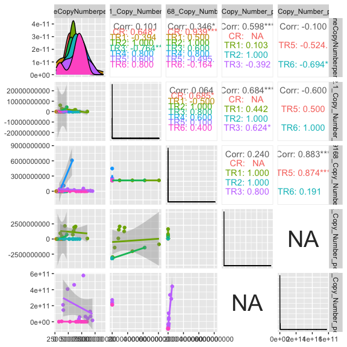
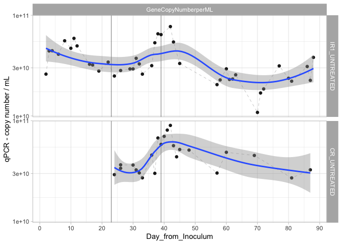
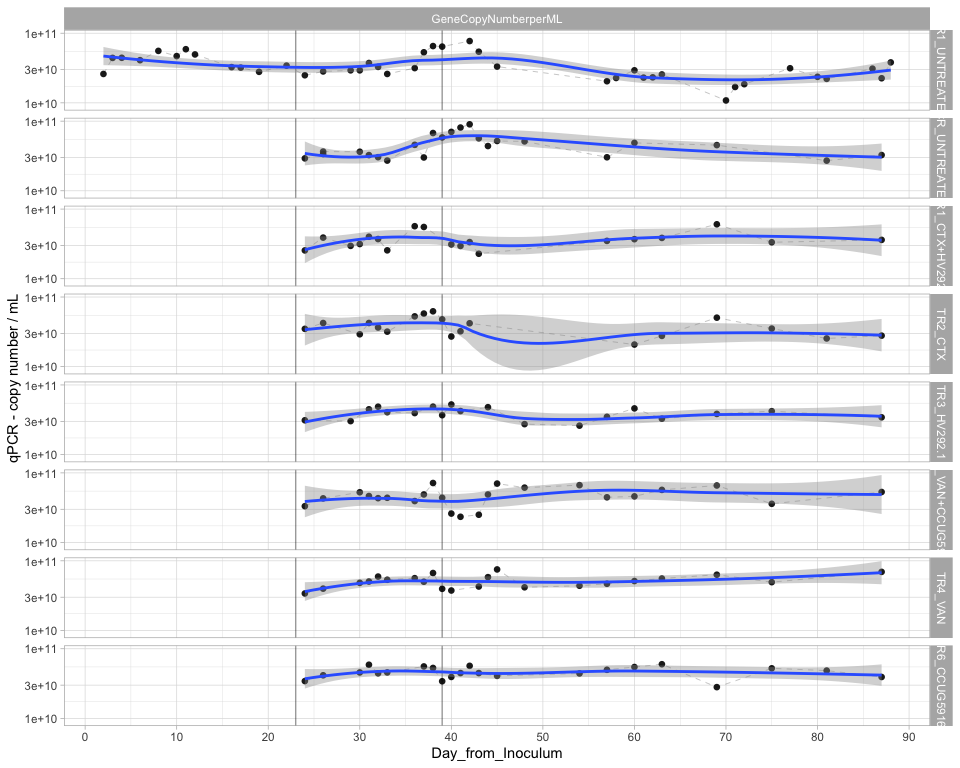
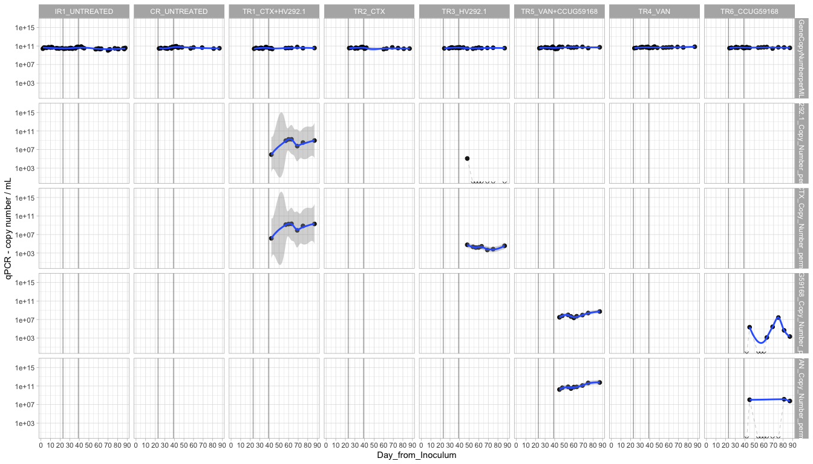
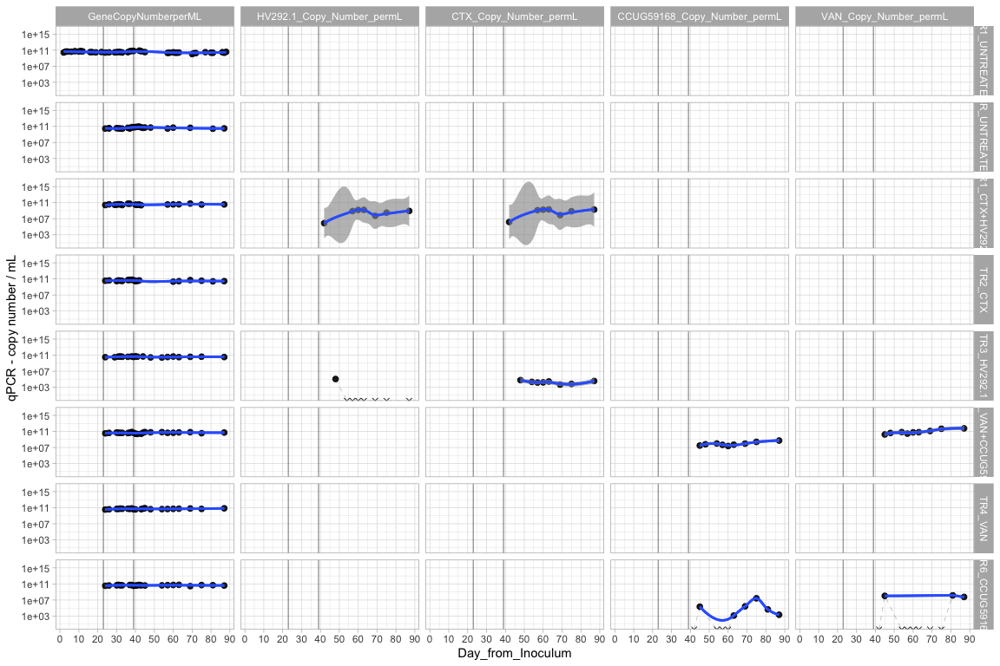
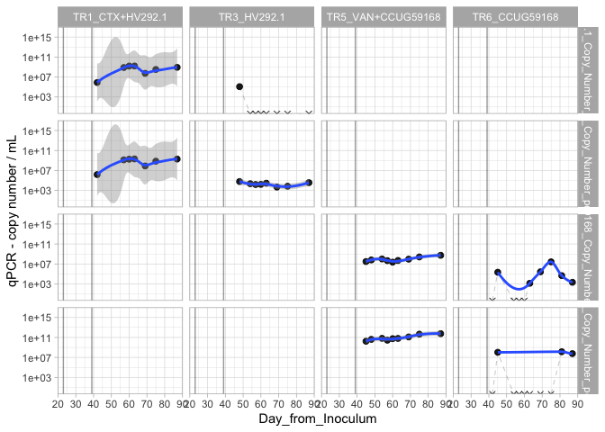
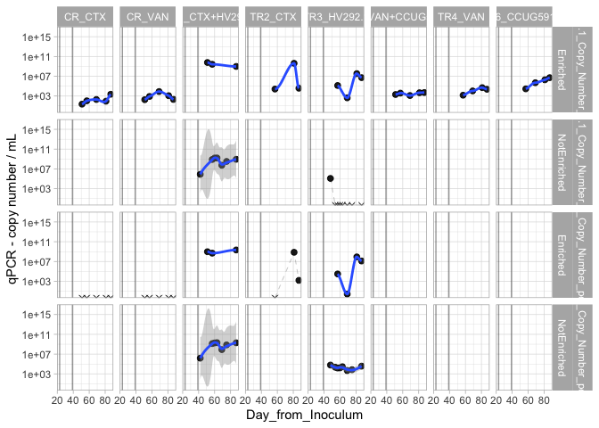
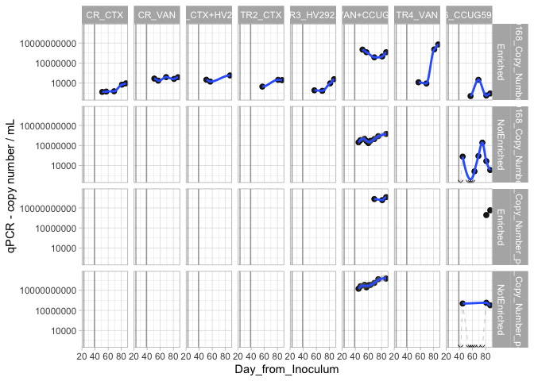
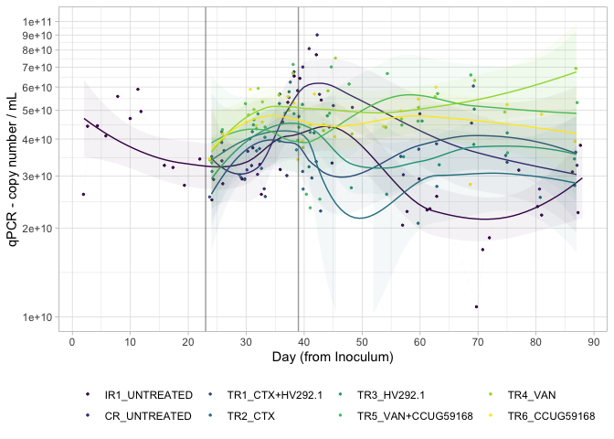

#### Load required packages


```r
library(tidyverse)
library(phyloseq)
library(speedyseq)
library(ggrepel)
library(ampvis2)
library(plotly)
library(microbiome)
options(getClass.msg=FALSE) # https://github.com/epurdom/clusterExperiment/issues/66
#this fixes an error message that pops up because the class 'Annotated' is defined in two different packages
```

#### Load functions from Github


```r
'%!in%' <- function(x,y)!('%in%'(x,y))

source("https://raw.githubusercontent.com/fconstancias/DivComAnalyses/master/R/phyloseq_taxa_tests.R")
source("https://raw.githubusercontent.com/fconstancias/DivComAnalyses/master/R/phyloseq_normalisation.R")
```

```
## Loading required package: scales
```

```
## 
## Attaching package: 'scales'
```

```
## The following object is masked from 'package:microbiome':
## 
##     alpha
```

```
## The following object is masked from 'package:purrr':
## 
##     discard
```

```
## The following object is masked from 'package:readr':
## 
##     col_factor
```

```
## Loading required package: reshape2
```

```
## 
## Attaching package: 'reshape2'
```

```
## The following object is masked from 'package:tidyr':
## 
##     smiths
```

```r
source("https://raw.githubusercontent.com/fconstancias/DivComAnalyses/master/R/phyloseq_alpha.R")
source("https://raw.githubusercontent.com/fconstancias/DivComAnalyses/master/R/phyloseq_beta.R")
source("https://raw.githubusercontent.com/fconstancias/DivComAnalyses/master/R/phyloseq_heatmap.R")
```


#### Load physeq object


```r
ps = "~/Documents/GitHub/amchick/data/processed/physeq_update_23_11.RDS"

ps %>% 
  here::here() %>%
  readRDS() %>%
  phyloseq_get_strains_fast() %>%
  phyloseq_remove_chloro_mitho() -> physeq
```

```
## Joining, by = "ASV"
```

```r
physeq %>% 
  subset_samples(Experiment == "Continuous") %>% 
  subset_samples(Paul %!in% c("Paul")) %>%
  subset_samples(Reactor != "IR2") -> ps_PolyFermS
```

We will be analysing only the PolyFermS samples here so take a subset of the physeq object.  

```r
physeq %>% 
  subset_samples(Experiment == "Continuous") %>% 
  subset_samples(Paul %!in% c("Paul")) %>%
  subset_samples(Reactor != "IR2") -> ps_polyFermS

sample_data(ps_polyFermS)$Reactor <- fct_relevel(sample_data(ps_polyFermS)$Reactor, "IR1", "CR", "TR1", "TR2","TR3", "TR4", "TR5", "TR6") 

sample_data(ps_polyFermS)$Treatment <- fct_relevel(sample_data(ps_polyFermS)$Treatment, "UNTREATED",  "CTX+HV292.1", "CTX","HV292.1","VAN+CCUG59168", "VAN",  "CCUG59168") 

sample_data(ps_polyFermS)$Reactor_Treatment <- fct_relevel(sample_data(ps_polyFermS)$Reactor_Treatment, "IR1_UNTREATED","CR_UNTREATED", "CR_CTX", "CR_VAN", "TR1_CTX+HV292.1","TR2_CTX", "TR3_HV292.1", "TR5_VAN+CCUG59168", "TR4_VAN", "TR6_CCUG59168") 

ps_polyFermS %>% 
  rarefy_even_depth(sample.size = 4576,
                    rngseed = 123) -> ps_polyFermS_rare
```

```
## `set.seed(123)` was used to initialize repeatable random subsampling.
```

```
## Please record this for your records so others can reproduce.
```

```
## Try `set.seed(123); .Random.seed` for the full vector
```

```
## ...
```

```
## 16 samples removedbecause they contained fewer reads than `sample.size`.
```

```
## Up to first five removed samples are:
```

```
## CR-40-S166ETR1-30-S178ETR1-42-S194ETR2-30-S195IR1-40-S197
```

```
## ...
```

```
## 50OTUs were removed because they are no longer 
## present in any sample after random subsampling
```

```
## ...
```


```r
sample_data(ps_polyFermS_rare) %>%
  data.frame() -> df
```


Plotting a bar plot of the different diversity indices 

```r
measures = c("GeneCopyNumberperML", "HV292.1_Copy_Number_permL", "CCUG59168_Copy_Number_permL", "CTX_Copy_Number_permL","VAN_Copy_Number_permL")

# define a function to plot scatter plot
my_fn <- function(data, mapping, ...){
  p <- ggplot(data = data, mapping = mapping) +
    geom_point() +
    geom_smooth(method=lm, ...)
  p
}


df %>%
  GGally::ggpairs(columns = measures,
                  ggplot2::aes(colour = Reactor),
                  # legend = 1,
                  progress = FALSE,
                  upper = list(
                    continuous = GGally::wrap('cor', method = "spearman")
                  ),
                  lower = list(continuous = my_fn)) -> p_corr

p_corr
```

<!-- -->


```r
df %>%
  plot_alphas(measure = measures,
             x_group = "Reactor_Treatment",
             colour_group = "Enrichment",
             fill_group = "Enrichment",
              shape_group = "Enrichment",
              facet_group = "Reactor_Treatment",
            test_group = "Reactor_Treatment",
            test_group_2 = "Enrichment") -> out
```


```r
plot_alpha_time <- function(df, 
                            x = "Day_from_Inoculum", 
                            y = "value", 
                            shape = "neg",
                            fill = "Reactor_Treatment",
                            group = "Reactor_Treatment", 
                            facet)
{
  df %>%
  arrange(Day_from_Inoculum) %>%
  ggplot(aes_string(x = x,
             y = y, shape = shape)) +
  geom_point(size=2, alpha=0.9, aes_string(group = group, color = fill, fill = fill),  show.legend = FALSE) + 
  geom_path(inherit.aes = TRUE, aes_string(group=group),
            size = 0.08,
            linetype = "dashed") +
  facet_grid(as.formula(facet), scales = "free") +
  theme_light() +
  scale_color_viridis_d(na.value = "black") + 
  geom_vline(xintercept = c(23,39), 
             color="black", alpha=0.4) + 
  # geom_smooth(show.legend = TRUE, level = 0.95) + 
  scale_x_continuous(breaks=seq(0,90,10)) -> plot

  return(plot)
}
```


```r
out$plot$data %>%
  dplyr::filter(Reactor %in% c("IR1", "CR")) %>%
  dplyr::filter(Enrichment == "NotEnriched") %>%
  dplyr::mutate(neg = ifelse(value == 0, "neg", "pos")) %>%
  #dplyr::filter(alphadiversiy %in% c("Observed")) %>% 
  plot_alpha_time(facet = c("Reactor_Treatment ~ alphadiversiy")) + 
  facet_null() + 
  facet_grid(Reactor_Treatment~ alphadiversiy, scales = "fixed") +
  scale_y_log10() +
  geom_smooth(show.legend = FALSE, level = 0.95) +
  ylab("qPCR - copy number / mL") +
  scale_color_manual(values = rep("black",2)) +
  scale_fill_manual(values = rep("black",2))  -> p1

p1 
```




```r
out$plot$data %>%
  dplyr::filter(Enrichment == "NotEnriched") %>%
  dplyr::filter(alphadiversiy == "GeneCopyNumberperML") %>%
  dplyr::mutate(neg = ifelse(value == 0, "neg", "pos")) %>%
  plot_alpha_time(facet = c("alphadiversiy ~ Reactor_Treatment")) +
  facet_null() + 
  facet_grid(Reactor_Treatment~ alphadiversiy, scales = "fixed") +
  geom_smooth(show.legend = FALSE, level = 0.95) +
  scale_y_log10() +
  ylab("qPCR - copy number / mL") +
  scale_color_manual(values = rep("black",8)) +
  scale_fill_manual(values = rep("black",8)) -> p2

p2
```

<!-- -->

```r
# p2 %>%
#   plotly::ggplotly()
```


```r
out$plot$data %>%
  dplyr::filter(Enrichment == "NotEnriched") %>%
  dplyr::filter(alphadiversiy %in% c("GeneCopyNumberperML","HV292.1_Copy_Number_permL", "CTX_Copy_Number_permL", "CCUG59168_Copy_Number_permL", "VAN_Copy_Number_permL")) %>%
  dplyr::mutate(alphadiversiy = fct_relevel(alphadiversiy,"GeneCopyNumberperML", "HV292.1_Copy_Number_permL", "CTX_Copy_Number_permL", "CCUG59168_Copy_Number_permL", "VAN_Copy_Number_permL")) %>%
  dplyr::mutate(neg = ifelse(value == 0, "neg", "pos")) %>%
  plot_alpha_time(facet = c("alphadiversiy ~ Reactor_Treatment")) +
  facet_null() +
  facet_grid(alphadiversiy ~ Reactor_Treatment, scales = "fixed") +
  scale_y_log10() +
  geom_smooth(show.legend = FALSE, level = 0.95) +
  scale_shape_manual(values=c(4, 19)) +
  ylab("qPCR - copy number / mL") + 
  scale_color_manual(values = rep("black",8)) +
  scale_fill_manual(values = rep("black",8)) -> p3

p3
```



```r
p3 +
  facet_null() +
  facet_grid(Reactor_Treatment ~ alphadiversiy, scales = "fixed") +
  scale_y_log10() +
  geom_smooth(show.legend = FALSE, level = 0.95) +
  scale_shape_manual(values=c(4, 19)) +
  ylab("qPCR - copy number / mL") +
    scale_color_manual(values = rep("black",8)) +
  scale_fill_manual(values = rep("black",8)) -> p4

p4
```




```r
out$plot$data %>%
  dplyr::filter(Enrichment == "NotEnriched") %>%
  dplyr::filter(alphadiversiy %in% c("HV292.1_Copy_Number_permL", "CTX_Copy_Number_permL", "CCUG59168_Copy_Number_permL", "VAN_Copy_Number_permL")) %>%
  dplyr::mutate(alphadiversiy = fct_relevel(alphadiversiy,"HV292.1_Copy_Number_permL", "CTX_Copy_Number_permL", "CCUG59168_Copy_Number_permL", "VAN_Copy_Number_permL")) %>%
  dplyr::mutate(neg = ifelse(value == 0, "neg", "pos")) %>%
  plot_alpha_time(facet = c("alphadiversiy ~ Reactor_Treatment")) +
  facet_null() +
  facet_grid(alphadiversiy ~ Reactor_Treatment, scales = "fixed") +
  scale_y_log10() +
  geom_smooth(show.legend = FALSE, level = 0.95) +
  scale_shape_manual(values=c(4, 19)) +
  ylab("qPCR - copy number / mL") +
  scale_color_manual(values = rep("black",8)) +
  scale_fill_manual(values = rep("black",8)) -> p5

p5
```



```r
out$plot$data %>%
  # dplyr::filter(Enrichment == "NotEnriched") %>%
  dplyr::filter(alphadiversiy %in% c("HV292.1_Copy_Number_permL", "CTX_Copy_Number_permL")) %>%
  dplyr::mutate(alphadiversiy = fct_relevel(alphadiversiy,"HV292.1_Copy_Number_permL", "CTX_Copy_Number_permL")) %>%
  dplyr::mutate(neg = ifelse(value == 0, "neg", "pos")) %>%
  plot_alpha_time(facet = c("alphadiversiy ~ Reactor_Treatment")) +
  facet_null() +
  facet_grid(alphadiversiy + Enrichment ~ Reactor_Treatment , scales = "fixed") +
  scale_y_log10() +
  geom_smooth(show.legend = FALSE, level = 0.95) +
  scale_shape_manual(values=c(4, 19)) +
  ylab("qPCR - copy number / mL") +
  scale_color_manual(values = rep("black",8)) +
  scale_fill_manual(values = rep("black",8)) -> p6

p6 + scale_x_continuous(breaks=seq(0,90,20))
```




```r
out$plot$data %>%
  # dplyr::filter(Enrichment == "NotEnriched") %>%
  dplyr::filter(alphadiversiy %in% c("CCUG59168_Copy_Number_permL", "VAN_Copy_Number_permL")) %>%
  dplyr::mutate(alphadiversiy = fct_relevel(alphadiversiy,"CCUG59168_Copy_Number_permL", "VAN_Copy_Number_permL")) %>%
  dplyr::mutate(neg = ifelse(value == 0, "neg", "pos")) %>%
  plot_alpha_time(facet = c("alphadiversiy ~ Reactor_Treatment")) +
  facet_null() +
  facet_grid(alphadiversiy + Enrichment ~ Reactor_Treatment , scales = "fixed") +
  scale_y_log10() +
  geom_smooth(show.legend = FALSE, level = 0.95) +
  scale_shape_manual(values=c(4, 19)) +
  ylab("qPCR - copy number / mL") +
  scale_color_manual(values = rep("black",8)) +
  scale_fill_manual(values = rep("black",8)) -> p7

p7 + scale_x_continuous(breaks=seq(0,90,20))
```




```r
p2$data %>%
  dplyr::filter(Enrichment == "NotEnriched") %>%
  dplyr::filter(alphadiversiy == "GeneCopyNumberperML") %>%
  dplyr::mutate(neg = ifelse(value == 0, "neg", "pos")) %>%
  arrange(Day_from_Inoculum) %>%
  ggplot(aes_string(x = "Day_from_Inoculum",
             y = "value", group = "Reactor_Treatment")) +
  geom_jitter(size=0.5, alpha=0.9, aes_string(group = "Reactor_Treatment", color = "Reactor_Treatment", fill = "Reactor_Treatment"),  show.legend = TRUE) + 
  geom_path(inherit.aes = TRUE, aes_string(group="Reactor_Treatment", fill = "Reactor_Treatment", color = "Reactor_Treatment", show.legend = FALSE),
            size = 0.008,
            linetype = "dashed") +
  # facet_grid(as.formula(facet), scales = "free") +
  geom_vline(xintercept = c(23,39), 
             color="black", alpha=0.4) + 
  geom_smooth(show.legend = FALSE, level = 0.95, alpha=0.05, size = 0.5 ,aes_string(group="Reactor_Treatment", color = "Reactor_Treatment", fill = "Reactor_Treatment")) +
  scale_x_continuous(breaks=seq(0,90,10)) +
  scale_y_continuous(labels = scientific,
                limits=c(1e+10, 1e+11), breaks = seq(1e+10, 1e+11, by = 1e+10),
                trans = "log10") +
  labs(x="Day (from Inoculum)", y= "qPCR - copy number / mL",  
       col=NULL, fill = NULL, shape = NULL) +
  theme_light() +
  scale_color_viridis_d(na.value = "black") +
  scale_fill_viridis_d(na.value = "black") -> plot
```

```
## Warning: Ignoring unknown aesthetics: fill, show.legend
```

```r
plot + theme(legend.position = "bottom")
```

```
## `geom_smooth()` using method = 'loess' and formula 'y ~ x'
```

<!-- -->


```r
plotly::ggplotly(plot) -> p5ly
```

```
## `geom_smooth()` using method = 'loess' and formula 'y ~ x'
```

```
## Warning: `group_by_()` is deprecated as of dplyr 0.7.0.
## Please use `group_by()` instead.
## See vignette('programming') for more help
## This warning is displayed once every 8 hours.
## Call `lifecycle::last_warnings()` to see where this warning was generated.
```

```r
p5ly
```

<!--html_preserve--><div id="htmlwidget-910e9d4db9bceb4e068a" style="width:672px;height:480px;" class="plotly html-widget"></div>
<script type="application/json" data-for="htmlwidget-910e9d4db9bceb4e068a">{"x":{"data":[{"x":[2.06159768849611,2.64556157384068,4.19395546335727,5.87017958499491,7.67776002809405,10.157431486249,10.6289606001228,11.7543239943683,16.3507583575323,16.6351808678359,18.6387679036707,21.9121134035289,23.7850355630741,25.9332258056849,29.0013281606138,30.2178070308641,30.6175287395716,31.6007374232635,33.2830687046051,35.9396525446326,37.2613863345236,37.9041922003031,38.993392623961,41.8480209171772,42.8701169675216,45.3612760324031,56.6805846549571,57.7939282439649,60.2880797786638,60.7218031773344,61.7077369295061,63.2260135963559,70.2437208494171,71.0432852886617,72.1548184717074,76.8997233569622,79.7257961500436,80.6144394816831,85.7465975530446,87.3123438488692,88.0525316234678],"y":[10.4149733765022,10.6453378301716,10.6470944558693,10.6127104432574,10.7462780679801,10.6716101757032,10.7704170871809,10.6952464893762,10.5128818215732,10.5057643642262,10.4454749685611,10.5346328552661,10.3961777947907,10.4508571978196,10.4668683918123,10.4667708404617,10.5723357608447,10.5163961908228,10.4148985168782,10.4989369670091,10.7263240036235,10.8153524605102,10.8074643341925,10.8873265795553,10.7340409773157,10.5209167770022,10.3105217473273,10.3568904414421,10.4673167444535,10.3619602099657,10.3661368479282,10.4080656344537,10.0343859703743,10.2278452093763,10.2680349242817,10.4968734484327,10.3737473439195,10.3446484325484,10.4908677595712,10.3531781469401,10.5809125011496],"text":["Reactor_Treatment: IR1_UNTREATED<br />Reactor_Treatment: IR1_UNTREATED<br />Reactor_Treatment: IR1_UNTREATED<br />Reactor_Treatment: IR1_UNTREATED<br />Day_from_Inoculum:  2<br />value: 26000000000","Reactor_Treatment: IR1_UNTREATED<br />Reactor_Treatment: IR1_UNTREATED<br />Reactor_Treatment: IR1_UNTREATED<br />Reactor_Treatment: IR1_UNTREATED<br />Day_from_Inoculum:  3<br />value: 44191408333","Reactor_Treatment: IR1_UNTREATED<br />Reactor_Treatment: IR1_UNTREATED<br />Reactor_Treatment: IR1_UNTREATED<br />Reactor_Treatment: IR1_UNTREATED<br />Day_from_Inoculum:  4<br />value: 44370515000","Reactor_Treatment: IR1_UNTREATED<br />Reactor_Treatment: IR1_UNTREATED<br />Reactor_Treatment: IR1_UNTREATED<br />Reactor_Treatment: IR1_UNTREATED<br />Day_from_Inoculum:  6<br />value: 40993072500","Reactor_Treatment: IR1_UNTREATED<br />Reactor_Treatment: IR1_UNTREATED<br />Reactor_Treatment: IR1_UNTREATED<br />Reactor_Treatment: IR1_UNTREATED<br />Day_from_Inoculum:  8<br />value: 55754265000","Reactor_Treatment: IR1_UNTREATED<br />Reactor_Treatment: IR1_UNTREATED<br />Reactor_Treatment: IR1_UNTREATED<br />Reactor_Treatment: IR1_UNTREATED<br />Day_from_Inoculum: 10<br />value: 46947250000","Reactor_Treatment: IR1_UNTREATED<br />Reactor_Treatment: IR1_UNTREATED<br />Reactor_Treatment: IR1_UNTREATED<br />Reactor_Treatment: IR1_UNTREATED<br />Day_from_Inoculum: 11<br />value: 58940945833","Reactor_Treatment: IR1_UNTREATED<br />Reactor_Treatment: IR1_UNTREATED<br />Reactor_Treatment: IR1_UNTREATED<br />Reactor_Treatment: IR1_UNTREATED<br />Day_from_Inoculum: 12<br />value: 49573150000","Reactor_Treatment: IR1_UNTREATED<br />Reactor_Treatment: IR1_UNTREATED<br />Reactor_Treatment: IR1_UNTREATED<br />Reactor_Treatment: IR1_UNTREATED<br />Day_from_Inoculum: 16<br />value: 32574805000","Reactor_Treatment: IR1_UNTREATED<br />Reactor_Treatment: IR1_UNTREATED<br />Reactor_Treatment: IR1_UNTREATED<br />Reactor_Treatment: IR1_UNTREATED<br />Day_from_Inoculum: 17<br />value: 32045301667","Reactor_Treatment: IR1_UNTREATED<br />Reactor_Treatment: IR1_UNTREATED<br />Reactor_Treatment: IR1_UNTREATED<br />Reactor_Treatment: IR1_UNTREATED<br />Day_from_Inoculum: 19<br />value: 27891698333","Reactor_Treatment: IR1_UNTREATED<br />Reactor_Treatment: IR1_UNTREATED<br />Reactor_Treatment: IR1_UNTREATED<br />Reactor_Treatment: IR1_UNTREATED<br />Day_from_Inoculum: 22<br />value: 34247812500","Reactor_Treatment: IR1_UNTREATED<br />Reactor_Treatment: IR1_UNTREATED<br />Reactor_Treatment: IR1_UNTREATED<br />Reactor_Treatment: IR1_UNTREATED<br />Day_from_Inoculum: 24<br />value: 24898765833","Reactor_Treatment: IR1_UNTREATED<br />Reactor_Treatment: IR1_UNTREATED<br />Reactor_Treatment: IR1_UNTREATED<br />Reactor_Treatment: IR1_UNTREATED<br />Day_from_Inoculum: 26<br />value: 28239510833","Reactor_Treatment: IR1_UNTREATED<br />Reactor_Treatment: IR1_UNTREATED<br />Reactor_Treatment: IR1_UNTREATED<br />Reactor_Treatment: IR1_UNTREATED<br />Day_from_Inoculum: 29<br />value: 29300053333","Reactor_Treatment: IR1_UNTREATED<br />Reactor_Treatment: IR1_UNTREATED<br />Reactor_Treatment: IR1_UNTREATED<br />Reactor_Treatment: IR1_UNTREATED<br />Day_from_Inoculum: 30<br />value: 29293470000","Reactor_Treatment: IR1_UNTREATED<br />Reactor_Treatment: IR1_UNTREATED<br />Reactor_Treatment: IR1_UNTREATED<br />Reactor_Treatment: IR1_UNTREATED<br />Day_from_Inoculum: 31<br />value: 37353885000","Reactor_Treatment: IR1_UNTREATED<br />Reactor_Treatment: IR1_UNTREATED<br />Reactor_Treatment: IR1_UNTREATED<br />Reactor_Treatment: IR1_UNTREATED<br />Day_from_Inoculum: 32<br />value: 32839473333","Reactor_Treatment: IR1_UNTREATED<br />Reactor_Treatment: IR1_UNTREATED<br />Reactor_Treatment: IR1_UNTREATED<br />Reactor_Treatment: IR1_UNTREATED<br />Day_from_Inoculum: 33<br />value: 25995519167","Reactor_Treatment: IR1_UNTREATED<br />Reactor_Treatment: IR1_UNTREATED<br />Reactor_Treatment: IR1_UNTREATED<br />Reactor_Treatment: IR1_UNTREATED<br />Day_from_Inoculum: 36<br />value: 31545466667","Reactor_Treatment: IR1_UNTREATED<br />Reactor_Treatment: IR1_UNTREATED<br />Reactor_Treatment: IR1_UNTREATED<br />Reactor_Treatment: IR1_UNTREATED<br />Day_from_Inoculum: 37<br />value: 53250540000","Reactor_Treatment: IR1_UNTREATED<br />Reactor_Treatment: IR1_UNTREATED<br />Reactor_Treatment: IR1_UNTREATED<br />Reactor_Treatment: IR1_UNTREATED<br />Day_from_Inoculum: 38<br />value: 65366083333","Reactor_Treatment: IR1_UNTREATED<br />Reactor_Treatment: IR1_UNTREATED<br />Reactor_Treatment: IR1_UNTREATED<br />Reactor_Treatment: IR1_UNTREATED<br />Day_from_Inoculum: 39<br />value: 64189547500","Reactor_Treatment: IR1_UNTREATED<br />Reactor_Treatment: IR1_UNTREATED<br />Reactor_Treatment: IR1_UNTREATED<br />Reactor_Treatment: IR1_UNTREATED<br />Day_from_Inoculum: 42<br />value: 77148337500","Reactor_Treatment: IR1_UNTREATED<br />Reactor_Treatment: IR1_UNTREATED<br />Reactor_Treatment: IR1_UNTREATED<br />Reactor_Treatment: IR1_UNTREATED<br />Day_from_Inoculum: 43<br />value: 54205205000","Reactor_Treatment: IR1_UNTREATED<br />Reactor_Treatment: IR1_UNTREATED<br />Reactor_Treatment: IR1_UNTREATED<br />Reactor_Treatment: IR1_UNTREATED<br />Day_from_Inoculum: 45<br />value: 33183085000","Reactor_Treatment: IR1_UNTREATED<br />Reactor_Treatment: IR1_UNTREATED<br />Reactor_Treatment: IR1_UNTREATED<br />Reactor_Treatment: IR1_UNTREATED<br />Day_from_Inoculum: 57<br />value: 20441923333","Reactor_Treatment: IR1_UNTREATED<br />Reactor_Treatment: IR1_UNTREATED<br />Reactor_Treatment: IR1_UNTREATED<br />Reactor_Treatment: IR1_UNTREATED<br />Day_from_Inoculum: 58<br />value: 22745235000","Reactor_Treatment: IR1_UNTREATED<br />Reactor_Treatment: IR1_UNTREATED<br />Reactor_Treatment: IR1_UNTREATED<br />Reactor_Treatment: IR1_UNTREATED<br />Day_from_Inoculum: 60<br />value: 29330316667","Reactor_Treatment: IR1_UNTREATED<br />Reactor_Treatment: IR1_UNTREATED<br />Reactor_Treatment: IR1_UNTREATED<br />Reactor_Treatment: IR1_UNTREATED<br />Day_from_Inoculum: 61<br />value: 23012310000","Reactor_Treatment: IR1_UNTREATED<br />Reactor_Treatment: IR1_UNTREATED<br />Reactor_Treatment: IR1_UNTREATED<br />Reactor_Treatment: IR1_UNTREATED<br />Day_from_Inoculum: 62<br />value: 23234688333","Reactor_Treatment: IR1_UNTREATED<br />Reactor_Treatment: IR1_UNTREATED<br />Reactor_Treatment: IR1_UNTREATED<br />Reactor_Treatment: IR1_UNTREATED<br />Day_from_Inoculum: 63<br />value: 25589725000","Reactor_Treatment: IR1_UNTREATED<br />Reactor_Treatment: IR1_UNTREATED<br />Reactor_Treatment: IR1_UNTREATED<br />Reactor_Treatment: IR1_UNTREATED<br />Day_from_Inoculum: 70<br />value: 10823954167","Reactor_Treatment: IR1_UNTREATED<br />Reactor_Treatment: IR1_UNTREATED<br />Reactor_Treatment: IR1_UNTREATED<br />Reactor_Treatment: IR1_UNTREATED<br />Day_from_Inoculum: 71<br />value: 16898385000","Reactor_Treatment: IR1_UNTREATED<br />Reactor_Treatment: IR1_UNTREATED<br />Reactor_Treatment: IR1_UNTREATED<br />Reactor_Treatment: IR1_UNTREATED<br />Day_from_Inoculum: 72<br />value: 18536807500","Reactor_Treatment: IR1_UNTREATED<br />Reactor_Treatment: IR1_UNTREATED<br />Reactor_Treatment: IR1_UNTREATED<br />Reactor_Treatment: IR1_UNTREATED<br />Day_from_Inoculum: 77<br />value: 31395937500","Reactor_Treatment: IR1_UNTREATED<br />Reactor_Treatment: IR1_UNTREATED<br />Reactor_Treatment: IR1_UNTREATED<br />Reactor_Treatment: IR1_UNTREATED<br />Day_from_Inoculum: 80<br />value: 23645435833","Reactor_Treatment: IR1_UNTREATED<br />Reactor_Treatment: IR1_UNTREATED<br />Reactor_Treatment: IR1_UNTREATED<br />Reactor_Treatment: IR1_UNTREATED<br />Day_from_Inoculum: 81<br />value: 22113040000","Reactor_Treatment: IR1_UNTREATED<br />Reactor_Treatment: IR1_UNTREATED<br />Reactor_Treatment: IR1_UNTREATED<br />Reactor_Treatment: IR1_UNTREATED<br />Day_from_Inoculum: 86<br />value: 30964763333","Reactor_Treatment: IR1_UNTREATED<br />Reactor_Treatment: IR1_UNTREATED<br />Reactor_Treatment: IR1_UNTREATED<br />Reactor_Treatment: IR1_UNTREATED<br />Day_from_Inoculum: 87<br />value: 22551641667","Reactor_Treatment: IR1_UNTREATED<br />Reactor_Treatment: IR1_UNTREATED<br />Reactor_Treatment: IR1_UNTREATED<br />Reactor_Treatment: IR1_UNTREATED<br />Day_from_Inoculum: 88<br />value: 38098903333"],"type":"scatter","mode":"markers","marker":{"autocolorscale":false,"color":"rgba(68,1,84,1)","opacity":0.9,"size":1.88976377952756,"symbol":"circle","line":{"width":1.88976377952756,"color":"rgba(68,1,84,1)"}},"hoveron":"points","name":"IR1_UNTREATED","legendgroup":"IR1_UNTREATED","showlegend":true,"xaxis":"x","yaxis":"y","hoverinfo":"text","frame":null},{"x":[23.7750480581075,26.2574134103954,25.9666426723823,29.7339976834133,31.0890409059823,31.6566988835111,32.7981519741938,36.1583675596863,37.3278859371319,38.2761443024501,38.7105762653053,40.1654029536992,41.0276967534795,41.6046575039625,42.977893640101,43.6612930461764,44.7831223580986,48.3048914795741,57.1908021675423,59.6949016643688,68.9828745337203,81.3221307916567,87.2287720445543],"y":[10.4653557835097,10.5282027872793,10.5628426065134,10.5606668465203,10.5123688523828,10.4824870013995,10.4336155884984,10.6598132675983,10.4783114471592,10.8294601198287,10.7660006144378,10.8458684202837,10.9080049018227,10.9545378157157,10.7533527188749,10.6426326338399,10.7152640869745,10.7092325103845,10.4812268253133,10.6874821935773,10.6560047605103,10.4328827321851,10.5131331355494],"text":["Reactor_Treatment: CR_UNTREATED<br />Reactor_Treatment: CR_UNTREATED<br />Reactor_Treatment: CR_UNTREATED<br />Reactor_Treatment: CR_UNTREATED<br />Day_from_Inoculum: 24<br />value: 29198180000","Reactor_Treatment: CR_UNTREATED<br />Reactor_Treatment: CR_UNTREATED<br />Reactor_Treatment: CR_UNTREATED<br />Reactor_Treatment: CR_UNTREATED<br />Day_from_Inoculum: 26<br />value: 33744485833","Reactor_Treatment: CR_UNTREATED<br />Reactor_Treatment: CR_UNTREATED<br />Reactor_Treatment: CR_UNTREATED<br />Reactor_Treatment: CR_UNTREATED<br />Day_from_Inoculum: 26<br />value: 36546233333","Reactor_Treatment: CR_UNTREATED<br />Reactor_Treatment: CR_UNTREATED<br />Reactor_Treatment: CR_UNTREATED<br />Reactor_Treatment: CR_UNTREATED<br />Day_from_Inoculum: 30<br />value: 36363600000","Reactor_Treatment: CR_UNTREATED<br />Reactor_Treatment: CR_UNTREATED<br />Reactor_Treatment: CR_UNTREATED<br />Reactor_Treatment: CR_UNTREATED<br />Day_from_Inoculum: 31<br />value: 32536350000","Reactor_Treatment: CR_UNTREATED<br />Reactor_Treatment: CR_UNTREATED<br />Reactor_Treatment: CR_UNTREATED<br />Reactor_Treatment: CR_UNTREATED<br />Day_from_Inoculum: 32<br />value: 30372950000","Reactor_Treatment: CR_UNTREATED<br />Reactor_Treatment: CR_UNTREATED<br />Reactor_Treatment: CR_UNTREATED<br />Reactor_Treatment: CR_UNTREATED<br />Day_from_Inoculum: 33<br />value: 27140360000","Reactor_Treatment: CR_UNTREATED<br />Reactor_Treatment: CR_UNTREATED<br />Reactor_Treatment: CR_UNTREATED<br />Reactor_Treatment: CR_UNTREATED<br />Day_from_Inoculum: 36<br />value: 45689169167","Reactor_Treatment: CR_UNTREATED<br />Reactor_Treatment: CR_UNTREATED<br />Reactor_Treatment: CR_UNTREATED<br />Reactor_Treatment: CR_UNTREATED<br />Day_from_Inoculum: 37<br />value: 30082330000","Reactor_Treatment: CR_UNTREATED<br />Reactor_Treatment: CR_UNTREATED<br />Reactor_Treatment: CR_UNTREATED<br />Reactor_Treatment: CR_UNTREATED<br />Day_from_Inoculum: 38<br />value: 67524304167","Reactor_Treatment: CR_UNTREATED<br />Reactor_Treatment: CR_UNTREATED<br />Reactor_Treatment: CR_UNTREATED<br />Reactor_Treatment: CR_UNTREATED<br />Day_from_Inoculum: 39<br />value: 58344595833","Reactor_Treatment: CR_UNTREATED<br />Reactor_Treatment: CR_UNTREATED<br />Reactor_Treatment: CR_UNTREATED<br />Reactor_Treatment: CR_UNTREATED<br />Day_from_Inoculum: 40<br />value: 70124280000","Reactor_Treatment: CR_UNTREATED<br />Reactor_Treatment: CR_UNTREATED<br />Reactor_Treatment: CR_UNTREATED<br />Reactor_Treatment: CR_UNTREATED<br />Day_from_Inoculum: 41<br />value: 80910500000","Reactor_Treatment: CR_UNTREATED<br />Reactor_Treatment: CR_UNTREATED<br />Reactor_Treatment: CR_UNTREATED<br />Reactor_Treatment: CR_UNTREATED<br />Day_from_Inoculum: 42<br />value: 90061221667","Reactor_Treatment: CR_UNTREATED<br />Reactor_Treatment: CR_UNTREATED<br />Reactor_Treatment: CR_UNTREATED<br />Reactor_Treatment: CR_UNTREATED<br />Day_from_Inoculum: 43<br />value: 56669937500","Reactor_Treatment: CR_UNTREATED<br />Reactor_Treatment: CR_UNTREATED<br />Reactor_Treatment: CR_UNTREATED<br />Reactor_Treatment: CR_UNTREATED<br />Day_from_Inoculum: 44<br />value: 43916995833","Reactor_Treatment: CR_UNTREATED<br />Reactor_Treatment: CR_UNTREATED<br />Reactor_Treatment: CR_UNTREATED<br />Reactor_Treatment: CR_UNTREATED<br />Day_from_Inoculum: 45<br />value: 51911562500","Reactor_Treatment: CR_UNTREATED<br />Reactor_Treatment: CR_UNTREATED<br />Reactor_Treatment: CR_UNTREATED<br />Reactor_Treatment: CR_UNTREATED<br />Day_from_Inoculum: 48<br />value: 51195585000","Reactor_Treatment: CR_UNTREATED<br />Reactor_Treatment: CR_UNTREATED<br />Reactor_Treatment: CR_UNTREATED<br />Reactor_Treatment: CR_UNTREATED<br />Day_from_Inoculum: 57<br />value: 30284948333","Reactor_Treatment: CR_UNTREATED<br />Reactor_Treatment: CR_UNTREATED<br />Reactor_Treatment: CR_UNTREATED<br />Reactor_Treatment: CR_UNTREATED<br />Day_from_Inoculum: 60<br />value: 48694753333","Reactor_Treatment: CR_UNTREATED<br />Reactor_Treatment: CR_UNTREATED<br />Reactor_Treatment: CR_UNTREATED<br />Reactor_Treatment: CR_UNTREATED<br />Day_from_Inoculum: 69<br />value: 45290256667","Reactor_Treatment: CR_UNTREATED<br />Reactor_Treatment: CR_UNTREATED<br />Reactor_Treatment: CR_UNTREATED<br />Reactor_Treatment: CR_UNTREATED<br />Day_from_Inoculum: 81<br />value: 27094600000","Reactor_Treatment: CR_UNTREATED<br />Reactor_Treatment: CR_UNTREATED<br />Reactor_Treatment: CR_UNTREATED<br />Reactor_Treatment: CR_UNTREATED<br />Day_from_Inoculum: 87<br />value: 32593662500"],"type":"scatter","mode":"markers","marker":{"autocolorscale":false,"color":"rgba(70,51,126,1)","opacity":0.9,"size":1.88976377952756,"symbol":"circle","line":{"width":1.88976377952756,"color":"rgba(70,51,126,1)"}},"hoveron":"points","name":"CR_UNTREATED","legendgroup":"CR_UNTREATED","showlegend":true,"xaxis":"x","yaxis":"y","hoverinfo":"text","frame":null},{"x":[24.3385752160102,25.6020041430369,29.1179281774908,29.6003992903978,30.6114006888121,31.8685126706958,33.0447939947247,36.0213117828593,37.2878206731752,40.2758292151615,40.6858683170751,41.8463402701542,42.6844943314791,57.3187998026609,60.3531471326947,63.3700456734747,69.0118310045451,74.9506129264832,87.2993396669626],"y":[10.4062270108814,10.5903807866253,10.4717095028068,10.4978094914705,10.6027286167533,10.5695127520832,10.4074801308164,10.7540383739632,10.7428389883951,10.492481025842,10.470338716531,10.5258489064945,10.3585049320293,10.5431981061846,10.567669131056,10.5859577598252,10.7815763073934,10.5234896543311,10.5576795655833],"text":["Reactor_Treatment: TR1_CTX+HV292.1<br />Reactor_Treatment: TR1_CTX+HV292.1<br />Reactor_Treatment: TR1_CTX+HV292.1<br />Reactor_Treatment: TR1_CTX+HV292.1<br />Day_from_Inoculum: 24<br />value: 25481619167","Reactor_Treatment: TR1_CTX+HV292.1<br />Reactor_Treatment: TR1_CTX+HV292.1<br />Reactor_Treatment: TR1_CTX+HV292.1<br />Reactor_Treatment: TR1_CTX+HV292.1<br />Day_from_Inoculum: 26<br />value: 38938638333","Reactor_Treatment: TR1_CTX+HV292.1<br />Reactor_Treatment: TR1_CTX+HV292.1<br />Reactor_Treatment: TR1_CTX+HV292.1<br />Reactor_Treatment: TR1_CTX+HV292.1<br />Day_from_Inoculum: 29<br />value: 29628488333","Reactor_Treatment: TR1_CTX+HV292.1<br />Reactor_Treatment: TR1_CTX+HV292.1<br />Reactor_Treatment: TR1_CTX+HV292.1<br />Reactor_Treatment: TR1_CTX+HV292.1<br />Day_from_Inoculum: 30<br />value: 31463680000","Reactor_Treatment: TR1_CTX+HV292.1<br />Reactor_Treatment: TR1_CTX+HV292.1<br />Reactor_Treatment: TR1_CTX+HV292.1<br />Reactor_Treatment: TR1_CTX+HV292.1<br />Day_from_Inoculum: 31<br />value: 40061630000","Reactor_Treatment: TR1_CTX+HV292.1<br />Reactor_Treatment: TR1_CTX+HV292.1<br />Reactor_Treatment: TR1_CTX+HV292.1<br />Reactor_Treatment: TR1_CTX+HV292.1<br />Day_from_Inoculum: 32<br />value: 37111862500","Reactor_Treatment: TR1_CTX+HV292.1<br />Reactor_Treatment: TR1_CTX+HV292.1<br />Reactor_Treatment: TR1_CTX+HV292.1<br />Reactor_Treatment: TR1_CTX+HV292.1<br />Day_from_Inoculum: 33<br />value: 25555250000","Reactor_Treatment: TR1_CTX+HV292.1<br />Reactor_Treatment: TR1_CTX+HV292.1<br />Reactor_Treatment: TR1_CTX+HV292.1<br />Reactor_Treatment: TR1_CTX+HV292.1<br />Day_from_Inoculum: 36<br />value: 56759475000","Reactor_Treatment: TR1_CTX+HV292.1<br />Reactor_Treatment: TR1_CTX+HV292.1<br />Reactor_Treatment: TR1_CTX+HV292.1<br />Reactor_Treatment: TR1_CTX+HV292.1<br />Day_from_Inoculum: 37<br />value: 55314501667","Reactor_Treatment: TR1_CTX+HV292.1<br />Reactor_Treatment: TR1_CTX+HV292.1<br />Reactor_Treatment: TR1_CTX+HV292.1<br />Reactor_Treatment: TR1_CTX+HV292.1<br />Day_from_Inoculum: 40<br />value: 31080000000","Reactor_Treatment: TR1_CTX+HV292.1<br />Reactor_Treatment: TR1_CTX+HV292.1<br />Reactor_Treatment: TR1_CTX+HV292.1<br />Reactor_Treatment: TR1_CTX+HV292.1<br />Day_from_Inoculum: 41<br />value: 29535120000","Reactor_Treatment: TR1_CTX+HV292.1<br />Reactor_Treatment: TR1_CTX+HV292.1<br />Reactor_Treatment: TR1_CTX+HV292.1<br />Reactor_Treatment: TR1_CTX+HV292.1<br />Day_from_Inoculum: 42<br />value: 33562083333","Reactor_Treatment: TR1_CTX+HV292.1<br />Reactor_Treatment: TR1_CTX+HV292.1<br />Reactor_Treatment: TR1_CTX+HV292.1<br />Reactor_Treatment: TR1_CTX+HV292.1<br />Day_from_Inoculum: 43<br />value: 22829950000","Reactor_Treatment: TR1_CTX+HV292.1<br />Reactor_Treatment: TR1_CTX+HV292.1<br />Reactor_Treatment: TR1_CTX+HV292.1<br />Reactor_Treatment: TR1_CTX+HV292.1<br />Day_from_Inoculum: 57<br />value: 34929963333","Reactor_Treatment: TR1_CTX+HV292.1<br />Reactor_Treatment: TR1_CTX+HV292.1<br />Reactor_Treatment: TR1_CTX+HV292.1<br />Reactor_Treatment: TR1_CTX+HV292.1<br />Day_from_Inoculum: 60<br />value: 36954653333","Reactor_Treatment: TR1_CTX+HV292.1<br />Reactor_Treatment: TR1_CTX+HV292.1<br />Reactor_Treatment: TR1_CTX+HV292.1<br />Reactor_Treatment: TR1_CTX+HV292.1<br />Day_from_Inoculum: 63<br />value: 38544088333","Reactor_Treatment: TR1_CTX+HV292.1<br />Reactor_Treatment: TR1_CTX+HV292.1<br />Reactor_Treatment: TR1_CTX+HV292.1<br />Reactor_Treatment: TR1_CTX+HV292.1<br />Day_from_Inoculum: 69<br />value: 60475062500","Reactor_Treatment: TR1_CTX+HV292.1<br />Reactor_Treatment: TR1_CTX+HV292.1<br />Reactor_Treatment: TR1_CTX+HV292.1<br />Reactor_Treatment: TR1_CTX+HV292.1<br />Day_from_Inoculum: 75<br />value: 33380253333","Reactor_Treatment: TR1_CTX+HV292.1<br />Reactor_Treatment: TR1_CTX+HV292.1<br />Reactor_Treatment: TR1_CTX+HV292.1<br />Reactor_Treatment: TR1_CTX+HV292.1<br />Day_from_Inoculum: 87<br />value: 36114329167"],"type":"scatter","mode":"markers","marker":{"autocolorscale":false,"color":"rgba(54,92,141,1)","opacity":0.9,"size":1.88976377952756,"symbol":"circle","line":{"width":1.88976377952756,"color":"rgba(54,92,141,1)"}},"hoveron":"points","name":"TR1_CTX+HV292.1","legendgroup":"TR1_CTX+HV292.1","showlegend":true,"xaxis":"x","yaxis":"y","hoverinfo":"text","frame":null},{"x":[23.9218194402754,26.0895086415112,30.3596133032814,31.3545145146549,32.0383871896192,32.9989859811962,35.9952882718295,37.3771864552051,38.3965271148831,39.223001213558,39.6662634642795,40.9727843325585,42.2167202822864,60.0298849698156,62.7060382893309,68.7001558136195,74.9452713213861,80.6785079659894,87.2436588553712],"y":[10.5427272195888,10.6265473041795,10.4648483633329,10.6270279690035,10.5621602742059,10.502762284333,10.7220997827902,10.7621181622733,10.794649139412,10.6786601246284,10.4327709103859,10.5082286323673,10.6229407196695,10.3171220016029,10.4418129367624,10.7032988702326,10.5463659328017,10.40473745342,10.4449617591839],"text":["Reactor_Treatment: TR2_CTX<br />Reactor_Treatment: TR2_CTX<br />Reactor_Treatment: TR2_CTX<br />Reactor_Treatment: TR2_CTX<br />Day_from_Inoculum: 24<br />value: 34892108333","Reactor_Treatment: TR2_CTX<br />Reactor_Treatment: TR2_CTX<br />Reactor_Treatment: TR2_CTX<br />Reactor_Treatment: TR2_CTX<br />Day_from_Inoculum: 26<br />value: 42320159167","Reactor_Treatment: TR2_CTX<br />Reactor_Treatment: TR2_CTX<br />Reactor_Treatment: TR2_CTX<br />Reactor_Treatment: TR2_CTX<br />Day_from_Inoculum: 30<br />value: 29164085833","Reactor_Treatment: TR2_CTX<br />Reactor_Treatment: TR2_CTX<br />Reactor_Treatment: TR2_CTX<br />Reactor_Treatment: TR2_CTX<br />Day_from_Inoculum: 31<br />value: 42367023333","Reactor_Treatment: TR2_CTX<br />Reactor_Treatment: TR2_CTX<br />Reactor_Treatment: TR2_CTX<br />Reactor_Treatment: TR2_CTX<br />Day_from_Inoculum: 32<br />value: 36488855833","Reactor_Treatment: TR2_CTX<br />Reactor_Treatment: TR2_CTX<br />Reactor_Treatment: TR2_CTX<br />Reactor_Treatment: TR2_CTX<br />Day_from_Inoculum: 33<br />value: 31824551667","Reactor_Treatment: TR2_CTX<br />Reactor_Treatment: TR2_CTX<br />Reactor_Treatment: TR2_CTX<br />Reactor_Treatment: TR2_CTX<br />Day_from_Inoculum: 36<br />value: 52735100000","Reactor_Treatment: TR2_CTX<br />Reactor_Treatment: TR2_CTX<br />Reactor_Treatment: TR2_CTX<br />Reactor_Treatment: TR2_CTX<br />Day_from_Inoculum: 37<br />value: 57825333333","Reactor_Treatment: TR2_CTX<br />Reactor_Treatment: TR2_CTX<br />Reactor_Treatment: TR2_CTX<br />Reactor_Treatment: TR2_CTX<br />Day_from_Inoculum: 38<br />value: 62323112500","Reactor_Treatment: TR2_CTX<br />Reactor_Treatment: TR2_CTX<br />Reactor_Treatment: TR2_CTX<br />Reactor_Treatment: TR2_CTX<br />Day_from_Inoculum: 39<br />value: 47715572500","Reactor_Treatment: TR2_CTX<br />Reactor_Treatment: TR2_CTX<br />Reactor_Treatment: TR2_CTX<br />Reactor_Treatment: TR2_CTX<br />Day_from_Inoculum: 40<br />value: 27087622500","Reactor_Treatment: TR2_CTX<br />Reactor_Treatment: TR2_CTX<br />Reactor_Treatment: TR2_CTX<br />Reactor_Treatment: TR2_CTX<br />Day_from_Inoculum: 41<br />value: 32227650000","Reactor_Treatment: TR2_CTX<br />Reactor_Treatment: TR2_CTX<br />Reactor_Treatment: TR2_CTX<br />Reactor_Treatment: TR2_CTX<br />Day_from_Inoculum: 42<br />value: 41970168333","Reactor_Treatment: TR2_CTX<br />Reactor_Treatment: TR2_CTX<br />Reactor_Treatment: TR2_CTX<br />Reactor_Treatment: TR2_CTX<br />Day_from_Inoculum: 60<br />value: 20754965000","Reactor_Treatment: TR2_CTX<br />Reactor_Treatment: TR2_CTX<br />Reactor_Treatment: TR2_CTX<br />Reactor_Treatment: TR2_CTX<br />Day_from_Inoculum: 63<br />value: 27657500833","Reactor_Treatment: TR2_CTX<br />Reactor_Treatment: TR2_CTX<br />Reactor_Treatment: TR2_CTX<br />Reactor_Treatment: TR2_CTX<br />Day_from_Inoculum: 69<br />value: 50500870000","Reactor_Treatment: TR2_CTX<br />Reactor_Treatment: TR2_CTX<br />Reactor_Treatment: TR2_CTX<br />Reactor_Treatment: TR2_CTX<br />Day_from_Inoculum: 75<br />value: 35185676667","Reactor_Treatment: TR2_CTX<br />Reactor_Treatment: TR2_CTX<br />Reactor_Treatment: TR2_CTX<br />Reactor_Treatment: TR2_CTX<br />Day_from_Inoculum: 81<br />value: 25394370000","Reactor_Treatment: TR2_CTX<br />Reactor_Treatment: TR2_CTX<br />Reactor_Treatment: TR2_CTX<br />Reactor_Treatment: TR2_CTX<br />Day_from_Inoculum: 87<br />value: 27858757500"],"type":"scatter","mode":"markers","marker":{"autocolorscale":false,"color":"rgba(39,127,142,1)","opacity":0.9,"size":1.88976377952756,"symbol":"circle","line":{"width":1.88976377952756,"color":"rgba(39,127,142,1)"}},"hoveron":"points","name":"TR2_CTX","legendgroup":"TR2_CTX","showlegend":true,"xaxis":"x","yaxis":"y","hoverinfo":"text","frame":null},{"x":[23.6407678814605,28.8746552236378,30.704484529607,32.3372808560729,33.3089962519705,35.8980698196217,38.2964498125017,39.3604241967201,40.1760487038642,40.7241805283353,44.0247604882345,48.354162668623,54.2462232803926,57.0895862232894,59.706006930396,63.0539995608851,68.6244205869734,75.3681956645101,87.1528812779114],"y":[10.4924541859493,10.4805477970873,10.6502090802438,10.6873322827123,10.6081011716131,10.5959948242789,10.6878760394152,10.5655082574308,10.7192878060903,10.6249324118255,10.6806003644821,10.4372210072389,10.4153295485747,10.5420762408387,10.6631344558689,10.5149265639571,10.5839373574507,10.6230653421026,10.5348780881435],"text":["Reactor_Treatment: TR3_HV292.1<br />Reactor_Treatment: TR3_HV292.1<br />Reactor_Treatment: TR3_HV292.1<br />Reactor_Treatment: TR3_HV292.1<br />Day_from_Inoculum: 24<br />value: 31078080000","Reactor_Treatment: TR3_HV292.1<br />Reactor_Treatment: TR3_HV292.1<br />Reactor_Treatment: TR3_HV292.1<br />Reactor_Treatment: TR3_HV292.1<br />Day_from_Inoculum: 29<br />value: 30237633333","Reactor_Treatment: TR3_HV292.1<br />Reactor_Treatment: TR3_HV292.1<br />Reactor_Treatment: TR3_HV292.1<br />Reactor_Treatment: TR3_HV292.1<br />Day_from_Inoculum: 31<br />value: 44689866667","Reactor_Treatment: TR3_HV292.1<br />Reactor_Treatment: TR3_HV292.1<br />Reactor_Treatment: TR3_HV292.1<br />Reactor_Treatment: TR3_HV292.1<br />Day_from_Inoculum: 32<br />value: 48677953333","Reactor_Treatment: TR3_HV292.1<br />Reactor_Treatment: TR3_HV292.1<br />Reactor_Treatment: TR3_HV292.1<br />Reactor_Treatment: TR3_HV292.1<br />Day_from_Inoculum: 33<br />value: 40560300000","Reactor_Treatment: TR3_HV292.1<br />Reactor_Treatment: TR3_HV292.1<br />Reactor_Treatment: TR3_HV292.1<br />Reactor_Treatment: TR3_HV292.1<br />Day_from_Inoculum: 36<br />value: 39445260833","Reactor_Treatment: TR3_HV292.1<br />Reactor_Treatment: TR3_HV292.1<br />Reactor_Treatment: TR3_HV292.1<br />Reactor_Treatment: TR3_HV292.1<br />Day_from_Inoculum: 38<br />value: 48738937500","Reactor_Treatment: TR3_HV292.1<br />Reactor_Treatment: TR3_HV292.1<br />Reactor_Treatment: TR3_HV292.1<br />Reactor_Treatment: TR3_HV292.1<br />Day_from_Inoculum: 39<br />value: 36771240000","Reactor_Treatment: TR3_HV292.1<br />Reactor_Treatment: TR3_HV292.1<br />Reactor_Treatment: TR3_HV292.1<br />Reactor_Treatment: TR3_HV292.1<br />Day_from_Inoculum: 40<br />value: 52394755000","Reactor_Treatment: TR3_HV292.1<br />Reactor_Treatment: TR3_HV292.1<br />Reactor_Treatment: TR3_HV292.1<br />Reactor_Treatment: TR3_HV292.1<br />Day_from_Inoculum: 41<br />value: 42163090000","Reactor_Treatment: TR3_HV292.1<br />Reactor_Treatment: TR3_HV292.1<br />Reactor_Treatment: TR3_HV292.1<br />Reactor_Treatment: TR3_HV292.1<br />Day_from_Inoculum: 44<br />value: 47929220000","Reactor_Treatment: TR3_HV292.1<br />Reactor_Treatment: TR3_HV292.1<br />Reactor_Treatment: TR3_HV292.1<br />Reactor_Treatment: TR3_HV292.1<br />Day_from_Inoculum: 48<br />value: 27366610000","Reactor_Treatment: TR3_HV292.1<br />Reactor_Treatment: TR3_HV292.1<br />Reactor_Treatment: TR3_HV292.1<br />Reactor_Treatment: TR3_HV292.1<br />Day_from_Inoculum: 54<br />value: 26021333333","Reactor_Treatment: TR3_HV292.1<br />Reactor_Treatment: TR3_HV292.1<br />Reactor_Treatment: TR3_HV292.1<br />Reactor_Treatment: TR3_HV292.1<br />Day_from_Inoculum: 57<br />value: 34839847500","Reactor_Treatment: TR3_HV292.1<br />Reactor_Treatment: TR3_HV292.1<br />Reactor_Treatment: TR3_HV292.1<br />Reactor_Treatment: TR3_HV292.1<br />Day_from_Inoculum: 60<br />value: 46039910000","Reactor_Treatment: TR3_HV292.1<br />Reactor_Treatment: TR3_HV292.1<br />Reactor_Treatment: TR3_HV292.1<br />Reactor_Treatment: TR3_HV292.1<br />Day_from_Inoculum: 63<br />value: 32728533333","Reactor_Treatment: TR3_HV292.1<br />Reactor_Treatment: TR3_HV292.1<br />Reactor_Treatment: TR3_HV292.1<br />Reactor_Treatment: TR3_HV292.1<br />Day_from_Inoculum: 69<br />value: 38365191667","Reactor_Treatment: TR3_HV292.1<br />Reactor_Treatment: TR3_HV292.1<br />Reactor_Treatment: TR3_HV292.1<br />Reactor_Treatment: TR3_HV292.1<br />Day_from_Inoculum: 75<br />value: 41982211667","Reactor_Treatment: TR3_HV292.1<br />Reactor_Treatment: TR3_HV292.1<br />Reactor_Treatment: TR3_HV292.1<br />Reactor_Treatment: TR3_HV292.1<br />Day_from_Inoculum: 87<br />value: 34267160000"],"type":"scatter","mode":"markers","marker":{"autocolorscale":false,"color":"rgba(31,161,135,1)","opacity":0.9,"size":1.88976377952756,"symbol":"circle","line":{"width":1.88976377952756,"color":"rgba(31,161,135,1)"}},"hoveron":"points","name":"TR3_HV292.1","legendgroup":"TR3_HV292.1","showlegend":true,"xaxis":"x","yaxis":"y","hoverinfo":"text","frame":null},{"x":[23.7279426787049,25.7556649712846,30.1713049916551,30.7640057457611,31.6943561548367,32.8154364041984,35.8860716406256,36.9481093596667,38.3693370016292,39.0038813227788,39.9608792901039,41.0642294665799,42.672971319966,43.6156032200903,45.1733467234299,48.2606765273958,54.0764078710228,56.7722225530073,59.78790674638,62.7044656265527,68.8894237548113,74.8379959279671,86.9328947275877],"y":[10.5216424919664,10.6340175142186,10.7217433705866,10.6674387600359,10.6366792455139,10.6423777919138,10.5951228915689,10.6899738227111,10.8545707432119,10.6423560737594,10.4154410244311,10.3693250451387,10.3988005011098,10.6894085531092,10.846096273832,10.7881327191123,10.8237205839513,10.6494151882981,10.662693138748,10.7557950636024,10.8188716595889,10.5554770064434,10.7255042304215],"text":["Reactor_Treatment: TR5_VAN+CCUG59168<br />Reactor_Treatment: TR5_VAN+CCUG59168<br />Reactor_Treatment: TR5_VAN+CCUG59168<br />Reactor_Treatment: TR5_VAN+CCUG59168<br />Day_from_Inoculum: 24<br />value: 33238584167","Reactor_Treatment: TR5_VAN+CCUG59168<br />Reactor_Treatment: TR5_VAN+CCUG59168<br />Reactor_Treatment: TR5_VAN+CCUG59168<br />Reactor_Treatment: TR5_VAN+CCUG59168<br />Day_from_Inoculum: 26<br />value: 43054400000","Reactor_Treatment: TR5_VAN+CCUG59168<br />Reactor_Treatment: TR5_VAN+CCUG59168<br />Reactor_Treatment: TR5_VAN+CCUG59168<br />Reactor_Treatment: TR5_VAN+CCUG59168<br />Day_from_Inoculum: 30<br />value: 52691840000","Reactor_Treatment: TR5_VAN+CCUG59168<br />Reactor_Treatment: TR5_VAN+CCUG59168<br />Reactor_Treatment: TR5_VAN+CCUG59168<br />Reactor_Treatment: TR5_VAN+CCUG59168<br />Day_from_Inoculum: 31<br />value: 46498480000","Reactor_Treatment: TR5_VAN+CCUG59168<br />Reactor_Treatment: TR5_VAN+CCUG59168<br />Reactor_Treatment: TR5_VAN+CCUG59168<br />Reactor_Treatment: TR5_VAN+CCUG59168<br />Day_from_Inoculum: 32<br />value: 43319080000","Reactor_Treatment: TR5_VAN+CCUG59168<br />Reactor_Treatment: TR5_VAN+CCUG59168<br />Reactor_Treatment: TR5_VAN+CCUG59168<br />Reactor_Treatment: TR5_VAN+CCUG59168<br />Day_from_Inoculum: 33<br />value: 43891236667","Reactor_Treatment: TR5_VAN+CCUG59168<br />Reactor_Treatment: TR5_VAN+CCUG59168<br />Reactor_Treatment: TR5_VAN+CCUG59168<br />Reactor_Treatment: TR5_VAN+CCUG59168<br />Day_from_Inoculum: 36<br />value: 39366145000","Reactor_Treatment: TR5_VAN+CCUG59168<br />Reactor_Treatment: TR5_VAN+CCUG59168<br />Reactor_Treatment: TR5_VAN+CCUG59168<br />Reactor_Treatment: TR5_VAN+CCUG59168<br />Day_from_Inoculum: 37<br />value: 48974930000","Reactor_Treatment: TR5_VAN+CCUG59168<br />Reactor_Treatment: TR5_VAN+CCUG59168<br />Reactor_Treatment: TR5_VAN+CCUG59168<br />Reactor_Treatment: TR5_VAN+CCUG59168<br />Day_from_Inoculum: 38<br />value: 71543591667","Reactor_Treatment: TR5_VAN+CCUG59168<br />Reactor_Treatment: TR5_VAN+CCUG59168<br />Reactor_Treatment: TR5_VAN+CCUG59168<br />Reactor_Treatment: TR5_VAN+CCUG59168<br />Day_from_Inoculum: 39<br />value: 43889040000","Reactor_Treatment: TR5_VAN+CCUG59168<br />Reactor_Treatment: TR5_VAN+CCUG59168<br />Reactor_Treatment: TR5_VAN+CCUG59168<br />Reactor_Treatment: TR5_VAN+CCUG59168<br />Day_from_Inoculum: 40<br />value: 26028015000","Reactor_Treatment: TR5_VAN+CCUG59168<br />Reactor_Treatment: TR5_VAN+CCUG59168<br />Reactor_Treatment: TR5_VAN+CCUG59168<br />Reactor_Treatment: TR5_VAN+CCUG59168<br />Day_from_Inoculum: 41<br />value: 23405882500","Reactor_Treatment: TR5_VAN+CCUG59168<br />Reactor_Treatment: TR5_VAN+CCUG59168<br />Reactor_Treatment: TR5_VAN+CCUG59168<br />Reactor_Treatment: TR5_VAN+CCUG59168<br />Day_from_Inoculum: 43<br />value: 25049583333","Reactor_Treatment: TR5_VAN+CCUG59168<br />Reactor_Treatment: TR5_VAN+CCUG59168<br />Reactor_Treatment: TR5_VAN+CCUG59168<br />Reactor_Treatment: TR5_VAN+CCUG59168<br />Day_from_Inoculum: 44<br />value: 48911225000","Reactor_Treatment: TR5_VAN+CCUG59168<br />Reactor_Treatment: TR5_VAN+CCUG59168<br />Reactor_Treatment: TR5_VAN+CCUG59168<br />Reactor_Treatment: TR5_VAN+CCUG59168<br />Day_from_Inoculum: 45<br />value: 70161079167","Reactor_Treatment: TR5_VAN+CCUG59168<br />Reactor_Treatment: TR5_VAN+CCUG59168<br />Reactor_Treatment: TR5_VAN+CCUG59168<br />Reactor_Treatment: TR5_VAN+CCUG59168<br />Day_from_Inoculum: 48<br />value: 61394958333","Reactor_Treatment: TR5_VAN+CCUG59168<br />Reactor_Treatment: TR5_VAN+CCUG59168<br />Reactor_Treatment: TR5_VAN+CCUG59168<br />Reactor_Treatment: TR5_VAN+CCUG59168<br />Day_from_Inoculum: 54<br />value: 66637789167","Reactor_Treatment: TR5_VAN+CCUG59168<br />Reactor_Treatment: TR5_VAN+CCUG59168<br />Reactor_Treatment: TR5_VAN+CCUG59168<br />Reactor_Treatment: TR5_VAN+CCUG59168<br />Day_from_Inoculum: 57<br />value: 44608248333","Reactor_Treatment: TR5_VAN+CCUG59168<br />Reactor_Treatment: TR5_VAN+CCUG59168<br />Reactor_Treatment: TR5_VAN+CCUG59168<br />Reactor_Treatment: TR5_VAN+CCUG59168<br />Day_from_Inoculum: 60<br />value: 45993150000","Reactor_Treatment: TR5_VAN+CCUG59168<br />Reactor_Treatment: TR5_VAN+CCUG59168<br />Reactor_Treatment: TR5_VAN+CCUG59168<br />Reactor_Treatment: TR5_VAN+CCUG59168<br />Day_from_Inoculum: 63<br />value: 56989530000","Reactor_Treatment: TR5_VAN+CCUG59168<br />Reactor_Treatment: TR5_VAN+CCUG59168<br />Reactor_Treatment: TR5_VAN+CCUG59168<br />Reactor_Treatment: TR5_VAN+CCUG59168<br />Day_from_Inoculum: 69<br />value: 65897912500","Reactor_Treatment: TR5_VAN+CCUG59168<br />Reactor_Treatment: TR5_VAN+CCUG59168<br />Reactor_Treatment: TR5_VAN+CCUG59168<br />Reactor_Treatment: TR5_VAN+CCUG59168<br />Day_from_Inoculum: 75<br />value: 35931635000","Reactor_Treatment: TR5_VAN+CCUG59168<br />Reactor_Treatment: TR5_VAN+CCUG59168<br />Reactor_Treatment: TR5_VAN+CCUG59168<br />Reactor_Treatment: TR5_VAN+CCUG59168<br />Day_from_Inoculum: 87<br />value: 53150115000"],"type":"scatter","mode":"markers","marker":{"autocolorscale":false,"color":"rgba(74,193,109,1)","opacity":0.9,"size":1.88976377952756,"symbol":"circle","line":{"width":1.88976377952756,"color":"rgba(74,193,109,1)"}},"hoveron":"points","name":"TR5_VAN+CCUG59168","legendgroup":"TR5_VAN+CCUG59168","showlegend":true,"xaxis":"x","yaxis":"y","hoverinfo":"text","frame":null},{"x":[24.3381145609543,26.3529495576397,30.0122705319896,31.2319601463154,32.2816210830584,32.7483576249331,36.2245046800002,37.3330918293446,38.0215747872368,39.0639646656811,39.9712102221325,43.1909250920638,43.6652682198212,44.9509620022029,48.1811985325068,54.3610869739205,57.3603324566036,60.3654864212498,62.6860900130123,69.0933698661625,74.7717993088067,86.656818652153],"y":[10.53098539062,10.6002211941629,10.6833270020501,10.7021243781397,10.773498496753,10.727715889576,10.750750947746,10.6992621922527,10.8246084386254,10.5975439512165,10.5733893990133,10.6306175935903,10.7652772697451,10.8761458388987,10.6195447541822,10.6418633063914,10.6701084972575,10.7093484288958,10.7454834808093,10.8002753741535,10.693415377166,10.8410626232733],"text":["Reactor_Treatment: TR4_VAN<br />Reactor_Treatment: TR4_VAN<br />Reactor_Treatment: TR4_VAN<br />Reactor_Treatment: TR4_VAN<br />Day_from_Inoculum: 24<br />value: 33961385000","Reactor_Treatment: TR4_VAN<br />Reactor_Treatment: TR4_VAN<br />Reactor_Treatment: TR4_VAN<br />Reactor_Treatment: TR4_VAN<br />Day_from_Inoculum: 26<br />value: 39831000000","Reactor_Treatment: TR4_VAN<br />Reactor_Treatment: TR4_VAN<br />Reactor_Treatment: TR4_VAN<br />Reactor_Treatment: TR4_VAN<br />Day_from_Inoculum: 30<br />value: 48231079167","Reactor_Treatment: TR4_VAN<br />Reactor_Treatment: TR4_VAN<br />Reactor_Treatment: TR4_VAN<br />Reactor_Treatment: TR4_VAN<br />Day_from_Inoculum: 31<br />value: 50364480000","Reactor_Treatment: TR4_VAN<br />Reactor_Treatment: TR4_VAN<br />Reactor_Treatment: TR4_VAN<br />Reactor_Treatment: TR4_VAN<br />Day_from_Inoculum: 32<br />value: 59360633333","Reactor_Treatment: TR4_VAN<br />Reactor_Treatment: TR4_VAN<br />Reactor_Treatment: TR4_VAN<br />Reactor_Treatment: TR4_VAN<br />Day_from_Inoculum: 33<br />value: 53421480000","Reactor_Treatment: TR4_VAN<br />Reactor_Treatment: TR4_VAN<br />Reactor_Treatment: TR4_VAN<br />Reactor_Treatment: TR4_VAN<br />Day_from_Inoculum: 36<br />value: 56331454167","Reactor_Treatment: TR4_VAN<br />Reactor_Treatment: TR4_VAN<br />Reactor_Treatment: TR4_VAN<br />Reactor_Treatment: TR4_VAN<br />Day_from_Inoculum: 37<br />value: 50033651667","Reactor_Treatment: TR4_VAN<br />Reactor_Treatment: TR4_VAN<br />Reactor_Treatment: TR4_VAN<br />Reactor_Treatment: TR4_VAN<br />Day_from_Inoculum: 38<br />value: 66774160000","Reactor_Treatment: TR4_VAN<br />Reactor_Treatment: TR4_VAN<br />Reactor_Treatment: TR4_VAN<br />Reactor_Treatment: TR4_VAN<br />Day_from_Inoculum: 39<br />value: 39586213333","Reactor_Treatment: TR4_VAN<br />Reactor_Treatment: TR4_VAN<br />Reactor_Treatment: TR4_VAN<br />Reactor_Treatment: TR4_VAN<br />Day_from_Inoculum: 40<br />value: 37444620000","Reactor_Treatment: TR4_VAN<br />Reactor_Treatment: TR4_VAN<br />Reactor_Treatment: TR4_VAN<br />Reactor_Treatment: TR4_VAN<br />Day_from_Inoculum: 43<br />value: 42718655000","Reactor_Treatment: TR4_VAN<br />Reactor_Treatment: TR4_VAN<br />Reactor_Treatment: TR4_VAN<br />Reactor_Treatment: TR4_VAN<br />Day_from_Inoculum: 44<br />value: 58247500000","Reactor_Treatment: TR4_VAN<br />Reactor_Treatment: TR4_VAN<br />Reactor_Treatment: TR4_VAN<br />Reactor_Treatment: TR4_VAN<br />Day_from_Inoculum: 45<br />value: 75187529167","Reactor_Treatment: TR4_VAN<br />Reactor_Treatment: TR4_VAN<br />Reactor_Treatment: TR4_VAN<br />Reactor_Treatment: TR4_VAN<br />Day_from_Inoculum: 48<br />value: 41643263333","Reactor_Treatment: TR4_VAN<br />Reactor_Treatment: TR4_VAN<br />Reactor_Treatment: TR4_VAN<br />Reactor_Treatment: TR4_VAN<br />Day_from_Inoculum: 54<br />value: 43839270000","Reactor_Treatment: TR4_VAN<br />Reactor_Treatment: TR4_VAN<br />Reactor_Treatment: TR4_VAN<br />Reactor_Treatment: TR4_VAN<br />Day_from_Inoculum: 57<br />value: 46785200000","Reactor_Treatment: TR4_VAN<br />Reactor_Treatment: TR4_VAN<br />Reactor_Treatment: TR4_VAN<br />Reactor_Treatment: TR4_VAN<br />Day_from_Inoculum: 60<br />value: 51209253333","Reactor_Treatment: TR4_VAN<br />Reactor_Treatment: TR4_VAN<br />Reactor_Treatment: TR4_VAN<br />Reactor_Treatment: TR4_VAN<br />Day_from_Inoculum: 63<br />value: 55652347500","Reactor_Treatment: TR4_VAN<br />Reactor_Treatment: TR4_VAN<br />Reactor_Treatment: TR4_VAN<br />Reactor_Treatment: TR4_VAN<br />Day_from_Inoculum: 69<br />value: 63135756667","Reactor_Treatment: TR4_VAN<br />Reactor_Treatment: TR4_VAN<br />Reactor_Treatment: TR4_VAN<br />Reactor_Treatment: TR4_VAN<br />Day_from_Inoculum: 75<br />value: 49364575000","Reactor_Treatment: TR4_VAN<br />Reactor_Treatment: TR4_VAN<br />Reactor_Treatment: TR4_VAN<br />Reactor_Treatment: TR4_VAN<br />Day_from_Inoculum: 87<br />value: 69352580000"],"type":"scatter","mode":"markers","marker":{"autocolorscale":false,"color":"rgba(159,218,58,1)","opacity":0.9,"size":1.88976377952756,"symbol":"circle","line":{"width":1.88976377952756,"color":"rgba(159,218,58,1)"}},"hoveron":"points","name":"TR4_VAN","legendgroup":"TR4_VAN","showlegend":true,"xaxis":"x","yaxis":"y","hoverinfo":"text","frame":null},{"x":[23.9173892850056,26.1198396518826,29.9091185767204,30.9204253893346,32.2495391801,33.2109584115446,36.8252340184525,37.895448518917,39.2945597220212,40.2833047518507,40.668153311871,42.1718649165705,43.0990542469546,44.9404866715893,54.0633415970951,56.8480184506625,59.7297293158248,63.1291608314961,68.9499030081555,74.8679418291897,80.8773792987689,87.177746094577],"y":[10.5354183881752,10.6187678160836,10.6596066617505,10.7702966460295,10.6470944136486,10.6595091292547,10.7458030010572,10.7240775004649,10.5329410384039,10.5949311957282,10.65092885559,10.7544977228595,10.6505228021996,10.6103817237221,10.6450817224997,10.6976503718569,10.7375907560673,10.7777256901822,10.4486304356893,10.7188887179037,10.6856908089134,10.5942116223205],"text":["Reactor_Treatment: TR6_CCUG59168<br />Reactor_Treatment: TR6_CCUG59168<br />Reactor_Treatment: TR6_CCUG59168<br />Reactor_Treatment: TR6_CCUG59168<br />Day_from_Inoculum: 24<br />value: 34309815833","Reactor_Treatment: TR6_CCUG59168<br />Reactor_Treatment: TR6_CCUG59168<br />Reactor_Treatment: TR6_CCUG59168<br />Reactor_Treatment: TR6_CCUG59168<br />Day_from_Inoculum: 26<br />value: 41568833333","Reactor_Treatment: TR6_CCUG59168<br />Reactor_Treatment: TR6_CCUG59168<br />Reactor_Treatment: TR6_CCUG59168<br />Reactor_Treatment: TR6_CCUG59168<br />Day_from_Inoculum: 30<br />value: 45667440000","Reactor_Treatment: TR6_CCUG59168<br />Reactor_Treatment: TR6_CCUG59168<br />Reactor_Treatment: TR6_CCUG59168<br />Reactor_Treatment: TR6_CCUG59168<br />Day_from_Inoculum: 31<br />value: 58924598333","Reactor_Treatment: TR6_CCUG59168<br />Reactor_Treatment: TR6_CCUG59168<br />Reactor_Treatment: TR6_CCUG59168<br />Reactor_Treatment: TR6_CCUG59168<br />Day_from_Inoculum: 32<br />value: 44370507500","Reactor_Treatment: TR6_CCUG59168<br />Reactor_Treatment: TR6_CCUG59168<br />Reactor_Treatment: TR6_CCUG59168<br />Reactor_Treatment: TR6_CCUG59168<br />Day_from_Inoculum: 33<br />value: 45657187500","Reactor_Treatment: TR6_CCUG59168<br />Reactor_Treatment: TR6_CCUG59168<br />Reactor_Treatment: TR6_CCUG59168<br />Reactor_Treatment: TR6_CCUG59168<br />Day_from_Inoculum: 37<br />value: 55693306667","Reactor_Treatment: TR6_CCUG59168<br />Reactor_Treatment: TR6_CCUG59168<br />Reactor_Treatment: TR6_CCUG59168<br />Reactor_Treatment: TR6_CCUG59168<br />Day_from_Inoculum: 38<br />value: 52975798333","Reactor_Treatment: TR6_CCUG59168<br />Reactor_Treatment: TR6_CCUG59168<br />Reactor_Treatment: TR6_CCUG59168<br />Reactor_Treatment: TR6_CCUG59168<br />Day_from_Inoculum: 39<br />value: 34114657500","Reactor_Treatment: TR6_CCUG59168<br />Reactor_Treatment: TR6_CCUG59168<br />Reactor_Treatment: TR6_CCUG59168<br />Reactor_Treatment: TR6_CCUG59168<br />Day_from_Inoculum: 40<br />value: 39348773333","Reactor_Treatment: TR6_CCUG59168<br />Reactor_Treatment: TR6_CCUG59168<br />Reactor_Treatment: TR6_CCUG59168<br />Reactor_Treatment: TR6_CCUG59168<br />Day_from_Inoculum: 41<br />value: 44763996667","Reactor_Treatment: TR6_CCUG59168<br />Reactor_Treatment: TR6_CCUG59168<br />Reactor_Treatment: TR6_CCUG59168<br />Reactor_Treatment: TR6_CCUG59168<br />Day_from_Inoculum: 42<br />value: 56819542500","Reactor_Treatment: TR6_CCUG59168<br />Reactor_Treatment: TR6_CCUG59168<br />Reactor_Treatment: TR6_CCUG59168<br />Reactor_Treatment: TR6_CCUG59168<br />Day_from_Inoculum: 43<br />value: 44722162500","Reactor_Treatment: TR6_CCUG59168<br />Reactor_Treatment: TR6_CCUG59168<br />Reactor_Treatment: TR6_CCUG59168<br />Reactor_Treatment: TR6_CCUG59168<br />Day_from_Inoculum: 45<br />value: 40773850000","Reactor_Treatment: TR6_CCUG59168<br />Reactor_Treatment: TR6_CCUG59168<br />Reactor_Treatment: TR6_CCUG59168<br />Reactor_Treatment: TR6_CCUG59168<br />Day_from_Inoculum: 54<br />value: 44165357500","Reactor_Treatment: TR6_CCUG59168<br />Reactor_Treatment: TR6_CCUG59168<br />Reactor_Treatment: TR6_CCUG59168<br />Reactor_Treatment: TR6_CCUG59168<br />Day_from_Inoculum: 57<br />value: 49848300000","Reactor_Treatment: TR6_CCUG59168<br />Reactor_Treatment: TR6_CCUG59168<br />Reactor_Treatment: TR6_CCUG59168<br />Reactor_Treatment: TR6_CCUG59168<br />Day_from_Inoculum: 60<br />value: 54650076667","Reactor_Treatment: TR6_CCUG59168<br />Reactor_Treatment: TR6_CCUG59168<br />Reactor_Treatment: TR6_CCUG59168<br />Reactor_Treatment: TR6_CCUG59168<br />Day_from_Inoculum: 63<br />value: 59941233333","Reactor_Treatment: TR6_CCUG59168<br />Reactor_Treatment: TR6_CCUG59168<br />Reactor_Treatment: TR6_CCUG59168<br />Reactor_Treatment: TR6_CCUG59168<br />Day_from_Inoculum: 69<br />value: 28095089167","Reactor_Treatment: TR6_CCUG59168<br />Reactor_Treatment: TR6_CCUG59168<br />Reactor_Treatment: TR6_CCUG59168<br />Reactor_Treatment: TR6_CCUG59168<br />Day_from_Inoculum: 75<br />value: 52346630000","Reactor_Treatment: TR6_CCUG59168<br />Reactor_Treatment: TR6_CCUG59168<br />Reactor_Treatment: TR6_CCUG59168<br />Reactor_Treatment: TR6_CCUG59168<br />Day_from_Inoculum: 81<br />value: 48494310000","Reactor_Treatment: TR6_CCUG59168<br />Reactor_Treatment: TR6_CCUG59168<br />Reactor_Treatment: TR6_CCUG59168<br />Reactor_Treatment: TR6_CCUG59168<br />Day_from_Inoculum: 87<br />value: 39283633333"],"type":"scatter","mode":"markers","marker":{"autocolorscale":false,"color":"rgba(253,231,37,1)","opacity":0.9,"size":1.88976377952756,"symbol":"circle","line":{"width":1.88976377952756,"color":"rgba(253,231,37,1)"}},"hoveron":"points","name":"TR6_CCUG59168","legendgroup":"TR6_CCUG59168","showlegend":true,"xaxis":"x","yaxis":"y","hoverinfo":"text","frame":null},{"x":[2,3,4,6,8,10,11,12,16,17,19,22,24,26,29,30,31,32,33,36,37,38,39,42,43,45,57,58,60,61,62,63,70,71,72,77,80,81,86,87,88],"y":[10.4149733479708,10.6453378422876,10.647094469518,10.6127104706412,10.746278094951,10.6716101579482,10.7704171007521,10.6952465159226,10.5128818246094,10.5057643642818,10.445474959384,10.5346328371564,10.3961778207882,10.4508571695673,10.466868410878,10.4667708197045,10.5723357774049,10.5163961834577,10.4148984953209,10.4989369565085,10.7263240162015,10.8153524632789,10.8074643141646,10.8873265717167,10.7340409912292,10.5209167595122,10.3105217551494,10.3568904282478,10.4673167518944,10.361960215796,10.3661368512921,10.4080656187663,10.0343859446016,10.2278452005247,10.2680349399207,10.4968734558606,10.3737473233532,10.3446484515099,10.4908677650037,10.353178162215,10.5809124748059],"text":["Reactor_Treatment: IR1_UNTREATED<br />Reactor_Treatment: IR1_UNTREATED<br />Reactor_Treatment: IR1_UNTREATED<br />show.legend: FALSE<br />Reactor_Treatment: IR1_UNTREATED<br />Day_from_Inoculum:  2<br />value: 26000000000","Reactor_Treatment: IR1_UNTREATED<br />Reactor_Treatment: IR1_UNTREATED<br />Reactor_Treatment: IR1_UNTREATED<br />show.legend: FALSE<br />Reactor_Treatment: IR1_UNTREATED<br />Day_from_Inoculum:  3<br />value: 44191408333","Reactor_Treatment: IR1_UNTREATED<br />Reactor_Treatment: IR1_UNTREATED<br />Reactor_Treatment: IR1_UNTREATED<br />show.legend: FALSE<br />Reactor_Treatment: IR1_UNTREATED<br />Day_from_Inoculum:  4<br />value: 44370515000","Reactor_Treatment: IR1_UNTREATED<br />Reactor_Treatment: IR1_UNTREATED<br />Reactor_Treatment: IR1_UNTREATED<br />show.legend: FALSE<br />Reactor_Treatment: IR1_UNTREATED<br />Day_from_Inoculum:  6<br />value: 40993072500","Reactor_Treatment: IR1_UNTREATED<br />Reactor_Treatment: IR1_UNTREATED<br />Reactor_Treatment: IR1_UNTREATED<br />show.legend: FALSE<br />Reactor_Treatment: IR1_UNTREATED<br />Day_from_Inoculum:  8<br />value: 55754265000","Reactor_Treatment: IR1_UNTREATED<br />Reactor_Treatment: IR1_UNTREATED<br />Reactor_Treatment: IR1_UNTREATED<br />show.legend: FALSE<br />Reactor_Treatment: IR1_UNTREATED<br />Day_from_Inoculum: 10<br />value: 46947250000","Reactor_Treatment: IR1_UNTREATED<br />Reactor_Treatment: IR1_UNTREATED<br />Reactor_Treatment: IR1_UNTREATED<br />show.legend: FALSE<br />Reactor_Treatment: IR1_UNTREATED<br />Day_from_Inoculum: 11<br />value: 58940945833","Reactor_Treatment: IR1_UNTREATED<br />Reactor_Treatment: IR1_UNTREATED<br />Reactor_Treatment: IR1_UNTREATED<br />show.legend: FALSE<br />Reactor_Treatment: IR1_UNTREATED<br />Day_from_Inoculum: 12<br />value: 49573150000","Reactor_Treatment: IR1_UNTREATED<br />Reactor_Treatment: IR1_UNTREATED<br />Reactor_Treatment: IR1_UNTREATED<br />show.legend: FALSE<br />Reactor_Treatment: IR1_UNTREATED<br />Day_from_Inoculum: 16<br />value: 32574805000","Reactor_Treatment: IR1_UNTREATED<br />Reactor_Treatment: IR1_UNTREATED<br />Reactor_Treatment: IR1_UNTREATED<br />show.legend: FALSE<br />Reactor_Treatment: IR1_UNTREATED<br />Day_from_Inoculum: 17<br />value: 32045301667","Reactor_Treatment: IR1_UNTREATED<br />Reactor_Treatment: IR1_UNTREATED<br />Reactor_Treatment: IR1_UNTREATED<br />show.legend: FALSE<br />Reactor_Treatment: IR1_UNTREATED<br />Day_from_Inoculum: 19<br />value: 27891698333","Reactor_Treatment: IR1_UNTREATED<br />Reactor_Treatment: IR1_UNTREATED<br />Reactor_Treatment: IR1_UNTREATED<br />show.legend: FALSE<br />Reactor_Treatment: IR1_UNTREATED<br />Day_from_Inoculum: 22<br />value: 34247812500","Reactor_Treatment: IR1_UNTREATED<br />Reactor_Treatment: IR1_UNTREATED<br />Reactor_Treatment: IR1_UNTREATED<br />show.legend: FALSE<br />Reactor_Treatment: IR1_UNTREATED<br />Day_from_Inoculum: 24<br />value: 24898765833","Reactor_Treatment: IR1_UNTREATED<br />Reactor_Treatment: IR1_UNTREATED<br />Reactor_Treatment: IR1_UNTREATED<br />show.legend: FALSE<br />Reactor_Treatment: IR1_UNTREATED<br />Day_from_Inoculum: 26<br />value: 28239510833","Reactor_Treatment: IR1_UNTREATED<br />Reactor_Treatment: IR1_UNTREATED<br />Reactor_Treatment: IR1_UNTREATED<br />show.legend: FALSE<br />Reactor_Treatment: IR1_UNTREATED<br />Day_from_Inoculum: 29<br />value: 29300053333","Reactor_Treatment: IR1_UNTREATED<br />Reactor_Treatment: IR1_UNTREATED<br />Reactor_Treatment: IR1_UNTREATED<br />show.legend: FALSE<br />Reactor_Treatment: IR1_UNTREATED<br />Day_from_Inoculum: 30<br />value: 29293470000","Reactor_Treatment: IR1_UNTREATED<br />Reactor_Treatment: IR1_UNTREATED<br />Reactor_Treatment: IR1_UNTREATED<br />show.legend: FALSE<br />Reactor_Treatment: IR1_UNTREATED<br />Day_from_Inoculum: 31<br />value: 37353885000","Reactor_Treatment: IR1_UNTREATED<br />Reactor_Treatment: IR1_UNTREATED<br />Reactor_Treatment: IR1_UNTREATED<br />show.legend: FALSE<br />Reactor_Treatment: IR1_UNTREATED<br />Day_from_Inoculum: 32<br />value: 32839473333","Reactor_Treatment: IR1_UNTREATED<br />Reactor_Treatment: IR1_UNTREATED<br />Reactor_Treatment: IR1_UNTREATED<br />show.legend: FALSE<br />Reactor_Treatment: IR1_UNTREATED<br />Day_from_Inoculum: 33<br />value: 25995519167","Reactor_Treatment: IR1_UNTREATED<br />Reactor_Treatment: IR1_UNTREATED<br />Reactor_Treatment: IR1_UNTREATED<br />show.legend: FALSE<br />Reactor_Treatment: IR1_UNTREATED<br />Day_from_Inoculum: 36<br />value: 31545466667","Reactor_Treatment: IR1_UNTREATED<br />Reactor_Treatment: IR1_UNTREATED<br />Reactor_Treatment: IR1_UNTREATED<br />show.legend: FALSE<br />Reactor_Treatment: IR1_UNTREATED<br />Day_from_Inoculum: 37<br />value: 53250540000","Reactor_Treatment: IR1_UNTREATED<br />Reactor_Treatment: IR1_UNTREATED<br />Reactor_Treatment: IR1_UNTREATED<br />show.legend: FALSE<br />Reactor_Treatment: IR1_UNTREATED<br />Day_from_Inoculum: 38<br />value: 65366083333","Reactor_Treatment: IR1_UNTREATED<br />Reactor_Treatment: IR1_UNTREATED<br />Reactor_Treatment: IR1_UNTREATED<br />show.legend: FALSE<br />Reactor_Treatment: IR1_UNTREATED<br />Day_from_Inoculum: 39<br />value: 64189547500","Reactor_Treatment: IR1_UNTREATED<br />Reactor_Treatment: IR1_UNTREATED<br />Reactor_Treatment: IR1_UNTREATED<br />show.legend: FALSE<br />Reactor_Treatment: IR1_UNTREATED<br />Day_from_Inoculum: 42<br />value: 77148337500","Reactor_Treatment: IR1_UNTREATED<br />Reactor_Treatment: IR1_UNTREATED<br />Reactor_Treatment: IR1_UNTREATED<br />show.legend: FALSE<br />Reactor_Treatment: IR1_UNTREATED<br />Day_from_Inoculum: 43<br />value: 54205205000","Reactor_Treatment: IR1_UNTREATED<br />Reactor_Treatment: IR1_UNTREATED<br />Reactor_Treatment: IR1_UNTREATED<br />show.legend: FALSE<br />Reactor_Treatment: IR1_UNTREATED<br />Day_from_Inoculum: 45<br />value: 33183085000","Reactor_Treatment: IR1_UNTREATED<br />Reactor_Treatment: IR1_UNTREATED<br />Reactor_Treatment: IR1_UNTREATED<br />show.legend: FALSE<br />Reactor_Treatment: IR1_UNTREATED<br />Day_from_Inoculum: 57<br />value: 20441923333","Reactor_Treatment: IR1_UNTREATED<br />Reactor_Treatment: IR1_UNTREATED<br />Reactor_Treatment: IR1_UNTREATED<br />show.legend: FALSE<br />Reactor_Treatment: IR1_UNTREATED<br />Day_from_Inoculum: 58<br />value: 22745235000","Reactor_Treatment: IR1_UNTREATED<br />Reactor_Treatment: IR1_UNTREATED<br />Reactor_Treatment: IR1_UNTREATED<br />show.legend: FALSE<br />Reactor_Treatment: IR1_UNTREATED<br />Day_from_Inoculum: 60<br />value: 29330316667","Reactor_Treatment: IR1_UNTREATED<br />Reactor_Treatment: IR1_UNTREATED<br />Reactor_Treatment: IR1_UNTREATED<br />show.legend: FALSE<br />Reactor_Treatment: IR1_UNTREATED<br />Day_from_Inoculum: 61<br />value: 23012310000","Reactor_Treatment: IR1_UNTREATED<br />Reactor_Treatment: IR1_UNTREATED<br />Reactor_Treatment: IR1_UNTREATED<br />show.legend: FALSE<br />Reactor_Treatment: IR1_UNTREATED<br />Day_from_Inoculum: 62<br />value: 23234688333","Reactor_Treatment: IR1_UNTREATED<br />Reactor_Treatment: IR1_UNTREATED<br />Reactor_Treatment: IR1_UNTREATED<br />show.legend: FALSE<br />Reactor_Treatment: IR1_UNTREATED<br />Day_from_Inoculum: 63<br />value: 25589725000","Reactor_Treatment: IR1_UNTREATED<br />Reactor_Treatment: IR1_UNTREATED<br />Reactor_Treatment: IR1_UNTREATED<br />show.legend: FALSE<br />Reactor_Treatment: IR1_UNTREATED<br />Day_from_Inoculum: 70<br />value: 10823954167","Reactor_Treatment: IR1_UNTREATED<br />Reactor_Treatment: IR1_UNTREATED<br />Reactor_Treatment: IR1_UNTREATED<br />show.legend: FALSE<br />Reactor_Treatment: IR1_UNTREATED<br />Day_from_Inoculum: 71<br />value: 16898385000","Reactor_Treatment: IR1_UNTREATED<br />Reactor_Treatment: IR1_UNTREATED<br />Reactor_Treatment: IR1_UNTREATED<br />show.legend: FALSE<br />Reactor_Treatment: IR1_UNTREATED<br />Day_from_Inoculum: 72<br />value: 18536807500","Reactor_Treatment: IR1_UNTREATED<br />Reactor_Treatment: IR1_UNTREATED<br />Reactor_Treatment: IR1_UNTREATED<br />show.legend: FALSE<br />Reactor_Treatment: IR1_UNTREATED<br />Day_from_Inoculum: 77<br />value: 31395937500","Reactor_Treatment: IR1_UNTREATED<br />Reactor_Treatment: IR1_UNTREATED<br />Reactor_Treatment: IR1_UNTREATED<br />show.legend: FALSE<br />Reactor_Treatment: IR1_UNTREATED<br />Day_from_Inoculum: 80<br />value: 23645435833","Reactor_Treatment: IR1_UNTREATED<br />Reactor_Treatment: IR1_UNTREATED<br />Reactor_Treatment: IR1_UNTREATED<br />show.legend: FALSE<br />Reactor_Treatment: IR1_UNTREATED<br />Day_from_Inoculum: 81<br />value: 22113040000","Reactor_Treatment: IR1_UNTREATED<br />Reactor_Treatment: IR1_UNTREATED<br />Reactor_Treatment: IR1_UNTREATED<br />show.legend: FALSE<br />Reactor_Treatment: IR1_UNTREATED<br />Day_from_Inoculum: 86<br />value: 30964763333","Reactor_Treatment: IR1_UNTREATED<br />Reactor_Treatment: IR1_UNTREATED<br />Reactor_Treatment: IR1_UNTREATED<br />show.legend: FALSE<br />Reactor_Treatment: IR1_UNTREATED<br />Day_from_Inoculum: 87<br />value: 22551641667","Reactor_Treatment: IR1_UNTREATED<br />Reactor_Treatment: IR1_UNTREATED<br />Reactor_Treatment: IR1_UNTREATED<br />show.legend: FALSE<br />Reactor_Treatment: IR1_UNTREATED<br />Day_from_Inoculum: 88<br />value: 38098903333"],"type":"scatter","mode":"lines","line":{"width":0.0302362204724409,"color":"rgba(68,1,84,1)","dash":"dash"},"hoveron":"points","name":"IR1_UNTREATED","legendgroup":"IR1_UNTREATED","showlegend":false,"xaxis":"x","yaxis":"y","hoverinfo":"text","frame":null},{"x":[24,26,26,30,31,32,33,36,37,38,39,40,41,42,43,44,45,48,57,60,69,81,87],"y":[10.4653557815652,10.5282028151579,10.5628426226935,10.560666871875,10.5123688312139,10.4824869752078,10.4336156040082,10.6598132607125,10.4783114711135,10.8294601175076,10.7660006357292,10.845868415175,10.9080048849764,10.9545378338049,10.7533527336681,10.6426326243011,10.7152641010213,10.7092325099443,10.4812268370858,10.6874821702263,10.6560047819018,10.4328827438675,10.5131331642138],"text":["Reactor_Treatment: CR_UNTREATED<br />Reactor_Treatment: CR_UNTREATED<br />Reactor_Treatment: CR_UNTREATED<br />show.legend: FALSE<br />Reactor_Treatment: CR_UNTREATED<br />Day_from_Inoculum: 24<br />value: 29198180000","Reactor_Treatment: CR_UNTREATED<br />Reactor_Treatment: CR_UNTREATED<br />Reactor_Treatment: CR_UNTREATED<br />show.legend: FALSE<br />Reactor_Treatment: CR_UNTREATED<br />Day_from_Inoculum: 26<br />value: 33744485833","Reactor_Treatment: CR_UNTREATED<br />Reactor_Treatment: CR_UNTREATED<br />Reactor_Treatment: CR_UNTREATED<br />show.legend: FALSE<br />Reactor_Treatment: CR_UNTREATED<br />Day_from_Inoculum: 26<br />value: 36546233333","Reactor_Treatment: CR_UNTREATED<br />Reactor_Treatment: CR_UNTREATED<br />Reactor_Treatment: CR_UNTREATED<br />show.legend: FALSE<br />Reactor_Treatment: CR_UNTREATED<br />Day_from_Inoculum: 30<br />value: 36363600000","Reactor_Treatment: CR_UNTREATED<br />Reactor_Treatment: CR_UNTREATED<br />Reactor_Treatment: CR_UNTREATED<br />show.legend: FALSE<br />Reactor_Treatment: CR_UNTREATED<br />Day_from_Inoculum: 31<br />value: 32536350000","Reactor_Treatment: CR_UNTREATED<br />Reactor_Treatment: CR_UNTREATED<br />Reactor_Treatment: CR_UNTREATED<br />show.legend: FALSE<br />Reactor_Treatment: CR_UNTREATED<br />Day_from_Inoculum: 32<br />value: 30372950000","Reactor_Treatment: CR_UNTREATED<br />Reactor_Treatment: CR_UNTREATED<br />Reactor_Treatment: CR_UNTREATED<br />show.legend: FALSE<br />Reactor_Treatment: CR_UNTREATED<br />Day_from_Inoculum: 33<br />value: 27140360000","Reactor_Treatment: CR_UNTREATED<br />Reactor_Treatment: CR_UNTREATED<br />Reactor_Treatment: CR_UNTREATED<br />show.legend: FALSE<br />Reactor_Treatment: CR_UNTREATED<br />Day_from_Inoculum: 36<br />value: 45689169167","Reactor_Treatment: CR_UNTREATED<br />Reactor_Treatment: CR_UNTREATED<br />Reactor_Treatment: CR_UNTREATED<br />show.legend: FALSE<br />Reactor_Treatment: CR_UNTREATED<br />Day_from_Inoculum: 37<br />value: 30082330000","Reactor_Treatment: CR_UNTREATED<br />Reactor_Treatment: CR_UNTREATED<br />Reactor_Treatment: CR_UNTREATED<br />show.legend: FALSE<br />Reactor_Treatment: CR_UNTREATED<br />Day_from_Inoculum: 38<br />value: 67524304167","Reactor_Treatment: CR_UNTREATED<br />Reactor_Treatment: CR_UNTREATED<br />Reactor_Treatment: CR_UNTREATED<br />show.legend: FALSE<br />Reactor_Treatment: CR_UNTREATED<br />Day_from_Inoculum: 39<br />value: 58344595833","Reactor_Treatment: CR_UNTREATED<br />Reactor_Treatment: CR_UNTREATED<br />Reactor_Treatment: CR_UNTREATED<br />show.legend: FALSE<br />Reactor_Treatment: CR_UNTREATED<br />Day_from_Inoculum: 40<br />value: 70124280000","Reactor_Treatment: CR_UNTREATED<br />Reactor_Treatment: CR_UNTREATED<br />Reactor_Treatment: CR_UNTREATED<br />show.legend: FALSE<br />Reactor_Treatment: CR_UNTREATED<br />Day_from_Inoculum: 41<br />value: 80910500000","Reactor_Treatment: CR_UNTREATED<br />Reactor_Treatment: CR_UNTREATED<br />Reactor_Treatment: CR_UNTREATED<br />show.legend: FALSE<br />Reactor_Treatment: CR_UNTREATED<br />Day_from_Inoculum: 42<br />value: 90061221667","Reactor_Treatment: CR_UNTREATED<br />Reactor_Treatment: CR_UNTREATED<br />Reactor_Treatment: CR_UNTREATED<br />show.legend: FALSE<br />Reactor_Treatment: CR_UNTREATED<br />Day_from_Inoculum: 43<br />value: 56669937500","Reactor_Treatment: CR_UNTREATED<br />Reactor_Treatment: CR_UNTREATED<br />Reactor_Treatment: CR_UNTREATED<br />show.legend: FALSE<br />Reactor_Treatment: CR_UNTREATED<br />Day_from_Inoculum: 44<br />value: 43916995833","Reactor_Treatment: CR_UNTREATED<br />Reactor_Treatment: CR_UNTREATED<br />Reactor_Treatment: CR_UNTREATED<br />show.legend: FALSE<br />Reactor_Treatment: CR_UNTREATED<br />Day_from_Inoculum: 45<br />value: 51911562500","Reactor_Treatment: CR_UNTREATED<br />Reactor_Treatment: CR_UNTREATED<br />Reactor_Treatment: CR_UNTREATED<br />show.legend: FALSE<br />Reactor_Treatment: CR_UNTREATED<br />Day_from_Inoculum: 48<br />value: 51195585000","Reactor_Treatment: CR_UNTREATED<br />Reactor_Treatment: CR_UNTREATED<br />Reactor_Treatment: CR_UNTREATED<br />show.legend: FALSE<br />Reactor_Treatment: CR_UNTREATED<br />Day_from_Inoculum: 57<br />value: 30284948333","Reactor_Treatment: CR_UNTREATED<br />Reactor_Treatment: CR_UNTREATED<br />Reactor_Treatment: CR_UNTREATED<br />show.legend: FALSE<br />Reactor_Treatment: CR_UNTREATED<br />Day_from_Inoculum: 60<br />value: 48694753333","Reactor_Treatment: CR_UNTREATED<br />Reactor_Treatment: CR_UNTREATED<br />Reactor_Treatment: CR_UNTREATED<br />show.legend: FALSE<br />Reactor_Treatment: CR_UNTREATED<br />Day_from_Inoculum: 69<br />value: 45290256667","Reactor_Treatment: CR_UNTREATED<br />Reactor_Treatment: CR_UNTREATED<br />Reactor_Treatment: CR_UNTREATED<br />show.legend: FALSE<br />Reactor_Treatment: CR_UNTREATED<br />Day_from_Inoculum: 81<br />value: 27094600000","Reactor_Treatment: CR_UNTREATED<br />Reactor_Treatment: CR_UNTREATED<br />Reactor_Treatment: CR_UNTREATED<br />show.legend: FALSE<br />Reactor_Treatment: CR_UNTREATED<br />Day_from_Inoculum: 87<br />value: 32593662500"],"type":"scatter","mode":"lines","line":{"width":0.0302362204724409,"color":"rgba(70,51,126,1)","dash":"dash"},"hoveron":"points","name":"CR_UNTREATED","legendgroup":"CR_UNTREATED","showlegend":false,"xaxis":"x","yaxis":"y","hoverinfo":"text","frame":null},{"x":[24,26,29,30,31,32,33,36,37,40,41,42,43,57,60,63,69,75,87],"y":[10.4062270207122,10.5903807603669,10.4717094940302,10.4978095164509,10.6027286155917,10.5695127504462,10.4074801338958,10.7540383697724,10.7428390041469,10.4924810101289,10.4703387397183,10.5258489113965,10.3585049603405,10.5431981297505,10.5676691325751,10.5859577779489,10.7815763258705,10.5234896283543,10.557679552135],"text":["Reactor_Treatment: TR1_CTX+HV292.1<br />Reactor_Treatment: TR1_CTX+HV292.1<br />Reactor_Treatment: TR1_CTX+HV292.1<br />show.legend: FALSE<br />Reactor_Treatment: TR1_CTX+HV292.1<br />Day_from_Inoculum: 24<br />value: 25481619167","Reactor_Treatment: TR1_CTX+HV292.1<br />Reactor_Treatment: TR1_CTX+HV292.1<br />Reactor_Treatment: TR1_CTX+HV292.1<br />show.legend: FALSE<br />Reactor_Treatment: TR1_CTX+HV292.1<br />Day_from_Inoculum: 26<br />value: 38938638333","Reactor_Treatment: TR1_CTX+HV292.1<br />Reactor_Treatment: TR1_CTX+HV292.1<br />Reactor_Treatment: TR1_CTX+HV292.1<br />show.legend: FALSE<br />Reactor_Treatment: TR1_CTX+HV292.1<br />Day_from_Inoculum: 29<br />value: 29628488333","Reactor_Treatment: TR1_CTX+HV292.1<br />Reactor_Treatment: TR1_CTX+HV292.1<br />Reactor_Treatment: TR1_CTX+HV292.1<br />show.legend: FALSE<br />Reactor_Treatment: TR1_CTX+HV292.1<br />Day_from_Inoculum: 30<br />value: 31463680000","Reactor_Treatment: TR1_CTX+HV292.1<br />Reactor_Treatment: TR1_CTX+HV292.1<br />Reactor_Treatment: TR1_CTX+HV292.1<br />show.legend: FALSE<br />Reactor_Treatment: TR1_CTX+HV292.1<br />Day_from_Inoculum: 31<br />value: 40061630000","Reactor_Treatment: TR1_CTX+HV292.1<br />Reactor_Treatment: TR1_CTX+HV292.1<br />Reactor_Treatment: TR1_CTX+HV292.1<br />show.legend: FALSE<br />Reactor_Treatment: TR1_CTX+HV292.1<br />Day_from_Inoculum: 32<br />value: 37111862500","Reactor_Treatment: TR1_CTX+HV292.1<br />Reactor_Treatment: TR1_CTX+HV292.1<br />Reactor_Treatment: TR1_CTX+HV292.1<br />show.legend: FALSE<br />Reactor_Treatment: TR1_CTX+HV292.1<br />Day_from_Inoculum: 33<br />value: 25555250000","Reactor_Treatment: TR1_CTX+HV292.1<br />Reactor_Treatment: TR1_CTX+HV292.1<br />Reactor_Treatment: TR1_CTX+HV292.1<br />show.legend: FALSE<br />Reactor_Treatment: TR1_CTX+HV292.1<br />Day_from_Inoculum: 36<br />value: 56759475000","Reactor_Treatment: TR1_CTX+HV292.1<br />Reactor_Treatment: TR1_CTX+HV292.1<br />Reactor_Treatment: TR1_CTX+HV292.1<br />show.legend: FALSE<br />Reactor_Treatment: TR1_CTX+HV292.1<br />Day_from_Inoculum: 37<br />value: 55314501667","Reactor_Treatment: TR1_CTX+HV292.1<br />Reactor_Treatment: TR1_CTX+HV292.1<br />Reactor_Treatment: TR1_CTX+HV292.1<br />show.legend: FALSE<br />Reactor_Treatment: TR1_CTX+HV292.1<br />Day_from_Inoculum: 40<br />value: 31080000000","Reactor_Treatment: TR1_CTX+HV292.1<br />Reactor_Treatment: TR1_CTX+HV292.1<br />Reactor_Treatment: TR1_CTX+HV292.1<br />show.legend: FALSE<br />Reactor_Treatment: TR1_CTX+HV292.1<br />Day_from_Inoculum: 41<br />value: 29535120000","Reactor_Treatment: TR1_CTX+HV292.1<br />Reactor_Treatment: TR1_CTX+HV292.1<br />Reactor_Treatment: TR1_CTX+HV292.1<br />show.legend: FALSE<br />Reactor_Treatment: TR1_CTX+HV292.1<br />Day_from_Inoculum: 42<br />value: 33562083333","Reactor_Treatment: TR1_CTX+HV292.1<br />Reactor_Treatment: TR1_CTX+HV292.1<br />Reactor_Treatment: TR1_CTX+HV292.1<br />show.legend: FALSE<br />Reactor_Treatment: TR1_CTX+HV292.1<br />Day_from_Inoculum: 43<br />value: 22829950000","Reactor_Treatment: TR1_CTX+HV292.1<br />Reactor_Treatment: TR1_CTX+HV292.1<br />Reactor_Treatment: TR1_CTX+HV292.1<br />show.legend: FALSE<br />Reactor_Treatment: TR1_CTX+HV292.1<br />Day_from_Inoculum: 57<br />value: 34929963333","Reactor_Treatment: TR1_CTX+HV292.1<br />Reactor_Treatment: TR1_CTX+HV292.1<br />Reactor_Treatment: TR1_CTX+HV292.1<br />show.legend: FALSE<br />Reactor_Treatment: TR1_CTX+HV292.1<br />Day_from_Inoculum: 60<br />value: 36954653333","Reactor_Treatment: TR1_CTX+HV292.1<br />Reactor_Treatment: TR1_CTX+HV292.1<br />Reactor_Treatment: TR1_CTX+HV292.1<br />show.legend: FALSE<br />Reactor_Treatment: TR1_CTX+HV292.1<br />Day_from_Inoculum: 63<br />value: 38544088333","Reactor_Treatment: TR1_CTX+HV292.1<br />Reactor_Treatment: TR1_CTX+HV292.1<br />Reactor_Treatment: TR1_CTX+HV292.1<br />show.legend: FALSE<br />Reactor_Treatment: TR1_CTX+HV292.1<br />Day_from_Inoculum: 69<br />value: 60475062500","Reactor_Treatment: TR1_CTX+HV292.1<br />Reactor_Treatment: TR1_CTX+HV292.1<br />Reactor_Treatment: TR1_CTX+HV292.1<br />show.legend: FALSE<br />Reactor_Treatment: TR1_CTX+HV292.1<br />Day_from_Inoculum: 75<br />value: 33380253333","Reactor_Treatment: TR1_CTX+HV292.1<br />Reactor_Treatment: TR1_CTX+HV292.1<br />Reactor_Treatment: TR1_CTX+HV292.1<br />show.legend: FALSE<br />Reactor_Treatment: TR1_CTX+HV292.1<br />Day_from_Inoculum: 87<br />value: 36114329167"],"type":"scatter","mode":"lines","line":{"width":0.0302362204724409,"color":"rgba(54,92,141,1)","dash":"dash"},"hoveron":"points","name":"TR1_CTX+HV292.1","legendgroup":"TR1_CTX+HV292.1","showlegend":false,"xaxis":"x","yaxis":"y","hoverinfo":"text","frame":null},{"x":[24,26,30,31,32,33,36,37,38,39,40,41,42,60,63,69,75,81,87],"y":[10.5427272122073,10.6265472924174,10.4648483677449,10.6270279519566,10.5621602455773,10.5027622941776,10.722099773887,10.7621181449344,10.7946491344562,10.6786601389374,10.4327708883686,10.5082286384555,10.6229407110769,10.3171220053455,10.441812934149,10.7032988599591,10.5463659074957,10.4047374430391,10.4449617429951],"text":["Reactor_Treatment: TR2_CTX<br />Reactor_Treatment: TR2_CTX<br />Reactor_Treatment: TR2_CTX<br />show.legend: FALSE<br />Reactor_Treatment: TR2_CTX<br />Day_from_Inoculum: 24<br />value: 34892108333","Reactor_Treatment: TR2_CTX<br />Reactor_Treatment: TR2_CTX<br />Reactor_Treatment: TR2_CTX<br />show.legend: FALSE<br />Reactor_Treatment: TR2_CTX<br />Day_from_Inoculum: 26<br />value: 42320159167","Reactor_Treatment: TR2_CTX<br />Reactor_Treatment: TR2_CTX<br />Reactor_Treatment: TR2_CTX<br />show.legend: FALSE<br />Reactor_Treatment: TR2_CTX<br />Day_from_Inoculum: 30<br />value: 29164085833","Reactor_Treatment: TR2_CTX<br />Reactor_Treatment: TR2_CTX<br />Reactor_Treatment: TR2_CTX<br />show.legend: FALSE<br />Reactor_Treatment: TR2_CTX<br />Day_from_Inoculum: 31<br />value: 42367023333","Reactor_Treatment: TR2_CTX<br />Reactor_Treatment: TR2_CTX<br />Reactor_Treatment: TR2_CTX<br />show.legend: FALSE<br />Reactor_Treatment: TR2_CTX<br />Day_from_Inoculum: 32<br />value: 36488855833","Reactor_Treatment: TR2_CTX<br />Reactor_Treatment: TR2_CTX<br />Reactor_Treatment: TR2_CTX<br />show.legend: FALSE<br />Reactor_Treatment: TR2_CTX<br />Day_from_Inoculum: 33<br />value: 31824551667","Reactor_Treatment: TR2_CTX<br />Reactor_Treatment: TR2_CTX<br />Reactor_Treatment: TR2_CTX<br />show.legend: FALSE<br />Reactor_Treatment: TR2_CTX<br />Day_from_Inoculum: 36<br />value: 52735100000","Reactor_Treatment: TR2_CTX<br />Reactor_Treatment: TR2_CTX<br />Reactor_Treatment: TR2_CTX<br />show.legend: FALSE<br />Reactor_Treatment: TR2_CTX<br />Day_from_Inoculum: 37<br />value: 57825333333","Reactor_Treatment: TR2_CTX<br />Reactor_Treatment: TR2_CTX<br />Reactor_Treatment: TR2_CTX<br />show.legend: FALSE<br />Reactor_Treatment: TR2_CTX<br />Day_from_Inoculum: 38<br />value: 62323112500","Reactor_Treatment: TR2_CTX<br />Reactor_Treatment: TR2_CTX<br />Reactor_Treatment: TR2_CTX<br />show.legend: FALSE<br />Reactor_Treatment: TR2_CTX<br />Day_from_Inoculum: 39<br />value: 47715572500","Reactor_Treatment: TR2_CTX<br />Reactor_Treatment: TR2_CTX<br />Reactor_Treatment: TR2_CTX<br />show.legend: FALSE<br />Reactor_Treatment: TR2_CTX<br />Day_from_Inoculum: 40<br />value: 27087622500","Reactor_Treatment: TR2_CTX<br />Reactor_Treatment: TR2_CTX<br />Reactor_Treatment: TR2_CTX<br />show.legend: FALSE<br />Reactor_Treatment: TR2_CTX<br />Day_from_Inoculum: 41<br />value: 32227650000","Reactor_Treatment: TR2_CTX<br />Reactor_Treatment: TR2_CTX<br />Reactor_Treatment: TR2_CTX<br />show.legend: FALSE<br />Reactor_Treatment: TR2_CTX<br />Day_from_Inoculum: 42<br />value: 41970168333","Reactor_Treatment: TR2_CTX<br />Reactor_Treatment: TR2_CTX<br />Reactor_Treatment: TR2_CTX<br />show.legend: FALSE<br />Reactor_Treatment: TR2_CTX<br />Day_from_Inoculum: 60<br />value: 20754965000","Reactor_Treatment: TR2_CTX<br />Reactor_Treatment: TR2_CTX<br />Reactor_Treatment: TR2_CTX<br />show.legend: FALSE<br />Reactor_Treatment: TR2_CTX<br />Day_from_Inoculum: 63<br />value: 27657500833","Reactor_Treatment: TR2_CTX<br />Reactor_Treatment: TR2_CTX<br />Reactor_Treatment: TR2_CTX<br />show.legend: FALSE<br />Reactor_Treatment: TR2_CTX<br />Day_from_Inoculum: 69<br />value: 50500870000","Reactor_Treatment: TR2_CTX<br />Reactor_Treatment: TR2_CTX<br />Reactor_Treatment: TR2_CTX<br />show.legend: FALSE<br />Reactor_Treatment: TR2_CTX<br />Day_from_Inoculum: 75<br />value: 35185676667","Reactor_Treatment: TR2_CTX<br />Reactor_Treatment: TR2_CTX<br />Reactor_Treatment: TR2_CTX<br />show.legend: FALSE<br />Reactor_Treatment: TR2_CTX<br />Day_from_Inoculum: 81<br />value: 25394370000","Reactor_Treatment: TR2_CTX<br />Reactor_Treatment: TR2_CTX<br />Reactor_Treatment: TR2_CTX<br />show.legend: FALSE<br />Reactor_Treatment: TR2_CTX<br />Day_from_Inoculum: 87<br />value: 27858757500"],"type":"scatter","mode":"lines","line":{"width":0.0302362204724409,"color":"rgba(39,127,142,1)","dash":"dash"},"hoveron":"points","name":"TR2_CTX","legendgroup":"TR2_CTX","showlegend":false,"xaxis":"x","yaxis":"y","hoverinfo":"text","frame":null},{"x":[24,29,31,32,33,36,38,39,40,41,44,48,54,57,60,63,69,75,87],"y":[10.4924541802974,10.4805477964027,10.6502090589339,10.6873323100115,10.6081011585507,10.5959948321952,10.6878760574109,10.5655082753972,10.7192878139195,10.6249324314448,10.680600361342,10.4372210031289,10.4153295460485,10.5420762453582,10.6631344659886,10.5149265436669,10.5839373722114,10.623065313935,10.5348781123832],"text":["Reactor_Treatment: TR3_HV292.1<br />Reactor_Treatment: TR3_HV292.1<br />Reactor_Treatment: TR3_HV292.1<br />show.legend: FALSE<br />Reactor_Treatment: TR3_HV292.1<br />Day_from_Inoculum: 24<br />value: 31078080000","Reactor_Treatment: TR3_HV292.1<br />Reactor_Treatment: TR3_HV292.1<br />Reactor_Treatment: TR3_HV292.1<br />show.legend: FALSE<br />Reactor_Treatment: TR3_HV292.1<br />Day_from_Inoculum: 29<br />value: 30237633333","Reactor_Treatment: TR3_HV292.1<br />Reactor_Treatment: TR3_HV292.1<br />Reactor_Treatment: TR3_HV292.1<br />show.legend: FALSE<br />Reactor_Treatment: TR3_HV292.1<br />Day_from_Inoculum: 31<br />value: 44689866667","Reactor_Treatment: TR3_HV292.1<br />Reactor_Treatment: TR3_HV292.1<br />Reactor_Treatment: TR3_HV292.1<br />show.legend: FALSE<br />Reactor_Treatment: TR3_HV292.1<br />Day_from_Inoculum: 32<br />value: 48677953333","Reactor_Treatment: TR3_HV292.1<br />Reactor_Treatment: TR3_HV292.1<br />Reactor_Treatment: TR3_HV292.1<br />show.legend: FALSE<br />Reactor_Treatment: TR3_HV292.1<br />Day_from_Inoculum: 33<br />value: 40560300000","Reactor_Treatment: TR3_HV292.1<br />Reactor_Treatment: TR3_HV292.1<br />Reactor_Treatment: TR3_HV292.1<br />show.legend: FALSE<br />Reactor_Treatment: TR3_HV292.1<br />Day_from_Inoculum: 36<br />value: 39445260833","Reactor_Treatment: TR3_HV292.1<br />Reactor_Treatment: TR3_HV292.1<br />Reactor_Treatment: TR3_HV292.1<br />show.legend: FALSE<br />Reactor_Treatment: TR3_HV292.1<br />Day_from_Inoculum: 38<br />value: 48738937500","Reactor_Treatment: TR3_HV292.1<br />Reactor_Treatment: TR3_HV292.1<br />Reactor_Treatment: TR3_HV292.1<br />show.legend: FALSE<br />Reactor_Treatment: TR3_HV292.1<br />Day_from_Inoculum: 39<br />value: 36771240000","Reactor_Treatment: TR3_HV292.1<br />Reactor_Treatment: TR3_HV292.1<br />Reactor_Treatment: TR3_HV292.1<br />show.legend: FALSE<br />Reactor_Treatment: TR3_HV292.1<br />Day_from_Inoculum: 40<br />value: 52394755000","Reactor_Treatment: TR3_HV292.1<br />Reactor_Treatment: TR3_HV292.1<br />Reactor_Treatment: TR3_HV292.1<br />show.legend: FALSE<br />Reactor_Treatment: TR3_HV292.1<br />Day_from_Inoculum: 41<br />value: 42163090000","Reactor_Treatment: TR3_HV292.1<br />Reactor_Treatment: TR3_HV292.1<br />Reactor_Treatment: TR3_HV292.1<br />show.legend: FALSE<br />Reactor_Treatment: TR3_HV292.1<br />Day_from_Inoculum: 44<br />value: 47929220000","Reactor_Treatment: TR3_HV292.1<br />Reactor_Treatment: TR3_HV292.1<br />Reactor_Treatment: TR3_HV292.1<br />show.legend: FALSE<br />Reactor_Treatment: TR3_HV292.1<br />Day_from_Inoculum: 48<br />value: 27366610000","Reactor_Treatment: TR3_HV292.1<br />Reactor_Treatment: TR3_HV292.1<br />Reactor_Treatment: TR3_HV292.1<br />show.legend: FALSE<br />Reactor_Treatment: TR3_HV292.1<br />Day_from_Inoculum: 54<br />value: 26021333333","Reactor_Treatment: TR3_HV292.1<br />Reactor_Treatment: TR3_HV292.1<br />Reactor_Treatment: TR3_HV292.1<br />show.legend: FALSE<br />Reactor_Treatment: TR3_HV292.1<br />Day_from_Inoculum: 57<br />value: 34839847500","Reactor_Treatment: TR3_HV292.1<br />Reactor_Treatment: TR3_HV292.1<br />Reactor_Treatment: TR3_HV292.1<br />show.legend: FALSE<br />Reactor_Treatment: TR3_HV292.1<br />Day_from_Inoculum: 60<br />value: 46039910000","Reactor_Treatment: TR3_HV292.1<br />Reactor_Treatment: TR3_HV292.1<br />Reactor_Treatment: TR3_HV292.1<br />show.legend: FALSE<br />Reactor_Treatment: TR3_HV292.1<br />Day_from_Inoculum: 63<br />value: 32728533333","Reactor_Treatment: TR3_HV292.1<br />Reactor_Treatment: TR3_HV292.1<br />Reactor_Treatment: TR3_HV292.1<br />show.legend: FALSE<br />Reactor_Treatment: TR3_HV292.1<br />Day_from_Inoculum: 69<br />value: 38365191667","Reactor_Treatment: TR3_HV292.1<br />Reactor_Treatment: TR3_HV292.1<br />Reactor_Treatment: TR3_HV292.1<br />show.legend: FALSE<br />Reactor_Treatment: TR3_HV292.1<br />Day_from_Inoculum: 75<br />value: 41982211667","Reactor_Treatment: TR3_HV292.1<br />Reactor_Treatment: TR3_HV292.1<br />Reactor_Treatment: TR3_HV292.1<br />show.legend: FALSE<br />Reactor_Treatment: TR3_HV292.1<br />Day_from_Inoculum: 87<br />value: 34267160000"],"type":"scatter","mode":"lines","line":{"width":0.0302362204724409,"color":"rgba(31,161,135,1)","dash":"dash"},"hoveron":"points","name":"TR3_HV292.1","legendgroup":"TR3_HV292.1","showlegend":false,"xaxis":"x","yaxis":"y","hoverinfo":"text","frame":null},{"x":[24,26,30,31,32,33,36,37,38,39,40,41,43,44,45,48,54,57,60,63,69,75,87],"y":[10.5216425162643,10.6340175413431,10.7217433644087,10.6674387563652,10.6366792246115,10.6423778175719,10.5951228878103,10.6899738239289,10.854570739026,10.642356081477,10.4154410483467,10.3693250204968,10.3988005063494,10.6894085400259,10.8460962604111,10.7881327089602,10.8237205801057,10.6494151697984,10.6626931547528,10.755795075306,10.8188716573241,10.5554769793901,10.7255042085359],"text":["Reactor_Treatment: TR5_VAN+CCUG59168<br />Reactor_Treatment: TR5_VAN+CCUG59168<br />Reactor_Treatment: TR5_VAN+CCUG59168<br />show.legend: FALSE<br />Reactor_Treatment: TR5_VAN+CCUG59168<br />Day_from_Inoculum: 24<br />value: 33238584167","Reactor_Treatment: TR5_VAN+CCUG59168<br />Reactor_Treatment: TR5_VAN+CCUG59168<br />Reactor_Treatment: TR5_VAN+CCUG59168<br />show.legend: FALSE<br />Reactor_Treatment: TR5_VAN+CCUG59168<br />Day_from_Inoculum: 26<br />value: 43054400000","Reactor_Treatment: TR5_VAN+CCUG59168<br />Reactor_Treatment: TR5_VAN+CCUG59168<br />Reactor_Treatment: TR5_VAN+CCUG59168<br />show.legend: FALSE<br />Reactor_Treatment: TR5_VAN+CCUG59168<br />Day_from_Inoculum: 30<br />value: 52691840000","Reactor_Treatment: TR5_VAN+CCUG59168<br />Reactor_Treatment: TR5_VAN+CCUG59168<br />Reactor_Treatment: TR5_VAN+CCUG59168<br />show.legend: FALSE<br />Reactor_Treatment: TR5_VAN+CCUG59168<br />Day_from_Inoculum: 31<br />value: 46498480000","Reactor_Treatment: TR5_VAN+CCUG59168<br />Reactor_Treatment: TR5_VAN+CCUG59168<br />Reactor_Treatment: TR5_VAN+CCUG59168<br />show.legend: FALSE<br />Reactor_Treatment: TR5_VAN+CCUG59168<br />Day_from_Inoculum: 32<br />value: 43319080000","Reactor_Treatment: TR5_VAN+CCUG59168<br />Reactor_Treatment: TR5_VAN+CCUG59168<br />Reactor_Treatment: TR5_VAN+CCUG59168<br />show.legend: FALSE<br />Reactor_Treatment: TR5_VAN+CCUG59168<br />Day_from_Inoculum: 33<br />value: 43891236667","Reactor_Treatment: TR5_VAN+CCUG59168<br />Reactor_Treatment: TR5_VAN+CCUG59168<br />Reactor_Treatment: TR5_VAN+CCUG59168<br />show.legend: FALSE<br />Reactor_Treatment: TR5_VAN+CCUG59168<br />Day_from_Inoculum: 36<br />value: 39366145000","Reactor_Treatment: TR5_VAN+CCUG59168<br />Reactor_Treatment: TR5_VAN+CCUG59168<br />Reactor_Treatment: TR5_VAN+CCUG59168<br />show.legend: FALSE<br />Reactor_Treatment: TR5_VAN+CCUG59168<br />Day_from_Inoculum: 37<br />value: 48974930000","Reactor_Treatment: TR5_VAN+CCUG59168<br />Reactor_Treatment: TR5_VAN+CCUG59168<br />Reactor_Treatment: TR5_VAN+CCUG59168<br />show.legend: FALSE<br />Reactor_Treatment: TR5_VAN+CCUG59168<br />Day_from_Inoculum: 38<br />value: 71543591667","Reactor_Treatment: TR5_VAN+CCUG59168<br />Reactor_Treatment: TR5_VAN+CCUG59168<br />Reactor_Treatment: TR5_VAN+CCUG59168<br />show.legend: FALSE<br />Reactor_Treatment: TR5_VAN+CCUG59168<br />Day_from_Inoculum: 39<br />value: 43889040000","Reactor_Treatment: TR5_VAN+CCUG59168<br />Reactor_Treatment: TR5_VAN+CCUG59168<br />Reactor_Treatment: TR5_VAN+CCUG59168<br />show.legend: FALSE<br />Reactor_Treatment: TR5_VAN+CCUG59168<br />Day_from_Inoculum: 40<br />value: 26028015000","Reactor_Treatment: TR5_VAN+CCUG59168<br />Reactor_Treatment: TR5_VAN+CCUG59168<br />Reactor_Treatment: TR5_VAN+CCUG59168<br />show.legend: FALSE<br />Reactor_Treatment: TR5_VAN+CCUG59168<br />Day_from_Inoculum: 41<br />value: 23405882500","Reactor_Treatment: TR5_VAN+CCUG59168<br />Reactor_Treatment: TR5_VAN+CCUG59168<br />Reactor_Treatment: TR5_VAN+CCUG59168<br />show.legend: FALSE<br />Reactor_Treatment: TR5_VAN+CCUG59168<br />Day_from_Inoculum: 43<br />value: 25049583333","Reactor_Treatment: TR5_VAN+CCUG59168<br />Reactor_Treatment: TR5_VAN+CCUG59168<br />Reactor_Treatment: TR5_VAN+CCUG59168<br />show.legend: FALSE<br />Reactor_Treatment: TR5_VAN+CCUG59168<br />Day_from_Inoculum: 44<br />value: 48911225000","Reactor_Treatment: TR5_VAN+CCUG59168<br />Reactor_Treatment: TR5_VAN+CCUG59168<br />Reactor_Treatment: TR5_VAN+CCUG59168<br />show.legend: FALSE<br />Reactor_Treatment: TR5_VAN+CCUG59168<br />Day_from_Inoculum: 45<br />value: 70161079167","Reactor_Treatment: TR5_VAN+CCUG59168<br />Reactor_Treatment: TR5_VAN+CCUG59168<br />Reactor_Treatment: TR5_VAN+CCUG59168<br />show.legend: FALSE<br />Reactor_Treatment: TR5_VAN+CCUG59168<br />Day_from_Inoculum: 48<br />value: 61394958333","Reactor_Treatment: TR5_VAN+CCUG59168<br />Reactor_Treatment: TR5_VAN+CCUG59168<br />Reactor_Treatment: TR5_VAN+CCUG59168<br />show.legend: FALSE<br />Reactor_Treatment: TR5_VAN+CCUG59168<br />Day_from_Inoculum: 54<br />value: 66637789167","Reactor_Treatment: TR5_VAN+CCUG59168<br />Reactor_Treatment: TR5_VAN+CCUG59168<br />Reactor_Treatment: TR5_VAN+CCUG59168<br />show.legend: FALSE<br />Reactor_Treatment: TR5_VAN+CCUG59168<br />Day_from_Inoculum: 57<br />value: 44608248333","Reactor_Treatment: TR5_VAN+CCUG59168<br />Reactor_Treatment: TR5_VAN+CCUG59168<br />Reactor_Treatment: TR5_VAN+CCUG59168<br />show.legend: FALSE<br />Reactor_Treatment: TR5_VAN+CCUG59168<br />Day_from_Inoculum: 60<br />value: 45993150000","Reactor_Treatment: TR5_VAN+CCUG59168<br />Reactor_Treatment: TR5_VAN+CCUG59168<br />Reactor_Treatment: TR5_VAN+CCUG59168<br />show.legend: FALSE<br />Reactor_Treatment: TR5_VAN+CCUG59168<br />Day_from_Inoculum: 63<br />value: 56989530000","Reactor_Treatment: TR5_VAN+CCUG59168<br />Reactor_Treatment: TR5_VAN+CCUG59168<br />Reactor_Treatment: TR5_VAN+CCUG59168<br />show.legend: FALSE<br />Reactor_Treatment: TR5_VAN+CCUG59168<br />Day_from_Inoculum: 69<br />value: 65897912500","Reactor_Treatment: TR5_VAN+CCUG59168<br />Reactor_Treatment: TR5_VAN+CCUG59168<br />Reactor_Treatment: TR5_VAN+CCUG59168<br />show.legend: FALSE<br />Reactor_Treatment: TR5_VAN+CCUG59168<br />Day_from_Inoculum: 75<br />value: 35931635000","Reactor_Treatment: TR5_VAN+CCUG59168<br />Reactor_Treatment: TR5_VAN+CCUG59168<br />Reactor_Treatment: TR5_VAN+CCUG59168<br />show.legend: FALSE<br />Reactor_Treatment: TR5_VAN+CCUG59168<br />Day_from_Inoculum: 87<br />value: 53150115000"],"type":"scatter","mode":"lines","line":{"width":0.0302362204724409,"color":"rgba(74,193,109,1)","dash":"dash"},"hoveron":"points","name":"TR5_VAN+CCUG59168","legendgroup":"TR5_VAN+CCUG59168","showlegend":false,"xaxis":"x","yaxis":"y","hoverinfo":"text","frame":null},{"x":[24,26,30,31,32,33,36,37,38,39,40,43,44,45,48,54,57,60,63,69,75,87],"y":[10.5309853931618,10.6002212099752,10.683326979336,10.7021243543338,10.7734985258913,10.7277159156384,10.7507509624622,10.6992622006809,10.8246084334263,10.59754396078,10.5733894275853,10.630617570442,10.7652772900499,10.876145813155,10.6195447552316,10.641863313779,10.6701084903632,10.7093484435638,10.7454834882537,10.8002753897485,10.6934154023457,10.8410626219907],"text":["Reactor_Treatment: TR4_VAN<br />Reactor_Treatment: TR4_VAN<br />Reactor_Treatment: TR4_VAN<br />show.legend: FALSE<br />Reactor_Treatment: TR4_VAN<br />Day_from_Inoculum: 24<br />value: 33961385000","Reactor_Treatment: TR4_VAN<br />Reactor_Treatment: TR4_VAN<br />Reactor_Treatment: TR4_VAN<br />show.legend: FALSE<br />Reactor_Treatment: TR4_VAN<br />Day_from_Inoculum: 26<br />value: 39831000000","Reactor_Treatment: TR4_VAN<br />Reactor_Treatment: TR4_VAN<br />Reactor_Treatment: TR4_VAN<br />show.legend: FALSE<br />Reactor_Treatment: TR4_VAN<br />Day_from_Inoculum: 30<br />value: 48231079167","Reactor_Treatment: TR4_VAN<br />Reactor_Treatment: TR4_VAN<br />Reactor_Treatment: TR4_VAN<br />show.legend: FALSE<br />Reactor_Treatment: TR4_VAN<br />Day_from_Inoculum: 31<br />value: 50364480000","Reactor_Treatment: TR4_VAN<br />Reactor_Treatment: TR4_VAN<br />Reactor_Treatment: TR4_VAN<br />show.legend: FALSE<br />Reactor_Treatment: TR4_VAN<br />Day_from_Inoculum: 32<br />value: 59360633333","Reactor_Treatment: TR4_VAN<br />Reactor_Treatment: TR4_VAN<br />Reactor_Treatment: TR4_VAN<br />show.legend: FALSE<br />Reactor_Treatment: TR4_VAN<br />Day_from_Inoculum: 33<br />value: 53421480000","Reactor_Treatment: TR4_VAN<br />Reactor_Treatment: TR4_VAN<br />Reactor_Treatment: TR4_VAN<br />show.legend: FALSE<br />Reactor_Treatment: TR4_VAN<br />Day_from_Inoculum: 36<br />value: 56331454167","Reactor_Treatment: TR4_VAN<br />Reactor_Treatment: TR4_VAN<br />Reactor_Treatment: TR4_VAN<br />show.legend: FALSE<br />Reactor_Treatment: TR4_VAN<br />Day_from_Inoculum: 37<br />value: 50033651667","Reactor_Treatment: TR4_VAN<br />Reactor_Treatment: TR4_VAN<br />Reactor_Treatment: TR4_VAN<br />show.legend: FALSE<br />Reactor_Treatment: TR4_VAN<br />Day_from_Inoculum: 38<br />value: 66774160000","Reactor_Treatment: TR4_VAN<br />Reactor_Treatment: TR4_VAN<br />Reactor_Treatment: TR4_VAN<br />show.legend: FALSE<br />Reactor_Treatment: TR4_VAN<br />Day_from_Inoculum: 39<br />value: 39586213333","Reactor_Treatment: TR4_VAN<br />Reactor_Treatment: TR4_VAN<br />Reactor_Treatment: TR4_VAN<br />show.legend: FALSE<br />Reactor_Treatment: TR4_VAN<br />Day_from_Inoculum: 40<br />value: 37444620000","Reactor_Treatment: TR4_VAN<br />Reactor_Treatment: TR4_VAN<br />Reactor_Treatment: TR4_VAN<br />show.legend: FALSE<br />Reactor_Treatment: TR4_VAN<br />Day_from_Inoculum: 43<br />value: 42718655000","Reactor_Treatment: TR4_VAN<br />Reactor_Treatment: TR4_VAN<br />Reactor_Treatment: TR4_VAN<br />show.legend: FALSE<br />Reactor_Treatment: TR4_VAN<br />Day_from_Inoculum: 44<br />value: 58247500000","Reactor_Treatment: TR4_VAN<br />Reactor_Treatment: TR4_VAN<br />Reactor_Treatment: TR4_VAN<br />show.legend: FALSE<br />Reactor_Treatment: TR4_VAN<br />Day_from_Inoculum: 45<br />value: 75187529167","Reactor_Treatment: TR4_VAN<br />Reactor_Treatment: TR4_VAN<br />Reactor_Treatment: TR4_VAN<br />show.legend: FALSE<br />Reactor_Treatment: TR4_VAN<br />Day_from_Inoculum: 48<br />value: 41643263333","Reactor_Treatment: TR4_VAN<br />Reactor_Treatment: TR4_VAN<br />Reactor_Treatment: TR4_VAN<br />show.legend: FALSE<br />Reactor_Treatment: TR4_VAN<br />Day_from_Inoculum: 54<br />value: 43839270000","Reactor_Treatment: TR4_VAN<br />Reactor_Treatment: TR4_VAN<br />Reactor_Treatment: TR4_VAN<br />show.legend: FALSE<br />Reactor_Treatment: TR4_VAN<br />Day_from_Inoculum: 57<br />value: 46785200000","Reactor_Treatment: TR4_VAN<br />Reactor_Treatment: TR4_VAN<br />Reactor_Treatment: TR4_VAN<br />show.legend: FALSE<br />Reactor_Treatment: TR4_VAN<br />Day_from_Inoculum: 60<br />value: 51209253333","Reactor_Treatment: TR4_VAN<br />Reactor_Treatment: TR4_VAN<br />Reactor_Treatment: TR4_VAN<br />show.legend: FALSE<br />Reactor_Treatment: TR4_VAN<br />Day_from_Inoculum: 63<br />value: 55652347500","Reactor_Treatment: TR4_VAN<br />Reactor_Treatment: TR4_VAN<br />Reactor_Treatment: TR4_VAN<br />show.legend: FALSE<br />Reactor_Treatment: TR4_VAN<br />Day_from_Inoculum: 69<br />value: 63135756667","Reactor_Treatment: TR4_VAN<br />Reactor_Treatment: TR4_VAN<br />Reactor_Treatment: TR4_VAN<br />show.legend: FALSE<br />Reactor_Treatment: TR4_VAN<br />Day_from_Inoculum: 75<br />value: 49364575000","Reactor_Treatment: TR4_VAN<br />Reactor_Treatment: TR4_VAN<br />Reactor_Treatment: TR4_VAN<br />show.legend: FALSE<br />Reactor_Treatment: TR4_VAN<br />Day_from_Inoculum: 87<br />value: 69352580000"],"type":"scatter","mode":"lines","line":{"width":0.0302362204724409,"color":"rgba(159,218,58,1)","dash":"dash"},"hoveron":"points","name":"TR4_VAN","legendgroup":"TR4_VAN","showlegend":false,"xaxis":"x","yaxis":"y","hoverinfo":"text","frame":null},{"x":[24,26,30,31,32,33,37,38,39,40,41,42,43,45,54,57,60,63,69,75,81,87],"y":[10.5354183868763,10.6187678358123,10.6596066668504,10.7702966307855,10.6470943961087,10.659509155274,10.7458030039277,10.724077510152,10.5329410154633,10.5949311981216,10.6509288547283,10.7544977325456,10.6505227953057,10.6103817208908,10.6450817502184,10.6976503519514,10.7375907755426,10.7777256746181,10.4486304147733,10.7188887276669,10.6856907843637,10.5942116487596],"text":["Reactor_Treatment: TR6_CCUG59168<br />Reactor_Treatment: TR6_CCUG59168<br />Reactor_Treatment: TR6_CCUG59168<br />show.legend: FALSE<br />Reactor_Treatment: TR6_CCUG59168<br />Day_from_Inoculum: 24<br />value: 34309815833","Reactor_Treatment: TR6_CCUG59168<br />Reactor_Treatment: TR6_CCUG59168<br />Reactor_Treatment: TR6_CCUG59168<br />show.legend: FALSE<br />Reactor_Treatment: TR6_CCUG59168<br />Day_from_Inoculum: 26<br />value: 41568833333","Reactor_Treatment: TR6_CCUG59168<br />Reactor_Treatment: TR6_CCUG59168<br />Reactor_Treatment: TR6_CCUG59168<br />show.legend: FALSE<br />Reactor_Treatment: TR6_CCUG59168<br />Day_from_Inoculum: 30<br />value: 45667440000","Reactor_Treatment: TR6_CCUG59168<br />Reactor_Treatment: TR6_CCUG59168<br />Reactor_Treatment: TR6_CCUG59168<br />show.legend: FALSE<br />Reactor_Treatment: TR6_CCUG59168<br />Day_from_Inoculum: 31<br />value: 58924598333","Reactor_Treatment: TR6_CCUG59168<br />Reactor_Treatment: TR6_CCUG59168<br />Reactor_Treatment: TR6_CCUG59168<br />show.legend: FALSE<br />Reactor_Treatment: TR6_CCUG59168<br />Day_from_Inoculum: 32<br />value: 44370507500","Reactor_Treatment: TR6_CCUG59168<br />Reactor_Treatment: TR6_CCUG59168<br />Reactor_Treatment: TR6_CCUG59168<br />show.legend: FALSE<br />Reactor_Treatment: TR6_CCUG59168<br />Day_from_Inoculum: 33<br />value: 45657187500","Reactor_Treatment: TR6_CCUG59168<br />Reactor_Treatment: TR6_CCUG59168<br />Reactor_Treatment: TR6_CCUG59168<br />show.legend: FALSE<br />Reactor_Treatment: TR6_CCUG59168<br />Day_from_Inoculum: 37<br />value: 55693306667","Reactor_Treatment: TR6_CCUG59168<br />Reactor_Treatment: TR6_CCUG59168<br />Reactor_Treatment: TR6_CCUG59168<br />show.legend: FALSE<br />Reactor_Treatment: TR6_CCUG59168<br />Day_from_Inoculum: 38<br />value: 52975798333","Reactor_Treatment: TR6_CCUG59168<br />Reactor_Treatment: TR6_CCUG59168<br />Reactor_Treatment: TR6_CCUG59168<br />show.legend: FALSE<br />Reactor_Treatment: TR6_CCUG59168<br />Day_from_Inoculum: 39<br />value: 34114657500","Reactor_Treatment: TR6_CCUG59168<br />Reactor_Treatment: TR6_CCUG59168<br />Reactor_Treatment: TR6_CCUG59168<br />show.legend: FALSE<br />Reactor_Treatment: TR6_CCUG59168<br />Day_from_Inoculum: 40<br />value: 39348773333","Reactor_Treatment: TR6_CCUG59168<br />Reactor_Treatment: TR6_CCUG59168<br />Reactor_Treatment: TR6_CCUG59168<br />show.legend: FALSE<br />Reactor_Treatment: TR6_CCUG59168<br />Day_from_Inoculum: 41<br />value: 44763996667","Reactor_Treatment: TR6_CCUG59168<br />Reactor_Treatment: TR6_CCUG59168<br />Reactor_Treatment: TR6_CCUG59168<br />show.legend: FALSE<br />Reactor_Treatment: TR6_CCUG59168<br />Day_from_Inoculum: 42<br />value: 56819542500","Reactor_Treatment: TR6_CCUG59168<br />Reactor_Treatment: TR6_CCUG59168<br />Reactor_Treatment: TR6_CCUG59168<br />show.legend: FALSE<br />Reactor_Treatment: TR6_CCUG59168<br />Day_from_Inoculum: 43<br />value: 44722162500","Reactor_Treatment: TR6_CCUG59168<br />Reactor_Treatment: TR6_CCUG59168<br />Reactor_Treatment: TR6_CCUG59168<br />show.legend: FALSE<br />Reactor_Treatment: TR6_CCUG59168<br />Day_from_Inoculum: 45<br />value: 40773850000","Reactor_Treatment: TR6_CCUG59168<br />Reactor_Treatment: TR6_CCUG59168<br />Reactor_Treatment: TR6_CCUG59168<br />show.legend: FALSE<br />Reactor_Treatment: TR6_CCUG59168<br />Day_from_Inoculum: 54<br />value: 44165357500","Reactor_Treatment: TR6_CCUG59168<br />Reactor_Treatment: TR6_CCUG59168<br />Reactor_Treatment: TR6_CCUG59168<br />show.legend: FALSE<br />Reactor_Treatment: TR6_CCUG59168<br />Day_from_Inoculum: 57<br />value: 49848300000","Reactor_Treatment: TR6_CCUG59168<br />Reactor_Treatment: TR6_CCUG59168<br />Reactor_Treatment: TR6_CCUG59168<br />show.legend: FALSE<br />Reactor_Treatment: TR6_CCUG59168<br />Day_from_Inoculum: 60<br />value: 54650076667","Reactor_Treatment: TR6_CCUG59168<br />Reactor_Treatment: TR6_CCUG59168<br />Reactor_Treatment: TR6_CCUG59168<br />show.legend: FALSE<br />Reactor_Treatment: TR6_CCUG59168<br />Day_from_Inoculum: 63<br />value: 59941233333","Reactor_Treatment: TR6_CCUG59168<br />Reactor_Treatment: TR6_CCUG59168<br />Reactor_Treatment: TR6_CCUG59168<br />show.legend: FALSE<br />Reactor_Treatment: TR6_CCUG59168<br />Day_from_Inoculum: 69<br />value: 28095089167","Reactor_Treatment: TR6_CCUG59168<br />Reactor_Treatment: TR6_CCUG59168<br />Reactor_Treatment: TR6_CCUG59168<br />show.legend: FALSE<br />Reactor_Treatment: TR6_CCUG59168<br />Day_from_Inoculum: 75<br />value: 52346630000","Reactor_Treatment: TR6_CCUG59168<br />Reactor_Treatment: TR6_CCUG59168<br />Reactor_Treatment: TR6_CCUG59168<br />show.legend: FALSE<br />Reactor_Treatment: TR6_CCUG59168<br />Day_from_Inoculum: 81<br />value: 48494310000","Reactor_Treatment: TR6_CCUG59168<br />Reactor_Treatment: TR6_CCUG59168<br />Reactor_Treatment: TR6_CCUG59168<br />show.legend: FALSE<br />Reactor_Treatment: TR6_CCUG59168<br />Day_from_Inoculum: 87<br />value: 39283633333"],"type":"scatter","mode":"lines","line":{"width":0.0302362204724409,"color":"rgba(253,231,37,1)","dash":"dash"},"hoveron":"points","name":"TR6_CCUG59168","legendgroup":"TR6_CCUG59168","showlegend":false,"xaxis":"x","yaxis":"y","hoverinfo":"text","frame":null},{"x":[23,23,null,39,39],"y":[9.95,11.05,null,9.95,11.05],"text":["xintercept: 23","xintercept: 23",null,"xintercept: 39","xintercept: 39"],"type":"scatter","mode":"lines","line":{"width":1.88976377952756,"color":"rgba(0,0,0,0.4)","dash":"solid"},"hoveron":"points","showlegend":false,"xaxis":"x","yaxis":"y","hoverinfo":"text","frame":null},{"x":[2,3.08860759493671,4.17721518987342,5.26582278481013,6.35443037974684,7.44303797468354,8.53164556962025,9.62025316455696,10.7088607594937,11.7974683544304,12.8860759493671,13.9746835443038,15.0632911392405,16.1518987341772,17.2405063291139,18.3291139240506,19.4177215189873,20.506329113924,21.5949367088608,22.6835443037975,23.7721518987342,24.8607594936709,25.9493670886076,27.0379746835443,28.126582278481,29.2151898734177,30.3037974683544,31.3924050632911,32.4810126582278,33.5696202531646,34.6582278481013,35.746835443038,36.8354430379747,37.9240506329114,39.0126582278481,40.1012658227848,41.1898734177215,42.2784810126582,43.3670886075949,44.4556962025316,45.5443037974684,46.6329113924051,47.7215189873418,48.8101265822785,49.8987341772152,50.9873417721519,52.0759493670886,53.1645569620253,54.253164556962,55.3417721518987,56.4303797468354,57.5189873417722,58.6075949367089,59.6962025316456,60.7848101265823,61.873417721519,62.9620253164557,64.0506329113924,65.1392405063291,66.2278481012658,67.3164556962025,68.4050632911392,69.4936708860759,70.5822784810127,71.6708860759494,72.7594936708861,73.8481012658228,74.9367088607595,76.0253164556962,77.1139240506329,78.2025316455696,79.2911392405063,80.379746835443,81.4683544303797,82.5569620253165,83.6455696202532,84.7341772151899,85.8227848101266,86.9113924050633,88],"y":[10.67187136004,10.6561833656576,10.6413165444343,10.6272650066935,10.6140228627585,10.6015842229529,10.5899431976,10.5790938970232,10.5690285290719,10.559751355143,10.551291895602,10.5436809611336,10.5369493624223,10.5311279101527,10.5262474150097,10.5223386876776,10.5193365033953,10.5163888750153,10.5135075850309,10.5109675869466,10.5090438342668,10.5080112804958,10.5081448791382,10.5097195836982,10.5130103476804,10.518292124589,10.5260245266646,10.5390027144523,10.5560376575461,10.5744522691828,10.591569462599,10.6047121510316,10.6112032477174,10.6136179498938,10.619137470298,10.626471996683,10.6341698163885,10.6407792167542,10.6448484851198,10.6449259088251,10.6397702451842,10.6299668122387,10.6162529061528,10.5992413765446,10.5795450730321,10.5577768452334,10.5345495427664,10.5104760152493,10.4861691123,10.4622416835366,10.4393065785771,10.4179766470396,10.398864738542,10.3825837027025,10.3697463891391,10.3609656474698,10.3550834584926,10.3496649226055,10.3447621716922,10.3404567995531,10.3368303999887,10.3339645667995,10.3319408937861,10.330840974749,10.3307464034886,10.3317387738056,10.3338996795004,10.3373107143734,10.3420534722254,10.3482075593858,10.3556194350918,10.3641414903468,10.3737586827164,10.3844559697658,10.3962183090605,10.4090306581658,10.4228779746472,10.4377452160699,10.4536173399995,10.4704793040013],"text":["Reactor_Treatment: IR1_UNTREATED<br />Reactor_Treatment: IR1_UNTREATED<br />Reactor_Treatment: IR1_UNTREATED<br />Reactor_Treatment: IR1_UNTREATED<br />Day_from_Inoculum:  2.000000<br />value: 10.67187","Reactor_Treatment: IR1_UNTREATED<br />Reactor_Treatment: IR1_UNTREATED<br />Reactor_Treatment: IR1_UNTREATED<br />Reactor_Treatment: IR1_UNTREATED<br />Day_from_Inoculum:  3.088608<br />value: 10.65618","Reactor_Treatment: IR1_UNTREATED<br />Reactor_Treatment: IR1_UNTREATED<br />Reactor_Treatment: IR1_UNTREATED<br />Reactor_Treatment: IR1_UNTREATED<br />Day_from_Inoculum:  4.177215<br />value: 10.64132","Reactor_Treatment: IR1_UNTREATED<br />Reactor_Treatment: IR1_UNTREATED<br />Reactor_Treatment: IR1_UNTREATED<br />Reactor_Treatment: IR1_UNTREATED<br />Day_from_Inoculum:  5.265823<br />value: 10.62727","Reactor_Treatment: IR1_UNTREATED<br />Reactor_Treatment: IR1_UNTREATED<br />Reactor_Treatment: IR1_UNTREATED<br />Reactor_Treatment: IR1_UNTREATED<br />Day_from_Inoculum:  6.354430<br />value: 10.61402","Reactor_Treatment: IR1_UNTREATED<br />Reactor_Treatment: IR1_UNTREATED<br />Reactor_Treatment: IR1_UNTREATED<br />Reactor_Treatment: IR1_UNTREATED<br />Day_from_Inoculum:  7.443038<br />value: 10.60158","Reactor_Treatment: IR1_UNTREATED<br />Reactor_Treatment: IR1_UNTREATED<br />Reactor_Treatment: IR1_UNTREATED<br />Reactor_Treatment: IR1_UNTREATED<br />Day_from_Inoculum:  8.531646<br />value: 10.58994","Reactor_Treatment: IR1_UNTREATED<br />Reactor_Treatment: IR1_UNTREATED<br />Reactor_Treatment: IR1_UNTREATED<br />Reactor_Treatment: IR1_UNTREATED<br />Day_from_Inoculum:  9.620253<br />value: 10.57909","Reactor_Treatment: IR1_UNTREATED<br />Reactor_Treatment: IR1_UNTREATED<br />Reactor_Treatment: IR1_UNTREATED<br />Reactor_Treatment: IR1_UNTREATED<br />Day_from_Inoculum: 10.708861<br />value: 10.56903","Reactor_Treatment: IR1_UNTREATED<br />Reactor_Treatment: IR1_UNTREATED<br />Reactor_Treatment: IR1_UNTREATED<br />Reactor_Treatment: IR1_UNTREATED<br />Day_from_Inoculum: 11.797468<br />value: 10.55975","Reactor_Treatment: IR1_UNTREATED<br />Reactor_Treatment: IR1_UNTREATED<br />Reactor_Treatment: IR1_UNTREATED<br />Reactor_Treatment: IR1_UNTREATED<br />Day_from_Inoculum: 12.886076<br />value: 10.55129","Reactor_Treatment: IR1_UNTREATED<br />Reactor_Treatment: IR1_UNTREATED<br />Reactor_Treatment: IR1_UNTREATED<br />Reactor_Treatment: IR1_UNTREATED<br />Day_from_Inoculum: 13.974684<br />value: 10.54368","Reactor_Treatment: IR1_UNTREATED<br />Reactor_Treatment: IR1_UNTREATED<br />Reactor_Treatment: IR1_UNTREATED<br />Reactor_Treatment: IR1_UNTREATED<br />Day_from_Inoculum: 15.063291<br />value: 10.53695","Reactor_Treatment: IR1_UNTREATED<br />Reactor_Treatment: IR1_UNTREATED<br />Reactor_Treatment: IR1_UNTREATED<br />Reactor_Treatment: IR1_UNTREATED<br />Day_from_Inoculum: 16.151899<br />value: 10.53113","Reactor_Treatment: IR1_UNTREATED<br />Reactor_Treatment: IR1_UNTREATED<br />Reactor_Treatment: IR1_UNTREATED<br />Reactor_Treatment: IR1_UNTREATED<br />Day_from_Inoculum: 17.240506<br />value: 10.52625","Reactor_Treatment: IR1_UNTREATED<br />Reactor_Treatment: IR1_UNTREATED<br />Reactor_Treatment: IR1_UNTREATED<br />Reactor_Treatment: IR1_UNTREATED<br />Day_from_Inoculum: 18.329114<br />value: 10.52234","Reactor_Treatment: IR1_UNTREATED<br />Reactor_Treatment: IR1_UNTREATED<br />Reactor_Treatment: IR1_UNTREATED<br />Reactor_Treatment: IR1_UNTREATED<br />Day_from_Inoculum: 19.417722<br />value: 10.51934","Reactor_Treatment: IR1_UNTREATED<br />Reactor_Treatment: IR1_UNTREATED<br />Reactor_Treatment: IR1_UNTREATED<br />Reactor_Treatment: IR1_UNTREATED<br />Day_from_Inoculum: 20.506329<br />value: 10.51639","Reactor_Treatment: IR1_UNTREATED<br />Reactor_Treatment: IR1_UNTREATED<br />Reactor_Treatment: IR1_UNTREATED<br />Reactor_Treatment: IR1_UNTREATED<br />Day_from_Inoculum: 21.594937<br />value: 10.51351","Reactor_Treatment: IR1_UNTREATED<br />Reactor_Treatment: IR1_UNTREATED<br />Reactor_Treatment: IR1_UNTREATED<br />Reactor_Treatment: IR1_UNTREATED<br />Day_from_Inoculum: 22.683544<br />value: 10.51097","Reactor_Treatment: IR1_UNTREATED<br />Reactor_Treatment: IR1_UNTREATED<br />Reactor_Treatment: IR1_UNTREATED<br />Reactor_Treatment: IR1_UNTREATED<br />Day_from_Inoculum: 23.772152<br />value: 10.50904","Reactor_Treatment: IR1_UNTREATED<br />Reactor_Treatment: IR1_UNTREATED<br />Reactor_Treatment: IR1_UNTREATED<br />Reactor_Treatment: IR1_UNTREATED<br />Day_from_Inoculum: 24.860759<br />value: 10.50801","Reactor_Treatment: IR1_UNTREATED<br />Reactor_Treatment: IR1_UNTREATED<br />Reactor_Treatment: IR1_UNTREATED<br />Reactor_Treatment: IR1_UNTREATED<br />Day_from_Inoculum: 25.949367<br />value: 10.50814","Reactor_Treatment: IR1_UNTREATED<br />Reactor_Treatment: IR1_UNTREATED<br />Reactor_Treatment: IR1_UNTREATED<br />Reactor_Treatment: IR1_UNTREATED<br />Day_from_Inoculum: 27.037975<br />value: 10.50972","Reactor_Treatment: IR1_UNTREATED<br />Reactor_Treatment: IR1_UNTREATED<br />Reactor_Treatment: IR1_UNTREATED<br />Reactor_Treatment: IR1_UNTREATED<br />Day_from_Inoculum: 28.126582<br />value: 10.51301","Reactor_Treatment: IR1_UNTREATED<br />Reactor_Treatment: IR1_UNTREATED<br />Reactor_Treatment: IR1_UNTREATED<br />Reactor_Treatment: IR1_UNTREATED<br />Day_from_Inoculum: 29.215190<br />value: 10.51829","Reactor_Treatment: IR1_UNTREATED<br />Reactor_Treatment: IR1_UNTREATED<br />Reactor_Treatment: IR1_UNTREATED<br />Reactor_Treatment: IR1_UNTREATED<br />Day_from_Inoculum: 30.303797<br />value: 10.52602","Reactor_Treatment: IR1_UNTREATED<br />Reactor_Treatment: IR1_UNTREATED<br />Reactor_Treatment: IR1_UNTREATED<br />Reactor_Treatment: IR1_UNTREATED<br />Day_from_Inoculum: 31.392405<br />value: 10.53900","Reactor_Treatment: IR1_UNTREATED<br />Reactor_Treatment: IR1_UNTREATED<br />Reactor_Treatment: IR1_UNTREATED<br />Reactor_Treatment: IR1_UNTREATED<br />Day_from_Inoculum: 32.481013<br />value: 10.55604","Reactor_Treatment: IR1_UNTREATED<br />Reactor_Treatment: IR1_UNTREATED<br />Reactor_Treatment: IR1_UNTREATED<br />Reactor_Treatment: IR1_UNTREATED<br />Day_from_Inoculum: 33.569620<br />value: 10.57445","Reactor_Treatment: IR1_UNTREATED<br />Reactor_Treatment: IR1_UNTREATED<br />Reactor_Treatment: IR1_UNTREATED<br />Reactor_Treatment: IR1_UNTREATED<br />Day_from_Inoculum: 34.658228<br />value: 10.59157","Reactor_Treatment: IR1_UNTREATED<br />Reactor_Treatment: IR1_UNTREATED<br />Reactor_Treatment: IR1_UNTREATED<br />Reactor_Treatment: IR1_UNTREATED<br />Day_from_Inoculum: 35.746835<br />value: 10.60471","Reactor_Treatment: IR1_UNTREATED<br />Reactor_Treatment: IR1_UNTREATED<br />Reactor_Treatment: IR1_UNTREATED<br />Reactor_Treatment: IR1_UNTREATED<br />Day_from_Inoculum: 36.835443<br />value: 10.61120","Reactor_Treatment: IR1_UNTREATED<br />Reactor_Treatment: IR1_UNTREATED<br />Reactor_Treatment: IR1_UNTREATED<br />Reactor_Treatment: IR1_UNTREATED<br />Day_from_Inoculum: 37.924051<br />value: 10.61362","Reactor_Treatment: IR1_UNTREATED<br />Reactor_Treatment: IR1_UNTREATED<br />Reactor_Treatment: IR1_UNTREATED<br />Reactor_Treatment: IR1_UNTREATED<br />Day_from_Inoculum: 39.012658<br />value: 10.61914","Reactor_Treatment: IR1_UNTREATED<br />Reactor_Treatment: IR1_UNTREATED<br />Reactor_Treatment: IR1_UNTREATED<br />Reactor_Treatment: IR1_UNTREATED<br />Day_from_Inoculum: 40.101266<br />value: 10.62647","Reactor_Treatment: IR1_UNTREATED<br />Reactor_Treatment: IR1_UNTREATED<br />Reactor_Treatment: IR1_UNTREATED<br />Reactor_Treatment: IR1_UNTREATED<br />Day_from_Inoculum: 41.189873<br />value: 10.63417","Reactor_Treatment: IR1_UNTREATED<br />Reactor_Treatment: IR1_UNTREATED<br />Reactor_Treatment: IR1_UNTREATED<br />Reactor_Treatment: IR1_UNTREATED<br />Day_from_Inoculum: 42.278481<br />value: 10.64078","Reactor_Treatment: IR1_UNTREATED<br />Reactor_Treatment: IR1_UNTREATED<br />Reactor_Treatment: IR1_UNTREATED<br />Reactor_Treatment: IR1_UNTREATED<br />Day_from_Inoculum: 43.367089<br />value: 10.64485","Reactor_Treatment: IR1_UNTREATED<br />Reactor_Treatment: IR1_UNTREATED<br />Reactor_Treatment: IR1_UNTREATED<br />Reactor_Treatment: IR1_UNTREATED<br />Day_from_Inoculum: 44.455696<br />value: 10.64493","Reactor_Treatment: IR1_UNTREATED<br />Reactor_Treatment: IR1_UNTREATED<br />Reactor_Treatment: IR1_UNTREATED<br />Reactor_Treatment: IR1_UNTREATED<br />Day_from_Inoculum: 45.544304<br />value: 10.63977","Reactor_Treatment: IR1_UNTREATED<br />Reactor_Treatment: IR1_UNTREATED<br />Reactor_Treatment: IR1_UNTREATED<br />Reactor_Treatment: IR1_UNTREATED<br />Day_from_Inoculum: 46.632911<br />value: 10.62997","Reactor_Treatment: IR1_UNTREATED<br />Reactor_Treatment: IR1_UNTREATED<br />Reactor_Treatment: IR1_UNTREATED<br />Reactor_Treatment: IR1_UNTREATED<br />Day_from_Inoculum: 47.721519<br />value: 10.61625","Reactor_Treatment: IR1_UNTREATED<br />Reactor_Treatment: IR1_UNTREATED<br />Reactor_Treatment: IR1_UNTREATED<br />Reactor_Treatment: IR1_UNTREATED<br />Day_from_Inoculum: 48.810127<br />value: 10.59924","Reactor_Treatment: IR1_UNTREATED<br />Reactor_Treatment: IR1_UNTREATED<br />Reactor_Treatment: IR1_UNTREATED<br />Reactor_Treatment: IR1_UNTREATED<br />Day_from_Inoculum: 49.898734<br />value: 10.57955","Reactor_Treatment: IR1_UNTREATED<br />Reactor_Treatment: IR1_UNTREATED<br />Reactor_Treatment: IR1_UNTREATED<br />Reactor_Treatment: IR1_UNTREATED<br />Day_from_Inoculum: 50.987342<br />value: 10.55778","Reactor_Treatment: IR1_UNTREATED<br />Reactor_Treatment: IR1_UNTREATED<br />Reactor_Treatment: IR1_UNTREATED<br />Reactor_Treatment: IR1_UNTREATED<br />Day_from_Inoculum: 52.075949<br />value: 10.53455","Reactor_Treatment: IR1_UNTREATED<br />Reactor_Treatment: IR1_UNTREATED<br />Reactor_Treatment: IR1_UNTREATED<br />Reactor_Treatment: IR1_UNTREATED<br />Day_from_Inoculum: 53.164557<br />value: 10.51048","Reactor_Treatment: IR1_UNTREATED<br />Reactor_Treatment: IR1_UNTREATED<br />Reactor_Treatment: IR1_UNTREATED<br />Reactor_Treatment: IR1_UNTREATED<br />Day_from_Inoculum: 54.253165<br />value: 10.48617","Reactor_Treatment: IR1_UNTREATED<br />Reactor_Treatment: IR1_UNTREATED<br />Reactor_Treatment: IR1_UNTREATED<br />Reactor_Treatment: IR1_UNTREATED<br />Day_from_Inoculum: 55.341772<br />value: 10.46224","Reactor_Treatment: IR1_UNTREATED<br />Reactor_Treatment: IR1_UNTREATED<br />Reactor_Treatment: IR1_UNTREATED<br />Reactor_Treatment: IR1_UNTREATED<br />Day_from_Inoculum: 56.430380<br />value: 10.43931","Reactor_Treatment: IR1_UNTREATED<br />Reactor_Treatment: IR1_UNTREATED<br />Reactor_Treatment: IR1_UNTREATED<br />Reactor_Treatment: IR1_UNTREATED<br />Day_from_Inoculum: 57.518987<br />value: 10.41798","Reactor_Treatment: IR1_UNTREATED<br />Reactor_Treatment: IR1_UNTREATED<br />Reactor_Treatment: IR1_UNTREATED<br />Reactor_Treatment: IR1_UNTREATED<br />Day_from_Inoculum: 58.607595<br />value: 10.39886","Reactor_Treatment: IR1_UNTREATED<br />Reactor_Treatment: IR1_UNTREATED<br />Reactor_Treatment: IR1_UNTREATED<br />Reactor_Treatment: IR1_UNTREATED<br />Day_from_Inoculum: 59.696203<br />value: 10.38258","Reactor_Treatment: IR1_UNTREATED<br />Reactor_Treatment: IR1_UNTREATED<br />Reactor_Treatment: IR1_UNTREATED<br />Reactor_Treatment: IR1_UNTREATED<br />Day_from_Inoculum: 60.784810<br />value: 10.36975","Reactor_Treatment: IR1_UNTREATED<br />Reactor_Treatment: IR1_UNTREATED<br />Reactor_Treatment: IR1_UNTREATED<br />Reactor_Treatment: IR1_UNTREATED<br />Day_from_Inoculum: 61.873418<br />value: 10.36097","Reactor_Treatment: IR1_UNTREATED<br />Reactor_Treatment: IR1_UNTREATED<br />Reactor_Treatment: IR1_UNTREATED<br />Reactor_Treatment: IR1_UNTREATED<br />Day_from_Inoculum: 62.962025<br />value: 10.35508","Reactor_Treatment: IR1_UNTREATED<br />Reactor_Treatment: IR1_UNTREATED<br />Reactor_Treatment: IR1_UNTREATED<br />Reactor_Treatment: IR1_UNTREATED<br />Day_from_Inoculum: 64.050633<br />value: 10.34966","Reactor_Treatment: IR1_UNTREATED<br />Reactor_Treatment: IR1_UNTREATED<br />Reactor_Treatment: IR1_UNTREATED<br />Reactor_Treatment: IR1_UNTREATED<br />Day_from_Inoculum: 65.139241<br />value: 10.34476","Reactor_Treatment: IR1_UNTREATED<br />Reactor_Treatment: IR1_UNTREATED<br />Reactor_Treatment: IR1_UNTREATED<br />Reactor_Treatment: IR1_UNTREATED<br />Day_from_Inoculum: 66.227848<br />value: 10.34046","Reactor_Treatment: IR1_UNTREATED<br />Reactor_Treatment: IR1_UNTREATED<br />Reactor_Treatment: IR1_UNTREATED<br />Reactor_Treatment: IR1_UNTREATED<br />Day_from_Inoculum: 67.316456<br />value: 10.33683","Reactor_Treatment: IR1_UNTREATED<br />Reactor_Treatment: IR1_UNTREATED<br />Reactor_Treatment: IR1_UNTREATED<br />Reactor_Treatment: IR1_UNTREATED<br />Day_from_Inoculum: 68.405063<br />value: 10.33396","Reactor_Treatment: IR1_UNTREATED<br />Reactor_Treatment: IR1_UNTREATED<br />Reactor_Treatment: IR1_UNTREATED<br />Reactor_Treatment: IR1_UNTREATED<br />Day_from_Inoculum: 69.493671<br />value: 10.33194","Reactor_Treatment: IR1_UNTREATED<br />Reactor_Treatment: IR1_UNTREATED<br />Reactor_Treatment: IR1_UNTREATED<br />Reactor_Treatment: IR1_UNTREATED<br />Day_from_Inoculum: 70.582278<br />value: 10.33084","Reactor_Treatment: IR1_UNTREATED<br />Reactor_Treatment: IR1_UNTREATED<br />Reactor_Treatment: IR1_UNTREATED<br />Reactor_Treatment: IR1_UNTREATED<br />Day_from_Inoculum: 71.670886<br />value: 10.33075","Reactor_Treatment: IR1_UNTREATED<br />Reactor_Treatment: IR1_UNTREATED<br />Reactor_Treatment: IR1_UNTREATED<br />Reactor_Treatment: IR1_UNTREATED<br />Day_from_Inoculum: 72.759494<br />value: 10.33174","Reactor_Treatment: IR1_UNTREATED<br />Reactor_Treatment: IR1_UNTREATED<br />Reactor_Treatment: IR1_UNTREATED<br />Reactor_Treatment: IR1_UNTREATED<br />Day_from_Inoculum: 73.848101<br />value: 10.33390","Reactor_Treatment: IR1_UNTREATED<br />Reactor_Treatment: IR1_UNTREATED<br />Reactor_Treatment: IR1_UNTREATED<br />Reactor_Treatment: IR1_UNTREATED<br />Day_from_Inoculum: 74.936709<br />value: 10.33731","Reactor_Treatment: IR1_UNTREATED<br />Reactor_Treatment: IR1_UNTREATED<br />Reactor_Treatment: IR1_UNTREATED<br />Reactor_Treatment: IR1_UNTREATED<br />Day_from_Inoculum: 76.025316<br />value: 10.34205","Reactor_Treatment: IR1_UNTREATED<br />Reactor_Treatment: IR1_UNTREATED<br />Reactor_Treatment: IR1_UNTREATED<br />Reactor_Treatment: IR1_UNTREATED<br />Day_from_Inoculum: 77.113924<br />value: 10.34821","Reactor_Treatment: IR1_UNTREATED<br />Reactor_Treatment: IR1_UNTREATED<br />Reactor_Treatment: IR1_UNTREATED<br />Reactor_Treatment: IR1_UNTREATED<br />Day_from_Inoculum: 78.202532<br />value: 10.35562","Reactor_Treatment: IR1_UNTREATED<br />Reactor_Treatment: IR1_UNTREATED<br />Reactor_Treatment: IR1_UNTREATED<br />Reactor_Treatment: IR1_UNTREATED<br />Day_from_Inoculum: 79.291139<br />value: 10.36414","Reactor_Treatment: IR1_UNTREATED<br />Reactor_Treatment: IR1_UNTREATED<br />Reactor_Treatment: IR1_UNTREATED<br />Reactor_Treatment: IR1_UNTREATED<br />Day_from_Inoculum: 80.379747<br />value: 10.37376","Reactor_Treatment: IR1_UNTREATED<br />Reactor_Treatment: IR1_UNTREATED<br />Reactor_Treatment: IR1_UNTREATED<br />Reactor_Treatment: IR1_UNTREATED<br />Day_from_Inoculum: 81.468354<br />value: 10.38446","Reactor_Treatment: IR1_UNTREATED<br />Reactor_Treatment: IR1_UNTREATED<br />Reactor_Treatment: IR1_UNTREATED<br />Reactor_Treatment: IR1_UNTREATED<br />Day_from_Inoculum: 82.556962<br />value: 10.39622","Reactor_Treatment: IR1_UNTREATED<br />Reactor_Treatment: IR1_UNTREATED<br />Reactor_Treatment: IR1_UNTREATED<br />Reactor_Treatment: IR1_UNTREATED<br />Day_from_Inoculum: 83.645570<br />value: 10.40903","Reactor_Treatment: IR1_UNTREATED<br />Reactor_Treatment: IR1_UNTREATED<br />Reactor_Treatment: IR1_UNTREATED<br />Reactor_Treatment: IR1_UNTREATED<br />Day_from_Inoculum: 84.734177<br />value: 10.42288","Reactor_Treatment: IR1_UNTREATED<br />Reactor_Treatment: IR1_UNTREATED<br />Reactor_Treatment: IR1_UNTREATED<br />Reactor_Treatment: IR1_UNTREATED<br />Day_from_Inoculum: 85.822785<br />value: 10.43775","Reactor_Treatment: IR1_UNTREATED<br />Reactor_Treatment: IR1_UNTREATED<br />Reactor_Treatment: IR1_UNTREATED<br />Reactor_Treatment: IR1_UNTREATED<br />Day_from_Inoculum: 86.911392<br />value: 10.45362","Reactor_Treatment: IR1_UNTREATED<br />Reactor_Treatment: IR1_UNTREATED<br />Reactor_Treatment: IR1_UNTREATED<br />Reactor_Treatment: IR1_UNTREATED<br />Day_from_Inoculum: 88.000000<br />value: 10.47048"],"type":"scatter","mode":"lines","name":"IR1_UNTREATED","line":{"width":1.88976377952756,"color":"rgba(68,1,84,1)","dash":"solid"},"hoveron":"points","legendgroup":"IR1_UNTREATED","showlegend":false,"xaxis":"x","yaxis":"y","hoverinfo":"text","frame":null},{"x":[24,24.7974683544304,25.5949367088608,26.3924050632911,27.1898734177215,27.9873417721519,28.7848101265823,29.5822784810127,30.379746835443,31.1772151898734,31.9746835443038,32.7721518987342,33.5696202531646,34.3670886075949,35.1645569620253,35.9620253164557,36.7594936708861,37.5569620253165,38.3544303797468,39.1518987341772,39.9493670886076,40.746835443038,41.5443037974684,42.3417721518987,43.1392405063291,43.9367088607595,44.7341772151899,45.5316455696203,46.3291139240506,47.126582278481,47.9240506329114,48.7215189873418,49.5189873417722,50.3164556962025,51.1139240506329,51.9113924050633,52.7088607594937,53.5063291139241,54.3037974683544,55.1012658227848,55.8987341772152,56.6962025316456,57.493670886076,58.2911392405063,59.0886075949367,59.8860759493671,60.6835443037975,61.4810126582278,62.2784810126582,63.0759493670886,63.873417721519,64.6708860759494,65.4683544303797,66.2658227848101,67.0632911392405,67.8607594936709,68.6582278481013,69.4556962025316,70.253164556962,71.0506329113924,71.8481012658228,72.6455696202532,73.4430379746835,74.2405063291139,75.0379746835443,75.8354430379747,76.6329113924051,77.4303797468354,78.2278481012658,79.0253164556962,79.8227848101266,80.620253164557,81.4177215189873,82.2151898734177,83.0126582278481,83.8101265822785,84.6075949367089,85.4050632911392,86.2025316455696,87],"y":[10.5363241818007,10.5210107353115,10.5084389517727,10.4982385506613,10.4905682129641,10.4855904211568,10.4834249531938,10.4841915870295,10.4880101006184,10.4950002719147,10.5052818788729,10.5230869804403,10.5507711532463,10.5847108459988,10.6212774571771,10.6568423852605,10.6877770287283,10.7135594811428,10.739470431889,10.7621680329549,10.7777266374406,10.7856496946059,10.7896169490134,10.7908839307173,10.7906467860263,10.7880449398812,10.7828306700193,10.7757525238168,10.7675590486499,10.7589987918948,10.7508203009276,10.7431301810823,10.7353174378325,10.7273966327338,10.7193883397839,10.7113131329808,10.7031915863221,10.6950442738059,10.6868917694298,10.6787546471918,10.6706534810896,10.6626088451211,10.6546413132842,10.6467714595765,10.6390198579961,10.6314070825406,10.623953707208,10.616680305996,10.6096074529026,10.6027557219254,10.5961456870624,10.5897979223114,10.5837330016701,10.5779714991366,10.5725339887084,10.5674410443836,10.5627132401599,10.5583267849753,10.554088654441,10.5499681275537,10.5459586068777,10.5420534949771,10.5382461944163,10.5345301077595,10.5308986375709,10.5273451864148,10.5238631568555,10.5204459514572,10.5170869727841,10.5137796234006,10.5105173058708,10.507293422759,10.5041013766295,10.5009345700465,10.4977864055743,10.4946502857771,10.4915196132192,10.4883877904648,10.4852482200782,10.4820943046236],"text":["Reactor_Treatment: CR_UNTREATED<br />Reactor_Treatment: CR_UNTREATED<br />Reactor_Treatment: CR_UNTREATED<br />Reactor_Treatment: CR_UNTREATED<br />Day_from_Inoculum: 24.000000<br />value: 10.53632","Reactor_Treatment: CR_UNTREATED<br />Reactor_Treatment: CR_UNTREATED<br />Reactor_Treatment: CR_UNTREATED<br />Reactor_Treatment: CR_UNTREATED<br />Day_from_Inoculum: 24.797468<br />value: 10.52101","Reactor_Treatment: CR_UNTREATED<br />Reactor_Treatment: CR_UNTREATED<br />Reactor_Treatment: CR_UNTREATED<br />Reactor_Treatment: CR_UNTREATED<br />Day_from_Inoculum: 25.594937<br />value: 10.50844","Reactor_Treatment: CR_UNTREATED<br />Reactor_Treatment: CR_UNTREATED<br />Reactor_Treatment: CR_UNTREATED<br />Reactor_Treatment: CR_UNTREATED<br />Day_from_Inoculum: 26.392405<br />value: 10.49824","Reactor_Treatment: CR_UNTREATED<br />Reactor_Treatment: CR_UNTREATED<br />Reactor_Treatment: CR_UNTREATED<br />Reactor_Treatment: CR_UNTREATED<br />Day_from_Inoculum: 27.189873<br />value: 10.49057","Reactor_Treatment: CR_UNTREATED<br />Reactor_Treatment: CR_UNTREATED<br />Reactor_Treatment: CR_UNTREATED<br />Reactor_Treatment: CR_UNTREATED<br />Day_from_Inoculum: 27.987342<br />value: 10.48559","Reactor_Treatment: CR_UNTREATED<br />Reactor_Treatment: CR_UNTREATED<br />Reactor_Treatment: CR_UNTREATED<br />Reactor_Treatment: CR_UNTREATED<br />Day_from_Inoculum: 28.784810<br />value: 10.48342","Reactor_Treatment: CR_UNTREATED<br />Reactor_Treatment: CR_UNTREATED<br />Reactor_Treatment: CR_UNTREATED<br />Reactor_Treatment: CR_UNTREATED<br />Day_from_Inoculum: 29.582278<br />value: 10.48419","Reactor_Treatment: CR_UNTREATED<br />Reactor_Treatment: CR_UNTREATED<br />Reactor_Treatment: CR_UNTREATED<br />Reactor_Treatment: CR_UNTREATED<br />Day_from_Inoculum: 30.379747<br />value: 10.48801","Reactor_Treatment: CR_UNTREATED<br />Reactor_Treatment: CR_UNTREATED<br />Reactor_Treatment: CR_UNTREATED<br />Reactor_Treatment: CR_UNTREATED<br />Day_from_Inoculum: 31.177215<br />value: 10.49500","Reactor_Treatment: CR_UNTREATED<br />Reactor_Treatment: CR_UNTREATED<br />Reactor_Treatment: CR_UNTREATED<br />Reactor_Treatment: CR_UNTREATED<br />Day_from_Inoculum: 31.974684<br />value: 10.50528","Reactor_Treatment: CR_UNTREATED<br />Reactor_Treatment: CR_UNTREATED<br />Reactor_Treatment: CR_UNTREATED<br />Reactor_Treatment: CR_UNTREATED<br />Day_from_Inoculum: 32.772152<br />value: 10.52309","Reactor_Treatment: CR_UNTREATED<br />Reactor_Treatment: CR_UNTREATED<br />Reactor_Treatment: CR_UNTREATED<br />Reactor_Treatment: CR_UNTREATED<br />Day_from_Inoculum: 33.569620<br />value: 10.55077","Reactor_Treatment: CR_UNTREATED<br />Reactor_Treatment: CR_UNTREATED<br />Reactor_Treatment: CR_UNTREATED<br />Reactor_Treatment: CR_UNTREATED<br />Day_from_Inoculum: 34.367089<br />value: 10.58471","Reactor_Treatment: CR_UNTREATED<br />Reactor_Treatment: CR_UNTREATED<br />Reactor_Treatment: CR_UNTREATED<br />Reactor_Treatment: CR_UNTREATED<br />Day_from_Inoculum: 35.164557<br />value: 10.62128","Reactor_Treatment: CR_UNTREATED<br />Reactor_Treatment: CR_UNTREATED<br />Reactor_Treatment: CR_UNTREATED<br />Reactor_Treatment: CR_UNTREATED<br />Day_from_Inoculum: 35.962025<br />value: 10.65684","Reactor_Treatment: CR_UNTREATED<br />Reactor_Treatment: CR_UNTREATED<br />Reactor_Treatment: CR_UNTREATED<br />Reactor_Treatment: CR_UNTREATED<br />Day_from_Inoculum: 36.759494<br />value: 10.68778","Reactor_Treatment: CR_UNTREATED<br />Reactor_Treatment: CR_UNTREATED<br />Reactor_Treatment: CR_UNTREATED<br />Reactor_Treatment: CR_UNTREATED<br />Day_from_Inoculum: 37.556962<br />value: 10.71356","Reactor_Treatment: CR_UNTREATED<br />Reactor_Treatment: CR_UNTREATED<br />Reactor_Treatment: CR_UNTREATED<br />Reactor_Treatment: CR_UNTREATED<br />Day_from_Inoculum: 38.354430<br />value: 10.73947","Reactor_Treatment: CR_UNTREATED<br />Reactor_Treatment: CR_UNTREATED<br />Reactor_Treatment: CR_UNTREATED<br />Reactor_Treatment: CR_UNTREATED<br />Day_from_Inoculum: 39.151899<br />value: 10.76217","Reactor_Treatment: CR_UNTREATED<br />Reactor_Treatment: CR_UNTREATED<br />Reactor_Treatment: CR_UNTREATED<br />Reactor_Treatment: CR_UNTREATED<br />Day_from_Inoculum: 39.949367<br />value: 10.77773","Reactor_Treatment: CR_UNTREATED<br />Reactor_Treatment: CR_UNTREATED<br />Reactor_Treatment: CR_UNTREATED<br />Reactor_Treatment: CR_UNTREATED<br />Day_from_Inoculum: 40.746835<br />value: 10.78565","Reactor_Treatment: CR_UNTREATED<br />Reactor_Treatment: CR_UNTREATED<br />Reactor_Treatment: CR_UNTREATED<br />Reactor_Treatment: CR_UNTREATED<br />Day_from_Inoculum: 41.544304<br />value: 10.78962","Reactor_Treatment: CR_UNTREATED<br />Reactor_Treatment: CR_UNTREATED<br />Reactor_Treatment: CR_UNTREATED<br />Reactor_Treatment: CR_UNTREATED<br />Day_from_Inoculum: 42.341772<br />value: 10.79088","Reactor_Treatment: CR_UNTREATED<br />Reactor_Treatment: CR_UNTREATED<br />Reactor_Treatment: CR_UNTREATED<br />Reactor_Treatment: CR_UNTREATED<br />Day_from_Inoculum: 43.139241<br />value: 10.79065","Reactor_Treatment: CR_UNTREATED<br />Reactor_Treatment: CR_UNTREATED<br />Reactor_Treatment: CR_UNTREATED<br />Reactor_Treatment: CR_UNTREATED<br />Day_from_Inoculum: 43.936709<br />value: 10.78804","Reactor_Treatment: CR_UNTREATED<br />Reactor_Treatment: CR_UNTREATED<br />Reactor_Treatment: CR_UNTREATED<br />Reactor_Treatment: CR_UNTREATED<br />Day_from_Inoculum: 44.734177<br />value: 10.78283","Reactor_Treatment: CR_UNTREATED<br />Reactor_Treatment: CR_UNTREATED<br />Reactor_Treatment: CR_UNTREATED<br />Reactor_Treatment: CR_UNTREATED<br />Day_from_Inoculum: 45.531646<br />value: 10.77575","Reactor_Treatment: CR_UNTREATED<br />Reactor_Treatment: CR_UNTREATED<br />Reactor_Treatment: CR_UNTREATED<br />Reactor_Treatment: CR_UNTREATED<br />Day_from_Inoculum: 46.329114<br />value: 10.76756","Reactor_Treatment: CR_UNTREATED<br />Reactor_Treatment: CR_UNTREATED<br />Reactor_Treatment: CR_UNTREATED<br />Reactor_Treatment: CR_UNTREATED<br />Day_from_Inoculum: 47.126582<br />value: 10.75900","Reactor_Treatment: CR_UNTREATED<br />Reactor_Treatment: CR_UNTREATED<br />Reactor_Treatment: CR_UNTREATED<br />Reactor_Treatment: CR_UNTREATED<br />Day_from_Inoculum: 47.924051<br />value: 10.75082","Reactor_Treatment: CR_UNTREATED<br />Reactor_Treatment: CR_UNTREATED<br />Reactor_Treatment: CR_UNTREATED<br />Reactor_Treatment: CR_UNTREATED<br />Day_from_Inoculum: 48.721519<br />value: 10.74313","Reactor_Treatment: CR_UNTREATED<br />Reactor_Treatment: CR_UNTREATED<br />Reactor_Treatment: CR_UNTREATED<br />Reactor_Treatment: CR_UNTREATED<br />Day_from_Inoculum: 49.518987<br />value: 10.73532","Reactor_Treatment: CR_UNTREATED<br />Reactor_Treatment: CR_UNTREATED<br />Reactor_Treatment: CR_UNTREATED<br />Reactor_Treatment: CR_UNTREATED<br />Day_from_Inoculum: 50.316456<br />value: 10.72740","Reactor_Treatment: CR_UNTREATED<br />Reactor_Treatment: CR_UNTREATED<br />Reactor_Treatment: CR_UNTREATED<br />Reactor_Treatment: CR_UNTREATED<br />Day_from_Inoculum: 51.113924<br />value: 10.71939","Reactor_Treatment: CR_UNTREATED<br />Reactor_Treatment: CR_UNTREATED<br />Reactor_Treatment: CR_UNTREATED<br />Reactor_Treatment: CR_UNTREATED<br />Day_from_Inoculum: 51.911392<br />value: 10.71131","Reactor_Treatment: CR_UNTREATED<br />Reactor_Treatment: CR_UNTREATED<br />Reactor_Treatment: CR_UNTREATED<br />Reactor_Treatment: CR_UNTREATED<br />Day_from_Inoculum: 52.708861<br />value: 10.70319","Reactor_Treatment: CR_UNTREATED<br />Reactor_Treatment: CR_UNTREATED<br />Reactor_Treatment: CR_UNTREATED<br />Reactor_Treatment: CR_UNTREATED<br />Day_from_Inoculum: 53.506329<br />value: 10.69504","Reactor_Treatment: CR_UNTREATED<br />Reactor_Treatment: CR_UNTREATED<br />Reactor_Treatment: CR_UNTREATED<br />Reactor_Treatment: CR_UNTREATED<br />Day_from_Inoculum: 54.303797<br />value: 10.68689","Reactor_Treatment: CR_UNTREATED<br />Reactor_Treatment: CR_UNTREATED<br />Reactor_Treatment: CR_UNTREATED<br />Reactor_Treatment: CR_UNTREATED<br />Day_from_Inoculum: 55.101266<br />value: 10.67875","Reactor_Treatment: CR_UNTREATED<br />Reactor_Treatment: CR_UNTREATED<br />Reactor_Treatment: CR_UNTREATED<br />Reactor_Treatment: CR_UNTREATED<br />Day_from_Inoculum: 55.898734<br />value: 10.67065","Reactor_Treatment: CR_UNTREATED<br />Reactor_Treatment: CR_UNTREATED<br />Reactor_Treatment: CR_UNTREATED<br />Reactor_Treatment: CR_UNTREATED<br />Day_from_Inoculum: 56.696203<br />value: 10.66261","Reactor_Treatment: CR_UNTREATED<br />Reactor_Treatment: CR_UNTREATED<br />Reactor_Treatment: CR_UNTREATED<br />Reactor_Treatment: CR_UNTREATED<br />Day_from_Inoculum: 57.493671<br />value: 10.65464","Reactor_Treatment: CR_UNTREATED<br />Reactor_Treatment: CR_UNTREATED<br />Reactor_Treatment: CR_UNTREATED<br />Reactor_Treatment: CR_UNTREATED<br />Day_from_Inoculum: 58.291139<br />value: 10.64677","Reactor_Treatment: CR_UNTREATED<br />Reactor_Treatment: CR_UNTREATED<br />Reactor_Treatment: CR_UNTREATED<br />Reactor_Treatment: CR_UNTREATED<br />Day_from_Inoculum: 59.088608<br />value: 10.63902","Reactor_Treatment: CR_UNTREATED<br />Reactor_Treatment: CR_UNTREATED<br />Reactor_Treatment: CR_UNTREATED<br />Reactor_Treatment: CR_UNTREATED<br />Day_from_Inoculum: 59.886076<br />value: 10.63141","Reactor_Treatment: CR_UNTREATED<br />Reactor_Treatment: CR_UNTREATED<br />Reactor_Treatment: CR_UNTREATED<br />Reactor_Treatment: CR_UNTREATED<br />Day_from_Inoculum: 60.683544<br />value: 10.62395","Reactor_Treatment: CR_UNTREATED<br />Reactor_Treatment: CR_UNTREATED<br />Reactor_Treatment: CR_UNTREATED<br />Reactor_Treatment: CR_UNTREATED<br />Day_from_Inoculum: 61.481013<br />value: 10.61668","Reactor_Treatment: CR_UNTREATED<br />Reactor_Treatment: CR_UNTREATED<br />Reactor_Treatment: CR_UNTREATED<br />Reactor_Treatment: CR_UNTREATED<br />Day_from_Inoculum: 62.278481<br />value: 10.60961","Reactor_Treatment: CR_UNTREATED<br />Reactor_Treatment: CR_UNTREATED<br />Reactor_Treatment: CR_UNTREATED<br />Reactor_Treatment: CR_UNTREATED<br />Day_from_Inoculum: 63.075949<br />value: 10.60276","Reactor_Treatment: CR_UNTREATED<br />Reactor_Treatment: CR_UNTREATED<br />Reactor_Treatment: CR_UNTREATED<br />Reactor_Treatment: CR_UNTREATED<br />Day_from_Inoculum: 63.873418<br />value: 10.59615","Reactor_Treatment: CR_UNTREATED<br />Reactor_Treatment: CR_UNTREATED<br />Reactor_Treatment: CR_UNTREATED<br />Reactor_Treatment: CR_UNTREATED<br />Day_from_Inoculum: 64.670886<br />value: 10.58980","Reactor_Treatment: CR_UNTREATED<br />Reactor_Treatment: CR_UNTREATED<br />Reactor_Treatment: CR_UNTREATED<br />Reactor_Treatment: CR_UNTREATED<br />Day_from_Inoculum: 65.468354<br />value: 10.58373","Reactor_Treatment: CR_UNTREATED<br />Reactor_Treatment: CR_UNTREATED<br />Reactor_Treatment: CR_UNTREATED<br />Reactor_Treatment: CR_UNTREATED<br />Day_from_Inoculum: 66.265823<br />value: 10.57797","Reactor_Treatment: CR_UNTREATED<br />Reactor_Treatment: CR_UNTREATED<br />Reactor_Treatment: CR_UNTREATED<br />Reactor_Treatment: CR_UNTREATED<br />Day_from_Inoculum: 67.063291<br />value: 10.57253","Reactor_Treatment: CR_UNTREATED<br />Reactor_Treatment: CR_UNTREATED<br />Reactor_Treatment: CR_UNTREATED<br />Reactor_Treatment: CR_UNTREATED<br />Day_from_Inoculum: 67.860759<br />value: 10.56744","Reactor_Treatment: CR_UNTREATED<br />Reactor_Treatment: CR_UNTREATED<br />Reactor_Treatment: CR_UNTREATED<br />Reactor_Treatment: CR_UNTREATED<br />Day_from_Inoculum: 68.658228<br />value: 10.56271","Reactor_Treatment: CR_UNTREATED<br />Reactor_Treatment: CR_UNTREATED<br />Reactor_Treatment: CR_UNTREATED<br />Reactor_Treatment: CR_UNTREATED<br />Day_from_Inoculum: 69.455696<br />value: 10.55833","Reactor_Treatment: CR_UNTREATED<br />Reactor_Treatment: CR_UNTREATED<br />Reactor_Treatment: CR_UNTREATED<br />Reactor_Treatment: CR_UNTREATED<br />Day_from_Inoculum: 70.253165<br />value: 10.55409","Reactor_Treatment: CR_UNTREATED<br />Reactor_Treatment: CR_UNTREATED<br />Reactor_Treatment: CR_UNTREATED<br />Reactor_Treatment: CR_UNTREATED<br />Day_from_Inoculum: 71.050633<br />value: 10.54997","Reactor_Treatment: CR_UNTREATED<br />Reactor_Treatment: CR_UNTREATED<br />Reactor_Treatment: CR_UNTREATED<br />Reactor_Treatment: CR_UNTREATED<br />Day_from_Inoculum: 71.848101<br />value: 10.54596","Reactor_Treatment: CR_UNTREATED<br />Reactor_Treatment: CR_UNTREATED<br />Reactor_Treatment: CR_UNTREATED<br />Reactor_Treatment: CR_UNTREATED<br />Day_from_Inoculum: 72.645570<br />value: 10.54205","Reactor_Treatment: CR_UNTREATED<br />Reactor_Treatment: CR_UNTREATED<br />Reactor_Treatment: CR_UNTREATED<br />Reactor_Treatment: CR_UNTREATED<br />Day_from_Inoculum: 73.443038<br />value: 10.53825","Reactor_Treatment: CR_UNTREATED<br />Reactor_Treatment: CR_UNTREATED<br />Reactor_Treatment: CR_UNTREATED<br />Reactor_Treatment: CR_UNTREATED<br />Day_from_Inoculum: 74.240506<br />value: 10.53453","Reactor_Treatment: CR_UNTREATED<br />Reactor_Treatment: CR_UNTREATED<br />Reactor_Treatment: CR_UNTREATED<br />Reactor_Treatment: CR_UNTREATED<br />Day_from_Inoculum: 75.037975<br />value: 10.53090","Reactor_Treatment: CR_UNTREATED<br />Reactor_Treatment: CR_UNTREATED<br />Reactor_Treatment: CR_UNTREATED<br />Reactor_Treatment: CR_UNTREATED<br />Day_from_Inoculum: 75.835443<br />value: 10.52735","Reactor_Treatment: CR_UNTREATED<br />Reactor_Treatment: CR_UNTREATED<br />Reactor_Treatment: CR_UNTREATED<br />Reactor_Treatment: CR_UNTREATED<br />Day_from_Inoculum: 76.632911<br />value: 10.52386","Reactor_Treatment: CR_UNTREATED<br />Reactor_Treatment: CR_UNTREATED<br />Reactor_Treatment: CR_UNTREATED<br />Reactor_Treatment: CR_UNTREATED<br />Day_from_Inoculum: 77.430380<br />value: 10.52045","Reactor_Treatment: CR_UNTREATED<br />Reactor_Treatment: CR_UNTREATED<br />Reactor_Treatment: CR_UNTREATED<br />Reactor_Treatment: CR_UNTREATED<br />Day_from_Inoculum: 78.227848<br />value: 10.51709","Reactor_Treatment: CR_UNTREATED<br />Reactor_Treatment: CR_UNTREATED<br />Reactor_Treatment: CR_UNTREATED<br />Reactor_Treatment: CR_UNTREATED<br />Day_from_Inoculum: 79.025316<br />value: 10.51378","Reactor_Treatment: CR_UNTREATED<br />Reactor_Treatment: CR_UNTREATED<br />Reactor_Treatment: CR_UNTREATED<br />Reactor_Treatment: CR_UNTREATED<br />Day_from_Inoculum: 79.822785<br />value: 10.51052","Reactor_Treatment: CR_UNTREATED<br />Reactor_Treatment: CR_UNTREATED<br />Reactor_Treatment: CR_UNTREATED<br />Reactor_Treatment: CR_UNTREATED<br />Day_from_Inoculum: 80.620253<br />value: 10.50729","Reactor_Treatment: CR_UNTREATED<br />Reactor_Treatment: CR_UNTREATED<br />Reactor_Treatment: CR_UNTREATED<br />Reactor_Treatment: CR_UNTREATED<br />Day_from_Inoculum: 81.417722<br />value: 10.50410","Reactor_Treatment: CR_UNTREATED<br />Reactor_Treatment: CR_UNTREATED<br />Reactor_Treatment: CR_UNTREATED<br />Reactor_Treatment: CR_UNTREATED<br />Day_from_Inoculum: 82.215190<br />value: 10.50093","Reactor_Treatment: CR_UNTREATED<br />Reactor_Treatment: CR_UNTREATED<br />Reactor_Treatment: CR_UNTREATED<br />Reactor_Treatment: CR_UNTREATED<br />Day_from_Inoculum: 83.012658<br />value: 10.49779","Reactor_Treatment: CR_UNTREATED<br />Reactor_Treatment: CR_UNTREATED<br />Reactor_Treatment: CR_UNTREATED<br />Reactor_Treatment: CR_UNTREATED<br />Day_from_Inoculum: 83.810127<br />value: 10.49465","Reactor_Treatment: CR_UNTREATED<br />Reactor_Treatment: CR_UNTREATED<br />Reactor_Treatment: CR_UNTREATED<br />Reactor_Treatment: CR_UNTREATED<br />Day_from_Inoculum: 84.607595<br />value: 10.49152","Reactor_Treatment: CR_UNTREATED<br />Reactor_Treatment: CR_UNTREATED<br />Reactor_Treatment: CR_UNTREATED<br />Reactor_Treatment: CR_UNTREATED<br />Day_from_Inoculum: 85.405063<br />value: 10.48839","Reactor_Treatment: CR_UNTREATED<br />Reactor_Treatment: CR_UNTREATED<br />Reactor_Treatment: CR_UNTREATED<br />Reactor_Treatment: CR_UNTREATED<br />Day_from_Inoculum: 86.202532<br />value: 10.48525","Reactor_Treatment: CR_UNTREATED<br />Reactor_Treatment: CR_UNTREATED<br />Reactor_Treatment: CR_UNTREATED<br />Reactor_Treatment: CR_UNTREATED<br />Day_from_Inoculum: 87.000000<br />value: 10.48209"],"type":"scatter","mode":"lines","name":"CR_UNTREATED","line":{"width":1.88976377952756,"color":"rgba(70,51,126,1)","dash":"solid"},"hoveron":"points","legendgroup":"CR_UNTREATED","showlegend":false,"xaxis":"x","yaxis":"y","hoverinfo":"text","frame":null},{"x":[24,24.7974683544304,25.5949367088608,26.3924050632911,27.1898734177215,27.9873417721519,28.7848101265823,29.5822784810127,30.379746835443,31.1772151898734,31.9746835443038,32.7721518987342,33.5696202531646,34.3670886075949,35.1645569620253,35.9620253164557,36.7594936708861,37.5569620253165,38.3544303797468,39.1518987341772,39.9493670886076,40.746835443038,41.5443037974684,42.3417721518987,43.1392405063291,43.9367088607595,44.7341772151899,45.5316455696203,46.3291139240506,47.126582278481,47.9240506329114,48.7215189873418,49.5189873417722,50.3164556962025,51.1139240506329,51.9113924050633,52.7088607594937,53.5063291139241,54.3037974683544,55.1012658227848,55.8987341772152,56.6962025316456,57.493670886076,58.2911392405063,59.0886075949367,59.8860759493671,60.6835443037975,61.4810126582278,62.2784810126582,63.0759493670886,63.873417721519,64.6708860759494,65.4683544303797,66.2658227848101,67.0632911392405,67.8607594936709,68.6582278481013,69.4556962025316,70.253164556962,71.0506329113924,71.8481012658228,72.6455696202532,73.4430379746835,74.2405063291139,75.0379746835443,75.8354430379747,76.6329113924051,77.4303797468354,78.2278481012658,79.0253164556962,79.8227848101266,80.620253164557,81.4177215189873,82.2151898734177,83.0126582278481,83.8101265822785,84.6075949367089,85.4050632911392,86.2025316455696,87],"y":[10.416026975386,10.4421393855257,10.4662109899587,10.4888380741404,10.5095795064221,10.528227770999,10.5446892576323,10.5590761763287,10.5715383026393,10.5814694671351,10.5893354244857,10.5948963429374,10.5979559354129,10.5993480266532,10.5984069937376,10.5943746300615,10.5910350306385,10.5904248508976,10.5876003980924,10.5776050370143,10.555482132455,10.5308595048104,10.5166713256762,10.5052065089437,10.4912002206674,10.4832903606722,10.4777559152924,10.4744139761044,10.4730816346842,10.473575982608,10.475714111452,10.4793131127922,10.4841900782049,10.4901620992661,10.497046267552,10.5046596746388,10.5128194121026,10.5213425715196,10.5300462444658,10.5387475225175,10.5472634972508,10.5554112602418,10.5630079030667,10.5698705173016,10.5758161945227,10.5806620263061,10.5847353794848,10.5887837781705,10.5927525666086,10.5965733040773,10.6001775498552,10.6034968632206,10.6064628034521,10.6090069298279,10.6110608016266,10.6125559781265,10.6134240186062,10.6136801161445,10.6136636495921,10.61341502804,10.6129295683288,10.6122025872987,10.6112294017902,10.6100053286437,10.6085256846997,10.6067857867985,10.6047809517805,10.6025064964862,10.5999577377559,10.5971299924301,10.5940185773492,10.5906188093536,10.5869260052838,10.58293548198,10.5786425562827,10.5740425450324,10.5691307650695,10.5639025332343,10.5583531663673,10.5524779813088],"text":["Reactor_Treatment: TR1_CTX+HV292.1<br />Reactor_Treatment: TR1_CTX+HV292.1<br />Reactor_Treatment: TR1_CTX+HV292.1<br />Reactor_Treatment: TR1_CTX+HV292.1<br />Day_from_Inoculum: 24.000000<br />value: 10.41603","Reactor_Treatment: TR1_CTX+HV292.1<br />Reactor_Treatment: TR1_CTX+HV292.1<br />Reactor_Treatment: TR1_CTX+HV292.1<br />Reactor_Treatment: TR1_CTX+HV292.1<br />Day_from_Inoculum: 24.797468<br />value: 10.44214","Reactor_Treatment: TR1_CTX+HV292.1<br />Reactor_Treatment: TR1_CTX+HV292.1<br />Reactor_Treatment: TR1_CTX+HV292.1<br />Reactor_Treatment: TR1_CTX+HV292.1<br />Day_from_Inoculum: 25.594937<br />value: 10.46621","Reactor_Treatment: TR1_CTX+HV292.1<br />Reactor_Treatment: TR1_CTX+HV292.1<br />Reactor_Treatment: TR1_CTX+HV292.1<br />Reactor_Treatment: TR1_CTX+HV292.1<br />Day_from_Inoculum: 26.392405<br />value: 10.48884","Reactor_Treatment: TR1_CTX+HV292.1<br />Reactor_Treatment: TR1_CTX+HV292.1<br />Reactor_Treatment: TR1_CTX+HV292.1<br />Reactor_Treatment: TR1_CTX+HV292.1<br />Day_from_Inoculum: 27.189873<br />value: 10.50958","Reactor_Treatment: TR1_CTX+HV292.1<br />Reactor_Treatment: TR1_CTX+HV292.1<br />Reactor_Treatment: TR1_CTX+HV292.1<br />Reactor_Treatment: TR1_CTX+HV292.1<br />Day_from_Inoculum: 27.987342<br />value: 10.52823","Reactor_Treatment: TR1_CTX+HV292.1<br />Reactor_Treatment: TR1_CTX+HV292.1<br />Reactor_Treatment: TR1_CTX+HV292.1<br />Reactor_Treatment: TR1_CTX+HV292.1<br />Day_from_Inoculum: 28.784810<br />value: 10.54469","Reactor_Treatment: TR1_CTX+HV292.1<br />Reactor_Treatment: TR1_CTX+HV292.1<br />Reactor_Treatment: TR1_CTX+HV292.1<br />Reactor_Treatment: TR1_CTX+HV292.1<br />Day_from_Inoculum: 29.582278<br />value: 10.55908","Reactor_Treatment: TR1_CTX+HV292.1<br />Reactor_Treatment: TR1_CTX+HV292.1<br />Reactor_Treatment: TR1_CTX+HV292.1<br />Reactor_Treatment: TR1_CTX+HV292.1<br />Day_from_Inoculum: 30.379747<br />value: 10.57154","Reactor_Treatment: TR1_CTX+HV292.1<br />Reactor_Treatment: TR1_CTX+HV292.1<br />Reactor_Treatment: TR1_CTX+HV292.1<br />Reactor_Treatment: TR1_CTX+HV292.1<br />Day_from_Inoculum: 31.177215<br />value: 10.58147","Reactor_Treatment: TR1_CTX+HV292.1<br />Reactor_Treatment: TR1_CTX+HV292.1<br />Reactor_Treatment: TR1_CTX+HV292.1<br />Reactor_Treatment: TR1_CTX+HV292.1<br />Day_from_Inoculum: 31.974684<br />value: 10.58934","Reactor_Treatment: TR1_CTX+HV292.1<br />Reactor_Treatment: TR1_CTX+HV292.1<br />Reactor_Treatment: TR1_CTX+HV292.1<br />Reactor_Treatment: TR1_CTX+HV292.1<br />Day_from_Inoculum: 32.772152<br />value: 10.59490","Reactor_Treatment: TR1_CTX+HV292.1<br />Reactor_Treatment: TR1_CTX+HV292.1<br />Reactor_Treatment: TR1_CTX+HV292.1<br />Reactor_Treatment: TR1_CTX+HV292.1<br />Day_from_Inoculum: 33.569620<br />value: 10.59796","Reactor_Treatment: TR1_CTX+HV292.1<br />Reactor_Treatment: TR1_CTX+HV292.1<br />Reactor_Treatment: TR1_CTX+HV292.1<br />Reactor_Treatment: TR1_CTX+HV292.1<br />Day_from_Inoculum: 34.367089<br />value: 10.59935","Reactor_Treatment: TR1_CTX+HV292.1<br />Reactor_Treatment: TR1_CTX+HV292.1<br />Reactor_Treatment: TR1_CTX+HV292.1<br />Reactor_Treatment: TR1_CTX+HV292.1<br />Day_from_Inoculum: 35.164557<br />value: 10.59841","Reactor_Treatment: TR1_CTX+HV292.1<br />Reactor_Treatment: TR1_CTX+HV292.1<br />Reactor_Treatment: TR1_CTX+HV292.1<br />Reactor_Treatment: TR1_CTX+HV292.1<br />Day_from_Inoculum: 35.962025<br />value: 10.59437","Reactor_Treatment: TR1_CTX+HV292.1<br />Reactor_Treatment: TR1_CTX+HV292.1<br />Reactor_Treatment: TR1_CTX+HV292.1<br />Reactor_Treatment: TR1_CTX+HV292.1<br />Day_from_Inoculum: 36.759494<br />value: 10.59104","Reactor_Treatment: TR1_CTX+HV292.1<br />Reactor_Treatment: TR1_CTX+HV292.1<br />Reactor_Treatment: TR1_CTX+HV292.1<br />Reactor_Treatment: TR1_CTX+HV292.1<br />Day_from_Inoculum: 37.556962<br />value: 10.59042","Reactor_Treatment: TR1_CTX+HV292.1<br />Reactor_Treatment: TR1_CTX+HV292.1<br />Reactor_Treatment: TR1_CTX+HV292.1<br />Reactor_Treatment: TR1_CTX+HV292.1<br />Day_from_Inoculum: 38.354430<br />value: 10.58760","Reactor_Treatment: TR1_CTX+HV292.1<br />Reactor_Treatment: TR1_CTX+HV292.1<br />Reactor_Treatment: TR1_CTX+HV292.1<br />Reactor_Treatment: TR1_CTX+HV292.1<br />Day_from_Inoculum: 39.151899<br />value: 10.57761","Reactor_Treatment: TR1_CTX+HV292.1<br />Reactor_Treatment: TR1_CTX+HV292.1<br />Reactor_Treatment: TR1_CTX+HV292.1<br />Reactor_Treatment: TR1_CTX+HV292.1<br />Day_from_Inoculum: 39.949367<br />value: 10.55548","Reactor_Treatment: TR1_CTX+HV292.1<br />Reactor_Treatment: TR1_CTX+HV292.1<br />Reactor_Treatment: TR1_CTX+HV292.1<br />Reactor_Treatment: TR1_CTX+HV292.1<br />Day_from_Inoculum: 40.746835<br />value: 10.53086","Reactor_Treatment: TR1_CTX+HV292.1<br />Reactor_Treatment: TR1_CTX+HV292.1<br />Reactor_Treatment: TR1_CTX+HV292.1<br />Reactor_Treatment: TR1_CTX+HV292.1<br />Day_from_Inoculum: 41.544304<br />value: 10.51667","Reactor_Treatment: TR1_CTX+HV292.1<br />Reactor_Treatment: TR1_CTX+HV292.1<br />Reactor_Treatment: TR1_CTX+HV292.1<br />Reactor_Treatment: TR1_CTX+HV292.1<br />Day_from_Inoculum: 42.341772<br />value: 10.50521","Reactor_Treatment: TR1_CTX+HV292.1<br />Reactor_Treatment: TR1_CTX+HV292.1<br />Reactor_Treatment: TR1_CTX+HV292.1<br />Reactor_Treatment: TR1_CTX+HV292.1<br />Day_from_Inoculum: 43.139241<br />value: 10.49120","Reactor_Treatment: TR1_CTX+HV292.1<br />Reactor_Treatment: TR1_CTX+HV292.1<br />Reactor_Treatment: TR1_CTX+HV292.1<br />Reactor_Treatment: TR1_CTX+HV292.1<br />Day_from_Inoculum: 43.936709<br />value: 10.48329","Reactor_Treatment: TR1_CTX+HV292.1<br />Reactor_Treatment: TR1_CTX+HV292.1<br />Reactor_Treatment: TR1_CTX+HV292.1<br />Reactor_Treatment: TR1_CTX+HV292.1<br />Day_from_Inoculum: 44.734177<br />value: 10.47776","Reactor_Treatment: TR1_CTX+HV292.1<br />Reactor_Treatment: TR1_CTX+HV292.1<br />Reactor_Treatment: TR1_CTX+HV292.1<br />Reactor_Treatment: TR1_CTX+HV292.1<br />Day_from_Inoculum: 45.531646<br />value: 10.47441","Reactor_Treatment: TR1_CTX+HV292.1<br />Reactor_Treatment: TR1_CTX+HV292.1<br />Reactor_Treatment: TR1_CTX+HV292.1<br />Reactor_Treatment: TR1_CTX+HV292.1<br />Day_from_Inoculum: 46.329114<br />value: 10.47308","Reactor_Treatment: TR1_CTX+HV292.1<br />Reactor_Treatment: TR1_CTX+HV292.1<br />Reactor_Treatment: TR1_CTX+HV292.1<br />Reactor_Treatment: TR1_CTX+HV292.1<br />Day_from_Inoculum: 47.126582<br />value: 10.47358","Reactor_Treatment: TR1_CTX+HV292.1<br />Reactor_Treatment: TR1_CTX+HV292.1<br />Reactor_Treatment: TR1_CTX+HV292.1<br />Reactor_Treatment: TR1_CTX+HV292.1<br />Day_from_Inoculum: 47.924051<br />value: 10.47571","Reactor_Treatment: TR1_CTX+HV292.1<br />Reactor_Treatment: TR1_CTX+HV292.1<br />Reactor_Treatment: TR1_CTX+HV292.1<br />Reactor_Treatment: TR1_CTX+HV292.1<br />Day_from_Inoculum: 48.721519<br />value: 10.47931","Reactor_Treatment: TR1_CTX+HV292.1<br />Reactor_Treatment: TR1_CTX+HV292.1<br />Reactor_Treatment: TR1_CTX+HV292.1<br />Reactor_Treatment: TR1_CTX+HV292.1<br />Day_from_Inoculum: 49.518987<br />value: 10.48419","Reactor_Treatment: TR1_CTX+HV292.1<br />Reactor_Treatment: TR1_CTX+HV292.1<br />Reactor_Treatment: TR1_CTX+HV292.1<br />Reactor_Treatment: TR1_CTX+HV292.1<br />Day_from_Inoculum: 50.316456<br />value: 10.49016","Reactor_Treatment: TR1_CTX+HV292.1<br />Reactor_Treatment: TR1_CTX+HV292.1<br />Reactor_Treatment: TR1_CTX+HV292.1<br />Reactor_Treatment: TR1_CTX+HV292.1<br />Day_from_Inoculum: 51.113924<br />value: 10.49705","Reactor_Treatment: TR1_CTX+HV292.1<br />Reactor_Treatment: TR1_CTX+HV292.1<br />Reactor_Treatment: TR1_CTX+HV292.1<br />Reactor_Treatment: TR1_CTX+HV292.1<br />Day_from_Inoculum: 51.911392<br />value: 10.50466","Reactor_Treatment: TR1_CTX+HV292.1<br />Reactor_Treatment: TR1_CTX+HV292.1<br />Reactor_Treatment: TR1_CTX+HV292.1<br />Reactor_Treatment: TR1_CTX+HV292.1<br />Day_from_Inoculum: 52.708861<br />value: 10.51282","Reactor_Treatment: TR1_CTX+HV292.1<br />Reactor_Treatment: TR1_CTX+HV292.1<br />Reactor_Treatment: TR1_CTX+HV292.1<br />Reactor_Treatment: TR1_CTX+HV292.1<br />Day_from_Inoculum: 53.506329<br />value: 10.52134","Reactor_Treatment: TR1_CTX+HV292.1<br />Reactor_Treatment: TR1_CTX+HV292.1<br />Reactor_Treatment: TR1_CTX+HV292.1<br />Reactor_Treatment: TR1_CTX+HV292.1<br />Day_from_Inoculum: 54.303797<br />value: 10.53005","Reactor_Treatment: TR1_CTX+HV292.1<br />Reactor_Treatment: TR1_CTX+HV292.1<br />Reactor_Treatment: TR1_CTX+HV292.1<br />Reactor_Treatment: TR1_CTX+HV292.1<br />Day_from_Inoculum: 55.101266<br />value: 10.53875","Reactor_Treatment: TR1_CTX+HV292.1<br />Reactor_Treatment: TR1_CTX+HV292.1<br />Reactor_Treatment: TR1_CTX+HV292.1<br />Reactor_Treatment: TR1_CTX+HV292.1<br />Day_from_Inoculum: 55.898734<br />value: 10.54726","Reactor_Treatment: TR1_CTX+HV292.1<br />Reactor_Treatment: TR1_CTX+HV292.1<br />Reactor_Treatment: TR1_CTX+HV292.1<br />Reactor_Treatment: TR1_CTX+HV292.1<br />Day_from_Inoculum: 56.696203<br />value: 10.55541","Reactor_Treatment: TR1_CTX+HV292.1<br />Reactor_Treatment: TR1_CTX+HV292.1<br />Reactor_Treatment: TR1_CTX+HV292.1<br />Reactor_Treatment: TR1_CTX+HV292.1<br />Day_from_Inoculum: 57.493671<br />value: 10.56301","Reactor_Treatment: TR1_CTX+HV292.1<br />Reactor_Treatment: TR1_CTX+HV292.1<br />Reactor_Treatment: TR1_CTX+HV292.1<br />Reactor_Treatment: TR1_CTX+HV292.1<br />Day_from_Inoculum: 58.291139<br />value: 10.56987","Reactor_Treatment: TR1_CTX+HV292.1<br />Reactor_Treatment: TR1_CTX+HV292.1<br />Reactor_Treatment: TR1_CTX+HV292.1<br />Reactor_Treatment: TR1_CTX+HV292.1<br />Day_from_Inoculum: 59.088608<br />value: 10.57582","Reactor_Treatment: TR1_CTX+HV292.1<br />Reactor_Treatment: TR1_CTX+HV292.1<br />Reactor_Treatment: TR1_CTX+HV292.1<br />Reactor_Treatment: TR1_CTX+HV292.1<br />Day_from_Inoculum: 59.886076<br />value: 10.58066","Reactor_Treatment: TR1_CTX+HV292.1<br />Reactor_Treatment: TR1_CTX+HV292.1<br />Reactor_Treatment: TR1_CTX+HV292.1<br />Reactor_Treatment: TR1_CTX+HV292.1<br />Day_from_Inoculum: 60.683544<br />value: 10.58474","Reactor_Treatment: TR1_CTX+HV292.1<br />Reactor_Treatment: TR1_CTX+HV292.1<br />Reactor_Treatment: TR1_CTX+HV292.1<br />Reactor_Treatment: TR1_CTX+HV292.1<br />Day_from_Inoculum: 61.481013<br />value: 10.58878","Reactor_Treatment: TR1_CTX+HV292.1<br />Reactor_Treatment: TR1_CTX+HV292.1<br />Reactor_Treatment: TR1_CTX+HV292.1<br />Reactor_Treatment: TR1_CTX+HV292.1<br />Day_from_Inoculum: 62.278481<br />value: 10.59275","Reactor_Treatment: TR1_CTX+HV292.1<br />Reactor_Treatment: TR1_CTX+HV292.1<br />Reactor_Treatment: TR1_CTX+HV292.1<br />Reactor_Treatment: TR1_CTX+HV292.1<br />Day_from_Inoculum: 63.075949<br />value: 10.59657","Reactor_Treatment: TR1_CTX+HV292.1<br />Reactor_Treatment: TR1_CTX+HV292.1<br />Reactor_Treatment: TR1_CTX+HV292.1<br />Reactor_Treatment: TR1_CTX+HV292.1<br />Day_from_Inoculum: 63.873418<br />value: 10.60018","Reactor_Treatment: TR1_CTX+HV292.1<br />Reactor_Treatment: TR1_CTX+HV292.1<br />Reactor_Treatment: TR1_CTX+HV292.1<br />Reactor_Treatment: TR1_CTX+HV292.1<br />Day_from_Inoculum: 64.670886<br />value: 10.60350","Reactor_Treatment: TR1_CTX+HV292.1<br />Reactor_Treatment: TR1_CTX+HV292.1<br />Reactor_Treatment: TR1_CTX+HV292.1<br />Reactor_Treatment: TR1_CTX+HV292.1<br />Day_from_Inoculum: 65.468354<br />value: 10.60646","Reactor_Treatment: TR1_CTX+HV292.1<br />Reactor_Treatment: TR1_CTX+HV292.1<br />Reactor_Treatment: TR1_CTX+HV292.1<br />Reactor_Treatment: TR1_CTX+HV292.1<br />Day_from_Inoculum: 66.265823<br />value: 10.60901","Reactor_Treatment: TR1_CTX+HV292.1<br />Reactor_Treatment: TR1_CTX+HV292.1<br />Reactor_Treatment: TR1_CTX+HV292.1<br />Reactor_Treatment: TR1_CTX+HV292.1<br />Day_from_Inoculum: 67.063291<br />value: 10.61106","Reactor_Treatment: TR1_CTX+HV292.1<br />Reactor_Treatment: TR1_CTX+HV292.1<br />Reactor_Treatment: TR1_CTX+HV292.1<br />Reactor_Treatment: TR1_CTX+HV292.1<br />Day_from_Inoculum: 67.860759<br />value: 10.61256","Reactor_Treatment: TR1_CTX+HV292.1<br />Reactor_Treatment: TR1_CTX+HV292.1<br />Reactor_Treatment: TR1_CTX+HV292.1<br />Reactor_Treatment: TR1_CTX+HV292.1<br />Day_from_Inoculum: 68.658228<br />value: 10.61342","Reactor_Treatment: TR1_CTX+HV292.1<br />Reactor_Treatment: TR1_CTX+HV292.1<br />Reactor_Treatment: TR1_CTX+HV292.1<br />Reactor_Treatment: TR1_CTX+HV292.1<br />Day_from_Inoculum: 69.455696<br />value: 10.61368","Reactor_Treatment: TR1_CTX+HV292.1<br />Reactor_Treatment: TR1_CTX+HV292.1<br />Reactor_Treatment: TR1_CTX+HV292.1<br />Reactor_Treatment: TR1_CTX+HV292.1<br />Day_from_Inoculum: 70.253165<br />value: 10.61366","Reactor_Treatment: TR1_CTX+HV292.1<br />Reactor_Treatment: TR1_CTX+HV292.1<br />Reactor_Treatment: TR1_CTX+HV292.1<br />Reactor_Treatment: TR1_CTX+HV292.1<br />Day_from_Inoculum: 71.050633<br />value: 10.61342","Reactor_Treatment: TR1_CTX+HV292.1<br />Reactor_Treatment: TR1_CTX+HV292.1<br />Reactor_Treatment: TR1_CTX+HV292.1<br />Reactor_Treatment: TR1_CTX+HV292.1<br />Day_from_Inoculum: 71.848101<br />value: 10.61293","Reactor_Treatment: TR1_CTX+HV292.1<br />Reactor_Treatment: TR1_CTX+HV292.1<br />Reactor_Treatment: TR1_CTX+HV292.1<br />Reactor_Treatment: TR1_CTX+HV292.1<br />Day_from_Inoculum: 72.645570<br />value: 10.61220","Reactor_Treatment: TR1_CTX+HV292.1<br />Reactor_Treatment: TR1_CTX+HV292.1<br />Reactor_Treatment: TR1_CTX+HV292.1<br />Reactor_Treatment: TR1_CTX+HV292.1<br />Day_from_Inoculum: 73.443038<br />value: 10.61123","Reactor_Treatment: TR1_CTX+HV292.1<br />Reactor_Treatment: TR1_CTX+HV292.1<br />Reactor_Treatment: TR1_CTX+HV292.1<br />Reactor_Treatment: TR1_CTX+HV292.1<br />Day_from_Inoculum: 74.240506<br />value: 10.61001","Reactor_Treatment: TR1_CTX+HV292.1<br />Reactor_Treatment: TR1_CTX+HV292.1<br />Reactor_Treatment: TR1_CTX+HV292.1<br />Reactor_Treatment: TR1_CTX+HV292.1<br />Day_from_Inoculum: 75.037975<br />value: 10.60853","Reactor_Treatment: TR1_CTX+HV292.1<br />Reactor_Treatment: TR1_CTX+HV292.1<br />Reactor_Treatment: TR1_CTX+HV292.1<br />Reactor_Treatment: TR1_CTX+HV292.1<br />Day_from_Inoculum: 75.835443<br />value: 10.60679","Reactor_Treatment: TR1_CTX+HV292.1<br />Reactor_Treatment: TR1_CTX+HV292.1<br />Reactor_Treatment: TR1_CTX+HV292.1<br />Reactor_Treatment: TR1_CTX+HV292.1<br />Day_from_Inoculum: 76.632911<br />value: 10.60478","Reactor_Treatment: TR1_CTX+HV292.1<br />Reactor_Treatment: TR1_CTX+HV292.1<br />Reactor_Treatment: TR1_CTX+HV292.1<br />Reactor_Treatment: TR1_CTX+HV292.1<br />Day_from_Inoculum: 77.430380<br />value: 10.60251","Reactor_Treatment: TR1_CTX+HV292.1<br />Reactor_Treatment: TR1_CTX+HV292.1<br />Reactor_Treatment: TR1_CTX+HV292.1<br />Reactor_Treatment: TR1_CTX+HV292.1<br />Day_from_Inoculum: 78.227848<br />value: 10.59996","Reactor_Treatment: TR1_CTX+HV292.1<br />Reactor_Treatment: TR1_CTX+HV292.1<br />Reactor_Treatment: TR1_CTX+HV292.1<br />Reactor_Treatment: TR1_CTX+HV292.1<br />Day_from_Inoculum: 79.025316<br />value: 10.59713","Reactor_Treatment: TR1_CTX+HV292.1<br />Reactor_Treatment: TR1_CTX+HV292.1<br />Reactor_Treatment: TR1_CTX+HV292.1<br />Reactor_Treatment: TR1_CTX+HV292.1<br />Day_from_Inoculum: 79.822785<br />value: 10.59402","Reactor_Treatment: TR1_CTX+HV292.1<br />Reactor_Treatment: TR1_CTX+HV292.1<br />Reactor_Treatment: TR1_CTX+HV292.1<br />Reactor_Treatment: TR1_CTX+HV292.1<br />Day_from_Inoculum: 80.620253<br />value: 10.59062","Reactor_Treatment: TR1_CTX+HV292.1<br />Reactor_Treatment: TR1_CTX+HV292.1<br />Reactor_Treatment: TR1_CTX+HV292.1<br />Reactor_Treatment: TR1_CTX+HV292.1<br />Day_from_Inoculum: 81.417722<br />value: 10.58693","Reactor_Treatment: TR1_CTX+HV292.1<br />Reactor_Treatment: TR1_CTX+HV292.1<br />Reactor_Treatment: TR1_CTX+HV292.1<br />Reactor_Treatment: TR1_CTX+HV292.1<br />Day_from_Inoculum: 82.215190<br />value: 10.58294","Reactor_Treatment: TR1_CTX+HV292.1<br />Reactor_Treatment: TR1_CTX+HV292.1<br />Reactor_Treatment: TR1_CTX+HV292.1<br />Reactor_Treatment: TR1_CTX+HV292.1<br />Day_from_Inoculum: 83.012658<br />value: 10.57864","Reactor_Treatment: TR1_CTX+HV292.1<br />Reactor_Treatment: TR1_CTX+HV292.1<br />Reactor_Treatment: TR1_CTX+HV292.1<br />Reactor_Treatment: TR1_CTX+HV292.1<br />Day_from_Inoculum: 83.810127<br />value: 10.57404","Reactor_Treatment: TR1_CTX+HV292.1<br />Reactor_Treatment: TR1_CTX+HV292.1<br />Reactor_Treatment: TR1_CTX+HV292.1<br />Reactor_Treatment: TR1_CTX+HV292.1<br />Day_from_Inoculum: 84.607595<br />value: 10.56913","Reactor_Treatment: TR1_CTX+HV292.1<br />Reactor_Treatment: TR1_CTX+HV292.1<br />Reactor_Treatment: TR1_CTX+HV292.1<br />Reactor_Treatment: TR1_CTX+HV292.1<br />Day_from_Inoculum: 85.405063<br />value: 10.56390","Reactor_Treatment: TR1_CTX+HV292.1<br />Reactor_Treatment: TR1_CTX+HV292.1<br />Reactor_Treatment: TR1_CTX+HV292.1<br />Reactor_Treatment: TR1_CTX+HV292.1<br />Day_from_Inoculum: 86.202532<br />value: 10.55835","Reactor_Treatment: TR1_CTX+HV292.1<br />Reactor_Treatment: TR1_CTX+HV292.1<br />Reactor_Treatment: TR1_CTX+HV292.1<br />Reactor_Treatment: TR1_CTX+HV292.1<br />Day_from_Inoculum: 87.000000<br />value: 10.55248"],"type":"scatter","mode":"lines","name":"TR1_CTX+HV292.1","line":{"width":1.88976377952756,"color":"rgba(54,92,141,1)","dash":"solid"},"hoveron":"points","legendgroup":"TR1_CTX+HV292.1","showlegend":false,"xaxis":"x","yaxis":"y","hoverinfo":"text","frame":null},{"x":[24,24.7974683544304,25.5949367088608,26.3924050632911,27.1898734177215,27.9873417721519,28.7848101265823,29.5822784810127,30.379746835443,31.1772151898734,31.9746835443038,32.7721518987342,33.5696202531646,34.3670886075949,35.1645569620253,35.9620253164557,36.7594936708861,37.5569620253165,38.3544303797468,39.1518987341772,39.9493670886076,40.746835443038,41.5443037974684,42.3417721518987,43.1392405063291,43.9367088607595,44.7341772151899,45.5316455696203,46.3291139240506,47.126582278481,47.9240506329114,48.7215189873418,49.5189873417722,50.3164556962025,51.1139240506329,51.9113924050633,52.7088607594937,53.5063291139241,54.3037974683544,55.1012658227848,55.8987341772152,56.6962025316456,57.493670886076,58.2911392405063,59.0886075949367,59.8860759493671,60.6835443037975,61.4810126582278,62.2784810126582,63.0759493670886,63.873417721519,64.6708860759494,65.4683544303797,66.2658227848101,67.0632911392405,67.8607594936709,68.6582278481013,69.4556962025316,70.253164556962,71.0506329113924,71.8481012658228,72.6455696202532,73.4430379746835,74.2405063291139,75.0379746835443,75.8354430379747,76.6329113924051,77.4303797468354,78.2278481012658,79.0253164556962,79.8227848101266,80.620253164557,81.4177215189873,82.2151898734177,83.0126582278481,83.8101265822785,84.6075949367089,85.4050632911392,86.2025316455696,87],"y":[10.5305464846046,10.5414967712204,10.5518515725081,10.5620627582056,10.5718628757313,10.5810670211775,10.5895593348723,10.5972239571434,10.6040472875236,10.6103921673277,10.6157482481517,10.6201430883146,10.6239563311399,10.6269344538246,10.6288232636011,10.6293685677015,10.6297110552494,10.6286977361122,10.6276274784226,10.6227800377704,10.6130564199676,10.5967052213736,10.5577984710491,10.5066932303473,10.4668212496645,10.4329688414421,10.4047715690727,10.3818649959485,10.3638846854622,10.3504662010061,10.3412451059726,10.3358569637543,10.3339373377436,10.3351217913329,10.3390458879146,10.3453451908813,10.3536552636253,10.3636116695392,10.3748499720153,10.3870057344462,10.3997145202242,10.4126118927418,10.4253334153914,10.4375146515656,10.4487911646567,10.4587985180572,10.4671722751596,10.4735479993563,10.4775612540397,10.4788628270767,10.4791189736453,10.4796110836058,10.4802894816186,10.4811044923442,10.4820064404429,10.4829456505753,10.4838724474019,10.484737155583,10.4854900997791,10.4860816046507,10.4864619948581,10.486581595062,10.4863907299226,10.4858397241005,10.4848793174105,10.4836669887222,10.4823537654172,10.4809307824594,10.4793891748123,10.4777200774396,10.475914625305,10.4739639533722,10.4718591966048,10.4695914899666,10.467151968421,10.4645317669319,10.4617220204629,10.4587138639776,10.4554984324398,10.452066860813],"text":["Reactor_Treatment: TR2_CTX<br />Reactor_Treatment: TR2_CTX<br />Reactor_Treatment: TR2_CTX<br />Reactor_Treatment: TR2_CTX<br />Day_from_Inoculum: 24.000000<br />value: 10.53055","Reactor_Treatment: TR2_CTX<br />Reactor_Treatment: TR2_CTX<br />Reactor_Treatment: TR2_CTX<br />Reactor_Treatment: TR2_CTX<br />Day_from_Inoculum: 24.797468<br />value: 10.54150","Reactor_Treatment: TR2_CTX<br />Reactor_Treatment: TR2_CTX<br />Reactor_Treatment: TR2_CTX<br />Reactor_Treatment: TR2_CTX<br />Day_from_Inoculum: 25.594937<br />value: 10.55185","Reactor_Treatment: TR2_CTX<br />Reactor_Treatment: TR2_CTX<br />Reactor_Treatment: TR2_CTX<br />Reactor_Treatment: TR2_CTX<br />Day_from_Inoculum: 26.392405<br />value: 10.56206","Reactor_Treatment: TR2_CTX<br />Reactor_Treatment: TR2_CTX<br />Reactor_Treatment: TR2_CTX<br />Reactor_Treatment: TR2_CTX<br />Day_from_Inoculum: 27.189873<br />value: 10.57186","Reactor_Treatment: TR2_CTX<br />Reactor_Treatment: TR2_CTX<br />Reactor_Treatment: TR2_CTX<br />Reactor_Treatment: TR2_CTX<br />Day_from_Inoculum: 27.987342<br />value: 10.58107","Reactor_Treatment: TR2_CTX<br />Reactor_Treatment: TR2_CTX<br />Reactor_Treatment: TR2_CTX<br />Reactor_Treatment: TR2_CTX<br />Day_from_Inoculum: 28.784810<br />value: 10.58956","Reactor_Treatment: TR2_CTX<br />Reactor_Treatment: TR2_CTX<br />Reactor_Treatment: TR2_CTX<br />Reactor_Treatment: TR2_CTX<br />Day_from_Inoculum: 29.582278<br />value: 10.59722","Reactor_Treatment: TR2_CTX<br />Reactor_Treatment: TR2_CTX<br />Reactor_Treatment: TR2_CTX<br />Reactor_Treatment: TR2_CTX<br />Day_from_Inoculum: 30.379747<br />value: 10.60405","Reactor_Treatment: TR2_CTX<br />Reactor_Treatment: TR2_CTX<br />Reactor_Treatment: TR2_CTX<br />Reactor_Treatment: TR2_CTX<br />Day_from_Inoculum: 31.177215<br />value: 10.61039","Reactor_Treatment: TR2_CTX<br />Reactor_Treatment: TR2_CTX<br />Reactor_Treatment: TR2_CTX<br />Reactor_Treatment: TR2_CTX<br />Day_from_Inoculum: 31.974684<br />value: 10.61575","Reactor_Treatment: TR2_CTX<br />Reactor_Treatment: TR2_CTX<br />Reactor_Treatment: TR2_CTX<br />Reactor_Treatment: TR2_CTX<br />Day_from_Inoculum: 32.772152<br />value: 10.62014","Reactor_Treatment: TR2_CTX<br />Reactor_Treatment: TR2_CTX<br />Reactor_Treatment: TR2_CTX<br />Reactor_Treatment: TR2_CTX<br />Day_from_Inoculum: 33.569620<br />value: 10.62396","Reactor_Treatment: TR2_CTX<br />Reactor_Treatment: TR2_CTX<br />Reactor_Treatment: TR2_CTX<br />Reactor_Treatment: TR2_CTX<br />Day_from_Inoculum: 34.367089<br />value: 10.62693","Reactor_Treatment: TR2_CTX<br />Reactor_Treatment: TR2_CTX<br />Reactor_Treatment: TR2_CTX<br />Reactor_Treatment: TR2_CTX<br />Day_from_Inoculum: 35.164557<br />value: 10.62882","Reactor_Treatment: TR2_CTX<br />Reactor_Treatment: TR2_CTX<br />Reactor_Treatment: TR2_CTX<br />Reactor_Treatment: TR2_CTX<br />Day_from_Inoculum: 35.962025<br />value: 10.62937","Reactor_Treatment: TR2_CTX<br />Reactor_Treatment: TR2_CTX<br />Reactor_Treatment: TR2_CTX<br />Reactor_Treatment: TR2_CTX<br />Day_from_Inoculum: 36.759494<br />value: 10.62971","Reactor_Treatment: TR2_CTX<br />Reactor_Treatment: TR2_CTX<br />Reactor_Treatment: TR2_CTX<br />Reactor_Treatment: TR2_CTX<br />Day_from_Inoculum: 37.556962<br />value: 10.62870","Reactor_Treatment: TR2_CTX<br />Reactor_Treatment: TR2_CTX<br />Reactor_Treatment: TR2_CTX<br />Reactor_Treatment: TR2_CTX<br />Day_from_Inoculum: 38.354430<br />value: 10.62763","Reactor_Treatment: TR2_CTX<br />Reactor_Treatment: TR2_CTX<br />Reactor_Treatment: TR2_CTX<br />Reactor_Treatment: TR2_CTX<br />Day_from_Inoculum: 39.151899<br />value: 10.62278","Reactor_Treatment: TR2_CTX<br />Reactor_Treatment: TR2_CTX<br />Reactor_Treatment: TR2_CTX<br />Reactor_Treatment: TR2_CTX<br />Day_from_Inoculum: 39.949367<br />value: 10.61306","Reactor_Treatment: TR2_CTX<br />Reactor_Treatment: TR2_CTX<br />Reactor_Treatment: TR2_CTX<br />Reactor_Treatment: TR2_CTX<br />Day_from_Inoculum: 40.746835<br />value: 10.59671","Reactor_Treatment: TR2_CTX<br />Reactor_Treatment: TR2_CTX<br />Reactor_Treatment: TR2_CTX<br />Reactor_Treatment: TR2_CTX<br />Day_from_Inoculum: 41.544304<br />value: 10.55780","Reactor_Treatment: TR2_CTX<br />Reactor_Treatment: TR2_CTX<br />Reactor_Treatment: TR2_CTX<br />Reactor_Treatment: TR2_CTX<br />Day_from_Inoculum: 42.341772<br />value: 10.50669","Reactor_Treatment: TR2_CTX<br />Reactor_Treatment: TR2_CTX<br />Reactor_Treatment: TR2_CTX<br />Reactor_Treatment: TR2_CTX<br />Day_from_Inoculum: 43.139241<br />value: 10.46682","Reactor_Treatment: TR2_CTX<br />Reactor_Treatment: TR2_CTX<br />Reactor_Treatment: TR2_CTX<br />Reactor_Treatment: TR2_CTX<br />Day_from_Inoculum: 43.936709<br />value: 10.43297","Reactor_Treatment: TR2_CTX<br />Reactor_Treatment: TR2_CTX<br />Reactor_Treatment: TR2_CTX<br />Reactor_Treatment: TR2_CTX<br />Day_from_Inoculum: 44.734177<br />value: 10.40477","Reactor_Treatment: TR2_CTX<br />Reactor_Treatment: TR2_CTX<br />Reactor_Treatment: TR2_CTX<br />Reactor_Treatment: TR2_CTX<br />Day_from_Inoculum: 45.531646<br />value: 10.38186","Reactor_Treatment: TR2_CTX<br />Reactor_Treatment: TR2_CTX<br />Reactor_Treatment: TR2_CTX<br />Reactor_Treatment: TR2_CTX<br />Day_from_Inoculum: 46.329114<br />value: 10.36388","Reactor_Treatment: TR2_CTX<br />Reactor_Treatment: TR2_CTX<br />Reactor_Treatment: TR2_CTX<br />Reactor_Treatment: TR2_CTX<br />Day_from_Inoculum: 47.126582<br />value: 10.35047","Reactor_Treatment: TR2_CTX<br />Reactor_Treatment: TR2_CTX<br />Reactor_Treatment: TR2_CTX<br />Reactor_Treatment: TR2_CTX<br />Day_from_Inoculum: 47.924051<br />value: 10.34125","Reactor_Treatment: TR2_CTX<br />Reactor_Treatment: TR2_CTX<br />Reactor_Treatment: TR2_CTX<br />Reactor_Treatment: TR2_CTX<br />Day_from_Inoculum: 48.721519<br />value: 10.33586","Reactor_Treatment: TR2_CTX<br />Reactor_Treatment: TR2_CTX<br />Reactor_Treatment: TR2_CTX<br />Reactor_Treatment: TR2_CTX<br />Day_from_Inoculum: 49.518987<br />value: 10.33394","Reactor_Treatment: TR2_CTX<br />Reactor_Treatment: TR2_CTX<br />Reactor_Treatment: TR2_CTX<br />Reactor_Treatment: TR2_CTX<br />Day_from_Inoculum: 50.316456<br />value: 10.33512","Reactor_Treatment: TR2_CTX<br />Reactor_Treatment: TR2_CTX<br />Reactor_Treatment: TR2_CTX<br />Reactor_Treatment: TR2_CTX<br />Day_from_Inoculum: 51.113924<br />value: 10.33905","Reactor_Treatment: TR2_CTX<br />Reactor_Treatment: TR2_CTX<br />Reactor_Treatment: TR2_CTX<br />Reactor_Treatment: TR2_CTX<br />Day_from_Inoculum: 51.911392<br />value: 10.34535","Reactor_Treatment: TR2_CTX<br />Reactor_Treatment: TR2_CTX<br />Reactor_Treatment: TR2_CTX<br />Reactor_Treatment: TR2_CTX<br />Day_from_Inoculum: 52.708861<br />value: 10.35366","Reactor_Treatment: TR2_CTX<br />Reactor_Treatment: TR2_CTX<br />Reactor_Treatment: TR2_CTX<br />Reactor_Treatment: TR2_CTX<br />Day_from_Inoculum: 53.506329<br />value: 10.36361","Reactor_Treatment: TR2_CTX<br />Reactor_Treatment: TR2_CTX<br />Reactor_Treatment: TR2_CTX<br />Reactor_Treatment: TR2_CTX<br />Day_from_Inoculum: 54.303797<br />value: 10.37485","Reactor_Treatment: TR2_CTX<br />Reactor_Treatment: TR2_CTX<br />Reactor_Treatment: TR2_CTX<br />Reactor_Treatment: TR2_CTX<br />Day_from_Inoculum: 55.101266<br />value: 10.38701","Reactor_Treatment: TR2_CTX<br />Reactor_Treatment: TR2_CTX<br />Reactor_Treatment: TR2_CTX<br />Reactor_Treatment: TR2_CTX<br />Day_from_Inoculum: 55.898734<br />value: 10.39971","Reactor_Treatment: TR2_CTX<br />Reactor_Treatment: TR2_CTX<br />Reactor_Treatment: TR2_CTX<br />Reactor_Treatment: TR2_CTX<br />Day_from_Inoculum: 56.696203<br />value: 10.41261","Reactor_Treatment: TR2_CTX<br />Reactor_Treatment: TR2_CTX<br />Reactor_Treatment: TR2_CTX<br />Reactor_Treatment: TR2_CTX<br />Day_from_Inoculum: 57.493671<br />value: 10.42533","Reactor_Treatment: TR2_CTX<br />Reactor_Treatment: TR2_CTX<br />Reactor_Treatment: TR2_CTX<br />Reactor_Treatment: TR2_CTX<br />Day_from_Inoculum: 58.291139<br />value: 10.43751","Reactor_Treatment: TR2_CTX<br />Reactor_Treatment: TR2_CTX<br />Reactor_Treatment: TR2_CTX<br />Reactor_Treatment: TR2_CTX<br />Day_from_Inoculum: 59.088608<br />value: 10.44879","Reactor_Treatment: TR2_CTX<br />Reactor_Treatment: TR2_CTX<br />Reactor_Treatment: TR2_CTX<br />Reactor_Treatment: TR2_CTX<br />Day_from_Inoculum: 59.886076<br />value: 10.45880","Reactor_Treatment: TR2_CTX<br />Reactor_Treatment: TR2_CTX<br />Reactor_Treatment: TR2_CTX<br />Reactor_Treatment: TR2_CTX<br />Day_from_Inoculum: 60.683544<br />value: 10.46717","Reactor_Treatment: TR2_CTX<br />Reactor_Treatment: TR2_CTX<br />Reactor_Treatment: TR2_CTX<br />Reactor_Treatment: TR2_CTX<br />Day_from_Inoculum: 61.481013<br />value: 10.47355","Reactor_Treatment: TR2_CTX<br />Reactor_Treatment: TR2_CTX<br />Reactor_Treatment: TR2_CTX<br />Reactor_Treatment: TR2_CTX<br />Day_from_Inoculum: 62.278481<br />value: 10.47756","Reactor_Treatment: TR2_CTX<br />Reactor_Treatment: TR2_CTX<br />Reactor_Treatment: TR2_CTX<br />Reactor_Treatment: TR2_CTX<br />Day_from_Inoculum: 63.075949<br />value: 10.47886","Reactor_Treatment: TR2_CTX<br />Reactor_Treatment: TR2_CTX<br />Reactor_Treatment: TR2_CTX<br />Reactor_Treatment: TR2_CTX<br />Day_from_Inoculum: 63.873418<br />value: 10.47912","Reactor_Treatment: TR2_CTX<br />Reactor_Treatment: TR2_CTX<br />Reactor_Treatment: TR2_CTX<br />Reactor_Treatment: TR2_CTX<br />Day_from_Inoculum: 64.670886<br />value: 10.47961","Reactor_Treatment: TR2_CTX<br />Reactor_Treatment: TR2_CTX<br />Reactor_Treatment: TR2_CTX<br />Reactor_Treatment: TR2_CTX<br />Day_from_Inoculum: 65.468354<br />value: 10.48029","Reactor_Treatment: TR2_CTX<br />Reactor_Treatment: TR2_CTX<br />Reactor_Treatment: TR2_CTX<br />Reactor_Treatment: TR2_CTX<br />Day_from_Inoculum: 66.265823<br />value: 10.48110","Reactor_Treatment: TR2_CTX<br />Reactor_Treatment: TR2_CTX<br />Reactor_Treatment: TR2_CTX<br />Reactor_Treatment: TR2_CTX<br />Day_from_Inoculum: 67.063291<br />value: 10.48201","Reactor_Treatment: TR2_CTX<br />Reactor_Treatment: TR2_CTX<br />Reactor_Treatment: TR2_CTX<br />Reactor_Treatment: TR2_CTX<br />Day_from_Inoculum: 67.860759<br />value: 10.48295","Reactor_Treatment: TR2_CTX<br />Reactor_Treatment: TR2_CTX<br />Reactor_Treatment: TR2_CTX<br />Reactor_Treatment: TR2_CTX<br />Day_from_Inoculum: 68.658228<br />value: 10.48387","Reactor_Treatment: TR2_CTX<br />Reactor_Treatment: TR2_CTX<br />Reactor_Treatment: TR2_CTX<br />Reactor_Treatment: TR2_CTX<br />Day_from_Inoculum: 69.455696<br />value: 10.48474","Reactor_Treatment: TR2_CTX<br />Reactor_Treatment: TR2_CTX<br />Reactor_Treatment: TR2_CTX<br />Reactor_Treatment: TR2_CTX<br />Day_from_Inoculum: 70.253165<br />value: 10.48549","Reactor_Treatment: TR2_CTX<br />Reactor_Treatment: TR2_CTX<br />Reactor_Treatment: TR2_CTX<br />Reactor_Treatment: TR2_CTX<br />Day_from_Inoculum: 71.050633<br />value: 10.48608","Reactor_Treatment: TR2_CTX<br />Reactor_Treatment: TR2_CTX<br />Reactor_Treatment: TR2_CTX<br />Reactor_Treatment: TR2_CTX<br />Day_from_Inoculum: 71.848101<br />value: 10.48646","Reactor_Treatment: TR2_CTX<br />Reactor_Treatment: TR2_CTX<br />Reactor_Treatment: TR2_CTX<br />Reactor_Treatment: TR2_CTX<br />Day_from_Inoculum: 72.645570<br />value: 10.48658","Reactor_Treatment: TR2_CTX<br />Reactor_Treatment: TR2_CTX<br />Reactor_Treatment: TR2_CTX<br />Reactor_Treatment: TR2_CTX<br />Day_from_Inoculum: 73.443038<br />value: 10.48639","Reactor_Treatment: TR2_CTX<br />Reactor_Treatment: TR2_CTX<br />Reactor_Treatment: TR2_CTX<br />Reactor_Treatment: TR2_CTX<br />Day_from_Inoculum: 74.240506<br />value: 10.48584","Reactor_Treatment: TR2_CTX<br />Reactor_Treatment: TR2_CTX<br />Reactor_Treatment: TR2_CTX<br />Reactor_Treatment: TR2_CTX<br />Day_from_Inoculum: 75.037975<br />value: 10.48488","Reactor_Treatment: TR2_CTX<br />Reactor_Treatment: TR2_CTX<br />Reactor_Treatment: TR2_CTX<br />Reactor_Treatment: TR2_CTX<br />Day_from_Inoculum: 75.835443<br />value: 10.48367","Reactor_Treatment: TR2_CTX<br />Reactor_Treatment: TR2_CTX<br />Reactor_Treatment: TR2_CTX<br />Reactor_Treatment: TR2_CTX<br />Day_from_Inoculum: 76.632911<br />value: 10.48235","Reactor_Treatment: TR2_CTX<br />Reactor_Treatment: TR2_CTX<br />Reactor_Treatment: TR2_CTX<br />Reactor_Treatment: TR2_CTX<br />Day_from_Inoculum: 77.430380<br />value: 10.48093","Reactor_Treatment: TR2_CTX<br />Reactor_Treatment: TR2_CTX<br />Reactor_Treatment: TR2_CTX<br />Reactor_Treatment: TR2_CTX<br />Day_from_Inoculum: 78.227848<br />value: 10.47939","Reactor_Treatment: TR2_CTX<br />Reactor_Treatment: TR2_CTX<br />Reactor_Treatment: TR2_CTX<br />Reactor_Treatment: TR2_CTX<br />Day_from_Inoculum: 79.025316<br />value: 10.47772","Reactor_Treatment: TR2_CTX<br />Reactor_Treatment: TR2_CTX<br />Reactor_Treatment: TR2_CTX<br />Reactor_Treatment: TR2_CTX<br />Day_from_Inoculum: 79.822785<br />value: 10.47591","Reactor_Treatment: TR2_CTX<br />Reactor_Treatment: TR2_CTX<br />Reactor_Treatment: TR2_CTX<br />Reactor_Treatment: TR2_CTX<br />Day_from_Inoculum: 80.620253<br />value: 10.47396","Reactor_Treatment: TR2_CTX<br />Reactor_Treatment: TR2_CTX<br />Reactor_Treatment: TR2_CTX<br />Reactor_Treatment: TR2_CTX<br />Day_from_Inoculum: 81.417722<br />value: 10.47186","Reactor_Treatment: TR2_CTX<br />Reactor_Treatment: TR2_CTX<br />Reactor_Treatment: TR2_CTX<br />Reactor_Treatment: TR2_CTX<br />Day_from_Inoculum: 82.215190<br />value: 10.46959","Reactor_Treatment: TR2_CTX<br />Reactor_Treatment: TR2_CTX<br />Reactor_Treatment: TR2_CTX<br />Reactor_Treatment: TR2_CTX<br />Day_from_Inoculum: 83.012658<br />value: 10.46715","Reactor_Treatment: TR2_CTX<br />Reactor_Treatment: TR2_CTX<br />Reactor_Treatment: TR2_CTX<br />Reactor_Treatment: TR2_CTX<br />Day_from_Inoculum: 83.810127<br />value: 10.46453","Reactor_Treatment: TR2_CTX<br />Reactor_Treatment: TR2_CTX<br />Reactor_Treatment: TR2_CTX<br />Reactor_Treatment: TR2_CTX<br />Day_from_Inoculum: 84.607595<br />value: 10.46172","Reactor_Treatment: TR2_CTX<br />Reactor_Treatment: TR2_CTX<br />Reactor_Treatment: TR2_CTX<br />Reactor_Treatment: TR2_CTX<br />Day_from_Inoculum: 85.405063<br />value: 10.45871","Reactor_Treatment: TR2_CTX<br />Reactor_Treatment: TR2_CTX<br />Reactor_Treatment: TR2_CTX<br />Reactor_Treatment: TR2_CTX<br />Day_from_Inoculum: 86.202532<br />value: 10.45550","Reactor_Treatment: TR2_CTX<br />Reactor_Treatment: TR2_CTX<br />Reactor_Treatment: TR2_CTX<br />Reactor_Treatment: TR2_CTX<br />Day_from_Inoculum: 87.000000<br />value: 10.45207"],"type":"scatter","mode":"lines","name":"TR2_CTX","line":{"width":1.88976377952756,"color":"rgba(39,127,142,1)","dash":"solid"},"hoveron":"points","legendgroup":"TR2_CTX","showlegend":false,"xaxis":"x","yaxis":"y","hoverinfo":"text","frame":null},{"x":[24,24.7974683544304,25.5949367088608,26.3924050632911,27.1898734177215,27.9873417721519,28.7848101265823,29.5822784810127,30.379746835443,31.1772151898734,31.9746835443038,32.7721518987342,33.5696202531646,34.3670886075949,35.1645569620253,35.9620253164557,36.7594936708861,37.5569620253165,38.3544303797468,39.1518987341772,39.9493670886076,40.746835443038,41.5443037974684,42.3417721518987,43.1392405063291,43.9367088607595,44.7341772151899,45.5316455696203,46.3291139240506,47.126582278481,47.9240506329114,48.7215189873418,49.5189873417722,50.3164556962025,51.1139240506329,51.9113924050633,52.7088607594937,53.5063291139241,54.3037974683544,55.1012658227848,55.8987341772152,56.6962025316456,57.493670886076,58.2911392405063,59.0886075949367,59.8860759493671,60.6835443037975,61.4810126582278,62.2784810126582,63.0759493670886,63.873417721519,64.6708860759494,65.4683544303797,66.2658227848101,67.0632911392405,67.8607594936709,68.6582278481013,69.4556962025316,70.253164556962,71.0506329113924,71.8481012658228,72.6455696202532,73.4430379746835,74.2405063291139,75.0379746835443,75.8354430379747,76.6329113924051,77.4303797468354,78.2278481012658,79.0253164556962,79.8227848101266,80.620253164557,81.4177215189873,82.2151898734177,83.0126582278481,83.8101265822785,84.6075949367089,85.4050632911392,86.2025316455696,87],"y":[10.4675217170719,10.4882648944765,10.5077420152749,10.5259778116145,10.5429970156428,10.5588243595073,10.5734845753554,10.5869861349798,10.5992673244441,10.6102742758158,10.6201706670388,10.6287996164253,10.6361133814468,10.6425708855139,10.6479870723555,10.6521358040681,10.6547909427481,10.6557263504921,10.6552564586458,10.6538505650943,10.6486408550254,10.6418848081605,10.6341495461509,10.6225127605441,10.607815815926,10.5912043588981,10.5738240360617,10.5568204940181,10.5413393793687,10.5285263387147,10.5195270186575,10.5139329012019,10.5098359760196,10.5069976213374,10.505194366326,10.5042027401558,10.5037992719976,10.5037604910219,10.50398304778,10.5054165149776,10.5080218950497,10.511433939577,10.5152874001405,10.5192170283207,10.5228575756985,10.5258437938545,10.5286721753405,10.5325092628926,10.5371379131144,10.5423174691409,10.5478072741074,10.5533666711488,10.5587550034004,10.5637316139974,10.5680558460747,10.5714870427676,10.5737845472112,10.5749359973552,10.5758378868678,10.5766030433196,10.5772229858773,10.5776892337077,10.5779933059777,10.5781267218541,10.5780810005037,10.5778476610933,10.5774182227898,10.57678420476,10.5759371261706,10.5748685061886,10.5735698639806,10.5720327187136,10.5702485895544,10.5682089956697,10.5659054562265,10.5633294903914,10.5604726173314,10.5573263562133,10.5538822262038,10.5501317464698],"text":["Reactor_Treatment: TR3_HV292.1<br />Reactor_Treatment: TR3_HV292.1<br />Reactor_Treatment: TR3_HV292.1<br />Reactor_Treatment: TR3_HV292.1<br />Day_from_Inoculum: 24.000000<br />value: 10.46752","Reactor_Treatment: TR3_HV292.1<br />Reactor_Treatment: TR3_HV292.1<br />Reactor_Treatment: TR3_HV292.1<br />Reactor_Treatment: TR3_HV292.1<br />Day_from_Inoculum: 24.797468<br />value: 10.48826","Reactor_Treatment: TR3_HV292.1<br />Reactor_Treatment: TR3_HV292.1<br />Reactor_Treatment: TR3_HV292.1<br />Reactor_Treatment: TR3_HV292.1<br />Day_from_Inoculum: 25.594937<br />value: 10.50774","Reactor_Treatment: TR3_HV292.1<br />Reactor_Treatment: TR3_HV292.1<br />Reactor_Treatment: TR3_HV292.1<br />Reactor_Treatment: TR3_HV292.1<br />Day_from_Inoculum: 26.392405<br />value: 10.52598","Reactor_Treatment: TR3_HV292.1<br />Reactor_Treatment: TR3_HV292.1<br />Reactor_Treatment: TR3_HV292.1<br />Reactor_Treatment: TR3_HV292.1<br />Day_from_Inoculum: 27.189873<br />value: 10.54300","Reactor_Treatment: TR3_HV292.1<br />Reactor_Treatment: TR3_HV292.1<br />Reactor_Treatment: TR3_HV292.1<br />Reactor_Treatment: TR3_HV292.1<br />Day_from_Inoculum: 27.987342<br />value: 10.55882","Reactor_Treatment: TR3_HV292.1<br />Reactor_Treatment: TR3_HV292.1<br />Reactor_Treatment: TR3_HV292.1<br />Reactor_Treatment: TR3_HV292.1<br />Day_from_Inoculum: 28.784810<br />value: 10.57348","Reactor_Treatment: TR3_HV292.1<br />Reactor_Treatment: TR3_HV292.1<br />Reactor_Treatment: TR3_HV292.1<br />Reactor_Treatment: TR3_HV292.1<br />Day_from_Inoculum: 29.582278<br />value: 10.58699","Reactor_Treatment: TR3_HV292.1<br />Reactor_Treatment: TR3_HV292.1<br />Reactor_Treatment: TR3_HV292.1<br />Reactor_Treatment: TR3_HV292.1<br />Day_from_Inoculum: 30.379747<br />value: 10.59927","Reactor_Treatment: TR3_HV292.1<br />Reactor_Treatment: TR3_HV292.1<br />Reactor_Treatment: TR3_HV292.1<br />Reactor_Treatment: TR3_HV292.1<br />Day_from_Inoculum: 31.177215<br />value: 10.61027","Reactor_Treatment: TR3_HV292.1<br />Reactor_Treatment: TR3_HV292.1<br />Reactor_Treatment: TR3_HV292.1<br />Reactor_Treatment: TR3_HV292.1<br />Day_from_Inoculum: 31.974684<br />value: 10.62017","Reactor_Treatment: TR3_HV292.1<br />Reactor_Treatment: TR3_HV292.1<br />Reactor_Treatment: TR3_HV292.1<br />Reactor_Treatment: TR3_HV292.1<br />Day_from_Inoculum: 32.772152<br />value: 10.62880","Reactor_Treatment: TR3_HV292.1<br />Reactor_Treatment: TR3_HV292.1<br />Reactor_Treatment: TR3_HV292.1<br />Reactor_Treatment: TR3_HV292.1<br />Day_from_Inoculum: 33.569620<br />value: 10.63611","Reactor_Treatment: TR3_HV292.1<br />Reactor_Treatment: TR3_HV292.1<br />Reactor_Treatment: TR3_HV292.1<br />Reactor_Treatment: TR3_HV292.1<br />Day_from_Inoculum: 34.367089<br />value: 10.64257","Reactor_Treatment: TR3_HV292.1<br />Reactor_Treatment: TR3_HV292.1<br />Reactor_Treatment: TR3_HV292.1<br />Reactor_Treatment: TR3_HV292.1<br />Day_from_Inoculum: 35.164557<br />value: 10.64799","Reactor_Treatment: TR3_HV292.1<br />Reactor_Treatment: TR3_HV292.1<br />Reactor_Treatment: TR3_HV292.1<br />Reactor_Treatment: TR3_HV292.1<br />Day_from_Inoculum: 35.962025<br />value: 10.65214","Reactor_Treatment: TR3_HV292.1<br />Reactor_Treatment: TR3_HV292.1<br />Reactor_Treatment: TR3_HV292.1<br />Reactor_Treatment: TR3_HV292.1<br />Day_from_Inoculum: 36.759494<br />value: 10.65479","Reactor_Treatment: TR3_HV292.1<br />Reactor_Treatment: TR3_HV292.1<br />Reactor_Treatment: TR3_HV292.1<br />Reactor_Treatment: TR3_HV292.1<br />Day_from_Inoculum: 37.556962<br />value: 10.65573","Reactor_Treatment: TR3_HV292.1<br />Reactor_Treatment: TR3_HV292.1<br />Reactor_Treatment: TR3_HV292.1<br />Reactor_Treatment: TR3_HV292.1<br />Day_from_Inoculum: 38.354430<br />value: 10.65526","Reactor_Treatment: TR3_HV292.1<br />Reactor_Treatment: TR3_HV292.1<br />Reactor_Treatment: TR3_HV292.1<br />Reactor_Treatment: TR3_HV292.1<br />Day_from_Inoculum: 39.151899<br />value: 10.65385","Reactor_Treatment: TR3_HV292.1<br />Reactor_Treatment: TR3_HV292.1<br />Reactor_Treatment: TR3_HV292.1<br />Reactor_Treatment: TR3_HV292.1<br />Day_from_Inoculum: 39.949367<br />value: 10.64864","Reactor_Treatment: TR3_HV292.1<br />Reactor_Treatment: TR3_HV292.1<br />Reactor_Treatment: TR3_HV292.1<br />Reactor_Treatment: TR3_HV292.1<br />Day_from_Inoculum: 40.746835<br />value: 10.64188","Reactor_Treatment: TR3_HV292.1<br />Reactor_Treatment: TR3_HV292.1<br />Reactor_Treatment: TR3_HV292.1<br />Reactor_Treatment: TR3_HV292.1<br />Day_from_Inoculum: 41.544304<br />value: 10.63415","Reactor_Treatment: TR3_HV292.1<br />Reactor_Treatment: TR3_HV292.1<br />Reactor_Treatment: TR3_HV292.1<br />Reactor_Treatment: TR3_HV292.1<br />Day_from_Inoculum: 42.341772<br />value: 10.62251","Reactor_Treatment: TR3_HV292.1<br />Reactor_Treatment: TR3_HV292.1<br />Reactor_Treatment: TR3_HV292.1<br />Reactor_Treatment: TR3_HV292.1<br />Day_from_Inoculum: 43.139241<br />value: 10.60782","Reactor_Treatment: TR3_HV292.1<br />Reactor_Treatment: TR3_HV292.1<br />Reactor_Treatment: TR3_HV292.1<br />Reactor_Treatment: TR3_HV292.1<br />Day_from_Inoculum: 43.936709<br />value: 10.59120","Reactor_Treatment: TR3_HV292.1<br />Reactor_Treatment: TR3_HV292.1<br />Reactor_Treatment: TR3_HV292.1<br />Reactor_Treatment: TR3_HV292.1<br />Day_from_Inoculum: 44.734177<br />value: 10.57382","Reactor_Treatment: TR3_HV292.1<br />Reactor_Treatment: TR3_HV292.1<br />Reactor_Treatment: TR3_HV292.1<br />Reactor_Treatment: TR3_HV292.1<br />Day_from_Inoculum: 45.531646<br />value: 10.55682","Reactor_Treatment: TR3_HV292.1<br />Reactor_Treatment: TR3_HV292.1<br />Reactor_Treatment: TR3_HV292.1<br />Reactor_Treatment: TR3_HV292.1<br />Day_from_Inoculum: 46.329114<br />value: 10.54134","Reactor_Treatment: TR3_HV292.1<br />Reactor_Treatment: TR3_HV292.1<br />Reactor_Treatment: TR3_HV292.1<br />Reactor_Treatment: TR3_HV292.1<br />Day_from_Inoculum: 47.126582<br />value: 10.52853","Reactor_Treatment: TR3_HV292.1<br />Reactor_Treatment: TR3_HV292.1<br />Reactor_Treatment: TR3_HV292.1<br />Reactor_Treatment: TR3_HV292.1<br />Day_from_Inoculum: 47.924051<br />value: 10.51953","Reactor_Treatment: TR3_HV292.1<br />Reactor_Treatment: TR3_HV292.1<br />Reactor_Treatment: TR3_HV292.1<br />Reactor_Treatment: TR3_HV292.1<br />Day_from_Inoculum: 48.721519<br />value: 10.51393","Reactor_Treatment: TR3_HV292.1<br />Reactor_Treatment: TR3_HV292.1<br />Reactor_Treatment: TR3_HV292.1<br />Reactor_Treatment: TR3_HV292.1<br />Day_from_Inoculum: 49.518987<br />value: 10.50984","Reactor_Treatment: TR3_HV292.1<br />Reactor_Treatment: TR3_HV292.1<br />Reactor_Treatment: TR3_HV292.1<br />Reactor_Treatment: TR3_HV292.1<br />Day_from_Inoculum: 50.316456<br />value: 10.50700","Reactor_Treatment: TR3_HV292.1<br />Reactor_Treatment: TR3_HV292.1<br />Reactor_Treatment: TR3_HV292.1<br />Reactor_Treatment: TR3_HV292.1<br />Day_from_Inoculum: 51.113924<br />value: 10.50519","Reactor_Treatment: TR3_HV292.1<br />Reactor_Treatment: TR3_HV292.1<br />Reactor_Treatment: TR3_HV292.1<br />Reactor_Treatment: TR3_HV292.1<br />Day_from_Inoculum: 51.911392<br />value: 10.50420","Reactor_Treatment: TR3_HV292.1<br />Reactor_Treatment: TR3_HV292.1<br />Reactor_Treatment: TR3_HV292.1<br />Reactor_Treatment: TR3_HV292.1<br />Day_from_Inoculum: 52.708861<br />value: 10.50380","Reactor_Treatment: TR3_HV292.1<br />Reactor_Treatment: TR3_HV292.1<br />Reactor_Treatment: TR3_HV292.1<br />Reactor_Treatment: TR3_HV292.1<br />Day_from_Inoculum: 53.506329<br />value: 10.50376","Reactor_Treatment: TR3_HV292.1<br />Reactor_Treatment: TR3_HV292.1<br />Reactor_Treatment: TR3_HV292.1<br />Reactor_Treatment: TR3_HV292.1<br />Day_from_Inoculum: 54.303797<br />value: 10.50398","Reactor_Treatment: TR3_HV292.1<br />Reactor_Treatment: TR3_HV292.1<br />Reactor_Treatment: TR3_HV292.1<br />Reactor_Treatment: TR3_HV292.1<br />Day_from_Inoculum: 55.101266<br />value: 10.50542","Reactor_Treatment: TR3_HV292.1<br />Reactor_Treatment: TR3_HV292.1<br />Reactor_Treatment: TR3_HV292.1<br />Reactor_Treatment: TR3_HV292.1<br />Day_from_Inoculum: 55.898734<br />value: 10.50802","Reactor_Treatment: TR3_HV292.1<br />Reactor_Treatment: TR3_HV292.1<br />Reactor_Treatment: TR3_HV292.1<br />Reactor_Treatment: TR3_HV292.1<br />Day_from_Inoculum: 56.696203<br />value: 10.51143","Reactor_Treatment: TR3_HV292.1<br />Reactor_Treatment: TR3_HV292.1<br />Reactor_Treatment: TR3_HV292.1<br />Reactor_Treatment: TR3_HV292.1<br />Day_from_Inoculum: 57.493671<br />value: 10.51529","Reactor_Treatment: TR3_HV292.1<br />Reactor_Treatment: TR3_HV292.1<br />Reactor_Treatment: TR3_HV292.1<br />Reactor_Treatment: TR3_HV292.1<br />Day_from_Inoculum: 58.291139<br />value: 10.51922","Reactor_Treatment: TR3_HV292.1<br />Reactor_Treatment: TR3_HV292.1<br />Reactor_Treatment: TR3_HV292.1<br />Reactor_Treatment: TR3_HV292.1<br />Day_from_Inoculum: 59.088608<br />value: 10.52286","Reactor_Treatment: TR3_HV292.1<br />Reactor_Treatment: TR3_HV292.1<br />Reactor_Treatment: TR3_HV292.1<br />Reactor_Treatment: TR3_HV292.1<br />Day_from_Inoculum: 59.886076<br />value: 10.52584","Reactor_Treatment: TR3_HV292.1<br />Reactor_Treatment: TR3_HV292.1<br />Reactor_Treatment: TR3_HV292.1<br />Reactor_Treatment: TR3_HV292.1<br />Day_from_Inoculum: 60.683544<br />value: 10.52867","Reactor_Treatment: TR3_HV292.1<br />Reactor_Treatment: TR3_HV292.1<br />Reactor_Treatment: TR3_HV292.1<br />Reactor_Treatment: TR3_HV292.1<br />Day_from_Inoculum: 61.481013<br />value: 10.53251","Reactor_Treatment: TR3_HV292.1<br />Reactor_Treatment: TR3_HV292.1<br />Reactor_Treatment: TR3_HV292.1<br />Reactor_Treatment: TR3_HV292.1<br />Day_from_Inoculum: 62.278481<br />value: 10.53714","Reactor_Treatment: TR3_HV292.1<br />Reactor_Treatment: TR3_HV292.1<br />Reactor_Treatment: TR3_HV292.1<br />Reactor_Treatment: TR3_HV292.1<br />Day_from_Inoculum: 63.075949<br />value: 10.54232","Reactor_Treatment: TR3_HV292.1<br />Reactor_Treatment: TR3_HV292.1<br />Reactor_Treatment: TR3_HV292.1<br />Reactor_Treatment: TR3_HV292.1<br />Day_from_Inoculum: 63.873418<br />value: 10.54781","Reactor_Treatment: TR3_HV292.1<br />Reactor_Treatment: TR3_HV292.1<br />Reactor_Treatment: TR3_HV292.1<br />Reactor_Treatment: TR3_HV292.1<br />Day_from_Inoculum: 64.670886<br />value: 10.55337","Reactor_Treatment: TR3_HV292.1<br />Reactor_Treatment: TR3_HV292.1<br />Reactor_Treatment: TR3_HV292.1<br />Reactor_Treatment: TR3_HV292.1<br />Day_from_Inoculum: 65.468354<br />value: 10.55876","Reactor_Treatment: TR3_HV292.1<br />Reactor_Treatment: TR3_HV292.1<br />Reactor_Treatment: TR3_HV292.1<br />Reactor_Treatment: TR3_HV292.1<br />Day_from_Inoculum: 66.265823<br />value: 10.56373","Reactor_Treatment: TR3_HV292.1<br />Reactor_Treatment: TR3_HV292.1<br />Reactor_Treatment: TR3_HV292.1<br />Reactor_Treatment: TR3_HV292.1<br />Day_from_Inoculum: 67.063291<br />value: 10.56806","Reactor_Treatment: TR3_HV292.1<br />Reactor_Treatment: TR3_HV292.1<br />Reactor_Treatment: TR3_HV292.1<br />Reactor_Treatment: TR3_HV292.1<br />Day_from_Inoculum: 67.860759<br />value: 10.57149","Reactor_Treatment: TR3_HV292.1<br />Reactor_Treatment: TR3_HV292.1<br />Reactor_Treatment: TR3_HV292.1<br />Reactor_Treatment: TR3_HV292.1<br />Day_from_Inoculum: 68.658228<br />value: 10.57378","Reactor_Treatment: TR3_HV292.1<br />Reactor_Treatment: TR3_HV292.1<br />Reactor_Treatment: TR3_HV292.1<br />Reactor_Treatment: TR3_HV292.1<br />Day_from_Inoculum: 69.455696<br />value: 10.57494","Reactor_Treatment: TR3_HV292.1<br />Reactor_Treatment: TR3_HV292.1<br />Reactor_Treatment: TR3_HV292.1<br />Reactor_Treatment: TR3_HV292.1<br />Day_from_Inoculum: 70.253165<br />value: 10.57584","Reactor_Treatment: TR3_HV292.1<br />Reactor_Treatment: TR3_HV292.1<br />Reactor_Treatment: TR3_HV292.1<br />Reactor_Treatment: TR3_HV292.1<br />Day_from_Inoculum: 71.050633<br />value: 10.57660","Reactor_Treatment: TR3_HV292.1<br />Reactor_Treatment: TR3_HV292.1<br />Reactor_Treatment: TR3_HV292.1<br />Reactor_Treatment: TR3_HV292.1<br />Day_from_Inoculum: 71.848101<br />value: 10.57722","Reactor_Treatment: TR3_HV292.1<br />Reactor_Treatment: TR3_HV292.1<br />Reactor_Treatment: TR3_HV292.1<br />Reactor_Treatment: TR3_HV292.1<br />Day_from_Inoculum: 72.645570<br />value: 10.57769","Reactor_Treatment: TR3_HV292.1<br />Reactor_Treatment: TR3_HV292.1<br />Reactor_Treatment: TR3_HV292.1<br />Reactor_Treatment: TR3_HV292.1<br />Day_from_Inoculum: 73.443038<br />value: 10.57799","Reactor_Treatment: TR3_HV292.1<br />Reactor_Treatment: TR3_HV292.1<br />Reactor_Treatment: TR3_HV292.1<br />Reactor_Treatment: TR3_HV292.1<br />Day_from_Inoculum: 74.240506<br />value: 10.57813","Reactor_Treatment: TR3_HV292.1<br />Reactor_Treatment: TR3_HV292.1<br />Reactor_Treatment: TR3_HV292.1<br />Reactor_Treatment: TR3_HV292.1<br />Day_from_Inoculum: 75.037975<br />value: 10.57808","Reactor_Treatment: TR3_HV292.1<br />Reactor_Treatment: TR3_HV292.1<br />Reactor_Treatment: TR3_HV292.1<br />Reactor_Treatment: TR3_HV292.1<br />Day_from_Inoculum: 75.835443<br />value: 10.57785","Reactor_Treatment: TR3_HV292.1<br />Reactor_Treatment: TR3_HV292.1<br />Reactor_Treatment: TR3_HV292.1<br />Reactor_Treatment: TR3_HV292.1<br />Day_from_Inoculum: 76.632911<br />value: 10.57742","Reactor_Treatment: TR3_HV292.1<br />Reactor_Treatment: TR3_HV292.1<br />Reactor_Treatment: TR3_HV292.1<br />Reactor_Treatment: TR3_HV292.1<br />Day_from_Inoculum: 77.430380<br />value: 10.57678","Reactor_Treatment: TR3_HV292.1<br />Reactor_Treatment: TR3_HV292.1<br />Reactor_Treatment: TR3_HV292.1<br />Reactor_Treatment: TR3_HV292.1<br />Day_from_Inoculum: 78.227848<br />value: 10.57594","Reactor_Treatment: TR3_HV292.1<br />Reactor_Treatment: TR3_HV292.1<br />Reactor_Treatment: TR3_HV292.1<br />Reactor_Treatment: TR3_HV292.1<br />Day_from_Inoculum: 79.025316<br />value: 10.57487","Reactor_Treatment: TR3_HV292.1<br />Reactor_Treatment: TR3_HV292.1<br />Reactor_Treatment: TR3_HV292.1<br />Reactor_Treatment: TR3_HV292.1<br />Day_from_Inoculum: 79.822785<br />value: 10.57357","Reactor_Treatment: TR3_HV292.1<br />Reactor_Treatment: TR3_HV292.1<br />Reactor_Treatment: TR3_HV292.1<br />Reactor_Treatment: TR3_HV292.1<br />Day_from_Inoculum: 80.620253<br />value: 10.57203","Reactor_Treatment: TR3_HV292.1<br />Reactor_Treatment: TR3_HV292.1<br />Reactor_Treatment: TR3_HV292.1<br />Reactor_Treatment: TR3_HV292.1<br />Day_from_Inoculum: 81.417722<br />value: 10.57025","Reactor_Treatment: TR3_HV292.1<br />Reactor_Treatment: TR3_HV292.1<br />Reactor_Treatment: TR3_HV292.1<br />Reactor_Treatment: TR3_HV292.1<br />Day_from_Inoculum: 82.215190<br />value: 10.56821","Reactor_Treatment: TR3_HV292.1<br />Reactor_Treatment: TR3_HV292.1<br />Reactor_Treatment: TR3_HV292.1<br />Reactor_Treatment: TR3_HV292.1<br />Day_from_Inoculum: 83.012658<br />value: 10.56591","Reactor_Treatment: TR3_HV292.1<br />Reactor_Treatment: TR3_HV292.1<br />Reactor_Treatment: TR3_HV292.1<br />Reactor_Treatment: TR3_HV292.1<br />Day_from_Inoculum: 83.810127<br />value: 10.56333","Reactor_Treatment: TR3_HV292.1<br />Reactor_Treatment: TR3_HV292.1<br />Reactor_Treatment: TR3_HV292.1<br />Reactor_Treatment: TR3_HV292.1<br />Day_from_Inoculum: 84.607595<br />value: 10.56047","Reactor_Treatment: TR3_HV292.1<br />Reactor_Treatment: TR3_HV292.1<br />Reactor_Treatment: TR3_HV292.1<br />Reactor_Treatment: TR3_HV292.1<br />Day_from_Inoculum: 85.405063<br />value: 10.55733","Reactor_Treatment: TR3_HV292.1<br />Reactor_Treatment: TR3_HV292.1<br />Reactor_Treatment: TR3_HV292.1<br />Reactor_Treatment: TR3_HV292.1<br />Day_from_Inoculum: 86.202532<br />value: 10.55388","Reactor_Treatment: TR3_HV292.1<br />Reactor_Treatment: TR3_HV292.1<br />Reactor_Treatment: TR3_HV292.1<br />Reactor_Treatment: TR3_HV292.1<br />Day_from_Inoculum: 87.000000<br />value: 10.55013"],"type":"scatter","mode":"lines","name":"TR3_HV292.1","line":{"width":1.88976377952756,"color":"rgba(31,161,135,1)","dash":"solid"},"hoveron":"points","legendgroup":"TR3_HV292.1","showlegend":false,"xaxis":"x","yaxis":"y","hoverinfo":"text","frame":null},{"x":[24,24.7974683544304,25.5949367088608,26.3924050632911,27.1898734177215,27.9873417721519,28.7848101265823,29.5822784810127,30.379746835443,31.1772151898734,31.9746835443038,32.7721518987342,33.5696202531646,34.3670886075949,35.1645569620253,35.9620253164557,36.7594936708861,37.5569620253165,38.3544303797468,39.1518987341772,39.9493670886076,40.746835443038,41.5443037974684,42.3417721518987,43.1392405063291,43.9367088607595,44.7341772151899,45.5316455696203,46.3291139240506,47.126582278481,47.9240506329114,48.7215189873418,49.5189873417722,50.3164556962025,51.1139240506329,51.9113924050633,52.7088607594937,53.5063291139241,54.3037974683544,55.1012658227848,55.8987341772152,56.6962025316456,57.493670886076,58.2911392405063,59.0886075949367,59.8860759493671,60.6835443037975,61.4810126582278,62.2784810126582,63.0759493670886,63.873417721519,64.6708860759494,65.4683544303797,66.2658227848101,67.0632911392405,67.8607594936709,68.6582278481013,69.4556962025316,70.253164556962,71.0506329113924,71.8481012658228,72.6455696202532,73.4430379746835,74.2405063291139,75.0379746835443,75.8354430379747,76.6329113924051,77.4303797468354,78.2278481012658,79.0253164556962,79.8227848101266,80.620253164557,81.4177215189873,82.2151898734177,83.0126582278481,83.8101265822785,84.6075949367089,85.4050632911392,86.2025316455696,87],"y":[10.5889479698752,10.5981689673427,10.6064485750856,10.6137699153639,10.6201161104375,10.6254702825663,10.6298155540104,10.6331350470296,10.6352577591601,10.6355252159876,10.6347250463243,10.6338788592822,10.6323614142893,10.6269599224038,10.6190586290887,10.6103139120636,10.6023821490484,10.596919717763,10.594790437543,10.5920017211962,10.5899120081501,10.5911691099919,10.5970682706636,10.6046927036672,10.6134739488328,10.6230862038909,10.6332036665724,10.6435069955942,10.6538044795625,10.6640116879143,10.6740470985465,10.6838291893566,10.6932764382416,10.7023073230986,10.7108403218249,10.7187939123177,10.726086572474,10.7326367801911,10.7383630133662,10.7431837498963,10.7470174676787,10.7497826446105,10.7513938625256,10.7518509269448,10.7512859089376,10.7498376859084,10.7476451352615,10.7448471344012,10.7415825607321,10.7379902916584,10.7342092045845,10.7303781769147,10.7266360860535,10.7231218094053,10.7199742243743,10.717332208365,10.7153346387817,10.7139754058396,10.7126765091887,10.711364845275,10.7100447471334,10.7087205477984,10.7073965803049,10.7060771776875,10.7047666729811,10.7034693992203,10.7021896894398,10.7009318766745,10.699700293959,10.6984992743281,10.6973331508164,10.6962062564589,10.6951229242901,10.6940874873447,10.6931042786577,10.6921776312636,10.6913118781972,10.6905113524932,10.6897803871864,10.6891233153116],"text":["Reactor_Treatment: TR5_VAN+CCUG59168<br />Reactor_Treatment: TR5_VAN+CCUG59168<br />Reactor_Treatment: TR5_VAN+CCUG59168<br />Reactor_Treatment: TR5_VAN+CCUG59168<br />Day_from_Inoculum: 24.000000<br />value: 10.58895","Reactor_Treatment: TR5_VAN+CCUG59168<br />Reactor_Treatment: TR5_VAN+CCUG59168<br />Reactor_Treatment: TR5_VAN+CCUG59168<br />Reactor_Treatment: TR5_VAN+CCUG59168<br />Day_from_Inoculum: 24.797468<br />value: 10.59817","Reactor_Treatment: TR5_VAN+CCUG59168<br />Reactor_Treatment: TR5_VAN+CCUG59168<br />Reactor_Treatment: TR5_VAN+CCUG59168<br />Reactor_Treatment: TR5_VAN+CCUG59168<br />Day_from_Inoculum: 25.594937<br />value: 10.60645","Reactor_Treatment: TR5_VAN+CCUG59168<br />Reactor_Treatment: TR5_VAN+CCUG59168<br />Reactor_Treatment: TR5_VAN+CCUG59168<br />Reactor_Treatment: TR5_VAN+CCUG59168<br />Day_from_Inoculum: 26.392405<br />value: 10.61377","Reactor_Treatment: TR5_VAN+CCUG59168<br />Reactor_Treatment: TR5_VAN+CCUG59168<br />Reactor_Treatment: TR5_VAN+CCUG59168<br />Reactor_Treatment: TR5_VAN+CCUG59168<br />Day_from_Inoculum: 27.189873<br />value: 10.62012","Reactor_Treatment: TR5_VAN+CCUG59168<br />Reactor_Treatment: TR5_VAN+CCUG59168<br />Reactor_Treatment: TR5_VAN+CCUG59168<br />Reactor_Treatment: TR5_VAN+CCUG59168<br />Day_from_Inoculum: 27.987342<br />value: 10.62547","Reactor_Treatment: TR5_VAN+CCUG59168<br />Reactor_Treatment: TR5_VAN+CCUG59168<br />Reactor_Treatment: TR5_VAN+CCUG59168<br />Reactor_Treatment: TR5_VAN+CCUG59168<br />Day_from_Inoculum: 28.784810<br />value: 10.62982","Reactor_Treatment: TR5_VAN+CCUG59168<br />Reactor_Treatment: TR5_VAN+CCUG59168<br />Reactor_Treatment: TR5_VAN+CCUG59168<br />Reactor_Treatment: TR5_VAN+CCUG59168<br />Day_from_Inoculum: 29.582278<br />value: 10.63314","Reactor_Treatment: TR5_VAN+CCUG59168<br />Reactor_Treatment: TR5_VAN+CCUG59168<br />Reactor_Treatment: TR5_VAN+CCUG59168<br />Reactor_Treatment: TR5_VAN+CCUG59168<br />Day_from_Inoculum: 30.379747<br />value: 10.63526","Reactor_Treatment: TR5_VAN+CCUG59168<br />Reactor_Treatment: TR5_VAN+CCUG59168<br />Reactor_Treatment: TR5_VAN+CCUG59168<br />Reactor_Treatment: TR5_VAN+CCUG59168<br />Day_from_Inoculum: 31.177215<br />value: 10.63553","Reactor_Treatment: TR5_VAN+CCUG59168<br />Reactor_Treatment: TR5_VAN+CCUG59168<br />Reactor_Treatment: TR5_VAN+CCUG59168<br />Reactor_Treatment: TR5_VAN+CCUG59168<br />Day_from_Inoculum: 31.974684<br />value: 10.63473","Reactor_Treatment: TR5_VAN+CCUG59168<br />Reactor_Treatment: TR5_VAN+CCUG59168<br />Reactor_Treatment: TR5_VAN+CCUG59168<br />Reactor_Treatment: TR5_VAN+CCUG59168<br />Day_from_Inoculum: 32.772152<br />value: 10.63388","Reactor_Treatment: TR5_VAN+CCUG59168<br />Reactor_Treatment: TR5_VAN+CCUG59168<br />Reactor_Treatment: TR5_VAN+CCUG59168<br />Reactor_Treatment: TR5_VAN+CCUG59168<br />Day_from_Inoculum: 33.569620<br />value: 10.63236","Reactor_Treatment: TR5_VAN+CCUG59168<br />Reactor_Treatment: TR5_VAN+CCUG59168<br />Reactor_Treatment: TR5_VAN+CCUG59168<br />Reactor_Treatment: TR5_VAN+CCUG59168<br />Day_from_Inoculum: 34.367089<br />value: 10.62696","Reactor_Treatment: TR5_VAN+CCUG59168<br />Reactor_Treatment: TR5_VAN+CCUG59168<br />Reactor_Treatment: TR5_VAN+CCUG59168<br />Reactor_Treatment: TR5_VAN+CCUG59168<br />Day_from_Inoculum: 35.164557<br />value: 10.61906","Reactor_Treatment: TR5_VAN+CCUG59168<br />Reactor_Treatment: TR5_VAN+CCUG59168<br />Reactor_Treatment: TR5_VAN+CCUG59168<br />Reactor_Treatment: TR5_VAN+CCUG59168<br />Day_from_Inoculum: 35.962025<br />value: 10.61031","Reactor_Treatment: TR5_VAN+CCUG59168<br />Reactor_Treatment: TR5_VAN+CCUG59168<br />Reactor_Treatment: TR5_VAN+CCUG59168<br />Reactor_Treatment: TR5_VAN+CCUG59168<br />Day_from_Inoculum: 36.759494<br />value: 10.60238","Reactor_Treatment: TR5_VAN+CCUG59168<br />Reactor_Treatment: TR5_VAN+CCUG59168<br />Reactor_Treatment: TR5_VAN+CCUG59168<br />Reactor_Treatment: TR5_VAN+CCUG59168<br />Day_from_Inoculum: 37.556962<br />value: 10.59692","Reactor_Treatment: TR5_VAN+CCUG59168<br />Reactor_Treatment: TR5_VAN+CCUG59168<br />Reactor_Treatment: TR5_VAN+CCUG59168<br />Reactor_Treatment: TR5_VAN+CCUG59168<br />Day_from_Inoculum: 38.354430<br />value: 10.59479","Reactor_Treatment: TR5_VAN+CCUG59168<br />Reactor_Treatment: TR5_VAN+CCUG59168<br />Reactor_Treatment: TR5_VAN+CCUG59168<br />Reactor_Treatment: TR5_VAN+CCUG59168<br />Day_from_Inoculum: 39.151899<br />value: 10.59200","Reactor_Treatment: TR5_VAN+CCUG59168<br />Reactor_Treatment: TR5_VAN+CCUG59168<br />Reactor_Treatment: TR5_VAN+CCUG59168<br />Reactor_Treatment: TR5_VAN+CCUG59168<br />Day_from_Inoculum: 39.949367<br />value: 10.58991","Reactor_Treatment: TR5_VAN+CCUG59168<br />Reactor_Treatment: TR5_VAN+CCUG59168<br />Reactor_Treatment: TR5_VAN+CCUG59168<br />Reactor_Treatment: TR5_VAN+CCUG59168<br />Day_from_Inoculum: 40.746835<br />value: 10.59117","Reactor_Treatment: TR5_VAN+CCUG59168<br />Reactor_Treatment: TR5_VAN+CCUG59168<br />Reactor_Treatment: TR5_VAN+CCUG59168<br />Reactor_Treatment: TR5_VAN+CCUG59168<br />Day_from_Inoculum: 41.544304<br />value: 10.59707","Reactor_Treatment: TR5_VAN+CCUG59168<br />Reactor_Treatment: TR5_VAN+CCUG59168<br />Reactor_Treatment: TR5_VAN+CCUG59168<br />Reactor_Treatment: TR5_VAN+CCUG59168<br />Day_from_Inoculum: 42.341772<br />value: 10.60469","Reactor_Treatment: TR5_VAN+CCUG59168<br />Reactor_Treatment: TR5_VAN+CCUG59168<br />Reactor_Treatment: TR5_VAN+CCUG59168<br />Reactor_Treatment: TR5_VAN+CCUG59168<br />Day_from_Inoculum: 43.139241<br />value: 10.61347","Reactor_Treatment: TR5_VAN+CCUG59168<br />Reactor_Treatment: TR5_VAN+CCUG59168<br />Reactor_Treatment: TR5_VAN+CCUG59168<br />Reactor_Treatment: TR5_VAN+CCUG59168<br />Day_from_Inoculum: 43.936709<br />value: 10.62309","Reactor_Treatment: TR5_VAN+CCUG59168<br />Reactor_Treatment: TR5_VAN+CCUG59168<br />Reactor_Treatment: TR5_VAN+CCUG59168<br />Reactor_Treatment: TR5_VAN+CCUG59168<br />Day_from_Inoculum: 44.734177<br />value: 10.63320","Reactor_Treatment: TR5_VAN+CCUG59168<br />Reactor_Treatment: TR5_VAN+CCUG59168<br />Reactor_Treatment: TR5_VAN+CCUG59168<br />Reactor_Treatment: TR5_VAN+CCUG59168<br />Day_from_Inoculum: 45.531646<br />value: 10.64351","Reactor_Treatment: TR5_VAN+CCUG59168<br />Reactor_Treatment: TR5_VAN+CCUG59168<br />Reactor_Treatment: TR5_VAN+CCUG59168<br />Reactor_Treatment: TR5_VAN+CCUG59168<br />Day_from_Inoculum: 46.329114<br />value: 10.65380","Reactor_Treatment: TR5_VAN+CCUG59168<br />Reactor_Treatment: TR5_VAN+CCUG59168<br />Reactor_Treatment: TR5_VAN+CCUG59168<br />Reactor_Treatment: TR5_VAN+CCUG59168<br />Day_from_Inoculum: 47.126582<br />value: 10.66401","Reactor_Treatment: TR5_VAN+CCUG59168<br />Reactor_Treatment: TR5_VAN+CCUG59168<br />Reactor_Treatment: TR5_VAN+CCUG59168<br />Reactor_Treatment: TR5_VAN+CCUG59168<br />Day_from_Inoculum: 47.924051<br />value: 10.67405","Reactor_Treatment: TR5_VAN+CCUG59168<br />Reactor_Treatment: TR5_VAN+CCUG59168<br />Reactor_Treatment: TR5_VAN+CCUG59168<br />Reactor_Treatment: TR5_VAN+CCUG59168<br />Day_from_Inoculum: 48.721519<br />value: 10.68383","Reactor_Treatment: TR5_VAN+CCUG59168<br />Reactor_Treatment: TR5_VAN+CCUG59168<br />Reactor_Treatment: TR5_VAN+CCUG59168<br />Reactor_Treatment: TR5_VAN+CCUG59168<br />Day_from_Inoculum: 49.518987<br />value: 10.69328","Reactor_Treatment: TR5_VAN+CCUG59168<br />Reactor_Treatment: TR5_VAN+CCUG59168<br />Reactor_Treatment: TR5_VAN+CCUG59168<br />Reactor_Treatment: TR5_VAN+CCUG59168<br />Day_from_Inoculum: 50.316456<br />value: 10.70231","Reactor_Treatment: TR5_VAN+CCUG59168<br />Reactor_Treatment: TR5_VAN+CCUG59168<br />Reactor_Treatment: TR5_VAN+CCUG59168<br />Reactor_Treatment: TR5_VAN+CCUG59168<br />Day_from_Inoculum: 51.113924<br />value: 10.71084","Reactor_Treatment: TR5_VAN+CCUG59168<br />Reactor_Treatment: TR5_VAN+CCUG59168<br />Reactor_Treatment: TR5_VAN+CCUG59168<br />Reactor_Treatment: TR5_VAN+CCUG59168<br />Day_from_Inoculum: 51.911392<br />value: 10.71879","Reactor_Treatment: TR5_VAN+CCUG59168<br />Reactor_Treatment: TR5_VAN+CCUG59168<br />Reactor_Treatment: TR5_VAN+CCUG59168<br />Reactor_Treatment: TR5_VAN+CCUG59168<br />Day_from_Inoculum: 52.708861<br />value: 10.72609","Reactor_Treatment: TR5_VAN+CCUG59168<br />Reactor_Treatment: TR5_VAN+CCUG59168<br />Reactor_Treatment: TR5_VAN+CCUG59168<br />Reactor_Treatment: TR5_VAN+CCUG59168<br />Day_from_Inoculum: 53.506329<br />value: 10.73264","Reactor_Treatment: TR5_VAN+CCUG59168<br />Reactor_Treatment: TR5_VAN+CCUG59168<br />Reactor_Treatment: TR5_VAN+CCUG59168<br />Reactor_Treatment: TR5_VAN+CCUG59168<br />Day_from_Inoculum: 54.303797<br />value: 10.73836","Reactor_Treatment: TR5_VAN+CCUG59168<br />Reactor_Treatment: TR5_VAN+CCUG59168<br />Reactor_Treatment: TR5_VAN+CCUG59168<br />Reactor_Treatment: TR5_VAN+CCUG59168<br />Day_from_Inoculum: 55.101266<br />value: 10.74318","Reactor_Treatment: TR5_VAN+CCUG59168<br />Reactor_Treatment: TR5_VAN+CCUG59168<br />Reactor_Treatment: TR5_VAN+CCUG59168<br />Reactor_Treatment: TR5_VAN+CCUG59168<br />Day_from_Inoculum: 55.898734<br />value: 10.74702","Reactor_Treatment: TR5_VAN+CCUG59168<br />Reactor_Treatment: TR5_VAN+CCUG59168<br />Reactor_Treatment: TR5_VAN+CCUG59168<br />Reactor_Treatment: TR5_VAN+CCUG59168<br />Day_from_Inoculum: 56.696203<br />value: 10.74978","Reactor_Treatment: TR5_VAN+CCUG59168<br />Reactor_Treatment: TR5_VAN+CCUG59168<br />Reactor_Treatment: TR5_VAN+CCUG59168<br />Reactor_Treatment: TR5_VAN+CCUG59168<br />Day_from_Inoculum: 57.493671<br />value: 10.75139","Reactor_Treatment: TR5_VAN+CCUG59168<br />Reactor_Treatment: TR5_VAN+CCUG59168<br />Reactor_Treatment: TR5_VAN+CCUG59168<br />Reactor_Treatment: TR5_VAN+CCUG59168<br />Day_from_Inoculum: 58.291139<br />value: 10.75185","Reactor_Treatment: TR5_VAN+CCUG59168<br />Reactor_Treatment: TR5_VAN+CCUG59168<br />Reactor_Treatment: TR5_VAN+CCUG59168<br />Reactor_Treatment: TR5_VAN+CCUG59168<br />Day_from_Inoculum: 59.088608<br />value: 10.75129","Reactor_Treatment: TR5_VAN+CCUG59168<br />Reactor_Treatment: TR5_VAN+CCUG59168<br />Reactor_Treatment: TR5_VAN+CCUG59168<br />Reactor_Treatment: TR5_VAN+CCUG59168<br />Day_from_Inoculum: 59.886076<br />value: 10.74984","Reactor_Treatment: TR5_VAN+CCUG59168<br />Reactor_Treatment: TR5_VAN+CCUG59168<br />Reactor_Treatment: TR5_VAN+CCUG59168<br />Reactor_Treatment: TR5_VAN+CCUG59168<br />Day_from_Inoculum: 60.683544<br />value: 10.74765","Reactor_Treatment: TR5_VAN+CCUG59168<br />Reactor_Treatment: TR5_VAN+CCUG59168<br />Reactor_Treatment: TR5_VAN+CCUG59168<br />Reactor_Treatment: TR5_VAN+CCUG59168<br />Day_from_Inoculum: 61.481013<br />value: 10.74485","Reactor_Treatment: TR5_VAN+CCUG59168<br />Reactor_Treatment: TR5_VAN+CCUG59168<br />Reactor_Treatment: TR5_VAN+CCUG59168<br />Reactor_Treatment: TR5_VAN+CCUG59168<br />Day_from_Inoculum: 62.278481<br />value: 10.74158","Reactor_Treatment: TR5_VAN+CCUG59168<br />Reactor_Treatment: TR5_VAN+CCUG59168<br />Reactor_Treatment: TR5_VAN+CCUG59168<br />Reactor_Treatment: TR5_VAN+CCUG59168<br />Day_from_Inoculum: 63.075949<br />value: 10.73799","Reactor_Treatment: TR5_VAN+CCUG59168<br />Reactor_Treatment: TR5_VAN+CCUG59168<br />Reactor_Treatment: TR5_VAN+CCUG59168<br />Reactor_Treatment: TR5_VAN+CCUG59168<br />Day_from_Inoculum: 63.873418<br />value: 10.73421","Reactor_Treatment: TR5_VAN+CCUG59168<br />Reactor_Treatment: TR5_VAN+CCUG59168<br />Reactor_Treatment: TR5_VAN+CCUG59168<br />Reactor_Treatment: TR5_VAN+CCUG59168<br />Day_from_Inoculum: 64.670886<br />value: 10.73038","Reactor_Treatment: TR5_VAN+CCUG59168<br />Reactor_Treatment: TR5_VAN+CCUG59168<br />Reactor_Treatment: TR5_VAN+CCUG59168<br />Reactor_Treatment: TR5_VAN+CCUG59168<br />Day_from_Inoculum: 65.468354<br />value: 10.72664","Reactor_Treatment: TR5_VAN+CCUG59168<br />Reactor_Treatment: TR5_VAN+CCUG59168<br />Reactor_Treatment: TR5_VAN+CCUG59168<br />Reactor_Treatment: TR5_VAN+CCUG59168<br />Day_from_Inoculum: 66.265823<br />value: 10.72312","Reactor_Treatment: TR5_VAN+CCUG59168<br />Reactor_Treatment: TR5_VAN+CCUG59168<br />Reactor_Treatment: TR5_VAN+CCUG59168<br />Reactor_Treatment: TR5_VAN+CCUG59168<br />Day_from_Inoculum: 67.063291<br />value: 10.71997","Reactor_Treatment: TR5_VAN+CCUG59168<br />Reactor_Treatment: TR5_VAN+CCUG59168<br />Reactor_Treatment: TR5_VAN+CCUG59168<br />Reactor_Treatment: TR5_VAN+CCUG59168<br />Day_from_Inoculum: 67.860759<br />value: 10.71733","Reactor_Treatment: TR5_VAN+CCUG59168<br />Reactor_Treatment: TR5_VAN+CCUG59168<br />Reactor_Treatment: TR5_VAN+CCUG59168<br />Reactor_Treatment: TR5_VAN+CCUG59168<br />Day_from_Inoculum: 68.658228<br />value: 10.71533","Reactor_Treatment: TR5_VAN+CCUG59168<br />Reactor_Treatment: TR5_VAN+CCUG59168<br />Reactor_Treatment: TR5_VAN+CCUG59168<br />Reactor_Treatment: TR5_VAN+CCUG59168<br />Day_from_Inoculum: 69.455696<br />value: 10.71398","Reactor_Treatment: TR5_VAN+CCUG59168<br />Reactor_Treatment: TR5_VAN+CCUG59168<br />Reactor_Treatment: TR5_VAN+CCUG59168<br />Reactor_Treatment: TR5_VAN+CCUG59168<br />Day_from_Inoculum: 70.253165<br />value: 10.71268","Reactor_Treatment: TR5_VAN+CCUG59168<br />Reactor_Treatment: TR5_VAN+CCUG59168<br />Reactor_Treatment: TR5_VAN+CCUG59168<br />Reactor_Treatment: TR5_VAN+CCUG59168<br />Day_from_Inoculum: 71.050633<br />value: 10.71136","Reactor_Treatment: TR5_VAN+CCUG59168<br />Reactor_Treatment: TR5_VAN+CCUG59168<br />Reactor_Treatment: TR5_VAN+CCUG59168<br />Reactor_Treatment: TR5_VAN+CCUG59168<br />Day_from_Inoculum: 71.848101<br />value: 10.71004","Reactor_Treatment: TR5_VAN+CCUG59168<br />Reactor_Treatment: TR5_VAN+CCUG59168<br />Reactor_Treatment: TR5_VAN+CCUG59168<br />Reactor_Treatment: TR5_VAN+CCUG59168<br />Day_from_Inoculum: 72.645570<br />value: 10.70872","Reactor_Treatment: TR5_VAN+CCUG59168<br />Reactor_Treatment: TR5_VAN+CCUG59168<br />Reactor_Treatment: TR5_VAN+CCUG59168<br />Reactor_Treatment: TR5_VAN+CCUG59168<br />Day_from_Inoculum: 73.443038<br />value: 10.70740","Reactor_Treatment: TR5_VAN+CCUG59168<br />Reactor_Treatment: TR5_VAN+CCUG59168<br />Reactor_Treatment: TR5_VAN+CCUG59168<br />Reactor_Treatment: TR5_VAN+CCUG59168<br />Day_from_Inoculum: 74.240506<br />value: 10.70608","Reactor_Treatment: TR5_VAN+CCUG59168<br />Reactor_Treatment: TR5_VAN+CCUG59168<br />Reactor_Treatment: TR5_VAN+CCUG59168<br />Reactor_Treatment: TR5_VAN+CCUG59168<br />Day_from_Inoculum: 75.037975<br />value: 10.70477","Reactor_Treatment: TR5_VAN+CCUG59168<br />Reactor_Treatment: TR5_VAN+CCUG59168<br />Reactor_Treatment: TR5_VAN+CCUG59168<br />Reactor_Treatment: TR5_VAN+CCUG59168<br />Day_from_Inoculum: 75.835443<br />value: 10.70347","Reactor_Treatment: TR5_VAN+CCUG59168<br />Reactor_Treatment: TR5_VAN+CCUG59168<br />Reactor_Treatment: TR5_VAN+CCUG59168<br />Reactor_Treatment: TR5_VAN+CCUG59168<br />Day_from_Inoculum: 76.632911<br />value: 10.70219","Reactor_Treatment: TR5_VAN+CCUG59168<br />Reactor_Treatment: TR5_VAN+CCUG59168<br />Reactor_Treatment: TR5_VAN+CCUG59168<br />Reactor_Treatment: TR5_VAN+CCUG59168<br />Day_from_Inoculum: 77.430380<br />value: 10.70093","Reactor_Treatment: TR5_VAN+CCUG59168<br />Reactor_Treatment: TR5_VAN+CCUG59168<br />Reactor_Treatment: TR5_VAN+CCUG59168<br />Reactor_Treatment: TR5_VAN+CCUG59168<br />Day_from_Inoculum: 78.227848<br />value: 10.69970","Reactor_Treatment: TR5_VAN+CCUG59168<br />Reactor_Treatment: TR5_VAN+CCUG59168<br />Reactor_Treatment: TR5_VAN+CCUG59168<br />Reactor_Treatment: TR5_VAN+CCUG59168<br />Day_from_Inoculum: 79.025316<br />value: 10.69850","Reactor_Treatment: TR5_VAN+CCUG59168<br />Reactor_Treatment: TR5_VAN+CCUG59168<br />Reactor_Treatment: TR5_VAN+CCUG59168<br />Reactor_Treatment: TR5_VAN+CCUG59168<br />Day_from_Inoculum: 79.822785<br />value: 10.69733","Reactor_Treatment: TR5_VAN+CCUG59168<br />Reactor_Treatment: TR5_VAN+CCUG59168<br />Reactor_Treatment: TR5_VAN+CCUG59168<br />Reactor_Treatment: TR5_VAN+CCUG59168<br />Day_from_Inoculum: 80.620253<br />value: 10.69621","Reactor_Treatment: TR5_VAN+CCUG59168<br />Reactor_Treatment: TR5_VAN+CCUG59168<br />Reactor_Treatment: TR5_VAN+CCUG59168<br />Reactor_Treatment: TR5_VAN+CCUG59168<br />Day_from_Inoculum: 81.417722<br />value: 10.69512","Reactor_Treatment: TR5_VAN+CCUG59168<br />Reactor_Treatment: TR5_VAN+CCUG59168<br />Reactor_Treatment: TR5_VAN+CCUG59168<br />Reactor_Treatment: TR5_VAN+CCUG59168<br />Day_from_Inoculum: 82.215190<br />value: 10.69409","Reactor_Treatment: TR5_VAN+CCUG59168<br />Reactor_Treatment: TR5_VAN+CCUG59168<br />Reactor_Treatment: TR5_VAN+CCUG59168<br />Reactor_Treatment: TR5_VAN+CCUG59168<br />Day_from_Inoculum: 83.012658<br />value: 10.69310","Reactor_Treatment: TR5_VAN+CCUG59168<br />Reactor_Treatment: TR5_VAN+CCUG59168<br />Reactor_Treatment: TR5_VAN+CCUG59168<br />Reactor_Treatment: TR5_VAN+CCUG59168<br />Day_from_Inoculum: 83.810127<br />value: 10.69218","Reactor_Treatment: TR5_VAN+CCUG59168<br />Reactor_Treatment: TR5_VAN+CCUG59168<br />Reactor_Treatment: TR5_VAN+CCUG59168<br />Reactor_Treatment: TR5_VAN+CCUG59168<br />Day_from_Inoculum: 84.607595<br />value: 10.69131","Reactor_Treatment: TR5_VAN+CCUG59168<br />Reactor_Treatment: TR5_VAN+CCUG59168<br />Reactor_Treatment: TR5_VAN+CCUG59168<br />Reactor_Treatment: TR5_VAN+CCUG59168<br />Day_from_Inoculum: 85.405063<br />value: 10.69051","Reactor_Treatment: TR5_VAN+CCUG59168<br />Reactor_Treatment: TR5_VAN+CCUG59168<br />Reactor_Treatment: TR5_VAN+CCUG59168<br />Reactor_Treatment: TR5_VAN+CCUG59168<br />Day_from_Inoculum: 86.202532<br />value: 10.68978","Reactor_Treatment: TR5_VAN+CCUG59168<br />Reactor_Treatment: TR5_VAN+CCUG59168<br />Reactor_Treatment: TR5_VAN+CCUG59168<br />Reactor_Treatment: TR5_VAN+CCUG59168<br />Day_from_Inoculum: 87.000000<br />value: 10.68912"],"type":"scatter","mode":"lines","name":"TR5_VAN+CCUG59168","line":{"width":1.88976377952756,"color":"rgba(74,193,109,1)","dash":"solid"},"hoveron":"points","legendgroup":"TR5_VAN+CCUG59168","showlegend":false,"xaxis":"x","yaxis":"y","hoverinfo":"text","frame":null},{"x":[24,24.7974683544304,25.5949367088608,26.3924050632911,27.1898734177215,27.9873417721519,28.7848101265823,29.5822784810127,30.379746835443,31.1772151898734,31.9746835443038,32.7721518987342,33.5696202531646,34.3670886075949,35.1645569620253,35.9620253164557,36.7594936708861,37.5569620253165,38.3544303797468,39.1518987341772,39.9493670886076,40.746835443038,41.5443037974684,42.3417721518987,43.1392405063291,43.9367088607595,44.7341772151899,45.5316455696203,46.3291139240506,47.126582278481,47.9240506329114,48.7215189873418,49.5189873417722,50.3164556962025,51.1139240506329,51.9113924050633,52.7088607594937,53.5063291139241,54.3037974683544,55.1012658227848,55.8987341772152,56.6962025316456,57.493670886076,58.2911392405063,59.0886075949367,59.8860759493671,60.6835443037975,61.4810126582278,62.2784810126582,63.0759493670886,63.873417721519,64.6708860759494,65.4683544303797,66.2658227848101,67.0632911392405,67.8607594936709,68.6582278481013,69.4556962025316,70.253164556962,71.0506329113924,71.8481012658228,72.6455696202532,73.4430379746835,74.2405063291139,75.0379746835443,75.8354430379747,76.6329113924051,77.4303797468354,78.2278481012658,79.0253164556962,79.8227848101266,80.620253164557,81.4177215189873,82.2151898734177,83.0126582278481,83.8101265822785,84.6075949367089,85.4050632911392,86.2025316455696,87],"y":[10.5579268812442,10.5778844545014,10.5965137447648,10.6138130110707,10.6297805124558,10.6444145079563,10.6577132566087,10.6696750174495,10.6802316350462,10.6891079294644,10.696656804152,10.7033323698923,10.7088587262869,10.7118021749731,10.712755832565,10.7124331458468,10.7115475616025,10.7108125266164,10.7103562554958,10.7075677088045,10.7052501335273,10.7047792275146,10.7043547931578,10.7038725041921,10.7032368763747,10.7023524254628,10.7011236672137,10.6995716410002,10.6980370194316,10.6965752539832,10.6952149634308,10.6939847665502,10.6929132821169,10.6920291289067,10.6913609256954,10.6909372912584,10.6907868443717,10.6909382038108,10.6914199883514,10.6922608167693,10.6934893078401,10.6951340803395,10.697137679654,10.6991888771364,10.7012629118844,10.7033671036665,10.705508772251,10.7076952374066,10.7099338189017,10.7122318365048,10.7145966099844,10.717035459109,10.719555703647,10.7221646633671,10.7248696580376,10.7276780074271,10.730597031304,10.733635959731,10.7368066961007,10.740107902107,10.7435368575576,10.7470908422604,10.750767136023,10.7545630186531,10.7584757699586,10.7625026697472,10.7666409978265,10.7708880340044,10.7752410580886,10.7796973498867,10.7842541892067,10.7889088558561,10.7936586296428,10.7985007903745,10.8034326178589,10.8084513919037,10.8135543923168,10.8187388989058,10.8240021914785,10.8293415498427],"text":["Reactor_Treatment: TR4_VAN<br />Reactor_Treatment: TR4_VAN<br />Reactor_Treatment: TR4_VAN<br />Reactor_Treatment: TR4_VAN<br />Day_from_Inoculum: 24.000000<br />value: 10.55793","Reactor_Treatment: TR4_VAN<br />Reactor_Treatment: TR4_VAN<br />Reactor_Treatment: TR4_VAN<br />Reactor_Treatment: TR4_VAN<br />Day_from_Inoculum: 24.797468<br />value: 10.57788","Reactor_Treatment: TR4_VAN<br />Reactor_Treatment: TR4_VAN<br />Reactor_Treatment: TR4_VAN<br />Reactor_Treatment: TR4_VAN<br />Day_from_Inoculum: 25.594937<br />value: 10.59651","Reactor_Treatment: TR4_VAN<br />Reactor_Treatment: TR4_VAN<br />Reactor_Treatment: TR4_VAN<br />Reactor_Treatment: TR4_VAN<br />Day_from_Inoculum: 26.392405<br />value: 10.61381","Reactor_Treatment: TR4_VAN<br />Reactor_Treatment: TR4_VAN<br />Reactor_Treatment: TR4_VAN<br />Reactor_Treatment: TR4_VAN<br />Day_from_Inoculum: 27.189873<br />value: 10.62978","Reactor_Treatment: TR4_VAN<br />Reactor_Treatment: TR4_VAN<br />Reactor_Treatment: TR4_VAN<br />Reactor_Treatment: TR4_VAN<br />Day_from_Inoculum: 27.987342<br />value: 10.64441","Reactor_Treatment: TR4_VAN<br />Reactor_Treatment: TR4_VAN<br />Reactor_Treatment: TR4_VAN<br />Reactor_Treatment: TR4_VAN<br />Day_from_Inoculum: 28.784810<br />value: 10.65771","Reactor_Treatment: TR4_VAN<br />Reactor_Treatment: TR4_VAN<br />Reactor_Treatment: TR4_VAN<br />Reactor_Treatment: TR4_VAN<br />Day_from_Inoculum: 29.582278<br />value: 10.66968","Reactor_Treatment: TR4_VAN<br />Reactor_Treatment: TR4_VAN<br />Reactor_Treatment: TR4_VAN<br />Reactor_Treatment: TR4_VAN<br />Day_from_Inoculum: 30.379747<br />value: 10.68023","Reactor_Treatment: TR4_VAN<br />Reactor_Treatment: TR4_VAN<br />Reactor_Treatment: TR4_VAN<br />Reactor_Treatment: TR4_VAN<br />Day_from_Inoculum: 31.177215<br />value: 10.68911","Reactor_Treatment: TR4_VAN<br />Reactor_Treatment: TR4_VAN<br />Reactor_Treatment: TR4_VAN<br />Reactor_Treatment: TR4_VAN<br />Day_from_Inoculum: 31.974684<br />value: 10.69666","Reactor_Treatment: TR4_VAN<br />Reactor_Treatment: TR4_VAN<br />Reactor_Treatment: TR4_VAN<br />Reactor_Treatment: TR4_VAN<br />Day_from_Inoculum: 32.772152<br />value: 10.70333","Reactor_Treatment: TR4_VAN<br />Reactor_Treatment: TR4_VAN<br />Reactor_Treatment: TR4_VAN<br />Reactor_Treatment: TR4_VAN<br />Day_from_Inoculum: 33.569620<br />value: 10.70886","Reactor_Treatment: TR4_VAN<br />Reactor_Treatment: TR4_VAN<br />Reactor_Treatment: TR4_VAN<br />Reactor_Treatment: TR4_VAN<br />Day_from_Inoculum: 34.367089<br />value: 10.71180","Reactor_Treatment: TR4_VAN<br />Reactor_Treatment: TR4_VAN<br />Reactor_Treatment: TR4_VAN<br />Reactor_Treatment: TR4_VAN<br />Day_from_Inoculum: 35.164557<br />value: 10.71276","Reactor_Treatment: TR4_VAN<br />Reactor_Treatment: TR4_VAN<br />Reactor_Treatment: TR4_VAN<br />Reactor_Treatment: TR4_VAN<br />Day_from_Inoculum: 35.962025<br />value: 10.71243","Reactor_Treatment: TR4_VAN<br />Reactor_Treatment: TR4_VAN<br />Reactor_Treatment: TR4_VAN<br />Reactor_Treatment: TR4_VAN<br />Day_from_Inoculum: 36.759494<br />value: 10.71155","Reactor_Treatment: TR4_VAN<br />Reactor_Treatment: TR4_VAN<br />Reactor_Treatment: TR4_VAN<br />Reactor_Treatment: TR4_VAN<br />Day_from_Inoculum: 37.556962<br />value: 10.71081","Reactor_Treatment: TR4_VAN<br />Reactor_Treatment: TR4_VAN<br />Reactor_Treatment: TR4_VAN<br />Reactor_Treatment: TR4_VAN<br />Day_from_Inoculum: 38.354430<br />value: 10.71036","Reactor_Treatment: TR4_VAN<br />Reactor_Treatment: TR4_VAN<br />Reactor_Treatment: TR4_VAN<br />Reactor_Treatment: TR4_VAN<br />Day_from_Inoculum: 39.151899<br />value: 10.70757","Reactor_Treatment: TR4_VAN<br />Reactor_Treatment: TR4_VAN<br />Reactor_Treatment: TR4_VAN<br />Reactor_Treatment: TR4_VAN<br />Day_from_Inoculum: 39.949367<br />value: 10.70525","Reactor_Treatment: TR4_VAN<br />Reactor_Treatment: TR4_VAN<br />Reactor_Treatment: TR4_VAN<br />Reactor_Treatment: TR4_VAN<br />Day_from_Inoculum: 40.746835<br />value: 10.70478","Reactor_Treatment: TR4_VAN<br />Reactor_Treatment: TR4_VAN<br />Reactor_Treatment: TR4_VAN<br />Reactor_Treatment: TR4_VAN<br />Day_from_Inoculum: 41.544304<br />value: 10.70435","Reactor_Treatment: TR4_VAN<br />Reactor_Treatment: TR4_VAN<br />Reactor_Treatment: TR4_VAN<br />Reactor_Treatment: TR4_VAN<br />Day_from_Inoculum: 42.341772<br />value: 10.70387","Reactor_Treatment: TR4_VAN<br />Reactor_Treatment: TR4_VAN<br />Reactor_Treatment: TR4_VAN<br />Reactor_Treatment: TR4_VAN<br />Day_from_Inoculum: 43.139241<br />value: 10.70324","Reactor_Treatment: TR4_VAN<br />Reactor_Treatment: TR4_VAN<br />Reactor_Treatment: TR4_VAN<br />Reactor_Treatment: TR4_VAN<br />Day_from_Inoculum: 43.936709<br />value: 10.70235","Reactor_Treatment: TR4_VAN<br />Reactor_Treatment: TR4_VAN<br />Reactor_Treatment: TR4_VAN<br />Reactor_Treatment: TR4_VAN<br />Day_from_Inoculum: 44.734177<br />value: 10.70112","Reactor_Treatment: TR4_VAN<br />Reactor_Treatment: TR4_VAN<br />Reactor_Treatment: TR4_VAN<br />Reactor_Treatment: TR4_VAN<br />Day_from_Inoculum: 45.531646<br />value: 10.69957","Reactor_Treatment: TR4_VAN<br />Reactor_Treatment: TR4_VAN<br />Reactor_Treatment: TR4_VAN<br />Reactor_Treatment: TR4_VAN<br />Day_from_Inoculum: 46.329114<br />value: 10.69804","Reactor_Treatment: TR4_VAN<br />Reactor_Treatment: TR4_VAN<br />Reactor_Treatment: TR4_VAN<br />Reactor_Treatment: TR4_VAN<br />Day_from_Inoculum: 47.126582<br />value: 10.69658","Reactor_Treatment: TR4_VAN<br />Reactor_Treatment: TR4_VAN<br />Reactor_Treatment: TR4_VAN<br />Reactor_Treatment: TR4_VAN<br />Day_from_Inoculum: 47.924051<br />value: 10.69521","Reactor_Treatment: TR4_VAN<br />Reactor_Treatment: TR4_VAN<br />Reactor_Treatment: TR4_VAN<br />Reactor_Treatment: TR4_VAN<br />Day_from_Inoculum: 48.721519<br />value: 10.69398","Reactor_Treatment: TR4_VAN<br />Reactor_Treatment: TR4_VAN<br />Reactor_Treatment: TR4_VAN<br />Reactor_Treatment: TR4_VAN<br />Day_from_Inoculum: 49.518987<br />value: 10.69291","Reactor_Treatment: TR4_VAN<br />Reactor_Treatment: TR4_VAN<br />Reactor_Treatment: TR4_VAN<br />Reactor_Treatment: TR4_VAN<br />Day_from_Inoculum: 50.316456<br />value: 10.69203","Reactor_Treatment: TR4_VAN<br />Reactor_Treatment: TR4_VAN<br />Reactor_Treatment: TR4_VAN<br />Reactor_Treatment: TR4_VAN<br />Day_from_Inoculum: 51.113924<br />value: 10.69136","Reactor_Treatment: TR4_VAN<br />Reactor_Treatment: TR4_VAN<br />Reactor_Treatment: TR4_VAN<br />Reactor_Treatment: TR4_VAN<br />Day_from_Inoculum: 51.911392<br />value: 10.69094","Reactor_Treatment: TR4_VAN<br />Reactor_Treatment: TR4_VAN<br />Reactor_Treatment: TR4_VAN<br />Reactor_Treatment: TR4_VAN<br />Day_from_Inoculum: 52.708861<br />value: 10.69079","Reactor_Treatment: TR4_VAN<br />Reactor_Treatment: TR4_VAN<br />Reactor_Treatment: TR4_VAN<br />Reactor_Treatment: TR4_VAN<br />Day_from_Inoculum: 53.506329<br />value: 10.69094","Reactor_Treatment: TR4_VAN<br />Reactor_Treatment: TR4_VAN<br />Reactor_Treatment: TR4_VAN<br />Reactor_Treatment: TR4_VAN<br />Day_from_Inoculum: 54.303797<br />value: 10.69142","Reactor_Treatment: TR4_VAN<br />Reactor_Treatment: TR4_VAN<br />Reactor_Treatment: TR4_VAN<br />Reactor_Treatment: TR4_VAN<br />Day_from_Inoculum: 55.101266<br />value: 10.69226","Reactor_Treatment: TR4_VAN<br />Reactor_Treatment: TR4_VAN<br />Reactor_Treatment: TR4_VAN<br />Reactor_Treatment: TR4_VAN<br />Day_from_Inoculum: 55.898734<br />value: 10.69349","Reactor_Treatment: TR4_VAN<br />Reactor_Treatment: TR4_VAN<br />Reactor_Treatment: TR4_VAN<br />Reactor_Treatment: TR4_VAN<br />Day_from_Inoculum: 56.696203<br />value: 10.69513","Reactor_Treatment: TR4_VAN<br />Reactor_Treatment: TR4_VAN<br />Reactor_Treatment: TR4_VAN<br />Reactor_Treatment: TR4_VAN<br />Day_from_Inoculum: 57.493671<br />value: 10.69714","Reactor_Treatment: TR4_VAN<br />Reactor_Treatment: TR4_VAN<br />Reactor_Treatment: TR4_VAN<br />Reactor_Treatment: TR4_VAN<br />Day_from_Inoculum: 58.291139<br />value: 10.69919","Reactor_Treatment: TR4_VAN<br />Reactor_Treatment: TR4_VAN<br />Reactor_Treatment: TR4_VAN<br />Reactor_Treatment: TR4_VAN<br />Day_from_Inoculum: 59.088608<br />value: 10.70126","Reactor_Treatment: TR4_VAN<br />Reactor_Treatment: TR4_VAN<br />Reactor_Treatment: TR4_VAN<br />Reactor_Treatment: TR4_VAN<br />Day_from_Inoculum: 59.886076<br />value: 10.70337","Reactor_Treatment: TR4_VAN<br />Reactor_Treatment: TR4_VAN<br />Reactor_Treatment: TR4_VAN<br />Reactor_Treatment: TR4_VAN<br />Day_from_Inoculum: 60.683544<br />value: 10.70551","Reactor_Treatment: TR4_VAN<br />Reactor_Treatment: TR4_VAN<br />Reactor_Treatment: TR4_VAN<br />Reactor_Treatment: TR4_VAN<br />Day_from_Inoculum: 61.481013<br />value: 10.70770","Reactor_Treatment: TR4_VAN<br />Reactor_Treatment: TR4_VAN<br />Reactor_Treatment: TR4_VAN<br />Reactor_Treatment: TR4_VAN<br />Day_from_Inoculum: 62.278481<br />value: 10.70993","Reactor_Treatment: TR4_VAN<br />Reactor_Treatment: TR4_VAN<br />Reactor_Treatment: TR4_VAN<br />Reactor_Treatment: TR4_VAN<br />Day_from_Inoculum: 63.075949<br />value: 10.71223","Reactor_Treatment: TR4_VAN<br />Reactor_Treatment: TR4_VAN<br />Reactor_Treatment: TR4_VAN<br />Reactor_Treatment: TR4_VAN<br />Day_from_Inoculum: 63.873418<br />value: 10.71460","Reactor_Treatment: TR4_VAN<br />Reactor_Treatment: TR4_VAN<br />Reactor_Treatment: TR4_VAN<br />Reactor_Treatment: TR4_VAN<br />Day_from_Inoculum: 64.670886<br />value: 10.71704","Reactor_Treatment: TR4_VAN<br />Reactor_Treatment: TR4_VAN<br />Reactor_Treatment: TR4_VAN<br />Reactor_Treatment: TR4_VAN<br />Day_from_Inoculum: 65.468354<br />value: 10.71956","Reactor_Treatment: TR4_VAN<br />Reactor_Treatment: TR4_VAN<br />Reactor_Treatment: TR4_VAN<br />Reactor_Treatment: TR4_VAN<br />Day_from_Inoculum: 66.265823<br />value: 10.72216","Reactor_Treatment: TR4_VAN<br />Reactor_Treatment: TR4_VAN<br />Reactor_Treatment: TR4_VAN<br />Reactor_Treatment: TR4_VAN<br />Day_from_Inoculum: 67.063291<br />value: 10.72487","Reactor_Treatment: TR4_VAN<br />Reactor_Treatment: TR4_VAN<br />Reactor_Treatment: TR4_VAN<br />Reactor_Treatment: TR4_VAN<br />Day_from_Inoculum: 67.860759<br />value: 10.72768","Reactor_Treatment: TR4_VAN<br />Reactor_Treatment: TR4_VAN<br />Reactor_Treatment: TR4_VAN<br />Reactor_Treatment: TR4_VAN<br />Day_from_Inoculum: 68.658228<br />value: 10.73060","Reactor_Treatment: TR4_VAN<br />Reactor_Treatment: TR4_VAN<br />Reactor_Treatment: TR4_VAN<br />Reactor_Treatment: TR4_VAN<br />Day_from_Inoculum: 69.455696<br />value: 10.73364","Reactor_Treatment: TR4_VAN<br />Reactor_Treatment: TR4_VAN<br />Reactor_Treatment: TR4_VAN<br />Reactor_Treatment: TR4_VAN<br />Day_from_Inoculum: 70.253165<br />value: 10.73681","Reactor_Treatment: TR4_VAN<br />Reactor_Treatment: TR4_VAN<br />Reactor_Treatment: TR4_VAN<br />Reactor_Treatment: TR4_VAN<br />Day_from_Inoculum: 71.050633<br />value: 10.74011","Reactor_Treatment: TR4_VAN<br />Reactor_Treatment: TR4_VAN<br />Reactor_Treatment: TR4_VAN<br />Reactor_Treatment: TR4_VAN<br />Day_from_Inoculum: 71.848101<br />value: 10.74354","Reactor_Treatment: TR4_VAN<br />Reactor_Treatment: TR4_VAN<br />Reactor_Treatment: TR4_VAN<br />Reactor_Treatment: TR4_VAN<br />Day_from_Inoculum: 72.645570<br />value: 10.74709","Reactor_Treatment: TR4_VAN<br />Reactor_Treatment: TR4_VAN<br />Reactor_Treatment: TR4_VAN<br />Reactor_Treatment: TR4_VAN<br />Day_from_Inoculum: 73.443038<br />value: 10.75077","Reactor_Treatment: TR4_VAN<br />Reactor_Treatment: TR4_VAN<br />Reactor_Treatment: TR4_VAN<br />Reactor_Treatment: TR4_VAN<br />Day_from_Inoculum: 74.240506<br />value: 10.75456","Reactor_Treatment: TR4_VAN<br />Reactor_Treatment: TR4_VAN<br />Reactor_Treatment: TR4_VAN<br />Reactor_Treatment: TR4_VAN<br />Day_from_Inoculum: 75.037975<br />value: 10.75848","Reactor_Treatment: TR4_VAN<br />Reactor_Treatment: TR4_VAN<br />Reactor_Treatment: TR4_VAN<br />Reactor_Treatment: TR4_VAN<br />Day_from_Inoculum: 75.835443<br />value: 10.76250","Reactor_Treatment: TR4_VAN<br />Reactor_Treatment: TR4_VAN<br />Reactor_Treatment: TR4_VAN<br />Reactor_Treatment: TR4_VAN<br />Day_from_Inoculum: 76.632911<br />value: 10.76664","Reactor_Treatment: TR4_VAN<br />Reactor_Treatment: TR4_VAN<br />Reactor_Treatment: TR4_VAN<br />Reactor_Treatment: TR4_VAN<br />Day_from_Inoculum: 77.430380<br />value: 10.77089","Reactor_Treatment: TR4_VAN<br />Reactor_Treatment: TR4_VAN<br />Reactor_Treatment: TR4_VAN<br />Reactor_Treatment: TR4_VAN<br />Day_from_Inoculum: 78.227848<br />value: 10.77524","Reactor_Treatment: TR4_VAN<br />Reactor_Treatment: TR4_VAN<br />Reactor_Treatment: TR4_VAN<br />Reactor_Treatment: TR4_VAN<br />Day_from_Inoculum: 79.025316<br />value: 10.77970","Reactor_Treatment: TR4_VAN<br />Reactor_Treatment: TR4_VAN<br />Reactor_Treatment: TR4_VAN<br />Reactor_Treatment: TR4_VAN<br />Day_from_Inoculum: 79.822785<br />value: 10.78425","Reactor_Treatment: TR4_VAN<br />Reactor_Treatment: TR4_VAN<br />Reactor_Treatment: TR4_VAN<br />Reactor_Treatment: TR4_VAN<br />Day_from_Inoculum: 80.620253<br />value: 10.78891","Reactor_Treatment: TR4_VAN<br />Reactor_Treatment: TR4_VAN<br />Reactor_Treatment: TR4_VAN<br />Reactor_Treatment: TR4_VAN<br />Day_from_Inoculum: 81.417722<br />value: 10.79366","Reactor_Treatment: TR4_VAN<br />Reactor_Treatment: TR4_VAN<br />Reactor_Treatment: TR4_VAN<br />Reactor_Treatment: TR4_VAN<br />Day_from_Inoculum: 82.215190<br />value: 10.79850","Reactor_Treatment: TR4_VAN<br />Reactor_Treatment: TR4_VAN<br />Reactor_Treatment: TR4_VAN<br />Reactor_Treatment: TR4_VAN<br />Day_from_Inoculum: 83.012658<br />value: 10.80343","Reactor_Treatment: TR4_VAN<br />Reactor_Treatment: TR4_VAN<br />Reactor_Treatment: TR4_VAN<br />Reactor_Treatment: TR4_VAN<br />Day_from_Inoculum: 83.810127<br />value: 10.80845","Reactor_Treatment: TR4_VAN<br />Reactor_Treatment: TR4_VAN<br />Reactor_Treatment: TR4_VAN<br />Reactor_Treatment: TR4_VAN<br />Day_from_Inoculum: 84.607595<br />value: 10.81355","Reactor_Treatment: TR4_VAN<br />Reactor_Treatment: TR4_VAN<br />Reactor_Treatment: TR4_VAN<br />Reactor_Treatment: TR4_VAN<br />Day_from_Inoculum: 85.405063<br />value: 10.81874","Reactor_Treatment: TR4_VAN<br />Reactor_Treatment: TR4_VAN<br />Reactor_Treatment: TR4_VAN<br />Reactor_Treatment: TR4_VAN<br />Day_from_Inoculum: 86.202532<br />value: 10.82400","Reactor_Treatment: TR4_VAN<br />Reactor_Treatment: TR4_VAN<br />Reactor_Treatment: TR4_VAN<br />Reactor_Treatment: TR4_VAN<br />Day_from_Inoculum: 87.000000<br />value: 10.82934"],"type":"scatter","mode":"lines","name":"TR4_VAN","line":{"width":1.88976377952756,"color":"rgba(159,218,58,1)","dash":"solid"},"hoveron":"points","legendgroup":"TR4_VAN","showlegend":false,"xaxis":"x","yaxis":"y","hoverinfo":"text","frame":null},{"x":[24,24.7974683544304,25.5949367088608,26.3924050632911,27.1898734177215,27.9873417721519,28.7848101265823,29.5822784810127,30.379746835443,31.1772151898734,31.9746835443038,32.7721518987342,33.5696202531646,34.3670886075949,35.1645569620253,35.9620253164557,36.7594936708861,37.5569620253165,38.3544303797468,39.1518987341772,39.9493670886076,40.746835443038,41.5443037974684,42.3417721518987,43.1392405063291,43.9367088607595,44.7341772151899,45.5316455696203,46.3291139240506,47.126582278481,47.9240506329114,48.7215189873418,49.5189873417722,50.3164556962025,51.1139240506329,51.9113924050633,52.7088607594937,53.5063291139241,54.3037974683544,55.1012658227848,55.8987341772152,56.6962025316456,57.493670886076,58.2911392405063,59.0886075949367,59.8860759493671,60.6835443037975,61.4810126582278,62.2784810126582,63.0759493670886,63.873417721519,64.6708860759494,65.4683544303797,66.2658227848101,67.0632911392405,67.8607594936709,68.6582278481013,69.4556962025316,70.253164556962,71.0506329113924,71.8481012658228,72.6455696202532,73.4430379746835,74.2405063291139,75.0379746835443,75.8354430379747,76.6329113924051,77.4303797468354,78.2278481012658,79.0253164556962,79.8227848101266,80.620253164557,81.4177215189873,82.2151898734177,83.0126582278481,83.8101265822785,84.6075949367089,85.4050632911392,86.2025316455696,87],"y":[10.5683554557588,10.5844618235447,10.5993399377852,10.6129913102894,10.6254174528663,10.6366198773251,10.6466000954749,10.6553596191247,10.662840724849,10.6687904846119,10.6734989751995,10.6773452109995,10.6802082839612,10.681103614011,10.6803628357662,10.6783980211971,10.675621242274,10.6724445709672,10.6692800792472,10.6664209601131,10.6610561673527,10.6554629075306,10.652786527537,10.6503042605301,10.6479859342542,10.6461065593863,10.6449411466035,10.6446793624098,10.6451518250306,10.6462581184543,10.6479124817567,10.6500291540139,10.6525223743018,10.6553063816963,10.6582954152733,10.6614037141088,10.6645455172788,10.6676350638591,10.6705865929258,10.6733143435547,10.6757325548219,10.6777554658031,10.6792973155745,10.6802723432119,10.6805947877913,10.6801788883886,10.6792330120789,10.6782197407603,10.677148099503,10.6760192387724,10.6748343090334,10.6735944607512,10.6723008443911,10.6709546104181,10.6695569092973,10.668108891494,10.6666117074732,10.6650665077002,10.6634744426399,10.6618366627577,10.6601543185187,10.6584285603879,10.6566605388305,10.6548514043117,10.6530022900899,10.6511066785651,10.6491616605639,10.6471717123506,10.6451413101899,10.6430749303462,10.640977049084,10.6388521426677,10.6367046873619,10.634539159431,10.6323600351395,10.6301717907518,10.6279789025326,10.6257858467461,10.623597099657,10.6214171375297],"text":["Reactor_Treatment: TR6_CCUG59168<br />Reactor_Treatment: TR6_CCUG59168<br />Reactor_Treatment: TR6_CCUG59168<br />Reactor_Treatment: TR6_CCUG59168<br />Day_from_Inoculum: 24.000000<br />value: 10.56836","Reactor_Treatment: TR6_CCUG59168<br />Reactor_Treatment: TR6_CCUG59168<br />Reactor_Treatment: TR6_CCUG59168<br />Reactor_Treatment: TR6_CCUG59168<br />Day_from_Inoculum: 24.797468<br />value: 10.58446","Reactor_Treatment: TR6_CCUG59168<br />Reactor_Treatment: TR6_CCUG59168<br />Reactor_Treatment: TR6_CCUG59168<br />Reactor_Treatment: TR6_CCUG59168<br />Day_from_Inoculum: 25.594937<br />value: 10.59934","Reactor_Treatment: TR6_CCUG59168<br />Reactor_Treatment: TR6_CCUG59168<br />Reactor_Treatment: TR6_CCUG59168<br />Reactor_Treatment: TR6_CCUG59168<br />Day_from_Inoculum: 26.392405<br />value: 10.61299","Reactor_Treatment: TR6_CCUG59168<br />Reactor_Treatment: TR6_CCUG59168<br />Reactor_Treatment: TR6_CCUG59168<br />Reactor_Treatment: TR6_CCUG59168<br />Day_from_Inoculum: 27.189873<br />value: 10.62542","Reactor_Treatment: TR6_CCUG59168<br />Reactor_Treatment: TR6_CCUG59168<br />Reactor_Treatment: TR6_CCUG59168<br />Reactor_Treatment: TR6_CCUG59168<br />Day_from_Inoculum: 27.987342<br />value: 10.63662","Reactor_Treatment: TR6_CCUG59168<br />Reactor_Treatment: TR6_CCUG59168<br />Reactor_Treatment: TR6_CCUG59168<br />Reactor_Treatment: TR6_CCUG59168<br />Day_from_Inoculum: 28.784810<br />value: 10.64660","Reactor_Treatment: TR6_CCUG59168<br />Reactor_Treatment: TR6_CCUG59168<br />Reactor_Treatment: TR6_CCUG59168<br />Reactor_Treatment: TR6_CCUG59168<br />Day_from_Inoculum: 29.582278<br />value: 10.65536","Reactor_Treatment: TR6_CCUG59168<br />Reactor_Treatment: TR6_CCUG59168<br />Reactor_Treatment: TR6_CCUG59168<br />Reactor_Treatment: TR6_CCUG59168<br />Day_from_Inoculum: 30.379747<br />value: 10.66284","Reactor_Treatment: TR6_CCUG59168<br />Reactor_Treatment: TR6_CCUG59168<br />Reactor_Treatment: TR6_CCUG59168<br />Reactor_Treatment: TR6_CCUG59168<br />Day_from_Inoculum: 31.177215<br />value: 10.66879","Reactor_Treatment: TR6_CCUG59168<br />Reactor_Treatment: TR6_CCUG59168<br />Reactor_Treatment: TR6_CCUG59168<br />Reactor_Treatment: TR6_CCUG59168<br />Day_from_Inoculum: 31.974684<br />value: 10.67350","Reactor_Treatment: TR6_CCUG59168<br />Reactor_Treatment: TR6_CCUG59168<br />Reactor_Treatment: TR6_CCUG59168<br />Reactor_Treatment: TR6_CCUG59168<br />Day_from_Inoculum: 32.772152<br />value: 10.67735","Reactor_Treatment: TR6_CCUG59168<br />Reactor_Treatment: TR6_CCUG59168<br />Reactor_Treatment: TR6_CCUG59168<br />Reactor_Treatment: TR6_CCUG59168<br />Day_from_Inoculum: 33.569620<br />value: 10.68021","Reactor_Treatment: TR6_CCUG59168<br />Reactor_Treatment: TR6_CCUG59168<br />Reactor_Treatment: TR6_CCUG59168<br />Reactor_Treatment: TR6_CCUG59168<br />Day_from_Inoculum: 34.367089<br />value: 10.68110","Reactor_Treatment: TR6_CCUG59168<br />Reactor_Treatment: TR6_CCUG59168<br />Reactor_Treatment: TR6_CCUG59168<br />Reactor_Treatment: TR6_CCUG59168<br />Day_from_Inoculum: 35.164557<br />value: 10.68036","Reactor_Treatment: TR6_CCUG59168<br />Reactor_Treatment: TR6_CCUG59168<br />Reactor_Treatment: TR6_CCUG59168<br />Reactor_Treatment: TR6_CCUG59168<br />Day_from_Inoculum: 35.962025<br />value: 10.67840","Reactor_Treatment: TR6_CCUG59168<br />Reactor_Treatment: TR6_CCUG59168<br />Reactor_Treatment: TR6_CCUG59168<br />Reactor_Treatment: TR6_CCUG59168<br />Day_from_Inoculum: 36.759494<br />value: 10.67562","Reactor_Treatment: TR6_CCUG59168<br />Reactor_Treatment: TR6_CCUG59168<br />Reactor_Treatment: TR6_CCUG59168<br />Reactor_Treatment: TR6_CCUG59168<br />Day_from_Inoculum: 37.556962<br />value: 10.67244","Reactor_Treatment: TR6_CCUG59168<br />Reactor_Treatment: TR6_CCUG59168<br />Reactor_Treatment: TR6_CCUG59168<br />Reactor_Treatment: TR6_CCUG59168<br />Day_from_Inoculum: 38.354430<br />value: 10.66928","Reactor_Treatment: TR6_CCUG59168<br />Reactor_Treatment: TR6_CCUG59168<br />Reactor_Treatment: TR6_CCUG59168<br />Reactor_Treatment: TR6_CCUG59168<br />Day_from_Inoculum: 39.151899<br />value: 10.66642","Reactor_Treatment: TR6_CCUG59168<br />Reactor_Treatment: TR6_CCUG59168<br />Reactor_Treatment: TR6_CCUG59168<br />Reactor_Treatment: TR6_CCUG59168<br />Day_from_Inoculum: 39.949367<br />value: 10.66106","Reactor_Treatment: TR6_CCUG59168<br />Reactor_Treatment: TR6_CCUG59168<br />Reactor_Treatment: TR6_CCUG59168<br />Reactor_Treatment: TR6_CCUG59168<br />Day_from_Inoculum: 40.746835<br />value: 10.65546","Reactor_Treatment: TR6_CCUG59168<br />Reactor_Treatment: TR6_CCUG59168<br />Reactor_Treatment: TR6_CCUG59168<br />Reactor_Treatment: TR6_CCUG59168<br />Day_from_Inoculum: 41.544304<br />value: 10.65279","Reactor_Treatment: TR6_CCUG59168<br />Reactor_Treatment: TR6_CCUG59168<br />Reactor_Treatment: TR6_CCUG59168<br />Reactor_Treatment: TR6_CCUG59168<br />Day_from_Inoculum: 42.341772<br />value: 10.65030","Reactor_Treatment: TR6_CCUG59168<br />Reactor_Treatment: TR6_CCUG59168<br />Reactor_Treatment: TR6_CCUG59168<br />Reactor_Treatment: TR6_CCUG59168<br />Day_from_Inoculum: 43.139241<br />value: 10.64799","Reactor_Treatment: TR6_CCUG59168<br />Reactor_Treatment: TR6_CCUG59168<br />Reactor_Treatment: TR6_CCUG59168<br />Reactor_Treatment: TR6_CCUG59168<br />Day_from_Inoculum: 43.936709<br />value: 10.64611","Reactor_Treatment: TR6_CCUG59168<br />Reactor_Treatment: TR6_CCUG59168<br />Reactor_Treatment: TR6_CCUG59168<br />Reactor_Treatment: TR6_CCUG59168<br />Day_from_Inoculum: 44.734177<br />value: 10.64494","Reactor_Treatment: TR6_CCUG59168<br />Reactor_Treatment: TR6_CCUG59168<br />Reactor_Treatment: TR6_CCUG59168<br />Reactor_Treatment: TR6_CCUG59168<br />Day_from_Inoculum: 45.531646<br />value: 10.64468","Reactor_Treatment: TR6_CCUG59168<br />Reactor_Treatment: TR6_CCUG59168<br />Reactor_Treatment: TR6_CCUG59168<br />Reactor_Treatment: TR6_CCUG59168<br />Day_from_Inoculum: 46.329114<br />value: 10.64515","Reactor_Treatment: TR6_CCUG59168<br />Reactor_Treatment: TR6_CCUG59168<br />Reactor_Treatment: TR6_CCUG59168<br />Reactor_Treatment: TR6_CCUG59168<br />Day_from_Inoculum: 47.126582<br />value: 10.64626","Reactor_Treatment: TR6_CCUG59168<br />Reactor_Treatment: TR6_CCUG59168<br />Reactor_Treatment: TR6_CCUG59168<br />Reactor_Treatment: TR6_CCUG59168<br />Day_from_Inoculum: 47.924051<br />value: 10.64791","Reactor_Treatment: TR6_CCUG59168<br />Reactor_Treatment: TR6_CCUG59168<br />Reactor_Treatment: TR6_CCUG59168<br />Reactor_Treatment: TR6_CCUG59168<br />Day_from_Inoculum: 48.721519<br />value: 10.65003","Reactor_Treatment: TR6_CCUG59168<br />Reactor_Treatment: TR6_CCUG59168<br />Reactor_Treatment: TR6_CCUG59168<br />Reactor_Treatment: TR6_CCUG59168<br />Day_from_Inoculum: 49.518987<br />value: 10.65252","Reactor_Treatment: TR6_CCUG59168<br />Reactor_Treatment: TR6_CCUG59168<br />Reactor_Treatment: TR6_CCUG59168<br />Reactor_Treatment: TR6_CCUG59168<br />Day_from_Inoculum: 50.316456<br />value: 10.65531","Reactor_Treatment: TR6_CCUG59168<br />Reactor_Treatment: TR6_CCUG59168<br />Reactor_Treatment: TR6_CCUG59168<br />Reactor_Treatment: TR6_CCUG59168<br />Day_from_Inoculum: 51.113924<br />value: 10.65830","Reactor_Treatment: TR6_CCUG59168<br />Reactor_Treatment: TR6_CCUG59168<br />Reactor_Treatment: TR6_CCUG59168<br />Reactor_Treatment: TR6_CCUG59168<br />Day_from_Inoculum: 51.911392<br />value: 10.66140","Reactor_Treatment: TR6_CCUG59168<br />Reactor_Treatment: TR6_CCUG59168<br />Reactor_Treatment: TR6_CCUG59168<br />Reactor_Treatment: TR6_CCUG59168<br />Day_from_Inoculum: 52.708861<br />value: 10.66455","Reactor_Treatment: TR6_CCUG59168<br />Reactor_Treatment: TR6_CCUG59168<br />Reactor_Treatment: TR6_CCUG59168<br />Reactor_Treatment: TR6_CCUG59168<br />Day_from_Inoculum: 53.506329<br />value: 10.66764","Reactor_Treatment: TR6_CCUG59168<br />Reactor_Treatment: TR6_CCUG59168<br />Reactor_Treatment: TR6_CCUG59168<br />Reactor_Treatment: TR6_CCUG59168<br />Day_from_Inoculum: 54.303797<br />value: 10.67059","Reactor_Treatment: TR6_CCUG59168<br />Reactor_Treatment: TR6_CCUG59168<br />Reactor_Treatment: TR6_CCUG59168<br />Reactor_Treatment: TR6_CCUG59168<br />Day_from_Inoculum: 55.101266<br />value: 10.67331","Reactor_Treatment: TR6_CCUG59168<br />Reactor_Treatment: TR6_CCUG59168<br />Reactor_Treatment: TR6_CCUG59168<br />Reactor_Treatment: TR6_CCUG59168<br />Day_from_Inoculum: 55.898734<br />value: 10.67573","Reactor_Treatment: TR6_CCUG59168<br />Reactor_Treatment: TR6_CCUG59168<br />Reactor_Treatment: TR6_CCUG59168<br />Reactor_Treatment: TR6_CCUG59168<br />Day_from_Inoculum: 56.696203<br />value: 10.67776","Reactor_Treatment: TR6_CCUG59168<br />Reactor_Treatment: TR6_CCUG59168<br />Reactor_Treatment: TR6_CCUG59168<br />Reactor_Treatment: TR6_CCUG59168<br />Day_from_Inoculum: 57.493671<br />value: 10.67930","Reactor_Treatment: TR6_CCUG59168<br />Reactor_Treatment: TR6_CCUG59168<br />Reactor_Treatment: TR6_CCUG59168<br />Reactor_Treatment: TR6_CCUG59168<br />Day_from_Inoculum: 58.291139<br />value: 10.68027","Reactor_Treatment: TR6_CCUG59168<br />Reactor_Treatment: TR6_CCUG59168<br />Reactor_Treatment: TR6_CCUG59168<br />Reactor_Treatment: TR6_CCUG59168<br />Day_from_Inoculum: 59.088608<br />value: 10.68059","Reactor_Treatment: TR6_CCUG59168<br />Reactor_Treatment: TR6_CCUG59168<br />Reactor_Treatment: TR6_CCUG59168<br />Reactor_Treatment: TR6_CCUG59168<br />Day_from_Inoculum: 59.886076<br />value: 10.68018","Reactor_Treatment: TR6_CCUG59168<br />Reactor_Treatment: TR6_CCUG59168<br />Reactor_Treatment: TR6_CCUG59168<br />Reactor_Treatment: TR6_CCUG59168<br />Day_from_Inoculum: 60.683544<br />value: 10.67923","Reactor_Treatment: TR6_CCUG59168<br />Reactor_Treatment: TR6_CCUG59168<br />Reactor_Treatment: TR6_CCUG59168<br />Reactor_Treatment: TR6_CCUG59168<br />Day_from_Inoculum: 61.481013<br />value: 10.67822","Reactor_Treatment: TR6_CCUG59168<br />Reactor_Treatment: TR6_CCUG59168<br />Reactor_Treatment: TR6_CCUG59168<br />Reactor_Treatment: TR6_CCUG59168<br />Day_from_Inoculum: 62.278481<br />value: 10.67715","Reactor_Treatment: TR6_CCUG59168<br />Reactor_Treatment: TR6_CCUG59168<br />Reactor_Treatment: TR6_CCUG59168<br />Reactor_Treatment: TR6_CCUG59168<br />Day_from_Inoculum: 63.075949<br />value: 10.67602","Reactor_Treatment: TR6_CCUG59168<br />Reactor_Treatment: TR6_CCUG59168<br />Reactor_Treatment: TR6_CCUG59168<br />Reactor_Treatment: TR6_CCUG59168<br />Day_from_Inoculum: 63.873418<br />value: 10.67483","Reactor_Treatment: TR6_CCUG59168<br />Reactor_Treatment: TR6_CCUG59168<br />Reactor_Treatment: TR6_CCUG59168<br />Reactor_Treatment: TR6_CCUG59168<br />Day_from_Inoculum: 64.670886<br />value: 10.67359","Reactor_Treatment: TR6_CCUG59168<br />Reactor_Treatment: TR6_CCUG59168<br />Reactor_Treatment: TR6_CCUG59168<br />Reactor_Treatment: TR6_CCUG59168<br />Day_from_Inoculum: 65.468354<br />value: 10.67230","Reactor_Treatment: TR6_CCUG59168<br />Reactor_Treatment: TR6_CCUG59168<br />Reactor_Treatment: TR6_CCUG59168<br />Reactor_Treatment: TR6_CCUG59168<br />Day_from_Inoculum: 66.265823<br />value: 10.67095","Reactor_Treatment: TR6_CCUG59168<br />Reactor_Treatment: TR6_CCUG59168<br />Reactor_Treatment: TR6_CCUG59168<br />Reactor_Treatment: TR6_CCUG59168<br />Day_from_Inoculum: 67.063291<br />value: 10.66956","Reactor_Treatment: TR6_CCUG59168<br />Reactor_Treatment: TR6_CCUG59168<br />Reactor_Treatment: TR6_CCUG59168<br />Reactor_Treatment: TR6_CCUG59168<br />Day_from_Inoculum: 67.860759<br />value: 10.66811","Reactor_Treatment: TR6_CCUG59168<br />Reactor_Treatment: TR6_CCUG59168<br />Reactor_Treatment: TR6_CCUG59168<br />Reactor_Treatment: TR6_CCUG59168<br />Day_from_Inoculum: 68.658228<br />value: 10.66661","Reactor_Treatment: TR6_CCUG59168<br />Reactor_Treatment: TR6_CCUG59168<br />Reactor_Treatment: TR6_CCUG59168<br />Reactor_Treatment: TR6_CCUG59168<br />Day_from_Inoculum: 69.455696<br />value: 10.66507","Reactor_Treatment: TR6_CCUG59168<br />Reactor_Treatment: TR6_CCUG59168<br />Reactor_Treatment: TR6_CCUG59168<br />Reactor_Treatment: TR6_CCUG59168<br />Day_from_Inoculum: 70.253165<br />value: 10.66347","Reactor_Treatment: TR6_CCUG59168<br />Reactor_Treatment: TR6_CCUG59168<br />Reactor_Treatment: TR6_CCUG59168<br />Reactor_Treatment: TR6_CCUG59168<br />Day_from_Inoculum: 71.050633<br />value: 10.66184","Reactor_Treatment: TR6_CCUG59168<br />Reactor_Treatment: TR6_CCUG59168<br />Reactor_Treatment: TR6_CCUG59168<br />Reactor_Treatment: TR6_CCUG59168<br />Day_from_Inoculum: 71.848101<br />value: 10.66015","Reactor_Treatment: TR6_CCUG59168<br />Reactor_Treatment: TR6_CCUG59168<br />Reactor_Treatment: TR6_CCUG59168<br />Reactor_Treatment: TR6_CCUG59168<br />Day_from_Inoculum: 72.645570<br />value: 10.65843","Reactor_Treatment: TR6_CCUG59168<br />Reactor_Treatment: TR6_CCUG59168<br />Reactor_Treatment: TR6_CCUG59168<br />Reactor_Treatment: TR6_CCUG59168<br />Day_from_Inoculum: 73.443038<br />value: 10.65666","Reactor_Treatment: TR6_CCUG59168<br />Reactor_Treatment: TR6_CCUG59168<br />Reactor_Treatment: TR6_CCUG59168<br />Reactor_Treatment: TR6_CCUG59168<br />Day_from_Inoculum: 74.240506<br />value: 10.65485","Reactor_Treatment: TR6_CCUG59168<br />Reactor_Treatment: TR6_CCUG59168<br />Reactor_Treatment: TR6_CCUG59168<br />Reactor_Treatment: TR6_CCUG59168<br />Day_from_Inoculum: 75.037975<br />value: 10.65300","Reactor_Treatment: TR6_CCUG59168<br />Reactor_Treatment: TR6_CCUG59168<br />Reactor_Treatment: TR6_CCUG59168<br />Reactor_Treatment: TR6_CCUG59168<br />Day_from_Inoculum: 75.835443<br />value: 10.65111","Reactor_Treatment: TR6_CCUG59168<br />Reactor_Treatment: TR6_CCUG59168<br />Reactor_Treatment: TR6_CCUG59168<br />Reactor_Treatment: TR6_CCUG59168<br />Day_from_Inoculum: 76.632911<br />value: 10.64916","Reactor_Treatment: TR6_CCUG59168<br />Reactor_Treatment: TR6_CCUG59168<br />Reactor_Treatment: TR6_CCUG59168<br />Reactor_Treatment: TR6_CCUG59168<br />Day_from_Inoculum: 77.430380<br />value: 10.64717","Reactor_Treatment: TR6_CCUG59168<br />Reactor_Treatment: TR6_CCUG59168<br />Reactor_Treatment: TR6_CCUG59168<br />Reactor_Treatment: TR6_CCUG59168<br />Day_from_Inoculum: 78.227848<br />value: 10.64514","Reactor_Treatment: TR6_CCUG59168<br />Reactor_Treatment: TR6_CCUG59168<br />Reactor_Treatment: TR6_CCUG59168<br />Reactor_Treatment: TR6_CCUG59168<br />Day_from_Inoculum: 79.025316<br />value: 10.64307","Reactor_Treatment: TR6_CCUG59168<br />Reactor_Treatment: TR6_CCUG59168<br />Reactor_Treatment: TR6_CCUG59168<br />Reactor_Treatment: TR6_CCUG59168<br />Day_from_Inoculum: 79.822785<br />value: 10.64098","Reactor_Treatment: TR6_CCUG59168<br />Reactor_Treatment: TR6_CCUG59168<br />Reactor_Treatment: TR6_CCUG59168<br />Reactor_Treatment: TR6_CCUG59168<br />Day_from_Inoculum: 80.620253<br />value: 10.63885","Reactor_Treatment: TR6_CCUG59168<br />Reactor_Treatment: TR6_CCUG59168<br />Reactor_Treatment: TR6_CCUG59168<br />Reactor_Treatment: TR6_CCUG59168<br />Day_from_Inoculum: 81.417722<br />value: 10.63670","Reactor_Treatment: TR6_CCUG59168<br />Reactor_Treatment: TR6_CCUG59168<br />Reactor_Treatment: TR6_CCUG59168<br />Reactor_Treatment: TR6_CCUG59168<br />Day_from_Inoculum: 82.215190<br />value: 10.63454","Reactor_Treatment: TR6_CCUG59168<br />Reactor_Treatment: TR6_CCUG59168<br />Reactor_Treatment: TR6_CCUG59168<br />Reactor_Treatment: TR6_CCUG59168<br />Day_from_Inoculum: 83.012658<br />value: 10.63236","Reactor_Treatment: TR6_CCUG59168<br />Reactor_Treatment: TR6_CCUG59168<br />Reactor_Treatment: TR6_CCUG59168<br />Reactor_Treatment: TR6_CCUG59168<br />Day_from_Inoculum: 83.810127<br />value: 10.63017","Reactor_Treatment: TR6_CCUG59168<br />Reactor_Treatment: TR6_CCUG59168<br />Reactor_Treatment: TR6_CCUG59168<br />Reactor_Treatment: TR6_CCUG59168<br />Day_from_Inoculum: 84.607595<br />value: 10.62798","Reactor_Treatment: TR6_CCUG59168<br />Reactor_Treatment: TR6_CCUG59168<br />Reactor_Treatment: TR6_CCUG59168<br />Reactor_Treatment: TR6_CCUG59168<br />Day_from_Inoculum: 85.405063<br />value: 10.62579","Reactor_Treatment: TR6_CCUG59168<br />Reactor_Treatment: TR6_CCUG59168<br />Reactor_Treatment: TR6_CCUG59168<br />Reactor_Treatment: TR6_CCUG59168<br />Day_from_Inoculum: 86.202532<br />value: 10.62360","Reactor_Treatment: TR6_CCUG59168<br />Reactor_Treatment: TR6_CCUG59168<br />Reactor_Treatment: TR6_CCUG59168<br />Reactor_Treatment: TR6_CCUG59168<br />Day_from_Inoculum: 87.000000<br />value: 10.62142"],"type":"scatter","mode":"lines","name":"TR6_CCUG59168","line":{"width":1.88976377952756,"color":"rgba(253,231,37,1)","dash":"solid"},"hoveron":"points","legendgroup":"TR6_CCUG59168","showlegend":false,"xaxis":"x","yaxis":"y","hoverinfo":"text","frame":null},{"x":[2,3.08860759493671,4.17721518987342,5.26582278481013,6.35443037974684,7.44303797468354,8.53164556962025,9.62025316455696,10.7088607594937,11.7974683544304,12.8860759493671,13.9746835443038,15.0632911392405,16.1518987341772,17.2405063291139,18.3291139240506,19.4177215189873,20.506329113924,21.5949367088608,22.6835443037975,23.7721518987342,24.8607594936709,25.9493670886076,27.0379746835443,28.126582278481,29.2151898734177,30.3037974683544,31.3924050632911,32.4810126582278,33.5696202531646,34.6582278481013,35.746835443038,36.8354430379747,37.9240506329114,39.0126582278481,40.1012658227848,41.1898734177215,42.2784810126582,43.3670886075949,44.4556962025316,45.5443037974684,46.6329113924051,47.7215189873418,48.8101265822785,49.8987341772152,50.9873417721519,52.0759493670886,53.1645569620253,54.253164556962,55.3417721518987,56.4303797468354,57.5189873417722,58.6075949367089,59.6962025316456,60.7848101265823,61.873417721519,62.9620253164557,64.0506329113924,65.1392405063291,66.2278481012658,67.3164556962025,68.4050632911392,69.4936708860759,70.5822784810127,71.6708860759494,72.7594936708861,73.8481012658228,74.9367088607595,76.0253164556962,77.1139240506329,78.2025316455696,79.2911392405063,80.379746835443,81.4683544303797,82.5569620253165,83.6455696202532,84.7341772151899,85.8227848101266,86.9113924050633,88,88,88,86.9113924050633,85.8227848101266,84.7341772151899,83.6455696202532,82.5569620253165,81.4683544303797,80.379746835443,79.2911392405063,78.2025316455696,77.1139240506329,76.0253164556962,74.9367088607595,73.8481012658228,72.7594936708861,71.6708860759494,70.5822784810127,69.4936708860759,68.4050632911392,67.3164556962025,66.2278481012658,65.1392405063291,64.0506329113924,62.9620253164557,61.873417721519,60.7848101265823,59.6962025316456,58.6075949367089,57.5189873417722,56.4303797468354,55.3417721518987,54.253164556962,53.1645569620253,52.0759493670886,50.9873417721519,49.8987341772152,48.8101265822785,47.7215189873418,46.6329113924051,45.5443037974684,44.4556962025316,43.3670886075949,42.2784810126582,41.1898734177215,40.1012658227848,39.0126582278481,37.9240506329114,36.8354430379747,35.746835443038,34.6582278481013,33.5696202531646,32.4810126582278,31.3924050632911,30.3037974683544,29.2151898734177,28.126582278481,27.0379746835443,25.9493670886076,24.8607594936709,23.7721518987342,22.6835443037975,21.5949367088608,20.506329113924,19.4177215189873,18.3291139240506,17.2405063291139,16.1518987341772,15.0632911392405,13.9746835443038,12.8860759493671,11.7974683544304,10.7088607594937,9.62025316455696,8.53164556962025,7.44303797468354,6.35443037974684,5.26582278481013,4.17721518987342,3.08860759493671,2,2],"y":[10.5410062098437,10.5380396271574,10.5345279790064,10.5303657590855,10.5254550511195,10.5197254024032,10.513160091733,10.5058210021029,10.4978640237226,10.4895486576631,10.4811670069336,10.4729996988664,10.4652988497906,10.4582803400736,10.452123393363,10.4469739639766,10.4428813292563,10.4392993328228,10.4362081232175,10.4337253585134,10.431976579492,10.4311353138711,10.431447562384,10.4332388665048,10.4369029220142,10.4428726599906,10.4517795974274,10.4665457759816,10.4851087878433,10.5039864471911,10.5203236155955,10.5319556621505,10.5371485644837,10.5389964473966,10.5439995422199,10.5504225422637,10.5565878831486,10.5611446462463,10.5630580533947,10.5615002818267,10.5558227667858,10.5464103818613,10.533716479854,10.5180972614066,10.4999003835721,10.4794854752162,10.4572488835541,10.4336503233554,10.409235298649,10.3846458141469,10.3606150574051,10.3379479442676,10.3174942134628,10.3001210682037,10.286689071779,10.278030850719,10.272858921059,10.2683172887003,10.2644274488262,10.2612409933967,10.2588044247885,10.2571579877768,10.2563342178426,10.2563562952617,10.2572363865463,10.258974287887,10.2615568425017,10.2649587282719,10.2691451936525,10.2740748787071,10.2794622764248,10.2850596573991,10.2907949566558,10.2966276906119,10.302545250406,10.3085561434422,10.3146824078398,10.3209528992103,10.3273982612708,10.3340476593109,10.3340476593109,10.6069109486916,10.5798364187282,10.5545375329296,10.5310735414546,10.5095051728894,10.489891367715,10.4722842489197,10.456722408777,10.4432233232946,10.4317765937588,10.4223402400644,10.4149617507982,10.409662700475,10.406242516499,10.4045032597242,10.404256420431,10.4053256542363,10.4075475697297,10.4107711458223,10.4148563751889,10.4196726057095,10.4250968945583,10.4310125565108,10.4373079959261,10.4439004442205,10.4528037064992,10.4650463372014,10.4802352636213,10.4980053498115,10.5179980997491,10.5398375529263,10.563102925951,10.5873017071431,10.6118502019787,10.6360682152505,10.6591897624921,10.6803854916827,10.6987893324517,10.7135232426161,10.7237177235827,10.7283515358234,10.7266389168448,10.720413787262,10.7117517496284,10.7025214511023,10.6942753983762,10.6882394523911,10.6852579309511,10.6774686399127,10.6628153096025,10.6449180911744,10.6269665272489,10.6114596529231,10.6002694559018,10.5937115891875,10.5891177733465,10.5862003008916,10.5848421958923,10.5848872471206,10.5861110890416,10.5882098153799,10.5908070468443,10.5934784172078,10.5957916775343,10.5977034113787,10.6003714366563,10.6039754802318,10.6085998750539,10.6143622234007,10.6214167842704,10.6299540526229,10.6401930344211,10.6523667919434,10.6667263034669,10.6834430435025,10.7025906743975,10.7241642543014,10.7481051098623,10.7743271041579,10.8027365102364,10.5410062098437],"text":["Reactor_Treatment: IR1_UNTREATED<br />Reactor_Treatment: IR1_UNTREATED<br />Reactor_Treatment: IR1_UNTREATED<br />Reactor_Treatment: IR1_UNTREATED<br />Day_from_Inoculum:  2.000000<br />value: 10.67187","Reactor_Treatment: IR1_UNTREATED<br />Reactor_Treatment: IR1_UNTREATED<br />Reactor_Treatment: IR1_UNTREATED<br />Reactor_Treatment: IR1_UNTREATED<br />Day_from_Inoculum:  3.088608<br />value: 10.65618","Reactor_Treatment: IR1_UNTREATED<br />Reactor_Treatment: IR1_UNTREATED<br />Reactor_Treatment: IR1_UNTREATED<br />Reactor_Treatment: IR1_UNTREATED<br />Day_from_Inoculum:  4.177215<br />value: 10.64132","Reactor_Treatment: IR1_UNTREATED<br />Reactor_Treatment: IR1_UNTREATED<br />Reactor_Treatment: IR1_UNTREATED<br />Reactor_Treatment: IR1_UNTREATED<br />Day_from_Inoculum:  5.265823<br />value: 10.62727","Reactor_Treatment: IR1_UNTREATED<br />Reactor_Treatment: IR1_UNTREATED<br />Reactor_Treatment: IR1_UNTREATED<br />Reactor_Treatment: IR1_UNTREATED<br />Day_from_Inoculum:  6.354430<br />value: 10.61402","Reactor_Treatment: IR1_UNTREATED<br />Reactor_Treatment: IR1_UNTREATED<br />Reactor_Treatment: IR1_UNTREATED<br />Reactor_Treatment: IR1_UNTREATED<br />Day_from_Inoculum:  7.443038<br />value: 10.60158","Reactor_Treatment: IR1_UNTREATED<br />Reactor_Treatment: IR1_UNTREATED<br />Reactor_Treatment: IR1_UNTREATED<br />Reactor_Treatment: IR1_UNTREATED<br />Day_from_Inoculum:  8.531646<br />value: 10.58994","Reactor_Treatment: IR1_UNTREATED<br />Reactor_Treatment: IR1_UNTREATED<br />Reactor_Treatment: IR1_UNTREATED<br />Reactor_Treatment: IR1_UNTREATED<br />Day_from_Inoculum:  9.620253<br />value: 10.57909","Reactor_Treatment: IR1_UNTREATED<br />Reactor_Treatment: IR1_UNTREATED<br />Reactor_Treatment: IR1_UNTREATED<br />Reactor_Treatment: IR1_UNTREATED<br />Day_from_Inoculum: 10.708861<br />value: 10.56903","Reactor_Treatment: IR1_UNTREATED<br />Reactor_Treatment: IR1_UNTREATED<br />Reactor_Treatment: IR1_UNTREATED<br />Reactor_Treatment: IR1_UNTREATED<br />Day_from_Inoculum: 11.797468<br />value: 10.55975","Reactor_Treatment: IR1_UNTREATED<br />Reactor_Treatment: IR1_UNTREATED<br />Reactor_Treatment: IR1_UNTREATED<br />Reactor_Treatment: IR1_UNTREATED<br />Day_from_Inoculum: 12.886076<br />value: 10.55129","Reactor_Treatment: IR1_UNTREATED<br />Reactor_Treatment: IR1_UNTREATED<br />Reactor_Treatment: IR1_UNTREATED<br />Reactor_Treatment: IR1_UNTREATED<br />Day_from_Inoculum: 13.974684<br />value: 10.54368","Reactor_Treatment: IR1_UNTREATED<br />Reactor_Treatment: IR1_UNTREATED<br />Reactor_Treatment: IR1_UNTREATED<br />Reactor_Treatment: IR1_UNTREATED<br />Day_from_Inoculum: 15.063291<br />value: 10.53695","Reactor_Treatment: IR1_UNTREATED<br />Reactor_Treatment: IR1_UNTREATED<br />Reactor_Treatment: IR1_UNTREATED<br />Reactor_Treatment: IR1_UNTREATED<br />Day_from_Inoculum: 16.151899<br />value: 10.53113","Reactor_Treatment: IR1_UNTREATED<br />Reactor_Treatment: IR1_UNTREATED<br />Reactor_Treatment: IR1_UNTREATED<br />Reactor_Treatment: IR1_UNTREATED<br />Day_from_Inoculum: 17.240506<br />value: 10.52625","Reactor_Treatment: IR1_UNTREATED<br />Reactor_Treatment: IR1_UNTREATED<br />Reactor_Treatment: IR1_UNTREATED<br />Reactor_Treatment: IR1_UNTREATED<br />Day_from_Inoculum: 18.329114<br />value: 10.52234","Reactor_Treatment: IR1_UNTREATED<br />Reactor_Treatment: IR1_UNTREATED<br />Reactor_Treatment: IR1_UNTREATED<br />Reactor_Treatment: IR1_UNTREATED<br />Day_from_Inoculum: 19.417722<br />value: 10.51934","Reactor_Treatment: IR1_UNTREATED<br />Reactor_Treatment: IR1_UNTREATED<br />Reactor_Treatment: IR1_UNTREATED<br />Reactor_Treatment: IR1_UNTREATED<br />Day_from_Inoculum: 20.506329<br />value: 10.51639","Reactor_Treatment: IR1_UNTREATED<br />Reactor_Treatment: IR1_UNTREATED<br />Reactor_Treatment: IR1_UNTREATED<br />Reactor_Treatment: IR1_UNTREATED<br />Day_from_Inoculum: 21.594937<br />value: 10.51351","Reactor_Treatment: IR1_UNTREATED<br />Reactor_Treatment: IR1_UNTREATED<br />Reactor_Treatment: IR1_UNTREATED<br />Reactor_Treatment: IR1_UNTREATED<br />Day_from_Inoculum: 22.683544<br />value: 10.51097","Reactor_Treatment: IR1_UNTREATED<br />Reactor_Treatment: IR1_UNTREATED<br />Reactor_Treatment: IR1_UNTREATED<br />Reactor_Treatment: IR1_UNTREATED<br />Day_from_Inoculum: 23.772152<br />value: 10.50904","Reactor_Treatment: IR1_UNTREATED<br />Reactor_Treatment: IR1_UNTREATED<br />Reactor_Treatment: IR1_UNTREATED<br />Reactor_Treatment: IR1_UNTREATED<br />Day_from_Inoculum: 24.860759<br />value: 10.50801","Reactor_Treatment: IR1_UNTREATED<br />Reactor_Treatment: IR1_UNTREATED<br />Reactor_Treatment: IR1_UNTREATED<br />Reactor_Treatment: IR1_UNTREATED<br />Day_from_Inoculum: 25.949367<br />value: 10.50814","Reactor_Treatment: IR1_UNTREATED<br />Reactor_Treatment: IR1_UNTREATED<br />Reactor_Treatment: IR1_UNTREATED<br />Reactor_Treatment: IR1_UNTREATED<br />Day_from_Inoculum: 27.037975<br />value: 10.50972","Reactor_Treatment: IR1_UNTREATED<br />Reactor_Treatment: IR1_UNTREATED<br />Reactor_Treatment: IR1_UNTREATED<br />Reactor_Treatment: IR1_UNTREATED<br />Day_from_Inoculum: 28.126582<br />value: 10.51301","Reactor_Treatment: IR1_UNTREATED<br />Reactor_Treatment: IR1_UNTREATED<br />Reactor_Treatment: IR1_UNTREATED<br />Reactor_Treatment: IR1_UNTREATED<br />Day_from_Inoculum: 29.215190<br />value: 10.51829","Reactor_Treatment: IR1_UNTREATED<br />Reactor_Treatment: IR1_UNTREATED<br />Reactor_Treatment: IR1_UNTREATED<br />Reactor_Treatment: IR1_UNTREATED<br />Day_from_Inoculum: 30.303797<br />value: 10.52602","Reactor_Treatment: IR1_UNTREATED<br />Reactor_Treatment: IR1_UNTREATED<br />Reactor_Treatment: IR1_UNTREATED<br />Reactor_Treatment: IR1_UNTREATED<br />Day_from_Inoculum: 31.392405<br />value: 10.53900","Reactor_Treatment: IR1_UNTREATED<br />Reactor_Treatment: IR1_UNTREATED<br />Reactor_Treatment: IR1_UNTREATED<br />Reactor_Treatment: IR1_UNTREATED<br />Day_from_Inoculum: 32.481013<br />value: 10.55604","Reactor_Treatment: IR1_UNTREATED<br />Reactor_Treatment: IR1_UNTREATED<br />Reactor_Treatment: IR1_UNTREATED<br />Reactor_Treatment: IR1_UNTREATED<br />Day_from_Inoculum: 33.569620<br />value: 10.57445","Reactor_Treatment: IR1_UNTREATED<br />Reactor_Treatment: IR1_UNTREATED<br />Reactor_Treatment: IR1_UNTREATED<br />Reactor_Treatment: IR1_UNTREATED<br />Day_from_Inoculum: 34.658228<br />value: 10.59157","Reactor_Treatment: IR1_UNTREATED<br />Reactor_Treatment: IR1_UNTREATED<br />Reactor_Treatment: IR1_UNTREATED<br />Reactor_Treatment: IR1_UNTREATED<br />Day_from_Inoculum: 35.746835<br />value: 10.60471","Reactor_Treatment: IR1_UNTREATED<br />Reactor_Treatment: IR1_UNTREATED<br />Reactor_Treatment: IR1_UNTREATED<br />Reactor_Treatment: IR1_UNTREATED<br />Day_from_Inoculum: 36.835443<br />value: 10.61120","Reactor_Treatment: IR1_UNTREATED<br />Reactor_Treatment: IR1_UNTREATED<br />Reactor_Treatment: IR1_UNTREATED<br />Reactor_Treatment: IR1_UNTREATED<br />Day_from_Inoculum: 37.924051<br />value: 10.61362","Reactor_Treatment: IR1_UNTREATED<br />Reactor_Treatment: IR1_UNTREATED<br />Reactor_Treatment: IR1_UNTREATED<br />Reactor_Treatment: IR1_UNTREATED<br />Day_from_Inoculum: 39.012658<br />value: 10.61914","Reactor_Treatment: IR1_UNTREATED<br />Reactor_Treatment: IR1_UNTREATED<br />Reactor_Treatment: IR1_UNTREATED<br />Reactor_Treatment: IR1_UNTREATED<br />Day_from_Inoculum: 40.101266<br />value: 10.62647","Reactor_Treatment: IR1_UNTREATED<br />Reactor_Treatment: IR1_UNTREATED<br />Reactor_Treatment: IR1_UNTREATED<br />Reactor_Treatment: IR1_UNTREATED<br />Day_from_Inoculum: 41.189873<br />value: 10.63417","Reactor_Treatment: IR1_UNTREATED<br />Reactor_Treatment: IR1_UNTREATED<br />Reactor_Treatment: IR1_UNTREATED<br />Reactor_Treatment: IR1_UNTREATED<br />Day_from_Inoculum: 42.278481<br />value: 10.64078","Reactor_Treatment: IR1_UNTREATED<br />Reactor_Treatment: IR1_UNTREATED<br />Reactor_Treatment: IR1_UNTREATED<br />Reactor_Treatment: IR1_UNTREATED<br />Day_from_Inoculum: 43.367089<br />value: 10.64485","Reactor_Treatment: IR1_UNTREATED<br />Reactor_Treatment: IR1_UNTREATED<br />Reactor_Treatment: IR1_UNTREATED<br />Reactor_Treatment: IR1_UNTREATED<br />Day_from_Inoculum: 44.455696<br />value: 10.64493","Reactor_Treatment: IR1_UNTREATED<br />Reactor_Treatment: IR1_UNTREATED<br />Reactor_Treatment: IR1_UNTREATED<br />Reactor_Treatment: IR1_UNTREATED<br />Day_from_Inoculum: 45.544304<br />value: 10.63977","Reactor_Treatment: IR1_UNTREATED<br />Reactor_Treatment: IR1_UNTREATED<br />Reactor_Treatment: IR1_UNTREATED<br />Reactor_Treatment: IR1_UNTREATED<br />Day_from_Inoculum: 46.632911<br />value: 10.62997","Reactor_Treatment: IR1_UNTREATED<br />Reactor_Treatment: IR1_UNTREATED<br />Reactor_Treatment: IR1_UNTREATED<br />Reactor_Treatment: IR1_UNTREATED<br />Day_from_Inoculum: 47.721519<br />value: 10.61625","Reactor_Treatment: IR1_UNTREATED<br />Reactor_Treatment: IR1_UNTREATED<br />Reactor_Treatment: IR1_UNTREATED<br />Reactor_Treatment: IR1_UNTREATED<br />Day_from_Inoculum: 48.810127<br />value: 10.59924","Reactor_Treatment: IR1_UNTREATED<br />Reactor_Treatment: IR1_UNTREATED<br />Reactor_Treatment: IR1_UNTREATED<br />Reactor_Treatment: IR1_UNTREATED<br />Day_from_Inoculum: 49.898734<br />value: 10.57955","Reactor_Treatment: IR1_UNTREATED<br />Reactor_Treatment: IR1_UNTREATED<br />Reactor_Treatment: IR1_UNTREATED<br />Reactor_Treatment: IR1_UNTREATED<br />Day_from_Inoculum: 50.987342<br />value: 10.55778","Reactor_Treatment: IR1_UNTREATED<br />Reactor_Treatment: IR1_UNTREATED<br />Reactor_Treatment: IR1_UNTREATED<br />Reactor_Treatment: IR1_UNTREATED<br />Day_from_Inoculum: 52.075949<br />value: 10.53455","Reactor_Treatment: IR1_UNTREATED<br />Reactor_Treatment: IR1_UNTREATED<br />Reactor_Treatment: IR1_UNTREATED<br />Reactor_Treatment: IR1_UNTREATED<br />Day_from_Inoculum: 53.164557<br />value: 10.51048","Reactor_Treatment: IR1_UNTREATED<br />Reactor_Treatment: IR1_UNTREATED<br />Reactor_Treatment: IR1_UNTREATED<br />Reactor_Treatment: IR1_UNTREATED<br />Day_from_Inoculum: 54.253165<br />value: 10.48617","Reactor_Treatment: IR1_UNTREATED<br />Reactor_Treatment: IR1_UNTREATED<br />Reactor_Treatment: IR1_UNTREATED<br />Reactor_Treatment: IR1_UNTREATED<br />Day_from_Inoculum: 55.341772<br />value: 10.46224","Reactor_Treatment: IR1_UNTREATED<br />Reactor_Treatment: IR1_UNTREATED<br />Reactor_Treatment: IR1_UNTREATED<br />Reactor_Treatment: IR1_UNTREATED<br />Day_from_Inoculum: 56.430380<br />value: 10.43931","Reactor_Treatment: IR1_UNTREATED<br />Reactor_Treatment: IR1_UNTREATED<br />Reactor_Treatment: IR1_UNTREATED<br />Reactor_Treatment: IR1_UNTREATED<br />Day_from_Inoculum: 57.518987<br />value: 10.41798","Reactor_Treatment: IR1_UNTREATED<br />Reactor_Treatment: IR1_UNTREATED<br />Reactor_Treatment: IR1_UNTREATED<br />Reactor_Treatment: IR1_UNTREATED<br />Day_from_Inoculum: 58.607595<br />value: 10.39886","Reactor_Treatment: IR1_UNTREATED<br />Reactor_Treatment: IR1_UNTREATED<br />Reactor_Treatment: IR1_UNTREATED<br />Reactor_Treatment: IR1_UNTREATED<br />Day_from_Inoculum: 59.696203<br />value: 10.38258","Reactor_Treatment: IR1_UNTREATED<br />Reactor_Treatment: IR1_UNTREATED<br />Reactor_Treatment: IR1_UNTREATED<br />Reactor_Treatment: IR1_UNTREATED<br />Day_from_Inoculum: 60.784810<br />value: 10.36975","Reactor_Treatment: IR1_UNTREATED<br />Reactor_Treatment: IR1_UNTREATED<br />Reactor_Treatment: IR1_UNTREATED<br />Reactor_Treatment: IR1_UNTREATED<br />Day_from_Inoculum: 61.873418<br />value: 10.36097","Reactor_Treatment: IR1_UNTREATED<br />Reactor_Treatment: IR1_UNTREATED<br />Reactor_Treatment: IR1_UNTREATED<br />Reactor_Treatment: IR1_UNTREATED<br />Day_from_Inoculum: 62.962025<br />value: 10.35508","Reactor_Treatment: IR1_UNTREATED<br />Reactor_Treatment: IR1_UNTREATED<br />Reactor_Treatment: IR1_UNTREATED<br />Reactor_Treatment: IR1_UNTREATED<br />Day_from_Inoculum: 64.050633<br />value: 10.34966","Reactor_Treatment: IR1_UNTREATED<br />Reactor_Treatment: IR1_UNTREATED<br />Reactor_Treatment: IR1_UNTREATED<br />Reactor_Treatment: IR1_UNTREATED<br />Day_from_Inoculum: 65.139241<br />value: 10.34476","Reactor_Treatment: IR1_UNTREATED<br />Reactor_Treatment: IR1_UNTREATED<br />Reactor_Treatment: IR1_UNTREATED<br />Reactor_Treatment: IR1_UNTREATED<br />Day_from_Inoculum: 66.227848<br />value: 10.34046","Reactor_Treatment: IR1_UNTREATED<br />Reactor_Treatment: IR1_UNTREATED<br />Reactor_Treatment: IR1_UNTREATED<br />Reactor_Treatment: IR1_UNTREATED<br />Day_from_Inoculum: 67.316456<br />value: 10.33683","Reactor_Treatment: IR1_UNTREATED<br />Reactor_Treatment: IR1_UNTREATED<br />Reactor_Treatment: IR1_UNTREATED<br />Reactor_Treatment: IR1_UNTREATED<br />Day_from_Inoculum: 68.405063<br />value: 10.33396","Reactor_Treatment: IR1_UNTREATED<br />Reactor_Treatment: IR1_UNTREATED<br />Reactor_Treatment: IR1_UNTREATED<br />Reactor_Treatment: IR1_UNTREATED<br />Day_from_Inoculum: 69.493671<br />value: 10.33194","Reactor_Treatment: IR1_UNTREATED<br />Reactor_Treatment: IR1_UNTREATED<br />Reactor_Treatment: IR1_UNTREATED<br />Reactor_Treatment: IR1_UNTREATED<br />Day_from_Inoculum: 70.582278<br />value: 10.33084","Reactor_Treatment: IR1_UNTREATED<br />Reactor_Treatment: IR1_UNTREATED<br />Reactor_Treatment: IR1_UNTREATED<br />Reactor_Treatment: IR1_UNTREATED<br />Day_from_Inoculum: 71.670886<br />value: 10.33075","Reactor_Treatment: IR1_UNTREATED<br />Reactor_Treatment: IR1_UNTREATED<br />Reactor_Treatment: IR1_UNTREATED<br />Reactor_Treatment: IR1_UNTREATED<br />Day_from_Inoculum: 72.759494<br />value: 10.33174","Reactor_Treatment: IR1_UNTREATED<br />Reactor_Treatment: IR1_UNTREATED<br />Reactor_Treatment: IR1_UNTREATED<br />Reactor_Treatment: IR1_UNTREATED<br />Day_from_Inoculum: 73.848101<br />value: 10.33390","Reactor_Treatment: IR1_UNTREATED<br />Reactor_Treatment: IR1_UNTREATED<br />Reactor_Treatment: IR1_UNTREATED<br />Reactor_Treatment: IR1_UNTREATED<br />Day_from_Inoculum: 74.936709<br />value: 10.33731","Reactor_Treatment: IR1_UNTREATED<br />Reactor_Treatment: IR1_UNTREATED<br />Reactor_Treatment: IR1_UNTREATED<br />Reactor_Treatment: IR1_UNTREATED<br />Day_from_Inoculum: 76.025316<br />value: 10.34205","Reactor_Treatment: IR1_UNTREATED<br />Reactor_Treatment: IR1_UNTREATED<br />Reactor_Treatment: IR1_UNTREATED<br />Reactor_Treatment: IR1_UNTREATED<br />Day_from_Inoculum: 77.113924<br />value: 10.34821","Reactor_Treatment: IR1_UNTREATED<br />Reactor_Treatment: IR1_UNTREATED<br />Reactor_Treatment: IR1_UNTREATED<br />Reactor_Treatment: IR1_UNTREATED<br />Day_from_Inoculum: 78.202532<br />value: 10.35562","Reactor_Treatment: IR1_UNTREATED<br />Reactor_Treatment: IR1_UNTREATED<br />Reactor_Treatment: IR1_UNTREATED<br />Reactor_Treatment: IR1_UNTREATED<br />Day_from_Inoculum: 79.291139<br />value: 10.36414","Reactor_Treatment: IR1_UNTREATED<br />Reactor_Treatment: IR1_UNTREATED<br />Reactor_Treatment: IR1_UNTREATED<br />Reactor_Treatment: IR1_UNTREATED<br />Day_from_Inoculum: 80.379747<br />value: 10.37376","Reactor_Treatment: IR1_UNTREATED<br />Reactor_Treatment: IR1_UNTREATED<br />Reactor_Treatment: IR1_UNTREATED<br />Reactor_Treatment: IR1_UNTREATED<br />Day_from_Inoculum: 81.468354<br />value: 10.38446","Reactor_Treatment: IR1_UNTREATED<br />Reactor_Treatment: IR1_UNTREATED<br />Reactor_Treatment: IR1_UNTREATED<br />Reactor_Treatment: IR1_UNTREATED<br />Day_from_Inoculum: 82.556962<br />value: 10.39622","Reactor_Treatment: IR1_UNTREATED<br />Reactor_Treatment: IR1_UNTREATED<br />Reactor_Treatment: IR1_UNTREATED<br />Reactor_Treatment: IR1_UNTREATED<br />Day_from_Inoculum: 83.645570<br />value: 10.40903","Reactor_Treatment: IR1_UNTREATED<br />Reactor_Treatment: IR1_UNTREATED<br />Reactor_Treatment: IR1_UNTREATED<br />Reactor_Treatment: IR1_UNTREATED<br />Day_from_Inoculum: 84.734177<br />value: 10.42288","Reactor_Treatment: IR1_UNTREATED<br />Reactor_Treatment: IR1_UNTREATED<br />Reactor_Treatment: IR1_UNTREATED<br />Reactor_Treatment: IR1_UNTREATED<br />Day_from_Inoculum: 85.822785<br />value: 10.43775","Reactor_Treatment: IR1_UNTREATED<br />Reactor_Treatment: IR1_UNTREATED<br />Reactor_Treatment: IR1_UNTREATED<br />Reactor_Treatment: IR1_UNTREATED<br />Day_from_Inoculum: 86.911392<br />value: 10.45362","Reactor_Treatment: IR1_UNTREATED<br />Reactor_Treatment: IR1_UNTREATED<br />Reactor_Treatment: IR1_UNTREATED<br />Reactor_Treatment: IR1_UNTREATED<br />Day_from_Inoculum: 88.000000<br />value: 10.47048","Reactor_Treatment: IR1_UNTREATED<br />Reactor_Treatment: IR1_UNTREATED<br />Reactor_Treatment: IR1_UNTREATED<br />Reactor_Treatment: IR1_UNTREATED<br />Day_from_Inoculum: 88.000000<br />value: 10.47048","Reactor_Treatment: IR1_UNTREATED<br />Reactor_Treatment: IR1_UNTREATED<br />Reactor_Treatment: IR1_UNTREATED<br />Reactor_Treatment: IR1_UNTREATED<br />Day_from_Inoculum: 88.000000<br />value: 10.47048","Reactor_Treatment: IR1_UNTREATED<br />Reactor_Treatment: IR1_UNTREATED<br />Reactor_Treatment: IR1_UNTREATED<br />Reactor_Treatment: IR1_UNTREATED<br />Day_from_Inoculum: 86.911392<br />value: 10.45362","Reactor_Treatment: IR1_UNTREATED<br />Reactor_Treatment: IR1_UNTREATED<br />Reactor_Treatment: IR1_UNTREATED<br />Reactor_Treatment: IR1_UNTREATED<br />Day_from_Inoculum: 85.822785<br />value: 10.43775","Reactor_Treatment: IR1_UNTREATED<br />Reactor_Treatment: IR1_UNTREATED<br />Reactor_Treatment: IR1_UNTREATED<br />Reactor_Treatment: IR1_UNTREATED<br />Day_from_Inoculum: 84.734177<br />value: 10.42288","Reactor_Treatment: IR1_UNTREATED<br />Reactor_Treatment: IR1_UNTREATED<br />Reactor_Treatment: IR1_UNTREATED<br />Reactor_Treatment: IR1_UNTREATED<br />Day_from_Inoculum: 83.645570<br />value: 10.40903","Reactor_Treatment: IR1_UNTREATED<br />Reactor_Treatment: IR1_UNTREATED<br />Reactor_Treatment: IR1_UNTREATED<br />Reactor_Treatment: IR1_UNTREATED<br />Day_from_Inoculum: 82.556962<br />value: 10.39622","Reactor_Treatment: IR1_UNTREATED<br />Reactor_Treatment: IR1_UNTREATED<br />Reactor_Treatment: IR1_UNTREATED<br />Reactor_Treatment: IR1_UNTREATED<br />Day_from_Inoculum: 81.468354<br />value: 10.38446","Reactor_Treatment: IR1_UNTREATED<br />Reactor_Treatment: IR1_UNTREATED<br />Reactor_Treatment: IR1_UNTREATED<br />Reactor_Treatment: IR1_UNTREATED<br />Day_from_Inoculum: 80.379747<br />value: 10.37376","Reactor_Treatment: IR1_UNTREATED<br />Reactor_Treatment: IR1_UNTREATED<br />Reactor_Treatment: IR1_UNTREATED<br />Reactor_Treatment: IR1_UNTREATED<br />Day_from_Inoculum: 79.291139<br />value: 10.36414","Reactor_Treatment: IR1_UNTREATED<br />Reactor_Treatment: IR1_UNTREATED<br />Reactor_Treatment: IR1_UNTREATED<br />Reactor_Treatment: IR1_UNTREATED<br />Day_from_Inoculum: 78.202532<br />value: 10.35562","Reactor_Treatment: IR1_UNTREATED<br />Reactor_Treatment: IR1_UNTREATED<br />Reactor_Treatment: IR1_UNTREATED<br />Reactor_Treatment: IR1_UNTREATED<br />Day_from_Inoculum: 77.113924<br />value: 10.34821","Reactor_Treatment: IR1_UNTREATED<br />Reactor_Treatment: IR1_UNTREATED<br />Reactor_Treatment: IR1_UNTREATED<br />Reactor_Treatment: IR1_UNTREATED<br />Day_from_Inoculum: 76.025316<br />value: 10.34205","Reactor_Treatment: IR1_UNTREATED<br />Reactor_Treatment: IR1_UNTREATED<br />Reactor_Treatment: IR1_UNTREATED<br />Reactor_Treatment: IR1_UNTREATED<br />Day_from_Inoculum: 74.936709<br />value: 10.33731","Reactor_Treatment: IR1_UNTREATED<br />Reactor_Treatment: IR1_UNTREATED<br />Reactor_Treatment: IR1_UNTREATED<br />Reactor_Treatment: IR1_UNTREATED<br />Day_from_Inoculum: 73.848101<br />value: 10.33390","Reactor_Treatment: IR1_UNTREATED<br />Reactor_Treatment: IR1_UNTREATED<br />Reactor_Treatment: IR1_UNTREATED<br />Reactor_Treatment: IR1_UNTREATED<br />Day_from_Inoculum: 72.759494<br />value: 10.33174","Reactor_Treatment: IR1_UNTREATED<br />Reactor_Treatment: IR1_UNTREATED<br />Reactor_Treatment: IR1_UNTREATED<br />Reactor_Treatment: IR1_UNTREATED<br />Day_from_Inoculum: 71.670886<br />value: 10.33075","Reactor_Treatment: IR1_UNTREATED<br />Reactor_Treatment: IR1_UNTREATED<br />Reactor_Treatment: IR1_UNTREATED<br />Reactor_Treatment: IR1_UNTREATED<br />Day_from_Inoculum: 70.582278<br />value: 10.33084","Reactor_Treatment: IR1_UNTREATED<br />Reactor_Treatment: IR1_UNTREATED<br />Reactor_Treatment: IR1_UNTREATED<br />Reactor_Treatment: IR1_UNTREATED<br />Day_from_Inoculum: 69.493671<br />value: 10.33194","Reactor_Treatment: IR1_UNTREATED<br />Reactor_Treatment: IR1_UNTREATED<br />Reactor_Treatment: IR1_UNTREATED<br />Reactor_Treatment: IR1_UNTREATED<br />Day_from_Inoculum: 68.405063<br />value: 10.33396","Reactor_Treatment: IR1_UNTREATED<br />Reactor_Treatment: IR1_UNTREATED<br />Reactor_Treatment: IR1_UNTREATED<br />Reactor_Treatment: IR1_UNTREATED<br />Day_from_Inoculum: 67.316456<br />value: 10.33683","Reactor_Treatment: IR1_UNTREATED<br />Reactor_Treatment: IR1_UNTREATED<br />Reactor_Treatment: IR1_UNTREATED<br />Reactor_Treatment: IR1_UNTREATED<br />Day_from_Inoculum: 66.227848<br />value: 10.34046","Reactor_Treatment: IR1_UNTREATED<br />Reactor_Treatment: IR1_UNTREATED<br />Reactor_Treatment: IR1_UNTREATED<br />Reactor_Treatment: IR1_UNTREATED<br />Day_from_Inoculum: 65.139241<br />value: 10.34476","Reactor_Treatment: IR1_UNTREATED<br />Reactor_Treatment: IR1_UNTREATED<br />Reactor_Treatment: IR1_UNTREATED<br />Reactor_Treatment: IR1_UNTREATED<br />Day_from_Inoculum: 64.050633<br />value: 10.34966","Reactor_Treatment: IR1_UNTREATED<br />Reactor_Treatment: IR1_UNTREATED<br />Reactor_Treatment: IR1_UNTREATED<br />Reactor_Treatment: IR1_UNTREATED<br />Day_from_Inoculum: 62.962025<br />value: 10.35508","Reactor_Treatment: IR1_UNTREATED<br />Reactor_Treatment: IR1_UNTREATED<br />Reactor_Treatment: IR1_UNTREATED<br />Reactor_Treatment: IR1_UNTREATED<br />Day_from_Inoculum: 61.873418<br />value: 10.36097","Reactor_Treatment: IR1_UNTREATED<br />Reactor_Treatment: IR1_UNTREATED<br />Reactor_Treatment: IR1_UNTREATED<br />Reactor_Treatment: IR1_UNTREATED<br />Day_from_Inoculum: 60.784810<br />value: 10.36975","Reactor_Treatment: IR1_UNTREATED<br />Reactor_Treatment: IR1_UNTREATED<br />Reactor_Treatment: IR1_UNTREATED<br />Reactor_Treatment: IR1_UNTREATED<br />Day_from_Inoculum: 59.696203<br />value: 10.38258","Reactor_Treatment: IR1_UNTREATED<br />Reactor_Treatment: IR1_UNTREATED<br />Reactor_Treatment: IR1_UNTREATED<br />Reactor_Treatment: IR1_UNTREATED<br />Day_from_Inoculum: 58.607595<br />value: 10.39886","Reactor_Treatment: IR1_UNTREATED<br />Reactor_Treatment: IR1_UNTREATED<br />Reactor_Treatment: IR1_UNTREATED<br />Reactor_Treatment: IR1_UNTREATED<br />Day_from_Inoculum: 57.518987<br />value: 10.41798","Reactor_Treatment: IR1_UNTREATED<br />Reactor_Treatment: IR1_UNTREATED<br />Reactor_Treatment: IR1_UNTREATED<br />Reactor_Treatment: IR1_UNTREATED<br />Day_from_Inoculum: 56.430380<br />value: 10.43931","Reactor_Treatment: IR1_UNTREATED<br />Reactor_Treatment: IR1_UNTREATED<br />Reactor_Treatment: IR1_UNTREATED<br />Reactor_Treatment: IR1_UNTREATED<br />Day_from_Inoculum: 55.341772<br />value: 10.46224","Reactor_Treatment: IR1_UNTREATED<br />Reactor_Treatment: IR1_UNTREATED<br />Reactor_Treatment: IR1_UNTREATED<br />Reactor_Treatment: IR1_UNTREATED<br />Day_from_Inoculum: 54.253165<br />value: 10.48617","Reactor_Treatment: IR1_UNTREATED<br />Reactor_Treatment: IR1_UNTREATED<br />Reactor_Treatment: IR1_UNTREATED<br />Reactor_Treatment: IR1_UNTREATED<br />Day_from_Inoculum: 53.164557<br />value: 10.51048","Reactor_Treatment: IR1_UNTREATED<br />Reactor_Treatment: IR1_UNTREATED<br />Reactor_Treatment: IR1_UNTREATED<br />Reactor_Treatment: IR1_UNTREATED<br />Day_from_Inoculum: 52.075949<br />value: 10.53455","Reactor_Treatment: IR1_UNTREATED<br />Reactor_Treatment: IR1_UNTREATED<br />Reactor_Treatment: IR1_UNTREATED<br />Reactor_Treatment: IR1_UNTREATED<br />Day_from_Inoculum: 50.987342<br />value: 10.55778","Reactor_Treatment: IR1_UNTREATED<br />Reactor_Treatment: IR1_UNTREATED<br />Reactor_Treatment: IR1_UNTREATED<br />Reactor_Treatment: IR1_UNTREATED<br />Day_from_Inoculum: 49.898734<br />value: 10.57955","Reactor_Treatment: IR1_UNTREATED<br />Reactor_Treatment: IR1_UNTREATED<br />Reactor_Treatment: IR1_UNTREATED<br />Reactor_Treatment: IR1_UNTREATED<br />Day_from_Inoculum: 48.810127<br />value: 10.59924","Reactor_Treatment: IR1_UNTREATED<br />Reactor_Treatment: IR1_UNTREATED<br />Reactor_Treatment: IR1_UNTREATED<br />Reactor_Treatment: IR1_UNTREATED<br />Day_from_Inoculum: 47.721519<br />value: 10.61625","Reactor_Treatment: IR1_UNTREATED<br />Reactor_Treatment: IR1_UNTREATED<br />Reactor_Treatment: IR1_UNTREATED<br />Reactor_Treatment: IR1_UNTREATED<br />Day_from_Inoculum: 46.632911<br />value: 10.62997","Reactor_Treatment: IR1_UNTREATED<br />Reactor_Treatment: IR1_UNTREATED<br />Reactor_Treatment: IR1_UNTREATED<br />Reactor_Treatment: IR1_UNTREATED<br />Day_from_Inoculum: 45.544304<br />value: 10.63977","Reactor_Treatment: IR1_UNTREATED<br />Reactor_Treatment: IR1_UNTREATED<br />Reactor_Treatment: IR1_UNTREATED<br />Reactor_Treatment: IR1_UNTREATED<br />Day_from_Inoculum: 44.455696<br />value: 10.64493","Reactor_Treatment: IR1_UNTREATED<br />Reactor_Treatment: IR1_UNTREATED<br />Reactor_Treatment: IR1_UNTREATED<br />Reactor_Treatment: IR1_UNTREATED<br />Day_from_Inoculum: 43.367089<br />value: 10.64485","Reactor_Treatment: IR1_UNTREATED<br />Reactor_Treatment: IR1_UNTREATED<br />Reactor_Treatment: IR1_UNTREATED<br />Reactor_Treatment: IR1_UNTREATED<br />Day_from_Inoculum: 42.278481<br />value: 10.64078","Reactor_Treatment: IR1_UNTREATED<br />Reactor_Treatment: IR1_UNTREATED<br />Reactor_Treatment: IR1_UNTREATED<br />Reactor_Treatment: IR1_UNTREATED<br />Day_from_Inoculum: 41.189873<br />value: 10.63417","Reactor_Treatment: IR1_UNTREATED<br />Reactor_Treatment: IR1_UNTREATED<br />Reactor_Treatment: IR1_UNTREATED<br />Reactor_Treatment: IR1_UNTREATED<br />Day_from_Inoculum: 40.101266<br />value: 10.62647","Reactor_Treatment: IR1_UNTREATED<br />Reactor_Treatment: IR1_UNTREATED<br />Reactor_Treatment: IR1_UNTREATED<br />Reactor_Treatment: IR1_UNTREATED<br />Day_from_Inoculum: 39.012658<br />value: 10.61914","Reactor_Treatment: IR1_UNTREATED<br />Reactor_Treatment: IR1_UNTREATED<br />Reactor_Treatment: IR1_UNTREATED<br />Reactor_Treatment: IR1_UNTREATED<br />Day_from_Inoculum: 37.924051<br />value: 10.61362","Reactor_Treatment: IR1_UNTREATED<br />Reactor_Treatment: IR1_UNTREATED<br />Reactor_Treatment: IR1_UNTREATED<br />Reactor_Treatment: IR1_UNTREATED<br />Day_from_Inoculum: 36.835443<br />value: 10.61120","Reactor_Treatment: IR1_UNTREATED<br />Reactor_Treatment: IR1_UNTREATED<br />Reactor_Treatment: IR1_UNTREATED<br />Reactor_Treatment: IR1_UNTREATED<br />Day_from_Inoculum: 35.746835<br />value: 10.60471","Reactor_Treatment: IR1_UNTREATED<br />Reactor_Treatment: IR1_UNTREATED<br />Reactor_Treatment: IR1_UNTREATED<br />Reactor_Treatment: IR1_UNTREATED<br />Day_from_Inoculum: 34.658228<br />value: 10.59157","Reactor_Treatment: IR1_UNTREATED<br />Reactor_Treatment: IR1_UNTREATED<br />Reactor_Treatment: IR1_UNTREATED<br />Reactor_Treatment: IR1_UNTREATED<br />Day_from_Inoculum: 33.569620<br />value: 10.57445","Reactor_Treatment: IR1_UNTREATED<br />Reactor_Treatment: IR1_UNTREATED<br />Reactor_Treatment: IR1_UNTREATED<br />Reactor_Treatment: IR1_UNTREATED<br />Day_from_Inoculum: 32.481013<br />value: 10.55604","Reactor_Treatment: IR1_UNTREATED<br />Reactor_Treatment: IR1_UNTREATED<br />Reactor_Treatment: IR1_UNTREATED<br />Reactor_Treatment: IR1_UNTREATED<br />Day_from_Inoculum: 31.392405<br />value: 10.53900","Reactor_Treatment: IR1_UNTREATED<br />Reactor_Treatment: IR1_UNTREATED<br />Reactor_Treatment: IR1_UNTREATED<br />Reactor_Treatment: IR1_UNTREATED<br />Day_from_Inoculum: 30.303797<br />value: 10.52602","Reactor_Treatment: IR1_UNTREATED<br />Reactor_Treatment: IR1_UNTREATED<br />Reactor_Treatment: IR1_UNTREATED<br />Reactor_Treatment: IR1_UNTREATED<br />Day_from_Inoculum: 29.215190<br />value: 10.51829","Reactor_Treatment: IR1_UNTREATED<br />Reactor_Treatment: IR1_UNTREATED<br />Reactor_Treatment: IR1_UNTREATED<br />Reactor_Treatment: IR1_UNTREATED<br />Day_from_Inoculum: 28.126582<br />value: 10.51301","Reactor_Treatment: IR1_UNTREATED<br />Reactor_Treatment: IR1_UNTREATED<br />Reactor_Treatment: IR1_UNTREATED<br />Reactor_Treatment: IR1_UNTREATED<br />Day_from_Inoculum: 27.037975<br />value: 10.50972","Reactor_Treatment: IR1_UNTREATED<br />Reactor_Treatment: IR1_UNTREATED<br />Reactor_Treatment: IR1_UNTREATED<br />Reactor_Treatment: IR1_UNTREATED<br />Day_from_Inoculum: 25.949367<br />value: 10.50814","Reactor_Treatment: IR1_UNTREATED<br />Reactor_Treatment: IR1_UNTREATED<br />Reactor_Treatment: IR1_UNTREATED<br />Reactor_Treatment: IR1_UNTREATED<br />Day_from_Inoculum: 24.860759<br />value: 10.50801","Reactor_Treatment: IR1_UNTREATED<br />Reactor_Treatment: IR1_UNTREATED<br />Reactor_Treatment: IR1_UNTREATED<br />Reactor_Treatment: IR1_UNTREATED<br />Day_from_Inoculum: 23.772152<br />value: 10.50904","Reactor_Treatment: IR1_UNTREATED<br />Reactor_Treatment: IR1_UNTREATED<br />Reactor_Treatment: IR1_UNTREATED<br />Reactor_Treatment: IR1_UNTREATED<br />Day_from_Inoculum: 22.683544<br />value: 10.51097","Reactor_Treatment: IR1_UNTREATED<br />Reactor_Treatment: IR1_UNTREATED<br />Reactor_Treatment: IR1_UNTREATED<br />Reactor_Treatment: IR1_UNTREATED<br />Day_from_Inoculum: 21.594937<br />value: 10.51351","Reactor_Treatment: IR1_UNTREATED<br />Reactor_Treatment: IR1_UNTREATED<br />Reactor_Treatment: IR1_UNTREATED<br />Reactor_Treatment: IR1_UNTREATED<br />Day_from_Inoculum: 20.506329<br />value: 10.51639","Reactor_Treatment: IR1_UNTREATED<br />Reactor_Treatment: IR1_UNTREATED<br />Reactor_Treatment: IR1_UNTREATED<br />Reactor_Treatment: IR1_UNTREATED<br />Day_from_Inoculum: 19.417722<br />value: 10.51934","Reactor_Treatment: IR1_UNTREATED<br />Reactor_Treatment: IR1_UNTREATED<br />Reactor_Treatment: IR1_UNTREATED<br />Reactor_Treatment: IR1_UNTREATED<br />Day_from_Inoculum: 18.329114<br />value: 10.52234","Reactor_Treatment: IR1_UNTREATED<br />Reactor_Treatment: IR1_UNTREATED<br />Reactor_Treatment: IR1_UNTREATED<br />Reactor_Treatment: IR1_UNTREATED<br />Day_from_Inoculum: 17.240506<br />value: 10.52625","Reactor_Treatment: IR1_UNTREATED<br />Reactor_Treatment: IR1_UNTREATED<br />Reactor_Treatment: IR1_UNTREATED<br />Reactor_Treatment: IR1_UNTREATED<br />Day_from_Inoculum: 16.151899<br />value: 10.53113","Reactor_Treatment: IR1_UNTREATED<br />Reactor_Treatment: IR1_UNTREATED<br />Reactor_Treatment: IR1_UNTREATED<br />Reactor_Treatment: IR1_UNTREATED<br />Day_from_Inoculum: 15.063291<br />value: 10.53695","Reactor_Treatment: IR1_UNTREATED<br />Reactor_Treatment: IR1_UNTREATED<br />Reactor_Treatment: IR1_UNTREATED<br />Reactor_Treatment: IR1_UNTREATED<br />Day_from_Inoculum: 13.974684<br />value: 10.54368","Reactor_Treatment: IR1_UNTREATED<br />Reactor_Treatment: IR1_UNTREATED<br />Reactor_Treatment: IR1_UNTREATED<br />Reactor_Treatment: IR1_UNTREATED<br />Day_from_Inoculum: 12.886076<br />value: 10.55129","Reactor_Treatment: IR1_UNTREATED<br />Reactor_Treatment: IR1_UNTREATED<br />Reactor_Treatment: IR1_UNTREATED<br />Reactor_Treatment: IR1_UNTREATED<br />Day_from_Inoculum: 11.797468<br />value: 10.55975","Reactor_Treatment: IR1_UNTREATED<br />Reactor_Treatment: IR1_UNTREATED<br />Reactor_Treatment: IR1_UNTREATED<br />Reactor_Treatment: IR1_UNTREATED<br />Day_from_Inoculum: 10.708861<br />value: 10.56903","Reactor_Treatment: IR1_UNTREATED<br />Reactor_Treatment: IR1_UNTREATED<br />Reactor_Treatment: IR1_UNTREATED<br />Reactor_Treatment: IR1_UNTREATED<br />Day_from_Inoculum:  9.620253<br />value: 10.57909","Reactor_Treatment: IR1_UNTREATED<br />Reactor_Treatment: IR1_UNTREATED<br />Reactor_Treatment: IR1_UNTREATED<br />Reactor_Treatment: IR1_UNTREATED<br />Day_from_Inoculum:  8.531646<br />value: 10.58994","Reactor_Treatment: IR1_UNTREATED<br />Reactor_Treatment: IR1_UNTREATED<br />Reactor_Treatment: IR1_UNTREATED<br />Reactor_Treatment: IR1_UNTREATED<br />Day_from_Inoculum:  7.443038<br />value: 10.60158","Reactor_Treatment: IR1_UNTREATED<br />Reactor_Treatment: IR1_UNTREATED<br />Reactor_Treatment: IR1_UNTREATED<br />Reactor_Treatment: IR1_UNTREATED<br />Day_from_Inoculum:  6.354430<br />value: 10.61402","Reactor_Treatment: IR1_UNTREATED<br />Reactor_Treatment: IR1_UNTREATED<br />Reactor_Treatment: IR1_UNTREATED<br />Reactor_Treatment: IR1_UNTREATED<br />Day_from_Inoculum:  5.265823<br />value: 10.62727","Reactor_Treatment: IR1_UNTREATED<br />Reactor_Treatment: IR1_UNTREATED<br />Reactor_Treatment: IR1_UNTREATED<br />Reactor_Treatment: IR1_UNTREATED<br />Day_from_Inoculum:  4.177215<br />value: 10.64132","Reactor_Treatment: IR1_UNTREATED<br />Reactor_Treatment: IR1_UNTREATED<br />Reactor_Treatment: IR1_UNTREATED<br />Reactor_Treatment: IR1_UNTREATED<br />Day_from_Inoculum:  3.088608<br />value: 10.65618","Reactor_Treatment: IR1_UNTREATED<br />Reactor_Treatment: IR1_UNTREATED<br />Reactor_Treatment: IR1_UNTREATED<br />Reactor_Treatment: IR1_UNTREATED<br />Day_from_Inoculum:  2.000000<br />value: 10.67187","Reactor_Treatment: IR1_UNTREATED<br />Reactor_Treatment: IR1_UNTREATED<br />Reactor_Treatment: IR1_UNTREATED<br />Reactor_Treatment: IR1_UNTREATED<br />Day_from_Inoculum:  2.000000<br />value: 10.67187"],"type":"scatter","mode":"lines","line":{"width":1.88976377952756,"color":"transparent","dash":"solid"},"fill":"toself","fillcolor":"rgba(68,1,84,0.05)","hoveron":"points","hoverinfo":"x+y","name":"IR1_UNTREATED","legendgroup":"IR1_UNTREATED","showlegend":false,"xaxis":"x","yaxis":"y","frame":null},{"x":[24,24.7974683544304,25.5949367088608,26.3924050632911,27.1898734177215,27.9873417721519,28.7848101265823,29.5822784810127,30.379746835443,31.1772151898734,31.9746835443038,32.7721518987342,33.5696202531646,34.3670886075949,35.1645569620253,35.9620253164557,36.7594936708861,37.5569620253165,38.3544303797468,39.1518987341772,39.9493670886076,40.746835443038,41.5443037974684,42.3417721518987,43.1392405063291,43.9367088607595,44.7341772151899,45.5316455696203,46.3291139240506,47.126582278481,47.9240506329114,48.7215189873418,49.5189873417722,50.3164556962025,51.1139240506329,51.9113924050633,52.7088607594937,53.5063291139241,54.3037974683544,55.1012658227848,55.8987341772152,56.6962025316456,57.493670886076,58.2911392405063,59.0886075949367,59.8860759493671,60.6835443037975,61.4810126582278,62.2784810126582,63.0759493670886,63.873417721519,64.6708860759494,65.4683544303797,66.2658227848101,67.0632911392405,67.8607594936709,68.6582278481013,69.4556962025316,70.253164556962,71.0506329113924,71.8481012658228,72.6455696202532,73.4430379746835,74.2405063291139,75.0379746835443,75.8354430379747,76.6329113924051,77.4303797468354,78.2278481012658,79.0253164556962,79.8227848101266,80.620253164557,81.4177215189873,82.2151898734177,83.0126582278481,83.8101265822785,84.6075949367089,85.4050632911392,86.2025316455696,87,87,86.2025316455696,85.4050632911392,84.6075949367089,83.8101265822785,83.0126582278481,82.2151898734177,81.4177215189873,80.620253164557,79.8227848101266,79.0253164556962,78.2278481012658,77.4303797468354,76.6329113924051,75.8354430379747,75.0379746835443,74.2405063291139,73.4430379746835,72.6455696202532,71.8481012658228,71.0506329113924,70.253164556962,69.4556962025316,68.6582278481013,67.8607594936709,67.0632911392405,66.2658227848101,65.4683544303797,64.6708860759494,63.873417721519,63.0759493670886,62.2784810126582,61.4810126582278,60.6835443037975,59.8860759493671,59.0886075949367,58.2911392405063,57.493670886076,56.6962025316456,55.8987341772152,55.1012658227848,54.3037974683544,53.5063291139241,52.7088607594937,51.9113924050633,51.1139240506329,50.3164556962025,49.5189873417722,48.7215189873418,47.9240506329114,47.126582278481,46.3291139240506,45.5316455696203,44.7341772151899,43.9367088607595,43.1392405063291,42.3417721518987,41.5443037974684,40.746835443038,39.9493670886076,39.1518987341772,38.3544303797468,37.5569620253165,36.7594936708861,35.9620253164557,35.1645569620253,34.3670886075949,33.5696202531646,32.7721518987342,31.9746835443038,31.1772151898734,30.379746835443,29.5822784810127,28.7848101265823,27.9873417721519,27.1898734177215,26.3924050632911,25.5949367088608,24.7974683544304,24,24],"y":[10.3641822492851,10.3767961743602,10.3862277763887,10.3916671500487,10.3935663450011,10.3930268729685,10.3916048826839,10.3909603393218,10.3925022833477,10.3972731217556,10.4059963409351,10.4250549344097,10.4566444883207,10.4932899383715,10.5289266171501,10.560709948333,10.5885027009814,10.6161674877261,10.6482109261058,10.6755119185606,10.6932505653501,10.7040258781321,10.7104902249857,10.7116111948103,10.7092310172012,10.7034031231474,10.6934018776727,10.6801749498717,10.665322534205,10.6508360266869,10.6387888316263,10.6291927340593,10.6200371066012,10.6112822568678,10.6028807923022,10.5947672349933,10.5868643244263,10.579088498013,10.5713551214902,10.5635837763699,10.5557036535162,10.5476588479948,10.5394131340476,10.5309536798028,10.5222931942986,10.5134701959571,10.5045473966784,10.4956085041678,10.4867539522307,10.4780961201127,10.4697545094992,10.4618511679078,10.4545064430399,10.4478349661433,10.4419416058246,10.4369169954264,10.4328320921879,10.4296060262271,10.4266619533355,10.4238812132938,10.4212068647445,10.418574397948,10.4159113081612,10.4131370054521,10.41016323848,10.4068952182929,10.4032335925647,10.3990773205105,10.3943273284817,10.3888906118324,10.3826842542981,10.3756387473784,10.367700072689,10.3588302558887,10.3490064290613,10.3382187290615,10.3264675194811,10.3137604301937,10.3001096013144,10.2855293648186,10.6786592444286,10.670386838842,10.6630151507358,10.6565717069572,10.6510818424926,10.6465663820872,10.6430388842043,10.64050268057,10.6389480981396,10.6383503574434,10.6386686349687,10.6398466170865,10.6418145824038,10.6444927211462,10.6477951545367,10.6516340366618,10.6559232100668,10.6605810806713,10.6655325920062,10.6707103490108,10.6760550418137,10.6815153555466,10.6870475437235,10.692594388132,10.6979650933409,10.7031263715923,10.7081080321298,10.7129595603003,10.717744676715,10.7225368646255,10.7274153237381,10.7324609535744,10.7377521078243,10.7433600177376,10.7493439691242,10.7557465216936,10.7625892393503,10.7698694925207,10.7775588422475,10.7856033086631,10.7939255180137,10.8024284173695,10.8110000495988,10.819518848218,10.8278590309682,10.8358958872656,10.8435110085998,10.8505977690638,10.8570676281053,10.862851770229,10.8671615571027,10.8697955630947,10.8713300977618,10.8722594623658,10.8726867566149,10.8720625548514,10.8701566666243,10.868743673041,10.8672735110796,10.8622027095312,10.8488241473492,10.8307299376721,10.8109514745594,10.7870513564751,10.752974822188,10.7136282972041,10.6761317536261,10.6448978181719,10.6211190264708,10.6045674168108,10.5927274220739,10.5835179178891,10.5774228347372,10.5752450237037,10.5781539693451,10.587570080927,10.6048099512739,10.6306501271567,10.6652252962628,10.7084661143162,10.3641822492851],"text":["Reactor_Treatment: CR_UNTREATED<br />Reactor_Treatment: CR_UNTREATED<br />Reactor_Treatment: CR_UNTREATED<br />Reactor_Treatment: CR_UNTREATED<br />Day_from_Inoculum: 24.000000<br />value: 10.53632","Reactor_Treatment: CR_UNTREATED<br />Reactor_Treatment: CR_UNTREATED<br />Reactor_Treatment: CR_UNTREATED<br />Reactor_Treatment: CR_UNTREATED<br />Day_from_Inoculum: 24.797468<br />value: 10.52101","Reactor_Treatment: CR_UNTREATED<br />Reactor_Treatment: CR_UNTREATED<br />Reactor_Treatment: CR_UNTREATED<br />Reactor_Treatment: CR_UNTREATED<br />Day_from_Inoculum: 25.594937<br />value: 10.50844","Reactor_Treatment: CR_UNTREATED<br />Reactor_Treatment: CR_UNTREATED<br />Reactor_Treatment: CR_UNTREATED<br />Reactor_Treatment: CR_UNTREATED<br />Day_from_Inoculum: 26.392405<br />value: 10.49824","Reactor_Treatment: CR_UNTREATED<br />Reactor_Treatment: CR_UNTREATED<br />Reactor_Treatment: CR_UNTREATED<br />Reactor_Treatment: CR_UNTREATED<br />Day_from_Inoculum: 27.189873<br />value: 10.49057","Reactor_Treatment: CR_UNTREATED<br />Reactor_Treatment: CR_UNTREATED<br />Reactor_Treatment: CR_UNTREATED<br />Reactor_Treatment: CR_UNTREATED<br />Day_from_Inoculum: 27.987342<br />value: 10.48559","Reactor_Treatment: CR_UNTREATED<br />Reactor_Treatment: CR_UNTREATED<br />Reactor_Treatment: CR_UNTREATED<br />Reactor_Treatment: CR_UNTREATED<br />Day_from_Inoculum: 28.784810<br />value: 10.48342","Reactor_Treatment: CR_UNTREATED<br />Reactor_Treatment: CR_UNTREATED<br />Reactor_Treatment: CR_UNTREATED<br />Reactor_Treatment: CR_UNTREATED<br />Day_from_Inoculum: 29.582278<br />value: 10.48419","Reactor_Treatment: CR_UNTREATED<br />Reactor_Treatment: CR_UNTREATED<br />Reactor_Treatment: CR_UNTREATED<br />Reactor_Treatment: CR_UNTREATED<br />Day_from_Inoculum: 30.379747<br />value: 10.48801","Reactor_Treatment: CR_UNTREATED<br />Reactor_Treatment: CR_UNTREATED<br />Reactor_Treatment: CR_UNTREATED<br />Reactor_Treatment: CR_UNTREATED<br />Day_from_Inoculum: 31.177215<br />value: 10.49500","Reactor_Treatment: CR_UNTREATED<br />Reactor_Treatment: CR_UNTREATED<br />Reactor_Treatment: CR_UNTREATED<br />Reactor_Treatment: CR_UNTREATED<br />Day_from_Inoculum: 31.974684<br />value: 10.50528","Reactor_Treatment: CR_UNTREATED<br />Reactor_Treatment: CR_UNTREATED<br />Reactor_Treatment: CR_UNTREATED<br />Reactor_Treatment: CR_UNTREATED<br />Day_from_Inoculum: 32.772152<br />value: 10.52309","Reactor_Treatment: CR_UNTREATED<br />Reactor_Treatment: CR_UNTREATED<br />Reactor_Treatment: CR_UNTREATED<br />Reactor_Treatment: CR_UNTREATED<br />Day_from_Inoculum: 33.569620<br />value: 10.55077","Reactor_Treatment: CR_UNTREATED<br />Reactor_Treatment: CR_UNTREATED<br />Reactor_Treatment: CR_UNTREATED<br />Reactor_Treatment: CR_UNTREATED<br />Day_from_Inoculum: 34.367089<br />value: 10.58471","Reactor_Treatment: CR_UNTREATED<br />Reactor_Treatment: CR_UNTREATED<br />Reactor_Treatment: CR_UNTREATED<br />Reactor_Treatment: CR_UNTREATED<br />Day_from_Inoculum: 35.164557<br />value: 10.62128","Reactor_Treatment: CR_UNTREATED<br />Reactor_Treatment: CR_UNTREATED<br />Reactor_Treatment: CR_UNTREATED<br />Reactor_Treatment: CR_UNTREATED<br />Day_from_Inoculum: 35.962025<br />value: 10.65684","Reactor_Treatment: CR_UNTREATED<br />Reactor_Treatment: CR_UNTREATED<br />Reactor_Treatment: CR_UNTREATED<br />Reactor_Treatment: CR_UNTREATED<br />Day_from_Inoculum: 36.759494<br />value: 10.68778","Reactor_Treatment: CR_UNTREATED<br />Reactor_Treatment: CR_UNTREATED<br />Reactor_Treatment: CR_UNTREATED<br />Reactor_Treatment: CR_UNTREATED<br />Day_from_Inoculum: 37.556962<br />value: 10.71356","Reactor_Treatment: CR_UNTREATED<br />Reactor_Treatment: CR_UNTREATED<br />Reactor_Treatment: CR_UNTREATED<br />Reactor_Treatment: CR_UNTREATED<br />Day_from_Inoculum: 38.354430<br />value: 10.73947","Reactor_Treatment: CR_UNTREATED<br />Reactor_Treatment: CR_UNTREATED<br />Reactor_Treatment: CR_UNTREATED<br />Reactor_Treatment: CR_UNTREATED<br />Day_from_Inoculum: 39.151899<br />value: 10.76217","Reactor_Treatment: CR_UNTREATED<br />Reactor_Treatment: CR_UNTREATED<br />Reactor_Treatment: CR_UNTREATED<br />Reactor_Treatment: CR_UNTREATED<br />Day_from_Inoculum: 39.949367<br />value: 10.77773","Reactor_Treatment: CR_UNTREATED<br />Reactor_Treatment: CR_UNTREATED<br />Reactor_Treatment: CR_UNTREATED<br />Reactor_Treatment: CR_UNTREATED<br />Day_from_Inoculum: 40.746835<br />value: 10.78565","Reactor_Treatment: CR_UNTREATED<br />Reactor_Treatment: CR_UNTREATED<br />Reactor_Treatment: CR_UNTREATED<br />Reactor_Treatment: CR_UNTREATED<br />Day_from_Inoculum: 41.544304<br />value: 10.78962","Reactor_Treatment: CR_UNTREATED<br />Reactor_Treatment: CR_UNTREATED<br />Reactor_Treatment: CR_UNTREATED<br />Reactor_Treatment: CR_UNTREATED<br />Day_from_Inoculum: 42.341772<br />value: 10.79088","Reactor_Treatment: CR_UNTREATED<br />Reactor_Treatment: CR_UNTREATED<br />Reactor_Treatment: CR_UNTREATED<br />Reactor_Treatment: CR_UNTREATED<br />Day_from_Inoculum: 43.139241<br />value: 10.79065","Reactor_Treatment: CR_UNTREATED<br />Reactor_Treatment: CR_UNTREATED<br />Reactor_Treatment: CR_UNTREATED<br />Reactor_Treatment: CR_UNTREATED<br />Day_from_Inoculum: 43.936709<br />value: 10.78804","Reactor_Treatment: CR_UNTREATED<br />Reactor_Treatment: CR_UNTREATED<br />Reactor_Treatment: CR_UNTREATED<br />Reactor_Treatment: CR_UNTREATED<br />Day_from_Inoculum: 44.734177<br />value: 10.78283","Reactor_Treatment: CR_UNTREATED<br />Reactor_Treatment: CR_UNTREATED<br />Reactor_Treatment: CR_UNTREATED<br />Reactor_Treatment: CR_UNTREATED<br />Day_from_Inoculum: 45.531646<br />value: 10.77575","Reactor_Treatment: CR_UNTREATED<br />Reactor_Treatment: CR_UNTREATED<br />Reactor_Treatment: CR_UNTREATED<br />Reactor_Treatment: CR_UNTREATED<br />Day_from_Inoculum: 46.329114<br />value: 10.76756","Reactor_Treatment: CR_UNTREATED<br />Reactor_Treatment: CR_UNTREATED<br />Reactor_Treatment: CR_UNTREATED<br />Reactor_Treatment: CR_UNTREATED<br />Day_from_Inoculum: 47.126582<br />value: 10.75900","Reactor_Treatment: CR_UNTREATED<br />Reactor_Treatment: CR_UNTREATED<br />Reactor_Treatment: CR_UNTREATED<br />Reactor_Treatment: CR_UNTREATED<br />Day_from_Inoculum: 47.924051<br />value: 10.75082","Reactor_Treatment: CR_UNTREATED<br />Reactor_Treatment: CR_UNTREATED<br />Reactor_Treatment: CR_UNTREATED<br />Reactor_Treatment: CR_UNTREATED<br />Day_from_Inoculum: 48.721519<br />value: 10.74313","Reactor_Treatment: CR_UNTREATED<br />Reactor_Treatment: CR_UNTREATED<br />Reactor_Treatment: CR_UNTREATED<br />Reactor_Treatment: CR_UNTREATED<br />Day_from_Inoculum: 49.518987<br />value: 10.73532","Reactor_Treatment: CR_UNTREATED<br />Reactor_Treatment: CR_UNTREATED<br />Reactor_Treatment: CR_UNTREATED<br />Reactor_Treatment: CR_UNTREATED<br />Day_from_Inoculum: 50.316456<br />value: 10.72740","Reactor_Treatment: CR_UNTREATED<br />Reactor_Treatment: CR_UNTREATED<br />Reactor_Treatment: CR_UNTREATED<br />Reactor_Treatment: CR_UNTREATED<br />Day_from_Inoculum: 51.113924<br />value: 10.71939","Reactor_Treatment: CR_UNTREATED<br />Reactor_Treatment: CR_UNTREATED<br />Reactor_Treatment: CR_UNTREATED<br />Reactor_Treatment: CR_UNTREATED<br />Day_from_Inoculum: 51.911392<br />value: 10.71131","Reactor_Treatment: CR_UNTREATED<br />Reactor_Treatment: CR_UNTREATED<br />Reactor_Treatment: CR_UNTREATED<br />Reactor_Treatment: CR_UNTREATED<br />Day_from_Inoculum: 52.708861<br />value: 10.70319","Reactor_Treatment: CR_UNTREATED<br />Reactor_Treatment: CR_UNTREATED<br />Reactor_Treatment: CR_UNTREATED<br />Reactor_Treatment: CR_UNTREATED<br />Day_from_Inoculum: 53.506329<br />value: 10.69504","Reactor_Treatment: CR_UNTREATED<br />Reactor_Treatment: CR_UNTREATED<br />Reactor_Treatment: CR_UNTREATED<br />Reactor_Treatment: CR_UNTREATED<br />Day_from_Inoculum: 54.303797<br />value: 10.68689","Reactor_Treatment: CR_UNTREATED<br />Reactor_Treatment: CR_UNTREATED<br />Reactor_Treatment: CR_UNTREATED<br />Reactor_Treatment: CR_UNTREATED<br />Day_from_Inoculum: 55.101266<br />value: 10.67875","Reactor_Treatment: CR_UNTREATED<br />Reactor_Treatment: CR_UNTREATED<br />Reactor_Treatment: CR_UNTREATED<br />Reactor_Treatment: CR_UNTREATED<br />Day_from_Inoculum: 55.898734<br />value: 10.67065","Reactor_Treatment: CR_UNTREATED<br />Reactor_Treatment: CR_UNTREATED<br />Reactor_Treatment: CR_UNTREATED<br />Reactor_Treatment: CR_UNTREATED<br />Day_from_Inoculum: 56.696203<br />value: 10.66261","Reactor_Treatment: CR_UNTREATED<br />Reactor_Treatment: CR_UNTREATED<br />Reactor_Treatment: CR_UNTREATED<br />Reactor_Treatment: CR_UNTREATED<br />Day_from_Inoculum: 57.493671<br />value: 10.65464","Reactor_Treatment: CR_UNTREATED<br />Reactor_Treatment: CR_UNTREATED<br />Reactor_Treatment: CR_UNTREATED<br />Reactor_Treatment: CR_UNTREATED<br />Day_from_Inoculum: 58.291139<br />value: 10.64677","Reactor_Treatment: CR_UNTREATED<br />Reactor_Treatment: CR_UNTREATED<br />Reactor_Treatment: CR_UNTREATED<br />Reactor_Treatment: CR_UNTREATED<br />Day_from_Inoculum: 59.088608<br />value: 10.63902","Reactor_Treatment: CR_UNTREATED<br />Reactor_Treatment: CR_UNTREATED<br />Reactor_Treatment: CR_UNTREATED<br />Reactor_Treatment: CR_UNTREATED<br />Day_from_Inoculum: 59.886076<br />value: 10.63141","Reactor_Treatment: CR_UNTREATED<br />Reactor_Treatment: CR_UNTREATED<br />Reactor_Treatment: CR_UNTREATED<br />Reactor_Treatment: CR_UNTREATED<br />Day_from_Inoculum: 60.683544<br />value: 10.62395","Reactor_Treatment: CR_UNTREATED<br />Reactor_Treatment: CR_UNTREATED<br />Reactor_Treatment: CR_UNTREATED<br />Reactor_Treatment: CR_UNTREATED<br />Day_from_Inoculum: 61.481013<br />value: 10.61668","Reactor_Treatment: CR_UNTREATED<br />Reactor_Treatment: CR_UNTREATED<br />Reactor_Treatment: CR_UNTREATED<br />Reactor_Treatment: CR_UNTREATED<br />Day_from_Inoculum: 62.278481<br />value: 10.60961","Reactor_Treatment: CR_UNTREATED<br />Reactor_Treatment: CR_UNTREATED<br />Reactor_Treatment: CR_UNTREATED<br />Reactor_Treatment: CR_UNTREATED<br />Day_from_Inoculum: 63.075949<br />value: 10.60276","Reactor_Treatment: CR_UNTREATED<br />Reactor_Treatment: CR_UNTREATED<br />Reactor_Treatment: CR_UNTREATED<br />Reactor_Treatment: CR_UNTREATED<br />Day_from_Inoculum: 63.873418<br />value: 10.59615","Reactor_Treatment: CR_UNTREATED<br />Reactor_Treatment: CR_UNTREATED<br />Reactor_Treatment: CR_UNTREATED<br />Reactor_Treatment: CR_UNTREATED<br />Day_from_Inoculum: 64.670886<br />value: 10.58980","Reactor_Treatment: CR_UNTREATED<br />Reactor_Treatment: CR_UNTREATED<br />Reactor_Treatment: CR_UNTREATED<br />Reactor_Treatment: CR_UNTREATED<br />Day_from_Inoculum: 65.468354<br />value: 10.58373","Reactor_Treatment: CR_UNTREATED<br />Reactor_Treatment: CR_UNTREATED<br />Reactor_Treatment: CR_UNTREATED<br />Reactor_Treatment: CR_UNTREATED<br />Day_from_Inoculum: 66.265823<br />value: 10.57797","Reactor_Treatment: CR_UNTREATED<br />Reactor_Treatment: CR_UNTREATED<br />Reactor_Treatment: CR_UNTREATED<br />Reactor_Treatment: CR_UNTREATED<br />Day_from_Inoculum: 67.063291<br />value: 10.57253","Reactor_Treatment: CR_UNTREATED<br />Reactor_Treatment: CR_UNTREATED<br />Reactor_Treatment: CR_UNTREATED<br />Reactor_Treatment: CR_UNTREATED<br />Day_from_Inoculum: 67.860759<br />value: 10.56744","Reactor_Treatment: CR_UNTREATED<br />Reactor_Treatment: CR_UNTREATED<br />Reactor_Treatment: CR_UNTREATED<br />Reactor_Treatment: CR_UNTREATED<br />Day_from_Inoculum: 68.658228<br />value: 10.56271","Reactor_Treatment: CR_UNTREATED<br />Reactor_Treatment: CR_UNTREATED<br />Reactor_Treatment: CR_UNTREATED<br />Reactor_Treatment: CR_UNTREATED<br />Day_from_Inoculum: 69.455696<br />value: 10.55833","Reactor_Treatment: CR_UNTREATED<br />Reactor_Treatment: CR_UNTREATED<br />Reactor_Treatment: CR_UNTREATED<br />Reactor_Treatment: CR_UNTREATED<br />Day_from_Inoculum: 70.253165<br />value: 10.55409","Reactor_Treatment: CR_UNTREATED<br />Reactor_Treatment: CR_UNTREATED<br />Reactor_Treatment: CR_UNTREATED<br />Reactor_Treatment: CR_UNTREATED<br />Day_from_Inoculum: 71.050633<br />value: 10.54997","Reactor_Treatment: CR_UNTREATED<br />Reactor_Treatment: CR_UNTREATED<br />Reactor_Treatment: CR_UNTREATED<br />Reactor_Treatment: CR_UNTREATED<br />Day_from_Inoculum: 71.848101<br />value: 10.54596","Reactor_Treatment: CR_UNTREATED<br />Reactor_Treatment: CR_UNTREATED<br />Reactor_Treatment: CR_UNTREATED<br />Reactor_Treatment: CR_UNTREATED<br />Day_from_Inoculum: 72.645570<br />value: 10.54205","Reactor_Treatment: CR_UNTREATED<br />Reactor_Treatment: CR_UNTREATED<br />Reactor_Treatment: CR_UNTREATED<br />Reactor_Treatment: CR_UNTREATED<br />Day_from_Inoculum: 73.443038<br />value: 10.53825","Reactor_Treatment: CR_UNTREATED<br />Reactor_Treatment: CR_UNTREATED<br />Reactor_Treatment: CR_UNTREATED<br />Reactor_Treatment: CR_UNTREATED<br />Day_from_Inoculum: 74.240506<br />value: 10.53453","Reactor_Treatment: CR_UNTREATED<br />Reactor_Treatment: CR_UNTREATED<br />Reactor_Treatment: CR_UNTREATED<br />Reactor_Treatment: CR_UNTREATED<br />Day_from_Inoculum: 75.037975<br />value: 10.53090","Reactor_Treatment: CR_UNTREATED<br />Reactor_Treatment: CR_UNTREATED<br />Reactor_Treatment: CR_UNTREATED<br />Reactor_Treatment: CR_UNTREATED<br />Day_from_Inoculum: 75.835443<br />value: 10.52735","Reactor_Treatment: CR_UNTREATED<br />Reactor_Treatment: CR_UNTREATED<br />Reactor_Treatment: CR_UNTREATED<br />Reactor_Treatment: CR_UNTREATED<br />Day_from_Inoculum: 76.632911<br />value: 10.52386","Reactor_Treatment: CR_UNTREATED<br />Reactor_Treatment: CR_UNTREATED<br />Reactor_Treatment: CR_UNTREATED<br />Reactor_Treatment: CR_UNTREATED<br />Day_from_Inoculum: 77.430380<br />value: 10.52045","Reactor_Treatment: CR_UNTREATED<br />Reactor_Treatment: CR_UNTREATED<br />Reactor_Treatment: CR_UNTREATED<br />Reactor_Treatment: CR_UNTREATED<br />Day_from_Inoculum: 78.227848<br />value: 10.51709","Reactor_Treatment: CR_UNTREATED<br />Reactor_Treatment: CR_UNTREATED<br />Reactor_Treatment: CR_UNTREATED<br />Reactor_Treatment: CR_UNTREATED<br />Day_from_Inoculum: 79.025316<br />value: 10.51378","Reactor_Treatment: CR_UNTREATED<br />Reactor_Treatment: CR_UNTREATED<br />Reactor_Treatment: CR_UNTREATED<br />Reactor_Treatment: CR_UNTREATED<br />Day_from_Inoculum: 79.822785<br />value: 10.51052","Reactor_Treatment: CR_UNTREATED<br />Reactor_Treatment: CR_UNTREATED<br />Reactor_Treatment: CR_UNTREATED<br />Reactor_Treatment: CR_UNTREATED<br />Day_from_Inoculum: 80.620253<br />value: 10.50729","Reactor_Treatment: CR_UNTREATED<br />Reactor_Treatment: CR_UNTREATED<br />Reactor_Treatment: CR_UNTREATED<br />Reactor_Treatment: CR_UNTREATED<br />Day_from_Inoculum: 81.417722<br />value: 10.50410","Reactor_Treatment: CR_UNTREATED<br />Reactor_Treatment: CR_UNTREATED<br />Reactor_Treatment: CR_UNTREATED<br />Reactor_Treatment: CR_UNTREATED<br />Day_from_Inoculum: 82.215190<br />value: 10.50093","Reactor_Treatment: CR_UNTREATED<br />Reactor_Treatment: CR_UNTREATED<br />Reactor_Treatment: CR_UNTREATED<br />Reactor_Treatment: CR_UNTREATED<br />Day_from_Inoculum: 83.012658<br />value: 10.49779","Reactor_Treatment: CR_UNTREATED<br />Reactor_Treatment: CR_UNTREATED<br />Reactor_Treatment: CR_UNTREATED<br />Reactor_Treatment: CR_UNTREATED<br />Day_from_Inoculum: 83.810127<br />value: 10.49465","Reactor_Treatment: CR_UNTREATED<br />Reactor_Treatment: CR_UNTREATED<br />Reactor_Treatment: CR_UNTREATED<br />Reactor_Treatment: CR_UNTREATED<br />Day_from_Inoculum: 84.607595<br />value: 10.49152","Reactor_Treatment: CR_UNTREATED<br />Reactor_Treatment: CR_UNTREATED<br />Reactor_Treatment: CR_UNTREATED<br />Reactor_Treatment: CR_UNTREATED<br />Day_from_Inoculum: 85.405063<br />value: 10.48839","Reactor_Treatment: CR_UNTREATED<br />Reactor_Treatment: CR_UNTREATED<br />Reactor_Treatment: CR_UNTREATED<br />Reactor_Treatment: CR_UNTREATED<br />Day_from_Inoculum: 86.202532<br />value: 10.48525","Reactor_Treatment: CR_UNTREATED<br />Reactor_Treatment: CR_UNTREATED<br />Reactor_Treatment: CR_UNTREATED<br />Reactor_Treatment: CR_UNTREATED<br />Day_from_Inoculum: 87.000000<br />value: 10.48209","Reactor_Treatment: CR_UNTREATED<br />Reactor_Treatment: CR_UNTREATED<br />Reactor_Treatment: CR_UNTREATED<br />Reactor_Treatment: CR_UNTREATED<br />Day_from_Inoculum: 87.000000<br />value: 10.48209","Reactor_Treatment: CR_UNTREATED<br />Reactor_Treatment: CR_UNTREATED<br />Reactor_Treatment: CR_UNTREATED<br />Reactor_Treatment: CR_UNTREATED<br />Day_from_Inoculum: 86.202532<br />value: 10.48525","Reactor_Treatment: CR_UNTREATED<br />Reactor_Treatment: CR_UNTREATED<br />Reactor_Treatment: CR_UNTREATED<br />Reactor_Treatment: CR_UNTREATED<br />Day_from_Inoculum: 85.405063<br />value: 10.48839","Reactor_Treatment: CR_UNTREATED<br />Reactor_Treatment: CR_UNTREATED<br />Reactor_Treatment: CR_UNTREATED<br />Reactor_Treatment: CR_UNTREATED<br />Day_from_Inoculum: 84.607595<br />value: 10.49152","Reactor_Treatment: CR_UNTREATED<br />Reactor_Treatment: CR_UNTREATED<br />Reactor_Treatment: CR_UNTREATED<br />Reactor_Treatment: CR_UNTREATED<br />Day_from_Inoculum: 83.810127<br />value: 10.49465","Reactor_Treatment: CR_UNTREATED<br />Reactor_Treatment: CR_UNTREATED<br />Reactor_Treatment: CR_UNTREATED<br />Reactor_Treatment: CR_UNTREATED<br />Day_from_Inoculum: 83.012658<br />value: 10.49779","Reactor_Treatment: CR_UNTREATED<br />Reactor_Treatment: CR_UNTREATED<br />Reactor_Treatment: CR_UNTREATED<br />Reactor_Treatment: CR_UNTREATED<br />Day_from_Inoculum: 82.215190<br />value: 10.50093","Reactor_Treatment: CR_UNTREATED<br />Reactor_Treatment: CR_UNTREATED<br />Reactor_Treatment: CR_UNTREATED<br />Reactor_Treatment: CR_UNTREATED<br />Day_from_Inoculum: 81.417722<br />value: 10.50410","Reactor_Treatment: CR_UNTREATED<br />Reactor_Treatment: CR_UNTREATED<br />Reactor_Treatment: CR_UNTREATED<br />Reactor_Treatment: CR_UNTREATED<br />Day_from_Inoculum: 80.620253<br />value: 10.50729","Reactor_Treatment: CR_UNTREATED<br />Reactor_Treatment: CR_UNTREATED<br />Reactor_Treatment: CR_UNTREATED<br />Reactor_Treatment: CR_UNTREATED<br />Day_from_Inoculum: 79.822785<br />value: 10.51052","Reactor_Treatment: CR_UNTREATED<br />Reactor_Treatment: CR_UNTREATED<br />Reactor_Treatment: CR_UNTREATED<br />Reactor_Treatment: CR_UNTREATED<br />Day_from_Inoculum: 79.025316<br />value: 10.51378","Reactor_Treatment: CR_UNTREATED<br />Reactor_Treatment: CR_UNTREATED<br />Reactor_Treatment: CR_UNTREATED<br />Reactor_Treatment: CR_UNTREATED<br />Day_from_Inoculum: 78.227848<br />value: 10.51709","Reactor_Treatment: CR_UNTREATED<br />Reactor_Treatment: CR_UNTREATED<br />Reactor_Treatment: CR_UNTREATED<br />Reactor_Treatment: CR_UNTREATED<br />Day_from_Inoculum: 77.430380<br />value: 10.52045","Reactor_Treatment: CR_UNTREATED<br />Reactor_Treatment: CR_UNTREATED<br />Reactor_Treatment: CR_UNTREATED<br />Reactor_Treatment: CR_UNTREATED<br />Day_from_Inoculum: 76.632911<br />value: 10.52386","Reactor_Treatment: CR_UNTREATED<br />Reactor_Treatment: CR_UNTREATED<br />Reactor_Treatment: CR_UNTREATED<br />Reactor_Treatment: CR_UNTREATED<br />Day_from_Inoculum: 75.835443<br />value: 10.52735","Reactor_Treatment: CR_UNTREATED<br />Reactor_Treatment: CR_UNTREATED<br />Reactor_Treatment: CR_UNTREATED<br />Reactor_Treatment: CR_UNTREATED<br />Day_from_Inoculum: 75.037975<br />value: 10.53090","Reactor_Treatment: CR_UNTREATED<br />Reactor_Treatment: CR_UNTREATED<br />Reactor_Treatment: CR_UNTREATED<br />Reactor_Treatment: CR_UNTREATED<br />Day_from_Inoculum: 74.240506<br />value: 10.53453","Reactor_Treatment: CR_UNTREATED<br />Reactor_Treatment: CR_UNTREATED<br />Reactor_Treatment: CR_UNTREATED<br />Reactor_Treatment: CR_UNTREATED<br />Day_from_Inoculum: 73.443038<br />value: 10.53825","Reactor_Treatment: CR_UNTREATED<br />Reactor_Treatment: CR_UNTREATED<br />Reactor_Treatment: CR_UNTREATED<br />Reactor_Treatment: CR_UNTREATED<br />Day_from_Inoculum: 72.645570<br />value: 10.54205","Reactor_Treatment: CR_UNTREATED<br />Reactor_Treatment: CR_UNTREATED<br />Reactor_Treatment: CR_UNTREATED<br />Reactor_Treatment: CR_UNTREATED<br />Day_from_Inoculum: 71.848101<br />value: 10.54596","Reactor_Treatment: CR_UNTREATED<br />Reactor_Treatment: CR_UNTREATED<br />Reactor_Treatment: CR_UNTREATED<br />Reactor_Treatment: CR_UNTREATED<br />Day_from_Inoculum: 71.050633<br />value: 10.54997","Reactor_Treatment: CR_UNTREATED<br />Reactor_Treatment: CR_UNTREATED<br />Reactor_Treatment: CR_UNTREATED<br />Reactor_Treatment: CR_UNTREATED<br />Day_from_Inoculum: 70.253165<br />value: 10.55409","Reactor_Treatment: CR_UNTREATED<br />Reactor_Treatment: CR_UNTREATED<br />Reactor_Treatment: CR_UNTREATED<br />Reactor_Treatment: CR_UNTREATED<br />Day_from_Inoculum: 69.455696<br />value: 10.55833","Reactor_Treatment: CR_UNTREATED<br />Reactor_Treatment: CR_UNTREATED<br />Reactor_Treatment: CR_UNTREATED<br />Reactor_Treatment: CR_UNTREATED<br />Day_from_Inoculum: 68.658228<br />value: 10.56271","Reactor_Treatment: CR_UNTREATED<br />Reactor_Treatment: CR_UNTREATED<br />Reactor_Treatment: CR_UNTREATED<br />Reactor_Treatment: CR_UNTREATED<br />Day_from_Inoculum: 67.860759<br />value: 10.56744","Reactor_Treatment: CR_UNTREATED<br />Reactor_Treatment: CR_UNTREATED<br />Reactor_Treatment: CR_UNTREATED<br />Reactor_Treatment: CR_UNTREATED<br />Day_from_Inoculum: 67.063291<br />value: 10.57253","Reactor_Treatment: CR_UNTREATED<br />Reactor_Treatment: CR_UNTREATED<br />Reactor_Treatment: CR_UNTREATED<br />Reactor_Treatment: CR_UNTREATED<br />Day_from_Inoculum: 66.265823<br />value: 10.57797","Reactor_Treatment: CR_UNTREATED<br />Reactor_Treatment: CR_UNTREATED<br />Reactor_Treatment: CR_UNTREATED<br />Reactor_Treatment: CR_UNTREATED<br />Day_from_Inoculum: 65.468354<br />value: 10.58373","Reactor_Treatment: CR_UNTREATED<br />Reactor_Treatment: CR_UNTREATED<br />Reactor_Treatment: CR_UNTREATED<br />Reactor_Treatment: CR_UNTREATED<br />Day_from_Inoculum: 64.670886<br />value: 10.58980","Reactor_Treatment: CR_UNTREATED<br />Reactor_Treatment: CR_UNTREATED<br />Reactor_Treatment: CR_UNTREATED<br />Reactor_Treatment: CR_UNTREATED<br />Day_from_Inoculum: 63.873418<br />value: 10.59615","Reactor_Treatment: CR_UNTREATED<br />Reactor_Treatment: CR_UNTREATED<br />Reactor_Treatment: CR_UNTREATED<br />Reactor_Treatment: CR_UNTREATED<br />Day_from_Inoculum: 63.075949<br />value: 10.60276","Reactor_Treatment: CR_UNTREATED<br />Reactor_Treatment: CR_UNTREATED<br />Reactor_Treatment: CR_UNTREATED<br />Reactor_Treatment: CR_UNTREATED<br />Day_from_Inoculum: 62.278481<br />value: 10.60961","Reactor_Treatment: CR_UNTREATED<br />Reactor_Treatment: CR_UNTREATED<br />Reactor_Treatment: CR_UNTREATED<br />Reactor_Treatment: CR_UNTREATED<br />Day_from_Inoculum: 61.481013<br />value: 10.61668","Reactor_Treatment: CR_UNTREATED<br />Reactor_Treatment: CR_UNTREATED<br />Reactor_Treatment: CR_UNTREATED<br />Reactor_Treatment: CR_UNTREATED<br />Day_from_Inoculum: 60.683544<br />value: 10.62395","Reactor_Treatment: CR_UNTREATED<br />Reactor_Treatment: CR_UNTREATED<br />Reactor_Treatment: CR_UNTREATED<br />Reactor_Treatment: CR_UNTREATED<br />Day_from_Inoculum: 59.886076<br />value: 10.63141","Reactor_Treatment: CR_UNTREATED<br />Reactor_Treatment: CR_UNTREATED<br />Reactor_Treatment: CR_UNTREATED<br />Reactor_Treatment: CR_UNTREATED<br />Day_from_Inoculum: 59.088608<br />value: 10.63902","Reactor_Treatment: CR_UNTREATED<br />Reactor_Treatment: CR_UNTREATED<br />Reactor_Treatment: CR_UNTREATED<br />Reactor_Treatment: CR_UNTREATED<br />Day_from_Inoculum: 58.291139<br />value: 10.64677","Reactor_Treatment: CR_UNTREATED<br />Reactor_Treatment: CR_UNTREATED<br />Reactor_Treatment: CR_UNTREATED<br />Reactor_Treatment: CR_UNTREATED<br />Day_from_Inoculum: 57.493671<br />value: 10.65464","Reactor_Treatment: CR_UNTREATED<br />Reactor_Treatment: CR_UNTREATED<br />Reactor_Treatment: CR_UNTREATED<br />Reactor_Treatment: CR_UNTREATED<br />Day_from_Inoculum: 56.696203<br />value: 10.66261","Reactor_Treatment: CR_UNTREATED<br />Reactor_Treatment: CR_UNTREATED<br />Reactor_Treatment: CR_UNTREATED<br />Reactor_Treatment: CR_UNTREATED<br />Day_from_Inoculum: 55.898734<br />value: 10.67065","Reactor_Treatment: CR_UNTREATED<br />Reactor_Treatment: CR_UNTREATED<br />Reactor_Treatment: CR_UNTREATED<br />Reactor_Treatment: CR_UNTREATED<br />Day_from_Inoculum: 55.101266<br />value: 10.67875","Reactor_Treatment: CR_UNTREATED<br />Reactor_Treatment: CR_UNTREATED<br />Reactor_Treatment: CR_UNTREATED<br />Reactor_Treatment: CR_UNTREATED<br />Day_from_Inoculum: 54.303797<br />value: 10.68689","Reactor_Treatment: CR_UNTREATED<br />Reactor_Treatment: CR_UNTREATED<br />Reactor_Treatment: CR_UNTREATED<br />Reactor_Treatment: CR_UNTREATED<br />Day_from_Inoculum: 53.506329<br />value: 10.69504","Reactor_Treatment: CR_UNTREATED<br />Reactor_Treatment: CR_UNTREATED<br />Reactor_Treatment: CR_UNTREATED<br />Reactor_Treatment: CR_UNTREATED<br />Day_from_Inoculum: 52.708861<br />value: 10.70319","Reactor_Treatment: CR_UNTREATED<br />Reactor_Treatment: CR_UNTREATED<br />Reactor_Treatment: CR_UNTREATED<br />Reactor_Treatment: CR_UNTREATED<br />Day_from_Inoculum: 51.911392<br />value: 10.71131","Reactor_Treatment: CR_UNTREATED<br />Reactor_Treatment: CR_UNTREATED<br />Reactor_Treatment: CR_UNTREATED<br />Reactor_Treatment: CR_UNTREATED<br />Day_from_Inoculum: 51.113924<br />value: 10.71939","Reactor_Treatment: CR_UNTREATED<br />Reactor_Treatment: CR_UNTREATED<br />Reactor_Treatment: CR_UNTREATED<br />Reactor_Treatment: CR_UNTREATED<br />Day_from_Inoculum: 50.316456<br />value: 10.72740","Reactor_Treatment: CR_UNTREATED<br />Reactor_Treatment: CR_UNTREATED<br />Reactor_Treatment: CR_UNTREATED<br />Reactor_Treatment: CR_UNTREATED<br />Day_from_Inoculum: 49.518987<br />value: 10.73532","Reactor_Treatment: CR_UNTREATED<br />Reactor_Treatment: CR_UNTREATED<br />Reactor_Treatment: CR_UNTREATED<br />Reactor_Treatment: CR_UNTREATED<br />Day_from_Inoculum: 48.721519<br />value: 10.74313","Reactor_Treatment: CR_UNTREATED<br />Reactor_Treatment: CR_UNTREATED<br />Reactor_Treatment: CR_UNTREATED<br />Reactor_Treatment: CR_UNTREATED<br />Day_from_Inoculum: 47.924051<br />value: 10.75082","Reactor_Treatment: CR_UNTREATED<br />Reactor_Treatment: CR_UNTREATED<br />Reactor_Treatment: CR_UNTREATED<br />Reactor_Treatment: CR_UNTREATED<br />Day_from_Inoculum: 47.126582<br />value: 10.75900","Reactor_Treatment: CR_UNTREATED<br />Reactor_Treatment: CR_UNTREATED<br />Reactor_Treatment: CR_UNTREATED<br />Reactor_Treatment: CR_UNTREATED<br />Day_from_Inoculum: 46.329114<br />value: 10.76756","Reactor_Treatment: CR_UNTREATED<br />Reactor_Treatment: CR_UNTREATED<br />Reactor_Treatment: CR_UNTREATED<br />Reactor_Treatment: CR_UNTREATED<br />Day_from_Inoculum: 45.531646<br />value: 10.77575","Reactor_Treatment: CR_UNTREATED<br />Reactor_Treatment: CR_UNTREATED<br />Reactor_Treatment: CR_UNTREATED<br />Reactor_Treatment: CR_UNTREATED<br />Day_from_Inoculum: 44.734177<br />value: 10.78283","Reactor_Treatment: CR_UNTREATED<br />Reactor_Treatment: CR_UNTREATED<br />Reactor_Treatment: CR_UNTREATED<br />Reactor_Treatment: CR_UNTREATED<br />Day_from_Inoculum: 43.936709<br />value: 10.78804","Reactor_Treatment: CR_UNTREATED<br />Reactor_Treatment: CR_UNTREATED<br />Reactor_Treatment: CR_UNTREATED<br />Reactor_Treatment: CR_UNTREATED<br />Day_from_Inoculum: 43.139241<br />value: 10.79065","Reactor_Treatment: CR_UNTREATED<br />Reactor_Treatment: CR_UNTREATED<br />Reactor_Treatment: CR_UNTREATED<br />Reactor_Treatment: CR_UNTREATED<br />Day_from_Inoculum: 42.341772<br />value: 10.79088","Reactor_Treatment: CR_UNTREATED<br />Reactor_Treatment: CR_UNTREATED<br />Reactor_Treatment: CR_UNTREATED<br />Reactor_Treatment: CR_UNTREATED<br />Day_from_Inoculum: 41.544304<br />value: 10.78962","Reactor_Treatment: CR_UNTREATED<br />Reactor_Treatment: CR_UNTREATED<br />Reactor_Treatment: CR_UNTREATED<br />Reactor_Treatment: CR_UNTREATED<br />Day_from_Inoculum: 40.746835<br />value: 10.78565","Reactor_Treatment: CR_UNTREATED<br />Reactor_Treatment: CR_UNTREATED<br />Reactor_Treatment: CR_UNTREATED<br />Reactor_Treatment: CR_UNTREATED<br />Day_from_Inoculum: 39.949367<br />value: 10.77773","Reactor_Treatment: CR_UNTREATED<br />Reactor_Treatment: CR_UNTREATED<br />Reactor_Treatment: CR_UNTREATED<br />Reactor_Treatment: CR_UNTREATED<br />Day_from_Inoculum: 39.151899<br />value: 10.76217","Reactor_Treatment: CR_UNTREATED<br />Reactor_Treatment: CR_UNTREATED<br />Reactor_Treatment: CR_UNTREATED<br />Reactor_Treatment: CR_UNTREATED<br />Day_from_Inoculum: 38.354430<br />value: 10.73947","Reactor_Treatment: CR_UNTREATED<br />Reactor_Treatment: CR_UNTREATED<br />Reactor_Treatment: CR_UNTREATED<br />Reactor_Treatment: CR_UNTREATED<br />Day_from_Inoculum: 37.556962<br />value: 10.71356","Reactor_Treatment: CR_UNTREATED<br />Reactor_Treatment: CR_UNTREATED<br />Reactor_Treatment: CR_UNTREATED<br />Reactor_Treatment: CR_UNTREATED<br />Day_from_Inoculum: 36.759494<br />value: 10.68778","Reactor_Treatment: CR_UNTREATED<br />Reactor_Treatment: CR_UNTREATED<br />Reactor_Treatment: CR_UNTREATED<br />Reactor_Treatment: CR_UNTREATED<br />Day_from_Inoculum: 35.962025<br />value: 10.65684","Reactor_Treatment: CR_UNTREATED<br />Reactor_Treatment: CR_UNTREATED<br />Reactor_Treatment: CR_UNTREATED<br />Reactor_Treatment: CR_UNTREATED<br />Day_from_Inoculum: 35.164557<br />value: 10.62128","Reactor_Treatment: CR_UNTREATED<br />Reactor_Treatment: CR_UNTREATED<br />Reactor_Treatment: CR_UNTREATED<br />Reactor_Treatment: CR_UNTREATED<br />Day_from_Inoculum: 34.367089<br />value: 10.58471","Reactor_Treatment: CR_UNTREATED<br />Reactor_Treatment: CR_UNTREATED<br />Reactor_Treatment: CR_UNTREATED<br />Reactor_Treatment: CR_UNTREATED<br />Day_from_Inoculum: 33.569620<br />value: 10.55077","Reactor_Treatment: CR_UNTREATED<br />Reactor_Treatment: CR_UNTREATED<br />Reactor_Treatment: CR_UNTREATED<br />Reactor_Treatment: CR_UNTREATED<br />Day_from_Inoculum: 32.772152<br />value: 10.52309","Reactor_Treatment: CR_UNTREATED<br />Reactor_Treatment: CR_UNTREATED<br />Reactor_Treatment: CR_UNTREATED<br />Reactor_Treatment: CR_UNTREATED<br />Day_from_Inoculum: 31.974684<br />value: 10.50528","Reactor_Treatment: CR_UNTREATED<br />Reactor_Treatment: CR_UNTREATED<br />Reactor_Treatment: CR_UNTREATED<br />Reactor_Treatment: CR_UNTREATED<br />Day_from_Inoculum: 31.177215<br />value: 10.49500","Reactor_Treatment: CR_UNTREATED<br />Reactor_Treatment: CR_UNTREATED<br />Reactor_Treatment: CR_UNTREATED<br />Reactor_Treatment: CR_UNTREATED<br />Day_from_Inoculum: 30.379747<br />value: 10.48801","Reactor_Treatment: CR_UNTREATED<br />Reactor_Treatment: CR_UNTREATED<br />Reactor_Treatment: CR_UNTREATED<br />Reactor_Treatment: CR_UNTREATED<br />Day_from_Inoculum: 29.582278<br />value: 10.48419","Reactor_Treatment: CR_UNTREATED<br />Reactor_Treatment: CR_UNTREATED<br />Reactor_Treatment: CR_UNTREATED<br />Reactor_Treatment: CR_UNTREATED<br />Day_from_Inoculum: 28.784810<br />value: 10.48342","Reactor_Treatment: CR_UNTREATED<br />Reactor_Treatment: CR_UNTREATED<br />Reactor_Treatment: CR_UNTREATED<br />Reactor_Treatment: CR_UNTREATED<br />Day_from_Inoculum: 27.987342<br />value: 10.48559","Reactor_Treatment: CR_UNTREATED<br />Reactor_Treatment: CR_UNTREATED<br />Reactor_Treatment: CR_UNTREATED<br />Reactor_Treatment: CR_UNTREATED<br />Day_from_Inoculum: 27.189873<br />value: 10.49057","Reactor_Treatment: CR_UNTREATED<br />Reactor_Treatment: CR_UNTREATED<br />Reactor_Treatment: CR_UNTREATED<br />Reactor_Treatment: CR_UNTREATED<br />Day_from_Inoculum: 26.392405<br />value: 10.49824","Reactor_Treatment: CR_UNTREATED<br />Reactor_Treatment: CR_UNTREATED<br />Reactor_Treatment: CR_UNTREATED<br />Reactor_Treatment: CR_UNTREATED<br />Day_from_Inoculum: 25.594937<br />value: 10.50844","Reactor_Treatment: CR_UNTREATED<br />Reactor_Treatment: CR_UNTREATED<br />Reactor_Treatment: CR_UNTREATED<br />Reactor_Treatment: CR_UNTREATED<br />Day_from_Inoculum: 24.797468<br />value: 10.52101","Reactor_Treatment: CR_UNTREATED<br />Reactor_Treatment: CR_UNTREATED<br />Reactor_Treatment: CR_UNTREATED<br />Reactor_Treatment: CR_UNTREATED<br />Day_from_Inoculum: 24.000000<br />value: 10.53632","Reactor_Treatment: CR_UNTREATED<br />Reactor_Treatment: CR_UNTREATED<br />Reactor_Treatment: CR_UNTREATED<br />Reactor_Treatment: CR_UNTREATED<br />Day_from_Inoculum: 24.000000<br />value: 10.53632"],"type":"scatter","mode":"lines","line":{"width":1.88976377952756,"color":"transparent","dash":"solid"},"fill":"toself","fillcolor":"rgba(70,51,126,0.05)","hoveron":"points","hoverinfo":"x+y","name":"CR_UNTREATED","legendgroup":"CR_UNTREATED","showlegend":false,"xaxis":"x","yaxis":"y","frame":null},{"x":[24,24.7974683544304,25.5949367088608,26.3924050632911,27.1898734177215,27.9873417721519,28.7848101265823,29.5822784810127,30.379746835443,31.1772151898734,31.9746835443038,32.7721518987342,33.5696202531646,34.3670886075949,35.1645569620253,35.9620253164557,36.7594936708861,37.5569620253165,38.3544303797468,39.1518987341772,39.9493670886076,40.746835443038,41.5443037974684,42.3417721518987,43.1392405063291,43.9367088607595,44.7341772151899,45.5316455696203,46.3291139240506,47.126582278481,47.9240506329114,48.7215189873418,49.5189873417722,50.3164556962025,51.1139240506329,51.9113924050633,52.7088607594937,53.5063291139241,54.3037974683544,55.1012658227848,55.8987341772152,56.6962025316456,57.493670886076,58.2911392405063,59.0886075949367,59.8860759493671,60.6835443037975,61.4810126582278,62.2784810126582,63.0759493670886,63.873417721519,64.6708860759494,65.4683544303797,66.2658227848101,67.0632911392405,67.8607594936709,68.6582278481013,69.4556962025316,70.253164556962,71.0506329113924,71.8481012658228,72.6455696202532,73.4430379746835,74.2405063291139,75.0379746835443,75.8354430379747,76.6329113924051,77.4303797468354,78.2278481012658,79.0253164556962,79.8227848101266,80.620253164557,81.4177215189873,82.2151898734177,83.0126582278481,83.8101265822785,84.6075949367089,85.4050632911392,86.2025316455696,87,87,86.2025316455696,85.4050632911392,84.6075949367089,83.8101265822785,83.0126582278481,82.2151898734177,81.4177215189873,80.620253164557,79.8227848101266,79.0253164556962,78.2278481012658,77.4303797468354,76.6329113924051,75.8354430379747,75.0379746835443,74.2405063291139,73.4430379746835,72.6455696202532,71.8481012658228,71.0506329113924,70.253164556962,69.4556962025316,68.6582278481013,67.8607594936709,67.0632911392405,66.2658227848101,65.4683544303797,64.6708860759494,63.873417721519,63.0759493670886,62.2784810126582,61.4810126582278,60.6835443037975,59.8860759493671,59.0886075949367,58.2911392405063,57.493670886076,56.6962025316456,55.8987341772152,55.1012658227848,54.3037974683544,53.5063291139241,52.7088607594937,51.9113924050633,51.1139240506329,50.3164556962025,49.5189873417722,48.7215189873418,47.9240506329114,47.126582278481,46.3291139240506,45.5316455696203,44.7341772151899,43.9367088607595,43.1392405063291,42.3417721518987,41.5443037974684,40.746835443038,39.9493670886076,39.1518987341772,38.3544303797468,37.5569620253165,36.7594936708861,35.9620253164557,35.1645569620253,34.3670886075949,33.5696202531646,32.7721518987342,31.9746835443038,31.1772151898734,30.379746835443,29.5822784810127,28.7848101265823,27.9873417721519,27.1898734177215,26.3924050632911,25.5949367088608,24.7974683544304,24,24],"y":[10.2236013211516,10.2778915304548,10.3259584109893,10.3679682908168,10.403133762804,10.4311274134822,10.4522526832074,10.46762077338,10.478708152672,10.486136289614,10.4913896013825,10.494876548867,10.4967996136413,10.4981208027561,10.4981496796211,10.4961690560233,10.4951492700237,10.495148080947,10.4906354819662,10.4784393037071,10.455555278412,10.4277235619955,10.4082119681175,10.3916814484141,10.3713808401271,10.359970057666,10.3522191444241,10.3478424734119,10.3464676646435,10.3476669801257,10.3509796590909,10.355931607215,10.3620562151135,10.3689177460821,10.3761360907015,10.3834090460957,10.3905268714082,10.3973749660275,10.4039239790861,10.4102105381961,10.4163138042301,10.422332467126,10.4283645672604,10.4344900700623,10.440754170935,10.4471477341192,10.4537663147695,10.4606618776926,10.4675069931533,10.4740051710693,10.4799158664909,10.4850705322974,10.4893811749331,10.4928376633602,10.4954922838765,10.4974326996404,10.4987458381132,10.4995194919864,10.4999280023256,10.4999347137229,10.4994717194629,10.4984665955403,10.4968438539257,10.4945269081295,10.4914404628867,10.4875131348958,10.4826800214724,10.4768848935671,10.4700817238822,10.4622353693628,10.4533213799953,10.443325055038,10.432239970694,10.4200662396246,10.4068087387665,10.3924754807624,10.3770762322001,10.3606214181818,10.3431213068898,10.3245854408677,10.7803705217499,10.7735850258447,10.7671836482868,10.7611852979388,10.7556096093024,10.750476373799,10.7458047243354,10.7416120398735,10.7379125636693,10.7347157747032,10.7320246154975,10.7298337516296,10.7281280994053,10.7268818820886,10.7260584387011,10.7256109065127,10.725483749158,10.7256149496547,10.7259385790571,10.7263874171947,10.7268953423571,10.7273992968586,10.7278407403026,10.7281021990991,10.7276792566126,10.7266293193767,10.7251761962956,10.723544431971,10.7219231941438,10.7204392332195,10.7191414370853,10.7179981400639,10.7169056786485,10.7157044442001,10.714176318493,10.7108782181103,10.7052509645409,10.697651238873,10.6884900533576,10.6782131902715,10.667284506839,10.6561685098456,10.6453101770116,10.6351119527971,10.6259103031819,10.6179564444026,10.61140645245,10.6063239412963,10.6026946183694,10.6004485638131,10.5994849850904,10.5996956047249,10.600985478797,10.6032926861608,10.6066106636784,10.6110196012078,10.6187315694733,10.6251306832349,10.6339954476253,10.6554089864979,10.6767707703215,10.6845653142186,10.6857016208483,10.6869207912533,10.6925802040997,10.6986643078542,10.7005752505503,10.6991122571845,10.6949161370079,10.6872812475889,10.6768026446562,10.6643684526067,10.6505315792773,10.6371258320573,10.6253281285159,10.6160252500401,10.609707857464,10.6064635689281,10.6063872405966,10.6084526296203,10.2236013211516],"text":["Reactor_Treatment: TR1_CTX+HV292.1<br />Reactor_Treatment: TR1_CTX+HV292.1<br />Reactor_Treatment: TR1_CTX+HV292.1<br />Reactor_Treatment: TR1_CTX+HV292.1<br />Day_from_Inoculum: 24.000000<br />value: 10.41603","Reactor_Treatment: TR1_CTX+HV292.1<br />Reactor_Treatment: TR1_CTX+HV292.1<br />Reactor_Treatment: TR1_CTX+HV292.1<br />Reactor_Treatment: TR1_CTX+HV292.1<br />Day_from_Inoculum: 24.797468<br />value: 10.44214","Reactor_Treatment: TR1_CTX+HV292.1<br />Reactor_Treatment: TR1_CTX+HV292.1<br />Reactor_Treatment: TR1_CTX+HV292.1<br />Reactor_Treatment: TR1_CTX+HV292.1<br />Day_from_Inoculum: 25.594937<br />value: 10.46621","Reactor_Treatment: TR1_CTX+HV292.1<br />Reactor_Treatment: TR1_CTX+HV292.1<br />Reactor_Treatment: TR1_CTX+HV292.1<br />Reactor_Treatment: TR1_CTX+HV292.1<br />Day_from_Inoculum: 26.392405<br />value: 10.48884","Reactor_Treatment: TR1_CTX+HV292.1<br />Reactor_Treatment: TR1_CTX+HV292.1<br />Reactor_Treatment: TR1_CTX+HV292.1<br />Reactor_Treatment: TR1_CTX+HV292.1<br />Day_from_Inoculum: 27.189873<br />value: 10.50958","Reactor_Treatment: TR1_CTX+HV292.1<br />Reactor_Treatment: TR1_CTX+HV292.1<br />Reactor_Treatment: TR1_CTX+HV292.1<br />Reactor_Treatment: TR1_CTX+HV292.1<br />Day_from_Inoculum: 27.987342<br />value: 10.52823","Reactor_Treatment: TR1_CTX+HV292.1<br />Reactor_Treatment: TR1_CTX+HV292.1<br />Reactor_Treatment: TR1_CTX+HV292.1<br />Reactor_Treatment: TR1_CTX+HV292.1<br />Day_from_Inoculum: 28.784810<br />value: 10.54469","Reactor_Treatment: TR1_CTX+HV292.1<br />Reactor_Treatment: TR1_CTX+HV292.1<br />Reactor_Treatment: TR1_CTX+HV292.1<br />Reactor_Treatment: TR1_CTX+HV292.1<br />Day_from_Inoculum: 29.582278<br />value: 10.55908","Reactor_Treatment: TR1_CTX+HV292.1<br />Reactor_Treatment: TR1_CTX+HV292.1<br />Reactor_Treatment: TR1_CTX+HV292.1<br />Reactor_Treatment: TR1_CTX+HV292.1<br />Day_from_Inoculum: 30.379747<br />value: 10.57154","Reactor_Treatment: TR1_CTX+HV292.1<br />Reactor_Treatment: TR1_CTX+HV292.1<br />Reactor_Treatment: TR1_CTX+HV292.1<br />Reactor_Treatment: TR1_CTX+HV292.1<br />Day_from_Inoculum: 31.177215<br />value: 10.58147","Reactor_Treatment: TR1_CTX+HV292.1<br />Reactor_Treatment: TR1_CTX+HV292.1<br />Reactor_Treatment: TR1_CTX+HV292.1<br />Reactor_Treatment: TR1_CTX+HV292.1<br />Day_from_Inoculum: 31.974684<br />value: 10.58934","Reactor_Treatment: TR1_CTX+HV292.1<br />Reactor_Treatment: TR1_CTX+HV292.1<br />Reactor_Treatment: TR1_CTX+HV292.1<br />Reactor_Treatment: TR1_CTX+HV292.1<br />Day_from_Inoculum: 32.772152<br />value: 10.59490","Reactor_Treatment: TR1_CTX+HV292.1<br />Reactor_Treatment: TR1_CTX+HV292.1<br />Reactor_Treatment: TR1_CTX+HV292.1<br />Reactor_Treatment: TR1_CTX+HV292.1<br />Day_from_Inoculum: 33.569620<br />value: 10.59796","Reactor_Treatment: TR1_CTX+HV292.1<br />Reactor_Treatment: TR1_CTX+HV292.1<br />Reactor_Treatment: TR1_CTX+HV292.1<br />Reactor_Treatment: TR1_CTX+HV292.1<br />Day_from_Inoculum: 34.367089<br />value: 10.59935","Reactor_Treatment: TR1_CTX+HV292.1<br />Reactor_Treatment: TR1_CTX+HV292.1<br />Reactor_Treatment: TR1_CTX+HV292.1<br />Reactor_Treatment: TR1_CTX+HV292.1<br />Day_from_Inoculum: 35.164557<br />value: 10.59841","Reactor_Treatment: TR1_CTX+HV292.1<br />Reactor_Treatment: TR1_CTX+HV292.1<br />Reactor_Treatment: TR1_CTX+HV292.1<br />Reactor_Treatment: TR1_CTX+HV292.1<br />Day_from_Inoculum: 35.962025<br />value: 10.59437","Reactor_Treatment: TR1_CTX+HV292.1<br />Reactor_Treatment: TR1_CTX+HV292.1<br />Reactor_Treatment: TR1_CTX+HV292.1<br />Reactor_Treatment: TR1_CTX+HV292.1<br />Day_from_Inoculum: 36.759494<br />value: 10.59104","Reactor_Treatment: TR1_CTX+HV292.1<br />Reactor_Treatment: TR1_CTX+HV292.1<br />Reactor_Treatment: TR1_CTX+HV292.1<br />Reactor_Treatment: TR1_CTX+HV292.1<br />Day_from_Inoculum: 37.556962<br />value: 10.59042","Reactor_Treatment: TR1_CTX+HV292.1<br />Reactor_Treatment: TR1_CTX+HV292.1<br />Reactor_Treatment: TR1_CTX+HV292.1<br />Reactor_Treatment: TR1_CTX+HV292.1<br />Day_from_Inoculum: 38.354430<br />value: 10.58760","Reactor_Treatment: TR1_CTX+HV292.1<br />Reactor_Treatment: TR1_CTX+HV292.1<br />Reactor_Treatment: TR1_CTX+HV292.1<br />Reactor_Treatment: TR1_CTX+HV292.1<br />Day_from_Inoculum: 39.151899<br />value: 10.57761","Reactor_Treatment: TR1_CTX+HV292.1<br />Reactor_Treatment: TR1_CTX+HV292.1<br />Reactor_Treatment: TR1_CTX+HV292.1<br />Reactor_Treatment: TR1_CTX+HV292.1<br />Day_from_Inoculum: 39.949367<br />value: 10.55548","Reactor_Treatment: TR1_CTX+HV292.1<br />Reactor_Treatment: TR1_CTX+HV292.1<br />Reactor_Treatment: TR1_CTX+HV292.1<br />Reactor_Treatment: TR1_CTX+HV292.1<br />Day_from_Inoculum: 40.746835<br />value: 10.53086","Reactor_Treatment: TR1_CTX+HV292.1<br />Reactor_Treatment: TR1_CTX+HV292.1<br />Reactor_Treatment: TR1_CTX+HV292.1<br />Reactor_Treatment: TR1_CTX+HV292.1<br />Day_from_Inoculum: 41.544304<br />value: 10.51667","Reactor_Treatment: TR1_CTX+HV292.1<br />Reactor_Treatment: TR1_CTX+HV292.1<br />Reactor_Treatment: TR1_CTX+HV292.1<br />Reactor_Treatment: TR1_CTX+HV292.1<br />Day_from_Inoculum: 42.341772<br />value: 10.50521","Reactor_Treatment: TR1_CTX+HV292.1<br />Reactor_Treatment: TR1_CTX+HV292.1<br />Reactor_Treatment: TR1_CTX+HV292.1<br />Reactor_Treatment: TR1_CTX+HV292.1<br />Day_from_Inoculum: 43.139241<br />value: 10.49120","Reactor_Treatment: TR1_CTX+HV292.1<br />Reactor_Treatment: TR1_CTX+HV292.1<br />Reactor_Treatment: TR1_CTX+HV292.1<br />Reactor_Treatment: TR1_CTX+HV292.1<br />Day_from_Inoculum: 43.936709<br />value: 10.48329","Reactor_Treatment: TR1_CTX+HV292.1<br />Reactor_Treatment: TR1_CTX+HV292.1<br />Reactor_Treatment: TR1_CTX+HV292.1<br />Reactor_Treatment: TR1_CTX+HV292.1<br />Day_from_Inoculum: 44.734177<br />value: 10.47776","Reactor_Treatment: TR1_CTX+HV292.1<br />Reactor_Treatment: TR1_CTX+HV292.1<br />Reactor_Treatment: TR1_CTX+HV292.1<br />Reactor_Treatment: TR1_CTX+HV292.1<br />Day_from_Inoculum: 45.531646<br />value: 10.47441","Reactor_Treatment: TR1_CTX+HV292.1<br />Reactor_Treatment: TR1_CTX+HV292.1<br />Reactor_Treatment: TR1_CTX+HV292.1<br />Reactor_Treatment: TR1_CTX+HV292.1<br />Day_from_Inoculum: 46.329114<br />value: 10.47308","Reactor_Treatment: TR1_CTX+HV292.1<br />Reactor_Treatment: TR1_CTX+HV292.1<br />Reactor_Treatment: TR1_CTX+HV292.1<br />Reactor_Treatment: TR1_CTX+HV292.1<br />Day_from_Inoculum: 47.126582<br />value: 10.47358","Reactor_Treatment: TR1_CTX+HV292.1<br />Reactor_Treatment: TR1_CTX+HV292.1<br />Reactor_Treatment: TR1_CTX+HV292.1<br />Reactor_Treatment: TR1_CTX+HV292.1<br />Day_from_Inoculum: 47.924051<br />value: 10.47571","Reactor_Treatment: TR1_CTX+HV292.1<br />Reactor_Treatment: TR1_CTX+HV292.1<br />Reactor_Treatment: TR1_CTX+HV292.1<br />Reactor_Treatment: TR1_CTX+HV292.1<br />Day_from_Inoculum: 48.721519<br />value: 10.47931","Reactor_Treatment: TR1_CTX+HV292.1<br />Reactor_Treatment: TR1_CTX+HV292.1<br />Reactor_Treatment: TR1_CTX+HV292.1<br />Reactor_Treatment: TR1_CTX+HV292.1<br />Day_from_Inoculum: 49.518987<br />value: 10.48419","Reactor_Treatment: TR1_CTX+HV292.1<br />Reactor_Treatment: TR1_CTX+HV292.1<br />Reactor_Treatment: TR1_CTX+HV292.1<br />Reactor_Treatment: TR1_CTX+HV292.1<br />Day_from_Inoculum: 50.316456<br />value: 10.49016","Reactor_Treatment: TR1_CTX+HV292.1<br />Reactor_Treatment: TR1_CTX+HV292.1<br />Reactor_Treatment: TR1_CTX+HV292.1<br />Reactor_Treatment: TR1_CTX+HV292.1<br />Day_from_Inoculum: 51.113924<br />value: 10.49705","Reactor_Treatment: TR1_CTX+HV292.1<br />Reactor_Treatment: TR1_CTX+HV292.1<br />Reactor_Treatment: TR1_CTX+HV292.1<br />Reactor_Treatment: TR1_CTX+HV292.1<br />Day_from_Inoculum: 51.911392<br />value: 10.50466","Reactor_Treatment: TR1_CTX+HV292.1<br />Reactor_Treatment: TR1_CTX+HV292.1<br />Reactor_Treatment: TR1_CTX+HV292.1<br />Reactor_Treatment: TR1_CTX+HV292.1<br />Day_from_Inoculum: 52.708861<br />value: 10.51282","Reactor_Treatment: TR1_CTX+HV292.1<br />Reactor_Treatment: TR1_CTX+HV292.1<br />Reactor_Treatment: TR1_CTX+HV292.1<br />Reactor_Treatment: TR1_CTX+HV292.1<br />Day_from_Inoculum: 53.506329<br />value: 10.52134","Reactor_Treatment: TR1_CTX+HV292.1<br />Reactor_Treatment: TR1_CTX+HV292.1<br />Reactor_Treatment: TR1_CTX+HV292.1<br />Reactor_Treatment: TR1_CTX+HV292.1<br />Day_from_Inoculum: 54.303797<br />value: 10.53005","Reactor_Treatment: TR1_CTX+HV292.1<br />Reactor_Treatment: TR1_CTX+HV292.1<br />Reactor_Treatment: TR1_CTX+HV292.1<br />Reactor_Treatment: TR1_CTX+HV292.1<br />Day_from_Inoculum: 55.101266<br />value: 10.53875","Reactor_Treatment: TR1_CTX+HV292.1<br />Reactor_Treatment: TR1_CTX+HV292.1<br />Reactor_Treatment: TR1_CTX+HV292.1<br />Reactor_Treatment: TR1_CTX+HV292.1<br />Day_from_Inoculum: 55.898734<br />value: 10.54726","Reactor_Treatment: TR1_CTX+HV292.1<br />Reactor_Treatment: TR1_CTX+HV292.1<br />Reactor_Treatment: TR1_CTX+HV292.1<br />Reactor_Treatment: TR1_CTX+HV292.1<br />Day_from_Inoculum: 56.696203<br />value: 10.55541","Reactor_Treatment: TR1_CTX+HV292.1<br />Reactor_Treatment: TR1_CTX+HV292.1<br />Reactor_Treatment: TR1_CTX+HV292.1<br />Reactor_Treatment: TR1_CTX+HV292.1<br />Day_from_Inoculum: 57.493671<br />value: 10.56301","Reactor_Treatment: TR1_CTX+HV292.1<br />Reactor_Treatment: TR1_CTX+HV292.1<br />Reactor_Treatment: TR1_CTX+HV292.1<br />Reactor_Treatment: TR1_CTX+HV292.1<br />Day_from_Inoculum: 58.291139<br />value: 10.56987","Reactor_Treatment: TR1_CTX+HV292.1<br />Reactor_Treatment: TR1_CTX+HV292.1<br />Reactor_Treatment: TR1_CTX+HV292.1<br />Reactor_Treatment: TR1_CTX+HV292.1<br />Day_from_Inoculum: 59.088608<br />value: 10.57582","Reactor_Treatment: TR1_CTX+HV292.1<br />Reactor_Treatment: TR1_CTX+HV292.1<br />Reactor_Treatment: TR1_CTX+HV292.1<br />Reactor_Treatment: TR1_CTX+HV292.1<br />Day_from_Inoculum: 59.886076<br />value: 10.58066","Reactor_Treatment: TR1_CTX+HV292.1<br />Reactor_Treatment: TR1_CTX+HV292.1<br />Reactor_Treatment: TR1_CTX+HV292.1<br />Reactor_Treatment: TR1_CTX+HV292.1<br />Day_from_Inoculum: 60.683544<br />value: 10.58474","Reactor_Treatment: TR1_CTX+HV292.1<br />Reactor_Treatment: TR1_CTX+HV292.1<br />Reactor_Treatment: TR1_CTX+HV292.1<br />Reactor_Treatment: TR1_CTX+HV292.1<br />Day_from_Inoculum: 61.481013<br />value: 10.58878","Reactor_Treatment: TR1_CTX+HV292.1<br />Reactor_Treatment: TR1_CTX+HV292.1<br />Reactor_Treatment: TR1_CTX+HV292.1<br />Reactor_Treatment: TR1_CTX+HV292.1<br />Day_from_Inoculum: 62.278481<br />value: 10.59275","Reactor_Treatment: TR1_CTX+HV292.1<br />Reactor_Treatment: TR1_CTX+HV292.1<br />Reactor_Treatment: TR1_CTX+HV292.1<br />Reactor_Treatment: TR1_CTX+HV292.1<br />Day_from_Inoculum: 63.075949<br />value: 10.59657","Reactor_Treatment: TR1_CTX+HV292.1<br />Reactor_Treatment: TR1_CTX+HV292.1<br />Reactor_Treatment: TR1_CTX+HV292.1<br />Reactor_Treatment: TR1_CTX+HV292.1<br />Day_from_Inoculum: 63.873418<br />value: 10.60018","Reactor_Treatment: TR1_CTX+HV292.1<br />Reactor_Treatment: TR1_CTX+HV292.1<br />Reactor_Treatment: TR1_CTX+HV292.1<br />Reactor_Treatment: TR1_CTX+HV292.1<br />Day_from_Inoculum: 64.670886<br />value: 10.60350","Reactor_Treatment: TR1_CTX+HV292.1<br />Reactor_Treatment: TR1_CTX+HV292.1<br />Reactor_Treatment: TR1_CTX+HV292.1<br />Reactor_Treatment: TR1_CTX+HV292.1<br />Day_from_Inoculum: 65.468354<br />value: 10.60646","Reactor_Treatment: TR1_CTX+HV292.1<br />Reactor_Treatment: TR1_CTX+HV292.1<br />Reactor_Treatment: TR1_CTX+HV292.1<br />Reactor_Treatment: TR1_CTX+HV292.1<br />Day_from_Inoculum: 66.265823<br />value: 10.60901","Reactor_Treatment: TR1_CTX+HV292.1<br />Reactor_Treatment: TR1_CTX+HV292.1<br />Reactor_Treatment: TR1_CTX+HV292.1<br />Reactor_Treatment: TR1_CTX+HV292.1<br />Day_from_Inoculum: 67.063291<br />value: 10.61106","Reactor_Treatment: TR1_CTX+HV292.1<br />Reactor_Treatment: TR1_CTX+HV292.1<br />Reactor_Treatment: TR1_CTX+HV292.1<br />Reactor_Treatment: TR1_CTX+HV292.1<br />Day_from_Inoculum: 67.860759<br />value: 10.61256","Reactor_Treatment: TR1_CTX+HV292.1<br />Reactor_Treatment: TR1_CTX+HV292.1<br />Reactor_Treatment: TR1_CTX+HV292.1<br />Reactor_Treatment: TR1_CTX+HV292.1<br />Day_from_Inoculum: 68.658228<br />value: 10.61342","Reactor_Treatment: TR1_CTX+HV292.1<br />Reactor_Treatment: TR1_CTX+HV292.1<br />Reactor_Treatment: TR1_CTX+HV292.1<br />Reactor_Treatment: TR1_CTX+HV292.1<br />Day_from_Inoculum: 69.455696<br />value: 10.61368","Reactor_Treatment: TR1_CTX+HV292.1<br />Reactor_Treatment: TR1_CTX+HV292.1<br />Reactor_Treatment: TR1_CTX+HV292.1<br />Reactor_Treatment: TR1_CTX+HV292.1<br />Day_from_Inoculum: 70.253165<br />value: 10.61366","Reactor_Treatment: TR1_CTX+HV292.1<br />Reactor_Treatment: TR1_CTX+HV292.1<br />Reactor_Treatment: TR1_CTX+HV292.1<br />Reactor_Treatment: TR1_CTX+HV292.1<br />Day_from_Inoculum: 71.050633<br />value: 10.61342","Reactor_Treatment: TR1_CTX+HV292.1<br />Reactor_Treatment: TR1_CTX+HV292.1<br />Reactor_Treatment: TR1_CTX+HV292.1<br />Reactor_Treatment: TR1_CTX+HV292.1<br />Day_from_Inoculum: 71.848101<br />value: 10.61293","Reactor_Treatment: TR1_CTX+HV292.1<br />Reactor_Treatment: TR1_CTX+HV292.1<br />Reactor_Treatment: TR1_CTX+HV292.1<br />Reactor_Treatment: TR1_CTX+HV292.1<br />Day_from_Inoculum: 72.645570<br />value: 10.61220","Reactor_Treatment: TR1_CTX+HV292.1<br />Reactor_Treatment: TR1_CTX+HV292.1<br />Reactor_Treatment: TR1_CTX+HV292.1<br />Reactor_Treatment: TR1_CTX+HV292.1<br />Day_from_Inoculum: 73.443038<br />value: 10.61123","Reactor_Treatment: TR1_CTX+HV292.1<br />Reactor_Treatment: TR1_CTX+HV292.1<br />Reactor_Treatment: TR1_CTX+HV292.1<br />Reactor_Treatment: TR1_CTX+HV292.1<br />Day_from_Inoculum: 74.240506<br />value: 10.61001","Reactor_Treatment: TR1_CTX+HV292.1<br />Reactor_Treatment: TR1_CTX+HV292.1<br />Reactor_Treatment: TR1_CTX+HV292.1<br />Reactor_Treatment: TR1_CTX+HV292.1<br />Day_from_Inoculum: 75.037975<br />value: 10.60853","Reactor_Treatment: TR1_CTX+HV292.1<br />Reactor_Treatment: TR1_CTX+HV292.1<br />Reactor_Treatment: TR1_CTX+HV292.1<br />Reactor_Treatment: TR1_CTX+HV292.1<br />Day_from_Inoculum: 75.835443<br />value: 10.60679","Reactor_Treatment: TR1_CTX+HV292.1<br />Reactor_Treatment: TR1_CTX+HV292.1<br />Reactor_Treatment: TR1_CTX+HV292.1<br />Reactor_Treatment: TR1_CTX+HV292.1<br />Day_from_Inoculum: 76.632911<br />value: 10.60478","Reactor_Treatment: TR1_CTX+HV292.1<br />Reactor_Treatment: TR1_CTX+HV292.1<br />Reactor_Treatment: TR1_CTX+HV292.1<br />Reactor_Treatment: TR1_CTX+HV292.1<br />Day_from_Inoculum: 77.430380<br />value: 10.60251","Reactor_Treatment: TR1_CTX+HV292.1<br />Reactor_Treatment: TR1_CTX+HV292.1<br />Reactor_Treatment: TR1_CTX+HV292.1<br />Reactor_Treatment: TR1_CTX+HV292.1<br />Day_from_Inoculum: 78.227848<br />value: 10.59996","Reactor_Treatment: TR1_CTX+HV292.1<br />Reactor_Treatment: TR1_CTX+HV292.1<br />Reactor_Treatment: TR1_CTX+HV292.1<br />Reactor_Treatment: TR1_CTX+HV292.1<br />Day_from_Inoculum: 79.025316<br />value: 10.59713","Reactor_Treatment: TR1_CTX+HV292.1<br />Reactor_Treatment: TR1_CTX+HV292.1<br />Reactor_Treatment: TR1_CTX+HV292.1<br />Reactor_Treatment: TR1_CTX+HV292.1<br />Day_from_Inoculum: 79.822785<br />value: 10.59402","Reactor_Treatment: TR1_CTX+HV292.1<br />Reactor_Treatment: TR1_CTX+HV292.1<br />Reactor_Treatment: TR1_CTX+HV292.1<br />Reactor_Treatment: TR1_CTX+HV292.1<br />Day_from_Inoculum: 80.620253<br />value: 10.59062","Reactor_Treatment: TR1_CTX+HV292.1<br />Reactor_Treatment: TR1_CTX+HV292.1<br />Reactor_Treatment: TR1_CTX+HV292.1<br />Reactor_Treatment: TR1_CTX+HV292.1<br />Day_from_Inoculum: 81.417722<br />value: 10.58693","Reactor_Treatment: TR1_CTX+HV292.1<br />Reactor_Treatment: TR1_CTX+HV292.1<br />Reactor_Treatment: TR1_CTX+HV292.1<br />Reactor_Treatment: TR1_CTX+HV292.1<br />Day_from_Inoculum: 82.215190<br />value: 10.58294","Reactor_Treatment: TR1_CTX+HV292.1<br />Reactor_Treatment: TR1_CTX+HV292.1<br />Reactor_Treatment: TR1_CTX+HV292.1<br />Reactor_Treatment: TR1_CTX+HV292.1<br />Day_from_Inoculum: 83.012658<br />value: 10.57864","Reactor_Treatment: TR1_CTX+HV292.1<br />Reactor_Treatment: TR1_CTX+HV292.1<br />Reactor_Treatment: TR1_CTX+HV292.1<br />Reactor_Treatment: TR1_CTX+HV292.1<br />Day_from_Inoculum: 83.810127<br />value: 10.57404","Reactor_Treatment: TR1_CTX+HV292.1<br />Reactor_Treatment: TR1_CTX+HV292.1<br />Reactor_Treatment: TR1_CTX+HV292.1<br />Reactor_Treatment: TR1_CTX+HV292.1<br />Day_from_Inoculum: 84.607595<br />value: 10.56913","Reactor_Treatment: TR1_CTX+HV292.1<br />Reactor_Treatment: TR1_CTX+HV292.1<br />Reactor_Treatment: TR1_CTX+HV292.1<br />Reactor_Treatment: TR1_CTX+HV292.1<br />Day_from_Inoculum: 85.405063<br />value: 10.56390","Reactor_Treatment: TR1_CTX+HV292.1<br />Reactor_Treatment: TR1_CTX+HV292.1<br />Reactor_Treatment: TR1_CTX+HV292.1<br />Reactor_Treatment: TR1_CTX+HV292.1<br />Day_from_Inoculum: 86.202532<br />value: 10.55835","Reactor_Treatment: TR1_CTX+HV292.1<br />Reactor_Treatment: TR1_CTX+HV292.1<br />Reactor_Treatment: TR1_CTX+HV292.1<br />Reactor_Treatment: TR1_CTX+HV292.1<br />Day_from_Inoculum: 87.000000<br />value: 10.55248","Reactor_Treatment: TR1_CTX+HV292.1<br />Reactor_Treatment: TR1_CTX+HV292.1<br />Reactor_Treatment: TR1_CTX+HV292.1<br />Reactor_Treatment: TR1_CTX+HV292.1<br />Day_from_Inoculum: 87.000000<br />value: 10.55248","Reactor_Treatment: TR1_CTX+HV292.1<br />Reactor_Treatment: TR1_CTX+HV292.1<br />Reactor_Treatment: TR1_CTX+HV292.1<br />Reactor_Treatment: TR1_CTX+HV292.1<br />Day_from_Inoculum: 86.202532<br />value: 10.55835","Reactor_Treatment: TR1_CTX+HV292.1<br />Reactor_Treatment: TR1_CTX+HV292.1<br />Reactor_Treatment: TR1_CTX+HV292.1<br />Reactor_Treatment: TR1_CTX+HV292.1<br />Day_from_Inoculum: 85.405063<br />value: 10.56390","Reactor_Treatment: TR1_CTX+HV292.1<br />Reactor_Treatment: TR1_CTX+HV292.1<br />Reactor_Treatment: TR1_CTX+HV292.1<br />Reactor_Treatment: TR1_CTX+HV292.1<br />Day_from_Inoculum: 84.607595<br />value: 10.56913","Reactor_Treatment: TR1_CTX+HV292.1<br />Reactor_Treatment: TR1_CTX+HV292.1<br />Reactor_Treatment: TR1_CTX+HV292.1<br />Reactor_Treatment: TR1_CTX+HV292.1<br />Day_from_Inoculum: 83.810127<br />value: 10.57404","Reactor_Treatment: TR1_CTX+HV292.1<br />Reactor_Treatment: TR1_CTX+HV292.1<br />Reactor_Treatment: TR1_CTX+HV292.1<br />Reactor_Treatment: TR1_CTX+HV292.1<br />Day_from_Inoculum: 83.012658<br />value: 10.57864","Reactor_Treatment: TR1_CTX+HV292.1<br />Reactor_Treatment: TR1_CTX+HV292.1<br />Reactor_Treatment: TR1_CTX+HV292.1<br />Reactor_Treatment: TR1_CTX+HV292.1<br />Day_from_Inoculum: 82.215190<br />value: 10.58294","Reactor_Treatment: TR1_CTX+HV292.1<br />Reactor_Treatment: TR1_CTX+HV292.1<br />Reactor_Treatment: TR1_CTX+HV292.1<br />Reactor_Treatment: TR1_CTX+HV292.1<br />Day_from_Inoculum: 81.417722<br />value: 10.58693","Reactor_Treatment: TR1_CTX+HV292.1<br />Reactor_Treatment: TR1_CTX+HV292.1<br />Reactor_Treatment: TR1_CTX+HV292.1<br />Reactor_Treatment: TR1_CTX+HV292.1<br />Day_from_Inoculum: 80.620253<br />value: 10.59062","Reactor_Treatment: TR1_CTX+HV292.1<br />Reactor_Treatment: TR1_CTX+HV292.1<br />Reactor_Treatment: TR1_CTX+HV292.1<br />Reactor_Treatment: TR1_CTX+HV292.1<br />Day_from_Inoculum: 79.822785<br />value: 10.59402","Reactor_Treatment: TR1_CTX+HV292.1<br />Reactor_Treatment: TR1_CTX+HV292.1<br />Reactor_Treatment: TR1_CTX+HV292.1<br />Reactor_Treatment: TR1_CTX+HV292.1<br />Day_from_Inoculum: 79.025316<br />value: 10.59713","Reactor_Treatment: TR1_CTX+HV292.1<br />Reactor_Treatment: TR1_CTX+HV292.1<br />Reactor_Treatment: TR1_CTX+HV292.1<br />Reactor_Treatment: TR1_CTX+HV292.1<br />Day_from_Inoculum: 78.227848<br />value: 10.59996","Reactor_Treatment: TR1_CTX+HV292.1<br />Reactor_Treatment: TR1_CTX+HV292.1<br />Reactor_Treatment: TR1_CTX+HV292.1<br />Reactor_Treatment: TR1_CTX+HV292.1<br />Day_from_Inoculum: 77.430380<br />value: 10.60251","Reactor_Treatment: TR1_CTX+HV292.1<br />Reactor_Treatment: TR1_CTX+HV292.1<br />Reactor_Treatment: TR1_CTX+HV292.1<br />Reactor_Treatment: TR1_CTX+HV292.1<br />Day_from_Inoculum: 76.632911<br />value: 10.60478","Reactor_Treatment: TR1_CTX+HV292.1<br />Reactor_Treatment: TR1_CTX+HV292.1<br />Reactor_Treatment: TR1_CTX+HV292.1<br />Reactor_Treatment: TR1_CTX+HV292.1<br />Day_from_Inoculum: 75.835443<br />value: 10.60679","Reactor_Treatment: TR1_CTX+HV292.1<br />Reactor_Treatment: TR1_CTX+HV292.1<br />Reactor_Treatment: TR1_CTX+HV292.1<br />Reactor_Treatment: TR1_CTX+HV292.1<br />Day_from_Inoculum: 75.037975<br />value: 10.60853","Reactor_Treatment: TR1_CTX+HV292.1<br />Reactor_Treatment: TR1_CTX+HV292.1<br />Reactor_Treatment: TR1_CTX+HV292.1<br />Reactor_Treatment: TR1_CTX+HV292.1<br />Day_from_Inoculum: 74.240506<br />value: 10.61001","Reactor_Treatment: TR1_CTX+HV292.1<br />Reactor_Treatment: TR1_CTX+HV292.1<br />Reactor_Treatment: TR1_CTX+HV292.1<br />Reactor_Treatment: TR1_CTX+HV292.1<br />Day_from_Inoculum: 73.443038<br />value: 10.61123","Reactor_Treatment: TR1_CTX+HV292.1<br />Reactor_Treatment: TR1_CTX+HV292.1<br />Reactor_Treatment: TR1_CTX+HV292.1<br />Reactor_Treatment: TR1_CTX+HV292.1<br />Day_from_Inoculum: 72.645570<br />value: 10.61220","Reactor_Treatment: TR1_CTX+HV292.1<br />Reactor_Treatment: TR1_CTX+HV292.1<br />Reactor_Treatment: TR1_CTX+HV292.1<br />Reactor_Treatment: TR1_CTX+HV292.1<br />Day_from_Inoculum: 71.848101<br />value: 10.61293","Reactor_Treatment: TR1_CTX+HV292.1<br />Reactor_Treatment: TR1_CTX+HV292.1<br />Reactor_Treatment: TR1_CTX+HV292.1<br />Reactor_Treatment: TR1_CTX+HV292.1<br />Day_from_Inoculum: 71.050633<br />value: 10.61342","Reactor_Treatment: TR1_CTX+HV292.1<br />Reactor_Treatment: TR1_CTX+HV292.1<br />Reactor_Treatment: TR1_CTX+HV292.1<br />Reactor_Treatment: TR1_CTX+HV292.1<br />Day_from_Inoculum: 70.253165<br />value: 10.61366","Reactor_Treatment: TR1_CTX+HV292.1<br />Reactor_Treatment: TR1_CTX+HV292.1<br />Reactor_Treatment: TR1_CTX+HV292.1<br />Reactor_Treatment: TR1_CTX+HV292.1<br />Day_from_Inoculum: 69.455696<br />value: 10.61368","Reactor_Treatment: TR1_CTX+HV292.1<br />Reactor_Treatment: TR1_CTX+HV292.1<br />Reactor_Treatment: TR1_CTX+HV292.1<br />Reactor_Treatment: TR1_CTX+HV292.1<br />Day_from_Inoculum: 68.658228<br />value: 10.61342","Reactor_Treatment: TR1_CTX+HV292.1<br />Reactor_Treatment: TR1_CTX+HV292.1<br />Reactor_Treatment: TR1_CTX+HV292.1<br />Reactor_Treatment: TR1_CTX+HV292.1<br />Day_from_Inoculum: 67.860759<br />value: 10.61256","Reactor_Treatment: TR1_CTX+HV292.1<br />Reactor_Treatment: TR1_CTX+HV292.1<br />Reactor_Treatment: TR1_CTX+HV292.1<br />Reactor_Treatment: TR1_CTX+HV292.1<br />Day_from_Inoculum: 67.063291<br />value: 10.61106","Reactor_Treatment: TR1_CTX+HV292.1<br />Reactor_Treatment: TR1_CTX+HV292.1<br />Reactor_Treatment: TR1_CTX+HV292.1<br />Reactor_Treatment: TR1_CTX+HV292.1<br />Day_from_Inoculum: 66.265823<br />value: 10.60901","Reactor_Treatment: TR1_CTX+HV292.1<br />Reactor_Treatment: TR1_CTX+HV292.1<br />Reactor_Treatment: TR1_CTX+HV292.1<br />Reactor_Treatment: TR1_CTX+HV292.1<br />Day_from_Inoculum: 65.468354<br />value: 10.60646","Reactor_Treatment: TR1_CTX+HV292.1<br />Reactor_Treatment: TR1_CTX+HV292.1<br />Reactor_Treatment: TR1_CTX+HV292.1<br />Reactor_Treatment: TR1_CTX+HV292.1<br />Day_from_Inoculum: 64.670886<br />value: 10.60350","Reactor_Treatment: TR1_CTX+HV292.1<br />Reactor_Treatment: TR1_CTX+HV292.1<br />Reactor_Treatment: TR1_CTX+HV292.1<br />Reactor_Treatment: TR1_CTX+HV292.1<br />Day_from_Inoculum: 63.873418<br />value: 10.60018","Reactor_Treatment: TR1_CTX+HV292.1<br />Reactor_Treatment: TR1_CTX+HV292.1<br />Reactor_Treatment: TR1_CTX+HV292.1<br />Reactor_Treatment: TR1_CTX+HV292.1<br />Day_from_Inoculum: 63.075949<br />value: 10.59657","Reactor_Treatment: TR1_CTX+HV292.1<br />Reactor_Treatment: TR1_CTX+HV292.1<br />Reactor_Treatment: TR1_CTX+HV292.1<br />Reactor_Treatment: TR1_CTX+HV292.1<br />Day_from_Inoculum: 62.278481<br />value: 10.59275","Reactor_Treatment: TR1_CTX+HV292.1<br />Reactor_Treatment: TR1_CTX+HV292.1<br />Reactor_Treatment: TR1_CTX+HV292.1<br />Reactor_Treatment: TR1_CTX+HV292.1<br />Day_from_Inoculum: 61.481013<br />value: 10.58878","Reactor_Treatment: TR1_CTX+HV292.1<br />Reactor_Treatment: TR1_CTX+HV292.1<br />Reactor_Treatment: TR1_CTX+HV292.1<br />Reactor_Treatment: TR1_CTX+HV292.1<br />Day_from_Inoculum: 60.683544<br />value: 10.58474","Reactor_Treatment: TR1_CTX+HV292.1<br />Reactor_Treatment: TR1_CTX+HV292.1<br />Reactor_Treatment: TR1_CTX+HV292.1<br />Reactor_Treatment: TR1_CTX+HV292.1<br />Day_from_Inoculum: 59.886076<br />value: 10.58066","Reactor_Treatment: TR1_CTX+HV292.1<br />Reactor_Treatment: TR1_CTX+HV292.1<br />Reactor_Treatment: TR1_CTX+HV292.1<br />Reactor_Treatment: TR1_CTX+HV292.1<br />Day_from_Inoculum: 59.088608<br />value: 10.57582","Reactor_Treatment: TR1_CTX+HV292.1<br />Reactor_Treatment: TR1_CTX+HV292.1<br />Reactor_Treatment: TR1_CTX+HV292.1<br />Reactor_Treatment: TR1_CTX+HV292.1<br />Day_from_Inoculum: 58.291139<br />value: 10.56987","Reactor_Treatment: TR1_CTX+HV292.1<br />Reactor_Treatment: TR1_CTX+HV292.1<br />Reactor_Treatment: TR1_CTX+HV292.1<br />Reactor_Treatment: TR1_CTX+HV292.1<br />Day_from_Inoculum: 57.493671<br />value: 10.56301","Reactor_Treatment: TR1_CTX+HV292.1<br />Reactor_Treatment: TR1_CTX+HV292.1<br />Reactor_Treatment: TR1_CTX+HV292.1<br />Reactor_Treatment: TR1_CTX+HV292.1<br />Day_from_Inoculum: 56.696203<br />value: 10.55541","Reactor_Treatment: TR1_CTX+HV292.1<br />Reactor_Treatment: TR1_CTX+HV292.1<br />Reactor_Treatment: TR1_CTX+HV292.1<br />Reactor_Treatment: TR1_CTX+HV292.1<br />Day_from_Inoculum: 55.898734<br />value: 10.54726","Reactor_Treatment: TR1_CTX+HV292.1<br />Reactor_Treatment: TR1_CTX+HV292.1<br />Reactor_Treatment: TR1_CTX+HV292.1<br />Reactor_Treatment: TR1_CTX+HV292.1<br />Day_from_Inoculum: 55.101266<br />value: 10.53875","Reactor_Treatment: TR1_CTX+HV292.1<br />Reactor_Treatment: TR1_CTX+HV292.1<br />Reactor_Treatment: TR1_CTX+HV292.1<br />Reactor_Treatment: TR1_CTX+HV292.1<br />Day_from_Inoculum: 54.303797<br />value: 10.53005","Reactor_Treatment: TR1_CTX+HV292.1<br />Reactor_Treatment: TR1_CTX+HV292.1<br />Reactor_Treatment: TR1_CTX+HV292.1<br />Reactor_Treatment: TR1_CTX+HV292.1<br />Day_from_Inoculum: 53.506329<br />value: 10.52134","Reactor_Treatment: TR1_CTX+HV292.1<br />Reactor_Treatment: TR1_CTX+HV292.1<br />Reactor_Treatment: TR1_CTX+HV292.1<br />Reactor_Treatment: TR1_CTX+HV292.1<br />Day_from_Inoculum: 52.708861<br />value: 10.51282","Reactor_Treatment: TR1_CTX+HV292.1<br />Reactor_Treatment: TR1_CTX+HV292.1<br />Reactor_Treatment: TR1_CTX+HV292.1<br />Reactor_Treatment: TR1_CTX+HV292.1<br />Day_from_Inoculum: 51.911392<br />value: 10.50466","Reactor_Treatment: TR1_CTX+HV292.1<br />Reactor_Treatment: TR1_CTX+HV292.1<br />Reactor_Treatment: TR1_CTX+HV292.1<br />Reactor_Treatment: TR1_CTX+HV292.1<br />Day_from_Inoculum: 51.113924<br />value: 10.49705","Reactor_Treatment: TR1_CTX+HV292.1<br />Reactor_Treatment: TR1_CTX+HV292.1<br />Reactor_Treatment: TR1_CTX+HV292.1<br />Reactor_Treatment: TR1_CTX+HV292.1<br />Day_from_Inoculum: 50.316456<br />value: 10.49016","Reactor_Treatment: TR1_CTX+HV292.1<br />Reactor_Treatment: TR1_CTX+HV292.1<br />Reactor_Treatment: TR1_CTX+HV292.1<br />Reactor_Treatment: TR1_CTX+HV292.1<br />Day_from_Inoculum: 49.518987<br />value: 10.48419","Reactor_Treatment: TR1_CTX+HV292.1<br />Reactor_Treatment: TR1_CTX+HV292.1<br />Reactor_Treatment: TR1_CTX+HV292.1<br />Reactor_Treatment: TR1_CTX+HV292.1<br />Day_from_Inoculum: 48.721519<br />value: 10.47931","Reactor_Treatment: TR1_CTX+HV292.1<br />Reactor_Treatment: TR1_CTX+HV292.1<br />Reactor_Treatment: TR1_CTX+HV292.1<br />Reactor_Treatment: TR1_CTX+HV292.1<br />Day_from_Inoculum: 47.924051<br />value: 10.47571","Reactor_Treatment: TR1_CTX+HV292.1<br />Reactor_Treatment: TR1_CTX+HV292.1<br />Reactor_Treatment: TR1_CTX+HV292.1<br />Reactor_Treatment: TR1_CTX+HV292.1<br />Day_from_Inoculum: 47.126582<br />value: 10.47358","Reactor_Treatment: TR1_CTX+HV292.1<br />Reactor_Treatment: TR1_CTX+HV292.1<br />Reactor_Treatment: TR1_CTX+HV292.1<br />Reactor_Treatment: TR1_CTX+HV292.1<br />Day_from_Inoculum: 46.329114<br />value: 10.47308","Reactor_Treatment: TR1_CTX+HV292.1<br />Reactor_Treatment: TR1_CTX+HV292.1<br />Reactor_Treatment: TR1_CTX+HV292.1<br />Reactor_Treatment: TR1_CTX+HV292.1<br />Day_from_Inoculum: 45.531646<br />value: 10.47441","Reactor_Treatment: TR1_CTX+HV292.1<br />Reactor_Treatment: TR1_CTX+HV292.1<br />Reactor_Treatment: TR1_CTX+HV292.1<br />Reactor_Treatment: TR1_CTX+HV292.1<br />Day_from_Inoculum: 44.734177<br />value: 10.47776","Reactor_Treatment: TR1_CTX+HV292.1<br />Reactor_Treatment: TR1_CTX+HV292.1<br />Reactor_Treatment: TR1_CTX+HV292.1<br />Reactor_Treatment: TR1_CTX+HV292.1<br />Day_from_Inoculum: 43.936709<br />value: 10.48329","Reactor_Treatment: TR1_CTX+HV292.1<br />Reactor_Treatment: TR1_CTX+HV292.1<br />Reactor_Treatment: TR1_CTX+HV292.1<br />Reactor_Treatment: TR1_CTX+HV292.1<br />Day_from_Inoculum: 43.139241<br />value: 10.49120","Reactor_Treatment: TR1_CTX+HV292.1<br />Reactor_Treatment: TR1_CTX+HV292.1<br />Reactor_Treatment: TR1_CTX+HV292.1<br />Reactor_Treatment: TR1_CTX+HV292.1<br />Day_from_Inoculum: 42.341772<br />value: 10.50521","Reactor_Treatment: TR1_CTX+HV292.1<br />Reactor_Treatment: TR1_CTX+HV292.1<br />Reactor_Treatment: TR1_CTX+HV292.1<br />Reactor_Treatment: TR1_CTX+HV292.1<br />Day_from_Inoculum: 41.544304<br />value: 10.51667","Reactor_Treatment: TR1_CTX+HV292.1<br />Reactor_Treatment: TR1_CTX+HV292.1<br />Reactor_Treatment: TR1_CTX+HV292.1<br />Reactor_Treatment: TR1_CTX+HV292.1<br />Day_from_Inoculum: 40.746835<br />value: 10.53086","Reactor_Treatment: TR1_CTX+HV292.1<br />Reactor_Treatment: TR1_CTX+HV292.1<br />Reactor_Treatment: TR1_CTX+HV292.1<br />Reactor_Treatment: TR1_CTX+HV292.1<br />Day_from_Inoculum: 39.949367<br />value: 10.55548","Reactor_Treatment: TR1_CTX+HV292.1<br />Reactor_Treatment: TR1_CTX+HV292.1<br />Reactor_Treatment: TR1_CTX+HV292.1<br />Reactor_Treatment: TR1_CTX+HV292.1<br />Day_from_Inoculum: 39.151899<br />value: 10.57761","Reactor_Treatment: TR1_CTX+HV292.1<br />Reactor_Treatment: TR1_CTX+HV292.1<br />Reactor_Treatment: TR1_CTX+HV292.1<br />Reactor_Treatment: TR1_CTX+HV292.1<br />Day_from_Inoculum: 38.354430<br />value: 10.58760","Reactor_Treatment: TR1_CTX+HV292.1<br />Reactor_Treatment: TR1_CTX+HV292.1<br />Reactor_Treatment: TR1_CTX+HV292.1<br />Reactor_Treatment: TR1_CTX+HV292.1<br />Day_from_Inoculum: 37.556962<br />value: 10.59042","Reactor_Treatment: TR1_CTX+HV292.1<br />Reactor_Treatment: TR1_CTX+HV292.1<br />Reactor_Treatment: TR1_CTX+HV292.1<br />Reactor_Treatment: TR1_CTX+HV292.1<br />Day_from_Inoculum: 36.759494<br />value: 10.59104","Reactor_Treatment: TR1_CTX+HV292.1<br />Reactor_Treatment: TR1_CTX+HV292.1<br />Reactor_Treatment: TR1_CTX+HV292.1<br />Reactor_Treatment: TR1_CTX+HV292.1<br />Day_from_Inoculum: 35.962025<br />value: 10.59437","Reactor_Treatment: TR1_CTX+HV292.1<br />Reactor_Treatment: TR1_CTX+HV292.1<br />Reactor_Treatment: TR1_CTX+HV292.1<br />Reactor_Treatment: TR1_CTX+HV292.1<br />Day_from_Inoculum: 35.164557<br />value: 10.59841","Reactor_Treatment: TR1_CTX+HV292.1<br />Reactor_Treatment: TR1_CTX+HV292.1<br />Reactor_Treatment: TR1_CTX+HV292.1<br />Reactor_Treatment: TR1_CTX+HV292.1<br />Day_from_Inoculum: 34.367089<br />value: 10.59935","Reactor_Treatment: TR1_CTX+HV292.1<br />Reactor_Treatment: TR1_CTX+HV292.1<br />Reactor_Treatment: TR1_CTX+HV292.1<br />Reactor_Treatment: TR1_CTX+HV292.1<br />Day_from_Inoculum: 33.569620<br />value: 10.59796","Reactor_Treatment: TR1_CTX+HV292.1<br />Reactor_Treatment: TR1_CTX+HV292.1<br />Reactor_Treatment: TR1_CTX+HV292.1<br />Reactor_Treatment: TR1_CTX+HV292.1<br />Day_from_Inoculum: 32.772152<br />value: 10.59490","Reactor_Treatment: TR1_CTX+HV292.1<br />Reactor_Treatment: TR1_CTX+HV292.1<br />Reactor_Treatment: TR1_CTX+HV292.1<br />Reactor_Treatment: TR1_CTX+HV292.1<br />Day_from_Inoculum: 31.974684<br />value: 10.58934","Reactor_Treatment: TR1_CTX+HV292.1<br />Reactor_Treatment: TR1_CTX+HV292.1<br />Reactor_Treatment: TR1_CTX+HV292.1<br />Reactor_Treatment: TR1_CTX+HV292.1<br />Day_from_Inoculum: 31.177215<br />value: 10.58147","Reactor_Treatment: TR1_CTX+HV292.1<br />Reactor_Treatment: TR1_CTX+HV292.1<br />Reactor_Treatment: TR1_CTX+HV292.1<br />Reactor_Treatment: TR1_CTX+HV292.1<br />Day_from_Inoculum: 30.379747<br />value: 10.57154","Reactor_Treatment: TR1_CTX+HV292.1<br />Reactor_Treatment: TR1_CTX+HV292.1<br />Reactor_Treatment: TR1_CTX+HV292.1<br />Reactor_Treatment: TR1_CTX+HV292.1<br />Day_from_Inoculum: 29.582278<br />value: 10.55908","Reactor_Treatment: TR1_CTX+HV292.1<br />Reactor_Treatment: TR1_CTX+HV292.1<br />Reactor_Treatment: TR1_CTX+HV292.1<br />Reactor_Treatment: TR1_CTX+HV292.1<br />Day_from_Inoculum: 28.784810<br />value: 10.54469","Reactor_Treatment: TR1_CTX+HV292.1<br />Reactor_Treatment: TR1_CTX+HV292.1<br />Reactor_Treatment: TR1_CTX+HV292.1<br />Reactor_Treatment: TR1_CTX+HV292.1<br />Day_from_Inoculum: 27.987342<br />value: 10.52823","Reactor_Treatment: TR1_CTX+HV292.1<br />Reactor_Treatment: TR1_CTX+HV292.1<br />Reactor_Treatment: TR1_CTX+HV292.1<br />Reactor_Treatment: TR1_CTX+HV292.1<br />Day_from_Inoculum: 27.189873<br />value: 10.50958","Reactor_Treatment: TR1_CTX+HV292.1<br />Reactor_Treatment: TR1_CTX+HV292.1<br />Reactor_Treatment: TR1_CTX+HV292.1<br />Reactor_Treatment: TR1_CTX+HV292.1<br />Day_from_Inoculum: 26.392405<br />value: 10.48884","Reactor_Treatment: TR1_CTX+HV292.1<br />Reactor_Treatment: TR1_CTX+HV292.1<br />Reactor_Treatment: TR1_CTX+HV292.1<br />Reactor_Treatment: TR1_CTX+HV292.1<br />Day_from_Inoculum: 25.594937<br />value: 10.46621","Reactor_Treatment: TR1_CTX+HV292.1<br />Reactor_Treatment: TR1_CTX+HV292.1<br />Reactor_Treatment: TR1_CTX+HV292.1<br />Reactor_Treatment: TR1_CTX+HV292.1<br />Day_from_Inoculum: 24.797468<br />value: 10.44214","Reactor_Treatment: TR1_CTX+HV292.1<br />Reactor_Treatment: TR1_CTX+HV292.1<br />Reactor_Treatment: TR1_CTX+HV292.1<br />Reactor_Treatment: TR1_CTX+HV292.1<br />Day_from_Inoculum: 24.000000<br />value: 10.41603","Reactor_Treatment: TR1_CTX+HV292.1<br />Reactor_Treatment: TR1_CTX+HV292.1<br />Reactor_Treatment: TR1_CTX+HV292.1<br />Reactor_Treatment: TR1_CTX+HV292.1<br />Day_from_Inoculum: 24.000000<br />value: 10.41603"],"type":"scatter","mode":"lines","line":{"width":1.88976377952756,"color":"transparent","dash":"solid"},"fill":"toself","fillcolor":"rgba(54,92,141,0.05)","hoveron":"points","hoverinfo":"x+y","name":"TR1_CTX+HV292.1","legendgroup":"TR1_CTX+HV292.1","showlegend":false,"xaxis":"x","yaxis":"y","frame":null},{"x":[24,24.7974683544304,25.5949367088608,26.3924050632911,27.1898734177215,27.9873417721519,28.7848101265823,29.5822784810127,30.379746835443,31.1772151898734,31.9746835443038,32.7721518987342,33.5696202531646,34.3670886075949,35.1645569620253,35.9620253164557,36.7594936708861,37.5569620253165,38.3544303797468,39.1518987341772,39.9493670886076,40.746835443038,41.5443037974684,42.3417721518987,43.1392405063291,43.9367088607595,44.7341772151899,45.5316455696203,46.3291139240506,47.126582278481,47.9240506329114,48.7215189873418,49.5189873417722,50.3164556962025,51.1139240506329,51.9113924050633,52.7088607594937,53.5063291139241,54.3037974683544,55.1012658227848,55.8987341772152,56.6962025316456,57.493670886076,58.2911392405063,59.0886075949367,59.8860759493671,60.6835443037975,61.4810126582278,62.2784810126582,63.0759493670886,63.873417721519,64.6708860759494,65.4683544303797,66.2658227848101,67.0632911392405,67.8607594936709,68.6582278481013,69.4556962025316,70.253164556962,71.0506329113924,71.8481012658228,72.6455696202532,73.4430379746835,74.2405063291139,75.0379746835443,75.8354430379747,76.6329113924051,77.4303797468354,78.2278481012658,79.0253164556962,79.8227848101266,80.620253164557,81.4177215189873,82.2151898734177,83.0126582278481,83.8101265822785,84.6075949367089,85.4050632911392,86.2025316455696,87,87,86.2025316455696,85.4050632911392,84.6075949367089,83.8101265822785,83.0126582278481,82.2151898734177,81.4177215189873,80.620253164557,79.8227848101266,79.0253164556962,78.2278481012658,77.4303797468354,76.6329113924051,75.8354430379747,75.0379746835443,74.2405063291139,73.4430379746835,72.6455696202532,71.8481012658228,71.0506329113924,70.253164556962,69.4556962025316,68.6582278481013,67.8607594936709,67.0632911392405,66.2658227848101,65.4683544303797,64.6708860759494,63.873417721519,63.0759493670886,62.2784810126582,61.4810126582278,60.6835443037975,59.8860759493671,59.0886075949367,58.2911392405063,57.493670886076,56.6962025316456,55.8987341772152,55.1012658227848,54.3037974683544,53.5063291139241,52.7088607594937,51.9113924050633,51.1139240506329,50.3164556962025,49.5189873417722,48.7215189873418,47.9240506329114,47.126582278481,46.3291139240506,45.5316455696203,44.7341772151899,43.9367088607595,43.1392405063291,42.3417721518987,41.5443037974684,40.746835443038,39.9493670886076,39.1518987341772,38.3544303797468,37.5569620253165,36.7594936708861,35.9620253164557,35.1645569620253,34.3670886075949,33.5696202531646,32.7721518987342,31.9746835443038,31.1772151898734,30.379746835443,29.5822784810127,28.7848101265823,27.9873417721519,27.1898734177215,26.3924050632911,25.5949367088608,24.7974683544304,24,24],"y":[10.3029146319246,10.3464525134271,10.3839653793776,10.4155039585511,10.4406144473533,10.4593606565576,10.472498939397,10.4812964141522,10.4872767132563,10.4921688441728,10.4964389810014,10.5007821291597,10.5059436075844,10.5117558052234,10.5178273819605,10.5234923157808,10.5288563291763,10.5314967557537,10.5304940444223,10.5205133166628,10.4985364027847,10.4611207633692,10.3860367381702,10.2817832969541,10.1942722692041,10.1203605106387,10.0602716774389,10.0135166204764,null,null,null,null,null,null,null,10.0096232267351,10.0396452497646,10.0726506453785,10.1073925309735,10.1425748414588,10.1768648295936,10.2089373989009,10.2375741075257,10.2618270586368,10.2812088022188,10.2958041342271,10.306202492302,10.3132605363466,10.3178077863864,10.3203985032313,10.3226004343473,10.3253302232934,10.328471076338,10.3319078892048,10.3355283515993,10.3392237424627,10.3428893436468,10.3464243696011,10.3497312905686,10.3527144212367,10.3552776615367,10.3573213185474,10.3587380177474,10.359407840741,10.3591933376026,10.3580951197621,10.3561021050681,10.3530883470173,10.3489431908286,10.3435774108438,10.336927031239,10.3289541206684,10.3196446463917,10.3090041753711,10.2970525449077,10.2838185506497,10.2693353673289,10.2536370302157,10.2367560012323,10.2187216678205,10.6854120538056,10.6742408636473,10.6637906977395,10.6541086735969,10.6452449832141,10.6372513919343,10.630178804562,10.624073746818,10.6189737860761,10.6149022193711,10.6118627440354,10.609835158796,10.6087732179014,10.6086054257663,10.6092388576822,10.6105652972184,10.61227160746,10.6140434420978,10.6158418715765,10.6176463281796,10.6194487880647,10.6212489089896,10.6230499415649,10.6248555511569,10.6266675586879,10.6284845292866,10.6303010954835,10.6321078868992,10.6338919439182,10.6356375129434,10.6373271509222,10.6373147216929,10.6338354623659,10.6281420580172,10.6217929018874,10.6163735270946,10.6132022444944,10.6130927232572,10.6162863865827,10.6225642108547,10.6314366274335,10.6423074130571,10.6545726936998,10.6676652774861,10.6810671550275,10.6943076386134,10.7069568147379,10.718618759389,10.7289263227174,10.7375382600206,10.744139391711,10.7484451182602,10.7502133714207,10.7492714607064,10.7455771722456,10.7393702301248,10.7316031637404,10.729560203928,10.732289679378,10.7275764371505,10.7250467588781,10.7247609124229,10.7258987164708,10.7305657813225,10.7352448196223,10.7398191452416,10.7421131024258,10.7419690546953,10.7395040474696,10.735057515302,10.7286154904825,10.7208178617909,10.7131515001347,10.7066197303475,10.7027733857975,10.7031113041094,10.7086215578601,10.7197377656386,10.7365410290137,10.7581783372846,10.3029146319246],"text":["Reactor_Treatment: TR2_CTX<br />Reactor_Treatment: TR2_CTX<br />Reactor_Treatment: TR2_CTX<br />Reactor_Treatment: TR2_CTX<br />Day_from_Inoculum: 24.000000<br />value: 10.53055","Reactor_Treatment: TR2_CTX<br />Reactor_Treatment: TR2_CTX<br />Reactor_Treatment: TR2_CTX<br />Reactor_Treatment: TR2_CTX<br />Day_from_Inoculum: 24.797468<br />value: 10.54150","Reactor_Treatment: TR2_CTX<br />Reactor_Treatment: TR2_CTX<br />Reactor_Treatment: TR2_CTX<br />Reactor_Treatment: TR2_CTX<br />Day_from_Inoculum: 25.594937<br />value: 10.55185","Reactor_Treatment: TR2_CTX<br />Reactor_Treatment: TR2_CTX<br />Reactor_Treatment: TR2_CTX<br />Reactor_Treatment: TR2_CTX<br />Day_from_Inoculum: 26.392405<br />value: 10.56206","Reactor_Treatment: TR2_CTX<br />Reactor_Treatment: TR2_CTX<br />Reactor_Treatment: TR2_CTX<br />Reactor_Treatment: TR2_CTX<br />Day_from_Inoculum: 27.189873<br />value: 10.57186","Reactor_Treatment: TR2_CTX<br />Reactor_Treatment: TR2_CTX<br />Reactor_Treatment: TR2_CTX<br />Reactor_Treatment: TR2_CTX<br />Day_from_Inoculum: 27.987342<br />value: 10.58107","Reactor_Treatment: TR2_CTX<br />Reactor_Treatment: TR2_CTX<br />Reactor_Treatment: TR2_CTX<br />Reactor_Treatment: TR2_CTX<br />Day_from_Inoculum: 28.784810<br />value: 10.58956","Reactor_Treatment: TR2_CTX<br />Reactor_Treatment: TR2_CTX<br />Reactor_Treatment: TR2_CTX<br />Reactor_Treatment: TR2_CTX<br />Day_from_Inoculum: 29.582278<br />value: 10.59722","Reactor_Treatment: TR2_CTX<br />Reactor_Treatment: TR2_CTX<br />Reactor_Treatment: TR2_CTX<br />Reactor_Treatment: TR2_CTX<br />Day_from_Inoculum: 30.379747<br />value: 10.60405","Reactor_Treatment: TR2_CTX<br />Reactor_Treatment: TR2_CTX<br />Reactor_Treatment: TR2_CTX<br />Reactor_Treatment: TR2_CTX<br />Day_from_Inoculum: 31.177215<br />value: 10.61039","Reactor_Treatment: TR2_CTX<br />Reactor_Treatment: TR2_CTX<br />Reactor_Treatment: TR2_CTX<br />Reactor_Treatment: TR2_CTX<br />Day_from_Inoculum: 31.974684<br />value: 10.61575","Reactor_Treatment: TR2_CTX<br />Reactor_Treatment: TR2_CTX<br />Reactor_Treatment: TR2_CTX<br />Reactor_Treatment: TR2_CTX<br />Day_from_Inoculum: 32.772152<br />value: 10.62014","Reactor_Treatment: TR2_CTX<br />Reactor_Treatment: TR2_CTX<br />Reactor_Treatment: TR2_CTX<br />Reactor_Treatment: TR2_CTX<br />Day_from_Inoculum: 33.569620<br />value: 10.62396","Reactor_Treatment: TR2_CTX<br />Reactor_Treatment: TR2_CTX<br />Reactor_Treatment: TR2_CTX<br />Reactor_Treatment: TR2_CTX<br />Day_from_Inoculum: 34.367089<br />value: 10.62693","Reactor_Treatment: TR2_CTX<br />Reactor_Treatment: TR2_CTX<br />Reactor_Treatment: TR2_CTX<br />Reactor_Treatment: TR2_CTX<br />Day_from_Inoculum: 35.164557<br />value: 10.62882","Reactor_Treatment: TR2_CTX<br />Reactor_Treatment: TR2_CTX<br />Reactor_Treatment: TR2_CTX<br />Reactor_Treatment: TR2_CTX<br />Day_from_Inoculum: 35.962025<br />value: 10.62937","Reactor_Treatment: TR2_CTX<br />Reactor_Treatment: TR2_CTX<br />Reactor_Treatment: TR2_CTX<br />Reactor_Treatment: TR2_CTX<br />Day_from_Inoculum: 36.759494<br />value: 10.62971","Reactor_Treatment: TR2_CTX<br />Reactor_Treatment: TR2_CTX<br />Reactor_Treatment: TR2_CTX<br />Reactor_Treatment: TR2_CTX<br />Day_from_Inoculum: 37.556962<br />value: 10.62870","Reactor_Treatment: TR2_CTX<br />Reactor_Treatment: TR2_CTX<br />Reactor_Treatment: TR2_CTX<br />Reactor_Treatment: TR2_CTX<br />Day_from_Inoculum: 38.354430<br />value: 10.62763","Reactor_Treatment: TR2_CTX<br />Reactor_Treatment: TR2_CTX<br />Reactor_Treatment: TR2_CTX<br />Reactor_Treatment: TR2_CTX<br />Day_from_Inoculum: 39.151899<br />value: 10.62278","Reactor_Treatment: TR2_CTX<br />Reactor_Treatment: TR2_CTX<br />Reactor_Treatment: TR2_CTX<br />Reactor_Treatment: TR2_CTX<br />Day_from_Inoculum: 39.949367<br />value: 10.61306","Reactor_Treatment: TR2_CTX<br />Reactor_Treatment: TR2_CTX<br />Reactor_Treatment: TR2_CTX<br />Reactor_Treatment: TR2_CTX<br />Day_from_Inoculum: 40.746835<br />value: 10.59671","Reactor_Treatment: TR2_CTX<br />Reactor_Treatment: TR2_CTX<br />Reactor_Treatment: TR2_CTX<br />Reactor_Treatment: TR2_CTX<br />Day_from_Inoculum: 41.544304<br />value: 10.55780","Reactor_Treatment: TR2_CTX<br />Reactor_Treatment: TR2_CTX<br />Reactor_Treatment: TR2_CTX<br />Reactor_Treatment: TR2_CTX<br />Day_from_Inoculum: 42.341772<br />value: 10.50669","Reactor_Treatment: TR2_CTX<br />Reactor_Treatment: TR2_CTX<br />Reactor_Treatment: TR2_CTX<br />Reactor_Treatment: TR2_CTX<br />Day_from_Inoculum: 43.139241<br />value: 10.46682","Reactor_Treatment: TR2_CTX<br />Reactor_Treatment: TR2_CTX<br />Reactor_Treatment: TR2_CTX<br />Reactor_Treatment: TR2_CTX<br />Day_from_Inoculum: 43.936709<br />value: 10.43297","Reactor_Treatment: TR2_CTX<br />Reactor_Treatment: TR2_CTX<br />Reactor_Treatment: TR2_CTX<br />Reactor_Treatment: TR2_CTX<br />Day_from_Inoculum: 44.734177<br />value: 10.40477","Reactor_Treatment: TR2_CTX<br />Reactor_Treatment: TR2_CTX<br />Reactor_Treatment: TR2_CTX<br />Reactor_Treatment: TR2_CTX<br />Day_from_Inoculum: 45.531646<br />value: 10.38186","Reactor_Treatment: TR2_CTX<br />Reactor_Treatment: TR2_CTX<br />Reactor_Treatment: TR2_CTX<br />Reactor_Treatment: TR2_CTX<br />Day_from_Inoculum: 46.329114<br />value: 10.36388","Reactor_Treatment: TR2_CTX<br />Reactor_Treatment: TR2_CTX<br />Reactor_Treatment: TR2_CTX<br />Reactor_Treatment: TR2_CTX<br />Day_from_Inoculum: 47.126582<br />value: 10.35047","Reactor_Treatment: TR2_CTX<br />Reactor_Treatment: TR2_CTX<br />Reactor_Treatment: TR2_CTX<br />Reactor_Treatment: TR2_CTX<br />Day_from_Inoculum: 47.924051<br />value: 10.34125","Reactor_Treatment: TR2_CTX<br />Reactor_Treatment: TR2_CTX<br />Reactor_Treatment: TR2_CTX<br />Reactor_Treatment: TR2_CTX<br />Day_from_Inoculum: 48.721519<br />value: 10.33586","Reactor_Treatment: TR2_CTX<br />Reactor_Treatment: TR2_CTX<br />Reactor_Treatment: TR2_CTX<br />Reactor_Treatment: TR2_CTX<br />Day_from_Inoculum: 49.518987<br />value: 10.33394","Reactor_Treatment: TR2_CTX<br />Reactor_Treatment: TR2_CTX<br />Reactor_Treatment: TR2_CTX<br />Reactor_Treatment: TR2_CTX<br />Day_from_Inoculum: 50.316456<br />value: 10.33512","Reactor_Treatment: TR2_CTX<br />Reactor_Treatment: TR2_CTX<br />Reactor_Treatment: TR2_CTX<br />Reactor_Treatment: TR2_CTX<br />Day_from_Inoculum: 51.113924<br />value: 10.33905","Reactor_Treatment: TR2_CTX<br />Reactor_Treatment: TR2_CTX<br />Reactor_Treatment: TR2_CTX<br />Reactor_Treatment: TR2_CTX<br />Day_from_Inoculum: 51.911392<br />value: 10.34535","Reactor_Treatment: TR2_CTX<br />Reactor_Treatment: TR2_CTX<br />Reactor_Treatment: TR2_CTX<br />Reactor_Treatment: TR2_CTX<br />Day_from_Inoculum: 52.708861<br />value: 10.35366","Reactor_Treatment: TR2_CTX<br />Reactor_Treatment: TR2_CTX<br />Reactor_Treatment: TR2_CTX<br />Reactor_Treatment: TR2_CTX<br />Day_from_Inoculum: 53.506329<br />value: 10.36361","Reactor_Treatment: TR2_CTX<br />Reactor_Treatment: TR2_CTX<br />Reactor_Treatment: TR2_CTX<br />Reactor_Treatment: TR2_CTX<br />Day_from_Inoculum: 54.303797<br />value: 10.37485","Reactor_Treatment: TR2_CTX<br />Reactor_Treatment: TR2_CTX<br />Reactor_Treatment: TR2_CTX<br />Reactor_Treatment: TR2_CTX<br />Day_from_Inoculum: 55.101266<br />value: 10.38701","Reactor_Treatment: TR2_CTX<br />Reactor_Treatment: TR2_CTX<br />Reactor_Treatment: TR2_CTX<br />Reactor_Treatment: TR2_CTX<br />Day_from_Inoculum: 55.898734<br />value: 10.39971","Reactor_Treatment: TR2_CTX<br />Reactor_Treatment: TR2_CTX<br />Reactor_Treatment: TR2_CTX<br />Reactor_Treatment: TR2_CTX<br />Day_from_Inoculum: 56.696203<br />value: 10.41261","Reactor_Treatment: TR2_CTX<br />Reactor_Treatment: TR2_CTX<br />Reactor_Treatment: TR2_CTX<br />Reactor_Treatment: TR2_CTX<br />Day_from_Inoculum: 57.493671<br />value: 10.42533","Reactor_Treatment: TR2_CTX<br />Reactor_Treatment: TR2_CTX<br />Reactor_Treatment: TR2_CTX<br />Reactor_Treatment: TR2_CTX<br />Day_from_Inoculum: 58.291139<br />value: 10.43751","Reactor_Treatment: TR2_CTX<br />Reactor_Treatment: TR2_CTX<br />Reactor_Treatment: TR2_CTX<br />Reactor_Treatment: TR2_CTX<br />Day_from_Inoculum: 59.088608<br />value: 10.44879","Reactor_Treatment: TR2_CTX<br />Reactor_Treatment: TR2_CTX<br />Reactor_Treatment: TR2_CTX<br />Reactor_Treatment: TR2_CTX<br />Day_from_Inoculum: 59.886076<br />value: 10.45880","Reactor_Treatment: TR2_CTX<br />Reactor_Treatment: TR2_CTX<br />Reactor_Treatment: TR2_CTX<br />Reactor_Treatment: TR2_CTX<br />Day_from_Inoculum: 60.683544<br />value: 10.46717","Reactor_Treatment: TR2_CTX<br />Reactor_Treatment: TR2_CTX<br />Reactor_Treatment: TR2_CTX<br />Reactor_Treatment: TR2_CTX<br />Day_from_Inoculum: 61.481013<br />value: 10.47355","Reactor_Treatment: TR2_CTX<br />Reactor_Treatment: TR2_CTX<br />Reactor_Treatment: TR2_CTX<br />Reactor_Treatment: TR2_CTX<br />Day_from_Inoculum: 62.278481<br />value: 10.47756","Reactor_Treatment: TR2_CTX<br />Reactor_Treatment: TR2_CTX<br />Reactor_Treatment: TR2_CTX<br />Reactor_Treatment: TR2_CTX<br />Day_from_Inoculum: 63.075949<br />value: 10.47886","Reactor_Treatment: TR2_CTX<br />Reactor_Treatment: TR2_CTX<br />Reactor_Treatment: TR2_CTX<br />Reactor_Treatment: TR2_CTX<br />Day_from_Inoculum: 63.873418<br />value: 10.47912","Reactor_Treatment: TR2_CTX<br />Reactor_Treatment: TR2_CTX<br />Reactor_Treatment: TR2_CTX<br />Reactor_Treatment: TR2_CTX<br />Day_from_Inoculum: 64.670886<br />value: 10.47961","Reactor_Treatment: TR2_CTX<br />Reactor_Treatment: TR2_CTX<br />Reactor_Treatment: TR2_CTX<br />Reactor_Treatment: TR2_CTX<br />Day_from_Inoculum: 65.468354<br />value: 10.48029","Reactor_Treatment: TR2_CTX<br />Reactor_Treatment: TR2_CTX<br />Reactor_Treatment: TR2_CTX<br />Reactor_Treatment: TR2_CTX<br />Day_from_Inoculum: 66.265823<br />value: 10.48110","Reactor_Treatment: TR2_CTX<br />Reactor_Treatment: TR2_CTX<br />Reactor_Treatment: TR2_CTX<br />Reactor_Treatment: TR2_CTX<br />Day_from_Inoculum: 67.063291<br />value: 10.48201","Reactor_Treatment: TR2_CTX<br />Reactor_Treatment: TR2_CTX<br />Reactor_Treatment: TR2_CTX<br />Reactor_Treatment: TR2_CTX<br />Day_from_Inoculum: 67.860759<br />value: 10.48295","Reactor_Treatment: TR2_CTX<br />Reactor_Treatment: TR2_CTX<br />Reactor_Treatment: TR2_CTX<br />Reactor_Treatment: TR2_CTX<br />Day_from_Inoculum: 68.658228<br />value: 10.48387","Reactor_Treatment: TR2_CTX<br />Reactor_Treatment: TR2_CTX<br />Reactor_Treatment: TR2_CTX<br />Reactor_Treatment: TR2_CTX<br />Day_from_Inoculum: 69.455696<br />value: 10.48474","Reactor_Treatment: TR2_CTX<br />Reactor_Treatment: TR2_CTX<br />Reactor_Treatment: TR2_CTX<br />Reactor_Treatment: TR2_CTX<br />Day_from_Inoculum: 70.253165<br />value: 10.48549","Reactor_Treatment: TR2_CTX<br />Reactor_Treatment: TR2_CTX<br />Reactor_Treatment: TR2_CTX<br />Reactor_Treatment: TR2_CTX<br />Day_from_Inoculum: 71.050633<br />value: 10.48608","Reactor_Treatment: TR2_CTX<br />Reactor_Treatment: TR2_CTX<br />Reactor_Treatment: TR2_CTX<br />Reactor_Treatment: TR2_CTX<br />Day_from_Inoculum: 71.848101<br />value: 10.48646","Reactor_Treatment: TR2_CTX<br />Reactor_Treatment: TR2_CTX<br />Reactor_Treatment: TR2_CTX<br />Reactor_Treatment: TR2_CTX<br />Day_from_Inoculum: 72.645570<br />value: 10.48658","Reactor_Treatment: TR2_CTX<br />Reactor_Treatment: TR2_CTX<br />Reactor_Treatment: TR2_CTX<br />Reactor_Treatment: TR2_CTX<br />Day_from_Inoculum: 73.443038<br />value: 10.48639","Reactor_Treatment: TR2_CTX<br />Reactor_Treatment: TR2_CTX<br />Reactor_Treatment: TR2_CTX<br />Reactor_Treatment: TR2_CTX<br />Day_from_Inoculum: 74.240506<br />value: 10.48584","Reactor_Treatment: TR2_CTX<br />Reactor_Treatment: TR2_CTX<br />Reactor_Treatment: TR2_CTX<br />Reactor_Treatment: TR2_CTX<br />Day_from_Inoculum: 75.037975<br />value: 10.48488","Reactor_Treatment: TR2_CTX<br />Reactor_Treatment: TR2_CTX<br />Reactor_Treatment: TR2_CTX<br />Reactor_Treatment: TR2_CTX<br />Day_from_Inoculum: 75.835443<br />value: 10.48367","Reactor_Treatment: TR2_CTX<br />Reactor_Treatment: TR2_CTX<br />Reactor_Treatment: TR2_CTX<br />Reactor_Treatment: TR2_CTX<br />Day_from_Inoculum: 76.632911<br />value: 10.48235","Reactor_Treatment: TR2_CTX<br />Reactor_Treatment: TR2_CTX<br />Reactor_Treatment: TR2_CTX<br />Reactor_Treatment: TR2_CTX<br />Day_from_Inoculum: 77.430380<br />value: 10.48093","Reactor_Treatment: TR2_CTX<br />Reactor_Treatment: TR2_CTX<br />Reactor_Treatment: TR2_CTX<br />Reactor_Treatment: TR2_CTX<br />Day_from_Inoculum: 78.227848<br />value: 10.47939","Reactor_Treatment: TR2_CTX<br />Reactor_Treatment: TR2_CTX<br />Reactor_Treatment: TR2_CTX<br />Reactor_Treatment: TR2_CTX<br />Day_from_Inoculum: 79.025316<br />value: 10.47772","Reactor_Treatment: TR2_CTX<br />Reactor_Treatment: TR2_CTX<br />Reactor_Treatment: TR2_CTX<br />Reactor_Treatment: TR2_CTX<br />Day_from_Inoculum: 79.822785<br />value: 10.47591","Reactor_Treatment: TR2_CTX<br />Reactor_Treatment: TR2_CTX<br />Reactor_Treatment: TR2_CTX<br />Reactor_Treatment: TR2_CTX<br />Day_from_Inoculum: 80.620253<br />value: 10.47396","Reactor_Treatment: TR2_CTX<br />Reactor_Treatment: TR2_CTX<br />Reactor_Treatment: TR2_CTX<br />Reactor_Treatment: TR2_CTX<br />Day_from_Inoculum: 81.417722<br />value: 10.47186","Reactor_Treatment: TR2_CTX<br />Reactor_Treatment: TR2_CTX<br />Reactor_Treatment: TR2_CTX<br />Reactor_Treatment: TR2_CTX<br />Day_from_Inoculum: 82.215190<br />value: 10.46959","Reactor_Treatment: TR2_CTX<br />Reactor_Treatment: TR2_CTX<br />Reactor_Treatment: TR2_CTX<br />Reactor_Treatment: TR2_CTX<br />Day_from_Inoculum: 83.012658<br />value: 10.46715","Reactor_Treatment: TR2_CTX<br />Reactor_Treatment: TR2_CTX<br />Reactor_Treatment: TR2_CTX<br />Reactor_Treatment: TR2_CTX<br />Day_from_Inoculum: 83.810127<br />value: 10.46453","Reactor_Treatment: TR2_CTX<br />Reactor_Treatment: TR2_CTX<br />Reactor_Treatment: TR2_CTX<br />Reactor_Treatment: TR2_CTX<br />Day_from_Inoculum: 84.607595<br />value: 10.46172","Reactor_Treatment: TR2_CTX<br />Reactor_Treatment: TR2_CTX<br />Reactor_Treatment: TR2_CTX<br />Reactor_Treatment: TR2_CTX<br />Day_from_Inoculum: 85.405063<br />value: 10.45871","Reactor_Treatment: TR2_CTX<br />Reactor_Treatment: TR2_CTX<br />Reactor_Treatment: TR2_CTX<br />Reactor_Treatment: TR2_CTX<br />Day_from_Inoculum: 86.202532<br />value: 10.45550","Reactor_Treatment: TR2_CTX<br />Reactor_Treatment: TR2_CTX<br />Reactor_Treatment: TR2_CTX<br />Reactor_Treatment: TR2_CTX<br />Day_from_Inoculum: 87.000000<br />value: 10.45207","Reactor_Treatment: TR2_CTX<br />Reactor_Treatment: TR2_CTX<br />Reactor_Treatment: TR2_CTX<br />Reactor_Treatment: TR2_CTX<br />Day_from_Inoculum: 87.000000<br />value: 10.45207","Reactor_Treatment: TR2_CTX<br />Reactor_Treatment: TR2_CTX<br />Reactor_Treatment: TR2_CTX<br />Reactor_Treatment: TR2_CTX<br />Day_from_Inoculum: 86.202532<br />value: 10.45550","Reactor_Treatment: TR2_CTX<br />Reactor_Treatment: TR2_CTX<br />Reactor_Treatment: TR2_CTX<br />Reactor_Treatment: TR2_CTX<br />Day_from_Inoculum: 85.405063<br />value: 10.45871","Reactor_Treatment: TR2_CTX<br />Reactor_Treatment: TR2_CTX<br />Reactor_Treatment: TR2_CTX<br />Reactor_Treatment: TR2_CTX<br />Day_from_Inoculum: 84.607595<br />value: 10.46172","Reactor_Treatment: TR2_CTX<br />Reactor_Treatment: TR2_CTX<br />Reactor_Treatment: TR2_CTX<br />Reactor_Treatment: TR2_CTX<br />Day_from_Inoculum: 83.810127<br />value: 10.46453","Reactor_Treatment: TR2_CTX<br />Reactor_Treatment: TR2_CTX<br />Reactor_Treatment: TR2_CTX<br />Reactor_Treatment: TR2_CTX<br />Day_from_Inoculum: 83.012658<br />value: 10.46715","Reactor_Treatment: TR2_CTX<br />Reactor_Treatment: TR2_CTX<br />Reactor_Treatment: TR2_CTX<br />Reactor_Treatment: TR2_CTX<br />Day_from_Inoculum: 82.215190<br />value: 10.46959","Reactor_Treatment: TR2_CTX<br />Reactor_Treatment: TR2_CTX<br />Reactor_Treatment: TR2_CTX<br />Reactor_Treatment: TR2_CTX<br />Day_from_Inoculum: 81.417722<br />value: 10.47186","Reactor_Treatment: TR2_CTX<br />Reactor_Treatment: TR2_CTX<br />Reactor_Treatment: TR2_CTX<br />Reactor_Treatment: TR2_CTX<br />Day_from_Inoculum: 80.620253<br />value: 10.47396","Reactor_Treatment: TR2_CTX<br />Reactor_Treatment: TR2_CTX<br />Reactor_Treatment: TR2_CTX<br />Reactor_Treatment: TR2_CTX<br />Day_from_Inoculum: 79.822785<br />value: 10.47591","Reactor_Treatment: TR2_CTX<br />Reactor_Treatment: TR2_CTX<br />Reactor_Treatment: TR2_CTX<br />Reactor_Treatment: TR2_CTX<br />Day_from_Inoculum: 79.025316<br />value: 10.47772","Reactor_Treatment: TR2_CTX<br />Reactor_Treatment: TR2_CTX<br />Reactor_Treatment: TR2_CTX<br />Reactor_Treatment: TR2_CTX<br />Day_from_Inoculum: 78.227848<br />value: 10.47939","Reactor_Treatment: TR2_CTX<br />Reactor_Treatment: TR2_CTX<br />Reactor_Treatment: TR2_CTX<br />Reactor_Treatment: TR2_CTX<br />Day_from_Inoculum: 77.430380<br />value: 10.48093","Reactor_Treatment: TR2_CTX<br />Reactor_Treatment: TR2_CTX<br />Reactor_Treatment: TR2_CTX<br />Reactor_Treatment: TR2_CTX<br />Day_from_Inoculum: 76.632911<br />value: 10.48235","Reactor_Treatment: TR2_CTX<br />Reactor_Treatment: TR2_CTX<br />Reactor_Treatment: TR2_CTX<br />Reactor_Treatment: TR2_CTX<br />Day_from_Inoculum: 75.835443<br />value: 10.48367","Reactor_Treatment: TR2_CTX<br />Reactor_Treatment: TR2_CTX<br />Reactor_Treatment: TR2_CTX<br />Reactor_Treatment: TR2_CTX<br />Day_from_Inoculum: 75.037975<br />value: 10.48488","Reactor_Treatment: TR2_CTX<br />Reactor_Treatment: TR2_CTX<br />Reactor_Treatment: TR2_CTX<br />Reactor_Treatment: TR2_CTX<br />Day_from_Inoculum: 74.240506<br />value: 10.48584","Reactor_Treatment: TR2_CTX<br />Reactor_Treatment: TR2_CTX<br />Reactor_Treatment: TR2_CTX<br />Reactor_Treatment: TR2_CTX<br />Day_from_Inoculum: 73.443038<br />value: 10.48639","Reactor_Treatment: TR2_CTX<br />Reactor_Treatment: TR2_CTX<br />Reactor_Treatment: TR2_CTX<br />Reactor_Treatment: TR2_CTX<br />Day_from_Inoculum: 72.645570<br />value: 10.48658","Reactor_Treatment: TR2_CTX<br />Reactor_Treatment: TR2_CTX<br />Reactor_Treatment: TR2_CTX<br />Reactor_Treatment: TR2_CTX<br />Day_from_Inoculum: 71.848101<br />value: 10.48646","Reactor_Treatment: TR2_CTX<br />Reactor_Treatment: TR2_CTX<br />Reactor_Treatment: TR2_CTX<br />Reactor_Treatment: TR2_CTX<br />Day_from_Inoculum: 71.050633<br />value: 10.48608","Reactor_Treatment: TR2_CTX<br />Reactor_Treatment: TR2_CTX<br />Reactor_Treatment: TR2_CTX<br />Reactor_Treatment: TR2_CTX<br />Day_from_Inoculum: 70.253165<br />value: 10.48549","Reactor_Treatment: TR2_CTX<br />Reactor_Treatment: TR2_CTX<br />Reactor_Treatment: TR2_CTX<br />Reactor_Treatment: TR2_CTX<br />Day_from_Inoculum: 69.455696<br />value: 10.48474","Reactor_Treatment: TR2_CTX<br />Reactor_Treatment: TR2_CTX<br />Reactor_Treatment: TR2_CTX<br />Reactor_Treatment: TR2_CTX<br />Day_from_Inoculum: 68.658228<br />value: 10.48387","Reactor_Treatment: TR2_CTX<br />Reactor_Treatment: TR2_CTX<br />Reactor_Treatment: TR2_CTX<br />Reactor_Treatment: TR2_CTX<br />Day_from_Inoculum: 67.860759<br />value: 10.48295","Reactor_Treatment: TR2_CTX<br />Reactor_Treatment: TR2_CTX<br />Reactor_Treatment: TR2_CTX<br />Reactor_Treatment: TR2_CTX<br />Day_from_Inoculum: 67.063291<br />value: 10.48201","Reactor_Treatment: TR2_CTX<br />Reactor_Treatment: TR2_CTX<br />Reactor_Treatment: TR2_CTX<br />Reactor_Treatment: TR2_CTX<br />Day_from_Inoculum: 66.265823<br />value: 10.48110","Reactor_Treatment: TR2_CTX<br />Reactor_Treatment: TR2_CTX<br />Reactor_Treatment: TR2_CTX<br />Reactor_Treatment: TR2_CTX<br />Day_from_Inoculum: 65.468354<br />value: 10.48029","Reactor_Treatment: TR2_CTX<br />Reactor_Treatment: TR2_CTX<br />Reactor_Treatment: TR2_CTX<br />Reactor_Treatment: TR2_CTX<br />Day_from_Inoculum: 64.670886<br />value: 10.47961","Reactor_Treatment: TR2_CTX<br />Reactor_Treatment: TR2_CTX<br />Reactor_Treatment: TR2_CTX<br />Reactor_Treatment: TR2_CTX<br />Day_from_Inoculum: 63.873418<br />value: 10.47912","Reactor_Treatment: TR2_CTX<br />Reactor_Treatment: TR2_CTX<br />Reactor_Treatment: TR2_CTX<br />Reactor_Treatment: TR2_CTX<br />Day_from_Inoculum: 63.075949<br />value: 10.47886","Reactor_Treatment: TR2_CTX<br />Reactor_Treatment: TR2_CTX<br />Reactor_Treatment: TR2_CTX<br />Reactor_Treatment: TR2_CTX<br />Day_from_Inoculum: 62.278481<br />value: 10.47756","Reactor_Treatment: TR2_CTX<br />Reactor_Treatment: TR2_CTX<br />Reactor_Treatment: TR2_CTX<br />Reactor_Treatment: TR2_CTX<br />Day_from_Inoculum: 61.481013<br />value: 10.47355","Reactor_Treatment: TR2_CTX<br />Reactor_Treatment: TR2_CTX<br />Reactor_Treatment: TR2_CTX<br />Reactor_Treatment: TR2_CTX<br />Day_from_Inoculum: 60.683544<br />value: 10.46717","Reactor_Treatment: TR2_CTX<br />Reactor_Treatment: TR2_CTX<br />Reactor_Treatment: TR2_CTX<br />Reactor_Treatment: TR2_CTX<br />Day_from_Inoculum: 59.886076<br />value: 10.45880","Reactor_Treatment: TR2_CTX<br />Reactor_Treatment: TR2_CTX<br />Reactor_Treatment: TR2_CTX<br />Reactor_Treatment: TR2_CTX<br />Day_from_Inoculum: 59.088608<br />value: 10.44879","Reactor_Treatment: TR2_CTX<br />Reactor_Treatment: TR2_CTX<br />Reactor_Treatment: TR2_CTX<br />Reactor_Treatment: TR2_CTX<br />Day_from_Inoculum: 58.291139<br />value: 10.43751","Reactor_Treatment: TR2_CTX<br />Reactor_Treatment: TR2_CTX<br />Reactor_Treatment: TR2_CTX<br />Reactor_Treatment: TR2_CTX<br />Day_from_Inoculum: 57.493671<br />value: 10.42533","Reactor_Treatment: TR2_CTX<br />Reactor_Treatment: TR2_CTX<br />Reactor_Treatment: TR2_CTX<br />Reactor_Treatment: TR2_CTX<br />Day_from_Inoculum: 56.696203<br />value: 10.41261","Reactor_Treatment: TR2_CTX<br />Reactor_Treatment: TR2_CTX<br />Reactor_Treatment: TR2_CTX<br />Reactor_Treatment: TR2_CTX<br />Day_from_Inoculum: 55.898734<br />value: 10.39971","Reactor_Treatment: TR2_CTX<br />Reactor_Treatment: TR2_CTX<br />Reactor_Treatment: TR2_CTX<br />Reactor_Treatment: TR2_CTX<br />Day_from_Inoculum: 55.101266<br />value: 10.38701","Reactor_Treatment: TR2_CTX<br />Reactor_Treatment: TR2_CTX<br />Reactor_Treatment: TR2_CTX<br />Reactor_Treatment: TR2_CTX<br />Day_from_Inoculum: 54.303797<br />value: 10.37485","Reactor_Treatment: TR2_CTX<br />Reactor_Treatment: TR2_CTX<br />Reactor_Treatment: TR2_CTX<br />Reactor_Treatment: TR2_CTX<br />Day_from_Inoculum: 53.506329<br />value: 10.36361","Reactor_Treatment: TR2_CTX<br />Reactor_Treatment: TR2_CTX<br />Reactor_Treatment: TR2_CTX<br />Reactor_Treatment: TR2_CTX<br />Day_from_Inoculum: 52.708861<br />value: 10.35366","Reactor_Treatment: TR2_CTX<br />Reactor_Treatment: TR2_CTX<br />Reactor_Treatment: TR2_CTX<br />Reactor_Treatment: TR2_CTX<br />Day_from_Inoculum: 51.911392<br />value: 10.34535","Reactor_Treatment: TR2_CTX<br />Reactor_Treatment: TR2_CTX<br />Reactor_Treatment: TR2_CTX<br />Reactor_Treatment: TR2_CTX<br />Day_from_Inoculum: 51.113924<br />value: 10.33905","Reactor_Treatment: TR2_CTX<br />Reactor_Treatment: TR2_CTX<br />Reactor_Treatment: TR2_CTX<br />Reactor_Treatment: TR2_CTX<br />Day_from_Inoculum: 50.316456<br />value: 10.33512","Reactor_Treatment: TR2_CTX<br />Reactor_Treatment: TR2_CTX<br />Reactor_Treatment: TR2_CTX<br />Reactor_Treatment: TR2_CTX<br />Day_from_Inoculum: 49.518987<br />value: 10.33394","Reactor_Treatment: TR2_CTX<br />Reactor_Treatment: TR2_CTX<br />Reactor_Treatment: TR2_CTX<br />Reactor_Treatment: TR2_CTX<br />Day_from_Inoculum: 48.721519<br />value: 10.33586","Reactor_Treatment: TR2_CTX<br />Reactor_Treatment: TR2_CTX<br />Reactor_Treatment: TR2_CTX<br />Reactor_Treatment: TR2_CTX<br />Day_from_Inoculum: 47.924051<br />value: 10.34125","Reactor_Treatment: TR2_CTX<br />Reactor_Treatment: TR2_CTX<br />Reactor_Treatment: TR2_CTX<br />Reactor_Treatment: TR2_CTX<br />Day_from_Inoculum: 47.126582<br />value: 10.35047","Reactor_Treatment: TR2_CTX<br />Reactor_Treatment: TR2_CTX<br />Reactor_Treatment: TR2_CTX<br />Reactor_Treatment: TR2_CTX<br />Day_from_Inoculum: 46.329114<br />value: 10.36388","Reactor_Treatment: TR2_CTX<br />Reactor_Treatment: TR2_CTX<br />Reactor_Treatment: TR2_CTX<br />Reactor_Treatment: TR2_CTX<br />Day_from_Inoculum: 45.531646<br />value: 10.38186","Reactor_Treatment: TR2_CTX<br />Reactor_Treatment: TR2_CTX<br />Reactor_Treatment: TR2_CTX<br />Reactor_Treatment: TR2_CTX<br />Day_from_Inoculum: 44.734177<br />value: 10.40477","Reactor_Treatment: TR2_CTX<br />Reactor_Treatment: TR2_CTX<br />Reactor_Treatment: TR2_CTX<br />Reactor_Treatment: TR2_CTX<br />Day_from_Inoculum: 43.936709<br />value: 10.43297","Reactor_Treatment: TR2_CTX<br />Reactor_Treatment: TR2_CTX<br />Reactor_Treatment: TR2_CTX<br />Reactor_Treatment: TR2_CTX<br />Day_from_Inoculum: 43.139241<br />value: 10.46682","Reactor_Treatment: TR2_CTX<br />Reactor_Treatment: TR2_CTX<br />Reactor_Treatment: TR2_CTX<br />Reactor_Treatment: TR2_CTX<br />Day_from_Inoculum: 42.341772<br />value: 10.50669","Reactor_Treatment: TR2_CTX<br />Reactor_Treatment: TR2_CTX<br />Reactor_Treatment: TR2_CTX<br />Reactor_Treatment: TR2_CTX<br />Day_from_Inoculum: 41.544304<br />value: 10.55780","Reactor_Treatment: TR2_CTX<br />Reactor_Treatment: TR2_CTX<br />Reactor_Treatment: TR2_CTX<br />Reactor_Treatment: TR2_CTX<br />Day_from_Inoculum: 40.746835<br />value: 10.59671","Reactor_Treatment: TR2_CTX<br />Reactor_Treatment: TR2_CTX<br />Reactor_Treatment: TR2_CTX<br />Reactor_Treatment: TR2_CTX<br />Day_from_Inoculum: 39.949367<br />value: 10.61306","Reactor_Treatment: TR2_CTX<br />Reactor_Treatment: TR2_CTX<br />Reactor_Treatment: TR2_CTX<br />Reactor_Treatment: TR2_CTX<br />Day_from_Inoculum: 39.151899<br />value: 10.62278","Reactor_Treatment: TR2_CTX<br />Reactor_Treatment: TR2_CTX<br />Reactor_Treatment: TR2_CTX<br />Reactor_Treatment: TR2_CTX<br />Day_from_Inoculum: 38.354430<br />value: 10.62763","Reactor_Treatment: TR2_CTX<br />Reactor_Treatment: TR2_CTX<br />Reactor_Treatment: TR2_CTX<br />Reactor_Treatment: TR2_CTX<br />Day_from_Inoculum: 37.556962<br />value: 10.62870","Reactor_Treatment: TR2_CTX<br />Reactor_Treatment: TR2_CTX<br />Reactor_Treatment: TR2_CTX<br />Reactor_Treatment: TR2_CTX<br />Day_from_Inoculum: 36.759494<br />value: 10.62971","Reactor_Treatment: TR2_CTX<br />Reactor_Treatment: TR2_CTX<br />Reactor_Treatment: TR2_CTX<br />Reactor_Treatment: TR2_CTX<br />Day_from_Inoculum: 35.962025<br />value: 10.62937","Reactor_Treatment: TR2_CTX<br />Reactor_Treatment: TR2_CTX<br />Reactor_Treatment: TR2_CTX<br />Reactor_Treatment: TR2_CTX<br />Day_from_Inoculum: 35.164557<br />value: 10.62882","Reactor_Treatment: TR2_CTX<br />Reactor_Treatment: TR2_CTX<br />Reactor_Treatment: TR2_CTX<br />Reactor_Treatment: TR2_CTX<br />Day_from_Inoculum: 34.367089<br />value: 10.62693","Reactor_Treatment: TR2_CTX<br />Reactor_Treatment: TR2_CTX<br />Reactor_Treatment: TR2_CTX<br />Reactor_Treatment: TR2_CTX<br />Day_from_Inoculum: 33.569620<br />value: 10.62396","Reactor_Treatment: TR2_CTX<br />Reactor_Treatment: TR2_CTX<br />Reactor_Treatment: TR2_CTX<br />Reactor_Treatment: TR2_CTX<br />Day_from_Inoculum: 32.772152<br />value: 10.62014","Reactor_Treatment: TR2_CTX<br />Reactor_Treatment: TR2_CTX<br />Reactor_Treatment: TR2_CTX<br />Reactor_Treatment: TR2_CTX<br />Day_from_Inoculum: 31.974684<br />value: 10.61575","Reactor_Treatment: TR2_CTX<br />Reactor_Treatment: TR2_CTX<br />Reactor_Treatment: TR2_CTX<br />Reactor_Treatment: TR2_CTX<br />Day_from_Inoculum: 31.177215<br />value: 10.61039","Reactor_Treatment: TR2_CTX<br />Reactor_Treatment: TR2_CTX<br />Reactor_Treatment: TR2_CTX<br />Reactor_Treatment: TR2_CTX<br />Day_from_Inoculum: 30.379747<br />value: 10.60405","Reactor_Treatment: TR2_CTX<br />Reactor_Treatment: TR2_CTX<br />Reactor_Treatment: TR2_CTX<br />Reactor_Treatment: TR2_CTX<br />Day_from_Inoculum: 29.582278<br />value: 10.59722","Reactor_Treatment: TR2_CTX<br />Reactor_Treatment: TR2_CTX<br />Reactor_Treatment: TR2_CTX<br />Reactor_Treatment: TR2_CTX<br />Day_from_Inoculum: 28.784810<br />value: 10.58956","Reactor_Treatment: TR2_CTX<br />Reactor_Treatment: TR2_CTX<br />Reactor_Treatment: TR2_CTX<br />Reactor_Treatment: TR2_CTX<br />Day_from_Inoculum: 27.987342<br />value: 10.58107","Reactor_Treatment: TR2_CTX<br />Reactor_Treatment: TR2_CTX<br />Reactor_Treatment: TR2_CTX<br />Reactor_Treatment: TR2_CTX<br />Day_from_Inoculum: 27.189873<br />value: 10.57186","Reactor_Treatment: TR2_CTX<br />Reactor_Treatment: TR2_CTX<br />Reactor_Treatment: TR2_CTX<br />Reactor_Treatment: TR2_CTX<br />Day_from_Inoculum: 26.392405<br />value: 10.56206","Reactor_Treatment: TR2_CTX<br />Reactor_Treatment: TR2_CTX<br />Reactor_Treatment: TR2_CTX<br />Reactor_Treatment: TR2_CTX<br />Day_from_Inoculum: 25.594937<br />value: 10.55185","Reactor_Treatment: TR2_CTX<br />Reactor_Treatment: TR2_CTX<br />Reactor_Treatment: TR2_CTX<br />Reactor_Treatment: TR2_CTX<br />Day_from_Inoculum: 24.797468<br />value: 10.54150","Reactor_Treatment: TR2_CTX<br />Reactor_Treatment: TR2_CTX<br />Reactor_Treatment: TR2_CTX<br />Reactor_Treatment: TR2_CTX<br />Day_from_Inoculum: 24.000000<br />value: 10.53055","Reactor_Treatment: TR2_CTX<br />Reactor_Treatment: TR2_CTX<br />Reactor_Treatment: TR2_CTX<br />Reactor_Treatment: TR2_CTX<br />Day_from_Inoculum: 24.000000<br />value: 10.53055"],"type":"scatter","mode":"lines","line":{"width":1.88976377952756,"color":"transparent","dash":"solid"},"fill":"toself","fillcolor":"rgba(39,127,142,0.05)","hoveron":"points","hoverinfo":"x+y","name":"TR2_CTX","legendgroup":"TR2_CTX","showlegend":false,"xaxis":"x","yaxis":"y","frame":null},{"x":[24,24.7974683544304,25.5949367088608,26.3924050632911,27.1898734177215,27.9873417721519,28.7848101265823,29.5822784810127,30.379746835443,31.1772151898734,31.9746835443038,32.7721518987342,33.5696202531646,34.3670886075949,35.1645569620253,35.9620253164557,36.7594936708861,37.5569620253165,38.3544303797468,39.1518987341772,39.9493670886076,40.746835443038,41.5443037974684,42.3417721518987,43.1392405063291,43.9367088607595,44.7341772151899,45.5316455696203,46.3291139240506,47.126582278481,47.9240506329114,48.7215189873418,49.5189873417722,50.3164556962025,51.1139240506329,51.9113924050633,52.7088607594937,53.5063291139241,54.3037974683544,55.1012658227848,55.8987341772152,56.6962025316456,57.493670886076,58.2911392405063,59.0886075949367,59.8860759493671,60.6835443037975,61.4810126582278,62.2784810126582,63.0759493670886,63.873417721519,64.6708860759494,65.4683544303797,66.2658227848101,67.0632911392405,67.8607594936709,68.6582278481013,69.4556962025316,70.253164556962,71.0506329113924,71.8481012658228,72.6455696202532,73.4430379746835,74.2405063291139,75.0379746835443,75.8354430379747,76.6329113924051,77.4303797468354,78.2278481012658,79.0253164556962,79.8227848101266,80.620253164557,81.4177215189873,82.2151898734177,83.0126582278481,83.8101265822785,84.6075949367089,85.4050632911392,86.2025316455696,87,87,86.2025316455696,85.4050632911392,84.6075949367089,83.8101265822785,83.0126582278481,82.2151898734177,81.4177215189873,80.620253164557,79.8227848101266,79.0253164556962,78.2278481012658,77.4303797468354,76.6329113924051,75.8354430379747,75.0379746835443,74.2405063291139,73.4430379746835,72.6455696202532,71.8481012658228,71.0506329113924,70.253164556962,69.4556962025316,68.6582278481013,67.8607594936709,67.0632911392405,66.2658227848101,65.4683544303797,64.6708860759494,63.873417721519,63.0759493670886,62.2784810126582,61.4810126582278,60.6835443037975,59.8860759493671,59.0886075949367,58.2911392405063,57.493670886076,56.6962025316456,55.8987341772152,55.1012658227848,54.3037974683544,53.5063291139241,52.7088607594937,51.9113924050633,51.1139240506329,50.3164556962025,49.5189873417722,48.7215189873418,47.9240506329114,47.126582278481,46.3291139240506,45.5316455696203,44.7341772151899,43.9367088607595,43.1392405063291,42.3417721518987,41.5443037974684,40.746835443038,39.9493670886076,39.1518987341772,38.3544303797468,37.5569620253165,36.7594936708861,35.9620253164557,35.1645569620253,34.3670886075949,33.5696202531646,32.7721518987342,31.9746835443038,31.1772151898734,30.379746835443,29.5822784810127,28.7848101265823,27.9873417721519,27.1898734177215,26.3924050632911,25.5949367088608,24.7974683544304,24,24],"y":[10.3219672962304,10.3591011899848,10.3932475481702,10.4243256280687,10.4522733184123,10.4770723137194,10.4987800895236,10.5175447599644,10.5335075219722,10.5467950939781,10.5580142125855,10.5672379865425,10.5746355013361,10.5811723990779,10.5865823264114,10.5905157649056,10.5927243841615,10.5931013150468,10.5917448995185,10.5882265901792,10.5813627932706,10.5720569567951,10.5632873108526,10.5512497635139,10.5355396654709,10.516441226202,10.4948815785015,10.4724994178237,10.4514230627594,10.433972567437,10.422443120593,10.4172417714329,10.4156924871535,10.4160936928529,10.4169707739915,10.4174217780425,10.4173410774905,10.4173026212566,10.4182107357166,10.4212608393889,10.425828595871,10.4310080955248,10.4361139018081,10.4407539030114,10.4448090645257,10.4483075699633,10.4519356673792,10.4565905213037,10.4618646497837,10.467372104695,10.4727890894012,10.477865791397,10.4824265712713,10.4863582812641,10.4895899758347,10.4920685391195,10.4937333082591,10.4946333770582,10.495331816017,10.4958677447452,10.4961981214003,10.4962748220553,10.4960447993954,10.4954505225898,10.4944307605978,10.4929217399455,10.4908586553973,10.4881774434048,10.4848166586061,10.4807192447862,10.4758339844456,10.4701164547098,10.4635294025311,10.4560425536541,10.4476319574504,10.4382790217013,10.4279694017664,10.4166918856886,10.4044373761006,10.3911980261726,10.7090654667671,10.703327076307,10.697960826738,10.6929758328965,10.6883799590815,10.6841789550025,10.6803754376854,10.6769677765777,10.6739489827174,10.6713057435156,10.6690177675909,10.6670575937351,10.6653909661152,10.6639777901824,10.6627735822412,10.6617312404096,10.6608029211184,10.6599418125601,10.6591036453601,10.6582478503542,10.6573383418939,10.6563439577186,10.6552386176522,10.6538357861633,10.6509055464158,10.6465217163148,10.6411049467307,10.6350834355296,10.6288675509006,10.6228254588135,10.6172628335868,10.6124111764451,10.6084280044816,10.6054086833018,10.6033800177458,10.6009060868712,10.5976801536299,10.5944608984728,10.5918597836293,10.5902151942283,10.5895721905663,10.5897553598434,10.5902183607873,10.5902574665047,10.5909837022692,10.5934179586605,10.597901549822,10.6039794648857,10.6106240309708,10.6166109167219,10.6230801099924,10.631255695978,10.6411415702126,10.652766493622,10.6659674915942,10.6800919663811,10.6937757575742,10.7050117814493,10.7117126595259,10.7159189167802,10.7194745400095,10.718768017773,10.7183513859374,10.7168575013347,10.7137558432305,10.7093918182997,10.7039693719499,10.6975912615574,10.6903612463081,10.6823271214921,10.6737534576535,10.665027126916,10.6564275099953,10.6481890611873,10.6405764052952,10.6337207128733,10.6276299951602,10.6222364823796,10.6174285989682,10.6130761379134,10.3219672962304],"text":["Reactor_Treatment: TR3_HV292.1<br />Reactor_Treatment: TR3_HV292.1<br />Reactor_Treatment: TR3_HV292.1<br />Reactor_Treatment: TR3_HV292.1<br />Day_from_Inoculum: 24.000000<br />value: 10.46752","Reactor_Treatment: TR3_HV292.1<br />Reactor_Treatment: TR3_HV292.1<br />Reactor_Treatment: TR3_HV292.1<br />Reactor_Treatment: TR3_HV292.1<br />Day_from_Inoculum: 24.797468<br />value: 10.48826","Reactor_Treatment: TR3_HV292.1<br />Reactor_Treatment: TR3_HV292.1<br />Reactor_Treatment: TR3_HV292.1<br />Reactor_Treatment: TR3_HV292.1<br />Day_from_Inoculum: 25.594937<br />value: 10.50774","Reactor_Treatment: TR3_HV292.1<br />Reactor_Treatment: TR3_HV292.1<br />Reactor_Treatment: TR3_HV292.1<br />Reactor_Treatment: TR3_HV292.1<br />Day_from_Inoculum: 26.392405<br />value: 10.52598","Reactor_Treatment: TR3_HV292.1<br />Reactor_Treatment: TR3_HV292.1<br />Reactor_Treatment: TR3_HV292.1<br />Reactor_Treatment: TR3_HV292.1<br />Day_from_Inoculum: 27.189873<br />value: 10.54300","Reactor_Treatment: TR3_HV292.1<br />Reactor_Treatment: TR3_HV292.1<br />Reactor_Treatment: TR3_HV292.1<br />Reactor_Treatment: TR3_HV292.1<br />Day_from_Inoculum: 27.987342<br />value: 10.55882","Reactor_Treatment: TR3_HV292.1<br />Reactor_Treatment: TR3_HV292.1<br />Reactor_Treatment: TR3_HV292.1<br />Reactor_Treatment: TR3_HV292.1<br />Day_from_Inoculum: 28.784810<br />value: 10.57348","Reactor_Treatment: TR3_HV292.1<br />Reactor_Treatment: TR3_HV292.1<br />Reactor_Treatment: TR3_HV292.1<br />Reactor_Treatment: TR3_HV292.1<br />Day_from_Inoculum: 29.582278<br />value: 10.58699","Reactor_Treatment: TR3_HV292.1<br />Reactor_Treatment: TR3_HV292.1<br />Reactor_Treatment: TR3_HV292.1<br />Reactor_Treatment: TR3_HV292.1<br />Day_from_Inoculum: 30.379747<br />value: 10.59927","Reactor_Treatment: TR3_HV292.1<br />Reactor_Treatment: TR3_HV292.1<br />Reactor_Treatment: TR3_HV292.1<br />Reactor_Treatment: TR3_HV292.1<br />Day_from_Inoculum: 31.177215<br />value: 10.61027","Reactor_Treatment: TR3_HV292.1<br />Reactor_Treatment: TR3_HV292.1<br />Reactor_Treatment: TR3_HV292.1<br />Reactor_Treatment: TR3_HV292.1<br />Day_from_Inoculum: 31.974684<br />value: 10.62017","Reactor_Treatment: TR3_HV292.1<br />Reactor_Treatment: TR3_HV292.1<br />Reactor_Treatment: TR3_HV292.1<br />Reactor_Treatment: TR3_HV292.1<br />Day_from_Inoculum: 32.772152<br />value: 10.62880","Reactor_Treatment: TR3_HV292.1<br />Reactor_Treatment: TR3_HV292.1<br />Reactor_Treatment: TR3_HV292.1<br />Reactor_Treatment: TR3_HV292.1<br />Day_from_Inoculum: 33.569620<br />value: 10.63611","Reactor_Treatment: TR3_HV292.1<br />Reactor_Treatment: TR3_HV292.1<br />Reactor_Treatment: TR3_HV292.1<br />Reactor_Treatment: TR3_HV292.1<br />Day_from_Inoculum: 34.367089<br />value: 10.64257","Reactor_Treatment: TR3_HV292.1<br />Reactor_Treatment: TR3_HV292.1<br />Reactor_Treatment: TR3_HV292.1<br />Reactor_Treatment: TR3_HV292.1<br />Day_from_Inoculum: 35.164557<br />value: 10.64799","Reactor_Treatment: TR3_HV292.1<br />Reactor_Treatment: TR3_HV292.1<br />Reactor_Treatment: TR3_HV292.1<br />Reactor_Treatment: TR3_HV292.1<br />Day_from_Inoculum: 35.962025<br />value: 10.65214","Reactor_Treatment: TR3_HV292.1<br />Reactor_Treatment: TR3_HV292.1<br />Reactor_Treatment: TR3_HV292.1<br />Reactor_Treatment: TR3_HV292.1<br />Day_from_Inoculum: 36.759494<br />value: 10.65479","Reactor_Treatment: TR3_HV292.1<br />Reactor_Treatment: TR3_HV292.1<br />Reactor_Treatment: TR3_HV292.1<br />Reactor_Treatment: TR3_HV292.1<br />Day_from_Inoculum: 37.556962<br />value: 10.65573","Reactor_Treatment: TR3_HV292.1<br />Reactor_Treatment: TR3_HV292.1<br />Reactor_Treatment: TR3_HV292.1<br />Reactor_Treatment: TR3_HV292.1<br />Day_from_Inoculum: 38.354430<br />value: 10.65526","Reactor_Treatment: TR3_HV292.1<br />Reactor_Treatment: TR3_HV292.1<br />Reactor_Treatment: TR3_HV292.1<br />Reactor_Treatment: TR3_HV292.1<br />Day_from_Inoculum: 39.151899<br />value: 10.65385","Reactor_Treatment: TR3_HV292.1<br />Reactor_Treatment: TR3_HV292.1<br />Reactor_Treatment: TR3_HV292.1<br />Reactor_Treatment: TR3_HV292.1<br />Day_from_Inoculum: 39.949367<br />value: 10.64864","Reactor_Treatment: TR3_HV292.1<br />Reactor_Treatment: TR3_HV292.1<br />Reactor_Treatment: TR3_HV292.1<br />Reactor_Treatment: TR3_HV292.1<br />Day_from_Inoculum: 40.746835<br />value: 10.64188","Reactor_Treatment: TR3_HV292.1<br />Reactor_Treatment: TR3_HV292.1<br />Reactor_Treatment: TR3_HV292.1<br />Reactor_Treatment: TR3_HV292.1<br />Day_from_Inoculum: 41.544304<br />value: 10.63415","Reactor_Treatment: TR3_HV292.1<br />Reactor_Treatment: TR3_HV292.1<br />Reactor_Treatment: TR3_HV292.1<br />Reactor_Treatment: TR3_HV292.1<br />Day_from_Inoculum: 42.341772<br />value: 10.62251","Reactor_Treatment: TR3_HV292.1<br />Reactor_Treatment: TR3_HV292.1<br />Reactor_Treatment: TR3_HV292.1<br />Reactor_Treatment: TR3_HV292.1<br />Day_from_Inoculum: 43.139241<br />value: 10.60782","Reactor_Treatment: TR3_HV292.1<br />Reactor_Treatment: TR3_HV292.1<br />Reactor_Treatment: TR3_HV292.1<br />Reactor_Treatment: TR3_HV292.1<br />Day_from_Inoculum: 43.936709<br />value: 10.59120","Reactor_Treatment: TR3_HV292.1<br />Reactor_Treatment: TR3_HV292.1<br />Reactor_Treatment: TR3_HV292.1<br />Reactor_Treatment: TR3_HV292.1<br />Day_from_Inoculum: 44.734177<br />value: 10.57382","Reactor_Treatment: TR3_HV292.1<br />Reactor_Treatment: TR3_HV292.1<br />Reactor_Treatment: TR3_HV292.1<br />Reactor_Treatment: TR3_HV292.1<br />Day_from_Inoculum: 45.531646<br />value: 10.55682","Reactor_Treatment: TR3_HV292.1<br />Reactor_Treatment: TR3_HV292.1<br />Reactor_Treatment: TR3_HV292.1<br />Reactor_Treatment: TR3_HV292.1<br />Day_from_Inoculum: 46.329114<br />value: 10.54134","Reactor_Treatment: TR3_HV292.1<br />Reactor_Treatment: TR3_HV292.1<br />Reactor_Treatment: TR3_HV292.1<br />Reactor_Treatment: TR3_HV292.1<br />Day_from_Inoculum: 47.126582<br />value: 10.52853","Reactor_Treatment: TR3_HV292.1<br />Reactor_Treatment: TR3_HV292.1<br />Reactor_Treatment: TR3_HV292.1<br />Reactor_Treatment: TR3_HV292.1<br />Day_from_Inoculum: 47.924051<br />value: 10.51953","Reactor_Treatment: TR3_HV292.1<br />Reactor_Treatment: TR3_HV292.1<br />Reactor_Treatment: TR3_HV292.1<br />Reactor_Treatment: TR3_HV292.1<br />Day_from_Inoculum: 48.721519<br />value: 10.51393","Reactor_Treatment: TR3_HV292.1<br />Reactor_Treatment: TR3_HV292.1<br />Reactor_Treatment: TR3_HV292.1<br />Reactor_Treatment: TR3_HV292.1<br />Day_from_Inoculum: 49.518987<br />value: 10.50984","Reactor_Treatment: TR3_HV292.1<br />Reactor_Treatment: TR3_HV292.1<br />Reactor_Treatment: TR3_HV292.1<br />Reactor_Treatment: TR3_HV292.1<br />Day_from_Inoculum: 50.316456<br />value: 10.50700","Reactor_Treatment: TR3_HV292.1<br />Reactor_Treatment: TR3_HV292.1<br />Reactor_Treatment: TR3_HV292.1<br />Reactor_Treatment: TR3_HV292.1<br />Day_from_Inoculum: 51.113924<br />value: 10.50519","Reactor_Treatment: TR3_HV292.1<br />Reactor_Treatment: TR3_HV292.1<br />Reactor_Treatment: TR3_HV292.1<br />Reactor_Treatment: TR3_HV292.1<br />Day_from_Inoculum: 51.911392<br />value: 10.50420","Reactor_Treatment: TR3_HV292.1<br />Reactor_Treatment: TR3_HV292.1<br />Reactor_Treatment: TR3_HV292.1<br />Reactor_Treatment: TR3_HV292.1<br />Day_from_Inoculum: 52.708861<br />value: 10.50380","Reactor_Treatment: TR3_HV292.1<br />Reactor_Treatment: TR3_HV292.1<br />Reactor_Treatment: TR3_HV292.1<br />Reactor_Treatment: TR3_HV292.1<br />Day_from_Inoculum: 53.506329<br />value: 10.50376","Reactor_Treatment: TR3_HV292.1<br />Reactor_Treatment: TR3_HV292.1<br />Reactor_Treatment: TR3_HV292.1<br />Reactor_Treatment: TR3_HV292.1<br />Day_from_Inoculum: 54.303797<br />value: 10.50398","Reactor_Treatment: TR3_HV292.1<br />Reactor_Treatment: TR3_HV292.1<br />Reactor_Treatment: TR3_HV292.1<br />Reactor_Treatment: TR3_HV292.1<br />Day_from_Inoculum: 55.101266<br />value: 10.50542","Reactor_Treatment: TR3_HV292.1<br />Reactor_Treatment: TR3_HV292.1<br />Reactor_Treatment: TR3_HV292.1<br />Reactor_Treatment: TR3_HV292.1<br />Day_from_Inoculum: 55.898734<br />value: 10.50802","Reactor_Treatment: TR3_HV292.1<br />Reactor_Treatment: TR3_HV292.1<br />Reactor_Treatment: TR3_HV292.1<br />Reactor_Treatment: TR3_HV292.1<br />Day_from_Inoculum: 56.696203<br />value: 10.51143","Reactor_Treatment: TR3_HV292.1<br />Reactor_Treatment: TR3_HV292.1<br />Reactor_Treatment: TR3_HV292.1<br />Reactor_Treatment: TR3_HV292.1<br />Day_from_Inoculum: 57.493671<br />value: 10.51529","Reactor_Treatment: TR3_HV292.1<br />Reactor_Treatment: TR3_HV292.1<br />Reactor_Treatment: TR3_HV292.1<br />Reactor_Treatment: TR3_HV292.1<br />Day_from_Inoculum: 58.291139<br />value: 10.51922","Reactor_Treatment: TR3_HV292.1<br />Reactor_Treatment: TR3_HV292.1<br />Reactor_Treatment: TR3_HV292.1<br />Reactor_Treatment: TR3_HV292.1<br />Day_from_Inoculum: 59.088608<br />value: 10.52286","Reactor_Treatment: TR3_HV292.1<br />Reactor_Treatment: TR3_HV292.1<br />Reactor_Treatment: TR3_HV292.1<br />Reactor_Treatment: TR3_HV292.1<br />Day_from_Inoculum: 59.886076<br />value: 10.52584","Reactor_Treatment: TR3_HV292.1<br />Reactor_Treatment: TR3_HV292.1<br />Reactor_Treatment: TR3_HV292.1<br />Reactor_Treatment: TR3_HV292.1<br />Day_from_Inoculum: 60.683544<br />value: 10.52867","Reactor_Treatment: TR3_HV292.1<br />Reactor_Treatment: TR3_HV292.1<br />Reactor_Treatment: TR3_HV292.1<br />Reactor_Treatment: TR3_HV292.1<br />Day_from_Inoculum: 61.481013<br />value: 10.53251","Reactor_Treatment: TR3_HV292.1<br />Reactor_Treatment: TR3_HV292.1<br />Reactor_Treatment: TR3_HV292.1<br />Reactor_Treatment: TR3_HV292.1<br />Day_from_Inoculum: 62.278481<br />value: 10.53714","Reactor_Treatment: TR3_HV292.1<br />Reactor_Treatment: TR3_HV292.1<br />Reactor_Treatment: TR3_HV292.1<br />Reactor_Treatment: TR3_HV292.1<br />Day_from_Inoculum: 63.075949<br />value: 10.54232","Reactor_Treatment: TR3_HV292.1<br />Reactor_Treatment: TR3_HV292.1<br />Reactor_Treatment: TR3_HV292.1<br />Reactor_Treatment: TR3_HV292.1<br />Day_from_Inoculum: 63.873418<br />value: 10.54781","Reactor_Treatment: TR3_HV292.1<br />Reactor_Treatment: TR3_HV292.1<br />Reactor_Treatment: TR3_HV292.1<br />Reactor_Treatment: TR3_HV292.1<br />Day_from_Inoculum: 64.670886<br />value: 10.55337","Reactor_Treatment: TR3_HV292.1<br />Reactor_Treatment: TR3_HV292.1<br />Reactor_Treatment: TR3_HV292.1<br />Reactor_Treatment: TR3_HV292.1<br />Day_from_Inoculum: 65.468354<br />value: 10.55876","Reactor_Treatment: TR3_HV292.1<br />Reactor_Treatment: TR3_HV292.1<br />Reactor_Treatment: TR3_HV292.1<br />Reactor_Treatment: TR3_HV292.1<br />Day_from_Inoculum: 66.265823<br />value: 10.56373","Reactor_Treatment: TR3_HV292.1<br />Reactor_Treatment: TR3_HV292.1<br />Reactor_Treatment: TR3_HV292.1<br />Reactor_Treatment: TR3_HV292.1<br />Day_from_Inoculum: 67.063291<br />value: 10.56806","Reactor_Treatment: TR3_HV292.1<br />Reactor_Treatment: TR3_HV292.1<br />Reactor_Treatment: TR3_HV292.1<br />Reactor_Treatment: TR3_HV292.1<br />Day_from_Inoculum: 67.860759<br />value: 10.57149","Reactor_Treatment: TR3_HV292.1<br />Reactor_Treatment: TR3_HV292.1<br />Reactor_Treatment: TR3_HV292.1<br />Reactor_Treatment: TR3_HV292.1<br />Day_from_Inoculum: 68.658228<br />value: 10.57378","Reactor_Treatment: TR3_HV292.1<br />Reactor_Treatment: TR3_HV292.1<br />Reactor_Treatment: TR3_HV292.1<br />Reactor_Treatment: TR3_HV292.1<br />Day_from_Inoculum: 69.455696<br />value: 10.57494","Reactor_Treatment: TR3_HV292.1<br />Reactor_Treatment: TR3_HV292.1<br />Reactor_Treatment: TR3_HV292.1<br />Reactor_Treatment: TR3_HV292.1<br />Day_from_Inoculum: 70.253165<br />value: 10.57584","Reactor_Treatment: TR3_HV292.1<br />Reactor_Treatment: TR3_HV292.1<br />Reactor_Treatment: TR3_HV292.1<br />Reactor_Treatment: TR3_HV292.1<br />Day_from_Inoculum: 71.050633<br />value: 10.57660","Reactor_Treatment: TR3_HV292.1<br />Reactor_Treatment: TR3_HV292.1<br />Reactor_Treatment: TR3_HV292.1<br />Reactor_Treatment: TR3_HV292.1<br />Day_from_Inoculum: 71.848101<br />value: 10.57722","Reactor_Treatment: TR3_HV292.1<br />Reactor_Treatment: TR3_HV292.1<br />Reactor_Treatment: TR3_HV292.1<br />Reactor_Treatment: TR3_HV292.1<br />Day_from_Inoculum: 72.645570<br />value: 10.57769","Reactor_Treatment: TR3_HV292.1<br />Reactor_Treatment: TR3_HV292.1<br />Reactor_Treatment: TR3_HV292.1<br />Reactor_Treatment: TR3_HV292.1<br />Day_from_Inoculum: 73.443038<br />value: 10.57799","Reactor_Treatment: TR3_HV292.1<br />Reactor_Treatment: TR3_HV292.1<br />Reactor_Treatment: TR3_HV292.1<br />Reactor_Treatment: TR3_HV292.1<br />Day_from_Inoculum: 74.240506<br />value: 10.57813","Reactor_Treatment: TR3_HV292.1<br />Reactor_Treatment: TR3_HV292.1<br />Reactor_Treatment: TR3_HV292.1<br />Reactor_Treatment: TR3_HV292.1<br />Day_from_Inoculum: 75.037975<br />value: 10.57808","Reactor_Treatment: TR3_HV292.1<br />Reactor_Treatment: TR3_HV292.1<br />Reactor_Treatment: TR3_HV292.1<br />Reactor_Treatment: TR3_HV292.1<br />Day_from_Inoculum: 75.835443<br />value: 10.57785","Reactor_Treatment: TR3_HV292.1<br />Reactor_Treatment: TR3_HV292.1<br />Reactor_Treatment: TR3_HV292.1<br />Reactor_Treatment: TR3_HV292.1<br />Day_from_Inoculum: 76.632911<br />value: 10.57742","Reactor_Treatment: TR3_HV292.1<br />Reactor_Treatment: TR3_HV292.1<br />Reactor_Treatment: TR3_HV292.1<br />Reactor_Treatment: TR3_HV292.1<br />Day_from_Inoculum: 77.430380<br />value: 10.57678","Reactor_Treatment: TR3_HV292.1<br />Reactor_Treatment: TR3_HV292.1<br />Reactor_Treatment: TR3_HV292.1<br />Reactor_Treatment: TR3_HV292.1<br />Day_from_Inoculum: 78.227848<br />value: 10.57594","Reactor_Treatment: TR3_HV292.1<br />Reactor_Treatment: TR3_HV292.1<br />Reactor_Treatment: TR3_HV292.1<br />Reactor_Treatment: TR3_HV292.1<br />Day_from_Inoculum: 79.025316<br />value: 10.57487","Reactor_Treatment: TR3_HV292.1<br />Reactor_Treatment: TR3_HV292.1<br />Reactor_Treatment: TR3_HV292.1<br />Reactor_Treatment: TR3_HV292.1<br />Day_from_Inoculum: 79.822785<br />value: 10.57357","Reactor_Treatment: TR3_HV292.1<br />Reactor_Treatment: TR3_HV292.1<br />Reactor_Treatment: TR3_HV292.1<br />Reactor_Treatment: TR3_HV292.1<br />Day_from_Inoculum: 80.620253<br />value: 10.57203","Reactor_Treatment: TR3_HV292.1<br />Reactor_Treatment: TR3_HV292.1<br />Reactor_Treatment: TR3_HV292.1<br />Reactor_Treatment: TR3_HV292.1<br />Day_from_Inoculum: 81.417722<br />value: 10.57025","Reactor_Treatment: TR3_HV292.1<br />Reactor_Treatment: TR3_HV292.1<br />Reactor_Treatment: TR3_HV292.1<br />Reactor_Treatment: TR3_HV292.1<br />Day_from_Inoculum: 82.215190<br />value: 10.56821","Reactor_Treatment: TR3_HV292.1<br />Reactor_Treatment: TR3_HV292.1<br />Reactor_Treatment: TR3_HV292.1<br />Reactor_Treatment: TR3_HV292.1<br />Day_from_Inoculum: 83.012658<br />value: 10.56591","Reactor_Treatment: TR3_HV292.1<br />Reactor_Treatment: TR3_HV292.1<br />Reactor_Treatment: TR3_HV292.1<br />Reactor_Treatment: TR3_HV292.1<br />Day_from_Inoculum: 83.810127<br />value: 10.56333","Reactor_Treatment: TR3_HV292.1<br />Reactor_Treatment: TR3_HV292.1<br />Reactor_Treatment: TR3_HV292.1<br />Reactor_Treatment: TR3_HV292.1<br />Day_from_Inoculum: 84.607595<br />value: 10.56047","Reactor_Treatment: TR3_HV292.1<br />Reactor_Treatment: TR3_HV292.1<br />Reactor_Treatment: TR3_HV292.1<br />Reactor_Treatment: TR3_HV292.1<br />Day_from_Inoculum: 85.405063<br />value: 10.55733","Reactor_Treatment: TR3_HV292.1<br />Reactor_Treatment: TR3_HV292.1<br />Reactor_Treatment: TR3_HV292.1<br />Reactor_Treatment: TR3_HV292.1<br />Day_from_Inoculum: 86.202532<br />value: 10.55388","Reactor_Treatment: TR3_HV292.1<br />Reactor_Treatment: TR3_HV292.1<br />Reactor_Treatment: TR3_HV292.1<br />Reactor_Treatment: TR3_HV292.1<br />Day_from_Inoculum: 87.000000<br />value: 10.55013","Reactor_Treatment: TR3_HV292.1<br />Reactor_Treatment: TR3_HV292.1<br />Reactor_Treatment: TR3_HV292.1<br />Reactor_Treatment: TR3_HV292.1<br />Day_from_Inoculum: 87.000000<br />value: 10.55013","Reactor_Treatment: TR3_HV292.1<br />Reactor_Treatment: TR3_HV292.1<br />Reactor_Treatment: TR3_HV292.1<br />Reactor_Treatment: TR3_HV292.1<br />Day_from_Inoculum: 86.202532<br />value: 10.55388","Reactor_Treatment: TR3_HV292.1<br />Reactor_Treatment: TR3_HV292.1<br />Reactor_Treatment: TR3_HV292.1<br />Reactor_Treatment: TR3_HV292.1<br />Day_from_Inoculum: 85.405063<br />value: 10.55733","Reactor_Treatment: TR3_HV292.1<br />Reactor_Treatment: TR3_HV292.1<br />Reactor_Treatment: TR3_HV292.1<br />Reactor_Treatment: TR3_HV292.1<br />Day_from_Inoculum: 84.607595<br />value: 10.56047","Reactor_Treatment: TR3_HV292.1<br />Reactor_Treatment: TR3_HV292.1<br />Reactor_Treatment: TR3_HV292.1<br />Reactor_Treatment: TR3_HV292.1<br />Day_from_Inoculum: 83.810127<br />value: 10.56333","Reactor_Treatment: TR3_HV292.1<br />Reactor_Treatment: TR3_HV292.1<br />Reactor_Treatment: TR3_HV292.1<br />Reactor_Treatment: TR3_HV292.1<br />Day_from_Inoculum: 83.012658<br />value: 10.56591","Reactor_Treatment: TR3_HV292.1<br />Reactor_Treatment: TR3_HV292.1<br />Reactor_Treatment: TR3_HV292.1<br />Reactor_Treatment: TR3_HV292.1<br />Day_from_Inoculum: 82.215190<br />value: 10.56821","Reactor_Treatment: TR3_HV292.1<br />Reactor_Treatment: TR3_HV292.1<br />Reactor_Treatment: TR3_HV292.1<br />Reactor_Treatment: TR3_HV292.1<br />Day_from_Inoculum: 81.417722<br />value: 10.57025","Reactor_Treatment: TR3_HV292.1<br />Reactor_Treatment: TR3_HV292.1<br />Reactor_Treatment: TR3_HV292.1<br />Reactor_Treatment: TR3_HV292.1<br />Day_from_Inoculum: 80.620253<br />value: 10.57203","Reactor_Treatment: TR3_HV292.1<br />Reactor_Treatment: TR3_HV292.1<br />Reactor_Treatment: TR3_HV292.1<br />Reactor_Treatment: TR3_HV292.1<br />Day_from_Inoculum: 79.822785<br />value: 10.57357","Reactor_Treatment: TR3_HV292.1<br />Reactor_Treatment: TR3_HV292.1<br />Reactor_Treatment: TR3_HV292.1<br />Reactor_Treatment: TR3_HV292.1<br />Day_from_Inoculum: 79.025316<br />value: 10.57487","Reactor_Treatment: TR3_HV292.1<br />Reactor_Treatment: TR3_HV292.1<br />Reactor_Treatment: TR3_HV292.1<br />Reactor_Treatment: TR3_HV292.1<br />Day_from_Inoculum: 78.227848<br />value: 10.57594","Reactor_Treatment: TR3_HV292.1<br />Reactor_Treatment: TR3_HV292.1<br />Reactor_Treatment: TR3_HV292.1<br />Reactor_Treatment: TR3_HV292.1<br />Day_from_Inoculum: 77.430380<br />value: 10.57678","Reactor_Treatment: TR3_HV292.1<br />Reactor_Treatment: TR3_HV292.1<br />Reactor_Treatment: TR3_HV292.1<br />Reactor_Treatment: TR3_HV292.1<br />Day_from_Inoculum: 76.632911<br />value: 10.57742","Reactor_Treatment: TR3_HV292.1<br />Reactor_Treatment: TR3_HV292.1<br />Reactor_Treatment: TR3_HV292.1<br />Reactor_Treatment: TR3_HV292.1<br />Day_from_Inoculum: 75.835443<br />value: 10.57785","Reactor_Treatment: TR3_HV292.1<br />Reactor_Treatment: TR3_HV292.1<br />Reactor_Treatment: TR3_HV292.1<br />Reactor_Treatment: TR3_HV292.1<br />Day_from_Inoculum: 75.037975<br />value: 10.57808","Reactor_Treatment: TR3_HV292.1<br />Reactor_Treatment: TR3_HV292.1<br />Reactor_Treatment: TR3_HV292.1<br />Reactor_Treatment: TR3_HV292.1<br />Day_from_Inoculum: 74.240506<br />value: 10.57813","Reactor_Treatment: TR3_HV292.1<br />Reactor_Treatment: TR3_HV292.1<br />Reactor_Treatment: TR3_HV292.1<br />Reactor_Treatment: TR3_HV292.1<br />Day_from_Inoculum: 73.443038<br />value: 10.57799","Reactor_Treatment: TR3_HV292.1<br />Reactor_Treatment: TR3_HV292.1<br />Reactor_Treatment: TR3_HV292.1<br />Reactor_Treatment: TR3_HV292.1<br />Day_from_Inoculum: 72.645570<br />value: 10.57769","Reactor_Treatment: TR3_HV292.1<br />Reactor_Treatment: TR3_HV292.1<br />Reactor_Treatment: TR3_HV292.1<br />Reactor_Treatment: TR3_HV292.1<br />Day_from_Inoculum: 71.848101<br />value: 10.57722","Reactor_Treatment: TR3_HV292.1<br />Reactor_Treatment: TR3_HV292.1<br />Reactor_Treatment: TR3_HV292.1<br />Reactor_Treatment: TR3_HV292.1<br />Day_from_Inoculum: 71.050633<br />value: 10.57660","Reactor_Treatment: TR3_HV292.1<br />Reactor_Treatment: TR3_HV292.1<br />Reactor_Treatment: TR3_HV292.1<br />Reactor_Treatment: TR3_HV292.1<br />Day_from_Inoculum: 70.253165<br />value: 10.57584","Reactor_Treatment: TR3_HV292.1<br />Reactor_Treatment: TR3_HV292.1<br />Reactor_Treatment: TR3_HV292.1<br />Reactor_Treatment: TR3_HV292.1<br />Day_from_Inoculum: 69.455696<br />value: 10.57494","Reactor_Treatment: TR3_HV292.1<br />Reactor_Treatment: TR3_HV292.1<br />Reactor_Treatment: TR3_HV292.1<br />Reactor_Treatment: TR3_HV292.1<br />Day_from_Inoculum: 68.658228<br />value: 10.57378","Reactor_Treatment: TR3_HV292.1<br />Reactor_Treatment: TR3_HV292.1<br />Reactor_Treatment: TR3_HV292.1<br />Reactor_Treatment: TR3_HV292.1<br />Day_from_Inoculum: 67.860759<br />value: 10.57149","Reactor_Treatment: TR3_HV292.1<br />Reactor_Treatment: TR3_HV292.1<br />Reactor_Treatment: TR3_HV292.1<br />Reactor_Treatment: TR3_HV292.1<br />Day_from_Inoculum: 67.063291<br />value: 10.56806","Reactor_Treatment: TR3_HV292.1<br />Reactor_Treatment: TR3_HV292.1<br />Reactor_Treatment: TR3_HV292.1<br />Reactor_Treatment: TR3_HV292.1<br />Day_from_Inoculum: 66.265823<br />value: 10.56373","Reactor_Treatment: TR3_HV292.1<br />Reactor_Treatment: TR3_HV292.1<br />Reactor_Treatment: TR3_HV292.1<br />Reactor_Treatment: TR3_HV292.1<br />Day_from_Inoculum: 65.468354<br />value: 10.55876","Reactor_Treatment: TR3_HV292.1<br />Reactor_Treatment: TR3_HV292.1<br />Reactor_Treatment: TR3_HV292.1<br />Reactor_Treatment: TR3_HV292.1<br />Day_from_Inoculum: 64.670886<br />value: 10.55337","Reactor_Treatment: TR3_HV292.1<br />Reactor_Treatment: TR3_HV292.1<br />Reactor_Treatment: TR3_HV292.1<br />Reactor_Treatment: TR3_HV292.1<br />Day_from_Inoculum: 63.873418<br />value: 10.54781","Reactor_Treatment: TR3_HV292.1<br />Reactor_Treatment: TR3_HV292.1<br />Reactor_Treatment: TR3_HV292.1<br />Reactor_Treatment: TR3_HV292.1<br />Day_from_Inoculum: 63.075949<br />value: 10.54232","Reactor_Treatment: TR3_HV292.1<br />Reactor_Treatment: TR3_HV292.1<br />Reactor_Treatment: TR3_HV292.1<br />Reactor_Treatment: TR3_HV292.1<br />Day_from_Inoculum: 62.278481<br />value: 10.53714","Reactor_Treatment: TR3_HV292.1<br />Reactor_Treatment: TR3_HV292.1<br />Reactor_Treatment: TR3_HV292.1<br />Reactor_Treatment: TR3_HV292.1<br />Day_from_Inoculum: 61.481013<br />value: 10.53251","Reactor_Treatment: TR3_HV292.1<br />Reactor_Treatment: TR3_HV292.1<br />Reactor_Treatment: TR3_HV292.1<br />Reactor_Treatment: TR3_HV292.1<br />Day_from_Inoculum: 60.683544<br />value: 10.52867","Reactor_Treatment: TR3_HV292.1<br />Reactor_Treatment: TR3_HV292.1<br />Reactor_Treatment: TR3_HV292.1<br />Reactor_Treatment: TR3_HV292.1<br />Day_from_Inoculum: 59.886076<br />value: 10.52584","Reactor_Treatment: TR3_HV292.1<br />Reactor_Treatment: TR3_HV292.1<br />Reactor_Treatment: TR3_HV292.1<br />Reactor_Treatment: TR3_HV292.1<br />Day_from_Inoculum: 59.088608<br />value: 10.52286","Reactor_Treatment: TR3_HV292.1<br />Reactor_Treatment: TR3_HV292.1<br />Reactor_Treatment: TR3_HV292.1<br />Reactor_Treatment: TR3_HV292.1<br />Day_from_Inoculum: 58.291139<br />value: 10.51922","Reactor_Treatment: TR3_HV292.1<br />Reactor_Treatment: TR3_HV292.1<br />Reactor_Treatment: TR3_HV292.1<br />Reactor_Treatment: TR3_HV292.1<br />Day_from_Inoculum: 57.493671<br />value: 10.51529","Reactor_Treatment: TR3_HV292.1<br />Reactor_Treatment: TR3_HV292.1<br />Reactor_Treatment: TR3_HV292.1<br />Reactor_Treatment: TR3_HV292.1<br />Day_from_Inoculum: 56.696203<br />value: 10.51143","Reactor_Treatment: TR3_HV292.1<br />Reactor_Treatment: TR3_HV292.1<br />Reactor_Treatment: TR3_HV292.1<br />Reactor_Treatment: TR3_HV292.1<br />Day_from_Inoculum: 55.898734<br />value: 10.50802","Reactor_Treatment: TR3_HV292.1<br />Reactor_Treatment: TR3_HV292.1<br />Reactor_Treatment: TR3_HV292.1<br />Reactor_Treatment: TR3_HV292.1<br />Day_from_Inoculum: 55.101266<br />value: 10.50542","Reactor_Treatment: TR3_HV292.1<br />Reactor_Treatment: TR3_HV292.1<br />Reactor_Treatment: TR3_HV292.1<br />Reactor_Treatment: TR3_HV292.1<br />Day_from_Inoculum: 54.303797<br />value: 10.50398","Reactor_Treatment: TR3_HV292.1<br />Reactor_Treatment: TR3_HV292.1<br />Reactor_Treatment: TR3_HV292.1<br />Reactor_Treatment: TR3_HV292.1<br />Day_from_Inoculum: 53.506329<br />value: 10.50376","Reactor_Treatment: TR3_HV292.1<br />Reactor_Treatment: TR3_HV292.1<br />Reactor_Treatment: TR3_HV292.1<br />Reactor_Treatment: TR3_HV292.1<br />Day_from_Inoculum: 52.708861<br />value: 10.50380","Reactor_Treatment: TR3_HV292.1<br />Reactor_Treatment: TR3_HV292.1<br />Reactor_Treatment: TR3_HV292.1<br />Reactor_Treatment: TR3_HV292.1<br />Day_from_Inoculum: 51.911392<br />value: 10.50420","Reactor_Treatment: TR3_HV292.1<br />Reactor_Treatment: TR3_HV292.1<br />Reactor_Treatment: TR3_HV292.1<br />Reactor_Treatment: TR3_HV292.1<br />Day_from_Inoculum: 51.113924<br />value: 10.50519","Reactor_Treatment: TR3_HV292.1<br />Reactor_Treatment: TR3_HV292.1<br />Reactor_Treatment: TR3_HV292.1<br />Reactor_Treatment: TR3_HV292.1<br />Day_from_Inoculum: 50.316456<br />value: 10.50700","Reactor_Treatment: TR3_HV292.1<br />Reactor_Treatment: TR3_HV292.1<br />Reactor_Treatment: TR3_HV292.1<br />Reactor_Treatment: TR3_HV292.1<br />Day_from_Inoculum: 49.518987<br />value: 10.50984","Reactor_Treatment: TR3_HV292.1<br />Reactor_Treatment: TR3_HV292.1<br />Reactor_Treatment: TR3_HV292.1<br />Reactor_Treatment: TR3_HV292.1<br />Day_from_Inoculum: 48.721519<br />value: 10.51393","Reactor_Treatment: TR3_HV292.1<br />Reactor_Treatment: TR3_HV292.1<br />Reactor_Treatment: TR3_HV292.1<br />Reactor_Treatment: TR3_HV292.1<br />Day_from_Inoculum: 47.924051<br />value: 10.51953","Reactor_Treatment: TR3_HV292.1<br />Reactor_Treatment: TR3_HV292.1<br />Reactor_Treatment: TR3_HV292.1<br />Reactor_Treatment: TR3_HV292.1<br />Day_from_Inoculum: 47.126582<br />value: 10.52853","Reactor_Treatment: TR3_HV292.1<br />Reactor_Treatment: TR3_HV292.1<br />Reactor_Treatment: TR3_HV292.1<br />Reactor_Treatment: TR3_HV292.1<br />Day_from_Inoculum: 46.329114<br />value: 10.54134","Reactor_Treatment: TR3_HV292.1<br />Reactor_Treatment: TR3_HV292.1<br />Reactor_Treatment: TR3_HV292.1<br />Reactor_Treatment: TR3_HV292.1<br />Day_from_Inoculum: 45.531646<br />value: 10.55682","Reactor_Treatment: TR3_HV292.1<br />Reactor_Treatment: TR3_HV292.1<br />Reactor_Treatment: TR3_HV292.1<br />Reactor_Treatment: TR3_HV292.1<br />Day_from_Inoculum: 44.734177<br />value: 10.57382","Reactor_Treatment: TR3_HV292.1<br />Reactor_Treatment: TR3_HV292.1<br />Reactor_Treatment: TR3_HV292.1<br />Reactor_Treatment: TR3_HV292.1<br />Day_from_Inoculum: 43.936709<br />value: 10.59120","Reactor_Treatment: TR3_HV292.1<br />Reactor_Treatment: TR3_HV292.1<br />Reactor_Treatment: TR3_HV292.1<br />Reactor_Treatment: TR3_HV292.1<br />Day_from_Inoculum: 43.139241<br />value: 10.60782","Reactor_Treatment: TR3_HV292.1<br />Reactor_Treatment: TR3_HV292.1<br />Reactor_Treatment: TR3_HV292.1<br />Reactor_Treatment: TR3_HV292.1<br />Day_from_Inoculum: 42.341772<br />value: 10.62251","Reactor_Treatment: TR3_HV292.1<br />Reactor_Treatment: TR3_HV292.1<br />Reactor_Treatment: TR3_HV292.1<br />Reactor_Treatment: TR3_HV292.1<br />Day_from_Inoculum: 41.544304<br />value: 10.63415","Reactor_Treatment: TR3_HV292.1<br />Reactor_Treatment: TR3_HV292.1<br />Reactor_Treatment: TR3_HV292.1<br />Reactor_Treatment: TR3_HV292.1<br />Day_from_Inoculum: 40.746835<br />value: 10.64188","Reactor_Treatment: TR3_HV292.1<br />Reactor_Treatment: TR3_HV292.1<br />Reactor_Treatment: TR3_HV292.1<br />Reactor_Treatment: TR3_HV292.1<br />Day_from_Inoculum: 39.949367<br />value: 10.64864","Reactor_Treatment: TR3_HV292.1<br />Reactor_Treatment: TR3_HV292.1<br />Reactor_Treatment: TR3_HV292.1<br />Reactor_Treatment: TR3_HV292.1<br />Day_from_Inoculum: 39.151899<br />value: 10.65385","Reactor_Treatment: TR3_HV292.1<br />Reactor_Treatment: TR3_HV292.1<br />Reactor_Treatment: TR3_HV292.1<br />Reactor_Treatment: TR3_HV292.1<br />Day_from_Inoculum: 38.354430<br />value: 10.65526","Reactor_Treatment: TR3_HV292.1<br />Reactor_Treatment: TR3_HV292.1<br />Reactor_Treatment: TR3_HV292.1<br />Reactor_Treatment: TR3_HV292.1<br />Day_from_Inoculum: 37.556962<br />value: 10.65573","Reactor_Treatment: TR3_HV292.1<br />Reactor_Treatment: TR3_HV292.1<br />Reactor_Treatment: TR3_HV292.1<br />Reactor_Treatment: TR3_HV292.1<br />Day_from_Inoculum: 36.759494<br />value: 10.65479","Reactor_Treatment: TR3_HV292.1<br />Reactor_Treatment: TR3_HV292.1<br />Reactor_Treatment: TR3_HV292.1<br />Reactor_Treatment: TR3_HV292.1<br />Day_from_Inoculum: 35.962025<br />value: 10.65214","Reactor_Treatment: TR3_HV292.1<br />Reactor_Treatment: TR3_HV292.1<br />Reactor_Treatment: TR3_HV292.1<br />Reactor_Treatment: TR3_HV292.1<br />Day_from_Inoculum: 35.164557<br />value: 10.64799","Reactor_Treatment: TR3_HV292.1<br />Reactor_Treatment: TR3_HV292.1<br />Reactor_Treatment: TR3_HV292.1<br />Reactor_Treatment: TR3_HV292.1<br />Day_from_Inoculum: 34.367089<br />value: 10.64257","Reactor_Treatment: TR3_HV292.1<br />Reactor_Treatment: TR3_HV292.1<br />Reactor_Treatment: TR3_HV292.1<br />Reactor_Treatment: TR3_HV292.1<br />Day_from_Inoculum: 33.569620<br />value: 10.63611","Reactor_Treatment: TR3_HV292.1<br />Reactor_Treatment: TR3_HV292.1<br />Reactor_Treatment: TR3_HV292.1<br />Reactor_Treatment: TR3_HV292.1<br />Day_from_Inoculum: 32.772152<br />value: 10.62880","Reactor_Treatment: TR3_HV292.1<br />Reactor_Treatment: TR3_HV292.1<br />Reactor_Treatment: TR3_HV292.1<br />Reactor_Treatment: TR3_HV292.1<br />Day_from_Inoculum: 31.974684<br />value: 10.62017","Reactor_Treatment: TR3_HV292.1<br />Reactor_Treatment: TR3_HV292.1<br />Reactor_Treatment: TR3_HV292.1<br />Reactor_Treatment: TR3_HV292.1<br />Day_from_Inoculum: 31.177215<br />value: 10.61027","Reactor_Treatment: TR3_HV292.1<br />Reactor_Treatment: TR3_HV292.1<br />Reactor_Treatment: TR3_HV292.1<br />Reactor_Treatment: TR3_HV292.1<br />Day_from_Inoculum: 30.379747<br />value: 10.59927","Reactor_Treatment: TR3_HV292.1<br />Reactor_Treatment: TR3_HV292.1<br />Reactor_Treatment: TR3_HV292.1<br />Reactor_Treatment: TR3_HV292.1<br />Day_from_Inoculum: 29.582278<br />value: 10.58699","Reactor_Treatment: TR3_HV292.1<br />Reactor_Treatment: TR3_HV292.1<br />Reactor_Treatment: TR3_HV292.1<br />Reactor_Treatment: TR3_HV292.1<br />Day_from_Inoculum: 28.784810<br />value: 10.57348","Reactor_Treatment: TR3_HV292.1<br />Reactor_Treatment: TR3_HV292.1<br />Reactor_Treatment: TR3_HV292.1<br />Reactor_Treatment: TR3_HV292.1<br />Day_from_Inoculum: 27.987342<br />value: 10.55882","Reactor_Treatment: TR3_HV292.1<br />Reactor_Treatment: TR3_HV292.1<br />Reactor_Treatment: TR3_HV292.1<br />Reactor_Treatment: TR3_HV292.1<br />Day_from_Inoculum: 27.189873<br />value: 10.54300","Reactor_Treatment: TR3_HV292.1<br />Reactor_Treatment: TR3_HV292.1<br />Reactor_Treatment: TR3_HV292.1<br />Reactor_Treatment: TR3_HV292.1<br />Day_from_Inoculum: 26.392405<br />value: 10.52598","Reactor_Treatment: TR3_HV292.1<br />Reactor_Treatment: TR3_HV292.1<br />Reactor_Treatment: TR3_HV292.1<br />Reactor_Treatment: TR3_HV292.1<br />Day_from_Inoculum: 25.594937<br />value: 10.50774","Reactor_Treatment: TR3_HV292.1<br />Reactor_Treatment: TR3_HV292.1<br />Reactor_Treatment: TR3_HV292.1<br />Reactor_Treatment: TR3_HV292.1<br />Day_from_Inoculum: 24.797468<br />value: 10.48826","Reactor_Treatment: TR3_HV292.1<br />Reactor_Treatment: TR3_HV292.1<br />Reactor_Treatment: TR3_HV292.1<br />Reactor_Treatment: TR3_HV292.1<br />Day_from_Inoculum: 24.000000<br />value: 10.46752","Reactor_Treatment: TR3_HV292.1<br />Reactor_Treatment: TR3_HV292.1<br />Reactor_Treatment: TR3_HV292.1<br />Reactor_Treatment: TR3_HV292.1<br />Day_from_Inoculum: 24.000000<br />value: 10.46752"],"type":"scatter","mode":"lines","line":{"width":1.88976377952756,"color":"transparent","dash":"solid"},"fill":"toself","fillcolor":"rgba(31,161,135,0.05)","hoveron":"points","hoverinfo":"x+y","name":"TR3_HV292.1","legendgroup":"TR3_HV292.1","showlegend":false,"xaxis":"x","yaxis":"y","frame":null},{"x":[24,24.7974683544304,25.5949367088608,26.3924050632911,27.1898734177215,27.9873417721519,28.7848101265823,29.5822784810127,30.379746835443,31.1772151898734,31.9746835443038,32.7721518987342,33.5696202531646,34.3670886075949,35.1645569620253,35.9620253164557,36.7594936708861,37.5569620253165,38.3544303797468,39.1518987341772,39.9493670886076,40.746835443038,41.5443037974684,42.3417721518987,43.1392405063291,43.9367088607595,44.7341772151899,45.5316455696203,46.3291139240506,47.126582278481,47.9240506329114,48.7215189873418,49.5189873417722,50.3164556962025,51.1139240506329,51.9113924050633,52.7088607594937,53.5063291139241,54.3037974683544,55.1012658227848,55.8987341772152,56.6962025316456,57.493670886076,58.2911392405063,59.0886075949367,59.8860759493671,60.6835443037975,61.4810126582278,62.2784810126582,63.0759493670886,63.873417721519,64.6708860759494,65.4683544303797,66.2658227848101,67.0632911392405,67.8607594936709,68.6582278481013,69.4556962025316,70.253164556962,71.0506329113924,71.8481012658228,72.6455696202532,73.4430379746835,74.2405063291139,75.0379746835443,75.8354430379747,76.6329113924051,77.4303797468354,78.2278481012658,79.0253164556962,79.8227848101266,80.620253164557,81.4177215189873,82.2151898734177,83.0126582278481,83.8101265822785,84.6075949367089,85.4050632911392,86.2025316455696,87,87,86.2025316455696,85.4050632911392,84.6075949367089,83.8101265822785,83.0126582278481,82.2151898734177,81.4177215189873,80.620253164557,79.8227848101266,79.0253164556962,78.2278481012658,77.4303797468354,76.6329113924051,75.8354430379747,75.0379746835443,74.2405063291139,73.4430379746835,72.6455696202532,71.8481012658228,71.0506329113924,70.253164556962,69.4556962025316,68.6582278481013,67.8607594936709,67.0632911392405,66.2658227848101,65.4683544303797,64.6708860759494,63.873417721519,63.0759493670886,62.2784810126582,61.4810126582278,60.6835443037975,59.8860759493671,59.0886075949367,58.2911392405063,57.493670886076,56.6962025316456,55.8987341772152,55.1012658227848,54.3037974683544,53.5063291139241,52.7088607594937,51.9113924050633,51.1139240506329,50.3164556962025,49.5189873417722,48.7215189873418,47.9240506329114,47.126582278481,46.3291139240506,45.5316455696203,44.7341772151899,43.9367088607595,43.1392405063291,42.3417721518987,41.5443037974684,40.746835443038,39.9493670886076,39.1518987341772,38.3544303797468,37.5569620253165,36.7594936708861,35.9620253164557,35.1645569620253,34.3670886075949,33.5696202531646,32.7721518987342,31.9746835443038,31.1772151898734,30.379746835443,29.5822784810127,28.7848101265823,27.9873417721519,27.1898734177215,26.3924050632911,25.5949367088608,24.7974683544304,24,24],"y":[10.3624592805894,10.3991404457891,10.4314693027566,10.4592352593942,10.4822568756584,10.5004530753093,10.5139350386735,10.5230744367504,10.5283634611652,10.5300514977161,10.5295456814318,10.5283147593767,10.5263454779538,10.5210741327096,10.5133245254338,10.5043096317408,10.4957825835229,10.4900788408804,10.4890599713578,10.4880526640777,10.4858022147046,10.4854749884913,10.491000635179,10.4972972474241,10.5012145575434,10.5030881408083,10.5061179346482,10.5131030321213,10.5220840660378,10.5324684689326,10.5437448054745,10.5553266500829,10.5666115128596,10.577042834667,10.5861763320486,10.5937393574261,10.599664499617,10.6040837289942,10.6072852953342,10.6096495402958,10.6115811869891,10.6134462008926,10.6153357305804,10.6166351500504,10.6171866287019,10.6168997178292,10.6157067191245,10.6135789126704,10.6105411094146,10.6066819731673,10.6021577304127,10.5971881328924,10.5920453142939,10.5870375796829,10.5824905267922,10.578727194063,10.5760476055478,10.5744625391866,10.5729623128071,10.5713618644767,10.5695978740951,10.5675990163783,10.5652867409834,10.5625766260928,10.5593803580217,10.5556083024259,10.5511725182397,10.5459899476582,10.5399854306091,10.5330941760546,10.5252633924668,10.5164529223986,10.5066348994469,10.4957925984307,10.483918742539,10.4710135524611,10.4570827851848,10.4421359404708,10.4261847370066,10.4092418955785,10.9690047350446,10.9533760373663,10.9388867645157,10.9255409712095,10.913341710066,10.9022898147764,10.8923823762588,10.8836109491332,10.8759595905191,10.8694029091661,10.8639043726015,10.8594151573088,10.8558738056908,10.8532068606399,10.8513304960146,10.8501529879404,10.8495777292823,10.8495064196263,10.8498420792185,10.8504916201716,10.8513678260733,10.8523907055703,10.8534882724925,10.8546216720156,10.855937222667,10.8574579219564,10.8592060391276,10.8612268578132,10.8635682209371,10.8662606787562,10.8692986101494,10.8726240120496,10.8761153561321,10.8795835513984,10.8827756539875,10.8853851891733,10.8870667038392,10.8874519944708,10.8861190883285,10.8824537483683,10.8767179594968,10.8694407313981,10.8611898313881,10.8525086453311,10.8438484672093,10.8355043116012,10.8275718115302,10.8199413636235,10.8123317286303,10.8043493916186,10.7955549068959,10.7855248930873,10.7739109590672,10.7602893984966,10.7430842669735,10.7257333401221,10.7120881599103,10.7031359061482,10.6968632314926,10.6940218015956,10.6959507783147,10.7005209037283,10.7037605946457,10.708981714574,10.7163181923864,10.7247927327435,10.7328457120981,10.7383773506248,10.7394429591877,10.7399044112169,10.740998934259,10.7421520571551,10.7431956573087,10.7456960693473,10.7504874898234,10.7579753452166,10.7683045713336,10.7814278474146,10.7971974888962,10.8154366591609,10.3624592805894],"text":["Reactor_Treatment: TR5_VAN+CCUG59168<br />Reactor_Treatment: TR5_VAN+CCUG59168<br />Reactor_Treatment: TR5_VAN+CCUG59168<br />Reactor_Treatment: TR5_VAN+CCUG59168<br />Day_from_Inoculum: 24.000000<br />value: 10.58895","Reactor_Treatment: TR5_VAN+CCUG59168<br />Reactor_Treatment: TR5_VAN+CCUG59168<br />Reactor_Treatment: TR5_VAN+CCUG59168<br />Reactor_Treatment: TR5_VAN+CCUG59168<br />Day_from_Inoculum: 24.797468<br />value: 10.59817","Reactor_Treatment: TR5_VAN+CCUG59168<br />Reactor_Treatment: TR5_VAN+CCUG59168<br />Reactor_Treatment: TR5_VAN+CCUG59168<br />Reactor_Treatment: TR5_VAN+CCUG59168<br />Day_from_Inoculum: 25.594937<br />value: 10.60645","Reactor_Treatment: TR5_VAN+CCUG59168<br />Reactor_Treatment: TR5_VAN+CCUG59168<br />Reactor_Treatment: TR5_VAN+CCUG59168<br />Reactor_Treatment: TR5_VAN+CCUG59168<br />Day_from_Inoculum: 26.392405<br />value: 10.61377","Reactor_Treatment: TR5_VAN+CCUG59168<br />Reactor_Treatment: TR5_VAN+CCUG59168<br />Reactor_Treatment: TR5_VAN+CCUG59168<br />Reactor_Treatment: TR5_VAN+CCUG59168<br />Day_from_Inoculum: 27.189873<br />value: 10.62012","Reactor_Treatment: TR5_VAN+CCUG59168<br />Reactor_Treatment: TR5_VAN+CCUG59168<br />Reactor_Treatment: TR5_VAN+CCUG59168<br />Reactor_Treatment: TR5_VAN+CCUG59168<br />Day_from_Inoculum: 27.987342<br />value: 10.62547","Reactor_Treatment: TR5_VAN+CCUG59168<br />Reactor_Treatment: TR5_VAN+CCUG59168<br />Reactor_Treatment: TR5_VAN+CCUG59168<br />Reactor_Treatment: TR5_VAN+CCUG59168<br />Day_from_Inoculum: 28.784810<br />value: 10.62982","Reactor_Treatment: TR5_VAN+CCUG59168<br />Reactor_Treatment: TR5_VAN+CCUG59168<br />Reactor_Treatment: TR5_VAN+CCUG59168<br />Reactor_Treatment: TR5_VAN+CCUG59168<br />Day_from_Inoculum: 29.582278<br />value: 10.63314","Reactor_Treatment: TR5_VAN+CCUG59168<br />Reactor_Treatment: TR5_VAN+CCUG59168<br />Reactor_Treatment: TR5_VAN+CCUG59168<br />Reactor_Treatment: TR5_VAN+CCUG59168<br />Day_from_Inoculum: 30.379747<br />value: 10.63526","Reactor_Treatment: TR5_VAN+CCUG59168<br />Reactor_Treatment: TR5_VAN+CCUG59168<br />Reactor_Treatment: TR5_VAN+CCUG59168<br />Reactor_Treatment: TR5_VAN+CCUG59168<br />Day_from_Inoculum: 31.177215<br />value: 10.63553","Reactor_Treatment: TR5_VAN+CCUG59168<br />Reactor_Treatment: TR5_VAN+CCUG59168<br />Reactor_Treatment: TR5_VAN+CCUG59168<br />Reactor_Treatment: TR5_VAN+CCUG59168<br />Day_from_Inoculum: 31.974684<br />value: 10.63473","Reactor_Treatment: TR5_VAN+CCUG59168<br />Reactor_Treatment: TR5_VAN+CCUG59168<br />Reactor_Treatment: TR5_VAN+CCUG59168<br />Reactor_Treatment: TR5_VAN+CCUG59168<br />Day_from_Inoculum: 32.772152<br />value: 10.63388","Reactor_Treatment: TR5_VAN+CCUG59168<br />Reactor_Treatment: TR5_VAN+CCUG59168<br />Reactor_Treatment: TR5_VAN+CCUG59168<br />Reactor_Treatment: TR5_VAN+CCUG59168<br />Day_from_Inoculum: 33.569620<br />value: 10.63236","Reactor_Treatment: TR5_VAN+CCUG59168<br />Reactor_Treatment: TR5_VAN+CCUG59168<br />Reactor_Treatment: TR5_VAN+CCUG59168<br />Reactor_Treatment: TR5_VAN+CCUG59168<br />Day_from_Inoculum: 34.367089<br />value: 10.62696","Reactor_Treatment: TR5_VAN+CCUG59168<br />Reactor_Treatment: TR5_VAN+CCUG59168<br />Reactor_Treatment: TR5_VAN+CCUG59168<br />Reactor_Treatment: TR5_VAN+CCUG59168<br />Day_from_Inoculum: 35.164557<br />value: 10.61906","Reactor_Treatment: TR5_VAN+CCUG59168<br />Reactor_Treatment: TR5_VAN+CCUG59168<br />Reactor_Treatment: TR5_VAN+CCUG59168<br />Reactor_Treatment: TR5_VAN+CCUG59168<br />Day_from_Inoculum: 35.962025<br />value: 10.61031","Reactor_Treatment: TR5_VAN+CCUG59168<br />Reactor_Treatment: TR5_VAN+CCUG59168<br />Reactor_Treatment: TR5_VAN+CCUG59168<br />Reactor_Treatment: TR5_VAN+CCUG59168<br />Day_from_Inoculum: 36.759494<br />value: 10.60238","Reactor_Treatment: TR5_VAN+CCUG59168<br />Reactor_Treatment: TR5_VAN+CCUG59168<br />Reactor_Treatment: TR5_VAN+CCUG59168<br />Reactor_Treatment: TR5_VAN+CCUG59168<br />Day_from_Inoculum: 37.556962<br />value: 10.59692","Reactor_Treatment: TR5_VAN+CCUG59168<br />Reactor_Treatment: TR5_VAN+CCUG59168<br />Reactor_Treatment: TR5_VAN+CCUG59168<br />Reactor_Treatment: TR5_VAN+CCUG59168<br />Day_from_Inoculum: 38.354430<br />value: 10.59479","Reactor_Treatment: TR5_VAN+CCUG59168<br />Reactor_Treatment: TR5_VAN+CCUG59168<br />Reactor_Treatment: TR5_VAN+CCUG59168<br />Reactor_Treatment: TR5_VAN+CCUG59168<br />Day_from_Inoculum: 39.151899<br />value: 10.59200","Reactor_Treatment: TR5_VAN+CCUG59168<br />Reactor_Treatment: TR5_VAN+CCUG59168<br />Reactor_Treatment: TR5_VAN+CCUG59168<br />Reactor_Treatment: TR5_VAN+CCUG59168<br />Day_from_Inoculum: 39.949367<br />value: 10.58991","Reactor_Treatment: TR5_VAN+CCUG59168<br />Reactor_Treatment: TR5_VAN+CCUG59168<br />Reactor_Treatment: TR5_VAN+CCUG59168<br />Reactor_Treatment: TR5_VAN+CCUG59168<br />Day_from_Inoculum: 40.746835<br />value: 10.59117","Reactor_Treatment: TR5_VAN+CCUG59168<br />Reactor_Treatment: TR5_VAN+CCUG59168<br />Reactor_Treatment: TR5_VAN+CCUG59168<br />Reactor_Treatment: TR5_VAN+CCUG59168<br />Day_from_Inoculum: 41.544304<br />value: 10.59707","Reactor_Treatment: TR5_VAN+CCUG59168<br />Reactor_Treatment: TR5_VAN+CCUG59168<br />Reactor_Treatment: TR5_VAN+CCUG59168<br />Reactor_Treatment: TR5_VAN+CCUG59168<br />Day_from_Inoculum: 42.341772<br />value: 10.60469","Reactor_Treatment: TR5_VAN+CCUG59168<br />Reactor_Treatment: TR5_VAN+CCUG59168<br />Reactor_Treatment: TR5_VAN+CCUG59168<br />Reactor_Treatment: TR5_VAN+CCUG59168<br />Day_from_Inoculum: 43.139241<br />value: 10.61347","Reactor_Treatment: TR5_VAN+CCUG59168<br />Reactor_Treatment: TR5_VAN+CCUG59168<br />Reactor_Treatment: TR5_VAN+CCUG59168<br />Reactor_Treatment: TR5_VAN+CCUG59168<br />Day_from_Inoculum: 43.936709<br />value: 10.62309","Reactor_Treatment: TR5_VAN+CCUG59168<br />Reactor_Treatment: TR5_VAN+CCUG59168<br />Reactor_Treatment: TR5_VAN+CCUG59168<br />Reactor_Treatment: TR5_VAN+CCUG59168<br />Day_from_Inoculum: 44.734177<br />value: 10.63320","Reactor_Treatment: TR5_VAN+CCUG59168<br />Reactor_Treatment: TR5_VAN+CCUG59168<br />Reactor_Treatment: TR5_VAN+CCUG59168<br />Reactor_Treatment: TR5_VAN+CCUG59168<br />Day_from_Inoculum: 45.531646<br />value: 10.64351","Reactor_Treatment: TR5_VAN+CCUG59168<br />Reactor_Treatment: TR5_VAN+CCUG59168<br />Reactor_Treatment: TR5_VAN+CCUG59168<br />Reactor_Treatment: TR5_VAN+CCUG59168<br />Day_from_Inoculum: 46.329114<br />value: 10.65380","Reactor_Treatment: TR5_VAN+CCUG59168<br />Reactor_Treatment: TR5_VAN+CCUG59168<br />Reactor_Treatment: TR5_VAN+CCUG59168<br />Reactor_Treatment: TR5_VAN+CCUG59168<br />Day_from_Inoculum: 47.126582<br />value: 10.66401","Reactor_Treatment: TR5_VAN+CCUG59168<br />Reactor_Treatment: TR5_VAN+CCUG59168<br />Reactor_Treatment: TR5_VAN+CCUG59168<br />Reactor_Treatment: TR5_VAN+CCUG59168<br />Day_from_Inoculum: 47.924051<br />value: 10.67405","Reactor_Treatment: TR5_VAN+CCUG59168<br />Reactor_Treatment: TR5_VAN+CCUG59168<br />Reactor_Treatment: TR5_VAN+CCUG59168<br />Reactor_Treatment: TR5_VAN+CCUG59168<br />Day_from_Inoculum: 48.721519<br />value: 10.68383","Reactor_Treatment: TR5_VAN+CCUG59168<br />Reactor_Treatment: TR5_VAN+CCUG59168<br />Reactor_Treatment: TR5_VAN+CCUG59168<br />Reactor_Treatment: TR5_VAN+CCUG59168<br />Day_from_Inoculum: 49.518987<br />value: 10.69328","Reactor_Treatment: TR5_VAN+CCUG59168<br />Reactor_Treatment: TR5_VAN+CCUG59168<br />Reactor_Treatment: TR5_VAN+CCUG59168<br />Reactor_Treatment: TR5_VAN+CCUG59168<br />Day_from_Inoculum: 50.316456<br />value: 10.70231","Reactor_Treatment: TR5_VAN+CCUG59168<br />Reactor_Treatment: TR5_VAN+CCUG59168<br />Reactor_Treatment: TR5_VAN+CCUG59168<br />Reactor_Treatment: TR5_VAN+CCUG59168<br />Day_from_Inoculum: 51.113924<br />value: 10.71084","Reactor_Treatment: TR5_VAN+CCUG59168<br />Reactor_Treatment: TR5_VAN+CCUG59168<br />Reactor_Treatment: TR5_VAN+CCUG59168<br />Reactor_Treatment: TR5_VAN+CCUG59168<br />Day_from_Inoculum: 51.911392<br />value: 10.71879","Reactor_Treatment: TR5_VAN+CCUG59168<br />Reactor_Treatment: TR5_VAN+CCUG59168<br />Reactor_Treatment: TR5_VAN+CCUG59168<br />Reactor_Treatment: TR5_VAN+CCUG59168<br />Day_from_Inoculum: 52.708861<br />value: 10.72609","Reactor_Treatment: TR5_VAN+CCUG59168<br />Reactor_Treatment: TR5_VAN+CCUG59168<br />Reactor_Treatment: TR5_VAN+CCUG59168<br />Reactor_Treatment: TR5_VAN+CCUG59168<br />Day_from_Inoculum: 53.506329<br />value: 10.73264","Reactor_Treatment: TR5_VAN+CCUG59168<br />Reactor_Treatment: TR5_VAN+CCUG59168<br />Reactor_Treatment: TR5_VAN+CCUG59168<br />Reactor_Treatment: TR5_VAN+CCUG59168<br />Day_from_Inoculum: 54.303797<br />value: 10.73836","Reactor_Treatment: TR5_VAN+CCUG59168<br />Reactor_Treatment: TR5_VAN+CCUG59168<br />Reactor_Treatment: TR5_VAN+CCUG59168<br />Reactor_Treatment: TR5_VAN+CCUG59168<br />Day_from_Inoculum: 55.101266<br />value: 10.74318","Reactor_Treatment: TR5_VAN+CCUG59168<br />Reactor_Treatment: TR5_VAN+CCUG59168<br />Reactor_Treatment: TR5_VAN+CCUG59168<br />Reactor_Treatment: TR5_VAN+CCUG59168<br />Day_from_Inoculum: 55.898734<br />value: 10.74702","Reactor_Treatment: TR5_VAN+CCUG59168<br />Reactor_Treatment: TR5_VAN+CCUG59168<br />Reactor_Treatment: TR5_VAN+CCUG59168<br />Reactor_Treatment: TR5_VAN+CCUG59168<br />Day_from_Inoculum: 56.696203<br />value: 10.74978","Reactor_Treatment: TR5_VAN+CCUG59168<br />Reactor_Treatment: TR5_VAN+CCUG59168<br />Reactor_Treatment: TR5_VAN+CCUG59168<br />Reactor_Treatment: TR5_VAN+CCUG59168<br />Day_from_Inoculum: 57.493671<br />value: 10.75139","Reactor_Treatment: TR5_VAN+CCUG59168<br />Reactor_Treatment: TR5_VAN+CCUG59168<br />Reactor_Treatment: TR5_VAN+CCUG59168<br />Reactor_Treatment: TR5_VAN+CCUG59168<br />Day_from_Inoculum: 58.291139<br />value: 10.75185","Reactor_Treatment: TR5_VAN+CCUG59168<br />Reactor_Treatment: TR5_VAN+CCUG59168<br />Reactor_Treatment: TR5_VAN+CCUG59168<br />Reactor_Treatment: TR5_VAN+CCUG59168<br />Day_from_Inoculum: 59.088608<br />value: 10.75129","Reactor_Treatment: TR5_VAN+CCUG59168<br />Reactor_Treatment: TR5_VAN+CCUG59168<br />Reactor_Treatment: TR5_VAN+CCUG59168<br />Reactor_Treatment: TR5_VAN+CCUG59168<br />Day_from_Inoculum: 59.886076<br />value: 10.74984","Reactor_Treatment: TR5_VAN+CCUG59168<br />Reactor_Treatment: TR5_VAN+CCUG59168<br />Reactor_Treatment: TR5_VAN+CCUG59168<br />Reactor_Treatment: TR5_VAN+CCUG59168<br />Day_from_Inoculum: 60.683544<br />value: 10.74765","Reactor_Treatment: TR5_VAN+CCUG59168<br />Reactor_Treatment: TR5_VAN+CCUG59168<br />Reactor_Treatment: TR5_VAN+CCUG59168<br />Reactor_Treatment: TR5_VAN+CCUG59168<br />Day_from_Inoculum: 61.481013<br />value: 10.74485","Reactor_Treatment: TR5_VAN+CCUG59168<br />Reactor_Treatment: TR5_VAN+CCUG59168<br />Reactor_Treatment: TR5_VAN+CCUG59168<br />Reactor_Treatment: TR5_VAN+CCUG59168<br />Day_from_Inoculum: 62.278481<br />value: 10.74158","Reactor_Treatment: TR5_VAN+CCUG59168<br />Reactor_Treatment: TR5_VAN+CCUG59168<br />Reactor_Treatment: TR5_VAN+CCUG59168<br />Reactor_Treatment: TR5_VAN+CCUG59168<br />Day_from_Inoculum: 63.075949<br />value: 10.73799","Reactor_Treatment: TR5_VAN+CCUG59168<br />Reactor_Treatment: TR5_VAN+CCUG59168<br />Reactor_Treatment: TR5_VAN+CCUG59168<br />Reactor_Treatment: TR5_VAN+CCUG59168<br />Day_from_Inoculum: 63.873418<br />value: 10.73421","Reactor_Treatment: TR5_VAN+CCUG59168<br />Reactor_Treatment: TR5_VAN+CCUG59168<br />Reactor_Treatment: TR5_VAN+CCUG59168<br />Reactor_Treatment: TR5_VAN+CCUG59168<br />Day_from_Inoculum: 64.670886<br />value: 10.73038","Reactor_Treatment: TR5_VAN+CCUG59168<br />Reactor_Treatment: TR5_VAN+CCUG59168<br />Reactor_Treatment: TR5_VAN+CCUG59168<br />Reactor_Treatment: TR5_VAN+CCUG59168<br />Day_from_Inoculum: 65.468354<br />value: 10.72664","Reactor_Treatment: TR5_VAN+CCUG59168<br />Reactor_Treatment: TR5_VAN+CCUG59168<br />Reactor_Treatment: TR5_VAN+CCUG59168<br />Reactor_Treatment: TR5_VAN+CCUG59168<br />Day_from_Inoculum: 66.265823<br />value: 10.72312","Reactor_Treatment: TR5_VAN+CCUG59168<br />Reactor_Treatment: TR5_VAN+CCUG59168<br />Reactor_Treatment: TR5_VAN+CCUG59168<br />Reactor_Treatment: TR5_VAN+CCUG59168<br />Day_from_Inoculum: 67.063291<br />value: 10.71997","Reactor_Treatment: TR5_VAN+CCUG59168<br />Reactor_Treatment: TR5_VAN+CCUG59168<br />Reactor_Treatment: TR5_VAN+CCUG59168<br />Reactor_Treatment: TR5_VAN+CCUG59168<br />Day_from_Inoculum: 67.860759<br />value: 10.71733","Reactor_Treatment: TR5_VAN+CCUG59168<br />Reactor_Treatment: TR5_VAN+CCUG59168<br />Reactor_Treatment: TR5_VAN+CCUG59168<br />Reactor_Treatment: TR5_VAN+CCUG59168<br />Day_from_Inoculum: 68.658228<br />value: 10.71533","Reactor_Treatment: TR5_VAN+CCUG59168<br />Reactor_Treatment: TR5_VAN+CCUG59168<br />Reactor_Treatment: TR5_VAN+CCUG59168<br />Reactor_Treatment: TR5_VAN+CCUG59168<br />Day_from_Inoculum: 69.455696<br />value: 10.71398","Reactor_Treatment: TR5_VAN+CCUG59168<br />Reactor_Treatment: TR5_VAN+CCUG59168<br />Reactor_Treatment: TR5_VAN+CCUG59168<br />Reactor_Treatment: TR5_VAN+CCUG59168<br />Day_from_Inoculum: 70.253165<br />value: 10.71268","Reactor_Treatment: TR5_VAN+CCUG59168<br />Reactor_Treatment: TR5_VAN+CCUG59168<br />Reactor_Treatment: TR5_VAN+CCUG59168<br />Reactor_Treatment: TR5_VAN+CCUG59168<br />Day_from_Inoculum: 71.050633<br />value: 10.71136","Reactor_Treatment: TR5_VAN+CCUG59168<br />Reactor_Treatment: TR5_VAN+CCUG59168<br />Reactor_Treatment: TR5_VAN+CCUG59168<br />Reactor_Treatment: TR5_VAN+CCUG59168<br />Day_from_Inoculum: 71.848101<br />value: 10.71004","Reactor_Treatment: TR5_VAN+CCUG59168<br />Reactor_Treatment: TR5_VAN+CCUG59168<br />Reactor_Treatment: TR5_VAN+CCUG59168<br />Reactor_Treatment: TR5_VAN+CCUG59168<br />Day_from_Inoculum: 72.645570<br />value: 10.70872","Reactor_Treatment: TR5_VAN+CCUG59168<br />Reactor_Treatment: TR5_VAN+CCUG59168<br />Reactor_Treatment: TR5_VAN+CCUG59168<br />Reactor_Treatment: TR5_VAN+CCUG59168<br />Day_from_Inoculum: 73.443038<br />value: 10.70740","Reactor_Treatment: TR5_VAN+CCUG59168<br />Reactor_Treatment: TR5_VAN+CCUG59168<br />Reactor_Treatment: TR5_VAN+CCUG59168<br />Reactor_Treatment: TR5_VAN+CCUG59168<br />Day_from_Inoculum: 74.240506<br />value: 10.70608","Reactor_Treatment: TR5_VAN+CCUG59168<br />Reactor_Treatment: TR5_VAN+CCUG59168<br />Reactor_Treatment: TR5_VAN+CCUG59168<br />Reactor_Treatment: TR5_VAN+CCUG59168<br />Day_from_Inoculum: 75.037975<br />value: 10.70477","Reactor_Treatment: TR5_VAN+CCUG59168<br />Reactor_Treatment: TR5_VAN+CCUG59168<br />Reactor_Treatment: TR5_VAN+CCUG59168<br />Reactor_Treatment: TR5_VAN+CCUG59168<br />Day_from_Inoculum: 75.835443<br />value: 10.70347","Reactor_Treatment: TR5_VAN+CCUG59168<br />Reactor_Treatment: TR5_VAN+CCUG59168<br />Reactor_Treatment: TR5_VAN+CCUG59168<br />Reactor_Treatment: TR5_VAN+CCUG59168<br />Day_from_Inoculum: 76.632911<br />value: 10.70219","Reactor_Treatment: TR5_VAN+CCUG59168<br />Reactor_Treatment: TR5_VAN+CCUG59168<br />Reactor_Treatment: TR5_VAN+CCUG59168<br />Reactor_Treatment: TR5_VAN+CCUG59168<br />Day_from_Inoculum: 77.430380<br />value: 10.70093","Reactor_Treatment: TR5_VAN+CCUG59168<br />Reactor_Treatment: TR5_VAN+CCUG59168<br />Reactor_Treatment: TR5_VAN+CCUG59168<br />Reactor_Treatment: TR5_VAN+CCUG59168<br />Day_from_Inoculum: 78.227848<br />value: 10.69970","Reactor_Treatment: TR5_VAN+CCUG59168<br />Reactor_Treatment: TR5_VAN+CCUG59168<br />Reactor_Treatment: TR5_VAN+CCUG59168<br />Reactor_Treatment: TR5_VAN+CCUG59168<br />Day_from_Inoculum: 79.025316<br />value: 10.69850","Reactor_Treatment: TR5_VAN+CCUG59168<br />Reactor_Treatment: TR5_VAN+CCUG59168<br />Reactor_Treatment: TR5_VAN+CCUG59168<br />Reactor_Treatment: TR5_VAN+CCUG59168<br />Day_from_Inoculum: 79.822785<br />value: 10.69733","Reactor_Treatment: TR5_VAN+CCUG59168<br />Reactor_Treatment: TR5_VAN+CCUG59168<br />Reactor_Treatment: TR5_VAN+CCUG59168<br />Reactor_Treatment: TR5_VAN+CCUG59168<br />Day_from_Inoculum: 80.620253<br />value: 10.69621","Reactor_Treatment: TR5_VAN+CCUG59168<br />Reactor_Treatment: TR5_VAN+CCUG59168<br />Reactor_Treatment: TR5_VAN+CCUG59168<br />Reactor_Treatment: TR5_VAN+CCUG59168<br />Day_from_Inoculum: 81.417722<br />value: 10.69512","Reactor_Treatment: TR5_VAN+CCUG59168<br />Reactor_Treatment: TR5_VAN+CCUG59168<br />Reactor_Treatment: TR5_VAN+CCUG59168<br />Reactor_Treatment: TR5_VAN+CCUG59168<br />Day_from_Inoculum: 82.215190<br />value: 10.69409","Reactor_Treatment: TR5_VAN+CCUG59168<br />Reactor_Treatment: TR5_VAN+CCUG59168<br />Reactor_Treatment: TR5_VAN+CCUG59168<br />Reactor_Treatment: TR5_VAN+CCUG59168<br />Day_from_Inoculum: 83.012658<br />value: 10.69310","Reactor_Treatment: TR5_VAN+CCUG59168<br />Reactor_Treatment: TR5_VAN+CCUG59168<br />Reactor_Treatment: TR5_VAN+CCUG59168<br />Reactor_Treatment: TR5_VAN+CCUG59168<br />Day_from_Inoculum: 83.810127<br />value: 10.69218","Reactor_Treatment: TR5_VAN+CCUG59168<br />Reactor_Treatment: TR5_VAN+CCUG59168<br />Reactor_Treatment: TR5_VAN+CCUG59168<br />Reactor_Treatment: TR5_VAN+CCUG59168<br />Day_from_Inoculum: 84.607595<br />value: 10.69131","Reactor_Treatment: TR5_VAN+CCUG59168<br />Reactor_Treatment: TR5_VAN+CCUG59168<br />Reactor_Treatment: TR5_VAN+CCUG59168<br />Reactor_Treatment: TR5_VAN+CCUG59168<br />Day_from_Inoculum: 85.405063<br />value: 10.69051","Reactor_Treatment: TR5_VAN+CCUG59168<br />Reactor_Treatment: TR5_VAN+CCUG59168<br />Reactor_Treatment: TR5_VAN+CCUG59168<br />Reactor_Treatment: TR5_VAN+CCUG59168<br />Day_from_Inoculum: 86.202532<br />value: 10.68978","Reactor_Treatment: TR5_VAN+CCUG59168<br />Reactor_Treatment: TR5_VAN+CCUG59168<br />Reactor_Treatment: TR5_VAN+CCUG59168<br />Reactor_Treatment: TR5_VAN+CCUG59168<br />Day_from_Inoculum: 87.000000<br />value: 10.68912","Reactor_Treatment: TR5_VAN+CCUG59168<br />Reactor_Treatment: TR5_VAN+CCUG59168<br />Reactor_Treatment: TR5_VAN+CCUG59168<br />Reactor_Treatment: TR5_VAN+CCUG59168<br />Day_from_Inoculum: 87.000000<br />value: 10.68912","Reactor_Treatment: TR5_VAN+CCUG59168<br />Reactor_Treatment: TR5_VAN+CCUG59168<br />Reactor_Treatment: TR5_VAN+CCUG59168<br />Reactor_Treatment: TR5_VAN+CCUG59168<br />Day_from_Inoculum: 86.202532<br />value: 10.68978","Reactor_Treatment: TR5_VAN+CCUG59168<br />Reactor_Treatment: TR5_VAN+CCUG59168<br />Reactor_Treatment: TR5_VAN+CCUG59168<br />Reactor_Treatment: TR5_VAN+CCUG59168<br />Day_from_Inoculum: 85.405063<br />value: 10.69051","Reactor_Treatment: TR5_VAN+CCUG59168<br />Reactor_Treatment: TR5_VAN+CCUG59168<br />Reactor_Treatment: TR5_VAN+CCUG59168<br />Reactor_Treatment: TR5_VAN+CCUG59168<br />Day_from_Inoculum: 84.607595<br />value: 10.69131","Reactor_Treatment: TR5_VAN+CCUG59168<br />Reactor_Treatment: TR5_VAN+CCUG59168<br />Reactor_Treatment: TR5_VAN+CCUG59168<br />Reactor_Treatment: TR5_VAN+CCUG59168<br />Day_from_Inoculum: 83.810127<br />value: 10.69218","Reactor_Treatment: TR5_VAN+CCUG59168<br />Reactor_Treatment: TR5_VAN+CCUG59168<br />Reactor_Treatment: TR5_VAN+CCUG59168<br />Reactor_Treatment: TR5_VAN+CCUG59168<br />Day_from_Inoculum: 83.012658<br />value: 10.69310","Reactor_Treatment: TR5_VAN+CCUG59168<br />Reactor_Treatment: TR5_VAN+CCUG59168<br />Reactor_Treatment: TR5_VAN+CCUG59168<br />Reactor_Treatment: TR5_VAN+CCUG59168<br />Day_from_Inoculum: 82.215190<br />value: 10.69409","Reactor_Treatment: TR5_VAN+CCUG59168<br />Reactor_Treatment: TR5_VAN+CCUG59168<br />Reactor_Treatment: TR5_VAN+CCUG59168<br />Reactor_Treatment: TR5_VAN+CCUG59168<br />Day_from_Inoculum: 81.417722<br />value: 10.69512","Reactor_Treatment: TR5_VAN+CCUG59168<br />Reactor_Treatment: TR5_VAN+CCUG59168<br />Reactor_Treatment: TR5_VAN+CCUG59168<br />Reactor_Treatment: TR5_VAN+CCUG59168<br />Day_from_Inoculum: 80.620253<br />value: 10.69621","Reactor_Treatment: TR5_VAN+CCUG59168<br />Reactor_Treatment: TR5_VAN+CCUG59168<br />Reactor_Treatment: TR5_VAN+CCUG59168<br />Reactor_Treatment: TR5_VAN+CCUG59168<br />Day_from_Inoculum: 79.822785<br />value: 10.69733","Reactor_Treatment: TR5_VAN+CCUG59168<br />Reactor_Treatment: TR5_VAN+CCUG59168<br />Reactor_Treatment: TR5_VAN+CCUG59168<br />Reactor_Treatment: TR5_VAN+CCUG59168<br />Day_from_Inoculum: 79.025316<br />value: 10.69850","Reactor_Treatment: TR5_VAN+CCUG59168<br />Reactor_Treatment: TR5_VAN+CCUG59168<br />Reactor_Treatment: TR5_VAN+CCUG59168<br />Reactor_Treatment: TR5_VAN+CCUG59168<br />Day_from_Inoculum: 78.227848<br />value: 10.69970","Reactor_Treatment: TR5_VAN+CCUG59168<br />Reactor_Treatment: TR5_VAN+CCUG59168<br />Reactor_Treatment: TR5_VAN+CCUG59168<br />Reactor_Treatment: TR5_VAN+CCUG59168<br />Day_from_Inoculum: 77.430380<br />value: 10.70093","Reactor_Treatment: TR5_VAN+CCUG59168<br />Reactor_Treatment: TR5_VAN+CCUG59168<br />Reactor_Treatment: TR5_VAN+CCUG59168<br />Reactor_Treatment: TR5_VAN+CCUG59168<br />Day_from_Inoculum: 76.632911<br />value: 10.70219","Reactor_Treatment: TR5_VAN+CCUG59168<br />Reactor_Treatment: TR5_VAN+CCUG59168<br />Reactor_Treatment: TR5_VAN+CCUG59168<br />Reactor_Treatment: TR5_VAN+CCUG59168<br />Day_from_Inoculum: 75.835443<br />value: 10.70347","Reactor_Treatment: TR5_VAN+CCUG59168<br />Reactor_Treatment: TR5_VAN+CCUG59168<br />Reactor_Treatment: TR5_VAN+CCUG59168<br />Reactor_Treatment: TR5_VAN+CCUG59168<br />Day_from_Inoculum: 75.037975<br />value: 10.70477","Reactor_Treatment: TR5_VAN+CCUG59168<br />Reactor_Treatment: TR5_VAN+CCUG59168<br />Reactor_Treatment: TR5_VAN+CCUG59168<br />Reactor_Treatment: TR5_VAN+CCUG59168<br />Day_from_Inoculum: 74.240506<br />value: 10.70608","Reactor_Treatment: TR5_VAN+CCUG59168<br />Reactor_Treatment: TR5_VAN+CCUG59168<br />Reactor_Treatment: TR5_VAN+CCUG59168<br />Reactor_Treatment: TR5_VAN+CCUG59168<br />Day_from_Inoculum: 73.443038<br />value: 10.70740","Reactor_Treatment: TR5_VAN+CCUG59168<br />Reactor_Treatment: TR5_VAN+CCUG59168<br />Reactor_Treatment: TR5_VAN+CCUG59168<br />Reactor_Treatment: TR5_VAN+CCUG59168<br />Day_from_Inoculum: 72.645570<br />value: 10.70872","Reactor_Treatment: TR5_VAN+CCUG59168<br />Reactor_Treatment: TR5_VAN+CCUG59168<br />Reactor_Treatment: TR5_VAN+CCUG59168<br />Reactor_Treatment: TR5_VAN+CCUG59168<br />Day_from_Inoculum: 71.848101<br />value: 10.71004","Reactor_Treatment: TR5_VAN+CCUG59168<br />Reactor_Treatment: TR5_VAN+CCUG59168<br />Reactor_Treatment: TR5_VAN+CCUG59168<br />Reactor_Treatment: TR5_VAN+CCUG59168<br />Day_from_Inoculum: 71.050633<br />value: 10.71136","Reactor_Treatment: TR5_VAN+CCUG59168<br />Reactor_Treatment: TR5_VAN+CCUG59168<br />Reactor_Treatment: TR5_VAN+CCUG59168<br />Reactor_Treatment: TR5_VAN+CCUG59168<br />Day_from_Inoculum: 70.253165<br />value: 10.71268","Reactor_Treatment: TR5_VAN+CCUG59168<br />Reactor_Treatment: TR5_VAN+CCUG59168<br />Reactor_Treatment: TR5_VAN+CCUG59168<br />Reactor_Treatment: TR5_VAN+CCUG59168<br />Day_from_Inoculum: 69.455696<br />value: 10.71398","Reactor_Treatment: TR5_VAN+CCUG59168<br />Reactor_Treatment: TR5_VAN+CCUG59168<br />Reactor_Treatment: TR5_VAN+CCUG59168<br />Reactor_Treatment: TR5_VAN+CCUG59168<br />Day_from_Inoculum: 68.658228<br />value: 10.71533","Reactor_Treatment: TR5_VAN+CCUG59168<br />Reactor_Treatment: TR5_VAN+CCUG59168<br />Reactor_Treatment: TR5_VAN+CCUG59168<br />Reactor_Treatment: TR5_VAN+CCUG59168<br />Day_from_Inoculum: 67.860759<br />value: 10.71733","Reactor_Treatment: TR5_VAN+CCUG59168<br />Reactor_Treatment: TR5_VAN+CCUG59168<br />Reactor_Treatment: TR5_VAN+CCUG59168<br />Reactor_Treatment: TR5_VAN+CCUG59168<br />Day_from_Inoculum: 67.063291<br />value: 10.71997","Reactor_Treatment: TR5_VAN+CCUG59168<br />Reactor_Treatment: TR5_VAN+CCUG59168<br />Reactor_Treatment: TR5_VAN+CCUG59168<br />Reactor_Treatment: TR5_VAN+CCUG59168<br />Day_from_Inoculum: 66.265823<br />value: 10.72312","Reactor_Treatment: TR5_VAN+CCUG59168<br />Reactor_Treatment: TR5_VAN+CCUG59168<br />Reactor_Treatment: TR5_VAN+CCUG59168<br />Reactor_Treatment: TR5_VAN+CCUG59168<br />Day_from_Inoculum: 65.468354<br />value: 10.72664","Reactor_Treatment: TR5_VAN+CCUG59168<br />Reactor_Treatment: TR5_VAN+CCUG59168<br />Reactor_Treatment: TR5_VAN+CCUG59168<br />Reactor_Treatment: TR5_VAN+CCUG59168<br />Day_from_Inoculum: 64.670886<br />value: 10.73038","Reactor_Treatment: TR5_VAN+CCUG59168<br />Reactor_Treatment: TR5_VAN+CCUG59168<br />Reactor_Treatment: TR5_VAN+CCUG59168<br />Reactor_Treatment: TR5_VAN+CCUG59168<br />Day_from_Inoculum: 63.873418<br />value: 10.73421","Reactor_Treatment: TR5_VAN+CCUG59168<br />Reactor_Treatment: TR5_VAN+CCUG59168<br />Reactor_Treatment: TR5_VAN+CCUG59168<br />Reactor_Treatment: TR5_VAN+CCUG59168<br />Day_from_Inoculum: 63.075949<br />value: 10.73799","Reactor_Treatment: TR5_VAN+CCUG59168<br />Reactor_Treatment: TR5_VAN+CCUG59168<br />Reactor_Treatment: TR5_VAN+CCUG59168<br />Reactor_Treatment: TR5_VAN+CCUG59168<br />Day_from_Inoculum: 62.278481<br />value: 10.74158","Reactor_Treatment: TR5_VAN+CCUG59168<br />Reactor_Treatment: TR5_VAN+CCUG59168<br />Reactor_Treatment: TR5_VAN+CCUG59168<br />Reactor_Treatment: TR5_VAN+CCUG59168<br />Day_from_Inoculum: 61.481013<br />value: 10.74485","Reactor_Treatment: TR5_VAN+CCUG59168<br />Reactor_Treatment: TR5_VAN+CCUG59168<br />Reactor_Treatment: TR5_VAN+CCUG59168<br />Reactor_Treatment: TR5_VAN+CCUG59168<br />Day_from_Inoculum: 60.683544<br />value: 10.74765","Reactor_Treatment: TR5_VAN+CCUG59168<br />Reactor_Treatment: TR5_VAN+CCUG59168<br />Reactor_Treatment: TR5_VAN+CCUG59168<br />Reactor_Treatment: TR5_VAN+CCUG59168<br />Day_from_Inoculum: 59.886076<br />value: 10.74984","Reactor_Treatment: TR5_VAN+CCUG59168<br />Reactor_Treatment: TR5_VAN+CCUG59168<br />Reactor_Treatment: TR5_VAN+CCUG59168<br />Reactor_Treatment: TR5_VAN+CCUG59168<br />Day_from_Inoculum: 59.088608<br />value: 10.75129","Reactor_Treatment: TR5_VAN+CCUG59168<br />Reactor_Treatment: TR5_VAN+CCUG59168<br />Reactor_Treatment: TR5_VAN+CCUG59168<br />Reactor_Treatment: TR5_VAN+CCUG59168<br />Day_from_Inoculum: 58.291139<br />value: 10.75185","Reactor_Treatment: TR5_VAN+CCUG59168<br />Reactor_Treatment: TR5_VAN+CCUG59168<br />Reactor_Treatment: TR5_VAN+CCUG59168<br />Reactor_Treatment: TR5_VAN+CCUG59168<br />Day_from_Inoculum: 57.493671<br />value: 10.75139","Reactor_Treatment: TR5_VAN+CCUG59168<br />Reactor_Treatment: TR5_VAN+CCUG59168<br />Reactor_Treatment: TR5_VAN+CCUG59168<br />Reactor_Treatment: TR5_VAN+CCUG59168<br />Day_from_Inoculum: 56.696203<br />value: 10.74978","Reactor_Treatment: TR5_VAN+CCUG59168<br />Reactor_Treatment: TR5_VAN+CCUG59168<br />Reactor_Treatment: TR5_VAN+CCUG59168<br />Reactor_Treatment: TR5_VAN+CCUG59168<br />Day_from_Inoculum: 55.898734<br />value: 10.74702","Reactor_Treatment: TR5_VAN+CCUG59168<br />Reactor_Treatment: TR5_VAN+CCUG59168<br />Reactor_Treatment: TR5_VAN+CCUG59168<br />Reactor_Treatment: TR5_VAN+CCUG59168<br />Day_from_Inoculum: 55.101266<br />value: 10.74318","Reactor_Treatment: TR5_VAN+CCUG59168<br />Reactor_Treatment: TR5_VAN+CCUG59168<br />Reactor_Treatment: TR5_VAN+CCUG59168<br />Reactor_Treatment: TR5_VAN+CCUG59168<br />Day_from_Inoculum: 54.303797<br />value: 10.73836","Reactor_Treatment: TR5_VAN+CCUG59168<br />Reactor_Treatment: TR5_VAN+CCUG59168<br />Reactor_Treatment: TR5_VAN+CCUG59168<br />Reactor_Treatment: TR5_VAN+CCUG59168<br />Day_from_Inoculum: 53.506329<br />value: 10.73264","Reactor_Treatment: TR5_VAN+CCUG59168<br />Reactor_Treatment: TR5_VAN+CCUG59168<br />Reactor_Treatment: TR5_VAN+CCUG59168<br />Reactor_Treatment: TR5_VAN+CCUG59168<br />Day_from_Inoculum: 52.708861<br />value: 10.72609","Reactor_Treatment: TR5_VAN+CCUG59168<br />Reactor_Treatment: TR5_VAN+CCUG59168<br />Reactor_Treatment: TR5_VAN+CCUG59168<br />Reactor_Treatment: TR5_VAN+CCUG59168<br />Day_from_Inoculum: 51.911392<br />value: 10.71879","Reactor_Treatment: TR5_VAN+CCUG59168<br />Reactor_Treatment: TR5_VAN+CCUG59168<br />Reactor_Treatment: TR5_VAN+CCUG59168<br />Reactor_Treatment: TR5_VAN+CCUG59168<br />Day_from_Inoculum: 51.113924<br />value: 10.71084","Reactor_Treatment: TR5_VAN+CCUG59168<br />Reactor_Treatment: TR5_VAN+CCUG59168<br />Reactor_Treatment: TR5_VAN+CCUG59168<br />Reactor_Treatment: TR5_VAN+CCUG59168<br />Day_from_Inoculum: 50.316456<br />value: 10.70231","Reactor_Treatment: TR5_VAN+CCUG59168<br />Reactor_Treatment: TR5_VAN+CCUG59168<br />Reactor_Treatment: TR5_VAN+CCUG59168<br />Reactor_Treatment: TR5_VAN+CCUG59168<br />Day_from_Inoculum: 49.518987<br />value: 10.69328","Reactor_Treatment: TR5_VAN+CCUG59168<br />Reactor_Treatment: TR5_VAN+CCUG59168<br />Reactor_Treatment: TR5_VAN+CCUG59168<br />Reactor_Treatment: TR5_VAN+CCUG59168<br />Day_from_Inoculum: 48.721519<br />value: 10.68383","Reactor_Treatment: TR5_VAN+CCUG59168<br />Reactor_Treatment: TR5_VAN+CCUG59168<br />Reactor_Treatment: TR5_VAN+CCUG59168<br />Reactor_Treatment: TR5_VAN+CCUG59168<br />Day_from_Inoculum: 47.924051<br />value: 10.67405","Reactor_Treatment: TR5_VAN+CCUG59168<br />Reactor_Treatment: TR5_VAN+CCUG59168<br />Reactor_Treatment: TR5_VAN+CCUG59168<br />Reactor_Treatment: TR5_VAN+CCUG59168<br />Day_from_Inoculum: 47.126582<br />value: 10.66401","Reactor_Treatment: TR5_VAN+CCUG59168<br />Reactor_Treatment: TR5_VAN+CCUG59168<br />Reactor_Treatment: TR5_VAN+CCUG59168<br />Reactor_Treatment: TR5_VAN+CCUG59168<br />Day_from_Inoculum: 46.329114<br />value: 10.65380","Reactor_Treatment: TR5_VAN+CCUG59168<br />Reactor_Treatment: TR5_VAN+CCUG59168<br />Reactor_Treatment: TR5_VAN+CCUG59168<br />Reactor_Treatment: TR5_VAN+CCUG59168<br />Day_from_Inoculum: 45.531646<br />value: 10.64351","Reactor_Treatment: TR5_VAN+CCUG59168<br />Reactor_Treatment: TR5_VAN+CCUG59168<br />Reactor_Treatment: TR5_VAN+CCUG59168<br />Reactor_Treatment: TR5_VAN+CCUG59168<br />Day_from_Inoculum: 44.734177<br />value: 10.63320","Reactor_Treatment: TR5_VAN+CCUG59168<br />Reactor_Treatment: TR5_VAN+CCUG59168<br />Reactor_Treatment: TR5_VAN+CCUG59168<br />Reactor_Treatment: TR5_VAN+CCUG59168<br />Day_from_Inoculum: 43.936709<br />value: 10.62309","Reactor_Treatment: TR5_VAN+CCUG59168<br />Reactor_Treatment: TR5_VAN+CCUG59168<br />Reactor_Treatment: TR5_VAN+CCUG59168<br />Reactor_Treatment: TR5_VAN+CCUG59168<br />Day_from_Inoculum: 43.139241<br />value: 10.61347","Reactor_Treatment: TR5_VAN+CCUG59168<br />Reactor_Treatment: TR5_VAN+CCUG59168<br />Reactor_Treatment: TR5_VAN+CCUG59168<br />Reactor_Treatment: TR5_VAN+CCUG59168<br />Day_from_Inoculum: 42.341772<br />value: 10.60469","Reactor_Treatment: TR5_VAN+CCUG59168<br />Reactor_Treatment: TR5_VAN+CCUG59168<br />Reactor_Treatment: TR5_VAN+CCUG59168<br />Reactor_Treatment: TR5_VAN+CCUG59168<br />Day_from_Inoculum: 41.544304<br />value: 10.59707","Reactor_Treatment: TR5_VAN+CCUG59168<br />Reactor_Treatment: TR5_VAN+CCUG59168<br />Reactor_Treatment: TR5_VAN+CCUG59168<br />Reactor_Treatment: TR5_VAN+CCUG59168<br />Day_from_Inoculum: 40.746835<br />value: 10.59117","Reactor_Treatment: TR5_VAN+CCUG59168<br />Reactor_Treatment: TR5_VAN+CCUG59168<br />Reactor_Treatment: TR5_VAN+CCUG59168<br />Reactor_Treatment: TR5_VAN+CCUG59168<br />Day_from_Inoculum: 39.949367<br />value: 10.58991","Reactor_Treatment: TR5_VAN+CCUG59168<br />Reactor_Treatment: TR5_VAN+CCUG59168<br />Reactor_Treatment: TR5_VAN+CCUG59168<br />Reactor_Treatment: TR5_VAN+CCUG59168<br />Day_from_Inoculum: 39.151899<br />value: 10.59200","Reactor_Treatment: TR5_VAN+CCUG59168<br />Reactor_Treatment: TR5_VAN+CCUG59168<br />Reactor_Treatment: TR5_VAN+CCUG59168<br />Reactor_Treatment: TR5_VAN+CCUG59168<br />Day_from_Inoculum: 38.354430<br />value: 10.59479","Reactor_Treatment: TR5_VAN+CCUG59168<br />Reactor_Treatment: TR5_VAN+CCUG59168<br />Reactor_Treatment: TR5_VAN+CCUG59168<br />Reactor_Treatment: TR5_VAN+CCUG59168<br />Day_from_Inoculum: 37.556962<br />value: 10.59692","Reactor_Treatment: TR5_VAN+CCUG59168<br />Reactor_Treatment: TR5_VAN+CCUG59168<br />Reactor_Treatment: TR5_VAN+CCUG59168<br />Reactor_Treatment: TR5_VAN+CCUG59168<br />Day_from_Inoculum: 36.759494<br />value: 10.60238","Reactor_Treatment: TR5_VAN+CCUG59168<br />Reactor_Treatment: TR5_VAN+CCUG59168<br />Reactor_Treatment: TR5_VAN+CCUG59168<br />Reactor_Treatment: TR5_VAN+CCUG59168<br />Day_from_Inoculum: 35.962025<br />value: 10.61031","Reactor_Treatment: TR5_VAN+CCUG59168<br />Reactor_Treatment: TR5_VAN+CCUG59168<br />Reactor_Treatment: TR5_VAN+CCUG59168<br />Reactor_Treatment: TR5_VAN+CCUG59168<br />Day_from_Inoculum: 35.164557<br />value: 10.61906","Reactor_Treatment: TR5_VAN+CCUG59168<br />Reactor_Treatment: TR5_VAN+CCUG59168<br />Reactor_Treatment: TR5_VAN+CCUG59168<br />Reactor_Treatment: TR5_VAN+CCUG59168<br />Day_from_Inoculum: 34.367089<br />value: 10.62696","Reactor_Treatment: TR5_VAN+CCUG59168<br />Reactor_Treatment: TR5_VAN+CCUG59168<br />Reactor_Treatment: TR5_VAN+CCUG59168<br />Reactor_Treatment: TR5_VAN+CCUG59168<br />Day_from_Inoculum: 33.569620<br />value: 10.63236","Reactor_Treatment: TR5_VAN+CCUG59168<br />Reactor_Treatment: TR5_VAN+CCUG59168<br />Reactor_Treatment: TR5_VAN+CCUG59168<br />Reactor_Treatment: TR5_VAN+CCUG59168<br />Day_from_Inoculum: 32.772152<br />value: 10.63388","Reactor_Treatment: TR5_VAN+CCUG59168<br />Reactor_Treatment: TR5_VAN+CCUG59168<br />Reactor_Treatment: TR5_VAN+CCUG59168<br />Reactor_Treatment: TR5_VAN+CCUG59168<br />Day_from_Inoculum: 31.974684<br />value: 10.63473","Reactor_Treatment: TR5_VAN+CCUG59168<br />Reactor_Treatment: TR5_VAN+CCUG59168<br />Reactor_Treatment: TR5_VAN+CCUG59168<br />Reactor_Treatment: TR5_VAN+CCUG59168<br />Day_from_Inoculum: 31.177215<br />value: 10.63553","Reactor_Treatment: TR5_VAN+CCUG59168<br />Reactor_Treatment: TR5_VAN+CCUG59168<br />Reactor_Treatment: TR5_VAN+CCUG59168<br />Reactor_Treatment: TR5_VAN+CCUG59168<br />Day_from_Inoculum: 30.379747<br />value: 10.63526","Reactor_Treatment: TR5_VAN+CCUG59168<br />Reactor_Treatment: TR5_VAN+CCUG59168<br />Reactor_Treatment: TR5_VAN+CCUG59168<br />Reactor_Treatment: TR5_VAN+CCUG59168<br />Day_from_Inoculum: 29.582278<br />value: 10.63314","Reactor_Treatment: TR5_VAN+CCUG59168<br />Reactor_Treatment: TR5_VAN+CCUG59168<br />Reactor_Treatment: TR5_VAN+CCUG59168<br />Reactor_Treatment: TR5_VAN+CCUG59168<br />Day_from_Inoculum: 28.784810<br />value: 10.62982","Reactor_Treatment: TR5_VAN+CCUG59168<br />Reactor_Treatment: TR5_VAN+CCUG59168<br />Reactor_Treatment: TR5_VAN+CCUG59168<br />Reactor_Treatment: TR5_VAN+CCUG59168<br />Day_from_Inoculum: 27.987342<br />value: 10.62547","Reactor_Treatment: TR5_VAN+CCUG59168<br />Reactor_Treatment: TR5_VAN+CCUG59168<br />Reactor_Treatment: TR5_VAN+CCUG59168<br />Reactor_Treatment: TR5_VAN+CCUG59168<br />Day_from_Inoculum: 27.189873<br />value: 10.62012","Reactor_Treatment: TR5_VAN+CCUG59168<br />Reactor_Treatment: TR5_VAN+CCUG59168<br />Reactor_Treatment: TR5_VAN+CCUG59168<br />Reactor_Treatment: TR5_VAN+CCUG59168<br />Day_from_Inoculum: 26.392405<br />value: 10.61377","Reactor_Treatment: TR5_VAN+CCUG59168<br />Reactor_Treatment: TR5_VAN+CCUG59168<br />Reactor_Treatment: TR5_VAN+CCUG59168<br />Reactor_Treatment: TR5_VAN+CCUG59168<br />Day_from_Inoculum: 25.594937<br />value: 10.60645","Reactor_Treatment: TR5_VAN+CCUG59168<br />Reactor_Treatment: TR5_VAN+CCUG59168<br />Reactor_Treatment: TR5_VAN+CCUG59168<br />Reactor_Treatment: TR5_VAN+CCUG59168<br />Day_from_Inoculum: 24.797468<br />value: 10.59817","Reactor_Treatment: TR5_VAN+CCUG59168<br />Reactor_Treatment: TR5_VAN+CCUG59168<br />Reactor_Treatment: TR5_VAN+CCUG59168<br />Reactor_Treatment: TR5_VAN+CCUG59168<br />Day_from_Inoculum: 24.000000<br />value: 10.58895","Reactor_Treatment: TR5_VAN+CCUG59168<br />Reactor_Treatment: TR5_VAN+CCUG59168<br />Reactor_Treatment: TR5_VAN+CCUG59168<br />Reactor_Treatment: TR5_VAN+CCUG59168<br />Day_from_Inoculum: 24.000000<br />value: 10.58895"],"type":"scatter","mode":"lines","line":{"width":1.88976377952756,"color":"transparent","dash":"solid"},"fill":"toself","fillcolor":"rgba(74,193,109,0.05)","hoveron":"points","hoverinfo":"x+y","name":"TR5_VAN+CCUG59168","legendgroup":"TR5_VAN+CCUG59168","showlegend":false,"xaxis":"x","yaxis":"y","frame":null},{"x":[24,24.7974683544304,25.5949367088608,26.3924050632911,27.1898734177215,27.9873417721519,28.7848101265823,29.5822784810127,30.379746835443,31.1772151898734,31.9746835443038,32.7721518987342,33.5696202531646,34.3670886075949,35.1645569620253,35.9620253164557,36.7594936708861,37.5569620253165,38.3544303797468,39.1518987341772,39.9493670886076,40.746835443038,41.5443037974684,42.3417721518987,43.1392405063291,43.9367088607595,44.7341772151899,45.5316455696203,46.3291139240506,47.126582278481,47.9240506329114,48.7215189873418,49.5189873417722,50.3164556962025,51.1139240506329,51.9113924050633,52.7088607594937,53.5063291139241,54.3037974683544,55.1012658227848,55.8987341772152,56.6962025316456,57.493670886076,58.2911392405063,59.0886075949367,59.8860759493671,60.6835443037975,61.4810126582278,62.2784810126582,63.0759493670886,63.873417721519,64.6708860759494,65.4683544303797,66.2658227848101,67.0632911392405,67.8607594936709,68.6582278481013,69.4556962025316,70.253164556962,71.0506329113924,71.8481012658228,72.6455696202532,73.4430379746835,74.2405063291139,75.0379746835443,75.8354430379747,76.6329113924051,77.4303797468354,78.2278481012658,79.0253164556962,79.8227848101266,80.620253164557,81.4177215189873,82.2151898734177,83.0126582278481,83.8101265822785,84.6075949367089,85.4050632911392,86.2025316455696,87,87,86.2025316455696,85.4050632911392,84.6075949367089,83.8101265822785,83.0126582278481,82.2151898734177,81.4177215189873,80.620253164557,79.8227848101266,79.0253164556962,78.2278481012658,77.4303797468354,76.6329113924051,75.8354430379747,75.0379746835443,74.2405063291139,73.4430379746835,72.6455696202532,71.8481012658228,71.0506329113924,70.253164556962,69.4556962025316,68.6582278481013,67.8607594936709,67.0632911392405,66.2658227848101,65.4683544303797,64.6708860759494,63.873417721519,63.0759493670886,62.2784810126582,61.4810126582278,60.6835443037975,59.8860759493671,59.0886075949367,58.2911392405063,57.493670886076,56.6962025316456,55.8987341772152,55.1012658227848,54.3037974683544,53.5063291139241,52.7088607594937,51.9113924050633,51.1139240506329,50.3164556962025,49.5189873417722,48.7215189873418,47.9240506329114,47.126582278481,46.3291139240506,45.5316455696203,44.7341772151899,43.9367088607595,43.1392405063291,42.3417721518987,41.5443037974684,40.746835443038,39.9493670886076,39.1518987341772,38.3544303797468,37.5569620253165,36.7594936708861,35.9620253164557,35.1645569620253,34.3670886075949,33.5696202531646,32.7721518987342,31.9746835443038,31.1772151898734,30.379746835443,29.5822784810127,28.7848101265823,27.9873417721519,27.1898734177215,26.3924050632911,25.5949367088608,24.7974683544304,24,24],"y":[10.423363899973,10.4596633684282,10.4926174351443,10.5221034807681,10.5480126607742,10.5702923793344,10.5890030925875,10.6043629205671,10.6166913500502,10.6262452583426,10.6337604974974,10.6399799899101,10.6449974058979,10.6477217586094,10.6483981850418,10.6474882434508,10.6458065879898,10.6445326428911,10.6442932190437,10.6410051081545,10.6376533253583,10.6379623513479,10.6381753012753,10.6364894256462,10.6323889831939,10.6268819296734,10.621820930595,10.6186118203511,10.6166287839585,10.6156380253071,10.6154053847365,10.6156510051342,10.6160822710459,10.6164297891732,10.6164878348721,10.616152872311,10.6154479940538,10.6145229130237,10.6136290222954,10.613079221923,10.6132044990449,10.6143135733018,10.6164696188138,10.6190113958403,10.6217389510366,10.6245185950003,10.6272303806993,10.6297784621144,10.6321003894899,10.6341736791986,10.6360181213125,10.6376931289068,10.6392906107606,10.6409247480325,10.6427202518135,10.6448001829998,10.6472735425288,10.6501618965144,10.6532098584353,10.6563484513059,10.6595350181139,10.6627218591171,10.6658566127135,10.6688829781381,10.6717418261079,10.6743726950295,10.6767156015258,10.6787130173271,10.6803118017661,10.6814648546525,10.6821322838578,10.6822819625397,10.6818894595716,10.6809374301909,10.6794146237962,10.6773146899,10.6746349466577,10.671375234985,10.6675369325216,10.663122158399,10.9955609412863,10.9804674504354,10.9661025628266,10.9524738379759,10.9395880939075,10.9274506119216,10.9160641505581,10.9054277997141,10.8955357491725,10.8863760945556,10.877929845121,10.870170314411,10.8630630506817,10.8565663941272,10.8506326444649,10.8452097138094,10.8402430591682,10.8356776593325,10.8314598254037,10.8275386970013,10.8238673529081,10.820403533766,10.8171100229475,10.8139205200792,10.8105558318543,10.8070190642617,10.8034045787017,10.7998207965335,10.7963777893112,10.7931750986563,10.790289993811,10.7877672483135,10.7856120126989,10.7837871638028,10.7822156123327,10.7807868727323,10.7793663584325,10.7778057404941,10.7759545873773,10.7737741166353,10.7714424116156,10.7692109544074,10.7673534945978,10.7661256946895,10.7657217102058,10.7662340165186,10.7676284686403,10.7697442931879,10.7723185279662,10.7750245421251,10.7775124826593,10.7794452549046,10.7805314616494,10.7804264038323,10.7778229212521,10.7740847695555,10.7712555827379,10.7705342850402,10.7715961036813,10.7728469416963,10.7741303094544,10.7764192919478,10.7770924103417,10.7772885352152,10.7773780482428,10.7771134800882,10.7758825913368,10.7727200466759,10.7666847498744,10.7595531108066,10.7519706005862,10.7437719200421,10.7349871143318,10.7264234206298,10.7185366365781,10.7115483641374,10.7055225413733,10.7004100543852,10.6961055405745,10.6924898625153,10.423363899973],"text":["Reactor_Treatment: TR4_VAN<br />Reactor_Treatment: TR4_VAN<br />Reactor_Treatment: TR4_VAN<br />Reactor_Treatment: TR4_VAN<br />Day_from_Inoculum: 24.000000<br />value: 10.55793","Reactor_Treatment: TR4_VAN<br />Reactor_Treatment: TR4_VAN<br />Reactor_Treatment: TR4_VAN<br />Reactor_Treatment: TR4_VAN<br />Day_from_Inoculum: 24.797468<br />value: 10.57788","Reactor_Treatment: TR4_VAN<br />Reactor_Treatment: TR4_VAN<br />Reactor_Treatment: TR4_VAN<br />Reactor_Treatment: TR4_VAN<br />Day_from_Inoculum: 25.594937<br />value: 10.59651","Reactor_Treatment: TR4_VAN<br />Reactor_Treatment: TR4_VAN<br />Reactor_Treatment: TR4_VAN<br />Reactor_Treatment: TR4_VAN<br />Day_from_Inoculum: 26.392405<br />value: 10.61381","Reactor_Treatment: TR4_VAN<br />Reactor_Treatment: TR4_VAN<br />Reactor_Treatment: TR4_VAN<br />Reactor_Treatment: TR4_VAN<br />Day_from_Inoculum: 27.189873<br />value: 10.62978","Reactor_Treatment: TR4_VAN<br />Reactor_Treatment: TR4_VAN<br />Reactor_Treatment: TR4_VAN<br />Reactor_Treatment: TR4_VAN<br />Day_from_Inoculum: 27.987342<br />value: 10.64441","Reactor_Treatment: TR4_VAN<br />Reactor_Treatment: TR4_VAN<br />Reactor_Treatment: TR4_VAN<br />Reactor_Treatment: TR4_VAN<br />Day_from_Inoculum: 28.784810<br />value: 10.65771","Reactor_Treatment: TR4_VAN<br />Reactor_Treatment: TR4_VAN<br />Reactor_Treatment: TR4_VAN<br />Reactor_Treatment: TR4_VAN<br />Day_from_Inoculum: 29.582278<br />value: 10.66968","Reactor_Treatment: TR4_VAN<br />Reactor_Treatment: TR4_VAN<br />Reactor_Treatment: TR4_VAN<br />Reactor_Treatment: TR4_VAN<br />Day_from_Inoculum: 30.379747<br />value: 10.68023","Reactor_Treatment: TR4_VAN<br />Reactor_Treatment: TR4_VAN<br />Reactor_Treatment: TR4_VAN<br />Reactor_Treatment: TR4_VAN<br />Day_from_Inoculum: 31.177215<br />value: 10.68911","Reactor_Treatment: TR4_VAN<br />Reactor_Treatment: TR4_VAN<br />Reactor_Treatment: TR4_VAN<br />Reactor_Treatment: TR4_VAN<br />Day_from_Inoculum: 31.974684<br />value: 10.69666","Reactor_Treatment: TR4_VAN<br />Reactor_Treatment: TR4_VAN<br />Reactor_Treatment: TR4_VAN<br />Reactor_Treatment: TR4_VAN<br />Day_from_Inoculum: 32.772152<br />value: 10.70333","Reactor_Treatment: TR4_VAN<br />Reactor_Treatment: TR4_VAN<br />Reactor_Treatment: TR4_VAN<br />Reactor_Treatment: TR4_VAN<br />Day_from_Inoculum: 33.569620<br />value: 10.70886","Reactor_Treatment: TR4_VAN<br />Reactor_Treatment: TR4_VAN<br />Reactor_Treatment: TR4_VAN<br />Reactor_Treatment: TR4_VAN<br />Day_from_Inoculum: 34.367089<br />value: 10.71180","Reactor_Treatment: TR4_VAN<br />Reactor_Treatment: TR4_VAN<br />Reactor_Treatment: TR4_VAN<br />Reactor_Treatment: TR4_VAN<br />Day_from_Inoculum: 35.164557<br />value: 10.71276","Reactor_Treatment: TR4_VAN<br />Reactor_Treatment: TR4_VAN<br />Reactor_Treatment: TR4_VAN<br />Reactor_Treatment: TR4_VAN<br />Day_from_Inoculum: 35.962025<br />value: 10.71243","Reactor_Treatment: TR4_VAN<br />Reactor_Treatment: TR4_VAN<br />Reactor_Treatment: TR4_VAN<br />Reactor_Treatment: TR4_VAN<br />Day_from_Inoculum: 36.759494<br />value: 10.71155","Reactor_Treatment: TR4_VAN<br />Reactor_Treatment: TR4_VAN<br />Reactor_Treatment: TR4_VAN<br />Reactor_Treatment: TR4_VAN<br />Day_from_Inoculum: 37.556962<br />value: 10.71081","Reactor_Treatment: TR4_VAN<br />Reactor_Treatment: TR4_VAN<br />Reactor_Treatment: TR4_VAN<br />Reactor_Treatment: TR4_VAN<br />Day_from_Inoculum: 38.354430<br />value: 10.71036","Reactor_Treatment: TR4_VAN<br />Reactor_Treatment: TR4_VAN<br />Reactor_Treatment: TR4_VAN<br />Reactor_Treatment: TR4_VAN<br />Day_from_Inoculum: 39.151899<br />value: 10.70757","Reactor_Treatment: TR4_VAN<br />Reactor_Treatment: TR4_VAN<br />Reactor_Treatment: TR4_VAN<br />Reactor_Treatment: TR4_VAN<br />Day_from_Inoculum: 39.949367<br />value: 10.70525","Reactor_Treatment: TR4_VAN<br />Reactor_Treatment: TR4_VAN<br />Reactor_Treatment: TR4_VAN<br />Reactor_Treatment: TR4_VAN<br />Day_from_Inoculum: 40.746835<br />value: 10.70478","Reactor_Treatment: TR4_VAN<br />Reactor_Treatment: TR4_VAN<br />Reactor_Treatment: TR4_VAN<br />Reactor_Treatment: TR4_VAN<br />Day_from_Inoculum: 41.544304<br />value: 10.70435","Reactor_Treatment: TR4_VAN<br />Reactor_Treatment: TR4_VAN<br />Reactor_Treatment: TR4_VAN<br />Reactor_Treatment: TR4_VAN<br />Day_from_Inoculum: 42.341772<br />value: 10.70387","Reactor_Treatment: TR4_VAN<br />Reactor_Treatment: TR4_VAN<br />Reactor_Treatment: TR4_VAN<br />Reactor_Treatment: TR4_VAN<br />Day_from_Inoculum: 43.139241<br />value: 10.70324","Reactor_Treatment: TR4_VAN<br />Reactor_Treatment: TR4_VAN<br />Reactor_Treatment: TR4_VAN<br />Reactor_Treatment: TR4_VAN<br />Day_from_Inoculum: 43.936709<br />value: 10.70235","Reactor_Treatment: TR4_VAN<br />Reactor_Treatment: TR4_VAN<br />Reactor_Treatment: TR4_VAN<br />Reactor_Treatment: TR4_VAN<br />Day_from_Inoculum: 44.734177<br />value: 10.70112","Reactor_Treatment: TR4_VAN<br />Reactor_Treatment: TR4_VAN<br />Reactor_Treatment: TR4_VAN<br />Reactor_Treatment: TR4_VAN<br />Day_from_Inoculum: 45.531646<br />value: 10.69957","Reactor_Treatment: TR4_VAN<br />Reactor_Treatment: TR4_VAN<br />Reactor_Treatment: TR4_VAN<br />Reactor_Treatment: TR4_VAN<br />Day_from_Inoculum: 46.329114<br />value: 10.69804","Reactor_Treatment: TR4_VAN<br />Reactor_Treatment: TR4_VAN<br />Reactor_Treatment: TR4_VAN<br />Reactor_Treatment: TR4_VAN<br />Day_from_Inoculum: 47.126582<br />value: 10.69658","Reactor_Treatment: TR4_VAN<br />Reactor_Treatment: TR4_VAN<br />Reactor_Treatment: TR4_VAN<br />Reactor_Treatment: TR4_VAN<br />Day_from_Inoculum: 47.924051<br />value: 10.69521","Reactor_Treatment: TR4_VAN<br />Reactor_Treatment: TR4_VAN<br />Reactor_Treatment: TR4_VAN<br />Reactor_Treatment: TR4_VAN<br />Day_from_Inoculum: 48.721519<br />value: 10.69398","Reactor_Treatment: TR4_VAN<br />Reactor_Treatment: TR4_VAN<br />Reactor_Treatment: TR4_VAN<br />Reactor_Treatment: TR4_VAN<br />Day_from_Inoculum: 49.518987<br />value: 10.69291","Reactor_Treatment: TR4_VAN<br />Reactor_Treatment: TR4_VAN<br />Reactor_Treatment: TR4_VAN<br />Reactor_Treatment: TR4_VAN<br />Day_from_Inoculum: 50.316456<br />value: 10.69203","Reactor_Treatment: TR4_VAN<br />Reactor_Treatment: TR4_VAN<br />Reactor_Treatment: TR4_VAN<br />Reactor_Treatment: TR4_VAN<br />Day_from_Inoculum: 51.113924<br />value: 10.69136","Reactor_Treatment: TR4_VAN<br />Reactor_Treatment: TR4_VAN<br />Reactor_Treatment: TR4_VAN<br />Reactor_Treatment: TR4_VAN<br />Day_from_Inoculum: 51.911392<br />value: 10.69094","Reactor_Treatment: TR4_VAN<br />Reactor_Treatment: TR4_VAN<br />Reactor_Treatment: TR4_VAN<br />Reactor_Treatment: TR4_VAN<br />Day_from_Inoculum: 52.708861<br />value: 10.69079","Reactor_Treatment: TR4_VAN<br />Reactor_Treatment: TR4_VAN<br />Reactor_Treatment: TR4_VAN<br />Reactor_Treatment: TR4_VAN<br />Day_from_Inoculum: 53.506329<br />value: 10.69094","Reactor_Treatment: TR4_VAN<br />Reactor_Treatment: TR4_VAN<br />Reactor_Treatment: TR4_VAN<br />Reactor_Treatment: TR4_VAN<br />Day_from_Inoculum: 54.303797<br />value: 10.69142","Reactor_Treatment: TR4_VAN<br />Reactor_Treatment: TR4_VAN<br />Reactor_Treatment: TR4_VAN<br />Reactor_Treatment: TR4_VAN<br />Day_from_Inoculum: 55.101266<br />value: 10.69226","Reactor_Treatment: TR4_VAN<br />Reactor_Treatment: TR4_VAN<br />Reactor_Treatment: TR4_VAN<br />Reactor_Treatment: TR4_VAN<br />Day_from_Inoculum: 55.898734<br />value: 10.69349","Reactor_Treatment: TR4_VAN<br />Reactor_Treatment: TR4_VAN<br />Reactor_Treatment: TR4_VAN<br />Reactor_Treatment: TR4_VAN<br />Day_from_Inoculum: 56.696203<br />value: 10.69513","Reactor_Treatment: TR4_VAN<br />Reactor_Treatment: TR4_VAN<br />Reactor_Treatment: TR4_VAN<br />Reactor_Treatment: TR4_VAN<br />Day_from_Inoculum: 57.493671<br />value: 10.69714","Reactor_Treatment: TR4_VAN<br />Reactor_Treatment: TR4_VAN<br />Reactor_Treatment: TR4_VAN<br />Reactor_Treatment: TR4_VAN<br />Day_from_Inoculum: 58.291139<br />value: 10.69919","Reactor_Treatment: TR4_VAN<br />Reactor_Treatment: TR4_VAN<br />Reactor_Treatment: TR4_VAN<br />Reactor_Treatment: TR4_VAN<br />Day_from_Inoculum: 59.088608<br />value: 10.70126","Reactor_Treatment: TR4_VAN<br />Reactor_Treatment: TR4_VAN<br />Reactor_Treatment: TR4_VAN<br />Reactor_Treatment: TR4_VAN<br />Day_from_Inoculum: 59.886076<br />value: 10.70337","Reactor_Treatment: TR4_VAN<br />Reactor_Treatment: TR4_VAN<br />Reactor_Treatment: TR4_VAN<br />Reactor_Treatment: TR4_VAN<br />Day_from_Inoculum: 60.683544<br />value: 10.70551","Reactor_Treatment: TR4_VAN<br />Reactor_Treatment: TR4_VAN<br />Reactor_Treatment: TR4_VAN<br />Reactor_Treatment: TR4_VAN<br />Day_from_Inoculum: 61.481013<br />value: 10.70770","Reactor_Treatment: TR4_VAN<br />Reactor_Treatment: TR4_VAN<br />Reactor_Treatment: TR4_VAN<br />Reactor_Treatment: TR4_VAN<br />Day_from_Inoculum: 62.278481<br />value: 10.70993","Reactor_Treatment: TR4_VAN<br />Reactor_Treatment: TR4_VAN<br />Reactor_Treatment: TR4_VAN<br />Reactor_Treatment: TR4_VAN<br />Day_from_Inoculum: 63.075949<br />value: 10.71223","Reactor_Treatment: TR4_VAN<br />Reactor_Treatment: TR4_VAN<br />Reactor_Treatment: TR4_VAN<br />Reactor_Treatment: TR4_VAN<br />Day_from_Inoculum: 63.873418<br />value: 10.71460","Reactor_Treatment: TR4_VAN<br />Reactor_Treatment: TR4_VAN<br />Reactor_Treatment: TR4_VAN<br />Reactor_Treatment: TR4_VAN<br />Day_from_Inoculum: 64.670886<br />value: 10.71704","Reactor_Treatment: TR4_VAN<br />Reactor_Treatment: TR4_VAN<br />Reactor_Treatment: TR4_VAN<br />Reactor_Treatment: TR4_VAN<br />Day_from_Inoculum: 65.468354<br />value: 10.71956","Reactor_Treatment: TR4_VAN<br />Reactor_Treatment: TR4_VAN<br />Reactor_Treatment: TR4_VAN<br />Reactor_Treatment: TR4_VAN<br />Day_from_Inoculum: 66.265823<br />value: 10.72216","Reactor_Treatment: TR4_VAN<br />Reactor_Treatment: TR4_VAN<br />Reactor_Treatment: TR4_VAN<br />Reactor_Treatment: TR4_VAN<br />Day_from_Inoculum: 67.063291<br />value: 10.72487","Reactor_Treatment: TR4_VAN<br />Reactor_Treatment: TR4_VAN<br />Reactor_Treatment: TR4_VAN<br />Reactor_Treatment: TR4_VAN<br />Day_from_Inoculum: 67.860759<br />value: 10.72768","Reactor_Treatment: TR4_VAN<br />Reactor_Treatment: TR4_VAN<br />Reactor_Treatment: TR4_VAN<br />Reactor_Treatment: TR4_VAN<br />Day_from_Inoculum: 68.658228<br />value: 10.73060","Reactor_Treatment: TR4_VAN<br />Reactor_Treatment: TR4_VAN<br />Reactor_Treatment: TR4_VAN<br />Reactor_Treatment: TR4_VAN<br />Day_from_Inoculum: 69.455696<br />value: 10.73364","Reactor_Treatment: TR4_VAN<br />Reactor_Treatment: TR4_VAN<br />Reactor_Treatment: TR4_VAN<br />Reactor_Treatment: TR4_VAN<br />Day_from_Inoculum: 70.253165<br />value: 10.73681","Reactor_Treatment: TR4_VAN<br />Reactor_Treatment: TR4_VAN<br />Reactor_Treatment: TR4_VAN<br />Reactor_Treatment: TR4_VAN<br />Day_from_Inoculum: 71.050633<br />value: 10.74011","Reactor_Treatment: TR4_VAN<br />Reactor_Treatment: TR4_VAN<br />Reactor_Treatment: TR4_VAN<br />Reactor_Treatment: TR4_VAN<br />Day_from_Inoculum: 71.848101<br />value: 10.74354","Reactor_Treatment: TR4_VAN<br />Reactor_Treatment: TR4_VAN<br />Reactor_Treatment: TR4_VAN<br />Reactor_Treatment: TR4_VAN<br />Day_from_Inoculum: 72.645570<br />value: 10.74709","Reactor_Treatment: TR4_VAN<br />Reactor_Treatment: TR4_VAN<br />Reactor_Treatment: TR4_VAN<br />Reactor_Treatment: TR4_VAN<br />Day_from_Inoculum: 73.443038<br />value: 10.75077","Reactor_Treatment: TR4_VAN<br />Reactor_Treatment: TR4_VAN<br />Reactor_Treatment: TR4_VAN<br />Reactor_Treatment: TR4_VAN<br />Day_from_Inoculum: 74.240506<br />value: 10.75456","Reactor_Treatment: TR4_VAN<br />Reactor_Treatment: TR4_VAN<br />Reactor_Treatment: TR4_VAN<br />Reactor_Treatment: TR4_VAN<br />Day_from_Inoculum: 75.037975<br />value: 10.75848","Reactor_Treatment: TR4_VAN<br />Reactor_Treatment: TR4_VAN<br />Reactor_Treatment: TR4_VAN<br />Reactor_Treatment: TR4_VAN<br />Day_from_Inoculum: 75.835443<br />value: 10.76250","Reactor_Treatment: TR4_VAN<br />Reactor_Treatment: TR4_VAN<br />Reactor_Treatment: TR4_VAN<br />Reactor_Treatment: TR4_VAN<br />Day_from_Inoculum: 76.632911<br />value: 10.76664","Reactor_Treatment: TR4_VAN<br />Reactor_Treatment: TR4_VAN<br />Reactor_Treatment: TR4_VAN<br />Reactor_Treatment: TR4_VAN<br />Day_from_Inoculum: 77.430380<br />value: 10.77089","Reactor_Treatment: TR4_VAN<br />Reactor_Treatment: TR4_VAN<br />Reactor_Treatment: TR4_VAN<br />Reactor_Treatment: TR4_VAN<br />Day_from_Inoculum: 78.227848<br />value: 10.77524","Reactor_Treatment: TR4_VAN<br />Reactor_Treatment: TR4_VAN<br />Reactor_Treatment: TR4_VAN<br />Reactor_Treatment: TR4_VAN<br />Day_from_Inoculum: 79.025316<br />value: 10.77970","Reactor_Treatment: TR4_VAN<br />Reactor_Treatment: TR4_VAN<br />Reactor_Treatment: TR4_VAN<br />Reactor_Treatment: TR4_VAN<br />Day_from_Inoculum: 79.822785<br />value: 10.78425","Reactor_Treatment: TR4_VAN<br />Reactor_Treatment: TR4_VAN<br />Reactor_Treatment: TR4_VAN<br />Reactor_Treatment: TR4_VAN<br />Day_from_Inoculum: 80.620253<br />value: 10.78891","Reactor_Treatment: TR4_VAN<br />Reactor_Treatment: TR4_VAN<br />Reactor_Treatment: TR4_VAN<br />Reactor_Treatment: TR4_VAN<br />Day_from_Inoculum: 81.417722<br />value: 10.79366","Reactor_Treatment: TR4_VAN<br />Reactor_Treatment: TR4_VAN<br />Reactor_Treatment: TR4_VAN<br />Reactor_Treatment: TR4_VAN<br />Day_from_Inoculum: 82.215190<br />value: 10.79850","Reactor_Treatment: TR4_VAN<br />Reactor_Treatment: TR4_VAN<br />Reactor_Treatment: TR4_VAN<br />Reactor_Treatment: TR4_VAN<br />Day_from_Inoculum: 83.012658<br />value: 10.80343","Reactor_Treatment: TR4_VAN<br />Reactor_Treatment: TR4_VAN<br />Reactor_Treatment: TR4_VAN<br />Reactor_Treatment: TR4_VAN<br />Day_from_Inoculum: 83.810127<br />value: 10.80845","Reactor_Treatment: TR4_VAN<br />Reactor_Treatment: TR4_VAN<br />Reactor_Treatment: TR4_VAN<br />Reactor_Treatment: TR4_VAN<br />Day_from_Inoculum: 84.607595<br />value: 10.81355","Reactor_Treatment: TR4_VAN<br />Reactor_Treatment: TR4_VAN<br />Reactor_Treatment: TR4_VAN<br />Reactor_Treatment: TR4_VAN<br />Day_from_Inoculum: 85.405063<br />value: 10.81874","Reactor_Treatment: TR4_VAN<br />Reactor_Treatment: TR4_VAN<br />Reactor_Treatment: TR4_VAN<br />Reactor_Treatment: TR4_VAN<br />Day_from_Inoculum: 86.202532<br />value: 10.82400","Reactor_Treatment: TR4_VAN<br />Reactor_Treatment: TR4_VAN<br />Reactor_Treatment: TR4_VAN<br />Reactor_Treatment: TR4_VAN<br />Day_from_Inoculum: 87.000000<br />value: 10.82934","Reactor_Treatment: TR4_VAN<br />Reactor_Treatment: TR4_VAN<br />Reactor_Treatment: TR4_VAN<br />Reactor_Treatment: TR4_VAN<br />Day_from_Inoculum: 87.000000<br />value: 10.82934","Reactor_Treatment: TR4_VAN<br />Reactor_Treatment: TR4_VAN<br />Reactor_Treatment: TR4_VAN<br />Reactor_Treatment: TR4_VAN<br />Day_from_Inoculum: 86.202532<br />value: 10.82400","Reactor_Treatment: TR4_VAN<br />Reactor_Treatment: TR4_VAN<br />Reactor_Treatment: TR4_VAN<br />Reactor_Treatment: TR4_VAN<br />Day_from_Inoculum: 85.405063<br />value: 10.81874","Reactor_Treatment: TR4_VAN<br />Reactor_Treatment: TR4_VAN<br />Reactor_Treatment: TR4_VAN<br />Reactor_Treatment: TR4_VAN<br />Day_from_Inoculum: 84.607595<br />value: 10.81355","Reactor_Treatment: TR4_VAN<br />Reactor_Treatment: TR4_VAN<br />Reactor_Treatment: TR4_VAN<br />Reactor_Treatment: TR4_VAN<br />Day_from_Inoculum: 83.810127<br />value: 10.80845","Reactor_Treatment: TR4_VAN<br />Reactor_Treatment: TR4_VAN<br />Reactor_Treatment: TR4_VAN<br />Reactor_Treatment: TR4_VAN<br />Day_from_Inoculum: 83.012658<br />value: 10.80343","Reactor_Treatment: TR4_VAN<br />Reactor_Treatment: TR4_VAN<br />Reactor_Treatment: TR4_VAN<br />Reactor_Treatment: TR4_VAN<br />Day_from_Inoculum: 82.215190<br />value: 10.79850","Reactor_Treatment: TR4_VAN<br />Reactor_Treatment: TR4_VAN<br />Reactor_Treatment: TR4_VAN<br />Reactor_Treatment: TR4_VAN<br />Day_from_Inoculum: 81.417722<br />value: 10.79366","Reactor_Treatment: TR4_VAN<br />Reactor_Treatment: TR4_VAN<br />Reactor_Treatment: TR4_VAN<br />Reactor_Treatment: TR4_VAN<br />Day_from_Inoculum: 80.620253<br />value: 10.78891","Reactor_Treatment: TR4_VAN<br />Reactor_Treatment: TR4_VAN<br />Reactor_Treatment: TR4_VAN<br />Reactor_Treatment: TR4_VAN<br />Day_from_Inoculum: 79.822785<br />value: 10.78425","Reactor_Treatment: TR4_VAN<br />Reactor_Treatment: TR4_VAN<br />Reactor_Treatment: TR4_VAN<br />Reactor_Treatment: TR4_VAN<br />Day_from_Inoculum: 79.025316<br />value: 10.77970","Reactor_Treatment: TR4_VAN<br />Reactor_Treatment: TR4_VAN<br />Reactor_Treatment: TR4_VAN<br />Reactor_Treatment: TR4_VAN<br />Day_from_Inoculum: 78.227848<br />value: 10.77524","Reactor_Treatment: TR4_VAN<br />Reactor_Treatment: TR4_VAN<br />Reactor_Treatment: TR4_VAN<br />Reactor_Treatment: TR4_VAN<br />Day_from_Inoculum: 77.430380<br />value: 10.77089","Reactor_Treatment: TR4_VAN<br />Reactor_Treatment: TR4_VAN<br />Reactor_Treatment: TR4_VAN<br />Reactor_Treatment: TR4_VAN<br />Day_from_Inoculum: 76.632911<br />value: 10.76664","Reactor_Treatment: TR4_VAN<br />Reactor_Treatment: TR4_VAN<br />Reactor_Treatment: TR4_VAN<br />Reactor_Treatment: TR4_VAN<br />Day_from_Inoculum: 75.835443<br />value: 10.76250","Reactor_Treatment: TR4_VAN<br />Reactor_Treatment: TR4_VAN<br />Reactor_Treatment: TR4_VAN<br />Reactor_Treatment: TR4_VAN<br />Day_from_Inoculum: 75.037975<br />value: 10.75848","Reactor_Treatment: TR4_VAN<br />Reactor_Treatment: TR4_VAN<br />Reactor_Treatment: TR4_VAN<br />Reactor_Treatment: TR4_VAN<br />Day_from_Inoculum: 74.240506<br />value: 10.75456","Reactor_Treatment: TR4_VAN<br />Reactor_Treatment: TR4_VAN<br />Reactor_Treatment: TR4_VAN<br />Reactor_Treatment: TR4_VAN<br />Day_from_Inoculum: 73.443038<br />value: 10.75077","Reactor_Treatment: TR4_VAN<br />Reactor_Treatment: TR4_VAN<br />Reactor_Treatment: TR4_VAN<br />Reactor_Treatment: TR4_VAN<br />Day_from_Inoculum: 72.645570<br />value: 10.74709","Reactor_Treatment: TR4_VAN<br />Reactor_Treatment: TR4_VAN<br />Reactor_Treatment: TR4_VAN<br />Reactor_Treatment: TR4_VAN<br />Day_from_Inoculum: 71.848101<br />value: 10.74354","Reactor_Treatment: TR4_VAN<br />Reactor_Treatment: TR4_VAN<br />Reactor_Treatment: TR4_VAN<br />Reactor_Treatment: TR4_VAN<br />Day_from_Inoculum: 71.050633<br />value: 10.74011","Reactor_Treatment: TR4_VAN<br />Reactor_Treatment: TR4_VAN<br />Reactor_Treatment: TR4_VAN<br />Reactor_Treatment: TR4_VAN<br />Day_from_Inoculum: 70.253165<br />value: 10.73681","Reactor_Treatment: TR4_VAN<br />Reactor_Treatment: TR4_VAN<br />Reactor_Treatment: TR4_VAN<br />Reactor_Treatment: TR4_VAN<br />Day_from_Inoculum: 69.455696<br />value: 10.73364","Reactor_Treatment: TR4_VAN<br />Reactor_Treatment: TR4_VAN<br />Reactor_Treatment: TR4_VAN<br />Reactor_Treatment: TR4_VAN<br />Day_from_Inoculum: 68.658228<br />value: 10.73060","Reactor_Treatment: TR4_VAN<br />Reactor_Treatment: TR4_VAN<br />Reactor_Treatment: TR4_VAN<br />Reactor_Treatment: TR4_VAN<br />Day_from_Inoculum: 67.860759<br />value: 10.72768","Reactor_Treatment: TR4_VAN<br />Reactor_Treatment: TR4_VAN<br />Reactor_Treatment: TR4_VAN<br />Reactor_Treatment: TR4_VAN<br />Day_from_Inoculum: 67.063291<br />value: 10.72487","Reactor_Treatment: TR4_VAN<br />Reactor_Treatment: TR4_VAN<br />Reactor_Treatment: TR4_VAN<br />Reactor_Treatment: TR4_VAN<br />Day_from_Inoculum: 66.265823<br />value: 10.72216","Reactor_Treatment: TR4_VAN<br />Reactor_Treatment: TR4_VAN<br />Reactor_Treatment: TR4_VAN<br />Reactor_Treatment: TR4_VAN<br />Day_from_Inoculum: 65.468354<br />value: 10.71956","Reactor_Treatment: TR4_VAN<br />Reactor_Treatment: TR4_VAN<br />Reactor_Treatment: TR4_VAN<br />Reactor_Treatment: TR4_VAN<br />Day_from_Inoculum: 64.670886<br />value: 10.71704","Reactor_Treatment: TR4_VAN<br />Reactor_Treatment: TR4_VAN<br />Reactor_Treatment: TR4_VAN<br />Reactor_Treatment: TR4_VAN<br />Day_from_Inoculum: 63.873418<br />value: 10.71460","Reactor_Treatment: TR4_VAN<br />Reactor_Treatment: TR4_VAN<br />Reactor_Treatment: TR4_VAN<br />Reactor_Treatment: TR4_VAN<br />Day_from_Inoculum: 63.075949<br />value: 10.71223","Reactor_Treatment: TR4_VAN<br />Reactor_Treatment: TR4_VAN<br />Reactor_Treatment: TR4_VAN<br />Reactor_Treatment: TR4_VAN<br />Day_from_Inoculum: 62.278481<br />value: 10.70993","Reactor_Treatment: TR4_VAN<br />Reactor_Treatment: TR4_VAN<br />Reactor_Treatment: TR4_VAN<br />Reactor_Treatment: TR4_VAN<br />Day_from_Inoculum: 61.481013<br />value: 10.70770","Reactor_Treatment: TR4_VAN<br />Reactor_Treatment: TR4_VAN<br />Reactor_Treatment: TR4_VAN<br />Reactor_Treatment: TR4_VAN<br />Day_from_Inoculum: 60.683544<br />value: 10.70551","Reactor_Treatment: TR4_VAN<br />Reactor_Treatment: TR4_VAN<br />Reactor_Treatment: TR4_VAN<br />Reactor_Treatment: TR4_VAN<br />Day_from_Inoculum: 59.886076<br />value: 10.70337","Reactor_Treatment: TR4_VAN<br />Reactor_Treatment: TR4_VAN<br />Reactor_Treatment: TR4_VAN<br />Reactor_Treatment: TR4_VAN<br />Day_from_Inoculum: 59.088608<br />value: 10.70126","Reactor_Treatment: TR4_VAN<br />Reactor_Treatment: TR4_VAN<br />Reactor_Treatment: TR4_VAN<br />Reactor_Treatment: TR4_VAN<br />Day_from_Inoculum: 58.291139<br />value: 10.69919","Reactor_Treatment: TR4_VAN<br />Reactor_Treatment: TR4_VAN<br />Reactor_Treatment: TR4_VAN<br />Reactor_Treatment: TR4_VAN<br />Day_from_Inoculum: 57.493671<br />value: 10.69714","Reactor_Treatment: TR4_VAN<br />Reactor_Treatment: TR4_VAN<br />Reactor_Treatment: TR4_VAN<br />Reactor_Treatment: TR4_VAN<br />Day_from_Inoculum: 56.696203<br />value: 10.69513","Reactor_Treatment: TR4_VAN<br />Reactor_Treatment: TR4_VAN<br />Reactor_Treatment: TR4_VAN<br />Reactor_Treatment: TR4_VAN<br />Day_from_Inoculum: 55.898734<br />value: 10.69349","Reactor_Treatment: TR4_VAN<br />Reactor_Treatment: TR4_VAN<br />Reactor_Treatment: TR4_VAN<br />Reactor_Treatment: TR4_VAN<br />Day_from_Inoculum: 55.101266<br />value: 10.69226","Reactor_Treatment: TR4_VAN<br />Reactor_Treatment: TR4_VAN<br />Reactor_Treatment: TR4_VAN<br />Reactor_Treatment: TR4_VAN<br />Day_from_Inoculum: 54.303797<br />value: 10.69142","Reactor_Treatment: TR4_VAN<br />Reactor_Treatment: TR4_VAN<br />Reactor_Treatment: TR4_VAN<br />Reactor_Treatment: TR4_VAN<br />Day_from_Inoculum: 53.506329<br />value: 10.69094","Reactor_Treatment: TR4_VAN<br />Reactor_Treatment: TR4_VAN<br />Reactor_Treatment: TR4_VAN<br />Reactor_Treatment: TR4_VAN<br />Day_from_Inoculum: 52.708861<br />value: 10.69079","Reactor_Treatment: TR4_VAN<br />Reactor_Treatment: TR4_VAN<br />Reactor_Treatment: TR4_VAN<br />Reactor_Treatment: TR4_VAN<br />Day_from_Inoculum: 51.911392<br />value: 10.69094","Reactor_Treatment: TR4_VAN<br />Reactor_Treatment: TR4_VAN<br />Reactor_Treatment: TR4_VAN<br />Reactor_Treatment: TR4_VAN<br />Day_from_Inoculum: 51.113924<br />value: 10.69136","Reactor_Treatment: TR4_VAN<br />Reactor_Treatment: TR4_VAN<br />Reactor_Treatment: TR4_VAN<br />Reactor_Treatment: TR4_VAN<br />Day_from_Inoculum: 50.316456<br />value: 10.69203","Reactor_Treatment: TR4_VAN<br />Reactor_Treatment: TR4_VAN<br />Reactor_Treatment: TR4_VAN<br />Reactor_Treatment: TR4_VAN<br />Day_from_Inoculum: 49.518987<br />value: 10.69291","Reactor_Treatment: TR4_VAN<br />Reactor_Treatment: TR4_VAN<br />Reactor_Treatment: TR4_VAN<br />Reactor_Treatment: TR4_VAN<br />Day_from_Inoculum: 48.721519<br />value: 10.69398","Reactor_Treatment: TR4_VAN<br />Reactor_Treatment: TR4_VAN<br />Reactor_Treatment: TR4_VAN<br />Reactor_Treatment: TR4_VAN<br />Day_from_Inoculum: 47.924051<br />value: 10.69521","Reactor_Treatment: TR4_VAN<br />Reactor_Treatment: TR4_VAN<br />Reactor_Treatment: TR4_VAN<br />Reactor_Treatment: TR4_VAN<br />Day_from_Inoculum: 47.126582<br />value: 10.69658","Reactor_Treatment: TR4_VAN<br />Reactor_Treatment: TR4_VAN<br />Reactor_Treatment: TR4_VAN<br />Reactor_Treatment: TR4_VAN<br />Day_from_Inoculum: 46.329114<br />value: 10.69804","Reactor_Treatment: TR4_VAN<br />Reactor_Treatment: TR4_VAN<br />Reactor_Treatment: TR4_VAN<br />Reactor_Treatment: TR4_VAN<br />Day_from_Inoculum: 45.531646<br />value: 10.69957","Reactor_Treatment: TR4_VAN<br />Reactor_Treatment: TR4_VAN<br />Reactor_Treatment: TR4_VAN<br />Reactor_Treatment: TR4_VAN<br />Day_from_Inoculum: 44.734177<br />value: 10.70112","Reactor_Treatment: TR4_VAN<br />Reactor_Treatment: TR4_VAN<br />Reactor_Treatment: TR4_VAN<br />Reactor_Treatment: TR4_VAN<br />Day_from_Inoculum: 43.936709<br />value: 10.70235","Reactor_Treatment: TR4_VAN<br />Reactor_Treatment: TR4_VAN<br />Reactor_Treatment: TR4_VAN<br />Reactor_Treatment: TR4_VAN<br />Day_from_Inoculum: 43.139241<br />value: 10.70324","Reactor_Treatment: TR4_VAN<br />Reactor_Treatment: TR4_VAN<br />Reactor_Treatment: TR4_VAN<br />Reactor_Treatment: TR4_VAN<br />Day_from_Inoculum: 42.341772<br />value: 10.70387","Reactor_Treatment: TR4_VAN<br />Reactor_Treatment: TR4_VAN<br />Reactor_Treatment: TR4_VAN<br />Reactor_Treatment: TR4_VAN<br />Day_from_Inoculum: 41.544304<br />value: 10.70435","Reactor_Treatment: TR4_VAN<br />Reactor_Treatment: TR4_VAN<br />Reactor_Treatment: TR4_VAN<br />Reactor_Treatment: TR4_VAN<br />Day_from_Inoculum: 40.746835<br />value: 10.70478","Reactor_Treatment: TR4_VAN<br />Reactor_Treatment: TR4_VAN<br />Reactor_Treatment: TR4_VAN<br />Reactor_Treatment: TR4_VAN<br />Day_from_Inoculum: 39.949367<br />value: 10.70525","Reactor_Treatment: TR4_VAN<br />Reactor_Treatment: TR4_VAN<br />Reactor_Treatment: TR4_VAN<br />Reactor_Treatment: TR4_VAN<br />Day_from_Inoculum: 39.151899<br />value: 10.70757","Reactor_Treatment: TR4_VAN<br />Reactor_Treatment: TR4_VAN<br />Reactor_Treatment: TR4_VAN<br />Reactor_Treatment: TR4_VAN<br />Day_from_Inoculum: 38.354430<br />value: 10.71036","Reactor_Treatment: TR4_VAN<br />Reactor_Treatment: TR4_VAN<br />Reactor_Treatment: TR4_VAN<br />Reactor_Treatment: TR4_VAN<br />Day_from_Inoculum: 37.556962<br />value: 10.71081","Reactor_Treatment: TR4_VAN<br />Reactor_Treatment: TR4_VAN<br />Reactor_Treatment: TR4_VAN<br />Reactor_Treatment: TR4_VAN<br />Day_from_Inoculum: 36.759494<br />value: 10.71155","Reactor_Treatment: TR4_VAN<br />Reactor_Treatment: TR4_VAN<br />Reactor_Treatment: TR4_VAN<br />Reactor_Treatment: TR4_VAN<br />Day_from_Inoculum: 35.962025<br />value: 10.71243","Reactor_Treatment: TR4_VAN<br />Reactor_Treatment: TR4_VAN<br />Reactor_Treatment: TR4_VAN<br />Reactor_Treatment: TR4_VAN<br />Day_from_Inoculum: 35.164557<br />value: 10.71276","Reactor_Treatment: TR4_VAN<br />Reactor_Treatment: TR4_VAN<br />Reactor_Treatment: TR4_VAN<br />Reactor_Treatment: TR4_VAN<br />Day_from_Inoculum: 34.367089<br />value: 10.71180","Reactor_Treatment: TR4_VAN<br />Reactor_Treatment: TR4_VAN<br />Reactor_Treatment: TR4_VAN<br />Reactor_Treatment: TR4_VAN<br />Day_from_Inoculum: 33.569620<br />value: 10.70886","Reactor_Treatment: TR4_VAN<br />Reactor_Treatment: TR4_VAN<br />Reactor_Treatment: TR4_VAN<br />Reactor_Treatment: TR4_VAN<br />Day_from_Inoculum: 32.772152<br />value: 10.70333","Reactor_Treatment: TR4_VAN<br />Reactor_Treatment: TR4_VAN<br />Reactor_Treatment: TR4_VAN<br />Reactor_Treatment: TR4_VAN<br />Day_from_Inoculum: 31.974684<br />value: 10.69666","Reactor_Treatment: TR4_VAN<br />Reactor_Treatment: TR4_VAN<br />Reactor_Treatment: TR4_VAN<br />Reactor_Treatment: TR4_VAN<br />Day_from_Inoculum: 31.177215<br />value: 10.68911","Reactor_Treatment: TR4_VAN<br />Reactor_Treatment: TR4_VAN<br />Reactor_Treatment: TR4_VAN<br />Reactor_Treatment: TR4_VAN<br />Day_from_Inoculum: 30.379747<br />value: 10.68023","Reactor_Treatment: TR4_VAN<br />Reactor_Treatment: TR4_VAN<br />Reactor_Treatment: TR4_VAN<br />Reactor_Treatment: TR4_VAN<br />Day_from_Inoculum: 29.582278<br />value: 10.66968","Reactor_Treatment: TR4_VAN<br />Reactor_Treatment: TR4_VAN<br />Reactor_Treatment: TR4_VAN<br />Reactor_Treatment: TR4_VAN<br />Day_from_Inoculum: 28.784810<br />value: 10.65771","Reactor_Treatment: TR4_VAN<br />Reactor_Treatment: TR4_VAN<br />Reactor_Treatment: TR4_VAN<br />Reactor_Treatment: TR4_VAN<br />Day_from_Inoculum: 27.987342<br />value: 10.64441","Reactor_Treatment: TR4_VAN<br />Reactor_Treatment: TR4_VAN<br />Reactor_Treatment: TR4_VAN<br />Reactor_Treatment: TR4_VAN<br />Day_from_Inoculum: 27.189873<br />value: 10.62978","Reactor_Treatment: TR4_VAN<br />Reactor_Treatment: TR4_VAN<br />Reactor_Treatment: TR4_VAN<br />Reactor_Treatment: TR4_VAN<br />Day_from_Inoculum: 26.392405<br />value: 10.61381","Reactor_Treatment: TR4_VAN<br />Reactor_Treatment: TR4_VAN<br />Reactor_Treatment: TR4_VAN<br />Reactor_Treatment: TR4_VAN<br />Day_from_Inoculum: 25.594937<br />value: 10.59651","Reactor_Treatment: TR4_VAN<br />Reactor_Treatment: TR4_VAN<br />Reactor_Treatment: TR4_VAN<br />Reactor_Treatment: TR4_VAN<br />Day_from_Inoculum: 24.797468<br />value: 10.57788","Reactor_Treatment: TR4_VAN<br />Reactor_Treatment: TR4_VAN<br />Reactor_Treatment: TR4_VAN<br />Reactor_Treatment: TR4_VAN<br />Day_from_Inoculum: 24.000000<br />value: 10.55793","Reactor_Treatment: TR4_VAN<br />Reactor_Treatment: TR4_VAN<br />Reactor_Treatment: TR4_VAN<br />Reactor_Treatment: TR4_VAN<br />Day_from_Inoculum: 24.000000<br />value: 10.55793"],"type":"scatter","mode":"lines","line":{"width":1.88976377952756,"color":"transparent","dash":"solid"},"fill":"toself","fillcolor":"rgba(159,218,58,0.05)","hoveron":"points","hoverinfo":"x+y","name":"TR4_VAN","legendgroup":"TR4_VAN","showlegend":false,"xaxis":"x","yaxis":"y","frame":null},{"x":[24,24.7974683544304,25.5949367088608,26.3924050632911,27.1898734177215,27.9873417721519,28.7848101265823,29.5822784810127,30.379746835443,31.1772151898734,31.9746835443038,32.7721518987342,33.5696202531646,34.3670886075949,35.1645569620253,35.9620253164557,36.7594936708861,37.5569620253165,38.3544303797468,39.1518987341772,39.9493670886076,40.746835443038,41.5443037974684,42.3417721518987,43.1392405063291,43.9367088607595,44.7341772151899,45.5316455696203,46.3291139240506,47.126582278481,47.9240506329114,48.7215189873418,49.5189873417722,50.3164556962025,51.1139240506329,51.9113924050633,52.7088607594937,53.5063291139241,54.3037974683544,55.1012658227848,55.8987341772152,56.6962025316456,57.493670886076,58.2911392405063,59.0886075949367,59.8860759493671,60.6835443037975,61.4810126582278,62.2784810126582,63.0759493670886,63.873417721519,64.6708860759494,65.4683544303797,66.2658227848101,67.0632911392405,67.8607594936709,68.6582278481013,69.4556962025316,70.253164556962,71.0506329113924,71.8481012658228,72.6455696202532,73.4430379746835,74.2405063291139,75.0379746835443,75.8354430379747,76.6329113924051,77.4303797468354,78.2278481012658,79.0253164556962,79.8227848101266,80.620253164557,81.4177215189873,82.2151898734177,83.0126582278481,83.8101265822785,84.6075949367089,85.4050632911392,86.2025316455696,87,87,86.2025316455696,85.4050632911392,84.6075949367089,83.8101265822785,83.0126582278481,82.2151898734177,81.4177215189873,80.620253164557,79.8227848101266,79.0253164556962,78.2278481012658,77.4303797468354,76.6329113924051,75.8354430379747,75.0379746835443,74.2405063291139,73.4430379746835,72.6455696202532,71.8481012658228,71.0506329113924,70.253164556962,69.4556962025316,68.6582278481013,67.8607594936709,67.0632911392405,66.2658227848101,65.4683544303797,64.6708860759494,63.873417721519,63.0759493670886,62.2784810126582,61.4810126582278,60.6835443037975,59.8860759493671,59.0886075949367,58.2911392405063,57.493670886076,56.6962025316456,55.8987341772152,55.1012658227848,54.3037974683544,53.5063291139241,52.7088607594937,51.9113924050633,51.1139240506329,50.3164556962025,49.5189873417722,48.7215189873418,47.9240506329114,47.126582278481,46.3291139240506,45.5316455696203,44.7341772151899,43.9367088607595,43.1392405063291,42.3417721518987,41.5443037974684,40.746835443038,39.9493670886076,39.1518987341772,38.3544303797468,37.5569620253165,36.7594936708861,35.9620253164557,35.1645569620253,34.3670886075949,33.5696202531646,32.7721518987342,31.9746835443038,31.1772151898734,30.379746835443,29.5822784810127,28.7848101265823,27.9873417721519,27.1898734177215,26.3924050632911,25.5949367088608,24.7974683544304,24,24],"y":[10.4279441790722,10.4613719004975,10.4912090875625,10.5173315940903,10.5396554011837,10.5581958260868,10.5731295941853,10.5848192778664,10.5937444728686,10.6003844165468,10.6053688549264,10.6091893685395,10.6120466102805,10.613695251148,10.6141800534692,10.6134997217656,10.611726054492,10.6091098537831,10.6061179023862,10.6032384535802,10.5966498452025,10.5882131036863,10.5838024295864,10.5794372585353,10.5748229156203,10.5704841607919,10.5672107204308,10.5657001606468,10.565709437654,10.5670012027366,10.5693266823858,10.5724110501894,10.5759670746785,10.579709925289,10.583374455007,10.5867341377255,10.589618491588,10.5919244459903,10.5936180312412,10.5947259224345,10.5953198216199,10.5954982312752,10.5953693382837,10.5950366254387,10.5945867990469,10.5940782127118,10.5935977548018,10.593217684433,10.5928686779906,10.5924832254664,10.592000979317,10.5913718320166,10.5905585952109,10.5895389694779,10.5883064951583,10.5868702610124,10.5852532963502,10.5834897335933,10.5816209444529,10.5796908852359,10.5777408300645,10.5758035508679,10.5738968638067,10.5720163562364,10.5701268043422,10.5680156293076,10.5654836696701,10.5624496908685,10.5588331182837,10.5545582268871,10.549558230433,10.5437785619354,10.5371787681773,10.5297327702071,10.5214276366936,10.5122613174906,10.5022398977048,10.4913748681896,10.4796807449881,10.4671731933265,10.7756610817328,10.7675134543259,10.7601968253027,10.7537179073603,10.7480822640131,10.7432924335854,10.7393455486549,10.7362306065465,10.7339257234001,10.732395867735,10.7315916338054,10.7314495020962,10.7318937338327,10.7328396514576,10.7341977278226,10.7358777758376,10.737686452387,10.7394242138543,10.7410535699078,10.7425678069728,10.7439824402796,10.745327940827,10.746643281807,10.7479701185962,10.7493475219756,10.7508073234363,10.7523702513582,10.7540430935713,10.7558170894859,10.7576676387497,10.7595552520783,10.7614275210154,10.7632217970876,10.7648682693561,10.7662795640654,10.7666027765357,10.7655080609852,10.7632252928653,10.7600127003311,10.7561452880238,10.751902764675,10.7475551546104,10.743345681728,10.7394725429696,10.7360732904921,10.7332163755396,10.7309028381035,10.7290776739251,10.7276472578385,10.7264982811276,10.7255150341719,10.7245942124072,10.7236585641727,10.7226715727761,10.7217289579807,10.7211489528881,10.721171262525,10.7217706254875,10.7227127113749,10.7254624895029,10.7296034666459,10.7324422561081,10.7357792881514,10.7395164300559,10.7432963206285,10.7465456180631,10.7485119768739,10.7483699576418,10.7455010534596,10.7416290954726,10.7371965526769,10.7319369768294,10.7258999603831,10.7200705967645,10.7150439285635,10.711179504549,10.7086510264884,10.7074707880079,10.7075517465919,10.7087667324454,10.4279441790722],"text":["Reactor_Treatment: TR6_CCUG59168<br />Reactor_Treatment: TR6_CCUG59168<br />Reactor_Treatment: TR6_CCUG59168<br />Reactor_Treatment: TR6_CCUG59168<br />Day_from_Inoculum: 24.000000<br />value: 10.56836","Reactor_Treatment: TR6_CCUG59168<br />Reactor_Treatment: TR6_CCUG59168<br />Reactor_Treatment: TR6_CCUG59168<br />Reactor_Treatment: TR6_CCUG59168<br />Day_from_Inoculum: 24.797468<br />value: 10.58446","Reactor_Treatment: TR6_CCUG59168<br />Reactor_Treatment: TR6_CCUG59168<br />Reactor_Treatment: TR6_CCUG59168<br />Reactor_Treatment: TR6_CCUG59168<br />Day_from_Inoculum: 25.594937<br />value: 10.59934","Reactor_Treatment: TR6_CCUG59168<br />Reactor_Treatment: TR6_CCUG59168<br />Reactor_Treatment: TR6_CCUG59168<br />Reactor_Treatment: TR6_CCUG59168<br />Day_from_Inoculum: 26.392405<br />value: 10.61299","Reactor_Treatment: TR6_CCUG59168<br />Reactor_Treatment: TR6_CCUG59168<br />Reactor_Treatment: TR6_CCUG59168<br />Reactor_Treatment: TR6_CCUG59168<br />Day_from_Inoculum: 27.189873<br />value: 10.62542","Reactor_Treatment: TR6_CCUG59168<br />Reactor_Treatment: TR6_CCUG59168<br />Reactor_Treatment: TR6_CCUG59168<br />Reactor_Treatment: TR6_CCUG59168<br />Day_from_Inoculum: 27.987342<br />value: 10.63662","Reactor_Treatment: TR6_CCUG59168<br />Reactor_Treatment: TR6_CCUG59168<br />Reactor_Treatment: TR6_CCUG59168<br />Reactor_Treatment: TR6_CCUG59168<br />Day_from_Inoculum: 28.784810<br />value: 10.64660","Reactor_Treatment: TR6_CCUG59168<br />Reactor_Treatment: TR6_CCUG59168<br />Reactor_Treatment: TR6_CCUG59168<br />Reactor_Treatment: TR6_CCUG59168<br />Day_from_Inoculum: 29.582278<br />value: 10.65536","Reactor_Treatment: TR6_CCUG59168<br />Reactor_Treatment: TR6_CCUG59168<br />Reactor_Treatment: TR6_CCUG59168<br />Reactor_Treatment: TR6_CCUG59168<br />Day_from_Inoculum: 30.379747<br />value: 10.66284","Reactor_Treatment: TR6_CCUG59168<br />Reactor_Treatment: TR6_CCUG59168<br />Reactor_Treatment: TR6_CCUG59168<br />Reactor_Treatment: TR6_CCUG59168<br />Day_from_Inoculum: 31.177215<br />value: 10.66879","Reactor_Treatment: TR6_CCUG59168<br />Reactor_Treatment: TR6_CCUG59168<br />Reactor_Treatment: TR6_CCUG59168<br />Reactor_Treatment: TR6_CCUG59168<br />Day_from_Inoculum: 31.974684<br />value: 10.67350","Reactor_Treatment: TR6_CCUG59168<br />Reactor_Treatment: TR6_CCUG59168<br />Reactor_Treatment: TR6_CCUG59168<br />Reactor_Treatment: TR6_CCUG59168<br />Day_from_Inoculum: 32.772152<br />value: 10.67735","Reactor_Treatment: TR6_CCUG59168<br />Reactor_Treatment: TR6_CCUG59168<br />Reactor_Treatment: TR6_CCUG59168<br />Reactor_Treatment: TR6_CCUG59168<br />Day_from_Inoculum: 33.569620<br />value: 10.68021","Reactor_Treatment: TR6_CCUG59168<br />Reactor_Treatment: TR6_CCUG59168<br />Reactor_Treatment: TR6_CCUG59168<br />Reactor_Treatment: TR6_CCUG59168<br />Day_from_Inoculum: 34.367089<br />value: 10.68110","Reactor_Treatment: TR6_CCUG59168<br />Reactor_Treatment: TR6_CCUG59168<br />Reactor_Treatment: TR6_CCUG59168<br />Reactor_Treatment: TR6_CCUG59168<br />Day_from_Inoculum: 35.164557<br />value: 10.68036","Reactor_Treatment: TR6_CCUG59168<br />Reactor_Treatment: TR6_CCUG59168<br />Reactor_Treatment: TR6_CCUG59168<br />Reactor_Treatment: TR6_CCUG59168<br />Day_from_Inoculum: 35.962025<br />value: 10.67840","Reactor_Treatment: TR6_CCUG59168<br />Reactor_Treatment: TR6_CCUG59168<br />Reactor_Treatment: TR6_CCUG59168<br />Reactor_Treatment: TR6_CCUG59168<br />Day_from_Inoculum: 36.759494<br />value: 10.67562","Reactor_Treatment: TR6_CCUG59168<br />Reactor_Treatment: TR6_CCUG59168<br />Reactor_Treatment: TR6_CCUG59168<br />Reactor_Treatment: TR6_CCUG59168<br />Day_from_Inoculum: 37.556962<br />value: 10.67244","Reactor_Treatment: TR6_CCUG59168<br />Reactor_Treatment: TR6_CCUG59168<br />Reactor_Treatment: TR6_CCUG59168<br />Reactor_Treatment: TR6_CCUG59168<br />Day_from_Inoculum: 38.354430<br />value: 10.66928","Reactor_Treatment: TR6_CCUG59168<br />Reactor_Treatment: TR6_CCUG59168<br />Reactor_Treatment: TR6_CCUG59168<br />Reactor_Treatment: TR6_CCUG59168<br />Day_from_Inoculum: 39.151899<br />value: 10.66642","Reactor_Treatment: TR6_CCUG59168<br />Reactor_Treatment: TR6_CCUG59168<br />Reactor_Treatment: TR6_CCUG59168<br />Reactor_Treatment: TR6_CCUG59168<br />Day_from_Inoculum: 39.949367<br />value: 10.66106","Reactor_Treatment: TR6_CCUG59168<br />Reactor_Treatment: TR6_CCUG59168<br />Reactor_Treatment: TR6_CCUG59168<br />Reactor_Treatment: TR6_CCUG59168<br />Day_from_Inoculum: 40.746835<br />value: 10.65546","Reactor_Treatment: TR6_CCUG59168<br />Reactor_Treatment: TR6_CCUG59168<br />Reactor_Treatment: TR6_CCUG59168<br />Reactor_Treatment: TR6_CCUG59168<br />Day_from_Inoculum: 41.544304<br />value: 10.65279","Reactor_Treatment: TR6_CCUG59168<br />Reactor_Treatment: TR6_CCUG59168<br />Reactor_Treatment: TR6_CCUG59168<br />Reactor_Treatment: TR6_CCUG59168<br />Day_from_Inoculum: 42.341772<br />value: 10.65030","Reactor_Treatment: TR6_CCUG59168<br />Reactor_Treatment: TR6_CCUG59168<br />Reactor_Treatment: TR6_CCUG59168<br />Reactor_Treatment: TR6_CCUG59168<br />Day_from_Inoculum: 43.139241<br />value: 10.64799","Reactor_Treatment: TR6_CCUG59168<br />Reactor_Treatment: TR6_CCUG59168<br />Reactor_Treatment: TR6_CCUG59168<br />Reactor_Treatment: TR6_CCUG59168<br />Day_from_Inoculum: 43.936709<br />value: 10.64611","Reactor_Treatment: TR6_CCUG59168<br />Reactor_Treatment: TR6_CCUG59168<br />Reactor_Treatment: TR6_CCUG59168<br />Reactor_Treatment: TR6_CCUG59168<br />Day_from_Inoculum: 44.734177<br />value: 10.64494","Reactor_Treatment: TR6_CCUG59168<br />Reactor_Treatment: TR6_CCUG59168<br />Reactor_Treatment: TR6_CCUG59168<br />Reactor_Treatment: TR6_CCUG59168<br />Day_from_Inoculum: 45.531646<br />value: 10.64468","Reactor_Treatment: TR6_CCUG59168<br />Reactor_Treatment: TR6_CCUG59168<br />Reactor_Treatment: TR6_CCUG59168<br />Reactor_Treatment: TR6_CCUG59168<br />Day_from_Inoculum: 46.329114<br />value: 10.64515","Reactor_Treatment: TR6_CCUG59168<br />Reactor_Treatment: TR6_CCUG59168<br />Reactor_Treatment: TR6_CCUG59168<br />Reactor_Treatment: TR6_CCUG59168<br />Day_from_Inoculum: 47.126582<br />value: 10.64626","Reactor_Treatment: TR6_CCUG59168<br />Reactor_Treatment: TR6_CCUG59168<br />Reactor_Treatment: TR6_CCUG59168<br />Reactor_Treatment: TR6_CCUG59168<br />Day_from_Inoculum: 47.924051<br />value: 10.64791","Reactor_Treatment: TR6_CCUG59168<br />Reactor_Treatment: TR6_CCUG59168<br />Reactor_Treatment: TR6_CCUG59168<br />Reactor_Treatment: TR6_CCUG59168<br />Day_from_Inoculum: 48.721519<br />value: 10.65003","Reactor_Treatment: TR6_CCUG59168<br />Reactor_Treatment: TR6_CCUG59168<br />Reactor_Treatment: TR6_CCUG59168<br />Reactor_Treatment: TR6_CCUG59168<br />Day_from_Inoculum: 49.518987<br />value: 10.65252","Reactor_Treatment: TR6_CCUG59168<br />Reactor_Treatment: TR6_CCUG59168<br />Reactor_Treatment: TR6_CCUG59168<br />Reactor_Treatment: TR6_CCUG59168<br />Day_from_Inoculum: 50.316456<br />value: 10.65531","Reactor_Treatment: TR6_CCUG59168<br />Reactor_Treatment: TR6_CCUG59168<br />Reactor_Treatment: TR6_CCUG59168<br />Reactor_Treatment: TR6_CCUG59168<br />Day_from_Inoculum: 51.113924<br />value: 10.65830","Reactor_Treatment: TR6_CCUG59168<br />Reactor_Treatment: TR6_CCUG59168<br />Reactor_Treatment: TR6_CCUG59168<br />Reactor_Treatment: TR6_CCUG59168<br />Day_from_Inoculum: 51.911392<br />value: 10.66140","Reactor_Treatment: TR6_CCUG59168<br />Reactor_Treatment: TR6_CCUG59168<br />Reactor_Treatment: TR6_CCUG59168<br />Reactor_Treatment: TR6_CCUG59168<br />Day_from_Inoculum: 52.708861<br />value: 10.66455","Reactor_Treatment: TR6_CCUG59168<br />Reactor_Treatment: TR6_CCUG59168<br />Reactor_Treatment: TR6_CCUG59168<br />Reactor_Treatment: TR6_CCUG59168<br />Day_from_Inoculum: 53.506329<br />value: 10.66764","Reactor_Treatment: TR6_CCUG59168<br />Reactor_Treatment: TR6_CCUG59168<br />Reactor_Treatment: TR6_CCUG59168<br />Reactor_Treatment: TR6_CCUG59168<br />Day_from_Inoculum: 54.303797<br />value: 10.67059","Reactor_Treatment: TR6_CCUG59168<br />Reactor_Treatment: TR6_CCUG59168<br />Reactor_Treatment: TR6_CCUG59168<br />Reactor_Treatment: TR6_CCUG59168<br />Day_from_Inoculum: 55.101266<br />value: 10.67331","Reactor_Treatment: TR6_CCUG59168<br />Reactor_Treatment: TR6_CCUG59168<br />Reactor_Treatment: TR6_CCUG59168<br />Reactor_Treatment: TR6_CCUG59168<br />Day_from_Inoculum: 55.898734<br />value: 10.67573","Reactor_Treatment: TR6_CCUG59168<br />Reactor_Treatment: TR6_CCUG59168<br />Reactor_Treatment: TR6_CCUG59168<br />Reactor_Treatment: TR6_CCUG59168<br />Day_from_Inoculum: 56.696203<br />value: 10.67776","Reactor_Treatment: TR6_CCUG59168<br />Reactor_Treatment: TR6_CCUG59168<br />Reactor_Treatment: TR6_CCUG59168<br />Reactor_Treatment: TR6_CCUG59168<br />Day_from_Inoculum: 57.493671<br />value: 10.67930","Reactor_Treatment: TR6_CCUG59168<br />Reactor_Treatment: TR6_CCUG59168<br />Reactor_Treatment: TR6_CCUG59168<br />Reactor_Treatment: TR6_CCUG59168<br />Day_from_Inoculum: 58.291139<br />value: 10.68027","Reactor_Treatment: TR6_CCUG59168<br />Reactor_Treatment: TR6_CCUG59168<br />Reactor_Treatment: TR6_CCUG59168<br />Reactor_Treatment: TR6_CCUG59168<br />Day_from_Inoculum: 59.088608<br />value: 10.68059","Reactor_Treatment: TR6_CCUG59168<br />Reactor_Treatment: TR6_CCUG59168<br />Reactor_Treatment: TR6_CCUG59168<br />Reactor_Treatment: TR6_CCUG59168<br />Day_from_Inoculum: 59.886076<br />value: 10.68018","Reactor_Treatment: TR6_CCUG59168<br />Reactor_Treatment: TR6_CCUG59168<br />Reactor_Treatment: TR6_CCUG59168<br />Reactor_Treatment: TR6_CCUG59168<br />Day_from_Inoculum: 60.683544<br />value: 10.67923","Reactor_Treatment: TR6_CCUG59168<br />Reactor_Treatment: TR6_CCUG59168<br />Reactor_Treatment: TR6_CCUG59168<br />Reactor_Treatment: TR6_CCUG59168<br />Day_from_Inoculum: 61.481013<br />value: 10.67822","Reactor_Treatment: TR6_CCUG59168<br />Reactor_Treatment: TR6_CCUG59168<br />Reactor_Treatment: TR6_CCUG59168<br />Reactor_Treatment: TR6_CCUG59168<br />Day_from_Inoculum: 62.278481<br />value: 10.67715","Reactor_Treatment: TR6_CCUG59168<br />Reactor_Treatment: TR6_CCUG59168<br />Reactor_Treatment: TR6_CCUG59168<br />Reactor_Treatment: TR6_CCUG59168<br />Day_from_Inoculum: 63.075949<br />value: 10.67602","Reactor_Treatment: TR6_CCUG59168<br />Reactor_Treatment: TR6_CCUG59168<br />Reactor_Treatment: TR6_CCUG59168<br />Reactor_Treatment: TR6_CCUG59168<br />Day_from_Inoculum: 63.873418<br />value: 10.67483","Reactor_Treatment: TR6_CCUG59168<br />Reactor_Treatment: TR6_CCUG59168<br />Reactor_Treatment: TR6_CCUG59168<br />Reactor_Treatment: TR6_CCUG59168<br />Day_from_Inoculum: 64.670886<br />value: 10.67359","Reactor_Treatment: TR6_CCUG59168<br />Reactor_Treatment: TR6_CCUG59168<br />Reactor_Treatment: TR6_CCUG59168<br />Reactor_Treatment: TR6_CCUG59168<br />Day_from_Inoculum: 65.468354<br />value: 10.67230","Reactor_Treatment: TR6_CCUG59168<br />Reactor_Treatment: TR6_CCUG59168<br />Reactor_Treatment: TR6_CCUG59168<br />Reactor_Treatment: TR6_CCUG59168<br />Day_from_Inoculum: 66.265823<br />value: 10.67095","Reactor_Treatment: TR6_CCUG59168<br />Reactor_Treatment: TR6_CCUG59168<br />Reactor_Treatment: TR6_CCUG59168<br />Reactor_Treatment: TR6_CCUG59168<br />Day_from_Inoculum: 67.063291<br />value: 10.66956","Reactor_Treatment: TR6_CCUG59168<br />Reactor_Treatment: TR6_CCUG59168<br />Reactor_Treatment: TR6_CCUG59168<br />Reactor_Treatment: TR6_CCUG59168<br />Day_from_Inoculum: 67.860759<br />value: 10.66811","Reactor_Treatment: TR6_CCUG59168<br />Reactor_Treatment: TR6_CCUG59168<br />Reactor_Treatment: TR6_CCUG59168<br />Reactor_Treatment: TR6_CCUG59168<br />Day_from_Inoculum: 68.658228<br />value: 10.66661","Reactor_Treatment: TR6_CCUG59168<br />Reactor_Treatment: TR6_CCUG59168<br />Reactor_Treatment: TR6_CCUG59168<br />Reactor_Treatment: TR6_CCUG59168<br />Day_from_Inoculum: 69.455696<br />value: 10.66507","Reactor_Treatment: TR6_CCUG59168<br />Reactor_Treatment: TR6_CCUG59168<br />Reactor_Treatment: TR6_CCUG59168<br />Reactor_Treatment: TR6_CCUG59168<br />Day_from_Inoculum: 70.253165<br />value: 10.66347","Reactor_Treatment: TR6_CCUG59168<br />Reactor_Treatment: TR6_CCUG59168<br />Reactor_Treatment: TR6_CCUG59168<br />Reactor_Treatment: TR6_CCUG59168<br />Day_from_Inoculum: 71.050633<br />value: 10.66184","Reactor_Treatment: TR6_CCUG59168<br />Reactor_Treatment: TR6_CCUG59168<br />Reactor_Treatment: TR6_CCUG59168<br />Reactor_Treatment: TR6_CCUG59168<br />Day_from_Inoculum: 71.848101<br />value: 10.66015","Reactor_Treatment: TR6_CCUG59168<br />Reactor_Treatment: TR6_CCUG59168<br />Reactor_Treatment: TR6_CCUG59168<br />Reactor_Treatment: TR6_CCUG59168<br />Day_from_Inoculum: 72.645570<br />value: 10.65843","Reactor_Treatment: TR6_CCUG59168<br />Reactor_Treatment: TR6_CCUG59168<br />Reactor_Treatment: TR6_CCUG59168<br />Reactor_Treatment: TR6_CCUG59168<br />Day_from_Inoculum: 73.443038<br />value: 10.65666","Reactor_Treatment: TR6_CCUG59168<br />Reactor_Treatment: TR6_CCUG59168<br />Reactor_Treatment: TR6_CCUG59168<br />Reactor_Treatment: TR6_CCUG59168<br />Day_from_Inoculum: 74.240506<br />value: 10.65485","Reactor_Treatment: TR6_CCUG59168<br />Reactor_Treatment: TR6_CCUG59168<br />Reactor_Treatment: TR6_CCUG59168<br />Reactor_Treatment: TR6_CCUG59168<br />Day_from_Inoculum: 75.037975<br />value: 10.65300","Reactor_Treatment: TR6_CCUG59168<br />Reactor_Treatment: TR6_CCUG59168<br />Reactor_Treatment: TR6_CCUG59168<br />Reactor_Treatment: TR6_CCUG59168<br />Day_from_Inoculum: 75.835443<br />value: 10.65111","Reactor_Treatment: TR6_CCUG59168<br />Reactor_Treatment: TR6_CCUG59168<br />Reactor_Treatment: TR6_CCUG59168<br />Reactor_Treatment: TR6_CCUG59168<br />Day_from_Inoculum: 76.632911<br />value: 10.64916","Reactor_Treatment: TR6_CCUG59168<br />Reactor_Treatment: TR6_CCUG59168<br />Reactor_Treatment: TR6_CCUG59168<br />Reactor_Treatment: TR6_CCUG59168<br />Day_from_Inoculum: 77.430380<br />value: 10.64717","Reactor_Treatment: TR6_CCUG59168<br />Reactor_Treatment: TR6_CCUG59168<br />Reactor_Treatment: TR6_CCUG59168<br />Reactor_Treatment: TR6_CCUG59168<br />Day_from_Inoculum: 78.227848<br />value: 10.64514","Reactor_Treatment: TR6_CCUG59168<br />Reactor_Treatment: TR6_CCUG59168<br />Reactor_Treatment: TR6_CCUG59168<br />Reactor_Treatment: TR6_CCUG59168<br />Day_from_Inoculum: 79.025316<br />value: 10.64307","Reactor_Treatment: TR6_CCUG59168<br />Reactor_Treatment: TR6_CCUG59168<br />Reactor_Treatment: TR6_CCUG59168<br />Reactor_Treatment: TR6_CCUG59168<br />Day_from_Inoculum: 79.822785<br />value: 10.64098","Reactor_Treatment: TR6_CCUG59168<br />Reactor_Treatment: TR6_CCUG59168<br />Reactor_Treatment: TR6_CCUG59168<br />Reactor_Treatment: TR6_CCUG59168<br />Day_from_Inoculum: 80.620253<br />value: 10.63885","Reactor_Treatment: TR6_CCUG59168<br />Reactor_Treatment: TR6_CCUG59168<br />Reactor_Treatment: TR6_CCUG59168<br />Reactor_Treatment: TR6_CCUG59168<br />Day_from_Inoculum: 81.417722<br />value: 10.63670","Reactor_Treatment: TR6_CCUG59168<br />Reactor_Treatment: TR6_CCUG59168<br />Reactor_Treatment: TR6_CCUG59168<br />Reactor_Treatment: TR6_CCUG59168<br />Day_from_Inoculum: 82.215190<br />value: 10.63454","Reactor_Treatment: TR6_CCUG59168<br />Reactor_Treatment: TR6_CCUG59168<br />Reactor_Treatment: TR6_CCUG59168<br />Reactor_Treatment: TR6_CCUG59168<br />Day_from_Inoculum: 83.012658<br />value: 10.63236","Reactor_Treatment: TR6_CCUG59168<br />Reactor_Treatment: TR6_CCUG59168<br />Reactor_Treatment: TR6_CCUG59168<br />Reactor_Treatment: TR6_CCUG59168<br />Day_from_Inoculum: 83.810127<br />value: 10.63017","Reactor_Treatment: TR6_CCUG59168<br />Reactor_Treatment: TR6_CCUG59168<br />Reactor_Treatment: TR6_CCUG59168<br />Reactor_Treatment: TR6_CCUG59168<br />Day_from_Inoculum: 84.607595<br />value: 10.62798","Reactor_Treatment: TR6_CCUG59168<br />Reactor_Treatment: TR6_CCUG59168<br />Reactor_Treatment: TR6_CCUG59168<br />Reactor_Treatment: TR6_CCUG59168<br />Day_from_Inoculum: 85.405063<br />value: 10.62579","Reactor_Treatment: TR6_CCUG59168<br />Reactor_Treatment: TR6_CCUG59168<br />Reactor_Treatment: TR6_CCUG59168<br />Reactor_Treatment: TR6_CCUG59168<br />Day_from_Inoculum: 86.202532<br />value: 10.62360","Reactor_Treatment: TR6_CCUG59168<br />Reactor_Treatment: TR6_CCUG59168<br />Reactor_Treatment: TR6_CCUG59168<br />Reactor_Treatment: TR6_CCUG59168<br />Day_from_Inoculum: 87.000000<br />value: 10.62142","Reactor_Treatment: TR6_CCUG59168<br />Reactor_Treatment: TR6_CCUG59168<br />Reactor_Treatment: TR6_CCUG59168<br />Reactor_Treatment: TR6_CCUG59168<br />Day_from_Inoculum: 87.000000<br />value: 10.62142","Reactor_Treatment: TR6_CCUG59168<br />Reactor_Treatment: TR6_CCUG59168<br />Reactor_Treatment: TR6_CCUG59168<br />Reactor_Treatment: TR6_CCUG59168<br />Day_from_Inoculum: 86.202532<br />value: 10.62360","Reactor_Treatment: TR6_CCUG59168<br />Reactor_Treatment: TR6_CCUG59168<br />Reactor_Treatment: TR6_CCUG59168<br />Reactor_Treatment: TR6_CCUG59168<br />Day_from_Inoculum: 85.405063<br />value: 10.62579","Reactor_Treatment: TR6_CCUG59168<br />Reactor_Treatment: TR6_CCUG59168<br />Reactor_Treatment: TR6_CCUG59168<br />Reactor_Treatment: TR6_CCUG59168<br />Day_from_Inoculum: 84.607595<br />value: 10.62798","Reactor_Treatment: TR6_CCUG59168<br />Reactor_Treatment: TR6_CCUG59168<br />Reactor_Treatment: TR6_CCUG59168<br />Reactor_Treatment: TR6_CCUG59168<br />Day_from_Inoculum: 83.810127<br />value: 10.63017","Reactor_Treatment: TR6_CCUG59168<br />Reactor_Treatment: TR6_CCUG59168<br />Reactor_Treatment: TR6_CCUG59168<br />Reactor_Treatment: TR6_CCUG59168<br />Day_from_Inoculum: 83.012658<br />value: 10.63236","Reactor_Treatment: TR6_CCUG59168<br />Reactor_Treatment: TR6_CCUG59168<br />Reactor_Treatment: TR6_CCUG59168<br />Reactor_Treatment: TR6_CCUG59168<br />Day_from_Inoculum: 82.215190<br />value: 10.63454","Reactor_Treatment: TR6_CCUG59168<br />Reactor_Treatment: TR6_CCUG59168<br />Reactor_Treatment: TR6_CCUG59168<br />Reactor_Treatment: TR6_CCUG59168<br />Day_from_Inoculum: 81.417722<br />value: 10.63670","Reactor_Treatment: TR6_CCUG59168<br />Reactor_Treatment: TR6_CCUG59168<br />Reactor_Treatment: TR6_CCUG59168<br />Reactor_Treatment: TR6_CCUG59168<br />Day_from_Inoculum: 80.620253<br />value: 10.63885","Reactor_Treatment: TR6_CCUG59168<br />Reactor_Treatment: TR6_CCUG59168<br />Reactor_Treatment: TR6_CCUG59168<br />Reactor_Treatment: TR6_CCUG59168<br />Day_from_Inoculum: 79.822785<br />value: 10.64098","Reactor_Treatment: TR6_CCUG59168<br />Reactor_Treatment: TR6_CCUG59168<br />Reactor_Treatment: TR6_CCUG59168<br />Reactor_Treatment: TR6_CCUG59168<br />Day_from_Inoculum: 79.025316<br />value: 10.64307","Reactor_Treatment: TR6_CCUG59168<br />Reactor_Treatment: TR6_CCUG59168<br />Reactor_Treatment: TR6_CCUG59168<br />Reactor_Treatment: TR6_CCUG59168<br />Day_from_Inoculum: 78.227848<br />value: 10.64514","Reactor_Treatment: TR6_CCUG59168<br />Reactor_Treatment: TR6_CCUG59168<br />Reactor_Treatment: TR6_CCUG59168<br />Reactor_Treatment: TR6_CCUG59168<br />Day_from_Inoculum: 77.430380<br />value: 10.64717","Reactor_Treatment: TR6_CCUG59168<br />Reactor_Treatment: TR6_CCUG59168<br />Reactor_Treatment: TR6_CCUG59168<br />Reactor_Treatment: TR6_CCUG59168<br />Day_from_Inoculum: 76.632911<br />value: 10.64916","Reactor_Treatment: TR6_CCUG59168<br />Reactor_Treatment: TR6_CCUG59168<br />Reactor_Treatment: TR6_CCUG59168<br />Reactor_Treatment: TR6_CCUG59168<br />Day_from_Inoculum: 75.835443<br />value: 10.65111","Reactor_Treatment: TR6_CCUG59168<br />Reactor_Treatment: TR6_CCUG59168<br />Reactor_Treatment: TR6_CCUG59168<br />Reactor_Treatment: TR6_CCUG59168<br />Day_from_Inoculum: 75.037975<br />value: 10.65300","Reactor_Treatment: TR6_CCUG59168<br />Reactor_Treatment: TR6_CCUG59168<br />Reactor_Treatment: TR6_CCUG59168<br />Reactor_Treatment: TR6_CCUG59168<br />Day_from_Inoculum: 74.240506<br />value: 10.65485","Reactor_Treatment: TR6_CCUG59168<br />Reactor_Treatment: TR6_CCUG59168<br />Reactor_Treatment: TR6_CCUG59168<br />Reactor_Treatment: TR6_CCUG59168<br />Day_from_Inoculum: 73.443038<br />value: 10.65666","Reactor_Treatment: TR6_CCUG59168<br />Reactor_Treatment: TR6_CCUG59168<br />Reactor_Treatment: TR6_CCUG59168<br />Reactor_Treatment: TR6_CCUG59168<br />Day_from_Inoculum: 72.645570<br />value: 10.65843","Reactor_Treatment: TR6_CCUG59168<br />Reactor_Treatment: TR6_CCUG59168<br />Reactor_Treatment: TR6_CCUG59168<br />Reactor_Treatment: TR6_CCUG59168<br />Day_from_Inoculum: 71.848101<br />value: 10.66015","Reactor_Treatment: TR6_CCUG59168<br />Reactor_Treatment: TR6_CCUG59168<br />Reactor_Treatment: TR6_CCUG59168<br />Reactor_Treatment: TR6_CCUG59168<br />Day_from_Inoculum: 71.050633<br />value: 10.66184","Reactor_Treatment: TR6_CCUG59168<br />Reactor_Treatment: TR6_CCUG59168<br />Reactor_Treatment: TR6_CCUG59168<br />Reactor_Treatment: TR6_CCUG59168<br />Day_from_Inoculum: 70.253165<br />value: 10.66347","Reactor_Treatment: TR6_CCUG59168<br />Reactor_Treatment: TR6_CCUG59168<br />Reactor_Treatment: TR6_CCUG59168<br />Reactor_Treatment: TR6_CCUG59168<br />Day_from_Inoculum: 69.455696<br />value: 10.66507","Reactor_Treatment: TR6_CCUG59168<br />Reactor_Treatment: TR6_CCUG59168<br />Reactor_Treatment: TR6_CCUG59168<br />Reactor_Treatment: TR6_CCUG59168<br />Day_from_Inoculum: 68.658228<br />value: 10.66661","Reactor_Treatment: TR6_CCUG59168<br />Reactor_Treatment: TR6_CCUG59168<br />Reactor_Treatment: TR6_CCUG59168<br />Reactor_Treatment: TR6_CCUG59168<br />Day_from_Inoculum: 67.860759<br />value: 10.66811","Reactor_Treatment: TR6_CCUG59168<br />Reactor_Treatment: TR6_CCUG59168<br />Reactor_Treatment: TR6_CCUG59168<br />Reactor_Treatment: TR6_CCUG59168<br />Day_from_Inoculum: 67.063291<br />value: 10.66956","Reactor_Treatment: TR6_CCUG59168<br />Reactor_Treatment: TR6_CCUG59168<br />Reactor_Treatment: TR6_CCUG59168<br />Reactor_Treatment: TR6_CCUG59168<br />Day_from_Inoculum: 66.265823<br />value: 10.67095","Reactor_Treatment: TR6_CCUG59168<br />Reactor_Treatment: TR6_CCUG59168<br />Reactor_Treatment: TR6_CCUG59168<br />Reactor_Treatment: TR6_CCUG59168<br />Day_from_Inoculum: 65.468354<br />value: 10.67230","Reactor_Treatment: TR6_CCUG59168<br />Reactor_Treatment: TR6_CCUG59168<br />Reactor_Treatment: TR6_CCUG59168<br />Reactor_Treatment: TR6_CCUG59168<br />Day_from_Inoculum: 64.670886<br />value: 10.67359","Reactor_Treatment: TR6_CCUG59168<br />Reactor_Treatment: TR6_CCUG59168<br />Reactor_Treatment: TR6_CCUG59168<br />Reactor_Treatment: TR6_CCUG59168<br />Day_from_Inoculum: 63.873418<br />value: 10.67483","Reactor_Treatment: TR6_CCUG59168<br />Reactor_Treatment: TR6_CCUG59168<br />Reactor_Treatment: TR6_CCUG59168<br />Reactor_Treatment: TR6_CCUG59168<br />Day_from_Inoculum: 63.075949<br />value: 10.67602","Reactor_Treatment: TR6_CCUG59168<br />Reactor_Treatment: TR6_CCUG59168<br />Reactor_Treatment: TR6_CCUG59168<br />Reactor_Treatment: TR6_CCUG59168<br />Day_from_Inoculum: 62.278481<br />value: 10.67715","Reactor_Treatment: TR6_CCUG59168<br />Reactor_Treatment: TR6_CCUG59168<br />Reactor_Treatment: TR6_CCUG59168<br />Reactor_Treatment: TR6_CCUG59168<br />Day_from_Inoculum: 61.481013<br />value: 10.67822","Reactor_Treatment: TR6_CCUG59168<br />Reactor_Treatment: TR6_CCUG59168<br />Reactor_Treatment: TR6_CCUG59168<br />Reactor_Treatment: TR6_CCUG59168<br />Day_from_Inoculum: 60.683544<br />value: 10.67923","Reactor_Treatment: TR6_CCUG59168<br />Reactor_Treatment: TR6_CCUG59168<br />Reactor_Treatment: TR6_CCUG59168<br />Reactor_Treatment: TR6_CCUG59168<br />Day_from_Inoculum: 59.886076<br />value: 10.68018","Reactor_Treatment: TR6_CCUG59168<br />Reactor_Treatment: TR6_CCUG59168<br />Reactor_Treatment: TR6_CCUG59168<br />Reactor_Treatment: TR6_CCUG59168<br />Day_from_Inoculum: 59.088608<br />value: 10.68059","Reactor_Treatment: TR6_CCUG59168<br />Reactor_Treatment: TR6_CCUG59168<br />Reactor_Treatment: TR6_CCUG59168<br />Reactor_Treatment: TR6_CCUG59168<br />Day_from_Inoculum: 58.291139<br />value: 10.68027","Reactor_Treatment: TR6_CCUG59168<br />Reactor_Treatment: TR6_CCUG59168<br />Reactor_Treatment: TR6_CCUG59168<br />Reactor_Treatment: TR6_CCUG59168<br />Day_from_Inoculum: 57.493671<br />value: 10.67930","Reactor_Treatment: TR6_CCUG59168<br />Reactor_Treatment: TR6_CCUG59168<br />Reactor_Treatment: TR6_CCUG59168<br />Reactor_Treatment: TR6_CCUG59168<br />Day_from_Inoculum: 56.696203<br />value: 10.67776","Reactor_Treatment: TR6_CCUG59168<br />Reactor_Treatment: TR6_CCUG59168<br />Reactor_Treatment: TR6_CCUG59168<br />Reactor_Treatment: TR6_CCUG59168<br />Day_from_Inoculum: 55.898734<br />value: 10.67573","Reactor_Treatment: TR6_CCUG59168<br />Reactor_Treatment: TR6_CCUG59168<br />Reactor_Treatment: TR6_CCUG59168<br />Reactor_Treatment: TR6_CCUG59168<br />Day_from_Inoculum: 55.101266<br />value: 10.67331","Reactor_Treatment: TR6_CCUG59168<br />Reactor_Treatment: TR6_CCUG59168<br />Reactor_Treatment: TR6_CCUG59168<br />Reactor_Treatment: TR6_CCUG59168<br />Day_from_Inoculum: 54.303797<br />value: 10.67059","Reactor_Treatment: TR6_CCUG59168<br />Reactor_Treatment: TR6_CCUG59168<br />Reactor_Treatment: TR6_CCUG59168<br />Reactor_Treatment: TR6_CCUG59168<br />Day_from_Inoculum: 53.506329<br />value: 10.66764","Reactor_Treatment: TR6_CCUG59168<br />Reactor_Treatment: TR6_CCUG59168<br />Reactor_Treatment: TR6_CCUG59168<br />Reactor_Treatment: TR6_CCUG59168<br />Day_from_Inoculum: 52.708861<br />value: 10.66455","Reactor_Treatment: TR6_CCUG59168<br />Reactor_Treatment: TR6_CCUG59168<br />Reactor_Treatment: TR6_CCUG59168<br />Reactor_Treatment: TR6_CCUG59168<br />Day_from_Inoculum: 51.911392<br />value: 10.66140","Reactor_Treatment: TR6_CCUG59168<br />Reactor_Treatment: TR6_CCUG59168<br />Reactor_Treatment: TR6_CCUG59168<br />Reactor_Treatment: TR6_CCUG59168<br />Day_from_Inoculum: 51.113924<br />value: 10.65830","Reactor_Treatment: TR6_CCUG59168<br />Reactor_Treatment: TR6_CCUG59168<br />Reactor_Treatment: TR6_CCUG59168<br />Reactor_Treatment: TR6_CCUG59168<br />Day_from_Inoculum: 50.316456<br />value: 10.65531","Reactor_Treatment: TR6_CCUG59168<br />Reactor_Treatment: TR6_CCUG59168<br />Reactor_Treatment: TR6_CCUG59168<br />Reactor_Treatment: TR6_CCUG59168<br />Day_from_Inoculum: 49.518987<br />value: 10.65252","Reactor_Treatment: TR6_CCUG59168<br />Reactor_Treatment: TR6_CCUG59168<br />Reactor_Treatment: TR6_CCUG59168<br />Reactor_Treatment: TR6_CCUG59168<br />Day_from_Inoculum: 48.721519<br />value: 10.65003","Reactor_Treatment: TR6_CCUG59168<br />Reactor_Treatment: TR6_CCUG59168<br />Reactor_Treatment: TR6_CCUG59168<br />Reactor_Treatment: TR6_CCUG59168<br />Day_from_Inoculum: 47.924051<br />value: 10.64791","Reactor_Treatment: TR6_CCUG59168<br />Reactor_Treatment: TR6_CCUG59168<br />Reactor_Treatment: TR6_CCUG59168<br />Reactor_Treatment: TR6_CCUG59168<br />Day_from_Inoculum: 47.126582<br />value: 10.64626","Reactor_Treatment: TR6_CCUG59168<br />Reactor_Treatment: TR6_CCUG59168<br />Reactor_Treatment: TR6_CCUG59168<br />Reactor_Treatment: TR6_CCUG59168<br />Day_from_Inoculum: 46.329114<br />value: 10.64515","Reactor_Treatment: TR6_CCUG59168<br />Reactor_Treatment: TR6_CCUG59168<br />Reactor_Treatment: TR6_CCUG59168<br />Reactor_Treatment: TR6_CCUG59168<br />Day_from_Inoculum: 45.531646<br />value: 10.64468","Reactor_Treatment: TR6_CCUG59168<br />Reactor_Treatment: TR6_CCUG59168<br />Reactor_Treatment: TR6_CCUG59168<br />Reactor_Treatment: TR6_CCUG59168<br />Day_from_Inoculum: 44.734177<br />value: 10.64494","Reactor_Treatment: TR6_CCUG59168<br />Reactor_Treatment: TR6_CCUG59168<br />Reactor_Treatment: TR6_CCUG59168<br />Reactor_Treatment: TR6_CCUG59168<br />Day_from_Inoculum: 43.936709<br />value: 10.64611","Reactor_Treatment: TR6_CCUG59168<br />Reactor_Treatment: TR6_CCUG59168<br />Reactor_Treatment: TR6_CCUG59168<br />Reactor_Treatment: TR6_CCUG59168<br />Day_from_Inoculum: 43.139241<br />value: 10.64799","Reactor_Treatment: TR6_CCUG59168<br />Reactor_Treatment: TR6_CCUG59168<br />Reactor_Treatment: TR6_CCUG59168<br />Reactor_Treatment: TR6_CCUG59168<br />Day_from_Inoculum: 42.341772<br />value: 10.65030","Reactor_Treatment: TR6_CCUG59168<br />Reactor_Treatment: TR6_CCUG59168<br />Reactor_Treatment: TR6_CCUG59168<br />Reactor_Treatment: TR6_CCUG59168<br />Day_from_Inoculum: 41.544304<br />value: 10.65279","Reactor_Treatment: TR6_CCUG59168<br />Reactor_Treatment: TR6_CCUG59168<br />Reactor_Treatment: TR6_CCUG59168<br />Reactor_Treatment: TR6_CCUG59168<br />Day_from_Inoculum: 40.746835<br />value: 10.65546","Reactor_Treatment: TR6_CCUG59168<br />Reactor_Treatment: TR6_CCUG59168<br />Reactor_Treatment: TR6_CCUG59168<br />Reactor_Treatment: TR6_CCUG59168<br />Day_from_Inoculum: 39.949367<br />value: 10.66106","Reactor_Treatment: TR6_CCUG59168<br />Reactor_Treatment: TR6_CCUG59168<br />Reactor_Treatment: TR6_CCUG59168<br />Reactor_Treatment: TR6_CCUG59168<br />Day_from_Inoculum: 39.151899<br />value: 10.66642","Reactor_Treatment: TR6_CCUG59168<br />Reactor_Treatment: TR6_CCUG59168<br />Reactor_Treatment: TR6_CCUG59168<br />Reactor_Treatment: TR6_CCUG59168<br />Day_from_Inoculum: 38.354430<br />value: 10.66928","Reactor_Treatment: TR6_CCUG59168<br />Reactor_Treatment: TR6_CCUG59168<br />Reactor_Treatment: TR6_CCUG59168<br />Reactor_Treatment: TR6_CCUG59168<br />Day_from_Inoculum: 37.556962<br />value: 10.67244","Reactor_Treatment: TR6_CCUG59168<br />Reactor_Treatment: TR6_CCUG59168<br />Reactor_Treatment: TR6_CCUG59168<br />Reactor_Treatment: TR6_CCUG59168<br />Day_from_Inoculum: 36.759494<br />value: 10.67562","Reactor_Treatment: TR6_CCUG59168<br />Reactor_Treatment: TR6_CCUG59168<br />Reactor_Treatment: TR6_CCUG59168<br />Reactor_Treatment: TR6_CCUG59168<br />Day_from_Inoculum: 35.962025<br />value: 10.67840","Reactor_Treatment: TR6_CCUG59168<br />Reactor_Treatment: TR6_CCUG59168<br />Reactor_Treatment: TR6_CCUG59168<br />Reactor_Treatment: TR6_CCUG59168<br />Day_from_Inoculum: 35.164557<br />value: 10.68036","Reactor_Treatment: TR6_CCUG59168<br />Reactor_Treatment: TR6_CCUG59168<br />Reactor_Treatment: TR6_CCUG59168<br />Reactor_Treatment: TR6_CCUG59168<br />Day_from_Inoculum: 34.367089<br />value: 10.68110","Reactor_Treatment: TR6_CCUG59168<br />Reactor_Treatment: TR6_CCUG59168<br />Reactor_Treatment: TR6_CCUG59168<br />Reactor_Treatment: TR6_CCUG59168<br />Day_from_Inoculum: 33.569620<br />value: 10.68021","Reactor_Treatment: TR6_CCUG59168<br />Reactor_Treatment: TR6_CCUG59168<br />Reactor_Treatment: TR6_CCUG59168<br />Reactor_Treatment: TR6_CCUG59168<br />Day_from_Inoculum: 32.772152<br />value: 10.67735","Reactor_Treatment: TR6_CCUG59168<br />Reactor_Treatment: TR6_CCUG59168<br />Reactor_Treatment: TR6_CCUG59168<br />Reactor_Treatment: TR6_CCUG59168<br />Day_from_Inoculum: 31.974684<br />value: 10.67350","Reactor_Treatment: TR6_CCUG59168<br />Reactor_Treatment: TR6_CCUG59168<br />Reactor_Treatment: TR6_CCUG59168<br />Reactor_Treatment: TR6_CCUG59168<br />Day_from_Inoculum: 31.177215<br />value: 10.66879","Reactor_Treatment: TR6_CCUG59168<br />Reactor_Treatment: TR6_CCUG59168<br />Reactor_Treatment: TR6_CCUG59168<br />Reactor_Treatment: TR6_CCUG59168<br />Day_from_Inoculum: 30.379747<br />value: 10.66284","Reactor_Treatment: TR6_CCUG59168<br />Reactor_Treatment: TR6_CCUG59168<br />Reactor_Treatment: TR6_CCUG59168<br />Reactor_Treatment: TR6_CCUG59168<br />Day_from_Inoculum: 29.582278<br />value: 10.65536","Reactor_Treatment: TR6_CCUG59168<br />Reactor_Treatment: TR6_CCUG59168<br />Reactor_Treatment: TR6_CCUG59168<br />Reactor_Treatment: TR6_CCUG59168<br />Day_from_Inoculum: 28.784810<br />value: 10.64660","Reactor_Treatment: TR6_CCUG59168<br />Reactor_Treatment: TR6_CCUG59168<br />Reactor_Treatment: TR6_CCUG59168<br />Reactor_Treatment: TR6_CCUG59168<br />Day_from_Inoculum: 27.987342<br />value: 10.63662","Reactor_Treatment: TR6_CCUG59168<br />Reactor_Treatment: TR6_CCUG59168<br />Reactor_Treatment: TR6_CCUG59168<br />Reactor_Treatment: TR6_CCUG59168<br />Day_from_Inoculum: 27.189873<br />value: 10.62542","Reactor_Treatment: TR6_CCUG59168<br />Reactor_Treatment: TR6_CCUG59168<br />Reactor_Treatment: TR6_CCUG59168<br />Reactor_Treatment: TR6_CCUG59168<br />Day_from_Inoculum: 26.392405<br />value: 10.61299","Reactor_Treatment: TR6_CCUG59168<br />Reactor_Treatment: TR6_CCUG59168<br />Reactor_Treatment: TR6_CCUG59168<br />Reactor_Treatment: TR6_CCUG59168<br />Day_from_Inoculum: 25.594937<br />value: 10.59934","Reactor_Treatment: TR6_CCUG59168<br />Reactor_Treatment: TR6_CCUG59168<br />Reactor_Treatment: TR6_CCUG59168<br />Reactor_Treatment: TR6_CCUG59168<br />Day_from_Inoculum: 24.797468<br />value: 10.58446","Reactor_Treatment: TR6_CCUG59168<br />Reactor_Treatment: TR6_CCUG59168<br />Reactor_Treatment: TR6_CCUG59168<br />Reactor_Treatment: TR6_CCUG59168<br />Day_from_Inoculum: 24.000000<br />value: 10.56836","Reactor_Treatment: TR6_CCUG59168<br />Reactor_Treatment: TR6_CCUG59168<br />Reactor_Treatment: TR6_CCUG59168<br />Reactor_Treatment: TR6_CCUG59168<br />Day_from_Inoculum: 24.000000<br />value: 10.56836"],"type":"scatter","mode":"lines","line":{"width":1.88976377952756,"color":"transparent","dash":"solid"},"fill":"toself","fillcolor":"rgba(253,231,37,0.05)","hoveron":"points","hoverinfo":"x+y","name":"TR6_CCUG59168","legendgroup":"TR6_CCUG59168","showlegend":false,"xaxis":"x","yaxis":"y","frame":null}],"layout":{"margin":{"t":26.2283105022831,"r":7.30593607305936,"b":40.1826484018265,"l":54.7945205479452},"plot_bgcolor":"rgba(255,255,255,1)","paper_bgcolor":"rgba(255,255,255,1)","font":{"color":"rgba(0,0,0,1)","family":"","size":14.6118721461187},"xaxis":{"domain":[0,1],"automargin":true,"type":"linear","autorange":false,"range":[-2.30262658117339,92.3551582046412],"tickmode":"array","ticktext":["0","10","20","30","40","50","60","70","80","90"],"tickvals":[0,10,20,30,40,50,60,70,80,90],"categoryorder":"array","categoryarray":["0","10","20","30","40","50","60","70","80","90"],"nticks":null,"ticks":"outside","tickcolor":"rgba(179,179,179,1)","ticklen":3.65296803652968,"tickwidth":0.33208800332088,"showticklabels":true,"tickfont":{"color":"rgba(77,77,77,1)","family":"","size":11.689497716895},"tickangle":-0,"showline":false,"linecolor":null,"linewidth":0,"showgrid":true,"gridcolor":"rgba(222,222,222,1)","gridwidth":0.33208800332088,"zeroline":false,"anchor":"y","title":{"text":"Day (from Inoculum)","font":{"color":"rgba(0,0,0,1)","family":"","size":14.6118721461187}},"hoverformat":".2f"},"yaxis":{"domain":[0,1],"automargin":true,"type":"linear","autorange":false,"range":[9.95,11.05],"tickmode":"array","ticktext":["1e+10","2e+10","3e+10","4e+10","5e+10","6e+10","7e+10","8e+10","9e+10","1e+11"],"tickvals":[10,10.301029995664,10.4771212547197,10.602059991328,10.698970004336,10.7781512503836,10.8450980400143,10.9030899869919,10.9542425094393,11],"categoryorder":"array","categoryarray":["1e+10","2e+10","3e+10","4e+10","5e+10","6e+10","7e+10","8e+10","9e+10","1e+11"],"nticks":null,"ticks":"outside","tickcolor":"rgba(179,179,179,1)","ticklen":3.65296803652968,"tickwidth":0.33208800332088,"showticklabels":true,"tickfont":{"color":"rgba(77,77,77,1)","family":"","size":11.689497716895},"tickangle":-0,"showline":false,"linecolor":null,"linewidth":0,"showgrid":true,"gridcolor":"rgba(222,222,222,1)","gridwidth":0.33208800332088,"zeroline":false,"anchor":"x","title":{"text":"qPCR - copy number / mL","font":{"color":"rgba(0,0,0,1)","family":"","size":14.6118721461187}},"hoverformat":".2f"},"shapes":[{"type":"rect","fillcolor":"transparent","line":{"color":"rgba(179,179,179,1)","width":0.66417600664176,"linetype":"solid"},"yref":"paper","xref":"paper","x0":0,"x1":1,"y0":0,"y1":1}],"showlegend":true,"legend":{"bgcolor":"rgba(255,255,255,1)","bordercolor":"transparent","borderwidth":1.88976377952756,"font":{"color":"rgba(0,0,0,1)","family":"","size":11.689497716895},"y":1},"hovermode":"closest","barmode":"relative"},"config":{"doubleClick":"reset","showSendToCloud":false},"source":"A","attrs":{"405842ba7fa4":{"colour":{},"fill":{},"x":{},"y":{},"type":"scatter"},"405862120a35":{"fill":{},"colour":{},"show.legend":{},"x":{},"y":{}},"4058e5c4fe0":{"xintercept":{}},"40584e80027d":{"colour":{},"fill":{},"x":{},"y":{}}},"cur_data":"405842ba7fa4","visdat":{"405842ba7fa4":["function (y) ","x"],"405862120a35":["function (y) ","x"],"4058e5c4fe0":["function (y) ","x"],"40584e80027d":["function (y) ","x"]},"highlight":{"on":"plotly_click","persistent":false,"dynamic":false,"selectize":false,"opacityDim":0.2,"selected":{"opacity":1},"debounce":0},"shinyEvents":["plotly_hover","plotly_click","plotly_selected","plotly_relayout","plotly_brushed","plotly_brushing","plotly_clickannotation","plotly_doubleclick","plotly_deselect","plotly_afterplot","plotly_sunburstclick"],"base_url":"https://plot.ly"},"evals":[],"jsHooks":[]}</script><!--/html_preserve-->


```r
htmlwidgets::saveWidget(as_widget(p5ly), 
  paste0(here::here(),
                    "/data/processed/",
       "qPCR_",
       format(Sys.time(), "%Y%b%d"),".html"))
```


```r
paste0(here::here(),
       "/data/processed/",
       "qPCR",
       "_",
       format(Sys.time(), "%Y%b%d")
       ,".RData") %>% save.image()
```


```r
sessionInfo()
```

```
## R version 3.6.3 (2020-02-29)
## Platform: x86_64-apple-darwin15.6.0 (64-bit)
## Running under: macOS Mojave 10.14.6
## 
## Matrix products: default
## BLAS:   /Library/Frameworks/R.framework/Versions/3.6/Resources/lib/libRblas.0.dylib
## LAPACK: /Library/Frameworks/R.framework/Versions/3.6/Resources/lib/libRlapack.dylib
## 
## locale:
## [1] en_US.UTF-8/en_US.UTF-8/en_US.UTF-8/C/en_US.UTF-8/en_US.UTF-8
## 
## attached base packages:
## [1] stats     graphics  grDevices utils     datasets  methods   base     
## 
## other attached packages:
##  [1] reshape2_1.4.4    scales_1.1.1      microbiome_2.1.26 plotly_4.9.2.2   
##  [5] ampvis2_2.6.4     ggrepel_0.9.0     speedyseq_0.3.0   phyloseq_1.30.0  
##  [9] forcats_0.5.0     stringr_1.4.0     dplyr_1.0.2       purrr_0.3.4      
## [13] readr_1.4.0       tidyr_1.1.2       tibble_3.0.4      ggplot2_3.3.3    
## [17] tidyverse_1.3.0  
## 
## loaded via a namespace (and not attached):
##   [1] Rtsne_0.15          colorspace_2.0-0    ggsignif_0.6.0     
##   [4] rio_0.5.16          ellipsis_0.3.1      rprojroot_2.0.2    
##   [7] XVector_0.26.0      fs_1.5.0            rstudioapi_0.13    
##  [10] ggpubr_0.4.0        farver_2.0.3        ggnet_0.1.0        
##  [13] fansi_0.4.1         lubridate_1.7.9.2   xml2_1.3.2         
##  [16] codetools_0.2-18    splines_3.6.3       doParallel_1.0.16  
##  [19] knitr_1.30          ade4_1.7-16         jsonlite_1.7.2     
##  [22] broom_0.7.3         cluster_2.1.0       dbplyr_2.0.0       
##  [25] compiler_3.6.3      httr_1.4.2          backports_1.2.1    
##  [28] assertthat_0.2.1    Matrix_1.3-0        lazyeval_0.2.2     
##  [31] cli_2.2.0           htmltools_0.5.0     prettyunits_1.1.1  
##  [34] tools_3.6.3         igraph_1.2.6        gtable_0.3.0       
##  [37] glue_1.4.2          Rcpp_1.0.5          carData_3.0-4      
##  [40] Biobase_2.46.0      cellranger_1.1.0    vctrs_0.3.6        
##  [43] Biostrings_2.54.0   multtest_2.42.0     ape_5.4-1          
##  [46] nlme_3.1-151        crosstalk_1.1.0.1   iterators_1.0.13   
##  [49] xfun_0.19           network_1.16.1      openxlsx_4.2.3     
##  [52] rvest_0.3.6         lifecycle_0.2.0     rstatix_0.6.0      
##  [55] zlibbioc_1.32.0     MASS_7.3-53         hms_0.5.3          
##  [58] parallel_3.6.3      biomformat_1.14.0   rhdf5_2.30.1       
##  [61] RColorBrewer_1.1-2  curl_4.3            yaml_2.2.1         
##  [64] reshape_0.8.8       stringi_1.5.3       S4Vectors_0.24.4   
##  [67] foreach_1.5.1       permute_0.9-5       BiocGenerics_0.32.0
##  [70] zip_2.1.1           rlang_0.4.10        pkgconfig_2.0.3    
##  [73] evaluate_0.14       lattice_0.20-41     Rhdf5lib_1.8.0     
##  [76] patchwork_1.1.1     htmlwidgets_1.5.3   labeling_0.4.2     
##  [79] tidyselect_1.1.0    here_1.0.1          GGally_2.1.0       
##  [82] plyr_1.8.6          magrittr_2.0.1      R6_2.5.0           
##  [85] IRanges_2.20.2      generics_0.1.0      DBI_1.1.0          
##  [88] foreign_0.8-75      pillar_1.4.7        haven_2.3.1        
##  [91] withr_2.3.0         mgcv_1.8-33         abind_1.4-5        
##  [94] survival_3.2-7      car_3.0-10          modelr_0.1.8       
##  [97] crayon_1.3.4        rmarkdown_2.6       progress_1.2.2     
## [100] grid_3.6.3          readxl_1.3.1        data.table_1.13.6  
## [103] vegan_2.5-7         reprex_0.3.0        digest_0.6.27      
## [106] stats4_3.6.3        munsell_0.5.0       viridisLite_0.3.0
```

