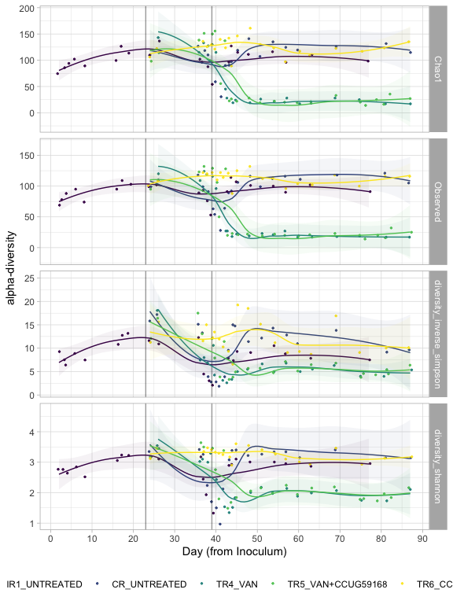

#### Load required packages


```r
library(tidyverse)
library(phyloseq)
library(speedyseq)
library(ggrepel)
library(ampvis2)
library(plotly)
library(microbiome)
library(here)
options(getClass.msg=FALSE) # https://github.com/epurdom/clusterExperiment/issues/66
#this fixes an error message that pops up because the class 'Annotated' is defined in two different packages
```

#### Source required functions


```r
'%!in%' <- function(x,y)!('%in%'(x,y))

source("https://raw.githubusercontent.com/fconstancias/DivComAnalyses/master/R/phyloseq_taxa_tests.R")
source("https://raw.githubusercontent.com/fconstancias/DivComAnalyses/master/R/phyloseq_normalisation.R")
source("https://raw.githubusercontent.com/fconstancias/DivComAnalyses/master/R/phyloseq_alpha.R")
source("https://raw.githubusercontent.com/fconstancias/DivComAnalyses/master/R/phyloseq_beta.R")
source("https://raw.githubusercontent.com/fconstancias/DivComAnalyses/master/R/phyloseq_heatmap.R")
```


```r
plot_time <- function(df, 
                      measure,
                      x = "Day_from_Inoculum", 
                      y = "value", 
                      shape = "neg",
                      fill = "Reactor_Treatment",
                      group = "Reactor_Treatment", 
                      facet)
{
  df %>%
  dplyr::filter(alphadiversiy %in% measure) %>%
  dplyr::mutate(alphadiversiy = fct_reorder(alphadiversiy, value, .desc = TRUE)) %>%
  dplyr::mutate(neg = ifelse(value == 0, "neg", "pos")) %>%
  arrange(Day_from_Inoculum) %>%
  ggplot(aes_string(x = x,
                    y = y)) +
  geom_jitter(size=0.5, alpha=0.9, aes_string(color = fill, fill = fill, shape = shape),  show.legend = TRUE) + 
  geom_path(inherit.aes = TRUE, aes_string(fill = fill, color = fill, show.legend = FALSE),
            size = 0.001,
            linetype = "dashed") +
  facet_grid(as.formula(facet), scales = "free") +
  geom_vline(xintercept = c(23,39), 
             color="black", alpha=0.4) + 
  geom_smooth(show.legend = FALSE, level = 0.95, alpha=0.05, size = 0.5 ,aes_string(color = fill, fill = fill)) +
  scale_x_continuous(breaks=seq(0,90,10)) +
  # scale_y_continuous(labels = scientific,
  #                    limits=c(1e+10, 1e+11), breaks = seq(1e+10, 1e+11, by = 1e+10),
  #                    trans = "log10") +
  theme_light() +
  scale_color_viridis_d(na.value = "black") +
  scale_fill_viridis_d(na.value = "black") -> plot

  return(plot + theme(legend.position = "bottom"))
}
```

#### Import phyloseq object


```r
ps = "data/processed/physeq_update_11_1_21.RDS"

ps %>% 
  here::here() %>%
  readRDS() %>%
  phyloseq_get_strains_fast() %>%
  phyloseq_remove_chloro_mitho() -> physeq
```

```
## Joining, by = "ASV"
```


#### Import metabolite data


```r
here("data/raw/hplc Fermentation (Salvato automaticamente).xlsx") %>%
      readxl::read_xlsx(sheet = "All total") -> metabolites
```

#### Add metabolite data to sample data of phyloseq object


```r
physeq@sam_data %>%
  data.frame() %>%
  rownames_to_column('id') %>%
  left_join(
    metabolites,
    by = c("Sample_description" = "Sample_Id")) %>%
  column_to_rownames('id') %>% 
  sample_data() -> physeq@sam_data
```


#### Take only vancomycin treated reactors


```r
physeq %>% 
  subset_samples(Experiment == "Continuous") %>% 
  subset_samples(Paul %!in% c("Paul")) %>%
  subset_samples(Reactor %!in% c("IR2","TR1","TR2","TR3")) -> ps_PolyFermS_van
```


#### Rarefy and remove dubious samples (samples that appear to have been swapped)


```r
ps_PolyFermS_van %>% 
  rarefy_even_depth(sample.size = 4576,
                    rngseed = 123) -> ps_polyFermS_van_rare
```

```
## `set.seed(123)` was used to initialize repeatable random subsampling.
```

```
## Please record this for your records so others can reproduce.
```

```
## Try `set.seed(123); .Random.seed` for the full vector
```

```
## ...
```

```
## 5 samples removedbecause they contained fewer reads than `sample.size`.
```

```
## Up to first five removed samples are:
```

```
## CR-40-S166CR-52-S196IR1-69-S198TR4-18-S200TR6-13-S164
```

```
## ...
```

```
## 118OTUs were removed because they are no longer 
## present in any sample after random subsampling
```

```
## ...
```

```r
ps_polyFermS_van_rare %>%
  subset_samples(Enrichment == "NotEnriched") %>%
  subset_samples(Sample_description %!in% c("TR5-15", "TR4-1")) -> ps_polyFermS_van_rare_clean
```

### Alpha diversity graphs

#### Compute alpha diversity metrics on rarified data


```r
ps_polyFermS_van_rare_clean %>%
  phyloseq_alphas(phylo = TRUE) -> alpha_df
```


Alpha diversity metrics we would like to calculate


```r
measures_alpha <- c("Observed","Chao1","diversity_shannon","diversity_inverse_simpson")
```

#### Alpha diversity measures over time


```r
alpha_df %>%
  plot_alphas(measure = measures_alpha,
             x_group = "Reactor_Treatment",
             colour_group = "Enrichment",
             fill_group = "Enrichment",
              shape_group = "Enrichment",
              facet_group = "Reactor_Treatment",
            test_group = "Reactor_Treatment",
            test_group_2 = "Enrichment") -> out.alpha.1
```


```r
  out.alpha.1$plot$data %>%
  dplyr::filter(Enrichment == "NotEnriched") %>%
  plot_time(measure = measures_alpha,
            facet = c("alphadiversiy ~ ."),
            shape = NULL) + 
  labs(x="Day (from Inoculum)", y= "alpha-diversity",  
       col=NULL, fill = NULL, shape = NULL) -> p.alpha_time

p.alpha_time
```

<!-- -->

#### Boxplots of alpha-diversity of samples categorised by reactor


```r
alpha_df %>%
  plot_alphas(measure = measures_alpha,
             x_group = "Reactor_Treatment",
             colour_group = "Reactor",
             fill_group = "Reactor",
              shape_group = NULL,
              facet_group = "Reactor_Treatment",
            test_group = "Reactor_Treatment",
            test_group_2 = NULL) -> out.alpha.2

out.alpha.2$plot + 
  facet_null() + 
  facet_grid(alphadiversiy ~ ., scales = "free") + 
  ggpubr::rotate_x_text(60) +
  scale_fill_viridis_d() +
  scale_color_viridis_d()
```


### Beta diversity graphs


#### PCA plot

```r
ps_polyFermS_van_rare_clean  %>%
  phyloseq_plot_bdiv(bdiv_list,
                     m = "CoDa",
                     seed = 123) -> coda
```

```
## Warning in min(x, na.rm = T): no non-missing arguments to min; returning Inf

## Warning in min(x, na.rm = T): no non-missing arguments to min; returning Inf
```

```r
coda$PCA$layers[[1]] = NULL

coda$PCA + geom_point(size=2,
                   aes(color = Reactor_Treatment, 
                       fill = Reactor_Treatment,
                       shape = NULL,
                       alpha = Day_from_Inoculum)) + 
  theme_light() +
  geom_path(arrow = arrow(type = "open", angle = 30, length = unit(0.15, "inches")),
              size = 0.05, linetype = "dashed", inherit.aes = TRUE, aes(group=Reactor_Treatment, color = Reactor_Treatment), show.legend = FALSE) +
  scale_alpha_continuous(range=c( 0.9, 0.3)) + scale_color_viridis_d(na.value = "black") + 
  scale_fill_viridis_d(na.value = "black") + 
  # scale_shape_manual(values = c(8, 21, 22, 23, 24, 16, 15, 18, 17)) + 
  theme_classic() +
    labs(col=NULL, fill = NULL, shape = NULL) + guides(shape=FALSE) -> coda_plot

coda_plot
```

<!-- -->

### Metabolite data 

 
We are not rarefying here. We did remove the dubious samples though. 


```r
ps_PolyFermS_van %>%
subset_samples(Enrichment == "NotEnriched") %>%
  subset_samples(Sample_description %!in% c("TR5-15", "TR4-1")) -> ps_PolyFermS_van_clean

ps_PolyFermS_van_clean %>%
  sample_data() %>%
  data.frame() -> df

measures_metabolites = df %>% select(ends_with("mM")) %>% colnames()
```
#### Metabolite Concentration over time


```r
df %>%
  plot_alphas(measure = measures_metabolites,
              x_group = "Reactor_Treatment",
              colour_group = "Enrichment",
              fill_group = "Enrichment",
              shape_group = "Enrichment",
              facet_group = "Reactor_Treatment",
              test_group = "Reactor_Treatment",
              test_group_2 = "Enrichment") -> out.3

out.3$plot$data %>%
  plot_time(measure = c("Total_SCFA_mM", "Acetat_mM", "Butyrat_mM", "Propionat_mM", "Isobutyrat_mM", "Valerat_mM", "Isovalerat_mM", "Succinat_mM"),
            facet = c("alphadiversiy ~ ."),  shape = NULL) + 
  labs(x="Day (from Inoculum)", y= "SCFA concentration [mM]",  
       col=NULL, fill = NULL, shape = NULL) + 
  scale_shape_manual(values=c(4, 19)) -> p.met_conc_over_time

p.met_conc_over_time
```


#### PCoA using metabolite concentration


```r
df %>%
  select(ends_with("mM") | "Total_SCFA_mM") %>%
  drop_na() %>%
  # t() %>%
  scale(center = TRUE, 
        scale = TRUE) %>%
  dist(method= "euc") -> euc_met


plot_ordination(ps_PolyFermS_van_clean,
                ordination = phyloseq::ordinate(ps_PolyFermS_van_clean,
                                      distance = euc_met, 
                                      method = "PCoA")) -> pca

pca$layers[[1]] = NULL

pca +
  geom_point(size=2,
                   aes(color = Reactor_Treatment, 
                       fill = NULL,
                       shape = NULL,
                       alpha = Day_from_Inoculum)) + 
  theme_light() +
  geom_path(arrow = arrow(type = "open", angle = 30, length = unit(0.15, "inches")),
              size = 0.08, linetype = "dashed", inherit.aes = TRUE, aes(group=Reactor_Treatment, color = Reactor_Treatment)) +
  scale_alpha_continuous(range=c( 0.9, 0.3)) + 
  scale_color_viridis_d(na.value = "red") + 
  scale_fill_viridis_d(na.value = "red") + 
  scale_shape_manual(values = c(8, 21, 22, 23, 24, 16, 15, 18, 17)) + 
  theme_classic() -> p.PCoA_metabolite

p.PCoA_metabolite
```

<!-- -->
 
 
#### Taxa-metabolite correlation plots 
 

```r
measures_for_corr_plot = c("Total_SCFA_mM", "Acetat_mM", "Butyrat_mM", "Propionat_mM", "Isobutyrat_mM", "Valerat_mM", "Isovalerat_mM", "Succinat_mM")
```

Class level correlation


```r
ps_polyFermS_van_rare_clean %>%
  phyloseq_correlate_taxa(log10 = TRUE, 
                          tax_glom = "Family",
                          grouping_column = "Reactor_Treatment", # grouping with fake group column will not subset any data.
                          cor_variables = measures_for_corr_plot, 
                          method = "spearman",
                          num_taxa = 50,
                          adjustment= 3) -> results.class

results.class$plot +
  ggpubr::rotate_x_text(60, vjust = 1)
```


Strain level correlation


```r
ps_polyFermS_van_rare_clean %>%
  phyloseq_correlate_taxa(log10 = TRUE, 
                          tax_glom = "Strain",
                          grouping_column = "Reactor_Treatment", # grouping with fake group column will not subset any data.
                          cor_variables = measures_for_corr_plot, 
                          method = "spearman",
                          num_taxa = 50,
                          adjustment= 3) -> results.strain
```


```r
results.strain$plot +
  ggpubr::rotate_x_text(60, vjust = 1)
```


#### Heatmap of taxa abundances


```r
ps_polyFermS_van_rare_clean %>%
  phyloseq_ampvis_heatmap(transform = "compositional",
                          group_by = "Day_from_Inoculum",
                          facet_by = c("Enrichment", "Phase", "Reactor", "Treatment", "Experiment", "Reactor_Treatment" ),
                          tax_aggregate = "Species",
                          tax_add = NULL,
                          ntax  = 50) -> p
```


```r
p + facet_grid( ~ Reactor_Treatment + Phase , scales = "free", space = "free") + 
  scale_fill_viridis_c(breaks = c(0,  0.01, 1, 10, 50, 75, 100), 
                       labels = c(0,  0.01, 1, 10, 50, 75, 100), 
                       trans = scales::pseudo_log_trans(sigma = 0.001),
                       na.value = 'transparent') -> p.taxa_heatmap
```

```
## Scale for 'fill' is already present. Adding another scale for 'fill', which
## will replace the existing scale.
```


```r
p.taxa_heatmap + facet_grid( ~ Reactor_Treatment + Phase , scales = "free", space = "free") + 
  scale_fill_viridis_c(breaks = c(0,  0.01, 1, 10, 50, 75, 100), 
                       labels = c(0,  0.01, 1, 10, 50, 75, 100), 
                       trans = scales::pseudo_log_trans(sigma = 0.001),
                       na.value = 'transparent') 
```

```
## Scale for 'fill' is already present. Adding another scale for 'fill', which
## will replace the existing scale.
```


Notes:

Why is boxplot of alpha diversity so different?

microbiome::transform no longer has 'percent' as an option . Need to use "compositional"

